cola Report for Hierarchical Partitioning - 'LaMannoBrain_human_embryo'
==================

**Date**: 2021-07-27 12:15:58 CEST, **cola version**: 1.9.4

----------------------------------------------------------------

<style type='text/css'>

body, td, th {
   font-family: Arial,Helvetica,sans-serif;
   background-color: white;
   font-size: 13px;
  max-width: 800px;
  margin: auto;
  margin-left:210px;
  padding: 0px 10px 0px 10px;
  border-left: 1px solid #EEEEEE;
  line-height: 150%;
}

tt, code, pre {
   font-family: 'DejaVu Sans Mono', 'Droid Sans Mono', 'Lucida Console', Consolas, Monaco, 

monospace;
}

h1 {
   font-size:2.2em;
}

h2 {
   font-size:1.8em;
}

h3 {
   font-size:1.4em;
}

h4 {
   font-size:1.0em;
}

h5 {
   font-size:0.9em;
}

h6 {
   font-size:0.8em;
}

a {
  text-decoration: none;
  color: #0366d6;
}

a:hover {
  text-decoration: underline;
}

a:visited {
   color: #0366d6;
}

pre, img {
  max-width: 100%;
}
pre {
  overflow-x: auto;
}
pre code {
   display: block; padding: 0.5em;
}

code {
  font-size: 92%;
  border: 1px solid #ccc;
}

code[class] {
  background-color: #F8F8F8;
}

table, td, th {
  border: 1px solid #ccc;
}

blockquote {
   color:#666666;
   margin:0;
   padding-left: 1em;
   border-left: 0.5em #EEE solid;
}

hr {
   height: 0px;
   border-bottom: none;
   border-top-width: thin;
   border-top-style: dotted;
   border-top-color: #999999;
}

@media print {
   * {
      background: transparent !important;
      color: black !important;
      filter:none !important;
      -ms-filter: none !important;
   }

   body {
      font-size:12pt;
      max-width:100%;
   }

   a, a:visited {
      text-decoration: underline;
   }

   hr {
      visibility: hidden;
      page-break-before: always;
   }

   pre, blockquote {
      padding-right: 1em;
      page-break-inside: avoid;
   }

   tr, img {
      page-break-inside: avoid;
   }

   img {
      max-width: 100% !important;
   }

   @page :left {
      margin: 15mm 20mm 15mm 10mm;
   }

   @page :right {
      margin: 15mm 10mm 15mm 20mm;
   }

   p, h2, h3 {
      orphans: 3; widows: 3;
   }

   h2, h3 {
      page-break-after: avoid;
   }
}
</style>


## Summary


First the variable is renamed to `res_rh`.


```r
res_rh = rh
```


The partition hierarchy and all available functions which can be applied to `res_rh` object.


```r
res_rh
```

```
#> A 'HierarchicalPartition' object with 'ATC:skmeans' method.
#>   On a matrix with 9908 rows and 1977 columns.
#>   Performed in total 10500 partitions.
#>   There are 42 groups under the following parameters:
#>     - min_samples: 20
#>     - mean_silhouette_cutoff: 0.9
#>     - min_n_signatures: 71 (signatures are selected based on:)
#>       - fdr_cutoff: 0.05
#>       - group_diff (scaled values): 0.5
#> 
#> Hierarchy of the partition:
#>   0, 1977 cols
#>   |-- 01, 1047 cols, 947 signatures
#>   |   |-- 011, 401 cols, 632 signatures
#>   |   |   |-- 0111, 138 cols (a)
#>   |   |   |-- 0112, 138 cols, 212 signatures
#>   |   |   |   |-- 01121, 71 cols, 4 signatures (c)
#>   |   |   |   `-- 01122, 67 cols (a)
#>   |   |   `-- 0113, 125 cols, 299 signatures
#>   |   |       |-- 01131, 44 cols, 0 signatures (c)
#>   |   |       |-- 01132, 46 cols, 69 signatures (c)
#>   |   |       `-- 01133, 35 cols (b)
#>   |   |-- 012, 353 cols, 395 signatures
#>   |   |   |-- 0121, 170 cols, 637 signatures
#>   |   |   |   |-- 01211, 87 cols, 143 signatures
#>   |   |   |   |   |-- 012111, 38 cols (b)
#>   |   |   |   |   `-- 012112, 49 cols, 3 signatures (c)
#>   |   |   |   `-- 01212, 83 cols, 16 signatures (c)
#>   |   |   `-- 0122, 183 cols, 727 signatures
#>   |   |       |-- 01221, 110 cols, 40 signatures (c)
#>   |   |       `-- 01222, 73 cols, 93 signatures
#>   |   |           |-- 012221, 43 cols (a)
#>   |   |           `-- 012222, 30 cols (b)
#>   |   `-- 013, 293 cols, 1504 signatures
#>   |       |-- 0131, 100 cols, 655 signatures
#>   |       |   |-- 01311, 46 cols (a)
#>   |       |   |-- 01312, 29 cols (b)
#>   |       |   `-- 01313, 25 cols (b)
#>   |       |-- 0132, 111 cols, 189 signatures
#>   |       |   |-- 01321, 61 cols, 25 signatures (c)
#>   |       |   `-- 01322, 50 cols (a)
#>   |       `-- 0133, 82 cols, 197 signatures
#>   |           |-- 01331, 42 cols, 2 signatures (c)
#>   |           `-- 01332, 40 cols (a)
#>   `-- 02, 930 cols, 4080 signatures
#>       |-- 021, 342 cols, 1009 signatures
#>       |   |-- 0211, 192 cols, 226 signatures
#>       |   |   |-- 02111, 102 cols, 48 signatures (c)
#>       |   |   `-- 02112, 90 cols, 112 signatures
#>       |   |       |-- 021121, 46 cols (a)
#>       |   |       `-- 021122, 44 cols, 22 signatures (c)
#>       |   `-- 0212, 150 cols, 963 signatures
#>       |       |-- 02121, 54 cols (a)
#>       |       |-- 02122, 43 cols, 3 signatures (c)
#>       |       `-- 02123, 53 cols, 118 signatures
#>       |           |-- 021231, 22 cols (b)
#>       |           |-- 021232, 12 cols (b)
#>       |           `-- 021233, 19 cols (b)
#>       |-- 022, 219 cols, 3381 signatures
#>       |   |-- 0221, 82 cols (a)
#>       |   |-- 0222, 68 cols, 153 signatures
#>       |   |   |-- 02221, 33 cols (b)
#>       |   |   `-- 02222, 35 cols (b)
#>       |   `-- 0223, 69 cols, 343 signatures
#>       |       |-- 02231, 33 cols (b)
#>       |       `-- 02232, 36 cols (b)
#>       |-- 023, 161 cols, 2288 signatures
#>       |   |-- 0231, 71 cols, 128 signatures
#>       |   |   |-- 02311, 42 cols, 2 signatures (c)
#>       |   |   `-- 02312, 29 cols (b)
#>       |   |-- 0232, 54 cols, 150 signatures
#>       |   |   |-- 02321, 17 cols (b)
#>       |   |   |-- 02322, 16 cols (b)
#>       |   |   `-- 02323, 21 cols (b)
#>       |   `-- 0233, 36 cols (b)
#>       `-- 024, 208 cols, 1927 signatures
#>           |-- 0241, 85 cols (a)
#>           |-- 0242, 76 cols, 199 signatures
#>           |   |-- 02421, 37 cols (b)
#>           |   `-- 02422, 39 cols (b)
#>           `-- 0243, 47 cols (a)
#> Stop reason:
#>   a) Mean silhouette score was too small
#>   b) Subgroup had too few columns.
#>   c) There were too few signatures.
#> 
#> Following methods can be applied to this 'HierarchicalPartition' object:
#>  [1] "all_leaves"            "all_nodes"             "cola_report"           "collect_classes"      
#>  [5] "colnames"              "compare_signatures"    "dimension_reduction"   "functional_enrichment"
#>  [9] "get_anno_col"          "get_anno"              "get_children_nodes"    "get_classes"          
#> [13] "get_matrix"            "get_signatures"        "is_leaf_node"          "max_depth"            
#> [17] "merge_node"            "ncol"                  "node_info"             "node_level"           
#> [21] "nrow"                  "rownames"              "show"                  "split_node"           
#> [25] "suggest_best_k"        "test_to_known_factors" "top_rows_heatmap"      "top_rows_overlap"     
#> 
#> You can get result for a single node by e.g. object["01"]
```

The call of `hierarchical_partition()` was:


```
#> hierarchical_partition(data = lt$mat, anno = lt$anno, subset = 500, cores = 4)
```

Dimension of the input matrix:


```r
mat = get_matrix(res_rh)
dim(mat)
```

```
#> [1] 9908 1977
```

All the methods that were tried:


```r
res_rh@param$combination_method
```

```
#> [[1]]
#> [1] "ATC"     "skmeans"
```

### Density distribution

The density distribution for each sample is visualized as one column in the following heatmap.
The clustering is based on the distance which is the Kolmogorov-Smirnov statistic between two distributions.


```r
library(ComplexHeatmap)
densityHeatmap(mat, top_annotation = HeatmapAnnotation(df = get_anno(res_rh), 
    col = get_anno_col(res_rh)), ylab = "value", cluster_columns = TRUE, show_column_names = FALSE,
    mc.cores = 1)
```


Some values about the hierarchy:


```r
all_nodes(res_rh)
```

```
#>  [1] "0"      "01"     "011"    "0111"   "0112"   "01121"  "01122"  "0113"   "01131"  "01132" 
#> [11] "01133"  "012"    "0121"   "01211"  "012111" "012112" "01212"  "0122"   "01221"  "01222" 
#> [21] "012221" "012222" "013"    "0131"   "01311"  "01312"  "01313"  "0132"   "01321"  "01322" 
#> [31] "0133"   "01331"  "01332"  "02"     "021"    "0211"   "02111"  "02112"  "021121" "021122"
#> [41] "0212"   "02121"  "02122"  "02123"  "021231" "021232" "021233" "022"    "0221"   "0222"  
#> [51] "02221"  "02222"  "0223"   "02231"  "02232"  "023"    "0231"   "02311"  "02312"  "0232"  
#> [61] "02321"  "02322"  "02323"  "0233"   "024"    "0241"   "0242"   "02421"  "02422"  "0243"
```

```r
all_leaves(res_rh)
```

```
#>  [1] "0111"   "01121"  "01122"  "01131"  "01132"  "01133"  "012111" "012112" "01212"  "01221" 
#> [11] "012221" "012222" "01311"  "01312"  "01313"  "01321"  "01322"  "01331"  "01332"  "02111" 
#> [21] "021121" "021122" "02121"  "02122"  "021231" "021232" "021233" "0221"   "02221"  "02222" 
#> [31] "02231"  "02232"  "02311"  "02312"  "02321"  "02322"  "02323"  "0233"   "0241"   "02421" 
#> [41] "02422"  "0243"
```

```r
node_info(res_rh)
```

```
#>        id best_method depth best_k n_columns n_signatures p_signatures is_leaf
#> 1       0 ATC:skmeans     1      2      1977         1420     0.143319   FALSE
#> 2      01 ATC:skmeans     2      3      1047          947     0.095579   FALSE
#> 3     011 ATC:skmeans     3      3       401          632     0.063787   FALSE
#> 4    0111 ATC:skmeans     4      2       138           NA           NA    TRUE
#> 5    0112 ATC:skmeans     4      2       138          212     0.021397   FALSE
#> 6   01121 ATC:skmeans     5      2        71            4     0.000404    TRUE
#> 7   01122 ATC:skmeans     5      2        67           NA           NA    TRUE
#> 8    0113 ATC:skmeans     4      3       125          299     0.030178   FALSE
#> 9   01131 ATC:skmeans     5      2        44            0     0.000000    TRUE
#> 10  01132 ATC:skmeans     5      2        46           69     0.006964    TRUE
#> 11  01133 not applied     5     NA        35           NA           NA    TRUE
#> 12    012 ATC:skmeans     3      2       353          395     0.039867   FALSE
#> 13   0121 ATC:skmeans     4      2       170          637     0.064291   FALSE
#> 14  01211 ATC:skmeans     5      2        87          143     0.014433   FALSE
#> 15 012111 not applied     6     NA        38           NA           NA    TRUE
#> 16 012112 ATC:skmeans     6      2        49            3     0.000303    TRUE
#> 17  01212 ATC:skmeans     5      2        83           16     0.001615    TRUE
#> 18   0122 ATC:skmeans     4      2       183          727     0.073375   FALSE
#> 19  01221 ATC:skmeans     5      2       110           40     0.004037    TRUE
#> 20  01222 ATC:skmeans     5      2        73           93     0.009386   FALSE
#> 21 012221 ATC:skmeans     6      2        43           NA           NA    TRUE
#> 22 012222 not applied     6     NA        30           NA           NA    TRUE
#> 23    013 ATC:skmeans     3      3       293         1504     0.151797   FALSE
#> 24   0131 ATC:skmeans     4      3       100          655     0.066108   FALSE
#> 25  01311 ATC:skmeans     5      3        46           NA           NA    TRUE
#> 26  01312 not applied     5     NA        29           NA           NA    TRUE
#> 27  01313 not applied     5     NA        25           NA           NA    TRUE
#> 28   0132 ATC:skmeans     4      2       111          189     0.019075   FALSE
#> 29  01321 ATC:skmeans     5      2        61           25     0.002523    TRUE
#> 30  01322 ATC:skmeans     5      2        50           NA           NA    TRUE
#> 31   0133 ATC:skmeans     4      2        82          197     0.019883   FALSE
#> 32  01331 ATC:skmeans     5      2        42            2     0.000202    TRUE
#> 33  01332 ATC:skmeans     5      2        40           NA           NA    TRUE
#> 34     02 ATC:skmeans     2      4       930         4080     0.411788   FALSE
#> 35    021 ATC:skmeans     3      2       342         1009     0.101837   FALSE
#> 36   0211 ATC:skmeans     4      2       192          226     0.022810   FALSE
#> 37  02111 ATC:skmeans     5      2       102           48     0.004845    TRUE
#> 38  02112 ATC:skmeans     5      2        90          112     0.011304   FALSE
#> 39 021121 ATC:skmeans     6      2        46           NA           NA    TRUE
#> 40 021122 ATC:skmeans     6      2        44           22     0.002220    TRUE
#> 41   0212 ATC:skmeans     4      3       150          963     0.097194   FALSE
#> 42  02121 ATC:skmeans     5      2        54           NA           NA    TRUE
#> 43  02122 ATC:skmeans     5      2        43            3     0.000303    TRUE
#> 44  02123 ATC:skmeans     5      3        53          118     0.011910   FALSE
#> 45 021231 not applied     6     NA        22           NA           NA    TRUE
#> 46 021232 not applied     6     NA        12           NA           NA    TRUE
#> 47 021233 not applied     6     NA        19           NA           NA    TRUE
#> 48    022 ATC:skmeans     3      3       219         3381     0.341239   FALSE
#> 49   0221 ATC:skmeans     4      2        82           NA           NA    TRUE
#> 50   0222 ATC:skmeans     4      2        68          153     0.015442   FALSE
#> 51  02221 not applied     5     NA        33           NA           NA    TRUE
#> 52  02222 not applied     5     NA        35           NA           NA    TRUE
#> 53   0223 ATC:skmeans     4      2        69          343     0.034618   FALSE
#> 54  02231 not applied     5     NA        33           NA           NA    TRUE
#> 55  02232 not applied     5     NA        36           NA           NA    TRUE
#> 56    023 ATC:skmeans     3      3       161         2288     0.230925   FALSE
#> 57   0231 ATC:skmeans     4      2        71          128     0.012919   FALSE
#> 58  02311 ATC:skmeans     5      2        42            2     0.000202    TRUE
#> 59  02312 not applied     5     NA        29           NA           NA    TRUE
#> 60   0232 ATC:skmeans     4      3        54          150     0.015139   FALSE
#> 61  02321 not applied     5     NA        17           NA           NA    TRUE
#> 62  02322 not applied     5     NA        16           NA           NA    TRUE
#> 63  02323 not applied     5     NA        21           NA           NA    TRUE
#> 64   0233 not applied     4     NA        36           NA           NA    TRUE
#> 65    024 ATC:skmeans     3      3       208         1927     0.194489   FALSE
#> 66   0241 ATC:skmeans     4      3        85           NA           NA    TRUE
#> 67   0242 ATC:skmeans     4      2        76          199     0.020085   FALSE
#> 68  02421 not applied     5     NA        37           NA           NA    TRUE
#> 69  02422 not applied     5     NA        39           NA           NA    TRUE
#> 70   0243 ATC:skmeans     4      3        47           NA           NA    TRUE
```

In the output from `node_info()`, there are the following columns:

- `id`: The node id.
- `best_method`: The best method selected.
- `depth`: Depth of the node in the hierarchy.
- `best_k`: Best number of groups of the partition on that node.
- `n_columns`: Number of columns in the submatrix.
- `n_signatures`: Number of signatures with the `best_k`.
- `p_signatures`: Proportion of hte signatures in total number of rows in the matrix.
- `is_leaf`: Whether the node is a leaf.

Labels of nodes are encoded in a special way. The number of digits
correspond to the depth of the node in the hierarchy and the value of the
digits correspond to the index of the subgroup in the current node, E.g. a label
of “012” means the node is the second subgroup of the partition which is the
first subgroup of the root node.

### Suggest the best k


Following table shows the best `k` (number of partitions) for each node in the
partition hierarchy. Clicking on the node name in the table goes to the
corresponding section for the partitioning on that node.

[The cola vignette](https://jokergoo.github.io/cola_vignettes/cola.html#toc_13)
explains the definition of the metrics used for determining the best
number of partitions.


```r
suggest_best_k(res_rh)
```


|Node                    |Best method                                         |Is leaf   |Best k |1-PAC |Mean silhouette |Concordance | #samples|   |
|:-----------------------|:---------------------------------------------------|:---------|:------|:-----|:---------------|:-----------|--------:|:--|
|[Node0](#Node0)         |ATC:skmeans                                         |          |2      |1.00  |0.98            |0.99        |     1977|** |
|[Node01](#Node01)       |ATC:skmeans                                         |          |3      |1.00  |0.96            |0.98        |     1047|** |
|[Node011](#Node011)     |ATC:skmeans                                         |          |4      |0.95  |0.93            |0.97        |      401|** |
|Node0111-leaf           |ATC:skmeans                                         |✓ (a)     |4      |0.86  |0.84            |0.93        |      138|   |
|[Node0112](#Node0112)   |ATC:skmeans                                         |          |2      |1.00  |0.97            |0.99        |      138|** |
|Node01121-leaf          |ATC:skmeans                                         |✓ (&#99;) |2      |0.87  |0.93            |0.97        |       71|   |
|Node01122-leaf          |ATC:skmeans                                         |✓ (a)     |2      |0.82  |0.87            |0.95        |       67|   |
|[Node0113](#Node0113)   |ATC:skmeans                                         |          |4      |1.00  |0.95            |0.98        |      125|** |
|Node01131-leaf          |ATC:skmeans                                         |✓ (&#99;) |2      |1.00  |0.95            |0.98        |       44|** |
|Node01132-leaf          |ATC:skmeans                                         |✓ (&#99;) |2      |0.95  |0.96            |0.98        |       46|** |
|Node01133-leaf          |<span style='color:grey;'><i>not applied</i></span> |✓ (b)     |       |      |                |            |       35|   |
|[Node012](#Node012)     |ATC:skmeans                                         |          |4      |0.91  |0.89            |0.95        |      353|*  |
|[Node0121](#Node0121)   |ATC:skmeans                                         |          |3      |0.91  |0.93            |0.97        |      170|*  |
|[Node01211](#Node01211) |ATC:skmeans                                         |          |2      |1.00  |0.98            |0.99        |       87|** |
|Node012111-leaf         |<span style='color:grey;'><i>not applied</i></span> |✓ (b)     |       |      |                |            |       38|   |
|Node012112-leaf         |ATC:skmeans                                         |✓ (&#99;) |2      |0.87  |0.91            |0.97        |       49|   |
|Node01212-leaf          |ATC:skmeans                                         |✓ (&#99;) |2      |1.00  |0.93            |0.97        |       83|** |
|[Node0122](#Node0122)   |ATC:skmeans                                         |          |2      |1.00  |0.95            |0.98        |      183|** |
|Node01221-leaf          |ATC:skmeans                                         |✓ (&#99;) |2      |0.96  |0.96            |0.98        |      110|** |
|[Node01222](#Node01222) |ATC:skmeans                                         |          |2      |1.00  |0.96            |0.98        |       73|** |
|Node012221-leaf         |ATC:skmeans                                         |✓ (a)     |2      |0.58  |0.77            |0.90        |       43|   |
|Node012222-leaf         |<span style='color:grey;'><i>not applied</i></span> |✓ (b)     |       |      |                |            |       30|   |
|[Node013](#Node013)     |ATC:skmeans                                         |          |4      |0.96  |0.92            |0.95        |      293|** |
|[Node0131](#Node0131)   |ATC:skmeans                                         |          |3      |1.00  |0.97            |0.99        |      100|** |
|Node01311-leaf          |ATC:skmeans                                         |✓ (a)     |3      |0.86  |0.90            |0.96        |       46|   |
|Node01312-leaf          |<span style='color:grey;'><i>not applied</i></span> |✓ (b)     |       |      |                |            |       29|   |
|Node01313-leaf          |<span style='color:grey;'><i>not applied</i></span> |✓ (b)     |       |      |                |            |       25|   |
|[Node0132](#Node0132)   |ATC:skmeans                                         |          |2      |1.00  |0.97            |0.99        |      111|** |
|Node01321-leaf          |ATC:skmeans                                         |✓ (&#99;) |2      |0.90  |0.92            |0.97        |       61|   |
|Node01322-leaf          |ATC:skmeans                                         |✓ (a)     |2      |0.88  |0.87            |0.95        |       50|   |
|[Node0133](#Node0133)   |ATC:skmeans                                         |          |2      |1.00  |1.00            |1.00        |       82|** |
|Node01331-leaf          |ATC:skmeans                                         |✓ (&#99;) |2      |1.00  |0.95            |0.98        |       42|** |
|Node01332-leaf          |ATC:skmeans                                         |✓ (a)     |2      |0.25  |0.67            |0.85        |       40|   |
|[Node02](#Node02)       |ATC:skmeans                                         |          |4      |0.99  |0.96            |0.98        |      930|** |
|[Node021](#Node021)     |ATC:skmeans                                         |          |3      |0.95  |0.93            |0.97        |      342|** |
|[Node0211](#Node0211)   |ATC:skmeans                                         |          |2      |0.88  |0.96            |0.98        |      192|   |
|Node02111-leaf          |ATC:skmeans                                         |✓ (&#99;) |3      |0.93  |0.90            |0.96        |      102|*  |
|[Node02112](#Node02112) |ATC:skmeans                                         |          |2      |1.00  |0.97            |0.99        |       90|** |
|Node021121-leaf         |ATC:skmeans                                         |✓ (a)     |2      |0.91  |0.90            |0.96        |       46|*  |
|Node021122-leaf         |ATC:skmeans                                         |✓ (&#99;) |3      |0.96  |0.93            |0.97        |       44|** |
|[Node0212](#Node0212)   |ATC:skmeans                                         |          |4      |0.92  |0.89            |0.96        |      150|*  |
|Node02121-leaf          |ATC:skmeans                                         |✓ (a)     |2      |0.78  |0.88            |0.95        |       54|   |
|Node02122-leaf          |ATC:skmeans                                         |✓ (&#99;) |2      |1.00  |0.95            |0.98        |       43|** |
|[Node02123](#Node02123) |ATC:skmeans                                         |          |3      |0.91  |0.93            |0.97        |       53|*  |
|Node021231-leaf         |<span style='color:grey;'><i>not applied</i></span> |✓ (b)     |       |      |                |            |       22|   |
|Node021232-leaf         |<span style='color:grey;'><i>not applied</i></span> |✓ (b)     |       |      |                |            |       12|   |
|Node021233-leaf         |<span style='color:grey;'><i>not applied</i></span> |✓ (b)     |       |      |                |            |       19|   |
|[Node022](#Node022)     |ATC:skmeans                                         |          |3      |0.97  |0.95            |0.98        |      219|** |
|Node0221-leaf           |ATC:skmeans                                         |✓ (a)     |2      |0.62  |0.88            |0.93        |       82|   |
|[Node0222](#Node0222)   |ATC:skmeans                                         |          |2      |1.00  |0.97            |0.98        |       68|** |
|Node02221-leaf          |<span style='color:grey;'><i>not applied</i></span> |✓ (b)     |       |      |                |            |       33|   |
|Node02222-leaf          |<span style='color:grey;'><i>not applied</i></span> |✓ (b)     |       |      |                |            |       35|   |
|[Node0223](#Node0223)   |ATC:skmeans                                         |          |2      |0.97  |0.97            |0.99        |       69|** |
|Node02231-leaf          |<span style='color:grey;'><i>not applied</i></span> |✓ (b)     |       |      |                |            |       33|   |
|Node02232-leaf          |<span style='color:grey;'><i>not applied</i></span> |✓ (b)     |       |      |                |            |       36|   |
|[Node023](#Node023)     |ATC:skmeans                                         |          |3      |0.97  |0.93            |0.97        |      161|** |
|[Node0231](#Node0231)   |ATC:skmeans                                         |          |3      |0.97  |0.95            |0.97        |       71|** |
|Node02311-leaf          |ATC:skmeans                                         |✓ (&#99;) |2      |1.00  |0.93            |0.98        |       42|** |
|Node02312-leaf          |<span style='color:grey;'><i>not applied</i></span> |✓ (b)     |       |      |                |            |       29|   |
|[Node0232](#Node0232)   |ATC:skmeans                                         |          |3      |0.90  |0.92            |0.96        |       54|   |
|Node02321-leaf          |<span style='color:grey;'><i>not applied</i></span> |✓ (b)     |       |      |                |            |       17|   |
|Node02322-leaf          |<span style='color:grey;'><i>not applied</i></span> |✓ (b)     |       |      |                |            |       16|   |
|Node02323-leaf          |<span style='color:grey;'><i>not applied</i></span> |✓ (b)     |       |      |                |            |       21|   |
|Node0233-leaf           |<span style='color:grey;'><i>not applied</i></span> |✓ (b)     |       |      |                |            |       36|   |
|[Node024](#Node024)     |ATC:skmeans                                         |          |3      |1.00  |0.96            |0.98        |      208|** |
|Node0241-leaf           |ATC:skmeans                                         |✓ (a)     |3      |0.84  |0.87            |0.94        |       85|   |
|[Node0242](#Node0242)   |ATC:skmeans                                         |          |2      |0.97  |0.97            |0.99        |       76|** |
|Node02421-leaf          |<span style='color:grey;'><i>not applied</i></span> |✓ (b)     |       |      |                |            |       37|   |
|Node02422-leaf          |<span style='color:grey;'><i>not applied</i></span> |✓ (b)     |       |      |                |            |       39|   |
|Node0243-leaf           |ATC:skmeans                                         |✓ (a)     |3      |0.88  |0.90            |0.96        |       47|   |


Stop reason: a) Mean silhouette score was too small b) Subgroup had too few columns. c) There were too few signatures. 

\*\*: 1-PAC > 0.95, \*: 1-PAC > 0.9


### Partition hierarchy

The nodes of the hierarchy can be merged by setting the `merge_node` parameters. Here we 
control the hierarchy with the `min_n_signatures` parameter. The value of `min_n_signatures` is
from `node_info()`.


<style type='text/css'>


.ui-helper-hidden {
	display: none;
}
.ui-helper-hidden-accessible {
	border: 0;
	clip: rect(0 0 0 0);
	height: 1px;
	margin: -1px;
	overflow: hidden;
	padding: 0;
	position: absolute;
	width: 1px;
}
.ui-helper-reset {
	margin: 0;
	padding: 0;
	border: 0;
	outline: 0;
	line-height: 1.3;
	text-decoration: none;
	font-size: 100%;
	list-style: none;
}
.ui-helper-clearfix:before,
.ui-helper-clearfix:after {
	content: "";
	display: table;
	border-collapse: collapse;
}
.ui-helper-clearfix:after {
	clear: both;
}
.ui-helper-zfix {
	width: 100%;
	height: 100%;
	top: 0;
	left: 0;
	position: absolute;
	opacity: 0;
	filter:Alpha(Opacity=0); 
}

.ui-front {
	z-index: 100;
}


.ui-state-disabled {
	cursor: default !important;
	pointer-events: none;
}


.ui-icon {
	display: inline-block;
	vertical-align: middle;
	margin-top: -.25em;
	position: relative;
	text-indent: -99999px;
	overflow: hidden;
	background-repeat: no-repeat;
}

.ui-widget-icon-block {
	left: 50%;
	margin-left: -8px;
	display: block;
}


.ui-widget-overlay {
	position: fixed;
	top: 0;
	left: 0;
	width: 100%;
	height: 100%;
}
.ui-accordion .ui-accordion-header {
	display: block;
	cursor: pointer;
	position: relative;
	margin: 2px 0 0 0;
	padding: .5em .5em .5em .7em;
	font-size: 100%;
}
.ui-accordion .ui-accordion-content {
	padding: 1em 2.2em;
	border-top: 0;
	overflow: auto;
}
.ui-autocomplete {
	position: absolute;
	top: 0;
	left: 0;
	cursor: default;
}
.ui-menu {
	list-style: none;
	padding: 0;
	margin: 0;
	display: block;
	outline: 0;
}
.ui-menu .ui-menu {
	position: absolute;
}
.ui-menu .ui-menu-item {
	margin: 0;
	cursor: pointer;
	
	list-style-image: url("data:image/gif;base64,R0lGODlhAQABAIAAAAAAAP///yH5BAEAAAAALAAAAAABAAEAAAIBRAA7");
}
.ui-menu .ui-menu-item-wrapper {
	position: relative;
	padding: 3px 1em 3px .4em;
}
.ui-menu .ui-menu-divider {
	margin: 5px 0;
	height: 0;
	font-size: 0;
	line-height: 0;
	border-width: 1px 0 0 0;
}
.ui-menu .ui-state-focus,
.ui-menu .ui-state-active {
	margin: -1px;
}


.ui-menu-icons {
	position: relative;
}
.ui-menu-icons .ui-menu-item-wrapper {
	padding-left: 2em;
}


.ui-menu .ui-icon {
	position: absolute;
	top: 0;
	bottom: 0;
	left: .2em;
	margin: auto 0;
}


.ui-menu .ui-menu-icon {
	left: auto;
	right: 0;
}
.ui-button {
	padding: .4em 1em;
	display: inline-block;
	position: relative;
	line-height: normal;
	margin-right: .1em;
	cursor: pointer;
	vertical-align: middle;
	text-align: center;
	-webkit-user-select: none;
	-moz-user-select: none;
	-ms-user-select: none;
	user-select: none;

	
	overflow: visible;
}

.ui-button,
.ui-button:link,
.ui-button:visited,
.ui-button:hover,
.ui-button:active {
	text-decoration: none;
}


.ui-button-icon-only {
	width: 2em;
	box-sizing: border-box;
	text-indent: -9999px;
	white-space: nowrap;
}


input.ui-button.ui-button-icon-only {
	text-indent: 0;
}


.ui-button-icon-only .ui-icon {
	position: absolute;
	top: 50%;
	left: 50%;
	margin-top: -8px;
	margin-left: -8px;
}

.ui-button.ui-icon-notext .ui-icon {
	padding: 0;
	width: 2.1em;
	height: 2.1em;
	text-indent: -9999px;
	white-space: nowrap;

}

input.ui-button.ui-icon-notext .ui-icon {
	width: auto;
	height: auto;
	text-indent: 0;
	white-space: normal;
	padding: .4em 1em;
}


input.ui-button::-moz-focus-inner,
button.ui-button::-moz-focus-inner {
	border: 0;
	padding: 0;
}
.ui-controlgroup {
	vertical-align: middle;
	display: inline-block;
}
.ui-controlgroup > .ui-controlgroup-item {
	float: left;
	margin-left: 0;
	margin-right: 0;
}
.ui-controlgroup > .ui-controlgroup-item:focus,
.ui-controlgroup > .ui-controlgroup-item.ui-visual-focus {
	z-index: 9999;
}
.ui-controlgroup-vertical > .ui-controlgroup-item {
	display: block;
	float: none;
	width: 100%;
	margin-top: 0;
	margin-bottom: 0;
	text-align: left;
}
.ui-controlgroup-vertical .ui-controlgroup-item {
	box-sizing: border-box;
}
.ui-controlgroup .ui-controlgroup-label {
	padding: .4em 1em;
}
.ui-controlgroup .ui-controlgroup-label span {
	font-size: 80%;
}
.ui-controlgroup-horizontal .ui-controlgroup-label + .ui-controlgroup-item {
	border-left: none;
}
.ui-controlgroup-vertical .ui-controlgroup-label + .ui-controlgroup-item {
	border-top: none;
}
.ui-controlgroup-horizontal .ui-controlgroup-label.ui-widget-content {
	border-right: none;
}
.ui-controlgroup-vertical .ui-controlgroup-label.ui-widget-content {
	border-bottom: none;
}


.ui-controlgroup-vertical .ui-spinner-input {

	
	width: 75%;
	width: calc( 100% - 2.4em );
}
.ui-controlgroup-vertical .ui-spinner .ui-spinner-up {
	border-top-style: solid;
}

.ui-checkboxradio-label .ui-icon-background {
	box-shadow: inset 1px 1px 1px #ccc;
	border-radius: .12em;
	border: none;
}
.ui-checkboxradio-radio-label .ui-icon-background {
	width: 16px;
	height: 16px;
	border-radius: 1em;
	overflow: visible;
	border: none;
}
.ui-checkboxradio-radio-label.ui-checkboxradio-checked .ui-icon,
.ui-checkboxradio-radio-label.ui-checkboxradio-checked:hover .ui-icon {
	background-image: none;
	width: 8px;
	height: 8px;
	border-width: 4px;
	border-style: solid;
}
.ui-checkboxradio-disabled {
	pointer-events: none;
}
.ui-datepicker {
	width: 17em;
	padding: .2em .2em 0;
	display: none;
}
.ui-datepicker .ui-datepicker-header {
	position: relative;
	padding: .2em 0;
}
.ui-datepicker .ui-datepicker-prev,
.ui-datepicker .ui-datepicker-next {
	position: absolute;
	top: 2px;
	width: 1.8em;
	height: 1.8em;
}
.ui-datepicker .ui-datepicker-prev-hover,
.ui-datepicker .ui-datepicker-next-hover {
	top: 1px;
}
.ui-datepicker .ui-datepicker-prev {
	left: 2px;
}
.ui-datepicker .ui-datepicker-next {
	right: 2px;
}
.ui-datepicker .ui-datepicker-prev-hover {
	left: 1px;
}
.ui-datepicker .ui-datepicker-next-hover {
	right: 1px;
}
.ui-datepicker .ui-datepicker-prev span,
.ui-datepicker .ui-datepicker-next span {
	display: block;
	position: absolute;
	left: 50%;
	margin-left: -8px;
	top: 50%;
	margin-top: -8px;
}
.ui-datepicker .ui-datepicker-title {
	margin: 0 2.3em;
	line-height: 1.8em;
	text-align: center;
}
.ui-datepicker .ui-datepicker-title select {
	font-size: 1em;
	margin: 1px 0;
}
.ui-datepicker select.ui-datepicker-month,
.ui-datepicker select.ui-datepicker-year {
	width: 45%;
}
.ui-datepicker table {
	width: 100%;
	font-size: .9em;
	border-collapse: collapse;
	margin: 0 0 .4em;
}
.ui-datepicker th {
	padding: .7em .3em;
	text-align: center;
	font-weight: bold;
	border: 0;
}
.ui-datepicker td {
	border: 0;
	padding: 1px;
}
.ui-datepicker td span,
.ui-datepicker td a {
	display: block;
	padding: .2em;
	text-align: right;
	text-decoration: none;
}
.ui-datepicker .ui-datepicker-buttonpane {
	background-image: none;
	margin: .7em 0 0 0;
	padding: 0 .2em;
	border-left: 0;
	border-right: 0;
	border-bottom: 0;
}
.ui-datepicker .ui-datepicker-buttonpane button {
	float: right;
	margin: .5em .2em .4em;
	cursor: pointer;
	padding: .2em .6em .3em .6em;
	width: auto;
	overflow: visible;
}
.ui-datepicker .ui-datepicker-buttonpane button.ui-datepicker-current {
	float: left;
}


.ui-datepicker.ui-datepicker-multi {
	width: auto;
}
.ui-datepicker-multi .ui-datepicker-group {
	float: left;
}
.ui-datepicker-multi .ui-datepicker-group table {
	width: 95%;
	margin: 0 auto .4em;
}
.ui-datepicker-multi-2 .ui-datepicker-group {
	width: 50%;
}
.ui-datepicker-multi-3 .ui-datepicker-group {
	width: 33.3%;
}
.ui-datepicker-multi-4 .ui-datepicker-group {
	width: 25%;
}
.ui-datepicker-multi .ui-datepicker-group-last .ui-datepicker-header,
.ui-datepicker-multi .ui-datepicker-group-middle .ui-datepicker-header {
	border-left-width: 0;
}
.ui-datepicker-multi .ui-datepicker-buttonpane {
	clear: left;
}
.ui-datepicker-row-break {
	clear: both;
	width: 100%;
	font-size: 0;
}


.ui-datepicker-rtl {
	direction: rtl;
}
.ui-datepicker-rtl .ui-datepicker-prev {
	right: 2px;
	left: auto;
}
.ui-datepicker-rtl .ui-datepicker-next {
	left: 2px;
	right: auto;
}
.ui-datepicker-rtl .ui-datepicker-prev:hover {
	right: 1px;
	left: auto;
}
.ui-datepicker-rtl .ui-datepicker-next:hover {
	left: 1px;
	right: auto;
}
.ui-datepicker-rtl .ui-datepicker-buttonpane {
	clear: right;
}
.ui-datepicker-rtl .ui-datepicker-buttonpane button {
	float: left;
}
.ui-datepicker-rtl .ui-datepicker-buttonpane button.ui-datepicker-current,
.ui-datepicker-rtl .ui-datepicker-group {
	float: right;
}
.ui-datepicker-rtl .ui-datepicker-group-last .ui-datepicker-header,
.ui-datepicker-rtl .ui-datepicker-group-middle .ui-datepicker-header {
	border-right-width: 0;
	border-left-width: 1px;
}


.ui-datepicker .ui-icon {
	display: block;
	text-indent: -99999px;
	overflow: hidden;
	background-repeat: no-repeat;
	left: .5em;
	top: .3em;
}
.ui-dialog {
	position: absolute;
	top: 0;
	left: 0;
	padding: .2em;
	outline: 0;
}
.ui-dialog .ui-dialog-titlebar {
	padding: .4em 1em;
	position: relative;
}
.ui-dialog .ui-dialog-title {
	float: left;
	margin: .1em 0;
	white-space: nowrap;
	width: 90%;
	overflow: hidden;
	text-overflow: ellipsis;
}
.ui-dialog .ui-dialog-titlebar-close {
	position: absolute;
	right: .3em;
	top: 50%;
	width: 20px;
	margin: -10px 0 0 0;
	padding: 1px;
	height: 20px;
}
.ui-dialog .ui-dialog-content {
	position: relative;
	border: 0;
	padding: .5em 1em;
	background: none;
	overflow: auto;
}
.ui-dialog .ui-dialog-buttonpane {
	text-align: left;
	border-width: 1px 0 0 0;
	background-image: none;
	margin-top: .5em;
	padding: .3em 1em .5em .4em;
}
.ui-dialog .ui-dialog-buttonpane .ui-dialog-buttonset {
	float: right;
}
.ui-dialog .ui-dialog-buttonpane button {
	margin: .5em .4em .5em 0;
	cursor: pointer;
}
.ui-dialog .ui-resizable-n {
	height: 2px;
	top: 0;
}
.ui-dialog .ui-resizable-e {
	width: 2px;
	right: 0;
}
.ui-dialog .ui-resizable-s {
	height: 2px;
	bottom: 0;
}
.ui-dialog .ui-resizable-w {
	width: 2px;
	left: 0;
}
.ui-dialog .ui-resizable-se,
.ui-dialog .ui-resizable-sw,
.ui-dialog .ui-resizable-ne,
.ui-dialog .ui-resizable-nw {
	width: 7px;
	height: 7px;
}
.ui-dialog .ui-resizable-se {
	right: 0;
	bottom: 0;
}
.ui-dialog .ui-resizable-sw {
	left: 0;
	bottom: 0;
}
.ui-dialog .ui-resizable-ne {
	right: 0;
	top: 0;
}
.ui-dialog .ui-resizable-nw {
	left: 0;
	top: 0;
}
.ui-draggable .ui-dialog-titlebar {
	cursor: move;
}
.ui-draggable-handle {
	-ms-touch-action: none;
	touch-action: none;
}
.ui-resizable {
	position: relative;
}
.ui-resizable-handle {
	position: absolute;
	font-size: 0.1px;
	display: block;
	-ms-touch-action: none;
	touch-action: none;
}
.ui-resizable-disabled .ui-resizable-handle,
.ui-resizable-autohide .ui-resizable-handle {
	display: none;
}
.ui-resizable-n {
	cursor: n-resize;
	height: 7px;
	width: 100%;
	top: -5px;
	left: 0;
}
.ui-resizable-s {
	cursor: s-resize;
	height: 7px;
	width: 100%;
	bottom: -5px;
	left: 0;
}
.ui-resizable-e {
	cursor: e-resize;
	width: 7px;
	right: -5px;
	top: 0;
	height: 100%;
}
.ui-resizable-w {
	cursor: w-resize;
	width: 7px;
	left: -5px;
	top: 0;
	height: 100%;
}
.ui-resizable-se {
	cursor: se-resize;
	width: 12px;
	height: 12px;
	right: 1px;
	bottom: 1px;
}
.ui-resizable-sw {
	cursor: sw-resize;
	width: 9px;
	height: 9px;
	left: -5px;
	bottom: -5px;
}
.ui-resizable-nw {
	cursor: nw-resize;
	width: 9px;
	height: 9px;
	left: -5px;
	top: -5px;
}
.ui-resizable-ne {
	cursor: ne-resize;
	width: 9px;
	height: 9px;
	right: -5px;
	top: -5px;
}
.ui-progressbar {
	height: 2em;
	text-align: left;
	overflow: hidden;
}
.ui-progressbar .ui-progressbar-value {
	margin: -1px;
	height: 100%;
}
.ui-progressbar .ui-progressbar-overlay {
	background: url("data:image/gif;base64,R0lGODlhKAAoAIABAAAAAP///yH/C05FVFNDQVBFMi4wAwEAAAAh+QQJAQABACwAAAAAKAAoAAACkYwNqXrdC52DS06a7MFZI+4FHBCKoDeWKXqymPqGqxvJrXZbMx7Ttc+w9XgU2FB3lOyQRWET2IFGiU9m1frDVpxZZc6bfHwv4c1YXP6k1Vdy292Fb6UkuvFtXpvWSzA+HycXJHUXiGYIiMg2R6W459gnWGfHNdjIqDWVqemH2ekpObkpOlppWUqZiqr6edqqWQAAIfkECQEAAQAsAAAAACgAKAAAApSMgZnGfaqcg1E2uuzDmmHUBR8Qil95hiPKqWn3aqtLsS18y7G1SzNeowWBENtQd+T1JktP05nzPTdJZlR6vUxNWWjV+vUWhWNkWFwxl9VpZRedYcflIOLafaa28XdsH/ynlcc1uPVDZxQIR0K25+cICCmoqCe5mGhZOfeYSUh5yJcJyrkZWWpaR8doJ2o4NYq62lAAACH5BAkBAAEALAAAAAAoACgAAAKVDI4Yy22ZnINRNqosw0Bv7i1gyHUkFj7oSaWlu3ovC8GxNso5fluz3qLVhBVeT/Lz7ZTHyxL5dDalQWPVOsQWtRnuwXaFTj9jVVh8pma9JjZ4zYSj5ZOyma7uuolffh+IR5aW97cHuBUXKGKXlKjn+DiHWMcYJah4N0lYCMlJOXipGRr5qdgoSTrqWSq6WFl2ypoaUAAAIfkECQEAAQAsAAAAACgAKAAAApaEb6HLgd/iO7FNWtcFWe+ufODGjRfoiJ2akShbueb0wtI50zm02pbvwfWEMWBQ1zKGlLIhskiEPm9R6vRXxV4ZzWT2yHOGpWMyorblKlNp8HmHEb/lCXjcW7bmtXP8Xt229OVWR1fod2eWqNfHuMjXCPkIGNileOiImVmCOEmoSfn3yXlJWmoHGhqp6ilYuWYpmTqKUgAAIfkECQEAAQAsAAAAACgAKAAAApiEH6kb58biQ3FNWtMFWW3eNVcojuFGfqnZqSebuS06w5V80/X02pKe8zFwP6EFWOT1lDFk8rGERh1TTNOocQ61Hm4Xm2VexUHpzjymViHrFbiELsefVrn6XKfnt2Q9G/+Xdie499XHd2g4h7ioOGhXGJboGAnXSBnoBwKYyfioubZJ2Hn0RuRZaflZOil56Zp6iioKSXpUAAAh+QQJAQABACwAAAAAKAAoAAACkoQRqRvnxuI7kU1a1UU5bd5tnSeOZXhmn5lWK3qNTWvRdQxP8qvaC+/yaYQzXO7BMvaUEmJRd3TsiMAgswmNYrSgZdYrTX6tSHGZO73ezuAw2uxuQ+BbeZfMxsexY35+/Qe4J1inV0g4x3WHuMhIl2jXOKT2Q+VU5fgoSUI52VfZyfkJGkha6jmY+aaYdirq+lQAACH5BAkBAAEALAAAAAAoACgAAAKWBIKpYe0L3YNKToqswUlvznigd4wiR4KhZrKt9Upqip61i9E3vMvxRdHlbEFiEXfk9YARYxOZZD6VQ2pUunBmtRXo1Lf8hMVVcNl8JafV38aM2/Fu5V16Bn63r6xt97j09+MXSFi4BniGFae3hzbH9+hYBzkpuUh5aZmHuanZOZgIuvbGiNeomCnaxxap2upaCZsq+1kAACH5BAkBAAEALAAAAAAoACgAAAKXjI8By5zf4kOxTVrXNVlv1X0d8IGZGKLnNpYtm8Lr9cqVeuOSvfOW79D9aDHizNhDJidFZhNydEahOaDH6nomtJjp1tutKoNWkvA6JqfRVLHU/QUfau9l2x7G54d1fl995xcIGAdXqMfBNadoYrhH+Mg2KBlpVpbluCiXmMnZ2Sh4GBqJ+ckIOqqJ6LmKSllZmsoq6wpQAAAh+QQJAQABACwAAAAAKAAoAAAClYx/oLvoxuJDkU1a1YUZbJ59nSd2ZXhWqbRa2/gF8Gu2DY3iqs7yrq+xBYEkYvFSM8aSSObE+ZgRl1BHFZNr7pRCavZ5BW2142hY3AN/zWtsmf12p9XxxFl2lpLn1rseztfXZjdIWIf2s5dItwjYKBgo9yg5pHgzJXTEeGlZuenpyPmpGQoKOWkYmSpaSnqKileI2FAAACH5BAkBAAEALAAAAAAoACgAAAKVjB+gu+jG4kORTVrVhRlsnn2dJ3ZleFaptFrb+CXmO9OozeL5VfP99HvAWhpiUdcwkpBH3825AwYdU8xTqlLGhtCosArKMpvfa1mMRae9VvWZfeB2XfPkeLmm18lUcBj+p5dnN8jXZ3YIGEhYuOUn45aoCDkp16hl5IjYJvjWKcnoGQpqyPlpOhr3aElaqrq56Bq7VAAAOw==");
	height: 100%;
	filter: alpha(opacity=25); 
	opacity: 0.25;
}
.ui-progressbar-indeterminate .ui-progressbar-value {
	background-image: none;
}
.ui-selectable {
	-ms-touch-action: none;
	touch-action: none;
}
.ui-selectable-helper {
	position: absolute;
	z-index: 100;
	border: 1px dotted black;
}
.ui-selectmenu-menu {
	padding: 0;
	margin: 0;
	position: absolute;
	top: 0;
	left: 0;
	display: none;
}
.ui-selectmenu-menu .ui-menu {
	overflow: auto;
	overflow-x: hidden;
	padding-bottom: 1px;
}
.ui-selectmenu-menu .ui-menu .ui-selectmenu-optgroup {
	font-size: 1em;
	font-weight: bold;
	line-height: 1.5;
	padding: 2px 0.4em;
	margin: 0.5em 0 0 0;
	height: auto;
	border: 0;
}
.ui-selectmenu-open {
	display: block;
}
.ui-selectmenu-text {
	display: block;
	margin-right: 20px;
	overflow: hidden;
	text-overflow: ellipsis;
}
.ui-selectmenu-button.ui-button {
	text-align: left;
	white-space: nowrap;
	width: 14em;
}
.ui-selectmenu-icon.ui-icon {
	float: right;
	margin-top: 0;
}
.ui-slider {
	position: relative;
	text-align: left;
}
.ui-slider .ui-slider-handle {
	position: absolute;
	z-index: 2;
	width: 1.2em;
	height: 1.2em;
	cursor: default;
	-ms-touch-action: none;
	touch-action: none;
}
.ui-slider .ui-slider-range {
	position: absolute;
	z-index: 1;
	font-size: .7em;
	display: block;
	border: 0;
	background-position: 0 0;
}


.ui-slider.ui-state-disabled .ui-slider-handle,
.ui-slider.ui-state-disabled .ui-slider-range {
	filter: inherit;
}

.ui-slider-horizontal {
	height: .8em;
}
.ui-slider-horizontal .ui-slider-handle {
	top: -.3em;
	margin-left: -.6em;
}
.ui-slider-horizontal .ui-slider-range {
	top: 0;
	height: 100%;
}
.ui-slider-horizontal .ui-slider-range-min {
	left: 0;
}
.ui-slider-horizontal .ui-slider-range-max {
	right: 0;
}

.ui-slider-vertical {
	width: .8em;
	height: 100px;
}
.ui-slider-vertical .ui-slider-handle {
	left: -.3em;
	margin-left: 0;
	margin-bottom: -.6em;
}
.ui-slider-vertical .ui-slider-range {
	left: 0;
	width: 100%;
}
.ui-slider-vertical .ui-slider-range-min {
	bottom: 0;
}
.ui-slider-vertical .ui-slider-range-max {
	top: 0;
}
.ui-sortable-handle {
	-ms-touch-action: none;
	touch-action: none;
}
.ui-spinner {
	position: relative;
	display: inline-block;
	overflow: hidden;
	padding: 0;
	vertical-align: middle;
}
.ui-spinner-input {
	border: none;
	background: none;
	color: inherit;
	padding: .222em 0;
	margin: .2em 0;
	vertical-align: middle;
	margin-left: .4em;
	margin-right: 2em;
}
.ui-spinner-button {
	width: 1.6em;
	height: 50%;
	font-size: .5em;
	padding: 0;
	margin: 0;
	text-align: center;
	position: absolute;
	cursor: default;
	display: block;
	overflow: hidden;
	right: 0;
}

.ui-spinner a.ui-spinner-button {
	border-top-style: none;
	border-bottom-style: none;
	border-right-style: none;
}
.ui-spinner-up {
	top: 0;
}
.ui-spinner-down {
	bottom: 0;
}
.ui-tabs {
	position: relative;
	padding: .2em;
}
.ui-tabs .ui-tabs-nav {
	margin: 0;
	padding: .2em .2em 0;
}
.ui-tabs .ui-tabs-nav li {
	list-style: none;
	float: left;
	position: relative;
	top: 0;
	margin: 1px .2em 0 0;
	border-bottom-width: 0;
	padding: 0;
	white-space: nowrap;
}
.ui-tabs .ui-tabs-nav .ui-tabs-anchor {
	float: left;
	padding: .5em 1em;
	text-decoration: none;
}
.ui-tabs .ui-tabs-nav li.ui-tabs-active {
	margin-bottom: -1px;
	padding-bottom: 1px;
}
.ui-tabs .ui-tabs-nav li.ui-tabs-active .ui-tabs-anchor,
.ui-tabs .ui-tabs-nav li.ui-state-disabled .ui-tabs-anchor,
.ui-tabs .ui-tabs-nav li.ui-tabs-loading .ui-tabs-anchor {
	cursor: text;
}
.ui-tabs-collapsible .ui-tabs-nav li.ui-tabs-active .ui-tabs-anchor {
	cursor: pointer;
}
.ui-tabs .ui-tabs-panel {
	display: block;
	border-width: 0;
	padding: 1em 1.4em;
	background: none;
}
.ui-tooltip {
	padding: 8px;
	position: absolute;
	z-index: 9999;
	max-width: 300px;
}
body .ui-tooltip {
	border-width: 2px;
}

.ui-widget {
	font-family: Arial,Helvetica,sans-serif;
	font-size: 1em;
}
.ui-widget .ui-widget {
	font-size: 1em;
}
.ui-widget input,
.ui-widget select,
.ui-widget textarea,
.ui-widget button {
	font-family: Arial,Helvetica,sans-serif;
	font-size: 1em;
}
.ui-widget.ui-widget-content {
	border: 1px solid #c5c5c5;
}
.ui-widget-content {
	border: 1px solid #dddddd;
	background: #ffffff;
	color: #333333;
}
.ui-widget-content a {
	color: #333333;
}
.ui-widget-header {
	border: 1px solid #dddddd;
	background: #e9e9e9;
	color: #333333;
	font-weight: bold;
}
.ui-widget-header a {
	color: #333333;
}


.ui-state-default,
.ui-widget-content .ui-state-default,
.ui-widget-header .ui-state-default,
.ui-button,


html .ui-button.ui-state-disabled:hover,
html .ui-button.ui-state-disabled:active {
	border: 1px solid #c5c5c5;
	background: #f6f6f6;
	font-weight: normal;
	color: #454545;
}
.ui-state-default a,
.ui-state-default a:link,
.ui-state-default a:visited,
a.ui-button,
a:link.ui-button,
a:visited.ui-button,
.ui-button {
	color: #454545;
	text-decoration: none;
}
.ui-state-hover,
.ui-widget-content .ui-state-hover,
.ui-widget-header .ui-state-hover,
.ui-state-focus,
.ui-widget-content .ui-state-focus,
.ui-widget-header .ui-state-focus,
.ui-button:hover,
.ui-button:focus {
	border: 1px solid #cccccc;
	background: #ededed;
	font-weight: normal;
	color: #2b2b2b;
}
.ui-state-hover a,
.ui-state-hover a:hover,
.ui-state-hover a:link,
.ui-state-hover a:visited,
.ui-state-focus a,
.ui-state-focus a:hover,
.ui-state-focus a:link,
.ui-state-focus a:visited,
a.ui-button:hover,
a.ui-button:focus {
	color: #2b2b2b;
	text-decoration: none;
}

.ui-visual-focus {
	box-shadow: 0 0 3px 1px rgb(94, 158, 214);
}
.ui-state-active,
.ui-widget-content .ui-state-active,
.ui-widget-header .ui-state-active,
a.ui-button:active,
.ui-button:active,
.ui-button.ui-state-active:hover {
	border: 1px solid #003eff;
	background: #007fff;
	font-weight: normal;
	color: #ffffff;
}
.ui-icon-background,
.ui-state-active .ui-icon-background {
	border: #003eff;
	background-color: #ffffff;
}
.ui-state-active a,
.ui-state-active a:link,
.ui-state-active a:visited {
	color: #ffffff;
	text-decoration: none;
}


.ui-state-highlight,
.ui-widget-content .ui-state-highlight,
.ui-widget-header .ui-state-highlight {
	border: 1px solid #dad55e;
	background: #fffa90;
	color: #777620;
}
.ui-state-checked {
	border: 1px solid #dad55e;
	background: #fffa90;
}
.ui-state-highlight a,
.ui-widget-content .ui-state-highlight a,
.ui-widget-header .ui-state-highlight a {
	color: #777620;
}
.ui-state-error,
.ui-widget-content .ui-state-error,
.ui-widget-header .ui-state-error {
	border: 1px solid #f1a899;
	background: #fddfdf;
	color: #5f3f3f;
}
.ui-state-error a,
.ui-widget-content .ui-state-error a,
.ui-widget-header .ui-state-error a {
	color: #5f3f3f;
}
.ui-state-error-text,
.ui-widget-content .ui-state-error-text,
.ui-widget-header .ui-state-error-text {
	color: #5f3f3f;
}
.ui-priority-primary,
.ui-widget-content .ui-priority-primary,
.ui-widget-header .ui-priority-primary {
	font-weight: bold;
}
.ui-priority-secondary,
.ui-widget-content .ui-priority-secondary,
.ui-widget-header .ui-priority-secondary {
	opacity: .7;
	filter:Alpha(Opacity=70); 
	font-weight: normal;
}
.ui-state-disabled,
.ui-widget-content .ui-state-disabled,
.ui-widget-header .ui-state-disabled {
	opacity: .35;
	filter:Alpha(Opacity=35); 
	background-image: none;
}
.ui-state-disabled .ui-icon {
	filter:Alpha(Opacity=35); 
}


.ui-icon {
	width: 16px;
	height: 16px;
}
.ui-icon,
.ui-widget-content .ui-icon {
	background-image: url("images/ui-icons_444444_256x240.png");
}
.ui-widget-header .ui-icon {
	background-image: url("images/ui-icons_444444_256x240.png");
}
.ui-state-hover .ui-icon,
.ui-state-focus .ui-icon,
.ui-button:hover .ui-icon,
.ui-button:focus .ui-icon {
	background-image: url("images/ui-icons_555555_256x240.png");
}
.ui-state-active .ui-icon,
.ui-button:active .ui-icon {
	background-image: url("images/ui-icons_ffffff_256x240.png");
}
.ui-state-highlight .ui-icon,
.ui-button .ui-state-highlight.ui-icon {
	background-image: url("images/ui-icons_777620_256x240.png");
}
.ui-state-error .ui-icon,
.ui-state-error-text .ui-icon {
	background-image: url("images/ui-icons_cc0000_256x240.png");
}
.ui-button .ui-icon {
	background-image: url("images/ui-icons_777777_256x240.png");
}


.ui-icon-blank { background-position: 16px 16px; }
.ui-icon-caret-1-n { background-position: 0 0; }
.ui-icon-caret-1-ne { background-position: -16px 0; }
.ui-icon-caret-1-e { background-position: -32px 0; }
.ui-icon-caret-1-se { background-position: -48px 0; }
.ui-icon-caret-1-s { background-position: -65px 0; }
.ui-icon-caret-1-sw { background-position: -80px 0; }
.ui-icon-caret-1-w { background-position: -96px 0; }
.ui-icon-caret-1-nw { background-position: -112px 0; }
.ui-icon-caret-2-n-s { background-position: -128px 0; }
.ui-icon-caret-2-e-w { background-position: -144px 0; }
.ui-icon-triangle-1-n { background-position: 0 -16px; }
.ui-icon-triangle-1-ne { background-position: -16px -16px; }
.ui-icon-triangle-1-e { background-position: -32px -16px; }
.ui-icon-triangle-1-se { background-position: -48px -16px; }
.ui-icon-triangle-1-s { background-position: -65px -16px; }
.ui-icon-triangle-1-sw { background-position: -80px -16px; }
.ui-icon-triangle-1-w { background-position: -96px -16px; }
.ui-icon-triangle-1-nw { background-position: -112px -16px; }
.ui-icon-triangle-2-n-s { background-position: -128px -16px; }
.ui-icon-triangle-2-e-w { background-position: -144px -16px; }
.ui-icon-arrow-1-n { background-position: 0 -32px; }
.ui-icon-arrow-1-ne { background-position: -16px -32px; }
.ui-icon-arrow-1-e { background-position: -32px -32px; }
.ui-icon-arrow-1-se { background-position: -48px -32px; }
.ui-icon-arrow-1-s { background-position: -65px -32px; }
.ui-icon-arrow-1-sw { background-position: -80px -32px; }
.ui-icon-arrow-1-w { background-position: -96px -32px; }
.ui-icon-arrow-1-nw { background-position: -112px -32px; }
.ui-icon-arrow-2-n-s { background-position: -128px -32px; }
.ui-icon-arrow-2-ne-sw { background-position: -144px -32px; }
.ui-icon-arrow-2-e-w { background-position: -160px -32px; }
.ui-icon-arrow-2-se-nw { background-position: -176px -32px; }
.ui-icon-arrowstop-1-n { background-position: -192px -32px; }
.ui-icon-arrowstop-1-e { background-position: -208px -32px; }
.ui-icon-arrowstop-1-s { background-position: -224px -32px; }
.ui-icon-arrowstop-1-w { background-position: -240px -32px; }
.ui-icon-arrowthick-1-n { background-position: 1px -48px; }
.ui-icon-arrowthick-1-ne { background-position: -16px -48px; }
.ui-icon-arrowthick-1-e { background-position: -32px -48px; }
.ui-icon-arrowthick-1-se { background-position: -48px -48px; }
.ui-icon-arrowthick-1-s { background-position: -64px -48px; }
.ui-icon-arrowthick-1-sw { background-position: -80px -48px; }
.ui-icon-arrowthick-1-w { background-position: -96px -48px; }
.ui-icon-arrowthick-1-nw { background-position: -112px -48px; }
.ui-icon-arrowthick-2-n-s { background-position: -128px -48px; }
.ui-icon-arrowthick-2-ne-sw { background-position: -144px -48px; }
.ui-icon-arrowthick-2-e-w { background-position: -160px -48px; }
.ui-icon-arrowthick-2-se-nw { background-position: -176px -48px; }
.ui-icon-arrowthickstop-1-n { background-position: -192px -48px; }
.ui-icon-arrowthickstop-1-e { background-position: -208px -48px; }
.ui-icon-arrowthickstop-1-s { background-position: -224px -48px; }
.ui-icon-arrowthickstop-1-w { background-position: -240px -48px; }
.ui-icon-arrowreturnthick-1-w { background-position: 0 -64px; }
.ui-icon-arrowreturnthick-1-n { background-position: -16px -64px; }
.ui-icon-arrowreturnthick-1-e { background-position: -32px -64px; }
.ui-icon-arrowreturnthick-1-s { background-position: -48px -64px; }
.ui-icon-arrowreturn-1-w { background-position: -64px -64px; }
.ui-icon-arrowreturn-1-n { background-position: -80px -64px; }
.ui-icon-arrowreturn-1-e { background-position: -96px -64px; }
.ui-icon-arrowreturn-1-s { background-position: -112px -64px; }
.ui-icon-arrowrefresh-1-w { background-position: -128px -64px; }
.ui-icon-arrowrefresh-1-n { background-position: -144px -64px; }
.ui-icon-arrowrefresh-1-e { background-position: -160px -64px; }
.ui-icon-arrowrefresh-1-s { background-position: -176px -64px; }
.ui-icon-arrow-4 { background-position: 0 -80px; }
.ui-icon-arrow-4-diag { background-position: -16px -80px; }
.ui-icon-extlink { background-position: -32px -80px; }
.ui-icon-newwin { background-position: -48px -80px; }
.ui-icon-refresh { background-position: -64px -80px; }
.ui-icon-shuffle { background-position: -80px -80px; }
.ui-icon-transfer-e-w { background-position: -96px -80px; }
.ui-icon-transferthick-e-w { background-position: -112px -80px; }
.ui-icon-folder-collapsed { background-position: 0 -96px; }
.ui-icon-folder-open { background-position: -16px -96px; }
.ui-icon-document { background-position: -32px -96px; }
.ui-icon-document-b { background-position: -48px -96px; }
.ui-icon-note { background-position: -64px -96px; }
.ui-icon-mail-closed { background-position: -80px -96px; }
.ui-icon-mail-open { background-position: -96px -96px; }
.ui-icon-suitcase { background-position: -112px -96px; }
.ui-icon-comment { background-position: -128px -96px; }
.ui-icon-person { background-position: -144px -96px; }
.ui-icon-print { background-position: -160px -96px; }
.ui-icon-trash { background-position: -176px -96px; }
.ui-icon-locked { background-position: -192px -96px; }
.ui-icon-unlocked { background-position: -208px -96px; }
.ui-icon-bookmark { background-position: -224px -96px; }
.ui-icon-tag { background-position: -240px -96px; }
.ui-icon-home { background-position: 0 -112px; }
.ui-icon-flag { background-position: -16px -112px; }
.ui-icon-calendar { background-position: -32px -112px; }
.ui-icon-cart { background-position: -48px -112px; }
.ui-icon-pencil { background-position: -64px -112px; }
.ui-icon-clock { background-position: -80px -112px; }
.ui-icon-disk { background-position: -96px -112px; }
.ui-icon-calculator { background-position: -112px -112px; }
.ui-icon-zoomin { background-position: -128px -112px; }
.ui-icon-zoomout { background-position: -144px -112px; }
.ui-icon-search { background-position: -160px -112px; }
.ui-icon-wrench { background-position: -176px -112px; }
.ui-icon-gear { background-position: -192px -112px; }
.ui-icon-heart { background-position: -208px -112px; }
.ui-icon-star { background-position: -224px -112px; }
.ui-icon-link { background-position: -240px -112px; }
.ui-icon-cancel { background-position: 0 -128px; }
.ui-icon-plus { background-position: -16px -128px; }
.ui-icon-plusthick { background-position: -32px -128px; }
.ui-icon-minus { background-position: -48px -128px; }
.ui-icon-minusthick { background-position: -64px -128px; }
.ui-icon-close { background-position: -80px -128px; }
.ui-icon-closethick { background-position: -96px -128px; }
.ui-icon-key { background-position: -112px -128px; }
.ui-icon-lightbulb { background-position: -128px -128px; }
.ui-icon-scissors { background-position: -144px -128px; }
.ui-icon-clipboard { background-position: -160px -128px; }
.ui-icon-copy { background-position: -176px -128px; }
.ui-icon-contact { background-position: -192px -128px; }
.ui-icon-image { background-position: -208px -128px; }
.ui-icon-video { background-position: -224px -128px; }
.ui-icon-script { background-position: -240px -128px; }
.ui-icon-alert { background-position: 0 -144px; }
.ui-icon-info { background-position: -16px -144px; }
.ui-icon-notice { background-position: -32px -144px; }
.ui-icon-help { background-position: -48px -144px; }
.ui-icon-check { background-position: -64px -144px; }
.ui-icon-bullet { background-position: -80px -144px; }
.ui-icon-radio-on { background-position: -96px -144px; }
.ui-icon-radio-off { background-position: -112px -144px; }
.ui-icon-pin-w { background-position: -128px -144px; }
.ui-icon-pin-s { background-position: -144px -144px; }
.ui-icon-play { background-position: 0 -160px; }
.ui-icon-pause { background-position: -16px -160px; }
.ui-icon-seek-next { background-position: -32px -160px; }
.ui-icon-seek-prev { background-position: -48px -160px; }
.ui-icon-seek-end { background-position: -64px -160px; }
.ui-icon-seek-start { background-position: -80px -160px; }

.ui-icon-seek-first { background-position: -80px -160px; }
.ui-icon-stop { background-position: -96px -160px; }
.ui-icon-eject { background-position: -112px -160px; }
.ui-icon-volume-off { background-position: -128px -160px; }
.ui-icon-volume-on { background-position: -144px -160px; }
.ui-icon-power { background-position: 0 -176px; }
.ui-icon-signal-diag { background-position: -16px -176px; }
.ui-icon-signal { background-position: -32px -176px; }
.ui-icon-battery-0 { background-position: -48px -176px; }
.ui-icon-battery-1 { background-position: -64px -176px; }
.ui-icon-battery-2 { background-position: -80px -176px; }
.ui-icon-battery-3 { background-position: -96px -176px; }
.ui-icon-circle-plus { background-position: 0 -192px; }
.ui-icon-circle-minus { background-position: -16px -192px; }
.ui-icon-circle-close { background-position: -32px -192px; }
.ui-icon-circle-triangle-e { background-position: -48px -192px; }
.ui-icon-circle-triangle-s { background-position: -64px -192px; }
.ui-icon-circle-triangle-w { background-position: -80px -192px; }
.ui-icon-circle-triangle-n { background-position: -96px -192px; }
.ui-icon-circle-arrow-e { background-position: -112px -192px; }
.ui-icon-circle-arrow-s { background-position: -128px -192px; }
.ui-icon-circle-arrow-w { background-position: -144px -192px; }
.ui-icon-circle-arrow-n { background-position: -160px -192px; }
.ui-icon-circle-zoomin { background-position: -176px -192px; }
.ui-icon-circle-zoomout { background-position: -192px -192px; }
.ui-icon-circle-check { background-position: -208px -192px; }
.ui-icon-circlesmall-plus { background-position: 0 -208px; }
.ui-icon-circlesmall-minus { background-position: -16px -208px; }
.ui-icon-circlesmall-close { background-position: -32px -208px; }
.ui-icon-squaresmall-plus { background-position: -48px -208px; }
.ui-icon-squaresmall-minus { background-position: -64px -208px; }
.ui-icon-squaresmall-close { background-position: -80px -208px; }
.ui-icon-grip-dotted-vertical { background-position: 0 -224px; }
.ui-icon-grip-dotted-horizontal { background-position: -16px -224px; }
.ui-icon-grip-solid-vertical { background-position: -32px -224px; }
.ui-icon-grip-solid-horizontal { background-position: -48px -224px; }
.ui-icon-gripsmall-diagonal-se { background-position: -64px -224px; }
.ui-icon-grip-diagonal-se { background-position: -80px -224px; }


.ui-corner-all,
.ui-corner-top,
.ui-corner-left,
.ui-corner-tl {
	border-top-left-radius: 3px;
}
.ui-corner-all,
.ui-corner-top,
.ui-corner-right,
.ui-corner-tr {
	border-top-right-radius: 3px;
}
.ui-corner-all,
.ui-corner-bottom,
.ui-corner-left,
.ui-corner-bl {
	border-bottom-left-radius: 3px;
}
.ui-corner-all,
.ui-corner-bottom,
.ui-corner-right,
.ui-corner-br {
	border-bottom-right-radius: 3px;
}


.ui-widget-overlay {
	background: #aaaaaa;
	opacity: .3;
	filter: Alpha(Opacity=30); 
}
.ui-widget-shadow {
	-webkit-box-shadow: 0px 0px 5px #666666;
	box-shadow: 0px 0px 5px #666666;
} 
</style>
<script src='js/jquery-1.12.4.js'></script>
<script src='js/jquery-ui.js'></script>

<script>
$( function() {
	$( '#tabs-collect-classes-from-hierarchical-partition' ).tabs();
} );
</script>
<div id='tabs-collect-classes-from-hierarchical-partition'>
<ul>
<li><a href='#tab-collect-classes-from-hierarchical-partition-1'>n_signatures ≥ 93</a></li>
<li><a href='#tab-collect-classes-from-hierarchical-partition-2'>n_signatures ≥ 112</a></li>
<li><a href='#tab-collect-classes-from-hierarchical-partition-3'>n_signatures ≥ 118</a></li>
<li><a href='#tab-collect-classes-from-hierarchical-partition-4'>n_signatures ≥ 128</a></li>
<li><a href='#tab-collect-classes-from-hierarchical-partition-5'>n_signatures ≥ 143</a></li>
<li><a href='#tab-collect-classes-from-hierarchical-partition-6'>n_signatures ≥ 150</a></li>
<li><a href='#tab-collect-classes-from-hierarchical-partition-7'>n_signatures ≥ 153</a></li>
<li><a href='#tab-collect-classes-from-hierarchical-partition-8'>n_signatures ≥ 189</a></li>
<li><a href='#tab-collect-classes-from-hierarchical-partition-9'>n_signatures ≥ 197</a></li>
<li><a href='#tab-collect-classes-from-hierarchical-partition-10'>n_signatures ≥ 199</a></li>
<li><a href='#tab-collect-classes-from-hierarchical-partition-11'>n_signatures ≥ 212</a></li>
<li><a href='#tab-collect-classes-from-hierarchical-partition-12'>n_signatures ≥ 226</a></li>
<li><a href='#tab-collect-classes-from-hierarchical-partition-13'>n_signatures ≥ 299</a></li>
<li><a href='#tab-collect-classes-from-hierarchical-partition-14'>n_signatures ≥ 343</a></li>
<li><a href='#tab-collect-classes-from-hierarchical-partition-15'>n_signatures ≥ 395</a></li>
<li><a href='#tab-collect-classes-from-hierarchical-partition-16'>n_signatures ≥ 632</a></li>
<li><a href='#tab-collect-classes-from-hierarchical-partition-17'>n_signatures ≥ 637</a></li>
<li><a href='#tab-collect-classes-from-hierarchical-partition-18'>n_signatures ≥ 655</a></li>
<li><a href='#tab-collect-classes-from-hierarchical-partition-19'>n_signatures ≥ 727</a></li>
<li><a href='#tab-collect-classes-from-hierarchical-partition-20'>n_signatures ≥ 947</a></li>
<li><a href='#tab-collect-classes-from-hierarchical-partition-21'>n_signatures ≥ 963</a></li>
<li><a href='#tab-collect-classes-from-hierarchical-partition-22'>n_signatures ≥ 1009</a></li>
<li><a href='#tab-collect-classes-from-hierarchical-partition-23'>n_signatures ≥ 1420</a></li>
<li><a href='#tab-collect-classes-from-hierarchical-partition-24'>n_signatures ≥ 1504</a></li>
<li><a href='#tab-collect-classes-from-hierarchical-partition-25'>n_signatures ≥ 1927</a></li>
<li><a href='#tab-collect-classes-from-hierarchical-partition-26'>n_signatures ≥ 2288</a></li>
<li><a href='#tab-collect-classes-from-hierarchical-partition-27'>n_signatures ≥ 3381</a></li>
<li><a href='#tab-collect-classes-from-hierarchical-partition-28'>n_signatures ≥ 4080</a></li>
</ul>
<div id='tab-collect-classes-from-hierarchical-partition-1'>
<pre><code class="r">collect_classes(res_rh, merge_node = merge_node_param(min_n_signatures = 93))
</code></pre>

<pre><code>#&gt; Error in dimnames(x) &lt;- dn: length of &#39;dimnames&#39; [2] not equal to array extent
</code></pre>

</div>
<div id='tab-collect-classes-from-hierarchical-partition-2'>
<pre><code class="r">collect_classes(res_rh, merge_node = merge_node_param(min_n_signatures = 112))
</code></pre>

<pre><code>#&gt; Error in dimnames(x) &lt;- dn: length of &#39;dimnames&#39; [2] not equal to array extent
</code></pre>

</div>
<div id='tab-collect-classes-from-hierarchical-partition-3'>
<pre><code class="r">collect_classes(res_rh, merge_node = merge_node_param(min_n_signatures = 118))
</code></pre>

<pre><code>#&gt; Error in dimnames(x) &lt;- dn: length of &#39;dimnames&#39; [2] not equal to array extent
</code></pre>

</div>
<div id='tab-collect-classes-from-hierarchical-partition-4'>
<pre><code class="r">collect_classes(res_rh, merge_node = merge_node_param(min_n_signatures = 128))
</code></pre>

<pre><code>#&gt; Error in dimnames(x) &lt;- dn: length of &#39;dimnames&#39; [2] not equal to array extent
</code></pre>

</div>
<div id='tab-collect-classes-from-hierarchical-partition-5'>
<pre><code class="r">collect_classes(res_rh, merge_node = merge_node_param(min_n_signatures = 143))
</code></pre>

<pre><code>#&gt; Error in dimnames(x) &lt;- dn: length of &#39;dimnames&#39; [2] not equal to array extent
</code></pre>

</div>
<div id='tab-collect-classes-from-hierarchical-partition-6'>
<pre><code class="r">collect_classes(res_rh, merge_node = merge_node_param(min_n_signatures = 150))
</code></pre>

<pre><code>#&gt; Error in dimnames(x) &lt;- dn: length of &#39;dimnames&#39; [2] not equal to array extent
</code></pre>

</div>
<div id='tab-collect-classes-from-hierarchical-partition-7'>
<pre><code class="r">collect_classes(res_rh, merge_node = merge_node_param(min_n_signatures = 153))
</code></pre>

<pre><code>#&gt; Error in dimnames(x) &lt;- dn: length of &#39;dimnames&#39; [2] not equal to array extent
</code></pre>

</div>
<div id='tab-collect-classes-from-hierarchical-partition-8'>
<pre><code class="r">collect_classes(res_rh, merge_node = merge_node_param(min_n_signatures = 189))
</code></pre>

<pre><code>#&gt; Error in dimnames(x) &lt;- dn: length of &#39;dimnames&#39; [2] not equal to array extent
</code></pre>

</div>
<div id='tab-collect-classes-from-hierarchical-partition-9'>
<pre><code class="r">collect_classes(res_rh, merge_node = merge_node_param(min_n_signatures = 197))
</code></pre>

<pre><code>#&gt; Error in dimnames(x) &lt;- dn: length of &#39;dimnames&#39; [2] not equal to array extent
</code></pre>

</div>
<div id='tab-collect-classes-from-hierarchical-partition-10'>
<pre><code class="r">collect_classes(res_rh, merge_node = merge_node_param(min_n_signatures = 199))
</code></pre>

<pre><code>#&gt; Error in dimnames(x) &lt;- dn: length of &#39;dimnames&#39; [2] not equal to array extent
</code></pre>

</div>
<div id='tab-collect-classes-from-hierarchical-partition-11'>
<pre><code class="r">collect_classes(res_rh, merge_node = merge_node_param(min_n_signatures = 212))
</code></pre>

<pre><code>#&gt; Error in dimnames(x) &lt;- dn: length of &#39;dimnames&#39; [2] not equal to array extent
</code></pre>

</div>
<div id='tab-collect-classes-from-hierarchical-partition-12'>
<pre><code class="r">collect_classes(res_rh, merge_node = merge_node_param(min_n_signatures = 226))
</code></pre>

<pre><code>#&gt; Error in dimnames(x) &lt;- dn: length of &#39;dimnames&#39; [2] not equal to array extent
</code></pre>

</div>
<div id='tab-collect-classes-from-hierarchical-partition-13'>
<pre><code class="r">collect_classes(res_rh, merge_node = merge_node_param(min_n_signatures = 299))
</code></pre>

<pre><code>#&gt; Error in dimnames(x) &lt;- dn: length of &#39;dimnames&#39; [2] not equal to array extent
</code></pre>

</div>
<div id='tab-collect-classes-from-hierarchical-partition-14'>
<pre><code class="r">collect_classes(res_rh, merge_node = merge_node_param(min_n_signatures = 343))
</code></pre>

<pre><code>#&gt; Error in dimnames(x) &lt;- dn: length of &#39;dimnames&#39; [2] not equal to array extent
</code></pre>

</div>
<div id='tab-collect-classes-from-hierarchical-partition-15'>
<pre><code class="r">collect_classes(res_rh, merge_node = merge_node_param(min_n_signatures = 395))
</code></pre>

<pre><code>#&gt; Error in dimnames(x) &lt;- dn: length of &#39;dimnames&#39; [2] not equal to array extent
</code></pre>

</div>
<div id='tab-collect-classes-from-hierarchical-partition-16'>
<pre><code class="r">collect_classes(res_rh, merge_node = merge_node_param(min_n_signatures = 632))
</code></pre>

<pre><code>#&gt; Error in dimnames(x) &lt;- dn: length of &#39;dimnames&#39; [2] not equal to array extent
</code></pre>

</div>
<div id='tab-collect-classes-from-hierarchical-partition-17'>
<pre><code class="r">collect_classes(res_rh, merge_node = merge_node_param(min_n_signatures = 637))
</code></pre>

<pre><code>#&gt; Error in dimnames(x) &lt;- dn: length of &#39;dimnames&#39; [2] not equal to array extent
</code></pre>

</div>
<div id='tab-collect-classes-from-hierarchical-partition-18'>
<pre><code class="r">collect_classes(res_rh, merge_node = merge_node_param(min_n_signatures = 655))
</code></pre>

<pre><code>#&gt; Error in dimnames(x) &lt;- dn: length of &#39;dimnames&#39; [2] not equal to array extent
</code></pre>

</div>
<div id='tab-collect-classes-from-hierarchical-partition-19'>
<pre><code class="r">collect_classes(res_rh, merge_node = merge_node_param(min_n_signatures = 727))
</code></pre>

<pre><code>#&gt; Error in dimnames(x) &lt;- dn: length of &#39;dimnames&#39; [2] not equal to array extent
</code></pre>

</div>
<div id='tab-collect-classes-from-hierarchical-partition-20'>
<pre><code class="r">collect_classes(res_rh, merge_node = merge_node_param(min_n_signatures = 947))
</code></pre>

<pre><code>#&gt; Error in dimnames(x) &lt;- dn: length of &#39;dimnames&#39; [2] not equal to array extent
</code></pre>

</div>
<div id='tab-collect-classes-from-hierarchical-partition-21'>
<pre><code class="r">collect_classes(res_rh, merge_node = merge_node_param(min_n_signatures = 963))
</code></pre>

<pre><code>#&gt; Error in dimnames(x) &lt;- dn: length of &#39;dimnames&#39; [2] not equal to array extent
</code></pre>

</div>
<div id='tab-collect-classes-from-hierarchical-partition-22'>
<pre><code class="r">collect_classes(res_rh, merge_node = merge_node_param(min_n_signatures = 1009))
</code></pre>

<pre><code>#&gt; Error in dimnames(x) &lt;- dn: length of &#39;dimnames&#39; [2] not equal to array extent
</code></pre>

</div>
<div id='tab-collect-classes-from-hierarchical-partition-23'>
<pre><code class="r">collect_classes(res_rh, merge_node = merge_node_param(min_n_signatures = 1420))
</code></pre>

<pre><code>#&gt; Error in dimnames(x) &lt;- dn: length of &#39;dimnames&#39; [2] not equal to array extent
</code></pre>

</div>
<div id='tab-collect-classes-from-hierarchical-partition-24'>
<pre><code class="r">collect_classes(res_rh, merge_node = merge_node_param(min_n_signatures = 1504))
</code></pre>

<pre><code>#&gt; Error in lt[[hierarchy[i, 1]]]$AddChildNode({: attempt to apply non-function
</code></pre>

</div>
<div id='tab-collect-classes-from-hierarchical-partition-25'>
<pre><code class="r">collect_classes(res_rh, merge_node = merge_node_param(min_n_signatures = 1927))
</code></pre>

<pre><code>#&gt; Error in lt[[hierarchy[i, 1]]]$AddChildNode({: attempt to apply non-function
</code></pre>

</div>
<div id='tab-collect-classes-from-hierarchical-partition-26'>
<pre><code class="r">collect_classes(res_rh, merge_node = merge_node_param(min_n_signatures = 2288))
</code></pre>

<pre><code>#&gt; Error in lt[[hierarchy[i, 1]]]$AddChildNode({: attempt to apply non-function
</code></pre>

</div>
<div id='tab-collect-classes-from-hierarchical-partition-27'>
<pre><code class="r">collect_classes(res_rh, merge_node = merge_node_param(min_n_signatures = 3381))
</code></pre>

<pre><code>#&gt; Error in lt[[hierarchy[i, 1]]]$AddChildNode({: attempt to apply non-function
</code></pre>

</div>
<div id='tab-collect-classes-from-hierarchical-partition-28'>
<pre><code class="r">collect_classes(res_rh, merge_node = merge_node_param(min_n_signatures = 4080))
</code></pre>

<pre><code>#&gt; Error in dimnames(x) &lt;- dn: length of &#39;dimnames&#39; [2] not equal to array extent
</code></pre>

</div>
</div>

Following shows the table of the partitions (You need to click the **show/hide
code output** link to see it).


<script>
$( function() {
	$( '#tabs-get-classes-from-hierarchical-partition' ).tabs();
} );
</script>
<div id='tabs-get-classes-from-hierarchical-partition'>
<ul>
<li><a href='#tab-get-classes-from-hierarchical-partition-1'>n_signatures ≥ 93</a></li>
<li><a href='#tab-get-classes-from-hierarchical-partition-2'>n_signatures ≥ 112</a></li>
<li><a href='#tab-get-classes-from-hierarchical-partition-3'>n_signatures ≥ 118</a></li>
<li><a href='#tab-get-classes-from-hierarchical-partition-4'>n_signatures ≥ 128</a></li>
<li><a href='#tab-get-classes-from-hierarchical-partition-5'>n_signatures ≥ 143</a></li>
<li><a href='#tab-get-classes-from-hierarchical-partition-6'>n_signatures ≥ 150</a></li>
<li><a href='#tab-get-classes-from-hierarchical-partition-7'>n_signatures ≥ 153</a></li>
<li><a href='#tab-get-classes-from-hierarchical-partition-8'>n_signatures ≥ 189</a></li>
<li><a href='#tab-get-classes-from-hierarchical-partition-9'>n_signatures ≥ 197</a></li>
<li><a href='#tab-get-classes-from-hierarchical-partition-10'>n_signatures ≥ 199</a></li>
<li><a href='#tab-get-classes-from-hierarchical-partition-11'>n_signatures ≥ 212</a></li>
<li><a href='#tab-get-classes-from-hierarchical-partition-12'>n_signatures ≥ 226</a></li>
<li><a href='#tab-get-classes-from-hierarchical-partition-13'>n_signatures ≥ 299</a></li>
<li><a href='#tab-get-classes-from-hierarchical-partition-14'>n_signatures ≥ 343</a></li>
<li><a href='#tab-get-classes-from-hierarchical-partition-15'>n_signatures ≥ 395</a></li>
<li><a href='#tab-get-classes-from-hierarchical-partition-16'>n_signatures ≥ 632</a></li>
<li><a href='#tab-get-classes-from-hierarchical-partition-17'>n_signatures ≥ 637</a></li>
<li><a href='#tab-get-classes-from-hierarchical-partition-18'>n_signatures ≥ 655</a></li>
<li><a href='#tab-get-classes-from-hierarchical-partition-19'>n_signatures ≥ 727</a></li>
<li><a href='#tab-get-classes-from-hierarchical-partition-20'>n_signatures ≥ 947</a></li>
<li><a href='#tab-get-classes-from-hierarchical-partition-21'>n_signatures ≥ 963</a></li>
<li><a href='#tab-get-classes-from-hierarchical-partition-22'>n_signatures ≥ 1009</a></li>
<li><a href='#tab-get-classes-from-hierarchical-partition-23'>n_signatures ≥ 1420</a></li>
<li><a href='#tab-get-classes-from-hierarchical-partition-24'>n_signatures ≥ 1504</a></li>
<li><a href='#tab-get-classes-from-hierarchical-partition-25'>n_signatures ≥ 1927</a></li>
<li><a href='#tab-get-classes-from-hierarchical-partition-26'>n_signatures ≥ 2288</a></li>
<li><a href='#tab-get-classes-from-hierarchical-partition-27'>n_signatures ≥ 3381</a></li>
<li><a href='#tab-get-classes-from-hierarchical-partition-28'>n_signatures ≥ 4080</a></li>
</ul>

<div id='tab-get-classes-from-hierarchical-partition-1'>
<p><a id='tab-get-classes-from-hierarchical-partition-1-a' style='color:#0366d6' href='#'>show/hide code output</a></p>
<pre><code class="r">get_classes(res_rh, merge_node = merge_node_param(min_n_signatures = 93))
</code></pre>

<pre><code>#&gt; 1772067_089_A01 1772067_089_A02 1772067_089_A03 1772067_089_A04 1772067_089_A05 1772067_089_A06 
#&gt;         &quot;01132&quot;         &quot;01321&quot;          &quot;0111&quot;         &quot;02111&quot;         &quot;02111&quot;         &quot;01121&quot; 
#&gt; 1772067_089_A08 1772067_089_A09 1772067_089_A11 1772067_089_B01 1772067_089_B03 1772067_089_B05 
#&gt;         &quot;01122&quot;         &quot;02221&quot;         &quot;02121&quot;         &quot;01131&quot;          &quot;0111&quot;         &quot;02111&quot; 
#&gt; 1772067_089_B06 1772067_089_B07 1772067_089_B09 1772067_089_C02 1772067_089_C04 1772067_089_C05 
#&gt;         &quot;01221&quot;          &quot;0111&quot;         &quot;01121&quot;          &quot;0221&quot;         &quot;01121&quot;          &quot;0111&quot; 
#&gt; 1772067_089_C06 1772067_089_C08 1772067_089_C10 1772067_089_C11 1772067_089_C12 1772067_089_D01 
#&gt;         &quot;02111&quot;         &quot;01122&quot;         &quot;01121&quot;         &quot;01132&quot;         &quot;02222&quot;         &quot;01122&quot; 
#&gt; 1772067_089_D05 1772067_089_D06 1772067_089_D07 1772067_089_D08 1772067_089_D09 1772067_089_D10 
#&gt;         &quot;01132&quot;         &quot;02111&quot;         &quot;02111&quot;         &quot;01121&quot;          &quot;0111&quot;          &quot;0221&quot; 
#&gt; 1772067_089_D12 1772067_089_E01 1772067_089_E02 1772067_089_E03 1772067_089_E06 1772067_089_E07 
#&gt;         &quot;01122&quot;          &quot;0233&quot;         &quot;01212&quot;          &quot;0111&quot;         &quot;02222&quot;         &quot;01122&quot; 
#&gt; 1772067_089_E08 1772067_089_F02 1772067_089_F04 1772067_089_F05 1772067_089_F06 1772067_089_F11 
#&gt;         &quot;01132&quot;         &quot;01132&quot;         &quot;01121&quot;         &quot;01132&quot;          &quot;0111&quot;         &quot;01131&quot; 
#&gt; 1772067_089_F12 1772067_089_G02 1772067_089_G03 1772067_089_G07 1772067_089_G08 1772067_089_G09 
#&gt;         &quot;01332&quot;          &quot;0111&quot;        &quot;012111&quot;         &quot;02232&quot;          &quot;0233&quot;         &quot;01131&quot; 
#&gt; 1772067_089_G10 1772067_089_G11 1772067_089_G12 1772067_089_H06 1772067_089_H07 1772067_089_H12 
#&gt;         &quot;01122&quot;         &quot;01331&quot;         &quot;01331&quot;         &quot;01131&quot;          &quot;0221&quot;         &quot;01221&quot; 
#&gt; 1772071_027_A03 1772071_027_A04 1772071_027_A05 1772071_027_A10 1772071_027_A11 1772071_027_A12 
#&gt;        &quot;012112&quot;         &quot;01122&quot;        &quot;012112&quot;         &quot;01122&quot;         &quot;01221&quot;         &quot;01332&quot; 
#&gt; 1772071_027_B04 1772071_027_B05 1772071_027_C01 1772071_027_C03 1772071_027_C04 1772071_027_C05 
#&gt;         &quot;02322&quot;         &quot;01212&quot;         &quot;01131&quot;         &quot;01122&quot;         &quot;01212&quot;         &quot;02232&quot; 
#&gt; 1772071_027_C07 1772071_027_C08 1772071_027_C09 1772071_027_C10 1772071_027_C11 1772071_027_D02 
#&gt;         &quot;01122&quot;         &quot;01221&quot;          &quot;0241&quot;        &quot;012112&quot;         &quot;02122&quot;          &quot;0243&quot; 
#&gt; 1772071_027_D06 1772071_027_D07 1772071_027_D08 1772071_027_D09 1772071_027_D10 1772071_027_D12 
#&gt;          &quot;0243&quot;         &quot;01122&quot;         &quot;01221&quot;        &quot;012221&quot;         &quot;01221&quot;         &quot;01131&quot; 
#&gt; 1772071_027_E01 1772071_027_E03 1772071_027_E04 1772071_027_E10 1772071_027_F01 1772071_027_F06 
#&gt;          &quot;0111&quot;         &quot;01221&quot;         &quot;01121&quot;          &quot;0111&quot;          &quot;0221&quot;         &quot;01132&quot; 
#&gt; 1772071_027_F08 1772071_027_F09 1772071_027_F12 1772071_027_G06 1772071_027_G07 1772071_027_G08 
#&gt;        &quot;012111&quot;         &quot;02421&quot;        &quot;012221&quot;         &quot;01221&quot;         &quot;01331&quot;        &quot;012112&quot; 
#&gt; 1772071_027_H01 1772071_027_H02 1772071_027_H03 1772071_027_H06 1772071_027_H07 1772071_027_H09 
#&gt;         &quot;01311&quot;        &quot;021232&quot;         &quot;02111&quot;          &quot;0111&quot;        &quot;012221&quot;         &quot;01132&quot; 
#&gt; 1772071_029_A02 1772071_029_A03 1772071_029_A04 1772071_029_A05 1772071_029_A06 1772071_029_A12 
#&gt;          &quot;0243&quot;         &quot;01332&quot;        &quot;021122&quot;          &quot;0111&quot;         &quot;01221&quot;         &quot;01322&quot; 
#&gt; 1772071_029_B06 1772071_029_B07 1772071_029_B10 1772071_029_B11 1772071_029_B12 1772071_029_C01 
#&gt;         &quot;01332&quot;          &quot;0111&quot;          &quot;0111&quot;         &quot;01221&quot;         &quot;01131&quot;         &quot;01122&quot; 
#&gt; 1772071_029_C03 1772071_029_C07 1772071_029_C08 1772071_029_C11 1772071_029_C12 1772071_029_D03 
#&gt;          &quot;0111&quot;         &quot;02232&quot;         &quot;01321&quot;         &quot;01221&quot;         &quot;01321&quot;        &quot;021122&quot; 
#&gt; 1772071_029_E01 1772071_029_E06 1772071_029_E07 1772071_029_E10 1772071_029_F03 1772071_029_F06 
#&gt;         &quot;01321&quot;        &quot;012221&quot;         &quot;01132&quot;          &quot;0111&quot;        &quot;021232&quot;         &quot;01122&quot; 
#&gt; 1772071_029_F08 1772071_029_G01 1772071_029_G04 1772071_029_G07 1772071_029_G08 1772071_029_G09 
#&gt;         &quot;01131&quot;         &quot;01321&quot;        &quot;012221&quot;         &quot;02111&quot;         &quot;01321&quot;        &quot;012222&quot; 
#&gt; 1772071_029_G10 1772071_029_G11 1772071_029_H04 1772071_029_H11 1772071_029_H12 1772078_078_A02 
#&gt;        &quot;012112&quot;        &quot;012221&quot;          &quot;0111&quot;         &quot;01321&quot;          &quot;0111&quot;        &quot;012111&quot; 
#&gt; 1772078_078_A03 1772078_078_A10 1772078_078_A11 1772078_078_B01 1772078_078_B02 1772078_078_B05 
#&gt;        &quot;012222&quot;        &quot;012222&quot;        &quot;012222&quot;         &quot;01212&quot;         &quot;01221&quot;         &quot;01131&quot; 
#&gt; 1772078_078_B08 1772078_078_B09 1772078_078_B10 1772078_078_B12 1772078_078_C01 1772078_078_C02 
#&gt;        &quot;012112&quot;         &quot;01212&quot;        &quot;012112&quot;         &quot;01212&quot;         &quot;02232&quot;         &quot;01332&quot; 
#&gt; 1772078_078_C03 1772078_078_C04 1772078_078_C08 1772078_078_C10 1772078_078_C11 1772078_078_C12 
#&gt;         &quot;01212&quot;         &quot;01221&quot;         &quot;01131&quot;        &quot;012112&quot;        &quot;012221&quot;         &quot;02111&quot; 
#&gt; 1772078_078_D02 1772078_078_D05 1772078_078_D08 1772078_078_E04 1772078_078_E05 1772078_078_E06 
#&gt;         &quot;01221&quot;         &quot;01133&quot;        &quot;012112&quot;         &quot;01212&quot;         &quot;01212&quot;         &quot;01331&quot; 
#&gt; 1772078_078_E09 1772078_078_E10 1772078_078_F01 1772078_078_F02 1772078_078_F07 1772078_078_F08 
#&gt;         &quot;01331&quot;         &quot;01131&quot;         &quot;01212&quot;         &quot;02231&quot;         &quot;02422&quot;         &quot;01212&quot; 
#&gt; 1772078_078_F11 1772078_078_G02 1772078_078_G03 1772078_078_G04 1772078_078_G06 1772078_078_G09 
#&gt;         &quot;01311&quot;        &quot;012222&quot;         &quot;01212&quot;        &quot;012222&quot;        &quot;012222&quot;         &quot;01212&quot; 
#&gt; 1772078_078_G11 1772078_078_H02 1772078_078_H03 1772078_078_H04 1772078_078_H05 1772078_078_H09 
#&gt;        &quot;012222&quot;         &quot;01212&quot;         &quot;01212&quot;         &quot;01133&quot;         &quot;01133&quot;         &quot;01212&quot; 
#&gt; 1772078_079_A03 1772078_079_A04 1772078_079_A05 1772078_079_A07 1772078_079_A09 1772078_079_A11 
#&gt;        &quot;012221&quot;         &quot;01212&quot;         &quot;01221&quot;        &quot;012222&quot;        &quot;012112&quot;         &quot;01212&quot; 
#&gt; 1772078_079_A12 1772078_079_B04 1772078_079_B06 1772078_079_B08 1772078_079_B11 1772078_079_C01 
#&gt;         &quot;01221&quot;         &quot;01322&quot;         &quot;01133&quot;         &quot;01322&quot;        &quot;012222&quot;         &quot;01212&quot; 
#&gt; 1772078_079_C07 1772078_079_C10 1772078_079_C11 1772078_079_D07 1772078_079_D09 1772078_079_D10 
#&gt;        &quot;012111&quot;         &quot;01133&quot;        &quot;012112&quot;        &quot;012222&quot;         &quot;01331&quot;        &quot;012112&quot; 
#&gt; 1772078_079_E02 1772078_079_E03 1772078_079_F03 1772078_079_F06 1772078_079_F07 1772078_079_G09 
#&gt;         &quot;01331&quot;        &quot;012111&quot;        &quot;012222&quot;        &quot;012112&quot;         &quot;01212&quot;         &quot;01332&quot; 
#&gt; 1772078_079_H02 1772078_079_H05 1772078_107_A01 1772078_107_A05 1772078_107_A08 1772078_107_A09 
#&gt;         &quot;01131&quot;        &quot;012112&quot;        &quot;012111&quot;         &quot;01212&quot;         &quot;01331&quot;         &quot;01212&quot; 
#&gt; 1772078_107_A12 1772078_107_B02 1772078_107_B03 1772078_107_B08 1772078_107_B09 1772078_107_C01 
#&gt;         &quot;01131&quot;        &quot;012111&quot;         &quot;01131&quot;         &quot;01212&quot;        &quot;012112&quot;        &quot;012111&quot; 
#&gt; 1772078_107_C04 1772078_107_C06 1772078_107_C08 1772078_107_C12 1772078_107_D02 1772078_107_D06 
#&gt;        &quot;012111&quot;        &quot;012112&quot;         &quot;01212&quot;         &quot;01212&quot;         &quot;01212&quot;        &quot;012111&quot; 
#&gt; 1772078_107_D07 1772078_107_E01 1772078_107_E02 1772078_107_E03 1772078_107_E06 1772078_107_E08 
#&gt;         &quot;01212&quot;         &quot;01132&quot;         &quot;01212&quot;         &quot;01212&quot;         &quot;01212&quot;         &quot;01212&quot; 
#&gt; 1772078_107_E09 1772078_107_E10 1772078_107_E11 1772078_107_E12 1772078_107_F01 1772078_107_F02 
#&gt;        &quot;012111&quot;         &quot;01212&quot;        &quot;012112&quot;         &quot;01212&quot;         &quot;01212&quot;         &quot;01212&quot; 
#&gt; 1772078_107_F05 1772078_107_F06 1772078_107_F10 1772078_107_F11 1772078_107_G01 1772078_107_G02 
#&gt;         &quot;01132&quot;        &quot;012112&quot;         &quot;01212&quot;        &quot;012112&quot;         &quot;01212&quot;         &quot;01212&quot; 
#&gt; 1772078_107_G07 1772078_107_G08 1772078_107_G09 1772078_107_G10 1772078_107_G11 1772078_107_H10 
#&gt;         &quot;01212&quot;         &quot;01212&quot;        &quot;012111&quot;        &quot;012111&quot;        &quot;012111&quot;        &quot;012112&quot; 
#&gt; 1772078_109_A01 1772078_109_A03 1772078_109_A06 1772078_109_A07 1772078_109_A08 1772078_109_A09 
#&gt;         &quot;01212&quot;        &quot;012111&quot;         &quot;01212&quot;        &quot;012111&quot;         &quot;01212&quot;         &quot;01212&quot; 
#&gt; 1772078_109_A10 1772078_109_A11 1772078_109_A12 1772078_109_B01 1772078_109_B02 1772078_109_B03 
#&gt;         &quot;01212&quot;         &quot;01212&quot;        &quot;012222&quot;         &quot;01212&quot;        &quot;012112&quot;        &quot;012112&quot; 
#&gt; 1772078_109_B04 1772078_109_B05 1772078_109_B06 1772078_109_B07 1772078_109_B10 1772078_109_B11 
#&gt;         &quot;01331&quot;        &quot;012111&quot;        &quot;012112&quot;        &quot;012222&quot;         &quot;01311&quot;        &quot;012112&quot; 
#&gt; 1772078_109_C02 1772078_109_C03 1772078_109_C04 1772078_109_C05 1772078_109_C06 1772078_109_C08 
#&gt;         &quot;01212&quot;         &quot;01221&quot;        &quot;012112&quot;        &quot;012112&quot;        &quot;012222&quot;         &quot;01212&quot; 
#&gt; 1772078_109_C09 1772078_109_C10 1772078_109_C11 1772078_109_D01 1772078_109_D08 1772078_109_D09 
#&gt;        &quot;012222&quot;          &quot;0233&quot;        &quot;012221&quot;        &quot;012222&quot;        &quot;012222&quot;        &quot;012222&quot; 
#&gt; 1772078_109_D10 1772078_109_D11 1772078_109_D12 1772078_109_E01 1772078_109_E03 1772078_109_E04 
#&gt;         &quot;01212&quot;        &quot;012112&quot;         &quot;01212&quot;         &quot;01212&quot;        &quot;012222&quot;         &quot;01221&quot; 
#&gt; 1772078_109_E05 1772078_109_E07 1772078_109_E08 1772078_109_E09 1772078_109_E10 1772078_109_F01 
#&gt;        &quot;012111&quot;         &quot;01212&quot;         &quot;01212&quot;         &quot;01212&quot;         &quot;01313&quot;         &quot;01212&quot; 
#&gt; 1772078_109_F02 1772078_109_F03 1772078_109_F04 1772078_109_F05 1772078_109_F09 1772078_109_F10 
#&gt;         &quot;01212&quot;         &quot;01212&quot;        &quot;012112&quot;        &quot;012112&quot;         &quot;01212&quot;         &quot;01212&quot; 
#&gt; 1772078_109_F11 1772078_109_F12 1772078_109_G01 1772078_109_G02 1772078_109_G03 1772078_109_G04 
#&gt;         &quot;01212&quot;         &quot;01221&quot;         &quot;01212&quot;        &quot;012111&quot;         &quot;01212&quot;         &quot;01212&quot; 
#&gt; 1772078_109_G06 1772078_109_G10 1772078_109_G11 1772078_109_G12 1772078_109_H02 1772078_109_H03 
#&gt;        &quot;012111&quot;        &quot;012222&quot;        &quot;012111&quot;         &quot;01212&quot;         &quot;01212&quot;         &quot;01212&quot; 
#&gt; 1772078_109_H04 1772078_109_H05 1772078_109_H12 1772075_299_A03 1772075_299_A04 1772075_299_A05 
#&gt;         &quot;01131&quot;         &quot;01212&quot;         &quot;01331&quot;        &quot;012221&quot;         &quot;01322&quot;          &quot;0243&quot; 
#&gt; 1772075_299_A07 1772075_299_A09 1772075_299_A12 1772075_299_B04 1772075_299_B05 1772075_299_B09 
#&gt;         &quot;01322&quot;        &quot;012221&quot;         &quot;01212&quot;        &quot;012221&quot;         &quot;01212&quot;         &quot;02222&quot; 
#&gt; 1772075_299_B10 1772075_299_C01 1772075_299_C03 1772075_299_C04 1772075_299_C08 1772075_299_C10 
#&gt;        &quot;012221&quot;         &quot;01322&quot;          &quot;0233&quot;         &quot;01311&quot;         &quot;01133&quot;         &quot;02232&quot; 
#&gt; 1772075_299_D01 1772075_299_D04 1772075_299_E03 1772075_299_E05 1772075_299_E06 1772075_299_E12 
#&gt;         &quot;02232&quot;        &quot;021232&quot;         &quot;01331&quot;         &quot;01322&quot;        &quot;021232&quot;         &quot;01133&quot; 
#&gt; 1772075_299_F03 1772075_299_F04 1772075_299_F06 1772075_299_F09 1772075_299_F11 1772075_299_G02 
#&gt;         &quot;01133&quot;        &quot;012221&quot;        &quot;012221&quot;        &quot;012111&quot;         &quot;02232&quot;         &quot;01133&quot; 
#&gt; 1772075_299_G05 1772075_299_G06 1772075_299_G11 1772075_299_H05 1772075_299_H07 1772075_299_H08 
#&gt;         &quot;02222&quot;        &quot;012221&quot;         &quot;02111&quot;         &quot;01322&quot;         &quot;01212&quot;        &quot;012221&quot; 
#&gt; 1772075_299_H12 1772075_298_A03 1772075_298_A04 1772075_298_A05 1772075_298_A10 1772075_298_B04 
#&gt;        &quot;012221&quot;        &quot;012111&quot;         &quot;01212&quot;         &quot;01311&quot;         &quot;01131&quot;         &quot;01133&quot; 
#&gt; 1772075_298_B09 1772075_298_B11 1772075_298_C04 1772075_298_C12 1772075_298_D02 1772075_298_D03 
#&gt;        &quot;012111&quot;         &quot;01131&quot;        &quot;012111&quot;        &quot;012111&quot;        &quot;012111&quot;         &quot;01133&quot; 
#&gt; 1772075_298_D09 1772075_298_D10 1772075_298_D11 1772075_298_E03 1772075_298_E04 1772075_298_E05 
#&gt;          &quot;0111&quot;         &quot;01212&quot;          &quot;0111&quot;         &quot;02222&quot;          &quot;0221&quot;         &quot;01212&quot; 
#&gt; 1772075_298_E06 1772075_298_E07 1772075_298_E10 1772075_298_F04 1772075_298_F05 1772075_298_F09 
#&gt;          &quot;0111&quot;        &quot;012111&quot;         &quot;01212&quot;          &quot;0221&quot;         &quot;01122&quot;          &quot;0111&quot; 
#&gt; 1772075_298_G07 1772075_298_H01 1772075_298_H02 1772075_298_H04 1772075_298_H06 1772078_001_A02 
#&gt;         &quot;01122&quot;        &quot;012112&quot;         &quot;01212&quot;         &quot;01122&quot;         &quot;01122&quot;         &quot;01221&quot; 
#&gt; 1772078_001_A03 1772078_001_A04 1772078_001_A05 1772078_001_A06 1772078_001_A07 1772078_001_A09 
#&gt;        &quot;012112&quot;          &quot;0221&quot;          &quot;0221&quot;          &quot;0111&quot;        &quot;021232&quot;        &quot;021232&quot; 
#&gt; 1772078_001_B03 1772078_001_B05 1772078_001_B09 1772078_001_B12 1772078_001_C01 1772078_001_C04 
#&gt;          &quot;0221&quot;         &quot;01122&quot;        &quot;021231&quot;         &quot;01131&quot;         &quot;01131&quot;         &quot;02111&quot; 
#&gt; 1772078_001_C05 1772078_001_C11 1772078_001_C12 1772078_001_D05 1772078_001_D06 1772078_001_D07 
#&gt;         &quot;01221&quot;         &quot;01131&quot;        &quot;012112&quot;         &quot;02121&quot;          &quot;0221&quot;        &quot;012112&quot; 
#&gt; 1772078_001_D12 1772078_001_E02 1772078_001_E03 1772078_001_E04 1772078_001_E08 1772078_001_E10 
#&gt;         &quot;01122&quot;          &quot;0111&quot;          &quot;0111&quot;         &quot;01121&quot;         &quot;01122&quot;          &quot;0111&quot; 
#&gt; 1772078_001_F01 1772078_001_F02 1772078_001_F12 1772078_001_G01 1772078_001_G10 1772078_001_G11 
#&gt;         &quot;01312&quot;          &quot;0111&quot;         &quot;01122&quot;         &quot;01122&quot;         &quot;01131&quot;         &quot;01131&quot; 
#&gt; 1772078_001_H04 1772078_001_H05 1772078_001_H07 1772078_001_H08 1772078_001_H09 1772078_002_A02 
#&gt;         &quot;01321&quot;         &quot;01122&quot;        &quot;012112&quot;         &quot;01221&quot;         &quot;01312&quot;         &quot;01221&quot; 
#&gt; 1772078_002_A03 1772078_002_A04 1772078_002_A05 1772078_002_A06 1772078_002_A07 1772078_002_A09 
#&gt;         &quot;01122&quot;        &quot;012221&quot;         &quot;02222&quot;          &quot;0221&quot;        &quot;012112&quot;         &quot;02111&quot; 
#&gt; 1772078_002_A10 1772078_002_A11 1772078_002_B02 1772078_002_B03 1772078_002_B05 1772078_002_B06 
#&gt;         &quot;02231&quot;         &quot;01221&quot;          &quot;0221&quot;         &quot;02322&quot;          &quot;0221&quot;        &quot;012112&quot; 
#&gt; 1772078_002_B12 1772078_002_C01 1772078_002_C04 1772078_002_C06 1772078_002_C08 1772078_002_C09 
#&gt;          &quot;0111&quot;        &quot;012112&quot;         &quot;01221&quot;         &quot;01122&quot;        &quot;012221&quot;         &quot;02111&quot; 
#&gt; 1772078_002_C10 1772078_002_C11 1772078_002_C12 1772078_002_D04 1772078_002_D05 1772078_002_D06 
#&gt;         &quot;01221&quot;         &quot;01131&quot;         &quot;01122&quot;        &quot;012111&quot;         &quot;01221&quot;         &quot;01133&quot; 
#&gt; 1772078_002_D08 1772078_002_D09 1772078_002_D12 1772078_002_E03 1772078_002_E04 1772078_002_E05 
#&gt;          &quot;0221&quot;         &quot;01212&quot;        &quot;012222&quot;        &quot;012222&quot;         &quot;02222&quot;         &quot;02222&quot; 
#&gt; 1772078_002_E07 1772078_002_E10 1772078_002_E12 1772078_002_F01 1772078_002_F04 1772078_002_F09 
#&gt;         &quot;02222&quot;         &quot;01131&quot;        &quot;021232&quot;         &quot;01212&quot;        &quot;012111&quot;         &quot;02232&quot; 
#&gt; 1772078_002_F12 1772078_002_G02 1772078_002_G03 1772078_002_G04 1772078_002_G06 1772078_002_G07 
#&gt;        &quot;012221&quot;         &quot;02221&quot;         &quot;02232&quot;        &quot;012221&quot;        &quot;012112&quot;         &quot;02232&quot; 
#&gt; 1772078_002_G09 1772078_002_G10 1772078_002_H01 1772078_002_H03 1772078_002_H05 1772078_002_H07 
#&gt;         &quot;02232&quot;        &quot;012112&quot;         &quot;01221&quot;         &quot;02222&quot;         &quot;01212&quot;        &quot;012222&quot; 
#&gt; 1772078_002_H09 1772078_002_H10 1772078_002_H12 1772096_160_A03 1772096_160_A04 1772096_160_A06 
#&gt;         &quot;01212&quot;         &quot;02111&quot;         &quot;01221&quot;         &quot;02312&quot;         &quot;01321&quot;         &quot;01313&quot; 
#&gt; 1772096_160_A08 1772096_160_A09 1772096_160_B04 1772096_160_B08 1772096_160_B09 1772096_160_B11 
#&gt;         &quot;01321&quot;         &quot;02311&quot;         &quot;02311&quot;          &quot;0111&quot;         &quot;01311&quot;         &quot;02312&quot; 
#&gt; 1772096_160_B12 1772096_160_C01 1772096_160_C04 1772096_160_C06 1772096_160_C08 1772096_160_C09 
#&gt;         &quot;01332&quot;         &quot;01311&quot;         &quot;02312&quot;         &quot;02312&quot;         &quot;01133&quot;         &quot;01311&quot; 
#&gt; 1772096_160_C10 1772096_160_D01 1772096_160_D02 1772096_160_D04 1772096_160_D06 1772096_160_D09 
#&gt;         &quot;01311&quot;         &quot;01132&quot;          &quot;0241&quot;          &quot;0111&quot;         &quot;01311&quot;          &quot;0111&quot; 
#&gt; 1772096_160_D10 1772096_160_D11 1772096_160_D12 1772096_160_E01 1772096_160_E02 1772096_160_E03 
#&gt;         &quot;01331&quot;         &quot;01321&quot;         &quot;02311&quot;         &quot;02311&quot;        &quot;021122&quot;         &quot;01313&quot; 
#&gt; 1772096_160_E04 1772096_160_E05 1772096_160_E06 1772096_160_E10 1772096_160_E11 1772096_160_E12 
#&gt;          &quot;0221&quot;         &quot;01311&quot;         &quot;01332&quot;         &quot;01332&quot;          &quot;0111&quot;         &quot;01132&quot; 
#&gt; 1772096_160_F01 1772096_160_F08 1772096_160_F11 1772096_160_G01 1772096_160_G02 1772096_160_G04 
#&gt;          &quot;0221&quot;          &quot;0241&quot;         &quot;01331&quot;         &quot;01332&quot;         &quot;02312&quot;         &quot;01131&quot; 
#&gt; 1772096_160_G05 1772096_160_G06 1772096_160_G11 1772096_160_G12 1772096_160_H01 1772096_160_H04 
#&gt;         &quot;01122&quot;         &quot;01332&quot;         &quot;01221&quot;         &quot;01131&quot;         &quot;01311&quot;         &quot;01311&quot; 
#&gt; 1772096_160_H05 1772096_160_H07 1772096_160_H08 1772096_160_H10 1772096_160_H11 1772096_160_H12 
#&gt;         &quot;01332&quot;         &quot;02231&quot;         &quot;01332&quot;         &quot;01332&quot;         &quot;01132&quot;         &quot;01311&quot; 
#&gt; 1772096_095_A02 1772096_095_A04 1772096_095_A05 1772096_095_A06 1772096_095_A07 1772096_095_A09 
#&gt;         &quot;01221&quot;         &quot;01121&quot;         &quot;01312&quot;         &quot;01132&quot;         &quot;01332&quot;          &quot;0111&quot; 
#&gt; 1772096_095_A10 1772096_095_A11 1772096_095_A12 1772096_095_B01 1772096_095_B03 1772096_095_B06 
#&gt;         &quot;02311&quot;         &quot;01332&quot;         &quot;01313&quot;         &quot;02312&quot;         &quot;01331&quot;         &quot;01311&quot; 
#&gt; 1772096_095_B07 1772096_095_B08 1772096_095_B09 1772096_095_B11 1772096_095_C02 1772096_095_C04 
#&gt;         &quot;01311&quot;         &quot;01132&quot;         &quot;01221&quot;         &quot;01131&quot;         &quot;01311&quot;         &quot;02312&quot; 
#&gt; 1772096_095_C05 1772096_095_C07 1772096_095_C09 1772096_095_C10 1772096_095_C11 1772096_095_C12 
#&gt;         &quot;01332&quot;         &quot;01311&quot;          &quot;0111&quot;         &quot;01311&quot;         &quot;01312&quot;         &quot;01311&quot; 
#&gt; 1772096_095_D01 1772096_095_D03 1772096_095_D04 1772096_095_D05 1772096_095_D06 1772096_095_D07 
#&gt;         &quot;01311&quot;         &quot;01311&quot;         &quot;01332&quot;         &quot;01311&quot;         &quot;02311&quot;         &quot;02323&quot; 
#&gt; 1772096_095_D10 1772096_095_D11 1772096_095_E01 1772096_095_E02 1772096_095_E05 1772096_095_E06 
#&gt;         &quot;01131&quot;          &quot;0221&quot;         &quot;02311&quot;         &quot;02312&quot;         &quot;01313&quot;          &quot;0221&quot; 
#&gt; 1772096_095_E07 1772096_095_E10 1772096_095_E11 1772096_095_F01 1772096_095_F06 1772096_095_F07 
#&gt;         &quot;01321&quot;         &quot;01133&quot;         &quot;01311&quot;         &quot;01331&quot;        &quot;012111&quot;         &quot;01321&quot; 
#&gt; 1772096_095_F08 1772096_095_F10 1772096_095_F11 1772096_095_G03 1772096_095_G04 1772096_095_G07 
#&gt;         &quot;01311&quot;         &quot;01131&quot;         &quot;01311&quot;         &quot;01331&quot;         &quot;01133&quot;         &quot;01311&quot; 
#&gt; 1772096_095_G10 1772096_095_G11 1772096_095_H01 1772096_095_H03 1772096_095_H04 1772096_095_H07 
#&gt;         &quot;01221&quot;         &quot;01311&quot;         &quot;01313&quot;         &quot;01311&quot;         &quot;01221&quot;         &quot;02121&quot; 
#&gt; 1772096_095_H08 1772096_095_H11 1772122_236_A03 1772122_236_A04 1772122_236_A05 1772122_236_A06 
#&gt;         &quot;01331&quot;         &quot;01313&quot;          &quot;0243&quot;         &quot;02321&quot;         &quot;01321&quot;          &quot;0241&quot; 
#&gt; 1772122_236_A07 1772122_236_A08 1772122_236_A09 1772122_236_A10 1772122_236_A11 1772122_236_A12 
#&gt;         &quot;02322&quot;         &quot;02111&quot;          &quot;0233&quot;          &quot;0241&quot;         &quot;01332&quot;         &quot;02222&quot; 
#&gt; 1772122_236_B02 1772122_236_B03 1772122_236_B04 1772122_236_B05 1772122_236_B06 1772122_236_B07 
#&gt;         &quot;01132&quot;          &quot;0243&quot;         &quot;02422&quot;         &quot;02311&quot;         &quot;02321&quot;         &quot;02422&quot; 
#&gt; 1772122_236_B08 1772122_236_B09 1772122_236_B11 1772122_236_B12 1772122_236_C01 1772122_236_C03 
#&gt;          &quot;0241&quot;         &quot;02322&quot;         &quot;02422&quot;          &quot;0233&quot;         &quot;01131&quot;         &quot;01321&quot; 
#&gt; 1772122_236_C04 1772122_236_C05 1772122_236_C06 1772122_236_C07 1772122_236_C08 1772122_236_C09 
#&gt;          &quot;0241&quot;          &quot;0241&quot;         &quot;02323&quot;         &quot;01331&quot;         &quot;01121&quot;          &quot;0241&quot; 
#&gt; 1772122_236_C10 1772122_236_C11 1772122_236_C12 1772122_236_D01 1772122_236_D02 1772122_236_D04 
#&gt;         &quot;02312&quot;         &quot;02121&quot;         &quot;02311&quot;         &quot;01311&quot;          &quot;0241&quot;         &quot;01221&quot; 
#&gt; 1772122_236_D05 1772122_236_D06 1772122_236_D07 1772122_236_D08 1772122_236_D09 1772122_236_D10 
#&gt;          &quot;0241&quot;          &quot;0233&quot;         &quot;02422&quot;         &quot;02311&quot;         &quot;02311&quot;         &quot;01311&quot; 
#&gt; 1772122_236_D11 1772122_236_D12 1772122_236_E01 1772122_236_E02 1772122_236_E03 1772122_236_E04 
#&gt;         &quot;01321&quot;         &quot;01332&quot;         &quot;01321&quot;          &quot;0243&quot;          &quot;0233&quot;         &quot;02321&quot; 
#&gt; 1772122_236_E05 1772122_236_E06 1772122_236_E10 1772122_236_E11 1772122_236_E12 1772122_236_F02 
#&gt;          &quot;0241&quot;         &quot;01221&quot;         &quot;02323&quot;        &quot;012221&quot;         &quot;02311&quot;         &quot;02421&quot; 
#&gt; 1772122_236_F04 1772122_236_F05 1772122_236_F06 1772122_236_F07 1772122_236_F08 1772122_236_F09 
#&gt;          &quot;0243&quot;         &quot;02323&quot;          &quot;0241&quot;         &quot;02421&quot;         &quot;01321&quot;         &quot;01321&quot; 
#&gt; 1772122_236_F10 1772122_236_F12 1772122_236_G02 1772122_236_G03 1772122_236_G04 1772122_236_G05 
#&gt;          &quot;0241&quot;         &quot;01311&quot;          &quot;0221&quot;          &quot;0233&quot;         &quot;02323&quot;         &quot;01132&quot; 
#&gt; 1772122_236_G06 1772122_236_G09 1772122_236_G10 1772122_236_G11 1772122_236_G12 1772122_236_H01 
#&gt;         &quot;02311&quot;         &quot;01321&quot;         &quot;01332&quot;         &quot;02311&quot;         &quot;02422&quot;         &quot;01332&quot; 
#&gt; 1772122_236_H02 1772122_236_H03 1772122_236_H04 1772122_236_H08 1772122_236_H10 1772122_236_H11 
#&gt;         &quot;01321&quot;         &quot;01133&quot;         &quot;02311&quot;          &quot;0241&quot;          &quot;0111&quot;          &quot;0241&quot; 
#&gt; 1772122_236_H12 1772121_288_A01 1772121_288_A03 1772121_288_A05 1772121_288_A06 1772121_288_A07 
#&gt;          &quot;0111&quot;          &quot;0243&quot;         &quot;02422&quot;         &quot;02422&quot;         &quot;02422&quot;         &quot;02311&quot; 
#&gt; 1772121_288_A08 1772121_288_A09 1772121_288_A10 1772121_288_A11 1772121_288_A12 1772121_288_B01 
#&gt;          &quot;0243&quot;         &quot;01332&quot;         &quot;01221&quot;         &quot;02422&quot;         &quot;02232&quot;        &quot;021122&quot; 
#&gt; 1772121_288_B02 1772121_288_B04 1772121_288_B05 1772121_288_B06 1772121_288_B07 1772121_288_B08 
#&gt;         &quot;01322&quot;         &quot;02422&quot;         &quot;01311&quot;         &quot;01312&quot;         &quot;02421&quot;         &quot;02422&quot; 
#&gt; 1772121_288_B09 1772121_288_B11 1772121_288_B12 1772121_288_C01 1772121_288_C02 1772121_288_C03 
#&gt;         &quot;02222&quot;         &quot;02421&quot;         &quot;02322&quot;         &quot;02222&quot;         &quot;02422&quot;         &quot;02311&quot; 
#&gt; 1772121_288_C07 1772121_288_C08 1772121_288_C09 1772121_288_C10 1772121_288_C12 1772121_288_D01 
#&gt;          &quot;0241&quot;         &quot;02221&quot;         &quot;02422&quot;          &quot;0221&quot;         &quot;01221&quot;         &quot;02422&quot; 
#&gt; 1772121_288_D02 1772121_288_D04 1772121_288_D06 1772121_288_D07 1772121_288_D09 1772121_288_D10 
#&gt;         &quot;02422&quot;         &quot;02322&quot;         &quot;01221&quot;          &quot;0241&quot;          &quot;0243&quot;         &quot;01322&quot; 
#&gt; 1772121_288_D11 1772121_288_D12 1772121_288_E01 1772121_288_E02 1772121_288_E06 1772121_288_E07 
#&gt;         &quot;02311&quot;         &quot;02311&quot;         &quot;01221&quot;          &quot;0241&quot;         &quot;02311&quot;          &quot;0243&quot; 
#&gt; 1772121_288_E09 1772121_288_E10 1772121_288_F01 1772121_288_F02 1772121_288_F03 1772121_288_F04 
#&gt;         &quot;02422&quot;          &quot;0221&quot;         &quot;02421&quot;         &quot;01321&quot;         &quot;01331&quot;         &quot;02422&quot; 
#&gt; 1772121_288_F05 1772121_288_F06 1772121_288_F07 1772121_288_F08 1772121_288_F09 1772121_288_F10 
#&gt;         &quot;01221&quot;        &quot;012111&quot;         &quot;02421&quot;        &quot;012222&quot;         &quot;01331&quot;        &quot;012112&quot; 
#&gt; 1772121_288_F12 1772121_288_G01 1772121_288_G03 1772121_288_G04 1772121_288_G05 1772121_288_G06 
#&gt;        &quot;021122&quot;          &quot;0241&quot;         &quot;01221&quot;         &quot;01321&quot;          &quot;0233&quot;        &quot;012221&quot; 
#&gt; 1772121_288_G12 1772121_288_H01 1772121_288_H02 1772121_288_H03 1772121_288_H08 1772121_288_H11 
#&gt;         &quot;02421&quot;         &quot;01221&quot;         &quot;02222&quot;        &quot;021121&quot;          &quot;0241&quot;         &quot;01312&quot; 
#&gt; 1772121_291_A02 1772121_291_A03 1772121_291_A04 1772121_291_A05 1772121_291_A07 1772121_291_A08 
#&gt;         &quot;01321&quot;         &quot;02323&quot;          &quot;0241&quot;         &quot;02323&quot;          &quot;0221&quot;         &quot;01313&quot; 
#&gt; 1772121_291_A09 1772121_291_A10 1772121_291_A11 1772121_291_B02 1772121_291_B03 1772121_291_B04 
#&gt;          &quot;0241&quot;         &quot;01221&quot;         &quot;02422&quot;         &quot;02323&quot;         &quot;01133&quot;         &quot;01312&quot; 
#&gt; 1772121_291_B05 1772121_291_B07 1772121_291_B09 1772121_291_B10 1772121_291_B12 1772121_291_C01 
#&gt;         &quot;01131&quot;         &quot;02422&quot;         &quot;02422&quot;        &quot;012221&quot;         &quot;02321&quot;         &quot;02311&quot; 
#&gt; 1772121_291_C03 1772121_291_C04 1772121_291_C05 1772121_291_C06 1772121_291_C07 1772121_291_C08 
#&gt;         &quot;01221&quot;         &quot;01313&quot;          &quot;0241&quot;        &quot;012221&quot;         &quot;02323&quot;         &quot;01221&quot; 
#&gt; 1772121_291_C09 1772121_291_C11 1772121_291_C12 1772121_291_D02 1772121_291_D03 1772121_291_D04 
#&gt;         &quot;01321&quot;          &quot;0241&quot;          &quot;0241&quot;          &quot;0243&quot;         &quot;02321&quot;          &quot;0221&quot; 
#&gt; 1772121_291_D05 1772121_291_D07 1772121_291_D09 1772121_291_D10 1772121_291_D11 1772121_291_D12 
#&gt;          &quot;0221&quot;          &quot;0241&quot;         &quot;01321&quot;          &quot;0241&quot;         &quot;02422&quot;          &quot;0241&quot; 
#&gt; 1772121_291_E01 1772121_291_E02 1772121_291_E03 1772121_291_E04 1772121_291_E05 1772121_291_E06 
#&gt;         &quot;01332&quot;         &quot;01312&quot;          &quot;0221&quot;         &quot;02232&quot;          &quot;0241&quot;         &quot;02422&quot; 
#&gt; 1772121_291_E07 1772121_291_E08 1772121_291_E09 1772121_291_E10 1772121_291_E12 1772121_291_F03 
#&gt;          &quot;0221&quot;         &quot;02321&quot;          &quot;0111&quot;        &quot;021122&quot;         &quot;02311&quot;         &quot;01313&quot; 
#&gt; 1772121_291_F04 1772121_291_F05 1772121_291_F06 1772121_291_F08 1772121_291_F10 1772121_291_F11 
#&gt;         &quot;02323&quot;         &quot;01321&quot;          &quot;0241&quot;         &quot;01321&quot;        &quot;021121&quot;         &quot;02232&quot; 
#&gt; 1772121_291_F12 1772121_291_G01 1772121_291_G02 1772121_291_G05 1772121_291_G06 1772121_291_G07 
#&gt;          &quot;0241&quot;         &quot;01221&quot;         &quot;02311&quot;        &quot;021121&quot;         &quot;02323&quot;         &quot;02321&quot; 
#&gt; 1772121_291_G08 1772121_291_G09 1772121_291_G10 1772121_291_G11 1772121_291_G12 1772121_291_H01 
#&gt;         &quot;01221&quot;         &quot;01322&quot;          &quot;0241&quot;         &quot;02323&quot;          &quot;0221&quot;          &quot;0243&quot; 
#&gt; 1772121_291_H04 1772121_291_H05 1772121_291_H06 1772121_291_H07 1772121_291_H08 1772121_291_H09 
#&gt;          &quot;0241&quot;         &quot;02231&quot;         &quot;02232&quot;         &quot;01321&quot;         &quot;01331&quot;         &quot;01131&quot; 
#&gt; 1772121_291_H10 1772121_291_H11 1772121_293_A03 1772121_293_A04 1772121_293_A05 1772121_293_A06 
#&gt;         &quot;01331&quot;        &quot;021121&quot;         &quot;01221&quot;         &quot;01221&quot;          &quot;0221&quot;        &quot;012221&quot; 
#&gt; 1772121_293_A07 1772121_293_A08 1772121_293_A09 1772121_293_A10 1772121_293_A11 1772121_293_A12 
#&gt;          &quot;0221&quot;         &quot;01221&quot;         &quot;02311&quot;         &quot;01221&quot;         &quot;02232&quot;         &quot;01221&quot; 
#&gt; 1772121_293_B01 1772121_293_B02 1772121_293_B03 1772121_293_B04 1772121_293_B05 1772121_293_B06 
#&gt;          &quot;0241&quot;         &quot;01122&quot;         &quot;01321&quot;          &quot;0221&quot;         &quot;01221&quot;         &quot;01312&quot; 
#&gt; 1772121_293_B07 1772121_293_B08 1772121_293_B09 1772121_293_B10 1772121_293_B11 1772121_293_C01 
#&gt;         &quot;02311&quot;          &quot;0111&quot;          &quot;0221&quot;          &quot;0111&quot;         &quot;01221&quot;         &quot;02321&quot; 
#&gt; 1772121_293_C02 1772121_293_C03 1772121_293_C05 1772121_293_C07 1772121_293_C08 1772121_293_C09 
#&gt;          &quot;0233&quot;          &quot;0111&quot;         &quot;01221&quot;         &quot;02422&quot;         &quot;01322&quot;         &quot;01132&quot; 
#&gt; 1772121_293_C10 1772121_293_C11 1772121_293_D01 1772121_293_D02 1772121_293_D03 1772121_293_D04 
#&gt;         &quot;01311&quot;         &quot;01221&quot;          &quot;0221&quot;         &quot;01321&quot;         &quot;02321&quot;          &quot;0241&quot; 
#&gt; 1772121_293_D05 1772121_293_D06 1772121_293_D07 1772121_293_D08 1772121_293_D12 1772121_293_E01 
#&gt;         &quot;01332&quot;          &quot;0241&quot;         &quot;01313&quot;        &quot;021122&quot;         &quot;01221&quot;         &quot;01312&quot; 
#&gt; 1772121_293_E02 1772121_293_E04 1772121_293_E07 1772121_293_E08 1772121_293_E09 1772121_293_E11 
#&gt;         &quot;01221&quot;         &quot;01221&quot;         &quot;01322&quot;        &quot;012112&quot;         &quot;02312&quot;          &quot;0241&quot; 
#&gt; 1772121_293_F01 1772121_293_F02 1772121_293_F03 1772121_293_F04 1772121_293_F05 1772121_293_F06 
#&gt;         &quot;01221&quot;         &quot;01221&quot;         &quot;02422&quot;         &quot;01221&quot;         &quot;01221&quot;         &quot;01221&quot; 
#&gt; 1772121_293_F07 1772121_293_G01 1772121_293_G04 1772121_293_G05 1772121_293_G06 1772121_293_G08 
#&gt;          &quot;0111&quot;         &quot;01331&quot;         &quot;01321&quot;         &quot;01221&quot;         &quot;01221&quot;          &quot;0241&quot; 
#&gt; 1772121_293_G09 1772121_293_G11 1772121_293_H06 1772121_293_H10 1772121_293_H11 1772121_283_A01 
#&gt;         &quot;01313&quot;        &quot;012111&quot;         &quot;01221&quot;         &quot;01221&quot;         &quot;01221&quot;         &quot;02323&quot; 
#&gt; 1772121_283_A02 1772121_283_A03 1772121_283_A04 1772121_283_A06 1772121_283_A08 1772121_283_A09 
#&gt;         &quot;02231&quot;         &quot;02323&quot;          &quot;0111&quot;         &quot;02231&quot;          &quot;0241&quot;         &quot;02231&quot; 
#&gt; 1772121_283_A10 1772121_283_A11 1772121_283_A12 1772121_283_B02 1772121_283_B04 1772121_283_B06 
#&gt;         &quot;02322&quot;          &quot;0111&quot;         &quot;01313&quot;          &quot;0221&quot;         &quot;01221&quot;         &quot;02231&quot; 
#&gt; 1772121_283_B10 1772121_283_B11 1772121_283_B12 1772121_283_C01 1772121_283_C03 1772121_283_C04 
#&gt;         &quot;01221&quot;         &quot;02231&quot;         &quot;02323&quot;         &quot;02322&quot;         &quot;02322&quot;         &quot;02231&quot; 
#&gt; 1772121_283_C05 1772121_283_C07 1772121_283_C09 1772121_283_C10 1772121_283_D01 1772121_283_D02 
#&gt;         &quot;01221&quot;         &quot;02231&quot;          &quot;0221&quot;         &quot;01332&quot;         &quot;02231&quot;         &quot;02231&quot; 
#&gt; 1772121_283_D05 1772121_283_D06 1772121_283_D09 1772121_283_D10 1772121_283_D11 1772121_283_D12 
#&gt;          &quot;0221&quot;         &quot;01221&quot;         &quot;02231&quot;         &quot;01311&quot;         &quot;02321&quot;         &quot;02321&quot; 
#&gt; 1772121_283_E01 1772121_283_E02 1772121_283_E05 1772121_283_E09 1772121_283_E10 1772121_283_E11 
#&gt;          &quot;0221&quot;          &quot;0233&quot;          &quot;0221&quot;         &quot;02231&quot;          &quot;0221&quot;        &quot;012111&quot; 
#&gt; 1772121_283_E12 1772121_283_F02 1772121_283_F03 1772121_283_F04 1772121_283_F05 1772121_283_F06 
#&gt;         &quot;02422&quot;         &quot;02321&quot;         &quot;02321&quot;         &quot;01221&quot;          &quot;0233&quot;         &quot;02232&quot; 
#&gt; 1772121_283_F07 1772121_283_F08 1772121_283_F09 1772121_283_F11 1772121_283_G02 1772121_283_G03 
#&gt;          &quot;0233&quot;         &quot;02311&quot;        &quot;021121&quot;         &quot;02231&quot;         &quot;02231&quot;          &quot;0241&quot; 
#&gt; 1772121_283_G04 1772121_283_G05 1772121_283_G06 1772121_283_G07 1772121_283_G10 1772121_283_G11 
#&gt;          &quot;0221&quot;         &quot;02312&quot;         &quot;02232&quot;          &quot;0111&quot;         &quot;01131&quot;         &quot;02232&quot; 
#&gt; 1772121_283_H02 1772121_283_H04 1772121_283_H06 1772121_283_H07 1772121_283_H10 1772121_283_H12 
#&gt;          &quot;0221&quot;          &quot;0221&quot;         &quot;01221&quot;         &quot;02421&quot;          &quot;0243&quot;         &quot;02311&quot; 
#&gt; 1772121_282_A01 1772121_282_A02 1772121_282_A03 1772121_282_A05 1772121_282_A06 1772121_282_A07 
#&gt;          &quot;0241&quot;         &quot;02232&quot;          &quot;0221&quot;          &quot;0221&quot;         &quot;01331&quot;          &quot;0241&quot; 
#&gt; 1772121_282_A09 1772121_282_A10 1772121_282_A11 1772121_282_B02 1772121_282_B05 1772121_282_B06 
#&gt;          &quot;0221&quot;         &quot;01221&quot;         &quot;02231&quot;         &quot;01131&quot;         &quot;01221&quot;         &quot;02422&quot; 
#&gt; 1772121_282_B07 1772121_282_B09 1772121_282_B10 1772121_282_B11 1772121_282_B12 1772121_282_C03 
#&gt;          &quot;0221&quot;          &quot;0221&quot;         &quot;01131&quot;          &quot;0221&quot;         &quot;01131&quot;         &quot;02231&quot; 
#&gt; 1772121_282_C04 1772121_282_C05 1772121_282_C06 1772121_282_C07 1772121_282_C10 1772121_282_C11 
#&gt;         &quot;02231&quot;        &quot;012112&quot;         &quot;01221&quot;         &quot;02231&quot;        &quot;012221&quot;         &quot;01221&quot; 
#&gt; 1772121_282_C12 1772121_282_D01 1772121_282_D02 1772121_282_D04 1772121_282_D05 1772121_282_D06 
#&gt;         &quot;02231&quot;         &quot;01131&quot;         &quot;01221&quot;         &quot;02232&quot;         &quot;01131&quot;         &quot;01221&quot; 
#&gt; 1772121_282_D08 1772121_282_D11 1772121_282_E02 1772121_282_E03 1772121_282_E04 1772121_282_E05 
#&gt;         &quot;02222&quot;        &quot;012222&quot;         &quot;02321&quot;        &quot;012112&quot;        &quot;012221&quot;         &quot;02232&quot; 
#&gt; 1772121_282_E07 1772121_282_E09 1772121_282_E10 1772121_282_E11 1772121_282_E12 1772121_282_F01 
#&gt;         &quot;02422&quot;         &quot;02231&quot;         &quot;01221&quot;         &quot;02232&quot;        &quot;012112&quot;         &quot;02421&quot; 
#&gt; 1772121_282_F02 1772121_282_F03 1772121_282_F06 1772121_282_F08 1772121_282_F09 1772121_282_F12 
#&gt;         &quot;02232&quot;          &quot;0221&quot;         &quot;01221&quot;         &quot;02232&quot;         &quot;02231&quot;        &quot;012221&quot; 
#&gt; 1772121_282_G01 1772121_282_G03 1772121_282_G04 1772121_282_G05 1772121_282_G06 1772121_282_G07 
#&gt;         &quot;02422&quot;         &quot;02322&quot;        &quot;012221&quot;         &quot;01221&quot;         &quot;01132&quot;         &quot;02422&quot; 
#&gt; 1772121_282_G08 1772121_282_G09 1772121_282_G11 1772121_282_G12 1772121_282_H05 1772121_282_H06 
#&gt;         &quot;02422&quot;         &quot;01322&quot;          &quot;0221&quot;        &quot;012112&quot;         &quot;01221&quot;         &quot;01221&quot; 
#&gt; 1772121_282_H09 1772121_282_H10 1772122_264_A01 1772122_264_A02 1772122_264_A03 1772122_264_A04 
#&gt;         &quot;02422&quot;         &quot;01221&quot;          &quot;0243&quot;          &quot;0243&quot;         &quot;02312&quot;          &quot;0241&quot; 
#&gt; 1772122_264_A05 1772122_264_A07 1772122_264_A08 1772122_264_A09 1772122_264_A10 1772122_264_B01 
#&gt;         &quot;01133&quot;         &quot;02323&quot;          &quot;0243&quot;         &quot;01332&quot;         &quot;01122&quot;          &quot;0241&quot; 
#&gt; 1772122_264_B02 1772122_264_B04 1772122_264_B05 1772122_264_B06 1772122_264_B08 1772122_264_B09 
#&gt;         &quot;02421&quot;          &quot;0243&quot;         &quot;01312&quot;         &quot;01311&quot;          &quot;0233&quot;          &quot;0241&quot; 
#&gt; 1772122_264_B12 1772122_264_C01 1772122_264_C02 1772122_264_C04 1772122_264_C05 1772122_264_C06 
#&gt;         &quot;01321&quot;         &quot;02312&quot;         &quot;02421&quot;         &quot;02322&quot;         &quot;01131&quot;        &quot;012221&quot; 
#&gt; 1772122_264_C08 1772122_264_C09 1772122_264_C10 1772122_264_C11 1772122_264_D01 1772122_264_D02 
#&gt;          &quot;0233&quot;         &quot;02221&quot;        &quot;021122&quot;         &quot;02312&quot;        &quot;021122&quot;          &quot;0243&quot; 
#&gt; 1772122_264_D03 1772122_264_D04 1772122_264_D05 1772122_264_D06 1772122_264_D07 1772122_264_D09 
#&gt;         &quot;01132&quot;         &quot;02311&quot;          &quot;0241&quot;         &quot;01332&quot;         &quot;01321&quot;          &quot;0241&quot; 
#&gt; 1772122_264_D11 1772122_264_D12 1772122_264_E01 1772122_264_E02 1772122_264_E03 1772122_264_E07 
#&gt;         &quot;01322&quot;         &quot;01221&quot;          &quot;0243&quot;         &quot;01122&quot;          &quot;0233&quot;         &quot;01132&quot; 
#&gt; 1772122_264_E08 1772122_264_E10 1772122_264_F01 1772122_264_F04 1772122_264_F05 1772122_264_F06 
#&gt;          &quot;0241&quot;         &quot;02421&quot;         &quot;02421&quot;         &quot;01221&quot;          &quot;0233&quot;         &quot;02422&quot; 
#&gt; 1772122_264_F07 1772122_264_F08 1772122_264_F09 1772122_264_F11 1772122_264_F12 1772122_264_G02 
#&gt;         &quot;02422&quot;         &quot;01133&quot;         &quot;01321&quot;         &quot;01321&quot;         &quot;01221&quot;          &quot;0233&quot; 
#&gt; 1772122_264_G03 1772122_264_G04 1772122_264_G08 1772122_264_G09 1772122_264_G10 1772122_264_G11 
#&gt;          &quot;0241&quot;          &quot;0241&quot;          &quot;0243&quot;         &quot;02421&quot;         &quot;01332&quot;         &quot;02311&quot; 
#&gt; 1772122_264_H02 1772122_264_H03 1772122_264_H04 1772122_264_H05 1772122_264_H06 1772122_264_H07 
#&gt;          &quot;0241&quot;         &quot;01332&quot;         &quot;02311&quot;         &quot;01311&quot;         &quot;01311&quot;         &quot;02111&quot; 
#&gt; 1772122_264_H08 1772122_264_H10 1772122_264_H11 1772122_208_A01 1772122_208_A02 1772122_208_A03 
#&gt;          &quot;0111&quot;         &quot;02421&quot;         &quot;01311&quot;         &quot;02312&quot;         &quot;02231&quot;         &quot;01321&quot; 
#&gt; 1772122_208_A05 1772122_208_A06 1772122_208_A07 1772122_208_A08 1772122_208_A09 1772122_208_A11 
#&gt;          &quot;0233&quot;          &quot;0243&quot;         &quot;01322&quot;         &quot;01132&quot;          &quot;0243&quot;          &quot;0241&quot; 
#&gt; 1772122_208_B01 1772122_208_B03 1772122_208_B04 1772122_208_B05 1772122_208_B06 1772122_208_B08 
#&gt;         &quot;01312&quot;         &quot;01321&quot;         &quot;02232&quot;        &quot;021122&quot;         &quot;01311&quot;          &quot;0241&quot; 
#&gt; 1772122_208_B09 1772122_208_B10 1772122_208_B11 1772122_208_B12 1772122_208_C01 1772122_208_C03 
#&gt;          &quot;0241&quot;          &quot;0241&quot;         &quot;01321&quot;         &quot;02111&quot;         &quot;01321&quot;         &quot;02312&quot; 
#&gt; 1772122_208_C04 1772122_208_C05 1772122_208_C06 1772122_208_C09 1772122_208_C11 1772122_208_C12 
#&gt;         &quot;02421&quot;         &quot;01321&quot;         &quot;02421&quot;          &quot;0241&quot;          &quot;0243&quot;          &quot;0241&quot; 
#&gt; 1772122_208_D01 1772122_208_D03 1772122_208_D04 1772122_208_D05 1772122_208_D06 1772122_208_D08 
#&gt;         &quot;01221&quot;          &quot;0243&quot;          &quot;0241&quot;          &quot;0241&quot;        &quot;012221&quot;          &quot;0243&quot; 
#&gt; 1772122_208_D10 1772122_208_D11 1772122_208_D12 1772122_208_E03 1772122_208_E04 1772122_208_E05 
#&gt;          &quot;0111&quot;         &quot;01311&quot;         &quot;01322&quot;         &quot;01321&quot;         &quot;02321&quot;         &quot;01332&quot; 
#&gt; 1772122_208_E06 1772122_208_E07 1772122_208_E09 1772122_208_E10 1772122_208_E12 1772122_208_F02 
#&gt;         &quot;01132&quot;         &quot;01212&quot;         &quot;02421&quot;          &quot;0111&quot;         &quot;01332&quot;          &quot;0241&quot; 
#&gt; 1772122_208_F04 1772122_208_F06 1772122_208_F07 1772122_208_F08 1772122_208_F10 1772122_208_F11 
#&gt;         &quot;02231&quot;          &quot;0241&quot;          &quot;0241&quot;         &quot;01322&quot;         &quot;02312&quot;        &quot;012112&quot; 
#&gt; 1772122_208_F12 1772122_208_G03 1772122_208_G04 1772122_208_G05 1772122_208_G06 1772122_208_G08 
#&gt;        &quot;012112&quot;          &quot;0243&quot;         &quot;01321&quot;          &quot;0241&quot;         &quot;01132&quot;         &quot;01321&quot; 
#&gt; 1772122_208_G09 1772122_208_G10 1772122_208_G11 1772122_208_H01 1772122_208_H02 1772122_208_H05 
#&gt;         &quot;02422&quot;          &quot;0241&quot;          &quot;0241&quot;         &quot;01321&quot;         &quot;02231&quot;         &quot;02312&quot; 
#&gt; 1772122_208_H07 1772122_208_H09 1772122_208_H10 1772122_208_H11 1772122_208_H12 1772122_201_A01 
#&gt;         &quot;01332&quot;         &quot;02421&quot;          &quot;0243&quot;         &quot;01312&quot;          &quot;0233&quot;         &quot;02312&quot; 
#&gt; 1772122_201_A02 1772122_201_A03 1772122_201_A04 1772122_201_A05 1772122_201_A07 1772122_201_A08 
#&gt;         &quot;01311&quot;         &quot;02323&quot;         &quot;01311&quot;          &quot;0233&quot;         &quot;02231&quot;         &quot;01332&quot; 
#&gt; 1772122_201_A09 1772122_201_A11 1772122_201_B03 1772122_201_B04 1772122_201_B05 1772122_201_B06 
#&gt;         &quot;01322&quot;         &quot;02421&quot;          &quot;0241&quot;          &quot;0243&quot;         &quot;01332&quot;         &quot;02321&quot; 
#&gt; 1772122_201_B07 1772122_201_B10 1772122_201_B12 1772122_201_C01 1772122_201_C02 1772122_201_C03 
#&gt;          &quot;0243&quot;         &quot;02311&quot;         &quot;02312&quot;          &quot;0241&quot;         &quot;02321&quot;         &quot;02312&quot; 
#&gt; 1772122_201_C04 1772122_201_C05 1772122_201_C06 1772122_201_C08 1772122_201_C09 1772122_201_D04 
#&gt;         &quot;02422&quot;          &quot;0243&quot;         &quot;02311&quot;          &quot;0243&quot;          &quot;0241&quot;         &quot;02231&quot; 
#&gt; 1772122_201_D05 1772122_201_D06 1772122_201_D07 1772122_201_D09 1772122_201_D10 1772122_201_D12 
#&gt;         &quot;01313&quot;         &quot;01331&quot;          &quot;0243&quot;          &quot;0241&quot;         &quot;01321&quot;         &quot;01332&quot; 
#&gt; 1772122_201_E01 1772122_201_E02 1772122_201_E03 1772122_201_E04 1772122_201_E10 1772122_201_E11 
#&gt;         &quot;01313&quot;         &quot;02312&quot;         &quot;02312&quot;         &quot;02111&quot;         &quot;01331&quot;         &quot;02421&quot; 
#&gt; 1772122_201_E12 1772122_201_F01 1772122_201_F05 1772122_201_F06 1772122_201_F07 1772122_201_F08 
#&gt;         &quot;02323&quot;          &quot;0233&quot;         &quot;01322&quot;         &quot;02231&quot;         &quot;02311&quot;         &quot;02421&quot; 
#&gt; 1772122_201_F09 1772122_201_F10 1772122_201_F11 1772122_201_F12 1772122_201_G03 1772122_201_G04 
#&gt;         &quot;02322&quot;         &quot;02421&quot;         &quot;02422&quot;          &quot;0243&quot;         &quot;01321&quot;         &quot;02311&quot; 
#&gt; 1772122_201_G06 1772122_201_G07 1772122_201_G08 1772122_201_G09 1772122_201_G10 1772122_201_G11 
#&gt;        &quot;021122&quot;         &quot;01313&quot;         &quot;01321&quot;         &quot;02422&quot;         &quot;01131&quot;         &quot;02312&quot; 
#&gt; 1772122_201_G12 1772122_201_H01 1772122_201_H02 1772122_201_H04 1772122_201_H05 1772122_201_H06 
#&gt;         &quot;01312&quot;         &quot;01122&quot;         &quot;02421&quot;          &quot;0243&quot;          &quot;0243&quot;         &quot;02421&quot; 
#&gt; 1772122_201_H07 1772122_201_H10 1772122_201_H11 1772122_207_A01 1772122_207_A02 1772122_207_A03 
#&gt;         &quot;02311&quot;         &quot;02323&quot;         &quot;01322&quot;         &quot;01321&quot;          &quot;0241&quot;         &quot;01212&quot; 
#&gt; 1772122_207_A05 1772122_207_A06 1772122_207_A08 1772122_207_A09 1772122_207_A10 1772122_207_A12 
#&gt;          &quot;0233&quot;          &quot;0233&quot;         &quot;01321&quot;          &quot;0233&quot;          &quot;0241&quot;          &quot;0241&quot; 
#&gt; 1772122_207_B01 1772122_207_B03 1772122_207_B04 1772122_207_B05 1772122_207_B07 1772122_207_B08 
#&gt;         &quot;01322&quot;         &quot;01321&quot;         &quot;02421&quot;          &quot;0111&quot;         &quot;01221&quot;         &quot;01321&quot; 
#&gt; 1772122_207_B10 1772122_207_B11 1772122_207_C02 1772122_207_C03 1772122_207_C04 1772122_207_C05 
#&gt;          &quot;0221&quot;         &quot;02222&quot;         &quot;01221&quot;         &quot;02222&quot;          &quot;0241&quot;         &quot;02111&quot; 
#&gt; 1772122_207_C06 1772122_207_C09 1772122_207_C10 1772122_207_C11 1772122_207_C12 1772122_207_D01 
#&gt;          &quot;0241&quot;         &quot;01322&quot;         &quot;01321&quot;          &quot;0243&quot;         &quot;01312&quot;        &quot;012222&quot; 
#&gt; 1772122_207_D02 1772122_207_D03 1772122_207_D04 1772122_207_D06 1772122_207_D07 1772122_207_D09 
#&gt;          &quot;0241&quot;         &quot;01322&quot;        &quot;012112&quot;        &quot;012221&quot;         &quot;02312&quot;          &quot;0233&quot; 
#&gt; 1772122_207_D11 1772122_207_E01 1772122_207_E03 1772122_207_E04 1772122_207_E05 1772122_207_E09 
#&gt;         &quot;01321&quot;        &quot;012111&quot;          &quot;0243&quot;          &quot;0241&quot;         &quot;02111&quot;          &quot;0241&quot; 
#&gt; 1772122_207_E11 1772122_207_E12 1772122_207_F01 1772122_207_F02 1772122_207_F03 1772122_207_F04 
#&gt;          &quot;0111&quot;          &quot;0233&quot;         &quot;01321&quot;         &quot;01322&quot;        &quot;012111&quot;          &quot;0243&quot; 
#&gt; 1772122_207_F06 1772122_207_F07 1772122_207_F08 1772122_207_F11 1772122_207_F12 1772122_207_G01 
#&gt;         &quot;01321&quot;          &quot;0243&quot;         &quot;01331&quot;          &quot;0241&quot;         &quot;02311&quot;         &quot;02231&quot; 
#&gt; 1772122_207_G03 1772122_207_G04 1772122_207_G05 1772122_207_G08 1772122_207_G09 1772122_207_G11 
#&gt;        &quot;012222&quot;         &quot;02232&quot;         &quot;02311&quot;        &quot;012222&quot;          &quot;0243&quot;          &quot;0241&quot; 
#&gt; 1772122_207_G12 1772122_207_H03 1772122_207_H05 1772122_207_H07 1772122_207_H09 1772122_207_H11 
#&gt;         &quot;01332&quot;         &quot;01131&quot;         &quot;01132&quot;         &quot;01322&quot;          &quot;0241&quot;         &quot;01322&quot; 
#&gt; 1772122_199_A01 1772122_199_A04 1772122_199_A05 1772122_199_A06 1772122_199_A07 1772122_199_A08 
#&gt;         &quot;01312&quot;         &quot;02422&quot;          &quot;0111&quot;         &quot;01313&quot;         &quot;01312&quot;        &quot;012221&quot; 
#&gt; 1772122_199_A09 1772122_199_A12 1772122_199_B03 1772122_199_B07 1772122_199_B12 1772122_199_C01 
#&gt;         &quot;02311&quot;          &quot;0241&quot;         &quot;01322&quot;         &quot;01312&quot;         &quot;01311&quot;         &quot;02111&quot; 
#&gt; 1772122_199_C02 1772122_199_C03 1772122_199_C05 1772122_199_C08 1772122_199_C09 1772122_199_C10 
#&gt;         &quot;01133&quot;         &quot;01322&quot;         &quot;01312&quot;         &quot;01313&quot;         &quot;01321&quot;         &quot;01332&quot; 
#&gt; 1772122_199_C11 1772122_199_D01 1772122_199_D02 1772122_199_D03 1772122_199_D04 1772122_199_D05 
#&gt;          &quot;0233&quot;          &quot;0241&quot;         &quot;01322&quot;         &quot;01332&quot;         &quot;01331&quot;         &quot;01313&quot; 
#&gt; 1772122_199_D06 1772122_199_D07 1772122_199_D08 1772122_199_D10 1772122_199_E01 1772122_199_E03 
#&gt;         &quot;01312&quot;         &quot;01311&quot;         &quot;02311&quot;         &quot;01313&quot;         &quot;01332&quot;          &quot;0233&quot; 
#&gt; 1772122_199_E05 1772122_199_E08 1772122_199_E09 1772122_199_F01 1772122_199_F03 1772122_199_F04 
#&gt;         &quot;01311&quot;         &quot;01321&quot;         &quot;01322&quot;         &quot;02312&quot;        &quot;012111&quot;          &quot;0233&quot; 
#&gt; 1772122_199_F06 1772122_199_G03 1772122_199_G07 1772122_199_G09 1772122_199_H01 1772122_199_H03 
#&gt;         &quot;02323&quot;         &quot;01331&quot;         &quot;01331&quot;         &quot;01322&quot;         &quot;01133&quot;         &quot;02312&quot; 
#&gt; 1772122_199_H07 1772122_199_H08 1772122_199_H10 1772122_203_A01 1772122_203_A02 1772122_203_A04 
#&gt;         &quot;02231&quot;          &quot;0243&quot;         &quot;01312&quot;         &quot;01322&quot;         &quot;01133&quot;         &quot;01312&quot; 
#&gt; 1772122_203_A06 1772122_203_A08 1772122_203_A10 1772122_203_B02 1772122_203_B03 1772122_203_B05 
#&gt;         &quot;01331&quot;          &quot;0243&quot;         &quot;01321&quot;         &quot;01322&quot;         &quot;02322&quot;         &quot;01331&quot; 
#&gt; 1772122_203_B07 1772122_203_B09 1772122_203_C01 1772122_203_C03 1772122_203_C09 1772122_203_C11 
#&gt;         &quot;02312&quot;          &quot;0243&quot;         &quot;01133&quot;         &quot;01313&quot;         &quot;01322&quot;          &quot;0233&quot; 
#&gt; 1772122_203_D01 1772122_203_D02 1772122_203_D03 1772122_203_D07 1772122_203_D09 1772122_203_E01 
#&gt;         &quot;01312&quot;         &quot;02322&quot;         &quot;02421&quot;         &quot;01322&quot;         &quot;02421&quot;         &quot;01331&quot; 
#&gt; 1772122_203_E03 1772122_203_E04 1772122_203_E05 1772122_203_E06 1772122_203_E07 1772122_203_E08 
#&gt;         &quot;02421&quot;          &quot;0241&quot;         &quot;01331&quot;         &quot;02323&quot;         &quot;01322&quot;         &quot;02421&quot; 
#&gt; 1772122_203_E09 1772122_203_F01 1772122_203_F02 1772122_203_F03 1772122_203_F07 1772122_203_F08 
#&gt;          &quot;0241&quot;         &quot;01331&quot;         &quot;01331&quot;         &quot;01331&quot;         &quot;02312&quot;         &quot;01322&quot; 
#&gt; 1772122_203_F09 1772122_203_F12 1772122_203_G01 1772122_203_G02 1772122_203_G03 1772122_203_G05 
#&gt;        &quot;021232&quot;         &quot;01133&quot;         &quot;02421&quot;         &quot;01331&quot;         &quot;01322&quot;         &quot;01321&quot; 
#&gt; 1772122_203_G06 1772122_203_G09 1772122_203_G10 1772122_203_H01 1772122_203_H03 1772122_203_H06 
#&gt;         &quot;01312&quot;         &quot;01331&quot;         &quot;02322&quot;         &quot;01133&quot;         &quot;01312&quot;         &quot;01322&quot; 
#&gt; 1772122_203_H08 1772122_203_H11 1772122_200_A01 1772122_200_A06 1772122_200_A09 1772122_200_A10 
#&gt;         &quot;02421&quot;         &quot;01313&quot;         &quot;01312&quot;         &quot;01133&quot;         &quot;01133&quot;         &quot;01312&quot; 
#&gt; 1772122_200_B01 1772122_200_B02 1772122_200_B03 1772122_200_B05 1772122_200_B06 1772122_200_B07 
#&gt;         &quot;01312&quot;         &quot;02421&quot;         &quot;01322&quot;         &quot;01322&quot;         &quot;01313&quot;          &quot;0233&quot; 
#&gt; 1772122_200_B08 1772122_200_B12 1772122_200_C04 1772122_200_C05 1772122_200_C07 1772122_200_C08 
#&gt;         &quot;01133&quot;         &quot;01133&quot;         &quot;01312&quot;          &quot;0233&quot;         &quot;01322&quot;         &quot;01331&quot; 
#&gt; 1772122_200_C11 1772122_200_D01 1772122_200_D06 1772122_200_D09 1772122_200_D10 1772122_200_D11 
#&gt;        &quot;012221&quot;         &quot;02311&quot;         &quot;02311&quot;         &quot;02322&quot;         &quot;01133&quot;         &quot;01322&quot; 
#&gt; 1772122_200_E01 1772122_200_E03 1772122_200_E06 1772122_200_E07 1772122_200_E09 1772122_200_E12 
#&gt;         &quot;01313&quot;         &quot;02421&quot;         &quot;02421&quot;          &quot;0243&quot;         &quot;02421&quot;         &quot;01322&quot; 
#&gt; 1772122_200_F02 1772122_200_F03 1772122_200_F06 1772122_200_F07 1772122_200_G03 1772122_200_G05 
#&gt;         &quot;01322&quot;        &quot;012222&quot;         &quot;02311&quot;        &quot;012111&quot;         &quot;01322&quot;         &quot;01133&quot; 
#&gt; 1772122_200_G08 1772122_200_G09 1772122_200_G11 1772122_200_G12 1772122_200_H01 1772122_200_H02 
#&gt;         &quot;01331&quot;          &quot;0243&quot;         &quot;01322&quot;         &quot;01221&quot;         &quot;01322&quot;          &quot;0233&quot; 
#&gt; 1772122_200_H03 1772122_200_H08 1772122_200_H09 1772122_316_A01 1772122_316_A02 1772122_316_A03 
#&gt;         &quot;01313&quot;         &quot;01331&quot;         &quot;01212&quot;         &quot;02221&quot;         &quot;01121&quot;         &quot;01122&quot; 
#&gt; 1772122_316_A04 1772122_316_A06 1772122_316_A07 1772122_316_A08 1772122_316_A09 1772122_316_A10 
#&gt;         &quot;01121&quot;         &quot;02111&quot;         &quot;01121&quot;         &quot;02111&quot;         &quot;01121&quot;        &quot;021122&quot; 
#&gt; 1772122_316_A12 1772122_316_B01 1772122_316_B02 1772122_316_B03 1772122_316_B04 1772122_316_B05 
#&gt;         &quot;02111&quot;         &quot;01132&quot;        &quot;021122&quot;         &quot;01121&quot;         &quot;02122&quot;         &quot;01121&quot; 
#&gt; 1772122_316_B06 1772122_316_B10 1772122_316_B11 1772122_316_C01 1772122_316_C02 1772122_316_C03 
#&gt;         &quot;02122&quot;        &quot;021121&quot;         &quot;02122&quot;         &quot;02111&quot;         &quot;02122&quot;        &quot;021122&quot; 
#&gt; 1772122_316_C04 1772122_316_C05 1772122_316_C06 1772122_316_C07 1772122_316_C08 1772122_316_C11 
#&gt;         &quot;02222&quot;          &quot;0111&quot;        &quot;021231&quot;         &quot;01121&quot;         &quot;02121&quot;         &quot;02111&quot; 
#&gt; 1772122_316_D03 1772122_316_D04 1772122_316_D05 1772122_316_D06 1772122_316_D07 1772122_316_D08 
#&gt;         &quot;01121&quot;        &quot;021122&quot;         &quot;02122&quot;         &quot;02121&quot;         &quot;02111&quot;          &quot;0111&quot; 
#&gt; 1772122_316_D09 1772122_316_D11 1772122_316_D12 1772122_316_E01 1772122_316_E02 1772122_316_E03 
#&gt;         &quot;02222&quot;         &quot;02122&quot;         &quot;02111&quot;         &quot;01122&quot;          &quot;0111&quot;         &quot;02121&quot; 
#&gt; 1772122_316_E05 1772122_316_E06 1772122_316_E07 1772122_316_E08 1772122_316_E10 1772122_316_E11 
#&gt;          &quot;0233&quot;         &quot;02111&quot;         &quot;02122&quot;         &quot;01122&quot;         &quot;02111&quot;         &quot;02122&quot; 
#&gt; 1772122_316_E12 1772122_316_F01 1772122_316_F02 1772122_316_F04 1772122_316_F06 1772122_316_F07 
#&gt;        &quot;021121&quot;         &quot;02111&quot;        &quot;021233&quot;        &quot;021231&quot;         &quot;01121&quot;         &quot;02121&quot; 
#&gt; 1772122_316_F09 1772122_316_F10 1772122_316_F11 1772122_316_F12 1772122_316_G04 1772122_316_G05 
#&gt;        &quot;021231&quot;        &quot;021122&quot;         &quot;02121&quot;        &quot;021121&quot;         &quot;02122&quot;        &quot;021122&quot; 
#&gt; 1772122_316_G06 1772122_316_G07 1772122_316_G08 1772122_316_G09 1772122_316_G10 1772122_316_G11 
#&gt;         &quot;02221&quot;         &quot;02111&quot;        &quot;021233&quot;          &quot;0221&quot;         &quot;02121&quot;         &quot;02111&quot; 
#&gt; 1772122_316_G12 1772122_316_H01 1772122_316_H02 1772122_316_H04 1772122_316_H05 1772122_316_H06 
#&gt;         &quot;02121&quot;         &quot;02121&quot;         &quot;01121&quot;         &quot;02221&quot;        &quot;021121&quot;         &quot;02121&quot; 
#&gt; 1772122_316_H09 1772122_316_H10 1772122_316_H11 1772122_316_H12 1772122_317_A01 1772122_317_A02 
#&gt;         &quot;02122&quot;          &quot;0221&quot;         &quot;02222&quot;        &quot;021122&quot;         &quot;01121&quot;        &quot;021233&quot; 
#&gt; 1772122_317_A03 1772122_317_A04 1772122_317_A05 1772122_317_A06 1772122_317_A07 1772122_317_A08 
#&gt;         &quot;01121&quot;         &quot;02111&quot;         &quot;02111&quot;          &quot;0221&quot;          &quot;0111&quot;         &quot;01121&quot; 
#&gt; 1772122_317_A09 1772122_317_A10 1772122_317_A11 1772122_317_A12 1772122_317_B01 1772122_317_B02 
#&gt;         &quot;02111&quot;          &quot;0111&quot;         &quot;02122&quot;         &quot;02111&quot;        &quot;021122&quot;         &quot;02111&quot; 
#&gt; 1772122_317_B05 1772122_317_B06 1772122_317_B07 1772122_317_B10 1772122_317_B11 1772122_317_B12 
#&gt;         &quot;02111&quot;         &quot;02221&quot;         &quot;02221&quot;         &quot;02121&quot;         &quot;02111&quot;        &quot;021122&quot; 
#&gt; 1772122_317_C02 1772122_317_C04 1772122_317_C05 1772122_317_C07 1772122_317_C08 1772122_317_C09 
#&gt;        &quot;021232&quot;        &quot;021121&quot;         &quot;01122&quot;         &quot;02122&quot;         &quot;02121&quot;         &quot;02111&quot; 
#&gt; 1772122_317_D01 1772122_317_D04 1772122_317_D05 1772122_317_D06 1772122_317_D07 1772122_317_D08 
#&gt;        &quot;021233&quot;        &quot;021231&quot;         &quot;02111&quot;         &quot;01121&quot;         &quot;02111&quot;         &quot;02111&quot; 
#&gt; 1772122_317_D11 1772122_317_D12 1772122_317_E01 1772122_317_E02 1772122_317_E04 1772122_317_E05 
#&gt;         &quot;02221&quot;         &quot;02222&quot;         &quot;02122&quot;        &quot;021233&quot;         &quot;02222&quot;        &quot;021122&quot; 
#&gt; 1772122_317_E06 1772122_317_E07 1772122_317_E08 1772122_317_E09 1772122_317_E10 1772122_317_E11 
#&gt;         &quot;01121&quot;         &quot;01221&quot;          &quot;0111&quot;          &quot;0111&quot;         &quot;02111&quot;         &quot;02121&quot; 
#&gt; 1772122_317_E12 1772122_317_F02 1772122_317_F03 1772122_317_F04 1772122_317_F05 1772122_317_F06 
#&gt;         &quot;01121&quot;         &quot;02111&quot;         &quot;01132&quot;        &quot;021231&quot;         &quot;01132&quot;        &quot;021231&quot; 
#&gt; 1772122_317_F07 1772122_317_F08 1772122_317_F09 1772122_317_F11 1772122_317_F12 1772122_317_G02 
#&gt;         &quot;02221&quot;          &quot;0111&quot;         &quot;02121&quot;          &quot;0111&quot;          &quot;0111&quot;         &quot;02122&quot; 
#&gt; 1772122_317_G04 1772122_317_G05 1772122_317_G06 1772122_317_G09 1772122_317_G11 1772122_317_G12 
#&gt;        &quot;021121&quot;         &quot;01121&quot;          &quot;0111&quot;         &quot;02121&quot;          &quot;0111&quot;         &quot;02121&quot; 
#&gt; 1772122_317_H02 1772122_317_H03 1772122_317_H06 1772122_317_H07 1772122_317_H08 1772122_317_H09 
#&gt;         &quot;02121&quot;         &quot;02111&quot;        &quot;021121&quot;         &quot;02121&quot;          &quot;0221&quot;         &quot;02121&quot; 
#&gt; 1772122_317_H10 1772122_317_H11 1772122_317_H12 1772122_318_A05 1772122_318_A06 1772122_318_A07 
#&gt;         &quot;02121&quot;        &quot;021233&quot;         &quot;02121&quot;         &quot;02111&quot;         &quot;02122&quot;         &quot;02122&quot; 
#&gt; 1772122_318_A08 1772122_318_A09 1772122_318_A11 1772122_318_B01 1772122_318_B03 1772122_318_B04 
#&gt;         &quot;02121&quot;         &quot;01121&quot;        &quot;021231&quot;         &quot;02121&quot;         &quot;02121&quot;         &quot;02122&quot; 
#&gt; 1772122_318_B05 1772122_318_B07 1772122_318_B08 1772122_318_B09 1772122_318_B10 1772122_318_B11 
#&gt;         &quot;01132&quot;        &quot;021231&quot;         &quot;02111&quot;         &quot;02122&quot;         &quot;01132&quot;         &quot;02122&quot; 
#&gt; 1772122_318_C02 1772122_318_C03 1772122_318_C04 1772122_318_C05 1772122_318_C06 1772122_318_C07 
#&gt;        &quot;021233&quot;         &quot;02111&quot;         &quot;02122&quot;         &quot;01121&quot;        &quot;021122&quot;          &quot;0111&quot; 
#&gt; 1772122_318_C11 1772122_318_D01 1772122_318_D03 1772122_318_D05 1772122_318_D06 1772122_318_D07 
#&gt;         &quot;01221&quot;         &quot;02111&quot;         &quot;02111&quot;          &quot;0221&quot;          &quot;0111&quot;         &quot;01121&quot; 
#&gt; 1772122_318_D09 1772122_318_D10 1772122_318_D11 1772122_318_D12 1772122_318_E01 1772122_318_E04 
#&gt;        &quot;021233&quot;         &quot;02111&quot;         &quot;02221&quot;          &quot;0221&quot;         &quot;01132&quot;         &quot;01121&quot; 
#&gt; 1772122_318_E06 1772122_318_E07 1772122_318_E08 1772122_318_E09 1772122_318_E11 1772122_318_F02 
#&gt;        &quot;021122&quot;         &quot;02111&quot;          &quot;0221&quot;          &quot;0221&quot;         &quot;01121&quot;         &quot;02111&quot; 
#&gt; 1772122_318_F03 1772122_318_F04 1772122_318_F05 1772122_318_F06 1772122_318_F08 1772122_318_F09 
#&gt;         &quot;02111&quot;          &quot;0221&quot;         &quot;02111&quot;         &quot;02111&quot;         &quot;02111&quot;         &quot;02221&quot; 
#&gt; 1772122_318_F10 1772122_318_F11 1772122_318_F12 1772122_318_G03 1772122_318_G04 1772122_318_G05 
#&gt;          &quot;0111&quot;         &quot;02121&quot;         &quot;02111&quot;        &quot;021122&quot;         &quot;02122&quot;         &quot;02111&quot; 
#&gt; 1772122_318_G06 1772122_318_G07 1772122_318_G08 1772122_318_G10 1772122_318_G12 1772122_318_H01 
#&gt;         &quot;02111&quot;         &quot;02122&quot;         &quot;02121&quot;         &quot;02121&quot;         &quot;02111&quot;         &quot;01121&quot; 
#&gt; 1772122_318_H02 1772122_318_H04 1772122_318_H05 1772122_318_H06 1772122_318_H09 1772122_318_H11 
#&gt;         &quot;02122&quot;         &quot;02121&quot;          &quot;0111&quot;        &quot;021122&quot;         &quot;02122&quot;         &quot;02111&quot; 
#&gt; 1772122_318_H12 1772122_319_A01 1772122_319_A03 1772122_319_A05 1772122_319_A06 1772122_319_A07 
#&gt;        &quot;021121&quot;         &quot;01132&quot;         &quot;02221&quot;         &quot;02121&quot;         &quot;02122&quot;         &quot;02121&quot; 
#&gt; 1772122_319_A08 1772122_319_A09 1772122_319_A10 1772122_319_A11 1772122_319_A12 1772122_319_B01 
#&gt;          &quot;0111&quot;          &quot;0221&quot;         &quot;02121&quot;         &quot;02122&quot;        &quot;021121&quot;         &quot;01121&quot; 
#&gt; 1772122_319_B02 1772122_319_B04 1772122_319_B05 1772122_319_B06 1772122_319_B08 1772122_319_B09 
#&gt;        &quot;021233&quot;        &quot;021233&quot;         &quot;02121&quot;         &quot;02122&quot;         &quot;01121&quot;        &quot;021122&quot; 
#&gt; 1772122_319_B10 1772122_319_B11 1772122_319_C01 1772122_319_C02 1772122_319_C03 1772122_319_C04 
#&gt;        &quot;021121&quot;          &quot;0111&quot;        &quot;021121&quot;        &quot;021122&quot;         &quot;02121&quot;          &quot;0221&quot; 
#&gt; 1772122_319_C05 1772122_319_C06 1772122_319_C07 1772122_319_C10 1772122_319_C11 1772122_319_C12 
#&gt;         &quot;02111&quot;        &quot;021121&quot;          &quot;0111&quot;         &quot;02121&quot;         &quot;02121&quot;         &quot;02121&quot; 
#&gt; 1772122_319_D01 1772122_319_D02 1772122_319_D03 1772122_319_D04 1772122_319_D05 1772122_319_D06 
#&gt;         &quot;02121&quot;          &quot;0221&quot;         &quot;01121&quot;        &quot;021121&quot;         &quot;01132&quot;          &quot;0221&quot; 
#&gt; 1772122_319_D07 1772122_319_D08 1772122_319_D09 1772122_319_D11 1772122_319_D12 1772122_319_E01 
#&gt;         &quot;02111&quot;         &quot;01122&quot;         &quot;02122&quot;         &quot;02122&quot;         &quot;02111&quot;         &quot;02111&quot; 
#&gt; 1772122_319_E03 1772122_319_E04 1772122_319_E05 1772122_319_E06 1772122_319_E07 1772122_319_E08 
#&gt;         &quot;02121&quot;         &quot;02122&quot;         &quot;01121&quot;         &quot;02121&quot;          &quot;0111&quot;         &quot;02111&quot; 
#&gt; 1772122_319_E09 1772122_319_E10 1772122_319_E11 1772122_319_E12 1772122_319_F01 1772122_319_F02 
#&gt;         &quot;01132&quot;         &quot;02111&quot;         &quot;02222&quot;         &quot;02111&quot;         &quot;02111&quot;         &quot;02121&quot; 
#&gt; 1772122_319_F04 1772122_319_F05 1772122_319_F06 1772122_319_F08 1772122_319_F09 1772122_319_F10 
#&gt;        &quot;021233&quot;         &quot;02111&quot;         &quot;01121&quot;         &quot;02122&quot;        &quot;021231&quot;         &quot;02111&quot; 
#&gt; 1772122_319_F11 1772122_319_F12 1772122_319_G01 1772122_319_G02 1772122_319_G03 1772122_319_G04 
#&gt;        &quot;021233&quot;        &quot;021122&quot;         &quot;02121&quot;        &quot;021122&quot;          &quot;0111&quot;        &quot;021233&quot; 
#&gt; 1772122_319_G05 1772122_319_G06 1772122_319_G10 1772122_319_G11 1772122_319_G12 1772122_319_H04 
#&gt;         &quot;02121&quot;         &quot;02122&quot;        &quot;021121&quot;         &quot;02121&quot;        &quot;021121&quot;         &quot;02121&quot; 
#&gt; 1772122_319_H05 1772122_319_H06 1772122_319_H07 1772122_319_H08 1772122_319_H09 1772122_319_H10 
#&gt;        &quot;021121&quot;         &quot;01121&quot;         &quot;01121&quot;         &quot;02121&quot;         &quot;02232&quot;          &quot;0111&quot; 
#&gt; 1772122_319_H11 1772122_319_H12 1772122_221_A02 1772122_221_A03 1772122_221_A04 1772122_221_A05 
#&gt;        &quot;021231&quot;        &quot;021122&quot;         &quot;01133&quot;         &quot;02111&quot;         &quot;01321&quot;         &quot;01121&quot; 
#&gt; 1772122_221_A07 1772122_221_A09 1772122_221_A11 1772122_221_A12 1772122_221_B01 1772122_221_B03 
#&gt;         &quot;01322&quot;         &quot;01122&quot;         &quot;02232&quot;        &quot;021121&quot;         &quot;02111&quot;        &quot;021122&quot; 
#&gt; 1772122_221_B04 1772122_221_B08 1772122_221_B09 1772122_221_B10 1772122_221_B12 1772122_221_C02 
#&gt;         &quot;02221&quot;          &quot;0111&quot;         &quot;02222&quot;          &quot;0221&quot;         &quot;01132&quot;        &quot;021233&quot; 
#&gt; 1772122_221_C04 1772122_221_C05 1772122_221_C06 1772122_221_C08 1772122_221_C09 1772122_221_C10 
#&gt;         &quot;01121&quot;          &quot;0221&quot;         &quot;02221&quot;          &quot;0111&quot;         &quot;01122&quot;          &quot;0111&quot; 
#&gt; 1772122_221_C12 1772122_221_D01 1772122_221_D02 1772122_221_D03 1772122_221_D04 1772122_221_D05 
#&gt;         &quot;02111&quot;         &quot;01122&quot;         &quot;02122&quot;         &quot;02111&quot;        &quot;021121&quot;         &quot;01121&quot; 
#&gt; 1772122_221_D06 1772122_221_D07 1772122_221_D08 1772122_221_D09 1772122_221_D11 1772122_221_D12 
#&gt;          &quot;0111&quot;         &quot;01121&quot;         &quot;01122&quot;         &quot;01121&quot;          &quot;0111&quot;         &quot;01132&quot; 
#&gt; 1772122_221_E02 1772122_221_E03 1772122_221_E05 1772122_221_E07 1772122_221_E08 1772122_221_E09 
#&gt;         &quot;01132&quot;         &quot;01133&quot;        &quot;021231&quot;         &quot;02121&quot;         &quot;02111&quot;         &quot;01221&quot; 
#&gt; 1772122_221_E11 1772122_221_E12 1772122_221_F03 1772122_221_F04 1772122_221_F05 1772122_221_F09 
#&gt;         &quot;02231&quot;         &quot;01121&quot;         &quot;01121&quot;         &quot;02232&quot;          &quot;0111&quot;        &quot;021233&quot; 
#&gt; 1772122_221_F10 1772122_221_F11 1772122_221_F12 1772122_221_G02 1772122_221_G03 1772122_221_G04 
#&gt;          &quot;0111&quot;        &quot;021121&quot;         &quot;02111&quot;        &quot;021122&quot;         &quot;01122&quot;         &quot;02111&quot; 
#&gt; 1772122_221_G05 1772122_221_G06 1772122_221_G08 1772122_221_G10 1772122_221_G11 1772122_221_G12 
#&gt;        &quot;021231&quot;          &quot;0221&quot;         &quot;02111&quot;          &quot;0111&quot;         &quot;01221&quot;        &quot;021122&quot; 
#&gt; 1772122_221_H01 1772122_221_H03 1772122_221_H05 1772122_221_H06 1772122_221_H07 1772122_221_H08 
#&gt;        &quot;021121&quot;         &quot;01121&quot;          &quot;0111&quot;         &quot;02111&quot;          &quot;0111&quot;        &quot;021121&quot; 
#&gt; 1772122_221_H09 1772122_221_H10 1772122_221_H11 1772122_221_H12 1772122_220_A01 1772122_220_A02 
#&gt;         &quot;02121&quot;        &quot;021122&quot;        &quot;021231&quot;         &quot;01221&quot;        &quot;021122&quot;         &quot;02221&quot; 
#&gt; 1772122_220_A03 1772122_220_A05 1772122_220_A06 1772122_220_A07 1772122_220_A08 1772122_220_A09 
#&gt;          &quot;0221&quot;         &quot;02111&quot;        &quot;021232&quot;        &quot;021233&quot;          &quot;0111&quot;          &quot;0221&quot; 
#&gt; 1772122_220_A10 1772122_220_A11 1772122_220_A12 1772122_220_B01 1772122_220_B02 1772122_220_B03 
#&gt;          &quot;0221&quot;        &quot;021122&quot;        &quot;021122&quot;          &quot;0111&quot;          &quot;0111&quot;         &quot;02121&quot; 
#&gt; 1772122_220_B04 1772122_220_B06 1772122_220_B07 1772122_220_B11 1772122_220_B12 1772122_220_C04 
#&gt;         &quot;02232&quot;        &quot;021231&quot;         &quot;02121&quot;         &quot;02222&quot;         &quot;02111&quot;         &quot;02122&quot; 
#&gt; 1772122_220_C06 1772122_220_C09 1772122_220_C10 1772122_220_C11 1772122_220_C12 1772122_220_D02 
#&gt;        &quot;012221&quot;         &quot;02221&quot;         &quot;02111&quot;         &quot;01121&quot;         &quot;02111&quot;        &quot;021233&quot; 
#&gt; 1772122_220_D03 1772122_220_D04 1772122_220_D05 1772122_220_D08 1772122_220_D10 1772122_220_D11 
#&gt;         &quot;01121&quot;         &quot;02222&quot;        &quot;021121&quot;         &quot;01121&quot;         &quot;02222&quot;          &quot;0221&quot; 
#&gt; 1772122_220_D12 1772122_220_E01 1772122_220_E03 1772122_220_E04 1772122_220_E05 1772122_220_E06 
#&gt;         &quot;01121&quot;        &quot;012221&quot;         &quot;02111&quot;        &quot;021231&quot;          &quot;0111&quot;         &quot;01121&quot; 
#&gt; 1772122_220_E07 1772122_220_E08 1772122_220_E09 1772122_220_E10 1772122_220_E11 1772122_220_E12 
#&gt;         &quot;01122&quot;         &quot;02111&quot;         &quot;01122&quot;        &quot;021121&quot;         &quot;02232&quot;         &quot;02111&quot; 
#&gt; 1772122_220_F01 1772122_220_F03 1772122_220_F04 1772122_220_F05 1772122_220_F06 1772122_220_F09 
#&gt;        &quot;021121&quot;         &quot;02111&quot;        &quot;021231&quot;        &quot;021121&quot;        &quot;021121&quot;         &quot;01122&quot; 
#&gt; 1772122_220_F10 1772122_220_F11 1772122_220_G04 1772122_220_G05 1772122_220_G06 1772122_220_G08 
#&gt;         &quot;02111&quot;        &quot;021231&quot;         &quot;02221&quot;        &quot;021121&quot;        &quot;021231&quot;         &quot;01132&quot; 
#&gt; 1772122_220_G09 1772122_220_G10 1772122_220_G11 1772122_220_G12 1772122_220_H01 1772122_220_H02 
#&gt;        &quot;021233&quot;          &quot;0221&quot;         &quot;02221&quot;         &quot;02122&quot;         &quot;01122&quot;         &quot;01221&quot; 
#&gt; 1772122_220_H03 1772122_220_H04 1772122_220_H05 1772122_220_H06 1772122_220_H07 1772122_220_H09 
#&gt;         &quot;02111&quot;         &quot;02221&quot;          &quot;0111&quot;        &quot;021122&quot;         &quot;01132&quot;         &quot;01121&quot; 
#&gt; 1772122_220_H10 1772122_220_H11 1772122_220_H12 1772122_226_A02 1772122_226_A03 1772122_226_A04 
#&gt;         &quot;02221&quot;         &quot;02122&quot;         &quot;02221&quot;         &quot;02232&quot;          &quot;0111&quot;         &quot;02222&quot; 
#&gt; 1772122_226_A05 1772122_226_A07 1772122_226_A08 1772122_226_A10 1772122_226_A12 1772122_226_B02 
#&gt;         &quot;01121&quot;         &quot;01122&quot;         &quot;01122&quot;         &quot;01221&quot;        &quot;021121&quot;         &quot;01121&quot; 
#&gt; 1772122_226_B04 1772122_226_B06 1772122_226_B08 1772122_226_B10 1772122_226_B11 1772122_226_B12 
#&gt;          &quot;0111&quot;         &quot;01121&quot;         &quot;01121&quot;          &quot;0111&quot;         &quot;01132&quot;        &quot;021121&quot; 
#&gt; 1772122_226_C03 1772122_226_C04 1772122_226_C08 1772122_226_C10 1772122_226_C11 1772122_226_D03 
#&gt;        &quot;021121&quot;        &quot;012221&quot;         &quot;01131&quot;          &quot;0111&quot;          &quot;0111&quot;          &quot;0111&quot; 
#&gt; 1772122_226_D05 1772122_226_D06 1772122_226_D09 1772122_226_D12 1772122_226_E01 1772122_226_E03 
#&gt;          &quot;0111&quot;         &quot;02222&quot;         &quot;02122&quot;          &quot;0111&quot;         &quot;01131&quot;          &quot;0111&quot; 
#&gt; 1772122_226_E04 1772122_226_E05 1772122_226_E06 1772122_226_E07 1772122_226_E08 1772122_226_E09 
#&gt;          &quot;0111&quot;        &quot;021121&quot;        &quot;012221&quot;         &quot;01122&quot;          &quot;0111&quot;         &quot;01122&quot; 
#&gt; 1772122_226_E10 1772122_226_E12 1772122_226_F04 1772122_226_F05 1772122_226_F06 1772122_226_F07 
#&gt;         &quot;01121&quot;          &quot;0111&quot;          &quot;0111&quot;         &quot;01121&quot;          &quot;0111&quot;         &quot;01122&quot; 
#&gt; 1772122_226_F08 1772122_226_F11 1772122_226_F12 1772122_226_G05 1772122_226_G07 1772122_226_G09 
#&gt;         &quot;01122&quot;        &quot;012112&quot;         &quot;01132&quot;         &quot;01121&quot;         &quot;01122&quot;          &quot;0111&quot; 
#&gt; 1772122_226_G11 1772122_226_H01 1772122_226_H02 1772122_226_H03 1772122_226_H04 1772122_226_H06 
#&gt;         &quot;01221&quot;          &quot;0111&quot;         &quot;01122&quot;         &quot;01122&quot;         &quot;02232&quot;          &quot;0111&quot; 
#&gt; 1772122_226_H07 1772122_226_H08 1772122_226_H10 1772122_226_H11 1772122_226_H12 1772122_223_A01 
#&gt;          &quot;0111&quot;         &quot;01122&quot;          &quot;0111&quot;         &quot;01221&quot;          &quot;0111&quot;         &quot;02121&quot; 
#&gt; 1772122_223_A02 1772122_223_A04 1772122_223_A05 1772122_223_A06 1772122_223_A10 1772122_223_A11 
#&gt;         &quot;02221&quot;        &quot;021122&quot;          &quot;0221&quot;         &quot;01132&quot;          &quot;0221&quot;          &quot;0111&quot; 
#&gt; 1772122_223_A12 1772122_223_B02 1772122_223_B03 1772122_223_B05 1772122_223_B06 1772122_223_B07 
#&gt;          &quot;0111&quot;         &quot;01122&quot;         &quot;02111&quot;          &quot;0221&quot;        &quot;012221&quot;        &quot;021122&quot; 
#&gt; 1772122_223_B08 1772122_223_B09 1772122_223_B10 1772122_223_B12 1772122_223_C02 1772122_223_C04 
#&gt;         &quot;02111&quot;          &quot;0221&quot;        &quot;021121&quot;         &quot;02221&quot;         &quot;01132&quot;         &quot;02222&quot; 
#&gt; 1772122_223_C08 1772122_223_C09 1772122_223_C10 1772122_223_C11 1772122_223_D01 1772122_223_D02 
#&gt;          &quot;0111&quot;         &quot;01122&quot;          &quot;0221&quot;         &quot;02221&quot;        &quot;021121&quot;         &quot;02221&quot; 
#&gt; 1772122_223_D03 1772122_223_D04 1772122_223_D05 1772122_223_D06 1772122_223_D07 1772122_223_D09 
#&gt;         &quot;01121&quot;         &quot;02232&quot;          &quot;0221&quot;         &quot;02222&quot;         &quot;01221&quot;        &quot;021232&quot; 
#&gt; 1772122_223_D10 1772122_223_D11 1772122_223_D12 1772122_223_E01 1772122_223_E02 1772122_223_E03 
#&gt;        &quot;021121&quot;         &quot;01122&quot;          &quot;0111&quot;          &quot;0111&quot;         &quot;01221&quot;         &quot;01121&quot; 
#&gt; 1772122_223_E04 1772122_223_E05 1772122_223_E06 1772122_223_E08 1772122_223_E09 1772122_223_E11 
#&gt;          &quot;0111&quot;        &quot;021121&quot;          &quot;0221&quot;         &quot;01131&quot;         &quot;01122&quot;         &quot;01121&quot; 
#&gt; 1772122_223_E12 1772122_223_F01 1772122_223_F03 1772122_223_F04 1772122_223_F05 1772122_223_F06 
#&gt;         &quot;02111&quot;         &quot;02111&quot;        &quot;021122&quot;        &quot;012221&quot;        &quot;021121&quot;         &quot;02232&quot; 
#&gt; 1772122_223_F10 1772122_223_F11 1772122_223_G02 1772122_223_G03 1772122_223_G04 1772122_223_G05 
#&gt;          &quot;0221&quot;        &quot;021231&quot;        &quot;021231&quot;         &quot;02111&quot;          &quot;0111&quot;          &quot;0111&quot; 
#&gt; 1772122_223_G06 1772122_223_G07 1772122_223_G09 1772122_223_G10 1772122_223_G11 1772122_223_G12 
#&gt;          &quot;0111&quot;         &quot;02221&quot;         &quot;02122&quot;          &quot;0111&quot;         &quot;02222&quot;         &quot;01133&quot; 
#&gt; 1772122_223_H01 1772122_223_H02 1772122_223_H03 1772122_223_H04 1772122_223_H05 1772122_223_H06 
#&gt;          &quot;0111&quot;         &quot;02221&quot;         &quot;02122&quot;          &quot;0111&quot;          &quot;0221&quot;          &quot;0111&quot; 
#&gt; 1772122_223_H07 1772122_223_H08 1772122_223_H11 1772122_224_A01 1772122_224_A02 1772122_224_A03 
#&gt;         &quot;01221&quot;         &quot;02221&quot;         &quot;02111&quot;          &quot;0111&quot;         &quot;01122&quot;         &quot;02121&quot; 
#&gt; 1772122_224_A05 1772122_224_A06 1772122_224_A07 1772122_224_A09 1772122_224_A11 1772122_224_A12 
#&gt;         &quot;01121&quot;        &quot;021233&quot;         &quot;01132&quot;         &quot;02221&quot;        &quot;021231&quot;          &quot;0111&quot; 
#&gt; 1772122_224_B01 1772122_224_B02 1772122_224_B03 1772122_224_B04 1772122_224_B06 1772122_224_B07 
#&gt;          &quot;0111&quot;         &quot;02111&quot;         &quot;01121&quot;        &quot;021121&quot;         &quot;01122&quot;         &quot;02122&quot; 
#&gt; 1772122_224_B09 1772122_224_B10 1772122_224_B11 1772122_224_B12 1772122_224_C01 1772122_224_C02 
#&gt;        &quot;012221&quot;         &quot;01122&quot;         &quot;01122&quot;        &quot;021122&quot;        &quot;021121&quot;          &quot;0111&quot; 
#&gt; 1772122_224_C05 1772122_224_C06 1772122_224_C08 1772122_224_C10 1772122_224_C11 1772122_224_C12 
#&gt;        &quot;021121&quot;        &quot;021121&quot;         &quot;02111&quot;          &quot;0111&quot;          &quot;0221&quot;         &quot;01221&quot; 
#&gt; 1772122_224_D01 1772122_224_D03 1772122_224_D04 1772122_224_D05 1772122_224_D06 1772122_224_D07 
#&gt;          &quot;0111&quot;         &quot;01122&quot;          &quot;0111&quot;          &quot;0111&quot;         &quot;02221&quot;         &quot;02122&quot; 
#&gt; 1772122_224_D09 1772122_224_D10 1772122_224_D11 1772122_224_D12 1772122_224_E01 1772122_224_E03 
#&gt;         &quot;02222&quot;          &quot;0221&quot;          &quot;0111&quot;          &quot;0111&quot;         &quot;02222&quot;         &quot;01121&quot; 
#&gt; 1772122_224_E04 1772122_224_E09 1772122_224_E10 1772122_224_E11 1772122_224_E12 1772122_224_F04 
#&gt;         &quot;01122&quot;         &quot;01122&quot;         &quot;01121&quot;          &quot;0111&quot;         &quot;01132&quot;         &quot;01221&quot; 
#&gt; 1772122_224_F05 1772122_224_F07 1772122_224_F09 1772122_224_F10 1772122_224_F11 1772122_224_F12 
#&gt;        &quot;021121&quot;        &quot;021232&quot;         &quot;02111&quot;         &quot;01221&quot;          &quot;0111&quot;         &quot;01121&quot; 
#&gt; 1772122_224_G01 1772122_224_G02 1772122_224_G06 1772122_224_G07 1772122_224_G12 1772122_224_H01 
#&gt;          &quot;0111&quot;          &quot;0111&quot;          &quot;0111&quot;         &quot;02221&quot;          &quot;0111&quot;         &quot;01122&quot; 
#&gt; 1772122_224_H02 1772122_224_H04 1772122_224_H05 1772122_224_H06 1772122_224_H07 1772122_224_H08 
#&gt;         &quot;01133&quot;        &quot;021122&quot;          &quot;0111&quot;        &quot;021122&quot;         &quot;02222&quot;         &quot;01121&quot; 
#&gt; 1772122_224_H09 1772122_224_H10 1772122_224_H12 
#&gt;         &quot;02122&quot;         &quot;01121&quot;          &quot;0111&quot;
</code></pre>

<script>
$('#tab-get-classes-from-hierarchical-partition-1-a').parent().next().next().hide();
$('#tab-get-classes-from-hierarchical-partition-1-a').click(function(){
  $('#tab-get-classes-from-hierarchical-partition-1-a').parent().next().next().toggle();
  return(false);
});
</script>
</div>

<div id='tab-get-classes-from-hierarchical-partition-2'>
<p><a id='tab-get-classes-from-hierarchical-partition-2-a' style='color:#0366d6' href='#'>show/hide code output</a></p>
<pre><code class="r">get_classes(res_rh, merge_node = merge_node_param(min_n_signatures = 112))
</code></pre>

<pre><code>#&gt; 1772067_089_A01 1772067_089_A02 1772067_089_A03 1772067_089_A04 1772067_089_A05 1772067_089_A06 
#&gt;         &quot;01132&quot;         &quot;01321&quot;          &quot;0111&quot;         &quot;02111&quot;         &quot;02111&quot;         &quot;01121&quot; 
#&gt; 1772067_089_A08 1772067_089_A09 1772067_089_A11 1772067_089_B01 1772067_089_B03 1772067_089_B05 
#&gt;         &quot;01122&quot;         &quot;02221&quot;         &quot;02121&quot;         &quot;01131&quot;          &quot;0111&quot;         &quot;02111&quot; 
#&gt; 1772067_089_B06 1772067_089_B07 1772067_089_B09 1772067_089_C02 1772067_089_C04 1772067_089_C05 
#&gt;         &quot;01221&quot;          &quot;0111&quot;         &quot;01121&quot;          &quot;0221&quot;         &quot;01121&quot;          &quot;0111&quot; 
#&gt; 1772067_089_C06 1772067_089_C08 1772067_089_C10 1772067_089_C11 1772067_089_C12 1772067_089_D01 
#&gt;         &quot;02111&quot;         &quot;01122&quot;         &quot;01121&quot;         &quot;01132&quot;         &quot;02222&quot;         &quot;01122&quot; 
#&gt; 1772067_089_D05 1772067_089_D06 1772067_089_D07 1772067_089_D08 1772067_089_D09 1772067_089_D10 
#&gt;         &quot;01132&quot;         &quot;02111&quot;         &quot;02111&quot;         &quot;01121&quot;          &quot;0111&quot;          &quot;0221&quot; 
#&gt; 1772067_089_D12 1772067_089_E01 1772067_089_E02 1772067_089_E03 1772067_089_E06 1772067_089_E07 
#&gt;         &quot;01122&quot;          &quot;0233&quot;         &quot;01212&quot;          &quot;0111&quot;         &quot;02222&quot;         &quot;01122&quot; 
#&gt; 1772067_089_E08 1772067_089_F02 1772067_089_F04 1772067_089_F05 1772067_089_F06 1772067_089_F11 
#&gt;         &quot;01132&quot;         &quot;01132&quot;         &quot;01121&quot;         &quot;01132&quot;          &quot;0111&quot;         &quot;01131&quot; 
#&gt; 1772067_089_F12 1772067_089_G02 1772067_089_G03 1772067_089_G07 1772067_089_G08 1772067_089_G09 
#&gt;         &quot;01332&quot;          &quot;0111&quot;        &quot;012111&quot;         &quot;02232&quot;          &quot;0233&quot;         &quot;01131&quot; 
#&gt; 1772067_089_G10 1772067_089_G11 1772067_089_G12 1772067_089_H06 1772067_089_H07 1772067_089_H12 
#&gt;         &quot;01122&quot;         &quot;01331&quot;         &quot;01331&quot;         &quot;01131&quot;          &quot;0221&quot;         &quot;01221&quot; 
#&gt; 1772071_027_A03 1772071_027_A04 1772071_027_A05 1772071_027_A10 1772071_027_A11 1772071_027_A12 
#&gt;        &quot;012112&quot;         &quot;01122&quot;        &quot;012112&quot;         &quot;01122&quot;         &quot;01221&quot;         &quot;01332&quot; 
#&gt; 1772071_027_B04 1772071_027_B05 1772071_027_C01 1772071_027_C03 1772071_027_C04 1772071_027_C05 
#&gt;         &quot;02322&quot;         &quot;01212&quot;         &quot;01131&quot;         &quot;01122&quot;         &quot;01212&quot;         &quot;02232&quot; 
#&gt; 1772071_027_C07 1772071_027_C08 1772071_027_C09 1772071_027_C10 1772071_027_C11 1772071_027_D02 
#&gt;         &quot;01122&quot;         &quot;01221&quot;          &quot;0241&quot;        &quot;012112&quot;         &quot;02122&quot;          &quot;0243&quot; 
#&gt; 1772071_027_D06 1772071_027_D07 1772071_027_D08 1772071_027_D09 1772071_027_D10 1772071_027_D12 
#&gt;          &quot;0243&quot;         &quot;01122&quot;         &quot;01221&quot;         &quot;01222&quot;         &quot;01221&quot;         &quot;01131&quot; 
#&gt; 1772071_027_E01 1772071_027_E03 1772071_027_E04 1772071_027_E10 1772071_027_F01 1772071_027_F06 
#&gt;          &quot;0111&quot;         &quot;01221&quot;         &quot;01121&quot;          &quot;0111&quot;          &quot;0221&quot;         &quot;01132&quot; 
#&gt; 1772071_027_F08 1772071_027_F09 1772071_027_F12 1772071_027_G06 1772071_027_G07 1772071_027_G08 
#&gt;        &quot;012111&quot;         &quot;02421&quot;         &quot;01222&quot;         &quot;01221&quot;         &quot;01331&quot;        &quot;012112&quot; 
#&gt; 1772071_027_H01 1772071_027_H02 1772071_027_H03 1772071_027_H06 1772071_027_H07 1772071_027_H09 
#&gt;         &quot;01311&quot;        &quot;021232&quot;         &quot;02111&quot;          &quot;0111&quot;         &quot;01222&quot;         &quot;01132&quot; 
#&gt; 1772071_029_A02 1772071_029_A03 1772071_029_A04 1772071_029_A05 1772071_029_A06 1772071_029_A12 
#&gt;          &quot;0243&quot;         &quot;01332&quot;        &quot;021122&quot;          &quot;0111&quot;         &quot;01221&quot;         &quot;01322&quot; 
#&gt; 1772071_029_B06 1772071_029_B07 1772071_029_B10 1772071_029_B11 1772071_029_B12 1772071_029_C01 
#&gt;         &quot;01332&quot;          &quot;0111&quot;          &quot;0111&quot;         &quot;01221&quot;         &quot;01131&quot;         &quot;01122&quot; 
#&gt; 1772071_029_C03 1772071_029_C07 1772071_029_C08 1772071_029_C11 1772071_029_C12 1772071_029_D03 
#&gt;          &quot;0111&quot;         &quot;02232&quot;         &quot;01321&quot;         &quot;01221&quot;         &quot;01321&quot;        &quot;021122&quot; 
#&gt; 1772071_029_E01 1772071_029_E06 1772071_029_E07 1772071_029_E10 1772071_029_F03 1772071_029_F06 
#&gt;         &quot;01321&quot;         &quot;01222&quot;         &quot;01132&quot;          &quot;0111&quot;        &quot;021232&quot;         &quot;01122&quot; 
#&gt; 1772071_029_F08 1772071_029_G01 1772071_029_G04 1772071_029_G07 1772071_029_G08 1772071_029_G09 
#&gt;         &quot;01131&quot;         &quot;01321&quot;         &quot;01222&quot;         &quot;02111&quot;         &quot;01321&quot;         &quot;01222&quot; 
#&gt; 1772071_029_G10 1772071_029_G11 1772071_029_H04 1772071_029_H11 1772071_029_H12 1772078_078_A02 
#&gt;        &quot;012112&quot;         &quot;01222&quot;          &quot;0111&quot;         &quot;01321&quot;          &quot;0111&quot;        &quot;012111&quot; 
#&gt; 1772078_078_A03 1772078_078_A10 1772078_078_A11 1772078_078_B01 1772078_078_B02 1772078_078_B05 
#&gt;         &quot;01222&quot;         &quot;01222&quot;         &quot;01222&quot;         &quot;01212&quot;         &quot;01221&quot;         &quot;01131&quot; 
#&gt; 1772078_078_B08 1772078_078_B09 1772078_078_B10 1772078_078_B12 1772078_078_C01 1772078_078_C02 
#&gt;        &quot;012112&quot;         &quot;01212&quot;        &quot;012112&quot;         &quot;01212&quot;         &quot;02232&quot;         &quot;01332&quot; 
#&gt; 1772078_078_C03 1772078_078_C04 1772078_078_C08 1772078_078_C10 1772078_078_C11 1772078_078_C12 
#&gt;         &quot;01212&quot;         &quot;01221&quot;         &quot;01131&quot;        &quot;012112&quot;         &quot;01222&quot;         &quot;02111&quot; 
#&gt; 1772078_078_D02 1772078_078_D05 1772078_078_D08 1772078_078_E04 1772078_078_E05 1772078_078_E06 
#&gt;         &quot;01221&quot;         &quot;01133&quot;        &quot;012112&quot;         &quot;01212&quot;         &quot;01212&quot;         &quot;01331&quot; 
#&gt; 1772078_078_E09 1772078_078_E10 1772078_078_F01 1772078_078_F02 1772078_078_F07 1772078_078_F08 
#&gt;         &quot;01331&quot;         &quot;01131&quot;         &quot;01212&quot;         &quot;02231&quot;         &quot;02422&quot;         &quot;01212&quot; 
#&gt; 1772078_078_F11 1772078_078_G02 1772078_078_G03 1772078_078_G04 1772078_078_G06 1772078_078_G09 
#&gt;         &quot;01311&quot;         &quot;01222&quot;         &quot;01212&quot;         &quot;01222&quot;         &quot;01222&quot;         &quot;01212&quot; 
#&gt; 1772078_078_G11 1772078_078_H02 1772078_078_H03 1772078_078_H04 1772078_078_H05 1772078_078_H09 
#&gt;         &quot;01222&quot;         &quot;01212&quot;         &quot;01212&quot;         &quot;01133&quot;         &quot;01133&quot;         &quot;01212&quot; 
#&gt; 1772078_079_A03 1772078_079_A04 1772078_079_A05 1772078_079_A07 1772078_079_A09 1772078_079_A11 
#&gt;         &quot;01222&quot;         &quot;01212&quot;         &quot;01221&quot;         &quot;01222&quot;        &quot;012112&quot;         &quot;01212&quot; 
#&gt; 1772078_079_A12 1772078_079_B04 1772078_079_B06 1772078_079_B08 1772078_079_B11 1772078_079_C01 
#&gt;         &quot;01221&quot;         &quot;01322&quot;         &quot;01133&quot;         &quot;01322&quot;         &quot;01222&quot;         &quot;01212&quot; 
#&gt; 1772078_079_C07 1772078_079_C10 1772078_079_C11 1772078_079_D07 1772078_079_D09 1772078_079_D10 
#&gt;        &quot;012111&quot;         &quot;01133&quot;        &quot;012112&quot;         &quot;01222&quot;         &quot;01331&quot;        &quot;012112&quot; 
#&gt; 1772078_079_E02 1772078_079_E03 1772078_079_F03 1772078_079_F06 1772078_079_F07 1772078_079_G09 
#&gt;         &quot;01331&quot;        &quot;012111&quot;         &quot;01222&quot;        &quot;012112&quot;         &quot;01212&quot;         &quot;01332&quot; 
#&gt; 1772078_079_H02 1772078_079_H05 1772078_107_A01 1772078_107_A05 1772078_107_A08 1772078_107_A09 
#&gt;         &quot;01131&quot;        &quot;012112&quot;        &quot;012111&quot;         &quot;01212&quot;         &quot;01331&quot;         &quot;01212&quot; 
#&gt; 1772078_107_A12 1772078_107_B02 1772078_107_B03 1772078_107_B08 1772078_107_B09 1772078_107_C01 
#&gt;         &quot;01131&quot;        &quot;012111&quot;         &quot;01131&quot;         &quot;01212&quot;        &quot;012112&quot;        &quot;012111&quot; 
#&gt; 1772078_107_C04 1772078_107_C06 1772078_107_C08 1772078_107_C12 1772078_107_D02 1772078_107_D06 
#&gt;        &quot;012111&quot;        &quot;012112&quot;         &quot;01212&quot;         &quot;01212&quot;         &quot;01212&quot;        &quot;012111&quot; 
#&gt; 1772078_107_D07 1772078_107_E01 1772078_107_E02 1772078_107_E03 1772078_107_E06 1772078_107_E08 
#&gt;         &quot;01212&quot;         &quot;01132&quot;         &quot;01212&quot;         &quot;01212&quot;         &quot;01212&quot;         &quot;01212&quot; 
#&gt; 1772078_107_E09 1772078_107_E10 1772078_107_E11 1772078_107_E12 1772078_107_F01 1772078_107_F02 
#&gt;        &quot;012111&quot;         &quot;01212&quot;        &quot;012112&quot;         &quot;01212&quot;         &quot;01212&quot;         &quot;01212&quot; 
#&gt; 1772078_107_F05 1772078_107_F06 1772078_107_F10 1772078_107_F11 1772078_107_G01 1772078_107_G02 
#&gt;         &quot;01132&quot;        &quot;012112&quot;         &quot;01212&quot;        &quot;012112&quot;         &quot;01212&quot;         &quot;01212&quot; 
#&gt; 1772078_107_G07 1772078_107_G08 1772078_107_G09 1772078_107_G10 1772078_107_G11 1772078_107_H10 
#&gt;         &quot;01212&quot;         &quot;01212&quot;        &quot;012111&quot;        &quot;012111&quot;        &quot;012111&quot;        &quot;012112&quot; 
#&gt; 1772078_109_A01 1772078_109_A03 1772078_109_A06 1772078_109_A07 1772078_109_A08 1772078_109_A09 
#&gt;         &quot;01212&quot;        &quot;012111&quot;         &quot;01212&quot;        &quot;012111&quot;         &quot;01212&quot;         &quot;01212&quot; 
#&gt; 1772078_109_A10 1772078_109_A11 1772078_109_A12 1772078_109_B01 1772078_109_B02 1772078_109_B03 
#&gt;         &quot;01212&quot;         &quot;01212&quot;         &quot;01222&quot;         &quot;01212&quot;        &quot;012112&quot;        &quot;012112&quot; 
#&gt; 1772078_109_B04 1772078_109_B05 1772078_109_B06 1772078_109_B07 1772078_109_B10 1772078_109_B11 
#&gt;         &quot;01331&quot;        &quot;012111&quot;        &quot;012112&quot;         &quot;01222&quot;         &quot;01311&quot;        &quot;012112&quot; 
#&gt; 1772078_109_C02 1772078_109_C03 1772078_109_C04 1772078_109_C05 1772078_109_C06 1772078_109_C08 
#&gt;         &quot;01212&quot;         &quot;01221&quot;        &quot;012112&quot;        &quot;012112&quot;         &quot;01222&quot;         &quot;01212&quot; 
#&gt; 1772078_109_C09 1772078_109_C10 1772078_109_C11 1772078_109_D01 1772078_109_D08 1772078_109_D09 
#&gt;         &quot;01222&quot;          &quot;0233&quot;         &quot;01222&quot;         &quot;01222&quot;         &quot;01222&quot;         &quot;01222&quot; 
#&gt; 1772078_109_D10 1772078_109_D11 1772078_109_D12 1772078_109_E01 1772078_109_E03 1772078_109_E04 
#&gt;         &quot;01212&quot;        &quot;012112&quot;         &quot;01212&quot;         &quot;01212&quot;         &quot;01222&quot;         &quot;01221&quot; 
#&gt; 1772078_109_E05 1772078_109_E07 1772078_109_E08 1772078_109_E09 1772078_109_E10 1772078_109_F01 
#&gt;        &quot;012111&quot;         &quot;01212&quot;         &quot;01212&quot;         &quot;01212&quot;         &quot;01313&quot;         &quot;01212&quot; 
#&gt; 1772078_109_F02 1772078_109_F03 1772078_109_F04 1772078_109_F05 1772078_109_F09 1772078_109_F10 
#&gt;         &quot;01212&quot;         &quot;01212&quot;        &quot;012112&quot;        &quot;012112&quot;         &quot;01212&quot;         &quot;01212&quot; 
#&gt; 1772078_109_F11 1772078_109_F12 1772078_109_G01 1772078_109_G02 1772078_109_G03 1772078_109_G04 
#&gt;         &quot;01212&quot;         &quot;01221&quot;         &quot;01212&quot;        &quot;012111&quot;         &quot;01212&quot;         &quot;01212&quot; 
#&gt; 1772078_109_G06 1772078_109_G10 1772078_109_G11 1772078_109_G12 1772078_109_H02 1772078_109_H03 
#&gt;        &quot;012111&quot;         &quot;01222&quot;        &quot;012111&quot;         &quot;01212&quot;         &quot;01212&quot;         &quot;01212&quot; 
#&gt; 1772078_109_H04 1772078_109_H05 1772078_109_H12 1772075_299_A03 1772075_299_A04 1772075_299_A05 
#&gt;         &quot;01131&quot;         &quot;01212&quot;         &quot;01331&quot;         &quot;01222&quot;         &quot;01322&quot;          &quot;0243&quot; 
#&gt; 1772075_299_A07 1772075_299_A09 1772075_299_A12 1772075_299_B04 1772075_299_B05 1772075_299_B09 
#&gt;         &quot;01322&quot;         &quot;01222&quot;         &quot;01212&quot;         &quot;01222&quot;         &quot;01212&quot;         &quot;02222&quot; 
#&gt; 1772075_299_B10 1772075_299_C01 1772075_299_C03 1772075_299_C04 1772075_299_C08 1772075_299_C10 
#&gt;         &quot;01222&quot;         &quot;01322&quot;          &quot;0233&quot;         &quot;01311&quot;         &quot;01133&quot;         &quot;02232&quot; 
#&gt; 1772075_299_D01 1772075_299_D04 1772075_299_E03 1772075_299_E05 1772075_299_E06 1772075_299_E12 
#&gt;         &quot;02232&quot;        &quot;021232&quot;         &quot;01331&quot;         &quot;01322&quot;        &quot;021232&quot;         &quot;01133&quot; 
#&gt; 1772075_299_F03 1772075_299_F04 1772075_299_F06 1772075_299_F09 1772075_299_F11 1772075_299_G02 
#&gt;         &quot;01133&quot;         &quot;01222&quot;         &quot;01222&quot;        &quot;012111&quot;         &quot;02232&quot;         &quot;01133&quot; 
#&gt; 1772075_299_G05 1772075_299_G06 1772075_299_G11 1772075_299_H05 1772075_299_H07 1772075_299_H08 
#&gt;         &quot;02222&quot;         &quot;01222&quot;         &quot;02111&quot;         &quot;01322&quot;         &quot;01212&quot;         &quot;01222&quot; 
#&gt; 1772075_299_H12 1772075_298_A03 1772075_298_A04 1772075_298_A05 1772075_298_A10 1772075_298_B04 
#&gt;         &quot;01222&quot;        &quot;012111&quot;         &quot;01212&quot;         &quot;01311&quot;         &quot;01131&quot;         &quot;01133&quot; 
#&gt; 1772075_298_B09 1772075_298_B11 1772075_298_C04 1772075_298_C12 1772075_298_D02 1772075_298_D03 
#&gt;        &quot;012111&quot;         &quot;01131&quot;        &quot;012111&quot;        &quot;012111&quot;        &quot;012111&quot;         &quot;01133&quot; 
#&gt; 1772075_298_D09 1772075_298_D10 1772075_298_D11 1772075_298_E03 1772075_298_E04 1772075_298_E05 
#&gt;          &quot;0111&quot;         &quot;01212&quot;          &quot;0111&quot;         &quot;02222&quot;          &quot;0221&quot;         &quot;01212&quot; 
#&gt; 1772075_298_E06 1772075_298_E07 1772075_298_E10 1772075_298_F04 1772075_298_F05 1772075_298_F09 
#&gt;          &quot;0111&quot;        &quot;012111&quot;         &quot;01212&quot;          &quot;0221&quot;         &quot;01122&quot;          &quot;0111&quot; 
#&gt; 1772075_298_G07 1772075_298_H01 1772075_298_H02 1772075_298_H04 1772075_298_H06 1772078_001_A02 
#&gt;         &quot;01122&quot;        &quot;012112&quot;         &quot;01212&quot;         &quot;01122&quot;         &quot;01122&quot;         &quot;01221&quot; 
#&gt; 1772078_001_A03 1772078_001_A04 1772078_001_A05 1772078_001_A06 1772078_001_A07 1772078_001_A09 
#&gt;        &quot;012112&quot;          &quot;0221&quot;          &quot;0221&quot;          &quot;0111&quot;        &quot;021232&quot;        &quot;021232&quot; 
#&gt; 1772078_001_B03 1772078_001_B05 1772078_001_B09 1772078_001_B12 1772078_001_C01 1772078_001_C04 
#&gt;          &quot;0221&quot;         &quot;01122&quot;        &quot;021231&quot;         &quot;01131&quot;         &quot;01131&quot;         &quot;02111&quot; 
#&gt; 1772078_001_C05 1772078_001_C11 1772078_001_C12 1772078_001_D05 1772078_001_D06 1772078_001_D07 
#&gt;         &quot;01221&quot;         &quot;01131&quot;        &quot;012112&quot;         &quot;02121&quot;          &quot;0221&quot;        &quot;012112&quot; 
#&gt; 1772078_001_D12 1772078_001_E02 1772078_001_E03 1772078_001_E04 1772078_001_E08 1772078_001_E10 
#&gt;         &quot;01122&quot;          &quot;0111&quot;          &quot;0111&quot;         &quot;01121&quot;         &quot;01122&quot;          &quot;0111&quot; 
#&gt; 1772078_001_F01 1772078_001_F02 1772078_001_F12 1772078_001_G01 1772078_001_G10 1772078_001_G11 
#&gt;         &quot;01312&quot;          &quot;0111&quot;         &quot;01122&quot;         &quot;01122&quot;         &quot;01131&quot;         &quot;01131&quot; 
#&gt; 1772078_001_H04 1772078_001_H05 1772078_001_H07 1772078_001_H08 1772078_001_H09 1772078_002_A02 
#&gt;         &quot;01321&quot;         &quot;01122&quot;        &quot;012112&quot;         &quot;01221&quot;         &quot;01312&quot;         &quot;01221&quot; 
#&gt; 1772078_002_A03 1772078_002_A04 1772078_002_A05 1772078_002_A06 1772078_002_A07 1772078_002_A09 
#&gt;         &quot;01122&quot;         &quot;01222&quot;         &quot;02222&quot;          &quot;0221&quot;        &quot;012112&quot;         &quot;02111&quot; 
#&gt; 1772078_002_A10 1772078_002_A11 1772078_002_B02 1772078_002_B03 1772078_002_B05 1772078_002_B06 
#&gt;         &quot;02231&quot;         &quot;01221&quot;          &quot;0221&quot;         &quot;02322&quot;          &quot;0221&quot;        &quot;012112&quot; 
#&gt; 1772078_002_B12 1772078_002_C01 1772078_002_C04 1772078_002_C06 1772078_002_C08 1772078_002_C09 
#&gt;          &quot;0111&quot;        &quot;012112&quot;         &quot;01221&quot;         &quot;01122&quot;         &quot;01222&quot;         &quot;02111&quot; 
#&gt; 1772078_002_C10 1772078_002_C11 1772078_002_C12 1772078_002_D04 1772078_002_D05 1772078_002_D06 
#&gt;         &quot;01221&quot;         &quot;01131&quot;         &quot;01122&quot;        &quot;012111&quot;         &quot;01221&quot;         &quot;01133&quot; 
#&gt; 1772078_002_D08 1772078_002_D09 1772078_002_D12 1772078_002_E03 1772078_002_E04 1772078_002_E05 
#&gt;          &quot;0221&quot;         &quot;01212&quot;         &quot;01222&quot;         &quot;01222&quot;         &quot;02222&quot;         &quot;02222&quot; 
#&gt; 1772078_002_E07 1772078_002_E10 1772078_002_E12 1772078_002_F01 1772078_002_F04 1772078_002_F09 
#&gt;         &quot;02222&quot;         &quot;01131&quot;        &quot;021232&quot;         &quot;01212&quot;        &quot;012111&quot;         &quot;02232&quot; 
#&gt; 1772078_002_F12 1772078_002_G02 1772078_002_G03 1772078_002_G04 1772078_002_G06 1772078_002_G07 
#&gt;         &quot;01222&quot;         &quot;02221&quot;         &quot;02232&quot;         &quot;01222&quot;        &quot;012112&quot;         &quot;02232&quot; 
#&gt; 1772078_002_G09 1772078_002_G10 1772078_002_H01 1772078_002_H03 1772078_002_H05 1772078_002_H07 
#&gt;         &quot;02232&quot;        &quot;012112&quot;         &quot;01221&quot;         &quot;02222&quot;         &quot;01212&quot;         &quot;01222&quot; 
#&gt; 1772078_002_H09 1772078_002_H10 1772078_002_H12 1772096_160_A03 1772096_160_A04 1772096_160_A06 
#&gt;         &quot;01212&quot;         &quot;02111&quot;         &quot;01221&quot;         &quot;02312&quot;         &quot;01321&quot;         &quot;01313&quot; 
#&gt; 1772096_160_A08 1772096_160_A09 1772096_160_B04 1772096_160_B08 1772096_160_B09 1772096_160_B11 
#&gt;         &quot;01321&quot;         &quot;02311&quot;         &quot;02311&quot;          &quot;0111&quot;         &quot;01311&quot;         &quot;02312&quot; 
#&gt; 1772096_160_B12 1772096_160_C01 1772096_160_C04 1772096_160_C06 1772096_160_C08 1772096_160_C09 
#&gt;         &quot;01332&quot;         &quot;01311&quot;         &quot;02312&quot;         &quot;02312&quot;         &quot;01133&quot;         &quot;01311&quot; 
#&gt; 1772096_160_C10 1772096_160_D01 1772096_160_D02 1772096_160_D04 1772096_160_D06 1772096_160_D09 
#&gt;         &quot;01311&quot;         &quot;01132&quot;          &quot;0241&quot;          &quot;0111&quot;         &quot;01311&quot;          &quot;0111&quot; 
#&gt; 1772096_160_D10 1772096_160_D11 1772096_160_D12 1772096_160_E01 1772096_160_E02 1772096_160_E03 
#&gt;         &quot;01331&quot;         &quot;01321&quot;         &quot;02311&quot;         &quot;02311&quot;        &quot;021122&quot;         &quot;01313&quot; 
#&gt; 1772096_160_E04 1772096_160_E05 1772096_160_E06 1772096_160_E10 1772096_160_E11 1772096_160_E12 
#&gt;          &quot;0221&quot;         &quot;01311&quot;         &quot;01332&quot;         &quot;01332&quot;          &quot;0111&quot;         &quot;01132&quot; 
#&gt; 1772096_160_F01 1772096_160_F08 1772096_160_F11 1772096_160_G01 1772096_160_G02 1772096_160_G04 
#&gt;          &quot;0221&quot;          &quot;0241&quot;         &quot;01331&quot;         &quot;01332&quot;         &quot;02312&quot;         &quot;01131&quot; 
#&gt; 1772096_160_G05 1772096_160_G06 1772096_160_G11 1772096_160_G12 1772096_160_H01 1772096_160_H04 
#&gt;         &quot;01122&quot;         &quot;01332&quot;         &quot;01221&quot;         &quot;01131&quot;         &quot;01311&quot;         &quot;01311&quot; 
#&gt; 1772096_160_H05 1772096_160_H07 1772096_160_H08 1772096_160_H10 1772096_160_H11 1772096_160_H12 
#&gt;         &quot;01332&quot;         &quot;02231&quot;         &quot;01332&quot;         &quot;01332&quot;         &quot;01132&quot;         &quot;01311&quot; 
#&gt; 1772096_095_A02 1772096_095_A04 1772096_095_A05 1772096_095_A06 1772096_095_A07 1772096_095_A09 
#&gt;         &quot;01221&quot;         &quot;01121&quot;         &quot;01312&quot;         &quot;01132&quot;         &quot;01332&quot;          &quot;0111&quot; 
#&gt; 1772096_095_A10 1772096_095_A11 1772096_095_A12 1772096_095_B01 1772096_095_B03 1772096_095_B06 
#&gt;         &quot;02311&quot;         &quot;01332&quot;         &quot;01313&quot;         &quot;02312&quot;         &quot;01331&quot;         &quot;01311&quot; 
#&gt; 1772096_095_B07 1772096_095_B08 1772096_095_B09 1772096_095_B11 1772096_095_C02 1772096_095_C04 
#&gt;         &quot;01311&quot;         &quot;01132&quot;         &quot;01221&quot;         &quot;01131&quot;         &quot;01311&quot;         &quot;02312&quot; 
#&gt; 1772096_095_C05 1772096_095_C07 1772096_095_C09 1772096_095_C10 1772096_095_C11 1772096_095_C12 
#&gt;         &quot;01332&quot;         &quot;01311&quot;          &quot;0111&quot;         &quot;01311&quot;         &quot;01312&quot;         &quot;01311&quot; 
#&gt; 1772096_095_D01 1772096_095_D03 1772096_095_D04 1772096_095_D05 1772096_095_D06 1772096_095_D07 
#&gt;         &quot;01311&quot;         &quot;01311&quot;         &quot;01332&quot;         &quot;01311&quot;         &quot;02311&quot;         &quot;02323&quot; 
#&gt; 1772096_095_D10 1772096_095_D11 1772096_095_E01 1772096_095_E02 1772096_095_E05 1772096_095_E06 
#&gt;         &quot;01131&quot;          &quot;0221&quot;         &quot;02311&quot;         &quot;02312&quot;         &quot;01313&quot;          &quot;0221&quot; 
#&gt; 1772096_095_E07 1772096_095_E10 1772096_095_E11 1772096_095_F01 1772096_095_F06 1772096_095_F07 
#&gt;         &quot;01321&quot;         &quot;01133&quot;         &quot;01311&quot;         &quot;01331&quot;        &quot;012111&quot;         &quot;01321&quot; 
#&gt; 1772096_095_F08 1772096_095_F10 1772096_095_F11 1772096_095_G03 1772096_095_G04 1772096_095_G07 
#&gt;         &quot;01311&quot;         &quot;01131&quot;         &quot;01311&quot;         &quot;01331&quot;         &quot;01133&quot;         &quot;01311&quot; 
#&gt; 1772096_095_G10 1772096_095_G11 1772096_095_H01 1772096_095_H03 1772096_095_H04 1772096_095_H07 
#&gt;         &quot;01221&quot;         &quot;01311&quot;         &quot;01313&quot;         &quot;01311&quot;         &quot;01221&quot;         &quot;02121&quot; 
#&gt; 1772096_095_H08 1772096_095_H11 1772122_236_A03 1772122_236_A04 1772122_236_A05 1772122_236_A06 
#&gt;         &quot;01331&quot;         &quot;01313&quot;          &quot;0243&quot;         &quot;02321&quot;         &quot;01321&quot;          &quot;0241&quot; 
#&gt; 1772122_236_A07 1772122_236_A08 1772122_236_A09 1772122_236_A10 1772122_236_A11 1772122_236_A12 
#&gt;         &quot;02322&quot;         &quot;02111&quot;          &quot;0233&quot;          &quot;0241&quot;         &quot;01332&quot;         &quot;02222&quot; 
#&gt; 1772122_236_B02 1772122_236_B03 1772122_236_B04 1772122_236_B05 1772122_236_B06 1772122_236_B07 
#&gt;         &quot;01132&quot;          &quot;0243&quot;         &quot;02422&quot;         &quot;02311&quot;         &quot;02321&quot;         &quot;02422&quot; 
#&gt; 1772122_236_B08 1772122_236_B09 1772122_236_B11 1772122_236_B12 1772122_236_C01 1772122_236_C03 
#&gt;          &quot;0241&quot;         &quot;02322&quot;         &quot;02422&quot;          &quot;0233&quot;         &quot;01131&quot;         &quot;01321&quot; 
#&gt; 1772122_236_C04 1772122_236_C05 1772122_236_C06 1772122_236_C07 1772122_236_C08 1772122_236_C09 
#&gt;          &quot;0241&quot;          &quot;0241&quot;         &quot;02323&quot;         &quot;01331&quot;         &quot;01121&quot;          &quot;0241&quot; 
#&gt; 1772122_236_C10 1772122_236_C11 1772122_236_C12 1772122_236_D01 1772122_236_D02 1772122_236_D04 
#&gt;         &quot;02312&quot;         &quot;02121&quot;         &quot;02311&quot;         &quot;01311&quot;          &quot;0241&quot;         &quot;01221&quot; 
#&gt; 1772122_236_D05 1772122_236_D06 1772122_236_D07 1772122_236_D08 1772122_236_D09 1772122_236_D10 
#&gt;          &quot;0241&quot;          &quot;0233&quot;         &quot;02422&quot;         &quot;02311&quot;         &quot;02311&quot;         &quot;01311&quot; 
#&gt; 1772122_236_D11 1772122_236_D12 1772122_236_E01 1772122_236_E02 1772122_236_E03 1772122_236_E04 
#&gt;         &quot;01321&quot;         &quot;01332&quot;         &quot;01321&quot;          &quot;0243&quot;          &quot;0233&quot;         &quot;02321&quot; 
#&gt; 1772122_236_E05 1772122_236_E06 1772122_236_E10 1772122_236_E11 1772122_236_E12 1772122_236_F02 
#&gt;          &quot;0241&quot;         &quot;01221&quot;         &quot;02323&quot;         &quot;01222&quot;         &quot;02311&quot;         &quot;02421&quot; 
#&gt; 1772122_236_F04 1772122_236_F05 1772122_236_F06 1772122_236_F07 1772122_236_F08 1772122_236_F09 
#&gt;          &quot;0243&quot;         &quot;02323&quot;          &quot;0241&quot;         &quot;02421&quot;         &quot;01321&quot;         &quot;01321&quot; 
#&gt; 1772122_236_F10 1772122_236_F12 1772122_236_G02 1772122_236_G03 1772122_236_G04 1772122_236_G05 
#&gt;          &quot;0241&quot;         &quot;01311&quot;          &quot;0221&quot;          &quot;0233&quot;         &quot;02323&quot;         &quot;01132&quot; 
#&gt; 1772122_236_G06 1772122_236_G09 1772122_236_G10 1772122_236_G11 1772122_236_G12 1772122_236_H01 
#&gt;         &quot;02311&quot;         &quot;01321&quot;         &quot;01332&quot;         &quot;02311&quot;         &quot;02422&quot;         &quot;01332&quot; 
#&gt; 1772122_236_H02 1772122_236_H03 1772122_236_H04 1772122_236_H08 1772122_236_H10 1772122_236_H11 
#&gt;         &quot;01321&quot;         &quot;01133&quot;         &quot;02311&quot;          &quot;0241&quot;          &quot;0111&quot;          &quot;0241&quot; 
#&gt; 1772122_236_H12 1772121_288_A01 1772121_288_A03 1772121_288_A05 1772121_288_A06 1772121_288_A07 
#&gt;          &quot;0111&quot;          &quot;0243&quot;         &quot;02422&quot;         &quot;02422&quot;         &quot;02422&quot;         &quot;02311&quot; 
#&gt; 1772121_288_A08 1772121_288_A09 1772121_288_A10 1772121_288_A11 1772121_288_A12 1772121_288_B01 
#&gt;          &quot;0243&quot;         &quot;01332&quot;         &quot;01221&quot;         &quot;02422&quot;         &quot;02232&quot;        &quot;021122&quot; 
#&gt; 1772121_288_B02 1772121_288_B04 1772121_288_B05 1772121_288_B06 1772121_288_B07 1772121_288_B08 
#&gt;         &quot;01322&quot;         &quot;02422&quot;         &quot;01311&quot;         &quot;01312&quot;         &quot;02421&quot;         &quot;02422&quot; 
#&gt; 1772121_288_B09 1772121_288_B11 1772121_288_B12 1772121_288_C01 1772121_288_C02 1772121_288_C03 
#&gt;         &quot;02222&quot;         &quot;02421&quot;         &quot;02322&quot;         &quot;02222&quot;         &quot;02422&quot;         &quot;02311&quot; 
#&gt; 1772121_288_C07 1772121_288_C08 1772121_288_C09 1772121_288_C10 1772121_288_C12 1772121_288_D01 
#&gt;          &quot;0241&quot;         &quot;02221&quot;         &quot;02422&quot;          &quot;0221&quot;         &quot;01221&quot;         &quot;02422&quot; 
#&gt; 1772121_288_D02 1772121_288_D04 1772121_288_D06 1772121_288_D07 1772121_288_D09 1772121_288_D10 
#&gt;         &quot;02422&quot;         &quot;02322&quot;         &quot;01221&quot;          &quot;0241&quot;          &quot;0243&quot;         &quot;01322&quot; 
#&gt; 1772121_288_D11 1772121_288_D12 1772121_288_E01 1772121_288_E02 1772121_288_E06 1772121_288_E07 
#&gt;         &quot;02311&quot;         &quot;02311&quot;         &quot;01221&quot;          &quot;0241&quot;         &quot;02311&quot;          &quot;0243&quot; 
#&gt; 1772121_288_E09 1772121_288_E10 1772121_288_F01 1772121_288_F02 1772121_288_F03 1772121_288_F04 
#&gt;         &quot;02422&quot;          &quot;0221&quot;         &quot;02421&quot;         &quot;01321&quot;         &quot;01331&quot;         &quot;02422&quot; 
#&gt; 1772121_288_F05 1772121_288_F06 1772121_288_F07 1772121_288_F08 1772121_288_F09 1772121_288_F10 
#&gt;         &quot;01221&quot;        &quot;012111&quot;         &quot;02421&quot;         &quot;01222&quot;         &quot;01331&quot;        &quot;012112&quot; 
#&gt; 1772121_288_F12 1772121_288_G01 1772121_288_G03 1772121_288_G04 1772121_288_G05 1772121_288_G06 
#&gt;        &quot;021122&quot;          &quot;0241&quot;         &quot;01221&quot;         &quot;01321&quot;          &quot;0233&quot;         &quot;01222&quot; 
#&gt; 1772121_288_G12 1772121_288_H01 1772121_288_H02 1772121_288_H03 1772121_288_H08 1772121_288_H11 
#&gt;         &quot;02421&quot;         &quot;01221&quot;         &quot;02222&quot;        &quot;021121&quot;          &quot;0241&quot;         &quot;01312&quot; 
#&gt; 1772121_291_A02 1772121_291_A03 1772121_291_A04 1772121_291_A05 1772121_291_A07 1772121_291_A08 
#&gt;         &quot;01321&quot;         &quot;02323&quot;          &quot;0241&quot;         &quot;02323&quot;          &quot;0221&quot;         &quot;01313&quot; 
#&gt; 1772121_291_A09 1772121_291_A10 1772121_291_A11 1772121_291_B02 1772121_291_B03 1772121_291_B04 
#&gt;          &quot;0241&quot;         &quot;01221&quot;         &quot;02422&quot;         &quot;02323&quot;         &quot;01133&quot;         &quot;01312&quot; 
#&gt; 1772121_291_B05 1772121_291_B07 1772121_291_B09 1772121_291_B10 1772121_291_B12 1772121_291_C01 
#&gt;         &quot;01131&quot;         &quot;02422&quot;         &quot;02422&quot;         &quot;01222&quot;         &quot;02321&quot;         &quot;02311&quot; 
#&gt; 1772121_291_C03 1772121_291_C04 1772121_291_C05 1772121_291_C06 1772121_291_C07 1772121_291_C08 
#&gt;         &quot;01221&quot;         &quot;01313&quot;          &quot;0241&quot;         &quot;01222&quot;         &quot;02323&quot;         &quot;01221&quot; 
#&gt; 1772121_291_C09 1772121_291_C11 1772121_291_C12 1772121_291_D02 1772121_291_D03 1772121_291_D04 
#&gt;         &quot;01321&quot;          &quot;0241&quot;          &quot;0241&quot;          &quot;0243&quot;         &quot;02321&quot;          &quot;0221&quot; 
#&gt; 1772121_291_D05 1772121_291_D07 1772121_291_D09 1772121_291_D10 1772121_291_D11 1772121_291_D12 
#&gt;          &quot;0221&quot;          &quot;0241&quot;         &quot;01321&quot;          &quot;0241&quot;         &quot;02422&quot;          &quot;0241&quot; 
#&gt; 1772121_291_E01 1772121_291_E02 1772121_291_E03 1772121_291_E04 1772121_291_E05 1772121_291_E06 
#&gt;         &quot;01332&quot;         &quot;01312&quot;          &quot;0221&quot;         &quot;02232&quot;          &quot;0241&quot;         &quot;02422&quot; 
#&gt; 1772121_291_E07 1772121_291_E08 1772121_291_E09 1772121_291_E10 1772121_291_E12 1772121_291_F03 
#&gt;          &quot;0221&quot;         &quot;02321&quot;          &quot;0111&quot;        &quot;021122&quot;         &quot;02311&quot;         &quot;01313&quot; 
#&gt; 1772121_291_F04 1772121_291_F05 1772121_291_F06 1772121_291_F08 1772121_291_F10 1772121_291_F11 
#&gt;         &quot;02323&quot;         &quot;01321&quot;          &quot;0241&quot;         &quot;01321&quot;        &quot;021121&quot;         &quot;02232&quot; 
#&gt; 1772121_291_F12 1772121_291_G01 1772121_291_G02 1772121_291_G05 1772121_291_G06 1772121_291_G07 
#&gt;          &quot;0241&quot;         &quot;01221&quot;         &quot;02311&quot;        &quot;021121&quot;         &quot;02323&quot;         &quot;02321&quot; 
#&gt; 1772121_291_G08 1772121_291_G09 1772121_291_G10 1772121_291_G11 1772121_291_G12 1772121_291_H01 
#&gt;         &quot;01221&quot;         &quot;01322&quot;          &quot;0241&quot;         &quot;02323&quot;          &quot;0221&quot;          &quot;0243&quot; 
#&gt; 1772121_291_H04 1772121_291_H05 1772121_291_H06 1772121_291_H07 1772121_291_H08 1772121_291_H09 
#&gt;          &quot;0241&quot;         &quot;02231&quot;         &quot;02232&quot;         &quot;01321&quot;         &quot;01331&quot;         &quot;01131&quot; 
#&gt; 1772121_291_H10 1772121_291_H11 1772121_293_A03 1772121_293_A04 1772121_293_A05 1772121_293_A06 
#&gt;         &quot;01331&quot;        &quot;021121&quot;         &quot;01221&quot;         &quot;01221&quot;          &quot;0221&quot;         &quot;01222&quot; 
#&gt; 1772121_293_A07 1772121_293_A08 1772121_293_A09 1772121_293_A10 1772121_293_A11 1772121_293_A12 
#&gt;          &quot;0221&quot;         &quot;01221&quot;         &quot;02311&quot;         &quot;01221&quot;         &quot;02232&quot;         &quot;01221&quot; 
#&gt; 1772121_293_B01 1772121_293_B02 1772121_293_B03 1772121_293_B04 1772121_293_B05 1772121_293_B06 
#&gt;          &quot;0241&quot;         &quot;01122&quot;         &quot;01321&quot;          &quot;0221&quot;         &quot;01221&quot;         &quot;01312&quot; 
#&gt; 1772121_293_B07 1772121_293_B08 1772121_293_B09 1772121_293_B10 1772121_293_B11 1772121_293_C01 
#&gt;         &quot;02311&quot;          &quot;0111&quot;          &quot;0221&quot;          &quot;0111&quot;         &quot;01221&quot;         &quot;02321&quot; 
#&gt; 1772121_293_C02 1772121_293_C03 1772121_293_C05 1772121_293_C07 1772121_293_C08 1772121_293_C09 
#&gt;          &quot;0233&quot;          &quot;0111&quot;         &quot;01221&quot;         &quot;02422&quot;         &quot;01322&quot;         &quot;01132&quot; 
#&gt; 1772121_293_C10 1772121_293_C11 1772121_293_D01 1772121_293_D02 1772121_293_D03 1772121_293_D04 
#&gt;         &quot;01311&quot;         &quot;01221&quot;          &quot;0221&quot;         &quot;01321&quot;         &quot;02321&quot;          &quot;0241&quot; 
#&gt; 1772121_293_D05 1772121_293_D06 1772121_293_D07 1772121_293_D08 1772121_293_D12 1772121_293_E01 
#&gt;         &quot;01332&quot;          &quot;0241&quot;         &quot;01313&quot;        &quot;021122&quot;         &quot;01221&quot;         &quot;01312&quot; 
#&gt; 1772121_293_E02 1772121_293_E04 1772121_293_E07 1772121_293_E08 1772121_293_E09 1772121_293_E11 
#&gt;         &quot;01221&quot;         &quot;01221&quot;         &quot;01322&quot;        &quot;012112&quot;         &quot;02312&quot;          &quot;0241&quot; 
#&gt; 1772121_293_F01 1772121_293_F02 1772121_293_F03 1772121_293_F04 1772121_293_F05 1772121_293_F06 
#&gt;         &quot;01221&quot;         &quot;01221&quot;         &quot;02422&quot;         &quot;01221&quot;         &quot;01221&quot;         &quot;01221&quot; 
#&gt; 1772121_293_F07 1772121_293_G01 1772121_293_G04 1772121_293_G05 1772121_293_G06 1772121_293_G08 
#&gt;          &quot;0111&quot;         &quot;01331&quot;         &quot;01321&quot;         &quot;01221&quot;         &quot;01221&quot;          &quot;0241&quot; 
#&gt; 1772121_293_G09 1772121_293_G11 1772121_293_H06 1772121_293_H10 1772121_293_H11 1772121_283_A01 
#&gt;         &quot;01313&quot;        &quot;012111&quot;         &quot;01221&quot;         &quot;01221&quot;         &quot;01221&quot;         &quot;02323&quot; 
#&gt; 1772121_283_A02 1772121_283_A03 1772121_283_A04 1772121_283_A06 1772121_283_A08 1772121_283_A09 
#&gt;         &quot;02231&quot;         &quot;02323&quot;          &quot;0111&quot;         &quot;02231&quot;          &quot;0241&quot;         &quot;02231&quot; 
#&gt; 1772121_283_A10 1772121_283_A11 1772121_283_A12 1772121_283_B02 1772121_283_B04 1772121_283_B06 
#&gt;         &quot;02322&quot;          &quot;0111&quot;         &quot;01313&quot;          &quot;0221&quot;         &quot;01221&quot;         &quot;02231&quot; 
#&gt; 1772121_283_B10 1772121_283_B11 1772121_283_B12 1772121_283_C01 1772121_283_C03 1772121_283_C04 
#&gt;         &quot;01221&quot;         &quot;02231&quot;         &quot;02323&quot;         &quot;02322&quot;         &quot;02322&quot;         &quot;02231&quot; 
#&gt; 1772121_283_C05 1772121_283_C07 1772121_283_C09 1772121_283_C10 1772121_283_D01 1772121_283_D02 
#&gt;         &quot;01221&quot;         &quot;02231&quot;          &quot;0221&quot;         &quot;01332&quot;         &quot;02231&quot;         &quot;02231&quot; 
#&gt; 1772121_283_D05 1772121_283_D06 1772121_283_D09 1772121_283_D10 1772121_283_D11 1772121_283_D12 
#&gt;          &quot;0221&quot;         &quot;01221&quot;         &quot;02231&quot;         &quot;01311&quot;         &quot;02321&quot;         &quot;02321&quot; 
#&gt; 1772121_283_E01 1772121_283_E02 1772121_283_E05 1772121_283_E09 1772121_283_E10 1772121_283_E11 
#&gt;          &quot;0221&quot;          &quot;0233&quot;          &quot;0221&quot;         &quot;02231&quot;          &quot;0221&quot;        &quot;012111&quot; 
#&gt; 1772121_283_E12 1772121_283_F02 1772121_283_F03 1772121_283_F04 1772121_283_F05 1772121_283_F06 
#&gt;         &quot;02422&quot;         &quot;02321&quot;         &quot;02321&quot;         &quot;01221&quot;          &quot;0233&quot;         &quot;02232&quot; 
#&gt; 1772121_283_F07 1772121_283_F08 1772121_283_F09 1772121_283_F11 1772121_283_G02 1772121_283_G03 
#&gt;          &quot;0233&quot;         &quot;02311&quot;        &quot;021121&quot;         &quot;02231&quot;         &quot;02231&quot;          &quot;0241&quot; 
#&gt; 1772121_283_G04 1772121_283_G05 1772121_283_G06 1772121_283_G07 1772121_283_G10 1772121_283_G11 
#&gt;          &quot;0221&quot;         &quot;02312&quot;         &quot;02232&quot;          &quot;0111&quot;         &quot;01131&quot;         &quot;02232&quot; 
#&gt; 1772121_283_H02 1772121_283_H04 1772121_283_H06 1772121_283_H07 1772121_283_H10 1772121_283_H12 
#&gt;          &quot;0221&quot;          &quot;0221&quot;         &quot;01221&quot;         &quot;02421&quot;          &quot;0243&quot;         &quot;02311&quot; 
#&gt; 1772121_282_A01 1772121_282_A02 1772121_282_A03 1772121_282_A05 1772121_282_A06 1772121_282_A07 
#&gt;          &quot;0241&quot;         &quot;02232&quot;          &quot;0221&quot;          &quot;0221&quot;         &quot;01331&quot;          &quot;0241&quot; 
#&gt; 1772121_282_A09 1772121_282_A10 1772121_282_A11 1772121_282_B02 1772121_282_B05 1772121_282_B06 
#&gt;          &quot;0221&quot;         &quot;01221&quot;         &quot;02231&quot;         &quot;01131&quot;         &quot;01221&quot;         &quot;02422&quot; 
#&gt; 1772121_282_B07 1772121_282_B09 1772121_282_B10 1772121_282_B11 1772121_282_B12 1772121_282_C03 
#&gt;          &quot;0221&quot;          &quot;0221&quot;         &quot;01131&quot;          &quot;0221&quot;         &quot;01131&quot;         &quot;02231&quot; 
#&gt; 1772121_282_C04 1772121_282_C05 1772121_282_C06 1772121_282_C07 1772121_282_C10 1772121_282_C11 
#&gt;         &quot;02231&quot;        &quot;012112&quot;         &quot;01221&quot;         &quot;02231&quot;         &quot;01222&quot;         &quot;01221&quot; 
#&gt; 1772121_282_C12 1772121_282_D01 1772121_282_D02 1772121_282_D04 1772121_282_D05 1772121_282_D06 
#&gt;         &quot;02231&quot;         &quot;01131&quot;         &quot;01221&quot;         &quot;02232&quot;         &quot;01131&quot;         &quot;01221&quot; 
#&gt; 1772121_282_D08 1772121_282_D11 1772121_282_E02 1772121_282_E03 1772121_282_E04 1772121_282_E05 
#&gt;         &quot;02222&quot;         &quot;01222&quot;         &quot;02321&quot;        &quot;012112&quot;         &quot;01222&quot;         &quot;02232&quot; 
#&gt; 1772121_282_E07 1772121_282_E09 1772121_282_E10 1772121_282_E11 1772121_282_E12 1772121_282_F01 
#&gt;         &quot;02422&quot;         &quot;02231&quot;         &quot;01221&quot;         &quot;02232&quot;        &quot;012112&quot;         &quot;02421&quot; 
#&gt; 1772121_282_F02 1772121_282_F03 1772121_282_F06 1772121_282_F08 1772121_282_F09 1772121_282_F12 
#&gt;         &quot;02232&quot;          &quot;0221&quot;         &quot;01221&quot;         &quot;02232&quot;         &quot;02231&quot;         &quot;01222&quot; 
#&gt; 1772121_282_G01 1772121_282_G03 1772121_282_G04 1772121_282_G05 1772121_282_G06 1772121_282_G07 
#&gt;         &quot;02422&quot;         &quot;02322&quot;         &quot;01222&quot;         &quot;01221&quot;         &quot;01132&quot;         &quot;02422&quot; 
#&gt; 1772121_282_G08 1772121_282_G09 1772121_282_G11 1772121_282_G12 1772121_282_H05 1772121_282_H06 
#&gt;         &quot;02422&quot;         &quot;01322&quot;          &quot;0221&quot;        &quot;012112&quot;         &quot;01221&quot;         &quot;01221&quot; 
#&gt; 1772121_282_H09 1772121_282_H10 1772122_264_A01 1772122_264_A02 1772122_264_A03 1772122_264_A04 
#&gt;         &quot;02422&quot;         &quot;01221&quot;          &quot;0243&quot;          &quot;0243&quot;         &quot;02312&quot;          &quot;0241&quot; 
#&gt; 1772122_264_A05 1772122_264_A07 1772122_264_A08 1772122_264_A09 1772122_264_A10 1772122_264_B01 
#&gt;         &quot;01133&quot;         &quot;02323&quot;          &quot;0243&quot;         &quot;01332&quot;         &quot;01122&quot;          &quot;0241&quot; 
#&gt; 1772122_264_B02 1772122_264_B04 1772122_264_B05 1772122_264_B06 1772122_264_B08 1772122_264_B09 
#&gt;         &quot;02421&quot;          &quot;0243&quot;         &quot;01312&quot;         &quot;01311&quot;          &quot;0233&quot;          &quot;0241&quot; 
#&gt; 1772122_264_B12 1772122_264_C01 1772122_264_C02 1772122_264_C04 1772122_264_C05 1772122_264_C06 
#&gt;         &quot;01321&quot;         &quot;02312&quot;         &quot;02421&quot;         &quot;02322&quot;         &quot;01131&quot;         &quot;01222&quot; 
#&gt; 1772122_264_C08 1772122_264_C09 1772122_264_C10 1772122_264_C11 1772122_264_D01 1772122_264_D02 
#&gt;          &quot;0233&quot;         &quot;02221&quot;        &quot;021122&quot;         &quot;02312&quot;        &quot;021122&quot;          &quot;0243&quot; 
#&gt; 1772122_264_D03 1772122_264_D04 1772122_264_D05 1772122_264_D06 1772122_264_D07 1772122_264_D09 
#&gt;         &quot;01132&quot;         &quot;02311&quot;          &quot;0241&quot;         &quot;01332&quot;         &quot;01321&quot;          &quot;0241&quot; 
#&gt; 1772122_264_D11 1772122_264_D12 1772122_264_E01 1772122_264_E02 1772122_264_E03 1772122_264_E07 
#&gt;         &quot;01322&quot;         &quot;01221&quot;          &quot;0243&quot;         &quot;01122&quot;          &quot;0233&quot;         &quot;01132&quot; 
#&gt; 1772122_264_E08 1772122_264_E10 1772122_264_F01 1772122_264_F04 1772122_264_F05 1772122_264_F06 
#&gt;          &quot;0241&quot;         &quot;02421&quot;         &quot;02421&quot;         &quot;01221&quot;          &quot;0233&quot;         &quot;02422&quot; 
#&gt; 1772122_264_F07 1772122_264_F08 1772122_264_F09 1772122_264_F11 1772122_264_F12 1772122_264_G02 
#&gt;         &quot;02422&quot;         &quot;01133&quot;         &quot;01321&quot;         &quot;01321&quot;         &quot;01221&quot;          &quot;0233&quot; 
#&gt; 1772122_264_G03 1772122_264_G04 1772122_264_G08 1772122_264_G09 1772122_264_G10 1772122_264_G11 
#&gt;          &quot;0241&quot;          &quot;0241&quot;          &quot;0243&quot;         &quot;02421&quot;         &quot;01332&quot;         &quot;02311&quot; 
#&gt; 1772122_264_H02 1772122_264_H03 1772122_264_H04 1772122_264_H05 1772122_264_H06 1772122_264_H07 
#&gt;          &quot;0241&quot;         &quot;01332&quot;         &quot;02311&quot;         &quot;01311&quot;         &quot;01311&quot;         &quot;02111&quot; 
#&gt; 1772122_264_H08 1772122_264_H10 1772122_264_H11 1772122_208_A01 1772122_208_A02 1772122_208_A03 
#&gt;          &quot;0111&quot;         &quot;02421&quot;         &quot;01311&quot;         &quot;02312&quot;         &quot;02231&quot;         &quot;01321&quot; 
#&gt; 1772122_208_A05 1772122_208_A06 1772122_208_A07 1772122_208_A08 1772122_208_A09 1772122_208_A11 
#&gt;          &quot;0233&quot;          &quot;0243&quot;         &quot;01322&quot;         &quot;01132&quot;          &quot;0243&quot;          &quot;0241&quot; 
#&gt; 1772122_208_B01 1772122_208_B03 1772122_208_B04 1772122_208_B05 1772122_208_B06 1772122_208_B08 
#&gt;         &quot;01312&quot;         &quot;01321&quot;         &quot;02232&quot;        &quot;021122&quot;         &quot;01311&quot;          &quot;0241&quot; 
#&gt; 1772122_208_B09 1772122_208_B10 1772122_208_B11 1772122_208_B12 1772122_208_C01 1772122_208_C03 
#&gt;          &quot;0241&quot;          &quot;0241&quot;         &quot;01321&quot;         &quot;02111&quot;         &quot;01321&quot;         &quot;02312&quot; 
#&gt; 1772122_208_C04 1772122_208_C05 1772122_208_C06 1772122_208_C09 1772122_208_C11 1772122_208_C12 
#&gt;         &quot;02421&quot;         &quot;01321&quot;         &quot;02421&quot;          &quot;0241&quot;          &quot;0243&quot;          &quot;0241&quot; 
#&gt; 1772122_208_D01 1772122_208_D03 1772122_208_D04 1772122_208_D05 1772122_208_D06 1772122_208_D08 
#&gt;         &quot;01221&quot;          &quot;0243&quot;          &quot;0241&quot;          &quot;0241&quot;         &quot;01222&quot;          &quot;0243&quot; 
#&gt; 1772122_208_D10 1772122_208_D11 1772122_208_D12 1772122_208_E03 1772122_208_E04 1772122_208_E05 
#&gt;          &quot;0111&quot;         &quot;01311&quot;         &quot;01322&quot;         &quot;01321&quot;         &quot;02321&quot;         &quot;01332&quot; 
#&gt; 1772122_208_E06 1772122_208_E07 1772122_208_E09 1772122_208_E10 1772122_208_E12 1772122_208_F02 
#&gt;         &quot;01132&quot;         &quot;01212&quot;         &quot;02421&quot;          &quot;0111&quot;         &quot;01332&quot;          &quot;0241&quot; 
#&gt; 1772122_208_F04 1772122_208_F06 1772122_208_F07 1772122_208_F08 1772122_208_F10 1772122_208_F11 
#&gt;         &quot;02231&quot;          &quot;0241&quot;          &quot;0241&quot;         &quot;01322&quot;         &quot;02312&quot;        &quot;012112&quot; 
#&gt; 1772122_208_F12 1772122_208_G03 1772122_208_G04 1772122_208_G05 1772122_208_G06 1772122_208_G08 
#&gt;        &quot;012112&quot;          &quot;0243&quot;         &quot;01321&quot;          &quot;0241&quot;         &quot;01132&quot;         &quot;01321&quot; 
#&gt; 1772122_208_G09 1772122_208_G10 1772122_208_G11 1772122_208_H01 1772122_208_H02 1772122_208_H05 
#&gt;         &quot;02422&quot;          &quot;0241&quot;          &quot;0241&quot;         &quot;01321&quot;         &quot;02231&quot;         &quot;02312&quot; 
#&gt; 1772122_208_H07 1772122_208_H09 1772122_208_H10 1772122_208_H11 1772122_208_H12 1772122_201_A01 
#&gt;         &quot;01332&quot;         &quot;02421&quot;          &quot;0243&quot;         &quot;01312&quot;          &quot;0233&quot;         &quot;02312&quot; 
#&gt; 1772122_201_A02 1772122_201_A03 1772122_201_A04 1772122_201_A05 1772122_201_A07 1772122_201_A08 
#&gt;         &quot;01311&quot;         &quot;02323&quot;         &quot;01311&quot;          &quot;0233&quot;         &quot;02231&quot;         &quot;01332&quot; 
#&gt; 1772122_201_A09 1772122_201_A11 1772122_201_B03 1772122_201_B04 1772122_201_B05 1772122_201_B06 
#&gt;         &quot;01322&quot;         &quot;02421&quot;          &quot;0241&quot;          &quot;0243&quot;         &quot;01332&quot;         &quot;02321&quot; 
#&gt; 1772122_201_B07 1772122_201_B10 1772122_201_B12 1772122_201_C01 1772122_201_C02 1772122_201_C03 
#&gt;          &quot;0243&quot;         &quot;02311&quot;         &quot;02312&quot;          &quot;0241&quot;         &quot;02321&quot;         &quot;02312&quot; 
#&gt; 1772122_201_C04 1772122_201_C05 1772122_201_C06 1772122_201_C08 1772122_201_C09 1772122_201_D04 
#&gt;         &quot;02422&quot;          &quot;0243&quot;         &quot;02311&quot;          &quot;0243&quot;          &quot;0241&quot;         &quot;02231&quot; 
#&gt; 1772122_201_D05 1772122_201_D06 1772122_201_D07 1772122_201_D09 1772122_201_D10 1772122_201_D12 
#&gt;         &quot;01313&quot;         &quot;01331&quot;          &quot;0243&quot;          &quot;0241&quot;         &quot;01321&quot;         &quot;01332&quot; 
#&gt; 1772122_201_E01 1772122_201_E02 1772122_201_E03 1772122_201_E04 1772122_201_E10 1772122_201_E11 
#&gt;         &quot;01313&quot;         &quot;02312&quot;         &quot;02312&quot;         &quot;02111&quot;         &quot;01331&quot;         &quot;02421&quot; 
#&gt; 1772122_201_E12 1772122_201_F01 1772122_201_F05 1772122_201_F06 1772122_201_F07 1772122_201_F08 
#&gt;         &quot;02323&quot;          &quot;0233&quot;         &quot;01322&quot;         &quot;02231&quot;         &quot;02311&quot;         &quot;02421&quot; 
#&gt; 1772122_201_F09 1772122_201_F10 1772122_201_F11 1772122_201_F12 1772122_201_G03 1772122_201_G04 
#&gt;         &quot;02322&quot;         &quot;02421&quot;         &quot;02422&quot;          &quot;0243&quot;         &quot;01321&quot;         &quot;02311&quot; 
#&gt; 1772122_201_G06 1772122_201_G07 1772122_201_G08 1772122_201_G09 1772122_201_G10 1772122_201_G11 
#&gt;        &quot;021122&quot;         &quot;01313&quot;         &quot;01321&quot;         &quot;02422&quot;         &quot;01131&quot;         &quot;02312&quot; 
#&gt; 1772122_201_G12 1772122_201_H01 1772122_201_H02 1772122_201_H04 1772122_201_H05 1772122_201_H06 
#&gt;         &quot;01312&quot;         &quot;01122&quot;         &quot;02421&quot;          &quot;0243&quot;          &quot;0243&quot;         &quot;02421&quot; 
#&gt; 1772122_201_H07 1772122_201_H10 1772122_201_H11 1772122_207_A01 1772122_207_A02 1772122_207_A03 
#&gt;         &quot;02311&quot;         &quot;02323&quot;         &quot;01322&quot;         &quot;01321&quot;          &quot;0241&quot;         &quot;01212&quot; 
#&gt; 1772122_207_A05 1772122_207_A06 1772122_207_A08 1772122_207_A09 1772122_207_A10 1772122_207_A12 
#&gt;          &quot;0233&quot;          &quot;0233&quot;         &quot;01321&quot;          &quot;0233&quot;          &quot;0241&quot;          &quot;0241&quot; 
#&gt; 1772122_207_B01 1772122_207_B03 1772122_207_B04 1772122_207_B05 1772122_207_B07 1772122_207_B08 
#&gt;         &quot;01322&quot;         &quot;01321&quot;         &quot;02421&quot;          &quot;0111&quot;         &quot;01221&quot;         &quot;01321&quot; 
#&gt; 1772122_207_B10 1772122_207_B11 1772122_207_C02 1772122_207_C03 1772122_207_C04 1772122_207_C05 
#&gt;          &quot;0221&quot;         &quot;02222&quot;         &quot;01221&quot;         &quot;02222&quot;          &quot;0241&quot;         &quot;02111&quot; 
#&gt; 1772122_207_C06 1772122_207_C09 1772122_207_C10 1772122_207_C11 1772122_207_C12 1772122_207_D01 
#&gt;          &quot;0241&quot;         &quot;01322&quot;         &quot;01321&quot;          &quot;0243&quot;         &quot;01312&quot;         &quot;01222&quot; 
#&gt; 1772122_207_D02 1772122_207_D03 1772122_207_D04 1772122_207_D06 1772122_207_D07 1772122_207_D09 
#&gt;          &quot;0241&quot;         &quot;01322&quot;        &quot;012112&quot;         &quot;01222&quot;         &quot;02312&quot;          &quot;0233&quot; 
#&gt; 1772122_207_D11 1772122_207_E01 1772122_207_E03 1772122_207_E04 1772122_207_E05 1772122_207_E09 
#&gt;         &quot;01321&quot;        &quot;012111&quot;          &quot;0243&quot;          &quot;0241&quot;         &quot;02111&quot;          &quot;0241&quot; 
#&gt; 1772122_207_E11 1772122_207_E12 1772122_207_F01 1772122_207_F02 1772122_207_F03 1772122_207_F04 
#&gt;          &quot;0111&quot;          &quot;0233&quot;         &quot;01321&quot;         &quot;01322&quot;        &quot;012111&quot;          &quot;0243&quot; 
#&gt; 1772122_207_F06 1772122_207_F07 1772122_207_F08 1772122_207_F11 1772122_207_F12 1772122_207_G01 
#&gt;         &quot;01321&quot;          &quot;0243&quot;         &quot;01331&quot;          &quot;0241&quot;         &quot;02311&quot;         &quot;02231&quot; 
#&gt; 1772122_207_G03 1772122_207_G04 1772122_207_G05 1772122_207_G08 1772122_207_G09 1772122_207_G11 
#&gt;         &quot;01222&quot;         &quot;02232&quot;         &quot;02311&quot;         &quot;01222&quot;          &quot;0243&quot;          &quot;0241&quot; 
#&gt; 1772122_207_G12 1772122_207_H03 1772122_207_H05 1772122_207_H07 1772122_207_H09 1772122_207_H11 
#&gt;         &quot;01332&quot;         &quot;01131&quot;         &quot;01132&quot;         &quot;01322&quot;          &quot;0241&quot;         &quot;01322&quot; 
#&gt; 1772122_199_A01 1772122_199_A04 1772122_199_A05 1772122_199_A06 1772122_199_A07 1772122_199_A08 
#&gt;         &quot;01312&quot;         &quot;02422&quot;          &quot;0111&quot;         &quot;01313&quot;         &quot;01312&quot;         &quot;01222&quot; 
#&gt; 1772122_199_A09 1772122_199_A12 1772122_199_B03 1772122_199_B07 1772122_199_B12 1772122_199_C01 
#&gt;         &quot;02311&quot;          &quot;0241&quot;         &quot;01322&quot;         &quot;01312&quot;         &quot;01311&quot;         &quot;02111&quot; 
#&gt; 1772122_199_C02 1772122_199_C03 1772122_199_C05 1772122_199_C08 1772122_199_C09 1772122_199_C10 
#&gt;         &quot;01133&quot;         &quot;01322&quot;         &quot;01312&quot;         &quot;01313&quot;         &quot;01321&quot;         &quot;01332&quot; 
#&gt; 1772122_199_C11 1772122_199_D01 1772122_199_D02 1772122_199_D03 1772122_199_D04 1772122_199_D05 
#&gt;          &quot;0233&quot;          &quot;0241&quot;         &quot;01322&quot;         &quot;01332&quot;         &quot;01331&quot;         &quot;01313&quot; 
#&gt; 1772122_199_D06 1772122_199_D07 1772122_199_D08 1772122_199_D10 1772122_199_E01 1772122_199_E03 
#&gt;         &quot;01312&quot;         &quot;01311&quot;         &quot;02311&quot;         &quot;01313&quot;         &quot;01332&quot;          &quot;0233&quot; 
#&gt; 1772122_199_E05 1772122_199_E08 1772122_199_E09 1772122_199_F01 1772122_199_F03 1772122_199_F04 
#&gt;         &quot;01311&quot;         &quot;01321&quot;         &quot;01322&quot;         &quot;02312&quot;        &quot;012111&quot;          &quot;0233&quot; 
#&gt; 1772122_199_F06 1772122_199_G03 1772122_199_G07 1772122_199_G09 1772122_199_H01 1772122_199_H03 
#&gt;         &quot;02323&quot;         &quot;01331&quot;         &quot;01331&quot;         &quot;01322&quot;         &quot;01133&quot;         &quot;02312&quot; 
#&gt; 1772122_199_H07 1772122_199_H08 1772122_199_H10 1772122_203_A01 1772122_203_A02 1772122_203_A04 
#&gt;         &quot;02231&quot;          &quot;0243&quot;         &quot;01312&quot;         &quot;01322&quot;         &quot;01133&quot;         &quot;01312&quot; 
#&gt; 1772122_203_A06 1772122_203_A08 1772122_203_A10 1772122_203_B02 1772122_203_B03 1772122_203_B05 
#&gt;         &quot;01331&quot;          &quot;0243&quot;         &quot;01321&quot;         &quot;01322&quot;         &quot;02322&quot;         &quot;01331&quot; 
#&gt; 1772122_203_B07 1772122_203_B09 1772122_203_C01 1772122_203_C03 1772122_203_C09 1772122_203_C11 
#&gt;         &quot;02312&quot;          &quot;0243&quot;         &quot;01133&quot;         &quot;01313&quot;         &quot;01322&quot;          &quot;0233&quot; 
#&gt; 1772122_203_D01 1772122_203_D02 1772122_203_D03 1772122_203_D07 1772122_203_D09 1772122_203_E01 
#&gt;         &quot;01312&quot;         &quot;02322&quot;         &quot;02421&quot;         &quot;01322&quot;         &quot;02421&quot;         &quot;01331&quot; 
#&gt; 1772122_203_E03 1772122_203_E04 1772122_203_E05 1772122_203_E06 1772122_203_E07 1772122_203_E08 
#&gt;         &quot;02421&quot;          &quot;0241&quot;         &quot;01331&quot;         &quot;02323&quot;         &quot;01322&quot;         &quot;02421&quot; 
#&gt; 1772122_203_E09 1772122_203_F01 1772122_203_F02 1772122_203_F03 1772122_203_F07 1772122_203_F08 
#&gt;          &quot;0241&quot;         &quot;01331&quot;         &quot;01331&quot;         &quot;01331&quot;         &quot;02312&quot;         &quot;01322&quot; 
#&gt; 1772122_203_F09 1772122_203_F12 1772122_203_G01 1772122_203_G02 1772122_203_G03 1772122_203_G05 
#&gt;        &quot;021232&quot;         &quot;01133&quot;         &quot;02421&quot;         &quot;01331&quot;         &quot;01322&quot;         &quot;01321&quot; 
#&gt; 1772122_203_G06 1772122_203_G09 1772122_203_G10 1772122_203_H01 1772122_203_H03 1772122_203_H06 
#&gt;         &quot;01312&quot;         &quot;01331&quot;         &quot;02322&quot;         &quot;01133&quot;         &quot;01312&quot;         &quot;01322&quot; 
#&gt; 1772122_203_H08 1772122_203_H11 1772122_200_A01 1772122_200_A06 1772122_200_A09 1772122_200_A10 
#&gt;         &quot;02421&quot;         &quot;01313&quot;         &quot;01312&quot;         &quot;01133&quot;         &quot;01133&quot;         &quot;01312&quot; 
#&gt; 1772122_200_B01 1772122_200_B02 1772122_200_B03 1772122_200_B05 1772122_200_B06 1772122_200_B07 
#&gt;         &quot;01312&quot;         &quot;02421&quot;         &quot;01322&quot;         &quot;01322&quot;         &quot;01313&quot;          &quot;0233&quot; 
#&gt; 1772122_200_B08 1772122_200_B12 1772122_200_C04 1772122_200_C05 1772122_200_C07 1772122_200_C08 
#&gt;         &quot;01133&quot;         &quot;01133&quot;         &quot;01312&quot;          &quot;0233&quot;         &quot;01322&quot;         &quot;01331&quot; 
#&gt; 1772122_200_C11 1772122_200_D01 1772122_200_D06 1772122_200_D09 1772122_200_D10 1772122_200_D11 
#&gt;         &quot;01222&quot;         &quot;02311&quot;         &quot;02311&quot;         &quot;02322&quot;         &quot;01133&quot;         &quot;01322&quot; 
#&gt; 1772122_200_E01 1772122_200_E03 1772122_200_E06 1772122_200_E07 1772122_200_E09 1772122_200_E12 
#&gt;         &quot;01313&quot;         &quot;02421&quot;         &quot;02421&quot;          &quot;0243&quot;         &quot;02421&quot;         &quot;01322&quot; 
#&gt; 1772122_200_F02 1772122_200_F03 1772122_200_F06 1772122_200_F07 1772122_200_G03 1772122_200_G05 
#&gt;         &quot;01322&quot;         &quot;01222&quot;         &quot;02311&quot;        &quot;012111&quot;         &quot;01322&quot;         &quot;01133&quot; 
#&gt; 1772122_200_G08 1772122_200_G09 1772122_200_G11 1772122_200_G12 1772122_200_H01 1772122_200_H02 
#&gt;         &quot;01331&quot;          &quot;0243&quot;         &quot;01322&quot;         &quot;01221&quot;         &quot;01322&quot;          &quot;0233&quot; 
#&gt; 1772122_200_H03 1772122_200_H08 1772122_200_H09 1772122_316_A01 1772122_316_A02 1772122_316_A03 
#&gt;         &quot;01313&quot;         &quot;01331&quot;         &quot;01212&quot;         &quot;02221&quot;         &quot;01121&quot;         &quot;01122&quot; 
#&gt; 1772122_316_A04 1772122_316_A06 1772122_316_A07 1772122_316_A08 1772122_316_A09 1772122_316_A10 
#&gt;         &quot;01121&quot;         &quot;02111&quot;         &quot;01121&quot;         &quot;02111&quot;         &quot;01121&quot;        &quot;021122&quot; 
#&gt; 1772122_316_A12 1772122_316_B01 1772122_316_B02 1772122_316_B03 1772122_316_B04 1772122_316_B05 
#&gt;         &quot;02111&quot;         &quot;01132&quot;        &quot;021122&quot;         &quot;01121&quot;         &quot;02122&quot;         &quot;01121&quot; 
#&gt; 1772122_316_B06 1772122_316_B10 1772122_316_B11 1772122_316_C01 1772122_316_C02 1772122_316_C03 
#&gt;         &quot;02122&quot;        &quot;021121&quot;         &quot;02122&quot;         &quot;02111&quot;         &quot;02122&quot;        &quot;021122&quot; 
#&gt; 1772122_316_C04 1772122_316_C05 1772122_316_C06 1772122_316_C07 1772122_316_C08 1772122_316_C11 
#&gt;         &quot;02222&quot;          &quot;0111&quot;        &quot;021231&quot;         &quot;01121&quot;         &quot;02121&quot;         &quot;02111&quot; 
#&gt; 1772122_316_D03 1772122_316_D04 1772122_316_D05 1772122_316_D06 1772122_316_D07 1772122_316_D08 
#&gt;         &quot;01121&quot;        &quot;021122&quot;         &quot;02122&quot;         &quot;02121&quot;         &quot;02111&quot;          &quot;0111&quot; 
#&gt; 1772122_316_D09 1772122_316_D11 1772122_316_D12 1772122_316_E01 1772122_316_E02 1772122_316_E03 
#&gt;         &quot;02222&quot;         &quot;02122&quot;         &quot;02111&quot;         &quot;01122&quot;          &quot;0111&quot;         &quot;02121&quot; 
#&gt; 1772122_316_E05 1772122_316_E06 1772122_316_E07 1772122_316_E08 1772122_316_E10 1772122_316_E11 
#&gt;          &quot;0233&quot;         &quot;02111&quot;         &quot;02122&quot;         &quot;01122&quot;         &quot;02111&quot;         &quot;02122&quot; 
#&gt; 1772122_316_E12 1772122_316_F01 1772122_316_F02 1772122_316_F04 1772122_316_F06 1772122_316_F07 
#&gt;        &quot;021121&quot;         &quot;02111&quot;        &quot;021233&quot;        &quot;021231&quot;         &quot;01121&quot;         &quot;02121&quot; 
#&gt; 1772122_316_F09 1772122_316_F10 1772122_316_F11 1772122_316_F12 1772122_316_G04 1772122_316_G05 
#&gt;        &quot;021231&quot;        &quot;021122&quot;         &quot;02121&quot;        &quot;021121&quot;         &quot;02122&quot;        &quot;021122&quot; 
#&gt; 1772122_316_G06 1772122_316_G07 1772122_316_G08 1772122_316_G09 1772122_316_G10 1772122_316_G11 
#&gt;         &quot;02221&quot;         &quot;02111&quot;        &quot;021233&quot;          &quot;0221&quot;         &quot;02121&quot;         &quot;02111&quot; 
#&gt; 1772122_316_G12 1772122_316_H01 1772122_316_H02 1772122_316_H04 1772122_316_H05 1772122_316_H06 
#&gt;         &quot;02121&quot;         &quot;02121&quot;         &quot;01121&quot;         &quot;02221&quot;        &quot;021121&quot;         &quot;02121&quot; 
#&gt; 1772122_316_H09 1772122_316_H10 1772122_316_H11 1772122_316_H12 1772122_317_A01 1772122_317_A02 
#&gt;         &quot;02122&quot;          &quot;0221&quot;         &quot;02222&quot;        &quot;021122&quot;         &quot;01121&quot;        &quot;021233&quot; 
#&gt; 1772122_317_A03 1772122_317_A04 1772122_317_A05 1772122_317_A06 1772122_317_A07 1772122_317_A08 
#&gt;         &quot;01121&quot;         &quot;02111&quot;         &quot;02111&quot;          &quot;0221&quot;          &quot;0111&quot;         &quot;01121&quot; 
#&gt; 1772122_317_A09 1772122_317_A10 1772122_317_A11 1772122_317_A12 1772122_317_B01 1772122_317_B02 
#&gt;         &quot;02111&quot;          &quot;0111&quot;         &quot;02122&quot;         &quot;02111&quot;        &quot;021122&quot;         &quot;02111&quot; 
#&gt; 1772122_317_B05 1772122_317_B06 1772122_317_B07 1772122_317_B10 1772122_317_B11 1772122_317_B12 
#&gt;         &quot;02111&quot;         &quot;02221&quot;         &quot;02221&quot;         &quot;02121&quot;         &quot;02111&quot;        &quot;021122&quot; 
#&gt; 1772122_317_C02 1772122_317_C04 1772122_317_C05 1772122_317_C07 1772122_317_C08 1772122_317_C09 
#&gt;        &quot;021232&quot;        &quot;021121&quot;         &quot;01122&quot;         &quot;02122&quot;         &quot;02121&quot;         &quot;02111&quot; 
#&gt; 1772122_317_D01 1772122_317_D04 1772122_317_D05 1772122_317_D06 1772122_317_D07 1772122_317_D08 
#&gt;        &quot;021233&quot;        &quot;021231&quot;         &quot;02111&quot;         &quot;01121&quot;         &quot;02111&quot;         &quot;02111&quot; 
#&gt; 1772122_317_D11 1772122_317_D12 1772122_317_E01 1772122_317_E02 1772122_317_E04 1772122_317_E05 
#&gt;         &quot;02221&quot;         &quot;02222&quot;         &quot;02122&quot;        &quot;021233&quot;         &quot;02222&quot;        &quot;021122&quot; 
#&gt; 1772122_317_E06 1772122_317_E07 1772122_317_E08 1772122_317_E09 1772122_317_E10 1772122_317_E11 
#&gt;         &quot;01121&quot;         &quot;01221&quot;          &quot;0111&quot;          &quot;0111&quot;         &quot;02111&quot;         &quot;02121&quot; 
#&gt; 1772122_317_E12 1772122_317_F02 1772122_317_F03 1772122_317_F04 1772122_317_F05 1772122_317_F06 
#&gt;         &quot;01121&quot;         &quot;02111&quot;         &quot;01132&quot;        &quot;021231&quot;         &quot;01132&quot;        &quot;021231&quot; 
#&gt; 1772122_317_F07 1772122_317_F08 1772122_317_F09 1772122_317_F11 1772122_317_F12 1772122_317_G02 
#&gt;         &quot;02221&quot;          &quot;0111&quot;         &quot;02121&quot;          &quot;0111&quot;          &quot;0111&quot;         &quot;02122&quot; 
#&gt; 1772122_317_G04 1772122_317_G05 1772122_317_G06 1772122_317_G09 1772122_317_G11 1772122_317_G12 
#&gt;        &quot;021121&quot;         &quot;01121&quot;          &quot;0111&quot;         &quot;02121&quot;          &quot;0111&quot;         &quot;02121&quot; 
#&gt; 1772122_317_H02 1772122_317_H03 1772122_317_H06 1772122_317_H07 1772122_317_H08 1772122_317_H09 
#&gt;         &quot;02121&quot;         &quot;02111&quot;        &quot;021121&quot;         &quot;02121&quot;          &quot;0221&quot;         &quot;02121&quot; 
#&gt; 1772122_317_H10 1772122_317_H11 1772122_317_H12 1772122_318_A05 1772122_318_A06 1772122_318_A07 
#&gt;         &quot;02121&quot;        &quot;021233&quot;         &quot;02121&quot;         &quot;02111&quot;         &quot;02122&quot;         &quot;02122&quot; 
#&gt; 1772122_318_A08 1772122_318_A09 1772122_318_A11 1772122_318_B01 1772122_318_B03 1772122_318_B04 
#&gt;         &quot;02121&quot;         &quot;01121&quot;        &quot;021231&quot;         &quot;02121&quot;         &quot;02121&quot;         &quot;02122&quot; 
#&gt; 1772122_318_B05 1772122_318_B07 1772122_318_B08 1772122_318_B09 1772122_318_B10 1772122_318_B11 
#&gt;         &quot;01132&quot;        &quot;021231&quot;         &quot;02111&quot;         &quot;02122&quot;         &quot;01132&quot;         &quot;02122&quot; 
#&gt; 1772122_318_C02 1772122_318_C03 1772122_318_C04 1772122_318_C05 1772122_318_C06 1772122_318_C07 
#&gt;        &quot;021233&quot;         &quot;02111&quot;         &quot;02122&quot;         &quot;01121&quot;        &quot;021122&quot;          &quot;0111&quot; 
#&gt; 1772122_318_C11 1772122_318_D01 1772122_318_D03 1772122_318_D05 1772122_318_D06 1772122_318_D07 
#&gt;         &quot;01221&quot;         &quot;02111&quot;         &quot;02111&quot;          &quot;0221&quot;          &quot;0111&quot;         &quot;01121&quot; 
#&gt; 1772122_318_D09 1772122_318_D10 1772122_318_D11 1772122_318_D12 1772122_318_E01 1772122_318_E04 
#&gt;        &quot;021233&quot;         &quot;02111&quot;         &quot;02221&quot;          &quot;0221&quot;         &quot;01132&quot;         &quot;01121&quot; 
#&gt; 1772122_318_E06 1772122_318_E07 1772122_318_E08 1772122_318_E09 1772122_318_E11 1772122_318_F02 
#&gt;        &quot;021122&quot;         &quot;02111&quot;          &quot;0221&quot;          &quot;0221&quot;         &quot;01121&quot;         &quot;02111&quot; 
#&gt; 1772122_318_F03 1772122_318_F04 1772122_318_F05 1772122_318_F06 1772122_318_F08 1772122_318_F09 
#&gt;         &quot;02111&quot;          &quot;0221&quot;         &quot;02111&quot;         &quot;02111&quot;         &quot;02111&quot;         &quot;02221&quot; 
#&gt; 1772122_318_F10 1772122_318_F11 1772122_318_F12 1772122_318_G03 1772122_318_G04 1772122_318_G05 
#&gt;          &quot;0111&quot;         &quot;02121&quot;         &quot;02111&quot;        &quot;021122&quot;         &quot;02122&quot;         &quot;02111&quot; 
#&gt; 1772122_318_G06 1772122_318_G07 1772122_318_G08 1772122_318_G10 1772122_318_G12 1772122_318_H01 
#&gt;         &quot;02111&quot;         &quot;02122&quot;         &quot;02121&quot;         &quot;02121&quot;         &quot;02111&quot;         &quot;01121&quot; 
#&gt; 1772122_318_H02 1772122_318_H04 1772122_318_H05 1772122_318_H06 1772122_318_H09 1772122_318_H11 
#&gt;         &quot;02122&quot;         &quot;02121&quot;          &quot;0111&quot;        &quot;021122&quot;         &quot;02122&quot;         &quot;02111&quot; 
#&gt; 1772122_318_H12 1772122_319_A01 1772122_319_A03 1772122_319_A05 1772122_319_A06 1772122_319_A07 
#&gt;        &quot;021121&quot;         &quot;01132&quot;         &quot;02221&quot;         &quot;02121&quot;         &quot;02122&quot;         &quot;02121&quot; 
#&gt; 1772122_319_A08 1772122_319_A09 1772122_319_A10 1772122_319_A11 1772122_319_A12 1772122_319_B01 
#&gt;          &quot;0111&quot;          &quot;0221&quot;         &quot;02121&quot;         &quot;02122&quot;        &quot;021121&quot;         &quot;01121&quot; 
#&gt; 1772122_319_B02 1772122_319_B04 1772122_319_B05 1772122_319_B06 1772122_319_B08 1772122_319_B09 
#&gt;        &quot;021233&quot;        &quot;021233&quot;         &quot;02121&quot;         &quot;02122&quot;         &quot;01121&quot;        &quot;021122&quot; 
#&gt; 1772122_319_B10 1772122_319_B11 1772122_319_C01 1772122_319_C02 1772122_319_C03 1772122_319_C04 
#&gt;        &quot;021121&quot;          &quot;0111&quot;        &quot;021121&quot;        &quot;021122&quot;         &quot;02121&quot;          &quot;0221&quot; 
#&gt; 1772122_319_C05 1772122_319_C06 1772122_319_C07 1772122_319_C10 1772122_319_C11 1772122_319_C12 
#&gt;         &quot;02111&quot;        &quot;021121&quot;          &quot;0111&quot;         &quot;02121&quot;         &quot;02121&quot;         &quot;02121&quot; 
#&gt; 1772122_319_D01 1772122_319_D02 1772122_319_D03 1772122_319_D04 1772122_319_D05 1772122_319_D06 
#&gt;         &quot;02121&quot;          &quot;0221&quot;         &quot;01121&quot;        &quot;021121&quot;         &quot;01132&quot;          &quot;0221&quot; 
#&gt; 1772122_319_D07 1772122_319_D08 1772122_319_D09 1772122_319_D11 1772122_319_D12 1772122_319_E01 
#&gt;         &quot;02111&quot;         &quot;01122&quot;         &quot;02122&quot;         &quot;02122&quot;         &quot;02111&quot;         &quot;02111&quot; 
#&gt; 1772122_319_E03 1772122_319_E04 1772122_319_E05 1772122_319_E06 1772122_319_E07 1772122_319_E08 
#&gt;         &quot;02121&quot;         &quot;02122&quot;         &quot;01121&quot;         &quot;02121&quot;          &quot;0111&quot;         &quot;02111&quot; 
#&gt; 1772122_319_E09 1772122_319_E10 1772122_319_E11 1772122_319_E12 1772122_319_F01 1772122_319_F02 
#&gt;         &quot;01132&quot;         &quot;02111&quot;         &quot;02222&quot;         &quot;02111&quot;         &quot;02111&quot;         &quot;02121&quot; 
#&gt; 1772122_319_F04 1772122_319_F05 1772122_319_F06 1772122_319_F08 1772122_319_F09 1772122_319_F10 
#&gt;        &quot;021233&quot;         &quot;02111&quot;         &quot;01121&quot;         &quot;02122&quot;        &quot;021231&quot;         &quot;02111&quot; 
#&gt; 1772122_319_F11 1772122_319_F12 1772122_319_G01 1772122_319_G02 1772122_319_G03 1772122_319_G04 
#&gt;        &quot;021233&quot;        &quot;021122&quot;         &quot;02121&quot;        &quot;021122&quot;          &quot;0111&quot;        &quot;021233&quot; 
#&gt; 1772122_319_G05 1772122_319_G06 1772122_319_G10 1772122_319_G11 1772122_319_G12 1772122_319_H04 
#&gt;         &quot;02121&quot;         &quot;02122&quot;        &quot;021121&quot;         &quot;02121&quot;        &quot;021121&quot;         &quot;02121&quot; 
#&gt; 1772122_319_H05 1772122_319_H06 1772122_319_H07 1772122_319_H08 1772122_319_H09 1772122_319_H10 
#&gt;        &quot;021121&quot;         &quot;01121&quot;         &quot;01121&quot;         &quot;02121&quot;         &quot;02232&quot;          &quot;0111&quot; 
#&gt; 1772122_319_H11 1772122_319_H12 1772122_221_A02 1772122_221_A03 1772122_221_A04 1772122_221_A05 
#&gt;        &quot;021231&quot;        &quot;021122&quot;         &quot;01133&quot;         &quot;02111&quot;         &quot;01321&quot;         &quot;01121&quot; 
#&gt; 1772122_221_A07 1772122_221_A09 1772122_221_A11 1772122_221_A12 1772122_221_B01 1772122_221_B03 
#&gt;         &quot;01322&quot;         &quot;01122&quot;         &quot;02232&quot;        &quot;021121&quot;         &quot;02111&quot;        &quot;021122&quot; 
#&gt; 1772122_221_B04 1772122_221_B08 1772122_221_B09 1772122_221_B10 1772122_221_B12 1772122_221_C02 
#&gt;         &quot;02221&quot;          &quot;0111&quot;         &quot;02222&quot;          &quot;0221&quot;         &quot;01132&quot;        &quot;021233&quot; 
#&gt; 1772122_221_C04 1772122_221_C05 1772122_221_C06 1772122_221_C08 1772122_221_C09 1772122_221_C10 
#&gt;         &quot;01121&quot;          &quot;0221&quot;         &quot;02221&quot;          &quot;0111&quot;         &quot;01122&quot;          &quot;0111&quot; 
#&gt; 1772122_221_C12 1772122_221_D01 1772122_221_D02 1772122_221_D03 1772122_221_D04 1772122_221_D05 
#&gt;         &quot;02111&quot;         &quot;01122&quot;         &quot;02122&quot;         &quot;02111&quot;        &quot;021121&quot;         &quot;01121&quot; 
#&gt; 1772122_221_D06 1772122_221_D07 1772122_221_D08 1772122_221_D09 1772122_221_D11 1772122_221_D12 
#&gt;          &quot;0111&quot;         &quot;01121&quot;         &quot;01122&quot;         &quot;01121&quot;          &quot;0111&quot;         &quot;01132&quot; 
#&gt; 1772122_221_E02 1772122_221_E03 1772122_221_E05 1772122_221_E07 1772122_221_E08 1772122_221_E09 
#&gt;         &quot;01132&quot;         &quot;01133&quot;        &quot;021231&quot;         &quot;02121&quot;         &quot;02111&quot;         &quot;01221&quot; 
#&gt; 1772122_221_E11 1772122_221_E12 1772122_221_F03 1772122_221_F04 1772122_221_F05 1772122_221_F09 
#&gt;         &quot;02231&quot;         &quot;01121&quot;         &quot;01121&quot;         &quot;02232&quot;          &quot;0111&quot;        &quot;021233&quot; 
#&gt; 1772122_221_F10 1772122_221_F11 1772122_221_F12 1772122_221_G02 1772122_221_G03 1772122_221_G04 
#&gt;          &quot;0111&quot;        &quot;021121&quot;         &quot;02111&quot;        &quot;021122&quot;         &quot;01122&quot;         &quot;02111&quot; 
#&gt; 1772122_221_G05 1772122_221_G06 1772122_221_G08 1772122_221_G10 1772122_221_G11 1772122_221_G12 
#&gt;        &quot;021231&quot;          &quot;0221&quot;         &quot;02111&quot;          &quot;0111&quot;         &quot;01221&quot;        &quot;021122&quot; 
#&gt; 1772122_221_H01 1772122_221_H03 1772122_221_H05 1772122_221_H06 1772122_221_H07 1772122_221_H08 
#&gt;        &quot;021121&quot;         &quot;01121&quot;          &quot;0111&quot;         &quot;02111&quot;          &quot;0111&quot;        &quot;021121&quot; 
#&gt; 1772122_221_H09 1772122_221_H10 1772122_221_H11 1772122_221_H12 1772122_220_A01 1772122_220_A02 
#&gt;         &quot;02121&quot;        &quot;021122&quot;        &quot;021231&quot;         &quot;01221&quot;        &quot;021122&quot;         &quot;02221&quot; 
#&gt; 1772122_220_A03 1772122_220_A05 1772122_220_A06 1772122_220_A07 1772122_220_A08 1772122_220_A09 
#&gt;          &quot;0221&quot;         &quot;02111&quot;        &quot;021232&quot;        &quot;021233&quot;          &quot;0111&quot;          &quot;0221&quot; 
#&gt; 1772122_220_A10 1772122_220_A11 1772122_220_A12 1772122_220_B01 1772122_220_B02 1772122_220_B03 
#&gt;          &quot;0221&quot;        &quot;021122&quot;        &quot;021122&quot;          &quot;0111&quot;          &quot;0111&quot;         &quot;02121&quot; 
#&gt; 1772122_220_B04 1772122_220_B06 1772122_220_B07 1772122_220_B11 1772122_220_B12 1772122_220_C04 
#&gt;         &quot;02232&quot;        &quot;021231&quot;         &quot;02121&quot;         &quot;02222&quot;         &quot;02111&quot;         &quot;02122&quot; 
#&gt; 1772122_220_C06 1772122_220_C09 1772122_220_C10 1772122_220_C11 1772122_220_C12 1772122_220_D02 
#&gt;         &quot;01222&quot;         &quot;02221&quot;         &quot;02111&quot;         &quot;01121&quot;         &quot;02111&quot;        &quot;021233&quot; 
#&gt; 1772122_220_D03 1772122_220_D04 1772122_220_D05 1772122_220_D08 1772122_220_D10 1772122_220_D11 
#&gt;         &quot;01121&quot;         &quot;02222&quot;        &quot;021121&quot;         &quot;01121&quot;         &quot;02222&quot;          &quot;0221&quot; 
#&gt; 1772122_220_D12 1772122_220_E01 1772122_220_E03 1772122_220_E04 1772122_220_E05 1772122_220_E06 
#&gt;         &quot;01121&quot;         &quot;01222&quot;         &quot;02111&quot;        &quot;021231&quot;          &quot;0111&quot;         &quot;01121&quot; 
#&gt; 1772122_220_E07 1772122_220_E08 1772122_220_E09 1772122_220_E10 1772122_220_E11 1772122_220_E12 
#&gt;         &quot;01122&quot;         &quot;02111&quot;         &quot;01122&quot;        &quot;021121&quot;         &quot;02232&quot;         &quot;02111&quot; 
#&gt; 1772122_220_F01 1772122_220_F03 1772122_220_F04 1772122_220_F05 1772122_220_F06 1772122_220_F09 
#&gt;        &quot;021121&quot;         &quot;02111&quot;        &quot;021231&quot;        &quot;021121&quot;        &quot;021121&quot;         &quot;01122&quot; 
#&gt; 1772122_220_F10 1772122_220_F11 1772122_220_G04 1772122_220_G05 1772122_220_G06 1772122_220_G08 
#&gt;         &quot;02111&quot;        &quot;021231&quot;         &quot;02221&quot;        &quot;021121&quot;        &quot;021231&quot;         &quot;01132&quot; 
#&gt; 1772122_220_G09 1772122_220_G10 1772122_220_G11 1772122_220_G12 1772122_220_H01 1772122_220_H02 
#&gt;        &quot;021233&quot;          &quot;0221&quot;         &quot;02221&quot;         &quot;02122&quot;         &quot;01122&quot;         &quot;01221&quot; 
#&gt; 1772122_220_H03 1772122_220_H04 1772122_220_H05 1772122_220_H06 1772122_220_H07 1772122_220_H09 
#&gt;         &quot;02111&quot;         &quot;02221&quot;          &quot;0111&quot;        &quot;021122&quot;         &quot;01132&quot;         &quot;01121&quot; 
#&gt; 1772122_220_H10 1772122_220_H11 1772122_220_H12 1772122_226_A02 1772122_226_A03 1772122_226_A04 
#&gt;         &quot;02221&quot;         &quot;02122&quot;         &quot;02221&quot;         &quot;02232&quot;          &quot;0111&quot;         &quot;02222&quot; 
#&gt; 1772122_226_A05 1772122_226_A07 1772122_226_A08 1772122_226_A10 1772122_226_A12 1772122_226_B02 
#&gt;         &quot;01121&quot;         &quot;01122&quot;         &quot;01122&quot;         &quot;01221&quot;        &quot;021121&quot;         &quot;01121&quot; 
#&gt; 1772122_226_B04 1772122_226_B06 1772122_226_B08 1772122_226_B10 1772122_226_B11 1772122_226_B12 
#&gt;          &quot;0111&quot;         &quot;01121&quot;         &quot;01121&quot;          &quot;0111&quot;         &quot;01132&quot;        &quot;021121&quot; 
#&gt; 1772122_226_C03 1772122_226_C04 1772122_226_C08 1772122_226_C10 1772122_226_C11 1772122_226_D03 
#&gt;        &quot;021121&quot;         &quot;01222&quot;         &quot;01131&quot;          &quot;0111&quot;          &quot;0111&quot;          &quot;0111&quot; 
#&gt; 1772122_226_D05 1772122_226_D06 1772122_226_D09 1772122_226_D12 1772122_226_E01 1772122_226_E03 
#&gt;          &quot;0111&quot;         &quot;02222&quot;         &quot;02122&quot;          &quot;0111&quot;         &quot;01131&quot;          &quot;0111&quot; 
#&gt; 1772122_226_E04 1772122_226_E05 1772122_226_E06 1772122_226_E07 1772122_226_E08 1772122_226_E09 
#&gt;          &quot;0111&quot;        &quot;021121&quot;         &quot;01222&quot;         &quot;01122&quot;          &quot;0111&quot;         &quot;01122&quot; 
#&gt; 1772122_226_E10 1772122_226_E12 1772122_226_F04 1772122_226_F05 1772122_226_F06 1772122_226_F07 
#&gt;         &quot;01121&quot;          &quot;0111&quot;          &quot;0111&quot;         &quot;01121&quot;          &quot;0111&quot;         &quot;01122&quot; 
#&gt; 1772122_226_F08 1772122_226_F11 1772122_226_F12 1772122_226_G05 1772122_226_G07 1772122_226_G09 
#&gt;         &quot;01122&quot;        &quot;012112&quot;         &quot;01132&quot;         &quot;01121&quot;         &quot;01122&quot;          &quot;0111&quot; 
#&gt; 1772122_226_G11 1772122_226_H01 1772122_226_H02 1772122_226_H03 1772122_226_H04 1772122_226_H06 
#&gt;         &quot;01221&quot;          &quot;0111&quot;         &quot;01122&quot;         &quot;01122&quot;         &quot;02232&quot;          &quot;0111&quot; 
#&gt; 1772122_226_H07 1772122_226_H08 1772122_226_H10 1772122_226_H11 1772122_226_H12 1772122_223_A01 
#&gt;          &quot;0111&quot;         &quot;01122&quot;          &quot;0111&quot;         &quot;01221&quot;          &quot;0111&quot;         &quot;02121&quot; 
#&gt; 1772122_223_A02 1772122_223_A04 1772122_223_A05 1772122_223_A06 1772122_223_A10 1772122_223_A11 
#&gt;         &quot;02221&quot;        &quot;021122&quot;          &quot;0221&quot;         &quot;01132&quot;          &quot;0221&quot;          &quot;0111&quot; 
#&gt; 1772122_223_A12 1772122_223_B02 1772122_223_B03 1772122_223_B05 1772122_223_B06 1772122_223_B07 
#&gt;          &quot;0111&quot;         &quot;01122&quot;         &quot;02111&quot;          &quot;0221&quot;         &quot;01222&quot;        &quot;021122&quot; 
#&gt; 1772122_223_B08 1772122_223_B09 1772122_223_B10 1772122_223_B12 1772122_223_C02 1772122_223_C04 
#&gt;         &quot;02111&quot;          &quot;0221&quot;        &quot;021121&quot;         &quot;02221&quot;         &quot;01132&quot;         &quot;02222&quot; 
#&gt; 1772122_223_C08 1772122_223_C09 1772122_223_C10 1772122_223_C11 1772122_223_D01 1772122_223_D02 
#&gt;          &quot;0111&quot;         &quot;01122&quot;          &quot;0221&quot;         &quot;02221&quot;        &quot;021121&quot;         &quot;02221&quot; 
#&gt; 1772122_223_D03 1772122_223_D04 1772122_223_D05 1772122_223_D06 1772122_223_D07 1772122_223_D09 
#&gt;         &quot;01121&quot;         &quot;02232&quot;          &quot;0221&quot;         &quot;02222&quot;         &quot;01221&quot;        &quot;021232&quot; 
#&gt; 1772122_223_D10 1772122_223_D11 1772122_223_D12 1772122_223_E01 1772122_223_E02 1772122_223_E03 
#&gt;        &quot;021121&quot;         &quot;01122&quot;          &quot;0111&quot;          &quot;0111&quot;         &quot;01221&quot;         &quot;01121&quot; 
#&gt; 1772122_223_E04 1772122_223_E05 1772122_223_E06 1772122_223_E08 1772122_223_E09 1772122_223_E11 
#&gt;          &quot;0111&quot;        &quot;021121&quot;          &quot;0221&quot;         &quot;01131&quot;         &quot;01122&quot;         &quot;01121&quot; 
#&gt; 1772122_223_E12 1772122_223_F01 1772122_223_F03 1772122_223_F04 1772122_223_F05 1772122_223_F06 
#&gt;         &quot;02111&quot;         &quot;02111&quot;        &quot;021122&quot;         &quot;01222&quot;        &quot;021121&quot;         &quot;02232&quot; 
#&gt; 1772122_223_F10 1772122_223_F11 1772122_223_G02 1772122_223_G03 1772122_223_G04 1772122_223_G05 
#&gt;          &quot;0221&quot;        &quot;021231&quot;        &quot;021231&quot;         &quot;02111&quot;          &quot;0111&quot;          &quot;0111&quot; 
#&gt; 1772122_223_G06 1772122_223_G07 1772122_223_G09 1772122_223_G10 1772122_223_G11 1772122_223_G12 
#&gt;          &quot;0111&quot;         &quot;02221&quot;         &quot;02122&quot;          &quot;0111&quot;         &quot;02222&quot;         &quot;01133&quot; 
#&gt; 1772122_223_H01 1772122_223_H02 1772122_223_H03 1772122_223_H04 1772122_223_H05 1772122_223_H06 
#&gt;          &quot;0111&quot;         &quot;02221&quot;         &quot;02122&quot;          &quot;0111&quot;          &quot;0221&quot;          &quot;0111&quot; 
#&gt; 1772122_223_H07 1772122_223_H08 1772122_223_H11 1772122_224_A01 1772122_224_A02 1772122_224_A03 
#&gt;         &quot;01221&quot;         &quot;02221&quot;         &quot;02111&quot;          &quot;0111&quot;         &quot;01122&quot;         &quot;02121&quot; 
#&gt; 1772122_224_A05 1772122_224_A06 1772122_224_A07 1772122_224_A09 1772122_224_A11 1772122_224_A12 
#&gt;         &quot;01121&quot;        &quot;021233&quot;         &quot;01132&quot;         &quot;02221&quot;        &quot;021231&quot;          &quot;0111&quot; 
#&gt; 1772122_224_B01 1772122_224_B02 1772122_224_B03 1772122_224_B04 1772122_224_B06 1772122_224_B07 
#&gt;          &quot;0111&quot;         &quot;02111&quot;         &quot;01121&quot;        &quot;021121&quot;         &quot;01122&quot;         &quot;02122&quot; 
#&gt; 1772122_224_B09 1772122_224_B10 1772122_224_B11 1772122_224_B12 1772122_224_C01 1772122_224_C02 
#&gt;         &quot;01222&quot;         &quot;01122&quot;         &quot;01122&quot;        &quot;021122&quot;        &quot;021121&quot;          &quot;0111&quot; 
#&gt; 1772122_224_C05 1772122_224_C06 1772122_224_C08 1772122_224_C10 1772122_224_C11 1772122_224_C12 
#&gt;        &quot;021121&quot;        &quot;021121&quot;         &quot;02111&quot;          &quot;0111&quot;          &quot;0221&quot;         &quot;01221&quot; 
#&gt; 1772122_224_D01 1772122_224_D03 1772122_224_D04 1772122_224_D05 1772122_224_D06 1772122_224_D07 
#&gt;          &quot;0111&quot;         &quot;01122&quot;          &quot;0111&quot;          &quot;0111&quot;         &quot;02221&quot;         &quot;02122&quot; 
#&gt; 1772122_224_D09 1772122_224_D10 1772122_224_D11 1772122_224_D12 1772122_224_E01 1772122_224_E03 
#&gt;         &quot;02222&quot;          &quot;0221&quot;          &quot;0111&quot;          &quot;0111&quot;         &quot;02222&quot;         &quot;01121&quot; 
#&gt; 1772122_224_E04 1772122_224_E09 1772122_224_E10 1772122_224_E11 1772122_224_E12 1772122_224_F04 
#&gt;         &quot;01122&quot;         &quot;01122&quot;         &quot;01121&quot;          &quot;0111&quot;         &quot;01132&quot;         &quot;01221&quot; 
#&gt; 1772122_224_F05 1772122_224_F07 1772122_224_F09 1772122_224_F10 1772122_224_F11 1772122_224_F12 
#&gt;        &quot;021121&quot;        &quot;021232&quot;         &quot;02111&quot;         &quot;01221&quot;          &quot;0111&quot;         &quot;01121&quot; 
#&gt; 1772122_224_G01 1772122_224_G02 1772122_224_G06 1772122_224_G07 1772122_224_G12 1772122_224_H01 
#&gt;          &quot;0111&quot;          &quot;0111&quot;          &quot;0111&quot;         &quot;02221&quot;          &quot;0111&quot;         &quot;01122&quot; 
#&gt; 1772122_224_H02 1772122_224_H04 1772122_224_H05 1772122_224_H06 1772122_224_H07 1772122_224_H08 
#&gt;         &quot;01133&quot;        &quot;021122&quot;          &quot;0111&quot;        &quot;021122&quot;         &quot;02222&quot;         &quot;01121&quot; 
#&gt; 1772122_224_H09 1772122_224_H10 1772122_224_H12 
#&gt;         &quot;02122&quot;         &quot;01121&quot;          &quot;0111&quot;
</code></pre>

<script>
$('#tab-get-classes-from-hierarchical-partition-2-a').parent().next().next().hide();
$('#tab-get-classes-from-hierarchical-partition-2-a').click(function(){
  $('#tab-get-classes-from-hierarchical-partition-2-a').parent().next().next().toggle();
  return(false);
});
</script>
</div>

<div id='tab-get-classes-from-hierarchical-partition-3'>
<p><a id='tab-get-classes-from-hierarchical-partition-3-a' style='color:#0366d6' href='#'>show/hide code output</a></p>
<pre><code class="r">get_classes(res_rh, merge_node = merge_node_param(min_n_signatures = 118))
</code></pre>

<pre><code>#&gt; 1772067_089_A01 1772067_089_A02 1772067_089_A03 1772067_089_A04 1772067_089_A05 1772067_089_A06 
#&gt;         &quot;01132&quot;         &quot;01321&quot;          &quot;0111&quot;         &quot;02111&quot;         &quot;02111&quot;         &quot;01121&quot; 
#&gt; 1772067_089_A08 1772067_089_A09 1772067_089_A11 1772067_089_B01 1772067_089_B03 1772067_089_B05 
#&gt;         &quot;01122&quot;         &quot;02221&quot;         &quot;02121&quot;         &quot;01131&quot;          &quot;0111&quot;         &quot;02111&quot; 
#&gt; 1772067_089_B06 1772067_089_B07 1772067_089_B09 1772067_089_C02 1772067_089_C04 1772067_089_C05 
#&gt;         &quot;01221&quot;          &quot;0111&quot;         &quot;01121&quot;          &quot;0221&quot;         &quot;01121&quot;          &quot;0111&quot; 
#&gt; 1772067_089_C06 1772067_089_C08 1772067_089_C10 1772067_089_C11 1772067_089_C12 1772067_089_D01 
#&gt;         &quot;02111&quot;         &quot;01122&quot;         &quot;01121&quot;         &quot;01132&quot;         &quot;02222&quot;         &quot;01122&quot; 
#&gt; 1772067_089_D05 1772067_089_D06 1772067_089_D07 1772067_089_D08 1772067_089_D09 1772067_089_D10 
#&gt;         &quot;01132&quot;         &quot;02111&quot;         &quot;02111&quot;         &quot;01121&quot;          &quot;0111&quot;          &quot;0221&quot; 
#&gt; 1772067_089_D12 1772067_089_E01 1772067_089_E02 1772067_089_E03 1772067_089_E06 1772067_089_E07 
#&gt;         &quot;01122&quot;          &quot;0233&quot;         &quot;01212&quot;          &quot;0111&quot;         &quot;02222&quot;         &quot;01122&quot; 
#&gt; 1772067_089_E08 1772067_089_F02 1772067_089_F04 1772067_089_F05 1772067_089_F06 1772067_089_F11 
#&gt;         &quot;01132&quot;         &quot;01132&quot;         &quot;01121&quot;         &quot;01132&quot;          &quot;0111&quot;         &quot;01131&quot; 
#&gt; 1772067_089_F12 1772067_089_G02 1772067_089_G03 1772067_089_G07 1772067_089_G08 1772067_089_G09 
#&gt;         &quot;01332&quot;          &quot;0111&quot;        &quot;012111&quot;         &quot;02232&quot;          &quot;0233&quot;         &quot;01131&quot; 
#&gt; 1772067_089_G10 1772067_089_G11 1772067_089_G12 1772067_089_H06 1772067_089_H07 1772067_089_H12 
#&gt;         &quot;01122&quot;         &quot;01331&quot;         &quot;01331&quot;         &quot;01131&quot;          &quot;0221&quot;         &quot;01221&quot; 
#&gt; 1772071_027_A03 1772071_027_A04 1772071_027_A05 1772071_027_A10 1772071_027_A11 1772071_027_A12 
#&gt;        &quot;012112&quot;         &quot;01122&quot;        &quot;012112&quot;         &quot;01122&quot;         &quot;01221&quot;         &quot;01332&quot; 
#&gt; 1772071_027_B04 1772071_027_B05 1772071_027_C01 1772071_027_C03 1772071_027_C04 1772071_027_C05 
#&gt;         &quot;02322&quot;         &quot;01212&quot;         &quot;01131&quot;         &quot;01122&quot;         &quot;01212&quot;         &quot;02232&quot; 
#&gt; 1772071_027_C07 1772071_027_C08 1772071_027_C09 1772071_027_C10 1772071_027_C11 1772071_027_D02 
#&gt;         &quot;01122&quot;         &quot;01221&quot;          &quot;0241&quot;        &quot;012112&quot;         &quot;02122&quot;          &quot;0243&quot; 
#&gt; 1772071_027_D06 1772071_027_D07 1772071_027_D08 1772071_027_D09 1772071_027_D10 1772071_027_D12 
#&gt;          &quot;0243&quot;         &quot;01122&quot;         &quot;01221&quot;         &quot;01222&quot;         &quot;01221&quot;         &quot;01131&quot; 
#&gt; 1772071_027_E01 1772071_027_E03 1772071_027_E04 1772071_027_E10 1772071_027_F01 1772071_027_F06 
#&gt;          &quot;0111&quot;         &quot;01221&quot;         &quot;01121&quot;          &quot;0111&quot;          &quot;0221&quot;         &quot;01132&quot; 
#&gt; 1772071_027_F08 1772071_027_F09 1772071_027_F12 1772071_027_G06 1772071_027_G07 1772071_027_G08 
#&gt;        &quot;012111&quot;         &quot;02421&quot;         &quot;01222&quot;         &quot;01221&quot;         &quot;01331&quot;        &quot;012112&quot; 
#&gt; 1772071_027_H01 1772071_027_H02 1772071_027_H03 1772071_027_H06 1772071_027_H07 1772071_027_H09 
#&gt;         &quot;01311&quot;        &quot;021232&quot;         &quot;02111&quot;          &quot;0111&quot;         &quot;01222&quot;         &quot;01132&quot; 
#&gt; 1772071_029_A02 1772071_029_A03 1772071_029_A04 1772071_029_A05 1772071_029_A06 1772071_029_A12 
#&gt;          &quot;0243&quot;         &quot;01332&quot;         &quot;02112&quot;          &quot;0111&quot;         &quot;01221&quot;         &quot;01322&quot; 
#&gt; 1772071_029_B06 1772071_029_B07 1772071_029_B10 1772071_029_B11 1772071_029_B12 1772071_029_C01 
#&gt;         &quot;01332&quot;          &quot;0111&quot;          &quot;0111&quot;         &quot;01221&quot;         &quot;01131&quot;         &quot;01122&quot; 
#&gt; 1772071_029_C03 1772071_029_C07 1772071_029_C08 1772071_029_C11 1772071_029_C12 1772071_029_D03 
#&gt;          &quot;0111&quot;         &quot;02232&quot;         &quot;01321&quot;         &quot;01221&quot;         &quot;01321&quot;         &quot;02112&quot; 
#&gt; 1772071_029_E01 1772071_029_E06 1772071_029_E07 1772071_029_E10 1772071_029_F03 1772071_029_F06 
#&gt;         &quot;01321&quot;         &quot;01222&quot;         &quot;01132&quot;          &quot;0111&quot;        &quot;021232&quot;         &quot;01122&quot; 
#&gt; 1772071_029_F08 1772071_029_G01 1772071_029_G04 1772071_029_G07 1772071_029_G08 1772071_029_G09 
#&gt;         &quot;01131&quot;         &quot;01321&quot;         &quot;01222&quot;         &quot;02111&quot;         &quot;01321&quot;         &quot;01222&quot; 
#&gt; 1772071_029_G10 1772071_029_G11 1772071_029_H04 1772071_029_H11 1772071_029_H12 1772078_078_A02 
#&gt;        &quot;012112&quot;         &quot;01222&quot;          &quot;0111&quot;         &quot;01321&quot;          &quot;0111&quot;        &quot;012111&quot; 
#&gt; 1772078_078_A03 1772078_078_A10 1772078_078_A11 1772078_078_B01 1772078_078_B02 1772078_078_B05 
#&gt;         &quot;01222&quot;         &quot;01222&quot;         &quot;01222&quot;         &quot;01212&quot;         &quot;01221&quot;         &quot;01131&quot; 
#&gt; 1772078_078_B08 1772078_078_B09 1772078_078_B10 1772078_078_B12 1772078_078_C01 1772078_078_C02 
#&gt;        &quot;012112&quot;         &quot;01212&quot;        &quot;012112&quot;         &quot;01212&quot;         &quot;02232&quot;         &quot;01332&quot; 
#&gt; 1772078_078_C03 1772078_078_C04 1772078_078_C08 1772078_078_C10 1772078_078_C11 1772078_078_C12 
#&gt;         &quot;01212&quot;         &quot;01221&quot;         &quot;01131&quot;        &quot;012112&quot;         &quot;01222&quot;         &quot;02111&quot; 
#&gt; 1772078_078_D02 1772078_078_D05 1772078_078_D08 1772078_078_E04 1772078_078_E05 1772078_078_E06 
#&gt;         &quot;01221&quot;         &quot;01133&quot;        &quot;012112&quot;         &quot;01212&quot;         &quot;01212&quot;         &quot;01331&quot; 
#&gt; 1772078_078_E09 1772078_078_E10 1772078_078_F01 1772078_078_F02 1772078_078_F07 1772078_078_F08 
#&gt;         &quot;01331&quot;         &quot;01131&quot;         &quot;01212&quot;         &quot;02231&quot;         &quot;02422&quot;         &quot;01212&quot; 
#&gt; 1772078_078_F11 1772078_078_G02 1772078_078_G03 1772078_078_G04 1772078_078_G06 1772078_078_G09 
#&gt;         &quot;01311&quot;         &quot;01222&quot;         &quot;01212&quot;         &quot;01222&quot;         &quot;01222&quot;         &quot;01212&quot; 
#&gt; 1772078_078_G11 1772078_078_H02 1772078_078_H03 1772078_078_H04 1772078_078_H05 1772078_078_H09 
#&gt;         &quot;01222&quot;         &quot;01212&quot;         &quot;01212&quot;         &quot;01133&quot;         &quot;01133&quot;         &quot;01212&quot; 
#&gt; 1772078_079_A03 1772078_079_A04 1772078_079_A05 1772078_079_A07 1772078_079_A09 1772078_079_A11 
#&gt;         &quot;01222&quot;         &quot;01212&quot;         &quot;01221&quot;         &quot;01222&quot;        &quot;012112&quot;         &quot;01212&quot; 
#&gt; 1772078_079_A12 1772078_079_B04 1772078_079_B06 1772078_079_B08 1772078_079_B11 1772078_079_C01 
#&gt;         &quot;01221&quot;         &quot;01322&quot;         &quot;01133&quot;         &quot;01322&quot;         &quot;01222&quot;         &quot;01212&quot; 
#&gt; 1772078_079_C07 1772078_079_C10 1772078_079_C11 1772078_079_D07 1772078_079_D09 1772078_079_D10 
#&gt;        &quot;012111&quot;         &quot;01133&quot;        &quot;012112&quot;         &quot;01222&quot;         &quot;01331&quot;        &quot;012112&quot; 
#&gt; 1772078_079_E02 1772078_079_E03 1772078_079_F03 1772078_079_F06 1772078_079_F07 1772078_079_G09 
#&gt;         &quot;01331&quot;        &quot;012111&quot;         &quot;01222&quot;        &quot;012112&quot;         &quot;01212&quot;         &quot;01332&quot; 
#&gt; 1772078_079_H02 1772078_079_H05 1772078_107_A01 1772078_107_A05 1772078_107_A08 1772078_107_A09 
#&gt;         &quot;01131&quot;        &quot;012112&quot;        &quot;012111&quot;         &quot;01212&quot;         &quot;01331&quot;         &quot;01212&quot; 
#&gt; 1772078_107_A12 1772078_107_B02 1772078_107_B03 1772078_107_B08 1772078_107_B09 1772078_107_C01 
#&gt;         &quot;01131&quot;        &quot;012111&quot;         &quot;01131&quot;         &quot;01212&quot;        &quot;012112&quot;        &quot;012111&quot; 
#&gt; 1772078_107_C04 1772078_107_C06 1772078_107_C08 1772078_107_C12 1772078_107_D02 1772078_107_D06 
#&gt;        &quot;012111&quot;        &quot;012112&quot;         &quot;01212&quot;         &quot;01212&quot;         &quot;01212&quot;        &quot;012111&quot; 
#&gt; 1772078_107_D07 1772078_107_E01 1772078_107_E02 1772078_107_E03 1772078_107_E06 1772078_107_E08 
#&gt;         &quot;01212&quot;         &quot;01132&quot;         &quot;01212&quot;         &quot;01212&quot;         &quot;01212&quot;         &quot;01212&quot; 
#&gt; 1772078_107_E09 1772078_107_E10 1772078_107_E11 1772078_107_E12 1772078_107_F01 1772078_107_F02 
#&gt;        &quot;012111&quot;         &quot;01212&quot;        &quot;012112&quot;         &quot;01212&quot;         &quot;01212&quot;         &quot;01212&quot; 
#&gt; 1772078_107_F05 1772078_107_F06 1772078_107_F10 1772078_107_F11 1772078_107_G01 1772078_107_G02 
#&gt;         &quot;01132&quot;        &quot;012112&quot;         &quot;01212&quot;        &quot;012112&quot;         &quot;01212&quot;         &quot;01212&quot; 
#&gt; 1772078_107_G07 1772078_107_G08 1772078_107_G09 1772078_107_G10 1772078_107_G11 1772078_107_H10 
#&gt;         &quot;01212&quot;         &quot;01212&quot;        &quot;012111&quot;        &quot;012111&quot;        &quot;012111&quot;        &quot;012112&quot; 
#&gt; 1772078_109_A01 1772078_109_A03 1772078_109_A06 1772078_109_A07 1772078_109_A08 1772078_109_A09 
#&gt;         &quot;01212&quot;        &quot;012111&quot;         &quot;01212&quot;        &quot;012111&quot;         &quot;01212&quot;         &quot;01212&quot; 
#&gt; 1772078_109_A10 1772078_109_A11 1772078_109_A12 1772078_109_B01 1772078_109_B02 1772078_109_B03 
#&gt;         &quot;01212&quot;         &quot;01212&quot;         &quot;01222&quot;         &quot;01212&quot;        &quot;012112&quot;        &quot;012112&quot; 
#&gt; 1772078_109_B04 1772078_109_B05 1772078_109_B06 1772078_109_B07 1772078_109_B10 1772078_109_B11 
#&gt;         &quot;01331&quot;        &quot;012111&quot;        &quot;012112&quot;         &quot;01222&quot;         &quot;01311&quot;        &quot;012112&quot; 
#&gt; 1772078_109_C02 1772078_109_C03 1772078_109_C04 1772078_109_C05 1772078_109_C06 1772078_109_C08 
#&gt;         &quot;01212&quot;         &quot;01221&quot;        &quot;012112&quot;        &quot;012112&quot;         &quot;01222&quot;         &quot;01212&quot; 
#&gt; 1772078_109_C09 1772078_109_C10 1772078_109_C11 1772078_109_D01 1772078_109_D08 1772078_109_D09 
#&gt;         &quot;01222&quot;          &quot;0233&quot;         &quot;01222&quot;         &quot;01222&quot;         &quot;01222&quot;         &quot;01222&quot; 
#&gt; 1772078_109_D10 1772078_109_D11 1772078_109_D12 1772078_109_E01 1772078_109_E03 1772078_109_E04 
#&gt;         &quot;01212&quot;        &quot;012112&quot;         &quot;01212&quot;         &quot;01212&quot;         &quot;01222&quot;         &quot;01221&quot; 
#&gt; 1772078_109_E05 1772078_109_E07 1772078_109_E08 1772078_109_E09 1772078_109_E10 1772078_109_F01 
#&gt;        &quot;012111&quot;         &quot;01212&quot;         &quot;01212&quot;         &quot;01212&quot;         &quot;01313&quot;         &quot;01212&quot; 
#&gt; 1772078_109_F02 1772078_109_F03 1772078_109_F04 1772078_109_F05 1772078_109_F09 1772078_109_F10 
#&gt;         &quot;01212&quot;         &quot;01212&quot;        &quot;012112&quot;        &quot;012112&quot;         &quot;01212&quot;         &quot;01212&quot; 
#&gt; 1772078_109_F11 1772078_109_F12 1772078_109_G01 1772078_109_G02 1772078_109_G03 1772078_109_G04 
#&gt;         &quot;01212&quot;         &quot;01221&quot;         &quot;01212&quot;        &quot;012111&quot;         &quot;01212&quot;         &quot;01212&quot; 
#&gt; 1772078_109_G06 1772078_109_G10 1772078_109_G11 1772078_109_G12 1772078_109_H02 1772078_109_H03 
#&gt;        &quot;012111&quot;         &quot;01222&quot;        &quot;012111&quot;         &quot;01212&quot;         &quot;01212&quot;         &quot;01212&quot; 
#&gt; 1772078_109_H04 1772078_109_H05 1772078_109_H12 1772075_299_A03 1772075_299_A04 1772075_299_A05 
#&gt;         &quot;01131&quot;         &quot;01212&quot;         &quot;01331&quot;         &quot;01222&quot;         &quot;01322&quot;          &quot;0243&quot; 
#&gt; 1772075_299_A07 1772075_299_A09 1772075_299_A12 1772075_299_B04 1772075_299_B05 1772075_299_B09 
#&gt;         &quot;01322&quot;         &quot;01222&quot;         &quot;01212&quot;         &quot;01222&quot;         &quot;01212&quot;         &quot;02222&quot; 
#&gt; 1772075_299_B10 1772075_299_C01 1772075_299_C03 1772075_299_C04 1772075_299_C08 1772075_299_C10 
#&gt;         &quot;01222&quot;         &quot;01322&quot;          &quot;0233&quot;         &quot;01311&quot;         &quot;01133&quot;         &quot;02232&quot; 
#&gt; 1772075_299_D01 1772075_299_D04 1772075_299_E03 1772075_299_E05 1772075_299_E06 1772075_299_E12 
#&gt;         &quot;02232&quot;        &quot;021232&quot;         &quot;01331&quot;         &quot;01322&quot;        &quot;021232&quot;         &quot;01133&quot; 
#&gt; 1772075_299_F03 1772075_299_F04 1772075_299_F06 1772075_299_F09 1772075_299_F11 1772075_299_G02 
#&gt;         &quot;01133&quot;         &quot;01222&quot;         &quot;01222&quot;        &quot;012111&quot;         &quot;02232&quot;         &quot;01133&quot; 
#&gt; 1772075_299_G05 1772075_299_G06 1772075_299_G11 1772075_299_H05 1772075_299_H07 1772075_299_H08 
#&gt;         &quot;02222&quot;         &quot;01222&quot;         &quot;02111&quot;         &quot;01322&quot;         &quot;01212&quot;         &quot;01222&quot; 
#&gt; 1772075_299_H12 1772075_298_A03 1772075_298_A04 1772075_298_A05 1772075_298_A10 1772075_298_B04 
#&gt;         &quot;01222&quot;        &quot;012111&quot;         &quot;01212&quot;         &quot;01311&quot;         &quot;01131&quot;         &quot;01133&quot; 
#&gt; 1772075_298_B09 1772075_298_B11 1772075_298_C04 1772075_298_C12 1772075_298_D02 1772075_298_D03 
#&gt;        &quot;012111&quot;         &quot;01131&quot;        &quot;012111&quot;        &quot;012111&quot;        &quot;012111&quot;         &quot;01133&quot; 
#&gt; 1772075_298_D09 1772075_298_D10 1772075_298_D11 1772075_298_E03 1772075_298_E04 1772075_298_E05 
#&gt;          &quot;0111&quot;         &quot;01212&quot;          &quot;0111&quot;         &quot;02222&quot;          &quot;0221&quot;         &quot;01212&quot; 
#&gt; 1772075_298_E06 1772075_298_E07 1772075_298_E10 1772075_298_F04 1772075_298_F05 1772075_298_F09 
#&gt;          &quot;0111&quot;        &quot;012111&quot;         &quot;01212&quot;          &quot;0221&quot;         &quot;01122&quot;          &quot;0111&quot; 
#&gt; 1772075_298_G07 1772075_298_H01 1772075_298_H02 1772075_298_H04 1772075_298_H06 1772078_001_A02 
#&gt;         &quot;01122&quot;        &quot;012112&quot;         &quot;01212&quot;         &quot;01122&quot;         &quot;01122&quot;         &quot;01221&quot; 
#&gt; 1772078_001_A03 1772078_001_A04 1772078_001_A05 1772078_001_A06 1772078_001_A07 1772078_001_A09 
#&gt;        &quot;012112&quot;          &quot;0221&quot;          &quot;0221&quot;          &quot;0111&quot;        &quot;021232&quot;        &quot;021232&quot; 
#&gt; 1772078_001_B03 1772078_001_B05 1772078_001_B09 1772078_001_B12 1772078_001_C01 1772078_001_C04 
#&gt;          &quot;0221&quot;         &quot;01122&quot;        &quot;021231&quot;         &quot;01131&quot;         &quot;01131&quot;         &quot;02111&quot; 
#&gt; 1772078_001_C05 1772078_001_C11 1772078_001_C12 1772078_001_D05 1772078_001_D06 1772078_001_D07 
#&gt;         &quot;01221&quot;         &quot;01131&quot;        &quot;012112&quot;         &quot;02121&quot;          &quot;0221&quot;        &quot;012112&quot; 
#&gt; 1772078_001_D12 1772078_001_E02 1772078_001_E03 1772078_001_E04 1772078_001_E08 1772078_001_E10 
#&gt;         &quot;01122&quot;          &quot;0111&quot;          &quot;0111&quot;         &quot;01121&quot;         &quot;01122&quot;          &quot;0111&quot; 
#&gt; 1772078_001_F01 1772078_001_F02 1772078_001_F12 1772078_001_G01 1772078_001_G10 1772078_001_G11 
#&gt;         &quot;01312&quot;          &quot;0111&quot;         &quot;01122&quot;         &quot;01122&quot;         &quot;01131&quot;         &quot;01131&quot; 
#&gt; 1772078_001_H04 1772078_001_H05 1772078_001_H07 1772078_001_H08 1772078_001_H09 1772078_002_A02 
#&gt;         &quot;01321&quot;         &quot;01122&quot;        &quot;012112&quot;         &quot;01221&quot;         &quot;01312&quot;         &quot;01221&quot; 
#&gt; 1772078_002_A03 1772078_002_A04 1772078_002_A05 1772078_002_A06 1772078_002_A07 1772078_002_A09 
#&gt;         &quot;01122&quot;         &quot;01222&quot;         &quot;02222&quot;          &quot;0221&quot;        &quot;012112&quot;         &quot;02111&quot; 
#&gt; 1772078_002_A10 1772078_002_A11 1772078_002_B02 1772078_002_B03 1772078_002_B05 1772078_002_B06 
#&gt;         &quot;02231&quot;         &quot;01221&quot;          &quot;0221&quot;         &quot;02322&quot;          &quot;0221&quot;        &quot;012112&quot; 
#&gt; 1772078_002_B12 1772078_002_C01 1772078_002_C04 1772078_002_C06 1772078_002_C08 1772078_002_C09 
#&gt;          &quot;0111&quot;        &quot;012112&quot;         &quot;01221&quot;         &quot;01122&quot;         &quot;01222&quot;         &quot;02111&quot; 
#&gt; 1772078_002_C10 1772078_002_C11 1772078_002_C12 1772078_002_D04 1772078_002_D05 1772078_002_D06 
#&gt;         &quot;01221&quot;         &quot;01131&quot;         &quot;01122&quot;        &quot;012111&quot;         &quot;01221&quot;         &quot;01133&quot; 
#&gt; 1772078_002_D08 1772078_002_D09 1772078_002_D12 1772078_002_E03 1772078_002_E04 1772078_002_E05 
#&gt;          &quot;0221&quot;         &quot;01212&quot;         &quot;01222&quot;         &quot;01222&quot;         &quot;02222&quot;         &quot;02222&quot; 
#&gt; 1772078_002_E07 1772078_002_E10 1772078_002_E12 1772078_002_F01 1772078_002_F04 1772078_002_F09 
#&gt;         &quot;02222&quot;         &quot;01131&quot;        &quot;021232&quot;         &quot;01212&quot;        &quot;012111&quot;         &quot;02232&quot; 
#&gt; 1772078_002_F12 1772078_002_G02 1772078_002_G03 1772078_002_G04 1772078_002_G06 1772078_002_G07 
#&gt;         &quot;01222&quot;         &quot;02221&quot;         &quot;02232&quot;         &quot;01222&quot;        &quot;012112&quot;         &quot;02232&quot; 
#&gt; 1772078_002_G09 1772078_002_G10 1772078_002_H01 1772078_002_H03 1772078_002_H05 1772078_002_H07 
#&gt;         &quot;02232&quot;        &quot;012112&quot;         &quot;01221&quot;         &quot;02222&quot;         &quot;01212&quot;         &quot;01222&quot; 
#&gt; 1772078_002_H09 1772078_002_H10 1772078_002_H12 1772096_160_A03 1772096_160_A04 1772096_160_A06 
#&gt;         &quot;01212&quot;         &quot;02111&quot;         &quot;01221&quot;         &quot;02312&quot;         &quot;01321&quot;         &quot;01313&quot; 
#&gt; 1772096_160_A08 1772096_160_A09 1772096_160_B04 1772096_160_B08 1772096_160_B09 1772096_160_B11 
#&gt;         &quot;01321&quot;         &quot;02311&quot;         &quot;02311&quot;          &quot;0111&quot;         &quot;01311&quot;         &quot;02312&quot; 
#&gt; 1772096_160_B12 1772096_160_C01 1772096_160_C04 1772096_160_C06 1772096_160_C08 1772096_160_C09 
#&gt;         &quot;01332&quot;         &quot;01311&quot;         &quot;02312&quot;         &quot;02312&quot;         &quot;01133&quot;         &quot;01311&quot; 
#&gt; 1772096_160_C10 1772096_160_D01 1772096_160_D02 1772096_160_D04 1772096_160_D06 1772096_160_D09 
#&gt;         &quot;01311&quot;         &quot;01132&quot;          &quot;0241&quot;          &quot;0111&quot;         &quot;01311&quot;          &quot;0111&quot; 
#&gt; 1772096_160_D10 1772096_160_D11 1772096_160_D12 1772096_160_E01 1772096_160_E02 1772096_160_E03 
#&gt;         &quot;01331&quot;         &quot;01321&quot;         &quot;02311&quot;         &quot;02311&quot;         &quot;02112&quot;         &quot;01313&quot; 
#&gt; 1772096_160_E04 1772096_160_E05 1772096_160_E06 1772096_160_E10 1772096_160_E11 1772096_160_E12 
#&gt;          &quot;0221&quot;         &quot;01311&quot;         &quot;01332&quot;         &quot;01332&quot;          &quot;0111&quot;         &quot;01132&quot; 
#&gt; 1772096_160_F01 1772096_160_F08 1772096_160_F11 1772096_160_G01 1772096_160_G02 1772096_160_G04 
#&gt;          &quot;0221&quot;          &quot;0241&quot;         &quot;01331&quot;         &quot;01332&quot;         &quot;02312&quot;         &quot;01131&quot; 
#&gt; 1772096_160_G05 1772096_160_G06 1772096_160_G11 1772096_160_G12 1772096_160_H01 1772096_160_H04 
#&gt;         &quot;01122&quot;         &quot;01332&quot;         &quot;01221&quot;         &quot;01131&quot;         &quot;01311&quot;         &quot;01311&quot; 
#&gt; 1772096_160_H05 1772096_160_H07 1772096_160_H08 1772096_160_H10 1772096_160_H11 1772096_160_H12 
#&gt;         &quot;01332&quot;         &quot;02231&quot;         &quot;01332&quot;         &quot;01332&quot;         &quot;01132&quot;         &quot;01311&quot; 
#&gt; 1772096_095_A02 1772096_095_A04 1772096_095_A05 1772096_095_A06 1772096_095_A07 1772096_095_A09 
#&gt;         &quot;01221&quot;         &quot;01121&quot;         &quot;01312&quot;         &quot;01132&quot;         &quot;01332&quot;          &quot;0111&quot; 
#&gt; 1772096_095_A10 1772096_095_A11 1772096_095_A12 1772096_095_B01 1772096_095_B03 1772096_095_B06 
#&gt;         &quot;02311&quot;         &quot;01332&quot;         &quot;01313&quot;         &quot;02312&quot;         &quot;01331&quot;         &quot;01311&quot; 
#&gt; 1772096_095_B07 1772096_095_B08 1772096_095_B09 1772096_095_B11 1772096_095_C02 1772096_095_C04 
#&gt;         &quot;01311&quot;         &quot;01132&quot;         &quot;01221&quot;         &quot;01131&quot;         &quot;01311&quot;         &quot;02312&quot; 
#&gt; 1772096_095_C05 1772096_095_C07 1772096_095_C09 1772096_095_C10 1772096_095_C11 1772096_095_C12 
#&gt;         &quot;01332&quot;         &quot;01311&quot;          &quot;0111&quot;         &quot;01311&quot;         &quot;01312&quot;         &quot;01311&quot; 
#&gt; 1772096_095_D01 1772096_095_D03 1772096_095_D04 1772096_095_D05 1772096_095_D06 1772096_095_D07 
#&gt;         &quot;01311&quot;         &quot;01311&quot;         &quot;01332&quot;         &quot;01311&quot;         &quot;02311&quot;         &quot;02323&quot; 
#&gt; 1772096_095_D10 1772096_095_D11 1772096_095_E01 1772096_095_E02 1772096_095_E05 1772096_095_E06 
#&gt;         &quot;01131&quot;          &quot;0221&quot;         &quot;02311&quot;         &quot;02312&quot;         &quot;01313&quot;          &quot;0221&quot; 
#&gt; 1772096_095_E07 1772096_095_E10 1772096_095_E11 1772096_095_F01 1772096_095_F06 1772096_095_F07 
#&gt;         &quot;01321&quot;         &quot;01133&quot;         &quot;01311&quot;         &quot;01331&quot;        &quot;012111&quot;         &quot;01321&quot; 
#&gt; 1772096_095_F08 1772096_095_F10 1772096_095_F11 1772096_095_G03 1772096_095_G04 1772096_095_G07 
#&gt;         &quot;01311&quot;         &quot;01131&quot;         &quot;01311&quot;         &quot;01331&quot;         &quot;01133&quot;         &quot;01311&quot; 
#&gt; 1772096_095_G10 1772096_095_G11 1772096_095_H01 1772096_095_H03 1772096_095_H04 1772096_095_H07 
#&gt;         &quot;01221&quot;         &quot;01311&quot;         &quot;01313&quot;         &quot;01311&quot;         &quot;01221&quot;         &quot;02121&quot; 
#&gt; 1772096_095_H08 1772096_095_H11 1772122_236_A03 1772122_236_A04 1772122_236_A05 1772122_236_A06 
#&gt;         &quot;01331&quot;         &quot;01313&quot;          &quot;0243&quot;         &quot;02321&quot;         &quot;01321&quot;          &quot;0241&quot; 
#&gt; 1772122_236_A07 1772122_236_A08 1772122_236_A09 1772122_236_A10 1772122_236_A11 1772122_236_A12 
#&gt;         &quot;02322&quot;         &quot;02111&quot;          &quot;0233&quot;          &quot;0241&quot;         &quot;01332&quot;         &quot;02222&quot; 
#&gt; 1772122_236_B02 1772122_236_B03 1772122_236_B04 1772122_236_B05 1772122_236_B06 1772122_236_B07 
#&gt;         &quot;01132&quot;          &quot;0243&quot;         &quot;02422&quot;         &quot;02311&quot;         &quot;02321&quot;         &quot;02422&quot; 
#&gt; 1772122_236_B08 1772122_236_B09 1772122_236_B11 1772122_236_B12 1772122_236_C01 1772122_236_C03 
#&gt;          &quot;0241&quot;         &quot;02322&quot;         &quot;02422&quot;          &quot;0233&quot;         &quot;01131&quot;         &quot;01321&quot; 
#&gt; 1772122_236_C04 1772122_236_C05 1772122_236_C06 1772122_236_C07 1772122_236_C08 1772122_236_C09 
#&gt;          &quot;0241&quot;          &quot;0241&quot;         &quot;02323&quot;         &quot;01331&quot;         &quot;01121&quot;          &quot;0241&quot; 
#&gt; 1772122_236_C10 1772122_236_C11 1772122_236_C12 1772122_236_D01 1772122_236_D02 1772122_236_D04 
#&gt;         &quot;02312&quot;         &quot;02121&quot;         &quot;02311&quot;         &quot;01311&quot;          &quot;0241&quot;         &quot;01221&quot; 
#&gt; 1772122_236_D05 1772122_236_D06 1772122_236_D07 1772122_236_D08 1772122_236_D09 1772122_236_D10 
#&gt;          &quot;0241&quot;          &quot;0233&quot;         &quot;02422&quot;         &quot;02311&quot;         &quot;02311&quot;         &quot;01311&quot; 
#&gt; 1772122_236_D11 1772122_236_D12 1772122_236_E01 1772122_236_E02 1772122_236_E03 1772122_236_E04 
#&gt;         &quot;01321&quot;         &quot;01332&quot;         &quot;01321&quot;          &quot;0243&quot;          &quot;0233&quot;         &quot;02321&quot; 
#&gt; 1772122_236_E05 1772122_236_E06 1772122_236_E10 1772122_236_E11 1772122_236_E12 1772122_236_F02 
#&gt;          &quot;0241&quot;         &quot;01221&quot;         &quot;02323&quot;         &quot;01222&quot;         &quot;02311&quot;         &quot;02421&quot; 
#&gt; 1772122_236_F04 1772122_236_F05 1772122_236_F06 1772122_236_F07 1772122_236_F08 1772122_236_F09 
#&gt;          &quot;0243&quot;         &quot;02323&quot;          &quot;0241&quot;         &quot;02421&quot;         &quot;01321&quot;         &quot;01321&quot; 
#&gt; 1772122_236_F10 1772122_236_F12 1772122_236_G02 1772122_236_G03 1772122_236_G04 1772122_236_G05 
#&gt;          &quot;0241&quot;         &quot;01311&quot;          &quot;0221&quot;          &quot;0233&quot;         &quot;02323&quot;         &quot;01132&quot; 
#&gt; 1772122_236_G06 1772122_236_G09 1772122_236_G10 1772122_236_G11 1772122_236_G12 1772122_236_H01 
#&gt;         &quot;02311&quot;         &quot;01321&quot;         &quot;01332&quot;         &quot;02311&quot;         &quot;02422&quot;         &quot;01332&quot; 
#&gt; 1772122_236_H02 1772122_236_H03 1772122_236_H04 1772122_236_H08 1772122_236_H10 1772122_236_H11 
#&gt;         &quot;01321&quot;         &quot;01133&quot;         &quot;02311&quot;          &quot;0241&quot;          &quot;0111&quot;          &quot;0241&quot; 
#&gt; 1772122_236_H12 1772121_288_A01 1772121_288_A03 1772121_288_A05 1772121_288_A06 1772121_288_A07 
#&gt;          &quot;0111&quot;          &quot;0243&quot;         &quot;02422&quot;         &quot;02422&quot;         &quot;02422&quot;         &quot;02311&quot; 
#&gt; 1772121_288_A08 1772121_288_A09 1772121_288_A10 1772121_288_A11 1772121_288_A12 1772121_288_B01 
#&gt;          &quot;0243&quot;         &quot;01332&quot;         &quot;01221&quot;         &quot;02422&quot;         &quot;02232&quot;         &quot;02112&quot; 
#&gt; 1772121_288_B02 1772121_288_B04 1772121_288_B05 1772121_288_B06 1772121_288_B07 1772121_288_B08 
#&gt;         &quot;01322&quot;         &quot;02422&quot;         &quot;01311&quot;         &quot;01312&quot;         &quot;02421&quot;         &quot;02422&quot; 
#&gt; 1772121_288_B09 1772121_288_B11 1772121_288_B12 1772121_288_C01 1772121_288_C02 1772121_288_C03 
#&gt;         &quot;02222&quot;         &quot;02421&quot;         &quot;02322&quot;         &quot;02222&quot;         &quot;02422&quot;         &quot;02311&quot; 
#&gt; 1772121_288_C07 1772121_288_C08 1772121_288_C09 1772121_288_C10 1772121_288_C12 1772121_288_D01 
#&gt;          &quot;0241&quot;         &quot;02221&quot;         &quot;02422&quot;          &quot;0221&quot;         &quot;01221&quot;         &quot;02422&quot; 
#&gt; 1772121_288_D02 1772121_288_D04 1772121_288_D06 1772121_288_D07 1772121_288_D09 1772121_288_D10 
#&gt;         &quot;02422&quot;         &quot;02322&quot;         &quot;01221&quot;          &quot;0241&quot;          &quot;0243&quot;         &quot;01322&quot; 
#&gt; 1772121_288_D11 1772121_288_D12 1772121_288_E01 1772121_288_E02 1772121_288_E06 1772121_288_E07 
#&gt;         &quot;02311&quot;         &quot;02311&quot;         &quot;01221&quot;          &quot;0241&quot;         &quot;02311&quot;          &quot;0243&quot; 
#&gt; 1772121_288_E09 1772121_288_E10 1772121_288_F01 1772121_288_F02 1772121_288_F03 1772121_288_F04 
#&gt;         &quot;02422&quot;          &quot;0221&quot;         &quot;02421&quot;         &quot;01321&quot;         &quot;01331&quot;         &quot;02422&quot; 
#&gt; 1772121_288_F05 1772121_288_F06 1772121_288_F07 1772121_288_F08 1772121_288_F09 1772121_288_F10 
#&gt;         &quot;01221&quot;        &quot;012111&quot;         &quot;02421&quot;         &quot;01222&quot;         &quot;01331&quot;        &quot;012112&quot; 
#&gt; 1772121_288_F12 1772121_288_G01 1772121_288_G03 1772121_288_G04 1772121_288_G05 1772121_288_G06 
#&gt;         &quot;02112&quot;          &quot;0241&quot;         &quot;01221&quot;         &quot;01321&quot;          &quot;0233&quot;         &quot;01222&quot; 
#&gt; 1772121_288_G12 1772121_288_H01 1772121_288_H02 1772121_288_H03 1772121_288_H08 1772121_288_H11 
#&gt;         &quot;02421&quot;         &quot;01221&quot;         &quot;02222&quot;         &quot;02112&quot;          &quot;0241&quot;         &quot;01312&quot; 
#&gt; 1772121_291_A02 1772121_291_A03 1772121_291_A04 1772121_291_A05 1772121_291_A07 1772121_291_A08 
#&gt;         &quot;01321&quot;         &quot;02323&quot;          &quot;0241&quot;         &quot;02323&quot;          &quot;0221&quot;         &quot;01313&quot; 
#&gt; 1772121_291_A09 1772121_291_A10 1772121_291_A11 1772121_291_B02 1772121_291_B03 1772121_291_B04 
#&gt;          &quot;0241&quot;         &quot;01221&quot;         &quot;02422&quot;         &quot;02323&quot;         &quot;01133&quot;         &quot;01312&quot; 
#&gt; 1772121_291_B05 1772121_291_B07 1772121_291_B09 1772121_291_B10 1772121_291_B12 1772121_291_C01 
#&gt;         &quot;01131&quot;         &quot;02422&quot;         &quot;02422&quot;         &quot;01222&quot;         &quot;02321&quot;         &quot;02311&quot; 
#&gt; 1772121_291_C03 1772121_291_C04 1772121_291_C05 1772121_291_C06 1772121_291_C07 1772121_291_C08 
#&gt;         &quot;01221&quot;         &quot;01313&quot;          &quot;0241&quot;         &quot;01222&quot;         &quot;02323&quot;         &quot;01221&quot; 
#&gt; 1772121_291_C09 1772121_291_C11 1772121_291_C12 1772121_291_D02 1772121_291_D03 1772121_291_D04 
#&gt;         &quot;01321&quot;          &quot;0241&quot;          &quot;0241&quot;          &quot;0243&quot;         &quot;02321&quot;          &quot;0221&quot; 
#&gt; 1772121_291_D05 1772121_291_D07 1772121_291_D09 1772121_291_D10 1772121_291_D11 1772121_291_D12 
#&gt;          &quot;0221&quot;          &quot;0241&quot;         &quot;01321&quot;          &quot;0241&quot;         &quot;02422&quot;          &quot;0241&quot; 
#&gt; 1772121_291_E01 1772121_291_E02 1772121_291_E03 1772121_291_E04 1772121_291_E05 1772121_291_E06 
#&gt;         &quot;01332&quot;         &quot;01312&quot;          &quot;0221&quot;         &quot;02232&quot;          &quot;0241&quot;         &quot;02422&quot; 
#&gt; 1772121_291_E07 1772121_291_E08 1772121_291_E09 1772121_291_E10 1772121_291_E12 1772121_291_F03 
#&gt;          &quot;0221&quot;         &quot;02321&quot;          &quot;0111&quot;         &quot;02112&quot;         &quot;02311&quot;         &quot;01313&quot; 
#&gt; 1772121_291_F04 1772121_291_F05 1772121_291_F06 1772121_291_F08 1772121_291_F10 1772121_291_F11 
#&gt;         &quot;02323&quot;         &quot;01321&quot;          &quot;0241&quot;         &quot;01321&quot;         &quot;02112&quot;         &quot;02232&quot; 
#&gt; 1772121_291_F12 1772121_291_G01 1772121_291_G02 1772121_291_G05 1772121_291_G06 1772121_291_G07 
#&gt;          &quot;0241&quot;         &quot;01221&quot;         &quot;02311&quot;         &quot;02112&quot;         &quot;02323&quot;         &quot;02321&quot; 
#&gt; 1772121_291_G08 1772121_291_G09 1772121_291_G10 1772121_291_G11 1772121_291_G12 1772121_291_H01 
#&gt;         &quot;01221&quot;         &quot;01322&quot;          &quot;0241&quot;         &quot;02323&quot;          &quot;0221&quot;          &quot;0243&quot; 
#&gt; 1772121_291_H04 1772121_291_H05 1772121_291_H06 1772121_291_H07 1772121_291_H08 1772121_291_H09 
#&gt;          &quot;0241&quot;         &quot;02231&quot;         &quot;02232&quot;         &quot;01321&quot;         &quot;01331&quot;         &quot;01131&quot; 
#&gt; 1772121_291_H10 1772121_291_H11 1772121_293_A03 1772121_293_A04 1772121_293_A05 1772121_293_A06 
#&gt;         &quot;01331&quot;         &quot;02112&quot;         &quot;01221&quot;         &quot;01221&quot;          &quot;0221&quot;         &quot;01222&quot; 
#&gt; 1772121_293_A07 1772121_293_A08 1772121_293_A09 1772121_293_A10 1772121_293_A11 1772121_293_A12 
#&gt;          &quot;0221&quot;         &quot;01221&quot;         &quot;02311&quot;         &quot;01221&quot;         &quot;02232&quot;         &quot;01221&quot; 
#&gt; 1772121_293_B01 1772121_293_B02 1772121_293_B03 1772121_293_B04 1772121_293_B05 1772121_293_B06 
#&gt;          &quot;0241&quot;         &quot;01122&quot;         &quot;01321&quot;          &quot;0221&quot;         &quot;01221&quot;         &quot;01312&quot; 
#&gt; 1772121_293_B07 1772121_293_B08 1772121_293_B09 1772121_293_B10 1772121_293_B11 1772121_293_C01 
#&gt;         &quot;02311&quot;          &quot;0111&quot;          &quot;0221&quot;          &quot;0111&quot;         &quot;01221&quot;         &quot;02321&quot; 
#&gt; 1772121_293_C02 1772121_293_C03 1772121_293_C05 1772121_293_C07 1772121_293_C08 1772121_293_C09 
#&gt;          &quot;0233&quot;          &quot;0111&quot;         &quot;01221&quot;         &quot;02422&quot;         &quot;01322&quot;         &quot;01132&quot; 
#&gt; 1772121_293_C10 1772121_293_C11 1772121_293_D01 1772121_293_D02 1772121_293_D03 1772121_293_D04 
#&gt;         &quot;01311&quot;         &quot;01221&quot;          &quot;0221&quot;         &quot;01321&quot;         &quot;02321&quot;          &quot;0241&quot; 
#&gt; 1772121_293_D05 1772121_293_D06 1772121_293_D07 1772121_293_D08 1772121_293_D12 1772121_293_E01 
#&gt;         &quot;01332&quot;          &quot;0241&quot;         &quot;01313&quot;         &quot;02112&quot;         &quot;01221&quot;         &quot;01312&quot; 
#&gt; 1772121_293_E02 1772121_293_E04 1772121_293_E07 1772121_293_E08 1772121_293_E09 1772121_293_E11 
#&gt;         &quot;01221&quot;         &quot;01221&quot;         &quot;01322&quot;        &quot;012112&quot;         &quot;02312&quot;          &quot;0241&quot; 
#&gt; 1772121_293_F01 1772121_293_F02 1772121_293_F03 1772121_293_F04 1772121_293_F05 1772121_293_F06 
#&gt;         &quot;01221&quot;         &quot;01221&quot;         &quot;02422&quot;         &quot;01221&quot;         &quot;01221&quot;         &quot;01221&quot; 
#&gt; 1772121_293_F07 1772121_293_G01 1772121_293_G04 1772121_293_G05 1772121_293_G06 1772121_293_G08 
#&gt;          &quot;0111&quot;         &quot;01331&quot;         &quot;01321&quot;         &quot;01221&quot;         &quot;01221&quot;          &quot;0241&quot; 
#&gt; 1772121_293_G09 1772121_293_G11 1772121_293_H06 1772121_293_H10 1772121_293_H11 1772121_283_A01 
#&gt;         &quot;01313&quot;        &quot;012111&quot;         &quot;01221&quot;         &quot;01221&quot;         &quot;01221&quot;         &quot;02323&quot; 
#&gt; 1772121_283_A02 1772121_283_A03 1772121_283_A04 1772121_283_A06 1772121_283_A08 1772121_283_A09 
#&gt;         &quot;02231&quot;         &quot;02323&quot;          &quot;0111&quot;         &quot;02231&quot;          &quot;0241&quot;         &quot;02231&quot; 
#&gt; 1772121_283_A10 1772121_283_A11 1772121_283_A12 1772121_283_B02 1772121_283_B04 1772121_283_B06 
#&gt;         &quot;02322&quot;          &quot;0111&quot;         &quot;01313&quot;          &quot;0221&quot;         &quot;01221&quot;         &quot;02231&quot; 
#&gt; 1772121_283_B10 1772121_283_B11 1772121_283_B12 1772121_283_C01 1772121_283_C03 1772121_283_C04 
#&gt;         &quot;01221&quot;         &quot;02231&quot;         &quot;02323&quot;         &quot;02322&quot;         &quot;02322&quot;         &quot;02231&quot; 
#&gt; 1772121_283_C05 1772121_283_C07 1772121_283_C09 1772121_283_C10 1772121_283_D01 1772121_283_D02 
#&gt;         &quot;01221&quot;         &quot;02231&quot;          &quot;0221&quot;         &quot;01332&quot;         &quot;02231&quot;         &quot;02231&quot; 
#&gt; 1772121_283_D05 1772121_283_D06 1772121_283_D09 1772121_283_D10 1772121_283_D11 1772121_283_D12 
#&gt;          &quot;0221&quot;         &quot;01221&quot;         &quot;02231&quot;         &quot;01311&quot;         &quot;02321&quot;         &quot;02321&quot; 
#&gt; 1772121_283_E01 1772121_283_E02 1772121_283_E05 1772121_283_E09 1772121_283_E10 1772121_283_E11 
#&gt;          &quot;0221&quot;          &quot;0233&quot;          &quot;0221&quot;         &quot;02231&quot;          &quot;0221&quot;        &quot;012111&quot; 
#&gt; 1772121_283_E12 1772121_283_F02 1772121_283_F03 1772121_283_F04 1772121_283_F05 1772121_283_F06 
#&gt;         &quot;02422&quot;         &quot;02321&quot;         &quot;02321&quot;         &quot;01221&quot;          &quot;0233&quot;         &quot;02232&quot; 
#&gt; 1772121_283_F07 1772121_283_F08 1772121_283_F09 1772121_283_F11 1772121_283_G02 1772121_283_G03 
#&gt;          &quot;0233&quot;         &quot;02311&quot;         &quot;02112&quot;         &quot;02231&quot;         &quot;02231&quot;          &quot;0241&quot; 
#&gt; 1772121_283_G04 1772121_283_G05 1772121_283_G06 1772121_283_G07 1772121_283_G10 1772121_283_G11 
#&gt;          &quot;0221&quot;         &quot;02312&quot;         &quot;02232&quot;          &quot;0111&quot;         &quot;01131&quot;         &quot;02232&quot; 
#&gt; 1772121_283_H02 1772121_283_H04 1772121_283_H06 1772121_283_H07 1772121_283_H10 1772121_283_H12 
#&gt;          &quot;0221&quot;          &quot;0221&quot;         &quot;01221&quot;         &quot;02421&quot;          &quot;0243&quot;         &quot;02311&quot; 
#&gt; 1772121_282_A01 1772121_282_A02 1772121_282_A03 1772121_282_A05 1772121_282_A06 1772121_282_A07 
#&gt;          &quot;0241&quot;         &quot;02232&quot;          &quot;0221&quot;          &quot;0221&quot;         &quot;01331&quot;          &quot;0241&quot; 
#&gt; 1772121_282_A09 1772121_282_A10 1772121_282_A11 1772121_282_B02 1772121_282_B05 1772121_282_B06 
#&gt;          &quot;0221&quot;         &quot;01221&quot;         &quot;02231&quot;         &quot;01131&quot;         &quot;01221&quot;         &quot;02422&quot; 
#&gt; 1772121_282_B07 1772121_282_B09 1772121_282_B10 1772121_282_B11 1772121_282_B12 1772121_282_C03 
#&gt;          &quot;0221&quot;          &quot;0221&quot;         &quot;01131&quot;          &quot;0221&quot;         &quot;01131&quot;         &quot;02231&quot; 
#&gt; 1772121_282_C04 1772121_282_C05 1772121_282_C06 1772121_282_C07 1772121_282_C10 1772121_282_C11 
#&gt;         &quot;02231&quot;        &quot;012112&quot;         &quot;01221&quot;         &quot;02231&quot;         &quot;01222&quot;         &quot;01221&quot; 
#&gt; 1772121_282_C12 1772121_282_D01 1772121_282_D02 1772121_282_D04 1772121_282_D05 1772121_282_D06 
#&gt;         &quot;02231&quot;         &quot;01131&quot;         &quot;01221&quot;         &quot;02232&quot;         &quot;01131&quot;         &quot;01221&quot; 
#&gt; 1772121_282_D08 1772121_282_D11 1772121_282_E02 1772121_282_E03 1772121_282_E04 1772121_282_E05 
#&gt;         &quot;02222&quot;         &quot;01222&quot;         &quot;02321&quot;        &quot;012112&quot;         &quot;01222&quot;         &quot;02232&quot; 
#&gt; 1772121_282_E07 1772121_282_E09 1772121_282_E10 1772121_282_E11 1772121_282_E12 1772121_282_F01 
#&gt;         &quot;02422&quot;         &quot;02231&quot;         &quot;01221&quot;         &quot;02232&quot;        &quot;012112&quot;         &quot;02421&quot; 
#&gt; 1772121_282_F02 1772121_282_F03 1772121_282_F06 1772121_282_F08 1772121_282_F09 1772121_282_F12 
#&gt;         &quot;02232&quot;          &quot;0221&quot;         &quot;01221&quot;         &quot;02232&quot;         &quot;02231&quot;         &quot;01222&quot; 
#&gt; 1772121_282_G01 1772121_282_G03 1772121_282_G04 1772121_282_G05 1772121_282_G06 1772121_282_G07 
#&gt;         &quot;02422&quot;         &quot;02322&quot;         &quot;01222&quot;         &quot;01221&quot;         &quot;01132&quot;         &quot;02422&quot; 
#&gt; 1772121_282_G08 1772121_282_G09 1772121_282_G11 1772121_282_G12 1772121_282_H05 1772121_282_H06 
#&gt;         &quot;02422&quot;         &quot;01322&quot;          &quot;0221&quot;        &quot;012112&quot;         &quot;01221&quot;         &quot;01221&quot; 
#&gt; 1772121_282_H09 1772121_282_H10 1772122_264_A01 1772122_264_A02 1772122_264_A03 1772122_264_A04 
#&gt;         &quot;02422&quot;         &quot;01221&quot;          &quot;0243&quot;          &quot;0243&quot;         &quot;02312&quot;          &quot;0241&quot; 
#&gt; 1772122_264_A05 1772122_264_A07 1772122_264_A08 1772122_264_A09 1772122_264_A10 1772122_264_B01 
#&gt;         &quot;01133&quot;         &quot;02323&quot;          &quot;0243&quot;         &quot;01332&quot;         &quot;01122&quot;          &quot;0241&quot; 
#&gt; 1772122_264_B02 1772122_264_B04 1772122_264_B05 1772122_264_B06 1772122_264_B08 1772122_264_B09 
#&gt;         &quot;02421&quot;          &quot;0243&quot;         &quot;01312&quot;         &quot;01311&quot;          &quot;0233&quot;          &quot;0241&quot; 
#&gt; 1772122_264_B12 1772122_264_C01 1772122_264_C02 1772122_264_C04 1772122_264_C05 1772122_264_C06 
#&gt;         &quot;01321&quot;         &quot;02312&quot;         &quot;02421&quot;         &quot;02322&quot;         &quot;01131&quot;         &quot;01222&quot; 
#&gt; 1772122_264_C08 1772122_264_C09 1772122_264_C10 1772122_264_C11 1772122_264_D01 1772122_264_D02 
#&gt;          &quot;0233&quot;         &quot;02221&quot;         &quot;02112&quot;         &quot;02312&quot;         &quot;02112&quot;          &quot;0243&quot; 
#&gt; 1772122_264_D03 1772122_264_D04 1772122_264_D05 1772122_264_D06 1772122_264_D07 1772122_264_D09 
#&gt;         &quot;01132&quot;         &quot;02311&quot;          &quot;0241&quot;         &quot;01332&quot;         &quot;01321&quot;          &quot;0241&quot; 
#&gt; 1772122_264_D11 1772122_264_D12 1772122_264_E01 1772122_264_E02 1772122_264_E03 1772122_264_E07 
#&gt;         &quot;01322&quot;         &quot;01221&quot;          &quot;0243&quot;         &quot;01122&quot;          &quot;0233&quot;         &quot;01132&quot; 
#&gt; 1772122_264_E08 1772122_264_E10 1772122_264_F01 1772122_264_F04 1772122_264_F05 1772122_264_F06 
#&gt;          &quot;0241&quot;         &quot;02421&quot;         &quot;02421&quot;         &quot;01221&quot;          &quot;0233&quot;         &quot;02422&quot; 
#&gt; 1772122_264_F07 1772122_264_F08 1772122_264_F09 1772122_264_F11 1772122_264_F12 1772122_264_G02 
#&gt;         &quot;02422&quot;         &quot;01133&quot;         &quot;01321&quot;         &quot;01321&quot;         &quot;01221&quot;          &quot;0233&quot; 
#&gt; 1772122_264_G03 1772122_264_G04 1772122_264_G08 1772122_264_G09 1772122_264_G10 1772122_264_G11 
#&gt;          &quot;0241&quot;          &quot;0241&quot;          &quot;0243&quot;         &quot;02421&quot;         &quot;01332&quot;         &quot;02311&quot; 
#&gt; 1772122_264_H02 1772122_264_H03 1772122_264_H04 1772122_264_H05 1772122_264_H06 1772122_264_H07 
#&gt;          &quot;0241&quot;         &quot;01332&quot;         &quot;02311&quot;         &quot;01311&quot;         &quot;01311&quot;         &quot;02111&quot; 
#&gt; 1772122_264_H08 1772122_264_H10 1772122_264_H11 1772122_208_A01 1772122_208_A02 1772122_208_A03 
#&gt;          &quot;0111&quot;         &quot;02421&quot;         &quot;01311&quot;         &quot;02312&quot;         &quot;02231&quot;         &quot;01321&quot; 
#&gt; 1772122_208_A05 1772122_208_A06 1772122_208_A07 1772122_208_A08 1772122_208_A09 1772122_208_A11 
#&gt;          &quot;0233&quot;          &quot;0243&quot;         &quot;01322&quot;         &quot;01132&quot;          &quot;0243&quot;          &quot;0241&quot; 
#&gt; 1772122_208_B01 1772122_208_B03 1772122_208_B04 1772122_208_B05 1772122_208_B06 1772122_208_B08 
#&gt;         &quot;01312&quot;         &quot;01321&quot;         &quot;02232&quot;         &quot;02112&quot;         &quot;01311&quot;          &quot;0241&quot; 
#&gt; 1772122_208_B09 1772122_208_B10 1772122_208_B11 1772122_208_B12 1772122_208_C01 1772122_208_C03 
#&gt;          &quot;0241&quot;          &quot;0241&quot;         &quot;01321&quot;         &quot;02111&quot;         &quot;01321&quot;         &quot;02312&quot; 
#&gt; 1772122_208_C04 1772122_208_C05 1772122_208_C06 1772122_208_C09 1772122_208_C11 1772122_208_C12 
#&gt;         &quot;02421&quot;         &quot;01321&quot;         &quot;02421&quot;          &quot;0241&quot;          &quot;0243&quot;          &quot;0241&quot; 
#&gt; 1772122_208_D01 1772122_208_D03 1772122_208_D04 1772122_208_D05 1772122_208_D06 1772122_208_D08 
#&gt;         &quot;01221&quot;          &quot;0243&quot;          &quot;0241&quot;          &quot;0241&quot;         &quot;01222&quot;          &quot;0243&quot; 
#&gt; 1772122_208_D10 1772122_208_D11 1772122_208_D12 1772122_208_E03 1772122_208_E04 1772122_208_E05 
#&gt;          &quot;0111&quot;         &quot;01311&quot;         &quot;01322&quot;         &quot;01321&quot;         &quot;02321&quot;         &quot;01332&quot; 
#&gt; 1772122_208_E06 1772122_208_E07 1772122_208_E09 1772122_208_E10 1772122_208_E12 1772122_208_F02 
#&gt;         &quot;01132&quot;         &quot;01212&quot;         &quot;02421&quot;          &quot;0111&quot;         &quot;01332&quot;          &quot;0241&quot; 
#&gt; 1772122_208_F04 1772122_208_F06 1772122_208_F07 1772122_208_F08 1772122_208_F10 1772122_208_F11 
#&gt;         &quot;02231&quot;          &quot;0241&quot;          &quot;0241&quot;         &quot;01322&quot;         &quot;02312&quot;        &quot;012112&quot; 
#&gt; 1772122_208_F12 1772122_208_G03 1772122_208_G04 1772122_208_G05 1772122_208_G06 1772122_208_G08 
#&gt;        &quot;012112&quot;          &quot;0243&quot;         &quot;01321&quot;          &quot;0241&quot;         &quot;01132&quot;         &quot;01321&quot; 
#&gt; 1772122_208_G09 1772122_208_G10 1772122_208_G11 1772122_208_H01 1772122_208_H02 1772122_208_H05 
#&gt;         &quot;02422&quot;          &quot;0241&quot;          &quot;0241&quot;         &quot;01321&quot;         &quot;02231&quot;         &quot;02312&quot; 
#&gt; 1772122_208_H07 1772122_208_H09 1772122_208_H10 1772122_208_H11 1772122_208_H12 1772122_201_A01 
#&gt;         &quot;01332&quot;         &quot;02421&quot;          &quot;0243&quot;         &quot;01312&quot;          &quot;0233&quot;         &quot;02312&quot; 
#&gt; 1772122_201_A02 1772122_201_A03 1772122_201_A04 1772122_201_A05 1772122_201_A07 1772122_201_A08 
#&gt;         &quot;01311&quot;         &quot;02323&quot;         &quot;01311&quot;          &quot;0233&quot;         &quot;02231&quot;         &quot;01332&quot; 
#&gt; 1772122_201_A09 1772122_201_A11 1772122_201_B03 1772122_201_B04 1772122_201_B05 1772122_201_B06 
#&gt;         &quot;01322&quot;         &quot;02421&quot;          &quot;0241&quot;          &quot;0243&quot;         &quot;01332&quot;         &quot;02321&quot; 
#&gt; 1772122_201_B07 1772122_201_B10 1772122_201_B12 1772122_201_C01 1772122_201_C02 1772122_201_C03 
#&gt;          &quot;0243&quot;         &quot;02311&quot;         &quot;02312&quot;          &quot;0241&quot;         &quot;02321&quot;         &quot;02312&quot; 
#&gt; 1772122_201_C04 1772122_201_C05 1772122_201_C06 1772122_201_C08 1772122_201_C09 1772122_201_D04 
#&gt;         &quot;02422&quot;          &quot;0243&quot;         &quot;02311&quot;          &quot;0243&quot;          &quot;0241&quot;         &quot;02231&quot; 
#&gt; 1772122_201_D05 1772122_201_D06 1772122_201_D07 1772122_201_D09 1772122_201_D10 1772122_201_D12 
#&gt;         &quot;01313&quot;         &quot;01331&quot;          &quot;0243&quot;          &quot;0241&quot;         &quot;01321&quot;         &quot;01332&quot; 
#&gt; 1772122_201_E01 1772122_201_E02 1772122_201_E03 1772122_201_E04 1772122_201_E10 1772122_201_E11 
#&gt;         &quot;01313&quot;         &quot;02312&quot;         &quot;02312&quot;         &quot;02111&quot;         &quot;01331&quot;         &quot;02421&quot; 
#&gt; 1772122_201_E12 1772122_201_F01 1772122_201_F05 1772122_201_F06 1772122_201_F07 1772122_201_F08 
#&gt;         &quot;02323&quot;          &quot;0233&quot;         &quot;01322&quot;         &quot;02231&quot;         &quot;02311&quot;         &quot;02421&quot; 
#&gt; 1772122_201_F09 1772122_201_F10 1772122_201_F11 1772122_201_F12 1772122_201_G03 1772122_201_G04 
#&gt;         &quot;02322&quot;         &quot;02421&quot;         &quot;02422&quot;          &quot;0243&quot;         &quot;01321&quot;         &quot;02311&quot; 
#&gt; 1772122_201_G06 1772122_201_G07 1772122_201_G08 1772122_201_G09 1772122_201_G10 1772122_201_G11 
#&gt;         &quot;02112&quot;         &quot;01313&quot;         &quot;01321&quot;         &quot;02422&quot;         &quot;01131&quot;         &quot;02312&quot; 
#&gt; 1772122_201_G12 1772122_201_H01 1772122_201_H02 1772122_201_H04 1772122_201_H05 1772122_201_H06 
#&gt;         &quot;01312&quot;         &quot;01122&quot;         &quot;02421&quot;          &quot;0243&quot;          &quot;0243&quot;         &quot;02421&quot; 
#&gt; 1772122_201_H07 1772122_201_H10 1772122_201_H11 1772122_207_A01 1772122_207_A02 1772122_207_A03 
#&gt;         &quot;02311&quot;         &quot;02323&quot;         &quot;01322&quot;         &quot;01321&quot;          &quot;0241&quot;         &quot;01212&quot; 
#&gt; 1772122_207_A05 1772122_207_A06 1772122_207_A08 1772122_207_A09 1772122_207_A10 1772122_207_A12 
#&gt;          &quot;0233&quot;          &quot;0233&quot;         &quot;01321&quot;          &quot;0233&quot;          &quot;0241&quot;          &quot;0241&quot; 
#&gt; 1772122_207_B01 1772122_207_B03 1772122_207_B04 1772122_207_B05 1772122_207_B07 1772122_207_B08 
#&gt;         &quot;01322&quot;         &quot;01321&quot;         &quot;02421&quot;          &quot;0111&quot;         &quot;01221&quot;         &quot;01321&quot; 
#&gt; 1772122_207_B10 1772122_207_B11 1772122_207_C02 1772122_207_C03 1772122_207_C04 1772122_207_C05 
#&gt;          &quot;0221&quot;         &quot;02222&quot;         &quot;01221&quot;         &quot;02222&quot;          &quot;0241&quot;         &quot;02111&quot; 
#&gt; 1772122_207_C06 1772122_207_C09 1772122_207_C10 1772122_207_C11 1772122_207_C12 1772122_207_D01 
#&gt;          &quot;0241&quot;         &quot;01322&quot;         &quot;01321&quot;          &quot;0243&quot;         &quot;01312&quot;         &quot;01222&quot; 
#&gt; 1772122_207_D02 1772122_207_D03 1772122_207_D04 1772122_207_D06 1772122_207_D07 1772122_207_D09 
#&gt;          &quot;0241&quot;         &quot;01322&quot;        &quot;012112&quot;         &quot;01222&quot;         &quot;02312&quot;          &quot;0233&quot; 
#&gt; 1772122_207_D11 1772122_207_E01 1772122_207_E03 1772122_207_E04 1772122_207_E05 1772122_207_E09 
#&gt;         &quot;01321&quot;        &quot;012111&quot;          &quot;0243&quot;          &quot;0241&quot;         &quot;02111&quot;          &quot;0241&quot; 
#&gt; 1772122_207_E11 1772122_207_E12 1772122_207_F01 1772122_207_F02 1772122_207_F03 1772122_207_F04 
#&gt;          &quot;0111&quot;          &quot;0233&quot;         &quot;01321&quot;         &quot;01322&quot;        &quot;012111&quot;          &quot;0243&quot; 
#&gt; 1772122_207_F06 1772122_207_F07 1772122_207_F08 1772122_207_F11 1772122_207_F12 1772122_207_G01 
#&gt;         &quot;01321&quot;          &quot;0243&quot;         &quot;01331&quot;          &quot;0241&quot;         &quot;02311&quot;         &quot;02231&quot; 
#&gt; 1772122_207_G03 1772122_207_G04 1772122_207_G05 1772122_207_G08 1772122_207_G09 1772122_207_G11 
#&gt;         &quot;01222&quot;         &quot;02232&quot;         &quot;02311&quot;         &quot;01222&quot;          &quot;0243&quot;          &quot;0241&quot; 
#&gt; 1772122_207_G12 1772122_207_H03 1772122_207_H05 1772122_207_H07 1772122_207_H09 1772122_207_H11 
#&gt;         &quot;01332&quot;         &quot;01131&quot;         &quot;01132&quot;         &quot;01322&quot;          &quot;0241&quot;         &quot;01322&quot; 
#&gt; 1772122_199_A01 1772122_199_A04 1772122_199_A05 1772122_199_A06 1772122_199_A07 1772122_199_A08 
#&gt;         &quot;01312&quot;         &quot;02422&quot;          &quot;0111&quot;         &quot;01313&quot;         &quot;01312&quot;         &quot;01222&quot; 
#&gt; 1772122_199_A09 1772122_199_A12 1772122_199_B03 1772122_199_B07 1772122_199_B12 1772122_199_C01 
#&gt;         &quot;02311&quot;          &quot;0241&quot;         &quot;01322&quot;         &quot;01312&quot;         &quot;01311&quot;         &quot;02111&quot; 
#&gt; 1772122_199_C02 1772122_199_C03 1772122_199_C05 1772122_199_C08 1772122_199_C09 1772122_199_C10 
#&gt;         &quot;01133&quot;         &quot;01322&quot;         &quot;01312&quot;         &quot;01313&quot;         &quot;01321&quot;         &quot;01332&quot; 
#&gt; 1772122_199_C11 1772122_199_D01 1772122_199_D02 1772122_199_D03 1772122_199_D04 1772122_199_D05 
#&gt;          &quot;0233&quot;          &quot;0241&quot;         &quot;01322&quot;         &quot;01332&quot;         &quot;01331&quot;         &quot;01313&quot; 
#&gt; 1772122_199_D06 1772122_199_D07 1772122_199_D08 1772122_199_D10 1772122_199_E01 1772122_199_E03 
#&gt;         &quot;01312&quot;         &quot;01311&quot;         &quot;02311&quot;         &quot;01313&quot;         &quot;01332&quot;          &quot;0233&quot; 
#&gt; 1772122_199_E05 1772122_199_E08 1772122_199_E09 1772122_199_F01 1772122_199_F03 1772122_199_F04 
#&gt;         &quot;01311&quot;         &quot;01321&quot;         &quot;01322&quot;         &quot;02312&quot;        &quot;012111&quot;          &quot;0233&quot; 
#&gt; 1772122_199_F06 1772122_199_G03 1772122_199_G07 1772122_199_G09 1772122_199_H01 1772122_199_H03 
#&gt;         &quot;02323&quot;         &quot;01331&quot;         &quot;01331&quot;         &quot;01322&quot;         &quot;01133&quot;         &quot;02312&quot; 
#&gt; 1772122_199_H07 1772122_199_H08 1772122_199_H10 1772122_203_A01 1772122_203_A02 1772122_203_A04 
#&gt;         &quot;02231&quot;          &quot;0243&quot;         &quot;01312&quot;         &quot;01322&quot;         &quot;01133&quot;         &quot;01312&quot; 
#&gt; 1772122_203_A06 1772122_203_A08 1772122_203_A10 1772122_203_B02 1772122_203_B03 1772122_203_B05 
#&gt;         &quot;01331&quot;          &quot;0243&quot;         &quot;01321&quot;         &quot;01322&quot;         &quot;02322&quot;         &quot;01331&quot; 
#&gt; 1772122_203_B07 1772122_203_B09 1772122_203_C01 1772122_203_C03 1772122_203_C09 1772122_203_C11 
#&gt;         &quot;02312&quot;          &quot;0243&quot;         &quot;01133&quot;         &quot;01313&quot;         &quot;01322&quot;          &quot;0233&quot; 
#&gt; 1772122_203_D01 1772122_203_D02 1772122_203_D03 1772122_203_D07 1772122_203_D09 1772122_203_E01 
#&gt;         &quot;01312&quot;         &quot;02322&quot;         &quot;02421&quot;         &quot;01322&quot;         &quot;02421&quot;         &quot;01331&quot; 
#&gt; 1772122_203_E03 1772122_203_E04 1772122_203_E05 1772122_203_E06 1772122_203_E07 1772122_203_E08 
#&gt;         &quot;02421&quot;          &quot;0241&quot;         &quot;01331&quot;         &quot;02323&quot;         &quot;01322&quot;         &quot;02421&quot; 
#&gt; 1772122_203_E09 1772122_203_F01 1772122_203_F02 1772122_203_F03 1772122_203_F07 1772122_203_F08 
#&gt;          &quot;0241&quot;         &quot;01331&quot;         &quot;01331&quot;         &quot;01331&quot;         &quot;02312&quot;         &quot;01322&quot; 
#&gt; 1772122_203_F09 1772122_203_F12 1772122_203_G01 1772122_203_G02 1772122_203_G03 1772122_203_G05 
#&gt;        &quot;021232&quot;         &quot;01133&quot;         &quot;02421&quot;         &quot;01331&quot;         &quot;01322&quot;         &quot;01321&quot; 
#&gt; 1772122_203_G06 1772122_203_G09 1772122_203_G10 1772122_203_H01 1772122_203_H03 1772122_203_H06 
#&gt;         &quot;01312&quot;         &quot;01331&quot;         &quot;02322&quot;         &quot;01133&quot;         &quot;01312&quot;         &quot;01322&quot; 
#&gt; 1772122_203_H08 1772122_203_H11 1772122_200_A01 1772122_200_A06 1772122_200_A09 1772122_200_A10 
#&gt;         &quot;02421&quot;         &quot;01313&quot;         &quot;01312&quot;         &quot;01133&quot;         &quot;01133&quot;         &quot;01312&quot; 
#&gt; 1772122_200_B01 1772122_200_B02 1772122_200_B03 1772122_200_B05 1772122_200_B06 1772122_200_B07 
#&gt;         &quot;01312&quot;         &quot;02421&quot;         &quot;01322&quot;         &quot;01322&quot;         &quot;01313&quot;          &quot;0233&quot; 
#&gt; 1772122_200_B08 1772122_200_B12 1772122_200_C04 1772122_200_C05 1772122_200_C07 1772122_200_C08 
#&gt;         &quot;01133&quot;         &quot;01133&quot;         &quot;01312&quot;          &quot;0233&quot;         &quot;01322&quot;         &quot;01331&quot; 
#&gt; 1772122_200_C11 1772122_200_D01 1772122_200_D06 1772122_200_D09 1772122_200_D10 1772122_200_D11 
#&gt;         &quot;01222&quot;         &quot;02311&quot;         &quot;02311&quot;         &quot;02322&quot;         &quot;01133&quot;         &quot;01322&quot; 
#&gt; 1772122_200_E01 1772122_200_E03 1772122_200_E06 1772122_200_E07 1772122_200_E09 1772122_200_E12 
#&gt;         &quot;01313&quot;         &quot;02421&quot;         &quot;02421&quot;          &quot;0243&quot;         &quot;02421&quot;         &quot;01322&quot; 
#&gt; 1772122_200_F02 1772122_200_F03 1772122_200_F06 1772122_200_F07 1772122_200_G03 1772122_200_G05 
#&gt;         &quot;01322&quot;         &quot;01222&quot;         &quot;02311&quot;        &quot;012111&quot;         &quot;01322&quot;         &quot;01133&quot; 
#&gt; 1772122_200_G08 1772122_200_G09 1772122_200_G11 1772122_200_G12 1772122_200_H01 1772122_200_H02 
#&gt;         &quot;01331&quot;          &quot;0243&quot;         &quot;01322&quot;         &quot;01221&quot;         &quot;01322&quot;          &quot;0233&quot; 
#&gt; 1772122_200_H03 1772122_200_H08 1772122_200_H09 1772122_316_A01 1772122_316_A02 1772122_316_A03 
#&gt;         &quot;01313&quot;         &quot;01331&quot;         &quot;01212&quot;         &quot;02221&quot;         &quot;01121&quot;         &quot;01122&quot; 
#&gt; 1772122_316_A04 1772122_316_A06 1772122_316_A07 1772122_316_A08 1772122_316_A09 1772122_316_A10 
#&gt;         &quot;01121&quot;         &quot;02111&quot;         &quot;01121&quot;         &quot;02111&quot;         &quot;01121&quot;         &quot;02112&quot; 
#&gt; 1772122_316_A12 1772122_316_B01 1772122_316_B02 1772122_316_B03 1772122_316_B04 1772122_316_B05 
#&gt;         &quot;02111&quot;         &quot;01132&quot;         &quot;02112&quot;         &quot;01121&quot;         &quot;02122&quot;         &quot;01121&quot; 
#&gt; 1772122_316_B06 1772122_316_B10 1772122_316_B11 1772122_316_C01 1772122_316_C02 1772122_316_C03 
#&gt;         &quot;02122&quot;         &quot;02112&quot;         &quot;02122&quot;         &quot;02111&quot;         &quot;02122&quot;         &quot;02112&quot; 
#&gt; 1772122_316_C04 1772122_316_C05 1772122_316_C06 1772122_316_C07 1772122_316_C08 1772122_316_C11 
#&gt;         &quot;02222&quot;          &quot;0111&quot;        &quot;021231&quot;         &quot;01121&quot;         &quot;02121&quot;         &quot;02111&quot; 
#&gt; 1772122_316_D03 1772122_316_D04 1772122_316_D05 1772122_316_D06 1772122_316_D07 1772122_316_D08 
#&gt;         &quot;01121&quot;         &quot;02112&quot;         &quot;02122&quot;         &quot;02121&quot;         &quot;02111&quot;          &quot;0111&quot; 
#&gt; 1772122_316_D09 1772122_316_D11 1772122_316_D12 1772122_316_E01 1772122_316_E02 1772122_316_E03 
#&gt;         &quot;02222&quot;         &quot;02122&quot;         &quot;02111&quot;         &quot;01122&quot;          &quot;0111&quot;         &quot;02121&quot; 
#&gt; 1772122_316_E05 1772122_316_E06 1772122_316_E07 1772122_316_E08 1772122_316_E10 1772122_316_E11 
#&gt;          &quot;0233&quot;         &quot;02111&quot;         &quot;02122&quot;         &quot;01122&quot;         &quot;02111&quot;         &quot;02122&quot; 
#&gt; 1772122_316_E12 1772122_316_F01 1772122_316_F02 1772122_316_F04 1772122_316_F06 1772122_316_F07 
#&gt;         &quot;02112&quot;         &quot;02111&quot;        &quot;021233&quot;        &quot;021231&quot;         &quot;01121&quot;         &quot;02121&quot; 
#&gt; 1772122_316_F09 1772122_316_F10 1772122_316_F11 1772122_316_F12 1772122_316_G04 1772122_316_G05 
#&gt;        &quot;021231&quot;         &quot;02112&quot;         &quot;02121&quot;         &quot;02112&quot;         &quot;02122&quot;         &quot;02112&quot; 
#&gt; 1772122_316_G06 1772122_316_G07 1772122_316_G08 1772122_316_G09 1772122_316_G10 1772122_316_G11 
#&gt;         &quot;02221&quot;         &quot;02111&quot;        &quot;021233&quot;          &quot;0221&quot;         &quot;02121&quot;         &quot;02111&quot; 
#&gt; 1772122_316_G12 1772122_316_H01 1772122_316_H02 1772122_316_H04 1772122_316_H05 1772122_316_H06 
#&gt;         &quot;02121&quot;         &quot;02121&quot;         &quot;01121&quot;         &quot;02221&quot;         &quot;02112&quot;         &quot;02121&quot; 
#&gt; 1772122_316_H09 1772122_316_H10 1772122_316_H11 1772122_316_H12 1772122_317_A01 1772122_317_A02 
#&gt;         &quot;02122&quot;          &quot;0221&quot;         &quot;02222&quot;         &quot;02112&quot;         &quot;01121&quot;        &quot;021233&quot; 
#&gt; 1772122_317_A03 1772122_317_A04 1772122_317_A05 1772122_317_A06 1772122_317_A07 1772122_317_A08 
#&gt;         &quot;01121&quot;         &quot;02111&quot;         &quot;02111&quot;          &quot;0221&quot;          &quot;0111&quot;         &quot;01121&quot; 
#&gt; 1772122_317_A09 1772122_317_A10 1772122_317_A11 1772122_317_A12 1772122_317_B01 1772122_317_B02 
#&gt;         &quot;02111&quot;          &quot;0111&quot;         &quot;02122&quot;         &quot;02111&quot;         &quot;02112&quot;         &quot;02111&quot; 
#&gt; 1772122_317_B05 1772122_317_B06 1772122_317_B07 1772122_317_B10 1772122_317_B11 1772122_317_B12 
#&gt;         &quot;02111&quot;         &quot;02221&quot;         &quot;02221&quot;         &quot;02121&quot;         &quot;02111&quot;         &quot;02112&quot; 
#&gt; 1772122_317_C02 1772122_317_C04 1772122_317_C05 1772122_317_C07 1772122_317_C08 1772122_317_C09 
#&gt;        &quot;021232&quot;         &quot;02112&quot;         &quot;01122&quot;         &quot;02122&quot;         &quot;02121&quot;         &quot;02111&quot; 
#&gt; 1772122_317_D01 1772122_317_D04 1772122_317_D05 1772122_317_D06 1772122_317_D07 1772122_317_D08 
#&gt;        &quot;021233&quot;        &quot;021231&quot;         &quot;02111&quot;         &quot;01121&quot;         &quot;02111&quot;         &quot;02111&quot; 
#&gt; 1772122_317_D11 1772122_317_D12 1772122_317_E01 1772122_317_E02 1772122_317_E04 1772122_317_E05 
#&gt;         &quot;02221&quot;         &quot;02222&quot;         &quot;02122&quot;        &quot;021233&quot;         &quot;02222&quot;         &quot;02112&quot; 
#&gt; 1772122_317_E06 1772122_317_E07 1772122_317_E08 1772122_317_E09 1772122_317_E10 1772122_317_E11 
#&gt;         &quot;01121&quot;         &quot;01221&quot;          &quot;0111&quot;          &quot;0111&quot;         &quot;02111&quot;         &quot;02121&quot; 
#&gt; 1772122_317_E12 1772122_317_F02 1772122_317_F03 1772122_317_F04 1772122_317_F05 1772122_317_F06 
#&gt;         &quot;01121&quot;         &quot;02111&quot;         &quot;01132&quot;        &quot;021231&quot;         &quot;01132&quot;        &quot;021231&quot; 
#&gt; 1772122_317_F07 1772122_317_F08 1772122_317_F09 1772122_317_F11 1772122_317_F12 1772122_317_G02 
#&gt;         &quot;02221&quot;          &quot;0111&quot;         &quot;02121&quot;          &quot;0111&quot;          &quot;0111&quot;         &quot;02122&quot; 
#&gt; 1772122_317_G04 1772122_317_G05 1772122_317_G06 1772122_317_G09 1772122_317_G11 1772122_317_G12 
#&gt;         &quot;02112&quot;         &quot;01121&quot;          &quot;0111&quot;         &quot;02121&quot;          &quot;0111&quot;         &quot;02121&quot; 
#&gt; 1772122_317_H02 1772122_317_H03 1772122_317_H06 1772122_317_H07 1772122_317_H08 1772122_317_H09 
#&gt;         &quot;02121&quot;         &quot;02111&quot;         &quot;02112&quot;         &quot;02121&quot;          &quot;0221&quot;         &quot;02121&quot; 
#&gt; 1772122_317_H10 1772122_317_H11 1772122_317_H12 1772122_318_A05 1772122_318_A06 1772122_318_A07 
#&gt;         &quot;02121&quot;        &quot;021233&quot;         &quot;02121&quot;         &quot;02111&quot;         &quot;02122&quot;         &quot;02122&quot; 
#&gt; 1772122_318_A08 1772122_318_A09 1772122_318_A11 1772122_318_B01 1772122_318_B03 1772122_318_B04 
#&gt;         &quot;02121&quot;         &quot;01121&quot;        &quot;021231&quot;         &quot;02121&quot;         &quot;02121&quot;         &quot;02122&quot; 
#&gt; 1772122_318_B05 1772122_318_B07 1772122_318_B08 1772122_318_B09 1772122_318_B10 1772122_318_B11 
#&gt;         &quot;01132&quot;        &quot;021231&quot;         &quot;02111&quot;         &quot;02122&quot;         &quot;01132&quot;         &quot;02122&quot; 
#&gt; 1772122_318_C02 1772122_318_C03 1772122_318_C04 1772122_318_C05 1772122_318_C06 1772122_318_C07 
#&gt;        &quot;021233&quot;         &quot;02111&quot;         &quot;02122&quot;         &quot;01121&quot;         &quot;02112&quot;          &quot;0111&quot; 
#&gt; 1772122_318_C11 1772122_318_D01 1772122_318_D03 1772122_318_D05 1772122_318_D06 1772122_318_D07 
#&gt;         &quot;01221&quot;         &quot;02111&quot;         &quot;02111&quot;          &quot;0221&quot;          &quot;0111&quot;         &quot;01121&quot; 
#&gt; 1772122_318_D09 1772122_318_D10 1772122_318_D11 1772122_318_D12 1772122_318_E01 1772122_318_E04 
#&gt;        &quot;021233&quot;         &quot;02111&quot;         &quot;02221&quot;          &quot;0221&quot;         &quot;01132&quot;         &quot;01121&quot; 
#&gt; 1772122_318_E06 1772122_318_E07 1772122_318_E08 1772122_318_E09 1772122_318_E11 1772122_318_F02 
#&gt;         &quot;02112&quot;         &quot;02111&quot;          &quot;0221&quot;          &quot;0221&quot;         &quot;01121&quot;         &quot;02111&quot; 
#&gt; 1772122_318_F03 1772122_318_F04 1772122_318_F05 1772122_318_F06 1772122_318_F08 1772122_318_F09 
#&gt;         &quot;02111&quot;          &quot;0221&quot;         &quot;02111&quot;         &quot;02111&quot;         &quot;02111&quot;         &quot;02221&quot; 
#&gt; 1772122_318_F10 1772122_318_F11 1772122_318_F12 1772122_318_G03 1772122_318_G04 1772122_318_G05 
#&gt;          &quot;0111&quot;         &quot;02121&quot;         &quot;02111&quot;         &quot;02112&quot;         &quot;02122&quot;         &quot;02111&quot; 
#&gt; 1772122_318_G06 1772122_318_G07 1772122_318_G08 1772122_318_G10 1772122_318_G12 1772122_318_H01 
#&gt;         &quot;02111&quot;         &quot;02122&quot;         &quot;02121&quot;         &quot;02121&quot;         &quot;02111&quot;         &quot;01121&quot; 
#&gt; 1772122_318_H02 1772122_318_H04 1772122_318_H05 1772122_318_H06 1772122_318_H09 1772122_318_H11 
#&gt;         &quot;02122&quot;         &quot;02121&quot;          &quot;0111&quot;         &quot;02112&quot;         &quot;02122&quot;         &quot;02111&quot; 
#&gt; 1772122_318_H12 1772122_319_A01 1772122_319_A03 1772122_319_A05 1772122_319_A06 1772122_319_A07 
#&gt;         &quot;02112&quot;         &quot;01132&quot;         &quot;02221&quot;         &quot;02121&quot;         &quot;02122&quot;         &quot;02121&quot; 
#&gt; 1772122_319_A08 1772122_319_A09 1772122_319_A10 1772122_319_A11 1772122_319_A12 1772122_319_B01 
#&gt;          &quot;0111&quot;          &quot;0221&quot;         &quot;02121&quot;         &quot;02122&quot;         &quot;02112&quot;         &quot;01121&quot; 
#&gt; 1772122_319_B02 1772122_319_B04 1772122_319_B05 1772122_319_B06 1772122_319_B08 1772122_319_B09 
#&gt;        &quot;021233&quot;        &quot;021233&quot;         &quot;02121&quot;         &quot;02122&quot;         &quot;01121&quot;         &quot;02112&quot; 
#&gt; 1772122_319_B10 1772122_319_B11 1772122_319_C01 1772122_319_C02 1772122_319_C03 1772122_319_C04 
#&gt;         &quot;02112&quot;          &quot;0111&quot;         &quot;02112&quot;         &quot;02112&quot;         &quot;02121&quot;          &quot;0221&quot; 
#&gt; 1772122_319_C05 1772122_319_C06 1772122_319_C07 1772122_319_C10 1772122_319_C11 1772122_319_C12 
#&gt;         &quot;02111&quot;         &quot;02112&quot;          &quot;0111&quot;         &quot;02121&quot;         &quot;02121&quot;         &quot;02121&quot; 
#&gt; 1772122_319_D01 1772122_319_D02 1772122_319_D03 1772122_319_D04 1772122_319_D05 1772122_319_D06 
#&gt;         &quot;02121&quot;          &quot;0221&quot;         &quot;01121&quot;         &quot;02112&quot;         &quot;01132&quot;          &quot;0221&quot; 
#&gt; 1772122_319_D07 1772122_319_D08 1772122_319_D09 1772122_319_D11 1772122_319_D12 1772122_319_E01 
#&gt;         &quot;02111&quot;         &quot;01122&quot;         &quot;02122&quot;         &quot;02122&quot;         &quot;02111&quot;         &quot;02111&quot; 
#&gt; 1772122_319_E03 1772122_319_E04 1772122_319_E05 1772122_319_E06 1772122_319_E07 1772122_319_E08 
#&gt;         &quot;02121&quot;         &quot;02122&quot;         &quot;01121&quot;         &quot;02121&quot;          &quot;0111&quot;         &quot;02111&quot; 
#&gt; 1772122_319_E09 1772122_319_E10 1772122_319_E11 1772122_319_E12 1772122_319_F01 1772122_319_F02 
#&gt;         &quot;01132&quot;         &quot;02111&quot;         &quot;02222&quot;         &quot;02111&quot;         &quot;02111&quot;         &quot;02121&quot; 
#&gt; 1772122_319_F04 1772122_319_F05 1772122_319_F06 1772122_319_F08 1772122_319_F09 1772122_319_F10 
#&gt;        &quot;021233&quot;         &quot;02111&quot;         &quot;01121&quot;         &quot;02122&quot;        &quot;021231&quot;         &quot;02111&quot; 
#&gt; 1772122_319_F11 1772122_319_F12 1772122_319_G01 1772122_319_G02 1772122_319_G03 1772122_319_G04 
#&gt;        &quot;021233&quot;         &quot;02112&quot;         &quot;02121&quot;         &quot;02112&quot;          &quot;0111&quot;        &quot;021233&quot; 
#&gt; 1772122_319_G05 1772122_319_G06 1772122_319_G10 1772122_319_G11 1772122_319_G12 1772122_319_H04 
#&gt;         &quot;02121&quot;         &quot;02122&quot;         &quot;02112&quot;         &quot;02121&quot;         &quot;02112&quot;         &quot;02121&quot; 
#&gt; 1772122_319_H05 1772122_319_H06 1772122_319_H07 1772122_319_H08 1772122_319_H09 1772122_319_H10 
#&gt;         &quot;02112&quot;         &quot;01121&quot;         &quot;01121&quot;         &quot;02121&quot;         &quot;02232&quot;          &quot;0111&quot; 
#&gt; 1772122_319_H11 1772122_319_H12 1772122_221_A02 1772122_221_A03 1772122_221_A04 1772122_221_A05 
#&gt;        &quot;021231&quot;         &quot;02112&quot;         &quot;01133&quot;         &quot;02111&quot;         &quot;01321&quot;         &quot;01121&quot; 
#&gt; 1772122_221_A07 1772122_221_A09 1772122_221_A11 1772122_221_A12 1772122_221_B01 1772122_221_B03 
#&gt;         &quot;01322&quot;         &quot;01122&quot;         &quot;02232&quot;         &quot;02112&quot;         &quot;02111&quot;         &quot;02112&quot; 
#&gt; 1772122_221_B04 1772122_221_B08 1772122_221_B09 1772122_221_B10 1772122_221_B12 1772122_221_C02 
#&gt;         &quot;02221&quot;          &quot;0111&quot;         &quot;02222&quot;          &quot;0221&quot;         &quot;01132&quot;        &quot;021233&quot; 
#&gt; 1772122_221_C04 1772122_221_C05 1772122_221_C06 1772122_221_C08 1772122_221_C09 1772122_221_C10 
#&gt;         &quot;01121&quot;          &quot;0221&quot;         &quot;02221&quot;          &quot;0111&quot;         &quot;01122&quot;          &quot;0111&quot; 
#&gt; 1772122_221_C12 1772122_221_D01 1772122_221_D02 1772122_221_D03 1772122_221_D04 1772122_221_D05 
#&gt;         &quot;02111&quot;         &quot;01122&quot;         &quot;02122&quot;         &quot;02111&quot;         &quot;02112&quot;         &quot;01121&quot; 
#&gt; 1772122_221_D06 1772122_221_D07 1772122_221_D08 1772122_221_D09 1772122_221_D11 1772122_221_D12 
#&gt;          &quot;0111&quot;         &quot;01121&quot;         &quot;01122&quot;         &quot;01121&quot;          &quot;0111&quot;         &quot;01132&quot; 
#&gt; 1772122_221_E02 1772122_221_E03 1772122_221_E05 1772122_221_E07 1772122_221_E08 1772122_221_E09 
#&gt;         &quot;01132&quot;         &quot;01133&quot;        &quot;021231&quot;         &quot;02121&quot;         &quot;02111&quot;         &quot;01221&quot; 
#&gt; 1772122_221_E11 1772122_221_E12 1772122_221_F03 1772122_221_F04 1772122_221_F05 1772122_221_F09 
#&gt;         &quot;02231&quot;         &quot;01121&quot;         &quot;01121&quot;         &quot;02232&quot;          &quot;0111&quot;        &quot;021233&quot; 
#&gt; 1772122_221_F10 1772122_221_F11 1772122_221_F12 1772122_221_G02 1772122_221_G03 1772122_221_G04 
#&gt;          &quot;0111&quot;         &quot;02112&quot;         &quot;02111&quot;         &quot;02112&quot;         &quot;01122&quot;         &quot;02111&quot; 
#&gt; 1772122_221_G05 1772122_221_G06 1772122_221_G08 1772122_221_G10 1772122_221_G11 1772122_221_G12 
#&gt;        &quot;021231&quot;          &quot;0221&quot;         &quot;02111&quot;          &quot;0111&quot;         &quot;01221&quot;         &quot;02112&quot; 
#&gt; 1772122_221_H01 1772122_221_H03 1772122_221_H05 1772122_221_H06 1772122_221_H07 1772122_221_H08 
#&gt;         &quot;02112&quot;         &quot;01121&quot;          &quot;0111&quot;         &quot;02111&quot;          &quot;0111&quot;         &quot;02112&quot; 
#&gt; 1772122_221_H09 1772122_221_H10 1772122_221_H11 1772122_221_H12 1772122_220_A01 1772122_220_A02 
#&gt;         &quot;02121&quot;         &quot;02112&quot;        &quot;021231&quot;         &quot;01221&quot;         &quot;02112&quot;         &quot;02221&quot; 
#&gt; 1772122_220_A03 1772122_220_A05 1772122_220_A06 1772122_220_A07 1772122_220_A08 1772122_220_A09 
#&gt;          &quot;0221&quot;         &quot;02111&quot;        &quot;021232&quot;        &quot;021233&quot;          &quot;0111&quot;          &quot;0221&quot; 
#&gt; 1772122_220_A10 1772122_220_A11 1772122_220_A12 1772122_220_B01 1772122_220_B02 1772122_220_B03 
#&gt;          &quot;0221&quot;         &quot;02112&quot;         &quot;02112&quot;          &quot;0111&quot;          &quot;0111&quot;         &quot;02121&quot; 
#&gt; 1772122_220_B04 1772122_220_B06 1772122_220_B07 1772122_220_B11 1772122_220_B12 1772122_220_C04 
#&gt;         &quot;02232&quot;        &quot;021231&quot;         &quot;02121&quot;         &quot;02222&quot;         &quot;02111&quot;         &quot;02122&quot; 
#&gt; 1772122_220_C06 1772122_220_C09 1772122_220_C10 1772122_220_C11 1772122_220_C12 1772122_220_D02 
#&gt;         &quot;01222&quot;         &quot;02221&quot;         &quot;02111&quot;         &quot;01121&quot;         &quot;02111&quot;        &quot;021233&quot; 
#&gt; 1772122_220_D03 1772122_220_D04 1772122_220_D05 1772122_220_D08 1772122_220_D10 1772122_220_D11 
#&gt;         &quot;01121&quot;         &quot;02222&quot;         &quot;02112&quot;         &quot;01121&quot;         &quot;02222&quot;          &quot;0221&quot; 
#&gt; 1772122_220_D12 1772122_220_E01 1772122_220_E03 1772122_220_E04 1772122_220_E05 1772122_220_E06 
#&gt;         &quot;01121&quot;         &quot;01222&quot;         &quot;02111&quot;        &quot;021231&quot;          &quot;0111&quot;         &quot;01121&quot; 
#&gt; 1772122_220_E07 1772122_220_E08 1772122_220_E09 1772122_220_E10 1772122_220_E11 1772122_220_E12 
#&gt;         &quot;01122&quot;         &quot;02111&quot;         &quot;01122&quot;         &quot;02112&quot;         &quot;02232&quot;         &quot;02111&quot; 
#&gt; 1772122_220_F01 1772122_220_F03 1772122_220_F04 1772122_220_F05 1772122_220_F06 1772122_220_F09 
#&gt;         &quot;02112&quot;         &quot;02111&quot;        &quot;021231&quot;         &quot;02112&quot;         &quot;02112&quot;         &quot;01122&quot; 
#&gt; 1772122_220_F10 1772122_220_F11 1772122_220_G04 1772122_220_G05 1772122_220_G06 1772122_220_G08 
#&gt;         &quot;02111&quot;        &quot;021231&quot;         &quot;02221&quot;         &quot;02112&quot;        &quot;021231&quot;         &quot;01132&quot; 
#&gt; 1772122_220_G09 1772122_220_G10 1772122_220_G11 1772122_220_G12 1772122_220_H01 1772122_220_H02 
#&gt;        &quot;021233&quot;          &quot;0221&quot;         &quot;02221&quot;         &quot;02122&quot;         &quot;01122&quot;         &quot;01221&quot; 
#&gt; 1772122_220_H03 1772122_220_H04 1772122_220_H05 1772122_220_H06 1772122_220_H07 1772122_220_H09 
#&gt;         &quot;02111&quot;         &quot;02221&quot;          &quot;0111&quot;         &quot;02112&quot;         &quot;01132&quot;         &quot;01121&quot; 
#&gt; 1772122_220_H10 1772122_220_H11 1772122_220_H12 1772122_226_A02 1772122_226_A03 1772122_226_A04 
#&gt;         &quot;02221&quot;         &quot;02122&quot;         &quot;02221&quot;         &quot;02232&quot;          &quot;0111&quot;         &quot;02222&quot; 
#&gt; 1772122_226_A05 1772122_226_A07 1772122_226_A08 1772122_226_A10 1772122_226_A12 1772122_226_B02 
#&gt;         &quot;01121&quot;         &quot;01122&quot;         &quot;01122&quot;         &quot;01221&quot;         &quot;02112&quot;         &quot;01121&quot; 
#&gt; 1772122_226_B04 1772122_226_B06 1772122_226_B08 1772122_226_B10 1772122_226_B11 1772122_226_B12 
#&gt;          &quot;0111&quot;         &quot;01121&quot;         &quot;01121&quot;          &quot;0111&quot;         &quot;01132&quot;         &quot;02112&quot; 
#&gt; 1772122_226_C03 1772122_226_C04 1772122_226_C08 1772122_226_C10 1772122_226_C11 1772122_226_D03 
#&gt;         &quot;02112&quot;         &quot;01222&quot;         &quot;01131&quot;          &quot;0111&quot;          &quot;0111&quot;          &quot;0111&quot; 
#&gt; 1772122_226_D05 1772122_226_D06 1772122_226_D09 1772122_226_D12 1772122_226_E01 1772122_226_E03 
#&gt;          &quot;0111&quot;         &quot;02222&quot;         &quot;02122&quot;          &quot;0111&quot;         &quot;01131&quot;          &quot;0111&quot; 
#&gt; 1772122_226_E04 1772122_226_E05 1772122_226_E06 1772122_226_E07 1772122_226_E08 1772122_226_E09 
#&gt;          &quot;0111&quot;         &quot;02112&quot;         &quot;01222&quot;         &quot;01122&quot;          &quot;0111&quot;         &quot;01122&quot; 
#&gt; 1772122_226_E10 1772122_226_E12 1772122_226_F04 1772122_226_F05 1772122_226_F06 1772122_226_F07 
#&gt;         &quot;01121&quot;          &quot;0111&quot;          &quot;0111&quot;         &quot;01121&quot;          &quot;0111&quot;         &quot;01122&quot; 
#&gt; 1772122_226_F08 1772122_226_F11 1772122_226_F12 1772122_226_G05 1772122_226_G07 1772122_226_G09 
#&gt;         &quot;01122&quot;        &quot;012112&quot;         &quot;01132&quot;         &quot;01121&quot;         &quot;01122&quot;          &quot;0111&quot; 
#&gt; 1772122_226_G11 1772122_226_H01 1772122_226_H02 1772122_226_H03 1772122_226_H04 1772122_226_H06 
#&gt;         &quot;01221&quot;          &quot;0111&quot;         &quot;01122&quot;         &quot;01122&quot;         &quot;02232&quot;          &quot;0111&quot; 
#&gt; 1772122_226_H07 1772122_226_H08 1772122_226_H10 1772122_226_H11 1772122_226_H12 1772122_223_A01 
#&gt;          &quot;0111&quot;         &quot;01122&quot;          &quot;0111&quot;         &quot;01221&quot;          &quot;0111&quot;         &quot;02121&quot; 
#&gt; 1772122_223_A02 1772122_223_A04 1772122_223_A05 1772122_223_A06 1772122_223_A10 1772122_223_A11 
#&gt;         &quot;02221&quot;         &quot;02112&quot;          &quot;0221&quot;         &quot;01132&quot;          &quot;0221&quot;          &quot;0111&quot; 
#&gt; 1772122_223_A12 1772122_223_B02 1772122_223_B03 1772122_223_B05 1772122_223_B06 1772122_223_B07 
#&gt;          &quot;0111&quot;         &quot;01122&quot;         &quot;02111&quot;          &quot;0221&quot;         &quot;01222&quot;         &quot;02112&quot; 
#&gt; 1772122_223_B08 1772122_223_B09 1772122_223_B10 1772122_223_B12 1772122_223_C02 1772122_223_C04 
#&gt;         &quot;02111&quot;          &quot;0221&quot;         &quot;02112&quot;         &quot;02221&quot;         &quot;01132&quot;         &quot;02222&quot; 
#&gt; 1772122_223_C08 1772122_223_C09 1772122_223_C10 1772122_223_C11 1772122_223_D01 1772122_223_D02 
#&gt;          &quot;0111&quot;         &quot;01122&quot;          &quot;0221&quot;         &quot;02221&quot;         &quot;02112&quot;         &quot;02221&quot; 
#&gt; 1772122_223_D03 1772122_223_D04 1772122_223_D05 1772122_223_D06 1772122_223_D07 1772122_223_D09 
#&gt;         &quot;01121&quot;         &quot;02232&quot;          &quot;0221&quot;         &quot;02222&quot;         &quot;01221&quot;        &quot;021232&quot; 
#&gt; 1772122_223_D10 1772122_223_D11 1772122_223_D12 1772122_223_E01 1772122_223_E02 1772122_223_E03 
#&gt;         &quot;02112&quot;         &quot;01122&quot;          &quot;0111&quot;          &quot;0111&quot;         &quot;01221&quot;         &quot;01121&quot; 
#&gt; 1772122_223_E04 1772122_223_E05 1772122_223_E06 1772122_223_E08 1772122_223_E09 1772122_223_E11 
#&gt;          &quot;0111&quot;         &quot;02112&quot;          &quot;0221&quot;         &quot;01131&quot;         &quot;01122&quot;         &quot;01121&quot; 
#&gt; 1772122_223_E12 1772122_223_F01 1772122_223_F03 1772122_223_F04 1772122_223_F05 1772122_223_F06 
#&gt;         &quot;02111&quot;         &quot;02111&quot;         &quot;02112&quot;         &quot;01222&quot;         &quot;02112&quot;         &quot;02232&quot; 
#&gt; 1772122_223_F10 1772122_223_F11 1772122_223_G02 1772122_223_G03 1772122_223_G04 1772122_223_G05 
#&gt;          &quot;0221&quot;        &quot;021231&quot;        &quot;021231&quot;         &quot;02111&quot;          &quot;0111&quot;          &quot;0111&quot; 
#&gt; 1772122_223_G06 1772122_223_G07 1772122_223_G09 1772122_223_G10 1772122_223_G11 1772122_223_G12 
#&gt;          &quot;0111&quot;         &quot;02221&quot;         &quot;02122&quot;          &quot;0111&quot;         &quot;02222&quot;         &quot;01133&quot; 
#&gt; 1772122_223_H01 1772122_223_H02 1772122_223_H03 1772122_223_H04 1772122_223_H05 1772122_223_H06 
#&gt;          &quot;0111&quot;         &quot;02221&quot;         &quot;02122&quot;          &quot;0111&quot;          &quot;0221&quot;          &quot;0111&quot; 
#&gt; 1772122_223_H07 1772122_223_H08 1772122_223_H11 1772122_224_A01 1772122_224_A02 1772122_224_A03 
#&gt;         &quot;01221&quot;         &quot;02221&quot;         &quot;02111&quot;          &quot;0111&quot;         &quot;01122&quot;         &quot;02121&quot; 
#&gt; 1772122_224_A05 1772122_224_A06 1772122_224_A07 1772122_224_A09 1772122_224_A11 1772122_224_A12 
#&gt;         &quot;01121&quot;        &quot;021233&quot;         &quot;01132&quot;         &quot;02221&quot;        &quot;021231&quot;          &quot;0111&quot; 
#&gt; 1772122_224_B01 1772122_224_B02 1772122_224_B03 1772122_224_B04 1772122_224_B06 1772122_224_B07 
#&gt;          &quot;0111&quot;         &quot;02111&quot;         &quot;01121&quot;         &quot;02112&quot;         &quot;01122&quot;         &quot;02122&quot; 
#&gt; 1772122_224_B09 1772122_224_B10 1772122_224_B11 1772122_224_B12 1772122_224_C01 1772122_224_C02 
#&gt;         &quot;01222&quot;         &quot;01122&quot;         &quot;01122&quot;         &quot;02112&quot;         &quot;02112&quot;          &quot;0111&quot; 
#&gt; 1772122_224_C05 1772122_224_C06 1772122_224_C08 1772122_224_C10 1772122_224_C11 1772122_224_C12 
#&gt;         &quot;02112&quot;         &quot;02112&quot;         &quot;02111&quot;          &quot;0111&quot;          &quot;0221&quot;         &quot;01221&quot; 
#&gt; 1772122_224_D01 1772122_224_D03 1772122_224_D04 1772122_224_D05 1772122_224_D06 1772122_224_D07 
#&gt;          &quot;0111&quot;         &quot;01122&quot;          &quot;0111&quot;          &quot;0111&quot;         &quot;02221&quot;         &quot;02122&quot; 
#&gt; 1772122_224_D09 1772122_224_D10 1772122_224_D11 1772122_224_D12 1772122_224_E01 1772122_224_E03 
#&gt;         &quot;02222&quot;          &quot;0221&quot;          &quot;0111&quot;          &quot;0111&quot;         &quot;02222&quot;         &quot;01121&quot; 
#&gt; 1772122_224_E04 1772122_224_E09 1772122_224_E10 1772122_224_E11 1772122_224_E12 1772122_224_F04 
#&gt;         &quot;01122&quot;         &quot;01122&quot;         &quot;01121&quot;          &quot;0111&quot;         &quot;01132&quot;         &quot;01221&quot; 
#&gt; 1772122_224_F05 1772122_224_F07 1772122_224_F09 1772122_224_F10 1772122_224_F11 1772122_224_F12 
#&gt;         &quot;02112&quot;        &quot;021232&quot;         &quot;02111&quot;         &quot;01221&quot;          &quot;0111&quot;         &quot;01121&quot; 
#&gt; 1772122_224_G01 1772122_224_G02 1772122_224_G06 1772122_224_G07 1772122_224_G12 1772122_224_H01 
#&gt;          &quot;0111&quot;          &quot;0111&quot;          &quot;0111&quot;         &quot;02221&quot;          &quot;0111&quot;         &quot;01122&quot; 
#&gt; 1772122_224_H02 1772122_224_H04 1772122_224_H05 1772122_224_H06 1772122_224_H07 1772122_224_H08 
#&gt;         &quot;01133&quot;         &quot;02112&quot;          &quot;0111&quot;         &quot;02112&quot;         &quot;02222&quot;         &quot;01121&quot; 
#&gt; 1772122_224_H09 1772122_224_H10 1772122_224_H12 
#&gt;         &quot;02122&quot;         &quot;01121&quot;          &quot;0111&quot;
</code></pre>

<script>
$('#tab-get-classes-from-hierarchical-partition-3-a').parent().next().next().hide();
$('#tab-get-classes-from-hierarchical-partition-3-a').click(function(){
  $('#tab-get-classes-from-hierarchical-partition-3-a').parent().next().next().toggle();
  return(false);
});
</script>
</div>

<div id='tab-get-classes-from-hierarchical-partition-4'>
<p><a id='tab-get-classes-from-hierarchical-partition-4-a' style='color:#0366d6' href='#'>show/hide code output</a></p>
<pre><code class="r">get_classes(res_rh, merge_node = merge_node_param(min_n_signatures = 128))
</code></pre>

<pre><code>#&gt; 1772067_089_A01 1772067_089_A02 1772067_089_A03 1772067_089_A04 1772067_089_A05 1772067_089_A06 
#&gt;         &quot;01132&quot;         &quot;01321&quot;          &quot;0111&quot;         &quot;02111&quot;         &quot;02111&quot;         &quot;01121&quot; 
#&gt; 1772067_089_A08 1772067_089_A09 1772067_089_A11 1772067_089_B01 1772067_089_B03 1772067_089_B05 
#&gt;         &quot;01122&quot;         &quot;02221&quot;         &quot;02121&quot;         &quot;01131&quot;          &quot;0111&quot;         &quot;02111&quot; 
#&gt; 1772067_089_B06 1772067_089_B07 1772067_089_B09 1772067_089_C02 1772067_089_C04 1772067_089_C05 
#&gt;         &quot;01221&quot;          &quot;0111&quot;         &quot;01121&quot;          &quot;0221&quot;         &quot;01121&quot;          &quot;0111&quot; 
#&gt; 1772067_089_C06 1772067_089_C08 1772067_089_C10 1772067_089_C11 1772067_089_C12 1772067_089_D01 
#&gt;         &quot;02111&quot;         &quot;01122&quot;         &quot;01121&quot;         &quot;01132&quot;         &quot;02222&quot;         &quot;01122&quot; 
#&gt; 1772067_089_D05 1772067_089_D06 1772067_089_D07 1772067_089_D08 1772067_089_D09 1772067_089_D10 
#&gt;         &quot;01132&quot;         &quot;02111&quot;         &quot;02111&quot;         &quot;01121&quot;          &quot;0111&quot;          &quot;0221&quot; 
#&gt; 1772067_089_D12 1772067_089_E01 1772067_089_E02 1772067_089_E03 1772067_089_E06 1772067_089_E07 
#&gt;         &quot;01122&quot;          &quot;0233&quot;         &quot;01212&quot;          &quot;0111&quot;         &quot;02222&quot;         &quot;01122&quot; 
#&gt; 1772067_089_E08 1772067_089_F02 1772067_089_F04 1772067_089_F05 1772067_089_F06 1772067_089_F11 
#&gt;         &quot;01132&quot;         &quot;01132&quot;         &quot;01121&quot;         &quot;01132&quot;          &quot;0111&quot;         &quot;01131&quot; 
#&gt; 1772067_089_F12 1772067_089_G02 1772067_089_G03 1772067_089_G07 1772067_089_G08 1772067_089_G09 
#&gt;         &quot;01332&quot;          &quot;0111&quot;        &quot;012111&quot;         &quot;02232&quot;          &quot;0233&quot;         &quot;01131&quot; 
#&gt; 1772067_089_G10 1772067_089_G11 1772067_089_G12 1772067_089_H06 1772067_089_H07 1772067_089_H12 
#&gt;         &quot;01122&quot;         &quot;01331&quot;         &quot;01331&quot;         &quot;01131&quot;          &quot;0221&quot;         &quot;01221&quot; 
#&gt; 1772071_027_A03 1772071_027_A04 1772071_027_A05 1772071_027_A10 1772071_027_A11 1772071_027_A12 
#&gt;        &quot;012112&quot;         &quot;01122&quot;        &quot;012112&quot;         &quot;01122&quot;         &quot;01221&quot;         &quot;01332&quot; 
#&gt; 1772071_027_B04 1772071_027_B05 1772071_027_C01 1772071_027_C03 1772071_027_C04 1772071_027_C05 
#&gt;         &quot;02322&quot;         &quot;01212&quot;         &quot;01131&quot;         &quot;01122&quot;         &quot;01212&quot;         &quot;02232&quot; 
#&gt; 1772071_027_C07 1772071_027_C08 1772071_027_C09 1772071_027_C10 1772071_027_C11 1772071_027_D02 
#&gt;         &quot;01122&quot;         &quot;01221&quot;          &quot;0241&quot;        &quot;012112&quot;         &quot;02122&quot;          &quot;0243&quot; 
#&gt; 1772071_027_D06 1772071_027_D07 1772071_027_D08 1772071_027_D09 1772071_027_D10 1772071_027_D12 
#&gt;          &quot;0243&quot;         &quot;01122&quot;         &quot;01221&quot;         &quot;01222&quot;         &quot;01221&quot;         &quot;01131&quot; 
#&gt; 1772071_027_E01 1772071_027_E03 1772071_027_E04 1772071_027_E10 1772071_027_F01 1772071_027_F06 
#&gt;          &quot;0111&quot;         &quot;01221&quot;         &quot;01121&quot;          &quot;0111&quot;          &quot;0221&quot;         &quot;01132&quot; 
#&gt; 1772071_027_F08 1772071_027_F09 1772071_027_F12 1772071_027_G06 1772071_027_G07 1772071_027_G08 
#&gt;        &quot;012111&quot;         &quot;02421&quot;         &quot;01222&quot;         &quot;01221&quot;         &quot;01331&quot;        &quot;012112&quot; 
#&gt; 1772071_027_H01 1772071_027_H02 1772071_027_H03 1772071_027_H06 1772071_027_H07 1772071_027_H09 
#&gt;         &quot;01311&quot;         &quot;02123&quot;         &quot;02111&quot;          &quot;0111&quot;         &quot;01222&quot;         &quot;01132&quot; 
#&gt; 1772071_029_A02 1772071_029_A03 1772071_029_A04 1772071_029_A05 1772071_029_A06 1772071_029_A12 
#&gt;          &quot;0243&quot;         &quot;01332&quot;         &quot;02112&quot;          &quot;0111&quot;         &quot;01221&quot;         &quot;01322&quot; 
#&gt; 1772071_029_B06 1772071_029_B07 1772071_029_B10 1772071_029_B11 1772071_029_B12 1772071_029_C01 
#&gt;         &quot;01332&quot;          &quot;0111&quot;          &quot;0111&quot;         &quot;01221&quot;         &quot;01131&quot;         &quot;01122&quot; 
#&gt; 1772071_029_C03 1772071_029_C07 1772071_029_C08 1772071_029_C11 1772071_029_C12 1772071_029_D03 
#&gt;          &quot;0111&quot;         &quot;02232&quot;         &quot;01321&quot;         &quot;01221&quot;         &quot;01321&quot;         &quot;02112&quot; 
#&gt; 1772071_029_E01 1772071_029_E06 1772071_029_E07 1772071_029_E10 1772071_029_F03 1772071_029_F06 
#&gt;         &quot;01321&quot;         &quot;01222&quot;         &quot;01132&quot;          &quot;0111&quot;         &quot;02123&quot;         &quot;01122&quot; 
#&gt; 1772071_029_F08 1772071_029_G01 1772071_029_G04 1772071_029_G07 1772071_029_G08 1772071_029_G09 
#&gt;         &quot;01131&quot;         &quot;01321&quot;         &quot;01222&quot;         &quot;02111&quot;         &quot;01321&quot;         &quot;01222&quot; 
#&gt; 1772071_029_G10 1772071_029_G11 1772071_029_H04 1772071_029_H11 1772071_029_H12 1772078_078_A02 
#&gt;        &quot;012112&quot;         &quot;01222&quot;          &quot;0111&quot;         &quot;01321&quot;          &quot;0111&quot;        &quot;012111&quot; 
#&gt; 1772078_078_A03 1772078_078_A10 1772078_078_A11 1772078_078_B01 1772078_078_B02 1772078_078_B05 
#&gt;         &quot;01222&quot;         &quot;01222&quot;         &quot;01222&quot;         &quot;01212&quot;         &quot;01221&quot;         &quot;01131&quot; 
#&gt; 1772078_078_B08 1772078_078_B09 1772078_078_B10 1772078_078_B12 1772078_078_C01 1772078_078_C02 
#&gt;        &quot;012112&quot;         &quot;01212&quot;        &quot;012112&quot;         &quot;01212&quot;         &quot;02232&quot;         &quot;01332&quot; 
#&gt; 1772078_078_C03 1772078_078_C04 1772078_078_C08 1772078_078_C10 1772078_078_C11 1772078_078_C12 
#&gt;         &quot;01212&quot;         &quot;01221&quot;         &quot;01131&quot;        &quot;012112&quot;         &quot;01222&quot;         &quot;02111&quot; 
#&gt; 1772078_078_D02 1772078_078_D05 1772078_078_D08 1772078_078_E04 1772078_078_E05 1772078_078_E06 
#&gt;         &quot;01221&quot;         &quot;01133&quot;        &quot;012112&quot;         &quot;01212&quot;         &quot;01212&quot;         &quot;01331&quot; 
#&gt; 1772078_078_E09 1772078_078_E10 1772078_078_F01 1772078_078_F02 1772078_078_F07 1772078_078_F08 
#&gt;         &quot;01331&quot;         &quot;01131&quot;         &quot;01212&quot;         &quot;02231&quot;         &quot;02422&quot;         &quot;01212&quot; 
#&gt; 1772078_078_F11 1772078_078_G02 1772078_078_G03 1772078_078_G04 1772078_078_G06 1772078_078_G09 
#&gt;         &quot;01311&quot;         &quot;01222&quot;         &quot;01212&quot;         &quot;01222&quot;         &quot;01222&quot;         &quot;01212&quot; 
#&gt; 1772078_078_G11 1772078_078_H02 1772078_078_H03 1772078_078_H04 1772078_078_H05 1772078_078_H09 
#&gt;         &quot;01222&quot;         &quot;01212&quot;         &quot;01212&quot;         &quot;01133&quot;         &quot;01133&quot;         &quot;01212&quot; 
#&gt; 1772078_079_A03 1772078_079_A04 1772078_079_A05 1772078_079_A07 1772078_079_A09 1772078_079_A11 
#&gt;         &quot;01222&quot;         &quot;01212&quot;         &quot;01221&quot;         &quot;01222&quot;        &quot;012112&quot;         &quot;01212&quot; 
#&gt; 1772078_079_A12 1772078_079_B04 1772078_079_B06 1772078_079_B08 1772078_079_B11 1772078_079_C01 
#&gt;         &quot;01221&quot;         &quot;01322&quot;         &quot;01133&quot;         &quot;01322&quot;         &quot;01222&quot;         &quot;01212&quot; 
#&gt; 1772078_079_C07 1772078_079_C10 1772078_079_C11 1772078_079_D07 1772078_079_D09 1772078_079_D10 
#&gt;        &quot;012111&quot;         &quot;01133&quot;        &quot;012112&quot;         &quot;01222&quot;         &quot;01331&quot;        &quot;012112&quot; 
#&gt; 1772078_079_E02 1772078_079_E03 1772078_079_F03 1772078_079_F06 1772078_079_F07 1772078_079_G09 
#&gt;         &quot;01331&quot;        &quot;012111&quot;         &quot;01222&quot;        &quot;012112&quot;         &quot;01212&quot;         &quot;01332&quot; 
#&gt; 1772078_079_H02 1772078_079_H05 1772078_107_A01 1772078_107_A05 1772078_107_A08 1772078_107_A09 
#&gt;         &quot;01131&quot;        &quot;012112&quot;        &quot;012111&quot;         &quot;01212&quot;         &quot;01331&quot;         &quot;01212&quot; 
#&gt; 1772078_107_A12 1772078_107_B02 1772078_107_B03 1772078_107_B08 1772078_107_B09 1772078_107_C01 
#&gt;         &quot;01131&quot;        &quot;012111&quot;         &quot;01131&quot;         &quot;01212&quot;        &quot;012112&quot;        &quot;012111&quot; 
#&gt; 1772078_107_C04 1772078_107_C06 1772078_107_C08 1772078_107_C12 1772078_107_D02 1772078_107_D06 
#&gt;        &quot;012111&quot;        &quot;012112&quot;         &quot;01212&quot;         &quot;01212&quot;         &quot;01212&quot;        &quot;012111&quot; 
#&gt; 1772078_107_D07 1772078_107_E01 1772078_107_E02 1772078_107_E03 1772078_107_E06 1772078_107_E08 
#&gt;         &quot;01212&quot;         &quot;01132&quot;         &quot;01212&quot;         &quot;01212&quot;         &quot;01212&quot;         &quot;01212&quot; 
#&gt; 1772078_107_E09 1772078_107_E10 1772078_107_E11 1772078_107_E12 1772078_107_F01 1772078_107_F02 
#&gt;        &quot;012111&quot;         &quot;01212&quot;        &quot;012112&quot;         &quot;01212&quot;         &quot;01212&quot;         &quot;01212&quot; 
#&gt; 1772078_107_F05 1772078_107_F06 1772078_107_F10 1772078_107_F11 1772078_107_G01 1772078_107_G02 
#&gt;         &quot;01132&quot;        &quot;012112&quot;         &quot;01212&quot;        &quot;012112&quot;         &quot;01212&quot;         &quot;01212&quot; 
#&gt; 1772078_107_G07 1772078_107_G08 1772078_107_G09 1772078_107_G10 1772078_107_G11 1772078_107_H10 
#&gt;         &quot;01212&quot;         &quot;01212&quot;        &quot;012111&quot;        &quot;012111&quot;        &quot;012111&quot;        &quot;012112&quot; 
#&gt; 1772078_109_A01 1772078_109_A03 1772078_109_A06 1772078_109_A07 1772078_109_A08 1772078_109_A09 
#&gt;         &quot;01212&quot;        &quot;012111&quot;         &quot;01212&quot;        &quot;012111&quot;         &quot;01212&quot;         &quot;01212&quot; 
#&gt; 1772078_109_A10 1772078_109_A11 1772078_109_A12 1772078_109_B01 1772078_109_B02 1772078_109_B03 
#&gt;         &quot;01212&quot;         &quot;01212&quot;         &quot;01222&quot;         &quot;01212&quot;        &quot;012112&quot;        &quot;012112&quot; 
#&gt; 1772078_109_B04 1772078_109_B05 1772078_109_B06 1772078_109_B07 1772078_109_B10 1772078_109_B11 
#&gt;         &quot;01331&quot;        &quot;012111&quot;        &quot;012112&quot;         &quot;01222&quot;         &quot;01311&quot;        &quot;012112&quot; 
#&gt; 1772078_109_C02 1772078_109_C03 1772078_109_C04 1772078_109_C05 1772078_109_C06 1772078_109_C08 
#&gt;         &quot;01212&quot;         &quot;01221&quot;        &quot;012112&quot;        &quot;012112&quot;         &quot;01222&quot;         &quot;01212&quot; 
#&gt; 1772078_109_C09 1772078_109_C10 1772078_109_C11 1772078_109_D01 1772078_109_D08 1772078_109_D09 
#&gt;         &quot;01222&quot;          &quot;0233&quot;         &quot;01222&quot;         &quot;01222&quot;         &quot;01222&quot;         &quot;01222&quot; 
#&gt; 1772078_109_D10 1772078_109_D11 1772078_109_D12 1772078_109_E01 1772078_109_E03 1772078_109_E04 
#&gt;         &quot;01212&quot;        &quot;012112&quot;         &quot;01212&quot;         &quot;01212&quot;         &quot;01222&quot;         &quot;01221&quot; 
#&gt; 1772078_109_E05 1772078_109_E07 1772078_109_E08 1772078_109_E09 1772078_109_E10 1772078_109_F01 
#&gt;        &quot;012111&quot;         &quot;01212&quot;         &quot;01212&quot;         &quot;01212&quot;         &quot;01313&quot;         &quot;01212&quot; 
#&gt; 1772078_109_F02 1772078_109_F03 1772078_109_F04 1772078_109_F05 1772078_109_F09 1772078_109_F10 
#&gt;         &quot;01212&quot;         &quot;01212&quot;        &quot;012112&quot;        &quot;012112&quot;         &quot;01212&quot;         &quot;01212&quot; 
#&gt; 1772078_109_F11 1772078_109_F12 1772078_109_G01 1772078_109_G02 1772078_109_G03 1772078_109_G04 
#&gt;         &quot;01212&quot;         &quot;01221&quot;         &quot;01212&quot;        &quot;012111&quot;         &quot;01212&quot;         &quot;01212&quot; 
#&gt; 1772078_109_G06 1772078_109_G10 1772078_109_G11 1772078_109_G12 1772078_109_H02 1772078_109_H03 
#&gt;        &quot;012111&quot;         &quot;01222&quot;        &quot;012111&quot;         &quot;01212&quot;         &quot;01212&quot;         &quot;01212&quot; 
#&gt; 1772078_109_H04 1772078_109_H05 1772078_109_H12 1772075_299_A03 1772075_299_A04 1772075_299_A05 
#&gt;         &quot;01131&quot;         &quot;01212&quot;         &quot;01331&quot;         &quot;01222&quot;         &quot;01322&quot;          &quot;0243&quot; 
#&gt; 1772075_299_A07 1772075_299_A09 1772075_299_A12 1772075_299_B04 1772075_299_B05 1772075_299_B09 
#&gt;         &quot;01322&quot;         &quot;01222&quot;         &quot;01212&quot;         &quot;01222&quot;         &quot;01212&quot;         &quot;02222&quot; 
#&gt; 1772075_299_B10 1772075_299_C01 1772075_299_C03 1772075_299_C04 1772075_299_C08 1772075_299_C10 
#&gt;         &quot;01222&quot;         &quot;01322&quot;          &quot;0233&quot;         &quot;01311&quot;         &quot;01133&quot;         &quot;02232&quot; 
#&gt; 1772075_299_D01 1772075_299_D04 1772075_299_E03 1772075_299_E05 1772075_299_E06 1772075_299_E12 
#&gt;         &quot;02232&quot;         &quot;02123&quot;         &quot;01331&quot;         &quot;01322&quot;         &quot;02123&quot;         &quot;01133&quot; 
#&gt; 1772075_299_F03 1772075_299_F04 1772075_299_F06 1772075_299_F09 1772075_299_F11 1772075_299_G02 
#&gt;         &quot;01133&quot;         &quot;01222&quot;         &quot;01222&quot;        &quot;012111&quot;         &quot;02232&quot;         &quot;01133&quot; 
#&gt; 1772075_299_G05 1772075_299_G06 1772075_299_G11 1772075_299_H05 1772075_299_H07 1772075_299_H08 
#&gt;         &quot;02222&quot;         &quot;01222&quot;         &quot;02111&quot;         &quot;01322&quot;         &quot;01212&quot;         &quot;01222&quot; 
#&gt; 1772075_299_H12 1772075_298_A03 1772075_298_A04 1772075_298_A05 1772075_298_A10 1772075_298_B04 
#&gt;         &quot;01222&quot;        &quot;012111&quot;         &quot;01212&quot;         &quot;01311&quot;         &quot;01131&quot;         &quot;01133&quot; 
#&gt; 1772075_298_B09 1772075_298_B11 1772075_298_C04 1772075_298_C12 1772075_298_D02 1772075_298_D03 
#&gt;        &quot;012111&quot;         &quot;01131&quot;        &quot;012111&quot;        &quot;012111&quot;        &quot;012111&quot;         &quot;01133&quot; 
#&gt; 1772075_298_D09 1772075_298_D10 1772075_298_D11 1772075_298_E03 1772075_298_E04 1772075_298_E05 
#&gt;          &quot;0111&quot;         &quot;01212&quot;          &quot;0111&quot;         &quot;02222&quot;          &quot;0221&quot;         &quot;01212&quot; 
#&gt; 1772075_298_E06 1772075_298_E07 1772075_298_E10 1772075_298_F04 1772075_298_F05 1772075_298_F09 
#&gt;          &quot;0111&quot;        &quot;012111&quot;         &quot;01212&quot;          &quot;0221&quot;         &quot;01122&quot;          &quot;0111&quot; 
#&gt; 1772075_298_G07 1772075_298_H01 1772075_298_H02 1772075_298_H04 1772075_298_H06 1772078_001_A02 
#&gt;         &quot;01122&quot;        &quot;012112&quot;         &quot;01212&quot;         &quot;01122&quot;         &quot;01122&quot;         &quot;01221&quot; 
#&gt; 1772078_001_A03 1772078_001_A04 1772078_001_A05 1772078_001_A06 1772078_001_A07 1772078_001_A09 
#&gt;        &quot;012112&quot;          &quot;0221&quot;          &quot;0221&quot;          &quot;0111&quot;         &quot;02123&quot;         &quot;02123&quot; 
#&gt; 1772078_001_B03 1772078_001_B05 1772078_001_B09 1772078_001_B12 1772078_001_C01 1772078_001_C04 
#&gt;          &quot;0221&quot;         &quot;01122&quot;         &quot;02123&quot;         &quot;01131&quot;         &quot;01131&quot;         &quot;02111&quot; 
#&gt; 1772078_001_C05 1772078_001_C11 1772078_001_C12 1772078_001_D05 1772078_001_D06 1772078_001_D07 
#&gt;         &quot;01221&quot;         &quot;01131&quot;        &quot;012112&quot;         &quot;02121&quot;          &quot;0221&quot;        &quot;012112&quot; 
#&gt; 1772078_001_D12 1772078_001_E02 1772078_001_E03 1772078_001_E04 1772078_001_E08 1772078_001_E10 
#&gt;         &quot;01122&quot;          &quot;0111&quot;          &quot;0111&quot;         &quot;01121&quot;         &quot;01122&quot;          &quot;0111&quot; 
#&gt; 1772078_001_F01 1772078_001_F02 1772078_001_F12 1772078_001_G01 1772078_001_G10 1772078_001_G11 
#&gt;         &quot;01312&quot;          &quot;0111&quot;         &quot;01122&quot;         &quot;01122&quot;         &quot;01131&quot;         &quot;01131&quot; 
#&gt; 1772078_001_H04 1772078_001_H05 1772078_001_H07 1772078_001_H08 1772078_001_H09 1772078_002_A02 
#&gt;         &quot;01321&quot;         &quot;01122&quot;        &quot;012112&quot;         &quot;01221&quot;         &quot;01312&quot;         &quot;01221&quot; 
#&gt; 1772078_002_A03 1772078_002_A04 1772078_002_A05 1772078_002_A06 1772078_002_A07 1772078_002_A09 
#&gt;         &quot;01122&quot;         &quot;01222&quot;         &quot;02222&quot;          &quot;0221&quot;        &quot;012112&quot;         &quot;02111&quot; 
#&gt; 1772078_002_A10 1772078_002_A11 1772078_002_B02 1772078_002_B03 1772078_002_B05 1772078_002_B06 
#&gt;         &quot;02231&quot;         &quot;01221&quot;          &quot;0221&quot;         &quot;02322&quot;          &quot;0221&quot;        &quot;012112&quot; 
#&gt; 1772078_002_B12 1772078_002_C01 1772078_002_C04 1772078_002_C06 1772078_002_C08 1772078_002_C09 
#&gt;          &quot;0111&quot;        &quot;012112&quot;         &quot;01221&quot;         &quot;01122&quot;         &quot;01222&quot;         &quot;02111&quot; 
#&gt; 1772078_002_C10 1772078_002_C11 1772078_002_C12 1772078_002_D04 1772078_002_D05 1772078_002_D06 
#&gt;         &quot;01221&quot;         &quot;01131&quot;         &quot;01122&quot;        &quot;012111&quot;         &quot;01221&quot;         &quot;01133&quot; 
#&gt; 1772078_002_D08 1772078_002_D09 1772078_002_D12 1772078_002_E03 1772078_002_E04 1772078_002_E05 
#&gt;          &quot;0221&quot;         &quot;01212&quot;         &quot;01222&quot;         &quot;01222&quot;         &quot;02222&quot;         &quot;02222&quot; 
#&gt; 1772078_002_E07 1772078_002_E10 1772078_002_E12 1772078_002_F01 1772078_002_F04 1772078_002_F09 
#&gt;         &quot;02222&quot;         &quot;01131&quot;         &quot;02123&quot;         &quot;01212&quot;        &quot;012111&quot;         &quot;02232&quot; 
#&gt; 1772078_002_F12 1772078_002_G02 1772078_002_G03 1772078_002_G04 1772078_002_G06 1772078_002_G07 
#&gt;         &quot;01222&quot;         &quot;02221&quot;         &quot;02232&quot;         &quot;01222&quot;        &quot;012112&quot;         &quot;02232&quot; 
#&gt; 1772078_002_G09 1772078_002_G10 1772078_002_H01 1772078_002_H03 1772078_002_H05 1772078_002_H07 
#&gt;         &quot;02232&quot;        &quot;012112&quot;         &quot;01221&quot;         &quot;02222&quot;         &quot;01212&quot;         &quot;01222&quot; 
#&gt; 1772078_002_H09 1772078_002_H10 1772078_002_H12 1772096_160_A03 1772096_160_A04 1772096_160_A06 
#&gt;         &quot;01212&quot;         &quot;02111&quot;         &quot;01221&quot;         &quot;02312&quot;         &quot;01321&quot;         &quot;01313&quot; 
#&gt; 1772096_160_A08 1772096_160_A09 1772096_160_B04 1772096_160_B08 1772096_160_B09 1772096_160_B11 
#&gt;         &quot;01321&quot;         &quot;02311&quot;         &quot;02311&quot;          &quot;0111&quot;         &quot;01311&quot;         &quot;02312&quot; 
#&gt; 1772096_160_B12 1772096_160_C01 1772096_160_C04 1772096_160_C06 1772096_160_C08 1772096_160_C09 
#&gt;         &quot;01332&quot;         &quot;01311&quot;         &quot;02312&quot;         &quot;02312&quot;         &quot;01133&quot;         &quot;01311&quot; 
#&gt; 1772096_160_C10 1772096_160_D01 1772096_160_D02 1772096_160_D04 1772096_160_D06 1772096_160_D09 
#&gt;         &quot;01311&quot;         &quot;01132&quot;          &quot;0241&quot;          &quot;0111&quot;         &quot;01311&quot;          &quot;0111&quot; 
#&gt; 1772096_160_D10 1772096_160_D11 1772096_160_D12 1772096_160_E01 1772096_160_E02 1772096_160_E03 
#&gt;         &quot;01331&quot;         &quot;01321&quot;         &quot;02311&quot;         &quot;02311&quot;         &quot;02112&quot;         &quot;01313&quot; 
#&gt; 1772096_160_E04 1772096_160_E05 1772096_160_E06 1772096_160_E10 1772096_160_E11 1772096_160_E12 
#&gt;          &quot;0221&quot;         &quot;01311&quot;         &quot;01332&quot;         &quot;01332&quot;          &quot;0111&quot;         &quot;01132&quot; 
#&gt; 1772096_160_F01 1772096_160_F08 1772096_160_F11 1772096_160_G01 1772096_160_G02 1772096_160_G04 
#&gt;          &quot;0221&quot;          &quot;0241&quot;         &quot;01331&quot;         &quot;01332&quot;         &quot;02312&quot;         &quot;01131&quot; 
#&gt; 1772096_160_G05 1772096_160_G06 1772096_160_G11 1772096_160_G12 1772096_160_H01 1772096_160_H04 
#&gt;         &quot;01122&quot;         &quot;01332&quot;         &quot;01221&quot;         &quot;01131&quot;         &quot;01311&quot;         &quot;01311&quot; 
#&gt; 1772096_160_H05 1772096_160_H07 1772096_160_H08 1772096_160_H10 1772096_160_H11 1772096_160_H12 
#&gt;         &quot;01332&quot;         &quot;02231&quot;         &quot;01332&quot;         &quot;01332&quot;         &quot;01132&quot;         &quot;01311&quot; 
#&gt; 1772096_095_A02 1772096_095_A04 1772096_095_A05 1772096_095_A06 1772096_095_A07 1772096_095_A09 
#&gt;         &quot;01221&quot;         &quot;01121&quot;         &quot;01312&quot;         &quot;01132&quot;         &quot;01332&quot;          &quot;0111&quot; 
#&gt; 1772096_095_A10 1772096_095_A11 1772096_095_A12 1772096_095_B01 1772096_095_B03 1772096_095_B06 
#&gt;         &quot;02311&quot;         &quot;01332&quot;         &quot;01313&quot;         &quot;02312&quot;         &quot;01331&quot;         &quot;01311&quot; 
#&gt; 1772096_095_B07 1772096_095_B08 1772096_095_B09 1772096_095_B11 1772096_095_C02 1772096_095_C04 
#&gt;         &quot;01311&quot;         &quot;01132&quot;         &quot;01221&quot;         &quot;01131&quot;         &quot;01311&quot;         &quot;02312&quot; 
#&gt; 1772096_095_C05 1772096_095_C07 1772096_095_C09 1772096_095_C10 1772096_095_C11 1772096_095_C12 
#&gt;         &quot;01332&quot;         &quot;01311&quot;          &quot;0111&quot;         &quot;01311&quot;         &quot;01312&quot;         &quot;01311&quot; 
#&gt; 1772096_095_D01 1772096_095_D03 1772096_095_D04 1772096_095_D05 1772096_095_D06 1772096_095_D07 
#&gt;         &quot;01311&quot;         &quot;01311&quot;         &quot;01332&quot;         &quot;01311&quot;         &quot;02311&quot;         &quot;02323&quot; 
#&gt; 1772096_095_D10 1772096_095_D11 1772096_095_E01 1772096_095_E02 1772096_095_E05 1772096_095_E06 
#&gt;         &quot;01131&quot;          &quot;0221&quot;         &quot;02311&quot;         &quot;02312&quot;         &quot;01313&quot;          &quot;0221&quot; 
#&gt; 1772096_095_E07 1772096_095_E10 1772096_095_E11 1772096_095_F01 1772096_095_F06 1772096_095_F07 
#&gt;         &quot;01321&quot;         &quot;01133&quot;         &quot;01311&quot;         &quot;01331&quot;        &quot;012111&quot;         &quot;01321&quot; 
#&gt; 1772096_095_F08 1772096_095_F10 1772096_095_F11 1772096_095_G03 1772096_095_G04 1772096_095_G07 
#&gt;         &quot;01311&quot;         &quot;01131&quot;         &quot;01311&quot;         &quot;01331&quot;         &quot;01133&quot;         &quot;01311&quot; 
#&gt; 1772096_095_G10 1772096_095_G11 1772096_095_H01 1772096_095_H03 1772096_095_H04 1772096_095_H07 
#&gt;         &quot;01221&quot;         &quot;01311&quot;         &quot;01313&quot;         &quot;01311&quot;         &quot;01221&quot;         &quot;02121&quot; 
#&gt; 1772096_095_H08 1772096_095_H11 1772122_236_A03 1772122_236_A04 1772122_236_A05 1772122_236_A06 
#&gt;         &quot;01331&quot;         &quot;01313&quot;          &quot;0243&quot;         &quot;02321&quot;         &quot;01321&quot;          &quot;0241&quot; 
#&gt; 1772122_236_A07 1772122_236_A08 1772122_236_A09 1772122_236_A10 1772122_236_A11 1772122_236_A12 
#&gt;         &quot;02322&quot;         &quot;02111&quot;          &quot;0233&quot;          &quot;0241&quot;         &quot;01332&quot;         &quot;02222&quot; 
#&gt; 1772122_236_B02 1772122_236_B03 1772122_236_B04 1772122_236_B05 1772122_236_B06 1772122_236_B07 
#&gt;         &quot;01132&quot;          &quot;0243&quot;         &quot;02422&quot;         &quot;02311&quot;         &quot;02321&quot;         &quot;02422&quot; 
#&gt; 1772122_236_B08 1772122_236_B09 1772122_236_B11 1772122_236_B12 1772122_236_C01 1772122_236_C03 
#&gt;          &quot;0241&quot;         &quot;02322&quot;         &quot;02422&quot;          &quot;0233&quot;         &quot;01131&quot;         &quot;01321&quot; 
#&gt; 1772122_236_C04 1772122_236_C05 1772122_236_C06 1772122_236_C07 1772122_236_C08 1772122_236_C09 
#&gt;          &quot;0241&quot;          &quot;0241&quot;         &quot;02323&quot;         &quot;01331&quot;         &quot;01121&quot;          &quot;0241&quot; 
#&gt; 1772122_236_C10 1772122_236_C11 1772122_236_C12 1772122_236_D01 1772122_236_D02 1772122_236_D04 
#&gt;         &quot;02312&quot;         &quot;02121&quot;         &quot;02311&quot;         &quot;01311&quot;          &quot;0241&quot;         &quot;01221&quot; 
#&gt; 1772122_236_D05 1772122_236_D06 1772122_236_D07 1772122_236_D08 1772122_236_D09 1772122_236_D10 
#&gt;          &quot;0241&quot;          &quot;0233&quot;         &quot;02422&quot;         &quot;02311&quot;         &quot;02311&quot;         &quot;01311&quot; 
#&gt; 1772122_236_D11 1772122_236_D12 1772122_236_E01 1772122_236_E02 1772122_236_E03 1772122_236_E04 
#&gt;         &quot;01321&quot;         &quot;01332&quot;         &quot;01321&quot;          &quot;0243&quot;          &quot;0233&quot;         &quot;02321&quot; 
#&gt; 1772122_236_E05 1772122_236_E06 1772122_236_E10 1772122_236_E11 1772122_236_E12 1772122_236_F02 
#&gt;          &quot;0241&quot;         &quot;01221&quot;         &quot;02323&quot;         &quot;01222&quot;         &quot;02311&quot;         &quot;02421&quot; 
#&gt; 1772122_236_F04 1772122_236_F05 1772122_236_F06 1772122_236_F07 1772122_236_F08 1772122_236_F09 
#&gt;          &quot;0243&quot;         &quot;02323&quot;          &quot;0241&quot;         &quot;02421&quot;         &quot;01321&quot;         &quot;01321&quot; 
#&gt; 1772122_236_F10 1772122_236_F12 1772122_236_G02 1772122_236_G03 1772122_236_G04 1772122_236_G05 
#&gt;          &quot;0241&quot;         &quot;01311&quot;          &quot;0221&quot;          &quot;0233&quot;         &quot;02323&quot;         &quot;01132&quot; 
#&gt; 1772122_236_G06 1772122_236_G09 1772122_236_G10 1772122_236_G11 1772122_236_G12 1772122_236_H01 
#&gt;         &quot;02311&quot;         &quot;01321&quot;         &quot;01332&quot;         &quot;02311&quot;         &quot;02422&quot;         &quot;01332&quot; 
#&gt; 1772122_236_H02 1772122_236_H03 1772122_236_H04 1772122_236_H08 1772122_236_H10 1772122_236_H11 
#&gt;         &quot;01321&quot;         &quot;01133&quot;         &quot;02311&quot;          &quot;0241&quot;          &quot;0111&quot;          &quot;0241&quot; 
#&gt; 1772122_236_H12 1772121_288_A01 1772121_288_A03 1772121_288_A05 1772121_288_A06 1772121_288_A07 
#&gt;          &quot;0111&quot;          &quot;0243&quot;         &quot;02422&quot;         &quot;02422&quot;         &quot;02422&quot;         &quot;02311&quot; 
#&gt; 1772121_288_A08 1772121_288_A09 1772121_288_A10 1772121_288_A11 1772121_288_A12 1772121_288_B01 
#&gt;          &quot;0243&quot;         &quot;01332&quot;         &quot;01221&quot;         &quot;02422&quot;         &quot;02232&quot;         &quot;02112&quot; 
#&gt; 1772121_288_B02 1772121_288_B04 1772121_288_B05 1772121_288_B06 1772121_288_B07 1772121_288_B08 
#&gt;         &quot;01322&quot;         &quot;02422&quot;         &quot;01311&quot;         &quot;01312&quot;         &quot;02421&quot;         &quot;02422&quot; 
#&gt; 1772121_288_B09 1772121_288_B11 1772121_288_B12 1772121_288_C01 1772121_288_C02 1772121_288_C03 
#&gt;         &quot;02222&quot;         &quot;02421&quot;         &quot;02322&quot;         &quot;02222&quot;         &quot;02422&quot;         &quot;02311&quot; 
#&gt; 1772121_288_C07 1772121_288_C08 1772121_288_C09 1772121_288_C10 1772121_288_C12 1772121_288_D01 
#&gt;          &quot;0241&quot;         &quot;02221&quot;         &quot;02422&quot;          &quot;0221&quot;         &quot;01221&quot;         &quot;02422&quot; 
#&gt; 1772121_288_D02 1772121_288_D04 1772121_288_D06 1772121_288_D07 1772121_288_D09 1772121_288_D10 
#&gt;         &quot;02422&quot;         &quot;02322&quot;         &quot;01221&quot;          &quot;0241&quot;          &quot;0243&quot;         &quot;01322&quot; 
#&gt; 1772121_288_D11 1772121_288_D12 1772121_288_E01 1772121_288_E02 1772121_288_E06 1772121_288_E07 
#&gt;         &quot;02311&quot;         &quot;02311&quot;         &quot;01221&quot;          &quot;0241&quot;         &quot;02311&quot;          &quot;0243&quot; 
#&gt; 1772121_288_E09 1772121_288_E10 1772121_288_F01 1772121_288_F02 1772121_288_F03 1772121_288_F04 
#&gt;         &quot;02422&quot;          &quot;0221&quot;         &quot;02421&quot;         &quot;01321&quot;         &quot;01331&quot;         &quot;02422&quot; 
#&gt; 1772121_288_F05 1772121_288_F06 1772121_288_F07 1772121_288_F08 1772121_288_F09 1772121_288_F10 
#&gt;         &quot;01221&quot;        &quot;012111&quot;         &quot;02421&quot;         &quot;01222&quot;         &quot;01331&quot;        &quot;012112&quot; 
#&gt; 1772121_288_F12 1772121_288_G01 1772121_288_G03 1772121_288_G04 1772121_288_G05 1772121_288_G06 
#&gt;         &quot;02112&quot;          &quot;0241&quot;         &quot;01221&quot;         &quot;01321&quot;          &quot;0233&quot;         &quot;01222&quot; 
#&gt; 1772121_288_G12 1772121_288_H01 1772121_288_H02 1772121_288_H03 1772121_288_H08 1772121_288_H11 
#&gt;         &quot;02421&quot;         &quot;01221&quot;         &quot;02222&quot;         &quot;02112&quot;          &quot;0241&quot;         &quot;01312&quot; 
#&gt; 1772121_291_A02 1772121_291_A03 1772121_291_A04 1772121_291_A05 1772121_291_A07 1772121_291_A08 
#&gt;         &quot;01321&quot;         &quot;02323&quot;          &quot;0241&quot;         &quot;02323&quot;          &quot;0221&quot;         &quot;01313&quot; 
#&gt; 1772121_291_A09 1772121_291_A10 1772121_291_A11 1772121_291_B02 1772121_291_B03 1772121_291_B04 
#&gt;          &quot;0241&quot;         &quot;01221&quot;         &quot;02422&quot;         &quot;02323&quot;         &quot;01133&quot;         &quot;01312&quot; 
#&gt; 1772121_291_B05 1772121_291_B07 1772121_291_B09 1772121_291_B10 1772121_291_B12 1772121_291_C01 
#&gt;         &quot;01131&quot;         &quot;02422&quot;         &quot;02422&quot;         &quot;01222&quot;         &quot;02321&quot;         &quot;02311&quot; 
#&gt; 1772121_291_C03 1772121_291_C04 1772121_291_C05 1772121_291_C06 1772121_291_C07 1772121_291_C08 
#&gt;         &quot;01221&quot;         &quot;01313&quot;          &quot;0241&quot;         &quot;01222&quot;         &quot;02323&quot;         &quot;01221&quot; 
#&gt; 1772121_291_C09 1772121_291_C11 1772121_291_C12 1772121_291_D02 1772121_291_D03 1772121_291_D04 
#&gt;         &quot;01321&quot;          &quot;0241&quot;          &quot;0241&quot;          &quot;0243&quot;         &quot;02321&quot;          &quot;0221&quot; 
#&gt; 1772121_291_D05 1772121_291_D07 1772121_291_D09 1772121_291_D10 1772121_291_D11 1772121_291_D12 
#&gt;          &quot;0221&quot;          &quot;0241&quot;         &quot;01321&quot;          &quot;0241&quot;         &quot;02422&quot;          &quot;0241&quot; 
#&gt; 1772121_291_E01 1772121_291_E02 1772121_291_E03 1772121_291_E04 1772121_291_E05 1772121_291_E06 
#&gt;         &quot;01332&quot;         &quot;01312&quot;          &quot;0221&quot;         &quot;02232&quot;          &quot;0241&quot;         &quot;02422&quot; 
#&gt; 1772121_291_E07 1772121_291_E08 1772121_291_E09 1772121_291_E10 1772121_291_E12 1772121_291_F03 
#&gt;          &quot;0221&quot;         &quot;02321&quot;          &quot;0111&quot;         &quot;02112&quot;         &quot;02311&quot;         &quot;01313&quot; 
#&gt; 1772121_291_F04 1772121_291_F05 1772121_291_F06 1772121_291_F08 1772121_291_F10 1772121_291_F11 
#&gt;         &quot;02323&quot;         &quot;01321&quot;          &quot;0241&quot;         &quot;01321&quot;         &quot;02112&quot;         &quot;02232&quot; 
#&gt; 1772121_291_F12 1772121_291_G01 1772121_291_G02 1772121_291_G05 1772121_291_G06 1772121_291_G07 
#&gt;          &quot;0241&quot;         &quot;01221&quot;         &quot;02311&quot;         &quot;02112&quot;         &quot;02323&quot;         &quot;02321&quot; 
#&gt; 1772121_291_G08 1772121_291_G09 1772121_291_G10 1772121_291_G11 1772121_291_G12 1772121_291_H01 
#&gt;         &quot;01221&quot;         &quot;01322&quot;          &quot;0241&quot;         &quot;02323&quot;          &quot;0221&quot;          &quot;0243&quot; 
#&gt; 1772121_291_H04 1772121_291_H05 1772121_291_H06 1772121_291_H07 1772121_291_H08 1772121_291_H09 
#&gt;          &quot;0241&quot;         &quot;02231&quot;         &quot;02232&quot;         &quot;01321&quot;         &quot;01331&quot;         &quot;01131&quot; 
#&gt; 1772121_291_H10 1772121_291_H11 1772121_293_A03 1772121_293_A04 1772121_293_A05 1772121_293_A06 
#&gt;         &quot;01331&quot;         &quot;02112&quot;         &quot;01221&quot;         &quot;01221&quot;          &quot;0221&quot;         &quot;01222&quot; 
#&gt; 1772121_293_A07 1772121_293_A08 1772121_293_A09 1772121_293_A10 1772121_293_A11 1772121_293_A12 
#&gt;          &quot;0221&quot;         &quot;01221&quot;         &quot;02311&quot;         &quot;01221&quot;         &quot;02232&quot;         &quot;01221&quot; 
#&gt; 1772121_293_B01 1772121_293_B02 1772121_293_B03 1772121_293_B04 1772121_293_B05 1772121_293_B06 
#&gt;          &quot;0241&quot;         &quot;01122&quot;         &quot;01321&quot;          &quot;0221&quot;         &quot;01221&quot;         &quot;01312&quot; 
#&gt; 1772121_293_B07 1772121_293_B08 1772121_293_B09 1772121_293_B10 1772121_293_B11 1772121_293_C01 
#&gt;         &quot;02311&quot;          &quot;0111&quot;          &quot;0221&quot;          &quot;0111&quot;         &quot;01221&quot;         &quot;02321&quot; 
#&gt; 1772121_293_C02 1772121_293_C03 1772121_293_C05 1772121_293_C07 1772121_293_C08 1772121_293_C09 
#&gt;          &quot;0233&quot;          &quot;0111&quot;         &quot;01221&quot;         &quot;02422&quot;         &quot;01322&quot;         &quot;01132&quot; 
#&gt; 1772121_293_C10 1772121_293_C11 1772121_293_D01 1772121_293_D02 1772121_293_D03 1772121_293_D04 
#&gt;         &quot;01311&quot;         &quot;01221&quot;          &quot;0221&quot;         &quot;01321&quot;         &quot;02321&quot;          &quot;0241&quot; 
#&gt; 1772121_293_D05 1772121_293_D06 1772121_293_D07 1772121_293_D08 1772121_293_D12 1772121_293_E01 
#&gt;         &quot;01332&quot;          &quot;0241&quot;         &quot;01313&quot;         &quot;02112&quot;         &quot;01221&quot;         &quot;01312&quot; 
#&gt; 1772121_293_E02 1772121_293_E04 1772121_293_E07 1772121_293_E08 1772121_293_E09 1772121_293_E11 
#&gt;         &quot;01221&quot;         &quot;01221&quot;         &quot;01322&quot;        &quot;012112&quot;         &quot;02312&quot;          &quot;0241&quot; 
#&gt; 1772121_293_F01 1772121_293_F02 1772121_293_F03 1772121_293_F04 1772121_293_F05 1772121_293_F06 
#&gt;         &quot;01221&quot;         &quot;01221&quot;         &quot;02422&quot;         &quot;01221&quot;         &quot;01221&quot;         &quot;01221&quot; 
#&gt; 1772121_293_F07 1772121_293_G01 1772121_293_G04 1772121_293_G05 1772121_293_G06 1772121_293_G08 
#&gt;          &quot;0111&quot;         &quot;01331&quot;         &quot;01321&quot;         &quot;01221&quot;         &quot;01221&quot;          &quot;0241&quot; 
#&gt; 1772121_293_G09 1772121_293_G11 1772121_293_H06 1772121_293_H10 1772121_293_H11 1772121_283_A01 
#&gt;         &quot;01313&quot;        &quot;012111&quot;         &quot;01221&quot;         &quot;01221&quot;         &quot;01221&quot;         &quot;02323&quot; 
#&gt; 1772121_283_A02 1772121_283_A03 1772121_283_A04 1772121_283_A06 1772121_283_A08 1772121_283_A09 
#&gt;         &quot;02231&quot;         &quot;02323&quot;          &quot;0111&quot;         &quot;02231&quot;          &quot;0241&quot;         &quot;02231&quot; 
#&gt; 1772121_283_A10 1772121_283_A11 1772121_283_A12 1772121_283_B02 1772121_283_B04 1772121_283_B06 
#&gt;         &quot;02322&quot;          &quot;0111&quot;         &quot;01313&quot;          &quot;0221&quot;         &quot;01221&quot;         &quot;02231&quot; 
#&gt; 1772121_283_B10 1772121_283_B11 1772121_283_B12 1772121_283_C01 1772121_283_C03 1772121_283_C04 
#&gt;         &quot;01221&quot;         &quot;02231&quot;         &quot;02323&quot;         &quot;02322&quot;         &quot;02322&quot;         &quot;02231&quot; 
#&gt; 1772121_283_C05 1772121_283_C07 1772121_283_C09 1772121_283_C10 1772121_283_D01 1772121_283_D02 
#&gt;         &quot;01221&quot;         &quot;02231&quot;          &quot;0221&quot;         &quot;01332&quot;         &quot;02231&quot;         &quot;02231&quot; 
#&gt; 1772121_283_D05 1772121_283_D06 1772121_283_D09 1772121_283_D10 1772121_283_D11 1772121_283_D12 
#&gt;          &quot;0221&quot;         &quot;01221&quot;         &quot;02231&quot;         &quot;01311&quot;         &quot;02321&quot;         &quot;02321&quot; 
#&gt; 1772121_283_E01 1772121_283_E02 1772121_283_E05 1772121_283_E09 1772121_283_E10 1772121_283_E11 
#&gt;          &quot;0221&quot;          &quot;0233&quot;          &quot;0221&quot;         &quot;02231&quot;          &quot;0221&quot;        &quot;012111&quot; 
#&gt; 1772121_283_E12 1772121_283_F02 1772121_283_F03 1772121_283_F04 1772121_283_F05 1772121_283_F06 
#&gt;         &quot;02422&quot;         &quot;02321&quot;         &quot;02321&quot;         &quot;01221&quot;          &quot;0233&quot;         &quot;02232&quot; 
#&gt; 1772121_283_F07 1772121_283_F08 1772121_283_F09 1772121_283_F11 1772121_283_G02 1772121_283_G03 
#&gt;          &quot;0233&quot;         &quot;02311&quot;         &quot;02112&quot;         &quot;02231&quot;         &quot;02231&quot;          &quot;0241&quot; 
#&gt; 1772121_283_G04 1772121_283_G05 1772121_283_G06 1772121_283_G07 1772121_283_G10 1772121_283_G11 
#&gt;          &quot;0221&quot;         &quot;02312&quot;         &quot;02232&quot;          &quot;0111&quot;         &quot;01131&quot;         &quot;02232&quot; 
#&gt; 1772121_283_H02 1772121_283_H04 1772121_283_H06 1772121_283_H07 1772121_283_H10 1772121_283_H12 
#&gt;          &quot;0221&quot;          &quot;0221&quot;         &quot;01221&quot;         &quot;02421&quot;          &quot;0243&quot;         &quot;02311&quot; 
#&gt; 1772121_282_A01 1772121_282_A02 1772121_282_A03 1772121_282_A05 1772121_282_A06 1772121_282_A07 
#&gt;          &quot;0241&quot;         &quot;02232&quot;          &quot;0221&quot;          &quot;0221&quot;         &quot;01331&quot;          &quot;0241&quot; 
#&gt; 1772121_282_A09 1772121_282_A10 1772121_282_A11 1772121_282_B02 1772121_282_B05 1772121_282_B06 
#&gt;          &quot;0221&quot;         &quot;01221&quot;         &quot;02231&quot;         &quot;01131&quot;         &quot;01221&quot;         &quot;02422&quot; 
#&gt; 1772121_282_B07 1772121_282_B09 1772121_282_B10 1772121_282_B11 1772121_282_B12 1772121_282_C03 
#&gt;          &quot;0221&quot;          &quot;0221&quot;         &quot;01131&quot;          &quot;0221&quot;         &quot;01131&quot;         &quot;02231&quot; 
#&gt; 1772121_282_C04 1772121_282_C05 1772121_282_C06 1772121_282_C07 1772121_282_C10 1772121_282_C11 
#&gt;         &quot;02231&quot;        &quot;012112&quot;         &quot;01221&quot;         &quot;02231&quot;         &quot;01222&quot;         &quot;01221&quot; 
#&gt; 1772121_282_C12 1772121_282_D01 1772121_282_D02 1772121_282_D04 1772121_282_D05 1772121_282_D06 
#&gt;         &quot;02231&quot;         &quot;01131&quot;         &quot;01221&quot;         &quot;02232&quot;         &quot;01131&quot;         &quot;01221&quot; 
#&gt; 1772121_282_D08 1772121_282_D11 1772121_282_E02 1772121_282_E03 1772121_282_E04 1772121_282_E05 
#&gt;         &quot;02222&quot;         &quot;01222&quot;         &quot;02321&quot;        &quot;012112&quot;         &quot;01222&quot;         &quot;02232&quot; 
#&gt; 1772121_282_E07 1772121_282_E09 1772121_282_E10 1772121_282_E11 1772121_282_E12 1772121_282_F01 
#&gt;         &quot;02422&quot;         &quot;02231&quot;         &quot;01221&quot;         &quot;02232&quot;        &quot;012112&quot;         &quot;02421&quot; 
#&gt; 1772121_282_F02 1772121_282_F03 1772121_282_F06 1772121_282_F08 1772121_282_F09 1772121_282_F12 
#&gt;         &quot;02232&quot;          &quot;0221&quot;         &quot;01221&quot;         &quot;02232&quot;         &quot;02231&quot;         &quot;01222&quot; 
#&gt; 1772121_282_G01 1772121_282_G03 1772121_282_G04 1772121_282_G05 1772121_282_G06 1772121_282_G07 
#&gt;         &quot;02422&quot;         &quot;02322&quot;         &quot;01222&quot;         &quot;01221&quot;         &quot;01132&quot;         &quot;02422&quot; 
#&gt; 1772121_282_G08 1772121_282_G09 1772121_282_G11 1772121_282_G12 1772121_282_H05 1772121_282_H06 
#&gt;         &quot;02422&quot;         &quot;01322&quot;          &quot;0221&quot;        &quot;012112&quot;         &quot;01221&quot;         &quot;01221&quot; 
#&gt; 1772121_282_H09 1772121_282_H10 1772122_264_A01 1772122_264_A02 1772122_264_A03 1772122_264_A04 
#&gt;         &quot;02422&quot;         &quot;01221&quot;          &quot;0243&quot;          &quot;0243&quot;         &quot;02312&quot;          &quot;0241&quot; 
#&gt; 1772122_264_A05 1772122_264_A07 1772122_264_A08 1772122_264_A09 1772122_264_A10 1772122_264_B01 
#&gt;         &quot;01133&quot;         &quot;02323&quot;          &quot;0243&quot;         &quot;01332&quot;         &quot;01122&quot;          &quot;0241&quot; 
#&gt; 1772122_264_B02 1772122_264_B04 1772122_264_B05 1772122_264_B06 1772122_264_B08 1772122_264_B09 
#&gt;         &quot;02421&quot;          &quot;0243&quot;         &quot;01312&quot;         &quot;01311&quot;          &quot;0233&quot;          &quot;0241&quot; 
#&gt; 1772122_264_B12 1772122_264_C01 1772122_264_C02 1772122_264_C04 1772122_264_C05 1772122_264_C06 
#&gt;         &quot;01321&quot;         &quot;02312&quot;         &quot;02421&quot;         &quot;02322&quot;         &quot;01131&quot;         &quot;01222&quot; 
#&gt; 1772122_264_C08 1772122_264_C09 1772122_264_C10 1772122_264_C11 1772122_264_D01 1772122_264_D02 
#&gt;          &quot;0233&quot;         &quot;02221&quot;         &quot;02112&quot;         &quot;02312&quot;         &quot;02112&quot;          &quot;0243&quot; 
#&gt; 1772122_264_D03 1772122_264_D04 1772122_264_D05 1772122_264_D06 1772122_264_D07 1772122_264_D09 
#&gt;         &quot;01132&quot;         &quot;02311&quot;          &quot;0241&quot;         &quot;01332&quot;         &quot;01321&quot;          &quot;0241&quot; 
#&gt; 1772122_264_D11 1772122_264_D12 1772122_264_E01 1772122_264_E02 1772122_264_E03 1772122_264_E07 
#&gt;         &quot;01322&quot;         &quot;01221&quot;          &quot;0243&quot;         &quot;01122&quot;          &quot;0233&quot;         &quot;01132&quot; 
#&gt; 1772122_264_E08 1772122_264_E10 1772122_264_F01 1772122_264_F04 1772122_264_F05 1772122_264_F06 
#&gt;          &quot;0241&quot;         &quot;02421&quot;         &quot;02421&quot;         &quot;01221&quot;          &quot;0233&quot;         &quot;02422&quot; 
#&gt; 1772122_264_F07 1772122_264_F08 1772122_264_F09 1772122_264_F11 1772122_264_F12 1772122_264_G02 
#&gt;         &quot;02422&quot;         &quot;01133&quot;         &quot;01321&quot;         &quot;01321&quot;         &quot;01221&quot;          &quot;0233&quot; 
#&gt; 1772122_264_G03 1772122_264_G04 1772122_264_G08 1772122_264_G09 1772122_264_G10 1772122_264_G11 
#&gt;          &quot;0241&quot;          &quot;0241&quot;          &quot;0243&quot;         &quot;02421&quot;         &quot;01332&quot;         &quot;02311&quot; 
#&gt; 1772122_264_H02 1772122_264_H03 1772122_264_H04 1772122_264_H05 1772122_264_H06 1772122_264_H07 
#&gt;          &quot;0241&quot;         &quot;01332&quot;         &quot;02311&quot;         &quot;01311&quot;         &quot;01311&quot;         &quot;02111&quot; 
#&gt; 1772122_264_H08 1772122_264_H10 1772122_264_H11 1772122_208_A01 1772122_208_A02 1772122_208_A03 
#&gt;          &quot;0111&quot;         &quot;02421&quot;         &quot;01311&quot;         &quot;02312&quot;         &quot;02231&quot;         &quot;01321&quot; 
#&gt; 1772122_208_A05 1772122_208_A06 1772122_208_A07 1772122_208_A08 1772122_208_A09 1772122_208_A11 
#&gt;          &quot;0233&quot;          &quot;0243&quot;         &quot;01322&quot;         &quot;01132&quot;          &quot;0243&quot;          &quot;0241&quot; 
#&gt; 1772122_208_B01 1772122_208_B03 1772122_208_B04 1772122_208_B05 1772122_208_B06 1772122_208_B08 
#&gt;         &quot;01312&quot;         &quot;01321&quot;         &quot;02232&quot;         &quot;02112&quot;         &quot;01311&quot;          &quot;0241&quot; 
#&gt; 1772122_208_B09 1772122_208_B10 1772122_208_B11 1772122_208_B12 1772122_208_C01 1772122_208_C03 
#&gt;          &quot;0241&quot;          &quot;0241&quot;         &quot;01321&quot;         &quot;02111&quot;         &quot;01321&quot;         &quot;02312&quot; 
#&gt; 1772122_208_C04 1772122_208_C05 1772122_208_C06 1772122_208_C09 1772122_208_C11 1772122_208_C12 
#&gt;         &quot;02421&quot;         &quot;01321&quot;         &quot;02421&quot;          &quot;0241&quot;          &quot;0243&quot;          &quot;0241&quot; 
#&gt; 1772122_208_D01 1772122_208_D03 1772122_208_D04 1772122_208_D05 1772122_208_D06 1772122_208_D08 
#&gt;         &quot;01221&quot;          &quot;0243&quot;          &quot;0241&quot;          &quot;0241&quot;         &quot;01222&quot;          &quot;0243&quot; 
#&gt; 1772122_208_D10 1772122_208_D11 1772122_208_D12 1772122_208_E03 1772122_208_E04 1772122_208_E05 
#&gt;          &quot;0111&quot;         &quot;01311&quot;         &quot;01322&quot;         &quot;01321&quot;         &quot;02321&quot;         &quot;01332&quot; 
#&gt; 1772122_208_E06 1772122_208_E07 1772122_208_E09 1772122_208_E10 1772122_208_E12 1772122_208_F02 
#&gt;         &quot;01132&quot;         &quot;01212&quot;         &quot;02421&quot;          &quot;0111&quot;         &quot;01332&quot;          &quot;0241&quot; 
#&gt; 1772122_208_F04 1772122_208_F06 1772122_208_F07 1772122_208_F08 1772122_208_F10 1772122_208_F11 
#&gt;         &quot;02231&quot;          &quot;0241&quot;          &quot;0241&quot;         &quot;01322&quot;         &quot;02312&quot;        &quot;012112&quot; 
#&gt; 1772122_208_F12 1772122_208_G03 1772122_208_G04 1772122_208_G05 1772122_208_G06 1772122_208_G08 
#&gt;        &quot;012112&quot;          &quot;0243&quot;         &quot;01321&quot;          &quot;0241&quot;         &quot;01132&quot;         &quot;01321&quot; 
#&gt; 1772122_208_G09 1772122_208_G10 1772122_208_G11 1772122_208_H01 1772122_208_H02 1772122_208_H05 
#&gt;         &quot;02422&quot;          &quot;0241&quot;          &quot;0241&quot;         &quot;01321&quot;         &quot;02231&quot;         &quot;02312&quot; 
#&gt; 1772122_208_H07 1772122_208_H09 1772122_208_H10 1772122_208_H11 1772122_208_H12 1772122_201_A01 
#&gt;         &quot;01332&quot;         &quot;02421&quot;          &quot;0243&quot;         &quot;01312&quot;          &quot;0233&quot;         &quot;02312&quot; 
#&gt; 1772122_201_A02 1772122_201_A03 1772122_201_A04 1772122_201_A05 1772122_201_A07 1772122_201_A08 
#&gt;         &quot;01311&quot;         &quot;02323&quot;         &quot;01311&quot;          &quot;0233&quot;         &quot;02231&quot;         &quot;01332&quot; 
#&gt; 1772122_201_A09 1772122_201_A11 1772122_201_B03 1772122_201_B04 1772122_201_B05 1772122_201_B06 
#&gt;         &quot;01322&quot;         &quot;02421&quot;          &quot;0241&quot;          &quot;0243&quot;         &quot;01332&quot;         &quot;02321&quot; 
#&gt; 1772122_201_B07 1772122_201_B10 1772122_201_B12 1772122_201_C01 1772122_201_C02 1772122_201_C03 
#&gt;          &quot;0243&quot;         &quot;02311&quot;         &quot;02312&quot;          &quot;0241&quot;         &quot;02321&quot;         &quot;02312&quot; 
#&gt; 1772122_201_C04 1772122_201_C05 1772122_201_C06 1772122_201_C08 1772122_201_C09 1772122_201_D04 
#&gt;         &quot;02422&quot;          &quot;0243&quot;         &quot;02311&quot;          &quot;0243&quot;          &quot;0241&quot;         &quot;02231&quot; 
#&gt; 1772122_201_D05 1772122_201_D06 1772122_201_D07 1772122_201_D09 1772122_201_D10 1772122_201_D12 
#&gt;         &quot;01313&quot;         &quot;01331&quot;          &quot;0243&quot;          &quot;0241&quot;         &quot;01321&quot;         &quot;01332&quot; 
#&gt; 1772122_201_E01 1772122_201_E02 1772122_201_E03 1772122_201_E04 1772122_201_E10 1772122_201_E11 
#&gt;         &quot;01313&quot;         &quot;02312&quot;         &quot;02312&quot;         &quot;02111&quot;         &quot;01331&quot;         &quot;02421&quot; 
#&gt; 1772122_201_E12 1772122_201_F01 1772122_201_F05 1772122_201_F06 1772122_201_F07 1772122_201_F08 
#&gt;         &quot;02323&quot;          &quot;0233&quot;         &quot;01322&quot;         &quot;02231&quot;         &quot;02311&quot;         &quot;02421&quot; 
#&gt; 1772122_201_F09 1772122_201_F10 1772122_201_F11 1772122_201_F12 1772122_201_G03 1772122_201_G04 
#&gt;         &quot;02322&quot;         &quot;02421&quot;         &quot;02422&quot;          &quot;0243&quot;         &quot;01321&quot;         &quot;02311&quot; 
#&gt; 1772122_201_G06 1772122_201_G07 1772122_201_G08 1772122_201_G09 1772122_201_G10 1772122_201_G11 
#&gt;         &quot;02112&quot;         &quot;01313&quot;         &quot;01321&quot;         &quot;02422&quot;         &quot;01131&quot;         &quot;02312&quot; 
#&gt; 1772122_201_G12 1772122_201_H01 1772122_201_H02 1772122_201_H04 1772122_201_H05 1772122_201_H06 
#&gt;         &quot;01312&quot;         &quot;01122&quot;         &quot;02421&quot;          &quot;0243&quot;          &quot;0243&quot;         &quot;02421&quot; 
#&gt; 1772122_201_H07 1772122_201_H10 1772122_201_H11 1772122_207_A01 1772122_207_A02 1772122_207_A03 
#&gt;         &quot;02311&quot;         &quot;02323&quot;         &quot;01322&quot;         &quot;01321&quot;          &quot;0241&quot;         &quot;01212&quot; 
#&gt; 1772122_207_A05 1772122_207_A06 1772122_207_A08 1772122_207_A09 1772122_207_A10 1772122_207_A12 
#&gt;          &quot;0233&quot;          &quot;0233&quot;         &quot;01321&quot;          &quot;0233&quot;          &quot;0241&quot;          &quot;0241&quot; 
#&gt; 1772122_207_B01 1772122_207_B03 1772122_207_B04 1772122_207_B05 1772122_207_B07 1772122_207_B08 
#&gt;         &quot;01322&quot;         &quot;01321&quot;         &quot;02421&quot;          &quot;0111&quot;         &quot;01221&quot;         &quot;01321&quot; 
#&gt; 1772122_207_B10 1772122_207_B11 1772122_207_C02 1772122_207_C03 1772122_207_C04 1772122_207_C05 
#&gt;          &quot;0221&quot;         &quot;02222&quot;         &quot;01221&quot;         &quot;02222&quot;          &quot;0241&quot;         &quot;02111&quot; 
#&gt; 1772122_207_C06 1772122_207_C09 1772122_207_C10 1772122_207_C11 1772122_207_C12 1772122_207_D01 
#&gt;          &quot;0241&quot;         &quot;01322&quot;         &quot;01321&quot;          &quot;0243&quot;         &quot;01312&quot;         &quot;01222&quot; 
#&gt; 1772122_207_D02 1772122_207_D03 1772122_207_D04 1772122_207_D06 1772122_207_D07 1772122_207_D09 
#&gt;          &quot;0241&quot;         &quot;01322&quot;        &quot;012112&quot;         &quot;01222&quot;         &quot;02312&quot;          &quot;0233&quot; 
#&gt; 1772122_207_D11 1772122_207_E01 1772122_207_E03 1772122_207_E04 1772122_207_E05 1772122_207_E09 
#&gt;         &quot;01321&quot;        &quot;012111&quot;          &quot;0243&quot;          &quot;0241&quot;         &quot;02111&quot;          &quot;0241&quot; 
#&gt; 1772122_207_E11 1772122_207_E12 1772122_207_F01 1772122_207_F02 1772122_207_F03 1772122_207_F04 
#&gt;          &quot;0111&quot;          &quot;0233&quot;         &quot;01321&quot;         &quot;01322&quot;        &quot;012111&quot;          &quot;0243&quot; 
#&gt; 1772122_207_F06 1772122_207_F07 1772122_207_F08 1772122_207_F11 1772122_207_F12 1772122_207_G01 
#&gt;         &quot;01321&quot;          &quot;0243&quot;         &quot;01331&quot;          &quot;0241&quot;         &quot;02311&quot;         &quot;02231&quot; 
#&gt; 1772122_207_G03 1772122_207_G04 1772122_207_G05 1772122_207_G08 1772122_207_G09 1772122_207_G11 
#&gt;         &quot;01222&quot;         &quot;02232&quot;         &quot;02311&quot;         &quot;01222&quot;          &quot;0243&quot;          &quot;0241&quot; 
#&gt; 1772122_207_G12 1772122_207_H03 1772122_207_H05 1772122_207_H07 1772122_207_H09 1772122_207_H11 
#&gt;         &quot;01332&quot;         &quot;01131&quot;         &quot;01132&quot;         &quot;01322&quot;          &quot;0241&quot;         &quot;01322&quot; 
#&gt; 1772122_199_A01 1772122_199_A04 1772122_199_A05 1772122_199_A06 1772122_199_A07 1772122_199_A08 
#&gt;         &quot;01312&quot;         &quot;02422&quot;          &quot;0111&quot;         &quot;01313&quot;         &quot;01312&quot;         &quot;01222&quot; 
#&gt; 1772122_199_A09 1772122_199_A12 1772122_199_B03 1772122_199_B07 1772122_199_B12 1772122_199_C01 
#&gt;         &quot;02311&quot;          &quot;0241&quot;         &quot;01322&quot;         &quot;01312&quot;         &quot;01311&quot;         &quot;02111&quot; 
#&gt; 1772122_199_C02 1772122_199_C03 1772122_199_C05 1772122_199_C08 1772122_199_C09 1772122_199_C10 
#&gt;         &quot;01133&quot;         &quot;01322&quot;         &quot;01312&quot;         &quot;01313&quot;         &quot;01321&quot;         &quot;01332&quot; 
#&gt; 1772122_199_C11 1772122_199_D01 1772122_199_D02 1772122_199_D03 1772122_199_D04 1772122_199_D05 
#&gt;          &quot;0233&quot;          &quot;0241&quot;         &quot;01322&quot;         &quot;01332&quot;         &quot;01331&quot;         &quot;01313&quot; 
#&gt; 1772122_199_D06 1772122_199_D07 1772122_199_D08 1772122_199_D10 1772122_199_E01 1772122_199_E03 
#&gt;         &quot;01312&quot;         &quot;01311&quot;         &quot;02311&quot;         &quot;01313&quot;         &quot;01332&quot;          &quot;0233&quot; 
#&gt; 1772122_199_E05 1772122_199_E08 1772122_199_E09 1772122_199_F01 1772122_199_F03 1772122_199_F04 
#&gt;         &quot;01311&quot;         &quot;01321&quot;         &quot;01322&quot;         &quot;02312&quot;        &quot;012111&quot;          &quot;0233&quot; 
#&gt; 1772122_199_F06 1772122_199_G03 1772122_199_G07 1772122_199_G09 1772122_199_H01 1772122_199_H03 
#&gt;         &quot;02323&quot;         &quot;01331&quot;         &quot;01331&quot;         &quot;01322&quot;         &quot;01133&quot;         &quot;02312&quot; 
#&gt; 1772122_199_H07 1772122_199_H08 1772122_199_H10 1772122_203_A01 1772122_203_A02 1772122_203_A04 
#&gt;         &quot;02231&quot;          &quot;0243&quot;         &quot;01312&quot;         &quot;01322&quot;         &quot;01133&quot;         &quot;01312&quot; 
#&gt; 1772122_203_A06 1772122_203_A08 1772122_203_A10 1772122_203_B02 1772122_203_B03 1772122_203_B05 
#&gt;         &quot;01331&quot;          &quot;0243&quot;         &quot;01321&quot;         &quot;01322&quot;         &quot;02322&quot;         &quot;01331&quot; 
#&gt; 1772122_203_B07 1772122_203_B09 1772122_203_C01 1772122_203_C03 1772122_203_C09 1772122_203_C11 
#&gt;         &quot;02312&quot;          &quot;0243&quot;         &quot;01133&quot;         &quot;01313&quot;         &quot;01322&quot;          &quot;0233&quot; 
#&gt; 1772122_203_D01 1772122_203_D02 1772122_203_D03 1772122_203_D07 1772122_203_D09 1772122_203_E01 
#&gt;         &quot;01312&quot;         &quot;02322&quot;         &quot;02421&quot;         &quot;01322&quot;         &quot;02421&quot;         &quot;01331&quot; 
#&gt; 1772122_203_E03 1772122_203_E04 1772122_203_E05 1772122_203_E06 1772122_203_E07 1772122_203_E08 
#&gt;         &quot;02421&quot;          &quot;0241&quot;         &quot;01331&quot;         &quot;02323&quot;         &quot;01322&quot;         &quot;02421&quot; 
#&gt; 1772122_203_E09 1772122_203_F01 1772122_203_F02 1772122_203_F03 1772122_203_F07 1772122_203_F08 
#&gt;          &quot;0241&quot;         &quot;01331&quot;         &quot;01331&quot;         &quot;01331&quot;         &quot;02312&quot;         &quot;01322&quot; 
#&gt; 1772122_203_F09 1772122_203_F12 1772122_203_G01 1772122_203_G02 1772122_203_G03 1772122_203_G05 
#&gt;         &quot;02123&quot;         &quot;01133&quot;         &quot;02421&quot;         &quot;01331&quot;         &quot;01322&quot;         &quot;01321&quot; 
#&gt; 1772122_203_G06 1772122_203_G09 1772122_203_G10 1772122_203_H01 1772122_203_H03 1772122_203_H06 
#&gt;         &quot;01312&quot;         &quot;01331&quot;         &quot;02322&quot;         &quot;01133&quot;         &quot;01312&quot;         &quot;01322&quot; 
#&gt; 1772122_203_H08 1772122_203_H11 1772122_200_A01 1772122_200_A06 1772122_200_A09 1772122_200_A10 
#&gt;         &quot;02421&quot;         &quot;01313&quot;         &quot;01312&quot;         &quot;01133&quot;         &quot;01133&quot;         &quot;01312&quot; 
#&gt; 1772122_200_B01 1772122_200_B02 1772122_200_B03 1772122_200_B05 1772122_200_B06 1772122_200_B07 
#&gt;         &quot;01312&quot;         &quot;02421&quot;         &quot;01322&quot;         &quot;01322&quot;         &quot;01313&quot;          &quot;0233&quot; 
#&gt; 1772122_200_B08 1772122_200_B12 1772122_200_C04 1772122_200_C05 1772122_200_C07 1772122_200_C08 
#&gt;         &quot;01133&quot;         &quot;01133&quot;         &quot;01312&quot;          &quot;0233&quot;         &quot;01322&quot;         &quot;01331&quot; 
#&gt; 1772122_200_C11 1772122_200_D01 1772122_200_D06 1772122_200_D09 1772122_200_D10 1772122_200_D11 
#&gt;         &quot;01222&quot;         &quot;02311&quot;         &quot;02311&quot;         &quot;02322&quot;         &quot;01133&quot;         &quot;01322&quot; 
#&gt; 1772122_200_E01 1772122_200_E03 1772122_200_E06 1772122_200_E07 1772122_200_E09 1772122_200_E12 
#&gt;         &quot;01313&quot;         &quot;02421&quot;         &quot;02421&quot;          &quot;0243&quot;         &quot;02421&quot;         &quot;01322&quot; 
#&gt; 1772122_200_F02 1772122_200_F03 1772122_200_F06 1772122_200_F07 1772122_200_G03 1772122_200_G05 
#&gt;         &quot;01322&quot;         &quot;01222&quot;         &quot;02311&quot;        &quot;012111&quot;         &quot;01322&quot;         &quot;01133&quot; 
#&gt; 1772122_200_G08 1772122_200_G09 1772122_200_G11 1772122_200_G12 1772122_200_H01 1772122_200_H02 
#&gt;         &quot;01331&quot;          &quot;0243&quot;         &quot;01322&quot;         &quot;01221&quot;         &quot;01322&quot;          &quot;0233&quot; 
#&gt; 1772122_200_H03 1772122_200_H08 1772122_200_H09 1772122_316_A01 1772122_316_A02 1772122_316_A03 
#&gt;         &quot;01313&quot;         &quot;01331&quot;         &quot;01212&quot;         &quot;02221&quot;         &quot;01121&quot;         &quot;01122&quot; 
#&gt; 1772122_316_A04 1772122_316_A06 1772122_316_A07 1772122_316_A08 1772122_316_A09 1772122_316_A10 
#&gt;         &quot;01121&quot;         &quot;02111&quot;         &quot;01121&quot;         &quot;02111&quot;         &quot;01121&quot;         &quot;02112&quot; 
#&gt; 1772122_316_A12 1772122_316_B01 1772122_316_B02 1772122_316_B03 1772122_316_B04 1772122_316_B05 
#&gt;         &quot;02111&quot;         &quot;01132&quot;         &quot;02112&quot;         &quot;01121&quot;         &quot;02122&quot;         &quot;01121&quot; 
#&gt; 1772122_316_B06 1772122_316_B10 1772122_316_B11 1772122_316_C01 1772122_316_C02 1772122_316_C03 
#&gt;         &quot;02122&quot;         &quot;02112&quot;         &quot;02122&quot;         &quot;02111&quot;         &quot;02122&quot;         &quot;02112&quot; 
#&gt; 1772122_316_C04 1772122_316_C05 1772122_316_C06 1772122_316_C07 1772122_316_C08 1772122_316_C11 
#&gt;         &quot;02222&quot;          &quot;0111&quot;         &quot;02123&quot;         &quot;01121&quot;         &quot;02121&quot;         &quot;02111&quot; 
#&gt; 1772122_316_D03 1772122_316_D04 1772122_316_D05 1772122_316_D06 1772122_316_D07 1772122_316_D08 
#&gt;         &quot;01121&quot;         &quot;02112&quot;         &quot;02122&quot;         &quot;02121&quot;         &quot;02111&quot;          &quot;0111&quot; 
#&gt; 1772122_316_D09 1772122_316_D11 1772122_316_D12 1772122_316_E01 1772122_316_E02 1772122_316_E03 
#&gt;         &quot;02222&quot;         &quot;02122&quot;         &quot;02111&quot;         &quot;01122&quot;          &quot;0111&quot;         &quot;02121&quot; 
#&gt; 1772122_316_E05 1772122_316_E06 1772122_316_E07 1772122_316_E08 1772122_316_E10 1772122_316_E11 
#&gt;          &quot;0233&quot;         &quot;02111&quot;         &quot;02122&quot;         &quot;01122&quot;         &quot;02111&quot;         &quot;02122&quot; 
#&gt; 1772122_316_E12 1772122_316_F01 1772122_316_F02 1772122_316_F04 1772122_316_F06 1772122_316_F07 
#&gt;         &quot;02112&quot;         &quot;02111&quot;         &quot;02123&quot;         &quot;02123&quot;         &quot;01121&quot;         &quot;02121&quot; 
#&gt; 1772122_316_F09 1772122_316_F10 1772122_316_F11 1772122_316_F12 1772122_316_G04 1772122_316_G05 
#&gt;         &quot;02123&quot;         &quot;02112&quot;         &quot;02121&quot;         &quot;02112&quot;         &quot;02122&quot;         &quot;02112&quot; 
#&gt; 1772122_316_G06 1772122_316_G07 1772122_316_G08 1772122_316_G09 1772122_316_G10 1772122_316_G11 
#&gt;         &quot;02221&quot;         &quot;02111&quot;         &quot;02123&quot;          &quot;0221&quot;         &quot;02121&quot;         &quot;02111&quot; 
#&gt; 1772122_316_G12 1772122_316_H01 1772122_316_H02 1772122_316_H04 1772122_316_H05 1772122_316_H06 
#&gt;         &quot;02121&quot;         &quot;02121&quot;         &quot;01121&quot;         &quot;02221&quot;         &quot;02112&quot;         &quot;02121&quot; 
#&gt; 1772122_316_H09 1772122_316_H10 1772122_316_H11 1772122_316_H12 1772122_317_A01 1772122_317_A02 
#&gt;         &quot;02122&quot;          &quot;0221&quot;         &quot;02222&quot;         &quot;02112&quot;         &quot;01121&quot;         &quot;02123&quot; 
#&gt; 1772122_317_A03 1772122_317_A04 1772122_317_A05 1772122_317_A06 1772122_317_A07 1772122_317_A08 
#&gt;         &quot;01121&quot;         &quot;02111&quot;         &quot;02111&quot;          &quot;0221&quot;          &quot;0111&quot;         &quot;01121&quot; 
#&gt; 1772122_317_A09 1772122_317_A10 1772122_317_A11 1772122_317_A12 1772122_317_B01 1772122_317_B02 
#&gt;         &quot;02111&quot;          &quot;0111&quot;         &quot;02122&quot;         &quot;02111&quot;         &quot;02112&quot;         &quot;02111&quot; 
#&gt; 1772122_317_B05 1772122_317_B06 1772122_317_B07 1772122_317_B10 1772122_317_B11 1772122_317_B12 
#&gt;         &quot;02111&quot;         &quot;02221&quot;         &quot;02221&quot;         &quot;02121&quot;         &quot;02111&quot;         &quot;02112&quot; 
#&gt; 1772122_317_C02 1772122_317_C04 1772122_317_C05 1772122_317_C07 1772122_317_C08 1772122_317_C09 
#&gt;         &quot;02123&quot;         &quot;02112&quot;         &quot;01122&quot;         &quot;02122&quot;         &quot;02121&quot;         &quot;02111&quot; 
#&gt; 1772122_317_D01 1772122_317_D04 1772122_317_D05 1772122_317_D06 1772122_317_D07 1772122_317_D08 
#&gt;         &quot;02123&quot;         &quot;02123&quot;         &quot;02111&quot;         &quot;01121&quot;         &quot;02111&quot;         &quot;02111&quot; 
#&gt; 1772122_317_D11 1772122_317_D12 1772122_317_E01 1772122_317_E02 1772122_317_E04 1772122_317_E05 
#&gt;         &quot;02221&quot;         &quot;02222&quot;         &quot;02122&quot;         &quot;02123&quot;         &quot;02222&quot;         &quot;02112&quot; 
#&gt; 1772122_317_E06 1772122_317_E07 1772122_317_E08 1772122_317_E09 1772122_317_E10 1772122_317_E11 
#&gt;         &quot;01121&quot;         &quot;01221&quot;          &quot;0111&quot;          &quot;0111&quot;         &quot;02111&quot;         &quot;02121&quot; 
#&gt; 1772122_317_E12 1772122_317_F02 1772122_317_F03 1772122_317_F04 1772122_317_F05 1772122_317_F06 
#&gt;         &quot;01121&quot;         &quot;02111&quot;         &quot;01132&quot;         &quot;02123&quot;         &quot;01132&quot;         &quot;02123&quot; 
#&gt; 1772122_317_F07 1772122_317_F08 1772122_317_F09 1772122_317_F11 1772122_317_F12 1772122_317_G02 
#&gt;         &quot;02221&quot;          &quot;0111&quot;         &quot;02121&quot;          &quot;0111&quot;          &quot;0111&quot;         &quot;02122&quot; 
#&gt; 1772122_317_G04 1772122_317_G05 1772122_317_G06 1772122_317_G09 1772122_317_G11 1772122_317_G12 
#&gt;         &quot;02112&quot;         &quot;01121&quot;          &quot;0111&quot;         &quot;02121&quot;          &quot;0111&quot;         &quot;02121&quot; 
#&gt; 1772122_317_H02 1772122_317_H03 1772122_317_H06 1772122_317_H07 1772122_317_H08 1772122_317_H09 
#&gt;         &quot;02121&quot;         &quot;02111&quot;         &quot;02112&quot;         &quot;02121&quot;          &quot;0221&quot;         &quot;02121&quot; 
#&gt; 1772122_317_H10 1772122_317_H11 1772122_317_H12 1772122_318_A05 1772122_318_A06 1772122_318_A07 
#&gt;         &quot;02121&quot;         &quot;02123&quot;         &quot;02121&quot;         &quot;02111&quot;         &quot;02122&quot;         &quot;02122&quot; 
#&gt; 1772122_318_A08 1772122_318_A09 1772122_318_A11 1772122_318_B01 1772122_318_B03 1772122_318_B04 
#&gt;         &quot;02121&quot;         &quot;01121&quot;         &quot;02123&quot;         &quot;02121&quot;         &quot;02121&quot;         &quot;02122&quot; 
#&gt; 1772122_318_B05 1772122_318_B07 1772122_318_B08 1772122_318_B09 1772122_318_B10 1772122_318_B11 
#&gt;         &quot;01132&quot;         &quot;02123&quot;         &quot;02111&quot;         &quot;02122&quot;         &quot;01132&quot;         &quot;02122&quot; 
#&gt; 1772122_318_C02 1772122_318_C03 1772122_318_C04 1772122_318_C05 1772122_318_C06 1772122_318_C07 
#&gt;         &quot;02123&quot;         &quot;02111&quot;         &quot;02122&quot;         &quot;01121&quot;         &quot;02112&quot;          &quot;0111&quot; 
#&gt; 1772122_318_C11 1772122_318_D01 1772122_318_D03 1772122_318_D05 1772122_318_D06 1772122_318_D07 
#&gt;         &quot;01221&quot;         &quot;02111&quot;         &quot;02111&quot;          &quot;0221&quot;          &quot;0111&quot;         &quot;01121&quot; 
#&gt; 1772122_318_D09 1772122_318_D10 1772122_318_D11 1772122_318_D12 1772122_318_E01 1772122_318_E04 
#&gt;         &quot;02123&quot;         &quot;02111&quot;         &quot;02221&quot;          &quot;0221&quot;         &quot;01132&quot;         &quot;01121&quot; 
#&gt; 1772122_318_E06 1772122_318_E07 1772122_318_E08 1772122_318_E09 1772122_318_E11 1772122_318_F02 
#&gt;         &quot;02112&quot;         &quot;02111&quot;          &quot;0221&quot;          &quot;0221&quot;         &quot;01121&quot;         &quot;02111&quot; 
#&gt; 1772122_318_F03 1772122_318_F04 1772122_318_F05 1772122_318_F06 1772122_318_F08 1772122_318_F09 
#&gt;         &quot;02111&quot;          &quot;0221&quot;         &quot;02111&quot;         &quot;02111&quot;         &quot;02111&quot;         &quot;02221&quot; 
#&gt; 1772122_318_F10 1772122_318_F11 1772122_318_F12 1772122_318_G03 1772122_318_G04 1772122_318_G05 
#&gt;          &quot;0111&quot;         &quot;02121&quot;         &quot;02111&quot;         &quot;02112&quot;         &quot;02122&quot;         &quot;02111&quot; 
#&gt; 1772122_318_G06 1772122_318_G07 1772122_318_G08 1772122_318_G10 1772122_318_G12 1772122_318_H01 
#&gt;         &quot;02111&quot;         &quot;02122&quot;         &quot;02121&quot;         &quot;02121&quot;         &quot;02111&quot;         &quot;01121&quot; 
#&gt; 1772122_318_H02 1772122_318_H04 1772122_318_H05 1772122_318_H06 1772122_318_H09 1772122_318_H11 
#&gt;         &quot;02122&quot;         &quot;02121&quot;          &quot;0111&quot;         &quot;02112&quot;         &quot;02122&quot;         &quot;02111&quot; 
#&gt; 1772122_318_H12 1772122_319_A01 1772122_319_A03 1772122_319_A05 1772122_319_A06 1772122_319_A07 
#&gt;         &quot;02112&quot;         &quot;01132&quot;         &quot;02221&quot;         &quot;02121&quot;         &quot;02122&quot;         &quot;02121&quot; 
#&gt; 1772122_319_A08 1772122_319_A09 1772122_319_A10 1772122_319_A11 1772122_319_A12 1772122_319_B01 
#&gt;          &quot;0111&quot;          &quot;0221&quot;         &quot;02121&quot;         &quot;02122&quot;         &quot;02112&quot;         &quot;01121&quot; 
#&gt; 1772122_319_B02 1772122_319_B04 1772122_319_B05 1772122_319_B06 1772122_319_B08 1772122_319_B09 
#&gt;         &quot;02123&quot;         &quot;02123&quot;         &quot;02121&quot;         &quot;02122&quot;         &quot;01121&quot;         &quot;02112&quot; 
#&gt; 1772122_319_B10 1772122_319_B11 1772122_319_C01 1772122_319_C02 1772122_319_C03 1772122_319_C04 
#&gt;         &quot;02112&quot;          &quot;0111&quot;         &quot;02112&quot;         &quot;02112&quot;         &quot;02121&quot;          &quot;0221&quot; 
#&gt; 1772122_319_C05 1772122_319_C06 1772122_319_C07 1772122_319_C10 1772122_319_C11 1772122_319_C12 
#&gt;         &quot;02111&quot;         &quot;02112&quot;          &quot;0111&quot;         &quot;02121&quot;         &quot;02121&quot;         &quot;02121&quot; 
#&gt; 1772122_319_D01 1772122_319_D02 1772122_319_D03 1772122_319_D04 1772122_319_D05 1772122_319_D06 
#&gt;         &quot;02121&quot;          &quot;0221&quot;         &quot;01121&quot;         &quot;02112&quot;         &quot;01132&quot;          &quot;0221&quot; 
#&gt; 1772122_319_D07 1772122_319_D08 1772122_319_D09 1772122_319_D11 1772122_319_D12 1772122_319_E01 
#&gt;         &quot;02111&quot;         &quot;01122&quot;         &quot;02122&quot;         &quot;02122&quot;         &quot;02111&quot;         &quot;02111&quot; 
#&gt; 1772122_319_E03 1772122_319_E04 1772122_319_E05 1772122_319_E06 1772122_319_E07 1772122_319_E08 
#&gt;         &quot;02121&quot;         &quot;02122&quot;         &quot;01121&quot;         &quot;02121&quot;          &quot;0111&quot;         &quot;02111&quot; 
#&gt; 1772122_319_E09 1772122_319_E10 1772122_319_E11 1772122_319_E12 1772122_319_F01 1772122_319_F02 
#&gt;         &quot;01132&quot;         &quot;02111&quot;         &quot;02222&quot;         &quot;02111&quot;         &quot;02111&quot;         &quot;02121&quot; 
#&gt; 1772122_319_F04 1772122_319_F05 1772122_319_F06 1772122_319_F08 1772122_319_F09 1772122_319_F10 
#&gt;         &quot;02123&quot;         &quot;02111&quot;         &quot;01121&quot;         &quot;02122&quot;         &quot;02123&quot;         &quot;02111&quot; 
#&gt; 1772122_319_F11 1772122_319_F12 1772122_319_G01 1772122_319_G02 1772122_319_G03 1772122_319_G04 
#&gt;         &quot;02123&quot;         &quot;02112&quot;         &quot;02121&quot;         &quot;02112&quot;          &quot;0111&quot;         &quot;02123&quot; 
#&gt; 1772122_319_G05 1772122_319_G06 1772122_319_G10 1772122_319_G11 1772122_319_G12 1772122_319_H04 
#&gt;         &quot;02121&quot;         &quot;02122&quot;         &quot;02112&quot;         &quot;02121&quot;         &quot;02112&quot;         &quot;02121&quot; 
#&gt; 1772122_319_H05 1772122_319_H06 1772122_319_H07 1772122_319_H08 1772122_319_H09 1772122_319_H10 
#&gt;         &quot;02112&quot;         &quot;01121&quot;         &quot;01121&quot;         &quot;02121&quot;         &quot;02232&quot;          &quot;0111&quot; 
#&gt; 1772122_319_H11 1772122_319_H12 1772122_221_A02 1772122_221_A03 1772122_221_A04 1772122_221_A05 
#&gt;         &quot;02123&quot;         &quot;02112&quot;         &quot;01133&quot;         &quot;02111&quot;         &quot;01321&quot;         &quot;01121&quot; 
#&gt; 1772122_221_A07 1772122_221_A09 1772122_221_A11 1772122_221_A12 1772122_221_B01 1772122_221_B03 
#&gt;         &quot;01322&quot;         &quot;01122&quot;         &quot;02232&quot;         &quot;02112&quot;         &quot;02111&quot;         &quot;02112&quot; 
#&gt; 1772122_221_B04 1772122_221_B08 1772122_221_B09 1772122_221_B10 1772122_221_B12 1772122_221_C02 
#&gt;         &quot;02221&quot;          &quot;0111&quot;         &quot;02222&quot;          &quot;0221&quot;         &quot;01132&quot;         &quot;02123&quot; 
#&gt; 1772122_221_C04 1772122_221_C05 1772122_221_C06 1772122_221_C08 1772122_221_C09 1772122_221_C10 
#&gt;         &quot;01121&quot;          &quot;0221&quot;         &quot;02221&quot;          &quot;0111&quot;         &quot;01122&quot;          &quot;0111&quot; 
#&gt; 1772122_221_C12 1772122_221_D01 1772122_221_D02 1772122_221_D03 1772122_221_D04 1772122_221_D05 
#&gt;         &quot;02111&quot;         &quot;01122&quot;         &quot;02122&quot;         &quot;02111&quot;         &quot;02112&quot;         &quot;01121&quot; 
#&gt; 1772122_221_D06 1772122_221_D07 1772122_221_D08 1772122_221_D09 1772122_221_D11 1772122_221_D12 
#&gt;          &quot;0111&quot;         &quot;01121&quot;         &quot;01122&quot;         &quot;01121&quot;          &quot;0111&quot;         &quot;01132&quot; 
#&gt; 1772122_221_E02 1772122_221_E03 1772122_221_E05 1772122_221_E07 1772122_221_E08 1772122_221_E09 
#&gt;         &quot;01132&quot;         &quot;01133&quot;         &quot;02123&quot;         &quot;02121&quot;         &quot;02111&quot;         &quot;01221&quot; 
#&gt; 1772122_221_E11 1772122_221_E12 1772122_221_F03 1772122_221_F04 1772122_221_F05 1772122_221_F09 
#&gt;         &quot;02231&quot;         &quot;01121&quot;         &quot;01121&quot;         &quot;02232&quot;          &quot;0111&quot;         &quot;02123&quot; 
#&gt; 1772122_221_F10 1772122_221_F11 1772122_221_F12 1772122_221_G02 1772122_221_G03 1772122_221_G04 
#&gt;          &quot;0111&quot;         &quot;02112&quot;         &quot;02111&quot;         &quot;02112&quot;         &quot;01122&quot;         &quot;02111&quot; 
#&gt; 1772122_221_G05 1772122_221_G06 1772122_221_G08 1772122_221_G10 1772122_221_G11 1772122_221_G12 
#&gt;         &quot;02123&quot;          &quot;0221&quot;         &quot;02111&quot;          &quot;0111&quot;         &quot;01221&quot;         &quot;02112&quot; 
#&gt; 1772122_221_H01 1772122_221_H03 1772122_221_H05 1772122_221_H06 1772122_221_H07 1772122_221_H08 
#&gt;         &quot;02112&quot;         &quot;01121&quot;          &quot;0111&quot;         &quot;02111&quot;          &quot;0111&quot;         &quot;02112&quot; 
#&gt; 1772122_221_H09 1772122_221_H10 1772122_221_H11 1772122_221_H12 1772122_220_A01 1772122_220_A02 
#&gt;         &quot;02121&quot;         &quot;02112&quot;         &quot;02123&quot;         &quot;01221&quot;         &quot;02112&quot;         &quot;02221&quot; 
#&gt; 1772122_220_A03 1772122_220_A05 1772122_220_A06 1772122_220_A07 1772122_220_A08 1772122_220_A09 
#&gt;          &quot;0221&quot;         &quot;02111&quot;         &quot;02123&quot;         &quot;02123&quot;          &quot;0111&quot;          &quot;0221&quot; 
#&gt; 1772122_220_A10 1772122_220_A11 1772122_220_A12 1772122_220_B01 1772122_220_B02 1772122_220_B03 
#&gt;          &quot;0221&quot;         &quot;02112&quot;         &quot;02112&quot;          &quot;0111&quot;          &quot;0111&quot;         &quot;02121&quot; 
#&gt; 1772122_220_B04 1772122_220_B06 1772122_220_B07 1772122_220_B11 1772122_220_B12 1772122_220_C04 
#&gt;         &quot;02232&quot;         &quot;02123&quot;         &quot;02121&quot;         &quot;02222&quot;         &quot;02111&quot;         &quot;02122&quot; 
#&gt; 1772122_220_C06 1772122_220_C09 1772122_220_C10 1772122_220_C11 1772122_220_C12 1772122_220_D02 
#&gt;         &quot;01222&quot;         &quot;02221&quot;         &quot;02111&quot;         &quot;01121&quot;         &quot;02111&quot;         &quot;02123&quot; 
#&gt; 1772122_220_D03 1772122_220_D04 1772122_220_D05 1772122_220_D08 1772122_220_D10 1772122_220_D11 
#&gt;         &quot;01121&quot;         &quot;02222&quot;         &quot;02112&quot;         &quot;01121&quot;         &quot;02222&quot;          &quot;0221&quot; 
#&gt; 1772122_220_D12 1772122_220_E01 1772122_220_E03 1772122_220_E04 1772122_220_E05 1772122_220_E06 
#&gt;         &quot;01121&quot;         &quot;01222&quot;         &quot;02111&quot;         &quot;02123&quot;          &quot;0111&quot;         &quot;01121&quot; 
#&gt; 1772122_220_E07 1772122_220_E08 1772122_220_E09 1772122_220_E10 1772122_220_E11 1772122_220_E12 
#&gt;         &quot;01122&quot;         &quot;02111&quot;         &quot;01122&quot;         &quot;02112&quot;         &quot;02232&quot;         &quot;02111&quot; 
#&gt; 1772122_220_F01 1772122_220_F03 1772122_220_F04 1772122_220_F05 1772122_220_F06 1772122_220_F09 
#&gt;         &quot;02112&quot;         &quot;02111&quot;         &quot;02123&quot;         &quot;02112&quot;         &quot;02112&quot;         &quot;01122&quot; 
#&gt; 1772122_220_F10 1772122_220_F11 1772122_220_G04 1772122_220_G05 1772122_220_G06 1772122_220_G08 
#&gt;         &quot;02111&quot;         &quot;02123&quot;         &quot;02221&quot;         &quot;02112&quot;         &quot;02123&quot;         &quot;01132&quot; 
#&gt; 1772122_220_G09 1772122_220_G10 1772122_220_G11 1772122_220_G12 1772122_220_H01 1772122_220_H02 
#&gt;         &quot;02123&quot;          &quot;0221&quot;         &quot;02221&quot;         &quot;02122&quot;         &quot;01122&quot;         &quot;01221&quot; 
#&gt; 1772122_220_H03 1772122_220_H04 1772122_220_H05 1772122_220_H06 1772122_220_H07 1772122_220_H09 
#&gt;         &quot;02111&quot;         &quot;02221&quot;          &quot;0111&quot;         &quot;02112&quot;         &quot;01132&quot;         &quot;01121&quot; 
#&gt; 1772122_220_H10 1772122_220_H11 1772122_220_H12 1772122_226_A02 1772122_226_A03 1772122_226_A04 
#&gt;         &quot;02221&quot;         &quot;02122&quot;         &quot;02221&quot;         &quot;02232&quot;          &quot;0111&quot;         &quot;02222&quot; 
#&gt; 1772122_226_A05 1772122_226_A07 1772122_226_A08 1772122_226_A10 1772122_226_A12 1772122_226_B02 
#&gt;         &quot;01121&quot;         &quot;01122&quot;         &quot;01122&quot;         &quot;01221&quot;         &quot;02112&quot;         &quot;01121&quot; 
#&gt; 1772122_226_B04 1772122_226_B06 1772122_226_B08 1772122_226_B10 1772122_226_B11 1772122_226_B12 
#&gt;          &quot;0111&quot;         &quot;01121&quot;         &quot;01121&quot;          &quot;0111&quot;         &quot;01132&quot;         &quot;02112&quot; 
#&gt; 1772122_226_C03 1772122_226_C04 1772122_226_C08 1772122_226_C10 1772122_226_C11 1772122_226_D03 
#&gt;         &quot;02112&quot;         &quot;01222&quot;         &quot;01131&quot;          &quot;0111&quot;          &quot;0111&quot;          &quot;0111&quot; 
#&gt; 1772122_226_D05 1772122_226_D06 1772122_226_D09 1772122_226_D12 1772122_226_E01 1772122_226_E03 
#&gt;          &quot;0111&quot;         &quot;02222&quot;         &quot;02122&quot;          &quot;0111&quot;         &quot;01131&quot;          &quot;0111&quot; 
#&gt; 1772122_226_E04 1772122_226_E05 1772122_226_E06 1772122_226_E07 1772122_226_E08 1772122_226_E09 
#&gt;          &quot;0111&quot;         &quot;02112&quot;         &quot;01222&quot;         &quot;01122&quot;          &quot;0111&quot;         &quot;01122&quot; 
#&gt; 1772122_226_E10 1772122_226_E12 1772122_226_F04 1772122_226_F05 1772122_226_F06 1772122_226_F07 
#&gt;         &quot;01121&quot;          &quot;0111&quot;          &quot;0111&quot;         &quot;01121&quot;          &quot;0111&quot;         &quot;01122&quot; 
#&gt; 1772122_226_F08 1772122_226_F11 1772122_226_F12 1772122_226_G05 1772122_226_G07 1772122_226_G09 
#&gt;         &quot;01122&quot;        &quot;012112&quot;         &quot;01132&quot;         &quot;01121&quot;         &quot;01122&quot;          &quot;0111&quot; 
#&gt; 1772122_226_G11 1772122_226_H01 1772122_226_H02 1772122_226_H03 1772122_226_H04 1772122_226_H06 
#&gt;         &quot;01221&quot;          &quot;0111&quot;         &quot;01122&quot;         &quot;01122&quot;         &quot;02232&quot;          &quot;0111&quot; 
#&gt; 1772122_226_H07 1772122_226_H08 1772122_226_H10 1772122_226_H11 1772122_226_H12 1772122_223_A01 
#&gt;          &quot;0111&quot;         &quot;01122&quot;          &quot;0111&quot;         &quot;01221&quot;          &quot;0111&quot;         &quot;02121&quot; 
#&gt; 1772122_223_A02 1772122_223_A04 1772122_223_A05 1772122_223_A06 1772122_223_A10 1772122_223_A11 
#&gt;         &quot;02221&quot;         &quot;02112&quot;          &quot;0221&quot;         &quot;01132&quot;          &quot;0221&quot;          &quot;0111&quot; 
#&gt; 1772122_223_A12 1772122_223_B02 1772122_223_B03 1772122_223_B05 1772122_223_B06 1772122_223_B07 
#&gt;          &quot;0111&quot;         &quot;01122&quot;         &quot;02111&quot;          &quot;0221&quot;         &quot;01222&quot;         &quot;02112&quot; 
#&gt; 1772122_223_B08 1772122_223_B09 1772122_223_B10 1772122_223_B12 1772122_223_C02 1772122_223_C04 
#&gt;         &quot;02111&quot;          &quot;0221&quot;         &quot;02112&quot;         &quot;02221&quot;         &quot;01132&quot;         &quot;02222&quot; 
#&gt; 1772122_223_C08 1772122_223_C09 1772122_223_C10 1772122_223_C11 1772122_223_D01 1772122_223_D02 
#&gt;          &quot;0111&quot;         &quot;01122&quot;          &quot;0221&quot;         &quot;02221&quot;         &quot;02112&quot;         &quot;02221&quot; 
#&gt; 1772122_223_D03 1772122_223_D04 1772122_223_D05 1772122_223_D06 1772122_223_D07 1772122_223_D09 
#&gt;         &quot;01121&quot;         &quot;02232&quot;          &quot;0221&quot;         &quot;02222&quot;         &quot;01221&quot;         &quot;02123&quot; 
#&gt; 1772122_223_D10 1772122_223_D11 1772122_223_D12 1772122_223_E01 1772122_223_E02 1772122_223_E03 
#&gt;         &quot;02112&quot;         &quot;01122&quot;          &quot;0111&quot;          &quot;0111&quot;         &quot;01221&quot;         &quot;01121&quot; 
#&gt; 1772122_223_E04 1772122_223_E05 1772122_223_E06 1772122_223_E08 1772122_223_E09 1772122_223_E11 
#&gt;          &quot;0111&quot;         &quot;02112&quot;          &quot;0221&quot;         &quot;01131&quot;         &quot;01122&quot;         &quot;01121&quot; 
#&gt; 1772122_223_E12 1772122_223_F01 1772122_223_F03 1772122_223_F04 1772122_223_F05 1772122_223_F06 
#&gt;         &quot;02111&quot;         &quot;02111&quot;         &quot;02112&quot;         &quot;01222&quot;         &quot;02112&quot;         &quot;02232&quot; 
#&gt; 1772122_223_F10 1772122_223_F11 1772122_223_G02 1772122_223_G03 1772122_223_G04 1772122_223_G05 
#&gt;          &quot;0221&quot;         &quot;02123&quot;         &quot;02123&quot;         &quot;02111&quot;          &quot;0111&quot;          &quot;0111&quot; 
#&gt; 1772122_223_G06 1772122_223_G07 1772122_223_G09 1772122_223_G10 1772122_223_G11 1772122_223_G12 
#&gt;          &quot;0111&quot;         &quot;02221&quot;         &quot;02122&quot;          &quot;0111&quot;         &quot;02222&quot;         &quot;01133&quot; 
#&gt; 1772122_223_H01 1772122_223_H02 1772122_223_H03 1772122_223_H04 1772122_223_H05 1772122_223_H06 
#&gt;          &quot;0111&quot;         &quot;02221&quot;         &quot;02122&quot;          &quot;0111&quot;          &quot;0221&quot;          &quot;0111&quot; 
#&gt; 1772122_223_H07 1772122_223_H08 1772122_223_H11 1772122_224_A01 1772122_224_A02 1772122_224_A03 
#&gt;         &quot;01221&quot;         &quot;02221&quot;         &quot;02111&quot;          &quot;0111&quot;         &quot;01122&quot;         &quot;02121&quot; 
#&gt; 1772122_224_A05 1772122_224_A06 1772122_224_A07 1772122_224_A09 1772122_224_A11 1772122_224_A12 
#&gt;         &quot;01121&quot;         &quot;02123&quot;         &quot;01132&quot;         &quot;02221&quot;         &quot;02123&quot;          &quot;0111&quot; 
#&gt; 1772122_224_B01 1772122_224_B02 1772122_224_B03 1772122_224_B04 1772122_224_B06 1772122_224_B07 
#&gt;          &quot;0111&quot;         &quot;02111&quot;         &quot;01121&quot;         &quot;02112&quot;         &quot;01122&quot;         &quot;02122&quot; 
#&gt; 1772122_224_B09 1772122_224_B10 1772122_224_B11 1772122_224_B12 1772122_224_C01 1772122_224_C02 
#&gt;         &quot;01222&quot;         &quot;01122&quot;         &quot;01122&quot;         &quot;02112&quot;         &quot;02112&quot;          &quot;0111&quot; 
#&gt; 1772122_224_C05 1772122_224_C06 1772122_224_C08 1772122_224_C10 1772122_224_C11 1772122_224_C12 
#&gt;         &quot;02112&quot;         &quot;02112&quot;         &quot;02111&quot;          &quot;0111&quot;          &quot;0221&quot;         &quot;01221&quot; 
#&gt; 1772122_224_D01 1772122_224_D03 1772122_224_D04 1772122_224_D05 1772122_224_D06 1772122_224_D07 
#&gt;          &quot;0111&quot;         &quot;01122&quot;          &quot;0111&quot;          &quot;0111&quot;         &quot;02221&quot;         &quot;02122&quot; 
#&gt; 1772122_224_D09 1772122_224_D10 1772122_224_D11 1772122_224_D12 1772122_224_E01 1772122_224_E03 
#&gt;         &quot;02222&quot;          &quot;0221&quot;          &quot;0111&quot;          &quot;0111&quot;         &quot;02222&quot;         &quot;01121&quot; 
#&gt; 1772122_224_E04 1772122_224_E09 1772122_224_E10 1772122_224_E11 1772122_224_E12 1772122_224_F04 
#&gt;         &quot;01122&quot;         &quot;01122&quot;         &quot;01121&quot;          &quot;0111&quot;         &quot;01132&quot;         &quot;01221&quot; 
#&gt; 1772122_224_F05 1772122_224_F07 1772122_224_F09 1772122_224_F10 1772122_224_F11 1772122_224_F12 
#&gt;         &quot;02112&quot;         &quot;02123&quot;         &quot;02111&quot;         &quot;01221&quot;          &quot;0111&quot;         &quot;01121&quot; 
#&gt; 1772122_224_G01 1772122_224_G02 1772122_224_G06 1772122_224_G07 1772122_224_G12 1772122_224_H01 
#&gt;          &quot;0111&quot;          &quot;0111&quot;          &quot;0111&quot;         &quot;02221&quot;          &quot;0111&quot;         &quot;01122&quot; 
#&gt; 1772122_224_H02 1772122_224_H04 1772122_224_H05 1772122_224_H06 1772122_224_H07 1772122_224_H08 
#&gt;         &quot;01133&quot;         &quot;02112&quot;          &quot;0111&quot;         &quot;02112&quot;         &quot;02222&quot;         &quot;01121&quot; 
#&gt; 1772122_224_H09 1772122_224_H10 1772122_224_H12 
#&gt;         &quot;02122&quot;         &quot;01121&quot;          &quot;0111&quot;
</code></pre>

<script>
$('#tab-get-classes-from-hierarchical-partition-4-a').parent().next().next().hide();
$('#tab-get-classes-from-hierarchical-partition-4-a').click(function(){
  $('#tab-get-classes-from-hierarchical-partition-4-a').parent().next().next().toggle();
  return(false);
});
</script>
</div>

<div id='tab-get-classes-from-hierarchical-partition-5'>
<p><a id='tab-get-classes-from-hierarchical-partition-5-a' style='color:#0366d6' href='#'>show/hide code output</a></p>
<pre><code class="r">get_classes(res_rh, merge_node = merge_node_param(min_n_signatures = 143))
</code></pre>

<pre><code>#&gt; 1772067_089_A01 1772067_089_A02 1772067_089_A03 1772067_089_A04 1772067_089_A05 1772067_089_A06 
#&gt;         &quot;01132&quot;         &quot;01321&quot;          &quot;0111&quot;         &quot;02111&quot;         &quot;02111&quot;         &quot;01121&quot; 
#&gt; 1772067_089_A08 1772067_089_A09 1772067_089_A11 1772067_089_B01 1772067_089_B03 1772067_089_B05 
#&gt;         &quot;01122&quot;         &quot;02221&quot;         &quot;02121&quot;         &quot;01131&quot;          &quot;0111&quot;         &quot;02111&quot; 
#&gt; 1772067_089_B06 1772067_089_B07 1772067_089_B09 1772067_089_C02 1772067_089_C04 1772067_089_C05 
#&gt;         &quot;01221&quot;          &quot;0111&quot;         &quot;01121&quot;          &quot;0221&quot;         &quot;01121&quot;          &quot;0111&quot; 
#&gt; 1772067_089_C06 1772067_089_C08 1772067_089_C10 1772067_089_C11 1772067_089_C12 1772067_089_D01 
#&gt;         &quot;02111&quot;         &quot;01122&quot;         &quot;01121&quot;         &quot;01132&quot;         &quot;02222&quot;         &quot;01122&quot; 
#&gt; 1772067_089_D05 1772067_089_D06 1772067_089_D07 1772067_089_D08 1772067_089_D09 1772067_089_D10 
#&gt;         &quot;01132&quot;         &quot;02111&quot;         &quot;02111&quot;         &quot;01121&quot;          &quot;0111&quot;          &quot;0221&quot; 
#&gt; 1772067_089_D12 1772067_089_E01 1772067_089_E02 1772067_089_E03 1772067_089_E06 1772067_089_E07 
#&gt;         &quot;01122&quot;          &quot;0233&quot;         &quot;01212&quot;          &quot;0111&quot;         &quot;02222&quot;         &quot;01122&quot; 
#&gt; 1772067_089_E08 1772067_089_F02 1772067_089_F04 1772067_089_F05 1772067_089_F06 1772067_089_F11 
#&gt;         &quot;01132&quot;         &quot;01132&quot;         &quot;01121&quot;         &quot;01132&quot;          &quot;0111&quot;         &quot;01131&quot; 
#&gt; 1772067_089_F12 1772067_089_G02 1772067_089_G03 1772067_089_G07 1772067_089_G08 1772067_089_G09 
#&gt;         &quot;01332&quot;          &quot;0111&quot;        &quot;012111&quot;         &quot;02232&quot;          &quot;0233&quot;         &quot;01131&quot; 
#&gt; 1772067_089_G10 1772067_089_G11 1772067_089_G12 1772067_089_H06 1772067_089_H07 1772067_089_H12 
#&gt;         &quot;01122&quot;         &quot;01331&quot;         &quot;01331&quot;         &quot;01131&quot;          &quot;0221&quot;         &quot;01221&quot; 
#&gt; 1772071_027_A03 1772071_027_A04 1772071_027_A05 1772071_027_A10 1772071_027_A11 1772071_027_A12 
#&gt;        &quot;012112&quot;         &quot;01122&quot;        &quot;012112&quot;         &quot;01122&quot;         &quot;01221&quot;         &quot;01332&quot; 
#&gt; 1772071_027_B04 1772071_027_B05 1772071_027_C01 1772071_027_C03 1772071_027_C04 1772071_027_C05 
#&gt;         &quot;02322&quot;         &quot;01212&quot;         &quot;01131&quot;         &quot;01122&quot;         &quot;01212&quot;         &quot;02232&quot; 
#&gt; 1772071_027_C07 1772071_027_C08 1772071_027_C09 1772071_027_C10 1772071_027_C11 1772071_027_D02 
#&gt;         &quot;01122&quot;         &quot;01221&quot;          &quot;0241&quot;        &quot;012112&quot;         &quot;02122&quot;          &quot;0243&quot; 
#&gt; 1772071_027_D06 1772071_027_D07 1772071_027_D08 1772071_027_D09 1772071_027_D10 1772071_027_D12 
#&gt;          &quot;0243&quot;         &quot;01122&quot;         &quot;01221&quot;         &quot;01222&quot;         &quot;01221&quot;         &quot;01131&quot; 
#&gt; 1772071_027_E01 1772071_027_E03 1772071_027_E04 1772071_027_E10 1772071_027_F01 1772071_027_F06 
#&gt;          &quot;0111&quot;         &quot;01221&quot;         &quot;01121&quot;          &quot;0111&quot;          &quot;0221&quot;         &quot;01132&quot; 
#&gt; 1772071_027_F08 1772071_027_F09 1772071_027_F12 1772071_027_G06 1772071_027_G07 1772071_027_G08 
#&gt;        &quot;012111&quot;         &quot;02421&quot;         &quot;01222&quot;         &quot;01221&quot;         &quot;01331&quot;        &quot;012112&quot; 
#&gt; 1772071_027_H01 1772071_027_H02 1772071_027_H03 1772071_027_H06 1772071_027_H07 1772071_027_H09 
#&gt;         &quot;01311&quot;         &quot;02123&quot;         &quot;02111&quot;          &quot;0111&quot;         &quot;01222&quot;         &quot;01132&quot; 
#&gt; 1772071_029_A02 1772071_029_A03 1772071_029_A04 1772071_029_A05 1772071_029_A06 1772071_029_A12 
#&gt;          &quot;0243&quot;         &quot;01332&quot;         &quot;02112&quot;          &quot;0111&quot;         &quot;01221&quot;         &quot;01322&quot; 
#&gt; 1772071_029_B06 1772071_029_B07 1772071_029_B10 1772071_029_B11 1772071_029_B12 1772071_029_C01 
#&gt;         &quot;01332&quot;          &quot;0111&quot;          &quot;0111&quot;         &quot;01221&quot;         &quot;01131&quot;         &quot;01122&quot; 
#&gt; 1772071_029_C03 1772071_029_C07 1772071_029_C08 1772071_029_C11 1772071_029_C12 1772071_029_D03 
#&gt;          &quot;0111&quot;         &quot;02232&quot;         &quot;01321&quot;         &quot;01221&quot;         &quot;01321&quot;         &quot;02112&quot; 
#&gt; 1772071_029_E01 1772071_029_E06 1772071_029_E07 1772071_029_E10 1772071_029_F03 1772071_029_F06 
#&gt;         &quot;01321&quot;         &quot;01222&quot;         &quot;01132&quot;          &quot;0111&quot;         &quot;02123&quot;         &quot;01122&quot; 
#&gt; 1772071_029_F08 1772071_029_G01 1772071_029_G04 1772071_029_G07 1772071_029_G08 1772071_029_G09 
#&gt;         &quot;01131&quot;         &quot;01321&quot;         &quot;01222&quot;         &quot;02111&quot;         &quot;01321&quot;         &quot;01222&quot; 
#&gt; 1772071_029_G10 1772071_029_G11 1772071_029_H04 1772071_029_H11 1772071_029_H12 1772078_078_A02 
#&gt;        &quot;012112&quot;         &quot;01222&quot;          &quot;0111&quot;         &quot;01321&quot;          &quot;0111&quot;        &quot;012111&quot; 
#&gt; 1772078_078_A03 1772078_078_A10 1772078_078_A11 1772078_078_B01 1772078_078_B02 1772078_078_B05 
#&gt;         &quot;01222&quot;         &quot;01222&quot;         &quot;01222&quot;         &quot;01212&quot;         &quot;01221&quot;         &quot;01131&quot; 
#&gt; 1772078_078_B08 1772078_078_B09 1772078_078_B10 1772078_078_B12 1772078_078_C01 1772078_078_C02 
#&gt;        &quot;012112&quot;         &quot;01212&quot;        &quot;012112&quot;         &quot;01212&quot;         &quot;02232&quot;         &quot;01332&quot; 
#&gt; 1772078_078_C03 1772078_078_C04 1772078_078_C08 1772078_078_C10 1772078_078_C11 1772078_078_C12 
#&gt;         &quot;01212&quot;         &quot;01221&quot;         &quot;01131&quot;        &quot;012112&quot;         &quot;01222&quot;         &quot;02111&quot; 
#&gt; 1772078_078_D02 1772078_078_D05 1772078_078_D08 1772078_078_E04 1772078_078_E05 1772078_078_E06 
#&gt;         &quot;01221&quot;         &quot;01133&quot;        &quot;012112&quot;         &quot;01212&quot;         &quot;01212&quot;         &quot;01331&quot; 
#&gt; 1772078_078_E09 1772078_078_E10 1772078_078_F01 1772078_078_F02 1772078_078_F07 1772078_078_F08 
#&gt;         &quot;01331&quot;         &quot;01131&quot;         &quot;01212&quot;         &quot;02231&quot;         &quot;02422&quot;         &quot;01212&quot; 
#&gt; 1772078_078_F11 1772078_078_G02 1772078_078_G03 1772078_078_G04 1772078_078_G06 1772078_078_G09 
#&gt;         &quot;01311&quot;         &quot;01222&quot;         &quot;01212&quot;         &quot;01222&quot;         &quot;01222&quot;         &quot;01212&quot; 
#&gt; 1772078_078_G11 1772078_078_H02 1772078_078_H03 1772078_078_H04 1772078_078_H05 1772078_078_H09 
#&gt;         &quot;01222&quot;         &quot;01212&quot;         &quot;01212&quot;         &quot;01133&quot;         &quot;01133&quot;         &quot;01212&quot; 
#&gt; 1772078_079_A03 1772078_079_A04 1772078_079_A05 1772078_079_A07 1772078_079_A09 1772078_079_A11 
#&gt;         &quot;01222&quot;         &quot;01212&quot;         &quot;01221&quot;         &quot;01222&quot;        &quot;012112&quot;         &quot;01212&quot; 
#&gt; 1772078_079_A12 1772078_079_B04 1772078_079_B06 1772078_079_B08 1772078_079_B11 1772078_079_C01 
#&gt;         &quot;01221&quot;         &quot;01322&quot;         &quot;01133&quot;         &quot;01322&quot;         &quot;01222&quot;         &quot;01212&quot; 
#&gt; 1772078_079_C07 1772078_079_C10 1772078_079_C11 1772078_079_D07 1772078_079_D09 1772078_079_D10 
#&gt;        &quot;012111&quot;         &quot;01133&quot;        &quot;012112&quot;         &quot;01222&quot;         &quot;01331&quot;        &quot;012112&quot; 
#&gt; 1772078_079_E02 1772078_079_E03 1772078_079_F03 1772078_079_F06 1772078_079_F07 1772078_079_G09 
#&gt;         &quot;01331&quot;        &quot;012111&quot;         &quot;01222&quot;        &quot;012112&quot;         &quot;01212&quot;         &quot;01332&quot; 
#&gt; 1772078_079_H02 1772078_079_H05 1772078_107_A01 1772078_107_A05 1772078_107_A08 1772078_107_A09 
#&gt;         &quot;01131&quot;        &quot;012112&quot;        &quot;012111&quot;         &quot;01212&quot;         &quot;01331&quot;         &quot;01212&quot; 
#&gt; 1772078_107_A12 1772078_107_B02 1772078_107_B03 1772078_107_B08 1772078_107_B09 1772078_107_C01 
#&gt;         &quot;01131&quot;        &quot;012111&quot;         &quot;01131&quot;         &quot;01212&quot;        &quot;012112&quot;        &quot;012111&quot; 
#&gt; 1772078_107_C04 1772078_107_C06 1772078_107_C08 1772078_107_C12 1772078_107_D02 1772078_107_D06 
#&gt;        &quot;012111&quot;        &quot;012112&quot;         &quot;01212&quot;         &quot;01212&quot;         &quot;01212&quot;        &quot;012111&quot; 
#&gt; 1772078_107_D07 1772078_107_E01 1772078_107_E02 1772078_107_E03 1772078_107_E06 1772078_107_E08 
#&gt;         &quot;01212&quot;         &quot;01132&quot;         &quot;01212&quot;         &quot;01212&quot;         &quot;01212&quot;         &quot;01212&quot; 
#&gt; 1772078_107_E09 1772078_107_E10 1772078_107_E11 1772078_107_E12 1772078_107_F01 1772078_107_F02 
#&gt;        &quot;012111&quot;         &quot;01212&quot;        &quot;012112&quot;         &quot;01212&quot;         &quot;01212&quot;         &quot;01212&quot; 
#&gt; 1772078_107_F05 1772078_107_F06 1772078_107_F10 1772078_107_F11 1772078_107_G01 1772078_107_G02 
#&gt;         &quot;01132&quot;        &quot;012112&quot;         &quot;01212&quot;        &quot;012112&quot;         &quot;01212&quot;         &quot;01212&quot; 
#&gt; 1772078_107_G07 1772078_107_G08 1772078_107_G09 1772078_107_G10 1772078_107_G11 1772078_107_H10 
#&gt;         &quot;01212&quot;         &quot;01212&quot;        &quot;012111&quot;        &quot;012111&quot;        &quot;012111&quot;        &quot;012112&quot; 
#&gt; 1772078_109_A01 1772078_109_A03 1772078_109_A06 1772078_109_A07 1772078_109_A08 1772078_109_A09 
#&gt;         &quot;01212&quot;        &quot;012111&quot;         &quot;01212&quot;        &quot;012111&quot;         &quot;01212&quot;         &quot;01212&quot; 
#&gt; 1772078_109_A10 1772078_109_A11 1772078_109_A12 1772078_109_B01 1772078_109_B02 1772078_109_B03 
#&gt;         &quot;01212&quot;         &quot;01212&quot;         &quot;01222&quot;         &quot;01212&quot;        &quot;012112&quot;        &quot;012112&quot; 
#&gt; 1772078_109_B04 1772078_109_B05 1772078_109_B06 1772078_109_B07 1772078_109_B10 1772078_109_B11 
#&gt;         &quot;01331&quot;        &quot;012111&quot;        &quot;012112&quot;         &quot;01222&quot;         &quot;01311&quot;        &quot;012112&quot; 
#&gt; 1772078_109_C02 1772078_109_C03 1772078_109_C04 1772078_109_C05 1772078_109_C06 1772078_109_C08 
#&gt;         &quot;01212&quot;         &quot;01221&quot;        &quot;012112&quot;        &quot;012112&quot;         &quot;01222&quot;         &quot;01212&quot; 
#&gt; 1772078_109_C09 1772078_109_C10 1772078_109_C11 1772078_109_D01 1772078_109_D08 1772078_109_D09 
#&gt;         &quot;01222&quot;          &quot;0233&quot;         &quot;01222&quot;         &quot;01222&quot;         &quot;01222&quot;         &quot;01222&quot; 
#&gt; 1772078_109_D10 1772078_109_D11 1772078_109_D12 1772078_109_E01 1772078_109_E03 1772078_109_E04 
#&gt;         &quot;01212&quot;        &quot;012112&quot;         &quot;01212&quot;         &quot;01212&quot;         &quot;01222&quot;         &quot;01221&quot; 
#&gt; 1772078_109_E05 1772078_109_E07 1772078_109_E08 1772078_109_E09 1772078_109_E10 1772078_109_F01 
#&gt;        &quot;012111&quot;         &quot;01212&quot;         &quot;01212&quot;         &quot;01212&quot;         &quot;01313&quot;         &quot;01212&quot; 
#&gt; 1772078_109_F02 1772078_109_F03 1772078_109_F04 1772078_109_F05 1772078_109_F09 1772078_109_F10 
#&gt;         &quot;01212&quot;         &quot;01212&quot;        &quot;012112&quot;        &quot;012112&quot;         &quot;01212&quot;         &quot;01212&quot; 
#&gt; 1772078_109_F11 1772078_109_F12 1772078_109_G01 1772078_109_G02 1772078_109_G03 1772078_109_G04 
#&gt;         &quot;01212&quot;         &quot;01221&quot;         &quot;01212&quot;        &quot;012111&quot;         &quot;01212&quot;         &quot;01212&quot; 
#&gt; 1772078_109_G06 1772078_109_G10 1772078_109_G11 1772078_109_G12 1772078_109_H02 1772078_109_H03 
#&gt;        &quot;012111&quot;         &quot;01222&quot;        &quot;012111&quot;         &quot;01212&quot;         &quot;01212&quot;         &quot;01212&quot; 
#&gt; 1772078_109_H04 1772078_109_H05 1772078_109_H12 1772075_299_A03 1772075_299_A04 1772075_299_A05 
#&gt;         &quot;01131&quot;         &quot;01212&quot;         &quot;01331&quot;         &quot;01222&quot;         &quot;01322&quot;          &quot;0243&quot; 
#&gt; 1772075_299_A07 1772075_299_A09 1772075_299_A12 1772075_299_B04 1772075_299_B05 1772075_299_B09 
#&gt;         &quot;01322&quot;         &quot;01222&quot;         &quot;01212&quot;         &quot;01222&quot;         &quot;01212&quot;         &quot;02222&quot; 
#&gt; 1772075_299_B10 1772075_299_C01 1772075_299_C03 1772075_299_C04 1772075_299_C08 1772075_299_C10 
#&gt;         &quot;01222&quot;         &quot;01322&quot;          &quot;0233&quot;         &quot;01311&quot;         &quot;01133&quot;         &quot;02232&quot; 
#&gt; 1772075_299_D01 1772075_299_D04 1772075_299_E03 1772075_299_E05 1772075_299_E06 1772075_299_E12 
#&gt;         &quot;02232&quot;         &quot;02123&quot;         &quot;01331&quot;         &quot;01322&quot;         &quot;02123&quot;         &quot;01133&quot; 
#&gt; 1772075_299_F03 1772075_299_F04 1772075_299_F06 1772075_299_F09 1772075_299_F11 1772075_299_G02 
#&gt;         &quot;01133&quot;         &quot;01222&quot;         &quot;01222&quot;        &quot;012111&quot;         &quot;02232&quot;         &quot;01133&quot; 
#&gt; 1772075_299_G05 1772075_299_G06 1772075_299_G11 1772075_299_H05 1772075_299_H07 1772075_299_H08 
#&gt;         &quot;02222&quot;         &quot;01222&quot;         &quot;02111&quot;         &quot;01322&quot;         &quot;01212&quot;         &quot;01222&quot; 
#&gt; 1772075_299_H12 1772075_298_A03 1772075_298_A04 1772075_298_A05 1772075_298_A10 1772075_298_B04 
#&gt;         &quot;01222&quot;        &quot;012111&quot;         &quot;01212&quot;         &quot;01311&quot;         &quot;01131&quot;         &quot;01133&quot; 
#&gt; 1772075_298_B09 1772075_298_B11 1772075_298_C04 1772075_298_C12 1772075_298_D02 1772075_298_D03 
#&gt;        &quot;012111&quot;         &quot;01131&quot;        &quot;012111&quot;        &quot;012111&quot;        &quot;012111&quot;         &quot;01133&quot; 
#&gt; 1772075_298_D09 1772075_298_D10 1772075_298_D11 1772075_298_E03 1772075_298_E04 1772075_298_E05 
#&gt;          &quot;0111&quot;         &quot;01212&quot;          &quot;0111&quot;         &quot;02222&quot;          &quot;0221&quot;         &quot;01212&quot; 
#&gt; 1772075_298_E06 1772075_298_E07 1772075_298_E10 1772075_298_F04 1772075_298_F05 1772075_298_F09 
#&gt;          &quot;0111&quot;        &quot;012111&quot;         &quot;01212&quot;          &quot;0221&quot;         &quot;01122&quot;          &quot;0111&quot; 
#&gt; 1772075_298_G07 1772075_298_H01 1772075_298_H02 1772075_298_H04 1772075_298_H06 1772078_001_A02 
#&gt;         &quot;01122&quot;        &quot;012112&quot;         &quot;01212&quot;         &quot;01122&quot;         &quot;01122&quot;         &quot;01221&quot; 
#&gt; 1772078_001_A03 1772078_001_A04 1772078_001_A05 1772078_001_A06 1772078_001_A07 1772078_001_A09 
#&gt;        &quot;012112&quot;          &quot;0221&quot;          &quot;0221&quot;          &quot;0111&quot;         &quot;02123&quot;         &quot;02123&quot; 
#&gt; 1772078_001_B03 1772078_001_B05 1772078_001_B09 1772078_001_B12 1772078_001_C01 1772078_001_C04 
#&gt;          &quot;0221&quot;         &quot;01122&quot;         &quot;02123&quot;         &quot;01131&quot;         &quot;01131&quot;         &quot;02111&quot; 
#&gt; 1772078_001_C05 1772078_001_C11 1772078_001_C12 1772078_001_D05 1772078_001_D06 1772078_001_D07 
#&gt;         &quot;01221&quot;         &quot;01131&quot;        &quot;012112&quot;         &quot;02121&quot;          &quot;0221&quot;        &quot;012112&quot; 
#&gt; 1772078_001_D12 1772078_001_E02 1772078_001_E03 1772078_001_E04 1772078_001_E08 1772078_001_E10 
#&gt;         &quot;01122&quot;          &quot;0111&quot;          &quot;0111&quot;         &quot;01121&quot;         &quot;01122&quot;          &quot;0111&quot; 
#&gt; 1772078_001_F01 1772078_001_F02 1772078_001_F12 1772078_001_G01 1772078_001_G10 1772078_001_G11 
#&gt;         &quot;01312&quot;          &quot;0111&quot;         &quot;01122&quot;         &quot;01122&quot;         &quot;01131&quot;         &quot;01131&quot; 
#&gt; 1772078_001_H04 1772078_001_H05 1772078_001_H07 1772078_001_H08 1772078_001_H09 1772078_002_A02 
#&gt;         &quot;01321&quot;         &quot;01122&quot;        &quot;012112&quot;         &quot;01221&quot;         &quot;01312&quot;         &quot;01221&quot; 
#&gt; 1772078_002_A03 1772078_002_A04 1772078_002_A05 1772078_002_A06 1772078_002_A07 1772078_002_A09 
#&gt;         &quot;01122&quot;         &quot;01222&quot;         &quot;02222&quot;          &quot;0221&quot;        &quot;012112&quot;         &quot;02111&quot; 
#&gt; 1772078_002_A10 1772078_002_A11 1772078_002_B02 1772078_002_B03 1772078_002_B05 1772078_002_B06 
#&gt;         &quot;02231&quot;         &quot;01221&quot;          &quot;0221&quot;         &quot;02322&quot;          &quot;0221&quot;        &quot;012112&quot; 
#&gt; 1772078_002_B12 1772078_002_C01 1772078_002_C04 1772078_002_C06 1772078_002_C08 1772078_002_C09 
#&gt;          &quot;0111&quot;        &quot;012112&quot;         &quot;01221&quot;         &quot;01122&quot;         &quot;01222&quot;         &quot;02111&quot; 
#&gt; 1772078_002_C10 1772078_002_C11 1772078_002_C12 1772078_002_D04 1772078_002_D05 1772078_002_D06 
#&gt;         &quot;01221&quot;         &quot;01131&quot;         &quot;01122&quot;        &quot;012111&quot;         &quot;01221&quot;         &quot;01133&quot; 
#&gt; 1772078_002_D08 1772078_002_D09 1772078_002_D12 1772078_002_E03 1772078_002_E04 1772078_002_E05 
#&gt;          &quot;0221&quot;         &quot;01212&quot;         &quot;01222&quot;         &quot;01222&quot;         &quot;02222&quot;         &quot;02222&quot; 
#&gt; 1772078_002_E07 1772078_002_E10 1772078_002_E12 1772078_002_F01 1772078_002_F04 1772078_002_F09 
#&gt;         &quot;02222&quot;         &quot;01131&quot;         &quot;02123&quot;         &quot;01212&quot;        &quot;012111&quot;         &quot;02232&quot; 
#&gt; 1772078_002_F12 1772078_002_G02 1772078_002_G03 1772078_002_G04 1772078_002_G06 1772078_002_G07 
#&gt;         &quot;01222&quot;         &quot;02221&quot;         &quot;02232&quot;         &quot;01222&quot;        &quot;012112&quot;         &quot;02232&quot; 
#&gt; 1772078_002_G09 1772078_002_G10 1772078_002_H01 1772078_002_H03 1772078_002_H05 1772078_002_H07 
#&gt;         &quot;02232&quot;        &quot;012112&quot;         &quot;01221&quot;         &quot;02222&quot;         &quot;01212&quot;         &quot;01222&quot; 
#&gt; 1772078_002_H09 1772078_002_H10 1772078_002_H12 1772096_160_A03 1772096_160_A04 1772096_160_A06 
#&gt;         &quot;01212&quot;         &quot;02111&quot;         &quot;01221&quot;          &quot;0231&quot;         &quot;01321&quot;         &quot;01313&quot; 
#&gt; 1772096_160_A08 1772096_160_A09 1772096_160_B04 1772096_160_B08 1772096_160_B09 1772096_160_B11 
#&gt;         &quot;01321&quot;          &quot;0231&quot;          &quot;0231&quot;          &quot;0111&quot;         &quot;01311&quot;          &quot;0231&quot; 
#&gt; 1772096_160_B12 1772096_160_C01 1772096_160_C04 1772096_160_C06 1772096_160_C08 1772096_160_C09 
#&gt;         &quot;01332&quot;         &quot;01311&quot;          &quot;0231&quot;          &quot;0231&quot;         &quot;01133&quot;         &quot;01311&quot; 
#&gt; 1772096_160_C10 1772096_160_D01 1772096_160_D02 1772096_160_D04 1772096_160_D06 1772096_160_D09 
#&gt;         &quot;01311&quot;         &quot;01132&quot;          &quot;0241&quot;          &quot;0111&quot;         &quot;01311&quot;          &quot;0111&quot; 
#&gt; 1772096_160_D10 1772096_160_D11 1772096_160_D12 1772096_160_E01 1772096_160_E02 1772096_160_E03 
#&gt;         &quot;01331&quot;         &quot;01321&quot;          &quot;0231&quot;          &quot;0231&quot;         &quot;02112&quot;         &quot;01313&quot; 
#&gt; 1772096_160_E04 1772096_160_E05 1772096_160_E06 1772096_160_E10 1772096_160_E11 1772096_160_E12 
#&gt;          &quot;0221&quot;         &quot;01311&quot;         &quot;01332&quot;         &quot;01332&quot;          &quot;0111&quot;         &quot;01132&quot; 
#&gt; 1772096_160_F01 1772096_160_F08 1772096_160_F11 1772096_160_G01 1772096_160_G02 1772096_160_G04 
#&gt;          &quot;0221&quot;          &quot;0241&quot;         &quot;01331&quot;         &quot;01332&quot;          &quot;0231&quot;         &quot;01131&quot; 
#&gt; 1772096_160_G05 1772096_160_G06 1772096_160_G11 1772096_160_G12 1772096_160_H01 1772096_160_H04 
#&gt;         &quot;01122&quot;         &quot;01332&quot;         &quot;01221&quot;         &quot;01131&quot;         &quot;01311&quot;         &quot;01311&quot; 
#&gt; 1772096_160_H05 1772096_160_H07 1772096_160_H08 1772096_160_H10 1772096_160_H11 1772096_160_H12 
#&gt;         &quot;01332&quot;         &quot;02231&quot;         &quot;01332&quot;         &quot;01332&quot;         &quot;01132&quot;         &quot;01311&quot; 
#&gt; 1772096_095_A02 1772096_095_A04 1772096_095_A05 1772096_095_A06 1772096_095_A07 1772096_095_A09 
#&gt;         &quot;01221&quot;         &quot;01121&quot;         &quot;01312&quot;         &quot;01132&quot;         &quot;01332&quot;          &quot;0111&quot; 
#&gt; 1772096_095_A10 1772096_095_A11 1772096_095_A12 1772096_095_B01 1772096_095_B03 1772096_095_B06 
#&gt;          &quot;0231&quot;         &quot;01332&quot;         &quot;01313&quot;          &quot;0231&quot;         &quot;01331&quot;         &quot;01311&quot; 
#&gt; 1772096_095_B07 1772096_095_B08 1772096_095_B09 1772096_095_B11 1772096_095_C02 1772096_095_C04 
#&gt;         &quot;01311&quot;         &quot;01132&quot;         &quot;01221&quot;         &quot;01131&quot;         &quot;01311&quot;          &quot;0231&quot; 
#&gt; 1772096_095_C05 1772096_095_C07 1772096_095_C09 1772096_095_C10 1772096_095_C11 1772096_095_C12 
#&gt;         &quot;01332&quot;         &quot;01311&quot;          &quot;0111&quot;         &quot;01311&quot;         &quot;01312&quot;         &quot;01311&quot; 
#&gt; 1772096_095_D01 1772096_095_D03 1772096_095_D04 1772096_095_D05 1772096_095_D06 1772096_095_D07 
#&gt;         &quot;01311&quot;         &quot;01311&quot;         &quot;01332&quot;         &quot;01311&quot;          &quot;0231&quot;         &quot;02323&quot; 
#&gt; 1772096_095_D10 1772096_095_D11 1772096_095_E01 1772096_095_E02 1772096_095_E05 1772096_095_E06 
#&gt;         &quot;01131&quot;          &quot;0221&quot;          &quot;0231&quot;          &quot;0231&quot;         &quot;01313&quot;          &quot;0221&quot; 
#&gt; 1772096_095_E07 1772096_095_E10 1772096_095_E11 1772096_095_F01 1772096_095_F06 1772096_095_F07 
#&gt;         &quot;01321&quot;         &quot;01133&quot;         &quot;01311&quot;         &quot;01331&quot;        &quot;012111&quot;         &quot;01321&quot; 
#&gt; 1772096_095_F08 1772096_095_F10 1772096_095_F11 1772096_095_G03 1772096_095_G04 1772096_095_G07 
#&gt;         &quot;01311&quot;         &quot;01131&quot;         &quot;01311&quot;         &quot;01331&quot;         &quot;01133&quot;         &quot;01311&quot; 
#&gt; 1772096_095_G10 1772096_095_G11 1772096_095_H01 1772096_095_H03 1772096_095_H04 1772096_095_H07 
#&gt;         &quot;01221&quot;         &quot;01311&quot;         &quot;01313&quot;         &quot;01311&quot;         &quot;01221&quot;         &quot;02121&quot; 
#&gt; 1772096_095_H08 1772096_095_H11 1772122_236_A03 1772122_236_A04 1772122_236_A05 1772122_236_A06 
#&gt;         &quot;01331&quot;         &quot;01313&quot;          &quot;0243&quot;         &quot;02321&quot;         &quot;01321&quot;          &quot;0241&quot; 
#&gt; 1772122_236_A07 1772122_236_A08 1772122_236_A09 1772122_236_A10 1772122_236_A11 1772122_236_A12 
#&gt;         &quot;02322&quot;         &quot;02111&quot;          &quot;0233&quot;          &quot;0241&quot;         &quot;01332&quot;         &quot;02222&quot; 
#&gt; 1772122_236_B02 1772122_236_B03 1772122_236_B04 1772122_236_B05 1772122_236_B06 1772122_236_B07 
#&gt;         &quot;01132&quot;          &quot;0243&quot;         &quot;02422&quot;          &quot;0231&quot;         &quot;02321&quot;         &quot;02422&quot; 
#&gt; 1772122_236_B08 1772122_236_B09 1772122_236_B11 1772122_236_B12 1772122_236_C01 1772122_236_C03 
#&gt;          &quot;0241&quot;         &quot;02322&quot;         &quot;02422&quot;          &quot;0233&quot;         &quot;01131&quot;         &quot;01321&quot; 
#&gt; 1772122_236_C04 1772122_236_C05 1772122_236_C06 1772122_236_C07 1772122_236_C08 1772122_236_C09 
#&gt;          &quot;0241&quot;          &quot;0241&quot;         &quot;02323&quot;         &quot;01331&quot;         &quot;01121&quot;          &quot;0241&quot; 
#&gt; 1772122_236_C10 1772122_236_C11 1772122_236_C12 1772122_236_D01 1772122_236_D02 1772122_236_D04 
#&gt;          &quot;0231&quot;         &quot;02121&quot;          &quot;0231&quot;         &quot;01311&quot;          &quot;0241&quot;         &quot;01221&quot; 
#&gt; 1772122_236_D05 1772122_236_D06 1772122_236_D07 1772122_236_D08 1772122_236_D09 1772122_236_D10 
#&gt;          &quot;0241&quot;          &quot;0233&quot;         &quot;02422&quot;          &quot;0231&quot;          &quot;0231&quot;         &quot;01311&quot; 
#&gt; 1772122_236_D11 1772122_236_D12 1772122_236_E01 1772122_236_E02 1772122_236_E03 1772122_236_E04 
#&gt;         &quot;01321&quot;         &quot;01332&quot;         &quot;01321&quot;          &quot;0243&quot;          &quot;0233&quot;         &quot;02321&quot; 
#&gt; 1772122_236_E05 1772122_236_E06 1772122_236_E10 1772122_236_E11 1772122_236_E12 1772122_236_F02 
#&gt;          &quot;0241&quot;         &quot;01221&quot;         &quot;02323&quot;         &quot;01222&quot;          &quot;0231&quot;         &quot;02421&quot; 
#&gt; 1772122_236_F04 1772122_236_F05 1772122_236_F06 1772122_236_F07 1772122_236_F08 1772122_236_F09 
#&gt;          &quot;0243&quot;         &quot;02323&quot;          &quot;0241&quot;         &quot;02421&quot;         &quot;01321&quot;         &quot;01321&quot; 
#&gt; 1772122_236_F10 1772122_236_F12 1772122_236_G02 1772122_236_G03 1772122_236_G04 1772122_236_G05 
#&gt;          &quot;0241&quot;         &quot;01311&quot;          &quot;0221&quot;          &quot;0233&quot;         &quot;02323&quot;         &quot;01132&quot; 
#&gt; 1772122_236_G06 1772122_236_G09 1772122_236_G10 1772122_236_G11 1772122_236_G12 1772122_236_H01 
#&gt;          &quot;0231&quot;         &quot;01321&quot;         &quot;01332&quot;          &quot;0231&quot;         &quot;02422&quot;         &quot;01332&quot; 
#&gt; 1772122_236_H02 1772122_236_H03 1772122_236_H04 1772122_236_H08 1772122_236_H10 1772122_236_H11 
#&gt;         &quot;01321&quot;         &quot;01133&quot;          &quot;0231&quot;          &quot;0241&quot;          &quot;0111&quot;          &quot;0241&quot; 
#&gt; 1772122_236_H12 1772121_288_A01 1772121_288_A03 1772121_288_A05 1772121_288_A06 1772121_288_A07 
#&gt;          &quot;0111&quot;          &quot;0243&quot;         &quot;02422&quot;         &quot;02422&quot;         &quot;02422&quot;          &quot;0231&quot; 
#&gt; 1772121_288_A08 1772121_288_A09 1772121_288_A10 1772121_288_A11 1772121_288_A12 1772121_288_B01 
#&gt;          &quot;0243&quot;         &quot;01332&quot;         &quot;01221&quot;         &quot;02422&quot;         &quot;02232&quot;         &quot;02112&quot; 
#&gt; 1772121_288_B02 1772121_288_B04 1772121_288_B05 1772121_288_B06 1772121_288_B07 1772121_288_B08 
#&gt;         &quot;01322&quot;         &quot;02422&quot;         &quot;01311&quot;         &quot;01312&quot;         &quot;02421&quot;         &quot;02422&quot; 
#&gt; 1772121_288_B09 1772121_288_B11 1772121_288_B12 1772121_288_C01 1772121_288_C02 1772121_288_C03 
#&gt;         &quot;02222&quot;         &quot;02421&quot;         &quot;02322&quot;         &quot;02222&quot;         &quot;02422&quot;          &quot;0231&quot; 
#&gt; 1772121_288_C07 1772121_288_C08 1772121_288_C09 1772121_288_C10 1772121_288_C12 1772121_288_D01 
#&gt;          &quot;0241&quot;         &quot;02221&quot;         &quot;02422&quot;          &quot;0221&quot;         &quot;01221&quot;         &quot;02422&quot; 
#&gt; 1772121_288_D02 1772121_288_D04 1772121_288_D06 1772121_288_D07 1772121_288_D09 1772121_288_D10 
#&gt;         &quot;02422&quot;         &quot;02322&quot;         &quot;01221&quot;          &quot;0241&quot;          &quot;0243&quot;         &quot;01322&quot; 
#&gt; 1772121_288_D11 1772121_288_D12 1772121_288_E01 1772121_288_E02 1772121_288_E06 1772121_288_E07 
#&gt;          &quot;0231&quot;          &quot;0231&quot;         &quot;01221&quot;          &quot;0241&quot;          &quot;0231&quot;          &quot;0243&quot; 
#&gt; 1772121_288_E09 1772121_288_E10 1772121_288_F01 1772121_288_F02 1772121_288_F03 1772121_288_F04 
#&gt;         &quot;02422&quot;          &quot;0221&quot;         &quot;02421&quot;         &quot;01321&quot;         &quot;01331&quot;         &quot;02422&quot; 
#&gt; 1772121_288_F05 1772121_288_F06 1772121_288_F07 1772121_288_F08 1772121_288_F09 1772121_288_F10 
#&gt;         &quot;01221&quot;        &quot;012111&quot;         &quot;02421&quot;         &quot;01222&quot;         &quot;01331&quot;        &quot;012112&quot; 
#&gt; 1772121_288_F12 1772121_288_G01 1772121_288_G03 1772121_288_G04 1772121_288_G05 1772121_288_G06 
#&gt;         &quot;02112&quot;          &quot;0241&quot;         &quot;01221&quot;         &quot;01321&quot;          &quot;0233&quot;         &quot;01222&quot; 
#&gt; 1772121_288_G12 1772121_288_H01 1772121_288_H02 1772121_288_H03 1772121_288_H08 1772121_288_H11 
#&gt;         &quot;02421&quot;         &quot;01221&quot;         &quot;02222&quot;         &quot;02112&quot;          &quot;0241&quot;         &quot;01312&quot; 
#&gt; 1772121_291_A02 1772121_291_A03 1772121_291_A04 1772121_291_A05 1772121_291_A07 1772121_291_A08 
#&gt;         &quot;01321&quot;         &quot;02323&quot;          &quot;0241&quot;         &quot;02323&quot;          &quot;0221&quot;         &quot;01313&quot; 
#&gt; 1772121_291_A09 1772121_291_A10 1772121_291_A11 1772121_291_B02 1772121_291_B03 1772121_291_B04 
#&gt;          &quot;0241&quot;         &quot;01221&quot;         &quot;02422&quot;         &quot;02323&quot;         &quot;01133&quot;         &quot;01312&quot; 
#&gt; 1772121_291_B05 1772121_291_B07 1772121_291_B09 1772121_291_B10 1772121_291_B12 1772121_291_C01 
#&gt;         &quot;01131&quot;         &quot;02422&quot;         &quot;02422&quot;         &quot;01222&quot;         &quot;02321&quot;          &quot;0231&quot; 
#&gt; 1772121_291_C03 1772121_291_C04 1772121_291_C05 1772121_291_C06 1772121_291_C07 1772121_291_C08 
#&gt;         &quot;01221&quot;         &quot;01313&quot;          &quot;0241&quot;         &quot;01222&quot;         &quot;02323&quot;         &quot;01221&quot; 
#&gt; 1772121_291_C09 1772121_291_C11 1772121_291_C12 1772121_291_D02 1772121_291_D03 1772121_291_D04 
#&gt;         &quot;01321&quot;          &quot;0241&quot;          &quot;0241&quot;          &quot;0243&quot;         &quot;02321&quot;          &quot;0221&quot; 
#&gt; 1772121_291_D05 1772121_291_D07 1772121_291_D09 1772121_291_D10 1772121_291_D11 1772121_291_D12 
#&gt;          &quot;0221&quot;          &quot;0241&quot;         &quot;01321&quot;          &quot;0241&quot;         &quot;02422&quot;          &quot;0241&quot; 
#&gt; 1772121_291_E01 1772121_291_E02 1772121_291_E03 1772121_291_E04 1772121_291_E05 1772121_291_E06 
#&gt;         &quot;01332&quot;         &quot;01312&quot;          &quot;0221&quot;         &quot;02232&quot;          &quot;0241&quot;         &quot;02422&quot; 
#&gt; 1772121_291_E07 1772121_291_E08 1772121_291_E09 1772121_291_E10 1772121_291_E12 1772121_291_F03 
#&gt;          &quot;0221&quot;         &quot;02321&quot;          &quot;0111&quot;         &quot;02112&quot;          &quot;0231&quot;         &quot;01313&quot; 
#&gt; 1772121_291_F04 1772121_291_F05 1772121_291_F06 1772121_291_F08 1772121_291_F10 1772121_291_F11 
#&gt;         &quot;02323&quot;         &quot;01321&quot;          &quot;0241&quot;         &quot;01321&quot;         &quot;02112&quot;         &quot;02232&quot; 
#&gt; 1772121_291_F12 1772121_291_G01 1772121_291_G02 1772121_291_G05 1772121_291_G06 1772121_291_G07 
#&gt;          &quot;0241&quot;         &quot;01221&quot;          &quot;0231&quot;         &quot;02112&quot;         &quot;02323&quot;         &quot;02321&quot; 
#&gt; 1772121_291_G08 1772121_291_G09 1772121_291_G10 1772121_291_G11 1772121_291_G12 1772121_291_H01 
#&gt;         &quot;01221&quot;         &quot;01322&quot;          &quot;0241&quot;         &quot;02323&quot;          &quot;0221&quot;          &quot;0243&quot; 
#&gt; 1772121_291_H04 1772121_291_H05 1772121_291_H06 1772121_291_H07 1772121_291_H08 1772121_291_H09 
#&gt;          &quot;0241&quot;         &quot;02231&quot;         &quot;02232&quot;         &quot;01321&quot;         &quot;01331&quot;         &quot;01131&quot; 
#&gt; 1772121_291_H10 1772121_291_H11 1772121_293_A03 1772121_293_A04 1772121_293_A05 1772121_293_A06 
#&gt;         &quot;01331&quot;         &quot;02112&quot;         &quot;01221&quot;         &quot;01221&quot;          &quot;0221&quot;         &quot;01222&quot; 
#&gt; 1772121_293_A07 1772121_293_A08 1772121_293_A09 1772121_293_A10 1772121_293_A11 1772121_293_A12 
#&gt;          &quot;0221&quot;         &quot;01221&quot;          &quot;0231&quot;         &quot;01221&quot;         &quot;02232&quot;         &quot;01221&quot; 
#&gt; 1772121_293_B01 1772121_293_B02 1772121_293_B03 1772121_293_B04 1772121_293_B05 1772121_293_B06 
#&gt;          &quot;0241&quot;         &quot;01122&quot;         &quot;01321&quot;          &quot;0221&quot;         &quot;01221&quot;         &quot;01312&quot; 
#&gt; 1772121_293_B07 1772121_293_B08 1772121_293_B09 1772121_293_B10 1772121_293_B11 1772121_293_C01 
#&gt;          &quot;0231&quot;          &quot;0111&quot;          &quot;0221&quot;          &quot;0111&quot;         &quot;01221&quot;         &quot;02321&quot; 
#&gt; 1772121_293_C02 1772121_293_C03 1772121_293_C05 1772121_293_C07 1772121_293_C08 1772121_293_C09 
#&gt;          &quot;0233&quot;          &quot;0111&quot;         &quot;01221&quot;         &quot;02422&quot;         &quot;01322&quot;         &quot;01132&quot; 
#&gt; 1772121_293_C10 1772121_293_C11 1772121_293_D01 1772121_293_D02 1772121_293_D03 1772121_293_D04 
#&gt;         &quot;01311&quot;         &quot;01221&quot;          &quot;0221&quot;         &quot;01321&quot;         &quot;02321&quot;          &quot;0241&quot; 
#&gt; 1772121_293_D05 1772121_293_D06 1772121_293_D07 1772121_293_D08 1772121_293_D12 1772121_293_E01 
#&gt;         &quot;01332&quot;          &quot;0241&quot;         &quot;01313&quot;         &quot;02112&quot;         &quot;01221&quot;         &quot;01312&quot; 
#&gt; 1772121_293_E02 1772121_293_E04 1772121_293_E07 1772121_293_E08 1772121_293_E09 1772121_293_E11 
#&gt;         &quot;01221&quot;         &quot;01221&quot;         &quot;01322&quot;        &quot;012112&quot;          &quot;0231&quot;          &quot;0241&quot; 
#&gt; 1772121_293_F01 1772121_293_F02 1772121_293_F03 1772121_293_F04 1772121_293_F05 1772121_293_F06 
#&gt;         &quot;01221&quot;         &quot;01221&quot;         &quot;02422&quot;         &quot;01221&quot;         &quot;01221&quot;         &quot;01221&quot; 
#&gt; 1772121_293_F07 1772121_293_G01 1772121_293_G04 1772121_293_G05 1772121_293_G06 1772121_293_G08 
#&gt;          &quot;0111&quot;         &quot;01331&quot;         &quot;01321&quot;         &quot;01221&quot;         &quot;01221&quot;          &quot;0241&quot; 
#&gt; 1772121_293_G09 1772121_293_G11 1772121_293_H06 1772121_293_H10 1772121_293_H11 1772121_283_A01 
#&gt;         &quot;01313&quot;        &quot;012111&quot;         &quot;01221&quot;         &quot;01221&quot;         &quot;01221&quot;         &quot;02323&quot; 
#&gt; 1772121_283_A02 1772121_283_A03 1772121_283_A04 1772121_283_A06 1772121_283_A08 1772121_283_A09 
#&gt;         &quot;02231&quot;         &quot;02323&quot;          &quot;0111&quot;         &quot;02231&quot;          &quot;0241&quot;         &quot;02231&quot; 
#&gt; 1772121_283_A10 1772121_283_A11 1772121_283_A12 1772121_283_B02 1772121_283_B04 1772121_283_B06 
#&gt;         &quot;02322&quot;          &quot;0111&quot;         &quot;01313&quot;          &quot;0221&quot;         &quot;01221&quot;         &quot;02231&quot; 
#&gt; 1772121_283_B10 1772121_283_B11 1772121_283_B12 1772121_283_C01 1772121_283_C03 1772121_283_C04 
#&gt;         &quot;01221&quot;         &quot;02231&quot;         &quot;02323&quot;         &quot;02322&quot;         &quot;02322&quot;         &quot;02231&quot; 
#&gt; 1772121_283_C05 1772121_283_C07 1772121_283_C09 1772121_283_C10 1772121_283_D01 1772121_283_D02 
#&gt;         &quot;01221&quot;         &quot;02231&quot;          &quot;0221&quot;         &quot;01332&quot;         &quot;02231&quot;         &quot;02231&quot; 
#&gt; 1772121_283_D05 1772121_283_D06 1772121_283_D09 1772121_283_D10 1772121_283_D11 1772121_283_D12 
#&gt;          &quot;0221&quot;         &quot;01221&quot;         &quot;02231&quot;         &quot;01311&quot;         &quot;02321&quot;         &quot;02321&quot; 
#&gt; 1772121_283_E01 1772121_283_E02 1772121_283_E05 1772121_283_E09 1772121_283_E10 1772121_283_E11 
#&gt;          &quot;0221&quot;          &quot;0233&quot;          &quot;0221&quot;         &quot;02231&quot;          &quot;0221&quot;        &quot;012111&quot; 
#&gt; 1772121_283_E12 1772121_283_F02 1772121_283_F03 1772121_283_F04 1772121_283_F05 1772121_283_F06 
#&gt;         &quot;02422&quot;         &quot;02321&quot;         &quot;02321&quot;         &quot;01221&quot;          &quot;0233&quot;         &quot;02232&quot; 
#&gt; 1772121_283_F07 1772121_283_F08 1772121_283_F09 1772121_283_F11 1772121_283_G02 1772121_283_G03 
#&gt;          &quot;0233&quot;          &quot;0231&quot;         &quot;02112&quot;         &quot;02231&quot;         &quot;02231&quot;          &quot;0241&quot; 
#&gt; 1772121_283_G04 1772121_283_G05 1772121_283_G06 1772121_283_G07 1772121_283_G10 1772121_283_G11 
#&gt;          &quot;0221&quot;          &quot;0231&quot;         &quot;02232&quot;          &quot;0111&quot;         &quot;01131&quot;         &quot;02232&quot; 
#&gt; 1772121_283_H02 1772121_283_H04 1772121_283_H06 1772121_283_H07 1772121_283_H10 1772121_283_H12 
#&gt;          &quot;0221&quot;          &quot;0221&quot;         &quot;01221&quot;         &quot;02421&quot;          &quot;0243&quot;          &quot;0231&quot; 
#&gt; 1772121_282_A01 1772121_282_A02 1772121_282_A03 1772121_282_A05 1772121_282_A06 1772121_282_A07 
#&gt;          &quot;0241&quot;         &quot;02232&quot;          &quot;0221&quot;          &quot;0221&quot;         &quot;01331&quot;          &quot;0241&quot; 
#&gt; 1772121_282_A09 1772121_282_A10 1772121_282_A11 1772121_282_B02 1772121_282_B05 1772121_282_B06 
#&gt;          &quot;0221&quot;         &quot;01221&quot;         &quot;02231&quot;         &quot;01131&quot;         &quot;01221&quot;         &quot;02422&quot; 
#&gt; 1772121_282_B07 1772121_282_B09 1772121_282_B10 1772121_282_B11 1772121_282_B12 1772121_282_C03 
#&gt;          &quot;0221&quot;          &quot;0221&quot;         &quot;01131&quot;          &quot;0221&quot;         &quot;01131&quot;         &quot;02231&quot; 
#&gt; 1772121_282_C04 1772121_282_C05 1772121_282_C06 1772121_282_C07 1772121_282_C10 1772121_282_C11 
#&gt;         &quot;02231&quot;        &quot;012112&quot;         &quot;01221&quot;         &quot;02231&quot;         &quot;01222&quot;         &quot;01221&quot; 
#&gt; 1772121_282_C12 1772121_282_D01 1772121_282_D02 1772121_282_D04 1772121_282_D05 1772121_282_D06 
#&gt;         &quot;02231&quot;         &quot;01131&quot;         &quot;01221&quot;         &quot;02232&quot;         &quot;01131&quot;         &quot;01221&quot; 
#&gt; 1772121_282_D08 1772121_282_D11 1772121_282_E02 1772121_282_E03 1772121_282_E04 1772121_282_E05 
#&gt;         &quot;02222&quot;         &quot;01222&quot;         &quot;02321&quot;        &quot;012112&quot;         &quot;01222&quot;         &quot;02232&quot; 
#&gt; 1772121_282_E07 1772121_282_E09 1772121_282_E10 1772121_282_E11 1772121_282_E12 1772121_282_F01 
#&gt;         &quot;02422&quot;         &quot;02231&quot;         &quot;01221&quot;         &quot;02232&quot;        &quot;012112&quot;         &quot;02421&quot; 
#&gt; 1772121_282_F02 1772121_282_F03 1772121_282_F06 1772121_282_F08 1772121_282_F09 1772121_282_F12 
#&gt;         &quot;02232&quot;          &quot;0221&quot;         &quot;01221&quot;         &quot;02232&quot;         &quot;02231&quot;         &quot;01222&quot; 
#&gt; 1772121_282_G01 1772121_282_G03 1772121_282_G04 1772121_282_G05 1772121_282_G06 1772121_282_G07 
#&gt;         &quot;02422&quot;         &quot;02322&quot;         &quot;01222&quot;         &quot;01221&quot;         &quot;01132&quot;         &quot;02422&quot; 
#&gt; 1772121_282_G08 1772121_282_G09 1772121_282_G11 1772121_282_G12 1772121_282_H05 1772121_282_H06 
#&gt;         &quot;02422&quot;         &quot;01322&quot;          &quot;0221&quot;        &quot;012112&quot;         &quot;01221&quot;         &quot;01221&quot; 
#&gt; 1772121_282_H09 1772121_282_H10 1772122_264_A01 1772122_264_A02 1772122_264_A03 1772122_264_A04 
#&gt;         &quot;02422&quot;         &quot;01221&quot;          &quot;0243&quot;          &quot;0243&quot;          &quot;0231&quot;          &quot;0241&quot; 
#&gt; 1772122_264_A05 1772122_264_A07 1772122_264_A08 1772122_264_A09 1772122_264_A10 1772122_264_B01 
#&gt;         &quot;01133&quot;         &quot;02323&quot;          &quot;0243&quot;         &quot;01332&quot;         &quot;01122&quot;          &quot;0241&quot; 
#&gt; 1772122_264_B02 1772122_264_B04 1772122_264_B05 1772122_264_B06 1772122_264_B08 1772122_264_B09 
#&gt;         &quot;02421&quot;          &quot;0243&quot;         &quot;01312&quot;         &quot;01311&quot;          &quot;0233&quot;          &quot;0241&quot; 
#&gt; 1772122_264_B12 1772122_264_C01 1772122_264_C02 1772122_264_C04 1772122_264_C05 1772122_264_C06 
#&gt;         &quot;01321&quot;          &quot;0231&quot;         &quot;02421&quot;         &quot;02322&quot;         &quot;01131&quot;         &quot;01222&quot; 
#&gt; 1772122_264_C08 1772122_264_C09 1772122_264_C10 1772122_264_C11 1772122_264_D01 1772122_264_D02 
#&gt;          &quot;0233&quot;         &quot;02221&quot;         &quot;02112&quot;          &quot;0231&quot;         &quot;02112&quot;          &quot;0243&quot; 
#&gt; 1772122_264_D03 1772122_264_D04 1772122_264_D05 1772122_264_D06 1772122_264_D07 1772122_264_D09 
#&gt;         &quot;01132&quot;          &quot;0231&quot;          &quot;0241&quot;         &quot;01332&quot;         &quot;01321&quot;          &quot;0241&quot; 
#&gt; 1772122_264_D11 1772122_264_D12 1772122_264_E01 1772122_264_E02 1772122_264_E03 1772122_264_E07 
#&gt;         &quot;01322&quot;         &quot;01221&quot;          &quot;0243&quot;         &quot;01122&quot;          &quot;0233&quot;         &quot;01132&quot; 
#&gt; 1772122_264_E08 1772122_264_E10 1772122_264_F01 1772122_264_F04 1772122_264_F05 1772122_264_F06 
#&gt;          &quot;0241&quot;         &quot;02421&quot;         &quot;02421&quot;         &quot;01221&quot;          &quot;0233&quot;         &quot;02422&quot; 
#&gt; 1772122_264_F07 1772122_264_F08 1772122_264_F09 1772122_264_F11 1772122_264_F12 1772122_264_G02 
#&gt;         &quot;02422&quot;         &quot;01133&quot;         &quot;01321&quot;         &quot;01321&quot;         &quot;01221&quot;          &quot;0233&quot; 
#&gt; 1772122_264_G03 1772122_264_G04 1772122_264_G08 1772122_264_G09 1772122_264_G10 1772122_264_G11 
#&gt;          &quot;0241&quot;          &quot;0241&quot;          &quot;0243&quot;         &quot;02421&quot;         &quot;01332&quot;          &quot;0231&quot; 
#&gt; 1772122_264_H02 1772122_264_H03 1772122_264_H04 1772122_264_H05 1772122_264_H06 1772122_264_H07 
#&gt;          &quot;0241&quot;         &quot;01332&quot;          &quot;0231&quot;         &quot;01311&quot;         &quot;01311&quot;         &quot;02111&quot; 
#&gt; 1772122_264_H08 1772122_264_H10 1772122_264_H11 1772122_208_A01 1772122_208_A02 1772122_208_A03 
#&gt;          &quot;0111&quot;         &quot;02421&quot;         &quot;01311&quot;          &quot;0231&quot;         &quot;02231&quot;         &quot;01321&quot; 
#&gt; 1772122_208_A05 1772122_208_A06 1772122_208_A07 1772122_208_A08 1772122_208_A09 1772122_208_A11 
#&gt;          &quot;0233&quot;          &quot;0243&quot;         &quot;01322&quot;         &quot;01132&quot;          &quot;0243&quot;          &quot;0241&quot; 
#&gt; 1772122_208_B01 1772122_208_B03 1772122_208_B04 1772122_208_B05 1772122_208_B06 1772122_208_B08 
#&gt;         &quot;01312&quot;         &quot;01321&quot;         &quot;02232&quot;         &quot;02112&quot;         &quot;01311&quot;          &quot;0241&quot; 
#&gt; 1772122_208_B09 1772122_208_B10 1772122_208_B11 1772122_208_B12 1772122_208_C01 1772122_208_C03 
#&gt;          &quot;0241&quot;          &quot;0241&quot;         &quot;01321&quot;         &quot;02111&quot;         &quot;01321&quot;          &quot;0231&quot; 
#&gt; 1772122_208_C04 1772122_208_C05 1772122_208_C06 1772122_208_C09 1772122_208_C11 1772122_208_C12 
#&gt;         &quot;02421&quot;         &quot;01321&quot;         &quot;02421&quot;          &quot;0241&quot;          &quot;0243&quot;          &quot;0241&quot; 
#&gt; 1772122_208_D01 1772122_208_D03 1772122_208_D04 1772122_208_D05 1772122_208_D06 1772122_208_D08 
#&gt;         &quot;01221&quot;          &quot;0243&quot;          &quot;0241&quot;          &quot;0241&quot;         &quot;01222&quot;          &quot;0243&quot; 
#&gt; 1772122_208_D10 1772122_208_D11 1772122_208_D12 1772122_208_E03 1772122_208_E04 1772122_208_E05 
#&gt;          &quot;0111&quot;         &quot;01311&quot;         &quot;01322&quot;         &quot;01321&quot;         &quot;02321&quot;         &quot;01332&quot; 
#&gt; 1772122_208_E06 1772122_208_E07 1772122_208_E09 1772122_208_E10 1772122_208_E12 1772122_208_F02 
#&gt;         &quot;01132&quot;         &quot;01212&quot;         &quot;02421&quot;          &quot;0111&quot;         &quot;01332&quot;          &quot;0241&quot; 
#&gt; 1772122_208_F04 1772122_208_F06 1772122_208_F07 1772122_208_F08 1772122_208_F10 1772122_208_F11 
#&gt;         &quot;02231&quot;          &quot;0241&quot;          &quot;0241&quot;         &quot;01322&quot;          &quot;0231&quot;        &quot;012112&quot; 
#&gt; 1772122_208_F12 1772122_208_G03 1772122_208_G04 1772122_208_G05 1772122_208_G06 1772122_208_G08 
#&gt;        &quot;012112&quot;          &quot;0243&quot;         &quot;01321&quot;          &quot;0241&quot;         &quot;01132&quot;         &quot;01321&quot; 
#&gt; 1772122_208_G09 1772122_208_G10 1772122_208_G11 1772122_208_H01 1772122_208_H02 1772122_208_H05 
#&gt;         &quot;02422&quot;          &quot;0241&quot;          &quot;0241&quot;         &quot;01321&quot;         &quot;02231&quot;          &quot;0231&quot; 
#&gt; 1772122_208_H07 1772122_208_H09 1772122_208_H10 1772122_208_H11 1772122_208_H12 1772122_201_A01 
#&gt;         &quot;01332&quot;         &quot;02421&quot;          &quot;0243&quot;         &quot;01312&quot;          &quot;0233&quot;          &quot;0231&quot; 
#&gt; 1772122_201_A02 1772122_201_A03 1772122_201_A04 1772122_201_A05 1772122_201_A07 1772122_201_A08 
#&gt;         &quot;01311&quot;         &quot;02323&quot;         &quot;01311&quot;          &quot;0233&quot;         &quot;02231&quot;         &quot;01332&quot; 
#&gt; 1772122_201_A09 1772122_201_A11 1772122_201_B03 1772122_201_B04 1772122_201_B05 1772122_201_B06 
#&gt;         &quot;01322&quot;         &quot;02421&quot;          &quot;0241&quot;          &quot;0243&quot;         &quot;01332&quot;         &quot;02321&quot; 
#&gt; 1772122_201_B07 1772122_201_B10 1772122_201_B12 1772122_201_C01 1772122_201_C02 1772122_201_C03 
#&gt;          &quot;0243&quot;          &quot;0231&quot;          &quot;0231&quot;          &quot;0241&quot;         &quot;02321&quot;          &quot;0231&quot; 
#&gt; 1772122_201_C04 1772122_201_C05 1772122_201_C06 1772122_201_C08 1772122_201_C09 1772122_201_D04 
#&gt;         &quot;02422&quot;          &quot;0243&quot;          &quot;0231&quot;          &quot;0243&quot;          &quot;0241&quot;         &quot;02231&quot; 
#&gt; 1772122_201_D05 1772122_201_D06 1772122_201_D07 1772122_201_D09 1772122_201_D10 1772122_201_D12 
#&gt;         &quot;01313&quot;         &quot;01331&quot;          &quot;0243&quot;          &quot;0241&quot;         &quot;01321&quot;         &quot;01332&quot; 
#&gt; 1772122_201_E01 1772122_201_E02 1772122_201_E03 1772122_201_E04 1772122_201_E10 1772122_201_E11 
#&gt;         &quot;01313&quot;          &quot;0231&quot;          &quot;0231&quot;         &quot;02111&quot;         &quot;01331&quot;         &quot;02421&quot; 
#&gt; 1772122_201_E12 1772122_201_F01 1772122_201_F05 1772122_201_F06 1772122_201_F07 1772122_201_F08 
#&gt;         &quot;02323&quot;          &quot;0233&quot;         &quot;01322&quot;         &quot;02231&quot;          &quot;0231&quot;         &quot;02421&quot; 
#&gt; 1772122_201_F09 1772122_201_F10 1772122_201_F11 1772122_201_F12 1772122_201_G03 1772122_201_G04 
#&gt;         &quot;02322&quot;         &quot;02421&quot;         &quot;02422&quot;          &quot;0243&quot;         &quot;01321&quot;          &quot;0231&quot; 
#&gt; 1772122_201_G06 1772122_201_G07 1772122_201_G08 1772122_201_G09 1772122_201_G10 1772122_201_G11 
#&gt;         &quot;02112&quot;         &quot;01313&quot;         &quot;01321&quot;         &quot;02422&quot;         &quot;01131&quot;          &quot;0231&quot; 
#&gt; 1772122_201_G12 1772122_201_H01 1772122_201_H02 1772122_201_H04 1772122_201_H05 1772122_201_H06 
#&gt;         &quot;01312&quot;         &quot;01122&quot;         &quot;02421&quot;          &quot;0243&quot;          &quot;0243&quot;         &quot;02421&quot; 
#&gt; 1772122_201_H07 1772122_201_H10 1772122_201_H11 1772122_207_A01 1772122_207_A02 1772122_207_A03 
#&gt;          &quot;0231&quot;         &quot;02323&quot;         &quot;01322&quot;         &quot;01321&quot;          &quot;0241&quot;         &quot;01212&quot; 
#&gt; 1772122_207_A05 1772122_207_A06 1772122_207_A08 1772122_207_A09 1772122_207_A10 1772122_207_A12 
#&gt;          &quot;0233&quot;          &quot;0233&quot;         &quot;01321&quot;          &quot;0233&quot;          &quot;0241&quot;          &quot;0241&quot; 
#&gt; 1772122_207_B01 1772122_207_B03 1772122_207_B04 1772122_207_B05 1772122_207_B07 1772122_207_B08 
#&gt;         &quot;01322&quot;         &quot;01321&quot;         &quot;02421&quot;          &quot;0111&quot;         &quot;01221&quot;         &quot;01321&quot; 
#&gt; 1772122_207_B10 1772122_207_B11 1772122_207_C02 1772122_207_C03 1772122_207_C04 1772122_207_C05 
#&gt;          &quot;0221&quot;         &quot;02222&quot;         &quot;01221&quot;         &quot;02222&quot;          &quot;0241&quot;         &quot;02111&quot; 
#&gt; 1772122_207_C06 1772122_207_C09 1772122_207_C10 1772122_207_C11 1772122_207_C12 1772122_207_D01 
#&gt;          &quot;0241&quot;         &quot;01322&quot;         &quot;01321&quot;          &quot;0243&quot;         &quot;01312&quot;         &quot;01222&quot; 
#&gt; 1772122_207_D02 1772122_207_D03 1772122_207_D04 1772122_207_D06 1772122_207_D07 1772122_207_D09 
#&gt;          &quot;0241&quot;         &quot;01322&quot;        &quot;012112&quot;         &quot;01222&quot;          &quot;0231&quot;          &quot;0233&quot; 
#&gt; 1772122_207_D11 1772122_207_E01 1772122_207_E03 1772122_207_E04 1772122_207_E05 1772122_207_E09 
#&gt;         &quot;01321&quot;        &quot;012111&quot;          &quot;0243&quot;          &quot;0241&quot;         &quot;02111&quot;          &quot;0241&quot; 
#&gt; 1772122_207_E11 1772122_207_E12 1772122_207_F01 1772122_207_F02 1772122_207_F03 1772122_207_F04 
#&gt;          &quot;0111&quot;          &quot;0233&quot;         &quot;01321&quot;         &quot;01322&quot;        &quot;012111&quot;          &quot;0243&quot; 
#&gt; 1772122_207_F06 1772122_207_F07 1772122_207_F08 1772122_207_F11 1772122_207_F12 1772122_207_G01 
#&gt;         &quot;01321&quot;          &quot;0243&quot;         &quot;01331&quot;          &quot;0241&quot;          &quot;0231&quot;         &quot;02231&quot; 
#&gt; 1772122_207_G03 1772122_207_G04 1772122_207_G05 1772122_207_G08 1772122_207_G09 1772122_207_G11 
#&gt;         &quot;01222&quot;         &quot;02232&quot;          &quot;0231&quot;         &quot;01222&quot;          &quot;0243&quot;          &quot;0241&quot; 
#&gt; 1772122_207_G12 1772122_207_H03 1772122_207_H05 1772122_207_H07 1772122_207_H09 1772122_207_H11 
#&gt;         &quot;01332&quot;         &quot;01131&quot;         &quot;01132&quot;         &quot;01322&quot;          &quot;0241&quot;         &quot;01322&quot; 
#&gt; 1772122_199_A01 1772122_199_A04 1772122_199_A05 1772122_199_A06 1772122_199_A07 1772122_199_A08 
#&gt;         &quot;01312&quot;         &quot;02422&quot;          &quot;0111&quot;         &quot;01313&quot;         &quot;01312&quot;         &quot;01222&quot; 
#&gt; 1772122_199_A09 1772122_199_A12 1772122_199_B03 1772122_199_B07 1772122_199_B12 1772122_199_C01 
#&gt;          &quot;0231&quot;          &quot;0241&quot;         &quot;01322&quot;         &quot;01312&quot;         &quot;01311&quot;         &quot;02111&quot; 
#&gt; 1772122_199_C02 1772122_199_C03 1772122_199_C05 1772122_199_C08 1772122_199_C09 1772122_199_C10 
#&gt;         &quot;01133&quot;         &quot;01322&quot;         &quot;01312&quot;         &quot;01313&quot;         &quot;01321&quot;         &quot;01332&quot; 
#&gt; 1772122_199_C11 1772122_199_D01 1772122_199_D02 1772122_199_D03 1772122_199_D04 1772122_199_D05 
#&gt;          &quot;0233&quot;          &quot;0241&quot;         &quot;01322&quot;         &quot;01332&quot;         &quot;01331&quot;         &quot;01313&quot; 
#&gt; 1772122_199_D06 1772122_199_D07 1772122_199_D08 1772122_199_D10 1772122_199_E01 1772122_199_E03 
#&gt;         &quot;01312&quot;         &quot;01311&quot;          &quot;0231&quot;         &quot;01313&quot;         &quot;01332&quot;          &quot;0233&quot; 
#&gt; 1772122_199_E05 1772122_199_E08 1772122_199_E09 1772122_199_F01 1772122_199_F03 1772122_199_F04 
#&gt;         &quot;01311&quot;         &quot;01321&quot;         &quot;01322&quot;          &quot;0231&quot;        &quot;012111&quot;          &quot;0233&quot; 
#&gt; 1772122_199_F06 1772122_199_G03 1772122_199_G07 1772122_199_G09 1772122_199_H01 1772122_199_H03 
#&gt;         &quot;02323&quot;         &quot;01331&quot;         &quot;01331&quot;         &quot;01322&quot;         &quot;01133&quot;          &quot;0231&quot; 
#&gt; 1772122_199_H07 1772122_199_H08 1772122_199_H10 1772122_203_A01 1772122_203_A02 1772122_203_A04 
#&gt;         &quot;02231&quot;          &quot;0243&quot;         &quot;01312&quot;         &quot;01322&quot;         &quot;01133&quot;         &quot;01312&quot; 
#&gt; 1772122_203_A06 1772122_203_A08 1772122_203_A10 1772122_203_B02 1772122_203_B03 1772122_203_B05 
#&gt;         &quot;01331&quot;          &quot;0243&quot;         &quot;01321&quot;         &quot;01322&quot;         &quot;02322&quot;         &quot;01331&quot; 
#&gt; 1772122_203_B07 1772122_203_B09 1772122_203_C01 1772122_203_C03 1772122_203_C09 1772122_203_C11 
#&gt;          &quot;0231&quot;          &quot;0243&quot;         &quot;01133&quot;         &quot;01313&quot;         &quot;01322&quot;          &quot;0233&quot; 
#&gt; 1772122_203_D01 1772122_203_D02 1772122_203_D03 1772122_203_D07 1772122_203_D09 1772122_203_E01 
#&gt;         &quot;01312&quot;         &quot;02322&quot;         &quot;02421&quot;         &quot;01322&quot;         &quot;02421&quot;         &quot;01331&quot; 
#&gt; 1772122_203_E03 1772122_203_E04 1772122_203_E05 1772122_203_E06 1772122_203_E07 1772122_203_E08 
#&gt;         &quot;02421&quot;          &quot;0241&quot;         &quot;01331&quot;         &quot;02323&quot;         &quot;01322&quot;         &quot;02421&quot; 
#&gt; 1772122_203_E09 1772122_203_F01 1772122_203_F02 1772122_203_F03 1772122_203_F07 1772122_203_F08 
#&gt;          &quot;0241&quot;         &quot;01331&quot;         &quot;01331&quot;         &quot;01331&quot;          &quot;0231&quot;         &quot;01322&quot; 
#&gt; 1772122_203_F09 1772122_203_F12 1772122_203_G01 1772122_203_G02 1772122_203_G03 1772122_203_G05 
#&gt;         &quot;02123&quot;         &quot;01133&quot;         &quot;02421&quot;         &quot;01331&quot;         &quot;01322&quot;         &quot;01321&quot; 
#&gt; 1772122_203_G06 1772122_203_G09 1772122_203_G10 1772122_203_H01 1772122_203_H03 1772122_203_H06 
#&gt;         &quot;01312&quot;         &quot;01331&quot;         &quot;02322&quot;         &quot;01133&quot;         &quot;01312&quot;         &quot;01322&quot; 
#&gt; 1772122_203_H08 1772122_203_H11 1772122_200_A01 1772122_200_A06 1772122_200_A09 1772122_200_A10 
#&gt;         &quot;02421&quot;         &quot;01313&quot;         &quot;01312&quot;         &quot;01133&quot;         &quot;01133&quot;         &quot;01312&quot; 
#&gt; 1772122_200_B01 1772122_200_B02 1772122_200_B03 1772122_200_B05 1772122_200_B06 1772122_200_B07 
#&gt;         &quot;01312&quot;         &quot;02421&quot;         &quot;01322&quot;         &quot;01322&quot;         &quot;01313&quot;          &quot;0233&quot; 
#&gt; 1772122_200_B08 1772122_200_B12 1772122_200_C04 1772122_200_C05 1772122_200_C07 1772122_200_C08 
#&gt;         &quot;01133&quot;         &quot;01133&quot;         &quot;01312&quot;          &quot;0233&quot;         &quot;01322&quot;         &quot;01331&quot; 
#&gt; 1772122_200_C11 1772122_200_D01 1772122_200_D06 1772122_200_D09 1772122_200_D10 1772122_200_D11 
#&gt;         &quot;01222&quot;          &quot;0231&quot;          &quot;0231&quot;         &quot;02322&quot;         &quot;01133&quot;         &quot;01322&quot; 
#&gt; 1772122_200_E01 1772122_200_E03 1772122_200_E06 1772122_200_E07 1772122_200_E09 1772122_200_E12 
#&gt;         &quot;01313&quot;         &quot;02421&quot;         &quot;02421&quot;          &quot;0243&quot;         &quot;02421&quot;         &quot;01322&quot; 
#&gt; 1772122_200_F02 1772122_200_F03 1772122_200_F06 1772122_200_F07 1772122_200_G03 1772122_200_G05 
#&gt;         &quot;01322&quot;         &quot;01222&quot;          &quot;0231&quot;        &quot;012111&quot;         &quot;01322&quot;         &quot;01133&quot; 
#&gt; 1772122_200_G08 1772122_200_G09 1772122_200_G11 1772122_200_G12 1772122_200_H01 1772122_200_H02 
#&gt;         &quot;01331&quot;          &quot;0243&quot;         &quot;01322&quot;         &quot;01221&quot;         &quot;01322&quot;          &quot;0233&quot; 
#&gt; 1772122_200_H03 1772122_200_H08 1772122_200_H09 1772122_316_A01 1772122_316_A02 1772122_316_A03 
#&gt;         &quot;01313&quot;         &quot;01331&quot;         &quot;01212&quot;         &quot;02221&quot;         &quot;01121&quot;         &quot;01122&quot; 
#&gt; 1772122_316_A04 1772122_316_A06 1772122_316_A07 1772122_316_A08 1772122_316_A09 1772122_316_A10 
#&gt;         &quot;01121&quot;         &quot;02111&quot;         &quot;01121&quot;         &quot;02111&quot;         &quot;01121&quot;         &quot;02112&quot; 
#&gt; 1772122_316_A12 1772122_316_B01 1772122_316_B02 1772122_316_B03 1772122_316_B04 1772122_316_B05 
#&gt;         &quot;02111&quot;         &quot;01132&quot;         &quot;02112&quot;         &quot;01121&quot;         &quot;02122&quot;         &quot;01121&quot; 
#&gt; 1772122_316_B06 1772122_316_B10 1772122_316_B11 1772122_316_C01 1772122_316_C02 1772122_316_C03 
#&gt;         &quot;02122&quot;         &quot;02112&quot;         &quot;02122&quot;         &quot;02111&quot;         &quot;02122&quot;         &quot;02112&quot; 
#&gt; 1772122_316_C04 1772122_316_C05 1772122_316_C06 1772122_316_C07 1772122_316_C08 1772122_316_C11 
#&gt;         &quot;02222&quot;          &quot;0111&quot;         &quot;02123&quot;         &quot;01121&quot;         &quot;02121&quot;         &quot;02111&quot; 
#&gt; 1772122_316_D03 1772122_316_D04 1772122_316_D05 1772122_316_D06 1772122_316_D07 1772122_316_D08 
#&gt;         &quot;01121&quot;         &quot;02112&quot;         &quot;02122&quot;         &quot;02121&quot;         &quot;02111&quot;          &quot;0111&quot; 
#&gt; 1772122_316_D09 1772122_316_D11 1772122_316_D12 1772122_316_E01 1772122_316_E02 1772122_316_E03 
#&gt;         &quot;02222&quot;         &quot;02122&quot;         &quot;02111&quot;         &quot;01122&quot;          &quot;0111&quot;         &quot;02121&quot; 
#&gt; 1772122_316_E05 1772122_316_E06 1772122_316_E07 1772122_316_E08 1772122_316_E10 1772122_316_E11 
#&gt;          &quot;0233&quot;         &quot;02111&quot;         &quot;02122&quot;         &quot;01122&quot;         &quot;02111&quot;         &quot;02122&quot; 
#&gt; 1772122_316_E12 1772122_316_F01 1772122_316_F02 1772122_316_F04 1772122_316_F06 1772122_316_F07 
#&gt;         &quot;02112&quot;         &quot;02111&quot;         &quot;02123&quot;         &quot;02123&quot;         &quot;01121&quot;         &quot;02121&quot; 
#&gt; 1772122_316_F09 1772122_316_F10 1772122_316_F11 1772122_316_F12 1772122_316_G04 1772122_316_G05 
#&gt;         &quot;02123&quot;         &quot;02112&quot;         &quot;02121&quot;         &quot;02112&quot;         &quot;02122&quot;         &quot;02112&quot; 
#&gt; 1772122_316_G06 1772122_316_G07 1772122_316_G08 1772122_316_G09 1772122_316_G10 1772122_316_G11 
#&gt;         &quot;02221&quot;         &quot;02111&quot;         &quot;02123&quot;          &quot;0221&quot;         &quot;02121&quot;         &quot;02111&quot; 
#&gt; 1772122_316_G12 1772122_316_H01 1772122_316_H02 1772122_316_H04 1772122_316_H05 1772122_316_H06 
#&gt;         &quot;02121&quot;         &quot;02121&quot;         &quot;01121&quot;         &quot;02221&quot;         &quot;02112&quot;         &quot;02121&quot; 
#&gt; 1772122_316_H09 1772122_316_H10 1772122_316_H11 1772122_316_H12 1772122_317_A01 1772122_317_A02 
#&gt;         &quot;02122&quot;          &quot;0221&quot;         &quot;02222&quot;         &quot;02112&quot;         &quot;01121&quot;         &quot;02123&quot; 
#&gt; 1772122_317_A03 1772122_317_A04 1772122_317_A05 1772122_317_A06 1772122_317_A07 1772122_317_A08 
#&gt;         &quot;01121&quot;         &quot;02111&quot;         &quot;02111&quot;          &quot;0221&quot;          &quot;0111&quot;         &quot;01121&quot; 
#&gt; 1772122_317_A09 1772122_317_A10 1772122_317_A11 1772122_317_A12 1772122_317_B01 1772122_317_B02 
#&gt;         &quot;02111&quot;          &quot;0111&quot;         &quot;02122&quot;         &quot;02111&quot;         &quot;02112&quot;         &quot;02111&quot; 
#&gt; 1772122_317_B05 1772122_317_B06 1772122_317_B07 1772122_317_B10 1772122_317_B11 1772122_317_B12 
#&gt;         &quot;02111&quot;         &quot;02221&quot;         &quot;02221&quot;         &quot;02121&quot;         &quot;02111&quot;         &quot;02112&quot; 
#&gt; 1772122_317_C02 1772122_317_C04 1772122_317_C05 1772122_317_C07 1772122_317_C08 1772122_317_C09 
#&gt;         &quot;02123&quot;         &quot;02112&quot;         &quot;01122&quot;         &quot;02122&quot;         &quot;02121&quot;         &quot;02111&quot; 
#&gt; 1772122_317_D01 1772122_317_D04 1772122_317_D05 1772122_317_D06 1772122_317_D07 1772122_317_D08 
#&gt;         &quot;02123&quot;         &quot;02123&quot;         &quot;02111&quot;         &quot;01121&quot;         &quot;02111&quot;         &quot;02111&quot; 
#&gt; 1772122_317_D11 1772122_317_D12 1772122_317_E01 1772122_317_E02 1772122_317_E04 1772122_317_E05 
#&gt;         &quot;02221&quot;         &quot;02222&quot;         &quot;02122&quot;         &quot;02123&quot;         &quot;02222&quot;         &quot;02112&quot; 
#&gt; 1772122_317_E06 1772122_317_E07 1772122_317_E08 1772122_317_E09 1772122_317_E10 1772122_317_E11 
#&gt;         &quot;01121&quot;         &quot;01221&quot;          &quot;0111&quot;          &quot;0111&quot;         &quot;02111&quot;         &quot;02121&quot; 
#&gt; 1772122_317_E12 1772122_317_F02 1772122_317_F03 1772122_317_F04 1772122_317_F05 1772122_317_F06 
#&gt;         &quot;01121&quot;         &quot;02111&quot;         &quot;01132&quot;         &quot;02123&quot;         &quot;01132&quot;         &quot;02123&quot; 
#&gt; 1772122_317_F07 1772122_317_F08 1772122_317_F09 1772122_317_F11 1772122_317_F12 1772122_317_G02 
#&gt;         &quot;02221&quot;          &quot;0111&quot;         &quot;02121&quot;          &quot;0111&quot;          &quot;0111&quot;         &quot;02122&quot; 
#&gt; 1772122_317_G04 1772122_317_G05 1772122_317_G06 1772122_317_G09 1772122_317_G11 1772122_317_G12 
#&gt;         &quot;02112&quot;         &quot;01121&quot;          &quot;0111&quot;         &quot;02121&quot;          &quot;0111&quot;         &quot;02121&quot; 
#&gt; 1772122_317_H02 1772122_317_H03 1772122_317_H06 1772122_317_H07 1772122_317_H08 1772122_317_H09 
#&gt;         &quot;02121&quot;         &quot;02111&quot;         &quot;02112&quot;         &quot;02121&quot;          &quot;0221&quot;         &quot;02121&quot; 
#&gt; 1772122_317_H10 1772122_317_H11 1772122_317_H12 1772122_318_A05 1772122_318_A06 1772122_318_A07 
#&gt;         &quot;02121&quot;         &quot;02123&quot;         &quot;02121&quot;         &quot;02111&quot;         &quot;02122&quot;         &quot;02122&quot; 
#&gt; 1772122_318_A08 1772122_318_A09 1772122_318_A11 1772122_318_B01 1772122_318_B03 1772122_318_B04 
#&gt;         &quot;02121&quot;         &quot;01121&quot;         &quot;02123&quot;         &quot;02121&quot;         &quot;02121&quot;         &quot;02122&quot; 
#&gt; 1772122_318_B05 1772122_318_B07 1772122_318_B08 1772122_318_B09 1772122_318_B10 1772122_318_B11 
#&gt;         &quot;01132&quot;         &quot;02123&quot;         &quot;02111&quot;         &quot;02122&quot;         &quot;01132&quot;         &quot;02122&quot; 
#&gt; 1772122_318_C02 1772122_318_C03 1772122_318_C04 1772122_318_C05 1772122_318_C06 1772122_318_C07 
#&gt;         &quot;02123&quot;         &quot;02111&quot;         &quot;02122&quot;         &quot;01121&quot;         &quot;02112&quot;          &quot;0111&quot; 
#&gt; 1772122_318_C11 1772122_318_D01 1772122_318_D03 1772122_318_D05 1772122_318_D06 1772122_318_D07 
#&gt;         &quot;01221&quot;         &quot;02111&quot;         &quot;02111&quot;          &quot;0221&quot;          &quot;0111&quot;         &quot;01121&quot; 
#&gt; 1772122_318_D09 1772122_318_D10 1772122_318_D11 1772122_318_D12 1772122_318_E01 1772122_318_E04 
#&gt;         &quot;02123&quot;         &quot;02111&quot;         &quot;02221&quot;          &quot;0221&quot;         &quot;01132&quot;         &quot;01121&quot; 
#&gt; 1772122_318_E06 1772122_318_E07 1772122_318_E08 1772122_318_E09 1772122_318_E11 1772122_318_F02 
#&gt;         &quot;02112&quot;         &quot;02111&quot;          &quot;0221&quot;          &quot;0221&quot;         &quot;01121&quot;         &quot;02111&quot; 
#&gt; 1772122_318_F03 1772122_318_F04 1772122_318_F05 1772122_318_F06 1772122_318_F08 1772122_318_F09 
#&gt;         &quot;02111&quot;          &quot;0221&quot;         &quot;02111&quot;         &quot;02111&quot;         &quot;02111&quot;         &quot;02221&quot; 
#&gt; 1772122_318_F10 1772122_318_F11 1772122_318_F12 1772122_318_G03 1772122_318_G04 1772122_318_G05 
#&gt;          &quot;0111&quot;         &quot;02121&quot;         &quot;02111&quot;         &quot;02112&quot;         &quot;02122&quot;         &quot;02111&quot; 
#&gt; 1772122_318_G06 1772122_318_G07 1772122_318_G08 1772122_318_G10 1772122_318_G12 1772122_318_H01 
#&gt;         &quot;02111&quot;         &quot;02122&quot;         &quot;02121&quot;         &quot;02121&quot;         &quot;02111&quot;         &quot;01121&quot; 
#&gt; 1772122_318_H02 1772122_318_H04 1772122_318_H05 1772122_318_H06 1772122_318_H09 1772122_318_H11 
#&gt;         &quot;02122&quot;         &quot;02121&quot;          &quot;0111&quot;         &quot;02112&quot;         &quot;02122&quot;         &quot;02111&quot; 
#&gt; 1772122_318_H12 1772122_319_A01 1772122_319_A03 1772122_319_A05 1772122_319_A06 1772122_319_A07 
#&gt;         &quot;02112&quot;         &quot;01132&quot;         &quot;02221&quot;         &quot;02121&quot;         &quot;02122&quot;         &quot;02121&quot; 
#&gt; 1772122_319_A08 1772122_319_A09 1772122_319_A10 1772122_319_A11 1772122_319_A12 1772122_319_B01 
#&gt;          &quot;0111&quot;          &quot;0221&quot;         &quot;02121&quot;         &quot;02122&quot;         &quot;02112&quot;         &quot;01121&quot; 
#&gt; 1772122_319_B02 1772122_319_B04 1772122_319_B05 1772122_319_B06 1772122_319_B08 1772122_319_B09 
#&gt;         &quot;02123&quot;         &quot;02123&quot;         &quot;02121&quot;         &quot;02122&quot;         &quot;01121&quot;         &quot;02112&quot; 
#&gt; 1772122_319_B10 1772122_319_B11 1772122_319_C01 1772122_319_C02 1772122_319_C03 1772122_319_C04 
#&gt;         &quot;02112&quot;          &quot;0111&quot;         &quot;02112&quot;         &quot;02112&quot;         &quot;02121&quot;          &quot;0221&quot; 
#&gt; 1772122_319_C05 1772122_319_C06 1772122_319_C07 1772122_319_C10 1772122_319_C11 1772122_319_C12 
#&gt;         &quot;02111&quot;         &quot;02112&quot;          &quot;0111&quot;         &quot;02121&quot;         &quot;02121&quot;         &quot;02121&quot; 
#&gt; 1772122_319_D01 1772122_319_D02 1772122_319_D03 1772122_319_D04 1772122_319_D05 1772122_319_D06 
#&gt;         &quot;02121&quot;          &quot;0221&quot;         &quot;01121&quot;         &quot;02112&quot;         &quot;01132&quot;          &quot;0221&quot; 
#&gt; 1772122_319_D07 1772122_319_D08 1772122_319_D09 1772122_319_D11 1772122_319_D12 1772122_319_E01 
#&gt;         &quot;02111&quot;         &quot;01122&quot;         &quot;02122&quot;         &quot;02122&quot;         &quot;02111&quot;         &quot;02111&quot; 
#&gt; 1772122_319_E03 1772122_319_E04 1772122_319_E05 1772122_319_E06 1772122_319_E07 1772122_319_E08 
#&gt;         &quot;02121&quot;         &quot;02122&quot;         &quot;01121&quot;         &quot;02121&quot;          &quot;0111&quot;         &quot;02111&quot; 
#&gt; 1772122_319_E09 1772122_319_E10 1772122_319_E11 1772122_319_E12 1772122_319_F01 1772122_319_F02 
#&gt;         &quot;01132&quot;         &quot;02111&quot;         &quot;02222&quot;         &quot;02111&quot;         &quot;02111&quot;         &quot;02121&quot; 
#&gt; 1772122_319_F04 1772122_319_F05 1772122_319_F06 1772122_319_F08 1772122_319_F09 1772122_319_F10 
#&gt;         &quot;02123&quot;         &quot;02111&quot;         &quot;01121&quot;         &quot;02122&quot;         &quot;02123&quot;         &quot;02111&quot; 
#&gt; 1772122_319_F11 1772122_319_F12 1772122_319_G01 1772122_319_G02 1772122_319_G03 1772122_319_G04 
#&gt;         &quot;02123&quot;         &quot;02112&quot;         &quot;02121&quot;         &quot;02112&quot;          &quot;0111&quot;         &quot;02123&quot; 
#&gt; 1772122_319_G05 1772122_319_G06 1772122_319_G10 1772122_319_G11 1772122_319_G12 1772122_319_H04 
#&gt;         &quot;02121&quot;         &quot;02122&quot;         &quot;02112&quot;         &quot;02121&quot;         &quot;02112&quot;         &quot;02121&quot; 
#&gt; 1772122_319_H05 1772122_319_H06 1772122_319_H07 1772122_319_H08 1772122_319_H09 1772122_319_H10 
#&gt;         &quot;02112&quot;         &quot;01121&quot;         &quot;01121&quot;         &quot;02121&quot;         &quot;02232&quot;          &quot;0111&quot; 
#&gt; 1772122_319_H11 1772122_319_H12 1772122_221_A02 1772122_221_A03 1772122_221_A04 1772122_221_A05 
#&gt;         &quot;02123&quot;         &quot;02112&quot;         &quot;01133&quot;         &quot;02111&quot;         &quot;01321&quot;         &quot;01121&quot; 
#&gt; 1772122_221_A07 1772122_221_A09 1772122_221_A11 1772122_221_A12 1772122_221_B01 1772122_221_B03 
#&gt;         &quot;01322&quot;         &quot;01122&quot;         &quot;02232&quot;         &quot;02112&quot;         &quot;02111&quot;         &quot;02112&quot; 
#&gt; 1772122_221_B04 1772122_221_B08 1772122_221_B09 1772122_221_B10 1772122_221_B12 1772122_221_C02 
#&gt;         &quot;02221&quot;          &quot;0111&quot;         &quot;02222&quot;          &quot;0221&quot;         &quot;01132&quot;         &quot;02123&quot; 
#&gt; 1772122_221_C04 1772122_221_C05 1772122_221_C06 1772122_221_C08 1772122_221_C09 1772122_221_C10 
#&gt;         &quot;01121&quot;          &quot;0221&quot;         &quot;02221&quot;          &quot;0111&quot;         &quot;01122&quot;          &quot;0111&quot; 
#&gt; 1772122_221_C12 1772122_221_D01 1772122_221_D02 1772122_221_D03 1772122_221_D04 1772122_221_D05 
#&gt;         &quot;02111&quot;         &quot;01122&quot;         &quot;02122&quot;         &quot;02111&quot;         &quot;02112&quot;         &quot;01121&quot; 
#&gt; 1772122_221_D06 1772122_221_D07 1772122_221_D08 1772122_221_D09 1772122_221_D11 1772122_221_D12 
#&gt;          &quot;0111&quot;         &quot;01121&quot;         &quot;01122&quot;         &quot;01121&quot;          &quot;0111&quot;         &quot;01132&quot; 
#&gt; 1772122_221_E02 1772122_221_E03 1772122_221_E05 1772122_221_E07 1772122_221_E08 1772122_221_E09 
#&gt;         &quot;01132&quot;         &quot;01133&quot;         &quot;02123&quot;         &quot;02121&quot;         &quot;02111&quot;         &quot;01221&quot; 
#&gt; 1772122_221_E11 1772122_221_E12 1772122_221_F03 1772122_221_F04 1772122_221_F05 1772122_221_F09 
#&gt;         &quot;02231&quot;         &quot;01121&quot;         &quot;01121&quot;         &quot;02232&quot;          &quot;0111&quot;         &quot;02123&quot; 
#&gt; 1772122_221_F10 1772122_221_F11 1772122_221_F12 1772122_221_G02 1772122_221_G03 1772122_221_G04 
#&gt;          &quot;0111&quot;         &quot;02112&quot;         &quot;02111&quot;         &quot;02112&quot;         &quot;01122&quot;         &quot;02111&quot; 
#&gt; 1772122_221_G05 1772122_221_G06 1772122_221_G08 1772122_221_G10 1772122_221_G11 1772122_221_G12 
#&gt;         &quot;02123&quot;          &quot;0221&quot;         &quot;02111&quot;          &quot;0111&quot;         &quot;01221&quot;         &quot;02112&quot; 
#&gt; 1772122_221_H01 1772122_221_H03 1772122_221_H05 1772122_221_H06 1772122_221_H07 1772122_221_H08 
#&gt;         &quot;02112&quot;         &quot;01121&quot;          &quot;0111&quot;         &quot;02111&quot;          &quot;0111&quot;         &quot;02112&quot; 
#&gt; 1772122_221_H09 1772122_221_H10 1772122_221_H11 1772122_221_H12 1772122_220_A01 1772122_220_A02 
#&gt;         &quot;02121&quot;         &quot;02112&quot;         &quot;02123&quot;         &quot;01221&quot;         &quot;02112&quot;         &quot;02221&quot; 
#&gt; 1772122_220_A03 1772122_220_A05 1772122_220_A06 1772122_220_A07 1772122_220_A08 1772122_220_A09 
#&gt;          &quot;0221&quot;         &quot;02111&quot;         &quot;02123&quot;         &quot;02123&quot;          &quot;0111&quot;          &quot;0221&quot; 
#&gt; 1772122_220_A10 1772122_220_A11 1772122_220_A12 1772122_220_B01 1772122_220_B02 1772122_220_B03 
#&gt;          &quot;0221&quot;         &quot;02112&quot;         &quot;02112&quot;          &quot;0111&quot;          &quot;0111&quot;         &quot;02121&quot; 
#&gt; 1772122_220_B04 1772122_220_B06 1772122_220_B07 1772122_220_B11 1772122_220_B12 1772122_220_C04 
#&gt;         &quot;02232&quot;         &quot;02123&quot;         &quot;02121&quot;         &quot;02222&quot;         &quot;02111&quot;         &quot;02122&quot; 
#&gt; 1772122_220_C06 1772122_220_C09 1772122_220_C10 1772122_220_C11 1772122_220_C12 1772122_220_D02 
#&gt;         &quot;01222&quot;         &quot;02221&quot;         &quot;02111&quot;         &quot;01121&quot;         &quot;02111&quot;         &quot;02123&quot; 
#&gt; 1772122_220_D03 1772122_220_D04 1772122_220_D05 1772122_220_D08 1772122_220_D10 1772122_220_D11 
#&gt;         &quot;01121&quot;         &quot;02222&quot;         &quot;02112&quot;         &quot;01121&quot;         &quot;02222&quot;          &quot;0221&quot; 
#&gt; 1772122_220_D12 1772122_220_E01 1772122_220_E03 1772122_220_E04 1772122_220_E05 1772122_220_E06 
#&gt;         &quot;01121&quot;         &quot;01222&quot;         &quot;02111&quot;         &quot;02123&quot;          &quot;0111&quot;         &quot;01121&quot; 
#&gt; 1772122_220_E07 1772122_220_E08 1772122_220_E09 1772122_220_E10 1772122_220_E11 1772122_220_E12 
#&gt;         &quot;01122&quot;         &quot;02111&quot;         &quot;01122&quot;         &quot;02112&quot;         &quot;02232&quot;         &quot;02111&quot; 
#&gt; 1772122_220_F01 1772122_220_F03 1772122_220_F04 1772122_220_F05 1772122_220_F06 1772122_220_F09 
#&gt;         &quot;02112&quot;         &quot;02111&quot;         &quot;02123&quot;         &quot;02112&quot;         &quot;02112&quot;         &quot;01122&quot; 
#&gt; 1772122_220_F10 1772122_220_F11 1772122_220_G04 1772122_220_G05 1772122_220_G06 1772122_220_G08 
#&gt;         &quot;02111&quot;         &quot;02123&quot;         &quot;02221&quot;         &quot;02112&quot;         &quot;02123&quot;         &quot;01132&quot; 
#&gt; 1772122_220_G09 1772122_220_G10 1772122_220_G11 1772122_220_G12 1772122_220_H01 1772122_220_H02 
#&gt;         &quot;02123&quot;          &quot;0221&quot;         &quot;02221&quot;         &quot;02122&quot;         &quot;01122&quot;         &quot;01221&quot; 
#&gt; 1772122_220_H03 1772122_220_H04 1772122_220_H05 1772122_220_H06 1772122_220_H07 1772122_220_H09 
#&gt;         &quot;02111&quot;         &quot;02221&quot;          &quot;0111&quot;         &quot;02112&quot;         &quot;01132&quot;         &quot;01121&quot; 
#&gt; 1772122_220_H10 1772122_220_H11 1772122_220_H12 1772122_226_A02 1772122_226_A03 1772122_226_A04 
#&gt;         &quot;02221&quot;         &quot;02122&quot;         &quot;02221&quot;         &quot;02232&quot;          &quot;0111&quot;         &quot;02222&quot; 
#&gt; 1772122_226_A05 1772122_226_A07 1772122_226_A08 1772122_226_A10 1772122_226_A12 1772122_226_B02 
#&gt;         &quot;01121&quot;         &quot;01122&quot;         &quot;01122&quot;         &quot;01221&quot;         &quot;02112&quot;         &quot;01121&quot; 
#&gt; 1772122_226_B04 1772122_226_B06 1772122_226_B08 1772122_226_B10 1772122_226_B11 1772122_226_B12 
#&gt;          &quot;0111&quot;         &quot;01121&quot;         &quot;01121&quot;          &quot;0111&quot;         &quot;01132&quot;         &quot;02112&quot; 
#&gt; 1772122_226_C03 1772122_226_C04 1772122_226_C08 1772122_226_C10 1772122_226_C11 1772122_226_D03 
#&gt;         &quot;02112&quot;         &quot;01222&quot;         &quot;01131&quot;          &quot;0111&quot;          &quot;0111&quot;          &quot;0111&quot; 
#&gt; 1772122_226_D05 1772122_226_D06 1772122_226_D09 1772122_226_D12 1772122_226_E01 1772122_226_E03 
#&gt;          &quot;0111&quot;         &quot;02222&quot;         &quot;02122&quot;          &quot;0111&quot;         &quot;01131&quot;          &quot;0111&quot; 
#&gt; 1772122_226_E04 1772122_226_E05 1772122_226_E06 1772122_226_E07 1772122_226_E08 1772122_226_E09 
#&gt;          &quot;0111&quot;         &quot;02112&quot;         &quot;01222&quot;         &quot;01122&quot;          &quot;0111&quot;         &quot;01122&quot; 
#&gt; 1772122_226_E10 1772122_226_E12 1772122_226_F04 1772122_226_F05 1772122_226_F06 1772122_226_F07 
#&gt;         &quot;01121&quot;          &quot;0111&quot;          &quot;0111&quot;         &quot;01121&quot;          &quot;0111&quot;         &quot;01122&quot; 
#&gt; 1772122_226_F08 1772122_226_F11 1772122_226_F12 1772122_226_G05 1772122_226_G07 1772122_226_G09 
#&gt;         &quot;01122&quot;        &quot;012112&quot;         &quot;01132&quot;         &quot;01121&quot;         &quot;01122&quot;          &quot;0111&quot; 
#&gt; 1772122_226_G11 1772122_226_H01 1772122_226_H02 1772122_226_H03 1772122_226_H04 1772122_226_H06 
#&gt;         &quot;01221&quot;          &quot;0111&quot;         &quot;01122&quot;         &quot;01122&quot;         &quot;02232&quot;          &quot;0111&quot; 
#&gt; 1772122_226_H07 1772122_226_H08 1772122_226_H10 1772122_226_H11 1772122_226_H12 1772122_223_A01 
#&gt;          &quot;0111&quot;         &quot;01122&quot;          &quot;0111&quot;         &quot;01221&quot;          &quot;0111&quot;         &quot;02121&quot; 
#&gt; 1772122_223_A02 1772122_223_A04 1772122_223_A05 1772122_223_A06 1772122_223_A10 1772122_223_A11 
#&gt;         &quot;02221&quot;         &quot;02112&quot;          &quot;0221&quot;         &quot;01132&quot;          &quot;0221&quot;          &quot;0111&quot; 
#&gt; 1772122_223_A12 1772122_223_B02 1772122_223_B03 1772122_223_B05 1772122_223_B06 1772122_223_B07 
#&gt;          &quot;0111&quot;         &quot;01122&quot;         &quot;02111&quot;          &quot;0221&quot;         &quot;01222&quot;         &quot;02112&quot; 
#&gt; 1772122_223_B08 1772122_223_B09 1772122_223_B10 1772122_223_B12 1772122_223_C02 1772122_223_C04 
#&gt;         &quot;02111&quot;          &quot;0221&quot;         &quot;02112&quot;         &quot;02221&quot;         &quot;01132&quot;         &quot;02222&quot; 
#&gt; 1772122_223_C08 1772122_223_C09 1772122_223_C10 1772122_223_C11 1772122_223_D01 1772122_223_D02 
#&gt;          &quot;0111&quot;         &quot;01122&quot;          &quot;0221&quot;         &quot;02221&quot;         &quot;02112&quot;         &quot;02221&quot; 
#&gt; 1772122_223_D03 1772122_223_D04 1772122_223_D05 1772122_223_D06 1772122_223_D07 1772122_223_D09 
#&gt;         &quot;01121&quot;         &quot;02232&quot;          &quot;0221&quot;         &quot;02222&quot;         &quot;01221&quot;         &quot;02123&quot; 
#&gt; 1772122_223_D10 1772122_223_D11 1772122_223_D12 1772122_223_E01 1772122_223_E02 1772122_223_E03 
#&gt;         &quot;02112&quot;         &quot;01122&quot;          &quot;0111&quot;          &quot;0111&quot;         &quot;01221&quot;         &quot;01121&quot; 
#&gt; 1772122_223_E04 1772122_223_E05 1772122_223_E06 1772122_223_E08 1772122_223_E09 1772122_223_E11 
#&gt;          &quot;0111&quot;         &quot;02112&quot;          &quot;0221&quot;         &quot;01131&quot;         &quot;01122&quot;         &quot;01121&quot; 
#&gt; 1772122_223_E12 1772122_223_F01 1772122_223_F03 1772122_223_F04 1772122_223_F05 1772122_223_F06 
#&gt;         &quot;02111&quot;         &quot;02111&quot;         &quot;02112&quot;         &quot;01222&quot;         &quot;02112&quot;         &quot;02232&quot; 
#&gt; 1772122_223_F10 1772122_223_F11 1772122_223_G02 1772122_223_G03 1772122_223_G04 1772122_223_G05 
#&gt;          &quot;0221&quot;         &quot;02123&quot;         &quot;02123&quot;         &quot;02111&quot;          &quot;0111&quot;          &quot;0111&quot; 
#&gt; 1772122_223_G06 1772122_223_G07 1772122_223_G09 1772122_223_G10 1772122_223_G11 1772122_223_G12 
#&gt;          &quot;0111&quot;         &quot;02221&quot;         &quot;02122&quot;          &quot;0111&quot;         &quot;02222&quot;         &quot;01133&quot; 
#&gt; 1772122_223_H01 1772122_223_H02 1772122_223_H03 1772122_223_H04 1772122_223_H05 1772122_223_H06 
#&gt;          &quot;0111&quot;         &quot;02221&quot;         &quot;02122&quot;          &quot;0111&quot;          &quot;0221&quot;          &quot;0111&quot; 
#&gt; 1772122_223_H07 1772122_223_H08 1772122_223_H11 1772122_224_A01 1772122_224_A02 1772122_224_A03 
#&gt;         &quot;01221&quot;         &quot;02221&quot;         &quot;02111&quot;          &quot;0111&quot;         &quot;01122&quot;         &quot;02121&quot; 
#&gt; 1772122_224_A05 1772122_224_A06 1772122_224_A07 1772122_224_A09 1772122_224_A11 1772122_224_A12 
#&gt;         &quot;01121&quot;         &quot;02123&quot;         &quot;01132&quot;         &quot;02221&quot;         &quot;02123&quot;          &quot;0111&quot; 
#&gt; 1772122_224_B01 1772122_224_B02 1772122_224_B03 1772122_224_B04 1772122_224_B06 1772122_224_B07 
#&gt;          &quot;0111&quot;         &quot;02111&quot;         &quot;01121&quot;         &quot;02112&quot;         &quot;01122&quot;         &quot;02122&quot; 
#&gt; 1772122_224_B09 1772122_224_B10 1772122_224_B11 1772122_224_B12 1772122_224_C01 1772122_224_C02 
#&gt;         &quot;01222&quot;         &quot;01122&quot;         &quot;01122&quot;         &quot;02112&quot;         &quot;02112&quot;          &quot;0111&quot; 
#&gt; 1772122_224_C05 1772122_224_C06 1772122_224_C08 1772122_224_C10 1772122_224_C11 1772122_224_C12 
#&gt;         &quot;02112&quot;         &quot;02112&quot;         &quot;02111&quot;          &quot;0111&quot;          &quot;0221&quot;         &quot;01221&quot; 
#&gt; 1772122_224_D01 1772122_224_D03 1772122_224_D04 1772122_224_D05 1772122_224_D06 1772122_224_D07 
#&gt;          &quot;0111&quot;         &quot;01122&quot;          &quot;0111&quot;          &quot;0111&quot;         &quot;02221&quot;         &quot;02122&quot; 
#&gt; 1772122_224_D09 1772122_224_D10 1772122_224_D11 1772122_224_D12 1772122_224_E01 1772122_224_E03 
#&gt;         &quot;02222&quot;          &quot;0221&quot;          &quot;0111&quot;          &quot;0111&quot;         &quot;02222&quot;         &quot;01121&quot; 
#&gt; 1772122_224_E04 1772122_224_E09 1772122_224_E10 1772122_224_E11 1772122_224_E12 1772122_224_F04 
#&gt;         &quot;01122&quot;         &quot;01122&quot;         &quot;01121&quot;          &quot;0111&quot;         &quot;01132&quot;         &quot;01221&quot; 
#&gt; 1772122_224_F05 1772122_224_F07 1772122_224_F09 1772122_224_F10 1772122_224_F11 1772122_224_F12 
#&gt;         &quot;02112&quot;         &quot;02123&quot;         &quot;02111&quot;         &quot;01221&quot;          &quot;0111&quot;         &quot;01121&quot; 
#&gt; 1772122_224_G01 1772122_224_G02 1772122_224_G06 1772122_224_G07 1772122_224_G12 1772122_224_H01 
#&gt;          &quot;0111&quot;          &quot;0111&quot;          &quot;0111&quot;         &quot;02221&quot;          &quot;0111&quot;         &quot;01122&quot; 
#&gt; 1772122_224_H02 1772122_224_H04 1772122_224_H05 1772122_224_H06 1772122_224_H07 1772122_224_H08 
#&gt;         &quot;01133&quot;         &quot;02112&quot;          &quot;0111&quot;         &quot;02112&quot;         &quot;02222&quot;         &quot;01121&quot; 
#&gt; 1772122_224_H09 1772122_224_H10 1772122_224_H12 
#&gt;         &quot;02122&quot;         &quot;01121&quot;          &quot;0111&quot;
</code></pre>

<script>
$('#tab-get-classes-from-hierarchical-partition-5-a').parent().next().next().hide();
$('#tab-get-classes-from-hierarchical-partition-5-a').click(function(){
  $('#tab-get-classes-from-hierarchical-partition-5-a').parent().next().next().toggle();
  return(false);
});
</script>
</div>

<div id='tab-get-classes-from-hierarchical-partition-6'>
<p><a id='tab-get-classes-from-hierarchical-partition-6-a' style='color:#0366d6' href='#'>show/hide code output</a></p>
<pre><code class="r">get_classes(res_rh, merge_node = merge_node_param(min_n_signatures = 150))
</code></pre>

<pre><code>#&gt; 1772067_089_A01 1772067_089_A02 1772067_089_A03 1772067_089_A04 1772067_089_A05 1772067_089_A06 
#&gt;         &quot;01132&quot;         &quot;01321&quot;          &quot;0111&quot;         &quot;02111&quot;         &quot;02111&quot;         &quot;01121&quot; 
#&gt; 1772067_089_A08 1772067_089_A09 1772067_089_A11 1772067_089_B01 1772067_089_B03 1772067_089_B05 
#&gt;         &quot;01122&quot;         &quot;02221&quot;         &quot;02121&quot;         &quot;01131&quot;          &quot;0111&quot;         &quot;02111&quot; 
#&gt; 1772067_089_B06 1772067_089_B07 1772067_089_B09 1772067_089_C02 1772067_089_C04 1772067_089_C05 
#&gt;         &quot;01221&quot;          &quot;0111&quot;         &quot;01121&quot;          &quot;0221&quot;         &quot;01121&quot;          &quot;0111&quot; 
#&gt; 1772067_089_C06 1772067_089_C08 1772067_089_C10 1772067_089_C11 1772067_089_C12 1772067_089_D01 
#&gt;         &quot;02111&quot;         &quot;01122&quot;         &quot;01121&quot;         &quot;01132&quot;         &quot;02222&quot;         &quot;01122&quot; 
#&gt; 1772067_089_D05 1772067_089_D06 1772067_089_D07 1772067_089_D08 1772067_089_D09 1772067_089_D10 
#&gt;         &quot;01132&quot;         &quot;02111&quot;         &quot;02111&quot;         &quot;01121&quot;          &quot;0111&quot;          &quot;0221&quot; 
#&gt; 1772067_089_D12 1772067_089_E01 1772067_089_E02 1772067_089_E03 1772067_089_E06 1772067_089_E07 
#&gt;         &quot;01122&quot;          &quot;0233&quot;         &quot;01212&quot;          &quot;0111&quot;         &quot;02222&quot;         &quot;01122&quot; 
#&gt; 1772067_089_E08 1772067_089_F02 1772067_089_F04 1772067_089_F05 1772067_089_F06 1772067_089_F11 
#&gt;         &quot;01132&quot;         &quot;01132&quot;         &quot;01121&quot;         &quot;01132&quot;          &quot;0111&quot;         &quot;01131&quot; 
#&gt; 1772067_089_F12 1772067_089_G02 1772067_089_G03 1772067_089_G07 1772067_089_G08 1772067_089_G09 
#&gt;         &quot;01332&quot;          &quot;0111&quot;         &quot;01211&quot;         &quot;02232&quot;          &quot;0233&quot;         &quot;01131&quot; 
#&gt; 1772067_089_G10 1772067_089_G11 1772067_089_G12 1772067_089_H06 1772067_089_H07 1772067_089_H12 
#&gt;         &quot;01122&quot;         &quot;01331&quot;         &quot;01331&quot;         &quot;01131&quot;          &quot;0221&quot;         &quot;01221&quot; 
#&gt; 1772071_027_A03 1772071_027_A04 1772071_027_A05 1772071_027_A10 1772071_027_A11 1772071_027_A12 
#&gt;         &quot;01211&quot;         &quot;01122&quot;         &quot;01211&quot;         &quot;01122&quot;         &quot;01221&quot;         &quot;01332&quot; 
#&gt; 1772071_027_B04 1772071_027_B05 1772071_027_C01 1772071_027_C03 1772071_027_C04 1772071_027_C05 
#&gt;         &quot;02322&quot;         &quot;01212&quot;         &quot;01131&quot;         &quot;01122&quot;         &quot;01212&quot;         &quot;02232&quot; 
#&gt; 1772071_027_C07 1772071_027_C08 1772071_027_C09 1772071_027_C10 1772071_027_C11 1772071_027_D02 
#&gt;         &quot;01122&quot;         &quot;01221&quot;          &quot;0241&quot;         &quot;01211&quot;         &quot;02122&quot;          &quot;0243&quot; 
#&gt; 1772071_027_D06 1772071_027_D07 1772071_027_D08 1772071_027_D09 1772071_027_D10 1772071_027_D12 
#&gt;          &quot;0243&quot;         &quot;01122&quot;         &quot;01221&quot;         &quot;01222&quot;         &quot;01221&quot;         &quot;01131&quot; 
#&gt; 1772071_027_E01 1772071_027_E03 1772071_027_E04 1772071_027_E10 1772071_027_F01 1772071_027_F06 
#&gt;          &quot;0111&quot;         &quot;01221&quot;         &quot;01121&quot;          &quot;0111&quot;          &quot;0221&quot;         &quot;01132&quot; 
#&gt; 1772071_027_F08 1772071_027_F09 1772071_027_F12 1772071_027_G06 1772071_027_G07 1772071_027_G08 
#&gt;         &quot;01211&quot;         &quot;02421&quot;         &quot;01222&quot;         &quot;01221&quot;         &quot;01331&quot;         &quot;01211&quot; 
#&gt; 1772071_027_H01 1772071_027_H02 1772071_027_H03 1772071_027_H06 1772071_027_H07 1772071_027_H09 
#&gt;         &quot;01311&quot;         &quot;02123&quot;         &quot;02111&quot;          &quot;0111&quot;         &quot;01222&quot;         &quot;01132&quot; 
#&gt; 1772071_029_A02 1772071_029_A03 1772071_029_A04 1772071_029_A05 1772071_029_A06 1772071_029_A12 
#&gt;          &quot;0243&quot;         &quot;01332&quot;         &quot;02112&quot;          &quot;0111&quot;         &quot;01221&quot;         &quot;01322&quot; 
#&gt; 1772071_029_B06 1772071_029_B07 1772071_029_B10 1772071_029_B11 1772071_029_B12 1772071_029_C01 
#&gt;         &quot;01332&quot;          &quot;0111&quot;          &quot;0111&quot;         &quot;01221&quot;         &quot;01131&quot;         &quot;01122&quot; 
#&gt; 1772071_029_C03 1772071_029_C07 1772071_029_C08 1772071_029_C11 1772071_029_C12 1772071_029_D03 
#&gt;          &quot;0111&quot;         &quot;02232&quot;         &quot;01321&quot;         &quot;01221&quot;         &quot;01321&quot;         &quot;02112&quot; 
#&gt; 1772071_029_E01 1772071_029_E06 1772071_029_E07 1772071_029_E10 1772071_029_F03 1772071_029_F06 
#&gt;         &quot;01321&quot;         &quot;01222&quot;         &quot;01132&quot;          &quot;0111&quot;         &quot;02123&quot;         &quot;01122&quot; 
#&gt; 1772071_029_F08 1772071_029_G01 1772071_029_G04 1772071_029_G07 1772071_029_G08 1772071_029_G09 
#&gt;         &quot;01131&quot;         &quot;01321&quot;         &quot;01222&quot;         &quot;02111&quot;         &quot;01321&quot;         &quot;01222&quot; 
#&gt; 1772071_029_G10 1772071_029_G11 1772071_029_H04 1772071_029_H11 1772071_029_H12 1772078_078_A02 
#&gt;         &quot;01211&quot;         &quot;01222&quot;          &quot;0111&quot;         &quot;01321&quot;          &quot;0111&quot;         &quot;01211&quot; 
#&gt; 1772078_078_A03 1772078_078_A10 1772078_078_A11 1772078_078_B01 1772078_078_B02 1772078_078_B05 
#&gt;         &quot;01222&quot;         &quot;01222&quot;         &quot;01222&quot;         &quot;01212&quot;         &quot;01221&quot;         &quot;01131&quot; 
#&gt; 1772078_078_B08 1772078_078_B09 1772078_078_B10 1772078_078_B12 1772078_078_C01 1772078_078_C02 
#&gt;         &quot;01211&quot;         &quot;01212&quot;         &quot;01211&quot;         &quot;01212&quot;         &quot;02232&quot;         &quot;01332&quot; 
#&gt; 1772078_078_C03 1772078_078_C04 1772078_078_C08 1772078_078_C10 1772078_078_C11 1772078_078_C12 
#&gt;         &quot;01212&quot;         &quot;01221&quot;         &quot;01131&quot;         &quot;01211&quot;         &quot;01222&quot;         &quot;02111&quot; 
#&gt; 1772078_078_D02 1772078_078_D05 1772078_078_D08 1772078_078_E04 1772078_078_E05 1772078_078_E06 
#&gt;         &quot;01221&quot;         &quot;01133&quot;         &quot;01211&quot;         &quot;01212&quot;         &quot;01212&quot;         &quot;01331&quot; 
#&gt; 1772078_078_E09 1772078_078_E10 1772078_078_F01 1772078_078_F02 1772078_078_F07 1772078_078_F08 
#&gt;         &quot;01331&quot;         &quot;01131&quot;         &quot;01212&quot;         &quot;02231&quot;         &quot;02422&quot;         &quot;01212&quot; 
#&gt; 1772078_078_F11 1772078_078_G02 1772078_078_G03 1772078_078_G04 1772078_078_G06 1772078_078_G09 
#&gt;         &quot;01311&quot;         &quot;01222&quot;         &quot;01212&quot;         &quot;01222&quot;         &quot;01222&quot;         &quot;01212&quot; 
#&gt; 1772078_078_G11 1772078_078_H02 1772078_078_H03 1772078_078_H04 1772078_078_H05 1772078_078_H09 
#&gt;         &quot;01222&quot;         &quot;01212&quot;         &quot;01212&quot;         &quot;01133&quot;         &quot;01133&quot;         &quot;01212&quot; 
#&gt; 1772078_079_A03 1772078_079_A04 1772078_079_A05 1772078_079_A07 1772078_079_A09 1772078_079_A11 
#&gt;         &quot;01222&quot;         &quot;01212&quot;         &quot;01221&quot;         &quot;01222&quot;         &quot;01211&quot;         &quot;01212&quot; 
#&gt; 1772078_079_A12 1772078_079_B04 1772078_079_B06 1772078_079_B08 1772078_079_B11 1772078_079_C01 
#&gt;         &quot;01221&quot;         &quot;01322&quot;         &quot;01133&quot;         &quot;01322&quot;         &quot;01222&quot;         &quot;01212&quot; 
#&gt; 1772078_079_C07 1772078_079_C10 1772078_079_C11 1772078_079_D07 1772078_079_D09 1772078_079_D10 
#&gt;         &quot;01211&quot;         &quot;01133&quot;         &quot;01211&quot;         &quot;01222&quot;         &quot;01331&quot;         &quot;01211&quot; 
#&gt; 1772078_079_E02 1772078_079_E03 1772078_079_F03 1772078_079_F06 1772078_079_F07 1772078_079_G09 
#&gt;         &quot;01331&quot;         &quot;01211&quot;         &quot;01222&quot;         &quot;01211&quot;         &quot;01212&quot;         &quot;01332&quot; 
#&gt; 1772078_079_H02 1772078_079_H05 1772078_107_A01 1772078_107_A05 1772078_107_A08 1772078_107_A09 
#&gt;         &quot;01131&quot;         &quot;01211&quot;         &quot;01211&quot;         &quot;01212&quot;         &quot;01331&quot;         &quot;01212&quot; 
#&gt; 1772078_107_A12 1772078_107_B02 1772078_107_B03 1772078_107_B08 1772078_107_B09 1772078_107_C01 
#&gt;         &quot;01131&quot;         &quot;01211&quot;         &quot;01131&quot;         &quot;01212&quot;         &quot;01211&quot;         &quot;01211&quot; 
#&gt; 1772078_107_C04 1772078_107_C06 1772078_107_C08 1772078_107_C12 1772078_107_D02 1772078_107_D06 
#&gt;         &quot;01211&quot;         &quot;01211&quot;         &quot;01212&quot;         &quot;01212&quot;         &quot;01212&quot;         &quot;01211&quot; 
#&gt; 1772078_107_D07 1772078_107_E01 1772078_107_E02 1772078_107_E03 1772078_107_E06 1772078_107_E08 
#&gt;         &quot;01212&quot;         &quot;01132&quot;         &quot;01212&quot;         &quot;01212&quot;         &quot;01212&quot;         &quot;01212&quot; 
#&gt; 1772078_107_E09 1772078_107_E10 1772078_107_E11 1772078_107_E12 1772078_107_F01 1772078_107_F02 
#&gt;         &quot;01211&quot;         &quot;01212&quot;         &quot;01211&quot;         &quot;01212&quot;         &quot;01212&quot;         &quot;01212&quot; 
#&gt; 1772078_107_F05 1772078_107_F06 1772078_107_F10 1772078_107_F11 1772078_107_G01 1772078_107_G02 
#&gt;         &quot;01132&quot;         &quot;01211&quot;         &quot;01212&quot;         &quot;01211&quot;         &quot;01212&quot;         &quot;01212&quot; 
#&gt; 1772078_107_G07 1772078_107_G08 1772078_107_G09 1772078_107_G10 1772078_107_G11 1772078_107_H10 
#&gt;         &quot;01212&quot;         &quot;01212&quot;         &quot;01211&quot;         &quot;01211&quot;         &quot;01211&quot;         &quot;01211&quot; 
#&gt; 1772078_109_A01 1772078_109_A03 1772078_109_A06 1772078_109_A07 1772078_109_A08 1772078_109_A09 
#&gt;         &quot;01212&quot;         &quot;01211&quot;         &quot;01212&quot;         &quot;01211&quot;         &quot;01212&quot;         &quot;01212&quot; 
#&gt; 1772078_109_A10 1772078_109_A11 1772078_109_A12 1772078_109_B01 1772078_109_B02 1772078_109_B03 
#&gt;         &quot;01212&quot;         &quot;01212&quot;         &quot;01222&quot;         &quot;01212&quot;         &quot;01211&quot;         &quot;01211&quot; 
#&gt; 1772078_109_B04 1772078_109_B05 1772078_109_B06 1772078_109_B07 1772078_109_B10 1772078_109_B11 
#&gt;         &quot;01331&quot;         &quot;01211&quot;         &quot;01211&quot;         &quot;01222&quot;         &quot;01311&quot;         &quot;01211&quot; 
#&gt; 1772078_109_C02 1772078_109_C03 1772078_109_C04 1772078_109_C05 1772078_109_C06 1772078_109_C08 
#&gt;         &quot;01212&quot;         &quot;01221&quot;         &quot;01211&quot;         &quot;01211&quot;         &quot;01222&quot;         &quot;01212&quot; 
#&gt; 1772078_109_C09 1772078_109_C10 1772078_109_C11 1772078_109_D01 1772078_109_D08 1772078_109_D09 
#&gt;         &quot;01222&quot;          &quot;0233&quot;         &quot;01222&quot;         &quot;01222&quot;         &quot;01222&quot;         &quot;01222&quot; 
#&gt; 1772078_109_D10 1772078_109_D11 1772078_109_D12 1772078_109_E01 1772078_109_E03 1772078_109_E04 
#&gt;         &quot;01212&quot;         &quot;01211&quot;         &quot;01212&quot;         &quot;01212&quot;         &quot;01222&quot;         &quot;01221&quot; 
#&gt; 1772078_109_E05 1772078_109_E07 1772078_109_E08 1772078_109_E09 1772078_109_E10 1772078_109_F01 
#&gt;         &quot;01211&quot;         &quot;01212&quot;         &quot;01212&quot;         &quot;01212&quot;         &quot;01313&quot;         &quot;01212&quot; 
#&gt; 1772078_109_F02 1772078_109_F03 1772078_109_F04 1772078_109_F05 1772078_109_F09 1772078_109_F10 
#&gt;         &quot;01212&quot;         &quot;01212&quot;         &quot;01211&quot;         &quot;01211&quot;         &quot;01212&quot;         &quot;01212&quot; 
#&gt; 1772078_109_F11 1772078_109_F12 1772078_109_G01 1772078_109_G02 1772078_109_G03 1772078_109_G04 
#&gt;         &quot;01212&quot;         &quot;01221&quot;         &quot;01212&quot;         &quot;01211&quot;         &quot;01212&quot;         &quot;01212&quot; 
#&gt; 1772078_109_G06 1772078_109_G10 1772078_109_G11 1772078_109_G12 1772078_109_H02 1772078_109_H03 
#&gt;         &quot;01211&quot;         &quot;01222&quot;         &quot;01211&quot;         &quot;01212&quot;         &quot;01212&quot;         &quot;01212&quot; 
#&gt; 1772078_109_H04 1772078_109_H05 1772078_109_H12 1772075_299_A03 1772075_299_A04 1772075_299_A05 
#&gt;         &quot;01131&quot;         &quot;01212&quot;         &quot;01331&quot;         &quot;01222&quot;         &quot;01322&quot;          &quot;0243&quot; 
#&gt; 1772075_299_A07 1772075_299_A09 1772075_299_A12 1772075_299_B04 1772075_299_B05 1772075_299_B09 
#&gt;         &quot;01322&quot;         &quot;01222&quot;         &quot;01212&quot;         &quot;01222&quot;         &quot;01212&quot;         &quot;02222&quot; 
#&gt; 1772075_299_B10 1772075_299_C01 1772075_299_C03 1772075_299_C04 1772075_299_C08 1772075_299_C10 
#&gt;         &quot;01222&quot;         &quot;01322&quot;          &quot;0233&quot;         &quot;01311&quot;         &quot;01133&quot;         &quot;02232&quot; 
#&gt; 1772075_299_D01 1772075_299_D04 1772075_299_E03 1772075_299_E05 1772075_299_E06 1772075_299_E12 
#&gt;         &quot;02232&quot;         &quot;02123&quot;         &quot;01331&quot;         &quot;01322&quot;         &quot;02123&quot;         &quot;01133&quot; 
#&gt; 1772075_299_F03 1772075_299_F04 1772075_299_F06 1772075_299_F09 1772075_299_F11 1772075_299_G02 
#&gt;         &quot;01133&quot;         &quot;01222&quot;         &quot;01222&quot;         &quot;01211&quot;         &quot;02232&quot;         &quot;01133&quot; 
#&gt; 1772075_299_G05 1772075_299_G06 1772075_299_G11 1772075_299_H05 1772075_299_H07 1772075_299_H08 
#&gt;         &quot;02222&quot;         &quot;01222&quot;         &quot;02111&quot;         &quot;01322&quot;         &quot;01212&quot;         &quot;01222&quot; 
#&gt; 1772075_299_H12 1772075_298_A03 1772075_298_A04 1772075_298_A05 1772075_298_A10 1772075_298_B04 
#&gt;         &quot;01222&quot;         &quot;01211&quot;         &quot;01212&quot;         &quot;01311&quot;         &quot;01131&quot;         &quot;01133&quot; 
#&gt; 1772075_298_B09 1772075_298_B11 1772075_298_C04 1772075_298_C12 1772075_298_D02 1772075_298_D03 
#&gt;         &quot;01211&quot;         &quot;01131&quot;         &quot;01211&quot;         &quot;01211&quot;         &quot;01211&quot;         &quot;01133&quot; 
#&gt; 1772075_298_D09 1772075_298_D10 1772075_298_D11 1772075_298_E03 1772075_298_E04 1772075_298_E05 
#&gt;          &quot;0111&quot;         &quot;01212&quot;          &quot;0111&quot;         &quot;02222&quot;          &quot;0221&quot;         &quot;01212&quot; 
#&gt; 1772075_298_E06 1772075_298_E07 1772075_298_E10 1772075_298_F04 1772075_298_F05 1772075_298_F09 
#&gt;          &quot;0111&quot;         &quot;01211&quot;         &quot;01212&quot;          &quot;0221&quot;         &quot;01122&quot;          &quot;0111&quot; 
#&gt; 1772075_298_G07 1772075_298_H01 1772075_298_H02 1772075_298_H04 1772075_298_H06 1772078_001_A02 
#&gt;         &quot;01122&quot;         &quot;01211&quot;         &quot;01212&quot;         &quot;01122&quot;         &quot;01122&quot;         &quot;01221&quot; 
#&gt; 1772078_001_A03 1772078_001_A04 1772078_001_A05 1772078_001_A06 1772078_001_A07 1772078_001_A09 
#&gt;         &quot;01211&quot;          &quot;0221&quot;          &quot;0221&quot;          &quot;0111&quot;         &quot;02123&quot;         &quot;02123&quot; 
#&gt; 1772078_001_B03 1772078_001_B05 1772078_001_B09 1772078_001_B12 1772078_001_C01 1772078_001_C04 
#&gt;          &quot;0221&quot;         &quot;01122&quot;         &quot;02123&quot;         &quot;01131&quot;         &quot;01131&quot;         &quot;02111&quot; 
#&gt; 1772078_001_C05 1772078_001_C11 1772078_001_C12 1772078_001_D05 1772078_001_D06 1772078_001_D07 
#&gt;         &quot;01221&quot;         &quot;01131&quot;         &quot;01211&quot;         &quot;02121&quot;          &quot;0221&quot;         &quot;01211&quot; 
#&gt; 1772078_001_D12 1772078_001_E02 1772078_001_E03 1772078_001_E04 1772078_001_E08 1772078_001_E10 
#&gt;         &quot;01122&quot;          &quot;0111&quot;          &quot;0111&quot;         &quot;01121&quot;         &quot;01122&quot;          &quot;0111&quot; 
#&gt; 1772078_001_F01 1772078_001_F02 1772078_001_F12 1772078_001_G01 1772078_001_G10 1772078_001_G11 
#&gt;         &quot;01312&quot;          &quot;0111&quot;         &quot;01122&quot;         &quot;01122&quot;         &quot;01131&quot;         &quot;01131&quot; 
#&gt; 1772078_001_H04 1772078_001_H05 1772078_001_H07 1772078_001_H08 1772078_001_H09 1772078_002_A02 
#&gt;         &quot;01321&quot;         &quot;01122&quot;         &quot;01211&quot;         &quot;01221&quot;         &quot;01312&quot;         &quot;01221&quot; 
#&gt; 1772078_002_A03 1772078_002_A04 1772078_002_A05 1772078_002_A06 1772078_002_A07 1772078_002_A09 
#&gt;         &quot;01122&quot;         &quot;01222&quot;         &quot;02222&quot;          &quot;0221&quot;         &quot;01211&quot;         &quot;02111&quot; 
#&gt; 1772078_002_A10 1772078_002_A11 1772078_002_B02 1772078_002_B03 1772078_002_B05 1772078_002_B06 
#&gt;         &quot;02231&quot;         &quot;01221&quot;          &quot;0221&quot;         &quot;02322&quot;          &quot;0221&quot;         &quot;01211&quot; 
#&gt; 1772078_002_B12 1772078_002_C01 1772078_002_C04 1772078_002_C06 1772078_002_C08 1772078_002_C09 
#&gt;          &quot;0111&quot;         &quot;01211&quot;         &quot;01221&quot;         &quot;01122&quot;         &quot;01222&quot;         &quot;02111&quot; 
#&gt; 1772078_002_C10 1772078_002_C11 1772078_002_C12 1772078_002_D04 1772078_002_D05 1772078_002_D06 
#&gt;         &quot;01221&quot;         &quot;01131&quot;         &quot;01122&quot;         &quot;01211&quot;         &quot;01221&quot;         &quot;01133&quot; 
#&gt; 1772078_002_D08 1772078_002_D09 1772078_002_D12 1772078_002_E03 1772078_002_E04 1772078_002_E05 
#&gt;          &quot;0221&quot;         &quot;01212&quot;         &quot;01222&quot;         &quot;01222&quot;         &quot;02222&quot;         &quot;02222&quot; 
#&gt; 1772078_002_E07 1772078_002_E10 1772078_002_E12 1772078_002_F01 1772078_002_F04 1772078_002_F09 
#&gt;         &quot;02222&quot;         &quot;01131&quot;         &quot;02123&quot;         &quot;01212&quot;         &quot;01211&quot;         &quot;02232&quot; 
#&gt; 1772078_002_F12 1772078_002_G02 1772078_002_G03 1772078_002_G04 1772078_002_G06 1772078_002_G07 
#&gt;         &quot;01222&quot;         &quot;02221&quot;         &quot;02232&quot;         &quot;01222&quot;         &quot;01211&quot;         &quot;02232&quot; 
#&gt; 1772078_002_G09 1772078_002_G10 1772078_002_H01 1772078_002_H03 1772078_002_H05 1772078_002_H07 
#&gt;         &quot;02232&quot;         &quot;01211&quot;         &quot;01221&quot;         &quot;02222&quot;         &quot;01212&quot;         &quot;01222&quot; 
#&gt; 1772078_002_H09 1772078_002_H10 1772078_002_H12 1772096_160_A03 1772096_160_A04 1772096_160_A06 
#&gt;         &quot;01212&quot;         &quot;02111&quot;         &quot;01221&quot;          &quot;0231&quot;         &quot;01321&quot;         &quot;01313&quot; 
#&gt; 1772096_160_A08 1772096_160_A09 1772096_160_B04 1772096_160_B08 1772096_160_B09 1772096_160_B11 
#&gt;         &quot;01321&quot;          &quot;0231&quot;          &quot;0231&quot;          &quot;0111&quot;         &quot;01311&quot;          &quot;0231&quot; 
#&gt; 1772096_160_B12 1772096_160_C01 1772096_160_C04 1772096_160_C06 1772096_160_C08 1772096_160_C09 
#&gt;         &quot;01332&quot;         &quot;01311&quot;          &quot;0231&quot;          &quot;0231&quot;         &quot;01133&quot;         &quot;01311&quot; 
#&gt; 1772096_160_C10 1772096_160_D01 1772096_160_D02 1772096_160_D04 1772096_160_D06 1772096_160_D09 
#&gt;         &quot;01311&quot;         &quot;01132&quot;          &quot;0241&quot;          &quot;0111&quot;         &quot;01311&quot;          &quot;0111&quot; 
#&gt; 1772096_160_D10 1772096_160_D11 1772096_160_D12 1772096_160_E01 1772096_160_E02 1772096_160_E03 
#&gt;         &quot;01331&quot;         &quot;01321&quot;          &quot;0231&quot;          &quot;0231&quot;         &quot;02112&quot;         &quot;01313&quot; 
#&gt; 1772096_160_E04 1772096_160_E05 1772096_160_E06 1772096_160_E10 1772096_160_E11 1772096_160_E12 
#&gt;          &quot;0221&quot;         &quot;01311&quot;         &quot;01332&quot;         &quot;01332&quot;          &quot;0111&quot;         &quot;01132&quot; 
#&gt; 1772096_160_F01 1772096_160_F08 1772096_160_F11 1772096_160_G01 1772096_160_G02 1772096_160_G04 
#&gt;          &quot;0221&quot;          &quot;0241&quot;         &quot;01331&quot;         &quot;01332&quot;          &quot;0231&quot;         &quot;01131&quot; 
#&gt; 1772096_160_G05 1772096_160_G06 1772096_160_G11 1772096_160_G12 1772096_160_H01 1772096_160_H04 
#&gt;         &quot;01122&quot;         &quot;01332&quot;         &quot;01221&quot;         &quot;01131&quot;         &quot;01311&quot;         &quot;01311&quot; 
#&gt; 1772096_160_H05 1772096_160_H07 1772096_160_H08 1772096_160_H10 1772096_160_H11 1772096_160_H12 
#&gt;         &quot;01332&quot;         &quot;02231&quot;         &quot;01332&quot;         &quot;01332&quot;         &quot;01132&quot;         &quot;01311&quot; 
#&gt; 1772096_095_A02 1772096_095_A04 1772096_095_A05 1772096_095_A06 1772096_095_A07 1772096_095_A09 
#&gt;         &quot;01221&quot;         &quot;01121&quot;         &quot;01312&quot;         &quot;01132&quot;         &quot;01332&quot;          &quot;0111&quot; 
#&gt; 1772096_095_A10 1772096_095_A11 1772096_095_A12 1772096_095_B01 1772096_095_B03 1772096_095_B06 
#&gt;          &quot;0231&quot;         &quot;01332&quot;         &quot;01313&quot;          &quot;0231&quot;         &quot;01331&quot;         &quot;01311&quot; 
#&gt; 1772096_095_B07 1772096_095_B08 1772096_095_B09 1772096_095_B11 1772096_095_C02 1772096_095_C04 
#&gt;         &quot;01311&quot;         &quot;01132&quot;         &quot;01221&quot;         &quot;01131&quot;         &quot;01311&quot;          &quot;0231&quot; 
#&gt; 1772096_095_C05 1772096_095_C07 1772096_095_C09 1772096_095_C10 1772096_095_C11 1772096_095_C12 
#&gt;         &quot;01332&quot;         &quot;01311&quot;          &quot;0111&quot;         &quot;01311&quot;         &quot;01312&quot;         &quot;01311&quot; 
#&gt; 1772096_095_D01 1772096_095_D03 1772096_095_D04 1772096_095_D05 1772096_095_D06 1772096_095_D07 
#&gt;         &quot;01311&quot;         &quot;01311&quot;         &quot;01332&quot;         &quot;01311&quot;          &quot;0231&quot;         &quot;02323&quot; 
#&gt; 1772096_095_D10 1772096_095_D11 1772096_095_E01 1772096_095_E02 1772096_095_E05 1772096_095_E06 
#&gt;         &quot;01131&quot;          &quot;0221&quot;          &quot;0231&quot;          &quot;0231&quot;         &quot;01313&quot;          &quot;0221&quot; 
#&gt; 1772096_095_E07 1772096_095_E10 1772096_095_E11 1772096_095_F01 1772096_095_F06 1772096_095_F07 
#&gt;         &quot;01321&quot;         &quot;01133&quot;         &quot;01311&quot;         &quot;01331&quot;         &quot;01211&quot;         &quot;01321&quot; 
#&gt; 1772096_095_F08 1772096_095_F10 1772096_095_F11 1772096_095_G03 1772096_095_G04 1772096_095_G07 
#&gt;         &quot;01311&quot;         &quot;01131&quot;         &quot;01311&quot;         &quot;01331&quot;         &quot;01133&quot;         &quot;01311&quot; 
#&gt; 1772096_095_G10 1772096_095_G11 1772096_095_H01 1772096_095_H03 1772096_095_H04 1772096_095_H07 
#&gt;         &quot;01221&quot;         &quot;01311&quot;         &quot;01313&quot;         &quot;01311&quot;         &quot;01221&quot;         &quot;02121&quot; 
#&gt; 1772096_095_H08 1772096_095_H11 1772122_236_A03 1772122_236_A04 1772122_236_A05 1772122_236_A06 
#&gt;         &quot;01331&quot;         &quot;01313&quot;          &quot;0243&quot;         &quot;02321&quot;         &quot;01321&quot;          &quot;0241&quot; 
#&gt; 1772122_236_A07 1772122_236_A08 1772122_236_A09 1772122_236_A10 1772122_236_A11 1772122_236_A12 
#&gt;         &quot;02322&quot;         &quot;02111&quot;          &quot;0233&quot;          &quot;0241&quot;         &quot;01332&quot;         &quot;02222&quot; 
#&gt; 1772122_236_B02 1772122_236_B03 1772122_236_B04 1772122_236_B05 1772122_236_B06 1772122_236_B07 
#&gt;         &quot;01132&quot;          &quot;0243&quot;         &quot;02422&quot;          &quot;0231&quot;         &quot;02321&quot;         &quot;02422&quot; 
#&gt; 1772122_236_B08 1772122_236_B09 1772122_236_B11 1772122_236_B12 1772122_236_C01 1772122_236_C03 
#&gt;          &quot;0241&quot;         &quot;02322&quot;         &quot;02422&quot;          &quot;0233&quot;         &quot;01131&quot;         &quot;01321&quot; 
#&gt; 1772122_236_C04 1772122_236_C05 1772122_236_C06 1772122_236_C07 1772122_236_C08 1772122_236_C09 
#&gt;          &quot;0241&quot;          &quot;0241&quot;         &quot;02323&quot;         &quot;01331&quot;         &quot;01121&quot;          &quot;0241&quot; 
#&gt; 1772122_236_C10 1772122_236_C11 1772122_236_C12 1772122_236_D01 1772122_236_D02 1772122_236_D04 
#&gt;          &quot;0231&quot;         &quot;02121&quot;          &quot;0231&quot;         &quot;01311&quot;          &quot;0241&quot;         &quot;01221&quot; 
#&gt; 1772122_236_D05 1772122_236_D06 1772122_236_D07 1772122_236_D08 1772122_236_D09 1772122_236_D10 
#&gt;          &quot;0241&quot;          &quot;0233&quot;         &quot;02422&quot;          &quot;0231&quot;          &quot;0231&quot;         &quot;01311&quot; 
#&gt; 1772122_236_D11 1772122_236_D12 1772122_236_E01 1772122_236_E02 1772122_236_E03 1772122_236_E04 
#&gt;         &quot;01321&quot;         &quot;01332&quot;         &quot;01321&quot;          &quot;0243&quot;          &quot;0233&quot;         &quot;02321&quot; 
#&gt; 1772122_236_E05 1772122_236_E06 1772122_236_E10 1772122_236_E11 1772122_236_E12 1772122_236_F02 
#&gt;          &quot;0241&quot;         &quot;01221&quot;         &quot;02323&quot;         &quot;01222&quot;          &quot;0231&quot;         &quot;02421&quot; 
#&gt; 1772122_236_F04 1772122_236_F05 1772122_236_F06 1772122_236_F07 1772122_236_F08 1772122_236_F09 
#&gt;          &quot;0243&quot;         &quot;02323&quot;          &quot;0241&quot;         &quot;02421&quot;         &quot;01321&quot;         &quot;01321&quot; 
#&gt; 1772122_236_F10 1772122_236_F12 1772122_236_G02 1772122_236_G03 1772122_236_G04 1772122_236_G05 
#&gt;          &quot;0241&quot;         &quot;01311&quot;          &quot;0221&quot;          &quot;0233&quot;         &quot;02323&quot;         &quot;01132&quot; 
#&gt; 1772122_236_G06 1772122_236_G09 1772122_236_G10 1772122_236_G11 1772122_236_G12 1772122_236_H01 
#&gt;          &quot;0231&quot;         &quot;01321&quot;         &quot;01332&quot;          &quot;0231&quot;         &quot;02422&quot;         &quot;01332&quot; 
#&gt; 1772122_236_H02 1772122_236_H03 1772122_236_H04 1772122_236_H08 1772122_236_H10 1772122_236_H11 
#&gt;         &quot;01321&quot;         &quot;01133&quot;          &quot;0231&quot;          &quot;0241&quot;          &quot;0111&quot;          &quot;0241&quot; 
#&gt; 1772122_236_H12 1772121_288_A01 1772121_288_A03 1772121_288_A05 1772121_288_A06 1772121_288_A07 
#&gt;          &quot;0111&quot;          &quot;0243&quot;         &quot;02422&quot;         &quot;02422&quot;         &quot;02422&quot;          &quot;0231&quot; 
#&gt; 1772121_288_A08 1772121_288_A09 1772121_288_A10 1772121_288_A11 1772121_288_A12 1772121_288_B01 
#&gt;          &quot;0243&quot;         &quot;01332&quot;         &quot;01221&quot;         &quot;02422&quot;         &quot;02232&quot;         &quot;02112&quot; 
#&gt; 1772121_288_B02 1772121_288_B04 1772121_288_B05 1772121_288_B06 1772121_288_B07 1772121_288_B08 
#&gt;         &quot;01322&quot;         &quot;02422&quot;         &quot;01311&quot;         &quot;01312&quot;         &quot;02421&quot;         &quot;02422&quot; 
#&gt; 1772121_288_B09 1772121_288_B11 1772121_288_B12 1772121_288_C01 1772121_288_C02 1772121_288_C03 
#&gt;         &quot;02222&quot;         &quot;02421&quot;         &quot;02322&quot;         &quot;02222&quot;         &quot;02422&quot;          &quot;0231&quot; 
#&gt; 1772121_288_C07 1772121_288_C08 1772121_288_C09 1772121_288_C10 1772121_288_C12 1772121_288_D01 
#&gt;          &quot;0241&quot;         &quot;02221&quot;         &quot;02422&quot;          &quot;0221&quot;         &quot;01221&quot;         &quot;02422&quot; 
#&gt; 1772121_288_D02 1772121_288_D04 1772121_288_D06 1772121_288_D07 1772121_288_D09 1772121_288_D10 
#&gt;         &quot;02422&quot;         &quot;02322&quot;         &quot;01221&quot;          &quot;0241&quot;          &quot;0243&quot;         &quot;01322&quot; 
#&gt; 1772121_288_D11 1772121_288_D12 1772121_288_E01 1772121_288_E02 1772121_288_E06 1772121_288_E07 
#&gt;          &quot;0231&quot;          &quot;0231&quot;         &quot;01221&quot;          &quot;0241&quot;          &quot;0231&quot;          &quot;0243&quot; 
#&gt; 1772121_288_E09 1772121_288_E10 1772121_288_F01 1772121_288_F02 1772121_288_F03 1772121_288_F04 
#&gt;         &quot;02422&quot;          &quot;0221&quot;         &quot;02421&quot;         &quot;01321&quot;         &quot;01331&quot;         &quot;02422&quot; 
#&gt; 1772121_288_F05 1772121_288_F06 1772121_288_F07 1772121_288_F08 1772121_288_F09 1772121_288_F10 
#&gt;         &quot;01221&quot;         &quot;01211&quot;         &quot;02421&quot;         &quot;01222&quot;         &quot;01331&quot;         &quot;01211&quot; 
#&gt; 1772121_288_F12 1772121_288_G01 1772121_288_G03 1772121_288_G04 1772121_288_G05 1772121_288_G06 
#&gt;         &quot;02112&quot;          &quot;0241&quot;         &quot;01221&quot;         &quot;01321&quot;          &quot;0233&quot;         &quot;01222&quot; 
#&gt; 1772121_288_G12 1772121_288_H01 1772121_288_H02 1772121_288_H03 1772121_288_H08 1772121_288_H11 
#&gt;         &quot;02421&quot;         &quot;01221&quot;         &quot;02222&quot;         &quot;02112&quot;          &quot;0241&quot;         &quot;01312&quot; 
#&gt; 1772121_291_A02 1772121_291_A03 1772121_291_A04 1772121_291_A05 1772121_291_A07 1772121_291_A08 
#&gt;         &quot;01321&quot;         &quot;02323&quot;          &quot;0241&quot;         &quot;02323&quot;          &quot;0221&quot;         &quot;01313&quot; 
#&gt; 1772121_291_A09 1772121_291_A10 1772121_291_A11 1772121_291_B02 1772121_291_B03 1772121_291_B04 
#&gt;          &quot;0241&quot;         &quot;01221&quot;         &quot;02422&quot;         &quot;02323&quot;         &quot;01133&quot;         &quot;01312&quot; 
#&gt; 1772121_291_B05 1772121_291_B07 1772121_291_B09 1772121_291_B10 1772121_291_B12 1772121_291_C01 
#&gt;         &quot;01131&quot;         &quot;02422&quot;         &quot;02422&quot;         &quot;01222&quot;         &quot;02321&quot;          &quot;0231&quot; 
#&gt; 1772121_291_C03 1772121_291_C04 1772121_291_C05 1772121_291_C06 1772121_291_C07 1772121_291_C08 
#&gt;         &quot;01221&quot;         &quot;01313&quot;          &quot;0241&quot;         &quot;01222&quot;         &quot;02323&quot;         &quot;01221&quot; 
#&gt; 1772121_291_C09 1772121_291_C11 1772121_291_C12 1772121_291_D02 1772121_291_D03 1772121_291_D04 
#&gt;         &quot;01321&quot;          &quot;0241&quot;          &quot;0241&quot;          &quot;0243&quot;         &quot;02321&quot;          &quot;0221&quot; 
#&gt; 1772121_291_D05 1772121_291_D07 1772121_291_D09 1772121_291_D10 1772121_291_D11 1772121_291_D12 
#&gt;          &quot;0221&quot;          &quot;0241&quot;         &quot;01321&quot;          &quot;0241&quot;         &quot;02422&quot;          &quot;0241&quot; 
#&gt; 1772121_291_E01 1772121_291_E02 1772121_291_E03 1772121_291_E04 1772121_291_E05 1772121_291_E06 
#&gt;         &quot;01332&quot;         &quot;01312&quot;          &quot;0221&quot;         &quot;02232&quot;          &quot;0241&quot;         &quot;02422&quot; 
#&gt; 1772121_291_E07 1772121_291_E08 1772121_291_E09 1772121_291_E10 1772121_291_E12 1772121_291_F03 
#&gt;          &quot;0221&quot;         &quot;02321&quot;          &quot;0111&quot;         &quot;02112&quot;          &quot;0231&quot;         &quot;01313&quot; 
#&gt; 1772121_291_F04 1772121_291_F05 1772121_291_F06 1772121_291_F08 1772121_291_F10 1772121_291_F11 
#&gt;         &quot;02323&quot;         &quot;01321&quot;          &quot;0241&quot;         &quot;01321&quot;         &quot;02112&quot;         &quot;02232&quot; 
#&gt; 1772121_291_F12 1772121_291_G01 1772121_291_G02 1772121_291_G05 1772121_291_G06 1772121_291_G07 
#&gt;          &quot;0241&quot;         &quot;01221&quot;          &quot;0231&quot;         &quot;02112&quot;         &quot;02323&quot;         &quot;02321&quot; 
#&gt; 1772121_291_G08 1772121_291_G09 1772121_291_G10 1772121_291_G11 1772121_291_G12 1772121_291_H01 
#&gt;         &quot;01221&quot;         &quot;01322&quot;          &quot;0241&quot;         &quot;02323&quot;          &quot;0221&quot;          &quot;0243&quot; 
#&gt; 1772121_291_H04 1772121_291_H05 1772121_291_H06 1772121_291_H07 1772121_291_H08 1772121_291_H09 
#&gt;          &quot;0241&quot;         &quot;02231&quot;         &quot;02232&quot;         &quot;01321&quot;         &quot;01331&quot;         &quot;01131&quot; 
#&gt; 1772121_291_H10 1772121_291_H11 1772121_293_A03 1772121_293_A04 1772121_293_A05 1772121_293_A06 
#&gt;         &quot;01331&quot;         &quot;02112&quot;         &quot;01221&quot;         &quot;01221&quot;          &quot;0221&quot;         &quot;01222&quot; 
#&gt; 1772121_293_A07 1772121_293_A08 1772121_293_A09 1772121_293_A10 1772121_293_A11 1772121_293_A12 
#&gt;          &quot;0221&quot;         &quot;01221&quot;          &quot;0231&quot;         &quot;01221&quot;         &quot;02232&quot;         &quot;01221&quot; 
#&gt; 1772121_293_B01 1772121_293_B02 1772121_293_B03 1772121_293_B04 1772121_293_B05 1772121_293_B06 
#&gt;          &quot;0241&quot;         &quot;01122&quot;         &quot;01321&quot;          &quot;0221&quot;         &quot;01221&quot;         &quot;01312&quot; 
#&gt; 1772121_293_B07 1772121_293_B08 1772121_293_B09 1772121_293_B10 1772121_293_B11 1772121_293_C01 
#&gt;          &quot;0231&quot;          &quot;0111&quot;          &quot;0221&quot;          &quot;0111&quot;         &quot;01221&quot;         &quot;02321&quot; 
#&gt; 1772121_293_C02 1772121_293_C03 1772121_293_C05 1772121_293_C07 1772121_293_C08 1772121_293_C09 
#&gt;          &quot;0233&quot;          &quot;0111&quot;         &quot;01221&quot;         &quot;02422&quot;         &quot;01322&quot;         &quot;01132&quot; 
#&gt; 1772121_293_C10 1772121_293_C11 1772121_293_D01 1772121_293_D02 1772121_293_D03 1772121_293_D04 
#&gt;         &quot;01311&quot;         &quot;01221&quot;          &quot;0221&quot;         &quot;01321&quot;         &quot;02321&quot;          &quot;0241&quot; 
#&gt; 1772121_293_D05 1772121_293_D06 1772121_293_D07 1772121_293_D08 1772121_293_D12 1772121_293_E01 
#&gt;         &quot;01332&quot;          &quot;0241&quot;         &quot;01313&quot;         &quot;02112&quot;         &quot;01221&quot;         &quot;01312&quot; 
#&gt; 1772121_293_E02 1772121_293_E04 1772121_293_E07 1772121_293_E08 1772121_293_E09 1772121_293_E11 
#&gt;         &quot;01221&quot;         &quot;01221&quot;         &quot;01322&quot;         &quot;01211&quot;          &quot;0231&quot;          &quot;0241&quot; 
#&gt; 1772121_293_F01 1772121_293_F02 1772121_293_F03 1772121_293_F04 1772121_293_F05 1772121_293_F06 
#&gt;         &quot;01221&quot;         &quot;01221&quot;         &quot;02422&quot;         &quot;01221&quot;         &quot;01221&quot;         &quot;01221&quot; 
#&gt; 1772121_293_F07 1772121_293_G01 1772121_293_G04 1772121_293_G05 1772121_293_G06 1772121_293_G08 
#&gt;          &quot;0111&quot;         &quot;01331&quot;         &quot;01321&quot;         &quot;01221&quot;         &quot;01221&quot;          &quot;0241&quot; 
#&gt; 1772121_293_G09 1772121_293_G11 1772121_293_H06 1772121_293_H10 1772121_293_H11 1772121_283_A01 
#&gt;         &quot;01313&quot;         &quot;01211&quot;         &quot;01221&quot;         &quot;01221&quot;         &quot;01221&quot;         &quot;02323&quot; 
#&gt; 1772121_283_A02 1772121_283_A03 1772121_283_A04 1772121_283_A06 1772121_283_A08 1772121_283_A09 
#&gt;         &quot;02231&quot;         &quot;02323&quot;          &quot;0111&quot;         &quot;02231&quot;          &quot;0241&quot;         &quot;02231&quot; 
#&gt; 1772121_283_A10 1772121_283_A11 1772121_283_A12 1772121_283_B02 1772121_283_B04 1772121_283_B06 
#&gt;         &quot;02322&quot;          &quot;0111&quot;         &quot;01313&quot;          &quot;0221&quot;         &quot;01221&quot;         &quot;02231&quot; 
#&gt; 1772121_283_B10 1772121_283_B11 1772121_283_B12 1772121_283_C01 1772121_283_C03 1772121_283_C04 
#&gt;         &quot;01221&quot;         &quot;02231&quot;         &quot;02323&quot;         &quot;02322&quot;         &quot;02322&quot;         &quot;02231&quot; 
#&gt; 1772121_283_C05 1772121_283_C07 1772121_283_C09 1772121_283_C10 1772121_283_D01 1772121_283_D02 
#&gt;         &quot;01221&quot;         &quot;02231&quot;          &quot;0221&quot;         &quot;01332&quot;         &quot;02231&quot;         &quot;02231&quot; 
#&gt; 1772121_283_D05 1772121_283_D06 1772121_283_D09 1772121_283_D10 1772121_283_D11 1772121_283_D12 
#&gt;          &quot;0221&quot;         &quot;01221&quot;         &quot;02231&quot;         &quot;01311&quot;         &quot;02321&quot;         &quot;02321&quot; 
#&gt; 1772121_283_E01 1772121_283_E02 1772121_283_E05 1772121_283_E09 1772121_283_E10 1772121_283_E11 
#&gt;          &quot;0221&quot;          &quot;0233&quot;          &quot;0221&quot;         &quot;02231&quot;          &quot;0221&quot;         &quot;01211&quot; 
#&gt; 1772121_283_E12 1772121_283_F02 1772121_283_F03 1772121_283_F04 1772121_283_F05 1772121_283_F06 
#&gt;         &quot;02422&quot;         &quot;02321&quot;         &quot;02321&quot;         &quot;01221&quot;          &quot;0233&quot;         &quot;02232&quot; 
#&gt; 1772121_283_F07 1772121_283_F08 1772121_283_F09 1772121_283_F11 1772121_283_G02 1772121_283_G03 
#&gt;          &quot;0233&quot;          &quot;0231&quot;         &quot;02112&quot;         &quot;02231&quot;         &quot;02231&quot;          &quot;0241&quot; 
#&gt; 1772121_283_G04 1772121_283_G05 1772121_283_G06 1772121_283_G07 1772121_283_G10 1772121_283_G11 
#&gt;          &quot;0221&quot;          &quot;0231&quot;         &quot;02232&quot;          &quot;0111&quot;         &quot;01131&quot;         &quot;02232&quot; 
#&gt; 1772121_283_H02 1772121_283_H04 1772121_283_H06 1772121_283_H07 1772121_283_H10 1772121_283_H12 
#&gt;          &quot;0221&quot;          &quot;0221&quot;         &quot;01221&quot;         &quot;02421&quot;          &quot;0243&quot;          &quot;0231&quot; 
#&gt; 1772121_282_A01 1772121_282_A02 1772121_282_A03 1772121_282_A05 1772121_282_A06 1772121_282_A07 
#&gt;          &quot;0241&quot;         &quot;02232&quot;          &quot;0221&quot;          &quot;0221&quot;         &quot;01331&quot;          &quot;0241&quot; 
#&gt; 1772121_282_A09 1772121_282_A10 1772121_282_A11 1772121_282_B02 1772121_282_B05 1772121_282_B06 
#&gt;          &quot;0221&quot;         &quot;01221&quot;         &quot;02231&quot;         &quot;01131&quot;         &quot;01221&quot;         &quot;02422&quot; 
#&gt; 1772121_282_B07 1772121_282_B09 1772121_282_B10 1772121_282_B11 1772121_282_B12 1772121_282_C03 
#&gt;          &quot;0221&quot;          &quot;0221&quot;         &quot;01131&quot;          &quot;0221&quot;         &quot;01131&quot;         &quot;02231&quot; 
#&gt; 1772121_282_C04 1772121_282_C05 1772121_282_C06 1772121_282_C07 1772121_282_C10 1772121_282_C11 
#&gt;         &quot;02231&quot;         &quot;01211&quot;         &quot;01221&quot;         &quot;02231&quot;         &quot;01222&quot;         &quot;01221&quot; 
#&gt; 1772121_282_C12 1772121_282_D01 1772121_282_D02 1772121_282_D04 1772121_282_D05 1772121_282_D06 
#&gt;         &quot;02231&quot;         &quot;01131&quot;         &quot;01221&quot;         &quot;02232&quot;         &quot;01131&quot;         &quot;01221&quot; 
#&gt; 1772121_282_D08 1772121_282_D11 1772121_282_E02 1772121_282_E03 1772121_282_E04 1772121_282_E05 
#&gt;         &quot;02222&quot;         &quot;01222&quot;         &quot;02321&quot;         &quot;01211&quot;         &quot;01222&quot;         &quot;02232&quot; 
#&gt; 1772121_282_E07 1772121_282_E09 1772121_282_E10 1772121_282_E11 1772121_282_E12 1772121_282_F01 
#&gt;         &quot;02422&quot;         &quot;02231&quot;         &quot;01221&quot;         &quot;02232&quot;         &quot;01211&quot;         &quot;02421&quot; 
#&gt; 1772121_282_F02 1772121_282_F03 1772121_282_F06 1772121_282_F08 1772121_282_F09 1772121_282_F12 
#&gt;         &quot;02232&quot;          &quot;0221&quot;         &quot;01221&quot;         &quot;02232&quot;         &quot;02231&quot;         &quot;01222&quot; 
#&gt; 1772121_282_G01 1772121_282_G03 1772121_282_G04 1772121_282_G05 1772121_282_G06 1772121_282_G07 
#&gt;         &quot;02422&quot;         &quot;02322&quot;         &quot;01222&quot;         &quot;01221&quot;         &quot;01132&quot;         &quot;02422&quot; 
#&gt; 1772121_282_G08 1772121_282_G09 1772121_282_G11 1772121_282_G12 1772121_282_H05 1772121_282_H06 
#&gt;         &quot;02422&quot;         &quot;01322&quot;          &quot;0221&quot;         &quot;01211&quot;         &quot;01221&quot;         &quot;01221&quot; 
#&gt; 1772121_282_H09 1772121_282_H10 1772122_264_A01 1772122_264_A02 1772122_264_A03 1772122_264_A04 
#&gt;         &quot;02422&quot;         &quot;01221&quot;          &quot;0243&quot;          &quot;0243&quot;          &quot;0231&quot;          &quot;0241&quot; 
#&gt; 1772122_264_A05 1772122_264_A07 1772122_264_A08 1772122_264_A09 1772122_264_A10 1772122_264_B01 
#&gt;         &quot;01133&quot;         &quot;02323&quot;          &quot;0243&quot;         &quot;01332&quot;         &quot;01122&quot;          &quot;0241&quot; 
#&gt; 1772122_264_B02 1772122_264_B04 1772122_264_B05 1772122_264_B06 1772122_264_B08 1772122_264_B09 
#&gt;         &quot;02421&quot;          &quot;0243&quot;         &quot;01312&quot;         &quot;01311&quot;          &quot;0233&quot;          &quot;0241&quot; 
#&gt; 1772122_264_B12 1772122_264_C01 1772122_264_C02 1772122_264_C04 1772122_264_C05 1772122_264_C06 
#&gt;         &quot;01321&quot;          &quot;0231&quot;         &quot;02421&quot;         &quot;02322&quot;         &quot;01131&quot;         &quot;01222&quot; 
#&gt; 1772122_264_C08 1772122_264_C09 1772122_264_C10 1772122_264_C11 1772122_264_D01 1772122_264_D02 
#&gt;          &quot;0233&quot;         &quot;02221&quot;         &quot;02112&quot;          &quot;0231&quot;         &quot;02112&quot;          &quot;0243&quot; 
#&gt; 1772122_264_D03 1772122_264_D04 1772122_264_D05 1772122_264_D06 1772122_264_D07 1772122_264_D09 
#&gt;         &quot;01132&quot;          &quot;0231&quot;          &quot;0241&quot;         &quot;01332&quot;         &quot;01321&quot;          &quot;0241&quot; 
#&gt; 1772122_264_D11 1772122_264_D12 1772122_264_E01 1772122_264_E02 1772122_264_E03 1772122_264_E07 
#&gt;         &quot;01322&quot;         &quot;01221&quot;          &quot;0243&quot;         &quot;01122&quot;          &quot;0233&quot;         &quot;01132&quot; 
#&gt; 1772122_264_E08 1772122_264_E10 1772122_264_F01 1772122_264_F04 1772122_264_F05 1772122_264_F06 
#&gt;          &quot;0241&quot;         &quot;02421&quot;         &quot;02421&quot;         &quot;01221&quot;          &quot;0233&quot;         &quot;02422&quot; 
#&gt; 1772122_264_F07 1772122_264_F08 1772122_264_F09 1772122_264_F11 1772122_264_F12 1772122_264_G02 
#&gt;         &quot;02422&quot;         &quot;01133&quot;         &quot;01321&quot;         &quot;01321&quot;         &quot;01221&quot;          &quot;0233&quot; 
#&gt; 1772122_264_G03 1772122_264_G04 1772122_264_G08 1772122_264_G09 1772122_264_G10 1772122_264_G11 
#&gt;          &quot;0241&quot;          &quot;0241&quot;          &quot;0243&quot;         &quot;02421&quot;         &quot;01332&quot;          &quot;0231&quot; 
#&gt; 1772122_264_H02 1772122_264_H03 1772122_264_H04 1772122_264_H05 1772122_264_H06 1772122_264_H07 
#&gt;          &quot;0241&quot;         &quot;01332&quot;          &quot;0231&quot;         &quot;01311&quot;         &quot;01311&quot;         &quot;02111&quot; 
#&gt; 1772122_264_H08 1772122_264_H10 1772122_264_H11 1772122_208_A01 1772122_208_A02 1772122_208_A03 
#&gt;          &quot;0111&quot;         &quot;02421&quot;         &quot;01311&quot;          &quot;0231&quot;         &quot;02231&quot;         &quot;01321&quot; 
#&gt; 1772122_208_A05 1772122_208_A06 1772122_208_A07 1772122_208_A08 1772122_208_A09 1772122_208_A11 
#&gt;          &quot;0233&quot;          &quot;0243&quot;         &quot;01322&quot;         &quot;01132&quot;          &quot;0243&quot;          &quot;0241&quot; 
#&gt; 1772122_208_B01 1772122_208_B03 1772122_208_B04 1772122_208_B05 1772122_208_B06 1772122_208_B08 
#&gt;         &quot;01312&quot;         &quot;01321&quot;         &quot;02232&quot;         &quot;02112&quot;         &quot;01311&quot;          &quot;0241&quot; 
#&gt; 1772122_208_B09 1772122_208_B10 1772122_208_B11 1772122_208_B12 1772122_208_C01 1772122_208_C03 
#&gt;          &quot;0241&quot;          &quot;0241&quot;         &quot;01321&quot;         &quot;02111&quot;         &quot;01321&quot;          &quot;0231&quot; 
#&gt; 1772122_208_C04 1772122_208_C05 1772122_208_C06 1772122_208_C09 1772122_208_C11 1772122_208_C12 
#&gt;         &quot;02421&quot;         &quot;01321&quot;         &quot;02421&quot;          &quot;0241&quot;          &quot;0243&quot;          &quot;0241&quot; 
#&gt; 1772122_208_D01 1772122_208_D03 1772122_208_D04 1772122_208_D05 1772122_208_D06 1772122_208_D08 
#&gt;         &quot;01221&quot;          &quot;0243&quot;          &quot;0241&quot;          &quot;0241&quot;         &quot;01222&quot;          &quot;0243&quot; 
#&gt; 1772122_208_D10 1772122_208_D11 1772122_208_D12 1772122_208_E03 1772122_208_E04 1772122_208_E05 
#&gt;          &quot;0111&quot;         &quot;01311&quot;         &quot;01322&quot;         &quot;01321&quot;         &quot;02321&quot;         &quot;01332&quot; 
#&gt; 1772122_208_E06 1772122_208_E07 1772122_208_E09 1772122_208_E10 1772122_208_E12 1772122_208_F02 
#&gt;         &quot;01132&quot;         &quot;01212&quot;         &quot;02421&quot;          &quot;0111&quot;         &quot;01332&quot;          &quot;0241&quot; 
#&gt; 1772122_208_F04 1772122_208_F06 1772122_208_F07 1772122_208_F08 1772122_208_F10 1772122_208_F11 
#&gt;         &quot;02231&quot;          &quot;0241&quot;          &quot;0241&quot;         &quot;01322&quot;          &quot;0231&quot;         &quot;01211&quot; 
#&gt; 1772122_208_F12 1772122_208_G03 1772122_208_G04 1772122_208_G05 1772122_208_G06 1772122_208_G08 
#&gt;         &quot;01211&quot;          &quot;0243&quot;         &quot;01321&quot;          &quot;0241&quot;         &quot;01132&quot;         &quot;01321&quot; 
#&gt; 1772122_208_G09 1772122_208_G10 1772122_208_G11 1772122_208_H01 1772122_208_H02 1772122_208_H05 
#&gt;         &quot;02422&quot;          &quot;0241&quot;          &quot;0241&quot;         &quot;01321&quot;         &quot;02231&quot;          &quot;0231&quot; 
#&gt; 1772122_208_H07 1772122_208_H09 1772122_208_H10 1772122_208_H11 1772122_208_H12 1772122_201_A01 
#&gt;         &quot;01332&quot;         &quot;02421&quot;          &quot;0243&quot;         &quot;01312&quot;          &quot;0233&quot;          &quot;0231&quot; 
#&gt; 1772122_201_A02 1772122_201_A03 1772122_201_A04 1772122_201_A05 1772122_201_A07 1772122_201_A08 
#&gt;         &quot;01311&quot;         &quot;02323&quot;         &quot;01311&quot;          &quot;0233&quot;         &quot;02231&quot;         &quot;01332&quot; 
#&gt; 1772122_201_A09 1772122_201_A11 1772122_201_B03 1772122_201_B04 1772122_201_B05 1772122_201_B06 
#&gt;         &quot;01322&quot;         &quot;02421&quot;          &quot;0241&quot;          &quot;0243&quot;         &quot;01332&quot;         &quot;02321&quot; 
#&gt; 1772122_201_B07 1772122_201_B10 1772122_201_B12 1772122_201_C01 1772122_201_C02 1772122_201_C03 
#&gt;          &quot;0243&quot;          &quot;0231&quot;          &quot;0231&quot;          &quot;0241&quot;         &quot;02321&quot;          &quot;0231&quot; 
#&gt; 1772122_201_C04 1772122_201_C05 1772122_201_C06 1772122_201_C08 1772122_201_C09 1772122_201_D04 
#&gt;         &quot;02422&quot;          &quot;0243&quot;          &quot;0231&quot;          &quot;0243&quot;          &quot;0241&quot;         &quot;02231&quot; 
#&gt; 1772122_201_D05 1772122_201_D06 1772122_201_D07 1772122_201_D09 1772122_201_D10 1772122_201_D12 
#&gt;         &quot;01313&quot;         &quot;01331&quot;          &quot;0243&quot;          &quot;0241&quot;         &quot;01321&quot;         &quot;01332&quot; 
#&gt; 1772122_201_E01 1772122_201_E02 1772122_201_E03 1772122_201_E04 1772122_201_E10 1772122_201_E11 
#&gt;         &quot;01313&quot;          &quot;0231&quot;          &quot;0231&quot;         &quot;02111&quot;         &quot;01331&quot;         &quot;02421&quot; 
#&gt; 1772122_201_E12 1772122_201_F01 1772122_201_F05 1772122_201_F06 1772122_201_F07 1772122_201_F08 
#&gt;         &quot;02323&quot;          &quot;0233&quot;         &quot;01322&quot;         &quot;02231&quot;          &quot;0231&quot;         &quot;02421&quot; 
#&gt; 1772122_201_F09 1772122_201_F10 1772122_201_F11 1772122_201_F12 1772122_201_G03 1772122_201_G04 
#&gt;         &quot;02322&quot;         &quot;02421&quot;         &quot;02422&quot;          &quot;0243&quot;         &quot;01321&quot;          &quot;0231&quot; 
#&gt; 1772122_201_G06 1772122_201_G07 1772122_201_G08 1772122_201_G09 1772122_201_G10 1772122_201_G11 
#&gt;         &quot;02112&quot;         &quot;01313&quot;         &quot;01321&quot;         &quot;02422&quot;         &quot;01131&quot;          &quot;0231&quot; 
#&gt; 1772122_201_G12 1772122_201_H01 1772122_201_H02 1772122_201_H04 1772122_201_H05 1772122_201_H06 
#&gt;         &quot;01312&quot;         &quot;01122&quot;         &quot;02421&quot;          &quot;0243&quot;          &quot;0243&quot;         &quot;02421&quot; 
#&gt; 1772122_201_H07 1772122_201_H10 1772122_201_H11 1772122_207_A01 1772122_207_A02 1772122_207_A03 
#&gt;          &quot;0231&quot;         &quot;02323&quot;         &quot;01322&quot;         &quot;01321&quot;          &quot;0241&quot;         &quot;01212&quot; 
#&gt; 1772122_207_A05 1772122_207_A06 1772122_207_A08 1772122_207_A09 1772122_207_A10 1772122_207_A12 
#&gt;          &quot;0233&quot;          &quot;0233&quot;         &quot;01321&quot;          &quot;0233&quot;          &quot;0241&quot;          &quot;0241&quot; 
#&gt; 1772122_207_B01 1772122_207_B03 1772122_207_B04 1772122_207_B05 1772122_207_B07 1772122_207_B08 
#&gt;         &quot;01322&quot;         &quot;01321&quot;         &quot;02421&quot;          &quot;0111&quot;         &quot;01221&quot;         &quot;01321&quot; 
#&gt; 1772122_207_B10 1772122_207_B11 1772122_207_C02 1772122_207_C03 1772122_207_C04 1772122_207_C05 
#&gt;          &quot;0221&quot;         &quot;02222&quot;         &quot;01221&quot;         &quot;02222&quot;          &quot;0241&quot;         &quot;02111&quot; 
#&gt; 1772122_207_C06 1772122_207_C09 1772122_207_C10 1772122_207_C11 1772122_207_C12 1772122_207_D01 
#&gt;          &quot;0241&quot;         &quot;01322&quot;         &quot;01321&quot;          &quot;0243&quot;         &quot;01312&quot;         &quot;01222&quot; 
#&gt; 1772122_207_D02 1772122_207_D03 1772122_207_D04 1772122_207_D06 1772122_207_D07 1772122_207_D09 
#&gt;          &quot;0241&quot;         &quot;01322&quot;         &quot;01211&quot;         &quot;01222&quot;          &quot;0231&quot;          &quot;0233&quot; 
#&gt; 1772122_207_D11 1772122_207_E01 1772122_207_E03 1772122_207_E04 1772122_207_E05 1772122_207_E09 
#&gt;         &quot;01321&quot;         &quot;01211&quot;          &quot;0243&quot;          &quot;0241&quot;         &quot;02111&quot;          &quot;0241&quot; 
#&gt; 1772122_207_E11 1772122_207_E12 1772122_207_F01 1772122_207_F02 1772122_207_F03 1772122_207_F04 
#&gt;          &quot;0111&quot;          &quot;0233&quot;         &quot;01321&quot;         &quot;01322&quot;         &quot;01211&quot;          &quot;0243&quot; 
#&gt; 1772122_207_F06 1772122_207_F07 1772122_207_F08 1772122_207_F11 1772122_207_F12 1772122_207_G01 
#&gt;         &quot;01321&quot;          &quot;0243&quot;         &quot;01331&quot;          &quot;0241&quot;          &quot;0231&quot;         &quot;02231&quot; 
#&gt; 1772122_207_G03 1772122_207_G04 1772122_207_G05 1772122_207_G08 1772122_207_G09 1772122_207_G11 
#&gt;         &quot;01222&quot;         &quot;02232&quot;          &quot;0231&quot;         &quot;01222&quot;          &quot;0243&quot;          &quot;0241&quot; 
#&gt; 1772122_207_G12 1772122_207_H03 1772122_207_H05 1772122_207_H07 1772122_207_H09 1772122_207_H11 
#&gt;         &quot;01332&quot;         &quot;01131&quot;         &quot;01132&quot;         &quot;01322&quot;          &quot;0241&quot;         &quot;01322&quot; 
#&gt; 1772122_199_A01 1772122_199_A04 1772122_199_A05 1772122_199_A06 1772122_199_A07 1772122_199_A08 
#&gt;         &quot;01312&quot;         &quot;02422&quot;          &quot;0111&quot;         &quot;01313&quot;         &quot;01312&quot;         &quot;01222&quot; 
#&gt; 1772122_199_A09 1772122_199_A12 1772122_199_B03 1772122_199_B07 1772122_199_B12 1772122_199_C01 
#&gt;          &quot;0231&quot;          &quot;0241&quot;         &quot;01322&quot;         &quot;01312&quot;         &quot;01311&quot;         &quot;02111&quot; 
#&gt; 1772122_199_C02 1772122_199_C03 1772122_199_C05 1772122_199_C08 1772122_199_C09 1772122_199_C10 
#&gt;         &quot;01133&quot;         &quot;01322&quot;         &quot;01312&quot;         &quot;01313&quot;         &quot;01321&quot;         &quot;01332&quot; 
#&gt; 1772122_199_C11 1772122_199_D01 1772122_199_D02 1772122_199_D03 1772122_199_D04 1772122_199_D05 
#&gt;          &quot;0233&quot;          &quot;0241&quot;         &quot;01322&quot;         &quot;01332&quot;         &quot;01331&quot;         &quot;01313&quot; 
#&gt; 1772122_199_D06 1772122_199_D07 1772122_199_D08 1772122_199_D10 1772122_199_E01 1772122_199_E03 
#&gt;         &quot;01312&quot;         &quot;01311&quot;          &quot;0231&quot;         &quot;01313&quot;         &quot;01332&quot;          &quot;0233&quot; 
#&gt; 1772122_199_E05 1772122_199_E08 1772122_199_E09 1772122_199_F01 1772122_199_F03 1772122_199_F04 
#&gt;         &quot;01311&quot;         &quot;01321&quot;         &quot;01322&quot;          &quot;0231&quot;         &quot;01211&quot;          &quot;0233&quot; 
#&gt; 1772122_199_F06 1772122_199_G03 1772122_199_G07 1772122_199_G09 1772122_199_H01 1772122_199_H03 
#&gt;         &quot;02323&quot;         &quot;01331&quot;         &quot;01331&quot;         &quot;01322&quot;         &quot;01133&quot;          &quot;0231&quot; 
#&gt; 1772122_199_H07 1772122_199_H08 1772122_199_H10 1772122_203_A01 1772122_203_A02 1772122_203_A04 
#&gt;         &quot;02231&quot;          &quot;0243&quot;         &quot;01312&quot;         &quot;01322&quot;         &quot;01133&quot;         &quot;01312&quot; 
#&gt; 1772122_203_A06 1772122_203_A08 1772122_203_A10 1772122_203_B02 1772122_203_B03 1772122_203_B05 
#&gt;         &quot;01331&quot;          &quot;0243&quot;         &quot;01321&quot;         &quot;01322&quot;         &quot;02322&quot;         &quot;01331&quot; 
#&gt; 1772122_203_B07 1772122_203_B09 1772122_203_C01 1772122_203_C03 1772122_203_C09 1772122_203_C11 
#&gt;          &quot;0231&quot;          &quot;0243&quot;         &quot;01133&quot;         &quot;01313&quot;         &quot;01322&quot;          &quot;0233&quot; 
#&gt; 1772122_203_D01 1772122_203_D02 1772122_203_D03 1772122_203_D07 1772122_203_D09 1772122_203_E01 
#&gt;         &quot;01312&quot;         &quot;02322&quot;         &quot;02421&quot;         &quot;01322&quot;         &quot;02421&quot;         &quot;01331&quot; 
#&gt; 1772122_203_E03 1772122_203_E04 1772122_203_E05 1772122_203_E06 1772122_203_E07 1772122_203_E08 
#&gt;         &quot;02421&quot;          &quot;0241&quot;         &quot;01331&quot;         &quot;02323&quot;         &quot;01322&quot;         &quot;02421&quot; 
#&gt; 1772122_203_E09 1772122_203_F01 1772122_203_F02 1772122_203_F03 1772122_203_F07 1772122_203_F08 
#&gt;          &quot;0241&quot;         &quot;01331&quot;         &quot;01331&quot;         &quot;01331&quot;          &quot;0231&quot;         &quot;01322&quot; 
#&gt; 1772122_203_F09 1772122_203_F12 1772122_203_G01 1772122_203_G02 1772122_203_G03 1772122_203_G05 
#&gt;         &quot;02123&quot;         &quot;01133&quot;         &quot;02421&quot;         &quot;01331&quot;         &quot;01322&quot;         &quot;01321&quot; 
#&gt; 1772122_203_G06 1772122_203_G09 1772122_203_G10 1772122_203_H01 1772122_203_H03 1772122_203_H06 
#&gt;         &quot;01312&quot;         &quot;01331&quot;         &quot;02322&quot;         &quot;01133&quot;         &quot;01312&quot;         &quot;01322&quot; 
#&gt; 1772122_203_H08 1772122_203_H11 1772122_200_A01 1772122_200_A06 1772122_200_A09 1772122_200_A10 
#&gt;         &quot;02421&quot;         &quot;01313&quot;         &quot;01312&quot;         &quot;01133&quot;         &quot;01133&quot;         &quot;01312&quot; 
#&gt; 1772122_200_B01 1772122_200_B02 1772122_200_B03 1772122_200_B05 1772122_200_B06 1772122_200_B07 
#&gt;         &quot;01312&quot;         &quot;02421&quot;         &quot;01322&quot;         &quot;01322&quot;         &quot;01313&quot;          &quot;0233&quot; 
#&gt; 1772122_200_B08 1772122_200_B12 1772122_200_C04 1772122_200_C05 1772122_200_C07 1772122_200_C08 
#&gt;         &quot;01133&quot;         &quot;01133&quot;         &quot;01312&quot;          &quot;0233&quot;         &quot;01322&quot;         &quot;01331&quot; 
#&gt; 1772122_200_C11 1772122_200_D01 1772122_200_D06 1772122_200_D09 1772122_200_D10 1772122_200_D11 
#&gt;         &quot;01222&quot;          &quot;0231&quot;          &quot;0231&quot;         &quot;02322&quot;         &quot;01133&quot;         &quot;01322&quot; 
#&gt; 1772122_200_E01 1772122_200_E03 1772122_200_E06 1772122_200_E07 1772122_200_E09 1772122_200_E12 
#&gt;         &quot;01313&quot;         &quot;02421&quot;         &quot;02421&quot;          &quot;0243&quot;         &quot;02421&quot;         &quot;01322&quot; 
#&gt; 1772122_200_F02 1772122_200_F03 1772122_200_F06 1772122_200_F07 1772122_200_G03 1772122_200_G05 
#&gt;         &quot;01322&quot;         &quot;01222&quot;          &quot;0231&quot;         &quot;01211&quot;         &quot;01322&quot;         &quot;01133&quot; 
#&gt; 1772122_200_G08 1772122_200_G09 1772122_200_G11 1772122_200_G12 1772122_200_H01 1772122_200_H02 
#&gt;         &quot;01331&quot;          &quot;0243&quot;         &quot;01322&quot;         &quot;01221&quot;         &quot;01322&quot;          &quot;0233&quot; 
#&gt; 1772122_200_H03 1772122_200_H08 1772122_200_H09 1772122_316_A01 1772122_316_A02 1772122_316_A03 
#&gt;         &quot;01313&quot;         &quot;01331&quot;         &quot;01212&quot;         &quot;02221&quot;         &quot;01121&quot;         &quot;01122&quot; 
#&gt; 1772122_316_A04 1772122_316_A06 1772122_316_A07 1772122_316_A08 1772122_316_A09 1772122_316_A10 
#&gt;         &quot;01121&quot;         &quot;02111&quot;         &quot;01121&quot;         &quot;02111&quot;         &quot;01121&quot;         &quot;02112&quot; 
#&gt; 1772122_316_A12 1772122_316_B01 1772122_316_B02 1772122_316_B03 1772122_316_B04 1772122_316_B05 
#&gt;         &quot;02111&quot;         &quot;01132&quot;         &quot;02112&quot;         &quot;01121&quot;         &quot;02122&quot;         &quot;01121&quot; 
#&gt; 1772122_316_B06 1772122_316_B10 1772122_316_B11 1772122_316_C01 1772122_316_C02 1772122_316_C03 
#&gt;         &quot;02122&quot;         &quot;02112&quot;         &quot;02122&quot;         &quot;02111&quot;         &quot;02122&quot;         &quot;02112&quot; 
#&gt; 1772122_316_C04 1772122_316_C05 1772122_316_C06 1772122_316_C07 1772122_316_C08 1772122_316_C11 
#&gt;         &quot;02222&quot;          &quot;0111&quot;         &quot;02123&quot;         &quot;01121&quot;         &quot;02121&quot;         &quot;02111&quot; 
#&gt; 1772122_316_D03 1772122_316_D04 1772122_316_D05 1772122_316_D06 1772122_316_D07 1772122_316_D08 
#&gt;         &quot;01121&quot;         &quot;02112&quot;         &quot;02122&quot;         &quot;02121&quot;         &quot;02111&quot;          &quot;0111&quot; 
#&gt; 1772122_316_D09 1772122_316_D11 1772122_316_D12 1772122_316_E01 1772122_316_E02 1772122_316_E03 
#&gt;         &quot;02222&quot;         &quot;02122&quot;         &quot;02111&quot;         &quot;01122&quot;          &quot;0111&quot;         &quot;02121&quot; 
#&gt; 1772122_316_E05 1772122_316_E06 1772122_316_E07 1772122_316_E08 1772122_316_E10 1772122_316_E11 
#&gt;          &quot;0233&quot;         &quot;02111&quot;         &quot;02122&quot;         &quot;01122&quot;         &quot;02111&quot;         &quot;02122&quot; 
#&gt; 1772122_316_E12 1772122_316_F01 1772122_316_F02 1772122_316_F04 1772122_316_F06 1772122_316_F07 
#&gt;         &quot;02112&quot;         &quot;02111&quot;         &quot;02123&quot;         &quot;02123&quot;         &quot;01121&quot;         &quot;02121&quot; 
#&gt; 1772122_316_F09 1772122_316_F10 1772122_316_F11 1772122_316_F12 1772122_316_G04 1772122_316_G05 
#&gt;         &quot;02123&quot;         &quot;02112&quot;         &quot;02121&quot;         &quot;02112&quot;         &quot;02122&quot;         &quot;02112&quot; 
#&gt; 1772122_316_G06 1772122_316_G07 1772122_316_G08 1772122_316_G09 1772122_316_G10 1772122_316_G11 
#&gt;         &quot;02221&quot;         &quot;02111&quot;         &quot;02123&quot;          &quot;0221&quot;         &quot;02121&quot;         &quot;02111&quot; 
#&gt; 1772122_316_G12 1772122_316_H01 1772122_316_H02 1772122_316_H04 1772122_316_H05 1772122_316_H06 
#&gt;         &quot;02121&quot;         &quot;02121&quot;         &quot;01121&quot;         &quot;02221&quot;         &quot;02112&quot;         &quot;02121&quot; 
#&gt; 1772122_316_H09 1772122_316_H10 1772122_316_H11 1772122_316_H12 1772122_317_A01 1772122_317_A02 
#&gt;         &quot;02122&quot;          &quot;0221&quot;         &quot;02222&quot;         &quot;02112&quot;         &quot;01121&quot;         &quot;02123&quot; 
#&gt; 1772122_317_A03 1772122_317_A04 1772122_317_A05 1772122_317_A06 1772122_317_A07 1772122_317_A08 
#&gt;         &quot;01121&quot;         &quot;02111&quot;         &quot;02111&quot;          &quot;0221&quot;          &quot;0111&quot;         &quot;01121&quot; 
#&gt; 1772122_317_A09 1772122_317_A10 1772122_317_A11 1772122_317_A12 1772122_317_B01 1772122_317_B02 
#&gt;         &quot;02111&quot;          &quot;0111&quot;         &quot;02122&quot;         &quot;02111&quot;         &quot;02112&quot;         &quot;02111&quot; 
#&gt; 1772122_317_B05 1772122_317_B06 1772122_317_B07 1772122_317_B10 1772122_317_B11 1772122_317_B12 
#&gt;         &quot;02111&quot;         &quot;02221&quot;         &quot;02221&quot;         &quot;02121&quot;         &quot;02111&quot;         &quot;02112&quot; 
#&gt; 1772122_317_C02 1772122_317_C04 1772122_317_C05 1772122_317_C07 1772122_317_C08 1772122_317_C09 
#&gt;         &quot;02123&quot;         &quot;02112&quot;         &quot;01122&quot;         &quot;02122&quot;         &quot;02121&quot;         &quot;02111&quot; 
#&gt; 1772122_317_D01 1772122_317_D04 1772122_317_D05 1772122_317_D06 1772122_317_D07 1772122_317_D08 
#&gt;         &quot;02123&quot;         &quot;02123&quot;         &quot;02111&quot;         &quot;01121&quot;         &quot;02111&quot;         &quot;02111&quot; 
#&gt; 1772122_317_D11 1772122_317_D12 1772122_317_E01 1772122_317_E02 1772122_317_E04 1772122_317_E05 
#&gt;         &quot;02221&quot;         &quot;02222&quot;         &quot;02122&quot;         &quot;02123&quot;         &quot;02222&quot;         &quot;02112&quot; 
#&gt; 1772122_317_E06 1772122_317_E07 1772122_317_E08 1772122_317_E09 1772122_317_E10 1772122_317_E11 
#&gt;         &quot;01121&quot;         &quot;01221&quot;          &quot;0111&quot;          &quot;0111&quot;         &quot;02111&quot;         &quot;02121&quot; 
#&gt; 1772122_317_E12 1772122_317_F02 1772122_317_F03 1772122_317_F04 1772122_317_F05 1772122_317_F06 
#&gt;         &quot;01121&quot;         &quot;02111&quot;         &quot;01132&quot;         &quot;02123&quot;         &quot;01132&quot;         &quot;02123&quot; 
#&gt; 1772122_317_F07 1772122_317_F08 1772122_317_F09 1772122_317_F11 1772122_317_F12 1772122_317_G02 
#&gt;         &quot;02221&quot;          &quot;0111&quot;         &quot;02121&quot;          &quot;0111&quot;          &quot;0111&quot;         &quot;02122&quot; 
#&gt; 1772122_317_G04 1772122_317_G05 1772122_317_G06 1772122_317_G09 1772122_317_G11 1772122_317_G12 
#&gt;         &quot;02112&quot;         &quot;01121&quot;          &quot;0111&quot;         &quot;02121&quot;          &quot;0111&quot;         &quot;02121&quot; 
#&gt; 1772122_317_H02 1772122_317_H03 1772122_317_H06 1772122_317_H07 1772122_317_H08 1772122_317_H09 
#&gt;         &quot;02121&quot;         &quot;02111&quot;         &quot;02112&quot;         &quot;02121&quot;          &quot;0221&quot;         &quot;02121&quot; 
#&gt; 1772122_317_H10 1772122_317_H11 1772122_317_H12 1772122_318_A05 1772122_318_A06 1772122_318_A07 
#&gt;         &quot;02121&quot;         &quot;02123&quot;         &quot;02121&quot;         &quot;02111&quot;         &quot;02122&quot;         &quot;02122&quot; 
#&gt; 1772122_318_A08 1772122_318_A09 1772122_318_A11 1772122_318_B01 1772122_318_B03 1772122_318_B04 
#&gt;         &quot;02121&quot;         &quot;01121&quot;         &quot;02123&quot;         &quot;02121&quot;         &quot;02121&quot;         &quot;02122&quot; 
#&gt; 1772122_318_B05 1772122_318_B07 1772122_318_B08 1772122_318_B09 1772122_318_B10 1772122_318_B11 
#&gt;         &quot;01132&quot;         &quot;02123&quot;         &quot;02111&quot;         &quot;02122&quot;         &quot;01132&quot;         &quot;02122&quot; 
#&gt; 1772122_318_C02 1772122_318_C03 1772122_318_C04 1772122_318_C05 1772122_318_C06 1772122_318_C07 
#&gt;         &quot;02123&quot;         &quot;02111&quot;         &quot;02122&quot;         &quot;01121&quot;         &quot;02112&quot;          &quot;0111&quot; 
#&gt; 1772122_318_C11 1772122_318_D01 1772122_318_D03 1772122_318_D05 1772122_318_D06 1772122_318_D07 
#&gt;         &quot;01221&quot;         &quot;02111&quot;         &quot;02111&quot;          &quot;0221&quot;          &quot;0111&quot;         &quot;01121&quot; 
#&gt; 1772122_318_D09 1772122_318_D10 1772122_318_D11 1772122_318_D12 1772122_318_E01 1772122_318_E04 
#&gt;         &quot;02123&quot;         &quot;02111&quot;         &quot;02221&quot;          &quot;0221&quot;         &quot;01132&quot;         &quot;01121&quot; 
#&gt; 1772122_318_E06 1772122_318_E07 1772122_318_E08 1772122_318_E09 1772122_318_E11 1772122_318_F02 
#&gt;         &quot;02112&quot;         &quot;02111&quot;          &quot;0221&quot;          &quot;0221&quot;         &quot;01121&quot;         &quot;02111&quot; 
#&gt; 1772122_318_F03 1772122_318_F04 1772122_318_F05 1772122_318_F06 1772122_318_F08 1772122_318_F09 
#&gt;         &quot;02111&quot;          &quot;0221&quot;         &quot;02111&quot;         &quot;02111&quot;         &quot;02111&quot;         &quot;02221&quot; 
#&gt; 1772122_318_F10 1772122_318_F11 1772122_318_F12 1772122_318_G03 1772122_318_G04 1772122_318_G05 
#&gt;          &quot;0111&quot;         &quot;02121&quot;         &quot;02111&quot;         &quot;02112&quot;         &quot;02122&quot;         &quot;02111&quot; 
#&gt; 1772122_318_G06 1772122_318_G07 1772122_318_G08 1772122_318_G10 1772122_318_G12 1772122_318_H01 
#&gt;         &quot;02111&quot;         &quot;02122&quot;         &quot;02121&quot;         &quot;02121&quot;         &quot;02111&quot;         &quot;01121&quot; 
#&gt; 1772122_318_H02 1772122_318_H04 1772122_318_H05 1772122_318_H06 1772122_318_H09 1772122_318_H11 
#&gt;         &quot;02122&quot;         &quot;02121&quot;          &quot;0111&quot;         &quot;02112&quot;         &quot;02122&quot;         &quot;02111&quot; 
#&gt; 1772122_318_H12 1772122_319_A01 1772122_319_A03 1772122_319_A05 1772122_319_A06 1772122_319_A07 
#&gt;         &quot;02112&quot;         &quot;01132&quot;         &quot;02221&quot;         &quot;02121&quot;         &quot;02122&quot;         &quot;02121&quot; 
#&gt; 1772122_319_A08 1772122_319_A09 1772122_319_A10 1772122_319_A11 1772122_319_A12 1772122_319_B01 
#&gt;          &quot;0111&quot;          &quot;0221&quot;         &quot;02121&quot;         &quot;02122&quot;         &quot;02112&quot;         &quot;01121&quot; 
#&gt; 1772122_319_B02 1772122_319_B04 1772122_319_B05 1772122_319_B06 1772122_319_B08 1772122_319_B09 
#&gt;         &quot;02123&quot;         &quot;02123&quot;         &quot;02121&quot;         &quot;02122&quot;         &quot;01121&quot;         &quot;02112&quot; 
#&gt; 1772122_319_B10 1772122_319_B11 1772122_319_C01 1772122_319_C02 1772122_319_C03 1772122_319_C04 
#&gt;         &quot;02112&quot;          &quot;0111&quot;         &quot;02112&quot;         &quot;02112&quot;         &quot;02121&quot;          &quot;0221&quot; 
#&gt; 1772122_319_C05 1772122_319_C06 1772122_319_C07 1772122_319_C10 1772122_319_C11 1772122_319_C12 
#&gt;         &quot;02111&quot;         &quot;02112&quot;          &quot;0111&quot;         &quot;02121&quot;         &quot;02121&quot;         &quot;02121&quot; 
#&gt; 1772122_319_D01 1772122_319_D02 1772122_319_D03 1772122_319_D04 1772122_319_D05 1772122_319_D06 
#&gt;         &quot;02121&quot;          &quot;0221&quot;         &quot;01121&quot;         &quot;02112&quot;         &quot;01132&quot;          &quot;0221&quot; 
#&gt; 1772122_319_D07 1772122_319_D08 1772122_319_D09 1772122_319_D11 1772122_319_D12 1772122_319_E01 
#&gt;         &quot;02111&quot;         &quot;01122&quot;         &quot;02122&quot;         &quot;02122&quot;         &quot;02111&quot;         &quot;02111&quot; 
#&gt; 1772122_319_E03 1772122_319_E04 1772122_319_E05 1772122_319_E06 1772122_319_E07 1772122_319_E08 
#&gt;         &quot;02121&quot;         &quot;02122&quot;         &quot;01121&quot;         &quot;02121&quot;          &quot;0111&quot;         &quot;02111&quot; 
#&gt; 1772122_319_E09 1772122_319_E10 1772122_319_E11 1772122_319_E12 1772122_319_F01 1772122_319_F02 
#&gt;         &quot;01132&quot;         &quot;02111&quot;         &quot;02222&quot;         &quot;02111&quot;         &quot;02111&quot;         &quot;02121&quot; 
#&gt; 1772122_319_F04 1772122_319_F05 1772122_319_F06 1772122_319_F08 1772122_319_F09 1772122_319_F10 
#&gt;         &quot;02123&quot;         &quot;02111&quot;         &quot;01121&quot;         &quot;02122&quot;         &quot;02123&quot;         &quot;02111&quot; 
#&gt; 1772122_319_F11 1772122_319_F12 1772122_319_G01 1772122_319_G02 1772122_319_G03 1772122_319_G04 
#&gt;         &quot;02123&quot;         &quot;02112&quot;         &quot;02121&quot;         &quot;02112&quot;          &quot;0111&quot;         &quot;02123&quot; 
#&gt; 1772122_319_G05 1772122_319_G06 1772122_319_G10 1772122_319_G11 1772122_319_G12 1772122_319_H04 
#&gt;         &quot;02121&quot;         &quot;02122&quot;         &quot;02112&quot;         &quot;02121&quot;         &quot;02112&quot;         &quot;02121&quot; 
#&gt; 1772122_319_H05 1772122_319_H06 1772122_319_H07 1772122_319_H08 1772122_319_H09 1772122_319_H10 
#&gt;         &quot;02112&quot;         &quot;01121&quot;         &quot;01121&quot;         &quot;02121&quot;         &quot;02232&quot;          &quot;0111&quot; 
#&gt; 1772122_319_H11 1772122_319_H12 1772122_221_A02 1772122_221_A03 1772122_221_A04 1772122_221_A05 
#&gt;         &quot;02123&quot;         &quot;02112&quot;         &quot;01133&quot;         &quot;02111&quot;         &quot;01321&quot;         &quot;01121&quot; 
#&gt; 1772122_221_A07 1772122_221_A09 1772122_221_A11 1772122_221_A12 1772122_221_B01 1772122_221_B03 
#&gt;         &quot;01322&quot;         &quot;01122&quot;         &quot;02232&quot;         &quot;02112&quot;         &quot;02111&quot;         &quot;02112&quot; 
#&gt; 1772122_221_B04 1772122_221_B08 1772122_221_B09 1772122_221_B10 1772122_221_B12 1772122_221_C02 
#&gt;         &quot;02221&quot;          &quot;0111&quot;         &quot;02222&quot;          &quot;0221&quot;         &quot;01132&quot;         &quot;02123&quot; 
#&gt; 1772122_221_C04 1772122_221_C05 1772122_221_C06 1772122_221_C08 1772122_221_C09 1772122_221_C10 
#&gt;         &quot;01121&quot;          &quot;0221&quot;         &quot;02221&quot;          &quot;0111&quot;         &quot;01122&quot;          &quot;0111&quot; 
#&gt; 1772122_221_C12 1772122_221_D01 1772122_221_D02 1772122_221_D03 1772122_221_D04 1772122_221_D05 
#&gt;         &quot;02111&quot;         &quot;01122&quot;         &quot;02122&quot;         &quot;02111&quot;         &quot;02112&quot;         &quot;01121&quot; 
#&gt; 1772122_221_D06 1772122_221_D07 1772122_221_D08 1772122_221_D09 1772122_221_D11 1772122_221_D12 
#&gt;          &quot;0111&quot;         &quot;01121&quot;         &quot;01122&quot;         &quot;01121&quot;          &quot;0111&quot;         &quot;01132&quot; 
#&gt; 1772122_221_E02 1772122_221_E03 1772122_221_E05 1772122_221_E07 1772122_221_E08 1772122_221_E09 
#&gt;         &quot;01132&quot;         &quot;01133&quot;         &quot;02123&quot;         &quot;02121&quot;         &quot;02111&quot;         &quot;01221&quot; 
#&gt; 1772122_221_E11 1772122_221_E12 1772122_221_F03 1772122_221_F04 1772122_221_F05 1772122_221_F09 
#&gt;         &quot;02231&quot;         &quot;01121&quot;         &quot;01121&quot;         &quot;02232&quot;          &quot;0111&quot;         &quot;02123&quot; 
#&gt; 1772122_221_F10 1772122_221_F11 1772122_221_F12 1772122_221_G02 1772122_221_G03 1772122_221_G04 
#&gt;          &quot;0111&quot;         &quot;02112&quot;         &quot;02111&quot;         &quot;02112&quot;         &quot;01122&quot;         &quot;02111&quot; 
#&gt; 1772122_221_G05 1772122_221_G06 1772122_221_G08 1772122_221_G10 1772122_221_G11 1772122_221_G12 
#&gt;         &quot;02123&quot;          &quot;0221&quot;         &quot;02111&quot;          &quot;0111&quot;         &quot;01221&quot;         &quot;02112&quot; 
#&gt; 1772122_221_H01 1772122_221_H03 1772122_221_H05 1772122_221_H06 1772122_221_H07 1772122_221_H08 
#&gt;         &quot;02112&quot;         &quot;01121&quot;          &quot;0111&quot;         &quot;02111&quot;          &quot;0111&quot;         &quot;02112&quot; 
#&gt; 1772122_221_H09 1772122_221_H10 1772122_221_H11 1772122_221_H12 1772122_220_A01 1772122_220_A02 
#&gt;         &quot;02121&quot;         &quot;02112&quot;         &quot;02123&quot;         &quot;01221&quot;         &quot;02112&quot;         &quot;02221&quot; 
#&gt; 1772122_220_A03 1772122_220_A05 1772122_220_A06 1772122_220_A07 1772122_220_A08 1772122_220_A09 
#&gt;          &quot;0221&quot;         &quot;02111&quot;         &quot;02123&quot;         &quot;02123&quot;          &quot;0111&quot;          &quot;0221&quot; 
#&gt; 1772122_220_A10 1772122_220_A11 1772122_220_A12 1772122_220_B01 1772122_220_B02 1772122_220_B03 
#&gt;          &quot;0221&quot;         &quot;02112&quot;         &quot;02112&quot;          &quot;0111&quot;          &quot;0111&quot;         &quot;02121&quot; 
#&gt; 1772122_220_B04 1772122_220_B06 1772122_220_B07 1772122_220_B11 1772122_220_B12 1772122_220_C04 
#&gt;         &quot;02232&quot;         &quot;02123&quot;         &quot;02121&quot;         &quot;02222&quot;         &quot;02111&quot;         &quot;02122&quot; 
#&gt; 1772122_220_C06 1772122_220_C09 1772122_220_C10 1772122_220_C11 1772122_220_C12 1772122_220_D02 
#&gt;         &quot;01222&quot;         &quot;02221&quot;         &quot;02111&quot;         &quot;01121&quot;         &quot;02111&quot;         &quot;02123&quot; 
#&gt; 1772122_220_D03 1772122_220_D04 1772122_220_D05 1772122_220_D08 1772122_220_D10 1772122_220_D11 
#&gt;         &quot;01121&quot;         &quot;02222&quot;         &quot;02112&quot;         &quot;01121&quot;         &quot;02222&quot;          &quot;0221&quot; 
#&gt; 1772122_220_D12 1772122_220_E01 1772122_220_E03 1772122_220_E04 1772122_220_E05 1772122_220_E06 
#&gt;         &quot;01121&quot;         &quot;01222&quot;         &quot;02111&quot;         &quot;02123&quot;          &quot;0111&quot;         &quot;01121&quot; 
#&gt; 1772122_220_E07 1772122_220_E08 1772122_220_E09 1772122_220_E10 1772122_220_E11 1772122_220_E12 
#&gt;         &quot;01122&quot;         &quot;02111&quot;         &quot;01122&quot;         &quot;02112&quot;         &quot;02232&quot;         &quot;02111&quot; 
#&gt; 1772122_220_F01 1772122_220_F03 1772122_220_F04 1772122_220_F05 1772122_220_F06 1772122_220_F09 
#&gt;         &quot;02112&quot;         &quot;02111&quot;         &quot;02123&quot;         &quot;02112&quot;         &quot;02112&quot;         &quot;01122&quot; 
#&gt; 1772122_220_F10 1772122_220_F11 1772122_220_G04 1772122_220_G05 1772122_220_G06 1772122_220_G08 
#&gt;         &quot;02111&quot;         &quot;02123&quot;         &quot;02221&quot;         &quot;02112&quot;         &quot;02123&quot;         &quot;01132&quot; 
#&gt; 1772122_220_G09 1772122_220_G10 1772122_220_G11 1772122_220_G12 1772122_220_H01 1772122_220_H02 
#&gt;         &quot;02123&quot;          &quot;0221&quot;         &quot;02221&quot;         &quot;02122&quot;         &quot;01122&quot;         &quot;01221&quot; 
#&gt; 1772122_220_H03 1772122_220_H04 1772122_220_H05 1772122_220_H06 1772122_220_H07 1772122_220_H09 
#&gt;         &quot;02111&quot;         &quot;02221&quot;          &quot;0111&quot;         &quot;02112&quot;         &quot;01132&quot;         &quot;01121&quot; 
#&gt; 1772122_220_H10 1772122_220_H11 1772122_220_H12 1772122_226_A02 1772122_226_A03 1772122_226_A04 
#&gt;         &quot;02221&quot;         &quot;02122&quot;         &quot;02221&quot;         &quot;02232&quot;          &quot;0111&quot;         &quot;02222&quot; 
#&gt; 1772122_226_A05 1772122_226_A07 1772122_226_A08 1772122_226_A10 1772122_226_A12 1772122_226_B02 
#&gt;         &quot;01121&quot;         &quot;01122&quot;         &quot;01122&quot;         &quot;01221&quot;         &quot;02112&quot;         &quot;01121&quot; 
#&gt; 1772122_226_B04 1772122_226_B06 1772122_226_B08 1772122_226_B10 1772122_226_B11 1772122_226_B12 
#&gt;          &quot;0111&quot;         &quot;01121&quot;         &quot;01121&quot;          &quot;0111&quot;         &quot;01132&quot;         &quot;02112&quot; 
#&gt; 1772122_226_C03 1772122_226_C04 1772122_226_C08 1772122_226_C10 1772122_226_C11 1772122_226_D03 
#&gt;         &quot;02112&quot;         &quot;01222&quot;         &quot;01131&quot;          &quot;0111&quot;          &quot;0111&quot;          &quot;0111&quot; 
#&gt; 1772122_226_D05 1772122_226_D06 1772122_226_D09 1772122_226_D12 1772122_226_E01 1772122_226_E03 
#&gt;          &quot;0111&quot;         &quot;02222&quot;         &quot;02122&quot;          &quot;0111&quot;         &quot;01131&quot;          &quot;0111&quot; 
#&gt; 1772122_226_E04 1772122_226_E05 1772122_226_E06 1772122_226_E07 1772122_226_E08 1772122_226_E09 
#&gt;          &quot;0111&quot;         &quot;02112&quot;         &quot;01222&quot;         &quot;01122&quot;          &quot;0111&quot;         &quot;01122&quot; 
#&gt; 1772122_226_E10 1772122_226_E12 1772122_226_F04 1772122_226_F05 1772122_226_F06 1772122_226_F07 
#&gt;         &quot;01121&quot;          &quot;0111&quot;          &quot;0111&quot;         &quot;01121&quot;          &quot;0111&quot;         &quot;01122&quot; 
#&gt; 1772122_226_F08 1772122_226_F11 1772122_226_F12 1772122_226_G05 1772122_226_G07 1772122_226_G09 
#&gt;         &quot;01122&quot;         &quot;01211&quot;         &quot;01132&quot;         &quot;01121&quot;         &quot;01122&quot;          &quot;0111&quot; 
#&gt; 1772122_226_G11 1772122_226_H01 1772122_226_H02 1772122_226_H03 1772122_226_H04 1772122_226_H06 
#&gt;         &quot;01221&quot;          &quot;0111&quot;         &quot;01122&quot;         &quot;01122&quot;         &quot;02232&quot;          &quot;0111&quot; 
#&gt; 1772122_226_H07 1772122_226_H08 1772122_226_H10 1772122_226_H11 1772122_226_H12 1772122_223_A01 
#&gt;          &quot;0111&quot;         &quot;01122&quot;          &quot;0111&quot;         &quot;01221&quot;          &quot;0111&quot;         &quot;02121&quot; 
#&gt; 1772122_223_A02 1772122_223_A04 1772122_223_A05 1772122_223_A06 1772122_223_A10 1772122_223_A11 
#&gt;         &quot;02221&quot;         &quot;02112&quot;          &quot;0221&quot;         &quot;01132&quot;          &quot;0221&quot;          &quot;0111&quot; 
#&gt; 1772122_223_A12 1772122_223_B02 1772122_223_B03 1772122_223_B05 1772122_223_B06 1772122_223_B07 
#&gt;          &quot;0111&quot;         &quot;01122&quot;         &quot;02111&quot;          &quot;0221&quot;         &quot;01222&quot;         &quot;02112&quot; 
#&gt; 1772122_223_B08 1772122_223_B09 1772122_223_B10 1772122_223_B12 1772122_223_C02 1772122_223_C04 
#&gt;         &quot;02111&quot;          &quot;0221&quot;         &quot;02112&quot;         &quot;02221&quot;         &quot;01132&quot;         &quot;02222&quot; 
#&gt; 1772122_223_C08 1772122_223_C09 1772122_223_C10 1772122_223_C11 1772122_223_D01 1772122_223_D02 
#&gt;          &quot;0111&quot;         &quot;01122&quot;          &quot;0221&quot;         &quot;02221&quot;         &quot;02112&quot;         &quot;02221&quot; 
#&gt; 1772122_223_D03 1772122_223_D04 1772122_223_D05 1772122_223_D06 1772122_223_D07 1772122_223_D09 
#&gt;         &quot;01121&quot;         &quot;02232&quot;          &quot;0221&quot;         &quot;02222&quot;         &quot;01221&quot;         &quot;02123&quot; 
#&gt; 1772122_223_D10 1772122_223_D11 1772122_223_D12 1772122_223_E01 1772122_223_E02 1772122_223_E03 
#&gt;         &quot;02112&quot;         &quot;01122&quot;          &quot;0111&quot;          &quot;0111&quot;         &quot;01221&quot;         &quot;01121&quot; 
#&gt; 1772122_223_E04 1772122_223_E05 1772122_223_E06 1772122_223_E08 1772122_223_E09 1772122_223_E11 
#&gt;          &quot;0111&quot;         &quot;02112&quot;          &quot;0221&quot;         &quot;01131&quot;         &quot;01122&quot;         &quot;01121&quot; 
#&gt; 1772122_223_E12 1772122_223_F01 1772122_223_F03 1772122_223_F04 1772122_223_F05 1772122_223_F06 
#&gt;         &quot;02111&quot;         &quot;02111&quot;         &quot;02112&quot;         &quot;01222&quot;         &quot;02112&quot;         &quot;02232&quot; 
#&gt; 1772122_223_F10 1772122_223_F11 1772122_223_G02 1772122_223_G03 1772122_223_G04 1772122_223_G05 
#&gt;          &quot;0221&quot;         &quot;02123&quot;         &quot;02123&quot;         &quot;02111&quot;          &quot;0111&quot;          &quot;0111&quot; 
#&gt; 1772122_223_G06 1772122_223_G07 1772122_223_G09 1772122_223_G10 1772122_223_G11 1772122_223_G12 
#&gt;          &quot;0111&quot;         &quot;02221&quot;         &quot;02122&quot;          &quot;0111&quot;         &quot;02222&quot;         &quot;01133&quot; 
#&gt; 1772122_223_H01 1772122_223_H02 1772122_223_H03 1772122_223_H04 1772122_223_H05 1772122_223_H06 
#&gt;          &quot;0111&quot;         &quot;02221&quot;         &quot;02122&quot;          &quot;0111&quot;          &quot;0221&quot;          &quot;0111&quot; 
#&gt; 1772122_223_H07 1772122_223_H08 1772122_223_H11 1772122_224_A01 1772122_224_A02 1772122_224_A03 
#&gt;         &quot;01221&quot;         &quot;02221&quot;         &quot;02111&quot;          &quot;0111&quot;         &quot;01122&quot;         &quot;02121&quot; 
#&gt; 1772122_224_A05 1772122_224_A06 1772122_224_A07 1772122_224_A09 1772122_224_A11 1772122_224_A12 
#&gt;         &quot;01121&quot;         &quot;02123&quot;         &quot;01132&quot;         &quot;02221&quot;         &quot;02123&quot;          &quot;0111&quot; 
#&gt; 1772122_224_B01 1772122_224_B02 1772122_224_B03 1772122_224_B04 1772122_224_B06 1772122_224_B07 
#&gt;          &quot;0111&quot;         &quot;02111&quot;         &quot;01121&quot;         &quot;02112&quot;         &quot;01122&quot;         &quot;02122&quot; 
#&gt; 1772122_224_B09 1772122_224_B10 1772122_224_B11 1772122_224_B12 1772122_224_C01 1772122_224_C02 
#&gt;         &quot;01222&quot;         &quot;01122&quot;         &quot;01122&quot;         &quot;02112&quot;         &quot;02112&quot;          &quot;0111&quot; 
#&gt; 1772122_224_C05 1772122_224_C06 1772122_224_C08 1772122_224_C10 1772122_224_C11 1772122_224_C12 
#&gt;         &quot;02112&quot;         &quot;02112&quot;         &quot;02111&quot;          &quot;0111&quot;          &quot;0221&quot;         &quot;01221&quot; 
#&gt; 1772122_224_D01 1772122_224_D03 1772122_224_D04 1772122_224_D05 1772122_224_D06 1772122_224_D07 
#&gt;          &quot;0111&quot;         &quot;01122&quot;          &quot;0111&quot;          &quot;0111&quot;         &quot;02221&quot;         &quot;02122&quot; 
#&gt; 1772122_224_D09 1772122_224_D10 1772122_224_D11 1772122_224_D12 1772122_224_E01 1772122_224_E03 
#&gt;         &quot;02222&quot;          &quot;0221&quot;          &quot;0111&quot;          &quot;0111&quot;         &quot;02222&quot;         &quot;01121&quot; 
#&gt; 1772122_224_E04 1772122_224_E09 1772122_224_E10 1772122_224_E11 1772122_224_E12 1772122_224_F04 
#&gt;         &quot;01122&quot;         &quot;01122&quot;         &quot;01121&quot;          &quot;0111&quot;         &quot;01132&quot;         &quot;01221&quot; 
#&gt; 1772122_224_F05 1772122_224_F07 1772122_224_F09 1772122_224_F10 1772122_224_F11 1772122_224_F12 
#&gt;         &quot;02112&quot;         &quot;02123&quot;         &quot;02111&quot;         &quot;01221&quot;          &quot;0111&quot;         &quot;01121&quot; 
#&gt; 1772122_224_G01 1772122_224_G02 1772122_224_G06 1772122_224_G07 1772122_224_G12 1772122_224_H01 
#&gt;          &quot;0111&quot;          &quot;0111&quot;          &quot;0111&quot;         &quot;02221&quot;          &quot;0111&quot;         &quot;01122&quot; 
#&gt; 1772122_224_H02 1772122_224_H04 1772122_224_H05 1772122_224_H06 1772122_224_H07 1772122_224_H08 
#&gt;         &quot;01133&quot;         &quot;02112&quot;          &quot;0111&quot;         &quot;02112&quot;         &quot;02222&quot;         &quot;01121&quot; 
#&gt; 1772122_224_H09 1772122_224_H10 1772122_224_H12 
#&gt;         &quot;02122&quot;         &quot;01121&quot;          &quot;0111&quot;
</code></pre>

<script>
$('#tab-get-classes-from-hierarchical-partition-6-a').parent().next().next().hide();
$('#tab-get-classes-from-hierarchical-partition-6-a').click(function(){
  $('#tab-get-classes-from-hierarchical-partition-6-a').parent().next().next().toggle();
  return(false);
});
</script>
</div>

<div id='tab-get-classes-from-hierarchical-partition-7'>
<p><a id='tab-get-classes-from-hierarchical-partition-7-a' style='color:#0366d6' href='#'>show/hide code output</a></p>
<pre><code class="r">get_classes(res_rh, merge_node = merge_node_param(min_n_signatures = 153))
</code></pre>

<pre><code>#&gt; 1772067_089_A01 1772067_089_A02 1772067_089_A03 1772067_089_A04 1772067_089_A05 1772067_089_A06 
#&gt;         &quot;01132&quot;         &quot;01321&quot;          &quot;0111&quot;         &quot;02111&quot;         &quot;02111&quot;         &quot;01121&quot; 
#&gt; 1772067_089_A08 1772067_089_A09 1772067_089_A11 1772067_089_B01 1772067_089_B03 1772067_089_B05 
#&gt;         &quot;01122&quot;         &quot;02221&quot;         &quot;02121&quot;         &quot;01131&quot;          &quot;0111&quot;         &quot;02111&quot; 
#&gt; 1772067_089_B06 1772067_089_B07 1772067_089_B09 1772067_089_C02 1772067_089_C04 1772067_089_C05 
#&gt;         &quot;01221&quot;          &quot;0111&quot;         &quot;01121&quot;          &quot;0221&quot;         &quot;01121&quot;          &quot;0111&quot; 
#&gt; 1772067_089_C06 1772067_089_C08 1772067_089_C10 1772067_089_C11 1772067_089_C12 1772067_089_D01 
#&gt;         &quot;02111&quot;         &quot;01122&quot;         &quot;01121&quot;         &quot;01132&quot;         &quot;02222&quot;         &quot;01122&quot; 
#&gt; 1772067_089_D05 1772067_089_D06 1772067_089_D07 1772067_089_D08 1772067_089_D09 1772067_089_D10 
#&gt;         &quot;01132&quot;         &quot;02111&quot;         &quot;02111&quot;         &quot;01121&quot;          &quot;0111&quot;          &quot;0221&quot; 
#&gt; 1772067_089_D12 1772067_089_E01 1772067_089_E02 1772067_089_E03 1772067_089_E06 1772067_089_E07 
#&gt;         &quot;01122&quot;          &quot;0233&quot;         &quot;01212&quot;          &quot;0111&quot;         &quot;02222&quot;         &quot;01122&quot; 
#&gt; 1772067_089_E08 1772067_089_F02 1772067_089_F04 1772067_089_F05 1772067_089_F06 1772067_089_F11 
#&gt;         &quot;01132&quot;         &quot;01132&quot;         &quot;01121&quot;         &quot;01132&quot;          &quot;0111&quot;         &quot;01131&quot; 
#&gt; 1772067_089_F12 1772067_089_G02 1772067_089_G03 1772067_089_G07 1772067_089_G08 1772067_089_G09 
#&gt;         &quot;01332&quot;          &quot;0111&quot;         &quot;01211&quot;         &quot;02232&quot;          &quot;0233&quot;         &quot;01131&quot; 
#&gt; 1772067_089_G10 1772067_089_G11 1772067_089_G12 1772067_089_H06 1772067_089_H07 1772067_089_H12 
#&gt;         &quot;01122&quot;         &quot;01331&quot;         &quot;01331&quot;         &quot;01131&quot;          &quot;0221&quot;         &quot;01221&quot; 
#&gt; 1772071_027_A03 1772071_027_A04 1772071_027_A05 1772071_027_A10 1772071_027_A11 1772071_027_A12 
#&gt;         &quot;01211&quot;         &quot;01122&quot;         &quot;01211&quot;         &quot;01122&quot;         &quot;01221&quot;         &quot;01332&quot; 
#&gt; 1772071_027_B04 1772071_027_B05 1772071_027_C01 1772071_027_C03 1772071_027_C04 1772071_027_C05 
#&gt;          &quot;0232&quot;         &quot;01212&quot;         &quot;01131&quot;         &quot;01122&quot;         &quot;01212&quot;         &quot;02232&quot; 
#&gt; 1772071_027_C07 1772071_027_C08 1772071_027_C09 1772071_027_C10 1772071_027_C11 1772071_027_D02 
#&gt;         &quot;01122&quot;         &quot;01221&quot;          &quot;0241&quot;         &quot;01211&quot;         &quot;02122&quot;          &quot;0243&quot; 
#&gt; 1772071_027_D06 1772071_027_D07 1772071_027_D08 1772071_027_D09 1772071_027_D10 1772071_027_D12 
#&gt;          &quot;0243&quot;         &quot;01122&quot;         &quot;01221&quot;         &quot;01222&quot;         &quot;01221&quot;         &quot;01131&quot; 
#&gt; 1772071_027_E01 1772071_027_E03 1772071_027_E04 1772071_027_E10 1772071_027_F01 1772071_027_F06 
#&gt;          &quot;0111&quot;         &quot;01221&quot;         &quot;01121&quot;          &quot;0111&quot;          &quot;0221&quot;         &quot;01132&quot; 
#&gt; 1772071_027_F08 1772071_027_F09 1772071_027_F12 1772071_027_G06 1772071_027_G07 1772071_027_G08 
#&gt;         &quot;01211&quot;         &quot;02421&quot;         &quot;01222&quot;         &quot;01221&quot;         &quot;01331&quot;         &quot;01211&quot; 
#&gt; 1772071_027_H01 1772071_027_H02 1772071_027_H03 1772071_027_H06 1772071_027_H07 1772071_027_H09 
#&gt;         &quot;01311&quot;         &quot;02123&quot;         &quot;02111&quot;          &quot;0111&quot;         &quot;01222&quot;         &quot;01132&quot; 
#&gt; 1772071_029_A02 1772071_029_A03 1772071_029_A04 1772071_029_A05 1772071_029_A06 1772071_029_A12 
#&gt;          &quot;0243&quot;         &quot;01332&quot;         &quot;02112&quot;          &quot;0111&quot;         &quot;01221&quot;         &quot;01322&quot; 
#&gt; 1772071_029_B06 1772071_029_B07 1772071_029_B10 1772071_029_B11 1772071_029_B12 1772071_029_C01 
#&gt;         &quot;01332&quot;          &quot;0111&quot;          &quot;0111&quot;         &quot;01221&quot;         &quot;01131&quot;         &quot;01122&quot; 
#&gt; 1772071_029_C03 1772071_029_C07 1772071_029_C08 1772071_029_C11 1772071_029_C12 1772071_029_D03 
#&gt;          &quot;0111&quot;         &quot;02232&quot;         &quot;01321&quot;         &quot;01221&quot;         &quot;01321&quot;         &quot;02112&quot; 
#&gt; 1772071_029_E01 1772071_029_E06 1772071_029_E07 1772071_029_E10 1772071_029_F03 1772071_029_F06 
#&gt;         &quot;01321&quot;         &quot;01222&quot;         &quot;01132&quot;          &quot;0111&quot;         &quot;02123&quot;         &quot;01122&quot; 
#&gt; 1772071_029_F08 1772071_029_G01 1772071_029_G04 1772071_029_G07 1772071_029_G08 1772071_029_G09 
#&gt;         &quot;01131&quot;         &quot;01321&quot;         &quot;01222&quot;         &quot;02111&quot;         &quot;01321&quot;         &quot;01222&quot; 
#&gt; 1772071_029_G10 1772071_029_G11 1772071_029_H04 1772071_029_H11 1772071_029_H12 1772078_078_A02 
#&gt;         &quot;01211&quot;         &quot;01222&quot;          &quot;0111&quot;         &quot;01321&quot;          &quot;0111&quot;         &quot;01211&quot; 
#&gt; 1772078_078_A03 1772078_078_A10 1772078_078_A11 1772078_078_B01 1772078_078_B02 1772078_078_B05 
#&gt;         &quot;01222&quot;         &quot;01222&quot;         &quot;01222&quot;         &quot;01212&quot;         &quot;01221&quot;         &quot;01131&quot; 
#&gt; 1772078_078_B08 1772078_078_B09 1772078_078_B10 1772078_078_B12 1772078_078_C01 1772078_078_C02 
#&gt;         &quot;01211&quot;         &quot;01212&quot;         &quot;01211&quot;         &quot;01212&quot;         &quot;02232&quot;         &quot;01332&quot; 
#&gt; 1772078_078_C03 1772078_078_C04 1772078_078_C08 1772078_078_C10 1772078_078_C11 1772078_078_C12 
#&gt;         &quot;01212&quot;         &quot;01221&quot;         &quot;01131&quot;         &quot;01211&quot;         &quot;01222&quot;         &quot;02111&quot; 
#&gt; 1772078_078_D02 1772078_078_D05 1772078_078_D08 1772078_078_E04 1772078_078_E05 1772078_078_E06 
#&gt;         &quot;01221&quot;         &quot;01133&quot;         &quot;01211&quot;         &quot;01212&quot;         &quot;01212&quot;         &quot;01331&quot; 
#&gt; 1772078_078_E09 1772078_078_E10 1772078_078_F01 1772078_078_F02 1772078_078_F07 1772078_078_F08 
#&gt;         &quot;01331&quot;         &quot;01131&quot;         &quot;01212&quot;         &quot;02231&quot;         &quot;02422&quot;         &quot;01212&quot; 
#&gt; 1772078_078_F11 1772078_078_G02 1772078_078_G03 1772078_078_G04 1772078_078_G06 1772078_078_G09 
#&gt;         &quot;01311&quot;         &quot;01222&quot;         &quot;01212&quot;         &quot;01222&quot;         &quot;01222&quot;         &quot;01212&quot; 
#&gt; 1772078_078_G11 1772078_078_H02 1772078_078_H03 1772078_078_H04 1772078_078_H05 1772078_078_H09 
#&gt;         &quot;01222&quot;         &quot;01212&quot;         &quot;01212&quot;         &quot;01133&quot;         &quot;01133&quot;         &quot;01212&quot; 
#&gt; 1772078_079_A03 1772078_079_A04 1772078_079_A05 1772078_079_A07 1772078_079_A09 1772078_079_A11 
#&gt;         &quot;01222&quot;         &quot;01212&quot;         &quot;01221&quot;         &quot;01222&quot;         &quot;01211&quot;         &quot;01212&quot; 
#&gt; 1772078_079_A12 1772078_079_B04 1772078_079_B06 1772078_079_B08 1772078_079_B11 1772078_079_C01 
#&gt;         &quot;01221&quot;         &quot;01322&quot;         &quot;01133&quot;         &quot;01322&quot;         &quot;01222&quot;         &quot;01212&quot; 
#&gt; 1772078_079_C07 1772078_079_C10 1772078_079_C11 1772078_079_D07 1772078_079_D09 1772078_079_D10 
#&gt;         &quot;01211&quot;         &quot;01133&quot;         &quot;01211&quot;         &quot;01222&quot;         &quot;01331&quot;         &quot;01211&quot; 
#&gt; 1772078_079_E02 1772078_079_E03 1772078_079_F03 1772078_079_F06 1772078_079_F07 1772078_079_G09 
#&gt;         &quot;01331&quot;         &quot;01211&quot;         &quot;01222&quot;         &quot;01211&quot;         &quot;01212&quot;         &quot;01332&quot; 
#&gt; 1772078_079_H02 1772078_079_H05 1772078_107_A01 1772078_107_A05 1772078_107_A08 1772078_107_A09 
#&gt;         &quot;01131&quot;         &quot;01211&quot;         &quot;01211&quot;         &quot;01212&quot;         &quot;01331&quot;         &quot;01212&quot; 
#&gt; 1772078_107_A12 1772078_107_B02 1772078_107_B03 1772078_107_B08 1772078_107_B09 1772078_107_C01 
#&gt;         &quot;01131&quot;         &quot;01211&quot;         &quot;01131&quot;         &quot;01212&quot;         &quot;01211&quot;         &quot;01211&quot; 
#&gt; 1772078_107_C04 1772078_107_C06 1772078_107_C08 1772078_107_C12 1772078_107_D02 1772078_107_D06 
#&gt;         &quot;01211&quot;         &quot;01211&quot;         &quot;01212&quot;         &quot;01212&quot;         &quot;01212&quot;         &quot;01211&quot; 
#&gt; 1772078_107_D07 1772078_107_E01 1772078_107_E02 1772078_107_E03 1772078_107_E06 1772078_107_E08 
#&gt;         &quot;01212&quot;         &quot;01132&quot;         &quot;01212&quot;         &quot;01212&quot;         &quot;01212&quot;         &quot;01212&quot; 
#&gt; 1772078_107_E09 1772078_107_E10 1772078_107_E11 1772078_107_E12 1772078_107_F01 1772078_107_F02 
#&gt;         &quot;01211&quot;         &quot;01212&quot;         &quot;01211&quot;         &quot;01212&quot;         &quot;01212&quot;         &quot;01212&quot; 
#&gt; 1772078_107_F05 1772078_107_F06 1772078_107_F10 1772078_107_F11 1772078_107_G01 1772078_107_G02 
#&gt;         &quot;01132&quot;         &quot;01211&quot;         &quot;01212&quot;         &quot;01211&quot;         &quot;01212&quot;         &quot;01212&quot; 
#&gt; 1772078_107_G07 1772078_107_G08 1772078_107_G09 1772078_107_G10 1772078_107_G11 1772078_107_H10 
#&gt;         &quot;01212&quot;         &quot;01212&quot;         &quot;01211&quot;         &quot;01211&quot;         &quot;01211&quot;         &quot;01211&quot; 
#&gt; 1772078_109_A01 1772078_109_A03 1772078_109_A06 1772078_109_A07 1772078_109_A08 1772078_109_A09 
#&gt;         &quot;01212&quot;         &quot;01211&quot;         &quot;01212&quot;         &quot;01211&quot;         &quot;01212&quot;         &quot;01212&quot; 
#&gt; 1772078_109_A10 1772078_109_A11 1772078_109_A12 1772078_109_B01 1772078_109_B02 1772078_109_B03 
#&gt;         &quot;01212&quot;         &quot;01212&quot;         &quot;01222&quot;         &quot;01212&quot;         &quot;01211&quot;         &quot;01211&quot; 
#&gt; 1772078_109_B04 1772078_109_B05 1772078_109_B06 1772078_109_B07 1772078_109_B10 1772078_109_B11 
#&gt;         &quot;01331&quot;         &quot;01211&quot;         &quot;01211&quot;         &quot;01222&quot;         &quot;01311&quot;         &quot;01211&quot; 
#&gt; 1772078_109_C02 1772078_109_C03 1772078_109_C04 1772078_109_C05 1772078_109_C06 1772078_109_C08 
#&gt;         &quot;01212&quot;         &quot;01221&quot;         &quot;01211&quot;         &quot;01211&quot;         &quot;01222&quot;         &quot;01212&quot; 
#&gt; 1772078_109_C09 1772078_109_C10 1772078_109_C11 1772078_109_D01 1772078_109_D08 1772078_109_D09 
#&gt;         &quot;01222&quot;          &quot;0233&quot;         &quot;01222&quot;         &quot;01222&quot;         &quot;01222&quot;         &quot;01222&quot; 
#&gt; 1772078_109_D10 1772078_109_D11 1772078_109_D12 1772078_109_E01 1772078_109_E03 1772078_109_E04 
#&gt;         &quot;01212&quot;         &quot;01211&quot;         &quot;01212&quot;         &quot;01212&quot;         &quot;01222&quot;         &quot;01221&quot; 
#&gt; 1772078_109_E05 1772078_109_E07 1772078_109_E08 1772078_109_E09 1772078_109_E10 1772078_109_F01 
#&gt;         &quot;01211&quot;         &quot;01212&quot;         &quot;01212&quot;         &quot;01212&quot;         &quot;01313&quot;         &quot;01212&quot; 
#&gt; 1772078_109_F02 1772078_109_F03 1772078_109_F04 1772078_109_F05 1772078_109_F09 1772078_109_F10 
#&gt;         &quot;01212&quot;         &quot;01212&quot;         &quot;01211&quot;         &quot;01211&quot;         &quot;01212&quot;         &quot;01212&quot; 
#&gt; 1772078_109_F11 1772078_109_F12 1772078_109_G01 1772078_109_G02 1772078_109_G03 1772078_109_G04 
#&gt;         &quot;01212&quot;         &quot;01221&quot;         &quot;01212&quot;         &quot;01211&quot;         &quot;01212&quot;         &quot;01212&quot; 
#&gt; 1772078_109_G06 1772078_109_G10 1772078_109_G11 1772078_109_G12 1772078_109_H02 1772078_109_H03 
#&gt;         &quot;01211&quot;         &quot;01222&quot;         &quot;01211&quot;         &quot;01212&quot;         &quot;01212&quot;         &quot;01212&quot; 
#&gt; 1772078_109_H04 1772078_109_H05 1772078_109_H12 1772075_299_A03 1772075_299_A04 1772075_299_A05 
#&gt;         &quot;01131&quot;         &quot;01212&quot;         &quot;01331&quot;         &quot;01222&quot;         &quot;01322&quot;          &quot;0243&quot; 
#&gt; 1772075_299_A07 1772075_299_A09 1772075_299_A12 1772075_299_B04 1772075_299_B05 1772075_299_B09 
#&gt;         &quot;01322&quot;         &quot;01222&quot;         &quot;01212&quot;         &quot;01222&quot;         &quot;01212&quot;         &quot;02222&quot; 
#&gt; 1772075_299_B10 1772075_299_C01 1772075_299_C03 1772075_299_C04 1772075_299_C08 1772075_299_C10 
#&gt;         &quot;01222&quot;         &quot;01322&quot;          &quot;0233&quot;         &quot;01311&quot;         &quot;01133&quot;         &quot;02232&quot; 
#&gt; 1772075_299_D01 1772075_299_D04 1772075_299_E03 1772075_299_E05 1772075_299_E06 1772075_299_E12 
#&gt;         &quot;02232&quot;         &quot;02123&quot;         &quot;01331&quot;         &quot;01322&quot;         &quot;02123&quot;         &quot;01133&quot; 
#&gt; 1772075_299_F03 1772075_299_F04 1772075_299_F06 1772075_299_F09 1772075_299_F11 1772075_299_G02 
#&gt;         &quot;01133&quot;         &quot;01222&quot;         &quot;01222&quot;         &quot;01211&quot;         &quot;02232&quot;         &quot;01133&quot; 
#&gt; 1772075_299_G05 1772075_299_G06 1772075_299_G11 1772075_299_H05 1772075_299_H07 1772075_299_H08 
#&gt;         &quot;02222&quot;         &quot;01222&quot;         &quot;02111&quot;         &quot;01322&quot;         &quot;01212&quot;         &quot;01222&quot; 
#&gt; 1772075_299_H12 1772075_298_A03 1772075_298_A04 1772075_298_A05 1772075_298_A10 1772075_298_B04 
#&gt;         &quot;01222&quot;         &quot;01211&quot;         &quot;01212&quot;         &quot;01311&quot;         &quot;01131&quot;         &quot;01133&quot; 
#&gt; 1772075_298_B09 1772075_298_B11 1772075_298_C04 1772075_298_C12 1772075_298_D02 1772075_298_D03 
#&gt;         &quot;01211&quot;         &quot;01131&quot;         &quot;01211&quot;         &quot;01211&quot;         &quot;01211&quot;         &quot;01133&quot; 
#&gt; 1772075_298_D09 1772075_298_D10 1772075_298_D11 1772075_298_E03 1772075_298_E04 1772075_298_E05 
#&gt;          &quot;0111&quot;         &quot;01212&quot;          &quot;0111&quot;         &quot;02222&quot;          &quot;0221&quot;         &quot;01212&quot; 
#&gt; 1772075_298_E06 1772075_298_E07 1772075_298_E10 1772075_298_F04 1772075_298_F05 1772075_298_F09 
#&gt;          &quot;0111&quot;         &quot;01211&quot;         &quot;01212&quot;          &quot;0221&quot;         &quot;01122&quot;          &quot;0111&quot; 
#&gt; 1772075_298_G07 1772075_298_H01 1772075_298_H02 1772075_298_H04 1772075_298_H06 1772078_001_A02 
#&gt;         &quot;01122&quot;         &quot;01211&quot;         &quot;01212&quot;         &quot;01122&quot;         &quot;01122&quot;         &quot;01221&quot; 
#&gt; 1772078_001_A03 1772078_001_A04 1772078_001_A05 1772078_001_A06 1772078_001_A07 1772078_001_A09 
#&gt;         &quot;01211&quot;          &quot;0221&quot;          &quot;0221&quot;          &quot;0111&quot;         &quot;02123&quot;         &quot;02123&quot; 
#&gt; 1772078_001_B03 1772078_001_B05 1772078_001_B09 1772078_001_B12 1772078_001_C01 1772078_001_C04 
#&gt;          &quot;0221&quot;         &quot;01122&quot;         &quot;02123&quot;         &quot;01131&quot;         &quot;01131&quot;         &quot;02111&quot; 
#&gt; 1772078_001_C05 1772078_001_C11 1772078_001_C12 1772078_001_D05 1772078_001_D06 1772078_001_D07 
#&gt;         &quot;01221&quot;         &quot;01131&quot;         &quot;01211&quot;         &quot;02121&quot;          &quot;0221&quot;         &quot;01211&quot; 
#&gt; 1772078_001_D12 1772078_001_E02 1772078_001_E03 1772078_001_E04 1772078_001_E08 1772078_001_E10 
#&gt;         &quot;01122&quot;          &quot;0111&quot;          &quot;0111&quot;         &quot;01121&quot;         &quot;01122&quot;          &quot;0111&quot; 
#&gt; 1772078_001_F01 1772078_001_F02 1772078_001_F12 1772078_001_G01 1772078_001_G10 1772078_001_G11 
#&gt;         &quot;01312&quot;          &quot;0111&quot;         &quot;01122&quot;         &quot;01122&quot;         &quot;01131&quot;         &quot;01131&quot; 
#&gt; 1772078_001_H04 1772078_001_H05 1772078_001_H07 1772078_001_H08 1772078_001_H09 1772078_002_A02 
#&gt;         &quot;01321&quot;         &quot;01122&quot;         &quot;01211&quot;         &quot;01221&quot;         &quot;01312&quot;         &quot;01221&quot; 
#&gt; 1772078_002_A03 1772078_002_A04 1772078_002_A05 1772078_002_A06 1772078_002_A07 1772078_002_A09 
#&gt;         &quot;01122&quot;         &quot;01222&quot;         &quot;02222&quot;          &quot;0221&quot;         &quot;01211&quot;         &quot;02111&quot; 
#&gt; 1772078_002_A10 1772078_002_A11 1772078_002_B02 1772078_002_B03 1772078_002_B05 1772078_002_B06 
#&gt;         &quot;02231&quot;         &quot;01221&quot;          &quot;0221&quot;          &quot;0232&quot;          &quot;0221&quot;         &quot;01211&quot; 
#&gt; 1772078_002_B12 1772078_002_C01 1772078_002_C04 1772078_002_C06 1772078_002_C08 1772078_002_C09 
#&gt;          &quot;0111&quot;         &quot;01211&quot;         &quot;01221&quot;         &quot;01122&quot;         &quot;01222&quot;         &quot;02111&quot; 
#&gt; 1772078_002_C10 1772078_002_C11 1772078_002_C12 1772078_002_D04 1772078_002_D05 1772078_002_D06 
#&gt;         &quot;01221&quot;         &quot;01131&quot;         &quot;01122&quot;         &quot;01211&quot;         &quot;01221&quot;         &quot;01133&quot; 
#&gt; 1772078_002_D08 1772078_002_D09 1772078_002_D12 1772078_002_E03 1772078_002_E04 1772078_002_E05 
#&gt;          &quot;0221&quot;         &quot;01212&quot;         &quot;01222&quot;         &quot;01222&quot;         &quot;02222&quot;         &quot;02222&quot; 
#&gt; 1772078_002_E07 1772078_002_E10 1772078_002_E12 1772078_002_F01 1772078_002_F04 1772078_002_F09 
#&gt;         &quot;02222&quot;         &quot;01131&quot;         &quot;02123&quot;         &quot;01212&quot;         &quot;01211&quot;         &quot;02232&quot; 
#&gt; 1772078_002_F12 1772078_002_G02 1772078_002_G03 1772078_002_G04 1772078_002_G06 1772078_002_G07 
#&gt;         &quot;01222&quot;         &quot;02221&quot;         &quot;02232&quot;         &quot;01222&quot;         &quot;01211&quot;         &quot;02232&quot; 
#&gt; 1772078_002_G09 1772078_002_G10 1772078_002_H01 1772078_002_H03 1772078_002_H05 1772078_002_H07 
#&gt;         &quot;02232&quot;         &quot;01211&quot;         &quot;01221&quot;         &quot;02222&quot;         &quot;01212&quot;         &quot;01222&quot; 
#&gt; 1772078_002_H09 1772078_002_H10 1772078_002_H12 1772096_160_A03 1772096_160_A04 1772096_160_A06 
#&gt;         &quot;01212&quot;         &quot;02111&quot;         &quot;01221&quot;          &quot;0231&quot;         &quot;01321&quot;         &quot;01313&quot; 
#&gt; 1772096_160_A08 1772096_160_A09 1772096_160_B04 1772096_160_B08 1772096_160_B09 1772096_160_B11 
#&gt;         &quot;01321&quot;          &quot;0231&quot;          &quot;0231&quot;          &quot;0111&quot;         &quot;01311&quot;          &quot;0231&quot; 
#&gt; 1772096_160_B12 1772096_160_C01 1772096_160_C04 1772096_160_C06 1772096_160_C08 1772096_160_C09 
#&gt;         &quot;01332&quot;         &quot;01311&quot;          &quot;0231&quot;          &quot;0231&quot;         &quot;01133&quot;         &quot;01311&quot; 
#&gt; 1772096_160_C10 1772096_160_D01 1772096_160_D02 1772096_160_D04 1772096_160_D06 1772096_160_D09 
#&gt;         &quot;01311&quot;         &quot;01132&quot;          &quot;0241&quot;          &quot;0111&quot;         &quot;01311&quot;          &quot;0111&quot; 
#&gt; 1772096_160_D10 1772096_160_D11 1772096_160_D12 1772096_160_E01 1772096_160_E02 1772096_160_E03 
#&gt;         &quot;01331&quot;         &quot;01321&quot;          &quot;0231&quot;          &quot;0231&quot;         &quot;02112&quot;         &quot;01313&quot; 
#&gt; 1772096_160_E04 1772096_160_E05 1772096_160_E06 1772096_160_E10 1772096_160_E11 1772096_160_E12 
#&gt;          &quot;0221&quot;         &quot;01311&quot;         &quot;01332&quot;         &quot;01332&quot;          &quot;0111&quot;         &quot;01132&quot; 
#&gt; 1772096_160_F01 1772096_160_F08 1772096_160_F11 1772096_160_G01 1772096_160_G02 1772096_160_G04 
#&gt;          &quot;0221&quot;          &quot;0241&quot;         &quot;01331&quot;         &quot;01332&quot;          &quot;0231&quot;         &quot;01131&quot; 
#&gt; 1772096_160_G05 1772096_160_G06 1772096_160_G11 1772096_160_G12 1772096_160_H01 1772096_160_H04 
#&gt;         &quot;01122&quot;         &quot;01332&quot;         &quot;01221&quot;         &quot;01131&quot;         &quot;01311&quot;         &quot;01311&quot; 
#&gt; 1772096_160_H05 1772096_160_H07 1772096_160_H08 1772096_160_H10 1772096_160_H11 1772096_160_H12 
#&gt;         &quot;01332&quot;         &quot;02231&quot;         &quot;01332&quot;         &quot;01332&quot;         &quot;01132&quot;         &quot;01311&quot; 
#&gt; 1772096_095_A02 1772096_095_A04 1772096_095_A05 1772096_095_A06 1772096_095_A07 1772096_095_A09 
#&gt;         &quot;01221&quot;         &quot;01121&quot;         &quot;01312&quot;         &quot;01132&quot;         &quot;01332&quot;          &quot;0111&quot; 
#&gt; 1772096_095_A10 1772096_095_A11 1772096_095_A12 1772096_095_B01 1772096_095_B03 1772096_095_B06 
#&gt;          &quot;0231&quot;         &quot;01332&quot;         &quot;01313&quot;          &quot;0231&quot;         &quot;01331&quot;         &quot;01311&quot; 
#&gt; 1772096_095_B07 1772096_095_B08 1772096_095_B09 1772096_095_B11 1772096_095_C02 1772096_095_C04 
#&gt;         &quot;01311&quot;         &quot;01132&quot;         &quot;01221&quot;         &quot;01131&quot;         &quot;01311&quot;          &quot;0231&quot; 
#&gt; 1772096_095_C05 1772096_095_C07 1772096_095_C09 1772096_095_C10 1772096_095_C11 1772096_095_C12 
#&gt;         &quot;01332&quot;         &quot;01311&quot;          &quot;0111&quot;         &quot;01311&quot;         &quot;01312&quot;         &quot;01311&quot; 
#&gt; 1772096_095_D01 1772096_095_D03 1772096_095_D04 1772096_095_D05 1772096_095_D06 1772096_095_D07 
#&gt;         &quot;01311&quot;         &quot;01311&quot;         &quot;01332&quot;         &quot;01311&quot;          &quot;0231&quot;          &quot;0232&quot; 
#&gt; 1772096_095_D10 1772096_095_D11 1772096_095_E01 1772096_095_E02 1772096_095_E05 1772096_095_E06 
#&gt;         &quot;01131&quot;          &quot;0221&quot;          &quot;0231&quot;          &quot;0231&quot;         &quot;01313&quot;          &quot;0221&quot; 
#&gt; 1772096_095_E07 1772096_095_E10 1772096_095_E11 1772096_095_F01 1772096_095_F06 1772096_095_F07 
#&gt;         &quot;01321&quot;         &quot;01133&quot;         &quot;01311&quot;         &quot;01331&quot;         &quot;01211&quot;         &quot;01321&quot; 
#&gt; 1772096_095_F08 1772096_095_F10 1772096_095_F11 1772096_095_G03 1772096_095_G04 1772096_095_G07 
#&gt;         &quot;01311&quot;         &quot;01131&quot;         &quot;01311&quot;         &quot;01331&quot;         &quot;01133&quot;         &quot;01311&quot; 
#&gt; 1772096_095_G10 1772096_095_G11 1772096_095_H01 1772096_095_H03 1772096_095_H04 1772096_095_H07 
#&gt;         &quot;01221&quot;         &quot;01311&quot;         &quot;01313&quot;         &quot;01311&quot;         &quot;01221&quot;         &quot;02121&quot; 
#&gt; 1772096_095_H08 1772096_095_H11 1772122_236_A03 1772122_236_A04 1772122_236_A05 1772122_236_A06 
#&gt;         &quot;01331&quot;         &quot;01313&quot;          &quot;0243&quot;          &quot;0232&quot;         &quot;01321&quot;          &quot;0241&quot; 
#&gt; 1772122_236_A07 1772122_236_A08 1772122_236_A09 1772122_236_A10 1772122_236_A11 1772122_236_A12 
#&gt;          &quot;0232&quot;         &quot;02111&quot;          &quot;0233&quot;          &quot;0241&quot;         &quot;01332&quot;         &quot;02222&quot; 
#&gt; 1772122_236_B02 1772122_236_B03 1772122_236_B04 1772122_236_B05 1772122_236_B06 1772122_236_B07 
#&gt;         &quot;01132&quot;          &quot;0243&quot;         &quot;02422&quot;          &quot;0231&quot;          &quot;0232&quot;         &quot;02422&quot; 
#&gt; 1772122_236_B08 1772122_236_B09 1772122_236_B11 1772122_236_B12 1772122_236_C01 1772122_236_C03 
#&gt;          &quot;0241&quot;          &quot;0232&quot;         &quot;02422&quot;          &quot;0233&quot;         &quot;01131&quot;         &quot;01321&quot; 
#&gt; 1772122_236_C04 1772122_236_C05 1772122_236_C06 1772122_236_C07 1772122_236_C08 1772122_236_C09 
#&gt;          &quot;0241&quot;          &quot;0241&quot;          &quot;0232&quot;         &quot;01331&quot;         &quot;01121&quot;          &quot;0241&quot; 
#&gt; 1772122_236_C10 1772122_236_C11 1772122_236_C12 1772122_236_D01 1772122_236_D02 1772122_236_D04 
#&gt;          &quot;0231&quot;         &quot;02121&quot;          &quot;0231&quot;         &quot;01311&quot;          &quot;0241&quot;         &quot;01221&quot; 
#&gt; 1772122_236_D05 1772122_236_D06 1772122_236_D07 1772122_236_D08 1772122_236_D09 1772122_236_D10 
#&gt;          &quot;0241&quot;          &quot;0233&quot;         &quot;02422&quot;          &quot;0231&quot;          &quot;0231&quot;         &quot;01311&quot; 
#&gt; 1772122_236_D11 1772122_236_D12 1772122_236_E01 1772122_236_E02 1772122_236_E03 1772122_236_E04 
#&gt;         &quot;01321&quot;         &quot;01332&quot;         &quot;01321&quot;          &quot;0243&quot;          &quot;0233&quot;          &quot;0232&quot; 
#&gt; 1772122_236_E05 1772122_236_E06 1772122_236_E10 1772122_236_E11 1772122_236_E12 1772122_236_F02 
#&gt;          &quot;0241&quot;         &quot;01221&quot;          &quot;0232&quot;         &quot;01222&quot;          &quot;0231&quot;         &quot;02421&quot; 
#&gt; 1772122_236_F04 1772122_236_F05 1772122_236_F06 1772122_236_F07 1772122_236_F08 1772122_236_F09 
#&gt;          &quot;0243&quot;          &quot;0232&quot;          &quot;0241&quot;         &quot;02421&quot;         &quot;01321&quot;         &quot;01321&quot; 
#&gt; 1772122_236_F10 1772122_236_F12 1772122_236_G02 1772122_236_G03 1772122_236_G04 1772122_236_G05 
#&gt;          &quot;0241&quot;         &quot;01311&quot;          &quot;0221&quot;          &quot;0233&quot;          &quot;0232&quot;         &quot;01132&quot; 
#&gt; 1772122_236_G06 1772122_236_G09 1772122_236_G10 1772122_236_G11 1772122_236_G12 1772122_236_H01 
#&gt;          &quot;0231&quot;         &quot;01321&quot;         &quot;01332&quot;          &quot;0231&quot;         &quot;02422&quot;         &quot;01332&quot; 
#&gt; 1772122_236_H02 1772122_236_H03 1772122_236_H04 1772122_236_H08 1772122_236_H10 1772122_236_H11 
#&gt;         &quot;01321&quot;         &quot;01133&quot;          &quot;0231&quot;          &quot;0241&quot;          &quot;0111&quot;          &quot;0241&quot; 
#&gt; 1772122_236_H12 1772121_288_A01 1772121_288_A03 1772121_288_A05 1772121_288_A06 1772121_288_A07 
#&gt;          &quot;0111&quot;          &quot;0243&quot;         &quot;02422&quot;         &quot;02422&quot;         &quot;02422&quot;          &quot;0231&quot; 
#&gt; 1772121_288_A08 1772121_288_A09 1772121_288_A10 1772121_288_A11 1772121_288_A12 1772121_288_B01 
#&gt;          &quot;0243&quot;         &quot;01332&quot;         &quot;01221&quot;         &quot;02422&quot;         &quot;02232&quot;         &quot;02112&quot; 
#&gt; 1772121_288_B02 1772121_288_B04 1772121_288_B05 1772121_288_B06 1772121_288_B07 1772121_288_B08 
#&gt;         &quot;01322&quot;         &quot;02422&quot;         &quot;01311&quot;         &quot;01312&quot;         &quot;02421&quot;         &quot;02422&quot; 
#&gt; 1772121_288_B09 1772121_288_B11 1772121_288_B12 1772121_288_C01 1772121_288_C02 1772121_288_C03 
#&gt;         &quot;02222&quot;         &quot;02421&quot;          &quot;0232&quot;         &quot;02222&quot;         &quot;02422&quot;          &quot;0231&quot; 
#&gt; 1772121_288_C07 1772121_288_C08 1772121_288_C09 1772121_288_C10 1772121_288_C12 1772121_288_D01 
#&gt;          &quot;0241&quot;         &quot;02221&quot;         &quot;02422&quot;          &quot;0221&quot;         &quot;01221&quot;         &quot;02422&quot; 
#&gt; 1772121_288_D02 1772121_288_D04 1772121_288_D06 1772121_288_D07 1772121_288_D09 1772121_288_D10 
#&gt;         &quot;02422&quot;          &quot;0232&quot;         &quot;01221&quot;          &quot;0241&quot;          &quot;0243&quot;         &quot;01322&quot; 
#&gt; 1772121_288_D11 1772121_288_D12 1772121_288_E01 1772121_288_E02 1772121_288_E06 1772121_288_E07 
#&gt;          &quot;0231&quot;          &quot;0231&quot;         &quot;01221&quot;          &quot;0241&quot;          &quot;0231&quot;          &quot;0243&quot; 
#&gt; 1772121_288_E09 1772121_288_E10 1772121_288_F01 1772121_288_F02 1772121_288_F03 1772121_288_F04 
#&gt;         &quot;02422&quot;          &quot;0221&quot;         &quot;02421&quot;         &quot;01321&quot;         &quot;01331&quot;         &quot;02422&quot; 
#&gt; 1772121_288_F05 1772121_288_F06 1772121_288_F07 1772121_288_F08 1772121_288_F09 1772121_288_F10 
#&gt;         &quot;01221&quot;         &quot;01211&quot;         &quot;02421&quot;         &quot;01222&quot;         &quot;01331&quot;         &quot;01211&quot; 
#&gt; 1772121_288_F12 1772121_288_G01 1772121_288_G03 1772121_288_G04 1772121_288_G05 1772121_288_G06 
#&gt;         &quot;02112&quot;          &quot;0241&quot;         &quot;01221&quot;         &quot;01321&quot;          &quot;0233&quot;         &quot;01222&quot; 
#&gt; 1772121_288_G12 1772121_288_H01 1772121_288_H02 1772121_288_H03 1772121_288_H08 1772121_288_H11 
#&gt;         &quot;02421&quot;         &quot;01221&quot;         &quot;02222&quot;         &quot;02112&quot;          &quot;0241&quot;         &quot;01312&quot; 
#&gt; 1772121_291_A02 1772121_291_A03 1772121_291_A04 1772121_291_A05 1772121_291_A07 1772121_291_A08 
#&gt;         &quot;01321&quot;          &quot;0232&quot;          &quot;0241&quot;          &quot;0232&quot;          &quot;0221&quot;         &quot;01313&quot; 
#&gt; 1772121_291_A09 1772121_291_A10 1772121_291_A11 1772121_291_B02 1772121_291_B03 1772121_291_B04 
#&gt;          &quot;0241&quot;         &quot;01221&quot;         &quot;02422&quot;          &quot;0232&quot;         &quot;01133&quot;         &quot;01312&quot; 
#&gt; 1772121_291_B05 1772121_291_B07 1772121_291_B09 1772121_291_B10 1772121_291_B12 1772121_291_C01 
#&gt;         &quot;01131&quot;         &quot;02422&quot;         &quot;02422&quot;         &quot;01222&quot;          &quot;0232&quot;          &quot;0231&quot; 
#&gt; 1772121_291_C03 1772121_291_C04 1772121_291_C05 1772121_291_C06 1772121_291_C07 1772121_291_C08 
#&gt;         &quot;01221&quot;         &quot;01313&quot;          &quot;0241&quot;         &quot;01222&quot;          &quot;0232&quot;         &quot;01221&quot; 
#&gt; 1772121_291_C09 1772121_291_C11 1772121_291_C12 1772121_291_D02 1772121_291_D03 1772121_291_D04 
#&gt;         &quot;01321&quot;          &quot;0241&quot;          &quot;0241&quot;          &quot;0243&quot;          &quot;0232&quot;          &quot;0221&quot; 
#&gt; 1772121_291_D05 1772121_291_D07 1772121_291_D09 1772121_291_D10 1772121_291_D11 1772121_291_D12 
#&gt;          &quot;0221&quot;          &quot;0241&quot;         &quot;01321&quot;          &quot;0241&quot;         &quot;02422&quot;          &quot;0241&quot; 
#&gt; 1772121_291_E01 1772121_291_E02 1772121_291_E03 1772121_291_E04 1772121_291_E05 1772121_291_E06 
#&gt;         &quot;01332&quot;         &quot;01312&quot;          &quot;0221&quot;         &quot;02232&quot;          &quot;0241&quot;         &quot;02422&quot; 
#&gt; 1772121_291_E07 1772121_291_E08 1772121_291_E09 1772121_291_E10 1772121_291_E12 1772121_291_F03 
#&gt;          &quot;0221&quot;          &quot;0232&quot;          &quot;0111&quot;         &quot;02112&quot;          &quot;0231&quot;         &quot;01313&quot; 
#&gt; 1772121_291_F04 1772121_291_F05 1772121_291_F06 1772121_291_F08 1772121_291_F10 1772121_291_F11 
#&gt;          &quot;0232&quot;         &quot;01321&quot;          &quot;0241&quot;         &quot;01321&quot;         &quot;02112&quot;         &quot;02232&quot; 
#&gt; 1772121_291_F12 1772121_291_G01 1772121_291_G02 1772121_291_G05 1772121_291_G06 1772121_291_G07 
#&gt;          &quot;0241&quot;         &quot;01221&quot;          &quot;0231&quot;         &quot;02112&quot;          &quot;0232&quot;          &quot;0232&quot; 
#&gt; 1772121_291_G08 1772121_291_G09 1772121_291_G10 1772121_291_G11 1772121_291_G12 1772121_291_H01 
#&gt;         &quot;01221&quot;         &quot;01322&quot;          &quot;0241&quot;          &quot;0232&quot;          &quot;0221&quot;          &quot;0243&quot; 
#&gt; 1772121_291_H04 1772121_291_H05 1772121_291_H06 1772121_291_H07 1772121_291_H08 1772121_291_H09 
#&gt;          &quot;0241&quot;         &quot;02231&quot;         &quot;02232&quot;         &quot;01321&quot;         &quot;01331&quot;         &quot;01131&quot; 
#&gt; 1772121_291_H10 1772121_291_H11 1772121_293_A03 1772121_293_A04 1772121_293_A05 1772121_293_A06 
#&gt;         &quot;01331&quot;         &quot;02112&quot;         &quot;01221&quot;         &quot;01221&quot;          &quot;0221&quot;         &quot;01222&quot; 
#&gt; 1772121_293_A07 1772121_293_A08 1772121_293_A09 1772121_293_A10 1772121_293_A11 1772121_293_A12 
#&gt;          &quot;0221&quot;         &quot;01221&quot;          &quot;0231&quot;         &quot;01221&quot;         &quot;02232&quot;         &quot;01221&quot; 
#&gt; 1772121_293_B01 1772121_293_B02 1772121_293_B03 1772121_293_B04 1772121_293_B05 1772121_293_B06 
#&gt;          &quot;0241&quot;         &quot;01122&quot;         &quot;01321&quot;          &quot;0221&quot;         &quot;01221&quot;         &quot;01312&quot; 
#&gt; 1772121_293_B07 1772121_293_B08 1772121_293_B09 1772121_293_B10 1772121_293_B11 1772121_293_C01 
#&gt;          &quot;0231&quot;          &quot;0111&quot;          &quot;0221&quot;          &quot;0111&quot;         &quot;01221&quot;          &quot;0232&quot; 
#&gt; 1772121_293_C02 1772121_293_C03 1772121_293_C05 1772121_293_C07 1772121_293_C08 1772121_293_C09 
#&gt;          &quot;0233&quot;          &quot;0111&quot;         &quot;01221&quot;         &quot;02422&quot;         &quot;01322&quot;         &quot;01132&quot; 
#&gt; 1772121_293_C10 1772121_293_C11 1772121_293_D01 1772121_293_D02 1772121_293_D03 1772121_293_D04 
#&gt;         &quot;01311&quot;         &quot;01221&quot;          &quot;0221&quot;         &quot;01321&quot;          &quot;0232&quot;          &quot;0241&quot; 
#&gt; 1772121_293_D05 1772121_293_D06 1772121_293_D07 1772121_293_D08 1772121_293_D12 1772121_293_E01 
#&gt;         &quot;01332&quot;          &quot;0241&quot;         &quot;01313&quot;         &quot;02112&quot;         &quot;01221&quot;         &quot;01312&quot; 
#&gt; 1772121_293_E02 1772121_293_E04 1772121_293_E07 1772121_293_E08 1772121_293_E09 1772121_293_E11 
#&gt;         &quot;01221&quot;         &quot;01221&quot;         &quot;01322&quot;         &quot;01211&quot;          &quot;0231&quot;          &quot;0241&quot; 
#&gt; 1772121_293_F01 1772121_293_F02 1772121_293_F03 1772121_293_F04 1772121_293_F05 1772121_293_F06 
#&gt;         &quot;01221&quot;         &quot;01221&quot;         &quot;02422&quot;         &quot;01221&quot;         &quot;01221&quot;         &quot;01221&quot; 
#&gt; 1772121_293_F07 1772121_293_G01 1772121_293_G04 1772121_293_G05 1772121_293_G06 1772121_293_G08 
#&gt;          &quot;0111&quot;         &quot;01331&quot;         &quot;01321&quot;         &quot;01221&quot;         &quot;01221&quot;          &quot;0241&quot; 
#&gt; 1772121_293_G09 1772121_293_G11 1772121_293_H06 1772121_293_H10 1772121_293_H11 1772121_283_A01 
#&gt;         &quot;01313&quot;         &quot;01211&quot;         &quot;01221&quot;         &quot;01221&quot;         &quot;01221&quot;          &quot;0232&quot; 
#&gt; 1772121_283_A02 1772121_283_A03 1772121_283_A04 1772121_283_A06 1772121_283_A08 1772121_283_A09 
#&gt;         &quot;02231&quot;          &quot;0232&quot;          &quot;0111&quot;         &quot;02231&quot;          &quot;0241&quot;         &quot;02231&quot; 
#&gt; 1772121_283_A10 1772121_283_A11 1772121_283_A12 1772121_283_B02 1772121_283_B04 1772121_283_B06 
#&gt;          &quot;0232&quot;          &quot;0111&quot;         &quot;01313&quot;          &quot;0221&quot;         &quot;01221&quot;         &quot;02231&quot; 
#&gt; 1772121_283_B10 1772121_283_B11 1772121_283_B12 1772121_283_C01 1772121_283_C03 1772121_283_C04 
#&gt;         &quot;01221&quot;         &quot;02231&quot;          &quot;0232&quot;          &quot;0232&quot;          &quot;0232&quot;         &quot;02231&quot; 
#&gt; 1772121_283_C05 1772121_283_C07 1772121_283_C09 1772121_283_C10 1772121_283_D01 1772121_283_D02 
#&gt;         &quot;01221&quot;         &quot;02231&quot;          &quot;0221&quot;         &quot;01332&quot;         &quot;02231&quot;         &quot;02231&quot; 
#&gt; 1772121_283_D05 1772121_283_D06 1772121_283_D09 1772121_283_D10 1772121_283_D11 1772121_283_D12 
#&gt;          &quot;0221&quot;         &quot;01221&quot;         &quot;02231&quot;         &quot;01311&quot;          &quot;0232&quot;          &quot;0232&quot; 
#&gt; 1772121_283_E01 1772121_283_E02 1772121_283_E05 1772121_283_E09 1772121_283_E10 1772121_283_E11 
#&gt;          &quot;0221&quot;          &quot;0233&quot;          &quot;0221&quot;         &quot;02231&quot;          &quot;0221&quot;         &quot;01211&quot; 
#&gt; 1772121_283_E12 1772121_283_F02 1772121_283_F03 1772121_283_F04 1772121_283_F05 1772121_283_F06 
#&gt;         &quot;02422&quot;          &quot;0232&quot;          &quot;0232&quot;         &quot;01221&quot;          &quot;0233&quot;         &quot;02232&quot; 
#&gt; 1772121_283_F07 1772121_283_F08 1772121_283_F09 1772121_283_F11 1772121_283_G02 1772121_283_G03 
#&gt;          &quot;0233&quot;          &quot;0231&quot;         &quot;02112&quot;         &quot;02231&quot;         &quot;02231&quot;          &quot;0241&quot; 
#&gt; 1772121_283_G04 1772121_283_G05 1772121_283_G06 1772121_283_G07 1772121_283_G10 1772121_283_G11 
#&gt;          &quot;0221&quot;          &quot;0231&quot;         &quot;02232&quot;          &quot;0111&quot;         &quot;01131&quot;         &quot;02232&quot; 
#&gt; 1772121_283_H02 1772121_283_H04 1772121_283_H06 1772121_283_H07 1772121_283_H10 1772121_283_H12 
#&gt;          &quot;0221&quot;          &quot;0221&quot;         &quot;01221&quot;         &quot;02421&quot;          &quot;0243&quot;          &quot;0231&quot; 
#&gt; 1772121_282_A01 1772121_282_A02 1772121_282_A03 1772121_282_A05 1772121_282_A06 1772121_282_A07 
#&gt;          &quot;0241&quot;         &quot;02232&quot;          &quot;0221&quot;          &quot;0221&quot;         &quot;01331&quot;          &quot;0241&quot; 
#&gt; 1772121_282_A09 1772121_282_A10 1772121_282_A11 1772121_282_B02 1772121_282_B05 1772121_282_B06 
#&gt;          &quot;0221&quot;         &quot;01221&quot;         &quot;02231&quot;         &quot;01131&quot;         &quot;01221&quot;         &quot;02422&quot; 
#&gt; 1772121_282_B07 1772121_282_B09 1772121_282_B10 1772121_282_B11 1772121_282_B12 1772121_282_C03 
#&gt;          &quot;0221&quot;          &quot;0221&quot;         &quot;01131&quot;          &quot;0221&quot;         &quot;01131&quot;         &quot;02231&quot; 
#&gt; 1772121_282_C04 1772121_282_C05 1772121_282_C06 1772121_282_C07 1772121_282_C10 1772121_282_C11 
#&gt;         &quot;02231&quot;         &quot;01211&quot;         &quot;01221&quot;         &quot;02231&quot;         &quot;01222&quot;         &quot;01221&quot; 
#&gt; 1772121_282_C12 1772121_282_D01 1772121_282_D02 1772121_282_D04 1772121_282_D05 1772121_282_D06 
#&gt;         &quot;02231&quot;         &quot;01131&quot;         &quot;01221&quot;         &quot;02232&quot;         &quot;01131&quot;         &quot;01221&quot; 
#&gt; 1772121_282_D08 1772121_282_D11 1772121_282_E02 1772121_282_E03 1772121_282_E04 1772121_282_E05 
#&gt;         &quot;02222&quot;         &quot;01222&quot;          &quot;0232&quot;         &quot;01211&quot;         &quot;01222&quot;         &quot;02232&quot; 
#&gt; 1772121_282_E07 1772121_282_E09 1772121_282_E10 1772121_282_E11 1772121_282_E12 1772121_282_F01 
#&gt;         &quot;02422&quot;         &quot;02231&quot;         &quot;01221&quot;         &quot;02232&quot;         &quot;01211&quot;         &quot;02421&quot; 
#&gt; 1772121_282_F02 1772121_282_F03 1772121_282_F06 1772121_282_F08 1772121_282_F09 1772121_282_F12 
#&gt;         &quot;02232&quot;          &quot;0221&quot;         &quot;01221&quot;         &quot;02232&quot;         &quot;02231&quot;         &quot;01222&quot; 
#&gt; 1772121_282_G01 1772121_282_G03 1772121_282_G04 1772121_282_G05 1772121_282_G06 1772121_282_G07 
#&gt;         &quot;02422&quot;          &quot;0232&quot;         &quot;01222&quot;         &quot;01221&quot;         &quot;01132&quot;         &quot;02422&quot; 
#&gt; 1772121_282_G08 1772121_282_G09 1772121_282_G11 1772121_282_G12 1772121_282_H05 1772121_282_H06 
#&gt;         &quot;02422&quot;         &quot;01322&quot;          &quot;0221&quot;         &quot;01211&quot;         &quot;01221&quot;         &quot;01221&quot; 
#&gt; 1772121_282_H09 1772121_282_H10 1772122_264_A01 1772122_264_A02 1772122_264_A03 1772122_264_A04 
#&gt;         &quot;02422&quot;         &quot;01221&quot;          &quot;0243&quot;          &quot;0243&quot;          &quot;0231&quot;          &quot;0241&quot; 
#&gt; 1772122_264_A05 1772122_264_A07 1772122_264_A08 1772122_264_A09 1772122_264_A10 1772122_264_B01 
#&gt;         &quot;01133&quot;          &quot;0232&quot;          &quot;0243&quot;         &quot;01332&quot;         &quot;01122&quot;          &quot;0241&quot; 
#&gt; 1772122_264_B02 1772122_264_B04 1772122_264_B05 1772122_264_B06 1772122_264_B08 1772122_264_B09 
#&gt;         &quot;02421&quot;          &quot;0243&quot;         &quot;01312&quot;         &quot;01311&quot;          &quot;0233&quot;          &quot;0241&quot; 
#&gt; 1772122_264_B12 1772122_264_C01 1772122_264_C02 1772122_264_C04 1772122_264_C05 1772122_264_C06 
#&gt;         &quot;01321&quot;          &quot;0231&quot;         &quot;02421&quot;          &quot;0232&quot;         &quot;01131&quot;         &quot;01222&quot; 
#&gt; 1772122_264_C08 1772122_264_C09 1772122_264_C10 1772122_264_C11 1772122_264_D01 1772122_264_D02 
#&gt;          &quot;0233&quot;         &quot;02221&quot;         &quot;02112&quot;          &quot;0231&quot;         &quot;02112&quot;          &quot;0243&quot; 
#&gt; 1772122_264_D03 1772122_264_D04 1772122_264_D05 1772122_264_D06 1772122_264_D07 1772122_264_D09 
#&gt;         &quot;01132&quot;          &quot;0231&quot;          &quot;0241&quot;         &quot;01332&quot;         &quot;01321&quot;          &quot;0241&quot; 
#&gt; 1772122_264_D11 1772122_264_D12 1772122_264_E01 1772122_264_E02 1772122_264_E03 1772122_264_E07 
#&gt;         &quot;01322&quot;         &quot;01221&quot;          &quot;0243&quot;         &quot;01122&quot;          &quot;0233&quot;         &quot;01132&quot; 
#&gt; 1772122_264_E08 1772122_264_E10 1772122_264_F01 1772122_264_F04 1772122_264_F05 1772122_264_F06 
#&gt;          &quot;0241&quot;         &quot;02421&quot;         &quot;02421&quot;         &quot;01221&quot;          &quot;0233&quot;         &quot;02422&quot; 
#&gt; 1772122_264_F07 1772122_264_F08 1772122_264_F09 1772122_264_F11 1772122_264_F12 1772122_264_G02 
#&gt;         &quot;02422&quot;         &quot;01133&quot;         &quot;01321&quot;         &quot;01321&quot;         &quot;01221&quot;          &quot;0233&quot; 
#&gt; 1772122_264_G03 1772122_264_G04 1772122_264_G08 1772122_264_G09 1772122_264_G10 1772122_264_G11 
#&gt;          &quot;0241&quot;          &quot;0241&quot;          &quot;0243&quot;         &quot;02421&quot;         &quot;01332&quot;          &quot;0231&quot; 
#&gt; 1772122_264_H02 1772122_264_H03 1772122_264_H04 1772122_264_H05 1772122_264_H06 1772122_264_H07 
#&gt;          &quot;0241&quot;         &quot;01332&quot;          &quot;0231&quot;         &quot;01311&quot;         &quot;01311&quot;         &quot;02111&quot; 
#&gt; 1772122_264_H08 1772122_264_H10 1772122_264_H11 1772122_208_A01 1772122_208_A02 1772122_208_A03 
#&gt;          &quot;0111&quot;         &quot;02421&quot;         &quot;01311&quot;          &quot;0231&quot;         &quot;02231&quot;         &quot;01321&quot; 
#&gt; 1772122_208_A05 1772122_208_A06 1772122_208_A07 1772122_208_A08 1772122_208_A09 1772122_208_A11 
#&gt;          &quot;0233&quot;          &quot;0243&quot;         &quot;01322&quot;         &quot;01132&quot;          &quot;0243&quot;          &quot;0241&quot; 
#&gt; 1772122_208_B01 1772122_208_B03 1772122_208_B04 1772122_208_B05 1772122_208_B06 1772122_208_B08 
#&gt;         &quot;01312&quot;         &quot;01321&quot;         &quot;02232&quot;         &quot;02112&quot;         &quot;01311&quot;          &quot;0241&quot; 
#&gt; 1772122_208_B09 1772122_208_B10 1772122_208_B11 1772122_208_B12 1772122_208_C01 1772122_208_C03 
#&gt;          &quot;0241&quot;          &quot;0241&quot;         &quot;01321&quot;         &quot;02111&quot;         &quot;01321&quot;          &quot;0231&quot; 
#&gt; 1772122_208_C04 1772122_208_C05 1772122_208_C06 1772122_208_C09 1772122_208_C11 1772122_208_C12 
#&gt;         &quot;02421&quot;         &quot;01321&quot;         &quot;02421&quot;          &quot;0241&quot;          &quot;0243&quot;          &quot;0241&quot; 
#&gt; 1772122_208_D01 1772122_208_D03 1772122_208_D04 1772122_208_D05 1772122_208_D06 1772122_208_D08 
#&gt;         &quot;01221&quot;          &quot;0243&quot;          &quot;0241&quot;          &quot;0241&quot;         &quot;01222&quot;          &quot;0243&quot; 
#&gt; 1772122_208_D10 1772122_208_D11 1772122_208_D12 1772122_208_E03 1772122_208_E04 1772122_208_E05 
#&gt;          &quot;0111&quot;         &quot;01311&quot;         &quot;01322&quot;         &quot;01321&quot;          &quot;0232&quot;         &quot;01332&quot; 
#&gt; 1772122_208_E06 1772122_208_E07 1772122_208_E09 1772122_208_E10 1772122_208_E12 1772122_208_F02 
#&gt;         &quot;01132&quot;         &quot;01212&quot;         &quot;02421&quot;          &quot;0111&quot;         &quot;01332&quot;          &quot;0241&quot; 
#&gt; 1772122_208_F04 1772122_208_F06 1772122_208_F07 1772122_208_F08 1772122_208_F10 1772122_208_F11 
#&gt;         &quot;02231&quot;          &quot;0241&quot;          &quot;0241&quot;         &quot;01322&quot;          &quot;0231&quot;         &quot;01211&quot; 
#&gt; 1772122_208_F12 1772122_208_G03 1772122_208_G04 1772122_208_G05 1772122_208_G06 1772122_208_G08 
#&gt;         &quot;01211&quot;          &quot;0243&quot;         &quot;01321&quot;          &quot;0241&quot;         &quot;01132&quot;         &quot;01321&quot; 
#&gt; 1772122_208_G09 1772122_208_G10 1772122_208_G11 1772122_208_H01 1772122_208_H02 1772122_208_H05 
#&gt;         &quot;02422&quot;          &quot;0241&quot;          &quot;0241&quot;         &quot;01321&quot;         &quot;02231&quot;          &quot;0231&quot; 
#&gt; 1772122_208_H07 1772122_208_H09 1772122_208_H10 1772122_208_H11 1772122_208_H12 1772122_201_A01 
#&gt;         &quot;01332&quot;         &quot;02421&quot;          &quot;0243&quot;         &quot;01312&quot;          &quot;0233&quot;          &quot;0231&quot; 
#&gt; 1772122_201_A02 1772122_201_A03 1772122_201_A04 1772122_201_A05 1772122_201_A07 1772122_201_A08 
#&gt;         &quot;01311&quot;          &quot;0232&quot;         &quot;01311&quot;          &quot;0233&quot;         &quot;02231&quot;         &quot;01332&quot; 
#&gt; 1772122_201_A09 1772122_201_A11 1772122_201_B03 1772122_201_B04 1772122_201_B05 1772122_201_B06 
#&gt;         &quot;01322&quot;         &quot;02421&quot;          &quot;0241&quot;          &quot;0243&quot;         &quot;01332&quot;          &quot;0232&quot; 
#&gt; 1772122_201_B07 1772122_201_B10 1772122_201_B12 1772122_201_C01 1772122_201_C02 1772122_201_C03 
#&gt;          &quot;0243&quot;          &quot;0231&quot;          &quot;0231&quot;          &quot;0241&quot;          &quot;0232&quot;          &quot;0231&quot; 
#&gt; 1772122_201_C04 1772122_201_C05 1772122_201_C06 1772122_201_C08 1772122_201_C09 1772122_201_D04 
#&gt;         &quot;02422&quot;          &quot;0243&quot;          &quot;0231&quot;          &quot;0243&quot;          &quot;0241&quot;         &quot;02231&quot; 
#&gt; 1772122_201_D05 1772122_201_D06 1772122_201_D07 1772122_201_D09 1772122_201_D10 1772122_201_D12 
#&gt;         &quot;01313&quot;         &quot;01331&quot;          &quot;0243&quot;          &quot;0241&quot;         &quot;01321&quot;         &quot;01332&quot; 
#&gt; 1772122_201_E01 1772122_201_E02 1772122_201_E03 1772122_201_E04 1772122_201_E10 1772122_201_E11 
#&gt;         &quot;01313&quot;          &quot;0231&quot;          &quot;0231&quot;         &quot;02111&quot;         &quot;01331&quot;         &quot;02421&quot; 
#&gt; 1772122_201_E12 1772122_201_F01 1772122_201_F05 1772122_201_F06 1772122_201_F07 1772122_201_F08 
#&gt;          &quot;0232&quot;          &quot;0233&quot;         &quot;01322&quot;         &quot;02231&quot;          &quot;0231&quot;         &quot;02421&quot; 
#&gt; 1772122_201_F09 1772122_201_F10 1772122_201_F11 1772122_201_F12 1772122_201_G03 1772122_201_G04 
#&gt;          &quot;0232&quot;         &quot;02421&quot;         &quot;02422&quot;          &quot;0243&quot;         &quot;01321&quot;          &quot;0231&quot; 
#&gt; 1772122_201_G06 1772122_201_G07 1772122_201_G08 1772122_201_G09 1772122_201_G10 1772122_201_G11 
#&gt;         &quot;02112&quot;         &quot;01313&quot;         &quot;01321&quot;         &quot;02422&quot;         &quot;01131&quot;          &quot;0231&quot; 
#&gt; 1772122_201_G12 1772122_201_H01 1772122_201_H02 1772122_201_H04 1772122_201_H05 1772122_201_H06 
#&gt;         &quot;01312&quot;         &quot;01122&quot;         &quot;02421&quot;          &quot;0243&quot;          &quot;0243&quot;         &quot;02421&quot; 
#&gt; 1772122_201_H07 1772122_201_H10 1772122_201_H11 1772122_207_A01 1772122_207_A02 1772122_207_A03 
#&gt;          &quot;0231&quot;          &quot;0232&quot;         &quot;01322&quot;         &quot;01321&quot;          &quot;0241&quot;         &quot;01212&quot; 
#&gt; 1772122_207_A05 1772122_207_A06 1772122_207_A08 1772122_207_A09 1772122_207_A10 1772122_207_A12 
#&gt;          &quot;0233&quot;          &quot;0233&quot;         &quot;01321&quot;          &quot;0233&quot;          &quot;0241&quot;          &quot;0241&quot; 
#&gt; 1772122_207_B01 1772122_207_B03 1772122_207_B04 1772122_207_B05 1772122_207_B07 1772122_207_B08 
#&gt;         &quot;01322&quot;         &quot;01321&quot;         &quot;02421&quot;          &quot;0111&quot;         &quot;01221&quot;         &quot;01321&quot; 
#&gt; 1772122_207_B10 1772122_207_B11 1772122_207_C02 1772122_207_C03 1772122_207_C04 1772122_207_C05 
#&gt;          &quot;0221&quot;         &quot;02222&quot;         &quot;01221&quot;         &quot;02222&quot;          &quot;0241&quot;         &quot;02111&quot; 
#&gt; 1772122_207_C06 1772122_207_C09 1772122_207_C10 1772122_207_C11 1772122_207_C12 1772122_207_D01 
#&gt;          &quot;0241&quot;         &quot;01322&quot;         &quot;01321&quot;          &quot;0243&quot;         &quot;01312&quot;         &quot;01222&quot; 
#&gt; 1772122_207_D02 1772122_207_D03 1772122_207_D04 1772122_207_D06 1772122_207_D07 1772122_207_D09 
#&gt;          &quot;0241&quot;         &quot;01322&quot;         &quot;01211&quot;         &quot;01222&quot;          &quot;0231&quot;          &quot;0233&quot; 
#&gt; 1772122_207_D11 1772122_207_E01 1772122_207_E03 1772122_207_E04 1772122_207_E05 1772122_207_E09 
#&gt;         &quot;01321&quot;         &quot;01211&quot;          &quot;0243&quot;          &quot;0241&quot;         &quot;02111&quot;          &quot;0241&quot; 
#&gt; 1772122_207_E11 1772122_207_E12 1772122_207_F01 1772122_207_F02 1772122_207_F03 1772122_207_F04 
#&gt;          &quot;0111&quot;          &quot;0233&quot;         &quot;01321&quot;         &quot;01322&quot;         &quot;01211&quot;          &quot;0243&quot; 
#&gt; 1772122_207_F06 1772122_207_F07 1772122_207_F08 1772122_207_F11 1772122_207_F12 1772122_207_G01 
#&gt;         &quot;01321&quot;          &quot;0243&quot;         &quot;01331&quot;          &quot;0241&quot;          &quot;0231&quot;         &quot;02231&quot; 
#&gt; 1772122_207_G03 1772122_207_G04 1772122_207_G05 1772122_207_G08 1772122_207_G09 1772122_207_G11 
#&gt;         &quot;01222&quot;         &quot;02232&quot;          &quot;0231&quot;         &quot;01222&quot;          &quot;0243&quot;          &quot;0241&quot; 
#&gt; 1772122_207_G12 1772122_207_H03 1772122_207_H05 1772122_207_H07 1772122_207_H09 1772122_207_H11 
#&gt;         &quot;01332&quot;         &quot;01131&quot;         &quot;01132&quot;         &quot;01322&quot;          &quot;0241&quot;         &quot;01322&quot; 
#&gt; 1772122_199_A01 1772122_199_A04 1772122_199_A05 1772122_199_A06 1772122_199_A07 1772122_199_A08 
#&gt;         &quot;01312&quot;         &quot;02422&quot;          &quot;0111&quot;         &quot;01313&quot;         &quot;01312&quot;         &quot;01222&quot; 
#&gt; 1772122_199_A09 1772122_199_A12 1772122_199_B03 1772122_199_B07 1772122_199_B12 1772122_199_C01 
#&gt;          &quot;0231&quot;          &quot;0241&quot;         &quot;01322&quot;         &quot;01312&quot;         &quot;01311&quot;         &quot;02111&quot; 
#&gt; 1772122_199_C02 1772122_199_C03 1772122_199_C05 1772122_199_C08 1772122_199_C09 1772122_199_C10 
#&gt;         &quot;01133&quot;         &quot;01322&quot;         &quot;01312&quot;         &quot;01313&quot;         &quot;01321&quot;         &quot;01332&quot; 
#&gt; 1772122_199_C11 1772122_199_D01 1772122_199_D02 1772122_199_D03 1772122_199_D04 1772122_199_D05 
#&gt;          &quot;0233&quot;          &quot;0241&quot;         &quot;01322&quot;         &quot;01332&quot;         &quot;01331&quot;         &quot;01313&quot; 
#&gt; 1772122_199_D06 1772122_199_D07 1772122_199_D08 1772122_199_D10 1772122_199_E01 1772122_199_E03 
#&gt;         &quot;01312&quot;         &quot;01311&quot;          &quot;0231&quot;         &quot;01313&quot;         &quot;01332&quot;          &quot;0233&quot; 
#&gt; 1772122_199_E05 1772122_199_E08 1772122_199_E09 1772122_199_F01 1772122_199_F03 1772122_199_F04 
#&gt;         &quot;01311&quot;         &quot;01321&quot;         &quot;01322&quot;          &quot;0231&quot;         &quot;01211&quot;          &quot;0233&quot; 
#&gt; 1772122_199_F06 1772122_199_G03 1772122_199_G07 1772122_199_G09 1772122_199_H01 1772122_199_H03 
#&gt;          &quot;0232&quot;         &quot;01331&quot;         &quot;01331&quot;         &quot;01322&quot;         &quot;01133&quot;          &quot;0231&quot; 
#&gt; 1772122_199_H07 1772122_199_H08 1772122_199_H10 1772122_203_A01 1772122_203_A02 1772122_203_A04 
#&gt;         &quot;02231&quot;          &quot;0243&quot;         &quot;01312&quot;         &quot;01322&quot;         &quot;01133&quot;         &quot;01312&quot; 
#&gt; 1772122_203_A06 1772122_203_A08 1772122_203_A10 1772122_203_B02 1772122_203_B03 1772122_203_B05 
#&gt;         &quot;01331&quot;          &quot;0243&quot;         &quot;01321&quot;         &quot;01322&quot;          &quot;0232&quot;         &quot;01331&quot; 
#&gt; 1772122_203_B07 1772122_203_B09 1772122_203_C01 1772122_203_C03 1772122_203_C09 1772122_203_C11 
#&gt;          &quot;0231&quot;          &quot;0243&quot;         &quot;01133&quot;         &quot;01313&quot;         &quot;01322&quot;          &quot;0233&quot; 
#&gt; 1772122_203_D01 1772122_203_D02 1772122_203_D03 1772122_203_D07 1772122_203_D09 1772122_203_E01 
#&gt;         &quot;01312&quot;          &quot;0232&quot;         &quot;02421&quot;         &quot;01322&quot;         &quot;02421&quot;         &quot;01331&quot; 
#&gt; 1772122_203_E03 1772122_203_E04 1772122_203_E05 1772122_203_E06 1772122_203_E07 1772122_203_E08 
#&gt;         &quot;02421&quot;          &quot;0241&quot;         &quot;01331&quot;          &quot;0232&quot;         &quot;01322&quot;         &quot;02421&quot; 
#&gt; 1772122_203_E09 1772122_203_F01 1772122_203_F02 1772122_203_F03 1772122_203_F07 1772122_203_F08 
#&gt;          &quot;0241&quot;         &quot;01331&quot;         &quot;01331&quot;         &quot;01331&quot;          &quot;0231&quot;         &quot;01322&quot; 
#&gt; 1772122_203_F09 1772122_203_F12 1772122_203_G01 1772122_203_G02 1772122_203_G03 1772122_203_G05 
#&gt;         &quot;02123&quot;         &quot;01133&quot;         &quot;02421&quot;         &quot;01331&quot;         &quot;01322&quot;         &quot;01321&quot; 
#&gt; 1772122_203_G06 1772122_203_G09 1772122_203_G10 1772122_203_H01 1772122_203_H03 1772122_203_H06 
#&gt;         &quot;01312&quot;         &quot;01331&quot;          &quot;0232&quot;         &quot;01133&quot;         &quot;01312&quot;         &quot;01322&quot; 
#&gt; 1772122_203_H08 1772122_203_H11 1772122_200_A01 1772122_200_A06 1772122_200_A09 1772122_200_A10 
#&gt;         &quot;02421&quot;         &quot;01313&quot;         &quot;01312&quot;         &quot;01133&quot;         &quot;01133&quot;         &quot;01312&quot; 
#&gt; 1772122_200_B01 1772122_200_B02 1772122_200_B03 1772122_200_B05 1772122_200_B06 1772122_200_B07 
#&gt;         &quot;01312&quot;         &quot;02421&quot;         &quot;01322&quot;         &quot;01322&quot;         &quot;01313&quot;          &quot;0233&quot; 
#&gt; 1772122_200_B08 1772122_200_B12 1772122_200_C04 1772122_200_C05 1772122_200_C07 1772122_200_C08 
#&gt;         &quot;01133&quot;         &quot;01133&quot;         &quot;01312&quot;          &quot;0233&quot;         &quot;01322&quot;         &quot;01331&quot; 
#&gt; 1772122_200_C11 1772122_200_D01 1772122_200_D06 1772122_200_D09 1772122_200_D10 1772122_200_D11 
#&gt;         &quot;01222&quot;          &quot;0231&quot;          &quot;0231&quot;          &quot;0232&quot;         &quot;01133&quot;         &quot;01322&quot; 
#&gt; 1772122_200_E01 1772122_200_E03 1772122_200_E06 1772122_200_E07 1772122_200_E09 1772122_200_E12 
#&gt;         &quot;01313&quot;         &quot;02421&quot;         &quot;02421&quot;          &quot;0243&quot;         &quot;02421&quot;         &quot;01322&quot; 
#&gt; 1772122_200_F02 1772122_200_F03 1772122_200_F06 1772122_200_F07 1772122_200_G03 1772122_200_G05 
#&gt;         &quot;01322&quot;         &quot;01222&quot;          &quot;0231&quot;         &quot;01211&quot;         &quot;01322&quot;         &quot;01133&quot; 
#&gt; 1772122_200_G08 1772122_200_G09 1772122_200_G11 1772122_200_G12 1772122_200_H01 1772122_200_H02 
#&gt;         &quot;01331&quot;          &quot;0243&quot;         &quot;01322&quot;         &quot;01221&quot;         &quot;01322&quot;          &quot;0233&quot; 
#&gt; 1772122_200_H03 1772122_200_H08 1772122_200_H09 1772122_316_A01 1772122_316_A02 1772122_316_A03 
#&gt;         &quot;01313&quot;         &quot;01331&quot;         &quot;01212&quot;         &quot;02221&quot;         &quot;01121&quot;         &quot;01122&quot; 
#&gt; 1772122_316_A04 1772122_316_A06 1772122_316_A07 1772122_316_A08 1772122_316_A09 1772122_316_A10 
#&gt;         &quot;01121&quot;         &quot;02111&quot;         &quot;01121&quot;         &quot;02111&quot;         &quot;01121&quot;         &quot;02112&quot; 
#&gt; 1772122_316_A12 1772122_316_B01 1772122_316_B02 1772122_316_B03 1772122_316_B04 1772122_316_B05 
#&gt;         &quot;02111&quot;         &quot;01132&quot;         &quot;02112&quot;         &quot;01121&quot;         &quot;02122&quot;         &quot;01121&quot; 
#&gt; 1772122_316_B06 1772122_316_B10 1772122_316_B11 1772122_316_C01 1772122_316_C02 1772122_316_C03 
#&gt;         &quot;02122&quot;         &quot;02112&quot;         &quot;02122&quot;         &quot;02111&quot;         &quot;02122&quot;         &quot;02112&quot; 
#&gt; 1772122_316_C04 1772122_316_C05 1772122_316_C06 1772122_316_C07 1772122_316_C08 1772122_316_C11 
#&gt;         &quot;02222&quot;          &quot;0111&quot;         &quot;02123&quot;         &quot;01121&quot;         &quot;02121&quot;         &quot;02111&quot; 
#&gt; 1772122_316_D03 1772122_316_D04 1772122_316_D05 1772122_316_D06 1772122_316_D07 1772122_316_D08 
#&gt;         &quot;01121&quot;         &quot;02112&quot;         &quot;02122&quot;         &quot;02121&quot;         &quot;02111&quot;          &quot;0111&quot; 
#&gt; 1772122_316_D09 1772122_316_D11 1772122_316_D12 1772122_316_E01 1772122_316_E02 1772122_316_E03 
#&gt;         &quot;02222&quot;         &quot;02122&quot;         &quot;02111&quot;         &quot;01122&quot;          &quot;0111&quot;         &quot;02121&quot; 
#&gt; 1772122_316_E05 1772122_316_E06 1772122_316_E07 1772122_316_E08 1772122_316_E10 1772122_316_E11 
#&gt;          &quot;0233&quot;         &quot;02111&quot;         &quot;02122&quot;         &quot;01122&quot;         &quot;02111&quot;         &quot;02122&quot; 
#&gt; 1772122_316_E12 1772122_316_F01 1772122_316_F02 1772122_316_F04 1772122_316_F06 1772122_316_F07 
#&gt;         &quot;02112&quot;         &quot;02111&quot;         &quot;02123&quot;         &quot;02123&quot;         &quot;01121&quot;         &quot;02121&quot; 
#&gt; 1772122_316_F09 1772122_316_F10 1772122_316_F11 1772122_316_F12 1772122_316_G04 1772122_316_G05 
#&gt;         &quot;02123&quot;         &quot;02112&quot;         &quot;02121&quot;         &quot;02112&quot;         &quot;02122&quot;         &quot;02112&quot; 
#&gt; 1772122_316_G06 1772122_316_G07 1772122_316_G08 1772122_316_G09 1772122_316_G10 1772122_316_G11 
#&gt;         &quot;02221&quot;         &quot;02111&quot;         &quot;02123&quot;          &quot;0221&quot;         &quot;02121&quot;         &quot;02111&quot; 
#&gt; 1772122_316_G12 1772122_316_H01 1772122_316_H02 1772122_316_H04 1772122_316_H05 1772122_316_H06 
#&gt;         &quot;02121&quot;         &quot;02121&quot;         &quot;01121&quot;         &quot;02221&quot;         &quot;02112&quot;         &quot;02121&quot; 
#&gt; 1772122_316_H09 1772122_316_H10 1772122_316_H11 1772122_316_H12 1772122_317_A01 1772122_317_A02 
#&gt;         &quot;02122&quot;          &quot;0221&quot;         &quot;02222&quot;         &quot;02112&quot;         &quot;01121&quot;         &quot;02123&quot; 
#&gt; 1772122_317_A03 1772122_317_A04 1772122_317_A05 1772122_317_A06 1772122_317_A07 1772122_317_A08 
#&gt;         &quot;01121&quot;         &quot;02111&quot;         &quot;02111&quot;          &quot;0221&quot;          &quot;0111&quot;         &quot;01121&quot; 
#&gt; 1772122_317_A09 1772122_317_A10 1772122_317_A11 1772122_317_A12 1772122_317_B01 1772122_317_B02 
#&gt;         &quot;02111&quot;          &quot;0111&quot;         &quot;02122&quot;         &quot;02111&quot;         &quot;02112&quot;         &quot;02111&quot; 
#&gt; 1772122_317_B05 1772122_317_B06 1772122_317_B07 1772122_317_B10 1772122_317_B11 1772122_317_B12 
#&gt;         &quot;02111&quot;         &quot;02221&quot;         &quot;02221&quot;         &quot;02121&quot;         &quot;02111&quot;         &quot;02112&quot; 
#&gt; 1772122_317_C02 1772122_317_C04 1772122_317_C05 1772122_317_C07 1772122_317_C08 1772122_317_C09 
#&gt;         &quot;02123&quot;         &quot;02112&quot;         &quot;01122&quot;         &quot;02122&quot;         &quot;02121&quot;         &quot;02111&quot; 
#&gt; 1772122_317_D01 1772122_317_D04 1772122_317_D05 1772122_317_D06 1772122_317_D07 1772122_317_D08 
#&gt;         &quot;02123&quot;         &quot;02123&quot;         &quot;02111&quot;         &quot;01121&quot;         &quot;02111&quot;         &quot;02111&quot; 
#&gt; 1772122_317_D11 1772122_317_D12 1772122_317_E01 1772122_317_E02 1772122_317_E04 1772122_317_E05 
#&gt;         &quot;02221&quot;         &quot;02222&quot;         &quot;02122&quot;         &quot;02123&quot;         &quot;02222&quot;         &quot;02112&quot; 
#&gt; 1772122_317_E06 1772122_317_E07 1772122_317_E08 1772122_317_E09 1772122_317_E10 1772122_317_E11 
#&gt;         &quot;01121&quot;         &quot;01221&quot;          &quot;0111&quot;          &quot;0111&quot;         &quot;02111&quot;         &quot;02121&quot; 
#&gt; 1772122_317_E12 1772122_317_F02 1772122_317_F03 1772122_317_F04 1772122_317_F05 1772122_317_F06 
#&gt;         &quot;01121&quot;         &quot;02111&quot;         &quot;01132&quot;         &quot;02123&quot;         &quot;01132&quot;         &quot;02123&quot; 
#&gt; 1772122_317_F07 1772122_317_F08 1772122_317_F09 1772122_317_F11 1772122_317_F12 1772122_317_G02 
#&gt;         &quot;02221&quot;          &quot;0111&quot;         &quot;02121&quot;          &quot;0111&quot;          &quot;0111&quot;         &quot;02122&quot; 
#&gt; 1772122_317_G04 1772122_317_G05 1772122_317_G06 1772122_317_G09 1772122_317_G11 1772122_317_G12 
#&gt;         &quot;02112&quot;         &quot;01121&quot;          &quot;0111&quot;         &quot;02121&quot;          &quot;0111&quot;         &quot;02121&quot; 
#&gt; 1772122_317_H02 1772122_317_H03 1772122_317_H06 1772122_317_H07 1772122_317_H08 1772122_317_H09 
#&gt;         &quot;02121&quot;         &quot;02111&quot;         &quot;02112&quot;         &quot;02121&quot;          &quot;0221&quot;         &quot;02121&quot; 
#&gt; 1772122_317_H10 1772122_317_H11 1772122_317_H12 1772122_318_A05 1772122_318_A06 1772122_318_A07 
#&gt;         &quot;02121&quot;         &quot;02123&quot;         &quot;02121&quot;         &quot;02111&quot;         &quot;02122&quot;         &quot;02122&quot; 
#&gt; 1772122_318_A08 1772122_318_A09 1772122_318_A11 1772122_318_B01 1772122_318_B03 1772122_318_B04 
#&gt;         &quot;02121&quot;         &quot;01121&quot;         &quot;02123&quot;         &quot;02121&quot;         &quot;02121&quot;         &quot;02122&quot; 
#&gt; 1772122_318_B05 1772122_318_B07 1772122_318_B08 1772122_318_B09 1772122_318_B10 1772122_318_B11 
#&gt;         &quot;01132&quot;         &quot;02123&quot;         &quot;02111&quot;         &quot;02122&quot;         &quot;01132&quot;         &quot;02122&quot; 
#&gt; 1772122_318_C02 1772122_318_C03 1772122_318_C04 1772122_318_C05 1772122_318_C06 1772122_318_C07 
#&gt;         &quot;02123&quot;         &quot;02111&quot;         &quot;02122&quot;         &quot;01121&quot;         &quot;02112&quot;          &quot;0111&quot; 
#&gt; 1772122_318_C11 1772122_318_D01 1772122_318_D03 1772122_318_D05 1772122_318_D06 1772122_318_D07 
#&gt;         &quot;01221&quot;         &quot;02111&quot;         &quot;02111&quot;          &quot;0221&quot;          &quot;0111&quot;         &quot;01121&quot; 
#&gt; 1772122_318_D09 1772122_318_D10 1772122_318_D11 1772122_318_D12 1772122_318_E01 1772122_318_E04 
#&gt;         &quot;02123&quot;         &quot;02111&quot;         &quot;02221&quot;          &quot;0221&quot;         &quot;01132&quot;         &quot;01121&quot; 
#&gt; 1772122_318_E06 1772122_318_E07 1772122_318_E08 1772122_318_E09 1772122_318_E11 1772122_318_F02 
#&gt;         &quot;02112&quot;         &quot;02111&quot;          &quot;0221&quot;          &quot;0221&quot;         &quot;01121&quot;         &quot;02111&quot; 
#&gt; 1772122_318_F03 1772122_318_F04 1772122_318_F05 1772122_318_F06 1772122_318_F08 1772122_318_F09 
#&gt;         &quot;02111&quot;          &quot;0221&quot;         &quot;02111&quot;         &quot;02111&quot;         &quot;02111&quot;         &quot;02221&quot; 
#&gt; 1772122_318_F10 1772122_318_F11 1772122_318_F12 1772122_318_G03 1772122_318_G04 1772122_318_G05 
#&gt;          &quot;0111&quot;         &quot;02121&quot;         &quot;02111&quot;         &quot;02112&quot;         &quot;02122&quot;         &quot;02111&quot; 
#&gt; 1772122_318_G06 1772122_318_G07 1772122_318_G08 1772122_318_G10 1772122_318_G12 1772122_318_H01 
#&gt;         &quot;02111&quot;         &quot;02122&quot;         &quot;02121&quot;         &quot;02121&quot;         &quot;02111&quot;         &quot;01121&quot; 
#&gt; 1772122_318_H02 1772122_318_H04 1772122_318_H05 1772122_318_H06 1772122_318_H09 1772122_318_H11 
#&gt;         &quot;02122&quot;         &quot;02121&quot;          &quot;0111&quot;         &quot;02112&quot;         &quot;02122&quot;         &quot;02111&quot; 
#&gt; 1772122_318_H12 1772122_319_A01 1772122_319_A03 1772122_319_A05 1772122_319_A06 1772122_319_A07 
#&gt;         &quot;02112&quot;         &quot;01132&quot;         &quot;02221&quot;         &quot;02121&quot;         &quot;02122&quot;         &quot;02121&quot; 
#&gt; 1772122_319_A08 1772122_319_A09 1772122_319_A10 1772122_319_A11 1772122_319_A12 1772122_319_B01 
#&gt;          &quot;0111&quot;          &quot;0221&quot;         &quot;02121&quot;         &quot;02122&quot;         &quot;02112&quot;         &quot;01121&quot; 
#&gt; 1772122_319_B02 1772122_319_B04 1772122_319_B05 1772122_319_B06 1772122_319_B08 1772122_319_B09 
#&gt;         &quot;02123&quot;         &quot;02123&quot;         &quot;02121&quot;         &quot;02122&quot;         &quot;01121&quot;         &quot;02112&quot; 
#&gt; 1772122_319_B10 1772122_319_B11 1772122_319_C01 1772122_319_C02 1772122_319_C03 1772122_319_C04 
#&gt;         &quot;02112&quot;          &quot;0111&quot;         &quot;02112&quot;         &quot;02112&quot;         &quot;02121&quot;          &quot;0221&quot; 
#&gt; 1772122_319_C05 1772122_319_C06 1772122_319_C07 1772122_319_C10 1772122_319_C11 1772122_319_C12 
#&gt;         &quot;02111&quot;         &quot;02112&quot;          &quot;0111&quot;         &quot;02121&quot;         &quot;02121&quot;         &quot;02121&quot; 
#&gt; 1772122_319_D01 1772122_319_D02 1772122_319_D03 1772122_319_D04 1772122_319_D05 1772122_319_D06 
#&gt;         &quot;02121&quot;          &quot;0221&quot;         &quot;01121&quot;         &quot;02112&quot;         &quot;01132&quot;          &quot;0221&quot; 
#&gt; 1772122_319_D07 1772122_319_D08 1772122_319_D09 1772122_319_D11 1772122_319_D12 1772122_319_E01 
#&gt;         &quot;02111&quot;         &quot;01122&quot;         &quot;02122&quot;         &quot;02122&quot;         &quot;02111&quot;         &quot;02111&quot; 
#&gt; 1772122_319_E03 1772122_319_E04 1772122_319_E05 1772122_319_E06 1772122_319_E07 1772122_319_E08 
#&gt;         &quot;02121&quot;         &quot;02122&quot;         &quot;01121&quot;         &quot;02121&quot;          &quot;0111&quot;         &quot;02111&quot; 
#&gt; 1772122_319_E09 1772122_319_E10 1772122_319_E11 1772122_319_E12 1772122_319_F01 1772122_319_F02 
#&gt;         &quot;01132&quot;         &quot;02111&quot;         &quot;02222&quot;         &quot;02111&quot;         &quot;02111&quot;         &quot;02121&quot; 
#&gt; 1772122_319_F04 1772122_319_F05 1772122_319_F06 1772122_319_F08 1772122_319_F09 1772122_319_F10 
#&gt;         &quot;02123&quot;         &quot;02111&quot;         &quot;01121&quot;         &quot;02122&quot;         &quot;02123&quot;         &quot;02111&quot; 
#&gt; 1772122_319_F11 1772122_319_F12 1772122_319_G01 1772122_319_G02 1772122_319_G03 1772122_319_G04 
#&gt;         &quot;02123&quot;         &quot;02112&quot;         &quot;02121&quot;         &quot;02112&quot;          &quot;0111&quot;         &quot;02123&quot; 
#&gt; 1772122_319_G05 1772122_319_G06 1772122_319_G10 1772122_319_G11 1772122_319_G12 1772122_319_H04 
#&gt;         &quot;02121&quot;         &quot;02122&quot;         &quot;02112&quot;         &quot;02121&quot;         &quot;02112&quot;         &quot;02121&quot; 
#&gt; 1772122_319_H05 1772122_319_H06 1772122_319_H07 1772122_319_H08 1772122_319_H09 1772122_319_H10 
#&gt;         &quot;02112&quot;         &quot;01121&quot;         &quot;01121&quot;         &quot;02121&quot;         &quot;02232&quot;          &quot;0111&quot; 
#&gt; 1772122_319_H11 1772122_319_H12 1772122_221_A02 1772122_221_A03 1772122_221_A04 1772122_221_A05 
#&gt;         &quot;02123&quot;         &quot;02112&quot;         &quot;01133&quot;         &quot;02111&quot;         &quot;01321&quot;         &quot;01121&quot; 
#&gt; 1772122_221_A07 1772122_221_A09 1772122_221_A11 1772122_221_A12 1772122_221_B01 1772122_221_B03 
#&gt;         &quot;01322&quot;         &quot;01122&quot;         &quot;02232&quot;         &quot;02112&quot;         &quot;02111&quot;         &quot;02112&quot; 
#&gt; 1772122_221_B04 1772122_221_B08 1772122_221_B09 1772122_221_B10 1772122_221_B12 1772122_221_C02 
#&gt;         &quot;02221&quot;          &quot;0111&quot;         &quot;02222&quot;          &quot;0221&quot;         &quot;01132&quot;         &quot;02123&quot; 
#&gt; 1772122_221_C04 1772122_221_C05 1772122_221_C06 1772122_221_C08 1772122_221_C09 1772122_221_C10 
#&gt;         &quot;01121&quot;          &quot;0221&quot;         &quot;02221&quot;          &quot;0111&quot;         &quot;01122&quot;          &quot;0111&quot; 
#&gt; 1772122_221_C12 1772122_221_D01 1772122_221_D02 1772122_221_D03 1772122_221_D04 1772122_221_D05 
#&gt;         &quot;02111&quot;         &quot;01122&quot;         &quot;02122&quot;         &quot;02111&quot;         &quot;02112&quot;         &quot;01121&quot; 
#&gt; 1772122_221_D06 1772122_221_D07 1772122_221_D08 1772122_221_D09 1772122_221_D11 1772122_221_D12 
#&gt;          &quot;0111&quot;         &quot;01121&quot;         &quot;01122&quot;         &quot;01121&quot;          &quot;0111&quot;         &quot;01132&quot; 
#&gt; 1772122_221_E02 1772122_221_E03 1772122_221_E05 1772122_221_E07 1772122_221_E08 1772122_221_E09 
#&gt;         &quot;01132&quot;         &quot;01133&quot;         &quot;02123&quot;         &quot;02121&quot;         &quot;02111&quot;         &quot;01221&quot; 
#&gt; 1772122_221_E11 1772122_221_E12 1772122_221_F03 1772122_221_F04 1772122_221_F05 1772122_221_F09 
#&gt;         &quot;02231&quot;         &quot;01121&quot;         &quot;01121&quot;         &quot;02232&quot;          &quot;0111&quot;         &quot;02123&quot; 
#&gt; 1772122_221_F10 1772122_221_F11 1772122_221_F12 1772122_221_G02 1772122_221_G03 1772122_221_G04 
#&gt;          &quot;0111&quot;         &quot;02112&quot;         &quot;02111&quot;         &quot;02112&quot;         &quot;01122&quot;         &quot;02111&quot; 
#&gt; 1772122_221_G05 1772122_221_G06 1772122_221_G08 1772122_221_G10 1772122_221_G11 1772122_221_G12 
#&gt;         &quot;02123&quot;          &quot;0221&quot;         &quot;02111&quot;          &quot;0111&quot;         &quot;01221&quot;         &quot;02112&quot; 
#&gt; 1772122_221_H01 1772122_221_H03 1772122_221_H05 1772122_221_H06 1772122_221_H07 1772122_221_H08 
#&gt;         &quot;02112&quot;         &quot;01121&quot;          &quot;0111&quot;         &quot;02111&quot;          &quot;0111&quot;         &quot;02112&quot; 
#&gt; 1772122_221_H09 1772122_221_H10 1772122_221_H11 1772122_221_H12 1772122_220_A01 1772122_220_A02 
#&gt;         &quot;02121&quot;         &quot;02112&quot;         &quot;02123&quot;         &quot;01221&quot;         &quot;02112&quot;         &quot;02221&quot; 
#&gt; 1772122_220_A03 1772122_220_A05 1772122_220_A06 1772122_220_A07 1772122_220_A08 1772122_220_A09 
#&gt;          &quot;0221&quot;         &quot;02111&quot;         &quot;02123&quot;         &quot;02123&quot;          &quot;0111&quot;          &quot;0221&quot; 
#&gt; 1772122_220_A10 1772122_220_A11 1772122_220_A12 1772122_220_B01 1772122_220_B02 1772122_220_B03 
#&gt;          &quot;0221&quot;         &quot;02112&quot;         &quot;02112&quot;          &quot;0111&quot;          &quot;0111&quot;         &quot;02121&quot; 
#&gt; 1772122_220_B04 1772122_220_B06 1772122_220_B07 1772122_220_B11 1772122_220_B12 1772122_220_C04 
#&gt;         &quot;02232&quot;         &quot;02123&quot;         &quot;02121&quot;         &quot;02222&quot;         &quot;02111&quot;         &quot;02122&quot; 
#&gt; 1772122_220_C06 1772122_220_C09 1772122_220_C10 1772122_220_C11 1772122_220_C12 1772122_220_D02 
#&gt;         &quot;01222&quot;         &quot;02221&quot;         &quot;02111&quot;         &quot;01121&quot;         &quot;02111&quot;         &quot;02123&quot; 
#&gt; 1772122_220_D03 1772122_220_D04 1772122_220_D05 1772122_220_D08 1772122_220_D10 1772122_220_D11 
#&gt;         &quot;01121&quot;         &quot;02222&quot;         &quot;02112&quot;         &quot;01121&quot;         &quot;02222&quot;          &quot;0221&quot; 
#&gt; 1772122_220_D12 1772122_220_E01 1772122_220_E03 1772122_220_E04 1772122_220_E05 1772122_220_E06 
#&gt;         &quot;01121&quot;         &quot;01222&quot;         &quot;02111&quot;         &quot;02123&quot;          &quot;0111&quot;         &quot;01121&quot; 
#&gt; 1772122_220_E07 1772122_220_E08 1772122_220_E09 1772122_220_E10 1772122_220_E11 1772122_220_E12 
#&gt;         &quot;01122&quot;         &quot;02111&quot;         &quot;01122&quot;         &quot;02112&quot;         &quot;02232&quot;         &quot;02111&quot; 
#&gt; 1772122_220_F01 1772122_220_F03 1772122_220_F04 1772122_220_F05 1772122_220_F06 1772122_220_F09 
#&gt;         &quot;02112&quot;         &quot;02111&quot;         &quot;02123&quot;         &quot;02112&quot;         &quot;02112&quot;         &quot;01122&quot; 
#&gt; 1772122_220_F10 1772122_220_F11 1772122_220_G04 1772122_220_G05 1772122_220_G06 1772122_220_G08 
#&gt;         &quot;02111&quot;         &quot;02123&quot;         &quot;02221&quot;         &quot;02112&quot;         &quot;02123&quot;         &quot;01132&quot; 
#&gt; 1772122_220_G09 1772122_220_G10 1772122_220_G11 1772122_220_G12 1772122_220_H01 1772122_220_H02 
#&gt;         &quot;02123&quot;          &quot;0221&quot;         &quot;02221&quot;         &quot;02122&quot;         &quot;01122&quot;         &quot;01221&quot; 
#&gt; 1772122_220_H03 1772122_220_H04 1772122_220_H05 1772122_220_H06 1772122_220_H07 1772122_220_H09 
#&gt;         &quot;02111&quot;         &quot;02221&quot;          &quot;0111&quot;         &quot;02112&quot;         &quot;01132&quot;         &quot;01121&quot; 
#&gt; 1772122_220_H10 1772122_220_H11 1772122_220_H12 1772122_226_A02 1772122_226_A03 1772122_226_A04 
#&gt;         &quot;02221&quot;         &quot;02122&quot;         &quot;02221&quot;         &quot;02232&quot;          &quot;0111&quot;         &quot;02222&quot; 
#&gt; 1772122_226_A05 1772122_226_A07 1772122_226_A08 1772122_226_A10 1772122_226_A12 1772122_226_B02 
#&gt;         &quot;01121&quot;         &quot;01122&quot;         &quot;01122&quot;         &quot;01221&quot;         &quot;02112&quot;         &quot;01121&quot; 
#&gt; 1772122_226_B04 1772122_226_B06 1772122_226_B08 1772122_226_B10 1772122_226_B11 1772122_226_B12 
#&gt;          &quot;0111&quot;         &quot;01121&quot;         &quot;01121&quot;          &quot;0111&quot;         &quot;01132&quot;         &quot;02112&quot; 
#&gt; 1772122_226_C03 1772122_226_C04 1772122_226_C08 1772122_226_C10 1772122_226_C11 1772122_226_D03 
#&gt;         &quot;02112&quot;         &quot;01222&quot;         &quot;01131&quot;          &quot;0111&quot;          &quot;0111&quot;          &quot;0111&quot; 
#&gt; 1772122_226_D05 1772122_226_D06 1772122_226_D09 1772122_226_D12 1772122_226_E01 1772122_226_E03 
#&gt;          &quot;0111&quot;         &quot;02222&quot;         &quot;02122&quot;          &quot;0111&quot;         &quot;01131&quot;          &quot;0111&quot; 
#&gt; 1772122_226_E04 1772122_226_E05 1772122_226_E06 1772122_226_E07 1772122_226_E08 1772122_226_E09 
#&gt;          &quot;0111&quot;         &quot;02112&quot;         &quot;01222&quot;         &quot;01122&quot;          &quot;0111&quot;         &quot;01122&quot; 
#&gt; 1772122_226_E10 1772122_226_E12 1772122_226_F04 1772122_226_F05 1772122_226_F06 1772122_226_F07 
#&gt;         &quot;01121&quot;          &quot;0111&quot;          &quot;0111&quot;         &quot;01121&quot;          &quot;0111&quot;         &quot;01122&quot; 
#&gt; 1772122_226_F08 1772122_226_F11 1772122_226_F12 1772122_226_G05 1772122_226_G07 1772122_226_G09 
#&gt;         &quot;01122&quot;         &quot;01211&quot;         &quot;01132&quot;         &quot;01121&quot;         &quot;01122&quot;          &quot;0111&quot; 
#&gt; 1772122_226_G11 1772122_226_H01 1772122_226_H02 1772122_226_H03 1772122_226_H04 1772122_226_H06 
#&gt;         &quot;01221&quot;          &quot;0111&quot;         &quot;01122&quot;         &quot;01122&quot;         &quot;02232&quot;          &quot;0111&quot; 
#&gt; 1772122_226_H07 1772122_226_H08 1772122_226_H10 1772122_226_H11 1772122_226_H12 1772122_223_A01 
#&gt;          &quot;0111&quot;         &quot;01122&quot;          &quot;0111&quot;         &quot;01221&quot;          &quot;0111&quot;         &quot;02121&quot; 
#&gt; 1772122_223_A02 1772122_223_A04 1772122_223_A05 1772122_223_A06 1772122_223_A10 1772122_223_A11 
#&gt;         &quot;02221&quot;         &quot;02112&quot;          &quot;0221&quot;         &quot;01132&quot;          &quot;0221&quot;          &quot;0111&quot; 
#&gt; 1772122_223_A12 1772122_223_B02 1772122_223_B03 1772122_223_B05 1772122_223_B06 1772122_223_B07 
#&gt;          &quot;0111&quot;         &quot;01122&quot;         &quot;02111&quot;          &quot;0221&quot;         &quot;01222&quot;         &quot;02112&quot; 
#&gt; 1772122_223_B08 1772122_223_B09 1772122_223_B10 1772122_223_B12 1772122_223_C02 1772122_223_C04 
#&gt;         &quot;02111&quot;          &quot;0221&quot;         &quot;02112&quot;         &quot;02221&quot;         &quot;01132&quot;         &quot;02222&quot; 
#&gt; 1772122_223_C08 1772122_223_C09 1772122_223_C10 1772122_223_C11 1772122_223_D01 1772122_223_D02 
#&gt;          &quot;0111&quot;         &quot;01122&quot;          &quot;0221&quot;         &quot;02221&quot;         &quot;02112&quot;         &quot;02221&quot; 
#&gt; 1772122_223_D03 1772122_223_D04 1772122_223_D05 1772122_223_D06 1772122_223_D07 1772122_223_D09 
#&gt;         &quot;01121&quot;         &quot;02232&quot;          &quot;0221&quot;         &quot;02222&quot;         &quot;01221&quot;         &quot;02123&quot; 
#&gt; 1772122_223_D10 1772122_223_D11 1772122_223_D12 1772122_223_E01 1772122_223_E02 1772122_223_E03 
#&gt;         &quot;02112&quot;         &quot;01122&quot;          &quot;0111&quot;          &quot;0111&quot;         &quot;01221&quot;         &quot;01121&quot; 
#&gt; 1772122_223_E04 1772122_223_E05 1772122_223_E06 1772122_223_E08 1772122_223_E09 1772122_223_E11 
#&gt;          &quot;0111&quot;         &quot;02112&quot;          &quot;0221&quot;         &quot;01131&quot;         &quot;01122&quot;         &quot;01121&quot; 
#&gt; 1772122_223_E12 1772122_223_F01 1772122_223_F03 1772122_223_F04 1772122_223_F05 1772122_223_F06 
#&gt;         &quot;02111&quot;         &quot;02111&quot;         &quot;02112&quot;         &quot;01222&quot;         &quot;02112&quot;         &quot;02232&quot; 
#&gt; 1772122_223_F10 1772122_223_F11 1772122_223_G02 1772122_223_G03 1772122_223_G04 1772122_223_G05 
#&gt;          &quot;0221&quot;         &quot;02123&quot;         &quot;02123&quot;         &quot;02111&quot;          &quot;0111&quot;          &quot;0111&quot; 
#&gt; 1772122_223_G06 1772122_223_G07 1772122_223_G09 1772122_223_G10 1772122_223_G11 1772122_223_G12 
#&gt;          &quot;0111&quot;         &quot;02221&quot;         &quot;02122&quot;          &quot;0111&quot;         &quot;02222&quot;         &quot;01133&quot; 
#&gt; 1772122_223_H01 1772122_223_H02 1772122_223_H03 1772122_223_H04 1772122_223_H05 1772122_223_H06 
#&gt;          &quot;0111&quot;         &quot;02221&quot;         &quot;02122&quot;          &quot;0111&quot;          &quot;0221&quot;          &quot;0111&quot; 
#&gt; 1772122_223_H07 1772122_223_H08 1772122_223_H11 1772122_224_A01 1772122_224_A02 1772122_224_A03 
#&gt;         &quot;01221&quot;         &quot;02221&quot;         &quot;02111&quot;          &quot;0111&quot;         &quot;01122&quot;         &quot;02121&quot; 
#&gt; 1772122_224_A05 1772122_224_A06 1772122_224_A07 1772122_224_A09 1772122_224_A11 1772122_224_A12 
#&gt;         &quot;01121&quot;         &quot;02123&quot;         &quot;01132&quot;         &quot;02221&quot;         &quot;02123&quot;          &quot;0111&quot; 
#&gt; 1772122_224_B01 1772122_224_B02 1772122_224_B03 1772122_224_B04 1772122_224_B06 1772122_224_B07 
#&gt;          &quot;0111&quot;         &quot;02111&quot;         &quot;01121&quot;         &quot;02112&quot;         &quot;01122&quot;         &quot;02122&quot; 
#&gt; 1772122_224_B09 1772122_224_B10 1772122_224_B11 1772122_224_B12 1772122_224_C01 1772122_224_C02 
#&gt;         &quot;01222&quot;         &quot;01122&quot;         &quot;01122&quot;         &quot;02112&quot;         &quot;02112&quot;          &quot;0111&quot; 
#&gt; 1772122_224_C05 1772122_224_C06 1772122_224_C08 1772122_224_C10 1772122_224_C11 1772122_224_C12 
#&gt;         &quot;02112&quot;         &quot;02112&quot;         &quot;02111&quot;          &quot;0111&quot;          &quot;0221&quot;         &quot;01221&quot; 
#&gt; 1772122_224_D01 1772122_224_D03 1772122_224_D04 1772122_224_D05 1772122_224_D06 1772122_224_D07 
#&gt;          &quot;0111&quot;         &quot;01122&quot;          &quot;0111&quot;          &quot;0111&quot;         &quot;02221&quot;         &quot;02122&quot; 
#&gt; 1772122_224_D09 1772122_224_D10 1772122_224_D11 1772122_224_D12 1772122_224_E01 1772122_224_E03 
#&gt;         &quot;02222&quot;          &quot;0221&quot;          &quot;0111&quot;          &quot;0111&quot;         &quot;02222&quot;         &quot;01121&quot; 
#&gt; 1772122_224_E04 1772122_224_E09 1772122_224_E10 1772122_224_E11 1772122_224_E12 1772122_224_F04 
#&gt;         &quot;01122&quot;         &quot;01122&quot;         &quot;01121&quot;          &quot;0111&quot;         &quot;01132&quot;         &quot;01221&quot; 
#&gt; 1772122_224_F05 1772122_224_F07 1772122_224_F09 1772122_224_F10 1772122_224_F11 1772122_224_F12 
#&gt;         &quot;02112&quot;         &quot;02123&quot;         &quot;02111&quot;         &quot;01221&quot;          &quot;0111&quot;         &quot;01121&quot; 
#&gt; 1772122_224_G01 1772122_224_G02 1772122_224_G06 1772122_224_G07 1772122_224_G12 1772122_224_H01 
#&gt;          &quot;0111&quot;          &quot;0111&quot;          &quot;0111&quot;         &quot;02221&quot;          &quot;0111&quot;         &quot;01122&quot; 
#&gt; 1772122_224_H02 1772122_224_H04 1772122_224_H05 1772122_224_H06 1772122_224_H07 1772122_224_H08 
#&gt;         &quot;01133&quot;         &quot;02112&quot;          &quot;0111&quot;         &quot;02112&quot;         &quot;02222&quot;         &quot;01121&quot; 
#&gt; 1772122_224_H09 1772122_224_H10 1772122_224_H12 
#&gt;         &quot;02122&quot;         &quot;01121&quot;          &quot;0111&quot;
</code></pre>

<script>
$('#tab-get-classes-from-hierarchical-partition-7-a').parent().next().next().hide();
$('#tab-get-classes-from-hierarchical-partition-7-a').click(function(){
  $('#tab-get-classes-from-hierarchical-partition-7-a').parent().next().next().toggle();
  return(false);
});
</script>
</div>

<div id='tab-get-classes-from-hierarchical-partition-8'>
<p><a id='tab-get-classes-from-hierarchical-partition-8-a' style='color:#0366d6' href='#'>show/hide code output</a></p>
<pre><code class="r">get_classes(res_rh, merge_node = merge_node_param(min_n_signatures = 189))
</code></pre>

<pre><code>#&gt; 1772067_089_A01 1772067_089_A02 1772067_089_A03 1772067_089_A04 1772067_089_A05 1772067_089_A06 
#&gt;         &quot;01132&quot;         &quot;01321&quot;          &quot;0111&quot;         &quot;02111&quot;         &quot;02111&quot;         &quot;01121&quot; 
#&gt; 1772067_089_A08 1772067_089_A09 1772067_089_A11 1772067_089_B01 1772067_089_B03 1772067_089_B05 
#&gt;         &quot;01122&quot;          &quot;0222&quot;         &quot;02121&quot;         &quot;01131&quot;          &quot;0111&quot;         &quot;02111&quot; 
#&gt; 1772067_089_B06 1772067_089_B07 1772067_089_B09 1772067_089_C02 1772067_089_C04 1772067_089_C05 
#&gt;         &quot;01221&quot;          &quot;0111&quot;         &quot;01121&quot;          &quot;0221&quot;         &quot;01121&quot;          &quot;0111&quot; 
#&gt; 1772067_089_C06 1772067_089_C08 1772067_089_C10 1772067_089_C11 1772067_089_C12 1772067_089_D01 
#&gt;         &quot;02111&quot;         &quot;01122&quot;         &quot;01121&quot;         &quot;01132&quot;          &quot;0222&quot;         &quot;01122&quot; 
#&gt; 1772067_089_D05 1772067_089_D06 1772067_089_D07 1772067_089_D08 1772067_089_D09 1772067_089_D10 
#&gt;         &quot;01132&quot;         &quot;02111&quot;         &quot;02111&quot;         &quot;01121&quot;          &quot;0111&quot;          &quot;0221&quot; 
#&gt; 1772067_089_D12 1772067_089_E01 1772067_089_E02 1772067_089_E03 1772067_089_E06 1772067_089_E07 
#&gt;         &quot;01122&quot;          &quot;0233&quot;         &quot;01212&quot;          &quot;0111&quot;          &quot;0222&quot;         &quot;01122&quot; 
#&gt; 1772067_089_E08 1772067_089_F02 1772067_089_F04 1772067_089_F05 1772067_089_F06 1772067_089_F11 
#&gt;         &quot;01132&quot;         &quot;01132&quot;         &quot;01121&quot;         &quot;01132&quot;          &quot;0111&quot;         &quot;01131&quot; 
#&gt; 1772067_089_F12 1772067_089_G02 1772067_089_G03 1772067_089_G07 1772067_089_G08 1772067_089_G09 
#&gt;         &quot;01332&quot;          &quot;0111&quot;         &quot;01211&quot;         &quot;02232&quot;          &quot;0233&quot;         &quot;01131&quot; 
#&gt; 1772067_089_G10 1772067_089_G11 1772067_089_G12 1772067_089_H06 1772067_089_H07 1772067_089_H12 
#&gt;         &quot;01122&quot;         &quot;01331&quot;         &quot;01331&quot;         &quot;01131&quot;          &quot;0221&quot;         &quot;01221&quot; 
#&gt; 1772071_027_A03 1772071_027_A04 1772071_027_A05 1772071_027_A10 1772071_027_A11 1772071_027_A12 
#&gt;         &quot;01211&quot;         &quot;01122&quot;         &quot;01211&quot;         &quot;01122&quot;         &quot;01221&quot;         &quot;01332&quot; 
#&gt; 1772071_027_B04 1772071_027_B05 1772071_027_C01 1772071_027_C03 1772071_027_C04 1772071_027_C05 
#&gt;          &quot;0232&quot;         &quot;01212&quot;         &quot;01131&quot;         &quot;01122&quot;         &quot;01212&quot;         &quot;02232&quot; 
#&gt; 1772071_027_C07 1772071_027_C08 1772071_027_C09 1772071_027_C10 1772071_027_C11 1772071_027_D02 
#&gt;         &quot;01122&quot;         &quot;01221&quot;          &quot;0241&quot;         &quot;01211&quot;         &quot;02122&quot;          &quot;0243&quot; 
#&gt; 1772071_027_D06 1772071_027_D07 1772071_027_D08 1772071_027_D09 1772071_027_D10 1772071_027_D12 
#&gt;          &quot;0243&quot;         &quot;01122&quot;         &quot;01221&quot;         &quot;01222&quot;         &quot;01221&quot;         &quot;01131&quot; 
#&gt; 1772071_027_E01 1772071_027_E03 1772071_027_E04 1772071_027_E10 1772071_027_F01 1772071_027_F06 
#&gt;          &quot;0111&quot;         &quot;01221&quot;         &quot;01121&quot;          &quot;0111&quot;          &quot;0221&quot;         &quot;01132&quot; 
#&gt; 1772071_027_F08 1772071_027_F09 1772071_027_F12 1772071_027_G06 1772071_027_G07 1772071_027_G08 
#&gt;         &quot;01211&quot;         &quot;02421&quot;         &quot;01222&quot;         &quot;01221&quot;         &quot;01331&quot;         &quot;01211&quot; 
#&gt; 1772071_027_H01 1772071_027_H02 1772071_027_H03 1772071_027_H06 1772071_027_H07 1772071_027_H09 
#&gt;         &quot;01311&quot;         &quot;02123&quot;         &quot;02111&quot;          &quot;0111&quot;         &quot;01222&quot;         &quot;01132&quot; 
#&gt; 1772071_029_A02 1772071_029_A03 1772071_029_A04 1772071_029_A05 1772071_029_A06 1772071_029_A12 
#&gt;          &quot;0243&quot;         &quot;01332&quot;         &quot;02112&quot;          &quot;0111&quot;         &quot;01221&quot;         &quot;01322&quot; 
#&gt; 1772071_029_B06 1772071_029_B07 1772071_029_B10 1772071_029_B11 1772071_029_B12 1772071_029_C01 
#&gt;         &quot;01332&quot;          &quot;0111&quot;          &quot;0111&quot;         &quot;01221&quot;         &quot;01131&quot;         &quot;01122&quot; 
#&gt; 1772071_029_C03 1772071_029_C07 1772071_029_C08 1772071_029_C11 1772071_029_C12 1772071_029_D03 
#&gt;          &quot;0111&quot;         &quot;02232&quot;         &quot;01321&quot;         &quot;01221&quot;         &quot;01321&quot;         &quot;02112&quot; 
#&gt; 1772071_029_E01 1772071_029_E06 1772071_029_E07 1772071_029_E10 1772071_029_F03 1772071_029_F06 
#&gt;         &quot;01321&quot;         &quot;01222&quot;         &quot;01132&quot;          &quot;0111&quot;         &quot;02123&quot;         &quot;01122&quot; 
#&gt; 1772071_029_F08 1772071_029_G01 1772071_029_G04 1772071_029_G07 1772071_029_G08 1772071_029_G09 
#&gt;         &quot;01131&quot;         &quot;01321&quot;         &quot;01222&quot;         &quot;02111&quot;         &quot;01321&quot;         &quot;01222&quot; 
#&gt; 1772071_029_G10 1772071_029_G11 1772071_029_H04 1772071_029_H11 1772071_029_H12 1772078_078_A02 
#&gt;         &quot;01211&quot;         &quot;01222&quot;          &quot;0111&quot;         &quot;01321&quot;          &quot;0111&quot;         &quot;01211&quot; 
#&gt; 1772078_078_A03 1772078_078_A10 1772078_078_A11 1772078_078_B01 1772078_078_B02 1772078_078_B05 
#&gt;         &quot;01222&quot;         &quot;01222&quot;         &quot;01222&quot;         &quot;01212&quot;         &quot;01221&quot;         &quot;01131&quot; 
#&gt; 1772078_078_B08 1772078_078_B09 1772078_078_B10 1772078_078_B12 1772078_078_C01 1772078_078_C02 
#&gt;         &quot;01211&quot;         &quot;01212&quot;         &quot;01211&quot;         &quot;01212&quot;         &quot;02232&quot;         &quot;01332&quot; 
#&gt; 1772078_078_C03 1772078_078_C04 1772078_078_C08 1772078_078_C10 1772078_078_C11 1772078_078_C12 
#&gt;         &quot;01212&quot;         &quot;01221&quot;         &quot;01131&quot;         &quot;01211&quot;         &quot;01222&quot;         &quot;02111&quot; 
#&gt; 1772078_078_D02 1772078_078_D05 1772078_078_D08 1772078_078_E04 1772078_078_E05 1772078_078_E06 
#&gt;         &quot;01221&quot;         &quot;01133&quot;         &quot;01211&quot;         &quot;01212&quot;         &quot;01212&quot;         &quot;01331&quot; 
#&gt; 1772078_078_E09 1772078_078_E10 1772078_078_F01 1772078_078_F02 1772078_078_F07 1772078_078_F08 
#&gt;         &quot;01331&quot;         &quot;01131&quot;         &quot;01212&quot;         &quot;02231&quot;         &quot;02422&quot;         &quot;01212&quot; 
#&gt; 1772078_078_F11 1772078_078_G02 1772078_078_G03 1772078_078_G04 1772078_078_G06 1772078_078_G09 
#&gt;         &quot;01311&quot;         &quot;01222&quot;         &quot;01212&quot;         &quot;01222&quot;         &quot;01222&quot;         &quot;01212&quot; 
#&gt; 1772078_078_G11 1772078_078_H02 1772078_078_H03 1772078_078_H04 1772078_078_H05 1772078_078_H09 
#&gt;         &quot;01222&quot;         &quot;01212&quot;         &quot;01212&quot;         &quot;01133&quot;         &quot;01133&quot;         &quot;01212&quot; 
#&gt; 1772078_079_A03 1772078_079_A04 1772078_079_A05 1772078_079_A07 1772078_079_A09 1772078_079_A11 
#&gt;         &quot;01222&quot;         &quot;01212&quot;         &quot;01221&quot;         &quot;01222&quot;         &quot;01211&quot;         &quot;01212&quot; 
#&gt; 1772078_079_A12 1772078_079_B04 1772078_079_B06 1772078_079_B08 1772078_079_B11 1772078_079_C01 
#&gt;         &quot;01221&quot;         &quot;01322&quot;         &quot;01133&quot;         &quot;01322&quot;         &quot;01222&quot;         &quot;01212&quot; 
#&gt; 1772078_079_C07 1772078_079_C10 1772078_079_C11 1772078_079_D07 1772078_079_D09 1772078_079_D10 
#&gt;         &quot;01211&quot;         &quot;01133&quot;         &quot;01211&quot;         &quot;01222&quot;         &quot;01331&quot;         &quot;01211&quot; 
#&gt; 1772078_079_E02 1772078_079_E03 1772078_079_F03 1772078_079_F06 1772078_079_F07 1772078_079_G09 
#&gt;         &quot;01331&quot;         &quot;01211&quot;         &quot;01222&quot;         &quot;01211&quot;         &quot;01212&quot;         &quot;01332&quot; 
#&gt; 1772078_079_H02 1772078_079_H05 1772078_107_A01 1772078_107_A05 1772078_107_A08 1772078_107_A09 
#&gt;         &quot;01131&quot;         &quot;01211&quot;         &quot;01211&quot;         &quot;01212&quot;         &quot;01331&quot;         &quot;01212&quot; 
#&gt; 1772078_107_A12 1772078_107_B02 1772078_107_B03 1772078_107_B08 1772078_107_B09 1772078_107_C01 
#&gt;         &quot;01131&quot;         &quot;01211&quot;         &quot;01131&quot;         &quot;01212&quot;         &quot;01211&quot;         &quot;01211&quot; 
#&gt; 1772078_107_C04 1772078_107_C06 1772078_107_C08 1772078_107_C12 1772078_107_D02 1772078_107_D06 
#&gt;         &quot;01211&quot;         &quot;01211&quot;         &quot;01212&quot;         &quot;01212&quot;         &quot;01212&quot;         &quot;01211&quot; 
#&gt; 1772078_107_D07 1772078_107_E01 1772078_107_E02 1772078_107_E03 1772078_107_E06 1772078_107_E08 
#&gt;         &quot;01212&quot;         &quot;01132&quot;         &quot;01212&quot;         &quot;01212&quot;         &quot;01212&quot;         &quot;01212&quot; 
#&gt; 1772078_107_E09 1772078_107_E10 1772078_107_E11 1772078_107_E12 1772078_107_F01 1772078_107_F02 
#&gt;         &quot;01211&quot;         &quot;01212&quot;         &quot;01211&quot;         &quot;01212&quot;         &quot;01212&quot;         &quot;01212&quot; 
#&gt; 1772078_107_F05 1772078_107_F06 1772078_107_F10 1772078_107_F11 1772078_107_G01 1772078_107_G02 
#&gt;         &quot;01132&quot;         &quot;01211&quot;         &quot;01212&quot;         &quot;01211&quot;         &quot;01212&quot;         &quot;01212&quot; 
#&gt; 1772078_107_G07 1772078_107_G08 1772078_107_G09 1772078_107_G10 1772078_107_G11 1772078_107_H10 
#&gt;         &quot;01212&quot;         &quot;01212&quot;         &quot;01211&quot;         &quot;01211&quot;         &quot;01211&quot;         &quot;01211&quot; 
#&gt; 1772078_109_A01 1772078_109_A03 1772078_109_A06 1772078_109_A07 1772078_109_A08 1772078_109_A09 
#&gt;         &quot;01212&quot;         &quot;01211&quot;         &quot;01212&quot;         &quot;01211&quot;         &quot;01212&quot;         &quot;01212&quot; 
#&gt; 1772078_109_A10 1772078_109_A11 1772078_109_A12 1772078_109_B01 1772078_109_B02 1772078_109_B03 
#&gt;         &quot;01212&quot;         &quot;01212&quot;         &quot;01222&quot;         &quot;01212&quot;         &quot;01211&quot;         &quot;01211&quot; 
#&gt; 1772078_109_B04 1772078_109_B05 1772078_109_B06 1772078_109_B07 1772078_109_B10 1772078_109_B11 
#&gt;         &quot;01331&quot;         &quot;01211&quot;         &quot;01211&quot;         &quot;01222&quot;         &quot;01311&quot;         &quot;01211&quot; 
#&gt; 1772078_109_C02 1772078_109_C03 1772078_109_C04 1772078_109_C05 1772078_109_C06 1772078_109_C08 
#&gt;         &quot;01212&quot;         &quot;01221&quot;         &quot;01211&quot;         &quot;01211&quot;         &quot;01222&quot;         &quot;01212&quot; 
#&gt; 1772078_109_C09 1772078_109_C10 1772078_109_C11 1772078_109_D01 1772078_109_D08 1772078_109_D09 
#&gt;         &quot;01222&quot;          &quot;0233&quot;         &quot;01222&quot;         &quot;01222&quot;         &quot;01222&quot;         &quot;01222&quot; 
#&gt; 1772078_109_D10 1772078_109_D11 1772078_109_D12 1772078_109_E01 1772078_109_E03 1772078_109_E04 
#&gt;         &quot;01212&quot;         &quot;01211&quot;         &quot;01212&quot;         &quot;01212&quot;         &quot;01222&quot;         &quot;01221&quot; 
#&gt; 1772078_109_E05 1772078_109_E07 1772078_109_E08 1772078_109_E09 1772078_109_E10 1772078_109_F01 
#&gt;         &quot;01211&quot;         &quot;01212&quot;         &quot;01212&quot;         &quot;01212&quot;         &quot;01313&quot;         &quot;01212&quot; 
#&gt; 1772078_109_F02 1772078_109_F03 1772078_109_F04 1772078_109_F05 1772078_109_F09 1772078_109_F10 
#&gt;         &quot;01212&quot;         &quot;01212&quot;         &quot;01211&quot;         &quot;01211&quot;         &quot;01212&quot;         &quot;01212&quot; 
#&gt; 1772078_109_F11 1772078_109_F12 1772078_109_G01 1772078_109_G02 1772078_109_G03 1772078_109_G04 
#&gt;         &quot;01212&quot;         &quot;01221&quot;         &quot;01212&quot;         &quot;01211&quot;         &quot;01212&quot;         &quot;01212&quot; 
#&gt; 1772078_109_G06 1772078_109_G10 1772078_109_G11 1772078_109_G12 1772078_109_H02 1772078_109_H03 
#&gt;         &quot;01211&quot;         &quot;01222&quot;         &quot;01211&quot;         &quot;01212&quot;         &quot;01212&quot;         &quot;01212&quot; 
#&gt; 1772078_109_H04 1772078_109_H05 1772078_109_H12 1772075_299_A03 1772075_299_A04 1772075_299_A05 
#&gt;         &quot;01131&quot;         &quot;01212&quot;         &quot;01331&quot;         &quot;01222&quot;         &quot;01322&quot;          &quot;0243&quot; 
#&gt; 1772075_299_A07 1772075_299_A09 1772075_299_A12 1772075_299_B04 1772075_299_B05 1772075_299_B09 
#&gt;         &quot;01322&quot;         &quot;01222&quot;         &quot;01212&quot;         &quot;01222&quot;         &quot;01212&quot;          &quot;0222&quot; 
#&gt; 1772075_299_B10 1772075_299_C01 1772075_299_C03 1772075_299_C04 1772075_299_C08 1772075_299_C10 
#&gt;         &quot;01222&quot;         &quot;01322&quot;          &quot;0233&quot;         &quot;01311&quot;         &quot;01133&quot;         &quot;02232&quot; 
#&gt; 1772075_299_D01 1772075_299_D04 1772075_299_E03 1772075_299_E05 1772075_299_E06 1772075_299_E12 
#&gt;         &quot;02232&quot;         &quot;02123&quot;         &quot;01331&quot;         &quot;01322&quot;         &quot;02123&quot;         &quot;01133&quot; 
#&gt; 1772075_299_F03 1772075_299_F04 1772075_299_F06 1772075_299_F09 1772075_299_F11 1772075_299_G02 
#&gt;         &quot;01133&quot;         &quot;01222&quot;         &quot;01222&quot;         &quot;01211&quot;         &quot;02232&quot;         &quot;01133&quot; 
#&gt; 1772075_299_G05 1772075_299_G06 1772075_299_G11 1772075_299_H05 1772075_299_H07 1772075_299_H08 
#&gt;          &quot;0222&quot;         &quot;01222&quot;         &quot;02111&quot;         &quot;01322&quot;         &quot;01212&quot;         &quot;01222&quot; 
#&gt; 1772075_299_H12 1772075_298_A03 1772075_298_A04 1772075_298_A05 1772075_298_A10 1772075_298_B04 
#&gt;         &quot;01222&quot;         &quot;01211&quot;         &quot;01212&quot;         &quot;01311&quot;         &quot;01131&quot;         &quot;01133&quot; 
#&gt; 1772075_298_B09 1772075_298_B11 1772075_298_C04 1772075_298_C12 1772075_298_D02 1772075_298_D03 
#&gt;         &quot;01211&quot;         &quot;01131&quot;         &quot;01211&quot;         &quot;01211&quot;         &quot;01211&quot;         &quot;01133&quot; 
#&gt; 1772075_298_D09 1772075_298_D10 1772075_298_D11 1772075_298_E03 1772075_298_E04 1772075_298_E05 
#&gt;          &quot;0111&quot;         &quot;01212&quot;          &quot;0111&quot;          &quot;0222&quot;          &quot;0221&quot;         &quot;01212&quot; 
#&gt; 1772075_298_E06 1772075_298_E07 1772075_298_E10 1772075_298_F04 1772075_298_F05 1772075_298_F09 
#&gt;          &quot;0111&quot;         &quot;01211&quot;         &quot;01212&quot;          &quot;0221&quot;         &quot;01122&quot;          &quot;0111&quot; 
#&gt; 1772075_298_G07 1772075_298_H01 1772075_298_H02 1772075_298_H04 1772075_298_H06 1772078_001_A02 
#&gt;         &quot;01122&quot;         &quot;01211&quot;         &quot;01212&quot;         &quot;01122&quot;         &quot;01122&quot;         &quot;01221&quot; 
#&gt; 1772078_001_A03 1772078_001_A04 1772078_001_A05 1772078_001_A06 1772078_001_A07 1772078_001_A09 
#&gt;         &quot;01211&quot;          &quot;0221&quot;          &quot;0221&quot;          &quot;0111&quot;         &quot;02123&quot;         &quot;02123&quot; 
#&gt; 1772078_001_B03 1772078_001_B05 1772078_001_B09 1772078_001_B12 1772078_001_C01 1772078_001_C04 
#&gt;          &quot;0221&quot;         &quot;01122&quot;         &quot;02123&quot;         &quot;01131&quot;         &quot;01131&quot;         &quot;02111&quot; 
#&gt; 1772078_001_C05 1772078_001_C11 1772078_001_C12 1772078_001_D05 1772078_001_D06 1772078_001_D07 
#&gt;         &quot;01221&quot;         &quot;01131&quot;         &quot;01211&quot;         &quot;02121&quot;          &quot;0221&quot;         &quot;01211&quot; 
#&gt; 1772078_001_D12 1772078_001_E02 1772078_001_E03 1772078_001_E04 1772078_001_E08 1772078_001_E10 
#&gt;         &quot;01122&quot;          &quot;0111&quot;          &quot;0111&quot;         &quot;01121&quot;         &quot;01122&quot;          &quot;0111&quot; 
#&gt; 1772078_001_F01 1772078_001_F02 1772078_001_F12 1772078_001_G01 1772078_001_G10 1772078_001_G11 
#&gt;         &quot;01312&quot;          &quot;0111&quot;         &quot;01122&quot;         &quot;01122&quot;         &quot;01131&quot;         &quot;01131&quot; 
#&gt; 1772078_001_H04 1772078_001_H05 1772078_001_H07 1772078_001_H08 1772078_001_H09 1772078_002_A02 
#&gt;         &quot;01321&quot;         &quot;01122&quot;         &quot;01211&quot;         &quot;01221&quot;         &quot;01312&quot;         &quot;01221&quot; 
#&gt; 1772078_002_A03 1772078_002_A04 1772078_002_A05 1772078_002_A06 1772078_002_A07 1772078_002_A09 
#&gt;         &quot;01122&quot;         &quot;01222&quot;          &quot;0222&quot;          &quot;0221&quot;         &quot;01211&quot;         &quot;02111&quot; 
#&gt; 1772078_002_A10 1772078_002_A11 1772078_002_B02 1772078_002_B03 1772078_002_B05 1772078_002_B06 
#&gt;         &quot;02231&quot;         &quot;01221&quot;          &quot;0221&quot;          &quot;0232&quot;          &quot;0221&quot;         &quot;01211&quot; 
#&gt; 1772078_002_B12 1772078_002_C01 1772078_002_C04 1772078_002_C06 1772078_002_C08 1772078_002_C09 
#&gt;          &quot;0111&quot;         &quot;01211&quot;         &quot;01221&quot;         &quot;01122&quot;         &quot;01222&quot;         &quot;02111&quot; 
#&gt; 1772078_002_C10 1772078_002_C11 1772078_002_C12 1772078_002_D04 1772078_002_D05 1772078_002_D06 
#&gt;         &quot;01221&quot;         &quot;01131&quot;         &quot;01122&quot;         &quot;01211&quot;         &quot;01221&quot;         &quot;01133&quot; 
#&gt; 1772078_002_D08 1772078_002_D09 1772078_002_D12 1772078_002_E03 1772078_002_E04 1772078_002_E05 
#&gt;          &quot;0221&quot;         &quot;01212&quot;         &quot;01222&quot;         &quot;01222&quot;          &quot;0222&quot;          &quot;0222&quot; 
#&gt; 1772078_002_E07 1772078_002_E10 1772078_002_E12 1772078_002_F01 1772078_002_F04 1772078_002_F09 
#&gt;          &quot;0222&quot;         &quot;01131&quot;         &quot;02123&quot;         &quot;01212&quot;         &quot;01211&quot;         &quot;02232&quot; 
#&gt; 1772078_002_F12 1772078_002_G02 1772078_002_G03 1772078_002_G04 1772078_002_G06 1772078_002_G07 
#&gt;         &quot;01222&quot;          &quot;0222&quot;         &quot;02232&quot;         &quot;01222&quot;         &quot;01211&quot;         &quot;02232&quot; 
#&gt; 1772078_002_G09 1772078_002_G10 1772078_002_H01 1772078_002_H03 1772078_002_H05 1772078_002_H07 
#&gt;         &quot;02232&quot;         &quot;01211&quot;         &quot;01221&quot;          &quot;0222&quot;         &quot;01212&quot;         &quot;01222&quot; 
#&gt; 1772078_002_H09 1772078_002_H10 1772078_002_H12 1772096_160_A03 1772096_160_A04 1772096_160_A06 
#&gt;         &quot;01212&quot;         &quot;02111&quot;         &quot;01221&quot;          &quot;0231&quot;         &quot;01321&quot;         &quot;01313&quot; 
#&gt; 1772096_160_A08 1772096_160_A09 1772096_160_B04 1772096_160_B08 1772096_160_B09 1772096_160_B11 
#&gt;         &quot;01321&quot;          &quot;0231&quot;          &quot;0231&quot;          &quot;0111&quot;         &quot;01311&quot;          &quot;0231&quot; 
#&gt; 1772096_160_B12 1772096_160_C01 1772096_160_C04 1772096_160_C06 1772096_160_C08 1772096_160_C09 
#&gt;         &quot;01332&quot;         &quot;01311&quot;          &quot;0231&quot;          &quot;0231&quot;         &quot;01133&quot;         &quot;01311&quot; 
#&gt; 1772096_160_C10 1772096_160_D01 1772096_160_D02 1772096_160_D04 1772096_160_D06 1772096_160_D09 
#&gt;         &quot;01311&quot;         &quot;01132&quot;          &quot;0241&quot;          &quot;0111&quot;         &quot;01311&quot;          &quot;0111&quot; 
#&gt; 1772096_160_D10 1772096_160_D11 1772096_160_D12 1772096_160_E01 1772096_160_E02 1772096_160_E03 
#&gt;         &quot;01331&quot;         &quot;01321&quot;          &quot;0231&quot;          &quot;0231&quot;         &quot;02112&quot;         &quot;01313&quot; 
#&gt; 1772096_160_E04 1772096_160_E05 1772096_160_E06 1772096_160_E10 1772096_160_E11 1772096_160_E12 
#&gt;          &quot;0221&quot;         &quot;01311&quot;         &quot;01332&quot;         &quot;01332&quot;          &quot;0111&quot;         &quot;01132&quot; 
#&gt; 1772096_160_F01 1772096_160_F08 1772096_160_F11 1772096_160_G01 1772096_160_G02 1772096_160_G04 
#&gt;          &quot;0221&quot;          &quot;0241&quot;         &quot;01331&quot;         &quot;01332&quot;          &quot;0231&quot;         &quot;01131&quot; 
#&gt; 1772096_160_G05 1772096_160_G06 1772096_160_G11 1772096_160_G12 1772096_160_H01 1772096_160_H04 
#&gt;         &quot;01122&quot;         &quot;01332&quot;         &quot;01221&quot;         &quot;01131&quot;         &quot;01311&quot;         &quot;01311&quot; 
#&gt; 1772096_160_H05 1772096_160_H07 1772096_160_H08 1772096_160_H10 1772096_160_H11 1772096_160_H12 
#&gt;         &quot;01332&quot;         &quot;02231&quot;         &quot;01332&quot;         &quot;01332&quot;         &quot;01132&quot;         &quot;01311&quot; 
#&gt; 1772096_095_A02 1772096_095_A04 1772096_095_A05 1772096_095_A06 1772096_095_A07 1772096_095_A09 
#&gt;         &quot;01221&quot;         &quot;01121&quot;         &quot;01312&quot;         &quot;01132&quot;         &quot;01332&quot;          &quot;0111&quot; 
#&gt; 1772096_095_A10 1772096_095_A11 1772096_095_A12 1772096_095_B01 1772096_095_B03 1772096_095_B06 
#&gt;          &quot;0231&quot;         &quot;01332&quot;         &quot;01313&quot;          &quot;0231&quot;         &quot;01331&quot;         &quot;01311&quot; 
#&gt; 1772096_095_B07 1772096_095_B08 1772096_095_B09 1772096_095_B11 1772096_095_C02 1772096_095_C04 
#&gt;         &quot;01311&quot;         &quot;01132&quot;         &quot;01221&quot;         &quot;01131&quot;         &quot;01311&quot;          &quot;0231&quot; 
#&gt; 1772096_095_C05 1772096_095_C07 1772096_095_C09 1772096_095_C10 1772096_095_C11 1772096_095_C12 
#&gt;         &quot;01332&quot;         &quot;01311&quot;          &quot;0111&quot;         &quot;01311&quot;         &quot;01312&quot;         &quot;01311&quot; 
#&gt; 1772096_095_D01 1772096_095_D03 1772096_095_D04 1772096_095_D05 1772096_095_D06 1772096_095_D07 
#&gt;         &quot;01311&quot;         &quot;01311&quot;         &quot;01332&quot;         &quot;01311&quot;          &quot;0231&quot;          &quot;0232&quot; 
#&gt; 1772096_095_D10 1772096_095_D11 1772096_095_E01 1772096_095_E02 1772096_095_E05 1772096_095_E06 
#&gt;         &quot;01131&quot;          &quot;0221&quot;          &quot;0231&quot;          &quot;0231&quot;         &quot;01313&quot;          &quot;0221&quot; 
#&gt; 1772096_095_E07 1772096_095_E10 1772096_095_E11 1772096_095_F01 1772096_095_F06 1772096_095_F07 
#&gt;         &quot;01321&quot;         &quot;01133&quot;         &quot;01311&quot;         &quot;01331&quot;         &quot;01211&quot;         &quot;01321&quot; 
#&gt; 1772096_095_F08 1772096_095_F10 1772096_095_F11 1772096_095_G03 1772096_095_G04 1772096_095_G07 
#&gt;         &quot;01311&quot;         &quot;01131&quot;         &quot;01311&quot;         &quot;01331&quot;         &quot;01133&quot;         &quot;01311&quot; 
#&gt; 1772096_095_G10 1772096_095_G11 1772096_095_H01 1772096_095_H03 1772096_095_H04 1772096_095_H07 
#&gt;         &quot;01221&quot;         &quot;01311&quot;         &quot;01313&quot;         &quot;01311&quot;         &quot;01221&quot;         &quot;02121&quot; 
#&gt; 1772096_095_H08 1772096_095_H11 1772122_236_A03 1772122_236_A04 1772122_236_A05 1772122_236_A06 
#&gt;         &quot;01331&quot;         &quot;01313&quot;          &quot;0243&quot;          &quot;0232&quot;         &quot;01321&quot;          &quot;0241&quot; 
#&gt; 1772122_236_A07 1772122_236_A08 1772122_236_A09 1772122_236_A10 1772122_236_A11 1772122_236_A12 
#&gt;          &quot;0232&quot;         &quot;02111&quot;          &quot;0233&quot;          &quot;0241&quot;         &quot;01332&quot;          &quot;0222&quot; 
#&gt; 1772122_236_B02 1772122_236_B03 1772122_236_B04 1772122_236_B05 1772122_236_B06 1772122_236_B07 
#&gt;         &quot;01132&quot;          &quot;0243&quot;         &quot;02422&quot;          &quot;0231&quot;          &quot;0232&quot;         &quot;02422&quot; 
#&gt; 1772122_236_B08 1772122_236_B09 1772122_236_B11 1772122_236_B12 1772122_236_C01 1772122_236_C03 
#&gt;          &quot;0241&quot;          &quot;0232&quot;         &quot;02422&quot;          &quot;0233&quot;         &quot;01131&quot;         &quot;01321&quot; 
#&gt; 1772122_236_C04 1772122_236_C05 1772122_236_C06 1772122_236_C07 1772122_236_C08 1772122_236_C09 
#&gt;          &quot;0241&quot;          &quot;0241&quot;          &quot;0232&quot;         &quot;01331&quot;         &quot;01121&quot;          &quot;0241&quot; 
#&gt; 1772122_236_C10 1772122_236_C11 1772122_236_C12 1772122_236_D01 1772122_236_D02 1772122_236_D04 
#&gt;          &quot;0231&quot;         &quot;02121&quot;          &quot;0231&quot;         &quot;01311&quot;          &quot;0241&quot;         &quot;01221&quot; 
#&gt; 1772122_236_D05 1772122_236_D06 1772122_236_D07 1772122_236_D08 1772122_236_D09 1772122_236_D10 
#&gt;          &quot;0241&quot;          &quot;0233&quot;         &quot;02422&quot;          &quot;0231&quot;          &quot;0231&quot;         &quot;01311&quot; 
#&gt; 1772122_236_D11 1772122_236_D12 1772122_236_E01 1772122_236_E02 1772122_236_E03 1772122_236_E04 
#&gt;         &quot;01321&quot;         &quot;01332&quot;         &quot;01321&quot;          &quot;0243&quot;          &quot;0233&quot;          &quot;0232&quot; 
#&gt; 1772122_236_E05 1772122_236_E06 1772122_236_E10 1772122_236_E11 1772122_236_E12 1772122_236_F02 
#&gt;          &quot;0241&quot;         &quot;01221&quot;          &quot;0232&quot;         &quot;01222&quot;          &quot;0231&quot;         &quot;02421&quot; 
#&gt; 1772122_236_F04 1772122_236_F05 1772122_236_F06 1772122_236_F07 1772122_236_F08 1772122_236_F09 
#&gt;          &quot;0243&quot;          &quot;0232&quot;          &quot;0241&quot;         &quot;02421&quot;         &quot;01321&quot;         &quot;01321&quot; 
#&gt; 1772122_236_F10 1772122_236_F12 1772122_236_G02 1772122_236_G03 1772122_236_G04 1772122_236_G05 
#&gt;          &quot;0241&quot;         &quot;01311&quot;          &quot;0221&quot;          &quot;0233&quot;          &quot;0232&quot;         &quot;01132&quot; 
#&gt; 1772122_236_G06 1772122_236_G09 1772122_236_G10 1772122_236_G11 1772122_236_G12 1772122_236_H01 
#&gt;          &quot;0231&quot;         &quot;01321&quot;         &quot;01332&quot;          &quot;0231&quot;         &quot;02422&quot;         &quot;01332&quot; 
#&gt; 1772122_236_H02 1772122_236_H03 1772122_236_H04 1772122_236_H08 1772122_236_H10 1772122_236_H11 
#&gt;         &quot;01321&quot;         &quot;01133&quot;          &quot;0231&quot;          &quot;0241&quot;          &quot;0111&quot;          &quot;0241&quot; 
#&gt; 1772122_236_H12 1772121_288_A01 1772121_288_A03 1772121_288_A05 1772121_288_A06 1772121_288_A07 
#&gt;          &quot;0111&quot;          &quot;0243&quot;         &quot;02422&quot;         &quot;02422&quot;         &quot;02422&quot;          &quot;0231&quot; 
#&gt; 1772121_288_A08 1772121_288_A09 1772121_288_A10 1772121_288_A11 1772121_288_A12 1772121_288_B01 
#&gt;          &quot;0243&quot;         &quot;01332&quot;         &quot;01221&quot;         &quot;02422&quot;         &quot;02232&quot;         &quot;02112&quot; 
#&gt; 1772121_288_B02 1772121_288_B04 1772121_288_B05 1772121_288_B06 1772121_288_B07 1772121_288_B08 
#&gt;         &quot;01322&quot;         &quot;02422&quot;         &quot;01311&quot;         &quot;01312&quot;         &quot;02421&quot;         &quot;02422&quot; 
#&gt; 1772121_288_B09 1772121_288_B11 1772121_288_B12 1772121_288_C01 1772121_288_C02 1772121_288_C03 
#&gt;          &quot;0222&quot;         &quot;02421&quot;          &quot;0232&quot;          &quot;0222&quot;         &quot;02422&quot;          &quot;0231&quot; 
#&gt; 1772121_288_C07 1772121_288_C08 1772121_288_C09 1772121_288_C10 1772121_288_C12 1772121_288_D01 
#&gt;          &quot;0241&quot;          &quot;0222&quot;         &quot;02422&quot;          &quot;0221&quot;         &quot;01221&quot;         &quot;02422&quot; 
#&gt; 1772121_288_D02 1772121_288_D04 1772121_288_D06 1772121_288_D07 1772121_288_D09 1772121_288_D10 
#&gt;         &quot;02422&quot;          &quot;0232&quot;         &quot;01221&quot;          &quot;0241&quot;          &quot;0243&quot;         &quot;01322&quot; 
#&gt; 1772121_288_D11 1772121_288_D12 1772121_288_E01 1772121_288_E02 1772121_288_E06 1772121_288_E07 
#&gt;          &quot;0231&quot;          &quot;0231&quot;         &quot;01221&quot;          &quot;0241&quot;          &quot;0231&quot;          &quot;0243&quot; 
#&gt; 1772121_288_E09 1772121_288_E10 1772121_288_F01 1772121_288_F02 1772121_288_F03 1772121_288_F04 
#&gt;         &quot;02422&quot;          &quot;0221&quot;         &quot;02421&quot;         &quot;01321&quot;         &quot;01331&quot;         &quot;02422&quot; 
#&gt; 1772121_288_F05 1772121_288_F06 1772121_288_F07 1772121_288_F08 1772121_288_F09 1772121_288_F10 
#&gt;         &quot;01221&quot;         &quot;01211&quot;         &quot;02421&quot;         &quot;01222&quot;         &quot;01331&quot;         &quot;01211&quot; 
#&gt; 1772121_288_F12 1772121_288_G01 1772121_288_G03 1772121_288_G04 1772121_288_G05 1772121_288_G06 
#&gt;         &quot;02112&quot;          &quot;0241&quot;         &quot;01221&quot;         &quot;01321&quot;          &quot;0233&quot;         &quot;01222&quot; 
#&gt; 1772121_288_G12 1772121_288_H01 1772121_288_H02 1772121_288_H03 1772121_288_H08 1772121_288_H11 
#&gt;         &quot;02421&quot;         &quot;01221&quot;          &quot;0222&quot;         &quot;02112&quot;          &quot;0241&quot;         &quot;01312&quot; 
#&gt; 1772121_291_A02 1772121_291_A03 1772121_291_A04 1772121_291_A05 1772121_291_A07 1772121_291_A08 
#&gt;         &quot;01321&quot;          &quot;0232&quot;          &quot;0241&quot;          &quot;0232&quot;          &quot;0221&quot;         &quot;01313&quot; 
#&gt; 1772121_291_A09 1772121_291_A10 1772121_291_A11 1772121_291_B02 1772121_291_B03 1772121_291_B04 
#&gt;          &quot;0241&quot;         &quot;01221&quot;         &quot;02422&quot;          &quot;0232&quot;         &quot;01133&quot;         &quot;01312&quot; 
#&gt; 1772121_291_B05 1772121_291_B07 1772121_291_B09 1772121_291_B10 1772121_291_B12 1772121_291_C01 
#&gt;         &quot;01131&quot;         &quot;02422&quot;         &quot;02422&quot;         &quot;01222&quot;          &quot;0232&quot;          &quot;0231&quot; 
#&gt; 1772121_291_C03 1772121_291_C04 1772121_291_C05 1772121_291_C06 1772121_291_C07 1772121_291_C08 
#&gt;         &quot;01221&quot;         &quot;01313&quot;          &quot;0241&quot;         &quot;01222&quot;          &quot;0232&quot;         &quot;01221&quot; 
#&gt; 1772121_291_C09 1772121_291_C11 1772121_291_C12 1772121_291_D02 1772121_291_D03 1772121_291_D04 
#&gt;         &quot;01321&quot;          &quot;0241&quot;          &quot;0241&quot;          &quot;0243&quot;          &quot;0232&quot;          &quot;0221&quot; 
#&gt; 1772121_291_D05 1772121_291_D07 1772121_291_D09 1772121_291_D10 1772121_291_D11 1772121_291_D12 
#&gt;          &quot;0221&quot;          &quot;0241&quot;         &quot;01321&quot;          &quot;0241&quot;         &quot;02422&quot;          &quot;0241&quot; 
#&gt; 1772121_291_E01 1772121_291_E02 1772121_291_E03 1772121_291_E04 1772121_291_E05 1772121_291_E06 
#&gt;         &quot;01332&quot;         &quot;01312&quot;          &quot;0221&quot;         &quot;02232&quot;          &quot;0241&quot;         &quot;02422&quot; 
#&gt; 1772121_291_E07 1772121_291_E08 1772121_291_E09 1772121_291_E10 1772121_291_E12 1772121_291_F03 
#&gt;          &quot;0221&quot;          &quot;0232&quot;          &quot;0111&quot;         &quot;02112&quot;          &quot;0231&quot;         &quot;01313&quot; 
#&gt; 1772121_291_F04 1772121_291_F05 1772121_291_F06 1772121_291_F08 1772121_291_F10 1772121_291_F11 
#&gt;          &quot;0232&quot;         &quot;01321&quot;          &quot;0241&quot;         &quot;01321&quot;         &quot;02112&quot;         &quot;02232&quot; 
#&gt; 1772121_291_F12 1772121_291_G01 1772121_291_G02 1772121_291_G05 1772121_291_G06 1772121_291_G07 
#&gt;          &quot;0241&quot;         &quot;01221&quot;          &quot;0231&quot;         &quot;02112&quot;          &quot;0232&quot;          &quot;0232&quot; 
#&gt; 1772121_291_G08 1772121_291_G09 1772121_291_G10 1772121_291_G11 1772121_291_G12 1772121_291_H01 
#&gt;         &quot;01221&quot;         &quot;01322&quot;          &quot;0241&quot;          &quot;0232&quot;          &quot;0221&quot;          &quot;0243&quot; 
#&gt; 1772121_291_H04 1772121_291_H05 1772121_291_H06 1772121_291_H07 1772121_291_H08 1772121_291_H09 
#&gt;          &quot;0241&quot;         &quot;02231&quot;         &quot;02232&quot;         &quot;01321&quot;         &quot;01331&quot;         &quot;01131&quot; 
#&gt; 1772121_291_H10 1772121_291_H11 1772121_293_A03 1772121_293_A04 1772121_293_A05 1772121_293_A06 
#&gt;         &quot;01331&quot;         &quot;02112&quot;         &quot;01221&quot;         &quot;01221&quot;          &quot;0221&quot;         &quot;01222&quot; 
#&gt; 1772121_293_A07 1772121_293_A08 1772121_293_A09 1772121_293_A10 1772121_293_A11 1772121_293_A12 
#&gt;          &quot;0221&quot;         &quot;01221&quot;          &quot;0231&quot;         &quot;01221&quot;         &quot;02232&quot;         &quot;01221&quot; 
#&gt; 1772121_293_B01 1772121_293_B02 1772121_293_B03 1772121_293_B04 1772121_293_B05 1772121_293_B06 
#&gt;          &quot;0241&quot;         &quot;01122&quot;         &quot;01321&quot;          &quot;0221&quot;         &quot;01221&quot;         &quot;01312&quot; 
#&gt; 1772121_293_B07 1772121_293_B08 1772121_293_B09 1772121_293_B10 1772121_293_B11 1772121_293_C01 
#&gt;          &quot;0231&quot;          &quot;0111&quot;          &quot;0221&quot;          &quot;0111&quot;         &quot;01221&quot;          &quot;0232&quot; 
#&gt; 1772121_293_C02 1772121_293_C03 1772121_293_C05 1772121_293_C07 1772121_293_C08 1772121_293_C09 
#&gt;          &quot;0233&quot;          &quot;0111&quot;         &quot;01221&quot;         &quot;02422&quot;         &quot;01322&quot;         &quot;01132&quot; 
#&gt; 1772121_293_C10 1772121_293_C11 1772121_293_D01 1772121_293_D02 1772121_293_D03 1772121_293_D04 
#&gt;         &quot;01311&quot;         &quot;01221&quot;          &quot;0221&quot;         &quot;01321&quot;          &quot;0232&quot;          &quot;0241&quot; 
#&gt; 1772121_293_D05 1772121_293_D06 1772121_293_D07 1772121_293_D08 1772121_293_D12 1772121_293_E01 
#&gt;         &quot;01332&quot;          &quot;0241&quot;         &quot;01313&quot;         &quot;02112&quot;         &quot;01221&quot;         &quot;01312&quot; 
#&gt; 1772121_293_E02 1772121_293_E04 1772121_293_E07 1772121_293_E08 1772121_293_E09 1772121_293_E11 
#&gt;         &quot;01221&quot;         &quot;01221&quot;         &quot;01322&quot;         &quot;01211&quot;          &quot;0231&quot;          &quot;0241&quot; 
#&gt; 1772121_293_F01 1772121_293_F02 1772121_293_F03 1772121_293_F04 1772121_293_F05 1772121_293_F06 
#&gt;         &quot;01221&quot;         &quot;01221&quot;         &quot;02422&quot;         &quot;01221&quot;         &quot;01221&quot;         &quot;01221&quot; 
#&gt; 1772121_293_F07 1772121_293_G01 1772121_293_G04 1772121_293_G05 1772121_293_G06 1772121_293_G08 
#&gt;          &quot;0111&quot;         &quot;01331&quot;         &quot;01321&quot;         &quot;01221&quot;         &quot;01221&quot;          &quot;0241&quot; 
#&gt; 1772121_293_G09 1772121_293_G11 1772121_293_H06 1772121_293_H10 1772121_293_H11 1772121_283_A01 
#&gt;         &quot;01313&quot;         &quot;01211&quot;         &quot;01221&quot;         &quot;01221&quot;         &quot;01221&quot;          &quot;0232&quot; 
#&gt; 1772121_283_A02 1772121_283_A03 1772121_283_A04 1772121_283_A06 1772121_283_A08 1772121_283_A09 
#&gt;         &quot;02231&quot;          &quot;0232&quot;          &quot;0111&quot;         &quot;02231&quot;          &quot;0241&quot;         &quot;02231&quot; 
#&gt; 1772121_283_A10 1772121_283_A11 1772121_283_A12 1772121_283_B02 1772121_283_B04 1772121_283_B06 
#&gt;          &quot;0232&quot;          &quot;0111&quot;         &quot;01313&quot;          &quot;0221&quot;         &quot;01221&quot;         &quot;02231&quot; 
#&gt; 1772121_283_B10 1772121_283_B11 1772121_283_B12 1772121_283_C01 1772121_283_C03 1772121_283_C04 
#&gt;         &quot;01221&quot;         &quot;02231&quot;          &quot;0232&quot;          &quot;0232&quot;          &quot;0232&quot;         &quot;02231&quot; 
#&gt; 1772121_283_C05 1772121_283_C07 1772121_283_C09 1772121_283_C10 1772121_283_D01 1772121_283_D02 
#&gt;         &quot;01221&quot;         &quot;02231&quot;          &quot;0221&quot;         &quot;01332&quot;         &quot;02231&quot;         &quot;02231&quot; 
#&gt; 1772121_283_D05 1772121_283_D06 1772121_283_D09 1772121_283_D10 1772121_283_D11 1772121_283_D12 
#&gt;          &quot;0221&quot;         &quot;01221&quot;         &quot;02231&quot;         &quot;01311&quot;          &quot;0232&quot;          &quot;0232&quot; 
#&gt; 1772121_283_E01 1772121_283_E02 1772121_283_E05 1772121_283_E09 1772121_283_E10 1772121_283_E11 
#&gt;          &quot;0221&quot;          &quot;0233&quot;          &quot;0221&quot;         &quot;02231&quot;          &quot;0221&quot;         &quot;01211&quot; 
#&gt; 1772121_283_E12 1772121_283_F02 1772121_283_F03 1772121_283_F04 1772121_283_F05 1772121_283_F06 
#&gt;         &quot;02422&quot;          &quot;0232&quot;          &quot;0232&quot;         &quot;01221&quot;          &quot;0233&quot;         &quot;02232&quot; 
#&gt; 1772121_283_F07 1772121_283_F08 1772121_283_F09 1772121_283_F11 1772121_283_G02 1772121_283_G03 
#&gt;          &quot;0233&quot;          &quot;0231&quot;         &quot;02112&quot;         &quot;02231&quot;         &quot;02231&quot;          &quot;0241&quot; 
#&gt; 1772121_283_G04 1772121_283_G05 1772121_283_G06 1772121_283_G07 1772121_283_G10 1772121_283_G11 
#&gt;          &quot;0221&quot;          &quot;0231&quot;         &quot;02232&quot;          &quot;0111&quot;         &quot;01131&quot;         &quot;02232&quot; 
#&gt; 1772121_283_H02 1772121_283_H04 1772121_283_H06 1772121_283_H07 1772121_283_H10 1772121_283_H12 
#&gt;          &quot;0221&quot;          &quot;0221&quot;         &quot;01221&quot;         &quot;02421&quot;          &quot;0243&quot;          &quot;0231&quot; 
#&gt; 1772121_282_A01 1772121_282_A02 1772121_282_A03 1772121_282_A05 1772121_282_A06 1772121_282_A07 
#&gt;          &quot;0241&quot;         &quot;02232&quot;          &quot;0221&quot;          &quot;0221&quot;         &quot;01331&quot;          &quot;0241&quot; 
#&gt; 1772121_282_A09 1772121_282_A10 1772121_282_A11 1772121_282_B02 1772121_282_B05 1772121_282_B06 
#&gt;          &quot;0221&quot;         &quot;01221&quot;         &quot;02231&quot;         &quot;01131&quot;         &quot;01221&quot;         &quot;02422&quot; 
#&gt; 1772121_282_B07 1772121_282_B09 1772121_282_B10 1772121_282_B11 1772121_282_B12 1772121_282_C03 
#&gt;          &quot;0221&quot;          &quot;0221&quot;         &quot;01131&quot;          &quot;0221&quot;         &quot;01131&quot;         &quot;02231&quot; 
#&gt; 1772121_282_C04 1772121_282_C05 1772121_282_C06 1772121_282_C07 1772121_282_C10 1772121_282_C11 
#&gt;         &quot;02231&quot;         &quot;01211&quot;         &quot;01221&quot;         &quot;02231&quot;         &quot;01222&quot;         &quot;01221&quot; 
#&gt; 1772121_282_C12 1772121_282_D01 1772121_282_D02 1772121_282_D04 1772121_282_D05 1772121_282_D06 
#&gt;         &quot;02231&quot;         &quot;01131&quot;         &quot;01221&quot;         &quot;02232&quot;         &quot;01131&quot;         &quot;01221&quot; 
#&gt; 1772121_282_D08 1772121_282_D11 1772121_282_E02 1772121_282_E03 1772121_282_E04 1772121_282_E05 
#&gt;          &quot;0222&quot;         &quot;01222&quot;          &quot;0232&quot;         &quot;01211&quot;         &quot;01222&quot;         &quot;02232&quot; 
#&gt; 1772121_282_E07 1772121_282_E09 1772121_282_E10 1772121_282_E11 1772121_282_E12 1772121_282_F01 
#&gt;         &quot;02422&quot;         &quot;02231&quot;         &quot;01221&quot;         &quot;02232&quot;         &quot;01211&quot;         &quot;02421&quot; 
#&gt; 1772121_282_F02 1772121_282_F03 1772121_282_F06 1772121_282_F08 1772121_282_F09 1772121_282_F12 
#&gt;         &quot;02232&quot;          &quot;0221&quot;         &quot;01221&quot;         &quot;02232&quot;         &quot;02231&quot;         &quot;01222&quot; 
#&gt; 1772121_282_G01 1772121_282_G03 1772121_282_G04 1772121_282_G05 1772121_282_G06 1772121_282_G07 
#&gt;         &quot;02422&quot;          &quot;0232&quot;         &quot;01222&quot;         &quot;01221&quot;         &quot;01132&quot;         &quot;02422&quot; 
#&gt; 1772121_282_G08 1772121_282_G09 1772121_282_G11 1772121_282_G12 1772121_282_H05 1772121_282_H06 
#&gt;         &quot;02422&quot;         &quot;01322&quot;          &quot;0221&quot;         &quot;01211&quot;         &quot;01221&quot;         &quot;01221&quot; 
#&gt; 1772121_282_H09 1772121_282_H10 1772122_264_A01 1772122_264_A02 1772122_264_A03 1772122_264_A04 
#&gt;         &quot;02422&quot;         &quot;01221&quot;          &quot;0243&quot;          &quot;0243&quot;          &quot;0231&quot;          &quot;0241&quot; 
#&gt; 1772122_264_A05 1772122_264_A07 1772122_264_A08 1772122_264_A09 1772122_264_A10 1772122_264_B01 
#&gt;         &quot;01133&quot;          &quot;0232&quot;          &quot;0243&quot;         &quot;01332&quot;         &quot;01122&quot;          &quot;0241&quot; 
#&gt; 1772122_264_B02 1772122_264_B04 1772122_264_B05 1772122_264_B06 1772122_264_B08 1772122_264_B09 
#&gt;         &quot;02421&quot;          &quot;0243&quot;         &quot;01312&quot;         &quot;01311&quot;          &quot;0233&quot;          &quot;0241&quot; 
#&gt; 1772122_264_B12 1772122_264_C01 1772122_264_C02 1772122_264_C04 1772122_264_C05 1772122_264_C06 
#&gt;         &quot;01321&quot;          &quot;0231&quot;         &quot;02421&quot;          &quot;0232&quot;         &quot;01131&quot;         &quot;01222&quot; 
#&gt; 1772122_264_C08 1772122_264_C09 1772122_264_C10 1772122_264_C11 1772122_264_D01 1772122_264_D02 
#&gt;          &quot;0233&quot;          &quot;0222&quot;         &quot;02112&quot;          &quot;0231&quot;         &quot;02112&quot;          &quot;0243&quot; 
#&gt; 1772122_264_D03 1772122_264_D04 1772122_264_D05 1772122_264_D06 1772122_264_D07 1772122_264_D09 
#&gt;         &quot;01132&quot;          &quot;0231&quot;          &quot;0241&quot;         &quot;01332&quot;         &quot;01321&quot;          &quot;0241&quot; 
#&gt; 1772122_264_D11 1772122_264_D12 1772122_264_E01 1772122_264_E02 1772122_264_E03 1772122_264_E07 
#&gt;         &quot;01322&quot;         &quot;01221&quot;          &quot;0243&quot;         &quot;01122&quot;          &quot;0233&quot;         &quot;01132&quot; 
#&gt; 1772122_264_E08 1772122_264_E10 1772122_264_F01 1772122_264_F04 1772122_264_F05 1772122_264_F06 
#&gt;          &quot;0241&quot;         &quot;02421&quot;         &quot;02421&quot;         &quot;01221&quot;          &quot;0233&quot;         &quot;02422&quot; 
#&gt; 1772122_264_F07 1772122_264_F08 1772122_264_F09 1772122_264_F11 1772122_264_F12 1772122_264_G02 
#&gt;         &quot;02422&quot;         &quot;01133&quot;         &quot;01321&quot;         &quot;01321&quot;         &quot;01221&quot;          &quot;0233&quot; 
#&gt; 1772122_264_G03 1772122_264_G04 1772122_264_G08 1772122_264_G09 1772122_264_G10 1772122_264_G11 
#&gt;          &quot;0241&quot;          &quot;0241&quot;          &quot;0243&quot;         &quot;02421&quot;         &quot;01332&quot;          &quot;0231&quot; 
#&gt; 1772122_264_H02 1772122_264_H03 1772122_264_H04 1772122_264_H05 1772122_264_H06 1772122_264_H07 
#&gt;          &quot;0241&quot;         &quot;01332&quot;          &quot;0231&quot;         &quot;01311&quot;         &quot;01311&quot;         &quot;02111&quot; 
#&gt; 1772122_264_H08 1772122_264_H10 1772122_264_H11 1772122_208_A01 1772122_208_A02 1772122_208_A03 
#&gt;          &quot;0111&quot;         &quot;02421&quot;         &quot;01311&quot;          &quot;0231&quot;         &quot;02231&quot;         &quot;01321&quot; 
#&gt; 1772122_208_A05 1772122_208_A06 1772122_208_A07 1772122_208_A08 1772122_208_A09 1772122_208_A11 
#&gt;          &quot;0233&quot;          &quot;0243&quot;         &quot;01322&quot;         &quot;01132&quot;          &quot;0243&quot;          &quot;0241&quot; 
#&gt; 1772122_208_B01 1772122_208_B03 1772122_208_B04 1772122_208_B05 1772122_208_B06 1772122_208_B08 
#&gt;         &quot;01312&quot;         &quot;01321&quot;         &quot;02232&quot;         &quot;02112&quot;         &quot;01311&quot;          &quot;0241&quot; 
#&gt; 1772122_208_B09 1772122_208_B10 1772122_208_B11 1772122_208_B12 1772122_208_C01 1772122_208_C03 
#&gt;          &quot;0241&quot;          &quot;0241&quot;         &quot;01321&quot;         &quot;02111&quot;         &quot;01321&quot;          &quot;0231&quot; 
#&gt; 1772122_208_C04 1772122_208_C05 1772122_208_C06 1772122_208_C09 1772122_208_C11 1772122_208_C12 
#&gt;         &quot;02421&quot;         &quot;01321&quot;         &quot;02421&quot;          &quot;0241&quot;          &quot;0243&quot;          &quot;0241&quot; 
#&gt; 1772122_208_D01 1772122_208_D03 1772122_208_D04 1772122_208_D05 1772122_208_D06 1772122_208_D08 
#&gt;         &quot;01221&quot;          &quot;0243&quot;          &quot;0241&quot;          &quot;0241&quot;         &quot;01222&quot;          &quot;0243&quot; 
#&gt; 1772122_208_D10 1772122_208_D11 1772122_208_D12 1772122_208_E03 1772122_208_E04 1772122_208_E05 
#&gt;          &quot;0111&quot;         &quot;01311&quot;         &quot;01322&quot;         &quot;01321&quot;          &quot;0232&quot;         &quot;01332&quot; 
#&gt; 1772122_208_E06 1772122_208_E07 1772122_208_E09 1772122_208_E10 1772122_208_E12 1772122_208_F02 
#&gt;         &quot;01132&quot;         &quot;01212&quot;         &quot;02421&quot;          &quot;0111&quot;         &quot;01332&quot;          &quot;0241&quot; 
#&gt; 1772122_208_F04 1772122_208_F06 1772122_208_F07 1772122_208_F08 1772122_208_F10 1772122_208_F11 
#&gt;         &quot;02231&quot;          &quot;0241&quot;          &quot;0241&quot;         &quot;01322&quot;          &quot;0231&quot;         &quot;01211&quot; 
#&gt; 1772122_208_F12 1772122_208_G03 1772122_208_G04 1772122_208_G05 1772122_208_G06 1772122_208_G08 
#&gt;         &quot;01211&quot;          &quot;0243&quot;         &quot;01321&quot;          &quot;0241&quot;         &quot;01132&quot;         &quot;01321&quot; 
#&gt; 1772122_208_G09 1772122_208_G10 1772122_208_G11 1772122_208_H01 1772122_208_H02 1772122_208_H05 
#&gt;         &quot;02422&quot;          &quot;0241&quot;          &quot;0241&quot;         &quot;01321&quot;         &quot;02231&quot;          &quot;0231&quot; 
#&gt; 1772122_208_H07 1772122_208_H09 1772122_208_H10 1772122_208_H11 1772122_208_H12 1772122_201_A01 
#&gt;         &quot;01332&quot;         &quot;02421&quot;          &quot;0243&quot;         &quot;01312&quot;          &quot;0233&quot;          &quot;0231&quot; 
#&gt; 1772122_201_A02 1772122_201_A03 1772122_201_A04 1772122_201_A05 1772122_201_A07 1772122_201_A08 
#&gt;         &quot;01311&quot;          &quot;0232&quot;         &quot;01311&quot;          &quot;0233&quot;         &quot;02231&quot;         &quot;01332&quot; 
#&gt; 1772122_201_A09 1772122_201_A11 1772122_201_B03 1772122_201_B04 1772122_201_B05 1772122_201_B06 
#&gt;         &quot;01322&quot;         &quot;02421&quot;          &quot;0241&quot;          &quot;0243&quot;         &quot;01332&quot;          &quot;0232&quot; 
#&gt; 1772122_201_B07 1772122_201_B10 1772122_201_B12 1772122_201_C01 1772122_201_C02 1772122_201_C03 
#&gt;          &quot;0243&quot;          &quot;0231&quot;          &quot;0231&quot;          &quot;0241&quot;          &quot;0232&quot;          &quot;0231&quot; 
#&gt; 1772122_201_C04 1772122_201_C05 1772122_201_C06 1772122_201_C08 1772122_201_C09 1772122_201_D04 
#&gt;         &quot;02422&quot;          &quot;0243&quot;          &quot;0231&quot;          &quot;0243&quot;          &quot;0241&quot;         &quot;02231&quot; 
#&gt; 1772122_201_D05 1772122_201_D06 1772122_201_D07 1772122_201_D09 1772122_201_D10 1772122_201_D12 
#&gt;         &quot;01313&quot;         &quot;01331&quot;          &quot;0243&quot;          &quot;0241&quot;         &quot;01321&quot;         &quot;01332&quot; 
#&gt; 1772122_201_E01 1772122_201_E02 1772122_201_E03 1772122_201_E04 1772122_201_E10 1772122_201_E11 
#&gt;         &quot;01313&quot;          &quot;0231&quot;          &quot;0231&quot;         &quot;02111&quot;         &quot;01331&quot;         &quot;02421&quot; 
#&gt; 1772122_201_E12 1772122_201_F01 1772122_201_F05 1772122_201_F06 1772122_201_F07 1772122_201_F08 
#&gt;          &quot;0232&quot;          &quot;0233&quot;         &quot;01322&quot;         &quot;02231&quot;          &quot;0231&quot;         &quot;02421&quot; 
#&gt; 1772122_201_F09 1772122_201_F10 1772122_201_F11 1772122_201_F12 1772122_201_G03 1772122_201_G04 
#&gt;          &quot;0232&quot;         &quot;02421&quot;         &quot;02422&quot;          &quot;0243&quot;         &quot;01321&quot;          &quot;0231&quot; 
#&gt; 1772122_201_G06 1772122_201_G07 1772122_201_G08 1772122_201_G09 1772122_201_G10 1772122_201_G11 
#&gt;         &quot;02112&quot;         &quot;01313&quot;         &quot;01321&quot;         &quot;02422&quot;         &quot;01131&quot;          &quot;0231&quot; 
#&gt; 1772122_201_G12 1772122_201_H01 1772122_201_H02 1772122_201_H04 1772122_201_H05 1772122_201_H06 
#&gt;         &quot;01312&quot;         &quot;01122&quot;         &quot;02421&quot;          &quot;0243&quot;          &quot;0243&quot;         &quot;02421&quot; 
#&gt; 1772122_201_H07 1772122_201_H10 1772122_201_H11 1772122_207_A01 1772122_207_A02 1772122_207_A03 
#&gt;          &quot;0231&quot;          &quot;0232&quot;         &quot;01322&quot;         &quot;01321&quot;          &quot;0241&quot;         &quot;01212&quot; 
#&gt; 1772122_207_A05 1772122_207_A06 1772122_207_A08 1772122_207_A09 1772122_207_A10 1772122_207_A12 
#&gt;          &quot;0233&quot;          &quot;0233&quot;         &quot;01321&quot;          &quot;0233&quot;          &quot;0241&quot;          &quot;0241&quot; 
#&gt; 1772122_207_B01 1772122_207_B03 1772122_207_B04 1772122_207_B05 1772122_207_B07 1772122_207_B08 
#&gt;         &quot;01322&quot;         &quot;01321&quot;         &quot;02421&quot;          &quot;0111&quot;         &quot;01221&quot;         &quot;01321&quot; 
#&gt; 1772122_207_B10 1772122_207_B11 1772122_207_C02 1772122_207_C03 1772122_207_C04 1772122_207_C05 
#&gt;          &quot;0221&quot;          &quot;0222&quot;         &quot;01221&quot;          &quot;0222&quot;          &quot;0241&quot;         &quot;02111&quot; 
#&gt; 1772122_207_C06 1772122_207_C09 1772122_207_C10 1772122_207_C11 1772122_207_C12 1772122_207_D01 
#&gt;          &quot;0241&quot;         &quot;01322&quot;         &quot;01321&quot;          &quot;0243&quot;         &quot;01312&quot;         &quot;01222&quot; 
#&gt; 1772122_207_D02 1772122_207_D03 1772122_207_D04 1772122_207_D06 1772122_207_D07 1772122_207_D09 
#&gt;          &quot;0241&quot;         &quot;01322&quot;         &quot;01211&quot;         &quot;01222&quot;          &quot;0231&quot;          &quot;0233&quot; 
#&gt; 1772122_207_D11 1772122_207_E01 1772122_207_E03 1772122_207_E04 1772122_207_E05 1772122_207_E09 
#&gt;         &quot;01321&quot;         &quot;01211&quot;          &quot;0243&quot;          &quot;0241&quot;         &quot;02111&quot;          &quot;0241&quot; 
#&gt; 1772122_207_E11 1772122_207_E12 1772122_207_F01 1772122_207_F02 1772122_207_F03 1772122_207_F04 
#&gt;          &quot;0111&quot;          &quot;0233&quot;         &quot;01321&quot;         &quot;01322&quot;         &quot;01211&quot;          &quot;0243&quot; 
#&gt; 1772122_207_F06 1772122_207_F07 1772122_207_F08 1772122_207_F11 1772122_207_F12 1772122_207_G01 
#&gt;         &quot;01321&quot;          &quot;0243&quot;         &quot;01331&quot;          &quot;0241&quot;          &quot;0231&quot;         &quot;02231&quot; 
#&gt; 1772122_207_G03 1772122_207_G04 1772122_207_G05 1772122_207_G08 1772122_207_G09 1772122_207_G11 
#&gt;         &quot;01222&quot;         &quot;02232&quot;          &quot;0231&quot;         &quot;01222&quot;          &quot;0243&quot;          &quot;0241&quot; 
#&gt; 1772122_207_G12 1772122_207_H03 1772122_207_H05 1772122_207_H07 1772122_207_H09 1772122_207_H11 
#&gt;         &quot;01332&quot;         &quot;01131&quot;         &quot;01132&quot;         &quot;01322&quot;          &quot;0241&quot;         &quot;01322&quot; 
#&gt; 1772122_199_A01 1772122_199_A04 1772122_199_A05 1772122_199_A06 1772122_199_A07 1772122_199_A08 
#&gt;         &quot;01312&quot;         &quot;02422&quot;          &quot;0111&quot;         &quot;01313&quot;         &quot;01312&quot;         &quot;01222&quot; 
#&gt; 1772122_199_A09 1772122_199_A12 1772122_199_B03 1772122_199_B07 1772122_199_B12 1772122_199_C01 
#&gt;          &quot;0231&quot;          &quot;0241&quot;         &quot;01322&quot;         &quot;01312&quot;         &quot;01311&quot;         &quot;02111&quot; 
#&gt; 1772122_199_C02 1772122_199_C03 1772122_199_C05 1772122_199_C08 1772122_199_C09 1772122_199_C10 
#&gt;         &quot;01133&quot;         &quot;01322&quot;         &quot;01312&quot;         &quot;01313&quot;         &quot;01321&quot;         &quot;01332&quot; 
#&gt; 1772122_199_C11 1772122_199_D01 1772122_199_D02 1772122_199_D03 1772122_199_D04 1772122_199_D05 
#&gt;          &quot;0233&quot;          &quot;0241&quot;         &quot;01322&quot;         &quot;01332&quot;         &quot;01331&quot;         &quot;01313&quot; 
#&gt; 1772122_199_D06 1772122_199_D07 1772122_199_D08 1772122_199_D10 1772122_199_E01 1772122_199_E03 
#&gt;         &quot;01312&quot;         &quot;01311&quot;          &quot;0231&quot;         &quot;01313&quot;         &quot;01332&quot;          &quot;0233&quot; 
#&gt; 1772122_199_E05 1772122_199_E08 1772122_199_E09 1772122_199_F01 1772122_199_F03 1772122_199_F04 
#&gt;         &quot;01311&quot;         &quot;01321&quot;         &quot;01322&quot;          &quot;0231&quot;         &quot;01211&quot;          &quot;0233&quot; 
#&gt; 1772122_199_F06 1772122_199_G03 1772122_199_G07 1772122_199_G09 1772122_199_H01 1772122_199_H03 
#&gt;          &quot;0232&quot;         &quot;01331&quot;         &quot;01331&quot;         &quot;01322&quot;         &quot;01133&quot;          &quot;0231&quot; 
#&gt; 1772122_199_H07 1772122_199_H08 1772122_199_H10 1772122_203_A01 1772122_203_A02 1772122_203_A04 
#&gt;         &quot;02231&quot;          &quot;0243&quot;         &quot;01312&quot;         &quot;01322&quot;         &quot;01133&quot;         &quot;01312&quot; 
#&gt; 1772122_203_A06 1772122_203_A08 1772122_203_A10 1772122_203_B02 1772122_203_B03 1772122_203_B05 
#&gt;         &quot;01331&quot;          &quot;0243&quot;         &quot;01321&quot;         &quot;01322&quot;          &quot;0232&quot;         &quot;01331&quot; 
#&gt; 1772122_203_B07 1772122_203_B09 1772122_203_C01 1772122_203_C03 1772122_203_C09 1772122_203_C11 
#&gt;          &quot;0231&quot;          &quot;0243&quot;         &quot;01133&quot;         &quot;01313&quot;         &quot;01322&quot;          &quot;0233&quot; 
#&gt; 1772122_203_D01 1772122_203_D02 1772122_203_D03 1772122_203_D07 1772122_203_D09 1772122_203_E01 
#&gt;         &quot;01312&quot;          &quot;0232&quot;         &quot;02421&quot;         &quot;01322&quot;         &quot;02421&quot;         &quot;01331&quot; 
#&gt; 1772122_203_E03 1772122_203_E04 1772122_203_E05 1772122_203_E06 1772122_203_E07 1772122_203_E08 
#&gt;         &quot;02421&quot;          &quot;0241&quot;         &quot;01331&quot;          &quot;0232&quot;         &quot;01322&quot;         &quot;02421&quot; 
#&gt; 1772122_203_E09 1772122_203_F01 1772122_203_F02 1772122_203_F03 1772122_203_F07 1772122_203_F08 
#&gt;          &quot;0241&quot;         &quot;01331&quot;         &quot;01331&quot;         &quot;01331&quot;          &quot;0231&quot;         &quot;01322&quot; 
#&gt; 1772122_203_F09 1772122_203_F12 1772122_203_G01 1772122_203_G02 1772122_203_G03 1772122_203_G05 
#&gt;         &quot;02123&quot;         &quot;01133&quot;         &quot;02421&quot;         &quot;01331&quot;         &quot;01322&quot;         &quot;01321&quot; 
#&gt; 1772122_203_G06 1772122_203_G09 1772122_203_G10 1772122_203_H01 1772122_203_H03 1772122_203_H06 
#&gt;         &quot;01312&quot;         &quot;01331&quot;          &quot;0232&quot;         &quot;01133&quot;         &quot;01312&quot;         &quot;01322&quot; 
#&gt; 1772122_203_H08 1772122_203_H11 1772122_200_A01 1772122_200_A06 1772122_200_A09 1772122_200_A10 
#&gt;         &quot;02421&quot;         &quot;01313&quot;         &quot;01312&quot;         &quot;01133&quot;         &quot;01133&quot;         &quot;01312&quot; 
#&gt; 1772122_200_B01 1772122_200_B02 1772122_200_B03 1772122_200_B05 1772122_200_B06 1772122_200_B07 
#&gt;         &quot;01312&quot;         &quot;02421&quot;         &quot;01322&quot;         &quot;01322&quot;         &quot;01313&quot;          &quot;0233&quot; 
#&gt; 1772122_200_B08 1772122_200_B12 1772122_200_C04 1772122_200_C05 1772122_200_C07 1772122_200_C08 
#&gt;         &quot;01133&quot;         &quot;01133&quot;         &quot;01312&quot;          &quot;0233&quot;         &quot;01322&quot;         &quot;01331&quot; 
#&gt; 1772122_200_C11 1772122_200_D01 1772122_200_D06 1772122_200_D09 1772122_200_D10 1772122_200_D11 
#&gt;         &quot;01222&quot;          &quot;0231&quot;          &quot;0231&quot;          &quot;0232&quot;         &quot;01133&quot;         &quot;01322&quot; 
#&gt; 1772122_200_E01 1772122_200_E03 1772122_200_E06 1772122_200_E07 1772122_200_E09 1772122_200_E12 
#&gt;         &quot;01313&quot;         &quot;02421&quot;         &quot;02421&quot;          &quot;0243&quot;         &quot;02421&quot;         &quot;01322&quot; 
#&gt; 1772122_200_F02 1772122_200_F03 1772122_200_F06 1772122_200_F07 1772122_200_G03 1772122_200_G05 
#&gt;         &quot;01322&quot;         &quot;01222&quot;          &quot;0231&quot;         &quot;01211&quot;         &quot;01322&quot;         &quot;01133&quot; 
#&gt; 1772122_200_G08 1772122_200_G09 1772122_200_G11 1772122_200_G12 1772122_200_H01 1772122_200_H02 
#&gt;         &quot;01331&quot;          &quot;0243&quot;         &quot;01322&quot;         &quot;01221&quot;         &quot;01322&quot;          &quot;0233&quot; 
#&gt; 1772122_200_H03 1772122_200_H08 1772122_200_H09 1772122_316_A01 1772122_316_A02 1772122_316_A03 
#&gt;         &quot;01313&quot;         &quot;01331&quot;         &quot;01212&quot;          &quot;0222&quot;         &quot;01121&quot;         &quot;01122&quot; 
#&gt; 1772122_316_A04 1772122_316_A06 1772122_316_A07 1772122_316_A08 1772122_316_A09 1772122_316_A10 
#&gt;         &quot;01121&quot;         &quot;02111&quot;         &quot;01121&quot;         &quot;02111&quot;         &quot;01121&quot;         &quot;02112&quot; 
#&gt; 1772122_316_A12 1772122_316_B01 1772122_316_B02 1772122_316_B03 1772122_316_B04 1772122_316_B05 
#&gt;         &quot;02111&quot;         &quot;01132&quot;         &quot;02112&quot;         &quot;01121&quot;         &quot;02122&quot;         &quot;01121&quot; 
#&gt; 1772122_316_B06 1772122_316_B10 1772122_316_B11 1772122_316_C01 1772122_316_C02 1772122_316_C03 
#&gt;         &quot;02122&quot;         &quot;02112&quot;         &quot;02122&quot;         &quot;02111&quot;         &quot;02122&quot;         &quot;02112&quot; 
#&gt; 1772122_316_C04 1772122_316_C05 1772122_316_C06 1772122_316_C07 1772122_316_C08 1772122_316_C11 
#&gt;          &quot;0222&quot;          &quot;0111&quot;         &quot;02123&quot;         &quot;01121&quot;         &quot;02121&quot;         &quot;02111&quot; 
#&gt; 1772122_316_D03 1772122_316_D04 1772122_316_D05 1772122_316_D06 1772122_316_D07 1772122_316_D08 
#&gt;         &quot;01121&quot;         &quot;02112&quot;         &quot;02122&quot;         &quot;02121&quot;         &quot;02111&quot;          &quot;0111&quot; 
#&gt; 1772122_316_D09 1772122_316_D11 1772122_316_D12 1772122_316_E01 1772122_316_E02 1772122_316_E03 
#&gt;          &quot;0222&quot;         &quot;02122&quot;         &quot;02111&quot;         &quot;01122&quot;          &quot;0111&quot;         &quot;02121&quot; 
#&gt; 1772122_316_E05 1772122_316_E06 1772122_316_E07 1772122_316_E08 1772122_316_E10 1772122_316_E11 
#&gt;          &quot;0233&quot;         &quot;02111&quot;         &quot;02122&quot;         &quot;01122&quot;         &quot;02111&quot;         &quot;02122&quot; 
#&gt; 1772122_316_E12 1772122_316_F01 1772122_316_F02 1772122_316_F04 1772122_316_F06 1772122_316_F07 
#&gt;         &quot;02112&quot;         &quot;02111&quot;         &quot;02123&quot;         &quot;02123&quot;         &quot;01121&quot;         &quot;02121&quot; 
#&gt; 1772122_316_F09 1772122_316_F10 1772122_316_F11 1772122_316_F12 1772122_316_G04 1772122_316_G05 
#&gt;         &quot;02123&quot;         &quot;02112&quot;         &quot;02121&quot;         &quot;02112&quot;         &quot;02122&quot;         &quot;02112&quot; 
#&gt; 1772122_316_G06 1772122_316_G07 1772122_316_G08 1772122_316_G09 1772122_316_G10 1772122_316_G11 
#&gt;          &quot;0222&quot;         &quot;02111&quot;         &quot;02123&quot;          &quot;0221&quot;         &quot;02121&quot;         &quot;02111&quot; 
#&gt; 1772122_316_G12 1772122_316_H01 1772122_316_H02 1772122_316_H04 1772122_316_H05 1772122_316_H06 
#&gt;         &quot;02121&quot;         &quot;02121&quot;         &quot;01121&quot;          &quot;0222&quot;         &quot;02112&quot;         &quot;02121&quot; 
#&gt; 1772122_316_H09 1772122_316_H10 1772122_316_H11 1772122_316_H12 1772122_317_A01 1772122_317_A02 
#&gt;         &quot;02122&quot;          &quot;0221&quot;          &quot;0222&quot;         &quot;02112&quot;         &quot;01121&quot;         &quot;02123&quot; 
#&gt; 1772122_317_A03 1772122_317_A04 1772122_317_A05 1772122_317_A06 1772122_317_A07 1772122_317_A08 
#&gt;         &quot;01121&quot;         &quot;02111&quot;         &quot;02111&quot;          &quot;0221&quot;          &quot;0111&quot;         &quot;01121&quot; 
#&gt; 1772122_317_A09 1772122_317_A10 1772122_317_A11 1772122_317_A12 1772122_317_B01 1772122_317_B02 
#&gt;         &quot;02111&quot;          &quot;0111&quot;         &quot;02122&quot;         &quot;02111&quot;         &quot;02112&quot;         &quot;02111&quot; 
#&gt; 1772122_317_B05 1772122_317_B06 1772122_317_B07 1772122_317_B10 1772122_317_B11 1772122_317_B12 
#&gt;         &quot;02111&quot;          &quot;0222&quot;          &quot;0222&quot;         &quot;02121&quot;         &quot;02111&quot;         &quot;02112&quot; 
#&gt; 1772122_317_C02 1772122_317_C04 1772122_317_C05 1772122_317_C07 1772122_317_C08 1772122_317_C09 
#&gt;         &quot;02123&quot;         &quot;02112&quot;         &quot;01122&quot;         &quot;02122&quot;         &quot;02121&quot;         &quot;02111&quot; 
#&gt; 1772122_317_D01 1772122_317_D04 1772122_317_D05 1772122_317_D06 1772122_317_D07 1772122_317_D08 
#&gt;         &quot;02123&quot;         &quot;02123&quot;         &quot;02111&quot;         &quot;01121&quot;         &quot;02111&quot;         &quot;02111&quot; 
#&gt; 1772122_317_D11 1772122_317_D12 1772122_317_E01 1772122_317_E02 1772122_317_E04 1772122_317_E05 
#&gt;          &quot;0222&quot;          &quot;0222&quot;         &quot;02122&quot;         &quot;02123&quot;          &quot;0222&quot;         &quot;02112&quot; 
#&gt; 1772122_317_E06 1772122_317_E07 1772122_317_E08 1772122_317_E09 1772122_317_E10 1772122_317_E11 
#&gt;         &quot;01121&quot;         &quot;01221&quot;          &quot;0111&quot;          &quot;0111&quot;         &quot;02111&quot;         &quot;02121&quot; 
#&gt; 1772122_317_E12 1772122_317_F02 1772122_317_F03 1772122_317_F04 1772122_317_F05 1772122_317_F06 
#&gt;         &quot;01121&quot;         &quot;02111&quot;         &quot;01132&quot;         &quot;02123&quot;         &quot;01132&quot;         &quot;02123&quot; 
#&gt; 1772122_317_F07 1772122_317_F08 1772122_317_F09 1772122_317_F11 1772122_317_F12 1772122_317_G02 
#&gt;          &quot;0222&quot;          &quot;0111&quot;         &quot;02121&quot;          &quot;0111&quot;          &quot;0111&quot;         &quot;02122&quot; 
#&gt; 1772122_317_G04 1772122_317_G05 1772122_317_G06 1772122_317_G09 1772122_317_G11 1772122_317_G12 
#&gt;         &quot;02112&quot;         &quot;01121&quot;          &quot;0111&quot;         &quot;02121&quot;          &quot;0111&quot;         &quot;02121&quot; 
#&gt; 1772122_317_H02 1772122_317_H03 1772122_317_H06 1772122_317_H07 1772122_317_H08 1772122_317_H09 
#&gt;         &quot;02121&quot;         &quot;02111&quot;         &quot;02112&quot;         &quot;02121&quot;          &quot;0221&quot;         &quot;02121&quot; 
#&gt; 1772122_317_H10 1772122_317_H11 1772122_317_H12 1772122_318_A05 1772122_318_A06 1772122_318_A07 
#&gt;         &quot;02121&quot;         &quot;02123&quot;         &quot;02121&quot;         &quot;02111&quot;         &quot;02122&quot;         &quot;02122&quot; 
#&gt; 1772122_318_A08 1772122_318_A09 1772122_318_A11 1772122_318_B01 1772122_318_B03 1772122_318_B04 
#&gt;         &quot;02121&quot;         &quot;01121&quot;         &quot;02123&quot;         &quot;02121&quot;         &quot;02121&quot;         &quot;02122&quot; 
#&gt; 1772122_318_B05 1772122_318_B07 1772122_318_B08 1772122_318_B09 1772122_318_B10 1772122_318_B11 
#&gt;         &quot;01132&quot;         &quot;02123&quot;         &quot;02111&quot;         &quot;02122&quot;         &quot;01132&quot;         &quot;02122&quot; 
#&gt; 1772122_318_C02 1772122_318_C03 1772122_318_C04 1772122_318_C05 1772122_318_C06 1772122_318_C07 
#&gt;         &quot;02123&quot;         &quot;02111&quot;         &quot;02122&quot;         &quot;01121&quot;         &quot;02112&quot;          &quot;0111&quot; 
#&gt; 1772122_318_C11 1772122_318_D01 1772122_318_D03 1772122_318_D05 1772122_318_D06 1772122_318_D07 
#&gt;         &quot;01221&quot;         &quot;02111&quot;         &quot;02111&quot;          &quot;0221&quot;          &quot;0111&quot;         &quot;01121&quot; 
#&gt; 1772122_318_D09 1772122_318_D10 1772122_318_D11 1772122_318_D12 1772122_318_E01 1772122_318_E04 
#&gt;         &quot;02123&quot;         &quot;02111&quot;          &quot;0222&quot;          &quot;0221&quot;         &quot;01132&quot;         &quot;01121&quot; 
#&gt; 1772122_318_E06 1772122_318_E07 1772122_318_E08 1772122_318_E09 1772122_318_E11 1772122_318_F02 
#&gt;         &quot;02112&quot;         &quot;02111&quot;          &quot;0221&quot;          &quot;0221&quot;         &quot;01121&quot;         &quot;02111&quot; 
#&gt; 1772122_318_F03 1772122_318_F04 1772122_318_F05 1772122_318_F06 1772122_318_F08 1772122_318_F09 
#&gt;         &quot;02111&quot;          &quot;0221&quot;         &quot;02111&quot;         &quot;02111&quot;         &quot;02111&quot;          &quot;0222&quot; 
#&gt; 1772122_318_F10 1772122_318_F11 1772122_318_F12 1772122_318_G03 1772122_318_G04 1772122_318_G05 
#&gt;          &quot;0111&quot;         &quot;02121&quot;         &quot;02111&quot;         &quot;02112&quot;         &quot;02122&quot;         &quot;02111&quot; 
#&gt; 1772122_318_G06 1772122_318_G07 1772122_318_G08 1772122_318_G10 1772122_318_G12 1772122_318_H01 
#&gt;         &quot;02111&quot;         &quot;02122&quot;         &quot;02121&quot;         &quot;02121&quot;         &quot;02111&quot;         &quot;01121&quot; 
#&gt; 1772122_318_H02 1772122_318_H04 1772122_318_H05 1772122_318_H06 1772122_318_H09 1772122_318_H11 
#&gt;         &quot;02122&quot;         &quot;02121&quot;          &quot;0111&quot;         &quot;02112&quot;         &quot;02122&quot;         &quot;02111&quot; 
#&gt; 1772122_318_H12 1772122_319_A01 1772122_319_A03 1772122_319_A05 1772122_319_A06 1772122_319_A07 
#&gt;         &quot;02112&quot;         &quot;01132&quot;          &quot;0222&quot;         &quot;02121&quot;         &quot;02122&quot;         &quot;02121&quot; 
#&gt; 1772122_319_A08 1772122_319_A09 1772122_319_A10 1772122_319_A11 1772122_319_A12 1772122_319_B01 
#&gt;          &quot;0111&quot;          &quot;0221&quot;         &quot;02121&quot;         &quot;02122&quot;         &quot;02112&quot;         &quot;01121&quot; 
#&gt; 1772122_319_B02 1772122_319_B04 1772122_319_B05 1772122_319_B06 1772122_319_B08 1772122_319_B09 
#&gt;         &quot;02123&quot;         &quot;02123&quot;         &quot;02121&quot;         &quot;02122&quot;         &quot;01121&quot;         &quot;02112&quot; 
#&gt; 1772122_319_B10 1772122_319_B11 1772122_319_C01 1772122_319_C02 1772122_319_C03 1772122_319_C04 
#&gt;         &quot;02112&quot;          &quot;0111&quot;         &quot;02112&quot;         &quot;02112&quot;         &quot;02121&quot;          &quot;0221&quot; 
#&gt; 1772122_319_C05 1772122_319_C06 1772122_319_C07 1772122_319_C10 1772122_319_C11 1772122_319_C12 
#&gt;         &quot;02111&quot;         &quot;02112&quot;          &quot;0111&quot;         &quot;02121&quot;         &quot;02121&quot;         &quot;02121&quot; 
#&gt; 1772122_319_D01 1772122_319_D02 1772122_319_D03 1772122_319_D04 1772122_319_D05 1772122_319_D06 
#&gt;         &quot;02121&quot;          &quot;0221&quot;         &quot;01121&quot;         &quot;02112&quot;         &quot;01132&quot;          &quot;0221&quot; 
#&gt; 1772122_319_D07 1772122_319_D08 1772122_319_D09 1772122_319_D11 1772122_319_D12 1772122_319_E01 
#&gt;         &quot;02111&quot;         &quot;01122&quot;         &quot;02122&quot;         &quot;02122&quot;         &quot;02111&quot;         &quot;02111&quot; 
#&gt; 1772122_319_E03 1772122_319_E04 1772122_319_E05 1772122_319_E06 1772122_319_E07 1772122_319_E08 
#&gt;         &quot;02121&quot;         &quot;02122&quot;         &quot;01121&quot;         &quot;02121&quot;          &quot;0111&quot;         &quot;02111&quot; 
#&gt; 1772122_319_E09 1772122_319_E10 1772122_319_E11 1772122_319_E12 1772122_319_F01 1772122_319_F02 
#&gt;         &quot;01132&quot;         &quot;02111&quot;          &quot;0222&quot;         &quot;02111&quot;         &quot;02111&quot;         &quot;02121&quot; 
#&gt; 1772122_319_F04 1772122_319_F05 1772122_319_F06 1772122_319_F08 1772122_319_F09 1772122_319_F10 
#&gt;         &quot;02123&quot;         &quot;02111&quot;         &quot;01121&quot;         &quot;02122&quot;         &quot;02123&quot;         &quot;02111&quot; 
#&gt; 1772122_319_F11 1772122_319_F12 1772122_319_G01 1772122_319_G02 1772122_319_G03 1772122_319_G04 
#&gt;         &quot;02123&quot;         &quot;02112&quot;         &quot;02121&quot;         &quot;02112&quot;          &quot;0111&quot;         &quot;02123&quot; 
#&gt; 1772122_319_G05 1772122_319_G06 1772122_319_G10 1772122_319_G11 1772122_319_G12 1772122_319_H04 
#&gt;         &quot;02121&quot;         &quot;02122&quot;         &quot;02112&quot;         &quot;02121&quot;         &quot;02112&quot;         &quot;02121&quot; 
#&gt; 1772122_319_H05 1772122_319_H06 1772122_319_H07 1772122_319_H08 1772122_319_H09 1772122_319_H10 
#&gt;         &quot;02112&quot;         &quot;01121&quot;         &quot;01121&quot;         &quot;02121&quot;         &quot;02232&quot;          &quot;0111&quot; 
#&gt; 1772122_319_H11 1772122_319_H12 1772122_221_A02 1772122_221_A03 1772122_221_A04 1772122_221_A05 
#&gt;         &quot;02123&quot;         &quot;02112&quot;         &quot;01133&quot;         &quot;02111&quot;         &quot;01321&quot;         &quot;01121&quot; 
#&gt; 1772122_221_A07 1772122_221_A09 1772122_221_A11 1772122_221_A12 1772122_221_B01 1772122_221_B03 
#&gt;         &quot;01322&quot;         &quot;01122&quot;         &quot;02232&quot;         &quot;02112&quot;         &quot;02111&quot;         &quot;02112&quot; 
#&gt; 1772122_221_B04 1772122_221_B08 1772122_221_B09 1772122_221_B10 1772122_221_B12 1772122_221_C02 
#&gt;          &quot;0222&quot;          &quot;0111&quot;          &quot;0222&quot;          &quot;0221&quot;         &quot;01132&quot;         &quot;02123&quot; 
#&gt; 1772122_221_C04 1772122_221_C05 1772122_221_C06 1772122_221_C08 1772122_221_C09 1772122_221_C10 
#&gt;         &quot;01121&quot;          &quot;0221&quot;          &quot;0222&quot;          &quot;0111&quot;         &quot;01122&quot;          &quot;0111&quot; 
#&gt; 1772122_221_C12 1772122_221_D01 1772122_221_D02 1772122_221_D03 1772122_221_D04 1772122_221_D05 
#&gt;         &quot;02111&quot;         &quot;01122&quot;         &quot;02122&quot;         &quot;02111&quot;         &quot;02112&quot;         &quot;01121&quot; 
#&gt; 1772122_221_D06 1772122_221_D07 1772122_221_D08 1772122_221_D09 1772122_221_D11 1772122_221_D12 
#&gt;          &quot;0111&quot;         &quot;01121&quot;         &quot;01122&quot;         &quot;01121&quot;          &quot;0111&quot;         &quot;01132&quot; 
#&gt; 1772122_221_E02 1772122_221_E03 1772122_221_E05 1772122_221_E07 1772122_221_E08 1772122_221_E09 
#&gt;         &quot;01132&quot;         &quot;01133&quot;         &quot;02123&quot;         &quot;02121&quot;         &quot;02111&quot;         &quot;01221&quot; 
#&gt; 1772122_221_E11 1772122_221_E12 1772122_221_F03 1772122_221_F04 1772122_221_F05 1772122_221_F09 
#&gt;         &quot;02231&quot;         &quot;01121&quot;         &quot;01121&quot;         &quot;02232&quot;          &quot;0111&quot;         &quot;02123&quot; 
#&gt; 1772122_221_F10 1772122_221_F11 1772122_221_F12 1772122_221_G02 1772122_221_G03 1772122_221_G04 
#&gt;          &quot;0111&quot;         &quot;02112&quot;         &quot;02111&quot;         &quot;02112&quot;         &quot;01122&quot;         &quot;02111&quot; 
#&gt; 1772122_221_G05 1772122_221_G06 1772122_221_G08 1772122_221_G10 1772122_221_G11 1772122_221_G12 
#&gt;         &quot;02123&quot;          &quot;0221&quot;         &quot;02111&quot;          &quot;0111&quot;         &quot;01221&quot;         &quot;02112&quot; 
#&gt; 1772122_221_H01 1772122_221_H03 1772122_221_H05 1772122_221_H06 1772122_221_H07 1772122_221_H08 
#&gt;         &quot;02112&quot;         &quot;01121&quot;          &quot;0111&quot;         &quot;02111&quot;          &quot;0111&quot;         &quot;02112&quot; 
#&gt; 1772122_221_H09 1772122_221_H10 1772122_221_H11 1772122_221_H12 1772122_220_A01 1772122_220_A02 
#&gt;         &quot;02121&quot;         &quot;02112&quot;         &quot;02123&quot;         &quot;01221&quot;         &quot;02112&quot;          &quot;0222&quot; 
#&gt; 1772122_220_A03 1772122_220_A05 1772122_220_A06 1772122_220_A07 1772122_220_A08 1772122_220_A09 
#&gt;          &quot;0221&quot;         &quot;02111&quot;         &quot;02123&quot;         &quot;02123&quot;          &quot;0111&quot;          &quot;0221&quot; 
#&gt; 1772122_220_A10 1772122_220_A11 1772122_220_A12 1772122_220_B01 1772122_220_B02 1772122_220_B03 
#&gt;          &quot;0221&quot;         &quot;02112&quot;         &quot;02112&quot;          &quot;0111&quot;          &quot;0111&quot;         &quot;02121&quot; 
#&gt; 1772122_220_B04 1772122_220_B06 1772122_220_B07 1772122_220_B11 1772122_220_B12 1772122_220_C04 
#&gt;         &quot;02232&quot;         &quot;02123&quot;         &quot;02121&quot;          &quot;0222&quot;         &quot;02111&quot;         &quot;02122&quot; 
#&gt; 1772122_220_C06 1772122_220_C09 1772122_220_C10 1772122_220_C11 1772122_220_C12 1772122_220_D02 
#&gt;         &quot;01222&quot;          &quot;0222&quot;         &quot;02111&quot;         &quot;01121&quot;         &quot;02111&quot;         &quot;02123&quot; 
#&gt; 1772122_220_D03 1772122_220_D04 1772122_220_D05 1772122_220_D08 1772122_220_D10 1772122_220_D11 
#&gt;         &quot;01121&quot;          &quot;0222&quot;         &quot;02112&quot;         &quot;01121&quot;          &quot;0222&quot;          &quot;0221&quot; 
#&gt; 1772122_220_D12 1772122_220_E01 1772122_220_E03 1772122_220_E04 1772122_220_E05 1772122_220_E06 
#&gt;         &quot;01121&quot;         &quot;01222&quot;         &quot;02111&quot;         &quot;02123&quot;          &quot;0111&quot;         &quot;01121&quot; 
#&gt; 1772122_220_E07 1772122_220_E08 1772122_220_E09 1772122_220_E10 1772122_220_E11 1772122_220_E12 
#&gt;         &quot;01122&quot;         &quot;02111&quot;         &quot;01122&quot;         &quot;02112&quot;         &quot;02232&quot;         &quot;02111&quot; 
#&gt; 1772122_220_F01 1772122_220_F03 1772122_220_F04 1772122_220_F05 1772122_220_F06 1772122_220_F09 
#&gt;         &quot;02112&quot;         &quot;02111&quot;         &quot;02123&quot;         &quot;02112&quot;         &quot;02112&quot;         &quot;01122&quot; 
#&gt; 1772122_220_F10 1772122_220_F11 1772122_220_G04 1772122_220_G05 1772122_220_G06 1772122_220_G08 
#&gt;         &quot;02111&quot;         &quot;02123&quot;          &quot;0222&quot;         &quot;02112&quot;         &quot;02123&quot;         &quot;01132&quot; 
#&gt; 1772122_220_G09 1772122_220_G10 1772122_220_G11 1772122_220_G12 1772122_220_H01 1772122_220_H02 
#&gt;         &quot;02123&quot;          &quot;0221&quot;          &quot;0222&quot;         &quot;02122&quot;         &quot;01122&quot;         &quot;01221&quot; 
#&gt; 1772122_220_H03 1772122_220_H04 1772122_220_H05 1772122_220_H06 1772122_220_H07 1772122_220_H09 
#&gt;         &quot;02111&quot;          &quot;0222&quot;          &quot;0111&quot;         &quot;02112&quot;         &quot;01132&quot;         &quot;01121&quot; 
#&gt; 1772122_220_H10 1772122_220_H11 1772122_220_H12 1772122_226_A02 1772122_226_A03 1772122_226_A04 
#&gt;          &quot;0222&quot;         &quot;02122&quot;          &quot;0222&quot;         &quot;02232&quot;          &quot;0111&quot;          &quot;0222&quot; 
#&gt; 1772122_226_A05 1772122_226_A07 1772122_226_A08 1772122_226_A10 1772122_226_A12 1772122_226_B02 
#&gt;         &quot;01121&quot;         &quot;01122&quot;         &quot;01122&quot;         &quot;01221&quot;         &quot;02112&quot;         &quot;01121&quot; 
#&gt; 1772122_226_B04 1772122_226_B06 1772122_226_B08 1772122_226_B10 1772122_226_B11 1772122_226_B12 
#&gt;          &quot;0111&quot;         &quot;01121&quot;         &quot;01121&quot;          &quot;0111&quot;         &quot;01132&quot;         &quot;02112&quot; 
#&gt; 1772122_226_C03 1772122_226_C04 1772122_226_C08 1772122_226_C10 1772122_226_C11 1772122_226_D03 
#&gt;         &quot;02112&quot;         &quot;01222&quot;         &quot;01131&quot;          &quot;0111&quot;          &quot;0111&quot;          &quot;0111&quot; 
#&gt; 1772122_226_D05 1772122_226_D06 1772122_226_D09 1772122_226_D12 1772122_226_E01 1772122_226_E03 
#&gt;          &quot;0111&quot;          &quot;0222&quot;         &quot;02122&quot;          &quot;0111&quot;         &quot;01131&quot;          &quot;0111&quot; 
#&gt; 1772122_226_E04 1772122_226_E05 1772122_226_E06 1772122_226_E07 1772122_226_E08 1772122_226_E09 
#&gt;          &quot;0111&quot;         &quot;02112&quot;         &quot;01222&quot;         &quot;01122&quot;          &quot;0111&quot;         &quot;01122&quot; 
#&gt; 1772122_226_E10 1772122_226_E12 1772122_226_F04 1772122_226_F05 1772122_226_F06 1772122_226_F07 
#&gt;         &quot;01121&quot;          &quot;0111&quot;          &quot;0111&quot;         &quot;01121&quot;          &quot;0111&quot;         &quot;01122&quot; 
#&gt; 1772122_226_F08 1772122_226_F11 1772122_226_F12 1772122_226_G05 1772122_226_G07 1772122_226_G09 
#&gt;         &quot;01122&quot;         &quot;01211&quot;         &quot;01132&quot;         &quot;01121&quot;         &quot;01122&quot;          &quot;0111&quot; 
#&gt; 1772122_226_G11 1772122_226_H01 1772122_226_H02 1772122_226_H03 1772122_226_H04 1772122_226_H06 
#&gt;         &quot;01221&quot;          &quot;0111&quot;         &quot;01122&quot;         &quot;01122&quot;         &quot;02232&quot;          &quot;0111&quot; 
#&gt; 1772122_226_H07 1772122_226_H08 1772122_226_H10 1772122_226_H11 1772122_226_H12 1772122_223_A01 
#&gt;          &quot;0111&quot;         &quot;01122&quot;          &quot;0111&quot;         &quot;01221&quot;          &quot;0111&quot;         &quot;02121&quot; 
#&gt; 1772122_223_A02 1772122_223_A04 1772122_223_A05 1772122_223_A06 1772122_223_A10 1772122_223_A11 
#&gt;          &quot;0222&quot;         &quot;02112&quot;          &quot;0221&quot;         &quot;01132&quot;          &quot;0221&quot;          &quot;0111&quot; 
#&gt; 1772122_223_A12 1772122_223_B02 1772122_223_B03 1772122_223_B05 1772122_223_B06 1772122_223_B07 
#&gt;          &quot;0111&quot;         &quot;01122&quot;         &quot;02111&quot;          &quot;0221&quot;         &quot;01222&quot;         &quot;02112&quot; 
#&gt; 1772122_223_B08 1772122_223_B09 1772122_223_B10 1772122_223_B12 1772122_223_C02 1772122_223_C04 
#&gt;         &quot;02111&quot;          &quot;0221&quot;         &quot;02112&quot;          &quot;0222&quot;         &quot;01132&quot;          &quot;0222&quot; 
#&gt; 1772122_223_C08 1772122_223_C09 1772122_223_C10 1772122_223_C11 1772122_223_D01 1772122_223_D02 
#&gt;          &quot;0111&quot;         &quot;01122&quot;          &quot;0221&quot;          &quot;0222&quot;         &quot;02112&quot;          &quot;0222&quot; 
#&gt; 1772122_223_D03 1772122_223_D04 1772122_223_D05 1772122_223_D06 1772122_223_D07 1772122_223_D09 
#&gt;         &quot;01121&quot;         &quot;02232&quot;          &quot;0221&quot;          &quot;0222&quot;         &quot;01221&quot;         &quot;02123&quot; 
#&gt; 1772122_223_D10 1772122_223_D11 1772122_223_D12 1772122_223_E01 1772122_223_E02 1772122_223_E03 
#&gt;         &quot;02112&quot;         &quot;01122&quot;          &quot;0111&quot;          &quot;0111&quot;         &quot;01221&quot;         &quot;01121&quot; 
#&gt; 1772122_223_E04 1772122_223_E05 1772122_223_E06 1772122_223_E08 1772122_223_E09 1772122_223_E11 
#&gt;          &quot;0111&quot;         &quot;02112&quot;          &quot;0221&quot;         &quot;01131&quot;         &quot;01122&quot;         &quot;01121&quot; 
#&gt; 1772122_223_E12 1772122_223_F01 1772122_223_F03 1772122_223_F04 1772122_223_F05 1772122_223_F06 
#&gt;         &quot;02111&quot;         &quot;02111&quot;         &quot;02112&quot;         &quot;01222&quot;         &quot;02112&quot;         &quot;02232&quot; 
#&gt; 1772122_223_F10 1772122_223_F11 1772122_223_G02 1772122_223_G03 1772122_223_G04 1772122_223_G05 
#&gt;          &quot;0221&quot;         &quot;02123&quot;         &quot;02123&quot;         &quot;02111&quot;          &quot;0111&quot;          &quot;0111&quot; 
#&gt; 1772122_223_G06 1772122_223_G07 1772122_223_G09 1772122_223_G10 1772122_223_G11 1772122_223_G12 
#&gt;          &quot;0111&quot;          &quot;0222&quot;         &quot;02122&quot;          &quot;0111&quot;          &quot;0222&quot;         &quot;01133&quot; 
#&gt; 1772122_223_H01 1772122_223_H02 1772122_223_H03 1772122_223_H04 1772122_223_H05 1772122_223_H06 
#&gt;          &quot;0111&quot;          &quot;0222&quot;         &quot;02122&quot;          &quot;0111&quot;          &quot;0221&quot;          &quot;0111&quot; 
#&gt; 1772122_223_H07 1772122_223_H08 1772122_223_H11 1772122_224_A01 1772122_224_A02 1772122_224_A03 
#&gt;         &quot;01221&quot;          &quot;0222&quot;         &quot;02111&quot;          &quot;0111&quot;         &quot;01122&quot;         &quot;02121&quot; 
#&gt; 1772122_224_A05 1772122_224_A06 1772122_224_A07 1772122_224_A09 1772122_224_A11 1772122_224_A12 
#&gt;         &quot;01121&quot;         &quot;02123&quot;         &quot;01132&quot;          &quot;0222&quot;         &quot;02123&quot;          &quot;0111&quot; 
#&gt; 1772122_224_B01 1772122_224_B02 1772122_224_B03 1772122_224_B04 1772122_224_B06 1772122_224_B07 
#&gt;          &quot;0111&quot;         &quot;02111&quot;         &quot;01121&quot;         &quot;02112&quot;         &quot;01122&quot;         &quot;02122&quot; 
#&gt; 1772122_224_B09 1772122_224_B10 1772122_224_B11 1772122_224_B12 1772122_224_C01 1772122_224_C02 
#&gt;         &quot;01222&quot;         &quot;01122&quot;         &quot;01122&quot;         &quot;02112&quot;         &quot;02112&quot;          &quot;0111&quot; 
#&gt; 1772122_224_C05 1772122_224_C06 1772122_224_C08 1772122_224_C10 1772122_224_C11 1772122_224_C12 
#&gt;         &quot;02112&quot;         &quot;02112&quot;         &quot;02111&quot;          &quot;0111&quot;          &quot;0221&quot;         &quot;01221&quot; 
#&gt; 1772122_224_D01 1772122_224_D03 1772122_224_D04 1772122_224_D05 1772122_224_D06 1772122_224_D07 
#&gt;          &quot;0111&quot;         &quot;01122&quot;          &quot;0111&quot;          &quot;0111&quot;          &quot;0222&quot;         &quot;02122&quot; 
#&gt; 1772122_224_D09 1772122_224_D10 1772122_224_D11 1772122_224_D12 1772122_224_E01 1772122_224_E03 
#&gt;          &quot;0222&quot;          &quot;0221&quot;          &quot;0111&quot;          &quot;0111&quot;          &quot;0222&quot;         &quot;01121&quot; 
#&gt; 1772122_224_E04 1772122_224_E09 1772122_224_E10 1772122_224_E11 1772122_224_E12 1772122_224_F04 
#&gt;         &quot;01122&quot;         &quot;01122&quot;         &quot;01121&quot;          &quot;0111&quot;         &quot;01132&quot;         &quot;01221&quot; 
#&gt; 1772122_224_F05 1772122_224_F07 1772122_224_F09 1772122_224_F10 1772122_224_F11 1772122_224_F12 
#&gt;         &quot;02112&quot;         &quot;02123&quot;         &quot;02111&quot;         &quot;01221&quot;          &quot;0111&quot;         &quot;01121&quot; 
#&gt; 1772122_224_G01 1772122_224_G02 1772122_224_G06 1772122_224_G07 1772122_224_G12 1772122_224_H01 
#&gt;          &quot;0111&quot;          &quot;0111&quot;          &quot;0111&quot;          &quot;0222&quot;          &quot;0111&quot;         &quot;01122&quot; 
#&gt; 1772122_224_H02 1772122_224_H04 1772122_224_H05 1772122_224_H06 1772122_224_H07 1772122_224_H08 
#&gt;         &quot;01133&quot;         &quot;02112&quot;          &quot;0111&quot;         &quot;02112&quot;          &quot;0222&quot;         &quot;01121&quot; 
#&gt; 1772122_224_H09 1772122_224_H10 1772122_224_H12 
#&gt;         &quot;02122&quot;         &quot;01121&quot;          &quot;0111&quot;
</code></pre>

<script>
$('#tab-get-classes-from-hierarchical-partition-8-a').parent().next().next().hide();
$('#tab-get-classes-from-hierarchical-partition-8-a').click(function(){
  $('#tab-get-classes-from-hierarchical-partition-8-a').parent().next().next().toggle();
  return(false);
});
</script>
</div>

<div id='tab-get-classes-from-hierarchical-partition-9'>
<p><a id='tab-get-classes-from-hierarchical-partition-9-a' style='color:#0366d6' href='#'>show/hide code output</a></p>
<pre><code class="r">get_classes(res_rh, merge_node = merge_node_param(min_n_signatures = 197))
</code></pre>

<pre><code>#&gt; 1772067_089_A01 1772067_089_A02 1772067_089_A03 1772067_089_A04 1772067_089_A05 1772067_089_A06 
#&gt;         &quot;01132&quot;          &quot;0132&quot;          &quot;0111&quot;         &quot;02111&quot;         &quot;02111&quot;         &quot;01121&quot; 
#&gt; 1772067_089_A08 1772067_089_A09 1772067_089_A11 1772067_089_B01 1772067_089_B03 1772067_089_B05 
#&gt;         &quot;01122&quot;          &quot;0222&quot;         &quot;02121&quot;         &quot;01131&quot;          &quot;0111&quot;         &quot;02111&quot; 
#&gt; 1772067_089_B06 1772067_089_B07 1772067_089_B09 1772067_089_C02 1772067_089_C04 1772067_089_C05 
#&gt;         &quot;01221&quot;          &quot;0111&quot;         &quot;01121&quot;          &quot;0221&quot;         &quot;01121&quot;          &quot;0111&quot; 
#&gt; 1772067_089_C06 1772067_089_C08 1772067_089_C10 1772067_089_C11 1772067_089_C12 1772067_089_D01 
#&gt;         &quot;02111&quot;         &quot;01122&quot;         &quot;01121&quot;         &quot;01132&quot;          &quot;0222&quot;         &quot;01122&quot; 
#&gt; 1772067_089_D05 1772067_089_D06 1772067_089_D07 1772067_089_D08 1772067_089_D09 1772067_089_D10 
#&gt;         &quot;01132&quot;         &quot;02111&quot;         &quot;02111&quot;         &quot;01121&quot;          &quot;0111&quot;          &quot;0221&quot; 
#&gt; 1772067_089_D12 1772067_089_E01 1772067_089_E02 1772067_089_E03 1772067_089_E06 1772067_089_E07 
#&gt;         &quot;01122&quot;          &quot;0233&quot;         &quot;01212&quot;          &quot;0111&quot;          &quot;0222&quot;         &quot;01122&quot; 
#&gt; 1772067_089_E08 1772067_089_F02 1772067_089_F04 1772067_089_F05 1772067_089_F06 1772067_089_F11 
#&gt;         &quot;01132&quot;         &quot;01132&quot;         &quot;01121&quot;         &quot;01132&quot;          &quot;0111&quot;         &quot;01131&quot; 
#&gt; 1772067_089_F12 1772067_089_G02 1772067_089_G03 1772067_089_G07 1772067_089_G08 1772067_089_G09 
#&gt;         &quot;01332&quot;          &quot;0111&quot;         &quot;01211&quot;         &quot;02232&quot;          &quot;0233&quot;         &quot;01131&quot; 
#&gt; 1772067_089_G10 1772067_089_G11 1772067_089_G12 1772067_089_H06 1772067_089_H07 1772067_089_H12 
#&gt;         &quot;01122&quot;         &quot;01331&quot;         &quot;01331&quot;         &quot;01131&quot;          &quot;0221&quot;         &quot;01221&quot; 
#&gt; 1772071_027_A03 1772071_027_A04 1772071_027_A05 1772071_027_A10 1772071_027_A11 1772071_027_A12 
#&gt;         &quot;01211&quot;         &quot;01122&quot;         &quot;01211&quot;         &quot;01122&quot;         &quot;01221&quot;         &quot;01332&quot; 
#&gt; 1772071_027_B04 1772071_027_B05 1772071_027_C01 1772071_027_C03 1772071_027_C04 1772071_027_C05 
#&gt;          &quot;0232&quot;         &quot;01212&quot;         &quot;01131&quot;         &quot;01122&quot;         &quot;01212&quot;         &quot;02232&quot; 
#&gt; 1772071_027_C07 1772071_027_C08 1772071_027_C09 1772071_027_C10 1772071_027_C11 1772071_027_D02 
#&gt;         &quot;01122&quot;         &quot;01221&quot;          &quot;0241&quot;         &quot;01211&quot;         &quot;02122&quot;          &quot;0243&quot; 
#&gt; 1772071_027_D06 1772071_027_D07 1772071_027_D08 1772071_027_D09 1772071_027_D10 1772071_027_D12 
#&gt;          &quot;0243&quot;         &quot;01122&quot;         &quot;01221&quot;         &quot;01222&quot;         &quot;01221&quot;         &quot;01131&quot; 
#&gt; 1772071_027_E01 1772071_027_E03 1772071_027_E04 1772071_027_E10 1772071_027_F01 1772071_027_F06 
#&gt;          &quot;0111&quot;         &quot;01221&quot;         &quot;01121&quot;          &quot;0111&quot;          &quot;0221&quot;         &quot;01132&quot; 
#&gt; 1772071_027_F08 1772071_027_F09 1772071_027_F12 1772071_027_G06 1772071_027_G07 1772071_027_G08 
#&gt;         &quot;01211&quot;         &quot;02421&quot;         &quot;01222&quot;         &quot;01221&quot;         &quot;01331&quot;         &quot;01211&quot; 
#&gt; 1772071_027_H01 1772071_027_H02 1772071_027_H03 1772071_027_H06 1772071_027_H07 1772071_027_H09 
#&gt;         &quot;01311&quot;         &quot;02123&quot;         &quot;02111&quot;          &quot;0111&quot;         &quot;01222&quot;         &quot;01132&quot; 
#&gt; 1772071_029_A02 1772071_029_A03 1772071_029_A04 1772071_029_A05 1772071_029_A06 1772071_029_A12 
#&gt;          &quot;0243&quot;         &quot;01332&quot;         &quot;02112&quot;          &quot;0111&quot;         &quot;01221&quot;          &quot;0132&quot; 
#&gt; 1772071_029_B06 1772071_029_B07 1772071_029_B10 1772071_029_B11 1772071_029_B12 1772071_029_C01 
#&gt;         &quot;01332&quot;          &quot;0111&quot;          &quot;0111&quot;         &quot;01221&quot;         &quot;01131&quot;         &quot;01122&quot; 
#&gt; 1772071_029_C03 1772071_029_C07 1772071_029_C08 1772071_029_C11 1772071_029_C12 1772071_029_D03 
#&gt;          &quot;0111&quot;         &quot;02232&quot;          &quot;0132&quot;         &quot;01221&quot;          &quot;0132&quot;         &quot;02112&quot; 
#&gt; 1772071_029_E01 1772071_029_E06 1772071_029_E07 1772071_029_E10 1772071_029_F03 1772071_029_F06 
#&gt;          &quot;0132&quot;         &quot;01222&quot;         &quot;01132&quot;          &quot;0111&quot;         &quot;02123&quot;         &quot;01122&quot; 
#&gt; 1772071_029_F08 1772071_029_G01 1772071_029_G04 1772071_029_G07 1772071_029_G08 1772071_029_G09 
#&gt;         &quot;01131&quot;          &quot;0132&quot;         &quot;01222&quot;         &quot;02111&quot;          &quot;0132&quot;         &quot;01222&quot; 
#&gt; 1772071_029_G10 1772071_029_G11 1772071_029_H04 1772071_029_H11 1772071_029_H12 1772078_078_A02 
#&gt;         &quot;01211&quot;         &quot;01222&quot;          &quot;0111&quot;          &quot;0132&quot;          &quot;0111&quot;         &quot;01211&quot; 
#&gt; 1772078_078_A03 1772078_078_A10 1772078_078_A11 1772078_078_B01 1772078_078_B02 1772078_078_B05 
#&gt;         &quot;01222&quot;         &quot;01222&quot;         &quot;01222&quot;         &quot;01212&quot;         &quot;01221&quot;         &quot;01131&quot; 
#&gt; 1772078_078_B08 1772078_078_B09 1772078_078_B10 1772078_078_B12 1772078_078_C01 1772078_078_C02 
#&gt;         &quot;01211&quot;         &quot;01212&quot;         &quot;01211&quot;         &quot;01212&quot;         &quot;02232&quot;         &quot;01332&quot; 
#&gt; 1772078_078_C03 1772078_078_C04 1772078_078_C08 1772078_078_C10 1772078_078_C11 1772078_078_C12 
#&gt;         &quot;01212&quot;         &quot;01221&quot;         &quot;01131&quot;         &quot;01211&quot;         &quot;01222&quot;         &quot;02111&quot; 
#&gt; 1772078_078_D02 1772078_078_D05 1772078_078_D08 1772078_078_E04 1772078_078_E05 1772078_078_E06 
#&gt;         &quot;01221&quot;         &quot;01133&quot;         &quot;01211&quot;         &quot;01212&quot;         &quot;01212&quot;         &quot;01331&quot; 
#&gt; 1772078_078_E09 1772078_078_E10 1772078_078_F01 1772078_078_F02 1772078_078_F07 1772078_078_F08 
#&gt;         &quot;01331&quot;         &quot;01131&quot;         &quot;01212&quot;         &quot;02231&quot;         &quot;02422&quot;         &quot;01212&quot; 
#&gt; 1772078_078_F11 1772078_078_G02 1772078_078_G03 1772078_078_G04 1772078_078_G06 1772078_078_G09 
#&gt;         &quot;01311&quot;         &quot;01222&quot;         &quot;01212&quot;         &quot;01222&quot;         &quot;01222&quot;         &quot;01212&quot; 
#&gt; 1772078_078_G11 1772078_078_H02 1772078_078_H03 1772078_078_H04 1772078_078_H05 1772078_078_H09 
#&gt;         &quot;01222&quot;         &quot;01212&quot;         &quot;01212&quot;         &quot;01133&quot;         &quot;01133&quot;         &quot;01212&quot; 
#&gt; 1772078_079_A03 1772078_079_A04 1772078_079_A05 1772078_079_A07 1772078_079_A09 1772078_079_A11 
#&gt;         &quot;01222&quot;         &quot;01212&quot;         &quot;01221&quot;         &quot;01222&quot;         &quot;01211&quot;         &quot;01212&quot; 
#&gt; 1772078_079_A12 1772078_079_B04 1772078_079_B06 1772078_079_B08 1772078_079_B11 1772078_079_C01 
#&gt;         &quot;01221&quot;          &quot;0132&quot;         &quot;01133&quot;          &quot;0132&quot;         &quot;01222&quot;         &quot;01212&quot; 
#&gt; 1772078_079_C07 1772078_079_C10 1772078_079_C11 1772078_079_D07 1772078_079_D09 1772078_079_D10 
#&gt;         &quot;01211&quot;         &quot;01133&quot;         &quot;01211&quot;         &quot;01222&quot;         &quot;01331&quot;         &quot;01211&quot; 
#&gt; 1772078_079_E02 1772078_079_E03 1772078_079_F03 1772078_079_F06 1772078_079_F07 1772078_079_G09 
#&gt;         &quot;01331&quot;         &quot;01211&quot;         &quot;01222&quot;         &quot;01211&quot;         &quot;01212&quot;         &quot;01332&quot; 
#&gt; 1772078_079_H02 1772078_079_H05 1772078_107_A01 1772078_107_A05 1772078_107_A08 1772078_107_A09 
#&gt;         &quot;01131&quot;         &quot;01211&quot;         &quot;01211&quot;         &quot;01212&quot;         &quot;01331&quot;         &quot;01212&quot; 
#&gt; 1772078_107_A12 1772078_107_B02 1772078_107_B03 1772078_107_B08 1772078_107_B09 1772078_107_C01 
#&gt;         &quot;01131&quot;         &quot;01211&quot;         &quot;01131&quot;         &quot;01212&quot;         &quot;01211&quot;         &quot;01211&quot; 
#&gt; 1772078_107_C04 1772078_107_C06 1772078_107_C08 1772078_107_C12 1772078_107_D02 1772078_107_D06 
#&gt;         &quot;01211&quot;         &quot;01211&quot;         &quot;01212&quot;         &quot;01212&quot;         &quot;01212&quot;         &quot;01211&quot; 
#&gt; 1772078_107_D07 1772078_107_E01 1772078_107_E02 1772078_107_E03 1772078_107_E06 1772078_107_E08 
#&gt;         &quot;01212&quot;         &quot;01132&quot;         &quot;01212&quot;         &quot;01212&quot;         &quot;01212&quot;         &quot;01212&quot; 
#&gt; 1772078_107_E09 1772078_107_E10 1772078_107_E11 1772078_107_E12 1772078_107_F01 1772078_107_F02 
#&gt;         &quot;01211&quot;         &quot;01212&quot;         &quot;01211&quot;         &quot;01212&quot;         &quot;01212&quot;         &quot;01212&quot; 
#&gt; 1772078_107_F05 1772078_107_F06 1772078_107_F10 1772078_107_F11 1772078_107_G01 1772078_107_G02 
#&gt;         &quot;01132&quot;         &quot;01211&quot;         &quot;01212&quot;         &quot;01211&quot;         &quot;01212&quot;         &quot;01212&quot; 
#&gt; 1772078_107_G07 1772078_107_G08 1772078_107_G09 1772078_107_G10 1772078_107_G11 1772078_107_H10 
#&gt;         &quot;01212&quot;         &quot;01212&quot;         &quot;01211&quot;         &quot;01211&quot;         &quot;01211&quot;         &quot;01211&quot; 
#&gt; 1772078_109_A01 1772078_109_A03 1772078_109_A06 1772078_109_A07 1772078_109_A08 1772078_109_A09 
#&gt;         &quot;01212&quot;         &quot;01211&quot;         &quot;01212&quot;         &quot;01211&quot;         &quot;01212&quot;         &quot;01212&quot; 
#&gt; 1772078_109_A10 1772078_109_A11 1772078_109_A12 1772078_109_B01 1772078_109_B02 1772078_109_B03 
#&gt;         &quot;01212&quot;         &quot;01212&quot;         &quot;01222&quot;         &quot;01212&quot;         &quot;01211&quot;         &quot;01211&quot; 
#&gt; 1772078_109_B04 1772078_109_B05 1772078_109_B06 1772078_109_B07 1772078_109_B10 1772078_109_B11 
#&gt;         &quot;01331&quot;         &quot;01211&quot;         &quot;01211&quot;         &quot;01222&quot;         &quot;01311&quot;         &quot;01211&quot; 
#&gt; 1772078_109_C02 1772078_109_C03 1772078_109_C04 1772078_109_C05 1772078_109_C06 1772078_109_C08 
#&gt;         &quot;01212&quot;         &quot;01221&quot;         &quot;01211&quot;         &quot;01211&quot;         &quot;01222&quot;         &quot;01212&quot; 
#&gt; 1772078_109_C09 1772078_109_C10 1772078_109_C11 1772078_109_D01 1772078_109_D08 1772078_109_D09 
#&gt;         &quot;01222&quot;          &quot;0233&quot;         &quot;01222&quot;         &quot;01222&quot;         &quot;01222&quot;         &quot;01222&quot; 
#&gt; 1772078_109_D10 1772078_109_D11 1772078_109_D12 1772078_109_E01 1772078_109_E03 1772078_109_E04 
#&gt;         &quot;01212&quot;         &quot;01211&quot;         &quot;01212&quot;         &quot;01212&quot;         &quot;01222&quot;         &quot;01221&quot; 
#&gt; 1772078_109_E05 1772078_109_E07 1772078_109_E08 1772078_109_E09 1772078_109_E10 1772078_109_F01 
#&gt;         &quot;01211&quot;         &quot;01212&quot;         &quot;01212&quot;         &quot;01212&quot;         &quot;01313&quot;         &quot;01212&quot; 
#&gt; 1772078_109_F02 1772078_109_F03 1772078_109_F04 1772078_109_F05 1772078_109_F09 1772078_109_F10 
#&gt;         &quot;01212&quot;         &quot;01212&quot;         &quot;01211&quot;         &quot;01211&quot;         &quot;01212&quot;         &quot;01212&quot; 
#&gt; 1772078_109_F11 1772078_109_F12 1772078_109_G01 1772078_109_G02 1772078_109_G03 1772078_109_G04 
#&gt;         &quot;01212&quot;         &quot;01221&quot;         &quot;01212&quot;         &quot;01211&quot;         &quot;01212&quot;         &quot;01212&quot; 
#&gt; 1772078_109_G06 1772078_109_G10 1772078_109_G11 1772078_109_G12 1772078_109_H02 1772078_109_H03 
#&gt;         &quot;01211&quot;         &quot;01222&quot;         &quot;01211&quot;         &quot;01212&quot;         &quot;01212&quot;         &quot;01212&quot; 
#&gt; 1772078_109_H04 1772078_109_H05 1772078_109_H12 1772075_299_A03 1772075_299_A04 1772075_299_A05 
#&gt;         &quot;01131&quot;         &quot;01212&quot;         &quot;01331&quot;         &quot;01222&quot;          &quot;0132&quot;          &quot;0243&quot; 
#&gt; 1772075_299_A07 1772075_299_A09 1772075_299_A12 1772075_299_B04 1772075_299_B05 1772075_299_B09 
#&gt;          &quot;0132&quot;         &quot;01222&quot;         &quot;01212&quot;         &quot;01222&quot;         &quot;01212&quot;          &quot;0222&quot; 
#&gt; 1772075_299_B10 1772075_299_C01 1772075_299_C03 1772075_299_C04 1772075_299_C08 1772075_299_C10 
#&gt;         &quot;01222&quot;          &quot;0132&quot;          &quot;0233&quot;         &quot;01311&quot;         &quot;01133&quot;         &quot;02232&quot; 
#&gt; 1772075_299_D01 1772075_299_D04 1772075_299_E03 1772075_299_E05 1772075_299_E06 1772075_299_E12 
#&gt;         &quot;02232&quot;         &quot;02123&quot;         &quot;01331&quot;          &quot;0132&quot;         &quot;02123&quot;         &quot;01133&quot; 
#&gt; 1772075_299_F03 1772075_299_F04 1772075_299_F06 1772075_299_F09 1772075_299_F11 1772075_299_G02 
#&gt;         &quot;01133&quot;         &quot;01222&quot;         &quot;01222&quot;         &quot;01211&quot;         &quot;02232&quot;         &quot;01133&quot; 
#&gt; 1772075_299_G05 1772075_299_G06 1772075_299_G11 1772075_299_H05 1772075_299_H07 1772075_299_H08 
#&gt;          &quot;0222&quot;         &quot;01222&quot;         &quot;02111&quot;          &quot;0132&quot;         &quot;01212&quot;         &quot;01222&quot; 
#&gt; 1772075_299_H12 1772075_298_A03 1772075_298_A04 1772075_298_A05 1772075_298_A10 1772075_298_B04 
#&gt;         &quot;01222&quot;         &quot;01211&quot;         &quot;01212&quot;         &quot;01311&quot;         &quot;01131&quot;         &quot;01133&quot; 
#&gt; 1772075_298_B09 1772075_298_B11 1772075_298_C04 1772075_298_C12 1772075_298_D02 1772075_298_D03 
#&gt;         &quot;01211&quot;         &quot;01131&quot;         &quot;01211&quot;         &quot;01211&quot;         &quot;01211&quot;         &quot;01133&quot; 
#&gt; 1772075_298_D09 1772075_298_D10 1772075_298_D11 1772075_298_E03 1772075_298_E04 1772075_298_E05 
#&gt;          &quot;0111&quot;         &quot;01212&quot;          &quot;0111&quot;          &quot;0222&quot;          &quot;0221&quot;         &quot;01212&quot; 
#&gt; 1772075_298_E06 1772075_298_E07 1772075_298_E10 1772075_298_F04 1772075_298_F05 1772075_298_F09 
#&gt;          &quot;0111&quot;         &quot;01211&quot;         &quot;01212&quot;          &quot;0221&quot;         &quot;01122&quot;          &quot;0111&quot; 
#&gt; 1772075_298_G07 1772075_298_H01 1772075_298_H02 1772075_298_H04 1772075_298_H06 1772078_001_A02 
#&gt;         &quot;01122&quot;         &quot;01211&quot;         &quot;01212&quot;         &quot;01122&quot;         &quot;01122&quot;         &quot;01221&quot; 
#&gt; 1772078_001_A03 1772078_001_A04 1772078_001_A05 1772078_001_A06 1772078_001_A07 1772078_001_A09 
#&gt;         &quot;01211&quot;          &quot;0221&quot;          &quot;0221&quot;          &quot;0111&quot;         &quot;02123&quot;         &quot;02123&quot; 
#&gt; 1772078_001_B03 1772078_001_B05 1772078_001_B09 1772078_001_B12 1772078_001_C01 1772078_001_C04 
#&gt;          &quot;0221&quot;         &quot;01122&quot;         &quot;02123&quot;         &quot;01131&quot;         &quot;01131&quot;         &quot;02111&quot; 
#&gt; 1772078_001_C05 1772078_001_C11 1772078_001_C12 1772078_001_D05 1772078_001_D06 1772078_001_D07 
#&gt;         &quot;01221&quot;         &quot;01131&quot;         &quot;01211&quot;         &quot;02121&quot;          &quot;0221&quot;         &quot;01211&quot; 
#&gt; 1772078_001_D12 1772078_001_E02 1772078_001_E03 1772078_001_E04 1772078_001_E08 1772078_001_E10 
#&gt;         &quot;01122&quot;          &quot;0111&quot;          &quot;0111&quot;         &quot;01121&quot;         &quot;01122&quot;          &quot;0111&quot; 
#&gt; 1772078_001_F01 1772078_001_F02 1772078_001_F12 1772078_001_G01 1772078_001_G10 1772078_001_G11 
#&gt;         &quot;01312&quot;          &quot;0111&quot;         &quot;01122&quot;         &quot;01122&quot;         &quot;01131&quot;         &quot;01131&quot; 
#&gt; 1772078_001_H04 1772078_001_H05 1772078_001_H07 1772078_001_H08 1772078_001_H09 1772078_002_A02 
#&gt;          &quot;0132&quot;         &quot;01122&quot;         &quot;01211&quot;         &quot;01221&quot;         &quot;01312&quot;         &quot;01221&quot; 
#&gt; 1772078_002_A03 1772078_002_A04 1772078_002_A05 1772078_002_A06 1772078_002_A07 1772078_002_A09 
#&gt;         &quot;01122&quot;         &quot;01222&quot;          &quot;0222&quot;          &quot;0221&quot;         &quot;01211&quot;         &quot;02111&quot; 
#&gt; 1772078_002_A10 1772078_002_A11 1772078_002_B02 1772078_002_B03 1772078_002_B05 1772078_002_B06 
#&gt;         &quot;02231&quot;         &quot;01221&quot;          &quot;0221&quot;          &quot;0232&quot;          &quot;0221&quot;         &quot;01211&quot; 
#&gt; 1772078_002_B12 1772078_002_C01 1772078_002_C04 1772078_002_C06 1772078_002_C08 1772078_002_C09 
#&gt;          &quot;0111&quot;         &quot;01211&quot;         &quot;01221&quot;         &quot;01122&quot;         &quot;01222&quot;         &quot;02111&quot; 
#&gt; 1772078_002_C10 1772078_002_C11 1772078_002_C12 1772078_002_D04 1772078_002_D05 1772078_002_D06 
#&gt;         &quot;01221&quot;         &quot;01131&quot;         &quot;01122&quot;         &quot;01211&quot;         &quot;01221&quot;         &quot;01133&quot; 
#&gt; 1772078_002_D08 1772078_002_D09 1772078_002_D12 1772078_002_E03 1772078_002_E04 1772078_002_E05 
#&gt;          &quot;0221&quot;         &quot;01212&quot;         &quot;01222&quot;         &quot;01222&quot;          &quot;0222&quot;          &quot;0222&quot; 
#&gt; 1772078_002_E07 1772078_002_E10 1772078_002_E12 1772078_002_F01 1772078_002_F04 1772078_002_F09 
#&gt;          &quot;0222&quot;         &quot;01131&quot;         &quot;02123&quot;         &quot;01212&quot;         &quot;01211&quot;         &quot;02232&quot; 
#&gt; 1772078_002_F12 1772078_002_G02 1772078_002_G03 1772078_002_G04 1772078_002_G06 1772078_002_G07 
#&gt;         &quot;01222&quot;          &quot;0222&quot;         &quot;02232&quot;         &quot;01222&quot;         &quot;01211&quot;         &quot;02232&quot; 
#&gt; 1772078_002_G09 1772078_002_G10 1772078_002_H01 1772078_002_H03 1772078_002_H05 1772078_002_H07 
#&gt;         &quot;02232&quot;         &quot;01211&quot;         &quot;01221&quot;          &quot;0222&quot;         &quot;01212&quot;         &quot;01222&quot; 
#&gt; 1772078_002_H09 1772078_002_H10 1772078_002_H12 1772096_160_A03 1772096_160_A04 1772096_160_A06 
#&gt;         &quot;01212&quot;         &quot;02111&quot;         &quot;01221&quot;          &quot;0231&quot;          &quot;0132&quot;         &quot;01313&quot; 
#&gt; 1772096_160_A08 1772096_160_A09 1772096_160_B04 1772096_160_B08 1772096_160_B09 1772096_160_B11 
#&gt;          &quot;0132&quot;          &quot;0231&quot;          &quot;0231&quot;          &quot;0111&quot;         &quot;01311&quot;          &quot;0231&quot; 
#&gt; 1772096_160_B12 1772096_160_C01 1772096_160_C04 1772096_160_C06 1772096_160_C08 1772096_160_C09 
#&gt;         &quot;01332&quot;         &quot;01311&quot;          &quot;0231&quot;          &quot;0231&quot;         &quot;01133&quot;         &quot;01311&quot; 
#&gt; 1772096_160_C10 1772096_160_D01 1772096_160_D02 1772096_160_D04 1772096_160_D06 1772096_160_D09 
#&gt;         &quot;01311&quot;         &quot;01132&quot;          &quot;0241&quot;          &quot;0111&quot;         &quot;01311&quot;          &quot;0111&quot; 
#&gt; 1772096_160_D10 1772096_160_D11 1772096_160_D12 1772096_160_E01 1772096_160_E02 1772096_160_E03 
#&gt;         &quot;01331&quot;          &quot;0132&quot;          &quot;0231&quot;          &quot;0231&quot;         &quot;02112&quot;         &quot;01313&quot; 
#&gt; 1772096_160_E04 1772096_160_E05 1772096_160_E06 1772096_160_E10 1772096_160_E11 1772096_160_E12 
#&gt;          &quot;0221&quot;         &quot;01311&quot;         &quot;01332&quot;         &quot;01332&quot;          &quot;0111&quot;         &quot;01132&quot; 
#&gt; 1772096_160_F01 1772096_160_F08 1772096_160_F11 1772096_160_G01 1772096_160_G02 1772096_160_G04 
#&gt;          &quot;0221&quot;          &quot;0241&quot;         &quot;01331&quot;         &quot;01332&quot;          &quot;0231&quot;         &quot;01131&quot; 
#&gt; 1772096_160_G05 1772096_160_G06 1772096_160_G11 1772096_160_G12 1772096_160_H01 1772096_160_H04 
#&gt;         &quot;01122&quot;         &quot;01332&quot;         &quot;01221&quot;         &quot;01131&quot;         &quot;01311&quot;         &quot;01311&quot; 
#&gt; 1772096_160_H05 1772096_160_H07 1772096_160_H08 1772096_160_H10 1772096_160_H11 1772096_160_H12 
#&gt;         &quot;01332&quot;         &quot;02231&quot;         &quot;01332&quot;         &quot;01332&quot;         &quot;01132&quot;         &quot;01311&quot; 
#&gt; 1772096_095_A02 1772096_095_A04 1772096_095_A05 1772096_095_A06 1772096_095_A07 1772096_095_A09 
#&gt;         &quot;01221&quot;         &quot;01121&quot;         &quot;01312&quot;         &quot;01132&quot;         &quot;01332&quot;          &quot;0111&quot; 
#&gt; 1772096_095_A10 1772096_095_A11 1772096_095_A12 1772096_095_B01 1772096_095_B03 1772096_095_B06 
#&gt;          &quot;0231&quot;         &quot;01332&quot;         &quot;01313&quot;          &quot;0231&quot;         &quot;01331&quot;         &quot;01311&quot; 
#&gt; 1772096_095_B07 1772096_095_B08 1772096_095_B09 1772096_095_B11 1772096_095_C02 1772096_095_C04 
#&gt;         &quot;01311&quot;         &quot;01132&quot;         &quot;01221&quot;         &quot;01131&quot;         &quot;01311&quot;          &quot;0231&quot; 
#&gt; 1772096_095_C05 1772096_095_C07 1772096_095_C09 1772096_095_C10 1772096_095_C11 1772096_095_C12 
#&gt;         &quot;01332&quot;         &quot;01311&quot;          &quot;0111&quot;         &quot;01311&quot;         &quot;01312&quot;         &quot;01311&quot; 
#&gt; 1772096_095_D01 1772096_095_D03 1772096_095_D04 1772096_095_D05 1772096_095_D06 1772096_095_D07 
#&gt;         &quot;01311&quot;         &quot;01311&quot;         &quot;01332&quot;         &quot;01311&quot;          &quot;0231&quot;          &quot;0232&quot; 
#&gt; 1772096_095_D10 1772096_095_D11 1772096_095_E01 1772096_095_E02 1772096_095_E05 1772096_095_E06 
#&gt;         &quot;01131&quot;          &quot;0221&quot;          &quot;0231&quot;          &quot;0231&quot;         &quot;01313&quot;          &quot;0221&quot; 
#&gt; 1772096_095_E07 1772096_095_E10 1772096_095_E11 1772096_095_F01 1772096_095_F06 1772096_095_F07 
#&gt;          &quot;0132&quot;         &quot;01133&quot;         &quot;01311&quot;         &quot;01331&quot;         &quot;01211&quot;          &quot;0132&quot; 
#&gt; 1772096_095_F08 1772096_095_F10 1772096_095_F11 1772096_095_G03 1772096_095_G04 1772096_095_G07 
#&gt;         &quot;01311&quot;         &quot;01131&quot;         &quot;01311&quot;         &quot;01331&quot;         &quot;01133&quot;         &quot;01311&quot; 
#&gt; 1772096_095_G10 1772096_095_G11 1772096_095_H01 1772096_095_H03 1772096_095_H04 1772096_095_H07 
#&gt;         &quot;01221&quot;         &quot;01311&quot;         &quot;01313&quot;         &quot;01311&quot;         &quot;01221&quot;         &quot;02121&quot; 
#&gt; 1772096_095_H08 1772096_095_H11 1772122_236_A03 1772122_236_A04 1772122_236_A05 1772122_236_A06 
#&gt;         &quot;01331&quot;         &quot;01313&quot;          &quot;0243&quot;          &quot;0232&quot;          &quot;0132&quot;          &quot;0241&quot; 
#&gt; 1772122_236_A07 1772122_236_A08 1772122_236_A09 1772122_236_A10 1772122_236_A11 1772122_236_A12 
#&gt;          &quot;0232&quot;         &quot;02111&quot;          &quot;0233&quot;          &quot;0241&quot;         &quot;01332&quot;          &quot;0222&quot; 
#&gt; 1772122_236_B02 1772122_236_B03 1772122_236_B04 1772122_236_B05 1772122_236_B06 1772122_236_B07 
#&gt;         &quot;01132&quot;          &quot;0243&quot;         &quot;02422&quot;          &quot;0231&quot;          &quot;0232&quot;         &quot;02422&quot; 
#&gt; 1772122_236_B08 1772122_236_B09 1772122_236_B11 1772122_236_B12 1772122_236_C01 1772122_236_C03 
#&gt;          &quot;0241&quot;          &quot;0232&quot;         &quot;02422&quot;          &quot;0233&quot;         &quot;01131&quot;          &quot;0132&quot; 
#&gt; 1772122_236_C04 1772122_236_C05 1772122_236_C06 1772122_236_C07 1772122_236_C08 1772122_236_C09 
#&gt;          &quot;0241&quot;          &quot;0241&quot;          &quot;0232&quot;         &quot;01331&quot;         &quot;01121&quot;          &quot;0241&quot; 
#&gt; 1772122_236_C10 1772122_236_C11 1772122_236_C12 1772122_236_D01 1772122_236_D02 1772122_236_D04 
#&gt;          &quot;0231&quot;         &quot;02121&quot;          &quot;0231&quot;         &quot;01311&quot;          &quot;0241&quot;         &quot;01221&quot; 
#&gt; 1772122_236_D05 1772122_236_D06 1772122_236_D07 1772122_236_D08 1772122_236_D09 1772122_236_D10 
#&gt;          &quot;0241&quot;          &quot;0233&quot;         &quot;02422&quot;          &quot;0231&quot;          &quot;0231&quot;         &quot;01311&quot; 
#&gt; 1772122_236_D11 1772122_236_D12 1772122_236_E01 1772122_236_E02 1772122_236_E03 1772122_236_E04 
#&gt;          &quot;0132&quot;         &quot;01332&quot;          &quot;0132&quot;          &quot;0243&quot;          &quot;0233&quot;          &quot;0232&quot; 
#&gt; 1772122_236_E05 1772122_236_E06 1772122_236_E10 1772122_236_E11 1772122_236_E12 1772122_236_F02 
#&gt;          &quot;0241&quot;         &quot;01221&quot;          &quot;0232&quot;         &quot;01222&quot;          &quot;0231&quot;         &quot;02421&quot; 
#&gt; 1772122_236_F04 1772122_236_F05 1772122_236_F06 1772122_236_F07 1772122_236_F08 1772122_236_F09 
#&gt;          &quot;0243&quot;          &quot;0232&quot;          &quot;0241&quot;         &quot;02421&quot;          &quot;0132&quot;          &quot;0132&quot; 
#&gt; 1772122_236_F10 1772122_236_F12 1772122_236_G02 1772122_236_G03 1772122_236_G04 1772122_236_G05 
#&gt;          &quot;0241&quot;         &quot;01311&quot;          &quot;0221&quot;          &quot;0233&quot;          &quot;0232&quot;         &quot;01132&quot; 
#&gt; 1772122_236_G06 1772122_236_G09 1772122_236_G10 1772122_236_G11 1772122_236_G12 1772122_236_H01 
#&gt;          &quot;0231&quot;          &quot;0132&quot;         &quot;01332&quot;          &quot;0231&quot;         &quot;02422&quot;         &quot;01332&quot; 
#&gt; 1772122_236_H02 1772122_236_H03 1772122_236_H04 1772122_236_H08 1772122_236_H10 1772122_236_H11 
#&gt;          &quot;0132&quot;         &quot;01133&quot;          &quot;0231&quot;          &quot;0241&quot;          &quot;0111&quot;          &quot;0241&quot; 
#&gt; 1772122_236_H12 1772121_288_A01 1772121_288_A03 1772121_288_A05 1772121_288_A06 1772121_288_A07 
#&gt;          &quot;0111&quot;          &quot;0243&quot;         &quot;02422&quot;         &quot;02422&quot;         &quot;02422&quot;          &quot;0231&quot; 
#&gt; 1772121_288_A08 1772121_288_A09 1772121_288_A10 1772121_288_A11 1772121_288_A12 1772121_288_B01 
#&gt;          &quot;0243&quot;         &quot;01332&quot;         &quot;01221&quot;         &quot;02422&quot;         &quot;02232&quot;         &quot;02112&quot; 
#&gt; 1772121_288_B02 1772121_288_B04 1772121_288_B05 1772121_288_B06 1772121_288_B07 1772121_288_B08 
#&gt;          &quot;0132&quot;         &quot;02422&quot;         &quot;01311&quot;         &quot;01312&quot;         &quot;02421&quot;         &quot;02422&quot; 
#&gt; 1772121_288_B09 1772121_288_B11 1772121_288_B12 1772121_288_C01 1772121_288_C02 1772121_288_C03 
#&gt;          &quot;0222&quot;         &quot;02421&quot;          &quot;0232&quot;          &quot;0222&quot;         &quot;02422&quot;          &quot;0231&quot; 
#&gt; 1772121_288_C07 1772121_288_C08 1772121_288_C09 1772121_288_C10 1772121_288_C12 1772121_288_D01 
#&gt;          &quot;0241&quot;          &quot;0222&quot;         &quot;02422&quot;          &quot;0221&quot;         &quot;01221&quot;         &quot;02422&quot; 
#&gt; 1772121_288_D02 1772121_288_D04 1772121_288_D06 1772121_288_D07 1772121_288_D09 1772121_288_D10 
#&gt;         &quot;02422&quot;          &quot;0232&quot;         &quot;01221&quot;          &quot;0241&quot;          &quot;0243&quot;          &quot;0132&quot; 
#&gt; 1772121_288_D11 1772121_288_D12 1772121_288_E01 1772121_288_E02 1772121_288_E06 1772121_288_E07 
#&gt;          &quot;0231&quot;          &quot;0231&quot;         &quot;01221&quot;          &quot;0241&quot;          &quot;0231&quot;          &quot;0243&quot; 
#&gt; 1772121_288_E09 1772121_288_E10 1772121_288_F01 1772121_288_F02 1772121_288_F03 1772121_288_F04 
#&gt;         &quot;02422&quot;          &quot;0221&quot;         &quot;02421&quot;          &quot;0132&quot;         &quot;01331&quot;         &quot;02422&quot; 
#&gt; 1772121_288_F05 1772121_288_F06 1772121_288_F07 1772121_288_F08 1772121_288_F09 1772121_288_F10 
#&gt;         &quot;01221&quot;         &quot;01211&quot;         &quot;02421&quot;         &quot;01222&quot;         &quot;01331&quot;         &quot;01211&quot; 
#&gt; 1772121_288_F12 1772121_288_G01 1772121_288_G03 1772121_288_G04 1772121_288_G05 1772121_288_G06 
#&gt;         &quot;02112&quot;          &quot;0241&quot;         &quot;01221&quot;          &quot;0132&quot;          &quot;0233&quot;         &quot;01222&quot; 
#&gt; 1772121_288_G12 1772121_288_H01 1772121_288_H02 1772121_288_H03 1772121_288_H08 1772121_288_H11 
#&gt;         &quot;02421&quot;         &quot;01221&quot;          &quot;0222&quot;         &quot;02112&quot;          &quot;0241&quot;         &quot;01312&quot; 
#&gt; 1772121_291_A02 1772121_291_A03 1772121_291_A04 1772121_291_A05 1772121_291_A07 1772121_291_A08 
#&gt;          &quot;0132&quot;          &quot;0232&quot;          &quot;0241&quot;          &quot;0232&quot;          &quot;0221&quot;         &quot;01313&quot; 
#&gt; 1772121_291_A09 1772121_291_A10 1772121_291_A11 1772121_291_B02 1772121_291_B03 1772121_291_B04 
#&gt;          &quot;0241&quot;         &quot;01221&quot;         &quot;02422&quot;          &quot;0232&quot;         &quot;01133&quot;         &quot;01312&quot; 
#&gt; 1772121_291_B05 1772121_291_B07 1772121_291_B09 1772121_291_B10 1772121_291_B12 1772121_291_C01 
#&gt;         &quot;01131&quot;         &quot;02422&quot;         &quot;02422&quot;         &quot;01222&quot;          &quot;0232&quot;          &quot;0231&quot; 
#&gt; 1772121_291_C03 1772121_291_C04 1772121_291_C05 1772121_291_C06 1772121_291_C07 1772121_291_C08 
#&gt;         &quot;01221&quot;         &quot;01313&quot;          &quot;0241&quot;         &quot;01222&quot;          &quot;0232&quot;         &quot;01221&quot; 
#&gt; 1772121_291_C09 1772121_291_C11 1772121_291_C12 1772121_291_D02 1772121_291_D03 1772121_291_D04 
#&gt;          &quot;0132&quot;          &quot;0241&quot;          &quot;0241&quot;          &quot;0243&quot;          &quot;0232&quot;          &quot;0221&quot; 
#&gt; 1772121_291_D05 1772121_291_D07 1772121_291_D09 1772121_291_D10 1772121_291_D11 1772121_291_D12 
#&gt;          &quot;0221&quot;          &quot;0241&quot;          &quot;0132&quot;          &quot;0241&quot;         &quot;02422&quot;          &quot;0241&quot; 
#&gt; 1772121_291_E01 1772121_291_E02 1772121_291_E03 1772121_291_E04 1772121_291_E05 1772121_291_E06 
#&gt;         &quot;01332&quot;         &quot;01312&quot;          &quot;0221&quot;         &quot;02232&quot;          &quot;0241&quot;         &quot;02422&quot; 
#&gt; 1772121_291_E07 1772121_291_E08 1772121_291_E09 1772121_291_E10 1772121_291_E12 1772121_291_F03 
#&gt;          &quot;0221&quot;          &quot;0232&quot;          &quot;0111&quot;         &quot;02112&quot;          &quot;0231&quot;         &quot;01313&quot; 
#&gt; 1772121_291_F04 1772121_291_F05 1772121_291_F06 1772121_291_F08 1772121_291_F10 1772121_291_F11 
#&gt;          &quot;0232&quot;          &quot;0132&quot;          &quot;0241&quot;          &quot;0132&quot;         &quot;02112&quot;         &quot;02232&quot; 
#&gt; 1772121_291_F12 1772121_291_G01 1772121_291_G02 1772121_291_G05 1772121_291_G06 1772121_291_G07 
#&gt;          &quot;0241&quot;         &quot;01221&quot;          &quot;0231&quot;         &quot;02112&quot;          &quot;0232&quot;          &quot;0232&quot; 
#&gt; 1772121_291_G08 1772121_291_G09 1772121_291_G10 1772121_291_G11 1772121_291_G12 1772121_291_H01 
#&gt;         &quot;01221&quot;          &quot;0132&quot;          &quot;0241&quot;          &quot;0232&quot;          &quot;0221&quot;          &quot;0243&quot; 
#&gt; 1772121_291_H04 1772121_291_H05 1772121_291_H06 1772121_291_H07 1772121_291_H08 1772121_291_H09 
#&gt;          &quot;0241&quot;         &quot;02231&quot;         &quot;02232&quot;          &quot;0132&quot;         &quot;01331&quot;         &quot;01131&quot; 
#&gt; 1772121_291_H10 1772121_291_H11 1772121_293_A03 1772121_293_A04 1772121_293_A05 1772121_293_A06 
#&gt;         &quot;01331&quot;         &quot;02112&quot;         &quot;01221&quot;         &quot;01221&quot;          &quot;0221&quot;         &quot;01222&quot; 
#&gt; 1772121_293_A07 1772121_293_A08 1772121_293_A09 1772121_293_A10 1772121_293_A11 1772121_293_A12 
#&gt;          &quot;0221&quot;         &quot;01221&quot;          &quot;0231&quot;         &quot;01221&quot;         &quot;02232&quot;         &quot;01221&quot; 
#&gt; 1772121_293_B01 1772121_293_B02 1772121_293_B03 1772121_293_B04 1772121_293_B05 1772121_293_B06 
#&gt;          &quot;0241&quot;         &quot;01122&quot;          &quot;0132&quot;          &quot;0221&quot;         &quot;01221&quot;         &quot;01312&quot; 
#&gt; 1772121_293_B07 1772121_293_B08 1772121_293_B09 1772121_293_B10 1772121_293_B11 1772121_293_C01 
#&gt;          &quot;0231&quot;          &quot;0111&quot;          &quot;0221&quot;          &quot;0111&quot;         &quot;01221&quot;          &quot;0232&quot; 
#&gt; 1772121_293_C02 1772121_293_C03 1772121_293_C05 1772121_293_C07 1772121_293_C08 1772121_293_C09 
#&gt;          &quot;0233&quot;          &quot;0111&quot;         &quot;01221&quot;         &quot;02422&quot;          &quot;0132&quot;         &quot;01132&quot; 
#&gt; 1772121_293_C10 1772121_293_C11 1772121_293_D01 1772121_293_D02 1772121_293_D03 1772121_293_D04 
#&gt;         &quot;01311&quot;         &quot;01221&quot;          &quot;0221&quot;          &quot;0132&quot;          &quot;0232&quot;          &quot;0241&quot; 
#&gt; 1772121_293_D05 1772121_293_D06 1772121_293_D07 1772121_293_D08 1772121_293_D12 1772121_293_E01 
#&gt;         &quot;01332&quot;          &quot;0241&quot;         &quot;01313&quot;         &quot;02112&quot;         &quot;01221&quot;         &quot;01312&quot; 
#&gt; 1772121_293_E02 1772121_293_E04 1772121_293_E07 1772121_293_E08 1772121_293_E09 1772121_293_E11 
#&gt;         &quot;01221&quot;         &quot;01221&quot;          &quot;0132&quot;         &quot;01211&quot;          &quot;0231&quot;          &quot;0241&quot; 
#&gt; 1772121_293_F01 1772121_293_F02 1772121_293_F03 1772121_293_F04 1772121_293_F05 1772121_293_F06 
#&gt;         &quot;01221&quot;         &quot;01221&quot;         &quot;02422&quot;         &quot;01221&quot;         &quot;01221&quot;         &quot;01221&quot; 
#&gt; 1772121_293_F07 1772121_293_G01 1772121_293_G04 1772121_293_G05 1772121_293_G06 1772121_293_G08 
#&gt;          &quot;0111&quot;         &quot;01331&quot;          &quot;0132&quot;         &quot;01221&quot;         &quot;01221&quot;          &quot;0241&quot; 
#&gt; 1772121_293_G09 1772121_293_G11 1772121_293_H06 1772121_293_H10 1772121_293_H11 1772121_283_A01 
#&gt;         &quot;01313&quot;         &quot;01211&quot;         &quot;01221&quot;         &quot;01221&quot;         &quot;01221&quot;          &quot;0232&quot; 
#&gt; 1772121_283_A02 1772121_283_A03 1772121_283_A04 1772121_283_A06 1772121_283_A08 1772121_283_A09 
#&gt;         &quot;02231&quot;          &quot;0232&quot;          &quot;0111&quot;         &quot;02231&quot;          &quot;0241&quot;         &quot;02231&quot; 
#&gt; 1772121_283_A10 1772121_283_A11 1772121_283_A12 1772121_283_B02 1772121_283_B04 1772121_283_B06 
#&gt;          &quot;0232&quot;          &quot;0111&quot;         &quot;01313&quot;          &quot;0221&quot;         &quot;01221&quot;         &quot;02231&quot; 
#&gt; 1772121_283_B10 1772121_283_B11 1772121_283_B12 1772121_283_C01 1772121_283_C03 1772121_283_C04 
#&gt;         &quot;01221&quot;         &quot;02231&quot;          &quot;0232&quot;          &quot;0232&quot;          &quot;0232&quot;         &quot;02231&quot; 
#&gt; 1772121_283_C05 1772121_283_C07 1772121_283_C09 1772121_283_C10 1772121_283_D01 1772121_283_D02 
#&gt;         &quot;01221&quot;         &quot;02231&quot;          &quot;0221&quot;         &quot;01332&quot;         &quot;02231&quot;         &quot;02231&quot; 
#&gt; 1772121_283_D05 1772121_283_D06 1772121_283_D09 1772121_283_D10 1772121_283_D11 1772121_283_D12 
#&gt;          &quot;0221&quot;         &quot;01221&quot;         &quot;02231&quot;         &quot;01311&quot;          &quot;0232&quot;          &quot;0232&quot; 
#&gt; 1772121_283_E01 1772121_283_E02 1772121_283_E05 1772121_283_E09 1772121_283_E10 1772121_283_E11 
#&gt;          &quot;0221&quot;          &quot;0233&quot;          &quot;0221&quot;         &quot;02231&quot;          &quot;0221&quot;         &quot;01211&quot; 
#&gt; 1772121_283_E12 1772121_283_F02 1772121_283_F03 1772121_283_F04 1772121_283_F05 1772121_283_F06 
#&gt;         &quot;02422&quot;          &quot;0232&quot;          &quot;0232&quot;         &quot;01221&quot;          &quot;0233&quot;         &quot;02232&quot; 
#&gt; 1772121_283_F07 1772121_283_F08 1772121_283_F09 1772121_283_F11 1772121_283_G02 1772121_283_G03 
#&gt;          &quot;0233&quot;          &quot;0231&quot;         &quot;02112&quot;         &quot;02231&quot;         &quot;02231&quot;          &quot;0241&quot; 
#&gt; 1772121_283_G04 1772121_283_G05 1772121_283_G06 1772121_283_G07 1772121_283_G10 1772121_283_G11 
#&gt;          &quot;0221&quot;          &quot;0231&quot;         &quot;02232&quot;          &quot;0111&quot;         &quot;01131&quot;         &quot;02232&quot; 
#&gt; 1772121_283_H02 1772121_283_H04 1772121_283_H06 1772121_283_H07 1772121_283_H10 1772121_283_H12 
#&gt;          &quot;0221&quot;          &quot;0221&quot;         &quot;01221&quot;         &quot;02421&quot;          &quot;0243&quot;          &quot;0231&quot; 
#&gt; 1772121_282_A01 1772121_282_A02 1772121_282_A03 1772121_282_A05 1772121_282_A06 1772121_282_A07 
#&gt;          &quot;0241&quot;         &quot;02232&quot;          &quot;0221&quot;          &quot;0221&quot;         &quot;01331&quot;          &quot;0241&quot; 
#&gt; 1772121_282_A09 1772121_282_A10 1772121_282_A11 1772121_282_B02 1772121_282_B05 1772121_282_B06 
#&gt;          &quot;0221&quot;         &quot;01221&quot;         &quot;02231&quot;         &quot;01131&quot;         &quot;01221&quot;         &quot;02422&quot; 
#&gt; 1772121_282_B07 1772121_282_B09 1772121_282_B10 1772121_282_B11 1772121_282_B12 1772121_282_C03 
#&gt;          &quot;0221&quot;          &quot;0221&quot;         &quot;01131&quot;          &quot;0221&quot;         &quot;01131&quot;         &quot;02231&quot; 
#&gt; 1772121_282_C04 1772121_282_C05 1772121_282_C06 1772121_282_C07 1772121_282_C10 1772121_282_C11 
#&gt;         &quot;02231&quot;         &quot;01211&quot;         &quot;01221&quot;         &quot;02231&quot;         &quot;01222&quot;         &quot;01221&quot; 
#&gt; 1772121_282_C12 1772121_282_D01 1772121_282_D02 1772121_282_D04 1772121_282_D05 1772121_282_D06 
#&gt;         &quot;02231&quot;         &quot;01131&quot;         &quot;01221&quot;         &quot;02232&quot;         &quot;01131&quot;         &quot;01221&quot; 
#&gt; 1772121_282_D08 1772121_282_D11 1772121_282_E02 1772121_282_E03 1772121_282_E04 1772121_282_E05 
#&gt;          &quot;0222&quot;         &quot;01222&quot;          &quot;0232&quot;         &quot;01211&quot;         &quot;01222&quot;         &quot;02232&quot; 
#&gt; 1772121_282_E07 1772121_282_E09 1772121_282_E10 1772121_282_E11 1772121_282_E12 1772121_282_F01 
#&gt;         &quot;02422&quot;         &quot;02231&quot;         &quot;01221&quot;         &quot;02232&quot;         &quot;01211&quot;         &quot;02421&quot; 
#&gt; 1772121_282_F02 1772121_282_F03 1772121_282_F06 1772121_282_F08 1772121_282_F09 1772121_282_F12 
#&gt;         &quot;02232&quot;          &quot;0221&quot;         &quot;01221&quot;         &quot;02232&quot;         &quot;02231&quot;         &quot;01222&quot; 
#&gt; 1772121_282_G01 1772121_282_G03 1772121_282_G04 1772121_282_G05 1772121_282_G06 1772121_282_G07 
#&gt;         &quot;02422&quot;          &quot;0232&quot;         &quot;01222&quot;         &quot;01221&quot;         &quot;01132&quot;         &quot;02422&quot; 
#&gt; 1772121_282_G08 1772121_282_G09 1772121_282_G11 1772121_282_G12 1772121_282_H05 1772121_282_H06 
#&gt;         &quot;02422&quot;          &quot;0132&quot;          &quot;0221&quot;         &quot;01211&quot;         &quot;01221&quot;         &quot;01221&quot; 
#&gt; 1772121_282_H09 1772121_282_H10 1772122_264_A01 1772122_264_A02 1772122_264_A03 1772122_264_A04 
#&gt;         &quot;02422&quot;         &quot;01221&quot;          &quot;0243&quot;          &quot;0243&quot;          &quot;0231&quot;          &quot;0241&quot; 
#&gt; 1772122_264_A05 1772122_264_A07 1772122_264_A08 1772122_264_A09 1772122_264_A10 1772122_264_B01 
#&gt;         &quot;01133&quot;          &quot;0232&quot;          &quot;0243&quot;         &quot;01332&quot;         &quot;01122&quot;          &quot;0241&quot; 
#&gt; 1772122_264_B02 1772122_264_B04 1772122_264_B05 1772122_264_B06 1772122_264_B08 1772122_264_B09 
#&gt;         &quot;02421&quot;          &quot;0243&quot;         &quot;01312&quot;         &quot;01311&quot;          &quot;0233&quot;          &quot;0241&quot; 
#&gt; 1772122_264_B12 1772122_264_C01 1772122_264_C02 1772122_264_C04 1772122_264_C05 1772122_264_C06 
#&gt;          &quot;0132&quot;          &quot;0231&quot;         &quot;02421&quot;          &quot;0232&quot;         &quot;01131&quot;         &quot;01222&quot; 
#&gt; 1772122_264_C08 1772122_264_C09 1772122_264_C10 1772122_264_C11 1772122_264_D01 1772122_264_D02 
#&gt;          &quot;0233&quot;          &quot;0222&quot;         &quot;02112&quot;          &quot;0231&quot;         &quot;02112&quot;          &quot;0243&quot; 
#&gt; 1772122_264_D03 1772122_264_D04 1772122_264_D05 1772122_264_D06 1772122_264_D07 1772122_264_D09 
#&gt;         &quot;01132&quot;          &quot;0231&quot;          &quot;0241&quot;         &quot;01332&quot;          &quot;0132&quot;          &quot;0241&quot; 
#&gt; 1772122_264_D11 1772122_264_D12 1772122_264_E01 1772122_264_E02 1772122_264_E03 1772122_264_E07 
#&gt;          &quot;0132&quot;         &quot;01221&quot;          &quot;0243&quot;         &quot;01122&quot;          &quot;0233&quot;         &quot;01132&quot; 
#&gt; 1772122_264_E08 1772122_264_E10 1772122_264_F01 1772122_264_F04 1772122_264_F05 1772122_264_F06 
#&gt;          &quot;0241&quot;         &quot;02421&quot;         &quot;02421&quot;         &quot;01221&quot;          &quot;0233&quot;         &quot;02422&quot; 
#&gt; 1772122_264_F07 1772122_264_F08 1772122_264_F09 1772122_264_F11 1772122_264_F12 1772122_264_G02 
#&gt;         &quot;02422&quot;         &quot;01133&quot;          &quot;0132&quot;          &quot;0132&quot;         &quot;01221&quot;          &quot;0233&quot; 
#&gt; 1772122_264_G03 1772122_264_G04 1772122_264_G08 1772122_264_G09 1772122_264_G10 1772122_264_G11 
#&gt;          &quot;0241&quot;          &quot;0241&quot;          &quot;0243&quot;         &quot;02421&quot;         &quot;01332&quot;          &quot;0231&quot; 
#&gt; 1772122_264_H02 1772122_264_H03 1772122_264_H04 1772122_264_H05 1772122_264_H06 1772122_264_H07 
#&gt;          &quot;0241&quot;         &quot;01332&quot;          &quot;0231&quot;         &quot;01311&quot;         &quot;01311&quot;         &quot;02111&quot; 
#&gt; 1772122_264_H08 1772122_264_H10 1772122_264_H11 1772122_208_A01 1772122_208_A02 1772122_208_A03 
#&gt;          &quot;0111&quot;         &quot;02421&quot;         &quot;01311&quot;          &quot;0231&quot;         &quot;02231&quot;          &quot;0132&quot; 
#&gt; 1772122_208_A05 1772122_208_A06 1772122_208_A07 1772122_208_A08 1772122_208_A09 1772122_208_A11 
#&gt;          &quot;0233&quot;          &quot;0243&quot;          &quot;0132&quot;         &quot;01132&quot;          &quot;0243&quot;          &quot;0241&quot; 
#&gt; 1772122_208_B01 1772122_208_B03 1772122_208_B04 1772122_208_B05 1772122_208_B06 1772122_208_B08 
#&gt;         &quot;01312&quot;          &quot;0132&quot;         &quot;02232&quot;         &quot;02112&quot;         &quot;01311&quot;          &quot;0241&quot; 
#&gt; 1772122_208_B09 1772122_208_B10 1772122_208_B11 1772122_208_B12 1772122_208_C01 1772122_208_C03 
#&gt;          &quot;0241&quot;          &quot;0241&quot;          &quot;0132&quot;         &quot;02111&quot;          &quot;0132&quot;          &quot;0231&quot; 
#&gt; 1772122_208_C04 1772122_208_C05 1772122_208_C06 1772122_208_C09 1772122_208_C11 1772122_208_C12 
#&gt;         &quot;02421&quot;          &quot;0132&quot;         &quot;02421&quot;          &quot;0241&quot;          &quot;0243&quot;          &quot;0241&quot; 
#&gt; 1772122_208_D01 1772122_208_D03 1772122_208_D04 1772122_208_D05 1772122_208_D06 1772122_208_D08 
#&gt;         &quot;01221&quot;          &quot;0243&quot;          &quot;0241&quot;          &quot;0241&quot;         &quot;01222&quot;          &quot;0243&quot; 
#&gt; 1772122_208_D10 1772122_208_D11 1772122_208_D12 1772122_208_E03 1772122_208_E04 1772122_208_E05 
#&gt;          &quot;0111&quot;         &quot;01311&quot;          &quot;0132&quot;          &quot;0132&quot;          &quot;0232&quot;         &quot;01332&quot; 
#&gt; 1772122_208_E06 1772122_208_E07 1772122_208_E09 1772122_208_E10 1772122_208_E12 1772122_208_F02 
#&gt;         &quot;01132&quot;         &quot;01212&quot;         &quot;02421&quot;          &quot;0111&quot;         &quot;01332&quot;          &quot;0241&quot; 
#&gt; 1772122_208_F04 1772122_208_F06 1772122_208_F07 1772122_208_F08 1772122_208_F10 1772122_208_F11 
#&gt;         &quot;02231&quot;          &quot;0241&quot;          &quot;0241&quot;          &quot;0132&quot;          &quot;0231&quot;         &quot;01211&quot; 
#&gt; 1772122_208_F12 1772122_208_G03 1772122_208_G04 1772122_208_G05 1772122_208_G06 1772122_208_G08 
#&gt;         &quot;01211&quot;          &quot;0243&quot;          &quot;0132&quot;          &quot;0241&quot;         &quot;01132&quot;          &quot;0132&quot; 
#&gt; 1772122_208_G09 1772122_208_G10 1772122_208_G11 1772122_208_H01 1772122_208_H02 1772122_208_H05 
#&gt;         &quot;02422&quot;          &quot;0241&quot;          &quot;0241&quot;          &quot;0132&quot;         &quot;02231&quot;          &quot;0231&quot; 
#&gt; 1772122_208_H07 1772122_208_H09 1772122_208_H10 1772122_208_H11 1772122_208_H12 1772122_201_A01 
#&gt;         &quot;01332&quot;         &quot;02421&quot;          &quot;0243&quot;         &quot;01312&quot;          &quot;0233&quot;          &quot;0231&quot; 
#&gt; 1772122_201_A02 1772122_201_A03 1772122_201_A04 1772122_201_A05 1772122_201_A07 1772122_201_A08 
#&gt;         &quot;01311&quot;          &quot;0232&quot;         &quot;01311&quot;          &quot;0233&quot;         &quot;02231&quot;         &quot;01332&quot; 
#&gt; 1772122_201_A09 1772122_201_A11 1772122_201_B03 1772122_201_B04 1772122_201_B05 1772122_201_B06 
#&gt;          &quot;0132&quot;         &quot;02421&quot;          &quot;0241&quot;          &quot;0243&quot;         &quot;01332&quot;          &quot;0232&quot; 
#&gt; 1772122_201_B07 1772122_201_B10 1772122_201_B12 1772122_201_C01 1772122_201_C02 1772122_201_C03 
#&gt;          &quot;0243&quot;          &quot;0231&quot;          &quot;0231&quot;          &quot;0241&quot;          &quot;0232&quot;          &quot;0231&quot; 
#&gt; 1772122_201_C04 1772122_201_C05 1772122_201_C06 1772122_201_C08 1772122_201_C09 1772122_201_D04 
#&gt;         &quot;02422&quot;          &quot;0243&quot;          &quot;0231&quot;          &quot;0243&quot;          &quot;0241&quot;         &quot;02231&quot; 
#&gt; 1772122_201_D05 1772122_201_D06 1772122_201_D07 1772122_201_D09 1772122_201_D10 1772122_201_D12 
#&gt;         &quot;01313&quot;         &quot;01331&quot;          &quot;0243&quot;          &quot;0241&quot;          &quot;0132&quot;         &quot;01332&quot; 
#&gt; 1772122_201_E01 1772122_201_E02 1772122_201_E03 1772122_201_E04 1772122_201_E10 1772122_201_E11 
#&gt;         &quot;01313&quot;          &quot;0231&quot;          &quot;0231&quot;         &quot;02111&quot;         &quot;01331&quot;         &quot;02421&quot; 
#&gt; 1772122_201_E12 1772122_201_F01 1772122_201_F05 1772122_201_F06 1772122_201_F07 1772122_201_F08 
#&gt;          &quot;0232&quot;          &quot;0233&quot;          &quot;0132&quot;         &quot;02231&quot;          &quot;0231&quot;         &quot;02421&quot; 
#&gt; 1772122_201_F09 1772122_201_F10 1772122_201_F11 1772122_201_F12 1772122_201_G03 1772122_201_G04 
#&gt;          &quot;0232&quot;         &quot;02421&quot;         &quot;02422&quot;          &quot;0243&quot;          &quot;0132&quot;          &quot;0231&quot; 
#&gt; 1772122_201_G06 1772122_201_G07 1772122_201_G08 1772122_201_G09 1772122_201_G10 1772122_201_G11 
#&gt;         &quot;02112&quot;         &quot;01313&quot;          &quot;0132&quot;         &quot;02422&quot;         &quot;01131&quot;          &quot;0231&quot; 
#&gt; 1772122_201_G12 1772122_201_H01 1772122_201_H02 1772122_201_H04 1772122_201_H05 1772122_201_H06 
#&gt;         &quot;01312&quot;         &quot;01122&quot;         &quot;02421&quot;          &quot;0243&quot;          &quot;0243&quot;         &quot;02421&quot; 
#&gt; 1772122_201_H07 1772122_201_H10 1772122_201_H11 1772122_207_A01 1772122_207_A02 1772122_207_A03 
#&gt;          &quot;0231&quot;          &quot;0232&quot;          &quot;0132&quot;          &quot;0132&quot;          &quot;0241&quot;         &quot;01212&quot; 
#&gt; 1772122_207_A05 1772122_207_A06 1772122_207_A08 1772122_207_A09 1772122_207_A10 1772122_207_A12 
#&gt;          &quot;0233&quot;          &quot;0233&quot;          &quot;0132&quot;          &quot;0233&quot;          &quot;0241&quot;          &quot;0241&quot; 
#&gt; 1772122_207_B01 1772122_207_B03 1772122_207_B04 1772122_207_B05 1772122_207_B07 1772122_207_B08 
#&gt;          &quot;0132&quot;          &quot;0132&quot;         &quot;02421&quot;          &quot;0111&quot;         &quot;01221&quot;          &quot;0132&quot; 
#&gt; 1772122_207_B10 1772122_207_B11 1772122_207_C02 1772122_207_C03 1772122_207_C04 1772122_207_C05 
#&gt;          &quot;0221&quot;          &quot;0222&quot;         &quot;01221&quot;          &quot;0222&quot;          &quot;0241&quot;         &quot;02111&quot; 
#&gt; 1772122_207_C06 1772122_207_C09 1772122_207_C10 1772122_207_C11 1772122_207_C12 1772122_207_D01 
#&gt;          &quot;0241&quot;          &quot;0132&quot;          &quot;0132&quot;          &quot;0243&quot;         &quot;01312&quot;         &quot;01222&quot; 
#&gt; 1772122_207_D02 1772122_207_D03 1772122_207_D04 1772122_207_D06 1772122_207_D07 1772122_207_D09 
#&gt;          &quot;0241&quot;          &quot;0132&quot;         &quot;01211&quot;         &quot;01222&quot;          &quot;0231&quot;          &quot;0233&quot; 
#&gt; 1772122_207_D11 1772122_207_E01 1772122_207_E03 1772122_207_E04 1772122_207_E05 1772122_207_E09 
#&gt;          &quot;0132&quot;         &quot;01211&quot;          &quot;0243&quot;          &quot;0241&quot;         &quot;02111&quot;          &quot;0241&quot; 
#&gt; 1772122_207_E11 1772122_207_E12 1772122_207_F01 1772122_207_F02 1772122_207_F03 1772122_207_F04 
#&gt;          &quot;0111&quot;          &quot;0233&quot;          &quot;0132&quot;          &quot;0132&quot;         &quot;01211&quot;          &quot;0243&quot; 
#&gt; 1772122_207_F06 1772122_207_F07 1772122_207_F08 1772122_207_F11 1772122_207_F12 1772122_207_G01 
#&gt;          &quot;0132&quot;          &quot;0243&quot;         &quot;01331&quot;          &quot;0241&quot;          &quot;0231&quot;         &quot;02231&quot; 
#&gt; 1772122_207_G03 1772122_207_G04 1772122_207_G05 1772122_207_G08 1772122_207_G09 1772122_207_G11 
#&gt;         &quot;01222&quot;         &quot;02232&quot;          &quot;0231&quot;         &quot;01222&quot;          &quot;0243&quot;          &quot;0241&quot; 
#&gt; 1772122_207_G12 1772122_207_H03 1772122_207_H05 1772122_207_H07 1772122_207_H09 1772122_207_H11 
#&gt;         &quot;01332&quot;         &quot;01131&quot;         &quot;01132&quot;          &quot;0132&quot;          &quot;0241&quot;          &quot;0132&quot; 
#&gt; 1772122_199_A01 1772122_199_A04 1772122_199_A05 1772122_199_A06 1772122_199_A07 1772122_199_A08 
#&gt;         &quot;01312&quot;         &quot;02422&quot;          &quot;0111&quot;         &quot;01313&quot;         &quot;01312&quot;         &quot;01222&quot; 
#&gt; 1772122_199_A09 1772122_199_A12 1772122_199_B03 1772122_199_B07 1772122_199_B12 1772122_199_C01 
#&gt;          &quot;0231&quot;          &quot;0241&quot;          &quot;0132&quot;         &quot;01312&quot;         &quot;01311&quot;         &quot;02111&quot; 
#&gt; 1772122_199_C02 1772122_199_C03 1772122_199_C05 1772122_199_C08 1772122_199_C09 1772122_199_C10 
#&gt;         &quot;01133&quot;          &quot;0132&quot;         &quot;01312&quot;         &quot;01313&quot;          &quot;0132&quot;         &quot;01332&quot; 
#&gt; 1772122_199_C11 1772122_199_D01 1772122_199_D02 1772122_199_D03 1772122_199_D04 1772122_199_D05 
#&gt;          &quot;0233&quot;          &quot;0241&quot;          &quot;0132&quot;         &quot;01332&quot;         &quot;01331&quot;         &quot;01313&quot; 
#&gt; 1772122_199_D06 1772122_199_D07 1772122_199_D08 1772122_199_D10 1772122_199_E01 1772122_199_E03 
#&gt;         &quot;01312&quot;         &quot;01311&quot;          &quot;0231&quot;         &quot;01313&quot;         &quot;01332&quot;          &quot;0233&quot; 
#&gt; 1772122_199_E05 1772122_199_E08 1772122_199_E09 1772122_199_F01 1772122_199_F03 1772122_199_F04 
#&gt;         &quot;01311&quot;          &quot;0132&quot;          &quot;0132&quot;          &quot;0231&quot;         &quot;01211&quot;          &quot;0233&quot; 
#&gt; 1772122_199_F06 1772122_199_G03 1772122_199_G07 1772122_199_G09 1772122_199_H01 1772122_199_H03 
#&gt;          &quot;0232&quot;         &quot;01331&quot;         &quot;01331&quot;          &quot;0132&quot;         &quot;01133&quot;          &quot;0231&quot; 
#&gt; 1772122_199_H07 1772122_199_H08 1772122_199_H10 1772122_203_A01 1772122_203_A02 1772122_203_A04 
#&gt;         &quot;02231&quot;          &quot;0243&quot;         &quot;01312&quot;          &quot;0132&quot;         &quot;01133&quot;         &quot;01312&quot; 
#&gt; 1772122_203_A06 1772122_203_A08 1772122_203_A10 1772122_203_B02 1772122_203_B03 1772122_203_B05 
#&gt;         &quot;01331&quot;          &quot;0243&quot;          &quot;0132&quot;          &quot;0132&quot;          &quot;0232&quot;         &quot;01331&quot; 
#&gt; 1772122_203_B07 1772122_203_B09 1772122_203_C01 1772122_203_C03 1772122_203_C09 1772122_203_C11 
#&gt;          &quot;0231&quot;          &quot;0243&quot;         &quot;01133&quot;         &quot;01313&quot;          &quot;0132&quot;          &quot;0233&quot; 
#&gt; 1772122_203_D01 1772122_203_D02 1772122_203_D03 1772122_203_D07 1772122_203_D09 1772122_203_E01 
#&gt;         &quot;01312&quot;          &quot;0232&quot;         &quot;02421&quot;          &quot;0132&quot;         &quot;02421&quot;         &quot;01331&quot; 
#&gt; 1772122_203_E03 1772122_203_E04 1772122_203_E05 1772122_203_E06 1772122_203_E07 1772122_203_E08 
#&gt;         &quot;02421&quot;          &quot;0241&quot;         &quot;01331&quot;          &quot;0232&quot;          &quot;0132&quot;         &quot;02421&quot; 
#&gt; 1772122_203_E09 1772122_203_F01 1772122_203_F02 1772122_203_F03 1772122_203_F07 1772122_203_F08 
#&gt;          &quot;0241&quot;         &quot;01331&quot;         &quot;01331&quot;         &quot;01331&quot;          &quot;0231&quot;          &quot;0132&quot; 
#&gt; 1772122_203_F09 1772122_203_F12 1772122_203_G01 1772122_203_G02 1772122_203_G03 1772122_203_G05 
#&gt;         &quot;02123&quot;         &quot;01133&quot;         &quot;02421&quot;         &quot;01331&quot;          &quot;0132&quot;          &quot;0132&quot; 
#&gt; 1772122_203_G06 1772122_203_G09 1772122_203_G10 1772122_203_H01 1772122_203_H03 1772122_203_H06 
#&gt;         &quot;01312&quot;         &quot;01331&quot;          &quot;0232&quot;         &quot;01133&quot;         &quot;01312&quot;          &quot;0132&quot; 
#&gt; 1772122_203_H08 1772122_203_H11 1772122_200_A01 1772122_200_A06 1772122_200_A09 1772122_200_A10 
#&gt;         &quot;02421&quot;         &quot;01313&quot;         &quot;01312&quot;         &quot;01133&quot;         &quot;01133&quot;         &quot;01312&quot; 
#&gt; 1772122_200_B01 1772122_200_B02 1772122_200_B03 1772122_200_B05 1772122_200_B06 1772122_200_B07 
#&gt;         &quot;01312&quot;         &quot;02421&quot;          &quot;0132&quot;          &quot;0132&quot;         &quot;01313&quot;          &quot;0233&quot; 
#&gt; 1772122_200_B08 1772122_200_B12 1772122_200_C04 1772122_200_C05 1772122_200_C07 1772122_200_C08 
#&gt;         &quot;01133&quot;         &quot;01133&quot;         &quot;01312&quot;          &quot;0233&quot;          &quot;0132&quot;         &quot;01331&quot; 
#&gt; 1772122_200_C11 1772122_200_D01 1772122_200_D06 1772122_200_D09 1772122_200_D10 1772122_200_D11 
#&gt;         &quot;01222&quot;          &quot;0231&quot;          &quot;0231&quot;          &quot;0232&quot;         &quot;01133&quot;          &quot;0132&quot; 
#&gt; 1772122_200_E01 1772122_200_E03 1772122_200_E06 1772122_200_E07 1772122_200_E09 1772122_200_E12 
#&gt;         &quot;01313&quot;         &quot;02421&quot;         &quot;02421&quot;          &quot;0243&quot;         &quot;02421&quot;          &quot;0132&quot; 
#&gt; 1772122_200_F02 1772122_200_F03 1772122_200_F06 1772122_200_F07 1772122_200_G03 1772122_200_G05 
#&gt;          &quot;0132&quot;         &quot;01222&quot;          &quot;0231&quot;         &quot;01211&quot;          &quot;0132&quot;         &quot;01133&quot; 
#&gt; 1772122_200_G08 1772122_200_G09 1772122_200_G11 1772122_200_G12 1772122_200_H01 1772122_200_H02 
#&gt;         &quot;01331&quot;          &quot;0243&quot;          &quot;0132&quot;         &quot;01221&quot;          &quot;0132&quot;          &quot;0233&quot; 
#&gt; 1772122_200_H03 1772122_200_H08 1772122_200_H09 1772122_316_A01 1772122_316_A02 1772122_316_A03 
#&gt;         &quot;01313&quot;         &quot;01331&quot;         &quot;01212&quot;          &quot;0222&quot;         &quot;01121&quot;         &quot;01122&quot; 
#&gt; 1772122_316_A04 1772122_316_A06 1772122_316_A07 1772122_316_A08 1772122_316_A09 1772122_316_A10 
#&gt;         &quot;01121&quot;         &quot;02111&quot;         &quot;01121&quot;         &quot;02111&quot;         &quot;01121&quot;         &quot;02112&quot; 
#&gt; 1772122_316_A12 1772122_316_B01 1772122_316_B02 1772122_316_B03 1772122_316_B04 1772122_316_B05 
#&gt;         &quot;02111&quot;         &quot;01132&quot;         &quot;02112&quot;         &quot;01121&quot;         &quot;02122&quot;         &quot;01121&quot; 
#&gt; 1772122_316_B06 1772122_316_B10 1772122_316_B11 1772122_316_C01 1772122_316_C02 1772122_316_C03 
#&gt;         &quot;02122&quot;         &quot;02112&quot;         &quot;02122&quot;         &quot;02111&quot;         &quot;02122&quot;         &quot;02112&quot; 
#&gt; 1772122_316_C04 1772122_316_C05 1772122_316_C06 1772122_316_C07 1772122_316_C08 1772122_316_C11 
#&gt;          &quot;0222&quot;          &quot;0111&quot;         &quot;02123&quot;         &quot;01121&quot;         &quot;02121&quot;         &quot;02111&quot; 
#&gt; 1772122_316_D03 1772122_316_D04 1772122_316_D05 1772122_316_D06 1772122_316_D07 1772122_316_D08 
#&gt;         &quot;01121&quot;         &quot;02112&quot;         &quot;02122&quot;         &quot;02121&quot;         &quot;02111&quot;          &quot;0111&quot; 
#&gt; 1772122_316_D09 1772122_316_D11 1772122_316_D12 1772122_316_E01 1772122_316_E02 1772122_316_E03 
#&gt;          &quot;0222&quot;         &quot;02122&quot;         &quot;02111&quot;         &quot;01122&quot;          &quot;0111&quot;         &quot;02121&quot; 
#&gt; 1772122_316_E05 1772122_316_E06 1772122_316_E07 1772122_316_E08 1772122_316_E10 1772122_316_E11 
#&gt;          &quot;0233&quot;         &quot;02111&quot;         &quot;02122&quot;         &quot;01122&quot;         &quot;02111&quot;         &quot;02122&quot; 
#&gt; 1772122_316_E12 1772122_316_F01 1772122_316_F02 1772122_316_F04 1772122_316_F06 1772122_316_F07 
#&gt;         &quot;02112&quot;         &quot;02111&quot;         &quot;02123&quot;         &quot;02123&quot;         &quot;01121&quot;         &quot;02121&quot; 
#&gt; 1772122_316_F09 1772122_316_F10 1772122_316_F11 1772122_316_F12 1772122_316_G04 1772122_316_G05 
#&gt;         &quot;02123&quot;         &quot;02112&quot;         &quot;02121&quot;         &quot;02112&quot;         &quot;02122&quot;         &quot;02112&quot; 
#&gt; 1772122_316_G06 1772122_316_G07 1772122_316_G08 1772122_316_G09 1772122_316_G10 1772122_316_G11 
#&gt;          &quot;0222&quot;         &quot;02111&quot;         &quot;02123&quot;          &quot;0221&quot;         &quot;02121&quot;         &quot;02111&quot; 
#&gt; 1772122_316_G12 1772122_316_H01 1772122_316_H02 1772122_316_H04 1772122_316_H05 1772122_316_H06 
#&gt;         &quot;02121&quot;         &quot;02121&quot;         &quot;01121&quot;          &quot;0222&quot;         &quot;02112&quot;         &quot;02121&quot; 
#&gt; 1772122_316_H09 1772122_316_H10 1772122_316_H11 1772122_316_H12 1772122_317_A01 1772122_317_A02 
#&gt;         &quot;02122&quot;          &quot;0221&quot;          &quot;0222&quot;         &quot;02112&quot;         &quot;01121&quot;         &quot;02123&quot; 
#&gt; 1772122_317_A03 1772122_317_A04 1772122_317_A05 1772122_317_A06 1772122_317_A07 1772122_317_A08 
#&gt;         &quot;01121&quot;         &quot;02111&quot;         &quot;02111&quot;          &quot;0221&quot;          &quot;0111&quot;         &quot;01121&quot; 
#&gt; 1772122_317_A09 1772122_317_A10 1772122_317_A11 1772122_317_A12 1772122_317_B01 1772122_317_B02 
#&gt;         &quot;02111&quot;          &quot;0111&quot;         &quot;02122&quot;         &quot;02111&quot;         &quot;02112&quot;         &quot;02111&quot; 
#&gt; 1772122_317_B05 1772122_317_B06 1772122_317_B07 1772122_317_B10 1772122_317_B11 1772122_317_B12 
#&gt;         &quot;02111&quot;          &quot;0222&quot;          &quot;0222&quot;         &quot;02121&quot;         &quot;02111&quot;         &quot;02112&quot; 
#&gt; 1772122_317_C02 1772122_317_C04 1772122_317_C05 1772122_317_C07 1772122_317_C08 1772122_317_C09 
#&gt;         &quot;02123&quot;         &quot;02112&quot;         &quot;01122&quot;         &quot;02122&quot;         &quot;02121&quot;         &quot;02111&quot; 
#&gt; 1772122_317_D01 1772122_317_D04 1772122_317_D05 1772122_317_D06 1772122_317_D07 1772122_317_D08 
#&gt;         &quot;02123&quot;         &quot;02123&quot;         &quot;02111&quot;         &quot;01121&quot;         &quot;02111&quot;         &quot;02111&quot; 
#&gt; 1772122_317_D11 1772122_317_D12 1772122_317_E01 1772122_317_E02 1772122_317_E04 1772122_317_E05 
#&gt;          &quot;0222&quot;          &quot;0222&quot;         &quot;02122&quot;         &quot;02123&quot;          &quot;0222&quot;         &quot;02112&quot; 
#&gt; 1772122_317_E06 1772122_317_E07 1772122_317_E08 1772122_317_E09 1772122_317_E10 1772122_317_E11 
#&gt;         &quot;01121&quot;         &quot;01221&quot;          &quot;0111&quot;          &quot;0111&quot;         &quot;02111&quot;         &quot;02121&quot; 
#&gt; 1772122_317_E12 1772122_317_F02 1772122_317_F03 1772122_317_F04 1772122_317_F05 1772122_317_F06 
#&gt;         &quot;01121&quot;         &quot;02111&quot;         &quot;01132&quot;         &quot;02123&quot;         &quot;01132&quot;         &quot;02123&quot; 
#&gt; 1772122_317_F07 1772122_317_F08 1772122_317_F09 1772122_317_F11 1772122_317_F12 1772122_317_G02 
#&gt;          &quot;0222&quot;          &quot;0111&quot;         &quot;02121&quot;          &quot;0111&quot;          &quot;0111&quot;         &quot;02122&quot; 
#&gt; 1772122_317_G04 1772122_317_G05 1772122_317_G06 1772122_317_G09 1772122_317_G11 1772122_317_G12 
#&gt;         &quot;02112&quot;         &quot;01121&quot;          &quot;0111&quot;         &quot;02121&quot;          &quot;0111&quot;         &quot;02121&quot; 
#&gt; 1772122_317_H02 1772122_317_H03 1772122_317_H06 1772122_317_H07 1772122_317_H08 1772122_317_H09 
#&gt;         &quot;02121&quot;         &quot;02111&quot;         &quot;02112&quot;         &quot;02121&quot;          &quot;0221&quot;         &quot;02121&quot; 
#&gt; 1772122_317_H10 1772122_317_H11 1772122_317_H12 1772122_318_A05 1772122_318_A06 1772122_318_A07 
#&gt;         &quot;02121&quot;         &quot;02123&quot;         &quot;02121&quot;         &quot;02111&quot;         &quot;02122&quot;         &quot;02122&quot; 
#&gt; 1772122_318_A08 1772122_318_A09 1772122_318_A11 1772122_318_B01 1772122_318_B03 1772122_318_B04 
#&gt;         &quot;02121&quot;         &quot;01121&quot;         &quot;02123&quot;         &quot;02121&quot;         &quot;02121&quot;         &quot;02122&quot; 
#&gt; 1772122_318_B05 1772122_318_B07 1772122_318_B08 1772122_318_B09 1772122_318_B10 1772122_318_B11 
#&gt;         &quot;01132&quot;         &quot;02123&quot;         &quot;02111&quot;         &quot;02122&quot;         &quot;01132&quot;         &quot;02122&quot; 
#&gt; 1772122_318_C02 1772122_318_C03 1772122_318_C04 1772122_318_C05 1772122_318_C06 1772122_318_C07 
#&gt;         &quot;02123&quot;         &quot;02111&quot;         &quot;02122&quot;         &quot;01121&quot;         &quot;02112&quot;          &quot;0111&quot; 
#&gt; 1772122_318_C11 1772122_318_D01 1772122_318_D03 1772122_318_D05 1772122_318_D06 1772122_318_D07 
#&gt;         &quot;01221&quot;         &quot;02111&quot;         &quot;02111&quot;          &quot;0221&quot;          &quot;0111&quot;         &quot;01121&quot; 
#&gt; 1772122_318_D09 1772122_318_D10 1772122_318_D11 1772122_318_D12 1772122_318_E01 1772122_318_E04 
#&gt;         &quot;02123&quot;         &quot;02111&quot;          &quot;0222&quot;          &quot;0221&quot;         &quot;01132&quot;         &quot;01121&quot; 
#&gt; 1772122_318_E06 1772122_318_E07 1772122_318_E08 1772122_318_E09 1772122_318_E11 1772122_318_F02 
#&gt;         &quot;02112&quot;         &quot;02111&quot;          &quot;0221&quot;          &quot;0221&quot;         &quot;01121&quot;         &quot;02111&quot; 
#&gt; 1772122_318_F03 1772122_318_F04 1772122_318_F05 1772122_318_F06 1772122_318_F08 1772122_318_F09 
#&gt;         &quot;02111&quot;          &quot;0221&quot;         &quot;02111&quot;         &quot;02111&quot;         &quot;02111&quot;          &quot;0222&quot; 
#&gt; 1772122_318_F10 1772122_318_F11 1772122_318_F12 1772122_318_G03 1772122_318_G04 1772122_318_G05 
#&gt;          &quot;0111&quot;         &quot;02121&quot;         &quot;02111&quot;         &quot;02112&quot;         &quot;02122&quot;         &quot;02111&quot; 
#&gt; 1772122_318_G06 1772122_318_G07 1772122_318_G08 1772122_318_G10 1772122_318_G12 1772122_318_H01 
#&gt;         &quot;02111&quot;         &quot;02122&quot;         &quot;02121&quot;         &quot;02121&quot;         &quot;02111&quot;         &quot;01121&quot; 
#&gt; 1772122_318_H02 1772122_318_H04 1772122_318_H05 1772122_318_H06 1772122_318_H09 1772122_318_H11 
#&gt;         &quot;02122&quot;         &quot;02121&quot;          &quot;0111&quot;         &quot;02112&quot;         &quot;02122&quot;         &quot;02111&quot; 
#&gt; 1772122_318_H12 1772122_319_A01 1772122_319_A03 1772122_319_A05 1772122_319_A06 1772122_319_A07 
#&gt;         &quot;02112&quot;         &quot;01132&quot;          &quot;0222&quot;         &quot;02121&quot;         &quot;02122&quot;         &quot;02121&quot; 
#&gt; 1772122_319_A08 1772122_319_A09 1772122_319_A10 1772122_319_A11 1772122_319_A12 1772122_319_B01 
#&gt;          &quot;0111&quot;          &quot;0221&quot;         &quot;02121&quot;         &quot;02122&quot;         &quot;02112&quot;         &quot;01121&quot; 
#&gt; 1772122_319_B02 1772122_319_B04 1772122_319_B05 1772122_319_B06 1772122_319_B08 1772122_319_B09 
#&gt;         &quot;02123&quot;         &quot;02123&quot;         &quot;02121&quot;         &quot;02122&quot;         &quot;01121&quot;         &quot;02112&quot; 
#&gt; 1772122_319_B10 1772122_319_B11 1772122_319_C01 1772122_319_C02 1772122_319_C03 1772122_319_C04 
#&gt;         &quot;02112&quot;          &quot;0111&quot;         &quot;02112&quot;         &quot;02112&quot;         &quot;02121&quot;          &quot;0221&quot; 
#&gt; 1772122_319_C05 1772122_319_C06 1772122_319_C07 1772122_319_C10 1772122_319_C11 1772122_319_C12 
#&gt;         &quot;02111&quot;         &quot;02112&quot;          &quot;0111&quot;         &quot;02121&quot;         &quot;02121&quot;         &quot;02121&quot; 
#&gt; 1772122_319_D01 1772122_319_D02 1772122_319_D03 1772122_319_D04 1772122_319_D05 1772122_319_D06 
#&gt;         &quot;02121&quot;          &quot;0221&quot;         &quot;01121&quot;         &quot;02112&quot;         &quot;01132&quot;          &quot;0221&quot; 
#&gt; 1772122_319_D07 1772122_319_D08 1772122_319_D09 1772122_319_D11 1772122_319_D12 1772122_319_E01 
#&gt;         &quot;02111&quot;         &quot;01122&quot;         &quot;02122&quot;         &quot;02122&quot;         &quot;02111&quot;         &quot;02111&quot; 
#&gt; 1772122_319_E03 1772122_319_E04 1772122_319_E05 1772122_319_E06 1772122_319_E07 1772122_319_E08 
#&gt;         &quot;02121&quot;         &quot;02122&quot;         &quot;01121&quot;         &quot;02121&quot;          &quot;0111&quot;         &quot;02111&quot; 
#&gt; 1772122_319_E09 1772122_319_E10 1772122_319_E11 1772122_319_E12 1772122_319_F01 1772122_319_F02 
#&gt;         &quot;01132&quot;         &quot;02111&quot;          &quot;0222&quot;         &quot;02111&quot;         &quot;02111&quot;         &quot;02121&quot; 
#&gt; 1772122_319_F04 1772122_319_F05 1772122_319_F06 1772122_319_F08 1772122_319_F09 1772122_319_F10 
#&gt;         &quot;02123&quot;         &quot;02111&quot;         &quot;01121&quot;         &quot;02122&quot;         &quot;02123&quot;         &quot;02111&quot; 
#&gt; 1772122_319_F11 1772122_319_F12 1772122_319_G01 1772122_319_G02 1772122_319_G03 1772122_319_G04 
#&gt;         &quot;02123&quot;         &quot;02112&quot;         &quot;02121&quot;         &quot;02112&quot;          &quot;0111&quot;         &quot;02123&quot; 
#&gt; 1772122_319_G05 1772122_319_G06 1772122_319_G10 1772122_319_G11 1772122_319_G12 1772122_319_H04 
#&gt;         &quot;02121&quot;         &quot;02122&quot;         &quot;02112&quot;         &quot;02121&quot;         &quot;02112&quot;         &quot;02121&quot; 
#&gt; 1772122_319_H05 1772122_319_H06 1772122_319_H07 1772122_319_H08 1772122_319_H09 1772122_319_H10 
#&gt;         &quot;02112&quot;         &quot;01121&quot;         &quot;01121&quot;         &quot;02121&quot;         &quot;02232&quot;          &quot;0111&quot; 
#&gt; 1772122_319_H11 1772122_319_H12 1772122_221_A02 1772122_221_A03 1772122_221_A04 1772122_221_A05 
#&gt;         &quot;02123&quot;         &quot;02112&quot;         &quot;01133&quot;         &quot;02111&quot;          &quot;0132&quot;         &quot;01121&quot; 
#&gt; 1772122_221_A07 1772122_221_A09 1772122_221_A11 1772122_221_A12 1772122_221_B01 1772122_221_B03 
#&gt;          &quot;0132&quot;         &quot;01122&quot;         &quot;02232&quot;         &quot;02112&quot;         &quot;02111&quot;         &quot;02112&quot; 
#&gt; 1772122_221_B04 1772122_221_B08 1772122_221_B09 1772122_221_B10 1772122_221_B12 1772122_221_C02 
#&gt;          &quot;0222&quot;          &quot;0111&quot;          &quot;0222&quot;          &quot;0221&quot;         &quot;01132&quot;         &quot;02123&quot; 
#&gt; 1772122_221_C04 1772122_221_C05 1772122_221_C06 1772122_221_C08 1772122_221_C09 1772122_221_C10 
#&gt;         &quot;01121&quot;          &quot;0221&quot;          &quot;0222&quot;          &quot;0111&quot;         &quot;01122&quot;          &quot;0111&quot; 
#&gt; 1772122_221_C12 1772122_221_D01 1772122_221_D02 1772122_221_D03 1772122_221_D04 1772122_221_D05 
#&gt;         &quot;02111&quot;         &quot;01122&quot;         &quot;02122&quot;         &quot;02111&quot;         &quot;02112&quot;         &quot;01121&quot; 
#&gt; 1772122_221_D06 1772122_221_D07 1772122_221_D08 1772122_221_D09 1772122_221_D11 1772122_221_D12 
#&gt;          &quot;0111&quot;         &quot;01121&quot;         &quot;01122&quot;         &quot;01121&quot;          &quot;0111&quot;         &quot;01132&quot; 
#&gt; 1772122_221_E02 1772122_221_E03 1772122_221_E05 1772122_221_E07 1772122_221_E08 1772122_221_E09 
#&gt;         &quot;01132&quot;         &quot;01133&quot;         &quot;02123&quot;         &quot;02121&quot;         &quot;02111&quot;         &quot;01221&quot; 
#&gt; 1772122_221_E11 1772122_221_E12 1772122_221_F03 1772122_221_F04 1772122_221_F05 1772122_221_F09 
#&gt;         &quot;02231&quot;         &quot;01121&quot;         &quot;01121&quot;         &quot;02232&quot;          &quot;0111&quot;         &quot;02123&quot; 
#&gt; 1772122_221_F10 1772122_221_F11 1772122_221_F12 1772122_221_G02 1772122_221_G03 1772122_221_G04 
#&gt;          &quot;0111&quot;         &quot;02112&quot;         &quot;02111&quot;         &quot;02112&quot;         &quot;01122&quot;         &quot;02111&quot; 
#&gt; 1772122_221_G05 1772122_221_G06 1772122_221_G08 1772122_221_G10 1772122_221_G11 1772122_221_G12 
#&gt;         &quot;02123&quot;          &quot;0221&quot;         &quot;02111&quot;          &quot;0111&quot;         &quot;01221&quot;         &quot;02112&quot; 
#&gt; 1772122_221_H01 1772122_221_H03 1772122_221_H05 1772122_221_H06 1772122_221_H07 1772122_221_H08 
#&gt;         &quot;02112&quot;         &quot;01121&quot;          &quot;0111&quot;         &quot;02111&quot;          &quot;0111&quot;         &quot;02112&quot; 
#&gt; 1772122_221_H09 1772122_221_H10 1772122_221_H11 1772122_221_H12 1772122_220_A01 1772122_220_A02 
#&gt;         &quot;02121&quot;         &quot;02112&quot;         &quot;02123&quot;         &quot;01221&quot;         &quot;02112&quot;          &quot;0222&quot; 
#&gt; 1772122_220_A03 1772122_220_A05 1772122_220_A06 1772122_220_A07 1772122_220_A08 1772122_220_A09 
#&gt;          &quot;0221&quot;         &quot;02111&quot;         &quot;02123&quot;         &quot;02123&quot;          &quot;0111&quot;          &quot;0221&quot; 
#&gt; 1772122_220_A10 1772122_220_A11 1772122_220_A12 1772122_220_B01 1772122_220_B02 1772122_220_B03 
#&gt;          &quot;0221&quot;         &quot;02112&quot;         &quot;02112&quot;          &quot;0111&quot;          &quot;0111&quot;         &quot;02121&quot; 
#&gt; 1772122_220_B04 1772122_220_B06 1772122_220_B07 1772122_220_B11 1772122_220_B12 1772122_220_C04 
#&gt;         &quot;02232&quot;         &quot;02123&quot;         &quot;02121&quot;          &quot;0222&quot;         &quot;02111&quot;         &quot;02122&quot; 
#&gt; 1772122_220_C06 1772122_220_C09 1772122_220_C10 1772122_220_C11 1772122_220_C12 1772122_220_D02 
#&gt;         &quot;01222&quot;          &quot;0222&quot;         &quot;02111&quot;         &quot;01121&quot;         &quot;02111&quot;         &quot;02123&quot; 
#&gt; 1772122_220_D03 1772122_220_D04 1772122_220_D05 1772122_220_D08 1772122_220_D10 1772122_220_D11 
#&gt;         &quot;01121&quot;          &quot;0222&quot;         &quot;02112&quot;         &quot;01121&quot;          &quot;0222&quot;          &quot;0221&quot; 
#&gt; 1772122_220_D12 1772122_220_E01 1772122_220_E03 1772122_220_E04 1772122_220_E05 1772122_220_E06 
#&gt;         &quot;01121&quot;         &quot;01222&quot;         &quot;02111&quot;         &quot;02123&quot;          &quot;0111&quot;         &quot;01121&quot; 
#&gt; 1772122_220_E07 1772122_220_E08 1772122_220_E09 1772122_220_E10 1772122_220_E11 1772122_220_E12 
#&gt;         &quot;01122&quot;         &quot;02111&quot;         &quot;01122&quot;         &quot;02112&quot;         &quot;02232&quot;         &quot;02111&quot; 
#&gt; 1772122_220_F01 1772122_220_F03 1772122_220_F04 1772122_220_F05 1772122_220_F06 1772122_220_F09 
#&gt;         &quot;02112&quot;         &quot;02111&quot;         &quot;02123&quot;         &quot;02112&quot;         &quot;02112&quot;         &quot;01122&quot; 
#&gt; 1772122_220_F10 1772122_220_F11 1772122_220_G04 1772122_220_G05 1772122_220_G06 1772122_220_G08 
#&gt;         &quot;02111&quot;         &quot;02123&quot;          &quot;0222&quot;         &quot;02112&quot;         &quot;02123&quot;         &quot;01132&quot; 
#&gt; 1772122_220_G09 1772122_220_G10 1772122_220_G11 1772122_220_G12 1772122_220_H01 1772122_220_H02 
#&gt;         &quot;02123&quot;          &quot;0221&quot;          &quot;0222&quot;         &quot;02122&quot;         &quot;01122&quot;         &quot;01221&quot; 
#&gt; 1772122_220_H03 1772122_220_H04 1772122_220_H05 1772122_220_H06 1772122_220_H07 1772122_220_H09 
#&gt;         &quot;02111&quot;          &quot;0222&quot;          &quot;0111&quot;         &quot;02112&quot;         &quot;01132&quot;         &quot;01121&quot; 
#&gt; 1772122_220_H10 1772122_220_H11 1772122_220_H12 1772122_226_A02 1772122_226_A03 1772122_226_A04 
#&gt;          &quot;0222&quot;         &quot;02122&quot;          &quot;0222&quot;         &quot;02232&quot;          &quot;0111&quot;          &quot;0222&quot; 
#&gt; 1772122_226_A05 1772122_226_A07 1772122_226_A08 1772122_226_A10 1772122_226_A12 1772122_226_B02 
#&gt;         &quot;01121&quot;         &quot;01122&quot;         &quot;01122&quot;         &quot;01221&quot;         &quot;02112&quot;         &quot;01121&quot; 
#&gt; 1772122_226_B04 1772122_226_B06 1772122_226_B08 1772122_226_B10 1772122_226_B11 1772122_226_B12 
#&gt;          &quot;0111&quot;         &quot;01121&quot;         &quot;01121&quot;          &quot;0111&quot;         &quot;01132&quot;         &quot;02112&quot; 
#&gt; 1772122_226_C03 1772122_226_C04 1772122_226_C08 1772122_226_C10 1772122_226_C11 1772122_226_D03 
#&gt;         &quot;02112&quot;         &quot;01222&quot;         &quot;01131&quot;          &quot;0111&quot;          &quot;0111&quot;          &quot;0111&quot; 
#&gt; 1772122_226_D05 1772122_226_D06 1772122_226_D09 1772122_226_D12 1772122_226_E01 1772122_226_E03 
#&gt;          &quot;0111&quot;          &quot;0222&quot;         &quot;02122&quot;          &quot;0111&quot;         &quot;01131&quot;          &quot;0111&quot; 
#&gt; 1772122_226_E04 1772122_226_E05 1772122_226_E06 1772122_226_E07 1772122_226_E08 1772122_226_E09 
#&gt;          &quot;0111&quot;         &quot;02112&quot;         &quot;01222&quot;         &quot;01122&quot;          &quot;0111&quot;         &quot;01122&quot; 
#&gt; 1772122_226_E10 1772122_226_E12 1772122_226_F04 1772122_226_F05 1772122_226_F06 1772122_226_F07 
#&gt;         &quot;01121&quot;          &quot;0111&quot;          &quot;0111&quot;         &quot;01121&quot;          &quot;0111&quot;         &quot;01122&quot; 
#&gt; 1772122_226_F08 1772122_226_F11 1772122_226_F12 1772122_226_G05 1772122_226_G07 1772122_226_G09 
#&gt;         &quot;01122&quot;         &quot;01211&quot;         &quot;01132&quot;         &quot;01121&quot;         &quot;01122&quot;          &quot;0111&quot; 
#&gt; 1772122_226_G11 1772122_226_H01 1772122_226_H02 1772122_226_H03 1772122_226_H04 1772122_226_H06 
#&gt;         &quot;01221&quot;          &quot;0111&quot;         &quot;01122&quot;         &quot;01122&quot;         &quot;02232&quot;          &quot;0111&quot; 
#&gt; 1772122_226_H07 1772122_226_H08 1772122_226_H10 1772122_226_H11 1772122_226_H12 1772122_223_A01 
#&gt;          &quot;0111&quot;         &quot;01122&quot;          &quot;0111&quot;         &quot;01221&quot;          &quot;0111&quot;         &quot;02121&quot; 
#&gt; 1772122_223_A02 1772122_223_A04 1772122_223_A05 1772122_223_A06 1772122_223_A10 1772122_223_A11 
#&gt;          &quot;0222&quot;         &quot;02112&quot;          &quot;0221&quot;         &quot;01132&quot;          &quot;0221&quot;          &quot;0111&quot; 
#&gt; 1772122_223_A12 1772122_223_B02 1772122_223_B03 1772122_223_B05 1772122_223_B06 1772122_223_B07 
#&gt;          &quot;0111&quot;         &quot;01122&quot;         &quot;02111&quot;          &quot;0221&quot;         &quot;01222&quot;         &quot;02112&quot; 
#&gt; 1772122_223_B08 1772122_223_B09 1772122_223_B10 1772122_223_B12 1772122_223_C02 1772122_223_C04 
#&gt;         &quot;02111&quot;          &quot;0221&quot;         &quot;02112&quot;          &quot;0222&quot;         &quot;01132&quot;          &quot;0222&quot; 
#&gt; 1772122_223_C08 1772122_223_C09 1772122_223_C10 1772122_223_C11 1772122_223_D01 1772122_223_D02 
#&gt;          &quot;0111&quot;         &quot;01122&quot;          &quot;0221&quot;          &quot;0222&quot;         &quot;02112&quot;          &quot;0222&quot; 
#&gt; 1772122_223_D03 1772122_223_D04 1772122_223_D05 1772122_223_D06 1772122_223_D07 1772122_223_D09 
#&gt;         &quot;01121&quot;         &quot;02232&quot;          &quot;0221&quot;          &quot;0222&quot;         &quot;01221&quot;         &quot;02123&quot; 
#&gt; 1772122_223_D10 1772122_223_D11 1772122_223_D12 1772122_223_E01 1772122_223_E02 1772122_223_E03 
#&gt;         &quot;02112&quot;         &quot;01122&quot;          &quot;0111&quot;          &quot;0111&quot;         &quot;01221&quot;         &quot;01121&quot; 
#&gt; 1772122_223_E04 1772122_223_E05 1772122_223_E06 1772122_223_E08 1772122_223_E09 1772122_223_E11 
#&gt;          &quot;0111&quot;         &quot;02112&quot;          &quot;0221&quot;         &quot;01131&quot;         &quot;01122&quot;         &quot;01121&quot; 
#&gt; 1772122_223_E12 1772122_223_F01 1772122_223_F03 1772122_223_F04 1772122_223_F05 1772122_223_F06 
#&gt;         &quot;02111&quot;         &quot;02111&quot;         &quot;02112&quot;         &quot;01222&quot;         &quot;02112&quot;         &quot;02232&quot; 
#&gt; 1772122_223_F10 1772122_223_F11 1772122_223_G02 1772122_223_G03 1772122_223_G04 1772122_223_G05 
#&gt;          &quot;0221&quot;         &quot;02123&quot;         &quot;02123&quot;         &quot;02111&quot;          &quot;0111&quot;          &quot;0111&quot; 
#&gt; 1772122_223_G06 1772122_223_G07 1772122_223_G09 1772122_223_G10 1772122_223_G11 1772122_223_G12 
#&gt;          &quot;0111&quot;          &quot;0222&quot;         &quot;02122&quot;          &quot;0111&quot;          &quot;0222&quot;         &quot;01133&quot; 
#&gt; 1772122_223_H01 1772122_223_H02 1772122_223_H03 1772122_223_H04 1772122_223_H05 1772122_223_H06 
#&gt;          &quot;0111&quot;          &quot;0222&quot;         &quot;02122&quot;          &quot;0111&quot;          &quot;0221&quot;          &quot;0111&quot; 
#&gt; 1772122_223_H07 1772122_223_H08 1772122_223_H11 1772122_224_A01 1772122_224_A02 1772122_224_A03 
#&gt;         &quot;01221&quot;          &quot;0222&quot;         &quot;02111&quot;          &quot;0111&quot;         &quot;01122&quot;         &quot;02121&quot; 
#&gt; 1772122_224_A05 1772122_224_A06 1772122_224_A07 1772122_224_A09 1772122_224_A11 1772122_224_A12 
#&gt;         &quot;01121&quot;         &quot;02123&quot;         &quot;01132&quot;          &quot;0222&quot;         &quot;02123&quot;          &quot;0111&quot; 
#&gt; 1772122_224_B01 1772122_224_B02 1772122_224_B03 1772122_224_B04 1772122_224_B06 1772122_224_B07 
#&gt;          &quot;0111&quot;         &quot;02111&quot;         &quot;01121&quot;         &quot;02112&quot;         &quot;01122&quot;         &quot;02122&quot; 
#&gt; 1772122_224_B09 1772122_224_B10 1772122_224_B11 1772122_224_B12 1772122_224_C01 1772122_224_C02 
#&gt;         &quot;01222&quot;         &quot;01122&quot;         &quot;01122&quot;         &quot;02112&quot;         &quot;02112&quot;          &quot;0111&quot; 
#&gt; 1772122_224_C05 1772122_224_C06 1772122_224_C08 1772122_224_C10 1772122_224_C11 1772122_224_C12 
#&gt;         &quot;02112&quot;         &quot;02112&quot;         &quot;02111&quot;          &quot;0111&quot;          &quot;0221&quot;         &quot;01221&quot; 
#&gt; 1772122_224_D01 1772122_224_D03 1772122_224_D04 1772122_224_D05 1772122_224_D06 1772122_224_D07 
#&gt;          &quot;0111&quot;         &quot;01122&quot;          &quot;0111&quot;          &quot;0111&quot;          &quot;0222&quot;         &quot;02122&quot; 
#&gt; 1772122_224_D09 1772122_224_D10 1772122_224_D11 1772122_224_D12 1772122_224_E01 1772122_224_E03 
#&gt;          &quot;0222&quot;          &quot;0221&quot;          &quot;0111&quot;          &quot;0111&quot;          &quot;0222&quot;         &quot;01121&quot; 
#&gt; 1772122_224_E04 1772122_224_E09 1772122_224_E10 1772122_224_E11 1772122_224_E12 1772122_224_F04 
#&gt;         &quot;01122&quot;         &quot;01122&quot;         &quot;01121&quot;          &quot;0111&quot;         &quot;01132&quot;         &quot;01221&quot; 
#&gt; 1772122_224_F05 1772122_224_F07 1772122_224_F09 1772122_224_F10 1772122_224_F11 1772122_224_F12 
#&gt;         &quot;02112&quot;         &quot;02123&quot;         &quot;02111&quot;         &quot;01221&quot;          &quot;0111&quot;         &quot;01121&quot; 
#&gt; 1772122_224_G01 1772122_224_G02 1772122_224_G06 1772122_224_G07 1772122_224_G12 1772122_224_H01 
#&gt;          &quot;0111&quot;          &quot;0111&quot;          &quot;0111&quot;          &quot;0222&quot;          &quot;0111&quot;         &quot;01122&quot; 
#&gt; 1772122_224_H02 1772122_224_H04 1772122_224_H05 1772122_224_H06 1772122_224_H07 1772122_224_H08 
#&gt;         &quot;01133&quot;         &quot;02112&quot;          &quot;0111&quot;         &quot;02112&quot;          &quot;0222&quot;         &quot;01121&quot; 
#&gt; 1772122_224_H09 1772122_224_H10 1772122_224_H12 
#&gt;         &quot;02122&quot;         &quot;01121&quot;          &quot;0111&quot;
</code></pre>

<script>
$('#tab-get-classes-from-hierarchical-partition-9-a').parent().next().next().hide();
$('#tab-get-classes-from-hierarchical-partition-9-a').click(function(){
  $('#tab-get-classes-from-hierarchical-partition-9-a').parent().next().next().toggle();
  return(false);
});
</script>
</div>

<div id='tab-get-classes-from-hierarchical-partition-10'>
<p><a id='tab-get-classes-from-hierarchical-partition-10-a' style='color:#0366d6' href='#'>show/hide code output</a></p>
<pre><code class="r">get_classes(res_rh, merge_node = merge_node_param(min_n_signatures = 199))
</code></pre>

<pre><code>#&gt; 1772067_089_A01 1772067_089_A02 1772067_089_A03 1772067_089_A04 1772067_089_A05 1772067_089_A06 
#&gt;         &quot;01132&quot;          &quot;0132&quot;          &quot;0111&quot;         &quot;02111&quot;         &quot;02111&quot;         &quot;01121&quot; 
#&gt; 1772067_089_A08 1772067_089_A09 1772067_089_A11 1772067_089_B01 1772067_089_B03 1772067_089_B05 
#&gt;         &quot;01122&quot;          &quot;0222&quot;         &quot;02121&quot;         &quot;01131&quot;          &quot;0111&quot;         &quot;02111&quot; 
#&gt; 1772067_089_B06 1772067_089_B07 1772067_089_B09 1772067_089_C02 1772067_089_C04 1772067_089_C05 
#&gt;         &quot;01221&quot;          &quot;0111&quot;         &quot;01121&quot;          &quot;0221&quot;         &quot;01121&quot;          &quot;0111&quot; 
#&gt; 1772067_089_C06 1772067_089_C08 1772067_089_C10 1772067_089_C11 1772067_089_C12 1772067_089_D01 
#&gt;         &quot;02111&quot;         &quot;01122&quot;         &quot;01121&quot;         &quot;01132&quot;          &quot;0222&quot;         &quot;01122&quot; 
#&gt; 1772067_089_D05 1772067_089_D06 1772067_089_D07 1772067_089_D08 1772067_089_D09 1772067_089_D10 
#&gt;         &quot;01132&quot;         &quot;02111&quot;         &quot;02111&quot;         &quot;01121&quot;          &quot;0111&quot;          &quot;0221&quot; 
#&gt; 1772067_089_D12 1772067_089_E01 1772067_089_E02 1772067_089_E03 1772067_089_E06 1772067_089_E07 
#&gt;         &quot;01122&quot;          &quot;0233&quot;         &quot;01212&quot;          &quot;0111&quot;          &quot;0222&quot;         &quot;01122&quot; 
#&gt; 1772067_089_E08 1772067_089_F02 1772067_089_F04 1772067_089_F05 1772067_089_F06 1772067_089_F11 
#&gt;         &quot;01132&quot;         &quot;01132&quot;         &quot;01121&quot;         &quot;01132&quot;          &quot;0111&quot;         &quot;01131&quot; 
#&gt; 1772067_089_F12 1772067_089_G02 1772067_089_G03 1772067_089_G07 1772067_089_G08 1772067_089_G09 
#&gt;          &quot;0133&quot;          &quot;0111&quot;         &quot;01211&quot;         &quot;02232&quot;          &quot;0233&quot;         &quot;01131&quot; 
#&gt; 1772067_089_G10 1772067_089_G11 1772067_089_G12 1772067_089_H06 1772067_089_H07 1772067_089_H12 
#&gt;         &quot;01122&quot;          &quot;0133&quot;          &quot;0133&quot;         &quot;01131&quot;          &quot;0221&quot;         &quot;01221&quot; 
#&gt; 1772071_027_A03 1772071_027_A04 1772071_027_A05 1772071_027_A10 1772071_027_A11 1772071_027_A12 
#&gt;         &quot;01211&quot;         &quot;01122&quot;         &quot;01211&quot;         &quot;01122&quot;         &quot;01221&quot;          &quot;0133&quot; 
#&gt; 1772071_027_B04 1772071_027_B05 1772071_027_C01 1772071_027_C03 1772071_027_C04 1772071_027_C05 
#&gt;          &quot;0232&quot;         &quot;01212&quot;         &quot;01131&quot;         &quot;01122&quot;         &quot;01212&quot;         &quot;02232&quot; 
#&gt; 1772071_027_C07 1772071_027_C08 1772071_027_C09 1772071_027_C10 1772071_027_C11 1772071_027_D02 
#&gt;         &quot;01122&quot;         &quot;01221&quot;          &quot;0241&quot;         &quot;01211&quot;         &quot;02122&quot;          &quot;0243&quot; 
#&gt; 1772071_027_D06 1772071_027_D07 1772071_027_D08 1772071_027_D09 1772071_027_D10 1772071_027_D12 
#&gt;          &quot;0243&quot;         &quot;01122&quot;         &quot;01221&quot;         &quot;01222&quot;         &quot;01221&quot;         &quot;01131&quot; 
#&gt; 1772071_027_E01 1772071_027_E03 1772071_027_E04 1772071_027_E10 1772071_027_F01 1772071_027_F06 
#&gt;          &quot;0111&quot;         &quot;01221&quot;         &quot;01121&quot;          &quot;0111&quot;          &quot;0221&quot;         &quot;01132&quot; 
#&gt; 1772071_027_F08 1772071_027_F09 1772071_027_F12 1772071_027_G06 1772071_027_G07 1772071_027_G08 
#&gt;         &quot;01211&quot;         &quot;02421&quot;         &quot;01222&quot;         &quot;01221&quot;          &quot;0133&quot;         &quot;01211&quot; 
#&gt; 1772071_027_H01 1772071_027_H02 1772071_027_H03 1772071_027_H06 1772071_027_H07 1772071_027_H09 
#&gt;         &quot;01311&quot;         &quot;02123&quot;         &quot;02111&quot;          &quot;0111&quot;         &quot;01222&quot;         &quot;01132&quot; 
#&gt; 1772071_029_A02 1772071_029_A03 1772071_029_A04 1772071_029_A05 1772071_029_A06 1772071_029_A12 
#&gt;          &quot;0243&quot;          &quot;0133&quot;         &quot;02112&quot;          &quot;0111&quot;         &quot;01221&quot;          &quot;0132&quot; 
#&gt; 1772071_029_B06 1772071_029_B07 1772071_029_B10 1772071_029_B11 1772071_029_B12 1772071_029_C01 
#&gt;          &quot;0133&quot;          &quot;0111&quot;          &quot;0111&quot;         &quot;01221&quot;         &quot;01131&quot;         &quot;01122&quot; 
#&gt; 1772071_029_C03 1772071_029_C07 1772071_029_C08 1772071_029_C11 1772071_029_C12 1772071_029_D03 
#&gt;          &quot;0111&quot;         &quot;02232&quot;          &quot;0132&quot;         &quot;01221&quot;          &quot;0132&quot;         &quot;02112&quot; 
#&gt; 1772071_029_E01 1772071_029_E06 1772071_029_E07 1772071_029_E10 1772071_029_F03 1772071_029_F06 
#&gt;          &quot;0132&quot;         &quot;01222&quot;         &quot;01132&quot;          &quot;0111&quot;         &quot;02123&quot;         &quot;01122&quot; 
#&gt; 1772071_029_F08 1772071_029_G01 1772071_029_G04 1772071_029_G07 1772071_029_G08 1772071_029_G09 
#&gt;         &quot;01131&quot;          &quot;0132&quot;         &quot;01222&quot;         &quot;02111&quot;          &quot;0132&quot;         &quot;01222&quot; 
#&gt; 1772071_029_G10 1772071_029_G11 1772071_029_H04 1772071_029_H11 1772071_029_H12 1772078_078_A02 
#&gt;         &quot;01211&quot;         &quot;01222&quot;          &quot;0111&quot;          &quot;0132&quot;          &quot;0111&quot;         &quot;01211&quot; 
#&gt; 1772078_078_A03 1772078_078_A10 1772078_078_A11 1772078_078_B01 1772078_078_B02 1772078_078_B05 
#&gt;         &quot;01222&quot;         &quot;01222&quot;         &quot;01222&quot;         &quot;01212&quot;         &quot;01221&quot;         &quot;01131&quot; 
#&gt; 1772078_078_B08 1772078_078_B09 1772078_078_B10 1772078_078_B12 1772078_078_C01 1772078_078_C02 
#&gt;         &quot;01211&quot;         &quot;01212&quot;         &quot;01211&quot;         &quot;01212&quot;         &quot;02232&quot;          &quot;0133&quot; 
#&gt; 1772078_078_C03 1772078_078_C04 1772078_078_C08 1772078_078_C10 1772078_078_C11 1772078_078_C12 
#&gt;         &quot;01212&quot;         &quot;01221&quot;         &quot;01131&quot;         &quot;01211&quot;         &quot;01222&quot;         &quot;02111&quot; 
#&gt; 1772078_078_D02 1772078_078_D05 1772078_078_D08 1772078_078_E04 1772078_078_E05 1772078_078_E06 
#&gt;         &quot;01221&quot;         &quot;01133&quot;         &quot;01211&quot;         &quot;01212&quot;         &quot;01212&quot;          &quot;0133&quot; 
#&gt; 1772078_078_E09 1772078_078_E10 1772078_078_F01 1772078_078_F02 1772078_078_F07 1772078_078_F08 
#&gt;          &quot;0133&quot;         &quot;01131&quot;         &quot;01212&quot;         &quot;02231&quot;         &quot;02422&quot;         &quot;01212&quot; 
#&gt; 1772078_078_F11 1772078_078_G02 1772078_078_G03 1772078_078_G04 1772078_078_G06 1772078_078_G09 
#&gt;         &quot;01311&quot;         &quot;01222&quot;         &quot;01212&quot;         &quot;01222&quot;         &quot;01222&quot;         &quot;01212&quot; 
#&gt; 1772078_078_G11 1772078_078_H02 1772078_078_H03 1772078_078_H04 1772078_078_H05 1772078_078_H09 
#&gt;         &quot;01222&quot;         &quot;01212&quot;         &quot;01212&quot;         &quot;01133&quot;         &quot;01133&quot;         &quot;01212&quot; 
#&gt; 1772078_079_A03 1772078_079_A04 1772078_079_A05 1772078_079_A07 1772078_079_A09 1772078_079_A11 
#&gt;         &quot;01222&quot;         &quot;01212&quot;         &quot;01221&quot;         &quot;01222&quot;         &quot;01211&quot;         &quot;01212&quot; 
#&gt; 1772078_079_A12 1772078_079_B04 1772078_079_B06 1772078_079_B08 1772078_079_B11 1772078_079_C01 
#&gt;         &quot;01221&quot;          &quot;0132&quot;         &quot;01133&quot;          &quot;0132&quot;         &quot;01222&quot;         &quot;01212&quot; 
#&gt; 1772078_079_C07 1772078_079_C10 1772078_079_C11 1772078_079_D07 1772078_079_D09 1772078_079_D10 
#&gt;         &quot;01211&quot;         &quot;01133&quot;         &quot;01211&quot;         &quot;01222&quot;          &quot;0133&quot;         &quot;01211&quot; 
#&gt; 1772078_079_E02 1772078_079_E03 1772078_079_F03 1772078_079_F06 1772078_079_F07 1772078_079_G09 
#&gt;          &quot;0133&quot;         &quot;01211&quot;         &quot;01222&quot;         &quot;01211&quot;         &quot;01212&quot;          &quot;0133&quot; 
#&gt; 1772078_079_H02 1772078_079_H05 1772078_107_A01 1772078_107_A05 1772078_107_A08 1772078_107_A09 
#&gt;         &quot;01131&quot;         &quot;01211&quot;         &quot;01211&quot;         &quot;01212&quot;          &quot;0133&quot;         &quot;01212&quot; 
#&gt; 1772078_107_A12 1772078_107_B02 1772078_107_B03 1772078_107_B08 1772078_107_B09 1772078_107_C01 
#&gt;         &quot;01131&quot;         &quot;01211&quot;         &quot;01131&quot;         &quot;01212&quot;         &quot;01211&quot;         &quot;01211&quot; 
#&gt; 1772078_107_C04 1772078_107_C06 1772078_107_C08 1772078_107_C12 1772078_107_D02 1772078_107_D06 
#&gt;         &quot;01211&quot;         &quot;01211&quot;         &quot;01212&quot;         &quot;01212&quot;         &quot;01212&quot;         &quot;01211&quot; 
#&gt; 1772078_107_D07 1772078_107_E01 1772078_107_E02 1772078_107_E03 1772078_107_E06 1772078_107_E08 
#&gt;         &quot;01212&quot;         &quot;01132&quot;         &quot;01212&quot;         &quot;01212&quot;         &quot;01212&quot;         &quot;01212&quot; 
#&gt; 1772078_107_E09 1772078_107_E10 1772078_107_E11 1772078_107_E12 1772078_107_F01 1772078_107_F02 
#&gt;         &quot;01211&quot;         &quot;01212&quot;         &quot;01211&quot;         &quot;01212&quot;         &quot;01212&quot;         &quot;01212&quot; 
#&gt; 1772078_107_F05 1772078_107_F06 1772078_107_F10 1772078_107_F11 1772078_107_G01 1772078_107_G02 
#&gt;         &quot;01132&quot;         &quot;01211&quot;         &quot;01212&quot;         &quot;01211&quot;         &quot;01212&quot;         &quot;01212&quot; 
#&gt; 1772078_107_G07 1772078_107_G08 1772078_107_G09 1772078_107_G10 1772078_107_G11 1772078_107_H10 
#&gt;         &quot;01212&quot;         &quot;01212&quot;         &quot;01211&quot;         &quot;01211&quot;         &quot;01211&quot;         &quot;01211&quot; 
#&gt; 1772078_109_A01 1772078_109_A03 1772078_109_A06 1772078_109_A07 1772078_109_A08 1772078_109_A09 
#&gt;         &quot;01212&quot;         &quot;01211&quot;         &quot;01212&quot;         &quot;01211&quot;         &quot;01212&quot;         &quot;01212&quot; 
#&gt; 1772078_109_A10 1772078_109_A11 1772078_109_A12 1772078_109_B01 1772078_109_B02 1772078_109_B03 
#&gt;         &quot;01212&quot;         &quot;01212&quot;         &quot;01222&quot;         &quot;01212&quot;         &quot;01211&quot;         &quot;01211&quot; 
#&gt; 1772078_109_B04 1772078_109_B05 1772078_109_B06 1772078_109_B07 1772078_109_B10 1772078_109_B11 
#&gt;          &quot;0133&quot;         &quot;01211&quot;         &quot;01211&quot;         &quot;01222&quot;         &quot;01311&quot;         &quot;01211&quot; 
#&gt; 1772078_109_C02 1772078_109_C03 1772078_109_C04 1772078_109_C05 1772078_109_C06 1772078_109_C08 
#&gt;         &quot;01212&quot;         &quot;01221&quot;         &quot;01211&quot;         &quot;01211&quot;         &quot;01222&quot;         &quot;01212&quot; 
#&gt; 1772078_109_C09 1772078_109_C10 1772078_109_C11 1772078_109_D01 1772078_109_D08 1772078_109_D09 
#&gt;         &quot;01222&quot;          &quot;0233&quot;         &quot;01222&quot;         &quot;01222&quot;         &quot;01222&quot;         &quot;01222&quot; 
#&gt; 1772078_109_D10 1772078_109_D11 1772078_109_D12 1772078_109_E01 1772078_109_E03 1772078_109_E04 
#&gt;         &quot;01212&quot;         &quot;01211&quot;         &quot;01212&quot;         &quot;01212&quot;         &quot;01222&quot;         &quot;01221&quot; 
#&gt; 1772078_109_E05 1772078_109_E07 1772078_109_E08 1772078_109_E09 1772078_109_E10 1772078_109_F01 
#&gt;         &quot;01211&quot;         &quot;01212&quot;         &quot;01212&quot;         &quot;01212&quot;         &quot;01313&quot;         &quot;01212&quot; 
#&gt; 1772078_109_F02 1772078_109_F03 1772078_109_F04 1772078_109_F05 1772078_109_F09 1772078_109_F10 
#&gt;         &quot;01212&quot;         &quot;01212&quot;         &quot;01211&quot;         &quot;01211&quot;         &quot;01212&quot;         &quot;01212&quot; 
#&gt; 1772078_109_F11 1772078_109_F12 1772078_109_G01 1772078_109_G02 1772078_109_G03 1772078_109_G04 
#&gt;         &quot;01212&quot;         &quot;01221&quot;         &quot;01212&quot;         &quot;01211&quot;         &quot;01212&quot;         &quot;01212&quot; 
#&gt; 1772078_109_G06 1772078_109_G10 1772078_109_G11 1772078_109_G12 1772078_109_H02 1772078_109_H03 
#&gt;         &quot;01211&quot;         &quot;01222&quot;         &quot;01211&quot;         &quot;01212&quot;         &quot;01212&quot;         &quot;01212&quot; 
#&gt; 1772078_109_H04 1772078_109_H05 1772078_109_H12 1772075_299_A03 1772075_299_A04 1772075_299_A05 
#&gt;         &quot;01131&quot;         &quot;01212&quot;          &quot;0133&quot;         &quot;01222&quot;          &quot;0132&quot;          &quot;0243&quot; 
#&gt; 1772075_299_A07 1772075_299_A09 1772075_299_A12 1772075_299_B04 1772075_299_B05 1772075_299_B09 
#&gt;          &quot;0132&quot;         &quot;01222&quot;         &quot;01212&quot;         &quot;01222&quot;         &quot;01212&quot;          &quot;0222&quot; 
#&gt; 1772075_299_B10 1772075_299_C01 1772075_299_C03 1772075_299_C04 1772075_299_C08 1772075_299_C10 
#&gt;         &quot;01222&quot;          &quot;0132&quot;          &quot;0233&quot;         &quot;01311&quot;         &quot;01133&quot;         &quot;02232&quot; 
#&gt; 1772075_299_D01 1772075_299_D04 1772075_299_E03 1772075_299_E05 1772075_299_E06 1772075_299_E12 
#&gt;         &quot;02232&quot;         &quot;02123&quot;          &quot;0133&quot;          &quot;0132&quot;         &quot;02123&quot;         &quot;01133&quot; 
#&gt; 1772075_299_F03 1772075_299_F04 1772075_299_F06 1772075_299_F09 1772075_299_F11 1772075_299_G02 
#&gt;         &quot;01133&quot;         &quot;01222&quot;         &quot;01222&quot;         &quot;01211&quot;         &quot;02232&quot;         &quot;01133&quot; 
#&gt; 1772075_299_G05 1772075_299_G06 1772075_299_G11 1772075_299_H05 1772075_299_H07 1772075_299_H08 
#&gt;          &quot;0222&quot;         &quot;01222&quot;         &quot;02111&quot;          &quot;0132&quot;         &quot;01212&quot;         &quot;01222&quot; 
#&gt; 1772075_299_H12 1772075_298_A03 1772075_298_A04 1772075_298_A05 1772075_298_A10 1772075_298_B04 
#&gt;         &quot;01222&quot;         &quot;01211&quot;         &quot;01212&quot;         &quot;01311&quot;         &quot;01131&quot;         &quot;01133&quot; 
#&gt; 1772075_298_B09 1772075_298_B11 1772075_298_C04 1772075_298_C12 1772075_298_D02 1772075_298_D03 
#&gt;         &quot;01211&quot;         &quot;01131&quot;         &quot;01211&quot;         &quot;01211&quot;         &quot;01211&quot;         &quot;01133&quot; 
#&gt; 1772075_298_D09 1772075_298_D10 1772075_298_D11 1772075_298_E03 1772075_298_E04 1772075_298_E05 
#&gt;          &quot;0111&quot;         &quot;01212&quot;          &quot;0111&quot;          &quot;0222&quot;          &quot;0221&quot;         &quot;01212&quot; 
#&gt; 1772075_298_E06 1772075_298_E07 1772075_298_E10 1772075_298_F04 1772075_298_F05 1772075_298_F09 
#&gt;          &quot;0111&quot;         &quot;01211&quot;         &quot;01212&quot;          &quot;0221&quot;         &quot;01122&quot;          &quot;0111&quot; 
#&gt; 1772075_298_G07 1772075_298_H01 1772075_298_H02 1772075_298_H04 1772075_298_H06 1772078_001_A02 
#&gt;         &quot;01122&quot;         &quot;01211&quot;         &quot;01212&quot;         &quot;01122&quot;         &quot;01122&quot;         &quot;01221&quot; 
#&gt; 1772078_001_A03 1772078_001_A04 1772078_001_A05 1772078_001_A06 1772078_001_A07 1772078_001_A09 
#&gt;         &quot;01211&quot;          &quot;0221&quot;          &quot;0221&quot;          &quot;0111&quot;         &quot;02123&quot;         &quot;02123&quot; 
#&gt; 1772078_001_B03 1772078_001_B05 1772078_001_B09 1772078_001_B12 1772078_001_C01 1772078_001_C04 
#&gt;          &quot;0221&quot;         &quot;01122&quot;         &quot;02123&quot;         &quot;01131&quot;         &quot;01131&quot;         &quot;02111&quot; 
#&gt; 1772078_001_C05 1772078_001_C11 1772078_001_C12 1772078_001_D05 1772078_001_D06 1772078_001_D07 
#&gt;         &quot;01221&quot;         &quot;01131&quot;         &quot;01211&quot;         &quot;02121&quot;          &quot;0221&quot;         &quot;01211&quot; 
#&gt; 1772078_001_D12 1772078_001_E02 1772078_001_E03 1772078_001_E04 1772078_001_E08 1772078_001_E10 
#&gt;         &quot;01122&quot;          &quot;0111&quot;          &quot;0111&quot;         &quot;01121&quot;         &quot;01122&quot;          &quot;0111&quot; 
#&gt; 1772078_001_F01 1772078_001_F02 1772078_001_F12 1772078_001_G01 1772078_001_G10 1772078_001_G11 
#&gt;         &quot;01312&quot;          &quot;0111&quot;         &quot;01122&quot;         &quot;01122&quot;         &quot;01131&quot;         &quot;01131&quot; 
#&gt; 1772078_001_H04 1772078_001_H05 1772078_001_H07 1772078_001_H08 1772078_001_H09 1772078_002_A02 
#&gt;          &quot;0132&quot;         &quot;01122&quot;         &quot;01211&quot;         &quot;01221&quot;         &quot;01312&quot;         &quot;01221&quot; 
#&gt; 1772078_002_A03 1772078_002_A04 1772078_002_A05 1772078_002_A06 1772078_002_A07 1772078_002_A09 
#&gt;         &quot;01122&quot;         &quot;01222&quot;          &quot;0222&quot;          &quot;0221&quot;         &quot;01211&quot;         &quot;02111&quot; 
#&gt; 1772078_002_A10 1772078_002_A11 1772078_002_B02 1772078_002_B03 1772078_002_B05 1772078_002_B06 
#&gt;         &quot;02231&quot;         &quot;01221&quot;          &quot;0221&quot;          &quot;0232&quot;          &quot;0221&quot;         &quot;01211&quot; 
#&gt; 1772078_002_B12 1772078_002_C01 1772078_002_C04 1772078_002_C06 1772078_002_C08 1772078_002_C09 
#&gt;          &quot;0111&quot;         &quot;01211&quot;         &quot;01221&quot;         &quot;01122&quot;         &quot;01222&quot;         &quot;02111&quot; 
#&gt; 1772078_002_C10 1772078_002_C11 1772078_002_C12 1772078_002_D04 1772078_002_D05 1772078_002_D06 
#&gt;         &quot;01221&quot;         &quot;01131&quot;         &quot;01122&quot;         &quot;01211&quot;         &quot;01221&quot;         &quot;01133&quot; 
#&gt; 1772078_002_D08 1772078_002_D09 1772078_002_D12 1772078_002_E03 1772078_002_E04 1772078_002_E05 
#&gt;          &quot;0221&quot;         &quot;01212&quot;         &quot;01222&quot;         &quot;01222&quot;          &quot;0222&quot;          &quot;0222&quot; 
#&gt; 1772078_002_E07 1772078_002_E10 1772078_002_E12 1772078_002_F01 1772078_002_F04 1772078_002_F09 
#&gt;          &quot;0222&quot;         &quot;01131&quot;         &quot;02123&quot;         &quot;01212&quot;         &quot;01211&quot;         &quot;02232&quot; 
#&gt; 1772078_002_F12 1772078_002_G02 1772078_002_G03 1772078_002_G04 1772078_002_G06 1772078_002_G07 
#&gt;         &quot;01222&quot;          &quot;0222&quot;         &quot;02232&quot;         &quot;01222&quot;         &quot;01211&quot;         &quot;02232&quot; 
#&gt; 1772078_002_G09 1772078_002_G10 1772078_002_H01 1772078_002_H03 1772078_002_H05 1772078_002_H07 
#&gt;         &quot;02232&quot;         &quot;01211&quot;         &quot;01221&quot;          &quot;0222&quot;         &quot;01212&quot;         &quot;01222&quot; 
#&gt; 1772078_002_H09 1772078_002_H10 1772078_002_H12 1772096_160_A03 1772096_160_A04 1772096_160_A06 
#&gt;         &quot;01212&quot;         &quot;02111&quot;         &quot;01221&quot;          &quot;0231&quot;          &quot;0132&quot;         &quot;01313&quot; 
#&gt; 1772096_160_A08 1772096_160_A09 1772096_160_B04 1772096_160_B08 1772096_160_B09 1772096_160_B11 
#&gt;          &quot;0132&quot;          &quot;0231&quot;          &quot;0231&quot;          &quot;0111&quot;         &quot;01311&quot;          &quot;0231&quot; 
#&gt; 1772096_160_B12 1772096_160_C01 1772096_160_C04 1772096_160_C06 1772096_160_C08 1772096_160_C09 
#&gt;          &quot;0133&quot;         &quot;01311&quot;          &quot;0231&quot;          &quot;0231&quot;         &quot;01133&quot;         &quot;01311&quot; 
#&gt; 1772096_160_C10 1772096_160_D01 1772096_160_D02 1772096_160_D04 1772096_160_D06 1772096_160_D09 
#&gt;         &quot;01311&quot;         &quot;01132&quot;          &quot;0241&quot;          &quot;0111&quot;         &quot;01311&quot;          &quot;0111&quot; 
#&gt; 1772096_160_D10 1772096_160_D11 1772096_160_D12 1772096_160_E01 1772096_160_E02 1772096_160_E03 
#&gt;          &quot;0133&quot;          &quot;0132&quot;          &quot;0231&quot;          &quot;0231&quot;         &quot;02112&quot;         &quot;01313&quot; 
#&gt; 1772096_160_E04 1772096_160_E05 1772096_160_E06 1772096_160_E10 1772096_160_E11 1772096_160_E12 
#&gt;          &quot;0221&quot;         &quot;01311&quot;          &quot;0133&quot;          &quot;0133&quot;          &quot;0111&quot;         &quot;01132&quot; 
#&gt; 1772096_160_F01 1772096_160_F08 1772096_160_F11 1772096_160_G01 1772096_160_G02 1772096_160_G04 
#&gt;          &quot;0221&quot;          &quot;0241&quot;          &quot;0133&quot;          &quot;0133&quot;          &quot;0231&quot;         &quot;01131&quot; 
#&gt; 1772096_160_G05 1772096_160_G06 1772096_160_G11 1772096_160_G12 1772096_160_H01 1772096_160_H04 
#&gt;         &quot;01122&quot;          &quot;0133&quot;         &quot;01221&quot;         &quot;01131&quot;         &quot;01311&quot;         &quot;01311&quot; 
#&gt; 1772096_160_H05 1772096_160_H07 1772096_160_H08 1772096_160_H10 1772096_160_H11 1772096_160_H12 
#&gt;          &quot;0133&quot;         &quot;02231&quot;          &quot;0133&quot;          &quot;0133&quot;         &quot;01132&quot;         &quot;01311&quot; 
#&gt; 1772096_095_A02 1772096_095_A04 1772096_095_A05 1772096_095_A06 1772096_095_A07 1772096_095_A09 
#&gt;         &quot;01221&quot;         &quot;01121&quot;         &quot;01312&quot;         &quot;01132&quot;          &quot;0133&quot;          &quot;0111&quot; 
#&gt; 1772096_095_A10 1772096_095_A11 1772096_095_A12 1772096_095_B01 1772096_095_B03 1772096_095_B06 
#&gt;          &quot;0231&quot;          &quot;0133&quot;         &quot;01313&quot;          &quot;0231&quot;          &quot;0133&quot;         &quot;01311&quot; 
#&gt; 1772096_095_B07 1772096_095_B08 1772096_095_B09 1772096_095_B11 1772096_095_C02 1772096_095_C04 
#&gt;         &quot;01311&quot;         &quot;01132&quot;         &quot;01221&quot;         &quot;01131&quot;         &quot;01311&quot;          &quot;0231&quot; 
#&gt; 1772096_095_C05 1772096_095_C07 1772096_095_C09 1772096_095_C10 1772096_095_C11 1772096_095_C12 
#&gt;          &quot;0133&quot;         &quot;01311&quot;          &quot;0111&quot;         &quot;01311&quot;         &quot;01312&quot;         &quot;01311&quot; 
#&gt; 1772096_095_D01 1772096_095_D03 1772096_095_D04 1772096_095_D05 1772096_095_D06 1772096_095_D07 
#&gt;         &quot;01311&quot;         &quot;01311&quot;          &quot;0133&quot;         &quot;01311&quot;          &quot;0231&quot;          &quot;0232&quot; 
#&gt; 1772096_095_D10 1772096_095_D11 1772096_095_E01 1772096_095_E02 1772096_095_E05 1772096_095_E06 
#&gt;         &quot;01131&quot;          &quot;0221&quot;          &quot;0231&quot;          &quot;0231&quot;         &quot;01313&quot;          &quot;0221&quot; 
#&gt; 1772096_095_E07 1772096_095_E10 1772096_095_E11 1772096_095_F01 1772096_095_F06 1772096_095_F07 
#&gt;          &quot;0132&quot;         &quot;01133&quot;         &quot;01311&quot;          &quot;0133&quot;         &quot;01211&quot;          &quot;0132&quot; 
#&gt; 1772096_095_F08 1772096_095_F10 1772096_095_F11 1772096_095_G03 1772096_095_G04 1772096_095_G07 
#&gt;         &quot;01311&quot;         &quot;01131&quot;         &quot;01311&quot;          &quot;0133&quot;         &quot;01133&quot;         &quot;01311&quot; 
#&gt; 1772096_095_G10 1772096_095_G11 1772096_095_H01 1772096_095_H03 1772096_095_H04 1772096_095_H07 
#&gt;         &quot;01221&quot;         &quot;01311&quot;         &quot;01313&quot;         &quot;01311&quot;         &quot;01221&quot;         &quot;02121&quot; 
#&gt; 1772096_095_H08 1772096_095_H11 1772122_236_A03 1772122_236_A04 1772122_236_A05 1772122_236_A06 
#&gt;          &quot;0133&quot;         &quot;01313&quot;          &quot;0243&quot;          &quot;0232&quot;          &quot;0132&quot;          &quot;0241&quot; 
#&gt; 1772122_236_A07 1772122_236_A08 1772122_236_A09 1772122_236_A10 1772122_236_A11 1772122_236_A12 
#&gt;          &quot;0232&quot;         &quot;02111&quot;          &quot;0233&quot;          &quot;0241&quot;          &quot;0133&quot;          &quot;0222&quot; 
#&gt; 1772122_236_B02 1772122_236_B03 1772122_236_B04 1772122_236_B05 1772122_236_B06 1772122_236_B07 
#&gt;         &quot;01132&quot;          &quot;0243&quot;         &quot;02422&quot;          &quot;0231&quot;          &quot;0232&quot;         &quot;02422&quot; 
#&gt; 1772122_236_B08 1772122_236_B09 1772122_236_B11 1772122_236_B12 1772122_236_C01 1772122_236_C03 
#&gt;          &quot;0241&quot;          &quot;0232&quot;         &quot;02422&quot;          &quot;0233&quot;         &quot;01131&quot;          &quot;0132&quot; 
#&gt; 1772122_236_C04 1772122_236_C05 1772122_236_C06 1772122_236_C07 1772122_236_C08 1772122_236_C09 
#&gt;          &quot;0241&quot;          &quot;0241&quot;          &quot;0232&quot;          &quot;0133&quot;         &quot;01121&quot;          &quot;0241&quot; 
#&gt; 1772122_236_C10 1772122_236_C11 1772122_236_C12 1772122_236_D01 1772122_236_D02 1772122_236_D04 
#&gt;          &quot;0231&quot;         &quot;02121&quot;          &quot;0231&quot;         &quot;01311&quot;          &quot;0241&quot;         &quot;01221&quot; 
#&gt; 1772122_236_D05 1772122_236_D06 1772122_236_D07 1772122_236_D08 1772122_236_D09 1772122_236_D10 
#&gt;          &quot;0241&quot;          &quot;0233&quot;         &quot;02422&quot;          &quot;0231&quot;          &quot;0231&quot;         &quot;01311&quot; 
#&gt; 1772122_236_D11 1772122_236_D12 1772122_236_E01 1772122_236_E02 1772122_236_E03 1772122_236_E04 
#&gt;          &quot;0132&quot;          &quot;0133&quot;          &quot;0132&quot;          &quot;0243&quot;          &quot;0233&quot;          &quot;0232&quot; 
#&gt; 1772122_236_E05 1772122_236_E06 1772122_236_E10 1772122_236_E11 1772122_236_E12 1772122_236_F02 
#&gt;          &quot;0241&quot;         &quot;01221&quot;          &quot;0232&quot;         &quot;01222&quot;          &quot;0231&quot;         &quot;02421&quot; 
#&gt; 1772122_236_F04 1772122_236_F05 1772122_236_F06 1772122_236_F07 1772122_236_F08 1772122_236_F09 
#&gt;          &quot;0243&quot;          &quot;0232&quot;          &quot;0241&quot;         &quot;02421&quot;          &quot;0132&quot;          &quot;0132&quot; 
#&gt; 1772122_236_F10 1772122_236_F12 1772122_236_G02 1772122_236_G03 1772122_236_G04 1772122_236_G05 
#&gt;          &quot;0241&quot;         &quot;01311&quot;          &quot;0221&quot;          &quot;0233&quot;          &quot;0232&quot;         &quot;01132&quot; 
#&gt; 1772122_236_G06 1772122_236_G09 1772122_236_G10 1772122_236_G11 1772122_236_G12 1772122_236_H01 
#&gt;          &quot;0231&quot;          &quot;0132&quot;          &quot;0133&quot;          &quot;0231&quot;         &quot;02422&quot;          &quot;0133&quot; 
#&gt; 1772122_236_H02 1772122_236_H03 1772122_236_H04 1772122_236_H08 1772122_236_H10 1772122_236_H11 
#&gt;          &quot;0132&quot;         &quot;01133&quot;          &quot;0231&quot;          &quot;0241&quot;          &quot;0111&quot;          &quot;0241&quot; 
#&gt; 1772122_236_H12 1772121_288_A01 1772121_288_A03 1772121_288_A05 1772121_288_A06 1772121_288_A07 
#&gt;          &quot;0111&quot;          &quot;0243&quot;         &quot;02422&quot;         &quot;02422&quot;         &quot;02422&quot;          &quot;0231&quot; 
#&gt; 1772121_288_A08 1772121_288_A09 1772121_288_A10 1772121_288_A11 1772121_288_A12 1772121_288_B01 
#&gt;          &quot;0243&quot;          &quot;0133&quot;         &quot;01221&quot;         &quot;02422&quot;         &quot;02232&quot;         &quot;02112&quot; 
#&gt; 1772121_288_B02 1772121_288_B04 1772121_288_B05 1772121_288_B06 1772121_288_B07 1772121_288_B08 
#&gt;          &quot;0132&quot;         &quot;02422&quot;         &quot;01311&quot;         &quot;01312&quot;         &quot;02421&quot;         &quot;02422&quot; 
#&gt; 1772121_288_B09 1772121_288_B11 1772121_288_B12 1772121_288_C01 1772121_288_C02 1772121_288_C03 
#&gt;          &quot;0222&quot;         &quot;02421&quot;          &quot;0232&quot;          &quot;0222&quot;         &quot;02422&quot;          &quot;0231&quot; 
#&gt; 1772121_288_C07 1772121_288_C08 1772121_288_C09 1772121_288_C10 1772121_288_C12 1772121_288_D01 
#&gt;          &quot;0241&quot;          &quot;0222&quot;         &quot;02422&quot;          &quot;0221&quot;         &quot;01221&quot;         &quot;02422&quot; 
#&gt; 1772121_288_D02 1772121_288_D04 1772121_288_D06 1772121_288_D07 1772121_288_D09 1772121_288_D10 
#&gt;         &quot;02422&quot;          &quot;0232&quot;         &quot;01221&quot;          &quot;0241&quot;          &quot;0243&quot;          &quot;0132&quot; 
#&gt; 1772121_288_D11 1772121_288_D12 1772121_288_E01 1772121_288_E02 1772121_288_E06 1772121_288_E07 
#&gt;          &quot;0231&quot;          &quot;0231&quot;         &quot;01221&quot;          &quot;0241&quot;          &quot;0231&quot;          &quot;0243&quot; 
#&gt; 1772121_288_E09 1772121_288_E10 1772121_288_F01 1772121_288_F02 1772121_288_F03 1772121_288_F04 
#&gt;         &quot;02422&quot;          &quot;0221&quot;         &quot;02421&quot;          &quot;0132&quot;          &quot;0133&quot;         &quot;02422&quot; 
#&gt; 1772121_288_F05 1772121_288_F06 1772121_288_F07 1772121_288_F08 1772121_288_F09 1772121_288_F10 
#&gt;         &quot;01221&quot;         &quot;01211&quot;         &quot;02421&quot;         &quot;01222&quot;          &quot;0133&quot;         &quot;01211&quot; 
#&gt; 1772121_288_F12 1772121_288_G01 1772121_288_G03 1772121_288_G04 1772121_288_G05 1772121_288_G06 
#&gt;         &quot;02112&quot;          &quot;0241&quot;         &quot;01221&quot;          &quot;0132&quot;          &quot;0233&quot;         &quot;01222&quot; 
#&gt; 1772121_288_G12 1772121_288_H01 1772121_288_H02 1772121_288_H03 1772121_288_H08 1772121_288_H11 
#&gt;         &quot;02421&quot;         &quot;01221&quot;          &quot;0222&quot;         &quot;02112&quot;          &quot;0241&quot;         &quot;01312&quot; 
#&gt; 1772121_291_A02 1772121_291_A03 1772121_291_A04 1772121_291_A05 1772121_291_A07 1772121_291_A08 
#&gt;          &quot;0132&quot;          &quot;0232&quot;          &quot;0241&quot;          &quot;0232&quot;          &quot;0221&quot;         &quot;01313&quot; 
#&gt; 1772121_291_A09 1772121_291_A10 1772121_291_A11 1772121_291_B02 1772121_291_B03 1772121_291_B04 
#&gt;          &quot;0241&quot;         &quot;01221&quot;         &quot;02422&quot;          &quot;0232&quot;         &quot;01133&quot;         &quot;01312&quot; 
#&gt; 1772121_291_B05 1772121_291_B07 1772121_291_B09 1772121_291_B10 1772121_291_B12 1772121_291_C01 
#&gt;         &quot;01131&quot;         &quot;02422&quot;         &quot;02422&quot;         &quot;01222&quot;          &quot;0232&quot;          &quot;0231&quot; 
#&gt; 1772121_291_C03 1772121_291_C04 1772121_291_C05 1772121_291_C06 1772121_291_C07 1772121_291_C08 
#&gt;         &quot;01221&quot;         &quot;01313&quot;          &quot;0241&quot;         &quot;01222&quot;          &quot;0232&quot;         &quot;01221&quot; 
#&gt; 1772121_291_C09 1772121_291_C11 1772121_291_C12 1772121_291_D02 1772121_291_D03 1772121_291_D04 
#&gt;          &quot;0132&quot;          &quot;0241&quot;          &quot;0241&quot;          &quot;0243&quot;          &quot;0232&quot;          &quot;0221&quot; 
#&gt; 1772121_291_D05 1772121_291_D07 1772121_291_D09 1772121_291_D10 1772121_291_D11 1772121_291_D12 
#&gt;          &quot;0221&quot;          &quot;0241&quot;          &quot;0132&quot;          &quot;0241&quot;         &quot;02422&quot;          &quot;0241&quot; 
#&gt; 1772121_291_E01 1772121_291_E02 1772121_291_E03 1772121_291_E04 1772121_291_E05 1772121_291_E06 
#&gt;          &quot;0133&quot;         &quot;01312&quot;          &quot;0221&quot;         &quot;02232&quot;          &quot;0241&quot;         &quot;02422&quot; 
#&gt; 1772121_291_E07 1772121_291_E08 1772121_291_E09 1772121_291_E10 1772121_291_E12 1772121_291_F03 
#&gt;          &quot;0221&quot;          &quot;0232&quot;          &quot;0111&quot;         &quot;02112&quot;          &quot;0231&quot;         &quot;01313&quot; 
#&gt; 1772121_291_F04 1772121_291_F05 1772121_291_F06 1772121_291_F08 1772121_291_F10 1772121_291_F11 
#&gt;          &quot;0232&quot;          &quot;0132&quot;          &quot;0241&quot;          &quot;0132&quot;         &quot;02112&quot;         &quot;02232&quot; 
#&gt; 1772121_291_F12 1772121_291_G01 1772121_291_G02 1772121_291_G05 1772121_291_G06 1772121_291_G07 
#&gt;          &quot;0241&quot;         &quot;01221&quot;          &quot;0231&quot;         &quot;02112&quot;          &quot;0232&quot;          &quot;0232&quot; 
#&gt; 1772121_291_G08 1772121_291_G09 1772121_291_G10 1772121_291_G11 1772121_291_G12 1772121_291_H01 
#&gt;         &quot;01221&quot;          &quot;0132&quot;          &quot;0241&quot;          &quot;0232&quot;          &quot;0221&quot;          &quot;0243&quot; 
#&gt; 1772121_291_H04 1772121_291_H05 1772121_291_H06 1772121_291_H07 1772121_291_H08 1772121_291_H09 
#&gt;          &quot;0241&quot;         &quot;02231&quot;         &quot;02232&quot;          &quot;0132&quot;          &quot;0133&quot;         &quot;01131&quot; 
#&gt; 1772121_291_H10 1772121_291_H11 1772121_293_A03 1772121_293_A04 1772121_293_A05 1772121_293_A06 
#&gt;          &quot;0133&quot;         &quot;02112&quot;         &quot;01221&quot;         &quot;01221&quot;          &quot;0221&quot;         &quot;01222&quot; 
#&gt; 1772121_293_A07 1772121_293_A08 1772121_293_A09 1772121_293_A10 1772121_293_A11 1772121_293_A12 
#&gt;          &quot;0221&quot;         &quot;01221&quot;          &quot;0231&quot;         &quot;01221&quot;         &quot;02232&quot;         &quot;01221&quot; 
#&gt; 1772121_293_B01 1772121_293_B02 1772121_293_B03 1772121_293_B04 1772121_293_B05 1772121_293_B06 
#&gt;          &quot;0241&quot;         &quot;01122&quot;          &quot;0132&quot;          &quot;0221&quot;         &quot;01221&quot;         &quot;01312&quot; 
#&gt; 1772121_293_B07 1772121_293_B08 1772121_293_B09 1772121_293_B10 1772121_293_B11 1772121_293_C01 
#&gt;          &quot;0231&quot;          &quot;0111&quot;          &quot;0221&quot;          &quot;0111&quot;         &quot;01221&quot;          &quot;0232&quot; 
#&gt; 1772121_293_C02 1772121_293_C03 1772121_293_C05 1772121_293_C07 1772121_293_C08 1772121_293_C09 
#&gt;          &quot;0233&quot;          &quot;0111&quot;         &quot;01221&quot;         &quot;02422&quot;          &quot;0132&quot;         &quot;01132&quot; 
#&gt; 1772121_293_C10 1772121_293_C11 1772121_293_D01 1772121_293_D02 1772121_293_D03 1772121_293_D04 
#&gt;         &quot;01311&quot;         &quot;01221&quot;          &quot;0221&quot;          &quot;0132&quot;          &quot;0232&quot;          &quot;0241&quot; 
#&gt; 1772121_293_D05 1772121_293_D06 1772121_293_D07 1772121_293_D08 1772121_293_D12 1772121_293_E01 
#&gt;          &quot;0133&quot;          &quot;0241&quot;         &quot;01313&quot;         &quot;02112&quot;         &quot;01221&quot;         &quot;01312&quot; 
#&gt; 1772121_293_E02 1772121_293_E04 1772121_293_E07 1772121_293_E08 1772121_293_E09 1772121_293_E11 
#&gt;         &quot;01221&quot;         &quot;01221&quot;          &quot;0132&quot;         &quot;01211&quot;          &quot;0231&quot;          &quot;0241&quot; 
#&gt; 1772121_293_F01 1772121_293_F02 1772121_293_F03 1772121_293_F04 1772121_293_F05 1772121_293_F06 
#&gt;         &quot;01221&quot;         &quot;01221&quot;         &quot;02422&quot;         &quot;01221&quot;         &quot;01221&quot;         &quot;01221&quot; 
#&gt; 1772121_293_F07 1772121_293_G01 1772121_293_G04 1772121_293_G05 1772121_293_G06 1772121_293_G08 
#&gt;          &quot;0111&quot;          &quot;0133&quot;          &quot;0132&quot;         &quot;01221&quot;         &quot;01221&quot;          &quot;0241&quot; 
#&gt; 1772121_293_G09 1772121_293_G11 1772121_293_H06 1772121_293_H10 1772121_293_H11 1772121_283_A01 
#&gt;         &quot;01313&quot;         &quot;01211&quot;         &quot;01221&quot;         &quot;01221&quot;         &quot;01221&quot;          &quot;0232&quot; 
#&gt; 1772121_283_A02 1772121_283_A03 1772121_283_A04 1772121_283_A06 1772121_283_A08 1772121_283_A09 
#&gt;         &quot;02231&quot;          &quot;0232&quot;          &quot;0111&quot;         &quot;02231&quot;          &quot;0241&quot;         &quot;02231&quot; 
#&gt; 1772121_283_A10 1772121_283_A11 1772121_283_A12 1772121_283_B02 1772121_283_B04 1772121_283_B06 
#&gt;          &quot;0232&quot;          &quot;0111&quot;         &quot;01313&quot;          &quot;0221&quot;         &quot;01221&quot;         &quot;02231&quot; 
#&gt; 1772121_283_B10 1772121_283_B11 1772121_283_B12 1772121_283_C01 1772121_283_C03 1772121_283_C04 
#&gt;         &quot;01221&quot;         &quot;02231&quot;          &quot;0232&quot;          &quot;0232&quot;          &quot;0232&quot;         &quot;02231&quot; 
#&gt; 1772121_283_C05 1772121_283_C07 1772121_283_C09 1772121_283_C10 1772121_283_D01 1772121_283_D02 
#&gt;         &quot;01221&quot;         &quot;02231&quot;          &quot;0221&quot;          &quot;0133&quot;         &quot;02231&quot;         &quot;02231&quot; 
#&gt; 1772121_283_D05 1772121_283_D06 1772121_283_D09 1772121_283_D10 1772121_283_D11 1772121_283_D12 
#&gt;          &quot;0221&quot;         &quot;01221&quot;         &quot;02231&quot;         &quot;01311&quot;          &quot;0232&quot;          &quot;0232&quot; 
#&gt; 1772121_283_E01 1772121_283_E02 1772121_283_E05 1772121_283_E09 1772121_283_E10 1772121_283_E11 
#&gt;          &quot;0221&quot;          &quot;0233&quot;          &quot;0221&quot;         &quot;02231&quot;          &quot;0221&quot;         &quot;01211&quot; 
#&gt; 1772121_283_E12 1772121_283_F02 1772121_283_F03 1772121_283_F04 1772121_283_F05 1772121_283_F06 
#&gt;         &quot;02422&quot;          &quot;0232&quot;          &quot;0232&quot;         &quot;01221&quot;          &quot;0233&quot;         &quot;02232&quot; 
#&gt; 1772121_283_F07 1772121_283_F08 1772121_283_F09 1772121_283_F11 1772121_283_G02 1772121_283_G03 
#&gt;          &quot;0233&quot;          &quot;0231&quot;         &quot;02112&quot;         &quot;02231&quot;         &quot;02231&quot;          &quot;0241&quot; 
#&gt; 1772121_283_G04 1772121_283_G05 1772121_283_G06 1772121_283_G07 1772121_283_G10 1772121_283_G11 
#&gt;          &quot;0221&quot;          &quot;0231&quot;         &quot;02232&quot;          &quot;0111&quot;         &quot;01131&quot;         &quot;02232&quot; 
#&gt; 1772121_283_H02 1772121_283_H04 1772121_283_H06 1772121_283_H07 1772121_283_H10 1772121_283_H12 
#&gt;          &quot;0221&quot;          &quot;0221&quot;         &quot;01221&quot;         &quot;02421&quot;          &quot;0243&quot;          &quot;0231&quot; 
#&gt; 1772121_282_A01 1772121_282_A02 1772121_282_A03 1772121_282_A05 1772121_282_A06 1772121_282_A07 
#&gt;          &quot;0241&quot;         &quot;02232&quot;          &quot;0221&quot;          &quot;0221&quot;          &quot;0133&quot;          &quot;0241&quot; 
#&gt; 1772121_282_A09 1772121_282_A10 1772121_282_A11 1772121_282_B02 1772121_282_B05 1772121_282_B06 
#&gt;          &quot;0221&quot;         &quot;01221&quot;         &quot;02231&quot;         &quot;01131&quot;         &quot;01221&quot;         &quot;02422&quot; 
#&gt; 1772121_282_B07 1772121_282_B09 1772121_282_B10 1772121_282_B11 1772121_282_B12 1772121_282_C03 
#&gt;          &quot;0221&quot;          &quot;0221&quot;         &quot;01131&quot;          &quot;0221&quot;         &quot;01131&quot;         &quot;02231&quot; 
#&gt; 1772121_282_C04 1772121_282_C05 1772121_282_C06 1772121_282_C07 1772121_282_C10 1772121_282_C11 
#&gt;         &quot;02231&quot;         &quot;01211&quot;         &quot;01221&quot;         &quot;02231&quot;         &quot;01222&quot;         &quot;01221&quot; 
#&gt; 1772121_282_C12 1772121_282_D01 1772121_282_D02 1772121_282_D04 1772121_282_D05 1772121_282_D06 
#&gt;         &quot;02231&quot;         &quot;01131&quot;         &quot;01221&quot;         &quot;02232&quot;         &quot;01131&quot;         &quot;01221&quot; 
#&gt; 1772121_282_D08 1772121_282_D11 1772121_282_E02 1772121_282_E03 1772121_282_E04 1772121_282_E05 
#&gt;          &quot;0222&quot;         &quot;01222&quot;          &quot;0232&quot;         &quot;01211&quot;         &quot;01222&quot;         &quot;02232&quot; 
#&gt; 1772121_282_E07 1772121_282_E09 1772121_282_E10 1772121_282_E11 1772121_282_E12 1772121_282_F01 
#&gt;         &quot;02422&quot;         &quot;02231&quot;         &quot;01221&quot;         &quot;02232&quot;         &quot;01211&quot;         &quot;02421&quot; 
#&gt; 1772121_282_F02 1772121_282_F03 1772121_282_F06 1772121_282_F08 1772121_282_F09 1772121_282_F12 
#&gt;         &quot;02232&quot;          &quot;0221&quot;         &quot;01221&quot;         &quot;02232&quot;         &quot;02231&quot;         &quot;01222&quot; 
#&gt; 1772121_282_G01 1772121_282_G03 1772121_282_G04 1772121_282_G05 1772121_282_G06 1772121_282_G07 
#&gt;         &quot;02422&quot;          &quot;0232&quot;         &quot;01222&quot;         &quot;01221&quot;         &quot;01132&quot;         &quot;02422&quot; 
#&gt; 1772121_282_G08 1772121_282_G09 1772121_282_G11 1772121_282_G12 1772121_282_H05 1772121_282_H06 
#&gt;         &quot;02422&quot;          &quot;0132&quot;          &quot;0221&quot;         &quot;01211&quot;         &quot;01221&quot;         &quot;01221&quot; 
#&gt; 1772121_282_H09 1772121_282_H10 1772122_264_A01 1772122_264_A02 1772122_264_A03 1772122_264_A04 
#&gt;         &quot;02422&quot;         &quot;01221&quot;          &quot;0243&quot;          &quot;0243&quot;          &quot;0231&quot;          &quot;0241&quot; 
#&gt; 1772122_264_A05 1772122_264_A07 1772122_264_A08 1772122_264_A09 1772122_264_A10 1772122_264_B01 
#&gt;         &quot;01133&quot;          &quot;0232&quot;          &quot;0243&quot;          &quot;0133&quot;         &quot;01122&quot;          &quot;0241&quot; 
#&gt; 1772122_264_B02 1772122_264_B04 1772122_264_B05 1772122_264_B06 1772122_264_B08 1772122_264_B09 
#&gt;         &quot;02421&quot;          &quot;0243&quot;         &quot;01312&quot;         &quot;01311&quot;          &quot;0233&quot;          &quot;0241&quot; 
#&gt; 1772122_264_B12 1772122_264_C01 1772122_264_C02 1772122_264_C04 1772122_264_C05 1772122_264_C06 
#&gt;          &quot;0132&quot;          &quot;0231&quot;         &quot;02421&quot;          &quot;0232&quot;         &quot;01131&quot;         &quot;01222&quot; 
#&gt; 1772122_264_C08 1772122_264_C09 1772122_264_C10 1772122_264_C11 1772122_264_D01 1772122_264_D02 
#&gt;          &quot;0233&quot;          &quot;0222&quot;         &quot;02112&quot;          &quot;0231&quot;         &quot;02112&quot;          &quot;0243&quot; 
#&gt; 1772122_264_D03 1772122_264_D04 1772122_264_D05 1772122_264_D06 1772122_264_D07 1772122_264_D09 
#&gt;         &quot;01132&quot;          &quot;0231&quot;          &quot;0241&quot;          &quot;0133&quot;          &quot;0132&quot;          &quot;0241&quot; 
#&gt; 1772122_264_D11 1772122_264_D12 1772122_264_E01 1772122_264_E02 1772122_264_E03 1772122_264_E07 
#&gt;          &quot;0132&quot;         &quot;01221&quot;          &quot;0243&quot;         &quot;01122&quot;          &quot;0233&quot;         &quot;01132&quot; 
#&gt; 1772122_264_E08 1772122_264_E10 1772122_264_F01 1772122_264_F04 1772122_264_F05 1772122_264_F06 
#&gt;          &quot;0241&quot;         &quot;02421&quot;         &quot;02421&quot;         &quot;01221&quot;          &quot;0233&quot;         &quot;02422&quot; 
#&gt; 1772122_264_F07 1772122_264_F08 1772122_264_F09 1772122_264_F11 1772122_264_F12 1772122_264_G02 
#&gt;         &quot;02422&quot;         &quot;01133&quot;          &quot;0132&quot;          &quot;0132&quot;         &quot;01221&quot;          &quot;0233&quot; 
#&gt; 1772122_264_G03 1772122_264_G04 1772122_264_G08 1772122_264_G09 1772122_264_G10 1772122_264_G11 
#&gt;          &quot;0241&quot;          &quot;0241&quot;          &quot;0243&quot;         &quot;02421&quot;          &quot;0133&quot;          &quot;0231&quot; 
#&gt; 1772122_264_H02 1772122_264_H03 1772122_264_H04 1772122_264_H05 1772122_264_H06 1772122_264_H07 
#&gt;          &quot;0241&quot;          &quot;0133&quot;          &quot;0231&quot;         &quot;01311&quot;         &quot;01311&quot;         &quot;02111&quot; 
#&gt; 1772122_264_H08 1772122_264_H10 1772122_264_H11 1772122_208_A01 1772122_208_A02 1772122_208_A03 
#&gt;          &quot;0111&quot;         &quot;02421&quot;         &quot;01311&quot;          &quot;0231&quot;         &quot;02231&quot;          &quot;0132&quot; 
#&gt; 1772122_208_A05 1772122_208_A06 1772122_208_A07 1772122_208_A08 1772122_208_A09 1772122_208_A11 
#&gt;          &quot;0233&quot;          &quot;0243&quot;          &quot;0132&quot;         &quot;01132&quot;          &quot;0243&quot;          &quot;0241&quot; 
#&gt; 1772122_208_B01 1772122_208_B03 1772122_208_B04 1772122_208_B05 1772122_208_B06 1772122_208_B08 
#&gt;         &quot;01312&quot;          &quot;0132&quot;         &quot;02232&quot;         &quot;02112&quot;         &quot;01311&quot;          &quot;0241&quot; 
#&gt; 1772122_208_B09 1772122_208_B10 1772122_208_B11 1772122_208_B12 1772122_208_C01 1772122_208_C03 
#&gt;          &quot;0241&quot;          &quot;0241&quot;          &quot;0132&quot;         &quot;02111&quot;          &quot;0132&quot;          &quot;0231&quot; 
#&gt; 1772122_208_C04 1772122_208_C05 1772122_208_C06 1772122_208_C09 1772122_208_C11 1772122_208_C12 
#&gt;         &quot;02421&quot;          &quot;0132&quot;         &quot;02421&quot;          &quot;0241&quot;          &quot;0243&quot;          &quot;0241&quot; 
#&gt; 1772122_208_D01 1772122_208_D03 1772122_208_D04 1772122_208_D05 1772122_208_D06 1772122_208_D08 
#&gt;         &quot;01221&quot;          &quot;0243&quot;          &quot;0241&quot;          &quot;0241&quot;         &quot;01222&quot;          &quot;0243&quot; 
#&gt; 1772122_208_D10 1772122_208_D11 1772122_208_D12 1772122_208_E03 1772122_208_E04 1772122_208_E05 
#&gt;          &quot;0111&quot;         &quot;01311&quot;          &quot;0132&quot;          &quot;0132&quot;          &quot;0232&quot;          &quot;0133&quot; 
#&gt; 1772122_208_E06 1772122_208_E07 1772122_208_E09 1772122_208_E10 1772122_208_E12 1772122_208_F02 
#&gt;         &quot;01132&quot;         &quot;01212&quot;         &quot;02421&quot;          &quot;0111&quot;          &quot;0133&quot;          &quot;0241&quot; 
#&gt; 1772122_208_F04 1772122_208_F06 1772122_208_F07 1772122_208_F08 1772122_208_F10 1772122_208_F11 
#&gt;         &quot;02231&quot;          &quot;0241&quot;          &quot;0241&quot;          &quot;0132&quot;          &quot;0231&quot;         &quot;01211&quot; 
#&gt; 1772122_208_F12 1772122_208_G03 1772122_208_G04 1772122_208_G05 1772122_208_G06 1772122_208_G08 
#&gt;         &quot;01211&quot;          &quot;0243&quot;          &quot;0132&quot;          &quot;0241&quot;         &quot;01132&quot;          &quot;0132&quot; 
#&gt; 1772122_208_G09 1772122_208_G10 1772122_208_G11 1772122_208_H01 1772122_208_H02 1772122_208_H05 
#&gt;         &quot;02422&quot;          &quot;0241&quot;          &quot;0241&quot;          &quot;0132&quot;         &quot;02231&quot;          &quot;0231&quot; 
#&gt; 1772122_208_H07 1772122_208_H09 1772122_208_H10 1772122_208_H11 1772122_208_H12 1772122_201_A01 
#&gt;          &quot;0133&quot;         &quot;02421&quot;          &quot;0243&quot;         &quot;01312&quot;          &quot;0233&quot;          &quot;0231&quot; 
#&gt; 1772122_201_A02 1772122_201_A03 1772122_201_A04 1772122_201_A05 1772122_201_A07 1772122_201_A08 
#&gt;         &quot;01311&quot;          &quot;0232&quot;         &quot;01311&quot;          &quot;0233&quot;         &quot;02231&quot;          &quot;0133&quot; 
#&gt; 1772122_201_A09 1772122_201_A11 1772122_201_B03 1772122_201_B04 1772122_201_B05 1772122_201_B06 
#&gt;          &quot;0132&quot;         &quot;02421&quot;          &quot;0241&quot;          &quot;0243&quot;          &quot;0133&quot;          &quot;0232&quot; 
#&gt; 1772122_201_B07 1772122_201_B10 1772122_201_B12 1772122_201_C01 1772122_201_C02 1772122_201_C03 
#&gt;          &quot;0243&quot;          &quot;0231&quot;          &quot;0231&quot;          &quot;0241&quot;          &quot;0232&quot;          &quot;0231&quot; 
#&gt; 1772122_201_C04 1772122_201_C05 1772122_201_C06 1772122_201_C08 1772122_201_C09 1772122_201_D04 
#&gt;         &quot;02422&quot;          &quot;0243&quot;          &quot;0231&quot;          &quot;0243&quot;          &quot;0241&quot;         &quot;02231&quot; 
#&gt; 1772122_201_D05 1772122_201_D06 1772122_201_D07 1772122_201_D09 1772122_201_D10 1772122_201_D12 
#&gt;         &quot;01313&quot;          &quot;0133&quot;          &quot;0243&quot;          &quot;0241&quot;          &quot;0132&quot;          &quot;0133&quot; 
#&gt; 1772122_201_E01 1772122_201_E02 1772122_201_E03 1772122_201_E04 1772122_201_E10 1772122_201_E11 
#&gt;         &quot;01313&quot;          &quot;0231&quot;          &quot;0231&quot;         &quot;02111&quot;          &quot;0133&quot;         &quot;02421&quot; 
#&gt; 1772122_201_E12 1772122_201_F01 1772122_201_F05 1772122_201_F06 1772122_201_F07 1772122_201_F08 
#&gt;          &quot;0232&quot;          &quot;0233&quot;          &quot;0132&quot;         &quot;02231&quot;          &quot;0231&quot;         &quot;02421&quot; 
#&gt; 1772122_201_F09 1772122_201_F10 1772122_201_F11 1772122_201_F12 1772122_201_G03 1772122_201_G04 
#&gt;          &quot;0232&quot;         &quot;02421&quot;         &quot;02422&quot;          &quot;0243&quot;          &quot;0132&quot;          &quot;0231&quot; 
#&gt; 1772122_201_G06 1772122_201_G07 1772122_201_G08 1772122_201_G09 1772122_201_G10 1772122_201_G11 
#&gt;         &quot;02112&quot;         &quot;01313&quot;          &quot;0132&quot;         &quot;02422&quot;         &quot;01131&quot;          &quot;0231&quot; 
#&gt; 1772122_201_G12 1772122_201_H01 1772122_201_H02 1772122_201_H04 1772122_201_H05 1772122_201_H06 
#&gt;         &quot;01312&quot;         &quot;01122&quot;         &quot;02421&quot;          &quot;0243&quot;          &quot;0243&quot;         &quot;02421&quot; 
#&gt; 1772122_201_H07 1772122_201_H10 1772122_201_H11 1772122_207_A01 1772122_207_A02 1772122_207_A03 
#&gt;          &quot;0231&quot;          &quot;0232&quot;          &quot;0132&quot;          &quot;0132&quot;          &quot;0241&quot;         &quot;01212&quot; 
#&gt; 1772122_207_A05 1772122_207_A06 1772122_207_A08 1772122_207_A09 1772122_207_A10 1772122_207_A12 
#&gt;          &quot;0233&quot;          &quot;0233&quot;          &quot;0132&quot;          &quot;0233&quot;          &quot;0241&quot;          &quot;0241&quot; 
#&gt; 1772122_207_B01 1772122_207_B03 1772122_207_B04 1772122_207_B05 1772122_207_B07 1772122_207_B08 
#&gt;          &quot;0132&quot;          &quot;0132&quot;         &quot;02421&quot;          &quot;0111&quot;         &quot;01221&quot;          &quot;0132&quot; 
#&gt; 1772122_207_B10 1772122_207_B11 1772122_207_C02 1772122_207_C03 1772122_207_C04 1772122_207_C05 
#&gt;          &quot;0221&quot;          &quot;0222&quot;         &quot;01221&quot;          &quot;0222&quot;          &quot;0241&quot;         &quot;02111&quot; 
#&gt; 1772122_207_C06 1772122_207_C09 1772122_207_C10 1772122_207_C11 1772122_207_C12 1772122_207_D01 
#&gt;          &quot;0241&quot;          &quot;0132&quot;          &quot;0132&quot;          &quot;0243&quot;         &quot;01312&quot;         &quot;01222&quot; 
#&gt; 1772122_207_D02 1772122_207_D03 1772122_207_D04 1772122_207_D06 1772122_207_D07 1772122_207_D09 
#&gt;          &quot;0241&quot;          &quot;0132&quot;         &quot;01211&quot;         &quot;01222&quot;          &quot;0231&quot;          &quot;0233&quot; 
#&gt; 1772122_207_D11 1772122_207_E01 1772122_207_E03 1772122_207_E04 1772122_207_E05 1772122_207_E09 
#&gt;          &quot;0132&quot;         &quot;01211&quot;          &quot;0243&quot;          &quot;0241&quot;         &quot;02111&quot;          &quot;0241&quot; 
#&gt; 1772122_207_E11 1772122_207_E12 1772122_207_F01 1772122_207_F02 1772122_207_F03 1772122_207_F04 
#&gt;          &quot;0111&quot;          &quot;0233&quot;          &quot;0132&quot;          &quot;0132&quot;         &quot;01211&quot;          &quot;0243&quot; 
#&gt; 1772122_207_F06 1772122_207_F07 1772122_207_F08 1772122_207_F11 1772122_207_F12 1772122_207_G01 
#&gt;          &quot;0132&quot;          &quot;0243&quot;          &quot;0133&quot;          &quot;0241&quot;          &quot;0231&quot;         &quot;02231&quot; 
#&gt; 1772122_207_G03 1772122_207_G04 1772122_207_G05 1772122_207_G08 1772122_207_G09 1772122_207_G11 
#&gt;         &quot;01222&quot;         &quot;02232&quot;          &quot;0231&quot;         &quot;01222&quot;          &quot;0243&quot;          &quot;0241&quot; 
#&gt; 1772122_207_G12 1772122_207_H03 1772122_207_H05 1772122_207_H07 1772122_207_H09 1772122_207_H11 
#&gt;          &quot;0133&quot;         &quot;01131&quot;         &quot;01132&quot;          &quot;0132&quot;          &quot;0241&quot;          &quot;0132&quot; 
#&gt; 1772122_199_A01 1772122_199_A04 1772122_199_A05 1772122_199_A06 1772122_199_A07 1772122_199_A08 
#&gt;         &quot;01312&quot;         &quot;02422&quot;          &quot;0111&quot;         &quot;01313&quot;         &quot;01312&quot;         &quot;01222&quot; 
#&gt; 1772122_199_A09 1772122_199_A12 1772122_199_B03 1772122_199_B07 1772122_199_B12 1772122_199_C01 
#&gt;          &quot;0231&quot;          &quot;0241&quot;          &quot;0132&quot;         &quot;01312&quot;         &quot;01311&quot;         &quot;02111&quot; 
#&gt; 1772122_199_C02 1772122_199_C03 1772122_199_C05 1772122_199_C08 1772122_199_C09 1772122_199_C10 
#&gt;         &quot;01133&quot;          &quot;0132&quot;         &quot;01312&quot;         &quot;01313&quot;          &quot;0132&quot;          &quot;0133&quot; 
#&gt; 1772122_199_C11 1772122_199_D01 1772122_199_D02 1772122_199_D03 1772122_199_D04 1772122_199_D05 
#&gt;          &quot;0233&quot;          &quot;0241&quot;          &quot;0132&quot;          &quot;0133&quot;          &quot;0133&quot;         &quot;01313&quot; 
#&gt; 1772122_199_D06 1772122_199_D07 1772122_199_D08 1772122_199_D10 1772122_199_E01 1772122_199_E03 
#&gt;         &quot;01312&quot;         &quot;01311&quot;          &quot;0231&quot;         &quot;01313&quot;          &quot;0133&quot;          &quot;0233&quot; 
#&gt; 1772122_199_E05 1772122_199_E08 1772122_199_E09 1772122_199_F01 1772122_199_F03 1772122_199_F04 
#&gt;         &quot;01311&quot;          &quot;0132&quot;          &quot;0132&quot;          &quot;0231&quot;         &quot;01211&quot;          &quot;0233&quot; 
#&gt; 1772122_199_F06 1772122_199_G03 1772122_199_G07 1772122_199_G09 1772122_199_H01 1772122_199_H03 
#&gt;          &quot;0232&quot;          &quot;0133&quot;          &quot;0133&quot;          &quot;0132&quot;         &quot;01133&quot;          &quot;0231&quot; 
#&gt; 1772122_199_H07 1772122_199_H08 1772122_199_H10 1772122_203_A01 1772122_203_A02 1772122_203_A04 
#&gt;         &quot;02231&quot;          &quot;0243&quot;         &quot;01312&quot;          &quot;0132&quot;         &quot;01133&quot;         &quot;01312&quot; 
#&gt; 1772122_203_A06 1772122_203_A08 1772122_203_A10 1772122_203_B02 1772122_203_B03 1772122_203_B05 
#&gt;          &quot;0133&quot;          &quot;0243&quot;          &quot;0132&quot;          &quot;0132&quot;          &quot;0232&quot;          &quot;0133&quot; 
#&gt; 1772122_203_B07 1772122_203_B09 1772122_203_C01 1772122_203_C03 1772122_203_C09 1772122_203_C11 
#&gt;          &quot;0231&quot;          &quot;0243&quot;         &quot;01133&quot;         &quot;01313&quot;          &quot;0132&quot;          &quot;0233&quot; 
#&gt; 1772122_203_D01 1772122_203_D02 1772122_203_D03 1772122_203_D07 1772122_203_D09 1772122_203_E01 
#&gt;         &quot;01312&quot;          &quot;0232&quot;         &quot;02421&quot;          &quot;0132&quot;         &quot;02421&quot;          &quot;0133&quot; 
#&gt; 1772122_203_E03 1772122_203_E04 1772122_203_E05 1772122_203_E06 1772122_203_E07 1772122_203_E08 
#&gt;         &quot;02421&quot;          &quot;0241&quot;          &quot;0133&quot;          &quot;0232&quot;          &quot;0132&quot;         &quot;02421&quot; 
#&gt; 1772122_203_E09 1772122_203_F01 1772122_203_F02 1772122_203_F03 1772122_203_F07 1772122_203_F08 
#&gt;          &quot;0241&quot;          &quot;0133&quot;          &quot;0133&quot;          &quot;0133&quot;          &quot;0231&quot;          &quot;0132&quot; 
#&gt; 1772122_203_F09 1772122_203_F12 1772122_203_G01 1772122_203_G02 1772122_203_G03 1772122_203_G05 
#&gt;         &quot;02123&quot;         &quot;01133&quot;         &quot;02421&quot;          &quot;0133&quot;          &quot;0132&quot;          &quot;0132&quot; 
#&gt; 1772122_203_G06 1772122_203_G09 1772122_203_G10 1772122_203_H01 1772122_203_H03 1772122_203_H06 
#&gt;         &quot;01312&quot;          &quot;0133&quot;          &quot;0232&quot;         &quot;01133&quot;         &quot;01312&quot;          &quot;0132&quot; 
#&gt; 1772122_203_H08 1772122_203_H11 1772122_200_A01 1772122_200_A06 1772122_200_A09 1772122_200_A10 
#&gt;         &quot;02421&quot;         &quot;01313&quot;         &quot;01312&quot;         &quot;01133&quot;         &quot;01133&quot;         &quot;01312&quot; 
#&gt; 1772122_200_B01 1772122_200_B02 1772122_200_B03 1772122_200_B05 1772122_200_B06 1772122_200_B07 
#&gt;         &quot;01312&quot;         &quot;02421&quot;          &quot;0132&quot;          &quot;0132&quot;         &quot;01313&quot;          &quot;0233&quot; 
#&gt; 1772122_200_B08 1772122_200_B12 1772122_200_C04 1772122_200_C05 1772122_200_C07 1772122_200_C08 
#&gt;         &quot;01133&quot;         &quot;01133&quot;         &quot;01312&quot;          &quot;0233&quot;          &quot;0132&quot;          &quot;0133&quot; 
#&gt; 1772122_200_C11 1772122_200_D01 1772122_200_D06 1772122_200_D09 1772122_200_D10 1772122_200_D11 
#&gt;         &quot;01222&quot;          &quot;0231&quot;          &quot;0231&quot;          &quot;0232&quot;         &quot;01133&quot;          &quot;0132&quot; 
#&gt; 1772122_200_E01 1772122_200_E03 1772122_200_E06 1772122_200_E07 1772122_200_E09 1772122_200_E12 
#&gt;         &quot;01313&quot;         &quot;02421&quot;         &quot;02421&quot;          &quot;0243&quot;         &quot;02421&quot;          &quot;0132&quot; 
#&gt; 1772122_200_F02 1772122_200_F03 1772122_200_F06 1772122_200_F07 1772122_200_G03 1772122_200_G05 
#&gt;          &quot;0132&quot;         &quot;01222&quot;          &quot;0231&quot;         &quot;01211&quot;          &quot;0132&quot;         &quot;01133&quot; 
#&gt; 1772122_200_G08 1772122_200_G09 1772122_200_G11 1772122_200_G12 1772122_200_H01 1772122_200_H02 
#&gt;          &quot;0133&quot;          &quot;0243&quot;          &quot;0132&quot;         &quot;01221&quot;          &quot;0132&quot;          &quot;0233&quot; 
#&gt; 1772122_200_H03 1772122_200_H08 1772122_200_H09 1772122_316_A01 1772122_316_A02 1772122_316_A03 
#&gt;         &quot;01313&quot;          &quot;0133&quot;         &quot;01212&quot;          &quot;0222&quot;         &quot;01121&quot;         &quot;01122&quot; 
#&gt; 1772122_316_A04 1772122_316_A06 1772122_316_A07 1772122_316_A08 1772122_316_A09 1772122_316_A10 
#&gt;         &quot;01121&quot;         &quot;02111&quot;         &quot;01121&quot;         &quot;02111&quot;         &quot;01121&quot;         &quot;02112&quot; 
#&gt; 1772122_316_A12 1772122_316_B01 1772122_316_B02 1772122_316_B03 1772122_316_B04 1772122_316_B05 
#&gt;         &quot;02111&quot;         &quot;01132&quot;         &quot;02112&quot;         &quot;01121&quot;         &quot;02122&quot;         &quot;01121&quot; 
#&gt; 1772122_316_B06 1772122_316_B10 1772122_316_B11 1772122_316_C01 1772122_316_C02 1772122_316_C03 
#&gt;         &quot;02122&quot;         &quot;02112&quot;         &quot;02122&quot;         &quot;02111&quot;         &quot;02122&quot;         &quot;02112&quot; 
#&gt; 1772122_316_C04 1772122_316_C05 1772122_316_C06 1772122_316_C07 1772122_316_C08 1772122_316_C11 
#&gt;          &quot;0222&quot;          &quot;0111&quot;         &quot;02123&quot;         &quot;01121&quot;         &quot;02121&quot;         &quot;02111&quot; 
#&gt; 1772122_316_D03 1772122_316_D04 1772122_316_D05 1772122_316_D06 1772122_316_D07 1772122_316_D08 
#&gt;         &quot;01121&quot;         &quot;02112&quot;         &quot;02122&quot;         &quot;02121&quot;         &quot;02111&quot;          &quot;0111&quot; 
#&gt; 1772122_316_D09 1772122_316_D11 1772122_316_D12 1772122_316_E01 1772122_316_E02 1772122_316_E03 
#&gt;          &quot;0222&quot;         &quot;02122&quot;         &quot;02111&quot;         &quot;01122&quot;          &quot;0111&quot;         &quot;02121&quot; 
#&gt; 1772122_316_E05 1772122_316_E06 1772122_316_E07 1772122_316_E08 1772122_316_E10 1772122_316_E11 
#&gt;          &quot;0233&quot;         &quot;02111&quot;         &quot;02122&quot;         &quot;01122&quot;         &quot;02111&quot;         &quot;02122&quot; 
#&gt; 1772122_316_E12 1772122_316_F01 1772122_316_F02 1772122_316_F04 1772122_316_F06 1772122_316_F07 
#&gt;         &quot;02112&quot;         &quot;02111&quot;         &quot;02123&quot;         &quot;02123&quot;         &quot;01121&quot;         &quot;02121&quot; 
#&gt; 1772122_316_F09 1772122_316_F10 1772122_316_F11 1772122_316_F12 1772122_316_G04 1772122_316_G05 
#&gt;         &quot;02123&quot;         &quot;02112&quot;         &quot;02121&quot;         &quot;02112&quot;         &quot;02122&quot;         &quot;02112&quot; 
#&gt; 1772122_316_G06 1772122_316_G07 1772122_316_G08 1772122_316_G09 1772122_316_G10 1772122_316_G11 
#&gt;          &quot;0222&quot;         &quot;02111&quot;         &quot;02123&quot;          &quot;0221&quot;         &quot;02121&quot;         &quot;02111&quot; 
#&gt; 1772122_316_G12 1772122_316_H01 1772122_316_H02 1772122_316_H04 1772122_316_H05 1772122_316_H06 
#&gt;         &quot;02121&quot;         &quot;02121&quot;         &quot;01121&quot;          &quot;0222&quot;         &quot;02112&quot;         &quot;02121&quot; 
#&gt; 1772122_316_H09 1772122_316_H10 1772122_316_H11 1772122_316_H12 1772122_317_A01 1772122_317_A02 
#&gt;         &quot;02122&quot;          &quot;0221&quot;          &quot;0222&quot;         &quot;02112&quot;         &quot;01121&quot;         &quot;02123&quot; 
#&gt; 1772122_317_A03 1772122_317_A04 1772122_317_A05 1772122_317_A06 1772122_317_A07 1772122_317_A08 
#&gt;         &quot;01121&quot;         &quot;02111&quot;         &quot;02111&quot;          &quot;0221&quot;          &quot;0111&quot;         &quot;01121&quot; 
#&gt; 1772122_317_A09 1772122_317_A10 1772122_317_A11 1772122_317_A12 1772122_317_B01 1772122_317_B02 
#&gt;         &quot;02111&quot;          &quot;0111&quot;         &quot;02122&quot;         &quot;02111&quot;         &quot;02112&quot;         &quot;02111&quot; 
#&gt; 1772122_317_B05 1772122_317_B06 1772122_317_B07 1772122_317_B10 1772122_317_B11 1772122_317_B12 
#&gt;         &quot;02111&quot;          &quot;0222&quot;          &quot;0222&quot;         &quot;02121&quot;         &quot;02111&quot;         &quot;02112&quot; 
#&gt; 1772122_317_C02 1772122_317_C04 1772122_317_C05 1772122_317_C07 1772122_317_C08 1772122_317_C09 
#&gt;         &quot;02123&quot;         &quot;02112&quot;         &quot;01122&quot;         &quot;02122&quot;         &quot;02121&quot;         &quot;02111&quot; 
#&gt; 1772122_317_D01 1772122_317_D04 1772122_317_D05 1772122_317_D06 1772122_317_D07 1772122_317_D08 
#&gt;         &quot;02123&quot;         &quot;02123&quot;         &quot;02111&quot;         &quot;01121&quot;         &quot;02111&quot;         &quot;02111&quot; 
#&gt; 1772122_317_D11 1772122_317_D12 1772122_317_E01 1772122_317_E02 1772122_317_E04 1772122_317_E05 
#&gt;          &quot;0222&quot;          &quot;0222&quot;         &quot;02122&quot;         &quot;02123&quot;          &quot;0222&quot;         &quot;02112&quot; 
#&gt; 1772122_317_E06 1772122_317_E07 1772122_317_E08 1772122_317_E09 1772122_317_E10 1772122_317_E11 
#&gt;         &quot;01121&quot;         &quot;01221&quot;          &quot;0111&quot;          &quot;0111&quot;         &quot;02111&quot;         &quot;02121&quot; 
#&gt; 1772122_317_E12 1772122_317_F02 1772122_317_F03 1772122_317_F04 1772122_317_F05 1772122_317_F06 
#&gt;         &quot;01121&quot;         &quot;02111&quot;         &quot;01132&quot;         &quot;02123&quot;         &quot;01132&quot;         &quot;02123&quot; 
#&gt; 1772122_317_F07 1772122_317_F08 1772122_317_F09 1772122_317_F11 1772122_317_F12 1772122_317_G02 
#&gt;          &quot;0222&quot;          &quot;0111&quot;         &quot;02121&quot;          &quot;0111&quot;          &quot;0111&quot;         &quot;02122&quot; 
#&gt; 1772122_317_G04 1772122_317_G05 1772122_317_G06 1772122_317_G09 1772122_317_G11 1772122_317_G12 
#&gt;         &quot;02112&quot;         &quot;01121&quot;          &quot;0111&quot;         &quot;02121&quot;          &quot;0111&quot;         &quot;02121&quot; 
#&gt; 1772122_317_H02 1772122_317_H03 1772122_317_H06 1772122_317_H07 1772122_317_H08 1772122_317_H09 
#&gt;         &quot;02121&quot;         &quot;02111&quot;         &quot;02112&quot;         &quot;02121&quot;          &quot;0221&quot;         &quot;02121&quot; 
#&gt; 1772122_317_H10 1772122_317_H11 1772122_317_H12 1772122_318_A05 1772122_318_A06 1772122_318_A07 
#&gt;         &quot;02121&quot;         &quot;02123&quot;         &quot;02121&quot;         &quot;02111&quot;         &quot;02122&quot;         &quot;02122&quot; 
#&gt; 1772122_318_A08 1772122_318_A09 1772122_318_A11 1772122_318_B01 1772122_318_B03 1772122_318_B04 
#&gt;         &quot;02121&quot;         &quot;01121&quot;         &quot;02123&quot;         &quot;02121&quot;         &quot;02121&quot;         &quot;02122&quot; 
#&gt; 1772122_318_B05 1772122_318_B07 1772122_318_B08 1772122_318_B09 1772122_318_B10 1772122_318_B11 
#&gt;         &quot;01132&quot;         &quot;02123&quot;         &quot;02111&quot;         &quot;02122&quot;         &quot;01132&quot;         &quot;02122&quot; 
#&gt; 1772122_318_C02 1772122_318_C03 1772122_318_C04 1772122_318_C05 1772122_318_C06 1772122_318_C07 
#&gt;         &quot;02123&quot;         &quot;02111&quot;         &quot;02122&quot;         &quot;01121&quot;         &quot;02112&quot;          &quot;0111&quot; 
#&gt; 1772122_318_C11 1772122_318_D01 1772122_318_D03 1772122_318_D05 1772122_318_D06 1772122_318_D07 
#&gt;         &quot;01221&quot;         &quot;02111&quot;         &quot;02111&quot;          &quot;0221&quot;          &quot;0111&quot;         &quot;01121&quot; 
#&gt; 1772122_318_D09 1772122_318_D10 1772122_318_D11 1772122_318_D12 1772122_318_E01 1772122_318_E04 
#&gt;         &quot;02123&quot;         &quot;02111&quot;          &quot;0222&quot;          &quot;0221&quot;         &quot;01132&quot;         &quot;01121&quot; 
#&gt; 1772122_318_E06 1772122_318_E07 1772122_318_E08 1772122_318_E09 1772122_318_E11 1772122_318_F02 
#&gt;         &quot;02112&quot;         &quot;02111&quot;          &quot;0221&quot;          &quot;0221&quot;         &quot;01121&quot;         &quot;02111&quot; 
#&gt; 1772122_318_F03 1772122_318_F04 1772122_318_F05 1772122_318_F06 1772122_318_F08 1772122_318_F09 
#&gt;         &quot;02111&quot;          &quot;0221&quot;         &quot;02111&quot;         &quot;02111&quot;         &quot;02111&quot;          &quot;0222&quot; 
#&gt; 1772122_318_F10 1772122_318_F11 1772122_318_F12 1772122_318_G03 1772122_318_G04 1772122_318_G05 
#&gt;          &quot;0111&quot;         &quot;02121&quot;         &quot;02111&quot;         &quot;02112&quot;         &quot;02122&quot;         &quot;02111&quot; 
#&gt; 1772122_318_G06 1772122_318_G07 1772122_318_G08 1772122_318_G10 1772122_318_G12 1772122_318_H01 
#&gt;         &quot;02111&quot;         &quot;02122&quot;         &quot;02121&quot;         &quot;02121&quot;         &quot;02111&quot;         &quot;01121&quot; 
#&gt; 1772122_318_H02 1772122_318_H04 1772122_318_H05 1772122_318_H06 1772122_318_H09 1772122_318_H11 
#&gt;         &quot;02122&quot;         &quot;02121&quot;          &quot;0111&quot;         &quot;02112&quot;         &quot;02122&quot;         &quot;02111&quot; 
#&gt; 1772122_318_H12 1772122_319_A01 1772122_319_A03 1772122_319_A05 1772122_319_A06 1772122_319_A07 
#&gt;         &quot;02112&quot;         &quot;01132&quot;          &quot;0222&quot;         &quot;02121&quot;         &quot;02122&quot;         &quot;02121&quot; 
#&gt; 1772122_319_A08 1772122_319_A09 1772122_319_A10 1772122_319_A11 1772122_319_A12 1772122_319_B01 
#&gt;          &quot;0111&quot;          &quot;0221&quot;         &quot;02121&quot;         &quot;02122&quot;         &quot;02112&quot;         &quot;01121&quot; 
#&gt; 1772122_319_B02 1772122_319_B04 1772122_319_B05 1772122_319_B06 1772122_319_B08 1772122_319_B09 
#&gt;         &quot;02123&quot;         &quot;02123&quot;         &quot;02121&quot;         &quot;02122&quot;         &quot;01121&quot;         &quot;02112&quot; 
#&gt; 1772122_319_B10 1772122_319_B11 1772122_319_C01 1772122_319_C02 1772122_319_C03 1772122_319_C04 
#&gt;         &quot;02112&quot;          &quot;0111&quot;         &quot;02112&quot;         &quot;02112&quot;         &quot;02121&quot;          &quot;0221&quot; 
#&gt; 1772122_319_C05 1772122_319_C06 1772122_319_C07 1772122_319_C10 1772122_319_C11 1772122_319_C12 
#&gt;         &quot;02111&quot;         &quot;02112&quot;          &quot;0111&quot;         &quot;02121&quot;         &quot;02121&quot;         &quot;02121&quot; 
#&gt; 1772122_319_D01 1772122_319_D02 1772122_319_D03 1772122_319_D04 1772122_319_D05 1772122_319_D06 
#&gt;         &quot;02121&quot;          &quot;0221&quot;         &quot;01121&quot;         &quot;02112&quot;         &quot;01132&quot;          &quot;0221&quot; 
#&gt; 1772122_319_D07 1772122_319_D08 1772122_319_D09 1772122_319_D11 1772122_319_D12 1772122_319_E01 
#&gt;         &quot;02111&quot;         &quot;01122&quot;         &quot;02122&quot;         &quot;02122&quot;         &quot;02111&quot;         &quot;02111&quot; 
#&gt; 1772122_319_E03 1772122_319_E04 1772122_319_E05 1772122_319_E06 1772122_319_E07 1772122_319_E08 
#&gt;         &quot;02121&quot;         &quot;02122&quot;         &quot;01121&quot;         &quot;02121&quot;          &quot;0111&quot;         &quot;02111&quot; 
#&gt; 1772122_319_E09 1772122_319_E10 1772122_319_E11 1772122_319_E12 1772122_319_F01 1772122_319_F02 
#&gt;         &quot;01132&quot;         &quot;02111&quot;          &quot;0222&quot;         &quot;02111&quot;         &quot;02111&quot;         &quot;02121&quot; 
#&gt; 1772122_319_F04 1772122_319_F05 1772122_319_F06 1772122_319_F08 1772122_319_F09 1772122_319_F10 
#&gt;         &quot;02123&quot;         &quot;02111&quot;         &quot;01121&quot;         &quot;02122&quot;         &quot;02123&quot;         &quot;02111&quot; 
#&gt; 1772122_319_F11 1772122_319_F12 1772122_319_G01 1772122_319_G02 1772122_319_G03 1772122_319_G04 
#&gt;         &quot;02123&quot;         &quot;02112&quot;         &quot;02121&quot;         &quot;02112&quot;          &quot;0111&quot;         &quot;02123&quot; 
#&gt; 1772122_319_G05 1772122_319_G06 1772122_319_G10 1772122_319_G11 1772122_319_G12 1772122_319_H04 
#&gt;         &quot;02121&quot;         &quot;02122&quot;         &quot;02112&quot;         &quot;02121&quot;         &quot;02112&quot;         &quot;02121&quot; 
#&gt; 1772122_319_H05 1772122_319_H06 1772122_319_H07 1772122_319_H08 1772122_319_H09 1772122_319_H10 
#&gt;         &quot;02112&quot;         &quot;01121&quot;         &quot;01121&quot;         &quot;02121&quot;         &quot;02232&quot;          &quot;0111&quot; 
#&gt; 1772122_319_H11 1772122_319_H12 1772122_221_A02 1772122_221_A03 1772122_221_A04 1772122_221_A05 
#&gt;         &quot;02123&quot;         &quot;02112&quot;         &quot;01133&quot;         &quot;02111&quot;          &quot;0132&quot;         &quot;01121&quot; 
#&gt; 1772122_221_A07 1772122_221_A09 1772122_221_A11 1772122_221_A12 1772122_221_B01 1772122_221_B03 
#&gt;          &quot;0132&quot;         &quot;01122&quot;         &quot;02232&quot;         &quot;02112&quot;         &quot;02111&quot;         &quot;02112&quot; 
#&gt; 1772122_221_B04 1772122_221_B08 1772122_221_B09 1772122_221_B10 1772122_221_B12 1772122_221_C02 
#&gt;          &quot;0222&quot;          &quot;0111&quot;          &quot;0222&quot;          &quot;0221&quot;         &quot;01132&quot;         &quot;02123&quot; 
#&gt; 1772122_221_C04 1772122_221_C05 1772122_221_C06 1772122_221_C08 1772122_221_C09 1772122_221_C10 
#&gt;         &quot;01121&quot;          &quot;0221&quot;          &quot;0222&quot;          &quot;0111&quot;         &quot;01122&quot;          &quot;0111&quot; 
#&gt; 1772122_221_C12 1772122_221_D01 1772122_221_D02 1772122_221_D03 1772122_221_D04 1772122_221_D05 
#&gt;         &quot;02111&quot;         &quot;01122&quot;         &quot;02122&quot;         &quot;02111&quot;         &quot;02112&quot;         &quot;01121&quot; 
#&gt; 1772122_221_D06 1772122_221_D07 1772122_221_D08 1772122_221_D09 1772122_221_D11 1772122_221_D12 
#&gt;          &quot;0111&quot;         &quot;01121&quot;         &quot;01122&quot;         &quot;01121&quot;          &quot;0111&quot;         &quot;01132&quot; 
#&gt; 1772122_221_E02 1772122_221_E03 1772122_221_E05 1772122_221_E07 1772122_221_E08 1772122_221_E09 
#&gt;         &quot;01132&quot;         &quot;01133&quot;         &quot;02123&quot;         &quot;02121&quot;         &quot;02111&quot;         &quot;01221&quot; 
#&gt; 1772122_221_E11 1772122_221_E12 1772122_221_F03 1772122_221_F04 1772122_221_F05 1772122_221_F09 
#&gt;         &quot;02231&quot;         &quot;01121&quot;         &quot;01121&quot;         &quot;02232&quot;          &quot;0111&quot;         &quot;02123&quot; 
#&gt; 1772122_221_F10 1772122_221_F11 1772122_221_F12 1772122_221_G02 1772122_221_G03 1772122_221_G04 
#&gt;          &quot;0111&quot;         &quot;02112&quot;         &quot;02111&quot;         &quot;02112&quot;         &quot;01122&quot;         &quot;02111&quot; 
#&gt; 1772122_221_G05 1772122_221_G06 1772122_221_G08 1772122_221_G10 1772122_221_G11 1772122_221_G12 
#&gt;         &quot;02123&quot;          &quot;0221&quot;         &quot;02111&quot;          &quot;0111&quot;         &quot;01221&quot;         &quot;02112&quot; 
#&gt; 1772122_221_H01 1772122_221_H03 1772122_221_H05 1772122_221_H06 1772122_221_H07 1772122_221_H08 
#&gt;         &quot;02112&quot;         &quot;01121&quot;          &quot;0111&quot;         &quot;02111&quot;          &quot;0111&quot;         &quot;02112&quot; 
#&gt; 1772122_221_H09 1772122_221_H10 1772122_221_H11 1772122_221_H12 1772122_220_A01 1772122_220_A02 
#&gt;         &quot;02121&quot;         &quot;02112&quot;         &quot;02123&quot;         &quot;01221&quot;         &quot;02112&quot;          &quot;0222&quot; 
#&gt; 1772122_220_A03 1772122_220_A05 1772122_220_A06 1772122_220_A07 1772122_220_A08 1772122_220_A09 
#&gt;          &quot;0221&quot;         &quot;02111&quot;         &quot;02123&quot;         &quot;02123&quot;          &quot;0111&quot;          &quot;0221&quot; 
#&gt; 1772122_220_A10 1772122_220_A11 1772122_220_A12 1772122_220_B01 1772122_220_B02 1772122_220_B03 
#&gt;          &quot;0221&quot;         &quot;02112&quot;         &quot;02112&quot;          &quot;0111&quot;          &quot;0111&quot;         &quot;02121&quot; 
#&gt; 1772122_220_B04 1772122_220_B06 1772122_220_B07 1772122_220_B11 1772122_220_B12 1772122_220_C04 
#&gt;         &quot;02232&quot;         &quot;02123&quot;         &quot;02121&quot;          &quot;0222&quot;         &quot;02111&quot;         &quot;02122&quot; 
#&gt; 1772122_220_C06 1772122_220_C09 1772122_220_C10 1772122_220_C11 1772122_220_C12 1772122_220_D02 
#&gt;         &quot;01222&quot;          &quot;0222&quot;         &quot;02111&quot;         &quot;01121&quot;         &quot;02111&quot;         &quot;02123&quot; 
#&gt; 1772122_220_D03 1772122_220_D04 1772122_220_D05 1772122_220_D08 1772122_220_D10 1772122_220_D11 
#&gt;         &quot;01121&quot;          &quot;0222&quot;         &quot;02112&quot;         &quot;01121&quot;          &quot;0222&quot;          &quot;0221&quot; 
#&gt; 1772122_220_D12 1772122_220_E01 1772122_220_E03 1772122_220_E04 1772122_220_E05 1772122_220_E06 
#&gt;         &quot;01121&quot;         &quot;01222&quot;         &quot;02111&quot;         &quot;02123&quot;          &quot;0111&quot;         &quot;01121&quot; 
#&gt; 1772122_220_E07 1772122_220_E08 1772122_220_E09 1772122_220_E10 1772122_220_E11 1772122_220_E12 
#&gt;         &quot;01122&quot;         &quot;02111&quot;         &quot;01122&quot;         &quot;02112&quot;         &quot;02232&quot;         &quot;02111&quot; 
#&gt; 1772122_220_F01 1772122_220_F03 1772122_220_F04 1772122_220_F05 1772122_220_F06 1772122_220_F09 
#&gt;         &quot;02112&quot;         &quot;02111&quot;         &quot;02123&quot;         &quot;02112&quot;         &quot;02112&quot;         &quot;01122&quot; 
#&gt; 1772122_220_F10 1772122_220_F11 1772122_220_G04 1772122_220_G05 1772122_220_G06 1772122_220_G08 
#&gt;         &quot;02111&quot;         &quot;02123&quot;          &quot;0222&quot;         &quot;02112&quot;         &quot;02123&quot;         &quot;01132&quot; 
#&gt; 1772122_220_G09 1772122_220_G10 1772122_220_G11 1772122_220_G12 1772122_220_H01 1772122_220_H02 
#&gt;         &quot;02123&quot;          &quot;0221&quot;          &quot;0222&quot;         &quot;02122&quot;         &quot;01122&quot;         &quot;01221&quot; 
#&gt; 1772122_220_H03 1772122_220_H04 1772122_220_H05 1772122_220_H06 1772122_220_H07 1772122_220_H09 
#&gt;         &quot;02111&quot;          &quot;0222&quot;          &quot;0111&quot;         &quot;02112&quot;         &quot;01132&quot;         &quot;01121&quot; 
#&gt; 1772122_220_H10 1772122_220_H11 1772122_220_H12 1772122_226_A02 1772122_226_A03 1772122_226_A04 
#&gt;          &quot;0222&quot;         &quot;02122&quot;          &quot;0222&quot;         &quot;02232&quot;          &quot;0111&quot;          &quot;0222&quot; 
#&gt; 1772122_226_A05 1772122_226_A07 1772122_226_A08 1772122_226_A10 1772122_226_A12 1772122_226_B02 
#&gt;         &quot;01121&quot;         &quot;01122&quot;         &quot;01122&quot;         &quot;01221&quot;         &quot;02112&quot;         &quot;01121&quot; 
#&gt; 1772122_226_B04 1772122_226_B06 1772122_226_B08 1772122_226_B10 1772122_226_B11 1772122_226_B12 
#&gt;          &quot;0111&quot;         &quot;01121&quot;         &quot;01121&quot;          &quot;0111&quot;         &quot;01132&quot;         &quot;02112&quot; 
#&gt; 1772122_226_C03 1772122_226_C04 1772122_226_C08 1772122_226_C10 1772122_226_C11 1772122_226_D03 
#&gt;         &quot;02112&quot;         &quot;01222&quot;         &quot;01131&quot;          &quot;0111&quot;          &quot;0111&quot;          &quot;0111&quot; 
#&gt; 1772122_226_D05 1772122_226_D06 1772122_226_D09 1772122_226_D12 1772122_226_E01 1772122_226_E03 
#&gt;          &quot;0111&quot;          &quot;0222&quot;         &quot;02122&quot;          &quot;0111&quot;         &quot;01131&quot;          &quot;0111&quot; 
#&gt; 1772122_226_E04 1772122_226_E05 1772122_226_E06 1772122_226_E07 1772122_226_E08 1772122_226_E09 
#&gt;          &quot;0111&quot;         &quot;02112&quot;         &quot;01222&quot;         &quot;01122&quot;          &quot;0111&quot;         &quot;01122&quot; 
#&gt; 1772122_226_E10 1772122_226_E12 1772122_226_F04 1772122_226_F05 1772122_226_F06 1772122_226_F07 
#&gt;         &quot;01121&quot;          &quot;0111&quot;          &quot;0111&quot;         &quot;01121&quot;          &quot;0111&quot;         &quot;01122&quot; 
#&gt; 1772122_226_F08 1772122_226_F11 1772122_226_F12 1772122_226_G05 1772122_226_G07 1772122_226_G09 
#&gt;         &quot;01122&quot;         &quot;01211&quot;         &quot;01132&quot;         &quot;01121&quot;         &quot;01122&quot;          &quot;0111&quot; 
#&gt; 1772122_226_G11 1772122_226_H01 1772122_226_H02 1772122_226_H03 1772122_226_H04 1772122_226_H06 
#&gt;         &quot;01221&quot;          &quot;0111&quot;         &quot;01122&quot;         &quot;01122&quot;         &quot;02232&quot;          &quot;0111&quot; 
#&gt; 1772122_226_H07 1772122_226_H08 1772122_226_H10 1772122_226_H11 1772122_226_H12 1772122_223_A01 
#&gt;          &quot;0111&quot;         &quot;01122&quot;          &quot;0111&quot;         &quot;01221&quot;          &quot;0111&quot;         &quot;02121&quot; 
#&gt; 1772122_223_A02 1772122_223_A04 1772122_223_A05 1772122_223_A06 1772122_223_A10 1772122_223_A11 
#&gt;          &quot;0222&quot;         &quot;02112&quot;          &quot;0221&quot;         &quot;01132&quot;          &quot;0221&quot;          &quot;0111&quot; 
#&gt; 1772122_223_A12 1772122_223_B02 1772122_223_B03 1772122_223_B05 1772122_223_B06 1772122_223_B07 
#&gt;          &quot;0111&quot;         &quot;01122&quot;         &quot;02111&quot;          &quot;0221&quot;         &quot;01222&quot;         &quot;02112&quot; 
#&gt; 1772122_223_B08 1772122_223_B09 1772122_223_B10 1772122_223_B12 1772122_223_C02 1772122_223_C04 
#&gt;         &quot;02111&quot;          &quot;0221&quot;         &quot;02112&quot;          &quot;0222&quot;         &quot;01132&quot;          &quot;0222&quot; 
#&gt; 1772122_223_C08 1772122_223_C09 1772122_223_C10 1772122_223_C11 1772122_223_D01 1772122_223_D02 
#&gt;          &quot;0111&quot;         &quot;01122&quot;          &quot;0221&quot;          &quot;0222&quot;         &quot;02112&quot;          &quot;0222&quot; 
#&gt; 1772122_223_D03 1772122_223_D04 1772122_223_D05 1772122_223_D06 1772122_223_D07 1772122_223_D09 
#&gt;         &quot;01121&quot;         &quot;02232&quot;          &quot;0221&quot;          &quot;0222&quot;         &quot;01221&quot;         &quot;02123&quot; 
#&gt; 1772122_223_D10 1772122_223_D11 1772122_223_D12 1772122_223_E01 1772122_223_E02 1772122_223_E03 
#&gt;         &quot;02112&quot;         &quot;01122&quot;          &quot;0111&quot;          &quot;0111&quot;         &quot;01221&quot;         &quot;01121&quot; 
#&gt; 1772122_223_E04 1772122_223_E05 1772122_223_E06 1772122_223_E08 1772122_223_E09 1772122_223_E11 
#&gt;          &quot;0111&quot;         &quot;02112&quot;          &quot;0221&quot;         &quot;01131&quot;         &quot;01122&quot;         &quot;01121&quot; 
#&gt; 1772122_223_E12 1772122_223_F01 1772122_223_F03 1772122_223_F04 1772122_223_F05 1772122_223_F06 
#&gt;         &quot;02111&quot;         &quot;02111&quot;         &quot;02112&quot;         &quot;01222&quot;         &quot;02112&quot;         &quot;02232&quot; 
#&gt; 1772122_223_F10 1772122_223_F11 1772122_223_G02 1772122_223_G03 1772122_223_G04 1772122_223_G05 
#&gt;          &quot;0221&quot;         &quot;02123&quot;         &quot;02123&quot;         &quot;02111&quot;          &quot;0111&quot;          &quot;0111&quot; 
#&gt; 1772122_223_G06 1772122_223_G07 1772122_223_G09 1772122_223_G10 1772122_223_G11 1772122_223_G12 
#&gt;          &quot;0111&quot;          &quot;0222&quot;         &quot;02122&quot;          &quot;0111&quot;          &quot;0222&quot;         &quot;01133&quot; 
#&gt; 1772122_223_H01 1772122_223_H02 1772122_223_H03 1772122_223_H04 1772122_223_H05 1772122_223_H06 
#&gt;          &quot;0111&quot;          &quot;0222&quot;         &quot;02122&quot;          &quot;0111&quot;          &quot;0221&quot;          &quot;0111&quot; 
#&gt; 1772122_223_H07 1772122_223_H08 1772122_223_H11 1772122_224_A01 1772122_224_A02 1772122_224_A03 
#&gt;         &quot;01221&quot;          &quot;0222&quot;         &quot;02111&quot;          &quot;0111&quot;         &quot;01122&quot;         &quot;02121&quot; 
#&gt; 1772122_224_A05 1772122_224_A06 1772122_224_A07 1772122_224_A09 1772122_224_A11 1772122_224_A12 
#&gt;         &quot;01121&quot;         &quot;02123&quot;         &quot;01132&quot;          &quot;0222&quot;         &quot;02123&quot;          &quot;0111&quot; 
#&gt; 1772122_224_B01 1772122_224_B02 1772122_224_B03 1772122_224_B04 1772122_224_B06 1772122_224_B07 
#&gt;          &quot;0111&quot;         &quot;02111&quot;         &quot;01121&quot;         &quot;02112&quot;         &quot;01122&quot;         &quot;02122&quot; 
#&gt; 1772122_224_B09 1772122_224_B10 1772122_224_B11 1772122_224_B12 1772122_224_C01 1772122_224_C02 
#&gt;         &quot;01222&quot;         &quot;01122&quot;         &quot;01122&quot;         &quot;02112&quot;         &quot;02112&quot;          &quot;0111&quot; 
#&gt; 1772122_224_C05 1772122_224_C06 1772122_224_C08 1772122_224_C10 1772122_224_C11 1772122_224_C12 
#&gt;         &quot;02112&quot;         &quot;02112&quot;         &quot;02111&quot;          &quot;0111&quot;          &quot;0221&quot;         &quot;01221&quot; 
#&gt; 1772122_224_D01 1772122_224_D03 1772122_224_D04 1772122_224_D05 1772122_224_D06 1772122_224_D07 
#&gt;          &quot;0111&quot;         &quot;01122&quot;          &quot;0111&quot;          &quot;0111&quot;          &quot;0222&quot;         &quot;02122&quot; 
#&gt; 1772122_224_D09 1772122_224_D10 1772122_224_D11 1772122_224_D12 1772122_224_E01 1772122_224_E03 
#&gt;          &quot;0222&quot;          &quot;0221&quot;          &quot;0111&quot;          &quot;0111&quot;          &quot;0222&quot;         &quot;01121&quot; 
#&gt; 1772122_224_E04 1772122_224_E09 1772122_224_E10 1772122_224_E11 1772122_224_E12 1772122_224_F04 
#&gt;         &quot;01122&quot;         &quot;01122&quot;         &quot;01121&quot;          &quot;0111&quot;         &quot;01132&quot;         &quot;01221&quot; 
#&gt; 1772122_224_F05 1772122_224_F07 1772122_224_F09 1772122_224_F10 1772122_224_F11 1772122_224_F12 
#&gt;         &quot;02112&quot;         &quot;02123&quot;         &quot;02111&quot;         &quot;01221&quot;          &quot;0111&quot;         &quot;01121&quot; 
#&gt; 1772122_224_G01 1772122_224_G02 1772122_224_G06 1772122_224_G07 1772122_224_G12 1772122_224_H01 
#&gt;          &quot;0111&quot;          &quot;0111&quot;          &quot;0111&quot;          &quot;0222&quot;          &quot;0111&quot;         &quot;01122&quot; 
#&gt; 1772122_224_H02 1772122_224_H04 1772122_224_H05 1772122_224_H06 1772122_224_H07 1772122_224_H08 
#&gt;         &quot;01133&quot;         &quot;02112&quot;          &quot;0111&quot;         &quot;02112&quot;          &quot;0222&quot;         &quot;01121&quot; 
#&gt; 1772122_224_H09 1772122_224_H10 1772122_224_H12 
#&gt;         &quot;02122&quot;         &quot;01121&quot;          &quot;0111&quot;
</code></pre>

<script>
$('#tab-get-classes-from-hierarchical-partition-10-a').parent().next().next().hide();
$('#tab-get-classes-from-hierarchical-partition-10-a').click(function(){
  $('#tab-get-classes-from-hierarchical-partition-10-a').parent().next().next().toggle();
  return(false);
});
</script>
</div>

<div id='tab-get-classes-from-hierarchical-partition-11'>
<p><a id='tab-get-classes-from-hierarchical-partition-11-a' style='color:#0366d6' href='#'>show/hide code output</a></p>
<pre><code class="r">get_classes(res_rh, merge_node = merge_node_param(min_n_signatures = 212))
</code></pre>

<pre><code>#&gt; 1772067_089_A01 1772067_089_A02 1772067_089_A03 1772067_089_A04 1772067_089_A05 1772067_089_A06 
#&gt;         &quot;01132&quot;          &quot;0132&quot;          &quot;0111&quot;         &quot;02111&quot;         &quot;02111&quot;         &quot;01121&quot; 
#&gt; 1772067_089_A08 1772067_089_A09 1772067_089_A11 1772067_089_B01 1772067_089_B03 1772067_089_B05 
#&gt;         &quot;01122&quot;          &quot;0222&quot;         &quot;02121&quot;         &quot;01131&quot;          &quot;0111&quot;         &quot;02111&quot; 
#&gt; 1772067_089_B06 1772067_089_B07 1772067_089_B09 1772067_089_C02 1772067_089_C04 1772067_089_C05 
#&gt;         &quot;01221&quot;          &quot;0111&quot;         &quot;01121&quot;          &quot;0221&quot;         &quot;01121&quot;          &quot;0111&quot; 
#&gt; 1772067_089_C06 1772067_089_C08 1772067_089_C10 1772067_089_C11 1772067_089_C12 1772067_089_D01 
#&gt;         &quot;02111&quot;         &quot;01122&quot;         &quot;01121&quot;         &quot;01132&quot;          &quot;0222&quot;         &quot;01122&quot; 
#&gt; 1772067_089_D05 1772067_089_D06 1772067_089_D07 1772067_089_D08 1772067_089_D09 1772067_089_D10 
#&gt;         &quot;01132&quot;         &quot;02111&quot;         &quot;02111&quot;         &quot;01121&quot;          &quot;0111&quot;          &quot;0221&quot; 
#&gt; 1772067_089_D12 1772067_089_E01 1772067_089_E02 1772067_089_E03 1772067_089_E06 1772067_089_E07 
#&gt;         &quot;01122&quot;          &quot;0233&quot;         &quot;01212&quot;          &quot;0111&quot;          &quot;0222&quot;         &quot;01122&quot; 
#&gt; 1772067_089_E08 1772067_089_F02 1772067_089_F04 1772067_089_F05 1772067_089_F06 1772067_089_F11 
#&gt;         &quot;01132&quot;         &quot;01132&quot;         &quot;01121&quot;         &quot;01132&quot;          &quot;0111&quot;         &quot;01131&quot; 
#&gt; 1772067_089_F12 1772067_089_G02 1772067_089_G03 1772067_089_G07 1772067_089_G08 1772067_089_G09 
#&gt;          &quot;0133&quot;          &quot;0111&quot;         &quot;01211&quot;         &quot;02232&quot;          &quot;0233&quot;         &quot;01131&quot; 
#&gt; 1772067_089_G10 1772067_089_G11 1772067_089_G12 1772067_089_H06 1772067_089_H07 1772067_089_H12 
#&gt;         &quot;01122&quot;          &quot;0133&quot;          &quot;0133&quot;         &quot;01131&quot;          &quot;0221&quot;         &quot;01221&quot; 
#&gt; 1772071_027_A03 1772071_027_A04 1772071_027_A05 1772071_027_A10 1772071_027_A11 1772071_027_A12 
#&gt;         &quot;01211&quot;         &quot;01122&quot;         &quot;01211&quot;         &quot;01122&quot;         &quot;01221&quot;          &quot;0133&quot; 
#&gt; 1772071_027_B04 1772071_027_B05 1772071_027_C01 1772071_027_C03 1772071_027_C04 1772071_027_C05 
#&gt;          &quot;0232&quot;         &quot;01212&quot;         &quot;01131&quot;         &quot;01122&quot;         &quot;01212&quot;         &quot;02232&quot; 
#&gt; 1772071_027_C07 1772071_027_C08 1772071_027_C09 1772071_027_C10 1772071_027_C11 1772071_027_D02 
#&gt;         &quot;01122&quot;         &quot;01221&quot;          &quot;0241&quot;         &quot;01211&quot;         &quot;02122&quot;          &quot;0243&quot; 
#&gt; 1772071_027_D06 1772071_027_D07 1772071_027_D08 1772071_027_D09 1772071_027_D10 1772071_027_D12 
#&gt;          &quot;0243&quot;         &quot;01122&quot;         &quot;01221&quot;         &quot;01222&quot;         &quot;01221&quot;         &quot;01131&quot; 
#&gt; 1772071_027_E01 1772071_027_E03 1772071_027_E04 1772071_027_E10 1772071_027_F01 1772071_027_F06 
#&gt;          &quot;0111&quot;         &quot;01221&quot;         &quot;01121&quot;          &quot;0111&quot;          &quot;0221&quot;         &quot;01132&quot; 
#&gt; 1772071_027_F08 1772071_027_F09 1772071_027_F12 1772071_027_G06 1772071_027_G07 1772071_027_G08 
#&gt;         &quot;01211&quot;          &quot;0242&quot;         &quot;01222&quot;         &quot;01221&quot;          &quot;0133&quot;         &quot;01211&quot; 
#&gt; 1772071_027_H01 1772071_027_H02 1772071_027_H03 1772071_027_H06 1772071_027_H07 1772071_027_H09 
#&gt;         &quot;01311&quot;         &quot;02123&quot;         &quot;02111&quot;          &quot;0111&quot;         &quot;01222&quot;         &quot;01132&quot; 
#&gt; 1772071_029_A02 1772071_029_A03 1772071_029_A04 1772071_029_A05 1772071_029_A06 1772071_029_A12 
#&gt;          &quot;0243&quot;          &quot;0133&quot;         &quot;02112&quot;          &quot;0111&quot;         &quot;01221&quot;          &quot;0132&quot; 
#&gt; 1772071_029_B06 1772071_029_B07 1772071_029_B10 1772071_029_B11 1772071_029_B12 1772071_029_C01 
#&gt;          &quot;0133&quot;          &quot;0111&quot;          &quot;0111&quot;         &quot;01221&quot;         &quot;01131&quot;         &quot;01122&quot; 
#&gt; 1772071_029_C03 1772071_029_C07 1772071_029_C08 1772071_029_C11 1772071_029_C12 1772071_029_D03 
#&gt;          &quot;0111&quot;         &quot;02232&quot;          &quot;0132&quot;         &quot;01221&quot;          &quot;0132&quot;         &quot;02112&quot; 
#&gt; 1772071_029_E01 1772071_029_E06 1772071_029_E07 1772071_029_E10 1772071_029_F03 1772071_029_F06 
#&gt;          &quot;0132&quot;         &quot;01222&quot;         &quot;01132&quot;          &quot;0111&quot;         &quot;02123&quot;         &quot;01122&quot; 
#&gt; 1772071_029_F08 1772071_029_G01 1772071_029_G04 1772071_029_G07 1772071_029_G08 1772071_029_G09 
#&gt;         &quot;01131&quot;          &quot;0132&quot;         &quot;01222&quot;         &quot;02111&quot;          &quot;0132&quot;         &quot;01222&quot; 
#&gt; 1772071_029_G10 1772071_029_G11 1772071_029_H04 1772071_029_H11 1772071_029_H12 1772078_078_A02 
#&gt;         &quot;01211&quot;         &quot;01222&quot;          &quot;0111&quot;          &quot;0132&quot;          &quot;0111&quot;         &quot;01211&quot; 
#&gt; 1772078_078_A03 1772078_078_A10 1772078_078_A11 1772078_078_B01 1772078_078_B02 1772078_078_B05 
#&gt;         &quot;01222&quot;         &quot;01222&quot;         &quot;01222&quot;         &quot;01212&quot;         &quot;01221&quot;         &quot;01131&quot; 
#&gt; 1772078_078_B08 1772078_078_B09 1772078_078_B10 1772078_078_B12 1772078_078_C01 1772078_078_C02 
#&gt;         &quot;01211&quot;         &quot;01212&quot;         &quot;01211&quot;         &quot;01212&quot;         &quot;02232&quot;          &quot;0133&quot; 
#&gt; 1772078_078_C03 1772078_078_C04 1772078_078_C08 1772078_078_C10 1772078_078_C11 1772078_078_C12 
#&gt;         &quot;01212&quot;         &quot;01221&quot;         &quot;01131&quot;         &quot;01211&quot;         &quot;01222&quot;         &quot;02111&quot; 
#&gt; 1772078_078_D02 1772078_078_D05 1772078_078_D08 1772078_078_E04 1772078_078_E05 1772078_078_E06 
#&gt;         &quot;01221&quot;         &quot;01133&quot;         &quot;01211&quot;         &quot;01212&quot;         &quot;01212&quot;          &quot;0133&quot; 
#&gt; 1772078_078_E09 1772078_078_E10 1772078_078_F01 1772078_078_F02 1772078_078_F07 1772078_078_F08 
#&gt;          &quot;0133&quot;         &quot;01131&quot;         &quot;01212&quot;         &quot;02231&quot;          &quot;0242&quot;         &quot;01212&quot; 
#&gt; 1772078_078_F11 1772078_078_G02 1772078_078_G03 1772078_078_G04 1772078_078_G06 1772078_078_G09 
#&gt;         &quot;01311&quot;         &quot;01222&quot;         &quot;01212&quot;         &quot;01222&quot;         &quot;01222&quot;         &quot;01212&quot; 
#&gt; 1772078_078_G11 1772078_078_H02 1772078_078_H03 1772078_078_H04 1772078_078_H05 1772078_078_H09 
#&gt;         &quot;01222&quot;         &quot;01212&quot;         &quot;01212&quot;         &quot;01133&quot;         &quot;01133&quot;         &quot;01212&quot; 
#&gt; 1772078_079_A03 1772078_079_A04 1772078_079_A05 1772078_079_A07 1772078_079_A09 1772078_079_A11 
#&gt;         &quot;01222&quot;         &quot;01212&quot;         &quot;01221&quot;         &quot;01222&quot;         &quot;01211&quot;         &quot;01212&quot; 
#&gt; 1772078_079_A12 1772078_079_B04 1772078_079_B06 1772078_079_B08 1772078_079_B11 1772078_079_C01 
#&gt;         &quot;01221&quot;          &quot;0132&quot;         &quot;01133&quot;          &quot;0132&quot;         &quot;01222&quot;         &quot;01212&quot; 
#&gt; 1772078_079_C07 1772078_079_C10 1772078_079_C11 1772078_079_D07 1772078_079_D09 1772078_079_D10 
#&gt;         &quot;01211&quot;         &quot;01133&quot;         &quot;01211&quot;         &quot;01222&quot;          &quot;0133&quot;         &quot;01211&quot; 
#&gt; 1772078_079_E02 1772078_079_E03 1772078_079_F03 1772078_079_F06 1772078_079_F07 1772078_079_G09 
#&gt;          &quot;0133&quot;         &quot;01211&quot;         &quot;01222&quot;         &quot;01211&quot;         &quot;01212&quot;          &quot;0133&quot; 
#&gt; 1772078_079_H02 1772078_079_H05 1772078_107_A01 1772078_107_A05 1772078_107_A08 1772078_107_A09 
#&gt;         &quot;01131&quot;         &quot;01211&quot;         &quot;01211&quot;         &quot;01212&quot;          &quot;0133&quot;         &quot;01212&quot; 
#&gt; 1772078_107_A12 1772078_107_B02 1772078_107_B03 1772078_107_B08 1772078_107_B09 1772078_107_C01 
#&gt;         &quot;01131&quot;         &quot;01211&quot;         &quot;01131&quot;         &quot;01212&quot;         &quot;01211&quot;         &quot;01211&quot; 
#&gt; 1772078_107_C04 1772078_107_C06 1772078_107_C08 1772078_107_C12 1772078_107_D02 1772078_107_D06 
#&gt;         &quot;01211&quot;         &quot;01211&quot;         &quot;01212&quot;         &quot;01212&quot;         &quot;01212&quot;         &quot;01211&quot; 
#&gt; 1772078_107_D07 1772078_107_E01 1772078_107_E02 1772078_107_E03 1772078_107_E06 1772078_107_E08 
#&gt;         &quot;01212&quot;         &quot;01132&quot;         &quot;01212&quot;         &quot;01212&quot;         &quot;01212&quot;         &quot;01212&quot; 
#&gt; 1772078_107_E09 1772078_107_E10 1772078_107_E11 1772078_107_E12 1772078_107_F01 1772078_107_F02 
#&gt;         &quot;01211&quot;         &quot;01212&quot;         &quot;01211&quot;         &quot;01212&quot;         &quot;01212&quot;         &quot;01212&quot; 
#&gt; 1772078_107_F05 1772078_107_F06 1772078_107_F10 1772078_107_F11 1772078_107_G01 1772078_107_G02 
#&gt;         &quot;01132&quot;         &quot;01211&quot;         &quot;01212&quot;         &quot;01211&quot;         &quot;01212&quot;         &quot;01212&quot; 
#&gt; 1772078_107_G07 1772078_107_G08 1772078_107_G09 1772078_107_G10 1772078_107_G11 1772078_107_H10 
#&gt;         &quot;01212&quot;         &quot;01212&quot;         &quot;01211&quot;         &quot;01211&quot;         &quot;01211&quot;         &quot;01211&quot; 
#&gt; 1772078_109_A01 1772078_109_A03 1772078_109_A06 1772078_109_A07 1772078_109_A08 1772078_109_A09 
#&gt;         &quot;01212&quot;         &quot;01211&quot;         &quot;01212&quot;         &quot;01211&quot;         &quot;01212&quot;         &quot;01212&quot; 
#&gt; 1772078_109_A10 1772078_109_A11 1772078_109_A12 1772078_109_B01 1772078_109_B02 1772078_109_B03 
#&gt;         &quot;01212&quot;         &quot;01212&quot;         &quot;01222&quot;         &quot;01212&quot;         &quot;01211&quot;         &quot;01211&quot; 
#&gt; 1772078_109_B04 1772078_109_B05 1772078_109_B06 1772078_109_B07 1772078_109_B10 1772078_109_B11 
#&gt;          &quot;0133&quot;         &quot;01211&quot;         &quot;01211&quot;         &quot;01222&quot;         &quot;01311&quot;         &quot;01211&quot; 
#&gt; 1772078_109_C02 1772078_109_C03 1772078_109_C04 1772078_109_C05 1772078_109_C06 1772078_109_C08 
#&gt;         &quot;01212&quot;         &quot;01221&quot;         &quot;01211&quot;         &quot;01211&quot;         &quot;01222&quot;         &quot;01212&quot; 
#&gt; 1772078_109_C09 1772078_109_C10 1772078_109_C11 1772078_109_D01 1772078_109_D08 1772078_109_D09 
#&gt;         &quot;01222&quot;          &quot;0233&quot;         &quot;01222&quot;         &quot;01222&quot;         &quot;01222&quot;         &quot;01222&quot; 
#&gt; 1772078_109_D10 1772078_109_D11 1772078_109_D12 1772078_109_E01 1772078_109_E03 1772078_109_E04 
#&gt;         &quot;01212&quot;         &quot;01211&quot;         &quot;01212&quot;         &quot;01212&quot;         &quot;01222&quot;         &quot;01221&quot; 
#&gt; 1772078_109_E05 1772078_109_E07 1772078_109_E08 1772078_109_E09 1772078_109_E10 1772078_109_F01 
#&gt;         &quot;01211&quot;         &quot;01212&quot;         &quot;01212&quot;         &quot;01212&quot;         &quot;01313&quot;         &quot;01212&quot; 
#&gt; 1772078_109_F02 1772078_109_F03 1772078_109_F04 1772078_109_F05 1772078_109_F09 1772078_109_F10 
#&gt;         &quot;01212&quot;         &quot;01212&quot;         &quot;01211&quot;         &quot;01211&quot;         &quot;01212&quot;         &quot;01212&quot; 
#&gt; 1772078_109_F11 1772078_109_F12 1772078_109_G01 1772078_109_G02 1772078_109_G03 1772078_109_G04 
#&gt;         &quot;01212&quot;         &quot;01221&quot;         &quot;01212&quot;         &quot;01211&quot;         &quot;01212&quot;         &quot;01212&quot; 
#&gt; 1772078_109_G06 1772078_109_G10 1772078_109_G11 1772078_109_G12 1772078_109_H02 1772078_109_H03 
#&gt;         &quot;01211&quot;         &quot;01222&quot;         &quot;01211&quot;         &quot;01212&quot;         &quot;01212&quot;         &quot;01212&quot; 
#&gt; 1772078_109_H04 1772078_109_H05 1772078_109_H12 1772075_299_A03 1772075_299_A04 1772075_299_A05 
#&gt;         &quot;01131&quot;         &quot;01212&quot;          &quot;0133&quot;         &quot;01222&quot;          &quot;0132&quot;          &quot;0243&quot; 
#&gt; 1772075_299_A07 1772075_299_A09 1772075_299_A12 1772075_299_B04 1772075_299_B05 1772075_299_B09 
#&gt;          &quot;0132&quot;         &quot;01222&quot;         &quot;01212&quot;         &quot;01222&quot;         &quot;01212&quot;          &quot;0222&quot; 
#&gt; 1772075_299_B10 1772075_299_C01 1772075_299_C03 1772075_299_C04 1772075_299_C08 1772075_299_C10 
#&gt;         &quot;01222&quot;          &quot;0132&quot;          &quot;0233&quot;         &quot;01311&quot;         &quot;01133&quot;         &quot;02232&quot; 
#&gt; 1772075_299_D01 1772075_299_D04 1772075_299_E03 1772075_299_E05 1772075_299_E06 1772075_299_E12 
#&gt;         &quot;02232&quot;         &quot;02123&quot;          &quot;0133&quot;          &quot;0132&quot;         &quot;02123&quot;         &quot;01133&quot; 
#&gt; 1772075_299_F03 1772075_299_F04 1772075_299_F06 1772075_299_F09 1772075_299_F11 1772075_299_G02 
#&gt;         &quot;01133&quot;         &quot;01222&quot;         &quot;01222&quot;         &quot;01211&quot;         &quot;02232&quot;         &quot;01133&quot; 
#&gt; 1772075_299_G05 1772075_299_G06 1772075_299_G11 1772075_299_H05 1772075_299_H07 1772075_299_H08 
#&gt;          &quot;0222&quot;         &quot;01222&quot;         &quot;02111&quot;          &quot;0132&quot;         &quot;01212&quot;         &quot;01222&quot; 
#&gt; 1772075_299_H12 1772075_298_A03 1772075_298_A04 1772075_298_A05 1772075_298_A10 1772075_298_B04 
#&gt;         &quot;01222&quot;         &quot;01211&quot;         &quot;01212&quot;         &quot;01311&quot;         &quot;01131&quot;         &quot;01133&quot; 
#&gt; 1772075_298_B09 1772075_298_B11 1772075_298_C04 1772075_298_C12 1772075_298_D02 1772075_298_D03 
#&gt;         &quot;01211&quot;         &quot;01131&quot;         &quot;01211&quot;         &quot;01211&quot;         &quot;01211&quot;         &quot;01133&quot; 
#&gt; 1772075_298_D09 1772075_298_D10 1772075_298_D11 1772075_298_E03 1772075_298_E04 1772075_298_E05 
#&gt;          &quot;0111&quot;         &quot;01212&quot;          &quot;0111&quot;          &quot;0222&quot;          &quot;0221&quot;         &quot;01212&quot; 
#&gt; 1772075_298_E06 1772075_298_E07 1772075_298_E10 1772075_298_F04 1772075_298_F05 1772075_298_F09 
#&gt;          &quot;0111&quot;         &quot;01211&quot;         &quot;01212&quot;          &quot;0221&quot;         &quot;01122&quot;          &quot;0111&quot; 
#&gt; 1772075_298_G07 1772075_298_H01 1772075_298_H02 1772075_298_H04 1772075_298_H06 1772078_001_A02 
#&gt;         &quot;01122&quot;         &quot;01211&quot;         &quot;01212&quot;         &quot;01122&quot;         &quot;01122&quot;         &quot;01221&quot; 
#&gt; 1772078_001_A03 1772078_001_A04 1772078_001_A05 1772078_001_A06 1772078_001_A07 1772078_001_A09 
#&gt;         &quot;01211&quot;          &quot;0221&quot;          &quot;0221&quot;          &quot;0111&quot;         &quot;02123&quot;         &quot;02123&quot; 
#&gt; 1772078_001_B03 1772078_001_B05 1772078_001_B09 1772078_001_B12 1772078_001_C01 1772078_001_C04 
#&gt;          &quot;0221&quot;         &quot;01122&quot;         &quot;02123&quot;         &quot;01131&quot;         &quot;01131&quot;         &quot;02111&quot; 
#&gt; 1772078_001_C05 1772078_001_C11 1772078_001_C12 1772078_001_D05 1772078_001_D06 1772078_001_D07 
#&gt;         &quot;01221&quot;         &quot;01131&quot;         &quot;01211&quot;         &quot;02121&quot;          &quot;0221&quot;         &quot;01211&quot; 
#&gt; 1772078_001_D12 1772078_001_E02 1772078_001_E03 1772078_001_E04 1772078_001_E08 1772078_001_E10 
#&gt;         &quot;01122&quot;          &quot;0111&quot;          &quot;0111&quot;         &quot;01121&quot;         &quot;01122&quot;          &quot;0111&quot; 
#&gt; 1772078_001_F01 1772078_001_F02 1772078_001_F12 1772078_001_G01 1772078_001_G10 1772078_001_G11 
#&gt;         &quot;01312&quot;          &quot;0111&quot;         &quot;01122&quot;         &quot;01122&quot;         &quot;01131&quot;         &quot;01131&quot; 
#&gt; 1772078_001_H04 1772078_001_H05 1772078_001_H07 1772078_001_H08 1772078_001_H09 1772078_002_A02 
#&gt;          &quot;0132&quot;         &quot;01122&quot;         &quot;01211&quot;         &quot;01221&quot;         &quot;01312&quot;         &quot;01221&quot; 
#&gt; 1772078_002_A03 1772078_002_A04 1772078_002_A05 1772078_002_A06 1772078_002_A07 1772078_002_A09 
#&gt;         &quot;01122&quot;         &quot;01222&quot;          &quot;0222&quot;          &quot;0221&quot;         &quot;01211&quot;         &quot;02111&quot; 
#&gt; 1772078_002_A10 1772078_002_A11 1772078_002_B02 1772078_002_B03 1772078_002_B05 1772078_002_B06 
#&gt;         &quot;02231&quot;         &quot;01221&quot;          &quot;0221&quot;          &quot;0232&quot;          &quot;0221&quot;         &quot;01211&quot; 
#&gt; 1772078_002_B12 1772078_002_C01 1772078_002_C04 1772078_002_C06 1772078_002_C08 1772078_002_C09 
#&gt;          &quot;0111&quot;         &quot;01211&quot;         &quot;01221&quot;         &quot;01122&quot;         &quot;01222&quot;         &quot;02111&quot; 
#&gt; 1772078_002_C10 1772078_002_C11 1772078_002_C12 1772078_002_D04 1772078_002_D05 1772078_002_D06 
#&gt;         &quot;01221&quot;         &quot;01131&quot;         &quot;01122&quot;         &quot;01211&quot;         &quot;01221&quot;         &quot;01133&quot; 
#&gt; 1772078_002_D08 1772078_002_D09 1772078_002_D12 1772078_002_E03 1772078_002_E04 1772078_002_E05 
#&gt;          &quot;0221&quot;         &quot;01212&quot;         &quot;01222&quot;         &quot;01222&quot;          &quot;0222&quot;          &quot;0222&quot; 
#&gt; 1772078_002_E07 1772078_002_E10 1772078_002_E12 1772078_002_F01 1772078_002_F04 1772078_002_F09 
#&gt;          &quot;0222&quot;         &quot;01131&quot;         &quot;02123&quot;         &quot;01212&quot;         &quot;01211&quot;         &quot;02232&quot; 
#&gt; 1772078_002_F12 1772078_002_G02 1772078_002_G03 1772078_002_G04 1772078_002_G06 1772078_002_G07 
#&gt;         &quot;01222&quot;          &quot;0222&quot;         &quot;02232&quot;         &quot;01222&quot;         &quot;01211&quot;         &quot;02232&quot; 
#&gt; 1772078_002_G09 1772078_002_G10 1772078_002_H01 1772078_002_H03 1772078_002_H05 1772078_002_H07 
#&gt;         &quot;02232&quot;         &quot;01211&quot;         &quot;01221&quot;          &quot;0222&quot;         &quot;01212&quot;         &quot;01222&quot; 
#&gt; 1772078_002_H09 1772078_002_H10 1772078_002_H12 1772096_160_A03 1772096_160_A04 1772096_160_A06 
#&gt;         &quot;01212&quot;         &quot;02111&quot;         &quot;01221&quot;          &quot;0231&quot;          &quot;0132&quot;         &quot;01313&quot; 
#&gt; 1772096_160_A08 1772096_160_A09 1772096_160_B04 1772096_160_B08 1772096_160_B09 1772096_160_B11 
#&gt;          &quot;0132&quot;          &quot;0231&quot;          &quot;0231&quot;          &quot;0111&quot;         &quot;01311&quot;          &quot;0231&quot; 
#&gt; 1772096_160_B12 1772096_160_C01 1772096_160_C04 1772096_160_C06 1772096_160_C08 1772096_160_C09 
#&gt;          &quot;0133&quot;         &quot;01311&quot;          &quot;0231&quot;          &quot;0231&quot;         &quot;01133&quot;         &quot;01311&quot; 
#&gt; 1772096_160_C10 1772096_160_D01 1772096_160_D02 1772096_160_D04 1772096_160_D06 1772096_160_D09 
#&gt;         &quot;01311&quot;         &quot;01132&quot;          &quot;0241&quot;          &quot;0111&quot;         &quot;01311&quot;          &quot;0111&quot; 
#&gt; 1772096_160_D10 1772096_160_D11 1772096_160_D12 1772096_160_E01 1772096_160_E02 1772096_160_E03 
#&gt;          &quot;0133&quot;          &quot;0132&quot;          &quot;0231&quot;          &quot;0231&quot;         &quot;02112&quot;         &quot;01313&quot; 
#&gt; 1772096_160_E04 1772096_160_E05 1772096_160_E06 1772096_160_E10 1772096_160_E11 1772096_160_E12 
#&gt;          &quot;0221&quot;         &quot;01311&quot;          &quot;0133&quot;          &quot;0133&quot;          &quot;0111&quot;         &quot;01132&quot; 
#&gt; 1772096_160_F01 1772096_160_F08 1772096_160_F11 1772096_160_G01 1772096_160_G02 1772096_160_G04 
#&gt;          &quot;0221&quot;          &quot;0241&quot;          &quot;0133&quot;          &quot;0133&quot;          &quot;0231&quot;         &quot;01131&quot; 
#&gt; 1772096_160_G05 1772096_160_G06 1772096_160_G11 1772096_160_G12 1772096_160_H01 1772096_160_H04 
#&gt;         &quot;01122&quot;          &quot;0133&quot;         &quot;01221&quot;         &quot;01131&quot;         &quot;01311&quot;         &quot;01311&quot; 
#&gt; 1772096_160_H05 1772096_160_H07 1772096_160_H08 1772096_160_H10 1772096_160_H11 1772096_160_H12 
#&gt;          &quot;0133&quot;         &quot;02231&quot;          &quot;0133&quot;          &quot;0133&quot;         &quot;01132&quot;         &quot;01311&quot; 
#&gt; 1772096_095_A02 1772096_095_A04 1772096_095_A05 1772096_095_A06 1772096_095_A07 1772096_095_A09 
#&gt;         &quot;01221&quot;         &quot;01121&quot;         &quot;01312&quot;         &quot;01132&quot;          &quot;0133&quot;          &quot;0111&quot; 
#&gt; 1772096_095_A10 1772096_095_A11 1772096_095_A12 1772096_095_B01 1772096_095_B03 1772096_095_B06 
#&gt;          &quot;0231&quot;          &quot;0133&quot;         &quot;01313&quot;          &quot;0231&quot;          &quot;0133&quot;         &quot;01311&quot; 
#&gt; 1772096_095_B07 1772096_095_B08 1772096_095_B09 1772096_095_B11 1772096_095_C02 1772096_095_C04 
#&gt;         &quot;01311&quot;         &quot;01132&quot;         &quot;01221&quot;         &quot;01131&quot;         &quot;01311&quot;          &quot;0231&quot; 
#&gt; 1772096_095_C05 1772096_095_C07 1772096_095_C09 1772096_095_C10 1772096_095_C11 1772096_095_C12 
#&gt;          &quot;0133&quot;         &quot;01311&quot;          &quot;0111&quot;         &quot;01311&quot;         &quot;01312&quot;         &quot;01311&quot; 
#&gt; 1772096_095_D01 1772096_095_D03 1772096_095_D04 1772096_095_D05 1772096_095_D06 1772096_095_D07 
#&gt;         &quot;01311&quot;         &quot;01311&quot;          &quot;0133&quot;         &quot;01311&quot;          &quot;0231&quot;          &quot;0232&quot; 
#&gt; 1772096_095_D10 1772096_095_D11 1772096_095_E01 1772096_095_E02 1772096_095_E05 1772096_095_E06 
#&gt;         &quot;01131&quot;          &quot;0221&quot;          &quot;0231&quot;          &quot;0231&quot;         &quot;01313&quot;          &quot;0221&quot; 
#&gt; 1772096_095_E07 1772096_095_E10 1772096_095_E11 1772096_095_F01 1772096_095_F06 1772096_095_F07 
#&gt;          &quot;0132&quot;         &quot;01133&quot;         &quot;01311&quot;          &quot;0133&quot;         &quot;01211&quot;          &quot;0132&quot; 
#&gt; 1772096_095_F08 1772096_095_F10 1772096_095_F11 1772096_095_G03 1772096_095_G04 1772096_095_G07 
#&gt;         &quot;01311&quot;         &quot;01131&quot;         &quot;01311&quot;          &quot;0133&quot;         &quot;01133&quot;         &quot;01311&quot; 
#&gt; 1772096_095_G10 1772096_095_G11 1772096_095_H01 1772096_095_H03 1772096_095_H04 1772096_095_H07 
#&gt;         &quot;01221&quot;         &quot;01311&quot;         &quot;01313&quot;         &quot;01311&quot;         &quot;01221&quot;         &quot;02121&quot; 
#&gt; 1772096_095_H08 1772096_095_H11 1772122_236_A03 1772122_236_A04 1772122_236_A05 1772122_236_A06 
#&gt;          &quot;0133&quot;         &quot;01313&quot;          &quot;0243&quot;          &quot;0232&quot;          &quot;0132&quot;          &quot;0241&quot; 
#&gt; 1772122_236_A07 1772122_236_A08 1772122_236_A09 1772122_236_A10 1772122_236_A11 1772122_236_A12 
#&gt;          &quot;0232&quot;         &quot;02111&quot;          &quot;0233&quot;          &quot;0241&quot;          &quot;0133&quot;          &quot;0222&quot; 
#&gt; 1772122_236_B02 1772122_236_B03 1772122_236_B04 1772122_236_B05 1772122_236_B06 1772122_236_B07 
#&gt;         &quot;01132&quot;          &quot;0243&quot;          &quot;0242&quot;          &quot;0231&quot;          &quot;0232&quot;          &quot;0242&quot; 
#&gt; 1772122_236_B08 1772122_236_B09 1772122_236_B11 1772122_236_B12 1772122_236_C01 1772122_236_C03 
#&gt;          &quot;0241&quot;          &quot;0232&quot;          &quot;0242&quot;          &quot;0233&quot;         &quot;01131&quot;          &quot;0132&quot; 
#&gt; 1772122_236_C04 1772122_236_C05 1772122_236_C06 1772122_236_C07 1772122_236_C08 1772122_236_C09 
#&gt;          &quot;0241&quot;          &quot;0241&quot;          &quot;0232&quot;          &quot;0133&quot;         &quot;01121&quot;          &quot;0241&quot; 
#&gt; 1772122_236_C10 1772122_236_C11 1772122_236_C12 1772122_236_D01 1772122_236_D02 1772122_236_D04 
#&gt;          &quot;0231&quot;         &quot;02121&quot;          &quot;0231&quot;         &quot;01311&quot;          &quot;0241&quot;         &quot;01221&quot; 
#&gt; 1772122_236_D05 1772122_236_D06 1772122_236_D07 1772122_236_D08 1772122_236_D09 1772122_236_D10 
#&gt;          &quot;0241&quot;          &quot;0233&quot;          &quot;0242&quot;          &quot;0231&quot;          &quot;0231&quot;         &quot;01311&quot; 
#&gt; 1772122_236_D11 1772122_236_D12 1772122_236_E01 1772122_236_E02 1772122_236_E03 1772122_236_E04 
#&gt;          &quot;0132&quot;          &quot;0133&quot;          &quot;0132&quot;          &quot;0243&quot;          &quot;0233&quot;          &quot;0232&quot; 
#&gt; 1772122_236_E05 1772122_236_E06 1772122_236_E10 1772122_236_E11 1772122_236_E12 1772122_236_F02 
#&gt;          &quot;0241&quot;         &quot;01221&quot;          &quot;0232&quot;         &quot;01222&quot;          &quot;0231&quot;          &quot;0242&quot; 
#&gt; 1772122_236_F04 1772122_236_F05 1772122_236_F06 1772122_236_F07 1772122_236_F08 1772122_236_F09 
#&gt;          &quot;0243&quot;          &quot;0232&quot;          &quot;0241&quot;          &quot;0242&quot;          &quot;0132&quot;          &quot;0132&quot; 
#&gt; 1772122_236_F10 1772122_236_F12 1772122_236_G02 1772122_236_G03 1772122_236_G04 1772122_236_G05 
#&gt;          &quot;0241&quot;         &quot;01311&quot;          &quot;0221&quot;          &quot;0233&quot;          &quot;0232&quot;         &quot;01132&quot; 
#&gt; 1772122_236_G06 1772122_236_G09 1772122_236_G10 1772122_236_G11 1772122_236_G12 1772122_236_H01 
#&gt;          &quot;0231&quot;          &quot;0132&quot;          &quot;0133&quot;          &quot;0231&quot;          &quot;0242&quot;          &quot;0133&quot; 
#&gt; 1772122_236_H02 1772122_236_H03 1772122_236_H04 1772122_236_H08 1772122_236_H10 1772122_236_H11 
#&gt;          &quot;0132&quot;         &quot;01133&quot;          &quot;0231&quot;          &quot;0241&quot;          &quot;0111&quot;          &quot;0241&quot; 
#&gt; 1772122_236_H12 1772121_288_A01 1772121_288_A03 1772121_288_A05 1772121_288_A06 1772121_288_A07 
#&gt;          &quot;0111&quot;          &quot;0243&quot;          &quot;0242&quot;          &quot;0242&quot;          &quot;0242&quot;          &quot;0231&quot; 
#&gt; 1772121_288_A08 1772121_288_A09 1772121_288_A10 1772121_288_A11 1772121_288_A12 1772121_288_B01 
#&gt;          &quot;0243&quot;          &quot;0133&quot;         &quot;01221&quot;          &quot;0242&quot;         &quot;02232&quot;         &quot;02112&quot; 
#&gt; 1772121_288_B02 1772121_288_B04 1772121_288_B05 1772121_288_B06 1772121_288_B07 1772121_288_B08 
#&gt;          &quot;0132&quot;          &quot;0242&quot;         &quot;01311&quot;         &quot;01312&quot;          &quot;0242&quot;          &quot;0242&quot; 
#&gt; 1772121_288_B09 1772121_288_B11 1772121_288_B12 1772121_288_C01 1772121_288_C02 1772121_288_C03 
#&gt;          &quot;0222&quot;          &quot;0242&quot;          &quot;0232&quot;          &quot;0222&quot;          &quot;0242&quot;          &quot;0231&quot; 
#&gt; 1772121_288_C07 1772121_288_C08 1772121_288_C09 1772121_288_C10 1772121_288_C12 1772121_288_D01 
#&gt;          &quot;0241&quot;          &quot;0222&quot;          &quot;0242&quot;          &quot;0221&quot;         &quot;01221&quot;          &quot;0242&quot; 
#&gt; 1772121_288_D02 1772121_288_D04 1772121_288_D06 1772121_288_D07 1772121_288_D09 1772121_288_D10 
#&gt;          &quot;0242&quot;          &quot;0232&quot;         &quot;01221&quot;          &quot;0241&quot;          &quot;0243&quot;          &quot;0132&quot; 
#&gt; 1772121_288_D11 1772121_288_D12 1772121_288_E01 1772121_288_E02 1772121_288_E06 1772121_288_E07 
#&gt;          &quot;0231&quot;          &quot;0231&quot;         &quot;01221&quot;          &quot;0241&quot;          &quot;0231&quot;          &quot;0243&quot; 
#&gt; 1772121_288_E09 1772121_288_E10 1772121_288_F01 1772121_288_F02 1772121_288_F03 1772121_288_F04 
#&gt;          &quot;0242&quot;          &quot;0221&quot;          &quot;0242&quot;          &quot;0132&quot;          &quot;0133&quot;          &quot;0242&quot; 
#&gt; 1772121_288_F05 1772121_288_F06 1772121_288_F07 1772121_288_F08 1772121_288_F09 1772121_288_F10 
#&gt;         &quot;01221&quot;         &quot;01211&quot;          &quot;0242&quot;         &quot;01222&quot;          &quot;0133&quot;         &quot;01211&quot; 
#&gt; 1772121_288_F12 1772121_288_G01 1772121_288_G03 1772121_288_G04 1772121_288_G05 1772121_288_G06 
#&gt;         &quot;02112&quot;          &quot;0241&quot;         &quot;01221&quot;          &quot;0132&quot;          &quot;0233&quot;         &quot;01222&quot; 
#&gt; 1772121_288_G12 1772121_288_H01 1772121_288_H02 1772121_288_H03 1772121_288_H08 1772121_288_H11 
#&gt;          &quot;0242&quot;         &quot;01221&quot;          &quot;0222&quot;         &quot;02112&quot;          &quot;0241&quot;         &quot;01312&quot; 
#&gt; 1772121_291_A02 1772121_291_A03 1772121_291_A04 1772121_291_A05 1772121_291_A07 1772121_291_A08 
#&gt;          &quot;0132&quot;          &quot;0232&quot;          &quot;0241&quot;          &quot;0232&quot;          &quot;0221&quot;         &quot;01313&quot; 
#&gt; 1772121_291_A09 1772121_291_A10 1772121_291_A11 1772121_291_B02 1772121_291_B03 1772121_291_B04 
#&gt;          &quot;0241&quot;         &quot;01221&quot;          &quot;0242&quot;          &quot;0232&quot;         &quot;01133&quot;         &quot;01312&quot; 
#&gt; 1772121_291_B05 1772121_291_B07 1772121_291_B09 1772121_291_B10 1772121_291_B12 1772121_291_C01 
#&gt;         &quot;01131&quot;          &quot;0242&quot;          &quot;0242&quot;         &quot;01222&quot;          &quot;0232&quot;          &quot;0231&quot; 
#&gt; 1772121_291_C03 1772121_291_C04 1772121_291_C05 1772121_291_C06 1772121_291_C07 1772121_291_C08 
#&gt;         &quot;01221&quot;         &quot;01313&quot;          &quot;0241&quot;         &quot;01222&quot;          &quot;0232&quot;         &quot;01221&quot; 
#&gt; 1772121_291_C09 1772121_291_C11 1772121_291_C12 1772121_291_D02 1772121_291_D03 1772121_291_D04 
#&gt;          &quot;0132&quot;          &quot;0241&quot;          &quot;0241&quot;          &quot;0243&quot;          &quot;0232&quot;          &quot;0221&quot; 
#&gt; 1772121_291_D05 1772121_291_D07 1772121_291_D09 1772121_291_D10 1772121_291_D11 1772121_291_D12 
#&gt;          &quot;0221&quot;          &quot;0241&quot;          &quot;0132&quot;          &quot;0241&quot;          &quot;0242&quot;          &quot;0241&quot; 
#&gt; 1772121_291_E01 1772121_291_E02 1772121_291_E03 1772121_291_E04 1772121_291_E05 1772121_291_E06 
#&gt;          &quot;0133&quot;         &quot;01312&quot;          &quot;0221&quot;         &quot;02232&quot;          &quot;0241&quot;          &quot;0242&quot; 
#&gt; 1772121_291_E07 1772121_291_E08 1772121_291_E09 1772121_291_E10 1772121_291_E12 1772121_291_F03 
#&gt;          &quot;0221&quot;          &quot;0232&quot;          &quot;0111&quot;         &quot;02112&quot;          &quot;0231&quot;         &quot;01313&quot; 
#&gt; 1772121_291_F04 1772121_291_F05 1772121_291_F06 1772121_291_F08 1772121_291_F10 1772121_291_F11 
#&gt;          &quot;0232&quot;          &quot;0132&quot;          &quot;0241&quot;          &quot;0132&quot;         &quot;02112&quot;         &quot;02232&quot; 
#&gt; 1772121_291_F12 1772121_291_G01 1772121_291_G02 1772121_291_G05 1772121_291_G06 1772121_291_G07 
#&gt;          &quot;0241&quot;         &quot;01221&quot;          &quot;0231&quot;         &quot;02112&quot;          &quot;0232&quot;          &quot;0232&quot; 
#&gt; 1772121_291_G08 1772121_291_G09 1772121_291_G10 1772121_291_G11 1772121_291_G12 1772121_291_H01 
#&gt;         &quot;01221&quot;          &quot;0132&quot;          &quot;0241&quot;          &quot;0232&quot;          &quot;0221&quot;          &quot;0243&quot; 
#&gt; 1772121_291_H04 1772121_291_H05 1772121_291_H06 1772121_291_H07 1772121_291_H08 1772121_291_H09 
#&gt;          &quot;0241&quot;         &quot;02231&quot;         &quot;02232&quot;          &quot;0132&quot;          &quot;0133&quot;         &quot;01131&quot; 
#&gt; 1772121_291_H10 1772121_291_H11 1772121_293_A03 1772121_293_A04 1772121_293_A05 1772121_293_A06 
#&gt;          &quot;0133&quot;         &quot;02112&quot;         &quot;01221&quot;         &quot;01221&quot;          &quot;0221&quot;         &quot;01222&quot; 
#&gt; 1772121_293_A07 1772121_293_A08 1772121_293_A09 1772121_293_A10 1772121_293_A11 1772121_293_A12 
#&gt;          &quot;0221&quot;         &quot;01221&quot;          &quot;0231&quot;         &quot;01221&quot;         &quot;02232&quot;         &quot;01221&quot; 
#&gt; 1772121_293_B01 1772121_293_B02 1772121_293_B03 1772121_293_B04 1772121_293_B05 1772121_293_B06 
#&gt;          &quot;0241&quot;         &quot;01122&quot;          &quot;0132&quot;          &quot;0221&quot;         &quot;01221&quot;         &quot;01312&quot; 
#&gt; 1772121_293_B07 1772121_293_B08 1772121_293_B09 1772121_293_B10 1772121_293_B11 1772121_293_C01 
#&gt;          &quot;0231&quot;          &quot;0111&quot;          &quot;0221&quot;          &quot;0111&quot;         &quot;01221&quot;          &quot;0232&quot; 
#&gt; 1772121_293_C02 1772121_293_C03 1772121_293_C05 1772121_293_C07 1772121_293_C08 1772121_293_C09 
#&gt;          &quot;0233&quot;          &quot;0111&quot;         &quot;01221&quot;          &quot;0242&quot;          &quot;0132&quot;         &quot;01132&quot; 
#&gt; 1772121_293_C10 1772121_293_C11 1772121_293_D01 1772121_293_D02 1772121_293_D03 1772121_293_D04 
#&gt;         &quot;01311&quot;         &quot;01221&quot;          &quot;0221&quot;          &quot;0132&quot;          &quot;0232&quot;          &quot;0241&quot; 
#&gt; 1772121_293_D05 1772121_293_D06 1772121_293_D07 1772121_293_D08 1772121_293_D12 1772121_293_E01 
#&gt;          &quot;0133&quot;          &quot;0241&quot;         &quot;01313&quot;         &quot;02112&quot;         &quot;01221&quot;         &quot;01312&quot; 
#&gt; 1772121_293_E02 1772121_293_E04 1772121_293_E07 1772121_293_E08 1772121_293_E09 1772121_293_E11 
#&gt;         &quot;01221&quot;         &quot;01221&quot;          &quot;0132&quot;         &quot;01211&quot;          &quot;0231&quot;          &quot;0241&quot; 
#&gt; 1772121_293_F01 1772121_293_F02 1772121_293_F03 1772121_293_F04 1772121_293_F05 1772121_293_F06 
#&gt;         &quot;01221&quot;         &quot;01221&quot;          &quot;0242&quot;         &quot;01221&quot;         &quot;01221&quot;         &quot;01221&quot; 
#&gt; 1772121_293_F07 1772121_293_G01 1772121_293_G04 1772121_293_G05 1772121_293_G06 1772121_293_G08 
#&gt;          &quot;0111&quot;          &quot;0133&quot;          &quot;0132&quot;         &quot;01221&quot;         &quot;01221&quot;          &quot;0241&quot; 
#&gt; 1772121_293_G09 1772121_293_G11 1772121_293_H06 1772121_293_H10 1772121_293_H11 1772121_283_A01 
#&gt;         &quot;01313&quot;         &quot;01211&quot;         &quot;01221&quot;         &quot;01221&quot;         &quot;01221&quot;          &quot;0232&quot; 
#&gt; 1772121_283_A02 1772121_283_A03 1772121_283_A04 1772121_283_A06 1772121_283_A08 1772121_283_A09 
#&gt;         &quot;02231&quot;          &quot;0232&quot;          &quot;0111&quot;         &quot;02231&quot;          &quot;0241&quot;         &quot;02231&quot; 
#&gt; 1772121_283_A10 1772121_283_A11 1772121_283_A12 1772121_283_B02 1772121_283_B04 1772121_283_B06 
#&gt;          &quot;0232&quot;          &quot;0111&quot;         &quot;01313&quot;          &quot;0221&quot;         &quot;01221&quot;         &quot;02231&quot; 
#&gt; 1772121_283_B10 1772121_283_B11 1772121_283_B12 1772121_283_C01 1772121_283_C03 1772121_283_C04 
#&gt;         &quot;01221&quot;         &quot;02231&quot;          &quot;0232&quot;          &quot;0232&quot;          &quot;0232&quot;         &quot;02231&quot; 
#&gt; 1772121_283_C05 1772121_283_C07 1772121_283_C09 1772121_283_C10 1772121_283_D01 1772121_283_D02 
#&gt;         &quot;01221&quot;         &quot;02231&quot;          &quot;0221&quot;          &quot;0133&quot;         &quot;02231&quot;         &quot;02231&quot; 
#&gt; 1772121_283_D05 1772121_283_D06 1772121_283_D09 1772121_283_D10 1772121_283_D11 1772121_283_D12 
#&gt;          &quot;0221&quot;         &quot;01221&quot;         &quot;02231&quot;         &quot;01311&quot;          &quot;0232&quot;          &quot;0232&quot; 
#&gt; 1772121_283_E01 1772121_283_E02 1772121_283_E05 1772121_283_E09 1772121_283_E10 1772121_283_E11 
#&gt;          &quot;0221&quot;          &quot;0233&quot;          &quot;0221&quot;         &quot;02231&quot;          &quot;0221&quot;         &quot;01211&quot; 
#&gt; 1772121_283_E12 1772121_283_F02 1772121_283_F03 1772121_283_F04 1772121_283_F05 1772121_283_F06 
#&gt;          &quot;0242&quot;          &quot;0232&quot;          &quot;0232&quot;         &quot;01221&quot;          &quot;0233&quot;         &quot;02232&quot; 
#&gt; 1772121_283_F07 1772121_283_F08 1772121_283_F09 1772121_283_F11 1772121_283_G02 1772121_283_G03 
#&gt;          &quot;0233&quot;          &quot;0231&quot;         &quot;02112&quot;         &quot;02231&quot;         &quot;02231&quot;          &quot;0241&quot; 
#&gt; 1772121_283_G04 1772121_283_G05 1772121_283_G06 1772121_283_G07 1772121_283_G10 1772121_283_G11 
#&gt;          &quot;0221&quot;          &quot;0231&quot;         &quot;02232&quot;          &quot;0111&quot;         &quot;01131&quot;         &quot;02232&quot; 
#&gt; 1772121_283_H02 1772121_283_H04 1772121_283_H06 1772121_283_H07 1772121_283_H10 1772121_283_H12 
#&gt;          &quot;0221&quot;          &quot;0221&quot;         &quot;01221&quot;          &quot;0242&quot;          &quot;0243&quot;          &quot;0231&quot; 
#&gt; 1772121_282_A01 1772121_282_A02 1772121_282_A03 1772121_282_A05 1772121_282_A06 1772121_282_A07 
#&gt;          &quot;0241&quot;         &quot;02232&quot;          &quot;0221&quot;          &quot;0221&quot;          &quot;0133&quot;          &quot;0241&quot; 
#&gt; 1772121_282_A09 1772121_282_A10 1772121_282_A11 1772121_282_B02 1772121_282_B05 1772121_282_B06 
#&gt;          &quot;0221&quot;         &quot;01221&quot;         &quot;02231&quot;         &quot;01131&quot;         &quot;01221&quot;          &quot;0242&quot; 
#&gt; 1772121_282_B07 1772121_282_B09 1772121_282_B10 1772121_282_B11 1772121_282_B12 1772121_282_C03 
#&gt;          &quot;0221&quot;          &quot;0221&quot;         &quot;01131&quot;          &quot;0221&quot;         &quot;01131&quot;         &quot;02231&quot; 
#&gt; 1772121_282_C04 1772121_282_C05 1772121_282_C06 1772121_282_C07 1772121_282_C10 1772121_282_C11 
#&gt;         &quot;02231&quot;         &quot;01211&quot;         &quot;01221&quot;         &quot;02231&quot;         &quot;01222&quot;         &quot;01221&quot; 
#&gt; 1772121_282_C12 1772121_282_D01 1772121_282_D02 1772121_282_D04 1772121_282_D05 1772121_282_D06 
#&gt;         &quot;02231&quot;         &quot;01131&quot;         &quot;01221&quot;         &quot;02232&quot;         &quot;01131&quot;         &quot;01221&quot; 
#&gt; 1772121_282_D08 1772121_282_D11 1772121_282_E02 1772121_282_E03 1772121_282_E04 1772121_282_E05 
#&gt;          &quot;0222&quot;         &quot;01222&quot;          &quot;0232&quot;         &quot;01211&quot;         &quot;01222&quot;         &quot;02232&quot; 
#&gt; 1772121_282_E07 1772121_282_E09 1772121_282_E10 1772121_282_E11 1772121_282_E12 1772121_282_F01 
#&gt;          &quot;0242&quot;         &quot;02231&quot;         &quot;01221&quot;         &quot;02232&quot;         &quot;01211&quot;          &quot;0242&quot; 
#&gt; 1772121_282_F02 1772121_282_F03 1772121_282_F06 1772121_282_F08 1772121_282_F09 1772121_282_F12 
#&gt;         &quot;02232&quot;          &quot;0221&quot;         &quot;01221&quot;         &quot;02232&quot;         &quot;02231&quot;         &quot;01222&quot; 
#&gt; 1772121_282_G01 1772121_282_G03 1772121_282_G04 1772121_282_G05 1772121_282_G06 1772121_282_G07 
#&gt;          &quot;0242&quot;          &quot;0232&quot;         &quot;01222&quot;         &quot;01221&quot;         &quot;01132&quot;          &quot;0242&quot; 
#&gt; 1772121_282_G08 1772121_282_G09 1772121_282_G11 1772121_282_G12 1772121_282_H05 1772121_282_H06 
#&gt;          &quot;0242&quot;          &quot;0132&quot;          &quot;0221&quot;         &quot;01211&quot;         &quot;01221&quot;         &quot;01221&quot; 
#&gt; 1772121_282_H09 1772121_282_H10 1772122_264_A01 1772122_264_A02 1772122_264_A03 1772122_264_A04 
#&gt;          &quot;0242&quot;         &quot;01221&quot;          &quot;0243&quot;          &quot;0243&quot;          &quot;0231&quot;          &quot;0241&quot; 
#&gt; 1772122_264_A05 1772122_264_A07 1772122_264_A08 1772122_264_A09 1772122_264_A10 1772122_264_B01 
#&gt;         &quot;01133&quot;          &quot;0232&quot;          &quot;0243&quot;          &quot;0133&quot;         &quot;01122&quot;          &quot;0241&quot; 
#&gt; 1772122_264_B02 1772122_264_B04 1772122_264_B05 1772122_264_B06 1772122_264_B08 1772122_264_B09 
#&gt;          &quot;0242&quot;          &quot;0243&quot;         &quot;01312&quot;         &quot;01311&quot;          &quot;0233&quot;          &quot;0241&quot; 
#&gt; 1772122_264_B12 1772122_264_C01 1772122_264_C02 1772122_264_C04 1772122_264_C05 1772122_264_C06 
#&gt;          &quot;0132&quot;          &quot;0231&quot;          &quot;0242&quot;          &quot;0232&quot;         &quot;01131&quot;         &quot;01222&quot; 
#&gt; 1772122_264_C08 1772122_264_C09 1772122_264_C10 1772122_264_C11 1772122_264_D01 1772122_264_D02 
#&gt;          &quot;0233&quot;          &quot;0222&quot;         &quot;02112&quot;          &quot;0231&quot;         &quot;02112&quot;          &quot;0243&quot; 
#&gt; 1772122_264_D03 1772122_264_D04 1772122_264_D05 1772122_264_D06 1772122_264_D07 1772122_264_D09 
#&gt;         &quot;01132&quot;          &quot;0231&quot;          &quot;0241&quot;          &quot;0133&quot;          &quot;0132&quot;          &quot;0241&quot; 
#&gt; 1772122_264_D11 1772122_264_D12 1772122_264_E01 1772122_264_E02 1772122_264_E03 1772122_264_E07 
#&gt;          &quot;0132&quot;         &quot;01221&quot;          &quot;0243&quot;         &quot;01122&quot;          &quot;0233&quot;         &quot;01132&quot; 
#&gt; 1772122_264_E08 1772122_264_E10 1772122_264_F01 1772122_264_F04 1772122_264_F05 1772122_264_F06 
#&gt;          &quot;0241&quot;          &quot;0242&quot;          &quot;0242&quot;         &quot;01221&quot;          &quot;0233&quot;          &quot;0242&quot; 
#&gt; 1772122_264_F07 1772122_264_F08 1772122_264_F09 1772122_264_F11 1772122_264_F12 1772122_264_G02 
#&gt;          &quot;0242&quot;         &quot;01133&quot;          &quot;0132&quot;          &quot;0132&quot;         &quot;01221&quot;          &quot;0233&quot; 
#&gt; 1772122_264_G03 1772122_264_G04 1772122_264_G08 1772122_264_G09 1772122_264_G10 1772122_264_G11 
#&gt;          &quot;0241&quot;          &quot;0241&quot;          &quot;0243&quot;          &quot;0242&quot;          &quot;0133&quot;          &quot;0231&quot; 
#&gt; 1772122_264_H02 1772122_264_H03 1772122_264_H04 1772122_264_H05 1772122_264_H06 1772122_264_H07 
#&gt;          &quot;0241&quot;          &quot;0133&quot;          &quot;0231&quot;         &quot;01311&quot;         &quot;01311&quot;         &quot;02111&quot; 
#&gt; 1772122_264_H08 1772122_264_H10 1772122_264_H11 1772122_208_A01 1772122_208_A02 1772122_208_A03 
#&gt;          &quot;0111&quot;          &quot;0242&quot;         &quot;01311&quot;          &quot;0231&quot;         &quot;02231&quot;          &quot;0132&quot; 
#&gt; 1772122_208_A05 1772122_208_A06 1772122_208_A07 1772122_208_A08 1772122_208_A09 1772122_208_A11 
#&gt;          &quot;0233&quot;          &quot;0243&quot;          &quot;0132&quot;         &quot;01132&quot;          &quot;0243&quot;          &quot;0241&quot; 
#&gt; 1772122_208_B01 1772122_208_B03 1772122_208_B04 1772122_208_B05 1772122_208_B06 1772122_208_B08 
#&gt;         &quot;01312&quot;          &quot;0132&quot;         &quot;02232&quot;         &quot;02112&quot;         &quot;01311&quot;          &quot;0241&quot; 
#&gt; 1772122_208_B09 1772122_208_B10 1772122_208_B11 1772122_208_B12 1772122_208_C01 1772122_208_C03 
#&gt;          &quot;0241&quot;          &quot;0241&quot;          &quot;0132&quot;         &quot;02111&quot;          &quot;0132&quot;          &quot;0231&quot; 
#&gt; 1772122_208_C04 1772122_208_C05 1772122_208_C06 1772122_208_C09 1772122_208_C11 1772122_208_C12 
#&gt;          &quot;0242&quot;          &quot;0132&quot;          &quot;0242&quot;          &quot;0241&quot;          &quot;0243&quot;          &quot;0241&quot; 
#&gt; 1772122_208_D01 1772122_208_D03 1772122_208_D04 1772122_208_D05 1772122_208_D06 1772122_208_D08 
#&gt;         &quot;01221&quot;          &quot;0243&quot;          &quot;0241&quot;          &quot;0241&quot;         &quot;01222&quot;          &quot;0243&quot; 
#&gt; 1772122_208_D10 1772122_208_D11 1772122_208_D12 1772122_208_E03 1772122_208_E04 1772122_208_E05 
#&gt;          &quot;0111&quot;         &quot;01311&quot;          &quot;0132&quot;          &quot;0132&quot;          &quot;0232&quot;          &quot;0133&quot; 
#&gt; 1772122_208_E06 1772122_208_E07 1772122_208_E09 1772122_208_E10 1772122_208_E12 1772122_208_F02 
#&gt;         &quot;01132&quot;         &quot;01212&quot;          &quot;0242&quot;          &quot;0111&quot;          &quot;0133&quot;          &quot;0241&quot; 
#&gt; 1772122_208_F04 1772122_208_F06 1772122_208_F07 1772122_208_F08 1772122_208_F10 1772122_208_F11 
#&gt;         &quot;02231&quot;          &quot;0241&quot;          &quot;0241&quot;          &quot;0132&quot;          &quot;0231&quot;         &quot;01211&quot; 
#&gt; 1772122_208_F12 1772122_208_G03 1772122_208_G04 1772122_208_G05 1772122_208_G06 1772122_208_G08 
#&gt;         &quot;01211&quot;          &quot;0243&quot;          &quot;0132&quot;          &quot;0241&quot;         &quot;01132&quot;          &quot;0132&quot; 
#&gt; 1772122_208_G09 1772122_208_G10 1772122_208_G11 1772122_208_H01 1772122_208_H02 1772122_208_H05 
#&gt;          &quot;0242&quot;          &quot;0241&quot;          &quot;0241&quot;          &quot;0132&quot;         &quot;02231&quot;          &quot;0231&quot; 
#&gt; 1772122_208_H07 1772122_208_H09 1772122_208_H10 1772122_208_H11 1772122_208_H12 1772122_201_A01 
#&gt;          &quot;0133&quot;          &quot;0242&quot;          &quot;0243&quot;         &quot;01312&quot;          &quot;0233&quot;          &quot;0231&quot; 
#&gt; 1772122_201_A02 1772122_201_A03 1772122_201_A04 1772122_201_A05 1772122_201_A07 1772122_201_A08 
#&gt;         &quot;01311&quot;          &quot;0232&quot;         &quot;01311&quot;          &quot;0233&quot;         &quot;02231&quot;          &quot;0133&quot; 
#&gt; 1772122_201_A09 1772122_201_A11 1772122_201_B03 1772122_201_B04 1772122_201_B05 1772122_201_B06 
#&gt;          &quot;0132&quot;          &quot;0242&quot;          &quot;0241&quot;          &quot;0243&quot;          &quot;0133&quot;          &quot;0232&quot; 
#&gt; 1772122_201_B07 1772122_201_B10 1772122_201_B12 1772122_201_C01 1772122_201_C02 1772122_201_C03 
#&gt;          &quot;0243&quot;          &quot;0231&quot;          &quot;0231&quot;          &quot;0241&quot;          &quot;0232&quot;          &quot;0231&quot; 
#&gt; 1772122_201_C04 1772122_201_C05 1772122_201_C06 1772122_201_C08 1772122_201_C09 1772122_201_D04 
#&gt;          &quot;0242&quot;          &quot;0243&quot;          &quot;0231&quot;          &quot;0243&quot;          &quot;0241&quot;         &quot;02231&quot; 
#&gt; 1772122_201_D05 1772122_201_D06 1772122_201_D07 1772122_201_D09 1772122_201_D10 1772122_201_D12 
#&gt;         &quot;01313&quot;          &quot;0133&quot;          &quot;0243&quot;          &quot;0241&quot;          &quot;0132&quot;          &quot;0133&quot; 
#&gt; 1772122_201_E01 1772122_201_E02 1772122_201_E03 1772122_201_E04 1772122_201_E10 1772122_201_E11 
#&gt;         &quot;01313&quot;          &quot;0231&quot;          &quot;0231&quot;         &quot;02111&quot;          &quot;0133&quot;          &quot;0242&quot; 
#&gt; 1772122_201_E12 1772122_201_F01 1772122_201_F05 1772122_201_F06 1772122_201_F07 1772122_201_F08 
#&gt;          &quot;0232&quot;          &quot;0233&quot;          &quot;0132&quot;         &quot;02231&quot;          &quot;0231&quot;          &quot;0242&quot; 
#&gt; 1772122_201_F09 1772122_201_F10 1772122_201_F11 1772122_201_F12 1772122_201_G03 1772122_201_G04 
#&gt;          &quot;0232&quot;          &quot;0242&quot;          &quot;0242&quot;          &quot;0243&quot;          &quot;0132&quot;          &quot;0231&quot; 
#&gt; 1772122_201_G06 1772122_201_G07 1772122_201_G08 1772122_201_G09 1772122_201_G10 1772122_201_G11 
#&gt;         &quot;02112&quot;         &quot;01313&quot;          &quot;0132&quot;          &quot;0242&quot;         &quot;01131&quot;          &quot;0231&quot; 
#&gt; 1772122_201_G12 1772122_201_H01 1772122_201_H02 1772122_201_H04 1772122_201_H05 1772122_201_H06 
#&gt;         &quot;01312&quot;         &quot;01122&quot;          &quot;0242&quot;          &quot;0243&quot;          &quot;0243&quot;          &quot;0242&quot; 
#&gt; 1772122_201_H07 1772122_201_H10 1772122_201_H11 1772122_207_A01 1772122_207_A02 1772122_207_A03 
#&gt;          &quot;0231&quot;          &quot;0232&quot;          &quot;0132&quot;          &quot;0132&quot;          &quot;0241&quot;         &quot;01212&quot; 
#&gt; 1772122_207_A05 1772122_207_A06 1772122_207_A08 1772122_207_A09 1772122_207_A10 1772122_207_A12 
#&gt;          &quot;0233&quot;          &quot;0233&quot;          &quot;0132&quot;          &quot;0233&quot;          &quot;0241&quot;          &quot;0241&quot; 
#&gt; 1772122_207_B01 1772122_207_B03 1772122_207_B04 1772122_207_B05 1772122_207_B07 1772122_207_B08 
#&gt;          &quot;0132&quot;          &quot;0132&quot;          &quot;0242&quot;          &quot;0111&quot;         &quot;01221&quot;          &quot;0132&quot; 
#&gt; 1772122_207_B10 1772122_207_B11 1772122_207_C02 1772122_207_C03 1772122_207_C04 1772122_207_C05 
#&gt;          &quot;0221&quot;          &quot;0222&quot;         &quot;01221&quot;          &quot;0222&quot;          &quot;0241&quot;         &quot;02111&quot; 
#&gt; 1772122_207_C06 1772122_207_C09 1772122_207_C10 1772122_207_C11 1772122_207_C12 1772122_207_D01 
#&gt;          &quot;0241&quot;          &quot;0132&quot;          &quot;0132&quot;          &quot;0243&quot;         &quot;01312&quot;         &quot;01222&quot; 
#&gt; 1772122_207_D02 1772122_207_D03 1772122_207_D04 1772122_207_D06 1772122_207_D07 1772122_207_D09 
#&gt;          &quot;0241&quot;          &quot;0132&quot;         &quot;01211&quot;         &quot;01222&quot;          &quot;0231&quot;          &quot;0233&quot; 
#&gt; 1772122_207_D11 1772122_207_E01 1772122_207_E03 1772122_207_E04 1772122_207_E05 1772122_207_E09 
#&gt;          &quot;0132&quot;         &quot;01211&quot;          &quot;0243&quot;          &quot;0241&quot;         &quot;02111&quot;          &quot;0241&quot; 
#&gt; 1772122_207_E11 1772122_207_E12 1772122_207_F01 1772122_207_F02 1772122_207_F03 1772122_207_F04 
#&gt;          &quot;0111&quot;          &quot;0233&quot;          &quot;0132&quot;          &quot;0132&quot;         &quot;01211&quot;          &quot;0243&quot; 
#&gt; 1772122_207_F06 1772122_207_F07 1772122_207_F08 1772122_207_F11 1772122_207_F12 1772122_207_G01 
#&gt;          &quot;0132&quot;          &quot;0243&quot;          &quot;0133&quot;          &quot;0241&quot;          &quot;0231&quot;         &quot;02231&quot; 
#&gt; 1772122_207_G03 1772122_207_G04 1772122_207_G05 1772122_207_G08 1772122_207_G09 1772122_207_G11 
#&gt;         &quot;01222&quot;         &quot;02232&quot;          &quot;0231&quot;         &quot;01222&quot;          &quot;0243&quot;          &quot;0241&quot; 
#&gt; 1772122_207_G12 1772122_207_H03 1772122_207_H05 1772122_207_H07 1772122_207_H09 1772122_207_H11 
#&gt;          &quot;0133&quot;         &quot;01131&quot;         &quot;01132&quot;          &quot;0132&quot;          &quot;0241&quot;          &quot;0132&quot; 
#&gt; 1772122_199_A01 1772122_199_A04 1772122_199_A05 1772122_199_A06 1772122_199_A07 1772122_199_A08 
#&gt;         &quot;01312&quot;          &quot;0242&quot;          &quot;0111&quot;         &quot;01313&quot;         &quot;01312&quot;         &quot;01222&quot; 
#&gt; 1772122_199_A09 1772122_199_A12 1772122_199_B03 1772122_199_B07 1772122_199_B12 1772122_199_C01 
#&gt;          &quot;0231&quot;          &quot;0241&quot;          &quot;0132&quot;         &quot;01312&quot;         &quot;01311&quot;         &quot;02111&quot; 
#&gt; 1772122_199_C02 1772122_199_C03 1772122_199_C05 1772122_199_C08 1772122_199_C09 1772122_199_C10 
#&gt;         &quot;01133&quot;          &quot;0132&quot;         &quot;01312&quot;         &quot;01313&quot;          &quot;0132&quot;          &quot;0133&quot; 
#&gt; 1772122_199_C11 1772122_199_D01 1772122_199_D02 1772122_199_D03 1772122_199_D04 1772122_199_D05 
#&gt;          &quot;0233&quot;          &quot;0241&quot;          &quot;0132&quot;          &quot;0133&quot;          &quot;0133&quot;         &quot;01313&quot; 
#&gt; 1772122_199_D06 1772122_199_D07 1772122_199_D08 1772122_199_D10 1772122_199_E01 1772122_199_E03 
#&gt;         &quot;01312&quot;         &quot;01311&quot;          &quot;0231&quot;         &quot;01313&quot;          &quot;0133&quot;          &quot;0233&quot; 
#&gt; 1772122_199_E05 1772122_199_E08 1772122_199_E09 1772122_199_F01 1772122_199_F03 1772122_199_F04 
#&gt;         &quot;01311&quot;          &quot;0132&quot;          &quot;0132&quot;          &quot;0231&quot;         &quot;01211&quot;          &quot;0233&quot; 
#&gt; 1772122_199_F06 1772122_199_G03 1772122_199_G07 1772122_199_G09 1772122_199_H01 1772122_199_H03 
#&gt;          &quot;0232&quot;          &quot;0133&quot;          &quot;0133&quot;          &quot;0132&quot;         &quot;01133&quot;          &quot;0231&quot; 
#&gt; 1772122_199_H07 1772122_199_H08 1772122_199_H10 1772122_203_A01 1772122_203_A02 1772122_203_A04 
#&gt;         &quot;02231&quot;          &quot;0243&quot;         &quot;01312&quot;          &quot;0132&quot;         &quot;01133&quot;         &quot;01312&quot; 
#&gt; 1772122_203_A06 1772122_203_A08 1772122_203_A10 1772122_203_B02 1772122_203_B03 1772122_203_B05 
#&gt;          &quot;0133&quot;          &quot;0243&quot;          &quot;0132&quot;          &quot;0132&quot;          &quot;0232&quot;          &quot;0133&quot; 
#&gt; 1772122_203_B07 1772122_203_B09 1772122_203_C01 1772122_203_C03 1772122_203_C09 1772122_203_C11 
#&gt;          &quot;0231&quot;          &quot;0243&quot;         &quot;01133&quot;         &quot;01313&quot;          &quot;0132&quot;          &quot;0233&quot; 
#&gt; 1772122_203_D01 1772122_203_D02 1772122_203_D03 1772122_203_D07 1772122_203_D09 1772122_203_E01 
#&gt;         &quot;01312&quot;          &quot;0232&quot;          &quot;0242&quot;          &quot;0132&quot;          &quot;0242&quot;          &quot;0133&quot; 
#&gt; 1772122_203_E03 1772122_203_E04 1772122_203_E05 1772122_203_E06 1772122_203_E07 1772122_203_E08 
#&gt;          &quot;0242&quot;          &quot;0241&quot;          &quot;0133&quot;          &quot;0232&quot;          &quot;0132&quot;          &quot;0242&quot; 
#&gt; 1772122_203_E09 1772122_203_F01 1772122_203_F02 1772122_203_F03 1772122_203_F07 1772122_203_F08 
#&gt;          &quot;0241&quot;          &quot;0133&quot;          &quot;0133&quot;          &quot;0133&quot;          &quot;0231&quot;          &quot;0132&quot; 
#&gt; 1772122_203_F09 1772122_203_F12 1772122_203_G01 1772122_203_G02 1772122_203_G03 1772122_203_G05 
#&gt;         &quot;02123&quot;         &quot;01133&quot;          &quot;0242&quot;          &quot;0133&quot;          &quot;0132&quot;          &quot;0132&quot; 
#&gt; 1772122_203_G06 1772122_203_G09 1772122_203_G10 1772122_203_H01 1772122_203_H03 1772122_203_H06 
#&gt;         &quot;01312&quot;          &quot;0133&quot;          &quot;0232&quot;         &quot;01133&quot;         &quot;01312&quot;          &quot;0132&quot; 
#&gt; 1772122_203_H08 1772122_203_H11 1772122_200_A01 1772122_200_A06 1772122_200_A09 1772122_200_A10 
#&gt;          &quot;0242&quot;         &quot;01313&quot;         &quot;01312&quot;         &quot;01133&quot;         &quot;01133&quot;         &quot;01312&quot; 
#&gt; 1772122_200_B01 1772122_200_B02 1772122_200_B03 1772122_200_B05 1772122_200_B06 1772122_200_B07 
#&gt;         &quot;01312&quot;          &quot;0242&quot;          &quot;0132&quot;          &quot;0132&quot;         &quot;01313&quot;          &quot;0233&quot; 
#&gt; 1772122_200_B08 1772122_200_B12 1772122_200_C04 1772122_200_C05 1772122_200_C07 1772122_200_C08 
#&gt;         &quot;01133&quot;         &quot;01133&quot;         &quot;01312&quot;          &quot;0233&quot;          &quot;0132&quot;          &quot;0133&quot; 
#&gt; 1772122_200_C11 1772122_200_D01 1772122_200_D06 1772122_200_D09 1772122_200_D10 1772122_200_D11 
#&gt;         &quot;01222&quot;          &quot;0231&quot;          &quot;0231&quot;          &quot;0232&quot;         &quot;01133&quot;          &quot;0132&quot; 
#&gt; 1772122_200_E01 1772122_200_E03 1772122_200_E06 1772122_200_E07 1772122_200_E09 1772122_200_E12 
#&gt;         &quot;01313&quot;          &quot;0242&quot;          &quot;0242&quot;          &quot;0243&quot;          &quot;0242&quot;          &quot;0132&quot; 
#&gt; 1772122_200_F02 1772122_200_F03 1772122_200_F06 1772122_200_F07 1772122_200_G03 1772122_200_G05 
#&gt;          &quot;0132&quot;         &quot;01222&quot;          &quot;0231&quot;         &quot;01211&quot;          &quot;0132&quot;         &quot;01133&quot; 
#&gt; 1772122_200_G08 1772122_200_G09 1772122_200_G11 1772122_200_G12 1772122_200_H01 1772122_200_H02 
#&gt;          &quot;0133&quot;          &quot;0243&quot;          &quot;0132&quot;         &quot;01221&quot;          &quot;0132&quot;          &quot;0233&quot; 
#&gt; 1772122_200_H03 1772122_200_H08 1772122_200_H09 1772122_316_A01 1772122_316_A02 1772122_316_A03 
#&gt;         &quot;01313&quot;          &quot;0133&quot;         &quot;01212&quot;          &quot;0222&quot;         &quot;01121&quot;         &quot;01122&quot; 
#&gt; 1772122_316_A04 1772122_316_A06 1772122_316_A07 1772122_316_A08 1772122_316_A09 1772122_316_A10 
#&gt;         &quot;01121&quot;         &quot;02111&quot;         &quot;01121&quot;         &quot;02111&quot;         &quot;01121&quot;         &quot;02112&quot; 
#&gt; 1772122_316_A12 1772122_316_B01 1772122_316_B02 1772122_316_B03 1772122_316_B04 1772122_316_B05 
#&gt;         &quot;02111&quot;         &quot;01132&quot;         &quot;02112&quot;         &quot;01121&quot;         &quot;02122&quot;         &quot;01121&quot; 
#&gt; 1772122_316_B06 1772122_316_B10 1772122_316_B11 1772122_316_C01 1772122_316_C02 1772122_316_C03 
#&gt;         &quot;02122&quot;         &quot;02112&quot;         &quot;02122&quot;         &quot;02111&quot;         &quot;02122&quot;         &quot;02112&quot; 
#&gt; 1772122_316_C04 1772122_316_C05 1772122_316_C06 1772122_316_C07 1772122_316_C08 1772122_316_C11 
#&gt;          &quot;0222&quot;          &quot;0111&quot;         &quot;02123&quot;         &quot;01121&quot;         &quot;02121&quot;         &quot;02111&quot; 
#&gt; 1772122_316_D03 1772122_316_D04 1772122_316_D05 1772122_316_D06 1772122_316_D07 1772122_316_D08 
#&gt;         &quot;01121&quot;         &quot;02112&quot;         &quot;02122&quot;         &quot;02121&quot;         &quot;02111&quot;          &quot;0111&quot; 
#&gt; 1772122_316_D09 1772122_316_D11 1772122_316_D12 1772122_316_E01 1772122_316_E02 1772122_316_E03 
#&gt;          &quot;0222&quot;         &quot;02122&quot;         &quot;02111&quot;         &quot;01122&quot;          &quot;0111&quot;         &quot;02121&quot; 
#&gt; 1772122_316_E05 1772122_316_E06 1772122_316_E07 1772122_316_E08 1772122_316_E10 1772122_316_E11 
#&gt;          &quot;0233&quot;         &quot;02111&quot;         &quot;02122&quot;         &quot;01122&quot;         &quot;02111&quot;         &quot;02122&quot; 
#&gt; 1772122_316_E12 1772122_316_F01 1772122_316_F02 1772122_316_F04 1772122_316_F06 1772122_316_F07 
#&gt;         &quot;02112&quot;         &quot;02111&quot;         &quot;02123&quot;         &quot;02123&quot;         &quot;01121&quot;         &quot;02121&quot; 
#&gt; 1772122_316_F09 1772122_316_F10 1772122_316_F11 1772122_316_F12 1772122_316_G04 1772122_316_G05 
#&gt;         &quot;02123&quot;         &quot;02112&quot;         &quot;02121&quot;         &quot;02112&quot;         &quot;02122&quot;         &quot;02112&quot; 
#&gt; 1772122_316_G06 1772122_316_G07 1772122_316_G08 1772122_316_G09 1772122_316_G10 1772122_316_G11 
#&gt;          &quot;0222&quot;         &quot;02111&quot;         &quot;02123&quot;          &quot;0221&quot;         &quot;02121&quot;         &quot;02111&quot; 
#&gt; 1772122_316_G12 1772122_316_H01 1772122_316_H02 1772122_316_H04 1772122_316_H05 1772122_316_H06 
#&gt;         &quot;02121&quot;         &quot;02121&quot;         &quot;01121&quot;          &quot;0222&quot;         &quot;02112&quot;         &quot;02121&quot; 
#&gt; 1772122_316_H09 1772122_316_H10 1772122_316_H11 1772122_316_H12 1772122_317_A01 1772122_317_A02 
#&gt;         &quot;02122&quot;          &quot;0221&quot;          &quot;0222&quot;         &quot;02112&quot;         &quot;01121&quot;         &quot;02123&quot; 
#&gt; 1772122_317_A03 1772122_317_A04 1772122_317_A05 1772122_317_A06 1772122_317_A07 1772122_317_A08 
#&gt;         &quot;01121&quot;         &quot;02111&quot;         &quot;02111&quot;          &quot;0221&quot;          &quot;0111&quot;         &quot;01121&quot; 
#&gt; 1772122_317_A09 1772122_317_A10 1772122_317_A11 1772122_317_A12 1772122_317_B01 1772122_317_B02 
#&gt;         &quot;02111&quot;          &quot;0111&quot;         &quot;02122&quot;         &quot;02111&quot;         &quot;02112&quot;         &quot;02111&quot; 
#&gt; 1772122_317_B05 1772122_317_B06 1772122_317_B07 1772122_317_B10 1772122_317_B11 1772122_317_B12 
#&gt;         &quot;02111&quot;          &quot;0222&quot;          &quot;0222&quot;         &quot;02121&quot;         &quot;02111&quot;         &quot;02112&quot; 
#&gt; 1772122_317_C02 1772122_317_C04 1772122_317_C05 1772122_317_C07 1772122_317_C08 1772122_317_C09 
#&gt;         &quot;02123&quot;         &quot;02112&quot;         &quot;01122&quot;         &quot;02122&quot;         &quot;02121&quot;         &quot;02111&quot; 
#&gt; 1772122_317_D01 1772122_317_D04 1772122_317_D05 1772122_317_D06 1772122_317_D07 1772122_317_D08 
#&gt;         &quot;02123&quot;         &quot;02123&quot;         &quot;02111&quot;         &quot;01121&quot;         &quot;02111&quot;         &quot;02111&quot; 
#&gt; 1772122_317_D11 1772122_317_D12 1772122_317_E01 1772122_317_E02 1772122_317_E04 1772122_317_E05 
#&gt;          &quot;0222&quot;          &quot;0222&quot;         &quot;02122&quot;         &quot;02123&quot;          &quot;0222&quot;         &quot;02112&quot; 
#&gt; 1772122_317_E06 1772122_317_E07 1772122_317_E08 1772122_317_E09 1772122_317_E10 1772122_317_E11 
#&gt;         &quot;01121&quot;         &quot;01221&quot;          &quot;0111&quot;          &quot;0111&quot;         &quot;02111&quot;         &quot;02121&quot; 
#&gt; 1772122_317_E12 1772122_317_F02 1772122_317_F03 1772122_317_F04 1772122_317_F05 1772122_317_F06 
#&gt;         &quot;01121&quot;         &quot;02111&quot;         &quot;01132&quot;         &quot;02123&quot;         &quot;01132&quot;         &quot;02123&quot; 
#&gt; 1772122_317_F07 1772122_317_F08 1772122_317_F09 1772122_317_F11 1772122_317_F12 1772122_317_G02 
#&gt;          &quot;0222&quot;          &quot;0111&quot;         &quot;02121&quot;          &quot;0111&quot;          &quot;0111&quot;         &quot;02122&quot; 
#&gt; 1772122_317_G04 1772122_317_G05 1772122_317_G06 1772122_317_G09 1772122_317_G11 1772122_317_G12 
#&gt;         &quot;02112&quot;         &quot;01121&quot;          &quot;0111&quot;         &quot;02121&quot;          &quot;0111&quot;         &quot;02121&quot; 
#&gt; 1772122_317_H02 1772122_317_H03 1772122_317_H06 1772122_317_H07 1772122_317_H08 1772122_317_H09 
#&gt;         &quot;02121&quot;         &quot;02111&quot;         &quot;02112&quot;         &quot;02121&quot;          &quot;0221&quot;         &quot;02121&quot; 
#&gt; 1772122_317_H10 1772122_317_H11 1772122_317_H12 1772122_318_A05 1772122_318_A06 1772122_318_A07 
#&gt;         &quot;02121&quot;         &quot;02123&quot;         &quot;02121&quot;         &quot;02111&quot;         &quot;02122&quot;         &quot;02122&quot; 
#&gt; 1772122_318_A08 1772122_318_A09 1772122_318_A11 1772122_318_B01 1772122_318_B03 1772122_318_B04 
#&gt;         &quot;02121&quot;         &quot;01121&quot;         &quot;02123&quot;         &quot;02121&quot;         &quot;02121&quot;         &quot;02122&quot; 
#&gt; 1772122_318_B05 1772122_318_B07 1772122_318_B08 1772122_318_B09 1772122_318_B10 1772122_318_B11 
#&gt;         &quot;01132&quot;         &quot;02123&quot;         &quot;02111&quot;         &quot;02122&quot;         &quot;01132&quot;         &quot;02122&quot; 
#&gt; 1772122_318_C02 1772122_318_C03 1772122_318_C04 1772122_318_C05 1772122_318_C06 1772122_318_C07 
#&gt;         &quot;02123&quot;         &quot;02111&quot;         &quot;02122&quot;         &quot;01121&quot;         &quot;02112&quot;          &quot;0111&quot; 
#&gt; 1772122_318_C11 1772122_318_D01 1772122_318_D03 1772122_318_D05 1772122_318_D06 1772122_318_D07 
#&gt;         &quot;01221&quot;         &quot;02111&quot;         &quot;02111&quot;          &quot;0221&quot;          &quot;0111&quot;         &quot;01121&quot; 
#&gt; 1772122_318_D09 1772122_318_D10 1772122_318_D11 1772122_318_D12 1772122_318_E01 1772122_318_E04 
#&gt;         &quot;02123&quot;         &quot;02111&quot;          &quot;0222&quot;          &quot;0221&quot;         &quot;01132&quot;         &quot;01121&quot; 
#&gt; 1772122_318_E06 1772122_318_E07 1772122_318_E08 1772122_318_E09 1772122_318_E11 1772122_318_F02 
#&gt;         &quot;02112&quot;         &quot;02111&quot;          &quot;0221&quot;          &quot;0221&quot;         &quot;01121&quot;         &quot;02111&quot; 
#&gt; 1772122_318_F03 1772122_318_F04 1772122_318_F05 1772122_318_F06 1772122_318_F08 1772122_318_F09 
#&gt;         &quot;02111&quot;          &quot;0221&quot;         &quot;02111&quot;         &quot;02111&quot;         &quot;02111&quot;          &quot;0222&quot; 
#&gt; 1772122_318_F10 1772122_318_F11 1772122_318_F12 1772122_318_G03 1772122_318_G04 1772122_318_G05 
#&gt;          &quot;0111&quot;         &quot;02121&quot;         &quot;02111&quot;         &quot;02112&quot;         &quot;02122&quot;         &quot;02111&quot; 
#&gt; 1772122_318_G06 1772122_318_G07 1772122_318_G08 1772122_318_G10 1772122_318_G12 1772122_318_H01 
#&gt;         &quot;02111&quot;         &quot;02122&quot;         &quot;02121&quot;         &quot;02121&quot;         &quot;02111&quot;         &quot;01121&quot; 
#&gt; 1772122_318_H02 1772122_318_H04 1772122_318_H05 1772122_318_H06 1772122_318_H09 1772122_318_H11 
#&gt;         &quot;02122&quot;         &quot;02121&quot;          &quot;0111&quot;         &quot;02112&quot;         &quot;02122&quot;         &quot;02111&quot; 
#&gt; 1772122_318_H12 1772122_319_A01 1772122_319_A03 1772122_319_A05 1772122_319_A06 1772122_319_A07 
#&gt;         &quot;02112&quot;         &quot;01132&quot;          &quot;0222&quot;         &quot;02121&quot;         &quot;02122&quot;         &quot;02121&quot; 
#&gt; 1772122_319_A08 1772122_319_A09 1772122_319_A10 1772122_319_A11 1772122_319_A12 1772122_319_B01 
#&gt;          &quot;0111&quot;          &quot;0221&quot;         &quot;02121&quot;         &quot;02122&quot;         &quot;02112&quot;         &quot;01121&quot; 
#&gt; 1772122_319_B02 1772122_319_B04 1772122_319_B05 1772122_319_B06 1772122_319_B08 1772122_319_B09 
#&gt;         &quot;02123&quot;         &quot;02123&quot;         &quot;02121&quot;         &quot;02122&quot;         &quot;01121&quot;         &quot;02112&quot; 
#&gt; 1772122_319_B10 1772122_319_B11 1772122_319_C01 1772122_319_C02 1772122_319_C03 1772122_319_C04 
#&gt;         &quot;02112&quot;          &quot;0111&quot;         &quot;02112&quot;         &quot;02112&quot;         &quot;02121&quot;          &quot;0221&quot; 
#&gt; 1772122_319_C05 1772122_319_C06 1772122_319_C07 1772122_319_C10 1772122_319_C11 1772122_319_C12 
#&gt;         &quot;02111&quot;         &quot;02112&quot;          &quot;0111&quot;         &quot;02121&quot;         &quot;02121&quot;         &quot;02121&quot; 
#&gt; 1772122_319_D01 1772122_319_D02 1772122_319_D03 1772122_319_D04 1772122_319_D05 1772122_319_D06 
#&gt;         &quot;02121&quot;          &quot;0221&quot;         &quot;01121&quot;         &quot;02112&quot;         &quot;01132&quot;          &quot;0221&quot; 
#&gt; 1772122_319_D07 1772122_319_D08 1772122_319_D09 1772122_319_D11 1772122_319_D12 1772122_319_E01 
#&gt;         &quot;02111&quot;         &quot;01122&quot;         &quot;02122&quot;         &quot;02122&quot;         &quot;02111&quot;         &quot;02111&quot; 
#&gt; 1772122_319_E03 1772122_319_E04 1772122_319_E05 1772122_319_E06 1772122_319_E07 1772122_319_E08 
#&gt;         &quot;02121&quot;         &quot;02122&quot;         &quot;01121&quot;         &quot;02121&quot;          &quot;0111&quot;         &quot;02111&quot; 
#&gt; 1772122_319_E09 1772122_319_E10 1772122_319_E11 1772122_319_E12 1772122_319_F01 1772122_319_F02 
#&gt;         &quot;01132&quot;         &quot;02111&quot;          &quot;0222&quot;         &quot;02111&quot;         &quot;02111&quot;         &quot;02121&quot; 
#&gt; 1772122_319_F04 1772122_319_F05 1772122_319_F06 1772122_319_F08 1772122_319_F09 1772122_319_F10 
#&gt;         &quot;02123&quot;         &quot;02111&quot;         &quot;01121&quot;         &quot;02122&quot;         &quot;02123&quot;         &quot;02111&quot; 
#&gt; 1772122_319_F11 1772122_319_F12 1772122_319_G01 1772122_319_G02 1772122_319_G03 1772122_319_G04 
#&gt;         &quot;02123&quot;         &quot;02112&quot;         &quot;02121&quot;         &quot;02112&quot;          &quot;0111&quot;         &quot;02123&quot; 
#&gt; 1772122_319_G05 1772122_319_G06 1772122_319_G10 1772122_319_G11 1772122_319_G12 1772122_319_H04 
#&gt;         &quot;02121&quot;         &quot;02122&quot;         &quot;02112&quot;         &quot;02121&quot;         &quot;02112&quot;         &quot;02121&quot; 
#&gt; 1772122_319_H05 1772122_319_H06 1772122_319_H07 1772122_319_H08 1772122_319_H09 1772122_319_H10 
#&gt;         &quot;02112&quot;         &quot;01121&quot;         &quot;01121&quot;         &quot;02121&quot;         &quot;02232&quot;          &quot;0111&quot; 
#&gt; 1772122_319_H11 1772122_319_H12 1772122_221_A02 1772122_221_A03 1772122_221_A04 1772122_221_A05 
#&gt;         &quot;02123&quot;         &quot;02112&quot;         &quot;01133&quot;         &quot;02111&quot;          &quot;0132&quot;         &quot;01121&quot; 
#&gt; 1772122_221_A07 1772122_221_A09 1772122_221_A11 1772122_221_A12 1772122_221_B01 1772122_221_B03 
#&gt;          &quot;0132&quot;         &quot;01122&quot;         &quot;02232&quot;         &quot;02112&quot;         &quot;02111&quot;         &quot;02112&quot; 
#&gt; 1772122_221_B04 1772122_221_B08 1772122_221_B09 1772122_221_B10 1772122_221_B12 1772122_221_C02 
#&gt;          &quot;0222&quot;          &quot;0111&quot;          &quot;0222&quot;          &quot;0221&quot;         &quot;01132&quot;         &quot;02123&quot; 
#&gt; 1772122_221_C04 1772122_221_C05 1772122_221_C06 1772122_221_C08 1772122_221_C09 1772122_221_C10 
#&gt;         &quot;01121&quot;          &quot;0221&quot;          &quot;0222&quot;          &quot;0111&quot;         &quot;01122&quot;          &quot;0111&quot; 
#&gt; 1772122_221_C12 1772122_221_D01 1772122_221_D02 1772122_221_D03 1772122_221_D04 1772122_221_D05 
#&gt;         &quot;02111&quot;         &quot;01122&quot;         &quot;02122&quot;         &quot;02111&quot;         &quot;02112&quot;         &quot;01121&quot; 
#&gt; 1772122_221_D06 1772122_221_D07 1772122_221_D08 1772122_221_D09 1772122_221_D11 1772122_221_D12 
#&gt;          &quot;0111&quot;         &quot;01121&quot;         &quot;01122&quot;         &quot;01121&quot;          &quot;0111&quot;         &quot;01132&quot; 
#&gt; 1772122_221_E02 1772122_221_E03 1772122_221_E05 1772122_221_E07 1772122_221_E08 1772122_221_E09 
#&gt;         &quot;01132&quot;         &quot;01133&quot;         &quot;02123&quot;         &quot;02121&quot;         &quot;02111&quot;         &quot;01221&quot; 
#&gt; 1772122_221_E11 1772122_221_E12 1772122_221_F03 1772122_221_F04 1772122_221_F05 1772122_221_F09 
#&gt;         &quot;02231&quot;         &quot;01121&quot;         &quot;01121&quot;         &quot;02232&quot;          &quot;0111&quot;         &quot;02123&quot; 
#&gt; 1772122_221_F10 1772122_221_F11 1772122_221_F12 1772122_221_G02 1772122_221_G03 1772122_221_G04 
#&gt;          &quot;0111&quot;         &quot;02112&quot;         &quot;02111&quot;         &quot;02112&quot;         &quot;01122&quot;         &quot;02111&quot; 
#&gt; 1772122_221_G05 1772122_221_G06 1772122_221_G08 1772122_221_G10 1772122_221_G11 1772122_221_G12 
#&gt;         &quot;02123&quot;          &quot;0221&quot;         &quot;02111&quot;          &quot;0111&quot;         &quot;01221&quot;         &quot;02112&quot; 
#&gt; 1772122_221_H01 1772122_221_H03 1772122_221_H05 1772122_221_H06 1772122_221_H07 1772122_221_H08 
#&gt;         &quot;02112&quot;         &quot;01121&quot;          &quot;0111&quot;         &quot;02111&quot;          &quot;0111&quot;         &quot;02112&quot; 
#&gt; 1772122_221_H09 1772122_221_H10 1772122_221_H11 1772122_221_H12 1772122_220_A01 1772122_220_A02 
#&gt;         &quot;02121&quot;         &quot;02112&quot;         &quot;02123&quot;         &quot;01221&quot;         &quot;02112&quot;          &quot;0222&quot; 
#&gt; 1772122_220_A03 1772122_220_A05 1772122_220_A06 1772122_220_A07 1772122_220_A08 1772122_220_A09 
#&gt;          &quot;0221&quot;         &quot;02111&quot;         &quot;02123&quot;         &quot;02123&quot;          &quot;0111&quot;          &quot;0221&quot; 
#&gt; 1772122_220_A10 1772122_220_A11 1772122_220_A12 1772122_220_B01 1772122_220_B02 1772122_220_B03 
#&gt;          &quot;0221&quot;         &quot;02112&quot;         &quot;02112&quot;          &quot;0111&quot;          &quot;0111&quot;         &quot;02121&quot; 
#&gt; 1772122_220_B04 1772122_220_B06 1772122_220_B07 1772122_220_B11 1772122_220_B12 1772122_220_C04 
#&gt;         &quot;02232&quot;         &quot;02123&quot;         &quot;02121&quot;          &quot;0222&quot;         &quot;02111&quot;         &quot;02122&quot; 
#&gt; 1772122_220_C06 1772122_220_C09 1772122_220_C10 1772122_220_C11 1772122_220_C12 1772122_220_D02 
#&gt;         &quot;01222&quot;          &quot;0222&quot;         &quot;02111&quot;         &quot;01121&quot;         &quot;02111&quot;         &quot;02123&quot; 
#&gt; 1772122_220_D03 1772122_220_D04 1772122_220_D05 1772122_220_D08 1772122_220_D10 1772122_220_D11 
#&gt;         &quot;01121&quot;          &quot;0222&quot;         &quot;02112&quot;         &quot;01121&quot;          &quot;0222&quot;          &quot;0221&quot; 
#&gt; 1772122_220_D12 1772122_220_E01 1772122_220_E03 1772122_220_E04 1772122_220_E05 1772122_220_E06 
#&gt;         &quot;01121&quot;         &quot;01222&quot;         &quot;02111&quot;         &quot;02123&quot;          &quot;0111&quot;         &quot;01121&quot; 
#&gt; 1772122_220_E07 1772122_220_E08 1772122_220_E09 1772122_220_E10 1772122_220_E11 1772122_220_E12 
#&gt;         &quot;01122&quot;         &quot;02111&quot;         &quot;01122&quot;         &quot;02112&quot;         &quot;02232&quot;         &quot;02111&quot; 
#&gt; 1772122_220_F01 1772122_220_F03 1772122_220_F04 1772122_220_F05 1772122_220_F06 1772122_220_F09 
#&gt;         &quot;02112&quot;         &quot;02111&quot;         &quot;02123&quot;         &quot;02112&quot;         &quot;02112&quot;         &quot;01122&quot; 
#&gt; 1772122_220_F10 1772122_220_F11 1772122_220_G04 1772122_220_G05 1772122_220_G06 1772122_220_G08 
#&gt;         &quot;02111&quot;         &quot;02123&quot;          &quot;0222&quot;         &quot;02112&quot;         &quot;02123&quot;         &quot;01132&quot; 
#&gt; 1772122_220_G09 1772122_220_G10 1772122_220_G11 1772122_220_G12 1772122_220_H01 1772122_220_H02 
#&gt;         &quot;02123&quot;          &quot;0221&quot;          &quot;0222&quot;         &quot;02122&quot;         &quot;01122&quot;         &quot;01221&quot; 
#&gt; 1772122_220_H03 1772122_220_H04 1772122_220_H05 1772122_220_H06 1772122_220_H07 1772122_220_H09 
#&gt;         &quot;02111&quot;          &quot;0222&quot;          &quot;0111&quot;         &quot;02112&quot;         &quot;01132&quot;         &quot;01121&quot; 
#&gt; 1772122_220_H10 1772122_220_H11 1772122_220_H12 1772122_226_A02 1772122_226_A03 1772122_226_A04 
#&gt;          &quot;0222&quot;         &quot;02122&quot;          &quot;0222&quot;         &quot;02232&quot;          &quot;0111&quot;          &quot;0222&quot; 
#&gt; 1772122_226_A05 1772122_226_A07 1772122_226_A08 1772122_226_A10 1772122_226_A12 1772122_226_B02 
#&gt;         &quot;01121&quot;         &quot;01122&quot;         &quot;01122&quot;         &quot;01221&quot;         &quot;02112&quot;         &quot;01121&quot; 
#&gt; 1772122_226_B04 1772122_226_B06 1772122_226_B08 1772122_226_B10 1772122_226_B11 1772122_226_B12 
#&gt;          &quot;0111&quot;         &quot;01121&quot;         &quot;01121&quot;          &quot;0111&quot;         &quot;01132&quot;         &quot;02112&quot; 
#&gt; 1772122_226_C03 1772122_226_C04 1772122_226_C08 1772122_226_C10 1772122_226_C11 1772122_226_D03 
#&gt;         &quot;02112&quot;         &quot;01222&quot;         &quot;01131&quot;          &quot;0111&quot;          &quot;0111&quot;          &quot;0111&quot; 
#&gt; 1772122_226_D05 1772122_226_D06 1772122_226_D09 1772122_226_D12 1772122_226_E01 1772122_226_E03 
#&gt;          &quot;0111&quot;          &quot;0222&quot;         &quot;02122&quot;          &quot;0111&quot;         &quot;01131&quot;          &quot;0111&quot; 
#&gt; 1772122_226_E04 1772122_226_E05 1772122_226_E06 1772122_226_E07 1772122_226_E08 1772122_226_E09 
#&gt;          &quot;0111&quot;         &quot;02112&quot;         &quot;01222&quot;         &quot;01122&quot;          &quot;0111&quot;         &quot;01122&quot; 
#&gt; 1772122_226_E10 1772122_226_E12 1772122_226_F04 1772122_226_F05 1772122_226_F06 1772122_226_F07 
#&gt;         &quot;01121&quot;          &quot;0111&quot;          &quot;0111&quot;         &quot;01121&quot;          &quot;0111&quot;         &quot;01122&quot; 
#&gt; 1772122_226_F08 1772122_226_F11 1772122_226_F12 1772122_226_G05 1772122_226_G07 1772122_226_G09 
#&gt;         &quot;01122&quot;         &quot;01211&quot;         &quot;01132&quot;         &quot;01121&quot;         &quot;01122&quot;          &quot;0111&quot; 
#&gt; 1772122_226_G11 1772122_226_H01 1772122_226_H02 1772122_226_H03 1772122_226_H04 1772122_226_H06 
#&gt;         &quot;01221&quot;          &quot;0111&quot;         &quot;01122&quot;         &quot;01122&quot;         &quot;02232&quot;          &quot;0111&quot; 
#&gt; 1772122_226_H07 1772122_226_H08 1772122_226_H10 1772122_226_H11 1772122_226_H12 1772122_223_A01 
#&gt;          &quot;0111&quot;         &quot;01122&quot;          &quot;0111&quot;         &quot;01221&quot;          &quot;0111&quot;         &quot;02121&quot; 
#&gt; 1772122_223_A02 1772122_223_A04 1772122_223_A05 1772122_223_A06 1772122_223_A10 1772122_223_A11 
#&gt;          &quot;0222&quot;         &quot;02112&quot;          &quot;0221&quot;         &quot;01132&quot;          &quot;0221&quot;          &quot;0111&quot; 
#&gt; 1772122_223_A12 1772122_223_B02 1772122_223_B03 1772122_223_B05 1772122_223_B06 1772122_223_B07 
#&gt;          &quot;0111&quot;         &quot;01122&quot;         &quot;02111&quot;          &quot;0221&quot;         &quot;01222&quot;         &quot;02112&quot; 
#&gt; 1772122_223_B08 1772122_223_B09 1772122_223_B10 1772122_223_B12 1772122_223_C02 1772122_223_C04 
#&gt;         &quot;02111&quot;          &quot;0221&quot;         &quot;02112&quot;          &quot;0222&quot;         &quot;01132&quot;          &quot;0222&quot; 
#&gt; 1772122_223_C08 1772122_223_C09 1772122_223_C10 1772122_223_C11 1772122_223_D01 1772122_223_D02 
#&gt;          &quot;0111&quot;         &quot;01122&quot;          &quot;0221&quot;          &quot;0222&quot;         &quot;02112&quot;          &quot;0222&quot; 
#&gt; 1772122_223_D03 1772122_223_D04 1772122_223_D05 1772122_223_D06 1772122_223_D07 1772122_223_D09 
#&gt;         &quot;01121&quot;         &quot;02232&quot;          &quot;0221&quot;          &quot;0222&quot;         &quot;01221&quot;         &quot;02123&quot; 
#&gt; 1772122_223_D10 1772122_223_D11 1772122_223_D12 1772122_223_E01 1772122_223_E02 1772122_223_E03 
#&gt;         &quot;02112&quot;         &quot;01122&quot;          &quot;0111&quot;          &quot;0111&quot;         &quot;01221&quot;         &quot;01121&quot; 
#&gt; 1772122_223_E04 1772122_223_E05 1772122_223_E06 1772122_223_E08 1772122_223_E09 1772122_223_E11 
#&gt;          &quot;0111&quot;         &quot;02112&quot;          &quot;0221&quot;         &quot;01131&quot;         &quot;01122&quot;         &quot;01121&quot; 
#&gt; 1772122_223_E12 1772122_223_F01 1772122_223_F03 1772122_223_F04 1772122_223_F05 1772122_223_F06 
#&gt;         &quot;02111&quot;         &quot;02111&quot;         &quot;02112&quot;         &quot;01222&quot;         &quot;02112&quot;         &quot;02232&quot; 
#&gt; 1772122_223_F10 1772122_223_F11 1772122_223_G02 1772122_223_G03 1772122_223_G04 1772122_223_G05 
#&gt;          &quot;0221&quot;         &quot;02123&quot;         &quot;02123&quot;         &quot;02111&quot;          &quot;0111&quot;          &quot;0111&quot; 
#&gt; 1772122_223_G06 1772122_223_G07 1772122_223_G09 1772122_223_G10 1772122_223_G11 1772122_223_G12 
#&gt;          &quot;0111&quot;          &quot;0222&quot;         &quot;02122&quot;          &quot;0111&quot;          &quot;0222&quot;         &quot;01133&quot; 
#&gt; 1772122_223_H01 1772122_223_H02 1772122_223_H03 1772122_223_H04 1772122_223_H05 1772122_223_H06 
#&gt;          &quot;0111&quot;          &quot;0222&quot;         &quot;02122&quot;          &quot;0111&quot;          &quot;0221&quot;          &quot;0111&quot; 
#&gt; 1772122_223_H07 1772122_223_H08 1772122_223_H11 1772122_224_A01 1772122_224_A02 1772122_224_A03 
#&gt;         &quot;01221&quot;          &quot;0222&quot;         &quot;02111&quot;          &quot;0111&quot;         &quot;01122&quot;         &quot;02121&quot; 
#&gt; 1772122_224_A05 1772122_224_A06 1772122_224_A07 1772122_224_A09 1772122_224_A11 1772122_224_A12 
#&gt;         &quot;01121&quot;         &quot;02123&quot;         &quot;01132&quot;          &quot;0222&quot;         &quot;02123&quot;          &quot;0111&quot; 
#&gt; 1772122_224_B01 1772122_224_B02 1772122_224_B03 1772122_224_B04 1772122_224_B06 1772122_224_B07 
#&gt;          &quot;0111&quot;         &quot;02111&quot;         &quot;01121&quot;         &quot;02112&quot;         &quot;01122&quot;         &quot;02122&quot; 
#&gt; 1772122_224_B09 1772122_224_B10 1772122_224_B11 1772122_224_B12 1772122_224_C01 1772122_224_C02 
#&gt;         &quot;01222&quot;         &quot;01122&quot;         &quot;01122&quot;         &quot;02112&quot;         &quot;02112&quot;          &quot;0111&quot; 
#&gt; 1772122_224_C05 1772122_224_C06 1772122_224_C08 1772122_224_C10 1772122_224_C11 1772122_224_C12 
#&gt;         &quot;02112&quot;         &quot;02112&quot;         &quot;02111&quot;          &quot;0111&quot;          &quot;0221&quot;         &quot;01221&quot; 
#&gt; 1772122_224_D01 1772122_224_D03 1772122_224_D04 1772122_224_D05 1772122_224_D06 1772122_224_D07 
#&gt;          &quot;0111&quot;         &quot;01122&quot;          &quot;0111&quot;          &quot;0111&quot;          &quot;0222&quot;         &quot;02122&quot; 
#&gt; 1772122_224_D09 1772122_224_D10 1772122_224_D11 1772122_224_D12 1772122_224_E01 1772122_224_E03 
#&gt;          &quot;0222&quot;          &quot;0221&quot;          &quot;0111&quot;          &quot;0111&quot;          &quot;0222&quot;         &quot;01121&quot; 
#&gt; 1772122_224_E04 1772122_224_E09 1772122_224_E10 1772122_224_E11 1772122_224_E12 1772122_224_F04 
#&gt;         &quot;01122&quot;         &quot;01122&quot;         &quot;01121&quot;          &quot;0111&quot;         &quot;01132&quot;         &quot;01221&quot; 
#&gt; 1772122_224_F05 1772122_224_F07 1772122_224_F09 1772122_224_F10 1772122_224_F11 1772122_224_F12 
#&gt;         &quot;02112&quot;         &quot;02123&quot;         &quot;02111&quot;         &quot;01221&quot;          &quot;0111&quot;         &quot;01121&quot; 
#&gt; 1772122_224_G01 1772122_224_G02 1772122_224_G06 1772122_224_G07 1772122_224_G12 1772122_224_H01 
#&gt;          &quot;0111&quot;          &quot;0111&quot;          &quot;0111&quot;          &quot;0222&quot;          &quot;0111&quot;         &quot;01122&quot; 
#&gt; 1772122_224_H02 1772122_224_H04 1772122_224_H05 1772122_224_H06 1772122_224_H07 1772122_224_H08 
#&gt;         &quot;01133&quot;         &quot;02112&quot;          &quot;0111&quot;         &quot;02112&quot;          &quot;0222&quot;         &quot;01121&quot; 
#&gt; 1772122_224_H09 1772122_224_H10 1772122_224_H12 
#&gt;         &quot;02122&quot;         &quot;01121&quot;          &quot;0111&quot;
</code></pre>

<script>
$('#tab-get-classes-from-hierarchical-partition-11-a').parent().next().next().hide();
$('#tab-get-classes-from-hierarchical-partition-11-a').click(function(){
  $('#tab-get-classes-from-hierarchical-partition-11-a').parent().next().next().toggle();
  return(false);
});
</script>
</div>

<div id='tab-get-classes-from-hierarchical-partition-12'>
<p><a id='tab-get-classes-from-hierarchical-partition-12-a' style='color:#0366d6' href='#'>show/hide code output</a></p>
<pre><code class="r">get_classes(res_rh, merge_node = merge_node_param(min_n_signatures = 226))
</code></pre>

<pre><code>#&gt; 1772067_089_A01 1772067_089_A02 1772067_089_A03 1772067_089_A04 1772067_089_A05 1772067_089_A06 
#&gt;         &quot;01132&quot;          &quot;0132&quot;          &quot;0111&quot;         &quot;02111&quot;         &quot;02111&quot;          &quot;0112&quot; 
#&gt; 1772067_089_A08 1772067_089_A09 1772067_089_A11 1772067_089_B01 1772067_089_B03 1772067_089_B05 
#&gt;          &quot;0112&quot;          &quot;0222&quot;         &quot;02121&quot;         &quot;01131&quot;          &quot;0111&quot;         &quot;02111&quot; 
#&gt; 1772067_089_B06 1772067_089_B07 1772067_089_B09 1772067_089_C02 1772067_089_C04 1772067_089_C05 
#&gt;         &quot;01221&quot;          &quot;0111&quot;          &quot;0112&quot;          &quot;0221&quot;          &quot;0112&quot;          &quot;0111&quot; 
#&gt; 1772067_089_C06 1772067_089_C08 1772067_089_C10 1772067_089_C11 1772067_089_C12 1772067_089_D01 
#&gt;         &quot;02111&quot;          &quot;0112&quot;          &quot;0112&quot;         &quot;01132&quot;          &quot;0222&quot;          &quot;0112&quot; 
#&gt; 1772067_089_D05 1772067_089_D06 1772067_089_D07 1772067_089_D08 1772067_089_D09 1772067_089_D10 
#&gt;         &quot;01132&quot;         &quot;02111&quot;         &quot;02111&quot;          &quot;0112&quot;          &quot;0111&quot;          &quot;0221&quot; 
#&gt; 1772067_089_D12 1772067_089_E01 1772067_089_E02 1772067_089_E03 1772067_089_E06 1772067_089_E07 
#&gt;          &quot;0112&quot;          &quot;0233&quot;         &quot;01212&quot;          &quot;0111&quot;          &quot;0222&quot;          &quot;0112&quot; 
#&gt; 1772067_089_E08 1772067_089_F02 1772067_089_F04 1772067_089_F05 1772067_089_F06 1772067_089_F11 
#&gt;         &quot;01132&quot;         &quot;01132&quot;          &quot;0112&quot;         &quot;01132&quot;          &quot;0111&quot;         &quot;01131&quot; 
#&gt; 1772067_089_F12 1772067_089_G02 1772067_089_G03 1772067_089_G07 1772067_089_G08 1772067_089_G09 
#&gt;          &quot;0133&quot;          &quot;0111&quot;         &quot;01211&quot;         &quot;02232&quot;          &quot;0233&quot;         &quot;01131&quot; 
#&gt; 1772067_089_G10 1772067_089_G11 1772067_089_G12 1772067_089_H06 1772067_089_H07 1772067_089_H12 
#&gt;          &quot;0112&quot;          &quot;0133&quot;          &quot;0133&quot;         &quot;01131&quot;          &quot;0221&quot;         &quot;01221&quot; 
#&gt; 1772071_027_A03 1772071_027_A04 1772071_027_A05 1772071_027_A10 1772071_027_A11 1772071_027_A12 
#&gt;         &quot;01211&quot;          &quot;0112&quot;         &quot;01211&quot;          &quot;0112&quot;         &quot;01221&quot;          &quot;0133&quot; 
#&gt; 1772071_027_B04 1772071_027_B05 1772071_027_C01 1772071_027_C03 1772071_027_C04 1772071_027_C05 
#&gt;          &quot;0232&quot;         &quot;01212&quot;         &quot;01131&quot;          &quot;0112&quot;         &quot;01212&quot;         &quot;02232&quot; 
#&gt; 1772071_027_C07 1772071_027_C08 1772071_027_C09 1772071_027_C10 1772071_027_C11 1772071_027_D02 
#&gt;          &quot;0112&quot;         &quot;01221&quot;          &quot;0241&quot;         &quot;01211&quot;         &quot;02122&quot;          &quot;0243&quot; 
#&gt; 1772071_027_D06 1772071_027_D07 1772071_027_D08 1772071_027_D09 1772071_027_D10 1772071_027_D12 
#&gt;          &quot;0243&quot;          &quot;0112&quot;         &quot;01221&quot;         &quot;01222&quot;         &quot;01221&quot;         &quot;01131&quot; 
#&gt; 1772071_027_E01 1772071_027_E03 1772071_027_E04 1772071_027_E10 1772071_027_F01 1772071_027_F06 
#&gt;          &quot;0111&quot;         &quot;01221&quot;          &quot;0112&quot;          &quot;0111&quot;          &quot;0221&quot;         &quot;01132&quot; 
#&gt; 1772071_027_F08 1772071_027_F09 1772071_027_F12 1772071_027_G06 1772071_027_G07 1772071_027_G08 
#&gt;         &quot;01211&quot;          &quot;0242&quot;         &quot;01222&quot;         &quot;01221&quot;          &quot;0133&quot;         &quot;01211&quot; 
#&gt; 1772071_027_H01 1772071_027_H02 1772071_027_H03 1772071_027_H06 1772071_027_H07 1772071_027_H09 
#&gt;         &quot;01311&quot;         &quot;02123&quot;         &quot;02111&quot;          &quot;0111&quot;         &quot;01222&quot;         &quot;01132&quot; 
#&gt; 1772071_029_A02 1772071_029_A03 1772071_029_A04 1772071_029_A05 1772071_029_A06 1772071_029_A12 
#&gt;          &quot;0243&quot;          &quot;0133&quot;         &quot;02112&quot;          &quot;0111&quot;         &quot;01221&quot;          &quot;0132&quot; 
#&gt; 1772071_029_B06 1772071_029_B07 1772071_029_B10 1772071_029_B11 1772071_029_B12 1772071_029_C01 
#&gt;          &quot;0133&quot;          &quot;0111&quot;          &quot;0111&quot;         &quot;01221&quot;         &quot;01131&quot;          &quot;0112&quot; 
#&gt; 1772071_029_C03 1772071_029_C07 1772071_029_C08 1772071_029_C11 1772071_029_C12 1772071_029_D03 
#&gt;          &quot;0111&quot;         &quot;02232&quot;          &quot;0132&quot;         &quot;01221&quot;          &quot;0132&quot;         &quot;02112&quot; 
#&gt; 1772071_029_E01 1772071_029_E06 1772071_029_E07 1772071_029_E10 1772071_029_F03 1772071_029_F06 
#&gt;          &quot;0132&quot;         &quot;01222&quot;         &quot;01132&quot;          &quot;0111&quot;         &quot;02123&quot;          &quot;0112&quot; 
#&gt; 1772071_029_F08 1772071_029_G01 1772071_029_G04 1772071_029_G07 1772071_029_G08 1772071_029_G09 
#&gt;         &quot;01131&quot;          &quot;0132&quot;         &quot;01222&quot;         &quot;02111&quot;          &quot;0132&quot;         &quot;01222&quot; 
#&gt; 1772071_029_G10 1772071_029_G11 1772071_029_H04 1772071_029_H11 1772071_029_H12 1772078_078_A02 
#&gt;         &quot;01211&quot;         &quot;01222&quot;          &quot;0111&quot;          &quot;0132&quot;          &quot;0111&quot;         &quot;01211&quot; 
#&gt; 1772078_078_A03 1772078_078_A10 1772078_078_A11 1772078_078_B01 1772078_078_B02 1772078_078_B05 
#&gt;         &quot;01222&quot;         &quot;01222&quot;         &quot;01222&quot;         &quot;01212&quot;         &quot;01221&quot;         &quot;01131&quot; 
#&gt; 1772078_078_B08 1772078_078_B09 1772078_078_B10 1772078_078_B12 1772078_078_C01 1772078_078_C02 
#&gt;         &quot;01211&quot;         &quot;01212&quot;         &quot;01211&quot;         &quot;01212&quot;         &quot;02232&quot;          &quot;0133&quot; 
#&gt; 1772078_078_C03 1772078_078_C04 1772078_078_C08 1772078_078_C10 1772078_078_C11 1772078_078_C12 
#&gt;         &quot;01212&quot;         &quot;01221&quot;         &quot;01131&quot;         &quot;01211&quot;         &quot;01222&quot;         &quot;02111&quot; 
#&gt; 1772078_078_D02 1772078_078_D05 1772078_078_D08 1772078_078_E04 1772078_078_E05 1772078_078_E06 
#&gt;         &quot;01221&quot;         &quot;01133&quot;         &quot;01211&quot;         &quot;01212&quot;         &quot;01212&quot;          &quot;0133&quot; 
#&gt; 1772078_078_E09 1772078_078_E10 1772078_078_F01 1772078_078_F02 1772078_078_F07 1772078_078_F08 
#&gt;          &quot;0133&quot;         &quot;01131&quot;         &quot;01212&quot;         &quot;02231&quot;          &quot;0242&quot;         &quot;01212&quot; 
#&gt; 1772078_078_F11 1772078_078_G02 1772078_078_G03 1772078_078_G04 1772078_078_G06 1772078_078_G09 
#&gt;         &quot;01311&quot;         &quot;01222&quot;         &quot;01212&quot;         &quot;01222&quot;         &quot;01222&quot;         &quot;01212&quot; 
#&gt; 1772078_078_G11 1772078_078_H02 1772078_078_H03 1772078_078_H04 1772078_078_H05 1772078_078_H09 
#&gt;         &quot;01222&quot;         &quot;01212&quot;         &quot;01212&quot;         &quot;01133&quot;         &quot;01133&quot;         &quot;01212&quot; 
#&gt; 1772078_079_A03 1772078_079_A04 1772078_079_A05 1772078_079_A07 1772078_079_A09 1772078_079_A11 
#&gt;         &quot;01222&quot;         &quot;01212&quot;         &quot;01221&quot;         &quot;01222&quot;         &quot;01211&quot;         &quot;01212&quot; 
#&gt; 1772078_079_A12 1772078_079_B04 1772078_079_B06 1772078_079_B08 1772078_079_B11 1772078_079_C01 
#&gt;         &quot;01221&quot;          &quot;0132&quot;         &quot;01133&quot;          &quot;0132&quot;         &quot;01222&quot;         &quot;01212&quot; 
#&gt; 1772078_079_C07 1772078_079_C10 1772078_079_C11 1772078_079_D07 1772078_079_D09 1772078_079_D10 
#&gt;         &quot;01211&quot;         &quot;01133&quot;         &quot;01211&quot;         &quot;01222&quot;          &quot;0133&quot;         &quot;01211&quot; 
#&gt; 1772078_079_E02 1772078_079_E03 1772078_079_F03 1772078_079_F06 1772078_079_F07 1772078_079_G09 
#&gt;          &quot;0133&quot;         &quot;01211&quot;         &quot;01222&quot;         &quot;01211&quot;         &quot;01212&quot;          &quot;0133&quot; 
#&gt; 1772078_079_H02 1772078_079_H05 1772078_107_A01 1772078_107_A05 1772078_107_A08 1772078_107_A09 
#&gt;         &quot;01131&quot;         &quot;01211&quot;         &quot;01211&quot;         &quot;01212&quot;          &quot;0133&quot;         &quot;01212&quot; 
#&gt; 1772078_107_A12 1772078_107_B02 1772078_107_B03 1772078_107_B08 1772078_107_B09 1772078_107_C01 
#&gt;         &quot;01131&quot;         &quot;01211&quot;         &quot;01131&quot;         &quot;01212&quot;         &quot;01211&quot;         &quot;01211&quot; 
#&gt; 1772078_107_C04 1772078_107_C06 1772078_107_C08 1772078_107_C12 1772078_107_D02 1772078_107_D06 
#&gt;         &quot;01211&quot;         &quot;01211&quot;         &quot;01212&quot;         &quot;01212&quot;         &quot;01212&quot;         &quot;01211&quot; 
#&gt; 1772078_107_D07 1772078_107_E01 1772078_107_E02 1772078_107_E03 1772078_107_E06 1772078_107_E08 
#&gt;         &quot;01212&quot;         &quot;01132&quot;         &quot;01212&quot;         &quot;01212&quot;         &quot;01212&quot;         &quot;01212&quot; 
#&gt; 1772078_107_E09 1772078_107_E10 1772078_107_E11 1772078_107_E12 1772078_107_F01 1772078_107_F02 
#&gt;         &quot;01211&quot;         &quot;01212&quot;         &quot;01211&quot;         &quot;01212&quot;         &quot;01212&quot;         &quot;01212&quot; 
#&gt; 1772078_107_F05 1772078_107_F06 1772078_107_F10 1772078_107_F11 1772078_107_G01 1772078_107_G02 
#&gt;         &quot;01132&quot;         &quot;01211&quot;         &quot;01212&quot;         &quot;01211&quot;         &quot;01212&quot;         &quot;01212&quot; 
#&gt; 1772078_107_G07 1772078_107_G08 1772078_107_G09 1772078_107_G10 1772078_107_G11 1772078_107_H10 
#&gt;         &quot;01212&quot;         &quot;01212&quot;         &quot;01211&quot;         &quot;01211&quot;         &quot;01211&quot;         &quot;01211&quot; 
#&gt; 1772078_109_A01 1772078_109_A03 1772078_109_A06 1772078_109_A07 1772078_109_A08 1772078_109_A09 
#&gt;         &quot;01212&quot;         &quot;01211&quot;         &quot;01212&quot;         &quot;01211&quot;         &quot;01212&quot;         &quot;01212&quot; 
#&gt; 1772078_109_A10 1772078_109_A11 1772078_109_A12 1772078_109_B01 1772078_109_B02 1772078_109_B03 
#&gt;         &quot;01212&quot;         &quot;01212&quot;         &quot;01222&quot;         &quot;01212&quot;         &quot;01211&quot;         &quot;01211&quot; 
#&gt; 1772078_109_B04 1772078_109_B05 1772078_109_B06 1772078_109_B07 1772078_109_B10 1772078_109_B11 
#&gt;          &quot;0133&quot;         &quot;01211&quot;         &quot;01211&quot;         &quot;01222&quot;         &quot;01311&quot;         &quot;01211&quot; 
#&gt; 1772078_109_C02 1772078_109_C03 1772078_109_C04 1772078_109_C05 1772078_109_C06 1772078_109_C08 
#&gt;         &quot;01212&quot;         &quot;01221&quot;         &quot;01211&quot;         &quot;01211&quot;         &quot;01222&quot;         &quot;01212&quot; 
#&gt; 1772078_109_C09 1772078_109_C10 1772078_109_C11 1772078_109_D01 1772078_109_D08 1772078_109_D09 
#&gt;         &quot;01222&quot;          &quot;0233&quot;         &quot;01222&quot;         &quot;01222&quot;         &quot;01222&quot;         &quot;01222&quot; 
#&gt; 1772078_109_D10 1772078_109_D11 1772078_109_D12 1772078_109_E01 1772078_109_E03 1772078_109_E04 
#&gt;         &quot;01212&quot;         &quot;01211&quot;         &quot;01212&quot;         &quot;01212&quot;         &quot;01222&quot;         &quot;01221&quot; 
#&gt; 1772078_109_E05 1772078_109_E07 1772078_109_E08 1772078_109_E09 1772078_109_E10 1772078_109_F01 
#&gt;         &quot;01211&quot;         &quot;01212&quot;         &quot;01212&quot;         &quot;01212&quot;         &quot;01313&quot;         &quot;01212&quot; 
#&gt; 1772078_109_F02 1772078_109_F03 1772078_109_F04 1772078_109_F05 1772078_109_F09 1772078_109_F10 
#&gt;         &quot;01212&quot;         &quot;01212&quot;         &quot;01211&quot;         &quot;01211&quot;         &quot;01212&quot;         &quot;01212&quot; 
#&gt; 1772078_109_F11 1772078_109_F12 1772078_109_G01 1772078_109_G02 1772078_109_G03 1772078_109_G04 
#&gt;         &quot;01212&quot;         &quot;01221&quot;         &quot;01212&quot;         &quot;01211&quot;         &quot;01212&quot;         &quot;01212&quot; 
#&gt; 1772078_109_G06 1772078_109_G10 1772078_109_G11 1772078_109_G12 1772078_109_H02 1772078_109_H03 
#&gt;         &quot;01211&quot;         &quot;01222&quot;         &quot;01211&quot;         &quot;01212&quot;         &quot;01212&quot;         &quot;01212&quot; 
#&gt; 1772078_109_H04 1772078_109_H05 1772078_109_H12 1772075_299_A03 1772075_299_A04 1772075_299_A05 
#&gt;         &quot;01131&quot;         &quot;01212&quot;          &quot;0133&quot;         &quot;01222&quot;          &quot;0132&quot;          &quot;0243&quot; 
#&gt; 1772075_299_A07 1772075_299_A09 1772075_299_A12 1772075_299_B04 1772075_299_B05 1772075_299_B09 
#&gt;          &quot;0132&quot;         &quot;01222&quot;         &quot;01212&quot;         &quot;01222&quot;         &quot;01212&quot;          &quot;0222&quot; 
#&gt; 1772075_299_B10 1772075_299_C01 1772075_299_C03 1772075_299_C04 1772075_299_C08 1772075_299_C10 
#&gt;         &quot;01222&quot;          &quot;0132&quot;          &quot;0233&quot;         &quot;01311&quot;         &quot;01133&quot;         &quot;02232&quot; 
#&gt; 1772075_299_D01 1772075_299_D04 1772075_299_E03 1772075_299_E05 1772075_299_E06 1772075_299_E12 
#&gt;         &quot;02232&quot;         &quot;02123&quot;          &quot;0133&quot;          &quot;0132&quot;         &quot;02123&quot;         &quot;01133&quot; 
#&gt; 1772075_299_F03 1772075_299_F04 1772075_299_F06 1772075_299_F09 1772075_299_F11 1772075_299_G02 
#&gt;         &quot;01133&quot;         &quot;01222&quot;         &quot;01222&quot;         &quot;01211&quot;         &quot;02232&quot;         &quot;01133&quot; 
#&gt; 1772075_299_G05 1772075_299_G06 1772075_299_G11 1772075_299_H05 1772075_299_H07 1772075_299_H08 
#&gt;          &quot;0222&quot;         &quot;01222&quot;         &quot;02111&quot;          &quot;0132&quot;         &quot;01212&quot;         &quot;01222&quot; 
#&gt; 1772075_299_H12 1772075_298_A03 1772075_298_A04 1772075_298_A05 1772075_298_A10 1772075_298_B04 
#&gt;         &quot;01222&quot;         &quot;01211&quot;         &quot;01212&quot;         &quot;01311&quot;         &quot;01131&quot;         &quot;01133&quot; 
#&gt; 1772075_298_B09 1772075_298_B11 1772075_298_C04 1772075_298_C12 1772075_298_D02 1772075_298_D03 
#&gt;         &quot;01211&quot;         &quot;01131&quot;         &quot;01211&quot;         &quot;01211&quot;         &quot;01211&quot;         &quot;01133&quot; 
#&gt; 1772075_298_D09 1772075_298_D10 1772075_298_D11 1772075_298_E03 1772075_298_E04 1772075_298_E05 
#&gt;          &quot;0111&quot;         &quot;01212&quot;          &quot;0111&quot;          &quot;0222&quot;          &quot;0221&quot;         &quot;01212&quot; 
#&gt; 1772075_298_E06 1772075_298_E07 1772075_298_E10 1772075_298_F04 1772075_298_F05 1772075_298_F09 
#&gt;          &quot;0111&quot;         &quot;01211&quot;         &quot;01212&quot;          &quot;0221&quot;          &quot;0112&quot;          &quot;0111&quot; 
#&gt; 1772075_298_G07 1772075_298_H01 1772075_298_H02 1772075_298_H04 1772075_298_H06 1772078_001_A02 
#&gt;          &quot;0112&quot;         &quot;01211&quot;         &quot;01212&quot;          &quot;0112&quot;          &quot;0112&quot;         &quot;01221&quot; 
#&gt; 1772078_001_A03 1772078_001_A04 1772078_001_A05 1772078_001_A06 1772078_001_A07 1772078_001_A09 
#&gt;         &quot;01211&quot;          &quot;0221&quot;          &quot;0221&quot;          &quot;0111&quot;         &quot;02123&quot;         &quot;02123&quot; 
#&gt; 1772078_001_B03 1772078_001_B05 1772078_001_B09 1772078_001_B12 1772078_001_C01 1772078_001_C04 
#&gt;          &quot;0221&quot;          &quot;0112&quot;         &quot;02123&quot;         &quot;01131&quot;         &quot;01131&quot;         &quot;02111&quot; 
#&gt; 1772078_001_C05 1772078_001_C11 1772078_001_C12 1772078_001_D05 1772078_001_D06 1772078_001_D07 
#&gt;         &quot;01221&quot;         &quot;01131&quot;         &quot;01211&quot;         &quot;02121&quot;          &quot;0221&quot;         &quot;01211&quot; 
#&gt; 1772078_001_D12 1772078_001_E02 1772078_001_E03 1772078_001_E04 1772078_001_E08 1772078_001_E10 
#&gt;          &quot;0112&quot;          &quot;0111&quot;          &quot;0111&quot;          &quot;0112&quot;          &quot;0112&quot;          &quot;0111&quot; 
#&gt; 1772078_001_F01 1772078_001_F02 1772078_001_F12 1772078_001_G01 1772078_001_G10 1772078_001_G11 
#&gt;         &quot;01312&quot;          &quot;0111&quot;          &quot;0112&quot;          &quot;0112&quot;         &quot;01131&quot;         &quot;01131&quot; 
#&gt; 1772078_001_H04 1772078_001_H05 1772078_001_H07 1772078_001_H08 1772078_001_H09 1772078_002_A02 
#&gt;          &quot;0132&quot;          &quot;0112&quot;         &quot;01211&quot;         &quot;01221&quot;         &quot;01312&quot;         &quot;01221&quot; 
#&gt; 1772078_002_A03 1772078_002_A04 1772078_002_A05 1772078_002_A06 1772078_002_A07 1772078_002_A09 
#&gt;          &quot;0112&quot;         &quot;01222&quot;          &quot;0222&quot;          &quot;0221&quot;         &quot;01211&quot;         &quot;02111&quot; 
#&gt; 1772078_002_A10 1772078_002_A11 1772078_002_B02 1772078_002_B03 1772078_002_B05 1772078_002_B06 
#&gt;         &quot;02231&quot;         &quot;01221&quot;          &quot;0221&quot;          &quot;0232&quot;          &quot;0221&quot;         &quot;01211&quot; 
#&gt; 1772078_002_B12 1772078_002_C01 1772078_002_C04 1772078_002_C06 1772078_002_C08 1772078_002_C09 
#&gt;          &quot;0111&quot;         &quot;01211&quot;         &quot;01221&quot;          &quot;0112&quot;         &quot;01222&quot;         &quot;02111&quot; 
#&gt; 1772078_002_C10 1772078_002_C11 1772078_002_C12 1772078_002_D04 1772078_002_D05 1772078_002_D06 
#&gt;         &quot;01221&quot;         &quot;01131&quot;          &quot;0112&quot;         &quot;01211&quot;         &quot;01221&quot;         &quot;01133&quot; 
#&gt; 1772078_002_D08 1772078_002_D09 1772078_002_D12 1772078_002_E03 1772078_002_E04 1772078_002_E05 
#&gt;          &quot;0221&quot;         &quot;01212&quot;         &quot;01222&quot;         &quot;01222&quot;          &quot;0222&quot;          &quot;0222&quot; 
#&gt; 1772078_002_E07 1772078_002_E10 1772078_002_E12 1772078_002_F01 1772078_002_F04 1772078_002_F09 
#&gt;          &quot;0222&quot;         &quot;01131&quot;         &quot;02123&quot;         &quot;01212&quot;         &quot;01211&quot;         &quot;02232&quot; 
#&gt; 1772078_002_F12 1772078_002_G02 1772078_002_G03 1772078_002_G04 1772078_002_G06 1772078_002_G07 
#&gt;         &quot;01222&quot;          &quot;0222&quot;         &quot;02232&quot;         &quot;01222&quot;         &quot;01211&quot;         &quot;02232&quot; 
#&gt; 1772078_002_G09 1772078_002_G10 1772078_002_H01 1772078_002_H03 1772078_002_H05 1772078_002_H07 
#&gt;         &quot;02232&quot;         &quot;01211&quot;         &quot;01221&quot;          &quot;0222&quot;         &quot;01212&quot;         &quot;01222&quot; 
#&gt; 1772078_002_H09 1772078_002_H10 1772078_002_H12 1772096_160_A03 1772096_160_A04 1772096_160_A06 
#&gt;         &quot;01212&quot;         &quot;02111&quot;         &quot;01221&quot;          &quot;0231&quot;          &quot;0132&quot;         &quot;01313&quot; 
#&gt; 1772096_160_A08 1772096_160_A09 1772096_160_B04 1772096_160_B08 1772096_160_B09 1772096_160_B11 
#&gt;          &quot;0132&quot;          &quot;0231&quot;          &quot;0231&quot;          &quot;0111&quot;         &quot;01311&quot;          &quot;0231&quot; 
#&gt; 1772096_160_B12 1772096_160_C01 1772096_160_C04 1772096_160_C06 1772096_160_C08 1772096_160_C09 
#&gt;          &quot;0133&quot;         &quot;01311&quot;          &quot;0231&quot;          &quot;0231&quot;         &quot;01133&quot;         &quot;01311&quot; 
#&gt; 1772096_160_C10 1772096_160_D01 1772096_160_D02 1772096_160_D04 1772096_160_D06 1772096_160_D09 
#&gt;         &quot;01311&quot;         &quot;01132&quot;          &quot;0241&quot;          &quot;0111&quot;         &quot;01311&quot;          &quot;0111&quot; 
#&gt; 1772096_160_D10 1772096_160_D11 1772096_160_D12 1772096_160_E01 1772096_160_E02 1772096_160_E03 
#&gt;          &quot;0133&quot;          &quot;0132&quot;          &quot;0231&quot;          &quot;0231&quot;         &quot;02112&quot;         &quot;01313&quot; 
#&gt; 1772096_160_E04 1772096_160_E05 1772096_160_E06 1772096_160_E10 1772096_160_E11 1772096_160_E12 
#&gt;          &quot;0221&quot;         &quot;01311&quot;          &quot;0133&quot;          &quot;0133&quot;          &quot;0111&quot;         &quot;01132&quot; 
#&gt; 1772096_160_F01 1772096_160_F08 1772096_160_F11 1772096_160_G01 1772096_160_G02 1772096_160_G04 
#&gt;          &quot;0221&quot;          &quot;0241&quot;          &quot;0133&quot;          &quot;0133&quot;          &quot;0231&quot;         &quot;01131&quot; 
#&gt; 1772096_160_G05 1772096_160_G06 1772096_160_G11 1772096_160_G12 1772096_160_H01 1772096_160_H04 
#&gt;          &quot;0112&quot;          &quot;0133&quot;         &quot;01221&quot;         &quot;01131&quot;         &quot;01311&quot;         &quot;01311&quot; 
#&gt; 1772096_160_H05 1772096_160_H07 1772096_160_H08 1772096_160_H10 1772096_160_H11 1772096_160_H12 
#&gt;          &quot;0133&quot;         &quot;02231&quot;          &quot;0133&quot;          &quot;0133&quot;         &quot;01132&quot;         &quot;01311&quot; 
#&gt; 1772096_095_A02 1772096_095_A04 1772096_095_A05 1772096_095_A06 1772096_095_A07 1772096_095_A09 
#&gt;         &quot;01221&quot;          &quot;0112&quot;         &quot;01312&quot;         &quot;01132&quot;          &quot;0133&quot;          &quot;0111&quot; 
#&gt; 1772096_095_A10 1772096_095_A11 1772096_095_A12 1772096_095_B01 1772096_095_B03 1772096_095_B06 
#&gt;          &quot;0231&quot;          &quot;0133&quot;         &quot;01313&quot;          &quot;0231&quot;          &quot;0133&quot;         &quot;01311&quot; 
#&gt; 1772096_095_B07 1772096_095_B08 1772096_095_B09 1772096_095_B11 1772096_095_C02 1772096_095_C04 
#&gt;         &quot;01311&quot;         &quot;01132&quot;         &quot;01221&quot;         &quot;01131&quot;         &quot;01311&quot;          &quot;0231&quot; 
#&gt; 1772096_095_C05 1772096_095_C07 1772096_095_C09 1772096_095_C10 1772096_095_C11 1772096_095_C12 
#&gt;          &quot;0133&quot;         &quot;01311&quot;          &quot;0111&quot;         &quot;01311&quot;         &quot;01312&quot;         &quot;01311&quot; 
#&gt; 1772096_095_D01 1772096_095_D03 1772096_095_D04 1772096_095_D05 1772096_095_D06 1772096_095_D07 
#&gt;         &quot;01311&quot;         &quot;01311&quot;          &quot;0133&quot;         &quot;01311&quot;          &quot;0231&quot;          &quot;0232&quot; 
#&gt; 1772096_095_D10 1772096_095_D11 1772096_095_E01 1772096_095_E02 1772096_095_E05 1772096_095_E06 
#&gt;         &quot;01131&quot;          &quot;0221&quot;          &quot;0231&quot;          &quot;0231&quot;         &quot;01313&quot;          &quot;0221&quot; 
#&gt; 1772096_095_E07 1772096_095_E10 1772096_095_E11 1772096_095_F01 1772096_095_F06 1772096_095_F07 
#&gt;          &quot;0132&quot;         &quot;01133&quot;         &quot;01311&quot;          &quot;0133&quot;         &quot;01211&quot;          &quot;0132&quot; 
#&gt; 1772096_095_F08 1772096_095_F10 1772096_095_F11 1772096_095_G03 1772096_095_G04 1772096_095_G07 
#&gt;         &quot;01311&quot;         &quot;01131&quot;         &quot;01311&quot;          &quot;0133&quot;         &quot;01133&quot;         &quot;01311&quot; 
#&gt; 1772096_095_G10 1772096_095_G11 1772096_095_H01 1772096_095_H03 1772096_095_H04 1772096_095_H07 
#&gt;         &quot;01221&quot;         &quot;01311&quot;         &quot;01313&quot;         &quot;01311&quot;         &quot;01221&quot;         &quot;02121&quot; 
#&gt; 1772096_095_H08 1772096_095_H11 1772122_236_A03 1772122_236_A04 1772122_236_A05 1772122_236_A06 
#&gt;          &quot;0133&quot;         &quot;01313&quot;          &quot;0243&quot;          &quot;0232&quot;          &quot;0132&quot;          &quot;0241&quot; 
#&gt; 1772122_236_A07 1772122_236_A08 1772122_236_A09 1772122_236_A10 1772122_236_A11 1772122_236_A12 
#&gt;          &quot;0232&quot;         &quot;02111&quot;          &quot;0233&quot;          &quot;0241&quot;          &quot;0133&quot;          &quot;0222&quot; 
#&gt; 1772122_236_B02 1772122_236_B03 1772122_236_B04 1772122_236_B05 1772122_236_B06 1772122_236_B07 
#&gt;         &quot;01132&quot;          &quot;0243&quot;          &quot;0242&quot;          &quot;0231&quot;          &quot;0232&quot;          &quot;0242&quot; 
#&gt; 1772122_236_B08 1772122_236_B09 1772122_236_B11 1772122_236_B12 1772122_236_C01 1772122_236_C03 
#&gt;          &quot;0241&quot;          &quot;0232&quot;          &quot;0242&quot;          &quot;0233&quot;         &quot;01131&quot;          &quot;0132&quot; 
#&gt; 1772122_236_C04 1772122_236_C05 1772122_236_C06 1772122_236_C07 1772122_236_C08 1772122_236_C09 
#&gt;          &quot;0241&quot;          &quot;0241&quot;          &quot;0232&quot;          &quot;0133&quot;          &quot;0112&quot;          &quot;0241&quot; 
#&gt; 1772122_236_C10 1772122_236_C11 1772122_236_C12 1772122_236_D01 1772122_236_D02 1772122_236_D04 
#&gt;          &quot;0231&quot;         &quot;02121&quot;          &quot;0231&quot;         &quot;01311&quot;          &quot;0241&quot;         &quot;01221&quot; 
#&gt; 1772122_236_D05 1772122_236_D06 1772122_236_D07 1772122_236_D08 1772122_236_D09 1772122_236_D10 
#&gt;          &quot;0241&quot;          &quot;0233&quot;          &quot;0242&quot;          &quot;0231&quot;          &quot;0231&quot;         &quot;01311&quot; 
#&gt; 1772122_236_D11 1772122_236_D12 1772122_236_E01 1772122_236_E02 1772122_236_E03 1772122_236_E04 
#&gt;          &quot;0132&quot;          &quot;0133&quot;          &quot;0132&quot;          &quot;0243&quot;          &quot;0233&quot;          &quot;0232&quot; 
#&gt; 1772122_236_E05 1772122_236_E06 1772122_236_E10 1772122_236_E11 1772122_236_E12 1772122_236_F02 
#&gt;          &quot;0241&quot;         &quot;01221&quot;          &quot;0232&quot;         &quot;01222&quot;          &quot;0231&quot;          &quot;0242&quot; 
#&gt; 1772122_236_F04 1772122_236_F05 1772122_236_F06 1772122_236_F07 1772122_236_F08 1772122_236_F09 
#&gt;          &quot;0243&quot;          &quot;0232&quot;          &quot;0241&quot;          &quot;0242&quot;          &quot;0132&quot;          &quot;0132&quot; 
#&gt; 1772122_236_F10 1772122_236_F12 1772122_236_G02 1772122_236_G03 1772122_236_G04 1772122_236_G05 
#&gt;          &quot;0241&quot;         &quot;01311&quot;          &quot;0221&quot;          &quot;0233&quot;          &quot;0232&quot;         &quot;01132&quot; 
#&gt; 1772122_236_G06 1772122_236_G09 1772122_236_G10 1772122_236_G11 1772122_236_G12 1772122_236_H01 
#&gt;          &quot;0231&quot;          &quot;0132&quot;          &quot;0133&quot;          &quot;0231&quot;          &quot;0242&quot;          &quot;0133&quot; 
#&gt; 1772122_236_H02 1772122_236_H03 1772122_236_H04 1772122_236_H08 1772122_236_H10 1772122_236_H11 
#&gt;          &quot;0132&quot;         &quot;01133&quot;          &quot;0231&quot;          &quot;0241&quot;          &quot;0111&quot;          &quot;0241&quot; 
#&gt; 1772122_236_H12 1772121_288_A01 1772121_288_A03 1772121_288_A05 1772121_288_A06 1772121_288_A07 
#&gt;          &quot;0111&quot;          &quot;0243&quot;          &quot;0242&quot;          &quot;0242&quot;          &quot;0242&quot;          &quot;0231&quot; 
#&gt; 1772121_288_A08 1772121_288_A09 1772121_288_A10 1772121_288_A11 1772121_288_A12 1772121_288_B01 
#&gt;          &quot;0243&quot;          &quot;0133&quot;         &quot;01221&quot;          &quot;0242&quot;         &quot;02232&quot;         &quot;02112&quot; 
#&gt; 1772121_288_B02 1772121_288_B04 1772121_288_B05 1772121_288_B06 1772121_288_B07 1772121_288_B08 
#&gt;          &quot;0132&quot;          &quot;0242&quot;         &quot;01311&quot;         &quot;01312&quot;          &quot;0242&quot;          &quot;0242&quot; 
#&gt; 1772121_288_B09 1772121_288_B11 1772121_288_B12 1772121_288_C01 1772121_288_C02 1772121_288_C03 
#&gt;          &quot;0222&quot;          &quot;0242&quot;          &quot;0232&quot;          &quot;0222&quot;          &quot;0242&quot;          &quot;0231&quot; 
#&gt; 1772121_288_C07 1772121_288_C08 1772121_288_C09 1772121_288_C10 1772121_288_C12 1772121_288_D01 
#&gt;          &quot;0241&quot;          &quot;0222&quot;          &quot;0242&quot;          &quot;0221&quot;         &quot;01221&quot;          &quot;0242&quot; 
#&gt; 1772121_288_D02 1772121_288_D04 1772121_288_D06 1772121_288_D07 1772121_288_D09 1772121_288_D10 
#&gt;          &quot;0242&quot;          &quot;0232&quot;         &quot;01221&quot;          &quot;0241&quot;          &quot;0243&quot;          &quot;0132&quot; 
#&gt; 1772121_288_D11 1772121_288_D12 1772121_288_E01 1772121_288_E02 1772121_288_E06 1772121_288_E07 
#&gt;          &quot;0231&quot;          &quot;0231&quot;         &quot;01221&quot;          &quot;0241&quot;          &quot;0231&quot;          &quot;0243&quot; 
#&gt; 1772121_288_E09 1772121_288_E10 1772121_288_F01 1772121_288_F02 1772121_288_F03 1772121_288_F04 
#&gt;          &quot;0242&quot;          &quot;0221&quot;          &quot;0242&quot;          &quot;0132&quot;          &quot;0133&quot;          &quot;0242&quot; 
#&gt; 1772121_288_F05 1772121_288_F06 1772121_288_F07 1772121_288_F08 1772121_288_F09 1772121_288_F10 
#&gt;         &quot;01221&quot;         &quot;01211&quot;          &quot;0242&quot;         &quot;01222&quot;          &quot;0133&quot;         &quot;01211&quot; 
#&gt; 1772121_288_F12 1772121_288_G01 1772121_288_G03 1772121_288_G04 1772121_288_G05 1772121_288_G06 
#&gt;         &quot;02112&quot;          &quot;0241&quot;         &quot;01221&quot;          &quot;0132&quot;          &quot;0233&quot;         &quot;01222&quot; 
#&gt; 1772121_288_G12 1772121_288_H01 1772121_288_H02 1772121_288_H03 1772121_288_H08 1772121_288_H11 
#&gt;          &quot;0242&quot;         &quot;01221&quot;          &quot;0222&quot;         &quot;02112&quot;          &quot;0241&quot;         &quot;01312&quot; 
#&gt; 1772121_291_A02 1772121_291_A03 1772121_291_A04 1772121_291_A05 1772121_291_A07 1772121_291_A08 
#&gt;          &quot;0132&quot;          &quot;0232&quot;          &quot;0241&quot;          &quot;0232&quot;          &quot;0221&quot;         &quot;01313&quot; 
#&gt; 1772121_291_A09 1772121_291_A10 1772121_291_A11 1772121_291_B02 1772121_291_B03 1772121_291_B04 
#&gt;          &quot;0241&quot;         &quot;01221&quot;          &quot;0242&quot;          &quot;0232&quot;         &quot;01133&quot;         &quot;01312&quot; 
#&gt; 1772121_291_B05 1772121_291_B07 1772121_291_B09 1772121_291_B10 1772121_291_B12 1772121_291_C01 
#&gt;         &quot;01131&quot;          &quot;0242&quot;          &quot;0242&quot;         &quot;01222&quot;          &quot;0232&quot;          &quot;0231&quot; 
#&gt; 1772121_291_C03 1772121_291_C04 1772121_291_C05 1772121_291_C06 1772121_291_C07 1772121_291_C08 
#&gt;         &quot;01221&quot;         &quot;01313&quot;          &quot;0241&quot;         &quot;01222&quot;          &quot;0232&quot;         &quot;01221&quot; 
#&gt; 1772121_291_C09 1772121_291_C11 1772121_291_C12 1772121_291_D02 1772121_291_D03 1772121_291_D04 
#&gt;          &quot;0132&quot;          &quot;0241&quot;          &quot;0241&quot;          &quot;0243&quot;          &quot;0232&quot;          &quot;0221&quot; 
#&gt; 1772121_291_D05 1772121_291_D07 1772121_291_D09 1772121_291_D10 1772121_291_D11 1772121_291_D12 
#&gt;          &quot;0221&quot;          &quot;0241&quot;          &quot;0132&quot;          &quot;0241&quot;          &quot;0242&quot;          &quot;0241&quot; 
#&gt; 1772121_291_E01 1772121_291_E02 1772121_291_E03 1772121_291_E04 1772121_291_E05 1772121_291_E06 
#&gt;          &quot;0133&quot;         &quot;01312&quot;          &quot;0221&quot;         &quot;02232&quot;          &quot;0241&quot;          &quot;0242&quot; 
#&gt; 1772121_291_E07 1772121_291_E08 1772121_291_E09 1772121_291_E10 1772121_291_E12 1772121_291_F03 
#&gt;          &quot;0221&quot;          &quot;0232&quot;          &quot;0111&quot;         &quot;02112&quot;          &quot;0231&quot;         &quot;01313&quot; 
#&gt; 1772121_291_F04 1772121_291_F05 1772121_291_F06 1772121_291_F08 1772121_291_F10 1772121_291_F11 
#&gt;          &quot;0232&quot;          &quot;0132&quot;          &quot;0241&quot;          &quot;0132&quot;         &quot;02112&quot;         &quot;02232&quot; 
#&gt; 1772121_291_F12 1772121_291_G01 1772121_291_G02 1772121_291_G05 1772121_291_G06 1772121_291_G07 
#&gt;          &quot;0241&quot;         &quot;01221&quot;          &quot;0231&quot;         &quot;02112&quot;          &quot;0232&quot;          &quot;0232&quot; 
#&gt; 1772121_291_G08 1772121_291_G09 1772121_291_G10 1772121_291_G11 1772121_291_G12 1772121_291_H01 
#&gt;         &quot;01221&quot;          &quot;0132&quot;          &quot;0241&quot;          &quot;0232&quot;          &quot;0221&quot;          &quot;0243&quot; 
#&gt; 1772121_291_H04 1772121_291_H05 1772121_291_H06 1772121_291_H07 1772121_291_H08 1772121_291_H09 
#&gt;          &quot;0241&quot;         &quot;02231&quot;         &quot;02232&quot;          &quot;0132&quot;          &quot;0133&quot;         &quot;01131&quot; 
#&gt; 1772121_291_H10 1772121_291_H11 1772121_293_A03 1772121_293_A04 1772121_293_A05 1772121_293_A06 
#&gt;          &quot;0133&quot;         &quot;02112&quot;         &quot;01221&quot;         &quot;01221&quot;          &quot;0221&quot;         &quot;01222&quot; 
#&gt; 1772121_293_A07 1772121_293_A08 1772121_293_A09 1772121_293_A10 1772121_293_A11 1772121_293_A12 
#&gt;          &quot;0221&quot;         &quot;01221&quot;          &quot;0231&quot;         &quot;01221&quot;         &quot;02232&quot;         &quot;01221&quot; 
#&gt; 1772121_293_B01 1772121_293_B02 1772121_293_B03 1772121_293_B04 1772121_293_B05 1772121_293_B06 
#&gt;          &quot;0241&quot;          &quot;0112&quot;          &quot;0132&quot;          &quot;0221&quot;         &quot;01221&quot;         &quot;01312&quot; 
#&gt; 1772121_293_B07 1772121_293_B08 1772121_293_B09 1772121_293_B10 1772121_293_B11 1772121_293_C01 
#&gt;          &quot;0231&quot;          &quot;0111&quot;          &quot;0221&quot;          &quot;0111&quot;         &quot;01221&quot;          &quot;0232&quot; 
#&gt; 1772121_293_C02 1772121_293_C03 1772121_293_C05 1772121_293_C07 1772121_293_C08 1772121_293_C09 
#&gt;          &quot;0233&quot;          &quot;0111&quot;         &quot;01221&quot;          &quot;0242&quot;          &quot;0132&quot;         &quot;01132&quot; 
#&gt; 1772121_293_C10 1772121_293_C11 1772121_293_D01 1772121_293_D02 1772121_293_D03 1772121_293_D04 
#&gt;         &quot;01311&quot;         &quot;01221&quot;          &quot;0221&quot;          &quot;0132&quot;          &quot;0232&quot;          &quot;0241&quot; 
#&gt; 1772121_293_D05 1772121_293_D06 1772121_293_D07 1772121_293_D08 1772121_293_D12 1772121_293_E01 
#&gt;          &quot;0133&quot;          &quot;0241&quot;         &quot;01313&quot;         &quot;02112&quot;         &quot;01221&quot;         &quot;01312&quot; 
#&gt; 1772121_293_E02 1772121_293_E04 1772121_293_E07 1772121_293_E08 1772121_293_E09 1772121_293_E11 
#&gt;         &quot;01221&quot;         &quot;01221&quot;          &quot;0132&quot;         &quot;01211&quot;          &quot;0231&quot;          &quot;0241&quot; 
#&gt; 1772121_293_F01 1772121_293_F02 1772121_293_F03 1772121_293_F04 1772121_293_F05 1772121_293_F06 
#&gt;         &quot;01221&quot;         &quot;01221&quot;          &quot;0242&quot;         &quot;01221&quot;         &quot;01221&quot;         &quot;01221&quot; 
#&gt; 1772121_293_F07 1772121_293_G01 1772121_293_G04 1772121_293_G05 1772121_293_G06 1772121_293_G08 
#&gt;          &quot;0111&quot;          &quot;0133&quot;          &quot;0132&quot;         &quot;01221&quot;         &quot;01221&quot;          &quot;0241&quot; 
#&gt; 1772121_293_G09 1772121_293_G11 1772121_293_H06 1772121_293_H10 1772121_293_H11 1772121_283_A01 
#&gt;         &quot;01313&quot;         &quot;01211&quot;         &quot;01221&quot;         &quot;01221&quot;         &quot;01221&quot;          &quot;0232&quot; 
#&gt; 1772121_283_A02 1772121_283_A03 1772121_283_A04 1772121_283_A06 1772121_283_A08 1772121_283_A09 
#&gt;         &quot;02231&quot;          &quot;0232&quot;          &quot;0111&quot;         &quot;02231&quot;          &quot;0241&quot;         &quot;02231&quot; 
#&gt; 1772121_283_A10 1772121_283_A11 1772121_283_A12 1772121_283_B02 1772121_283_B04 1772121_283_B06 
#&gt;          &quot;0232&quot;          &quot;0111&quot;         &quot;01313&quot;          &quot;0221&quot;         &quot;01221&quot;         &quot;02231&quot; 
#&gt; 1772121_283_B10 1772121_283_B11 1772121_283_B12 1772121_283_C01 1772121_283_C03 1772121_283_C04 
#&gt;         &quot;01221&quot;         &quot;02231&quot;          &quot;0232&quot;          &quot;0232&quot;          &quot;0232&quot;         &quot;02231&quot; 
#&gt; 1772121_283_C05 1772121_283_C07 1772121_283_C09 1772121_283_C10 1772121_283_D01 1772121_283_D02 
#&gt;         &quot;01221&quot;         &quot;02231&quot;          &quot;0221&quot;          &quot;0133&quot;         &quot;02231&quot;         &quot;02231&quot; 
#&gt; 1772121_283_D05 1772121_283_D06 1772121_283_D09 1772121_283_D10 1772121_283_D11 1772121_283_D12 
#&gt;          &quot;0221&quot;         &quot;01221&quot;         &quot;02231&quot;         &quot;01311&quot;          &quot;0232&quot;          &quot;0232&quot; 
#&gt; 1772121_283_E01 1772121_283_E02 1772121_283_E05 1772121_283_E09 1772121_283_E10 1772121_283_E11 
#&gt;          &quot;0221&quot;          &quot;0233&quot;          &quot;0221&quot;         &quot;02231&quot;          &quot;0221&quot;         &quot;01211&quot; 
#&gt; 1772121_283_E12 1772121_283_F02 1772121_283_F03 1772121_283_F04 1772121_283_F05 1772121_283_F06 
#&gt;          &quot;0242&quot;          &quot;0232&quot;          &quot;0232&quot;         &quot;01221&quot;          &quot;0233&quot;         &quot;02232&quot; 
#&gt; 1772121_283_F07 1772121_283_F08 1772121_283_F09 1772121_283_F11 1772121_283_G02 1772121_283_G03 
#&gt;          &quot;0233&quot;          &quot;0231&quot;         &quot;02112&quot;         &quot;02231&quot;         &quot;02231&quot;          &quot;0241&quot; 
#&gt; 1772121_283_G04 1772121_283_G05 1772121_283_G06 1772121_283_G07 1772121_283_G10 1772121_283_G11 
#&gt;          &quot;0221&quot;          &quot;0231&quot;         &quot;02232&quot;          &quot;0111&quot;         &quot;01131&quot;         &quot;02232&quot; 
#&gt; 1772121_283_H02 1772121_283_H04 1772121_283_H06 1772121_283_H07 1772121_283_H10 1772121_283_H12 
#&gt;          &quot;0221&quot;          &quot;0221&quot;         &quot;01221&quot;          &quot;0242&quot;          &quot;0243&quot;          &quot;0231&quot; 
#&gt; 1772121_282_A01 1772121_282_A02 1772121_282_A03 1772121_282_A05 1772121_282_A06 1772121_282_A07 
#&gt;          &quot;0241&quot;         &quot;02232&quot;          &quot;0221&quot;          &quot;0221&quot;          &quot;0133&quot;          &quot;0241&quot; 
#&gt; 1772121_282_A09 1772121_282_A10 1772121_282_A11 1772121_282_B02 1772121_282_B05 1772121_282_B06 
#&gt;          &quot;0221&quot;         &quot;01221&quot;         &quot;02231&quot;         &quot;01131&quot;         &quot;01221&quot;          &quot;0242&quot; 
#&gt; 1772121_282_B07 1772121_282_B09 1772121_282_B10 1772121_282_B11 1772121_282_B12 1772121_282_C03 
#&gt;          &quot;0221&quot;          &quot;0221&quot;         &quot;01131&quot;          &quot;0221&quot;         &quot;01131&quot;         &quot;02231&quot; 
#&gt; 1772121_282_C04 1772121_282_C05 1772121_282_C06 1772121_282_C07 1772121_282_C10 1772121_282_C11 
#&gt;         &quot;02231&quot;         &quot;01211&quot;         &quot;01221&quot;         &quot;02231&quot;         &quot;01222&quot;         &quot;01221&quot; 
#&gt; 1772121_282_C12 1772121_282_D01 1772121_282_D02 1772121_282_D04 1772121_282_D05 1772121_282_D06 
#&gt;         &quot;02231&quot;         &quot;01131&quot;         &quot;01221&quot;         &quot;02232&quot;         &quot;01131&quot;         &quot;01221&quot; 
#&gt; 1772121_282_D08 1772121_282_D11 1772121_282_E02 1772121_282_E03 1772121_282_E04 1772121_282_E05 
#&gt;          &quot;0222&quot;         &quot;01222&quot;          &quot;0232&quot;         &quot;01211&quot;         &quot;01222&quot;         &quot;02232&quot; 
#&gt; 1772121_282_E07 1772121_282_E09 1772121_282_E10 1772121_282_E11 1772121_282_E12 1772121_282_F01 
#&gt;          &quot;0242&quot;         &quot;02231&quot;         &quot;01221&quot;         &quot;02232&quot;         &quot;01211&quot;          &quot;0242&quot; 
#&gt; 1772121_282_F02 1772121_282_F03 1772121_282_F06 1772121_282_F08 1772121_282_F09 1772121_282_F12 
#&gt;         &quot;02232&quot;          &quot;0221&quot;         &quot;01221&quot;         &quot;02232&quot;         &quot;02231&quot;         &quot;01222&quot; 
#&gt; 1772121_282_G01 1772121_282_G03 1772121_282_G04 1772121_282_G05 1772121_282_G06 1772121_282_G07 
#&gt;          &quot;0242&quot;          &quot;0232&quot;         &quot;01222&quot;         &quot;01221&quot;         &quot;01132&quot;          &quot;0242&quot; 
#&gt; 1772121_282_G08 1772121_282_G09 1772121_282_G11 1772121_282_G12 1772121_282_H05 1772121_282_H06 
#&gt;          &quot;0242&quot;          &quot;0132&quot;          &quot;0221&quot;         &quot;01211&quot;         &quot;01221&quot;         &quot;01221&quot; 
#&gt; 1772121_282_H09 1772121_282_H10 1772122_264_A01 1772122_264_A02 1772122_264_A03 1772122_264_A04 
#&gt;          &quot;0242&quot;         &quot;01221&quot;          &quot;0243&quot;          &quot;0243&quot;          &quot;0231&quot;          &quot;0241&quot; 
#&gt; 1772122_264_A05 1772122_264_A07 1772122_264_A08 1772122_264_A09 1772122_264_A10 1772122_264_B01 
#&gt;         &quot;01133&quot;          &quot;0232&quot;          &quot;0243&quot;          &quot;0133&quot;          &quot;0112&quot;          &quot;0241&quot; 
#&gt; 1772122_264_B02 1772122_264_B04 1772122_264_B05 1772122_264_B06 1772122_264_B08 1772122_264_B09 
#&gt;          &quot;0242&quot;          &quot;0243&quot;         &quot;01312&quot;         &quot;01311&quot;          &quot;0233&quot;          &quot;0241&quot; 
#&gt; 1772122_264_B12 1772122_264_C01 1772122_264_C02 1772122_264_C04 1772122_264_C05 1772122_264_C06 
#&gt;          &quot;0132&quot;          &quot;0231&quot;          &quot;0242&quot;          &quot;0232&quot;         &quot;01131&quot;         &quot;01222&quot; 
#&gt; 1772122_264_C08 1772122_264_C09 1772122_264_C10 1772122_264_C11 1772122_264_D01 1772122_264_D02 
#&gt;          &quot;0233&quot;          &quot;0222&quot;         &quot;02112&quot;          &quot;0231&quot;         &quot;02112&quot;          &quot;0243&quot; 
#&gt; 1772122_264_D03 1772122_264_D04 1772122_264_D05 1772122_264_D06 1772122_264_D07 1772122_264_D09 
#&gt;         &quot;01132&quot;          &quot;0231&quot;          &quot;0241&quot;          &quot;0133&quot;          &quot;0132&quot;          &quot;0241&quot; 
#&gt; 1772122_264_D11 1772122_264_D12 1772122_264_E01 1772122_264_E02 1772122_264_E03 1772122_264_E07 
#&gt;          &quot;0132&quot;         &quot;01221&quot;          &quot;0243&quot;          &quot;0112&quot;          &quot;0233&quot;         &quot;01132&quot; 
#&gt; 1772122_264_E08 1772122_264_E10 1772122_264_F01 1772122_264_F04 1772122_264_F05 1772122_264_F06 
#&gt;          &quot;0241&quot;          &quot;0242&quot;          &quot;0242&quot;         &quot;01221&quot;          &quot;0233&quot;          &quot;0242&quot; 
#&gt; 1772122_264_F07 1772122_264_F08 1772122_264_F09 1772122_264_F11 1772122_264_F12 1772122_264_G02 
#&gt;          &quot;0242&quot;         &quot;01133&quot;          &quot;0132&quot;          &quot;0132&quot;         &quot;01221&quot;          &quot;0233&quot; 
#&gt; 1772122_264_G03 1772122_264_G04 1772122_264_G08 1772122_264_G09 1772122_264_G10 1772122_264_G11 
#&gt;          &quot;0241&quot;          &quot;0241&quot;          &quot;0243&quot;          &quot;0242&quot;          &quot;0133&quot;          &quot;0231&quot; 
#&gt; 1772122_264_H02 1772122_264_H03 1772122_264_H04 1772122_264_H05 1772122_264_H06 1772122_264_H07 
#&gt;          &quot;0241&quot;          &quot;0133&quot;          &quot;0231&quot;         &quot;01311&quot;         &quot;01311&quot;         &quot;02111&quot; 
#&gt; 1772122_264_H08 1772122_264_H10 1772122_264_H11 1772122_208_A01 1772122_208_A02 1772122_208_A03 
#&gt;          &quot;0111&quot;          &quot;0242&quot;         &quot;01311&quot;          &quot;0231&quot;         &quot;02231&quot;          &quot;0132&quot; 
#&gt; 1772122_208_A05 1772122_208_A06 1772122_208_A07 1772122_208_A08 1772122_208_A09 1772122_208_A11 
#&gt;          &quot;0233&quot;          &quot;0243&quot;          &quot;0132&quot;         &quot;01132&quot;          &quot;0243&quot;          &quot;0241&quot; 
#&gt; 1772122_208_B01 1772122_208_B03 1772122_208_B04 1772122_208_B05 1772122_208_B06 1772122_208_B08 
#&gt;         &quot;01312&quot;          &quot;0132&quot;         &quot;02232&quot;         &quot;02112&quot;         &quot;01311&quot;          &quot;0241&quot; 
#&gt; 1772122_208_B09 1772122_208_B10 1772122_208_B11 1772122_208_B12 1772122_208_C01 1772122_208_C03 
#&gt;          &quot;0241&quot;          &quot;0241&quot;          &quot;0132&quot;         &quot;02111&quot;          &quot;0132&quot;          &quot;0231&quot; 
#&gt; 1772122_208_C04 1772122_208_C05 1772122_208_C06 1772122_208_C09 1772122_208_C11 1772122_208_C12 
#&gt;          &quot;0242&quot;          &quot;0132&quot;          &quot;0242&quot;          &quot;0241&quot;          &quot;0243&quot;          &quot;0241&quot; 
#&gt; 1772122_208_D01 1772122_208_D03 1772122_208_D04 1772122_208_D05 1772122_208_D06 1772122_208_D08 
#&gt;         &quot;01221&quot;          &quot;0243&quot;          &quot;0241&quot;          &quot;0241&quot;         &quot;01222&quot;          &quot;0243&quot; 
#&gt; 1772122_208_D10 1772122_208_D11 1772122_208_D12 1772122_208_E03 1772122_208_E04 1772122_208_E05 
#&gt;          &quot;0111&quot;         &quot;01311&quot;          &quot;0132&quot;          &quot;0132&quot;          &quot;0232&quot;          &quot;0133&quot; 
#&gt; 1772122_208_E06 1772122_208_E07 1772122_208_E09 1772122_208_E10 1772122_208_E12 1772122_208_F02 
#&gt;         &quot;01132&quot;         &quot;01212&quot;          &quot;0242&quot;          &quot;0111&quot;          &quot;0133&quot;          &quot;0241&quot; 
#&gt; 1772122_208_F04 1772122_208_F06 1772122_208_F07 1772122_208_F08 1772122_208_F10 1772122_208_F11 
#&gt;         &quot;02231&quot;          &quot;0241&quot;          &quot;0241&quot;          &quot;0132&quot;          &quot;0231&quot;         &quot;01211&quot; 
#&gt; 1772122_208_F12 1772122_208_G03 1772122_208_G04 1772122_208_G05 1772122_208_G06 1772122_208_G08 
#&gt;         &quot;01211&quot;          &quot;0243&quot;          &quot;0132&quot;          &quot;0241&quot;         &quot;01132&quot;          &quot;0132&quot; 
#&gt; 1772122_208_G09 1772122_208_G10 1772122_208_G11 1772122_208_H01 1772122_208_H02 1772122_208_H05 
#&gt;          &quot;0242&quot;          &quot;0241&quot;          &quot;0241&quot;          &quot;0132&quot;         &quot;02231&quot;          &quot;0231&quot; 
#&gt; 1772122_208_H07 1772122_208_H09 1772122_208_H10 1772122_208_H11 1772122_208_H12 1772122_201_A01 
#&gt;          &quot;0133&quot;          &quot;0242&quot;          &quot;0243&quot;         &quot;01312&quot;          &quot;0233&quot;          &quot;0231&quot; 
#&gt; 1772122_201_A02 1772122_201_A03 1772122_201_A04 1772122_201_A05 1772122_201_A07 1772122_201_A08 
#&gt;         &quot;01311&quot;          &quot;0232&quot;         &quot;01311&quot;          &quot;0233&quot;         &quot;02231&quot;          &quot;0133&quot; 
#&gt; 1772122_201_A09 1772122_201_A11 1772122_201_B03 1772122_201_B04 1772122_201_B05 1772122_201_B06 
#&gt;          &quot;0132&quot;          &quot;0242&quot;          &quot;0241&quot;          &quot;0243&quot;          &quot;0133&quot;          &quot;0232&quot; 
#&gt; 1772122_201_B07 1772122_201_B10 1772122_201_B12 1772122_201_C01 1772122_201_C02 1772122_201_C03 
#&gt;          &quot;0243&quot;          &quot;0231&quot;          &quot;0231&quot;          &quot;0241&quot;          &quot;0232&quot;          &quot;0231&quot; 
#&gt; 1772122_201_C04 1772122_201_C05 1772122_201_C06 1772122_201_C08 1772122_201_C09 1772122_201_D04 
#&gt;          &quot;0242&quot;          &quot;0243&quot;          &quot;0231&quot;          &quot;0243&quot;          &quot;0241&quot;         &quot;02231&quot; 
#&gt; 1772122_201_D05 1772122_201_D06 1772122_201_D07 1772122_201_D09 1772122_201_D10 1772122_201_D12 
#&gt;         &quot;01313&quot;          &quot;0133&quot;          &quot;0243&quot;          &quot;0241&quot;          &quot;0132&quot;          &quot;0133&quot; 
#&gt; 1772122_201_E01 1772122_201_E02 1772122_201_E03 1772122_201_E04 1772122_201_E10 1772122_201_E11 
#&gt;         &quot;01313&quot;          &quot;0231&quot;          &quot;0231&quot;         &quot;02111&quot;          &quot;0133&quot;          &quot;0242&quot; 
#&gt; 1772122_201_E12 1772122_201_F01 1772122_201_F05 1772122_201_F06 1772122_201_F07 1772122_201_F08 
#&gt;          &quot;0232&quot;          &quot;0233&quot;          &quot;0132&quot;         &quot;02231&quot;          &quot;0231&quot;          &quot;0242&quot; 
#&gt; 1772122_201_F09 1772122_201_F10 1772122_201_F11 1772122_201_F12 1772122_201_G03 1772122_201_G04 
#&gt;          &quot;0232&quot;          &quot;0242&quot;          &quot;0242&quot;          &quot;0243&quot;          &quot;0132&quot;          &quot;0231&quot; 
#&gt; 1772122_201_G06 1772122_201_G07 1772122_201_G08 1772122_201_G09 1772122_201_G10 1772122_201_G11 
#&gt;         &quot;02112&quot;         &quot;01313&quot;          &quot;0132&quot;          &quot;0242&quot;         &quot;01131&quot;          &quot;0231&quot; 
#&gt; 1772122_201_G12 1772122_201_H01 1772122_201_H02 1772122_201_H04 1772122_201_H05 1772122_201_H06 
#&gt;         &quot;01312&quot;          &quot;0112&quot;          &quot;0242&quot;          &quot;0243&quot;          &quot;0243&quot;          &quot;0242&quot; 
#&gt; 1772122_201_H07 1772122_201_H10 1772122_201_H11 1772122_207_A01 1772122_207_A02 1772122_207_A03 
#&gt;          &quot;0231&quot;          &quot;0232&quot;          &quot;0132&quot;          &quot;0132&quot;          &quot;0241&quot;         &quot;01212&quot; 
#&gt; 1772122_207_A05 1772122_207_A06 1772122_207_A08 1772122_207_A09 1772122_207_A10 1772122_207_A12 
#&gt;          &quot;0233&quot;          &quot;0233&quot;          &quot;0132&quot;          &quot;0233&quot;          &quot;0241&quot;          &quot;0241&quot; 
#&gt; 1772122_207_B01 1772122_207_B03 1772122_207_B04 1772122_207_B05 1772122_207_B07 1772122_207_B08 
#&gt;          &quot;0132&quot;          &quot;0132&quot;          &quot;0242&quot;          &quot;0111&quot;         &quot;01221&quot;          &quot;0132&quot; 
#&gt; 1772122_207_B10 1772122_207_B11 1772122_207_C02 1772122_207_C03 1772122_207_C04 1772122_207_C05 
#&gt;          &quot;0221&quot;          &quot;0222&quot;         &quot;01221&quot;          &quot;0222&quot;          &quot;0241&quot;         &quot;02111&quot; 
#&gt; 1772122_207_C06 1772122_207_C09 1772122_207_C10 1772122_207_C11 1772122_207_C12 1772122_207_D01 
#&gt;          &quot;0241&quot;          &quot;0132&quot;          &quot;0132&quot;          &quot;0243&quot;         &quot;01312&quot;         &quot;01222&quot; 
#&gt; 1772122_207_D02 1772122_207_D03 1772122_207_D04 1772122_207_D06 1772122_207_D07 1772122_207_D09 
#&gt;          &quot;0241&quot;          &quot;0132&quot;         &quot;01211&quot;         &quot;01222&quot;          &quot;0231&quot;          &quot;0233&quot; 
#&gt; 1772122_207_D11 1772122_207_E01 1772122_207_E03 1772122_207_E04 1772122_207_E05 1772122_207_E09 
#&gt;          &quot;0132&quot;         &quot;01211&quot;          &quot;0243&quot;          &quot;0241&quot;         &quot;02111&quot;          &quot;0241&quot; 
#&gt; 1772122_207_E11 1772122_207_E12 1772122_207_F01 1772122_207_F02 1772122_207_F03 1772122_207_F04 
#&gt;          &quot;0111&quot;          &quot;0233&quot;          &quot;0132&quot;          &quot;0132&quot;         &quot;01211&quot;          &quot;0243&quot; 
#&gt; 1772122_207_F06 1772122_207_F07 1772122_207_F08 1772122_207_F11 1772122_207_F12 1772122_207_G01 
#&gt;          &quot;0132&quot;          &quot;0243&quot;          &quot;0133&quot;          &quot;0241&quot;          &quot;0231&quot;         &quot;02231&quot; 
#&gt; 1772122_207_G03 1772122_207_G04 1772122_207_G05 1772122_207_G08 1772122_207_G09 1772122_207_G11 
#&gt;         &quot;01222&quot;         &quot;02232&quot;          &quot;0231&quot;         &quot;01222&quot;          &quot;0243&quot;          &quot;0241&quot; 
#&gt; 1772122_207_G12 1772122_207_H03 1772122_207_H05 1772122_207_H07 1772122_207_H09 1772122_207_H11 
#&gt;          &quot;0133&quot;         &quot;01131&quot;         &quot;01132&quot;          &quot;0132&quot;          &quot;0241&quot;          &quot;0132&quot; 
#&gt; 1772122_199_A01 1772122_199_A04 1772122_199_A05 1772122_199_A06 1772122_199_A07 1772122_199_A08 
#&gt;         &quot;01312&quot;          &quot;0242&quot;          &quot;0111&quot;         &quot;01313&quot;         &quot;01312&quot;         &quot;01222&quot; 
#&gt; 1772122_199_A09 1772122_199_A12 1772122_199_B03 1772122_199_B07 1772122_199_B12 1772122_199_C01 
#&gt;          &quot;0231&quot;          &quot;0241&quot;          &quot;0132&quot;         &quot;01312&quot;         &quot;01311&quot;         &quot;02111&quot; 
#&gt; 1772122_199_C02 1772122_199_C03 1772122_199_C05 1772122_199_C08 1772122_199_C09 1772122_199_C10 
#&gt;         &quot;01133&quot;          &quot;0132&quot;         &quot;01312&quot;         &quot;01313&quot;          &quot;0132&quot;          &quot;0133&quot; 
#&gt; 1772122_199_C11 1772122_199_D01 1772122_199_D02 1772122_199_D03 1772122_199_D04 1772122_199_D05 
#&gt;          &quot;0233&quot;          &quot;0241&quot;          &quot;0132&quot;          &quot;0133&quot;          &quot;0133&quot;         &quot;01313&quot; 
#&gt; 1772122_199_D06 1772122_199_D07 1772122_199_D08 1772122_199_D10 1772122_199_E01 1772122_199_E03 
#&gt;         &quot;01312&quot;         &quot;01311&quot;          &quot;0231&quot;         &quot;01313&quot;          &quot;0133&quot;          &quot;0233&quot; 
#&gt; 1772122_199_E05 1772122_199_E08 1772122_199_E09 1772122_199_F01 1772122_199_F03 1772122_199_F04 
#&gt;         &quot;01311&quot;          &quot;0132&quot;          &quot;0132&quot;          &quot;0231&quot;         &quot;01211&quot;          &quot;0233&quot; 
#&gt; 1772122_199_F06 1772122_199_G03 1772122_199_G07 1772122_199_G09 1772122_199_H01 1772122_199_H03 
#&gt;          &quot;0232&quot;          &quot;0133&quot;          &quot;0133&quot;          &quot;0132&quot;         &quot;01133&quot;          &quot;0231&quot; 
#&gt; 1772122_199_H07 1772122_199_H08 1772122_199_H10 1772122_203_A01 1772122_203_A02 1772122_203_A04 
#&gt;         &quot;02231&quot;          &quot;0243&quot;         &quot;01312&quot;          &quot;0132&quot;         &quot;01133&quot;         &quot;01312&quot; 
#&gt; 1772122_203_A06 1772122_203_A08 1772122_203_A10 1772122_203_B02 1772122_203_B03 1772122_203_B05 
#&gt;          &quot;0133&quot;          &quot;0243&quot;          &quot;0132&quot;          &quot;0132&quot;          &quot;0232&quot;          &quot;0133&quot; 
#&gt; 1772122_203_B07 1772122_203_B09 1772122_203_C01 1772122_203_C03 1772122_203_C09 1772122_203_C11 
#&gt;          &quot;0231&quot;          &quot;0243&quot;         &quot;01133&quot;         &quot;01313&quot;          &quot;0132&quot;          &quot;0233&quot; 
#&gt; 1772122_203_D01 1772122_203_D02 1772122_203_D03 1772122_203_D07 1772122_203_D09 1772122_203_E01 
#&gt;         &quot;01312&quot;          &quot;0232&quot;          &quot;0242&quot;          &quot;0132&quot;          &quot;0242&quot;          &quot;0133&quot; 
#&gt; 1772122_203_E03 1772122_203_E04 1772122_203_E05 1772122_203_E06 1772122_203_E07 1772122_203_E08 
#&gt;          &quot;0242&quot;          &quot;0241&quot;          &quot;0133&quot;          &quot;0232&quot;          &quot;0132&quot;          &quot;0242&quot; 
#&gt; 1772122_203_E09 1772122_203_F01 1772122_203_F02 1772122_203_F03 1772122_203_F07 1772122_203_F08 
#&gt;          &quot;0241&quot;          &quot;0133&quot;          &quot;0133&quot;          &quot;0133&quot;          &quot;0231&quot;          &quot;0132&quot; 
#&gt; 1772122_203_F09 1772122_203_F12 1772122_203_G01 1772122_203_G02 1772122_203_G03 1772122_203_G05 
#&gt;         &quot;02123&quot;         &quot;01133&quot;          &quot;0242&quot;          &quot;0133&quot;          &quot;0132&quot;          &quot;0132&quot; 
#&gt; 1772122_203_G06 1772122_203_G09 1772122_203_G10 1772122_203_H01 1772122_203_H03 1772122_203_H06 
#&gt;         &quot;01312&quot;          &quot;0133&quot;          &quot;0232&quot;         &quot;01133&quot;         &quot;01312&quot;          &quot;0132&quot; 
#&gt; 1772122_203_H08 1772122_203_H11 1772122_200_A01 1772122_200_A06 1772122_200_A09 1772122_200_A10 
#&gt;          &quot;0242&quot;         &quot;01313&quot;         &quot;01312&quot;         &quot;01133&quot;         &quot;01133&quot;         &quot;01312&quot; 
#&gt; 1772122_200_B01 1772122_200_B02 1772122_200_B03 1772122_200_B05 1772122_200_B06 1772122_200_B07 
#&gt;         &quot;01312&quot;          &quot;0242&quot;          &quot;0132&quot;          &quot;0132&quot;         &quot;01313&quot;          &quot;0233&quot; 
#&gt; 1772122_200_B08 1772122_200_B12 1772122_200_C04 1772122_200_C05 1772122_200_C07 1772122_200_C08 
#&gt;         &quot;01133&quot;         &quot;01133&quot;         &quot;01312&quot;          &quot;0233&quot;          &quot;0132&quot;          &quot;0133&quot; 
#&gt; 1772122_200_C11 1772122_200_D01 1772122_200_D06 1772122_200_D09 1772122_200_D10 1772122_200_D11 
#&gt;         &quot;01222&quot;          &quot;0231&quot;          &quot;0231&quot;          &quot;0232&quot;         &quot;01133&quot;          &quot;0132&quot; 
#&gt; 1772122_200_E01 1772122_200_E03 1772122_200_E06 1772122_200_E07 1772122_200_E09 1772122_200_E12 
#&gt;         &quot;01313&quot;          &quot;0242&quot;          &quot;0242&quot;          &quot;0243&quot;          &quot;0242&quot;          &quot;0132&quot; 
#&gt; 1772122_200_F02 1772122_200_F03 1772122_200_F06 1772122_200_F07 1772122_200_G03 1772122_200_G05 
#&gt;          &quot;0132&quot;         &quot;01222&quot;          &quot;0231&quot;         &quot;01211&quot;          &quot;0132&quot;         &quot;01133&quot; 
#&gt; 1772122_200_G08 1772122_200_G09 1772122_200_G11 1772122_200_G12 1772122_200_H01 1772122_200_H02 
#&gt;          &quot;0133&quot;          &quot;0243&quot;          &quot;0132&quot;         &quot;01221&quot;          &quot;0132&quot;          &quot;0233&quot; 
#&gt; 1772122_200_H03 1772122_200_H08 1772122_200_H09 1772122_316_A01 1772122_316_A02 1772122_316_A03 
#&gt;         &quot;01313&quot;          &quot;0133&quot;         &quot;01212&quot;          &quot;0222&quot;          &quot;0112&quot;          &quot;0112&quot; 
#&gt; 1772122_316_A04 1772122_316_A06 1772122_316_A07 1772122_316_A08 1772122_316_A09 1772122_316_A10 
#&gt;          &quot;0112&quot;         &quot;02111&quot;          &quot;0112&quot;         &quot;02111&quot;          &quot;0112&quot;         &quot;02112&quot; 
#&gt; 1772122_316_A12 1772122_316_B01 1772122_316_B02 1772122_316_B03 1772122_316_B04 1772122_316_B05 
#&gt;         &quot;02111&quot;         &quot;01132&quot;         &quot;02112&quot;          &quot;0112&quot;         &quot;02122&quot;          &quot;0112&quot; 
#&gt; 1772122_316_B06 1772122_316_B10 1772122_316_B11 1772122_316_C01 1772122_316_C02 1772122_316_C03 
#&gt;         &quot;02122&quot;         &quot;02112&quot;         &quot;02122&quot;         &quot;02111&quot;         &quot;02122&quot;         &quot;02112&quot; 
#&gt; 1772122_316_C04 1772122_316_C05 1772122_316_C06 1772122_316_C07 1772122_316_C08 1772122_316_C11 
#&gt;          &quot;0222&quot;          &quot;0111&quot;         &quot;02123&quot;          &quot;0112&quot;         &quot;02121&quot;         &quot;02111&quot; 
#&gt; 1772122_316_D03 1772122_316_D04 1772122_316_D05 1772122_316_D06 1772122_316_D07 1772122_316_D08 
#&gt;          &quot;0112&quot;         &quot;02112&quot;         &quot;02122&quot;         &quot;02121&quot;         &quot;02111&quot;          &quot;0111&quot; 
#&gt; 1772122_316_D09 1772122_316_D11 1772122_316_D12 1772122_316_E01 1772122_316_E02 1772122_316_E03 
#&gt;          &quot;0222&quot;         &quot;02122&quot;         &quot;02111&quot;          &quot;0112&quot;          &quot;0111&quot;         &quot;02121&quot; 
#&gt; 1772122_316_E05 1772122_316_E06 1772122_316_E07 1772122_316_E08 1772122_316_E10 1772122_316_E11 
#&gt;          &quot;0233&quot;         &quot;02111&quot;         &quot;02122&quot;          &quot;0112&quot;         &quot;02111&quot;         &quot;02122&quot; 
#&gt; 1772122_316_E12 1772122_316_F01 1772122_316_F02 1772122_316_F04 1772122_316_F06 1772122_316_F07 
#&gt;         &quot;02112&quot;         &quot;02111&quot;         &quot;02123&quot;         &quot;02123&quot;          &quot;0112&quot;         &quot;02121&quot; 
#&gt; 1772122_316_F09 1772122_316_F10 1772122_316_F11 1772122_316_F12 1772122_316_G04 1772122_316_G05 
#&gt;         &quot;02123&quot;         &quot;02112&quot;         &quot;02121&quot;         &quot;02112&quot;         &quot;02122&quot;         &quot;02112&quot; 
#&gt; 1772122_316_G06 1772122_316_G07 1772122_316_G08 1772122_316_G09 1772122_316_G10 1772122_316_G11 
#&gt;          &quot;0222&quot;         &quot;02111&quot;         &quot;02123&quot;          &quot;0221&quot;         &quot;02121&quot;         &quot;02111&quot; 
#&gt; 1772122_316_G12 1772122_316_H01 1772122_316_H02 1772122_316_H04 1772122_316_H05 1772122_316_H06 
#&gt;         &quot;02121&quot;         &quot;02121&quot;          &quot;0112&quot;          &quot;0222&quot;         &quot;02112&quot;         &quot;02121&quot; 
#&gt; 1772122_316_H09 1772122_316_H10 1772122_316_H11 1772122_316_H12 1772122_317_A01 1772122_317_A02 
#&gt;         &quot;02122&quot;          &quot;0221&quot;          &quot;0222&quot;         &quot;02112&quot;          &quot;0112&quot;         &quot;02123&quot; 
#&gt; 1772122_317_A03 1772122_317_A04 1772122_317_A05 1772122_317_A06 1772122_317_A07 1772122_317_A08 
#&gt;          &quot;0112&quot;         &quot;02111&quot;         &quot;02111&quot;          &quot;0221&quot;          &quot;0111&quot;          &quot;0112&quot; 
#&gt; 1772122_317_A09 1772122_317_A10 1772122_317_A11 1772122_317_A12 1772122_317_B01 1772122_317_B02 
#&gt;         &quot;02111&quot;          &quot;0111&quot;         &quot;02122&quot;         &quot;02111&quot;         &quot;02112&quot;         &quot;02111&quot; 
#&gt; 1772122_317_B05 1772122_317_B06 1772122_317_B07 1772122_317_B10 1772122_317_B11 1772122_317_B12 
#&gt;         &quot;02111&quot;          &quot;0222&quot;          &quot;0222&quot;         &quot;02121&quot;         &quot;02111&quot;         &quot;02112&quot; 
#&gt; 1772122_317_C02 1772122_317_C04 1772122_317_C05 1772122_317_C07 1772122_317_C08 1772122_317_C09 
#&gt;         &quot;02123&quot;         &quot;02112&quot;          &quot;0112&quot;         &quot;02122&quot;         &quot;02121&quot;         &quot;02111&quot; 
#&gt; 1772122_317_D01 1772122_317_D04 1772122_317_D05 1772122_317_D06 1772122_317_D07 1772122_317_D08 
#&gt;         &quot;02123&quot;         &quot;02123&quot;         &quot;02111&quot;          &quot;0112&quot;         &quot;02111&quot;         &quot;02111&quot; 
#&gt; 1772122_317_D11 1772122_317_D12 1772122_317_E01 1772122_317_E02 1772122_317_E04 1772122_317_E05 
#&gt;          &quot;0222&quot;          &quot;0222&quot;         &quot;02122&quot;         &quot;02123&quot;          &quot;0222&quot;         &quot;02112&quot; 
#&gt; 1772122_317_E06 1772122_317_E07 1772122_317_E08 1772122_317_E09 1772122_317_E10 1772122_317_E11 
#&gt;          &quot;0112&quot;         &quot;01221&quot;          &quot;0111&quot;          &quot;0111&quot;         &quot;02111&quot;         &quot;02121&quot; 
#&gt; 1772122_317_E12 1772122_317_F02 1772122_317_F03 1772122_317_F04 1772122_317_F05 1772122_317_F06 
#&gt;          &quot;0112&quot;         &quot;02111&quot;         &quot;01132&quot;         &quot;02123&quot;         &quot;01132&quot;         &quot;02123&quot; 
#&gt; 1772122_317_F07 1772122_317_F08 1772122_317_F09 1772122_317_F11 1772122_317_F12 1772122_317_G02 
#&gt;          &quot;0222&quot;          &quot;0111&quot;         &quot;02121&quot;          &quot;0111&quot;          &quot;0111&quot;         &quot;02122&quot; 
#&gt; 1772122_317_G04 1772122_317_G05 1772122_317_G06 1772122_317_G09 1772122_317_G11 1772122_317_G12 
#&gt;         &quot;02112&quot;          &quot;0112&quot;          &quot;0111&quot;         &quot;02121&quot;          &quot;0111&quot;         &quot;02121&quot; 
#&gt; 1772122_317_H02 1772122_317_H03 1772122_317_H06 1772122_317_H07 1772122_317_H08 1772122_317_H09 
#&gt;         &quot;02121&quot;         &quot;02111&quot;         &quot;02112&quot;         &quot;02121&quot;          &quot;0221&quot;         &quot;02121&quot; 
#&gt; 1772122_317_H10 1772122_317_H11 1772122_317_H12 1772122_318_A05 1772122_318_A06 1772122_318_A07 
#&gt;         &quot;02121&quot;         &quot;02123&quot;         &quot;02121&quot;         &quot;02111&quot;         &quot;02122&quot;         &quot;02122&quot; 
#&gt; 1772122_318_A08 1772122_318_A09 1772122_318_A11 1772122_318_B01 1772122_318_B03 1772122_318_B04 
#&gt;         &quot;02121&quot;          &quot;0112&quot;         &quot;02123&quot;         &quot;02121&quot;         &quot;02121&quot;         &quot;02122&quot; 
#&gt; 1772122_318_B05 1772122_318_B07 1772122_318_B08 1772122_318_B09 1772122_318_B10 1772122_318_B11 
#&gt;         &quot;01132&quot;         &quot;02123&quot;         &quot;02111&quot;         &quot;02122&quot;         &quot;01132&quot;         &quot;02122&quot; 
#&gt; 1772122_318_C02 1772122_318_C03 1772122_318_C04 1772122_318_C05 1772122_318_C06 1772122_318_C07 
#&gt;         &quot;02123&quot;         &quot;02111&quot;         &quot;02122&quot;          &quot;0112&quot;         &quot;02112&quot;          &quot;0111&quot; 
#&gt; 1772122_318_C11 1772122_318_D01 1772122_318_D03 1772122_318_D05 1772122_318_D06 1772122_318_D07 
#&gt;         &quot;01221&quot;         &quot;02111&quot;         &quot;02111&quot;          &quot;0221&quot;          &quot;0111&quot;          &quot;0112&quot; 
#&gt; 1772122_318_D09 1772122_318_D10 1772122_318_D11 1772122_318_D12 1772122_318_E01 1772122_318_E04 
#&gt;         &quot;02123&quot;         &quot;02111&quot;          &quot;0222&quot;          &quot;0221&quot;         &quot;01132&quot;          &quot;0112&quot; 
#&gt; 1772122_318_E06 1772122_318_E07 1772122_318_E08 1772122_318_E09 1772122_318_E11 1772122_318_F02 
#&gt;         &quot;02112&quot;         &quot;02111&quot;          &quot;0221&quot;          &quot;0221&quot;          &quot;0112&quot;         &quot;02111&quot; 
#&gt; 1772122_318_F03 1772122_318_F04 1772122_318_F05 1772122_318_F06 1772122_318_F08 1772122_318_F09 
#&gt;         &quot;02111&quot;          &quot;0221&quot;         &quot;02111&quot;         &quot;02111&quot;         &quot;02111&quot;          &quot;0222&quot; 
#&gt; 1772122_318_F10 1772122_318_F11 1772122_318_F12 1772122_318_G03 1772122_318_G04 1772122_318_G05 
#&gt;          &quot;0111&quot;         &quot;02121&quot;         &quot;02111&quot;         &quot;02112&quot;         &quot;02122&quot;         &quot;02111&quot; 
#&gt; 1772122_318_G06 1772122_318_G07 1772122_318_G08 1772122_318_G10 1772122_318_G12 1772122_318_H01 
#&gt;         &quot;02111&quot;         &quot;02122&quot;         &quot;02121&quot;         &quot;02121&quot;         &quot;02111&quot;          &quot;0112&quot; 
#&gt; 1772122_318_H02 1772122_318_H04 1772122_318_H05 1772122_318_H06 1772122_318_H09 1772122_318_H11 
#&gt;         &quot;02122&quot;         &quot;02121&quot;          &quot;0111&quot;         &quot;02112&quot;         &quot;02122&quot;         &quot;02111&quot; 
#&gt; 1772122_318_H12 1772122_319_A01 1772122_319_A03 1772122_319_A05 1772122_319_A06 1772122_319_A07 
#&gt;         &quot;02112&quot;         &quot;01132&quot;          &quot;0222&quot;         &quot;02121&quot;         &quot;02122&quot;         &quot;02121&quot; 
#&gt; 1772122_319_A08 1772122_319_A09 1772122_319_A10 1772122_319_A11 1772122_319_A12 1772122_319_B01 
#&gt;          &quot;0111&quot;          &quot;0221&quot;         &quot;02121&quot;         &quot;02122&quot;         &quot;02112&quot;          &quot;0112&quot; 
#&gt; 1772122_319_B02 1772122_319_B04 1772122_319_B05 1772122_319_B06 1772122_319_B08 1772122_319_B09 
#&gt;         &quot;02123&quot;         &quot;02123&quot;         &quot;02121&quot;         &quot;02122&quot;          &quot;0112&quot;         &quot;02112&quot; 
#&gt; 1772122_319_B10 1772122_319_B11 1772122_319_C01 1772122_319_C02 1772122_319_C03 1772122_319_C04 
#&gt;         &quot;02112&quot;          &quot;0111&quot;         &quot;02112&quot;         &quot;02112&quot;         &quot;02121&quot;          &quot;0221&quot; 
#&gt; 1772122_319_C05 1772122_319_C06 1772122_319_C07 1772122_319_C10 1772122_319_C11 1772122_319_C12 
#&gt;         &quot;02111&quot;         &quot;02112&quot;          &quot;0111&quot;         &quot;02121&quot;         &quot;02121&quot;         &quot;02121&quot; 
#&gt; 1772122_319_D01 1772122_319_D02 1772122_319_D03 1772122_319_D04 1772122_319_D05 1772122_319_D06 
#&gt;         &quot;02121&quot;          &quot;0221&quot;          &quot;0112&quot;         &quot;02112&quot;         &quot;01132&quot;          &quot;0221&quot; 
#&gt; 1772122_319_D07 1772122_319_D08 1772122_319_D09 1772122_319_D11 1772122_319_D12 1772122_319_E01 
#&gt;         &quot;02111&quot;          &quot;0112&quot;         &quot;02122&quot;         &quot;02122&quot;         &quot;02111&quot;         &quot;02111&quot; 
#&gt; 1772122_319_E03 1772122_319_E04 1772122_319_E05 1772122_319_E06 1772122_319_E07 1772122_319_E08 
#&gt;         &quot;02121&quot;         &quot;02122&quot;          &quot;0112&quot;         &quot;02121&quot;          &quot;0111&quot;         &quot;02111&quot; 
#&gt; 1772122_319_E09 1772122_319_E10 1772122_319_E11 1772122_319_E12 1772122_319_F01 1772122_319_F02 
#&gt;         &quot;01132&quot;         &quot;02111&quot;          &quot;0222&quot;         &quot;02111&quot;         &quot;02111&quot;         &quot;02121&quot; 
#&gt; 1772122_319_F04 1772122_319_F05 1772122_319_F06 1772122_319_F08 1772122_319_F09 1772122_319_F10 
#&gt;         &quot;02123&quot;         &quot;02111&quot;          &quot;0112&quot;         &quot;02122&quot;         &quot;02123&quot;         &quot;02111&quot; 
#&gt; 1772122_319_F11 1772122_319_F12 1772122_319_G01 1772122_319_G02 1772122_319_G03 1772122_319_G04 
#&gt;         &quot;02123&quot;         &quot;02112&quot;         &quot;02121&quot;         &quot;02112&quot;          &quot;0111&quot;         &quot;02123&quot; 
#&gt; 1772122_319_G05 1772122_319_G06 1772122_319_G10 1772122_319_G11 1772122_319_G12 1772122_319_H04 
#&gt;         &quot;02121&quot;         &quot;02122&quot;         &quot;02112&quot;         &quot;02121&quot;         &quot;02112&quot;         &quot;02121&quot; 
#&gt; 1772122_319_H05 1772122_319_H06 1772122_319_H07 1772122_319_H08 1772122_319_H09 1772122_319_H10 
#&gt;         &quot;02112&quot;          &quot;0112&quot;          &quot;0112&quot;         &quot;02121&quot;         &quot;02232&quot;          &quot;0111&quot; 
#&gt; 1772122_319_H11 1772122_319_H12 1772122_221_A02 1772122_221_A03 1772122_221_A04 1772122_221_A05 
#&gt;         &quot;02123&quot;         &quot;02112&quot;         &quot;01133&quot;         &quot;02111&quot;          &quot;0132&quot;          &quot;0112&quot; 
#&gt; 1772122_221_A07 1772122_221_A09 1772122_221_A11 1772122_221_A12 1772122_221_B01 1772122_221_B03 
#&gt;          &quot;0132&quot;          &quot;0112&quot;         &quot;02232&quot;         &quot;02112&quot;         &quot;02111&quot;         &quot;02112&quot; 
#&gt; 1772122_221_B04 1772122_221_B08 1772122_221_B09 1772122_221_B10 1772122_221_B12 1772122_221_C02 
#&gt;          &quot;0222&quot;          &quot;0111&quot;          &quot;0222&quot;          &quot;0221&quot;         &quot;01132&quot;         &quot;02123&quot; 
#&gt; 1772122_221_C04 1772122_221_C05 1772122_221_C06 1772122_221_C08 1772122_221_C09 1772122_221_C10 
#&gt;          &quot;0112&quot;          &quot;0221&quot;          &quot;0222&quot;          &quot;0111&quot;          &quot;0112&quot;          &quot;0111&quot; 
#&gt; 1772122_221_C12 1772122_221_D01 1772122_221_D02 1772122_221_D03 1772122_221_D04 1772122_221_D05 
#&gt;         &quot;02111&quot;          &quot;0112&quot;         &quot;02122&quot;         &quot;02111&quot;         &quot;02112&quot;          &quot;0112&quot; 
#&gt; 1772122_221_D06 1772122_221_D07 1772122_221_D08 1772122_221_D09 1772122_221_D11 1772122_221_D12 
#&gt;          &quot;0111&quot;          &quot;0112&quot;          &quot;0112&quot;          &quot;0112&quot;          &quot;0111&quot;         &quot;01132&quot; 
#&gt; 1772122_221_E02 1772122_221_E03 1772122_221_E05 1772122_221_E07 1772122_221_E08 1772122_221_E09 
#&gt;         &quot;01132&quot;         &quot;01133&quot;         &quot;02123&quot;         &quot;02121&quot;         &quot;02111&quot;         &quot;01221&quot; 
#&gt; 1772122_221_E11 1772122_221_E12 1772122_221_F03 1772122_221_F04 1772122_221_F05 1772122_221_F09 
#&gt;         &quot;02231&quot;          &quot;0112&quot;          &quot;0112&quot;         &quot;02232&quot;          &quot;0111&quot;         &quot;02123&quot; 
#&gt; 1772122_221_F10 1772122_221_F11 1772122_221_F12 1772122_221_G02 1772122_221_G03 1772122_221_G04 
#&gt;          &quot;0111&quot;         &quot;02112&quot;         &quot;02111&quot;         &quot;02112&quot;          &quot;0112&quot;         &quot;02111&quot; 
#&gt; 1772122_221_G05 1772122_221_G06 1772122_221_G08 1772122_221_G10 1772122_221_G11 1772122_221_G12 
#&gt;         &quot;02123&quot;          &quot;0221&quot;         &quot;02111&quot;          &quot;0111&quot;         &quot;01221&quot;         &quot;02112&quot; 
#&gt; 1772122_221_H01 1772122_221_H03 1772122_221_H05 1772122_221_H06 1772122_221_H07 1772122_221_H08 
#&gt;         &quot;02112&quot;          &quot;0112&quot;          &quot;0111&quot;         &quot;02111&quot;          &quot;0111&quot;         &quot;02112&quot; 
#&gt; 1772122_221_H09 1772122_221_H10 1772122_221_H11 1772122_221_H12 1772122_220_A01 1772122_220_A02 
#&gt;         &quot;02121&quot;         &quot;02112&quot;         &quot;02123&quot;         &quot;01221&quot;         &quot;02112&quot;          &quot;0222&quot; 
#&gt; 1772122_220_A03 1772122_220_A05 1772122_220_A06 1772122_220_A07 1772122_220_A08 1772122_220_A09 
#&gt;          &quot;0221&quot;         &quot;02111&quot;         &quot;02123&quot;         &quot;02123&quot;          &quot;0111&quot;          &quot;0221&quot; 
#&gt; 1772122_220_A10 1772122_220_A11 1772122_220_A12 1772122_220_B01 1772122_220_B02 1772122_220_B03 
#&gt;          &quot;0221&quot;         &quot;02112&quot;         &quot;02112&quot;          &quot;0111&quot;          &quot;0111&quot;         &quot;02121&quot; 
#&gt; 1772122_220_B04 1772122_220_B06 1772122_220_B07 1772122_220_B11 1772122_220_B12 1772122_220_C04 
#&gt;         &quot;02232&quot;         &quot;02123&quot;         &quot;02121&quot;          &quot;0222&quot;         &quot;02111&quot;         &quot;02122&quot; 
#&gt; 1772122_220_C06 1772122_220_C09 1772122_220_C10 1772122_220_C11 1772122_220_C12 1772122_220_D02 
#&gt;         &quot;01222&quot;          &quot;0222&quot;         &quot;02111&quot;          &quot;0112&quot;         &quot;02111&quot;         &quot;02123&quot; 
#&gt; 1772122_220_D03 1772122_220_D04 1772122_220_D05 1772122_220_D08 1772122_220_D10 1772122_220_D11 
#&gt;          &quot;0112&quot;          &quot;0222&quot;         &quot;02112&quot;          &quot;0112&quot;          &quot;0222&quot;          &quot;0221&quot; 
#&gt; 1772122_220_D12 1772122_220_E01 1772122_220_E03 1772122_220_E04 1772122_220_E05 1772122_220_E06 
#&gt;          &quot;0112&quot;         &quot;01222&quot;         &quot;02111&quot;         &quot;02123&quot;          &quot;0111&quot;          &quot;0112&quot; 
#&gt; 1772122_220_E07 1772122_220_E08 1772122_220_E09 1772122_220_E10 1772122_220_E11 1772122_220_E12 
#&gt;          &quot;0112&quot;         &quot;02111&quot;          &quot;0112&quot;         &quot;02112&quot;         &quot;02232&quot;         &quot;02111&quot; 
#&gt; 1772122_220_F01 1772122_220_F03 1772122_220_F04 1772122_220_F05 1772122_220_F06 1772122_220_F09 
#&gt;         &quot;02112&quot;         &quot;02111&quot;         &quot;02123&quot;         &quot;02112&quot;         &quot;02112&quot;          &quot;0112&quot; 
#&gt; 1772122_220_F10 1772122_220_F11 1772122_220_G04 1772122_220_G05 1772122_220_G06 1772122_220_G08 
#&gt;         &quot;02111&quot;         &quot;02123&quot;          &quot;0222&quot;         &quot;02112&quot;         &quot;02123&quot;         &quot;01132&quot; 
#&gt; 1772122_220_G09 1772122_220_G10 1772122_220_G11 1772122_220_G12 1772122_220_H01 1772122_220_H02 
#&gt;         &quot;02123&quot;          &quot;0221&quot;          &quot;0222&quot;         &quot;02122&quot;          &quot;0112&quot;         &quot;01221&quot; 
#&gt; 1772122_220_H03 1772122_220_H04 1772122_220_H05 1772122_220_H06 1772122_220_H07 1772122_220_H09 
#&gt;         &quot;02111&quot;          &quot;0222&quot;          &quot;0111&quot;         &quot;02112&quot;         &quot;01132&quot;          &quot;0112&quot; 
#&gt; 1772122_220_H10 1772122_220_H11 1772122_220_H12 1772122_226_A02 1772122_226_A03 1772122_226_A04 
#&gt;          &quot;0222&quot;         &quot;02122&quot;          &quot;0222&quot;         &quot;02232&quot;          &quot;0111&quot;          &quot;0222&quot; 
#&gt; 1772122_226_A05 1772122_226_A07 1772122_226_A08 1772122_226_A10 1772122_226_A12 1772122_226_B02 
#&gt;          &quot;0112&quot;          &quot;0112&quot;          &quot;0112&quot;         &quot;01221&quot;         &quot;02112&quot;          &quot;0112&quot; 
#&gt; 1772122_226_B04 1772122_226_B06 1772122_226_B08 1772122_226_B10 1772122_226_B11 1772122_226_B12 
#&gt;          &quot;0111&quot;          &quot;0112&quot;          &quot;0112&quot;          &quot;0111&quot;         &quot;01132&quot;         &quot;02112&quot; 
#&gt; 1772122_226_C03 1772122_226_C04 1772122_226_C08 1772122_226_C10 1772122_226_C11 1772122_226_D03 
#&gt;         &quot;02112&quot;         &quot;01222&quot;         &quot;01131&quot;          &quot;0111&quot;          &quot;0111&quot;          &quot;0111&quot; 
#&gt; 1772122_226_D05 1772122_226_D06 1772122_226_D09 1772122_226_D12 1772122_226_E01 1772122_226_E03 
#&gt;          &quot;0111&quot;          &quot;0222&quot;         &quot;02122&quot;          &quot;0111&quot;         &quot;01131&quot;          &quot;0111&quot; 
#&gt; 1772122_226_E04 1772122_226_E05 1772122_226_E06 1772122_226_E07 1772122_226_E08 1772122_226_E09 
#&gt;          &quot;0111&quot;         &quot;02112&quot;         &quot;01222&quot;          &quot;0112&quot;          &quot;0111&quot;          &quot;0112&quot; 
#&gt; 1772122_226_E10 1772122_226_E12 1772122_226_F04 1772122_226_F05 1772122_226_F06 1772122_226_F07 
#&gt;          &quot;0112&quot;          &quot;0111&quot;          &quot;0111&quot;          &quot;0112&quot;          &quot;0111&quot;          &quot;0112&quot; 
#&gt; 1772122_226_F08 1772122_226_F11 1772122_226_F12 1772122_226_G05 1772122_226_G07 1772122_226_G09 
#&gt;          &quot;0112&quot;         &quot;01211&quot;         &quot;01132&quot;          &quot;0112&quot;          &quot;0112&quot;          &quot;0111&quot; 
#&gt; 1772122_226_G11 1772122_226_H01 1772122_226_H02 1772122_226_H03 1772122_226_H04 1772122_226_H06 
#&gt;         &quot;01221&quot;          &quot;0111&quot;          &quot;0112&quot;          &quot;0112&quot;         &quot;02232&quot;          &quot;0111&quot; 
#&gt; 1772122_226_H07 1772122_226_H08 1772122_226_H10 1772122_226_H11 1772122_226_H12 1772122_223_A01 
#&gt;          &quot;0111&quot;          &quot;0112&quot;          &quot;0111&quot;         &quot;01221&quot;          &quot;0111&quot;         &quot;02121&quot; 
#&gt; 1772122_223_A02 1772122_223_A04 1772122_223_A05 1772122_223_A06 1772122_223_A10 1772122_223_A11 
#&gt;          &quot;0222&quot;         &quot;02112&quot;          &quot;0221&quot;         &quot;01132&quot;          &quot;0221&quot;          &quot;0111&quot; 
#&gt; 1772122_223_A12 1772122_223_B02 1772122_223_B03 1772122_223_B05 1772122_223_B06 1772122_223_B07 
#&gt;          &quot;0111&quot;          &quot;0112&quot;         &quot;02111&quot;          &quot;0221&quot;         &quot;01222&quot;         &quot;02112&quot; 
#&gt; 1772122_223_B08 1772122_223_B09 1772122_223_B10 1772122_223_B12 1772122_223_C02 1772122_223_C04 
#&gt;         &quot;02111&quot;          &quot;0221&quot;         &quot;02112&quot;          &quot;0222&quot;         &quot;01132&quot;          &quot;0222&quot; 
#&gt; 1772122_223_C08 1772122_223_C09 1772122_223_C10 1772122_223_C11 1772122_223_D01 1772122_223_D02 
#&gt;          &quot;0111&quot;          &quot;0112&quot;          &quot;0221&quot;          &quot;0222&quot;         &quot;02112&quot;          &quot;0222&quot; 
#&gt; 1772122_223_D03 1772122_223_D04 1772122_223_D05 1772122_223_D06 1772122_223_D07 1772122_223_D09 
#&gt;          &quot;0112&quot;         &quot;02232&quot;          &quot;0221&quot;          &quot;0222&quot;         &quot;01221&quot;         &quot;02123&quot; 
#&gt; 1772122_223_D10 1772122_223_D11 1772122_223_D12 1772122_223_E01 1772122_223_E02 1772122_223_E03 
#&gt;         &quot;02112&quot;          &quot;0112&quot;          &quot;0111&quot;          &quot;0111&quot;         &quot;01221&quot;          &quot;0112&quot; 
#&gt; 1772122_223_E04 1772122_223_E05 1772122_223_E06 1772122_223_E08 1772122_223_E09 1772122_223_E11 
#&gt;          &quot;0111&quot;         &quot;02112&quot;          &quot;0221&quot;         &quot;01131&quot;          &quot;0112&quot;          &quot;0112&quot; 
#&gt; 1772122_223_E12 1772122_223_F01 1772122_223_F03 1772122_223_F04 1772122_223_F05 1772122_223_F06 
#&gt;         &quot;02111&quot;         &quot;02111&quot;         &quot;02112&quot;         &quot;01222&quot;         &quot;02112&quot;         &quot;02232&quot; 
#&gt; 1772122_223_F10 1772122_223_F11 1772122_223_G02 1772122_223_G03 1772122_223_G04 1772122_223_G05 
#&gt;          &quot;0221&quot;         &quot;02123&quot;         &quot;02123&quot;         &quot;02111&quot;          &quot;0111&quot;          &quot;0111&quot; 
#&gt; 1772122_223_G06 1772122_223_G07 1772122_223_G09 1772122_223_G10 1772122_223_G11 1772122_223_G12 
#&gt;          &quot;0111&quot;          &quot;0222&quot;         &quot;02122&quot;          &quot;0111&quot;          &quot;0222&quot;         &quot;01133&quot; 
#&gt; 1772122_223_H01 1772122_223_H02 1772122_223_H03 1772122_223_H04 1772122_223_H05 1772122_223_H06 
#&gt;          &quot;0111&quot;          &quot;0222&quot;         &quot;02122&quot;          &quot;0111&quot;          &quot;0221&quot;          &quot;0111&quot; 
#&gt; 1772122_223_H07 1772122_223_H08 1772122_223_H11 1772122_224_A01 1772122_224_A02 1772122_224_A03 
#&gt;         &quot;01221&quot;          &quot;0222&quot;         &quot;02111&quot;          &quot;0111&quot;          &quot;0112&quot;         &quot;02121&quot; 
#&gt; 1772122_224_A05 1772122_224_A06 1772122_224_A07 1772122_224_A09 1772122_224_A11 1772122_224_A12 
#&gt;          &quot;0112&quot;         &quot;02123&quot;         &quot;01132&quot;          &quot;0222&quot;         &quot;02123&quot;          &quot;0111&quot; 
#&gt; 1772122_224_B01 1772122_224_B02 1772122_224_B03 1772122_224_B04 1772122_224_B06 1772122_224_B07 
#&gt;          &quot;0111&quot;         &quot;02111&quot;          &quot;0112&quot;         &quot;02112&quot;          &quot;0112&quot;         &quot;02122&quot; 
#&gt; 1772122_224_B09 1772122_224_B10 1772122_224_B11 1772122_224_B12 1772122_224_C01 1772122_224_C02 
#&gt;         &quot;01222&quot;          &quot;0112&quot;          &quot;0112&quot;         &quot;02112&quot;         &quot;02112&quot;          &quot;0111&quot; 
#&gt; 1772122_224_C05 1772122_224_C06 1772122_224_C08 1772122_224_C10 1772122_224_C11 1772122_224_C12 
#&gt;         &quot;02112&quot;         &quot;02112&quot;         &quot;02111&quot;          &quot;0111&quot;          &quot;0221&quot;         &quot;01221&quot; 
#&gt; 1772122_224_D01 1772122_224_D03 1772122_224_D04 1772122_224_D05 1772122_224_D06 1772122_224_D07 
#&gt;          &quot;0111&quot;          &quot;0112&quot;          &quot;0111&quot;          &quot;0111&quot;          &quot;0222&quot;         &quot;02122&quot; 
#&gt; 1772122_224_D09 1772122_224_D10 1772122_224_D11 1772122_224_D12 1772122_224_E01 1772122_224_E03 
#&gt;          &quot;0222&quot;          &quot;0221&quot;          &quot;0111&quot;          &quot;0111&quot;          &quot;0222&quot;          &quot;0112&quot; 
#&gt; 1772122_224_E04 1772122_224_E09 1772122_224_E10 1772122_224_E11 1772122_224_E12 1772122_224_F04 
#&gt;          &quot;0112&quot;          &quot;0112&quot;          &quot;0112&quot;          &quot;0111&quot;         &quot;01132&quot;         &quot;01221&quot; 
#&gt; 1772122_224_F05 1772122_224_F07 1772122_224_F09 1772122_224_F10 1772122_224_F11 1772122_224_F12 
#&gt;         &quot;02112&quot;         &quot;02123&quot;         &quot;02111&quot;         &quot;01221&quot;          &quot;0111&quot;          &quot;0112&quot; 
#&gt; 1772122_224_G01 1772122_224_G02 1772122_224_G06 1772122_224_G07 1772122_224_G12 1772122_224_H01 
#&gt;          &quot;0111&quot;          &quot;0111&quot;          &quot;0111&quot;          &quot;0222&quot;          &quot;0111&quot;          &quot;0112&quot; 
#&gt; 1772122_224_H02 1772122_224_H04 1772122_224_H05 1772122_224_H06 1772122_224_H07 1772122_224_H08 
#&gt;         &quot;01133&quot;         &quot;02112&quot;          &quot;0111&quot;         &quot;02112&quot;          &quot;0222&quot;          &quot;0112&quot; 
#&gt; 1772122_224_H09 1772122_224_H10 1772122_224_H12 
#&gt;         &quot;02122&quot;          &quot;0112&quot;          &quot;0111&quot;
</code></pre>

<script>
$('#tab-get-classes-from-hierarchical-partition-12-a').parent().next().next().hide();
$('#tab-get-classes-from-hierarchical-partition-12-a').click(function(){
  $('#tab-get-classes-from-hierarchical-partition-12-a').parent().next().next().toggle();
  return(false);
});
</script>
</div>

<div id='tab-get-classes-from-hierarchical-partition-13'>
<p><a id='tab-get-classes-from-hierarchical-partition-13-a' style='color:#0366d6' href='#'>show/hide code output</a></p>
<pre><code class="r">get_classes(res_rh, merge_node = merge_node_param(min_n_signatures = 299))
</code></pre>

<pre><code>#&gt; 1772067_089_A01 1772067_089_A02 1772067_089_A03 1772067_089_A04 1772067_089_A05 1772067_089_A06 
#&gt;         &quot;01132&quot;          &quot;0132&quot;          &quot;0111&quot;          &quot;0211&quot;          &quot;0211&quot;          &quot;0112&quot; 
#&gt; 1772067_089_A08 1772067_089_A09 1772067_089_A11 1772067_089_B01 1772067_089_B03 1772067_089_B05 
#&gt;          &quot;0112&quot;          &quot;0222&quot;         &quot;02121&quot;         &quot;01131&quot;          &quot;0111&quot;          &quot;0211&quot; 
#&gt; 1772067_089_B06 1772067_089_B07 1772067_089_B09 1772067_089_C02 1772067_089_C04 1772067_089_C05 
#&gt;         &quot;01221&quot;          &quot;0111&quot;          &quot;0112&quot;          &quot;0221&quot;          &quot;0112&quot;          &quot;0111&quot; 
#&gt; 1772067_089_C06 1772067_089_C08 1772067_089_C10 1772067_089_C11 1772067_089_C12 1772067_089_D01 
#&gt;          &quot;0211&quot;          &quot;0112&quot;          &quot;0112&quot;         &quot;01132&quot;          &quot;0222&quot;          &quot;0112&quot; 
#&gt; 1772067_089_D05 1772067_089_D06 1772067_089_D07 1772067_089_D08 1772067_089_D09 1772067_089_D10 
#&gt;         &quot;01132&quot;          &quot;0211&quot;          &quot;0211&quot;          &quot;0112&quot;          &quot;0111&quot;          &quot;0221&quot; 
#&gt; 1772067_089_D12 1772067_089_E01 1772067_089_E02 1772067_089_E03 1772067_089_E06 1772067_089_E07 
#&gt;          &quot;0112&quot;          &quot;0233&quot;         &quot;01212&quot;          &quot;0111&quot;          &quot;0222&quot;          &quot;0112&quot; 
#&gt; 1772067_089_E08 1772067_089_F02 1772067_089_F04 1772067_089_F05 1772067_089_F06 1772067_089_F11 
#&gt;         &quot;01132&quot;         &quot;01132&quot;          &quot;0112&quot;         &quot;01132&quot;          &quot;0111&quot;         &quot;01131&quot; 
#&gt; 1772067_089_F12 1772067_089_G02 1772067_089_G03 1772067_089_G07 1772067_089_G08 1772067_089_G09 
#&gt;          &quot;0133&quot;          &quot;0111&quot;         &quot;01211&quot;         &quot;02232&quot;          &quot;0233&quot;         &quot;01131&quot; 
#&gt; 1772067_089_G10 1772067_089_G11 1772067_089_G12 1772067_089_H06 1772067_089_H07 1772067_089_H12 
#&gt;          &quot;0112&quot;          &quot;0133&quot;          &quot;0133&quot;         &quot;01131&quot;          &quot;0221&quot;         &quot;01221&quot; 
#&gt; 1772071_027_A03 1772071_027_A04 1772071_027_A05 1772071_027_A10 1772071_027_A11 1772071_027_A12 
#&gt;         &quot;01211&quot;          &quot;0112&quot;         &quot;01211&quot;          &quot;0112&quot;         &quot;01221&quot;          &quot;0133&quot; 
#&gt; 1772071_027_B04 1772071_027_B05 1772071_027_C01 1772071_027_C03 1772071_027_C04 1772071_027_C05 
#&gt;          &quot;0232&quot;         &quot;01212&quot;         &quot;01131&quot;          &quot;0112&quot;         &quot;01212&quot;         &quot;02232&quot; 
#&gt; 1772071_027_C07 1772071_027_C08 1772071_027_C09 1772071_027_C10 1772071_027_C11 1772071_027_D02 
#&gt;          &quot;0112&quot;         &quot;01221&quot;          &quot;0241&quot;         &quot;01211&quot;         &quot;02122&quot;          &quot;0243&quot; 
#&gt; 1772071_027_D06 1772071_027_D07 1772071_027_D08 1772071_027_D09 1772071_027_D10 1772071_027_D12 
#&gt;          &quot;0243&quot;          &quot;0112&quot;         &quot;01221&quot;         &quot;01222&quot;         &quot;01221&quot;         &quot;01131&quot; 
#&gt; 1772071_027_E01 1772071_027_E03 1772071_027_E04 1772071_027_E10 1772071_027_F01 1772071_027_F06 
#&gt;          &quot;0111&quot;         &quot;01221&quot;          &quot;0112&quot;          &quot;0111&quot;          &quot;0221&quot;         &quot;01132&quot; 
#&gt; 1772071_027_F08 1772071_027_F09 1772071_027_F12 1772071_027_G06 1772071_027_G07 1772071_027_G08 
#&gt;         &quot;01211&quot;          &quot;0242&quot;         &quot;01222&quot;         &quot;01221&quot;          &quot;0133&quot;         &quot;01211&quot; 
#&gt; 1772071_027_H01 1772071_027_H02 1772071_027_H03 1772071_027_H06 1772071_027_H07 1772071_027_H09 
#&gt;         &quot;01311&quot;         &quot;02123&quot;          &quot;0211&quot;          &quot;0111&quot;         &quot;01222&quot;         &quot;01132&quot; 
#&gt; 1772071_029_A02 1772071_029_A03 1772071_029_A04 1772071_029_A05 1772071_029_A06 1772071_029_A12 
#&gt;          &quot;0243&quot;          &quot;0133&quot;          &quot;0211&quot;          &quot;0111&quot;         &quot;01221&quot;          &quot;0132&quot; 
#&gt; 1772071_029_B06 1772071_029_B07 1772071_029_B10 1772071_029_B11 1772071_029_B12 1772071_029_C01 
#&gt;          &quot;0133&quot;          &quot;0111&quot;          &quot;0111&quot;         &quot;01221&quot;         &quot;01131&quot;          &quot;0112&quot; 
#&gt; 1772071_029_C03 1772071_029_C07 1772071_029_C08 1772071_029_C11 1772071_029_C12 1772071_029_D03 
#&gt;          &quot;0111&quot;         &quot;02232&quot;          &quot;0132&quot;         &quot;01221&quot;          &quot;0132&quot;          &quot;0211&quot; 
#&gt; 1772071_029_E01 1772071_029_E06 1772071_029_E07 1772071_029_E10 1772071_029_F03 1772071_029_F06 
#&gt;          &quot;0132&quot;         &quot;01222&quot;         &quot;01132&quot;          &quot;0111&quot;         &quot;02123&quot;          &quot;0112&quot; 
#&gt; 1772071_029_F08 1772071_029_G01 1772071_029_G04 1772071_029_G07 1772071_029_G08 1772071_029_G09 
#&gt;         &quot;01131&quot;          &quot;0132&quot;         &quot;01222&quot;          &quot;0211&quot;          &quot;0132&quot;         &quot;01222&quot; 
#&gt; 1772071_029_G10 1772071_029_G11 1772071_029_H04 1772071_029_H11 1772071_029_H12 1772078_078_A02 
#&gt;         &quot;01211&quot;         &quot;01222&quot;          &quot;0111&quot;          &quot;0132&quot;          &quot;0111&quot;         &quot;01211&quot; 
#&gt; 1772078_078_A03 1772078_078_A10 1772078_078_A11 1772078_078_B01 1772078_078_B02 1772078_078_B05 
#&gt;         &quot;01222&quot;         &quot;01222&quot;         &quot;01222&quot;         &quot;01212&quot;         &quot;01221&quot;         &quot;01131&quot; 
#&gt; 1772078_078_B08 1772078_078_B09 1772078_078_B10 1772078_078_B12 1772078_078_C01 1772078_078_C02 
#&gt;         &quot;01211&quot;         &quot;01212&quot;         &quot;01211&quot;         &quot;01212&quot;         &quot;02232&quot;          &quot;0133&quot; 
#&gt; 1772078_078_C03 1772078_078_C04 1772078_078_C08 1772078_078_C10 1772078_078_C11 1772078_078_C12 
#&gt;         &quot;01212&quot;         &quot;01221&quot;         &quot;01131&quot;         &quot;01211&quot;         &quot;01222&quot;          &quot;0211&quot; 
#&gt; 1772078_078_D02 1772078_078_D05 1772078_078_D08 1772078_078_E04 1772078_078_E05 1772078_078_E06 
#&gt;         &quot;01221&quot;         &quot;01133&quot;         &quot;01211&quot;         &quot;01212&quot;         &quot;01212&quot;          &quot;0133&quot; 
#&gt; 1772078_078_E09 1772078_078_E10 1772078_078_F01 1772078_078_F02 1772078_078_F07 1772078_078_F08 
#&gt;          &quot;0133&quot;         &quot;01131&quot;         &quot;01212&quot;         &quot;02231&quot;          &quot;0242&quot;         &quot;01212&quot; 
#&gt; 1772078_078_F11 1772078_078_G02 1772078_078_G03 1772078_078_G04 1772078_078_G06 1772078_078_G09 
#&gt;         &quot;01311&quot;         &quot;01222&quot;         &quot;01212&quot;         &quot;01222&quot;         &quot;01222&quot;         &quot;01212&quot; 
#&gt; 1772078_078_G11 1772078_078_H02 1772078_078_H03 1772078_078_H04 1772078_078_H05 1772078_078_H09 
#&gt;         &quot;01222&quot;         &quot;01212&quot;         &quot;01212&quot;         &quot;01133&quot;         &quot;01133&quot;         &quot;01212&quot; 
#&gt; 1772078_079_A03 1772078_079_A04 1772078_079_A05 1772078_079_A07 1772078_079_A09 1772078_079_A11 
#&gt;         &quot;01222&quot;         &quot;01212&quot;         &quot;01221&quot;         &quot;01222&quot;         &quot;01211&quot;         &quot;01212&quot; 
#&gt; 1772078_079_A12 1772078_079_B04 1772078_079_B06 1772078_079_B08 1772078_079_B11 1772078_079_C01 
#&gt;         &quot;01221&quot;          &quot;0132&quot;         &quot;01133&quot;          &quot;0132&quot;         &quot;01222&quot;         &quot;01212&quot; 
#&gt; 1772078_079_C07 1772078_079_C10 1772078_079_C11 1772078_079_D07 1772078_079_D09 1772078_079_D10 
#&gt;         &quot;01211&quot;         &quot;01133&quot;         &quot;01211&quot;         &quot;01222&quot;          &quot;0133&quot;         &quot;01211&quot; 
#&gt; 1772078_079_E02 1772078_079_E03 1772078_079_F03 1772078_079_F06 1772078_079_F07 1772078_079_G09 
#&gt;          &quot;0133&quot;         &quot;01211&quot;         &quot;01222&quot;         &quot;01211&quot;         &quot;01212&quot;          &quot;0133&quot; 
#&gt; 1772078_079_H02 1772078_079_H05 1772078_107_A01 1772078_107_A05 1772078_107_A08 1772078_107_A09 
#&gt;         &quot;01131&quot;         &quot;01211&quot;         &quot;01211&quot;         &quot;01212&quot;          &quot;0133&quot;         &quot;01212&quot; 
#&gt; 1772078_107_A12 1772078_107_B02 1772078_107_B03 1772078_107_B08 1772078_107_B09 1772078_107_C01 
#&gt;         &quot;01131&quot;         &quot;01211&quot;         &quot;01131&quot;         &quot;01212&quot;         &quot;01211&quot;         &quot;01211&quot; 
#&gt; 1772078_107_C04 1772078_107_C06 1772078_107_C08 1772078_107_C12 1772078_107_D02 1772078_107_D06 
#&gt;         &quot;01211&quot;         &quot;01211&quot;         &quot;01212&quot;         &quot;01212&quot;         &quot;01212&quot;         &quot;01211&quot; 
#&gt; 1772078_107_D07 1772078_107_E01 1772078_107_E02 1772078_107_E03 1772078_107_E06 1772078_107_E08 
#&gt;         &quot;01212&quot;         &quot;01132&quot;         &quot;01212&quot;         &quot;01212&quot;         &quot;01212&quot;         &quot;01212&quot; 
#&gt; 1772078_107_E09 1772078_107_E10 1772078_107_E11 1772078_107_E12 1772078_107_F01 1772078_107_F02 
#&gt;         &quot;01211&quot;         &quot;01212&quot;         &quot;01211&quot;         &quot;01212&quot;         &quot;01212&quot;         &quot;01212&quot; 
#&gt; 1772078_107_F05 1772078_107_F06 1772078_107_F10 1772078_107_F11 1772078_107_G01 1772078_107_G02 
#&gt;         &quot;01132&quot;         &quot;01211&quot;         &quot;01212&quot;         &quot;01211&quot;         &quot;01212&quot;         &quot;01212&quot; 
#&gt; 1772078_107_G07 1772078_107_G08 1772078_107_G09 1772078_107_G10 1772078_107_G11 1772078_107_H10 
#&gt;         &quot;01212&quot;         &quot;01212&quot;         &quot;01211&quot;         &quot;01211&quot;         &quot;01211&quot;         &quot;01211&quot; 
#&gt; 1772078_109_A01 1772078_109_A03 1772078_109_A06 1772078_109_A07 1772078_109_A08 1772078_109_A09 
#&gt;         &quot;01212&quot;         &quot;01211&quot;         &quot;01212&quot;         &quot;01211&quot;         &quot;01212&quot;         &quot;01212&quot; 
#&gt; 1772078_109_A10 1772078_109_A11 1772078_109_A12 1772078_109_B01 1772078_109_B02 1772078_109_B03 
#&gt;         &quot;01212&quot;         &quot;01212&quot;         &quot;01222&quot;         &quot;01212&quot;         &quot;01211&quot;         &quot;01211&quot; 
#&gt; 1772078_109_B04 1772078_109_B05 1772078_109_B06 1772078_109_B07 1772078_109_B10 1772078_109_B11 
#&gt;          &quot;0133&quot;         &quot;01211&quot;         &quot;01211&quot;         &quot;01222&quot;         &quot;01311&quot;         &quot;01211&quot; 
#&gt; 1772078_109_C02 1772078_109_C03 1772078_109_C04 1772078_109_C05 1772078_109_C06 1772078_109_C08 
#&gt;         &quot;01212&quot;         &quot;01221&quot;         &quot;01211&quot;         &quot;01211&quot;         &quot;01222&quot;         &quot;01212&quot; 
#&gt; 1772078_109_C09 1772078_109_C10 1772078_109_C11 1772078_109_D01 1772078_109_D08 1772078_109_D09 
#&gt;         &quot;01222&quot;          &quot;0233&quot;         &quot;01222&quot;         &quot;01222&quot;         &quot;01222&quot;         &quot;01222&quot; 
#&gt; 1772078_109_D10 1772078_109_D11 1772078_109_D12 1772078_109_E01 1772078_109_E03 1772078_109_E04 
#&gt;         &quot;01212&quot;         &quot;01211&quot;         &quot;01212&quot;         &quot;01212&quot;         &quot;01222&quot;         &quot;01221&quot; 
#&gt; 1772078_109_E05 1772078_109_E07 1772078_109_E08 1772078_109_E09 1772078_109_E10 1772078_109_F01 
#&gt;         &quot;01211&quot;         &quot;01212&quot;         &quot;01212&quot;         &quot;01212&quot;         &quot;01313&quot;         &quot;01212&quot; 
#&gt; 1772078_109_F02 1772078_109_F03 1772078_109_F04 1772078_109_F05 1772078_109_F09 1772078_109_F10 
#&gt;         &quot;01212&quot;         &quot;01212&quot;         &quot;01211&quot;         &quot;01211&quot;         &quot;01212&quot;         &quot;01212&quot; 
#&gt; 1772078_109_F11 1772078_109_F12 1772078_109_G01 1772078_109_G02 1772078_109_G03 1772078_109_G04 
#&gt;         &quot;01212&quot;         &quot;01221&quot;         &quot;01212&quot;         &quot;01211&quot;         &quot;01212&quot;         &quot;01212&quot; 
#&gt; 1772078_109_G06 1772078_109_G10 1772078_109_G11 1772078_109_G12 1772078_109_H02 1772078_109_H03 
#&gt;         &quot;01211&quot;         &quot;01222&quot;         &quot;01211&quot;         &quot;01212&quot;         &quot;01212&quot;         &quot;01212&quot; 
#&gt; 1772078_109_H04 1772078_109_H05 1772078_109_H12 1772075_299_A03 1772075_299_A04 1772075_299_A05 
#&gt;         &quot;01131&quot;         &quot;01212&quot;          &quot;0133&quot;         &quot;01222&quot;          &quot;0132&quot;          &quot;0243&quot; 
#&gt; 1772075_299_A07 1772075_299_A09 1772075_299_A12 1772075_299_B04 1772075_299_B05 1772075_299_B09 
#&gt;          &quot;0132&quot;         &quot;01222&quot;         &quot;01212&quot;         &quot;01222&quot;         &quot;01212&quot;          &quot;0222&quot; 
#&gt; 1772075_299_B10 1772075_299_C01 1772075_299_C03 1772075_299_C04 1772075_299_C08 1772075_299_C10 
#&gt;         &quot;01222&quot;          &quot;0132&quot;          &quot;0233&quot;         &quot;01311&quot;         &quot;01133&quot;         &quot;02232&quot; 
#&gt; 1772075_299_D01 1772075_299_D04 1772075_299_E03 1772075_299_E05 1772075_299_E06 1772075_299_E12 
#&gt;         &quot;02232&quot;         &quot;02123&quot;          &quot;0133&quot;          &quot;0132&quot;         &quot;02123&quot;         &quot;01133&quot; 
#&gt; 1772075_299_F03 1772075_299_F04 1772075_299_F06 1772075_299_F09 1772075_299_F11 1772075_299_G02 
#&gt;         &quot;01133&quot;         &quot;01222&quot;         &quot;01222&quot;         &quot;01211&quot;         &quot;02232&quot;         &quot;01133&quot; 
#&gt; 1772075_299_G05 1772075_299_G06 1772075_299_G11 1772075_299_H05 1772075_299_H07 1772075_299_H08 
#&gt;          &quot;0222&quot;         &quot;01222&quot;          &quot;0211&quot;          &quot;0132&quot;         &quot;01212&quot;         &quot;01222&quot; 
#&gt; 1772075_299_H12 1772075_298_A03 1772075_298_A04 1772075_298_A05 1772075_298_A10 1772075_298_B04 
#&gt;         &quot;01222&quot;         &quot;01211&quot;         &quot;01212&quot;         &quot;01311&quot;         &quot;01131&quot;         &quot;01133&quot; 
#&gt; 1772075_298_B09 1772075_298_B11 1772075_298_C04 1772075_298_C12 1772075_298_D02 1772075_298_D03 
#&gt;         &quot;01211&quot;         &quot;01131&quot;         &quot;01211&quot;         &quot;01211&quot;         &quot;01211&quot;         &quot;01133&quot; 
#&gt; 1772075_298_D09 1772075_298_D10 1772075_298_D11 1772075_298_E03 1772075_298_E04 1772075_298_E05 
#&gt;          &quot;0111&quot;         &quot;01212&quot;          &quot;0111&quot;          &quot;0222&quot;          &quot;0221&quot;         &quot;01212&quot; 
#&gt; 1772075_298_E06 1772075_298_E07 1772075_298_E10 1772075_298_F04 1772075_298_F05 1772075_298_F09 
#&gt;          &quot;0111&quot;         &quot;01211&quot;         &quot;01212&quot;          &quot;0221&quot;          &quot;0112&quot;          &quot;0111&quot; 
#&gt; 1772075_298_G07 1772075_298_H01 1772075_298_H02 1772075_298_H04 1772075_298_H06 1772078_001_A02 
#&gt;          &quot;0112&quot;         &quot;01211&quot;         &quot;01212&quot;          &quot;0112&quot;          &quot;0112&quot;         &quot;01221&quot; 
#&gt; 1772078_001_A03 1772078_001_A04 1772078_001_A05 1772078_001_A06 1772078_001_A07 1772078_001_A09 
#&gt;         &quot;01211&quot;          &quot;0221&quot;          &quot;0221&quot;          &quot;0111&quot;         &quot;02123&quot;         &quot;02123&quot; 
#&gt; 1772078_001_B03 1772078_001_B05 1772078_001_B09 1772078_001_B12 1772078_001_C01 1772078_001_C04 
#&gt;          &quot;0221&quot;          &quot;0112&quot;         &quot;02123&quot;         &quot;01131&quot;         &quot;01131&quot;          &quot;0211&quot; 
#&gt; 1772078_001_C05 1772078_001_C11 1772078_001_C12 1772078_001_D05 1772078_001_D06 1772078_001_D07 
#&gt;         &quot;01221&quot;         &quot;01131&quot;         &quot;01211&quot;         &quot;02121&quot;          &quot;0221&quot;         &quot;01211&quot; 
#&gt; 1772078_001_D12 1772078_001_E02 1772078_001_E03 1772078_001_E04 1772078_001_E08 1772078_001_E10 
#&gt;          &quot;0112&quot;          &quot;0111&quot;          &quot;0111&quot;          &quot;0112&quot;          &quot;0112&quot;          &quot;0111&quot; 
#&gt; 1772078_001_F01 1772078_001_F02 1772078_001_F12 1772078_001_G01 1772078_001_G10 1772078_001_G11 
#&gt;         &quot;01312&quot;          &quot;0111&quot;          &quot;0112&quot;          &quot;0112&quot;         &quot;01131&quot;         &quot;01131&quot; 
#&gt; 1772078_001_H04 1772078_001_H05 1772078_001_H07 1772078_001_H08 1772078_001_H09 1772078_002_A02 
#&gt;          &quot;0132&quot;          &quot;0112&quot;         &quot;01211&quot;         &quot;01221&quot;         &quot;01312&quot;         &quot;01221&quot; 
#&gt; 1772078_002_A03 1772078_002_A04 1772078_002_A05 1772078_002_A06 1772078_002_A07 1772078_002_A09 
#&gt;          &quot;0112&quot;         &quot;01222&quot;          &quot;0222&quot;          &quot;0221&quot;         &quot;01211&quot;          &quot;0211&quot; 
#&gt; 1772078_002_A10 1772078_002_A11 1772078_002_B02 1772078_002_B03 1772078_002_B05 1772078_002_B06 
#&gt;         &quot;02231&quot;         &quot;01221&quot;          &quot;0221&quot;          &quot;0232&quot;          &quot;0221&quot;         &quot;01211&quot; 
#&gt; 1772078_002_B12 1772078_002_C01 1772078_002_C04 1772078_002_C06 1772078_002_C08 1772078_002_C09 
#&gt;          &quot;0111&quot;         &quot;01211&quot;         &quot;01221&quot;          &quot;0112&quot;         &quot;01222&quot;          &quot;0211&quot; 
#&gt; 1772078_002_C10 1772078_002_C11 1772078_002_C12 1772078_002_D04 1772078_002_D05 1772078_002_D06 
#&gt;         &quot;01221&quot;         &quot;01131&quot;          &quot;0112&quot;         &quot;01211&quot;         &quot;01221&quot;         &quot;01133&quot; 
#&gt; 1772078_002_D08 1772078_002_D09 1772078_002_D12 1772078_002_E03 1772078_002_E04 1772078_002_E05 
#&gt;          &quot;0221&quot;         &quot;01212&quot;         &quot;01222&quot;         &quot;01222&quot;          &quot;0222&quot;          &quot;0222&quot; 
#&gt; 1772078_002_E07 1772078_002_E10 1772078_002_E12 1772078_002_F01 1772078_002_F04 1772078_002_F09 
#&gt;          &quot;0222&quot;         &quot;01131&quot;         &quot;02123&quot;         &quot;01212&quot;         &quot;01211&quot;         &quot;02232&quot; 
#&gt; 1772078_002_F12 1772078_002_G02 1772078_002_G03 1772078_002_G04 1772078_002_G06 1772078_002_G07 
#&gt;         &quot;01222&quot;          &quot;0222&quot;         &quot;02232&quot;         &quot;01222&quot;         &quot;01211&quot;         &quot;02232&quot; 
#&gt; 1772078_002_G09 1772078_002_G10 1772078_002_H01 1772078_002_H03 1772078_002_H05 1772078_002_H07 
#&gt;         &quot;02232&quot;         &quot;01211&quot;         &quot;01221&quot;          &quot;0222&quot;         &quot;01212&quot;         &quot;01222&quot; 
#&gt; 1772078_002_H09 1772078_002_H10 1772078_002_H12 1772096_160_A03 1772096_160_A04 1772096_160_A06 
#&gt;         &quot;01212&quot;          &quot;0211&quot;         &quot;01221&quot;          &quot;0231&quot;          &quot;0132&quot;         &quot;01313&quot; 
#&gt; 1772096_160_A08 1772096_160_A09 1772096_160_B04 1772096_160_B08 1772096_160_B09 1772096_160_B11 
#&gt;          &quot;0132&quot;          &quot;0231&quot;          &quot;0231&quot;          &quot;0111&quot;         &quot;01311&quot;          &quot;0231&quot; 
#&gt; 1772096_160_B12 1772096_160_C01 1772096_160_C04 1772096_160_C06 1772096_160_C08 1772096_160_C09 
#&gt;          &quot;0133&quot;         &quot;01311&quot;          &quot;0231&quot;          &quot;0231&quot;         &quot;01133&quot;         &quot;01311&quot; 
#&gt; 1772096_160_C10 1772096_160_D01 1772096_160_D02 1772096_160_D04 1772096_160_D06 1772096_160_D09 
#&gt;         &quot;01311&quot;         &quot;01132&quot;          &quot;0241&quot;          &quot;0111&quot;         &quot;01311&quot;          &quot;0111&quot; 
#&gt; 1772096_160_D10 1772096_160_D11 1772096_160_D12 1772096_160_E01 1772096_160_E02 1772096_160_E03 
#&gt;          &quot;0133&quot;          &quot;0132&quot;          &quot;0231&quot;          &quot;0231&quot;          &quot;0211&quot;         &quot;01313&quot; 
#&gt; 1772096_160_E04 1772096_160_E05 1772096_160_E06 1772096_160_E10 1772096_160_E11 1772096_160_E12 
#&gt;          &quot;0221&quot;         &quot;01311&quot;          &quot;0133&quot;          &quot;0133&quot;          &quot;0111&quot;         &quot;01132&quot; 
#&gt; 1772096_160_F01 1772096_160_F08 1772096_160_F11 1772096_160_G01 1772096_160_G02 1772096_160_G04 
#&gt;          &quot;0221&quot;          &quot;0241&quot;          &quot;0133&quot;          &quot;0133&quot;          &quot;0231&quot;         &quot;01131&quot; 
#&gt; 1772096_160_G05 1772096_160_G06 1772096_160_G11 1772096_160_G12 1772096_160_H01 1772096_160_H04 
#&gt;          &quot;0112&quot;          &quot;0133&quot;         &quot;01221&quot;         &quot;01131&quot;         &quot;01311&quot;         &quot;01311&quot; 
#&gt; 1772096_160_H05 1772096_160_H07 1772096_160_H08 1772096_160_H10 1772096_160_H11 1772096_160_H12 
#&gt;          &quot;0133&quot;         &quot;02231&quot;          &quot;0133&quot;          &quot;0133&quot;         &quot;01132&quot;         &quot;01311&quot; 
#&gt; 1772096_095_A02 1772096_095_A04 1772096_095_A05 1772096_095_A06 1772096_095_A07 1772096_095_A09 
#&gt;         &quot;01221&quot;          &quot;0112&quot;         &quot;01312&quot;         &quot;01132&quot;          &quot;0133&quot;          &quot;0111&quot; 
#&gt; 1772096_095_A10 1772096_095_A11 1772096_095_A12 1772096_095_B01 1772096_095_B03 1772096_095_B06 
#&gt;          &quot;0231&quot;          &quot;0133&quot;         &quot;01313&quot;          &quot;0231&quot;          &quot;0133&quot;         &quot;01311&quot; 
#&gt; 1772096_095_B07 1772096_095_B08 1772096_095_B09 1772096_095_B11 1772096_095_C02 1772096_095_C04 
#&gt;         &quot;01311&quot;         &quot;01132&quot;         &quot;01221&quot;         &quot;01131&quot;         &quot;01311&quot;          &quot;0231&quot; 
#&gt; 1772096_095_C05 1772096_095_C07 1772096_095_C09 1772096_095_C10 1772096_095_C11 1772096_095_C12 
#&gt;          &quot;0133&quot;         &quot;01311&quot;          &quot;0111&quot;         &quot;01311&quot;         &quot;01312&quot;         &quot;01311&quot; 
#&gt; 1772096_095_D01 1772096_095_D03 1772096_095_D04 1772096_095_D05 1772096_095_D06 1772096_095_D07 
#&gt;         &quot;01311&quot;         &quot;01311&quot;          &quot;0133&quot;         &quot;01311&quot;          &quot;0231&quot;          &quot;0232&quot; 
#&gt; 1772096_095_D10 1772096_095_D11 1772096_095_E01 1772096_095_E02 1772096_095_E05 1772096_095_E06 
#&gt;         &quot;01131&quot;          &quot;0221&quot;          &quot;0231&quot;          &quot;0231&quot;         &quot;01313&quot;          &quot;0221&quot; 
#&gt; 1772096_095_E07 1772096_095_E10 1772096_095_E11 1772096_095_F01 1772096_095_F06 1772096_095_F07 
#&gt;          &quot;0132&quot;         &quot;01133&quot;         &quot;01311&quot;          &quot;0133&quot;         &quot;01211&quot;          &quot;0132&quot; 
#&gt; 1772096_095_F08 1772096_095_F10 1772096_095_F11 1772096_095_G03 1772096_095_G04 1772096_095_G07 
#&gt;         &quot;01311&quot;         &quot;01131&quot;         &quot;01311&quot;          &quot;0133&quot;         &quot;01133&quot;         &quot;01311&quot; 
#&gt; 1772096_095_G10 1772096_095_G11 1772096_095_H01 1772096_095_H03 1772096_095_H04 1772096_095_H07 
#&gt;         &quot;01221&quot;         &quot;01311&quot;         &quot;01313&quot;         &quot;01311&quot;         &quot;01221&quot;         &quot;02121&quot; 
#&gt; 1772096_095_H08 1772096_095_H11 1772122_236_A03 1772122_236_A04 1772122_236_A05 1772122_236_A06 
#&gt;          &quot;0133&quot;         &quot;01313&quot;          &quot;0243&quot;          &quot;0232&quot;          &quot;0132&quot;          &quot;0241&quot; 
#&gt; 1772122_236_A07 1772122_236_A08 1772122_236_A09 1772122_236_A10 1772122_236_A11 1772122_236_A12 
#&gt;          &quot;0232&quot;          &quot;0211&quot;          &quot;0233&quot;          &quot;0241&quot;          &quot;0133&quot;          &quot;0222&quot; 
#&gt; 1772122_236_B02 1772122_236_B03 1772122_236_B04 1772122_236_B05 1772122_236_B06 1772122_236_B07 
#&gt;         &quot;01132&quot;          &quot;0243&quot;          &quot;0242&quot;          &quot;0231&quot;          &quot;0232&quot;          &quot;0242&quot; 
#&gt; 1772122_236_B08 1772122_236_B09 1772122_236_B11 1772122_236_B12 1772122_236_C01 1772122_236_C03 
#&gt;          &quot;0241&quot;          &quot;0232&quot;          &quot;0242&quot;          &quot;0233&quot;         &quot;01131&quot;          &quot;0132&quot; 
#&gt; 1772122_236_C04 1772122_236_C05 1772122_236_C06 1772122_236_C07 1772122_236_C08 1772122_236_C09 
#&gt;          &quot;0241&quot;          &quot;0241&quot;          &quot;0232&quot;          &quot;0133&quot;          &quot;0112&quot;          &quot;0241&quot; 
#&gt; 1772122_236_C10 1772122_236_C11 1772122_236_C12 1772122_236_D01 1772122_236_D02 1772122_236_D04 
#&gt;          &quot;0231&quot;         &quot;02121&quot;          &quot;0231&quot;         &quot;01311&quot;          &quot;0241&quot;         &quot;01221&quot; 
#&gt; 1772122_236_D05 1772122_236_D06 1772122_236_D07 1772122_236_D08 1772122_236_D09 1772122_236_D10 
#&gt;          &quot;0241&quot;          &quot;0233&quot;          &quot;0242&quot;          &quot;0231&quot;          &quot;0231&quot;         &quot;01311&quot; 
#&gt; 1772122_236_D11 1772122_236_D12 1772122_236_E01 1772122_236_E02 1772122_236_E03 1772122_236_E04 
#&gt;          &quot;0132&quot;          &quot;0133&quot;          &quot;0132&quot;          &quot;0243&quot;          &quot;0233&quot;          &quot;0232&quot; 
#&gt; 1772122_236_E05 1772122_236_E06 1772122_236_E10 1772122_236_E11 1772122_236_E12 1772122_236_F02 
#&gt;          &quot;0241&quot;         &quot;01221&quot;          &quot;0232&quot;         &quot;01222&quot;          &quot;0231&quot;          &quot;0242&quot; 
#&gt; 1772122_236_F04 1772122_236_F05 1772122_236_F06 1772122_236_F07 1772122_236_F08 1772122_236_F09 
#&gt;          &quot;0243&quot;          &quot;0232&quot;          &quot;0241&quot;          &quot;0242&quot;          &quot;0132&quot;          &quot;0132&quot; 
#&gt; 1772122_236_F10 1772122_236_F12 1772122_236_G02 1772122_236_G03 1772122_236_G04 1772122_236_G05 
#&gt;          &quot;0241&quot;         &quot;01311&quot;          &quot;0221&quot;          &quot;0233&quot;          &quot;0232&quot;         &quot;01132&quot; 
#&gt; 1772122_236_G06 1772122_236_G09 1772122_236_G10 1772122_236_G11 1772122_236_G12 1772122_236_H01 
#&gt;          &quot;0231&quot;          &quot;0132&quot;          &quot;0133&quot;          &quot;0231&quot;          &quot;0242&quot;          &quot;0133&quot; 
#&gt; 1772122_236_H02 1772122_236_H03 1772122_236_H04 1772122_236_H08 1772122_236_H10 1772122_236_H11 
#&gt;          &quot;0132&quot;         &quot;01133&quot;          &quot;0231&quot;          &quot;0241&quot;          &quot;0111&quot;          &quot;0241&quot; 
#&gt; 1772122_236_H12 1772121_288_A01 1772121_288_A03 1772121_288_A05 1772121_288_A06 1772121_288_A07 
#&gt;          &quot;0111&quot;          &quot;0243&quot;          &quot;0242&quot;          &quot;0242&quot;          &quot;0242&quot;          &quot;0231&quot; 
#&gt; 1772121_288_A08 1772121_288_A09 1772121_288_A10 1772121_288_A11 1772121_288_A12 1772121_288_B01 
#&gt;          &quot;0243&quot;          &quot;0133&quot;         &quot;01221&quot;          &quot;0242&quot;         &quot;02232&quot;          &quot;0211&quot; 
#&gt; 1772121_288_B02 1772121_288_B04 1772121_288_B05 1772121_288_B06 1772121_288_B07 1772121_288_B08 
#&gt;          &quot;0132&quot;          &quot;0242&quot;         &quot;01311&quot;         &quot;01312&quot;          &quot;0242&quot;          &quot;0242&quot; 
#&gt; 1772121_288_B09 1772121_288_B11 1772121_288_B12 1772121_288_C01 1772121_288_C02 1772121_288_C03 
#&gt;          &quot;0222&quot;          &quot;0242&quot;          &quot;0232&quot;          &quot;0222&quot;          &quot;0242&quot;          &quot;0231&quot; 
#&gt; 1772121_288_C07 1772121_288_C08 1772121_288_C09 1772121_288_C10 1772121_288_C12 1772121_288_D01 
#&gt;          &quot;0241&quot;          &quot;0222&quot;          &quot;0242&quot;          &quot;0221&quot;         &quot;01221&quot;          &quot;0242&quot; 
#&gt; 1772121_288_D02 1772121_288_D04 1772121_288_D06 1772121_288_D07 1772121_288_D09 1772121_288_D10 
#&gt;          &quot;0242&quot;          &quot;0232&quot;         &quot;01221&quot;          &quot;0241&quot;          &quot;0243&quot;          &quot;0132&quot; 
#&gt; 1772121_288_D11 1772121_288_D12 1772121_288_E01 1772121_288_E02 1772121_288_E06 1772121_288_E07 
#&gt;          &quot;0231&quot;          &quot;0231&quot;         &quot;01221&quot;          &quot;0241&quot;          &quot;0231&quot;          &quot;0243&quot; 
#&gt; 1772121_288_E09 1772121_288_E10 1772121_288_F01 1772121_288_F02 1772121_288_F03 1772121_288_F04 
#&gt;          &quot;0242&quot;          &quot;0221&quot;          &quot;0242&quot;          &quot;0132&quot;          &quot;0133&quot;          &quot;0242&quot; 
#&gt; 1772121_288_F05 1772121_288_F06 1772121_288_F07 1772121_288_F08 1772121_288_F09 1772121_288_F10 
#&gt;         &quot;01221&quot;         &quot;01211&quot;          &quot;0242&quot;         &quot;01222&quot;          &quot;0133&quot;         &quot;01211&quot; 
#&gt; 1772121_288_F12 1772121_288_G01 1772121_288_G03 1772121_288_G04 1772121_288_G05 1772121_288_G06 
#&gt;          &quot;0211&quot;          &quot;0241&quot;         &quot;01221&quot;          &quot;0132&quot;          &quot;0233&quot;         &quot;01222&quot; 
#&gt; 1772121_288_G12 1772121_288_H01 1772121_288_H02 1772121_288_H03 1772121_288_H08 1772121_288_H11 
#&gt;          &quot;0242&quot;         &quot;01221&quot;          &quot;0222&quot;          &quot;0211&quot;          &quot;0241&quot;         &quot;01312&quot; 
#&gt; 1772121_291_A02 1772121_291_A03 1772121_291_A04 1772121_291_A05 1772121_291_A07 1772121_291_A08 
#&gt;          &quot;0132&quot;          &quot;0232&quot;          &quot;0241&quot;          &quot;0232&quot;          &quot;0221&quot;         &quot;01313&quot; 
#&gt; 1772121_291_A09 1772121_291_A10 1772121_291_A11 1772121_291_B02 1772121_291_B03 1772121_291_B04 
#&gt;          &quot;0241&quot;         &quot;01221&quot;          &quot;0242&quot;          &quot;0232&quot;         &quot;01133&quot;         &quot;01312&quot; 
#&gt; 1772121_291_B05 1772121_291_B07 1772121_291_B09 1772121_291_B10 1772121_291_B12 1772121_291_C01 
#&gt;         &quot;01131&quot;          &quot;0242&quot;          &quot;0242&quot;         &quot;01222&quot;          &quot;0232&quot;          &quot;0231&quot; 
#&gt; 1772121_291_C03 1772121_291_C04 1772121_291_C05 1772121_291_C06 1772121_291_C07 1772121_291_C08 
#&gt;         &quot;01221&quot;         &quot;01313&quot;          &quot;0241&quot;         &quot;01222&quot;          &quot;0232&quot;         &quot;01221&quot; 
#&gt; 1772121_291_C09 1772121_291_C11 1772121_291_C12 1772121_291_D02 1772121_291_D03 1772121_291_D04 
#&gt;          &quot;0132&quot;          &quot;0241&quot;          &quot;0241&quot;          &quot;0243&quot;          &quot;0232&quot;          &quot;0221&quot; 
#&gt; 1772121_291_D05 1772121_291_D07 1772121_291_D09 1772121_291_D10 1772121_291_D11 1772121_291_D12 
#&gt;          &quot;0221&quot;          &quot;0241&quot;          &quot;0132&quot;          &quot;0241&quot;          &quot;0242&quot;          &quot;0241&quot; 
#&gt; 1772121_291_E01 1772121_291_E02 1772121_291_E03 1772121_291_E04 1772121_291_E05 1772121_291_E06 
#&gt;          &quot;0133&quot;         &quot;01312&quot;          &quot;0221&quot;         &quot;02232&quot;          &quot;0241&quot;          &quot;0242&quot; 
#&gt; 1772121_291_E07 1772121_291_E08 1772121_291_E09 1772121_291_E10 1772121_291_E12 1772121_291_F03 
#&gt;          &quot;0221&quot;          &quot;0232&quot;          &quot;0111&quot;          &quot;0211&quot;          &quot;0231&quot;         &quot;01313&quot; 
#&gt; 1772121_291_F04 1772121_291_F05 1772121_291_F06 1772121_291_F08 1772121_291_F10 1772121_291_F11 
#&gt;          &quot;0232&quot;          &quot;0132&quot;          &quot;0241&quot;          &quot;0132&quot;          &quot;0211&quot;         &quot;02232&quot; 
#&gt; 1772121_291_F12 1772121_291_G01 1772121_291_G02 1772121_291_G05 1772121_291_G06 1772121_291_G07 
#&gt;          &quot;0241&quot;         &quot;01221&quot;          &quot;0231&quot;          &quot;0211&quot;          &quot;0232&quot;          &quot;0232&quot; 
#&gt; 1772121_291_G08 1772121_291_G09 1772121_291_G10 1772121_291_G11 1772121_291_G12 1772121_291_H01 
#&gt;         &quot;01221&quot;          &quot;0132&quot;          &quot;0241&quot;          &quot;0232&quot;          &quot;0221&quot;          &quot;0243&quot; 
#&gt; 1772121_291_H04 1772121_291_H05 1772121_291_H06 1772121_291_H07 1772121_291_H08 1772121_291_H09 
#&gt;          &quot;0241&quot;         &quot;02231&quot;         &quot;02232&quot;          &quot;0132&quot;          &quot;0133&quot;         &quot;01131&quot; 
#&gt; 1772121_291_H10 1772121_291_H11 1772121_293_A03 1772121_293_A04 1772121_293_A05 1772121_293_A06 
#&gt;          &quot;0133&quot;          &quot;0211&quot;         &quot;01221&quot;         &quot;01221&quot;          &quot;0221&quot;         &quot;01222&quot; 
#&gt; 1772121_293_A07 1772121_293_A08 1772121_293_A09 1772121_293_A10 1772121_293_A11 1772121_293_A12 
#&gt;          &quot;0221&quot;         &quot;01221&quot;          &quot;0231&quot;         &quot;01221&quot;         &quot;02232&quot;         &quot;01221&quot; 
#&gt; 1772121_293_B01 1772121_293_B02 1772121_293_B03 1772121_293_B04 1772121_293_B05 1772121_293_B06 
#&gt;          &quot;0241&quot;          &quot;0112&quot;          &quot;0132&quot;          &quot;0221&quot;         &quot;01221&quot;         &quot;01312&quot; 
#&gt; 1772121_293_B07 1772121_293_B08 1772121_293_B09 1772121_293_B10 1772121_293_B11 1772121_293_C01 
#&gt;          &quot;0231&quot;          &quot;0111&quot;          &quot;0221&quot;          &quot;0111&quot;         &quot;01221&quot;          &quot;0232&quot; 
#&gt; 1772121_293_C02 1772121_293_C03 1772121_293_C05 1772121_293_C07 1772121_293_C08 1772121_293_C09 
#&gt;          &quot;0233&quot;          &quot;0111&quot;         &quot;01221&quot;          &quot;0242&quot;          &quot;0132&quot;         &quot;01132&quot; 
#&gt; 1772121_293_C10 1772121_293_C11 1772121_293_D01 1772121_293_D02 1772121_293_D03 1772121_293_D04 
#&gt;         &quot;01311&quot;         &quot;01221&quot;          &quot;0221&quot;          &quot;0132&quot;          &quot;0232&quot;          &quot;0241&quot; 
#&gt; 1772121_293_D05 1772121_293_D06 1772121_293_D07 1772121_293_D08 1772121_293_D12 1772121_293_E01 
#&gt;          &quot;0133&quot;          &quot;0241&quot;         &quot;01313&quot;          &quot;0211&quot;         &quot;01221&quot;         &quot;01312&quot; 
#&gt; 1772121_293_E02 1772121_293_E04 1772121_293_E07 1772121_293_E08 1772121_293_E09 1772121_293_E11 
#&gt;         &quot;01221&quot;         &quot;01221&quot;          &quot;0132&quot;         &quot;01211&quot;          &quot;0231&quot;          &quot;0241&quot; 
#&gt; 1772121_293_F01 1772121_293_F02 1772121_293_F03 1772121_293_F04 1772121_293_F05 1772121_293_F06 
#&gt;         &quot;01221&quot;         &quot;01221&quot;          &quot;0242&quot;         &quot;01221&quot;         &quot;01221&quot;         &quot;01221&quot; 
#&gt; 1772121_293_F07 1772121_293_G01 1772121_293_G04 1772121_293_G05 1772121_293_G06 1772121_293_G08 
#&gt;          &quot;0111&quot;          &quot;0133&quot;          &quot;0132&quot;         &quot;01221&quot;         &quot;01221&quot;          &quot;0241&quot; 
#&gt; 1772121_293_G09 1772121_293_G11 1772121_293_H06 1772121_293_H10 1772121_293_H11 1772121_283_A01 
#&gt;         &quot;01313&quot;         &quot;01211&quot;         &quot;01221&quot;         &quot;01221&quot;         &quot;01221&quot;          &quot;0232&quot; 
#&gt; 1772121_283_A02 1772121_283_A03 1772121_283_A04 1772121_283_A06 1772121_283_A08 1772121_283_A09 
#&gt;         &quot;02231&quot;          &quot;0232&quot;          &quot;0111&quot;         &quot;02231&quot;          &quot;0241&quot;         &quot;02231&quot; 
#&gt; 1772121_283_A10 1772121_283_A11 1772121_283_A12 1772121_283_B02 1772121_283_B04 1772121_283_B06 
#&gt;          &quot;0232&quot;          &quot;0111&quot;         &quot;01313&quot;          &quot;0221&quot;         &quot;01221&quot;         &quot;02231&quot; 
#&gt; 1772121_283_B10 1772121_283_B11 1772121_283_B12 1772121_283_C01 1772121_283_C03 1772121_283_C04 
#&gt;         &quot;01221&quot;         &quot;02231&quot;          &quot;0232&quot;          &quot;0232&quot;          &quot;0232&quot;         &quot;02231&quot; 
#&gt; 1772121_283_C05 1772121_283_C07 1772121_283_C09 1772121_283_C10 1772121_283_D01 1772121_283_D02 
#&gt;         &quot;01221&quot;         &quot;02231&quot;          &quot;0221&quot;          &quot;0133&quot;         &quot;02231&quot;         &quot;02231&quot; 
#&gt; 1772121_283_D05 1772121_283_D06 1772121_283_D09 1772121_283_D10 1772121_283_D11 1772121_283_D12 
#&gt;          &quot;0221&quot;         &quot;01221&quot;         &quot;02231&quot;         &quot;01311&quot;          &quot;0232&quot;          &quot;0232&quot; 
#&gt; 1772121_283_E01 1772121_283_E02 1772121_283_E05 1772121_283_E09 1772121_283_E10 1772121_283_E11 
#&gt;          &quot;0221&quot;          &quot;0233&quot;          &quot;0221&quot;         &quot;02231&quot;          &quot;0221&quot;         &quot;01211&quot; 
#&gt; 1772121_283_E12 1772121_283_F02 1772121_283_F03 1772121_283_F04 1772121_283_F05 1772121_283_F06 
#&gt;          &quot;0242&quot;          &quot;0232&quot;          &quot;0232&quot;         &quot;01221&quot;          &quot;0233&quot;         &quot;02232&quot; 
#&gt; 1772121_283_F07 1772121_283_F08 1772121_283_F09 1772121_283_F11 1772121_283_G02 1772121_283_G03 
#&gt;          &quot;0233&quot;          &quot;0231&quot;          &quot;0211&quot;         &quot;02231&quot;         &quot;02231&quot;          &quot;0241&quot; 
#&gt; 1772121_283_G04 1772121_283_G05 1772121_283_G06 1772121_283_G07 1772121_283_G10 1772121_283_G11 
#&gt;          &quot;0221&quot;          &quot;0231&quot;         &quot;02232&quot;          &quot;0111&quot;         &quot;01131&quot;         &quot;02232&quot; 
#&gt; 1772121_283_H02 1772121_283_H04 1772121_283_H06 1772121_283_H07 1772121_283_H10 1772121_283_H12 
#&gt;          &quot;0221&quot;          &quot;0221&quot;         &quot;01221&quot;          &quot;0242&quot;          &quot;0243&quot;          &quot;0231&quot; 
#&gt; 1772121_282_A01 1772121_282_A02 1772121_282_A03 1772121_282_A05 1772121_282_A06 1772121_282_A07 
#&gt;          &quot;0241&quot;         &quot;02232&quot;          &quot;0221&quot;          &quot;0221&quot;          &quot;0133&quot;          &quot;0241&quot; 
#&gt; 1772121_282_A09 1772121_282_A10 1772121_282_A11 1772121_282_B02 1772121_282_B05 1772121_282_B06 
#&gt;          &quot;0221&quot;         &quot;01221&quot;         &quot;02231&quot;         &quot;01131&quot;         &quot;01221&quot;          &quot;0242&quot; 
#&gt; 1772121_282_B07 1772121_282_B09 1772121_282_B10 1772121_282_B11 1772121_282_B12 1772121_282_C03 
#&gt;          &quot;0221&quot;          &quot;0221&quot;         &quot;01131&quot;          &quot;0221&quot;         &quot;01131&quot;         &quot;02231&quot; 
#&gt; 1772121_282_C04 1772121_282_C05 1772121_282_C06 1772121_282_C07 1772121_282_C10 1772121_282_C11 
#&gt;         &quot;02231&quot;         &quot;01211&quot;         &quot;01221&quot;         &quot;02231&quot;         &quot;01222&quot;         &quot;01221&quot; 
#&gt; 1772121_282_C12 1772121_282_D01 1772121_282_D02 1772121_282_D04 1772121_282_D05 1772121_282_D06 
#&gt;         &quot;02231&quot;         &quot;01131&quot;         &quot;01221&quot;         &quot;02232&quot;         &quot;01131&quot;         &quot;01221&quot; 
#&gt; 1772121_282_D08 1772121_282_D11 1772121_282_E02 1772121_282_E03 1772121_282_E04 1772121_282_E05 
#&gt;          &quot;0222&quot;         &quot;01222&quot;          &quot;0232&quot;         &quot;01211&quot;         &quot;01222&quot;         &quot;02232&quot; 
#&gt; 1772121_282_E07 1772121_282_E09 1772121_282_E10 1772121_282_E11 1772121_282_E12 1772121_282_F01 
#&gt;          &quot;0242&quot;         &quot;02231&quot;         &quot;01221&quot;         &quot;02232&quot;         &quot;01211&quot;          &quot;0242&quot; 
#&gt; 1772121_282_F02 1772121_282_F03 1772121_282_F06 1772121_282_F08 1772121_282_F09 1772121_282_F12 
#&gt;         &quot;02232&quot;          &quot;0221&quot;         &quot;01221&quot;         &quot;02232&quot;         &quot;02231&quot;         &quot;01222&quot; 
#&gt; 1772121_282_G01 1772121_282_G03 1772121_282_G04 1772121_282_G05 1772121_282_G06 1772121_282_G07 
#&gt;          &quot;0242&quot;          &quot;0232&quot;         &quot;01222&quot;         &quot;01221&quot;         &quot;01132&quot;          &quot;0242&quot; 
#&gt; 1772121_282_G08 1772121_282_G09 1772121_282_G11 1772121_282_G12 1772121_282_H05 1772121_282_H06 
#&gt;          &quot;0242&quot;          &quot;0132&quot;          &quot;0221&quot;         &quot;01211&quot;         &quot;01221&quot;         &quot;01221&quot; 
#&gt; 1772121_282_H09 1772121_282_H10 1772122_264_A01 1772122_264_A02 1772122_264_A03 1772122_264_A04 
#&gt;          &quot;0242&quot;         &quot;01221&quot;          &quot;0243&quot;          &quot;0243&quot;          &quot;0231&quot;          &quot;0241&quot; 
#&gt; 1772122_264_A05 1772122_264_A07 1772122_264_A08 1772122_264_A09 1772122_264_A10 1772122_264_B01 
#&gt;         &quot;01133&quot;          &quot;0232&quot;          &quot;0243&quot;          &quot;0133&quot;          &quot;0112&quot;          &quot;0241&quot; 
#&gt; 1772122_264_B02 1772122_264_B04 1772122_264_B05 1772122_264_B06 1772122_264_B08 1772122_264_B09 
#&gt;          &quot;0242&quot;          &quot;0243&quot;         &quot;01312&quot;         &quot;01311&quot;          &quot;0233&quot;          &quot;0241&quot; 
#&gt; 1772122_264_B12 1772122_264_C01 1772122_264_C02 1772122_264_C04 1772122_264_C05 1772122_264_C06 
#&gt;          &quot;0132&quot;          &quot;0231&quot;          &quot;0242&quot;          &quot;0232&quot;         &quot;01131&quot;         &quot;01222&quot; 
#&gt; 1772122_264_C08 1772122_264_C09 1772122_264_C10 1772122_264_C11 1772122_264_D01 1772122_264_D02 
#&gt;          &quot;0233&quot;          &quot;0222&quot;          &quot;0211&quot;          &quot;0231&quot;          &quot;0211&quot;          &quot;0243&quot; 
#&gt; 1772122_264_D03 1772122_264_D04 1772122_264_D05 1772122_264_D06 1772122_264_D07 1772122_264_D09 
#&gt;         &quot;01132&quot;          &quot;0231&quot;          &quot;0241&quot;          &quot;0133&quot;          &quot;0132&quot;          &quot;0241&quot; 
#&gt; 1772122_264_D11 1772122_264_D12 1772122_264_E01 1772122_264_E02 1772122_264_E03 1772122_264_E07 
#&gt;          &quot;0132&quot;         &quot;01221&quot;          &quot;0243&quot;          &quot;0112&quot;          &quot;0233&quot;         &quot;01132&quot; 
#&gt; 1772122_264_E08 1772122_264_E10 1772122_264_F01 1772122_264_F04 1772122_264_F05 1772122_264_F06 
#&gt;          &quot;0241&quot;          &quot;0242&quot;          &quot;0242&quot;         &quot;01221&quot;          &quot;0233&quot;          &quot;0242&quot; 
#&gt; 1772122_264_F07 1772122_264_F08 1772122_264_F09 1772122_264_F11 1772122_264_F12 1772122_264_G02 
#&gt;          &quot;0242&quot;         &quot;01133&quot;          &quot;0132&quot;          &quot;0132&quot;         &quot;01221&quot;          &quot;0233&quot; 
#&gt; 1772122_264_G03 1772122_264_G04 1772122_264_G08 1772122_264_G09 1772122_264_G10 1772122_264_G11 
#&gt;          &quot;0241&quot;          &quot;0241&quot;          &quot;0243&quot;          &quot;0242&quot;          &quot;0133&quot;          &quot;0231&quot; 
#&gt; 1772122_264_H02 1772122_264_H03 1772122_264_H04 1772122_264_H05 1772122_264_H06 1772122_264_H07 
#&gt;          &quot;0241&quot;          &quot;0133&quot;          &quot;0231&quot;         &quot;01311&quot;         &quot;01311&quot;          &quot;0211&quot; 
#&gt; 1772122_264_H08 1772122_264_H10 1772122_264_H11 1772122_208_A01 1772122_208_A02 1772122_208_A03 
#&gt;          &quot;0111&quot;          &quot;0242&quot;         &quot;01311&quot;          &quot;0231&quot;         &quot;02231&quot;          &quot;0132&quot; 
#&gt; 1772122_208_A05 1772122_208_A06 1772122_208_A07 1772122_208_A08 1772122_208_A09 1772122_208_A11 
#&gt;          &quot;0233&quot;          &quot;0243&quot;          &quot;0132&quot;         &quot;01132&quot;          &quot;0243&quot;          &quot;0241&quot; 
#&gt; 1772122_208_B01 1772122_208_B03 1772122_208_B04 1772122_208_B05 1772122_208_B06 1772122_208_B08 
#&gt;         &quot;01312&quot;          &quot;0132&quot;         &quot;02232&quot;          &quot;0211&quot;         &quot;01311&quot;          &quot;0241&quot; 
#&gt; 1772122_208_B09 1772122_208_B10 1772122_208_B11 1772122_208_B12 1772122_208_C01 1772122_208_C03 
#&gt;          &quot;0241&quot;          &quot;0241&quot;          &quot;0132&quot;          &quot;0211&quot;          &quot;0132&quot;          &quot;0231&quot; 
#&gt; 1772122_208_C04 1772122_208_C05 1772122_208_C06 1772122_208_C09 1772122_208_C11 1772122_208_C12 
#&gt;          &quot;0242&quot;          &quot;0132&quot;          &quot;0242&quot;          &quot;0241&quot;          &quot;0243&quot;          &quot;0241&quot; 
#&gt; 1772122_208_D01 1772122_208_D03 1772122_208_D04 1772122_208_D05 1772122_208_D06 1772122_208_D08 
#&gt;         &quot;01221&quot;          &quot;0243&quot;          &quot;0241&quot;          &quot;0241&quot;         &quot;01222&quot;          &quot;0243&quot; 
#&gt; 1772122_208_D10 1772122_208_D11 1772122_208_D12 1772122_208_E03 1772122_208_E04 1772122_208_E05 
#&gt;          &quot;0111&quot;         &quot;01311&quot;          &quot;0132&quot;          &quot;0132&quot;          &quot;0232&quot;          &quot;0133&quot; 
#&gt; 1772122_208_E06 1772122_208_E07 1772122_208_E09 1772122_208_E10 1772122_208_E12 1772122_208_F02 
#&gt;         &quot;01132&quot;         &quot;01212&quot;          &quot;0242&quot;          &quot;0111&quot;          &quot;0133&quot;          &quot;0241&quot; 
#&gt; 1772122_208_F04 1772122_208_F06 1772122_208_F07 1772122_208_F08 1772122_208_F10 1772122_208_F11 
#&gt;         &quot;02231&quot;          &quot;0241&quot;          &quot;0241&quot;          &quot;0132&quot;          &quot;0231&quot;         &quot;01211&quot; 
#&gt; 1772122_208_F12 1772122_208_G03 1772122_208_G04 1772122_208_G05 1772122_208_G06 1772122_208_G08 
#&gt;         &quot;01211&quot;          &quot;0243&quot;          &quot;0132&quot;          &quot;0241&quot;         &quot;01132&quot;          &quot;0132&quot; 
#&gt; 1772122_208_G09 1772122_208_G10 1772122_208_G11 1772122_208_H01 1772122_208_H02 1772122_208_H05 
#&gt;          &quot;0242&quot;          &quot;0241&quot;          &quot;0241&quot;          &quot;0132&quot;         &quot;02231&quot;          &quot;0231&quot; 
#&gt; 1772122_208_H07 1772122_208_H09 1772122_208_H10 1772122_208_H11 1772122_208_H12 1772122_201_A01 
#&gt;          &quot;0133&quot;          &quot;0242&quot;          &quot;0243&quot;         &quot;01312&quot;          &quot;0233&quot;          &quot;0231&quot; 
#&gt; 1772122_201_A02 1772122_201_A03 1772122_201_A04 1772122_201_A05 1772122_201_A07 1772122_201_A08 
#&gt;         &quot;01311&quot;          &quot;0232&quot;         &quot;01311&quot;          &quot;0233&quot;         &quot;02231&quot;          &quot;0133&quot; 
#&gt; 1772122_201_A09 1772122_201_A11 1772122_201_B03 1772122_201_B04 1772122_201_B05 1772122_201_B06 
#&gt;          &quot;0132&quot;          &quot;0242&quot;          &quot;0241&quot;          &quot;0243&quot;          &quot;0133&quot;          &quot;0232&quot; 
#&gt; 1772122_201_B07 1772122_201_B10 1772122_201_B12 1772122_201_C01 1772122_201_C02 1772122_201_C03 
#&gt;          &quot;0243&quot;          &quot;0231&quot;          &quot;0231&quot;          &quot;0241&quot;          &quot;0232&quot;          &quot;0231&quot; 
#&gt; 1772122_201_C04 1772122_201_C05 1772122_201_C06 1772122_201_C08 1772122_201_C09 1772122_201_D04 
#&gt;          &quot;0242&quot;          &quot;0243&quot;          &quot;0231&quot;          &quot;0243&quot;          &quot;0241&quot;         &quot;02231&quot; 
#&gt; 1772122_201_D05 1772122_201_D06 1772122_201_D07 1772122_201_D09 1772122_201_D10 1772122_201_D12 
#&gt;         &quot;01313&quot;          &quot;0133&quot;          &quot;0243&quot;          &quot;0241&quot;          &quot;0132&quot;          &quot;0133&quot; 
#&gt; 1772122_201_E01 1772122_201_E02 1772122_201_E03 1772122_201_E04 1772122_201_E10 1772122_201_E11 
#&gt;         &quot;01313&quot;          &quot;0231&quot;          &quot;0231&quot;          &quot;0211&quot;          &quot;0133&quot;          &quot;0242&quot; 
#&gt; 1772122_201_E12 1772122_201_F01 1772122_201_F05 1772122_201_F06 1772122_201_F07 1772122_201_F08 
#&gt;          &quot;0232&quot;          &quot;0233&quot;          &quot;0132&quot;         &quot;02231&quot;          &quot;0231&quot;          &quot;0242&quot; 
#&gt; 1772122_201_F09 1772122_201_F10 1772122_201_F11 1772122_201_F12 1772122_201_G03 1772122_201_G04 
#&gt;          &quot;0232&quot;          &quot;0242&quot;          &quot;0242&quot;          &quot;0243&quot;          &quot;0132&quot;          &quot;0231&quot; 
#&gt; 1772122_201_G06 1772122_201_G07 1772122_201_G08 1772122_201_G09 1772122_201_G10 1772122_201_G11 
#&gt;          &quot;0211&quot;         &quot;01313&quot;          &quot;0132&quot;          &quot;0242&quot;         &quot;01131&quot;          &quot;0231&quot; 
#&gt; 1772122_201_G12 1772122_201_H01 1772122_201_H02 1772122_201_H04 1772122_201_H05 1772122_201_H06 
#&gt;         &quot;01312&quot;          &quot;0112&quot;          &quot;0242&quot;          &quot;0243&quot;          &quot;0243&quot;          &quot;0242&quot; 
#&gt; 1772122_201_H07 1772122_201_H10 1772122_201_H11 1772122_207_A01 1772122_207_A02 1772122_207_A03 
#&gt;          &quot;0231&quot;          &quot;0232&quot;          &quot;0132&quot;          &quot;0132&quot;          &quot;0241&quot;         &quot;01212&quot; 
#&gt; 1772122_207_A05 1772122_207_A06 1772122_207_A08 1772122_207_A09 1772122_207_A10 1772122_207_A12 
#&gt;          &quot;0233&quot;          &quot;0233&quot;          &quot;0132&quot;          &quot;0233&quot;          &quot;0241&quot;          &quot;0241&quot; 
#&gt; 1772122_207_B01 1772122_207_B03 1772122_207_B04 1772122_207_B05 1772122_207_B07 1772122_207_B08 
#&gt;          &quot;0132&quot;          &quot;0132&quot;          &quot;0242&quot;          &quot;0111&quot;         &quot;01221&quot;          &quot;0132&quot; 
#&gt; 1772122_207_B10 1772122_207_B11 1772122_207_C02 1772122_207_C03 1772122_207_C04 1772122_207_C05 
#&gt;          &quot;0221&quot;          &quot;0222&quot;         &quot;01221&quot;          &quot;0222&quot;          &quot;0241&quot;          &quot;0211&quot; 
#&gt; 1772122_207_C06 1772122_207_C09 1772122_207_C10 1772122_207_C11 1772122_207_C12 1772122_207_D01 
#&gt;          &quot;0241&quot;          &quot;0132&quot;          &quot;0132&quot;          &quot;0243&quot;         &quot;01312&quot;         &quot;01222&quot; 
#&gt; 1772122_207_D02 1772122_207_D03 1772122_207_D04 1772122_207_D06 1772122_207_D07 1772122_207_D09 
#&gt;          &quot;0241&quot;          &quot;0132&quot;         &quot;01211&quot;         &quot;01222&quot;          &quot;0231&quot;          &quot;0233&quot; 
#&gt; 1772122_207_D11 1772122_207_E01 1772122_207_E03 1772122_207_E04 1772122_207_E05 1772122_207_E09 
#&gt;          &quot;0132&quot;         &quot;01211&quot;          &quot;0243&quot;          &quot;0241&quot;          &quot;0211&quot;          &quot;0241&quot; 
#&gt; 1772122_207_E11 1772122_207_E12 1772122_207_F01 1772122_207_F02 1772122_207_F03 1772122_207_F04 
#&gt;          &quot;0111&quot;          &quot;0233&quot;          &quot;0132&quot;          &quot;0132&quot;         &quot;01211&quot;          &quot;0243&quot; 
#&gt; 1772122_207_F06 1772122_207_F07 1772122_207_F08 1772122_207_F11 1772122_207_F12 1772122_207_G01 
#&gt;          &quot;0132&quot;          &quot;0243&quot;          &quot;0133&quot;          &quot;0241&quot;          &quot;0231&quot;         &quot;02231&quot; 
#&gt; 1772122_207_G03 1772122_207_G04 1772122_207_G05 1772122_207_G08 1772122_207_G09 1772122_207_G11 
#&gt;         &quot;01222&quot;         &quot;02232&quot;          &quot;0231&quot;         &quot;01222&quot;          &quot;0243&quot;          &quot;0241&quot; 
#&gt; 1772122_207_G12 1772122_207_H03 1772122_207_H05 1772122_207_H07 1772122_207_H09 1772122_207_H11 
#&gt;          &quot;0133&quot;         &quot;01131&quot;         &quot;01132&quot;          &quot;0132&quot;          &quot;0241&quot;          &quot;0132&quot; 
#&gt; 1772122_199_A01 1772122_199_A04 1772122_199_A05 1772122_199_A06 1772122_199_A07 1772122_199_A08 
#&gt;         &quot;01312&quot;          &quot;0242&quot;          &quot;0111&quot;         &quot;01313&quot;         &quot;01312&quot;         &quot;01222&quot; 
#&gt; 1772122_199_A09 1772122_199_A12 1772122_199_B03 1772122_199_B07 1772122_199_B12 1772122_199_C01 
#&gt;          &quot;0231&quot;          &quot;0241&quot;          &quot;0132&quot;         &quot;01312&quot;         &quot;01311&quot;          &quot;0211&quot; 
#&gt; 1772122_199_C02 1772122_199_C03 1772122_199_C05 1772122_199_C08 1772122_199_C09 1772122_199_C10 
#&gt;         &quot;01133&quot;          &quot;0132&quot;         &quot;01312&quot;         &quot;01313&quot;          &quot;0132&quot;          &quot;0133&quot; 
#&gt; 1772122_199_C11 1772122_199_D01 1772122_199_D02 1772122_199_D03 1772122_199_D04 1772122_199_D05 
#&gt;          &quot;0233&quot;          &quot;0241&quot;          &quot;0132&quot;          &quot;0133&quot;          &quot;0133&quot;         &quot;01313&quot; 
#&gt; 1772122_199_D06 1772122_199_D07 1772122_199_D08 1772122_199_D10 1772122_199_E01 1772122_199_E03 
#&gt;         &quot;01312&quot;         &quot;01311&quot;          &quot;0231&quot;         &quot;01313&quot;          &quot;0133&quot;          &quot;0233&quot; 
#&gt; 1772122_199_E05 1772122_199_E08 1772122_199_E09 1772122_199_F01 1772122_199_F03 1772122_199_F04 
#&gt;         &quot;01311&quot;          &quot;0132&quot;          &quot;0132&quot;          &quot;0231&quot;         &quot;01211&quot;          &quot;0233&quot; 
#&gt; 1772122_199_F06 1772122_199_G03 1772122_199_G07 1772122_199_G09 1772122_199_H01 1772122_199_H03 
#&gt;          &quot;0232&quot;          &quot;0133&quot;          &quot;0133&quot;          &quot;0132&quot;         &quot;01133&quot;          &quot;0231&quot; 
#&gt; 1772122_199_H07 1772122_199_H08 1772122_199_H10 1772122_203_A01 1772122_203_A02 1772122_203_A04 
#&gt;         &quot;02231&quot;          &quot;0243&quot;         &quot;01312&quot;          &quot;0132&quot;         &quot;01133&quot;         &quot;01312&quot; 
#&gt; 1772122_203_A06 1772122_203_A08 1772122_203_A10 1772122_203_B02 1772122_203_B03 1772122_203_B05 
#&gt;          &quot;0133&quot;          &quot;0243&quot;          &quot;0132&quot;          &quot;0132&quot;          &quot;0232&quot;          &quot;0133&quot; 
#&gt; 1772122_203_B07 1772122_203_B09 1772122_203_C01 1772122_203_C03 1772122_203_C09 1772122_203_C11 
#&gt;          &quot;0231&quot;          &quot;0243&quot;         &quot;01133&quot;         &quot;01313&quot;          &quot;0132&quot;          &quot;0233&quot; 
#&gt; 1772122_203_D01 1772122_203_D02 1772122_203_D03 1772122_203_D07 1772122_203_D09 1772122_203_E01 
#&gt;         &quot;01312&quot;          &quot;0232&quot;          &quot;0242&quot;          &quot;0132&quot;          &quot;0242&quot;          &quot;0133&quot; 
#&gt; 1772122_203_E03 1772122_203_E04 1772122_203_E05 1772122_203_E06 1772122_203_E07 1772122_203_E08 
#&gt;          &quot;0242&quot;          &quot;0241&quot;          &quot;0133&quot;          &quot;0232&quot;          &quot;0132&quot;          &quot;0242&quot; 
#&gt; 1772122_203_E09 1772122_203_F01 1772122_203_F02 1772122_203_F03 1772122_203_F07 1772122_203_F08 
#&gt;          &quot;0241&quot;          &quot;0133&quot;          &quot;0133&quot;          &quot;0133&quot;          &quot;0231&quot;          &quot;0132&quot; 
#&gt; 1772122_203_F09 1772122_203_F12 1772122_203_G01 1772122_203_G02 1772122_203_G03 1772122_203_G05 
#&gt;         &quot;02123&quot;         &quot;01133&quot;          &quot;0242&quot;          &quot;0133&quot;          &quot;0132&quot;          &quot;0132&quot; 
#&gt; 1772122_203_G06 1772122_203_G09 1772122_203_G10 1772122_203_H01 1772122_203_H03 1772122_203_H06 
#&gt;         &quot;01312&quot;          &quot;0133&quot;          &quot;0232&quot;         &quot;01133&quot;         &quot;01312&quot;          &quot;0132&quot; 
#&gt; 1772122_203_H08 1772122_203_H11 1772122_200_A01 1772122_200_A06 1772122_200_A09 1772122_200_A10 
#&gt;          &quot;0242&quot;         &quot;01313&quot;         &quot;01312&quot;         &quot;01133&quot;         &quot;01133&quot;         &quot;01312&quot; 
#&gt; 1772122_200_B01 1772122_200_B02 1772122_200_B03 1772122_200_B05 1772122_200_B06 1772122_200_B07 
#&gt;         &quot;01312&quot;          &quot;0242&quot;          &quot;0132&quot;          &quot;0132&quot;         &quot;01313&quot;          &quot;0233&quot; 
#&gt; 1772122_200_B08 1772122_200_B12 1772122_200_C04 1772122_200_C05 1772122_200_C07 1772122_200_C08 
#&gt;         &quot;01133&quot;         &quot;01133&quot;         &quot;01312&quot;          &quot;0233&quot;          &quot;0132&quot;          &quot;0133&quot; 
#&gt; 1772122_200_C11 1772122_200_D01 1772122_200_D06 1772122_200_D09 1772122_200_D10 1772122_200_D11 
#&gt;         &quot;01222&quot;          &quot;0231&quot;          &quot;0231&quot;          &quot;0232&quot;         &quot;01133&quot;          &quot;0132&quot; 
#&gt; 1772122_200_E01 1772122_200_E03 1772122_200_E06 1772122_200_E07 1772122_200_E09 1772122_200_E12 
#&gt;         &quot;01313&quot;          &quot;0242&quot;          &quot;0242&quot;          &quot;0243&quot;          &quot;0242&quot;          &quot;0132&quot; 
#&gt; 1772122_200_F02 1772122_200_F03 1772122_200_F06 1772122_200_F07 1772122_200_G03 1772122_200_G05 
#&gt;          &quot;0132&quot;         &quot;01222&quot;          &quot;0231&quot;         &quot;01211&quot;          &quot;0132&quot;         &quot;01133&quot; 
#&gt; 1772122_200_G08 1772122_200_G09 1772122_200_G11 1772122_200_G12 1772122_200_H01 1772122_200_H02 
#&gt;          &quot;0133&quot;          &quot;0243&quot;          &quot;0132&quot;         &quot;01221&quot;          &quot;0132&quot;          &quot;0233&quot; 
#&gt; 1772122_200_H03 1772122_200_H08 1772122_200_H09 1772122_316_A01 1772122_316_A02 1772122_316_A03 
#&gt;         &quot;01313&quot;          &quot;0133&quot;         &quot;01212&quot;          &quot;0222&quot;          &quot;0112&quot;          &quot;0112&quot; 
#&gt; 1772122_316_A04 1772122_316_A06 1772122_316_A07 1772122_316_A08 1772122_316_A09 1772122_316_A10 
#&gt;          &quot;0112&quot;          &quot;0211&quot;          &quot;0112&quot;          &quot;0211&quot;          &quot;0112&quot;          &quot;0211&quot; 
#&gt; 1772122_316_A12 1772122_316_B01 1772122_316_B02 1772122_316_B03 1772122_316_B04 1772122_316_B05 
#&gt;          &quot;0211&quot;         &quot;01132&quot;          &quot;0211&quot;          &quot;0112&quot;         &quot;02122&quot;          &quot;0112&quot; 
#&gt; 1772122_316_B06 1772122_316_B10 1772122_316_B11 1772122_316_C01 1772122_316_C02 1772122_316_C03 
#&gt;         &quot;02122&quot;          &quot;0211&quot;         &quot;02122&quot;          &quot;0211&quot;         &quot;02122&quot;          &quot;0211&quot; 
#&gt; 1772122_316_C04 1772122_316_C05 1772122_316_C06 1772122_316_C07 1772122_316_C08 1772122_316_C11 
#&gt;          &quot;0222&quot;          &quot;0111&quot;         &quot;02123&quot;          &quot;0112&quot;         &quot;02121&quot;          &quot;0211&quot; 
#&gt; 1772122_316_D03 1772122_316_D04 1772122_316_D05 1772122_316_D06 1772122_316_D07 1772122_316_D08 
#&gt;          &quot;0112&quot;          &quot;0211&quot;         &quot;02122&quot;         &quot;02121&quot;          &quot;0211&quot;          &quot;0111&quot; 
#&gt; 1772122_316_D09 1772122_316_D11 1772122_316_D12 1772122_316_E01 1772122_316_E02 1772122_316_E03 
#&gt;          &quot;0222&quot;         &quot;02122&quot;          &quot;0211&quot;          &quot;0112&quot;          &quot;0111&quot;         &quot;02121&quot; 
#&gt; 1772122_316_E05 1772122_316_E06 1772122_316_E07 1772122_316_E08 1772122_316_E10 1772122_316_E11 
#&gt;          &quot;0233&quot;          &quot;0211&quot;         &quot;02122&quot;          &quot;0112&quot;          &quot;0211&quot;         &quot;02122&quot; 
#&gt; 1772122_316_E12 1772122_316_F01 1772122_316_F02 1772122_316_F04 1772122_316_F06 1772122_316_F07 
#&gt;          &quot;0211&quot;          &quot;0211&quot;         &quot;02123&quot;         &quot;02123&quot;          &quot;0112&quot;         &quot;02121&quot; 
#&gt; 1772122_316_F09 1772122_316_F10 1772122_316_F11 1772122_316_F12 1772122_316_G04 1772122_316_G05 
#&gt;         &quot;02123&quot;          &quot;0211&quot;         &quot;02121&quot;          &quot;0211&quot;         &quot;02122&quot;          &quot;0211&quot; 
#&gt; 1772122_316_G06 1772122_316_G07 1772122_316_G08 1772122_316_G09 1772122_316_G10 1772122_316_G11 
#&gt;          &quot;0222&quot;          &quot;0211&quot;         &quot;02123&quot;          &quot;0221&quot;         &quot;02121&quot;          &quot;0211&quot; 
#&gt; 1772122_316_G12 1772122_316_H01 1772122_316_H02 1772122_316_H04 1772122_316_H05 1772122_316_H06 
#&gt;         &quot;02121&quot;         &quot;02121&quot;          &quot;0112&quot;          &quot;0222&quot;          &quot;0211&quot;         &quot;02121&quot; 
#&gt; 1772122_316_H09 1772122_316_H10 1772122_316_H11 1772122_316_H12 1772122_317_A01 1772122_317_A02 
#&gt;         &quot;02122&quot;          &quot;0221&quot;          &quot;0222&quot;          &quot;0211&quot;          &quot;0112&quot;         &quot;02123&quot; 
#&gt; 1772122_317_A03 1772122_317_A04 1772122_317_A05 1772122_317_A06 1772122_317_A07 1772122_317_A08 
#&gt;          &quot;0112&quot;          &quot;0211&quot;          &quot;0211&quot;          &quot;0221&quot;          &quot;0111&quot;          &quot;0112&quot; 
#&gt; 1772122_317_A09 1772122_317_A10 1772122_317_A11 1772122_317_A12 1772122_317_B01 1772122_317_B02 
#&gt;          &quot;0211&quot;          &quot;0111&quot;         &quot;02122&quot;          &quot;0211&quot;          &quot;0211&quot;          &quot;0211&quot; 
#&gt; 1772122_317_B05 1772122_317_B06 1772122_317_B07 1772122_317_B10 1772122_317_B11 1772122_317_B12 
#&gt;          &quot;0211&quot;          &quot;0222&quot;          &quot;0222&quot;         &quot;02121&quot;          &quot;0211&quot;          &quot;0211&quot; 
#&gt; 1772122_317_C02 1772122_317_C04 1772122_317_C05 1772122_317_C07 1772122_317_C08 1772122_317_C09 
#&gt;         &quot;02123&quot;          &quot;0211&quot;          &quot;0112&quot;         &quot;02122&quot;         &quot;02121&quot;          &quot;0211&quot; 
#&gt; 1772122_317_D01 1772122_317_D04 1772122_317_D05 1772122_317_D06 1772122_317_D07 1772122_317_D08 
#&gt;         &quot;02123&quot;         &quot;02123&quot;          &quot;0211&quot;          &quot;0112&quot;          &quot;0211&quot;          &quot;0211&quot; 
#&gt; 1772122_317_D11 1772122_317_D12 1772122_317_E01 1772122_317_E02 1772122_317_E04 1772122_317_E05 
#&gt;          &quot;0222&quot;          &quot;0222&quot;         &quot;02122&quot;         &quot;02123&quot;          &quot;0222&quot;          &quot;0211&quot; 
#&gt; 1772122_317_E06 1772122_317_E07 1772122_317_E08 1772122_317_E09 1772122_317_E10 1772122_317_E11 
#&gt;          &quot;0112&quot;         &quot;01221&quot;          &quot;0111&quot;          &quot;0111&quot;          &quot;0211&quot;         &quot;02121&quot; 
#&gt; 1772122_317_E12 1772122_317_F02 1772122_317_F03 1772122_317_F04 1772122_317_F05 1772122_317_F06 
#&gt;          &quot;0112&quot;          &quot;0211&quot;         &quot;01132&quot;         &quot;02123&quot;         &quot;01132&quot;         &quot;02123&quot; 
#&gt; 1772122_317_F07 1772122_317_F08 1772122_317_F09 1772122_317_F11 1772122_317_F12 1772122_317_G02 
#&gt;          &quot;0222&quot;          &quot;0111&quot;         &quot;02121&quot;          &quot;0111&quot;          &quot;0111&quot;         &quot;02122&quot; 
#&gt; 1772122_317_G04 1772122_317_G05 1772122_317_G06 1772122_317_G09 1772122_317_G11 1772122_317_G12 
#&gt;          &quot;0211&quot;          &quot;0112&quot;          &quot;0111&quot;         &quot;02121&quot;          &quot;0111&quot;         &quot;02121&quot; 
#&gt; 1772122_317_H02 1772122_317_H03 1772122_317_H06 1772122_317_H07 1772122_317_H08 1772122_317_H09 
#&gt;         &quot;02121&quot;          &quot;0211&quot;          &quot;0211&quot;         &quot;02121&quot;          &quot;0221&quot;         &quot;02121&quot; 
#&gt; 1772122_317_H10 1772122_317_H11 1772122_317_H12 1772122_318_A05 1772122_318_A06 1772122_318_A07 
#&gt;         &quot;02121&quot;         &quot;02123&quot;         &quot;02121&quot;          &quot;0211&quot;         &quot;02122&quot;         &quot;02122&quot; 
#&gt; 1772122_318_A08 1772122_318_A09 1772122_318_A11 1772122_318_B01 1772122_318_B03 1772122_318_B04 
#&gt;         &quot;02121&quot;          &quot;0112&quot;         &quot;02123&quot;         &quot;02121&quot;         &quot;02121&quot;         &quot;02122&quot; 
#&gt; 1772122_318_B05 1772122_318_B07 1772122_318_B08 1772122_318_B09 1772122_318_B10 1772122_318_B11 
#&gt;         &quot;01132&quot;         &quot;02123&quot;          &quot;0211&quot;         &quot;02122&quot;         &quot;01132&quot;         &quot;02122&quot; 
#&gt; 1772122_318_C02 1772122_318_C03 1772122_318_C04 1772122_318_C05 1772122_318_C06 1772122_318_C07 
#&gt;         &quot;02123&quot;          &quot;0211&quot;         &quot;02122&quot;          &quot;0112&quot;          &quot;0211&quot;          &quot;0111&quot; 
#&gt; 1772122_318_C11 1772122_318_D01 1772122_318_D03 1772122_318_D05 1772122_318_D06 1772122_318_D07 
#&gt;         &quot;01221&quot;          &quot;0211&quot;          &quot;0211&quot;          &quot;0221&quot;          &quot;0111&quot;          &quot;0112&quot; 
#&gt; 1772122_318_D09 1772122_318_D10 1772122_318_D11 1772122_318_D12 1772122_318_E01 1772122_318_E04 
#&gt;         &quot;02123&quot;          &quot;0211&quot;          &quot;0222&quot;          &quot;0221&quot;         &quot;01132&quot;          &quot;0112&quot; 
#&gt; 1772122_318_E06 1772122_318_E07 1772122_318_E08 1772122_318_E09 1772122_318_E11 1772122_318_F02 
#&gt;          &quot;0211&quot;          &quot;0211&quot;          &quot;0221&quot;          &quot;0221&quot;          &quot;0112&quot;          &quot;0211&quot; 
#&gt; 1772122_318_F03 1772122_318_F04 1772122_318_F05 1772122_318_F06 1772122_318_F08 1772122_318_F09 
#&gt;          &quot;0211&quot;          &quot;0221&quot;          &quot;0211&quot;          &quot;0211&quot;          &quot;0211&quot;          &quot;0222&quot; 
#&gt; 1772122_318_F10 1772122_318_F11 1772122_318_F12 1772122_318_G03 1772122_318_G04 1772122_318_G05 
#&gt;          &quot;0111&quot;         &quot;02121&quot;          &quot;0211&quot;          &quot;0211&quot;         &quot;02122&quot;          &quot;0211&quot; 
#&gt; 1772122_318_G06 1772122_318_G07 1772122_318_G08 1772122_318_G10 1772122_318_G12 1772122_318_H01 
#&gt;          &quot;0211&quot;         &quot;02122&quot;         &quot;02121&quot;         &quot;02121&quot;          &quot;0211&quot;          &quot;0112&quot; 
#&gt; 1772122_318_H02 1772122_318_H04 1772122_318_H05 1772122_318_H06 1772122_318_H09 1772122_318_H11 
#&gt;         &quot;02122&quot;         &quot;02121&quot;          &quot;0111&quot;          &quot;0211&quot;         &quot;02122&quot;          &quot;0211&quot; 
#&gt; 1772122_318_H12 1772122_319_A01 1772122_319_A03 1772122_319_A05 1772122_319_A06 1772122_319_A07 
#&gt;          &quot;0211&quot;         &quot;01132&quot;          &quot;0222&quot;         &quot;02121&quot;         &quot;02122&quot;         &quot;02121&quot; 
#&gt; 1772122_319_A08 1772122_319_A09 1772122_319_A10 1772122_319_A11 1772122_319_A12 1772122_319_B01 
#&gt;          &quot;0111&quot;          &quot;0221&quot;         &quot;02121&quot;         &quot;02122&quot;          &quot;0211&quot;          &quot;0112&quot; 
#&gt; 1772122_319_B02 1772122_319_B04 1772122_319_B05 1772122_319_B06 1772122_319_B08 1772122_319_B09 
#&gt;         &quot;02123&quot;         &quot;02123&quot;         &quot;02121&quot;         &quot;02122&quot;          &quot;0112&quot;          &quot;0211&quot; 
#&gt; 1772122_319_B10 1772122_319_B11 1772122_319_C01 1772122_319_C02 1772122_319_C03 1772122_319_C04 
#&gt;          &quot;0211&quot;          &quot;0111&quot;          &quot;0211&quot;          &quot;0211&quot;         &quot;02121&quot;          &quot;0221&quot; 
#&gt; 1772122_319_C05 1772122_319_C06 1772122_319_C07 1772122_319_C10 1772122_319_C11 1772122_319_C12 
#&gt;          &quot;0211&quot;          &quot;0211&quot;          &quot;0111&quot;         &quot;02121&quot;         &quot;02121&quot;         &quot;02121&quot; 
#&gt; 1772122_319_D01 1772122_319_D02 1772122_319_D03 1772122_319_D04 1772122_319_D05 1772122_319_D06 
#&gt;         &quot;02121&quot;          &quot;0221&quot;          &quot;0112&quot;          &quot;0211&quot;         &quot;01132&quot;          &quot;0221&quot; 
#&gt; 1772122_319_D07 1772122_319_D08 1772122_319_D09 1772122_319_D11 1772122_319_D12 1772122_319_E01 
#&gt;          &quot;0211&quot;          &quot;0112&quot;         &quot;02122&quot;         &quot;02122&quot;          &quot;0211&quot;          &quot;0211&quot; 
#&gt; 1772122_319_E03 1772122_319_E04 1772122_319_E05 1772122_319_E06 1772122_319_E07 1772122_319_E08 
#&gt;         &quot;02121&quot;         &quot;02122&quot;          &quot;0112&quot;         &quot;02121&quot;          &quot;0111&quot;          &quot;0211&quot; 
#&gt; 1772122_319_E09 1772122_319_E10 1772122_319_E11 1772122_319_E12 1772122_319_F01 1772122_319_F02 
#&gt;         &quot;01132&quot;          &quot;0211&quot;          &quot;0222&quot;          &quot;0211&quot;          &quot;0211&quot;         &quot;02121&quot; 
#&gt; 1772122_319_F04 1772122_319_F05 1772122_319_F06 1772122_319_F08 1772122_319_F09 1772122_319_F10 
#&gt;         &quot;02123&quot;          &quot;0211&quot;          &quot;0112&quot;         &quot;02122&quot;         &quot;02123&quot;          &quot;0211&quot; 
#&gt; 1772122_319_F11 1772122_319_F12 1772122_319_G01 1772122_319_G02 1772122_319_G03 1772122_319_G04 
#&gt;         &quot;02123&quot;          &quot;0211&quot;         &quot;02121&quot;          &quot;0211&quot;          &quot;0111&quot;         &quot;02123&quot; 
#&gt; 1772122_319_G05 1772122_319_G06 1772122_319_G10 1772122_319_G11 1772122_319_G12 1772122_319_H04 
#&gt;         &quot;02121&quot;         &quot;02122&quot;          &quot;0211&quot;         &quot;02121&quot;          &quot;0211&quot;         &quot;02121&quot; 
#&gt; 1772122_319_H05 1772122_319_H06 1772122_319_H07 1772122_319_H08 1772122_319_H09 1772122_319_H10 
#&gt;          &quot;0211&quot;          &quot;0112&quot;          &quot;0112&quot;         &quot;02121&quot;         &quot;02232&quot;          &quot;0111&quot; 
#&gt; 1772122_319_H11 1772122_319_H12 1772122_221_A02 1772122_221_A03 1772122_221_A04 1772122_221_A05 
#&gt;         &quot;02123&quot;          &quot;0211&quot;         &quot;01133&quot;          &quot;0211&quot;          &quot;0132&quot;          &quot;0112&quot; 
#&gt; 1772122_221_A07 1772122_221_A09 1772122_221_A11 1772122_221_A12 1772122_221_B01 1772122_221_B03 
#&gt;          &quot;0132&quot;          &quot;0112&quot;         &quot;02232&quot;          &quot;0211&quot;          &quot;0211&quot;          &quot;0211&quot; 
#&gt; 1772122_221_B04 1772122_221_B08 1772122_221_B09 1772122_221_B10 1772122_221_B12 1772122_221_C02 
#&gt;          &quot;0222&quot;          &quot;0111&quot;          &quot;0222&quot;          &quot;0221&quot;         &quot;01132&quot;         &quot;02123&quot; 
#&gt; 1772122_221_C04 1772122_221_C05 1772122_221_C06 1772122_221_C08 1772122_221_C09 1772122_221_C10 
#&gt;          &quot;0112&quot;          &quot;0221&quot;          &quot;0222&quot;          &quot;0111&quot;          &quot;0112&quot;          &quot;0111&quot; 
#&gt; 1772122_221_C12 1772122_221_D01 1772122_221_D02 1772122_221_D03 1772122_221_D04 1772122_221_D05 
#&gt;          &quot;0211&quot;          &quot;0112&quot;         &quot;02122&quot;          &quot;0211&quot;          &quot;0211&quot;          &quot;0112&quot; 
#&gt; 1772122_221_D06 1772122_221_D07 1772122_221_D08 1772122_221_D09 1772122_221_D11 1772122_221_D12 
#&gt;          &quot;0111&quot;          &quot;0112&quot;          &quot;0112&quot;          &quot;0112&quot;          &quot;0111&quot;         &quot;01132&quot; 
#&gt; 1772122_221_E02 1772122_221_E03 1772122_221_E05 1772122_221_E07 1772122_221_E08 1772122_221_E09 
#&gt;         &quot;01132&quot;         &quot;01133&quot;         &quot;02123&quot;         &quot;02121&quot;          &quot;0211&quot;         &quot;01221&quot; 
#&gt; 1772122_221_E11 1772122_221_E12 1772122_221_F03 1772122_221_F04 1772122_221_F05 1772122_221_F09 
#&gt;         &quot;02231&quot;          &quot;0112&quot;          &quot;0112&quot;         &quot;02232&quot;          &quot;0111&quot;         &quot;02123&quot; 
#&gt; 1772122_221_F10 1772122_221_F11 1772122_221_F12 1772122_221_G02 1772122_221_G03 1772122_221_G04 
#&gt;          &quot;0111&quot;          &quot;0211&quot;          &quot;0211&quot;          &quot;0211&quot;          &quot;0112&quot;          &quot;0211&quot; 
#&gt; 1772122_221_G05 1772122_221_G06 1772122_221_G08 1772122_221_G10 1772122_221_G11 1772122_221_G12 
#&gt;         &quot;02123&quot;          &quot;0221&quot;          &quot;0211&quot;          &quot;0111&quot;         &quot;01221&quot;          &quot;0211&quot; 
#&gt; 1772122_221_H01 1772122_221_H03 1772122_221_H05 1772122_221_H06 1772122_221_H07 1772122_221_H08 
#&gt;          &quot;0211&quot;          &quot;0112&quot;          &quot;0111&quot;          &quot;0211&quot;          &quot;0111&quot;          &quot;0211&quot; 
#&gt; 1772122_221_H09 1772122_221_H10 1772122_221_H11 1772122_221_H12 1772122_220_A01 1772122_220_A02 
#&gt;         &quot;02121&quot;          &quot;0211&quot;         &quot;02123&quot;         &quot;01221&quot;          &quot;0211&quot;          &quot;0222&quot; 
#&gt; 1772122_220_A03 1772122_220_A05 1772122_220_A06 1772122_220_A07 1772122_220_A08 1772122_220_A09 
#&gt;          &quot;0221&quot;          &quot;0211&quot;         &quot;02123&quot;         &quot;02123&quot;          &quot;0111&quot;          &quot;0221&quot; 
#&gt; 1772122_220_A10 1772122_220_A11 1772122_220_A12 1772122_220_B01 1772122_220_B02 1772122_220_B03 
#&gt;          &quot;0221&quot;          &quot;0211&quot;          &quot;0211&quot;          &quot;0111&quot;          &quot;0111&quot;         &quot;02121&quot; 
#&gt; 1772122_220_B04 1772122_220_B06 1772122_220_B07 1772122_220_B11 1772122_220_B12 1772122_220_C04 
#&gt;         &quot;02232&quot;         &quot;02123&quot;         &quot;02121&quot;          &quot;0222&quot;          &quot;0211&quot;         &quot;02122&quot; 
#&gt; 1772122_220_C06 1772122_220_C09 1772122_220_C10 1772122_220_C11 1772122_220_C12 1772122_220_D02 
#&gt;         &quot;01222&quot;          &quot;0222&quot;          &quot;0211&quot;          &quot;0112&quot;          &quot;0211&quot;         &quot;02123&quot; 
#&gt; 1772122_220_D03 1772122_220_D04 1772122_220_D05 1772122_220_D08 1772122_220_D10 1772122_220_D11 
#&gt;          &quot;0112&quot;          &quot;0222&quot;          &quot;0211&quot;          &quot;0112&quot;          &quot;0222&quot;          &quot;0221&quot; 
#&gt; 1772122_220_D12 1772122_220_E01 1772122_220_E03 1772122_220_E04 1772122_220_E05 1772122_220_E06 
#&gt;          &quot;0112&quot;         &quot;01222&quot;          &quot;0211&quot;         &quot;02123&quot;          &quot;0111&quot;          &quot;0112&quot; 
#&gt; 1772122_220_E07 1772122_220_E08 1772122_220_E09 1772122_220_E10 1772122_220_E11 1772122_220_E12 
#&gt;          &quot;0112&quot;          &quot;0211&quot;          &quot;0112&quot;          &quot;0211&quot;         &quot;02232&quot;          &quot;0211&quot; 
#&gt; 1772122_220_F01 1772122_220_F03 1772122_220_F04 1772122_220_F05 1772122_220_F06 1772122_220_F09 
#&gt;          &quot;0211&quot;          &quot;0211&quot;         &quot;02123&quot;          &quot;0211&quot;          &quot;0211&quot;          &quot;0112&quot; 
#&gt; 1772122_220_F10 1772122_220_F11 1772122_220_G04 1772122_220_G05 1772122_220_G06 1772122_220_G08 
#&gt;          &quot;0211&quot;         &quot;02123&quot;          &quot;0222&quot;          &quot;0211&quot;         &quot;02123&quot;         &quot;01132&quot; 
#&gt; 1772122_220_G09 1772122_220_G10 1772122_220_G11 1772122_220_G12 1772122_220_H01 1772122_220_H02 
#&gt;         &quot;02123&quot;          &quot;0221&quot;          &quot;0222&quot;         &quot;02122&quot;          &quot;0112&quot;         &quot;01221&quot; 
#&gt; 1772122_220_H03 1772122_220_H04 1772122_220_H05 1772122_220_H06 1772122_220_H07 1772122_220_H09 
#&gt;          &quot;0211&quot;          &quot;0222&quot;          &quot;0111&quot;          &quot;0211&quot;         &quot;01132&quot;          &quot;0112&quot; 
#&gt; 1772122_220_H10 1772122_220_H11 1772122_220_H12 1772122_226_A02 1772122_226_A03 1772122_226_A04 
#&gt;          &quot;0222&quot;         &quot;02122&quot;          &quot;0222&quot;         &quot;02232&quot;          &quot;0111&quot;          &quot;0222&quot; 
#&gt; 1772122_226_A05 1772122_226_A07 1772122_226_A08 1772122_226_A10 1772122_226_A12 1772122_226_B02 
#&gt;          &quot;0112&quot;          &quot;0112&quot;          &quot;0112&quot;         &quot;01221&quot;          &quot;0211&quot;          &quot;0112&quot; 
#&gt; 1772122_226_B04 1772122_226_B06 1772122_226_B08 1772122_226_B10 1772122_226_B11 1772122_226_B12 
#&gt;          &quot;0111&quot;          &quot;0112&quot;          &quot;0112&quot;          &quot;0111&quot;         &quot;01132&quot;          &quot;0211&quot; 
#&gt; 1772122_226_C03 1772122_226_C04 1772122_226_C08 1772122_226_C10 1772122_226_C11 1772122_226_D03 
#&gt;          &quot;0211&quot;         &quot;01222&quot;         &quot;01131&quot;          &quot;0111&quot;          &quot;0111&quot;          &quot;0111&quot; 
#&gt; 1772122_226_D05 1772122_226_D06 1772122_226_D09 1772122_226_D12 1772122_226_E01 1772122_226_E03 
#&gt;          &quot;0111&quot;          &quot;0222&quot;         &quot;02122&quot;          &quot;0111&quot;         &quot;01131&quot;          &quot;0111&quot; 
#&gt; 1772122_226_E04 1772122_226_E05 1772122_226_E06 1772122_226_E07 1772122_226_E08 1772122_226_E09 
#&gt;          &quot;0111&quot;          &quot;0211&quot;         &quot;01222&quot;          &quot;0112&quot;          &quot;0111&quot;          &quot;0112&quot; 
#&gt; 1772122_226_E10 1772122_226_E12 1772122_226_F04 1772122_226_F05 1772122_226_F06 1772122_226_F07 
#&gt;          &quot;0112&quot;          &quot;0111&quot;          &quot;0111&quot;          &quot;0112&quot;          &quot;0111&quot;          &quot;0112&quot; 
#&gt; 1772122_226_F08 1772122_226_F11 1772122_226_F12 1772122_226_G05 1772122_226_G07 1772122_226_G09 
#&gt;          &quot;0112&quot;         &quot;01211&quot;         &quot;01132&quot;          &quot;0112&quot;          &quot;0112&quot;          &quot;0111&quot; 
#&gt; 1772122_226_G11 1772122_226_H01 1772122_226_H02 1772122_226_H03 1772122_226_H04 1772122_226_H06 
#&gt;         &quot;01221&quot;          &quot;0111&quot;          &quot;0112&quot;          &quot;0112&quot;         &quot;02232&quot;          &quot;0111&quot; 
#&gt; 1772122_226_H07 1772122_226_H08 1772122_226_H10 1772122_226_H11 1772122_226_H12 1772122_223_A01 
#&gt;          &quot;0111&quot;          &quot;0112&quot;          &quot;0111&quot;         &quot;01221&quot;          &quot;0111&quot;         &quot;02121&quot; 
#&gt; 1772122_223_A02 1772122_223_A04 1772122_223_A05 1772122_223_A06 1772122_223_A10 1772122_223_A11 
#&gt;          &quot;0222&quot;          &quot;0211&quot;          &quot;0221&quot;         &quot;01132&quot;          &quot;0221&quot;          &quot;0111&quot; 
#&gt; 1772122_223_A12 1772122_223_B02 1772122_223_B03 1772122_223_B05 1772122_223_B06 1772122_223_B07 
#&gt;          &quot;0111&quot;          &quot;0112&quot;          &quot;0211&quot;          &quot;0221&quot;         &quot;01222&quot;          &quot;0211&quot; 
#&gt; 1772122_223_B08 1772122_223_B09 1772122_223_B10 1772122_223_B12 1772122_223_C02 1772122_223_C04 
#&gt;          &quot;0211&quot;          &quot;0221&quot;          &quot;0211&quot;          &quot;0222&quot;         &quot;01132&quot;          &quot;0222&quot; 
#&gt; 1772122_223_C08 1772122_223_C09 1772122_223_C10 1772122_223_C11 1772122_223_D01 1772122_223_D02 
#&gt;          &quot;0111&quot;          &quot;0112&quot;          &quot;0221&quot;          &quot;0222&quot;          &quot;0211&quot;          &quot;0222&quot; 
#&gt; 1772122_223_D03 1772122_223_D04 1772122_223_D05 1772122_223_D06 1772122_223_D07 1772122_223_D09 
#&gt;          &quot;0112&quot;         &quot;02232&quot;          &quot;0221&quot;          &quot;0222&quot;         &quot;01221&quot;         &quot;02123&quot; 
#&gt; 1772122_223_D10 1772122_223_D11 1772122_223_D12 1772122_223_E01 1772122_223_E02 1772122_223_E03 
#&gt;          &quot;0211&quot;          &quot;0112&quot;          &quot;0111&quot;          &quot;0111&quot;         &quot;01221&quot;          &quot;0112&quot; 
#&gt; 1772122_223_E04 1772122_223_E05 1772122_223_E06 1772122_223_E08 1772122_223_E09 1772122_223_E11 
#&gt;          &quot;0111&quot;          &quot;0211&quot;          &quot;0221&quot;         &quot;01131&quot;          &quot;0112&quot;          &quot;0112&quot; 
#&gt; 1772122_223_E12 1772122_223_F01 1772122_223_F03 1772122_223_F04 1772122_223_F05 1772122_223_F06 
#&gt;          &quot;0211&quot;          &quot;0211&quot;          &quot;0211&quot;         &quot;01222&quot;          &quot;0211&quot;         &quot;02232&quot; 
#&gt; 1772122_223_F10 1772122_223_F11 1772122_223_G02 1772122_223_G03 1772122_223_G04 1772122_223_G05 
#&gt;          &quot;0221&quot;         &quot;02123&quot;         &quot;02123&quot;          &quot;0211&quot;          &quot;0111&quot;          &quot;0111&quot; 
#&gt; 1772122_223_G06 1772122_223_G07 1772122_223_G09 1772122_223_G10 1772122_223_G11 1772122_223_G12 
#&gt;          &quot;0111&quot;          &quot;0222&quot;         &quot;02122&quot;          &quot;0111&quot;          &quot;0222&quot;         &quot;01133&quot; 
#&gt; 1772122_223_H01 1772122_223_H02 1772122_223_H03 1772122_223_H04 1772122_223_H05 1772122_223_H06 
#&gt;          &quot;0111&quot;          &quot;0222&quot;         &quot;02122&quot;          &quot;0111&quot;          &quot;0221&quot;          &quot;0111&quot; 
#&gt; 1772122_223_H07 1772122_223_H08 1772122_223_H11 1772122_224_A01 1772122_224_A02 1772122_224_A03 
#&gt;         &quot;01221&quot;          &quot;0222&quot;          &quot;0211&quot;          &quot;0111&quot;          &quot;0112&quot;         &quot;02121&quot; 
#&gt; 1772122_224_A05 1772122_224_A06 1772122_224_A07 1772122_224_A09 1772122_224_A11 1772122_224_A12 
#&gt;          &quot;0112&quot;         &quot;02123&quot;         &quot;01132&quot;          &quot;0222&quot;         &quot;02123&quot;          &quot;0111&quot; 
#&gt; 1772122_224_B01 1772122_224_B02 1772122_224_B03 1772122_224_B04 1772122_224_B06 1772122_224_B07 
#&gt;          &quot;0111&quot;          &quot;0211&quot;          &quot;0112&quot;          &quot;0211&quot;          &quot;0112&quot;         &quot;02122&quot; 
#&gt; 1772122_224_B09 1772122_224_B10 1772122_224_B11 1772122_224_B12 1772122_224_C01 1772122_224_C02 
#&gt;         &quot;01222&quot;          &quot;0112&quot;          &quot;0112&quot;          &quot;0211&quot;          &quot;0211&quot;          &quot;0111&quot; 
#&gt; 1772122_224_C05 1772122_224_C06 1772122_224_C08 1772122_224_C10 1772122_224_C11 1772122_224_C12 
#&gt;          &quot;0211&quot;          &quot;0211&quot;          &quot;0211&quot;          &quot;0111&quot;          &quot;0221&quot;         &quot;01221&quot; 
#&gt; 1772122_224_D01 1772122_224_D03 1772122_224_D04 1772122_224_D05 1772122_224_D06 1772122_224_D07 
#&gt;          &quot;0111&quot;          &quot;0112&quot;          &quot;0111&quot;          &quot;0111&quot;          &quot;0222&quot;         &quot;02122&quot; 
#&gt; 1772122_224_D09 1772122_224_D10 1772122_224_D11 1772122_224_D12 1772122_224_E01 1772122_224_E03 
#&gt;          &quot;0222&quot;          &quot;0221&quot;          &quot;0111&quot;          &quot;0111&quot;          &quot;0222&quot;          &quot;0112&quot; 
#&gt; 1772122_224_E04 1772122_224_E09 1772122_224_E10 1772122_224_E11 1772122_224_E12 1772122_224_F04 
#&gt;          &quot;0112&quot;          &quot;0112&quot;          &quot;0112&quot;          &quot;0111&quot;         &quot;01132&quot;         &quot;01221&quot; 
#&gt; 1772122_224_F05 1772122_224_F07 1772122_224_F09 1772122_224_F10 1772122_224_F11 1772122_224_F12 
#&gt;          &quot;0211&quot;         &quot;02123&quot;          &quot;0211&quot;         &quot;01221&quot;          &quot;0111&quot;          &quot;0112&quot; 
#&gt; 1772122_224_G01 1772122_224_G02 1772122_224_G06 1772122_224_G07 1772122_224_G12 1772122_224_H01 
#&gt;          &quot;0111&quot;          &quot;0111&quot;          &quot;0111&quot;          &quot;0222&quot;          &quot;0111&quot;          &quot;0112&quot; 
#&gt; 1772122_224_H02 1772122_224_H04 1772122_224_H05 1772122_224_H06 1772122_224_H07 1772122_224_H08 
#&gt;         &quot;01133&quot;          &quot;0211&quot;          &quot;0111&quot;          &quot;0211&quot;          &quot;0222&quot;          &quot;0112&quot; 
#&gt; 1772122_224_H09 1772122_224_H10 1772122_224_H12 
#&gt;         &quot;02122&quot;          &quot;0112&quot;          &quot;0111&quot;
</code></pre>

<script>
$('#tab-get-classes-from-hierarchical-partition-13-a').parent().next().next().hide();
$('#tab-get-classes-from-hierarchical-partition-13-a').click(function(){
  $('#tab-get-classes-from-hierarchical-partition-13-a').parent().next().next().toggle();
  return(false);
});
</script>
</div>

<div id='tab-get-classes-from-hierarchical-partition-14'>
<p><a id='tab-get-classes-from-hierarchical-partition-14-a' style='color:#0366d6' href='#'>show/hide code output</a></p>
<pre><code class="r">get_classes(res_rh, merge_node = merge_node_param(min_n_signatures = 343))
</code></pre>

<pre><code>#&gt; 1772067_089_A01 1772067_089_A02 1772067_089_A03 1772067_089_A04 1772067_089_A05 1772067_089_A06 
#&gt;          &quot;0113&quot;          &quot;0132&quot;          &quot;0111&quot;          &quot;0211&quot;          &quot;0211&quot;          &quot;0112&quot; 
#&gt; 1772067_089_A08 1772067_089_A09 1772067_089_A11 1772067_089_B01 1772067_089_B03 1772067_089_B05 
#&gt;          &quot;0112&quot;          &quot;0222&quot;         &quot;02121&quot;          &quot;0113&quot;          &quot;0111&quot;          &quot;0211&quot; 
#&gt; 1772067_089_B06 1772067_089_B07 1772067_089_B09 1772067_089_C02 1772067_089_C04 1772067_089_C05 
#&gt;         &quot;01221&quot;          &quot;0111&quot;          &quot;0112&quot;          &quot;0221&quot;          &quot;0112&quot;          &quot;0111&quot; 
#&gt; 1772067_089_C06 1772067_089_C08 1772067_089_C10 1772067_089_C11 1772067_089_C12 1772067_089_D01 
#&gt;          &quot;0211&quot;          &quot;0112&quot;          &quot;0112&quot;          &quot;0113&quot;          &quot;0222&quot;          &quot;0112&quot; 
#&gt; 1772067_089_D05 1772067_089_D06 1772067_089_D07 1772067_089_D08 1772067_089_D09 1772067_089_D10 
#&gt;          &quot;0113&quot;          &quot;0211&quot;          &quot;0211&quot;          &quot;0112&quot;          &quot;0111&quot;          &quot;0221&quot; 
#&gt; 1772067_089_D12 1772067_089_E01 1772067_089_E02 1772067_089_E03 1772067_089_E06 1772067_089_E07 
#&gt;          &quot;0112&quot;          &quot;0233&quot;         &quot;01212&quot;          &quot;0111&quot;          &quot;0222&quot;          &quot;0112&quot; 
#&gt; 1772067_089_E08 1772067_089_F02 1772067_089_F04 1772067_089_F05 1772067_089_F06 1772067_089_F11 
#&gt;          &quot;0113&quot;          &quot;0113&quot;          &quot;0112&quot;          &quot;0113&quot;          &quot;0111&quot;          &quot;0113&quot; 
#&gt; 1772067_089_F12 1772067_089_G02 1772067_089_G03 1772067_089_G07 1772067_089_G08 1772067_089_G09 
#&gt;          &quot;0133&quot;          &quot;0111&quot;         &quot;01211&quot;         &quot;02232&quot;          &quot;0233&quot;          &quot;0113&quot; 
#&gt; 1772067_089_G10 1772067_089_G11 1772067_089_G12 1772067_089_H06 1772067_089_H07 1772067_089_H12 
#&gt;          &quot;0112&quot;          &quot;0133&quot;          &quot;0133&quot;          &quot;0113&quot;          &quot;0221&quot;         &quot;01221&quot; 
#&gt; 1772071_027_A03 1772071_027_A04 1772071_027_A05 1772071_027_A10 1772071_027_A11 1772071_027_A12 
#&gt;         &quot;01211&quot;          &quot;0112&quot;         &quot;01211&quot;          &quot;0112&quot;         &quot;01221&quot;          &quot;0133&quot; 
#&gt; 1772071_027_B04 1772071_027_B05 1772071_027_C01 1772071_027_C03 1772071_027_C04 1772071_027_C05 
#&gt;          &quot;0232&quot;         &quot;01212&quot;          &quot;0113&quot;          &quot;0112&quot;         &quot;01212&quot;         &quot;02232&quot; 
#&gt; 1772071_027_C07 1772071_027_C08 1772071_027_C09 1772071_027_C10 1772071_027_C11 1772071_027_D02 
#&gt;          &quot;0112&quot;         &quot;01221&quot;          &quot;0241&quot;         &quot;01211&quot;         &quot;02122&quot;          &quot;0243&quot; 
#&gt; 1772071_027_D06 1772071_027_D07 1772071_027_D08 1772071_027_D09 1772071_027_D10 1772071_027_D12 
#&gt;          &quot;0243&quot;          &quot;0112&quot;         &quot;01221&quot;         &quot;01222&quot;         &quot;01221&quot;          &quot;0113&quot; 
#&gt; 1772071_027_E01 1772071_027_E03 1772071_027_E04 1772071_027_E10 1772071_027_F01 1772071_027_F06 
#&gt;          &quot;0111&quot;         &quot;01221&quot;          &quot;0112&quot;          &quot;0111&quot;          &quot;0221&quot;          &quot;0113&quot; 
#&gt; 1772071_027_F08 1772071_027_F09 1772071_027_F12 1772071_027_G06 1772071_027_G07 1772071_027_G08 
#&gt;         &quot;01211&quot;          &quot;0242&quot;         &quot;01222&quot;         &quot;01221&quot;          &quot;0133&quot;         &quot;01211&quot; 
#&gt; 1772071_027_H01 1772071_027_H02 1772071_027_H03 1772071_027_H06 1772071_027_H07 1772071_027_H09 
#&gt;         &quot;01311&quot;         &quot;02123&quot;          &quot;0211&quot;          &quot;0111&quot;         &quot;01222&quot;          &quot;0113&quot; 
#&gt; 1772071_029_A02 1772071_029_A03 1772071_029_A04 1772071_029_A05 1772071_029_A06 1772071_029_A12 
#&gt;          &quot;0243&quot;          &quot;0133&quot;          &quot;0211&quot;          &quot;0111&quot;         &quot;01221&quot;          &quot;0132&quot; 
#&gt; 1772071_029_B06 1772071_029_B07 1772071_029_B10 1772071_029_B11 1772071_029_B12 1772071_029_C01 
#&gt;          &quot;0133&quot;          &quot;0111&quot;          &quot;0111&quot;         &quot;01221&quot;          &quot;0113&quot;          &quot;0112&quot; 
#&gt; 1772071_029_C03 1772071_029_C07 1772071_029_C08 1772071_029_C11 1772071_029_C12 1772071_029_D03 
#&gt;          &quot;0111&quot;         &quot;02232&quot;          &quot;0132&quot;         &quot;01221&quot;          &quot;0132&quot;          &quot;0211&quot; 
#&gt; 1772071_029_E01 1772071_029_E06 1772071_029_E07 1772071_029_E10 1772071_029_F03 1772071_029_F06 
#&gt;          &quot;0132&quot;         &quot;01222&quot;          &quot;0113&quot;          &quot;0111&quot;         &quot;02123&quot;          &quot;0112&quot; 
#&gt; 1772071_029_F08 1772071_029_G01 1772071_029_G04 1772071_029_G07 1772071_029_G08 1772071_029_G09 
#&gt;          &quot;0113&quot;          &quot;0132&quot;         &quot;01222&quot;          &quot;0211&quot;          &quot;0132&quot;         &quot;01222&quot; 
#&gt; 1772071_029_G10 1772071_029_G11 1772071_029_H04 1772071_029_H11 1772071_029_H12 1772078_078_A02 
#&gt;         &quot;01211&quot;         &quot;01222&quot;          &quot;0111&quot;          &quot;0132&quot;          &quot;0111&quot;         &quot;01211&quot; 
#&gt; 1772078_078_A03 1772078_078_A10 1772078_078_A11 1772078_078_B01 1772078_078_B02 1772078_078_B05 
#&gt;         &quot;01222&quot;         &quot;01222&quot;         &quot;01222&quot;         &quot;01212&quot;         &quot;01221&quot;          &quot;0113&quot; 
#&gt; 1772078_078_B08 1772078_078_B09 1772078_078_B10 1772078_078_B12 1772078_078_C01 1772078_078_C02 
#&gt;         &quot;01211&quot;         &quot;01212&quot;         &quot;01211&quot;         &quot;01212&quot;         &quot;02232&quot;          &quot;0133&quot; 
#&gt; 1772078_078_C03 1772078_078_C04 1772078_078_C08 1772078_078_C10 1772078_078_C11 1772078_078_C12 
#&gt;         &quot;01212&quot;         &quot;01221&quot;          &quot;0113&quot;         &quot;01211&quot;         &quot;01222&quot;          &quot;0211&quot; 
#&gt; 1772078_078_D02 1772078_078_D05 1772078_078_D08 1772078_078_E04 1772078_078_E05 1772078_078_E06 
#&gt;         &quot;01221&quot;          &quot;0113&quot;         &quot;01211&quot;         &quot;01212&quot;         &quot;01212&quot;          &quot;0133&quot; 
#&gt; 1772078_078_E09 1772078_078_E10 1772078_078_F01 1772078_078_F02 1772078_078_F07 1772078_078_F08 
#&gt;          &quot;0133&quot;          &quot;0113&quot;         &quot;01212&quot;         &quot;02231&quot;          &quot;0242&quot;         &quot;01212&quot; 
#&gt; 1772078_078_F11 1772078_078_G02 1772078_078_G03 1772078_078_G04 1772078_078_G06 1772078_078_G09 
#&gt;         &quot;01311&quot;         &quot;01222&quot;         &quot;01212&quot;         &quot;01222&quot;         &quot;01222&quot;         &quot;01212&quot; 
#&gt; 1772078_078_G11 1772078_078_H02 1772078_078_H03 1772078_078_H04 1772078_078_H05 1772078_078_H09 
#&gt;         &quot;01222&quot;         &quot;01212&quot;         &quot;01212&quot;          &quot;0113&quot;          &quot;0113&quot;         &quot;01212&quot; 
#&gt; 1772078_079_A03 1772078_079_A04 1772078_079_A05 1772078_079_A07 1772078_079_A09 1772078_079_A11 
#&gt;         &quot;01222&quot;         &quot;01212&quot;         &quot;01221&quot;         &quot;01222&quot;         &quot;01211&quot;         &quot;01212&quot; 
#&gt; 1772078_079_A12 1772078_079_B04 1772078_079_B06 1772078_079_B08 1772078_079_B11 1772078_079_C01 
#&gt;         &quot;01221&quot;          &quot;0132&quot;          &quot;0113&quot;          &quot;0132&quot;         &quot;01222&quot;         &quot;01212&quot; 
#&gt; 1772078_079_C07 1772078_079_C10 1772078_079_C11 1772078_079_D07 1772078_079_D09 1772078_079_D10 
#&gt;         &quot;01211&quot;          &quot;0113&quot;         &quot;01211&quot;         &quot;01222&quot;          &quot;0133&quot;         &quot;01211&quot; 
#&gt; 1772078_079_E02 1772078_079_E03 1772078_079_F03 1772078_079_F06 1772078_079_F07 1772078_079_G09 
#&gt;          &quot;0133&quot;         &quot;01211&quot;         &quot;01222&quot;         &quot;01211&quot;         &quot;01212&quot;          &quot;0133&quot; 
#&gt; 1772078_079_H02 1772078_079_H05 1772078_107_A01 1772078_107_A05 1772078_107_A08 1772078_107_A09 
#&gt;          &quot;0113&quot;         &quot;01211&quot;         &quot;01211&quot;         &quot;01212&quot;          &quot;0133&quot;         &quot;01212&quot; 
#&gt; 1772078_107_A12 1772078_107_B02 1772078_107_B03 1772078_107_B08 1772078_107_B09 1772078_107_C01 
#&gt;          &quot;0113&quot;         &quot;01211&quot;          &quot;0113&quot;         &quot;01212&quot;         &quot;01211&quot;         &quot;01211&quot; 
#&gt; 1772078_107_C04 1772078_107_C06 1772078_107_C08 1772078_107_C12 1772078_107_D02 1772078_107_D06 
#&gt;         &quot;01211&quot;         &quot;01211&quot;         &quot;01212&quot;         &quot;01212&quot;         &quot;01212&quot;         &quot;01211&quot; 
#&gt; 1772078_107_D07 1772078_107_E01 1772078_107_E02 1772078_107_E03 1772078_107_E06 1772078_107_E08 
#&gt;         &quot;01212&quot;          &quot;0113&quot;         &quot;01212&quot;         &quot;01212&quot;         &quot;01212&quot;         &quot;01212&quot; 
#&gt; 1772078_107_E09 1772078_107_E10 1772078_107_E11 1772078_107_E12 1772078_107_F01 1772078_107_F02 
#&gt;         &quot;01211&quot;         &quot;01212&quot;         &quot;01211&quot;         &quot;01212&quot;         &quot;01212&quot;         &quot;01212&quot; 
#&gt; 1772078_107_F05 1772078_107_F06 1772078_107_F10 1772078_107_F11 1772078_107_G01 1772078_107_G02 
#&gt;          &quot;0113&quot;         &quot;01211&quot;         &quot;01212&quot;         &quot;01211&quot;         &quot;01212&quot;         &quot;01212&quot; 
#&gt; 1772078_107_G07 1772078_107_G08 1772078_107_G09 1772078_107_G10 1772078_107_G11 1772078_107_H10 
#&gt;         &quot;01212&quot;         &quot;01212&quot;         &quot;01211&quot;         &quot;01211&quot;         &quot;01211&quot;         &quot;01211&quot; 
#&gt; 1772078_109_A01 1772078_109_A03 1772078_109_A06 1772078_109_A07 1772078_109_A08 1772078_109_A09 
#&gt;         &quot;01212&quot;         &quot;01211&quot;         &quot;01212&quot;         &quot;01211&quot;         &quot;01212&quot;         &quot;01212&quot; 
#&gt; 1772078_109_A10 1772078_109_A11 1772078_109_A12 1772078_109_B01 1772078_109_B02 1772078_109_B03 
#&gt;         &quot;01212&quot;         &quot;01212&quot;         &quot;01222&quot;         &quot;01212&quot;         &quot;01211&quot;         &quot;01211&quot; 
#&gt; 1772078_109_B04 1772078_109_B05 1772078_109_B06 1772078_109_B07 1772078_109_B10 1772078_109_B11 
#&gt;          &quot;0133&quot;         &quot;01211&quot;         &quot;01211&quot;         &quot;01222&quot;         &quot;01311&quot;         &quot;01211&quot; 
#&gt; 1772078_109_C02 1772078_109_C03 1772078_109_C04 1772078_109_C05 1772078_109_C06 1772078_109_C08 
#&gt;         &quot;01212&quot;         &quot;01221&quot;         &quot;01211&quot;         &quot;01211&quot;         &quot;01222&quot;         &quot;01212&quot; 
#&gt; 1772078_109_C09 1772078_109_C10 1772078_109_C11 1772078_109_D01 1772078_109_D08 1772078_109_D09 
#&gt;         &quot;01222&quot;          &quot;0233&quot;         &quot;01222&quot;         &quot;01222&quot;         &quot;01222&quot;         &quot;01222&quot; 
#&gt; 1772078_109_D10 1772078_109_D11 1772078_109_D12 1772078_109_E01 1772078_109_E03 1772078_109_E04 
#&gt;         &quot;01212&quot;         &quot;01211&quot;         &quot;01212&quot;         &quot;01212&quot;         &quot;01222&quot;         &quot;01221&quot; 
#&gt; 1772078_109_E05 1772078_109_E07 1772078_109_E08 1772078_109_E09 1772078_109_E10 1772078_109_F01 
#&gt;         &quot;01211&quot;         &quot;01212&quot;         &quot;01212&quot;         &quot;01212&quot;         &quot;01313&quot;         &quot;01212&quot; 
#&gt; 1772078_109_F02 1772078_109_F03 1772078_109_F04 1772078_109_F05 1772078_109_F09 1772078_109_F10 
#&gt;         &quot;01212&quot;         &quot;01212&quot;         &quot;01211&quot;         &quot;01211&quot;         &quot;01212&quot;         &quot;01212&quot; 
#&gt; 1772078_109_F11 1772078_109_F12 1772078_109_G01 1772078_109_G02 1772078_109_G03 1772078_109_G04 
#&gt;         &quot;01212&quot;         &quot;01221&quot;         &quot;01212&quot;         &quot;01211&quot;         &quot;01212&quot;         &quot;01212&quot; 
#&gt; 1772078_109_G06 1772078_109_G10 1772078_109_G11 1772078_109_G12 1772078_109_H02 1772078_109_H03 
#&gt;         &quot;01211&quot;         &quot;01222&quot;         &quot;01211&quot;         &quot;01212&quot;         &quot;01212&quot;         &quot;01212&quot; 
#&gt; 1772078_109_H04 1772078_109_H05 1772078_109_H12 1772075_299_A03 1772075_299_A04 1772075_299_A05 
#&gt;          &quot;0113&quot;         &quot;01212&quot;          &quot;0133&quot;         &quot;01222&quot;          &quot;0132&quot;          &quot;0243&quot; 
#&gt; 1772075_299_A07 1772075_299_A09 1772075_299_A12 1772075_299_B04 1772075_299_B05 1772075_299_B09 
#&gt;          &quot;0132&quot;         &quot;01222&quot;         &quot;01212&quot;         &quot;01222&quot;         &quot;01212&quot;          &quot;0222&quot; 
#&gt; 1772075_299_B10 1772075_299_C01 1772075_299_C03 1772075_299_C04 1772075_299_C08 1772075_299_C10 
#&gt;         &quot;01222&quot;          &quot;0132&quot;          &quot;0233&quot;         &quot;01311&quot;          &quot;0113&quot;         &quot;02232&quot; 
#&gt; 1772075_299_D01 1772075_299_D04 1772075_299_E03 1772075_299_E05 1772075_299_E06 1772075_299_E12 
#&gt;         &quot;02232&quot;         &quot;02123&quot;          &quot;0133&quot;          &quot;0132&quot;         &quot;02123&quot;          &quot;0113&quot; 
#&gt; 1772075_299_F03 1772075_299_F04 1772075_299_F06 1772075_299_F09 1772075_299_F11 1772075_299_G02 
#&gt;          &quot;0113&quot;         &quot;01222&quot;         &quot;01222&quot;         &quot;01211&quot;         &quot;02232&quot;          &quot;0113&quot; 
#&gt; 1772075_299_G05 1772075_299_G06 1772075_299_G11 1772075_299_H05 1772075_299_H07 1772075_299_H08 
#&gt;          &quot;0222&quot;         &quot;01222&quot;          &quot;0211&quot;          &quot;0132&quot;         &quot;01212&quot;         &quot;01222&quot; 
#&gt; 1772075_299_H12 1772075_298_A03 1772075_298_A04 1772075_298_A05 1772075_298_A10 1772075_298_B04 
#&gt;         &quot;01222&quot;         &quot;01211&quot;         &quot;01212&quot;         &quot;01311&quot;          &quot;0113&quot;          &quot;0113&quot; 
#&gt; 1772075_298_B09 1772075_298_B11 1772075_298_C04 1772075_298_C12 1772075_298_D02 1772075_298_D03 
#&gt;         &quot;01211&quot;          &quot;0113&quot;         &quot;01211&quot;         &quot;01211&quot;         &quot;01211&quot;          &quot;0113&quot; 
#&gt; 1772075_298_D09 1772075_298_D10 1772075_298_D11 1772075_298_E03 1772075_298_E04 1772075_298_E05 
#&gt;          &quot;0111&quot;         &quot;01212&quot;          &quot;0111&quot;          &quot;0222&quot;          &quot;0221&quot;         &quot;01212&quot; 
#&gt; 1772075_298_E06 1772075_298_E07 1772075_298_E10 1772075_298_F04 1772075_298_F05 1772075_298_F09 
#&gt;          &quot;0111&quot;         &quot;01211&quot;         &quot;01212&quot;          &quot;0221&quot;          &quot;0112&quot;          &quot;0111&quot; 
#&gt; 1772075_298_G07 1772075_298_H01 1772075_298_H02 1772075_298_H04 1772075_298_H06 1772078_001_A02 
#&gt;          &quot;0112&quot;         &quot;01211&quot;         &quot;01212&quot;          &quot;0112&quot;          &quot;0112&quot;         &quot;01221&quot; 
#&gt; 1772078_001_A03 1772078_001_A04 1772078_001_A05 1772078_001_A06 1772078_001_A07 1772078_001_A09 
#&gt;         &quot;01211&quot;          &quot;0221&quot;          &quot;0221&quot;          &quot;0111&quot;         &quot;02123&quot;         &quot;02123&quot; 
#&gt; 1772078_001_B03 1772078_001_B05 1772078_001_B09 1772078_001_B12 1772078_001_C01 1772078_001_C04 
#&gt;          &quot;0221&quot;          &quot;0112&quot;         &quot;02123&quot;          &quot;0113&quot;          &quot;0113&quot;          &quot;0211&quot; 
#&gt; 1772078_001_C05 1772078_001_C11 1772078_001_C12 1772078_001_D05 1772078_001_D06 1772078_001_D07 
#&gt;         &quot;01221&quot;          &quot;0113&quot;         &quot;01211&quot;         &quot;02121&quot;          &quot;0221&quot;         &quot;01211&quot; 
#&gt; 1772078_001_D12 1772078_001_E02 1772078_001_E03 1772078_001_E04 1772078_001_E08 1772078_001_E10 
#&gt;          &quot;0112&quot;          &quot;0111&quot;          &quot;0111&quot;          &quot;0112&quot;          &quot;0112&quot;          &quot;0111&quot; 
#&gt; 1772078_001_F01 1772078_001_F02 1772078_001_F12 1772078_001_G01 1772078_001_G10 1772078_001_G11 
#&gt;         &quot;01312&quot;          &quot;0111&quot;          &quot;0112&quot;          &quot;0112&quot;          &quot;0113&quot;          &quot;0113&quot; 
#&gt; 1772078_001_H04 1772078_001_H05 1772078_001_H07 1772078_001_H08 1772078_001_H09 1772078_002_A02 
#&gt;          &quot;0132&quot;          &quot;0112&quot;         &quot;01211&quot;         &quot;01221&quot;         &quot;01312&quot;         &quot;01221&quot; 
#&gt; 1772078_002_A03 1772078_002_A04 1772078_002_A05 1772078_002_A06 1772078_002_A07 1772078_002_A09 
#&gt;          &quot;0112&quot;         &quot;01222&quot;          &quot;0222&quot;          &quot;0221&quot;         &quot;01211&quot;          &quot;0211&quot; 
#&gt; 1772078_002_A10 1772078_002_A11 1772078_002_B02 1772078_002_B03 1772078_002_B05 1772078_002_B06 
#&gt;         &quot;02231&quot;         &quot;01221&quot;          &quot;0221&quot;          &quot;0232&quot;          &quot;0221&quot;         &quot;01211&quot; 
#&gt; 1772078_002_B12 1772078_002_C01 1772078_002_C04 1772078_002_C06 1772078_002_C08 1772078_002_C09 
#&gt;          &quot;0111&quot;         &quot;01211&quot;         &quot;01221&quot;          &quot;0112&quot;         &quot;01222&quot;          &quot;0211&quot; 
#&gt; 1772078_002_C10 1772078_002_C11 1772078_002_C12 1772078_002_D04 1772078_002_D05 1772078_002_D06 
#&gt;         &quot;01221&quot;          &quot;0113&quot;          &quot;0112&quot;         &quot;01211&quot;         &quot;01221&quot;          &quot;0113&quot; 
#&gt; 1772078_002_D08 1772078_002_D09 1772078_002_D12 1772078_002_E03 1772078_002_E04 1772078_002_E05 
#&gt;          &quot;0221&quot;         &quot;01212&quot;         &quot;01222&quot;         &quot;01222&quot;          &quot;0222&quot;          &quot;0222&quot; 
#&gt; 1772078_002_E07 1772078_002_E10 1772078_002_E12 1772078_002_F01 1772078_002_F04 1772078_002_F09 
#&gt;          &quot;0222&quot;          &quot;0113&quot;         &quot;02123&quot;         &quot;01212&quot;         &quot;01211&quot;         &quot;02232&quot; 
#&gt; 1772078_002_F12 1772078_002_G02 1772078_002_G03 1772078_002_G04 1772078_002_G06 1772078_002_G07 
#&gt;         &quot;01222&quot;          &quot;0222&quot;         &quot;02232&quot;         &quot;01222&quot;         &quot;01211&quot;         &quot;02232&quot; 
#&gt; 1772078_002_G09 1772078_002_G10 1772078_002_H01 1772078_002_H03 1772078_002_H05 1772078_002_H07 
#&gt;         &quot;02232&quot;         &quot;01211&quot;         &quot;01221&quot;          &quot;0222&quot;         &quot;01212&quot;         &quot;01222&quot; 
#&gt; 1772078_002_H09 1772078_002_H10 1772078_002_H12 1772096_160_A03 1772096_160_A04 1772096_160_A06 
#&gt;         &quot;01212&quot;          &quot;0211&quot;         &quot;01221&quot;          &quot;0231&quot;          &quot;0132&quot;         &quot;01313&quot; 
#&gt; 1772096_160_A08 1772096_160_A09 1772096_160_B04 1772096_160_B08 1772096_160_B09 1772096_160_B11 
#&gt;          &quot;0132&quot;          &quot;0231&quot;          &quot;0231&quot;          &quot;0111&quot;         &quot;01311&quot;          &quot;0231&quot; 
#&gt; 1772096_160_B12 1772096_160_C01 1772096_160_C04 1772096_160_C06 1772096_160_C08 1772096_160_C09 
#&gt;          &quot;0133&quot;         &quot;01311&quot;          &quot;0231&quot;          &quot;0231&quot;          &quot;0113&quot;         &quot;01311&quot; 
#&gt; 1772096_160_C10 1772096_160_D01 1772096_160_D02 1772096_160_D04 1772096_160_D06 1772096_160_D09 
#&gt;         &quot;01311&quot;          &quot;0113&quot;          &quot;0241&quot;          &quot;0111&quot;         &quot;01311&quot;          &quot;0111&quot; 
#&gt; 1772096_160_D10 1772096_160_D11 1772096_160_D12 1772096_160_E01 1772096_160_E02 1772096_160_E03 
#&gt;          &quot;0133&quot;          &quot;0132&quot;          &quot;0231&quot;          &quot;0231&quot;          &quot;0211&quot;         &quot;01313&quot; 
#&gt; 1772096_160_E04 1772096_160_E05 1772096_160_E06 1772096_160_E10 1772096_160_E11 1772096_160_E12 
#&gt;          &quot;0221&quot;         &quot;01311&quot;          &quot;0133&quot;          &quot;0133&quot;          &quot;0111&quot;          &quot;0113&quot; 
#&gt; 1772096_160_F01 1772096_160_F08 1772096_160_F11 1772096_160_G01 1772096_160_G02 1772096_160_G04 
#&gt;          &quot;0221&quot;          &quot;0241&quot;          &quot;0133&quot;          &quot;0133&quot;          &quot;0231&quot;          &quot;0113&quot; 
#&gt; 1772096_160_G05 1772096_160_G06 1772096_160_G11 1772096_160_G12 1772096_160_H01 1772096_160_H04 
#&gt;          &quot;0112&quot;          &quot;0133&quot;         &quot;01221&quot;          &quot;0113&quot;         &quot;01311&quot;         &quot;01311&quot; 
#&gt; 1772096_160_H05 1772096_160_H07 1772096_160_H08 1772096_160_H10 1772096_160_H11 1772096_160_H12 
#&gt;          &quot;0133&quot;         &quot;02231&quot;          &quot;0133&quot;          &quot;0133&quot;          &quot;0113&quot;         &quot;01311&quot; 
#&gt; 1772096_095_A02 1772096_095_A04 1772096_095_A05 1772096_095_A06 1772096_095_A07 1772096_095_A09 
#&gt;         &quot;01221&quot;          &quot;0112&quot;         &quot;01312&quot;          &quot;0113&quot;          &quot;0133&quot;          &quot;0111&quot; 
#&gt; 1772096_095_A10 1772096_095_A11 1772096_095_A12 1772096_095_B01 1772096_095_B03 1772096_095_B06 
#&gt;          &quot;0231&quot;          &quot;0133&quot;         &quot;01313&quot;          &quot;0231&quot;          &quot;0133&quot;         &quot;01311&quot; 
#&gt; 1772096_095_B07 1772096_095_B08 1772096_095_B09 1772096_095_B11 1772096_095_C02 1772096_095_C04 
#&gt;         &quot;01311&quot;          &quot;0113&quot;         &quot;01221&quot;          &quot;0113&quot;         &quot;01311&quot;          &quot;0231&quot; 
#&gt; 1772096_095_C05 1772096_095_C07 1772096_095_C09 1772096_095_C10 1772096_095_C11 1772096_095_C12 
#&gt;          &quot;0133&quot;         &quot;01311&quot;          &quot;0111&quot;         &quot;01311&quot;         &quot;01312&quot;         &quot;01311&quot; 
#&gt; 1772096_095_D01 1772096_095_D03 1772096_095_D04 1772096_095_D05 1772096_095_D06 1772096_095_D07 
#&gt;         &quot;01311&quot;         &quot;01311&quot;          &quot;0133&quot;         &quot;01311&quot;          &quot;0231&quot;          &quot;0232&quot; 
#&gt; 1772096_095_D10 1772096_095_D11 1772096_095_E01 1772096_095_E02 1772096_095_E05 1772096_095_E06 
#&gt;          &quot;0113&quot;          &quot;0221&quot;          &quot;0231&quot;          &quot;0231&quot;         &quot;01313&quot;          &quot;0221&quot; 
#&gt; 1772096_095_E07 1772096_095_E10 1772096_095_E11 1772096_095_F01 1772096_095_F06 1772096_095_F07 
#&gt;          &quot;0132&quot;          &quot;0113&quot;         &quot;01311&quot;          &quot;0133&quot;         &quot;01211&quot;          &quot;0132&quot; 
#&gt; 1772096_095_F08 1772096_095_F10 1772096_095_F11 1772096_095_G03 1772096_095_G04 1772096_095_G07 
#&gt;         &quot;01311&quot;          &quot;0113&quot;         &quot;01311&quot;          &quot;0133&quot;          &quot;0113&quot;         &quot;01311&quot; 
#&gt; 1772096_095_G10 1772096_095_G11 1772096_095_H01 1772096_095_H03 1772096_095_H04 1772096_095_H07 
#&gt;         &quot;01221&quot;         &quot;01311&quot;         &quot;01313&quot;         &quot;01311&quot;         &quot;01221&quot;         &quot;02121&quot; 
#&gt; 1772096_095_H08 1772096_095_H11 1772122_236_A03 1772122_236_A04 1772122_236_A05 1772122_236_A06 
#&gt;          &quot;0133&quot;         &quot;01313&quot;          &quot;0243&quot;          &quot;0232&quot;          &quot;0132&quot;          &quot;0241&quot; 
#&gt; 1772122_236_A07 1772122_236_A08 1772122_236_A09 1772122_236_A10 1772122_236_A11 1772122_236_A12 
#&gt;          &quot;0232&quot;          &quot;0211&quot;          &quot;0233&quot;          &quot;0241&quot;          &quot;0133&quot;          &quot;0222&quot; 
#&gt; 1772122_236_B02 1772122_236_B03 1772122_236_B04 1772122_236_B05 1772122_236_B06 1772122_236_B07 
#&gt;          &quot;0113&quot;          &quot;0243&quot;          &quot;0242&quot;          &quot;0231&quot;          &quot;0232&quot;          &quot;0242&quot; 
#&gt; 1772122_236_B08 1772122_236_B09 1772122_236_B11 1772122_236_B12 1772122_236_C01 1772122_236_C03 
#&gt;          &quot;0241&quot;          &quot;0232&quot;          &quot;0242&quot;          &quot;0233&quot;          &quot;0113&quot;          &quot;0132&quot; 
#&gt; 1772122_236_C04 1772122_236_C05 1772122_236_C06 1772122_236_C07 1772122_236_C08 1772122_236_C09 
#&gt;          &quot;0241&quot;          &quot;0241&quot;          &quot;0232&quot;          &quot;0133&quot;          &quot;0112&quot;          &quot;0241&quot; 
#&gt; 1772122_236_C10 1772122_236_C11 1772122_236_C12 1772122_236_D01 1772122_236_D02 1772122_236_D04 
#&gt;          &quot;0231&quot;         &quot;02121&quot;          &quot;0231&quot;         &quot;01311&quot;          &quot;0241&quot;         &quot;01221&quot; 
#&gt; 1772122_236_D05 1772122_236_D06 1772122_236_D07 1772122_236_D08 1772122_236_D09 1772122_236_D10 
#&gt;          &quot;0241&quot;          &quot;0233&quot;          &quot;0242&quot;          &quot;0231&quot;          &quot;0231&quot;         &quot;01311&quot; 
#&gt; 1772122_236_D11 1772122_236_D12 1772122_236_E01 1772122_236_E02 1772122_236_E03 1772122_236_E04 
#&gt;          &quot;0132&quot;          &quot;0133&quot;          &quot;0132&quot;          &quot;0243&quot;          &quot;0233&quot;          &quot;0232&quot; 
#&gt; 1772122_236_E05 1772122_236_E06 1772122_236_E10 1772122_236_E11 1772122_236_E12 1772122_236_F02 
#&gt;          &quot;0241&quot;         &quot;01221&quot;          &quot;0232&quot;         &quot;01222&quot;          &quot;0231&quot;          &quot;0242&quot; 
#&gt; 1772122_236_F04 1772122_236_F05 1772122_236_F06 1772122_236_F07 1772122_236_F08 1772122_236_F09 
#&gt;          &quot;0243&quot;          &quot;0232&quot;          &quot;0241&quot;          &quot;0242&quot;          &quot;0132&quot;          &quot;0132&quot; 
#&gt; 1772122_236_F10 1772122_236_F12 1772122_236_G02 1772122_236_G03 1772122_236_G04 1772122_236_G05 
#&gt;          &quot;0241&quot;         &quot;01311&quot;          &quot;0221&quot;          &quot;0233&quot;          &quot;0232&quot;          &quot;0113&quot; 
#&gt; 1772122_236_G06 1772122_236_G09 1772122_236_G10 1772122_236_G11 1772122_236_G12 1772122_236_H01 
#&gt;          &quot;0231&quot;          &quot;0132&quot;          &quot;0133&quot;          &quot;0231&quot;          &quot;0242&quot;          &quot;0133&quot; 
#&gt; 1772122_236_H02 1772122_236_H03 1772122_236_H04 1772122_236_H08 1772122_236_H10 1772122_236_H11 
#&gt;          &quot;0132&quot;          &quot;0113&quot;          &quot;0231&quot;          &quot;0241&quot;          &quot;0111&quot;          &quot;0241&quot; 
#&gt; 1772122_236_H12 1772121_288_A01 1772121_288_A03 1772121_288_A05 1772121_288_A06 1772121_288_A07 
#&gt;          &quot;0111&quot;          &quot;0243&quot;          &quot;0242&quot;          &quot;0242&quot;          &quot;0242&quot;          &quot;0231&quot; 
#&gt; 1772121_288_A08 1772121_288_A09 1772121_288_A10 1772121_288_A11 1772121_288_A12 1772121_288_B01 
#&gt;          &quot;0243&quot;          &quot;0133&quot;         &quot;01221&quot;          &quot;0242&quot;         &quot;02232&quot;          &quot;0211&quot; 
#&gt; 1772121_288_B02 1772121_288_B04 1772121_288_B05 1772121_288_B06 1772121_288_B07 1772121_288_B08 
#&gt;          &quot;0132&quot;          &quot;0242&quot;         &quot;01311&quot;         &quot;01312&quot;          &quot;0242&quot;          &quot;0242&quot; 
#&gt; 1772121_288_B09 1772121_288_B11 1772121_288_B12 1772121_288_C01 1772121_288_C02 1772121_288_C03 
#&gt;          &quot;0222&quot;          &quot;0242&quot;          &quot;0232&quot;          &quot;0222&quot;          &quot;0242&quot;          &quot;0231&quot; 
#&gt; 1772121_288_C07 1772121_288_C08 1772121_288_C09 1772121_288_C10 1772121_288_C12 1772121_288_D01 
#&gt;          &quot;0241&quot;          &quot;0222&quot;          &quot;0242&quot;          &quot;0221&quot;         &quot;01221&quot;          &quot;0242&quot; 
#&gt; 1772121_288_D02 1772121_288_D04 1772121_288_D06 1772121_288_D07 1772121_288_D09 1772121_288_D10 
#&gt;          &quot;0242&quot;          &quot;0232&quot;         &quot;01221&quot;          &quot;0241&quot;          &quot;0243&quot;          &quot;0132&quot; 
#&gt; 1772121_288_D11 1772121_288_D12 1772121_288_E01 1772121_288_E02 1772121_288_E06 1772121_288_E07 
#&gt;          &quot;0231&quot;          &quot;0231&quot;         &quot;01221&quot;          &quot;0241&quot;          &quot;0231&quot;          &quot;0243&quot; 
#&gt; 1772121_288_E09 1772121_288_E10 1772121_288_F01 1772121_288_F02 1772121_288_F03 1772121_288_F04 
#&gt;          &quot;0242&quot;          &quot;0221&quot;          &quot;0242&quot;          &quot;0132&quot;          &quot;0133&quot;          &quot;0242&quot; 
#&gt; 1772121_288_F05 1772121_288_F06 1772121_288_F07 1772121_288_F08 1772121_288_F09 1772121_288_F10 
#&gt;         &quot;01221&quot;         &quot;01211&quot;          &quot;0242&quot;         &quot;01222&quot;          &quot;0133&quot;         &quot;01211&quot; 
#&gt; 1772121_288_F12 1772121_288_G01 1772121_288_G03 1772121_288_G04 1772121_288_G05 1772121_288_G06 
#&gt;          &quot;0211&quot;          &quot;0241&quot;         &quot;01221&quot;          &quot;0132&quot;          &quot;0233&quot;         &quot;01222&quot; 
#&gt; 1772121_288_G12 1772121_288_H01 1772121_288_H02 1772121_288_H03 1772121_288_H08 1772121_288_H11 
#&gt;          &quot;0242&quot;         &quot;01221&quot;          &quot;0222&quot;          &quot;0211&quot;          &quot;0241&quot;         &quot;01312&quot; 
#&gt; 1772121_291_A02 1772121_291_A03 1772121_291_A04 1772121_291_A05 1772121_291_A07 1772121_291_A08 
#&gt;          &quot;0132&quot;          &quot;0232&quot;          &quot;0241&quot;          &quot;0232&quot;          &quot;0221&quot;         &quot;01313&quot; 
#&gt; 1772121_291_A09 1772121_291_A10 1772121_291_A11 1772121_291_B02 1772121_291_B03 1772121_291_B04 
#&gt;          &quot;0241&quot;         &quot;01221&quot;          &quot;0242&quot;          &quot;0232&quot;          &quot;0113&quot;         &quot;01312&quot; 
#&gt; 1772121_291_B05 1772121_291_B07 1772121_291_B09 1772121_291_B10 1772121_291_B12 1772121_291_C01 
#&gt;          &quot;0113&quot;          &quot;0242&quot;          &quot;0242&quot;         &quot;01222&quot;          &quot;0232&quot;          &quot;0231&quot; 
#&gt; 1772121_291_C03 1772121_291_C04 1772121_291_C05 1772121_291_C06 1772121_291_C07 1772121_291_C08 
#&gt;         &quot;01221&quot;         &quot;01313&quot;          &quot;0241&quot;         &quot;01222&quot;          &quot;0232&quot;         &quot;01221&quot; 
#&gt; 1772121_291_C09 1772121_291_C11 1772121_291_C12 1772121_291_D02 1772121_291_D03 1772121_291_D04 
#&gt;          &quot;0132&quot;          &quot;0241&quot;          &quot;0241&quot;          &quot;0243&quot;          &quot;0232&quot;          &quot;0221&quot; 
#&gt; 1772121_291_D05 1772121_291_D07 1772121_291_D09 1772121_291_D10 1772121_291_D11 1772121_291_D12 
#&gt;          &quot;0221&quot;          &quot;0241&quot;          &quot;0132&quot;          &quot;0241&quot;          &quot;0242&quot;          &quot;0241&quot; 
#&gt; 1772121_291_E01 1772121_291_E02 1772121_291_E03 1772121_291_E04 1772121_291_E05 1772121_291_E06 
#&gt;          &quot;0133&quot;         &quot;01312&quot;          &quot;0221&quot;         &quot;02232&quot;          &quot;0241&quot;          &quot;0242&quot; 
#&gt; 1772121_291_E07 1772121_291_E08 1772121_291_E09 1772121_291_E10 1772121_291_E12 1772121_291_F03 
#&gt;          &quot;0221&quot;          &quot;0232&quot;          &quot;0111&quot;          &quot;0211&quot;          &quot;0231&quot;         &quot;01313&quot; 
#&gt; 1772121_291_F04 1772121_291_F05 1772121_291_F06 1772121_291_F08 1772121_291_F10 1772121_291_F11 
#&gt;          &quot;0232&quot;          &quot;0132&quot;          &quot;0241&quot;          &quot;0132&quot;          &quot;0211&quot;         &quot;02232&quot; 
#&gt; 1772121_291_F12 1772121_291_G01 1772121_291_G02 1772121_291_G05 1772121_291_G06 1772121_291_G07 
#&gt;          &quot;0241&quot;         &quot;01221&quot;          &quot;0231&quot;          &quot;0211&quot;          &quot;0232&quot;          &quot;0232&quot; 
#&gt; 1772121_291_G08 1772121_291_G09 1772121_291_G10 1772121_291_G11 1772121_291_G12 1772121_291_H01 
#&gt;         &quot;01221&quot;          &quot;0132&quot;          &quot;0241&quot;          &quot;0232&quot;          &quot;0221&quot;          &quot;0243&quot; 
#&gt; 1772121_291_H04 1772121_291_H05 1772121_291_H06 1772121_291_H07 1772121_291_H08 1772121_291_H09 
#&gt;          &quot;0241&quot;         &quot;02231&quot;         &quot;02232&quot;          &quot;0132&quot;          &quot;0133&quot;          &quot;0113&quot; 
#&gt; 1772121_291_H10 1772121_291_H11 1772121_293_A03 1772121_293_A04 1772121_293_A05 1772121_293_A06 
#&gt;          &quot;0133&quot;          &quot;0211&quot;         &quot;01221&quot;         &quot;01221&quot;          &quot;0221&quot;         &quot;01222&quot; 
#&gt; 1772121_293_A07 1772121_293_A08 1772121_293_A09 1772121_293_A10 1772121_293_A11 1772121_293_A12 
#&gt;          &quot;0221&quot;         &quot;01221&quot;          &quot;0231&quot;         &quot;01221&quot;         &quot;02232&quot;         &quot;01221&quot; 
#&gt; 1772121_293_B01 1772121_293_B02 1772121_293_B03 1772121_293_B04 1772121_293_B05 1772121_293_B06 
#&gt;          &quot;0241&quot;          &quot;0112&quot;          &quot;0132&quot;          &quot;0221&quot;         &quot;01221&quot;         &quot;01312&quot; 
#&gt; 1772121_293_B07 1772121_293_B08 1772121_293_B09 1772121_293_B10 1772121_293_B11 1772121_293_C01 
#&gt;          &quot;0231&quot;          &quot;0111&quot;          &quot;0221&quot;          &quot;0111&quot;         &quot;01221&quot;          &quot;0232&quot; 
#&gt; 1772121_293_C02 1772121_293_C03 1772121_293_C05 1772121_293_C07 1772121_293_C08 1772121_293_C09 
#&gt;          &quot;0233&quot;          &quot;0111&quot;         &quot;01221&quot;          &quot;0242&quot;          &quot;0132&quot;          &quot;0113&quot; 
#&gt; 1772121_293_C10 1772121_293_C11 1772121_293_D01 1772121_293_D02 1772121_293_D03 1772121_293_D04 
#&gt;         &quot;01311&quot;         &quot;01221&quot;          &quot;0221&quot;          &quot;0132&quot;          &quot;0232&quot;          &quot;0241&quot; 
#&gt; 1772121_293_D05 1772121_293_D06 1772121_293_D07 1772121_293_D08 1772121_293_D12 1772121_293_E01 
#&gt;          &quot;0133&quot;          &quot;0241&quot;         &quot;01313&quot;          &quot;0211&quot;         &quot;01221&quot;         &quot;01312&quot; 
#&gt; 1772121_293_E02 1772121_293_E04 1772121_293_E07 1772121_293_E08 1772121_293_E09 1772121_293_E11 
#&gt;         &quot;01221&quot;         &quot;01221&quot;          &quot;0132&quot;         &quot;01211&quot;          &quot;0231&quot;          &quot;0241&quot; 
#&gt; 1772121_293_F01 1772121_293_F02 1772121_293_F03 1772121_293_F04 1772121_293_F05 1772121_293_F06 
#&gt;         &quot;01221&quot;         &quot;01221&quot;          &quot;0242&quot;         &quot;01221&quot;         &quot;01221&quot;         &quot;01221&quot; 
#&gt; 1772121_293_F07 1772121_293_G01 1772121_293_G04 1772121_293_G05 1772121_293_G06 1772121_293_G08 
#&gt;          &quot;0111&quot;          &quot;0133&quot;          &quot;0132&quot;         &quot;01221&quot;         &quot;01221&quot;          &quot;0241&quot; 
#&gt; 1772121_293_G09 1772121_293_G11 1772121_293_H06 1772121_293_H10 1772121_293_H11 1772121_283_A01 
#&gt;         &quot;01313&quot;         &quot;01211&quot;         &quot;01221&quot;         &quot;01221&quot;         &quot;01221&quot;          &quot;0232&quot; 
#&gt; 1772121_283_A02 1772121_283_A03 1772121_283_A04 1772121_283_A06 1772121_283_A08 1772121_283_A09 
#&gt;         &quot;02231&quot;          &quot;0232&quot;          &quot;0111&quot;         &quot;02231&quot;          &quot;0241&quot;         &quot;02231&quot; 
#&gt; 1772121_283_A10 1772121_283_A11 1772121_283_A12 1772121_283_B02 1772121_283_B04 1772121_283_B06 
#&gt;          &quot;0232&quot;          &quot;0111&quot;         &quot;01313&quot;          &quot;0221&quot;         &quot;01221&quot;         &quot;02231&quot; 
#&gt; 1772121_283_B10 1772121_283_B11 1772121_283_B12 1772121_283_C01 1772121_283_C03 1772121_283_C04 
#&gt;         &quot;01221&quot;         &quot;02231&quot;          &quot;0232&quot;          &quot;0232&quot;          &quot;0232&quot;         &quot;02231&quot; 
#&gt; 1772121_283_C05 1772121_283_C07 1772121_283_C09 1772121_283_C10 1772121_283_D01 1772121_283_D02 
#&gt;         &quot;01221&quot;         &quot;02231&quot;          &quot;0221&quot;          &quot;0133&quot;         &quot;02231&quot;         &quot;02231&quot; 
#&gt; 1772121_283_D05 1772121_283_D06 1772121_283_D09 1772121_283_D10 1772121_283_D11 1772121_283_D12 
#&gt;          &quot;0221&quot;         &quot;01221&quot;         &quot;02231&quot;         &quot;01311&quot;          &quot;0232&quot;          &quot;0232&quot; 
#&gt; 1772121_283_E01 1772121_283_E02 1772121_283_E05 1772121_283_E09 1772121_283_E10 1772121_283_E11 
#&gt;          &quot;0221&quot;          &quot;0233&quot;          &quot;0221&quot;         &quot;02231&quot;          &quot;0221&quot;         &quot;01211&quot; 
#&gt; 1772121_283_E12 1772121_283_F02 1772121_283_F03 1772121_283_F04 1772121_283_F05 1772121_283_F06 
#&gt;          &quot;0242&quot;          &quot;0232&quot;          &quot;0232&quot;         &quot;01221&quot;          &quot;0233&quot;         &quot;02232&quot; 
#&gt; 1772121_283_F07 1772121_283_F08 1772121_283_F09 1772121_283_F11 1772121_283_G02 1772121_283_G03 
#&gt;          &quot;0233&quot;          &quot;0231&quot;          &quot;0211&quot;         &quot;02231&quot;         &quot;02231&quot;          &quot;0241&quot; 
#&gt; 1772121_283_G04 1772121_283_G05 1772121_283_G06 1772121_283_G07 1772121_283_G10 1772121_283_G11 
#&gt;          &quot;0221&quot;          &quot;0231&quot;         &quot;02232&quot;          &quot;0111&quot;          &quot;0113&quot;         &quot;02232&quot; 
#&gt; 1772121_283_H02 1772121_283_H04 1772121_283_H06 1772121_283_H07 1772121_283_H10 1772121_283_H12 
#&gt;          &quot;0221&quot;          &quot;0221&quot;         &quot;01221&quot;          &quot;0242&quot;          &quot;0243&quot;          &quot;0231&quot; 
#&gt; 1772121_282_A01 1772121_282_A02 1772121_282_A03 1772121_282_A05 1772121_282_A06 1772121_282_A07 
#&gt;          &quot;0241&quot;         &quot;02232&quot;          &quot;0221&quot;          &quot;0221&quot;          &quot;0133&quot;          &quot;0241&quot; 
#&gt; 1772121_282_A09 1772121_282_A10 1772121_282_A11 1772121_282_B02 1772121_282_B05 1772121_282_B06 
#&gt;          &quot;0221&quot;         &quot;01221&quot;         &quot;02231&quot;          &quot;0113&quot;         &quot;01221&quot;          &quot;0242&quot; 
#&gt; 1772121_282_B07 1772121_282_B09 1772121_282_B10 1772121_282_B11 1772121_282_B12 1772121_282_C03 
#&gt;          &quot;0221&quot;          &quot;0221&quot;          &quot;0113&quot;          &quot;0221&quot;          &quot;0113&quot;         &quot;02231&quot; 
#&gt; 1772121_282_C04 1772121_282_C05 1772121_282_C06 1772121_282_C07 1772121_282_C10 1772121_282_C11 
#&gt;         &quot;02231&quot;         &quot;01211&quot;         &quot;01221&quot;         &quot;02231&quot;         &quot;01222&quot;         &quot;01221&quot; 
#&gt; 1772121_282_C12 1772121_282_D01 1772121_282_D02 1772121_282_D04 1772121_282_D05 1772121_282_D06 
#&gt;         &quot;02231&quot;          &quot;0113&quot;         &quot;01221&quot;         &quot;02232&quot;          &quot;0113&quot;         &quot;01221&quot; 
#&gt; 1772121_282_D08 1772121_282_D11 1772121_282_E02 1772121_282_E03 1772121_282_E04 1772121_282_E05 
#&gt;          &quot;0222&quot;         &quot;01222&quot;          &quot;0232&quot;         &quot;01211&quot;         &quot;01222&quot;         &quot;02232&quot; 
#&gt; 1772121_282_E07 1772121_282_E09 1772121_282_E10 1772121_282_E11 1772121_282_E12 1772121_282_F01 
#&gt;          &quot;0242&quot;         &quot;02231&quot;         &quot;01221&quot;         &quot;02232&quot;         &quot;01211&quot;          &quot;0242&quot; 
#&gt; 1772121_282_F02 1772121_282_F03 1772121_282_F06 1772121_282_F08 1772121_282_F09 1772121_282_F12 
#&gt;         &quot;02232&quot;          &quot;0221&quot;         &quot;01221&quot;         &quot;02232&quot;         &quot;02231&quot;         &quot;01222&quot; 
#&gt; 1772121_282_G01 1772121_282_G03 1772121_282_G04 1772121_282_G05 1772121_282_G06 1772121_282_G07 
#&gt;          &quot;0242&quot;          &quot;0232&quot;         &quot;01222&quot;         &quot;01221&quot;          &quot;0113&quot;          &quot;0242&quot; 
#&gt; 1772121_282_G08 1772121_282_G09 1772121_282_G11 1772121_282_G12 1772121_282_H05 1772121_282_H06 
#&gt;          &quot;0242&quot;          &quot;0132&quot;          &quot;0221&quot;         &quot;01211&quot;         &quot;01221&quot;         &quot;01221&quot; 
#&gt; 1772121_282_H09 1772121_282_H10 1772122_264_A01 1772122_264_A02 1772122_264_A03 1772122_264_A04 
#&gt;          &quot;0242&quot;         &quot;01221&quot;          &quot;0243&quot;          &quot;0243&quot;          &quot;0231&quot;          &quot;0241&quot; 
#&gt; 1772122_264_A05 1772122_264_A07 1772122_264_A08 1772122_264_A09 1772122_264_A10 1772122_264_B01 
#&gt;          &quot;0113&quot;          &quot;0232&quot;          &quot;0243&quot;          &quot;0133&quot;          &quot;0112&quot;          &quot;0241&quot; 
#&gt; 1772122_264_B02 1772122_264_B04 1772122_264_B05 1772122_264_B06 1772122_264_B08 1772122_264_B09 
#&gt;          &quot;0242&quot;          &quot;0243&quot;         &quot;01312&quot;         &quot;01311&quot;          &quot;0233&quot;          &quot;0241&quot; 
#&gt; 1772122_264_B12 1772122_264_C01 1772122_264_C02 1772122_264_C04 1772122_264_C05 1772122_264_C06 
#&gt;          &quot;0132&quot;          &quot;0231&quot;          &quot;0242&quot;          &quot;0232&quot;          &quot;0113&quot;         &quot;01222&quot; 
#&gt; 1772122_264_C08 1772122_264_C09 1772122_264_C10 1772122_264_C11 1772122_264_D01 1772122_264_D02 
#&gt;          &quot;0233&quot;          &quot;0222&quot;          &quot;0211&quot;          &quot;0231&quot;          &quot;0211&quot;          &quot;0243&quot; 
#&gt; 1772122_264_D03 1772122_264_D04 1772122_264_D05 1772122_264_D06 1772122_264_D07 1772122_264_D09 
#&gt;          &quot;0113&quot;          &quot;0231&quot;          &quot;0241&quot;          &quot;0133&quot;          &quot;0132&quot;          &quot;0241&quot; 
#&gt; 1772122_264_D11 1772122_264_D12 1772122_264_E01 1772122_264_E02 1772122_264_E03 1772122_264_E07 
#&gt;          &quot;0132&quot;         &quot;01221&quot;          &quot;0243&quot;          &quot;0112&quot;          &quot;0233&quot;          &quot;0113&quot; 
#&gt; 1772122_264_E08 1772122_264_E10 1772122_264_F01 1772122_264_F04 1772122_264_F05 1772122_264_F06 
#&gt;          &quot;0241&quot;          &quot;0242&quot;          &quot;0242&quot;         &quot;01221&quot;          &quot;0233&quot;          &quot;0242&quot; 
#&gt; 1772122_264_F07 1772122_264_F08 1772122_264_F09 1772122_264_F11 1772122_264_F12 1772122_264_G02 
#&gt;          &quot;0242&quot;          &quot;0113&quot;          &quot;0132&quot;          &quot;0132&quot;         &quot;01221&quot;          &quot;0233&quot; 
#&gt; 1772122_264_G03 1772122_264_G04 1772122_264_G08 1772122_264_G09 1772122_264_G10 1772122_264_G11 
#&gt;          &quot;0241&quot;          &quot;0241&quot;          &quot;0243&quot;          &quot;0242&quot;          &quot;0133&quot;          &quot;0231&quot; 
#&gt; 1772122_264_H02 1772122_264_H03 1772122_264_H04 1772122_264_H05 1772122_264_H06 1772122_264_H07 
#&gt;          &quot;0241&quot;          &quot;0133&quot;          &quot;0231&quot;         &quot;01311&quot;         &quot;01311&quot;          &quot;0211&quot; 
#&gt; 1772122_264_H08 1772122_264_H10 1772122_264_H11 1772122_208_A01 1772122_208_A02 1772122_208_A03 
#&gt;          &quot;0111&quot;          &quot;0242&quot;         &quot;01311&quot;          &quot;0231&quot;         &quot;02231&quot;          &quot;0132&quot; 
#&gt; 1772122_208_A05 1772122_208_A06 1772122_208_A07 1772122_208_A08 1772122_208_A09 1772122_208_A11 
#&gt;          &quot;0233&quot;          &quot;0243&quot;          &quot;0132&quot;          &quot;0113&quot;          &quot;0243&quot;          &quot;0241&quot; 
#&gt; 1772122_208_B01 1772122_208_B03 1772122_208_B04 1772122_208_B05 1772122_208_B06 1772122_208_B08 
#&gt;         &quot;01312&quot;          &quot;0132&quot;         &quot;02232&quot;          &quot;0211&quot;         &quot;01311&quot;          &quot;0241&quot; 
#&gt; 1772122_208_B09 1772122_208_B10 1772122_208_B11 1772122_208_B12 1772122_208_C01 1772122_208_C03 
#&gt;          &quot;0241&quot;          &quot;0241&quot;          &quot;0132&quot;          &quot;0211&quot;          &quot;0132&quot;          &quot;0231&quot; 
#&gt; 1772122_208_C04 1772122_208_C05 1772122_208_C06 1772122_208_C09 1772122_208_C11 1772122_208_C12 
#&gt;          &quot;0242&quot;          &quot;0132&quot;          &quot;0242&quot;          &quot;0241&quot;          &quot;0243&quot;          &quot;0241&quot; 
#&gt; 1772122_208_D01 1772122_208_D03 1772122_208_D04 1772122_208_D05 1772122_208_D06 1772122_208_D08 
#&gt;         &quot;01221&quot;          &quot;0243&quot;          &quot;0241&quot;          &quot;0241&quot;         &quot;01222&quot;          &quot;0243&quot; 
#&gt; 1772122_208_D10 1772122_208_D11 1772122_208_D12 1772122_208_E03 1772122_208_E04 1772122_208_E05 
#&gt;          &quot;0111&quot;         &quot;01311&quot;          &quot;0132&quot;          &quot;0132&quot;          &quot;0232&quot;          &quot;0133&quot; 
#&gt; 1772122_208_E06 1772122_208_E07 1772122_208_E09 1772122_208_E10 1772122_208_E12 1772122_208_F02 
#&gt;          &quot;0113&quot;         &quot;01212&quot;          &quot;0242&quot;          &quot;0111&quot;          &quot;0133&quot;          &quot;0241&quot; 
#&gt; 1772122_208_F04 1772122_208_F06 1772122_208_F07 1772122_208_F08 1772122_208_F10 1772122_208_F11 
#&gt;         &quot;02231&quot;          &quot;0241&quot;          &quot;0241&quot;          &quot;0132&quot;          &quot;0231&quot;         &quot;01211&quot; 
#&gt; 1772122_208_F12 1772122_208_G03 1772122_208_G04 1772122_208_G05 1772122_208_G06 1772122_208_G08 
#&gt;         &quot;01211&quot;          &quot;0243&quot;          &quot;0132&quot;          &quot;0241&quot;          &quot;0113&quot;          &quot;0132&quot; 
#&gt; 1772122_208_G09 1772122_208_G10 1772122_208_G11 1772122_208_H01 1772122_208_H02 1772122_208_H05 
#&gt;          &quot;0242&quot;          &quot;0241&quot;          &quot;0241&quot;          &quot;0132&quot;         &quot;02231&quot;          &quot;0231&quot; 
#&gt; 1772122_208_H07 1772122_208_H09 1772122_208_H10 1772122_208_H11 1772122_208_H12 1772122_201_A01 
#&gt;          &quot;0133&quot;          &quot;0242&quot;          &quot;0243&quot;         &quot;01312&quot;          &quot;0233&quot;          &quot;0231&quot; 
#&gt; 1772122_201_A02 1772122_201_A03 1772122_201_A04 1772122_201_A05 1772122_201_A07 1772122_201_A08 
#&gt;         &quot;01311&quot;          &quot;0232&quot;         &quot;01311&quot;          &quot;0233&quot;         &quot;02231&quot;          &quot;0133&quot; 
#&gt; 1772122_201_A09 1772122_201_A11 1772122_201_B03 1772122_201_B04 1772122_201_B05 1772122_201_B06 
#&gt;          &quot;0132&quot;          &quot;0242&quot;          &quot;0241&quot;          &quot;0243&quot;          &quot;0133&quot;          &quot;0232&quot; 
#&gt; 1772122_201_B07 1772122_201_B10 1772122_201_B12 1772122_201_C01 1772122_201_C02 1772122_201_C03 
#&gt;          &quot;0243&quot;          &quot;0231&quot;          &quot;0231&quot;          &quot;0241&quot;          &quot;0232&quot;          &quot;0231&quot; 
#&gt; 1772122_201_C04 1772122_201_C05 1772122_201_C06 1772122_201_C08 1772122_201_C09 1772122_201_D04 
#&gt;          &quot;0242&quot;          &quot;0243&quot;          &quot;0231&quot;          &quot;0243&quot;          &quot;0241&quot;         &quot;02231&quot; 
#&gt; 1772122_201_D05 1772122_201_D06 1772122_201_D07 1772122_201_D09 1772122_201_D10 1772122_201_D12 
#&gt;         &quot;01313&quot;          &quot;0133&quot;          &quot;0243&quot;          &quot;0241&quot;          &quot;0132&quot;          &quot;0133&quot; 
#&gt; 1772122_201_E01 1772122_201_E02 1772122_201_E03 1772122_201_E04 1772122_201_E10 1772122_201_E11 
#&gt;         &quot;01313&quot;          &quot;0231&quot;          &quot;0231&quot;          &quot;0211&quot;          &quot;0133&quot;          &quot;0242&quot; 
#&gt; 1772122_201_E12 1772122_201_F01 1772122_201_F05 1772122_201_F06 1772122_201_F07 1772122_201_F08 
#&gt;          &quot;0232&quot;          &quot;0233&quot;          &quot;0132&quot;         &quot;02231&quot;          &quot;0231&quot;          &quot;0242&quot; 
#&gt; 1772122_201_F09 1772122_201_F10 1772122_201_F11 1772122_201_F12 1772122_201_G03 1772122_201_G04 
#&gt;          &quot;0232&quot;          &quot;0242&quot;          &quot;0242&quot;          &quot;0243&quot;          &quot;0132&quot;          &quot;0231&quot; 
#&gt; 1772122_201_G06 1772122_201_G07 1772122_201_G08 1772122_201_G09 1772122_201_G10 1772122_201_G11 
#&gt;          &quot;0211&quot;         &quot;01313&quot;          &quot;0132&quot;          &quot;0242&quot;          &quot;0113&quot;          &quot;0231&quot; 
#&gt; 1772122_201_G12 1772122_201_H01 1772122_201_H02 1772122_201_H04 1772122_201_H05 1772122_201_H06 
#&gt;         &quot;01312&quot;          &quot;0112&quot;          &quot;0242&quot;          &quot;0243&quot;          &quot;0243&quot;          &quot;0242&quot; 
#&gt; 1772122_201_H07 1772122_201_H10 1772122_201_H11 1772122_207_A01 1772122_207_A02 1772122_207_A03 
#&gt;          &quot;0231&quot;          &quot;0232&quot;          &quot;0132&quot;          &quot;0132&quot;          &quot;0241&quot;         &quot;01212&quot; 
#&gt; 1772122_207_A05 1772122_207_A06 1772122_207_A08 1772122_207_A09 1772122_207_A10 1772122_207_A12 
#&gt;          &quot;0233&quot;          &quot;0233&quot;          &quot;0132&quot;          &quot;0233&quot;          &quot;0241&quot;          &quot;0241&quot; 
#&gt; 1772122_207_B01 1772122_207_B03 1772122_207_B04 1772122_207_B05 1772122_207_B07 1772122_207_B08 
#&gt;          &quot;0132&quot;          &quot;0132&quot;          &quot;0242&quot;          &quot;0111&quot;         &quot;01221&quot;          &quot;0132&quot; 
#&gt; 1772122_207_B10 1772122_207_B11 1772122_207_C02 1772122_207_C03 1772122_207_C04 1772122_207_C05 
#&gt;          &quot;0221&quot;          &quot;0222&quot;         &quot;01221&quot;          &quot;0222&quot;          &quot;0241&quot;          &quot;0211&quot; 
#&gt; 1772122_207_C06 1772122_207_C09 1772122_207_C10 1772122_207_C11 1772122_207_C12 1772122_207_D01 
#&gt;          &quot;0241&quot;          &quot;0132&quot;          &quot;0132&quot;          &quot;0243&quot;         &quot;01312&quot;         &quot;01222&quot; 
#&gt; 1772122_207_D02 1772122_207_D03 1772122_207_D04 1772122_207_D06 1772122_207_D07 1772122_207_D09 
#&gt;          &quot;0241&quot;          &quot;0132&quot;         &quot;01211&quot;         &quot;01222&quot;          &quot;0231&quot;          &quot;0233&quot; 
#&gt; 1772122_207_D11 1772122_207_E01 1772122_207_E03 1772122_207_E04 1772122_207_E05 1772122_207_E09 
#&gt;          &quot;0132&quot;         &quot;01211&quot;          &quot;0243&quot;          &quot;0241&quot;          &quot;0211&quot;          &quot;0241&quot; 
#&gt; 1772122_207_E11 1772122_207_E12 1772122_207_F01 1772122_207_F02 1772122_207_F03 1772122_207_F04 
#&gt;          &quot;0111&quot;          &quot;0233&quot;          &quot;0132&quot;          &quot;0132&quot;         &quot;01211&quot;          &quot;0243&quot; 
#&gt; 1772122_207_F06 1772122_207_F07 1772122_207_F08 1772122_207_F11 1772122_207_F12 1772122_207_G01 
#&gt;          &quot;0132&quot;          &quot;0243&quot;          &quot;0133&quot;          &quot;0241&quot;          &quot;0231&quot;         &quot;02231&quot; 
#&gt; 1772122_207_G03 1772122_207_G04 1772122_207_G05 1772122_207_G08 1772122_207_G09 1772122_207_G11 
#&gt;         &quot;01222&quot;         &quot;02232&quot;          &quot;0231&quot;         &quot;01222&quot;          &quot;0243&quot;          &quot;0241&quot; 
#&gt; 1772122_207_G12 1772122_207_H03 1772122_207_H05 1772122_207_H07 1772122_207_H09 1772122_207_H11 
#&gt;          &quot;0133&quot;          &quot;0113&quot;          &quot;0113&quot;          &quot;0132&quot;          &quot;0241&quot;          &quot;0132&quot; 
#&gt; 1772122_199_A01 1772122_199_A04 1772122_199_A05 1772122_199_A06 1772122_199_A07 1772122_199_A08 
#&gt;         &quot;01312&quot;          &quot;0242&quot;          &quot;0111&quot;         &quot;01313&quot;         &quot;01312&quot;         &quot;01222&quot; 
#&gt; 1772122_199_A09 1772122_199_A12 1772122_199_B03 1772122_199_B07 1772122_199_B12 1772122_199_C01 
#&gt;          &quot;0231&quot;          &quot;0241&quot;          &quot;0132&quot;         &quot;01312&quot;         &quot;01311&quot;          &quot;0211&quot; 
#&gt; 1772122_199_C02 1772122_199_C03 1772122_199_C05 1772122_199_C08 1772122_199_C09 1772122_199_C10 
#&gt;          &quot;0113&quot;          &quot;0132&quot;         &quot;01312&quot;         &quot;01313&quot;          &quot;0132&quot;          &quot;0133&quot; 
#&gt; 1772122_199_C11 1772122_199_D01 1772122_199_D02 1772122_199_D03 1772122_199_D04 1772122_199_D05 
#&gt;          &quot;0233&quot;          &quot;0241&quot;          &quot;0132&quot;          &quot;0133&quot;          &quot;0133&quot;         &quot;01313&quot; 
#&gt; 1772122_199_D06 1772122_199_D07 1772122_199_D08 1772122_199_D10 1772122_199_E01 1772122_199_E03 
#&gt;         &quot;01312&quot;         &quot;01311&quot;          &quot;0231&quot;         &quot;01313&quot;          &quot;0133&quot;          &quot;0233&quot; 
#&gt; 1772122_199_E05 1772122_199_E08 1772122_199_E09 1772122_199_F01 1772122_199_F03 1772122_199_F04 
#&gt;         &quot;01311&quot;          &quot;0132&quot;          &quot;0132&quot;          &quot;0231&quot;         &quot;01211&quot;          &quot;0233&quot; 
#&gt; 1772122_199_F06 1772122_199_G03 1772122_199_G07 1772122_199_G09 1772122_199_H01 1772122_199_H03 
#&gt;          &quot;0232&quot;          &quot;0133&quot;          &quot;0133&quot;          &quot;0132&quot;          &quot;0113&quot;          &quot;0231&quot; 
#&gt; 1772122_199_H07 1772122_199_H08 1772122_199_H10 1772122_203_A01 1772122_203_A02 1772122_203_A04 
#&gt;         &quot;02231&quot;          &quot;0243&quot;         &quot;01312&quot;          &quot;0132&quot;          &quot;0113&quot;         &quot;01312&quot; 
#&gt; 1772122_203_A06 1772122_203_A08 1772122_203_A10 1772122_203_B02 1772122_203_B03 1772122_203_B05 
#&gt;          &quot;0133&quot;          &quot;0243&quot;          &quot;0132&quot;          &quot;0132&quot;          &quot;0232&quot;          &quot;0133&quot; 
#&gt; 1772122_203_B07 1772122_203_B09 1772122_203_C01 1772122_203_C03 1772122_203_C09 1772122_203_C11 
#&gt;          &quot;0231&quot;          &quot;0243&quot;          &quot;0113&quot;         &quot;01313&quot;          &quot;0132&quot;          &quot;0233&quot; 
#&gt; 1772122_203_D01 1772122_203_D02 1772122_203_D03 1772122_203_D07 1772122_203_D09 1772122_203_E01 
#&gt;         &quot;01312&quot;          &quot;0232&quot;          &quot;0242&quot;          &quot;0132&quot;          &quot;0242&quot;          &quot;0133&quot; 
#&gt; 1772122_203_E03 1772122_203_E04 1772122_203_E05 1772122_203_E06 1772122_203_E07 1772122_203_E08 
#&gt;          &quot;0242&quot;          &quot;0241&quot;          &quot;0133&quot;          &quot;0232&quot;          &quot;0132&quot;          &quot;0242&quot; 
#&gt; 1772122_203_E09 1772122_203_F01 1772122_203_F02 1772122_203_F03 1772122_203_F07 1772122_203_F08 
#&gt;          &quot;0241&quot;          &quot;0133&quot;          &quot;0133&quot;          &quot;0133&quot;          &quot;0231&quot;          &quot;0132&quot; 
#&gt; 1772122_203_F09 1772122_203_F12 1772122_203_G01 1772122_203_G02 1772122_203_G03 1772122_203_G05 
#&gt;         &quot;02123&quot;          &quot;0113&quot;          &quot;0242&quot;          &quot;0133&quot;          &quot;0132&quot;          &quot;0132&quot; 
#&gt; 1772122_203_G06 1772122_203_G09 1772122_203_G10 1772122_203_H01 1772122_203_H03 1772122_203_H06 
#&gt;         &quot;01312&quot;          &quot;0133&quot;          &quot;0232&quot;          &quot;0113&quot;         &quot;01312&quot;          &quot;0132&quot; 
#&gt; 1772122_203_H08 1772122_203_H11 1772122_200_A01 1772122_200_A06 1772122_200_A09 1772122_200_A10 
#&gt;          &quot;0242&quot;         &quot;01313&quot;         &quot;01312&quot;          &quot;0113&quot;          &quot;0113&quot;         &quot;01312&quot; 
#&gt; 1772122_200_B01 1772122_200_B02 1772122_200_B03 1772122_200_B05 1772122_200_B06 1772122_200_B07 
#&gt;         &quot;01312&quot;          &quot;0242&quot;          &quot;0132&quot;          &quot;0132&quot;         &quot;01313&quot;          &quot;0233&quot; 
#&gt; 1772122_200_B08 1772122_200_B12 1772122_200_C04 1772122_200_C05 1772122_200_C07 1772122_200_C08 
#&gt;          &quot;0113&quot;          &quot;0113&quot;         &quot;01312&quot;          &quot;0233&quot;          &quot;0132&quot;          &quot;0133&quot; 
#&gt; 1772122_200_C11 1772122_200_D01 1772122_200_D06 1772122_200_D09 1772122_200_D10 1772122_200_D11 
#&gt;         &quot;01222&quot;          &quot;0231&quot;          &quot;0231&quot;          &quot;0232&quot;          &quot;0113&quot;          &quot;0132&quot; 
#&gt; 1772122_200_E01 1772122_200_E03 1772122_200_E06 1772122_200_E07 1772122_200_E09 1772122_200_E12 
#&gt;         &quot;01313&quot;          &quot;0242&quot;          &quot;0242&quot;          &quot;0243&quot;          &quot;0242&quot;          &quot;0132&quot; 
#&gt; 1772122_200_F02 1772122_200_F03 1772122_200_F06 1772122_200_F07 1772122_200_G03 1772122_200_G05 
#&gt;          &quot;0132&quot;         &quot;01222&quot;          &quot;0231&quot;         &quot;01211&quot;          &quot;0132&quot;          &quot;0113&quot; 
#&gt; 1772122_200_G08 1772122_200_G09 1772122_200_G11 1772122_200_G12 1772122_200_H01 1772122_200_H02 
#&gt;          &quot;0133&quot;          &quot;0243&quot;          &quot;0132&quot;         &quot;01221&quot;          &quot;0132&quot;          &quot;0233&quot; 
#&gt; 1772122_200_H03 1772122_200_H08 1772122_200_H09 1772122_316_A01 1772122_316_A02 1772122_316_A03 
#&gt;         &quot;01313&quot;          &quot;0133&quot;         &quot;01212&quot;          &quot;0222&quot;          &quot;0112&quot;          &quot;0112&quot; 
#&gt; 1772122_316_A04 1772122_316_A06 1772122_316_A07 1772122_316_A08 1772122_316_A09 1772122_316_A10 
#&gt;          &quot;0112&quot;          &quot;0211&quot;          &quot;0112&quot;          &quot;0211&quot;          &quot;0112&quot;          &quot;0211&quot; 
#&gt; 1772122_316_A12 1772122_316_B01 1772122_316_B02 1772122_316_B03 1772122_316_B04 1772122_316_B05 
#&gt;          &quot;0211&quot;          &quot;0113&quot;          &quot;0211&quot;          &quot;0112&quot;         &quot;02122&quot;          &quot;0112&quot; 
#&gt; 1772122_316_B06 1772122_316_B10 1772122_316_B11 1772122_316_C01 1772122_316_C02 1772122_316_C03 
#&gt;         &quot;02122&quot;          &quot;0211&quot;         &quot;02122&quot;          &quot;0211&quot;         &quot;02122&quot;          &quot;0211&quot; 
#&gt; 1772122_316_C04 1772122_316_C05 1772122_316_C06 1772122_316_C07 1772122_316_C08 1772122_316_C11 
#&gt;          &quot;0222&quot;          &quot;0111&quot;         &quot;02123&quot;          &quot;0112&quot;         &quot;02121&quot;          &quot;0211&quot; 
#&gt; 1772122_316_D03 1772122_316_D04 1772122_316_D05 1772122_316_D06 1772122_316_D07 1772122_316_D08 
#&gt;          &quot;0112&quot;          &quot;0211&quot;         &quot;02122&quot;         &quot;02121&quot;          &quot;0211&quot;          &quot;0111&quot; 
#&gt; 1772122_316_D09 1772122_316_D11 1772122_316_D12 1772122_316_E01 1772122_316_E02 1772122_316_E03 
#&gt;          &quot;0222&quot;         &quot;02122&quot;          &quot;0211&quot;          &quot;0112&quot;          &quot;0111&quot;         &quot;02121&quot; 
#&gt; 1772122_316_E05 1772122_316_E06 1772122_316_E07 1772122_316_E08 1772122_316_E10 1772122_316_E11 
#&gt;          &quot;0233&quot;          &quot;0211&quot;         &quot;02122&quot;          &quot;0112&quot;          &quot;0211&quot;         &quot;02122&quot; 
#&gt; 1772122_316_E12 1772122_316_F01 1772122_316_F02 1772122_316_F04 1772122_316_F06 1772122_316_F07 
#&gt;          &quot;0211&quot;          &quot;0211&quot;         &quot;02123&quot;         &quot;02123&quot;          &quot;0112&quot;         &quot;02121&quot; 
#&gt; 1772122_316_F09 1772122_316_F10 1772122_316_F11 1772122_316_F12 1772122_316_G04 1772122_316_G05 
#&gt;         &quot;02123&quot;          &quot;0211&quot;         &quot;02121&quot;          &quot;0211&quot;         &quot;02122&quot;          &quot;0211&quot; 
#&gt; 1772122_316_G06 1772122_316_G07 1772122_316_G08 1772122_316_G09 1772122_316_G10 1772122_316_G11 
#&gt;          &quot;0222&quot;          &quot;0211&quot;         &quot;02123&quot;          &quot;0221&quot;         &quot;02121&quot;          &quot;0211&quot; 
#&gt; 1772122_316_G12 1772122_316_H01 1772122_316_H02 1772122_316_H04 1772122_316_H05 1772122_316_H06 
#&gt;         &quot;02121&quot;         &quot;02121&quot;          &quot;0112&quot;          &quot;0222&quot;          &quot;0211&quot;         &quot;02121&quot; 
#&gt; 1772122_316_H09 1772122_316_H10 1772122_316_H11 1772122_316_H12 1772122_317_A01 1772122_317_A02 
#&gt;         &quot;02122&quot;          &quot;0221&quot;          &quot;0222&quot;          &quot;0211&quot;          &quot;0112&quot;         &quot;02123&quot; 
#&gt; 1772122_317_A03 1772122_317_A04 1772122_317_A05 1772122_317_A06 1772122_317_A07 1772122_317_A08 
#&gt;          &quot;0112&quot;          &quot;0211&quot;          &quot;0211&quot;          &quot;0221&quot;          &quot;0111&quot;          &quot;0112&quot; 
#&gt; 1772122_317_A09 1772122_317_A10 1772122_317_A11 1772122_317_A12 1772122_317_B01 1772122_317_B02 
#&gt;          &quot;0211&quot;          &quot;0111&quot;         &quot;02122&quot;          &quot;0211&quot;          &quot;0211&quot;          &quot;0211&quot; 
#&gt; 1772122_317_B05 1772122_317_B06 1772122_317_B07 1772122_317_B10 1772122_317_B11 1772122_317_B12 
#&gt;          &quot;0211&quot;          &quot;0222&quot;          &quot;0222&quot;         &quot;02121&quot;          &quot;0211&quot;          &quot;0211&quot; 
#&gt; 1772122_317_C02 1772122_317_C04 1772122_317_C05 1772122_317_C07 1772122_317_C08 1772122_317_C09 
#&gt;         &quot;02123&quot;          &quot;0211&quot;          &quot;0112&quot;         &quot;02122&quot;         &quot;02121&quot;          &quot;0211&quot; 
#&gt; 1772122_317_D01 1772122_317_D04 1772122_317_D05 1772122_317_D06 1772122_317_D07 1772122_317_D08 
#&gt;         &quot;02123&quot;         &quot;02123&quot;          &quot;0211&quot;          &quot;0112&quot;          &quot;0211&quot;          &quot;0211&quot; 
#&gt; 1772122_317_D11 1772122_317_D12 1772122_317_E01 1772122_317_E02 1772122_317_E04 1772122_317_E05 
#&gt;          &quot;0222&quot;          &quot;0222&quot;         &quot;02122&quot;         &quot;02123&quot;          &quot;0222&quot;          &quot;0211&quot; 
#&gt; 1772122_317_E06 1772122_317_E07 1772122_317_E08 1772122_317_E09 1772122_317_E10 1772122_317_E11 
#&gt;          &quot;0112&quot;         &quot;01221&quot;          &quot;0111&quot;          &quot;0111&quot;          &quot;0211&quot;         &quot;02121&quot; 
#&gt; 1772122_317_E12 1772122_317_F02 1772122_317_F03 1772122_317_F04 1772122_317_F05 1772122_317_F06 
#&gt;          &quot;0112&quot;          &quot;0211&quot;          &quot;0113&quot;         &quot;02123&quot;          &quot;0113&quot;         &quot;02123&quot; 
#&gt; 1772122_317_F07 1772122_317_F08 1772122_317_F09 1772122_317_F11 1772122_317_F12 1772122_317_G02 
#&gt;          &quot;0222&quot;          &quot;0111&quot;         &quot;02121&quot;          &quot;0111&quot;          &quot;0111&quot;         &quot;02122&quot; 
#&gt; 1772122_317_G04 1772122_317_G05 1772122_317_G06 1772122_317_G09 1772122_317_G11 1772122_317_G12 
#&gt;          &quot;0211&quot;          &quot;0112&quot;          &quot;0111&quot;         &quot;02121&quot;          &quot;0111&quot;         &quot;02121&quot; 
#&gt; 1772122_317_H02 1772122_317_H03 1772122_317_H06 1772122_317_H07 1772122_317_H08 1772122_317_H09 
#&gt;         &quot;02121&quot;          &quot;0211&quot;          &quot;0211&quot;         &quot;02121&quot;          &quot;0221&quot;         &quot;02121&quot; 
#&gt; 1772122_317_H10 1772122_317_H11 1772122_317_H12 1772122_318_A05 1772122_318_A06 1772122_318_A07 
#&gt;         &quot;02121&quot;         &quot;02123&quot;         &quot;02121&quot;          &quot;0211&quot;         &quot;02122&quot;         &quot;02122&quot; 
#&gt; 1772122_318_A08 1772122_318_A09 1772122_318_A11 1772122_318_B01 1772122_318_B03 1772122_318_B04 
#&gt;         &quot;02121&quot;          &quot;0112&quot;         &quot;02123&quot;         &quot;02121&quot;         &quot;02121&quot;         &quot;02122&quot; 
#&gt; 1772122_318_B05 1772122_318_B07 1772122_318_B08 1772122_318_B09 1772122_318_B10 1772122_318_B11 
#&gt;          &quot;0113&quot;         &quot;02123&quot;          &quot;0211&quot;         &quot;02122&quot;          &quot;0113&quot;         &quot;02122&quot; 
#&gt; 1772122_318_C02 1772122_318_C03 1772122_318_C04 1772122_318_C05 1772122_318_C06 1772122_318_C07 
#&gt;         &quot;02123&quot;          &quot;0211&quot;         &quot;02122&quot;          &quot;0112&quot;          &quot;0211&quot;          &quot;0111&quot; 
#&gt; 1772122_318_C11 1772122_318_D01 1772122_318_D03 1772122_318_D05 1772122_318_D06 1772122_318_D07 
#&gt;         &quot;01221&quot;          &quot;0211&quot;          &quot;0211&quot;          &quot;0221&quot;          &quot;0111&quot;          &quot;0112&quot; 
#&gt; 1772122_318_D09 1772122_318_D10 1772122_318_D11 1772122_318_D12 1772122_318_E01 1772122_318_E04 
#&gt;         &quot;02123&quot;          &quot;0211&quot;          &quot;0222&quot;          &quot;0221&quot;          &quot;0113&quot;          &quot;0112&quot; 
#&gt; 1772122_318_E06 1772122_318_E07 1772122_318_E08 1772122_318_E09 1772122_318_E11 1772122_318_F02 
#&gt;          &quot;0211&quot;          &quot;0211&quot;          &quot;0221&quot;          &quot;0221&quot;          &quot;0112&quot;          &quot;0211&quot; 
#&gt; 1772122_318_F03 1772122_318_F04 1772122_318_F05 1772122_318_F06 1772122_318_F08 1772122_318_F09 
#&gt;          &quot;0211&quot;          &quot;0221&quot;          &quot;0211&quot;          &quot;0211&quot;          &quot;0211&quot;          &quot;0222&quot; 
#&gt; 1772122_318_F10 1772122_318_F11 1772122_318_F12 1772122_318_G03 1772122_318_G04 1772122_318_G05 
#&gt;          &quot;0111&quot;         &quot;02121&quot;          &quot;0211&quot;          &quot;0211&quot;         &quot;02122&quot;          &quot;0211&quot; 
#&gt; 1772122_318_G06 1772122_318_G07 1772122_318_G08 1772122_318_G10 1772122_318_G12 1772122_318_H01 
#&gt;          &quot;0211&quot;         &quot;02122&quot;         &quot;02121&quot;         &quot;02121&quot;          &quot;0211&quot;          &quot;0112&quot; 
#&gt; 1772122_318_H02 1772122_318_H04 1772122_318_H05 1772122_318_H06 1772122_318_H09 1772122_318_H11 
#&gt;         &quot;02122&quot;         &quot;02121&quot;          &quot;0111&quot;          &quot;0211&quot;         &quot;02122&quot;          &quot;0211&quot; 
#&gt; 1772122_318_H12 1772122_319_A01 1772122_319_A03 1772122_319_A05 1772122_319_A06 1772122_319_A07 
#&gt;          &quot;0211&quot;          &quot;0113&quot;          &quot;0222&quot;         &quot;02121&quot;         &quot;02122&quot;         &quot;02121&quot; 
#&gt; 1772122_319_A08 1772122_319_A09 1772122_319_A10 1772122_319_A11 1772122_319_A12 1772122_319_B01 
#&gt;          &quot;0111&quot;          &quot;0221&quot;         &quot;02121&quot;         &quot;02122&quot;          &quot;0211&quot;          &quot;0112&quot; 
#&gt; 1772122_319_B02 1772122_319_B04 1772122_319_B05 1772122_319_B06 1772122_319_B08 1772122_319_B09 
#&gt;         &quot;02123&quot;         &quot;02123&quot;         &quot;02121&quot;         &quot;02122&quot;          &quot;0112&quot;          &quot;0211&quot; 
#&gt; 1772122_319_B10 1772122_319_B11 1772122_319_C01 1772122_319_C02 1772122_319_C03 1772122_319_C04 
#&gt;          &quot;0211&quot;          &quot;0111&quot;          &quot;0211&quot;          &quot;0211&quot;         &quot;02121&quot;          &quot;0221&quot; 
#&gt; 1772122_319_C05 1772122_319_C06 1772122_319_C07 1772122_319_C10 1772122_319_C11 1772122_319_C12 
#&gt;          &quot;0211&quot;          &quot;0211&quot;          &quot;0111&quot;         &quot;02121&quot;         &quot;02121&quot;         &quot;02121&quot; 
#&gt; 1772122_319_D01 1772122_319_D02 1772122_319_D03 1772122_319_D04 1772122_319_D05 1772122_319_D06 
#&gt;         &quot;02121&quot;          &quot;0221&quot;          &quot;0112&quot;          &quot;0211&quot;          &quot;0113&quot;          &quot;0221&quot; 
#&gt; 1772122_319_D07 1772122_319_D08 1772122_319_D09 1772122_319_D11 1772122_319_D12 1772122_319_E01 
#&gt;          &quot;0211&quot;          &quot;0112&quot;         &quot;02122&quot;         &quot;02122&quot;          &quot;0211&quot;          &quot;0211&quot; 
#&gt; 1772122_319_E03 1772122_319_E04 1772122_319_E05 1772122_319_E06 1772122_319_E07 1772122_319_E08 
#&gt;         &quot;02121&quot;         &quot;02122&quot;          &quot;0112&quot;         &quot;02121&quot;          &quot;0111&quot;          &quot;0211&quot; 
#&gt; 1772122_319_E09 1772122_319_E10 1772122_319_E11 1772122_319_E12 1772122_319_F01 1772122_319_F02 
#&gt;          &quot;0113&quot;          &quot;0211&quot;          &quot;0222&quot;          &quot;0211&quot;          &quot;0211&quot;         &quot;02121&quot; 
#&gt; 1772122_319_F04 1772122_319_F05 1772122_319_F06 1772122_319_F08 1772122_319_F09 1772122_319_F10 
#&gt;         &quot;02123&quot;          &quot;0211&quot;          &quot;0112&quot;         &quot;02122&quot;         &quot;02123&quot;          &quot;0211&quot; 
#&gt; 1772122_319_F11 1772122_319_F12 1772122_319_G01 1772122_319_G02 1772122_319_G03 1772122_319_G04 
#&gt;         &quot;02123&quot;          &quot;0211&quot;         &quot;02121&quot;          &quot;0211&quot;          &quot;0111&quot;         &quot;02123&quot; 
#&gt; 1772122_319_G05 1772122_319_G06 1772122_319_G10 1772122_319_G11 1772122_319_G12 1772122_319_H04 
#&gt;         &quot;02121&quot;         &quot;02122&quot;          &quot;0211&quot;         &quot;02121&quot;          &quot;0211&quot;         &quot;02121&quot; 
#&gt; 1772122_319_H05 1772122_319_H06 1772122_319_H07 1772122_319_H08 1772122_319_H09 1772122_319_H10 
#&gt;          &quot;0211&quot;          &quot;0112&quot;          &quot;0112&quot;         &quot;02121&quot;         &quot;02232&quot;          &quot;0111&quot; 
#&gt; 1772122_319_H11 1772122_319_H12 1772122_221_A02 1772122_221_A03 1772122_221_A04 1772122_221_A05 
#&gt;         &quot;02123&quot;          &quot;0211&quot;          &quot;0113&quot;          &quot;0211&quot;          &quot;0132&quot;          &quot;0112&quot; 
#&gt; 1772122_221_A07 1772122_221_A09 1772122_221_A11 1772122_221_A12 1772122_221_B01 1772122_221_B03 
#&gt;          &quot;0132&quot;          &quot;0112&quot;         &quot;02232&quot;          &quot;0211&quot;          &quot;0211&quot;          &quot;0211&quot; 
#&gt; 1772122_221_B04 1772122_221_B08 1772122_221_B09 1772122_221_B10 1772122_221_B12 1772122_221_C02 
#&gt;          &quot;0222&quot;          &quot;0111&quot;          &quot;0222&quot;          &quot;0221&quot;          &quot;0113&quot;         &quot;02123&quot; 
#&gt; 1772122_221_C04 1772122_221_C05 1772122_221_C06 1772122_221_C08 1772122_221_C09 1772122_221_C10 
#&gt;          &quot;0112&quot;          &quot;0221&quot;          &quot;0222&quot;          &quot;0111&quot;          &quot;0112&quot;          &quot;0111&quot; 
#&gt; 1772122_221_C12 1772122_221_D01 1772122_221_D02 1772122_221_D03 1772122_221_D04 1772122_221_D05 
#&gt;          &quot;0211&quot;          &quot;0112&quot;         &quot;02122&quot;          &quot;0211&quot;          &quot;0211&quot;          &quot;0112&quot; 
#&gt; 1772122_221_D06 1772122_221_D07 1772122_221_D08 1772122_221_D09 1772122_221_D11 1772122_221_D12 
#&gt;          &quot;0111&quot;          &quot;0112&quot;          &quot;0112&quot;          &quot;0112&quot;          &quot;0111&quot;          &quot;0113&quot; 
#&gt; 1772122_221_E02 1772122_221_E03 1772122_221_E05 1772122_221_E07 1772122_221_E08 1772122_221_E09 
#&gt;          &quot;0113&quot;          &quot;0113&quot;         &quot;02123&quot;         &quot;02121&quot;          &quot;0211&quot;         &quot;01221&quot; 
#&gt; 1772122_221_E11 1772122_221_E12 1772122_221_F03 1772122_221_F04 1772122_221_F05 1772122_221_F09 
#&gt;         &quot;02231&quot;          &quot;0112&quot;          &quot;0112&quot;         &quot;02232&quot;          &quot;0111&quot;         &quot;02123&quot; 
#&gt; 1772122_221_F10 1772122_221_F11 1772122_221_F12 1772122_221_G02 1772122_221_G03 1772122_221_G04 
#&gt;          &quot;0111&quot;          &quot;0211&quot;          &quot;0211&quot;          &quot;0211&quot;          &quot;0112&quot;          &quot;0211&quot; 
#&gt; 1772122_221_G05 1772122_221_G06 1772122_221_G08 1772122_221_G10 1772122_221_G11 1772122_221_G12 
#&gt;         &quot;02123&quot;          &quot;0221&quot;          &quot;0211&quot;          &quot;0111&quot;         &quot;01221&quot;          &quot;0211&quot; 
#&gt; 1772122_221_H01 1772122_221_H03 1772122_221_H05 1772122_221_H06 1772122_221_H07 1772122_221_H08 
#&gt;          &quot;0211&quot;          &quot;0112&quot;          &quot;0111&quot;          &quot;0211&quot;          &quot;0111&quot;          &quot;0211&quot; 
#&gt; 1772122_221_H09 1772122_221_H10 1772122_221_H11 1772122_221_H12 1772122_220_A01 1772122_220_A02 
#&gt;         &quot;02121&quot;          &quot;0211&quot;         &quot;02123&quot;         &quot;01221&quot;          &quot;0211&quot;          &quot;0222&quot; 
#&gt; 1772122_220_A03 1772122_220_A05 1772122_220_A06 1772122_220_A07 1772122_220_A08 1772122_220_A09 
#&gt;          &quot;0221&quot;          &quot;0211&quot;         &quot;02123&quot;         &quot;02123&quot;          &quot;0111&quot;          &quot;0221&quot; 
#&gt; 1772122_220_A10 1772122_220_A11 1772122_220_A12 1772122_220_B01 1772122_220_B02 1772122_220_B03 
#&gt;          &quot;0221&quot;          &quot;0211&quot;          &quot;0211&quot;          &quot;0111&quot;          &quot;0111&quot;         &quot;02121&quot; 
#&gt; 1772122_220_B04 1772122_220_B06 1772122_220_B07 1772122_220_B11 1772122_220_B12 1772122_220_C04 
#&gt;         &quot;02232&quot;         &quot;02123&quot;         &quot;02121&quot;          &quot;0222&quot;          &quot;0211&quot;         &quot;02122&quot; 
#&gt; 1772122_220_C06 1772122_220_C09 1772122_220_C10 1772122_220_C11 1772122_220_C12 1772122_220_D02 
#&gt;         &quot;01222&quot;          &quot;0222&quot;          &quot;0211&quot;          &quot;0112&quot;          &quot;0211&quot;         &quot;02123&quot; 
#&gt; 1772122_220_D03 1772122_220_D04 1772122_220_D05 1772122_220_D08 1772122_220_D10 1772122_220_D11 
#&gt;          &quot;0112&quot;          &quot;0222&quot;          &quot;0211&quot;          &quot;0112&quot;          &quot;0222&quot;          &quot;0221&quot; 
#&gt; 1772122_220_D12 1772122_220_E01 1772122_220_E03 1772122_220_E04 1772122_220_E05 1772122_220_E06 
#&gt;          &quot;0112&quot;         &quot;01222&quot;          &quot;0211&quot;         &quot;02123&quot;          &quot;0111&quot;          &quot;0112&quot; 
#&gt; 1772122_220_E07 1772122_220_E08 1772122_220_E09 1772122_220_E10 1772122_220_E11 1772122_220_E12 
#&gt;          &quot;0112&quot;          &quot;0211&quot;          &quot;0112&quot;          &quot;0211&quot;         &quot;02232&quot;          &quot;0211&quot; 
#&gt; 1772122_220_F01 1772122_220_F03 1772122_220_F04 1772122_220_F05 1772122_220_F06 1772122_220_F09 
#&gt;          &quot;0211&quot;          &quot;0211&quot;         &quot;02123&quot;          &quot;0211&quot;          &quot;0211&quot;          &quot;0112&quot; 
#&gt; 1772122_220_F10 1772122_220_F11 1772122_220_G04 1772122_220_G05 1772122_220_G06 1772122_220_G08 
#&gt;          &quot;0211&quot;         &quot;02123&quot;          &quot;0222&quot;          &quot;0211&quot;         &quot;02123&quot;          &quot;0113&quot; 
#&gt; 1772122_220_G09 1772122_220_G10 1772122_220_G11 1772122_220_G12 1772122_220_H01 1772122_220_H02 
#&gt;         &quot;02123&quot;          &quot;0221&quot;          &quot;0222&quot;         &quot;02122&quot;          &quot;0112&quot;         &quot;01221&quot; 
#&gt; 1772122_220_H03 1772122_220_H04 1772122_220_H05 1772122_220_H06 1772122_220_H07 1772122_220_H09 
#&gt;          &quot;0211&quot;          &quot;0222&quot;          &quot;0111&quot;          &quot;0211&quot;          &quot;0113&quot;          &quot;0112&quot; 
#&gt; 1772122_220_H10 1772122_220_H11 1772122_220_H12 1772122_226_A02 1772122_226_A03 1772122_226_A04 
#&gt;          &quot;0222&quot;         &quot;02122&quot;          &quot;0222&quot;         &quot;02232&quot;          &quot;0111&quot;          &quot;0222&quot; 
#&gt; 1772122_226_A05 1772122_226_A07 1772122_226_A08 1772122_226_A10 1772122_226_A12 1772122_226_B02 
#&gt;          &quot;0112&quot;          &quot;0112&quot;          &quot;0112&quot;         &quot;01221&quot;          &quot;0211&quot;          &quot;0112&quot; 
#&gt; 1772122_226_B04 1772122_226_B06 1772122_226_B08 1772122_226_B10 1772122_226_B11 1772122_226_B12 
#&gt;          &quot;0111&quot;          &quot;0112&quot;          &quot;0112&quot;          &quot;0111&quot;          &quot;0113&quot;          &quot;0211&quot; 
#&gt; 1772122_226_C03 1772122_226_C04 1772122_226_C08 1772122_226_C10 1772122_226_C11 1772122_226_D03 
#&gt;          &quot;0211&quot;         &quot;01222&quot;          &quot;0113&quot;          &quot;0111&quot;          &quot;0111&quot;          &quot;0111&quot; 
#&gt; 1772122_226_D05 1772122_226_D06 1772122_226_D09 1772122_226_D12 1772122_226_E01 1772122_226_E03 
#&gt;          &quot;0111&quot;          &quot;0222&quot;         &quot;02122&quot;          &quot;0111&quot;          &quot;0113&quot;          &quot;0111&quot; 
#&gt; 1772122_226_E04 1772122_226_E05 1772122_226_E06 1772122_226_E07 1772122_226_E08 1772122_226_E09 
#&gt;          &quot;0111&quot;          &quot;0211&quot;         &quot;01222&quot;          &quot;0112&quot;          &quot;0111&quot;          &quot;0112&quot; 
#&gt; 1772122_226_E10 1772122_226_E12 1772122_226_F04 1772122_226_F05 1772122_226_F06 1772122_226_F07 
#&gt;          &quot;0112&quot;          &quot;0111&quot;          &quot;0111&quot;          &quot;0112&quot;          &quot;0111&quot;          &quot;0112&quot; 
#&gt; 1772122_226_F08 1772122_226_F11 1772122_226_F12 1772122_226_G05 1772122_226_G07 1772122_226_G09 
#&gt;          &quot;0112&quot;         &quot;01211&quot;          &quot;0113&quot;          &quot;0112&quot;          &quot;0112&quot;          &quot;0111&quot; 
#&gt; 1772122_226_G11 1772122_226_H01 1772122_226_H02 1772122_226_H03 1772122_226_H04 1772122_226_H06 
#&gt;         &quot;01221&quot;          &quot;0111&quot;          &quot;0112&quot;          &quot;0112&quot;         &quot;02232&quot;          &quot;0111&quot; 
#&gt; 1772122_226_H07 1772122_226_H08 1772122_226_H10 1772122_226_H11 1772122_226_H12 1772122_223_A01 
#&gt;          &quot;0111&quot;          &quot;0112&quot;          &quot;0111&quot;         &quot;01221&quot;          &quot;0111&quot;         &quot;02121&quot; 
#&gt; 1772122_223_A02 1772122_223_A04 1772122_223_A05 1772122_223_A06 1772122_223_A10 1772122_223_A11 
#&gt;          &quot;0222&quot;          &quot;0211&quot;          &quot;0221&quot;          &quot;0113&quot;          &quot;0221&quot;          &quot;0111&quot; 
#&gt; 1772122_223_A12 1772122_223_B02 1772122_223_B03 1772122_223_B05 1772122_223_B06 1772122_223_B07 
#&gt;          &quot;0111&quot;          &quot;0112&quot;          &quot;0211&quot;          &quot;0221&quot;         &quot;01222&quot;          &quot;0211&quot; 
#&gt; 1772122_223_B08 1772122_223_B09 1772122_223_B10 1772122_223_B12 1772122_223_C02 1772122_223_C04 
#&gt;          &quot;0211&quot;          &quot;0221&quot;          &quot;0211&quot;          &quot;0222&quot;          &quot;0113&quot;          &quot;0222&quot; 
#&gt; 1772122_223_C08 1772122_223_C09 1772122_223_C10 1772122_223_C11 1772122_223_D01 1772122_223_D02 
#&gt;          &quot;0111&quot;          &quot;0112&quot;          &quot;0221&quot;          &quot;0222&quot;          &quot;0211&quot;          &quot;0222&quot; 
#&gt; 1772122_223_D03 1772122_223_D04 1772122_223_D05 1772122_223_D06 1772122_223_D07 1772122_223_D09 
#&gt;          &quot;0112&quot;         &quot;02232&quot;          &quot;0221&quot;          &quot;0222&quot;         &quot;01221&quot;         &quot;02123&quot; 
#&gt; 1772122_223_D10 1772122_223_D11 1772122_223_D12 1772122_223_E01 1772122_223_E02 1772122_223_E03 
#&gt;          &quot;0211&quot;          &quot;0112&quot;          &quot;0111&quot;          &quot;0111&quot;         &quot;01221&quot;          &quot;0112&quot; 
#&gt; 1772122_223_E04 1772122_223_E05 1772122_223_E06 1772122_223_E08 1772122_223_E09 1772122_223_E11 
#&gt;          &quot;0111&quot;          &quot;0211&quot;          &quot;0221&quot;          &quot;0113&quot;          &quot;0112&quot;          &quot;0112&quot; 
#&gt; 1772122_223_E12 1772122_223_F01 1772122_223_F03 1772122_223_F04 1772122_223_F05 1772122_223_F06 
#&gt;          &quot;0211&quot;          &quot;0211&quot;          &quot;0211&quot;         &quot;01222&quot;          &quot;0211&quot;         &quot;02232&quot; 
#&gt; 1772122_223_F10 1772122_223_F11 1772122_223_G02 1772122_223_G03 1772122_223_G04 1772122_223_G05 
#&gt;          &quot;0221&quot;         &quot;02123&quot;         &quot;02123&quot;          &quot;0211&quot;          &quot;0111&quot;          &quot;0111&quot; 
#&gt; 1772122_223_G06 1772122_223_G07 1772122_223_G09 1772122_223_G10 1772122_223_G11 1772122_223_G12 
#&gt;          &quot;0111&quot;          &quot;0222&quot;         &quot;02122&quot;          &quot;0111&quot;          &quot;0222&quot;          &quot;0113&quot; 
#&gt; 1772122_223_H01 1772122_223_H02 1772122_223_H03 1772122_223_H04 1772122_223_H05 1772122_223_H06 
#&gt;          &quot;0111&quot;          &quot;0222&quot;         &quot;02122&quot;          &quot;0111&quot;          &quot;0221&quot;          &quot;0111&quot; 
#&gt; 1772122_223_H07 1772122_223_H08 1772122_223_H11 1772122_224_A01 1772122_224_A02 1772122_224_A03 
#&gt;         &quot;01221&quot;          &quot;0222&quot;          &quot;0211&quot;          &quot;0111&quot;          &quot;0112&quot;         &quot;02121&quot; 
#&gt; 1772122_224_A05 1772122_224_A06 1772122_224_A07 1772122_224_A09 1772122_224_A11 1772122_224_A12 
#&gt;          &quot;0112&quot;         &quot;02123&quot;          &quot;0113&quot;          &quot;0222&quot;         &quot;02123&quot;          &quot;0111&quot; 
#&gt; 1772122_224_B01 1772122_224_B02 1772122_224_B03 1772122_224_B04 1772122_224_B06 1772122_224_B07 
#&gt;          &quot;0111&quot;          &quot;0211&quot;          &quot;0112&quot;          &quot;0211&quot;          &quot;0112&quot;         &quot;02122&quot; 
#&gt; 1772122_224_B09 1772122_224_B10 1772122_224_B11 1772122_224_B12 1772122_224_C01 1772122_224_C02 
#&gt;         &quot;01222&quot;          &quot;0112&quot;          &quot;0112&quot;          &quot;0211&quot;          &quot;0211&quot;          &quot;0111&quot; 
#&gt; 1772122_224_C05 1772122_224_C06 1772122_224_C08 1772122_224_C10 1772122_224_C11 1772122_224_C12 
#&gt;          &quot;0211&quot;          &quot;0211&quot;          &quot;0211&quot;          &quot;0111&quot;          &quot;0221&quot;         &quot;01221&quot; 
#&gt; 1772122_224_D01 1772122_224_D03 1772122_224_D04 1772122_224_D05 1772122_224_D06 1772122_224_D07 
#&gt;          &quot;0111&quot;          &quot;0112&quot;          &quot;0111&quot;          &quot;0111&quot;          &quot;0222&quot;         &quot;02122&quot; 
#&gt; 1772122_224_D09 1772122_224_D10 1772122_224_D11 1772122_224_D12 1772122_224_E01 1772122_224_E03 
#&gt;          &quot;0222&quot;          &quot;0221&quot;          &quot;0111&quot;          &quot;0111&quot;          &quot;0222&quot;          &quot;0112&quot; 
#&gt; 1772122_224_E04 1772122_224_E09 1772122_224_E10 1772122_224_E11 1772122_224_E12 1772122_224_F04 
#&gt;          &quot;0112&quot;          &quot;0112&quot;          &quot;0112&quot;          &quot;0111&quot;          &quot;0113&quot;         &quot;01221&quot; 
#&gt; 1772122_224_F05 1772122_224_F07 1772122_224_F09 1772122_224_F10 1772122_224_F11 1772122_224_F12 
#&gt;          &quot;0211&quot;         &quot;02123&quot;          &quot;0211&quot;         &quot;01221&quot;          &quot;0111&quot;          &quot;0112&quot; 
#&gt; 1772122_224_G01 1772122_224_G02 1772122_224_G06 1772122_224_G07 1772122_224_G12 1772122_224_H01 
#&gt;          &quot;0111&quot;          &quot;0111&quot;          &quot;0111&quot;          &quot;0222&quot;          &quot;0111&quot;          &quot;0112&quot; 
#&gt; 1772122_224_H02 1772122_224_H04 1772122_224_H05 1772122_224_H06 1772122_224_H07 1772122_224_H08 
#&gt;          &quot;0113&quot;          &quot;0211&quot;          &quot;0111&quot;          &quot;0211&quot;          &quot;0222&quot;          &quot;0112&quot; 
#&gt; 1772122_224_H09 1772122_224_H10 1772122_224_H12 
#&gt;         &quot;02122&quot;          &quot;0112&quot;          &quot;0111&quot;
</code></pre>

<script>
$('#tab-get-classes-from-hierarchical-partition-14-a').parent().next().next().hide();
$('#tab-get-classes-from-hierarchical-partition-14-a').click(function(){
  $('#tab-get-classes-from-hierarchical-partition-14-a').parent().next().next().toggle();
  return(false);
});
</script>
</div>

<div id='tab-get-classes-from-hierarchical-partition-15'>
<p><a id='tab-get-classes-from-hierarchical-partition-15-a' style='color:#0366d6' href='#'>show/hide code output</a></p>
<pre><code class="r">get_classes(res_rh, merge_node = merge_node_param(min_n_signatures = 395))
</code></pre>

<pre><code>#&gt; 1772067_089_A01 1772067_089_A02 1772067_089_A03 1772067_089_A04 1772067_089_A05 1772067_089_A06 
#&gt;          &quot;0113&quot;          &quot;0132&quot;          &quot;0111&quot;          &quot;0211&quot;          &quot;0211&quot;          &quot;0112&quot; 
#&gt; 1772067_089_A08 1772067_089_A09 1772067_089_A11 1772067_089_B01 1772067_089_B03 1772067_089_B05 
#&gt;          &quot;0112&quot;          &quot;0222&quot;         &quot;02121&quot;          &quot;0113&quot;          &quot;0111&quot;          &quot;0211&quot; 
#&gt; 1772067_089_B06 1772067_089_B07 1772067_089_B09 1772067_089_C02 1772067_089_C04 1772067_089_C05 
#&gt;         &quot;01221&quot;          &quot;0111&quot;          &quot;0112&quot;          &quot;0221&quot;          &quot;0112&quot;          &quot;0111&quot; 
#&gt; 1772067_089_C06 1772067_089_C08 1772067_089_C10 1772067_089_C11 1772067_089_C12 1772067_089_D01 
#&gt;          &quot;0211&quot;          &quot;0112&quot;          &quot;0112&quot;          &quot;0113&quot;          &quot;0222&quot;          &quot;0112&quot; 
#&gt; 1772067_089_D05 1772067_089_D06 1772067_089_D07 1772067_089_D08 1772067_089_D09 1772067_089_D10 
#&gt;          &quot;0113&quot;          &quot;0211&quot;          &quot;0211&quot;          &quot;0112&quot;          &quot;0111&quot;          &quot;0221&quot; 
#&gt; 1772067_089_D12 1772067_089_E01 1772067_089_E02 1772067_089_E03 1772067_089_E06 1772067_089_E07 
#&gt;          &quot;0112&quot;          &quot;0233&quot;         &quot;01212&quot;          &quot;0111&quot;          &quot;0222&quot;          &quot;0112&quot; 
#&gt; 1772067_089_E08 1772067_089_F02 1772067_089_F04 1772067_089_F05 1772067_089_F06 1772067_089_F11 
#&gt;          &quot;0113&quot;          &quot;0113&quot;          &quot;0112&quot;          &quot;0113&quot;          &quot;0111&quot;          &quot;0113&quot; 
#&gt; 1772067_089_F12 1772067_089_G02 1772067_089_G03 1772067_089_G07 1772067_089_G08 1772067_089_G09 
#&gt;          &quot;0133&quot;          &quot;0111&quot;         &quot;01211&quot;          &quot;0223&quot;          &quot;0233&quot;          &quot;0113&quot; 
#&gt; 1772067_089_G10 1772067_089_G11 1772067_089_G12 1772067_089_H06 1772067_089_H07 1772067_089_H12 
#&gt;          &quot;0112&quot;          &quot;0133&quot;          &quot;0133&quot;          &quot;0113&quot;          &quot;0221&quot;         &quot;01221&quot; 
#&gt; 1772071_027_A03 1772071_027_A04 1772071_027_A05 1772071_027_A10 1772071_027_A11 1772071_027_A12 
#&gt;         &quot;01211&quot;          &quot;0112&quot;         &quot;01211&quot;          &quot;0112&quot;         &quot;01221&quot;          &quot;0133&quot; 
#&gt; 1772071_027_B04 1772071_027_B05 1772071_027_C01 1772071_027_C03 1772071_027_C04 1772071_027_C05 
#&gt;          &quot;0232&quot;         &quot;01212&quot;          &quot;0113&quot;          &quot;0112&quot;         &quot;01212&quot;          &quot;0223&quot; 
#&gt; 1772071_027_C07 1772071_027_C08 1772071_027_C09 1772071_027_C10 1772071_027_C11 1772071_027_D02 
#&gt;          &quot;0112&quot;         &quot;01221&quot;          &quot;0241&quot;         &quot;01211&quot;         &quot;02122&quot;          &quot;0243&quot; 
#&gt; 1772071_027_D06 1772071_027_D07 1772071_027_D08 1772071_027_D09 1772071_027_D10 1772071_027_D12 
#&gt;          &quot;0243&quot;          &quot;0112&quot;         &quot;01221&quot;         &quot;01222&quot;         &quot;01221&quot;          &quot;0113&quot; 
#&gt; 1772071_027_E01 1772071_027_E03 1772071_027_E04 1772071_027_E10 1772071_027_F01 1772071_027_F06 
#&gt;          &quot;0111&quot;         &quot;01221&quot;          &quot;0112&quot;          &quot;0111&quot;          &quot;0221&quot;          &quot;0113&quot; 
#&gt; 1772071_027_F08 1772071_027_F09 1772071_027_F12 1772071_027_G06 1772071_027_G07 1772071_027_G08 
#&gt;         &quot;01211&quot;          &quot;0242&quot;         &quot;01222&quot;         &quot;01221&quot;          &quot;0133&quot;         &quot;01211&quot; 
#&gt; 1772071_027_H01 1772071_027_H02 1772071_027_H03 1772071_027_H06 1772071_027_H07 1772071_027_H09 
#&gt;         &quot;01311&quot;         &quot;02123&quot;          &quot;0211&quot;          &quot;0111&quot;         &quot;01222&quot;          &quot;0113&quot; 
#&gt; 1772071_029_A02 1772071_029_A03 1772071_029_A04 1772071_029_A05 1772071_029_A06 1772071_029_A12 
#&gt;          &quot;0243&quot;          &quot;0133&quot;          &quot;0211&quot;          &quot;0111&quot;         &quot;01221&quot;          &quot;0132&quot; 
#&gt; 1772071_029_B06 1772071_029_B07 1772071_029_B10 1772071_029_B11 1772071_029_B12 1772071_029_C01 
#&gt;          &quot;0133&quot;          &quot;0111&quot;          &quot;0111&quot;         &quot;01221&quot;          &quot;0113&quot;          &quot;0112&quot; 
#&gt; 1772071_029_C03 1772071_029_C07 1772071_029_C08 1772071_029_C11 1772071_029_C12 1772071_029_D03 
#&gt;          &quot;0111&quot;          &quot;0223&quot;          &quot;0132&quot;         &quot;01221&quot;          &quot;0132&quot;          &quot;0211&quot; 
#&gt; 1772071_029_E01 1772071_029_E06 1772071_029_E07 1772071_029_E10 1772071_029_F03 1772071_029_F06 
#&gt;          &quot;0132&quot;         &quot;01222&quot;          &quot;0113&quot;          &quot;0111&quot;         &quot;02123&quot;          &quot;0112&quot; 
#&gt; 1772071_029_F08 1772071_029_G01 1772071_029_G04 1772071_029_G07 1772071_029_G08 1772071_029_G09 
#&gt;          &quot;0113&quot;          &quot;0132&quot;         &quot;01222&quot;          &quot;0211&quot;          &quot;0132&quot;         &quot;01222&quot; 
#&gt; 1772071_029_G10 1772071_029_G11 1772071_029_H04 1772071_029_H11 1772071_029_H12 1772078_078_A02 
#&gt;         &quot;01211&quot;         &quot;01222&quot;          &quot;0111&quot;          &quot;0132&quot;          &quot;0111&quot;         &quot;01211&quot; 
#&gt; 1772078_078_A03 1772078_078_A10 1772078_078_A11 1772078_078_B01 1772078_078_B02 1772078_078_B05 
#&gt;         &quot;01222&quot;         &quot;01222&quot;         &quot;01222&quot;         &quot;01212&quot;         &quot;01221&quot;          &quot;0113&quot; 
#&gt; 1772078_078_B08 1772078_078_B09 1772078_078_B10 1772078_078_B12 1772078_078_C01 1772078_078_C02 
#&gt;         &quot;01211&quot;         &quot;01212&quot;         &quot;01211&quot;         &quot;01212&quot;          &quot;0223&quot;          &quot;0133&quot; 
#&gt; 1772078_078_C03 1772078_078_C04 1772078_078_C08 1772078_078_C10 1772078_078_C11 1772078_078_C12 
#&gt;         &quot;01212&quot;         &quot;01221&quot;          &quot;0113&quot;         &quot;01211&quot;         &quot;01222&quot;          &quot;0211&quot; 
#&gt; 1772078_078_D02 1772078_078_D05 1772078_078_D08 1772078_078_E04 1772078_078_E05 1772078_078_E06 
#&gt;         &quot;01221&quot;          &quot;0113&quot;         &quot;01211&quot;         &quot;01212&quot;         &quot;01212&quot;          &quot;0133&quot; 
#&gt; 1772078_078_E09 1772078_078_E10 1772078_078_F01 1772078_078_F02 1772078_078_F07 1772078_078_F08 
#&gt;          &quot;0133&quot;          &quot;0113&quot;         &quot;01212&quot;          &quot;0223&quot;          &quot;0242&quot;         &quot;01212&quot; 
#&gt; 1772078_078_F11 1772078_078_G02 1772078_078_G03 1772078_078_G04 1772078_078_G06 1772078_078_G09 
#&gt;         &quot;01311&quot;         &quot;01222&quot;         &quot;01212&quot;         &quot;01222&quot;         &quot;01222&quot;         &quot;01212&quot; 
#&gt; 1772078_078_G11 1772078_078_H02 1772078_078_H03 1772078_078_H04 1772078_078_H05 1772078_078_H09 
#&gt;         &quot;01222&quot;         &quot;01212&quot;         &quot;01212&quot;          &quot;0113&quot;          &quot;0113&quot;         &quot;01212&quot; 
#&gt; 1772078_079_A03 1772078_079_A04 1772078_079_A05 1772078_079_A07 1772078_079_A09 1772078_079_A11 
#&gt;         &quot;01222&quot;         &quot;01212&quot;         &quot;01221&quot;         &quot;01222&quot;         &quot;01211&quot;         &quot;01212&quot; 
#&gt; 1772078_079_A12 1772078_079_B04 1772078_079_B06 1772078_079_B08 1772078_079_B11 1772078_079_C01 
#&gt;         &quot;01221&quot;          &quot;0132&quot;          &quot;0113&quot;          &quot;0132&quot;         &quot;01222&quot;         &quot;01212&quot; 
#&gt; 1772078_079_C07 1772078_079_C10 1772078_079_C11 1772078_079_D07 1772078_079_D09 1772078_079_D10 
#&gt;         &quot;01211&quot;          &quot;0113&quot;         &quot;01211&quot;         &quot;01222&quot;          &quot;0133&quot;         &quot;01211&quot; 
#&gt; 1772078_079_E02 1772078_079_E03 1772078_079_F03 1772078_079_F06 1772078_079_F07 1772078_079_G09 
#&gt;          &quot;0133&quot;         &quot;01211&quot;         &quot;01222&quot;         &quot;01211&quot;         &quot;01212&quot;          &quot;0133&quot; 
#&gt; 1772078_079_H02 1772078_079_H05 1772078_107_A01 1772078_107_A05 1772078_107_A08 1772078_107_A09 
#&gt;          &quot;0113&quot;         &quot;01211&quot;         &quot;01211&quot;         &quot;01212&quot;          &quot;0133&quot;         &quot;01212&quot; 
#&gt; 1772078_107_A12 1772078_107_B02 1772078_107_B03 1772078_107_B08 1772078_107_B09 1772078_107_C01 
#&gt;          &quot;0113&quot;         &quot;01211&quot;          &quot;0113&quot;         &quot;01212&quot;         &quot;01211&quot;         &quot;01211&quot; 
#&gt; 1772078_107_C04 1772078_107_C06 1772078_107_C08 1772078_107_C12 1772078_107_D02 1772078_107_D06 
#&gt;         &quot;01211&quot;         &quot;01211&quot;         &quot;01212&quot;         &quot;01212&quot;         &quot;01212&quot;         &quot;01211&quot; 
#&gt; 1772078_107_D07 1772078_107_E01 1772078_107_E02 1772078_107_E03 1772078_107_E06 1772078_107_E08 
#&gt;         &quot;01212&quot;          &quot;0113&quot;         &quot;01212&quot;         &quot;01212&quot;         &quot;01212&quot;         &quot;01212&quot; 
#&gt; 1772078_107_E09 1772078_107_E10 1772078_107_E11 1772078_107_E12 1772078_107_F01 1772078_107_F02 
#&gt;         &quot;01211&quot;         &quot;01212&quot;         &quot;01211&quot;         &quot;01212&quot;         &quot;01212&quot;         &quot;01212&quot; 
#&gt; 1772078_107_F05 1772078_107_F06 1772078_107_F10 1772078_107_F11 1772078_107_G01 1772078_107_G02 
#&gt;          &quot;0113&quot;         &quot;01211&quot;         &quot;01212&quot;         &quot;01211&quot;         &quot;01212&quot;         &quot;01212&quot; 
#&gt; 1772078_107_G07 1772078_107_G08 1772078_107_G09 1772078_107_G10 1772078_107_G11 1772078_107_H10 
#&gt;         &quot;01212&quot;         &quot;01212&quot;         &quot;01211&quot;         &quot;01211&quot;         &quot;01211&quot;         &quot;01211&quot; 
#&gt; 1772078_109_A01 1772078_109_A03 1772078_109_A06 1772078_109_A07 1772078_109_A08 1772078_109_A09 
#&gt;         &quot;01212&quot;         &quot;01211&quot;         &quot;01212&quot;         &quot;01211&quot;         &quot;01212&quot;         &quot;01212&quot; 
#&gt; 1772078_109_A10 1772078_109_A11 1772078_109_A12 1772078_109_B01 1772078_109_B02 1772078_109_B03 
#&gt;         &quot;01212&quot;         &quot;01212&quot;         &quot;01222&quot;         &quot;01212&quot;         &quot;01211&quot;         &quot;01211&quot; 
#&gt; 1772078_109_B04 1772078_109_B05 1772078_109_B06 1772078_109_B07 1772078_109_B10 1772078_109_B11 
#&gt;          &quot;0133&quot;         &quot;01211&quot;         &quot;01211&quot;         &quot;01222&quot;         &quot;01311&quot;         &quot;01211&quot; 
#&gt; 1772078_109_C02 1772078_109_C03 1772078_109_C04 1772078_109_C05 1772078_109_C06 1772078_109_C08 
#&gt;         &quot;01212&quot;         &quot;01221&quot;         &quot;01211&quot;         &quot;01211&quot;         &quot;01222&quot;         &quot;01212&quot; 
#&gt; 1772078_109_C09 1772078_109_C10 1772078_109_C11 1772078_109_D01 1772078_109_D08 1772078_109_D09 
#&gt;         &quot;01222&quot;          &quot;0233&quot;         &quot;01222&quot;         &quot;01222&quot;         &quot;01222&quot;         &quot;01222&quot; 
#&gt; 1772078_109_D10 1772078_109_D11 1772078_109_D12 1772078_109_E01 1772078_109_E03 1772078_109_E04 
#&gt;         &quot;01212&quot;         &quot;01211&quot;         &quot;01212&quot;         &quot;01212&quot;         &quot;01222&quot;         &quot;01221&quot; 
#&gt; 1772078_109_E05 1772078_109_E07 1772078_109_E08 1772078_109_E09 1772078_109_E10 1772078_109_F01 
#&gt;         &quot;01211&quot;         &quot;01212&quot;         &quot;01212&quot;         &quot;01212&quot;         &quot;01313&quot;         &quot;01212&quot; 
#&gt; 1772078_109_F02 1772078_109_F03 1772078_109_F04 1772078_109_F05 1772078_109_F09 1772078_109_F10 
#&gt;         &quot;01212&quot;         &quot;01212&quot;         &quot;01211&quot;         &quot;01211&quot;         &quot;01212&quot;         &quot;01212&quot; 
#&gt; 1772078_109_F11 1772078_109_F12 1772078_109_G01 1772078_109_G02 1772078_109_G03 1772078_109_G04 
#&gt;         &quot;01212&quot;         &quot;01221&quot;         &quot;01212&quot;         &quot;01211&quot;         &quot;01212&quot;         &quot;01212&quot; 
#&gt; 1772078_109_G06 1772078_109_G10 1772078_109_G11 1772078_109_G12 1772078_109_H02 1772078_109_H03 
#&gt;         &quot;01211&quot;         &quot;01222&quot;         &quot;01211&quot;         &quot;01212&quot;         &quot;01212&quot;         &quot;01212&quot; 
#&gt; 1772078_109_H04 1772078_109_H05 1772078_109_H12 1772075_299_A03 1772075_299_A04 1772075_299_A05 
#&gt;          &quot;0113&quot;         &quot;01212&quot;          &quot;0133&quot;         &quot;01222&quot;          &quot;0132&quot;          &quot;0243&quot; 
#&gt; 1772075_299_A07 1772075_299_A09 1772075_299_A12 1772075_299_B04 1772075_299_B05 1772075_299_B09 
#&gt;          &quot;0132&quot;         &quot;01222&quot;         &quot;01212&quot;         &quot;01222&quot;         &quot;01212&quot;          &quot;0222&quot; 
#&gt; 1772075_299_B10 1772075_299_C01 1772075_299_C03 1772075_299_C04 1772075_299_C08 1772075_299_C10 
#&gt;         &quot;01222&quot;          &quot;0132&quot;          &quot;0233&quot;         &quot;01311&quot;          &quot;0113&quot;          &quot;0223&quot; 
#&gt; 1772075_299_D01 1772075_299_D04 1772075_299_E03 1772075_299_E05 1772075_299_E06 1772075_299_E12 
#&gt;          &quot;0223&quot;         &quot;02123&quot;          &quot;0133&quot;          &quot;0132&quot;         &quot;02123&quot;          &quot;0113&quot; 
#&gt; 1772075_299_F03 1772075_299_F04 1772075_299_F06 1772075_299_F09 1772075_299_F11 1772075_299_G02 
#&gt;          &quot;0113&quot;         &quot;01222&quot;         &quot;01222&quot;         &quot;01211&quot;          &quot;0223&quot;          &quot;0113&quot; 
#&gt; 1772075_299_G05 1772075_299_G06 1772075_299_G11 1772075_299_H05 1772075_299_H07 1772075_299_H08 
#&gt;          &quot;0222&quot;         &quot;01222&quot;          &quot;0211&quot;          &quot;0132&quot;         &quot;01212&quot;         &quot;01222&quot; 
#&gt; 1772075_299_H12 1772075_298_A03 1772075_298_A04 1772075_298_A05 1772075_298_A10 1772075_298_B04 
#&gt;         &quot;01222&quot;         &quot;01211&quot;         &quot;01212&quot;         &quot;01311&quot;          &quot;0113&quot;          &quot;0113&quot; 
#&gt; 1772075_298_B09 1772075_298_B11 1772075_298_C04 1772075_298_C12 1772075_298_D02 1772075_298_D03 
#&gt;         &quot;01211&quot;          &quot;0113&quot;         &quot;01211&quot;         &quot;01211&quot;         &quot;01211&quot;          &quot;0113&quot; 
#&gt; 1772075_298_D09 1772075_298_D10 1772075_298_D11 1772075_298_E03 1772075_298_E04 1772075_298_E05 
#&gt;          &quot;0111&quot;         &quot;01212&quot;          &quot;0111&quot;          &quot;0222&quot;          &quot;0221&quot;         &quot;01212&quot; 
#&gt; 1772075_298_E06 1772075_298_E07 1772075_298_E10 1772075_298_F04 1772075_298_F05 1772075_298_F09 
#&gt;          &quot;0111&quot;         &quot;01211&quot;         &quot;01212&quot;          &quot;0221&quot;          &quot;0112&quot;          &quot;0111&quot; 
#&gt; 1772075_298_G07 1772075_298_H01 1772075_298_H02 1772075_298_H04 1772075_298_H06 1772078_001_A02 
#&gt;          &quot;0112&quot;         &quot;01211&quot;         &quot;01212&quot;          &quot;0112&quot;          &quot;0112&quot;         &quot;01221&quot; 
#&gt; 1772078_001_A03 1772078_001_A04 1772078_001_A05 1772078_001_A06 1772078_001_A07 1772078_001_A09 
#&gt;         &quot;01211&quot;          &quot;0221&quot;          &quot;0221&quot;          &quot;0111&quot;         &quot;02123&quot;         &quot;02123&quot; 
#&gt; 1772078_001_B03 1772078_001_B05 1772078_001_B09 1772078_001_B12 1772078_001_C01 1772078_001_C04 
#&gt;          &quot;0221&quot;          &quot;0112&quot;         &quot;02123&quot;          &quot;0113&quot;          &quot;0113&quot;          &quot;0211&quot; 
#&gt; 1772078_001_C05 1772078_001_C11 1772078_001_C12 1772078_001_D05 1772078_001_D06 1772078_001_D07 
#&gt;         &quot;01221&quot;          &quot;0113&quot;         &quot;01211&quot;         &quot;02121&quot;          &quot;0221&quot;         &quot;01211&quot; 
#&gt; 1772078_001_D12 1772078_001_E02 1772078_001_E03 1772078_001_E04 1772078_001_E08 1772078_001_E10 
#&gt;          &quot;0112&quot;          &quot;0111&quot;          &quot;0111&quot;          &quot;0112&quot;          &quot;0112&quot;          &quot;0111&quot; 
#&gt; 1772078_001_F01 1772078_001_F02 1772078_001_F12 1772078_001_G01 1772078_001_G10 1772078_001_G11 
#&gt;         &quot;01312&quot;          &quot;0111&quot;          &quot;0112&quot;          &quot;0112&quot;          &quot;0113&quot;          &quot;0113&quot; 
#&gt; 1772078_001_H04 1772078_001_H05 1772078_001_H07 1772078_001_H08 1772078_001_H09 1772078_002_A02 
#&gt;          &quot;0132&quot;          &quot;0112&quot;         &quot;01211&quot;         &quot;01221&quot;         &quot;01312&quot;         &quot;01221&quot; 
#&gt; 1772078_002_A03 1772078_002_A04 1772078_002_A05 1772078_002_A06 1772078_002_A07 1772078_002_A09 
#&gt;          &quot;0112&quot;         &quot;01222&quot;          &quot;0222&quot;          &quot;0221&quot;         &quot;01211&quot;          &quot;0211&quot; 
#&gt; 1772078_002_A10 1772078_002_A11 1772078_002_B02 1772078_002_B03 1772078_002_B05 1772078_002_B06 
#&gt;          &quot;0223&quot;         &quot;01221&quot;          &quot;0221&quot;          &quot;0232&quot;          &quot;0221&quot;         &quot;01211&quot; 
#&gt; 1772078_002_B12 1772078_002_C01 1772078_002_C04 1772078_002_C06 1772078_002_C08 1772078_002_C09 
#&gt;          &quot;0111&quot;         &quot;01211&quot;         &quot;01221&quot;          &quot;0112&quot;         &quot;01222&quot;          &quot;0211&quot; 
#&gt; 1772078_002_C10 1772078_002_C11 1772078_002_C12 1772078_002_D04 1772078_002_D05 1772078_002_D06 
#&gt;         &quot;01221&quot;          &quot;0113&quot;          &quot;0112&quot;         &quot;01211&quot;         &quot;01221&quot;          &quot;0113&quot; 
#&gt; 1772078_002_D08 1772078_002_D09 1772078_002_D12 1772078_002_E03 1772078_002_E04 1772078_002_E05 
#&gt;          &quot;0221&quot;         &quot;01212&quot;         &quot;01222&quot;         &quot;01222&quot;          &quot;0222&quot;          &quot;0222&quot; 
#&gt; 1772078_002_E07 1772078_002_E10 1772078_002_E12 1772078_002_F01 1772078_002_F04 1772078_002_F09 
#&gt;          &quot;0222&quot;          &quot;0113&quot;         &quot;02123&quot;         &quot;01212&quot;         &quot;01211&quot;          &quot;0223&quot; 
#&gt; 1772078_002_F12 1772078_002_G02 1772078_002_G03 1772078_002_G04 1772078_002_G06 1772078_002_G07 
#&gt;         &quot;01222&quot;          &quot;0222&quot;          &quot;0223&quot;         &quot;01222&quot;         &quot;01211&quot;          &quot;0223&quot; 
#&gt; 1772078_002_G09 1772078_002_G10 1772078_002_H01 1772078_002_H03 1772078_002_H05 1772078_002_H07 
#&gt;          &quot;0223&quot;         &quot;01211&quot;         &quot;01221&quot;          &quot;0222&quot;         &quot;01212&quot;         &quot;01222&quot; 
#&gt; 1772078_002_H09 1772078_002_H10 1772078_002_H12 1772096_160_A03 1772096_160_A04 1772096_160_A06 
#&gt;         &quot;01212&quot;          &quot;0211&quot;         &quot;01221&quot;          &quot;0231&quot;          &quot;0132&quot;         &quot;01313&quot; 
#&gt; 1772096_160_A08 1772096_160_A09 1772096_160_B04 1772096_160_B08 1772096_160_B09 1772096_160_B11 
#&gt;          &quot;0132&quot;          &quot;0231&quot;          &quot;0231&quot;          &quot;0111&quot;         &quot;01311&quot;          &quot;0231&quot; 
#&gt; 1772096_160_B12 1772096_160_C01 1772096_160_C04 1772096_160_C06 1772096_160_C08 1772096_160_C09 
#&gt;          &quot;0133&quot;         &quot;01311&quot;          &quot;0231&quot;          &quot;0231&quot;          &quot;0113&quot;         &quot;01311&quot; 
#&gt; 1772096_160_C10 1772096_160_D01 1772096_160_D02 1772096_160_D04 1772096_160_D06 1772096_160_D09 
#&gt;         &quot;01311&quot;          &quot;0113&quot;          &quot;0241&quot;          &quot;0111&quot;         &quot;01311&quot;          &quot;0111&quot; 
#&gt; 1772096_160_D10 1772096_160_D11 1772096_160_D12 1772096_160_E01 1772096_160_E02 1772096_160_E03 
#&gt;          &quot;0133&quot;          &quot;0132&quot;          &quot;0231&quot;          &quot;0231&quot;          &quot;0211&quot;         &quot;01313&quot; 
#&gt; 1772096_160_E04 1772096_160_E05 1772096_160_E06 1772096_160_E10 1772096_160_E11 1772096_160_E12 
#&gt;          &quot;0221&quot;         &quot;01311&quot;          &quot;0133&quot;          &quot;0133&quot;          &quot;0111&quot;          &quot;0113&quot; 
#&gt; 1772096_160_F01 1772096_160_F08 1772096_160_F11 1772096_160_G01 1772096_160_G02 1772096_160_G04 
#&gt;          &quot;0221&quot;          &quot;0241&quot;          &quot;0133&quot;          &quot;0133&quot;          &quot;0231&quot;          &quot;0113&quot; 
#&gt; 1772096_160_G05 1772096_160_G06 1772096_160_G11 1772096_160_G12 1772096_160_H01 1772096_160_H04 
#&gt;          &quot;0112&quot;          &quot;0133&quot;         &quot;01221&quot;          &quot;0113&quot;         &quot;01311&quot;         &quot;01311&quot; 
#&gt; 1772096_160_H05 1772096_160_H07 1772096_160_H08 1772096_160_H10 1772096_160_H11 1772096_160_H12 
#&gt;          &quot;0133&quot;          &quot;0223&quot;          &quot;0133&quot;          &quot;0133&quot;          &quot;0113&quot;         &quot;01311&quot; 
#&gt; 1772096_095_A02 1772096_095_A04 1772096_095_A05 1772096_095_A06 1772096_095_A07 1772096_095_A09 
#&gt;         &quot;01221&quot;          &quot;0112&quot;         &quot;01312&quot;          &quot;0113&quot;          &quot;0133&quot;          &quot;0111&quot; 
#&gt; 1772096_095_A10 1772096_095_A11 1772096_095_A12 1772096_095_B01 1772096_095_B03 1772096_095_B06 
#&gt;          &quot;0231&quot;          &quot;0133&quot;         &quot;01313&quot;          &quot;0231&quot;          &quot;0133&quot;         &quot;01311&quot; 
#&gt; 1772096_095_B07 1772096_095_B08 1772096_095_B09 1772096_095_B11 1772096_095_C02 1772096_095_C04 
#&gt;         &quot;01311&quot;          &quot;0113&quot;         &quot;01221&quot;          &quot;0113&quot;         &quot;01311&quot;          &quot;0231&quot; 
#&gt; 1772096_095_C05 1772096_095_C07 1772096_095_C09 1772096_095_C10 1772096_095_C11 1772096_095_C12 
#&gt;          &quot;0133&quot;         &quot;01311&quot;          &quot;0111&quot;         &quot;01311&quot;         &quot;01312&quot;         &quot;01311&quot; 
#&gt; 1772096_095_D01 1772096_095_D03 1772096_095_D04 1772096_095_D05 1772096_095_D06 1772096_095_D07 
#&gt;         &quot;01311&quot;         &quot;01311&quot;          &quot;0133&quot;         &quot;01311&quot;          &quot;0231&quot;          &quot;0232&quot; 
#&gt; 1772096_095_D10 1772096_095_D11 1772096_095_E01 1772096_095_E02 1772096_095_E05 1772096_095_E06 
#&gt;          &quot;0113&quot;          &quot;0221&quot;          &quot;0231&quot;          &quot;0231&quot;         &quot;01313&quot;          &quot;0221&quot; 
#&gt; 1772096_095_E07 1772096_095_E10 1772096_095_E11 1772096_095_F01 1772096_095_F06 1772096_095_F07 
#&gt;          &quot;0132&quot;          &quot;0113&quot;         &quot;01311&quot;          &quot;0133&quot;         &quot;01211&quot;          &quot;0132&quot; 
#&gt; 1772096_095_F08 1772096_095_F10 1772096_095_F11 1772096_095_G03 1772096_095_G04 1772096_095_G07 
#&gt;         &quot;01311&quot;          &quot;0113&quot;         &quot;01311&quot;          &quot;0133&quot;          &quot;0113&quot;         &quot;01311&quot; 
#&gt; 1772096_095_G10 1772096_095_G11 1772096_095_H01 1772096_095_H03 1772096_095_H04 1772096_095_H07 
#&gt;         &quot;01221&quot;         &quot;01311&quot;         &quot;01313&quot;         &quot;01311&quot;         &quot;01221&quot;         &quot;02121&quot; 
#&gt; 1772096_095_H08 1772096_095_H11 1772122_236_A03 1772122_236_A04 1772122_236_A05 1772122_236_A06 
#&gt;          &quot;0133&quot;         &quot;01313&quot;          &quot;0243&quot;          &quot;0232&quot;          &quot;0132&quot;          &quot;0241&quot; 
#&gt; 1772122_236_A07 1772122_236_A08 1772122_236_A09 1772122_236_A10 1772122_236_A11 1772122_236_A12 
#&gt;          &quot;0232&quot;          &quot;0211&quot;          &quot;0233&quot;          &quot;0241&quot;          &quot;0133&quot;          &quot;0222&quot; 
#&gt; 1772122_236_B02 1772122_236_B03 1772122_236_B04 1772122_236_B05 1772122_236_B06 1772122_236_B07 
#&gt;          &quot;0113&quot;          &quot;0243&quot;          &quot;0242&quot;          &quot;0231&quot;          &quot;0232&quot;          &quot;0242&quot; 
#&gt; 1772122_236_B08 1772122_236_B09 1772122_236_B11 1772122_236_B12 1772122_236_C01 1772122_236_C03 
#&gt;          &quot;0241&quot;          &quot;0232&quot;          &quot;0242&quot;          &quot;0233&quot;          &quot;0113&quot;          &quot;0132&quot; 
#&gt; 1772122_236_C04 1772122_236_C05 1772122_236_C06 1772122_236_C07 1772122_236_C08 1772122_236_C09 
#&gt;          &quot;0241&quot;          &quot;0241&quot;          &quot;0232&quot;          &quot;0133&quot;          &quot;0112&quot;          &quot;0241&quot; 
#&gt; 1772122_236_C10 1772122_236_C11 1772122_236_C12 1772122_236_D01 1772122_236_D02 1772122_236_D04 
#&gt;          &quot;0231&quot;         &quot;02121&quot;          &quot;0231&quot;         &quot;01311&quot;          &quot;0241&quot;         &quot;01221&quot; 
#&gt; 1772122_236_D05 1772122_236_D06 1772122_236_D07 1772122_236_D08 1772122_236_D09 1772122_236_D10 
#&gt;          &quot;0241&quot;          &quot;0233&quot;          &quot;0242&quot;          &quot;0231&quot;          &quot;0231&quot;         &quot;01311&quot; 
#&gt; 1772122_236_D11 1772122_236_D12 1772122_236_E01 1772122_236_E02 1772122_236_E03 1772122_236_E04 
#&gt;          &quot;0132&quot;          &quot;0133&quot;          &quot;0132&quot;          &quot;0243&quot;          &quot;0233&quot;          &quot;0232&quot; 
#&gt; 1772122_236_E05 1772122_236_E06 1772122_236_E10 1772122_236_E11 1772122_236_E12 1772122_236_F02 
#&gt;          &quot;0241&quot;         &quot;01221&quot;          &quot;0232&quot;         &quot;01222&quot;          &quot;0231&quot;          &quot;0242&quot; 
#&gt; 1772122_236_F04 1772122_236_F05 1772122_236_F06 1772122_236_F07 1772122_236_F08 1772122_236_F09 
#&gt;          &quot;0243&quot;          &quot;0232&quot;          &quot;0241&quot;          &quot;0242&quot;          &quot;0132&quot;          &quot;0132&quot; 
#&gt; 1772122_236_F10 1772122_236_F12 1772122_236_G02 1772122_236_G03 1772122_236_G04 1772122_236_G05 
#&gt;          &quot;0241&quot;         &quot;01311&quot;          &quot;0221&quot;          &quot;0233&quot;          &quot;0232&quot;          &quot;0113&quot; 
#&gt; 1772122_236_G06 1772122_236_G09 1772122_236_G10 1772122_236_G11 1772122_236_G12 1772122_236_H01 
#&gt;          &quot;0231&quot;          &quot;0132&quot;          &quot;0133&quot;          &quot;0231&quot;          &quot;0242&quot;          &quot;0133&quot; 
#&gt; 1772122_236_H02 1772122_236_H03 1772122_236_H04 1772122_236_H08 1772122_236_H10 1772122_236_H11 
#&gt;          &quot;0132&quot;          &quot;0113&quot;          &quot;0231&quot;          &quot;0241&quot;          &quot;0111&quot;          &quot;0241&quot; 
#&gt; 1772122_236_H12 1772121_288_A01 1772121_288_A03 1772121_288_A05 1772121_288_A06 1772121_288_A07 
#&gt;          &quot;0111&quot;          &quot;0243&quot;          &quot;0242&quot;          &quot;0242&quot;          &quot;0242&quot;          &quot;0231&quot; 
#&gt; 1772121_288_A08 1772121_288_A09 1772121_288_A10 1772121_288_A11 1772121_288_A12 1772121_288_B01 
#&gt;          &quot;0243&quot;          &quot;0133&quot;         &quot;01221&quot;          &quot;0242&quot;          &quot;0223&quot;          &quot;0211&quot; 
#&gt; 1772121_288_B02 1772121_288_B04 1772121_288_B05 1772121_288_B06 1772121_288_B07 1772121_288_B08 
#&gt;          &quot;0132&quot;          &quot;0242&quot;         &quot;01311&quot;         &quot;01312&quot;          &quot;0242&quot;          &quot;0242&quot; 
#&gt; 1772121_288_B09 1772121_288_B11 1772121_288_B12 1772121_288_C01 1772121_288_C02 1772121_288_C03 
#&gt;          &quot;0222&quot;          &quot;0242&quot;          &quot;0232&quot;          &quot;0222&quot;          &quot;0242&quot;          &quot;0231&quot; 
#&gt; 1772121_288_C07 1772121_288_C08 1772121_288_C09 1772121_288_C10 1772121_288_C12 1772121_288_D01 
#&gt;          &quot;0241&quot;          &quot;0222&quot;          &quot;0242&quot;          &quot;0221&quot;         &quot;01221&quot;          &quot;0242&quot; 
#&gt; 1772121_288_D02 1772121_288_D04 1772121_288_D06 1772121_288_D07 1772121_288_D09 1772121_288_D10 
#&gt;          &quot;0242&quot;          &quot;0232&quot;         &quot;01221&quot;          &quot;0241&quot;          &quot;0243&quot;          &quot;0132&quot; 
#&gt; 1772121_288_D11 1772121_288_D12 1772121_288_E01 1772121_288_E02 1772121_288_E06 1772121_288_E07 
#&gt;          &quot;0231&quot;          &quot;0231&quot;         &quot;01221&quot;          &quot;0241&quot;          &quot;0231&quot;          &quot;0243&quot; 
#&gt; 1772121_288_E09 1772121_288_E10 1772121_288_F01 1772121_288_F02 1772121_288_F03 1772121_288_F04 
#&gt;          &quot;0242&quot;          &quot;0221&quot;          &quot;0242&quot;          &quot;0132&quot;          &quot;0133&quot;          &quot;0242&quot; 
#&gt; 1772121_288_F05 1772121_288_F06 1772121_288_F07 1772121_288_F08 1772121_288_F09 1772121_288_F10 
#&gt;         &quot;01221&quot;         &quot;01211&quot;          &quot;0242&quot;         &quot;01222&quot;          &quot;0133&quot;         &quot;01211&quot; 
#&gt; 1772121_288_F12 1772121_288_G01 1772121_288_G03 1772121_288_G04 1772121_288_G05 1772121_288_G06 
#&gt;          &quot;0211&quot;          &quot;0241&quot;         &quot;01221&quot;          &quot;0132&quot;          &quot;0233&quot;         &quot;01222&quot; 
#&gt; 1772121_288_G12 1772121_288_H01 1772121_288_H02 1772121_288_H03 1772121_288_H08 1772121_288_H11 
#&gt;          &quot;0242&quot;         &quot;01221&quot;          &quot;0222&quot;          &quot;0211&quot;          &quot;0241&quot;         &quot;01312&quot; 
#&gt; 1772121_291_A02 1772121_291_A03 1772121_291_A04 1772121_291_A05 1772121_291_A07 1772121_291_A08 
#&gt;          &quot;0132&quot;          &quot;0232&quot;          &quot;0241&quot;          &quot;0232&quot;          &quot;0221&quot;         &quot;01313&quot; 
#&gt; 1772121_291_A09 1772121_291_A10 1772121_291_A11 1772121_291_B02 1772121_291_B03 1772121_291_B04 
#&gt;          &quot;0241&quot;         &quot;01221&quot;          &quot;0242&quot;          &quot;0232&quot;          &quot;0113&quot;         &quot;01312&quot; 
#&gt; 1772121_291_B05 1772121_291_B07 1772121_291_B09 1772121_291_B10 1772121_291_B12 1772121_291_C01 
#&gt;          &quot;0113&quot;          &quot;0242&quot;          &quot;0242&quot;         &quot;01222&quot;          &quot;0232&quot;          &quot;0231&quot; 
#&gt; 1772121_291_C03 1772121_291_C04 1772121_291_C05 1772121_291_C06 1772121_291_C07 1772121_291_C08 
#&gt;         &quot;01221&quot;         &quot;01313&quot;          &quot;0241&quot;         &quot;01222&quot;          &quot;0232&quot;         &quot;01221&quot; 
#&gt; 1772121_291_C09 1772121_291_C11 1772121_291_C12 1772121_291_D02 1772121_291_D03 1772121_291_D04 
#&gt;          &quot;0132&quot;          &quot;0241&quot;          &quot;0241&quot;          &quot;0243&quot;          &quot;0232&quot;          &quot;0221&quot; 
#&gt; 1772121_291_D05 1772121_291_D07 1772121_291_D09 1772121_291_D10 1772121_291_D11 1772121_291_D12 
#&gt;          &quot;0221&quot;          &quot;0241&quot;          &quot;0132&quot;          &quot;0241&quot;          &quot;0242&quot;          &quot;0241&quot; 
#&gt; 1772121_291_E01 1772121_291_E02 1772121_291_E03 1772121_291_E04 1772121_291_E05 1772121_291_E06 
#&gt;          &quot;0133&quot;         &quot;01312&quot;          &quot;0221&quot;          &quot;0223&quot;          &quot;0241&quot;          &quot;0242&quot; 
#&gt; 1772121_291_E07 1772121_291_E08 1772121_291_E09 1772121_291_E10 1772121_291_E12 1772121_291_F03 
#&gt;          &quot;0221&quot;          &quot;0232&quot;          &quot;0111&quot;          &quot;0211&quot;          &quot;0231&quot;         &quot;01313&quot; 
#&gt; 1772121_291_F04 1772121_291_F05 1772121_291_F06 1772121_291_F08 1772121_291_F10 1772121_291_F11 
#&gt;          &quot;0232&quot;          &quot;0132&quot;          &quot;0241&quot;          &quot;0132&quot;          &quot;0211&quot;          &quot;0223&quot; 
#&gt; 1772121_291_F12 1772121_291_G01 1772121_291_G02 1772121_291_G05 1772121_291_G06 1772121_291_G07 
#&gt;          &quot;0241&quot;         &quot;01221&quot;          &quot;0231&quot;          &quot;0211&quot;          &quot;0232&quot;          &quot;0232&quot; 
#&gt; 1772121_291_G08 1772121_291_G09 1772121_291_G10 1772121_291_G11 1772121_291_G12 1772121_291_H01 
#&gt;         &quot;01221&quot;          &quot;0132&quot;          &quot;0241&quot;          &quot;0232&quot;          &quot;0221&quot;          &quot;0243&quot; 
#&gt; 1772121_291_H04 1772121_291_H05 1772121_291_H06 1772121_291_H07 1772121_291_H08 1772121_291_H09 
#&gt;          &quot;0241&quot;          &quot;0223&quot;          &quot;0223&quot;          &quot;0132&quot;          &quot;0133&quot;          &quot;0113&quot; 
#&gt; 1772121_291_H10 1772121_291_H11 1772121_293_A03 1772121_293_A04 1772121_293_A05 1772121_293_A06 
#&gt;          &quot;0133&quot;          &quot;0211&quot;         &quot;01221&quot;         &quot;01221&quot;          &quot;0221&quot;         &quot;01222&quot; 
#&gt; 1772121_293_A07 1772121_293_A08 1772121_293_A09 1772121_293_A10 1772121_293_A11 1772121_293_A12 
#&gt;          &quot;0221&quot;         &quot;01221&quot;          &quot;0231&quot;         &quot;01221&quot;          &quot;0223&quot;         &quot;01221&quot; 
#&gt; 1772121_293_B01 1772121_293_B02 1772121_293_B03 1772121_293_B04 1772121_293_B05 1772121_293_B06 
#&gt;          &quot;0241&quot;          &quot;0112&quot;          &quot;0132&quot;          &quot;0221&quot;         &quot;01221&quot;         &quot;01312&quot; 
#&gt; 1772121_293_B07 1772121_293_B08 1772121_293_B09 1772121_293_B10 1772121_293_B11 1772121_293_C01 
#&gt;          &quot;0231&quot;          &quot;0111&quot;          &quot;0221&quot;          &quot;0111&quot;         &quot;01221&quot;          &quot;0232&quot; 
#&gt; 1772121_293_C02 1772121_293_C03 1772121_293_C05 1772121_293_C07 1772121_293_C08 1772121_293_C09 
#&gt;          &quot;0233&quot;          &quot;0111&quot;         &quot;01221&quot;          &quot;0242&quot;          &quot;0132&quot;          &quot;0113&quot; 
#&gt; 1772121_293_C10 1772121_293_C11 1772121_293_D01 1772121_293_D02 1772121_293_D03 1772121_293_D04 
#&gt;         &quot;01311&quot;         &quot;01221&quot;          &quot;0221&quot;          &quot;0132&quot;          &quot;0232&quot;          &quot;0241&quot; 
#&gt; 1772121_293_D05 1772121_293_D06 1772121_293_D07 1772121_293_D08 1772121_293_D12 1772121_293_E01 
#&gt;          &quot;0133&quot;          &quot;0241&quot;         &quot;01313&quot;          &quot;0211&quot;         &quot;01221&quot;         &quot;01312&quot; 
#&gt; 1772121_293_E02 1772121_293_E04 1772121_293_E07 1772121_293_E08 1772121_293_E09 1772121_293_E11 
#&gt;         &quot;01221&quot;         &quot;01221&quot;          &quot;0132&quot;         &quot;01211&quot;          &quot;0231&quot;          &quot;0241&quot; 
#&gt; 1772121_293_F01 1772121_293_F02 1772121_293_F03 1772121_293_F04 1772121_293_F05 1772121_293_F06 
#&gt;         &quot;01221&quot;         &quot;01221&quot;          &quot;0242&quot;         &quot;01221&quot;         &quot;01221&quot;         &quot;01221&quot; 
#&gt; 1772121_293_F07 1772121_293_G01 1772121_293_G04 1772121_293_G05 1772121_293_G06 1772121_293_G08 
#&gt;          &quot;0111&quot;          &quot;0133&quot;          &quot;0132&quot;         &quot;01221&quot;         &quot;01221&quot;          &quot;0241&quot; 
#&gt; 1772121_293_G09 1772121_293_G11 1772121_293_H06 1772121_293_H10 1772121_293_H11 1772121_283_A01 
#&gt;         &quot;01313&quot;         &quot;01211&quot;         &quot;01221&quot;         &quot;01221&quot;         &quot;01221&quot;          &quot;0232&quot; 
#&gt; 1772121_283_A02 1772121_283_A03 1772121_283_A04 1772121_283_A06 1772121_283_A08 1772121_283_A09 
#&gt;          &quot;0223&quot;          &quot;0232&quot;          &quot;0111&quot;          &quot;0223&quot;          &quot;0241&quot;          &quot;0223&quot; 
#&gt; 1772121_283_A10 1772121_283_A11 1772121_283_A12 1772121_283_B02 1772121_283_B04 1772121_283_B06 
#&gt;          &quot;0232&quot;          &quot;0111&quot;         &quot;01313&quot;          &quot;0221&quot;         &quot;01221&quot;          &quot;0223&quot; 
#&gt; 1772121_283_B10 1772121_283_B11 1772121_283_B12 1772121_283_C01 1772121_283_C03 1772121_283_C04 
#&gt;         &quot;01221&quot;          &quot;0223&quot;          &quot;0232&quot;          &quot;0232&quot;          &quot;0232&quot;          &quot;0223&quot; 
#&gt; 1772121_283_C05 1772121_283_C07 1772121_283_C09 1772121_283_C10 1772121_283_D01 1772121_283_D02 
#&gt;         &quot;01221&quot;          &quot;0223&quot;          &quot;0221&quot;          &quot;0133&quot;          &quot;0223&quot;          &quot;0223&quot; 
#&gt; 1772121_283_D05 1772121_283_D06 1772121_283_D09 1772121_283_D10 1772121_283_D11 1772121_283_D12 
#&gt;          &quot;0221&quot;         &quot;01221&quot;          &quot;0223&quot;         &quot;01311&quot;          &quot;0232&quot;          &quot;0232&quot; 
#&gt; 1772121_283_E01 1772121_283_E02 1772121_283_E05 1772121_283_E09 1772121_283_E10 1772121_283_E11 
#&gt;          &quot;0221&quot;          &quot;0233&quot;          &quot;0221&quot;          &quot;0223&quot;          &quot;0221&quot;         &quot;01211&quot; 
#&gt; 1772121_283_E12 1772121_283_F02 1772121_283_F03 1772121_283_F04 1772121_283_F05 1772121_283_F06 
#&gt;          &quot;0242&quot;          &quot;0232&quot;          &quot;0232&quot;         &quot;01221&quot;          &quot;0233&quot;          &quot;0223&quot; 
#&gt; 1772121_283_F07 1772121_283_F08 1772121_283_F09 1772121_283_F11 1772121_283_G02 1772121_283_G03 
#&gt;          &quot;0233&quot;          &quot;0231&quot;          &quot;0211&quot;          &quot;0223&quot;          &quot;0223&quot;          &quot;0241&quot; 
#&gt; 1772121_283_G04 1772121_283_G05 1772121_283_G06 1772121_283_G07 1772121_283_G10 1772121_283_G11 
#&gt;          &quot;0221&quot;          &quot;0231&quot;          &quot;0223&quot;          &quot;0111&quot;          &quot;0113&quot;          &quot;0223&quot; 
#&gt; 1772121_283_H02 1772121_283_H04 1772121_283_H06 1772121_283_H07 1772121_283_H10 1772121_283_H12 
#&gt;          &quot;0221&quot;          &quot;0221&quot;         &quot;01221&quot;          &quot;0242&quot;          &quot;0243&quot;          &quot;0231&quot; 
#&gt; 1772121_282_A01 1772121_282_A02 1772121_282_A03 1772121_282_A05 1772121_282_A06 1772121_282_A07 
#&gt;          &quot;0241&quot;          &quot;0223&quot;          &quot;0221&quot;          &quot;0221&quot;          &quot;0133&quot;          &quot;0241&quot; 
#&gt; 1772121_282_A09 1772121_282_A10 1772121_282_A11 1772121_282_B02 1772121_282_B05 1772121_282_B06 
#&gt;          &quot;0221&quot;         &quot;01221&quot;          &quot;0223&quot;          &quot;0113&quot;         &quot;01221&quot;          &quot;0242&quot; 
#&gt; 1772121_282_B07 1772121_282_B09 1772121_282_B10 1772121_282_B11 1772121_282_B12 1772121_282_C03 
#&gt;          &quot;0221&quot;          &quot;0221&quot;          &quot;0113&quot;          &quot;0221&quot;          &quot;0113&quot;          &quot;0223&quot; 
#&gt; 1772121_282_C04 1772121_282_C05 1772121_282_C06 1772121_282_C07 1772121_282_C10 1772121_282_C11 
#&gt;          &quot;0223&quot;         &quot;01211&quot;         &quot;01221&quot;          &quot;0223&quot;         &quot;01222&quot;         &quot;01221&quot; 
#&gt; 1772121_282_C12 1772121_282_D01 1772121_282_D02 1772121_282_D04 1772121_282_D05 1772121_282_D06 
#&gt;          &quot;0223&quot;          &quot;0113&quot;         &quot;01221&quot;          &quot;0223&quot;          &quot;0113&quot;         &quot;01221&quot; 
#&gt; 1772121_282_D08 1772121_282_D11 1772121_282_E02 1772121_282_E03 1772121_282_E04 1772121_282_E05 
#&gt;          &quot;0222&quot;         &quot;01222&quot;          &quot;0232&quot;         &quot;01211&quot;         &quot;01222&quot;          &quot;0223&quot; 
#&gt; 1772121_282_E07 1772121_282_E09 1772121_282_E10 1772121_282_E11 1772121_282_E12 1772121_282_F01 
#&gt;          &quot;0242&quot;          &quot;0223&quot;         &quot;01221&quot;          &quot;0223&quot;         &quot;01211&quot;          &quot;0242&quot; 
#&gt; 1772121_282_F02 1772121_282_F03 1772121_282_F06 1772121_282_F08 1772121_282_F09 1772121_282_F12 
#&gt;          &quot;0223&quot;          &quot;0221&quot;         &quot;01221&quot;          &quot;0223&quot;          &quot;0223&quot;         &quot;01222&quot; 
#&gt; 1772121_282_G01 1772121_282_G03 1772121_282_G04 1772121_282_G05 1772121_282_G06 1772121_282_G07 
#&gt;          &quot;0242&quot;          &quot;0232&quot;         &quot;01222&quot;         &quot;01221&quot;          &quot;0113&quot;          &quot;0242&quot; 
#&gt; 1772121_282_G08 1772121_282_G09 1772121_282_G11 1772121_282_G12 1772121_282_H05 1772121_282_H06 
#&gt;          &quot;0242&quot;          &quot;0132&quot;          &quot;0221&quot;         &quot;01211&quot;         &quot;01221&quot;         &quot;01221&quot; 
#&gt; 1772121_282_H09 1772121_282_H10 1772122_264_A01 1772122_264_A02 1772122_264_A03 1772122_264_A04 
#&gt;          &quot;0242&quot;         &quot;01221&quot;          &quot;0243&quot;          &quot;0243&quot;          &quot;0231&quot;          &quot;0241&quot; 
#&gt; 1772122_264_A05 1772122_264_A07 1772122_264_A08 1772122_264_A09 1772122_264_A10 1772122_264_B01 
#&gt;          &quot;0113&quot;          &quot;0232&quot;          &quot;0243&quot;          &quot;0133&quot;          &quot;0112&quot;          &quot;0241&quot; 
#&gt; 1772122_264_B02 1772122_264_B04 1772122_264_B05 1772122_264_B06 1772122_264_B08 1772122_264_B09 
#&gt;          &quot;0242&quot;          &quot;0243&quot;         &quot;01312&quot;         &quot;01311&quot;          &quot;0233&quot;          &quot;0241&quot; 
#&gt; 1772122_264_B12 1772122_264_C01 1772122_264_C02 1772122_264_C04 1772122_264_C05 1772122_264_C06 
#&gt;          &quot;0132&quot;          &quot;0231&quot;          &quot;0242&quot;          &quot;0232&quot;          &quot;0113&quot;         &quot;01222&quot; 
#&gt; 1772122_264_C08 1772122_264_C09 1772122_264_C10 1772122_264_C11 1772122_264_D01 1772122_264_D02 
#&gt;          &quot;0233&quot;          &quot;0222&quot;          &quot;0211&quot;          &quot;0231&quot;          &quot;0211&quot;          &quot;0243&quot; 
#&gt; 1772122_264_D03 1772122_264_D04 1772122_264_D05 1772122_264_D06 1772122_264_D07 1772122_264_D09 
#&gt;          &quot;0113&quot;          &quot;0231&quot;          &quot;0241&quot;          &quot;0133&quot;          &quot;0132&quot;          &quot;0241&quot; 
#&gt; 1772122_264_D11 1772122_264_D12 1772122_264_E01 1772122_264_E02 1772122_264_E03 1772122_264_E07 
#&gt;          &quot;0132&quot;         &quot;01221&quot;          &quot;0243&quot;          &quot;0112&quot;          &quot;0233&quot;          &quot;0113&quot; 
#&gt; 1772122_264_E08 1772122_264_E10 1772122_264_F01 1772122_264_F04 1772122_264_F05 1772122_264_F06 
#&gt;          &quot;0241&quot;          &quot;0242&quot;          &quot;0242&quot;         &quot;01221&quot;          &quot;0233&quot;          &quot;0242&quot; 
#&gt; 1772122_264_F07 1772122_264_F08 1772122_264_F09 1772122_264_F11 1772122_264_F12 1772122_264_G02 
#&gt;          &quot;0242&quot;          &quot;0113&quot;          &quot;0132&quot;          &quot;0132&quot;         &quot;01221&quot;          &quot;0233&quot; 
#&gt; 1772122_264_G03 1772122_264_G04 1772122_264_G08 1772122_264_G09 1772122_264_G10 1772122_264_G11 
#&gt;          &quot;0241&quot;          &quot;0241&quot;          &quot;0243&quot;          &quot;0242&quot;          &quot;0133&quot;          &quot;0231&quot; 
#&gt; 1772122_264_H02 1772122_264_H03 1772122_264_H04 1772122_264_H05 1772122_264_H06 1772122_264_H07 
#&gt;          &quot;0241&quot;          &quot;0133&quot;          &quot;0231&quot;         &quot;01311&quot;         &quot;01311&quot;          &quot;0211&quot; 
#&gt; 1772122_264_H08 1772122_264_H10 1772122_264_H11 1772122_208_A01 1772122_208_A02 1772122_208_A03 
#&gt;          &quot;0111&quot;          &quot;0242&quot;         &quot;01311&quot;          &quot;0231&quot;          &quot;0223&quot;          &quot;0132&quot; 
#&gt; 1772122_208_A05 1772122_208_A06 1772122_208_A07 1772122_208_A08 1772122_208_A09 1772122_208_A11 
#&gt;          &quot;0233&quot;          &quot;0243&quot;          &quot;0132&quot;          &quot;0113&quot;          &quot;0243&quot;          &quot;0241&quot; 
#&gt; 1772122_208_B01 1772122_208_B03 1772122_208_B04 1772122_208_B05 1772122_208_B06 1772122_208_B08 
#&gt;         &quot;01312&quot;          &quot;0132&quot;          &quot;0223&quot;          &quot;0211&quot;         &quot;01311&quot;          &quot;0241&quot; 
#&gt; 1772122_208_B09 1772122_208_B10 1772122_208_B11 1772122_208_B12 1772122_208_C01 1772122_208_C03 
#&gt;          &quot;0241&quot;          &quot;0241&quot;          &quot;0132&quot;          &quot;0211&quot;          &quot;0132&quot;          &quot;0231&quot; 
#&gt; 1772122_208_C04 1772122_208_C05 1772122_208_C06 1772122_208_C09 1772122_208_C11 1772122_208_C12 
#&gt;          &quot;0242&quot;          &quot;0132&quot;          &quot;0242&quot;          &quot;0241&quot;          &quot;0243&quot;          &quot;0241&quot; 
#&gt; 1772122_208_D01 1772122_208_D03 1772122_208_D04 1772122_208_D05 1772122_208_D06 1772122_208_D08 
#&gt;         &quot;01221&quot;          &quot;0243&quot;          &quot;0241&quot;          &quot;0241&quot;         &quot;01222&quot;          &quot;0243&quot; 
#&gt; 1772122_208_D10 1772122_208_D11 1772122_208_D12 1772122_208_E03 1772122_208_E04 1772122_208_E05 
#&gt;          &quot;0111&quot;         &quot;01311&quot;          &quot;0132&quot;          &quot;0132&quot;          &quot;0232&quot;          &quot;0133&quot; 
#&gt; 1772122_208_E06 1772122_208_E07 1772122_208_E09 1772122_208_E10 1772122_208_E12 1772122_208_F02 
#&gt;          &quot;0113&quot;         &quot;01212&quot;          &quot;0242&quot;          &quot;0111&quot;          &quot;0133&quot;          &quot;0241&quot; 
#&gt; 1772122_208_F04 1772122_208_F06 1772122_208_F07 1772122_208_F08 1772122_208_F10 1772122_208_F11 
#&gt;          &quot;0223&quot;          &quot;0241&quot;          &quot;0241&quot;          &quot;0132&quot;          &quot;0231&quot;         &quot;01211&quot; 
#&gt; 1772122_208_F12 1772122_208_G03 1772122_208_G04 1772122_208_G05 1772122_208_G06 1772122_208_G08 
#&gt;         &quot;01211&quot;          &quot;0243&quot;          &quot;0132&quot;          &quot;0241&quot;          &quot;0113&quot;          &quot;0132&quot; 
#&gt; 1772122_208_G09 1772122_208_G10 1772122_208_G11 1772122_208_H01 1772122_208_H02 1772122_208_H05 
#&gt;          &quot;0242&quot;          &quot;0241&quot;          &quot;0241&quot;          &quot;0132&quot;          &quot;0223&quot;          &quot;0231&quot; 
#&gt; 1772122_208_H07 1772122_208_H09 1772122_208_H10 1772122_208_H11 1772122_208_H12 1772122_201_A01 
#&gt;          &quot;0133&quot;          &quot;0242&quot;          &quot;0243&quot;         &quot;01312&quot;          &quot;0233&quot;          &quot;0231&quot; 
#&gt; 1772122_201_A02 1772122_201_A03 1772122_201_A04 1772122_201_A05 1772122_201_A07 1772122_201_A08 
#&gt;         &quot;01311&quot;          &quot;0232&quot;         &quot;01311&quot;          &quot;0233&quot;          &quot;0223&quot;          &quot;0133&quot; 
#&gt; 1772122_201_A09 1772122_201_A11 1772122_201_B03 1772122_201_B04 1772122_201_B05 1772122_201_B06 
#&gt;          &quot;0132&quot;          &quot;0242&quot;          &quot;0241&quot;          &quot;0243&quot;          &quot;0133&quot;          &quot;0232&quot; 
#&gt; 1772122_201_B07 1772122_201_B10 1772122_201_B12 1772122_201_C01 1772122_201_C02 1772122_201_C03 
#&gt;          &quot;0243&quot;          &quot;0231&quot;          &quot;0231&quot;          &quot;0241&quot;          &quot;0232&quot;          &quot;0231&quot; 
#&gt; 1772122_201_C04 1772122_201_C05 1772122_201_C06 1772122_201_C08 1772122_201_C09 1772122_201_D04 
#&gt;          &quot;0242&quot;          &quot;0243&quot;          &quot;0231&quot;          &quot;0243&quot;          &quot;0241&quot;          &quot;0223&quot; 
#&gt; 1772122_201_D05 1772122_201_D06 1772122_201_D07 1772122_201_D09 1772122_201_D10 1772122_201_D12 
#&gt;         &quot;01313&quot;          &quot;0133&quot;          &quot;0243&quot;          &quot;0241&quot;          &quot;0132&quot;          &quot;0133&quot; 
#&gt; 1772122_201_E01 1772122_201_E02 1772122_201_E03 1772122_201_E04 1772122_201_E10 1772122_201_E11 
#&gt;         &quot;01313&quot;          &quot;0231&quot;          &quot;0231&quot;          &quot;0211&quot;          &quot;0133&quot;          &quot;0242&quot; 
#&gt; 1772122_201_E12 1772122_201_F01 1772122_201_F05 1772122_201_F06 1772122_201_F07 1772122_201_F08 
#&gt;          &quot;0232&quot;          &quot;0233&quot;          &quot;0132&quot;          &quot;0223&quot;          &quot;0231&quot;          &quot;0242&quot; 
#&gt; 1772122_201_F09 1772122_201_F10 1772122_201_F11 1772122_201_F12 1772122_201_G03 1772122_201_G04 
#&gt;          &quot;0232&quot;          &quot;0242&quot;          &quot;0242&quot;          &quot;0243&quot;          &quot;0132&quot;          &quot;0231&quot; 
#&gt; 1772122_201_G06 1772122_201_G07 1772122_201_G08 1772122_201_G09 1772122_201_G10 1772122_201_G11 
#&gt;          &quot;0211&quot;         &quot;01313&quot;          &quot;0132&quot;          &quot;0242&quot;          &quot;0113&quot;          &quot;0231&quot; 
#&gt; 1772122_201_G12 1772122_201_H01 1772122_201_H02 1772122_201_H04 1772122_201_H05 1772122_201_H06 
#&gt;         &quot;01312&quot;          &quot;0112&quot;          &quot;0242&quot;          &quot;0243&quot;          &quot;0243&quot;          &quot;0242&quot; 
#&gt; 1772122_201_H07 1772122_201_H10 1772122_201_H11 1772122_207_A01 1772122_207_A02 1772122_207_A03 
#&gt;          &quot;0231&quot;          &quot;0232&quot;          &quot;0132&quot;          &quot;0132&quot;          &quot;0241&quot;         &quot;01212&quot; 
#&gt; 1772122_207_A05 1772122_207_A06 1772122_207_A08 1772122_207_A09 1772122_207_A10 1772122_207_A12 
#&gt;          &quot;0233&quot;          &quot;0233&quot;          &quot;0132&quot;          &quot;0233&quot;          &quot;0241&quot;          &quot;0241&quot; 
#&gt; 1772122_207_B01 1772122_207_B03 1772122_207_B04 1772122_207_B05 1772122_207_B07 1772122_207_B08 
#&gt;          &quot;0132&quot;          &quot;0132&quot;          &quot;0242&quot;          &quot;0111&quot;         &quot;01221&quot;          &quot;0132&quot; 
#&gt; 1772122_207_B10 1772122_207_B11 1772122_207_C02 1772122_207_C03 1772122_207_C04 1772122_207_C05 
#&gt;          &quot;0221&quot;          &quot;0222&quot;         &quot;01221&quot;          &quot;0222&quot;          &quot;0241&quot;          &quot;0211&quot; 
#&gt; 1772122_207_C06 1772122_207_C09 1772122_207_C10 1772122_207_C11 1772122_207_C12 1772122_207_D01 
#&gt;          &quot;0241&quot;          &quot;0132&quot;          &quot;0132&quot;          &quot;0243&quot;         &quot;01312&quot;         &quot;01222&quot; 
#&gt; 1772122_207_D02 1772122_207_D03 1772122_207_D04 1772122_207_D06 1772122_207_D07 1772122_207_D09 
#&gt;          &quot;0241&quot;          &quot;0132&quot;         &quot;01211&quot;         &quot;01222&quot;          &quot;0231&quot;          &quot;0233&quot; 
#&gt; 1772122_207_D11 1772122_207_E01 1772122_207_E03 1772122_207_E04 1772122_207_E05 1772122_207_E09 
#&gt;          &quot;0132&quot;         &quot;01211&quot;          &quot;0243&quot;          &quot;0241&quot;          &quot;0211&quot;          &quot;0241&quot; 
#&gt; 1772122_207_E11 1772122_207_E12 1772122_207_F01 1772122_207_F02 1772122_207_F03 1772122_207_F04 
#&gt;          &quot;0111&quot;          &quot;0233&quot;          &quot;0132&quot;          &quot;0132&quot;         &quot;01211&quot;          &quot;0243&quot; 
#&gt; 1772122_207_F06 1772122_207_F07 1772122_207_F08 1772122_207_F11 1772122_207_F12 1772122_207_G01 
#&gt;          &quot;0132&quot;          &quot;0243&quot;          &quot;0133&quot;          &quot;0241&quot;          &quot;0231&quot;          &quot;0223&quot; 
#&gt; 1772122_207_G03 1772122_207_G04 1772122_207_G05 1772122_207_G08 1772122_207_G09 1772122_207_G11 
#&gt;         &quot;01222&quot;          &quot;0223&quot;          &quot;0231&quot;         &quot;01222&quot;          &quot;0243&quot;          &quot;0241&quot; 
#&gt; 1772122_207_G12 1772122_207_H03 1772122_207_H05 1772122_207_H07 1772122_207_H09 1772122_207_H11 
#&gt;          &quot;0133&quot;          &quot;0113&quot;          &quot;0113&quot;          &quot;0132&quot;          &quot;0241&quot;          &quot;0132&quot; 
#&gt; 1772122_199_A01 1772122_199_A04 1772122_199_A05 1772122_199_A06 1772122_199_A07 1772122_199_A08 
#&gt;         &quot;01312&quot;          &quot;0242&quot;          &quot;0111&quot;         &quot;01313&quot;         &quot;01312&quot;         &quot;01222&quot; 
#&gt; 1772122_199_A09 1772122_199_A12 1772122_199_B03 1772122_199_B07 1772122_199_B12 1772122_199_C01 
#&gt;          &quot;0231&quot;          &quot;0241&quot;          &quot;0132&quot;         &quot;01312&quot;         &quot;01311&quot;          &quot;0211&quot; 
#&gt; 1772122_199_C02 1772122_199_C03 1772122_199_C05 1772122_199_C08 1772122_199_C09 1772122_199_C10 
#&gt;          &quot;0113&quot;          &quot;0132&quot;         &quot;01312&quot;         &quot;01313&quot;          &quot;0132&quot;          &quot;0133&quot; 
#&gt; 1772122_199_C11 1772122_199_D01 1772122_199_D02 1772122_199_D03 1772122_199_D04 1772122_199_D05 
#&gt;          &quot;0233&quot;          &quot;0241&quot;          &quot;0132&quot;          &quot;0133&quot;          &quot;0133&quot;         &quot;01313&quot; 
#&gt; 1772122_199_D06 1772122_199_D07 1772122_199_D08 1772122_199_D10 1772122_199_E01 1772122_199_E03 
#&gt;         &quot;01312&quot;         &quot;01311&quot;          &quot;0231&quot;         &quot;01313&quot;          &quot;0133&quot;          &quot;0233&quot; 
#&gt; 1772122_199_E05 1772122_199_E08 1772122_199_E09 1772122_199_F01 1772122_199_F03 1772122_199_F04 
#&gt;         &quot;01311&quot;          &quot;0132&quot;          &quot;0132&quot;          &quot;0231&quot;         &quot;01211&quot;          &quot;0233&quot; 
#&gt; 1772122_199_F06 1772122_199_G03 1772122_199_G07 1772122_199_G09 1772122_199_H01 1772122_199_H03 
#&gt;          &quot;0232&quot;          &quot;0133&quot;          &quot;0133&quot;          &quot;0132&quot;          &quot;0113&quot;          &quot;0231&quot; 
#&gt; 1772122_199_H07 1772122_199_H08 1772122_199_H10 1772122_203_A01 1772122_203_A02 1772122_203_A04 
#&gt;          &quot;0223&quot;          &quot;0243&quot;         &quot;01312&quot;          &quot;0132&quot;          &quot;0113&quot;         &quot;01312&quot; 
#&gt; 1772122_203_A06 1772122_203_A08 1772122_203_A10 1772122_203_B02 1772122_203_B03 1772122_203_B05 
#&gt;          &quot;0133&quot;          &quot;0243&quot;          &quot;0132&quot;          &quot;0132&quot;          &quot;0232&quot;          &quot;0133&quot; 
#&gt; 1772122_203_B07 1772122_203_B09 1772122_203_C01 1772122_203_C03 1772122_203_C09 1772122_203_C11 
#&gt;          &quot;0231&quot;          &quot;0243&quot;          &quot;0113&quot;         &quot;01313&quot;          &quot;0132&quot;          &quot;0233&quot; 
#&gt; 1772122_203_D01 1772122_203_D02 1772122_203_D03 1772122_203_D07 1772122_203_D09 1772122_203_E01 
#&gt;         &quot;01312&quot;          &quot;0232&quot;          &quot;0242&quot;          &quot;0132&quot;          &quot;0242&quot;          &quot;0133&quot; 
#&gt; 1772122_203_E03 1772122_203_E04 1772122_203_E05 1772122_203_E06 1772122_203_E07 1772122_203_E08 
#&gt;          &quot;0242&quot;          &quot;0241&quot;          &quot;0133&quot;          &quot;0232&quot;          &quot;0132&quot;          &quot;0242&quot; 
#&gt; 1772122_203_E09 1772122_203_F01 1772122_203_F02 1772122_203_F03 1772122_203_F07 1772122_203_F08 
#&gt;          &quot;0241&quot;          &quot;0133&quot;          &quot;0133&quot;          &quot;0133&quot;          &quot;0231&quot;          &quot;0132&quot; 
#&gt; 1772122_203_F09 1772122_203_F12 1772122_203_G01 1772122_203_G02 1772122_203_G03 1772122_203_G05 
#&gt;         &quot;02123&quot;          &quot;0113&quot;          &quot;0242&quot;          &quot;0133&quot;          &quot;0132&quot;          &quot;0132&quot; 
#&gt; 1772122_203_G06 1772122_203_G09 1772122_203_G10 1772122_203_H01 1772122_203_H03 1772122_203_H06 
#&gt;         &quot;01312&quot;          &quot;0133&quot;          &quot;0232&quot;          &quot;0113&quot;         &quot;01312&quot;          &quot;0132&quot; 
#&gt; 1772122_203_H08 1772122_203_H11 1772122_200_A01 1772122_200_A06 1772122_200_A09 1772122_200_A10 
#&gt;          &quot;0242&quot;         &quot;01313&quot;         &quot;01312&quot;          &quot;0113&quot;          &quot;0113&quot;         &quot;01312&quot; 
#&gt; 1772122_200_B01 1772122_200_B02 1772122_200_B03 1772122_200_B05 1772122_200_B06 1772122_200_B07 
#&gt;         &quot;01312&quot;          &quot;0242&quot;          &quot;0132&quot;          &quot;0132&quot;         &quot;01313&quot;          &quot;0233&quot; 
#&gt; 1772122_200_B08 1772122_200_B12 1772122_200_C04 1772122_200_C05 1772122_200_C07 1772122_200_C08 
#&gt;          &quot;0113&quot;          &quot;0113&quot;         &quot;01312&quot;          &quot;0233&quot;          &quot;0132&quot;          &quot;0133&quot; 
#&gt; 1772122_200_C11 1772122_200_D01 1772122_200_D06 1772122_200_D09 1772122_200_D10 1772122_200_D11 
#&gt;         &quot;01222&quot;          &quot;0231&quot;          &quot;0231&quot;          &quot;0232&quot;          &quot;0113&quot;          &quot;0132&quot; 
#&gt; 1772122_200_E01 1772122_200_E03 1772122_200_E06 1772122_200_E07 1772122_200_E09 1772122_200_E12 
#&gt;         &quot;01313&quot;          &quot;0242&quot;          &quot;0242&quot;          &quot;0243&quot;          &quot;0242&quot;          &quot;0132&quot; 
#&gt; 1772122_200_F02 1772122_200_F03 1772122_200_F06 1772122_200_F07 1772122_200_G03 1772122_200_G05 
#&gt;          &quot;0132&quot;         &quot;01222&quot;          &quot;0231&quot;         &quot;01211&quot;          &quot;0132&quot;          &quot;0113&quot; 
#&gt; 1772122_200_G08 1772122_200_G09 1772122_200_G11 1772122_200_G12 1772122_200_H01 1772122_200_H02 
#&gt;          &quot;0133&quot;          &quot;0243&quot;          &quot;0132&quot;         &quot;01221&quot;          &quot;0132&quot;          &quot;0233&quot; 
#&gt; 1772122_200_H03 1772122_200_H08 1772122_200_H09 1772122_316_A01 1772122_316_A02 1772122_316_A03 
#&gt;         &quot;01313&quot;          &quot;0133&quot;         &quot;01212&quot;          &quot;0222&quot;          &quot;0112&quot;          &quot;0112&quot; 
#&gt; 1772122_316_A04 1772122_316_A06 1772122_316_A07 1772122_316_A08 1772122_316_A09 1772122_316_A10 
#&gt;          &quot;0112&quot;          &quot;0211&quot;          &quot;0112&quot;          &quot;0211&quot;          &quot;0112&quot;          &quot;0211&quot; 
#&gt; 1772122_316_A12 1772122_316_B01 1772122_316_B02 1772122_316_B03 1772122_316_B04 1772122_316_B05 
#&gt;          &quot;0211&quot;          &quot;0113&quot;          &quot;0211&quot;          &quot;0112&quot;         &quot;02122&quot;          &quot;0112&quot; 
#&gt; 1772122_316_B06 1772122_316_B10 1772122_316_B11 1772122_316_C01 1772122_316_C02 1772122_316_C03 
#&gt;         &quot;02122&quot;          &quot;0211&quot;         &quot;02122&quot;          &quot;0211&quot;         &quot;02122&quot;          &quot;0211&quot; 
#&gt; 1772122_316_C04 1772122_316_C05 1772122_316_C06 1772122_316_C07 1772122_316_C08 1772122_316_C11 
#&gt;          &quot;0222&quot;          &quot;0111&quot;         &quot;02123&quot;          &quot;0112&quot;         &quot;02121&quot;          &quot;0211&quot; 
#&gt; 1772122_316_D03 1772122_316_D04 1772122_316_D05 1772122_316_D06 1772122_316_D07 1772122_316_D08 
#&gt;          &quot;0112&quot;          &quot;0211&quot;         &quot;02122&quot;         &quot;02121&quot;          &quot;0211&quot;          &quot;0111&quot; 
#&gt; 1772122_316_D09 1772122_316_D11 1772122_316_D12 1772122_316_E01 1772122_316_E02 1772122_316_E03 
#&gt;          &quot;0222&quot;         &quot;02122&quot;          &quot;0211&quot;          &quot;0112&quot;          &quot;0111&quot;         &quot;02121&quot; 
#&gt; 1772122_316_E05 1772122_316_E06 1772122_316_E07 1772122_316_E08 1772122_316_E10 1772122_316_E11 
#&gt;          &quot;0233&quot;          &quot;0211&quot;         &quot;02122&quot;          &quot;0112&quot;          &quot;0211&quot;         &quot;02122&quot; 
#&gt; 1772122_316_E12 1772122_316_F01 1772122_316_F02 1772122_316_F04 1772122_316_F06 1772122_316_F07 
#&gt;          &quot;0211&quot;          &quot;0211&quot;         &quot;02123&quot;         &quot;02123&quot;          &quot;0112&quot;         &quot;02121&quot; 
#&gt; 1772122_316_F09 1772122_316_F10 1772122_316_F11 1772122_316_F12 1772122_316_G04 1772122_316_G05 
#&gt;         &quot;02123&quot;          &quot;0211&quot;         &quot;02121&quot;          &quot;0211&quot;         &quot;02122&quot;          &quot;0211&quot; 
#&gt; 1772122_316_G06 1772122_316_G07 1772122_316_G08 1772122_316_G09 1772122_316_G10 1772122_316_G11 
#&gt;          &quot;0222&quot;          &quot;0211&quot;         &quot;02123&quot;          &quot;0221&quot;         &quot;02121&quot;          &quot;0211&quot; 
#&gt; 1772122_316_G12 1772122_316_H01 1772122_316_H02 1772122_316_H04 1772122_316_H05 1772122_316_H06 
#&gt;         &quot;02121&quot;         &quot;02121&quot;          &quot;0112&quot;          &quot;0222&quot;          &quot;0211&quot;         &quot;02121&quot; 
#&gt; 1772122_316_H09 1772122_316_H10 1772122_316_H11 1772122_316_H12 1772122_317_A01 1772122_317_A02 
#&gt;         &quot;02122&quot;          &quot;0221&quot;          &quot;0222&quot;          &quot;0211&quot;          &quot;0112&quot;         &quot;02123&quot; 
#&gt; 1772122_317_A03 1772122_317_A04 1772122_317_A05 1772122_317_A06 1772122_317_A07 1772122_317_A08 
#&gt;          &quot;0112&quot;          &quot;0211&quot;          &quot;0211&quot;          &quot;0221&quot;          &quot;0111&quot;          &quot;0112&quot; 
#&gt; 1772122_317_A09 1772122_317_A10 1772122_317_A11 1772122_317_A12 1772122_317_B01 1772122_317_B02 
#&gt;          &quot;0211&quot;          &quot;0111&quot;         &quot;02122&quot;          &quot;0211&quot;          &quot;0211&quot;          &quot;0211&quot; 
#&gt; 1772122_317_B05 1772122_317_B06 1772122_317_B07 1772122_317_B10 1772122_317_B11 1772122_317_B12 
#&gt;          &quot;0211&quot;          &quot;0222&quot;          &quot;0222&quot;         &quot;02121&quot;          &quot;0211&quot;          &quot;0211&quot; 
#&gt; 1772122_317_C02 1772122_317_C04 1772122_317_C05 1772122_317_C07 1772122_317_C08 1772122_317_C09 
#&gt;         &quot;02123&quot;          &quot;0211&quot;          &quot;0112&quot;         &quot;02122&quot;         &quot;02121&quot;          &quot;0211&quot; 
#&gt; 1772122_317_D01 1772122_317_D04 1772122_317_D05 1772122_317_D06 1772122_317_D07 1772122_317_D08 
#&gt;         &quot;02123&quot;         &quot;02123&quot;          &quot;0211&quot;          &quot;0112&quot;          &quot;0211&quot;          &quot;0211&quot; 
#&gt; 1772122_317_D11 1772122_317_D12 1772122_317_E01 1772122_317_E02 1772122_317_E04 1772122_317_E05 
#&gt;          &quot;0222&quot;          &quot;0222&quot;         &quot;02122&quot;         &quot;02123&quot;          &quot;0222&quot;          &quot;0211&quot; 
#&gt; 1772122_317_E06 1772122_317_E07 1772122_317_E08 1772122_317_E09 1772122_317_E10 1772122_317_E11 
#&gt;          &quot;0112&quot;         &quot;01221&quot;          &quot;0111&quot;          &quot;0111&quot;          &quot;0211&quot;         &quot;02121&quot; 
#&gt; 1772122_317_E12 1772122_317_F02 1772122_317_F03 1772122_317_F04 1772122_317_F05 1772122_317_F06 
#&gt;          &quot;0112&quot;          &quot;0211&quot;          &quot;0113&quot;         &quot;02123&quot;          &quot;0113&quot;         &quot;02123&quot; 
#&gt; 1772122_317_F07 1772122_317_F08 1772122_317_F09 1772122_317_F11 1772122_317_F12 1772122_317_G02 
#&gt;          &quot;0222&quot;          &quot;0111&quot;         &quot;02121&quot;          &quot;0111&quot;          &quot;0111&quot;         &quot;02122&quot; 
#&gt; 1772122_317_G04 1772122_317_G05 1772122_317_G06 1772122_317_G09 1772122_317_G11 1772122_317_G12 
#&gt;          &quot;0211&quot;          &quot;0112&quot;          &quot;0111&quot;         &quot;02121&quot;          &quot;0111&quot;         &quot;02121&quot; 
#&gt; 1772122_317_H02 1772122_317_H03 1772122_317_H06 1772122_317_H07 1772122_317_H08 1772122_317_H09 
#&gt;         &quot;02121&quot;          &quot;0211&quot;          &quot;0211&quot;         &quot;02121&quot;          &quot;0221&quot;         &quot;02121&quot; 
#&gt; 1772122_317_H10 1772122_317_H11 1772122_317_H12 1772122_318_A05 1772122_318_A06 1772122_318_A07 
#&gt;         &quot;02121&quot;         &quot;02123&quot;         &quot;02121&quot;          &quot;0211&quot;         &quot;02122&quot;         &quot;02122&quot; 
#&gt; 1772122_318_A08 1772122_318_A09 1772122_318_A11 1772122_318_B01 1772122_318_B03 1772122_318_B04 
#&gt;         &quot;02121&quot;          &quot;0112&quot;         &quot;02123&quot;         &quot;02121&quot;         &quot;02121&quot;         &quot;02122&quot; 
#&gt; 1772122_318_B05 1772122_318_B07 1772122_318_B08 1772122_318_B09 1772122_318_B10 1772122_318_B11 
#&gt;          &quot;0113&quot;         &quot;02123&quot;          &quot;0211&quot;         &quot;02122&quot;          &quot;0113&quot;         &quot;02122&quot; 
#&gt; 1772122_318_C02 1772122_318_C03 1772122_318_C04 1772122_318_C05 1772122_318_C06 1772122_318_C07 
#&gt;         &quot;02123&quot;          &quot;0211&quot;         &quot;02122&quot;          &quot;0112&quot;          &quot;0211&quot;          &quot;0111&quot; 
#&gt; 1772122_318_C11 1772122_318_D01 1772122_318_D03 1772122_318_D05 1772122_318_D06 1772122_318_D07 
#&gt;         &quot;01221&quot;          &quot;0211&quot;          &quot;0211&quot;          &quot;0221&quot;          &quot;0111&quot;          &quot;0112&quot; 
#&gt; 1772122_318_D09 1772122_318_D10 1772122_318_D11 1772122_318_D12 1772122_318_E01 1772122_318_E04 
#&gt;         &quot;02123&quot;          &quot;0211&quot;          &quot;0222&quot;          &quot;0221&quot;          &quot;0113&quot;          &quot;0112&quot; 
#&gt; 1772122_318_E06 1772122_318_E07 1772122_318_E08 1772122_318_E09 1772122_318_E11 1772122_318_F02 
#&gt;          &quot;0211&quot;          &quot;0211&quot;          &quot;0221&quot;          &quot;0221&quot;          &quot;0112&quot;          &quot;0211&quot; 
#&gt; 1772122_318_F03 1772122_318_F04 1772122_318_F05 1772122_318_F06 1772122_318_F08 1772122_318_F09 
#&gt;          &quot;0211&quot;          &quot;0221&quot;          &quot;0211&quot;          &quot;0211&quot;          &quot;0211&quot;          &quot;0222&quot; 
#&gt; 1772122_318_F10 1772122_318_F11 1772122_318_F12 1772122_318_G03 1772122_318_G04 1772122_318_G05 
#&gt;          &quot;0111&quot;         &quot;02121&quot;          &quot;0211&quot;          &quot;0211&quot;         &quot;02122&quot;          &quot;0211&quot; 
#&gt; 1772122_318_G06 1772122_318_G07 1772122_318_G08 1772122_318_G10 1772122_318_G12 1772122_318_H01 
#&gt;          &quot;0211&quot;         &quot;02122&quot;         &quot;02121&quot;         &quot;02121&quot;          &quot;0211&quot;          &quot;0112&quot; 
#&gt; 1772122_318_H02 1772122_318_H04 1772122_318_H05 1772122_318_H06 1772122_318_H09 1772122_318_H11 
#&gt;         &quot;02122&quot;         &quot;02121&quot;          &quot;0111&quot;          &quot;0211&quot;         &quot;02122&quot;          &quot;0211&quot; 
#&gt; 1772122_318_H12 1772122_319_A01 1772122_319_A03 1772122_319_A05 1772122_319_A06 1772122_319_A07 
#&gt;          &quot;0211&quot;          &quot;0113&quot;          &quot;0222&quot;         &quot;02121&quot;         &quot;02122&quot;         &quot;02121&quot; 
#&gt; 1772122_319_A08 1772122_319_A09 1772122_319_A10 1772122_319_A11 1772122_319_A12 1772122_319_B01 
#&gt;          &quot;0111&quot;          &quot;0221&quot;         &quot;02121&quot;         &quot;02122&quot;          &quot;0211&quot;          &quot;0112&quot; 
#&gt; 1772122_319_B02 1772122_319_B04 1772122_319_B05 1772122_319_B06 1772122_319_B08 1772122_319_B09 
#&gt;         &quot;02123&quot;         &quot;02123&quot;         &quot;02121&quot;         &quot;02122&quot;          &quot;0112&quot;          &quot;0211&quot; 
#&gt; 1772122_319_B10 1772122_319_B11 1772122_319_C01 1772122_319_C02 1772122_319_C03 1772122_319_C04 
#&gt;          &quot;0211&quot;          &quot;0111&quot;          &quot;0211&quot;          &quot;0211&quot;         &quot;02121&quot;          &quot;0221&quot; 
#&gt; 1772122_319_C05 1772122_319_C06 1772122_319_C07 1772122_319_C10 1772122_319_C11 1772122_319_C12 
#&gt;          &quot;0211&quot;          &quot;0211&quot;          &quot;0111&quot;         &quot;02121&quot;         &quot;02121&quot;         &quot;02121&quot; 
#&gt; 1772122_319_D01 1772122_319_D02 1772122_319_D03 1772122_319_D04 1772122_319_D05 1772122_319_D06 
#&gt;         &quot;02121&quot;          &quot;0221&quot;          &quot;0112&quot;          &quot;0211&quot;          &quot;0113&quot;          &quot;0221&quot; 
#&gt; 1772122_319_D07 1772122_319_D08 1772122_319_D09 1772122_319_D11 1772122_319_D12 1772122_319_E01 
#&gt;          &quot;0211&quot;          &quot;0112&quot;         &quot;02122&quot;         &quot;02122&quot;          &quot;0211&quot;          &quot;0211&quot; 
#&gt; 1772122_319_E03 1772122_319_E04 1772122_319_E05 1772122_319_E06 1772122_319_E07 1772122_319_E08 
#&gt;         &quot;02121&quot;         &quot;02122&quot;          &quot;0112&quot;         &quot;02121&quot;          &quot;0111&quot;          &quot;0211&quot; 
#&gt; 1772122_319_E09 1772122_319_E10 1772122_319_E11 1772122_319_E12 1772122_319_F01 1772122_319_F02 
#&gt;          &quot;0113&quot;          &quot;0211&quot;          &quot;0222&quot;          &quot;0211&quot;          &quot;0211&quot;         &quot;02121&quot; 
#&gt; 1772122_319_F04 1772122_319_F05 1772122_319_F06 1772122_319_F08 1772122_319_F09 1772122_319_F10 
#&gt;         &quot;02123&quot;          &quot;0211&quot;          &quot;0112&quot;         &quot;02122&quot;         &quot;02123&quot;          &quot;0211&quot; 
#&gt; 1772122_319_F11 1772122_319_F12 1772122_319_G01 1772122_319_G02 1772122_319_G03 1772122_319_G04 
#&gt;         &quot;02123&quot;          &quot;0211&quot;         &quot;02121&quot;          &quot;0211&quot;          &quot;0111&quot;         &quot;02123&quot; 
#&gt; 1772122_319_G05 1772122_319_G06 1772122_319_G10 1772122_319_G11 1772122_319_G12 1772122_319_H04 
#&gt;         &quot;02121&quot;         &quot;02122&quot;          &quot;0211&quot;         &quot;02121&quot;          &quot;0211&quot;         &quot;02121&quot; 
#&gt; 1772122_319_H05 1772122_319_H06 1772122_319_H07 1772122_319_H08 1772122_319_H09 1772122_319_H10 
#&gt;          &quot;0211&quot;          &quot;0112&quot;          &quot;0112&quot;         &quot;02121&quot;          &quot;0223&quot;          &quot;0111&quot; 
#&gt; 1772122_319_H11 1772122_319_H12 1772122_221_A02 1772122_221_A03 1772122_221_A04 1772122_221_A05 
#&gt;         &quot;02123&quot;          &quot;0211&quot;          &quot;0113&quot;          &quot;0211&quot;          &quot;0132&quot;          &quot;0112&quot; 
#&gt; 1772122_221_A07 1772122_221_A09 1772122_221_A11 1772122_221_A12 1772122_221_B01 1772122_221_B03 
#&gt;          &quot;0132&quot;          &quot;0112&quot;          &quot;0223&quot;          &quot;0211&quot;          &quot;0211&quot;          &quot;0211&quot; 
#&gt; 1772122_221_B04 1772122_221_B08 1772122_221_B09 1772122_221_B10 1772122_221_B12 1772122_221_C02 
#&gt;          &quot;0222&quot;          &quot;0111&quot;          &quot;0222&quot;          &quot;0221&quot;          &quot;0113&quot;         &quot;02123&quot; 
#&gt; 1772122_221_C04 1772122_221_C05 1772122_221_C06 1772122_221_C08 1772122_221_C09 1772122_221_C10 
#&gt;          &quot;0112&quot;          &quot;0221&quot;          &quot;0222&quot;          &quot;0111&quot;          &quot;0112&quot;          &quot;0111&quot; 
#&gt; 1772122_221_C12 1772122_221_D01 1772122_221_D02 1772122_221_D03 1772122_221_D04 1772122_221_D05 
#&gt;          &quot;0211&quot;          &quot;0112&quot;         &quot;02122&quot;          &quot;0211&quot;          &quot;0211&quot;          &quot;0112&quot; 
#&gt; 1772122_221_D06 1772122_221_D07 1772122_221_D08 1772122_221_D09 1772122_221_D11 1772122_221_D12 
#&gt;          &quot;0111&quot;          &quot;0112&quot;          &quot;0112&quot;          &quot;0112&quot;          &quot;0111&quot;          &quot;0113&quot; 
#&gt; 1772122_221_E02 1772122_221_E03 1772122_221_E05 1772122_221_E07 1772122_221_E08 1772122_221_E09 
#&gt;          &quot;0113&quot;          &quot;0113&quot;         &quot;02123&quot;         &quot;02121&quot;          &quot;0211&quot;         &quot;01221&quot; 
#&gt; 1772122_221_E11 1772122_221_E12 1772122_221_F03 1772122_221_F04 1772122_221_F05 1772122_221_F09 
#&gt;          &quot;0223&quot;          &quot;0112&quot;          &quot;0112&quot;          &quot;0223&quot;          &quot;0111&quot;         &quot;02123&quot; 
#&gt; 1772122_221_F10 1772122_221_F11 1772122_221_F12 1772122_221_G02 1772122_221_G03 1772122_221_G04 
#&gt;          &quot;0111&quot;          &quot;0211&quot;          &quot;0211&quot;          &quot;0211&quot;          &quot;0112&quot;          &quot;0211&quot; 
#&gt; 1772122_221_G05 1772122_221_G06 1772122_221_G08 1772122_221_G10 1772122_221_G11 1772122_221_G12 
#&gt;         &quot;02123&quot;          &quot;0221&quot;          &quot;0211&quot;          &quot;0111&quot;         &quot;01221&quot;          &quot;0211&quot; 
#&gt; 1772122_221_H01 1772122_221_H03 1772122_221_H05 1772122_221_H06 1772122_221_H07 1772122_221_H08 
#&gt;          &quot;0211&quot;          &quot;0112&quot;          &quot;0111&quot;          &quot;0211&quot;          &quot;0111&quot;          &quot;0211&quot; 
#&gt; 1772122_221_H09 1772122_221_H10 1772122_221_H11 1772122_221_H12 1772122_220_A01 1772122_220_A02 
#&gt;         &quot;02121&quot;          &quot;0211&quot;         &quot;02123&quot;         &quot;01221&quot;          &quot;0211&quot;          &quot;0222&quot; 
#&gt; 1772122_220_A03 1772122_220_A05 1772122_220_A06 1772122_220_A07 1772122_220_A08 1772122_220_A09 
#&gt;          &quot;0221&quot;          &quot;0211&quot;         &quot;02123&quot;         &quot;02123&quot;          &quot;0111&quot;          &quot;0221&quot; 
#&gt; 1772122_220_A10 1772122_220_A11 1772122_220_A12 1772122_220_B01 1772122_220_B02 1772122_220_B03 
#&gt;          &quot;0221&quot;          &quot;0211&quot;          &quot;0211&quot;          &quot;0111&quot;          &quot;0111&quot;         &quot;02121&quot; 
#&gt; 1772122_220_B04 1772122_220_B06 1772122_220_B07 1772122_220_B11 1772122_220_B12 1772122_220_C04 
#&gt;          &quot;0223&quot;         &quot;02123&quot;         &quot;02121&quot;          &quot;0222&quot;          &quot;0211&quot;         &quot;02122&quot; 
#&gt; 1772122_220_C06 1772122_220_C09 1772122_220_C10 1772122_220_C11 1772122_220_C12 1772122_220_D02 
#&gt;         &quot;01222&quot;          &quot;0222&quot;          &quot;0211&quot;          &quot;0112&quot;          &quot;0211&quot;         &quot;02123&quot; 
#&gt; 1772122_220_D03 1772122_220_D04 1772122_220_D05 1772122_220_D08 1772122_220_D10 1772122_220_D11 
#&gt;          &quot;0112&quot;          &quot;0222&quot;          &quot;0211&quot;          &quot;0112&quot;          &quot;0222&quot;          &quot;0221&quot; 
#&gt; 1772122_220_D12 1772122_220_E01 1772122_220_E03 1772122_220_E04 1772122_220_E05 1772122_220_E06 
#&gt;          &quot;0112&quot;         &quot;01222&quot;          &quot;0211&quot;         &quot;02123&quot;          &quot;0111&quot;          &quot;0112&quot; 
#&gt; 1772122_220_E07 1772122_220_E08 1772122_220_E09 1772122_220_E10 1772122_220_E11 1772122_220_E12 
#&gt;          &quot;0112&quot;          &quot;0211&quot;          &quot;0112&quot;          &quot;0211&quot;          &quot;0223&quot;          &quot;0211&quot; 
#&gt; 1772122_220_F01 1772122_220_F03 1772122_220_F04 1772122_220_F05 1772122_220_F06 1772122_220_F09 
#&gt;          &quot;0211&quot;          &quot;0211&quot;         &quot;02123&quot;          &quot;0211&quot;          &quot;0211&quot;          &quot;0112&quot; 
#&gt; 1772122_220_F10 1772122_220_F11 1772122_220_G04 1772122_220_G05 1772122_220_G06 1772122_220_G08 
#&gt;          &quot;0211&quot;         &quot;02123&quot;          &quot;0222&quot;          &quot;0211&quot;         &quot;02123&quot;          &quot;0113&quot; 
#&gt; 1772122_220_G09 1772122_220_G10 1772122_220_G11 1772122_220_G12 1772122_220_H01 1772122_220_H02 
#&gt;         &quot;02123&quot;          &quot;0221&quot;          &quot;0222&quot;         &quot;02122&quot;          &quot;0112&quot;         &quot;01221&quot; 
#&gt; 1772122_220_H03 1772122_220_H04 1772122_220_H05 1772122_220_H06 1772122_220_H07 1772122_220_H09 
#&gt;          &quot;0211&quot;          &quot;0222&quot;          &quot;0111&quot;          &quot;0211&quot;          &quot;0113&quot;          &quot;0112&quot; 
#&gt; 1772122_220_H10 1772122_220_H11 1772122_220_H12 1772122_226_A02 1772122_226_A03 1772122_226_A04 
#&gt;          &quot;0222&quot;         &quot;02122&quot;          &quot;0222&quot;          &quot;0223&quot;          &quot;0111&quot;          &quot;0222&quot; 
#&gt; 1772122_226_A05 1772122_226_A07 1772122_226_A08 1772122_226_A10 1772122_226_A12 1772122_226_B02 
#&gt;          &quot;0112&quot;          &quot;0112&quot;          &quot;0112&quot;         &quot;01221&quot;          &quot;0211&quot;          &quot;0112&quot; 
#&gt; 1772122_226_B04 1772122_226_B06 1772122_226_B08 1772122_226_B10 1772122_226_B11 1772122_226_B12 
#&gt;          &quot;0111&quot;          &quot;0112&quot;          &quot;0112&quot;          &quot;0111&quot;          &quot;0113&quot;          &quot;0211&quot; 
#&gt; 1772122_226_C03 1772122_226_C04 1772122_226_C08 1772122_226_C10 1772122_226_C11 1772122_226_D03 
#&gt;          &quot;0211&quot;         &quot;01222&quot;          &quot;0113&quot;          &quot;0111&quot;          &quot;0111&quot;          &quot;0111&quot; 
#&gt; 1772122_226_D05 1772122_226_D06 1772122_226_D09 1772122_226_D12 1772122_226_E01 1772122_226_E03 
#&gt;          &quot;0111&quot;          &quot;0222&quot;         &quot;02122&quot;          &quot;0111&quot;          &quot;0113&quot;          &quot;0111&quot; 
#&gt; 1772122_226_E04 1772122_226_E05 1772122_226_E06 1772122_226_E07 1772122_226_E08 1772122_226_E09 
#&gt;          &quot;0111&quot;          &quot;0211&quot;         &quot;01222&quot;          &quot;0112&quot;          &quot;0111&quot;          &quot;0112&quot; 
#&gt; 1772122_226_E10 1772122_226_E12 1772122_226_F04 1772122_226_F05 1772122_226_F06 1772122_226_F07 
#&gt;          &quot;0112&quot;          &quot;0111&quot;          &quot;0111&quot;          &quot;0112&quot;          &quot;0111&quot;          &quot;0112&quot; 
#&gt; 1772122_226_F08 1772122_226_F11 1772122_226_F12 1772122_226_G05 1772122_226_G07 1772122_226_G09 
#&gt;          &quot;0112&quot;         &quot;01211&quot;          &quot;0113&quot;          &quot;0112&quot;          &quot;0112&quot;          &quot;0111&quot; 
#&gt; 1772122_226_G11 1772122_226_H01 1772122_226_H02 1772122_226_H03 1772122_226_H04 1772122_226_H06 
#&gt;         &quot;01221&quot;          &quot;0111&quot;          &quot;0112&quot;          &quot;0112&quot;          &quot;0223&quot;          &quot;0111&quot; 
#&gt; 1772122_226_H07 1772122_226_H08 1772122_226_H10 1772122_226_H11 1772122_226_H12 1772122_223_A01 
#&gt;          &quot;0111&quot;          &quot;0112&quot;          &quot;0111&quot;         &quot;01221&quot;          &quot;0111&quot;         &quot;02121&quot; 
#&gt; 1772122_223_A02 1772122_223_A04 1772122_223_A05 1772122_223_A06 1772122_223_A10 1772122_223_A11 
#&gt;          &quot;0222&quot;          &quot;0211&quot;          &quot;0221&quot;          &quot;0113&quot;          &quot;0221&quot;          &quot;0111&quot; 
#&gt; 1772122_223_A12 1772122_223_B02 1772122_223_B03 1772122_223_B05 1772122_223_B06 1772122_223_B07 
#&gt;          &quot;0111&quot;          &quot;0112&quot;          &quot;0211&quot;          &quot;0221&quot;         &quot;01222&quot;          &quot;0211&quot; 
#&gt; 1772122_223_B08 1772122_223_B09 1772122_223_B10 1772122_223_B12 1772122_223_C02 1772122_223_C04 
#&gt;          &quot;0211&quot;          &quot;0221&quot;          &quot;0211&quot;          &quot;0222&quot;          &quot;0113&quot;          &quot;0222&quot; 
#&gt; 1772122_223_C08 1772122_223_C09 1772122_223_C10 1772122_223_C11 1772122_223_D01 1772122_223_D02 
#&gt;          &quot;0111&quot;          &quot;0112&quot;          &quot;0221&quot;          &quot;0222&quot;          &quot;0211&quot;          &quot;0222&quot; 
#&gt; 1772122_223_D03 1772122_223_D04 1772122_223_D05 1772122_223_D06 1772122_223_D07 1772122_223_D09 
#&gt;          &quot;0112&quot;          &quot;0223&quot;          &quot;0221&quot;          &quot;0222&quot;         &quot;01221&quot;         &quot;02123&quot; 
#&gt; 1772122_223_D10 1772122_223_D11 1772122_223_D12 1772122_223_E01 1772122_223_E02 1772122_223_E03 
#&gt;          &quot;0211&quot;          &quot;0112&quot;          &quot;0111&quot;          &quot;0111&quot;         &quot;01221&quot;          &quot;0112&quot; 
#&gt; 1772122_223_E04 1772122_223_E05 1772122_223_E06 1772122_223_E08 1772122_223_E09 1772122_223_E11 
#&gt;          &quot;0111&quot;          &quot;0211&quot;          &quot;0221&quot;          &quot;0113&quot;          &quot;0112&quot;          &quot;0112&quot; 
#&gt; 1772122_223_E12 1772122_223_F01 1772122_223_F03 1772122_223_F04 1772122_223_F05 1772122_223_F06 
#&gt;          &quot;0211&quot;          &quot;0211&quot;          &quot;0211&quot;         &quot;01222&quot;          &quot;0211&quot;          &quot;0223&quot; 
#&gt; 1772122_223_F10 1772122_223_F11 1772122_223_G02 1772122_223_G03 1772122_223_G04 1772122_223_G05 
#&gt;          &quot;0221&quot;         &quot;02123&quot;         &quot;02123&quot;          &quot;0211&quot;          &quot;0111&quot;          &quot;0111&quot; 
#&gt; 1772122_223_G06 1772122_223_G07 1772122_223_G09 1772122_223_G10 1772122_223_G11 1772122_223_G12 
#&gt;          &quot;0111&quot;          &quot;0222&quot;         &quot;02122&quot;          &quot;0111&quot;          &quot;0222&quot;          &quot;0113&quot; 
#&gt; 1772122_223_H01 1772122_223_H02 1772122_223_H03 1772122_223_H04 1772122_223_H05 1772122_223_H06 
#&gt;          &quot;0111&quot;          &quot;0222&quot;         &quot;02122&quot;          &quot;0111&quot;          &quot;0221&quot;          &quot;0111&quot; 
#&gt; 1772122_223_H07 1772122_223_H08 1772122_223_H11 1772122_224_A01 1772122_224_A02 1772122_224_A03 
#&gt;         &quot;01221&quot;          &quot;0222&quot;          &quot;0211&quot;          &quot;0111&quot;          &quot;0112&quot;         &quot;02121&quot; 
#&gt; 1772122_224_A05 1772122_224_A06 1772122_224_A07 1772122_224_A09 1772122_224_A11 1772122_224_A12 
#&gt;          &quot;0112&quot;         &quot;02123&quot;          &quot;0113&quot;          &quot;0222&quot;         &quot;02123&quot;          &quot;0111&quot; 
#&gt; 1772122_224_B01 1772122_224_B02 1772122_224_B03 1772122_224_B04 1772122_224_B06 1772122_224_B07 
#&gt;          &quot;0111&quot;          &quot;0211&quot;          &quot;0112&quot;          &quot;0211&quot;          &quot;0112&quot;         &quot;02122&quot; 
#&gt; 1772122_224_B09 1772122_224_B10 1772122_224_B11 1772122_224_B12 1772122_224_C01 1772122_224_C02 
#&gt;         &quot;01222&quot;          &quot;0112&quot;          &quot;0112&quot;          &quot;0211&quot;          &quot;0211&quot;          &quot;0111&quot; 
#&gt; 1772122_224_C05 1772122_224_C06 1772122_224_C08 1772122_224_C10 1772122_224_C11 1772122_224_C12 
#&gt;          &quot;0211&quot;          &quot;0211&quot;          &quot;0211&quot;          &quot;0111&quot;          &quot;0221&quot;         &quot;01221&quot; 
#&gt; 1772122_224_D01 1772122_224_D03 1772122_224_D04 1772122_224_D05 1772122_224_D06 1772122_224_D07 
#&gt;          &quot;0111&quot;          &quot;0112&quot;          &quot;0111&quot;          &quot;0111&quot;          &quot;0222&quot;         &quot;02122&quot; 
#&gt; 1772122_224_D09 1772122_224_D10 1772122_224_D11 1772122_224_D12 1772122_224_E01 1772122_224_E03 
#&gt;          &quot;0222&quot;          &quot;0221&quot;          &quot;0111&quot;          &quot;0111&quot;          &quot;0222&quot;          &quot;0112&quot; 
#&gt; 1772122_224_E04 1772122_224_E09 1772122_224_E10 1772122_224_E11 1772122_224_E12 1772122_224_F04 
#&gt;          &quot;0112&quot;          &quot;0112&quot;          &quot;0112&quot;          &quot;0111&quot;          &quot;0113&quot;         &quot;01221&quot; 
#&gt; 1772122_224_F05 1772122_224_F07 1772122_224_F09 1772122_224_F10 1772122_224_F11 1772122_224_F12 
#&gt;          &quot;0211&quot;         &quot;02123&quot;          &quot;0211&quot;         &quot;01221&quot;          &quot;0111&quot;          &quot;0112&quot; 
#&gt; 1772122_224_G01 1772122_224_G02 1772122_224_G06 1772122_224_G07 1772122_224_G12 1772122_224_H01 
#&gt;          &quot;0111&quot;          &quot;0111&quot;          &quot;0111&quot;          &quot;0222&quot;          &quot;0111&quot;          &quot;0112&quot; 
#&gt; 1772122_224_H02 1772122_224_H04 1772122_224_H05 1772122_224_H06 1772122_224_H07 1772122_224_H08 
#&gt;          &quot;0113&quot;          &quot;0211&quot;          &quot;0111&quot;          &quot;0211&quot;          &quot;0222&quot;          &quot;0112&quot; 
#&gt; 1772122_224_H09 1772122_224_H10 1772122_224_H12 
#&gt;         &quot;02122&quot;          &quot;0112&quot;          &quot;0111&quot;
</code></pre>

<script>
$('#tab-get-classes-from-hierarchical-partition-15-a').parent().next().next().hide();
$('#tab-get-classes-from-hierarchical-partition-15-a').click(function(){
  $('#tab-get-classes-from-hierarchical-partition-15-a').parent().next().next().toggle();
  return(false);
});
</script>
</div>

<div id='tab-get-classes-from-hierarchical-partition-16'>
<p><a id='tab-get-classes-from-hierarchical-partition-16-a' style='color:#0366d6' href='#'>show/hide code output</a></p>
<pre><code class="r">get_classes(res_rh, merge_node = merge_node_param(min_n_signatures = 632))
</code></pre>

<pre><code>#&gt; 1772067_089_A01 1772067_089_A02 1772067_089_A03 1772067_089_A04 1772067_089_A05 1772067_089_A06 
#&gt;          &quot;0113&quot;          &quot;0132&quot;          &quot;0111&quot;          &quot;0211&quot;          &quot;0211&quot;          &quot;0112&quot; 
#&gt; 1772067_089_A08 1772067_089_A09 1772067_089_A11 1772067_089_B01 1772067_089_B03 1772067_089_B05 
#&gt;          &quot;0112&quot;          &quot;0222&quot;         &quot;02121&quot;          &quot;0113&quot;          &quot;0111&quot;          &quot;0211&quot; 
#&gt; 1772067_089_B06 1772067_089_B07 1772067_089_B09 1772067_089_C02 1772067_089_C04 1772067_089_C05 
#&gt;           &quot;012&quot;          &quot;0111&quot;          &quot;0112&quot;          &quot;0221&quot;          &quot;0112&quot;          &quot;0111&quot; 
#&gt; 1772067_089_C06 1772067_089_C08 1772067_089_C10 1772067_089_C11 1772067_089_C12 1772067_089_D01 
#&gt;          &quot;0211&quot;          &quot;0112&quot;          &quot;0112&quot;          &quot;0113&quot;          &quot;0222&quot;          &quot;0112&quot; 
#&gt; 1772067_089_D05 1772067_089_D06 1772067_089_D07 1772067_089_D08 1772067_089_D09 1772067_089_D10 
#&gt;          &quot;0113&quot;          &quot;0211&quot;          &quot;0211&quot;          &quot;0112&quot;          &quot;0111&quot;          &quot;0221&quot; 
#&gt; 1772067_089_D12 1772067_089_E01 1772067_089_E02 1772067_089_E03 1772067_089_E06 1772067_089_E07 
#&gt;          &quot;0112&quot;          &quot;0233&quot;           &quot;012&quot;          &quot;0111&quot;          &quot;0222&quot;          &quot;0112&quot; 
#&gt; 1772067_089_E08 1772067_089_F02 1772067_089_F04 1772067_089_F05 1772067_089_F06 1772067_089_F11 
#&gt;          &quot;0113&quot;          &quot;0113&quot;          &quot;0112&quot;          &quot;0113&quot;          &quot;0111&quot;          &quot;0113&quot; 
#&gt; 1772067_089_F12 1772067_089_G02 1772067_089_G03 1772067_089_G07 1772067_089_G08 1772067_089_G09 
#&gt;          &quot;0133&quot;          &quot;0111&quot;           &quot;012&quot;          &quot;0223&quot;          &quot;0233&quot;          &quot;0113&quot; 
#&gt; 1772067_089_G10 1772067_089_G11 1772067_089_G12 1772067_089_H06 1772067_089_H07 1772067_089_H12 
#&gt;          &quot;0112&quot;          &quot;0133&quot;          &quot;0133&quot;          &quot;0113&quot;          &quot;0221&quot;           &quot;012&quot; 
#&gt; 1772071_027_A03 1772071_027_A04 1772071_027_A05 1772071_027_A10 1772071_027_A11 1772071_027_A12 
#&gt;           &quot;012&quot;          &quot;0112&quot;           &quot;012&quot;          &quot;0112&quot;           &quot;012&quot;          &quot;0133&quot; 
#&gt; 1772071_027_B04 1772071_027_B05 1772071_027_C01 1772071_027_C03 1772071_027_C04 1772071_027_C05 
#&gt;          &quot;0232&quot;           &quot;012&quot;          &quot;0113&quot;          &quot;0112&quot;           &quot;012&quot;          &quot;0223&quot; 
#&gt; 1772071_027_C07 1772071_027_C08 1772071_027_C09 1772071_027_C10 1772071_027_C11 1772071_027_D02 
#&gt;          &quot;0112&quot;           &quot;012&quot;          &quot;0241&quot;           &quot;012&quot;         &quot;02122&quot;          &quot;0243&quot; 
#&gt; 1772071_027_D06 1772071_027_D07 1772071_027_D08 1772071_027_D09 1772071_027_D10 1772071_027_D12 
#&gt;          &quot;0243&quot;          &quot;0112&quot;           &quot;012&quot;           &quot;012&quot;           &quot;012&quot;          &quot;0113&quot; 
#&gt; 1772071_027_E01 1772071_027_E03 1772071_027_E04 1772071_027_E10 1772071_027_F01 1772071_027_F06 
#&gt;          &quot;0111&quot;           &quot;012&quot;          &quot;0112&quot;          &quot;0111&quot;          &quot;0221&quot;          &quot;0113&quot; 
#&gt; 1772071_027_F08 1772071_027_F09 1772071_027_F12 1772071_027_G06 1772071_027_G07 1772071_027_G08 
#&gt;           &quot;012&quot;          &quot;0242&quot;           &quot;012&quot;           &quot;012&quot;          &quot;0133&quot;           &quot;012&quot; 
#&gt; 1772071_027_H01 1772071_027_H02 1772071_027_H03 1772071_027_H06 1772071_027_H07 1772071_027_H09 
#&gt;         &quot;01311&quot;         &quot;02123&quot;          &quot;0211&quot;          &quot;0111&quot;           &quot;012&quot;          &quot;0113&quot; 
#&gt; 1772071_029_A02 1772071_029_A03 1772071_029_A04 1772071_029_A05 1772071_029_A06 1772071_029_A12 
#&gt;          &quot;0243&quot;          &quot;0133&quot;          &quot;0211&quot;          &quot;0111&quot;           &quot;012&quot;          &quot;0132&quot; 
#&gt; 1772071_029_B06 1772071_029_B07 1772071_029_B10 1772071_029_B11 1772071_029_B12 1772071_029_C01 
#&gt;          &quot;0133&quot;          &quot;0111&quot;          &quot;0111&quot;           &quot;012&quot;          &quot;0113&quot;          &quot;0112&quot; 
#&gt; 1772071_029_C03 1772071_029_C07 1772071_029_C08 1772071_029_C11 1772071_029_C12 1772071_029_D03 
#&gt;          &quot;0111&quot;          &quot;0223&quot;          &quot;0132&quot;           &quot;012&quot;          &quot;0132&quot;          &quot;0211&quot; 
#&gt; 1772071_029_E01 1772071_029_E06 1772071_029_E07 1772071_029_E10 1772071_029_F03 1772071_029_F06 
#&gt;          &quot;0132&quot;           &quot;012&quot;          &quot;0113&quot;          &quot;0111&quot;         &quot;02123&quot;          &quot;0112&quot; 
#&gt; 1772071_029_F08 1772071_029_G01 1772071_029_G04 1772071_029_G07 1772071_029_G08 1772071_029_G09 
#&gt;          &quot;0113&quot;          &quot;0132&quot;           &quot;012&quot;          &quot;0211&quot;          &quot;0132&quot;           &quot;012&quot; 
#&gt; 1772071_029_G10 1772071_029_G11 1772071_029_H04 1772071_029_H11 1772071_029_H12 1772078_078_A02 
#&gt;           &quot;012&quot;           &quot;012&quot;          &quot;0111&quot;          &quot;0132&quot;          &quot;0111&quot;           &quot;012&quot; 
#&gt; 1772078_078_A03 1772078_078_A10 1772078_078_A11 1772078_078_B01 1772078_078_B02 1772078_078_B05 
#&gt;           &quot;012&quot;           &quot;012&quot;           &quot;012&quot;           &quot;012&quot;           &quot;012&quot;          &quot;0113&quot; 
#&gt; 1772078_078_B08 1772078_078_B09 1772078_078_B10 1772078_078_B12 1772078_078_C01 1772078_078_C02 
#&gt;           &quot;012&quot;           &quot;012&quot;           &quot;012&quot;           &quot;012&quot;          &quot;0223&quot;          &quot;0133&quot; 
#&gt; 1772078_078_C03 1772078_078_C04 1772078_078_C08 1772078_078_C10 1772078_078_C11 1772078_078_C12 
#&gt;           &quot;012&quot;           &quot;012&quot;          &quot;0113&quot;           &quot;012&quot;           &quot;012&quot;          &quot;0211&quot; 
#&gt; 1772078_078_D02 1772078_078_D05 1772078_078_D08 1772078_078_E04 1772078_078_E05 1772078_078_E06 
#&gt;           &quot;012&quot;          &quot;0113&quot;           &quot;012&quot;           &quot;012&quot;           &quot;012&quot;          &quot;0133&quot; 
#&gt; 1772078_078_E09 1772078_078_E10 1772078_078_F01 1772078_078_F02 1772078_078_F07 1772078_078_F08 
#&gt;          &quot;0133&quot;          &quot;0113&quot;           &quot;012&quot;          &quot;0223&quot;          &quot;0242&quot;           &quot;012&quot; 
#&gt; 1772078_078_F11 1772078_078_G02 1772078_078_G03 1772078_078_G04 1772078_078_G06 1772078_078_G09 
#&gt;         &quot;01311&quot;           &quot;012&quot;           &quot;012&quot;           &quot;012&quot;           &quot;012&quot;           &quot;012&quot; 
#&gt; 1772078_078_G11 1772078_078_H02 1772078_078_H03 1772078_078_H04 1772078_078_H05 1772078_078_H09 
#&gt;           &quot;012&quot;           &quot;012&quot;           &quot;012&quot;          &quot;0113&quot;          &quot;0113&quot;           &quot;012&quot; 
#&gt; 1772078_079_A03 1772078_079_A04 1772078_079_A05 1772078_079_A07 1772078_079_A09 1772078_079_A11 
#&gt;           &quot;012&quot;           &quot;012&quot;           &quot;012&quot;           &quot;012&quot;           &quot;012&quot;           &quot;012&quot; 
#&gt; 1772078_079_A12 1772078_079_B04 1772078_079_B06 1772078_079_B08 1772078_079_B11 1772078_079_C01 
#&gt;           &quot;012&quot;          &quot;0132&quot;          &quot;0113&quot;          &quot;0132&quot;           &quot;012&quot;           &quot;012&quot; 
#&gt; 1772078_079_C07 1772078_079_C10 1772078_079_C11 1772078_079_D07 1772078_079_D09 1772078_079_D10 
#&gt;           &quot;012&quot;          &quot;0113&quot;           &quot;012&quot;           &quot;012&quot;          &quot;0133&quot;           &quot;012&quot; 
#&gt; 1772078_079_E02 1772078_079_E03 1772078_079_F03 1772078_079_F06 1772078_079_F07 1772078_079_G09 
#&gt;          &quot;0133&quot;           &quot;012&quot;           &quot;012&quot;           &quot;012&quot;           &quot;012&quot;          &quot;0133&quot; 
#&gt; 1772078_079_H02 1772078_079_H05 1772078_107_A01 1772078_107_A05 1772078_107_A08 1772078_107_A09 
#&gt;          &quot;0113&quot;           &quot;012&quot;           &quot;012&quot;           &quot;012&quot;          &quot;0133&quot;           &quot;012&quot; 
#&gt; 1772078_107_A12 1772078_107_B02 1772078_107_B03 1772078_107_B08 1772078_107_B09 1772078_107_C01 
#&gt;          &quot;0113&quot;           &quot;012&quot;          &quot;0113&quot;           &quot;012&quot;           &quot;012&quot;           &quot;012&quot; 
#&gt; 1772078_107_C04 1772078_107_C06 1772078_107_C08 1772078_107_C12 1772078_107_D02 1772078_107_D06 
#&gt;           &quot;012&quot;           &quot;012&quot;           &quot;012&quot;           &quot;012&quot;           &quot;012&quot;           &quot;012&quot; 
#&gt; 1772078_107_D07 1772078_107_E01 1772078_107_E02 1772078_107_E03 1772078_107_E06 1772078_107_E08 
#&gt;           &quot;012&quot;          &quot;0113&quot;           &quot;012&quot;           &quot;012&quot;           &quot;012&quot;           &quot;012&quot; 
#&gt; 1772078_107_E09 1772078_107_E10 1772078_107_E11 1772078_107_E12 1772078_107_F01 1772078_107_F02 
#&gt;           &quot;012&quot;           &quot;012&quot;           &quot;012&quot;           &quot;012&quot;           &quot;012&quot;           &quot;012&quot; 
#&gt; 1772078_107_F05 1772078_107_F06 1772078_107_F10 1772078_107_F11 1772078_107_G01 1772078_107_G02 
#&gt;          &quot;0113&quot;           &quot;012&quot;           &quot;012&quot;           &quot;012&quot;           &quot;012&quot;           &quot;012&quot; 
#&gt; 1772078_107_G07 1772078_107_G08 1772078_107_G09 1772078_107_G10 1772078_107_G11 1772078_107_H10 
#&gt;           &quot;012&quot;           &quot;012&quot;           &quot;012&quot;           &quot;012&quot;           &quot;012&quot;           &quot;012&quot; 
#&gt; 1772078_109_A01 1772078_109_A03 1772078_109_A06 1772078_109_A07 1772078_109_A08 1772078_109_A09 
#&gt;           &quot;012&quot;           &quot;012&quot;           &quot;012&quot;           &quot;012&quot;           &quot;012&quot;           &quot;012&quot; 
#&gt; 1772078_109_A10 1772078_109_A11 1772078_109_A12 1772078_109_B01 1772078_109_B02 1772078_109_B03 
#&gt;           &quot;012&quot;           &quot;012&quot;           &quot;012&quot;           &quot;012&quot;           &quot;012&quot;           &quot;012&quot; 
#&gt; 1772078_109_B04 1772078_109_B05 1772078_109_B06 1772078_109_B07 1772078_109_B10 1772078_109_B11 
#&gt;          &quot;0133&quot;           &quot;012&quot;           &quot;012&quot;           &quot;012&quot;         &quot;01311&quot;           &quot;012&quot; 
#&gt; 1772078_109_C02 1772078_109_C03 1772078_109_C04 1772078_109_C05 1772078_109_C06 1772078_109_C08 
#&gt;           &quot;012&quot;           &quot;012&quot;           &quot;012&quot;           &quot;012&quot;           &quot;012&quot;           &quot;012&quot; 
#&gt; 1772078_109_C09 1772078_109_C10 1772078_109_C11 1772078_109_D01 1772078_109_D08 1772078_109_D09 
#&gt;           &quot;012&quot;          &quot;0233&quot;           &quot;012&quot;           &quot;012&quot;           &quot;012&quot;           &quot;012&quot; 
#&gt; 1772078_109_D10 1772078_109_D11 1772078_109_D12 1772078_109_E01 1772078_109_E03 1772078_109_E04 
#&gt;           &quot;012&quot;           &quot;012&quot;           &quot;012&quot;           &quot;012&quot;           &quot;012&quot;           &quot;012&quot; 
#&gt; 1772078_109_E05 1772078_109_E07 1772078_109_E08 1772078_109_E09 1772078_109_E10 1772078_109_F01 
#&gt;           &quot;012&quot;           &quot;012&quot;           &quot;012&quot;           &quot;012&quot;         &quot;01313&quot;           &quot;012&quot; 
#&gt; 1772078_109_F02 1772078_109_F03 1772078_109_F04 1772078_109_F05 1772078_109_F09 1772078_109_F10 
#&gt;           &quot;012&quot;           &quot;012&quot;           &quot;012&quot;           &quot;012&quot;           &quot;012&quot;           &quot;012&quot; 
#&gt; 1772078_109_F11 1772078_109_F12 1772078_109_G01 1772078_109_G02 1772078_109_G03 1772078_109_G04 
#&gt;           &quot;012&quot;           &quot;012&quot;           &quot;012&quot;           &quot;012&quot;           &quot;012&quot;           &quot;012&quot; 
#&gt; 1772078_109_G06 1772078_109_G10 1772078_109_G11 1772078_109_G12 1772078_109_H02 1772078_109_H03 
#&gt;           &quot;012&quot;           &quot;012&quot;           &quot;012&quot;           &quot;012&quot;           &quot;012&quot;           &quot;012&quot; 
#&gt; 1772078_109_H04 1772078_109_H05 1772078_109_H12 1772075_299_A03 1772075_299_A04 1772075_299_A05 
#&gt;          &quot;0113&quot;           &quot;012&quot;          &quot;0133&quot;           &quot;012&quot;          &quot;0132&quot;          &quot;0243&quot; 
#&gt; 1772075_299_A07 1772075_299_A09 1772075_299_A12 1772075_299_B04 1772075_299_B05 1772075_299_B09 
#&gt;          &quot;0132&quot;           &quot;012&quot;           &quot;012&quot;           &quot;012&quot;           &quot;012&quot;          &quot;0222&quot; 
#&gt; 1772075_299_B10 1772075_299_C01 1772075_299_C03 1772075_299_C04 1772075_299_C08 1772075_299_C10 
#&gt;           &quot;012&quot;          &quot;0132&quot;          &quot;0233&quot;         &quot;01311&quot;          &quot;0113&quot;          &quot;0223&quot; 
#&gt; 1772075_299_D01 1772075_299_D04 1772075_299_E03 1772075_299_E05 1772075_299_E06 1772075_299_E12 
#&gt;          &quot;0223&quot;         &quot;02123&quot;          &quot;0133&quot;          &quot;0132&quot;         &quot;02123&quot;          &quot;0113&quot; 
#&gt; 1772075_299_F03 1772075_299_F04 1772075_299_F06 1772075_299_F09 1772075_299_F11 1772075_299_G02 
#&gt;          &quot;0113&quot;           &quot;012&quot;           &quot;012&quot;           &quot;012&quot;          &quot;0223&quot;          &quot;0113&quot; 
#&gt; 1772075_299_G05 1772075_299_G06 1772075_299_G11 1772075_299_H05 1772075_299_H07 1772075_299_H08 
#&gt;          &quot;0222&quot;           &quot;012&quot;          &quot;0211&quot;          &quot;0132&quot;           &quot;012&quot;           &quot;012&quot; 
#&gt; 1772075_299_H12 1772075_298_A03 1772075_298_A04 1772075_298_A05 1772075_298_A10 1772075_298_B04 
#&gt;           &quot;012&quot;           &quot;012&quot;           &quot;012&quot;         &quot;01311&quot;          &quot;0113&quot;          &quot;0113&quot; 
#&gt; 1772075_298_B09 1772075_298_B11 1772075_298_C04 1772075_298_C12 1772075_298_D02 1772075_298_D03 
#&gt;           &quot;012&quot;          &quot;0113&quot;           &quot;012&quot;           &quot;012&quot;           &quot;012&quot;          &quot;0113&quot; 
#&gt; 1772075_298_D09 1772075_298_D10 1772075_298_D11 1772075_298_E03 1772075_298_E04 1772075_298_E05 
#&gt;          &quot;0111&quot;           &quot;012&quot;          &quot;0111&quot;          &quot;0222&quot;          &quot;0221&quot;           &quot;012&quot; 
#&gt; 1772075_298_E06 1772075_298_E07 1772075_298_E10 1772075_298_F04 1772075_298_F05 1772075_298_F09 
#&gt;          &quot;0111&quot;           &quot;012&quot;           &quot;012&quot;          &quot;0221&quot;          &quot;0112&quot;          &quot;0111&quot; 
#&gt; 1772075_298_G07 1772075_298_H01 1772075_298_H02 1772075_298_H04 1772075_298_H06 1772078_001_A02 
#&gt;          &quot;0112&quot;           &quot;012&quot;           &quot;012&quot;          &quot;0112&quot;          &quot;0112&quot;           &quot;012&quot; 
#&gt; 1772078_001_A03 1772078_001_A04 1772078_001_A05 1772078_001_A06 1772078_001_A07 1772078_001_A09 
#&gt;           &quot;012&quot;          &quot;0221&quot;          &quot;0221&quot;          &quot;0111&quot;         &quot;02123&quot;         &quot;02123&quot; 
#&gt; 1772078_001_B03 1772078_001_B05 1772078_001_B09 1772078_001_B12 1772078_001_C01 1772078_001_C04 
#&gt;          &quot;0221&quot;          &quot;0112&quot;         &quot;02123&quot;          &quot;0113&quot;          &quot;0113&quot;          &quot;0211&quot; 
#&gt; 1772078_001_C05 1772078_001_C11 1772078_001_C12 1772078_001_D05 1772078_001_D06 1772078_001_D07 
#&gt;           &quot;012&quot;          &quot;0113&quot;           &quot;012&quot;         &quot;02121&quot;          &quot;0221&quot;           &quot;012&quot; 
#&gt; 1772078_001_D12 1772078_001_E02 1772078_001_E03 1772078_001_E04 1772078_001_E08 1772078_001_E10 
#&gt;          &quot;0112&quot;          &quot;0111&quot;          &quot;0111&quot;          &quot;0112&quot;          &quot;0112&quot;          &quot;0111&quot; 
#&gt; 1772078_001_F01 1772078_001_F02 1772078_001_F12 1772078_001_G01 1772078_001_G10 1772078_001_G11 
#&gt;         &quot;01312&quot;          &quot;0111&quot;          &quot;0112&quot;          &quot;0112&quot;          &quot;0113&quot;          &quot;0113&quot; 
#&gt; 1772078_001_H04 1772078_001_H05 1772078_001_H07 1772078_001_H08 1772078_001_H09 1772078_002_A02 
#&gt;          &quot;0132&quot;          &quot;0112&quot;           &quot;012&quot;           &quot;012&quot;         &quot;01312&quot;           &quot;012&quot; 
#&gt; 1772078_002_A03 1772078_002_A04 1772078_002_A05 1772078_002_A06 1772078_002_A07 1772078_002_A09 
#&gt;          &quot;0112&quot;           &quot;012&quot;          &quot;0222&quot;          &quot;0221&quot;           &quot;012&quot;          &quot;0211&quot; 
#&gt; 1772078_002_A10 1772078_002_A11 1772078_002_B02 1772078_002_B03 1772078_002_B05 1772078_002_B06 
#&gt;          &quot;0223&quot;           &quot;012&quot;          &quot;0221&quot;          &quot;0232&quot;          &quot;0221&quot;           &quot;012&quot; 
#&gt; 1772078_002_B12 1772078_002_C01 1772078_002_C04 1772078_002_C06 1772078_002_C08 1772078_002_C09 
#&gt;          &quot;0111&quot;           &quot;012&quot;           &quot;012&quot;          &quot;0112&quot;           &quot;012&quot;          &quot;0211&quot; 
#&gt; 1772078_002_C10 1772078_002_C11 1772078_002_C12 1772078_002_D04 1772078_002_D05 1772078_002_D06 
#&gt;           &quot;012&quot;          &quot;0113&quot;          &quot;0112&quot;           &quot;012&quot;           &quot;012&quot;          &quot;0113&quot; 
#&gt; 1772078_002_D08 1772078_002_D09 1772078_002_D12 1772078_002_E03 1772078_002_E04 1772078_002_E05 
#&gt;          &quot;0221&quot;           &quot;012&quot;           &quot;012&quot;           &quot;012&quot;          &quot;0222&quot;          &quot;0222&quot; 
#&gt; 1772078_002_E07 1772078_002_E10 1772078_002_E12 1772078_002_F01 1772078_002_F04 1772078_002_F09 
#&gt;          &quot;0222&quot;          &quot;0113&quot;         &quot;02123&quot;           &quot;012&quot;           &quot;012&quot;          &quot;0223&quot; 
#&gt; 1772078_002_F12 1772078_002_G02 1772078_002_G03 1772078_002_G04 1772078_002_G06 1772078_002_G07 
#&gt;           &quot;012&quot;          &quot;0222&quot;          &quot;0223&quot;           &quot;012&quot;           &quot;012&quot;          &quot;0223&quot; 
#&gt; 1772078_002_G09 1772078_002_G10 1772078_002_H01 1772078_002_H03 1772078_002_H05 1772078_002_H07 
#&gt;          &quot;0223&quot;           &quot;012&quot;           &quot;012&quot;          &quot;0222&quot;           &quot;012&quot;           &quot;012&quot; 
#&gt; 1772078_002_H09 1772078_002_H10 1772078_002_H12 1772096_160_A03 1772096_160_A04 1772096_160_A06 
#&gt;           &quot;012&quot;          &quot;0211&quot;           &quot;012&quot;          &quot;0231&quot;          &quot;0132&quot;         &quot;01313&quot; 
#&gt; 1772096_160_A08 1772096_160_A09 1772096_160_B04 1772096_160_B08 1772096_160_B09 1772096_160_B11 
#&gt;          &quot;0132&quot;          &quot;0231&quot;          &quot;0231&quot;          &quot;0111&quot;         &quot;01311&quot;          &quot;0231&quot; 
#&gt; 1772096_160_B12 1772096_160_C01 1772096_160_C04 1772096_160_C06 1772096_160_C08 1772096_160_C09 
#&gt;          &quot;0133&quot;         &quot;01311&quot;          &quot;0231&quot;          &quot;0231&quot;          &quot;0113&quot;         &quot;01311&quot; 
#&gt; 1772096_160_C10 1772096_160_D01 1772096_160_D02 1772096_160_D04 1772096_160_D06 1772096_160_D09 
#&gt;         &quot;01311&quot;          &quot;0113&quot;          &quot;0241&quot;          &quot;0111&quot;         &quot;01311&quot;          &quot;0111&quot; 
#&gt; 1772096_160_D10 1772096_160_D11 1772096_160_D12 1772096_160_E01 1772096_160_E02 1772096_160_E03 
#&gt;          &quot;0133&quot;          &quot;0132&quot;          &quot;0231&quot;          &quot;0231&quot;          &quot;0211&quot;         &quot;01313&quot; 
#&gt; 1772096_160_E04 1772096_160_E05 1772096_160_E06 1772096_160_E10 1772096_160_E11 1772096_160_E12 
#&gt;          &quot;0221&quot;         &quot;01311&quot;          &quot;0133&quot;          &quot;0133&quot;          &quot;0111&quot;          &quot;0113&quot; 
#&gt; 1772096_160_F01 1772096_160_F08 1772096_160_F11 1772096_160_G01 1772096_160_G02 1772096_160_G04 
#&gt;          &quot;0221&quot;          &quot;0241&quot;          &quot;0133&quot;          &quot;0133&quot;          &quot;0231&quot;          &quot;0113&quot; 
#&gt; 1772096_160_G05 1772096_160_G06 1772096_160_G11 1772096_160_G12 1772096_160_H01 1772096_160_H04 
#&gt;          &quot;0112&quot;          &quot;0133&quot;           &quot;012&quot;          &quot;0113&quot;         &quot;01311&quot;         &quot;01311&quot; 
#&gt; 1772096_160_H05 1772096_160_H07 1772096_160_H08 1772096_160_H10 1772096_160_H11 1772096_160_H12 
#&gt;          &quot;0133&quot;          &quot;0223&quot;          &quot;0133&quot;          &quot;0133&quot;          &quot;0113&quot;         &quot;01311&quot; 
#&gt; 1772096_095_A02 1772096_095_A04 1772096_095_A05 1772096_095_A06 1772096_095_A07 1772096_095_A09 
#&gt;           &quot;012&quot;          &quot;0112&quot;         &quot;01312&quot;          &quot;0113&quot;          &quot;0133&quot;          &quot;0111&quot; 
#&gt; 1772096_095_A10 1772096_095_A11 1772096_095_A12 1772096_095_B01 1772096_095_B03 1772096_095_B06 
#&gt;          &quot;0231&quot;          &quot;0133&quot;         &quot;01313&quot;          &quot;0231&quot;          &quot;0133&quot;         &quot;01311&quot; 
#&gt; 1772096_095_B07 1772096_095_B08 1772096_095_B09 1772096_095_B11 1772096_095_C02 1772096_095_C04 
#&gt;         &quot;01311&quot;          &quot;0113&quot;           &quot;012&quot;          &quot;0113&quot;         &quot;01311&quot;          &quot;0231&quot; 
#&gt; 1772096_095_C05 1772096_095_C07 1772096_095_C09 1772096_095_C10 1772096_095_C11 1772096_095_C12 
#&gt;          &quot;0133&quot;         &quot;01311&quot;          &quot;0111&quot;         &quot;01311&quot;         &quot;01312&quot;         &quot;01311&quot; 
#&gt; 1772096_095_D01 1772096_095_D03 1772096_095_D04 1772096_095_D05 1772096_095_D06 1772096_095_D07 
#&gt;         &quot;01311&quot;         &quot;01311&quot;          &quot;0133&quot;         &quot;01311&quot;          &quot;0231&quot;          &quot;0232&quot; 
#&gt; 1772096_095_D10 1772096_095_D11 1772096_095_E01 1772096_095_E02 1772096_095_E05 1772096_095_E06 
#&gt;          &quot;0113&quot;          &quot;0221&quot;          &quot;0231&quot;          &quot;0231&quot;         &quot;01313&quot;          &quot;0221&quot; 
#&gt; 1772096_095_E07 1772096_095_E10 1772096_095_E11 1772096_095_F01 1772096_095_F06 1772096_095_F07 
#&gt;          &quot;0132&quot;          &quot;0113&quot;         &quot;01311&quot;          &quot;0133&quot;           &quot;012&quot;          &quot;0132&quot; 
#&gt; 1772096_095_F08 1772096_095_F10 1772096_095_F11 1772096_095_G03 1772096_095_G04 1772096_095_G07 
#&gt;         &quot;01311&quot;          &quot;0113&quot;         &quot;01311&quot;          &quot;0133&quot;          &quot;0113&quot;         &quot;01311&quot; 
#&gt; 1772096_095_G10 1772096_095_G11 1772096_095_H01 1772096_095_H03 1772096_095_H04 1772096_095_H07 
#&gt;           &quot;012&quot;         &quot;01311&quot;         &quot;01313&quot;         &quot;01311&quot;           &quot;012&quot;         &quot;02121&quot; 
#&gt; 1772096_095_H08 1772096_095_H11 1772122_236_A03 1772122_236_A04 1772122_236_A05 1772122_236_A06 
#&gt;          &quot;0133&quot;         &quot;01313&quot;          &quot;0243&quot;          &quot;0232&quot;          &quot;0132&quot;          &quot;0241&quot; 
#&gt; 1772122_236_A07 1772122_236_A08 1772122_236_A09 1772122_236_A10 1772122_236_A11 1772122_236_A12 
#&gt;          &quot;0232&quot;          &quot;0211&quot;          &quot;0233&quot;          &quot;0241&quot;          &quot;0133&quot;          &quot;0222&quot; 
#&gt; 1772122_236_B02 1772122_236_B03 1772122_236_B04 1772122_236_B05 1772122_236_B06 1772122_236_B07 
#&gt;          &quot;0113&quot;          &quot;0243&quot;          &quot;0242&quot;          &quot;0231&quot;          &quot;0232&quot;          &quot;0242&quot; 
#&gt; 1772122_236_B08 1772122_236_B09 1772122_236_B11 1772122_236_B12 1772122_236_C01 1772122_236_C03 
#&gt;          &quot;0241&quot;          &quot;0232&quot;          &quot;0242&quot;          &quot;0233&quot;          &quot;0113&quot;          &quot;0132&quot; 
#&gt; 1772122_236_C04 1772122_236_C05 1772122_236_C06 1772122_236_C07 1772122_236_C08 1772122_236_C09 
#&gt;          &quot;0241&quot;          &quot;0241&quot;          &quot;0232&quot;          &quot;0133&quot;          &quot;0112&quot;          &quot;0241&quot; 
#&gt; 1772122_236_C10 1772122_236_C11 1772122_236_C12 1772122_236_D01 1772122_236_D02 1772122_236_D04 
#&gt;          &quot;0231&quot;         &quot;02121&quot;          &quot;0231&quot;         &quot;01311&quot;          &quot;0241&quot;           &quot;012&quot; 
#&gt; 1772122_236_D05 1772122_236_D06 1772122_236_D07 1772122_236_D08 1772122_236_D09 1772122_236_D10 
#&gt;          &quot;0241&quot;          &quot;0233&quot;          &quot;0242&quot;          &quot;0231&quot;          &quot;0231&quot;         &quot;01311&quot; 
#&gt; 1772122_236_D11 1772122_236_D12 1772122_236_E01 1772122_236_E02 1772122_236_E03 1772122_236_E04 
#&gt;          &quot;0132&quot;          &quot;0133&quot;          &quot;0132&quot;          &quot;0243&quot;          &quot;0233&quot;          &quot;0232&quot; 
#&gt; 1772122_236_E05 1772122_236_E06 1772122_236_E10 1772122_236_E11 1772122_236_E12 1772122_236_F02 
#&gt;          &quot;0241&quot;           &quot;012&quot;          &quot;0232&quot;           &quot;012&quot;          &quot;0231&quot;          &quot;0242&quot; 
#&gt; 1772122_236_F04 1772122_236_F05 1772122_236_F06 1772122_236_F07 1772122_236_F08 1772122_236_F09 
#&gt;          &quot;0243&quot;          &quot;0232&quot;          &quot;0241&quot;          &quot;0242&quot;          &quot;0132&quot;          &quot;0132&quot; 
#&gt; 1772122_236_F10 1772122_236_F12 1772122_236_G02 1772122_236_G03 1772122_236_G04 1772122_236_G05 
#&gt;          &quot;0241&quot;         &quot;01311&quot;          &quot;0221&quot;          &quot;0233&quot;          &quot;0232&quot;          &quot;0113&quot; 
#&gt; 1772122_236_G06 1772122_236_G09 1772122_236_G10 1772122_236_G11 1772122_236_G12 1772122_236_H01 
#&gt;          &quot;0231&quot;          &quot;0132&quot;          &quot;0133&quot;          &quot;0231&quot;          &quot;0242&quot;          &quot;0133&quot; 
#&gt; 1772122_236_H02 1772122_236_H03 1772122_236_H04 1772122_236_H08 1772122_236_H10 1772122_236_H11 
#&gt;          &quot;0132&quot;          &quot;0113&quot;          &quot;0231&quot;          &quot;0241&quot;          &quot;0111&quot;          &quot;0241&quot; 
#&gt; 1772122_236_H12 1772121_288_A01 1772121_288_A03 1772121_288_A05 1772121_288_A06 1772121_288_A07 
#&gt;          &quot;0111&quot;          &quot;0243&quot;          &quot;0242&quot;          &quot;0242&quot;          &quot;0242&quot;          &quot;0231&quot; 
#&gt; 1772121_288_A08 1772121_288_A09 1772121_288_A10 1772121_288_A11 1772121_288_A12 1772121_288_B01 
#&gt;          &quot;0243&quot;          &quot;0133&quot;           &quot;012&quot;          &quot;0242&quot;          &quot;0223&quot;          &quot;0211&quot; 
#&gt; 1772121_288_B02 1772121_288_B04 1772121_288_B05 1772121_288_B06 1772121_288_B07 1772121_288_B08 
#&gt;          &quot;0132&quot;          &quot;0242&quot;         &quot;01311&quot;         &quot;01312&quot;          &quot;0242&quot;          &quot;0242&quot; 
#&gt; 1772121_288_B09 1772121_288_B11 1772121_288_B12 1772121_288_C01 1772121_288_C02 1772121_288_C03 
#&gt;          &quot;0222&quot;          &quot;0242&quot;          &quot;0232&quot;          &quot;0222&quot;          &quot;0242&quot;          &quot;0231&quot; 
#&gt; 1772121_288_C07 1772121_288_C08 1772121_288_C09 1772121_288_C10 1772121_288_C12 1772121_288_D01 
#&gt;          &quot;0241&quot;          &quot;0222&quot;          &quot;0242&quot;          &quot;0221&quot;           &quot;012&quot;          &quot;0242&quot; 
#&gt; 1772121_288_D02 1772121_288_D04 1772121_288_D06 1772121_288_D07 1772121_288_D09 1772121_288_D10 
#&gt;          &quot;0242&quot;          &quot;0232&quot;           &quot;012&quot;          &quot;0241&quot;          &quot;0243&quot;          &quot;0132&quot; 
#&gt; 1772121_288_D11 1772121_288_D12 1772121_288_E01 1772121_288_E02 1772121_288_E06 1772121_288_E07 
#&gt;          &quot;0231&quot;          &quot;0231&quot;           &quot;012&quot;          &quot;0241&quot;          &quot;0231&quot;          &quot;0243&quot; 
#&gt; 1772121_288_E09 1772121_288_E10 1772121_288_F01 1772121_288_F02 1772121_288_F03 1772121_288_F04 
#&gt;          &quot;0242&quot;          &quot;0221&quot;          &quot;0242&quot;          &quot;0132&quot;          &quot;0133&quot;          &quot;0242&quot; 
#&gt; 1772121_288_F05 1772121_288_F06 1772121_288_F07 1772121_288_F08 1772121_288_F09 1772121_288_F10 
#&gt;           &quot;012&quot;           &quot;012&quot;          &quot;0242&quot;           &quot;012&quot;          &quot;0133&quot;           &quot;012&quot; 
#&gt; 1772121_288_F12 1772121_288_G01 1772121_288_G03 1772121_288_G04 1772121_288_G05 1772121_288_G06 
#&gt;          &quot;0211&quot;          &quot;0241&quot;           &quot;012&quot;          &quot;0132&quot;          &quot;0233&quot;           &quot;012&quot; 
#&gt; 1772121_288_G12 1772121_288_H01 1772121_288_H02 1772121_288_H03 1772121_288_H08 1772121_288_H11 
#&gt;          &quot;0242&quot;           &quot;012&quot;          &quot;0222&quot;          &quot;0211&quot;          &quot;0241&quot;         &quot;01312&quot; 
#&gt; 1772121_291_A02 1772121_291_A03 1772121_291_A04 1772121_291_A05 1772121_291_A07 1772121_291_A08 
#&gt;          &quot;0132&quot;          &quot;0232&quot;          &quot;0241&quot;          &quot;0232&quot;          &quot;0221&quot;         &quot;01313&quot; 
#&gt; 1772121_291_A09 1772121_291_A10 1772121_291_A11 1772121_291_B02 1772121_291_B03 1772121_291_B04 
#&gt;          &quot;0241&quot;           &quot;012&quot;          &quot;0242&quot;          &quot;0232&quot;          &quot;0113&quot;         &quot;01312&quot; 
#&gt; 1772121_291_B05 1772121_291_B07 1772121_291_B09 1772121_291_B10 1772121_291_B12 1772121_291_C01 
#&gt;          &quot;0113&quot;          &quot;0242&quot;          &quot;0242&quot;           &quot;012&quot;          &quot;0232&quot;          &quot;0231&quot; 
#&gt; 1772121_291_C03 1772121_291_C04 1772121_291_C05 1772121_291_C06 1772121_291_C07 1772121_291_C08 
#&gt;           &quot;012&quot;         &quot;01313&quot;          &quot;0241&quot;           &quot;012&quot;          &quot;0232&quot;           &quot;012&quot; 
#&gt; 1772121_291_C09 1772121_291_C11 1772121_291_C12 1772121_291_D02 1772121_291_D03 1772121_291_D04 
#&gt;          &quot;0132&quot;          &quot;0241&quot;          &quot;0241&quot;          &quot;0243&quot;          &quot;0232&quot;          &quot;0221&quot; 
#&gt; 1772121_291_D05 1772121_291_D07 1772121_291_D09 1772121_291_D10 1772121_291_D11 1772121_291_D12 
#&gt;          &quot;0221&quot;          &quot;0241&quot;          &quot;0132&quot;          &quot;0241&quot;          &quot;0242&quot;          &quot;0241&quot; 
#&gt; 1772121_291_E01 1772121_291_E02 1772121_291_E03 1772121_291_E04 1772121_291_E05 1772121_291_E06 
#&gt;          &quot;0133&quot;         &quot;01312&quot;          &quot;0221&quot;          &quot;0223&quot;          &quot;0241&quot;          &quot;0242&quot; 
#&gt; 1772121_291_E07 1772121_291_E08 1772121_291_E09 1772121_291_E10 1772121_291_E12 1772121_291_F03 
#&gt;          &quot;0221&quot;          &quot;0232&quot;          &quot;0111&quot;          &quot;0211&quot;          &quot;0231&quot;         &quot;01313&quot; 
#&gt; 1772121_291_F04 1772121_291_F05 1772121_291_F06 1772121_291_F08 1772121_291_F10 1772121_291_F11 
#&gt;          &quot;0232&quot;          &quot;0132&quot;          &quot;0241&quot;          &quot;0132&quot;          &quot;0211&quot;          &quot;0223&quot; 
#&gt; 1772121_291_F12 1772121_291_G01 1772121_291_G02 1772121_291_G05 1772121_291_G06 1772121_291_G07 
#&gt;          &quot;0241&quot;           &quot;012&quot;          &quot;0231&quot;          &quot;0211&quot;          &quot;0232&quot;          &quot;0232&quot; 
#&gt; 1772121_291_G08 1772121_291_G09 1772121_291_G10 1772121_291_G11 1772121_291_G12 1772121_291_H01 
#&gt;           &quot;012&quot;          &quot;0132&quot;          &quot;0241&quot;          &quot;0232&quot;          &quot;0221&quot;          &quot;0243&quot; 
#&gt; 1772121_291_H04 1772121_291_H05 1772121_291_H06 1772121_291_H07 1772121_291_H08 1772121_291_H09 
#&gt;          &quot;0241&quot;          &quot;0223&quot;          &quot;0223&quot;          &quot;0132&quot;          &quot;0133&quot;          &quot;0113&quot; 
#&gt; 1772121_291_H10 1772121_291_H11 1772121_293_A03 1772121_293_A04 1772121_293_A05 1772121_293_A06 
#&gt;          &quot;0133&quot;          &quot;0211&quot;           &quot;012&quot;           &quot;012&quot;          &quot;0221&quot;           &quot;012&quot; 
#&gt; 1772121_293_A07 1772121_293_A08 1772121_293_A09 1772121_293_A10 1772121_293_A11 1772121_293_A12 
#&gt;          &quot;0221&quot;           &quot;012&quot;          &quot;0231&quot;           &quot;012&quot;          &quot;0223&quot;           &quot;012&quot; 
#&gt; 1772121_293_B01 1772121_293_B02 1772121_293_B03 1772121_293_B04 1772121_293_B05 1772121_293_B06 
#&gt;          &quot;0241&quot;          &quot;0112&quot;          &quot;0132&quot;          &quot;0221&quot;           &quot;012&quot;         &quot;01312&quot; 
#&gt; 1772121_293_B07 1772121_293_B08 1772121_293_B09 1772121_293_B10 1772121_293_B11 1772121_293_C01 
#&gt;          &quot;0231&quot;          &quot;0111&quot;          &quot;0221&quot;          &quot;0111&quot;           &quot;012&quot;          &quot;0232&quot; 
#&gt; 1772121_293_C02 1772121_293_C03 1772121_293_C05 1772121_293_C07 1772121_293_C08 1772121_293_C09 
#&gt;          &quot;0233&quot;          &quot;0111&quot;           &quot;012&quot;          &quot;0242&quot;          &quot;0132&quot;          &quot;0113&quot; 
#&gt; 1772121_293_C10 1772121_293_C11 1772121_293_D01 1772121_293_D02 1772121_293_D03 1772121_293_D04 
#&gt;         &quot;01311&quot;           &quot;012&quot;          &quot;0221&quot;          &quot;0132&quot;          &quot;0232&quot;          &quot;0241&quot; 
#&gt; 1772121_293_D05 1772121_293_D06 1772121_293_D07 1772121_293_D08 1772121_293_D12 1772121_293_E01 
#&gt;          &quot;0133&quot;          &quot;0241&quot;         &quot;01313&quot;          &quot;0211&quot;           &quot;012&quot;         &quot;01312&quot; 
#&gt; 1772121_293_E02 1772121_293_E04 1772121_293_E07 1772121_293_E08 1772121_293_E09 1772121_293_E11 
#&gt;           &quot;012&quot;           &quot;012&quot;          &quot;0132&quot;           &quot;012&quot;          &quot;0231&quot;          &quot;0241&quot; 
#&gt; 1772121_293_F01 1772121_293_F02 1772121_293_F03 1772121_293_F04 1772121_293_F05 1772121_293_F06 
#&gt;           &quot;012&quot;           &quot;012&quot;          &quot;0242&quot;           &quot;012&quot;           &quot;012&quot;           &quot;012&quot; 
#&gt; 1772121_293_F07 1772121_293_G01 1772121_293_G04 1772121_293_G05 1772121_293_G06 1772121_293_G08 
#&gt;          &quot;0111&quot;          &quot;0133&quot;          &quot;0132&quot;           &quot;012&quot;           &quot;012&quot;          &quot;0241&quot; 
#&gt; 1772121_293_G09 1772121_293_G11 1772121_293_H06 1772121_293_H10 1772121_293_H11 1772121_283_A01 
#&gt;         &quot;01313&quot;           &quot;012&quot;           &quot;012&quot;           &quot;012&quot;           &quot;012&quot;          &quot;0232&quot; 
#&gt; 1772121_283_A02 1772121_283_A03 1772121_283_A04 1772121_283_A06 1772121_283_A08 1772121_283_A09 
#&gt;          &quot;0223&quot;          &quot;0232&quot;          &quot;0111&quot;          &quot;0223&quot;          &quot;0241&quot;          &quot;0223&quot; 
#&gt; 1772121_283_A10 1772121_283_A11 1772121_283_A12 1772121_283_B02 1772121_283_B04 1772121_283_B06 
#&gt;          &quot;0232&quot;          &quot;0111&quot;         &quot;01313&quot;          &quot;0221&quot;           &quot;012&quot;          &quot;0223&quot; 
#&gt; 1772121_283_B10 1772121_283_B11 1772121_283_B12 1772121_283_C01 1772121_283_C03 1772121_283_C04 
#&gt;           &quot;012&quot;          &quot;0223&quot;          &quot;0232&quot;          &quot;0232&quot;          &quot;0232&quot;          &quot;0223&quot; 
#&gt; 1772121_283_C05 1772121_283_C07 1772121_283_C09 1772121_283_C10 1772121_283_D01 1772121_283_D02 
#&gt;           &quot;012&quot;          &quot;0223&quot;          &quot;0221&quot;          &quot;0133&quot;          &quot;0223&quot;          &quot;0223&quot; 
#&gt; 1772121_283_D05 1772121_283_D06 1772121_283_D09 1772121_283_D10 1772121_283_D11 1772121_283_D12 
#&gt;          &quot;0221&quot;           &quot;012&quot;          &quot;0223&quot;         &quot;01311&quot;          &quot;0232&quot;          &quot;0232&quot; 
#&gt; 1772121_283_E01 1772121_283_E02 1772121_283_E05 1772121_283_E09 1772121_283_E10 1772121_283_E11 
#&gt;          &quot;0221&quot;          &quot;0233&quot;          &quot;0221&quot;          &quot;0223&quot;          &quot;0221&quot;           &quot;012&quot; 
#&gt; 1772121_283_E12 1772121_283_F02 1772121_283_F03 1772121_283_F04 1772121_283_F05 1772121_283_F06 
#&gt;          &quot;0242&quot;          &quot;0232&quot;          &quot;0232&quot;           &quot;012&quot;          &quot;0233&quot;          &quot;0223&quot; 
#&gt; 1772121_283_F07 1772121_283_F08 1772121_283_F09 1772121_283_F11 1772121_283_G02 1772121_283_G03 
#&gt;          &quot;0233&quot;          &quot;0231&quot;          &quot;0211&quot;          &quot;0223&quot;          &quot;0223&quot;          &quot;0241&quot; 
#&gt; 1772121_283_G04 1772121_283_G05 1772121_283_G06 1772121_283_G07 1772121_283_G10 1772121_283_G11 
#&gt;          &quot;0221&quot;          &quot;0231&quot;          &quot;0223&quot;          &quot;0111&quot;          &quot;0113&quot;          &quot;0223&quot; 
#&gt; 1772121_283_H02 1772121_283_H04 1772121_283_H06 1772121_283_H07 1772121_283_H10 1772121_283_H12 
#&gt;          &quot;0221&quot;          &quot;0221&quot;           &quot;012&quot;          &quot;0242&quot;          &quot;0243&quot;          &quot;0231&quot; 
#&gt; 1772121_282_A01 1772121_282_A02 1772121_282_A03 1772121_282_A05 1772121_282_A06 1772121_282_A07 
#&gt;          &quot;0241&quot;          &quot;0223&quot;          &quot;0221&quot;          &quot;0221&quot;          &quot;0133&quot;          &quot;0241&quot; 
#&gt; 1772121_282_A09 1772121_282_A10 1772121_282_A11 1772121_282_B02 1772121_282_B05 1772121_282_B06 
#&gt;          &quot;0221&quot;           &quot;012&quot;          &quot;0223&quot;          &quot;0113&quot;           &quot;012&quot;          &quot;0242&quot; 
#&gt; 1772121_282_B07 1772121_282_B09 1772121_282_B10 1772121_282_B11 1772121_282_B12 1772121_282_C03 
#&gt;          &quot;0221&quot;          &quot;0221&quot;          &quot;0113&quot;          &quot;0221&quot;          &quot;0113&quot;          &quot;0223&quot; 
#&gt; 1772121_282_C04 1772121_282_C05 1772121_282_C06 1772121_282_C07 1772121_282_C10 1772121_282_C11 
#&gt;          &quot;0223&quot;           &quot;012&quot;           &quot;012&quot;          &quot;0223&quot;           &quot;012&quot;           &quot;012&quot; 
#&gt; 1772121_282_C12 1772121_282_D01 1772121_282_D02 1772121_282_D04 1772121_282_D05 1772121_282_D06 
#&gt;          &quot;0223&quot;          &quot;0113&quot;           &quot;012&quot;          &quot;0223&quot;          &quot;0113&quot;           &quot;012&quot; 
#&gt; 1772121_282_D08 1772121_282_D11 1772121_282_E02 1772121_282_E03 1772121_282_E04 1772121_282_E05 
#&gt;          &quot;0222&quot;           &quot;012&quot;          &quot;0232&quot;           &quot;012&quot;           &quot;012&quot;          &quot;0223&quot; 
#&gt; 1772121_282_E07 1772121_282_E09 1772121_282_E10 1772121_282_E11 1772121_282_E12 1772121_282_F01 
#&gt;          &quot;0242&quot;          &quot;0223&quot;           &quot;012&quot;          &quot;0223&quot;           &quot;012&quot;          &quot;0242&quot; 
#&gt; 1772121_282_F02 1772121_282_F03 1772121_282_F06 1772121_282_F08 1772121_282_F09 1772121_282_F12 
#&gt;          &quot;0223&quot;          &quot;0221&quot;           &quot;012&quot;          &quot;0223&quot;          &quot;0223&quot;           &quot;012&quot; 
#&gt; 1772121_282_G01 1772121_282_G03 1772121_282_G04 1772121_282_G05 1772121_282_G06 1772121_282_G07 
#&gt;          &quot;0242&quot;          &quot;0232&quot;           &quot;012&quot;           &quot;012&quot;          &quot;0113&quot;          &quot;0242&quot; 
#&gt; 1772121_282_G08 1772121_282_G09 1772121_282_G11 1772121_282_G12 1772121_282_H05 1772121_282_H06 
#&gt;          &quot;0242&quot;          &quot;0132&quot;          &quot;0221&quot;           &quot;012&quot;           &quot;012&quot;           &quot;012&quot; 
#&gt; 1772121_282_H09 1772121_282_H10 1772122_264_A01 1772122_264_A02 1772122_264_A03 1772122_264_A04 
#&gt;          &quot;0242&quot;           &quot;012&quot;          &quot;0243&quot;          &quot;0243&quot;          &quot;0231&quot;          &quot;0241&quot; 
#&gt; 1772122_264_A05 1772122_264_A07 1772122_264_A08 1772122_264_A09 1772122_264_A10 1772122_264_B01 
#&gt;          &quot;0113&quot;          &quot;0232&quot;          &quot;0243&quot;          &quot;0133&quot;          &quot;0112&quot;          &quot;0241&quot; 
#&gt; 1772122_264_B02 1772122_264_B04 1772122_264_B05 1772122_264_B06 1772122_264_B08 1772122_264_B09 
#&gt;          &quot;0242&quot;          &quot;0243&quot;         &quot;01312&quot;         &quot;01311&quot;          &quot;0233&quot;          &quot;0241&quot; 
#&gt; 1772122_264_B12 1772122_264_C01 1772122_264_C02 1772122_264_C04 1772122_264_C05 1772122_264_C06 
#&gt;          &quot;0132&quot;          &quot;0231&quot;          &quot;0242&quot;          &quot;0232&quot;          &quot;0113&quot;           &quot;012&quot; 
#&gt; 1772122_264_C08 1772122_264_C09 1772122_264_C10 1772122_264_C11 1772122_264_D01 1772122_264_D02 
#&gt;          &quot;0233&quot;          &quot;0222&quot;          &quot;0211&quot;          &quot;0231&quot;          &quot;0211&quot;          &quot;0243&quot; 
#&gt; 1772122_264_D03 1772122_264_D04 1772122_264_D05 1772122_264_D06 1772122_264_D07 1772122_264_D09 
#&gt;          &quot;0113&quot;          &quot;0231&quot;          &quot;0241&quot;          &quot;0133&quot;          &quot;0132&quot;          &quot;0241&quot; 
#&gt; 1772122_264_D11 1772122_264_D12 1772122_264_E01 1772122_264_E02 1772122_264_E03 1772122_264_E07 
#&gt;          &quot;0132&quot;           &quot;012&quot;          &quot;0243&quot;          &quot;0112&quot;          &quot;0233&quot;          &quot;0113&quot; 
#&gt; 1772122_264_E08 1772122_264_E10 1772122_264_F01 1772122_264_F04 1772122_264_F05 1772122_264_F06 
#&gt;          &quot;0241&quot;          &quot;0242&quot;          &quot;0242&quot;           &quot;012&quot;          &quot;0233&quot;          &quot;0242&quot; 
#&gt; 1772122_264_F07 1772122_264_F08 1772122_264_F09 1772122_264_F11 1772122_264_F12 1772122_264_G02 
#&gt;          &quot;0242&quot;          &quot;0113&quot;          &quot;0132&quot;          &quot;0132&quot;           &quot;012&quot;          &quot;0233&quot; 
#&gt; 1772122_264_G03 1772122_264_G04 1772122_264_G08 1772122_264_G09 1772122_264_G10 1772122_264_G11 
#&gt;          &quot;0241&quot;          &quot;0241&quot;          &quot;0243&quot;          &quot;0242&quot;          &quot;0133&quot;          &quot;0231&quot; 
#&gt; 1772122_264_H02 1772122_264_H03 1772122_264_H04 1772122_264_H05 1772122_264_H06 1772122_264_H07 
#&gt;          &quot;0241&quot;          &quot;0133&quot;          &quot;0231&quot;         &quot;01311&quot;         &quot;01311&quot;          &quot;0211&quot; 
#&gt; 1772122_264_H08 1772122_264_H10 1772122_264_H11 1772122_208_A01 1772122_208_A02 1772122_208_A03 
#&gt;          &quot;0111&quot;          &quot;0242&quot;         &quot;01311&quot;          &quot;0231&quot;          &quot;0223&quot;          &quot;0132&quot; 
#&gt; 1772122_208_A05 1772122_208_A06 1772122_208_A07 1772122_208_A08 1772122_208_A09 1772122_208_A11 
#&gt;          &quot;0233&quot;          &quot;0243&quot;          &quot;0132&quot;          &quot;0113&quot;          &quot;0243&quot;          &quot;0241&quot; 
#&gt; 1772122_208_B01 1772122_208_B03 1772122_208_B04 1772122_208_B05 1772122_208_B06 1772122_208_B08 
#&gt;         &quot;01312&quot;          &quot;0132&quot;          &quot;0223&quot;          &quot;0211&quot;         &quot;01311&quot;          &quot;0241&quot; 
#&gt; 1772122_208_B09 1772122_208_B10 1772122_208_B11 1772122_208_B12 1772122_208_C01 1772122_208_C03 
#&gt;          &quot;0241&quot;          &quot;0241&quot;          &quot;0132&quot;          &quot;0211&quot;          &quot;0132&quot;          &quot;0231&quot; 
#&gt; 1772122_208_C04 1772122_208_C05 1772122_208_C06 1772122_208_C09 1772122_208_C11 1772122_208_C12 
#&gt;          &quot;0242&quot;          &quot;0132&quot;          &quot;0242&quot;          &quot;0241&quot;          &quot;0243&quot;          &quot;0241&quot; 
#&gt; 1772122_208_D01 1772122_208_D03 1772122_208_D04 1772122_208_D05 1772122_208_D06 1772122_208_D08 
#&gt;           &quot;012&quot;          &quot;0243&quot;          &quot;0241&quot;          &quot;0241&quot;           &quot;012&quot;          &quot;0243&quot; 
#&gt; 1772122_208_D10 1772122_208_D11 1772122_208_D12 1772122_208_E03 1772122_208_E04 1772122_208_E05 
#&gt;          &quot;0111&quot;         &quot;01311&quot;          &quot;0132&quot;          &quot;0132&quot;          &quot;0232&quot;          &quot;0133&quot; 
#&gt; 1772122_208_E06 1772122_208_E07 1772122_208_E09 1772122_208_E10 1772122_208_E12 1772122_208_F02 
#&gt;          &quot;0113&quot;           &quot;012&quot;          &quot;0242&quot;          &quot;0111&quot;          &quot;0133&quot;          &quot;0241&quot; 
#&gt; 1772122_208_F04 1772122_208_F06 1772122_208_F07 1772122_208_F08 1772122_208_F10 1772122_208_F11 
#&gt;          &quot;0223&quot;          &quot;0241&quot;          &quot;0241&quot;          &quot;0132&quot;          &quot;0231&quot;           &quot;012&quot; 
#&gt; 1772122_208_F12 1772122_208_G03 1772122_208_G04 1772122_208_G05 1772122_208_G06 1772122_208_G08 
#&gt;           &quot;012&quot;          &quot;0243&quot;          &quot;0132&quot;          &quot;0241&quot;          &quot;0113&quot;          &quot;0132&quot; 
#&gt; 1772122_208_G09 1772122_208_G10 1772122_208_G11 1772122_208_H01 1772122_208_H02 1772122_208_H05 
#&gt;          &quot;0242&quot;          &quot;0241&quot;          &quot;0241&quot;          &quot;0132&quot;          &quot;0223&quot;          &quot;0231&quot; 
#&gt; 1772122_208_H07 1772122_208_H09 1772122_208_H10 1772122_208_H11 1772122_208_H12 1772122_201_A01 
#&gt;          &quot;0133&quot;          &quot;0242&quot;          &quot;0243&quot;         &quot;01312&quot;          &quot;0233&quot;          &quot;0231&quot; 
#&gt; 1772122_201_A02 1772122_201_A03 1772122_201_A04 1772122_201_A05 1772122_201_A07 1772122_201_A08 
#&gt;         &quot;01311&quot;          &quot;0232&quot;         &quot;01311&quot;          &quot;0233&quot;          &quot;0223&quot;          &quot;0133&quot; 
#&gt; 1772122_201_A09 1772122_201_A11 1772122_201_B03 1772122_201_B04 1772122_201_B05 1772122_201_B06 
#&gt;          &quot;0132&quot;          &quot;0242&quot;          &quot;0241&quot;          &quot;0243&quot;          &quot;0133&quot;          &quot;0232&quot; 
#&gt; 1772122_201_B07 1772122_201_B10 1772122_201_B12 1772122_201_C01 1772122_201_C02 1772122_201_C03 
#&gt;          &quot;0243&quot;          &quot;0231&quot;          &quot;0231&quot;          &quot;0241&quot;          &quot;0232&quot;          &quot;0231&quot; 
#&gt; 1772122_201_C04 1772122_201_C05 1772122_201_C06 1772122_201_C08 1772122_201_C09 1772122_201_D04 
#&gt;          &quot;0242&quot;          &quot;0243&quot;          &quot;0231&quot;          &quot;0243&quot;          &quot;0241&quot;          &quot;0223&quot; 
#&gt; 1772122_201_D05 1772122_201_D06 1772122_201_D07 1772122_201_D09 1772122_201_D10 1772122_201_D12 
#&gt;         &quot;01313&quot;          &quot;0133&quot;          &quot;0243&quot;          &quot;0241&quot;          &quot;0132&quot;          &quot;0133&quot; 
#&gt; 1772122_201_E01 1772122_201_E02 1772122_201_E03 1772122_201_E04 1772122_201_E10 1772122_201_E11 
#&gt;         &quot;01313&quot;          &quot;0231&quot;          &quot;0231&quot;          &quot;0211&quot;          &quot;0133&quot;          &quot;0242&quot; 
#&gt; 1772122_201_E12 1772122_201_F01 1772122_201_F05 1772122_201_F06 1772122_201_F07 1772122_201_F08 
#&gt;          &quot;0232&quot;          &quot;0233&quot;          &quot;0132&quot;          &quot;0223&quot;          &quot;0231&quot;          &quot;0242&quot; 
#&gt; 1772122_201_F09 1772122_201_F10 1772122_201_F11 1772122_201_F12 1772122_201_G03 1772122_201_G04 
#&gt;          &quot;0232&quot;          &quot;0242&quot;          &quot;0242&quot;          &quot;0243&quot;          &quot;0132&quot;          &quot;0231&quot; 
#&gt; 1772122_201_G06 1772122_201_G07 1772122_201_G08 1772122_201_G09 1772122_201_G10 1772122_201_G11 
#&gt;          &quot;0211&quot;         &quot;01313&quot;          &quot;0132&quot;          &quot;0242&quot;          &quot;0113&quot;          &quot;0231&quot; 
#&gt; 1772122_201_G12 1772122_201_H01 1772122_201_H02 1772122_201_H04 1772122_201_H05 1772122_201_H06 
#&gt;         &quot;01312&quot;          &quot;0112&quot;          &quot;0242&quot;          &quot;0243&quot;          &quot;0243&quot;          &quot;0242&quot; 
#&gt; 1772122_201_H07 1772122_201_H10 1772122_201_H11 1772122_207_A01 1772122_207_A02 1772122_207_A03 
#&gt;          &quot;0231&quot;          &quot;0232&quot;          &quot;0132&quot;          &quot;0132&quot;          &quot;0241&quot;           &quot;012&quot; 
#&gt; 1772122_207_A05 1772122_207_A06 1772122_207_A08 1772122_207_A09 1772122_207_A10 1772122_207_A12 
#&gt;          &quot;0233&quot;          &quot;0233&quot;          &quot;0132&quot;          &quot;0233&quot;          &quot;0241&quot;          &quot;0241&quot; 
#&gt; 1772122_207_B01 1772122_207_B03 1772122_207_B04 1772122_207_B05 1772122_207_B07 1772122_207_B08 
#&gt;          &quot;0132&quot;          &quot;0132&quot;          &quot;0242&quot;          &quot;0111&quot;           &quot;012&quot;          &quot;0132&quot; 
#&gt; 1772122_207_B10 1772122_207_B11 1772122_207_C02 1772122_207_C03 1772122_207_C04 1772122_207_C05 
#&gt;          &quot;0221&quot;          &quot;0222&quot;           &quot;012&quot;          &quot;0222&quot;          &quot;0241&quot;          &quot;0211&quot; 
#&gt; 1772122_207_C06 1772122_207_C09 1772122_207_C10 1772122_207_C11 1772122_207_C12 1772122_207_D01 
#&gt;          &quot;0241&quot;          &quot;0132&quot;          &quot;0132&quot;          &quot;0243&quot;         &quot;01312&quot;           &quot;012&quot; 
#&gt; 1772122_207_D02 1772122_207_D03 1772122_207_D04 1772122_207_D06 1772122_207_D07 1772122_207_D09 
#&gt;          &quot;0241&quot;          &quot;0132&quot;           &quot;012&quot;           &quot;012&quot;          &quot;0231&quot;          &quot;0233&quot; 
#&gt; 1772122_207_D11 1772122_207_E01 1772122_207_E03 1772122_207_E04 1772122_207_E05 1772122_207_E09 
#&gt;          &quot;0132&quot;           &quot;012&quot;          &quot;0243&quot;          &quot;0241&quot;          &quot;0211&quot;          &quot;0241&quot; 
#&gt; 1772122_207_E11 1772122_207_E12 1772122_207_F01 1772122_207_F02 1772122_207_F03 1772122_207_F04 
#&gt;          &quot;0111&quot;          &quot;0233&quot;          &quot;0132&quot;          &quot;0132&quot;           &quot;012&quot;          &quot;0243&quot; 
#&gt; 1772122_207_F06 1772122_207_F07 1772122_207_F08 1772122_207_F11 1772122_207_F12 1772122_207_G01 
#&gt;          &quot;0132&quot;          &quot;0243&quot;          &quot;0133&quot;          &quot;0241&quot;          &quot;0231&quot;          &quot;0223&quot; 
#&gt; 1772122_207_G03 1772122_207_G04 1772122_207_G05 1772122_207_G08 1772122_207_G09 1772122_207_G11 
#&gt;           &quot;012&quot;          &quot;0223&quot;          &quot;0231&quot;           &quot;012&quot;          &quot;0243&quot;          &quot;0241&quot; 
#&gt; 1772122_207_G12 1772122_207_H03 1772122_207_H05 1772122_207_H07 1772122_207_H09 1772122_207_H11 
#&gt;          &quot;0133&quot;          &quot;0113&quot;          &quot;0113&quot;          &quot;0132&quot;          &quot;0241&quot;          &quot;0132&quot; 
#&gt; 1772122_199_A01 1772122_199_A04 1772122_199_A05 1772122_199_A06 1772122_199_A07 1772122_199_A08 
#&gt;         &quot;01312&quot;          &quot;0242&quot;          &quot;0111&quot;         &quot;01313&quot;         &quot;01312&quot;           &quot;012&quot; 
#&gt; 1772122_199_A09 1772122_199_A12 1772122_199_B03 1772122_199_B07 1772122_199_B12 1772122_199_C01 
#&gt;          &quot;0231&quot;          &quot;0241&quot;          &quot;0132&quot;         &quot;01312&quot;         &quot;01311&quot;          &quot;0211&quot; 
#&gt; 1772122_199_C02 1772122_199_C03 1772122_199_C05 1772122_199_C08 1772122_199_C09 1772122_199_C10 
#&gt;          &quot;0113&quot;          &quot;0132&quot;         &quot;01312&quot;         &quot;01313&quot;          &quot;0132&quot;          &quot;0133&quot; 
#&gt; 1772122_199_C11 1772122_199_D01 1772122_199_D02 1772122_199_D03 1772122_199_D04 1772122_199_D05 
#&gt;          &quot;0233&quot;          &quot;0241&quot;          &quot;0132&quot;          &quot;0133&quot;          &quot;0133&quot;         &quot;01313&quot; 
#&gt; 1772122_199_D06 1772122_199_D07 1772122_199_D08 1772122_199_D10 1772122_199_E01 1772122_199_E03 
#&gt;         &quot;01312&quot;         &quot;01311&quot;          &quot;0231&quot;         &quot;01313&quot;          &quot;0133&quot;          &quot;0233&quot; 
#&gt; 1772122_199_E05 1772122_199_E08 1772122_199_E09 1772122_199_F01 1772122_199_F03 1772122_199_F04 
#&gt;         &quot;01311&quot;          &quot;0132&quot;          &quot;0132&quot;          &quot;0231&quot;           &quot;012&quot;          &quot;0233&quot; 
#&gt; 1772122_199_F06 1772122_199_G03 1772122_199_G07 1772122_199_G09 1772122_199_H01 1772122_199_H03 
#&gt;          &quot;0232&quot;          &quot;0133&quot;          &quot;0133&quot;          &quot;0132&quot;          &quot;0113&quot;          &quot;0231&quot; 
#&gt; 1772122_199_H07 1772122_199_H08 1772122_199_H10 1772122_203_A01 1772122_203_A02 1772122_203_A04 
#&gt;          &quot;0223&quot;          &quot;0243&quot;         &quot;01312&quot;          &quot;0132&quot;          &quot;0113&quot;         &quot;01312&quot; 
#&gt; 1772122_203_A06 1772122_203_A08 1772122_203_A10 1772122_203_B02 1772122_203_B03 1772122_203_B05 
#&gt;          &quot;0133&quot;          &quot;0243&quot;          &quot;0132&quot;          &quot;0132&quot;          &quot;0232&quot;          &quot;0133&quot; 
#&gt; 1772122_203_B07 1772122_203_B09 1772122_203_C01 1772122_203_C03 1772122_203_C09 1772122_203_C11 
#&gt;          &quot;0231&quot;          &quot;0243&quot;          &quot;0113&quot;         &quot;01313&quot;          &quot;0132&quot;          &quot;0233&quot; 
#&gt; 1772122_203_D01 1772122_203_D02 1772122_203_D03 1772122_203_D07 1772122_203_D09 1772122_203_E01 
#&gt;         &quot;01312&quot;          &quot;0232&quot;          &quot;0242&quot;          &quot;0132&quot;          &quot;0242&quot;          &quot;0133&quot; 
#&gt; 1772122_203_E03 1772122_203_E04 1772122_203_E05 1772122_203_E06 1772122_203_E07 1772122_203_E08 
#&gt;          &quot;0242&quot;          &quot;0241&quot;          &quot;0133&quot;          &quot;0232&quot;          &quot;0132&quot;          &quot;0242&quot; 
#&gt; 1772122_203_E09 1772122_203_F01 1772122_203_F02 1772122_203_F03 1772122_203_F07 1772122_203_F08 
#&gt;          &quot;0241&quot;          &quot;0133&quot;          &quot;0133&quot;          &quot;0133&quot;          &quot;0231&quot;          &quot;0132&quot; 
#&gt; 1772122_203_F09 1772122_203_F12 1772122_203_G01 1772122_203_G02 1772122_203_G03 1772122_203_G05 
#&gt;         &quot;02123&quot;          &quot;0113&quot;          &quot;0242&quot;          &quot;0133&quot;          &quot;0132&quot;          &quot;0132&quot; 
#&gt; 1772122_203_G06 1772122_203_G09 1772122_203_G10 1772122_203_H01 1772122_203_H03 1772122_203_H06 
#&gt;         &quot;01312&quot;          &quot;0133&quot;          &quot;0232&quot;          &quot;0113&quot;         &quot;01312&quot;          &quot;0132&quot; 
#&gt; 1772122_203_H08 1772122_203_H11 1772122_200_A01 1772122_200_A06 1772122_200_A09 1772122_200_A10 
#&gt;          &quot;0242&quot;         &quot;01313&quot;         &quot;01312&quot;          &quot;0113&quot;          &quot;0113&quot;         &quot;01312&quot; 
#&gt; 1772122_200_B01 1772122_200_B02 1772122_200_B03 1772122_200_B05 1772122_200_B06 1772122_200_B07 
#&gt;         &quot;01312&quot;          &quot;0242&quot;          &quot;0132&quot;          &quot;0132&quot;         &quot;01313&quot;          &quot;0233&quot; 
#&gt; 1772122_200_B08 1772122_200_B12 1772122_200_C04 1772122_200_C05 1772122_200_C07 1772122_200_C08 
#&gt;          &quot;0113&quot;          &quot;0113&quot;         &quot;01312&quot;          &quot;0233&quot;          &quot;0132&quot;          &quot;0133&quot; 
#&gt; 1772122_200_C11 1772122_200_D01 1772122_200_D06 1772122_200_D09 1772122_200_D10 1772122_200_D11 
#&gt;           &quot;012&quot;          &quot;0231&quot;          &quot;0231&quot;          &quot;0232&quot;          &quot;0113&quot;          &quot;0132&quot; 
#&gt; 1772122_200_E01 1772122_200_E03 1772122_200_E06 1772122_200_E07 1772122_200_E09 1772122_200_E12 
#&gt;         &quot;01313&quot;          &quot;0242&quot;          &quot;0242&quot;          &quot;0243&quot;          &quot;0242&quot;          &quot;0132&quot; 
#&gt; 1772122_200_F02 1772122_200_F03 1772122_200_F06 1772122_200_F07 1772122_200_G03 1772122_200_G05 
#&gt;          &quot;0132&quot;           &quot;012&quot;          &quot;0231&quot;           &quot;012&quot;          &quot;0132&quot;          &quot;0113&quot; 
#&gt; 1772122_200_G08 1772122_200_G09 1772122_200_G11 1772122_200_G12 1772122_200_H01 1772122_200_H02 
#&gt;          &quot;0133&quot;          &quot;0243&quot;          &quot;0132&quot;           &quot;012&quot;          &quot;0132&quot;          &quot;0233&quot; 
#&gt; 1772122_200_H03 1772122_200_H08 1772122_200_H09 1772122_316_A01 1772122_316_A02 1772122_316_A03 
#&gt;         &quot;01313&quot;          &quot;0133&quot;           &quot;012&quot;          &quot;0222&quot;          &quot;0112&quot;          &quot;0112&quot; 
#&gt; 1772122_316_A04 1772122_316_A06 1772122_316_A07 1772122_316_A08 1772122_316_A09 1772122_316_A10 
#&gt;          &quot;0112&quot;          &quot;0211&quot;          &quot;0112&quot;          &quot;0211&quot;          &quot;0112&quot;          &quot;0211&quot; 
#&gt; 1772122_316_A12 1772122_316_B01 1772122_316_B02 1772122_316_B03 1772122_316_B04 1772122_316_B05 
#&gt;          &quot;0211&quot;          &quot;0113&quot;          &quot;0211&quot;          &quot;0112&quot;         &quot;02122&quot;          &quot;0112&quot; 
#&gt; 1772122_316_B06 1772122_316_B10 1772122_316_B11 1772122_316_C01 1772122_316_C02 1772122_316_C03 
#&gt;         &quot;02122&quot;          &quot;0211&quot;         &quot;02122&quot;          &quot;0211&quot;         &quot;02122&quot;          &quot;0211&quot; 
#&gt; 1772122_316_C04 1772122_316_C05 1772122_316_C06 1772122_316_C07 1772122_316_C08 1772122_316_C11 
#&gt;          &quot;0222&quot;          &quot;0111&quot;         &quot;02123&quot;          &quot;0112&quot;         &quot;02121&quot;          &quot;0211&quot; 
#&gt; 1772122_316_D03 1772122_316_D04 1772122_316_D05 1772122_316_D06 1772122_316_D07 1772122_316_D08 
#&gt;          &quot;0112&quot;          &quot;0211&quot;         &quot;02122&quot;         &quot;02121&quot;          &quot;0211&quot;          &quot;0111&quot; 
#&gt; 1772122_316_D09 1772122_316_D11 1772122_316_D12 1772122_316_E01 1772122_316_E02 1772122_316_E03 
#&gt;          &quot;0222&quot;         &quot;02122&quot;          &quot;0211&quot;          &quot;0112&quot;          &quot;0111&quot;         &quot;02121&quot; 
#&gt; 1772122_316_E05 1772122_316_E06 1772122_316_E07 1772122_316_E08 1772122_316_E10 1772122_316_E11 
#&gt;          &quot;0233&quot;          &quot;0211&quot;         &quot;02122&quot;          &quot;0112&quot;          &quot;0211&quot;         &quot;02122&quot; 
#&gt; 1772122_316_E12 1772122_316_F01 1772122_316_F02 1772122_316_F04 1772122_316_F06 1772122_316_F07 
#&gt;          &quot;0211&quot;          &quot;0211&quot;         &quot;02123&quot;         &quot;02123&quot;          &quot;0112&quot;         &quot;02121&quot; 
#&gt; 1772122_316_F09 1772122_316_F10 1772122_316_F11 1772122_316_F12 1772122_316_G04 1772122_316_G05 
#&gt;         &quot;02123&quot;          &quot;0211&quot;         &quot;02121&quot;          &quot;0211&quot;         &quot;02122&quot;          &quot;0211&quot; 
#&gt; 1772122_316_G06 1772122_316_G07 1772122_316_G08 1772122_316_G09 1772122_316_G10 1772122_316_G11 
#&gt;          &quot;0222&quot;          &quot;0211&quot;         &quot;02123&quot;          &quot;0221&quot;         &quot;02121&quot;          &quot;0211&quot; 
#&gt; 1772122_316_G12 1772122_316_H01 1772122_316_H02 1772122_316_H04 1772122_316_H05 1772122_316_H06 
#&gt;         &quot;02121&quot;         &quot;02121&quot;          &quot;0112&quot;          &quot;0222&quot;          &quot;0211&quot;         &quot;02121&quot; 
#&gt; 1772122_316_H09 1772122_316_H10 1772122_316_H11 1772122_316_H12 1772122_317_A01 1772122_317_A02 
#&gt;         &quot;02122&quot;          &quot;0221&quot;          &quot;0222&quot;          &quot;0211&quot;          &quot;0112&quot;         &quot;02123&quot; 
#&gt; 1772122_317_A03 1772122_317_A04 1772122_317_A05 1772122_317_A06 1772122_317_A07 1772122_317_A08 
#&gt;          &quot;0112&quot;          &quot;0211&quot;          &quot;0211&quot;          &quot;0221&quot;          &quot;0111&quot;          &quot;0112&quot; 
#&gt; 1772122_317_A09 1772122_317_A10 1772122_317_A11 1772122_317_A12 1772122_317_B01 1772122_317_B02 
#&gt;          &quot;0211&quot;          &quot;0111&quot;         &quot;02122&quot;          &quot;0211&quot;          &quot;0211&quot;          &quot;0211&quot; 
#&gt; 1772122_317_B05 1772122_317_B06 1772122_317_B07 1772122_317_B10 1772122_317_B11 1772122_317_B12 
#&gt;          &quot;0211&quot;          &quot;0222&quot;          &quot;0222&quot;         &quot;02121&quot;          &quot;0211&quot;          &quot;0211&quot; 
#&gt; 1772122_317_C02 1772122_317_C04 1772122_317_C05 1772122_317_C07 1772122_317_C08 1772122_317_C09 
#&gt;         &quot;02123&quot;          &quot;0211&quot;          &quot;0112&quot;         &quot;02122&quot;         &quot;02121&quot;          &quot;0211&quot; 
#&gt; 1772122_317_D01 1772122_317_D04 1772122_317_D05 1772122_317_D06 1772122_317_D07 1772122_317_D08 
#&gt;         &quot;02123&quot;         &quot;02123&quot;          &quot;0211&quot;          &quot;0112&quot;          &quot;0211&quot;          &quot;0211&quot; 
#&gt; 1772122_317_D11 1772122_317_D12 1772122_317_E01 1772122_317_E02 1772122_317_E04 1772122_317_E05 
#&gt;          &quot;0222&quot;          &quot;0222&quot;         &quot;02122&quot;         &quot;02123&quot;          &quot;0222&quot;          &quot;0211&quot; 
#&gt; 1772122_317_E06 1772122_317_E07 1772122_317_E08 1772122_317_E09 1772122_317_E10 1772122_317_E11 
#&gt;          &quot;0112&quot;           &quot;012&quot;          &quot;0111&quot;          &quot;0111&quot;          &quot;0211&quot;         &quot;02121&quot; 
#&gt; 1772122_317_E12 1772122_317_F02 1772122_317_F03 1772122_317_F04 1772122_317_F05 1772122_317_F06 
#&gt;          &quot;0112&quot;          &quot;0211&quot;          &quot;0113&quot;         &quot;02123&quot;          &quot;0113&quot;         &quot;02123&quot; 
#&gt; 1772122_317_F07 1772122_317_F08 1772122_317_F09 1772122_317_F11 1772122_317_F12 1772122_317_G02 
#&gt;          &quot;0222&quot;          &quot;0111&quot;         &quot;02121&quot;          &quot;0111&quot;          &quot;0111&quot;         &quot;02122&quot; 
#&gt; 1772122_317_G04 1772122_317_G05 1772122_317_G06 1772122_317_G09 1772122_317_G11 1772122_317_G12 
#&gt;          &quot;0211&quot;          &quot;0112&quot;          &quot;0111&quot;         &quot;02121&quot;          &quot;0111&quot;         &quot;02121&quot; 
#&gt; 1772122_317_H02 1772122_317_H03 1772122_317_H06 1772122_317_H07 1772122_317_H08 1772122_317_H09 
#&gt;         &quot;02121&quot;          &quot;0211&quot;          &quot;0211&quot;         &quot;02121&quot;          &quot;0221&quot;         &quot;02121&quot; 
#&gt; 1772122_317_H10 1772122_317_H11 1772122_317_H12 1772122_318_A05 1772122_318_A06 1772122_318_A07 
#&gt;         &quot;02121&quot;         &quot;02123&quot;         &quot;02121&quot;          &quot;0211&quot;         &quot;02122&quot;         &quot;02122&quot; 
#&gt; 1772122_318_A08 1772122_318_A09 1772122_318_A11 1772122_318_B01 1772122_318_B03 1772122_318_B04 
#&gt;         &quot;02121&quot;          &quot;0112&quot;         &quot;02123&quot;         &quot;02121&quot;         &quot;02121&quot;         &quot;02122&quot; 
#&gt; 1772122_318_B05 1772122_318_B07 1772122_318_B08 1772122_318_B09 1772122_318_B10 1772122_318_B11 
#&gt;          &quot;0113&quot;         &quot;02123&quot;          &quot;0211&quot;         &quot;02122&quot;          &quot;0113&quot;         &quot;02122&quot; 
#&gt; 1772122_318_C02 1772122_318_C03 1772122_318_C04 1772122_318_C05 1772122_318_C06 1772122_318_C07 
#&gt;         &quot;02123&quot;          &quot;0211&quot;         &quot;02122&quot;          &quot;0112&quot;          &quot;0211&quot;          &quot;0111&quot; 
#&gt; 1772122_318_C11 1772122_318_D01 1772122_318_D03 1772122_318_D05 1772122_318_D06 1772122_318_D07 
#&gt;           &quot;012&quot;          &quot;0211&quot;          &quot;0211&quot;          &quot;0221&quot;          &quot;0111&quot;          &quot;0112&quot; 
#&gt; 1772122_318_D09 1772122_318_D10 1772122_318_D11 1772122_318_D12 1772122_318_E01 1772122_318_E04 
#&gt;         &quot;02123&quot;          &quot;0211&quot;          &quot;0222&quot;          &quot;0221&quot;          &quot;0113&quot;          &quot;0112&quot; 
#&gt; 1772122_318_E06 1772122_318_E07 1772122_318_E08 1772122_318_E09 1772122_318_E11 1772122_318_F02 
#&gt;          &quot;0211&quot;          &quot;0211&quot;          &quot;0221&quot;          &quot;0221&quot;          &quot;0112&quot;          &quot;0211&quot; 
#&gt; 1772122_318_F03 1772122_318_F04 1772122_318_F05 1772122_318_F06 1772122_318_F08 1772122_318_F09 
#&gt;          &quot;0211&quot;          &quot;0221&quot;          &quot;0211&quot;          &quot;0211&quot;          &quot;0211&quot;          &quot;0222&quot; 
#&gt; 1772122_318_F10 1772122_318_F11 1772122_318_F12 1772122_318_G03 1772122_318_G04 1772122_318_G05 
#&gt;          &quot;0111&quot;         &quot;02121&quot;          &quot;0211&quot;          &quot;0211&quot;         &quot;02122&quot;          &quot;0211&quot; 
#&gt; 1772122_318_G06 1772122_318_G07 1772122_318_G08 1772122_318_G10 1772122_318_G12 1772122_318_H01 
#&gt;          &quot;0211&quot;         &quot;02122&quot;         &quot;02121&quot;         &quot;02121&quot;          &quot;0211&quot;          &quot;0112&quot; 
#&gt; 1772122_318_H02 1772122_318_H04 1772122_318_H05 1772122_318_H06 1772122_318_H09 1772122_318_H11 
#&gt;         &quot;02122&quot;         &quot;02121&quot;          &quot;0111&quot;          &quot;0211&quot;         &quot;02122&quot;          &quot;0211&quot; 
#&gt; 1772122_318_H12 1772122_319_A01 1772122_319_A03 1772122_319_A05 1772122_319_A06 1772122_319_A07 
#&gt;          &quot;0211&quot;          &quot;0113&quot;          &quot;0222&quot;         &quot;02121&quot;         &quot;02122&quot;         &quot;02121&quot; 
#&gt; 1772122_319_A08 1772122_319_A09 1772122_319_A10 1772122_319_A11 1772122_319_A12 1772122_319_B01 
#&gt;          &quot;0111&quot;          &quot;0221&quot;         &quot;02121&quot;         &quot;02122&quot;          &quot;0211&quot;          &quot;0112&quot; 
#&gt; 1772122_319_B02 1772122_319_B04 1772122_319_B05 1772122_319_B06 1772122_319_B08 1772122_319_B09 
#&gt;         &quot;02123&quot;         &quot;02123&quot;         &quot;02121&quot;         &quot;02122&quot;          &quot;0112&quot;          &quot;0211&quot; 
#&gt; 1772122_319_B10 1772122_319_B11 1772122_319_C01 1772122_319_C02 1772122_319_C03 1772122_319_C04 
#&gt;          &quot;0211&quot;          &quot;0111&quot;          &quot;0211&quot;          &quot;0211&quot;         &quot;02121&quot;          &quot;0221&quot; 
#&gt; 1772122_319_C05 1772122_319_C06 1772122_319_C07 1772122_319_C10 1772122_319_C11 1772122_319_C12 
#&gt;          &quot;0211&quot;          &quot;0211&quot;          &quot;0111&quot;         &quot;02121&quot;         &quot;02121&quot;         &quot;02121&quot; 
#&gt; 1772122_319_D01 1772122_319_D02 1772122_319_D03 1772122_319_D04 1772122_319_D05 1772122_319_D06 
#&gt;         &quot;02121&quot;          &quot;0221&quot;          &quot;0112&quot;          &quot;0211&quot;          &quot;0113&quot;          &quot;0221&quot; 
#&gt; 1772122_319_D07 1772122_319_D08 1772122_319_D09 1772122_319_D11 1772122_319_D12 1772122_319_E01 
#&gt;          &quot;0211&quot;          &quot;0112&quot;         &quot;02122&quot;         &quot;02122&quot;          &quot;0211&quot;          &quot;0211&quot; 
#&gt; 1772122_319_E03 1772122_319_E04 1772122_319_E05 1772122_319_E06 1772122_319_E07 1772122_319_E08 
#&gt;         &quot;02121&quot;         &quot;02122&quot;          &quot;0112&quot;         &quot;02121&quot;          &quot;0111&quot;          &quot;0211&quot; 
#&gt; 1772122_319_E09 1772122_319_E10 1772122_319_E11 1772122_319_E12 1772122_319_F01 1772122_319_F02 
#&gt;          &quot;0113&quot;          &quot;0211&quot;          &quot;0222&quot;          &quot;0211&quot;          &quot;0211&quot;         &quot;02121&quot; 
#&gt; 1772122_319_F04 1772122_319_F05 1772122_319_F06 1772122_319_F08 1772122_319_F09 1772122_319_F10 
#&gt;         &quot;02123&quot;          &quot;0211&quot;          &quot;0112&quot;         &quot;02122&quot;         &quot;02123&quot;          &quot;0211&quot; 
#&gt; 1772122_319_F11 1772122_319_F12 1772122_319_G01 1772122_319_G02 1772122_319_G03 1772122_319_G04 
#&gt;         &quot;02123&quot;          &quot;0211&quot;         &quot;02121&quot;          &quot;0211&quot;          &quot;0111&quot;         &quot;02123&quot; 
#&gt; 1772122_319_G05 1772122_319_G06 1772122_319_G10 1772122_319_G11 1772122_319_G12 1772122_319_H04 
#&gt;         &quot;02121&quot;         &quot;02122&quot;          &quot;0211&quot;         &quot;02121&quot;          &quot;0211&quot;         &quot;02121&quot; 
#&gt; 1772122_319_H05 1772122_319_H06 1772122_319_H07 1772122_319_H08 1772122_319_H09 1772122_319_H10 
#&gt;          &quot;0211&quot;          &quot;0112&quot;          &quot;0112&quot;         &quot;02121&quot;          &quot;0223&quot;          &quot;0111&quot; 
#&gt; 1772122_319_H11 1772122_319_H12 1772122_221_A02 1772122_221_A03 1772122_221_A04 1772122_221_A05 
#&gt;         &quot;02123&quot;          &quot;0211&quot;          &quot;0113&quot;          &quot;0211&quot;          &quot;0132&quot;          &quot;0112&quot; 
#&gt; 1772122_221_A07 1772122_221_A09 1772122_221_A11 1772122_221_A12 1772122_221_B01 1772122_221_B03 
#&gt;          &quot;0132&quot;          &quot;0112&quot;          &quot;0223&quot;          &quot;0211&quot;          &quot;0211&quot;          &quot;0211&quot; 
#&gt; 1772122_221_B04 1772122_221_B08 1772122_221_B09 1772122_221_B10 1772122_221_B12 1772122_221_C02 
#&gt;          &quot;0222&quot;          &quot;0111&quot;          &quot;0222&quot;          &quot;0221&quot;          &quot;0113&quot;         &quot;02123&quot; 
#&gt; 1772122_221_C04 1772122_221_C05 1772122_221_C06 1772122_221_C08 1772122_221_C09 1772122_221_C10 
#&gt;          &quot;0112&quot;          &quot;0221&quot;          &quot;0222&quot;          &quot;0111&quot;          &quot;0112&quot;          &quot;0111&quot; 
#&gt; 1772122_221_C12 1772122_221_D01 1772122_221_D02 1772122_221_D03 1772122_221_D04 1772122_221_D05 
#&gt;          &quot;0211&quot;          &quot;0112&quot;         &quot;02122&quot;          &quot;0211&quot;          &quot;0211&quot;          &quot;0112&quot; 
#&gt; 1772122_221_D06 1772122_221_D07 1772122_221_D08 1772122_221_D09 1772122_221_D11 1772122_221_D12 
#&gt;          &quot;0111&quot;          &quot;0112&quot;          &quot;0112&quot;          &quot;0112&quot;          &quot;0111&quot;          &quot;0113&quot; 
#&gt; 1772122_221_E02 1772122_221_E03 1772122_221_E05 1772122_221_E07 1772122_221_E08 1772122_221_E09 
#&gt;          &quot;0113&quot;          &quot;0113&quot;         &quot;02123&quot;         &quot;02121&quot;          &quot;0211&quot;           &quot;012&quot; 
#&gt; 1772122_221_E11 1772122_221_E12 1772122_221_F03 1772122_221_F04 1772122_221_F05 1772122_221_F09 
#&gt;          &quot;0223&quot;          &quot;0112&quot;          &quot;0112&quot;          &quot;0223&quot;          &quot;0111&quot;         &quot;02123&quot; 
#&gt; 1772122_221_F10 1772122_221_F11 1772122_221_F12 1772122_221_G02 1772122_221_G03 1772122_221_G04 
#&gt;          &quot;0111&quot;          &quot;0211&quot;          &quot;0211&quot;          &quot;0211&quot;          &quot;0112&quot;          &quot;0211&quot; 
#&gt; 1772122_221_G05 1772122_221_G06 1772122_221_G08 1772122_221_G10 1772122_221_G11 1772122_221_G12 
#&gt;         &quot;02123&quot;          &quot;0221&quot;          &quot;0211&quot;          &quot;0111&quot;           &quot;012&quot;          &quot;0211&quot; 
#&gt; 1772122_221_H01 1772122_221_H03 1772122_221_H05 1772122_221_H06 1772122_221_H07 1772122_221_H08 
#&gt;          &quot;0211&quot;          &quot;0112&quot;          &quot;0111&quot;          &quot;0211&quot;          &quot;0111&quot;          &quot;0211&quot; 
#&gt; 1772122_221_H09 1772122_221_H10 1772122_221_H11 1772122_221_H12 1772122_220_A01 1772122_220_A02 
#&gt;         &quot;02121&quot;          &quot;0211&quot;         &quot;02123&quot;           &quot;012&quot;          &quot;0211&quot;          &quot;0222&quot; 
#&gt; 1772122_220_A03 1772122_220_A05 1772122_220_A06 1772122_220_A07 1772122_220_A08 1772122_220_A09 
#&gt;          &quot;0221&quot;          &quot;0211&quot;         &quot;02123&quot;         &quot;02123&quot;          &quot;0111&quot;          &quot;0221&quot; 
#&gt; 1772122_220_A10 1772122_220_A11 1772122_220_A12 1772122_220_B01 1772122_220_B02 1772122_220_B03 
#&gt;          &quot;0221&quot;          &quot;0211&quot;          &quot;0211&quot;          &quot;0111&quot;          &quot;0111&quot;         &quot;02121&quot; 
#&gt; 1772122_220_B04 1772122_220_B06 1772122_220_B07 1772122_220_B11 1772122_220_B12 1772122_220_C04 
#&gt;          &quot;0223&quot;         &quot;02123&quot;         &quot;02121&quot;          &quot;0222&quot;          &quot;0211&quot;         &quot;02122&quot; 
#&gt; 1772122_220_C06 1772122_220_C09 1772122_220_C10 1772122_220_C11 1772122_220_C12 1772122_220_D02 
#&gt;           &quot;012&quot;          &quot;0222&quot;          &quot;0211&quot;          &quot;0112&quot;          &quot;0211&quot;         &quot;02123&quot; 
#&gt; 1772122_220_D03 1772122_220_D04 1772122_220_D05 1772122_220_D08 1772122_220_D10 1772122_220_D11 
#&gt;          &quot;0112&quot;          &quot;0222&quot;          &quot;0211&quot;          &quot;0112&quot;          &quot;0222&quot;          &quot;0221&quot; 
#&gt; 1772122_220_D12 1772122_220_E01 1772122_220_E03 1772122_220_E04 1772122_220_E05 1772122_220_E06 
#&gt;          &quot;0112&quot;           &quot;012&quot;          &quot;0211&quot;         &quot;02123&quot;          &quot;0111&quot;          &quot;0112&quot; 
#&gt; 1772122_220_E07 1772122_220_E08 1772122_220_E09 1772122_220_E10 1772122_220_E11 1772122_220_E12 
#&gt;          &quot;0112&quot;          &quot;0211&quot;          &quot;0112&quot;          &quot;0211&quot;          &quot;0223&quot;          &quot;0211&quot; 
#&gt; 1772122_220_F01 1772122_220_F03 1772122_220_F04 1772122_220_F05 1772122_220_F06 1772122_220_F09 
#&gt;          &quot;0211&quot;          &quot;0211&quot;         &quot;02123&quot;          &quot;0211&quot;          &quot;0211&quot;          &quot;0112&quot; 
#&gt; 1772122_220_F10 1772122_220_F11 1772122_220_G04 1772122_220_G05 1772122_220_G06 1772122_220_G08 
#&gt;          &quot;0211&quot;         &quot;02123&quot;          &quot;0222&quot;          &quot;0211&quot;         &quot;02123&quot;          &quot;0113&quot; 
#&gt; 1772122_220_G09 1772122_220_G10 1772122_220_G11 1772122_220_G12 1772122_220_H01 1772122_220_H02 
#&gt;         &quot;02123&quot;          &quot;0221&quot;          &quot;0222&quot;         &quot;02122&quot;          &quot;0112&quot;           &quot;012&quot; 
#&gt; 1772122_220_H03 1772122_220_H04 1772122_220_H05 1772122_220_H06 1772122_220_H07 1772122_220_H09 
#&gt;          &quot;0211&quot;          &quot;0222&quot;          &quot;0111&quot;          &quot;0211&quot;          &quot;0113&quot;          &quot;0112&quot; 
#&gt; 1772122_220_H10 1772122_220_H11 1772122_220_H12 1772122_226_A02 1772122_226_A03 1772122_226_A04 
#&gt;          &quot;0222&quot;         &quot;02122&quot;          &quot;0222&quot;          &quot;0223&quot;          &quot;0111&quot;          &quot;0222&quot; 
#&gt; 1772122_226_A05 1772122_226_A07 1772122_226_A08 1772122_226_A10 1772122_226_A12 1772122_226_B02 
#&gt;          &quot;0112&quot;          &quot;0112&quot;          &quot;0112&quot;           &quot;012&quot;          &quot;0211&quot;          &quot;0112&quot; 
#&gt; 1772122_226_B04 1772122_226_B06 1772122_226_B08 1772122_226_B10 1772122_226_B11 1772122_226_B12 
#&gt;          &quot;0111&quot;          &quot;0112&quot;          &quot;0112&quot;          &quot;0111&quot;          &quot;0113&quot;          &quot;0211&quot; 
#&gt; 1772122_226_C03 1772122_226_C04 1772122_226_C08 1772122_226_C10 1772122_226_C11 1772122_226_D03 
#&gt;          &quot;0211&quot;           &quot;012&quot;          &quot;0113&quot;          &quot;0111&quot;          &quot;0111&quot;          &quot;0111&quot; 
#&gt; 1772122_226_D05 1772122_226_D06 1772122_226_D09 1772122_226_D12 1772122_226_E01 1772122_226_E03 
#&gt;          &quot;0111&quot;          &quot;0222&quot;         &quot;02122&quot;          &quot;0111&quot;          &quot;0113&quot;          &quot;0111&quot; 
#&gt; 1772122_226_E04 1772122_226_E05 1772122_226_E06 1772122_226_E07 1772122_226_E08 1772122_226_E09 
#&gt;          &quot;0111&quot;          &quot;0211&quot;           &quot;012&quot;          &quot;0112&quot;          &quot;0111&quot;          &quot;0112&quot; 
#&gt; 1772122_226_E10 1772122_226_E12 1772122_226_F04 1772122_226_F05 1772122_226_F06 1772122_226_F07 
#&gt;          &quot;0112&quot;          &quot;0111&quot;          &quot;0111&quot;          &quot;0112&quot;          &quot;0111&quot;          &quot;0112&quot; 
#&gt; 1772122_226_F08 1772122_226_F11 1772122_226_F12 1772122_226_G05 1772122_226_G07 1772122_226_G09 
#&gt;          &quot;0112&quot;           &quot;012&quot;          &quot;0113&quot;          &quot;0112&quot;          &quot;0112&quot;          &quot;0111&quot; 
#&gt; 1772122_226_G11 1772122_226_H01 1772122_226_H02 1772122_226_H03 1772122_226_H04 1772122_226_H06 
#&gt;           &quot;012&quot;          &quot;0111&quot;          &quot;0112&quot;          &quot;0112&quot;          &quot;0223&quot;          &quot;0111&quot; 
#&gt; 1772122_226_H07 1772122_226_H08 1772122_226_H10 1772122_226_H11 1772122_226_H12 1772122_223_A01 
#&gt;          &quot;0111&quot;          &quot;0112&quot;          &quot;0111&quot;           &quot;012&quot;          &quot;0111&quot;         &quot;02121&quot; 
#&gt; 1772122_223_A02 1772122_223_A04 1772122_223_A05 1772122_223_A06 1772122_223_A10 1772122_223_A11 
#&gt;          &quot;0222&quot;          &quot;0211&quot;          &quot;0221&quot;          &quot;0113&quot;          &quot;0221&quot;          &quot;0111&quot; 
#&gt; 1772122_223_A12 1772122_223_B02 1772122_223_B03 1772122_223_B05 1772122_223_B06 1772122_223_B07 
#&gt;          &quot;0111&quot;          &quot;0112&quot;          &quot;0211&quot;          &quot;0221&quot;           &quot;012&quot;          &quot;0211&quot; 
#&gt; 1772122_223_B08 1772122_223_B09 1772122_223_B10 1772122_223_B12 1772122_223_C02 1772122_223_C04 
#&gt;          &quot;0211&quot;          &quot;0221&quot;          &quot;0211&quot;          &quot;0222&quot;          &quot;0113&quot;          &quot;0222&quot; 
#&gt; 1772122_223_C08 1772122_223_C09 1772122_223_C10 1772122_223_C11 1772122_223_D01 1772122_223_D02 
#&gt;          &quot;0111&quot;          &quot;0112&quot;          &quot;0221&quot;          &quot;0222&quot;          &quot;0211&quot;          &quot;0222&quot; 
#&gt; 1772122_223_D03 1772122_223_D04 1772122_223_D05 1772122_223_D06 1772122_223_D07 1772122_223_D09 
#&gt;          &quot;0112&quot;          &quot;0223&quot;          &quot;0221&quot;          &quot;0222&quot;           &quot;012&quot;         &quot;02123&quot; 
#&gt; 1772122_223_D10 1772122_223_D11 1772122_223_D12 1772122_223_E01 1772122_223_E02 1772122_223_E03 
#&gt;          &quot;0211&quot;          &quot;0112&quot;          &quot;0111&quot;          &quot;0111&quot;           &quot;012&quot;          &quot;0112&quot; 
#&gt; 1772122_223_E04 1772122_223_E05 1772122_223_E06 1772122_223_E08 1772122_223_E09 1772122_223_E11 
#&gt;          &quot;0111&quot;          &quot;0211&quot;          &quot;0221&quot;          &quot;0113&quot;          &quot;0112&quot;          &quot;0112&quot; 
#&gt; 1772122_223_E12 1772122_223_F01 1772122_223_F03 1772122_223_F04 1772122_223_F05 1772122_223_F06 
#&gt;          &quot;0211&quot;          &quot;0211&quot;          &quot;0211&quot;           &quot;012&quot;          &quot;0211&quot;          &quot;0223&quot; 
#&gt; 1772122_223_F10 1772122_223_F11 1772122_223_G02 1772122_223_G03 1772122_223_G04 1772122_223_G05 
#&gt;          &quot;0221&quot;         &quot;02123&quot;         &quot;02123&quot;          &quot;0211&quot;          &quot;0111&quot;          &quot;0111&quot; 
#&gt; 1772122_223_G06 1772122_223_G07 1772122_223_G09 1772122_223_G10 1772122_223_G11 1772122_223_G12 
#&gt;          &quot;0111&quot;          &quot;0222&quot;         &quot;02122&quot;          &quot;0111&quot;          &quot;0222&quot;          &quot;0113&quot; 
#&gt; 1772122_223_H01 1772122_223_H02 1772122_223_H03 1772122_223_H04 1772122_223_H05 1772122_223_H06 
#&gt;          &quot;0111&quot;          &quot;0222&quot;         &quot;02122&quot;          &quot;0111&quot;          &quot;0221&quot;          &quot;0111&quot; 
#&gt; 1772122_223_H07 1772122_223_H08 1772122_223_H11 1772122_224_A01 1772122_224_A02 1772122_224_A03 
#&gt;           &quot;012&quot;          &quot;0222&quot;          &quot;0211&quot;          &quot;0111&quot;          &quot;0112&quot;         &quot;02121&quot; 
#&gt; 1772122_224_A05 1772122_224_A06 1772122_224_A07 1772122_224_A09 1772122_224_A11 1772122_224_A12 
#&gt;          &quot;0112&quot;         &quot;02123&quot;          &quot;0113&quot;          &quot;0222&quot;         &quot;02123&quot;          &quot;0111&quot; 
#&gt; 1772122_224_B01 1772122_224_B02 1772122_224_B03 1772122_224_B04 1772122_224_B06 1772122_224_B07 
#&gt;          &quot;0111&quot;          &quot;0211&quot;          &quot;0112&quot;          &quot;0211&quot;          &quot;0112&quot;         &quot;02122&quot; 
#&gt; 1772122_224_B09 1772122_224_B10 1772122_224_B11 1772122_224_B12 1772122_224_C01 1772122_224_C02 
#&gt;           &quot;012&quot;          &quot;0112&quot;          &quot;0112&quot;          &quot;0211&quot;          &quot;0211&quot;          &quot;0111&quot; 
#&gt; 1772122_224_C05 1772122_224_C06 1772122_224_C08 1772122_224_C10 1772122_224_C11 1772122_224_C12 
#&gt;          &quot;0211&quot;          &quot;0211&quot;          &quot;0211&quot;          &quot;0111&quot;          &quot;0221&quot;           &quot;012&quot; 
#&gt; 1772122_224_D01 1772122_224_D03 1772122_224_D04 1772122_224_D05 1772122_224_D06 1772122_224_D07 
#&gt;          &quot;0111&quot;          &quot;0112&quot;          &quot;0111&quot;          &quot;0111&quot;          &quot;0222&quot;         &quot;02122&quot; 
#&gt; 1772122_224_D09 1772122_224_D10 1772122_224_D11 1772122_224_D12 1772122_224_E01 1772122_224_E03 
#&gt;          &quot;0222&quot;          &quot;0221&quot;          &quot;0111&quot;          &quot;0111&quot;          &quot;0222&quot;          &quot;0112&quot; 
#&gt; 1772122_224_E04 1772122_224_E09 1772122_224_E10 1772122_224_E11 1772122_224_E12 1772122_224_F04 
#&gt;          &quot;0112&quot;          &quot;0112&quot;          &quot;0112&quot;          &quot;0111&quot;          &quot;0113&quot;           &quot;012&quot; 
#&gt; 1772122_224_F05 1772122_224_F07 1772122_224_F09 1772122_224_F10 1772122_224_F11 1772122_224_F12 
#&gt;          &quot;0211&quot;         &quot;02123&quot;          &quot;0211&quot;           &quot;012&quot;          &quot;0111&quot;          &quot;0112&quot; 
#&gt; 1772122_224_G01 1772122_224_G02 1772122_224_G06 1772122_224_G07 1772122_224_G12 1772122_224_H01 
#&gt;          &quot;0111&quot;          &quot;0111&quot;          &quot;0111&quot;          &quot;0222&quot;          &quot;0111&quot;          &quot;0112&quot; 
#&gt; 1772122_224_H02 1772122_224_H04 1772122_224_H05 1772122_224_H06 1772122_224_H07 1772122_224_H08 
#&gt;          &quot;0113&quot;          &quot;0211&quot;          &quot;0111&quot;          &quot;0211&quot;          &quot;0222&quot;          &quot;0112&quot; 
#&gt; 1772122_224_H09 1772122_224_H10 1772122_224_H12 
#&gt;         &quot;02122&quot;          &quot;0112&quot;          &quot;0111&quot;
</code></pre>

<script>
$('#tab-get-classes-from-hierarchical-partition-16-a').parent().next().next().hide();
$('#tab-get-classes-from-hierarchical-partition-16-a').click(function(){
  $('#tab-get-classes-from-hierarchical-partition-16-a').parent().next().next().toggle();
  return(false);
});
</script>
</div>

<div id='tab-get-classes-from-hierarchical-partition-17'>
<p><a id='tab-get-classes-from-hierarchical-partition-17-a' style='color:#0366d6' href='#'>show/hide code output</a></p>
<pre><code class="r">get_classes(res_rh, merge_node = merge_node_param(min_n_signatures = 637))
</code></pre>

<pre><code>#&gt; 1772067_089_A01 1772067_089_A02 1772067_089_A03 1772067_089_A04 1772067_089_A05 1772067_089_A06 
#&gt;           &quot;011&quot;          &quot;0132&quot;           &quot;011&quot;          &quot;0211&quot;          &quot;0211&quot;           &quot;011&quot; 
#&gt; 1772067_089_A08 1772067_089_A09 1772067_089_A11 1772067_089_B01 1772067_089_B03 1772067_089_B05 
#&gt;           &quot;011&quot;          &quot;0222&quot;         &quot;02121&quot;           &quot;011&quot;           &quot;011&quot;          &quot;0211&quot; 
#&gt; 1772067_089_B06 1772067_089_B07 1772067_089_B09 1772067_089_C02 1772067_089_C04 1772067_089_C05 
#&gt;           &quot;012&quot;           &quot;011&quot;           &quot;011&quot;          &quot;0221&quot;           &quot;011&quot;           &quot;011&quot; 
#&gt; 1772067_089_C06 1772067_089_C08 1772067_089_C10 1772067_089_C11 1772067_089_C12 1772067_089_D01 
#&gt;          &quot;0211&quot;           &quot;011&quot;           &quot;011&quot;           &quot;011&quot;          &quot;0222&quot;           &quot;011&quot; 
#&gt; 1772067_089_D05 1772067_089_D06 1772067_089_D07 1772067_089_D08 1772067_089_D09 1772067_089_D10 
#&gt;           &quot;011&quot;          &quot;0211&quot;          &quot;0211&quot;           &quot;011&quot;           &quot;011&quot;          &quot;0221&quot; 
#&gt; 1772067_089_D12 1772067_089_E01 1772067_089_E02 1772067_089_E03 1772067_089_E06 1772067_089_E07 
#&gt;           &quot;011&quot;          &quot;0233&quot;           &quot;012&quot;           &quot;011&quot;          &quot;0222&quot;           &quot;011&quot; 
#&gt; 1772067_089_E08 1772067_089_F02 1772067_089_F04 1772067_089_F05 1772067_089_F06 1772067_089_F11 
#&gt;           &quot;011&quot;           &quot;011&quot;           &quot;011&quot;           &quot;011&quot;           &quot;011&quot;           &quot;011&quot; 
#&gt; 1772067_089_F12 1772067_089_G02 1772067_089_G03 1772067_089_G07 1772067_089_G08 1772067_089_G09 
#&gt;          &quot;0133&quot;           &quot;011&quot;           &quot;012&quot;          &quot;0223&quot;          &quot;0233&quot;           &quot;011&quot; 
#&gt; 1772067_089_G10 1772067_089_G11 1772067_089_G12 1772067_089_H06 1772067_089_H07 1772067_089_H12 
#&gt;           &quot;011&quot;          &quot;0133&quot;          &quot;0133&quot;           &quot;011&quot;          &quot;0221&quot;           &quot;012&quot; 
#&gt; 1772071_027_A03 1772071_027_A04 1772071_027_A05 1772071_027_A10 1772071_027_A11 1772071_027_A12 
#&gt;           &quot;012&quot;           &quot;011&quot;           &quot;012&quot;           &quot;011&quot;           &quot;012&quot;          &quot;0133&quot; 
#&gt; 1772071_027_B04 1772071_027_B05 1772071_027_C01 1772071_027_C03 1772071_027_C04 1772071_027_C05 
#&gt;          &quot;0232&quot;           &quot;012&quot;           &quot;011&quot;           &quot;011&quot;           &quot;012&quot;          &quot;0223&quot; 
#&gt; 1772071_027_C07 1772071_027_C08 1772071_027_C09 1772071_027_C10 1772071_027_C11 1772071_027_D02 
#&gt;           &quot;011&quot;           &quot;012&quot;          &quot;0241&quot;           &quot;012&quot;         &quot;02122&quot;          &quot;0243&quot; 
#&gt; 1772071_027_D06 1772071_027_D07 1772071_027_D08 1772071_027_D09 1772071_027_D10 1772071_027_D12 
#&gt;          &quot;0243&quot;           &quot;011&quot;           &quot;012&quot;           &quot;012&quot;           &quot;012&quot;           &quot;011&quot; 
#&gt; 1772071_027_E01 1772071_027_E03 1772071_027_E04 1772071_027_E10 1772071_027_F01 1772071_027_F06 
#&gt;           &quot;011&quot;           &quot;012&quot;           &quot;011&quot;           &quot;011&quot;          &quot;0221&quot;           &quot;011&quot; 
#&gt; 1772071_027_F08 1772071_027_F09 1772071_027_F12 1772071_027_G06 1772071_027_G07 1772071_027_G08 
#&gt;           &quot;012&quot;          &quot;0242&quot;           &quot;012&quot;           &quot;012&quot;          &quot;0133&quot;           &quot;012&quot; 
#&gt; 1772071_027_H01 1772071_027_H02 1772071_027_H03 1772071_027_H06 1772071_027_H07 1772071_027_H09 
#&gt;         &quot;01311&quot;         &quot;02123&quot;          &quot;0211&quot;           &quot;011&quot;           &quot;012&quot;           &quot;011&quot; 
#&gt; 1772071_029_A02 1772071_029_A03 1772071_029_A04 1772071_029_A05 1772071_029_A06 1772071_029_A12 
#&gt;          &quot;0243&quot;          &quot;0133&quot;          &quot;0211&quot;           &quot;011&quot;           &quot;012&quot;          &quot;0132&quot; 
#&gt; 1772071_029_B06 1772071_029_B07 1772071_029_B10 1772071_029_B11 1772071_029_B12 1772071_029_C01 
#&gt;          &quot;0133&quot;           &quot;011&quot;           &quot;011&quot;           &quot;012&quot;           &quot;011&quot;           &quot;011&quot; 
#&gt; 1772071_029_C03 1772071_029_C07 1772071_029_C08 1772071_029_C11 1772071_029_C12 1772071_029_D03 
#&gt;           &quot;011&quot;          &quot;0223&quot;          &quot;0132&quot;           &quot;012&quot;          &quot;0132&quot;          &quot;0211&quot; 
#&gt; 1772071_029_E01 1772071_029_E06 1772071_029_E07 1772071_029_E10 1772071_029_F03 1772071_029_F06 
#&gt;          &quot;0132&quot;           &quot;012&quot;           &quot;011&quot;           &quot;011&quot;         &quot;02123&quot;           &quot;011&quot; 
#&gt; 1772071_029_F08 1772071_029_G01 1772071_029_G04 1772071_029_G07 1772071_029_G08 1772071_029_G09 
#&gt;           &quot;011&quot;          &quot;0132&quot;           &quot;012&quot;          &quot;0211&quot;          &quot;0132&quot;           &quot;012&quot; 
#&gt; 1772071_029_G10 1772071_029_G11 1772071_029_H04 1772071_029_H11 1772071_029_H12 1772078_078_A02 
#&gt;           &quot;012&quot;           &quot;012&quot;           &quot;011&quot;          &quot;0132&quot;           &quot;011&quot;           &quot;012&quot; 
#&gt; 1772078_078_A03 1772078_078_A10 1772078_078_A11 1772078_078_B01 1772078_078_B02 1772078_078_B05 
#&gt;           &quot;012&quot;           &quot;012&quot;           &quot;012&quot;           &quot;012&quot;           &quot;012&quot;           &quot;011&quot; 
#&gt; 1772078_078_B08 1772078_078_B09 1772078_078_B10 1772078_078_B12 1772078_078_C01 1772078_078_C02 
#&gt;           &quot;012&quot;           &quot;012&quot;           &quot;012&quot;           &quot;012&quot;          &quot;0223&quot;          &quot;0133&quot; 
#&gt; 1772078_078_C03 1772078_078_C04 1772078_078_C08 1772078_078_C10 1772078_078_C11 1772078_078_C12 
#&gt;           &quot;012&quot;           &quot;012&quot;           &quot;011&quot;           &quot;012&quot;           &quot;012&quot;          &quot;0211&quot; 
#&gt; 1772078_078_D02 1772078_078_D05 1772078_078_D08 1772078_078_E04 1772078_078_E05 1772078_078_E06 
#&gt;           &quot;012&quot;           &quot;011&quot;           &quot;012&quot;           &quot;012&quot;           &quot;012&quot;          &quot;0133&quot; 
#&gt; 1772078_078_E09 1772078_078_E10 1772078_078_F01 1772078_078_F02 1772078_078_F07 1772078_078_F08 
#&gt;          &quot;0133&quot;           &quot;011&quot;           &quot;012&quot;          &quot;0223&quot;          &quot;0242&quot;           &quot;012&quot; 
#&gt; 1772078_078_F11 1772078_078_G02 1772078_078_G03 1772078_078_G04 1772078_078_G06 1772078_078_G09 
#&gt;         &quot;01311&quot;           &quot;012&quot;           &quot;012&quot;           &quot;012&quot;           &quot;012&quot;           &quot;012&quot; 
#&gt; 1772078_078_G11 1772078_078_H02 1772078_078_H03 1772078_078_H04 1772078_078_H05 1772078_078_H09 
#&gt;           &quot;012&quot;           &quot;012&quot;           &quot;012&quot;           &quot;011&quot;           &quot;011&quot;           &quot;012&quot; 
#&gt; 1772078_079_A03 1772078_079_A04 1772078_079_A05 1772078_079_A07 1772078_079_A09 1772078_079_A11 
#&gt;           &quot;012&quot;           &quot;012&quot;           &quot;012&quot;           &quot;012&quot;           &quot;012&quot;           &quot;012&quot; 
#&gt; 1772078_079_A12 1772078_079_B04 1772078_079_B06 1772078_079_B08 1772078_079_B11 1772078_079_C01 
#&gt;           &quot;012&quot;          &quot;0132&quot;           &quot;011&quot;          &quot;0132&quot;           &quot;012&quot;           &quot;012&quot; 
#&gt; 1772078_079_C07 1772078_079_C10 1772078_079_C11 1772078_079_D07 1772078_079_D09 1772078_079_D10 
#&gt;           &quot;012&quot;           &quot;011&quot;           &quot;012&quot;           &quot;012&quot;          &quot;0133&quot;           &quot;012&quot; 
#&gt; 1772078_079_E02 1772078_079_E03 1772078_079_F03 1772078_079_F06 1772078_079_F07 1772078_079_G09 
#&gt;          &quot;0133&quot;           &quot;012&quot;           &quot;012&quot;           &quot;012&quot;           &quot;012&quot;          &quot;0133&quot; 
#&gt; 1772078_079_H02 1772078_079_H05 1772078_107_A01 1772078_107_A05 1772078_107_A08 1772078_107_A09 
#&gt;           &quot;011&quot;           &quot;012&quot;           &quot;012&quot;           &quot;012&quot;          &quot;0133&quot;           &quot;012&quot; 
#&gt; 1772078_107_A12 1772078_107_B02 1772078_107_B03 1772078_107_B08 1772078_107_B09 1772078_107_C01 
#&gt;           &quot;011&quot;           &quot;012&quot;           &quot;011&quot;           &quot;012&quot;           &quot;012&quot;           &quot;012&quot; 
#&gt; 1772078_107_C04 1772078_107_C06 1772078_107_C08 1772078_107_C12 1772078_107_D02 1772078_107_D06 
#&gt;           &quot;012&quot;           &quot;012&quot;           &quot;012&quot;           &quot;012&quot;           &quot;012&quot;           &quot;012&quot; 
#&gt; 1772078_107_D07 1772078_107_E01 1772078_107_E02 1772078_107_E03 1772078_107_E06 1772078_107_E08 
#&gt;           &quot;012&quot;           &quot;011&quot;           &quot;012&quot;           &quot;012&quot;           &quot;012&quot;           &quot;012&quot; 
#&gt; 1772078_107_E09 1772078_107_E10 1772078_107_E11 1772078_107_E12 1772078_107_F01 1772078_107_F02 
#&gt;           &quot;012&quot;           &quot;012&quot;           &quot;012&quot;           &quot;012&quot;           &quot;012&quot;           &quot;012&quot; 
#&gt; 1772078_107_F05 1772078_107_F06 1772078_107_F10 1772078_107_F11 1772078_107_G01 1772078_107_G02 
#&gt;           &quot;011&quot;           &quot;012&quot;           &quot;012&quot;           &quot;012&quot;           &quot;012&quot;           &quot;012&quot; 
#&gt; 1772078_107_G07 1772078_107_G08 1772078_107_G09 1772078_107_G10 1772078_107_G11 1772078_107_H10 
#&gt;           &quot;012&quot;           &quot;012&quot;           &quot;012&quot;           &quot;012&quot;           &quot;012&quot;           &quot;012&quot; 
#&gt; 1772078_109_A01 1772078_109_A03 1772078_109_A06 1772078_109_A07 1772078_109_A08 1772078_109_A09 
#&gt;           &quot;012&quot;           &quot;012&quot;           &quot;012&quot;           &quot;012&quot;           &quot;012&quot;           &quot;012&quot; 
#&gt; 1772078_109_A10 1772078_109_A11 1772078_109_A12 1772078_109_B01 1772078_109_B02 1772078_109_B03 
#&gt;           &quot;012&quot;           &quot;012&quot;           &quot;012&quot;           &quot;012&quot;           &quot;012&quot;           &quot;012&quot; 
#&gt; 1772078_109_B04 1772078_109_B05 1772078_109_B06 1772078_109_B07 1772078_109_B10 1772078_109_B11 
#&gt;          &quot;0133&quot;           &quot;012&quot;           &quot;012&quot;           &quot;012&quot;         &quot;01311&quot;           &quot;012&quot; 
#&gt; 1772078_109_C02 1772078_109_C03 1772078_109_C04 1772078_109_C05 1772078_109_C06 1772078_109_C08 
#&gt;           &quot;012&quot;           &quot;012&quot;           &quot;012&quot;           &quot;012&quot;           &quot;012&quot;           &quot;012&quot; 
#&gt; 1772078_109_C09 1772078_109_C10 1772078_109_C11 1772078_109_D01 1772078_109_D08 1772078_109_D09 
#&gt;           &quot;012&quot;          &quot;0233&quot;           &quot;012&quot;           &quot;012&quot;           &quot;012&quot;           &quot;012&quot; 
#&gt; 1772078_109_D10 1772078_109_D11 1772078_109_D12 1772078_109_E01 1772078_109_E03 1772078_109_E04 
#&gt;           &quot;012&quot;           &quot;012&quot;           &quot;012&quot;           &quot;012&quot;           &quot;012&quot;           &quot;012&quot; 
#&gt; 1772078_109_E05 1772078_109_E07 1772078_109_E08 1772078_109_E09 1772078_109_E10 1772078_109_F01 
#&gt;           &quot;012&quot;           &quot;012&quot;           &quot;012&quot;           &quot;012&quot;         &quot;01313&quot;           &quot;012&quot; 
#&gt; 1772078_109_F02 1772078_109_F03 1772078_109_F04 1772078_109_F05 1772078_109_F09 1772078_109_F10 
#&gt;           &quot;012&quot;           &quot;012&quot;           &quot;012&quot;           &quot;012&quot;           &quot;012&quot;           &quot;012&quot; 
#&gt; 1772078_109_F11 1772078_109_F12 1772078_109_G01 1772078_109_G02 1772078_109_G03 1772078_109_G04 
#&gt;           &quot;012&quot;           &quot;012&quot;           &quot;012&quot;           &quot;012&quot;           &quot;012&quot;           &quot;012&quot; 
#&gt; 1772078_109_G06 1772078_109_G10 1772078_109_G11 1772078_109_G12 1772078_109_H02 1772078_109_H03 
#&gt;           &quot;012&quot;           &quot;012&quot;           &quot;012&quot;           &quot;012&quot;           &quot;012&quot;           &quot;012&quot; 
#&gt; 1772078_109_H04 1772078_109_H05 1772078_109_H12 1772075_299_A03 1772075_299_A04 1772075_299_A05 
#&gt;           &quot;011&quot;           &quot;012&quot;          &quot;0133&quot;           &quot;012&quot;          &quot;0132&quot;          &quot;0243&quot; 
#&gt; 1772075_299_A07 1772075_299_A09 1772075_299_A12 1772075_299_B04 1772075_299_B05 1772075_299_B09 
#&gt;          &quot;0132&quot;           &quot;012&quot;           &quot;012&quot;           &quot;012&quot;           &quot;012&quot;          &quot;0222&quot; 
#&gt; 1772075_299_B10 1772075_299_C01 1772075_299_C03 1772075_299_C04 1772075_299_C08 1772075_299_C10 
#&gt;           &quot;012&quot;          &quot;0132&quot;          &quot;0233&quot;         &quot;01311&quot;           &quot;011&quot;          &quot;0223&quot; 
#&gt; 1772075_299_D01 1772075_299_D04 1772075_299_E03 1772075_299_E05 1772075_299_E06 1772075_299_E12 
#&gt;          &quot;0223&quot;         &quot;02123&quot;          &quot;0133&quot;          &quot;0132&quot;         &quot;02123&quot;           &quot;011&quot; 
#&gt; 1772075_299_F03 1772075_299_F04 1772075_299_F06 1772075_299_F09 1772075_299_F11 1772075_299_G02 
#&gt;           &quot;011&quot;           &quot;012&quot;           &quot;012&quot;           &quot;012&quot;          &quot;0223&quot;           &quot;011&quot; 
#&gt; 1772075_299_G05 1772075_299_G06 1772075_299_G11 1772075_299_H05 1772075_299_H07 1772075_299_H08 
#&gt;          &quot;0222&quot;           &quot;012&quot;          &quot;0211&quot;          &quot;0132&quot;           &quot;012&quot;           &quot;012&quot; 
#&gt; 1772075_299_H12 1772075_298_A03 1772075_298_A04 1772075_298_A05 1772075_298_A10 1772075_298_B04 
#&gt;           &quot;012&quot;           &quot;012&quot;           &quot;012&quot;         &quot;01311&quot;           &quot;011&quot;           &quot;011&quot; 
#&gt; 1772075_298_B09 1772075_298_B11 1772075_298_C04 1772075_298_C12 1772075_298_D02 1772075_298_D03 
#&gt;           &quot;012&quot;           &quot;011&quot;           &quot;012&quot;           &quot;012&quot;           &quot;012&quot;           &quot;011&quot; 
#&gt; 1772075_298_D09 1772075_298_D10 1772075_298_D11 1772075_298_E03 1772075_298_E04 1772075_298_E05 
#&gt;           &quot;011&quot;           &quot;012&quot;           &quot;011&quot;          &quot;0222&quot;          &quot;0221&quot;           &quot;012&quot; 
#&gt; 1772075_298_E06 1772075_298_E07 1772075_298_E10 1772075_298_F04 1772075_298_F05 1772075_298_F09 
#&gt;           &quot;011&quot;           &quot;012&quot;           &quot;012&quot;          &quot;0221&quot;           &quot;011&quot;           &quot;011&quot; 
#&gt; 1772075_298_G07 1772075_298_H01 1772075_298_H02 1772075_298_H04 1772075_298_H06 1772078_001_A02 
#&gt;           &quot;011&quot;           &quot;012&quot;           &quot;012&quot;           &quot;011&quot;           &quot;011&quot;           &quot;012&quot; 
#&gt; 1772078_001_A03 1772078_001_A04 1772078_001_A05 1772078_001_A06 1772078_001_A07 1772078_001_A09 
#&gt;           &quot;012&quot;          &quot;0221&quot;          &quot;0221&quot;           &quot;011&quot;         &quot;02123&quot;         &quot;02123&quot; 
#&gt; 1772078_001_B03 1772078_001_B05 1772078_001_B09 1772078_001_B12 1772078_001_C01 1772078_001_C04 
#&gt;          &quot;0221&quot;           &quot;011&quot;         &quot;02123&quot;           &quot;011&quot;           &quot;011&quot;          &quot;0211&quot; 
#&gt; 1772078_001_C05 1772078_001_C11 1772078_001_C12 1772078_001_D05 1772078_001_D06 1772078_001_D07 
#&gt;           &quot;012&quot;           &quot;011&quot;           &quot;012&quot;         &quot;02121&quot;          &quot;0221&quot;           &quot;012&quot; 
#&gt; 1772078_001_D12 1772078_001_E02 1772078_001_E03 1772078_001_E04 1772078_001_E08 1772078_001_E10 
#&gt;           &quot;011&quot;           &quot;011&quot;           &quot;011&quot;           &quot;011&quot;           &quot;011&quot;           &quot;011&quot; 
#&gt; 1772078_001_F01 1772078_001_F02 1772078_001_F12 1772078_001_G01 1772078_001_G10 1772078_001_G11 
#&gt;         &quot;01312&quot;           &quot;011&quot;           &quot;011&quot;           &quot;011&quot;           &quot;011&quot;           &quot;011&quot; 
#&gt; 1772078_001_H04 1772078_001_H05 1772078_001_H07 1772078_001_H08 1772078_001_H09 1772078_002_A02 
#&gt;          &quot;0132&quot;           &quot;011&quot;           &quot;012&quot;           &quot;012&quot;         &quot;01312&quot;           &quot;012&quot; 
#&gt; 1772078_002_A03 1772078_002_A04 1772078_002_A05 1772078_002_A06 1772078_002_A07 1772078_002_A09 
#&gt;           &quot;011&quot;           &quot;012&quot;          &quot;0222&quot;          &quot;0221&quot;           &quot;012&quot;          &quot;0211&quot; 
#&gt; 1772078_002_A10 1772078_002_A11 1772078_002_B02 1772078_002_B03 1772078_002_B05 1772078_002_B06 
#&gt;          &quot;0223&quot;           &quot;012&quot;          &quot;0221&quot;          &quot;0232&quot;          &quot;0221&quot;           &quot;012&quot; 
#&gt; 1772078_002_B12 1772078_002_C01 1772078_002_C04 1772078_002_C06 1772078_002_C08 1772078_002_C09 
#&gt;           &quot;011&quot;           &quot;012&quot;           &quot;012&quot;           &quot;011&quot;           &quot;012&quot;          &quot;0211&quot; 
#&gt; 1772078_002_C10 1772078_002_C11 1772078_002_C12 1772078_002_D04 1772078_002_D05 1772078_002_D06 
#&gt;           &quot;012&quot;           &quot;011&quot;           &quot;011&quot;           &quot;012&quot;           &quot;012&quot;           &quot;011&quot; 
#&gt; 1772078_002_D08 1772078_002_D09 1772078_002_D12 1772078_002_E03 1772078_002_E04 1772078_002_E05 
#&gt;          &quot;0221&quot;           &quot;012&quot;           &quot;012&quot;           &quot;012&quot;          &quot;0222&quot;          &quot;0222&quot; 
#&gt; 1772078_002_E07 1772078_002_E10 1772078_002_E12 1772078_002_F01 1772078_002_F04 1772078_002_F09 
#&gt;          &quot;0222&quot;           &quot;011&quot;         &quot;02123&quot;           &quot;012&quot;           &quot;012&quot;          &quot;0223&quot; 
#&gt; 1772078_002_F12 1772078_002_G02 1772078_002_G03 1772078_002_G04 1772078_002_G06 1772078_002_G07 
#&gt;           &quot;012&quot;          &quot;0222&quot;          &quot;0223&quot;           &quot;012&quot;           &quot;012&quot;          &quot;0223&quot; 
#&gt; 1772078_002_G09 1772078_002_G10 1772078_002_H01 1772078_002_H03 1772078_002_H05 1772078_002_H07 
#&gt;          &quot;0223&quot;           &quot;012&quot;           &quot;012&quot;          &quot;0222&quot;           &quot;012&quot;           &quot;012&quot; 
#&gt; 1772078_002_H09 1772078_002_H10 1772078_002_H12 1772096_160_A03 1772096_160_A04 1772096_160_A06 
#&gt;           &quot;012&quot;          &quot;0211&quot;           &quot;012&quot;          &quot;0231&quot;          &quot;0132&quot;         &quot;01313&quot; 
#&gt; 1772096_160_A08 1772096_160_A09 1772096_160_B04 1772096_160_B08 1772096_160_B09 1772096_160_B11 
#&gt;          &quot;0132&quot;          &quot;0231&quot;          &quot;0231&quot;           &quot;011&quot;         &quot;01311&quot;          &quot;0231&quot; 
#&gt; 1772096_160_B12 1772096_160_C01 1772096_160_C04 1772096_160_C06 1772096_160_C08 1772096_160_C09 
#&gt;          &quot;0133&quot;         &quot;01311&quot;          &quot;0231&quot;          &quot;0231&quot;           &quot;011&quot;         &quot;01311&quot; 
#&gt; 1772096_160_C10 1772096_160_D01 1772096_160_D02 1772096_160_D04 1772096_160_D06 1772096_160_D09 
#&gt;         &quot;01311&quot;           &quot;011&quot;          &quot;0241&quot;           &quot;011&quot;         &quot;01311&quot;           &quot;011&quot; 
#&gt; 1772096_160_D10 1772096_160_D11 1772096_160_D12 1772096_160_E01 1772096_160_E02 1772096_160_E03 
#&gt;          &quot;0133&quot;          &quot;0132&quot;          &quot;0231&quot;          &quot;0231&quot;          &quot;0211&quot;         &quot;01313&quot; 
#&gt; 1772096_160_E04 1772096_160_E05 1772096_160_E06 1772096_160_E10 1772096_160_E11 1772096_160_E12 
#&gt;          &quot;0221&quot;         &quot;01311&quot;          &quot;0133&quot;          &quot;0133&quot;           &quot;011&quot;           &quot;011&quot; 
#&gt; 1772096_160_F01 1772096_160_F08 1772096_160_F11 1772096_160_G01 1772096_160_G02 1772096_160_G04 
#&gt;          &quot;0221&quot;          &quot;0241&quot;          &quot;0133&quot;          &quot;0133&quot;          &quot;0231&quot;           &quot;011&quot; 
#&gt; 1772096_160_G05 1772096_160_G06 1772096_160_G11 1772096_160_G12 1772096_160_H01 1772096_160_H04 
#&gt;           &quot;011&quot;          &quot;0133&quot;           &quot;012&quot;           &quot;011&quot;         &quot;01311&quot;         &quot;01311&quot; 
#&gt; 1772096_160_H05 1772096_160_H07 1772096_160_H08 1772096_160_H10 1772096_160_H11 1772096_160_H12 
#&gt;          &quot;0133&quot;          &quot;0223&quot;          &quot;0133&quot;          &quot;0133&quot;           &quot;011&quot;         &quot;01311&quot; 
#&gt; 1772096_095_A02 1772096_095_A04 1772096_095_A05 1772096_095_A06 1772096_095_A07 1772096_095_A09 
#&gt;           &quot;012&quot;           &quot;011&quot;         &quot;01312&quot;           &quot;011&quot;          &quot;0133&quot;           &quot;011&quot; 
#&gt; 1772096_095_A10 1772096_095_A11 1772096_095_A12 1772096_095_B01 1772096_095_B03 1772096_095_B06 
#&gt;          &quot;0231&quot;          &quot;0133&quot;         &quot;01313&quot;          &quot;0231&quot;          &quot;0133&quot;         &quot;01311&quot; 
#&gt; 1772096_095_B07 1772096_095_B08 1772096_095_B09 1772096_095_B11 1772096_095_C02 1772096_095_C04 
#&gt;         &quot;01311&quot;           &quot;011&quot;           &quot;012&quot;           &quot;011&quot;         &quot;01311&quot;          &quot;0231&quot; 
#&gt; 1772096_095_C05 1772096_095_C07 1772096_095_C09 1772096_095_C10 1772096_095_C11 1772096_095_C12 
#&gt;          &quot;0133&quot;         &quot;01311&quot;           &quot;011&quot;         &quot;01311&quot;         &quot;01312&quot;         &quot;01311&quot; 
#&gt; 1772096_095_D01 1772096_095_D03 1772096_095_D04 1772096_095_D05 1772096_095_D06 1772096_095_D07 
#&gt;         &quot;01311&quot;         &quot;01311&quot;          &quot;0133&quot;         &quot;01311&quot;          &quot;0231&quot;          &quot;0232&quot; 
#&gt; 1772096_095_D10 1772096_095_D11 1772096_095_E01 1772096_095_E02 1772096_095_E05 1772096_095_E06 
#&gt;           &quot;011&quot;          &quot;0221&quot;          &quot;0231&quot;          &quot;0231&quot;         &quot;01313&quot;          &quot;0221&quot; 
#&gt; 1772096_095_E07 1772096_095_E10 1772096_095_E11 1772096_095_F01 1772096_095_F06 1772096_095_F07 
#&gt;          &quot;0132&quot;           &quot;011&quot;         &quot;01311&quot;          &quot;0133&quot;           &quot;012&quot;          &quot;0132&quot; 
#&gt; 1772096_095_F08 1772096_095_F10 1772096_095_F11 1772096_095_G03 1772096_095_G04 1772096_095_G07 
#&gt;         &quot;01311&quot;           &quot;011&quot;         &quot;01311&quot;          &quot;0133&quot;           &quot;011&quot;         &quot;01311&quot; 
#&gt; 1772096_095_G10 1772096_095_G11 1772096_095_H01 1772096_095_H03 1772096_095_H04 1772096_095_H07 
#&gt;           &quot;012&quot;         &quot;01311&quot;         &quot;01313&quot;         &quot;01311&quot;           &quot;012&quot;         &quot;02121&quot; 
#&gt; 1772096_095_H08 1772096_095_H11 1772122_236_A03 1772122_236_A04 1772122_236_A05 1772122_236_A06 
#&gt;          &quot;0133&quot;         &quot;01313&quot;          &quot;0243&quot;          &quot;0232&quot;          &quot;0132&quot;          &quot;0241&quot; 
#&gt; 1772122_236_A07 1772122_236_A08 1772122_236_A09 1772122_236_A10 1772122_236_A11 1772122_236_A12 
#&gt;          &quot;0232&quot;          &quot;0211&quot;          &quot;0233&quot;          &quot;0241&quot;          &quot;0133&quot;          &quot;0222&quot; 
#&gt; 1772122_236_B02 1772122_236_B03 1772122_236_B04 1772122_236_B05 1772122_236_B06 1772122_236_B07 
#&gt;           &quot;011&quot;          &quot;0243&quot;          &quot;0242&quot;          &quot;0231&quot;          &quot;0232&quot;          &quot;0242&quot; 
#&gt; 1772122_236_B08 1772122_236_B09 1772122_236_B11 1772122_236_B12 1772122_236_C01 1772122_236_C03 
#&gt;          &quot;0241&quot;          &quot;0232&quot;          &quot;0242&quot;          &quot;0233&quot;           &quot;011&quot;          &quot;0132&quot; 
#&gt; 1772122_236_C04 1772122_236_C05 1772122_236_C06 1772122_236_C07 1772122_236_C08 1772122_236_C09 
#&gt;          &quot;0241&quot;          &quot;0241&quot;          &quot;0232&quot;          &quot;0133&quot;           &quot;011&quot;          &quot;0241&quot; 
#&gt; 1772122_236_C10 1772122_236_C11 1772122_236_C12 1772122_236_D01 1772122_236_D02 1772122_236_D04 
#&gt;          &quot;0231&quot;         &quot;02121&quot;          &quot;0231&quot;         &quot;01311&quot;          &quot;0241&quot;           &quot;012&quot; 
#&gt; 1772122_236_D05 1772122_236_D06 1772122_236_D07 1772122_236_D08 1772122_236_D09 1772122_236_D10 
#&gt;          &quot;0241&quot;          &quot;0233&quot;          &quot;0242&quot;          &quot;0231&quot;          &quot;0231&quot;         &quot;01311&quot; 
#&gt; 1772122_236_D11 1772122_236_D12 1772122_236_E01 1772122_236_E02 1772122_236_E03 1772122_236_E04 
#&gt;          &quot;0132&quot;          &quot;0133&quot;          &quot;0132&quot;          &quot;0243&quot;          &quot;0233&quot;          &quot;0232&quot; 
#&gt; 1772122_236_E05 1772122_236_E06 1772122_236_E10 1772122_236_E11 1772122_236_E12 1772122_236_F02 
#&gt;          &quot;0241&quot;           &quot;012&quot;          &quot;0232&quot;           &quot;012&quot;          &quot;0231&quot;          &quot;0242&quot; 
#&gt; 1772122_236_F04 1772122_236_F05 1772122_236_F06 1772122_236_F07 1772122_236_F08 1772122_236_F09 
#&gt;          &quot;0243&quot;          &quot;0232&quot;          &quot;0241&quot;          &quot;0242&quot;          &quot;0132&quot;          &quot;0132&quot; 
#&gt; 1772122_236_F10 1772122_236_F12 1772122_236_G02 1772122_236_G03 1772122_236_G04 1772122_236_G05 
#&gt;          &quot;0241&quot;         &quot;01311&quot;          &quot;0221&quot;          &quot;0233&quot;          &quot;0232&quot;           &quot;011&quot; 
#&gt; 1772122_236_G06 1772122_236_G09 1772122_236_G10 1772122_236_G11 1772122_236_G12 1772122_236_H01 
#&gt;          &quot;0231&quot;          &quot;0132&quot;          &quot;0133&quot;          &quot;0231&quot;          &quot;0242&quot;          &quot;0133&quot; 
#&gt; 1772122_236_H02 1772122_236_H03 1772122_236_H04 1772122_236_H08 1772122_236_H10 1772122_236_H11 
#&gt;          &quot;0132&quot;           &quot;011&quot;          &quot;0231&quot;          &quot;0241&quot;           &quot;011&quot;          &quot;0241&quot; 
#&gt; 1772122_236_H12 1772121_288_A01 1772121_288_A03 1772121_288_A05 1772121_288_A06 1772121_288_A07 
#&gt;           &quot;011&quot;          &quot;0243&quot;          &quot;0242&quot;          &quot;0242&quot;          &quot;0242&quot;          &quot;0231&quot; 
#&gt; 1772121_288_A08 1772121_288_A09 1772121_288_A10 1772121_288_A11 1772121_288_A12 1772121_288_B01 
#&gt;          &quot;0243&quot;          &quot;0133&quot;           &quot;012&quot;          &quot;0242&quot;          &quot;0223&quot;          &quot;0211&quot; 
#&gt; 1772121_288_B02 1772121_288_B04 1772121_288_B05 1772121_288_B06 1772121_288_B07 1772121_288_B08 
#&gt;          &quot;0132&quot;          &quot;0242&quot;         &quot;01311&quot;         &quot;01312&quot;          &quot;0242&quot;          &quot;0242&quot; 
#&gt; 1772121_288_B09 1772121_288_B11 1772121_288_B12 1772121_288_C01 1772121_288_C02 1772121_288_C03 
#&gt;          &quot;0222&quot;          &quot;0242&quot;          &quot;0232&quot;          &quot;0222&quot;          &quot;0242&quot;          &quot;0231&quot; 
#&gt; 1772121_288_C07 1772121_288_C08 1772121_288_C09 1772121_288_C10 1772121_288_C12 1772121_288_D01 
#&gt;          &quot;0241&quot;          &quot;0222&quot;          &quot;0242&quot;          &quot;0221&quot;           &quot;012&quot;          &quot;0242&quot; 
#&gt; 1772121_288_D02 1772121_288_D04 1772121_288_D06 1772121_288_D07 1772121_288_D09 1772121_288_D10 
#&gt;          &quot;0242&quot;          &quot;0232&quot;           &quot;012&quot;          &quot;0241&quot;          &quot;0243&quot;          &quot;0132&quot; 
#&gt; 1772121_288_D11 1772121_288_D12 1772121_288_E01 1772121_288_E02 1772121_288_E06 1772121_288_E07 
#&gt;          &quot;0231&quot;          &quot;0231&quot;           &quot;012&quot;          &quot;0241&quot;          &quot;0231&quot;          &quot;0243&quot; 
#&gt; 1772121_288_E09 1772121_288_E10 1772121_288_F01 1772121_288_F02 1772121_288_F03 1772121_288_F04 
#&gt;          &quot;0242&quot;          &quot;0221&quot;          &quot;0242&quot;          &quot;0132&quot;          &quot;0133&quot;          &quot;0242&quot; 
#&gt; 1772121_288_F05 1772121_288_F06 1772121_288_F07 1772121_288_F08 1772121_288_F09 1772121_288_F10 
#&gt;           &quot;012&quot;           &quot;012&quot;          &quot;0242&quot;           &quot;012&quot;          &quot;0133&quot;           &quot;012&quot; 
#&gt; 1772121_288_F12 1772121_288_G01 1772121_288_G03 1772121_288_G04 1772121_288_G05 1772121_288_G06 
#&gt;          &quot;0211&quot;          &quot;0241&quot;           &quot;012&quot;          &quot;0132&quot;          &quot;0233&quot;           &quot;012&quot; 
#&gt; 1772121_288_G12 1772121_288_H01 1772121_288_H02 1772121_288_H03 1772121_288_H08 1772121_288_H11 
#&gt;          &quot;0242&quot;           &quot;012&quot;          &quot;0222&quot;          &quot;0211&quot;          &quot;0241&quot;         &quot;01312&quot; 
#&gt; 1772121_291_A02 1772121_291_A03 1772121_291_A04 1772121_291_A05 1772121_291_A07 1772121_291_A08 
#&gt;          &quot;0132&quot;          &quot;0232&quot;          &quot;0241&quot;          &quot;0232&quot;          &quot;0221&quot;         &quot;01313&quot; 
#&gt; 1772121_291_A09 1772121_291_A10 1772121_291_A11 1772121_291_B02 1772121_291_B03 1772121_291_B04 
#&gt;          &quot;0241&quot;           &quot;012&quot;          &quot;0242&quot;          &quot;0232&quot;           &quot;011&quot;         &quot;01312&quot; 
#&gt; 1772121_291_B05 1772121_291_B07 1772121_291_B09 1772121_291_B10 1772121_291_B12 1772121_291_C01 
#&gt;           &quot;011&quot;          &quot;0242&quot;          &quot;0242&quot;           &quot;012&quot;          &quot;0232&quot;          &quot;0231&quot; 
#&gt; 1772121_291_C03 1772121_291_C04 1772121_291_C05 1772121_291_C06 1772121_291_C07 1772121_291_C08 
#&gt;           &quot;012&quot;         &quot;01313&quot;          &quot;0241&quot;           &quot;012&quot;          &quot;0232&quot;           &quot;012&quot; 
#&gt; 1772121_291_C09 1772121_291_C11 1772121_291_C12 1772121_291_D02 1772121_291_D03 1772121_291_D04 
#&gt;          &quot;0132&quot;          &quot;0241&quot;          &quot;0241&quot;          &quot;0243&quot;          &quot;0232&quot;          &quot;0221&quot; 
#&gt; 1772121_291_D05 1772121_291_D07 1772121_291_D09 1772121_291_D10 1772121_291_D11 1772121_291_D12 
#&gt;          &quot;0221&quot;          &quot;0241&quot;          &quot;0132&quot;          &quot;0241&quot;          &quot;0242&quot;          &quot;0241&quot; 
#&gt; 1772121_291_E01 1772121_291_E02 1772121_291_E03 1772121_291_E04 1772121_291_E05 1772121_291_E06 
#&gt;          &quot;0133&quot;         &quot;01312&quot;          &quot;0221&quot;          &quot;0223&quot;          &quot;0241&quot;          &quot;0242&quot; 
#&gt; 1772121_291_E07 1772121_291_E08 1772121_291_E09 1772121_291_E10 1772121_291_E12 1772121_291_F03 
#&gt;          &quot;0221&quot;          &quot;0232&quot;           &quot;011&quot;          &quot;0211&quot;          &quot;0231&quot;         &quot;01313&quot; 
#&gt; 1772121_291_F04 1772121_291_F05 1772121_291_F06 1772121_291_F08 1772121_291_F10 1772121_291_F11 
#&gt;          &quot;0232&quot;          &quot;0132&quot;          &quot;0241&quot;          &quot;0132&quot;          &quot;0211&quot;          &quot;0223&quot; 
#&gt; 1772121_291_F12 1772121_291_G01 1772121_291_G02 1772121_291_G05 1772121_291_G06 1772121_291_G07 
#&gt;          &quot;0241&quot;           &quot;012&quot;          &quot;0231&quot;          &quot;0211&quot;          &quot;0232&quot;          &quot;0232&quot; 
#&gt; 1772121_291_G08 1772121_291_G09 1772121_291_G10 1772121_291_G11 1772121_291_G12 1772121_291_H01 
#&gt;           &quot;012&quot;          &quot;0132&quot;          &quot;0241&quot;          &quot;0232&quot;          &quot;0221&quot;          &quot;0243&quot; 
#&gt; 1772121_291_H04 1772121_291_H05 1772121_291_H06 1772121_291_H07 1772121_291_H08 1772121_291_H09 
#&gt;          &quot;0241&quot;          &quot;0223&quot;          &quot;0223&quot;          &quot;0132&quot;          &quot;0133&quot;           &quot;011&quot; 
#&gt; 1772121_291_H10 1772121_291_H11 1772121_293_A03 1772121_293_A04 1772121_293_A05 1772121_293_A06 
#&gt;          &quot;0133&quot;          &quot;0211&quot;           &quot;012&quot;           &quot;012&quot;          &quot;0221&quot;           &quot;012&quot; 
#&gt; 1772121_293_A07 1772121_293_A08 1772121_293_A09 1772121_293_A10 1772121_293_A11 1772121_293_A12 
#&gt;          &quot;0221&quot;           &quot;012&quot;          &quot;0231&quot;           &quot;012&quot;          &quot;0223&quot;           &quot;012&quot; 
#&gt; 1772121_293_B01 1772121_293_B02 1772121_293_B03 1772121_293_B04 1772121_293_B05 1772121_293_B06 
#&gt;          &quot;0241&quot;           &quot;011&quot;          &quot;0132&quot;          &quot;0221&quot;           &quot;012&quot;         &quot;01312&quot; 
#&gt; 1772121_293_B07 1772121_293_B08 1772121_293_B09 1772121_293_B10 1772121_293_B11 1772121_293_C01 
#&gt;          &quot;0231&quot;           &quot;011&quot;          &quot;0221&quot;           &quot;011&quot;           &quot;012&quot;          &quot;0232&quot; 
#&gt; 1772121_293_C02 1772121_293_C03 1772121_293_C05 1772121_293_C07 1772121_293_C08 1772121_293_C09 
#&gt;          &quot;0233&quot;           &quot;011&quot;           &quot;012&quot;          &quot;0242&quot;          &quot;0132&quot;           &quot;011&quot; 
#&gt; 1772121_293_C10 1772121_293_C11 1772121_293_D01 1772121_293_D02 1772121_293_D03 1772121_293_D04 
#&gt;         &quot;01311&quot;           &quot;012&quot;          &quot;0221&quot;          &quot;0132&quot;          &quot;0232&quot;          &quot;0241&quot; 
#&gt; 1772121_293_D05 1772121_293_D06 1772121_293_D07 1772121_293_D08 1772121_293_D12 1772121_293_E01 
#&gt;          &quot;0133&quot;          &quot;0241&quot;         &quot;01313&quot;          &quot;0211&quot;           &quot;012&quot;         &quot;01312&quot; 
#&gt; 1772121_293_E02 1772121_293_E04 1772121_293_E07 1772121_293_E08 1772121_293_E09 1772121_293_E11 
#&gt;           &quot;012&quot;           &quot;012&quot;          &quot;0132&quot;           &quot;012&quot;          &quot;0231&quot;          &quot;0241&quot; 
#&gt; 1772121_293_F01 1772121_293_F02 1772121_293_F03 1772121_293_F04 1772121_293_F05 1772121_293_F06 
#&gt;           &quot;012&quot;           &quot;012&quot;          &quot;0242&quot;           &quot;012&quot;           &quot;012&quot;           &quot;012&quot; 
#&gt; 1772121_293_F07 1772121_293_G01 1772121_293_G04 1772121_293_G05 1772121_293_G06 1772121_293_G08 
#&gt;           &quot;011&quot;          &quot;0133&quot;          &quot;0132&quot;           &quot;012&quot;           &quot;012&quot;          &quot;0241&quot; 
#&gt; 1772121_293_G09 1772121_293_G11 1772121_293_H06 1772121_293_H10 1772121_293_H11 1772121_283_A01 
#&gt;         &quot;01313&quot;           &quot;012&quot;           &quot;012&quot;           &quot;012&quot;           &quot;012&quot;          &quot;0232&quot; 
#&gt; 1772121_283_A02 1772121_283_A03 1772121_283_A04 1772121_283_A06 1772121_283_A08 1772121_283_A09 
#&gt;          &quot;0223&quot;          &quot;0232&quot;           &quot;011&quot;          &quot;0223&quot;          &quot;0241&quot;          &quot;0223&quot; 
#&gt; 1772121_283_A10 1772121_283_A11 1772121_283_A12 1772121_283_B02 1772121_283_B04 1772121_283_B06 
#&gt;          &quot;0232&quot;           &quot;011&quot;         &quot;01313&quot;          &quot;0221&quot;           &quot;012&quot;          &quot;0223&quot; 
#&gt; 1772121_283_B10 1772121_283_B11 1772121_283_B12 1772121_283_C01 1772121_283_C03 1772121_283_C04 
#&gt;           &quot;012&quot;          &quot;0223&quot;          &quot;0232&quot;          &quot;0232&quot;          &quot;0232&quot;          &quot;0223&quot; 
#&gt; 1772121_283_C05 1772121_283_C07 1772121_283_C09 1772121_283_C10 1772121_283_D01 1772121_283_D02 
#&gt;           &quot;012&quot;          &quot;0223&quot;          &quot;0221&quot;          &quot;0133&quot;          &quot;0223&quot;          &quot;0223&quot; 
#&gt; 1772121_283_D05 1772121_283_D06 1772121_283_D09 1772121_283_D10 1772121_283_D11 1772121_283_D12 
#&gt;          &quot;0221&quot;           &quot;012&quot;          &quot;0223&quot;         &quot;01311&quot;          &quot;0232&quot;          &quot;0232&quot; 
#&gt; 1772121_283_E01 1772121_283_E02 1772121_283_E05 1772121_283_E09 1772121_283_E10 1772121_283_E11 
#&gt;          &quot;0221&quot;          &quot;0233&quot;          &quot;0221&quot;          &quot;0223&quot;          &quot;0221&quot;           &quot;012&quot; 
#&gt; 1772121_283_E12 1772121_283_F02 1772121_283_F03 1772121_283_F04 1772121_283_F05 1772121_283_F06 
#&gt;          &quot;0242&quot;          &quot;0232&quot;          &quot;0232&quot;           &quot;012&quot;          &quot;0233&quot;          &quot;0223&quot; 
#&gt; 1772121_283_F07 1772121_283_F08 1772121_283_F09 1772121_283_F11 1772121_283_G02 1772121_283_G03 
#&gt;          &quot;0233&quot;          &quot;0231&quot;          &quot;0211&quot;          &quot;0223&quot;          &quot;0223&quot;          &quot;0241&quot; 
#&gt; 1772121_283_G04 1772121_283_G05 1772121_283_G06 1772121_283_G07 1772121_283_G10 1772121_283_G11 
#&gt;          &quot;0221&quot;          &quot;0231&quot;          &quot;0223&quot;           &quot;011&quot;           &quot;011&quot;          &quot;0223&quot; 
#&gt; 1772121_283_H02 1772121_283_H04 1772121_283_H06 1772121_283_H07 1772121_283_H10 1772121_283_H12 
#&gt;          &quot;0221&quot;          &quot;0221&quot;           &quot;012&quot;          &quot;0242&quot;          &quot;0243&quot;          &quot;0231&quot; 
#&gt; 1772121_282_A01 1772121_282_A02 1772121_282_A03 1772121_282_A05 1772121_282_A06 1772121_282_A07 
#&gt;          &quot;0241&quot;          &quot;0223&quot;          &quot;0221&quot;          &quot;0221&quot;          &quot;0133&quot;          &quot;0241&quot; 
#&gt; 1772121_282_A09 1772121_282_A10 1772121_282_A11 1772121_282_B02 1772121_282_B05 1772121_282_B06 
#&gt;          &quot;0221&quot;           &quot;012&quot;          &quot;0223&quot;           &quot;011&quot;           &quot;012&quot;          &quot;0242&quot; 
#&gt; 1772121_282_B07 1772121_282_B09 1772121_282_B10 1772121_282_B11 1772121_282_B12 1772121_282_C03 
#&gt;          &quot;0221&quot;          &quot;0221&quot;           &quot;011&quot;          &quot;0221&quot;           &quot;011&quot;          &quot;0223&quot; 
#&gt; 1772121_282_C04 1772121_282_C05 1772121_282_C06 1772121_282_C07 1772121_282_C10 1772121_282_C11 
#&gt;          &quot;0223&quot;           &quot;012&quot;           &quot;012&quot;          &quot;0223&quot;           &quot;012&quot;           &quot;012&quot; 
#&gt; 1772121_282_C12 1772121_282_D01 1772121_282_D02 1772121_282_D04 1772121_282_D05 1772121_282_D06 
#&gt;          &quot;0223&quot;           &quot;011&quot;           &quot;012&quot;          &quot;0223&quot;           &quot;011&quot;           &quot;012&quot; 
#&gt; 1772121_282_D08 1772121_282_D11 1772121_282_E02 1772121_282_E03 1772121_282_E04 1772121_282_E05 
#&gt;          &quot;0222&quot;           &quot;012&quot;          &quot;0232&quot;           &quot;012&quot;           &quot;012&quot;          &quot;0223&quot; 
#&gt; 1772121_282_E07 1772121_282_E09 1772121_282_E10 1772121_282_E11 1772121_282_E12 1772121_282_F01 
#&gt;          &quot;0242&quot;          &quot;0223&quot;           &quot;012&quot;          &quot;0223&quot;           &quot;012&quot;          &quot;0242&quot; 
#&gt; 1772121_282_F02 1772121_282_F03 1772121_282_F06 1772121_282_F08 1772121_282_F09 1772121_282_F12 
#&gt;          &quot;0223&quot;          &quot;0221&quot;           &quot;012&quot;          &quot;0223&quot;          &quot;0223&quot;           &quot;012&quot; 
#&gt; 1772121_282_G01 1772121_282_G03 1772121_282_G04 1772121_282_G05 1772121_282_G06 1772121_282_G07 
#&gt;          &quot;0242&quot;          &quot;0232&quot;           &quot;012&quot;           &quot;012&quot;           &quot;011&quot;          &quot;0242&quot; 
#&gt; 1772121_282_G08 1772121_282_G09 1772121_282_G11 1772121_282_G12 1772121_282_H05 1772121_282_H06 
#&gt;          &quot;0242&quot;          &quot;0132&quot;          &quot;0221&quot;           &quot;012&quot;           &quot;012&quot;           &quot;012&quot; 
#&gt; 1772121_282_H09 1772121_282_H10 1772122_264_A01 1772122_264_A02 1772122_264_A03 1772122_264_A04 
#&gt;          &quot;0242&quot;           &quot;012&quot;          &quot;0243&quot;          &quot;0243&quot;          &quot;0231&quot;          &quot;0241&quot; 
#&gt; 1772122_264_A05 1772122_264_A07 1772122_264_A08 1772122_264_A09 1772122_264_A10 1772122_264_B01 
#&gt;           &quot;011&quot;          &quot;0232&quot;          &quot;0243&quot;          &quot;0133&quot;           &quot;011&quot;          &quot;0241&quot; 
#&gt; 1772122_264_B02 1772122_264_B04 1772122_264_B05 1772122_264_B06 1772122_264_B08 1772122_264_B09 
#&gt;          &quot;0242&quot;          &quot;0243&quot;         &quot;01312&quot;         &quot;01311&quot;          &quot;0233&quot;          &quot;0241&quot; 
#&gt; 1772122_264_B12 1772122_264_C01 1772122_264_C02 1772122_264_C04 1772122_264_C05 1772122_264_C06 
#&gt;          &quot;0132&quot;          &quot;0231&quot;          &quot;0242&quot;          &quot;0232&quot;           &quot;011&quot;           &quot;012&quot; 
#&gt; 1772122_264_C08 1772122_264_C09 1772122_264_C10 1772122_264_C11 1772122_264_D01 1772122_264_D02 
#&gt;          &quot;0233&quot;          &quot;0222&quot;          &quot;0211&quot;          &quot;0231&quot;          &quot;0211&quot;          &quot;0243&quot; 
#&gt; 1772122_264_D03 1772122_264_D04 1772122_264_D05 1772122_264_D06 1772122_264_D07 1772122_264_D09 
#&gt;           &quot;011&quot;          &quot;0231&quot;          &quot;0241&quot;          &quot;0133&quot;          &quot;0132&quot;          &quot;0241&quot; 
#&gt; 1772122_264_D11 1772122_264_D12 1772122_264_E01 1772122_264_E02 1772122_264_E03 1772122_264_E07 
#&gt;          &quot;0132&quot;           &quot;012&quot;          &quot;0243&quot;           &quot;011&quot;          &quot;0233&quot;           &quot;011&quot; 
#&gt; 1772122_264_E08 1772122_264_E10 1772122_264_F01 1772122_264_F04 1772122_264_F05 1772122_264_F06 
#&gt;          &quot;0241&quot;          &quot;0242&quot;          &quot;0242&quot;           &quot;012&quot;          &quot;0233&quot;          &quot;0242&quot; 
#&gt; 1772122_264_F07 1772122_264_F08 1772122_264_F09 1772122_264_F11 1772122_264_F12 1772122_264_G02 
#&gt;          &quot;0242&quot;           &quot;011&quot;          &quot;0132&quot;          &quot;0132&quot;           &quot;012&quot;          &quot;0233&quot; 
#&gt; 1772122_264_G03 1772122_264_G04 1772122_264_G08 1772122_264_G09 1772122_264_G10 1772122_264_G11 
#&gt;          &quot;0241&quot;          &quot;0241&quot;          &quot;0243&quot;          &quot;0242&quot;          &quot;0133&quot;          &quot;0231&quot; 
#&gt; 1772122_264_H02 1772122_264_H03 1772122_264_H04 1772122_264_H05 1772122_264_H06 1772122_264_H07 
#&gt;          &quot;0241&quot;          &quot;0133&quot;          &quot;0231&quot;         &quot;01311&quot;         &quot;01311&quot;          &quot;0211&quot; 
#&gt; 1772122_264_H08 1772122_264_H10 1772122_264_H11 1772122_208_A01 1772122_208_A02 1772122_208_A03 
#&gt;           &quot;011&quot;          &quot;0242&quot;         &quot;01311&quot;          &quot;0231&quot;          &quot;0223&quot;          &quot;0132&quot; 
#&gt; 1772122_208_A05 1772122_208_A06 1772122_208_A07 1772122_208_A08 1772122_208_A09 1772122_208_A11 
#&gt;          &quot;0233&quot;          &quot;0243&quot;          &quot;0132&quot;           &quot;011&quot;          &quot;0243&quot;          &quot;0241&quot; 
#&gt; 1772122_208_B01 1772122_208_B03 1772122_208_B04 1772122_208_B05 1772122_208_B06 1772122_208_B08 
#&gt;         &quot;01312&quot;          &quot;0132&quot;          &quot;0223&quot;          &quot;0211&quot;         &quot;01311&quot;          &quot;0241&quot; 
#&gt; 1772122_208_B09 1772122_208_B10 1772122_208_B11 1772122_208_B12 1772122_208_C01 1772122_208_C03 
#&gt;          &quot;0241&quot;          &quot;0241&quot;          &quot;0132&quot;          &quot;0211&quot;          &quot;0132&quot;          &quot;0231&quot; 
#&gt; 1772122_208_C04 1772122_208_C05 1772122_208_C06 1772122_208_C09 1772122_208_C11 1772122_208_C12 
#&gt;          &quot;0242&quot;          &quot;0132&quot;          &quot;0242&quot;          &quot;0241&quot;          &quot;0243&quot;          &quot;0241&quot; 
#&gt; 1772122_208_D01 1772122_208_D03 1772122_208_D04 1772122_208_D05 1772122_208_D06 1772122_208_D08 
#&gt;           &quot;012&quot;          &quot;0243&quot;          &quot;0241&quot;          &quot;0241&quot;           &quot;012&quot;          &quot;0243&quot; 
#&gt; 1772122_208_D10 1772122_208_D11 1772122_208_D12 1772122_208_E03 1772122_208_E04 1772122_208_E05 
#&gt;           &quot;011&quot;         &quot;01311&quot;          &quot;0132&quot;          &quot;0132&quot;          &quot;0232&quot;          &quot;0133&quot; 
#&gt; 1772122_208_E06 1772122_208_E07 1772122_208_E09 1772122_208_E10 1772122_208_E12 1772122_208_F02 
#&gt;           &quot;011&quot;           &quot;012&quot;          &quot;0242&quot;           &quot;011&quot;          &quot;0133&quot;          &quot;0241&quot; 
#&gt; 1772122_208_F04 1772122_208_F06 1772122_208_F07 1772122_208_F08 1772122_208_F10 1772122_208_F11 
#&gt;          &quot;0223&quot;          &quot;0241&quot;          &quot;0241&quot;          &quot;0132&quot;          &quot;0231&quot;           &quot;012&quot; 
#&gt; 1772122_208_F12 1772122_208_G03 1772122_208_G04 1772122_208_G05 1772122_208_G06 1772122_208_G08 
#&gt;           &quot;012&quot;          &quot;0243&quot;          &quot;0132&quot;          &quot;0241&quot;           &quot;011&quot;          &quot;0132&quot; 
#&gt; 1772122_208_G09 1772122_208_G10 1772122_208_G11 1772122_208_H01 1772122_208_H02 1772122_208_H05 
#&gt;          &quot;0242&quot;          &quot;0241&quot;          &quot;0241&quot;          &quot;0132&quot;          &quot;0223&quot;          &quot;0231&quot; 
#&gt; 1772122_208_H07 1772122_208_H09 1772122_208_H10 1772122_208_H11 1772122_208_H12 1772122_201_A01 
#&gt;          &quot;0133&quot;          &quot;0242&quot;          &quot;0243&quot;         &quot;01312&quot;          &quot;0233&quot;          &quot;0231&quot; 
#&gt; 1772122_201_A02 1772122_201_A03 1772122_201_A04 1772122_201_A05 1772122_201_A07 1772122_201_A08 
#&gt;         &quot;01311&quot;          &quot;0232&quot;         &quot;01311&quot;          &quot;0233&quot;          &quot;0223&quot;          &quot;0133&quot; 
#&gt; 1772122_201_A09 1772122_201_A11 1772122_201_B03 1772122_201_B04 1772122_201_B05 1772122_201_B06 
#&gt;          &quot;0132&quot;          &quot;0242&quot;          &quot;0241&quot;          &quot;0243&quot;          &quot;0133&quot;          &quot;0232&quot; 
#&gt; 1772122_201_B07 1772122_201_B10 1772122_201_B12 1772122_201_C01 1772122_201_C02 1772122_201_C03 
#&gt;          &quot;0243&quot;          &quot;0231&quot;          &quot;0231&quot;          &quot;0241&quot;          &quot;0232&quot;          &quot;0231&quot; 
#&gt; 1772122_201_C04 1772122_201_C05 1772122_201_C06 1772122_201_C08 1772122_201_C09 1772122_201_D04 
#&gt;          &quot;0242&quot;          &quot;0243&quot;          &quot;0231&quot;          &quot;0243&quot;          &quot;0241&quot;          &quot;0223&quot; 
#&gt; 1772122_201_D05 1772122_201_D06 1772122_201_D07 1772122_201_D09 1772122_201_D10 1772122_201_D12 
#&gt;         &quot;01313&quot;          &quot;0133&quot;          &quot;0243&quot;          &quot;0241&quot;          &quot;0132&quot;          &quot;0133&quot; 
#&gt; 1772122_201_E01 1772122_201_E02 1772122_201_E03 1772122_201_E04 1772122_201_E10 1772122_201_E11 
#&gt;         &quot;01313&quot;          &quot;0231&quot;          &quot;0231&quot;          &quot;0211&quot;          &quot;0133&quot;          &quot;0242&quot; 
#&gt; 1772122_201_E12 1772122_201_F01 1772122_201_F05 1772122_201_F06 1772122_201_F07 1772122_201_F08 
#&gt;          &quot;0232&quot;          &quot;0233&quot;          &quot;0132&quot;          &quot;0223&quot;          &quot;0231&quot;          &quot;0242&quot; 
#&gt; 1772122_201_F09 1772122_201_F10 1772122_201_F11 1772122_201_F12 1772122_201_G03 1772122_201_G04 
#&gt;          &quot;0232&quot;          &quot;0242&quot;          &quot;0242&quot;          &quot;0243&quot;          &quot;0132&quot;          &quot;0231&quot; 
#&gt; 1772122_201_G06 1772122_201_G07 1772122_201_G08 1772122_201_G09 1772122_201_G10 1772122_201_G11 
#&gt;          &quot;0211&quot;         &quot;01313&quot;          &quot;0132&quot;          &quot;0242&quot;           &quot;011&quot;          &quot;0231&quot; 
#&gt; 1772122_201_G12 1772122_201_H01 1772122_201_H02 1772122_201_H04 1772122_201_H05 1772122_201_H06 
#&gt;         &quot;01312&quot;           &quot;011&quot;          &quot;0242&quot;          &quot;0243&quot;          &quot;0243&quot;          &quot;0242&quot; 
#&gt; 1772122_201_H07 1772122_201_H10 1772122_201_H11 1772122_207_A01 1772122_207_A02 1772122_207_A03 
#&gt;          &quot;0231&quot;          &quot;0232&quot;          &quot;0132&quot;          &quot;0132&quot;          &quot;0241&quot;           &quot;012&quot; 
#&gt; 1772122_207_A05 1772122_207_A06 1772122_207_A08 1772122_207_A09 1772122_207_A10 1772122_207_A12 
#&gt;          &quot;0233&quot;          &quot;0233&quot;          &quot;0132&quot;          &quot;0233&quot;          &quot;0241&quot;          &quot;0241&quot; 
#&gt; 1772122_207_B01 1772122_207_B03 1772122_207_B04 1772122_207_B05 1772122_207_B07 1772122_207_B08 
#&gt;          &quot;0132&quot;          &quot;0132&quot;          &quot;0242&quot;           &quot;011&quot;           &quot;012&quot;          &quot;0132&quot; 
#&gt; 1772122_207_B10 1772122_207_B11 1772122_207_C02 1772122_207_C03 1772122_207_C04 1772122_207_C05 
#&gt;          &quot;0221&quot;          &quot;0222&quot;           &quot;012&quot;          &quot;0222&quot;          &quot;0241&quot;          &quot;0211&quot; 
#&gt; 1772122_207_C06 1772122_207_C09 1772122_207_C10 1772122_207_C11 1772122_207_C12 1772122_207_D01 
#&gt;          &quot;0241&quot;          &quot;0132&quot;          &quot;0132&quot;          &quot;0243&quot;         &quot;01312&quot;           &quot;012&quot; 
#&gt; 1772122_207_D02 1772122_207_D03 1772122_207_D04 1772122_207_D06 1772122_207_D07 1772122_207_D09 
#&gt;          &quot;0241&quot;          &quot;0132&quot;           &quot;012&quot;           &quot;012&quot;          &quot;0231&quot;          &quot;0233&quot; 
#&gt; 1772122_207_D11 1772122_207_E01 1772122_207_E03 1772122_207_E04 1772122_207_E05 1772122_207_E09 
#&gt;          &quot;0132&quot;           &quot;012&quot;          &quot;0243&quot;          &quot;0241&quot;          &quot;0211&quot;          &quot;0241&quot; 
#&gt; 1772122_207_E11 1772122_207_E12 1772122_207_F01 1772122_207_F02 1772122_207_F03 1772122_207_F04 
#&gt;           &quot;011&quot;          &quot;0233&quot;          &quot;0132&quot;          &quot;0132&quot;           &quot;012&quot;          &quot;0243&quot; 
#&gt; 1772122_207_F06 1772122_207_F07 1772122_207_F08 1772122_207_F11 1772122_207_F12 1772122_207_G01 
#&gt;          &quot;0132&quot;          &quot;0243&quot;          &quot;0133&quot;          &quot;0241&quot;          &quot;0231&quot;          &quot;0223&quot; 
#&gt; 1772122_207_G03 1772122_207_G04 1772122_207_G05 1772122_207_G08 1772122_207_G09 1772122_207_G11 
#&gt;           &quot;012&quot;          &quot;0223&quot;          &quot;0231&quot;           &quot;012&quot;          &quot;0243&quot;          &quot;0241&quot; 
#&gt; 1772122_207_G12 1772122_207_H03 1772122_207_H05 1772122_207_H07 1772122_207_H09 1772122_207_H11 
#&gt;          &quot;0133&quot;           &quot;011&quot;           &quot;011&quot;          &quot;0132&quot;          &quot;0241&quot;          &quot;0132&quot; 
#&gt; 1772122_199_A01 1772122_199_A04 1772122_199_A05 1772122_199_A06 1772122_199_A07 1772122_199_A08 
#&gt;         &quot;01312&quot;          &quot;0242&quot;           &quot;011&quot;         &quot;01313&quot;         &quot;01312&quot;           &quot;012&quot; 
#&gt; 1772122_199_A09 1772122_199_A12 1772122_199_B03 1772122_199_B07 1772122_199_B12 1772122_199_C01 
#&gt;          &quot;0231&quot;          &quot;0241&quot;          &quot;0132&quot;         &quot;01312&quot;         &quot;01311&quot;          &quot;0211&quot; 
#&gt; 1772122_199_C02 1772122_199_C03 1772122_199_C05 1772122_199_C08 1772122_199_C09 1772122_199_C10 
#&gt;           &quot;011&quot;          &quot;0132&quot;         &quot;01312&quot;         &quot;01313&quot;          &quot;0132&quot;          &quot;0133&quot; 
#&gt; 1772122_199_C11 1772122_199_D01 1772122_199_D02 1772122_199_D03 1772122_199_D04 1772122_199_D05 
#&gt;          &quot;0233&quot;          &quot;0241&quot;          &quot;0132&quot;          &quot;0133&quot;          &quot;0133&quot;         &quot;01313&quot; 
#&gt; 1772122_199_D06 1772122_199_D07 1772122_199_D08 1772122_199_D10 1772122_199_E01 1772122_199_E03 
#&gt;         &quot;01312&quot;         &quot;01311&quot;          &quot;0231&quot;         &quot;01313&quot;          &quot;0133&quot;          &quot;0233&quot; 
#&gt; 1772122_199_E05 1772122_199_E08 1772122_199_E09 1772122_199_F01 1772122_199_F03 1772122_199_F04 
#&gt;         &quot;01311&quot;          &quot;0132&quot;          &quot;0132&quot;          &quot;0231&quot;           &quot;012&quot;          &quot;0233&quot; 
#&gt; 1772122_199_F06 1772122_199_G03 1772122_199_G07 1772122_199_G09 1772122_199_H01 1772122_199_H03 
#&gt;          &quot;0232&quot;          &quot;0133&quot;          &quot;0133&quot;          &quot;0132&quot;           &quot;011&quot;          &quot;0231&quot; 
#&gt; 1772122_199_H07 1772122_199_H08 1772122_199_H10 1772122_203_A01 1772122_203_A02 1772122_203_A04 
#&gt;          &quot;0223&quot;          &quot;0243&quot;         &quot;01312&quot;          &quot;0132&quot;           &quot;011&quot;         &quot;01312&quot; 
#&gt; 1772122_203_A06 1772122_203_A08 1772122_203_A10 1772122_203_B02 1772122_203_B03 1772122_203_B05 
#&gt;          &quot;0133&quot;          &quot;0243&quot;          &quot;0132&quot;          &quot;0132&quot;          &quot;0232&quot;          &quot;0133&quot; 
#&gt; 1772122_203_B07 1772122_203_B09 1772122_203_C01 1772122_203_C03 1772122_203_C09 1772122_203_C11 
#&gt;          &quot;0231&quot;          &quot;0243&quot;           &quot;011&quot;         &quot;01313&quot;          &quot;0132&quot;          &quot;0233&quot; 
#&gt; 1772122_203_D01 1772122_203_D02 1772122_203_D03 1772122_203_D07 1772122_203_D09 1772122_203_E01 
#&gt;         &quot;01312&quot;          &quot;0232&quot;          &quot;0242&quot;          &quot;0132&quot;          &quot;0242&quot;          &quot;0133&quot; 
#&gt; 1772122_203_E03 1772122_203_E04 1772122_203_E05 1772122_203_E06 1772122_203_E07 1772122_203_E08 
#&gt;          &quot;0242&quot;          &quot;0241&quot;          &quot;0133&quot;          &quot;0232&quot;          &quot;0132&quot;          &quot;0242&quot; 
#&gt; 1772122_203_E09 1772122_203_F01 1772122_203_F02 1772122_203_F03 1772122_203_F07 1772122_203_F08 
#&gt;          &quot;0241&quot;          &quot;0133&quot;          &quot;0133&quot;          &quot;0133&quot;          &quot;0231&quot;          &quot;0132&quot; 
#&gt; 1772122_203_F09 1772122_203_F12 1772122_203_G01 1772122_203_G02 1772122_203_G03 1772122_203_G05 
#&gt;         &quot;02123&quot;           &quot;011&quot;          &quot;0242&quot;          &quot;0133&quot;          &quot;0132&quot;          &quot;0132&quot; 
#&gt; 1772122_203_G06 1772122_203_G09 1772122_203_G10 1772122_203_H01 1772122_203_H03 1772122_203_H06 
#&gt;         &quot;01312&quot;          &quot;0133&quot;          &quot;0232&quot;           &quot;011&quot;         &quot;01312&quot;          &quot;0132&quot; 
#&gt; 1772122_203_H08 1772122_203_H11 1772122_200_A01 1772122_200_A06 1772122_200_A09 1772122_200_A10 
#&gt;          &quot;0242&quot;         &quot;01313&quot;         &quot;01312&quot;           &quot;011&quot;           &quot;011&quot;         &quot;01312&quot; 
#&gt; 1772122_200_B01 1772122_200_B02 1772122_200_B03 1772122_200_B05 1772122_200_B06 1772122_200_B07 
#&gt;         &quot;01312&quot;          &quot;0242&quot;          &quot;0132&quot;          &quot;0132&quot;         &quot;01313&quot;          &quot;0233&quot; 
#&gt; 1772122_200_B08 1772122_200_B12 1772122_200_C04 1772122_200_C05 1772122_200_C07 1772122_200_C08 
#&gt;           &quot;011&quot;           &quot;011&quot;         &quot;01312&quot;          &quot;0233&quot;          &quot;0132&quot;          &quot;0133&quot; 
#&gt; 1772122_200_C11 1772122_200_D01 1772122_200_D06 1772122_200_D09 1772122_200_D10 1772122_200_D11 
#&gt;           &quot;012&quot;          &quot;0231&quot;          &quot;0231&quot;          &quot;0232&quot;           &quot;011&quot;          &quot;0132&quot; 
#&gt; 1772122_200_E01 1772122_200_E03 1772122_200_E06 1772122_200_E07 1772122_200_E09 1772122_200_E12 
#&gt;         &quot;01313&quot;          &quot;0242&quot;          &quot;0242&quot;          &quot;0243&quot;          &quot;0242&quot;          &quot;0132&quot; 
#&gt; 1772122_200_F02 1772122_200_F03 1772122_200_F06 1772122_200_F07 1772122_200_G03 1772122_200_G05 
#&gt;          &quot;0132&quot;           &quot;012&quot;          &quot;0231&quot;           &quot;012&quot;          &quot;0132&quot;           &quot;011&quot; 
#&gt; 1772122_200_G08 1772122_200_G09 1772122_200_G11 1772122_200_G12 1772122_200_H01 1772122_200_H02 
#&gt;          &quot;0133&quot;          &quot;0243&quot;          &quot;0132&quot;           &quot;012&quot;          &quot;0132&quot;          &quot;0233&quot; 
#&gt; 1772122_200_H03 1772122_200_H08 1772122_200_H09 1772122_316_A01 1772122_316_A02 1772122_316_A03 
#&gt;         &quot;01313&quot;          &quot;0133&quot;           &quot;012&quot;          &quot;0222&quot;           &quot;011&quot;           &quot;011&quot; 
#&gt; 1772122_316_A04 1772122_316_A06 1772122_316_A07 1772122_316_A08 1772122_316_A09 1772122_316_A10 
#&gt;           &quot;011&quot;          &quot;0211&quot;           &quot;011&quot;          &quot;0211&quot;           &quot;011&quot;          &quot;0211&quot; 
#&gt; 1772122_316_A12 1772122_316_B01 1772122_316_B02 1772122_316_B03 1772122_316_B04 1772122_316_B05 
#&gt;          &quot;0211&quot;           &quot;011&quot;          &quot;0211&quot;           &quot;011&quot;         &quot;02122&quot;           &quot;011&quot; 
#&gt; 1772122_316_B06 1772122_316_B10 1772122_316_B11 1772122_316_C01 1772122_316_C02 1772122_316_C03 
#&gt;         &quot;02122&quot;          &quot;0211&quot;         &quot;02122&quot;          &quot;0211&quot;         &quot;02122&quot;          &quot;0211&quot; 
#&gt; 1772122_316_C04 1772122_316_C05 1772122_316_C06 1772122_316_C07 1772122_316_C08 1772122_316_C11 
#&gt;          &quot;0222&quot;           &quot;011&quot;         &quot;02123&quot;           &quot;011&quot;         &quot;02121&quot;          &quot;0211&quot; 
#&gt; 1772122_316_D03 1772122_316_D04 1772122_316_D05 1772122_316_D06 1772122_316_D07 1772122_316_D08 
#&gt;           &quot;011&quot;          &quot;0211&quot;         &quot;02122&quot;         &quot;02121&quot;          &quot;0211&quot;           &quot;011&quot; 
#&gt; 1772122_316_D09 1772122_316_D11 1772122_316_D12 1772122_316_E01 1772122_316_E02 1772122_316_E03 
#&gt;          &quot;0222&quot;         &quot;02122&quot;          &quot;0211&quot;           &quot;011&quot;           &quot;011&quot;         &quot;02121&quot; 
#&gt; 1772122_316_E05 1772122_316_E06 1772122_316_E07 1772122_316_E08 1772122_316_E10 1772122_316_E11 
#&gt;          &quot;0233&quot;          &quot;0211&quot;         &quot;02122&quot;           &quot;011&quot;          &quot;0211&quot;         &quot;02122&quot; 
#&gt; 1772122_316_E12 1772122_316_F01 1772122_316_F02 1772122_316_F04 1772122_316_F06 1772122_316_F07 
#&gt;          &quot;0211&quot;          &quot;0211&quot;         &quot;02123&quot;         &quot;02123&quot;           &quot;011&quot;         &quot;02121&quot; 
#&gt; 1772122_316_F09 1772122_316_F10 1772122_316_F11 1772122_316_F12 1772122_316_G04 1772122_316_G05 
#&gt;         &quot;02123&quot;          &quot;0211&quot;         &quot;02121&quot;          &quot;0211&quot;         &quot;02122&quot;          &quot;0211&quot; 
#&gt; 1772122_316_G06 1772122_316_G07 1772122_316_G08 1772122_316_G09 1772122_316_G10 1772122_316_G11 
#&gt;          &quot;0222&quot;          &quot;0211&quot;         &quot;02123&quot;          &quot;0221&quot;         &quot;02121&quot;          &quot;0211&quot; 
#&gt; 1772122_316_G12 1772122_316_H01 1772122_316_H02 1772122_316_H04 1772122_316_H05 1772122_316_H06 
#&gt;         &quot;02121&quot;         &quot;02121&quot;           &quot;011&quot;          &quot;0222&quot;          &quot;0211&quot;         &quot;02121&quot; 
#&gt; 1772122_316_H09 1772122_316_H10 1772122_316_H11 1772122_316_H12 1772122_317_A01 1772122_317_A02 
#&gt;         &quot;02122&quot;          &quot;0221&quot;          &quot;0222&quot;          &quot;0211&quot;           &quot;011&quot;         &quot;02123&quot; 
#&gt; 1772122_317_A03 1772122_317_A04 1772122_317_A05 1772122_317_A06 1772122_317_A07 1772122_317_A08 
#&gt;           &quot;011&quot;          &quot;0211&quot;          &quot;0211&quot;          &quot;0221&quot;           &quot;011&quot;           &quot;011&quot; 
#&gt; 1772122_317_A09 1772122_317_A10 1772122_317_A11 1772122_317_A12 1772122_317_B01 1772122_317_B02 
#&gt;          &quot;0211&quot;           &quot;011&quot;         &quot;02122&quot;          &quot;0211&quot;          &quot;0211&quot;          &quot;0211&quot; 
#&gt; 1772122_317_B05 1772122_317_B06 1772122_317_B07 1772122_317_B10 1772122_317_B11 1772122_317_B12 
#&gt;          &quot;0211&quot;          &quot;0222&quot;          &quot;0222&quot;         &quot;02121&quot;          &quot;0211&quot;          &quot;0211&quot; 
#&gt; 1772122_317_C02 1772122_317_C04 1772122_317_C05 1772122_317_C07 1772122_317_C08 1772122_317_C09 
#&gt;         &quot;02123&quot;          &quot;0211&quot;           &quot;011&quot;         &quot;02122&quot;         &quot;02121&quot;          &quot;0211&quot; 
#&gt; 1772122_317_D01 1772122_317_D04 1772122_317_D05 1772122_317_D06 1772122_317_D07 1772122_317_D08 
#&gt;         &quot;02123&quot;         &quot;02123&quot;          &quot;0211&quot;           &quot;011&quot;          &quot;0211&quot;          &quot;0211&quot; 
#&gt; 1772122_317_D11 1772122_317_D12 1772122_317_E01 1772122_317_E02 1772122_317_E04 1772122_317_E05 
#&gt;          &quot;0222&quot;          &quot;0222&quot;         &quot;02122&quot;         &quot;02123&quot;          &quot;0222&quot;          &quot;0211&quot; 
#&gt; 1772122_317_E06 1772122_317_E07 1772122_317_E08 1772122_317_E09 1772122_317_E10 1772122_317_E11 
#&gt;           &quot;011&quot;           &quot;012&quot;           &quot;011&quot;           &quot;011&quot;          &quot;0211&quot;         &quot;02121&quot; 
#&gt; 1772122_317_E12 1772122_317_F02 1772122_317_F03 1772122_317_F04 1772122_317_F05 1772122_317_F06 
#&gt;           &quot;011&quot;          &quot;0211&quot;           &quot;011&quot;         &quot;02123&quot;           &quot;011&quot;         &quot;02123&quot; 
#&gt; 1772122_317_F07 1772122_317_F08 1772122_317_F09 1772122_317_F11 1772122_317_F12 1772122_317_G02 
#&gt;          &quot;0222&quot;           &quot;011&quot;         &quot;02121&quot;           &quot;011&quot;           &quot;011&quot;         &quot;02122&quot; 
#&gt; 1772122_317_G04 1772122_317_G05 1772122_317_G06 1772122_317_G09 1772122_317_G11 1772122_317_G12 
#&gt;          &quot;0211&quot;           &quot;011&quot;           &quot;011&quot;         &quot;02121&quot;           &quot;011&quot;         &quot;02121&quot; 
#&gt; 1772122_317_H02 1772122_317_H03 1772122_317_H06 1772122_317_H07 1772122_317_H08 1772122_317_H09 
#&gt;         &quot;02121&quot;          &quot;0211&quot;          &quot;0211&quot;         &quot;02121&quot;          &quot;0221&quot;         &quot;02121&quot; 
#&gt; 1772122_317_H10 1772122_317_H11 1772122_317_H12 1772122_318_A05 1772122_318_A06 1772122_318_A07 
#&gt;         &quot;02121&quot;         &quot;02123&quot;         &quot;02121&quot;          &quot;0211&quot;         &quot;02122&quot;         &quot;02122&quot; 
#&gt; 1772122_318_A08 1772122_318_A09 1772122_318_A11 1772122_318_B01 1772122_318_B03 1772122_318_B04 
#&gt;         &quot;02121&quot;           &quot;011&quot;         &quot;02123&quot;         &quot;02121&quot;         &quot;02121&quot;         &quot;02122&quot; 
#&gt; 1772122_318_B05 1772122_318_B07 1772122_318_B08 1772122_318_B09 1772122_318_B10 1772122_318_B11 
#&gt;           &quot;011&quot;         &quot;02123&quot;          &quot;0211&quot;         &quot;02122&quot;           &quot;011&quot;         &quot;02122&quot; 
#&gt; 1772122_318_C02 1772122_318_C03 1772122_318_C04 1772122_318_C05 1772122_318_C06 1772122_318_C07 
#&gt;         &quot;02123&quot;          &quot;0211&quot;         &quot;02122&quot;           &quot;011&quot;          &quot;0211&quot;           &quot;011&quot; 
#&gt; 1772122_318_C11 1772122_318_D01 1772122_318_D03 1772122_318_D05 1772122_318_D06 1772122_318_D07 
#&gt;           &quot;012&quot;          &quot;0211&quot;          &quot;0211&quot;          &quot;0221&quot;           &quot;011&quot;           &quot;011&quot; 
#&gt; 1772122_318_D09 1772122_318_D10 1772122_318_D11 1772122_318_D12 1772122_318_E01 1772122_318_E04 
#&gt;         &quot;02123&quot;          &quot;0211&quot;          &quot;0222&quot;          &quot;0221&quot;           &quot;011&quot;           &quot;011&quot; 
#&gt; 1772122_318_E06 1772122_318_E07 1772122_318_E08 1772122_318_E09 1772122_318_E11 1772122_318_F02 
#&gt;          &quot;0211&quot;          &quot;0211&quot;          &quot;0221&quot;          &quot;0221&quot;           &quot;011&quot;          &quot;0211&quot; 
#&gt; 1772122_318_F03 1772122_318_F04 1772122_318_F05 1772122_318_F06 1772122_318_F08 1772122_318_F09 
#&gt;          &quot;0211&quot;          &quot;0221&quot;          &quot;0211&quot;          &quot;0211&quot;          &quot;0211&quot;          &quot;0222&quot; 
#&gt; 1772122_318_F10 1772122_318_F11 1772122_318_F12 1772122_318_G03 1772122_318_G04 1772122_318_G05 
#&gt;           &quot;011&quot;         &quot;02121&quot;          &quot;0211&quot;          &quot;0211&quot;         &quot;02122&quot;          &quot;0211&quot; 
#&gt; 1772122_318_G06 1772122_318_G07 1772122_318_G08 1772122_318_G10 1772122_318_G12 1772122_318_H01 
#&gt;          &quot;0211&quot;         &quot;02122&quot;         &quot;02121&quot;         &quot;02121&quot;          &quot;0211&quot;           &quot;011&quot; 
#&gt; 1772122_318_H02 1772122_318_H04 1772122_318_H05 1772122_318_H06 1772122_318_H09 1772122_318_H11 
#&gt;         &quot;02122&quot;         &quot;02121&quot;           &quot;011&quot;          &quot;0211&quot;         &quot;02122&quot;          &quot;0211&quot; 
#&gt; 1772122_318_H12 1772122_319_A01 1772122_319_A03 1772122_319_A05 1772122_319_A06 1772122_319_A07 
#&gt;          &quot;0211&quot;           &quot;011&quot;          &quot;0222&quot;         &quot;02121&quot;         &quot;02122&quot;         &quot;02121&quot; 
#&gt; 1772122_319_A08 1772122_319_A09 1772122_319_A10 1772122_319_A11 1772122_319_A12 1772122_319_B01 
#&gt;           &quot;011&quot;          &quot;0221&quot;         &quot;02121&quot;         &quot;02122&quot;          &quot;0211&quot;           &quot;011&quot; 
#&gt; 1772122_319_B02 1772122_319_B04 1772122_319_B05 1772122_319_B06 1772122_319_B08 1772122_319_B09 
#&gt;         &quot;02123&quot;         &quot;02123&quot;         &quot;02121&quot;         &quot;02122&quot;           &quot;011&quot;          &quot;0211&quot; 
#&gt; 1772122_319_B10 1772122_319_B11 1772122_319_C01 1772122_319_C02 1772122_319_C03 1772122_319_C04 
#&gt;          &quot;0211&quot;           &quot;011&quot;          &quot;0211&quot;          &quot;0211&quot;         &quot;02121&quot;          &quot;0221&quot; 
#&gt; 1772122_319_C05 1772122_319_C06 1772122_319_C07 1772122_319_C10 1772122_319_C11 1772122_319_C12 
#&gt;          &quot;0211&quot;          &quot;0211&quot;           &quot;011&quot;         &quot;02121&quot;         &quot;02121&quot;         &quot;02121&quot; 
#&gt; 1772122_319_D01 1772122_319_D02 1772122_319_D03 1772122_319_D04 1772122_319_D05 1772122_319_D06 
#&gt;         &quot;02121&quot;          &quot;0221&quot;           &quot;011&quot;          &quot;0211&quot;           &quot;011&quot;          &quot;0221&quot; 
#&gt; 1772122_319_D07 1772122_319_D08 1772122_319_D09 1772122_319_D11 1772122_319_D12 1772122_319_E01 
#&gt;          &quot;0211&quot;           &quot;011&quot;         &quot;02122&quot;         &quot;02122&quot;          &quot;0211&quot;          &quot;0211&quot; 
#&gt; 1772122_319_E03 1772122_319_E04 1772122_319_E05 1772122_319_E06 1772122_319_E07 1772122_319_E08 
#&gt;         &quot;02121&quot;         &quot;02122&quot;           &quot;011&quot;         &quot;02121&quot;           &quot;011&quot;          &quot;0211&quot; 
#&gt; 1772122_319_E09 1772122_319_E10 1772122_319_E11 1772122_319_E12 1772122_319_F01 1772122_319_F02 
#&gt;           &quot;011&quot;          &quot;0211&quot;          &quot;0222&quot;          &quot;0211&quot;          &quot;0211&quot;         &quot;02121&quot; 
#&gt; 1772122_319_F04 1772122_319_F05 1772122_319_F06 1772122_319_F08 1772122_319_F09 1772122_319_F10 
#&gt;         &quot;02123&quot;          &quot;0211&quot;           &quot;011&quot;         &quot;02122&quot;         &quot;02123&quot;          &quot;0211&quot; 
#&gt; 1772122_319_F11 1772122_319_F12 1772122_319_G01 1772122_319_G02 1772122_319_G03 1772122_319_G04 
#&gt;         &quot;02123&quot;          &quot;0211&quot;         &quot;02121&quot;          &quot;0211&quot;           &quot;011&quot;         &quot;02123&quot; 
#&gt; 1772122_319_G05 1772122_319_G06 1772122_319_G10 1772122_319_G11 1772122_319_G12 1772122_319_H04 
#&gt;         &quot;02121&quot;         &quot;02122&quot;          &quot;0211&quot;         &quot;02121&quot;          &quot;0211&quot;         &quot;02121&quot; 
#&gt; 1772122_319_H05 1772122_319_H06 1772122_319_H07 1772122_319_H08 1772122_319_H09 1772122_319_H10 
#&gt;          &quot;0211&quot;           &quot;011&quot;           &quot;011&quot;         &quot;02121&quot;          &quot;0223&quot;           &quot;011&quot; 
#&gt; 1772122_319_H11 1772122_319_H12 1772122_221_A02 1772122_221_A03 1772122_221_A04 1772122_221_A05 
#&gt;         &quot;02123&quot;          &quot;0211&quot;           &quot;011&quot;          &quot;0211&quot;          &quot;0132&quot;           &quot;011&quot; 
#&gt; 1772122_221_A07 1772122_221_A09 1772122_221_A11 1772122_221_A12 1772122_221_B01 1772122_221_B03 
#&gt;          &quot;0132&quot;           &quot;011&quot;          &quot;0223&quot;          &quot;0211&quot;          &quot;0211&quot;          &quot;0211&quot; 
#&gt; 1772122_221_B04 1772122_221_B08 1772122_221_B09 1772122_221_B10 1772122_221_B12 1772122_221_C02 
#&gt;          &quot;0222&quot;           &quot;011&quot;          &quot;0222&quot;          &quot;0221&quot;           &quot;011&quot;         &quot;02123&quot; 
#&gt; 1772122_221_C04 1772122_221_C05 1772122_221_C06 1772122_221_C08 1772122_221_C09 1772122_221_C10 
#&gt;           &quot;011&quot;          &quot;0221&quot;          &quot;0222&quot;           &quot;011&quot;           &quot;011&quot;           &quot;011&quot; 
#&gt; 1772122_221_C12 1772122_221_D01 1772122_221_D02 1772122_221_D03 1772122_221_D04 1772122_221_D05 
#&gt;          &quot;0211&quot;           &quot;011&quot;         &quot;02122&quot;          &quot;0211&quot;          &quot;0211&quot;           &quot;011&quot; 
#&gt; 1772122_221_D06 1772122_221_D07 1772122_221_D08 1772122_221_D09 1772122_221_D11 1772122_221_D12 
#&gt;           &quot;011&quot;           &quot;011&quot;           &quot;011&quot;           &quot;011&quot;           &quot;011&quot;           &quot;011&quot; 
#&gt; 1772122_221_E02 1772122_221_E03 1772122_221_E05 1772122_221_E07 1772122_221_E08 1772122_221_E09 
#&gt;           &quot;011&quot;           &quot;011&quot;         &quot;02123&quot;         &quot;02121&quot;          &quot;0211&quot;           &quot;012&quot; 
#&gt; 1772122_221_E11 1772122_221_E12 1772122_221_F03 1772122_221_F04 1772122_221_F05 1772122_221_F09 
#&gt;          &quot;0223&quot;           &quot;011&quot;           &quot;011&quot;          &quot;0223&quot;           &quot;011&quot;         &quot;02123&quot; 
#&gt; 1772122_221_F10 1772122_221_F11 1772122_221_F12 1772122_221_G02 1772122_221_G03 1772122_221_G04 
#&gt;           &quot;011&quot;          &quot;0211&quot;          &quot;0211&quot;          &quot;0211&quot;           &quot;011&quot;          &quot;0211&quot; 
#&gt; 1772122_221_G05 1772122_221_G06 1772122_221_G08 1772122_221_G10 1772122_221_G11 1772122_221_G12 
#&gt;         &quot;02123&quot;          &quot;0221&quot;          &quot;0211&quot;           &quot;011&quot;           &quot;012&quot;          &quot;0211&quot; 
#&gt; 1772122_221_H01 1772122_221_H03 1772122_221_H05 1772122_221_H06 1772122_221_H07 1772122_221_H08 
#&gt;          &quot;0211&quot;           &quot;011&quot;           &quot;011&quot;          &quot;0211&quot;           &quot;011&quot;          &quot;0211&quot; 
#&gt; 1772122_221_H09 1772122_221_H10 1772122_221_H11 1772122_221_H12 1772122_220_A01 1772122_220_A02 
#&gt;         &quot;02121&quot;          &quot;0211&quot;         &quot;02123&quot;           &quot;012&quot;          &quot;0211&quot;          &quot;0222&quot; 
#&gt; 1772122_220_A03 1772122_220_A05 1772122_220_A06 1772122_220_A07 1772122_220_A08 1772122_220_A09 
#&gt;          &quot;0221&quot;          &quot;0211&quot;         &quot;02123&quot;         &quot;02123&quot;           &quot;011&quot;          &quot;0221&quot; 
#&gt; 1772122_220_A10 1772122_220_A11 1772122_220_A12 1772122_220_B01 1772122_220_B02 1772122_220_B03 
#&gt;          &quot;0221&quot;          &quot;0211&quot;          &quot;0211&quot;           &quot;011&quot;           &quot;011&quot;         &quot;02121&quot; 
#&gt; 1772122_220_B04 1772122_220_B06 1772122_220_B07 1772122_220_B11 1772122_220_B12 1772122_220_C04 
#&gt;          &quot;0223&quot;         &quot;02123&quot;         &quot;02121&quot;          &quot;0222&quot;          &quot;0211&quot;         &quot;02122&quot; 
#&gt; 1772122_220_C06 1772122_220_C09 1772122_220_C10 1772122_220_C11 1772122_220_C12 1772122_220_D02 
#&gt;           &quot;012&quot;          &quot;0222&quot;          &quot;0211&quot;           &quot;011&quot;          &quot;0211&quot;         &quot;02123&quot; 
#&gt; 1772122_220_D03 1772122_220_D04 1772122_220_D05 1772122_220_D08 1772122_220_D10 1772122_220_D11 
#&gt;           &quot;011&quot;          &quot;0222&quot;          &quot;0211&quot;           &quot;011&quot;          &quot;0222&quot;          &quot;0221&quot; 
#&gt; 1772122_220_D12 1772122_220_E01 1772122_220_E03 1772122_220_E04 1772122_220_E05 1772122_220_E06 
#&gt;           &quot;011&quot;           &quot;012&quot;          &quot;0211&quot;         &quot;02123&quot;           &quot;011&quot;           &quot;011&quot; 
#&gt; 1772122_220_E07 1772122_220_E08 1772122_220_E09 1772122_220_E10 1772122_220_E11 1772122_220_E12 
#&gt;           &quot;011&quot;          &quot;0211&quot;           &quot;011&quot;          &quot;0211&quot;          &quot;0223&quot;          &quot;0211&quot; 
#&gt; 1772122_220_F01 1772122_220_F03 1772122_220_F04 1772122_220_F05 1772122_220_F06 1772122_220_F09 
#&gt;          &quot;0211&quot;          &quot;0211&quot;         &quot;02123&quot;          &quot;0211&quot;          &quot;0211&quot;           &quot;011&quot; 
#&gt; 1772122_220_F10 1772122_220_F11 1772122_220_G04 1772122_220_G05 1772122_220_G06 1772122_220_G08 
#&gt;          &quot;0211&quot;         &quot;02123&quot;          &quot;0222&quot;          &quot;0211&quot;         &quot;02123&quot;           &quot;011&quot; 
#&gt; 1772122_220_G09 1772122_220_G10 1772122_220_G11 1772122_220_G12 1772122_220_H01 1772122_220_H02 
#&gt;         &quot;02123&quot;          &quot;0221&quot;          &quot;0222&quot;         &quot;02122&quot;           &quot;011&quot;           &quot;012&quot; 
#&gt; 1772122_220_H03 1772122_220_H04 1772122_220_H05 1772122_220_H06 1772122_220_H07 1772122_220_H09 
#&gt;          &quot;0211&quot;          &quot;0222&quot;           &quot;011&quot;          &quot;0211&quot;           &quot;011&quot;           &quot;011&quot; 
#&gt; 1772122_220_H10 1772122_220_H11 1772122_220_H12 1772122_226_A02 1772122_226_A03 1772122_226_A04 
#&gt;          &quot;0222&quot;         &quot;02122&quot;          &quot;0222&quot;          &quot;0223&quot;           &quot;011&quot;          &quot;0222&quot; 
#&gt; 1772122_226_A05 1772122_226_A07 1772122_226_A08 1772122_226_A10 1772122_226_A12 1772122_226_B02 
#&gt;           &quot;011&quot;           &quot;011&quot;           &quot;011&quot;           &quot;012&quot;          &quot;0211&quot;           &quot;011&quot; 
#&gt; 1772122_226_B04 1772122_226_B06 1772122_226_B08 1772122_226_B10 1772122_226_B11 1772122_226_B12 
#&gt;           &quot;011&quot;           &quot;011&quot;           &quot;011&quot;           &quot;011&quot;           &quot;011&quot;          &quot;0211&quot; 
#&gt; 1772122_226_C03 1772122_226_C04 1772122_226_C08 1772122_226_C10 1772122_226_C11 1772122_226_D03 
#&gt;          &quot;0211&quot;           &quot;012&quot;           &quot;011&quot;           &quot;011&quot;           &quot;011&quot;           &quot;011&quot; 
#&gt; 1772122_226_D05 1772122_226_D06 1772122_226_D09 1772122_226_D12 1772122_226_E01 1772122_226_E03 
#&gt;           &quot;011&quot;          &quot;0222&quot;         &quot;02122&quot;           &quot;011&quot;           &quot;011&quot;           &quot;011&quot; 
#&gt; 1772122_226_E04 1772122_226_E05 1772122_226_E06 1772122_226_E07 1772122_226_E08 1772122_226_E09 
#&gt;           &quot;011&quot;          &quot;0211&quot;           &quot;012&quot;           &quot;011&quot;           &quot;011&quot;           &quot;011&quot; 
#&gt; 1772122_226_E10 1772122_226_E12 1772122_226_F04 1772122_226_F05 1772122_226_F06 1772122_226_F07 
#&gt;           &quot;011&quot;           &quot;011&quot;           &quot;011&quot;           &quot;011&quot;           &quot;011&quot;           &quot;011&quot; 
#&gt; 1772122_226_F08 1772122_226_F11 1772122_226_F12 1772122_226_G05 1772122_226_G07 1772122_226_G09 
#&gt;           &quot;011&quot;           &quot;012&quot;           &quot;011&quot;           &quot;011&quot;           &quot;011&quot;           &quot;011&quot; 
#&gt; 1772122_226_G11 1772122_226_H01 1772122_226_H02 1772122_226_H03 1772122_226_H04 1772122_226_H06 
#&gt;           &quot;012&quot;           &quot;011&quot;           &quot;011&quot;           &quot;011&quot;          &quot;0223&quot;           &quot;011&quot; 
#&gt; 1772122_226_H07 1772122_226_H08 1772122_226_H10 1772122_226_H11 1772122_226_H12 1772122_223_A01 
#&gt;           &quot;011&quot;           &quot;011&quot;           &quot;011&quot;           &quot;012&quot;           &quot;011&quot;         &quot;02121&quot; 
#&gt; 1772122_223_A02 1772122_223_A04 1772122_223_A05 1772122_223_A06 1772122_223_A10 1772122_223_A11 
#&gt;          &quot;0222&quot;          &quot;0211&quot;          &quot;0221&quot;           &quot;011&quot;          &quot;0221&quot;           &quot;011&quot; 
#&gt; 1772122_223_A12 1772122_223_B02 1772122_223_B03 1772122_223_B05 1772122_223_B06 1772122_223_B07 
#&gt;           &quot;011&quot;           &quot;011&quot;          &quot;0211&quot;          &quot;0221&quot;           &quot;012&quot;          &quot;0211&quot; 
#&gt; 1772122_223_B08 1772122_223_B09 1772122_223_B10 1772122_223_B12 1772122_223_C02 1772122_223_C04 
#&gt;          &quot;0211&quot;          &quot;0221&quot;          &quot;0211&quot;          &quot;0222&quot;           &quot;011&quot;          &quot;0222&quot; 
#&gt; 1772122_223_C08 1772122_223_C09 1772122_223_C10 1772122_223_C11 1772122_223_D01 1772122_223_D02 
#&gt;           &quot;011&quot;           &quot;011&quot;          &quot;0221&quot;          &quot;0222&quot;          &quot;0211&quot;          &quot;0222&quot; 
#&gt; 1772122_223_D03 1772122_223_D04 1772122_223_D05 1772122_223_D06 1772122_223_D07 1772122_223_D09 
#&gt;           &quot;011&quot;          &quot;0223&quot;          &quot;0221&quot;          &quot;0222&quot;           &quot;012&quot;         &quot;02123&quot; 
#&gt; 1772122_223_D10 1772122_223_D11 1772122_223_D12 1772122_223_E01 1772122_223_E02 1772122_223_E03 
#&gt;          &quot;0211&quot;           &quot;011&quot;           &quot;011&quot;           &quot;011&quot;           &quot;012&quot;           &quot;011&quot; 
#&gt; 1772122_223_E04 1772122_223_E05 1772122_223_E06 1772122_223_E08 1772122_223_E09 1772122_223_E11 
#&gt;           &quot;011&quot;          &quot;0211&quot;          &quot;0221&quot;           &quot;011&quot;           &quot;011&quot;           &quot;011&quot; 
#&gt; 1772122_223_E12 1772122_223_F01 1772122_223_F03 1772122_223_F04 1772122_223_F05 1772122_223_F06 
#&gt;          &quot;0211&quot;          &quot;0211&quot;          &quot;0211&quot;           &quot;012&quot;          &quot;0211&quot;          &quot;0223&quot; 
#&gt; 1772122_223_F10 1772122_223_F11 1772122_223_G02 1772122_223_G03 1772122_223_G04 1772122_223_G05 
#&gt;          &quot;0221&quot;         &quot;02123&quot;         &quot;02123&quot;          &quot;0211&quot;           &quot;011&quot;           &quot;011&quot; 
#&gt; 1772122_223_G06 1772122_223_G07 1772122_223_G09 1772122_223_G10 1772122_223_G11 1772122_223_G12 
#&gt;           &quot;011&quot;          &quot;0222&quot;         &quot;02122&quot;           &quot;011&quot;          &quot;0222&quot;           &quot;011&quot; 
#&gt; 1772122_223_H01 1772122_223_H02 1772122_223_H03 1772122_223_H04 1772122_223_H05 1772122_223_H06 
#&gt;           &quot;011&quot;          &quot;0222&quot;         &quot;02122&quot;           &quot;011&quot;          &quot;0221&quot;           &quot;011&quot; 
#&gt; 1772122_223_H07 1772122_223_H08 1772122_223_H11 1772122_224_A01 1772122_224_A02 1772122_224_A03 
#&gt;           &quot;012&quot;          &quot;0222&quot;          &quot;0211&quot;           &quot;011&quot;           &quot;011&quot;         &quot;02121&quot; 
#&gt; 1772122_224_A05 1772122_224_A06 1772122_224_A07 1772122_224_A09 1772122_224_A11 1772122_224_A12 
#&gt;           &quot;011&quot;         &quot;02123&quot;           &quot;011&quot;          &quot;0222&quot;         &quot;02123&quot;           &quot;011&quot; 
#&gt; 1772122_224_B01 1772122_224_B02 1772122_224_B03 1772122_224_B04 1772122_224_B06 1772122_224_B07 
#&gt;           &quot;011&quot;          &quot;0211&quot;           &quot;011&quot;          &quot;0211&quot;           &quot;011&quot;         &quot;02122&quot; 
#&gt; 1772122_224_B09 1772122_224_B10 1772122_224_B11 1772122_224_B12 1772122_224_C01 1772122_224_C02 
#&gt;           &quot;012&quot;           &quot;011&quot;           &quot;011&quot;          &quot;0211&quot;          &quot;0211&quot;           &quot;011&quot; 
#&gt; 1772122_224_C05 1772122_224_C06 1772122_224_C08 1772122_224_C10 1772122_224_C11 1772122_224_C12 
#&gt;          &quot;0211&quot;          &quot;0211&quot;          &quot;0211&quot;           &quot;011&quot;          &quot;0221&quot;           &quot;012&quot; 
#&gt; 1772122_224_D01 1772122_224_D03 1772122_224_D04 1772122_224_D05 1772122_224_D06 1772122_224_D07 
#&gt;           &quot;011&quot;           &quot;011&quot;           &quot;011&quot;           &quot;011&quot;          &quot;0222&quot;         &quot;02122&quot; 
#&gt; 1772122_224_D09 1772122_224_D10 1772122_224_D11 1772122_224_D12 1772122_224_E01 1772122_224_E03 
#&gt;          &quot;0222&quot;          &quot;0221&quot;           &quot;011&quot;           &quot;011&quot;          &quot;0222&quot;           &quot;011&quot; 
#&gt; 1772122_224_E04 1772122_224_E09 1772122_224_E10 1772122_224_E11 1772122_224_E12 1772122_224_F04 
#&gt;           &quot;011&quot;           &quot;011&quot;           &quot;011&quot;           &quot;011&quot;           &quot;011&quot;           &quot;012&quot; 
#&gt; 1772122_224_F05 1772122_224_F07 1772122_224_F09 1772122_224_F10 1772122_224_F11 1772122_224_F12 
#&gt;          &quot;0211&quot;         &quot;02123&quot;          &quot;0211&quot;           &quot;012&quot;           &quot;011&quot;           &quot;011&quot; 
#&gt; 1772122_224_G01 1772122_224_G02 1772122_224_G06 1772122_224_G07 1772122_224_G12 1772122_224_H01 
#&gt;           &quot;011&quot;           &quot;011&quot;           &quot;011&quot;          &quot;0222&quot;           &quot;011&quot;           &quot;011&quot; 
#&gt; 1772122_224_H02 1772122_224_H04 1772122_224_H05 1772122_224_H06 1772122_224_H07 1772122_224_H08 
#&gt;           &quot;011&quot;          &quot;0211&quot;           &quot;011&quot;          &quot;0211&quot;          &quot;0222&quot;           &quot;011&quot; 
#&gt; 1772122_224_H09 1772122_224_H10 1772122_224_H12 
#&gt;         &quot;02122&quot;           &quot;011&quot;           &quot;011&quot;
</code></pre>

<script>
$('#tab-get-classes-from-hierarchical-partition-17-a').parent().next().next().hide();
$('#tab-get-classes-from-hierarchical-partition-17-a').click(function(){
  $('#tab-get-classes-from-hierarchical-partition-17-a').parent().next().next().toggle();
  return(false);
});
</script>
</div>

<div id='tab-get-classes-from-hierarchical-partition-18'>
<p><a id='tab-get-classes-from-hierarchical-partition-18-a' style='color:#0366d6' href='#'>show/hide code output</a></p>
<pre><code class="r">get_classes(res_rh, merge_node = merge_node_param(min_n_signatures = 655))
</code></pre>

<pre><code>#&gt; 1772067_089_A01 1772067_089_A02 1772067_089_A03 1772067_089_A04 1772067_089_A05 1772067_089_A06 
#&gt;           &quot;011&quot;          &quot;0132&quot;           &quot;011&quot;          &quot;0211&quot;          &quot;0211&quot;           &quot;011&quot; 
#&gt; 1772067_089_A08 1772067_089_A09 1772067_089_A11 1772067_089_B01 1772067_089_B03 1772067_089_B05 
#&gt;           &quot;011&quot;          &quot;0222&quot;         &quot;02121&quot;           &quot;011&quot;           &quot;011&quot;          &quot;0211&quot; 
#&gt; 1772067_089_B06 1772067_089_B07 1772067_089_B09 1772067_089_C02 1772067_089_C04 1772067_089_C05 
#&gt;           &quot;012&quot;           &quot;011&quot;           &quot;011&quot;          &quot;0221&quot;           &quot;011&quot;           &quot;011&quot; 
#&gt; 1772067_089_C06 1772067_089_C08 1772067_089_C10 1772067_089_C11 1772067_089_C12 1772067_089_D01 
#&gt;          &quot;0211&quot;           &quot;011&quot;           &quot;011&quot;           &quot;011&quot;          &quot;0222&quot;           &quot;011&quot; 
#&gt; 1772067_089_D05 1772067_089_D06 1772067_089_D07 1772067_089_D08 1772067_089_D09 1772067_089_D10 
#&gt;           &quot;011&quot;          &quot;0211&quot;          &quot;0211&quot;           &quot;011&quot;           &quot;011&quot;          &quot;0221&quot; 
#&gt; 1772067_089_D12 1772067_089_E01 1772067_089_E02 1772067_089_E03 1772067_089_E06 1772067_089_E07 
#&gt;           &quot;011&quot;          &quot;0233&quot;           &quot;012&quot;           &quot;011&quot;          &quot;0222&quot;           &quot;011&quot; 
#&gt; 1772067_089_E08 1772067_089_F02 1772067_089_F04 1772067_089_F05 1772067_089_F06 1772067_089_F11 
#&gt;           &quot;011&quot;           &quot;011&quot;           &quot;011&quot;           &quot;011&quot;           &quot;011&quot;           &quot;011&quot; 
#&gt; 1772067_089_F12 1772067_089_G02 1772067_089_G03 1772067_089_G07 1772067_089_G08 1772067_089_G09 
#&gt;          &quot;0133&quot;           &quot;011&quot;           &quot;012&quot;          &quot;0223&quot;          &quot;0233&quot;           &quot;011&quot; 
#&gt; 1772067_089_G10 1772067_089_G11 1772067_089_G12 1772067_089_H06 1772067_089_H07 1772067_089_H12 
#&gt;           &quot;011&quot;          &quot;0133&quot;          &quot;0133&quot;           &quot;011&quot;          &quot;0221&quot;           &quot;012&quot; 
#&gt; 1772071_027_A03 1772071_027_A04 1772071_027_A05 1772071_027_A10 1772071_027_A11 1772071_027_A12 
#&gt;           &quot;012&quot;           &quot;011&quot;           &quot;012&quot;           &quot;011&quot;           &quot;012&quot;          &quot;0133&quot; 
#&gt; 1772071_027_B04 1772071_027_B05 1772071_027_C01 1772071_027_C03 1772071_027_C04 1772071_027_C05 
#&gt;          &quot;0232&quot;           &quot;012&quot;           &quot;011&quot;           &quot;011&quot;           &quot;012&quot;          &quot;0223&quot; 
#&gt; 1772071_027_C07 1772071_027_C08 1772071_027_C09 1772071_027_C10 1772071_027_C11 1772071_027_D02 
#&gt;           &quot;011&quot;           &quot;012&quot;          &quot;0241&quot;           &quot;012&quot;         &quot;02122&quot;          &quot;0243&quot; 
#&gt; 1772071_027_D06 1772071_027_D07 1772071_027_D08 1772071_027_D09 1772071_027_D10 1772071_027_D12 
#&gt;          &quot;0243&quot;           &quot;011&quot;           &quot;012&quot;           &quot;012&quot;           &quot;012&quot;           &quot;011&quot; 
#&gt; 1772071_027_E01 1772071_027_E03 1772071_027_E04 1772071_027_E10 1772071_027_F01 1772071_027_F06 
#&gt;           &quot;011&quot;           &quot;012&quot;           &quot;011&quot;           &quot;011&quot;          &quot;0221&quot;           &quot;011&quot; 
#&gt; 1772071_027_F08 1772071_027_F09 1772071_027_F12 1772071_027_G06 1772071_027_G07 1772071_027_G08 
#&gt;           &quot;012&quot;          &quot;0242&quot;           &quot;012&quot;           &quot;012&quot;          &quot;0133&quot;           &quot;012&quot; 
#&gt; 1772071_027_H01 1772071_027_H02 1772071_027_H03 1772071_027_H06 1772071_027_H07 1772071_027_H09 
#&gt;         &quot;01311&quot;         &quot;02123&quot;          &quot;0211&quot;           &quot;011&quot;           &quot;012&quot;           &quot;011&quot; 
#&gt; 1772071_029_A02 1772071_029_A03 1772071_029_A04 1772071_029_A05 1772071_029_A06 1772071_029_A12 
#&gt;          &quot;0243&quot;          &quot;0133&quot;          &quot;0211&quot;           &quot;011&quot;           &quot;012&quot;          &quot;0132&quot; 
#&gt; 1772071_029_B06 1772071_029_B07 1772071_029_B10 1772071_029_B11 1772071_029_B12 1772071_029_C01 
#&gt;          &quot;0133&quot;           &quot;011&quot;           &quot;011&quot;           &quot;012&quot;           &quot;011&quot;           &quot;011&quot; 
#&gt; 1772071_029_C03 1772071_029_C07 1772071_029_C08 1772071_029_C11 1772071_029_C12 1772071_029_D03 
#&gt;           &quot;011&quot;          &quot;0223&quot;          &quot;0132&quot;           &quot;012&quot;          &quot;0132&quot;          &quot;0211&quot; 
#&gt; 1772071_029_E01 1772071_029_E06 1772071_029_E07 1772071_029_E10 1772071_029_F03 1772071_029_F06 
#&gt;          &quot;0132&quot;           &quot;012&quot;           &quot;011&quot;           &quot;011&quot;         &quot;02123&quot;           &quot;011&quot; 
#&gt; 1772071_029_F08 1772071_029_G01 1772071_029_G04 1772071_029_G07 1772071_029_G08 1772071_029_G09 
#&gt;           &quot;011&quot;          &quot;0132&quot;           &quot;012&quot;          &quot;0211&quot;          &quot;0132&quot;           &quot;012&quot; 
#&gt; 1772071_029_G10 1772071_029_G11 1772071_029_H04 1772071_029_H11 1772071_029_H12 1772078_078_A02 
#&gt;           &quot;012&quot;           &quot;012&quot;           &quot;011&quot;          &quot;0132&quot;           &quot;011&quot;           &quot;012&quot; 
#&gt; 1772078_078_A03 1772078_078_A10 1772078_078_A11 1772078_078_B01 1772078_078_B02 1772078_078_B05 
#&gt;           &quot;012&quot;           &quot;012&quot;           &quot;012&quot;           &quot;012&quot;           &quot;012&quot;           &quot;011&quot; 
#&gt; 1772078_078_B08 1772078_078_B09 1772078_078_B10 1772078_078_B12 1772078_078_C01 1772078_078_C02 
#&gt;           &quot;012&quot;           &quot;012&quot;           &quot;012&quot;           &quot;012&quot;          &quot;0223&quot;          &quot;0133&quot; 
#&gt; 1772078_078_C03 1772078_078_C04 1772078_078_C08 1772078_078_C10 1772078_078_C11 1772078_078_C12 
#&gt;           &quot;012&quot;           &quot;012&quot;           &quot;011&quot;           &quot;012&quot;           &quot;012&quot;          &quot;0211&quot; 
#&gt; 1772078_078_D02 1772078_078_D05 1772078_078_D08 1772078_078_E04 1772078_078_E05 1772078_078_E06 
#&gt;           &quot;012&quot;           &quot;011&quot;           &quot;012&quot;           &quot;012&quot;           &quot;012&quot;          &quot;0133&quot; 
#&gt; 1772078_078_E09 1772078_078_E10 1772078_078_F01 1772078_078_F02 1772078_078_F07 1772078_078_F08 
#&gt;          &quot;0133&quot;           &quot;011&quot;           &quot;012&quot;          &quot;0223&quot;          &quot;0242&quot;           &quot;012&quot; 
#&gt; 1772078_078_F11 1772078_078_G02 1772078_078_G03 1772078_078_G04 1772078_078_G06 1772078_078_G09 
#&gt;         &quot;01311&quot;           &quot;012&quot;           &quot;012&quot;           &quot;012&quot;           &quot;012&quot;           &quot;012&quot; 
#&gt; 1772078_078_G11 1772078_078_H02 1772078_078_H03 1772078_078_H04 1772078_078_H05 1772078_078_H09 
#&gt;           &quot;012&quot;           &quot;012&quot;           &quot;012&quot;           &quot;011&quot;           &quot;011&quot;           &quot;012&quot; 
#&gt; 1772078_079_A03 1772078_079_A04 1772078_079_A05 1772078_079_A07 1772078_079_A09 1772078_079_A11 
#&gt;           &quot;012&quot;           &quot;012&quot;           &quot;012&quot;           &quot;012&quot;           &quot;012&quot;           &quot;012&quot; 
#&gt; 1772078_079_A12 1772078_079_B04 1772078_079_B06 1772078_079_B08 1772078_079_B11 1772078_079_C01 
#&gt;           &quot;012&quot;          &quot;0132&quot;           &quot;011&quot;          &quot;0132&quot;           &quot;012&quot;           &quot;012&quot; 
#&gt; 1772078_079_C07 1772078_079_C10 1772078_079_C11 1772078_079_D07 1772078_079_D09 1772078_079_D10 
#&gt;           &quot;012&quot;           &quot;011&quot;           &quot;012&quot;           &quot;012&quot;          &quot;0133&quot;           &quot;012&quot; 
#&gt; 1772078_079_E02 1772078_079_E03 1772078_079_F03 1772078_079_F06 1772078_079_F07 1772078_079_G09 
#&gt;          &quot;0133&quot;           &quot;012&quot;           &quot;012&quot;           &quot;012&quot;           &quot;012&quot;          &quot;0133&quot; 
#&gt; 1772078_079_H02 1772078_079_H05 1772078_107_A01 1772078_107_A05 1772078_107_A08 1772078_107_A09 
#&gt;           &quot;011&quot;           &quot;012&quot;           &quot;012&quot;           &quot;012&quot;          &quot;0133&quot;           &quot;012&quot; 
#&gt; 1772078_107_A12 1772078_107_B02 1772078_107_B03 1772078_107_B08 1772078_107_B09 1772078_107_C01 
#&gt;           &quot;011&quot;           &quot;012&quot;           &quot;011&quot;           &quot;012&quot;           &quot;012&quot;           &quot;012&quot; 
#&gt; 1772078_107_C04 1772078_107_C06 1772078_107_C08 1772078_107_C12 1772078_107_D02 1772078_107_D06 
#&gt;           &quot;012&quot;           &quot;012&quot;           &quot;012&quot;           &quot;012&quot;           &quot;012&quot;           &quot;012&quot; 
#&gt; 1772078_107_D07 1772078_107_E01 1772078_107_E02 1772078_107_E03 1772078_107_E06 1772078_107_E08 
#&gt;           &quot;012&quot;           &quot;011&quot;           &quot;012&quot;           &quot;012&quot;           &quot;012&quot;           &quot;012&quot; 
#&gt; 1772078_107_E09 1772078_107_E10 1772078_107_E11 1772078_107_E12 1772078_107_F01 1772078_107_F02 
#&gt;           &quot;012&quot;           &quot;012&quot;           &quot;012&quot;           &quot;012&quot;           &quot;012&quot;           &quot;012&quot; 
#&gt; 1772078_107_F05 1772078_107_F06 1772078_107_F10 1772078_107_F11 1772078_107_G01 1772078_107_G02 
#&gt;           &quot;011&quot;           &quot;012&quot;           &quot;012&quot;           &quot;012&quot;           &quot;012&quot;           &quot;012&quot; 
#&gt; 1772078_107_G07 1772078_107_G08 1772078_107_G09 1772078_107_G10 1772078_107_G11 1772078_107_H10 
#&gt;           &quot;012&quot;           &quot;012&quot;           &quot;012&quot;           &quot;012&quot;           &quot;012&quot;           &quot;012&quot; 
#&gt; 1772078_109_A01 1772078_109_A03 1772078_109_A06 1772078_109_A07 1772078_109_A08 1772078_109_A09 
#&gt;           &quot;012&quot;           &quot;012&quot;           &quot;012&quot;           &quot;012&quot;           &quot;012&quot;           &quot;012&quot; 
#&gt; 1772078_109_A10 1772078_109_A11 1772078_109_A12 1772078_109_B01 1772078_109_B02 1772078_109_B03 
#&gt;           &quot;012&quot;           &quot;012&quot;           &quot;012&quot;           &quot;012&quot;           &quot;012&quot;           &quot;012&quot; 
#&gt; 1772078_109_B04 1772078_109_B05 1772078_109_B06 1772078_109_B07 1772078_109_B10 1772078_109_B11 
#&gt;          &quot;0133&quot;           &quot;012&quot;           &quot;012&quot;           &quot;012&quot;         &quot;01311&quot;           &quot;012&quot; 
#&gt; 1772078_109_C02 1772078_109_C03 1772078_109_C04 1772078_109_C05 1772078_109_C06 1772078_109_C08 
#&gt;           &quot;012&quot;           &quot;012&quot;           &quot;012&quot;           &quot;012&quot;           &quot;012&quot;           &quot;012&quot; 
#&gt; 1772078_109_C09 1772078_109_C10 1772078_109_C11 1772078_109_D01 1772078_109_D08 1772078_109_D09 
#&gt;           &quot;012&quot;          &quot;0233&quot;           &quot;012&quot;           &quot;012&quot;           &quot;012&quot;           &quot;012&quot; 
#&gt; 1772078_109_D10 1772078_109_D11 1772078_109_D12 1772078_109_E01 1772078_109_E03 1772078_109_E04 
#&gt;           &quot;012&quot;           &quot;012&quot;           &quot;012&quot;           &quot;012&quot;           &quot;012&quot;           &quot;012&quot; 
#&gt; 1772078_109_E05 1772078_109_E07 1772078_109_E08 1772078_109_E09 1772078_109_E10 1772078_109_F01 
#&gt;           &quot;012&quot;           &quot;012&quot;           &quot;012&quot;           &quot;012&quot;         &quot;01313&quot;           &quot;012&quot; 
#&gt; 1772078_109_F02 1772078_109_F03 1772078_109_F04 1772078_109_F05 1772078_109_F09 1772078_109_F10 
#&gt;           &quot;012&quot;           &quot;012&quot;           &quot;012&quot;           &quot;012&quot;           &quot;012&quot;           &quot;012&quot; 
#&gt; 1772078_109_F11 1772078_109_F12 1772078_109_G01 1772078_109_G02 1772078_109_G03 1772078_109_G04 
#&gt;           &quot;012&quot;           &quot;012&quot;           &quot;012&quot;           &quot;012&quot;           &quot;012&quot;           &quot;012&quot; 
#&gt; 1772078_109_G06 1772078_109_G10 1772078_109_G11 1772078_109_G12 1772078_109_H02 1772078_109_H03 
#&gt;           &quot;012&quot;           &quot;012&quot;           &quot;012&quot;           &quot;012&quot;           &quot;012&quot;           &quot;012&quot; 
#&gt; 1772078_109_H04 1772078_109_H05 1772078_109_H12 1772075_299_A03 1772075_299_A04 1772075_299_A05 
#&gt;           &quot;011&quot;           &quot;012&quot;          &quot;0133&quot;           &quot;012&quot;          &quot;0132&quot;          &quot;0243&quot; 
#&gt; 1772075_299_A07 1772075_299_A09 1772075_299_A12 1772075_299_B04 1772075_299_B05 1772075_299_B09 
#&gt;          &quot;0132&quot;           &quot;012&quot;           &quot;012&quot;           &quot;012&quot;           &quot;012&quot;          &quot;0222&quot; 
#&gt; 1772075_299_B10 1772075_299_C01 1772075_299_C03 1772075_299_C04 1772075_299_C08 1772075_299_C10 
#&gt;           &quot;012&quot;          &quot;0132&quot;          &quot;0233&quot;         &quot;01311&quot;           &quot;011&quot;          &quot;0223&quot; 
#&gt; 1772075_299_D01 1772075_299_D04 1772075_299_E03 1772075_299_E05 1772075_299_E06 1772075_299_E12 
#&gt;          &quot;0223&quot;         &quot;02123&quot;          &quot;0133&quot;          &quot;0132&quot;         &quot;02123&quot;           &quot;011&quot; 
#&gt; 1772075_299_F03 1772075_299_F04 1772075_299_F06 1772075_299_F09 1772075_299_F11 1772075_299_G02 
#&gt;           &quot;011&quot;           &quot;012&quot;           &quot;012&quot;           &quot;012&quot;          &quot;0223&quot;           &quot;011&quot; 
#&gt; 1772075_299_G05 1772075_299_G06 1772075_299_G11 1772075_299_H05 1772075_299_H07 1772075_299_H08 
#&gt;          &quot;0222&quot;           &quot;012&quot;          &quot;0211&quot;          &quot;0132&quot;           &quot;012&quot;           &quot;012&quot; 
#&gt; 1772075_299_H12 1772075_298_A03 1772075_298_A04 1772075_298_A05 1772075_298_A10 1772075_298_B04 
#&gt;           &quot;012&quot;           &quot;012&quot;           &quot;012&quot;         &quot;01311&quot;           &quot;011&quot;           &quot;011&quot; 
#&gt; 1772075_298_B09 1772075_298_B11 1772075_298_C04 1772075_298_C12 1772075_298_D02 1772075_298_D03 
#&gt;           &quot;012&quot;           &quot;011&quot;           &quot;012&quot;           &quot;012&quot;           &quot;012&quot;           &quot;011&quot; 
#&gt; 1772075_298_D09 1772075_298_D10 1772075_298_D11 1772075_298_E03 1772075_298_E04 1772075_298_E05 
#&gt;           &quot;011&quot;           &quot;012&quot;           &quot;011&quot;          &quot;0222&quot;          &quot;0221&quot;           &quot;012&quot; 
#&gt; 1772075_298_E06 1772075_298_E07 1772075_298_E10 1772075_298_F04 1772075_298_F05 1772075_298_F09 
#&gt;           &quot;011&quot;           &quot;012&quot;           &quot;012&quot;          &quot;0221&quot;           &quot;011&quot;           &quot;011&quot; 
#&gt; 1772075_298_G07 1772075_298_H01 1772075_298_H02 1772075_298_H04 1772075_298_H06 1772078_001_A02 
#&gt;           &quot;011&quot;           &quot;012&quot;           &quot;012&quot;           &quot;011&quot;           &quot;011&quot;           &quot;012&quot; 
#&gt; 1772078_001_A03 1772078_001_A04 1772078_001_A05 1772078_001_A06 1772078_001_A07 1772078_001_A09 
#&gt;           &quot;012&quot;          &quot;0221&quot;          &quot;0221&quot;           &quot;011&quot;         &quot;02123&quot;         &quot;02123&quot; 
#&gt; 1772078_001_B03 1772078_001_B05 1772078_001_B09 1772078_001_B12 1772078_001_C01 1772078_001_C04 
#&gt;          &quot;0221&quot;           &quot;011&quot;         &quot;02123&quot;           &quot;011&quot;           &quot;011&quot;          &quot;0211&quot; 
#&gt; 1772078_001_C05 1772078_001_C11 1772078_001_C12 1772078_001_D05 1772078_001_D06 1772078_001_D07 
#&gt;           &quot;012&quot;           &quot;011&quot;           &quot;012&quot;         &quot;02121&quot;          &quot;0221&quot;           &quot;012&quot; 
#&gt; 1772078_001_D12 1772078_001_E02 1772078_001_E03 1772078_001_E04 1772078_001_E08 1772078_001_E10 
#&gt;           &quot;011&quot;           &quot;011&quot;           &quot;011&quot;           &quot;011&quot;           &quot;011&quot;           &quot;011&quot; 
#&gt; 1772078_001_F01 1772078_001_F02 1772078_001_F12 1772078_001_G01 1772078_001_G10 1772078_001_G11 
#&gt;         &quot;01312&quot;           &quot;011&quot;           &quot;011&quot;           &quot;011&quot;           &quot;011&quot;           &quot;011&quot; 
#&gt; 1772078_001_H04 1772078_001_H05 1772078_001_H07 1772078_001_H08 1772078_001_H09 1772078_002_A02 
#&gt;          &quot;0132&quot;           &quot;011&quot;           &quot;012&quot;           &quot;012&quot;         &quot;01312&quot;           &quot;012&quot; 
#&gt; 1772078_002_A03 1772078_002_A04 1772078_002_A05 1772078_002_A06 1772078_002_A07 1772078_002_A09 
#&gt;           &quot;011&quot;           &quot;012&quot;          &quot;0222&quot;          &quot;0221&quot;           &quot;012&quot;          &quot;0211&quot; 
#&gt; 1772078_002_A10 1772078_002_A11 1772078_002_B02 1772078_002_B03 1772078_002_B05 1772078_002_B06 
#&gt;          &quot;0223&quot;           &quot;012&quot;          &quot;0221&quot;          &quot;0232&quot;          &quot;0221&quot;           &quot;012&quot; 
#&gt; 1772078_002_B12 1772078_002_C01 1772078_002_C04 1772078_002_C06 1772078_002_C08 1772078_002_C09 
#&gt;           &quot;011&quot;           &quot;012&quot;           &quot;012&quot;           &quot;011&quot;           &quot;012&quot;          &quot;0211&quot; 
#&gt; 1772078_002_C10 1772078_002_C11 1772078_002_C12 1772078_002_D04 1772078_002_D05 1772078_002_D06 
#&gt;           &quot;012&quot;           &quot;011&quot;           &quot;011&quot;           &quot;012&quot;           &quot;012&quot;           &quot;011&quot; 
#&gt; 1772078_002_D08 1772078_002_D09 1772078_002_D12 1772078_002_E03 1772078_002_E04 1772078_002_E05 
#&gt;          &quot;0221&quot;           &quot;012&quot;           &quot;012&quot;           &quot;012&quot;          &quot;0222&quot;          &quot;0222&quot; 
#&gt; 1772078_002_E07 1772078_002_E10 1772078_002_E12 1772078_002_F01 1772078_002_F04 1772078_002_F09 
#&gt;          &quot;0222&quot;           &quot;011&quot;         &quot;02123&quot;           &quot;012&quot;           &quot;012&quot;          &quot;0223&quot; 
#&gt; 1772078_002_F12 1772078_002_G02 1772078_002_G03 1772078_002_G04 1772078_002_G06 1772078_002_G07 
#&gt;           &quot;012&quot;          &quot;0222&quot;          &quot;0223&quot;           &quot;012&quot;           &quot;012&quot;          &quot;0223&quot; 
#&gt; 1772078_002_G09 1772078_002_G10 1772078_002_H01 1772078_002_H03 1772078_002_H05 1772078_002_H07 
#&gt;          &quot;0223&quot;           &quot;012&quot;           &quot;012&quot;          &quot;0222&quot;           &quot;012&quot;           &quot;012&quot; 
#&gt; 1772078_002_H09 1772078_002_H10 1772078_002_H12 1772096_160_A03 1772096_160_A04 1772096_160_A06 
#&gt;           &quot;012&quot;          &quot;0211&quot;           &quot;012&quot;          &quot;0231&quot;          &quot;0132&quot;         &quot;01313&quot; 
#&gt; 1772096_160_A08 1772096_160_A09 1772096_160_B04 1772096_160_B08 1772096_160_B09 1772096_160_B11 
#&gt;          &quot;0132&quot;          &quot;0231&quot;          &quot;0231&quot;           &quot;011&quot;         &quot;01311&quot;          &quot;0231&quot; 
#&gt; 1772096_160_B12 1772096_160_C01 1772096_160_C04 1772096_160_C06 1772096_160_C08 1772096_160_C09 
#&gt;          &quot;0133&quot;         &quot;01311&quot;          &quot;0231&quot;          &quot;0231&quot;           &quot;011&quot;         &quot;01311&quot; 
#&gt; 1772096_160_C10 1772096_160_D01 1772096_160_D02 1772096_160_D04 1772096_160_D06 1772096_160_D09 
#&gt;         &quot;01311&quot;           &quot;011&quot;          &quot;0241&quot;           &quot;011&quot;         &quot;01311&quot;           &quot;011&quot; 
#&gt; 1772096_160_D10 1772096_160_D11 1772096_160_D12 1772096_160_E01 1772096_160_E02 1772096_160_E03 
#&gt;          &quot;0133&quot;          &quot;0132&quot;          &quot;0231&quot;          &quot;0231&quot;          &quot;0211&quot;         &quot;01313&quot; 
#&gt; 1772096_160_E04 1772096_160_E05 1772096_160_E06 1772096_160_E10 1772096_160_E11 1772096_160_E12 
#&gt;          &quot;0221&quot;         &quot;01311&quot;          &quot;0133&quot;          &quot;0133&quot;           &quot;011&quot;           &quot;011&quot; 
#&gt; 1772096_160_F01 1772096_160_F08 1772096_160_F11 1772096_160_G01 1772096_160_G02 1772096_160_G04 
#&gt;          &quot;0221&quot;          &quot;0241&quot;          &quot;0133&quot;          &quot;0133&quot;          &quot;0231&quot;           &quot;011&quot; 
#&gt; 1772096_160_G05 1772096_160_G06 1772096_160_G11 1772096_160_G12 1772096_160_H01 1772096_160_H04 
#&gt;           &quot;011&quot;          &quot;0133&quot;           &quot;012&quot;           &quot;011&quot;         &quot;01311&quot;         &quot;01311&quot; 
#&gt; 1772096_160_H05 1772096_160_H07 1772096_160_H08 1772096_160_H10 1772096_160_H11 1772096_160_H12 
#&gt;          &quot;0133&quot;          &quot;0223&quot;          &quot;0133&quot;          &quot;0133&quot;           &quot;011&quot;         &quot;01311&quot; 
#&gt; 1772096_095_A02 1772096_095_A04 1772096_095_A05 1772096_095_A06 1772096_095_A07 1772096_095_A09 
#&gt;           &quot;012&quot;           &quot;011&quot;         &quot;01312&quot;           &quot;011&quot;          &quot;0133&quot;           &quot;011&quot; 
#&gt; 1772096_095_A10 1772096_095_A11 1772096_095_A12 1772096_095_B01 1772096_095_B03 1772096_095_B06 
#&gt;          &quot;0231&quot;          &quot;0133&quot;         &quot;01313&quot;          &quot;0231&quot;          &quot;0133&quot;         &quot;01311&quot; 
#&gt; 1772096_095_B07 1772096_095_B08 1772096_095_B09 1772096_095_B11 1772096_095_C02 1772096_095_C04 
#&gt;         &quot;01311&quot;           &quot;011&quot;           &quot;012&quot;           &quot;011&quot;         &quot;01311&quot;          &quot;0231&quot; 
#&gt; 1772096_095_C05 1772096_095_C07 1772096_095_C09 1772096_095_C10 1772096_095_C11 1772096_095_C12 
#&gt;          &quot;0133&quot;         &quot;01311&quot;           &quot;011&quot;         &quot;01311&quot;         &quot;01312&quot;         &quot;01311&quot; 
#&gt; 1772096_095_D01 1772096_095_D03 1772096_095_D04 1772096_095_D05 1772096_095_D06 1772096_095_D07 
#&gt;         &quot;01311&quot;         &quot;01311&quot;          &quot;0133&quot;         &quot;01311&quot;          &quot;0231&quot;          &quot;0232&quot; 
#&gt; 1772096_095_D10 1772096_095_D11 1772096_095_E01 1772096_095_E02 1772096_095_E05 1772096_095_E06 
#&gt;           &quot;011&quot;          &quot;0221&quot;          &quot;0231&quot;          &quot;0231&quot;         &quot;01313&quot;          &quot;0221&quot; 
#&gt; 1772096_095_E07 1772096_095_E10 1772096_095_E11 1772096_095_F01 1772096_095_F06 1772096_095_F07 
#&gt;          &quot;0132&quot;           &quot;011&quot;         &quot;01311&quot;          &quot;0133&quot;           &quot;012&quot;          &quot;0132&quot; 
#&gt; 1772096_095_F08 1772096_095_F10 1772096_095_F11 1772096_095_G03 1772096_095_G04 1772096_095_G07 
#&gt;         &quot;01311&quot;           &quot;011&quot;         &quot;01311&quot;          &quot;0133&quot;           &quot;011&quot;         &quot;01311&quot; 
#&gt; 1772096_095_G10 1772096_095_G11 1772096_095_H01 1772096_095_H03 1772096_095_H04 1772096_095_H07 
#&gt;           &quot;012&quot;         &quot;01311&quot;         &quot;01313&quot;         &quot;01311&quot;           &quot;012&quot;         &quot;02121&quot; 
#&gt; 1772096_095_H08 1772096_095_H11 1772122_236_A03 1772122_236_A04 1772122_236_A05 1772122_236_A06 
#&gt;          &quot;0133&quot;         &quot;01313&quot;          &quot;0243&quot;          &quot;0232&quot;          &quot;0132&quot;          &quot;0241&quot; 
#&gt; 1772122_236_A07 1772122_236_A08 1772122_236_A09 1772122_236_A10 1772122_236_A11 1772122_236_A12 
#&gt;          &quot;0232&quot;          &quot;0211&quot;          &quot;0233&quot;          &quot;0241&quot;          &quot;0133&quot;          &quot;0222&quot; 
#&gt; 1772122_236_B02 1772122_236_B03 1772122_236_B04 1772122_236_B05 1772122_236_B06 1772122_236_B07 
#&gt;           &quot;011&quot;          &quot;0243&quot;          &quot;0242&quot;          &quot;0231&quot;          &quot;0232&quot;          &quot;0242&quot; 
#&gt; 1772122_236_B08 1772122_236_B09 1772122_236_B11 1772122_236_B12 1772122_236_C01 1772122_236_C03 
#&gt;          &quot;0241&quot;          &quot;0232&quot;          &quot;0242&quot;          &quot;0233&quot;           &quot;011&quot;          &quot;0132&quot; 
#&gt; 1772122_236_C04 1772122_236_C05 1772122_236_C06 1772122_236_C07 1772122_236_C08 1772122_236_C09 
#&gt;          &quot;0241&quot;          &quot;0241&quot;          &quot;0232&quot;          &quot;0133&quot;           &quot;011&quot;          &quot;0241&quot; 
#&gt; 1772122_236_C10 1772122_236_C11 1772122_236_C12 1772122_236_D01 1772122_236_D02 1772122_236_D04 
#&gt;          &quot;0231&quot;         &quot;02121&quot;          &quot;0231&quot;         &quot;01311&quot;          &quot;0241&quot;           &quot;012&quot; 
#&gt; 1772122_236_D05 1772122_236_D06 1772122_236_D07 1772122_236_D08 1772122_236_D09 1772122_236_D10 
#&gt;          &quot;0241&quot;          &quot;0233&quot;          &quot;0242&quot;          &quot;0231&quot;          &quot;0231&quot;         &quot;01311&quot; 
#&gt; 1772122_236_D11 1772122_236_D12 1772122_236_E01 1772122_236_E02 1772122_236_E03 1772122_236_E04 
#&gt;          &quot;0132&quot;          &quot;0133&quot;          &quot;0132&quot;          &quot;0243&quot;          &quot;0233&quot;          &quot;0232&quot; 
#&gt; 1772122_236_E05 1772122_236_E06 1772122_236_E10 1772122_236_E11 1772122_236_E12 1772122_236_F02 
#&gt;          &quot;0241&quot;           &quot;012&quot;          &quot;0232&quot;           &quot;012&quot;          &quot;0231&quot;          &quot;0242&quot; 
#&gt; 1772122_236_F04 1772122_236_F05 1772122_236_F06 1772122_236_F07 1772122_236_F08 1772122_236_F09 
#&gt;          &quot;0243&quot;          &quot;0232&quot;          &quot;0241&quot;          &quot;0242&quot;          &quot;0132&quot;          &quot;0132&quot; 
#&gt; 1772122_236_F10 1772122_236_F12 1772122_236_G02 1772122_236_G03 1772122_236_G04 1772122_236_G05 
#&gt;          &quot;0241&quot;         &quot;01311&quot;          &quot;0221&quot;          &quot;0233&quot;          &quot;0232&quot;           &quot;011&quot; 
#&gt; 1772122_236_G06 1772122_236_G09 1772122_236_G10 1772122_236_G11 1772122_236_G12 1772122_236_H01 
#&gt;          &quot;0231&quot;          &quot;0132&quot;          &quot;0133&quot;          &quot;0231&quot;          &quot;0242&quot;          &quot;0133&quot; 
#&gt; 1772122_236_H02 1772122_236_H03 1772122_236_H04 1772122_236_H08 1772122_236_H10 1772122_236_H11 
#&gt;          &quot;0132&quot;           &quot;011&quot;          &quot;0231&quot;          &quot;0241&quot;           &quot;011&quot;          &quot;0241&quot; 
#&gt; 1772122_236_H12 1772121_288_A01 1772121_288_A03 1772121_288_A05 1772121_288_A06 1772121_288_A07 
#&gt;           &quot;011&quot;          &quot;0243&quot;          &quot;0242&quot;          &quot;0242&quot;          &quot;0242&quot;          &quot;0231&quot; 
#&gt; 1772121_288_A08 1772121_288_A09 1772121_288_A10 1772121_288_A11 1772121_288_A12 1772121_288_B01 
#&gt;          &quot;0243&quot;          &quot;0133&quot;           &quot;012&quot;          &quot;0242&quot;          &quot;0223&quot;          &quot;0211&quot; 
#&gt; 1772121_288_B02 1772121_288_B04 1772121_288_B05 1772121_288_B06 1772121_288_B07 1772121_288_B08 
#&gt;          &quot;0132&quot;          &quot;0242&quot;         &quot;01311&quot;         &quot;01312&quot;          &quot;0242&quot;          &quot;0242&quot; 
#&gt; 1772121_288_B09 1772121_288_B11 1772121_288_B12 1772121_288_C01 1772121_288_C02 1772121_288_C03 
#&gt;          &quot;0222&quot;          &quot;0242&quot;          &quot;0232&quot;          &quot;0222&quot;          &quot;0242&quot;          &quot;0231&quot; 
#&gt; 1772121_288_C07 1772121_288_C08 1772121_288_C09 1772121_288_C10 1772121_288_C12 1772121_288_D01 
#&gt;          &quot;0241&quot;          &quot;0222&quot;          &quot;0242&quot;          &quot;0221&quot;           &quot;012&quot;          &quot;0242&quot; 
#&gt; 1772121_288_D02 1772121_288_D04 1772121_288_D06 1772121_288_D07 1772121_288_D09 1772121_288_D10 
#&gt;          &quot;0242&quot;          &quot;0232&quot;           &quot;012&quot;          &quot;0241&quot;          &quot;0243&quot;          &quot;0132&quot; 
#&gt; 1772121_288_D11 1772121_288_D12 1772121_288_E01 1772121_288_E02 1772121_288_E06 1772121_288_E07 
#&gt;          &quot;0231&quot;          &quot;0231&quot;           &quot;012&quot;          &quot;0241&quot;          &quot;0231&quot;          &quot;0243&quot; 
#&gt; 1772121_288_E09 1772121_288_E10 1772121_288_F01 1772121_288_F02 1772121_288_F03 1772121_288_F04 
#&gt;          &quot;0242&quot;          &quot;0221&quot;          &quot;0242&quot;          &quot;0132&quot;          &quot;0133&quot;          &quot;0242&quot; 
#&gt; 1772121_288_F05 1772121_288_F06 1772121_288_F07 1772121_288_F08 1772121_288_F09 1772121_288_F10 
#&gt;           &quot;012&quot;           &quot;012&quot;          &quot;0242&quot;           &quot;012&quot;          &quot;0133&quot;           &quot;012&quot; 
#&gt; 1772121_288_F12 1772121_288_G01 1772121_288_G03 1772121_288_G04 1772121_288_G05 1772121_288_G06 
#&gt;          &quot;0211&quot;          &quot;0241&quot;           &quot;012&quot;          &quot;0132&quot;          &quot;0233&quot;           &quot;012&quot; 
#&gt; 1772121_288_G12 1772121_288_H01 1772121_288_H02 1772121_288_H03 1772121_288_H08 1772121_288_H11 
#&gt;          &quot;0242&quot;           &quot;012&quot;          &quot;0222&quot;          &quot;0211&quot;          &quot;0241&quot;         &quot;01312&quot; 
#&gt; 1772121_291_A02 1772121_291_A03 1772121_291_A04 1772121_291_A05 1772121_291_A07 1772121_291_A08 
#&gt;          &quot;0132&quot;          &quot;0232&quot;          &quot;0241&quot;          &quot;0232&quot;          &quot;0221&quot;         &quot;01313&quot; 
#&gt; 1772121_291_A09 1772121_291_A10 1772121_291_A11 1772121_291_B02 1772121_291_B03 1772121_291_B04 
#&gt;          &quot;0241&quot;           &quot;012&quot;          &quot;0242&quot;          &quot;0232&quot;           &quot;011&quot;         &quot;01312&quot; 
#&gt; 1772121_291_B05 1772121_291_B07 1772121_291_B09 1772121_291_B10 1772121_291_B12 1772121_291_C01 
#&gt;           &quot;011&quot;          &quot;0242&quot;          &quot;0242&quot;           &quot;012&quot;          &quot;0232&quot;          &quot;0231&quot; 
#&gt; 1772121_291_C03 1772121_291_C04 1772121_291_C05 1772121_291_C06 1772121_291_C07 1772121_291_C08 
#&gt;           &quot;012&quot;         &quot;01313&quot;          &quot;0241&quot;           &quot;012&quot;          &quot;0232&quot;           &quot;012&quot; 
#&gt; 1772121_291_C09 1772121_291_C11 1772121_291_C12 1772121_291_D02 1772121_291_D03 1772121_291_D04 
#&gt;          &quot;0132&quot;          &quot;0241&quot;          &quot;0241&quot;          &quot;0243&quot;          &quot;0232&quot;          &quot;0221&quot; 
#&gt; 1772121_291_D05 1772121_291_D07 1772121_291_D09 1772121_291_D10 1772121_291_D11 1772121_291_D12 
#&gt;          &quot;0221&quot;          &quot;0241&quot;          &quot;0132&quot;          &quot;0241&quot;          &quot;0242&quot;          &quot;0241&quot; 
#&gt; 1772121_291_E01 1772121_291_E02 1772121_291_E03 1772121_291_E04 1772121_291_E05 1772121_291_E06 
#&gt;          &quot;0133&quot;         &quot;01312&quot;          &quot;0221&quot;          &quot;0223&quot;          &quot;0241&quot;          &quot;0242&quot; 
#&gt; 1772121_291_E07 1772121_291_E08 1772121_291_E09 1772121_291_E10 1772121_291_E12 1772121_291_F03 
#&gt;          &quot;0221&quot;          &quot;0232&quot;           &quot;011&quot;          &quot;0211&quot;          &quot;0231&quot;         &quot;01313&quot; 
#&gt; 1772121_291_F04 1772121_291_F05 1772121_291_F06 1772121_291_F08 1772121_291_F10 1772121_291_F11 
#&gt;          &quot;0232&quot;          &quot;0132&quot;          &quot;0241&quot;          &quot;0132&quot;          &quot;0211&quot;          &quot;0223&quot; 
#&gt; 1772121_291_F12 1772121_291_G01 1772121_291_G02 1772121_291_G05 1772121_291_G06 1772121_291_G07 
#&gt;          &quot;0241&quot;           &quot;012&quot;          &quot;0231&quot;          &quot;0211&quot;          &quot;0232&quot;          &quot;0232&quot; 
#&gt; 1772121_291_G08 1772121_291_G09 1772121_291_G10 1772121_291_G11 1772121_291_G12 1772121_291_H01 
#&gt;           &quot;012&quot;          &quot;0132&quot;          &quot;0241&quot;          &quot;0232&quot;          &quot;0221&quot;          &quot;0243&quot; 
#&gt; 1772121_291_H04 1772121_291_H05 1772121_291_H06 1772121_291_H07 1772121_291_H08 1772121_291_H09 
#&gt;          &quot;0241&quot;          &quot;0223&quot;          &quot;0223&quot;          &quot;0132&quot;          &quot;0133&quot;           &quot;011&quot; 
#&gt; 1772121_291_H10 1772121_291_H11 1772121_293_A03 1772121_293_A04 1772121_293_A05 1772121_293_A06 
#&gt;          &quot;0133&quot;          &quot;0211&quot;           &quot;012&quot;           &quot;012&quot;          &quot;0221&quot;           &quot;012&quot; 
#&gt; 1772121_293_A07 1772121_293_A08 1772121_293_A09 1772121_293_A10 1772121_293_A11 1772121_293_A12 
#&gt;          &quot;0221&quot;           &quot;012&quot;          &quot;0231&quot;           &quot;012&quot;          &quot;0223&quot;           &quot;012&quot; 
#&gt; 1772121_293_B01 1772121_293_B02 1772121_293_B03 1772121_293_B04 1772121_293_B05 1772121_293_B06 
#&gt;          &quot;0241&quot;           &quot;011&quot;          &quot;0132&quot;          &quot;0221&quot;           &quot;012&quot;         &quot;01312&quot; 
#&gt; 1772121_293_B07 1772121_293_B08 1772121_293_B09 1772121_293_B10 1772121_293_B11 1772121_293_C01 
#&gt;          &quot;0231&quot;           &quot;011&quot;          &quot;0221&quot;           &quot;011&quot;           &quot;012&quot;          &quot;0232&quot; 
#&gt; 1772121_293_C02 1772121_293_C03 1772121_293_C05 1772121_293_C07 1772121_293_C08 1772121_293_C09 
#&gt;          &quot;0233&quot;           &quot;011&quot;           &quot;012&quot;          &quot;0242&quot;          &quot;0132&quot;           &quot;011&quot; 
#&gt; 1772121_293_C10 1772121_293_C11 1772121_293_D01 1772121_293_D02 1772121_293_D03 1772121_293_D04 
#&gt;         &quot;01311&quot;           &quot;012&quot;          &quot;0221&quot;          &quot;0132&quot;          &quot;0232&quot;          &quot;0241&quot; 
#&gt; 1772121_293_D05 1772121_293_D06 1772121_293_D07 1772121_293_D08 1772121_293_D12 1772121_293_E01 
#&gt;          &quot;0133&quot;          &quot;0241&quot;         &quot;01313&quot;          &quot;0211&quot;           &quot;012&quot;         &quot;01312&quot; 
#&gt; 1772121_293_E02 1772121_293_E04 1772121_293_E07 1772121_293_E08 1772121_293_E09 1772121_293_E11 
#&gt;           &quot;012&quot;           &quot;012&quot;          &quot;0132&quot;           &quot;012&quot;          &quot;0231&quot;          &quot;0241&quot; 
#&gt; 1772121_293_F01 1772121_293_F02 1772121_293_F03 1772121_293_F04 1772121_293_F05 1772121_293_F06 
#&gt;           &quot;012&quot;           &quot;012&quot;          &quot;0242&quot;           &quot;012&quot;           &quot;012&quot;           &quot;012&quot; 
#&gt; 1772121_293_F07 1772121_293_G01 1772121_293_G04 1772121_293_G05 1772121_293_G06 1772121_293_G08 
#&gt;           &quot;011&quot;          &quot;0133&quot;          &quot;0132&quot;           &quot;012&quot;           &quot;012&quot;          &quot;0241&quot; 
#&gt; 1772121_293_G09 1772121_293_G11 1772121_293_H06 1772121_293_H10 1772121_293_H11 1772121_283_A01 
#&gt;         &quot;01313&quot;           &quot;012&quot;           &quot;012&quot;           &quot;012&quot;           &quot;012&quot;          &quot;0232&quot; 
#&gt; 1772121_283_A02 1772121_283_A03 1772121_283_A04 1772121_283_A06 1772121_283_A08 1772121_283_A09 
#&gt;          &quot;0223&quot;          &quot;0232&quot;           &quot;011&quot;          &quot;0223&quot;          &quot;0241&quot;          &quot;0223&quot; 
#&gt; 1772121_283_A10 1772121_283_A11 1772121_283_A12 1772121_283_B02 1772121_283_B04 1772121_283_B06 
#&gt;          &quot;0232&quot;           &quot;011&quot;         &quot;01313&quot;          &quot;0221&quot;           &quot;012&quot;          &quot;0223&quot; 
#&gt; 1772121_283_B10 1772121_283_B11 1772121_283_B12 1772121_283_C01 1772121_283_C03 1772121_283_C04 
#&gt;           &quot;012&quot;          &quot;0223&quot;          &quot;0232&quot;          &quot;0232&quot;          &quot;0232&quot;          &quot;0223&quot; 
#&gt; 1772121_283_C05 1772121_283_C07 1772121_283_C09 1772121_283_C10 1772121_283_D01 1772121_283_D02 
#&gt;           &quot;012&quot;          &quot;0223&quot;          &quot;0221&quot;          &quot;0133&quot;          &quot;0223&quot;          &quot;0223&quot; 
#&gt; 1772121_283_D05 1772121_283_D06 1772121_283_D09 1772121_283_D10 1772121_283_D11 1772121_283_D12 
#&gt;          &quot;0221&quot;           &quot;012&quot;          &quot;0223&quot;         &quot;01311&quot;          &quot;0232&quot;          &quot;0232&quot; 
#&gt; 1772121_283_E01 1772121_283_E02 1772121_283_E05 1772121_283_E09 1772121_283_E10 1772121_283_E11 
#&gt;          &quot;0221&quot;          &quot;0233&quot;          &quot;0221&quot;          &quot;0223&quot;          &quot;0221&quot;           &quot;012&quot; 
#&gt; 1772121_283_E12 1772121_283_F02 1772121_283_F03 1772121_283_F04 1772121_283_F05 1772121_283_F06 
#&gt;          &quot;0242&quot;          &quot;0232&quot;          &quot;0232&quot;           &quot;012&quot;          &quot;0233&quot;          &quot;0223&quot; 
#&gt; 1772121_283_F07 1772121_283_F08 1772121_283_F09 1772121_283_F11 1772121_283_G02 1772121_283_G03 
#&gt;          &quot;0233&quot;          &quot;0231&quot;          &quot;0211&quot;          &quot;0223&quot;          &quot;0223&quot;          &quot;0241&quot; 
#&gt; 1772121_283_G04 1772121_283_G05 1772121_283_G06 1772121_283_G07 1772121_283_G10 1772121_283_G11 
#&gt;          &quot;0221&quot;          &quot;0231&quot;          &quot;0223&quot;           &quot;011&quot;           &quot;011&quot;          &quot;0223&quot; 
#&gt; 1772121_283_H02 1772121_283_H04 1772121_283_H06 1772121_283_H07 1772121_283_H10 1772121_283_H12 
#&gt;          &quot;0221&quot;          &quot;0221&quot;           &quot;012&quot;          &quot;0242&quot;          &quot;0243&quot;          &quot;0231&quot; 
#&gt; 1772121_282_A01 1772121_282_A02 1772121_282_A03 1772121_282_A05 1772121_282_A06 1772121_282_A07 
#&gt;          &quot;0241&quot;          &quot;0223&quot;          &quot;0221&quot;          &quot;0221&quot;          &quot;0133&quot;          &quot;0241&quot; 
#&gt; 1772121_282_A09 1772121_282_A10 1772121_282_A11 1772121_282_B02 1772121_282_B05 1772121_282_B06 
#&gt;          &quot;0221&quot;           &quot;012&quot;          &quot;0223&quot;           &quot;011&quot;           &quot;012&quot;          &quot;0242&quot; 
#&gt; 1772121_282_B07 1772121_282_B09 1772121_282_B10 1772121_282_B11 1772121_282_B12 1772121_282_C03 
#&gt;          &quot;0221&quot;          &quot;0221&quot;           &quot;011&quot;          &quot;0221&quot;           &quot;011&quot;          &quot;0223&quot; 
#&gt; 1772121_282_C04 1772121_282_C05 1772121_282_C06 1772121_282_C07 1772121_282_C10 1772121_282_C11 
#&gt;          &quot;0223&quot;           &quot;012&quot;           &quot;012&quot;          &quot;0223&quot;           &quot;012&quot;           &quot;012&quot; 
#&gt; 1772121_282_C12 1772121_282_D01 1772121_282_D02 1772121_282_D04 1772121_282_D05 1772121_282_D06 
#&gt;          &quot;0223&quot;           &quot;011&quot;           &quot;012&quot;          &quot;0223&quot;           &quot;011&quot;           &quot;012&quot; 
#&gt; 1772121_282_D08 1772121_282_D11 1772121_282_E02 1772121_282_E03 1772121_282_E04 1772121_282_E05 
#&gt;          &quot;0222&quot;           &quot;012&quot;          &quot;0232&quot;           &quot;012&quot;           &quot;012&quot;          &quot;0223&quot; 
#&gt; 1772121_282_E07 1772121_282_E09 1772121_282_E10 1772121_282_E11 1772121_282_E12 1772121_282_F01 
#&gt;          &quot;0242&quot;          &quot;0223&quot;           &quot;012&quot;          &quot;0223&quot;           &quot;012&quot;          &quot;0242&quot; 
#&gt; 1772121_282_F02 1772121_282_F03 1772121_282_F06 1772121_282_F08 1772121_282_F09 1772121_282_F12 
#&gt;          &quot;0223&quot;          &quot;0221&quot;           &quot;012&quot;          &quot;0223&quot;          &quot;0223&quot;           &quot;012&quot; 
#&gt; 1772121_282_G01 1772121_282_G03 1772121_282_G04 1772121_282_G05 1772121_282_G06 1772121_282_G07 
#&gt;          &quot;0242&quot;          &quot;0232&quot;           &quot;012&quot;           &quot;012&quot;           &quot;011&quot;          &quot;0242&quot; 
#&gt; 1772121_282_G08 1772121_282_G09 1772121_282_G11 1772121_282_G12 1772121_282_H05 1772121_282_H06 
#&gt;          &quot;0242&quot;          &quot;0132&quot;          &quot;0221&quot;           &quot;012&quot;           &quot;012&quot;           &quot;012&quot; 
#&gt; 1772121_282_H09 1772121_282_H10 1772122_264_A01 1772122_264_A02 1772122_264_A03 1772122_264_A04 
#&gt;          &quot;0242&quot;           &quot;012&quot;          &quot;0243&quot;          &quot;0243&quot;          &quot;0231&quot;          &quot;0241&quot; 
#&gt; 1772122_264_A05 1772122_264_A07 1772122_264_A08 1772122_264_A09 1772122_264_A10 1772122_264_B01 
#&gt;           &quot;011&quot;          &quot;0232&quot;          &quot;0243&quot;          &quot;0133&quot;           &quot;011&quot;          &quot;0241&quot; 
#&gt; 1772122_264_B02 1772122_264_B04 1772122_264_B05 1772122_264_B06 1772122_264_B08 1772122_264_B09 
#&gt;          &quot;0242&quot;          &quot;0243&quot;         &quot;01312&quot;         &quot;01311&quot;          &quot;0233&quot;          &quot;0241&quot; 
#&gt; 1772122_264_B12 1772122_264_C01 1772122_264_C02 1772122_264_C04 1772122_264_C05 1772122_264_C06 
#&gt;          &quot;0132&quot;          &quot;0231&quot;          &quot;0242&quot;          &quot;0232&quot;           &quot;011&quot;           &quot;012&quot; 
#&gt; 1772122_264_C08 1772122_264_C09 1772122_264_C10 1772122_264_C11 1772122_264_D01 1772122_264_D02 
#&gt;          &quot;0233&quot;          &quot;0222&quot;          &quot;0211&quot;          &quot;0231&quot;          &quot;0211&quot;          &quot;0243&quot; 
#&gt; 1772122_264_D03 1772122_264_D04 1772122_264_D05 1772122_264_D06 1772122_264_D07 1772122_264_D09 
#&gt;           &quot;011&quot;          &quot;0231&quot;          &quot;0241&quot;          &quot;0133&quot;          &quot;0132&quot;          &quot;0241&quot; 
#&gt; 1772122_264_D11 1772122_264_D12 1772122_264_E01 1772122_264_E02 1772122_264_E03 1772122_264_E07 
#&gt;          &quot;0132&quot;           &quot;012&quot;          &quot;0243&quot;           &quot;011&quot;          &quot;0233&quot;           &quot;011&quot; 
#&gt; 1772122_264_E08 1772122_264_E10 1772122_264_F01 1772122_264_F04 1772122_264_F05 1772122_264_F06 
#&gt;          &quot;0241&quot;          &quot;0242&quot;          &quot;0242&quot;           &quot;012&quot;          &quot;0233&quot;          &quot;0242&quot; 
#&gt; 1772122_264_F07 1772122_264_F08 1772122_264_F09 1772122_264_F11 1772122_264_F12 1772122_264_G02 
#&gt;          &quot;0242&quot;           &quot;011&quot;          &quot;0132&quot;          &quot;0132&quot;           &quot;012&quot;          &quot;0233&quot; 
#&gt; 1772122_264_G03 1772122_264_G04 1772122_264_G08 1772122_264_G09 1772122_264_G10 1772122_264_G11 
#&gt;          &quot;0241&quot;          &quot;0241&quot;          &quot;0243&quot;          &quot;0242&quot;          &quot;0133&quot;          &quot;0231&quot; 
#&gt; 1772122_264_H02 1772122_264_H03 1772122_264_H04 1772122_264_H05 1772122_264_H06 1772122_264_H07 
#&gt;          &quot;0241&quot;          &quot;0133&quot;          &quot;0231&quot;         &quot;01311&quot;         &quot;01311&quot;          &quot;0211&quot; 
#&gt; 1772122_264_H08 1772122_264_H10 1772122_264_H11 1772122_208_A01 1772122_208_A02 1772122_208_A03 
#&gt;           &quot;011&quot;          &quot;0242&quot;         &quot;01311&quot;          &quot;0231&quot;          &quot;0223&quot;          &quot;0132&quot; 
#&gt; 1772122_208_A05 1772122_208_A06 1772122_208_A07 1772122_208_A08 1772122_208_A09 1772122_208_A11 
#&gt;          &quot;0233&quot;          &quot;0243&quot;          &quot;0132&quot;           &quot;011&quot;          &quot;0243&quot;          &quot;0241&quot; 
#&gt; 1772122_208_B01 1772122_208_B03 1772122_208_B04 1772122_208_B05 1772122_208_B06 1772122_208_B08 
#&gt;         &quot;01312&quot;          &quot;0132&quot;          &quot;0223&quot;          &quot;0211&quot;         &quot;01311&quot;          &quot;0241&quot; 
#&gt; 1772122_208_B09 1772122_208_B10 1772122_208_B11 1772122_208_B12 1772122_208_C01 1772122_208_C03 
#&gt;          &quot;0241&quot;          &quot;0241&quot;          &quot;0132&quot;          &quot;0211&quot;          &quot;0132&quot;          &quot;0231&quot; 
#&gt; 1772122_208_C04 1772122_208_C05 1772122_208_C06 1772122_208_C09 1772122_208_C11 1772122_208_C12 
#&gt;          &quot;0242&quot;          &quot;0132&quot;          &quot;0242&quot;          &quot;0241&quot;          &quot;0243&quot;          &quot;0241&quot; 
#&gt; 1772122_208_D01 1772122_208_D03 1772122_208_D04 1772122_208_D05 1772122_208_D06 1772122_208_D08 
#&gt;           &quot;012&quot;          &quot;0243&quot;          &quot;0241&quot;          &quot;0241&quot;           &quot;012&quot;          &quot;0243&quot; 
#&gt; 1772122_208_D10 1772122_208_D11 1772122_208_D12 1772122_208_E03 1772122_208_E04 1772122_208_E05 
#&gt;           &quot;011&quot;         &quot;01311&quot;          &quot;0132&quot;          &quot;0132&quot;          &quot;0232&quot;          &quot;0133&quot; 
#&gt; 1772122_208_E06 1772122_208_E07 1772122_208_E09 1772122_208_E10 1772122_208_E12 1772122_208_F02 
#&gt;           &quot;011&quot;           &quot;012&quot;          &quot;0242&quot;           &quot;011&quot;          &quot;0133&quot;          &quot;0241&quot; 
#&gt; 1772122_208_F04 1772122_208_F06 1772122_208_F07 1772122_208_F08 1772122_208_F10 1772122_208_F11 
#&gt;          &quot;0223&quot;          &quot;0241&quot;          &quot;0241&quot;          &quot;0132&quot;          &quot;0231&quot;           &quot;012&quot; 
#&gt; 1772122_208_F12 1772122_208_G03 1772122_208_G04 1772122_208_G05 1772122_208_G06 1772122_208_G08 
#&gt;           &quot;012&quot;          &quot;0243&quot;          &quot;0132&quot;          &quot;0241&quot;           &quot;011&quot;          &quot;0132&quot; 
#&gt; 1772122_208_G09 1772122_208_G10 1772122_208_G11 1772122_208_H01 1772122_208_H02 1772122_208_H05 
#&gt;          &quot;0242&quot;          &quot;0241&quot;          &quot;0241&quot;          &quot;0132&quot;          &quot;0223&quot;          &quot;0231&quot; 
#&gt; 1772122_208_H07 1772122_208_H09 1772122_208_H10 1772122_208_H11 1772122_208_H12 1772122_201_A01 
#&gt;          &quot;0133&quot;          &quot;0242&quot;          &quot;0243&quot;         &quot;01312&quot;          &quot;0233&quot;          &quot;0231&quot; 
#&gt; 1772122_201_A02 1772122_201_A03 1772122_201_A04 1772122_201_A05 1772122_201_A07 1772122_201_A08 
#&gt;         &quot;01311&quot;          &quot;0232&quot;         &quot;01311&quot;          &quot;0233&quot;          &quot;0223&quot;          &quot;0133&quot; 
#&gt; 1772122_201_A09 1772122_201_A11 1772122_201_B03 1772122_201_B04 1772122_201_B05 1772122_201_B06 
#&gt;          &quot;0132&quot;          &quot;0242&quot;          &quot;0241&quot;          &quot;0243&quot;          &quot;0133&quot;          &quot;0232&quot; 
#&gt; 1772122_201_B07 1772122_201_B10 1772122_201_B12 1772122_201_C01 1772122_201_C02 1772122_201_C03 
#&gt;          &quot;0243&quot;          &quot;0231&quot;          &quot;0231&quot;          &quot;0241&quot;          &quot;0232&quot;          &quot;0231&quot; 
#&gt; 1772122_201_C04 1772122_201_C05 1772122_201_C06 1772122_201_C08 1772122_201_C09 1772122_201_D04 
#&gt;          &quot;0242&quot;          &quot;0243&quot;          &quot;0231&quot;          &quot;0243&quot;          &quot;0241&quot;          &quot;0223&quot; 
#&gt; 1772122_201_D05 1772122_201_D06 1772122_201_D07 1772122_201_D09 1772122_201_D10 1772122_201_D12 
#&gt;         &quot;01313&quot;          &quot;0133&quot;          &quot;0243&quot;          &quot;0241&quot;          &quot;0132&quot;          &quot;0133&quot; 
#&gt; 1772122_201_E01 1772122_201_E02 1772122_201_E03 1772122_201_E04 1772122_201_E10 1772122_201_E11 
#&gt;         &quot;01313&quot;          &quot;0231&quot;          &quot;0231&quot;          &quot;0211&quot;          &quot;0133&quot;          &quot;0242&quot; 
#&gt; 1772122_201_E12 1772122_201_F01 1772122_201_F05 1772122_201_F06 1772122_201_F07 1772122_201_F08 
#&gt;          &quot;0232&quot;          &quot;0233&quot;          &quot;0132&quot;          &quot;0223&quot;          &quot;0231&quot;          &quot;0242&quot; 
#&gt; 1772122_201_F09 1772122_201_F10 1772122_201_F11 1772122_201_F12 1772122_201_G03 1772122_201_G04 
#&gt;          &quot;0232&quot;          &quot;0242&quot;          &quot;0242&quot;          &quot;0243&quot;          &quot;0132&quot;          &quot;0231&quot; 
#&gt; 1772122_201_G06 1772122_201_G07 1772122_201_G08 1772122_201_G09 1772122_201_G10 1772122_201_G11 
#&gt;          &quot;0211&quot;         &quot;01313&quot;          &quot;0132&quot;          &quot;0242&quot;           &quot;011&quot;          &quot;0231&quot; 
#&gt; 1772122_201_G12 1772122_201_H01 1772122_201_H02 1772122_201_H04 1772122_201_H05 1772122_201_H06 
#&gt;         &quot;01312&quot;           &quot;011&quot;          &quot;0242&quot;          &quot;0243&quot;          &quot;0243&quot;          &quot;0242&quot; 
#&gt; 1772122_201_H07 1772122_201_H10 1772122_201_H11 1772122_207_A01 1772122_207_A02 1772122_207_A03 
#&gt;          &quot;0231&quot;          &quot;0232&quot;          &quot;0132&quot;          &quot;0132&quot;          &quot;0241&quot;           &quot;012&quot; 
#&gt; 1772122_207_A05 1772122_207_A06 1772122_207_A08 1772122_207_A09 1772122_207_A10 1772122_207_A12 
#&gt;          &quot;0233&quot;          &quot;0233&quot;          &quot;0132&quot;          &quot;0233&quot;          &quot;0241&quot;          &quot;0241&quot; 
#&gt; 1772122_207_B01 1772122_207_B03 1772122_207_B04 1772122_207_B05 1772122_207_B07 1772122_207_B08 
#&gt;          &quot;0132&quot;          &quot;0132&quot;          &quot;0242&quot;           &quot;011&quot;           &quot;012&quot;          &quot;0132&quot; 
#&gt; 1772122_207_B10 1772122_207_B11 1772122_207_C02 1772122_207_C03 1772122_207_C04 1772122_207_C05 
#&gt;          &quot;0221&quot;          &quot;0222&quot;           &quot;012&quot;          &quot;0222&quot;          &quot;0241&quot;          &quot;0211&quot; 
#&gt; 1772122_207_C06 1772122_207_C09 1772122_207_C10 1772122_207_C11 1772122_207_C12 1772122_207_D01 
#&gt;          &quot;0241&quot;          &quot;0132&quot;          &quot;0132&quot;          &quot;0243&quot;         &quot;01312&quot;           &quot;012&quot; 
#&gt; 1772122_207_D02 1772122_207_D03 1772122_207_D04 1772122_207_D06 1772122_207_D07 1772122_207_D09 
#&gt;          &quot;0241&quot;          &quot;0132&quot;           &quot;012&quot;           &quot;012&quot;          &quot;0231&quot;          &quot;0233&quot; 
#&gt; 1772122_207_D11 1772122_207_E01 1772122_207_E03 1772122_207_E04 1772122_207_E05 1772122_207_E09 
#&gt;          &quot;0132&quot;           &quot;012&quot;          &quot;0243&quot;          &quot;0241&quot;          &quot;0211&quot;          &quot;0241&quot; 
#&gt; 1772122_207_E11 1772122_207_E12 1772122_207_F01 1772122_207_F02 1772122_207_F03 1772122_207_F04 
#&gt;           &quot;011&quot;          &quot;0233&quot;          &quot;0132&quot;          &quot;0132&quot;           &quot;012&quot;          &quot;0243&quot; 
#&gt; 1772122_207_F06 1772122_207_F07 1772122_207_F08 1772122_207_F11 1772122_207_F12 1772122_207_G01 
#&gt;          &quot;0132&quot;          &quot;0243&quot;          &quot;0133&quot;          &quot;0241&quot;          &quot;0231&quot;          &quot;0223&quot; 
#&gt; 1772122_207_G03 1772122_207_G04 1772122_207_G05 1772122_207_G08 1772122_207_G09 1772122_207_G11 
#&gt;           &quot;012&quot;          &quot;0223&quot;          &quot;0231&quot;           &quot;012&quot;          &quot;0243&quot;          &quot;0241&quot; 
#&gt; 1772122_207_G12 1772122_207_H03 1772122_207_H05 1772122_207_H07 1772122_207_H09 1772122_207_H11 
#&gt;          &quot;0133&quot;           &quot;011&quot;           &quot;011&quot;          &quot;0132&quot;          &quot;0241&quot;          &quot;0132&quot; 
#&gt; 1772122_199_A01 1772122_199_A04 1772122_199_A05 1772122_199_A06 1772122_199_A07 1772122_199_A08 
#&gt;         &quot;01312&quot;          &quot;0242&quot;           &quot;011&quot;         &quot;01313&quot;         &quot;01312&quot;           &quot;012&quot; 
#&gt; 1772122_199_A09 1772122_199_A12 1772122_199_B03 1772122_199_B07 1772122_199_B12 1772122_199_C01 
#&gt;          &quot;0231&quot;          &quot;0241&quot;          &quot;0132&quot;         &quot;01312&quot;         &quot;01311&quot;          &quot;0211&quot; 
#&gt; 1772122_199_C02 1772122_199_C03 1772122_199_C05 1772122_199_C08 1772122_199_C09 1772122_199_C10 
#&gt;           &quot;011&quot;          &quot;0132&quot;         &quot;01312&quot;         &quot;01313&quot;          &quot;0132&quot;          &quot;0133&quot; 
#&gt; 1772122_199_C11 1772122_199_D01 1772122_199_D02 1772122_199_D03 1772122_199_D04 1772122_199_D05 
#&gt;          &quot;0233&quot;          &quot;0241&quot;          &quot;0132&quot;          &quot;0133&quot;          &quot;0133&quot;         &quot;01313&quot; 
#&gt; 1772122_199_D06 1772122_199_D07 1772122_199_D08 1772122_199_D10 1772122_199_E01 1772122_199_E03 
#&gt;         &quot;01312&quot;         &quot;01311&quot;          &quot;0231&quot;         &quot;01313&quot;          &quot;0133&quot;          &quot;0233&quot; 
#&gt; 1772122_199_E05 1772122_199_E08 1772122_199_E09 1772122_199_F01 1772122_199_F03 1772122_199_F04 
#&gt;         &quot;01311&quot;          &quot;0132&quot;          &quot;0132&quot;          &quot;0231&quot;           &quot;012&quot;          &quot;0233&quot; 
#&gt; 1772122_199_F06 1772122_199_G03 1772122_199_G07 1772122_199_G09 1772122_199_H01 1772122_199_H03 
#&gt;          &quot;0232&quot;          &quot;0133&quot;          &quot;0133&quot;          &quot;0132&quot;           &quot;011&quot;          &quot;0231&quot; 
#&gt; 1772122_199_H07 1772122_199_H08 1772122_199_H10 1772122_203_A01 1772122_203_A02 1772122_203_A04 
#&gt;          &quot;0223&quot;          &quot;0243&quot;         &quot;01312&quot;          &quot;0132&quot;           &quot;011&quot;         &quot;01312&quot; 
#&gt; 1772122_203_A06 1772122_203_A08 1772122_203_A10 1772122_203_B02 1772122_203_B03 1772122_203_B05 
#&gt;          &quot;0133&quot;          &quot;0243&quot;          &quot;0132&quot;          &quot;0132&quot;          &quot;0232&quot;          &quot;0133&quot; 
#&gt; 1772122_203_B07 1772122_203_B09 1772122_203_C01 1772122_203_C03 1772122_203_C09 1772122_203_C11 
#&gt;          &quot;0231&quot;          &quot;0243&quot;           &quot;011&quot;         &quot;01313&quot;          &quot;0132&quot;          &quot;0233&quot; 
#&gt; 1772122_203_D01 1772122_203_D02 1772122_203_D03 1772122_203_D07 1772122_203_D09 1772122_203_E01 
#&gt;         &quot;01312&quot;          &quot;0232&quot;          &quot;0242&quot;          &quot;0132&quot;          &quot;0242&quot;          &quot;0133&quot; 
#&gt; 1772122_203_E03 1772122_203_E04 1772122_203_E05 1772122_203_E06 1772122_203_E07 1772122_203_E08 
#&gt;          &quot;0242&quot;          &quot;0241&quot;          &quot;0133&quot;          &quot;0232&quot;          &quot;0132&quot;          &quot;0242&quot; 
#&gt; 1772122_203_E09 1772122_203_F01 1772122_203_F02 1772122_203_F03 1772122_203_F07 1772122_203_F08 
#&gt;          &quot;0241&quot;          &quot;0133&quot;          &quot;0133&quot;          &quot;0133&quot;          &quot;0231&quot;          &quot;0132&quot; 
#&gt; 1772122_203_F09 1772122_203_F12 1772122_203_G01 1772122_203_G02 1772122_203_G03 1772122_203_G05 
#&gt;         &quot;02123&quot;           &quot;011&quot;          &quot;0242&quot;          &quot;0133&quot;          &quot;0132&quot;          &quot;0132&quot; 
#&gt; 1772122_203_G06 1772122_203_G09 1772122_203_G10 1772122_203_H01 1772122_203_H03 1772122_203_H06 
#&gt;         &quot;01312&quot;          &quot;0133&quot;          &quot;0232&quot;           &quot;011&quot;         &quot;01312&quot;          &quot;0132&quot; 
#&gt; 1772122_203_H08 1772122_203_H11 1772122_200_A01 1772122_200_A06 1772122_200_A09 1772122_200_A10 
#&gt;          &quot;0242&quot;         &quot;01313&quot;         &quot;01312&quot;           &quot;011&quot;           &quot;011&quot;         &quot;01312&quot; 
#&gt; 1772122_200_B01 1772122_200_B02 1772122_200_B03 1772122_200_B05 1772122_200_B06 1772122_200_B07 
#&gt;         &quot;01312&quot;          &quot;0242&quot;          &quot;0132&quot;          &quot;0132&quot;         &quot;01313&quot;          &quot;0233&quot; 
#&gt; 1772122_200_B08 1772122_200_B12 1772122_200_C04 1772122_200_C05 1772122_200_C07 1772122_200_C08 
#&gt;           &quot;011&quot;           &quot;011&quot;         &quot;01312&quot;          &quot;0233&quot;          &quot;0132&quot;          &quot;0133&quot; 
#&gt; 1772122_200_C11 1772122_200_D01 1772122_200_D06 1772122_200_D09 1772122_200_D10 1772122_200_D11 
#&gt;           &quot;012&quot;          &quot;0231&quot;          &quot;0231&quot;          &quot;0232&quot;           &quot;011&quot;          &quot;0132&quot; 
#&gt; 1772122_200_E01 1772122_200_E03 1772122_200_E06 1772122_200_E07 1772122_200_E09 1772122_200_E12 
#&gt;         &quot;01313&quot;          &quot;0242&quot;          &quot;0242&quot;          &quot;0243&quot;          &quot;0242&quot;          &quot;0132&quot; 
#&gt; 1772122_200_F02 1772122_200_F03 1772122_200_F06 1772122_200_F07 1772122_200_G03 1772122_200_G05 
#&gt;          &quot;0132&quot;           &quot;012&quot;          &quot;0231&quot;           &quot;012&quot;          &quot;0132&quot;           &quot;011&quot; 
#&gt; 1772122_200_G08 1772122_200_G09 1772122_200_G11 1772122_200_G12 1772122_200_H01 1772122_200_H02 
#&gt;          &quot;0133&quot;          &quot;0243&quot;          &quot;0132&quot;           &quot;012&quot;          &quot;0132&quot;          &quot;0233&quot; 
#&gt; 1772122_200_H03 1772122_200_H08 1772122_200_H09 1772122_316_A01 1772122_316_A02 1772122_316_A03 
#&gt;         &quot;01313&quot;          &quot;0133&quot;           &quot;012&quot;          &quot;0222&quot;           &quot;011&quot;           &quot;011&quot; 
#&gt; 1772122_316_A04 1772122_316_A06 1772122_316_A07 1772122_316_A08 1772122_316_A09 1772122_316_A10 
#&gt;           &quot;011&quot;          &quot;0211&quot;           &quot;011&quot;          &quot;0211&quot;           &quot;011&quot;          &quot;0211&quot; 
#&gt; 1772122_316_A12 1772122_316_B01 1772122_316_B02 1772122_316_B03 1772122_316_B04 1772122_316_B05 
#&gt;          &quot;0211&quot;           &quot;011&quot;          &quot;0211&quot;           &quot;011&quot;         &quot;02122&quot;           &quot;011&quot; 
#&gt; 1772122_316_B06 1772122_316_B10 1772122_316_B11 1772122_316_C01 1772122_316_C02 1772122_316_C03 
#&gt;         &quot;02122&quot;          &quot;0211&quot;         &quot;02122&quot;          &quot;0211&quot;         &quot;02122&quot;          &quot;0211&quot; 
#&gt; 1772122_316_C04 1772122_316_C05 1772122_316_C06 1772122_316_C07 1772122_316_C08 1772122_316_C11 
#&gt;          &quot;0222&quot;           &quot;011&quot;         &quot;02123&quot;           &quot;011&quot;         &quot;02121&quot;          &quot;0211&quot; 
#&gt; 1772122_316_D03 1772122_316_D04 1772122_316_D05 1772122_316_D06 1772122_316_D07 1772122_316_D08 
#&gt;           &quot;011&quot;          &quot;0211&quot;         &quot;02122&quot;         &quot;02121&quot;          &quot;0211&quot;           &quot;011&quot; 
#&gt; 1772122_316_D09 1772122_316_D11 1772122_316_D12 1772122_316_E01 1772122_316_E02 1772122_316_E03 
#&gt;          &quot;0222&quot;         &quot;02122&quot;          &quot;0211&quot;           &quot;011&quot;           &quot;011&quot;         &quot;02121&quot; 
#&gt; 1772122_316_E05 1772122_316_E06 1772122_316_E07 1772122_316_E08 1772122_316_E10 1772122_316_E11 
#&gt;          &quot;0233&quot;          &quot;0211&quot;         &quot;02122&quot;           &quot;011&quot;          &quot;0211&quot;         &quot;02122&quot; 
#&gt; 1772122_316_E12 1772122_316_F01 1772122_316_F02 1772122_316_F04 1772122_316_F06 1772122_316_F07 
#&gt;          &quot;0211&quot;          &quot;0211&quot;         &quot;02123&quot;         &quot;02123&quot;           &quot;011&quot;         &quot;02121&quot; 
#&gt; 1772122_316_F09 1772122_316_F10 1772122_316_F11 1772122_316_F12 1772122_316_G04 1772122_316_G05 
#&gt;         &quot;02123&quot;          &quot;0211&quot;         &quot;02121&quot;          &quot;0211&quot;         &quot;02122&quot;          &quot;0211&quot; 
#&gt; 1772122_316_G06 1772122_316_G07 1772122_316_G08 1772122_316_G09 1772122_316_G10 1772122_316_G11 
#&gt;          &quot;0222&quot;          &quot;0211&quot;         &quot;02123&quot;          &quot;0221&quot;         &quot;02121&quot;          &quot;0211&quot; 
#&gt; 1772122_316_G12 1772122_316_H01 1772122_316_H02 1772122_316_H04 1772122_316_H05 1772122_316_H06 
#&gt;         &quot;02121&quot;         &quot;02121&quot;           &quot;011&quot;          &quot;0222&quot;          &quot;0211&quot;         &quot;02121&quot; 
#&gt; 1772122_316_H09 1772122_316_H10 1772122_316_H11 1772122_316_H12 1772122_317_A01 1772122_317_A02 
#&gt;         &quot;02122&quot;          &quot;0221&quot;          &quot;0222&quot;          &quot;0211&quot;           &quot;011&quot;         &quot;02123&quot; 
#&gt; 1772122_317_A03 1772122_317_A04 1772122_317_A05 1772122_317_A06 1772122_317_A07 1772122_317_A08 
#&gt;           &quot;011&quot;          &quot;0211&quot;          &quot;0211&quot;          &quot;0221&quot;           &quot;011&quot;           &quot;011&quot; 
#&gt; 1772122_317_A09 1772122_317_A10 1772122_317_A11 1772122_317_A12 1772122_317_B01 1772122_317_B02 
#&gt;          &quot;0211&quot;           &quot;011&quot;         &quot;02122&quot;          &quot;0211&quot;          &quot;0211&quot;          &quot;0211&quot; 
#&gt; 1772122_317_B05 1772122_317_B06 1772122_317_B07 1772122_317_B10 1772122_317_B11 1772122_317_B12 
#&gt;          &quot;0211&quot;          &quot;0222&quot;          &quot;0222&quot;         &quot;02121&quot;          &quot;0211&quot;          &quot;0211&quot; 
#&gt; 1772122_317_C02 1772122_317_C04 1772122_317_C05 1772122_317_C07 1772122_317_C08 1772122_317_C09 
#&gt;         &quot;02123&quot;          &quot;0211&quot;           &quot;011&quot;         &quot;02122&quot;         &quot;02121&quot;          &quot;0211&quot; 
#&gt; 1772122_317_D01 1772122_317_D04 1772122_317_D05 1772122_317_D06 1772122_317_D07 1772122_317_D08 
#&gt;         &quot;02123&quot;         &quot;02123&quot;          &quot;0211&quot;           &quot;011&quot;          &quot;0211&quot;          &quot;0211&quot; 
#&gt; 1772122_317_D11 1772122_317_D12 1772122_317_E01 1772122_317_E02 1772122_317_E04 1772122_317_E05 
#&gt;          &quot;0222&quot;          &quot;0222&quot;         &quot;02122&quot;         &quot;02123&quot;          &quot;0222&quot;          &quot;0211&quot; 
#&gt; 1772122_317_E06 1772122_317_E07 1772122_317_E08 1772122_317_E09 1772122_317_E10 1772122_317_E11 
#&gt;           &quot;011&quot;           &quot;012&quot;           &quot;011&quot;           &quot;011&quot;          &quot;0211&quot;         &quot;02121&quot; 
#&gt; 1772122_317_E12 1772122_317_F02 1772122_317_F03 1772122_317_F04 1772122_317_F05 1772122_317_F06 
#&gt;           &quot;011&quot;          &quot;0211&quot;           &quot;011&quot;         &quot;02123&quot;           &quot;011&quot;         &quot;02123&quot; 
#&gt; 1772122_317_F07 1772122_317_F08 1772122_317_F09 1772122_317_F11 1772122_317_F12 1772122_317_G02 
#&gt;          &quot;0222&quot;           &quot;011&quot;         &quot;02121&quot;           &quot;011&quot;           &quot;011&quot;         &quot;02122&quot; 
#&gt; 1772122_317_G04 1772122_317_G05 1772122_317_G06 1772122_317_G09 1772122_317_G11 1772122_317_G12 
#&gt;          &quot;0211&quot;           &quot;011&quot;           &quot;011&quot;         &quot;02121&quot;           &quot;011&quot;         &quot;02121&quot; 
#&gt; 1772122_317_H02 1772122_317_H03 1772122_317_H06 1772122_317_H07 1772122_317_H08 1772122_317_H09 
#&gt;         &quot;02121&quot;          &quot;0211&quot;          &quot;0211&quot;         &quot;02121&quot;          &quot;0221&quot;         &quot;02121&quot; 
#&gt; 1772122_317_H10 1772122_317_H11 1772122_317_H12 1772122_318_A05 1772122_318_A06 1772122_318_A07 
#&gt;         &quot;02121&quot;         &quot;02123&quot;         &quot;02121&quot;          &quot;0211&quot;         &quot;02122&quot;         &quot;02122&quot; 
#&gt; 1772122_318_A08 1772122_318_A09 1772122_318_A11 1772122_318_B01 1772122_318_B03 1772122_318_B04 
#&gt;         &quot;02121&quot;           &quot;011&quot;         &quot;02123&quot;         &quot;02121&quot;         &quot;02121&quot;         &quot;02122&quot; 
#&gt; 1772122_318_B05 1772122_318_B07 1772122_318_B08 1772122_318_B09 1772122_318_B10 1772122_318_B11 
#&gt;           &quot;011&quot;         &quot;02123&quot;          &quot;0211&quot;         &quot;02122&quot;           &quot;011&quot;         &quot;02122&quot; 
#&gt; 1772122_318_C02 1772122_318_C03 1772122_318_C04 1772122_318_C05 1772122_318_C06 1772122_318_C07 
#&gt;         &quot;02123&quot;          &quot;0211&quot;         &quot;02122&quot;           &quot;011&quot;          &quot;0211&quot;           &quot;011&quot; 
#&gt; 1772122_318_C11 1772122_318_D01 1772122_318_D03 1772122_318_D05 1772122_318_D06 1772122_318_D07 
#&gt;           &quot;012&quot;          &quot;0211&quot;          &quot;0211&quot;          &quot;0221&quot;           &quot;011&quot;           &quot;011&quot; 
#&gt; 1772122_318_D09 1772122_318_D10 1772122_318_D11 1772122_318_D12 1772122_318_E01 1772122_318_E04 
#&gt;         &quot;02123&quot;          &quot;0211&quot;          &quot;0222&quot;          &quot;0221&quot;           &quot;011&quot;           &quot;011&quot; 
#&gt; 1772122_318_E06 1772122_318_E07 1772122_318_E08 1772122_318_E09 1772122_318_E11 1772122_318_F02 
#&gt;          &quot;0211&quot;          &quot;0211&quot;          &quot;0221&quot;          &quot;0221&quot;           &quot;011&quot;          &quot;0211&quot; 
#&gt; 1772122_318_F03 1772122_318_F04 1772122_318_F05 1772122_318_F06 1772122_318_F08 1772122_318_F09 
#&gt;          &quot;0211&quot;          &quot;0221&quot;          &quot;0211&quot;          &quot;0211&quot;          &quot;0211&quot;          &quot;0222&quot; 
#&gt; 1772122_318_F10 1772122_318_F11 1772122_318_F12 1772122_318_G03 1772122_318_G04 1772122_318_G05 
#&gt;           &quot;011&quot;         &quot;02121&quot;          &quot;0211&quot;          &quot;0211&quot;         &quot;02122&quot;          &quot;0211&quot; 
#&gt; 1772122_318_G06 1772122_318_G07 1772122_318_G08 1772122_318_G10 1772122_318_G12 1772122_318_H01 
#&gt;          &quot;0211&quot;         &quot;02122&quot;         &quot;02121&quot;         &quot;02121&quot;          &quot;0211&quot;           &quot;011&quot; 
#&gt; 1772122_318_H02 1772122_318_H04 1772122_318_H05 1772122_318_H06 1772122_318_H09 1772122_318_H11 
#&gt;         &quot;02122&quot;         &quot;02121&quot;           &quot;011&quot;          &quot;0211&quot;         &quot;02122&quot;          &quot;0211&quot; 
#&gt; 1772122_318_H12 1772122_319_A01 1772122_319_A03 1772122_319_A05 1772122_319_A06 1772122_319_A07 
#&gt;          &quot;0211&quot;           &quot;011&quot;          &quot;0222&quot;         &quot;02121&quot;         &quot;02122&quot;         &quot;02121&quot; 
#&gt; 1772122_319_A08 1772122_319_A09 1772122_319_A10 1772122_319_A11 1772122_319_A12 1772122_319_B01 
#&gt;           &quot;011&quot;          &quot;0221&quot;         &quot;02121&quot;         &quot;02122&quot;          &quot;0211&quot;           &quot;011&quot; 
#&gt; 1772122_319_B02 1772122_319_B04 1772122_319_B05 1772122_319_B06 1772122_319_B08 1772122_319_B09 
#&gt;         &quot;02123&quot;         &quot;02123&quot;         &quot;02121&quot;         &quot;02122&quot;           &quot;011&quot;          &quot;0211&quot; 
#&gt; 1772122_319_B10 1772122_319_B11 1772122_319_C01 1772122_319_C02 1772122_319_C03 1772122_319_C04 
#&gt;          &quot;0211&quot;           &quot;011&quot;          &quot;0211&quot;          &quot;0211&quot;         &quot;02121&quot;          &quot;0221&quot; 
#&gt; 1772122_319_C05 1772122_319_C06 1772122_319_C07 1772122_319_C10 1772122_319_C11 1772122_319_C12 
#&gt;          &quot;0211&quot;          &quot;0211&quot;           &quot;011&quot;         &quot;02121&quot;         &quot;02121&quot;         &quot;02121&quot; 
#&gt; 1772122_319_D01 1772122_319_D02 1772122_319_D03 1772122_319_D04 1772122_319_D05 1772122_319_D06 
#&gt;         &quot;02121&quot;          &quot;0221&quot;           &quot;011&quot;          &quot;0211&quot;           &quot;011&quot;          &quot;0221&quot; 
#&gt; 1772122_319_D07 1772122_319_D08 1772122_319_D09 1772122_319_D11 1772122_319_D12 1772122_319_E01 
#&gt;          &quot;0211&quot;           &quot;011&quot;         &quot;02122&quot;         &quot;02122&quot;          &quot;0211&quot;          &quot;0211&quot; 
#&gt; 1772122_319_E03 1772122_319_E04 1772122_319_E05 1772122_319_E06 1772122_319_E07 1772122_319_E08 
#&gt;         &quot;02121&quot;         &quot;02122&quot;           &quot;011&quot;         &quot;02121&quot;           &quot;011&quot;          &quot;0211&quot; 
#&gt; 1772122_319_E09 1772122_319_E10 1772122_319_E11 1772122_319_E12 1772122_319_F01 1772122_319_F02 
#&gt;           &quot;011&quot;          &quot;0211&quot;          &quot;0222&quot;          &quot;0211&quot;          &quot;0211&quot;         &quot;02121&quot; 
#&gt; 1772122_319_F04 1772122_319_F05 1772122_319_F06 1772122_319_F08 1772122_319_F09 1772122_319_F10 
#&gt;         &quot;02123&quot;          &quot;0211&quot;           &quot;011&quot;         &quot;02122&quot;         &quot;02123&quot;          &quot;0211&quot; 
#&gt; 1772122_319_F11 1772122_319_F12 1772122_319_G01 1772122_319_G02 1772122_319_G03 1772122_319_G04 
#&gt;         &quot;02123&quot;          &quot;0211&quot;         &quot;02121&quot;          &quot;0211&quot;           &quot;011&quot;         &quot;02123&quot; 
#&gt; 1772122_319_G05 1772122_319_G06 1772122_319_G10 1772122_319_G11 1772122_319_G12 1772122_319_H04 
#&gt;         &quot;02121&quot;         &quot;02122&quot;          &quot;0211&quot;         &quot;02121&quot;          &quot;0211&quot;         &quot;02121&quot; 
#&gt; 1772122_319_H05 1772122_319_H06 1772122_319_H07 1772122_319_H08 1772122_319_H09 1772122_319_H10 
#&gt;          &quot;0211&quot;           &quot;011&quot;           &quot;011&quot;         &quot;02121&quot;          &quot;0223&quot;           &quot;011&quot; 
#&gt; 1772122_319_H11 1772122_319_H12 1772122_221_A02 1772122_221_A03 1772122_221_A04 1772122_221_A05 
#&gt;         &quot;02123&quot;          &quot;0211&quot;           &quot;011&quot;          &quot;0211&quot;          &quot;0132&quot;           &quot;011&quot; 
#&gt; 1772122_221_A07 1772122_221_A09 1772122_221_A11 1772122_221_A12 1772122_221_B01 1772122_221_B03 
#&gt;          &quot;0132&quot;           &quot;011&quot;          &quot;0223&quot;          &quot;0211&quot;          &quot;0211&quot;          &quot;0211&quot; 
#&gt; 1772122_221_B04 1772122_221_B08 1772122_221_B09 1772122_221_B10 1772122_221_B12 1772122_221_C02 
#&gt;          &quot;0222&quot;           &quot;011&quot;          &quot;0222&quot;          &quot;0221&quot;           &quot;011&quot;         &quot;02123&quot; 
#&gt; 1772122_221_C04 1772122_221_C05 1772122_221_C06 1772122_221_C08 1772122_221_C09 1772122_221_C10 
#&gt;           &quot;011&quot;          &quot;0221&quot;          &quot;0222&quot;           &quot;011&quot;           &quot;011&quot;           &quot;011&quot; 
#&gt; 1772122_221_C12 1772122_221_D01 1772122_221_D02 1772122_221_D03 1772122_221_D04 1772122_221_D05 
#&gt;          &quot;0211&quot;           &quot;011&quot;         &quot;02122&quot;          &quot;0211&quot;          &quot;0211&quot;           &quot;011&quot; 
#&gt; 1772122_221_D06 1772122_221_D07 1772122_221_D08 1772122_221_D09 1772122_221_D11 1772122_221_D12 
#&gt;           &quot;011&quot;           &quot;011&quot;           &quot;011&quot;           &quot;011&quot;           &quot;011&quot;           &quot;011&quot; 
#&gt; 1772122_221_E02 1772122_221_E03 1772122_221_E05 1772122_221_E07 1772122_221_E08 1772122_221_E09 
#&gt;           &quot;011&quot;           &quot;011&quot;         &quot;02123&quot;         &quot;02121&quot;          &quot;0211&quot;           &quot;012&quot; 
#&gt; 1772122_221_E11 1772122_221_E12 1772122_221_F03 1772122_221_F04 1772122_221_F05 1772122_221_F09 
#&gt;          &quot;0223&quot;           &quot;011&quot;           &quot;011&quot;          &quot;0223&quot;           &quot;011&quot;         &quot;02123&quot; 
#&gt; 1772122_221_F10 1772122_221_F11 1772122_221_F12 1772122_221_G02 1772122_221_G03 1772122_221_G04 
#&gt;           &quot;011&quot;          &quot;0211&quot;          &quot;0211&quot;          &quot;0211&quot;           &quot;011&quot;          &quot;0211&quot; 
#&gt; 1772122_221_G05 1772122_221_G06 1772122_221_G08 1772122_221_G10 1772122_221_G11 1772122_221_G12 
#&gt;         &quot;02123&quot;          &quot;0221&quot;          &quot;0211&quot;           &quot;011&quot;           &quot;012&quot;          &quot;0211&quot; 
#&gt; 1772122_221_H01 1772122_221_H03 1772122_221_H05 1772122_221_H06 1772122_221_H07 1772122_221_H08 
#&gt;          &quot;0211&quot;           &quot;011&quot;           &quot;011&quot;          &quot;0211&quot;           &quot;011&quot;          &quot;0211&quot; 
#&gt; 1772122_221_H09 1772122_221_H10 1772122_221_H11 1772122_221_H12 1772122_220_A01 1772122_220_A02 
#&gt;         &quot;02121&quot;          &quot;0211&quot;         &quot;02123&quot;           &quot;012&quot;          &quot;0211&quot;          &quot;0222&quot; 
#&gt; 1772122_220_A03 1772122_220_A05 1772122_220_A06 1772122_220_A07 1772122_220_A08 1772122_220_A09 
#&gt;          &quot;0221&quot;          &quot;0211&quot;         &quot;02123&quot;         &quot;02123&quot;           &quot;011&quot;          &quot;0221&quot; 
#&gt; 1772122_220_A10 1772122_220_A11 1772122_220_A12 1772122_220_B01 1772122_220_B02 1772122_220_B03 
#&gt;          &quot;0221&quot;          &quot;0211&quot;          &quot;0211&quot;           &quot;011&quot;           &quot;011&quot;         &quot;02121&quot; 
#&gt; 1772122_220_B04 1772122_220_B06 1772122_220_B07 1772122_220_B11 1772122_220_B12 1772122_220_C04 
#&gt;          &quot;0223&quot;         &quot;02123&quot;         &quot;02121&quot;          &quot;0222&quot;          &quot;0211&quot;         &quot;02122&quot; 
#&gt; 1772122_220_C06 1772122_220_C09 1772122_220_C10 1772122_220_C11 1772122_220_C12 1772122_220_D02 
#&gt;           &quot;012&quot;          &quot;0222&quot;          &quot;0211&quot;           &quot;011&quot;          &quot;0211&quot;         &quot;02123&quot; 
#&gt; 1772122_220_D03 1772122_220_D04 1772122_220_D05 1772122_220_D08 1772122_220_D10 1772122_220_D11 
#&gt;           &quot;011&quot;          &quot;0222&quot;          &quot;0211&quot;           &quot;011&quot;          &quot;0222&quot;          &quot;0221&quot; 
#&gt; 1772122_220_D12 1772122_220_E01 1772122_220_E03 1772122_220_E04 1772122_220_E05 1772122_220_E06 
#&gt;           &quot;011&quot;           &quot;012&quot;          &quot;0211&quot;         &quot;02123&quot;           &quot;011&quot;           &quot;011&quot; 
#&gt; 1772122_220_E07 1772122_220_E08 1772122_220_E09 1772122_220_E10 1772122_220_E11 1772122_220_E12 
#&gt;           &quot;011&quot;          &quot;0211&quot;           &quot;011&quot;          &quot;0211&quot;          &quot;0223&quot;          &quot;0211&quot; 
#&gt; 1772122_220_F01 1772122_220_F03 1772122_220_F04 1772122_220_F05 1772122_220_F06 1772122_220_F09 
#&gt;          &quot;0211&quot;          &quot;0211&quot;         &quot;02123&quot;          &quot;0211&quot;          &quot;0211&quot;           &quot;011&quot; 
#&gt; 1772122_220_F10 1772122_220_F11 1772122_220_G04 1772122_220_G05 1772122_220_G06 1772122_220_G08 
#&gt;          &quot;0211&quot;         &quot;02123&quot;          &quot;0222&quot;          &quot;0211&quot;         &quot;02123&quot;           &quot;011&quot; 
#&gt; 1772122_220_G09 1772122_220_G10 1772122_220_G11 1772122_220_G12 1772122_220_H01 1772122_220_H02 
#&gt;         &quot;02123&quot;          &quot;0221&quot;          &quot;0222&quot;         &quot;02122&quot;           &quot;011&quot;           &quot;012&quot; 
#&gt; 1772122_220_H03 1772122_220_H04 1772122_220_H05 1772122_220_H06 1772122_220_H07 1772122_220_H09 
#&gt;          &quot;0211&quot;          &quot;0222&quot;           &quot;011&quot;          &quot;0211&quot;           &quot;011&quot;           &quot;011&quot; 
#&gt; 1772122_220_H10 1772122_220_H11 1772122_220_H12 1772122_226_A02 1772122_226_A03 1772122_226_A04 
#&gt;          &quot;0222&quot;         &quot;02122&quot;          &quot;0222&quot;          &quot;0223&quot;           &quot;011&quot;          &quot;0222&quot; 
#&gt; 1772122_226_A05 1772122_226_A07 1772122_226_A08 1772122_226_A10 1772122_226_A12 1772122_226_B02 
#&gt;           &quot;011&quot;           &quot;011&quot;           &quot;011&quot;           &quot;012&quot;          &quot;0211&quot;           &quot;011&quot; 
#&gt; 1772122_226_B04 1772122_226_B06 1772122_226_B08 1772122_226_B10 1772122_226_B11 1772122_226_B12 
#&gt;           &quot;011&quot;           &quot;011&quot;           &quot;011&quot;           &quot;011&quot;           &quot;011&quot;          &quot;0211&quot; 
#&gt; 1772122_226_C03 1772122_226_C04 1772122_226_C08 1772122_226_C10 1772122_226_C11 1772122_226_D03 
#&gt;          &quot;0211&quot;           &quot;012&quot;           &quot;011&quot;           &quot;011&quot;           &quot;011&quot;           &quot;011&quot; 
#&gt; 1772122_226_D05 1772122_226_D06 1772122_226_D09 1772122_226_D12 1772122_226_E01 1772122_226_E03 
#&gt;           &quot;011&quot;          &quot;0222&quot;         &quot;02122&quot;           &quot;011&quot;           &quot;011&quot;           &quot;011&quot; 
#&gt; 1772122_226_E04 1772122_226_E05 1772122_226_E06 1772122_226_E07 1772122_226_E08 1772122_226_E09 
#&gt;           &quot;011&quot;          &quot;0211&quot;           &quot;012&quot;           &quot;011&quot;           &quot;011&quot;           &quot;011&quot; 
#&gt; 1772122_226_E10 1772122_226_E12 1772122_226_F04 1772122_226_F05 1772122_226_F06 1772122_226_F07 
#&gt;           &quot;011&quot;           &quot;011&quot;           &quot;011&quot;           &quot;011&quot;           &quot;011&quot;           &quot;011&quot; 
#&gt; 1772122_226_F08 1772122_226_F11 1772122_226_F12 1772122_226_G05 1772122_226_G07 1772122_226_G09 
#&gt;           &quot;011&quot;           &quot;012&quot;           &quot;011&quot;           &quot;011&quot;           &quot;011&quot;           &quot;011&quot; 
#&gt; 1772122_226_G11 1772122_226_H01 1772122_226_H02 1772122_226_H03 1772122_226_H04 1772122_226_H06 
#&gt;           &quot;012&quot;           &quot;011&quot;           &quot;011&quot;           &quot;011&quot;          &quot;0223&quot;           &quot;011&quot; 
#&gt; 1772122_226_H07 1772122_226_H08 1772122_226_H10 1772122_226_H11 1772122_226_H12 1772122_223_A01 
#&gt;           &quot;011&quot;           &quot;011&quot;           &quot;011&quot;           &quot;012&quot;           &quot;011&quot;         &quot;02121&quot; 
#&gt; 1772122_223_A02 1772122_223_A04 1772122_223_A05 1772122_223_A06 1772122_223_A10 1772122_223_A11 
#&gt;          &quot;0222&quot;          &quot;0211&quot;          &quot;0221&quot;           &quot;011&quot;          &quot;0221&quot;           &quot;011&quot; 
#&gt; 1772122_223_A12 1772122_223_B02 1772122_223_B03 1772122_223_B05 1772122_223_B06 1772122_223_B07 
#&gt;           &quot;011&quot;           &quot;011&quot;          &quot;0211&quot;          &quot;0221&quot;           &quot;012&quot;          &quot;0211&quot; 
#&gt; 1772122_223_B08 1772122_223_B09 1772122_223_B10 1772122_223_B12 1772122_223_C02 1772122_223_C04 
#&gt;          &quot;0211&quot;          &quot;0221&quot;          &quot;0211&quot;          &quot;0222&quot;           &quot;011&quot;          &quot;0222&quot; 
#&gt; 1772122_223_C08 1772122_223_C09 1772122_223_C10 1772122_223_C11 1772122_223_D01 1772122_223_D02 
#&gt;           &quot;011&quot;           &quot;011&quot;          &quot;0221&quot;          &quot;0222&quot;          &quot;0211&quot;          &quot;0222&quot; 
#&gt; 1772122_223_D03 1772122_223_D04 1772122_223_D05 1772122_223_D06 1772122_223_D07 1772122_223_D09 
#&gt;           &quot;011&quot;          &quot;0223&quot;          &quot;0221&quot;          &quot;0222&quot;           &quot;012&quot;         &quot;02123&quot; 
#&gt; 1772122_223_D10 1772122_223_D11 1772122_223_D12 1772122_223_E01 1772122_223_E02 1772122_223_E03 
#&gt;          &quot;0211&quot;           &quot;011&quot;           &quot;011&quot;           &quot;011&quot;           &quot;012&quot;           &quot;011&quot; 
#&gt; 1772122_223_E04 1772122_223_E05 1772122_223_E06 1772122_223_E08 1772122_223_E09 1772122_223_E11 
#&gt;           &quot;011&quot;          &quot;0211&quot;          &quot;0221&quot;           &quot;011&quot;           &quot;011&quot;           &quot;011&quot; 
#&gt; 1772122_223_E12 1772122_223_F01 1772122_223_F03 1772122_223_F04 1772122_223_F05 1772122_223_F06 
#&gt;          &quot;0211&quot;          &quot;0211&quot;          &quot;0211&quot;           &quot;012&quot;          &quot;0211&quot;          &quot;0223&quot; 
#&gt; 1772122_223_F10 1772122_223_F11 1772122_223_G02 1772122_223_G03 1772122_223_G04 1772122_223_G05 
#&gt;          &quot;0221&quot;         &quot;02123&quot;         &quot;02123&quot;          &quot;0211&quot;           &quot;011&quot;           &quot;011&quot; 
#&gt; 1772122_223_G06 1772122_223_G07 1772122_223_G09 1772122_223_G10 1772122_223_G11 1772122_223_G12 
#&gt;           &quot;011&quot;          &quot;0222&quot;         &quot;02122&quot;           &quot;011&quot;          &quot;0222&quot;           &quot;011&quot; 
#&gt; 1772122_223_H01 1772122_223_H02 1772122_223_H03 1772122_223_H04 1772122_223_H05 1772122_223_H06 
#&gt;           &quot;011&quot;          &quot;0222&quot;         &quot;02122&quot;           &quot;011&quot;          &quot;0221&quot;           &quot;011&quot; 
#&gt; 1772122_223_H07 1772122_223_H08 1772122_223_H11 1772122_224_A01 1772122_224_A02 1772122_224_A03 
#&gt;           &quot;012&quot;          &quot;0222&quot;          &quot;0211&quot;           &quot;011&quot;           &quot;011&quot;         &quot;02121&quot; 
#&gt; 1772122_224_A05 1772122_224_A06 1772122_224_A07 1772122_224_A09 1772122_224_A11 1772122_224_A12 
#&gt;           &quot;011&quot;         &quot;02123&quot;           &quot;011&quot;          &quot;0222&quot;         &quot;02123&quot;           &quot;011&quot; 
#&gt; 1772122_224_B01 1772122_224_B02 1772122_224_B03 1772122_224_B04 1772122_224_B06 1772122_224_B07 
#&gt;           &quot;011&quot;          &quot;0211&quot;           &quot;011&quot;          &quot;0211&quot;           &quot;011&quot;         &quot;02122&quot; 
#&gt; 1772122_224_B09 1772122_224_B10 1772122_224_B11 1772122_224_B12 1772122_224_C01 1772122_224_C02 
#&gt;           &quot;012&quot;           &quot;011&quot;           &quot;011&quot;          &quot;0211&quot;          &quot;0211&quot;           &quot;011&quot; 
#&gt; 1772122_224_C05 1772122_224_C06 1772122_224_C08 1772122_224_C10 1772122_224_C11 1772122_224_C12 
#&gt;          &quot;0211&quot;          &quot;0211&quot;          &quot;0211&quot;           &quot;011&quot;          &quot;0221&quot;           &quot;012&quot; 
#&gt; 1772122_224_D01 1772122_224_D03 1772122_224_D04 1772122_224_D05 1772122_224_D06 1772122_224_D07 
#&gt;           &quot;011&quot;           &quot;011&quot;           &quot;011&quot;           &quot;011&quot;          &quot;0222&quot;         &quot;02122&quot; 
#&gt; 1772122_224_D09 1772122_224_D10 1772122_224_D11 1772122_224_D12 1772122_224_E01 1772122_224_E03 
#&gt;          &quot;0222&quot;          &quot;0221&quot;           &quot;011&quot;           &quot;011&quot;          &quot;0222&quot;           &quot;011&quot; 
#&gt; 1772122_224_E04 1772122_224_E09 1772122_224_E10 1772122_224_E11 1772122_224_E12 1772122_224_F04 
#&gt;           &quot;011&quot;           &quot;011&quot;           &quot;011&quot;           &quot;011&quot;           &quot;011&quot;           &quot;012&quot; 
#&gt; 1772122_224_F05 1772122_224_F07 1772122_224_F09 1772122_224_F10 1772122_224_F11 1772122_224_F12 
#&gt;          &quot;0211&quot;         &quot;02123&quot;          &quot;0211&quot;           &quot;012&quot;           &quot;011&quot;           &quot;011&quot; 
#&gt; 1772122_224_G01 1772122_224_G02 1772122_224_G06 1772122_224_G07 1772122_224_G12 1772122_224_H01 
#&gt;           &quot;011&quot;           &quot;011&quot;           &quot;011&quot;          &quot;0222&quot;           &quot;011&quot;           &quot;011&quot; 
#&gt; 1772122_224_H02 1772122_224_H04 1772122_224_H05 1772122_224_H06 1772122_224_H07 1772122_224_H08 
#&gt;           &quot;011&quot;          &quot;0211&quot;           &quot;011&quot;          &quot;0211&quot;          &quot;0222&quot;           &quot;011&quot; 
#&gt; 1772122_224_H09 1772122_224_H10 1772122_224_H12 
#&gt;         &quot;02122&quot;           &quot;011&quot;           &quot;011&quot;
</code></pre>

<script>
$('#tab-get-classes-from-hierarchical-partition-18-a').parent().next().next().hide();
$('#tab-get-classes-from-hierarchical-partition-18-a').click(function(){
  $('#tab-get-classes-from-hierarchical-partition-18-a').parent().next().next().toggle();
  return(false);
});
</script>
</div>

<div id='tab-get-classes-from-hierarchical-partition-19'>
<p><a id='tab-get-classes-from-hierarchical-partition-19-a' style='color:#0366d6' href='#'>show/hide code output</a></p>
<pre><code class="r">get_classes(res_rh, merge_node = merge_node_param(min_n_signatures = 727))
</code></pre>

<pre><code>#&gt; 1772067_089_A01 1772067_089_A02 1772067_089_A03 1772067_089_A04 1772067_089_A05 1772067_089_A06 
#&gt;           &quot;011&quot;          &quot;0132&quot;           &quot;011&quot;          &quot;0211&quot;          &quot;0211&quot;           &quot;011&quot; 
#&gt; 1772067_089_A08 1772067_089_A09 1772067_089_A11 1772067_089_B01 1772067_089_B03 1772067_089_B05 
#&gt;           &quot;011&quot;          &quot;0222&quot;         &quot;02121&quot;           &quot;011&quot;           &quot;011&quot;          &quot;0211&quot; 
#&gt; 1772067_089_B06 1772067_089_B07 1772067_089_B09 1772067_089_C02 1772067_089_C04 1772067_089_C05 
#&gt;           &quot;012&quot;           &quot;011&quot;           &quot;011&quot;          &quot;0221&quot;           &quot;011&quot;           &quot;011&quot; 
#&gt; 1772067_089_C06 1772067_089_C08 1772067_089_C10 1772067_089_C11 1772067_089_C12 1772067_089_D01 
#&gt;          &quot;0211&quot;           &quot;011&quot;           &quot;011&quot;           &quot;011&quot;          &quot;0222&quot;           &quot;011&quot; 
#&gt; 1772067_089_D05 1772067_089_D06 1772067_089_D07 1772067_089_D08 1772067_089_D09 1772067_089_D10 
#&gt;           &quot;011&quot;          &quot;0211&quot;          &quot;0211&quot;           &quot;011&quot;           &quot;011&quot;          &quot;0221&quot; 
#&gt; 1772067_089_D12 1772067_089_E01 1772067_089_E02 1772067_089_E03 1772067_089_E06 1772067_089_E07 
#&gt;           &quot;011&quot;          &quot;0233&quot;           &quot;012&quot;           &quot;011&quot;          &quot;0222&quot;           &quot;011&quot; 
#&gt; 1772067_089_E08 1772067_089_F02 1772067_089_F04 1772067_089_F05 1772067_089_F06 1772067_089_F11 
#&gt;           &quot;011&quot;           &quot;011&quot;           &quot;011&quot;           &quot;011&quot;           &quot;011&quot;           &quot;011&quot; 
#&gt; 1772067_089_F12 1772067_089_G02 1772067_089_G03 1772067_089_G07 1772067_089_G08 1772067_089_G09 
#&gt;          &quot;0133&quot;           &quot;011&quot;           &quot;012&quot;          &quot;0223&quot;          &quot;0233&quot;           &quot;011&quot; 
#&gt; 1772067_089_G10 1772067_089_G11 1772067_089_G12 1772067_089_H06 1772067_089_H07 1772067_089_H12 
#&gt;           &quot;011&quot;          &quot;0133&quot;          &quot;0133&quot;           &quot;011&quot;          &quot;0221&quot;           &quot;012&quot; 
#&gt; 1772071_027_A03 1772071_027_A04 1772071_027_A05 1772071_027_A10 1772071_027_A11 1772071_027_A12 
#&gt;           &quot;012&quot;           &quot;011&quot;           &quot;012&quot;           &quot;011&quot;           &quot;012&quot;          &quot;0133&quot; 
#&gt; 1772071_027_B04 1772071_027_B05 1772071_027_C01 1772071_027_C03 1772071_027_C04 1772071_027_C05 
#&gt;          &quot;0232&quot;           &quot;012&quot;           &quot;011&quot;           &quot;011&quot;           &quot;012&quot;          &quot;0223&quot; 
#&gt; 1772071_027_C07 1772071_027_C08 1772071_027_C09 1772071_027_C10 1772071_027_C11 1772071_027_D02 
#&gt;           &quot;011&quot;           &quot;012&quot;          &quot;0241&quot;           &quot;012&quot;         &quot;02122&quot;          &quot;0243&quot; 
#&gt; 1772071_027_D06 1772071_027_D07 1772071_027_D08 1772071_027_D09 1772071_027_D10 1772071_027_D12 
#&gt;          &quot;0243&quot;           &quot;011&quot;           &quot;012&quot;           &quot;012&quot;           &quot;012&quot;           &quot;011&quot; 
#&gt; 1772071_027_E01 1772071_027_E03 1772071_027_E04 1772071_027_E10 1772071_027_F01 1772071_027_F06 
#&gt;           &quot;011&quot;           &quot;012&quot;           &quot;011&quot;           &quot;011&quot;          &quot;0221&quot;           &quot;011&quot; 
#&gt; 1772071_027_F08 1772071_027_F09 1772071_027_F12 1772071_027_G06 1772071_027_G07 1772071_027_G08 
#&gt;           &quot;012&quot;          &quot;0242&quot;           &quot;012&quot;           &quot;012&quot;          &quot;0133&quot;           &quot;012&quot; 
#&gt; 1772071_027_H01 1772071_027_H02 1772071_027_H03 1772071_027_H06 1772071_027_H07 1772071_027_H09 
#&gt;          &quot;0131&quot;         &quot;02123&quot;          &quot;0211&quot;           &quot;011&quot;           &quot;012&quot;           &quot;011&quot; 
#&gt; 1772071_029_A02 1772071_029_A03 1772071_029_A04 1772071_029_A05 1772071_029_A06 1772071_029_A12 
#&gt;          &quot;0243&quot;          &quot;0133&quot;          &quot;0211&quot;           &quot;011&quot;           &quot;012&quot;          &quot;0132&quot; 
#&gt; 1772071_029_B06 1772071_029_B07 1772071_029_B10 1772071_029_B11 1772071_029_B12 1772071_029_C01 
#&gt;          &quot;0133&quot;           &quot;011&quot;           &quot;011&quot;           &quot;012&quot;           &quot;011&quot;           &quot;011&quot; 
#&gt; 1772071_029_C03 1772071_029_C07 1772071_029_C08 1772071_029_C11 1772071_029_C12 1772071_029_D03 
#&gt;           &quot;011&quot;          &quot;0223&quot;          &quot;0132&quot;           &quot;012&quot;          &quot;0132&quot;          &quot;0211&quot; 
#&gt; 1772071_029_E01 1772071_029_E06 1772071_029_E07 1772071_029_E10 1772071_029_F03 1772071_029_F06 
#&gt;          &quot;0132&quot;           &quot;012&quot;           &quot;011&quot;           &quot;011&quot;         &quot;02123&quot;           &quot;011&quot; 
#&gt; 1772071_029_F08 1772071_029_G01 1772071_029_G04 1772071_029_G07 1772071_029_G08 1772071_029_G09 
#&gt;           &quot;011&quot;          &quot;0132&quot;           &quot;012&quot;          &quot;0211&quot;          &quot;0132&quot;           &quot;012&quot; 
#&gt; 1772071_029_G10 1772071_029_G11 1772071_029_H04 1772071_029_H11 1772071_029_H12 1772078_078_A02 
#&gt;           &quot;012&quot;           &quot;012&quot;           &quot;011&quot;          &quot;0132&quot;           &quot;011&quot;           &quot;012&quot; 
#&gt; 1772078_078_A03 1772078_078_A10 1772078_078_A11 1772078_078_B01 1772078_078_B02 1772078_078_B05 
#&gt;           &quot;012&quot;           &quot;012&quot;           &quot;012&quot;           &quot;012&quot;           &quot;012&quot;           &quot;011&quot; 
#&gt; 1772078_078_B08 1772078_078_B09 1772078_078_B10 1772078_078_B12 1772078_078_C01 1772078_078_C02 
#&gt;           &quot;012&quot;           &quot;012&quot;           &quot;012&quot;           &quot;012&quot;          &quot;0223&quot;          &quot;0133&quot; 
#&gt; 1772078_078_C03 1772078_078_C04 1772078_078_C08 1772078_078_C10 1772078_078_C11 1772078_078_C12 
#&gt;           &quot;012&quot;           &quot;012&quot;           &quot;011&quot;           &quot;012&quot;           &quot;012&quot;          &quot;0211&quot; 
#&gt; 1772078_078_D02 1772078_078_D05 1772078_078_D08 1772078_078_E04 1772078_078_E05 1772078_078_E06 
#&gt;           &quot;012&quot;           &quot;011&quot;           &quot;012&quot;           &quot;012&quot;           &quot;012&quot;          &quot;0133&quot; 
#&gt; 1772078_078_E09 1772078_078_E10 1772078_078_F01 1772078_078_F02 1772078_078_F07 1772078_078_F08 
#&gt;          &quot;0133&quot;           &quot;011&quot;           &quot;012&quot;          &quot;0223&quot;          &quot;0242&quot;           &quot;012&quot; 
#&gt; 1772078_078_F11 1772078_078_G02 1772078_078_G03 1772078_078_G04 1772078_078_G06 1772078_078_G09 
#&gt;          &quot;0131&quot;           &quot;012&quot;           &quot;012&quot;           &quot;012&quot;           &quot;012&quot;           &quot;012&quot; 
#&gt; 1772078_078_G11 1772078_078_H02 1772078_078_H03 1772078_078_H04 1772078_078_H05 1772078_078_H09 
#&gt;           &quot;012&quot;           &quot;012&quot;           &quot;012&quot;           &quot;011&quot;           &quot;011&quot;           &quot;012&quot; 
#&gt; 1772078_079_A03 1772078_079_A04 1772078_079_A05 1772078_079_A07 1772078_079_A09 1772078_079_A11 
#&gt;           &quot;012&quot;           &quot;012&quot;           &quot;012&quot;           &quot;012&quot;           &quot;012&quot;           &quot;012&quot; 
#&gt; 1772078_079_A12 1772078_079_B04 1772078_079_B06 1772078_079_B08 1772078_079_B11 1772078_079_C01 
#&gt;           &quot;012&quot;          &quot;0132&quot;           &quot;011&quot;          &quot;0132&quot;           &quot;012&quot;           &quot;012&quot; 
#&gt; 1772078_079_C07 1772078_079_C10 1772078_079_C11 1772078_079_D07 1772078_079_D09 1772078_079_D10 
#&gt;           &quot;012&quot;           &quot;011&quot;           &quot;012&quot;           &quot;012&quot;          &quot;0133&quot;           &quot;012&quot; 
#&gt; 1772078_079_E02 1772078_079_E03 1772078_079_F03 1772078_079_F06 1772078_079_F07 1772078_079_G09 
#&gt;          &quot;0133&quot;           &quot;012&quot;           &quot;012&quot;           &quot;012&quot;           &quot;012&quot;          &quot;0133&quot; 
#&gt; 1772078_079_H02 1772078_079_H05 1772078_107_A01 1772078_107_A05 1772078_107_A08 1772078_107_A09 
#&gt;           &quot;011&quot;           &quot;012&quot;           &quot;012&quot;           &quot;012&quot;          &quot;0133&quot;           &quot;012&quot; 
#&gt; 1772078_107_A12 1772078_107_B02 1772078_107_B03 1772078_107_B08 1772078_107_B09 1772078_107_C01 
#&gt;           &quot;011&quot;           &quot;012&quot;           &quot;011&quot;           &quot;012&quot;           &quot;012&quot;           &quot;012&quot; 
#&gt; 1772078_107_C04 1772078_107_C06 1772078_107_C08 1772078_107_C12 1772078_107_D02 1772078_107_D06 
#&gt;           &quot;012&quot;           &quot;012&quot;           &quot;012&quot;           &quot;012&quot;           &quot;012&quot;           &quot;012&quot; 
#&gt; 1772078_107_D07 1772078_107_E01 1772078_107_E02 1772078_107_E03 1772078_107_E06 1772078_107_E08 
#&gt;           &quot;012&quot;           &quot;011&quot;           &quot;012&quot;           &quot;012&quot;           &quot;012&quot;           &quot;012&quot; 
#&gt; 1772078_107_E09 1772078_107_E10 1772078_107_E11 1772078_107_E12 1772078_107_F01 1772078_107_F02 
#&gt;           &quot;012&quot;           &quot;012&quot;           &quot;012&quot;           &quot;012&quot;           &quot;012&quot;           &quot;012&quot; 
#&gt; 1772078_107_F05 1772078_107_F06 1772078_107_F10 1772078_107_F11 1772078_107_G01 1772078_107_G02 
#&gt;           &quot;011&quot;           &quot;012&quot;           &quot;012&quot;           &quot;012&quot;           &quot;012&quot;           &quot;012&quot; 
#&gt; 1772078_107_G07 1772078_107_G08 1772078_107_G09 1772078_107_G10 1772078_107_G11 1772078_107_H10 
#&gt;           &quot;012&quot;           &quot;012&quot;           &quot;012&quot;           &quot;012&quot;           &quot;012&quot;           &quot;012&quot; 
#&gt; 1772078_109_A01 1772078_109_A03 1772078_109_A06 1772078_109_A07 1772078_109_A08 1772078_109_A09 
#&gt;           &quot;012&quot;           &quot;012&quot;           &quot;012&quot;           &quot;012&quot;           &quot;012&quot;           &quot;012&quot; 
#&gt; 1772078_109_A10 1772078_109_A11 1772078_109_A12 1772078_109_B01 1772078_109_B02 1772078_109_B03 
#&gt;           &quot;012&quot;           &quot;012&quot;           &quot;012&quot;           &quot;012&quot;           &quot;012&quot;           &quot;012&quot; 
#&gt; 1772078_109_B04 1772078_109_B05 1772078_109_B06 1772078_109_B07 1772078_109_B10 1772078_109_B11 
#&gt;          &quot;0133&quot;           &quot;012&quot;           &quot;012&quot;           &quot;012&quot;          &quot;0131&quot;           &quot;012&quot; 
#&gt; 1772078_109_C02 1772078_109_C03 1772078_109_C04 1772078_109_C05 1772078_109_C06 1772078_109_C08 
#&gt;           &quot;012&quot;           &quot;012&quot;           &quot;012&quot;           &quot;012&quot;           &quot;012&quot;           &quot;012&quot; 
#&gt; 1772078_109_C09 1772078_109_C10 1772078_109_C11 1772078_109_D01 1772078_109_D08 1772078_109_D09 
#&gt;           &quot;012&quot;          &quot;0233&quot;           &quot;012&quot;           &quot;012&quot;           &quot;012&quot;           &quot;012&quot; 
#&gt; 1772078_109_D10 1772078_109_D11 1772078_109_D12 1772078_109_E01 1772078_109_E03 1772078_109_E04 
#&gt;           &quot;012&quot;           &quot;012&quot;           &quot;012&quot;           &quot;012&quot;           &quot;012&quot;           &quot;012&quot; 
#&gt; 1772078_109_E05 1772078_109_E07 1772078_109_E08 1772078_109_E09 1772078_109_E10 1772078_109_F01 
#&gt;           &quot;012&quot;           &quot;012&quot;           &quot;012&quot;           &quot;012&quot;          &quot;0131&quot;           &quot;012&quot; 
#&gt; 1772078_109_F02 1772078_109_F03 1772078_109_F04 1772078_109_F05 1772078_109_F09 1772078_109_F10 
#&gt;           &quot;012&quot;           &quot;012&quot;           &quot;012&quot;           &quot;012&quot;           &quot;012&quot;           &quot;012&quot; 
#&gt; 1772078_109_F11 1772078_109_F12 1772078_109_G01 1772078_109_G02 1772078_109_G03 1772078_109_G04 
#&gt;           &quot;012&quot;           &quot;012&quot;           &quot;012&quot;           &quot;012&quot;           &quot;012&quot;           &quot;012&quot; 
#&gt; 1772078_109_G06 1772078_109_G10 1772078_109_G11 1772078_109_G12 1772078_109_H02 1772078_109_H03 
#&gt;           &quot;012&quot;           &quot;012&quot;           &quot;012&quot;           &quot;012&quot;           &quot;012&quot;           &quot;012&quot; 
#&gt; 1772078_109_H04 1772078_109_H05 1772078_109_H12 1772075_299_A03 1772075_299_A04 1772075_299_A05 
#&gt;           &quot;011&quot;           &quot;012&quot;          &quot;0133&quot;           &quot;012&quot;          &quot;0132&quot;          &quot;0243&quot; 
#&gt; 1772075_299_A07 1772075_299_A09 1772075_299_A12 1772075_299_B04 1772075_299_B05 1772075_299_B09 
#&gt;          &quot;0132&quot;           &quot;012&quot;           &quot;012&quot;           &quot;012&quot;           &quot;012&quot;          &quot;0222&quot; 
#&gt; 1772075_299_B10 1772075_299_C01 1772075_299_C03 1772075_299_C04 1772075_299_C08 1772075_299_C10 
#&gt;           &quot;012&quot;          &quot;0132&quot;          &quot;0233&quot;          &quot;0131&quot;           &quot;011&quot;          &quot;0223&quot; 
#&gt; 1772075_299_D01 1772075_299_D04 1772075_299_E03 1772075_299_E05 1772075_299_E06 1772075_299_E12 
#&gt;          &quot;0223&quot;         &quot;02123&quot;          &quot;0133&quot;          &quot;0132&quot;         &quot;02123&quot;           &quot;011&quot; 
#&gt; 1772075_299_F03 1772075_299_F04 1772075_299_F06 1772075_299_F09 1772075_299_F11 1772075_299_G02 
#&gt;           &quot;011&quot;           &quot;012&quot;           &quot;012&quot;           &quot;012&quot;          &quot;0223&quot;           &quot;011&quot; 
#&gt; 1772075_299_G05 1772075_299_G06 1772075_299_G11 1772075_299_H05 1772075_299_H07 1772075_299_H08 
#&gt;          &quot;0222&quot;           &quot;012&quot;          &quot;0211&quot;          &quot;0132&quot;           &quot;012&quot;           &quot;012&quot; 
#&gt; 1772075_299_H12 1772075_298_A03 1772075_298_A04 1772075_298_A05 1772075_298_A10 1772075_298_B04 
#&gt;           &quot;012&quot;           &quot;012&quot;           &quot;012&quot;          &quot;0131&quot;           &quot;011&quot;           &quot;011&quot; 
#&gt; 1772075_298_B09 1772075_298_B11 1772075_298_C04 1772075_298_C12 1772075_298_D02 1772075_298_D03 
#&gt;           &quot;012&quot;           &quot;011&quot;           &quot;012&quot;           &quot;012&quot;           &quot;012&quot;           &quot;011&quot; 
#&gt; 1772075_298_D09 1772075_298_D10 1772075_298_D11 1772075_298_E03 1772075_298_E04 1772075_298_E05 
#&gt;           &quot;011&quot;           &quot;012&quot;           &quot;011&quot;          &quot;0222&quot;          &quot;0221&quot;           &quot;012&quot; 
#&gt; 1772075_298_E06 1772075_298_E07 1772075_298_E10 1772075_298_F04 1772075_298_F05 1772075_298_F09 
#&gt;           &quot;011&quot;           &quot;012&quot;           &quot;012&quot;          &quot;0221&quot;           &quot;011&quot;           &quot;011&quot; 
#&gt; 1772075_298_G07 1772075_298_H01 1772075_298_H02 1772075_298_H04 1772075_298_H06 1772078_001_A02 
#&gt;           &quot;011&quot;           &quot;012&quot;           &quot;012&quot;           &quot;011&quot;           &quot;011&quot;           &quot;012&quot; 
#&gt; 1772078_001_A03 1772078_001_A04 1772078_001_A05 1772078_001_A06 1772078_001_A07 1772078_001_A09 
#&gt;           &quot;012&quot;          &quot;0221&quot;          &quot;0221&quot;           &quot;011&quot;         &quot;02123&quot;         &quot;02123&quot; 
#&gt; 1772078_001_B03 1772078_001_B05 1772078_001_B09 1772078_001_B12 1772078_001_C01 1772078_001_C04 
#&gt;          &quot;0221&quot;           &quot;011&quot;         &quot;02123&quot;           &quot;011&quot;           &quot;011&quot;          &quot;0211&quot; 
#&gt; 1772078_001_C05 1772078_001_C11 1772078_001_C12 1772078_001_D05 1772078_001_D06 1772078_001_D07 
#&gt;           &quot;012&quot;           &quot;011&quot;           &quot;012&quot;         &quot;02121&quot;          &quot;0221&quot;           &quot;012&quot; 
#&gt; 1772078_001_D12 1772078_001_E02 1772078_001_E03 1772078_001_E04 1772078_001_E08 1772078_001_E10 
#&gt;           &quot;011&quot;           &quot;011&quot;           &quot;011&quot;           &quot;011&quot;           &quot;011&quot;           &quot;011&quot; 
#&gt; 1772078_001_F01 1772078_001_F02 1772078_001_F12 1772078_001_G01 1772078_001_G10 1772078_001_G11 
#&gt;          &quot;0131&quot;           &quot;011&quot;           &quot;011&quot;           &quot;011&quot;           &quot;011&quot;           &quot;011&quot; 
#&gt; 1772078_001_H04 1772078_001_H05 1772078_001_H07 1772078_001_H08 1772078_001_H09 1772078_002_A02 
#&gt;          &quot;0132&quot;           &quot;011&quot;           &quot;012&quot;           &quot;012&quot;          &quot;0131&quot;           &quot;012&quot; 
#&gt; 1772078_002_A03 1772078_002_A04 1772078_002_A05 1772078_002_A06 1772078_002_A07 1772078_002_A09 
#&gt;           &quot;011&quot;           &quot;012&quot;          &quot;0222&quot;          &quot;0221&quot;           &quot;012&quot;          &quot;0211&quot; 
#&gt; 1772078_002_A10 1772078_002_A11 1772078_002_B02 1772078_002_B03 1772078_002_B05 1772078_002_B06 
#&gt;          &quot;0223&quot;           &quot;012&quot;          &quot;0221&quot;          &quot;0232&quot;          &quot;0221&quot;           &quot;012&quot; 
#&gt; 1772078_002_B12 1772078_002_C01 1772078_002_C04 1772078_002_C06 1772078_002_C08 1772078_002_C09 
#&gt;           &quot;011&quot;           &quot;012&quot;           &quot;012&quot;           &quot;011&quot;           &quot;012&quot;          &quot;0211&quot; 
#&gt; 1772078_002_C10 1772078_002_C11 1772078_002_C12 1772078_002_D04 1772078_002_D05 1772078_002_D06 
#&gt;           &quot;012&quot;           &quot;011&quot;           &quot;011&quot;           &quot;012&quot;           &quot;012&quot;           &quot;011&quot; 
#&gt; 1772078_002_D08 1772078_002_D09 1772078_002_D12 1772078_002_E03 1772078_002_E04 1772078_002_E05 
#&gt;          &quot;0221&quot;           &quot;012&quot;           &quot;012&quot;           &quot;012&quot;          &quot;0222&quot;          &quot;0222&quot; 
#&gt; 1772078_002_E07 1772078_002_E10 1772078_002_E12 1772078_002_F01 1772078_002_F04 1772078_002_F09 
#&gt;          &quot;0222&quot;           &quot;011&quot;         &quot;02123&quot;           &quot;012&quot;           &quot;012&quot;          &quot;0223&quot; 
#&gt; 1772078_002_F12 1772078_002_G02 1772078_002_G03 1772078_002_G04 1772078_002_G06 1772078_002_G07 
#&gt;           &quot;012&quot;          &quot;0222&quot;          &quot;0223&quot;           &quot;012&quot;           &quot;012&quot;          &quot;0223&quot; 
#&gt; 1772078_002_G09 1772078_002_G10 1772078_002_H01 1772078_002_H03 1772078_002_H05 1772078_002_H07 
#&gt;          &quot;0223&quot;           &quot;012&quot;           &quot;012&quot;          &quot;0222&quot;           &quot;012&quot;           &quot;012&quot; 
#&gt; 1772078_002_H09 1772078_002_H10 1772078_002_H12 1772096_160_A03 1772096_160_A04 1772096_160_A06 
#&gt;           &quot;012&quot;          &quot;0211&quot;           &quot;012&quot;          &quot;0231&quot;          &quot;0132&quot;          &quot;0131&quot; 
#&gt; 1772096_160_A08 1772096_160_A09 1772096_160_B04 1772096_160_B08 1772096_160_B09 1772096_160_B11 
#&gt;          &quot;0132&quot;          &quot;0231&quot;          &quot;0231&quot;           &quot;011&quot;          &quot;0131&quot;          &quot;0231&quot; 
#&gt; 1772096_160_B12 1772096_160_C01 1772096_160_C04 1772096_160_C06 1772096_160_C08 1772096_160_C09 
#&gt;          &quot;0133&quot;          &quot;0131&quot;          &quot;0231&quot;          &quot;0231&quot;           &quot;011&quot;          &quot;0131&quot; 
#&gt; 1772096_160_C10 1772096_160_D01 1772096_160_D02 1772096_160_D04 1772096_160_D06 1772096_160_D09 
#&gt;          &quot;0131&quot;           &quot;011&quot;          &quot;0241&quot;           &quot;011&quot;          &quot;0131&quot;           &quot;011&quot; 
#&gt; 1772096_160_D10 1772096_160_D11 1772096_160_D12 1772096_160_E01 1772096_160_E02 1772096_160_E03 
#&gt;          &quot;0133&quot;          &quot;0132&quot;          &quot;0231&quot;          &quot;0231&quot;          &quot;0211&quot;          &quot;0131&quot; 
#&gt; 1772096_160_E04 1772096_160_E05 1772096_160_E06 1772096_160_E10 1772096_160_E11 1772096_160_E12 
#&gt;          &quot;0221&quot;          &quot;0131&quot;          &quot;0133&quot;          &quot;0133&quot;           &quot;011&quot;           &quot;011&quot; 
#&gt; 1772096_160_F01 1772096_160_F08 1772096_160_F11 1772096_160_G01 1772096_160_G02 1772096_160_G04 
#&gt;          &quot;0221&quot;          &quot;0241&quot;          &quot;0133&quot;          &quot;0133&quot;          &quot;0231&quot;           &quot;011&quot; 
#&gt; 1772096_160_G05 1772096_160_G06 1772096_160_G11 1772096_160_G12 1772096_160_H01 1772096_160_H04 
#&gt;           &quot;011&quot;          &quot;0133&quot;           &quot;012&quot;           &quot;011&quot;          &quot;0131&quot;          &quot;0131&quot; 
#&gt; 1772096_160_H05 1772096_160_H07 1772096_160_H08 1772096_160_H10 1772096_160_H11 1772096_160_H12 
#&gt;          &quot;0133&quot;          &quot;0223&quot;          &quot;0133&quot;          &quot;0133&quot;           &quot;011&quot;          &quot;0131&quot; 
#&gt; 1772096_095_A02 1772096_095_A04 1772096_095_A05 1772096_095_A06 1772096_095_A07 1772096_095_A09 
#&gt;           &quot;012&quot;           &quot;011&quot;          &quot;0131&quot;           &quot;011&quot;          &quot;0133&quot;           &quot;011&quot; 
#&gt; 1772096_095_A10 1772096_095_A11 1772096_095_A12 1772096_095_B01 1772096_095_B03 1772096_095_B06 
#&gt;          &quot;0231&quot;          &quot;0133&quot;          &quot;0131&quot;          &quot;0231&quot;          &quot;0133&quot;          &quot;0131&quot; 
#&gt; 1772096_095_B07 1772096_095_B08 1772096_095_B09 1772096_095_B11 1772096_095_C02 1772096_095_C04 
#&gt;          &quot;0131&quot;           &quot;011&quot;           &quot;012&quot;           &quot;011&quot;          &quot;0131&quot;          &quot;0231&quot; 
#&gt; 1772096_095_C05 1772096_095_C07 1772096_095_C09 1772096_095_C10 1772096_095_C11 1772096_095_C12 
#&gt;          &quot;0133&quot;          &quot;0131&quot;           &quot;011&quot;          &quot;0131&quot;          &quot;0131&quot;          &quot;0131&quot; 
#&gt; 1772096_095_D01 1772096_095_D03 1772096_095_D04 1772096_095_D05 1772096_095_D06 1772096_095_D07 
#&gt;          &quot;0131&quot;          &quot;0131&quot;          &quot;0133&quot;          &quot;0131&quot;          &quot;0231&quot;          &quot;0232&quot; 
#&gt; 1772096_095_D10 1772096_095_D11 1772096_095_E01 1772096_095_E02 1772096_095_E05 1772096_095_E06 
#&gt;           &quot;011&quot;          &quot;0221&quot;          &quot;0231&quot;          &quot;0231&quot;          &quot;0131&quot;          &quot;0221&quot; 
#&gt; 1772096_095_E07 1772096_095_E10 1772096_095_E11 1772096_095_F01 1772096_095_F06 1772096_095_F07 
#&gt;          &quot;0132&quot;           &quot;011&quot;          &quot;0131&quot;          &quot;0133&quot;           &quot;012&quot;          &quot;0132&quot; 
#&gt; 1772096_095_F08 1772096_095_F10 1772096_095_F11 1772096_095_G03 1772096_095_G04 1772096_095_G07 
#&gt;          &quot;0131&quot;           &quot;011&quot;          &quot;0131&quot;          &quot;0133&quot;           &quot;011&quot;          &quot;0131&quot; 
#&gt; 1772096_095_G10 1772096_095_G11 1772096_095_H01 1772096_095_H03 1772096_095_H04 1772096_095_H07 
#&gt;           &quot;012&quot;          &quot;0131&quot;          &quot;0131&quot;          &quot;0131&quot;           &quot;012&quot;         &quot;02121&quot; 
#&gt; 1772096_095_H08 1772096_095_H11 1772122_236_A03 1772122_236_A04 1772122_236_A05 1772122_236_A06 
#&gt;          &quot;0133&quot;          &quot;0131&quot;          &quot;0243&quot;          &quot;0232&quot;          &quot;0132&quot;          &quot;0241&quot; 
#&gt; 1772122_236_A07 1772122_236_A08 1772122_236_A09 1772122_236_A10 1772122_236_A11 1772122_236_A12 
#&gt;          &quot;0232&quot;          &quot;0211&quot;          &quot;0233&quot;          &quot;0241&quot;          &quot;0133&quot;          &quot;0222&quot; 
#&gt; 1772122_236_B02 1772122_236_B03 1772122_236_B04 1772122_236_B05 1772122_236_B06 1772122_236_B07 
#&gt;           &quot;011&quot;          &quot;0243&quot;          &quot;0242&quot;          &quot;0231&quot;          &quot;0232&quot;          &quot;0242&quot; 
#&gt; 1772122_236_B08 1772122_236_B09 1772122_236_B11 1772122_236_B12 1772122_236_C01 1772122_236_C03 
#&gt;          &quot;0241&quot;          &quot;0232&quot;          &quot;0242&quot;          &quot;0233&quot;           &quot;011&quot;          &quot;0132&quot; 
#&gt; 1772122_236_C04 1772122_236_C05 1772122_236_C06 1772122_236_C07 1772122_236_C08 1772122_236_C09 
#&gt;          &quot;0241&quot;          &quot;0241&quot;          &quot;0232&quot;          &quot;0133&quot;           &quot;011&quot;          &quot;0241&quot; 
#&gt; 1772122_236_C10 1772122_236_C11 1772122_236_C12 1772122_236_D01 1772122_236_D02 1772122_236_D04 
#&gt;          &quot;0231&quot;         &quot;02121&quot;          &quot;0231&quot;          &quot;0131&quot;          &quot;0241&quot;           &quot;012&quot; 
#&gt; 1772122_236_D05 1772122_236_D06 1772122_236_D07 1772122_236_D08 1772122_236_D09 1772122_236_D10 
#&gt;          &quot;0241&quot;          &quot;0233&quot;          &quot;0242&quot;          &quot;0231&quot;          &quot;0231&quot;          &quot;0131&quot; 
#&gt; 1772122_236_D11 1772122_236_D12 1772122_236_E01 1772122_236_E02 1772122_236_E03 1772122_236_E04 
#&gt;          &quot;0132&quot;          &quot;0133&quot;          &quot;0132&quot;          &quot;0243&quot;          &quot;0233&quot;          &quot;0232&quot; 
#&gt; 1772122_236_E05 1772122_236_E06 1772122_236_E10 1772122_236_E11 1772122_236_E12 1772122_236_F02 
#&gt;          &quot;0241&quot;           &quot;012&quot;          &quot;0232&quot;           &quot;012&quot;          &quot;0231&quot;          &quot;0242&quot; 
#&gt; 1772122_236_F04 1772122_236_F05 1772122_236_F06 1772122_236_F07 1772122_236_F08 1772122_236_F09 
#&gt;          &quot;0243&quot;          &quot;0232&quot;          &quot;0241&quot;          &quot;0242&quot;          &quot;0132&quot;          &quot;0132&quot; 
#&gt; 1772122_236_F10 1772122_236_F12 1772122_236_G02 1772122_236_G03 1772122_236_G04 1772122_236_G05 
#&gt;          &quot;0241&quot;          &quot;0131&quot;          &quot;0221&quot;          &quot;0233&quot;          &quot;0232&quot;           &quot;011&quot; 
#&gt; 1772122_236_G06 1772122_236_G09 1772122_236_G10 1772122_236_G11 1772122_236_G12 1772122_236_H01 
#&gt;          &quot;0231&quot;          &quot;0132&quot;          &quot;0133&quot;          &quot;0231&quot;          &quot;0242&quot;          &quot;0133&quot; 
#&gt; 1772122_236_H02 1772122_236_H03 1772122_236_H04 1772122_236_H08 1772122_236_H10 1772122_236_H11 
#&gt;          &quot;0132&quot;           &quot;011&quot;          &quot;0231&quot;          &quot;0241&quot;           &quot;011&quot;          &quot;0241&quot; 
#&gt; 1772122_236_H12 1772121_288_A01 1772121_288_A03 1772121_288_A05 1772121_288_A06 1772121_288_A07 
#&gt;           &quot;011&quot;          &quot;0243&quot;          &quot;0242&quot;          &quot;0242&quot;          &quot;0242&quot;          &quot;0231&quot; 
#&gt; 1772121_288_A08 1772121_288_A09 1772121_288_A10 1772121_288_A11 1772121_288_A12 1772121_288_B01 
#&gt;          &quot;0243&quot;          &quot;0133&quot;           &quot;012&quot;          &quot;0242&quot;          &quot;0223&quot;          &quot;0211&quot; 
#&gt; 1772121_288_B02 1772121_288_B04 1772121_288_B05 1772121_288_B06 1772121_288_B07 1772121_288_B08 
#&gt;          &quot;0132&quot;          &quot;0242&quot;          &quot;0131&quot;          &quot;0131&quot;          &quot;0242&quot;          &quot;0242&quot; 
#&gt; 1772121_288_B09 1772121_288_B11 1772121_288_B12 1772121_288_C01 1772121_288_C02 1772121_288_C03 
#&gt;          &quot;0222&quot;          &quot;0242&quot;          &quot;0232&quot;          &quot;0222&quot;          &quot;0242&quot;          &quot;0231&quot; 
#&gt; 1772121_288_C07 1772121_288_C08 1772121_288_C09 1772121_288_C10 1772121_288_C12 1772121_288_D01 
#&gt;          &quot;0241&quot;          &quot;0222&quot;          &quot;0242&quot;          &quot;0221&quot;           &quot;012&quot;          &quot;0242&quot; 
#&gt; 1772121_288_D02 1772121_288_D04 1772121_288_D06 1772121_288_D07 1772121_288_D09 1772121_288_D10 
#&gt;          &quot;0242&quot;          &quot;0232&quot;           &quot;012&quot;          &quot;0241&quot;          &quot;0243&quot;          &quot;0132&quot; 
#&gt; 1772121_288_D11 1772121_288_D12 1772121_288_E01 1772121_288_E02 1772121_288_E06 1772121_288_E07 
#&gt;          &quot;0231&quot;          &quot;0231&quot;           &quot;012&quot;          &quot;0241&quot;          &quot;0231&quot;          &quot;0243&quot; 
#&gt; 1772121_288_E09 1772121_288_E10 1772121_288_F01 1772121_288_F02 1772121_288_F03 1772121_288_F04 
#&gt;          &quot;0242&quot;          &quot;0221&quot;          &quot;0242&quot;          &quot;0132&quot;          &quot;0133&quot;          &quot;0242&quot; 
#&gt; 1772121_288_F05 1772121_288_F06 1772121_288_F07 1772121_288_F08 1772121_288_F09 1772121_288_F10 
#&gt;           &quot;012&quot;           &quot;012&quot;          &quot;0242&quot;           &quot;012&quot;          &quot;0133&quot;           &quot;012&quot; 
#&gt; 1772121_288_F12 1772121_288_G01 1772121_288_G03 1772121_288_G04 1772121_288_G05 1772121_288_G06 
#&gt;          &quot;0211&quot;          &quot;0241&quot;           &quot;012&quot;          &quot;0132&quot;          &quot;0233&quot;           &quot;012&quot; 
#&gt; 1772121_288_G12 1772121_288_H01 1772121_288_H02 1772121_288_H03 1772121_288_H08 1772121_288_H11 
#&gt;          &quot;0242&quot;           &quot;012&quot;          &quot;0222&quot;          &quot;0211&quot;          &quot;0241&quot;          &quot;0131&quot; 
#&gt; 1772121_291_A02 1772121_291_A03 1772121_291_A04 1772121_291_A05 1772121_291_A07 1772121_291_A08 
#&gt;          &quot;0132&quot;          &quot;0232&quot;          &quot;0241&quot;          &quot;0232&quot;          &quot;0221&quot;          &quot;0131&quot; 
#&gt; 1772121_291_A09 1772121_291_A10 1772121_291_A11 1772121_291_B02 1772121_291_B03 1772121_291_B04 
#&gt;          &quot;0241&quot;           &quot;012&quot;          &quot;0242&quot;          &quot;0232&quot;           &quot;011&quot;          &quot;0131&quot; 
#&gt; 1772121_291_B05 1772121_291_B07 1772121_291_B09 1772121_291_B10 1772121_291_B12 1772121_291_C01 
#&gt;           &quot;011&quot;          &quot;0242&quot;          &quot;0242&quot;           &quot;012&quot;          &quot;0232&quot;          &quot;0231&quot; 
#&gt; 1772121_291_C03 1772121_291_C04 1772121_291_C05 1772121_291_C06 1772121_291_C07 1772121_291_C08 
#&gt;           &quot;012&quot;          &quot;0131&quot;          &quot;0241&quot;           &quot;012&quot;          &quot;0232&quot;           &quot;012&quot; 
#&gt; 1772121_291_C09 1772121_291_C11 1772121_291_C12 1772121_291_D02 1772121_291_D03 1772121_291_D04 
#&gt;          &quot;0132&quot;          &quot;0241&quot;          &quot;0241&quot;          &quot;0243&quot;          &quot;0232&quot;          &quot;0221&quot; 
#&gt; 1772121_291_D05 1772121_291_D07 1772121_291_D09 1772121_291_D10 1772121_291_D11 1772121_291_D12 
#&gt;          &quot;0221&quot;          &quot;0241&quot;          &quot;0132&quot;          &quot;0241&quot;          &quot;0242&quot;          &quot;0241&quot; 
#&gt; 1772121_291_E01 1772121_291_E02 1772121_291_E03 1772121_291_E04 1772121_291_E05 1772121_291_E06 
#&gt;          &quot;0133&quot;          &quot;0131&quot;          &quot;0221&quot;          &quot;0223&quot;          &quot;0241&quot;          &quot;0242&quot; 
#&gt; 1772121_291_E07 1772121_291_E08 1772121_291_E09 1772121_291_E10 1772121_291_E12 1772121_291_F03 
#&gt;          &quot;0221&quot;          &quot;0232&quot;           &quot;011&quot;          &quot;0211&quot;          &quot;0231&quot;          &quot;0131&quot; 
#&gt; 1772121_291_F04 1772121_291_F05 1772121_291_F06 1772121_291_F08 1772121_291_F10 1772121_291_F11 
#&gt;          &quot;0232&quot;          &quot;0132&quot;          &quot;0241&quot;          &quot;0132&quot;          &quot;0211&quot;          &quot;0223&quot; 
#&gt; 1772121_291_F12 1772121_291_G01 1772121_291_G02 1772121_291_G05 1772121_291_G06 1772121_291_G07 
#&gt;          &quot;0241&quot;           &quot;012&quot;          &quot;0231&quot;          &quot;0211&quot;          &quot;0232&quot;          &quot;0232&quot; 
#&gt; 1772121_291_G08 1772121_291_G09 1772121_291_G10 1772121_291_G11 1772121_291_G12 1772121_291_H01 
#&gt;           &quot;012&quot;          &quot;0132&quot;          &quot;0241&quot;          &quot;0232&quot;          &quot;0221&quot;          &quot;0243&quot; 
#&gt; 1772121_291_H04 1772121_291_H05 1772121_291_H06 1772121_291_H07 1772121_291_H08 1772121_291_H09 
#&gt;          &quot;0241&quot;          &quot;0223&quot;          &quot;0223&quot;          &quot;0132&quot;          &quot;0133&quot;           &quot;011&quot; 
#&gt; 1772121_291_H10 1772121_291_H11 1772121_293_A03 1772121_293_A04 1772121_293_A05 1772121_293_A06 
#&gt;          &quot;0133&quot;          &quot;0211&quot;           &quot;012&quot;           &quot;012&quot;          &quot;0221&quot;           &quot;012&quot; 
#&gt; 1772121_293_A07 1772121_293_A08 1772121_293_A09 1772121_293_A10 1772121_293_A11 1772121_293_A12 
#&gt;          &quot;0221&quot;           &quot;012&quot;          &quot;0231&quot;           &quot;012&quot;          &quot;0223&quot;           &quot;012&quot; 
#&gt; 1772121_293_B01 1772121_293_B02 1772121_293_B03 1772121_293_B04 1772121_293_B05 1772121_293_B06 
#&gt;          &quot;0241&quot;           &quot;011&quot;          &quot;0132&quot;          &quot;0221&quot;           &quot;012&quot;          &quot;0131&quot; 
#&gt; 1772121_293_B07 1772121_293_B08 1772121_293_B09 1772121_293_B10 1772121_293_B11 1772121_293_C01 
#&gt;          &quot;0231&quot;           &quot;011&quot;          &quot;0221&quot;           &quot;011&quot;           &quot;012&quot;          &quot;0232&quot; 
#&gt; 1772121_293_C02 1772121_293_C03 1772121_293_C05 1772121_293_C07 1772121_293_C08 1772121_293_C09 
#&gt;          &quot;0233&quot;           &quot;011&quot;           &quot;012&quot;          &quot;0242&quot;          &quot;0132&quot;           &quot;011&quot; 
#&gt; 1772121_293_C10 1772121_293_C11 1772121_293_D01 1772121_293_D02 1772121_293_D03 1772121_293_D04 
#&gt;          &quot;0131&quot;           &quot;012&quot;          &quot;0221&quot;          &quot;0132&quot;          &quot;0232&quot;          &quot;0241&quot; 
#&gt; 1772121_293_D05 1772121_293_D06 1772121_293_D07 1772121_293_D08 1772121_293_D12 1772121_293_E01 
#&gt;          &quot;0133&quot;          &quot;0241&quot;          &quot;0131&quot;          &quot;0211&quot;           &quot;012&quot;          &quot;0131&quot; 
#&gt; 1772121_293_E02 1772121_293_E04 1772121_293_E07 1772121_293_E08 1772121_293_E09 1772121_293_E11 
#&gt;           &quot;012&quot;           &quot;012&quot;          &quot;0132&quot;           &quot;012&quot;          &quot;0231&quot;          &quot;0241&quot; 
#&gt; 1772121_293_F01 1772121_293_F02 1772121_293_F03 1772121_293_F04 1772121_293_F05 1772121_293_F06 
#&gt;           &quot;012&quot;           &quot;012&quot;          &quot;0242&quot;           &quot;012&quot;           &quot;012&quot;           &quot;012&quot; 
#&gt; 1772121_293_F07 1772121_293_G01 1772121_293_G04 1772121_293_G05 1772121_293_G06 1772121_293_G08 
#&gt;           &quot;011&quot;          &quot;0133&quot;          &quot;0132&quot;           &quot;012&quot;           &quot;012&quot;          &quot;0241&quot; 
#&gt; 1772121_293_G09 1772121_293_G11 1772121_293_H06 1772121_293_H10 1772121_293_H11 1772121_283_A01 
#&gt;          &quot;0131&quot;           &quot;012&quot;           &quot;012&quot;           &quot;012&quot;           &quot;012&quot;          &quot;0232&quot; 
#&gt; 1772121_283_A02 1772121_283_A03 1772121_283_A04 1772121_283_A06 1772121_283_A08 1772121_283_A09 
#&gt;          &quot;0223&quot;          &quot;0232&quot;           &quot;011&quot;          &quot;0223&quot;          &quot;0241&quot;          &quot;0223&quot; 
#&gt; 1772121_283_A10 1772121_283_A11 1772121_283_A12 1772121_283_B02 1772121_283_B04 1772121_283_B06 
#&gt;          &quot;0232&quot;           &quot;011&quot;          &quot;0131&quot;          &quot;0221&quot;           &quot;012&quot;          &quot;0223&quot; 
#&gt; 1772121_283_B10 1772121_283_B11 1772121_283_B12 1772121_283_C01 1772121_283_C03 1772121_283_C04 
#&gt;           &quot;012&quot;          &quot;0223&quot;          &quot;0232&quot;          &quot;0232&quot;          &quot;0232&quot;          &quot;0223&quot; 
#&gt; 1772121_283_C05 1772121_283_C07 1772121_283_C09 1772121_283_C10 1772121_283_D01 1772121_283_D02 
#&gt;           &quot;012&quot;          &quot;0223&quot;          &quot;0221&quot;          &quot;0133&quot;          &quot;0223&quot;          &quot;0223&quot; 
#&gt; 1772121_283_D05 1772121_283_D06 1772121_283_D09 1772121_283_D10 1772121_283_D11 1772121_283_D12 
#&gt;          &quot;0221&quot;           &quot;012&quot;          &quot;0223&quot;          &quot;0131&quot;          &quot;0232&quot;          &quot;0232&quot; 
#&gt; 1772121_283_E01 1772121_283_E02 1772121_283_E05 1772121_283_E09 1772121_283_E10 1772121_283_E11 
#&gt;          &quot;0221&quot;          &quot;0233&quot;          &quot;0221&quot;          &quot;0223&quot;          &quot;0221&quot;           &quot;012&quot; 
#&gt; 1772121_283_E12 1772121_283_F02 1772121_283_F03 1772121_283_F04 1772121_283_F05 1772121_283_F06 
#&gt;          &quot;0242&quot;          &quot;0232&quot;          &quot;0232&quot;           &quot;012&quot;          &quot;0233&quot;          &quot;0223&quot; 
#&gt; 1772121_283_F07 1772121_283_F08 1772121_283_F09 1772121_283_F11 1772121_283_G02 1772121_283_G03 
#&gt;          &quot;0233&quot;          &quot;0231&quot;          &quot;0211&quot;          &quot;0223&quot;          &quot;0223&quot;          &quot;0241&quot; 
#&gt; 1772121_283_G04 1772121_283_G05 1772121_283_G06 1772121_283_G07 1772121_283_G10 1772121_283_G11 
#&gt;          &quot;0221&quot;          &quot;0231&quot;          &quot;0223&quot;           &quot;011&quot;           &quot;011&quot;          &quot;0223&quot; 
#&gt; 1772121_283_H02 1772121_283_H04 1772121_283_H06 1772121_283_H07 1772121_283_H10 1772121_283_H12 
#&gt;          &quot;0221&quot;          &quot;0221&quot;           &quot;012&quot;          &quot;0242&quot;          &quot;0243&quot;          &quot;0231&quot; 
#&gt; 1772121_282_A01 1772121_282_A02 1772121_282_A03 1772121_282_A05 1772121_282_A06 1772121_282_A07 
#&gt;          &quot;0241&quot;          &quot;0223&quot;          &quot;0221&quot;          &quot;0221&quot;          &quot;0133&quot;          &quot;0241&quot; 
#&gt; 1772121_282_A09 1772121_282_A10 1772121_282_A11 1772121_282_B02 1772121_282_B05 1772121_282_B06 
#&gt;          &quot;0221&quot;           &quot;012&quot;          &quot;0223&quot;           &quot;011&quot;           &quot;012&quot;          &quot;0242&quot; 
#&gt; 1772121_282_B07 1772121_282_B09 1772121_282_B10 1772121_282_B11 1772121_282_B12 1772121_282_C03 
#&gt;          &quot;0221&quot;          &quot;0221&quot;           &quot;011&quot;          &quot;0221&quot;           &quot;011&quot;          &quot;0223&quot; 
#&gt; 1772121_282_C04 1772121_282_C05 1772121_282_C06 1772121_282_C07 1772121_282_C10 1772121_282_C11 
#&gt;          &quot;0223&quot;           &quot;012&quot;           &quot;012&quot;          &quot;0223&quot;           &quot;012&quot;           &quot;012&quot; 
#&gt; 1772121_282_C12 1772121_282_D01 1772121_282_D02 1772121_282_D04 1772121_282_D05 1772121_282_D06 
#&gt;          &quot;0223&quot;           &quot;011&quot;           &quot;012&quot;          &quot;0223&quot;           &quot;011&quot;           &quot;012&quot; 
#&gt; 1772121_282_D08 1772121_282_D11 1772121_282_E02 1772121_282_E03 1772121_282_E04 1772121_282_E05 
#&gt;          &quot;0222&quot;           &quot;012&quot;          &quot;0232&quot;           &quot;012&quot;           &quot;012&quot;          &quot;0223&quot; 
#&gt; 1772121_282_E07 1772121_282_E09 1772121_282_E10 1772121_282_E11 1772121_282_E12 1772121_282_F01 
#&gt;          &quot;0242&quot;          &quot;0223&quot;           &quot;012&quot;          &quot;0223&quot;           &quot;012&quot;          &quot;0242&quot; 
#&gt; 1772121_282_F02 1772121_282_F03 1772121_282_F06 1772121_282_F08 1772121_282_F09 1772121_282_F12 
#&gt;          &quot;0223&quot;          &quot;0221&quot;           &quot;012&quot;          &quot;0223&quot;          &quot;0223&quot;           &quot;012&quot; 
#&gt; 1772121_282_G01 1772121_282_G03 1772121_282_G04 1772121_282_G05 1772121_282_G06 1772121_282_G07 
#&gt;          &quot;0242&quot;          &quot;0232&quot;           &quot;012&quot;           &quot;012&quot;           &quot;011&quot;          &quot;0242&quot; 
#&gt; 1772121_282_G08 1772121_282_G09 1772121_282_G11 1772121_282_G12 1772121_282_H05 1772121_282_H06 
#&gt;          &quot;0242&quot;          &quot;0132&quot;          &quot;0221&quot;           &quot;012&quot;           &quot;012&quot;           &quot;012&quot; 
#&gt; 1772121_282_H09 1772121_282_H10 1772122_264_A01 1772122_264_A02 1772122_264_A03 1772122_264_A04 
#&gt;          &quot;0242&quot;           &quot;012&quot;          &quot;0243&quot;          &quot;0243&quot;          &quot;0231&quot;          &quot;0241&quot; 
#&gt; 1772122_264_A05 1772122_264_A07 1772122_264_A08 1772122_264_A09 1772122_264_A10 1772122_264_B01 
#&gt;           &quot;011&quot;          &quot;0232&quot;          &quot;0243&quot;          &quot;0133&quot;           &quot;011&quot;          &quot;0241&quot; 
#&gt; 1772122_264_B02 1772122_264_B04 1772122_264_B05 1772122_264_B06 1772122_264_B08 1772122_264_B09 
#&gt;          &quot;0242&quot;          &quot;0243&quot;          &quot;0131&quot;          &quot;0131&quot;          &quot;0233&quot;          &quot;0241&quot; 
#&gt; 1772122_264_B12 1772122_264_C01 1772122_264_C02 1772122_264_C04 1772122_264_C05 1772122_264_C06 
#&gt;          &quot;0132&quot;          &quot;0231&quot;          &quot;0242&quot;          &quot;0232&quot;           &quot;011&quot;           &quot;012&quot; 
#&gt; 1772122_264_C08 1772122_264_C09 1772122_264_C10 1772122_264_C11 1772122_264_D01 1772122_264_D02 
#&gt;          &quot;0233&quot;          &quot;0222&quot;          &quot;0211&quot;          &quot;0231&quot;          &quot;0211&quot;          &quot;0243&quot; 
#&gt; 1772122_264_D03 1772122_264_D04 1772122_264_D05 1772122_264_D06 1772122_264_D07 1772122_264_D09 
#&gt;           &quot;011&quot;          &quot;0231&quot;          &quot;0241&quot;          &quot;0133&quot;          &quot;0132&quot;          &quot;0241&quot; 
#&gt; 1772122_264_D11 1772122_264_D12 1772122_264_E01 1772122_264_E02 1772122_264_E03 1772122_264_E07 
#&gt;          &quot;0132&quot;           &quot;012&quot;          &quot;0243&quot;           &quot;011&quot;          &quot;0233&quot;           &quot;011&quot; 
#&gt; 1772122_264_E08 1772122_264_E10 1772122_264_F01 1772122_264_F04 1772122_264_F05 1772122_264_F06 
#&gt;          &quot;0241&quot;          &quot;0242&quot;          &quot;0242&quot;           &quot;012&quot;          &quot;0233&quot;          &quot;0242&quot; 
#&gt; 1772122_264_F07 1772122_264_F08 1772122_264_F09 1772122_264_F11 1772122_264_F12 1772122_264_G02 
#&gt;          &quot;0242&quot;           &quot;011&quot;          &quot;0132&quot;          &quot;0132&quot;           &quot;012&quot;          &quot;0233&quot; 
#&gt; 1772122_264_G03 1772122_264_G04 1772122_264_G08 1772122_264_G09 1772122_264_G10 1772122_264_G11 
#&gt;          &quot;0241&quot;          &quot;0241&quot;          &quot;0243&quot;          &quot;0242&quot;          &quot;0133&quot;          &quot;0231&quot; 
#&gt; 1772122_264_H02 1772122_264_H03 1772122_264_H04 1772122_264_H05 1772122_264_H06 1772122_264_H07 
#&gt;          &quot;0241&quot;          &quot;0133&quot;          &quot;0231&quot;          &quot;0131&quot;          &quot;0131&quot;          &quot;0211&quot; 
#&gt; 1772122_264_H08 1772122_264_H10 1772122_264_H11 1772122_208_A01 1772122_208_A02 1772122_208_A03 
#&gt;           &quot;011&quot;          &quot;0242&quot;          &quot;0131&quot;          &quot;0231&quot;          &quot;0223&quot;          &quot;0132&quot; 
#&gt; 1772122_208_A05 1772122_208_A06 1772122_208_A07 1772122_208_A08 1772122_208_A09 1772122_208_A11 
#&gt;          &quot;0233&quot;          &quot;0243&quot;          &quot;0132&quot;           &quot;011&quot;          &quot;0243&quot;          &quot;0241&quot; 
#&gt; 1772122_208_B01 1772122_208_B03 1772122_208_B04 1772122_208_B05 1772122_208_B06 1772122_208_B08 
#&gt;          &quot;0131&quot;          &quot;0132&quot;          &quot;0223&quot;          &quot;0211&quot;          &quot;0131&quot;          &quot;0241&quot; 
#&gt; 1772122_208_B09 1772122_208_B10 1772122_208_B11 1772122_208_B12 1772122_208_C01 1772122_208_C03 
#&gt;          &quot;0241&quot;          &quot;0241&quot;          &quot;0132&quot;          &quot;0211&quot;          &quot;0132&quot;          &quot;0231&quot; 
#&gt; 1772122_208_C04 1772122_208_C05 1772122_208_C06 1772122_208_C09 1772122_208_C11 1772122_208_C12 
#&gt;          &quot;0242&quot;          &quot;0132&quot;          &quot;0242&quot;          &quot;0241&quot;          &quot;0243&quot;          &quot;0241&quot; 
#&gt; 1772122_208_D01 1772122_208_D03 1772122_208_D04 1772122_208_D05 1772122_208_D06 1772122_208_D08 
#&gt;           &quot;012&quot;          &quot;0243&quot;          &quot;0241&quot;          &quot;0241&quot;           &quot;012&quot;          &quot;0243&quot; 
#&gt; 1772122_208_D10 1772122_208_D11 1772122_208_D12 1772122_208_E03 1772122_208_E04 1772122_208_E05 
#&gt;           &quot;011&quot;          &quot;0131&quot;          &quot;0132&quot;          &quot;0132&quot;          &quot;0232&quot;          &quot;0133&quot; 
#&gt; 1772122_208_E06 1772122_208_E07 1772122_208_E09 1772122_208_E10 1772122_208_E12 1772122_208_F02 
#&gt;           &quot;011&quot;           &quot;012&quot;          &quot;0242&quot;           &quot;011&quot;          &quot;0133&quot;          &quot;0241&quot; 
#&gt; 1772122_208_F04 1772122_208_F06 1772122_208_F07 1772122_208_F08 1772122_208_F10 1772122_208_F11 
#&gt;          &quot;0223&quot;          &quot;0241&quot;          &quot;0241&quot;          &quot;0132&quot;          &quot;0231&quot;           &quot;012&quot; 
#&gt; 1772122_208_F12 1772122_208_G03 1772122_208_G04 1772122_208_G05 1772122_208_G06 1772122_208_G08 
#&gt;           &quot;012&quot;          &quot;0243&quot;          &quot;0132&quot;          &quot;0241&quot;           &quot;011&quot;          &quot;0132&quot; 
#&gt; 1772122_208_G09 1772122_208_G10 1772122_208_G11 1772122_208_H01 1772122_208_H02 1772122_208_H05 
#&gt;          &quot;0242&quot;          &quot;0241&quot;          &quot;0241&quot;          &quot;0132&quot;          &quot;0223&quot;          &quot;0231&quot; 
#&gt; 1772122_208_H07 1772122_208_H09 1772122_208_H10 1772122_208_H11 1772122_208_H12 1772122_201_A01 
#&gt;          &quot;0133&quot;          &quot;0242&quot;          &quot;0243&quot;          &quot;0131&quot;          &quot;0233&quot;          &quot;0231&quot; 
#&gt; 1772122_201_A02 1772122_201_A03 1772122_201_A04 1772122_201_A05 1772122_201_A07 1772122_201_A08 
#&gt;          &quot;0131&quot;          &quot;0232&quot;          &quot;0131&quot;          &quot;0233&quot;          &quot;0223&quot;          &quot;0133&quot; 
#&gt; 1772122_201_A09 1772122_201_A11 1772122_201_B03 1772122_201_B04 1772122_201_B05 1772122_201_B06 
#&gt;          &quot;0132&quot;          &quot;0242&quot;          &quot;0241&quot;          &quot;0243&quot;          &quot;0133&quot;          &quot;0232&quot; 
#&gt; 1772122_201_B07 1772122_201_B10 1772122_201_B12 1772122_201_C01 1772122_201_C02 1772122_201_C03 
#&gt;          &quot;0243&quot;          &quot;0231&quot;          &quot;0231&quot;          &quot;0241&quot;          &quot;0232&quot;          &quot;0231&quot; 
#&gt; 1772122_201_C04 1772122_201_C05 1772122_201_C06 1772122_201_C08 1772122_201_C09 1772122_201_D04 
#&gt;          &quot;0242&quot;          &quot;0243&quot;          &quot;0231&quot;          &quot;0243&quot;          &quot;0241&quot;          &quot;0223&quot; 
#&gt; 1772122_201_D05 1772122_201_D06 1772122_201_D07 1772122_201_D09 1772122_201_D10 1772122_201_D12 
#&gt;          &quot;0131&quot;          &quot;0133&quot;          &quot;0243&quot;          &quot;0241&quot;          &quot;0132&quot;          &quot;0133&quot; 
#&gt; 1772122_201_E01 1772122_201_E02 1772122_201_E03 1772122_201_E04 1772122_201_E10 1772122_201_E11 
#&gt;          &quot;0131&quot;          &quot;0231&quot;          &quot;0231&quot;          &quot;0211&quot;          &quot;0133&quot;          &quot;0242&quot; 
#&gt; 1772122_201_E12 1772122_201_F01 1772122_201_F05 1772122_201_F06 1772122_201_F07 1772122_201_F08 
#&gt;          &quot;0232&quot;          &quot;0233&quot;          &quot;0132&quot;          &quot;0223&quot;          &quot;0231&quot;          &quot;0242&quot; 
#&gt; 1772122_201_F09 1772122_201_F10 1772122_201_F11 1772122_201_F12 1772122_201_G03 1772122_201_G04 
#&gt;          &quot;0232&quot;          &quot;0242&quot;          &quot;0242&quot;          &quot;0243&quot;          &quot;0132&quot;          &quot;0231&quot; 
#&gt; 1772122_201_G06 1772122_201_G07 1772122_201_G08 1772122_201_G09 1772122_201_G10 1772122_201_G11 
#&gt;          &quot;0211&quot;          &quot;0131&quot;          &quot;0132&quot;          &quot;0242&quot;           &quot;011&quot;          &quot;0231&quot; 
#&gt; 1772122_201_G12 1772122_201_H01 1772122_201_H02 1772122_201_H04 1772122_201_H05 1772122_201_H06 
#&gt;          &quot;0131&quot;           &quot;011&quot;          &quot;0242&quot;          &quot;0243&quot;          &quot;0243&quot;          &quot;0242&quot; 
#&gt; 1772122_201_H07 1772122_201_H10 1772122_201_H11 1772122_207_A01 1772122_207_A02 1772122_207_A03 
#&gt;          &quot;0231&quot;          &quot;0232&quot;          &quot;0132&quot;          &quot;0132&quot;          &quot;0241&quot;           &quot;012&quot; 
#&gt; 1772122_207_A05 1772122_207_A06 1772122_207_A08 1772122_207_A09 1772122_207_A10 1772122_207_A12 
#&gt;          &quot;0233&quot;          &quot;0233&quot;          &quot;0132&quot;          &quot;0233&quot;          &quot;0241&quot;          &quot;0241&quot; 
#&gt; 1772122_207_B01 1772122_207_B03 1772122_207_B04 1772122_207_B05 1772122_207_B07 1772122_207_B08 
#&gt;          &quot;0132&quot;          &quot;0132&quot;          &quot;0242&quot;           &quot;011&quot;           &quot;012&quot;          &quot;0132&quot; 
#&gt; 1772122_207_B10 1772122_207_B11 1772122_207_C02 1772122_207_C03 1772122_207_C04 1772122_207_C05 
#&gt;          &quot;0221&quot;          &quot;0222&quot;           &quot;012&quot;          &quot;0222&quot;          &quot;0241&quot;          &quot;0211&quot; 
#&gt; 1772122_207_C06 1772122_207_C09 1772122_207_C10 1772122_207_C11 1772122_207_C12 1772122_207_D01 
#&gt;          &quot;0241&quot;          &quot;0132&quot;          &quot;0132&quot;          &quot;0243&quot;          &quot;0131&quot;           &quot;012&quot; 
#&gt; 1772122_207_D02 1772122_207_D03 1772122_207_D04 1772122_207_D06 1772122_207_D07 1772122_207_D09 
#&gt;          &quot;0241&quot;          &quot;0132&quot;           &quot;012&quot;           &quot;012&quot;          &quot;0231&quot;          &quot;0233&quot; 
#&gt; 1772122_207_D11 1772122_207_E01 1772122_207_E03 1772122_207_E04 1772122_207_E05 1772122_207_E09 
#&gt;          &quot;0132&quot;           &quot;012&quot;          &quot;0243&quot;          &quot;0241&quot;          &quot;0211&quot;          &quot;0241&quot; 
#&gt; 1772122_207_E11 1772122_207_E12 1772122_207_F01 1772122_207_F02 1772122_207_F03 1772122_207_F04 
#&gt;           &quot;011&quot;          &quot;0233&quot;          &quot;0132&quot;          &quot;0132&quot;           &quot;012&quot;          &quot;0243&quot; 
#&gt; 1772122_207_F06 1772122_207_F07 1772122_207_F08 1772122_207_F11 1772122_207_F12 1772122_207_G01 
#&gt;          &quot;0132&quot;          &quot;0243&quot;          &quot;0133&quot;          &quot;0241&quot;          &quot;0231&quot;          &quot;0223&quot; 
#&gt; 1772122_207_G03 1772122_207_G04 1772122_207_G05 1772122_207_G08 1772122_207_G09 1772122_207_G11 
#&gt;           &quot;012&quot;          &quot;0223&quot;          &quot;0231&quot;           &quot;012&quot;          &quot;0243&quot;          &quot;0241&quot; 
#&gt; 1772122_207_G12 1772122_207_H03 1772122_207_H05 1772122_207_H07 1772122_207_H09 1772122_207_H11 
#&gt;          &quot;0133&quot;           &quot;011&quot;           &quot;011&quot;          &quot;0132&quot;          &quot;0241&quot;          &quot;0132&quot; 
#&gt; 1772122_199_A01 1772122_199_A04 1772122_199_A05 1772122_199_A06 1772122_199_A07 1772122_199_A08 
#&gt;          &quot;0131&quot;          &quot;0242&quot;           &quot;011&quot;          &quot;0131&quot;          &quot;0131&quot;           &quot;012&quot; 
#&gt; 1772122_199_A09 1772122_199_A12 1772122_199_B03 1772122_199_B07 1772122_199_B12 1772122_199_C01 
#&gt;          &quot;0231&quot;          &quot;0241&quot;          &quot;0132&quot;          &quot;0131&quot;          &quot;0131&quot;          &quot;0211&quot; 
#&gt; 1772122_199_C02 1772122_199_C03 1772122_199_C05 1772122_199_C08 1772122_199_C09 1772122_199_C10 
#&gt;           &quot;011&quot;          &quot;0132&quot;          &quot;0131&quot;          &quot;0131&quot;          &quot;0132&quot;          &quot;0133&quot; 
#&gt; 1772122_199_C11 1772122_199_D01 1772122_199_D02 1772122_199_D03 1772122_199_D04 1772122_199_D05 
#&gt;          &quot;0233&quot;          &quot;0241&quot;          &quot;0132&quot;          &quot;0133&quot;          &quot;0133&quot;          &quot;0131&quot; 
#&gt; 1772122_199_D06 1772122_199_D07 1772122_199_D08 1772122_199_D10 1772122_199_E01 1772122_199_E03 
#&gt;          &quot;0131&quot;          &quot;0131&quot;          &quot;0231&quot;          &quot;0131&quot;          &quot;0133&quot;          &quot;0233&quot; 
#&gt; 1772122_199_E05 1772122_199_E08 1772122_199_E09 1772122_199_F01 1772122_199_F03 1772122_199_F04 
#&gt;          &quot;0131&quot;          &quot;0132&quot;          &quot;0132&quot;          &quot;0231&quot;           &quot;012&quot;          &quot;0233&quot; 
#&gt; 1772122_199_F06 1772122_199_G03 1772122_199_G07 1772122_199_G09 1772122_199_H01 1772122_199_H03 
#&gt;          &quot;0232&quot;          &quot;0133&quot;          &quot;0133&quot;          &quot;0132&quot;           &quot;011&quot;          &quot;0231&quot; 
#&gt; 1772122_199_H07 1772122_199_H08 1772122_199_H10 1772122_203_A01 1772122_203_A02 1772122_203_A04 
#&gt;          &quot;0223&quot;          &quot;0243&quot;          &quot;0131&quot;          &quot;0132&quot;           &quot;011&quot;          &quot;0131&quot; 
#&gt; 1772122_203_A06 1772122_203_A08 1772122_203_A10 1772122_203_B02 1772122_203_B03 1772122_203_B05 
#&gt;          &quot;0133&quot;          &quot;0243&quot;          &quot;0132&quot;          &quot;0132&quot;          &quot;0232&quot;          &quot;0133&quot; 
#&gt; 1772122_203_B07 1772122_203_B09 1772122_203_C01 1772122_203_C03 1772122_203_C09 1772122_203_C11 
#&gt;          &quot;0231&quot;          &quot;0243&quot;           &quot;011&quot;          &quot;0131&quot;          &quot;0132&quot;          &quot;0233&quot; 
#&gt; 1772122_203_D01 1772122_203_D02 1772122_203_D03 1772122_203_D07 1772122_203_D09 1772122_203_E01 
#&gt;          &quot;0131&quot;          &quot;0232&quot;          &quot;0242&quot;          &quot;0132&quot;          &quot;0242&quot;          &quot;0133&quot; 
#&gt; 1772122_203_E03 1772122_203_E04 1772122_203_E05 1772122_203_E06 1772122_203_E07 1772122_203_E08 
#&gt;          &quot;0242&quot;          &quot;0241&quot;          &quot;0133&quot;          &quot;0232&quot;          &quot;0132&quot;          &quot;0242&quot; 
#&gt; 1772122_203_E09 1772122_203_F01 1772122_203_F02 1772122_203_F03 1772122_203_F07 1772122_203_F08 
#&gt;          &quot;0241&quot;          &quot;0133&quot;          &quot;0133&quot;          &quot;0133&quot;          &quot;0231&quot;          &quot;0132&quot; 
#&gt; 1772122_203_F09 1772122_203_F12 1772122_203_G01 1772122_203_G02 1772122_203_G03 1772122_203_G05 
#&gt;         &quot;02123&quot;           &quot;011&quot;          &quot;0242&quot;          &quot;0133&quot;          &quot;0132&quot;          &quot;0132&quot; 
#&gt; 1772122_203_G06 1772122_203_G09 1772122_203_G10 1772122_203_H01 1772122_203_H03 1772122_203_H06 
#&gt;          &quot;0131&quot;          &quot;0133&quot;          &quot;0232&quot;           &quot;011&quot;          &quot;0131&quot;          &quot;0132&quot; 
#&gt; 1772122_203_H08 1772122_203_H11 1772122_200_A01 1772122_200_A06 1772122_200_A09 1772122_200_A10 
#&gt;          &quot;0242&quot;          &quot;0131&quot;          &quot;0131&quot;           &quot;011&quot;           &quot;011&quot;          &quot;0131&quot; 
#&gt; 1772122_200_B01 1772122_200_B02 1772122_200_B03 1772122_200_B05 1772122_200_B06 1772122_200_B07 
#&gt;          &quot;0131&quot;          &quot;0242&quot;          &quot;0132&quot;          &quot;0132&quot;          &quot;0131&quot;          &quot;0233&quot; 
#&gt; 1772122_200_B08 1772122_200_B12 1772122_200_C04 1772122_200_C05 1772122_200_C07 1772122_200_C08 
#&gt;           &quot;011&quot;           &quot;011&quot;          &quot;0131&quot;          &quot;0233&quot;          &quot;0132&quot;          &quot;0133&quot; 
#&gt; 1772122_200_C11 1772122_200_D01 1772122_200_D06 1772122_200_D09 1772122_200_D10 1772122_200_D11 
#&gt;           &quot;012&quot;          &quot;0231&quot;          &quot;0231&quot;          &quot;0232&quot;           &quot;011&quot;          &quot;0132&quot; 
#&gt; 1772122_200_E01 1772122_200_E03 1772122_200_E06 1772122_200_E07 1772122_200_E09 1772122_200_E12 
#&gt;          &quot;0131&quot;          &quot;0242&quot;          &quot;0242&quot;          &quot;0243&quot;          &quot;0242&quot;          &quot;0132&quot; 
#&gt; 1772122_200_F02 1772122_200_F03 1772122_200_F06 1772122_200_F07 1772122_200_G03 1772122_200_G05 
#&gt;          &quot;0132&quot;           &quot;012&quot;          &quot;0231&quot;           &quot;012&quot;          &quot;0132&quot;           &quot;011&quot; 
#&gt; 1772122_200_G08 1772122_200_G09 1772122_200_G11 1772122_200_G12 1772122_200_H01 1772122_200_H02 
#&gt;          &quot;0133&quot;          &quot;0243&quot;          &quot;0132&quot;           &quot;012&quot;          &quot;0132&quot;          &quot;0233&quot; 
#&gt; 1772122_200_H03 1772122_200_H08 1772122_200_H09 1772122_316_A01 1772122_316_A02 1772122_316_A03 
#&gt;          &quot;0131&quot;          &quot;0133&quot;           &quot;012&quot;          &quot;0222&quot;           &quot;011&quot;           &quot;011&quot; 
#&gt; 1772122_316_A04 1772122_316_A06 1772122_316_A07 1772122_316_A08 1772122_316_A09 1772122_316_A10 
#&gt;           &quot;011&quot;          &quot;0211&quot;           &quot;011&quot;          &quot;0211&quot;           &quot;011&quot;          &quot;0211&quot; 
#&gt; 1772122_316_A12 1772122_316_B01 1772122_316_B02 1772122_316_B03 1772122_316_B04 1772122_316_B05 
#&gt;          &quot;0211&quot;           &quot;011&quot;          &quot;0211&quot;           &quot;011&quot;         &quot;02122&quot;           &quot;011&quot; 
#&gt; 1772122_316_B06 1772122_316_B10 1772122_316_B11 1772122_316_C01 1772122_316_C02 1772122_316_C03 
#&gt;         &quot;02122&quot;          &quot;0211&quot;         &quot;02122&quot;          &quot;0211&quot;         &quot;02122&quot;          &quot;0211&quot; 
#&gt; 1772122_316_C04 1772122_316_C05 1772122_316_C06 1772122_316_C07 1772122_316_C08 1772122_316_C11 
#&gt;          &quot;0222&quot;           &quot;011&quot;         &quot;02123&quot;           &quot;011&quot;         &quot;02121&quot;          &quot;0211&quot; 
#&gt; 1772122_316_D03 1772122_316_D04 1772122_316_D05 1772122_316_D06 1772122_316_D07 1772122_316_D08 
#&gt;           &quot;011&quot;          &quot;0211&quot;         &quot;02122&quot;         &quot;02121&quot;          &quot;0211&quot;           &quot;011&quot; 
#&gt; 1772122_316_D09 1772122_316_D11 1772122_316_D12 1772122_316_E01 1772122_316_E02 1772122_316_E03 
#&gt;          &quot;0222&quot;         &quot;02122&quot;          &quot;0211&quot;           &quot;011&quot;           &quot;011&quot;         &quot;02121&quot; 
#&gt; 1772122_316_E05 1772122_316_E06 1772122_316_E07 1772122_316_E08 1772122_316_E10 1772122_316_E11 
#&gt;          &quot;0233&quot;          &quot;0211&quot;         &quot;02122&quot;           &quot;011&quot;          &quot;0211&quot;         &quot;02122&quot; 
#&gt; 1772122_316_E12 1772122_316_F01 1772122_316_F02 1772122_316_F04 1772122_316_F06 1772122_316_F07 
#&gt;          &quot;0211&quot;          &quot;0211&quot;         &quot;02123&quot;         &quot;02123&quot;           &quot;011&quot;         &quot;02121&quot; 
#&gt; 1772122_316_F09 1772122_316_F10 1772122_316_F11 1772122_316_F12 1772122_316_G04 1772122_316_G05 
#&gt;         &quot;02123&quot;          &quot;0211&quot;         &quot;02121&quot;          &quot;0211&quot;         &quot;02122&quot;          &quot;0211&quot; 
#&gt; 1772122_316_G06 1772122_316_G07 1772122_316_G08 1772122_316_G09 1772122_316_G10 1772122_316_G11 
#&gt;          &quot;0222&quot;          &quot;0211&quot;         &quot;02123&quot;          &quot;0221&quot;         &quot;02121&quot;          &quot;0211&quot; 
#&gt; 1772122_316_G12 1772122_316_H01 1772122_316_H02 1772122_316_H04 1772122_316_H05 1772122_316_H06 
#&gt;         &quot;02121&quot;         &quot;02121&quot;           &quot;011&quot;          &quot;0222&quot;          &quot;0211&quot;         &quot;02121&quot; 
#&gt; 1772122_316_H09 1772122_316_H10 1772122_316_H11 1772122_316_H12 1772122_317_A01 1772122_317_A02 
#&gt;         &quot;02122&quot;          &quot;0221&quot;          &quot;0222&quot;          &quot;0211&quot;           &quot;011&quot;         &quot;02123&quot; 
#&gt; 1772122_317_A03 1772122_317_A04 1772122_317_A05 1772122_317_A06 1772122_317_A07 1772122_317_A08 
#&gt;           &quot;011&quot;          &quot;0211&quot;          &quot;0211&quot;          &quot;0221&quot;           &quot;011&quot;           &quot;011&quot; 
#&gt; 1772122_317_A09 1772122_317_A10 1772122_317_A11 1772122_317_A12 1772122_317_B01 1772122_317_B02 
#&gt;          &quot;0211&quot;           &quot;011&quot;         &quot;02122&quot;          &quot;0211&quot;          &quot;0211&quot;          &quot;0211&quot; 
#&gt; 1772122_317_B05 1772122_317_B06 1772122_317_B07 1772122_317_B10 1772122_317_B11 1772122_317_B12 
#&gt;          &quot;0211&quot;          &quot;0222&quot;          &quot;0222&quot;         &quot;02121&quot;          &quot;0211&quot;          &quot;0211&quot; 
#&gt; 1772122_317_C02 1772122_317_C04 1772122_317_C05 1772122_317_C07 1772122_317_C08 1772122_317_C09 
#&gt;         &quot;02123&quot;          &quot;0211&quot;           &quot;011&quot;         &quot;02122&quot;         &quot;02121&quot;          &quot;0211&quot; 
#&gt; 1772122_317_D01 1772122_317_D04 1772122_317_D05 1772122_317_D06 1772122_317_D07 1772122_317_D08 
#&gt;         &quot;02123&quot;         &quot;02123&quot;          &quot;0211&quot;           &quot;011&quot;          &quot;0211&quot;          &quot;0211&quot; 
#&gt; 1772122_317_D11 1772122_317_D12 1772122_317_E01 1772122_317_E02 1772122_317_E04 1772122_317_E05 
#&gt;          &quot;0222&quot;          &quot;0222&quot;         &quot;02122&quot;         &quot;02123&quot;          &quot;0222&quot;          &quot;0211&quot; 
#&gt; 1772122_317_E06 1772122_317_E07 1772122_317_E08 1772122_317_E09 1772122_317_E10 1772122_317_E11 
#&gt;           &quot;011&quot;           &quot;012&quot;           &quot;011&quot;           &quot;011&quot;          &quot;0211&quot;         &quot;02121&quot; 
#&gt; 1772122_317_E12 1772122_317_F02 1772122_317_F03 1772122_317_F04 1772122_317_F05 1772122_317_F06 
#&gt;           &quot;011&quot;          &quot;0211&quot;           &quot;011&quot;         &quot;02123&quot;           &quot;011&quot;         &quot;02123&quot; 
#&gt; 1772122_317_F07 1772122_317_F08 1772122_317_F09 1772122_317_F11 1772122_317_F12 1772122_317_G02 
#&gt;          &quot;0222&quot;           &quot;011&quot;         &quot;02121&quot;           &quot;011&quot;           &quot;011&quot;         &quot;02122&quot; 
#&gt; 1772122_317_G04 1772122_317_G05 1772122_317_G06 1772122_317_G09 1772122_317_G11 1772122_317_G12 
#&gt;          &quot;0211&quot;           &quot;011&quot;           &quot;011&quot;         &quot;02121&quot;           &quot;011&quot;         &quot;02121&quot; 
#&gt; 1772122_317_H02 1772122_317_H03 1772122_317_H06 1772122_317_H07 1772122_317_H08 1772122_317_H09 
#&gt;         &quot;02121&quot;          &quot;0211&quot;          &quot;0211&quot;         &quot;02121&quot;          &quot;0221&quot;         &quot;02121&quot; 
#&gt; 1772122_317_H10 1772122_317_H11 1772122_317_H12 1772122_318_A05 1772122_318_A06 1772122_318_A07 
#&gt;         &quot;02121&quot;         &quot;02123&quot;         &quot;02121&quot;          &quot;0211&quot;         &quot;02122&quot;         &quot;02122&quot; 
#&gt; 1772122_318_A08 1772122_318_A09 1772122_318_A11 1772122_318_B01 1772122_318_B03 1772122_318_B04 
#&gt;         &quot;02121&quot;           &quot;011&quot;         &quot;02123&quot;         &quot;02121&quot;         &quot;02121&quot;         &quot;02122&quot; 
#&gt; 1772122_318_B05 1772122_318_B07 1772122_318_B08 1772122_318_B09 1772122_318_B10 1772122_318_B11 
#&gt;           &quot;011&quot;         &quot;02123&quot;          &quot;0211&quot;         &quot;02122&quot;           &quot;011&quot;         &quot;02122&quot; 
#&gt; 1772122_318_C02 1772122_318_C03 1772122_318_C04 1772122_318_C05 1772122_318_C06 1772122_318_C07 
#&gt;         &quot;02123&quot;          &quot;0211&quot;         &quot;02122&quot;           &quot;011&quot;          &quot;0211&quot;           &quot;011&quot; 
#&gt; 1772122_318_C11 1772122_318_D01 1772122_318_D03 1772122_318_D05 1772122_318_D06 1772122_318_D07 
#&gt;           &quot;012&quot;          &quot;0211&quot;          &quot;0211&quot;          &quot;0221&quot;           &quot;011&quot;           &quot;011&quot; 
#&gt; 1772122_318_D09 1772122_318_D10 1772122_318_D11 1772122_318_D12 1772122_318_E01 1772122_318_E04 
#&gt;         &quot;02123&quot;          &quot;0211&quot;          &quot;0222&quot;          &quot;0221&quot;           &quot;011&quot;           &quot;011&quot; 
#&gt; 1772122_318_E06 1772122_318_E07 1772122_318_E08 1772122_318_E09 1772122_318_E11 1772122_318_F02 
#&gt;          &quot;0211&quot;          &quot;0211&quot;          &quot;0221&quot;          &quot;0221&quot;           &quot;011&quot;          &quot;0211&quot; 
#&gt; 1772122_318_F03 1772122_318_F04 1772122_318_F05 1772122_318_F06 1772122_318_F08 1772122_318_F09 
#&gt;          &quot;0211&quot;          &quot;0221&quot;          &quot;0211&quot;          &quot;0211&quot;          &quot;0211&quot;          &quot;0222&quot; 
#&gt; 1772122_318_F10 1772122_318_F11 1772122_318_F12 1772122_318_G03 1772122_318_G04 1772122_318_G05 
#&gt;           &quot;011&quot;         &quot;02121&quot;          &quot;0211&quot;          &quot;0211&quot;         &quot;02122&quot;          &quot;0211&quot; 
#&gt; 1772122_318_G06 1772122_318_G07 1772122_318_G08 1772122_318_G10 1772122_318_G12 1772122_318_H01 
#&gt;          &quot;0211&quot;         &quot;02122&quot;         &quot;02121&quot;         &quot;02121&quot;          &quot;0211&quot;           &quot;011&quot; 
#&gt; 1772122_318_H02 1772122_318_H04 1772122_318_H05 1772122_318_H06 1772122_318_H09 1772122_318_H11 
#&gt;         &quot;02122&quot;         &quot;02121&quot;           &quot;011&quot;          &quot;0211&quot;         &quot;02122&quot;          &quot;0211&quot; 
#&gt; 1772122_318_H12 1772122_319_A01 1772122_319_A03 1772122_319_A05 1772122_319_A06 1772122_319_A07 
#&gt;          &quot;0211&quot;           &quot;011&quot;          &quot;0222&quot;         &quot;02121&quot;         &quot;02122&quot;         &quot;02121&quot; 
#&gt; 1772122_319_A08 1772122_319_A09 1772122_319_A10 1772122_319_A11 1772122_319_A12 1772122_319_B01 
#&gt;           &quot;011&quot;          &quot;0221&quot;         &quot;02121&quot;         &quot;02122&quot;          &quot;0211&quot;           &quot;011&quot; 
#&gt; 1772122_319_B02 1772122_319_B04 1772122_319_B05 1772122_319_B06 1772122_319_B08 1772122_319_B09 
#&gt;         &quot;02123&quot;         &quot;02123&quot;         &quot;02121&quot;         &quot;02122&quot;           &quot;011&quot;          &quot;0211&quot; 
#&gt; 1772122_319_B10 1772122_319_B11 1772122_319_C01 1772122_319_C02 1772122_319_C03 1772122_319_C04 
#&gt;          &quot;0211&quot;           &quot;011&quot;          &quot;0211&quot;          &quot;0211&quot;         &quot;02121&quot;          &quot;0221&quot; 
#&gt; 1772122_319_C05 1772122_319_C06 1772122_319_C07 1772122_319_C10 1772122_319_C11 1772122_319_C12 
#&gt;          &quot;0211&quot;          &quot;0211&quot;           &quot;011&quot;         &quot;02121&quot;         &quot;02121&quot;         &quot;02121&quot; 
#&gt; 1772122_319_D01 1772122_319_D02 1772122_319_D03 1772122_319_D04 1772122_319_D05 1772122_319_D06 
#&gt;         &quot;02121&quot;          &quot;0221&quot;           &quot;011&quot;          &quot;0211&quot;           &quot;011&quot;          &quot;0221&quot; 
#&gt; 1772122_319_D07 1772122_319_D08 1772122_319_D09 1772122_319_D11 1772122_319_D12 1772122_319_E01 
#&gt;          &quot;0211&quot;           &quot;011&quot;         &quot;02122&quot;         &quot;02122&quot;          &quot;0211&quot;          &quot;0211&quot; 
#&gt; 1772122_319_E03 1772122_319_E04 1772122_319_E05 1772122_319_E06 1772122_319_E07 1772122_319_E08 
#&gt;         &quot;02121&quot;         &quot;02122&quot;           &quot;011&quot;         &quot;02121&quot;           &quot;011&quot;          &quot;0211&quot; 
#&gt; 1772122_319_E09 1772122_319_E10 1772122_319_E11 1772122_319_E12 1772122_319_F01 1772122_319_F02 
#&gt;           &quot;011&quot;          &quot;0211&quot;          &quot;0222&quot;          &quot;0211&quot;          &quot;0211&quot;         &quot;02121&quot; 
#&gt; 1772122_319_F04 1772122_319_F05 1772122_319_F06 1772122_319_F08 1772122_319_F09 1772122_319_F10 
#&gt;         &quot;02123&quot;          &quot;0211&quot;           &quot;011&quot;         &quot;02122&quot;         &quot;02123&quot;          &quot;0211&quot; 
#&gt; 1772122_319_F11 1772122_319_F12 1772122_319_G01 1772122_319_G02 1772122_319_G03 1772122_319_G04 
#&gt;         &quot;02123&quot;          &quot;0211&quot;         &quot;02121&quot;          &quot;0211&quot;           &quot;011&quot;         &quot;02123&quot; 
#&gt; 1772122_319_G05 1772122_319_G06 1772122_319_G10 1772122_319_G11 1772122_319_G12 1772122_319_H04 
#&gt;         &quot;02121&quot;         &quot;02122&quot;          &quot;0211&quot;         &quot;02121&quot;          &quot;0211&quot;         &quot;02121&quot; 
#&gt; 1772122_319_H05 1772122_319_H06 1772122_319_H07 1772122_319_H08 1772122_319_H09 1772122_319_H10 
#&gt;          &quot;0211&quot;           &quot;011&quot;           &quot;011&quot;         &quot;02121&quot;          &quot;0223&quot;           &quot;011&quot; 
#&gt; 1772122_319_H11 1772122_319_H12 1772122_221_A02 1772122_221_A03 1772122_221_A04 1772122_221_A05 
#&gt;         &quot;02123&quot;          &quot;0211&quot;           &quot;011&quot;          &quot;0211&quot;          &quot;0132&quot;           &quot;011&quot; 
#&gt; 1772122_221_A07 1772122_221_A09 1772122_221_A11 1772122_221_A12 1772122_221_B01 1772122_221_B03 
#&gt;          &quot;0132&quot;           &quot;011&quot;          &quot;0223&quot;          &quot;0211&quot;          &quot;0211&quot;          &quot;0211&quot; 
#&gt; 1772122_221_B04 1772122_221_B08 1772122_221_B09 1772122_221_B10 1772122_221_B12 1772122_221_C02 
#&gt;          &quot;0222&quot;           &quot;011&quot;          &quot;0222&quot;          &quot;0221&quot;           &quot;011&quot;         &quot;02123&quot; 
#&gt; 1772122_221_C04 1772122_221_C05 1772122_221_C06 1772122_221_C08 1772122_221_C09 1772122_221_C10 
#&gt;           &quot;011&quot;          &quot;0221&quot;          &quot;0222&quot;           &quot;011&quot;           &quot;011&quot;           &quot;011&quot; 
#&gt; 1772122_221_C12 1772122_221_D01 1772122_221_D02 1772122_221_D03 1772122_221_D04 1772122_221_D05 
#&gt;          &quot;0211&quot;           &quot;011&quot;         &quot;02122&quot;          &quot;0211&quot;          &quot;0211&quot;           &quot;011&quot; 
#&gt; 1772122_221_D06 1772122_221_D07 1772122_221_D08 1772122_221_D09 1772122_221_D11 1772122_221_D12 
#&gt;           &quot;011&quot;           &quot;011&quot;           &quot;011&quot;           &quot;011&quot;           &quot;011&quot;           &quot;011&quot; 
#&gt; 1772122_221_E02 1772122_221_E03 1772122_221_E05 1772122_221_E07 1772122_221_E08 1772122_221_E09 
#&gt;           &quot;011&quot;           &quot;011&quot;         &quot;02123&quot;         &quot;02121&quot;          &quot;0211&quot;           &quot;012&quot; 
#&gt; 1772122_221_E11 1772122_221_E12 1772122_221_F03 1772122_221_F04 1772122_221_F05 1772122_221_F09 
#&gt;          &quot;0223&quot;           &quot;011&quot;           &quot;011&quot;          &quot;0223&quot;           &quot;011&quot;         &quot;02123&quot; 
#&gt; 1772122_221_F10 1772122_221_F11 1772122_221_F12 1772122_221_G02 1772122_221_G03 1772122_221_G04 
#&gt;           &quot;011&quot;          &quot;0211&quot;          &quot;0211&quot;          &quot;0211&quot;           &quot;011&quot;          &quot;0211&quot; 
#&gt; 1772122_221_G05 1772122_221_G06 1772122_221_G08 1772122_221_G10 1772122_221_G11 1772122_221_G12 
#&gt;         &quot;02123&quot;          &quot;0221&quot;          &quot;0211&quot;           &quot;011&quot;           &quot;012&quot;          &quot;0211&quot; 
#&gt; 1772122_221_H01 1772122_221_H03 1772122_221_H05 1772122_221_H06 1772122_221_H07 1772122_221_H08 
#&gt;          &quot;0211&quot;           &quot;011&quot;           &quot;011&quot;          &quot;0211&quot;           &quot;011&quot;          &quot;0211&quot; 
#&gt; 1772122_221_H09 1772122_221_H10 1772122_221_H11 1772122_221_H12 1772122_220_A01 1772122_220_A02 
#&gt;         &quot;02121&quot;          &quot;0211&quot;         &quot;02123&quot;           &quot;012&quot;          &quot;0211&quot;          &quot;0222&quot; 
#&gt; 1772122_220_A03 1772122_220_A05 1772122_220_A06 1772122_220_A07 1772122_220_A08 1772122_220_A09 
#&gt;          &quot;0221&quot;          &quot;0211&quot;         &quot;02123&quot;         &quot;02123&quot;           &quot;011&quot;          &quot;0221&quot; 
#&gt; 1772122_220_A10 1772122_220_A11 1772122_220_A12 1772122_220_B01 1772122_220_B02 1772122_220_B03 
#&gt;          &quot;0221&quot;          &quot;0211&quot;          &quot;0211&quot;           &quot;011&quot;           &quot;011&quot;         &quot;02121&quot; 
#&gt; 1772122_220_B04 1772122_220_B06 1772122_220_B07 1772122_220_B11 1772122_220_B12 1772122_220_C04 
#&gt;          &quot;0223&quot;         &quot;02123&quot;         &quot;02121&quot;          &quot;0222&quot;          &quot;0211&quot;         &quot;02122&quot; 
#&gt; 1772122_220_C06 1772122_220_C09 1772122_220_C10 1772122_220_C11 1772122_220_C12 1772122_220_D02 
#&gt;           &quot;012&quot;          &quot;0222&quot;          &quot;0211&quot;           &quot;011&quot;          &quot;0211&quot;         &quot;02123&quot; 
#&gt; 1772122_220_D03 1772122_220_D04 1772122_220_D05 1772122_220_D08 1772122_220_D10 1772122_220_D11 
#&gt;           &quot;011&quot;          &quot;0222&quot;          &quot;0211&quot;           &quot;011&quot;          &quot;0222&quot;          &quot;0221&quot; 
#&gt; 1772122_220_D12 1772122_220_E01 1772122_220_E03 1772122_220_E04 1772122_220_E05 1772122_220_E06 
#&gt;           &quot;011&quot;           &quot;012&quot;          &quot;0211&quot;         &quot;02123&quot;           &quot;011&quot;           &quot;011&quot; 
#&gt; 1772122_220_E07 1772122_220_E08 1772122_220_E09 1772122_220_E10 1772122_220_E11 1772122_220_E12 
#&gt;           &quot;011&quot;          &quot;0211&quot;           &quot;011&quot;          &quot;0211&quot;          &quot;0223&quot;          &quot;0211&quot; 
#&gt; 1772122_220_F01 1772122_220_F03 1772122_220_F04 1772122_220_F05 1772122_220_F06 1772122_220_F09 
#&gt;          &quot;0211&quot;          &quot;0211&quot;         &quot;02123&quot;          &quot;0211&quot;          &quot;0211&quot;           &quot;011&quot; 
#&gt; 1772122_220_F10 1772122_220_F11 1772122_220_G04 1772122_220_G05 1772122_220_G06 1772122_220_G08 
#&gt;          &quot;0211&quot;         &quot;02123&quot;          &quot;0222&quot;          &quot;0211&quot;         &quot;02123&quot;           &quot;011&quot; 
#&gt; 1772122_220_G09 1772122_220_G10 1772122_220_G11 1772122_220_G12 1772122_220_H01 1772122_220_H02 
#&gt;         &quot;02123&quot;          &quot;0221&quot;          &quot;0222&quot;         &quot;02122&quot;           &quot;011&quot;           &quot;012&quot; 
#&gt; 1772122_220_H03 1772122_220_H04 1772122_220_H05 1772122_220_H06 1772122_220_H07 1772122_220_H09 
#&gt;          &quot;0211&quot;          &quot;0222&quot;           &quot;011&quot;          &quot;0211&quot;           &quot;011&quot;           &quot;011&quot; 
#&gt; 1772122_220_H10 1772122_220_H11 1772122_220_H12 1772122_226_A02 1772122_226_A03 1772122_226_A04 
#&gt;          &quot;0222&quot;         &quot;02122&quot;          &quot;0222&quot;          &quot;0223&quot;           &quot;011&quot;          &quot;0222&quot; 
#&gt; 1772122_226_A05 1772122_226_A07 1772122_226_A08 1772122_226_A10 1772122_226_A12 1772122_226_B02 
#&gt;           &quot;011&quot;           &quot;011&quot;           &quot;011&quot;           &quot;012&quot;          &quot;0211&quot;           &quot;011&quot; 
#&gt; 1772122_226_B04 1772122_226_B06 1772122_226_B08 1772122_226_B10 1772122_226_B11 1772122_226_B12 
#&gt;           &quot;011&quot;           &quot;011&quot;           &quot;011&quot;           &quot;011&quot;           &quot;011&quot;          &quot;0211&quot; 
#&gt; 1772122_226_C03 1772122_226_C04 1772122_226_C08 1772122_226_C10 1772122_226_C11 1772122_226_D03 
#&gt;          &quot;0211&quot;           &quot;012&quot;           &quot;011&quot;           &quot;011&quot;           &quot;011&quot;           &quot;011&quot; 
#&gt; 1772122_226_D05 1772122_226_D06 1772122_226_D09 1772122_226_D12 1772122_226_E01 1772122_226_E03 
#&gt;           &quot;011&quot;          &quot;0222&quot;         &quot;02122&quot;           &quot;011&quot;           &quot;011&quot;           &quot;011&quot; 
#&gt; 1772122_226_E04 1772122_226_E05 1772122_226_E06 1772122_226_E07 1772122_226_E08 1772122_226_E09 
#&gt;           &quot;011&quot;          &quot;0211&quot;           &quot;012&quot;           &quot;011&quot;           &quot;011&quot;           &quot;011&quot; 
#&gt; 1772122_226_E10 1772122_226_E12 1772122_226_F04 1772122_226_F05 1772122_226_F06 1772122_226_F07 
#&gt;           &quot;011&quot;           &quot;011&quot;           &quot;011&quot;           &quot;011&quot;           &quot;011&quot;           &quot;011&quot; 
#&gt; 1772122_226_F08 1772122_226_F11 1772122_226_F12 1772122_226_G05 1772122_226_G07 1772122_226_G09 
#&gt;           &quot;011&quot;           &quot;012&quot;           &quot;011&quot;           &quot;011&quot;           &quot;011&quot;           &quot;011&quot; 
#&gt; 1772122_226_G11 1772122_226_H01 1772122_226_H02 1772122_226_H03 1772122_226_H04 1772122_226_H06 
#&gt;           &quot;012&quot;           &quot;011&quot;           &quot;011&quot;           &quot;011&quot;          &quot;0223&quot;           &quot;011&quot; 
#&gt; 1772122_226_H07 1772122_226_H08 1772122_226_H10 1772122_226_H11 1772122_226_H12 1772122_223_A01 
#&gt;           &quot;011&quot;           &quot;011&quot;           &quot;011&quot;           &quot;012&quot;           &quot;011&quot;         &quot;02121&quot; 
#&gt; 1772122_223_A02 1772122_223_A04 1772122_223_A05 1772122_223_A06 1772122_223_A10 1772122_223_A11 
#&gt;          &quot;0222&quot;          &quot;0211&quot;          &quot;0221&quot;           &quot;011&quot;          &quot;0221&quot;           &quot;011&quot; 
#&gt; 1772122_223_A12 1772122_223_B02 1772122_223_B03 1772122_223_B05 1772122_223_B06 1772122_223_B07 
#&gt;           &quot;011&quot;           &quot;011&quot;          &quot;0211&quot;          &quot;0221&quot;           &quot;012&quot;          &quot;0211&quot; 
#&gt; 1772122_223_B08 1772122_223_B09 1772122_223_B10 1772122_223_B12 1772122_223_C02 1772122_223_C04 
#&gt;          &quot;0211&quot;          &quot;0221&quot;          &quot;0211&quot;          &quot;0222&quot;           &quot;011&quot;          &quot;0222&quot; 
#&gt; 1772122_223_C08 1772122_223_C09 1772122_223_C10 1772122_223_C11 1772122_223_D01 1772122_223_D02 
#&gt;           &quot;011&quot;           &quot;011&quot;          &quot;0221&quot;          &quot;0222&quot;          &quot;0211&quot;          &quot;0222&quot; 
#&gt; 1772122_223_D03 1772122_223_D04 1772122_223_D05 1772122_223_D06 1772122_223_D07 1772122_223_D09 
#&gt;           &quot;011&quot;          &quot;0223&quot;          &quot;0221&quot;          &quot;0222&quot;           &quot;012&quot;         &quot;02123&quot; 
#&gt; 1772122_223_D10 1772122_223_D11 1772122_223_D12 1772122_223_E01 1772122_223_E02 1772122_223_E03 
#&gt;          &quot;0211&quot;           &quot;011&quot;           &quot;011&quot;           &quot;011&quot;           &quot;012&quot;           &quot;011&quot; 
#&gt; 1772122_223_E04 1772122_223_E05 1772122_223_E06 1772122_223_E08 1772122_223_E09 1772122_223_E11 
#&gt;           &quot;011&quot;          &quot;0211&quot;          &quot;0221&quot;           &quot;011&quot;           &quot;011&quot;           &quot;011&quot; 
#&gt; 1772122_223_E12 1772122_223_F01 1772122_223_F03 1772122_223_F04 1772122_223_F05 1772122_223_F06 
#&gt;          &quot;0211&quot;          &quot;0211&quot;          &quot;0211&quot;           &quot;012&quot;          &quot;0211&quot;          &quot;0223&quot; 
#&gt; 1772122_223_F10 1772122_223_F11 1772122_223_G02 1772122_223_G03 1772122_223_G04 1772122_223_G05 
#&gt;          &quot;0221&quot;         &quot;02123&quot;         &quot;02123&quot;          &quot;0211&quot;           &quot;011&quot;           &quot;011&quot; 
#&gt; 1772122_223_G06 1772122_223_G07 1772122_223_G09 1772122_223_G10 1772122_223_G11 1772122_223_G12 
#&gt;           &quot;011&quot;          &quot;0222&quot;         &quot;02122&quot;           &quot;011&quot;          &quot;0222&quot;           &quot;011&quot; 
#&gt; 1772122_223_H01 1772122_223_H02 1772122_223_H03 1772122_223_H04 1772122_223_H05 1772122_223_H06 
#&gt;           &quot;011&quot;          &quot;0222&quot;         &quot;02122&quot;           &quot;011&quot;          &quot;0221&quot;           &quot;011&quot; 
#&gt; 1772122_223_H07 1772122_223_H08 1772122_223_H11 1772122_224_A01 1772122_224_A02 1772122_224_A03 
#&gt;           &quot;012&quot;          &quot;0222&quot;          &quot;0211&quot;           &quot;011&quot;           &quot;011&quot;         &quot;02121&quot; 
#&gt; 1772122_224_A05 1772122_224_A06 1772122_224_A07 1772122_224_A09 1772122_224_A11 1772122_224_A12 
#&gt;           &quot;011&quot;         &quot;02123&quot;           &quot;011&quot;          &quot;0222&quot;         &quot;02123&quot;           &quot;011&quot; 
#&gt; 1772122_224_B01 1772122_224_B02 1772122_224_B03 1772122_224_B04 1772122_224_B06 1772122_224_B07 
#&gt;           &quot;011&quot;          &quot;0211&quot;           &quot;011&quot;          &quot;0211&quot;           &quot;011&quot;         &quot;02122&quot; 
#&gt; 1772122_224_B09 1772122_224_B10 1772122_224_B11 1772122_224_B12 1772122_224_C01 1772122_224_C02 
#&gt;           &quot;012&quot;           &quot;011&quot;           &quot;011&quot;          &quot;0211&quot;          &quot;0211&quot;           &quot;011&quot; 
#&gt; 1772122_224_C05 1772122_224_C06 1772122_224_C08 1772122_224_C10 1772122_224_C11 1772122_224_C12 
#&gt;          &quot;0211&quot;          &quot;0211&quot;          &quot;0211&quot;           &quot;011&quot;          &quot;0221&quot;           &quot;012&quot; 
#&gt; 1772122_224_D01 1772122_224_D03 1772122_224_D04 1772122_224_D05 1772122_224_D06 1772122_224_D07 
#&gt;           &quot;011&quot;           &quot;011&quot;           &quot;011&quot;           &quot;011&quot;          &quot;0222&quot;         &quot;02122&quot; 
#&gt; 1772122_224_D09 1772122_224_D10 1772122_224_D11 1772122_224_D12 1772122_224_E01 1772122_224_E03 
#&gt;          &quot;0222&quot;          &quot;0221&quot;           &quot;011&quot;           &quot;011&quot;          &quot;0222&quot;           &quot;011&quot; 
#&gt; 1772122_224_E04 1772122_224_E09 1772122_224_E10 1772122_224_E11 1772122_224_E12 1772122_224_F04 
#&gt;           &quot;011&quot;           &quot;011&quot;           &quot;011&quot;           &quot;011&quot;           &quot;011&quot;           &quot;012&quot; 
#&gt; 1772122_224_F05 1772122_224_F07 1772122_224_F09 1772122_224_F10 1772122_224_F11 1772122_224_F12 
#&gt;          &quot;0211&quot;         &quot;02123&quot;          &quot;0211&quot;           &quot;012&quot;           &quot;011&quot;           &quot;011&quot; 
#&gt; 1772122_224_G01 1772122_224_G02 1772122_224_G06 1772122_224_G07 1772122_224_G12 1772122_224_H01 
#&gt;           &quot;011&quot;           &quot;011&quot;           &quot;011&quot;          &quot;0222&quot;           &quot;011&quot;           &quot;011&quot; 
#&gt; 1772122_224_H02 1772122_224_H04 1772122_224_H05 1772122_224_H06 1772122_224_H07 1772122_224_H08 
#&gt;           &quot;011&quot;          &quot;0211&quot;           &quot;011&quot;          &quot;0211&quot;          &quot;0222&quot;           &quot;011&quot; 
#&gt; 1772122_224_H09 1772122_224_H10 1772122_224_H12 
#&gt;         &quot;02122&quot;           &quot;011&quot;           &quot;011&quot;
</code></pre>

<script>
$('#tab-get-classes-from-hierarchical-partition-19-a').parent().next().next().hide();
$('#tab-get-classes-from-hierarchical-partition-19-a').click(function(){
  $('#tab-get-classes-from-hierarchical-partition-19-a').parent().next().next().toggle();
  return(false);
});
</script>
</div>

<div id='tab-get-classes-from-hierarchical-partition-20'>
<p><a id='tab-get-classes-from-hierarchical-partition-20-a' style='color:#0366d6' href='#'>show/hide code output</a></p>
<pre><code class="r">get_classes(res_rh, merge_node = merge_node_param(min_n_signatures = 947))
</code></pre>

<pre><code>#&gt; 1772067_089_A01 1772067_089_A02 1772067_089_A03 1772067_089_A04 1772067_089_A05 1772067_089_A06 
#&gt;           &quot;011&quot;          &quot;0132&quot;           &quot;011&quot;          &quot;0211&quot;          &quot;0211&quot;           &quot;011&quot; 
#&gt; 1772067_089_A08 1772067_089_A09 1772067_089_A11 1772067_089_B01 1772067_089_B03 1772067_089_B05 
#&gt;           &quot;011&quot;          &quot;0222&quot;         &quot;02121&quot;           &quot;011&quot;           &quot;011&quot;          &quot;0211&quot; 
#&gt; 1772067_089_B06 1772067_089_B07 1772067_089_B09 1772067_089_C02 1772067_089_C04 1772067_089_C05 
#&gt;           &quot;012&quot;           &quot;011&quot;           &quot;011&quot;          &quot;0221&quot;           &quot;011&quot;           &quot;011&quot; 
#&gt; 1772067_089_C06 1772067_089_C08 1772067_089_C10 1772067_089_C11 1772067_089_C12 1772067_089_D01 
#&gt;          &quot;0211&quot;           &quot;011&quot;           &quot;011&quot;           &quot;011&quot;          &quot;0222&quot;           &quot;011&quot; 
#&gt; 1772067_089_D05 1772067_089_D06 1772067_089_D07 1772067_089_D08 1772067_089_D09 1772067_089_D10 
#&gt;           &quot;011&quot;          &quot;0211&quot;          &quot;0211&quot;           &quot;011&quot;           &quot;011&quot;          &quot;0221&quot; 
#&gt; 1772067_089_D12 1772067_089_E01 1772067_089_E02 1772067_089_E03 1772067_089_E06 1772067_089_E07 
#&gt;           &quot;011&quot;          &quot;0233&quot;           &quot;012&quot;           &quot;011&quot;          &quot;0222&quot;           &quot;011&quot; 
#&gt; 1772067_089_E08 1772067_089_F02 1772067_089_F04 1772067_089_F05 1772067_089_F06 1772067_089_F11 
#&gt;           &quot;011&quot;           &quot;011&quot;           &quot;011&quot;           &quot;011&quot;           &quot;011&quot;           &quot;011&quot; 
#&gt; 1772067_089_F12 1772067_089_G02 1772067_089_G03 1772067_089_G07 1772067_089_G08 1772067_089_G09 
#&gt;          &quot;0133&quot;           &quot;011&quot;           &quot;012&quot;          &quot;0223&quot;          &quot;0233&quot;           &quot;011&quot; 
#&gt; 1772067_089_G10 1772067_089_G11 1772067_089_G12 1772067_089_H06 1772067_089_H07 1772067_089_H12 
#&gt;           &quot;011&quot;          &quot;0133&quot;          &quot;0133&quot;           &quot;011&quot;          &quot;0221&quot;           &quot;012&quot; 
#&gt; 1772071_027_A03 1772071_027_A04 1772071_027_A05 1772071_027_A10 1772071_027_A11 1772071_027_A12 
#&gt;           &quot;012&quot;           &quot;011&quot;           &quot;012&quot;           &quot;011&quot;           &quot;012&quot;          &quot;0133&quot; 
#&gt; 1772071_027_B04 1772071_027_B05 1772071_027_C01 1772071_027_C03 1772071_027_C04 1772071_027_C05 
#&gt;          &quot;0232&quot;           &quot;012&quot;           &quot;011&quot;           &quot;011&quot;           &quot;012&quot;          &quot;0223&quot; 
#&gt; 1772071_027_C07 1772071_027_C08 1772071_027_C09 1772071_027_C10 1772071_027_C11 1772071_027_D02 
#&gt;           &quot;011&quot;           &quot;012&quot;          &quot;0241&quot;           &quot;012&quot;         &quot;02122&quot;          &quot;0243&quot; 
#&gt; 1772071_027_D06 1772071_027_D07 1772071_027_D08 1772071_027_D09 1772071_027_D10 1772071_027_D12 
#&gt;          &quot;0243&quot;           &quot;011&quot;           &quot;012&quot;           &quot;012&quot;           &quot;012&quot;           &quot;011&quot; 
#&gt; 1772071_027_E01 1772071_027_E03 1772071_027_E04 1772071_027_E10 1772071_027_F01 1772071_027_F06 
#&gt;           &quot;011&quot;           &quot;012&quot;           &quot;011&quot;           &quot;011&quot;          &quot;0221&quot;           &quot;011&quot; 
#&gt; 1772071_027_F08 1772071_027_F09 1772071_027_F12 1772071_027_G06 1772071_027_G07 1772071_027_G08 
#&gt;           &quot;012&quot;          &quot;0242&quot;           &quot;012&quot;           &quot;012&quot;          &quot;0133&quot;           &quot;012&quot; 
#&gt; 1772071_027_H01 1772071_027_H02 1772071_027_H03 1772071_027_H06 1772071_027_H07 1772071_027_H09 
#&gt;          &quot;0131&quot;         &quot;02123&quot;          &quot;0211&quot;           &quot;011&quot;           &quot;012&quot;           &quot;011&quot; 
#&gt; 1772071_029_A02 1772071_029_A03 1772071_029_A04 1772071_029_A05 1772071_029_A06 1772071_029_A12 
#&gt;          &quot;0243&quot;          &quot;0133&quot;          &quot;0211&quot;           &quot;011&quot;           &quot;012&quot;          &quot;0132&quot; 
#&gt; 1772071_029_B06 1772071_029_B07 1772071_029_B10 1772071_029_B11 1772071_029_B12 1772071_029_C01 
#&gt;          &quot;0133&quot;           &quot;011&quot;           &quot;011&quot;           &quot;012&quot;           &quot;011&quot;           &quot;011&quot; 
#&gt; 1772071_029_C03 1772071_029_C07 1772071_029_C08 1772071_029_C11 1772071_029_C12 1772071_029_D03 
#&gt;           &quot;011&quot;          &quot;0223&quot;          &quot;0132&quot;           &quot;012&quot;          &quot;0132&quot;          &quot;0211&quot; 
#&gt; 1772071_029_E01 1772071_029_E06 1772071_029_E07 1772071_029_E10 1772071_029_F03 1772071_029_F06 
#&gt;          &quot;0132&quot;           &quot;012&quot;           &quot;011&quot;           &quot;011&quot;         &quot;02123&quot;           &quot;011&quot; 
#&gt; 1772071_029_F08 1772071_029_G01 1772071_029_G04 1772071_029_G07 1772071_029_G08 1772071_029_G09 
#&gt;           &quot;011&quot;          &quot;0132&quot;           &quot;012&quot;          &quot;0211&quot;          &quot;0132&quot;           &quot;012&quot; 
#&gt; 1772071_029_G10 1772071_029_G11 1772071_029_H04 1772071_029_H11 1772071_029_H12 1772078_078_A02 
#&gt;           &quot;012&quot;           &quot;012&quot;           &quot;011&quot;          &quot;0132&quot;           &quot;011&quot;           &quot;012&quot; 
#&gt; 1772078_078_A03 1772078_078_A10 1772078_078_A11 1772078_078_B01 1772078_078_B02 1772078_078_B05 
#&gt;           &quot;012&quot;           &quot;012&quot;           &quot;012&quot;           &quot;012&quot;           &quot;012&quot;           &quot;011&quot; 
#&gt; 1772078_078_B08 1772078_078_B09 1772078_078_B10 1772078_078_B12 1772078_078_C01 1772078_078_C02 
#&gt;           &quot;012&quot;           &quot;012&quot;           &quot;012&quot;           &quot;012&quot;          &quot;0223&quot;          &quot;0133&quot; 
#&gt; 1772078_078_C03 1772078_078_C04 1772078_078_C08 1772078_078_C10 1772078_078_C11 1772078_078_C12 
#&gt;           &quot;012&quot;           &quot;012&quot;           &quot;011&quot;           &quot;012&quot;           &quot;012&quot;          &quot;0211&quot; 
#&gt; 1772078_078_D02 1772078_078_D05 1772078_078_D08 1772078_078_E04 1772078_078_E05 1772078_078_E06 
#&gt;           &quot;012&quot;           &quot;011&quot;           &quot;012&quot;           &quot;012&quot;           &quot;012&quot;          &quot;0133&quot; 
#&gt; 1772078_078_E09 1772078_078_E10 1772078_078_F01 1772078_078_F02 1772078_078_F07 1772078_078_F08 
#&gt;          &quot;0133&quot;           &quot;011&quot;           &quot;012&quot;          &quot;0223&quot;          &quot;0242&quot;           &quot;012&quot; 
#&gt; 1772078_078_F11 1772078_078_G02 1772078_078_G03 1772078_078_G04 1772078_078_G06 1772078_078_G09 
#&gt;          &quot;0131&quot;           &quot;012&quot;           &quot;012&quot;           &quot;012&quot;           &quot;012&quot;           &quot;012&quot; 
#&gt; 1772078_078_G11 1772078_078_H02 1772078_078_H03 1772078_078_H04 1772078_078_H05 1772078_078_H09 
#&gt;           &quot;012&quot;           &quot;012&quot;           &quot;012&quot;           &quot;011&quot;           &quot;011&quot;           &quot;012&quot; 
#&gt; 1772078_079_A03 1772078_079_A04 1772078_079_A05 1772078_079_A07 1772078_079_A09 1772078_079_A11 
#&gt;           &quot;012&quot;           &quot;012&quot;           &quot;012&quot;           &quot;012&quot;           &quot;012&quot;           &quot;012&quot; 
#&gt; 1772078_079_A12 1772078_079_B04 1772078_079_B06 1772078_079_B08 1772078_079_B11 1772078_079_C01 
#&gt;           &quot;012&quot;          &quot;0132&quot;           &quot;011&quot;          &quot;0132&quot;           &quot;012&quot;           &quot;012&quot; 
#&gt; 1772078_079_C07 1772078_079_C10 1772078_079_C11 1772078_079_D07 1772078_079_D09 1772078_079_D10 
#&gt;           &quot;012&quot;           &quot;011&quot;           &quot;012&quot;           &quot;012&quot;          &quot;0133&quot;           &quot;012&quot; 
#&gt; 1772078_079_E02 1772078_079_E03 1772078_079_F03 1772078_079_F06 1772078_079_F07 1772078_079_G09 
#&gt;          &quot;0133&quot;           &quot;012&quot;           &quot;012&quot;           &quot;012&quot;           &quot;012&quot;          &quot;0133&quot; 
#&gt; 1772078_079_H02 1772078_079_H05 1772078_107_A01 1772078_107_A05 1772078_107_A08 1772078_107_A09 
#&gt;           &quot;011&quot;           &quot;012&quot;           &quot;012&quot;           &quot;012&quot;          &quot;0133&quot;           &quot;012&quot; 
#&gt; 1772078_107_A12 1772078_107_B02 1772078_107_B03 1772078_107_B08 1772078_107_B09 1772078_107_C01 
#&gt;           &quot;011&quot;           &quot;012&quot;           &quot;011&quot;           &quot;012&quot;           &quot;012&quot;           &quot;012&quot; 
#&gt; 1772078_107_C04 1772078_107_C06 1772078_107_C08 1772078_107_C12 1772078_107_D02 1772078_107_D06 
#&gt;           &quot;012&quot;           &quot;012&quot;           &quot;012&quot;           &quot;012&quot;           &quot;012&quot;           &quot;012&quot; 
#&gt; 1772078_107_D07 1772078_107_E01 1772078_107_E02 1772078_107_E03 1772078_107_E06 1772078_107_E08 
#&gt;           &quot;012&quot;           &quot;011&quot;           &quot;012&quot;           &quot;012&quot;           &quot;012&quot;           &quot;012&quot; 
#&gt; 1772078_107_E09 1772078_107_E10 1772078_107_E11 1772078_107_E12 1772078_107_F01 1772078_107_F02 
#&gt;           &quot;012&quot;           &quot;012&quot;           &quot;012&quot;           &quot;012&quot;           &quot;012&quot;           &quot;012&quot; 
#&gt; 1772078_107_F05 1772078_107_F06 1772078_107_F10 1772078_107_F11 1772078_107_G01 1772078_107_G02 
#&gt;           &quot;011&quot;           &quot;012&quot;           &quot;012&quot;           &quot;012&quot;           &quot;012&quot;           &quot;012&quot; 
#&gt; 1772078_107_G07 1772078_107_G08 1772078_107_G09 1772078_107_G10 1772078_107_G11 1772078_107_H10 
#&gt;           &quot;012&quot;           &quot;012&quot;           &quot;012&quot;           &quot;012&quot;           &quot;012&quot;           &quot;012&quot; 
#&gt; 1772078_109_A01 1772078_109_A03 1772078_109_A06 1772078_109_A07 1772078_109_A08 1772078_109_A09 
#&gt;           &quot;012&quot;           &quot;012&quot;           &quot;012&quot;           &quot;012&quot;           &quot;012&quot;           &quot;012&quot; 
#&gt; 1772078_109_A10 1772078_109_A11 1772078_109_A12 1772078_109_B01 1772078_109_B02 1772078_109_B03 
#&gt;           &quot;012&quot;           &quot;012&quot;           &quot;012&quot;           &quot;012&quot;           &quot;012&quot;           &quot;012&quot; 
#&gt; 1772078_109_B04 1772078_109_B05 1772078_109_B06 1772078_109_B07 1772078_109_B10 1772078_109_B11 
#&gt;          &quot;0133&quot;           &quot;012&quot;           &quot;012&quot;           &quot;012&quot;          &quot;0131&quot;           &quot;012&quot; 
#&gt; 1772078_109_C02 1772078_109_C03 1772078_109_C04 1772078_109_C05 1772078_109_C06 1772078_109_C08 
#&gt;           &quot;012&quot;           &quot;012&quot;           &quot;012&quot;           &quot;012&quot;           &quot;012&quot;           &quot;012&quot; 
#&gt; 1772078_109_C09 1772078_109_C10 1772078_109_C11 1772078_109_D01 1772078_109_D08 1772078_109_D09 
#&gt;           &quot;012&quot;          &quot;0233&quot;           &quot;012&quot;           &quot;012&quot;           &quot;012&quot;           &quot;012&quot; 
#&gt; 1772078_109_D10 1772078_109_D11 1772078_109_D12 1772078_109_E01 1772078_109_E03 1772078_109_E04 
#&gt;           &quot;012&quot;           &quot;012&quot;           &quot;012&quot;           &quot;012&quot;           &quot;012&quot;           &quot;012&quot; 
#&gt; 1772078_109_E05 1772078_109_E07 1772078_109_E08 1772078_109_E09 1772078_109_E10 1772078_109_F01 
#&gt;           &quot;012&quot;           &quot;012&quot;           &quot;012&quot;           &quot;012&quot;          &quot;0131&quot;           &quot;012&quot; 
#&gt; 1772078_109_F02 1772078_109_F03 1772078_109_F04 1772078_109_F05 1772078_109_F09 1772078_109_F10 
#&gt;           &quot;012&quot;           &quot;012&quot;           &quot;012&quot;           &quot;012&quot;           &quot;012&quot;           &quot;012&quot; 
#&gt; 1772078_109_F11 1772078_109_F12 1772078_109_G01 1772078_109_G02 1772078_109_G03 1772078_109_G04 
#&gt;           &quot;012&quot;           &quot;012&quot;           &quot;012&quot;           &quot;012&quot;           &quot;012&quot;           &quot;012&quot; 
#&gt; 1772078_109_G06 1772078_109_G10 1772078_109_G11 1772078_109_G12 1772078_109_H02 1772078_109_H03 
#&gt;           &quot;012&quot;           &quot;012&quot;           &quot;012&quot;           &quot;012&quot;           &quot;012&quot;           &quot;012&quot; 
#&gt; 1772078_109_H04 1772078_109_H05 1772078_109_H12 1772075_299_A03 1772075_299_A04 1772075_299_A05 
#&gt;           &quot;011&quot;           &quot;012&quot;          &quot;0133&quot;           &quot;012&quot;          &quot;0132&quot;          &quot;0243&quot; 
#&gt; 1772075_299_A07 1772075_299_A09 1772075_299_A12 1772075_299_B04 1772075_299_B05 1772075_299_B09 
#&gt;          &quot;0132&quot;           &quot;012&quot;           &quot;012&quot;           &quot;012&quot;           &quot;012&quot;          &quot;0222&quot; 
#&gt; 1772075_299_B10 1772075_299_C01 1772075_299_C03 1772075_299_C04 1772075_299_C08 1772075_299_C10 
#&gt;           &quot;012&quot;          &quot;0132&quot;          &quot;0233&quot;          &quot;0131&quot;           &quot;011&quot;          &quot;0223&quot; 
#&gt; 1772075_299_D01 1772075_299_D04 1772075_299_E03 1772075_299_E05 1772075_299_E06 1772075_299_E12 
#&gt;          &quot;0223&quot;         &quot;02123&quot;          &quot;0133&quot;          &quot;0132&quot;         &quot;02123&quot;           &quot;011&quot; 
#&gt; 1772075_299_F03 1772075_299_F04 1772075_299_F06 1772075_299_F09 1772075_299_F11 1772075_299_G02 
#&gt;           &quot;011&quot;           &quot;012&quot;           &quot;012&quot;           &quot;012&quot;          &quot;0223&quot;           &quot;011&quot; 
#&gt; 1772075_299_G05 1772075_299_G06 1772075_299_G11 1772075_299_H05 1772075_299_H07 1772075_299_H08 
#&gt;          &quot;0222&quot;           &quot;012&quot;          &quot;0211&quot;          &quot;0132&quot;           &quot;012&quot;           &quot;012&quot; 
#&gt; 1772075_299_H12 1772075_298_A03 1772075_298_A04 1772075_298_A05 1772075_298_A10 1772075_298_B04 
#&gt;           &quot;012&quot;           &quot;012&quot;           &quot;012&quot;          &quot;0131&quot;           &quot;011&quot;           &quot;011&quot; 
#&gt; 1772075_298_B09 1772075_298_B11 1772075_298_C04 1772075_298_C12 1772075_298_D02 1772075_298_D03 
#&gt;           &quot;012&quot;           &quot;011&quot;           &quot;012&quot;           &quot;012&quot;           &quot;012&quot;           &quot;011&quot; 
#&gt; 1772075_298_D09 1772075_298_D10 1772075_298_D11 1772075_298_E03 1772075_298_E04 1772075_298_E05 
#&gt;           &quot;011&quot;           &quot;012&quot;           &quot;011&quot;          &quot;0222&quot;          &quot;0221&quot;           &quot;012&quot; 
#&gt; 1772075_298_E06 1772075_298_E07 1772075_298_E10 1772075_298_F04 1772075_298_F05 1772075_298_F09 
#&gt;           &quot;011&quot;           &quot;012&quot;           &quot;012&quot;          &quot;0221&quot;           &quot;011&quot;           &quot;011&quot; 
#&gt; 1772075_298_G07 1772075_298_H01 1772075_298_H02 1772075_298_H04 1772075_298_H06 1772078_001_A02 
#&gt;           &quot;011&quot;           &quot;012&quot;           &quot;012&quot;           &quot;011&quot;           &quot;011&quot;           &quot;012&quot; 
#&gt; 1772078_001_A03 1772078_001_A04 1772078_001_A05 1772078_001_A06 1772078_001_A07 1772078_001_A09 
#&gt;           &quot;012&quot;          &quot;0221&quot;          &quot;0221&quot;           &quot;011&quot;         &quot;02123&quot;         &quot;02123&quot; 
#&gt; 1772078_001_B03 1772078_001_B05 1772078_001_B09 1772078_001_B12 1772078_001_C01 1772078_001_C04 
#&gt;          &quot;0221&quot;           &quot;011&quot;         &quot;02123&quot;           &quot;011&quot;           &quot;011&quot;          &quot;0211&quot; 
#&gt; 1772078_001_C05 1772078_001_C11 1772078_001_C12 1772078_001_D05 1772078_001_D06 1772078_001_D07 
#&gt;           &quot;012&quot;           &quot;011&quot;           &quot;012&quot;         &quot;02121&quot;          &quot;0221&quot;           &quot;012&quot; 
#&gt; 1772078_001_D12 1772078_001_E02 1772078_001_E03 1772078_001_E04 1772078_001_E08 1772078_001_E10 
#&gt;           &quot;011&quot;           &quot;011&quot;           &quot;011&quot;           &quot;011&quot;           &quot;011&quot;           &quot;011&quot; 
#&gt; 1772078_001_F01 1772078_001_F02 1772078_001_F12 1772078_001_G01 1772078_001_G10 1772078_001_G11 
#&gt;          &quot;0131&quot;           &quot;011&quot;           &quot;011&quot;           &quot;011&quot;           &quot;011&quot;           &quot;011&quot; 
#&gt; 1772078_001_H04 1772078_001_H05 1772078_001_H07 1772078_001_H08 1772078_001_H09 1772078_002_A02 
#&gt;          &quot;0132&quot;           &quot;011&quot;           &quot;012&quot;           &quot;012&quot;          &quot;0131&quot;           &quot;012&quot; 
#&gt; 1772078_002_A03 1772078_002_A04 1772078_002_A05 1772078_002_A06 1772078_002_A07 1772078_002_A09 
#&gt;           &quot;011&quot;           &quot;012&quot;          &quot;0222&quot;          &quot;0221&quot;           &quot;012&quot;          &quot;0211&quot; 
#&gt; 1772078_002_A10 1772078_002_A11 1772078_002_B02 1772078_002_B03 1772078_002_B05 1772078_002_B06 
#&gt;          &quot;0223&quot;           &quot;012&quot;          &quot;0221&quot;          &quot;0232&quot;          &quot;0221&quot;           &quot;012&quot; 
#&gt; 1772078_002_B12 1772078_002_C01 1772078_002_C04 1772078_002_C06 1772078_002_C08 1772078_002_C09 
#&gt;           &quot;011&quot;           &quot;012&quot;           &quot;012&quot;           &quot;011&quot;           &quot;012&quot;          &quot;0211&quot; 
#&gt; 1772078_002_C10 1772078_002_C11 1772078_002_C12 1772078_002_D04 1772078_002_D05 1772078_002_D06 
#&gt;           &quot;012&quot;           &quot;011&quot;           &quot;011&quot;           &quot;012&quot;           &quot;012&quot;           &quot;011&quot; 
#&gt; 1772078_002_D08 1772078_002_D09 1772078_002_D12 1772078_002_E03 1772078_002_E04 1772078_002_E05 
#&gt;          &quot;0221&quot;           &quot;012&quot;           &quot;012&quot;           &quot;012&quot;          &quot;0222&quot;          &quot;0222&quot; 
#&gt; 1772078_002_E07 1772078_002_E10 1772078_002_E12 1772078_002_F01 1772078_002_F04 1772078_002_F09 
#&gt;          &quot;0222&quot;           &quot;011&quot;         &quot;02123&quot;           &quot;012&quot;           &quot;012&quot;          &quot;0223&quot; 
#&gt; 1772078_002_F12 1772078_002_G02 1772078_002_G03 1772078_002_G04 1772078_002_G06 1772078_002_G07 
#&gt;           &quot;012&quot;          &quot;0222&quot;          &quot;0223&quot;           &quot;012&quot;           &quot;012&quot;          &quot;0223&quot; 
#&gt; 1772078_002_G09 1772078_002_G10 1772078_002_H01 1772078_002_H03 1772078_002_H05 1772078_002_H07 
#&gt;          &quot;0223&quot;           &quot;012&quot;           &quot;012&quot;          &quot;0222&quot;           &quot;012&quot;           &quot;012&quot; 
#&gt; 1772078_002_H09 1772078_002_H10 1772078_002_H12 1772096_160_A03 1772096_160_A04 1772096_160_A06 
#&gt;           &quot;012&quot;          &quot;0211&quot;           &quot;012&quot;          &quot;0231&quot;          &quot;0132&quot;          &quot;0131&quot; 
#&gt; 1772096_160_A08 1772096_160_A09 1772096_160_B04 1772096_160_B08 1772096_160_B09 1772096_160_B11 
#&gt;          &quot;0132&quot;          &quot;0231&quot;          &quot;0231&quot;           &quot;011&quot;          &quot;0131&quot;          &quot;0231&quot; 
#&gt; 1772096_160_B12 1772096_160_C01 1772096_160_C04 1772096_160_C06 1772096_160_C08 1772096_160_C09 
#&gt;          &quot;0133&quot;          &quot;0131&quot;          &quot;0231&quot;          &quot;0231&quot;           &quot;011&quot;          &quot;0131&quot; 
#&gt; 1772096_160_C10 1772096_160_D01 1772096_160_D02 1772096_160_D04 1772096_160_D06 1772096_160_D09 
#&gt;          &quot;0131&quot;           &quot;011&quot;          &quot;0241&quot;           &quot;011&quot;          &quot;0131&quot;           &quot;011&quot; 
#&gt; 1772096_160_D10 1772096_160_D11 1772096_160_D12 1772096_160_E01 1772096_160_E02 1772096_160_E03 
#&gt;          &quot;0133&quot;          &quot;0132&quot;          &quot;0231&quot;          &quot;0231&quot;          &quot;0211&quot;          &quot;0131&quot; 
#&gt; 1772096_160_E04 1772096_160_E05 1772096_160_E06 1772096_160_E10 1772096_160_E11 1772096_160_E12 
#&gt;          &quot;0221&quot;          &quot;0131&quot;          &quot;0133&quot;          &quot;0133&quot;           &quot;011&quot;           &quot;011&quot; 
#&gt; 1772096_160_F01 1772096_160_F08 1772096_160_F11 1772096_160_G01 1772096_160_G02 1772096_160_G04 
#&gt;          &quot;0221&quot;          &quot;0241&quot;          &quot;0133&quot;          &quot;0133&quot;          &quot;0231&quot;           &quot;011&quot; 
#&gt; 1772096_160_G05 1772096_160_G06 1772096_160_G11 1772096_160_G12 1772096_160_H01 1772096_160_H04 
#&gt;           &quot;011&quot;          &quot;0133&quot;           &quot;012&quot;           &quot;011&quot;          &quot;0131&quot;          &quot;0131&quot; 
#&gt; 1772096_160_H05 1772096_160_H07 1772096_160_H08 1772096_160_H10 1772096_160_H11 1772096_160_H12 
#&gt;          &quot;0133&quot;          &quot;0223&quot;          &quot;0133&quot;          &quot;0133&quot;           &quot;011&quot;          &quot;0131&quot; 
#&gt; 1772096_095_A02 1772096_095_A04 1772096_095_A05 1772096_095_A06 1772096_095_A07 1772096_095_A09 
#&gt;           &quot;012&quot;           &quot;011&quot;          &quot;0131&quot;           &quot;011&quot;          &quot;0133&quot;           &quot;011&quot; 
#&gt; 1772096_095_A10 1772096_095_A11 1772096_095_A12 1772096_095_B01 1772096_095_B03 1772096_095_B06 
#&gt;          &quot;0231&quot;          &quot;0133&quot;          &quot;0131&quot;          &quot;0231&quot;          &quot;0133&quot;          &quot;0131&quot; 
#&gt; 1772096_095_B07 1772096_095_B08 1772096_095_B09 1772096_095_B11 1772096_095_C02 1772096_095_C04 
#&gt;          &quot;0131&quot;           &quot;011&quot;           &quot;012&quot;           &quot;011&quot;          &quot;0131&quot;          &quot;0231&quot; 
#&gt; 1772096_095_C05 1772096_095_C07 1772096_095_C09 1772096_095_C10 1772096_095_C11 1772096_095_C12 
#&gt;          &quot;0133&quot;          &quot;0131&quot;           &quot;011&quot;          &quot;0131&quot;          &quot;0131&quot;          &quot;0131&quot; 
#&gt; 1772096_095_D01 1772096_095_D03 1772096_095_D04 1772096_095_D05 1772096_095_D06 1772096_095_D07 
#&gt;          &quot;0131&quot;          &quot;0131&quot;          &quot;0133&quot;          &quot;0131&quot;          &quot;0231&quot;          &quot;0232&quot; 
#&gt; 1772096_095_D10 1772096_095_D11 1772096_095_E01 1772096_095_E02 1772096_095_E05 1772096_095_E06 
#&gt;           &quot;011&quot;          &quot;0221&quot;          &quot;0231&quot;          &quot;0231&quot;          &quot;0131&quot;          &quot;0221&quot; 
#&gt; 1772096_095_E07 1772096_095_E10 1772096_095_E11 1772096_095_F01 1772096_095_F06 1772096_095_F07 
#&gt;          &quot;0132&quot;           &quot;011&quot;          &quot;0131&quot;          &quot;0133&quot;           &quot;012&quot;          &quot;0132&quot; 
#&gt; 1772096_095_F08 1772096_095_F10 1772096_095_F11 1772096_095_G03 1772096_095_G04 1772096_095_G07 
#&gt;          &quot;0131&quot;           &quot;011&quot;          &quot;0131&quot;          &quot;0133&quot;           &quot;011&quot;          &quot;0131&quot; 
#&gt; 1772096_095_G10 1772096_095_G11 1772096_095_H01 1772096_095_H03 1772096_095_H04 1772096_095_H07 
#&gt;           &quot;012&quot;          &quot;0131&quot;          &quot;0131&quot;          &quot;0131&quot;           &quot;012&quot;         &quot;02121&quot; 
#&gt; 1772096_095_H08 1772096_095_H11 1772122_236_A03 1772122_236_A04 1772122_236_A05 1772122_236_A06 
#&gt;          &quot;0133&quot;          &quot;0131&quot;          &quot;0243&quot;          &quot;0232&quot;          &quot;0132&quot;          &quot;0241&quot; 
#&gt; 1772122_236_A07 1772122_236_A08 1772122_236_A09 1772122_236_A10 1772122_236_A11 1772122_236_A12 
#&gt;          &quot;0232&quot;          &quot;0211&quot;          &quot;0233&quot;          &quot;0241&quot;          &quot;0133&quot;          &quot;0222&quot; 
#&gt; 1772122_236_B02 1772122_236_B03 1772122_236_B04 1772122_236_B05 1772122_236_B06 1772122_236_B07 
#&gt;           &quot;011&quot;          &quot;0243&quot;          &quot;0242&quot;          &quot;0231&quot;          &quot;0232&quot;          &quot;0242&quot; 
#&gt; 1772122_236_B08 1772122_236_B09 1772122_236_B11 1772122_236_B12 1772122_236_C01 1772122_236_C03 
#&gt;          &quot;0241&quot;          &quot;0232&quot;          &quot;0242&quot;          &quot;0233&quot;           &quot;011&quot;          &quot;0132&quot; 
#&gt; 1772122_236_C04 1772122_236_C05 1772122_236_C06 1772122_236_C07 1772122_236_C08 1772122_236_C09 
#&gt;          &quot;0241&quot;          &quot;0241&quot;          &quot;0232&quot;          &quot;0133&quot;           &quot;011&quot;          &quot;0241&quot; 
#&gt; 1772122_236_C10 1772122_236_C11 1772122_236_C12 1772122_236_D01 1772122_236_D02 1772122_236_D04 
#&gt;          &quot;0231&quot;         &quot;02121&quot;          &quot;0231&quot;          &quot;0131&quot;          &quot;0241&quot;           &quot;012&quot; 
#&gt; 1772122_236_D05 1772122_236_D06 1772122_236_D07 1772122_236_D08 1772122_236_D09 1772122_236_D10 
#&gt;          &quot;0241&quot;          &quot;0233&quot;          &quot;0242&quot;          &quot;0231&quot;          &quot;0231&quot;          &quot;0131&quot; 
#&gt; 1772122_236_D11 1772122_236_D12 1772122_236_E01 1772122_236_E02 1772122_236_E03 1772122_236_E04 
#&gt;          &quot;0132&quot;          &quot;0133&quot;          &quot;0132&quot;          &quot;0243&quot;          &quot;0233&quot;          &quot;0232&quot; 
#&gt; 1772122_236_E05 1772122_236_E06 1772122_236_E10 1772122_236_E11 1772122_236_E12 1772122_236_F02 
#&gt;          &quot;0241&quot;           &quot;012&quot;          &quot;0232&quot;           &quot;012&quot;          &quot;0231&quot;          &quot;0242&quot; 
#&gt; 1772122_236_F04 1772122_236_F05 1772122_236_F06 1772122_236_F07 1772122_236_F08 1772122_236_F09 
#&gt;          &quot;0243&quot;          &quot;0232&quot;          &quot;0241&quot;          &quot;0242&quot;          &quot;0132&quot;          &quot;0132&quot; 
#&gt; 1772122_236_F10 1772122_236_F12 1772122_236_G02 1772122_236_G03 1772122_236_G04 1772122_236_G05 
#&gt;          &quot;0241&quot;          &quot;0131&quot;          &quot;0221&quot;          &quot;0233&quot;          &quot;0232&quot;           &quot;011&quot; 
#&gt; 1772122_236_G06 1772122_236_G09 1772122_236_G10 1772122_236_G11 1772122_236_G12 1772122_236_H01 
#&gt;          &quot;0231&quot;          &quot;0132&quot;          &quot;0133&quot;          &quot;0231&quot;          &quot;0242&quot;          &quot;0133&quot; 
#&gt; 1772122_236_H02 1772122_236_H03 1772122_236_H04 1772122_236_H08 1772122_236_H10 1772122_236_H11 
#&gt;          &quot;0132&quot;           &quot;011&quot;          &quot;0231&quot;          &quot;0241&quot;           &quot;011&quot;          &quot;0241&quot; 
#&gt; 1772122_236_H12 1772121_288_A01 1772121_288_A03 1772121_288_A05 1772121_288_A06 1772121_288_A07 
#&gt;           &quot;011&quot;          &quot;0243&quot;          &quot;0242&quot;          &quot;0242&quot;          &quot;0242&quot;          &quot;0231&quot; 
#&gt; 1772121_288_A08 1772121_288_A09 1772121_288_A10 1772121_288_A11 1772121_288_A12 1772121_288_B01 
#&gt;          &quot;0243&quot;          &quot;0133&quot;           &quot;012&quot;          &quot;0242&quot;          &quot;0223&quot;          &quot;0211&quot; 
#&gt; 1772121_288_B02 1772121_288_B04 1772121_288_B05 1772121_288_B06 1772121_288_B07 1772121_288_B08 
#&gt;          &quot;0132&quot;          &quot;0242&quot;          &quot;0131&quot;          &quot;0131&quot;          &quot;0242&quot;          &quot;0242&quot; 
#&gt; 1772121_288_B09 1772121_288_B11 1772121_288_B12 1772121_288_C01 1772121_288_C02 1772121_288_C03 
#&gt;          &quot;0222&quot;          &quot;0242&quot;          &quot;0232&quot;          &quot;0222&quot;          &quot;0242&quot;          &quot;0231&quot; 
#&gt; 1772121_288_C07 1772121_288_C08 1772121_288_C09 1772121_288_C10 1772121_288_C12 1772121_288_D01 
#&gt;          &quot;0241&quot;          &quot;0222&quot;          &quot;0242&quot;          &quot;0221&quot;           &quot;012&quot;          &quot;0242&quot; 
#&gt; 1772121_288_D02 1772121_288_D04 1772121_288_D06 1772121_288_D07 1772121_288_D09 1772121_288_D10 
#&gt;          &quot;0242&quot;          &quot;0232&quot;           &quot;012&quot;          &quot;0241&quot;          &quot;0243&quot;          &quot;0132&quot; 
#&gt; 1772121_288_D11 1772121_288_D12 1772121_288_E01 1772121_288_E02 1772121_288_E06 1772121_288_E07 
#&gt;          &quot;0231&quot;          &quot;0231&quot;           &quot;012&quot;          &quot;0241&quot;          &quot;0231&quot;          &quot;0243&quot; 
#&gt; 1772121_288_E09 1772121_288_E10 1772121_288_F01 1772121_288_F02 1772121_288_F03 1772121_288_F04 
#&gt;          &quot;0242&quot;          &quot;0221&quot;          &quot;0242&quot;          &quot;0132&quot;          &quot;0133&quot;          &quot;0242&quot; 
#&gt; 1772121_288_F05 1772121_288_F06 1772121_288_F07 1772121_288_F08 1772121_288_F09 1772121_288_F10 
#&gt;           &quot;012&quot;           &quot;012&quot;          &quot;0242&quot;           &quot;012&quot;          &quot;0133&quot;           &quot;012&quot; 
#&gt; 1772121_288_F12 1772121_288_G01 1772121_288_G03 1772121_288_G04 1772121_288_G05 1772121_288_G06 
#&gt;          &quot;0211&quot;          &quot;0241&quot;           &quot;012&quot;          &quot;0132&quot;          &quot;0233&quot;           &quot;012&quot; 
#&gt; 1772121_288_G12 1772121_288_H01 1772121_288_H02 1772121_288_H03 1772121_288_H08 1772121_288_H11 
#&gt;          &quot;0242&quot;           &quot;012&quot;          &quot;0222&quot;          &quot;0211&quot;          &quot;0241&quot;          &quot;0131&quot; 
#&gt; 1772121_291_A02 1772121_291_A03 1772121_291_A04 1772121_291_A05 1772121_291_A07 1772121_291_A08 
#&gt;          &quot;0132&quot;          &quot;0232&quot;          &quot;0241&quot;          &quot;0232&quot;          &quot;0221&quot;          &quot;0131&quot; 
#&gt; 1772121_291_A09 1772121_291_A10 1772121_291_A11 1772121_291_B02 1772121_291_B03 1772121_291_B04 
#&gt;          &quot;0241&quot;           &quot;012&quot;          &quot;0242&quot;          &quot;0232&quot;           &quot;011&quot;          &quot;0131&quot; 
#&gt; 1772121_291_B05 1772121_291_B07 1772121_291_B09 1772121_291_B10 1772121_291_B12 1772121_291_C01 
#&gt;           &quot;011&quot;          &quot;0242&quot;          &quot;0242&quot;           &quot;012&quot;          &quot;0232&quot;          &quot;0231&quot; 
#&gt; 1772121_291_C03 1772121_291_C04 1772121_291_C05 1772121_291_C06 1772121_291_C07 1772121_291_C08 
#&gt;           &quot;012&quot;          &quot;0131&quot;          &quot;0241&quot;           &quot;012&quot;          &quot;0232&quot;           &quot;012&quot; 
#&gt; 1772121_291_C09 1772121_291_C11 1772121_291_C12 1772121_291_D02 1772121_291_D03 1772121_291_D04 
#&gt;          &quot;0132&quot;          &quot;0241&quot;          &quot;0241&quot;          &quot;0243&quot;          &quot;0232&quot;          &quot;0221&quot; 
#&gt; 1772121_291_D05 1772121_291_D07 1772121_291_D09 1772121_291_D10 1772121_291_D11 1772121_291_D12 
#&gt;          &quot;0221&quot;          &quot;0241&quot;          &quot;0132&quot;          &quot;0241&quot;          &quot;0242&quot;          &quot;0241&quot; 
#&gt; 1772121_291_E01 1772121_291_E02 1772121_291_E03 1772121_291_E04 1772121_291_E05 1772121_291_E06 
#&gt;          &quot;0133&quot;          &quot;0131&quot;          &quot;0221&quot;          &quot;0223&quot;          &quot;0241&quot;          &quot;0242&quot; 
#&gt; 1772121_291_E07 1772121_291_E08 1772121_291_E09 1772121_291_E10 1772121_291_E12 1772121_291_F03 
#&gt;          &quot;0221&quot;          &quot;0232&quot;           &quot;011&quot;          &quot;0211&quot;          &quot;0231&quot;          &quot;0131&quot; 
#&gt; 1772121_291_F04 1772121_291_F05 1772121_291_F06 1772121_291_F08 1772121_291_F10 1772121_291_F11 
#&gt;          &quot;0232&quot;          &quot;0132&quot;          &quot;0241&quot;          &quot;0132&quot;          &quot;0211&quot;          &quot;0223&quot; 
#&gt; 1772121_291_F12 1772121_291_G01 1772121_291_G02 1772121_291_G05 1772121_291_G06 1772121_291_G07 
#&gt;          &quot;0241&quot;           &quot;012&quot;          &quot;0231&quot;          &quot;0211&quot;          &quot;0232&quot;          &quot;0232&quot; 
#&gt; 1772121_291_G08 1772121_291_G09 1772121_291_G10 1772121_291_G11 1772121_291_G12 1772121_291_H01 
#&gt;           &quot;012&quot;          &quot;0132&quot;          &quot;0241&quot;          &quot;0232&quot;          &quot;0221&quot;          &quot;0243&quot; 
#&gt; 1772121_291_H04 1772121_291_H05 1772121_291_H06 1772121_291_H07 1772121_291_H08 1772121_291_H09 
#&gt;          &quot;0241&quot;          &quot;0223&quot;          &quot;0223&quot;          &quot;0132&quot;          &quot;0133&quot;           &quot;011&quot; 
#&gt; 1772121_291_H10 1772121_291_H11 1772121_293_A03 1772121_293_A04 1772121_293_A05 1772121_293_A06 
#&gt;          &quot;0133&quot;          &quot;0211&quot;           &quot;012&quot;           &quot;012&quot;          &quot;0221&quot;           &quot;012&quot; 
#&gt; 1772121_293_A07 1772121_293_A08 1772121_293_A09 1772121_293_A10 1772121_293_A11 1772121_293_A12 
#&gt;          &quot;0221&quot;           &quot;012&quot;          &quot;0231&quot;           &quot;012&quot;          &quot;0223&quot;           &quot;012&quot; 
#&gt; 1772121_293_B01 1772121_293_B02 1772121_293_B03 1772121_293_B04 1772121_293_B05 1772121_293_B06 
#&gt;          &quot;0241&quot;           &quot;011&quot;          &quot;0132&quot;          &quot;0221&quot;           &quot;012&quot;          &quot;0131&quot; 
#&gt; 1772121_293_B07 1772121_293_B08 1772121_293_B09 1772121_293_B10 1772121_293_B11 1772121_293_C01 
#&gt;          &quot;0231&quot;           &quot;011&quot;          &quot;0221&quot;           &quot;011&quot;           &quot;012&quot;          &quot;0232&quot; 
#&gt; 1772121_293_C02 1772121_293_C03 1772121_293_C05 1772121_293_C07 1772121_293_C08 1772121_293_C09 
#&gt;          &quot;0233&quot;           &quot;011&quot;           &quot;012&quot;          &quot;0242&quot;          &quot;0132&quot;           &quot;011&quot; 
#&gt; 1772121_293_C10 1772121_293_C11 1772121_293_D01 1772121_293_D02 1772121_293_D03 1772121_293_D04 
#&gt;          &quot;0131&quot;           &quot;012&quot;          &quot;0221&quot;          &quot;0132&quot;          &quot;0232&quot;          &quot;0241&quot; 
#&gt; 1772121_293_D05 1772121_293_D06 1772121_293_D07 1772121_293_D08 1772121_293_D12 1772121_293_E01 
#&gt;          &quot;0133&quot;          &quot;0241&quot;          &quot;0131&quot;          &quot;0211&quot;           &quot;012&quot;          &quot;0131&quot; 
#&gt; 1772121_293_E02 1772121_293_E04 1772121_293_E07 1772121_293_E08 1772121_293_E09 1772121_293_E11 
#&gt;           &quot;012&quot;           &quot;012&quot;          &quot;0132&quot;           &quot;012&quot;          &quot;0231&quot;          &quot;0241&quot; 
#&gt; 1772121_293_F01 1772121_293_F02 1772121_293_F03 1772121_293_F04 1772121_293_F05 1772121_293_F06 
#&gt;           &quot;012&quot;           &quot;012&quot;          &quot;0242&quot;           &quot;012&quot;           &quot;012&quot;           &quot;012&quot; 
#&gt; 1772121_293_F07 1772121_293_G01 1772121_293_G04 1772121_293_G05 1772121_293_G06 1772121_293_G08 
#&gt;           &quot;011&quot;          &quot;0133&quot;          &quot;0132&quot;           &quot;012&quot;           &quot;012&quot;          &quot;0241&quot; 
#&gt; 1772121_293_G09 1772121_293_G11 1772121_293_H06 1772121_293_H10 1772121_293_H11 1772121_283_A01 
#&gt;          &quot;0131&quot;           &quot;012&quot;           &quot;012&quot;           &quot;012&quot;           &quot;012&quot;          &quot;0232&quot; 
#&gt; 1772121_283_A02 1772121_283_A03 1772121_283_A04 1772121_283_A06 1772121_283_A08 1772121_283_A09 
#&gt;          &quot;0223&quot;          &quot;0232&quot;           &quot;011&quot;          &quot;0223&quot;          &quot;0241&quot;          &quot;0223&quot; 
#&gt; 1772121_283_A10 1772121_283_A11 1772121_283_A12 1772121_283_B02 1772121_283_B04 1772121_283_B06 
#&gt;          &quot;0232&quot;           &quot;011&quot;          &quot;0131&quot;          &quot;0221&quot;           &quot;012&quot;          &quot;0223&quot; 
#&gt; 1772121_283_B10 1772121_283_B11 1772121_283_B12 1772121_283_C01 1772121_283_C03 1772121_283_C04 
#&gt;           &quot;012&quot;          &quot;0223&quot;          &quot;0232&quot;          &quot;0232&quot;          &quot;0232&quot;          &quot;0223&quot; 
#&gt; 1772121_283_C05 1772121_283_C07 1772121_283_C09 1772121_283_C10 1772121_283_D01 1772121_283_D02 
#&gt;           &quot;012&quot;          &quot;0223&quot;          &quot;0221&quot;          &quot;0133&quot;          &quot;0223&quot;          &quot;0223&quot; 
#&gt; 1772121_283_D05 1772121_283_D06 1772121_283_D09 1772121_283_D10 1772121_283_D11 1772121_283_D12 
#&gt;          &quot;0221&quot;           &quot;012&quot;          &quot;0223&quot;          &quot;0131&quot;          &quot;0232&quot;          &quot;0232&quot; 
#&gt; 1772121_283_E01 1772121_283_E02 1772121_283_E05 1772121_283_E09 1772121_283_E10 1772121_283_E11 
#&gt;          &quot;0221&quot;          &quot;0233&quot;          &quot;0221&quot;          &quot;0223&quot;          &quot;0221&quot;           &quot;012&quot; 
#&gt; 1772121_283_E12 1772121_283_F02 1772121_283_F03 1772121_283_F04 1772121_283_F05 1772121_283_F06 
#&gt;          &quot;0242&quot;          &quot;0232&quot;          &quot;0232&quot;           &quot;012&quot;          &quot;0233&quot;          &quot;0223&quot; 
#&gt; 1772121_283_F07 1772121_283_F08 1772121_283_F09 1772121_283_F11 1772121_283_G02 1772121_283_G03 
#&gt;          &quot;0233&quot;          &quot;0231&quot;          &quot;0211&quot;          &quot;0223&quot;          &quot;0223&quot;          &quot;0241&quot; 
#&gt; 1772121_283_G04 1772121_283_G05 1772121_283_G06 1772121_283_G07 1772121_283_G10 1772121_283_G11 
#&gt;          &quot;0221&quot;          &quot;0231&quot;          &quot;0223&quot;           &quot;011&quot;           &quot;011&quot;          &quot;0223&quot; 
#&gt; 1772121_283_H02 1772121_283_H04 1772121_283_H06 1772121_283_H07 1772121_283_H10 1772121_283_H12 
#&gt;          &quot;0221&quot;          &quot;0221&quot;           &quot;012&quot;          &quot;0242&quot;          &quot;0243&quot;          &quot;0231&quot; 
#&gt; 1772121_282_A01 1772121_282_A02 1772121_282_A03 1772121_282_A05 1772121_282_A06 1772121_282_A07 
#&gt;          &quot;0241&quot;          &quot;0223&quot;          &quot;0221&quot;          &quot;0221&quot;          &quot;0133&quot;          &quot;0241&quot; 
#&gt; 1772121_282_A09 1772121_282_A10 1772121_282_A11 1772121_282_B02 1772121_282_B05 1772121_282_B06 
#&gt;          &quot;0221&quot;           &quot;012&quot;          &quot;0223&quot;           &quot;011&quot;           &quot;012&quot;          &quot;0242&quot; 
#&gt; 1772121_282_B07 1772121_282_B09 1772121_282_B10 1772121_282_B11 1772121_282_B12 1772121_282_C03 
#&gt;          &quot;0221&quot;          &quot;0221&quot;           &quot;011&quot;          &quot;0221&quot;           &quot;011&quot;          &quot;0223&quot; 
#&gt; 1772121_282_C04 1772121_282_C05 1772121_282_C06 1772121_282_C07 1772121_282_C10 1772121_282_C11 
#&gt;          &quot;0223&quot;           &quot;012&quot;           &quot;012&quot;          &quot;0223&quot;           &quot;012&quot;           &quot;012&quot; 
#&gt; 1772121_282_C12 1772121_282_D01 1772121_282_D02 1772121_282_D04 1772121_282_D05 1772121_282_D06 
#&gt;          &quot;0223&quot;           &quot;011&quot;           &quot;012&quot;          &quot;0223&quot;           &quot;011&quot;           &quot;012&quot; 
#&gt; 1772121_282_D08 1772121_282_D11 1772121_282_E02 1772121_282_E03 1772121_282_E04 1772121_282_E05 
#&gt;          &quot;0222&quot;           &quot;012&quot;          &quot;0232&quot;           &quot;012&quot;           &quot;012&quot;          &quot;0223&quot; 
#&gt; 1772121_282_E07 1772121_282_E09 1772121_282_E10 1772121_282_E11 1772121_282_E12 1772121_282_F01 
#&gt;          &quot;0242&quot;          &quot;0223&quot;           &quot;012&quot;          &quot;0223&quot;           &quot;012&quot;          &quot;0242&quot; 
#&gt; 1772121_282_F02 1772121_282_F03 1772121_282_F06 1772121_282_F08 1772121_282_F09 1772121_282_F12 
#&gt;          &quot;0223&quot;          &quot;0221&quot;           &quot;012&quot;          &quot;0223&quot;          &quot;0223&quot;           &quot;012&quot; 
#&gt; 1772121_282_G01 1772121_282_G03 1772121_282_G04 1772121_282_G05 1772121_282_G06 1772121_282_G07 
#&gt;          &quot;0242&quot;          &quot;0232&quot;           &quot;012&quot;           &quot;012&quot;           &quot;011&quot;          &quot;0242&quot; 
#&gt; 1772121_282_G08 1772121_282_G09 1772121_282_G11 1772121_282_G12 1772121_282_H05 1772121_282_H06 
#&gt;          &quot;0242&quot;          &quot;0132&quot;          &quot;0221&quot;           &quot;012&quot;           &quot;012&quot;           &quot;012&quot; 
#&gt; 1772121_282_H09 1772121_282_H10 1772122_264_A01 1772122_264_A02 1772122_264_A03 1772122_264_A04 
#&gt;          &quot;0242&quot;           &quot;012&quot;          &quot;0243&quot;          &quot;0243&quot;          &quot;0231&quot;          &quot;0241&quot; 
#&gt; 1772122_264_A05 1772122_264_A07 1772122_264_A08 1772122_264_A09 1772122_264_A10 1772122_264_B01 
#&gt;           &quot;011&quot;          &quot;0232&quot;          &quot;0243&quot;          &quot;0133&quot;           &quot;011&quot;          &quot;0241&quot; 
#&gt; 1772122_264_B02 1772122_264_B04 1772122_264_B05 1772122_264_B06 1772122_264_B08 1772122_264_B09 
#&gt;          &quot;0242&quot;          &quot;0243&quot;          &quot;0131&quot;          &quot;0131&quot;          &quot;0233&quot;          &quot;0241&quot; 
#&gt; 1772122_264_B12 1772122_264_C01 1772122_264_C02 1772122_264_C04 1772122_264_C05 1772122_264_C06 
#&gt;          &quot;0132&quot;          &quot;0231&quot;          &quot;0242&quot;          &quot;0232&quot;           &quot;011&quot;           &quot;012&quot; 
#&gt; 1772122_264_C08 1772122_264_C09 1772122_264_C10 1772122_264_C11 1772122_264_D01 1772122_264_D02 
#&gt;          &quot;0233&quot;          &quot;0222&quot;          &quot;0211&quot;          &quot;0231&quot;          &quot;0211&quot;          &quot;0243&quot; 
#&gt; 1772122_264_D03 1772122_264_D04 1772122_264_D05 1772122_264_D06 1772122_264_D07 1772122_264_D09 
#&gt;           &quot;011&quot;          &quot;0231&quot;          &quot;0241&quot;          &quot;0133&quot;          &quot;0132&quot;          &quot;0241&quot; 
#&gt; 1772122_264_D11 1772122_264_D12 1772122_264_E01 1772122_264_E02 1772122_264_E03 1772122_264_E07 
#&gt;          &quot;0132&quot;           &quot;012&quot;          &quot;0243&quot;           &quot;011&quot;          &quot;0233&quot;           &quot;011&quot; 
#&gt; 1772122_264_E08 1772122_264_E10 1772122_264_F01 1772122_264_F04 1772122_264_F05 1772122_264_F06 
#&gt;          &quot;0241&quot;          &quot;0242&quot;          &quot;0242&quot;           &quot;012&quot;          &quot;0233&quot;          &quot;0242&quot; 
#&gt; 1772122_264_F07 1772122_264_F08 1772122_264_F09 1772122_264_F11 1772122_264_F12 1772122_264_G02 
#&gt;          &quot;0242&quot;           &quot;011&quot;          &quot;0132&quot;          &quot;0132&quot;           &quot;012&quot;          &quot;0233&quot; 
#&gt; 1772122_264_G03 1772122_264_G04 1772122_264_G08 1772122_264_G09 1772122_264_G10 1772122_264_G11 
#&gt;          &quot;0241&quot;          &quot;0241&quot;          &quot;0243&quot;          &quot;0242&quot;          &quot;0133&quot;          &quot;0231&quot; 
#&gt; 1772122_264_H02 1772122_264_H03 1772122_264_H04 1772122_264_H05 1772122_264_H06 1772122_264_H07 
#&gt;          &quot;0241&quot;          &quot;0133&quot;          &quot;0231&quot;          &quot;0131&quot;          &quot;0131&quot;          &quot;0211&quot; 
#&gt; 1772122_264_H08 1772122_264_H10 1772122_264_H11 1772122_208_A01 1772122_208_A02 1772122_208_A03 
#&gt;           &quot;011&quot;          &quot;0242&quot;          &quot;0131&quot;          &quot;0231&quot;          &quot;0223&quot;          &quot;0132&quot; 
#&gt; 1772122_208_A05 1772122_208_A06 1772122_208_A07 1772122_208_A08 1772122_208_A09 1772122_208_A11 
#&gt;          &quot;0233&quot;          &quot;0243&quot;          &quot;0132&quot;           &quot;011&quot;          &quot;0243&quot;          &quot;0241&quot; 
#&gt; 1772122_208_B01 1772122_208_B03 1772122_208_B04 1772122_208_B05 1772122_208_B06 1772122_208_B08 
#&gt;          &quot;0131&quot;          &quot;0132&quot;          &quot;0223&quot;          &quot;0211&quot;          &quot;0131&quot;          &quot;0241&quot; 
#&gt; 1772122_208_B09 1772122_208_B10 1772122_208_B11 1772122_208_B12 1772122_208_C01 1772122_208_C03 
#&gt;          &quot;0241&quot;          &quot;0241&quot;          &quot;0132&quot;          &quot;0211&quot;          &quot;0132&quot;          &quot;0231&quot; 
#&gt; 1772122_208_C04 1772122_208_C05 1772122_208_C06 1772122_208_C09 1772122_208_C11 1772122_208_C12 
#&gt;          &quot;0242&quot;          &quot;0132&quot;          &quot;0242&quot;          &quot;0241&quot;          &quot;0243&quot;          &quot;0241&quot; 
#&gt; 1772122_208_D01 1772122_208_D03 1772122_208_D04 1772122_208_D05 1772122_208_D06 1772122_208_D08 
#&gt;           &quot;012&quot;          &quot;0243&quot;          &quot;0241&quot;          &quot;0241&quot;           &quot;012&quot;          &quot;0243&quot; 
#&gt; 1772122_208_D10 1772122_208_D11 1772122_208_D12 1772122_208_E03 1772122_208_E04 1772122_208_E05 
#&gt;           &quot;011&quot;          &quot;0131&quot;          &quot;0132&quot;          &quot;0132&quot;          &quot;0232&quot;          &quot;0133&quot; 
#&gt; 1772122_208_E06 1772122_208_E07 1772122_208_E09 1772122_208_E10 1772122_208_E12 1772122_208_F02 
#&gt;           &quot;011&quot;           &quot;012&quot;          &quot;0242&quot;           &quot;011&quot;          &quot;0133&quot;          &quot;0241&quot; 
#&gt; 1772122_208_F04 1772122_208_F06 1772122_208_F07 1772122_208_F08 1772122_208_F10 1772122_208_F11 
#&gt;          &quot;0223&quot;          &quot;0241&quot;          &quot;0241&quot;          &quot;0132&quot;          &quot;0231&quot;           &quot;012&quot; 
#&gt; 1772122_208_F12 1772122_208_G03 1772122_208_G04 1772122_208_G05 1772122_208_G06 1772122_208_G08 
#&gt;           &quot;012&quot;          &quot;0243&quot;          &quot;0132&quot;          &quot;0241&quot;           &quot;011&quot;          &quot;0132&quot; 
#&gt; 1772122_208_G09 1772122_208_G10 1772122_208_G11 1772122_208_H01 1772122_208_H02 1772122_208_H05 
#&gt;          &quot;0242&quot;          &quot;0241&quot;          &quot;0241&quot;          &quot;0132&quot;          &quot;0223&quot;          &quot;0231&quot; 
#&gt; 1772122_208_H07 1772122_208_H09 1772122_208_H10 1772122_208_H11 1772122_208_H12 1772122_201_A01 
#&gt;          &quot;0133&quot;          &quot;0242&quot;          &quot;0243&quot;          &quot;0131&quot;          &quot;0233&quot;          &quot;0231&quot; 
#&gt; 1772122_201_A02 1772122_201_A03 1772122_201_A04 1772122_201_A05 1772122_201_A07 1772122_201_A08 
#&gt;          &quot;0131&quot;          &quot;0232&quot;          &quot;0131&quot;          &quot;0233&quot;          &quot;0223&quot;          &quot;0133&quot; 
#&gt; 1772122_201_A09 1772122_201_A11 1772122_201_B03 1772122_201_B04 1772122_201_B05 1772122_201_B06 
#&gt;          &quot;0132&quot;          &quot;0242&quot;          &quot;0241&quot;          &quot;0243&quot;          &quot;0133&quot;          &quot;0232&quot; 
#&gt; 1772122_201_B07 1772122_201_B10 1772122_201_B12 1772122_201_C01 1772122_201_C02 1772122_201_C03 
#&gt;          &quot;0243&quot;          &quot;0231&quot;          &quot;0231&quot;          &quot;0241&quot;          &quot;0232&quot;          &quot;0231&quot; 
#&gt; 1772122_201_C04 1772122_201_C05 1772122_201_C06 1772122_201_C08 1772122_201_C09 1772122_201_D04 
#&gt;          &quot;0242&quot;          &quot;0243&quot;          &quot;0231&quot;          &quot;0243&quot;          &quot;0241&quot;          &quot;0223&quot; 
#&gt; 1772122_201_D05 1772122_201_D06 1772122_201_D07 1772122_201_D09 1772122_201_D10 1772122_201_D12 
#&gt;          &quot;0131&quot;          &quot;0133&quot;          &quot;0243&quot;          &quot;0241&quot;          &quot;0132&quot;          &quot;0133&quot; 
#&gt; 1772122_201_E01 1772122_201_E02 1772122_201_E03 1772122_201_E04 1772122_201_E10 1772122_201_E11 
#&gt;          &quot;0131&quot;          &quot;0231&quot;          &quot;0231&quot;          &quot;0211&quot;          &quot;0133&quot;          &quot;0242&quot; 
#&gt; 1772122_201_E12 1772122_201_F01 1772122_201_F05 1772122_201_F06 1772122_201_F07 1772122_201_F08 
#&gt;          &quot;0232&quot;          &quot;0233&quot;          &quot;0132&quot;          &quot;0223&quot;          &quot;0231&quot;          &quot;0242&quot; 
#&gt; 1772122_201_F09 1772122_201_F10 1772122_201_F11 1772122_201_F12 1772122_201_G03 1772122_201_G04 
#&gt;          &quot;0232&quot;          &quot;0242&quot;          &quot;0242&quot;          &quot;0243&quot;          &quot;0132&quot;          &quot;0231&quot; 
#&gt; 1772122_201_G06 1772122_201_G07 1772122_201_G08 1772122_201_G09 1772122_201_G10 1772122_201_G11 
#&gt;          &quot;0211&quot;          &quot;0131&quot;          &quot;0132&quot;          &quot;0242&quot;           &quot;011&quot;          &quot;0231&quot; 
#&gt; 1772122_201_G12 1772122_201_H01 1772122_201_H02 1772122_201_H04 1772122_201_H05 1772122_201_H06 
#&gt;          &quot;0131&quot;           &quot;011&quot;          &quot;0242&quot;          &quot;0243&quot;          &quot;0243&quot;          &quot;0242&quot; 
#&gt; 1772122_201_H07 1772122_201_H10 1772122_201_H11 1772122_207_A01 1772122_207_A02 1772122_207_A03 
#&gt;          &quot;0231&quot;          &quot;0232&quot;          &quot;0132&quot;          &quot;0132&quot;          &quot;0241&quot;           &quot;012&quot; 
#&gt; 1772122_207_A05 1772122_207_A06 1772122_207_A08 1772122_207_A09 1772122_207_A10 1772122_207_A12 
#&gt;          &quot;0233&quot;          &quot;0233&quot;          &quot;0132&quot;          &quot;0233&quot;          &quot;0241&quot;          &quot;0241&quot; 
#&gt; 1772122_207_B01 1772122_207_B03 1772122_207_B04 1772122_207_B05 1772122_207_B07 1772122_207_B08 
#&gt;          &quot;0132&quot;          &quot;0132&quot;          &quot;0242&quot;           &quot;011&quot;           &quot;012&quot;          &quot;0132&quot; 
#&gt; 1772122_207_B10 1772122_207_B11 1772122_207_C02 1772122_207_C03 1772122_207_C04 1772122_207_C05 
#&gt;          &quot;0221&quot;          &quot;0222&quot;           &quot;012&quot;          &quot;0222&quot;          &quot;0241&quot;          &quot;0211&quot; 
#&gt; 1772122_207_C06 1772122_207_C09 1772122_207_C10 1772122_207_C11 1772122_207_C12 1772122_207_D01 
#&gt;          &quot;0241&quot;          &quot;0132&quot;          &quot;0132&quot;          &quot;0243&quot;          &quot;0131&quot;           &quot;012&quot; 
#&gt; 1772122_207_D02 1772122_207_D03 1772122_207_D04 1772122_207_D06 1772122_207_D07 1772122_207_D09 
#&gt;          &quot;0241&quot;          &quot;0132&quot;           &quot;012&quot;           &quot;012&quot;          &quot;0231&quot;          &quot;0233&quot; 
#&gt; 1772122_207_D11 1772122_207_E01 1772122_207_E03 1772122_207_E04 1772122_207_E05 1772122_207_E09 
#&gt;          &quot;0132&quot;           &quot;012&quot;          &quot;0243&quot;          &quot;0241&quot;          &quot;0211&quot;          &quot;0241&quot; 
#&gt; 1772122_207_E11 1772122_207_E12 1772122_207_F01 1772122_207_F02 1772122_207_F03 1772122_207_F04 
#&gt;           &quot;011&quot;          &quot;0233&quot;          &quot;0132&quot;          &quot;0132&quot;           &quot;012&quot;          &quot;0243&quot; 
#&gt; 1772122_207_F06 1772122_207_F07 1772122_207_F08 1772122_207_F11 1772122_207_F12 1772122_207_G01 
#&gt;          &quot;0132&quot;          &quot;0243&quot;          &quot;0133&quot;          &quot;0241&quot;          &quot;0231&quot;          &quot;0223&quot; 
#&gt; 1772122_207_G03 1772122_207_G04 1772122_207_G05 1772122_207_G08 1772122_207_G09 1772122_207_G11 
#&gt;           &quot;012&quot;          &quot;0223&quot;          &quot;0231&quot;           &quot;012&quot;          &quot;0243&quot;          &quot;0241&quot; 
#&gt; 1772122_207_G12 1772122_207_H03 1772122_207_H05 1772122_207_H07 1772122_207_H09 1772122_207_H11 
#&gt;          &quot;0133&quot;           &quot;011&quot;           &quot;011&quot;          &quot;0132&quot;          &quot;0241&quot;          &quot;0132&quot; 
#&gt; 1772122_199_A01 1772122_199_A04 1772122_199_A05 1772122_199_A06 1772122_199_A07 1772122_199_A08 
#&gt;          &quot;0131&quot;          &quot;0242&quot;           &quot;011&quot;          &quot;0131&quot;          &quot;0131&quot;           &quot;012&quot; 
#&gt; 1772122_199_A09 1772122_199_A12 1772122_199_B03 1772122_199_B07 1772122_199_B12 1772122_199_C01 
#&gt;          &quot;0231&quot;          &quot;0241&quot;          &quot;0132&quot;          &quot;0131&quot;          &quot;0131&quot;          &quot;0211&quot; 
#&gt; 1772122_199_C02 1772122_199_C03 1772122_199_C05 1772122_199_C08 1772122_199_C09 1772122_199_C10 
#&gt;           &quot;011&quot;          &quot;0132&quot;          &quot;0131&quot;          &quot;0131&quot;          &quot;0132&quot;          &quot;0133&quot; 
#&gt; 1772122_199_C11 1772122_199_D01 1772122_199_D02 1772122_199_D03 1772122_199_D04 1772122_199_D05 
#&gt;          &quot;0233&quot;          &quot;0241&quot;          &quot;0132&quot;          &quot;0133&quot;          &quot;0133&quot;          &quot;0131&quot; 
#&gt; 1772122_199_D06 1772122_199_D07 1772122_199_D08 1772122_199_D10 1772122_199_E01 1772122_199_E03 
#&gt;          &quot;0131&quot;          &quot;0131&quot;          &quot;0231&quot;          &quot;0131&quot;          &quot;0133&quot;          &quot;0233&quot; 
#&gt; 1772122_199_E05 1772122_199_E08 1772122_199_E09 1772122_199_F01 1772122_199_F03 1772122_199_F04 
#&gt;          &quot;0131&quot;          &quot;0132&quot;          &quot;0132&quot;          &quot;0231&quot;           &quot;012&quot;          &quot;0233&quot; 
#&gt; 1772122_199_F06 1772122_199_G03 1772122_199_G07 1772122_199_G09 1772122_199_H01 1772122_199_H03 
#&gt;          &quot;0232&quot;          &quot;0133&quot;          &quot;0133&quot;          &quot;0132&quot;           &quot;011&quot;          &quot;0231&quot; 
#&gt; 1772122_199_H07 1772122_199_H08 1772122_199_H10 1772122_203_A01 1772122_203_A02 1772122_203_A04 
#&gt;          &quot;0223&quot;          &quot;0243&quot;          &quot;0131&quot;          &quot;0132&quot;           &quot;011&quot;          &quot;0131&quot; 
#&gt; 1772122_203_A06 1772122_203_A08 1772122_203_A10 1772122_203_B02 1772122_203_B03 1772122_203_B05 
#&gt;          &quot;0133&quot;          &quot;0243&quot;          &quot;0132&quot;          &quot;0132&quot;          &quot;0232&quot;          &quot;0133&quot; 
#&gt; 1772122_203_B07 1772122_203_B09 1772122_203_C01 1772122_203_C03 1772122_203_C09 1772122_203_C11 
#&gt;          &quot;0231&quot;          &quot;0243&quot;           &quot;011&quot;          &quot;0131&quot;          &quot;0132&quot;          &quot;0233&quot; 
#&gt; 1772122_203_D01 1772122_203_D02 1772122_203_D03 1772122_203_D07 1772122_203_D09 1772122_203_E01 
#&gt;          &quot;0131&quot;          &quot;0232&quot;          &quot;0242&quot;          &quot;0132&quot;          &quot;0242&quot;          &quot;0133&quot; 
#&gt; 1772122_203_E03 1772122_203_E04 1772122_203_E05 1772122_203_E06 1772122_203_E07 1772122_203_E08 
#&gt;          &quot;0242&quot;          &quot;0241&quot;          &quot;0133&quot;          &quot;0232&quot;          &quot;0132&quot;          &quot;0242&quot; 
#&gt; 1772122_203_E09 1772122_203_F01 1772122_203_F02 1772122_203_F03 1772122_203_F07 1772122_203_F08 
#&gt;          &quot;0241&quot;          &quot;0133&quot;          &quot;0133&quot;          &quot;0133&quot;          &quot;0231&quot;          &quot;0132&quot; 
#&gt; 1772122_203_F09 1772122_203_F12 1772122_203_G01 1772122_203_G02 1772122_203_G03 1772122_203_G05 
#&gt;         &quot;02123&quot;           &quot;011&quot;          &quot;0242&quot;          &quot;0133&quot;          &quot;0132&quot;          &quot;0132&quot; 
#&gt; 1772122_203_G06 1772122_203_G09 1772122_203_G10 1772122_203_H01 1772122_203_H03 1772122_203_H06 
#&gt;          &quot;0131&quot;          &quot;0133&quot;          &quot;0232&quot;           &quot;011&quot;          &quot;0131&quot;          &quot;0132&quot; 
#&gt; 1772122_203_H08 1772122_203_H11 1772122_200_A01 1772122_200_A06 1772122_200_A09 1772122_200_A10 
#&gt;          &quot;0242&quot;          &quot;0131&quot;          &quot;0131&quot;           &quot;011&quot;           &quot;011&quot;          &quot;0131&quot; 
#&gt; 1772122_200_B01 1772122_200_B02 1772122_200_B03 1772122_200_B05 1772122_200_B06 1772122_200_B07 
#&gt;          &quot;0131&quot;          &quot;0242&quot;          &quot;0132&quot;          &quot;0132&quot;          &quot;0131&quot;          &quot;0233&quot; 
#&gt; 1772122_200_B08 1772122_200_B12 1772122_200_C04 1772122_200_C05 1772122_200_C07 1772122_200_C08 
#&gt;           &quot;011&quot;           &quot;011&quot;          &quot;0131&quot;          &quot;0233&quot;          &quot;0132&quot;          &quot;0133&quot; 
#&gt; 1772122_200_C11 1772122_200_D01 1772122_200_D06 1772122_200_D09 1772122_200_D10 1772122_200_D11 
#&gt;           &quot;012&quot;          &quot;0231&quot;          &quot;0231&quot;          &quot;0232&quot;           &quot;011&quot;          &quot;0132&quot; 
#&gt; 1772122_200_E01 1772122_200_E03 1772122_200_E06 1772122_200_E07 1772122_200_E09 1772122_200_E12 
#&gt;          &quot;0131&quot;          &quot;0242&quot;          &quot;0242&quot;          &quot;0243&quot;          &quot;0242&quot;          &quot;0132&quot; 
#&gt; 1772122_200_F02 1772122_200_F03 1772122_200_F06 1772122_200_F07 1772122_200_G03 1772122_200_G05 
#&gt;          &quot;0132&quot;           &quot;012&quot;          &quot;0231&quot;           &quot;012&quot;          &quot;0132&quot;           &quot;011&quot; 
#&gt; 1772122_200_G08 1772122_200_G09 1772122_200_G11 1772122_200_G12 1772122_200_H01 1772122_200_H02 
#&gt;          &quot;0133&quot;          &quot;0243&quot;          &quot;0132&quot;           &quot;012&quot;          &quot;0132&quot;          &quot;0233&quot; 
#&gt; 1772122_200_H03 1772122_200_H08 1772122_200_H09 1772122_316_A01 1772122_316_A02 1772122_316_A03 
#&gt;          &quot;0131&quot;          &quot;0133&quot;           &quot;012&quot;          &quot;0222&quot;           &quot;011&quot;           &quot;011&quot; 
#&gt; 1772122_316_A04 1772122_316_A06 1772122_316_A07 1772122_316_A08 1772122_316_A09 1772122_316_A10 
#&gt;           &quot;011&quot;          &quot;0211&quot;           &quot;011&quot;          &quot;0211&quot;           &quot;011&quot;          &quot;0211&quot; 
#&gt; 1772122_316_A12 1772122_316_B01 1772122_316_B02 1772122_316_B03 1772122_316_B04 1772122_316_B05 
#&gt;          &quot;0211&quot;           &quot;011&quot;          &quot;0211&quot;           &quot;011&quot;         &quot;02122&quot;           &quot;011&quot; 
#&gt; 1772122_316_B06 1772122_316_B10 1772122_316_B11 1772122_316_C01 1772122_316_C02 1772122_316_C03 
#&gt;         &quot;02122&quot;          &quot;0211&quot;         &quot;02122&quot;          &quot;0211&quot;         &quot;02122&quot;          &quot;0211&quot; 
#&gt; 1772122_316_C04 1772122_316_C05 1772122_316_C06 1772122_316_C07 1772122_316_C08 1772122_316_C11 
#&gt;          &quot;0222&quot;           &quot;011&quot;         &quot;02123&quot;           &quot;011&quot;         &quot;02121&quot;          &quot;0211&quot; 
#&gt; 1772122_316_D03 1772122_316_D04 1772122_316_D05 1772122_316_D06 1772122_316_D07 1772122_316_D08 
#&gt;           &quot;011&quot;          &quot;0211&quot;         &quot;02122&quot;         &quot;02121&quot;          &quot;0211&quot;           &quot;011&quot; 
#&gt; 1772122_316_D09 1772122_316_D11 1772122_316_D12 1772122_316_E01 1772122_316_E02 1772122_316_E03 
#&gt;          &quot;0222&quot;         &quot;02122&quot;          &quot;0211&quot;           &quot;011&quot;           &quot;011&quot;         &quot;02121&quot; 
#&gt; 1772122_316_E05 1772122_316_E06 1772122_316_E07 1772122_316_E08 1772122_316_E10 1772122_316_E11 
#&gt;          &quot;0233&quot;          &quot;0211&quot;         &quot;02122&quot;           &quot;011&quot;          &quot;0211&quot;         &quot;02122&quot; 
#&gt; 1772122_316_E12 1772122_316_F01 1772122_316_F02 1772122_316_F04 1772122_316_F06 1772122_316_F07 
#&gt;          &quot;0211&quot;          &quot;0211&quot;         &quot;02123&quot;         &quot;02123&quot;           &quot;011&quot;         &quot;02121&quot; 
#&gt; 1772122_316_F09 1772122_316_F10 1772122_316_F11 1772122_316_F12 1772122_316_G04 1772122_316_G05 
#&gt;         &quot;02123&quot;          &quot;0211&quot;         &quot;02121&quot;          &quot;0211&quot;         &quot;02122&quot;          &quot;0211&quot; 
#&gt; 1772122_316_G06 1772122_316_G07 1772122_316_G08 1772122_316_G09 1772122_316_G10 1772122_316_G11 
#&gt;          &quot;0222&quot;          &quot;0211&quot;         &quot;02123&quot;          &quot;0221&quot;         &quot;02121&quot;          &quot;0211&quot; 
#&gt; 1772122_316_G12 1772122_316_H01 1772122_316_H02 1772122_316_H04 1772122_316_H05 1772122_316_H06 
#&gt;         &quot;02121&quot;         &quot;02121&quot;           &quot;011&quot;          &quot;0222&quot;          &quot;0211&quot;         &quot;02121&quot; 
#&gt; 1772122_316_H09 1772122_316_H10 1772122_316_H11 1772122_316_H12 1772122_317_A01 1772122_317_A02 
#&gt;         &quot;02122&quot;          &quot;0221&quot;          &quot;0222&quot;          &quot;0211&quot;           &quot;011&quot;         &quot;02123&quot; 
#&gt; 1772122_317_A03 1772122_317_A04 1772122_317_A05 1772122_317_A06 1772122_317_A07 1772122_317_A08 
#&gt;           &quot;011&quot;          &quot;0211&quot;          &quot;0211&quot;          &quot;0221&quot;           &quot;011&quot;           &quot;011&quot; 
#&gt; 1772122_317_A09 1772122_317_A10 1772122_317_A11 1772122_317_A12 1772122_317_B01 1772122_317_B02 
#&gt;          &quot;0211&quot;           &quot;011&quot;         &quot;02122&quot;          &quot;0211&quot;          &quot;0211&quot;          &quot;0211&quot; 
#&gt; 1772122_317_B05 1772122_317_B06 1772122_317_B07 1772122_317_B10 1772122_317_B11 1772122_317_B12 
#&gt;          &quot;0211&quot;          &quot;0222&quot;          &quot;0222&quot;         &quot;02121&quot;          &quot;0211&quot;          &quot;0211&quot; 
#&gt; 1772122_317_C02 1772122_317_C04 1772122_317_C05 1772122_317_C07 1772122_317_C08 1772122_317_C09 
#&gt;         &quot;02123&quot;          &quot;0211&quot;           &quot;011&quot;         &quot;02122&quot;         &quot;02121&quot;          &quot;0211&quot; 
#&gt; 1772122_317_D01 1772122_317_D04 1772122_317_D05 1772122_317_D06 1772122_317_D07 1772122_317_D08 
#&gt;         &quot;02123&quot;         &quot;02123&quot;          &quot;0211&quot;           &quot;011&quot;          &quot;0211&quot;          &quot;0211&quot; 
#&gt; 1772122_317_D11 1772122_317_D12 1772122_317_E01 1772122_317_E02 1772122_317_E04 1772122_317_E05 
#&gt;          &quot;0222&quot;          &quot;0222&quot;         &quot;02122&quot;         &quot;02123&quot;          &quot;0222&quot;          &quot;0211&quot; 
#&gt; 1772122_317_E06 1772122_317_E07 1772122_317_E08 1772122_317_E09 1772122_317_E10 1772122_317_E11 
#&gt;           &quot;011&quot;           &quot;012&quot;           &quot;011&quot;           &quot;011&quot;          &quot;0211&quot;         &quot;02121&quot; 
#&gt; 1772122_317_E12 1772122_317_F02 1772122_317_F03 1772122_317_F04 1772122_317_F05 1772122_317_F06 
#&gt;           &quot;011&quot;          &quot;0211&quot;           &quot;011&quot;         &quot;02123&quot;           &quot;011&quot;         &quot;02123&quot; 
#&gt; 1772122_317_F07 1772122_317_F08 1772122_317_F09 1772122_317_F11 1772122_317_F12 1772122_317_G02 
#&gt;          &quot;0222&quot;           &quot;011&quot;         &quot;02121&quot;           &quot;011&quot;           &quot;011&quot;         &quot;02122&quot; 
#&gt; 1772122_317_G04 1772122_317_G05 1772122_317_G06 1772122_317_G09 1772122_317_G11 1772122_317_G12 
#&gt;          &quot;0211&quot;           &quot;011&quot;           &quot;011&quot;         &quot;02121&quot;           &quot;011&quot;         &quot;02121&quot; 
#&gt; 1772122_317_H02 1772122_317_H03 1772122_317_H06 1772122_317_H07 1772122_317_H08 1772122_317_H09 
#&gt;         &quot;02121&quot;          &quot;0211&quot;          &quot;0211&quot;         &quot;02121&quot;          &quot;0221&quot;         &quot;02121&quot; 
#&gt; 1772122_317_H10 1772122_317_H11 1772122_317_H12 1772122_318_A05 1772122_318_A06 1772122_318_A07 
#&gt;         &quot;02121&quot;         &quot;02123&quot;         &quot;02121&quot;          &quot;0211&quot;         &quot;02122&quot;         &quot;02122&quot; 
#&gt; 1772122_318_A08 1772122_318_A09 1772122_318_A11 1772122_318_B01 1772122_318_B03 1772122_318_B04 
#&gt;         &quot;02121&quot;           &quot;011&quot;         &quot;02123&quot;         &quot;02121&quot;         &quot;02121&quot;         &quot;02122&quot; 
#&gt; 1772122_318_B05 1772122_318_B07 1772122_318_B08 1772122_318_B09 1772122_318_B10 1772122_318_B11 
#&gt;           &quot;011&quot;         &quot;02123&quot;          &quot;0211&quot;         &quot;02122&quot;           &quot;011&quot;         &quot;02122&quot; 
#&gt; 1772122_318_C02 1772122_318_C03 1772122_318_C04 1772122_318_C05 1772122_318_C06 1772122_318_C07 
#&gt;         &quot;02123&quot;          &quot;0211&quot;         &quot;02122&quot;           &quot;011&quot;          &quot;0211&quot;           &quot;011&quot; 
#&gt; 1772122_318_C11 1772122_318_D01 1772122_318_D03 1772122_318_D05 1772122_318_D06 1772122_318_D07 
#&gt;           &quot;012&quot;          &quot;0211&quot;          &quot;0211&quot;          &quot;0221&quot;           &quot;011&quot;           &quot;011&quot; 
#&gt; 1772122_318_D09 1772122_318_D10 1772122_318_D11 1772122_318_D12 1772122_318_E01 1772122_318_E04 
#&gt;         &quot;02123&quot;          &quot;0211&quot;          &quot;0222&quot;          &quot;0221&quot;           &quot;011&quot;           &quot;011&quot; 
#&gt; 1772122_318_E06 1772122_318_E07 1772122_318_E08 1772122_318_E09 1772122_318_E11 1772122_318_F02 
#&gt;          &quot;0211&quot;          &quot;0211&quot;          &quot;0221&quot;          &quot;0221&quot;           &quot;011&quot;          &quot;0211&quot; 
#&gt; 1772122_318_F03 1772122_318_F04 1772122_318_F05 1772122_318_F06 1772122_318_F08 1772122_318_F09 
#&gt;          &quot;0211&quot;          &quot;0221&quot;          &quot;0211&quot;          &quot;0211&quot;          &quot;0211&quot;          &quot;0222&quot; 
#&gt; 1772122_318_F10 1772122_318_F11 1772122_318_F12 1772122_318_G03 1772122_318_G04 1772122_318_G05 
#&gt;           &quot;011&quot;         &quot;02121&quot;          &quot;0211&quot;          &quot;0211&quot;         &quot;02122&quot;          &quot;0211&quot; 
#&gt; 1772122_318_G06 1772122_318_G07 1772122_318_G08 1772122_318_G10 1772122_318_G12 1772122_318_H01 
#&gt;          &quot;0211&quot;         &quot;02122&quot;         &quot;02121&quot;         &quot;02121&quot;          &quot;0211&quot;           &quot;011&quot; 
#&gt; 1772122_318_H02 1772122_318_H04 1772122_318_H05 1772122_318_H06 1772122_318_H09 1772122_318_H11 
#&gt;         &quot;02122&quot;         &quot;02121&quot;           &quot;011&quot;          &quot;0211&quot;         &quot;02122&quot;          &quot;0211&quot; 
#&gt; 1772122_318_H12 1772122_319_A01 1772122_319_A03 1772122_319_A05 1772122_319_A06 1772122_319_A07 
#&gt;          &quot;0211&quot;           &quot;011&quot;          &quot;0222&quot;         &quot;02121&quot;         &quot;02122&quot;         &quot;02121&quot; 
#&gt; 1772122_319_A08 1772122_319_A09 1772122_319_A10 1772122_319_A11 1772122_319_A12 1772122_319_B01 
#&gt;           &quot;011&quot;          &quot;0221&quot;         &quot;02121&quot;         &quot;02122&quot;          &quot;0211&quot;           &quot;011&quot; 
#&gt; 1772122_319_B02 1772122_319_B04 1772122_319_B05 1772122_319_B06 1772122_319_B08 1772122_319_B09 
#&gt;         &quot;02123&quot;         &quot;02123&quot;         &quot;02121&quot;         &quot;02122&quot;           &quot;011&quot;          &quot;0211&quot; 
#&gt; 1772122_319_B10 1772122_319_B11 1772122_319_C01 1772122_319_C02 1772122_319_C03 1772122_319_C04 
#&gt;          &quot;0211&quot;           &quot;011&quot;          &quot;0211&quot;          &quot;0211&quot;         &quot;02121&quot;          &quot;0221&quot; 
#&gt; 1772122_319_C05 1772122_319_C06 1772122_319_C07 1772122_319_C10 1772122_319_C11 1772122_319_C12 
#&gt;          &quot;0211&quot;          &quot;0211&quot;           &quot;011&quot;         &quot;02121&quot;         &quot;02121&quot;         &quot;02121&quot; 
#&gt; 1772122_319_D01 1772122_319_D02 1772122_319_D03 1772122_319_D04 1772122_319_D05 1772122_319_D06 
#&gt;         &quot;02121&quot;          &quot;0221&quot;           &quot;011&quot;          &quot;0211&quot;           &quot;011&quot;          &quot;0221&quot; 
#&gt; 1772122_319_D07 1772122_319_D08 1772122_319_D09 1772122_319_D11 1772122_319_D12 1772122_319_E01 
#&gt;          &quot;0211&quot;           &quot;011&quot;         &quot;02122&quot;         &quot;02122&quot;          &quot;0211&quot;          &quot;0211&quot; 
#&gt; 1772122_319_E03 1772122_319_E04 1772122_319_E05 1772122_319_E06 1772122_319_E07 1772122_319_E08 
#&gt;         &quot;02121&quot;         &quot;02122&quot;           &quot;011&quot;         &quot;02121&quot;           &quot;011&quot;          &quot;0211&quot; 
#&gt; 1772122_319_E09 1772122_319_E10 1772122_319_E11 1772122_319_E12 1772122_319_F01 1772122_319_F02 
#&gt;           &quot;011&quot;          &quot;0211&quot;          &quot;0222&quot;          &quot;0211&quot;          &quot;0211&quot;         &quot;02121&quot; 
#&gt; 1772122_319_F04 1772122_319_F05 1772122_319_F06 1772122_319_F08 1772122_319_F09 1772122_319_F10 
#&gt;         &quot;02123&quot;          &quot;0211&quot;           &quot;011&quot;         &quot;02122&quot;         &quot;02123&quot;          &quot;0211&quot; 
#&gt; 1772122_319_F11 1772122_319_F12 1772122_319_G01 1772122_319_G02 1772122_319_G03 1772122_319_G04 
#&gt;         &quot;02123&quot;          &quot;0211&quot;         &quot;02121&quot;          &quot;0211&quot;           &quot;011&quot;         &quot;02123&quot; 
#&gt; 1772122_319_G05 1772122_319_G06 1772122_319_G10 1772122_319_G11 1772122_319_G12 1772122_319_H04 
#&gt;         &quot;02121&quot;         &quot;02122&quot;          &quot;0211&quot;         &quot;02121&quot;          &quot;0211&quot;         &quot;02121&quot; 
#&gt; 1772122_319_H05 1772122_319_H06 1772122_319_H07 1772122_319_H08 1772122_319_H09 1772122_319_H10 
#&gt;          &quot;0211&quot;           &quot;011&quot;           &quot;011&quot;         &quot;02121&quot;          &quot;0223&quot;           &quot;011&quot; 
#&gt; 1772122_319_H11 1772122_319_H12 1772122_221_A02 1772122_221_A03 1772122_221_A04 1772122_221_A05 
#&gt;         &quot;02123&quot;          &quot;0211&quot;           &quot;011&quot;          &quot;0211&quot;          &quot;0132&quot;           &quot;011&quot; 
#&gt; 1772122_221_A07 1772122_221_A09 1772122_221_A11 1772122_221_A12 1772122_221_B01 1772122_221_B03 
#&gt;          &quot;0132&quot;           &quot;011&quot;          &quot;0223&quot;          &quot;0211&quot;          &quot;0211&quot;          &quot;0211&quot; 
#&gt; 1772122_221_B04 1772122_221_B08 1772122_221_B09 1772122_221_B10 1772122_221_B12 1772122_221_C02 
#&gt;          &quot;0222&quot;           &quot;011&quot;          &quot;0222&quot;          &quot;0221&quot;           &quot;011&quot;         &quot;02123&quot; 
#&gt; 1772122_221_C04 1772122_221_C05 1772122_221_C06 1772122_221_C08 1772122_221_C09 1772122_221_C10 
#&gt;           &quot;011&quot;          &quot;0221&quot;          &quot;0222&quot;           &quot;011&quot;           &quot;011&quot;           &quot;011&quot; 
#&gt; 1772122_221_C12 1772122_221_D01 1772122_221_D02 1772122_221_D03 1772122_221_D04 1772122_221_D05 
#&gt;          &quot;0211&quot;           &quot;011&quot;         &quot;02122&quot;          &quot;0211&quot;          &quot;0211&quot;           &quot;011&quot; 
#&gt; 1772122_221_D06 1772122_221_D07 1772122_221_D08 1772122_221_D09 1772122_221_D11 1772122_221_D12 
#&gt;           &quot;011&quot;           &quot;011&quot;           &quot;011&quot;           &quot;011&quot;           &quot;011&quot;           &quot;011&quot; 
#&gt; 1772122_221_E02 1772122_221_E03 1772122_221_E05 1772122_221_E07 1772122_221_E08 1772122_221_E09 
#&gt;           &quot;011&quot;           &quot;011&quot;         &quot;02123&quot;         &quot;02121&quot;          &quot;0211&quot;           &quot;012&quot; 
#&gt; 1772122_221_E11 1772122_221_E12 1772122_221_F03 1772122_221_F04 1772122_221_F05 1772122_221_F09 
#&gt;          &quot;0223&quot;           &quot;011&quot;           &quot;011&quot;          &quot;0223&quot;           &quot;011&quot;         &quot;02123&quot; 
#&gt; 1772122_221_F10 1772122_221_F11 1772122_221_F12 1772122_221_G02 1772122_221_G03 1772122_221_G04 
#&gt;           &quot;011&quot;          &quot;0211&quot;          &quot;0211&quot;          &quot;0211&quot;           &quot;011&quot;          &quot;0211&quot; 
#&gt; 1772122_221_G05 1772122_221_G06 1772122_221_G08 1772122_221_G10 1772122_221_G11 1772122_221_G12 
#&gt;         &quot;02123&quot;          &quot;0221&quot;          &quot;0211&quot;           &quot;011&quot;           &quot;012&quot;          &quot;0211&quot; 
#&gt; 1772122_221_H01 1772122_221_H03 1772122_221_H05 1772122_221_H06 1772122_221_H07 1772122_221_H08 
#&gt;          &quot;0211&quot;           &quot;011&quot;           &quot;011&quot;          &quot;0211&quot;           &quot;011&quot;          &quot;0211&quot; 
#&gt; 1772122_221_H09 1772122_221_H10 1772122_221_H11 1772122_221_H12 1772122_220_A01 1772122_220_A02 
#&gt;         &quot;02121&quot;          &quot;0211&quot;         &quot;02123&quot;           &quot;012&quot;          &quot;0211&quot;          &quot;0222&quot; 
#&gt; 1772122_220_A03 1772122_220_A05 1772122_220_A06 1772122_220_A07 1772122_220_A08 1772122_220_A09 
#&gt;          &quot;0221&quot;          &quot;0211&quot;         &quot;02123&quot;         &quot;02123&quot;           &quot;011&quot;          &quot;0221&quot; 
#&gt; 1772122_220_A10 1772122_220_A11 1772122_220_A12 1772122_220_B01 1772122_220_B02 1772122_220_B03 
#&gt;          &quot;0221&quot;          &quot;0211&quot;          &quot;0211&quot;           &quot;011&quot;           &quot;011&quot;         &quot;02121&quot; 
#&gt; 1772122_220_B04 1772122_220_B06 1772122_220_B07 1772122_220_B11 1772122_220_B12 1772122_220_C04 
#&gt;          &quot;0223&quot;         &quot;02123&quot;         &quot;02121&quot;          &quot;0222&quot;          &quot;0211&quot;         &quot;02122&quot; 
#&gt; 1772122_220_C06 1772122_220_C09 1772122_220_C10 1772122_220_C11 1772122_220_C12 1772122_220_D02 
#&gt;           &quot;012&quot;          &quot;0222&quot;          &quot;0211&quot;           &quot;011&quot;          &quot;0211&quot;         &quot;02123&quot; 
#&gt; 1772122_220_D03 1772122_220_D04 1772122_220_D05 1772122_220_D08 1772122_220_D10 1772122_220_D11 
#&gt;           &quot;011&quot;          &quot;0222&quot;          &quot;0211&quot;           &quot;011&quot;          &quot;0222&quot;          &quot;0221&quot; 
#&gt; 1772122_220_D12 1772122_220_E01 1772122_220_E03 1772122_220_E04 1772122_220_E05 1772122_220_E06 
#&gt;           &quot;011&quot;           &quot;012&quot;          &quot;0211&quot;         &quot;02123&quot;           &quot;011&quot;           &quot;011&quot; 
#&gt; 1772122_220_E07 1772122_220_E08 1772122_220_E09 1772122_220_E10 1772122_220_E11 1772122_220_E12 
#&gt;           &quot;011&quot;          &quot;0211&quot;           &quot;011&quot;          &quot;0211&quot;          &quot;0223&quot;          &quot;0211&quot; 
#&gt; 1772122_220_F01 1772122_220_F03 1772122_220_F04 1772122_220_F05 1772122_220_F06 1772122_220_F09 
#&gt;          &quot;0211&quot;          &quot;0211&quot;         &quot;02123&quot;          &quot;0211&quot;          &quot;0211&quot;           &quot;011&quot; 
#&gt; 1772122_220_F10 1772122_220_F11 1772122_220_G04 1772122_220_G05 1772122_220_G06 1772122_220_G08 
#&gt;          &quot;0211&quot;         &quot;02123&quot;          &quot;0222&quot;          &quot;0211&quot;         &quot;02123&quot;           &quot;011&quot; 
#&gt; 1772122_220_G09 1772122_220_G10 1772122_220_G11 1772122_220_G12 1772122_220_H01 1772122_220_H02 
#&gt;         &quot;02123&quot;          &quot;0221&quot;          &quot;0222&quot;         &quot;02122&quot;           &quot;011&quot;           &quot;012&quot; 
#&gt; 1772122_220_H03 1772122_220_H04 1772122_220_H05 1772122_220_H06 1772122_220_H07 1772122_220_H09 
#&gt;          &quot;0211&quot;          &quot;0222&quot;           &quot;011&quot;          &quot;0211&quot;           &quot;011&quot;           &quot;011&quot; 
#&gt; 1772122_220_H10 1772122_220_H11 1772122_220_H12 1772122_226_A02 1772122_226_A03 1772122_226_A04 
#&gt;          &quot;0222&quot;         &quot;02122&quot;          &quot;0222&quot;          &quot;0223&quot;           &quot;011&quot;          &quot;0222&quot; 
#&gt; 1772122_226_A05 1772122_226_A07 1772122_226_A08 1772122_226_A10 1772122_226_A12 1772122_226_B02 
#&gt;           &quot;011&quot;           &quot;011&quot;           &quot;011&quot;           &quot;012&quot;          &quot;0211&quot;           &quot;011&quot; 
#&gt; 1772122_226_B04 1772122_226_B06 1772122_226_B08 1772122_226_B10 1772122_226_B11 1772122_226_B12 
#&gt;           &quot;011&quot;           &quot;011&quot;           &quot;011&quot;           &quot;011&quot;           &quot;011&quot;          &quot;0211&quot; 
#&gt; 1772122_226_C03 1772122_226_C04 1772122_226_C08 1772122_226_C10 1772122_226_C11 1772122_226_D03 
#&gt;          &quot;0211&quot;           &quot;012&quot;           &quot;011&quot;           &quot;011&quot;           &quot;011&quot;           &quot;011&quot; 
#&gt; 1772122_226_D05 1772122_226_D06 1772122_226_D09 1772122_226_D12 1772122_226_E01 1772122_226_E03 
#&gt;           &quot;011&quot;          &quot;0222&quot;         &quot;02122&quot;           &quot;011&quot;           &quot;011&quot;           &quot;011&quot; 
#&gt; 1772122_226_E04 1772122_226_E05 1772122_226_E06 1772122_226_E07 1772122_226_E08 1772122_226_E09 
#&gt;           &quot;011&quot;          &quot;0211&quot;           &quot;012&quot;           &quot;011&quot;           &quot;011&quot;           &quot;011&quot; 
#&gt; 1772122_226_E10 1772122_226_E12 1772122_226_F04 1772122_226_F05 1772122_226_F06 1772122_226_F07 
#&gt;           &quot;011&quot;           &quot;011&quot;           &quot;011&quot;           &quot;011&quot;           &quot;011&quot;           &quot;011&quot; 
#&gt; 1772122_226_F08 1772122_226_F11 1772122_226_F12 1772122_226_G05 1772122_226_G07 1772122_226_G09 
#&gt;           &quot;011&quot;           &quot;012&quot;           &quot;011&quot;           &quot;011&quot;           &quot;011&quot;           &quot;011&quot; 
#&gt; 1772122_226_G11 1772122_226_H01 1772122_226_H02 1772122_226_H03 1772122_226_H04 1772122_226_H06 
#&gt;           &quot;012&quot;           &quot;011&quot;           &quot;011&quot;           &quot;011&quot;          &quot;0223&quot;           &quot;011&quot; 
#&gt; 1772122_226_H07 1772122_226_H08 1772122_226_H10 1772122_226_H11 1772122_226_H12 1772122_223_A01 
#&gt;           &quot;011&quot;           &quot;011&quot;           &quot;011&quot;           &quot;012&quot;           &quot;011&quot;         &quot;02121&quot; 
#&gt; 1772122_223_A02 1772122_223_A04 1772122_223_A05 1772122_223_A06 1772122_223_A10 1772122_223_A11 
#&gt;          &quot;0222&quot;          &quot;0211&quot;          &quot;0221&quot;           &quot;011&quot;          &quot;0221&quot;           &quot;011&quot; 
#&gt; 1772122_223_A12 1772122_223_B02 1772122_223_B03 1772122_223_B05 1772122_223_B06 1772122_223_B07 
#&gt;           &quot;011&quot;           &quot;011&quot;          &quot;0211&quot;          &quot;0221&quot;           &quot;012&quot;          &quot;0211&quot; 
#&gt; 1772122_223_B08 1772122_223_B09 1772122_223_B10 1772122_223_B12 1772122_223_C02 1772122_223_C04 
#&gt;          &quot;0211&quot;          &quot;0221&quot;          &quot;0211&quot;          &quot;0222&quot;           &quot;011&quot;          &quot;0222&quot; 
#&gt; 1772122_223_C08 1772122_223_C09 1772122_223_C10 1772122_223_C11 1772122_223_D01 1772122_223_D02 
#&gt;           &quot;011&quot;           &quot;011&quot;          &quot;0221&quot;          &quot;0222&quot;          &quot;0211&quot;          &quot;0222&quot; 
#&gt; 1772122_223_D03 1772122_223_D04 1772122_223_D05 1772122_223_D06 1772122_223_D07 1772122_223_D09 
#&gt;           &quot;011&quot;          &quot;0223&quot;          &quot;0221&quot;          &quot;0222&quot;           &quot;012&quot;         &quot;02123&quot; 
#&gt; 1772122_223_D10 1772122_223_D11 1772122_223_D12 1772122_223_E01 1772122_223_E02 1772122_223_E03 
#&gt;          &quot;0211&quot;           &quot;011&quot;           &quot;011&quot;           &quot;011&quot;           &quot;012&quot;           &quot;011&quot; 
#&gt; 1772122_223_E04 1772122_223_E05 1772122_223_E06 1772122_223_E08 1772122_223_E09 1772122_223_E11 
#&gt;           &quot;011&quot;          &quot;0211&quot;          &quot;0221&quot;           &quot;011&quot;           &quot;011&quot;           &quot;011&quot; 
#&gt; 1772122_223_E12 1772122_223_F01 1772122_223_F03 1772122_223_F04 1772122_223_F05 1772122_223_F06 
#&gt;          &quot;0211&quot;          &quot;0211&quot;          &quot;0211&quot;           &quot;012&quot;          &quot;0211&quot;          &quot;0223&quot; 
#&gt; 1772122_223_F10 1772122_223_F11 1772122_223_G02 1772122_223_G03 1772122_223_G04 1772122_223_G05 
#&gt;          &quot;0221&quot;         &quot;02123&quot;         &quot;02123&quot;          &quot;0211&quot;           &quot;011&quot;           &quot;011&quot; 
#&gt; 1772122_223_G06 1772122_223_G07 1772122_223_G09 1772122_223_G10 1772122_223_G11 1772122_223_G12 
#&gt;           &quot;011&quot;          &quot;0222&quot;         &quot;02122&quot;           &quot;011&quot;          &quot;0222&quot;           &quot;011&quot; 
#&gt; 1772122_223_H01 1772122_223_H02 1772122_223_H03 1772122_223_H04 1772122_223_H05 1772122_223_H06 
#&gt;           &quot;011&quot;          &quot;0222&quot;         &quot;02122&quot;           &quot;011&quot;          &quot;0221&quot;           &quot;011&quot; 
#&gt; 1772122_223_H07 1772122_223_H08 1772122_223_H11 1772122_224_A01 1772122_224_A02 1772122_224_A03 
#&gt;           &quot;012&quot;          &quot;0222&quot;          &quot;0211&quot;           &quot;011&quot;           &quot;011&quot;         &quot;02121&quot; 
#&gt; 1772122_224_A05 1772122_224_A06 1772122_224_A07 1772122_224_A09 1772122_224_A11 1772122_224_A12 
#&gt;           &quot;011&quot;         &quot;02123&quot;           &quot;011&quot;          &quot;0222&quot;         &quot;02123&quot;           &quot;011&quot; 
#&gt; 1772122_224_B01 1772122_224_B02 1772122_224_B03 1772122_224_B04 1772122_224_B06 1772122_224_B07 
#&gt;           &quot;011&quot;          &quot;0211&quot;           &quot;011&quot;          &quot;0211&quot;           &quot;011&quot;         &quot;02122&quot; 
#&gt; 1772122_224_B09 1772122_224_B10 1772122_224_B11 1772122_224_B12 1772122_224_C01 1772122_224_C02 
#&gt;           &quot;012&quot;           &quot;011&quot;           &quot;011&quot;          &quot;0211&quot;          &quot;0211&quot;           &quot;011&quot; 
#&gt; 1772122_224_C05 1772122_224_C06 1772122_224_C08 1772122_224_C10 1772122_224_C11 1772122_224_C12 
#&gt;          &quot;0211&quot;          &quot;0211&quot;          &quot;0211&quot;           &quot;011&quot;          &quot;0221&quot;           &quot;012&quot; 
#&gt; 1772122_224_D01 1772122_224_D03 1772122_224_D04 1772122_224_D05 1772122_224_D06 1772122_224_D07 
#&gt;           &quot;011&quot;           &quot;011&quot;           &quot;011&quot;           &quot;011&quot;          &quot;0222&quot;         &quot;02122&quot; 
#&gt; 1772122_224_D09 1772122_224_D10 1772122_224_D11 1772122_224_D12 1772122_224_E01 1772122_224_E03 
#&gt;          &quot;0222&quot;          &quot;0221&quot;           &quot;011&quot;           &quot;011&quot;          &quot;0222&quot;           &quot;011&quot; 
#&gt; 1772122_224_E04 1772122_224_E09 1772122_224_E10 1772122_224_E11 1772122_224_E12 1772122_224_F04 
#&gt;           &quot;011&quot;           &quot;011&quot;           &quot;011&quot;           &quot;011&quot;           &quot;011&quot;           &quot;012&quot; 
#&gt; 1772122_224_F05 1772122_224_F07 1772122_224_F09 1772122_224_F10 1772122_224_F11 1772122_224_F12 
#&gt;          &quot;0211&quot;         &quot;02123&quot;          &quot;0211&quot;           &quot;012&quot;           &quot;011&quot;           &quot;011&quot; 
#&gt; 1772122_224_G01 1772122_224_G02 1772122_224_G06 1772122_224_G07 1772122_224_G12 1772122_224_H01 
#&gt;           &quot;011&quot;           &quot;011&quot;           &quot;011&quot;          &quot;0222&quot;           &quot;011&quot;           &quot;011&quot; 
#&gt; 1772122_224_H02 1772122_224_H04 1772122_224_H05 1772122_224_H06 1772122_224_H07 1772122_224_H08 
#&gt;           &quot;011&quot;          &quot;0211&quot;           &quot;011&quot;          &quot;0211&quot;          &quot;0222&quot;           &quot;011&quot; 
#&gt; 1772122_224_H09 1772122_224_H10 1772122_224_H12 
#&gt;         &quot;02122&quot;           &quot;011&quot;           &quot;011&quot;
</code></pre>

<script>
$('#tab-get-classes-from-hierarchical-partition-20-a').parent().next().next().hide();
$('#tab-get-classes-from-hierarchical-partition-20-a').click(function(){
  $('#tab-get-classes-from-hierarchical-partition-20-a').parent().next().next().toggle();
  return(false);
});
</script>
</div>

<div id='tab-get-classes-from-hierarchical-partition-21'>
<p><a id='tab-get-classes-from-hierarchical-partition-21-a' style='color:#0366d6' href='#'>show/hide code output</a></p>
<pre><code class="r">get_classes(res_rh, merge_node = merge_node_param(min_n_signatures = 963))
</code></pre>

<pre><code>#&gt; 1772067_089_A01 1772067_089_A02 1772067_089_A03 1772067_089_A04 1772067_089_A05 1772067_089_A06 
#&gt;            &quot;01&quot;            &quot;01&quot;            &quot;01&quot;          &quot;0211&quot;          &quot;0211&quot;            &quot;01&quot; 
#&gt; 1772067_089_A08 1772067_089_A09 1772067_089_A11 1772067_089_B01 1772067_089_B03 1772067_089_B05 
#&gt;            &quot;01&quot;          &quot;0222&quot;         &quot;02121&quot;            &quot;01&quot;            &quot;01&quot;          &quot;0211&quot; 
#&gt; 1772067_089_B06 1772067_089_B07 1772067_089_B09 1772067_089_C02 1772067_089_C04 1772067_089_C05 
#&gt;            &quot;01&quot;            &quot;01&quot;            &quot;01&quot;          &quot;0221&quot;            &quot;01&quot;            &quot;01&quot; 
#&gt; 1772067_089_C06 1772067_089_C08 1772067_089_C10 1772067_089_C11 1772067_089_C12 1772067_089_D01 
#&gt;          &quot;0211&quot;            &quot;01&quot;            &quot;01&quot;            &quot;01&quot;          &quot;0222&quot;            &quot;01&quot; 
#&gt; 1772067_089_D05 1772067_089_D06 1772067_089_D07 1772067_089_D08 1772067_089_D09 1772067_089_D10 
#&gt;            &quot;01&quot;          &quot;0211&quot;          &quot;0211&quot;            &quot;01&quot;            &quot;01&quot;          &quot;0221&quot; 
#&gt; 1772067_089_D12 1772067_089_E01 1772067_089_E02 1772067_089_E03 1772067_089_E06 1772067_089_E07 
#&gt;            &quot;01&quot;          &quot;0233&quot;            &quot;01&quot;            &quot;01&quot;          &quot;0222&quot;            &quot;01&quot; 
#&gt; 1772067_089_E08 1772067_089_F02 1772067_089_F04 1772067_089_F05 1772067_089_F06 1772067_089_F11 
#&gt;            &quot;01&quot;            &quot;01&quot;            &quot;01&quot;            &quot;01&quot;            &quot;01&quot;            &quot;01&quot; 
#&gt; 1772067_089_F12 1772067_089_G02 1772067_089_G03 1772067_089_G07 1772067_089_G08 1772067_089_G09 
#&gt;            &quot;01&quot;            &quot;01&quot;            &quot;01&quot;          &quot;0223&quot;          &quot;0233&quot;            &quot;01&quot; 
#&gt; 1772067_089_G10 1772067_089_G11 1772067_089_G12 1772067_089_H06 1772067_089_H07 1772067_089_H12 
#&gt;            &quot;01&quot;            &quot;01&quot;            &quot;01&quot;            &quot;01&quot;          &quot;0221&quot;            &quot;01&quot; 
#&gt; 1772071_027_A03 1772071_027_A04 1772071_027_A05 1772071_027_A10 1772071_027_A11 1772071_027_A12 
#&gt;            &quot;01&quot;            &quot;01&quot;            &quot;01&quot;            &quot;01&quot;            &quot;01&quot;            &quot;01&quot; 
#&gt; 1772071_027_B04 1772071_027_B05 1772071_027_C01 1772071_027_C03 1772071_027_C04 1772071_027_C05 
#&gt;          &quot;0232&quot;            &quot;01&quot;            &quot;01&quot;            &quot;01&quot;            &quot;01&quot;          &quot;0223&quot; 
#&gt; 1772071_027_C07 1772071_027_C08 1772071_027_C09 1772071_027_C10 1772071_027_C11 1772071_027_D02 
#&gt;            &quot;01&quot;            &quot;01&quot;          &quot;0241&quot;            &quot;01&quot;         &quot;02122&quot;          &quot;0243&quot; 
#&gt; 1772071_027_D06 1772071_027_D07 1772071_027_D08 1772071_027_D09 1772071_027_D10 1772071_027_D12 
#&gt;          &quot;0243&quot;            &quot;01&quot;            &quot;01&quot;            &quot;01&quot;            &quot;01&quot;            &quot;01&quot; 
#&gt; 1772071_027_E01 1772071_027_E03 1772071_027_E04 1772071_027_E10 1772071_027_F01 1772071_027_F06 
#&gt;            &quot;01&quot;            &quot;01&quot;            &quot;01&quot;            &quot;01&quot;          &quot;0221&quot;            &quot;01&quot; 
#&gt; 1772071_027_F08 1772071_027_F09 1772071_027_F12 1772071_027_G06 1772071_027_G07 1772071_027_G08 
#&gt;            &quot;01&quot;          &quot;0242&quot;            &quot;01&quot;            &quot;01&quot;            &quot;01&quot;            &quot;01&quot; 
#&gt; 1772071_027_H01 1772071_027_H02 1772071_027_H03 1772071_027_H06 1772071_027_H07 1772071_027_H09 
#&gt;            &quot;01&quot;         &quot;02123&quot;          &quot;0211&quot;            &quot;01&quot;            &quot;01&quot;            &quot;01&quot; 
#&gt; 1772071_029_A02 1772071_029_A03 1772071_029_A04 1772071_029_A05 1772071_029_A06 1772071_029_A12 
#&gt;          &quot;0243&quot;            &quot;01&quot;          &quot;0211&quot;            &quot;01&quot;            &quot;01&quot;            &quot;01&quot; 
#&gt; 1772071_029_B06 1772071_029_B07 1772071_029_B10 1772071_029_B11 1772071_029_B12 1772071_029_C01 
#&gt;            &quot;01&quot;            &quot;01&quot;            &quot;01&quot;            &quot;01&quot;            &quot;01&quot;            &quot;01&quot; 
#&gt; 1772071_029_C03 1772071_029_C07 1772071_029_C08 1772071_029_C11 1772071_029_C12 1772071_029_D03 
#&gt;            &quot;01&quot;          &quot;0223&quot;            &quot;01&quot;            &quot;01&quot;            &quot;01&quot;          &quot;0211&quot; 
#&gt; 1772071_029_E01 1772071_029_E06 1772071_029_E07 1772071_029_E10 1772071_029_F03 1772071_029_F06 
#&gt;            &quot;01&quot;            &quot;01&quot;            &quot;01&quot;            &quot;01&quot;         &quot;02123&quot;            &quot;01&quot; 
#&gt; 1772071_029_F08 1772071_029_G01 1772071_029_G04 1772071_029_G07 1772071_029_G08 1772071_029_G09 
#&gt;            &quot;01&quot;            &quot;01&quot;            &quot;01&quot;          &quot;0211&quot;            &quot;01&quot;            &quot;01&quot; 
#&gt; 1772071_029_G10 1772071_029_G11 1772071_029_H04 1772071_029_H11 1772071_029_H12 1772078_078_A02 
#&gt;            &quot;01&quot;            &quot;01&quot;            &quot;01&quot;            &quot;01&quot;            &quot;01&quot;            &quot;01&quot; 
#&gt; 1772078_078_A03 1772078_078_A10 1772078_078_A11 1772078_078_B01 1772078_078_B02 1772078_078_B05 
#&gt;            &quot;01&quot;            &quot;01&quot;            &quot;01&quot;            &quot;01&quot;            &quot;01&quot;            &quot;01&quot; 
#&gt; 1772078_078_B08 1772078_078_B09 1772078_078_B10 1772078_078_B12 1772078_078_C01 1772078_078_C02 
#&gt;            &quot;01&quot;            &quot;01&quot;            &quot;01&quot;            &quot;01&quot;          &quot;0223&quot;            &quot;01&quot; 
#&gt; 1772078_078_C03 1772078_078_C04 1772078_078_C08 1772078_078_C10 1772078_078_C11 1772078_078_C12 
#&gt;            &quot;01&quot;            &quot;01&quot;            &quot;01&quot;            &quot;01&quot;            &quot;01&quot;          &quot;0211&quot; 
#&gt; 1772078_078_D02 1772078_078_D05 1772078_078_D08 1772078_078_E04 1772078_078_E05 1772078_078_E06 
#&gt;            &quot;01&quot;            &quot;01&quot;            &quot;01&quot;            &quot;01&quot;            &quot;01&quot;            &quot;01&quot; 
#&gt; 1772078_078_E09 1772078_078_E10 1772078_078_F01 1772078_078_F02 1772078_078_F07 1772078_078_F08 
#&gt;            &quot;01&quot;            &quot;01&quot;            &quot;01&quot;          &quot;0223&quot;          &quot;0242&quot;            &quot;01&quot; 
#&gt; 1772078_078_F11 1772078_078_G02 1772078_078_G03 1772078_078_G04 1772078_078_G06 1772078_078_G09 
#&gt;            &quot;01&quot;            &quot;01&quot;            &quot;01&quot;            &quot;01&quot;            &quot;01&quot;            &quot;01&quot; 
#&gt; 1772078_078_G11 1772078_078_H02 1772078_078_H03 1772078_078_H04 1772078_078_H05 1772078_078_H09 
#&gt;            &quot;01&quot;            &quot;01&quot;            &quot;01&quot;            &quot;01&quot;            &quot;01&quot;            &quot;01&quot; 
#&gt; 1772078_079_A03 1772078_079_A04 1772078_079_A05 1772078_079_A07 1772078_079_A09 1772078_079_A11 
#&gt;            &quot;01&quot;            &quot;01&quot;            &quot;01&quot;            &quot;01&quot;            &quot;01&quot;            &quot;01&quot; 
#&gt; 1772078_079_A12 1772078_079_B04 1772078_079_B06 1772078_079_B08 1772078_079_B11 1772078_079_C01 
#&gt;            &quot;01&quot;            &quot;01&quot;            &quot;01&quot;            &quot;01&quot;            &quot;01&quot;            &quot;01&quot; 
#&gt; 1772078_079_C07 1772078_079_C10 1772078_079_C11 1772078_079_D07 1772078_079_D09 1772078_079_D10 
#&gt;            &quot;01&quot;            &quot;01&quot;            &quot;01&quot;            &quot;01&quot;            &quot;01&quot;            &quot;01&quot; 
#&gt; 1772078_079_E02 1772078_079_E03 1772078_079_F03 1772078_079_F06 1772078_079_F07 1772078_079_G09 
#&gt;            &quot;01&quot;            &quot;01&quot;            &quot;01&quot;            &quot;01&quot;            &quot;01&quot;            &quot;01&quot; 
#&gt; 1772078_079_H02 1772078_079_H05 1772078_107_A01 1772078_107_A05 1772078_107_A08 1772078_107_A09 
#&gt;            &quot;01&quot;            &quot;01&quot;            &quot;01&quot;            &quot;01&quot;            &quot;01&quot;            &quot;01&quot; 
#&gt; 1772078_107_A12 1772078_107_B02 1772078_107_B03 1772078_107_B08 1772078_107_B09 1772078_107_C01 
#&gt;            &quot;01&quot;            &quot;01&quot;            &quot;01&quot;            &quot;01&quot;            &quot;01&quot;            &quot;01&quot; 
#&gt; 1772078_107_C04 1772078_107_C06 1772078_107_C08 1772078_107_C12 1772078_107_D02 1772078_107_D06 
#&gt;            &quot;01&quot;            &quot;01&quot;            &quot;01&quot;            &quot;01&quot;            &quot;01&quot;            &quot;01&quot; 
#&gt; 1772078_107_D07 1772078_107_E01 1772078_107_E02 1772078_107_E03 1772078_107_E06 1772078_107_E08 
#&gt;            &quot;01&quot;            &quot;01&quot;            &quot;01&quot;            &quot;01&quot;            &quot;01&quot;            &quot;01&quot; 
#&gt; 1772078_107_E09 1772078_107_E10 1772078_107_E11 1772078_107_E12 1772078_107_F01 1772078_107_F02 
#&gt;            &quot;01&quot;            &quot;01&quot;            &quot;01&quot;            &quot;01&quot;            &quot;01&quot;            &quot;01&quot; 
#&gt; 1772078_107_F05 1772078_107_F06 1772078_107_F10 1772078_107_F11 1772078_107_G01 1772078_107_G02 
#&gt;            &quot;01&quot;            &quot;01&quot;            &quot;01&quot;            &quot;01&quot;            &quot;01&quot;            &quot;01&quot; 
#&gt; 1772078_107_G07 1772078_107_G08 1772078_107_G09 1772078_107_G10 1772078_107_G11 1772078_107_H10 
#&gt;            &quot;01&quot;            &quot;01&quot;            &quot;01&quot;            &quot;01&quot;            &quot;01&quot;            &quot;01&quot; 
#&gt; 1772078_109_A01 1772078_109_A03 1772078_109_A06 1772078_109_A07 1772078_109_A08 1772078_109_A09 
#&gt;            &quot;01&quot;            &quot;01&quot;            &quot;01&quot;            &quot;01&quot;            &quot;01&quot;            &quot;01&quot; 
#&gt; 1772078_109_A10 1772078_109_A11 1772078_109_A12 1772078_109_B01 1772078_109_B02 1772078_109_B03 
#&gt;            &quot;01&quot;            &quot;01&quot;            &quot;01&quot;            &quot;01&quot;            &quot;01&quot;            &quot;01&quot; 
#&gt; 1772078_109_B04 1772078_109_B05 1772078_109_B06 1772078_109_B07 1772078_109_B10 1772078_109_B11 
#&gt;            &quot;01&quot;            &quot;01&quot;            &quot;01&quot;            &quot;01&quot;            &quot;01&quot;            &quot;01&quot; 
#&gt; 1772078_109_C02 1772078_109_C03 1772078_109_C04 1772078_109_C05 1772078_109_C06 1772078_109_C08 
#&gt;            &quot;01&quot;            &quot;01&quot;            &quot;01&quot;            &quot;01&quot;            &quot;01&quot;            &quot;01&quot; 
#&gt; 1772078_109_C09 1772078_109_C10 1772078_109_C11 1772078_109_D01 1772078_109_D08 1772078_109_D09 
#&gt;            &quot;01&quot;          &quot;0233&quot;            &quot;01&quot;            &quot;01&quot;            &quot;01&quot;            &quot;01&quot; 
#&gt; 1772078_109_D10 1772078_109_D11 1772078_109_D12 1772078_109_E01 1772078_109_E03 1772078_109_E04 
#&gt;            &quot;01&quot;            &quot;01&quot;            &quot;01&quot;            &quot;01&quot;            &quot;01&quot;            &quot;01&quot; 
#&gt; 1772078_109_E05 1772078_109_E07 1772078_109_E08 1772078_109_E09 1772078_109_E10 1772078_109_F01 
#&gt;            &quot;01&quot;            &quot;01&quot;            &quot;01&quot;            &quot;01&quot;            &quot;01&quot;            &quot;01&quot; 
#&gt; 1772078_109_F02 1772078_109_F03 1772078_109_F04 1772078_109_F05 1772078_109_F09 1772078_109_F10 
#&gt;            &quot;01&quot;            &quot;01&quot;            &quot;01&quot;            &quot;01&quot;            &quot;01&quot;            &quot;01&quot; 
#&gt; 1772078_109_F11 1772078_109_F12 1772078_109_G01 1772078_109_G02 1772078_109_G03 1772078_109_G04 
#&gt;            &quot;01&quot;            &quot;01&quot;            &quot;01&quot;            &quot;01&quot;            &quot;01&quot;            &quot;01&quot; 
#&gt; 1772078_109_G06 1772078_109_G10 1772078_109_G11 1772078_109_G12 1772078_109_H02 1772078_109_H03 
#&gt;            &quot;01&quot;            &quot;01&quot;            &quot;01&quot;            &quot;01&quot;            &quot;01&quot;            &quot;01&quot; 
#&gt; 1772078_109_H04 1772078_109_H05 1772078_109_H12 1772075_299_A03 1772075_299_A04 1772075_299_A05 
#&gt;            &quot;01&quot;            &quot;01&quot;            &quot;01&quot;            &quot;01&quot;            &quot;01&quot;          &quot;0243&quot; 
#&gt; 1772075_299_A07 1772075_299_A09 1772075_299_A12 1772075_299_B04 1772075_299_B05 1772075_299_B09 
#&gt;            &quot;01&quot;            &quot;01&quot;            &quot;01&quot;            &quot;01&quot;            &quot;01&quot;          &quot;0222&quot; 
#&gt; 1772075_299_B10 1772075_299_C01 1772075_299_C03 1772075_299_C04 1772075_299_C08 1772075_299_C10 
#&gt;            &quot;01&quot;            &quot;01&quot;          &quot;0233&quot;            &quot;01&quot;            &quot;01&quot;          &quot;0223&quot; 
#&gt; 1772075_299_D01 1772075_299_D04 1772075_299_E03 1772075_299_E05 1772075_299_E06 1772075_299_E12 
#&gt;          &quot;0223&quot;         &quot;02123&quot;            &quot;01&quot;            &quot;01&quot;         &quot;02123&quot;            &quot;01&quot; 
#&gt; 1772075_299_F03 1772075_299_F04 1772075_299_F06 1772075_299_F09 1772075_299_F11 1772075_299_G02 
#&gt;            &quot;01&quot;            &quot;01&quot;            &quot;01&quot;            &quot;01&quot;          &quot;0223&quot;            &quot;01&quot; 
#&gt; 1772075_299_G05 1772075_299_G06 1772075_299_G11 1772075_299_H05 1772075_299_H07 1772075_299_H08 
#&gt;          &quot;0222&quot;            &quot;01&quot;          &quot;0211&quot;            &quot;01&quot;            &quot;01&quot;            &quot;01&quot; 
#&gt; 1772075_299_H12 1772075_298_A03 1772075_298_A04 1772075_298_A05 1772075_298_A10 1772075_298_B04 
#&gt;            &quot;01&quot;            &quot;01&quot;            &quot;01&quot;            &quot;01&quot;            &quot;01&quot;            &quot;01&quot; 
#&gt; 1772075_298_B09 1772075_298_B11 1772075_298_C04 1772075_298_C12 1772075_298_D02 1772075_298_D03 
#&gt;            &quot;01&quot;            &quot;01&quot;            &quot;01&quot;            &quot;01&quot;            &quot;01&quot;            &quot;01&quot; 
#&gt; 1772075_298_D09 1772075_298_D10 1772075_298_D11 1772075_298_E03 1772075_298_E04 1772075_298_E05 
#&gt;            &quot;01&quot;            &quot;01&quot;            &quot;01&quot;          &quot;0222&quot;          &quot;0221&quot;            &quot;01&quot; 
#&gt; 1772075_298_E06 1772075_298_E07 1772075_298_E10 1772075_298_F04 1772075_298_F05 1772075_298_F09 
#&gt;            &quot;01&quot;            &quot;01&quot;            &quot;01&quot;          &quot;0221&quot;            &quot;01&quot;            &quot;01&quot; 
#&gt; 1772075_298_G07 1772075_298_H01 1772075_298_H02 1772075_298_H04 1772075_298_H06 1772078_001_A02 
#&gt;            &quot;01&quot;            &quot;01&quot;            &quot;01&quot;            &quot;01&quot;            &quot;01&quot;            &quot;01&quot; 
#&gt; 1772078_001_A03 1772078_001_A04 1772078_001_A05 1772078_001_A06 1772078_001_A07 1772078_001_A09 
#&gt;            &quot;01&quot;          &quot;0221&quot;          &quot;0221&quot;            &quot;01&quot;         &quot;02123&quot;         &quot;02123&quot; 
#&gt; 1772078_001_B03 1772078_001_B05 1772078_001_B09 1772078_001_B12 1772078_001_C01 1772078_001_C04 
#&gt;          &quot;0221&quot;            &quot;01&quot;         &quot;02123&quot;            &quot;01&quot;            &quot;01&quot;          &quot;0211&quot; 
#&gt; 1772078_001_C05 1772078_001_C11 1772078_001_C12 1772078_001_D05 1772078_001_D06 1772078_001_D07 
#&gt;            &quot;01&quot;            &quot;01&quot;            &quot;01&quot;         &quot;02121&quot;          &quot;0221&quot;            &quot;01&quot; 
#&gt; 1772078_001_D12 1772078_001_E02 1772078_001_E03 1772078_001_E04 1772078_001_E08 1772078_001_E10 
#&gt;            &quot;01&quot;            &quot;01&quot;            &quot;01&quot;            &quot;01&quot;            &quot;01&quot;            &quot;01&quot; 
#&gt; 1772078_001_F01 1772078_001_F02 1772078_001_F12 1772078_001_G01 1772078_001_G10 1772078_001_G11 
#&gt;            &quot;01&quot;            &quot;01&quot;            &quot;01&quot;            &quot;01&quot;            &quot;01&quot;            &quot;01&quot; 
#&gt; 1772078_001_H04 1772078_001_H05 1772078_001_H07 1772078_001_H08 1772078_001_H09 1772078_002_A02 
#&gt;            &quot;01&quot;            &quot;01&quot;            &quot;01&quot;            &quot;01&quot;            &quot;01&quot;            &quot;01&quot; 
#&gt; 1772078_002_A03 1772078_002_A04 1772078_002_A05 1772078_002_A06 1772078_002_A07 1772078_002_A09 
#&gt;            &quot;01&quot;            &quot;01&quot;          &quot;0222&quot;          &quot;0221&quot;            &quot;01&quot;          &quot;0211&quot; 
#&gt; 1772078_002_A10 1772078_002_A11 1772078_002_B02 1772078_002_B03 1772078_002_B05 1772078_002_B06 
#&gt;          &quot;0223&quot;            &quot;01&quot;          &quot;0221&quot;          &quot;0232&quot;          &quot;0221&quot;            &quot;01&quot; 
#&gt; 1772078_002_B12 1772078_002_C01 1772078_002_C04 1772078_002_C06 1772078_002_C08 1772078_002_C09 
#&gt;            &quot;01&quot;            &quot;01&quot;            &quot;01&quot;            &quot;01&quot;            &quot;01&quot;          &quot;0211&quot; 
#&gt; 1772078_002_C10 1772078_002_C11 1772078_002_C12 1772078_002_D04 1772078_002_D05 1772078_002_D06 
#&gt;            &quot;01&quot;            &quot;01&quot;            &quot;01&quot;            &quot;01&quot;            &quot;01&quot;            &quot;01&quot; 
#&gt; 1772078_002_D08 1772078_002_D09 1772078_002_D12 1772078_002_E03 1772078_002_E04 1772078_002_E05 
#&gt;          &quot;0221&quot;            &quot;01&quot;            &quot;01&quot;            &quot;01&quot;          &quot;0222&quot;          &quot;0222&quot; 
#&gt; 1772078_002_E07 1772078_002_E10 1772078_002_E12 1772078_002_F01 1772078_002_F04 1772078_002_F09 
#&gt;          &quot;0222&quot;            &quot;01&quot;         &quot;02123&quot;            &quot;01&quot;            &quot;01&quot;          &quot;0223&quot; 
#&gt; 1772078_002_F12 1772078_002_G02 1772078_002_G03 1772078_002_G04 1772078_002_G06 1772078_002_G07 
#&gt;            &quot;01&quot;          &quot;0222&quot;          &quot;0223&quot;            &quot;01&quot;            &quot;01&quot;          &quot;0223&quot; 
#&gt; 1772078_002_G09 1772078_002_G10 1772078_002_H01 1772078_002_H03 1772078_002_H05 1772078_002_H07 
#&gt;          &quot;0223&quot;            &quot;01&quot;            &quot;01&quot;          &quot;0222&quot;            &quot;01&quot;            &quot;01&quot; 
#&gt; 1772078_002_H09 1772078_002_H10 1772078_002_H12 1772096_160_A03 1772096_160_A04 1772096_160_A06 
#&gt;            &quot;01&quot;          &quot;0211&quot;            &quot;01&quot;          &quot;0231&quot;            &quot;01&quot;            &quot;01&quot; 
#&gt; 1772096_160_A08 1772096_160_A09 1772096_160_B04 1772096_160_B08 1772096_160_B09 1772096_160_B11 
#&gt;            &quot;01&quot;          &quot;0231&quot;          &quot;0231&quot;            &quot;01&quot;            &quot;01&quot;          &quot;0231&quot; 
#&gt; 1772096_160_B12 1772096_160_C01 1772096_160_C04 1772096_160_C06 1772096_160_C08 1772096_160_C09 
#&gt;            &quot;01&quot;            &quot;01&quot;          &quot;0231&quot;          &quot;0231&quot;            &quot;01&quot;            &quot;01&quot; 
#&gt; 1772096_160_C10 1772096_160_D01 1772096_160_D02 1772096_160_D04 1772096_160_D06 1772096_160_D09 
#&gt;            &quot;01&quot;            &quot;01&quot;          &quot;0241&quot;            &quot;01&quot;            &quot;01&quot;            &quot;01&quot; 
#&gt; 1772096_160_D10 1772096_160_D11 1772096_160_D12 1772096_160_E01 1772096_160_E02 1772096_160_E03 
#&gt;            &quot;01&quot;            &quot;01&quot;          &quot;0231&quot;          &quot;0231&quot;          &quot;0211&quot;            &quot;01&quot; 
#&gt; 1772096_160_E04 1772096_160_E05 1772096_160_E06 1772096_160_E10 1772096_160_E11 1772096_160_E12 
#&gt;          &quot;0221&quot;            &quot;01&quot;            &quot;01&quot;            &quot;01&quot;            &quot;01&quot;            &quot;01&quot; 
#&gt; 1772096_160_F01 1772096_160_F08 1772096_160_F11 1772096_160_G01 1772096_160_G02 1772096_160_G04 
#&gt;          &quot;0221&quot;          &quot;0241&quot;            &quot;01&quot;            &quot;01&quot;          &quot;0231&quot;            &quot;01&quot; 
#&gt; 1772096_160_G05 1772096_160_G06 1772096_160_G11 1772096_160_G12 1772096_160_H01 1772096_160_H04 
#&gt;            &quot;01&quot;            &quot;01&quot;            &quot;01&quot;            &quot;01&quot;            &quot;01&quot;            &quot;01&quot; 
#&gt; 1772096_160_H05 1772096_160_H07 1772096_160_H08 1772096_160_H10 1772096_160_H11 1772096_160_H12 
#&gt;            &quot;01&quot;          &quot;0223&quot;            &quot;01&quot;            &quot;01&quot;            &quot;01&quot;            &quot;01&quot; 
#&gt; 1772096_095_A02 1772096_095_A04 1772096_095_A05 1772096_095_A06 1772096_095_A07 1772096_095_A09 
#&gt;            &quot;01&quot;            &quot;01&quot;            &quot;01&quot;            &quot;01&quot;            &quot;01&quot;            &quot;01&quot; 
#&gt; 1772096_095_A10 1772096_095_A11 1772096_095_A12 1772096_095_B01 1772096_095_B03 1772096_095_B06 
#&gt;          &quot;0231&quot;            &quot;01&quot;            &quot;01&quot;          &quot;0231&quot;            &quot;01&quot;            &quot;01&quot; 
#&gt; 1772096_095_B07 1772096_095_B08 1772096_095_B09 1772096_095_B11 1772096_095_C02 1772096_095_C04 
#&gt;            &quot;01&quot;            &quot;01&quot;            &quot;01&quot;            &quot;01&quot;            &quot;01&quot;          &quot;0231&quot; 
#&gt; 1772096_095_C05 1772096_095_C07 1772096_095_C09 1772096_095_C10 1772096_095_C11 1772096_095_C12 
#&gt;            &quot;01&quot;            &quot;01&quot;            &quot;01&quot;            &quot;01&quot;            &quot;01&quot;            &quot;01&quot; 
#&gt; 1772096_095_D01 1772096_095_D03 1772096_095_D04 1772096_095_D05 1772096_095_D06 1772096_095_D07 
#&gt;            &quot;01&quot;            &quot;01&quot;            &quot;01&quot;            &quot;01&quot;          &quot;0231&quot;          &quot;0232&quot; 
#&gt; 1772096_095_D10 1772096_095_D11 1772096_095_E01 1772096_095_E02 1772096_095_E05 1772096_095_E06 
#&gt;            &quot;01&quot;          &quot;0221&quot;          &quot;0231&quot;          &quot;0231&quot;            &quot;01&quot;          &quot;0221&quot; 
#&gt; 1772096_095_E07 1772096_095_E10 1772096_095_E11 1772096_095_F01 1772096_095_F06 1772096_095_F07 
#&gt;            &quot;01&quot;            &quot;01&quot;            &quot;01&quot;            &quot;01&quot;            &quot;01&quot;            &quot;01&quot; 
#&gt; 1772096_095_F08 1772096_095_F10 1772096_095_F11 1772096_095_G03 1772096_095_G04 1772096_095_G07 
#&gt;            &quot;01&quot;            &quot;01&quot;            &quot;01&quot;            &quot;01&quot;            &quot;01&quot;            &quot;01&quot; 
#&gt; 1772096_095_G10 1772096_095_G11 1772096_095_H01 1772096_095_H03 1772096_095_H04 1772096_095_H07 
#&gt;            &quot;01&quot;            &quot;01&quot;            &quot;01&quot;            &quot;01&quot;            &quot;01&quot;         &quot;02121&quot; 
#&gt; 1772096_095_H08 1772096_095_H11 1772122_236_A03 1772122_236_A04 1772122_236_A05 1772122_236_A06 
#&gt;            &quot;01&quot;            &quot;01&quot;          &quot;0243&quot;          &quot;0232&quot;            &quot;01&quot;          &quot;0241&quot; 
#&gt; 1772122_236_A07 1772122_236_A08 1772122_236_A09 1772122_236_A10 1772122_236_A11 1772122_236_A12 
#&gt;          &quot;0232&quot;          &quot;0211&quot;          &quot;0233&quot;          &quot;0241&quot;            &quot;01&quot;          &quot;0222&quot; 
#&gt; 1772122_236_B02 1772122_236_B03 1772122_236_B04 1772122_236_B05 1772122_236_B06 1772122_236_B07 
#&gt;            &quot;01&quot;          &quot;0243&quot;          &quot;0242&quot;          &quot;0231&quot;          &quot;0232&quot;          &quot;0242&quot; 
#&gt; 1772122_236_B08 1772122_236_B09 1772122_236_B11 1772122_236_B12 1772122_236_C01 1772122_236_C03 
#&gt;          &quot;0241&quot;          &quot;0232&quot;          &quot;0242&quot;          &quot;0233&quot;            &quot;01&quot;            &quot;01&quot; 
#&gt; 1772122_236_C04 1772122_236_C05 1772122_236_C06 1772122_236_C07 1772122_236_C08 1772122_236_C09 
#&gt;          &quot;0241&quot;          &quot;0241&quot;          &quot;0232&quot;            &quot;01&quot;            &quot;01&quot;          &quot;0241&quot; 
#&gt; 1772122_236_C10 1772122_236_C11 1772122_236_C12 1772122_236_D01 1772122_236_D02 1772122_236_D04 
#&gt;          &quot;0231&quot;         &quot;02121&quot;          &quot;0231&quot;            &quot;01&quot;          &quot;0241&quot;            &quot;01&quot; 
#&gt; 1772122_236_D05 1772122_236_D06 1772122_236_D07 1772122_236_D08 1772122_236_D09 1772122_236_D10 
#&gt;          &quot;0241&quot;          &quot;0233&quot;          &quot;0242&quot;          &quot;0231&quot;          &quot;0231&quot;            &quot;01&quot; 
#&gt; 1772122_236_D11 1772122_236_D12 1772122_236_E01 1772122_236_E02 1772122_236_E03 1772122_236_E04 
#&gt;            &quot;01&quot;            &quot;01&quot;            &quot;01&quot;          &quot;0243&quot;          &quot;0233&quot;          &quot;0232&quot; 
#&gt; 1772122_236_E05 1772122_236_E06 1772122_236_E10 1772122_236_E11 1772122_236_E12 1772122_236_F02 
#&gt;          &quot;0241&quot;            &quot;01&quot;          &quot;0232&quot;            &quot;01&quot;          &quot;0231&quot;          &quot;0242&quot; 
#&gt; 1772122_236_F04 1772122_236_F05 1772122_236_F06 1772122_236_F07 1772122_236_F08 1772122_236_F09 
#&gt;          &quot;0243&quot;          &quot;0232&quot;          &quot;0241&quot;          &quot;0242&quot;            &quot;01&quot;            &quot;01&quot; 
#&gt; 1772122_236_F10 1772122_236_F12 1772122_236_G02 1772122_236_G03 1772122_236_G04 1772122_236_G05 
#&gt;          &quot;0241&quot;            &quot;01&quot;          &quot;0221&quot;          &quot;0233&quot;          &quot;0232&quot;            &quot;01&quot; 
#&gt; 1772122_236_G06 1772122_236_G09 1772122_236_G10 1772122_236_G11 1772122_236_G12 1772122_236_H01 
#&gt;          &quot;0231&quot;            &quot;01&quot;            &quot;01&quot;          &quot;0231&quot;          &quot;0242&quot;            &quot;01&quot; 
#&gt; 1772122_236_H02 1772122_236_H03 1772122_236_H04 1772122_236_H08 1772122_236_H10 1772122_236_H11 
#&gt;            &quot;01&quot;            &quot;01&quot;          &quot;0231&quot;          &quot;0241&quot;            &quot;01&quot;          &quot;0241&quot; 
#&gt; 1772122_236_H12 1772121_288_A01 1772121_288_A03 1772121_288_A05 1772121_288_A06 1772121_288_A07 
#&gt;            &quot;01&quot;          &quot;0243&quot;          &quot;0242&quot;          &quot;0242&quot;          &quot;0242&quot;          &quot;0231&quot; 
#&gt; 1772121_288_A08 1772121_288_A09 1772121_288_A10 1772121_288_A11 1772121_288_A12 1772121_288_B01 
#&gt;          &quot;0243&quot;            &quot;01&quot;            &quot;01&quot;          &quot;0242&quot;          &quot;0223&quot;          &quot;0211&quot; 
#&gt; 1772121_288_B02 1772121_288_B04 1772121_288_B05 1772121_288_B06 1772121_288_B07 1772121_288_B08 
#&gt;            &quot;01&quot;          &quot;0242&quot;            &quot;01&quot;            &quot;01&quot;          &quot;0242&quot;          &quot;0242&quot; 
#&gt; 1772121_288_B09 1772121_288_B11 1772121_288_B12 1772121_288_C01 1772121_288_C02 1772121_288_C03 
#&gt;          &quot;0222&quot;          &quot;0242&quot;          &quot;0232&quot;          &quot;0222&quot;          &quot;0242&quot;          &quot;0231&quot; 
#&gt; 1772121_288_C07 1772121_288_C08 1772121_288_C09 1772121_288_C10 1772121_288_C12 1772121_288_D01 
#&gt;          &quot;0241&quot;          &quot;0222&quot;          &quot;0242&quot;          &quot;0221&quot;            &quot;01&quot;          &quot;0242&quot; 
#&gt; 1772121_288_D02 1772121_288_D04 1772121_288_D06 1772121_288_D07 1772121_288_D09 1772121_288_D10 
#&gt;          &quot;0242&quot;          &quot;0232&quot;            &quot;01&quot;          &quot;0241&quot;          &quot;0243&quot;            &quot;01&quot; 
#&gt; 1772121_288_D11 1772121_288_D12 1772121_288_E01 1772121_288_E02 1772121_288_E06 1772121_288_E07 
#&gt;          &quot;0231&quot;          &quot;0231&quot;            &quot;01&quot;          &quot;0241&quot;          &quot;0231&quot;          &quot;0243&quot; 
#&gt; 1772121_288_E09 1772121_288_E10 1772121_288_F01 1772121_288_F02 1772121_288_F03 1772121_288_F04 
#&gt;          &quot;0242&quot;          &quot;0221&quot;          &quot;0242&quot;            &quot;01&quot;            &quot;01&quot;          &quot;0242&quot; 
#&gt; 1772121_288_F05 1772121_288_F06 1772121_288_F07 1772121_288_F08 1772121_288_F09 1772121_288_F10 
#&gt;            &quot;01&quot;            &quot;01&quot;          &quot;0242&quot;            &quot;01&quot;            &quot;01&quot;            &quot;01&quot; 
#&gt; 1772121_288_F12 1772121_288_G01 1772121_288_G03 1772121_288_G04 1772121_288_G05 1772121_288_G06 
#&gt;          &quot;0211&quot;          &quot;0241&quot;            &quot;01&quot;            &quot;01&quot;          &quot;0233&quot;            &quot;01&quot; 
#&gt; 1772121_288_G12 1772121_288_H01 1772121_288_H02 1772121_288_H03 1772121_288_H08 1772121_288_H11 
#&gt;          &quot;0242&quot;            &quot;01&quot;          &quot;0222&quot;          &quot;0211&quot;          &quot;0241&quot;            &quot;01&quot; 
#&gt; 1772121_291_A02 1772121_291_A03 1772121_291_A04 1772121_291_A05 1772121_291_A07 1772121_291_A08 
#&gt;            &quot;01&quot;          &quot;0232&quot;          &quot;0241&quot;          &quot;0232&quot;          &quot;0221&quot;            &quot;01&quot; 
#&gt; 1772121_291_A09 1772121_291_A10 1772121_291_A11 1772121_291_B02 1772121_291_B03 1772121_291_B04 
#&gt;          &quot;0241&quot;            &quot;01&quot;          &quot;0242&quot;          &quot;0232&quot;            &quot;01&quot;            &quot;01&quot; 
#&gt; 1772121_291_B05 1772121_291_B07 1772121_291_B09 1772121_291_B10 1772121_291_B12 1772121_291_C01 
#&gt;            &quot;01&quot;          &quot;0242&quot;          &quot;0242&quot;            &quot;01&quot;          &quot;0232&quot;          &quot;0231&quot; 
#&gt; 1772121_291_C03 1772121_291_C04 1772121_291_C05 1772121_291_C06 1772121_291_C07 1772121_291_C08 
#&gt;            &quot;01&quot;            &quot;01&quot;          &quot;0241&quot;            &quot;01&quot;          &quot;0232&quot;            &quot;01&quot; 
#&gt; 1772121_291_C09 1772121_291_C11 1772121_291_C12 1772121_291_D02 1772121_291_D03 1772121_291_D04 
#&gt;            &quot;01&quot;          &quot;0241&quot;          &quot;0241&quot;          &quot;0243&quot;          &quot;0232&quot;          &quot;0221&quot; 
#&gt; 1772121_291_D05 1772121_291_D07 1772121_291_D09 1772121_291_D10 1772121_291_D11 1772121_291_D12 
#&gt;          &quot;0221&quot;          &quot;0241&quot;            &quot;01&quot;          &quot;0241&quot;          &quot;0242&quot;          &quot;0241&quot; 
#&gt; 1772121_291_E01 1772121_291_E02 1772121_291_E03 1772121_291_E04 1772121_291_E05 1772121_291_E06 
#&gt;            &quot;01&quot;            &quot;01&quot;          &quot;0221&quot;          &quot;0223&quot;          &quot;0241&quot;          &quot;0242&quot; 
#&gt; 1772121_291_E07 1772121_291_E08 1772121_291_E09 1772121_291_E10 1772121_291_E12 1772121_291_F03 
#&gt;          &quot;0221&quot;          &quot;0232&quot;            &quot;01&quot;          &quot;0211&quot;          &quot;0231&quot;            &quot;01&quot; 
#&gt; 1772121_291_F04 1772121_291_F05 1772121_291_F06 1772121_291_F08 1772121_291_F10 1772121_291_F11 
#&gt;          &quot;0232&quot;            &quot;01&quot;          &quot;0241&quot;            &quot;01&quot;          &quot;0211&quot;          &quot;0223&quot; 
#&gt; 1772121_291_F12 1772121_291_G01 1772121_291_G02 1772121_291_G05 1772121_291_G06 1772121_291_G07 
#&gt;          &quot;0241&quot;            &quot;01&quot;          &quot;0231&quot;          &quot;0211&quot;          &quot;0232&quot;          &quot;0232&quot; 
#&gt; 1772121_291_G08 1772121_291_G09 1772121_291_G10 1772121_291_G11 1772121_291_G12 1772121_291_H01 
#&gt;            &quot;01&quot;            &quot;01&quot;          &quot;0241&quot;          &quot;0232&quot;          &quot;0221&quot;          &quot;0243&quot; 
#&gt; 1772121_291_H04 1772121_291_H05 1772121_291_H06 1772121_291_H07 1772121_291_H08 1772121_291_H09 
#&gt;          &quot;0241&quot;          &quot;0223&quot;          &quot;0223&quot;            &quot;01&quot;            &quot;01&quot;            &quot;01&quot; 
#&gt; 1772121_291_H10 1772121_291_H11 1772121_293_A03 1772121_293_A04 1772121_293_A05 1772121_293_A06 
#&gt;            &quot;01&quot;          &quot;0211&quot;            &quot;01&quot;            &quot;01&quot;          &quot;0221&quot;            &quot;01&quot; 
#&gt; 1772121_293_A07 1772121_293_A08 1772121_293_A09 1772121_293_A10 1772121_293_A11 1772121_293_A12 
#&gt;          &quot;0221&quot;            &quot;01&quot;          &quot;0231&quot;            &quot;01&quot;          &quot;0223&quot;            &quot;01&quot; 
#&gt; 1772121_293_B01 1772121_293_B02 1772121_293_B03 1772121_293_B04 1772121_293_B05 1772121_293_B06 
#&gt;          &quot;0241&quot;            &quot;01&quot;            &quot;01&quot;          &quot;0221&quot;            &quot;01&quot;            &quot;01&quot; 
#&gt; 1772121_293_B07 1772121_293_B08 1772121_293_B09 1772121_293_B10 1772121_293_B11 1772121_293_C01 
#&gt;          &quot;0231&quot;            &quot;01&quot;          &quot;0221&quot;            &quot;01&quot;            &quot;01&quot;          &quot;0232&quot; 
#&gt; 1772121_293_C02 1772121_293_C03 1772121_293_C05 1772121_293_C07 1772121_293_C08 1772121_293_C09 
#&gt;          &quot;0233&quot;            &quot;01&quot;            &quot;01&quot;          &quot;0242&quot;            &quot;01&quot;            &quot;01&quot; 
#&gt; 1772121_293_C10 1772121_293_C11 1772121_293_D01 1772121_293_D02 1772121_293_D03 1772121_293_D04 
#&gt;            &quot;01&quot;            &quot;01&quot;          &quot;0221&quot;            &quot;01&quot;          &quot;0232&quot;          &quot;0241&quot; 
#&gt; 1772121_293_D05 1772121_293_D06 1772121_293_D07 1772121_293_D08 1772121_293_D12 1772121_293_E01 
#&gt;            &quot;01&quot;          &quot;0241&quot;            &quot;01&quot;          &quot;0211&quot;            &quot;01&quot;            &quot;01&quot; 
#&gt; 1772121_293_E02 1772121_293_E04 1772121_293_E07 1772121_293_E08 1772121_293_E09 1772121_293_E11 
#&gt;            &quot;01&quot;            &quot;01&quot;            &quot;01&quot;            &quot;01&quot;          &quot;0231&quot;          &quot;0241&quot; 
#&gt; 1772121_293_F01 1772121_293_F02 1772121_293_F03 1772121_293_F04 1772121_293_F05 1772121_293_F06 
#&gt;            &quot;01&quot;            &quot;01&quot;          &quot;0242&quot;            &quot;01&quot;            &quot;01&quot;            &quot;01&quot; 
#&gt; 1772121_293_F07 1772121_293_G01 1772121_293_G04 1772121_293_G05 1772121_293_G06 1772121_293_G08 
#&gt;            &quot;01&quot;            &quot;01&quot;            &quot;01&quot;            &quot;01&quot;            &quot;01&quot;          &quot;0241&quot; 
#&gt; 1772121_293_G09 1772121_293_G11 1772121_293_H06 1772121_293_H10 1772121_293_H11 1772121_283_A01 
#&gt;            &quot;01&quot;            &quot;01&quot;            &quot;01&quot;            &quot;01&quot;            &quot;01&quot;          &quot;0232&quot; 
#&gt; 1772121_283_A02 1772121_283_A03 1772121_283_A04 1772121_283_A06 1772121_283_A08 1772121_283_A09 
#&gt;          &quot;0223&quot;          &quot;0232&quot;            &quot;01&quot;          &quot;0223&quot;          &quot;0241&quot;          &quot;0223&quot; 
#&gt; 1772121_283_A10 1772121_283_A11 1772121_283_A12 1772121_283_B02 1772121_283_B04 1772121_283_B06 
#&gt;          &quot;0232&quot;            &quot;01&quot;            &quot;01&quot;          &quot;0221&quot;            &quot;01&quot;          &quot;0223&quot; 
#&gt; 1772121_283_B10 1772121_283_B11 1772121_283_B12 1772121_283_C01 1772121_283_C03 1772121_283_C04 
#&gt;            &quot;01&quot;          &quot;0223&quot;          &quot;0232&quot;          &quot;0232&quot;          &quot;0232&quot;          &quot;0223&quot; 
#&gt; 1772121_283_C05 1772121_283_C07 1772121_283_C09 1772121_283_C10 1772121_283_D01 1772121_283_D02 
#&gt;            &quot;01&quot;          &quot;0223&quot;          &quot;0221&quot;            &quot;01&quot;          &quot;0223&quot;          &quot;0223&quot; 
#&gt; 1772121_283_D05 1772121_283_D06 1772121_283_D09 1772121_283_D10 1772121_283_D11 1772121_283_D12 
#&gt;          &quot;0221&quot;            &quot;01&quot;          &quot;0223&quot;            &quot;01&quot;          &quot;0232&quot;          &quot;0232&quot; 
#&gt; 1772121_283_E01 1772121_283_E02 1772121_283_E05 1772121_283_E09 1772121_283_E10 1772121_283_E11 
#&gt;          &quot;0221&quot;          &quot;0233&quot;          &quot;0221&quot;          &quot;0223&quot;          &quot;0221&quot;            &quot;01&quot; 
#&gt; 1772121_283_E12 1772121_283_F02 1772121_283_F03 1772121_283_F04 1772121_283_F05 1772121_283_F06 
#&gt;          &quot;0242&quot;          &quot;0232&quot;          &quot;0232&quot;            &quot;01&quot;          &quot;0233&quot;          &quot;0223&quot; 
#&gt; 1772121_283_F07 1772121_283_F08 1772121_283_F09 1772121_283_F11 1772121_283_G02 1772121_283_G03 
#&gt;          &quot;0233&quot;          &quot;0231&quot;          &quot;0211&quot;          &quot;0223&quot;          &quot;0223&quot;          &quot;0241&quot; 
#&gt; 1772121_283_G04 1772121_283_G05 1772121_283_G06 1772121_283_G07 1772121_283_G10 1772121_283_G11 
#&gt;          &quot;0221&quot;          &quot;0231&quot;          &quot;0223&quot;            &quot;01&quot;            &quot;01&quot;          &quot;0223&quot; 
#&gt; 1772121_283_H02 1772121_283_H04 1772121_283_H06 1772121_283_H07 1772121_283_H10 1772121_283_H12 
#&gt;          &quot;0221&quot;          &quot;0221&quot;            &quot;01&quot;          &quot;0242&quot;          &quot;0243&quot;          &quot;0231&quot; 
#&gt; 1772121_282_A01 1772121_282_A02 1772121_282_A03 1772121_282_A05 1772121_282_A06 1772121_282_A07 
#&gt;          &quot;0241&quot;          &quot;0223&quot;          &quot;0221&quot;          &quot;0221&quot;            &quot;01&quot;          &quot;0241&quot; 
#&gt; 1772121_282_A09 1772121_282_A10 1772121_282_A11 1772121_282_B02 1772121_282_B05 1772121_282_B06 
#&gt;          &quot;0221&quot;            &quot;01&quot;          &quot;0223&quot;            &quot;01&quot;            &quot;01&quot;          &quot;0242&quot; 
#&gt; 1772121_282_B07 1772121_282_B09 1772121_282_B10 1772121_282_B11 1772121_282_B12 1772121_282_C03 
#&gt;          &quot;0221&quot;          &quot;0221&quot;            &quot;01&quot;          &quot;0221&quot;            &quot;01&quot;          &quot;0223&quot; 
#&gt; 1772121_282_C04 1772121_282_C05 1772121_282_C06 1772121_282_C07 1772121_282_C10 1772121_282_C11 
#&gt;          &quot;0223&quot;            &quot;01&quot;            &quot;01&quot;          &quot;0223&quot;            &quot;01&quot;            &quot;01&quot; 
#&gt; 1772121_282_C12 1772121_282_D01 1772121_282_D02 1772121_282_D04 1772121_282_D05 1772121_282_D06 
#&gt;          &quot;0223&quot;            &quot;01&quot;            &quot;01&quot;          &quot;0223&quot;            &quot;01&quot;            &quot;01&quot; 
#&gt; 1772121_282_D08 1772121_282_D11 1772121_282_E02 1772121_282_E03 1772121_282_E04 1772121_282_E05 
#&gt;          &quot;0222&quot;            &quot;01&quot;          &quot;0232&quot;            &quot;01&quot;            &quot;01&quot;          &quot;0223&quot; 
#&gt; 1772121_282_E07 1772121_282_E09 1772121_282_E10 1772121_282_E11 1772121_282_E12 1772121_282_F01 
#&gt;          &quot;0242&quot;          &quot;0223&quot;            &quot;01&quot;          &quot;0223&quot;            &quot;01&quot;          &quot;0242&quot; 
#&gt; 1772121_282_F02 1772121_282_F03 1772121_282_F06 1772121_282_F08 1772121_282_F09 1772121_282_F12 
#&gt;          &quot;0223&quot;          &quot;0221&quot;            &quot;01&quot;          &quot;0223&quot;          &quot;0223&quot;            &quot;01&quot; 
#&gt; 1772121_282_G01 1772121_282_G03 1772121_282_G04 1772121_282_G05 1772121_282_G06 1772121_282_G07 
#&gt;          &quot;0242&quot;          &quot;0232&quot;            &quot;01&quot;            &quot;01&quot;            &quot;01&quot;          &quot;0242&quot; 
#&gt; 1772121_282_G08 1772121_282_G09 1772121_282_G11 1772121_282_G12 1772121_282_H05 1772121_282_H06 
#&gt;          &quot;0242&quot;            &quot;01&quot;          &quot;0221&quot;            &quot;01&quot;            &quot;01&quot;            &quot;01&quot; 
#&gt; 1772121_282_H09 1772121_282_H10 1772122_264_A01 1772122_264_A02 1772122_264_A03 1772122_264_A04 
#&gt;          &quot;0242&quot;            &quot;01&quot;          &quot;0243&quot;          &quot;0243&quot;          &quot;0231&quot;          &quot;0241&quot; 
#&gt; 1772122_264_A05 1772122_264_A07 1772122_264_A08 1772122_264_A09 1772122_264_A10 1772122_264_B01 
#&gt;            &quot;01&quot;          &quot;0232&quot;          &quot;0243&quot;            &quot;01&quot;            &quot;01&quot;          &quot;0241&quot; 
#&gt; 1772122_264_B02 1772122_264_B04 1772122_264_B05 1772122_264_B06 1772122_264_B08 1772122_264_B09 
#&gt;          &quot;0242&quot;          &quot;0243&quot;            &quot;01&quot;            &quot;01&quot;          &quot;0233&quot;          &quot;0241&quot; 
#&gt; 1772122_264_B12 1772122_264_C01 1772122_264_C02 1772122_264_C04 1772122_264_C05 1772122_264_C06 
#&gt;            &quot;01&quot;          &quot;0231&quot;          &quot;0242&quot;          &quot;0232&quot;            &quot;01&quot;            &quot;01&quot; 
#&gt; 1772122_264_C08 1772122_264_C09 1772122_264_C10 1772122_264_C11 1772122_264_D01 1772122_264_D02 
#&gt;          &quot;0233&quot;          &quot;0222&quot;          &quot;0211&quot;          &quot;0231&quot;          &quot;0211&quot;          &quot;0243&quot; 
#&gt; 1772122_264_D03 1772122_264_D04 1772122_264_D05 1772122_264_D06 1772122_264_D07 1772122_264_D09 
#&gt;            &quot;01&quot;          &quot;0231&quot;          &quot;0241&quot;            &quot;01&quot;            &quot;01&quot;          &quot;0241&quot; 
#&gt; 1772122_264_D11 1772122_264_D12 1772122_264_E01 1772122_264_E02 1772122_264_E03 1772122_264_E07 
#&gt;            &quot;01&quot;            &quot;01&quot;          &quot;0243&quot;            &quot;01&quot;          &quot;0233&quot;            &quot;01&quot; 
#&gt; 1772122_264_E08 1772122_264_E10 1772122_264_F01 1772122_264_F04 1772122_264_F05 1772122_264_F06 
#&gt;          &quot;0241&quot;          &quot;0242&quot;          &quot;0242&quot;            &quot;01&quot;          &quot;0233&quot;          &quot;0242&quot; 
#&gt; 1772122_264_F07 1772122_264_F08 1772122_264_F09 1772122_264_F11 1772122_264_F12 1772122_264_G02 
#&gt;          &quot;0242&quot;            &quot;01&quot;            &quot;01&quot;            &quot;01&quot;            &quot;01&quot;          &quot;0233&quot; 
#&gt; 1772122_264_G03 1772122_264_G04 1772122_264_G08 1772122_264_G09 1772122_264_G10 1772122_264_G11 
#&gt;          &quot;0241&quot;          &quot;0241&quot;          &quot;0243&quot;          &quot;0242&quot;            &quot;01&quot;          &quot;0231&quot; 
#&gt; 1772122_264_H02 1772122_264_H03 1772122_264_H04 1772122_264_H05 1772122_264_H06 1772122_264_H07 
#&gt;          &quot;0241&quot;            &quot;01&quot;          &quot;0231&quot;            &quot;01&quot;            &quot;01&quot;          &quot;0211&quot; 
#&gt; 1772122_264_H08 1772122_264_H10 1772122_264_H11 1772122_208_A01 1772122_208_A02 1772122_208_A03 
#&gt;            &quot;01&quot;          &quot;0242&quot;            &quot;01&quot;          &quot;0231&quot;          &quot;0223&quot;            &quot;01&quot; 
#&gt; 1772122_208_A05 1772122_208_A06 1772122_208_A07 1772122_208_A08 1772122_208_A09 1772122_208_A11 
#&gt;          &quot;0233&quot;          &quot;0243&quot;            &quot;01&quot;            &quot;01&quot;          &quot;0243&quot;          &quot;0241&quot; 
#&gt; 1772122_208_B01 1772122_208_B03 1772122_208_B04 1772122_208_B05 1772122_208_B06 1772122_208_B08 
#&gt;            &quot;01&quot;            &quot;01&quot;          &quot;0223&quot;          &quot;0211&quot;            &quot;01&quot;          &quot;0241&quot; 
#&gt; 1772122_208_B09 1772122_208_B10 1772122_208_B11 1772122_208_B12 1772122_208_C01 1772122_208_C03 
#&gt;          &quot;0241&quot;          &quot;0241&quot;            &quot;01&quot;          &quot;0211&quot;            &quot;01&quot;          &quot;0231&quot; 
#&gt; 1772122_208_C04 1772122_208_C05 1772122_208_C06 1772122_208_C09 1772122_208_C11 1772122_208_C12 
#&gt;          &quot;0242&quot;            &quot;01&quot;          &quot;0242&quot;          &quot;0241&quot;          &quot;0243&quot;          &quot;0241&quot; 
#&gt; 1772122_208_D01 1772122_208_D03 1772122_208_D04 1772122_208_D05 1772122_208_D06 1772122_208_D08 
#&gt;            &quot;01&quot;          &quot;0243&quot;          &quot;0241&quot;          &quot;0241&quot;            &quot;01&quot;          &quot;0243&quot; 
#&gt; 1772122_208_D10 1772122_208_D11 1772122_208_D12 1772122_208_E03 1772122_208_E04 1772122_208_E05 
#&gt;            &quot;01&quot;            &quot;01&quot;            &quot;01&quot;            &quot;01&quot;          &quot;0232&quot;            &quot;01&quot; 
#&gt; 1772122_208_E06 1772122_208_E07 1772122_208_E09 1772122_208_E10 1772122_208_E12 1772122_208_F02 
#&gt;            &quot;01&quot;            &quot;01&quot;          &quot;0242&quot;            &quot;01&quot;            &quot;01&quot;          &quot;0241&quot; 
#&gt; 1772122_208_F04 1772122_208_F06 1772122_208_F07 1772122_208_F08 1772122_208_F10 1772122_208_F11 
#&gt;          &quot;0223&quot;          &quot;0241&quot;          &quot;0241&quot;            &quot;01&quot;          &quot;0231&quot;            &quot;01&quot; 
#&gt; 1772122_208_F12 1772122_208_G03 1772122_208_G04 1772122_208_G05 1772122_208_G06 1772122_208_G08 
#&gt;            &quot;01&quot;          &quot;0243&quot;            &quot;01&quot;          &quot;0241&quot;            &quot;01&quot;            &quot;01&quot; 
#&gt; 1772122_208_G09 1772122_208_G10 1772122_208_G11 1772122_208_H01 1772122_208_H02 1772122_208_H05 
#&gt;          &quot;0242&quot;          &quot;0241&quot;          &quot;0241&quot;            &quot;01&quot;          &quot;0223&quot;          &quot;0231&quot; 
#&gt; 1772122_208_H07 1772122_208_H09 1772122_208_H10 1772122_208_H11 1772122_208_H12 1772122_201_A01 
#&gt;            &quot;01&quot;          &quot;0242&quot;          &quot;0243&quot;            &quot;01&quot;          &quot;0233&quot;          &quot;0231&quot; 
#&gt; 1772122_201_A02 1772122_201_A03 1772122_201_A04 1772122_201_A05 1772122_201_A07 1772122_201_A08 
#&gt;            &quot;01&quot;          &quot;0232&quot;            &quot;01&quot;          &quot;0233&quot;          &quot;0223&quot;            &quot;01&quot; 
#&gt; 1772122_201_A09 1772122_201_A11 1772122_201_B03 1772122_201_B04 1772122_201_B05 1772122_201_B06 
#&gt;            &quot;01&quot;          &quot;0242&quot;          &quot;0241&quot;          &quot;0243&quot;            &quot;01&quot;          &quot;0232&quot; 
#&gt; 1772122_201_B07 1772122_201_B10 1772122_201_B12 1772122_201_C01 1772122_201_C02 1772122_201_C03 
#&gt;          &quot;0243&quot;          &quot;0231&quot;          &quot;0231&quot;          &quot;0241&quot;          &quot;0232&quot;          &quot;0231&quot; 
#&gt; 1772122_201_C04 1772122_201_C05 1772122_201_C06 1772122_201_C08 1772122_201_C09 1772122_201_D04 
#&gt;          &quot;0242&quot;          &quot;0243&quot;          &quot;0231&quot;          &quot;0243&quot;          &quot;0241&quot;          &quot;0223&quot; 
#&gt; 1772122_201_D05 1772122_201_D06 1772122_201_D07 1772122_201_D09 1772122_201_D10 1772122_201_D12 
#&gt;            &quot;01&quot;            &quot;01&quot;          &quot;0243&quot;          &quot;0241&quot;            &quot;01&quot;            &quot;01&quot; 
#&gt; 1772122_201_E01 1772122_201_E02 1772122_201_E03 1772122_201_E04 1772122_201_E10 1772122_201_E11 
#&gt;            &quot;01&quot;          &quot;0231&quot;          &quot;0231&quot;          &quot;0211&quot;            &quot;01&quot;          &quot;0242&quot; 
#&gt; 1772122_201_E12 1772122_201_F01 1772122_201_F05 1772122_201_F06 1772122_201_F07 1772122_201_F08 
#&gt;          &quot;0232&quot;          &quot;0233&quot;            &quot;01&quot;          &quot;0223&quot;          &quot;0231&quot;          &quot;0242&quot; 
#&gt; 1772122_201_F09 1772122_201_F10 1772122_201_F11 1772122_201_F12 1772122_201_G03 1772122_201_G04 
#&gt;          &quot;0232&quot;          &quot;0242&quot;          &quot;0242&quot;          &quot;0243&quot;            &quot;01&quot;          &quot;0231&quot; 
#&gt; 1772122_201_G06 1772122_201_G07 1772122_201_G08 1772122_201_G09 1772122_201_G10 1772122_201_G11 
#&gt;          &quot;0211&quot;            &quot;01&quot;            &quot;01&quot;          &quot;0242&quot;            &quot;01&quot;          &quot;0231&quot; 
#&gt; 1772122_201_G12 1772122_201_H01 1772122_201_H02 1772122_201_H04 1772122_201_H05 1772122_201_H06 
#&gt;            &quot;01&quot;            &quot;01&quot;          &quot;0242&quot;          &quot;0243&quot;          &quot;0243&quot;          &quot;0242&quot; 
#&gt; 1772122_201_H07 1772122_201_H10 1772122_201_H11 1772122_207_A01 1772122_207_A02 1772122_207_A03 
#&gt;          &quot;0231&quot;          &quot;0232&quot;            &quot;01&quot;            &quot;01&quot;          &quot;0241&quot;            &quot;01&quot; 
#&gt; 1772122_207_A05 1772122_207_A06 1772122_207_A08 1772122_207_A09 1772122_207_A10 1772122_207_A12 
#&gt;          &quot;0233&quot;          &quot;0233&quot;            &quot;01&quot;          &quot;0233&quot;          &quot;0241&quot;          &quot;0241&quot; 
#&gt; 1772122_207_B01 1772122_207_B03 1772122_207_B04 1772122_207_B05 1772122_207_B07 1772122_207_B08 
#&gt;            &quot;01&quot;            &quot;01&quot;          &quot;0242&quot;            &quot;01&quot;            &quot;01&quot;            &quot;01&quot; 
#&gt; 1772122_207_B10 1772122_207_B11 1772122_207_C02 1772122_207_C03 1772122_207_C04 1772122_207_C05 
#&gt;          &quot;0221&quot;          &quot;0222&quot;            &quot;01&quot;          &quot;0222&quot;          &quot;0241&quot;          &quot;0211&quot; 
#&gt; 1772122_207_C06 1772122_207_C09 1772122_207_C10 1772122_207_C11 1772122_207_C12 1772122_207_D01 
#&gt;          &quot;0241&quot;            &quot;01&quot;            &quot;01&quot;          &quot;0243&quot;            &quot;01&quot;            &quot;01&quot; 
#&gt; 1772122_207_D02 1772122_207_D03 1772122_207_D04 1772122_207_D06 1772122_207_D07 1772122_207_D09 
#&gt;          &quot;0241&quot;            &quot;01&quot;            &quot;01&quot;            &quot;01&quot;          &quot;0231&quot;          &quot;0233&quot; 
#&gt; 1772122_207_D11 1772122_207_E01 1772122_207_E03 1772122_207_E04 1772122_207_E05 1772122_207_E09 
#&gt;            &quot;01&quot;            &quot;01&quot;          &quot;0243&quot;          &quot;0241&quot;          &quot;0211&quot;          &quot;0241&quot; 
#&gt; 1772122_207_E11 1772122_207_E12 1772122_207_F01 1772122_207_F02 1772122_207_F03 1772122_207_F04 
#&gt;            &quot;01&quot;          &quot;0233&quot;            &quot;01&quot;            &quot;01&quot;            &quot;01&quot;          &quot;0243&quot; 
#&gt; 1772122_207_F06 1772122_207_F07 1772122_207_F08 1772122_207_F11 1772122_207_F12 1772122_207_G01 
#&gt;            &quot;01&quot;          &quot;0243&quot;            &quot;01&quot;          &quot;0241&quot;          &quot;0231&quot;          &quot;0223&quot; 
#&gt; 1772122_207_G03 1772122_207_G04 1772122_207_G05 1772122_207_G08 1772122_207_G09 1772122_207_G11 
#&gt;            &quot;01&quot;          &quot;0223&quot;          &quot;0231&quot;            &quot;01&quot;          &quot;0243&quot;          &quot;0241&quot; 
#&gt; 1772122_207_G12 1772122_207_H03 1772122_207_H05 1772122_207_H07 1772122_207_H09 1772122_207_H11 
#&gt;            &quot;01&quot;            &quot;01&quot;            &quot;01&quot;            &quot;01&quot;          &quot;0241&quot;            &quot;01&quot; 
#&gt; 1772122_199_A01 1772122_199_A04 1772122_199_A05 1772122_199_A06 1772122_199_A07 1772122_199_A08 
#&gt;            &quot;01&quot;          &quot;0242&quot;            &quot;01&quot;            &quot;01&quot;            &quot;01&quot;            &quot;01&quot; 
#&gt; 1772122_199_A09 1772122_199_A12 1772122_199_B03 1772122_199_B07 1772122_199_B12 1772122_199_C01 
#&gt;          &quot;0231&quot;          &quot;0241&quot;            &quot;01&quot;            &quot;01&quot;            &quot;01&quot;          &quot;0211&quot; 
#&gt; 1772122_199_C02 1772122_199_C03 1772122_199_C05 1772122_199_C08 1772122_199_C09 1772122_199_C10 
#&gt;            &quot;01&quot;            &quot;01&quot;            &quot;01&quot;            &quot;01&quot;            &quot;01&quot;            &quot;01&quot; 
#&gt; 1772122_199_C11 1772122_199_D01 1772122_199_D02 1772122_199_D03 1772122_199_D04 1772122_199_D05 
#&gt;          &quot;0233&quot;          &quot;0241&quot;            &quot;01&quot;            &quot;01&quot;            &quot;01&quot;            &quot;01&quot; 
#&gt; 1772122_199_D06 1772122_199_D07 1772122_199_D08 1772122_199_D10 1772122_199_E01 1772122_199_E03 
#&gt;            &quot;01&quot;            &quot;01&quot;          &quot;0231&quot;            &quot;01&quot;            &quot;01&quot;          &quot;0233&quot; 
#&gt; 1772122_199_E05 1772122_199_E08 1772122_199_E09 1772122_199_F01 1772122_199_F03 1772122_199_F04 
#&gt;            &quot;01&quot;            &quot;01&quot;            &quot;01&quot;          &quot;0231&quot;            &quot;01&quot;          &quot;0233&quot; 
#&gt; 1772122_199_F06 1772122_199_G03 1772122_199_G07 1772122_199_G09 1772122_199_H01 1772122_199_H03 
#&gt;          &quot;0232&quot;            &quot;01&quot;            &quot;01&quot;            &quot;01&quot;            &quot;01&quot;          &quot;0231&quot; 
#&gt; 1772122_199_H07 1772122_199_H08 1772122_199_H10 1772122_203_A01 1772122_203_A02 1772122_203_A04 
#&gt;          &quot;0223&quot;          &quot;0243&quot;            &quot;01&quot;            &quot;01&quot;            &quot;01&quot;            &quot;01&quot; 
#&gt; 1772122_203_A06 1772122_203_A08 1772122_203_A10 1772122_203_B02 1772122_203_B03 1772122_203_B05 
#&gt;            &quot;01&quot;          &quot;0243&quot;            &quot;01&quot;            &quot;01&quot;          &quot;0232&quot;            &quot;01&quot; 
#&gt; 1772122_203_B07 1772122_203_B09 1772122_203_C01 1772122_203_C03 1772122_203_C09 1772122_203_C11 
#&gt;          &quot;0231&quot;          &quot;0243&quot;            &quot;01&quot;            &quot;01&quot;            &quot;01&quot;          &quot;0233&quot; 
#&gt; 1772122_203_D01 1772122_203_D02 1772122_203_D03 1772122_203_D07 1772122_203_D09 1772122_203_E01 
#&gt;            &quot;01&quot;          &quot;0232&quot;          &quot;0242&quot;            &quot;01&quot;          &quot;0242&quot;            &quot;01&quot; 
#&gt; 1772122_203_E03 1772122_203_E04 1772122_203_E05 1772122_203_E06 1772122_203_E07 1772122_203_E08 
#&gt;          &quot;0242&quot;          &quot;0241&quot;            &quot;01&quot;          &quot;0232&quot;            &quot;01&quot;          &quot;0242&quot; 
#&gt; 1772122_203_E09 1772122_203_F01 1772122_203_F02 1772122_203_F03 1772122_203_F07 1772122_203_F08 
#&gt;          &quot;0241&quot;            &quot;01&quot;            &quot;01&quot;            &quot;01&quot;          &quot;0231&quot;            &quot;01&quot; 
#&gt; 1772122_203_F09 1772122_203_F12 1772122_203_G01 1772122_203_G02 1772122_203_G03 1772122_203_G05 
#&gt;         &quot;02123&quot;            &quot;01&quot;          &quot;0242&quot;            &quot;01&quot;            &quot;01&quot;            &quot;01&quot; 
#&gt; 1772122_203_G06 1772122_203_G09 1772122_203_G10 1772122_203_H01 1772122_203_H03 1772122_203_H06 
#&gt;            &quot;01&quot;            &quot;01&quot;          &quot;0232&quot;            &quot;01&quot;            &quot;01&quot;            &quot;01&quot; 
#&gt; 1772122_203_H08 1772122_203_H11 1772122_200_A01 1772122_200_A06 1772122_200_A09 1772122_200_A10 
#&gt;          &quot;0242&quot;            &quot;01&quot;            &quot;01&quot;            &quot;01&quot;            &quot;01&quot;            &quot;01&quot; 
#&gt; 1772122_200_B01 1772122_200_B02 1772122_200_B03 1772122_200_B05 1772122_200_B06 1772122_200_B07 
#&gt;            &quot;01&quot;          &quot;0242&quot;            &quot;01&quot;            &quot;01&quot;            &quot;01&quot;          &quot;0233&quot; 
#&gt; 1772122_200_B08 1772122_200_B12 1772122_200_C04 1772122_200_C05 1772122_200_C07 1772122_200_C08 
#&gt;            &quot;01&quot;            &quot;01&quot;            &quot;01&quot;          &quot;0233&quot;            &quot;01&quot;            &quot;01&quot; 
#&gt; 1772122_200_C11 1772122_200_D01 1772122_200_D06 1772122_200_D09 1772122_200_D10 1772122_200_D11 
#&gt;            &quot;01&quot;          &quot;0231&quot;          &quot;0231&quot;          &quot;0232&quot;            &quot;01&quot;            &quot;01&quot; 
#&gt; 1772122_200_E01 1772122_200_E03 1772122_200_E06 1772122_200_E07 1772122_200_E09 1772122_200_E12 
#&gt;            &quot;01&quot;          &quot;0242&quot;          &quot;0242&quot;          &quot;0243&quot;          &quot;0242&quot;            &quot;01&quot; 
#&gt; 1772122_200_F02 1772122_200_F03 1772122_200_F06 1772122_200_F07 1772122_200_G03 1772122_200_G05 
#&gt;            &quot;01&quot;            &quot;01&quot;          &quot;0231&quot;            &quot;01&quot;            &quot;01&quot;            &quot;01&quot; 
#&gt; 1772122_200_G08 1772122_200_G09 1772122_200_G11 1772122_200_G12 1772122_200_H01 1772122_200_H02 
#&gt;            &quot;01&quot;          &quot;0243&quot;            &quot;01&quot;            &quot;01&quot;            &quot;01&quot;          &quot;0233&quot; 
#&gt; 1772122_200_H03 1772122_200_H08 1772122_200_H09 1772122_316_A01 1772122_316_A02 1772122_316_A03 
#&gt;            &quot;01&quot;            &quot;01&quot;            &quot;01&quot;          &quot;0222&quot;            &quot;01&quot;            &quot;01&quot; 
#&gt; 1772122_316_A04 1772122_316_A06 1772122_316_A07 1772122_316_A08 1772122_316_A09 1772122_316_A10 
#&gt;            &quot;01&quot;          &quot;0211&quot;            &quot;01&quot;          &quot;0211&quot;            &quot;01&quot;          &quot;0211&quot; 
#&gt; 1772122_316_A12 1772122_316_B01 1772122_316_B02 1772122_316_B03 1772122_316_B04 1772122_316_B05 
#&gt;          &quot;0211&quot;            &quot;01&quot;          &quot;0211&quot;            &quot;01&quot;         &quot;02122&quot;            &quot;01&quot; 
#&gt; 1772122_316_B06 1772122_316_B10 1772122_316_B11 1772122_316_C01 1772122_316_C02 1772122_316_C03 
#&gt;         &quot;02122&quot;          &quot;0211&quot;         &quot;02122&quot;          &quot;0211&quot;         &quot;02122&quot;          &quot;0211&quot; 
#&gt; 1772122_316_C04 1772122_316_C05 1772122_316_C06 1772122_316_C07 1772122_316_C08 1772122_316_C11 
#&gt;          &quot;0222&quot;            &quot;01&quot;         &quot;02123&quot;            &quot;01&quot;         &quot;02121&quot;          &quot;0211&quot; 
#&gt; 1772122_316_D03 1772122_316_D04 1772122_316_D05 1772122_316_D06 1772122_316_D07 1772122_316_D08 
#&gt;            &quot;01&quot;          &quot;0211&quot;         &quot;02122&quot;         &quot;02121&quot;          &quot;0211&quot;            &quot;01&quot; 
#&gt; 1772122_316_D09 1772122_316_D11 1772122_316_D12 1772122_316_E01 1772122_316_E02 1772122_316_E03 
#&gt;          &quot;0222&quot;         &quot;02122&quot;          &quot;0211&quot;            &quot;01&quot;            &quot;01&quot;         &quot;02121&quot; 
#&gt; 1772122_316_E05 1772122_316_E06 1772122_316_E07 1772122_316_E08 1772122_316_E10 1772122_316_E11 
#&gt;          &quot;0233&quot;          &quot;0211&quot;         &quot;02122&quot;            &quot;01&quot;          &quot;0211&quot;         &quot;02122&quot; 
#&gt; 1772122_316_E12 1772122_316_F01 1772122_316_F02 1772122_316_F04 1772122_316_F06 1772122_316_F07 
#&gt;          &quot;0211&quot;          &quot;0211&quot;         &quot;02123&quot;         &quot;02123&quot;            &quot;01&quot;         &quot;02121&quot; 
#&gt; 1772122_316_F09 1772122_316_F10 1772122_316_F11 1772122_316_F12 1772122_316_G04 1772122_316_G05 
#&gt;         &quot;02123&quot;          &quot;0211&quot;         &quot;02121&quot;          &quot;0211&quot;         &quot;02122&quot;          &quot;0211&quot; 
#&gt; 1772122_316_G06 1772122_316_G07 1772122_316_G08 1772122_316_G09 1772122_316_G10 1772122_316_G11 
#&gt;          &quot;0222&quot;          &quot;0211&quot;         &quot;02123&quot;          &quot;0221&quot;         &quot;02121&quot;          &quot;0211&quot; 
#&gt; 1772122_316_G12 1772122_316_H01 1772122_316_H02 1772122_316_H04 1772122_316_H05 1772122_316_H06 
#&gt;         &quot;02121&quot;         &quot;02121&quot;            &quot;01&quot;          &quot;0222&quot;          &quot;0211&quot;         &quot;02121&quot; 
#&gt; 1772122_316_H09 1772122_316_H10 1772122_316_H11 1772122_316_H12 1772122_317_A01 1772122_317_A02 
#&gt;         &quot;02122&quot;          &quot;0221&quot;          &quot;0222&quot;          &quot;0211&quot;            &quot;01&quot;         &quot;02123&quot; 
#&gt; 1772122_317_A03 1772122_317_A04 1772122_317_A05 1772122_317_A06 1772122_317_A07 1772122_317_A08 
#&gt;            &quot;01&quot;          &quot;0211&quot;          &quot;0211&quot;          &quot;0221&quot;            &quot;01&quot;            &quot;01&quot; 
#&gt; 1772122_317_A09 1772122_317_A10 1772122_317_A11 1772122_317_A12 1772122_317_B01 1772122_317_B02 
#&gt;          &quot;0211&quot;            &quot;01&quot;         &quot;02122&quot;          &quot;0211&quot;          &quot;0211&quot;          &quot;0211&quot; 
#&gt; 1772122_317_B05 1772122_317_B06 1772122_317_B07 1772122_317_B10 1772122_317_B11 1772122_317_B12 
#&gt;          &quot;0211&quot;          &quot;0222&quot;          &quot;0222&quot;         &quot;02121&quot;          &quot;0211&quot;          &quot;0211&quot; 
#&gt; 1772122_317_C02 1772122_317_C04 1772122_317_C05 1772122_317_C07 1772122_317_C08 1772122_317_C09 
#&gt;         &quot;02123&quot;          &quot;0211&quot;            &quot;01&quot;         &quot;02122&quot;         &quot;02121&quot;          &quot;0211&quot; 
#&gt; 1772122_317_D01 1772122_317_D04 1772122_317_D05 1772122_317_D06 1772122_317_D07 1772122_317_D08 
#&gt;         &quot;02123&quot;         &quot;02123&quot;          &quot;0211&quot;            &quot;01&quot;          &quot;0211&quot;          &quot;0211&quot; 
#&gt; 1772122_317_D11 1772122_317_D12 1772122_317_E01 1772122_317_E02 1772122_317_E04 1772122_317_E05 
#&gt;          &quot;0222&quot;          &quot;0222&quot;         &quot;02122&quot;         &quot;02123&quot;          &quot;0222&quot;          &quot;0211&quot; 
#&gt; 1772122_317_E06 1772122_317_E07 1772122_317_E08 1772122_317_E09 1772122_317_E10 1772122_317_E11 
#&gt;            &quot;01&quot;            &quot;01&quot;            &quot;01&quot;            &quot;01&quot;          &quot;0211&quot;         &quot;02121&quot; 
#&gt; 1772122_317_E12 1772122_317_F02 1772122_317_F03 1772122_317_F04 1772122_317_F05 1772122_317_F06 
#&gt;            &quot;01&quot;          &quot;0211&quot;            &quot;01&quot;         &quot;02123&quot;            &quot;01&quot;         &quot;02123&quot; 
#&gt; 1772122_317_F07 1772122_317_F08 1772122_317_F09 1772122_317_F11 1772122_317_F12 1772122_317_G02 
#&gt;          &quot;0222&quot;            &quot;01&quot;         &quot;02121&quot;            &quot;01&quot;            &quot;01&quot;         &quot;02122&quot; 
#&gt; 1772122_317_G04 1772122_317_G05 1772122_317_G06 1772122_317_G09 1772122_317_G11 1772122_317_G12 
#&gt;          &quot;0211&quot;            &quot;01&quot;            &quot;01&quot;         &quot;02121&quot;            &quot;01&quot;         &quot;02121&quot; 
#&gt; 1772122_317_H02 1772122_317_H03 1772122_317_H06 1772122_317_H07 1772122_317_H08 1772122_317_H09 
#&gt;         &quot;02121&quot;          &quot;0211&quot;          &quot;0211&quot;         &quot;02121&quot;          &quot;0221&quot;         &quot;02121&quot; 
#&gt; 1772122_317_H10 1772122_317_H11 1772122_317_H12 1772122_318_A05 1772122_318_A06 1772122_318_A07 
#&gt;         &quot;02121&quot;         &quot;02123&quot;         &quot;02121&quot;          &quot;0211&quot;         &quot;02122&quot;         &quot;02122&quot; 
#&gt; 1772122_318_A08 1772122_318_A09 1772122_318_A11 1772122_318_B01 1772122_318_B03 1772122_318_B04 
#&gt;         &quot;02121&quot;            &quot;01&quot;         &quot;02123&quot;         &quot;02121&quot;         &quot;02121&quot;         &quot;02122&quot; 
#&gt; 1772122_318_B05 1772122_318_B07 1772122_318_B08 1772122_318_B09 1772122_318_B10 1772122_318_B11 
#&gt;            &quot;01&quot;         &quot;02123&quot;          &quot;0211&quot;         &quot;02122&quot;            &quot;01&quot;         &quot;02122&quot; 
#&gt; 1772122_318_C02 1772122_318_C03 1772122_318_C04 1772122_318_C05 1772122_318_C06 1772122_318_C07 
#&gt;         &quot;02123&quot;          &quot;0211&quot;         &quot;02122&quot;            &quot;01&quot;          &quot;0211&quot;            &quot;01&quot; 
#&gt; 1772122_318_C11 1772122_318_D01 1772122_318_D03 1772122_318_D05 1772122_318_D06 1772122_318_D07 
#&gt;            &quot;01&quot;          &quot;0211&quot;          &quot;0211&quot;          &quot;0221&quot;            &quot;01&quot;            &quot;01&quot; 
#&gt; 1772122_318_D09 1772122_318_D10 1772122_318_D11 1772122_318_D12 1772122_318_E01 1772122_318_E04 
#&gt;         &quot;02123&quot;          &quot;0211&quot;          &quot;0222&quot;          &quot;0221&quot;            &quot;01&quot;            &quot;01&quot; 
#&gt; 1772122_318_E06 1772122_318_E07 1772122_318_E08 1772122_318_E09 1772122_318_E11 1772122_318_F02 
#&gt;          &quot;0211&quot;          &quot;0211&quot;          &quot;0221&quot;          &quot;0221&quot;            &quot;01&quot;          &quot;0211&quot; 
#&gt; 1772122_318_F03 1772122_318_F04 1772122_318_F05 1772122_318_F06 1772122_318_F08 1772122_318_F09 
#&gt;          &quot;0211&quot;          &quot;0221&quot;          &quot;0211&quot;          &quot;0211&quot;          &quot;0211&quot;          &quot;0222&quot; 
#&gt; 1772122_318_F10 1772122_318_F11 1772122_318_F12 1772122_318_G03 1772122_318_G04 1772122_318_G05 
#&gt;            &quot;01&quot;         &quot;02121&quot;          &quot;0211&quot;          &quot;0211&quot;         &quot;02122&quot;          &quot;0211&quot; 
#&gt; 1772122_318_G06 1772122_318_G07 1772122_318_G08 1772122_318_G10 1772122_318_G12 1772122_318_H01 
#&gt;          &quot;0211&quot;         &quot;02122&quot;         &quot;02121&quot;         &quot;02121&quot;          &quot;0211&quot;            &quot;01&quot; 
#&gt; 1772122_318_H02 1772122_318_H04 1772122_318_H05 1772122_318_H06 1772122_318_H09 1772122_318_H11 
#&gt;         &quot;02122&quot;         &quot;02121&quot;            &quot;01&quot;          &quot;0211&quot;         &quot;02122&quot;          &quot;0211&quot; 
#&gt; 1772122_318_H12 1772122_319_A01 1772122_319_A03 1772122_319_A05 1772122_319_A06 1772122_319_A07 
#&gt;          &quot;0211&quot;            &quot;01&quot;          &quot;0222&quot;         &quot;02121&quot;         &quot;02122&quot;         &quot;02121&quot; 
#&gt; 1772122_319_A08 1772122_319_A09 1772122_319_A10 1772122_319_A11 1772122_319_A12 1772122_319_B01 
#&gt;            &quot;01&quot;          &quot;0221&quot;         &quot;02121&quot;         &quot;02122&quot;          &quot;0211&quot;            &quot;01&quot; 
#&gt; 1772122_319_B02 1772122_319_B04 1772122_319_B05 1772122_319_B06 1772122_319_B08 1772122_319_B09 
#&gt;         &quot;02123&quot;         &quot;02123&quot;         &quot;02121&quot;         &quot;02122&quot;            &quot;01&quot;          &quot;0211&quot; 
#&gt; 1772122_319_B10 1772122_319_B11 1772122_319_C01 1772122_319_C02 1772122_319_C03 1772122_319_C04 
#&gt;          &quot;0211&quot;            &quot;01&quot;          &quot;0211&quot;          &quot;0211&quot;         &quot;02121&quot;          &quot;0221&quot; 
#&gt; 1772122_319_C05 1772122_319_C06 1772122_319_C07 1772122_319_C10 1772122_319_C11 1772122_319_C12 
#&gt;          &quot;0211&quot;          &quot;0211&quot;            &quot;01&quot;         &quot;02121&quot;         &quot;02121&quot;         &quot;02121&quot; 
#&gt; 1772122_319_D01 1772122_319_D02 1772122_319_D03 1772122_319_D04 1772122_319_D05 1772122_319_D06 
#&gt;         &quot;02121&quot;          &quot;0221&quot;            &quot;01&quot;          &quot;0211&quot;            &quot;01&quot;          &quot;0221&quot; 
#&gt; 1772122_319_D07 1772122_319_D08 1772122_319_D09 1772122_319_D11 1772122_319_D12 1772122_319_E01 
#&gt;          &quot;0211&quot;            &quot;01&quot;         &quot;02122&quot;         &quot;02122&quot;          &quot;0211&quot;          &quot;0211&quot; 
#&gt; 1772122_319_E03 1772122_319_E04 1772122_319_E05 1772122_319_E06 1772122_319_E07 1772122_319_E08 
#&gt;         &quot;02121&quot;         &quot;02122&quot;            &quot;01&quot;         &quot;02121&quot;            &quot;01&quot;          &quot;0211&quot; 
#&gt; 1772122_319_E09 1772122_319_E10 1772122_319_E11 1772122_319_E12 1772122_319_F01 1772122_319_F02 
#&gt;            &quot;01&quot;          &quot;0211&quot;          &quot;0222&quot;          &quot;0211&quot;          &quot;0211&quot;         &quot;02121&quot; 
#&gt; 1772122_319_F04 1772122_319_F05 1772122_319_F06 1772122_319_F08 1772122_319_F09 1772122_319_F10 
#&gt;         &quot;02123&quot;          &quot;0211&quot;            &quot;01&quot;         &quot;02122&quot;         &quot;02123&quot;          &quot;0211&quot; 
#&gt; 1772122_319_F11 1772122_319_F12 1772122_319_G01 1772122_319_G02 1772122_319_G03 1772122_319_G04 
#&gt;         &quot;02123&quot;          &quot;0211&quot;         &quot;02121&quot;          &quot;0211&quot;            &quot;01&quot;         &quot;02123&quot; 
#&gt; 1772122_319_G05 1772122_319_G06 1772122_319_G10 1772122_319_G11 1772122_319_G12 1772122_319_H04 
#&gt;         &quot;02121&quot;         &quot;02122&quot;          &quot;0211&quot;         &quot;02121&quot;          &quot;0211&quot;         &quot;02121&quot; 
#&gt; 1772122_319_H05 1772122_319_H06 1772122_319_H07 1772122_319_H08 1772122_319_H09 1772122_319_H10 
#&gt;          &quot;0211&quot;            &quot;01&quot;            &quot;01&quot;         &quot;02121&quot;          &quot;0223&quot;            &quot;01&quot; 
#&gt; 1772122_319_H11 1772122_319_H12 1772122_221_A02 1772122_221_A03 1772122_221_A04 1772122_221_A05 
#&gt;         &quot;02123&quot;          &quot;0211&quot;            &quot;01&quot;          &quot;0211&quot;            &quot;01&quot;            &quot;01&quot; 
#&gt; 1772122_221_A07 1772122_221_A09 1772122_221_A11 1772122_221_A12 1772122_221_B01 1772122_221_B03 
#&gt;            &quot;01&quot;            &quot;01&quot;          &quot;0223&quot;          &quot;0211&quot;          &quot;0211&quot;          &quot;0211&quot; 
#&gt; 1772122_221_B04 1772122_221_B08 1772122_221_B09 1772122_221_B10 1772122_221_B12 1772122_221_C02 
#&gt;          &quot;0222&quot;            &quot;01&quot;          &quot;0222&quot;          &quot;0221&quot;            &quot;01&quot;         &quot;02123&quot; 
#&gt; 1772122_221_C04 1772122_221_C05 1772122_221_C06 1772122_221_C08 1772122_221_C09 1772122_221_C10 
#&gt;            &quot;01&quot;          &quot;0221&quot;          &quot;0222&quot;            &quot;01&quot;            &quot;01&quot;            &quot;01&quot; 
#&gt; 1772122_221_C12 1772122_221_D01 1772122_221_D02 1772122_221_D03 1772122_221_D04 1772122_221_D05 
#&gt;          &quot;0211&quot;            &quot;01&quot;         &quot;02122&quot;          &quot;0211&quot;          &quot;0211&quot;            &quot;01&quot; 
#&gt; 1772122_221_D06 1772122_221_D07 1772122_221_D08 1772122_221_D09 1772122_221_D11 1772122_221_D12 
#&gt;            &quot;01&quot;            &quot;01&quot;            &quot;01&quot;            &quot;01&quot;            &quot;01&quot;            &quot;01&quot; 
#&gt; 1772122_221_E02 1772122_221_E03 1772122_221_E05 1772122_221_E07 1772122_221_E08 1772122_221_E09 
#&gt;            &quot;01&quot;            &quot;01&quot;         &quot;02123&quot;         &quot;02121&quot;          &quot;0211&quot;            &quot;01&quot; 
#&gt; 1772122_221_E11 1772122_221_E12 1772122_221_F03 1772122_221_F04 1772122_221_F05 1772122_221_F09 
#&gt;          &quot;0223&quot;            &quot;01&quot;            &quot;01&quot;          &quot;0223&quot;            &quot;01&quot;         &quot;02123&quot; 
#&gt; 1772122_221_F10 1772122_221_F11 1772122_221_F12 1772122_221_G02 1772122_221_G03 1772122_221_G04 
#&gt;            &quot;01&quot;          &quot;0211&quot;          &quot;0211&quot;          &quot;0211&quot;            &quot;01&quot;          &quot;0211&quot; 
#&gt; 1772122_221_G05 1772122_221_G06 1772122_221_G08 1772122_221_G10 1772122_221_G11 1772122_221_G12 
#&gt;         &quot;02123&quot;          &quot;0221&quot;          &quot;0211&quot;            &quot;01&quot;            &quot;01&quot;          &quot;0211&quot; 
#&gt; 1772122_221_H01 1772122_221_H03 1772122_221_H05 1772122_221_H06 1772122_221_H07 1772122_221_H08 
#&gt;          &quot;0211&quot;            &quot;01&quot;            &quot;01&quot;          &quot;0211&quot;            &quot;01&quot;          &quot;0211&quot; 
#&gt; 1772122_221_H09 1772122_221_H10 1772122_221_H11 1772122_221_H12 1772122_220_A01 1772122_220_A02 
#&gt;         &quot;02121&quot;          &quot;0211&quot;         &quot;02123&quot;            &quot;01&quot;          &quot;0211&quot;          &quot;0222&quot; 
#&gt; 1772122_220_A03 1772122_220_A05 1772122_220_A06 1772122_220_A07 1772122_220_A08 1772122_220_A09 
#&gt;          &quot;0221&quot;          &quot;0211&quot;         &quot;02123&quot;         &quot;02123&quot;            &quot;01&quot;          &quot;0221&quot; 
#&gt; 1772122_220_A10 1772122_220_A11 1772122_220_A12 1772122_220_B01 1772122_220_B02 1772122_220_B03 
#&gt;          &quot;0221&quot;          &quot;0211&quot;          &quot;0211&quot;            &quot;01&quot;            &quot;01&quot;         &quot;02121&quot; 
#&gt; 1772122_220_B04 1772122_220_B06 1772122_220_B07 1772122_220_B11 1772122_220_B12 1772122_220_C04 
#&gt;          &quot;0223&quot;         &quot;02123&quot;         &quot;02121&quot;          &quot;0222&quot;          &quot;0211&quot;         &quot;02122&quot; 
#&gt; 1772122_220_C06 1772122_220_C09 1772122_220_C10 1772122_220_C11 1772122_220_C12 1772122_220_D02 
#&gt;            &quot;01&quot;          &quot;0222&quot;          &quot;0211&quot;            &quot;01&quot;          &quot;0211&quot;         &quot;02123&quot; 
#&gt; 1772122_220_D03 1772122_220_D04 1772122_220_D05 1772122_220_D08 1772122_220_D10 1772122_220_D11 
#&gt;            &quot;01&quot;          &quot;0222&quot;          &quot;0211&quot;            &quot;01&quot;          &quot;0222&quot;          &quot;0221&quot; 
#&gt; 1772122_220_D12 1772122_220_E01 1772122_220_E03 1772122_220_E04 1772122_220_E05 1772122_220_E06 
#&gt;            &quot;01&quot;            &quot;01&quot;          &quot;0211&quot;         &quot;02123&quot;            &quot;01&quot;            &quot;01&quot; 
#&gt; 1772122_220_E07 1772122_220_E08 1772122_220_E09 1772122_220_E10 1772122_220_E11 1772122_220_E12 
#&gt;            &quot;01&quot;          &quot;0211&quot;            &quot;01&quot;          &quot;0211&quot;          &quot;0223&quot;          &quot;0211&quot; 
#&gt; 1772122_220_F01 1772122_220_F03 1772122_220_F04 1772122_220_F05 1772122_220_F06 1772122_220_F09 
#&gt;          &quot;0211&quot;          &quot;0211&quot;         &quot;02123&quot;          &quot;0211&quot;          &quot;0211&quot;            &quot;01&quot; 
#&gt; 1772122_220_F10 1772122_220_F11 1772122_220_G04 1772122_220_G05 1772122_220_G06 1772122_220_G08 
#&gt;          &quot;0211&quot;         &quot;02123&quot;          &quot;0222&quot;          &quot;0211&quot;         &quot;02123&quot;            &quot;01&quot; 
#&gt; 1772122_220_G09 1772122_220_G10 1772122_220_G11 1772122_220_G12 1772122_220_H01 1772122_220_H02 
#&gt;         &quot;02123&quot;          &quot;0221&quot;          &quot;0222&quot;         &quot;02122&quot;            &quot;01&quot;            &quot;01&quot; 
#&gt; 1772122_220_H03 1772122_220_H04 1772122_220_H05 1772122_220_H06 1772122_220_H07 1772122_220_H09 
#&gt;          &quot;0211&quot;          &quot;0222&quot;            &quot;01&quot;          &quot;0211&quot;            &quot;01&quot;            &quot;01&quot; 
#&gt; 1772122_220_H10 1772122_220_H11 1772122_220_H12 1772122_226_A02 1772122_226_A03 1772122_226_A04 
#&gt;          &quot;0222&quot;         &quot;02122&quot;          &quot;0222&quot;          &quot;0223&quot;            &quot;01&quot;          &quot;0222&quot; 
#&gt; 1772122_226_A05 1772122_226_A07 1772122_226_A08 1772122_226_A10 1772122_226_A12 1772122_226_B02 
#&gt;            &quot;01&quot;            &quot;01&quot;            &quot;01&quot;            &quot;01&quot;          &quot;0211&quot;            &quot;01&quot; 
#&gt; 1772122_226_B04 1772122_226_B06 1772122_226_B08 1772122_226_B10 1772122_226_B11 1772122_226_B12 
#&gt;            &quot;01&quot;            &quot;01&quot;            &quot;01&quot;            &quot;01&quot;            &quot;01&quot;          &quot;0211&quot; 
#&gt; 1772122_226_C03 1772122_226_C04 1772122_226_C08 1772122_226_C10 1772122_226_C11 1772122_226_D03 
#&gt;          &quot;0211&quot;            &quot;01&quot;            &quot;01&quot;            &quot;01&quot;            &quot;01&quot;            &quot;01&quot; 
#&gt; 1772122_226_D05 1772122_226_D06 1772122_226_D09 1772122_226_D12 1772122_226_E01 1772122_226_E03 
#&gt;            &quot;01&quot;          &quot;0222&quot;         &quot;02122&quot;            &quot;01&quot;            &quot;01&quot;            &quot;01&quot; 
#&gt; 1772122_226_E04 1772122_226_E05 1772122_226_E06 1772122_226_E07 1772122_226_E08 1772122_226_E09 
#&gt;            &quot;01&quot;          &quot;0211&quot;            &quot;01&quot;            &quot;01&quot;            &quot;01&quot;            &quot;01&quot; 
#&gt; 1772122_226_E10 1772122_226_E12 1772122_226_F04 1772122_226_F05 1772122_226_F06 1772122_226_F07 
#&gt;            &quot;01&quot;            &quot;01&quot;            &quot;01&quot;            &quot;01&quot;            &quot;01&quot;            &quot;01&quot; 
#&gt; 1772122_226_F08 1772122_226_F11 1772122_226_F12 1772122_226_G05 1772122_226_G07 1772122_226_G09 
#&gt;            &quot;01&quot;            &quot;01&quot;            &quot;01&quot;            &quot;01&quot;            &quot;01&quot;            &quot;01&quot; 
#&gt; 1772122_226_G11 1772122_226_H01 1772122_226_H02 1772122_226_H03 1772122_226_H04 1772122_226_H06 
#&gt;            &quot;01&quot;            &quot;01&quot;            &quot;01&quot;            &quot;01&quot;          &quot;0223&quot;            &quot;01&quot; 
#&gt; 1772122_226_H07 1772122_226_H08 1772122_226_H10 1772122_226_H11 1772122_226_H12 1772122_223_A01 
#&gt;            &quot;01&quot;            &quot;01&quot;            &quot;01&quot;            &quot;01&quot;            &quot;01&quot;         &quot;02121&quot; 
#&gt; 1772122_223_A02 1772122_223_A04 1772122_223_A05 1772122_223_A06 1772122_223_A10 1772122_223_A11 
#&gt;          &quot;0222&quot;          &quot;0211&quot;          &quot;0221&quot;            &quot;01&quot;          &quot;0221&quot;            &quot;01&quot; 
#&gt; 1772122_223_A12 1772122_223_B02 1772122_223_B03 1772122_223_B05 1772122_223_B06 1772122_223_B07 
#&gt;            &quot;01&quot;            &quot;01&quot;          &quot;0211&quot;          &quot;0221&quot;            &quot;01&quot;          &quot;0211&quot; 
#&gt; 1772122_223_B08 1772122_223_B09 1772122_223_B10 1772122_223_B12 1772122_223_C02 1772122_223_C04 
#&gt;          &quot;0211&quot;          &quot;0221&quot;          &quot;0211&quot;          &quot;0222&quot;            &quot;01&quot;          &quot;0222&quot; 
#&gt; 1772122_223_C08 1772122_223_C09 1772122_223_C10 1772122_223_C11 1772122_223_D01 1772122_223_D02 
#&gt;            &quot;01&quot;            &quot;01&quot;          &quot;0221&quot;          &quot;0222&quot;          &quot;0211&quot;          &quot;0222&quot; 
#&gt; 1772122_223_D03 1772122_223_D04 1772122_223_D05 1772122_223_D06 1772122_223_D07 1772122_223_D09 
#&gt;            &quot;01&quot;          &quot;0223&quot;          &quot;0221&quot;          &quot;0222&quot;            &quot;01&quot;         &quot;02123&quot; 
#&gt; 1772122_223_D10 1772122_223_D11 1772122_223_D12 1772122_223_E01 1772122_223_E02 1772122_223_E03 
#&gt;          &quot;0211&quot;            &quot;01&quot;            &quot;01&quot;            &quot;01&quot;            &quot;01&quot;            &quot;01&quot; 
#&gt; 1772122_223_E04 1772122_223_E05 1772122_223_E06 1772122_223_E08 1772122_223_E09 1772122_223_E11 
#&gt;            &quot;01&quot;          &quot;0211&quot;          &quot;0221&quot;            &quot;01&quot;            &quot;01&quot;            &quot;01&quot; 
#&gt; 1772122_223_E12 1772122_223_F01 1772122_223_F03 1772122_223_F04 1772122_223_F05 1772122_223_F06 
#&gt;          &quot;0211&quot;          &quot;0211&quot;          &quot;0211&quot;            &quot;01&quot;          &quot;0211&quot;          &quot;0223&quot; 
#&gt; 1772122_223_F10 1772122_223_F11 1772122_223_G02 1772122_223_G03 1772122_223_G04 1772122_223_G05 
#&gt;          &quot;0221&quot;         &quot;02123&quot;         &quot;02123&quot;          &quot;0211&quot;            &quot;01&quot;            &quot;01&quot; 
#&gt; 1772122_223_G06 1772122_223_G07 1772122_223_G09 1772122_223_G10 1772122_223_G11 1772122_223_G12 
#&gt;            &quot;01&quot;          &quot;0222&quot;         &quot;02122&quot;            &quot;01&quot;          &quot;0222&quot;            &quot;01&quot; 
#&gt; 1772122_223_H01 1772122_223_H02 1772122_223_H03 1772122_223_H04 1772122_223_H05 1772122_223_H06 
#&gt;            &quot;01&quot;          &quot;0222&quot;         &quot;02122&quot;            &quot;01&quot;          &quot;0221&quot;            &quot;01&quot; 
#&gt; 1772122_223_H07 1772122_223_H08 1772122_223_H11 1772122_224_A01 1772122_224_A02 1772122_224_A03 
#&gt;            &quot;01&quot;          &quot;0222&quot;          &quot;0211&quot;            &quot;01&quot;            &quot;01&quot;         &quot;02121&quot; 
#&gt; 1772122_224_A05 1772122_224_A06 1772122_224_A07 1772122_224_A09 1772122_224_A11 1772122_224_A12 
#&gt;            &quot;01&quot;         &quot;02123&quot;            &quot;01&quot;          &quot;0222&quot;         &quot;02123&quot;            &quot;01&quot; 
#&gt; 1772122_224_B01 1772122_224_B02 1772122_224_B03 1772122_224_B04 1772122_224_B06 1772122_224_B07 
#&gt;            &quot;01&quot;          &quot;0211&quot;            &quot;01&quot;          &quot;0211&quot;            &quot;01&quot;         &quot;02122&quot; 
#&gt; 1772122_224_B09 1772122_224_B10 1772122_224_B11 1772122_224_B12 1772122_224_C01 1772122_224_C02 
#&gt;            &quot;01&quot;            &quot;01&quot;            &quot;01&quot;          &quot;0211&quot;          &quot;0211&quot;            &quot;01&quot; 
#&gt; 1772122_224_C05 1772122_224_C06 1772122_224_C08 1772122_224_C10 1772122_224_C11 1772122_224_C12 
#&gt;          &quot;0211&quot;          &quot;0211&quot;          &quot;0211&quot;            &quot;01&quot;          &quot;0221&quot;            &quot;01&quot; 
#&gt; 1772122_224_D01 1772122_224_D03 1772122_224_D04 1772122_224_D05 1772122_224_D06 1772122_224_D07 
#&gt;            &quot;01&quot;            &quot;01&quot;            &quot;01&quot;            &quot;01&quot;          &quot;0222&quot;         &quot;02122&quot; 
#&gt; 1772122_224_D09 1772122_224_D10 1772122_224_D11 1772122_224_D12 1772122_224_E01 1772122_224_E03 
#&gt;          &quot;0222&quot;          &quot;0221&quot;            &quot;01&quot;            &quot;01&quot;          &quot;0222&quot;            &quot;01&quot; 
#&gt; 1772122_224_E04 1772122_224_E09 1772122_224_E10 1772122_224_E11 1772122_224_E12 1772122_224_F04 
#&gt;            &quot;01&quot;            &quot;01&quot;            &quot;01&quot;            &quot;01&quot;            &quot;01&quot;            &quot;01&quot; 
#&gt; 1772122_224_F05 1772122_224_F07 1772122_224_F09 1772122_224_F10 1772122_224_F11 1772122_224_F12 
#&gt;          &quot;0211&quot;         &quot;02123&quot;          &quot;0211&quot;            &quot;01&quot;            &quot;01&quot;            &quot;01&quot; 
#&gt; 1772122_224_G01 1772122_224_G02 1772122_224_G06 1772122_224_G07 1772122_224_G12 1772122_224_H01 
#&gt;            &quot;01&quot;            &quot;01&quot;            &quot;01&quot;          &quot;0222&quot;            &quot;01&quot;            &quot;01&quot; 
#&gt; 1772122_224_H02 1772122_224_H04 1772122_224_H05 1772122_224_H06 1772122_224_H07 1772122_224_H08 
#&gt;            &quot;01&quot;          &quot;0211&quot;            &quot;01&quot;          &quot;0211&quot;          &quot;0222&quot;            &quot;01&quot; 
#&gt; 1772122_224_H09 1772122_224_H10 1772122_224_H12 
#&gt;         &quot;02122&quot;            &quot;01&quot;            &quot;01&quot;
</code></pre>

<script>
$('#tab-get-classes-from-hierarchical-partition-21-a').parent().next().next().hide();
$('#tab-get-classes-from-hierarchical-partition-21-a').click(function(){
  $('#tab-get-classes-from-hierarchical-partition-21-a').parent().next().next().toggle();
  return(false);
});
</script>
</div>

<div id='tab-get-classes-from-hierarchical-partition-22'>
<p><a id='tab-get-classes-from-hierarchical-partition-22-a' style='color:#0366d6' href='#'>show/hide code output</a></p>
<pre><code class="r">get_classes(res_rh, merge_node = merge_node_param(min_n_signatures = 1009))
</code></pre>

<pre><code>#&gt; 1772067_089_A01 1772067_089_A02 1772067_089_A03 1772067_089_A04 1772067_089_A05 1772067_089_A06 
#&gt;            &quot;01&quot;            &quot;01&quot;            &quot;01&quot;          &quot;0211&quot;          &quot;0211&quot;            &quot;01&quot; 
#&gt; 1772067_089_A08 1772067_089_A09 1772067_089_A11 1772067_089_B01 1772067_089_B03 1772067_089_B05 
#&gt;            &quot;01&quot;          &quot;0222&quot;          &quot;0212&quot;            &quot;01&quot;            &quot;01&quot;          &quot;0211&quot; 
#&gt; 1772067_089_B06 1772067_089_B07 1772067_089_B09 1772067_089_C02 1772067_089_C04 1772067_089_C05 
#&gt;            &quot;01&quot;            &quot;01&quot;            &quot;01&quot;          &quot;0221&quot;            &quot;01&quot;            &quot;01&quot; 
#&gt; 1772067_089_C06 1772067_089_C08 1772067_089_C10 1772067_089_C11 1772067_089_C12 1772067_089_D01 
#&gt;          &quot;0211&quot;            &quot;01&quot;            &quot;01&quot;            &quot;01&quot;          &quot;0222&quot;            &quot;01&quot; 
#&gt; 1772067_089_D05 1772067_089_D06 1772067_089_D07 1772067_089_D08 1772067_089_D09 1772067_089_D10 
#&gt;            &quot;01&quot;          &quot;0211&quot;          &quot;0211&quot;            &quot;01&quot;            &quot;01&quot;          &quot;0221&quot; 
#&gt; 1772067_089_D12 1772067_089_E01 1772067_089_E02 1772067_089_E03 1772067_089_E06 1772067_089_E07 
#&gt;            &quot;01&quot;          &quot;0233&quot;            &quot;01&quot;            &quot;01&quot;          &quot;0222&quot;            &quot;01&quot; 
#&gt; 1772067_089_E08 1772067_089_F02 1772067_089_F04 1772067_089_F05 1772067_089_F06 1772067_089_F11 
#&gt;            &quot;01&quot;            &quot;01&quot;            &quot;01&quot;            &quot;01&quot;            &quot;01&quot;            &quot;01&quot; 
#&gt; 1772067_089_F12 1772067_089_G02 1772067_089_G03 1772067_089_G07 1772067_089_G08 1772067_089_G09 
#&gt;            &quot;01&quot;            &quot;01&quot;            &quot;01&quot;          &quot;0223&quot;          &quot;0233&quot;            &quot;01&quot; 
#&gt; 1772067_089_G10 1772067_089_G11 1772067_089_G12 1772067_089_H06 1772067_089_H07 1772067_089_H12 
#&gt;            &quot;01&quot;            &quot;01&quot;            &quot;01&quot;            &quot;01&quot;          &quot;0221&quot;            &quot;01&quot; 
#&gt; 1772071_027_A03 1772071_027_A04 1772071_027_A05 1772071_027_A10 1772071_027_A11 1772071_027_A12 
#&gt;            &quot;01&quot;            &quot;01&quot;            &quot;01&quot;            &quot;01&quot;            &quot;01&quot;            &quot;01&quot; 
#&gt; 1772071_027_B04 1772071_027_B05 1772071_027_C01 1772071_027_C03 1772071_027_C04 1772071_027_C05 
#&gt;          &quot;0232&quot;            &quot;01&quot;            &quot;01&quot;            &quot;01&quot;            &quot;01&quot;          &quot;0223&quot; 
#&gt; 1772071_027_C07 1772071_027_C08 1772071_027_C09 1772071_027_C10 1772071_027_C11 1772071_027_D02 
#&gt;            &quot;01&quot;            &quot;01&quot;          &quot;0241&quot;            &quot;01&quot;          &quot;0212&quot;          &quot;0243&quot; 
#&gt; 1772071_027_D06 1772071_027_D07 1772071_027_D08 1772071_027_D09 1772071_027_D10 1772071_027_D12 
#&gt;          &quot;0243&quot;            &quot;01&quot;            &quot;01&quot;            &quot;01&quot;            &quot;01&quot;            &quot;01&quot; 
#&gt; 1772071_027_E01 1772071_027_E03 1772071_027_E04 1772071_027_E10 1772071_027_F01 1772071_027_F06 
#&gt;            &quot;01&quot;            &quot;01&quot;            &quot;01&quot;            &quot;01&quot;          &quot;0221&quot;            &quot;01&quot; 
#&gt; 1772071_027_F08 1772071_027_F09 1772071_027_F12 1772071_027_G06 1772071_027_G07 1772071_027_G08 
#&gt;            &quot;01&quot;          &quot;0242&quot;            &quot;01&quot;            &quot;01&quot;            &quot;01&quot;            &quot;01&quot; 
#&gt; 1772071_027_H01 1772071_027_H02 1772071_027_H03 1772071_027_H06 1772071_027_H07 1772071_027_H09 
#&gt;            &quot;01&quot;          &quot;0212&quot;          &quot;0211&quot;            &quot;01&quot;            &quot;01&quot;            &quot;01&quot; 
#&gt; 1772071_029_A02 1772071_029_A03 1772071_029_A04 1772071_029_A05 1772071_029_A06 1772071_029_A12 
#&gt;          &quot;0243&quot;            &quot;01&quot;          &quot;0211&quot;            &quot;01&quot;            &quot;01&quot;            &quot;01&quot; 
#&gt; 1772071_029_B06 1772071_029_B07 1772071_029_B10 1772071_029_B11 1772071_029_B12 1772071_029_C01 
#&gt;            &quot;01&quot;            &quot;01&quot;            &quot;01&quot;            &quot;01&quot;            &quot;01&quot;            &quot;01&quot; 
#&gt; 1772071_029_C03 1772071_029_C07 1772071_029_C08 1772071_029_C11 1772071_029_C12 1772071_029_D03 
#&gt;            &quot;01&quot;          &quot;0223&quot;            &quot;01&quot;            &quot;01&quot;            &quot;01&quot;          &quot;0211&quot; 
#&gt; 1772071_029_E01 1772071_029_E06 1772071_029_E07 1772071_029_E10 1772071_029_F03 1772071_029_F06 
#&gt;            &quot;01&quot;            &quot;01&quot;            &quot;01&quot;            &quot;01&quot;          &quot;0212&quot;            &quot;01&quot; 
#&gt; 1772071_029_F08 1772071_029_G01 1772071_029_G04 1772071_029_G07 1772071_029_G08 1772071_029_G09 
#&gt;            &quot;01&quot;            &quot;01&quot;            &quot;01&quot;          &quot;0211&quot;            &quot;01&quot;            &quot;01&quot; 
#&gt; 1772071_029_G10 1772071_029_G11 1772071_029_H04 1772071_029_H11 1772071_029_H12 1772078_078_A02 
#&gt;            &quot;01&quot;            &quot;01&quot;            &quot;01&quot;            &quot;01&quot;            &quot;01&quot;            &quot;01&quot; 
#&gt; 1772078_078_A03 1772078_078_A10 1772078_078_A11 1772078_078_B01 1772078_078_B02 1772078_078_B05 
#&gt;            &quot;01&quot;            &quot;01&quot;            &quot;01&quot;            &quot;01&quot;            &quot;01&quot;            &quot;01&quot; 
#&gt; 1772078_078_B08 1772078_078_B09 1772078_078_B10 1772078_078_B12 1772078_078_C01 1772078_078_C02 
#&gt;            &quot;01&quot;            &quot;01&quot;            &quot;01&quot;            &quot;01&quot;          &quot;0223&quot;            &quot;01&quot; 
#&gt; 1772078_078_C03 1772078_078_C04 1772078_078_C08 1772078_078_C10 1772078_078_C11 1772078_078_C12 
#&gt;            &quot;01&quot;            &quot;01&quot;            &quot;01&quot;            &quot;01&quot;            &quot;01&quot;          &quot;0211&quot; 
#&gt; 1772078_078_D02 1772078_078_D05 1772078_078_D08 1772078_078_E04 1772078_078_E05 1772078_078_E06 
#&gt;            &quot;01&quot;            &quot;01&quot;            &quot;01&quot;            &quot;01&quot;            &quot;01&quot;            &quot;01&quot; 
#&gt; 1772078_078_E09 1772078_078_E10 1772078_078_F01 1772078_078_F02 1772078_078_F07 1772078_078_F08 
#&gt;            &quot;01&quot;            &quot;01&quot;            &quot;01&quot;          &quot;0223&quot;          &quot;0242&quot;            &quot;01&quot; 
#&gt; 1772078_078_F11 1772078_078_G02 1772078_078_G03 1772078_078_G04 1772078_078_G06 1772078_078_G09 
#&gt;            &quot;01&quot;            &quot;01&quot;            &quot;01&quot;            &quot;01&quot;            &quot;01&quot;            &quot;01&quot; 
#&gt; 1772078_078_G11 1772078_078_H02 1772078_078_H03 1772078_078_H04 1772078_078_H05 1772078_078_H09 
#&gt;            &quot;01&quot;            &quot;01&quot;            &quot;01&quot;            &quot;01&quot;            &quot;01&quot;            &quot;01&quot; 
#&gt; 1772078_079_A03 1772078_079_A04 1772078_079_A05 1772078_079_A07 1772078_079_A09 1772078_079_A11 
#&gt;            &quot;01&quot;            &quot;01&quot;            &quot;01&quot;            &quot;01&quot;            &quot;01&quot;            &quot;01&quot; 
#&gt; 1772078_079_A12 1772078_079_B04 1772078_079_B06 1772078_079_B08 1772078_079_B11 1772078_079_C01 
#&gt;            &quot;01&quot;            &quot;01&quot;            &quot;01&quot;            &quot;01&quot;            &quot;01&quot;            &quot;01&quot; 
#&gt; 1772078_079_C07 1772078_079_C10 1772078_079_C11 1772078_079_D07 1772078_079_D09 1772078_079_D10 
#&gt;            &quot;01&quot;            &quot;01&quot;            &quot;01&quot;            &quot;01&quot;            &quot;01&quot;            &quot;01&quot; 
#&gt; 1772078_079_E02 1772078_079_E03 1772078_079_F03 1772078_079_F06 1772078_079_F07 1772078_079_G09 
#&gt;            &quot;01&quot;            &quot;01&quot;            &quot;01&quot;            &quot;01&quot;            &quot;01&quot;            &quot;01&quot; 
#&gt; 1772078_079_H02 1772078_079_H05 1772078_107_A01 1772078_107_A05 1772078_107_A08 1772078_107_A09 
#&gt;            &quot;01&quot;            &quot;01&quot;            &quot;01&quot;            &quot;01&quot;            &quot;01&quot;            &quot;01&quot; 
#&gt; 1772078_107_A12 1772078_107_B02 1772078_107_B03 1772078_107_B08 1772078_107_B09 1772078_107_C01 
#&gt;            &quot;01&quot;            &quot;01&quot;            &quot;01&quot;            &quot;01&quot;            &quot;01&quot;            &quot;01&quot; 
#&gt; 1772078_107_C04 1772078_107_C06 1772078_107_C08 1772078_107_C12 1772078_107_D02 1772078_107_D06 
#&gt;            &quot;01&quot;            &quot;01&quot;            &quot;01&quot;            &quot;01&quot;            &quot;01&quot;            &quot;01&quot; 
#&gt; 1772078_107_D07 1772078_107_E01 1772078_107_E02 1772078_107_E03 1772078_107_E06 1772078_107_E08 
#&gt;            &quot;01&quot;            &quot;01&quot;            &quot;01&quot;            &quot;01&quot;            &quot;01&quot;            &quot;01&quot; 
#&gt; 1772078_107_E09 1772078_107_E10 1772078_107_E11 1772078_107_E12 1772078_107_F01 1772078_107_F02 
#&gt;            &quot;01&quot;            &quot;01&quot;            &quot;01&quot;            &quot;01&quot;            &quot;01&quot;            &quot;01&quot; 
#&gt; 1772078_107_F05 1772078_107_F06 1772078_107_F10 1772078_107_F11 1772078_107_G01 1772078_107_G02 
#&gt;            &quot;01&quot;            &quot;01&quot;            &quot;01&quot;            &quot;01&quot;            &quot;01&quot;            &quot;01&quot; 
#&gt; 1772078_107_G07 1772078_107_G08 1772078_107_G09 1772078_107_G10 1772078_107_G11 1772078_107_H10 
#&gt;            &quot;01&quot;            &quot;01&quot;            &quot;01&quot;            &quot;01&quot;            &quot;01&quot;            &quot;01&quot; 
#&gt; 1772078_109_A01 1772078_109_A03 1772078_109_A06 1772078_109_A07 1772078_109_A08 1772078_109_A09 
#&gt;            &quot;01&quot;            &quot;01&quot;            &quot;01&quot;            &quot;01&quot;            &quot;01&quot;            &quot;01&quot; 
#&gt; 1772078_109_A10 1772078_109_A11 1772078_109_A12 1772078_109_B01 1772078_109_B02 1772078_109_B03 
#&gt;            &quot;01&quot;            &quot;01&quot;            &quot;01&quot;            &quot;01&quot;            &quot;01&quot;            &quot;01&quot; 
#&gt; 1772078_109_B04 1772078_109_B05 1772078_109_B06 1772078_109_B07 1772078_109_B10 1772078_109_B11 
#&gt;            &quot;01&quot;            &quot;01&quot;            &quot;01&quot;            &quot;01&quot;            &quot;01&quot;            &quot;01&quot; 
#&gt; 1772078_109_C02 1772078_109_C03 1772078_109_C04 1772078_109_C05 1772078_109_C06 1772078_109_C08 
#&gt;            &quot;01&quot;            &quot;01&quot;            &quot;01&quot;            &quot;01&quot;            &quot;01&quot;            &quot;01&quot; 
#&gt; 1772078_109_C09 1772078_109_C10 1772078_109_C11 1772078_109_D01 1772078_109_D08 1772078_109_D09 
#&gt;            &quot;01&quot;          &quot;0233&quot;            &quot;01&quot;            &quot;01&quot;            &quot;01&quot;            &quot;01&quot; 
#&gt; 1772078_109_D10 1772078_109_D11 1772078_109_D12 1772078_109_E01 1772078_109_E03 1772078_109_E04 
#&gt;            &quot;01&quot;            &quot;01&quot;            &quot;01&quot;            &quot;01&quot;            &quot;01&quot;            &quot;01&quot; 
#&gt; 1772078_109_E05 1772078_109_E07 1772078_109_E08 1772078_109_E09 1772078_109_E10 1772078_109_F01 
#&gt;            &quot;01&quot;            &quot;01&quot;            &quot;01&quot;            &quot;01&quot;            &quot;01&quot;            &quot;01&quot; 
#&gt; 1772078_109_F02 1772078_109_F03 1772078_109_F04 1772078_109_F05 1772078_109_F09 1772078_109_F10 
#&gt;            &quot;01&quot;            &quot;01&quot;            &quot;01&quot;            &quot;01&quot;            &quot;01&quot;            &quot;01&quot; 
#&gt; 1772078_109_F11 1772078_109_F12 1772078_109_G01 1772078_109_G02 1772078_109_G03 1772078_109_G04 
#&gt;            &quot;01&quot;            &quot;01&quot;            &quot;01&quot;            &quot;01&quot;            &quot;01&quot;            &quot;01&quot; 
#&gt; 1772078_109_G06 1772078_109_G10 1772078_109_G11 1772078_109_G12 1772078_109_H02 1772078_109_H03 
#&gt;            &quot;01&quot;            &quot;01&quot;            &quot;01&quot;            &quot;01&quot;            &quot;01&quot;            &quot;01&quot; 
#&gt; 1772078_109_H04 1772078_109_H05 1772078_109_H12 1772075_299_A03 1772075_299_A04 1772075_299_A05 
#&gt;            &quot;01&quot;            &quot;01&quot;            &quot;01&quot;            &quot;01&quot;            &quot;01&quot;          &quot;0243&quot; 
#&gt; 1772075_299_A07 1772075_299_A09 1772075_299_A12 1772075_299_B04 1772075_299_B05 1772075_299_B09 
#&gt;            &quot;01&quot;            &quot;01&quot;            &quot;01&quot;            &quot;01&quot;            &quot;01&quot;          &quot;0222&quot; 
#&gt; 1772075_299_B10 1772075_299_C01 1772075_299_C03 1772075_299_C04 1772075_299_C08 1772075_299_C10 
#&gt;            &quot;01&quot;            &quot;01&quot;          &quot;0233&quot;            &quot;01&quot;            &quot;01&quot;          &quot;0223&quot; 
#&gt; 1772075_299_D01 1772075_299_D04 1772075_299_E03 1772075_299_E05 1772075_299_E06 1772075_299_E12 
#&gt;          &quot;0223&quot;          &quot;0212&quot;            &quot;01&quot;            &quot;01&quot;          &quot;0212&quot;            &quot;01&quot; 
#&gt; 1772075_299_F03 1772075_299_F04 1772075_299_F06 1772075_299_F09 1772075_299_F11 1772075_299_G02 
#&gt;            &quot;01&quot;            &quot;01&quot;            &quot;01&quot;            &quot;01&quot;          &quot;0223&quot;            &quot;01&quot; 
#&gt; 1772075_299_G05 1772075_299_G06 1772075_299_G11 1772075_299_H05 1772075_299_H07 1772075_299_H08 
#&gt;          &quot;0222&quot;            &quot;01&quot;          &quot;0211&quot;            &quot;01&quot;            &quot;01&quot;            &quot;01&quot; 
#&gt; 1772075_299_H12 1772075_298_A03 1772075_298_A04 1772075_298_A05 1772075_298_A10 1772075_298_B04 
#&gt;            &quot;01&quot;            &quot;01&quot;            &quot;01&quot;            &quot;01&quot;            &quot;01&quot;            &quot;01&quot; 
#&gt; 1772075_298_B09 1772075_298_B11 1772075_298_C04 1772075_298_C12 1772075_298_D02 1772075_298_D03 
#&gt;            &quot;01&quot;            &quot;01&quot;            &quot;01&quot;            &quot;01&quot;            &quot;01&quot;            &quot;01&quot; 
#&gt; 1772075_298_D09 1772075_298_D10 1772075_298_D11 1772075_298_E03 1772075_298_E04 1772075_298_E05 
#&gt;            &quot;01&quot;            &quot;01&quot;            &quot;01&quot;          &quot;0222&quot;          &quot;0221&quot;            &quot;01&quot; 
#&gt; 1772075_298_E06 1772075_298_E07 1772075_298_E10 1772075_298_F04 1772075_298_F05 1772075_298_F09 
#&gt;            &quot;01&quot;            &quot;01&quot;            &quot;01&quot;          &quot;0221&quot;            &quot;01&quot;            &quot;01&quot; 
#&gt; 1772075_298_G07 1772075_298_H01 1772075_298_H02 1772075_298_H04 1772075_298_H06 1772078_001_A02 
#&gt;            &quot;01&quot;            &quot;01&quot;            &quot;01&quot;            &quot;01&quot;            &quot;01&quot;            &quot;01&quot; 
#&gt; 1772078_001_A03 1772078_001_A04 1772078_001_A05 1772078_001_A06 1772078_001_A07 1772078_001_A09 
#&gt;            &quot;01&quot;          &quot;0221&quot;          &quot;0221&quot;            &quot;01&quot;          &quot;0212&quot;          &quot;0212&quot; 
#&gt; 1772078_001_B03 1772078_001_B05 1772078_001_B09 1772078_001_B12 1772078_001_C01 1772078_001_C04 
#&gt;          &quot;0221&quot;            &quot;01&quot;          &quot;0212&quot;            &quot;01&quot;            &quot;01&quot;          &quot;0211&quot; 
#&gt; 1772078_001_C05 1772078_001_C11 1772078_001_C12 1772078_001_D05 1772078_001_D06 1772078_001_D07 
#&gt;            &quot;01&quot;            &quot;01&quot;            &quot;01&quot;          &quot;0212&quot;          &quot;0221&quot;            &quot;01&quot; 
#&gt; 1772078_001_D12 1772078_001_E02 1772078_001_E03 1772078_001_E04 1772078_001_E08 1772078_001_E10 
#&gt;            &quot;01&quot;            &quot;01&quot;            &quot;01&quot;            &quot;01&quot;            &quot;01&quot;            &quot;01&quot; 
#&gt; 1772078_001_F01 1772078_001_F02 1772078_001_F12 1772078_001_G01 1772078_001_G10 1772078_001_G11 
#&gt;            &quot;01&quot;            &quot;01&quot;            &quot;01&quot;            &quot;01&quot;            &quot;01&quot;            &quot;01&quot; 
#&gt; 1772078_001_H04 1772078_001_H05 1772078_001_H07 1772078_001_H08 1772078_001_H09 1772078_002_A02 
#&gt;            &quot;01&quot;            &quot;01&quot;            &quot;01&quot;            &quot;01&quot;            &quot;01&quot;            &quot;01&quot; 
#&gt; 1772078_002_A03 1772078_002_A04 1772078_002_A05 1772078_002_A06 1772078_002_A07 1772078_002_A09 
#&gt;            &quot;01&quot;            &quot;01&quot;          &quot;0222&quot;          &quot;0221&quot;            &quot;01&quot;          &quot;0211&quot; 
#&gt; 1772078_002_A10 1772078_002_A11 1772078_002_B02 1772078_002_B03 1772078_002_B05 1772078_002_B06 
#&gt;          &quot;0223&quot;            &quot;01&quot;          &quot;0221&quot;          &quot;0232&quot;          &quot;0221&quot;            &quot;01&quot; 
#&gt; 1772078_002_B12 1772078_002_C01 1772078_002_C04 1772078_002_C06 1772078_002_C08 1772078_002_C09 
#&gt;            &quot;01&quot;            &quot;01&quot;            &quot;01&quot;            &quot;01&quot;            &quot;01&quot;          &quot;0211&quot; 
#&gt; 1772078_002_C10 1772078_002_C11 1772078_002_C12 1772078_002_D04 1772078_002_D05 1772078_002_D06 
#&gt;            &quot;01&quot;            &quot;01&quot;            &quot;01&quot;            &quot;01&quot;            &quot;01&quot;            &quot;01&quot; 
#&gt; 1772078_002_D08 1772078_002_D09 1772078_002_D12 1772078_002_E03 1772078_002_E04 1772078_002_E05 
#&gt;          &quot;0221&quot;            &quot;01&quot;            &quot;01&quot;            &quot;01&quot;          &quot;0222&quot;          &quot;0222&quot; 
#&gt; 1772078_002_E07 1772078_002_E10 1772078_002_E12 1772078_002_F01 1772078_002_F04 1772078_002_F09 
#&gt;          &quot;0222&quot;            &quot;01&quot;          &quot;0212&quot;            &quot;01&quot;            &quot;01&quot;          &quot;0223&quot; 
#&gt; 1772078_002_F12 1772078_002_G02 1772078_002_G03 1772078_002_G04 1772078_002_G06 1772078_002_G07 
#&gt;            &quot;01&quot;          &quot;0222&quot;          &quot;0223&quot;            &quot;01&quot;            &quot;01&quot;          &quot;0223&quot; 
#&gt; 1772078_002_G09 1772078_002_G10 1772078_002_H01 1772078_002_H03 1772078_002_H05 1772078_002_H07 
#&gt;          &quot;0223&quot;            &quot;01&quot;            &quot;01&quot;          &quot;0222&quot;            &quot;01&quot;            &quot;01&quot; 
#&gt; 1772078_002_H09 1772078_002_H10 1772078_002_H12 1772096_160_A03 1772096_160_A04 1772096_160_A06 
#&gt;            &quot;01&quot;          &quot;0211&quot;            &quot;01&quot;          &quot;0231&quot;            &quot;01&quot;            &quot;01&quot; 
#&gt; 1772096_160_A08 1772096_160_A09 1772096_160_B04 1772096_160_B08 1772096_160_B09 1772096_160_B11 
#&gt;            &quot;01&quot;          &quot;0231&quot;          &quot;0231&quot;            &quot;01&quot;            &quot;01&quot;          &quot;0231&quot; 
#&gt; 1772096_160_B12 1772096_160_C01 1772096_160_C04 1772096_160_C06 1772096_160_C08 1772096_160_C09 
#&gt;            &quot;01&quot;            &quot;01&quot;          &quot;0231&quot;          &quot;0231&quot;            &quot;01&quot;            &quot;01&quot; 
#&gt; 1772096_160_C10 1772096_160_D01 1772096_160_D02 1772096_160_D04 1772096_160_D06 1772096_160_D09 
#&gt;            &quot;01&quot;            &quot;01&quot;          &quot;0241&quot;            &quot;01&quot;            &quot;01&quot;            &quot;01&quot; 
#&gt; 1772096_160_D10 1772096_160_D11 1772096_160_D12 1772096_160_E01 1772096_160_E02 1772096_160_E03 
#&gt;            &quot;01&quot;            &quot;01&quot;          &quot;0231&quot;          &quot;0231&quot;          &quot;0211&quot;            &quot;01&quot; 
#&gt; 1772096_160_E04 1772096_160_E05 1772096_160_E06 1772096_160_E10 1772096_160_E11 1772096_160_E12 
#&gt;          &quot;0221&quot;            &quot;01&quot;            &quot;01&quot;            &quot;01&quot;            &quot;01&quot;            &quot;01&quot; 
#&gt; 1772096_160_F01 1772096_160_F08 1772096_160_F11 1772096_160_G01 1772096_160_G02 1772096_160_G04 
#&gt;          &quot;0221&quot;          &quot;0241&quot;            &quot;01&quot;            &quot;01&quot;          &quot;0231&quot;            &quot;01&quot; 
#&gt; 1772096_160_G05 1772096_160_G06 1772096_160_G11 1772096_160_G12 1772096_160_H01 1772096_160_H04 
#&gt;            &quot;01&quot;            &quot;01&quot;            &quot;01&quot;            &quot;01&quot;            &quot;01&quot;            &quot;01&quot; 
#&gt; 1772096_160_H05 1772096_160_H07 1772096_160_H08 1772096_160_H10 1772096_160_H11 1772096_160_H12 
#&gt;            &quot;01&quot;          &quot;0223&quot;            &quot;01&quot;            &quot;01&quot;            &quot;01&quot;            &quot;01&quot; 
#&gt; 1772096_095_A02 1772096_095_A04 1772096_095_A05 1772096_095_A06 1772096_095_A07 1772096_095_A09 
#&gt;            &quot;01&quot;            &quot;01&quot;            &quot;01&quot;            &quot;01&quot;            &quot;01&quot;            &quot;01&quot; 
#&gt; 1772096_095_A10 1772096_095_A11 1772096_095_A12 1772096_095_B01 1772096_095_B03 1772096_095_B06 
#&gt;          &quot;0231&quot;            &quot;01&quot;            &quot;01&quot;          &quot;0231&quot;            &quot;01&quot;            &quot;01&quot; 
#&gt; 1772096_095_B07 1772096_095_B08 1772096_095_B09 1772096_095_B11 1772096_095_C02 1772096_095_C04 
#&gt;            &quot;01&quot;            &quot;01&quot;            &quot;01&quot;            &quot;01&quot;            &quot;01&quot;          &quot;0231&quot; 
#&gt; 1772096_095_C05 1772096_095_C07 1772096_095_C09 1772096_095_C10 1772096_095_C11 1772096_095_C12 
#&gt;            &quot;01&quot;            &quot;01&quot;            &quot;01&quot;            &quot;01&quot;            &quot;01&quot;            &quot;01&quot; 
#&gt; 1772096_095_D01 1772096_095_D03 1772096_095_D04 1772096_095_D05 1772096_095_D06 1772096_095_D07 
#&gt;            &quot;01&quot;            &quot;01&quot;            &quot;01&quot;            &quot;01&quot;          &quot;0231&quot;          &quot;0232&quot; 
#&gt; 1772096_095_D10 1772096_095_D11 1772096_095_E01 1772096_095_E02 1772096_095_E05 1772096_095_E06 
#&gt;            &quot;01&quot;          &quot;0221&quot;          &quot;0231&quot;          &quot;0231&quot;            &quot;01&quot;          &quot;0221&quot; 
#&gt; 1772096_095_E07 1772096_095_E10 1772096_095_E11 1772096_095_F01 1772096_095_F06 1772096_095_F07 
#&gt;            &quot;01&quot;            &quot;01&quot;            &quot;01&quot;            &quot;01&quot;            &quot;01&quot;            &quot;01&quot; 
#&gt; 1772096_095_F08 1772096_095_F10 1772096_095_F11 1772096_095_G03 1772096_095_G04 1772096_095_G07 
#&gt;            &quot;01&quot;            &quot;01&quot;            &quot;01&quot;            &quot;01&quot;            &quot;01&quot;            &quot;01&quot; 
#&gt; 1772096_095_G10 1772096_095_G11 1772096_095_H01 1772096_095_H03 1772096_095_H04 1772096_095_H07 
#&gt;            &quot;01&quot;            &quot;01&quot;            &quot;01&quot;            &quot;01&quot;            &quot;01&quot;          &quot;0212&quot; 
#&gt; 1772096_095_H08 1772096_095_H11 1772122_236_A03 1772122_236_A04 1772122_236_A05 1772122_236_A06 
#&gt;            &quot;01&quot;            &quot;01&quot;          &quot;0243&quot;          &quot;0232&quot;            &quot;01&quot;          &quot;0241&quot; 
#&gt; 1772122_236_A07 1772122_236_A08 1772122_236_A09 1772122_236_A10 1772122_236_A11 1772122_236_A12 
#&gt;          &quot;0232&quot;          &quot;0211&quot;          &quot;0233&quot;          &quot;0241&quot;            &quot;01&quot;          &quot;0222&quot; 
#&gt; 1772122_236_B02 1772122_236_B03 1772122_236_B04 1772122_236_B05 1772122_236_B06 1772122_236_B07 
#&gt;            &quot;01&quot;          &quot;0243&quot;          &quot;0242&quot;          &quot;0231&quot;          &quot;0232&quot;          &quot;0242&quot; 
#&gt; 1772122_236_B08 1772122_236_B09 1772122_236_B11 1772122_236_B12 1772122_236_C01 1772122_236_C03 
#&gt;          &quot;0241&quot;          &quot;0232&quot;          &quot;0242&quot;          &quot;0233&quot;            &quot;01&quot;            &quot;01&quot; 
#&gt; 1772122_236_C04 1772122_236_C05 1772122_236_C06 1772122_236_C07 1772122_236_C08 1772122_236_C09 
#&gt;          &quot;0241&quot;          &quot;0241&quot;          &quot;0232&quot;            &quot;01&quot;            &quot;01&quot;          &quot;0241&quot; 
#&gt; 1772122_236_C10 1772122_236_C11 1772122_236_C12 1772122_236_D01 1772122_236_D02 1772122_236_D04 
#&gt;          &quot;0231&quot;          &quot;0212&quot;          &quot;0231&quot;            &quot;01&quot;          &quot;0241&quot;            &quot;01&quot; 
#&gt; 1772122_236_D05 1772122_236_D06 1772122_236_D07 1772122_236_D08 1772122_236_D09 1772122_236_D10 
#&gt;          &quot;0241&quot;          &quot;0233&quot;          &quot;0242&quot;          &quot;0231&quot;          &quot;0231&quot;            &quot;01&quot; 
#&gt; 1772122_236_D11 1772122_236_D12 1772122_236_E01 1772122_236_E02 1772122_236_E03 1772122_236_E04 
#&gt;            &quot;01&quot;            &quot;01&quot;            &quot;01&quot;          &quot;0243&quot;          &quot;0233&quot;          &quot;0232&quot; 
#&gt; 1772122_236_E05 1772122_236_E06 1772122_236_E10 1772122_236_E11 1772122_236_E12 1772122_236_F02 
#&gt;          &quot;0241&quot;            &quot;01&quot;          &quot;0232&quot;            &quot;01&quot;          &quot;0231&quot;          &quot;0242&quot; 
#&gt; 1772122_236_F04 1772122_236_F05 1772122_236_F06 1772122_236_F07 1772122_236_F08 1772122_236_F09 
#&gt;          &quot;0243&quot;          &quot;0232&quot;          &quot;0241&quot;          &quot;0242&quot;            &quot;01&quot;            &quot;01&quot; 
#&gt; 1772122_236_F10 1772122_236_F12 1772122_236_G02 1772122_236_G03 1772122_236_G04 1772122_236_G05 
#&gt;          &quot;0241&quot;            &quot;01&quot;          &quot;0221&quot;          &quot;0233&quot;          &quot;0232&quot;            &quot;01&quot; 
#&gt; 1772122_236_G06 1772122_236_G09 1772122_236_G10 1772122_236_G11 1772122_236_G12 1772122_236_H01 
#&gt;          &quot;0231&quot;            &quot;01&quot;            &quot;01&quot;          &quot;0231&quot;          &quot;0242&quot;            &quot;01&quot; 
#&gt; 1772122_236_H02 1772122_236_H03 1772122_236_H04 1772122_236_H08 1772122_236_H10 1772122_236_H11 
#&gt;            &quot;01&quot;            &quot;01&quot;          &quot;0231&quot;          &quot;0241&quot;            &quot;01&quot;          &quot;0241&quot; 
#&gt; 1772122_236_H12 1772121_288_A01 1772121_288_A03 1772121_288_A05 1772121_288_A06 1772121_288_A07 
#&gt;            &quot;01&quot;          &quot;0243&quot;          &quot;0242&quot;          &quot;0242&quot;          &quot;0242&quot;          &quot;0231&quot; 
#&gt; 1772121_288_A08 1772121_288_A09 1772121_288_A10 1772121_288_A11 1772121_288_A12 1772121_288_B01 
#&gt;          &quot;0243&quot;            &quot;01&quot;            &quot;01&quot;          &quot;0242&quot;          &quot;0223&quot;          &quot;0211&quot; 
#&gt; 1772121_288_B02 1772121_288_B04 1772121_288_B05 1772121_288_B06 1772121_288_B07 1772121_288_B08 
#&gt;            &quot;01&quot;          &quot;0242&quot;            &quot;01&quot;            &quot;01&quot;          &quot;0242&quot;          &quot;0242&quot; 
#&gt; 1772121_288_B09 1772121_288_B11 1772121_288_B12 1772121_288_C01 1772121_288_C02 1772121_288_C03 
#&gt;          &quot;0222&quot;          &quot;0242&quot;          &quot;0232&quot;          &quot;0222&quot;          &quot;0242&quot;          &quot;0231&quot; 
#&gt; 1772121_288_C07 1772121_288_C08 1772121_288_C09 1772121_288_C10 1772121_288_C12 1772121_288_D01 
#&gt;          &quot;0241&quot;          &quot;0222&quot;          &quot;0242&quot;          &quot;0221&quot;            &quot;01&quot;          &quot;0242&quot; 
#&gt; 1772121_288_D02 1772121_288_D04 1772121_288_D06 1772121_288_D07 1772121_288_D09 1772121_288_D10 
#&gt;          &quot;0242&quot;          &quot;0232&quot;            &quot;01&quot;          &quot;0241&quot;          &quot;0243&quot;            &quot;01&quot; 
#&gt; 1772121_288_D11 1772121_288_D12 1772121_288_E01 1772121_288_E02 1772121_288_E06 1772121_288_E07 
#&gt;          &quot;0231&quot;          &quot;0231&quot;            &quot;01&quot;          &quot;0241&quot;          &quot;0231&quot;          &quot;0243&quot; 
#&gt; 1772121_288_E09 1772121_288_E10 1772121_288_F01 1772121_288_F02 1772121_288_F03 1772121_288_F04 
#&gt;          &quot;0242&quot;          &quot;0221&quot;          &quot;0242&quot;            &quot;01&quot;            &quot;01&quot;          &quot;0242&quot; 
#&gt; 1772121_288_F05 1772121_288_F06 1772121_288_F07 1772121_288_F08 1772121_288_F09 1772121_288_F10 
#&gt;            &quot;01&quot;            &quot;01&quot;          &quot;0242&quot;            &quot;01&quot;            &quot;01&quot;            &quot;01&quot; 
#&gt; 1772121_288_F12 1772121_288_G01 1772121_288_G03 1772121_288_G04 1772121_288_G05 1772121_288_G06 
#&gt;          &quot;0211&quot;          &quot;0241&quot;            &quot;01&quot;            &quot;01&quot;          &quot;0233&quot;            &quot;01&quot; 
#&gt; 1772121_288_G12 1772121_288_H01 1772121_288_H02 1772121_288_H03 1772121_288_H08 1772121_288_H11 
#&gt;          &quot;0242&quot;            &quot;01&quot;          &quot;0222&quot;          &quot;0211&quot;          &quot;0241&quot;            &quot;01&quot; 
#&gt; 1772121_291_A02 1772121_291_A03 1772121_291_A04 1772121_291_A05 1772121_291_A07 1772121_291_A08 
#&gt;            &quot;01&quot;          &quot;0232&quot;          &quot;0241&quot;          &quot;0232&quot;          &quot;0221&quot;            &quot;01&quot; 
#&gt; 1772121_291_A09 1772121_291_A10 1772121_291_A11 1772121_291_B02 1772121_291_B03 1772121_291_B04 
#&gt;          &quot;0241&quot;            &quot;01&quot;          &quot;0242&quot;          &quot;0232&quot;            &quot;01&quot;            &quot;01&quot; 
#&gt; 1772121_291_B05 1772121_291_B07 1772121_291_B09 1772121_291_B10 1772121_291_B12 1772121_291_C01 
#&gt;            &quot;01&quot;          &quot;0242&quot;          &quot;0242&quot;            &quot;01&quot;          &quot;0232&quot;          &quot;0231&quot; 
#&gt; 1772121_291_C03 1772121_291_C04 1772121_291_C05 1772121_291_C06 1772121_291_C07 1772121_291_C08 
#&gt;            &quot;01&quot;            &quot;01&quot;          &quot;0241&quot;            &quot;01&quot;          &quot;0232&quot;            &quot;01&quot; 
#&gt; 1772121_291_C09 1772121_291_C11 1772121_291_C12 1772121_291_D02 1772121_291_D03 1772121_291_D04 
#&gt;            &quot;01&quot;          &quot;0241&quot;          &quot;0241&quot;          &quot;0243&quot;          &quot;0232&quot;          &quot;0221&quot; 
#&gt; 1772121_291_D05 1772121_291_D07 1772121_291_D09 1772121_291_D10 1772121_291_D11 1772121_291_D12 
#&gt;          &quot;0221&quot;          &quot;0241&quot;            &quot;01&quot;          &quot;0241&quot;          &quot;0242&quot;          &quot;0241&quot; 
#&gt; 1772121_291_E01 1772121_291_E02 1772121_291_E03 1772121_291_E04 1772121_291_E05 1772121_291_E06 
#&gt;            &quot;01&quot;            &quot;01&quot;          &quot;0221&quot;          &quot;0223&quot;          &quot;0241&quot;          &quot;0242&quot; 
#&gt; 1772121_291_E07 1772121_291_E08 1772121_291_E09 1772121_291_E10 1772121_291_E12 1772121_291_F03 
#&gt;          &quot;0221&quot;          &quot;0232&quot;            &quot;01&quot;          &quot;0211&quot;          &quot;0231&quot;            &quot;01&quot; 
#&gt; 1772121_291_F04 1772121_291_F05 1772121_291_F06 1772121_291_F08 1772121_291_F10 1772121_291_F11 
#&gt;          &quot;0232&quot;            &quot;01&quot;          &quot;0241&quot;            &quot;01&quot;          &quot;0211&quot;          &quot;0223&quot; 
#&gt; 1772121_291_F12 1772121_291_G01 1772121_291_G02 1772121_291_G05 1772121_291_G06 1772121_291_G07 
#&gt;          &quot;0241&quot;            &quot;01&quot;          &quot;0231&quot;          &quot;0211&quot;          &quot;0232&quot;          &quot;0232&quot; 
#&gt; 1772121_291_G08 1772121_291_G09 1772121_291_G10 1772121_291_G11 1772121_291_G12 1772121_291_H01 
#&gt;            &quot;01&quot;            &quot;01&quot;          &quot;0241&quot;          &quot;0232&quot;          &quot;0221&quot;          &quot;0243&quot; 
#&gt; 1772121_291_H04 1772121_291_H05 1772121_291_H06 1772121_291_H07 1772121_291_H08 1772121_291_H09 
#&gt;          &quot;0241&quot;          &quot;0223&quot;          &quot;0223&quot;            &quot;01&quot;            &quot;01&quot;            &quot;01&quot; 
#&gt; 1772121_291_H10 1772121_291_H11 1772121_293_A03 1772121_293_A04 1772121_293_A05 1772121_293_A06 
#&gt;            &quot;01&quot;          &quot;0211&quot;            &quot;01&quot;            &quot;01&quot;          &quot;0221&quot;            &quot;01&quot; 
#&gt; 1772121_293_A07 1772121_293_A08 1772121_293_A09 1772121_293_A10 1772121_293_A11 1772121_293_A12 
#&gt;          &quot;0221&quot;            &quot;01&quot;          &quot;0231&quot;            &quot;01&quot;          &quot;0223&quot;            &quot;01&quot; 
#&gt; 1772121_293_B01 1772121_293_B02 1772121_293_B03 1772121_293_B04 1772121_293_B05 1772121_293_B06 
#&gt;          &quot;0241&quot;            &quot;01&quot;            &quot;01&quot;          &quot;0221&quot;            &quot;01&quot;            &quot;01&quot; 
#&gt; 1772121_293_B07 1772121_293_B08 1772121_293_B09 1772121_293_B10 1772121_293_B11 1772121_293_C01 
#&gt;          &quot;0231&quot;            &quot;01&quot;          &quot;0221&quot;            &quot;01&quot;            &quot;01&quot;          &quot;0232&quot; 
#&gt; 1772121_293_C02 1772121_293_C03 1772121_293_C05 1772121_293_C07 1772121_293_C08 1772121_293_C09 
#&gt;          &quot;0233&quot;            &quot;01&quot;            &quot;01&quot;          &quot;0242&quot;            &quot;01&quot;            &quot;01&quot; 
#&gt; 1772121_293_C10 1772121_293_C11 1772121_293_D01 1772121_293_D02 1772121_293_D03 1772121_293_D04 
#&gt;            &quot;01&quot;            &quot;01&quot;          &quot;0221&quot;            &quot;01&quot;          &quot;0232&quot;          &quot;0241&quot; 
#&gt; 1772121_293_D05 1772121_293_D06 1772121_293_D07 1772121_293_D08 1772121_293_D12 1772121_293_E01 
#&gt;            &quot;01&quot;          &quot;0241&quot;            &quot;01&quot;          &quot;0211&quot;            &quot;01&quot;            &quot;01&quot; 
#&gt; 1772121_293_E02 1772121_293_E04 1772121_293_E07 1772121_293_E08 1772121_293_E09 1772121_293_E11 
#&gt;            &quot;01&quot;            &quot;01&quot;            &quot;01&quot;            &quot;01&quot;          &quot;0231&quot;          &quot;0241&quot; 
#&gt; 1772121_293_F01 1772121_293_F02 1772121_293_F03 1772121_293_F04 1772121_293_F05 1772121_293_F06 
#&gt;            &quot;01&quot;            &quot;01&quot;          &quot;0242&quot;            &quot;01&quot;            &quot;01&quot;            &quot;01&quot; 
#&gt; 1772121_293_F07 1772121_293_G01 1772121_293_G04 1772121_293_G05 1772121_293_G06 1772121_293_G08 
#&gt;            &quot;01&quot;            &quot;01&quot;            &quot;01&quot;            &quot;01&quot;            &quot;01&quot;          &quot;0241&quot; 
#&gt; 1772121_293_G09 1772121_293_G11 1772121_293_H06 1772121_293_H10 1772121_293_H11 1772121_283_A01 
#&gt;            &quot;01&quot;            &quot;01&quot;            &quot;01&quot;            &quot;01&quot;            &quot;01&quot;          &quot;0232&quot; 
#&gt; 1772121_283_A02 1772121_283_A03 1772121_283_A04 1772121_283_A06 1772121_283_A08 1772121_283_A09 
#&gt;          &quot;0223&quot;          &quot;0232&quot;            &quot;01&quot;          &quot;0223&quot;          &quot;0241&quot;          &quot;0223&quot; 
#&gt; 1772121_283_A10 1772121_283_A11 1772121_283_A12 1772121_283_B02 1772121_283_B04 1772121_283_B06 
#&gt;          &quot;0232&quot;            &quot;01&quot;            &quot;01&quot;          &quot;0221&quot;            &quot;01&quot;          &quot;0223&quot; 
#&gt; 1772121_283_B10 1772121_283_B11 1772121_283_B12 1772121_283_C01 1772121_283_C03 1772121_283_C04 
#&gt;            &quot;01&quot;          &quot;0223&quot;          &quot;0232&quot;          &quot;0232&quot;          &quot;0232&quot;          &quot;0223&quot; 
#&gt; 1772121_283_C05 1772121_283_C07 1772121_283_C09 1772121_283_C10 1772121_283_D01 1772121_283_D02 
#&gt;            &quot;01&quot;          &quot;0223&quot;          &quot;0221&quot;            &quot;01&quot;          &quot;0223&quot;          &quot;0223&quot; 
#&gt; 1772121_283_D05 1772121_283_D06 1772121_283_D09 1772121_283_D10 1772121_283_D11 1772121_283_D12 
#&gt;          &quot;0221&quot;            &quot;01&quot;          &quot;0223&quot;            &quot;01&quot;          &quot;0232&quot;          &quot;0232&quot; 
#&gt; 1772121_283_E01 1772121_283_E02 1772121_283_E05 1772121_283_E09 1772121_283_E10 1772121_283_E11 
#&gt;          &quot;0221&quot;          &quot;0233&quot;          &quot;0221&quot;          &quot;0223&quot;          &quot;0221&quot;            &quot;01&quot; 
#&gt; 1772121_283_E12 1772121_283_F02 1772121_283_F03 1772121_283_F04 1772121_283_F05 1772121_283_F06 
#&gt;          &quot;0242&quot;          &quot;0232&quot;          &quot;0232&quot;            &quot;01&quot;          &quot;0233&quot;          &quot;0223&quot; 
#&gt; 1772121_283_F07 1772121_283_F08 1772121_283_F09 1772121_283_F11 1772121_283_G02 1772121_283_G03 
#&gt;          &quot;0233&quot;          &quot;0231&quot;          &quot;0211&quot;          &quot;0223&quot;          &quot;0223&quot;          &quot;0241&quot; 
#&gt; 1772121_283_G04 1772121_283_G05 1772121_283_G06 1772121_283_G07 1772121_283_G10 1772121_283_G11 
#&gt;          &quot;0221&quot;          &quot;0231&quot;          &quot;0223&quot;            &quot;01&quot;            &quot;01&quot;          &quot;0223&quot; 
#&gt; 1772121_283_H02 1772121_283_H04 1772121_283_H06 1772121_283_H07 1772121_283_H10 1772121_283_H12 
#&gt;          &quot;0221&quot;          &quot;0221&quot;            &quot;01&quot;          &quot;0242&quot;          &quot;0243&quot;          &quot;0231&quot; 
#&gt; 1772121_282_A01 1772121_282_A02 1772121_282_A03 1772121_282_A05 1772121_282_A06 1772121_282_A07 
#&gt;          &quot;0241&quot;          &quot;0223&quot;          &quot;0221&quot;          &quot;0221&quot;            &quot;01&quot;          &quot;0241&quot; 
#&gt; 1772121_282_A09 1772121_282_A10 1772121_282_A11 1772121_282_B02 1772121_282_B05 1772121_282_B06 
#&gt;          &quot;0221&quot;            &quot;01&quot;          &quot;0223&quot;            &quot;01&quot;            &quot;01&quot;          &quot;0242&quot; 
#&gt; 1772121_282_B07 1772121_282_B09 1772121_282_B10 1772121_282_B11 1772121_282_B12 1772121_282_C03 
#&gt;          &quot;0221&quot;          &quot;0221&quot;            &quot;01&quot;          &quot;0221&quot;            &quot;01&quot;          &quot;0223&quot; 
#&gt; 1772121_282_C04 1772121_282_C05 1772121_282_C06 1772121_282_C07 1772121_282_C10 1772121_282_C11 
#&gt;          &quot;0223&quot;            &quot;01&quot;            &quot;01&quot;          &quot;0223&quot;            &quot;01&quot;            &quot;01&quot; 
#&gt; 1772121_282_C12 1772121_282_D01 1772121_282_D02 1772121_282_D04 1772121_282_D05 1772121_282_D06 
#&gt;          &quot;0223&quot;            &quot;01&quot;            &quot;01&quot;          &quot;0223&quot;            &quot;01&quot;            &quot;01&quot; 
#&gt; 1772121_282_D08 1772121_282_D11 1772121_282_E02 1772121_282_E03 1772121_282_E04 1772121_282_E05 
#&gt;          &quot;0222&quot;            &quot;01&quot;          &quot;0232&quot;            &quot;01&quot;            &quot;01&quot;          &quot;0223&quot; 
#&gt; 1772121_282_E07 1772121_282_E09 1772121_282_E10 1772121_282_E11 1772121_282_E12 1772121_282_F01 
#&gt;          &quot;0242&quot;          &quot;0223&quot;            &quot;01&quot;          &quot;0223&quot;            &quot;01&quot;          &quot;0242&quot; 
#&gt; 1772121_282_F02 1772121_282_F03 1772121_282_F06 1772121_282_F08 1772121_282_F09 1772121_282_F12 
#&gt;          &quot;0223&quot;          &quot;0221&quot;            &quot;01&quot;          &quot;0223&quot;          &quot;0223&quot;            &quot;01&quot; 
#&gt; 1772121_282_G01 1772121_282_G03 1772121_282_G04 1772121_282_G05 1772121_282_G06 1772121_282_G07 
#&gt;          &quot;0242&quot;          &quot;0232&quot;            &quot;01&quot;            &quot;01&quot;            &quot;01&quot;          &quot;0242&quot; 
#&gt; 1772121_282_G08 1772121_282_G09 1772121_282_G11 1772121_282_G12 1772121_282_H05 1772121_282_H06 
#&gt;          &quot;0242&quot;            &quot;01&quot;          &quot;0221&quot;            &quot;01&quot;            &quot;01&quot;            &quot;01&quot; 
#&gt; 1772121_282_H09 1772121_282_H10 1772122_264_A01 1772122_264_A02 1772122_264_A03 1772122_264_A04 
#&gt;          &quot;0242&quot;            &quot;01&quot;          &quot;0243&quot;          &quot;0243&quot;          &quot;0231&quot;          &quot;0241&quot; 
#&gt; 1772122_264_A05 1772122_264_A07 1772122_264_A08 1772122_264_A09 1772122_264_A10 1772122_264_B01 
#&gt;            &quot;01&quot;          &quot;0232&quot;          &quot;0243&quot;            &quot;01&quot;            &quot;01&quot;          &quot;0241&quot; 
#&gt; 1772122_264_B02 1772122_264_B04 1772122_264_B05 1772122_264_B06 1772122_264_B08 1772122_264_B09 
#&gt;          &quot;0242&quot;          &quot;0243&quot;            &quot;01&quot;            &quot;01&quot;          &quot;0233&quot;          &quot;0241&quot; 
#&gt; 1772122_264_B12 1772122_264_C01 1772122_264_C02 1772122_264_C04 1772122_264_C05 1772122_264_C06 
#&gt;            &quot;01&quot;          &quot;0231&quot;          &quot;0242&quot;          &quot;0232&quot;            &quot;01&quot;            &quot;01&quot; 
#&gt; 1772122_264_C08 1772122_264_C09 1772122_264_C10 1772122_264_C11 1772122_264_D01 1772122_264_D02 
#&gt;          &quot;0233&quot;          &quot;0222&quot;          &quot;0211&quot;          &quot;0231&quot;          &quot;0211&quot;          &quot;0243&quot; 
#&gt; 1772122_264_D03 1772122_264_D04 1772122_264_D05 1772122_264_D06 1772122_264_D07 1772122_264_D09 
#&gt;            &quot;01&quot;          &quot;0231&quot;          &quot;0241&quot;            &quot;01&quot;            &quot;01&quot;          &quot;0241&quot; 
#&gt; 1772122_264_D11 1772122_264_D12 1772122_264_E01 1772122_264_E02 1772122_264_E03 1772122_264_E07 
#&gt;            &quot;01&quot;            &quot;01&quot;          &quot;0243&quot;            &quot;01&quot;          &quot;0233&quot;            &quot;01&quot; 
#&gt; 1772122_264_E08 1772122_264_E10 1772122_264_F01 1772122_264_F04 1772122_264_F05 1772122_264_F06 
#&gt;          &quot;0241&quot;          &quot;0242&quot;          &quot;0242&quot;            &quot;01&quot;          &quot;0233&quot;          &quot;0242&quot; 
#&gt; 1772122_264_F07 1772122_264_F08 1772122_264_F09 1772122_264_F11 1772122_264_F12 1772122_264_G02 
#&gt;          &quot;0242&quot;            &quot;01&quot;            &quot;01&quot;            &quot;01&quot;            &quot;01&quot;          &quot;0233&quot; 
#&gt; 1772122_264_G03 1772122_264_G04 1772122_264_G08 1772122_264_G09 1772122_264_G10 1772122_264_G11 
#&gt;          &quot;0241&quot;          &quot;0241&quot;          &quot;0243&quot;          &quot;0242&quot;            &quot;01&quot;          &quot;0231&quot; 
#&gt; 1772122_264_H02 1772122_264_H03 1772122_264_H04 1772122_264_H05 1772122_264_H06 1772122_264_H07 
#&gt;          &quot;0241&quot;            &quot;01&quot;          &quot;0231&quot;            &quot;01&quot;            &quot;01&quot;          &quot;0211&quot; 
#&gt; 1772122_264_H08 1772122_264_H10 1772122_264_H11 1772122_208_A01 1772122_208_A02 1772122_208_A03 
#&gt;            &quot;01&quot;          &quot;0242&quot;            &quot;01&quot;          &quot;0231&quot;          &quot;0223&quot;            &quot;01&quot; 
#&gt; 1772122_208_A05 1772122_208_A06 1772122_208_A07 1772122_208_A08 1772122_208_A09 1772122_208_A11 
#&gt;          &quot;0233&quot;          &quot;0243&quot;            &quot;01&quot;            &quot;01&quot;          &quot;0243&quot;          &quot;0241&quot; 
#&gt; 1772122_208_B01 1772122_208_B03 1772122_208_B04 1772122_208_B05 1772122_208_B06 1772122_208_B08 
#&gt;            &quot;01&quot;            &quot;01&quot;          &quot;0223&quot;          &quot;0211&quot;            &quot;01&quot;          &quot;0241&quot; 
#&gt; 1772122_208_B09 1772122_208_B10 1772122_208_B11 1772122_208_B12 1772122_208_C01 1772122_208_C03 
#&gt;          &quot;0241&quot;          &quot;0241&quot;            &quot;01&quot;          &quot;0211&quot;            &quot;01&quot;          &quot;0231&quot; 
#&gt; 1772122_208_C04 1772122_208_C05 1772122_208_C06 1772122_208_C09 1772122_208_C11 1772122_208_C12 
#&gt;          &quot;0242&quot;            &quot;01&quot;          &quot;0242&quot;          &quot;0241&quot;          &quot;0243&quot;          &quot;0241&quot; 
#&gt; 1772122_208_D01 1772122_208_D03 1772122_208_D04 1772122_208_D05 1772122_208_D06 1772122_208_D08 
#&gt;            &quot;01&quot;          &quot;0243&quot;          &quot;0241&quot;          &quot;0241&quot;            &quot;01&quot;          &quot;0243&quot; 
#&gt; 1772122_208_D10 1772122_208_D11 1772122_208_D12 1772122_208_E03 1772122_208_E04 1772122_208_E05 
#&gt;            &quot;01&quot;            &quot;01&quot;            &quot;01&quot;            &quot;01&quot;          &quot;0232&quot;            &quot;01&quot; 
#&gt; 1772122_208_E06 1772122_208_E07 1772122_208_E09 1772122_208_E10 1772122_208_E12 1772122_208_F02 
#&gt;            &quot;01&quot;            &quot;01&quot;          &quot;0242&quot;            &quot;01&quot;            &quot;01&quot;          &quot;0241&quot; 
#&gt; 1772122_208_F04 1772122_208_F06 1772122_208_F07 1772122_208_F08 1772122_208_F10 1772122_208_F11 
#&gt;          &quot;0223&quot;          &quot;0241&quot;          &quot;0241&quot;            &quot;01&quot;          &quot;0231&quot;            &quot;01&quot; 
#&gt; 1772122_208_F12 1772122_208_G03 1772122_208_G04 1772122_208_G05 1772122_208_G06 1772122_208_G08 
#&gt;            &quot;01&quot;          &quot;0243&quot;            &quot;01&quot;          &quot;0241&quot;            &quot;01&quot;            &quot;01&quot; 
#&gt; 1772122_208_G09 1772122_208_G10 1772122_208_G11 1772122_208_H01 1772122_208_H02 1772122_208_H05 
#&gt;          &quot;0242&quot;          &quot;0241&quot;          &quot;0241&quot;            &quot;01&quot;          &quot;0223&quot;          &quot;0231&quot; 
#&gt; 1772122_208_H07 1772122_208_H09 1772122_208_H10 1772122_208_H11 1772122_208_H12 1772122_201_A01 
#&gt;            &quot;01&quot;          &quot;0242&quot;          &quot;0243&quot;            &quot;01&quot;          &quot;0233&quot;          &quot;0231&quot; 
#&gt; 1772122_201_A02 1772122_201_A03 1772122_201_A04 1772122_201_A05 1772122_201_A07 1772122_201_A08 
#&gt;            &quot;01&quot;          &quot;0232&quot;            &quot;01&quot;          &quot;0233&quot;          &quot;0223&quot;            &quot;01&quot; 
#&gt; 1772122_201_A09 1772122_201_A11 1772122_201_B03 1772122_201_B04 1772122_201_B05 1772122_201_B06 
#&gt;            &quot;01&quot;          &quot;0242&quot;          &quot;0241&quot;          &quot;0243&quot;            &quot;01&quot;          &quot;0232&quot; 
#&gt; 1772122_201_B07 1772122_201_B10 1772122_201_B12 1772122_201_C01 1772122_201_C02 1772122_201_C03 
#&gt;          &quot;0243&quot;          &quot;0231&quot;          &quot;0231&quot;          &quot;0241&quot;          &quot;0232&quot;          &quot;0231&quot; 
#&gt; 1772122_201_C04 1772122_201_C05 1772122_201_C06 1772122_201_C08 1772122_201_C09 1772122_201_D04 
#&gt;          &quot;0242&quot;          &quot;0243&quot;          &quot;0231&quot;          &quot;0243&quot;          &quot;0241&quot;          &quot;0223&quot; 
#&gt; 1772122_201_D05 1772122_201_D06 1772122_201_D07 1772122_201_D09 1772122_201_D10 1772122_201_D12 
#&gt;            &quot;01&quot;            &quot;01&quot;          &quot;0243&quot;          &quot;0241&quot;            &quot;01&quot;            &quot;01&quot; 
#&gt; 1772122_201_E01 1772122_201_E02 1772122_201_E03 1772122_201_E04 1772122_201_E10 1772122_201_E11 
#&gt;            &quot;01&quot;          &quot;0231&quot;          &quot;0231&quot;          &quot;0211&quot;            &quot;01&quot;          &quot;0242&quot; 
#&gt; 1772122_201_E12 1772122_201_F01 1772122_201_F05 1772122_201_F06 1772122_201_F07 1772122_201_F08 
#&gt;          &quot;0232&quot;          &quot;0233&quot;            &quot;01&quot;          &quot;0223&quot;          &quot;0231&quot;          &quot;0242&quot; 
#&gt; 1772122_201_F09 1772122_201_F10 1772122_201_F11 1772122_201_F12 1772122_201_G03 1772122_201_G04 
#&gt;          &quot;0232&quot;          &quot;0242&quot;          &quot;0242&quot;          &quot;0243&quot;            &quot;01&quot;          &quot;0231&quot; 
#&gt; 1772122_201_G06 1772122_201_G07 1772122_201_G08 1772122_201_G09 1772122_201_G10 1772122_201_G11 
#&gt;          &quot;0211&quot;            &quot;01&quot;            &quot;01&quot;          &quot;0242&quot;            &quot;01&quot;          &quot;0231&quot; 
#&gt; 1772122_201_G12 1772122_201_H01 1772122_201_H02 1772122_201_H04 1772122_201_H05 1772122_201_H06 
#&gt;            &quot;01&quot;            &quot;01&quot;          &quot;0242&quot;          &quot;0243&quot;          &quot;0243&quot;          &quot;0242&quot; 
#&gt; 1772122_201_H07 1772122_201_H10 1772122_201_H11 1772122_207_A01 1772122_207_A02 1772122_207_A03 
#&gt;          &quot;0231&quot;          &quot;0232&quot;            &quot;01&quot;            &quot;01&quot;          &quot;0241&quot;            &quot;01&quot; 
#&gt; 1772122_207_A05 1772122_207_A06 1772122_207_A08 1772122_207_A09 1772122_207_A10 1772122_207_A12 
#&gt;          &quot;0233&quot;          &quot;0233&quot;            &quot;01&quot;          &quot;0233&quot;          &quot;0241&quot;          &quot;0241&quot; 
#&gt; 1772122_207_B01 1772122_207_B03 1772122_207_B04 1772122_207_B05 1772122_207_B07 1772122_207_B08 
#&gt;            &quot;01&quot;            &quot;01&quot;          &quot;0242&quot;            &quot;01&quot;            &quot;01&quot;            &quot;01&quot; 
#&gt; 1772122_207_B10 1772122_207_B11 1772122_207_C02 1772122_207_C03 1772122_207_C04 1772122_207_C05 
#&gt;          &quot;0221&quot;          &quot;0222&quot;            &quot;01&quot;          &quot;0222&quot;          &quot;0241&quot;          &quot;0211&quot; 
#&gt; 1772122_207_C06 1772122_207_C09 1772122_207_C10 1772122_207_C11 1772122_207_C12 1772122_207_D01 
#&gt;          &quot;0241&quot;            &quot;01&quot;            &quot;01&quot;          &quot;0243&quot;            &quot;01&quot;            &quot;01&quot; 
#&gt; 1772122_207_D02 1772122_207_D03 1772122_207_D04 1772122_207_D06 1772122_207_D07 1772122_207_D09 
#&gt;          &quot;0241&quot;            &quot;01&quot;            &quot;01&quot;            &quot;01&quot;          &quot;0231&quot;          &quot;0233&quot; 
#&gt; 1772122_207_D11 1772122_207_E01 1772122_207_E03 1772122_207_E04 1772122_207_E05 1772122_207_E09 
#&gt;            &quot;01&quot;            &quot;01&quot;          &quot;0243&quot;          &quot;0241&quot;          &quot;0211&quot;          &quot;0241&quot; 
#&gt; 1772122_207_E11 1772122_207_E12 1772122_207_F01 1772122_207_F02 1772122_207_F03 1772122_207_F04 
#&gt;            &quot;01&quot;          &quot;0233&quot;            &quot;01&quot;            &quot;01&quot;            &quot;01&quot;          &quot;0243&quot; 
#&gt; 1772122_207_F06 1772122_207_F07 1772122_207_F08 1772122_207_F11 1772122_207_F12 1772122_207_G01 
#&gt;            &quot;01&quot;          &quot;0243&quot;            &quot;01&quot;          &quot;0241&quot;          &quot;0231&quot;          &quot;0223&quot; 
#&gt; 1772122_207_G03 1772122_207_G04 1772122_207_G05 1772122_207_G08 1772122_207_G09 1772122_207_G11 
#&gt;            &quot;01&quot;          &quot;0223&quot;          &quot;0231&quot;            &quot;01&quot;          &quot;0243&quot;          &quot;0241&quot; 
#&gt; 1772122_207_G12 1772122_207_H03 1772122_207_H05 1772122_207_H07 1772122_207_H09 1772122_207_H11 
#&gt;            &quot;01&quot;            &quot;01&quot;            &quot;01&quot;            &quot;01&quot;          &quot;0241&quot;            &quot;01&quot; 
#&gt; 1772122_199_A01 1772122_199_A04 1772122_199_A05 1772122_199_A06 1772122_199_A07 1772122_199_A08 
#&gt;            &quot;01&quot;          &quot;0242&quot;            &quot;01&quot;            &quot;01&quot;            &quot;01&quot;            &quot;01&quot; 
#&gt; 1772122_199_A09 1772122_199_A12 1772122_199_B03 1772122_199_B07 1772122_199_B12 1772122_199_C01 
#&gt;          &quot;0231&quot;          &quot;0241&quot;            &quot;01&quot;            &quot;01&quot;            &quot;01&quot;          &quot;0211&quot; 
#&gt; 1772122_199_C02 1772122_199_C03 1772122_199_C05 1772122_199_C08 1772122_199_C09 1772122_199_C10 
#&gt;            &quot;01&quot;            &quot;01&quot;            &quot;01&quot;            &quot;01&quot;            &quot;01&quot;            &quot;01&quot; 
#&gt; 1772122_199_C11 1772122_199_D01 1772122_199_D02 1772122_199_D03 1772122_199_D04 1772122_199_D05 
#&gt;          &quot;0233&quot;          &quot;0241&quot;            &quot;01&quot;            &quot;01&quot;            &quot;01&quot;            &quot;01&quot; 
#&gt; 1772122_199_D06 1772122_199_D07 1772122_199_D08 1772122_199_D10 1772122_199_E01 1772122_199_E03 
#&gt;            &quot;01&quot;            &quot;01&quot;          &quot;0231&quot;            &quot;01&quot;            &quot;01&quot;          &quot;0233&quot; 
#&gt; 1772122_199_E05 1772122_199_E08 1772122_199_E09 1772122_199_F01 1772122_199_F03 1772122_199_F04 
#&gt;            &quot;01&quot;            &quot;01&quot;            &quot;01&quot;          &quot;0231&quot;            &quot;01&quot;          &quot;0233&quot; 
#&gt; 1772122_199_F06 1772122_199_G03 1772122_199_G07 1772122_199_G09 1772122_199_H01 1772122_199_H03 
#&gt;          &quot;0232&quot;            &quot;01&quot;            &quot;01&quot;            &quot;01&quot;            &quot;01&quot;          &quot;0231&quot; 
#&gt; 1772122_199_H07 1772122_199_H08 1772122_199_H10 1772122_203_A01 1772122_203_A02 1772122_203_A04 
#&gt;          &quot;0223&quot;          &quot;0243&quot;            &quot;01&quot;            &quot;01&quot;            &quot;01&quot;            &quot;01&quot; 
#&gt; 1772122_203_A06 1772122_203_A08 1772122_203_A10 1772122_203_B02 1772122_203_B03 1772122_203_B05 
#&gt;            &quot;01&quot;          &quot;0243&quot;            &quot;01&quot;            &quot;01&quot;          &quot;0232&quot;            &quot;01&quot; 
#&gt; 1772122_203_B07 1772122_203_B09 1772122_203_C01 1772122_203_C03 1772122_203_C09 1772122_203_C11 
#&gt;          &quot;0231&quot;          &quot;0243&quot;            &quot;01&quot;            &quot;01&quot;            &quot;01&quot;          &quot;0233&quot; 
#&gt; 1772122_203_D01 1772122_203_D02 1772122_203_D03 1772122_203_D07 1772122_203_D09 1772122_203_E01 
#&gt;            &quot;01&quot;          &quot;0232&quot;          &quot;0242&quot;            &quot;01&quot;          &quot;0242&quot;            &quot;01&quot; 
#&gt; 1772122_203_E03 1772122_203_E04 1772122_203_E05 1772122_203_E06 1772122_203_E07 1772122_203_E08 
#&gt;          &quot;0242&quot;          &quot;0241&quot;            &quot;01&quot;          &quot;0232&quot;            &quot;01&quot;          &quot;0242&quot; 
#&gt; 1772122_203_E09 1772122_203_F01 1772122_203_F02 1772122_203_F03 1772122_203_F07 1772122_203_F08 
#&gt;          &quot;0241&quot;            &quot;01&quot;            &quot;01&quot;            &quot;01&quot;          &quot;0231&quot;            &quot;01&quot; 
#&gt; 1772122_203_F09 1772122_203_F12 1772122_203_G01 1772122_203_G02 1772122_203_G03 1772122_203_G05 
#&gt;          &quot;0212&quot;            &quot;01&quot;          &quot;0242&quot;            &quot;01&quot;            &quot;01&quot;            &quot;01&quot; 
#&gt; 1772122_203_G06 1772122_203_G09 1772122_203_G10 1772122_203_H01 1772122_203_H03 1772122_203_H06 
#&gt;            &quot;01&quot;            &quot;01&quot;          &quot;0232&quot;            &quot;01&quot;            &quot;01&quot;            &quot;01&quot; 
#&gt; 1772122_203_H08 1772122_203_H11 1772122_200_A01 1772122_200_A06 1772122_200_A09 1772122_200_A10 
#&gt;          &quot;0242&quot;            &quot;01&quot;            &quot;01&quot;            &quot;01&quot;            &quot;01&quot;            &quot;01&quot; 
#&gt; 1772122_200_B01 1772122_200_B02 1772122_200_B03 1772122_200_B05 1772122_200_B06 1772122_200_B07 
#&gt;            &quot;01&quot;          &quot;0242&quot;            &quot;01&quot;            &quot;01&quot;            &quot;01&quot;          &quot;0233&quot; 
#&gt; 1772122_200_B08 1772122_200_B12 1772122_200_C04 1772122_200_C05 1772122_200_C07 1772122_200_C08 
#&gt;            &quot;01&quot;            &quot;01&quot;            &quot;01&quot;          &quot;0233&quot;            &quot;01&quot;            &quot;01&quot; 
#&gt; 1772122_200_C11 1772122_200_D01 1772122_200_D06 1772122_200_D09 1772122_200_D10 1772122_200_D11 
#&gt;            &quot;01&quot;          &quot;0231&quot;          &quot;0231&quot;          &quot;0232&quot;            &quot;01&quot;            &quot;01&quot; 
#&gt; 1772122_200_E01 1772122_200_E03 1772122_200_E06 1772122_200_E07 1772122_200_E09 1772122_200_E12 
#&gt;            &quot;01&quot;          &quot;0242&quot;          &quot;0242&quot;          &quot;0243&quot;          &quot;0242&quot;            &quot;01&quot; 
#&gt; 1772122_200_F02 1772122_200_F03 1772122_200_F06 1772122_200_F07 1772122_200_G03 1772122_200_G05 
#&gt;            &quot;01&quot;            &quot;01&quot;          &quot;0231&quot;            &quot;01&quot;            &quot;01&quot;            &quot;01&quot; 
#&gt; 1772122_200_G08 1772122_200_G09 1772122_200_G11 1772122_200_G12 1772122_200_H01 1772122_200_H02 
#&gt;            &quot;01&quot;          &quot;0243&quot;            &quot;01&quot;            &quot;01&quot;            &quot;01&quot;          &quot;0233&quot; 
#&gt; 1772122_200_H03 1772122_200_H08 1772122_200_H09 1772122_316_A01 1772122_316_A02 1772122_316_A03 
#&gt;            &quot;01&quot;            &quot;01&quot;            &quot;01&quot;          &quot;0222&quot;            &quot;01&quot;            &quot;01&quot; 
#&gt; 1772122_316_A04 1772122_316_A06 1772122_316_A07 1772122_316_A08 1772122_316_A09 1772122_316_A10 
#&gt;            &quot;01&quot;          &quot;0211&quot;            &quot;01&quot;          &quot;0211&quot;            &quot;01&quot;          &quot;0211&quot; 
#&gt; 1772122_316_A12 1772122_316_B01 1772122_316_B02 1772122_316_B03 1772122_316_B04 1772122_316_B05 
#&gt;          &quot;0211&quot;            &quot;01&quot;          &quot;0211&quot;            &quot;01&quot;          &quot;0212&quot;            &quot;01&quot; 
#&gt; 1772122_316_B06 1772122_316_B10 1772122_316_B11 1772122_316_C01 1772122_316_C02 1772122_316_C03 
#&gt;          &quot;0212&quot;          &quot;0211&quot;          &quot;0212&quot;          &quot;0211&quot;          &quot;0212&quot;          &quot;0211&quot; 
#&gt; 1772122_316_C04 1772122_316_C05 1772122_316_C06 1772122_316_C07 1772122_316_C08 1772122_316_C11 
#&gt;          &quot;0222&quot;            &quot;01&quot;          &quot;0212&quot;            &quot;01&quot;          &quot;0212&quot;          &quot;0211&quot; 
#&gt; 1772122_316_D03 1772122_316_D04 1772122_316_D05 1772122_316_D06 1772122_316_D07 1772122_316_D08 
#&gt;            &quot;01&quot;          &quot;0211&quot;          &quot;0212&quot;          &quot;0212&quot;          &quot;0211&quot;            &quot;01&quot; 
#&gt; 1772122_316_D09 1772122_316_D11 1772122_316_D12 1772122_316_E01 1772122_316_E02 1772122_316_E03 
#&gt;          &quot;0222&quot;          &quot;0212&quot;          &quot;0211&quot;            &quot;01&quot;            &quot;01&quot;          &quot;0212&quot; 
#&gt; 1772122_316_E05 1772122_316_E06 1772122_316_E07 1772122_316_E08 1772122_316_E10 1772122_316_E11 
#&gt;          &quot;0233&quot;          &quot;0211&quot;          &quot;0212&quot;            &quot;01&quot;          &quot;0211&quot;          &quot;0212&quot; 
#&gt; 1772122_316_E12 1772122_316_F01 1772122_316_F02 1772122_316_F04 1772122_316_F06 1772122_316_F07 
#&gt;          &quot;0211&quot;          &quot;0211&quot;          &quot;0212&quot;          &quot;0212&quot;            &quot;01&quot;          &quot;0212&quot; 
#&gt; 1772122_316_F09 1772122_316_F10 1772122_316_F11 1772122_316_F12 1772122_316_G04 1772122_316_G05 
#&gt;          &quot;0212&quot;          &quot;0211&quot;          &quot;0212&quot;          &quot;0211&quot;          &quot;0212&quot;          &quot;0211&quot; 
#&gt; 1772122_316_G06 1772122_316_G07 1772122_316_G08 1772122_316_G09 1772122_316_G10 1772122_316_G11 
#&gt;          &quot;0222&quot;          &quot;0211&quot;          &quot;0212&quot;          &quot;0221&quot;          &quot;0212&quot;          &quot;0211&quot; 
#&gt; 1772122_316_G12 1772122_316_H01 1772122_316_H02 1772122_316_H04 1772122_316_H05 1772122_316_H06 
#&gt;          &quot;0212&quot;          &quot;0212&quot;            &quot;01&quot;          &quot;0222&quot;          &quot;0211&quot;          &quot;0212&quot; 
#&gt; 1772122_316_H09 1772122_316_H10 1772122_316_H11 1772122_316_H12 1772122_317_A01 1772122_317_A02 
#&gt;          &quot;0212&quot;          &quot;0221&quot;          &quot;0222&quot;          &quot;0211&quot;            &quot;01&quot;          &quot;0212&quot; 
#&gt; 1772122_317_A03 1772122_317_A04 1772122_317_A05 1772122_317_A06 1772122_317_A07 1772122_317_A08 
#&gt;            &quot;01&quot;          &quot;0211&quot;          &quot;0211&quot;          &quot;0221&quot;            &quot;01&quot;            &quot;01&quot; 
#&gt; 1772122_317_A09 1772122_317_A10 1772122_317_A11 1772122_317_A12 1772122_317_B01 1772122_317_B02 
#&gt;          &quot;0211&quot;            &quot;01&quot;          &quot;0212&quot;          &quot;0211&quot;          &quot;0211&quot;          &quot;0211&quot; 
#&gt; 1772122_317_B05 1772122_317_B06 1772122_317_B07 1772122_317_B10 1772122_317_B11 1772122_317_B12 
#&gt;          &quot;0211&quot;          &quot;0222&quot;          &quot;0222&quot;          &quot;0212&quot;          &quot;0211&quot;          &quot;0211&quot; 
#&gt; 1772122_317_C02 1772122_317_C04 1772122_317_C05 1772122_317_C07 1772122_317_C08 1772122_317_C09 
#&gt;          &quot;0212&quot;          &quot;0211&quot;            &quot;01&quot;          &quot;0212&quot;          &quot;0212&quot;          &quot;0211&quot; 
#&gt; 1772122_317_D01 1772122_317_D04 1772122_317_D05 1772122_317_D06 1772122_317_D07 1772122_317_D08 
#&gt;          &quot;0212&quot;          &quot;0212&quot;          &quot;0211&quot;            &quot;01&quot;          &quot;0211&quot;          &quot;0211&quot; 
#&gt; 1772122_317_D11 1772122_317_D12 1772122_317_E01 1772122_317_E02 1772122_317_E04 1772122_317_E05 
#&gt;          &quot;0222&quot;          &quot;0222&quot;          &quot;0212&quot;          &quot;0212&quot;          &quot;0222&quot;          &quot;0211&quot; 
#&gt; 1772122_317_E06 1772122_317_E07 1772122_317_E08 1772122_317_E09 1772122_317_E10 1772122_317_E11 
#&gt;            &quot;01&quot;            &quot;01&quot;            &quot;01&quot;            &quot;01&quot;          &quot;0211&quot;          &quot;0212&quot; 
#&gt; 1772122_317_E12 1772122_317_F02 1772122_317_F03 1772122_317_F04 1772122_317_F05 1772122_317_F06 
#&gt;            &quot;01&quot;          &quot;0211&quot;            &quot;01&quot;          &quot;0212&quot;            &quot;01&quot;          &quot;0212&quot; 
#&gt; 1772122_317_F07 1772122_317_F08 1772122_317_F09 1772122_317_F11 1772122_317_F12 1772122_317_G02 
#&gt;          &quot;0222&quot;            &quot;01&quot;          &quot;0212&quot;            &quot;01&quot;            &quot;01&quot;          &quot;0212&quot; 
#&gt; 1772122_317_G04 1772122_317_G05 1772122_317_G06 1772122_317_G09 1772122_317_G11 1772122_317_G12 
#&gt;          &quot;0211&quot;            &quot;01&quot;            &quot;01&quot;          &quot;0212&quot;            &quot;01&quot;          &quot;0212&quot; 
#&gt; 1772122_317_H02 1772122_317_H03 1772122_317_H06 1772122_317_H07 1772122_317_H08 1772122_317_H09 
#&gt;          &quot;0212&quot;          &quot;0211&quot;          &quot;0211&quot;          &quot;0212&quot;          &quot;0221&quot;          &quot;0212&quot; 
#&gt; 1772122_317_H10 1772122_317_H11 1772122_317_H12 1772122_318_A05 1772122_318_A06 1772122_318_A07 
#&gt;          &quot;0212&quot;          &quot;0212&quot;          &quot;0212&quot;          &quot;0211&quot;          &quot;0212&quot;          &quot;0212&quot; 
#&gt; 1772122_318_A08 1772122_318_A09 1772122_318_A11 1772122_318_B01 1772122_318_B03 1772122_318_B04 
#&gt;          &quot;0212&quot;            &quot;01&quot;          &quot;0212&quot;          &quot;0212&quot;          &quot;0212&quot;          &quot;0212&quot; 
#&gt; 1772122_318_B05 1772122_318_B07 1772122_318_B08 1772122_318_B09 1772122_318_B10 1772122_318_B11 
#&gt;            &quot;01&quot;          &quot;0212&quot;          &quot;0211&quot;          &quot;0212&quot;            &quot;01&quot;          &quot;0212&quot; 
#&gt; 1772122_318_C02 1772122_318_C03 1772122_318_C04 1772122_318_C05 1772122_318_C06 1772122_318_C07 
#&gt;          &quot;0212&quot;          &quot;0211&quot;          &quot;0212&quot;            &quot;01&quot;          &quot;0211&quot;            &quot;01&quot; 
#&gt; 1772122_318_C11 1772122_318_D01 1772122_318_D03 1772122_318_D05 1772122_318_D06 1772122_318_D07 
#&gt;            &quot;01&quot;          &quot;0211&quot;          &quot;0211&quot;          &quot;0221&quot;            &quot;01&quot;            &quot;01&quot; 
#&gt; 1772122_318_D09 1772122_318_D10 1772122_318_D11 1772122_318_D12 1772122_318_E01 1772122_318_E04 
#&gt;          &quot;0212&quot;          &quot;0211&quot;          &quot;0222&quot;          &quot;0221&quot;            &quot;01&quot;            &quot;01&quot; 
#&gt; 1772122_318_E06 1772122_318_E07 1772122_318_E08 1772122_318_E09 1772122_318_E11 1772122_318_F02 
#&gt;          &quot;0211&quot;          &quot;0211&quot;          &quot;0221&quot;          &quot;0221&quot;            &quot;01&quot;          &quot;0211&quot; 
#&gt; 1772122_318_F03 1772122_318_F04 1772122_318_F05 1772122_318_F06 1772122_318_F08 1772122_318_F09 
#&gt;          &quot;0211&quot;          &quot;0221&quot;          &quot;0211&quot;          &quot;0211&quot;          &quot;0211&quot;          &quot;0222&quot; 
#&gt; 1772122_318_F10 1772122_318_F11 1772122_318_F12 1772122_318_G03 1772122_318_G04 1772122_318_G05 
#&gt;            &quot;01&quot;          &quot;0212&quot;          &quot;0211&quot;          &quot;0211&quot;          &quot;0212&quot;          &quot;0211&quot; 
#&gt; 1772122_318_G06 1772122_318_G07 1772122_318_G08 1772122_318_G10 1772122_318_G12 1772122_318_H01 
#&gt;          &quot;0211&quot;          &quot;0212&quot;          &quot;0212&quot;          &quot;0212&quot;          &quot;0211&quot;            &quot;01&quot; 
#&gt; 1772122_318_H02 1772122_318_H04 1772122_318_H05 1772122_318_H06 1772122_318_H09 1772122_318_H11 
#&gt;          &quot;0212&quot;          &quot;0212&quot;            &quot;01&quot;          &quot;0211&quot;          &quot;0212&quot;          &quot;0211&quot; 
#&gt; 1772122_318_H12 1772122_319_A01 1772122_319_A03 1772122_319_A05 1772122_319_A06 1772122_319_A07 
#&gt;          &quot;0211&quot;            &quot;01&quot;          &quot;0222&quot;          &quot;0212&quot;          &quot;0212&quot;          &quot;0212&quot; 
#&gt; 1772122_319_A08 1772122_319_A09 1772122_319_A10 1772122_319_A11 1772122_319_A12 1772122_319_B01 
#&gt;            &quot;01&quot;          &quot;0221&quot;          &quot;0212&quot;          &quot;0212&quot;          &quot;0211&quot;            &quot;01&quot; 
#&gt; 1772122_319_B02 1772122_319_B04 1772122_319_B05 1772122_319_B06 1772122_319_B08 1772122_319_B09 
#&gt;          &quot;0212&quot;          &quot;0212&quot;          &quot;0212&quot;          &quot;0212&quot;            &quot;01&quot;          &quot;0211&quot; 
#&gt; 1772122_319_B10 1772122_319_B11 1772122_319_C01 1772122_319_C02 1772122_319_C03 1772122_319_C04 
#&gt;          &quot;0211&quot;            &quot;01&quot;          &quot;0211&quot;          &quot;0211&quot;          &quot;0212&quot;          &quot;0221&quot; 
#&gt; 1772122_319_C05 1772122_319_C06 1772122_319_C07 1772122_319_C10 1772122_319_C11 1772122_319_C12 
#&gt;          &quot;0211&quot;          &quot;0211&quot;            &quot;01&quot;          &quot;0212&quot;          &quot;0212&quot;          &quot;0212&quot; 
#&gt; 1772122_319_D01 1772122_319_D02 1772122_319_D03 1772122_319_D04 1772122_319_D05 1772122_319_D06 
#&gt;          &quot;0212&quot;          &quot;0221&quot;            &quot;01&quot;          &quot;0211&quot;            &quot;01&quot;          &quot;0221&quot; 
#&gt; 1772122_319_D07 1772122_319_D08 1772122_319_D09 1772122_319_D11 1772122_319_D12 1772122_319_E01 
#&gt;          &quot;0211&quot;            &quot;01&quot;          &quot;0212&quot;          &quot;0212&quot;          &quot;0211&quot;          &quot;0211&quot; 
#&gt; 1772122_319_E03 1772122_319_E04 1772122_319_E05 1772122_319_E06 1772122_319_E07 1772122_319_E08 
#&gt;          &quot;0212&quot;          &quot;0212&quot;            &quot;01&quot;          &quot;0212&quot;            &quot;01&quot;          &quot;0211&quot; 
#&gt; 1772122_319_E09 1772122_319_E10 1772122_319_E11 1772122_319_E12 1772122_319_F01 1772122_319_F02 
#&gt;            &quot;01&quot;          &quot;0211&quot;          &quot;0222&quot;          &quot;0211&quot;          &quot;0211&quot;          &quot;0212&quot; 
#&gt; 1772122_319_F04 1772122_319_F05 1772122_319_F06 1772122_319_F08 1772122_319_F09 1772122_319_F10 
#&gt;          &quot;0212&quot;          &quot;0211&quot;            &quot;01&quot;          &quot;0212&quot;          &quot;0212&quot;          &quot;0211&quot; 
#&gt; 1772122_319_F11 1772122_319_F12 1772122_319_G01 1772122_319_G02 1772122_319_G03 1772122_319_G04 
#&gt;          &quot;0212&quot;          &quot;0211&quot;          &quot;0212&quot;          &quot;0211&quot;            &quot;01&quot;          &quot;0212&quot; 
#&gt; 1772122_319_G05 1772122_319_G06 1772122_319_G10 1772122_319_G11 1772122_319_G12 1772122_319_H04 
#&gt;          &quot;0212&quot;          &quot;0212&quot;          &quot;0211&quot;          &quot;0212&quot;          &quot;0211&quot;          &quot;0212&quot; 
#&gt; 1772122_319_H05 1772122_319_H06 1772122_319_H07 1772122_319_H08 1772122_319_H09 1772122_319_H10 
#&gt;          &quot;0211&quot;            &quot;01&quot;            &quot;01&quot;          &quot;0212&quot;          &quot;0223&quot;            &quot;01&quot; 
#&gt; 1772122_319_H11 1772122_319_H12 1772122_221_A02 1772122_221_A03 1772122_221_A04 1772122_221_A05 
#&gt;          &quot;0212&quot;          &quot;0211&quot;            &quot;01&quot;          &quot;0211&quot;            &quot;01&quot;            &quot;01&quot; 
#&gt; 1772122_221_A07 1772122_221_A09 1772122_221_A11 1772122_221_A12 1772122_221_B01 1772122_221_B03 
#&gt;            &quot;01&quot;            &quot;01&quot;          &quot;0223&quot;          &quot;0211&quot;          &quot;0211&quot;          &quot;0211&quot; 
#&gt; 1772122_221_B04 1772122_221_B08 1772122_221_B09 1772122_221_B10 1772122_221_B12 1772122_221_C02 
#&gt;          &quot;0222&quot;            &quot;01&quot;          &quot;0222&quot;          &quot;0221&quot;            &quot;01&quot;          &quot;0212&quot; 
#&gt; 1772122_221_C04 1772122_221_C05 1772122_221_C06 1772122_221_C08 1772122_221_C09 1772122_221_C10 
#&gt;            &quot;01&quot;          &quot;0221&quot;          &quot;0222&quot;            &quot;01&quot;            &quot;01&quot;            &quot;01&quot; 
#&gt; 1772122_221_C12 1772122_221_D01 1772122_221_D02 1772122_221_D03 1772122_221_D04 1772122_221_D05 
#&gt;          &quot;0211&quot;            &quot;01&quot;          &quot;0212&quot;          &quot;0211&quot;          &quot;0211&quot;            &quot;01&quot; 
#&gt; 1772122_221_D06 1772122_221_D07 1772122_221_D08 1772122_221_D09 1772122_221_D11 1772122_221_D12 
#&gt;            &quot;01&quot;            &quot;01&quot;            &quot;01&quot;            &quot;01&quot;            &quot;01&quot;            &quot;01&quot; 
#&gt; 1772122_221_E02 1772122_221_E03 1772122_221_E05 1772122_221_E07 1772122_221_E08 1772122_221_E09 
#&gt;            &quot;01&quot;            &quot;01&quot;          &quot;0212&quot;          &quot;0212&quot;          &quot;0211&quot;            &quot;01&quot; 
#&gt; 1772122_221_E11 1772122_221_E12 1772122_221_F03 1772122_221_F04 1772122_221_F05 1772122_221_F09 
#&gt;          &quot;0223&quot;            &quot;01&quot;            &quot;01&quot;          &quot;0223&quot;            &quot;01&quot;          &quot;0212&quot; 
#&gt; 1772122_221_F10 1772122_221_F11 1772122_221_F12 1772122_221_G02 1772122_221_G03 1772122_221_G04 
#&gt;            &quot;01&quot;          &quot;0211&quot;          &quot;0211&quot;          &quot;0211&quot;            &quot;01&quot;          &quot;0211&quot; 
#&gt; 1772122_221_G05 1772122_221_G06 1772122_221_G08 1772122_221_G10 1772122_221_G11 1772122_221_G12 
#&gt;          &quot;0212&quot;          &quot;0221&quot;          &quot;0211&quot;            &quot;01&quot;            &quot;01&quot;          &quot;0211&quot; 
#&gt; 1772122_221_H01 1772122_221_H03 1772122_221_H05 1772122_221_H06 1772122_221_H07 1772122_221_H08 
#&gt;          &quot;0211&quot;            &quot;01&quot;            &quot;01&quot;          &quot;0211&quot;            &quot;01&quot;          &quot;0211&quot; 
#&gt; 1772122_221_H09 1772122_221_H10 1772122_221_H11 1772122_221_H12 1772122_220_A01 1772122_220_A02 
#&gt;          &quot;0212&quot;          &quot;0211&quot;          &quot;0212&quot;            &quot;01&quot;          &quot;0211&quot;          &quot;0222&quot; 
#&gt; 1772122_220_A03 1772122_220_A05 1772122_220_A06 1772122_220_A07 1772122_220_A08 1772122_220_A09 
#&gt;          &quot;0221&quot;          &quot;0211&quot;          &quot;0212&quot;          &quot;0212&quot;            &quot;01&quot;          &quot;0221&quot; 
#&gt; 1772122_220_A10 1772122_220_A11 1772122_220_A12 1772122_220_B01 1772122_220_B02 1772122_220_B03 
#&gt;          &quot;0221&quot;          &quot;0211&quot;          &quot;0211&quot;            &quot;01&quot;            &quot;01&quot;          &quot;0212&quot; 
#&gt; 1772122_220_B04 1772122_220_B06 1772122_220_B07 1772122_220_B11 1772122_220_B12 1772122_220_C04 
#&gt;          &quot;0223&quot;          &quot;0212&quot;          &quot;0212&quot;          &quot;0222&quot;          &quot;0211&quot;          &quot;0212&quot; 
#&gt; 1772122_220_C06 1772122_220_C09 1772122_220_C10 1772122_220_C11 1772122_220_C12 1772122_220_D02 
#&gt;            &quot;01&quot;          &quot;0222&quot;          &quot;0211&quot;            &quot;01&quot;          &quot;0211&quot;          &quot;0212&quot; 
#&gt; 1772122_220_D03 1772122_220_D04 1772122_220_D05 1772122_220_D08 1772122_220_D10 1772122_220_D11 
#&gt;            &quot;01&quot;          &quot;0222&quot;          &quot;0211&quot;            &quot;01&quot;          &quot;0222&quot;          &quot;0221&quot; 
#&gt; 1772122_220_D12 1772122_220_E01 1772122_220_E03 1772122_220_E04 1772122_220_E05 1772122_220_E06 
#&gt;            &quot;01&quot;            &quot;01&quot;          &quot;0211&quot;          &quot;0212&quot;            &quot;01&quot;            &quot;01&quot; 
#&gt; 1772122_220_E07 1772122_220_E08 1772122_220_E09 1772122_220_E10 1772122_220_E11 1772122_220_E12 
#&gt;            &quot;01&quot;          &quot;0211&quot;            &quot;01&quot;          &quot;0211&quot;          &quot;0223&quot;          &quot;0211&quot; 
#&gt; 1772122_220_F01 1772122_220_F03 1772122_220_F04 1772122_220_F05 1772122_220_F06 1772122_220_F09 
#&gt;          &quot;0211&quot;          &quot;0211&quot;          &quot;0212&quot;          &quot;0211&quot;          &quot;0211&quot;            &quot;01&quot; 
#&gt; 1772122_220_F10 1772122_220_F11 1772122_220_G04 1772122_220_G05 1772122_220_G06 1772122_220_G08 
#&gt;          &quot;0211&quot;          &quot;0212&quot;          &quot;0222&quot;          &quot;0211&quot;          &quot;0212&quot;            &quot;01&quot; 
#&gt; 1772122_220_G09 1772122_220_G10 1772122_220_G11 1772122_220_G12 1772122_220_H01 1772122_220_H02 
#&gt;          &quot;0212&quot;          &quot;0221&quot;          &quot;0222&quot;          &quot;0212&quot;            &quot;01&quot;            &quot;01&quot; 
#&gt; 1772122_220_H03 1772122_220_H04 1772122_220_H05 1772122_220_H06 1772122_220_H07 1772122_220_H09 
#&gt;          &quot;0211&quot;          &quot;0222&quot;            &quot;01&quot;          &quot;0211&quot;            &quot;01&quot;            &quot;01&quot; 
#&gt; 1772122_220_H10 1772122_220_H11 1772122_220_H12 1772122_226_A02 1772122_226_A03 1772122_226_A04 
#&gt;          &quot;0222&quot;          &quot;0212&quot;          &quot;0222&quot;          &quot;0223&quot;            &quot;01&quot;          &quot;0222&quot; 
#&gt; 1772122_226_A05 1772122_226_A07 1772122_226_A08 1772122_226_A10 1772122_226_A12 1772122_226_B02 
#&gt;            &quot;01&quot;            &quot;01&quot;            &quot;01&quot;            &quot;01&quot;          &quot;0211&quot;            &quot;01&quot; 
#&gt; 1772122_226_B04 1772122_226_B06 1772122_226_B08 1772122_226_B10 1772122_226_B11 1772122_226_B12 
#&gt;            &quot;01&quot;            &quot;01&quot;            &quot;01&quot;            &quot;01&quot;            &quot;01&quot;          &quot;0211&quot; 
#&gt; 1772122_226_C03 1772122_226_C04 1772122_226_C08 1772122_226_C10 1772122_226_C11 1772122_226_D03 
#&gt;          &quot;0211&quot;            &quot;01&quot;            &quot;01&quot;            &quot;01&quot;            &quot;01&quot;            &quot;01&quot; 
#&gt; 1772122_226_D05 1772122_226_D06 1772122_226_D09 1772122_226_D12 1772122_226_E01 1772122_226_E03 
#&gt;            &quot;01&quot;          &quot;0222&quot;          &quot;0212&quot;            &quot;01&quot;            &quot;01&quot;            &quot;01&quot; 
#&gt; 1772122_226_E04 1772122_226_E05 1772122_226_E06 1772122_226_E07 1772122_226_E08 1772122_226_E09 
#&gt;            &quot;01&quot;          &quot;0211&quot;            &quot;01&quot;            &quot;01&quot;            &quot;01&quot;            &quot;01&quot; 
#&gt; 1772122_226_E10 1772122_226_E12 1772122_226_F04 1772122_226_F05 1772122_226_F06 1772122_226_F07 
#&gt;            &quot;01&quot;            &quot;01&quot;            &quot;01&quot;            &quot;01&quot;            &quot;01&quot;            &quot;01&quot; 
#&gt; 1772122_226_F08 1772122_226_F11 1772122_226_F12 1772122_226_G05 1772122_226_G07 1772122_226_G09 
#&gt;            &quot;01&quot;            &quot;01&quot;            &quot;01&quot;            &quot;01&quot;            &quot;01&quot;            &quot;01&quot; 
#&gt; 1772122_226_G11 1772122_226_H01 1772122_226_H02 1772122_226_H03 1772122_226_H04 1772122_226_H06 
#&gt;            &quot;01&quot;            &quot;01&quot;            &quot;01&quot;            &quot;01&quot;          &quot;0223&quot;            &quot;01&quot; 
#&gt; 1772122_226_H07 1772122_226_H08 1772122_226_H10 1772122_226_H11 1772122_226_H12 1772122_223_A01 
#&gt;            &quot;01&quot;            &quot;01&quot;            &quot;01&quot;            &quot;01&quot;            &quot;01&quot;          &quot;0212&quot; 
#&gt; 1772122_223_A02 1772122_223_A04 1772122_223_A05 1772122_223_A06 1772122_223_A10 1772122_223_A11 
#&gt;          &quot;0222&quot;          &quot;0211&quot;          &quot;0221&quot;            &quot;01&quot;          &quot;0221&quot;            &quot;01&quot; 
#&gt; 1772122_223_A12 1772122_223_B02 1772122_223_B03 1772122_223_B05 1772122_223_B06 1772122_223_B07 
#&gt;            &quot;01&quot;            &quot;01&quot;          &quot;0211&quot;          &quot;0221&quot;            &quot;01&quot;          &quot;0211&quot; 
#&gt; 1772122_223_B08 1772122_223_B09 1772122_223_B10 1772122_223_B12 1772122_223_C02 1772122_223_C04 
#&gt;          &quot;0211&quot;          &quot;0221&quot;          &quot;0211&quot;          &quot;0222&quot;            &quot;01&quot;          &quot;0222&quot; 
#&gt; 1772122_223_C08 1772122_223_C09 1772122_223_C10 1772122_223_C11 1772122_223_D01 1772122_223_D02 
#&gt;            &quot;01&quot;            &quot;01&quot;          &quot;0221&quot;          &quot;0222&quot;          &quot;0211&quot;          &quot;0222&quot; 
#&gt; 1772122_223_D03 1772122_223_D04 1772122_223_D05 1772122_223_D06 1772122_223_D07 1772122_223_D09 
#&gt;            &quot;01&quot;          &quot;0223&quot;          &quot;0221&quot;          &quot;0222&quot;            &quot;01&quot;          &quot;0212&quot; 
#&gt; 1772122_223_D10 1772122_223_D11 1772122_223_D12 1772122_223_E01 1772122_223_E02 1772122_223_E03 
#&gt;          &quot;0211&quot;            &quot;01&quot;            &quot;01&quot;            &quot;01&quot;            &quot;01&quot;            &quot;01&quot; 
#&gt; 1772122_223_E04 1772122_223_E05 1772122_223_E06 1772122_223_E08 1772122_223_E09 1772122_223_E11 
#&gt;            &quot;01&quot;          &quot;0211&quot;          &quot;0221&quot;            &quot;01&quot;            &quot;01&quot;            &quot;01&quot; 
#&gt; 1772122_223_E12 1772122_223_F01 1772122_223_F03 1772122_223_F04 1772122_223_F05 1772122_223_F06 
#&gt;          &quot;0211&quot;          &quot;0211&quot;          &quot;0211&quot;            &quot;01&quot;          &quot;0211&quot;          &quot;0223&quot; 
#&gt; 1772122_223_F10 1772122_223_F11 1772122_223_G02 1772122_223_G03 1772122_223_G04 1772122_223_G05 
#&gt;          &quot;0221&quot;          &quot;0212&quot;          &quot;0212&quot;          &quot;0211&quot;            &quot;01&quot;            &quot;01&quot; 
#&gt; 1772122_223_G06 1772122_223_G07 1772122_223_G09 1772122_223_G10 1772122_223_G11 1772122_223_G12 
#&gt;            &quot;01&quot;          &quot;0222&quot;          &quot;0212&quot;            &quot;01&quot;          &quot;0222&quot;            &quot;01&quot; 
#&gt; 1772122_223_H01 1772122_223_H02 1772122_223_H03 1772122_223_H04 1772122_223_H05 1772122_223_H06 
#&gt;            &quot;01&quot;          &quot;0222&quot;          &quot;0212&quot;            &quot;01&quot;          &quot;0221&quot;            &quot;01&quot; 
#&gt; 1772122_223_H07 1772122_223_H08 1772122_223_H11 1772122_224_A01 1772122_224_A02 1772122_224_A03 
#&gt;            &quot;01&quot;          &quot;0222&quot;          &quot;0211&quot;            &quot;01&quot;            &quot;01&quot;          &quot;0212&quot; 
#&gt; 1772122_224_A05 1772122_224_A06 1772122_224_A07 1772122_224_A09 1772122_224_A11 1772122_224_A12 
#&gt;            &quot;01&quot;          &quot;0212&quot;            &quot;01&quot;          &quot;0222&quot;          &quot;0212&quot;            &quot;01&quot; 
#&gt; 1772122_224_B01 1772122_224_B02 1772122_224_B03 1772122_224_B04 1772122_224_B06 1772122_224_B07 
#&gt;            &quot;01&quot;          &quot;0211&quot;            &quot;01&quot;          &quot;0211&quot;            &quot;01&quot;          &quot;0212&quot; 
#&gt; 1772122_224_B09 1772122_224_B10 1772122_224_B11 1772122_224_B12 1772122_224_C01 1772122_224_C02 
#&gt;            &quot;01&quot;            &quot;01&quot;            &quot;01&quot;          &quot;0211&quot;          &quot;0211&quot;            &quot;01&quot; 
#&gt; 1772122_224_C05 1772122_224_C06 1772122_224_C08 1772122_224_C10 1772122_224_C11 1772122_224_C12 
#&gt;          &quot;0211&quot;          &quot;0211&quot;          &quot;0211&quot;            &quot;01&quot;          &quot;0221&quot;            &quot;01&quot; 
#&gt; 1772122_224_D01 1772122_224_D03 1772122_224_D04 1772122_224_D05 1772122_224_D06 1772122_224_D07 
#&gt;            &quot;01&quot;            &quot;01&quot;            &quot;01&quot;            &quot;01&quot;          &quot;0222&quot;          &quot;0212&quot; 
#&gt; 1772122_224_D09 1772122_224_D10 1772122_224_D11 1772122_224_D12 1772122_224_E01 1772122_224_E03 
#&gt;          &quot;0222&quot;          &quot;0221&quot;            &quot;01&quot;            &quot;01&quot;          &quot;0222&quot;            &quot;01&quot; 
#&gt; 1772122_224_E04 1772122_224_E09 1772122_224_E10 1772122_224_E11 1772122_224_E12 1772122_224_F04 
#&gt;            &quot;01&quot;            &quot;01&quot;            &quot;01&quot;            &quot;01&quot;            &quot;01&quot;            &quot;01&quot; 
#&gt; 1772122_224_F05 1772122_224_F07 1772122_224_F09 1772122_224_F10 1772122_224_F11 1772122_224_F12 
#&gt;          &quot;0211&quot;          &quot;0212&quot;          &quot;0211&quot;            &quot;01&quot;            &quot;01&quot;            &quot;01&quot; 
#&gt; 1772122_224_G01 1772122_224_G02 1772122_224_G06 1772122_224_G07 1772122_224_G12 1772122_224_H01 
#&gt;            &quot;01&quot;            &quot;01&quot;            &quot;01&quot;          &quot;0222&quot;            &quot;01&quot;            &quot;01&quot; 
#&gt; 1772122_224_H02 1772122_224_H04 1772122_224_H05 1772122_224_H06 1772122_224_H07 1772122_224_H08 
#&gt;            &quot;01&quot;          &quot;0211&quot;            &quot;01&quot;          &quot;0211&quot;          &quot;0222&quot;            &quot;01&quot; 
#&gt; 1772122_224_H09 1772122_224_H10 1772122_224_H12 
#&gt;          &quot;0212&quot;            &quot;01&quot;            &quot;01&quot;
</code></pre>

<script>
$('#tab-get-classes-from-hierarchical-partition-22-a').parent().next().next().hide();
$('#tab-get-classes-from-hierarchical-partition-22-a').click(function(){
  $('#tab-get-classes-from-hierarchical-partition-22-a').parent().next().next().toggle();
  return(false);
});
</script>
</div>

<div id='tab-get-classes-from-hierarchical-partition-23'>
<p><a id='tab-get-classes-from-hierarchical-partition-23-a' style='color:#0366d6' href='#'>show/hide code output</a></p>
<pre><code class="r">get_classes(res_rh, merge_node = merge_node_param(min_n_signatures = 1420))
</code></pre>

<pre><code>#&gt; 1772067_089_A01 1772067_089_A02 1772067_089_A03 1772067_089_A04 1772067_089_A05 1772067_089_A06 
#&gt;            &quot;01&quot;            &quot;01&quot;            &quot;01&quot;           &quot;021&quot;           &quot;021&quot;            &quot;01&quot; 
#&gt; 1772067_089_A08 1772067_089_A09 1772067_089_A11 1772067_089_B01 1772067_089_B03 1772067_089_B05 
#&gt;            &quot;01&quot;          &quot;0222&quot;           &quot;021&quot;            &quot;01&quot;            &quot;01&quot;           &quot;021&quot; 
#&gt; 1772067_089_B06 1772067_089_B07 1772067_089_B09 1772067_089_C02 1772067_089_C04 1772067_089_C05 
#&gt;            &quot;01&quot;            &quot;01&quot;            &quot;01&quot;          &quot;0221&quot;            &quot;01&quot;            &quot;01&quot; 
#&gt; 1772067_089_C06 1772067_089_C08 1772067_089_C10 1772067_089_C11 1772067_089_C12 1772067_089_D01 
#&gt;           &quot;021&quot;            &quot;01&quot;            &quot;01&quot;            &quot;01&quot;          &quot;0222&quot;            &quot;01&quot; 
#&gt; 1772067_089_D05 1772067_089_D06 1772067_089_D07 1772067_089_D08 1772067_089_D09 1772067_089_D10 
#&gt;            &quot;01&quot;           &quot;021&quot;           &quot;021&quot;            &quot;01&quot;            &quot;01&quot;          &quot;0221&quot; 
#&gt; 1772067_089_D12 1772067_089_E01 1772067_089_E02 1772067_089_E03 1772067_089_E06 1772067_089_E07 
#&gt;            &quot;01&quot;          &quot;0233&quot;            &quot;01&quot;            &quot;01&quot;          &quot;0222&quot;            &quot;01&quot; 
#&gt; 1772067_089_E08 1772067_089_F02 1772067_089_F04 1772067_089_F05 1772067_089_F06 1772067_089_F11 
#&gt;            &quot;01&quot;            &quot;01&quot;            &quot;01&quot;            &quot;01&quot;            &quot;01&quot;            &quot;01&quot; 
#&gt; 1772067_089_F12 1772067_089_G02 1772067_089_G03 1772067_089_G07 1772067_089_G08 1772067_089_G09 
#&gt;            &quot;01&quot;            &quot;01&quot;            &quot;01&quot;          &quot;0223&quot;          &quot;0233&quot;            &quot;01&quot; 
#&gt; 1772067_089_G10 1772067_089_G11 1772067_089_G12 1772067_089_H06 1772067_089_H07 1772067_089_H12 
#&gt;            &quot;01&quot;            &quot;01&quot;            &quot;01&quot;            &quot;01&quot;          &quot;0221&quot;            &quot;01&quot; 
#&gt; 1772071_027_A03 1772071_027_A04 1772071_027_A05 1772071_027_A10 1772071_027_A11 1772071_027_A12 
#&gt;            &quot;01&quot;            &quot;01&quot;            &quot;01&quot;            &quot;01&quot;            &quot;01&quot;            &quot;01&quot; 
#&gt; 1772071_027_B04 1772071_027_B05 1772071_027_C01 1772071_027_C03 1772071_027_C04 1772071_027_C05 
#&gt;          &quot;0232&quot;            &quot;01&quot;            &quot;01&quot;            &quot;01&quot;            &quot;01&quot;          &quot;0223&quot; 
#&gt; 1772071_027_C07 1772071_027_C08 1772071_027_C09 1772071_027_C10 1772071_027_C11 1772071_027_D02 
#&gt;            &quot;01&quot;            &quot;01&quot;          &quot;0241&quot;            &quot;01&quot;           &quot;021&quot;          &quot;0243&quot; 
#&gt; 1772071_027_D06 1772071_027_D07 1772071_027_D08 1772071_027_D09 1772071_027_D10 1772071_027_D12 
#&gt;          &quot;0243&quot;            &quot;01&quot;            &quot;01&quot;            &quot;01&quot;            &quot;01&quot;            &quot;01&quot; 
#&gt; 1772071_027_E01 1772071_027_E03 1772071_027_E04 1772071_027_E10 1772071_027_F01 1772071_027_F06 
#&gt;            &quot;01&quot;            &quot;01&quot;            &quot;01&quot;            &quot;01&quot;          &quot;0221&quot;            &quot;01&quot; 
#&gt; 1772071_027_F08 1772071_027_F09 1772071_027_F12 1772071_027_G06 1772071_027_G07 1772071_027_G08 
#&gt;            &quot;01&quot;          &quot;0242&quot;            &quot;01&quot;            &quot;01&quot;            &quot;01&quot;            &quot;01&quot; 
#&gt; 1772071_027_H01 1772071_027_H02 1772071_027_H03 1772071_027_H06 1772071_027_H07 1772071_027_H09 
#&gt;            &quot;01&quot;           &quot;021&quot;           &quot;021&quot;            &quot;01&quot;            &quot;01&quot;            &quot;01&quot; 
#&gt; 1772071_029_A02 1772071_029_A03 1772071_029_A04 1772071_029_A05 1772071_029_A06 1772071_029_A12 
#&gt;          &quot;0243&quot;            &quot;01&quot;           &quot;021&quot;            &quot;01&quot;            &quot;01&quot;            &quot;01&quot; 
#&gt; 1772071_029_B06 1772071_029_B07 1772071_029_B10 1772071_029_B11 1772071_029_B12 1772071_029_C01 
#&gt;            &quot;01&quot;            &quot;01&quot;            &quot;01&quot;            &quot;01&quot;            &quot;01&quot;            &quot;01&quot; 
#&gt; 1772071_029_C03 1772071_029_C07 1772071_029_C08 1772071_029_C11 1772071_029_C12 1772071_029_D03 
#&gt;            &quot;01&quot;          &quot;0223&quot;            &quot;01&quot;            &quot;01&quot;            &quot;01&quot;           &quot;021&quot; 
#&gt; 1772071_029_E01 1772071_029_E06 1772071_029_E07 1772071_029_E10 1772071_029_F03 1772071_029_F06 
#&gt;            &quot;01&quot;            &quot;01&quot;            &quot;01&quot;            &quot;01&quot;           &quot;021&quot;            &quot;01&quot; 
#&gt; 1772071_029_F08 1772071_029_G01 1772071_029_G04 1772071_029_G07 1772071_029_G08 1772071_029_G09 
#&gt;            &quot;01&quot;            &quot;01&quot;            &quot;01&quot;           &quot;021&quot;            &quot;01&quot;            &quot;01&quot; 
#&gt; 1772071_029_G10 1772071_029_G11 1772071_029_H04 1772071_029_H11 1772071_029_H12 1772078_078_A02 
#&gt;            &quot;01&quot;            &quot;01&quot;            &quot;01&quot;            &quot;01&quot;            &quot;01&quot;            &quot;01&quot; 
#&gt; 1772078_078_A03 1772078_078_A10 1772078_078_A11 1772078_078_B01 1772078_078_B02 1772078_078_B05 
#&gt;            &quot;01&quot;            &quot;01&quot;            &quot;01&quot;            &quot;01&quot;            &quot;01&quot;            &quot;01&quot; 
#&gt; 1772078_078_B08 1772078_078_B09 1772078_078_B10 1772078_078_B12 1772078_078_C01 1772078_078_C02 
#&gt;            &quot;01&quot;            &quot;01&quot;            &quot;01&quot;            &quot;01&quot;          &quot;0223&quot;            &quot;01&quot; 
#&gt; 1772078_078_C03 1772078_078_C04 1772078_078_C08 1772078_078_C10 1772078_078_C11 1772078_078_C12 
#&gt;            &quot;01&quot;            &quot;01&quot;            &quot;01&quot;            &quot;01&quot;            &quot;01&quot;           &quot;021&quot; 
#&gt; 1772078_078_D02 1772078_078_D05 1772078_078_D08 1772078_078_E04 1772078_078_E05 1772078_078_E06 
#&gt;            &quot;01&quot;            &quot;01&quot;            &quot;01&quot;            &quot;01&quot;            &quot;01&quot;            &quot;01&quot; 
#&gt; 1772078_078_E09 1772078_078_E10 1772078_078_F01 1772078_078_F02 1772078_078_F07 1772078_078_F08 
#&gt;            &quot;01&quot;            &quot;01&quot;            &quot;01&quot;          &quot;0223&quot;          &quot;0242&quot;            &quot;01&quot; 
#&gt; 1772078_078_F11 1772078_078_G02 1772078_078_G03 1772078_078_G04 1772078_078_G06 1772078_078_G09 
#&gt;            &quot;01&quot;            &quot;01&quot;            &quot;01&quot;            &quot;01&quot;            &quot;01&quot;            &quot;01&quot; 
#&gt; 1772078_078_G11 1772078_078_H02 1772078_078_H03 1772078_078_H04 1772078_078_H05 1772078_078_H09 
#&gt;            &quot;01&quot;            &quot;01&quot;            &quot;01&quot;            &quot;01&quot;            &quot;01&quot;            &quot;01&quot; 
#&gt; 1772078_079_A03 1772078_079_A04 1772078_079_A05 1772078_079_A07 1772078_079_A09 1772078_079_A11 
#&gt;            &quot;01&quot;            &quot;01&quot;            &quot;01&quot;            &quot;01&quot;            &quot;01&quot;            &quot;01&quot; 
#&gt; 1772078_079_A12 1772078_079_B04 1772078_079_B06 1772078_079_B08 1772078_079_B11 1772078_079_C01 
#&gt;            &quot;01&quot;            &quot;01&quot;            &quot;01&quot;            &quot;01&quot;            &quot;01&quot;            &quot;01&quot; 
#&gt; 1772078_079_C07 1772078_079_C10 1772078_079_C11 1772078_079_D07 1772078_079_D09 1772078_079_D10 
#&gt;            &quot;01&quot;            &quot;01&quot;            &quot;01&quot;            &quot;01&quot;            &quot;01&quot;            &quot;01&quot; 
#&gt; 1772078_079_E02 1772078_079_E03 1772078_079_F03 1772078_079_F06 1772078_079_F07 1772078_079_G09 
#&gt;            &quot;01&quot;            &quot;01&quot;            &quot;01&quot;            &quot;01&quot;            &quot;01&quot;            &quot;01&quot; 
#&gt; 1772078_079_H02 1772078_079_H05 1772078_107_A01 1772078_107_A05 1772078_107_A08 1772078_107_A09 
#&gt;            &quot;01&quot;            &quot;01&quot;            &quot;01&quot;            &quot;01&quot;            &quot;01&quot;            &quot;01&quot; 
#&gt; 1772078_107_A12 1772078_107_B02 1772078_107_B03 1772078_107_B08 1772078_107_B09 1772078_107_C01 
#&gt;            &quot;01&quot;            &quot;01&quot;            &quot;01&quot;            &quot;01&quot;            &quot;01&quot;            &quot;01&quot; 
#&gt; 1772078_107_C04 1772078_107_C06 1772078_107_C08 1772078_107_C12 1772078_107_D02 1772078_107_D06 
#&gt;            &quot;01&quot;            &quot;01&quot;            &quot;01&quot;            &quot;01&quot;            &quot;01&quot;            &quot;01&quot; 
#&gt; 1772078_107_D07 1772078_107_E01 1772078_107_E02 1772078_107_E03 1772078_107_E06 1772078_107_E08 
#&gt;            &quot;01&quot;            &quot;01&quot;            &quot;01&quot;            &quot;01&quot;            &quot;01&quot;            &quot;01&quot; 
#&gt; 1772078_107_E09 1772078_107_E10 1772078_107_E11 1772078_107_E12 1772078_107_F01 1772078_107_F02 
#&gt;            &quot;01&quot;            &quot;01&quot;            &quot;01&quot;            &quot;01&quot;            &quot;01&quot;            &quot;01&quot; 
#&gt; 1772078_107_F05 1772078_107_F06 1772078_107_F10 1772078_107_F11 1772078_107_G01 1772078_107_G02 
#&gt;            &quot;01&quot;            &quot;01&quot;            &quot;01&quot;            &quot;01&quot;            &quot;01&quot;            &quot;01&quot; 
#&gt; 1772078_107_G07 1772078_107_G08 1772078_107_G09 1772078_107_G10 1772078_107_G11 1772078_107_H10 
#&gt;            &quot;01&quot;            &quot;01&quot;            &quot;01&quot;            &quot;01&quot;            &quot;01&quot;            &quot;01&quot; 
#&gt; 1772078_109_A01 1772078_109_A03 1772078_109_A06 1772078_109_A07 1772078_109_A08 1772078_109_A09 
#&gt;            &quot;01&quot;            &quot;01&quot;            &quot;01&quot;            &quot;01&quot;            &quot;01&quot;            &quot;01&quot; 
#&gt; 1772078_109_A10 1772078_109_A11 1772078_109_A12 1772078_109_B01 1772078_109_B02 1772078_109_B03 
#&gt;            &quot;01&quot;            &quot;01&quot;            &quot;01&quot;            &quot;01&quot;            &quot;01&quot;            &quot;01&quot; 
#&gt; 1772078_109_B04 1772078_109_B05 1772078_109_B06 1772078_109_B07 1772078_109_B10 1772078_109_B11 
#&gt;            &quot;01&quot;            &quot;01&quot;            &quot;01&quot;            &quot;01&quot;            &quot;01&quot;            &quot;01&quot; 
#&gt; 1772078_109_C02 1772078_109_C03 1772078_109_C04 1772078_109_C05 1772078_109_C06 1772078_109_C08 
#&gt;            &quot;01&quot;            &quot;01&quot;            &quot;01&quot;            &quot;01&quot;            &quot;01&quot;            &quot;01&quot; 
#&gt; 1772078_109_C09 1772078_109_C10 1772078_109_C11 1772078_109_D01 1772078_109_D08 1772078_109_D09 
#&gt;            &quot;01&quot;          &quot;0233&quot;            &quot;01&quot;            &quot;01&quot;            &quot;01&quot;            &quot;01&quot; 
#&gt; 1772078_109_D10 1772078_109_D11 1772078_109_D12 1772078_109_E01 1772078_109_E03 1772078_109_E04 
#&gt;            &quot;01&quot;            &quot;01&quot;            &quot;01&quot;            &quot;01&quot;            &quot;01&quot;            &quot;01&quot; 
#&gt; 1772078_109_E05 1772078_109_E07 1772078_109_E08 1772078_109_E09 1772078_109_E10 1772078_109_F01 
#&gt;            &quot;01&quot;            &quot;01&quot;            &quot;01&quot;            &quot;01&quot;            &quot;01&quot;            &quot;01&quot; 
#&gt; 1772078_109_F02 1772078_109_F03 1772078_109_F04 1772078_109_F05 1772078_109_F09 1772078_109_F10 
#&gt;            &quot;01&quot;            &quot;01&quot;            &quot;01&quot;            &quot;01&quot;            &quot;01&quot;            &quot;01&quot; 
#&gt; 1772078_109_F11 1772078_109_F12 1772078_109_G01 1772078_109_G02 1772078_109_G03 1772078_109_G04 
#&gt;            &quot;01&quot;            &quot;01&quot;            &quot;01&quot;            &quot;01&quot;            &quot;01&quot;            &quot;01&quot; 
#&gt; 1772078_109_G06 1772078_109_G10 1772078_109_G11 1772078_109_G12 1772078_109_H02 1772078_109_H03 
#&gt;            &quot;01&quot;            &quot;01&quot;            &quot;01&quot;            &quot;01&quot;            &quot;01&quot;            &quot;01&quot; 
#&gt; 1772078_109_H04 1772078_109_H05 1772078_109_H12 1772075_299_A03 1772075_299_A04 1772075_299_A05 
#&gt;            &quot;01&quot;            &quot;01&quot;            &quot;01&quot;            &quot;01&quot;            &quot;01&quot;          &quot;0243&quot; 
#&gt; 1772075_299_A07 1772075_299_A09 1772075_299_A12 1772075_299_B04 1772075_299_B05 1772075_299_B09 
#&gt;            &quot;01&quot;            &quot;01&quot;            &quot;01&quot;            &quot;01&quot;            &quot;01&quot;          &quot;0222&quot; 
#&gt; 1772075_299_B10 1772075_299_C01 1772075_299_C03 1772075_299_C04 1772075_299_C08 1772075_299_C10 
#&gt;            &quot;01&quot;            &quot;01&quot;          &quot;0233&quot;            &quot;01&quot;            &quot;01&quot;          &quot;0223&quot; 
#&gt; 1772075_299_D01 1772075_299_D04 1772075_299_E03 1772075_299_E05 1772075_299_E06 1772075_299_E12 
#&gt;          &quot;0223&quot;           &quot;021&quot;            &quot;01&quot;            &quot;01&quot;           &quot;021&quot;            &quot;01&quot; 
#&gt; 1772075_299_F03 1772075_299_F04 1772075_299_F06 1772075_299_F09 1772075_299_F11 1772075_299_G02 
#&gt;            &quot;01&quot;            &quot;01&quot;            &quot;01&quot;            &quot;01&quot;          &quot;0223&quot;            &quot;01&quot; 
#&gt; 1772075_299_G05 1772075_299_G06 1772075_299_G11 1772075_299_H05 1772075_299_H07 1772075_299_H08 
#&gt;          &quot;0222&quot;            &quot;01&quot;           &quot;021&quot;            &quot;01&quot;            &quot;01&quot;            &quot;01&quot; 
#&gt; 1772075_299_H12 1772075_298_A03 1772075_298_A04 1772075_298_A05 1772075_298_A10 1772075_298_B04 
#&gt;            &quot;01&quot;            &quot;01&quot;            &quot;01&quot;            &quot;01&quot;            &quot;01&quot;            &quot;01&quot; 
#&gt; 1772075_298_B09 1772075_298_B11 1772075_298_C04 1772075_298_C12 1772075_298_D02 1772075_298_D03 
#&gt;            &quot;01&quot;            &quot;01&quot;            &quot;01&quot;            &quot;01&quot;            &quot;01&quot;            &quot;01&quot; 
#&gt; 1772075_298_D09 1772075_298_D10 1772075_298_D11 1772075_298_E03 1772075_298_E04 1772075_298_E05 
#&gt;            &quot;01&quot;            &quot;01&quot;            &quot;01&quot;          &quot;0222&quot;          &quot;0221&quot;            &quot;01&quot; 
#&gt; 1772075_298_E06 1772075_298_E07 1772075_298_E10 1772075_298_F04 1772075_298_F05 1772075_298_F09 
#&gt;            &quot;01&quot;            &quot;01&quot;            &quot;01&quot;          &quot;0221&quot;            &quot;01&quot;            &quot;01&quot; 
#&gt; 1772075_298_G07 1772075_298_H01 1772075_298_H02 1772075_298_H04 1772075_298_H06 1772078_001_A02 
#&gt;            &quot;01&quot;            &quot;01&quot;            &quot;01&quot;            &quot;01&quot;            &quot;01&quot;            &quot;01&quot; 
#&gt; 1772078_001_A03 1772078_001_A04 1772078_001_A05 1772078_001_A06 1772078_001_A07 1772078_001_A09 
#&gt;            &quot;01&quot;          &quot;0221&quot;          &quot;0221&quot;            &quot;01&quot;           &quot;021&quot;           &quot;021&quot; 
#&gt; 1772078_001_B03 1772078_001_B05 1772078_001_B09 1772078_001_B12 1772078_001_C01 1772078_001_C04 
#&gt;          &quot;0221&quot;            &quot;01&quot;           &quot;021&quot;            &quot;01&quot;            &quot;01&quot;           &quot;021&quot; 
#&gt; 1772078_001_C05 1772078_001_C11 1772078_001_C12 1772078_001_D05 1772078_001_D06 1772078_001_D07 
#&gt;            &quot;01&quot;            &quot;01&quot;            &quot;01&quot;           &quot;021&quot;          &quot;0221&quot;            &quot;01&quot; 
#&gt; 1772078_001_D12 1772078_001_E02 1772078_001_E03 1772078_001_E04 1772078_001_E08 1772078_001_E10 
#&gt;            &quot;01&quot;            &quot;01&quot;            &quot;01&quot;            &quot;01&quot;            &quot;01&quot;            &quot;01&quot; 
#&gt; 1772078_001_F01 1772078_001_F02 1772078_001_F12 1772078_001_G01 1772078_001_G10 1772078_001_G11 
#&gt;            &quot;01&quot;            &quot;01&quot;            &quot;01&quot;            &quot;01&quot;            &quot;01&quot;            &quot;01&quot; 
#&gt; 1772078_001_H04 1772078_001_H05 1772078_001_H07 1772078_001_H08 1772078_001_H09 1772078_002_A02 
#&gt;            &quot;01&quot;            &quot;01&quot;            &quot;01&quot;            &quot;01&quot;            &quot;01&quot;            &quot;01&quot; 
#&gt; 1772078_002_A03 1772078_002_A04 1772078_002_A05 1772078_002_A06 1772078_002_A07 1772078_002_A09 
#&gt;            &quot;01&quot;            &quot;01&quot;          &quot;0222&quot;          &quot;0221&quot;            &quot;01&quot;           &quot;021&quot; 
#&gt; 1772078_002_A10 1772078_002_A11 1772078_002_B02 1772078_002_B03 1772078_002_B05 1772078_002_B06 
#&gt;          &quot;0223&quot;            &quot;01&quot;          &quot;0221&quot;          &quot;0232&quot;          &quot;0221&quot;            &quot;01&quot; 
#&gt; 1772078_002_B12 1772078_002_C01 1772078_002_C04 1772078_002_C06 1772078_002_C08 1772078_002_C09 
#&gt;            &quot;01&quot;            &quot;01&quot;            &quot;01&quot;            &quot;01&quot;            &quot;01&quot;           &quot;021&quot; 
#&gt; 1772078_002_C10 1772078_002_C11 1772078_002_C12 1772078_002_D04 1772078_002_D05 1772078_002_D06 
#&gt;            &quot;01&quot;            &quot;01&quot;            &quot;01&quot;            &quot;01&quot;            &quot;01&quot;            &quot;01&quot; 
#&gt; 1772078_002_D08 1772078_002_D09 1772078_002_D12 1772078_002_E03 1772078_002_E04 1772078_002_E05 
#&gt;          &quot;0221&quot;            &quot;01&quot;            &quot;01&quot;            &quot;01&quot;          &quot;0222&quot;          &quot;0222&quot; 
#&gt; 1772078_002_E07 1772078_002_E10 1772078_002_E12 1772078_002_F01 1772078_002_F04 1772078_002_F09 
#&gt;          &quot;0222&quot;            &quot;01&quot;           &quot;021&quot;            &quot;01&quot;            &quot;01&quot;          &quot;0223&quot; 
#&gt; 1772078_002_F12 1772078_002_G02 1772078_002_G03 1772078_002_G04 1772078_002_G06 1772078_002_G07 
#&gt;            &quot;01&quot;          &quot;0222&quot;          &quot;0223&quot;            &quot;01&quot;            &quot;01&quot;          &quot;0223&quot; 
#&gt; 1772078_002_G09 1772078_002_G10 1772078_002_H01 1772078_002_H03 1772078_002_H05 1772078_002_H07 
#&gt;          &quot;0223&quot;            &quot;01&quot;            &quot;01&quot;          &quot;0222&quot;            &quot;01&quot;            &quot;01&quot; 
#&gt; 1772078_002_H09 1772078_002_H10 1772078_002_H12 1772096_160_A03 1772096_160_A04 1772096_160_A06 
#&gt;            &quot;01&quot;           &quot;021&quot;            &quot;01&quot;          &quot;0231&quot;            &quot;01&quot;            &quot;01&quot; 
#&gt; 1772096_160_A08 1772096_160_A09 1772096_160_B04 1772096_160_B08 1772096_160_B09 1772096_160_B11 
#&gt;            &quot;01&quot;          &quot;0231&quot;          &quot;0231&quot;            &quot;01&quot;            &quot;01&quot;          &quot;0231&quot; 
#&gt; 1772096_160_B12 1772096_160_C01 1772096_160_C04 1772096_160_C06 1772096_160_C08 1772096_160_C09 
#&gt;            &quot;01&quot;            &quot;01&quot;          &quot;0231&quot;          &quot;0231&quot;            &quot;01&quot;            &quot;01&quot; 
#&gt; 1772096_160_C10 1772096_160_D01 1772096_160_D02 1772096_160_D04 1772096_160_D06 1772096_160_D09 
#&gt;            &quot;01&quot;            &quot;01&quot;          &quot;0241&quot;            &quot;01&quot;            &quot;01&quot;            &quot;01&quot; 
#&gt; 1772096_160_D10 1772096_160_D11 1772096_160_D12 1772096_160_E01 1772096_160_E02 1772096_160_E03 
#&gt;            &quot;01&quot;            &quot;01&quot;          &quot;0231&quot;          &quot;0231&quot;           &quot;021&quot;            &quot;01&quot; 
#&gt; 1772096_160_E04 1772096_160_E05 1772096_160_E06 1772096_160_E10 1772096_160_E11 1772096_160_E12 
#&gt;          &quot;0221&quot;            &quot;01&quot;            &quot;01&quot;            &quot;01&quot;            &quot;01&quot;            &quot;01&quot; 
#&gt; 1772096_160_F01 1772096_160_F08 1772096_160_F11 1772096_160_G01 1772096_160_G02 1772096_160_G04 
#&gt;          &quot;0221&quot;          &quot;0241&quot;            &quot;01&quot;            &quot;01&quot;          &quot;0231&quot;            &quot;01&quot; 
#&gt; 1772096_160_G05 1772096_160_G06 1772096_160_G11 1772096_160_G12 1772096_160_H01 1772096_160_H04 
#&gt;            &quot;01&quot;            &quot;01&quot;            &quot;01&quot;            &quot;01&quot;            &quot;01&quot;            &quot;01&quot; 
#&gt; 1772096_160_H05 1772096_160_H07 1772096_160_H08 1772096_160_H10 1772096_160_H11 1772096_160_H12 
#&gt;            &quot;01&quot;          &quot;0223&quot;            &quot;01&quot;            &quot;01&quot;            &quot;01&quot;            &quot;01&quot; 
#&gt; 1772096_095_A02 1772096_095_A04 1772096_095_A05 1772096_095_A06 1772096_095_A07 1772096_095_A09 
#&gt;            &quot;01&quot;            &quot;01&quot;            &quot;01&quot;            &quot;01&quot;            &quot;01&quot;            &quot;01&quot; 
#&gt; 1772096_095_A10 1772096_095_A11 1772096_095_A12 1772096_095_B01 1772096_095_B03 1772096_095_B06 
#&gt;          &quot;0231&quot;            &quot;01&quot;            &quot;01&quot;          &quot;0231&quot;            &quot;01&quot;            &quot;01&quot; 
#&gt; 1772096_095_B07 1772096_095_B08 1772096_095_B09 1772096_095_B11 1772096_095_C02 1772096_095_C04 
#&gt;            &quot;01&quot;            &quot;01&quot;            &quot;01&quot;            &quot;01&quot;            &quot;01&quot;          &quot;0231&quot; 
#&gt; 1772096_095_C05 1772096_095_C07 1772096_095_C09 1772096_095_C10 1772096_095_C11 1772096_095_C12 
#&gt;            &quot;01&quot;            &quot;01&quot;            &quot;01&quot;            &quot;01&quot;            &quot;01&quot;            &quot;01&quot; 
#&gt; 1772096_095_D01 1772096_095_D03 1772096_095_D04 1772096_095_D05 1772096_095_D06 1772096_095_D07 
#&gt;            &quot;01&quot;            &quot;01&quot;            &quot;01&quot;            &quot;01&quot;          &quot;0231&quot;          &quot;0232&quot; 
#&gt; 1772096_095_D10 1772096_095_D11 1772096_095_E01 1772096_095_E02 1772096_095_E05 1772096_095_E06 
#&gt;            &quot;01&quot;          &quot;0221&quot;          &quot;0231&quot;          &quot;0231&quot;            &quot;01&quot;          &quot;0221&quot; 
#&gt; 1772096_095_E07 1772096_095_E10 1772096_095_E11 1772096_095_F01 1772096_095_F06 1772096_095_F07 
#&gt;            &quot;01&quot;            &quot;01&quot;            &quot;01&quot;            &quot;01&quot;            &quot;01&quot;            &quot;01&quot; 
#&gt; 1772096_095_F08 1772096_095_F10 1772096_095_F11 1772096_095_G03 1772096_095_G04 1772096_095_G07 
#&gt;            &quot;01&quot;            &quot;01&quot;            &quot;01&quot;            &quot;01&quot;            &quot;01&quot;            &quot;01&quot; 
#&gt; 1772096_095_G10 1772096_095_G11 1772096_095_H01 1772096_095_H03 1772096_095_H04 1772096_095_H07 
#&gt;            &quot;01&quot;            &quot;01&quot;            &quot;01&quot;            &quot;01&quot;            &quot;01&quot;           &quot;021&quot; 
#&gt; 1772096_095_H08 1772096_095_H11 1772122_236_A03 1772122_236_A04 1772122_236_A05 1772122_236_A06 
#&gt;            &quot;01&quot;            &quot;01&quot;          &quot;0243&quot;          &quot;0232&quot;            &quot;01&quot;          &quot;0241&quot; 
#&gt; 1772122_236_A07 1772122_236_A08 1772122_236_A09 1772122_236_A10 1772122_236_A11 1772122_236_A12 
#&gt;          &quot;0232&quot;           &quot;021&quot;          &quot;0233&quot;          &quot;0241&quot;            &quot;01&quot;          &quot;0222&quot; 
#&gt; 1772122_236_B02 1772122_236_B03 1772122_236_B04 1772122_236_B05 1772122_236_B06 1772122_236_B07 
#&gt;            &quot;01&quot;          &quot;0243&quot;          &quot;0242&quot;          &quot;0231&quot;          &quot;0232&quot;          &quot;0242&quot; 
#&gt; 1772122_236_B08 1772122_236_B09 1772122_236_B11 1772122_236_B12 1772122_236_C01 1772122_236_C03 
#&gt;          &quot;0241&quot;          &quot;0232&quot;          &quot;0242&quot;          &quot;0233&quot;            &quot;01&quot;            &quot;01&quot; 
#&gt; 1772122_236_C04 1772122_236_C05 1772122_236_C06 1772122_236_C07 1772122_236_C08 1772122_236_C09 
#&gt;          &quot;0241&quot;          &quot;0241&quot;          &quot;0232&quot;            &quot;01&quot;            &quot;01&quot;          &quot;0241&quot; 
#&gt; 1772122_236_C10 1772122_236_C11 1772122_236_C12 1772122_236_D01 1772122_236_D02 1772122_236_D04 
#&gt;          &quot;0231&quot;           &quot;021&quot;          &quot;0231&quot;            &quot;01&quot;          &quot;0241&quot;            &quot;01&quot; 
#&gt; 1772122_236_D05 1772122_236_D06 1772122_236_D07 1772122_236_D08 1772122_236_D09 1772122_236_D10 
#&gt;          &quot;0241&quot;          &quot;0233&quot;          &quot;0242&quot;          &quot;0231&quot;          &quot;0231&quot;            &quot;01&quot; 
#&gt; 1772122_236_D11 1772122_236_D12 1772122_236_E01 1772122_236_E02 1772122_236_E03 1772122_236_E04 
#&gt;            &quot;01&quot;            &quot;01&quot;            &quot;01&quot;          &quot;0243&quot;          &quot;0233&quot;          &quot;0232&quot; 
#&gt; 1772122_236_E05 1772122_236_E06 1772122_236_E10 1772122_236_E11 1772122_236_E12 1772122_236_F02 
#&gt;          &quot;0241&quot;            &quot;01&quot;          &quot;0232&quot;            &quot;01&quot;          &quot;0231&quot;          &quot;0242&quot; 
#&gt; 1772122_236_F04 1772122_236_F05 1772122_236_F06 1772122_236_F07 1772122_236_F08 1772122_236_F09 
#&gt;          &quot;0243&quot;          &quot;0232&quot;          &quot;0241&quot;          &quot;0242&quot;            &quot;01&quot;            &quot;01&quot; 
#&gt; 1772122_236_F10 1772122_236_F12 1772122_236_G02 1772122_236_G03 1772122_236_G04 1772122_236_G05 
#&gt;          &quot;0241&quot;            &quot;01&quot;          &quot;0221&quot;          &quot;0233&quot;          &quot;0232&quot;            &quot;01&quot; 
#&gt; 1772122_236_G06 1772122_236_G09 1772122_236_G10 1772122_236_G11 1772122_236_G12 1772122_236_H01 
#&gt;          &quot;0231&quot;            &quot;01&quot;            &quot;01&quot;          &quot;0231&quot;          &quot;0242&quot;            &quot;01&quot; 
#&gt; 1772122_236_H02 1772122_236_H03 1772122_236_H04 1772122_236_H08 1772122_236_H10 1772122_236_H11 
#&gt;            &quot;01&quot;            &quot;01&quot;          &quot;0231&quot;          &quot;0241&quot;            &quot;01&quot;          &quot;0241&quot; 
#&gt; 1772122_236_H12 1772121_288_A01 1772121_288_A03 1772121_288_A05 1772121_288_A06 1772121_288_A07 
#&gt;            &quot;01&quot;          &quot;0243&quot;          &quot;0242&quot;          &quot;0242&quot;          &quot;0242&quot;          &quot;0231&quot; 
#&gt; 1772121_288_A08 1772121_288_A09 1772121_288_A10 1772121_288_A11 1772121_288_A12 1772121_288_B01 
#&gt;          &quot;0243&quot;            &quot;01&quot;            &quot;01&quot;          &quot;0242&quot;          &quot;0223&quot;           &quot;021&quot; 
#&gt; 1772121_288_B02 1772121_288_B04 1772121_288_B05 1772121_288_B06 1772121_288_B07 1772121_288_B08 
#&gt;            &quot;01&quot;          &quot;0242&quot;            &quot;01&quot;            &quot;01&quot;          &quot;0242&quot;          &quot;0242&quot; 
#&gt; 1772121_288_B09 1772121_288_B11 1772121_288_B12 1772121_288_C01 1772121_288_C02 1772121_288_C03 
#&gt;          &quot;0222&quot;          &quot;0242&quot;          &quot;0232&quot;          &quot;0222&quot;          &quot;0242&quot;          &quot;0231&quot; 
#&gt; 1772121_288_C07 1772121_288_C08 1772121_288_C09 1772121_288_C10 1772121_288_C12 1772121_288_D01 
#&gt;          &quot;0241&quot;          &quot;0222&quot;          &quot;0242&quot;          &quot;0221&quot;            &quot;01&quot;          &quot;0242&quot; 
#&gt; 1772121_288_D02 1772121_288_D04 1772121_288_D06 1772121_288_D07 1772121_288_D09 1772121_288_D10 
#&gt;          &quot;0242&quot;          &quot;0232&quot;            &quot;01&quot;          &quot;0241&quot;          &quot;0243&quot;            &quot;01&quot; 
#&gt; 1772121_288_D11 1772121_288_D12 1772121_288_E01 1772121_288_E02 1772121_288_E06 1772121_288_E07 
#&gt;          &quot;0231&quot;          &quot;0231&quot;            &quot;01&quot;          &quot;0241&quot;          &quot;0231&quot;          &quot;0243&quot; 
#&gt; 1772121_288_E09 1772121_288_E10 1772121_288_F01 1772121_288_F02 1772121_288_F03 1772121_288_F04 
#&gt;          &quot;0242&quot;          &quot;0221&quot;          &quot;0242&quot;            &quot;01&quot;            &quot;01&quot;          &quot;0242&quot; 
#&gt; 1772121_288_F05 1772121_288_F06 1772121_288_F07 1772121_288_F08 1772121_288_F09 1772121_288_F10 
#&gt;            &quot;01&quot;            &quot;01&quot;          &quot;0242&quot;            &quot;01&quot;            &quot;01&quot;            &quot;01&quot; 
#&gt; 1772121_288_F12 1772121_288_G01 1772121_288_G03 1772121_288_G04 1772121_288_G05 1772121_288_G06 
#&gt;           &quot;021&quot;          &quot;0241&quot;            &quot;01&quot;            &quot;01&quot;          &quot;0233&quot;            &quot;01&quot; 
#&gt; 1772121_288_G12 1772121_288_H01 1772121_288_H02 1772121_288_H03 1772121_288_H08 1772121_288_H11 
#&gt;          &quot;0242&quot;            &quot;01&quot;          &quot;0222&quot;           &quot;021&quot;          &quot;0241&quot;            &quot;01&quot; 
#&gt; 1772121_291_A02 1772121_291_A03 1772121_291_A04 1772121_291_A05 1772121_291_A07 1772121_291_A08 
#&gt;            &quot;01&quot;          &quot;0232&quot;          &quot;0241&quot;          &quot;0232&quot;          &quot;0221&quot;            &quot;01&quot; 
#&gt; 1772121_291_A09 1772121_291_A10 1772121_291_A11 1772121_291_B02 1772121_291_B03 1772121_291_B04 
#&gt;          &quot;0241&quot;            &quot;01&quot;          &quot;0242&quot;          &quot;0232&quot;            &quot;01&quot;            &quot;01&quot; 
#&gt; 1772121_291_B05 1772121_291_B07 1772121_291_B09 1772121_291_B10 1772121_291_B12 1772121_291_C01 
#&gt;            &quot;01&quot;          &quot;0242&quot;          &quot;0242&quot;            &quot;01&quot;          &quot;0232&quot;          &quot;0231&quot; 
#&gt; 1772121_291_C03 1772121_291_C04 1772121_291_C05 1772121_291_C06 1772121_291_C07 1772121_291_C08 
#&gt;            &quot;01&quot;            &quot;01&quot;          &quot;0241&quot;            &quot;01&quot;          &quot;0232&quot;            &quot;01&quot; 
#&gt; 1772121_291_C09 1772121_291_C11 1772121_291_C12 1772121_291_D02 1772121_291_D03 1772121_291_D04 
#&gt;            &quot;01&quot;          &quot;0241&quot;          &quot;0241&quot;          &quot;0243&quot;          &quot;0232&quot;          &quot;0221&quot; 
#&gt; 1772121_291_D05 1772121_291_D07 1772121_291_D09 1772121_291_D10 1772121_291_D11 1772121_291_D12 
#&gt;          &quot;0221&quot;          &quot;0241&quot;            &quot;01&quot;          &quot;0241&quot;          &quot;0242&quot;          &quot;0241&quot; 
#&gt; 1772121_291_E01 1772121_291_E02 1772121_291_E03 1772121_291_E04 1772121_291_E05 1772121_291_E06 
#&gt;            &quot;01&quot;            &quot;01&quot;          &quot;0221&quot;          &quot;0223&quot;          &quot;0241&quot;          &quot;0242&quot; 
#&gt; 1772121_291_E07 1772121_291_E08 1772121_291_E09 1772121_291_E10 1772121_291_E12 1772121_291_F03 
#&gt;          &quot;0221&quot;          &quot;0232&quot;            &quot;01&quot;           &quot;021&quot;          &quot;0231&quot;            &quot;01&quot; 
#&gt; 1772121_291_F04 1772121_291_F05 1772121_291_F06 1772121_291_F08 1772121_291_F10 1772121_291_F11 
#&gt;          &quot;0232&quot;            &quot;01&quot;          &quot;0241&quot;            &quot;01&quot;           &quot;021&quot;          &quot;0223&quot; 
#&gt; 1772121_291_F12 1772121_291_G01 1772121_291_G02 1772121_291_G05 1772121_291_G06 1772121_291_G07 
#&gt;          &quot;0241&quot;            &quot;01&quot;          &quot;0231&quot;           &quot;021&quot;          &quot;0232&quot;          &quot;0232&quot; 
#&gt; 1772121_291_G08 1772121_291_G09 1772121_291_G10 1772121_291_G11 1772121_291_G12 1772121_291_H01 
#&gt;            &quot;01&quot;            &quot;01&quot;          &quot;0241&quot;          &quot;0232&quot;          &quot;0221&quot;          &quot;0243&quot; 
#&gt; 1772121_291_H04 1772121_291_H05 1772121_291_H06 1772121_291_H07 1772121_291_H08 1772121_291_H09 
#&gt;          &quot;0241&quot;          &quot;0223&quot;          &quot;0223&quot;            &quot;01&quot;            &quot;01&quot;            &quot;01&quot; 
#&gt; 1772121_291_H10 1772121_291_H11 1772121_293_A03 1772121_293_A04 1772121_293_A05 1772121_293_A06 
#&gt;            &quot;01&quot;           &quot;021&quot;            &quot;01&quot;            &quot;01&quot;          &quot;0221&quot;            &quot;01&quot; 
#&gt; 1772121_293_A07 1772121_293_A08 1772121_293_A09 1772121_293_A10 1772121_293_A11 1772121_293_A12 
#&gt;          &quot;0221&quot;            &quot;01&quot;          &quot;0231&quot;            &quot;01&quot;          &quot;0223&quot;            &quot;01&quot; 
#&gt; 1772121_293_B01 1772121_293_B02 1772121_293_B03 1772121_293_B04 1772121_293_B05 1772121_293_B06 
#&gt;          &quot;0241&quot;            &quot;01&quot;            &quot;01&quot;          &quot;0221&quot;            &quot;01&quot;            &quot;01&quot; 
#&gt; 1772121_293_B07 1772121_293_B08 1772121_293_B09 1772121_293_B10 1772121_293_B11 1772121_293_C01 
#&gt;          &quot;0231&quot;            &quot;01&quot;          &quot;0221&quot;            &quot;01&quot;            &quot;01&quot;          &quot;0232&quot; 
#&gt; 1772121_293_C02 1772121_293_C03 1772121_293_C05 1772121_293_C07 1772121_293_C08 1772121_293_C09 
#&gt;          &quot;0233&quot;            &quot;01&quot;            &quot;01&quot;          &quot;0242&quot;            &quot;01&quot;            &quot;01&quot; 
#&gt; 1772121_293_C10 1772121_293_C11 1772121_293_D01 1772121_293_D02 1772121_293_D03 1772121_293_D04 
#&gt;            &quot;01&quot;            &quot;01&quot;          &quot;0221&quot;            &quot;01&quot;          &quot;0232&quot;          &quot;0241&quot; 
#&gt; 1772121_293_D05 1772121_293_D06 1772121_293_D07 1772121_293_D08 1772121_293_D12 1772121_293_E01 
#&gt;            &quot;01&quot;          &quot;0241&quot;            &quot;01&quot;           &quot;021&quot;            &quot;01&quot;            &quot;01&quot; 
#&gt; 1772121_293_E02 1772121_293_E04 1772121_293_E07 1772121_293_E08 1772121_293_E09 1772121_293_E11 
#&gt;            &quot;01&quot;            &quot;01&quot;            &quot;01&quot;            &quot;01&quot;          &quot;0231&quot;          &quot;0241&quot; 
#&gt; 1772121_293_F01 1772121_293_F02 1772121_293_F03 1772121_293_F04 1772121_293_F05 1772121_293_F06 
#&gt;            &quot;01&quot;            &quot;01&quot;          &quot;0242&quot;            &quot;01&quot;            &quot;01&quot;            &quot;01&quot; 
#&gt; 1772121_293_F07 1772121_293_G01 1772121_293_G04 1772121_293_G05 1772121_293_G06 1772121_293_G08 
#&gt;            &quot;01&quot;            &quot;01&quot;            &quot;01&quot;            &quot;01&quot;            &quot;01&quot;          &quot;0241&quot; 
#&gt; 1772121_293_G09 1772121_293_G11 1772121_293_H06 1772121_293_H10 1772121_293_H11 1772121_283_A01 
#&gt;            &quot;01&quot;            &quot;01&quot;            &quot;01&quot;            &quot;01&quot;            &quot;01&quot;          &quot;0232&quot; 
#&gt; 1772121_283_A02 1772121_283_A03 1772121_283_A04 1772121_283_A06 1772121_283_A08 1772121_283_A09 
#&gt;          &quot;0223&quot;          &quot;0232&quot;            &quot;01&quot;          &quot;0223&quot;          &quot;0241&quot;          &quot;0223&quot; 
#&gt; 1772121_283_A10 1772121_283_A11 1772121_283_A12 1772121_283_B02 1772121_283_B04 1772121_283_B06 
#&gt;          &quot;0232&quot;            &quot;01&quot;            &quot;01&quot;          &quot;0221&quot;            &quot;01&quot;          &quot;0223&quot; 
#&gt; 1772121_283_B10 1772121_283_B11 1772121_283_B12 1772121_283_C01 1772121_283_C03 1772121_283_C04 
#&gt;            &quot;01&quot;          &quot;0223&quot;          &quot;0232&quot;          &quot;0232&quot;          &quot;0232&quot;          &quot;0223&quot; 
#&gt; 1772121_283_C05 1772121_283_C07 1772121_283_C09 1772121_283_C10 1772121_283_D01 1772121_283_D02 
#&gt;            &quot;01&quot;          &quot;0223&quot;          &quot;0221&quot;            &quot;01&quot;          &quot;0223&quot;          &quot;0223&quot; 
#&gt; 1772121_283_D05 1772121_283_D06 1772121_283_D09 1772121_283_D10 1772121_283_D11 1772121_283_D12 
#&gt;          &quot;0221&quot;            &quot;01&quot;          &quot;0223&quot;            &quot;01&quot;          &quot;0232&quot;          &quot;0232&quot; 
#&gt; 1772121_283_E01 1772121_283_E02 1772121_283_E05 1772121_283_E09 1772121_283_E10 1772121_283_E11 
#&gt;          &quot;0221&quot;          &quot;0233&quot;          &quot;0221&quot;          &quot;0223&quot;          &quot;0221&quot;            &quot;01&quot; 
#&gt; 1772121_283_E12 1772121_283_F02 1772121_283_F03 1772121_283_F04 1772121_283_F05 1772121_283_F06 
#&gt;          &quot;0242&quot;          &quot;0232&quot;          &quot;0232&quot;            &quot;01&quot;          &quot;0233&quot;          &quot;0223&quot; 
#&gt; 1772121_283_F07 1772121_283_F08 1772121_283_F09 1772121_283_F11 1772121_283_G02 1772121_283_G03 
#&gt;          &quot;0233&quot;          &quot;0231&quot;           &quot;021&quot;          &quot;0223&quot;          &quot;0223&quot;          &quot;0241&quot; 
#&gt; 1772121_283_G04 1772121_283_G05 1772121_283_G06 1772121_283_G07 1772121_283_G10 1772121_283_G11 
#&gt;          &quot;0221&quot;          &quot;0231&quot;          &quot;0223&quot;            &quot;01&quot;            &quot;01&quot;          &quot;0223&quot; 
#&gt; 1772121_283_H02 1772121_283_H04 1772121_283_H06 1772121_283_H07 1772121_283_H10 1772121_283_H12 
#&gt;          &quot;0221&quot;          &quot;0221&quot;            &quot;01&quot;          &quot;0242&quot;          &quot;0243&quot;          &quot;0231&quot; 
#&gt; 1772121_282_A01 1772121_282_A02 1772121_282_A03 1772121_282_A05 1772121_282_A06 1772121_282_A07 
#&gt;          &quot;0241&quot;          &quot;0223&quot;          &quot;0221&quot;          &quot;0221&quot;            &quot;01&quot;          &quot;0241&quot; 
#&gt; 1772121_282_A09 1772121_282_A10 1772121_282_A11 1772121_282_B02 1772121_282_B05 1772121_282_B06 
#&gt;          &quot;0221&quot;            &quot;01&quot;          &quot;0223&quot;            &quot;01&quot;            &quot;01&quot;          &quot;0242&quot; 
#&gt; 1772121_282_B07 1772121_282_B09 1772121_282_B10 1772121_282_B11 1772121_282_B12 1772121_282_C03 
#&gt;          &quot;0221&quot;          &quot;0221&quot;            &quot;01&quot;          &quot;0221&quot;            &quot;01&quot;          &quot;0223&quot; 
#&gt; 1772121_282_C04 1772121_282_C05 1772121_282_C06 1772121_282_C07 1772121_282_C10 1772121_282_C11 
#&gt;          &quot;0223&quot;            &quot;01&quot;            &quot;01&quot;          &quot;0223&quot;            &quot;01&quot;            &quot;01&quot; 
#&gt; 1772121_282_C12 1772121_282_D01 1772121_282_D02 1772121_282_D04 1772121_282_D05 1772121_282_D06 
#&gt;          &quot;0223&quot;            &quot;01&quot;            &quot;01&quot;          &quot;0223&quot;            &quot;01&quot;            &quot;01&quot; 
#&gt; 1772121_282_D08 1772121_282_D11 1772121_282_E02 1772121_282_E03 1772121_282_E04 1772121_282_E05 
#&gt;          &quot;0222&quot;            &quot;01&quot;          &quot;0232&quot;            &quot;01&quot;            &quot;01&quot;          &quot;0223&quot; 
#&gt; 1772121_282_E07 1772121_282_E09 1772121_282_E10 1772121_282_E11 1772121_282_E12 1772121_282_F01 
#&gt;          &quot;0242&quot;          &quot;0223&quot;            &quot;01&quot;          &quot;0223&quot;            &quot;01&quot;          &quot;0242&quot; 
#&gt; 1772121_282_F02 1772121_282_F03 1772121_282_F06 1772121_282_F08 1772121_282_F09 1772121_282_F12 
#&gt;          &quot;0223&quot;          &quot;0221&quot;            &quot;01&quot;          &quot;0223&quot;          &quot;0223&quot;            &quot;01&quot; 
#&gt; 1772121_282_G01 1772121_282_G03 1772121_282_G04 1772121_282_G05 1772121_282_G06 1772121_282_G07 
#&gt;          &quot;0242&quot;          &quot;0232&quot;            &quot;01&quot;            &quot;01&quot;            &quot;01&quot;          &quot;0242&quot; 
#&gt; 1772121_282_G08 1772121_282_G09 1772121_282_G11 1772121_282_G12 1772121_282_H05 1772121_282_H06 
#&gt;          &quot;0242&quot;            &quot;01&quot;          &quot;0221&quot;            &quot;01&quot;            &quot;01&quot;            &quot;01&quot; 
#&gt; 1772121_282_H09 1772121_282_H10 1772122_264_A01 1772122_264_A02 1772122_264_A03 1772122_264_A04 
#&gt;          &quot;0242&quot;            &quot;01&quot;          &quot;0243&quot;          &quot;0243&quot;          &quot;0231&quot;          &quot;0241&quot; 
#&gt; 1772122_264_A05 1772122_264_A07 1772122_264_A08 1772122_264_A09 1772122_264_A10 1772122_264_B01 
#&gt;            &quot;01&quot;          &quot;0232&quot;          &quot;0243&quot;            &quot;01&quot;            &quot;01&quot;          &quot;0241&quot; 
#&gt; 1772122_264_B02 1772122_264_B04 1772122_264_B05 1772122_264_B06 1772122_264_B08 1772122_264_B09 
#&gt;          &quot;0242&quot;          &quot;0243&quot;            &quot;01&quot;            &quot;01&quot;          &quot;0233&quot;          &quot;0241&quot; 
#&gt; 1772122_264_B12 1772122_264_C01 1772122_264_C02 1772122_264_C04 1772122_264_C05 1772122_264_C06 
#&gt;            &quot;01&quot;          &quot;0231&quot;          &quot;0242&quot;          &quot;0232&quot;            &quot;01&quot;            &quot;01&quot; 
#&gt; 1772122_264_C08 1772122_264_C09 1772122_264_C10 1772122_264_C11 1772122_264_D01 1772122_264_D02 
#&gt;          &quot;0233&quot;          &quot;0222&quot;           &quot;021&quot;          &quot;0231&quot;           &quot;021&quot;          &quot;0243&quot; 
#&gt; 1772122_264_D03 1772122_264_D04 1772122_264_D05 1772122_264_D06 1772122_264_D07 1772122_264_D09 
#&gt;            &quot;01&quot;          &quot;0231&quot;          &quot;0241&quot;            &quot;01&quot;            &quot;01&quot;          &quot;0241&quot; 
#&gt; 1772122_264_D11 1772122_264_D12 1772122_264_E01 1772122_264_E02 1772122_264_E03 1772122_264_E07 
#&gt;            &quot;01&quot;            &quot;01&quot;          &quot;0243&quot;            &quot;01&quot;          &quot;0233&quot;            &quot;01&quot; 
#&gt; 1772122_264_E08 1772122_264_E10 1772122_264_F01 1772122_264_F04 1772122_264_F05 1772122_264_F06 
#&gt;          &quot;0241&quot;          &quot;0242&quot;          &quot;0242&quot;            &quot;01&quot;          &quot;0233&quot;          &quot;0242&quot; 
#&gt; 1772122_264_F07 1772122_264_F08 1772122_264_F09 1772122_264_F11 1772122_264_F12 1772122_264_G02 
#&gt;          &quot;0242&quot;            &quot;01&quot;            &quot;01&quot;            &quot;01&quot;            &quot;01&quot;          &quot;0233&quot; 
#&gt; 1772122_264_G03 1772122_264_G04 1772122_264_G08 1772122_264_G09 1772122_264_G10 1772122_264_G11 
#&gt;          &quot;0241&quot;          &quot;0241&quot;          &quot;0243&quot;          &quot;0242&quot;            &quot;01&quot;          &quot;0231&quot; 
#&gt; 1772122_264_H02 1772122_264_H03 1772122_264_H04 1772122_264_H05 1772122_264_H06 1772122_264_H07 
#&gt;          &quot;0241&quot;            &quot;01&quot;          &quot;0231&quot;            &quot;01&quot;            &quot;01&quot;           &quot;021&quot; 
#&gt; 1772122_264_H08 1772122_264_H10 1772122_264_H11 1772122_208_A01 1772122_208_A02 1772122_208_A03 
#&gt;            &quot;01&quot;          &quot;0242&quot;            &quot;01&quot;          &quot;0231&quot;          &quot;0223&quot;            &quot;01&quot; 
#&gt; 1772122_208_A05 1772122_208_A06 1772122_208_A07 1772122_208_A08 1772122_208_A09 1772122_208_A11 
#&gt;          &quot;0233&quot;          &quot;0243&quot;            &quot;01&quot;            &quot;01&quot;          &quot;0243&quot;          &quot;0241&quot; 
#&gt; 1772122_208_B01 1772122_208_B03 1772122_208_B04 1772122_208_B05 1772122_208_B06 1772122_208_B08 
#&gt;            &quot;01&quot;            &quot;01&quot;          &quot;0223&quot;           &quot;021&quot;            &quot;01&quot;          &quot;0241&quot; 
#&gt; 1772122_208_B09 1772122_208_B10 1772122_208_B11 1772122_208_B12 1772122_208_C01 1772122_208_C03 
#&gt;          &quot;0241&quot;          &quot;0241&quot;            &quot;01&quot;           &quot;021&quot;            &quot;01&quot;          &quot;0231&quot; 
#&gt; 1772122_208_C04 1772122_208_C05 1772122_208_C06 1772122_208_C09 1772122_208_C11 1772122_208_C12 
#&gt;          &quot;0242&quot;            &quot;01&quot;          &quot;0242&quot;          &quot;0241&quot;          &quot;0243&quot;          &quot;0241&quot; 
#&gt; 1772122_208_D01 1772122_208_D03 1772122_208_D04 1772122_208_D05 1772122_208_D06 1772122_208_D08 
#&gt;            &quot;01&quot;          &quot;0243&quot;          &quot;0241&quot;          &quot;0241&quot;            &quot;01&quot;          &quot;0243&quot; 
#&gt; 1772122_208_D10 1772122_208_D11 1772122_208_D12 1772122_208_E03 1772122_208_E04 1772122_208_E05 
#&gt;            &quot;01&quot;            &quot;01&quot;            &quot;01&quot;            &quot;01&quot;          &quot;0232&quot;            &quot;01&quot; 
#&gt; 1772122_208_E06 1772122_208_E07 1772122_208_E09 1772122_208_E10 1772122_208_E12 1772122_208_F02 
#&gt;            &quot;01&quot;            &quot;01&quot;          &quot;0242&quot;            &quot;01&quot;            &quot;01&quot;          &quot;0241&quot; 
#&gt; 1772122_208_F04 1772122_208_F06 1772122_208_F07 1772122_208_F08 1772122_208_F10 1772122_208_F11 
#&gt;          &quot;0223&quot;          &quot;0241&quot;          &quot;0241&quot;            &quot;01&quot;          &quot;0231&quot;            &quot;01&quot; 
#&gt; 1772122_208_F12 1772122_208_G03 1772122_208_G04 1772122_208_G05 1772122_208_G06 1772122_208_G08 
#&gt;            &quot;01&quot;          &quot;0243&quot;            &quot;01&quot;          &quot;0241&quot;            &quot;01&quot;            &quot;01&quot; 
#&gt; 1772122_208_G09 1772122_208_G10 1772122_208_G11 1772122_208_H01 1772122_208_H02 1772122_208_H05 
#&gt;          &quot;0242&quot;          &quot;0241&quot;          &quot;0241&quot;            &quot;01&quot;          &quot;0223&quot;          &quot;0231&quot; 
#&gt; 1772122_208_H07 1772122_208_H09 1772122_208_H10 1772122_208_H11 1772122_208_H12 1772122_201_A01 
#&gt;            &quot;01&quot;          &quot;0242&quot;          &quot;0243&quot;            &quot;01&quot;          &quot;0233&quot;          &quot;0231&quot; 
#&gt; 1772122_201_A02 1772122_201_A03 1772122_201_A04 1772122_201_A05 1772122_201_A07 1772122_201_A08 
#&gt;            &quot;01&quot;          &quot;0232&quot;            &quot;01&quot;          &quot;0233&quot;          &quot;0223&quot;            &quot;01&quot; 
#&gt; 1772122_201_A09 1772122_201_A11 1772122_201_B03 1772122_201_B04 1772122_201_B05 1772122_201_B06 
#&gt;            &quot;01&quot;          &quot;0242&quot;          &quot;0241&quot;          &quot;0243&quot;            &quot;01&quot;          &quot;0232&quot; 
#&gt; 1772122_201_B07 1772122_201_B10 1772122_201_B12 1772122_201_C01 1772122_201_C02 1772122_201_C03 
#&gt;          &quot;0243&quot;          &quot;0231&quot;          &quot;0231&quot;          &quot;0241&quot;          &quot;0232&quot;          &quot;0231&quot; 
#&gt; 1772122_201_C04 1772122_201_C05 1772122_201_C06 1772122_201_C08 1772122_201_C09 1772122_201_D04 
#&gt;          &quot;0242&quot;          &quot;0243&quot;          &quot;0231&quot;          &quot;0243&quot;          &quot;0241&quot;          &quot;0223&quot; 
#&gt; 1772122_201_D05 1772122_201_D06 1772122_201_D07 1772122_201_D09 1772122_201_D10 1772122_201_D12 
#&gt;            &quot;01&quot;            &quot;01&quot;          &quot;0243&quot;          &quot;0241&quot;            &quot;01&quot;            &quot;01&quot; 
#&gt; 1772122_201_E01 1772122_201_E02 1772122_201_E03 1772122_201_E04 1772122_201_E10 1772122_201_E11 
#&gt;            &quot;01&quot;          &quot;0231&quot;          &quot;0231&quot;           &quot;021&quot;            &quot;01&quot;          &quot;0242&quot; 
#&gt; 1772122_201_E12 1772122_201_F01 1772122_201_F05 1772122_201_F06 1772122_201_F07 1772122_201_F08 
#&gt;          &quot;0232&quot;          &quot;0233&quot;            &quot;01&quot;          &quot;0223&quot;          &quot;0231&quot;          &quot;0242&quot; 
#&gt; 1772122_201_F09 1772122_201_F10 1772122_201_F11 1772122_201_F12 1772122_201_G03 1772122_201_G04 
#&gt;          &quot;0232&quot;          &quot;0242&quot;          &quot;0242&quot;          &quot;0243&quot;            &quot;01&quot;          &quot;0231&quot; 
#&gt; 1772122_201_G06 1772122_201_G07 1772122_201_G08 1772122_201_G09 1772122_201_G10 1772122_201_G11 
#&gt;           &quot;021&quot;            &quot;01&quot;            &quot;01&quot;          &quot;0242&quot;            &quot;01&quot;          &quot;0231&quot; 
#&gt; 1772122_201_G12 1772122_201_H01 1772122_201_H02 1772122_201_H04 1772122_201_H05 1772122_201_H06 
#&gt;            &quot;01&quot;            &quot;01&quot;          &quot;0242&quot;          &quot;0243&quot;          &quot;0243&quot;          &quot;0242&quot; 
#&gt; 1772122_201_H07 1772122_201_H10 1772122_201_H11 1772122_207_A01 1772122_207_A02 1772122_207_A03 
#&gt;          &quot;0231&quot;          &quot;0232&quot;            &quot;01&quot;            &quot;01&quot;          &quot;0241&quot;            &quot;01&quot; 
#&gt; 1772122_207_A05 1772122_207_A06 1772122_207_A08 1772122_207_A09 1772122_207_A10 1772122_207_A12 
#&gt;          &quot;0233&quot;          &quot;0233&quot;            &quot;01&quot;          &quot;0233&quot;          &quot;0241&quot;          &quot;0241&quot; 
#&gt; 1772122_207_B01 1772122_207_B03 1772122_207_B04 1772122_207_B05 1772122_207_B07 1772122_207_B08 
#&gt;            &quot;01&quot;            &quot;01&quot;          &quot;0242&quot;            &quot;01&quot;            &quot;01&quot;            &quot;01&quot; 
#&gt; 1772122_207_B10 1772122_207_B11 1772122_207_C02 1772122_207_C03 1772122_207_C04 1772122_207_C05 
#&gt;          &quot;0221&quot;          &quot;0222&quot;            &quot;01&quot;          &quot;0222&quot;          &quot;0241&quot;           &quot;021&quot; 
#&gt; 1772122_207_C06 1772122_207_C09 1772122_207_C10 1772122_207_C11 1772122_207_C12 1772122_207_D01 
#&gt;          &quot;0241&quot;            &quot;01&quot;            &quot;01&quot;          &quot;0243&quot;            &quot;01&quot;            &quot;01&quot; 
#&gt; 1772122_207_D02 1772122_207_D03 1772122_207_D04 1772122_207_D06 1772122_207_D07 1772122_207_D09 
#&gt;          &quot;0241&quot;            &quot;01&quot;            &quot;01&quot;            &quot;01&quot;          &quot;0231&quot;          &quot;0233&quot; 
#&gt; 1772122_207_D11 1772122_207_E01 1772122_207_E03 1772122_207_E04 1772122_207_E05 1772122_207_E09 
#&gt;            &quot;01&quot;            &quot;01&quot;          &quot;0243&quot;          &quot;0241&quot;           &quot;021&quot;          &quot;0241&quot; 
#&gt; 1772122_207_E11 1772122_207_E12 1772122_207_F01 1772122_207_F02 1772122_207_F03 1772122_207_F04 
#&gt;            &quot;01&quot;          &quot;0233&quot;            &quot;01&quot;            &quot;01&quot;            &quot;01&quot;          &quot;0243&quot; 
#&gt; 1772122_207_F06 1772122_207_F07 1772122_207_F08 1772122_207_F11 1772122_207_F12 1772122_207_G01 
#&gt;            &quot;01&quot;          &quot;0243&quot;            &quot;01&quot;          &quot;0241&quot;          &quot;0231&quot;          &quot;0223&quot; 
#&gt; 1772122_207_G03 1772122_207_G04 1772122_207_G05 1772122_207_G08 1772122_207_G09 1772122_207_G11 
#&gt;            &quot;01&quot;          &quot;0223&quot;          &quot;0231&quot;            &quot;01&quot;          &quot;0243&quot;          &quot;0241&quot; 
#&gt; 1772122_207_G12 1772122_207_H03 1772122_207_H05 1772122_207_H07 1772122_207_H09 1772122_207_H11 
#&gt;            &quot;01&quot;            &quot;01&quot;            &quot;01&quot;            &quot;01&quot;          &quot;0241&quot;            &quot;01&quot; 
#&gt; 1772122_199_A01 1772122_199_A04 1772122_199_A05 1772122_199_A06 1772122_199_A07 1772122_199_A08 
#&gt;            &quot;01&quot;          &quot;0242&quot;            &quot;01&quot;            &quot;01&quot;            &quot;01&quot;            &quot;01&quot; 
#&gt; 1772122_199_A09 1772122_199_A12 1772122_199_B03 1772122_199_B07 1772122_199_B12 1772122_199_C01 
#&gt;          &quot;0231&quot;          &quot;0241&quot;            &quot;01&quot;            &quot;01&quot;            &quot;01&quot;           &quot;021&quot; 
#&gt; 1772122_199_C02 1772122_199_C03 1772122_199_C05 1772122_199_C08 1772122_199_C09 1772122_199_C10 
#&gt;            &quot;01&quot;            &quot;01&quot;            &quot;01&quot;            &quot;01&quot;            &quot;01&quot;            &quot;01&quot; 
#&gt; 1772122_199_C11 1772122_199_D01 1772122_199_D02 1772122_199_D03 1772122_199_D04 1772122_199_D05 
#&gt;          &quot;0233&quot;          &quot;0241&quot;            &quot;01&quot;            &quot;01&quot;            &quot;01&quot;            &quot;01&quot; 
#&gt; 1772122_199_D06 1772122_199_D07 1772122_199_D08 1772122_199_D10 1772122_199_E01 1772122_199_E03 
#&gt;            &quot;01&quot;            &quot;01&quot;          &quot;0231&quot;            &quot;01&quot;            &quot;01&quot;          &quot;0233&quot; 
#&gt; 1772122_199_E05 1772122_199_E08 1772122_199_E09 1772122_199_F01 1772122_199_F03 1772122_199_F04 
#&gt;            &quot;01&quot;            &quot;01&quot;            &quot;01&quot;          &quot;0231&quot;            &quot;01&quot;          &quot;0233&quot; 
#&gt; 1772122_199_F06 1772122_199_G03 1772122_199_G07 1772122_199_G09 1772122_199_H01 1772122_199_H03 
#&gt;          &quot;0232&quot;            &quot;01&quot;            &quot;01&quot;            &quot;01&quot;            &quot;01&quot;          &quot;0231&quot; 
#&gt; 1772122_199_H07 1772122_199_H08 1772122_199_H10 1772122_203_A01 1772122_203_A02 1772122_203_A04 
#&gt;          &quot;0223&quot;          &quot;0243&quot;            &quot;01&quot;            &quot;01&quot;            &quot;01&quot;            &quot;01&quot; 
#&gt; 1772122_203_A06 1772122_203_A08 1772122_203_A10 1772122_203_B02 1772122_203_B03 1772122_203_B05 
#&gt;            &quot;01&quot;          &quot;0243&quot;            &quot;01&quot;            &quot;01&quot;          &quot;0232&quot;            &quot;01&quot; 
#&gt; 1772122_203_B07 1772122_203_B09 1772122_203_C01 1772122_203_C03 1772122_203_C09 1772122_203_C11 
#&gt;          &quot;0231&quot;          &quot;0243&quot;            &quot;01&quot;            &quot;01&quot;            &quot;01&quot;          &quot;0233&quot; 
#&gt; 1772122_203_D01 1772122_203_D02 1772122_203_D03 1772122_203_D07 1772122_203_D09 1772122_203_E01 
#&gt;            &quot;01&quot;          &quot;0232&quot;          &quot;0242&quot;            &quot;01&quot;          &quot;0242&quot;            &quot;01&quot; 
#&gt; 1772122_203_E03 1772122_203_E04 1772122_203_E05 1772122_203_E06 1772122_203_E07 1772122_203_E08 
#&gt;          &quot;0242&quot;          &quot;0241&quot;            &quot;01&quot;          &quot;0232&quot;            &quot;01&quot;          &quot;0242&quot; 
#&gt; 1772122_203_E09 1772122_203_F01 1772122_203_F02 1772122_203_F03 1772122_203_F07 1772122_203_F08 
#&gt;          &quot;0241&quot;            &quot;01&quot;            &quot;01&quot;            &quot;01&quot;          &quot;0231&quot;            &quot;01&quot; 
#&gt; 1772122_203_F09 1772122_203_F12 1772122_203_G01 1772122_203_G02 1772122_203_G03 1772122_203_G05 
#&gt;           &quot;021&quot;            &quot;01&quot;          &quot;0242&quot;            &quot;01&quot;            &quot;01&quot;            &quot;01&quot; 
#&gt; 1772122_203_G06 1772122_203_G09 1772122_203_G10 1772122_203_H01 1772122_203_H03 1772122_203_H06 
#&gt;            &quot;01&quot;            &quot;01&quot;          &quot;0232&quot;            &quot;01&quot;            &quot;01&quot;            &quot;01&quot; 
#&gt; 1772122_203_H08 1772122_203_H11 1772122_200_A01 1772122_200_A06 1772122_200_A09 1772122_200_A10 
#&gt;          &quot;0242&quot;            &quot;01&quot;            &quot;01&quot;            &quot;01&quot;            &quot;01&quot;            &quot;01&quot; 
#&gt; 1772122_200_B01 1772122_200_B02 1772122_200_B03 1772122_200_B05 1772122_200_B06 1772122_200_B07 
#&gt;            &quot;01&quot;          &quot;0242&quot;            &quot;01&quot;            &quot;01&quot;            &quot;01&quot;          &quot;0233&quot; 
#&gt; 1772122_200_B08 1772122_200_B12 1772122_200_C04 1772122_200_C05 1772122_200_C07 1772122_200_C08 
#&gt;            &quot;01&quot;            &quot;01&quot;            &quot;01&quot;          &quot;0233&quot;            &quot;01&quot;            &quot;01&quot; 
#&gt; 1772122_200_C11 1772122_200_D01 1772122_200_D06 1772122_200_D09 1772122_200_D10 1772122_200_D11 
#&gt;            &quot;01&quot;          &quot;0231&quot;          &quot;0231&quot;          &quot;0232&quot;            &quot;01&quot;            &quot;01&quot; 
#&gt; 1772122_200_E01 1772122_200_E03 1772122_200_E06 1772122_200_E07 1772122_200_E09 1772122_200_E12 
#&gt;            &quot;01&quot;          &quot;0242&quot;          &quot;0242&quot;          &quot;0243&quot;          &quot;0242&quot;            &quot;01&quot; 
#&gt; 1772122_200_F02 1772122_200_F03 1772122_200_F06 1772122_200_F07 1772122_200_G03 1772122_200_G05 
#&gt;            &quot;01&quot;            &quot;01&quot;          &quot;0231&quot;            &quot;01&quot;            &quot;01&quot;            &quot;01&quot; 
#&gt; 1772122_200_G08 1772122_200_G09 1772122_200_G11 1772122_200_G12 1772122_200_H01 1772122_200_H02 
#&gt;            &quot;01&quot;          &quot;0243&quot;            &quot;01&quot;            &quot;01&quot;            &quot;01&quot;          &quot;0233&quot; 
#&gt; 1772122_200_H03 1772122_200_H08 1772122_200_H09 1772122_316_A01 1772122_316_A02 1772122_316_A03 
#&gt;            &quot;01&quot;            &quot;01&quot;            &quot;01&quot;          &quot;0222&quot;            &quot;01&quot;            &quot;01&quot; 
#&gt; 1772122_316_A04 1772122_316_A06 1772122_316_A07 1772122_316_A08 1772122_316_A09 1772122_316_A10 
#&gt;            &quot;01&quot;           &quot;021&quot;            &quot;01&quot;           &quot;021&quot;            &quot;01&quot;           &quot;021&quot; 
#&gt; 1772122_316_A12 1772122_316_B01 1772122_316_B02 1772122_316_B03 1772122_316_B04 1772122_316_B05 
#&gt;           &quot;021&quot;            &quot;01&quot;           &quot;021&quot;            &quot;01&quot;           &quot;021&quot;            &quot;01&quot; 
#&gt; 1772122_316_B06 1772122_316_B10 1772122_316_B11 1772122_316_C01 1772122_316_C02 1772122_316_C03 
#&gt;           &quot;021&quot;           &quot;021&quot;           &quot;021&quot;           &quot;021&quot;           &quot;021&quot;           &quot;021&quot; 
#&gt; 1772122_316_C04 1772122_316_C05 1772122_316_C06 1772122_316_C07 1772122_316_C08 1772122_316_C11 
#&gt;          &quot;0222&quot;            &quot;01&quot;           &quot;021&quot;            &quot;01&quot;           &quot;021&quot;           &quot;021&quot; 
#&gt; 1772122_316_D03 1772122_316_D04 1772122_316_D05 1772122_316_D06 1772122_316_D07 1772122_316_D08 
#&gt;            &quot;01&quot;           &quot;021&quot;           &quot;021&quot;           &quot;021&quot;           &quot;021&quot;            &quot;01&quot; 
#&gt; 1772122_316_D09 1772122_316_D11 1772122_316_D12 1772122_316_E01 1772122_316_E02 1772122_316_E03 
#&gt;          &quot;0222&quot;           &quot;021&quot;           &quot;021&quot;            &quot;01&quot;            &quot;01&quot;           &quot;021&quot; 
#&gt; 1772122_316_E05 1772122_316_E06 1772122_316_E07 1772122_316_E08 1772122_316_E10 1772122_316_E11 
#&gt;          &quot;0233&quot;           &quot;021&quot;           &quot;021&quot;            &quot;01&quot;           &quot;021&quot;           &quot;021&quot; 
#&gt; 1772122_316_E12 1772122_316_F01 1772122_316_F02 1772122_316_F04 1772122_316_F06 1772122_316_F07 
#&gt;           &quot;021&quot;           &quot;021&quot;           &quot;021&quot;           &quot;021&quot;            &quot;01&quot;           &quot;021&quot; 
#&gt; 1772122_316_F09 1772122_316_F10 1772122_316_F11 1772122_316_F12 1772122_316_G04 1772122_316_G05 
#&gt;           &quot;021&quot;           &quot;021&quot;           &quot;021&quot;           &quot;021&quot;           &quot;021&quot;           &quot;021&quot; 
#&gt; 1772122_316_G06 1772122_316_G07 1772122_316_G08 1772122_316_G09 1772122_316_G10 1772122_316_G11 
#&gt;          &quot;0222&quot;           &quot;021&quot;           &quot;021&quot;          &quot;0221&quot;           &quot;021&quot;           &quot;021&quot; 
#&gt; 1772122_316_G12 1772122_316_H01 1772122_316_H02 1772122_316_H04 1772122_316_H05 1772122_316_H06 
#&gt;           &quot;021&quot;           &quot;021&quot;            &quot;01&quot;          &quot;0222&quot;           &quot;021&quot;           &quot;021&quot; 
#&gt; 1772122_316_H09 1772122_316_H10 1772122_316_H11 1772122_316_H12 1772122_317_A01 1772122_317_A02 
#&gt;           &quot;021&quot;          &quot;0221&quot;          &quot;0222&quot;           &quot;021&quot;            &quot;01&quot;           &quot;021&quot; 
#&gt; 1772122_317_A03 1772122_317_A04 1772122_317_A05 1772122_317_A06 1772122_317_A07 1772122_317_A08 
#&gt;            &quot;01&quot;           &quot;021&quot;           &quot;021&quot;          &quot;0221&quot;            &quot;01&quot;            &quot;01&quot; 
#&gt; 1772122_317_A09 1772122_317_A10 1772122_317_A11 1772122_317_A12 1772122_317_B01 1772122_317_B02 
#&gt;           &quot;021&quot;            &quot;01&quot;           &quot;021&quot;           &quot;021&quot;           &quot;021&quot;           &quot;021&quot; 
#&gt; 1772122_317_B05 1772122_317_B06 1772122_317_B07 1772122_317_B10 1772122_317_B11 1772122_317_B12 
#&gt;           &quot;021&quot;          &quot;0222&quot;          &quot;0222&quot;           &quot;021&quot;           &quot;021&quot;           &quot;021&quot; 
#&gt; 1772122_317_C02 1772122_317_C04 1772122_317_C05 1772122_317_C07 1772122_317_C08 1772122_317_C09 
#&gt;           &quot;021&quot;           &quot;021&quot;            &quot;01&quot;           &quot;021&quot;           &quot;021&quot;           &quot;021&quot; 
#&gt; 1772122_317_D01 1772122_317_D04 1772122_317_D05 1772122_317_D06 1772122_317_D07 1772122_317_D08 
#&gt;           &quot;021&quot;           &quot;021&quot;           &quot;021&quot;            &quot;01&quot;           &quot;021&quot;           &quot;021&quot; 
#&gt; 1772122_317_D11 1772122_317_D12 1772122_317_E01 1772122_317_E02 1772122_317_E04 1772122_317_E05 
#&gt;          &quot;0222&quot;          &quot;0222&quot;           &quot;021&quot;           &quot;021&quot;          &quot;0222&quot;           &quot;021&quot; 
#&gt; 1772122_317_E06 1772122_317_E07 1772122_317_E08 1772122_317_E09 1772122_317_E10 1772122_317_E11 
#&gt;            &quot;01&quot;            &quot;01&quot;            &quot;01&quot;            &quot;01&quot;           &quot;021&quot;           &quot;021&quot; 
#&gt; 1772122_317_E12 1772122_317_F02 1772122_317_F03 1772122_317_F04 1772122_317_F05 1772122_317_F06 
#&gt;            &quot;01&quot;           &quot;021&quot;            &quot;01&quot;           &quot;021&quot;            &quot;01&quot;           &quot;021&quot; 
#&gt; 1772122_317_F07 1772122_317_F08 1772122_317_F09 1772122_317_F11 1772122_317_F12 1772122_317_G02 
#&gt;          &quot;0222&quot;            &quot;01&quot;           &quot;021&quot;            &quot;01&quot;            &quot;01&quot;           &quot;021&quot; 
#&gt; 1772122_317_G04 1772122_317_G05 1772122_317_G06 1772122_317_G09 1772122_317_G11 1772122_317_G12 
#&gt;           &quot;021&quot;            &quot;01&quot;            &quot;01&quot;           &quot;021&quot;            &quot;01&quot;           &quot;021&quot; 
#&gt; 1772122_317_H02 1772122_317_H03 1772122_317_H06 1772122_317_H07 1772122_317_H08 1772122_317_H09 
#&gt;           &quot;021&quot;           &quot;021&quot;           &quot;021&quot;           &quot;021&quot;          &quot;0221&quot;           &quot;021&quot; 
#&gt; 1772122_317_H10 1772122_317_H11 1772122_317_H12 1772122_318_A05 1772122_318_A06 1772122_318_A07 
#&gt;           &quot;021&quot;           &quot;021&quot;           &quot;021&quot;           &quot;021&quot;           &quot;021&quot;           &quot;021&quot; 
#&gt; 1772122_318_A08 1772122_318_A09 1772122_318_A11 1772122_318_B01 1772122_318_B03 1772122_318_B04 
#&gt;           &quot;021&quot;            &quot;01&quot;           &quot;021&quot;           &quot;021&quot;           &quot;021&quot;           &quot;021&quot; 
#&gt; 1772122_318_B05 1772122_318_B07 1772122_318_B08 1772122_318_B09 1772122_318_B10 1772122_318_B11 
#&gt;            &quot;01&quot;           &quot;021&quot;           &quot;021&quot;           &quot;021&quot;            &quot;01&quot;           &quot;021&quot; 
#&gt; 1772122_318_C02 1772122_318_C03 1772122_318_C04 1772122_318_C05 1772122_318_C06 1772122_318_C07 
#&gt;           &quot;021&quot;           &quot;021&quot;           &quot;021&quot;            &quot;01&quot;           &quot;021&quot;            &quot;01&quot; 
#&gt; 1772122_318_C11 1772122_318_D01 1772122_318_D03 1772122_318_D05 1772122_318_D06 1772122_318_D07 
#&gt;            &quot;01&quot;           &quot;021&quot;           &quot;021&quot;          &quot;0221&quot;            &quot;01&quot;            &quot;01&quot; 
#&gt; 1772122_318_D09 1772122_318_D10 1772122_318_D11 1772122_318_D12 1772122_318_E01 1772122_318_E04 
#&gt;           &quot;021&quot;           &quot;021&quot;          &quot;0222&quot;          &quot;0221&quot;            &quot;01&quot;            &quot;01&quot; 
#&gt; 1772122_318_E06 1772122_318_E07 1772122_318_E08 1772122_318_E09 1772122_318_E11 1772122_318_F02 
#&gt;           &quot;021&quot;           &quot;021&quot;          &quot;0221&quot;          &quot;0221&quot;            &quot;01&quot;           &quot;021&quot; 
#&gt; 1772122_318_F03 1772122_318_F04 1772122_318_F05 1772122_318_F06 1772122_318_F08 1772122_318_F09 
#&gt;           &quot;021&quot;          &quot;0221&quot;           &quot;021&quot;           &quot;021&quot;           &quot;021&quot;          &quot;0222&quot; 
#&gt; 1772122_318_F10 1772122_318_F11 1772122_318_F12 1772122_318_G03 1772122_318_G04 1772122_318_G05 
#&gt;            &quot;01&quot;           &quot;021&quot;           &quot;021&quot;           &quot;021&quot;           &quot;021&quot;           &quot;021&quot; 
#&gt; 1772122_318_G06 1772122_318_G07 1772122_318_G08 1772122_318_G10 1772122_318_G12 1772122_318_H01 
#&gt;           &quot;021&quot;           &quot;021&quot;           &quot;021&quot;           &quot;021&quot;           &quot;021&quot;            &quot;01&quot; 
#&gt; 1772122_318_H02 1772122_318_H04 1772122_318_H05 1772122_318_H06 1772122_318_H09 1772122_318_H11 
#&gt;           &quot;021&quot;           &quot;021&quot;            &quot;01&quot;           &quot;021&quot;           &quot;021&quot;           &quot;021&quot; 
#&gt; 1772122_318_H12 1772122_319_A01 1772122_319_A03 1772122_319_A05 1772122_319_A06 1772122_319_A07 
#&gt;           &quot;021&quot;            &quot;01&quot;          &quot;0222&quot;           &quot;021&quot;           &quot;021&quot;           &quot;021&quot; 
#&gt; 1772122_319_A08 1772122_319_A09 1772122_319_A10 1772122_319_A11 1772122_319_A12 1772122_319_B01 
#&gt;            &quot;01&quot;          &quot;0221&quot;           &quot;021&quot;           &quot;021&quot;           &quot;021&quot;            &quot;01&quot; 
#&gt; 1772122_319_B02 1772122_319_B04 1772122_319_B05 1772122_319_B06 1772122_319_B08 1772122_319_B09 
#&gt;           &quot;021&quot;           &quot;021&quot;           &quot;021&quot;           &quot;021&quot;            &quot;01&quot;           &quot;021&quot; 
#&gt; 1772122_319_B10 1772122_319_B11 1772122_319_C01 1772122_319_C02 1772122_319_C03 1772122_319_C04 
#&gt;           &quot;021&quot;            &quot;01&quot;           &quot;021&quot;           &quot;021&quot;           &quot;021&quot;          &quot;0221&quot; 
#&gt; 1772122_319_C05 1772122_319_C06 1772122_319_C07 1772122_319_C10 1772122_319_C11 1772122_319_C12 
#&gt;           &quot;021&quot;           &quot;021&quot;            &quot;01&quot;           &quot;021&quot;           &quot;021&quot;           &quot;021&quot; 
#&gt; 1772122_319_D01 1772122_319_D02 1772122_319_D03 1772122_319_D04 1772122_319_D05 1772122_319_D06 
#&gt;           &quot;021&quot;          &quot;0221&quot;            &quot;01&quot;           &quot;021&quot;            &quot;01&quot;          &quot;0221&quot; 
#&gt; 1772122_319_D07 1772122_319_D08 1772122_319_D09 1772122_319_D11 1772122_319_D12 1772122_319_E01 
#&gt;           &quot;021&quot;            &quot;01&quot;           &quot;021&quot;           &quot;021&quot;           &quot;021&quot;           &quot;021&quot; 
#&gt; 1772122_319_E03 1772122_319_E04 1772122_319_E05 1772122_319_E06 1772122_319_E07 1772122_319_E08 
#&gt;           &quot;021&quot;           &quot;021&quot;            &quot;01&quot;           &quot;021&quot;            &quot;01&quot;           &quot;021&quot; 
#&gt; 1772122_319_E09 1772122_319_E10 1772122_319_E11 1772122_319_E12 1772122_319_F01 1772122_319_F02 
#&gt;            &quot;01&quot;           &quot;021&quot;          &quot;0222&quot;           &quot;021&quot;           &quot;021&quot;           &quot;021&quot; 
#&gt; 1772122_319_F04 1772122_319_F05 1772122_319_F06 1772122_319_F08 1772122_319_F09 1772122_319_F10 
#&gt;           &quot;021&quot;           &quot;021&quot;            &quot;01&quot;           &quot;021&quot;           &quot;021&quot;           &quot;021&quot; 
#&gt; 1772122_319_F11 1772122_319_F12 1772122_319_G01 1772122_319_G02 1772122_319_G03 1772122_319_G04 
#&gt;           &quot;021&quot;           &quot;021&quot;           &quot;021&quot;           &quot;021&quot;            &quot;01&quot;           &quot;021&quot; 
#&gt; 1772122_319_G05 1772122_319_G06 1772122_319_G10 1772122_319_G11 1772122_319_G12 1772122_319_H04 
#&gt;           &quot;021&quot;           &quot;021&quot;           &quot;021&quot;           &quot;021&quot;           &quot;021&quot;           &quot;021&quot; 
#&gt; 1772122_319_H05 1772122_319_H06 1772122_319_H07 1772122_319_H08 1772122_319_H09 1772122_319_H10 
#&gt;           &quot;021&quot;            &quot;01&quot;            &quot;01&quot;           &quot;021&quot;          &quot;0223&quot;            &quot;01&quot; 
#&gt; 1772122_319_H11 1772122_319_H12 1772122_221_A02 1772122_221_A03 1772122_221_A04 1772122_221_A05 
#&gt;           &quot;021&quot;           &quot;021&quot;            &quot;01&quot;           &quot;021&quot;            &quot;01&quot;            &quot;01&quot; 
#&gt; 1772122_221_A07 1772122_221_A09 1772122_221_A11 1772122_221_A12 1772122_221_B01 1772122_221_B03 
#&gt;            &quot;01&quot;            &quot;01&quot;          &quot;0223&quot;           &quot;021&quot;           &quot;021&quot;           &quot;021&quot; 
#&gt; 1772122_221_B04 1772122_221_B08 1772122_221_B09 1772122_221_B10 1772122_221_B12 1772122_221_C02 
#&gt;          &quot;0222&quot;            &quot;01&quot;          &quot;0222&quot;          &quot;0221&quot;            &quot;01&quot;           &quot;021&quot; 
#&gt; 1772122_221_C04 1772122_221_C05 1772122_221_C06 1772122_221_C08 1772122_221_C09 1772122_221_C10 
#&gt;            &quot;01&quot;          &quot;0221&quot;          &quot;0222&quot;            &quot;01&quot;            &quot;01&quot;            &quot;01&quot; 
#&gt; 1772122_221_C12 1772122_221_D01 1772122_221_D02 1772122_221_D03 1772122_221_D04 1772122_221_D05 
#&gt;           &quot;021&quot;            &quot;01&quot;           &quot;021&quot;           &quot;021&quot;           &quot;021&quot;            &quot;01&quot; 
#&gt; 1772122_221_D06 1772122_221_D07 1772122_221_D08 1772122_221_D09 1772122_221_D11 1772122_221_D12 
#&gt;            &quot;01&quot;            &quot;01&quot;            &quot;01&quot;            &quot;01&quot;            &quot;01&quot;            &quot;01&quot; 
#&gt; 1772122_221_E02 1772122_221_E03 1772122_221_E05 1772122_221_E07 1772122_221_E08 1772122_221_E09 
#&gt;            &quot;01&quot;            &quot;01&quot;           &quot;021&quot;           &quot;021&quot;           &quot;021&quot;            &quot;01&quot; 
#&gt; 1772122_221_E11 1772122_221_E12 1772122_221_F03 1772122_221_F04 1772122_221_F05 1772122_221_F09 
#&gt;          &quot;0223&quot;            &quot;01&quot;            &quot;01&quot;          &quot;0223&quot;            &quot;01&quot;           &quot;021&quot; 
#&gt; 1772122_221_F10 1772122_221_F11 1772122_221_F12 1772122_221_G02 1772122_221_G03 1772122_221_G04 
#&gt;            &quot;01&quot;           &quot;021&quot;           &quot;021&quot;           &quot;021&quot;            &quot;01&quot;           &quot;021&quot; 
#&gt; 1772122_221_G05 1772122_221_G06 1772122_221_G08 1772122_221_G10 1772122_221_G11 1772122_221_G12 
#&gt;           &quot;021&quot;          &quot;0221&quot;           &quot;021&quot;            &quot;01&quot;            &quot;01&quot;           &quot;021&quot; 
#&gt; 1772122_221_H01 1772122_221_H03 1772122_221_H05 1772122_221_H06 1772122_221_H07 1772122_221_H08 
#&gt;           &quot;021&quot;            &quot;01&quot;            &quot;01&quot;           &quot;021&quot;            &quot;01&quot;           &quot;021&quot; 
#&gt; 1772122_221_H09 1772122_221_H10 1772122_221_H11 1772122_221_H12 1772122_220_A01 1772122_220_A02 
#&gt;           &quot;021&quot;           &quot;021&quot;           &quot;021&quot;            &quot;01&quot;           &quot;021&quot;          &quot;0222&quot; 
#&gt; 1772122_220_A03 1772122_220_A05 1772122_220_A06 1772122_220_A07 1772122_220_A08 1772122_220_A09 
#&gt;          &quot;0221&quot;           &quot;021&quot;           &quot;021&quot;           &quot;021&quot;            &quot;01&quot;          &quot;0221&quot; 
#&gt; 1772122_220_A10 1772122_220_A11 1772122_220_A12 1772122_220_B01 1772122_220_B02 1772122_220_B03 
#&gt;          &quot;0221&quot;           &quot;021&quot;           &quot;021&quot;            &quot;01&quot;            &quot;01&quot;           &quot;021&quot; 
#&gt; 1772122_220_B04 1772122_220_B06 1772122_220_B07 1772122_220_B11 1772122_220_B12 1772122_220_C04 
#&gt;          &quot;0223&quot;           &quot;021&quot;           &quot;021&quot;          &quot;0222&quot;           &quot;021&quot;           &quot;021&quot; 
#&gt; 1772122_220_C06 1772122_220_C09 1772122_220_C10 1772122_220_C11 1772122_220_C12 1772122_220_D02 
#&gt;            &quot;01&quot;          &quot;0222&quot;           &quot;021&quot;            &quot;01&quot;           &quot;021&quot;           &quot;021&quot; 
#&gt; 1772122_220_D03 1772122_220_D04 1772122_220_D05 1772122_220_D08 1772122_220_D10 1772122_220_D11 
#&gt;            &quot;01&quot;          &quot;0222&quot;           &quot;021&quot;            &quot;01&quot;          &quot;0222&quot;          &quot;0221&quot; 
#&gt; 1772122_220_D12 1772122_220_E01 1772122_220_E03 1772122_220_E04 1772122_220_E05 1772122_220_E06 
#&gt;            &quot;01&quot;            &quot;01&quot;           &quot;021&quot;           &quot;021&quot;            &quot;01&quot;            &quot;01&quot; 
#&gt; 1772122_220_E07 1772122_220_E08 1772122_220_E09 1772122_220_E10 1772122_220_E11 1772122_220_E12 
#&gt;            &quot;01&quot;           &quot;021&quot;            &quot;01&quot;           &quot;021&quot;          &quot;0223&quot;           &quot;021&quot; 
#&gt; 1772122_220_F01 1772122_220_F03 1772122_220_F04 1772122_220_F05 1772122_220_F06 1772122_220_F09 
#&gt;           &quot;021&quot;           &quot;021&quot;           &quot;021&quot;           &quot;021&quot;           &quot;021&quot;            &quot;01&quot; 
#&gt; 1772122_220_F10 1772122_220_F11 1772122_220_G04 1772122_220_G05 1772122_220_G06 1772122_220_G08 
#&gt;           &quot;021&quot;           &quot;021&quot;          &quot;0222&quot;           &quot;021&quot;           &quot;021&quot;            &quot;01&quot; 
#&gt; 1772122_220_G09 1772122_220_G10 1772122_220_G11 1772122_220_G12 1772122_220_H01 1772122_220_H02 
#&gt;           &quot;021&quot;          &quot;0221&quot;          &quot;0222&quot;           &quot;021&quot;            &quot;01&quot;            &quot;01&quot; 
#&gt; 1772122_220_H03 1772122_220_H04 1772122_220_H05 1772122_220_H06 1772122_220_H07 1772122_220_H09 
#&gt;           &quot;021&quot;          &quot;0222&quot;            &quot;01&quot;           &quot;021&quot;            &quot;01&quot;            &quot;01&quot; 
#&gt; 1772122_220_H10 1772122_220_H11 1772122_220_H12 1772122_226_A02 1772122_226_A03 1772122_226_A04 
#&gt;          &quot;0222&quot;           &quot;021&quot;          &quot;0222&quot;          &quot;0223&quot;            &quot;01&quot;          &quot;0222&quot; 
#&gt; 1772122_226_A05 1772122_226_A07 1772122_226_A08 1772122_226_A10 1772122_226_A12 1772122_226_B02 
#&gt;            &quot;01&quot;            &quot;01&quot;            &quot;01&quot;            &quot;01&quot;           &quot;021&quot;            &quot;01&quot; 
#&gt; 1772122_226_B04 1772122_226_B06 1772122_226_B08 1772122_226_B10 1772122_226_B11 1772122_226_B12 
#&gt;            &quot;01&quot;            &quot;01&quot;            &quot;01&quot;            &quot;01&quot;            &quot;01&quot;           &quot;021&quot; 
#&gt; 1772122_226_C03 1772122_226_C04 1772122_226_C08 1772122_226_C10 1772122_226_C11 1772122_226_D03 
#&gt;           &quot;021&quot;            &quot;01&quot;            &quot;01&quot;            &quot;01&quot;            &quot;01&quot;            &quot;01&quot; 
#&gt; 1772122_226_D05 1772122_226_D06 1772122_226_D09 1772122_226_D12 1772122_226_E01 1772122_226_E03 
#&gt;            &quot;01&quot;          &quot;0222&quot;           &quot;021&quot;            &quot;01&quot;            &quot;01&quot;            &quot;01&quot; 
#&gt; 1772122_226_E04 1772122_226_E05 1772122_226_E06 1772122_226_E07 1772122_226_E08 1772122_226_E09 
#&gt;            &quot;01&quot;           &quot;021&quot;            &quot;01&quot;            &quot;01&quot;            &quot;01&quot;            &quot;01&quot; 
#&gt; 1772122_226_E10 1772122_226_E12 1772122_226_F04 1772122_226_F05 1772122_226_F06 1772122_226_F07 
#&gt;            &quot;01&quot;            &quot;01&quot;            &quot;01&quot;            &quot;01&quot;            &quot;01&quot;            &quot;01&quot; 
#&gt; 1772122_226_F08 1772122_226_F11 1772122_226_F12 1772122_226_G05 1772122_226_G07 1772122_226_G09 
#&gt;            &quot;01&quot;            &quot;01&quot;            &quot;01&quot;            &quot;01&quot;            &quot;01&quot;            &quot;01&quot; 
#&gt; 1772122_226_G11 1772122_226_H01 1772122_226_H02 1772122_226_H03 1772122_226_H04 1772122_226_H06 
#&gt;            &quot;01&quot;            &quot;01&quot;            &quot;01&quot;            &quot;01&quot;          &quot;0223&quot;            &quot;01&quot; 
#&gt; 1772122_226_H07 1772122_226_H08 1772122_226_H10 1772122_226_H11 1772122_226_H12 1772122_223_A01 
#&gt;            &quot;01&quot;            &quot;01&quot;            &quot;01&quot;            &quot;01&quot;            &quot;01&quot;           &quot;021&quot; 
#&gt; 1772122_223_A02 1772122_223_A04 1772122_223_A05 1772122_223_A06 1772122_223_A10 1772122_223_A11 
#&gt;          &quot;0222&quot;           &quot;021&quot;          &quot;0221&quot;            &quot;01&quot;          &quot;0221&quot;            &quot;01&quot; 
#&gt; 1772122_223_A12 1772122_223_B02 1772122_223_B03 1772122_223_B05 1772122_223_B06 1772122_223_B07 
#&gt;            &quot;01&quot;            &quot;01&quot;           &quot;021&quot;          &quot;0221&quot;            &quot;01&quot;           &quot;021&quot; 
#&gt; 1772122_223_B08 1772122_223_B09 1772122_223_B10 1772122_223_B12 1772122_223_C02 1772122_223_C04 
#&gt;           &quot;021&quot;          &quot;0221&quot;           &quot;021&quot;          &quot;0222&quot;            &quot;01&quot;          &quot;0222&quot; 
#&gt; 1772122_223_C08 1772122_223_C09 1772122_223_C10 1772122_223_C11 1772122_223_D01 1772122_223_D02 
#&gt;            &quot;01&quot;            &quot;01&quot;          &quot;0221&quot;          &quot;0222&quot;           &quot;021&quot;          &quot;0222&quot; 
#&gt; 1772122_223_D03 1772122_223_D04 1772122_223_D05 1772122_223_D06 1772122_223_D07 1772122_223_D09 
#&gt;            &quot;01&quot;          &quot;0223&quot;          &quot;0221&quot;          &quot;0222&quot;            &quot;01&quot;           &quot;021&quot; 
#&gt; 1772122_223_D10 1772122_223_D11 1772122_223_D12 1772122_223_E01 1772122_223_E02 1772122_223_E03 
#&gt;           &quot;021&quot;            &quot;01&quot;            &quot;01&quot;            &quot;01&quot;            &quot;01&quot;            &quot;01&quot; 
#&gt; 1772122_223_E04 1772122_223_E05 1772122_223_E06 1772122_223_E08 1772122_223_E09 1772122_223_E11 
#&gt;            &quot;01&quot;           &quot;021&quot;          &quot;0221&quot;            &quot;01&quot;            &quot;01&quot;            &quot;01&quot; 
#&gt; 1772122_223_E12 1772122_223_F01 1772122_223_F03 1772122_223_F04 1772122_223_F05 1772122_223_F06 
#&gt;           &quot;021&quot;           &quot;021&quot;           &quot;021&quot;            &quot;01&quot;           &quot;021&quot;          &quot;0223&quot; 
#&gt; 1772122_223_F10 1772122_223_F11 1772122_223_G02 1772122_223_G03 1772122_223_G04 1772122_223_G05 
#&gt;          &quot;0221&quot;           &quot;021&quot;           &quot;021&quot;           &quot;021&quot;            &quot;01&quot;            &quot;01&quot; 
#&gt; 1772122_223_G06 1772122_223_G07 1772122_223_G09 1772122_223_G10 1772122_223_G11 1772122_223_G12 
#&gt;            &quot;01&quot;          &quot;0222&quot;           &quot;021&quot;            &quot;01&quot;          &quot;0222&quot;            &quot;01&quot; 
#&gt; 1772122_223_H01 1772122_223_H02 1772122_223_H03 1772122_223_H04 1772122_223_H05 1772122_223_H06 
#&gt;            &quot;01&quot;          &quot;0222&quot;           &quot;021&quot;            &quot;01&quot;          &quot;0221&quot;            &quot;01&quot; 
#&gt; 1772122_223_H07 1772122_223_H08 1772122_223_H11 1772122_224_A01 1772122_224_A02 1772122_224_A03 
#&gt;            &quot;01&quot;          &quot;0222&quot;           &quot;021&quot;            &quot;01&quot;            &quot;01&quot;           &quot;021&quot; 
#&gt; 1772122_224_A05 1772122_224_A06 1772122_224_A07 1772122_224_A09 1772122_224_A11 1772122_224_A12 
#&gt;            &quot;01&quot;           &quot;021&quot;            &quot;01&quot;          &quot;0222&quot;           &quot;021&quot;            &quot;01&quot; 
#&gt; 1772122_224_B01 1772122_224_B02 1772122_224_B03 1772122_224_B04 1772122_224_B06 1772122_224_B07 
#&gt;            &quot;01&quot;           &quot;021&quot;            &quot;01&quot;           &quot;021&quot;            &quot;01&quot;           &quot;021&quot; 
#&gt; 1772122_224_B09 1772122_224_B10 1772122_224_B11 1772122_224_B12 1772122_224_C01 1772122_224_C02 
#&gt;            &quot;01&quot;            &quot;01&quot;            &quot;01&quot;           &quot;021&quot;           &quot;021&quot;            &quot;01&quot; 
#&gt; 1772122_224_C05 1772122_224_C06 1772122_224_C08 1772122_224_C10 1772122_224_C11 1772122_224_C12 
#&gt;           &quot;021&quot;           &quot;021&quot;           &quot;021&quot;            &quot;01&quot;          &quot;0221&quot;            &quot;01&quot; 
#&gt; 1772122_224_D01 1772122_224_D03 1772122_224_D04 1772122_224_D05 1772122_224_D06 1772122_224_D07 
#&gt;            &quot;01&quot;            &quot;01&quot;            &quot;01&quot;            &quot;01&quot;          &quot;0222&quot;           &quot;021&quot; 
#&gt; 1772122_224_D09 1772122_224_D10 1772122_224_D11 1772122_224_D12 1772122_224_E01 1772122_224_E03 
#&gt;          &quot;0222&quot;          &quot;0221&quot;            &quot;01&quot;            &quot;01&quot;          &quot;0222&quot;            &quot;01&quot; 
#&gt; 1772122_224_E04 1772122_224_E09 1772122_224_E10 1772122_224_E11 1772122_224_E12 1772122_224_F04 
#&gt;            &quot;01&quot;            &quot;01&quot;            &quot;01&quot;            &quot;01&quot;            &quot;01&quot;            &quot;01&quot; 
#&gt; 1772122_224_F05 1772122_224_F07 1772122_224_F09 1772122_224_F10 1772122_224_F11 1772122_224_F12 
#&gt;           &quot;021&quot;           &quot;021&quot;           &quot;021&quot;            &quot;01&quot;            &quot;01&quot;            &quot;01&quot; 
#&gt; 1772122_224_G01 1772122_224_G02 1772122_224_G06 1772122_224_G07 1772122_224_G12 1772122_224_H01 
#&gt;            &quot;01&quot;            &quot;01&quot;            &quot;01&quot;          &quot;0222&quot;            &quot;01&quot;            &quot;01&quot; 
#&gt; 1772122_224_H02 1772122_224_H04 1772122_224_H05 1772122_224_H06 1772122_224_H07 1772122_224_H08 
#&gt;            &quot;01&quot;           &quot;021&quot;            &quot;01&quot;           &quot;021&quot;          &quot;0222&quot;            &quot;01&quot; 
#&gt; 1772122_224_H09 1772122_224_H10 1772122_224_H12 
#&gt;           &quot;021&quot;            &quot;01&quot;            &quot;01&quot;
</code></pre>

<script>
$('#tab-get-classes-from-hierarchical-partition-23-a').parent().next().next().hide();
$('#tab-get-classes-from-hierarchical-partition-23-a').click(function(){
  $('#tab-get-classes-from-hierarchical-partition-23-a').parent().next().next().toggle();
  return(false);
});
</script>
</div>

<div id='tab-get-classes-from-hierarchical-partition-24'>
<p><a id='tab-get-classes-from-hierarchical-partition-24-a' style='color:#0366d6' href='#'>show/hide code output</a></p>
<pre><code class="r">get_classes(res_rh, merge_node = merge_node_param(min_n_signatures = 1504))
</code></pre>

<pre><code>#&gt; 1772067_089_A01 1772067_089_A02 1772067_089_A03 1772067_089_A04 1772067_089_A05 1772067_089_A06 
#&gt;              NA              NA              NA              NA              NA              NA 
#&gt; 1772067_089_A08 1772067_089_A09 1772067_089_A11 1772067_089_B01 1772067_089_B03 1772067_089_B05 
#&gt;              NA          &quot;0222&quot;              NA              NA              NA              NA 
#&gt; 1772067_089_B06 1772067_089_B07 1772067_089_B09 1772067_089_C02 1772067_089_C04 1772067_089_C05 
#&gt;              NA              NA              NA          &quot;0221&quot;              NA              NA 
#&gt; 1772067_089_C06 1772067_089_C08 1772067_089_C10 1772067_089_C11 1772067_089_C12 1772067_089_D01 
#&gt;              NA              NA              NA              NA          &quot;0222&quot;              NA 
#&gt; 1772067_089_D05 1772067_089_D06 1772067_089_D07 1772067_089_D08 1772067_089_D09 1772067_089_D10 
#&gt;              NA              NA              NA              NA              NA          &quot;0221&quot; 
#&gt; 1772067_089_D12 1772067_089_E01 1772067_089_E02 1772067_089_E03 1772067_089_E06 1772067_089_E07 
#&gt;              NA          &quot;0233&quot;              NA              NA          &quot;0222&quot;              NA 
#&gt; 1772067_089_E08 1772067_089_F02 1772067_089_F04 1772067_089_F05 1772067_089_F06 1772067_089_F11 
#&gt;              NA              NA              NA              NA              NA              NA 
#&gt; 1772067_089_F12 1772067_089_G02 1772067_089_G03 1772067_089_G07 1772067_089_G08 1772067_089_G09 
#&gt;              NA              NA              NA          &quot;0223&quot;          &quot;0233&quot;              NA 
#&gt; 1772067_089_G10 1772067_089_G11 1772067_089_G12 1772067_089_H06 1772067_089_H07 1772067_089_H12 
#&gt;              NA              NA              NA              NA          &quot;0221&quot;              NA 
#&gt; 1772071_027_A03 1772071_027_A04 1772071_027_A05 1772071_027_A10 1772071_027_A11 1772071_027_A12 
#&gt;              NA              NA              NA              NA              NA              NA 
#&gt; 1772071_027_B04 1772071_027_B05 1772071_027_C01 1772071_027_C03 1772071_027_C04 1772071_027_C05 
#&gt;          &quot;0232&quot;              NA              NA              NA              NA          &quot;0223&quot; 
#&gt; 1772071_027_C07 1772071_027_C08 1772071_027_C09 1772071_027_C10 1772071_027_C11 1772071_027_D02 
#&gt;              NA              NA          &quot;0241&quot;              NA              NA          &quot;0243&quot; 
#&gt; 1772071_027_D06 1772071_027_D07 1772071_027_D08 1772071_027_D09 1772071_027_D10 1772071_027_D12 
#&gt;          &quot;0243&quot;              NA              NA              NA              NA              NA 
#&gt; 1772071_027_E01 1772071_027_E03 1772071_027_E04 1772071_027_E10 1772071_027_F01 1772071_027_F06 
#&gt;              NA              NA              NA              NA          &quot;0221&quot;              NA 
#&gt; 1772071_027_F08 1772071_027_F09 1772071_027_F12 1772071_027_G06 1772071_027_G07 1772071_027_G08 
#&gt;              NA          &quot;0242&quot;              NA              NA              NA              NA 
#&gt; 1772071_027_H01 1772071_027_H02 1772071_027_H03 1772071_027_H06 1772071_027_H07 1772071_027_H09 
#&gt;              NA              NA              NA              NA              NA              NA 
#&gt; 1772071_029_A02 1772071_029_A03 1772071_029_A04 1772071_029_A05 1772071_029_A06 1772071_029_A12 
#&gt;          &quot;0243&quot;              NA              NA              NA              NA              NA 
#&gt; 1772071_029_B06 1772071_029_B07 1772071_029_B10 1772071_029_B11 1772071_029_B12 1772071_029_C01 
#&gt;              NA              NA              NA              NA              NA              NA 
#&gt; 1772071_029_C03 1772071_029_C07 1772071_029_C08 1772071_029_C11 1772071_029_C12 1772071_029_D03 
#&gt;              NA          &quot;0223&quot;              NA              NA              NA              NA 
#&gt; 1772071_029_E01 1772071_029_E06 1772071_029_E07 1772071_029_E10 1772071_029_F03 1772071_029_F06 
#&gt;              NA              NA              NA              NA              NA              NA 
#&gt; 1772071_029_F08 1772071_029_G01 1772071_029_G04 1772071_029_G07 1772071_029_G08 1772071_029_G09 
#&gt;              NA              NA              NA              NA              NA              NA 
#&gt; 1772071_029_G10 1772071_029_G11 1772071_029_H04 1772071_029_H11 1772071_029_H12 1772078_078_A02 
#&gt;              NA              NA              NA              NA              NA              NA 
#&gt; 1772078_078_A03 1772078_078_A10 1772078_078_A11 1772078_078_B01 1772078_078_B02 1772078_078_B05 
#&gt;              NA              NA              NA              NA              NA              NA 
#&gt; 1772078_078_B08 1772078_078_B09 1772078_078_B10 1772078_078_B12 1772078_078_C01 1772078_078_C02 
#&gt;              NA              NA              NA              NA          &quot;0223&quot;              NA 
#&gt; 1772078_078_C03 1772078_078_C04 1772078_078_C08 1772078_078_C10 1772078_078_C11 1772078_078_C12 
#&gt;              NA              NA              NA              NA              NA              NA 
#&gt; 1772078_078_D02 1772078_078_D05 1772078_078_D08 1772078_078_E04 1772078_078_E05 1772078_078_E06 
#&gt;              NA              NA              NA              NA              NA              NA 
#&gt; 1772078_078_E09 1772078_078_E10 1772078_078_F01 1772078_078_F02 1772078_078_F07 1772078_078_F08 
#&gt;              NA              NA              NA          &quot;0223&quot;          &quot;0242&quot;              NA 
#&gt; 1772078_078_F11 1772078_078_G02 1772078_078_G03 1772078_078_G04 1772078_078_G06 1772078_078_G09 
#&gt;              NA              NA              NA              NA              NA              NA 
#&gt; 1772078_078_G11 1772078_078_H02 1772078_078_H03 1772078_078_H04 1772078_078_H05 1772078_078_H09 
#&gt;              NA              NA              NA              NA              NA              NA 
#&gt; 1772078_079_A03 1772078_079_A04 1772078_079_A05 1772078_079_A07 1772078_079_A09 1772078_079_A11 
#&gt;              NA              NA              NA              NA              NA              NA 
#&gt; 1772078_079_A12 1772078_079_B04 1772078_079_B06 1772078_079_B08 1772078_079_B11 1772078_079_C01 
#&gt;              NA              NA              NA              NA              NA              NA 
#&gt; 1772078_079_C07 1772078_079_C10 1772078_079_C11 1772078_079_D07 1772078_079_D09 1772078_079_D10 
#&gt;              NA              NA              NA              NA              NA              NA 
#&gt; 1772078_079_E02 1772078_079_E03 1772078_079_F03 1772078_079_F06 1772078_079_F07 1772078_079_G09 
#&gt;              NA              NA              NA              NA              NA              NA 
#&gt; 1772078_079_H02 1772078_079_H05 1772078_107_A01 1772078_107_A05 1772078_107_A08 1772078_107_A09 
#&gt;              NA              NA              NA              NA              NA              NA 
#&gt; 1772078_107_A12 1772078_107_B02 1772078_107_B03 1772078_107_B08 1772078_107_B09 1772078_107_C01 
#&gt;              NA              NA              NA              NA              NA              NA 
#&gt; 1772078_107_C04 1772078_107_C06 1772078_107_C08 1772078_107_C12 1772078_107_D02 1772078_107_D06 
#&gt;              NA              NA              NA              NA              NA              NA 
#&gt; 1772078_107_D07 1772078_107_E01 1772078_107_E02 1772078_107_E03 1772078_107_E06 1772078_107_E08 
#&gt;              NA              NA              NA              NA              NA              NA 
#&gt; 1772078_107_E09 1772078_107_E10 1772078_107_E11 1772078_107_E12 1772078_107_F01 1772078_107_F02 
#&gt;              NA              NA              NA              NA              NA              NA 
#&gt; 1772078_107_F05 1772078_107_F06 1772078_107_F10 1772078_107_F11 1772078_107_G01 1772078_107_G02 
#&gt;              NA              NA              NA              NA              NA              NA 
#&gt; 1772078_107_G07 1772078_107_G08 1772078_107_G09 1772078_107_G10 1772078_107_G11 1772078_107_H10 
#&gt;              NA              NA              NA              NA              NA              NA 
#&gt; 1772078_109_A01 1772078_109_A03 1772078_109_A06 1772078_109_A07 1772078_109_A08 1772078_109_A09 
#&gt;              NA              NA              NA              NA              NA              NA 
#&gt; 1772078_109_A10 1772078_109_A11 1772078_109_A12 1772078_109_B01 1772078_109_B02 1772078_109_B03 
#&gt;              NA              NA              NA              NA              NA              NA 
#&gt; 1772078_109_B04 1772078_109_B05 1772078_109_B06 1772078_109_B07 1772078_109_B10 1772078_109_B11 
#&gt;              NA              NA              NA              NA              NA              NA 
#&gt; 1772078_109_C02 1772078_109_C03 1772078_109_C04 1772078_109_C05 1772078_109_C06 1772078_109_C08 
#&gt;              NA              NA              NA              NA              NA              NA 
#&gt; 1772078_109_C09 1772078_109_C10 1772078_109_C11 1772078_109_D01 1772078_109_D08 1772078_109_D09 
#&gt;              NA          &quot;0233&quot;              NA              NA              NA              NA 
#&gt; 1772078_109_D10 1772078_109_D11 1772078_109_D12 1772078_109_E01 1772078_109_E03 1772078_109_E04 
#&gt;              NA              NA              NA              NA              NA              NA 
#&gt; 1772078_109_E05 1772078_109_E07 1772078_109_E08 1772078_109_E09 1772078_109_E10 1772078_109_F01 
#&gt;              NA              NA              NA              NA              NA              NA 
#&gt; 1772078_109_F02 1772078_109_F03 1772078_109_F04 1772078_109_F05 1772078_109_F09 1772078_109_F10 
#&gt;              NA              NA              NA              NA              NA              NA 
#&gt; 1772078_109_F11 1772078_109_F12 1772078_109_G01 1772078_109_G02 1772078_109_G03 1772078_109_G04 
#&gt;              NA              NA              NA              NA              NA              NA 
#&gt; 1772078_109_G06 1772078_109_G10 1772078_109_G11 1772078_109_G12 1772078_109_H02 1772078_109_H03 
#&gt;              NA              NA              NA              NA              NA              NA 
#&gt; 1772078_109_H04 1772078_109_H05 1772078_109_H12 1772075_299_A03 1772075_299_A04 1772075_299_A05 
#&gt;              NA              NA              NA              NA              NA          &quot;0243&quot; 
#&gt; 1772075_299_A07 1772075_299_A09 1772075_299_A12 1772075_299_B04 1772075_299_B05 1772075_299_B09 
#&gt;              NA              NA              NA              NA              NA          &quot;0222&quot; 
#&gt; 1772075_299_B10 1772075_299_C01 1772075_299_C03 1772075_299_C04 1772075_299_C08 1772075_299_C10 
#&gt;              NA              NA          &quot;0233&quot;              NA              NA          &quot;0223&quot; 
#&gt; 1772075_299_D01 1772075_299_D04 1772075_299_E03 1772075_299_E05 1772075_299_E06 1772075_299_E12 
#&gt;          &quot;0223&quot;              NA              NA              NA              NA              NA 
#&gt; 1772075_299_F03 1772075_299_F04 1772075_299_F06 1772075_299_F09 1772075_299_F11 1772075_299_G02 
#&gt;              NA              NA              NA              NA          &quot;0223&quot;              NA 
#&gt; 1772075_299_G05 1772075_299_G06 1772075_299_G11 1772075_299_H05 1772075_299_H07 1772075_299_H08 
#&gt;          &quot;0222&quot;              NA              NA              NA              NA              NA 
#&gt; 1772075_299_H12 1772075_298_A03 1772075_298_A04 1772075_298_A05 1772075_298_A10 1772075_298_B04 
#&gt;              NA              NA              NA              NA              NA              NA 
#&gt; 1772075_298_B09 1772075_298_B11 1772075_298_C04 1772075_298_C12 1772075_298_D02 1772075_298_D03 
#&gt;              NA              NA              NA              NA              NA              NA 
#&gt; 1772075_298_D09 1772075_298_D10 1772075_298_D11 1772075_298_E03 1772075_298_E04 1772075_298_E05 
#&gt;              NA              NA              NA          &quot;0222&quot;          &quot;0221&quot;              NA 
#&gt; 1772075_298_E06 1772075_298_E07 1772075_298_E10 1772075_298_F04 1772075_298_F05 1772075_298_F09 
#&gt;              NA              NA              NA          &quot;0221&quot;              NA              NA 
#&gt; 1772075_298_G07 1772075_298_H01 1772075_298_H02 1772075_298_H04 1772075_298_H06 1772078_001_A02 
#&gt;              NA              NA              NA              NA              NA              NA 
#&gt; 1772078_001_A03 1772078_001_A04 1772078_001_A05 1772078_001_A06 1772078_001_A07 1772078_001_A09 
#&gt;              NA          &quot;0221&quot;          &quot;0221&quot;              NA              NA              NA 
#&gt; 1772078_001_B03 1772078_001_B05 1772078_001_B09 1772078_001_B12 1772078_001_C01 1772078_001_C04 
#&gt;          &quot;0221&quot;              NA              NA              NA              NA              NA 
#&gt; 1772078_001_C05 1772078_001_C11 1772078_001_C12 1772078_001_D05 1772078_001_D06 1772078_001_D07 
#&gt;              NA              NA              NA              NA          &quot;0221&quot;              NA 
#&gt; 1772078_001_D12 1772078_001_E02 1772078_001_E03 1772078_001_E04 1772078_001_E08 1772078_001_E10 
#&gt;              NA              NA              NA              NA              NA              NA 
#&gt; 1772078_001_F01 1772078_001_F02 1772078_001_F12 1772078_001_G01 1772078_001_G10 1772078_001_G11 
#&gt;              NA              NA              NA              NA              NA              NA 
#&gt; 1772078_001_H04 1772078_001_H05 1772078_001_H07 1772078_001_H08 1772078_001_H09 1772078_002_A02 
#&gt;              NA              NA              NA              NA              NA              NA 
#&gt; 1772078_002_A03 1772078_002_A04 1772078_002_A05 1772078_002_A06 1772078_002_A07 1772078_002_A09 
#&gt;              NA              NA          &quot;0222&quot;          &quot;0221&quot;              NA              NA 
#&gt; 1772078_002_A10 1772078_002_A11 1772078_002_B02 1772078_002_B03 1772078_002_B05 1772078_002_B06 
#&gt;          &quot;0223&quot;              NA          &quot;0221&quot;          &quot;0232&quot;          &quot;0221&quot;              NA 
#&gt; 1772078_002_B12 1772078_002_C01 1772078_002_C04 1772078_002_C06 1772078_002_C08 1772078_002_C09 
#&gt;              NA              NA              NA              NA              NA              NA 
#&gt; 1772078_002_C10 1772078_002_C11 1772078_002_C12 1772078_002_D04 1772078_002_D05 1772078_002_D06 
#&gt;              NA              NA              NA              NA              NA              NA 
#&gt; 1772078_002_D08 1772078_002_D09 1772078_002_D12 1772078_002_E03 1772078_002_E04 1772078_002_E05 
#&gt;          &quot;0221&quot;              NA              NA              NA          &quot;0222&quot;          &quot;0222&quot; 
#&gt; 1772078_002_E07 1772078_002_E10 1772078_002_E12 1772078_002_F01 1772078_002_F04 1772078_002_F09 
#&gt;          &quot;0222&quot;              NA              NA              NA              NA          &quot;0223&quot; 
#&gt; 1772078_002_F12 1772078_002_G02 1772078_002_G03 1772078_002_G04 1772078_002_G06 1772078_002_G07 
#&gt;              NA          &quot;0222&quot;          &quot;0223&quot;              NA              NA          &quot;0223&quot; 
#&gt; 1772078_002_G09 1772078_002_G10 1772078_002_H01 1772078_002_H03 1772078_002_H05 1772078_002_H07 
#&gt;          &quot;0223&quot;              NA              NA          &quot;0222&quot;              NA              NA 
#&gt; 1772078_002_H09 1772078_002_H10 1772078_002_H12 1772096_160_A03 1772096_160_A04 1772096_160_A06 
#&gt;              NA              NA              NA          &quot;0231&quot;              NA              NA 
#&gt; 1772096_160_A08 1772096_160_A09 1772096_160_B04 1772096_160_B08 1772096_160_B09 1772096_160_B11 
#&gt;              NA          &quot;0231&quot;          &quot;0231&quot;              NA              NA          &quot;0231&quot; 
#&gt; 1772096_160_B12 1772096_160_C01 1772096_160_C04 1772096_160_C06 1772096_160_C08 1772096_160_C09 
#&gt;              NA              NA          &quot;0231&quot;          &quot;0231&quot;              NA              NA 
#&gt; 1772096_160_C10 1772096_160_D01 1772096_160_D02 1772096_160_D04 1772096_160_D06 1772096_160_D09 
#&gt;              NA              NA          &quot;0241&quot;              NA              NA              NA 
#&gt; 1772096_160_D10 1772096_160_D11 1772096_160_D12 1772096_160_E01 1772096_160_E02 1772096_160_E03 
#&gt;              NA              NA          &quot;0231&quot;          &quot;0231&quot;              NA              NA 
#&gt; 1772096_160_E04 1772096_160_E05 1772096_160_E06 1772096_160_E10 1772096_160_E11 1772096_160_E12 
#&gt;          &quot;0221&quot;              NA              NA              NA              NA              NA 
#&gt; 1772096_160_F01 1772096_160_F08 1772096_160_F11 1772096_160_G01 1772096_160_G02 1772096_160_G04 
#&gt;          &quot;0221&quot;          &quot;0241&quot;              NA              NA          &quot;0231&quot;              NA 
#&gt; 1772096_160_G05 1772096_160_G06 1772096_160_G11 1772096_160_G12 1772096_160_H01 1772096_160_H04 
#&gt;              NA              NA              NA              NA              NA              NA 
#&gt; 1772096_160_H05 1772096_160_H07 1772096_160_H08 1772096_160_H10 1772096_160_H11 1772096_160_H12 
#&gt;              NA          &quot;0223&quot;              NA              NA              NA              NA 
#&gt; 1772096_095_A02 1772096_095_A04 1772096_095_A05 1772096_095_A06 1772096_095_A07 1772096_095_A09 
#&gt;              NA              NA              NA              NA              NA              NA 
#&gt; 1772096_095_A10 1772096_095_A11 1772096_095_A12 1772096_095_B01 1772096_095_B03 1772096_095_B06 
#&gt;          &quot;0231&quot;              NA              NA          &quot;0231&quot;              NA              NA 
#&gt; 1772096_095_B07 1772096_095_B08 1772096_095_B09 1772096_095_B11 1772096_095_C02 1772096_095_C04 
#&gt;              NA              NA              NA              NA              NA          &quot;0231&quot; 
#&gt; 1772096_095_C05 1772096_095_C07 1772096_095_C09 1772096_095_C10 1772096_095_C11 1772096_095_C12 
#&gt;              NA              NA              NA              NA              NA              NA 
#&gt; 1772096_095_D01 1772096_095_D03 1772096_095_D04 1772096_095_D05 1772096_095_D06 1772096_095_D07 
#&gt;              NA              NA              NA              NA          &quot;0231&quot;          &quot;0232&quot; 
#&gt; 1772096_095_D10 1772096_095_D11 1772096_095_E01 1772096_095_E02 1772096_095_E05 1772096_095_E06 
#&gt;              NA          &quot;0221&quot;          &quot;0231&quot;          &quot;0231&quot;              NA          &quot;0221&quot; 
#&gt; 1772096_095_E07 1772096_095_E10 1772096_095_E11 1772096_095_F01 1772096_095_F06 1772096_095_F07 
#&gt;              NA              NA              NA              NA              NA              NA 
#&gt; 1772096_095_F08 1772096_095_F10 1772096_095_F11 1772096_095_G03 1772096_095_G04 1772096_095_G07 
#&gt;              NA              NA              NA              NA              NA              NA 
#&gt; 1772096_095_G10 1772096_095_G11 1772096_095_H01 1772096_095_H03 1772096_095_H04 1772096_095_H07 
#&gt;              NA              NA              NA              NA              NA              NA 
#&gt; 1772096_095_H08 1772096_095_H11 1772122_236_A03 1772122_236_A04 1772122_236_A05 1772122_236_A06 
#&gt;              NA              NA          &quot;0243&quot;          &quot;0232&quot;              NA          &quot;0241&quot; 
#&gt; 1772122_236_A07 1772122_236_A08 1772122_236_A09 1772122_236_A10 1772122_236_A11 1772122_236_A12 
#&gt;          &quot;0232&quot;              NA          &quot;0233&quot;          &quot;0241&quot;              NA          &quot;0222&quot; 
#&gt; 1772122_236_B02 1772122_236_B03 1772122_236_B04 1772122_236_B05 1772122_236_B06 1772122_236_B07 
#&gt;              NA          &quot;0243&quot;          &quot;0242&quot;          &quot;0231&quot;          &quot;0232&quot;          &quot;0242&quot; 
#&gt; 1772122_236_B08 1772122_236_B09 1772122_236_B11 1772122_236_B12 1772122_236_C01 1772122_236_C03 
#&gt;          &quot;0241&quot;          &quot;0232&quot;          &quot;0242&quot;          &quot;0233&quot;              NA              NA 
#&gt; 1772122_236_C04 1772122_236_C05 1772122_236_C06 1772122_236_C07 1772122_236_C08 1772122_236_C09 
#&gt;          &quot;0241&quot;          &quot;0241&quot;          &quot;0232&quot;              NA              NA          &quot;0241&quot; 
#&gt; 1772122_236_C10 1772122_236_C11 1772122_236_C12 1772122_236_D01 1772122_236_D02 1772122_236_D04 
#&gt;          &quot;0231&quot;              NA          &quot;0231&quot;              NA          &quot;0241&quot;              NA 
#&gt; 1772122_236_D05 1772122_236_D06 1772122_236_D07 1772122_236_D08 1772122_236_D09 1772122_236_D10 
#&gt;          &quot;0241&quot;          &quot;0233&quot;          &quot;0242&quot;          &quot;0231&quot;          &quot;0231&quot;              NA 
#&gt; 1772122_236_D11 1772122_236_D12 1772122_236_E01 1772122_236_E02 1772122_236_E03 1772122_236_E04 
#&gt;              NA              NA              NA          &quot;0243&quot;          &quot;0233&quot;          &quot;0232&quot; 
#&gt; 1772122_236_E05 1772122_236_E06 1772122_236_E10 1772122_236_E11 1772122_236_E12 1772122_236_F02 
#&gt;          &quot;0241&quot;              NA          &quot;0232&quot;              NA          &quot;0231&quot;          &quot;0242&quot; 
#&gt; 1772122_236_F04 1772122_236_F05 1772122_236_F06 1772122_236_F07 1772122_236_F08 1772122_236_F09 
#&gt;          &quot;0243&quot;          &quot;0232&quot;          &quot;0241&quot;          &quot;0242&quot;              NA              NA 
#&gt; 1772122_236_F10 1772122_236_F12 1772122_236_G02 1772122_236_G03 1772122_236_G04 1772122_236_G05 
#&gt;          &quot;0241&quot;              NA          &quot;0221&quot;          &quot;0233&quot;          &quot;0232&quot;              NA 
#&gt; 1772122_236_G06 1772122_236_G09 1772122_236_G10 1772122_236_G11 1772122_236_G12 1772122_236_H01 
#&gt;          &quot;0231&quot;              NA              NA          &quot;0231&quot;          &quot;0242&quot;              NA 
#&gt; 1772122_236_H02 1772122_236_H03 1772122_236_H04 1772122_236_H08 1772122_236_H10 1772122_236_H11 
#&gt;              NA              NA          &quot;0231&quot;          &quot;0241&quot;              NA          &quot;0241&quot; 
#&gt; 1772122_236_H12 1772121_288_A01 1772121_288_A03 1772121_288_A05 1772121_288_A06 1772121_288_A07 
#&gt;              NA          &quot;0243&quot;          &quot;0242&quot;          &quot;0242&quot;          &quot;0242&quot;          &quot;0231&quot; 
#&gt; 1772121_288_A08 1772121_288_A09 1772121_288_A10 1772121_288_A11 1772121_288_A12 1772121_288_B01 
#&gt;          &quot;0243&quot;              NA              NA          &quot;0242&quot;          &quot;0223&quot;              NA 
#&gt; 1772121_288_B02 1772121_288_B04 1772121_288_B05 1772121_288_B06 1772121_288_B07 1772121_288_B08 
#&gt;              NA          &quot;0242&quot;              NA              NA          &quot;0242&quot;          &quot;0242&quot; 
#&gt; 1772121_288_B09 1772121_288_B11 1772121_288_B12 1772121_288_C01 1772121_288_C02 1772121_288_C03 
#&gt;          &quot;0222&quot;          &quot;0242&quot;          &quot;0232&quot;          &quot;0222&quot;          &quot;0242&quot;          &quot;0231&quot; 
#&gt; 1772121_288_C07 1772121_288_C08 1772121_288_C09 1772121_288_C10 1772121_288_C12 1772121_288_D01 
#&gt;          &quot;0241&quot;          &quot;0222&quot;          &quot;0242&quot;          &quot;0221&quot;              NA          &quot;0242&quot; 
#&gt; 1772121_288_D02 1772121_288_D04 1772121_288_D06 1772121_288_D07 1772121_288_D09 1772121_288_D10 
#&gt;          &quot;0242&quot;          &quot;0232&quot;              NA          &quot;0241&quot;          &quot;0243&quot;              NA 
#&gt; 1772121_288_D11 1772121_288_D12 1772121_288_E01 1772121_288_E02 1772121_288_E06 1772121_288_E07 
#&gt;          &quot;0231&quot;          &quot;0231&quot;              NA          &quot;0241&quot;          &quot;0231&quot;          &quot;0243&quot; 
#&gt; 1772121_288_E09 1772121_288_E10 1772121_288_F01 1772121_288_F02 1772121_288_F03 1772121_288_F04 
#&gt;          &quot;0242&quot;          &quot;0221&quot;          &quot;0242&quot;              NA              NA          &quot;0242&quot; 
#&gt; 1772121_288_F05 1772121_288_F06 1772121_288_F07 1772121_288_F08 1772121_288_F09 1772121_288_F10 
#&gt;              NA              NA          &quot;0242&quot;              NA              NA              NA 
#&gt; 1772121_288_F12 1772121_288_G01 1772121_288_G03 1772121_288_G04 1772121_288_G05 1772121_288_G06 
#&gt;              NA          &quot;0241&quot;              NA              NA          &quot;0233&quot;              NA 
#&gt; 1772121_288_G12 1772121_288_H01 1772121_288_H02 1772121_288_H03 1772121_288_H08 1772121_288_H11 
#&gt;          &quot;0242&quot;              NA          &quot;0222&quot;              NA          &quot;0241&quot;              NA 
#&gt; 1772121_291_A02 1772121_291_A03 1772121_291_A04 1772121_291_A05 1772121_291_A07 1772121_291_A08 
#&gt;              NA          &quot;0232&quot;          &quot;0241&quot;          &quot;0232&quot;          &quot;0221&quot;              NA 
#&gt; 1772121_291_A09 1772121_291_A10 1772121_291_A11 1772121_291_B02 1772121_291_B03 1772121_291_B04 
#&gt;          &quot;0241&quot;              NA          &quot;0242&quot;          &quot;0232&quot;              NA              NA 
#&gt; 1772121_291_B05 1772121_291_B07 1772121_291_B09 1772121_291_B10 1772121_291_B12 1772121_291_C01 
#&gt;              NA          &quot;0242&quot;          &quot;0242&quot;              NA          &quot;0232&quot;          &quot;0231&quot; 
#&gt; 1772121_291_C03 1772121_291_C04 1772121_291_C05 1772121_291_C06 1772121_291_C07 1772121_291_C08 
#&gt;              NA              NA          &quot;0241&quot;              NA          &quot;0232&quot;              NA 
#&gt; 1772121_291_C09 1772121_291_C11 1772121_291_C12 1772121_291_D02 1772121_291_D03 1772121_291_D04 
#&gt;              NA          &quot;0241&quot;          &quot;0241&quot;          &quot;0243&quot;          &quot;0232&quot;          &quot;0221&quot; 
#&gt; 1772121_291_D05 1772121_291_D07 1772121_291_D09 1772121_291_D10 1772121_291_D11 1772121_291_D12 
#&gt;          &quot;0221&quot;          &quot;0241&quot;              NA          &quot;0241&quot;          &quot;0242&quot;          &quot;0241&quot; 
#&gt; 1772121_291_E01 1772121_291_E02 1772121_291_E03 1772121_291_E04 1772121_291_E05 1772121_291_E06 
#&gt;              NA              NA          &quot;0221&quot;          &quot;0223&quot;          &quot;0241&quot;          &quot;0242&quot; 
#&gt; 1772121_291_E07 1772121_291_E08 1772121_291_E09 1772121_291_E10 1772121_291_E12 1772121_291_F03 
#&gt;          &quot;0221&quot;          &quot;0232&quot;              NA              NA          &quot;0231&quot;              NA 
#&gt; 1772121_291_F04 1772121_291_F05 1772121_291_F06 1772121_291_F08 1772121_291_F10 1772121_291_F11 
#&gt;          &quot;0232&quot;              NA          &quot;0241&quot;              NA              NA          &quot;0223&quot; 
#&gt; 1772121_291_F12 1772121_291_G01 1772121_291_G02 1772121_291_G05 1772121_291_G06 1772121_291_G07 
#&gt;          &quot;0241&quot;              NA          &quot;0231&quot;              NA          &quot;0232&quot;          &quot;0232&quot; 
#&gt; 1772121_291_G08 1772121_291_G09 1772121_291_G10 1772121_291_G11 1772121_291_G12 1772121_291_H01 
#&gt;              NA              NA          &quot;0241&quot;          &quot;0232&quot;          &quot;0221&quot;          &quot;0243&quot; 
#&gt; 1772121_291_H04 1772121_291_H05 1772121_291_H06 1772121_291_H07 1772121_291_H08 1772121_291_H09 
#&gt;          &quot;0241&quot;          &quot;0223&quot;          &quot;0223&quot;              NA              NA              NA 
#&gt; 1772121_291_H10 1772121_291_H11 1772121_293_A03 1772121_293_A04 1772121_293_A05 1772121_293_A06 
#&gt;              NA              NA              NA              NA          &quot;0221&quot;              NA 
#&gt; 1772121_293_A07 1772121_293_A08 1772121_293_A09 1772121_293_A10 1772121_293_A11 1772121_293_A12 
#&gt;          &quot;0221&quot;              NA          &quot;0231&quot;              NA          &quot;0223&quot;              NA 
#&gt; 1772121_293_B01 1772121_293_B02 1772121_293_B03 1772121_293_B04 1772121_293_B05 1772121_293_B06 
#&gt;          &quot;0241&quot;              NA              NA          &quot;0221&quot;              NA              NA 
#&gt; 1772121_293_B07 1772121_293_B08 1772121_293_B09 1772121_293_B10 1772121_293_B11 1772121_293_C01 
#&gt;          &quot;0231&quot;              NA          &quot;0221&quot;              NA              NA          &quot;0232&quot; 
#&gt; 1772121_293_C02 1772121_293_C03 1772121_293_C05 1772121_293_C07 1772121_293_C08 1772121_293_C09 
#&gt;          &quot;0233&quot;              NA              NA          &quot;0242&quot;              NA              NA 
#&gt; 1772121_293_C10 1772121_293_C11 1772121_293_D01 1772121_293_D02 1772121_293_D03 1772121_293_D04 
#&gt;              NA              NA          &quot;0221&quot;              NA          &quot;0232&quot;          &quot;0241&quot; 
#&gt; 1772121_293_D05 1772121_293_D06 1772121_293_D07 1772121_293_D08 1772121_293_D12 1772121_293_E01 
#&gt;              NA          &quot;0241&quot;              NA              NA              NA              NA 
#&gt; 1772121_293_E02 1772121_293_E04 1772121_293_E07 1772121_293_E08 1772121_293_E09 1772121_293_E11 
#&gt;              NA              NA              NA              NA          &quot;0231&quot;          &quot;0241&quot; 
#&gt; 1772121_293_F01 1772121_293_F02 1772121_293_F03 1772121_293_F04 1772121_293_F05 1772121_293_F06 
#&gt;              NA              NA          &quot;0242&quot;              NA              NA              NA 
#&gt; 1772121_293_F07 1772121_293_G01 1772121_293_G04 1772121_293_G05 1772121_293_G06 1772121_293_G08 
#&gt;              NA              NA              NA              NA              NA          &quot;0241&quot; 
#&gt; 1772121_293_G09 1772121_293_G11 1772121_293_H06 1772121_293_H10 1772121_293_H11 1772121_283_A01 
#&gt;              NA              NA              NA              NA              NA          &quot;0232&quot; 
#&gt; 1772121_283_A02 1772121_283_A03 1772121_283_A04 1772121_283_A06 1772121_283_A08 1772121_283_A09 
#&gt;          &quot;0223&quot;          &quot;0232&quot;              NA          &quot;0223&quot;          &quot;0241&quot;          &quot;0223&quot; 
#&gt; 1772121_283_A10 1772121_283_A11 1772121_283_A12 1772121_283_B02 1772121_283_B04 1772121_283_B06 
#&gt;          &quot;0232&quot;              NA              NA          &quot;0221&quot;              NA          &quot;0223&quot; 
#&gt; 1772121_283_B10 1772121_283_B11 1772121_283_B12 1772121_283_C01 1772121_283_C03 1772121_283_C04 
#&gt;              NA          &quot;0223&quot;          &quot;0232&quot;          &quot;0232&quot;          &quot;0232&quot;          &quot;0223&quot; 
#&gt; 1772121_283_C05 1772121_283_C07 1772121_283_C09 1772121_283_C10 1772121_283_D01 1772121_283_D02 
#&gt;              NA          &quot;0223&quot;          &quot;0221&quot;              NA          &quot;0223&quot;          &quot;0223&quot; 
#&gt; 1772121_283_D05 1772121_283_D06 1772121_283_D09 1772121_283_D10 1772121_283_D11 1772121_283_D12 
#&gt;          &quot;0221&quot;              NA          &quot;0223&quot;              NA          &quot;0232&quot;          &quot;0232&quot; 
#&gt; 1772121_283_E01 1772121_283_E02 1772121_283_E05 1772121_283_E09 1772121_283_E10 1772121_283_E11 
#&gt;          &quot;0221&quot;          &quot;0233&quot;          &quot;0221&quot;          &quot;0223&quot;          &quot;0221&quot;              NA 
#&gt; 1772121_283_E12 1772121_283_F02 1772121_283_F03 1772121_283_F04 1772121_283_F05 1772121_283_F06 
#&gt;          &quot;0242&quot;          &quot;0232&quot;          &quot;0232&quot;              NA          &quot;0233&quot;          &quot;0223&quot; 
#&gt; 1772121_283_F07 1772121_283_F08 1772121_283_F09 1772121_283_F11 1772121_283_G02 1772121_283_G03 
#&gt;          &quot;0233&quot;          &quot;0231&quot;              NA          &quot;0223&quot;          &quot;0223&quot;          &quot;0241&quot; 
#&gt; 1772121_283_G04 1772121_283_G05 1772121_283_G06 1772121_283_G07 1772121_283_G10 1772121_283_G11 
#&gt;          &quot;0221&quot;          &quot;0231&quot;          &quot;0223&quot;              NA              NA          &quot;0223&quot; 
#&gt; 1772121_283_H02 1772121_283_H04 1772121_283_H06 1772121_283_H07 1772121_283_H10 1772121_283_H12 
#&gt;          &quot;0221&quot;          &quot;0221&quot;              NA          &quot;0242&quot;          &quot;0243&quot;          &quot;0231&quot; 
#&gt; 1772121_282_A01 1772121_282_A02 1772121_282_A03 1772121_282_A05 1772121_282_A06 1772121_282_A07 
#&gt;          &quot;0241&quot;          &quot;0223&quot;          &quot;0221&quot;          &quot;0221&quot;              NA          &quot;0241&quot; 
#&gt; 1772121_282_A09 1772121_282_A10 1772121_282_A11 1772121_282_B02 1772121_282_B05 1772121_282_B06 
#&gt;          &quot;0221&quot;              NA          &quot;0223&quot;              NA              NA          &quot;0242&quot; 
#&gt; 1772121_282_B07 1772121_282_B09 1772121_282_B10 1772121_282_B11 1772121_282_B12 1772121_282_C03 
#&gt;          &quot;0221&quot;          &quot;0221&quot;              NA          &quot;0221&quot;              NA          &quot;0223&quot; 
#&gt; 1772121_282_C04 1772121_282_C05 1772121_282_C06 1772121_282_C07 1772121_282_C10 1772121_282_C11 
#&gt;          &quot;0223&quot;              NA              NA          &quot;0223&quot;              NA              NA 
#&gt; 1772121_282_C12 1772121_282_D01 1772121_282_D02 1772121_282_D04 1772121_282_D05 1772121_282_D06 
#&gt;          &quot;0223&quot;              NA              NA          &quot;0223&quot;              NA              NA 
#&gt; 1772121_282_D08 1772121_282_D11 1772121_282_E02 1772121_282_E03 1772121_282_E04 1772121_282_E05 
#&gt;          &quot;0222&quot;              NA          &quot;0232&quot;              NA              NA          &quot;0223&quot; 
#&gt; 1772121_282_E07 1772121_282_E09 1772121_282_E10 1772121_282_E11 1772121_282_E12 1772121_282_F01 
#&gt;          &quot;0242&quot;          &quot;0223&quot;              NA          &quot;0223&quot;              NA          &quot;0242&quot; 
#&gt; 1772121_282_F02 1772121_282_F03 1772121_282_F06 1772121_282_F08 1772121_282_F09 1772121_282_F12 
#&gt;          &quot;0223&quot;          &quot;0221&quot;              NA          &quot;0223&quot;          &quot;0223&quot;              NA 
#&gt; 1772121_282_G01 1772121_282_G03 1772121_282_G04 1772121_282_G05 1772121_282_G06 1772121_282_G07 
#&gt;          &quot;0242&quot;          &quot;0232&quot;              NA              NA              NA          &quot;0242&quot; 
#&gt; 1772121_282_G08 1772121_282_G09 1772121_282_G11 1772121_282_G12 1772121_282_H05 1772121_282_H06 
#&gt;          &quot;0242&quot;              NA          &quot;0221&quot;              NA              NA              NA 
#&gt; 1772121_282_H09 1772121_282_H10 1772122_264_A01 1772122_264_A02 1772122_264_A03 1772122_264_A04 
#&gt;          &quot;0242&quot;              NA          &quot;0243&quot;          &quot;0243&quot;          &quot;0231&quot;          &quot;0241&quot; 
#&gt; 1772122_264_A05 1772122_264_A07 1772122_264_A08 1772122_264_A09 1772122_264_A10 1772122_264_B01 
#&gt;              NA          &quot;0232&quot;          &quot;0243&quot;              NA              NA          &quot;0241&quot; 
#&gt; 1772122_264_B02 1772122_264_B04 1772122_264_B05 1772122_264_B06 1772122_264_B08 1772122_264_B09 
#&gt;          &quot;0242&quot;          &quot;0243&quot;              NA              NA          &quot;0233&quot;          &quot;0241&quot; 
#&gt; 1772122_264_B12 1772122_264_C01 1772122_264_C02 1772122_264_C04 1772122_264_C05 1772122_264_C06 
#&gt;              NA          &quot;0231&quot;          &quot;0242&quot;          &quot;0232&quot;              NA              NA 
#&gt; 1772122_264_C08 1772122_264_C09 1772122_264_C10 1772122_264_C11 1772122_264_D01 1772122_264_D02 
#&gt;          &quot;0233&quot;          &quot;0222&quot;              NA          &quot;0231&quot;              NA          &quot;0243&quot; 
#&gt; 1772122_264_D03 1772122_264_D04 1772122_264_D05 1772122_264_D06 1772122_264_D07 1772122_264_D09 
#&gt;              NA          &quot;0231&quot;          &quot;0241&quot;              NA              NA          &quot;0241&quot; 
#&gt; 1772122_264_D11 1772122_264_D12 1772122_264_E01 1772122_264_E02 1772122_264_E03 1772122_264_E07 
#&gt;              NA              NA          &quot;0243&quot;              NA          &quot;0233&quot;              NA 
#&gt; 1772122_264_E08 1772122_264_E10 1772122_264_F01 1772122_264_F04 1772122_264_F05 1772122_264_F06 
#&gt;          &quot;0241&quot;          &quot;0242&quot;          &quot;0242&quot;              NA          &quot;0233&quot;          &quot;0242&quot; 
#&gt; 1772122_264_F07 1772122_264_F08 1772122_264_F09 1772122_264_F11 1772122_264_F12 1772122_264_G02 
#&gt;          &quot;0242&quot;              NA              NA              NA              NA          &quot;0233&quot; 
#&gt; 1772122_264_G03 1772122_264_G04 1772122_264_G08 1772122_264_G09 1772122_264_G10 1772122_264_G11 
#&gt;          &quot;0241&quot;          &quot;0241&quot;          &quot;0243&quot;          &quot;0242&quot;              NA          &quot;0231&quot; 
#&gt; 1772122_264_H02 1772122_264_H03 1772122_264_H04 1772122_264_H05 1772122_264_H06 1772122_264_H07 
#&gt;          &quot;0241&quot;              NA          &quot;0231&quot;              NA              NA              NA 
#&gt; 1772122_264_H08 1772122_264_H10 1772122_264_H11 1772122_208_A01 1772122_208_A02 1772122_208_A03 
#&gt;              NA          &quot;0242&quot;              NA          &quot;0231&quot;          &quot;0223&quot;              NA 
#&gt; 1772122_208_A05 1772122_208_A06 1772122_208_A07 1772122_208_A08 1772122_208_A09 1772122_208_A11 
#&gt;          &quot;0233&quot;          &quot;0243&quot;              NA              NA          &quot;0243&quot;          &quot;0241&quot; 
#&gt; 1772122_208_B01 1772122_208_B03 1772122_208_B04 1772122_208_B05 1772122_208_B06 1772122_208_B08 
#&gt;              NA              NA          &quot;0223&quot;              NA              NA          &quot;0241&quot; 
#&gt; 1772122_208_B09 1772122_208_B10 1772122_208_B11 1772122_208_B12 1772122_208_C01 1772122_208_C03 
#&gt;          &quot;0241&quot;          &quot;0241&quot;              NA              NA              NA          &quot;0231&quot; 
#&gt; 1772122_208_C04 1772122_208_C05 1772122_208_C06 1772122_208_C09 1772122_208_C11 1772122_208_C12 
#&gt;          &quot;0242&quot;              NA          &quot;0242&quot;          &quot;0241&quot;          &quot;0243&quot;          &quot;0241&quot; 
#&gt; 1772122_208_D01 1772122_208_D03 1772122_208_D04 1772122_208_D05 1772122_208_D06 1772122_208_D08 
#&gt;              NA          &quot;0243&quot;          &quot;0241&quot;          &quot;0241&quot;              NA          &quot;0243&quot; 
#&gt; 1772122_208_D10 1772122_208_D11 1772122_208_D12 1772122_208_E03 1772122_208_E04 1772122_208_E05 
#&gt;              NA              NA              NA              NA          &quot;0232&quot;              NA 
#&gt; 1772122_208_E06 1772122_208_E07 1772122_208_E09 1772122_208_E10 1772122_208_E12 1772122_208_F02 
#&gt;              NA              NA          &quot;0242&quot;              NA              NA          &quot;0241&quot; 
#&gt; 1772122_208_F04 1772122_208_F06 1772122_208_F07 1772122_208_F08 1772122_208_F10 1772122_208_F11 
#&gt;          &quot;0223&quot;          &quot;0241&quot;          &quot;0241&quot;              NA          &quot;0231&quot;              NA 
#&gt; 1772122_208_F12 1772122_208_G03 1772122_208_G04 1772122_208_G05 1772122_208_G06 1772122_208_G08 
#&gt;              NA          &quot;0243&quot;              NA          &quot;0241&quot;              NA              NA 
#&gt; 1772122_208_G09 1772122_208_G10 1772122_208_G11 1772122_208_H01 1772122_208_H02 1772122_208_H05 
#&gt;          &quot;0242&quot;          &quot;0241&quot;          &quot;0241&quot;              NA          &quot;0223&quot;          &quot;0231&quot; 
#&gt; 1772122_208_H07 1772122_208_H09 1772122_208_H10 1772122_208_H11 1772122_208_H12 1772122_201_A01 
#&gt;              NA          &quot;0242&quot;          &quot;0243&quot;              NA          &quot;0233&quot;          &quot;0231&quot; 
#&gt; 1772122_201_A02 1772122_201_A03 1772122_201_A04 1772122_201_A05 1772122_201_A07 1772122_201_A08 
#&gt;              NA          &quot;0232&quot;              NA          &quot;0233&quot;          &quot;0223&quot;              NA 
#&gt; 1772122_201_A09 1772122_201_A11 1772122_201_B03 1772122_201_B04 1772122_201_B05 1772122_201_B06 
#&gt;              NA          &quot;0242&quot;          &quot;0241&quot;          &quot;0243&quot;              NA          &quot;0232&quot; 
#&gt; 1772122_201_B07 1772122_201_B10 1772122_201_B12 1772122_201_C01 1772122_201_C02 1772122_201_C03 
#&gt;          &quot;0243&quot;          &quot;0231&quot;          &quot;0231&quot;          &quot;0241&quot;          &quot;0232&quot;          &quot;0231&quot; 
#&gt; 1772122_201_C04 1772122_201_C05 1772122_201_C06 1772122_201_C08 1772122_201_C09 1772122_201_D04 
#&gt;          &quot;0242&quot;          &quot;0243&quot;          &quot;0231&quot;          &quot;0243&quot;          &quot;0241&quot;          &quot;0223&quot; 
#&gt; 1772122_201_D05 1772122_201_D06 1772122_201_D07 1772122_201_D09 1772122_201_D10 1772122_201_D12 
#&gt;              NA              NA          &quot;0243&quot;          &quot;0241&quot;              NA              NA 
#&gt; 1772122_201_E01 1772122_201_E02 1772122_201_E03 1772122_201_E04 1772122_201_E10 1772122_201_E11 
#&gt;              NA          &quot;0231&quot;          &quot;0231&quot;              NA              NA          &quot;0242&quot; 
#&gt; 1772122_201_E12 1772122_201_F01 1772122_201_F05 1772122_201_F06 1772122_201_F07 1772122_201_F08 
#&gt;          &quot;0232&quot;          &quot;0233&quot;              NA          &quot;0223&quot;          &quot;0231&quot;          &quot;0242&quot; 
#&gt; 1772122_201_F09 1772122_201_F10 1772122_201_F11 1772122_201_F12 1772122_201_G03 1772122_201_G04 
#&gt;          &quot;0232&quot;          &quot;0242&quot;          &quot;0242&quot;          &quot;0243&quot;              NA          &quot;0231&quot; 
#&gt; 1772122_201_G06 1772122_201_G07 1772122_201_G08 1772122_201_G09 1772122_201_G10 1772122_201_G11 
#&gt;              NA              NA              NA          &quot;0242&quot;              NA          &quot;0231&quot; 
#&gt; 1772122_201_G12 1772122_201_H01 1772122_201_H02 1772122_201_H04 1772122_201_H05 1772122_201_H06 
#&gt;              NA              NA          &quot;0242&quot;          &quot;0243&quot;          &quot;0243&quot;          &quot;0242&quot; 
#&gt; 1772122_201_H07 1772122_201_H10 1772122_201_H11 1772122_207_A01 1772122_207_A02 1772122_207_A03 
#&gt;          &quot;0231&quot;          &quot;0232&quot;              NA              NA          &quot;0241&quot;              NA 
#&gt; 1772122_207_A05 1772122_207_A06 1772122_207_A08 1772122_207_A09 1772122_207_A10 1772122_207_A12 
#&gt;          &quot;0233&quot;          &quot;0233&quot;              NA          &quot;0233&quot;          &quot;0241&quot;          &quot;0241&quot; 
#&gt; 1772122_207_B01 1772122_207_B03 1772122_207_B04 1772122_207_B05 1772122_207_B07 1772122_207_B08 
#&gt;              NA              NA          &quot;0242&quot;              NA              NA              NA 
#&gt; 1772122_207_B10 1772122_207_B11 1772122_207_C02 1772122_207_C03 1772122_207_C04 1772122_207_C05 
#&gt;          &quot;0221&quot;          &quot;0222&quot;              NA          &quot;0222&quot;          &quot;0241&quot;              NA 
#&gt; 1772122_207_C06 1772122_207_C09 1772122_207_C10 1772122_207_C11 1772122_207_C12 1772122_207_D01 
#&gt;          &quot;0241&quot;              NA              NA          &quot;0243&quot;              NA              NA 
#&gt; 1772122_207_D02 1772122_207_D03 1772122_207_D04 1772122_207_D06 1772122_207_D07 1772122_207_D09 
#&gt;          &quot;0241&quot;              NA              NA              NA          &quot;0231&quot;          &quot;0233&quot; 
#&gt; 1772122_207_D11 1772122_207_E01 1772122_207_E03 1772122_207_E04 1772122_207_E05 1772122_207_E09 
#&gt;              NA              NA          &quot;0243&quot;          &quot;0241&quot;              NA          &quot;0241&quot; 
#&gt; 1772122_207_E11 1772122_207_E12 1772122_207_F01 1772122_207_F02 1772122_207_F03 1772122_207_F04 
#&gt;              NA          &quot;0233&quot;              NA              NA              NA          &quot;0243&quot; 
#&gt; 1772122_207_F06 1772122_207_F07 1772122_207_F08 1772122_207_F11 1772122_207_F12 1772122_207_G01 
#&gt;              NA          &quot;0243&quot;              NA          &quot;0241&quot;          &quot;0231&quot;          &quot;0223&quot; 
#&gt; 1772122_207_G03 1772122_207_G04 1772122_207_G05 1772122_207_G08 1772122_207_G09 1772122_207_G11 
#&gt;              NA          &quot;0223&quot;          &quot;0231&quot;              NA          &quot;0243&quot;          &quot;0241&quot; 
#&gt; 1772122_207_G12 1772122_207_H03 1772122_207_H05 1772122_207_H07 1772122_207_H09 1772122_207_H11 
#&gt;              NA              NA              NA              NA          &quot;0241&quot;              NA 
#&gt; 1772122_199_A01 1772122_199_A04 1772122_199_A05 1772122_199_A06 1772122_199_A07 1772122_199_A08 
#&gt;              NA          &quot;0242&quot;              NA              NA              NA              NA 
#&gt; 1772122_199_A09 1772122_199_A12 1772122_199_B03 1772122_199_B07 1772122_199_B12 1772122_199_C01 
#&gt;          &quot;0231&quot;          &quot;0241&quot;              NA              NA              NA              NA 
#&gt; 1772122_199_C02 1772122_199_C03 1772122_199_C05 1772122_199_C08 1772122_199_C09 1772122_199_C10 
#&gt;              NA              NA              NA              NA              NA              NA 
#&gt; 1772122_199_C11 1772122_199_D01 1772122_199_D02 1772122_199_D03 1772122_199_D04 1772122_199_D05 
#&gt;          &quot;0233&quot;          &quot;0241&quot;              NA              NA              NA              NA 
#&gt; 1772122_199_D06 1772122_199_D07 1772122_199_D08 1772122_199_D10 1772122_199_E01 1772122_199_E03 
#&gt;              NA              NA          &quot;0231&quot;              NA              NA          &quot;0233&quot; 
#&gt; 1772122_199_E05 1772122_199_E08 1772122_199_E09 1772122_199_F01 1772122_199_F03 1772122_199_F04 
#&gt;              NA              NA              NA          &quot;0231&quot;              NA          &quot;0233&quot; 
#&gt; 1772122_199_F06 1772122_199_G03 1772122_199_G07 1772122_199_G09 1772122_199_H01 1772122_199_H03 
#&gt;          &quot;0232&quot;              NA              NA              NA              NA          &quot;0231&quot; 
#&gt; 1772122_199_H07 1772122_199_H08 1772122_199_H10 1772122_203_A01 1772122_203_A02 1772122_203_A04 
#&gt;          &quot;0223&quot;          &quot;0243&quot;              NA              NA              NA              NA 
#&gt; 1772122_203_A06 1772122_203_A08 1772122_203_A10 1772122_203_B02 1772122_203_B03 1772122_203_B05 
#&gt;              NA          &quot;0243&quot;              NA              NA          &quot;0232&quot;              NA 
#&gt; 1772122_203_B07 1772122_203_B09 1772122_203_C01 1772122_203_C03 1772122_203_C09 1772122_203_C11 
#&gt;          &quot;0231&quot;          &quot;0243&quot;              NA              NA              NA          &quot;0233&quot; 
#&gt; 1772122_203_D01 1772122_203_D02 1772122_203_D03 1772122_203_D07 1772122_203_D09 1772122_203_E01 
#&gt;              NA          &quot;0232&quot;          &quot;0242&quot;              NA          &quot;0242&quot;              NA 
#&gt; 1772122_203_E03 1772122_203_E04 1772122_203_E05 1772122_203_E06 1772122_203_E07 1772122_203_E08 
#&gt;          &quot;0242&quot;          &quot;0241&quot;              NA          &quot;0232&quot;              NA          &quot;0242&quot; 
#&gt; 1772122_203_E09 1772122_203_F01 1772122_203_F02 1772122_203_F03 1772122_203_F07 1772122_203_F08 
#&gt;          &quot;0241&quot;              NA              NA              NA          &quot;0231&quot;              NA 
#&gt; 1772122_203_F09 1772122_203_F12 1772122_203_G01 1772122_203_G02 1772122_203_G03 1772122_203_G05 
#&gt;              NA              NA          &quot;0242&quot;              NA              NA              NA 
#&gt; 1772122_203_G06 1772122_203_G09 1772122_203_G10 1772122_203_H01 1772122_203_H03 1772122_203_H06 
#&gt;              NA              NA          &quot;0232&quot;              NA              NA              NA 
#&gt; 1772122_203_H08 1772122_203_H11 1772122_200_A01 1772122_200_A06 1772122_200_A09 1772122_200_A10 
#&gt;          &quot;0242&quot;              NA              NA              NA              NA              NA 
#&gt; 1772122_200_B01 1772122_200_B02 1772122_200_B03 1772122_200_B05 1772122_200_B06 1772122_200_B07 
#&gt;              NA          &quot;0242&quot;              NA              NA              NA          &quot;0233&quot; 
#&gt; 1772122_200_B08 1772122_200_B12 1772122_200_C04 1772122_200_C05 1772122_200_C07 1772122_200_C08 
#&gt;              NA              NA              NA          &quot;0233&quot;              NA              NA 
#&gt; 1772122_200_C11 1772122_200_D01 1772122_200_D06 1772122_200_D09 1772122_200_D10 1772122_200_D11 
#&gt;              NA          &quot;0231&quot;          &quot;0231&quot;          &quot;0232&quot;              NA              NA 
#&gt; 1772122_200_E01 1772122_200_E03 1772122_200_E06 1772122_200_E07 1772122_200_E09 1772122_200_E12 
#&gt;              NA          &quot;0242&quot;          &quot;0242&quot;          &quot;0243&quot;          &quot;0242&quot;              NA 
#&gt; 1772122_200_F02 1772122_200_F03 1772122_200_F06 1772122_200_F07 1772122_200_G03 1772122_200_G05 
#&gt;              NA              NA          &quot;0231&quot;              NA              NA              NA 
#&gt; 1772122_200_G08 1772122_200_G09 1772122_200_G11 1772122_200_G12 1772122_200_H01 1772122_200_H02 
#&gt;              NA          &quot;0243&quot;              NA              NA              NA          &quot;0233&quot; 
#&gt; 1772122_200_H03 1772122_200_H08 1772122_200_H09 1772122_316_A01 1772122_316_A02 1772122_316_A03 
#&gt;              NA              NA              NA          &quot;0222&quot;              NA              NA 
#&gt; 1772122_316_A04 1772122_316_A06 1772122_316_A07 1772122_316_A08 1772122_316_A09 1772122_316_A10 
#&gt;              NA              NA              NA              NA              NA              NA 
#&gt; 1772122_316_A12 1772122_316_B01 1772122_316_B02 1772122_316_B03 1772122_316_B04 1772122_316_B05 
#&gt;              NA              NA              NA              NA              NA              NA 
#&gt; 1772122_316_B06 1772122_316_B10 1772122_316_B11 1772122_316_C01 1772122_316_C02 1772122_316_C03 
#&gt;              NA              NA              NA              NA              NA              NA 
#&gt; 1772122_316_C04 1772122_316_C05 1772122_316_C06 1772122_316_C07 1772122_316_C08 1772122_316_C11 
#&gt;          &quot;0222&quot;              NA              NA              NA              NA              NA 
#&gt; 1772122_316_D03 1772122_316_D04 1772122_316_D05 1772122_316_D06 1772122_316_D07 1772122_316_D08 
#&gt;              NA              NA              NA              NA              NA              NA 
#&gt; 1772122_316_D09 1772122_316_D11 1772122_316_D12 1772122_316_E01 1772122_316_E02 1772122_316_E03 
#&gt;          &quot;0222&quot;              NA              NA              NA              NA              NA 
#&gt; 1772122_316_E05 1772122_316_E06 1772122_316_E07 1772122_316_E08 1772122_316_E10 1772122_316_E11 
#&gt;          &quot;0233&quot;              NA              NA              NA              NA              NA 
#&gt; 1772122_316_E12 1772122_316_F01 1772122_316_F02 1772122_316_F04 1772122_316_F06 1772122_316_F07 
#&gt;              NA              NA              NA              NA              NA              NA 
#&gt; 1772122_316_F09 1772122_316_F10 1772122_316_F11 1772122_316_F12 1772122_316_G04 1772122_316_G05 
#&gt;              NA              NA              NA              NA              NA              NA 
#&gt; 1772122_316_G06 1772122_316_G07 1772122_316_G08 1772122_316_G09 1772122_316_G10 1772122_316_G11 
#&gt;          &quot;0222&quot;              NA              NA          &quot;0221&quot;              NA              NA 
#&gt; 1772122_316_G12 1772122_316_H01 1772122_316_H02 1772122_316_H04 1772122_316_H05 1772122_316_H06 
#&gt;              NA              NA              NA          &quot;0222&quot;              NA              NA 
#&gt; 1772122_316_H09 1772122_316_H10 1772122_316_H11 1772122_316_H12 1772122_317_A01 1772122_317_A02 
#&gt;              NA          &quot;0221&quot;          &quot;0222&quot;              NA              NA              NA 
#&gt; 1772122_317_A03 1772122_317_A04 1772122_317_A05 1772122_317_A06 1772122_317_A07 1772122_317_A08 
#&gt;              NA              NA              NA          &quot;0221&quot;              NA              NA 
#&gt; 1772122_317_A09 1772122_317_A10 1772122_317_A11 1772122_317_A12 1772122_317_B01 1772122_317_B02 
#&gt;              NA              NA              NA              NA              NA              NA 
#&gt; 1772122_317_B05 1772122_317_B06 1772122_317_B07 1772122_317_B10 1772122_317_B11 1772122_317_B12 
#&gt;              NA          &quot;0222&quot;          &quot;0222&quot;              NA              NA              NA 
#&gt; 1772122_317_C02 1772122_317_C04 1772122_317_C05 1772122_317_C07 1772122_317_C08 1772122_317_C09 
#&gt;              NA              NA              NA              NA              NA              NA 
#&gt; 1772122_317_D01 1772122_317_D04 1772122_317_D05 1772122_317_D06 1772122_317_D07 1772122_317_D08 
#&gt;              NA              NA              NA              NA              NA              NA 
#&gt; 1772122_317_D11 1772122_317_D12 1772122_317_E01 1772122_317_E02 1772122_317_E04 1772122_317_E05 
#&gt;          &quot;0222&quot;          &quot;0222&quot;              NA              NA          &quot;0222&quot;              NA 
#&gt; 1772122_317_E06 1772122_317_E07 1772122_317_E08 1772122_317_E09 1772122_317_E10 1772122_317_E11 
#&gt;              NA              NA              NA              NA              NA              NA 
#&gt; 1772122_317_E12 1772122_317_F02 1772122_317_F03 1772122_317_F04 1772122_317_F05 1772122_317_F06 
#&gt;              NA              NA              NA              NA              NA              NA 
#&gt; 1772122_317_F07 1772122_317_F08 1772122_317_F09 1772122_317_F11 1772122_317_F12 1772122_317_G02 
#&gt;          &quot;0222&quot;              NA              NA              NA              NA              NA 
#&gt; 1772122_317_G04 1772122_317_G05 1772122_317_G06 1772122_317_G09 1772122_317_G11 1772122_317_G12 
#&gt;              NA              NA              NA              NA              NA              NA 
#&gt; 1772122_317_H02 1772122_317_H03 1772122_317_H06 1772122_317_H07 1772122_317_H08 1772122_317_H09 
#&gt;              NA              NA              NA              NA          &quot;0221&quot;              NA 
#&gt; 1772122_317_H10 1772122_317_H11 1772122_317_H12 1772122_318_A05 1772122_318_A06 1772122_318_A07 
#&gt;              NA              NA              NA              NA              NA              NA 
#&gt; 1772122_318_A08 1772122_318_A09 1772122_318_A11 1772122_318_B01 1772122_318_B03 1772122_318_B04 
#&gt;              NA              NA              NA              NA              NA              NA 
#&gt; 1772122_318_B05 1772122_318_B07 1772122_318_B08 1772122_318_B09 1772122_318_B10 1772122_318_B11 
#&gt;              NA              NA              NA              NA              NA              NA 
#&gt; 1772122_318_C02 1772122_318_C03 1772122_318_C04 1772122_318_C05 1772122_318_C06 1772122_318_C07 
#&gt;              NA              NA              NA              NA              NA              NA 
#&gt; 1772122_318_C11 1772122_318_D01 1772122_318_D03 1772122_318_D05 1772122_318_D06 1772122_318_D07 
#&gt;              NA              NA              NA          &quot;0221&quot;              NA              NA 
#&gt; 1772122_318_D09 1772122_318_D10 1772122_318_D11 1772122_318_D12 1772122_318_E01 1772122_318_E04 
#&gt;              NA              NA          &quot;0222&quot;          &quot;0221&quot;              NA              NA 
#&gt; 1772122_318_E06 1772122_318_E07 1772122_318_E08 1772122_318_E09 1772122_318_E11 1772122_318_F02 
#&gt;              NA              NA          &quot;0221&quot;          &quot;0221&quot;              NA              NA 
#&gt; 1772122_318_F03 1772122_318_F04 1772122_318_F05 1772122_318_F06 1772122_318_F08 1772122_318_F09 
#&gt;              NA          &quot;0221&quot;              NA              NA              NA          &quot;0222&quot; 
#&gt; 1772122_318_F10 1772122_318_F11 1772122_318_F12 1772122_318_G03 1772122_318_G04 1772122_318_G05 
#&gt;              NA              NA              NA              NA              NA              NA 
#&gt; 1772122_318_G06 1772122_318_G07 1772122_318_G08 1772122_318_G10 1772122_318_G12 1772122_318_H01 
#&gt;              NA              NA              NA              NA              NA              NA 
#&gt; 1772122_318_H02 1772122_318_H04 1772122_318_H05 1772122_318_H06 1772122_318_H09 1772122_318_H11 
#&gt;              NA              NA              NA              NA              NA              NA 
#&gt; 1772122_318_H12 1772122_319_A01 1772122_319_A03 1772122_319_A05 1772122_319_A06 1772122_319_A07 
#&gt;              NA              NA          &quot;0222&quot;              NA              NA              NA 
#&gt; 1772122_319_A08 1772122_319_A09 1772122_319_A10 1772122_319_A11 1772122_319_A12 1772122_319_B01 
#&gt;              NA          &quot;0221&quot;              NA              NA              NA              NA 
#&gt; 1772122_319_B02 1772122_319_B04 1772122_319_B05 1772122_319_B06 1772122_319_B08 1772122_319_B09 
#&gt;              NA              NA              NA              NA              NA              NA 
#&gt; 1772122_319_B10 1772122_319_B11 1772122_319_C01 1772122_319_C02 1772122_319_C03 1772122_319_C04 
#&gt;              NA              NA              NA              NA              NA          &quot;0221&quot; 
#&gt; 1772122_319_C05 1772122_319_C06 1772122_319_C07 1772122_319_C10 1772122_319_C11 1772122_319_C12 
#&gt;              NA              NA              NA              NA              NA              NA 
#&gt; 1772122_319_D01 1772122_319_D02 1772122_319_D03 1772122_319_D04 1772122_319_D05 1772122_319_D06 
#&gt;              NA          &quot;0221&quot;              NA              NA              NA          &quot;0221&quot; 
#&gt; 1772122_319_D07 1772122_319_D08 1772122_319_D09 1772122_319_D11 1772122_319_D12 1772122_319_E01 
#&gt;              NA              NA              NA              NA              NA              NA 
#&gt; 1772122_319_E03 1772122_319_E04 1772122_319_E05 1772122_319_E06 1772122_319_E07 1772122_319_E08 
#&gt;              NA              NA              NA              NA              NA              NA 
#&gt; 1772122_319_E09 1772122_319_E10 1772122_319_E11 1772122_319_E12 1772122_319_F01 1772122_319_F02 
#&gt;              NA              NA          &quot;0222&quot;              NA              NA              NA 
#&gt; 1772122_319_F04 1772122_319_F05 1772122_319_F06 1772122_319_F08 1772122_319_F09 1772122_319_F10 
#&gt;              NA              NA              NA              NA              NA              NA 
#&gt; 1772122_319_F11 1772122_319_F12 1772122_319_G01 1772122_319_G02 1772122_319_G03 1772122_319_G04 
#&gt;              NA              NA              NA              NA              NA              NA 
#&gt; 1772122_319_G05 1772122_319_G06 1772122_319_G10 1772122_319_G11 1772122_319_G12 1772122_319_H04 
#&gt;              NA              NA              NA              NA              NA              NA 
#&gt; 1772122_319_H05 1772122_319_H06 1772122_319_H07 1772122_319_H08 1772122_319_H09 1772122_319_H10 
#&gt;              NA              NA              NA              NA          &quot;0223&quot;              NA 
#&gt; 1772122_319_H11 1772122_319_H12 1772122_221_A02 1772122_221_A03 1772122_221_A04 1772122_221_A05 
#&gt;              NA              NA              NA              NA              NA              NA 
#&gt; 1772122_221_A07 1772122_221_A09 1772122_221_A11 1772122_221_A12 1772122_221_B01 1772122_221_B03 
#&gt;              NA              NA          &quot;0223&quot;              NA              NA              NA 
#&gt; 1772122_221_B04 1772122_221_B08 1772122_221_B09 1772122_221_B10 1772122_221_B12 1772122_221_C02 
#&gt;          &quot;0222&quot;              NA          &quot;0222&quot;          &quot;0221&quot;              NA              NA 
#&gt; 1772122_221_C04 1772122_221_C05 1772122_221_C06 1772122_221_C08 1772122_221_C09 1772122_221_C10 
#&gt;              NA          &quot;0221&quot;          &quot;0222&quot;              NA              NA              NA 
#&gt; 1772122_221_C12 1772122_221_D01 1772122_221_D02 1772122_221_D03 1772122_221_D04 1772122_221_D05 
#&gt;              NA              NA              NA              NA              NA              NA 
#&gt; 1772122_221_D06 1772122_221_D07 1772122_221_D08 1772122_221_D09 1772122_221_D11 1772122_221_D12 
#&gt;              NA              NA              NA              NA              NA              NA 
#&gt; 1772122_221_E02 1772122_221_E03 1772122_221_E05 1772122_221_E07 1772122_221_E08 1772122_221_E09 
#&gt;              NA              NA              NA              NA              NA              NA 
#&gt; 1772122_221_E11 1772122_221_E12 1772122_221_F03 1772122_221_F04 1772122_221_F05 1772122_221_F09 
#&gt;          &quot;0223&quot;              NA              NA          &quot;0223&quot;              NA              NA 
#&gt; 1772122_221_F10 1772122_221_F11 1772122_221_F12 1772122_221_G02 1772122_221_G03 1772122_221_G04 
#&gt;              NA              NA              NA              NA              NA              NA 
#&gt; 1772122_221_G05 1772122_221_G06 1772122_221_G08 1772122_221_G10 1772122_221_G11 1772122_221_G12 
#&gt;              NA          &quot;0221&quot;              NA              NA              NA              NA 
#&gt; 1772122_221_H01 1772122_221_H03 1772122_221_H05 1772122_221_H06 1772122_221_H07 1772122_221_H08 
#&gt;              NA              NA              NA              NA              NA              NA 
#&gt; 1772122_221_H09 1772122_221_H10 1772122_221_H11 1772122_221_H12 1772122_220_A01 1772122_220_A02 
#&gt;              NA              NA              NA              NA              NA          &quot;0222&quot; 
#&gt; 1772122_220_A03 1772122_220_A05 1772122_220_A06 1772122_220_A07 1772122_220_A08 1772122_220_A09 
#&gt;          &quot;0221&quot;              NA              NA              NA              NA          &quot;0221&quot; 
#&gt; 1772122_220_A10 1772122_220_A11 1772122_220_A12 1772122_220_B01 1772122_220_B02 1772122_220_B03 
#&gt;          &quot;0221&quot;              NA              NA              NA              NA              NA 
#&gt; 1772122_220_B04 1772122_220_B06 1772122_220_B07 1772122_220_B11 1772122_220_B12 1772122_220_C04 
#&gt;          &quot;0223&quot;              NA              NA          &quot;0222&quot;              NA              NA 
#&gt; 1772122_220_C06 1772122_220_C09 1772122_220_C10 1772122_220_C11 1772122_220_C12 1772122_220_D02 
#&gt;              NA          &quot;0222&quot;              NA              NA              NA              NA 
#&gt; 1772122_220_D03 1772122_220_D04 1772122_220_D05 1772122_220_D08 1772122_220_D10 1772122_220_D11 
#&gt;              NA          &quot;0222&quot;              NA              NA          &quot;0222&quot;          &quot;0221&quot; 
#&gt; 1772122_220_D12 1772122_220_E01 1772122_220_E03 1772122_220_E04 1772122_220_E05 1772122_220_E06 
#&gt;              NA              NA              NA              NA              NA              NA 
#&gt; 1772122_220_E07 1772122_220_E08 1772122_220_E09 1772122_220_E10 1772122_220_E11 1772122_220_E12 
#&gt;              NA              NA              NA              NA          &quot;0223&quot;              NA 
#&gt; 1772122_220_F01 1772122_220_F03 1772122_220_F04 1772122_220_F05 1772122_220_F06 1772122_220_F09 
#&gt;              NA              NA              NA              NA              NA              NA 
#&gt; 1772122_220_F10 1772122_220_F11 1772122_220_G04 1772122_220_G05 1772122_220_G06 1772122_220_G08 
#&gt;              NA              NA          &quot;0222&quot;              NA              NA              NA 
#&gt; 1772122_220_G09 1772122_220_G10 1772122_220_G11 1772122_220_G12 1772122_220_H01 1772122_220_H02 
#&gt;              NA          &quot;0221&quot;          &quot;0222&quot;              NA              NA              NA 
#&gt; 1772122_220_H03 1772122_220_H04 1772122_220_H05 1772122_220_H06 1772122_220_H07 1772122_220_H09 
#&gt;              NA          &quot;0222&quot;              NA              NA              NA              NA 
#&gt; 1772122_220_H10 1772122_220_H11 1772122_220_H12 1772122_226_A02 1772122_226_A03 1772122_226_A04 
#&gt;          &quot;0222&quot;              NA          &quot;0222&quot;          &quot;0223&quot;              NA          &quot;0222&quot; 
#&gt; 1772122_226_A05 1772122_226_A07 1772122_226_A08 1772122_226_A10 1772122_226_A12 1772122_226_B02 
#&gt;              NA              NA              NA              NA              NA              NA 
#&gt; 1772122_226_B04 1772122_226_B06 1772122_226_B08 1772122_226_B10 1772122_226_B11 1772122_226_B12 
#&gt;              NA              NA              NA              NA              NA              NA 
#&gt; 1772122_226_C03 1772122_226_C04 1772122_226_C08 1772122_226_C10 1772122_226_C11 1772122_226_D03 
#&gt;              NA              NA              NA              NA              NA              NA 
#&gt; 1772122_226_D05 1772122_226_D06 1772122_226_D09 1772122_226_D12 1772122_226_E01 1772122_226_E03 
#&gt;              NA          &quot;0222&quot;              NA              NA              NA              NA 
#&gt; 1772122_226_E04 1772122_226_E05 1772122_226_E06 1772122_226_E07 1772122_226_E08 1772122_226_E09 
#&gt;              NA              NA              NA              NA              NA              NA 
#&gt; 1772122_226_E10 1772122_226_E12 1772122_226_F04 1772122_226_F05 1772122_226_F06 1772122_226_F07 
#&gt;              NA              NA              NA              NA              NA              NA 
#&gt; 1772122_226_F08 1772122_226_F11 1772122_226_F12 1772122_226_G05 1772122_226_G07 1772122_226_G09 
#&gt;              NA              NA              NA              NA              NA              NA 
#&gt; 1772122_226_G11 1772122_226_H01 1772122_226_H02 1772122_226_H03 1772122_226_H04 1772122_226_H06 
#&gt;              NA              NA              NA              NA          &quot;0223&quot;              NA 
#&gt; 1772122_226_H07 1772122_226_H08 1772122_226_H10 1772122_226_H11 1772122_226_H12 1772122_223_A01 
#&gt;              NA              NA              NA              NA              NA              NA 
#&gt; 1772122_223_A02 1772122_223_A04 1772122_223_A05 1772122_223_A06 1772122_223_A10 1772122_223_A11 
#&gt;          &quot;0222&quot;              NA          &quot;0221&quot;              NA          &quot;0221&quot;              NA 
#&gt; 1772122_223_A12 1772122_223_B02 1772122_223_B03 1772122_223_B05 1772122_223_B06 1772122_223_B07 
#&gt;              NA              NA              NA          &quot;0221&quot;              NA              NA 
#&gt; 1772122_223_B08 1772122_223_B09 1772122_223_B10 1772122_223_B12 1772122_223_C02 1772122_223_C04 
#&gt;              NA          &quot;0221&quot;              NA          &quot;0222&quot;              NA          &quot;0222&quot; 
#&gt; 1772122_223_C08 1772122_223_C09 1772122_223_C10 1772122_223_C11 1772122_223_D01 1772122_223_D02 
#&gt;              NA              NA          &quot;0221&quot;          &quot;0222&quot;              NA          &quot;0222&quot; 
#&gt; 1772122_223_D03 1772122_223_D04 1772122_223_D05 1772122_223_D06 1772122_223_D07 1772122_223_D09 
#&gt;              NA          &quot;0223&quot;          &quot;0221&quot;          &quot;0222&quot;              NA              NA 
#&gt; 1772122_223_D10 1772122_223_D11 1772122_223_D12 1772122_223_E01 1772122_223_E02 1772122_223_E03 
#&gt;              NA              NA              NA              NA              NA              NA 
#&gt; 1772122_223_E04 1772122_223_E05 1772122_223_E06 1772122_223_E08 1772122_223_E09 1772122_223_E11 
#&gt;              NA              NA          &quot;0221&quot;              NA              NA              NA 
#&gt; 1772122_223_E12 1772122_223_F01 1772122_223_F03 1772122_223_F04 1772122_223_F05 1772122_223_F06 
#&gt;              NA              NA              NA              NA              NA          &quot;0223&quot; 
#&gt; 1772122_223_F10 1772122_223_F11 1772122_223_G02 1772122_223_G03 1772122_223_G04 1772122_223_G05 
#&gt;          &quot;0221&quot;              NA              NA              NA              NA              NA 
#&gt; 1772122_223_G06 1772122_223_G07 1772122_223_G09 1772122_223_G10 1772122_223_G11 1772122_223_G12 
#&gt;              NA          &quot;0222&quot;              NA              NA          &quot;0222&quot;              NA 
#&gt; 1772122_223_H01 1772122_223_H02 1772122_223_H03 1772122_223_H04 1772122_223_H05 1772122_223_H06 
#&gt;              NA          &quot;0222&quot;              NA              NA          &quot;0221&quot;              NA 
#&gt; 1772122_223_H07 1772122_223_H08 1772122_223_H11 1772122_224_A01 1772122_224_A02 1772122_224_A03 
#&gt;              NA          &quot;0222&quot;              NA              NA              NA              NA 
#&gt; 1772122_224_A05 1772122_224_A06 1772122_224_A07 1772122_224_A09 1772122_224_A11 1772122_224_A12 
#&gt;              NA              NA              NA          &quot;0222&quot;              NA              NA 
#&gt; 1772122_224_B01 1772122_224_B02 1772122_224_B03 1772122_224_B04 1772122_224_B06 1772122_224_B07 
#&gt;              NA              NA              NA              NA              NA              NA 
#&gt; 1772122_224_B09 1772122_224_B10 1772122_224_B11 1772122_224_B12 1772122_224_C01 1772122_224_C02 
#&gt;              NA              NA              NA              NA              NA              NA 
#&gt; 1772122_224_C05 1772122_224_C06 1772122_224_C08 1772122_224_C10 1772122_224_C11 1772122_224_C12 
#&gt;              NA              NA              NA              NA          &quot;0221&quot;              NA 
#&gt; 1772122_224_D01 1772122_224_D03 1772122_224_D04 1772122_224_D05 1772122_224_D06 1772122_224_D07 
#&gt;              NA              NA              NA              NA          &quot;0222&quot;              NA 
#&gt; 1772122_224_D09 1772122_224_D10 1772122_224_D11 1772122_224_D12 1772122_224_E01 1772122_224_E03 
#&gt;          &quot;0222&quot;          &quot;0221&quot;              NA              NA          &quot;0222&quot;              NA 
#&gt; 1772122_224_E04 1772122_224_E09 1772122_224_E10 1772122_224_E11 1772122_224_E12 1772122_224_F04 
#&gt;              NA              NA              NA              NA              NA              NA 
#&gt; 1772122_224_F05 1772122_224_F07 1772122_224_F09 1772122_224_F10 1772122_224_F11 1772122_224_F12 
#&gt;              NA              NA              NA              NA              NA              NA 
#&gt; 1772122_224_G01 1772122_224_G02 1772122_224_G06 1772122_224_G07 1772122_224_G12 1772122_224_H01 
#&gt;              NA              NA              NA          &quot;0222&quot;              NA              NA 
#&gt; 1772122_224_H02 1772122_224_H04 1772122_224_H05 1772122_224_H06 1772122_224_H07 1772122_224_H08 
#&gt;              NA              NA              NA              NA          &quot;0222&quot;              NA 
#&gt; 1772122_224_H09 1772122_224_H10 1772122_224_H12 
#&gt;              NA              NA              NA
</code></pre>

<script>
$('#tab-get-classes-from-hierarchical-partition-24-a').parent().next().next().hide();
$('#tab-get-classes-from-hierarchical-partition-24-a').click(function(){
  $('#tab-get-classes-from-hierarchical-partition-24-a').parent().next().next().toggle();
  return(false);
});
</script>
</div>

<div id='tab-get-classes-from-hierarchical-partition-25'>
<p><a id='tab-get-classes-from-hierarchical-partition-25-a' style='color:#0366d6' href='#'>show/hide code output</a></p>
<pre><code class="r">get_classes(res_rh, merge_node = merge_node_param(min_n_signatures = 1927))
</code></pre>

<pre><code>#&gt; 1772067_089_A01 1772067_089_A02 1772067_089_A03 1772067_089_A04 1772067_089_A05 1772067_089_A06 
#&gt;              NA              NA              NA              NA              NA              NA 
#&gt; 1772067_089_A08 1772067_089_A09 1772067_089_A11 1772067_089_B01 1772067_089_B03 1772067_089_B05 
#&gt;              NA          &quot;0222&quot;              NA              NA              NA              NA 
#&gt; 1772067_089_B06 1772067_089_B07 1772067_089_B09 1772067_089_C02 1772067_089_C04 1772067_089_C05 
#&gt;              NA              NA              NA          &quot;0221&quot;              NA              NA 
#&gt; 1772067_089_C06 1772067_089_C08 1772067_089_C10 1772067_089_C11 1772067_089_C12 1772067_089_D01 
#&gt;              NA              NA              NA              NA          &quot;0222&quot;              NA 
#&gt; 1772067_089_D05 1772067_089_D06 1772067_089_D07 1772067_089_D08 1772067_089_D09 1772067_089_D10 
#&gt;              NA              NA              NA              NA              NA          &quot;0221&quot; 
#&gt; 1772067_089_D12 1772067_089_E01 1772067_089_E02 1772067_089_E03 1772067_089_E06 1772067_089_E07 
#&gt;              NA          &quot;0233&quot;              NA              NA          &quot;0222&quot;              NA 
#&gt; 1772067_089_E08 1772067_089_F02 1772067_089_F04 1772067_089_F05 1772067_089_F06 1772067_089_F11 
#&gt;              NA              NA              NA              NA              NA              NA 
#&gt; 1772067_089_F12 1772067_089_G02 1772067_089_G03 1772067_089_G07 1772067_089_G08 1772067_089_G09 
#&gt;              NA              NA              NA          &quot;0223&quot;          &quot;0233&quot;              NA 
#&gt; 1772067_089_G10 1772067_089_G11 1772067_089_G12 1772067_089_H06 1772067_089_H07 1772067_089_H12 
#&gt;              NA              NA              NA              NA          &quot;0221&quot;              NA 
#&gt; 1772071_027_A03 1772071_027_A04 1772071_027_A05 1772071_027_A10 1772071_027_A11 1772071_027_A12 
#&gt;              NA              NA              NA              NA              NA              NA 
#&gt; 1772071_027_B04 1772071_027_B05 1772071_027_C01 1772071_027_C03 1772071_027_C04 1772071_027_C05 
#&gt;          &quot;0232&quot;              NA              NA              NA              NA          &quot;0223&quot; 
#&gt; 1772071_027_C07 1772071_027_C08 1772071_027_C09 1772071_027_C10 1772071_027_C11 1772071_027_D02 
#&gt;              NA              NA          &quot;0241&quot;              NA              NA          &quot;0243&quot; 
#&gt; 1772071_027_D06 1772071_027_D07 1772071_027_D08 1772071_027_D09 1772071_027_D10 1772071_027_D12 
#&gt;          &quot;0243&quot;              NA              NA              NA              NA              NA 
#&gt; 1772071_027_E01 1772071_027_E03 1772071_027_E04 1772071_027_E10 1772071_027_F01 1772071_027_F06 
#&gt;              NA              NA              NA              NA          &quot;0221&quot;              NA 
#&gt; 1772071_027_F08 1772071_027_F09 1772071_027_F12 1772071_027_G06 1772071_027_G07 1772071_027_G08 
#&gt;              NA          &quot;0242&quot;              NA              NA              NA              NA 
#&gt; 1772071_027_H01 1772071_027_H02 1772071_027_H03 1772071_027_H06 1772071_027_H07 1772071_027_H09 
#&gt;              NA              NA              NA              NA              NA              NA 
#&gt; 1772071_029_A02 1772071_029_A03 1772071_029_A04 1772071_029_A05 1772071_029_A06 1772071_029_A12 
#&gt;          &quot;0243&quot;              NA              NA              NA              NA              NA 
#&gt; 1772071_029_B06 1772071_029_B07 1772071_029_B10 1772071_029_B11 1772071_029_B12 1772071_029_C01 
#&gt;              NA              NA              NA              NA              NA              NA 
#&gt; 1772071_029_C03 1772071_029_C07 1772071_029_C08 1772071_029_C11 1772071_029_C12 1772071_029_D03 
#&gt;              NA          &quot;0223&quot;              NA              NA              NA              NA 
#&gt; 1772071_029_E01 1772071_029_E06 1772071_029_E07 1772071_029_E10 1772071_029_F03 1772071_029_F06 
#&gt;              NA              NA              NA              NA              NA              NA 
#&gt; 1772071_029_F08 1772071_029_G01 1772071_029_G04 1772071_029_G07 1772071_029_G08 1772071_029_G09 
#&gt;              NA              NA              NA              NA              NA              NA 
#&gt; 1772071_029_G10 1772071_029_G11 1772071_029_H04 1772071_029_H11 1772071_029_H12 1772078_078_A02 
#&gt;              NA              NA              NA              NA              NA              NA 
#&gt; 1772078_078_A03 1772078_078_A10 1772078_078_A11 1772078_078_B01 1772078_078_B02 1772078_078_B05 
#&gt;              NA              NA              NA              NA              NA              NA 
#&gt; 1772078_078_B08 1772078_078_B09 1772078_078_B10 1772078_078_B12 1772078_078_C01 1772078_078_C02 
#&gt;              NA              NA              NA              NA          &quot;0223&quot;              NA 
#&gt; 1772078_078_C03 1772078_078_C04 1772078_078_C08 1772078_078_C10 1772078_078_C11 1772078_078_C12 
#&gt;              NA              NA              NA              NA              NA              NA 
#&gt; 1772078_078_D02 1772078_078_D05 1772078_078_D08 1772078_078_E04 1772078_078_E05 1772078_078_E06 
#&gt;              NA              NA              NA              NA              NA              NA 
#&gt; 1772078_078_E09 1772078_078_E10 1772078_078_F01 1772078_078_F02 1772078_078_F07 1772078_078_F08 
#&gt;              NA              NA              NA          &quot;0223&quot;          &quot;0242&quot;              NA 
#&gt; 1772078_078_F11 1772078_078_G02 1772078_078_G03 1772078_078_G04 1772078_078_G06 1772078_078_G09 
#&gt;              NA              NA              NA              NA              NA              NA 
#&gt; 1772078_078_G11 1772078_078_H02 1772078_078_H03 1772078_078_H04 1772078_078_H05 1772078_078_H09 
#&gt;              NA              NA              NA              NA              NA              NA 
#&gt; 1772078_079_A03 1772078_079_A04 1772078_079_A05 1772078_079_A07 1772078_079_A09 1772078_079_A11 
#&gt;              NA              NA              NA              NA              NA              NA 
#&gt; 1772078_079_A12 1772078_079_B04 1772078_079_B06 1772078_079_B08 1772078_079_B11 1772078_079_C01 
#&gt;              NA              NA              NA              NA              NA              NA 
#&gt; 1772078_079_C07 1772078_079_C10 1772078_079_C11 1772078_079_D07 1772078_079_D09 1772078_079_D10 
#&gt;              NA              NA              NA              NA              NA              NA 
#&gt; 1772078_079_E02 1772078_079_E03 1772078_079_F03 1772078_079_F06 1772078_079_F07 1772078_079_G09 
#&gt;              NA              NA              NA              NA              NA              NA 
#&gt; 1772078_079_H02 1772078_079_H05 1772078_107_A01 1772078_107_A05 1772078_107_A08 1772078_107_A09 
#&gt;              NA              NA              NA              NA              NA              NA 
#&gt; 1772078_107_A12 1772078_107_B02 1772078_107_B03 1772078_107_B08 1772078_107_B09 1772078_107_C01 
#&gt;              NA              NA              NA              NA              NA              NA 
#&gt; 1772078_107_C04 1772078_107_C06 1772078_107_C08 1772078_107_C12 1772078_107_D02 1772078_107_D06 
#&gt;              NA              NA              NA              NA              NA              NA 
#&gt; 1772078_107_D07 1772078_107_E01 1772078_107_E02 1772078_107_E03 1772078_107_E06 1772078_107_E08 
#&gt;              NA              NA              NA              NA              NA              NA 
#&gt; 1772078_107_E09 1772078_107_E10 1772078_107_E11 1772078_107_E12 1772078_107_F01 1772078_107_F02 
#&gt;              NA              NA              NA              NA              NA              NA 
#&gt; 1772078_107_F05 1772078_107_F06 1772078_107_F10 1772078_107_F11 1772078_107_G01 1772078_107_G02 
#&gt;              NA              NA              NA              NA              NA              NA 
#&gt; 1772078_107_G07 1772078_107_G08 1772078_107_G09 1772078_107_G10 1772078_107_G11 1772078_107_H10 
#&gt;              NA              NA              NA              NA              NA              NA 
#&gt; 1772078_109_A01 1772078_109_A03 1772078_109_A06 1772078_109_A07 1772078_109_A08 1772078_109_A09 
#&gt;              NA              NA              NA              NA              NA              NA 
#&gt; 1772078_109_A10 1772078_109_A11 1772078_109_A12 1772078_109_B01 1772078_109_B02 1772078_109_B03 
#&gt;              NA              NA              NA              NA              NA              NA 
#&gt; 1772078_109_B04 1772078_109_B05 1772078_109_B06 1772078_109_B07 1772078_109_B10 1772078_109_B11 
#&gt;              NA              NA              NA              NA              NA              NA 
#&gt; 1772078_109_C02 1772078_109_C03 1772078_109_C04 1772078_109_C05 1772078_109_C06 1772078_109_C08 
#&gt;              NA              NA              NA              NA              NA              NA 
#&gt; 1772078_109_C09 1772078_109_C10 1772078_109_C11 1772078_109_D01 1772078_109_D08 1772078_109_D09 
#&gt;              NA          &quot;0233&quot;              NA              NA              NA              NA 
#&gt; 1772078_109_D10 1772078_109_D11 1772078_109_D12 1772078_109_E01 1772078_109_E03 1772078_109_E04 
#&gt;              NA              NA              NA              NA              NA              NA 
#&gt; 1772078_109_E05 1772078_109_E07 1772078_109_E08 1772078_109_E09 1772078_109_E10 1772078_109_F01 
#&gt;              NA              NA              NA              NA              NA              NA 
#&gt; 1772078_109_F02 1772078_109_F03 1772078_109_F04 1772078_109_F05 1772078_109_F09 1772078_109_F10 
#&gt;              NA              NA              NA              NA              NA              NA 
#&gt; 1772078_109_F11 1772078_109_F12 1772078_109_G01 1772078_109_G02 1772078_109_G03 1772078_109_G04 
#&gt;              NA              NA              NA              NA              NA              NA 
#&gt; 1772078_109_G06 1772078_109_G10 1772078_109_G11 1772078_109_G12 1772078_109_H02 1772078_109_H03 
#&gt;              NA              NA              NA              NA              NA              NA 
#&gt; 1772078_109_H04 1772078_109_H05 1772078_109_H12 1772075_299_A03 1772075_299_A04 1772075_299_A05 
#&gt;              NA              NA              NA              NA              NA          &quot;0243&quot; 
#&gt; 1772075_299_A07 1772075_299_A09 1772075_299_A12 1772075_299_B04 1772075_299_B05 1772075_299_B09 
#&gt;              NA              NA              NA              NA              NA          &quot;0222&quot; 
#&gt; 1772075_299_B10 1772075_299_C01 1772075_299_C03 1772075_299_C04 1772075_299_C08 1772075_299_C10 
#&gt;              NA              NA          &quot;0233&quot;              NA              NA          &quot;0223&quot; 
#&gt; 1772075_299_D01 1772075_299_D04 1772075_299_E03 1772075_299_E05 1772075_299_E06 1772075_299_E12 
#&gt;          &quot;0223&quot;              NA              NA              NA              NA              NA 
#&gt; 1772075_299_F03 1772075_299_F04 1772075_299_F06 1772075_299_F09 1772075_299_F11 1772075_299_G02 
#&gt;              NA              NA              NA              NA          &quot;0223&quot;              NA 
#&gt; 1772075_299_G05 1772075_299_G06 1772075_299_G11 1772075_299_H05 1772075_299_H07 1772075_299_H08 
#&gt;          &quot;0222&quot;              NA              NA              NA              NA              NA 
#&gt; 1772075_299_H12 1772075_298_A03 1772075_298_A04 1772075_298_A05 1772075_298_A10 1772075_298_B04 
#&gt;              NA              NA              NA              NA              NA              NA 
#&gt; 1772075_298_B09 1772075_298_B11 1772075_298_C04 1772075_298_C12 1772075_298_D02 1772075_298_D03 
#&gt;              NA              NA              NA              NA              NA              NA 
#&gt; 1772075_298_D09 1772075_298_D10 1772075_298_D11 1772075_298_E03 1772075_298_E04 1772075_298_E05 
#&gt;              NA              NA              NA          &quot;0222&quot;          &quot;0221&quot;              NA 
#&gt; 1772075_298_E06 1772075_298_E07 1772075_298_E10 1772075_298_F04 1772075_298_F05 1772075_298_F09 
#&gt;              NA              NA              NA          &quot;0221&quot;              NA              NA 
#&gt; 1772075_298_G07 1772075_298_H01 1772075_298_H02 1772075_298_H04 1772075_298_H06 1772078_001_A02 
#&gt;              NA              NA              NA              NA              NA              NA 
#&gt; 1772078_001_A03 1772078_001_A04 1772078_001_A05 1772078_001_A06 1772078_001_A07 1772078_001_A09 
#&gt;              NA          &quot;0221&quot;          &quot;0221&quot;              NA              NA              NA 
#&gt; 1772078_001_B03 1772078_001_B05 1772078_001_B09 1772078_001_B12 1772078_001_C01 1772078_001_C04 
#&gt;          &quot;0221&quot;              NA              NA              NA              NA              NA 
#&gt; 1772078_001_C05 1772078_001_C11 1772078_001_C12 1772078_001_D05 1772078_001_D06 1772078_001_D07 
#&gt;              NA              NA              NA              NA          &quot;0221&quot;              NA 
#&gt; 1772078_001_D12 1772078_001_E02 1772078_001_E03 1772078_001_E04 1772078_001_E08 1772078_001_E10 
#&gt;              NA              NA              NA              NA              NA              NA 
#&gt; 1772078_001_F01 1772078_001_F02 1772078_001_F12 1772078_001_G01 1772078_001_G10 1772078_001_G11 
#&gt;              NA              NA              NA              NA              NA              NA 
#&gt; 1772078_001_H04 1772078_001_H05 1772078_001_H07 1772078_001_H08 1772078_001_H09 1772078_002_A02 
#&gt;              NA              NA              NA              NA              NA              NA 
#&gt; 1772078_002_A03 1772078_002_A04 1772078_002_A05 1772078_002_A06 1772078_002_A07 1772078_002_A09 
#&gt;              NA              NA          &quot;0222&quot;          &quot;0221&quot;              NA              NA 
#&gt; 1772078_002_A10 1772078_002_A11 1772078_002_B02 1772078_002_B03 1772078_002_B05 1772078_002_B06 
#&gt;          &quot;0223&quot;              NA          &quot;0221&quot;          &quot;0232&quot;          &quot;0221&quot;              NA 
#&gt; 1772078_002_B12 1772078_002_C01 1772078_002_C04 1772078_002_C06 1772078_002_C08 1772078_002_C09 
#&gt;              NA              NA              NA              NA              NA              NA 
#&gt; 1772078_002_C10 1772078_002_C11 1772078_002_C12 1772078_002_D04 1772078_002_D05 1772078_002_D06 
#&gt;              NA              NA              NA              NA              NA              NA 
#&gt; 1772078_002_D08 1772078_002_D09 1772078_002_D12 1772078_002_E03 1772078_002_E04 1772078_002_E05 
#&gt;          &quot;0221&quot;              NA              NA              NA          &quot;0222&quot;          &quot;0222&quot; 
#&gt; 1772078_002_E07 1772078_002_E10 1772078_002_E12 1772078_002_F01 1772078_002_F04 1772078_002_F09 
#&gt;          &quot;0222&quot;              NA              NA              NA              NA          &quot;0223&quot; 
#&gt; 1772078_002_F12 1772078_002_G02 1772078_002_G03 1772078_002_G04 1772078_002_G06 1772078_002_G07 
#&gt;              NA          &quot;0222&quot;          &quot;0223&quot;              NA              NA          &quot;0223&quot; 
#&gt; 1772078_002_G09 1772078_002_G10 1772078_002_H01 1772078_002_H03 1772078_002_H05 1772078_002_H07 
#&gt;          &quot;0223&quot;              NA              NA          &quot;0222&quot;              NA              NA 
#&gt; 1772078_002_H09 1772078_002_H10 1772078_002_H12 1772096_160_A03 1772096_160_A04 1772096_160_A06 
#&gt;              NA              NA              NA          &quot;0231&quot;              NA              NA 
#&gt; 1772096_160_A08 1772096_160_A09 1772096_160_B04 1772096_160_B08 1772096_160_B09 1772096_160_B11 
#&gt;              NA          &quot;0231&quot;          &quot;0231&quot;              NA              NA          &quot;0231&quot; 
#&gt; 1772096_160_B12 1772096_160_C01 1772096_160_C04 1772096_160_C06 1772096_160_C08 1772096_160_C09 
#&gt;              NA              NA          &quot;0231&quot;          &quot;0231&quot;              NA              NA 
#&gt; 1772096_160_C10 1772096_160_D01 1772096_160_D02 1772096_160_D04 1772096_160_D06 1772096_160_D09 
#&gt;              NA              NA          &quot;0241&quot;              NA              NA              NA 
#&gt; 1772096_160_D10 1772096_160_D11 1772096_160_D12 1772096_160_E01 1772096_160_E02 1772096_160_E03 
#&gt;              NA              NA          &quot;0231&quot;          &quot;0231&quot;              NA              NA 
#&gt; 1772096_160_E04 1772096_160_E05 1772096_160_E06 1772096_160_E10 1772096_160_E11 1772096_160_E12 
#&gt;          &quot;0221&quot;              NA              NA              NA              NA              NA 
#&gt; 1772096_160_F01 1772096_160_F08 1772096_160_F11 1772096_160_G01 1772096_160_G02 1772096_160_G04 
#&gt;          &quot;0221&quot;          &quot;0241&quot;              NA              NA          &quot;0231&quot;              NA 
#&gt; 1772096_160_G05 1772096_160_G06 1772096_160_G11 1772096_160_G12 1772096_160_H01 1772096_160_H04 
#&gt;              NA              NA              NA              NA              NA              NA 
#&gt; 1772096_160_H05 1772096_160_H07 1772096_160_H08 1772096_160_H10 1772096_160_H11 1772096_160_H12 
#&gt;              NA          &quot;0223&quot;              NA              NA              NA              NA 
#&gt; 1772096_095_A02 1772096_095_A04 1772096_095_A05 1772096_095_A06 1772096_095_A07 1772096_095_A09 
#&gt;              NA              NA              NA              NA              NA              NA 
#&gt; 1772096_095_A10 1772096_095_A11 1772096_095_A12 1772096_095_B01 1772096_095_B03 1772096_095_B06 
#&gt;          &quot;0231&quot;              NA              NA          &quot;0231&quot;              NA              NA 
#&gt; 1772096_095_B07 1772096_095_B08 1772096_095_B09 1772096_095_B11 1772096_095_C02 1772096_095_C04 
#&gt;              NA              NA              NA              NA              NA          &quot;0231&quot; 
#&gt; 1772096_095_C05 1772096_095_C07 1772096_095_C09 1772096_095_C10 1772096_095_C11 1772096_095_C12 
#&gt;              NA              NA              NA              NA              NA              NA 
#&gt; 1772096_095_D01 1772096_095_D03 1772096_095_D04 1772096_095_D05 1772096_095_D06 1772096_095_D07 
#&gt;              NA              NA              NA              NA          &quot;0231&quot;          &quot;0232&quot; 
#&gt; 1772096_095_D10 1772096_095_D11 1772096_095_E01 1772096_095_E02 1772096_095_E05 1772096_095_E06 
#&gt;              NA          &quot;0221&quot;          &quot;0231&quot;          &quot;0231&quot;              NA          &quot;0221&quot; 
#&gt; 1772096_095_E07 1772096_095_E10 1772096_095_E11 1772096_095_F01 1772096_095_F06 1772096_095_F07 
#&gt;              NA              NA              NA              NA              NA              NA 
#&gt; 1772096_095_F08 1772096_095_F10 1772096_095_F11 1772096_095_G03 1772096_095_G04 1772096_095_G07 
#&gt;              NA              NA              NA              NA              NA              NA 
#&gt; 1772096_095_G10 1772096_095_G11 1772096_095_H01 1772096_095_H03 1772096_095_H04 1772096_095_H07 
#&gt;              NA              NA              NA              NA              NA              NA 
#&gt; 1772096_095_H08 1772096_095_H11 1772122_236_A03 1772122_236_A04 1772122_236_A05 1772122_236_A06 
#&gt;              NA              NA          &quot;0243&quot;          &quot;0232&quot;              NA          &quot;0241&quot; 
#&gt; 1772122_236_A07 1772122_236_A08 1772122_236_A09 1772122_236_A10 1772122_236_A11 1772122_236_A12 
#&gt;          &quot;0232&quot;              NA          &quot;0233&quot;          &quot;0241&quot;              NA          &quot;0222&quot; 
#&gt; 1772122_236_B02 1772122_236_B03 1772122_236_B04 1772122_236_B05 1772122_236_B06 1772122_236_B07 
#&gt;              NA          &quot;0243&quot;          &quot;0242&quot;          &quot;0231&quot;          &quot;0232&quot;          &quot;0242&quot; 
#&gt; 1772122_236_B08 1772122_236_B09 1772122_236_B11 1772122_236_B12 1772122_236_C01 1772122_236_C03 
#&gt;          &quot;0241&quot;          &quot;0232&quot;          &quot;0242&quot;          &quot;0233&quot;              NA              NA 
#&gt; 1772122_236_C04 1772122_236_C05 1772122_236_C06 1772122_236_C07 1772122_236_C08 1772122_236_C09 
#&gt;          &quot;0241&quot;          &quot;0241&quot;          &quot;0232&quot;              NA              NA          &quot;0241&quot; 
#&gt; 1772122_236_C10 1772122_236_C11 1772122_236_C12 1772122_236_D01 1772122_236_D02 1772122_236_D04 
#&gt;          &quot;0231&quot;              NA          &quot;0231&quot;              NA          &quot;0241&quot;              NA 
#&gt; 1772122_236_D05 1772122_236_D06 1772122_236_D07 1772122_236_D08 1772122_236_D09 1772122_236_D10 
#&gt;          &quot;0241&quot;          &quot;0233&quot;          &quot;0242&quot;          &quot;0231&quot;          &quot;0231&quot;              NA 
#&gt; 1772122_236_D11 1772122_236_D12 1772122_236_E01 1772122_236_E02 1772122_236_E03 1772122_236_E04 
#&gt;              NA              NA              NA          &quot;0243&quot;          &quot;0233&quot;          &quot;0232&quot; 
#&gt; 1772122_236_E05 1772122_236_E06 1772122_236_E10 1772122_236_E11 1772122_236_E12 1772122_236_F02 
#&gt;          &quot;0241&quot;              NA          &quot;0232&quot;              NA          &quot;0231&quot;          &quot;0242&quot; 
#&gt; 1772122_236_F04 1772122_236_F05 1772122_236_F06 1772122_236_F07 1772122_236_F08 1772122_236_F09 
#&gt;          &quot;0243&quot;          &quot;0232&quot;          &quot;0241&quot;          &quot;0242&quot;              NA              NA 
#&gt; 1772122_236_F10 1772122_236_F12 1772122_236_G02 1772122_236_G03 1772122_236_G04 1772122_236_G05 
#&gt;          &quot;0241&quot;              NA          &quot;0221&quot;          &quot;0233&quot;          &quot;0232&quot;              NA 
#&gt; 1772122_236_G06 1772122_236_G09 1772122_236_G10 1772122_236_G11 1772122_236_G12 1772122_236_H01 
#&gt;          &quot;0231&quot;              NA              NA          &quot;0231&quot;          &quot;0242&quot;              NA 
#&gt; 1772122_236_H02 1772122_236_H03 1772122_236_H04 1772122_236_H08 1772122_236_H10 1772122_236_H11 
#&gt;              NA              NA          &quot;0231&quot;          &quot;0241&quot;              NA          &quot;0241&quot; 
#&gt; 1772122_236_H12 1772121_288_A01 1772121_288_A03 1772121_288_A05 1772121_288_A06 1772121_288_A07 
#&gt;              NA          &quot;0243&quot;          &quot;0242&quot;          &quot;0242&quot;          &quot;0242&quot;          &quot;0231&quot; 
#&gt; 1772121_288_A08 1772121_288_A09 1772121_288_A10 1772121_288_A11 1772121_288_A12 1772121_288_B01 
#&gt;          &quot;0243&quot;              NA              NA          &quot;0242&quot;          &quot;0223&quot;              NA 
#&gt; 1772121_288_B02 1772121_288_B04 1772121_288_B05 1772121_288_B06 1772121_288_B07 1772121_288_B08 
#&gt;              NA          &quot;0242&quot;              NA              NA          &quot;0242&quot;          &quot;0242&quot; 
#&gt; 1772121_288_B09 1772121_288_B11 1772121_288_B12 1772121_288_C01 1772121_288_C02 1772121_288_C03 
#&gt;          &quot;0222&quot;          &quot;0242&quot;          &quot;0232&quot;          &quot;0222&quot;          &quot;0242&quot;          &quot;0231&quot; 
#&gt; 1772121_288_C07 1772121_288_C08 1772121_288_C09 1772121_288_C10 1772121_288_C12 1772121_288_D01 
#&gt;          &quot;0241&quot;          &quot;0222&quot;          &quot;0242&quot;          &quot;0221&quot;              NA          &quot;0242&quot; 
#&gt; 1772121_288_D02 1772121_288_D04 1772121_288_D06 1772121_288_D07 1772121_288_D09 1772121_288_D10 
#&gt;          &quot;0242&quot;          &quot;0232&quot;              NA          &quot;0241&quot;          &quot;0243&quot;              NA 
#&gt; 1772121_288_D11 1772121_288_D12 1772121_288_E01 1772121_288_E02 1772121_288_E06 1772121_288_E07 
#&gt;          &quot;0231&quot;          &quot;0231&quot;              NA          &quot;0241&quot;          &quot;0231&quot;          &quot;0243&quot; 
#&gt; 1772121_288_E09 1772121_288_E10 1772121_288_F01 1772121_288_F02 1772121_288_F03 1772121_288_F04 
#&gt;          &quot;0242&quot;          &quot;0221&quot;          &quot;0242&quot;              NA              NA          &quot;0242&quot; 
#&gt; 1772121_288_F05 1772121_288_F06 1772121_288_F07 1772121_288_F08 1772121_288_F09 1772121_288_F10 
#&gt;              NA              NA          &quot;0242&quot;              NA              NA              NA 
#&gt; 1772121_288_F12 1772121_288_G01 1772121_288_G03 1772121_288_G04 1772121_288_G05 1772121_288_G06 
#&gt;              NA          &quot;0241&quot;              NA              NA          &quot;0233&quot;              NA 
#&gt; 1772121_288_G12 1772121_288_H01 1772121_288_H02 1772121_288_H03 1772121_288_H08 1772121_288_H11 
#&gt;          &quot;0242&quot;              NA          &quot;0222&quot;              NA          &quot;0241&quot;              NA 
#&gt; 1772121_291_A02 1772121_291_A03 1772121_291_A04 1772121_291_A05 1772121_291_A07 1772121_291_A08 
#&gt;              NA          &quot;0232&quot;          &quot;0241&quot;          &quot;0232&quot;          &quot;0221&quot;              NA 
#&gt; 1772121_291_A09 1772121_291_A10 1772121_291_A11 1772121_291_B02 1772121_291_B03 1772121_291_B04 
#&gt;          &quot;0241&quot;              NA          &quot;0242&quot;          &quot;0232&quot;              NA              NA 
#&gt; 1772121_291_B05 1772121_291_B07 1772121_291_B09 1772121_291_B10 1772121_291_B12 1772121_291_C01 
#&gt;              NA          &quot;0242&quot;          &quot;0242&quot;              NA          &quot;0232&quot;          &quot;0231&quot; 
#&gt; 1772121_291_C03 1772121_291_C04 1772121_291_C05 1772121_291_C06 1772121_291_C07 1772121_291_C08 
#&gt;              NA              NA          &quot;0241&quot;              NA          &quot;0232&quot;              NA 
#&gt; 1772121_291_C09 1772121_291_C11 1772121_291_C12 1772121_291_D02 1772121_291_D03 1772121_291_D04 
#&gt;              NA          &quot;0241&quot;          &quot;0241&quot;          &quot;0243&quot;          &quot;0232&quot;          &quot;0221&quot; 
#&gt; 1772121_291_D05 1772121_291_D07 1772121_291_D09 1772121_291_D10 1772121_291_D11 1772121_291_D12 
#&gt;          &quot;0221&quot;          &quot;0241&quot;              NA          &quot;0241&quot;          &quot;0242&quot;          &quot;0241&quot; 
#&gt; 1772121_291_E01 1772121_291_E02 1772121_291_E03 1772121_291_E04 1772121_291_E05 1772121_291_E06 
#&gt;              NA              NA          &quot;0221&quot;          &quot;0223&quot;          &quot;0241&quot;          &quot;0242&quot; 
#&gt; 1772121_291_E07 1772121_291_E08 1772121_291_E09 1772121_291_E10 1772121_291_E12 1772121_291_F03 
#&gt;          &quot;0221&quot;          &quot;0232&quot;              NA              NA          &quot;0231&quot;              NA 
#&gt; 1772121_291_F04 1772121_291_F05 1772121_291_F06 1772121_291_F08 1772121_291_F10 1772121_291_F11 
#&gt;          &quot;0232&quot;              NA          &quot;0241&quot;              NA              NA          &quot;0223&quot; 
#&gt; 1772121_291_F12 1772121_291_G01 1772121_291_G02 1772121_291_G05 1772121_291_G06 1772121_291_G07 
#&gt;          &quot;0241&quot;              NA          &quot;0231&quot;              NA          &quot;0232&quot;          &quot;0232&quot; 
#&gt; 1772121_291_G08 1772121_291_G09 1772121_291_G10 1772121_291_G11 1772121_291_G12 1772121_291_H01 
#&gt;              NA              NA          &quot;0241&quot;          &quot;0232&quot;          &quot;0221&quot;          &quot;0243&quot; 
#&gt; 1772121_291_H04 1772121_291_H05 1772121_291_H06 1772121_291_H07 1772121_291_H08 1772121_291_H09 
#&gt;          &quot;0241&quot;          &quot;0223&quot;          &quot;0223&quot;              NA              NA              NA 
#&gt; 1772121_291_H10 1772121_291_H11 1772121_293_A03 1772121_293_A04 1772121_293_A05 1772121_293_A06 
#&gt;              NA              NA              NA              NA          &quot;0221&quot;              NA 
#&gt; 1772121_293_A07 1772121_293_A08 1772121_293_A09 1772121_293_A10 1772121_293_A11 1772121_293_A12 
#&gt;          &quot;0221&quot;              NA          &quot;0231&quot;              NA          &quot;0223&quot;              NA 
#&gt; 1772121_293_B01 1772121_293_B02 1772121_293_B03 1772121_293_B04 1772121_293_B05 1772121_293_B06 
#&gt;          &quot;0241&quot;              NA              NA          &quot;0221&quot;              NA              NA 
#&gt; 1772121_293_B07 1772121_293_B08 1772121_293_B09 1772121_293_B10 1772121_293_B11 1772121_293_C01 
#&gt;          &quot;0231&quot;              NA          &quot;0221&quot;              NA              NA          &quot;0232&quot; 
#&gt; 1772121_293_C02 1772121_293_C03 1772121_293_C05 1772121_293_C07 1772121_293_C08 1772121_293_C09 
#&gt;          &quot;0233&quot;              NA              NA          &quot;0242&quot;              NA              NA 
#&gt; 1772121_293_C10 1772121_293_C11 1772121_293_D01 1772121_293_D02 1772121_293_D03 1772121_293_D04 
#&gt;              NA              NA          &quot;0221&quot;              NA          &quot;0232&quot;          &quot;0241&quot; 
#&gt; 1772121_293_D05 1772121_293_D06 1772121_293_D07 1772121_293_D08 1772121_293_D12 1772121_293_E01 
#&gt;              NA          &quot;0241&quot;              NA              NA              NA              NA 
#&gt; 1772121_293_E02 1772121_293_E04 1772121_293_E07 1772121_293_E08 1772121_293_E09 1772121_293_E11 
#&gt;              NA              NA              NA              NA          &quot;0231&quot;          &quot;0241&quot; 
#&gt; 1772121_293_F01 1772121_293_F02 1772121_293_F03 1772121_293_F04 1772121_293_F05 1772121_293_F06 
#&gt;              NA              NA          &quot;0242&quot;              NA              NA              NA 
#&gt; 1772121_293_F07 1772121_293_G01 1772121_293_G04 1772121_293_G05 1772121_293_G06 1772121_293_G08 
#&gt;              NA              NA              NA              NA              NA          &quot;0241&quot; 
#&gt; 1772121_293_G09 1772121_293_G11 1772121_293_H06 1772121_293_H10 1772121_293_H11 1772121_283_A01 
#&gt;              NA              NA              NA              NA              NA          &quot;0232&quot; 
#&gt; 1772121_283_A02 1772121_283_A03 1772121_283_A04 1772121_283_A06 1772121_283_A08 1772121_283_A09 
#&gt;          &quot;0223&quot;          &quot;0232&quot;              NA          &quot;0223&quot;          &quot;0241&quot;          &quot;0223&quot; 
#&gt; 1772121_283_A10 1772121_283_A11 1772121_283_A12 1772121_283_B02 1772121_283_B04 1772121_283_B06 
#&gt;          &quot;0232&quot;              NA              NA          &quot;0221&quot;              NA          &quot;0223&quot; 
#&gt; 1772121_283_B10 1772121_283_B11 1772121_283_B12 1772121_283_C01 1772121_283_C03 1772121_283_C04 
#&gt;              NA          &quot;0223&quot;          &quot;0232&quot;          &quot;0232&quot;          &quot;0232&quot;          &quot;0223&quot; 
#&gt; 1772121_283_C05 1772121_283_C07 1772121_283_C09 1772121_283_C10 1772121_283_D01 1772121_283_D02 
#&gt;              NA          &quot;0223&quot;          &quot;0221&quot;              NA          &quot;0223&quot;          &quot;0223&quot; 
#&gt; 1772121_283_D05 1772121_283_D06 1772121_283_D09 1772121_283_D10 1772121_283_D11 1772121_283_D12 
#&gt;          &quot;0221&quot;              NA          &quot;0223&quot;              NA          &quot;0232&quot;          &quot;0232&quot; 
#&gt; 1772121_283_E01 1772121_283_E02 1772121_283_E05 1772121_283_E09 1772121_283_E10 1772121_283_E11 
#&gt;          &quot;0221&quot;          &quot;0233&quot;          &quot;0221&quot;          &quot;0223&quot;          &quot;0221&quot;              NA 
#&gt; 1772121_283_E12 1772121_283_F02 1772121_283_F03 1772121_283_F04 1772121_283_F05 1772121_283_F06 
#&gt;          &quot;0242&quot;          &quot;0232&quot;          &quot;0232&quot;              NA          &quot;0233&quot;          &quot;0223&quot; 
#&gt; 1772121_283_F07 1772121_283_F08 1772121_283_F09 1772121_283_F11 1772121_283_G02 1772121_283_G03 
#&gt;          &quot;0233&quot;          &quot;0231&quot;              NA          &quot;0223&quot;          &quot;0223&quot;          &quot;0241&quot; 
#&gt; 1772121_283_G04 1772121_283_G05 1772121_283_G06 1772121_283_G07 1772121_283_G10 1772121_283_G11 
#&gt;          &quot;0221&quot;          &quot;0231&quot;          &quot;0223&quot;              NA              NA          &quot;0223&quot; 
#&gt; 1772121_283_H02 1772121_283_H04 1772121_283_H06 1772121_283_H07 1772121_283_H10 1772121_283_H12 
#&gt;          &quot;0221&quot;          &quot;0221&quot;              NA          &quot;0242&quot;          &quot;0243&quot;          &quot;0231&quot; 
#&gt; 1772121_282_A01 1772121_282_A02 1772121_282_A03 1772121_282_A05 1772121_282_A06 1772121_282_A07 
#&gt;          &quot;0241&quot;          &quot;0223&quot;          &quot;0221&quot;          &quot;0221&quot;              NA          &quot;0241&quot; 
#&gt; 1772121_282_A09 1772121_282_A10 1772121_282_A11 1772121_282_B02 1772121_282_B05 1772121_282_B06 
#&gt;          &quot;0221&quot;              NA          &quot;0223&quot;              NA              NA          &quot;0242&quot; 
#&gt; 1772121_282_B07 1772121_282_B09 1772121_282_B10 1772121_282_B11 1772121_282_B12 1772121_282_C03 
#&gt;          &quot;0221&quot;          &quot;0221&quot;              NA          &quot;0221&quot;              NA          &quot;0223&quot; 
#&gt; 1772121_282_C04 1772121_282_C05 1772121_282_C06 1772121_282_C07 1772121_282_C10 1772121_282_C11 
#&gt;          &quot;0223&quot;              NA              NA          &quot;0223&quot;              NA              NA 
#&gt; 1772121_282_C12 1772121_282_D01 1772121_282_D02 1772121_282_D04 1772121_282_D05 1772121_282_D06 
#&gt;          &quot;0223&quot;              NA              NA          &quot;0223&quot;              NA              NA 
#&gt; 1772121_282_D08 1772121_282_D11 1772121_282_E02 1772121_282_E03 1772121_282_E04 1772121_282_E05 
#&gt;          &quot;0222&quot;              NA          &quot;0232&quot;              NA              NA          &quot;0223&quot; 
#&gt; 1772121_282_E07 1772121_282_E09 1772121_282_E10 1772121_282_E11 1772121_282_E12 1772121_282_F01 
#&gt;          &quot;0242&quot;          &quot;0223&quot;              NA          &quot;0223&quot;              NA          &quot;0242&quot; 
#&gt; 1772121_282_F02 1772121_282_F03 1772121_282_F06 1772121_282_F08 1772121_282_F09 1772121_282_F12 
#&gt;          &quot;0223&quot;          &quot;0221&quot;              NA          &quot;0223&quot;          &quot;0223&quot;              NA 
#&gt; 1772121_282_G01 1772121_282_G03 1772121_282_G04 1772121_282_G05 1772121_282_G06 1772121_282_G07 
#&gt;          &quot;0242&quot;          &quot;0232&quot;              NA              NA              NA          &quot;0242&quot; 
#&gt; 1772121_282_G08 1772121_282_G09 1772121_282_G11 1772121_282_G12 1772121_282_H05 1772121_282_H06 
#&gt;          &quot;0242&quot;              NA          &quot;0221&quot;              NA              NA              NA 
#&gt; 1772121_282_H09 1772121_282_H10 1772122_264_A01 1772122_264_A02 1772122_264_A03 1772122_264_A04 
#&gt;          &quot;0242&quot;              NA          &quot;0243&quot;          &quot;0243&quot;          &quot;0231&quot;          &quot;0241&quot; 
#&gt; 1772122_264_A05 1772122_264_A07 1772122_264_A08 1772122_264_A09 1772122_264_A10 1772122_264_B01 
#&gt;              NA          &quot;0232&quot;          &quot;0243&quot;              NA              NA          &quot;0241&quot; 
#&gt; 1772122_264_B02 1772122_264_B04 1772122_264_B05 1772122_264_B06 1772122_264_B08 1772122_264_B09 
#&gt;          &quot;0242&quot;          &quot;0243&quot;              NA              NA          &quot;0233&quot;          &quot;0241&quot; 
#&gt; 1772122_264_B12 1772122_264_C01 1772122_264_C02 1772122_264_C04 1772122_264_C05 1772122_264_C06 
#&gt;              NA          &quot;0231&quot;          &quot;0242&quot;          &quot;0232&quot;              NA              NA 
#&gt; 1772122_264_C08 1772122_264_C09 1772122_264_C10 1772122_264_C11 1772122_264_D01 1772122_264_D02 
#&gt;          &quot;0233&quot;          &quot;0222&quot;              NA          &quot;0231&quot;              NA          &quot;0243&quot; 
#&gt; 1772122_264_D03 1772122_264_D04 1772122_264_D05 1772122_264_D06 1772122_264_D07 1772122_264_D09 
#&gt;              NA          &quot;0231&quot;          &quot;0241&quot;              NA              NA          &quot;0241&quot; 
#&gt; 1772122_264_D11 1772122_264_D12 1772122_264_E01 1772122_264_E02 1772122_264_E03 1772122_264_E07 
#&gt;              NA              NA          &quot;0243&quot;              NA          &quot;0233&quot;              NA 
#&gt; 1772122_264_E08 1772122_264_E10 1772122_264_F01 1772122_264_F04 1772122_264_F05 1772122_264_F06 
#&gt;          &quot;0241&quot;          &quot;0242&quot;          &quot;0242&quot;              NA          &quot;0233&quot;          &quot;0242&quot; 
#&gt; 1772122_264_F07 1772122_264_F08 1772122_264_F09 1772122_264_F11 1772122_264_F12 1772122_264_G02 
#&gt;          &quot;0242&quot;              NA              NA              NA              NA          &quot;0233&quot; 
#&gt; 1772122_264_G03 1772122_264_G04 1772122_264_G08 1772122_264_G09 1772122_264_G10 1772122_264_G11 
#&gt;          &quot;0241&quot;          &quot;0241&quot;          &quot;0243&quot;          &quot;0242&quot;              NA          &quot;0231&quot; 
#&gt; 1772122_264_H02 1772122_264_H03 1772122_264_H04 1772122_264_H05 1772122_264_H06 1772122_264_H07 
#&gt;          &quot;0241&quot;              NA          &quot;0231&quot;              NA              NA              NA 
#&gt; 1772122_264_H08 1772122_264_H10 1772122_264_H11 1772122_208_A01 1772122_208_A02 1772122_208_A03 
#&gt;              NA          &quot;0242&quot;              NA          &quot;0231&quot;          &quot;0223&quot;              NA 
#&gt; 1772122_208_A05 1772122_208_A06 1772122_208_A07 1772122_208_A08 1772122_208_A09 1772122_208_A11 
#&gt;          &quot;0233&quot;          &quot;0243&quot;              NA              NA          &quot;0243&quot;          &quot;0241&quot; 
#&gt; 1772122_208_B01 1772122_208_B03 1772122_208_B04 1772122_208_B05 1772122_208_B06 1772122_208_B08 
#&gt;              NA              NA          &quot;0223&quot;              NA              NA          &quot;0241&quot; 
#&gt; 1772122_208_B09 1772122_208_B10 1772122_208_B11 1772122_208_B12 1772122_208_C01 1772122_208_C03 
#&gt;          &quot;0241&quot;          &quot;0241&quot;              NA              NA              NA          &quot;0231&quot; 
#&gt; 1772122_208_C04 1772122_208_C05 1772122_208_C06 1772122_208_C09 1772122_208_C11 1772122_208_C12 
#&gt;          &quot;0242&quot;              NA          &quot;0242&quot;          &quot;0241&quot;          &quot;0243&quot;          &quot;0241&quot; 
#&gt; 1772122_208_D01 1772122_208_D03 1772122_208_D04 1772122_208_D05 1772122_208_D06 1772122_208_D08 
#&gt;              NA          &quot;0243&quot;          &quot;0241&quot;          &quot;0241&quot;              NA          &quot;0243&quot; 
#&gt; 1772122_208_D10 1772122_208_D11 1772122_208_D12 1772122_208_E03 1772122_208_E04 1772122_208_E05 
#&gt;              NA              NA              NA              NA          &quot;0232&quot;              NA 
#&gt; 1772122_208_E06 1772122_208_E07 1772122_208_E09 1772122_208_E10 1772122_208_E12 1772122_208_F02 
#&gt;              NA              NA          &quot;0242&quot;              NA              NA          &quot;0241&quot; 
#&gt; 1772122_208_F04 1772122_208_F06 1772122_208_F07 1772122_208_F08 1772122_208_F10 1772122_208_F11 
#&gt;          &quot;0223&quot;          &quot;0241&quot;          &quot;0241&quot;              NA          &quot;0231&quot;              NA 
#&gt; 1772122_208_F12 1772122_208_G03 1772122_208_G04 1772122_208_G05 1772122_208_G06 1772122_208_G08 
#&gt;              NA          &quot;0243&quot;              NA          &quot;0241&quot;              NA              NA 
#&gt; 1772122_208_G09 1772122_208_G10 1772122_208_G11 1772122_208_H01 1772122_208_H02 1772122_208_H05 
#&gt;          &quot;0242&quot;          &quot;0241&quot;          &quot;0241&quot;              NA          &quot;0223&quot;          &quot;0231&quot; 
#&gt; 1772122_208_H07 1772122_208_H09 1772122_208_H10 1772122_208_H11 1772122_208_H12 1772122_201_A01 
#&gt;              NA          &quot;0242&quot;          &quot;0243&quot;              NA          &quot;0233&quot;          &quot;0231&quot; 
#&gt; 1772122_201_A02 1772122_201_A03 1772122_201_A04 1772122_201_A05 1772122_201_A07 1772122_201_A08 
#&gt;              NA          &quot;0232&quot;              NA          &quot;0233&quot;          &quot;0223&quot;              NA 
#&gt; 1772122_201_A09 1772122_201_A11 1772122_201_B03 1772122_201_B04 1772122_201_B05 1772122_201_B06 
#&gt;              NA          &quot;0242&quot;          &quot;0241&quot;          &quot;0243&quot;              NA          &quot;0232&quot; 
#&gt; 1772122_201_B07 1772122_201_B10 1772122_201_B12 1772122_201_C01 1772122_201_C02 1772122_201_C03 
#&gt;          &quot;0243&quot;          &quot;0231&quot;          &quot;0231&quot;          &quot;0241&quot;          &quot;0232&quot;          &quot;0231&quot; 
#&gt; 1772122_201_C04 1772122_201_C05 1772122_201_C06 1772122_201_C08 1772122_201_C09 1772122_201_D04 
#&gt;          &quot;0242&quot;          &quot;0243&quot;          &quot;0231&quot;          &quot;0243&quot;          &quot;0241&quot;          &quot;0223&quot; 
#&gt; 1772122_201_D05 1772122_201_D06 1772122_201_D07 1772122_201_D09 1772122_201_D10 1772122_201_D12 
#&gt;              NA              NA          &quot;0243&quot;          &quot;0241&quot;              NA              NA 
#&gt; 1772122_201_E01 1772122_201_E02 1772122_201_E03 1772122_201_E04 1772122_201_E10 1772122_201_E11 
#&gt;              NA          &quot;0231&quot;          &quot;0231&quot;              NA              NA          &quot;0242&quot; 
#&gt; 1772122_201_E12 1772122_201_F01 1772122_201_F05 1772122_201_F06 1772122_201_F07 1772122_201_F08 
#&gt;          &quot;0232&quot;          &quot;0233&quot;              NA          &quot;0223&quot;          &quot;0231&quot;          &quot;0242&quot; 
#&gt; 1772122_201_F09 1772122_201_F10 1772122_201_F11 1772122_201_F12 1772122_201_G03 1772122_201_G04 
#&gt;          &quot;0232&quot;          &quot;0242&quot;          &quot;0242&quot;          &quot;0243&quot;              NA          &quot;0231&quot; 
#&gt; 1772122_201_G06 1772122_201_G07 1772122_201_G08 1772122_201_G09 1772122_201_G10 1772122_201_G11 
#&gt;              NA              NA              NA          &quot;0242&quot;              NA          &quot;0231&quot; 
#&gt; 1772122_201_G12 1772122_201_H01 1772122_201_H02 1772122_201_H04 1772122_201_H05 1772122_201_H06 
#&gt;              NA              NA          &quot;0242&quot;          &quot;0243&quot;          &quot;0243&quot;          &quot;0242&quot; 
#&gt; 1772122_201_H07 1772122_201_H10 1772122_201_H11 1772122_207_A01 1772122_207_A02 1772122_207_A03 
#&gt;          &quot;0231&quot;          &quot;0232&quot;              NA              NA          &quot;0241&quot;              NA 
#&gt; 1772122_207_A05 1772122_207_A06 1772122_207_A08 1772122_207_A09 1772122_207_A10 1772122_207_A12 
#&gt;          &quot;0233&quot;          &quot;0233&quot;              NA          &quot;0233&quot;          &quot;0241&quot;          &quot;0241&quot; 
#&gt; 1772122_207_B01 1772122_207_B03 1772122_207_B04 1772122_207_B05 1772122_207_B07 1772122_207_B08 
#&gt;              NA              NA          &quot;0242&quot;              NA              NA              NA 
#&gt; 1772122_207_B10 1772122_207_B11 1772122_207_C02 1772122_207_C03 1772122_207_C04 1772122_207_C05 
#&gt;          &quot;0221&quot;          &quot;0222&quot;              NA          &quot;0222&quot;          &quot;0241&quot;              NA 
#&gt; 1772122_207_C06 1772122_207_C09 1772122_207_C10 1772122_207_C11 1772122_207_C12 1772122_207_D01 
#&gt;          &quot;0241&quot;              NA              NA          &quot;0243&quot;              NA              NA 
#&gt; 1772122_207_D02 1772122_207_D03 1772122_207_D04 1772122_207_D06 1772122_207_D07 1772122_207_D09 
#&gt;          &quot;0241&quot;              NA              NA              NA          &quot;0231&quot;          &quot;0233&quot; 
#&gt; 1772122_207_D11 1772122_207_E01 1772122_207_E03 1772122_207_E04 1772122_207_E05 1772122_207_E09 
#&gt;              NA              NA          &quot;0243&quot;          &quot;0241&quot;              NA          &quot;0241&quot; 
#&gt; 1772122_207_E11 1772122_207_E12 1772122_207_F01 1772122_207_F02 1772122_207_F03 1772122_207_F04 
#&gt;              NA          &quot;0233&quot;              NA              NA              NA          &quot;0243&quot; 
#&gt; 1772122_207_F06 1772122_207_F07 1772122_207_F08 1772122_207_F11 1772122_207_F12 1772122_207_G01 
#&gt;              NA          &quot;0243&quot;              NA          &quot;0241&quot;          &quot;0231&quot;          &quot;0223&quot; 
#&gt; 1772122_207_G03 1772122_207_G04 1772122_207_G05 1772122_207_G08 1772122_207_G09 1772122_207_G11 
#&gt;              NA          &quot;0223&quot;          &quot;0231&quot;              NA          &quot;0243&quot;          &quot;0241&quot; 
#&gt; 1772122_207_G12 1772122_207_H03 1772122_207_H05 1772122_207_H07 1772122_207_H09 1772122_207_H11 
#&gt;              NA              NA              NA              NA          &quot;0241&quot;              NA 
#&gt; 1772122_199_A01 1772122_199_A04 1772122_199_A05 1772122_199_A06 1772122_199_A07 1772122_199_A08 
#&gt;              NA          &quot;0242&quot;              NA              NA              NA              NA 
#&gt; 1772122_199_A09 1772122_199_A12 1772122_199_B03 1772122_199_B07 1772122_199_B12 1772122_199_C01 
#&gt;          &quot;0231&quot;          &quot;0241&quot;              NA              NA              NA              NA 
#&gt; 1772122_199_C02 1772122_199_C03 1772122_199_C05 1772122_199_C08 1772122_199_C09 1772122_199_C10 
#&gt;              NA              NA              NA              NA              NA              NA 
#&gt; 1772122_199_C11 1772122_199_D01 1772122_199_D02 1772122_199_D03 1772122_199_D04 1772122_199_D05 
#&gt;          &quot;0233&quot;          &quot;0241&quot;              NA              NA              NA              NA 
#&gt; 1772122_199_D06 1772122_199_D07 1772122_199_D08 1772122_199_D10 1772122_199_E01 1772122_199_E03 
#&gt;              NA              NA          &quot;0231&quot;              NA              NA          &quot;0233&quot; 
#&gt; 1772122_199_E05 1772122_199_E08 1772122_199_E09 1772122_199_F01 1772122_199_F03 1772122_199_F04 
#&gt;              NA              NA              NA          &quot;0231&quot;              NA          &quot;0233&quot; 
#&gt; 1772122_199_F06 1772122_199_G03 1772122_199_G07 1772122_199_G09 1772122_199_H01 1772122_199_H03 
#&gt;          &quot;0232&quot;              NA              NA              NA              NA          &quot;0231&quot; 
#&gt; 1772122_199_H07 1772122_199_H08 1772122_199_H10 1772122_203_A01 1772122_203_A02 1772122_203_A04 
#&gt;          &quot;0223&quot;          &quot;0243&quot;              NA              NA              NA              NA 
#&gt; 1772122_203_A06 1772122_203_A08 1772122_203_A10 1772122_203_B02 1772122_203_B03 1772122_203_B05 
#&gt;              NA          &quot;0243&quot;              NA              NA          &quot;0232&quot;              NA 
#&gt; 1772122_203_B07 1772122_203_B09 1772122_203_C01 1772122_203_C03 1772122_203_C09 1772122_203_C11 
#&gt;          &quot;0231&quot;          &quot;0243&quot;              NA              NA              NA          &quot;0233&quot; 
#&gt; 1772122_203_D01 1772122_203_D02 1772122_203_D03 1772122_203_D07 1772122_203_D09 1772122_203_E01 
#&gt;              NA          &quot;0232&quot;          &quot;0242&quot;              NA          &quot;0242&quot;              NA 
#&gt; 1772122_203_E03 1772122_203_E04 1772122_203_E05 1772122_203_E06 1772122_203_E07 1772122_203_E08 
#&gt;          &quot;0242&quot;          &quot;0241&quot;              NA          &quot;0232&quot;              NA          &quot;0242&quot; 
#&gt; 1772122_203_E09 1772122_203_F01 1772122_203_F02 1772122_203_F03 1772122_203_F07 1772122_203_F08 
#&gt;          &quot;0241&quot;              NA              NA              NA          &quot;0231&quot;              NA 
#&gt; 1772122_203_F09 1772122_203_F12 1772122_203_G01 1772122_203_G02 1772122_203_G03 1772122_203_G05 
#&gt;              NA              NA          &quot;0242&quot;              NA              NA              NA 
#&gt; 1772122_203_G06 1772122_203_G09 1772122_203_G10 1772122_203_H01 1772122_203_H03 1772122_203_H06 
#&gt;              NA              NA          &quot;0232&quot;              NA              NA              NA 
#&gt; 1772122_203_H08 1772122_203_H11 1772122_200_A01 1772122_200_A06 1772122_200_A09 1772122_200_A10 
#&gt;          &quot;0242&quot;              NA              NA              NA              NA              NA 
#&gt; 1772122_200_B01 1772122_200_B02 1772122_200_B03 1772122_200_B05 1772122_200_B06 1772122_200_B07 
#&gt;              NA          &quot;0242&quot;              NA              NA              NA          &quot;0233&quot; 
#&gt; 1772122_200_B08 1772122_200_B12 1772122_200_C04 1772122_200_C05 1772122_200_C07 1772122_200_C08 
#&gt;              NA              NA              NA          &quot;0233&quot;              NA              NA 
#&gt; 1772122_200_C11 1772122_200_D01 1772122_200_D06 1772122_200_D09 1772122_200_D10 1772122_200_D11 
#&gt;              NA          &quot;0231&quot;          &quot;0231&quot;          &quot;0232&quot;              NA              NA 
#&gt; 1772122_200_E01 1772122_200_E03 1772122_200_E06 1772122_200_E07 1772122_200_E09 1772122_200_E12 
#&gt;              NA          &quot;0242&quot;          &quot;0242&quot;          &quot;0243&quot;          &quot;0242&quot;              NA 
#&gt; 1772122_200_F02 1772122_200_F03 1772122_200_F06 1772122_200_F07 1772122_200_G03 1772122_200_G05 
#&gt;              NA              NA          &quot;0231&quot;              NA              NA              NA 
#&gt; 1772122_200_G08 1772122_200_G09 1772122_200_G11 1772122_200_G12 1772122_200_H01 1772122_200_H02 
#&gt;              NA          &quot;0243&quot;              NA              NA              NA          &quot;0233&quot; 
#&gt; 1772122_200_H03 1772122_200_H08 1772122_200_H09 1772122_316_A01 1772122_316_A02 1772122_316_A03 
#&gt;              NA              NA              NA          &quot;0222&quot;              NA              NA 
#&gt; 1772122_316_A04 1772122_316_A06 1772122_316_A07 1772122_316_A08 1772122_316_A09 1772122_316_A10 
#&gt;              NA              NA              NA              NA              NA              NA 
#&gt; 1772122_316_A12 1772122_316_B01 1772122_316_B02 1772122_316_B03 1772122_316_B04 1772122_316_B05 
#&gt;              NA              NA              NA              NA              NA              NA 
#&gt; 1772122_316_B06 1772122_316_B10 1772122_316_B11 1772122_316_C01 1772122_316_C02 1772122_316_C03 
#&gt;              NA              NA              NA              NA              NA              NA 
#&gt; 1772122_316_C04 1772122_316_C05 1772122_316_C06 1772122_316_C07 1772122_316_C08 1772122_316_C11 
#&gt;          &quot;0222&quot;              NA              NA              NA              NA              NA 
#&gt; 1772122_316_D03 1772122_316_D04 1772122_316_D05 1772122_316_D06 1772122_316_D07 1772122_316_D08 
#&gt;              NA              NA              NA              NA              NA              NA 
#&gt; 1772122_316_D09 1772122_316_D11 1772122_316_D12 1772122_316_E01 1772122_316_E02 1772122_316_E03 
#&gt;          &quot;0222&quot;              NA              NA              NA              NA              NA 
#&gt; 1772122_316_E05 1772122_316_E06 1772122_316_E07 1772122_316_E08 1772122_316_E10 1772122_316_E11 
#&gt;          &quot;0233&quot;              NA              NA              NA              NA              NA 
#&gt; 1772122_316_E12 1772122_316_F01 1772122_316_F02 1772122_316_F04 1772122_316_F06 1772122_316_F07 
#&gt;              NA              NA              NA              NA              NA              NA 
#&gt; 1772122_316_F09 1772122_316_F10 1772122_316_F11 1772122_316_F12 1772122_316_G04 1772122_316_G05 
#&gt;              NA              NA              NA              NA              NA              NA 
#&gt; 1772122_316_G06 1772122_316_G07 1772122_316_G08 1772122_316_G09 1772122_316_G10 1772122_316_G11 
#&gt;          &quot;0222&quot;              NA              NA          &quot;0221&quot;              NA              NA 
#&gt; 1772122_316_G12 1772122_316_H01 1772122_316_H02 1772122_316_H04 1772122_316_H05 1772122_316_H06 
#&gt;              NA              NA              NA          &quot;0222&quot;              NA              NA 
#&gt; 1772122_316_H09 1772122_316_H10 1772122_316_H11 1772122_316_H12 1772122_317_A01 1772122_317_A02 
#&gt;              NA          &quot;0221&quot;          &quot;0222&quot;              NA              NA              NA 
#&gt; 1772122_317_A03 1772122_317_A04 1772122_317_A05 1772122_317_A06 1772122_317_A07 1772122_317_A08 
#&gt;              NA              NA              NA          &quot;0221&quot;              NA              NA 
#&gt; 1772122_317_A09 1772122_317_A10 1772122_317_A11 1772122_317_A12 1772122_317_B01 1772122_317_B02 
#&gt;              NA              NA              NA              NA              NA              NA 
#&gt; 1772122_317_B05 1772122_317_B06 1772122_317_B07 1772122_317_B10 1772122_317_B11 1772122_317_B12 
#&gt;              NA          &quot;0222&quot;          &quot;0222&quot;              NA              NA              NA 
#&gt; 1772122_317_C02 1772122_317_C04 1772122_317_C05 1772122_317_C07 1772122_317_C08 1772122_317_C09 
#&gt;              NA              NA              NA              NA              NA              NA 
#&gt; 1772122_317_D01 1772122_317_D04 1772122_317_D05 1772122_317_D06 1772122_317_D07 1772122_317_D08 
#&gt;              NA              NA              NA              NA              NA              NA 
#&gt; 1772122_317_D11 1772122_317_D12 1772122_317_E01 1772122_317_E02 1772122_317_E04 1772122_317_E05 
#&gt;          &quot;0222&quot;          &quot;0222&quot;              NA              NA          &quot;0222&quot;              NA 
#&gt; 1772122_317_E06 1772122_317_E07 1772122_317_E08 1772122_317_E09 1772122_317_E10 1772122_317_E11 
#&gt;              NA              NA              NA              NA              NA              NA 
#&gt; 1772122_317_E12 1772122_317_F02 1772122_317_F03 1772122_317_F04 1772122_317_F05 1772122_317_F06 
#&gt;              NA              NA              NA              NA              NA              NA 
#&gt; 1772122_317_F07 1772122_317_F08 1772122_317_F09 1772122_317_F11 1772122_317_F12 1772122_317_G02 
#&gt;          &quot;0222&quot;              NA              NA              NA              NA              NA 
#&gt; 1772122_317_G04 1772122_317_G05 1772122_317_G06 1772122_317_G09 1772122_317_G11 1772122_317_G12 
#&gt;              NA              NA              NA              NA              NA              NA 
#&gt; 1772122_317_H02 1772122_317_H03 1772122_317_H06 1772122_317_H07 1772122_317_H08 1772122_317_H09 
#&gt;              NA              NA              NA              NA          &quot;0221&quot;              NA 
#&gt; 1772122_317_H10 1772122_317_H11 1772122_317_H12 1772122_318_A05 1772122_318_A06 1772122_318_A07 
#&gt;              NA              NA              NA              NA              NA              NA 
#&gt; 1772122_318_A08 1772122_318_A09 1772122_318_A11 1772122_318_B01 1772122_318_B03 1772122_318_B04 
#&gt;              NA              NA              NA              NA              NA              NA 
#&gt; 1772122_318_B05 1772122_318_B07 1772122_318_B08 1772122_318_B09 1772122_318_B10 1772122_318_B11 
#&gt;              NA              NA              NA              NA              NA              NA 
#&gt; 1772122_318_C02 1772122_318_C03 1772122_318_C04 1772122_318_C05 1772122_318_C06 1772122_318_C07 
#&gt;              NA              NA              NA              NA              NA              NA 
#&gt; 1772122_318_C11 1772122_318_D01 1772122_318_D03 1772122_318_D05 1772122_318_D06 1772122_318_D07 
#&gt;              NA              NA              NA          &quot;0221&quot;              NA              NA 
#&gt; 1772122_318_D09 1772122_318_D10 1772122_318_D11 1772122_318_D12 1772122_318_E01 1772122_318_E04 
#&gt;              NA              NA          &quot;0222&quot;          &quot;0221&quot;              NA              NA 
#&gt; 1772122_318_E06 1772122_318_E07 1772122_318_E08 1772122_318_E09 1772122_318_E11 1772122_318_F02 
#&gt;              NA              NA          &quot;0221&quot;          &quot;0221&quot;              NA              NA 
#&gt; 1772122_318_F03 1772122_318_F04 1772122_318_F05 1772122_318_F06 1772122_318_F08 1772122_318_F09 
#&gt;              NA          &quot;0221&quot;              NA              NA              NA          &quot;0222&quot; 
#&gt; 1772122_318_F10 1772122_318_F11 1772122_318_F12 1772122_318_G03 1772122_318_G04 1772122_318_G05 
#&gt;              NA              NA              NA              NA              NA              NA 
#&gt; 1772122_318_G06 1772122_318_G07 1772122_318_G08 1772122_318_G10 1772122_318_G12 1772122_318_H01 
#&gt;              NA              NA              NA              NA              NA              NA 
#&gt; 1772122_318_H02 1772122_318_H04 1772122_318_H05 1772122_318_H06 1772122_318_H09 1772122_318_H11 
#&gt;              NA              NA              NA              NA              NA              NA 
#&gt; 1772122_318_H12 1772122_319_A01 1772122_319_A03 1772122_319_A05 1772122_319_A06 1772122_319_A07 
#&gt;              NA              NA          &quot;0222&quot;              NA              NA              NA 
#&gt; 1772122_319_A08 1772122_319_A09 1772122_319_A10 1772122_319_A11 1772122_319_A12 1772122_319_B01 
#&gt;              NA          &quot;0221&quot;              NA              NA              NA              NA 
#&gt; 1772122_319_B02 1772122_319_B04 1772122_319_B05 1772122_319_B06 1772122_319_B08 1772122_319_B09 
#&gt;              NA              NA              NA              NA              NA              NA 
#&gt; 1772122_319_B10 1772122_319_B11 1772122_319_C01 1772122_319_C02 1772122_319_C03 1772122_319_C04 
#&gt;              NA              NA              NA              NA              NA          &quot;0221&quot; 
#&gt; 1772122_319_C05 1772122_319_C06 1772122_319_C07 1772122_319_C10 1772122_319_C11 1772122_319_C12 
#&gt;              NA              NA              NA              NA              NA              NA 
#&gt; 1772122_319_D01 1772122_319_D02 1772122_319_D03 1772122_319_D04 1772122_319_D05 1772122_319_D06 
#&gt;              NA          &quot;0221&quot;              NA              NA              NA          &quot;0221&quot; 
#&gt; 1772122_319_D07 1772122_319_D08 1772122_319_D09 1772122_319_D11 1772122_319_D12 1772122_319_E01 
#&gt;              NA              NA              NA              NA              NA              NA 
#&gt; 1772122_319_E03 1772122_319_E04 1772122_319_E05 1772122_319_E06 1772122_319_E07 1772122_319_E08 
#&gt;              NA              NA              NA              NA              NA              NA 
#&gt; 1772122_319_E09 1772122_319_E10 1772122_319_E11 1772122_319_E12 1772122_319_F01 1772122_319_F02 
#&gt;              NA              NA          &quot;0222&quot;              NA              NA              NA 
#&gt; 1772122_319_F04 1772122_319_F05 1772122_319_F06 1772122_319_F08 1772122_319_F09 1772122_319_F10 
#&gt;              NA              NA              NA              NA              NA              NA 
#&gt; 1772122_319_F11 1772122_319_F12 1772122_319_G01 1772122_319_G02 1772122_319_G03 1772122_319_G04 
#&gt;              NA              NA              NA              NA              NA              NA 
#&gt; 1772122_319_G05 1772122_319_G06 1772122_319_G10 1772122_319_G11 1772122_319_G12 1772122_319_H04 
#&gt;              NA              NA              NA              NA              NA              NA 
#&gt; 1772122_319_H05 1772122_319_H06 1772122_319_H07 1772122_319_H08 1772122_319_H09 1772122_319_H10 
#&gt;              NA              NA              NA              NA          &quot;0223&quot;              NA 
#&gt; 1772122_319_H11 1772122_319_H12 1772122_221_A02 1772122_221_A03 1772122_221_A04 1772122_221_A05 
#&gt;              NA              NA              NA              NA              NA              NA 
#&gt; 1772122_221_A07 1772122_221_A09 1772122_221_A11 1772122_221_A12 1772122_221_B01 1772122_221_B03 
#&gt;              NA              NA          &quot;0223&quot;              NA              NA              NA 
#&gt; 1772122_221_B04 1772122_221_B08 1772122_221_B09 1772122_221_B10 1772122_221_B12 1772122_221_C02 
#&gt;          &quot;0222&quot;              NA          &quot;0222&quot;          &quot;0221&quot;              NA              NA 
#&gt; 1772122_221_C04 1772122_221_C05 1772122_221_C06 1772122_221_C08 1772122_221_C09 1772122_221_C10 
#&gt;              NA          &quot;0221&quot;          &quot;0222&quot;              NA              NA              NA 
#&gt; 1772122_221_C12 1772122_221_D01 1772122_221_D02 1772122_221_D03 1772122_221_D04 1772122_221_D05 
#&gt;              NA              NA              NA              NA              NA              NA 
#&gt; 1772122_221_D06 1772122_221_D07 1772122_221_D08 1772122_221_D09 1772122_221_D11 1772122_221_D12 
#&gt;              NA              NA              NA              NA              NA              NA 
#&gt; 1772122_221_E02 1772122_221_E03 1772122_221_E05 1772122_221_E07 1772122_221_E08 1772122_221_E09 
#&gt;              NA              NA              NA              NA              NA              NA 
#&gt; 1772122_221_E11 1772122_221_E12 1772122_221_F03 1772122_221_F04 1772122_221_F05 1772122_221_F09 
#&gt;          &quot;0223&quot;              NA              NA          &quot;0223&quot;              NA              NA 
#&gt; 1772122_221_F10 1772122_221_F11 1772122_221_F12 1772122_221_G02 1772122_221_G03 1772122_221_G04 
#&gt;              NA              NA              NA              NA              NA              NA 
#&gt; 1772122_221_G05 1772122_221_G06 1772122_221_G08 1772122_221_G10 1772122_221_G11 1772122_221_G12 
#&gt;              NA          &quot;0221&quot;              NA              NA              NA              NA 
#&gt; 1772122_221_H01 1772122_221_H03 1772122_221_H05 1772122_221_H06 1772122_221_H07 1772122_221_H08 
#&gt;              NA              NA              NA              NA              NA              NA 
#&gt; 1772122_221_H09 1772122_221_H10 1772122_221_H11 1772122_221_H12 1772122_220_A01 1772122_220_A02 
#&gt;              NA              NA              NA              NA              NA          &quot;0222&quot; 
#&gt; 1772122_220_A03 1772122_220_A05 1772122_220_A06 1772122_220_A07 1772122_220_A08 1772122_220_A09 
#&gt;          &quot;0221&quot;              NA              NA              NA              NA          &quot;0221&quot; 
#&gt; 1772122_220_A10 1772122_220_A11 1772122_220_A12 1772122_220_B01 1772122_220_B02 1772122_220_B03 
#&gt;          &quot;0221&quot;              NA              NA              NA              NA              NA 
#&gt; 1772122_220_B04 1772122_220_B06 1772122_220_B07 1772122_220_B11 1772122_220_B12 1772122_220_C04 
#&gt;          &quot;0223&quot;              NA              NA          &quot;0222&quot;              NA              NA 
#&gt; 1772122_220_C06 1772122_220_C09 1772122_220_C10 1772122_220_C11 1772122_220_C12 1772122_220_D02 
#&gt;              NA          &quot;0222&quot;              NA              NA              NA              NA 
#&gt; 1772122_220_D03 1772122_220_D04 1772122_220_D05 1772122_220_D08 1772122_220_D10 1772122_220_D11 
#&gt;              NA          &quot;0222&quot;              NA              NA          &quot;0222&quot;          &quot;0221&quot; 
#&gt; 1772122_220_D12 1772122_220_E01 1772122_220_E03 1772122_220_E04 1772122_220_E05 1772122_220_E06 
#&gt;              NA              NA              NA              NA              NA              NA 
#&gt; 1772122_220_E07 1772122_220_E08 1772122_220_E09 1772122_220_E10 1772122_220_E11 1772122_220_E12 
#&gt;              NA              NA              NA              NA          &quot;0223&quot;              NA 
#&gt; 1772122_220_F01 1772122_220_F03 1772122_220_F04 1772122_220_F05 1772122_220_F06 1772122_220_F09 
#&gt;              NA              NA              NA              NA              NA              NA 
#&gt; 1772122_220_F10 1772122_220_F11 1772122_220_G04 1772122_220_G05 1772122_220_G06 1772122_220_G08 
#&gt;              NA              NA          &quot;0222&quot;              NA              NA              NA 
#&gt; 1772122_220_G09 1772122_220_G10 1772122_220_G11 1772122_220_G12 1772122_220_H01 1772122_220_H02 
#&gt;              NA          &quot;0221&quot;          &quot;0222&quot;              NA              NA              NA 
#&gt; 1772122_220_H03 1772122_220_H04 1772122_220_H05 1772122_220_H06 1772122_220_H07 1772122_220_H09 
#&gt;              NA          &quot;0222&quot;              NA              NA              NA              NA 
#&gt; 1772122_220_H10 1772122_220_H11 1772122_220_H12 1772122_226_A02 1772122_226_A03 1772122_226_A04 
#&gt;          &quot;0222&quot;              NA          &quot;0222&quot;          &quot;0223&quot;              NA          &quot;0222&quot; 
#&gt; 1772122_226_A05 1772122_226_A07 1772122_226_A08 1772122_226_A10 1772122_226_A12 1772122_226_B02 
#&gt;              NA              NA              NA              NA              NA              NA 
#&gt; 1772122_226_B04 1772122_226_B06 1772122_226_B08 1772122_226_B10 1772122_226_B11 1772122_226_B12 
#&gt;              NA              NA              NA              NA              NA              NA 
#&gt; 1772122_226_C03 1772122_226_C04 1772122_226_C08 1772122_226_C10 1772122_226_C11 1772122_226_D03 
#&gt;              NA              NA              NA              NA              NA              NA 
#&gt; 1772122_226_D05 1772122_226_D06 1772122_226_D09 1772122_226_D12 1772122_226_E01 1772122_226_E03 
#&gt;              NA          &quot;0222&quot;              NA              NA              NA              NA 
#&gt; 1772122_226_E04 1772122_226_E05 1772122_226_E06 1772122_226_E07 1772122_226_E08 1772122_226_E09 
#&gt;              NA              NA              NA              NA              NA              NA 
#&gt; 1772122_226_E10 1772122_226_E12 1772122_226_F04 1772122_226_F05 1772122_226_F06 1772122_226_F07 
#&gt;              NA              NA              NA              NA              NA              NA 
#&gt; 1772122_226_F08 1772122_226_F11 1772122_226_F12 1772122_226_G05 1772122_226_G07 1772122_226_G09 
#&gt;              NA              NA              NA              NA              NA              NA 
#&gt; 1772122_226_G11 1772122_226_H01 1772122_226_H02 1772122_226_H03 1772122_226_H04 1772122_226_H06 
#&gt;              NA              NA              NA              NA          &quot;0223&quot;              NA 
#&gt; 1772122_226_H07 1772122_226_H08 1772122_226_H10 1772122_226_H11 1772122_226_H12 1772122_223_A01 
#&gt;              NA              NA              NA              NA              NA              NA 
#&gt; 1772122_223_A02 1772122_223_A04 1772122_223_A05 1772122_223_A06 1772122_223_A10 1772122_223_A11 
#&gt;          &quot;0222&quot;              NA          &quot;0221&quot;              NA          &quot;0221&quot;              NA 
#&gt; 1772122_223_A12 1772122_223_B02 1772122_223_B03 1772122_223_B05 1772122_223_B06 1772122_223_B07 
#&gt;              NA              NA              NA          &quot;0221&quot;              NA              NA 
#&gt; 1772122_223_B08 1772122_223_B09 1772122_223_B10 1772122_223_B12 1772122_223_C02 1772122_223_C04 
#&gt;              NA          &quot;0221&quot;              NA          &quot;0222&quot;              NA          &quot;0222&quot; 
#&gt; 1772122_223_C08 1772122_223_C09 1772122_223_C10 1772122_223_C11 1772122_223_D01 1772122_223_D02 
#&gt;              NA              NA          &quot;0221&quot;          &quot;0222&quot;              NA          &quot;0222&quot; 
#&gt; 1772122_223_D03 1772122_223_D04 1772122_223_D05 1772122_223_D06 1772122_223_D07 1772122_223_D09 
#&gt;              NA          &quot;0223&quot;          &quot;0221&quot;          &quot;0222&quot;              NA              NA 
#&gt; 1772122_223_D10 1772122_223_D11 1772122_223_D12 1772122_223_E01 1772122_223_E02 1772122_223_E03 
#&gt;              NA              NA              NA              NA              NA              NA 
#&gt; 1772122_223_E04 1772122_223_E05 1772122_223_E06 1772122_223_E08 1772122_223_E09 1772122_223_E11 
#&gt;              NA              NA          &quot;0221&quot;              NA              NA              NA 
#&gt; 1772122_223_E12 1772122_223_F01 1772122_223_F03 1772122_223_F04 1772122_223_F05 1772122_223_F06 
#&gt;              NA              NA              NA              NA              NA          &quot;0223&quot; 
#&gt; 1772122_223_F10 1772122_223_F11 1772122_223_G02 1772122_223_G03 1772122_223_G04 1772122_223_G05 
#&gt;          &quot;0221&quot;              NA              NA              NA              NA              NA 
#&gt; 1772122_223_G06 1772122_223_G07 1772122_223_G09 1772122_223_G10 1772122_223_G11 1772122_223_G12 
#&gt;              NA          &quot;0222&quot;              NA              NA          &quot;0222&quot;              NA 
#&gt; 1772122_223_H01 1772122_223_H02 1772122_223_H03 1772122_223_H04 1772122_223_H05 1772122_223_H06 
#&gt;              NA          &quot;0222&quot;              NA              NA          &quot;0221&quot;              NA 
#&gt; 1772122_223_H07 1772122_223_H08 1772122_223_H11 1772122_224_A01 1772122_224_A02 1772122_224_A03 
#&gt;              NA          &quot;0222&quot;              NA              NA              NA              NA 
#&gt; 1772122_224_A05 1772122_224_A06 1772122_224_A07 1772122_224_A09 1772122_224_A11 1772122_224_A12 
#&gt;              NA              NA              NA          &quot;0222&quot;              NA              NA 
#&gt; 1772122_224_B01 1772122_224_B02 1772122_224_B03 1772122_224_B04 1772122_224_B06 1772122_224_B07 
#&gt;              NA              NA              NA              NA              NA              NA 
#&gt; 1772122_224_B09 1772122_224_B10 1772122_224_B11 1772122_224_B12 1772122_224_C01 1772122_224_C02 
#&gt;              NA              NA              NA              NA              NA              NA 
#&gt; 1772122_224_C05 1772122_224_C06 1772122_224_C08 1772122_224_C10 1772122_224_C11 1772122_224_C12 
#&gt;              NA              NA              NA              NA          &quot;0221&quot;              NA 
#&gt; 1772122_224_D01 1772122_224_D03 1772122_224_D04 1772122_224_D05 1772122_224_D06 1772122_224_D07 
#&gt;              NA              NA              NA              NA          &quot;0222&quot;              NA 
#&gt; 1772122_224_D09 1772122_224_D10 1772122_224_D11 1772122_224_D12 1772122_224_E01 1772122_224_E03 
#&gt;          &quot;0222&quot;          &quot;0221&quot;              NA              NA          &quot;0222&quot;              NA 
#&gt; 1772122_224_E04 1772122_224_E09 1772122_224_E10 1772122_224_E11 1772122_224_E12 1772122_224_F04 
#&gt;              NA              NA              NA              NA              NA              NA 
#&gt; 1772122_224_F05 1772122_224_F07 1772122_224_F09 1772122_224_F10 1772122_224_F11 1772122_224_F12 
#&gt;              NA              NA              NA              NA              NA              NA 
#&gt; 1772122_224_G01 1772122_224_G02 1772122_224_G06 1772122_224_G07 1772122_224_G12 1772122_224_H01 
#&gt;              NA              NA              NA          &quot;0222&quot;              NA              NA 
#&gt; 1772122_224_H02 1772122_224_H04 1772122_224_H05 1772122_224_H06 1772122_224_H07 1772122_224_H08 
#&gt;              NA              NA              NA              NA          &quot;0222&quot;              NA 
#&gt; 1772122_224_H09 1772122_224_H10 1772122_224_H12 
#&gt;              NA              NA              NA
</code></pre>

<script>
$('#tab-get-classes-from-hierarchical-partition-25-a').parent().next().next().hide();
$('#tab-get-classes-from-hierarchical-partition-25-a').click(function(){
  $('#tab-get-classes-from-hierarchical-partition-25-a').parent().next().next().toggle();
  return(false);
});
</script>
</div>

<div id='tab-get-classes-from-hierarchical-partition-26'>
<p><a id='tab-get-classes-from-hierarchical-partition-26-a' style='color:#0366d6' href='#'>show/hide code output</a></p>
<pre><code class="r">get_classes(res_rh, merge_node = merge_node_param(min_n_signatures = 2288))
</code></pre>

<pre><code>#&gt; 1772067_089_A01 1772067_089_A02 1772067_089_A03 1772067_089_A04 1772067_089_A05 1772067_089_A06 
#&gt;              NA              NA              NA              NA              NA              NA 
#&gt; 1772067_089_A08 1772067_089_A09 1772067_089_A11 1772067_089_B01 1772067_089_B03 1772067_089_B05 
#&gt;              NA          &quot;0222&quot;              NA              NA              NA              NA 
#&gt; 1772067_089_B06 1772067_089_B07 1772067_089_B09 1772067_089_C02 1772067_089_C04 1772067_089_C05 
#&gt;              NA              NA              NA          &quot;0221&quot;              NA              NA 
#&gt; 1772067_089_C06 1772067_089_C08 1772067_089_C10 1772067_089_C11 1772067_089_C12 1772067_089_D01 
#&gt;              NA              NA              NA              NA          &quot;0222&quot;              NA 
#&gt; 1772067_089_D05 1772067_089_D06 1772067_089_D07 1772067_089_D08 1772067_089_D09 1772067_089_D10 
#&gt;              NA              NA              NA              NA              NA          &quot;0221&quot; 
#&gt; 1772067_089_D12 1772067_089_E01 1772067_089_E02 1772067_089_E03 1772067_089_E06 1772067_089_E07 
#&gt;              NA          &quot;0233&quot;              NA              NA          &quot;0222&quot;              NA 
#&gt; 1772067_089_E08 1772067_089_F02 1772067_089_F04 1772067_089_F05 1772067_089_F06 1772067_089_F11 
#&gt;              NA              NA              NA              NA              NA              NA 
#&gt; 1772067_089_F12 1772067_089_G02 1772067_089_G03 1772067_089_G07 1772067_089_G08 1772067_089_G09 
#&gt;              NA              NA              NA          &quot;0223&quot;          &quot;0233&quot;              NA 
#&gt; 1772067_089_G10 1772067_089_G11 1772067_089_G12 1772067_089_H06 1772067_089_H07 1772067_089_H12 
#&gt;              NA              NA              NA              NA          &quot;0221&quot;              NA 
#&gt; 1772071_027_A03 1772071_027_A04 1772071_027_A05 1772071_027_A10 1772071_027_A11 1772071_027_A12 
#&gt;              NA              NA              NA              NA              NA              NA 
#&gt; 1772071_027_B04 1772071_027_B05 1772071_027_C01 1772071_027_C03 1772071_027_C04 1772071_027_C05 
#&gt;          &quot;0232&quot;              NA              NA              NA              NA          &quot;0223&quot; 
#&gt; 1772071_027_C07 1772071_027_C08 1772071_027_C09 1772071_027_C10 1772071_027_C11 1772071_027_D02 
#&gt;              NA              NA              NA              NA              NA              NA 
#&gt; 1772071_027_D06 1772071_027_D07 1772071_027_D08 1772071_027_D09 1772071_027_D10 1772071_027_D12 
#&gt;              NA              NA              NA              NA              NA              NA 
#&gt; 1772071_027_E01 1772071_027_E03 1772071_027_E04 1772071_027_E10 1772071_027_F01 1772071_027_F06 
#&gt;              NA              NA              NA              NA          &quot;0221&quot;              NA 
#&gt; 1772071_027_F08 1772071_027_F09 1772071_027_F12 1772071_027_G06 1772071_027_G07 1772071_027_G08 
#&gt;              NA              NA              NA              NA              NA              NA 
#&gt; 1772071_027_H01 1772071_027_H02 1772071_027_H03 1772071_027_H06 1772071_027_H07 1772071_027_H09 
#&gt;              NA              NA              NA              NA              NA              NA 
#&gt; 1772071_029_A02 1772071_029_A03 1772071_029_A04 1772071_029_A05 1772071_029_A06 1772071_029_A12 
#&gt;              NA              NA              NA              NA              NA              NA 
#&gt; 1772071_029_B06 1772071_029_B07 1772071_029_B10 1772071_029_B11 1772071_029_B12 1772071_029_C01 
#&gt;              NA              NA              NA              NA              NA              NA 
#&gt; 1772071_029_C03 1772071_029_C07 1772071_029_C08 1772071_029_C11 1772071_029_C12 1772071_029_D03 
#&gt;              NA          &quot;0223&quot;              NA              NA              NA              NA 
#&gt; 1772071_029_E01 1772071_029_E06 1772071_029_E07 1772071_029_E10 1772071_029_F03 1772071_029_F06 
#&gt;              NA              NA              NA              NA              NA              NA 
#&gt; 1772071_029_F08 1772071_029_G01 1772071_029_G04 1772071_029_G07 1772071_029_G08 1772071_029_G09 
#&gt;              NA              NA              NA              NA              NA              NA 
#&gt; 1772071_029_G10 1772071_029_G11 1772071_029_H04 1772071_029_H11 1772071_029_H12 1772078_078_A02 
#&gt;              NA              NA              NA              NA              NA              NA 
#&gt; 1772078_078_A03 1772078_078_A10 1772078_078_A11 1772078_078_B01 1772078_078_B02 1772078_078_B05 
#&gt;              NA              NA              NA              NA              NA              NA 
#&gt; 1772078_078_B08 1772078_078_B09 1772078_078_B10 1772078_078_B12 1772078_078_C01 1772078_078_C02 
#&gt;              NA              NA              NA              NA          &quot;0223&quot;              NA 
#&gt; 1772078_078_C03 1772078_078_C04 1772078_078_C08 1772078_078_C10 1772078_078_C11 1772078_078_C12 
#&gt;              NA              NA              NA              NA              NA              NA 
#&gt; 1772078_078_D02 1772078_078_D05 1772078_078_D08 1772078_078_E04 1772078_078_E05 1772078_078_E06 
#&gt;              NA              NA              NA              NA              NA              NA 
#&gt; 1772078_078_E09 1772078_078_E10 1772078_078_F01 1772078_078_F02 1772078_078_F07 1772078_078_F08 
#&gt;              NA              NA              NA          &quot;0223&quot;              NA              NA 
#&gt; 1772078_078_F11 1772078_078_G02 1772078_078_G03 1772078_078_G04 1772078_078_G06 1772078_078_G09 
#&gt;              NA              NA              NA              NA              NA              NA 
#&gt; 1772078_078_G11 1772078_078_H02 1772078_078_H03 1772078_078_H04 1772078_078_H05 1772078_078_H09 
#&gt;              NA              NA              NA              NA              NA              NA 
#&gt; 1772078_079_A03 1772078_079_A04 1772078_079_A05 1772078_079_A07 1772078_079_A09 1772078_079_A11 
#&gt;              NA              NA              NA              NA              NA              NA 
#&gt; 1772078_079_A12 1772078_079_B04 1772078_079_B06 1772078_079_B08 1772078_079_B11 1772078_079_C01 
#&gt;              NA              NA              NA              NA              NA              NA 
#&gt; 1772078_079_C07 1772078_079_C10 1772078_079_C11 1772078_079_D07 1772078_079_D09 1772078_079_D10 
#&gt;              NA              NA              NA              NA              NA              NA 
#&gt; 1772078_079_E02 1772078_079_E03 1772078_079_F03 1772078_079_F06 1772078_079_F07 1772078_079_G09 
#&gt;              NA              NA              NA              NA              NA              NA 
#&gt; 1772078_079_H02 1772078_079_H05 1772078_107_A01 1772078_107_A05 1772078_107_A08 1772078_107_A09 
#&gt;              NA              NA              NA              NA              NA              NA 
#&gt; 1772078_107_A12 1772078_107_B02 1772078_107_B03 1772078_107_B08 1772078_107_B09 1772078_107_C01 
#&gt;              NA              NA              NA              NA              NA              NA 
#&gt; 1772078_107_C04 1772078_107_C06 1772078_107_C08 1772078_107_C12 1772078_107_D02 1772078_107_D06 
#&gt;              NA              NA              NA              NA              NA              NA 
#&gt; 1772078_107_D07 1772078_107_E01 1772078_107_E02 1772078_107_E03 1772078_107_E06 1772078_107_E08 
#&gt;              NA              NA              NA              NA              NA              NA 
#&gt; 1772078_107_E09 1772078_107_E10 1772078_107_E11 1772078_107_E12 1772078_107_F01 1772078_107_F02 
#&gt;              NA              NA              NA              NA              NA              NA 
#&gt; 1772078_107_F05 1772078_107_F06 1772078_107_F10 1772078_107_F11 1772078_107_G01 1772078_107_G02 
#&gt;              NA              NA              NA              NA              NA              NA 
#&gt; 1772078_107_G07 1772078_107_G08 1772078_107_G09 1772078_107_G10 1772078_107_G11 1772078_107_H10 
#&gt;              NA              NA              NA              NA              NA              NA 
#&gt; 1772078_109_A01 1772078_109_A03 1772078_109_A06 1772078_109_A07 1772078_109_A08 1772078_109_A09 
#&gt;              NA              NA              NA              NA              NA              NA 
#&gt; 1772078_109_A10 1772078_109_A11 1772078_109_A12 1772078_109_B01 1772078_109_B02 1772078_109_B03 
#&gt;              NA              NA              NA              NA              NA              NA 
#&gt; 1772078_109_B04 1772078_109_B05 1772078_109_B06 1772078_109_B07 1772078_109_B10 1772078_109_B11 
#&gt;              NA              NA              NA              NA              NA              NA 
#&gt; 1772078_109_C02 1772078_109_C03 1772078_109_C04 1772078_109_C05 1772078_109_C06 1772078_109_C08 
#&gt;              NA              NA              NA              NA              NA              NA 
#&gt; 1772078_109_C09 1772078_109_C10 1772078_109_C11 1772078_109_D01 1772078_109_D08 1772078_109_D09 
#&gt;              NA          &quot;0233&quot;              NA              NA              NA              NA 
#&gt; 1772078_109_D10 1772078_109_D11 1772078_109_D12 1772078_109_E01 1772078_109_E03 1772078_109_E04 
#&gt;              NA              NA              NA              NA              NA              NA 
#&gt; 1772078_109_E05 1772078_109_E07 1772078_109_E08 1772078_109_E09 1772078_109_E10 1772078_109_F01 
#&gt;              NA              NA              NA              NA              NA              NA 
#&gt; 1772078_109_F02 1772078_109_F03 1772078_109_F04 1772078_109_F05 1772078_109_F09 1772078_109_F10 
#&gt;              NA              NA              NA              NA              NA              NA 
#&gt; 1772078_109_F11 1772078_109_F12 1772078_109_G01 1772078_109_G02 1772078_109_G03 1772078_109_G04 
#&gt;              NA              NA              NA              NA              NA              NA 
#&gt; 1772078_109_G06 1772078_109_G10 1772078_109_G11 1772078_109_G12 1772078_109_H02 1772078_109_H03 
#&gt;              NA              NA              NA              NA              NA              NA 
#&gt; 1772078_109_H04 1772078_109_H05 1772078_109_H12 1772075_299_A03 1772075_299_A04 1772075_299_A05 
#&gt;              NA              NA              NA              NA              NA              NA 
#&gt; 1772075_299_A07 1772075_299_A09 1772075_299_A12 1772075_299_B04 1772075_299_B05 1772075_299_B09 
#&gt;              NA              NA              NA              NA              NA          &quot;0222&quot; 
#&gt; 1772075_299_B10 1772075_299_C01 1772075_299_C03 1772075_299_C04 1772075_299_C08 1772075_299_C10 
#&gt;              NA              NA          &quot;0233&quot;              NA              NA          &quot;0223&quot; 
#&gt; 1772075_299_D01 1772075_299_D04 1772075_299_E03 1772075_299_E05 1772075_299_E06 1772075_299_E12 
#&gt;          &quot;0223&quot;              NA              NA              NA              NA              NA 
#&gt; 1772075_299_F03 1772075_299_F04 1772075_299_F06 1772075_299_F09 1772075_299_F11 1772075_299_G02 
#&gt;              NA              NA              NA              NA          &quot;0223&quot;              NA 
#&gt; 1772075_299_G05 1772075_299_G06 1772075_299_G11 1772075_299_H05 1772075_299_H07 1772075_299_H08 
#&gt;          &quot;0222&quot;              NA              NA              NA              NA              NA 
#&gt; 1772075_299_H12 1772075_298_A03 1772075_298_A04 1772075_298_A05 1772075_298_A10 1772075_298_B04 
#&gt;              NA              NA              NA              NA              NA              NA 
#&gt; 1772075_298_B09 1772075_298_B11 1772075_298_C04 1772075_298_C12 1772075_298_D02 1772075_298_D03 
#&gt;              NA              NA              NA              NA              NA              NA 
#&gt; 1772075_298_D09 1772075_298_D10 1772075_298_D11 1772075_298_E03 1772075_298_E04 1772075_298_E05 
#&gt;              NA              NA              NA          &quot;0222&quot;          &quot;0221&quot;              NA 
#&gt; 1772075_298_E06 1772075_298_E07 1772075_298_E10 1772075_298_F04 1772075_298_F05 1772075_298_F09 
#&gt;              NA              NA              NA          &quot;0221&quot;              NA              NA 
#&gt; 1772075_298_G07 1772075_298_H01 1772075_298_H02 1772075_298_H04 1772075_298_H06 1772078_001_A02 
#&gt;              NA              NA              NA              NA              NA              NA 
#&gt; 1772078_001_A03 1772078_001_A04 1772078_001_A05 1772078_001_A06 1772078_001_A07 1772078_001_A09 
#&gt;              NA          &quot;0221&quot;          &quot;0221&quot;              NA              NA              NA 
#&gt; 1772078_001_B03 1772078_001_B05 1772078_001_B09 1772078_001_B12 1772078_001_C01 1772078_001_C04 
#&gt;          &quot;0221&quot;              NA              NA              NA              NA              NA 
#&gt; 1772078_001_C05 1772078_001_C11 1772078_001_C12 1772078_001_D05 1772078_001_D06 1772078_001_D07 
#&gt;              NA              NA              NA              NA          &quot;0221&quot;              NA 
#&gt; 1772078_001_D12 1772078_001_E02 1772078_001_E03 1772078_001_E04 1772078_001_E08 1772078_001_E10 
#&gt;              NA              NA              NA              NA              NA              NA 
#&gt; 1772078_001_F01 1772078_001_F02 1772078_001_F12 1772078_001_G01 1772078_001_G10 1772078_001_G11 
#&gt;              NA              NA              NA              NA              NA              NA 
#&gt; 1772078_001_H04 1772078_001_H05 1772078_001_H07 1772078_001_H08 1772078_001_H09 1772078_002_A02 
#&gt;              NA              NA              NA              NA              NA              NA 
#&gt; 1772078_002_A03 1772078_002_A04 1772078_002_A05 1772078_002_A06 1772078_002_A07 1772078_002_A09 
#&gt;              NA              NA          &quot;0222&quot;          &quot;0221&quot;              NA              NA 
#&gt; 1772078_002_A10 1772078_002_A11 1772078_002_B02 1772078_002_B03 1772078_002_B05 1772078_002_B06 
#&gt;          &quot;0223&quot;              NA          &quot;0221&quot;          &quot;0232&quot;          &quot;0221&quot;              NA 
#&gt; 1772078_002_B12 1772078_002_C01 1772078_002_C04 1772078_002_C06 1772078_002_C08 1772078_002_C09 
#&gt;              NA              NA              NA              NA              NA              NA 
#&gt; 1772078_002_C10 1772078_002_C11 1772078_002_C12 1772078_002_D04 1772078_002_D05 1772078_002_D06 
#&gt;              NA              NA              NA              NA              NA              NA 
#&gt; 1772078_002_D08 1772078_002_D09 1772078_002_D12 1772078_002_E03 1772078_002_E04 1772078_002_E05 
#&gt;          &quot;0221&quot;              NA              NA              NA          &quot;0222&quot;          &quot;0222&quot; 
#&gt; 1772078_002_E07 1772078_002_E10 1772078_002_E12 1772078_002_F01 1772078_002_F04 1772078_002_F09 
#&gt;          &quot;0222&quot;              NA              NA              NA              NA          &quot;0223&quot; 
#&gt; 1772078_002_F12 1772078_002_G02 1772078_002_G03 1772078_002_G04 1772078_002_G06 1772078_002_G07 
#&gt;              NA          &quot;0222&quot;          &quot;0223&quot;              NA              NA          &quot;0223&quot; 
#&gt; 1772078_002_G09 1772078_002_G10 1772078_002_H01 1772078_002_H03 1772078_002_H05 1772078_002_H07 
#&gt;          &quot;0223&quot;              NA              NA          &quot;0222&quot;              NA              NA 
#&gt; 1772078_002_H09 1772078_002_H10 1772078_002_H12 1772096_160_A03 1772096_160_A04 1772096_160_A06 
#&gt;              NA              NA              NA          &quot;0231&quot;              NA              NA 
#&gt; 1772096_160_A08 1772096_160_A09 1772096_160_B04 1772096_160_B08 1772096_160_B09 1772096_160_B11 
#&gt;              NA          &quot;0231&quot;          &quot;0231&quot;              NA              NA          &quot;0231&quot; 
#&gt; 1772096_160_B12 1772096_160_C01 1772096_160_C04 1772096_160_C06 1772096_160_C08 1772096_160_C09 
#&gt;              NA              NA          &quot;0231&quot;          &quot;0231&quot;              NA              NA 
#&gt; 1772096_160_C10 1772096_160_D01 1772096_160_D02 1772096_160_D04 1772096_160_D06 1772096_160_D09 
#&gt;              NA              NA              NA              NA              NA              NA 
#&gt; 1772096_160_D10 1772096_160_D11 1772096_160_D12 1772096_160_E01 1772096_160_E02 1772096_160_E03 
#&gt;              NA              NA          &quot;0231&quot;          &quot;0231&quot;              NA              NA 
#&gt; 1772096_160_E04 1772096_160_E05 1772096_160_E06 1772096_160_E10 1772096_160_E11 1772096_160_E12 
#&gt;          &quot;0221&quot;              NA              NA              NA              NA              NA 
#&gt; 1772096_160_F01 1772096_160_F08 1772096_160_F11 1772096_160_G01 1772096_160_G02 1772096_160_G04 
#&gt;          &quot;0221&quot;              NA              NA              NA          &quot;0231&quot;              NA 
#&gt; 1772096_160_G05 1772096_160_G06 1772096_160_G11 1772096_160_G12 1772096_160_H01 1772096_160_H04 
#&gt;              NA              NA              NA              NA              NA              NA 
#&gt; 1772096_160_H05 1772096_160_H07 1772096_160_H08 1772096_160_H10 1772096_160_H11 1772096_160_H12 
#&gt;              NA          &quot;0223&quot;              NA              NA              NA              NA 
#&gt; 1772096_095_A02 1772096_095_A04 1772096_095_A05 1772096_095_A06 1772096_095_A07 1772096_095_A09 
#&gt;              NA              NA              NA              NA              NA              NA 
#&gt; 1772096_095_A10 1772096_095_A11 1772096_095_A12 1772096_095_B01 1772096_095_B03 1772096_095_B06 
#&gt;          &quot;0231&quot;              NA              NA          &quot;0231&quot;              NA              NA 
#&gt; 1772096_095_B07 1772096_095_B08 1772096_095_B09 1772096_095_B11 1772096_095_C02 1772096_095_C04 
#&gt;              NA              NA              NA              NA              NA          &quot;0231&quot; 
#&gt; 1772096_095_C05 1772096_095_C07 1772096_095_C09 1772096_095_C10 1772096_095_C11 1772096_095_C12 
#&gt;              NA              NA              NA              NA              NA              NA 
#&gt; 1772096_095_D01 1772096_095_D03 1772096_095_D04 1772096_095_D05 1772096_095_D06 1772096_095_D07 
#&gt;              NA              NA              NA              NA          &quot;0231&quot;          &quot;0232&quot; 
#&gt; 1772096_095_D10 1772096_095_D11 1772096_095_E01 1772096_095_E02 1772096_095_E05 1772096_095_E06 
#&gt;              NA          &quot;0221&quot;          &quot;0231&quot;          &quot;0231&quot;              NA          &quot;0221&quot; 
#&gt; 1772096_095_E07 1772096_095_E10 1772096_095_E11 1772096_095_F01 1772096_095_F06 1772096_095_F07 
#&gt;              NA              NA              NA              NA              NA              NA 
#&gt; 1772096_095_F08 1772096_095_F10 1772096_095_F11 1772096_095_G03 1772096_095_G04 1772096_095_G07 
#&gt;              NA              NA              NA              NA              NA              NA 
#&gt; 1772096_095_G10 1772096_095_G11 1772096_095_H01 1772096_095_H03 1772096_095_H04 1772096_095_H07 
#&gt;              NA              NA              NA              NA              NA              NA 
#&gt; 1772096_095_H08 1772096_095_H11 1772122_236_A03 1772122_236_A04 1772122_236_A05 1772122_236_A06 
#&gt;              NA              NA              NA          &quot;0232&quot;              NA              NA 
#&gt; 1772122_236_A07 1772122_236_A08 1772122_236_A09 1772122_236_A10 1772122_236_A11 1772122_236_A12 
#&gt;          &quot;0232&quot;              NA          &quot;0233&quot;              NA              NA          &quot;0222&quot; 
#&gt; 1772122_236_B02 1772122_236_B03 1772122_236_B04 1772122_236_B05 1772122_236_B06 1772122_236_B07 
#&gt;              NA              NA              NA          &quot;0231&quot;          &quot;0232&quot;              NA 
#&gt; 1772122_236_B08 1772122_236_B09 1772122_236_B11 1772122_236_B12 1772122_236_C01 1772122_236_C03 
#&gt;              NA          &quot;0232&quot;              NA          &quot;0233&quot;              NA              NA 
#&gt; 1772122_236_C04 1772122_236_C05 1772122_236_C06 1772122_236_C07 1772122_236_C08 1772122_236_C09 
#&gt;              NA              NA          &quot;0232&quot;              NA              NA              NA 
#&gt; 1772122_236_C10 1772122_236_C11 1772122_236_C12 1772122_236_D01 1772122_236_D02 1772122_236_D04 
#&gt;          &quot;0231&quot;              NA          &quot;0231&quot;              NA              NA              NA 
#&gt; 1772122_236_D05 1772122_236_D06 1772122_236_D07 1772122_236_D08 1772122_236_D09 1772122_236_D10 
#&gt;              NA          &quot;0233&quot;              NA          &quot;0231&quot;          &quot;0231&quot;              NA 
#&gt; 1772122_236_D11 1772122_236_D12 1772122_236_E01 1772122_236_E02 1772122_236_E03 1772122_236_E04 
#&gt;              NA              NA              NA              NA          &quot;0233&quot;          &quot;0232&quot; 
#&gt; 1772122_236_E05 1772122_236_E06 1772122_236_E10 1772122_236_E11 1772122_236_E12 1772122_236_F02 
#&gt;              NA              NA          &quot;0232&quot;              NA          &quot;0231&quot;              NA 
#&gt; 1772122_236_F04 1772122_236_F05 1772122_236_F06 1772122_236_F07 1772122_236_F08 1772122_236_F09 
#&gt;              NA          &quot;0232&quot;              NA              NA              NA              NA 
#&gt; 1772122_236_F10 1772122_236_F12 1772122_236_G02 1772122_236_G03 1772122_236_G04 1772122_236_G05 
#&gt;              NA              NA          &quot;0221&quot;          &quot;0233&quot;          &quot;0232&quot;              NA 
#&gt; 1772122_236_G06 1772122_236_G09 1772122_236_G10 1772122_236_G11 1772122_236_G12 1772122_236_H01 
#&gt;          &quot;0231&quot;              NA              NA          &quot;0231&quot;              NA              NA 
#&gt; 1772122_236_H02 1772122_236_H03 1772122_236_H04 1772122_236_H08 1772122_236_H10 1772122_236_H11 
#&gt;              NA              NA          &quot;0231&quot;              NA              NA              NA 
#&gt; 1772122_236_H12 1772121_288_A01 1772121_288_A03 1772121_288_A05 1772121_288_A06 1772121_288_A07 
#&gt;              NA              NA              NA              NA              NA          &quot;0231&quot; 
#&gt; 1772121_288_A08 1772121_288_A09 1772121_288_A10 1772121_288_A11 1772121_288_A12 1772121_288_B01 
#&gt;              NA              NA              NA              NA          &quot;0223&quot;              NA 
#&gt; 1772121_288_B02 1772121_288_B04 1772121_288_B05 1772121_288_B06 1772121_288_B07 1772121_288_B08 
#&gt;              NA              NA              NA              NA              NA              NA 
#&gt; 1772121_288_B09 1772121_288_B11 1772121_288_B12 1772121_288_C01 1772121_288_C02 1772121_288_C03 
#&gt;          &quot;0222&quot;              NA          &quot;0232&quot;          &quot;0222&quot;              NA          &quot;0231&quot; 
#&gt; 1772121_288_C07 1772121_288_C08 1772121_288_C09 1772121_288_C10 1772121_288_C12 1772121_288_D01 
#&gt;              NA          &quot;0222&quot;              NA          &quot;0221&quot;              NA              NA 
#&gt; 1772121_288_D02 1772121_288_D04 1772121_288_D06 1772121_288_D07 1772121_288_D09 1772121_288_D10 
#&gt;              NA          &quot;0232&quot;              NA              NA              NA              NA 
#&gt; 1772121_288_D11 1772121_288_D12 1772121_288_E01 1772121_288_E02 1772121_288_E06 1772121_288_E07 
#&gt;          &quot;0231&quot;          &quot;0231&quot;              NA              NA          &quot;0231&quot;              NA 
#&gt; 1772121_288_E09 1772121_288_E10 1772121_288_F01 1772121_288_F02 1772121_288_F03 1772121_288_F04 
#&gt;              NA          &quot;0221&quot;              NA              NA              NA              NA 
#&gt; 1772121_288_F05 1772121_288_F06 1772121_288_F07 1772121_288_F08 1772121_288_F09 1772121_288_F10 
#&gt;              NA              NA              NA              NA              NA              NA 
#&gt; 1772121_288_F12 1772121_288_G01 1772121_288_G03 1772121_288_G04 1772121_288_G05 1772121_288_G06 
#&gt;              NA              NA              NA              NA          &quot;0233&quot;              NA 
#&gt; 1772121_288_G12 1772121_288_H01 1772121_288_H02 1772121_288_H03 1772121_288_H08 1772121_288_H11 
#&gt;              NA              NA          &quot;0222&quot;              NA              NA              NA 
#&gt; 1772121_291_A02 1772121_291_A03 1772121_291_A04 1772121_291_A05 1772121_291_A07 1772121_291_A08 
#&gt;              NA          &quot;0232&quot;              NA          &quot;0232&quot;          &quot;0221&quot;              NA 
#&gt; 1772121_291_A09 1772121_291_A10 1772121_291_A11 1772121_291_B02 1772121_291_B03 1772121_291_B04 
#&gt;              NA              NA              NA          &quot;0232&quot;              NA              NA 
#&gt; 1772121_291_B05 1772121_291_B07 1772121_291_B09 1772121_291_B10 1772121_291_B12 1772121_291_C01 
#&gt;              NA              NA              NA              NA          &quot;0232&quot;          &quot;0231&quot; 
#&gt; 1772121_291_C03 1772121_291_C04 1772121_291_C05 1772121_291_C06 1772121_291_C07 1772121_291_C08 
#&gt;              NA              NA              NA              NA          &quot;0232&quot;              NA 
#&gt; 1772121_291_C09 1772121_291_C11 1772121_291_C12 1772121_291_D02 1772121_291_D03 1772121_291_D04 
#&gt;              NA              NA              NA              NA          &quot;0232&quot;          &quot;0221&quot; 
#&gt; 1772121_291_D05 1772121_291_D07 1772121_291_D09 1772121_291_D10 1772121_291_D11 1772121_291_D12 
#&gt;          &quot;0221&quot;              NA              NA              NA              NA              NA 
#&gt; 1772121_291_E01 1772121_291_E02 1772121_291_E03 1772121_291_E04 1772121_291_E05 1772121_291_E06 
#&gt;              NA              NA          &quot;0221&quot;          &quot;0223&quot;              NA              NA 
#&gt; 1772121_291_E07 1772121_291_E08 1772121_291_E09 1772121_291_E10 1772121_291_E12 1772121_291_F03 
#&gt;          &quot;0221&quot;          &quot;0232&quot;              NA              NA          &quot;0231&quot;              NA 
#&gt; 1772121_291_F04 1772121_291_F05 1772121_291_F06 1772121_291_F08 1772121_291_F10 1772121_291_F11 
#&gt;          &quot;0232&quot;              NA              NA              NA              NA          &quot;0223&quot; 
#&gt; 1772121_291_F12 1772121_291_G01 1772121_291_G02 1772121_291_G05 1772121_291_G06 1772121_291_G07 
#&gt;              NA              NA          &quot;0231&quot;              NA          &quot;0232&quot;          &quot;0232&quot; 
#&gt; 1772121_291_G08 1772121_291_G09 1772121_291_G10 1772121_291_G11 1772121_291_G12 1772121_291_H01 
#&gt;              NA              NA              NA          &quot;0232&quot;          &quot;0221&quot;              NA 
#&gt; 1772121_291_H04 1772121_291_H05 1772121_291_H06 1772121_291_H07 1772121_291_H08 1772121_291_H09 
#&gt;              NA          &quot;0223&quot;          &quot;0223&quot;              NA              NA              NA 
#&gt; 1772121_291_H10 1772121_291_H11 1772121_293_A03 1772121_293_A04 1772121_293_A05 1772121_293_A06 
#&gt;              NA              NA              NA              NA          &quot;0221&quot;              NA 
#&gt; 1772121_293_A07 1772121_293_A08 1772121_293_A09 1772121_293_A10 1772121_293_A11 1772121_293_A12 
#&gt;          &quot;0221&quot;              NA          &quot;0231&quot;              NA          &quot;0223&quot;              NA 
#&gt; 1772121_293_B01 1772121_293_B02 1772121_293_B03 1772121_293_B04 1772121_293_B05 1772121_293_B06 
#&gt;              NA              NA              NA          &quot;0221&quot;              NA              NA 
#&gt; 1772121_293_B07 1772121_293_B08 1772121_293_B09 1772121_293_B10 1772121_293_B11 1772121_293_C01 
#&gt;          &quot;0231&quot;              NA          &quot;0221&quot;              NA              NA          &quot;0232&quot; 
#&gt; 1772121_293_C02 1772121_293_C03 1772121_293_C05 1772121_293_C07 1772121_293_C08 1772121_293_C09 
#&gt;          &quot;0233&quot;              NA              NA              NA              NA              NA 
#&gt; 1772121_293_C10 1772121_293_C11 1772121_293_D01 1772121_293_D02 1772121_293_D03 1772121_293_D04 
#&gt;              NA              NA          &quot;0221&quot;              NA          &quot;0232&quot;              NA 
#&gt; 1772121_293_D05 1772121_293_D06 1772121_293_D07 1772121_293_D08 1772121_293_D12 1772121_293_E01 
#&gt;              NA              NA              NA              NA              NA              NA 
#&gt; 1772121_293_E02 1772121_293_E04 1772121_293_E07 1772121_293_E08 1772121_293_E09 1772121_293_E11 
#&gt;              NA              NA              NA              NA          &quot;0231&quot;              NA 
#&gt; 1772121_293_F01 1772121_293_F02 1772121_293_F03 1772121_293_F04 1772121_293_F05 1772121_293_F06 
#&gt;              NA              NA              NA              NA              NA              NA 
#&gt; 1772121_293_F07 1772121_293_G01 1772121_293_G04 1772121_293_G05 1772121_293_G06 1772121_293_G08 
#&gt;              NA              NA              NA              NA              NA              NA 
#&gt; 1772121_293_G09 1772121_293_G11 1772121_293_H06 1772121_293_H10 1772121_293_H11 1772121_283_A01 
#&gt;              NA              NA              NA              NA              NA          &quot;0232&quot; 
#&gt; 1772121_283_A02 1772121_283_A03 1772121_283_A04 1772121_283_A06 1772121_283_A08 1772121_283_A09 
#&gt;          &quot;0223&quot;          &quot;0232&quot;              NA          &quot;0223&quot;              NA          &quot;0223&quot; 
#&gt; 1772121_283_A10 1772121_283_A11 1772121_283_A12 1772121_283_B02 1772121_283_B04 1772121_283_B06 
#&gt;          &quot;0232&quot;              NA              NA          &quot;0221&quot;              NA          &quot;0223&quot; 
#&gt; 1772121_283_B10 1772121_283_B11 1772121_283_B12 1772121_283_C01 1772121_283_C03 1772121_283_C04 
#&gt;              NA          &quot;0223&quot;          &quot;0232&quot;          &quot;0232&quot;          &quot;0232&quot;          &quot;0223&quot; 
#&gt; 1772121_283_C05 1772121_283_C07 1772121_283_C09 1772121_283_C10 1772121_283_D01 1772121_283_D02 
#&gt;              NA          &quot;0223&quot;          &quot;0221&quot;              NA          &quot;0223&quot;          &quot;0223&quot; 
#&gt; 1772121_283_D05 1772121_283_D06 1772121_283_D09 1772121_283_D10 1772121_283_D11 1772121_283_D12 
#&gt;          &quot;0221&quot;              NA          &quot;0223&quot;              NA          &quot;0232&quot;          &quot;0232&quot; 
#&gt; 1772121_283_E01 1772121_283_E02 1772121_283_E05 1772121_283_E09 1772121_283_E10 1772121_283_E11 
#&gt;          &quot;0221&quot;          &quot;0233&quot;          &quot;0221&quot;          &quot;0223&quot;          &quot;0221&quot;              NA 
#&gt; 1772121_283_E12 1772121_283_F02 1772121_283_F03 1772121_283_F04 1772121_283_F05 1772121_283_F06 
#&gt;              NA          &quot;0232&quot;          &quot;0232&quot;              NA          &quot;0233&quot;          &quot;0223&quot; 
#&gt; 1772121_283_F07 1772121_283_F08 1772121_283_F09 1772121_283_F11 1772121_283_G02 1772121_283_G03 
#&gt;          &quot;0233&quot;          &quot;0231&quot;              NA          &quot;0223&quot;          &quot;0223&quot;              NA 
#&gt; 1772121_283_G04 1772121_283_G05 1772121_283_G06 1772121_283_G07 1772121_283_G10 1772121_283_G11 
#&gt;          &quot;0221&quot;          &quot;0231&quot;          &quot;0223&quot;              NA              NA          &quot;0223&quot; 
#&gt; 1772121_283_H02 1772121_283_H04 1772121_283_H06 1772121_283_H07 1772121_283_H10 1772121_283_H12 
#&gt;          &quot;0221&quot;          &quot;0221&quot;              NA              NA              NA          &quot;0231&quot; 
#&gt; 1772121_282_A01 1772121_282_A02 1772121_282_A03 1772121_282_A05 1772121_282_A06 1772121_282_A07 
#&gt;              NA          &quot;0223&quot;          &quot;0221&quot;          &quot;0221&quot;              NA              NA 
#&gt; 1772121_282_A09 1772121_282_A10 1772121_282_A11 1772121_282_B02 1772121_282_B05 1772121_282_B06 
#&gt;          &quot;0221&quot;              NA          &quot;0223&quot;              NA              NA              NA 
#&gt; 1772121_282_B07 1772121_282_B09 1772121_282_B10 1772121_282_B11 1772121_282_B12 1772121_282_C03 
#&gt;          &quot;0221&quot;          &quot;0221&quot;              NA          &quot;0221&quot;              NA          &quot;0223&quot; 
#&gt; 1772121_282_C04 1772121_282_C05 1772121_282_C06 1772121_282_C07 1772121_282_C10 1772121_282_C11 
#&gt;          &quot;0223&quot;              NA              NA          &quot;0223&quot;              NA              NA 
#&gt; 1772121_282_C12 1772121_282_D01 1772121_282_D02 1772121_282_D04 1772121_282_D05 1772121_282_D06 
#&gt;          &quot;0223&quot;              NA              NA          &quot;0223&quot;              NA              NA 
#&gt; 1772121_282_D08 1772121_282_D11 1772121_282_E02 1772121_282_E03 1772121_282_E04 1772121_282_E05 
#&gt;          &quot;0222&quot;              NA          &quot;0232&quot;              NA              NA          &quot;0223&quot; 
#&gt; 1772121_282_E07 1772121_282_E09 1772121_282_E10 1772121_282_E11 1772121_282_E12 1772121_282_F01 
#&gt;              NA          &quot;0223&quot;              NA          &quot;0223&quot;              NA              NA 
#&gt; 1772121_282_F02 1772121_282_F03 1772121_282_F06 1772121_282_F08 1772121_282_F09 1772121_282_F12 
#&gt;          &quot;0223&quot;          &quot;0221&quot;              NA          &quot;0223&quot;          &quot;0223&quot;              NA 
#&gt; 1772121_282_G01 1772121_282_G03 1772121_282_G04 1772121_282_G05 1772121_282_G06 1772121_282_G07 
#&gt;              NA          &quot;0232&quot;              NA              NA              NA              NA 
#&gt; 1772121_282_G08 1772121_282_G09 1772121_282_G11 1772121_282_G12 1772121_282_H05 1772121_282_H06 
#&gt;              NA              NA          &quot;0221&quot;              NA              NA              NA 
#&gt; 1772121_282_H09 1772121_282_H10 1772122_264_A01 1772122_264_A02 1772122_264_A03 1772122_264_A04 
#&gt;              NA              NA              NA              NA          &quot;0231&quot;              NA 
#&gt; 1772122_264_A05 1772122_264_A07 1772122_264_A08 1772122_264_A09 1772122_264_A10 1772122_264_B01 
#&gt;              NA          &quot;0232&quot;              NA              NA              NA              NA 
#&gt; 1772122_264_B02 1772122_264_B04 1772122_264_B05 1772122_264_B06 1772122_264_B08 1772122_264_B09 
#&gt;              NA              NA              NA              NA          &quot;0233&quot;              NA 
#&gt; 1772122_264_B12 1772122_264_C01 1772122_264_C02 1772122_264_C04 1772122_264_C05 1772122_264_C06 
#&gt;              NA          &quot;0231&quot;              NA          &quot;0232&quot;              NA              NA 
#&gt; 1772122_264_C08 1772122_264_C09 1772122_264_C10 1772122_264_C11 1772122_264_D01 1772122_264_D02 
#&gt;          &quot;0233&quot;          &quot;0222&quot;              NA          &quot;0231&quot;              NA              NA 
#&gt; 1772122_264_D03 1772122_264_D04 1772122_264_D05 1772122_264_D06 1772122_264_D07 1772122_264_D09 
#&gt;              NA          &quot;0231&quot;              NA              NA              NA              NA 
#&gt; 1772122_264_D11 1772122_264_D12 1772122_264_E01 1772122_264_E02 1772122_264_E03 1772122_264_E07 
#&gt;              NA              NA              NA              NA          &quot;0233&quot;              NA 
#&gt; 1772122_264_E08 1772122_264_E10 1772122_264_F01 1772122_264_F04 1772122_264_F05 1772122_264_F06 
#&gt;              NA              NA              NA              NA          &quot;0233&quot;              NA 
#&gt; 1772122_264_F07 1772122_264_F08 1772122_264_F09 1772122_264_F11 1772122_264_F12 1772122_264_G02 
#&gt;              NA              NA              NA              NA              NA          &quot;0233&quot; 
#&gt; 1772122_264_G03 1772122_264_G04 1772122_264_G08 1772122_264_G09 1772122_264_G10 1772122_264_G11 
#&gt;              NA              NA              NA              NA              NA          &quot;0231&quot; 
#&gt; 1772122_264_H02 1772122_264_H03 1772122_264_H04 1772122_264_H05 1772122_264_H06 1772122_264_H07 
#&gt;              NA              NA          &quot;0231&quot;              NA              NA              NA 
#&gt; 1772122_264_H08 1772122_264_H10 1772122_264_H11 1772122_208_A01 1772122_208_A02 1772122_208_A03 
#&gt;              NA              NA              NA          &quot;0231&quot;          &quot;0223&quot;              NA 
#&gt; 1772122_208_A05 1772122_208_A06 1772122_208_A07 1772122_208_A08 1772122_208_A09 1772122_208_A11 
#&gt;          &quot;0233&quot;              NA              NA              NA              NA              NA 
#&gt; 1772122_208_B01 1772122_208_B03 1772122_208_B04 1772122_208_B05 1772122_208_B06 1772122_208_B08 
#&gt;              NA              NA          &quot;0223&quot;              NA              NA              NA 
#&gt; 1772122_208_B09 1772122_208_B10 1772122_208_B11 1772122_208_B12 1772122_208_C01 1772122_208_C03 
#&gt;              NA              NA              NA              NA              NA          &quot;0231&quot; 
#&gt; 1772122_208_C04 1772122_208_C05 1772122_208_C06 1772122_208_C09 1772122_208_C11 1772122_208_C12 
#&gt;              NA              NA              NA              NA              NA              NA 
#&gt; 1772122_208_D01 1772122_208_D03 1772122_208_D04 1772122_208_D05 1772122_208_D06 1772122_208_D08 
#&gt;              NA              NA              NA              NA              NA              NA 
#&gt; 1772122_208_D10 1772122_208_D11 1772122_208_D12 1772122_208_E03 1772122_208_E04 1772122_208_E05 
#&gt;              NA              NA              NA              NA          &quot;0232&quot;              NA 
#&gt; 1772122_208_E06 1772122_208_E07 1772122_208_E09 1772122_208_E10 1772122_208_E12 1772122_208_F02 
#&gt;              NA              NA              NA              NA              NA              NA 
#&gt; 1772122_208_F04 1772122_208_F06 1772122_208_F07 1772122_208_F08 1772122_208_F10 1772122_208_F11 
#&gt;          &quot;0223&quot;              NA              NA              NA          &quot;0231&quot;              NA 
#&gt; 1772122_208_F12 1772122_208_G03 1772122_208_G04 1772122_208_G05 1772122_208_G06 1772122_208_G08 
#&gt;              NA              NA              NA              NA              NA              NA 
#&gt; 1772122_208_G09 1772122_208_G10 1772122_208_G11 1772122_208_H01 1772122_208_H02 1772122_208_H05 
#&gt;              NA              NA              NA              NA          &quot;0223&quot;          &quot;0231&quot; 
#&gt; 1772122_208_H07 1772122_208_H09 1772122_208_H10 1772122_208_H11 1772122_208_H12 1772122_201_A01 
#&gt;              NA              NA              NA              NA          &quot;0233&quot;          &quot;0231&quot; 
#&gt; 1772122_201_A02 1772122_201_A03 1772122_201_A04 1772122_201_A05 1772122_201_A07 1772122_201_A08 
#&gt;              NA          &quot;0232&quot;              NA          &quot;0233&quot;          &quot;0223&quot;              NA 
#&gt; 1772122_201_A09 1772122_201_A11 1772122_201_B03 1772122_201_B04 1772122_201_B05 1772122_201_B06 
#&gt;              NA              NA              NA              NA              NA          &quot;0232&quot; 
#&gt; 1772122_201_B07 1772122_201_B10 1772122_201_B12 1772122_201_C01 1772122_201_C02 1772122_201_C03 
#&gt;              NA          &quot;0231&quot;          &quot;0231&quot;              NA          &quot;0232&quot;          &quot;0231&quot; 
#&gt; 1772122_201_C04 1772122_201_C05 1772122_201_C06 1772122_201_C08 1772122_201_C09 1772122_201_D04 
#&gt;              NA              NA          &quot;0231&quot;              NA              NA          &quot;0223&quot; 
#&gt; 1772122_201_D05 1772122_201_D06 1772122_201_D07 1772122_201_D09 1772122_201_D10 1772122_201_D12 
#&gt;              NA              NA              NA              NA              NA              NA 
#&gt; 1772122_201_E01 1772122_201_E02 1772122_201_E03 1772122_201_E04 1772122_201_E10 1772122_201_E11 
#&gt;              NA          &quot;0231&quot;          &quot;0231&quot;              NA              NA              NA 
#&gt; 1772122_201_E12 1772122_201_F01 1772122_201_F05 1772122_201_F06 1772122_201_F07 1772122_201_F08 
#&gt;          &quot;0232&quot;          &quot;0233&quot;              NA          &quot;0223&quot;          &quot;0231&quot;              NA 
#&gt; 1772122_201_F09 1772122_201_F10 1772122_201_F11 1772122_201_F12 1772122_201_G03 1772122_201_G04 
#&gt;          &quot;0232&quot;              NA              NA              NA              NA          &quot;0231&quot; 
#&gt; 1772122_201_G06 1772122_201_G07 1772122_201_G08 1772122_201_G09 1772122_201_G10 1772122_201_G11 
#&gt;              NA              NA              NA              NA              NA          &quot;0231&quot; 
#&gt; 1772122_201_G12 1772122_201_H01 1772122_201_H02 1772122_201_H04 1772122_201_H05 1772122_201_H06 
#&gt;              NA              NA              NA              NA              NA              NA 
#&gt; 1772122_201_H07 1772122_201_H10 1772122_201_H11 1772122_207_A01 1772122_207_A02 1772122_207_A03 
#&gt;          &quot;0231&quot;          &quot;0232&quot;              NA              NA              NA              NA 
#&gt; 1772122_207_A05 1772122_207_A06 1772122_207_A08 1772122_207_A09 1772122_207_A10 1772122_207_A12 
#&gt;          &quot;0233&quot;          &quot;0233&quot;              NA          &quot;0233&quot;              NA              NA 
#&gt; 1772122_207_B01 1772122_207_B03 1772122_207_B04 1772122_207_B05 1772122_207_B07 1772122_207_B08 
#&gt;              NA              NA              NA              NA              NA              NA 
#&gt; 1772122_207_B10 1772122_207_B11 1772122_207_C02 1772122_207_C03 1772122_207_C04 1772122_207_C05 
#&gt;          &quot;0221&quot;          &quot;0222&quot;              NA          &quot;0222&quot;              NA              NA 
#&gt; 1772122_207_C06 1772122_207_C09 1772122_207_C10 1772122_207_C11 1772122_207_C12 1772122_207_D01 
#&gt;              NA              NA              NA              NA              NA              NA 
#&gt; 1772122_207_D02 1772122_207_D03 1772122_207_D04 1772122_207_D06 1772122_207_D07 1772122_207_D09 
#&gt;              NA              NA              NA              NA          &quot;0231&quot;          &quot;0233&quot; 
#&gt; 1772122_207_D11 1772122_207_E01 1772122_207_E03 1772122_207_E04 1772122_207_E05 1772122_207_E09 
#&gt;              NA              NA              NA              NA              NA              NA 
#&gt; 1772122_207_E11 1772122_207_E12 1772122_207_F01 1772122_207_F02 1772122_207_F03 1772122_207_F04 
#&gt;              NA          &quot;0233&quot;              NA              NA              NA              NA 
#&gt; 1772122_207_F06 1772122_207_F07 1772122_207_F08 1772122_207_F11 1772122_207_F12 1772122_207_G01 
#&gt;              NA              NA              NA              NA          &quot;0231&quot;          &quot;0223&quot; 
#&gt; 1772122_207_G03 1772122_207_G04 1772122_207_G05 1772122_207_G08 1772122_207_G09 1772122_207_G11 
#&gt;              NA          &quot;0223&quot;          &quot;0231&quot;              NA              NA              NA 
#&gt; 1772122_207_G12 1772122_207_H03 1772122_207_H05 1772122_207_H07 1772122_207_H09 1772122_207_H11 
#&gt;              NA              NA              NA              NA              NA              NA 
#&gt; 1772122_199_A01 1772122_199_A04 1772122_199_A05 1772122_199_A06 1772122_199_A07 1772122_199_A08 
#&gt;              NA              NA              NA              NA              NA              NA 
#&gt; 1772122_199_A09 1772122_199_A12 1772122_199_B03 1772122_199_B07 1772122_199_B12 1772122_199_C01 
#&gt;          &quot;0231&quot;              NA              NA              NA              NA              NA 
#&gt; 1772122_199_C02 1772122_199_C03 1772122_199_C05 1772122_199_C08 1772122_199_C09 1772122_199_C10 
#&gt;              NA              NA              NA              NA              NA              NA 
#&gt; 1772122_199_C11 1772122_199_D01 1772122_199_D02 1772122_199_D03 1772122_199_D04 1772122_199_D05 
#&gt;          &quot;0233&quot;              NA              NA              NA              NA              NA 
#&gt; 1772122_199_D06 1772122_199_D07 1772122_199_D08 1772122_199_D10 1772122_199_E01 1772122_199_E03 
#&gt;              NA              NA          &quot;0231&quot;              NA              NA          &quot;0233&quot; 
#&gt; 1772122_199_E05 1772122_199_E08 1772122_199_E09 1772122_199_F01 1772122_199_F03 1772122_199_F04 
#&gt;              NA              NA              NA          &quot;0231&quot;              NA          &quot;0233&quot; 
#&gt; 1772122_199_F06 1772122_199_G03 1772122_199_G07 1772122_199_G09 1772122_199_H01 1772122_199_H03 
#&gt;          &quot;0232&quot;              NA              NA              NA              NA          &quot;0231&quot; 
#&gt; 1772122_199_H07 1772122_199_H08 1772122_199_H10 1772122_203_A01 1772122_203_A02 1772122_203_A04 
#&gt;          &quot;0223&quot;              NA              NA              NA              NA              NA 
#&gt; 1772122_203_A06 1772122_203_A08 1772122_203_A10 1772122_203_B02 1772122_203_B03 1772122_203_B05 
#&gt;              NA              NA              NA              NA          &quot;0232&quot;              NA 
#&gt; 1772122_203_B07 1772122_203_B09 1772122_203_C01 1772122_203_C03 1772122_203_C09 1772122_203_C11 
#&gt;          &quot;0231&quot;              NA              NA              NA              NA          &quot;0233&quot; 
#&gt; 1772122_203_D01 1772122_203_D02 1772122_203_D03 1772122_203_D07 1772122_203_D09 1772122_203_E01 
#&gt;              NA          &quot;0232&quot;              NA              NA              NA              NA 
#&gt; 1772122_203_E03 1772122_203_E04 1772122_203_E05 1772122_203_E06 1772122_203_E07 1772122_203_E08 
#&gt;              NA              NA              NA          &quot;0232&quot;              NA              NA 
#&gt; 1772122_203_E09 1772122_203_F01 1772122_203_F02 1772122_203_F03 1772122_203_F07 1772122_203_F08 
#&gt;              NA              NA              NA              NA          &quot;0231&quot;              NA 
#&gt; 1772122_203_F09 1772122_203_F12 1772122_203_G01 1772122_203_G02 1772122_203_G03 1772122_203_G05 
#&gt;              NA              NA              NA              NA              NA              NA 
#&gt; 1772122_203_G06 1772122_203_G09 1772122_203_G10 1772122_203_H01 1772122_203_H03 1772122_203_H06 
#&gt;              NA              NA          &quot;0232&quot;              NA              NA              NA 
#&gt; 1772122_203_H08 1772122_203_H11 1772122_200_A01 1772122_200_A06 1772122_200_A09 1772122_200_A10 
#&gt;              NA              NA              NA              NA              NA              NA 
#&gt; 1772122_200_B01 1772122_200_B02 1772122_200_B03 1772122_200_B05 1772122_200_B06 1772122_200_B07 
#&gt;              NA              NA              NA              NA              NA          &quot;0233&quot; 
#&gt; 1772122_200_B08 1772122_200_B12 1772122_200_C04 1772122_200_C05 1772122_200_C07 1772122_200_C08 
#&gt;              NA              NA              NA          &quot;0233&quot;              NA              NA 
#&gt; 1772122_200_C11 1772122_200_D01 1772122_200_D06 1772122_200_D09 1772122_200_D10 1772122_200_D11 
#&gt;              NA          &quot;0231&quot;          &quot;0231&quot;          &quot;0232&quot;              NA              NA 
#&gt; 1772122_200_E01 1772122_200_E03 1772122_200_E06 1772122_200_E07 1772122_200_E09 1772122_200_E12 
#&gt;              NA              NA              NA              NA              NA              NA 
#&gt; 1772122_200_F02 1772122_200_F03 1772122_200_F06 1772122_200_F07 1772122_200_G03 1772122_200_G05 
#&gt;              NA              NA          &quot;0231&quot;              NA              NA              NA 
#&gt; 1772122_200_G08 1772122_200_G09 1772122_200_G11 1772122_200_G12 1772122_200_H01 1772122_200_H02 
#&gt;              NA              NA              NA              NA              NA          &quot;0233&quot; 
#&gt; 1772122_200_H03 1772122_200_H08 1772122_200_H09 1772122_316_A01 1772122_316_A02 1772122_316_A03 
#&gt;              NA              NA              NA          &quot;0222&quot;              NA              NA 
#&gt; 1772122_316_A04 1772122_316_A06 1772122_316_A07 1772122_316_A08 1772122_316_A09 1772122_316_A10 
#&gt;              NA              NA              NA              NA              NA              NA 
#&gt; 1772122_316_A12 1772122_316_B01 1772122_316_B02 1772122_316_B03 1772122_316_B04 1772122_316_B05 
#&gt;              NA              NA              NA              NA              NA              NA 
#&gt; 1772122_316_B06 1772122_316_B10 1772122_316_B11 1772122_316_C01 1772122_316_C02 1772122_316_C03 
#&gt;              NA              NA              NA              NA              NA              NA 
#&gt; 1772122_316_C04 1772122_316_C05 1772122_316_C06 1772122_316_C07 1772122_316_C08 1772122_316_C11 
#&gt;          &quot;0222&quot;              NA              NA              NA              NA              NA 
#&gt; 1772122_316_D03 1772122_316_D04 1772122_316_D05 1772122_316_D06 1772122_316_D07 1772122_316_D08 
#&gt;              NA              NA              NA              NA              NA              NA 
#&gt; 1772122_316_D09 1772122_316_D11 1772122_316_D12 1772122_316_E01 1772122_316_E02 1772122_316_E03 
#&gt;          &quot;0222&quot;              NA              NA              NA              NA              NA 
#&gt; 1772122_316_E05 1772122_316_E06 1772122_316_E07 1772122_316_E08 1772122_316_E10 1772122_316_E11 
#&gt;          &quot;0233&quot;              NA              NA              NA              NA              NA 
#&gt; 1772122_316_E12 1772122_316_F01 1772122_316_F02 1772122_316_F04 1772122_316_F06 1772122_316_F07 
#&gt;              NA              NA              NA              NA              NA              NA 
#&gt; 1772122_316_F09 1772122_316_F10 1772122_316_F11 1772122_316_F12 1772122_316_G04 1772122_316_G05 
#&gt;              NA              NA              NA              NA              NA              NA 
#&gt; 1772122_316_G06 1772122_316_G07 1772122_316_G08 1772122_316_G09 1772122_316_G10 1772122_316_G11 
#&gt;          &quot;0222&quot;              NA              NA          &quot;0221&quot;              NA              NA 
#&gt; 1772122_316_G12 1772122_316_H01 1772122_316_H02 1772122_316_H04 1772122_316_H05 1772122_316_H06 
#&gt;              NA              NA              NA          &quot;0222&quot;              NA              NA 
#&gt; 1772122_316_H09 1772122_316_H10 1772122_316_H11 1772122_316_H12 1772122_317_A01 1772122_317_A02 
#&gt;              NA          &quot;0221&quot;          &quot;0222&quot;              NA              NA              NA 
#&gt; 1772122_317_A03 1772122_317_A04 1772122_317_A05 1772122_317_A06 1772122_317_A07 1772122_317_A08 
#&gt;              NA              NA              NA          &quot;0221&quot;              NA              NA 
#&gt; 1772122_317_A09 1772122_317_A10 1772122_317_A11 1772122_317_A12 1772122_317_B01 1772122_317_B02 
#&gt;              NA              NA              NA              NA              NA              NA 
#&gt; 1772122_317_B05 1772122_317_B06 1772122_317_B07 1772122_317_B10 1772122_317_B11 1772122_317_B12 
#&gt;              NA          &quot;0222&quot;          &quot;0222&quot;              NA              NA              NA 
#&gt; 1772122_317_C02 1772122_317_C04 1772122_317_C05 1772122_317_C07 1772122_317_C08 1772122_317_C09 
#&gt;              NA              NA              NA              NA              NA              NA 
#&gt; 1772122_317_D01 1772122_317_D04 1772122_317_D05 1772122_317_D06 1772122_317_D07 1772122_317_D08 
#&gt;              NA              NA              NA              NA              NA              NA 
#&gt; 1772122_317_D11 1772122_317_D12 1772122_317_E01 1772122_317_E02 1772122_317_E04 1772122_317_E05 
#&gt;          &quot;0222&quot;          &quot;0222&quot;              NA              NA          &quot;0222&quot;              NA 
#&gt; 1772122_317_E06 1772122_317_E07 1772122_317_E08 1772122_317_E09 1772122_317_E10 1772122_317_E11 
#&gt;              NA              NA              NA              NA              NA              NA 
#&gt; 1772122_317_E12 1772122_317_F02 1772122_317_F03 1772122_317_F04 1772122_317_F05 1772122_317_F06 
#&gt;              NA              NA              NA              NA              NA              NA 
#&gt; 1772122_317_F07 1772122_317_F08 1772122_317_F09 1772122_317_F11 1772122_317_F12 1772122_317_G02 
#&gt;          &quot;0222&quot;              NA              NA              NA              NA              NA 
#&gt; 1772122_317_G04 1772122_317_G05 1772122_317_G06 1772122_317_G09 1772122_317_G11 1772122_317_G12 
#&gt;              NA              NA              NA              NA              NA              NA 
#&gt; 1772122_317_H02 1772122_317_H03 1772122_317_H06 1772122_317_H07 1772122_317_H08 1772122_317_H09 
#&gt;              NA              NA              NA              NA          &quot;0221&quot;              NA 
#&gt; 1772122_317_H10 1772122_317_H11 1772122_317_H12 1772122_318_A05 1772122_318_A06 1772122_318_A07 
#&gt;              NA              NA              NA              NA              NA              NA 
#&gt; 1772122_318_A08 1772122_318_A09 1772122_318_A11 1772122_318_B01 1772122_318_B03 1772122_318_B04 
#&gt;              NA              NA              NA              NA              NA              NA 
#&gt; 1772122_318_B05 1772122_318_B07 1772122_318_B08 1772122_318_B09 1772122_318_B10 1772122_318_B11 
#&gt;              NA              NA              NA              NA              NA              NA 
#&gt; 1772122_318_C02 1772122_318_C03 1772122_318_C04 1772122_318_C05 1772122_318_C06 1772122_318_C07 
#&gt;              NA              NA              NA              NA              NA              NA 
#&gt; 1772122_318_C11 1772122_318_D01 1772122_318_D03 1772122_318_D05 1772122_318_D06 1772122_318_D07 
#&gt;              NA              NA              NA          &quot;0221&quot;              NA              NA 
#&gt; 1772122_318_D09 1772122_318_D10 1772122_318_D11 1772122_318_D12 1772122_318_E01 1772122_318_E04 
#&gt;              NA              NA          &quot;0222&quot;          &quot;0221&quot;              NA              NA 
#&gt; 1772122_318_E06 1772122_318_E07 1772122_318_E08 1772122_318_E09 1772122_318_E11 1772122_318_F02 
#&gt;              NA              NA          &quot;0221&quot;          &quot;0221&quot;              NA              NA 
#&gt; 1772122_318_F03 1772122_318_F04 1772122_318_F05 1772122_318_F06 1772122_318_F08 1772122_318_F09 
#&gt;              NA          &quot;0221&quot;              NA              NA              NA          &quot;0222&quot; 
#&gt; 1772122_318_F10 1772122_318_F11 1772122_318_F12 1772122_318_G03 1772122_318_G04 1772122_318_G05 
#&gt;              NA              NA              NA              NA              NA              NA 
#&gt; 1772122_318_G06 1772122_318_G07 1772122_318_G08 1772122_318_G10 1772122_318_G12 1772122_318_H01 
#&gt;              NA              NA              NA              NA              NA              NA 
#&gt; 1772122_318_H02 1772122_318_H04 1772122_318_H05 1772122_318_H06 1772122_318_H09 1772122_318_H11 
#&gt;              NA              NA              NA              NA              NA              NA 
#&gt; 1772122_318_H12 1772122_319_A01 1772122_319_A03 1772122_319_A05 1772122_319_A06 1772122_319_A07 
#&gt;              NA              NA          &quot;0222&quot;              NA              NA              NA 
#&gt; 1772122_319_A08 1772122_319_A09 1772122_319_A10 1772122_319_A11 1772122_319_A12 1772122_319_B01 
#&gt;              NA          &quot;0221&quot;              NA              NA              NA              NA 
#&gt; 1772122_319_B02 1772122_319_B04 1772122_319_B05 1772122_319_B06 1772122_319_B08 1772122_319_B09 
#&gt;              NA              NA              NA              NA              NA              NA 
#&gt; 1772122_319_B10 1772122_319_B11 1772122_319_C01 1772122_319_C02 1772122_319_C03 1772122_319_C04 
#&gt;              NA              NA              NA              NA              NA          &quot;0221&quot; 
#&gt; 1772122_319_C05 1772122_319_C06 1772122_319_C07 1772122_319_C10 1772122_319_C11 1772122_319_C12 
#&gt;              NA              NA              NA              NA              NA              NA 
#&gt; 1772122_319_D01 1772122_319_D02 1772122_319_D03 1772122_319_D04 1772122_319_D05 1772122_319_D06 
#&gt;              NA          &quot;0221&quot;              NA              NA              NA          &quot;0221&quot; 
#&gt; 1772122_319_D07 1772122_319_D08 1772122_319_D09 1772122_319_D11 1772122_319_D12 1772122_319_E01 
#&gt;              NA              NA              NA              NA              NA              NA 
#&gt; 1772122_319_E03 1772122_319_E04 1772122_319_E05 1772122_319_E06 1772122_319_E07 1772122_319_E08 
#&gt;              NA              NA              NA              NA              NA              NA 
#&gt; 1772122_319_E09 1772122_319_E10 1772122_319_E11 1772122_319_E12 1772122_319_F01 1772122_319_F02 
#&gt;              NA              NA          &quot;0222&quot;              NA              NA              NA 
#&gt; 1772122_319_F04 1772122_319_F05 1772122_319_F06 1772122_319_F08 1772122_319_F09 1772122_319_F10 
#&gt;              NA              NA              NA              NA              NA              NA 
#&gt; 1772122_319_F11 1772122_319_F12 1772122_319_G01 1772122_319_G02 1772122_319_G03 1772122_319_G04 
#&gt;              NA              NA              NA              NA              NA              NA 
#&gt; 1772122_319_G05 1772122_319_G06 1772122_319_G10 1772122_319_G11 1772122_319_G12 1772122_319_H04 
#&gt;              NA              NA              NA              NA              NA              NA 
#&gt; 1772122_319_H05 1772122_319_H06 1772122_319_H07 1772122_319_H08 1772122_319_H09 1772122_319_H10 
#&gt;              NA              NA              NA              NA          &quot;0223&quot;              NA 
#&gt; 1772122_319_H11 1772122_319_H12 1772122_221_A02 1772122_221_A03 1772122_221_A04 1772122_221_A05 
#&gt;              NA              NA              NA              NA              NA              NA 
#&gt; 1772122_221_A07 1772122_221_A09 1772122_221_A11 1772122_221_A12 1772122_221_B01 1772122_221_B03 
#&gt;              NA              NA          &quot;0223&quot;              NA              NA              NA 
#&gt; 1772122_221_B04 1772122_221_B08 1772122_221_B09 1772122_221_B10 1772122_221_B12 1772122_221_C02 
#&gt;          &quot;0222&quot;              NA          &quot;0222&quot;          &quot;0221&quot;              NA              NA 
#&gt; 1772122_221_C04 1772122_221_C05 1772122_221_C06 1772122_221_C08 1772122_221_C09 1772122_221_C10 
#&gt;              NA          &quot;0221&quot;          &quot;0222&quot;              NA              NA              NA 
#&gt; 1772122_221_C12 1772122_221_D01 1772122_221_D02 1772122_221_D03 1772122_221_D04 1772122_221_D05 
#&gt;              NA              NA              NA              NA              NA              NA 
#&gt; 1772122_221_D06 1772122_221_D07 1772122_221_D08 1772122_221_D09 1772122_221_D11 1772122_221_D12 
#&gt;              NA              NA              NA              NA              NA              NA 
#&gt; 1772122_221_E02 1772122_221_E03 1772122_221_E05 1772122_221_E07 1772122_221_E08 1772122_221_E09 
#&gt;              NA              NA              NA              NA              NA              NA 
#&gt; 1772122_221_E11 1772122_221_E12 1772122_221_F03 1772122_221_F04 1772122_221_F05 1772122_221_F09 
#&gt;          &quot;0223&quot;              NA              NA          &quot;0223&quot;              NA              NA 
#&gt; 1772122_221_F10 1772122_221_F11 1772122_221_F12 1772122_221_G02 1772122_221_G03 1772122_221_G04 
#&gt;              NA              NA              NA              NA              NA              NA 
#&gt; 1772122_221_G05 1772122_221_G06 1772122_221_G08 1772122_221_G10 1772122_221_G11 1772122_221_G12 
#&gt;              NA          &quot;0221&quot;              NA              NA              NA              NA 
#&gt; 1772122_221_H01 1772122_221_H03 1772122_221_H05 1772122_221_H06 1772122_221_H07 1772122_221_H08 
#&gt;              NA              NA              NA              NA              NA              NA 
#&gt; 1772122_221_H09 1772122_221_H10 1772122_221_H11 1772122_221_H12 1772122_220_A01 1772122_220_A02 
#&gt;              NA              NA              NA              NA              NA          &quot;0222&quot; 
#&gt; 1772122_220_A03 1772122_220_A05 1772122_220_A06 1772122_220_A07 1772122_220_A08 1772122_220_A09 
#&gt;          &quot;0221&quot;              NA              NA              NA              NA          &quot;0221&quot; 
#&gt; 1772122_220_A10 1772122_220_A11 1772122_220_A12 1772122_220_B01 1772122_220_B02 1772122_220_B03 
#&gt;          &quot;0221&quot;              NA              NA              NA              NA              NA 
#&gt; 1772122_220_B04 1772122_220_B06 1772122_220_B07 1772122_220_B11 1772122_220_B12 1772122_220_C04 
#&gt;          &quot;0223&quot;              NA              NA          &quot;0222&quot;              NA              NA 
#&gt; 1772122_220_C06 1772122_220_C09 1772122_220_C10 1772122_220_C11 1772122_220_C12 1772122_220_D02 
#&gt;              NA          &quot;0222&quot;              NA              NA              NA              NA 
#&gt; 1772122_220_D03 1772122_220_D04 1772122_220_D05 1772122_220_D08 1772122_220_D10 1772122_220_D11 
#&gt;              NA          &quot;0222&quot;              NA              NA          &quot;0222&quot;          &quot;0221&quot; 
#&gt; 1772122_220_D12 1772122_220_E01 1772122_220_E03 1772122_220_E04 1772122_220_E05 1772122_220_E06 
#&gt;              NA              NA              NA              NA              NA              NA 
#&gt; 1772122_220_E07 1772122_220_E08 1772122_220_E09 1772122_220_E10 1772122_220_E11 1772122_220_E12 
#&gt;              NA              NA              NA              NA          &quot;0223&quot;              NA 
#&gt; 1772122_220_F01 1772122_220_F03 1772122_220_F04 1772122_220_F05 1772122_220_F06 1772122_220_F09 
#&gt;              NA              NA              NA              NA              NA              NA 
#&gt; 1772122_220_F10 1772122_220_F11 1772122_220_G04 1772122_220_G05 1772122_220_G06 1772122_220_G08 
#&gt;              NA              NA          &quot;0222&quot;              NA              NA              NA 
#&gt; 1772122_220_G09 1772122_220_G10 1772122_220_G11 1772122_220_G12 1772122_220_H01 1772122_220_H02 
#&gt;              NA          &quot;0221&quot;          &quot;0222&quot;              NA              NA              NA 
#&gt; 1772122_220_H03 1772122_220_H04 1772122_220_H05 1772122_220_H06 1772122_220_H07 1772122_220_H09 
#&gt;              NA          &quot;0222&quot;              NA              NA              NA              NA 
#&gt; 1772122_220_H10 1772122_220_H11 1772122_220_H12 1772122_226_A02 1772122_226_A03 1772122_226_A04 
#&gt;          &quot;0222&quot;              NA          &quot;0222&quot;          &quot;0223&quot;              NA          &quot;0222&quot; 
#&gt; 1772122_226_A05 1772122_226_A07 1772122_226_A08 1772122_226_A10 1772122_226_A12 1772122_226_B02 
#&gt;              NA              NA              NA              NA              NA              NA 
#&gt; 1772122_226_B04 1772122_226_B06 1772122_226_B08 1772122_226_B10 1772122_226_B11 1772122_226_B12 
#&gt;              NA              NA              NA              NA              NA              NA 
#&gt; 1772122_226_C03 1772122_226_C04 1772122_226_C08 1772122_226_C10 1772122_226_C11 1772122_226_D03 
#&gt;              NA              NA              NA              NA              NA              NA 
#&gt; 1772122_226_D05 1772122_226_D06 1772122_226_D09 1772122_226_D12 1772122_226_E01 1772122_226_E03 
#&gt;              NA          &quot;0222&quot;              NA              NA              NA              NA 
#&gt; 1772122_226_E04 1772122_226_E05 1772122_226_E06 1772122_226_E07 1772122_226_E08 1772122_226_E09 
#&gt;              NA              NA              NA              NA              NA              NA 
#&gt; 1772122_226_E10 1772122_226_E12 1772122_226_F04 1772122_226_F05 1772122_226_F06 1772122_226_F07 
#&gt;              NA              NA              NA              NA              NA              NA 
#&gt; 1772122_226_F08 1772122_226_F11 1772122_226_F12 1772122_226_G05 1772122_226_G07 1772122_226_G09 
#&gt;              NA              NA              NA              NA              NA              NA 
#&gt; 1772122_226_G11 1772122_226_H01 1772122_226_H02 1772122_226_H03 1772122_226_H04 1772122_226_H06 
#&gt;              NA              NA              NA              NA          &quot;0223&quot;              NA 
#&gt; 1772122_226_H07 1772122_226_H08 1772122_226_H10 1772122_226_H11 1772122_226_H12 1772122_223_A01 
#&gt;              NA              NA              NA              NA              NA              NA 
#&gt; 1772122_223_A02 1772122_223_A04 1772122_223_A05 1772122_223_A06 1772122_223_A10 1772122_223_A11 
#&gt;          &quot;0222&quot;              NA          &quot;0221&quot;              NA          &quot;0221&quot;              NA 
#&gt; 1772122_223_A12 1772122_223_B02 1772122_223_B03 1772122_223_B05 1772122_223_B06 1772122_223_B07 
#&gt;              NA              NA              NA          &quot;0221&quot;              NA              NA 
#&gt; 1772122_223_B08 1772122_223_B09 1772122_223_B10 1772122_223_B12 1772122_223_C02 1772122_223_C04 
#&gt;              NA          &quot;0221&quot;              NA          &quot;0222&quot;              NA          &quot;0222&quot; 
#&gt; 1772122_223_C08 1772122_223_C09 1772122_223_C10 1772122_223_C11 1772122_223_D01 1772122_223_D02 
#&gt;              NA              NA          &quot;0221&quot;          &quot;0222&quot;              NA          &quot;0222&quot; 
#&gt; 1772122_223_D03 1772122_223_D04 1772122_223_D05 1772122_223_D06 1772122_223_D07 1772122_223_D09 
#&gt;              NA          &quot;0223&quot;          &quot;0221&quot;          &quot;0222&quot;              NA              NA 
#&gt; 1772122_223_D10 1772122_223_D11 1772122_223_D12 1772122_223_E01 1772122_223_E02 1772122_223_E03 
#&gt;              NA              NA              NA              NA              NA              NA 
#&gt; 1772122_223_E04 1772122_223_E05 1772122_223_E06 1772122_223_E08 1772122_223_E09 1772122_223_E11 
#&gt;              NA              NA          &quot;0221&quot;              NA              NA              NA 
#&gt; 1772122_223_E12 1772122_223_F01 1772122_223_F03 1772122_223_F04 1772122_223_F05 1772122_223_F06 
#&gt;              NA              NA              NA              NA              NA          &quot;0223&quot; 
#&gt; 1772122_223_F10 1772122_223_F11 1772122_223_G02 1772122_223_G03 1772122_223_G04 1772122_223_G05 
#&gt;          &quot;0221&quot;              NA              NA              NA              NA              NA 
#&gt; 1772122_223_G06 1772122_223_G07 1772122_223_G09 1772122_223_G10 1772122_223_G11 1772122_223_G12 
#&gt;              NA          &quot;0222&quot;              NA              NA          &quot;0222&quot;              NA 
#&gt; 1772122_223_H01 1772122_223_H02 1772122_223_H03 1772122_223_H04 1772122_223_H05 1772122_223_H06 
#&gt;              NA          &quot;0222&quot;              NA              NA          &quot;0221&quot;              NA 
#&gt; 1772122_223_H07 1772122_223_H08 1772122_223_H11 1772122_224_A01 1772122_224_A02 1772122_224_A03 
#&gt;              NA          &quot;0222&quot;              NA              NA              NA              NA 
#&gt; 1772122_224_A05 1772122_224_A06 1772122_224_A07 1772122_224_A09 1772122_224_A11 1772122_224_A12 
#&gt;              NA              NA              NA          &quot;0222&quot;              NA              NA 
#&gt; 1772122_224_B01 1772122_224_B02 1772122_224_B03 1772122_224_B04 1772122_224_B06 1772122_224_B07 
#&gt;              NA              NA              NA              NA              NA              NA 
#&gt; 1772122_224_B09 1772122_224_B10 1772122_224_B11 1772122_224_B12 1772122_224_C01 1772122_224_C02 
#&gt;              NA              NA              NA              NA              NA              NA 
#&gt; 1772122_224_C05 1772122_224_C06 1772122_224_C08 1772122_224_C10 1772122_224_C11 1772122_224_C12 
#&gt;              NA              NA              NA              NA          &quot;0221&quot;              NA 
#&gt; 1772122_224_D01 1772122_224_D03 1772122_224_D04 1772122_224_D05 1772122_224_D06 1772122_224_D07 
#&gt;              NA              NA              NA              NA          &quot;0222&quot;              NA 
#&gt; 1772122_224_D09 1772122_224_D10 1772122_224_D11 1772122_224_D12 1772122_224_E01 1772122_224_E03 
#&gt;          &quot;0222&quot;          &quot;0221&quot;              NA              NA          &quot;0222&quot;              NA 
#&gt; 1772122_224_E04 1772122_224_E09 1772122_224_E10 1772122_224_E11 1772122_224_E12 1772122_224_F04 
#&gt;              NA              NA              NA              NA              NA              NA 
#&gt; 1772122_224_F05 1772122_224_F07 1772122_224_F09 1772122_224_F10 1772122_224_F11 1772122_224_F12 
#&gt;              NA              NA              NA              NA              NA              NA 
#&gt; 1772122_224_G01 1772122_224_G02 1772122_224_G06 1772122_224_G07 1772122_224_G12 1772122_224_H01 
#&gt;              NA              NA              NA          &quot;0222&quot;              NA              NA 
#&gt; 1772122_224_H02 1772122_224_H04 1772122_224_H05 1772122_224_H06 1772122_224_H07 1772122_224_H08 
#&gt;              NA              NA              NA              NA          &quot;0222&quot;              NA 
#&gt; 1772122_224_H09 1772122_224_H10 1772122_224_H12 
#&gt;              NA              NA              NA
</code></pre>

<script>
$('#tab-get-classes-from-hierarchical-partition-26-a').parent().next().next().hide();
$('#tab-get-classes-from-hierarchical-partition-26-a').click(function(){
  $('#tab-get-classes-from-hierarchical-partition-26-a').parent().next().next().toggle();
  return(false);
});
</script>
</div>

<div id='tab-get-classes-from-hierarchical-partition-27'>
<p><a id='tab-get-classes-from-hierarchical-partition-27-a' style='color:#0366d6' href='#'>show/hide code output</a></p>
<pre><code class="r">get_classes(res_rh, merge_node = merge_node_param(min_n_signatures = 3381))
</code></pre>

<pre><code>#&gt; 1772067_089_A01 1772067_089_A02 1772067_089_A03 1772067_089_A04 1772067_089_A05 1772067_089_A06 
#&gt;              NA              NA              NA              NA              NA              NA 
#&gt; 1772067_089_A08 1772067_089_A09 1772067_089_A11 1772067_089_B01 1772067_089_B03 1772067_089_B05 
#&gt;              NA          &quot;0222&quot;              NA              NA              NA              NA 
#&gt; 1772067_089_B06 1772067_089_B07 1772067_089_B09 1772067_089_C02 1772067_089_C04 1772067_089_C05 
#&gt;              NA              NA              NA          &quot;0221&quot;              NA              NA 
#&gt; 1772067_089_C06 1772067_089_C08 1772067_089_C10 1772067_089_C11 1772067_089_C12 1772067_089_D01 
#&gt;              NA              NA              NA              NA          &quot;0222&quot;              NA 
#&gt; 1772067_089_D05 1772067_089_D06 1772067_089_D07 1772067_089_D08 1772067_089_D09 1772067_089_D10 
#&gt;              NA              NA              NA              NA              NA          &quot;0221&quot; 
#&gt; 1772067_089_D12 1772067_089_E01 1772067_089_E02 1772067_089_E03 1772067_089_E06 1772067_089_E07 
#&gt;              NA              NA              NA              NA          &quot;0222&quot;              NA 
#&gt; 1772067_089_E08 1772067_089_F02 1772067_089_F04 1772067_089_F05 1772067_089_F06 1772067_089_F11 
#&gt;              NA              NA              NA              NA              NA              NA 
#&gt; 1772067_089_F12 1772067_089_G02 1772067_089_G03 1772067_089_G07 1772067_089_G08 1772067_089_G09 
#&gt;              NA              NA              NA          &quot;0223&quot;              NA              NA 
#&gt; 1772067_089_G10 1772067_089_G11 1772067_089_G12 1772067_089_H06 1772067_089_H07 1772067_089_H12 
#&gt;              NA              NA              NA              NA          &quot;0221&quot;              NA 
#&gt; 1772071_027_A03 1772071_027_A04 1772071_027_A05 1772071_027_A10 1772071_027_A11 1772071_027_A12 
#&gt;              NA              NA              NA              NA              NA              NA 
#&gt; 1772071_027_B04 1772071_027_B05 1772071_027_C01 1772071_027_C03 1772071_027_C04 1772071_027_C05 
#&gt;              NA              NA              NA              NA              NA          &quot;0223&quot; 
#&gt; 1772071_027_C07 1772071_027_C08 1772071_027_C09 1772071_027_C10 1772071_027_C11 1772071_027_D02 
#&gt;              NA              NA              NA              NA              NA              NA 
#&gt; 1772071_027_D06 1772071_027_D07 1772071_027_D08 1772071_027_D09 1772071_027_D10 1772071_027_D12 
#&gt;              NA              NA              NA              NA              NA              NA 
#&gt; 1772071_027_E01 1772071_027_E03 1772071_027_E04 1772071_027_E10 1772071_027_F01 1772071_027_F06 
#&gt;              NA              NA              NA              NA          &quot;0221&quot;              NA 
#&gt; 1772071_027_F08 1772071_027_F09 1772071_027_F12 1772071_027_G06 1772071_027_G07 1772071_027_G08 
#&gt;              NA              NA              NA              NA              NA              NA 
#&gt; 1772071_027_H01 1772071_027_H02 1772071_027_H03 1772071_027_H06 1772071_027_H07 1772071_027_H09 
#&gt;              NA              NA              NA              NA              NA              NA 
#&gt; 1772071_029_A02 1772071_029_A03 1772071_029_A04 1772071_029_A05 1772071_029_A06 1772071_029_A12 
#&gt;              NA              NA              NA              NA              NA              NA 
#&gt; 1772071_029_B06 1772071_029_B07 1772071_029_B10 1772071_029_B11 1772071_029_B12 1772071_029_C01 
#&gt;              NA              NA              NA              NA              NA              NA 
#&gt; 1772071_029_C03 1772071_029_C07 1772071_029_C08 1772071_029_C11 1772071_029_C12 1772071_029_D03 
#&gt;              NA          &quot;0223&quot;              NA              NA              NA              NA 
#&gt; 1772071_029_E01 1772071_029_E06 1772071_029_E07 1772071_029_E10 1772071_029_F03 1772071_029_F06 
#&gt;              NA              NA              NA              NA              NA              NA 
#&gt; 1772071_029_F08 1772071_029_G01 1772071_029_G04 1772071_029_G07 1772071_029_G08 1772071_029_G09 
#&gt;              NA              NA              NA              NA              NA              NA 
#&gt; 1772071_029_G10 1772071_029_G11 1772071_029_H04 1772071_029_H11 1772071_029_H12 1772078_078_A02 
#&gt;              NA              NA              NA              NA              NA              NA 
#&gt; 1772078_078_A03 1772078_078_A10 1772078_078_A11 1772078_078_B01 1772078_078_B02 1772078_078_B05 
#&gt;              NA              NA              NA              NA              NA              NA 
#&gt; 1772078_078_B08 1772078_078_B09 1772078_078_B10 1772078_078_B12 1772078_078_C01 1772078_078_C02 
#&gt;              NA              NA              NA              NA          &quot;0223&quot;              NA 
#&gt; 1772078_078_C03 1772078_078_C04 1772078_078_C08 1772078_078_C10 1772078_078_C11 1772078_078_C12 
#&gt;              NA              NA              NA              NA              NA              NA 
#&gt; 1772078_078_D02 1772078_078_D05 1772078_078_D08 1772078_078_E04 1772078_078_E05 1772078_078_E06 
#&gt;              NA              NA              NA              NA              NA              NA 
#&gt; 1772078_078_E09 1772078_078_E10 1772078_078_F01 1772078_078_F02 1772078_078_F07 1772078_078_F08 
#&gt;              NA              NA              NA          &quot;0223&quot;              NA              NA 
#&gt; 1772078_078_F11 1772078_078_G02 1772078_078_G03 1772078_078_G04 1772078_078_G06 1772078_078_G09 
#&gt;              NA              NA              NA              NA              NA              NA 
#&gt; 1772078_078_G11 1772078_078_H02 1772078_078_H03 1772078_078_H04 1772078_078_H05 1772078_078_H09 
#&gt;              NA              NA              NA              NA              NA              NA 
#&gt; 1772078_079_A03 1772078_079_A04 1772078_079_A05 1772078_079_A07 1772078_079_A09 1772078_079_A11 
#&gt;              NA              NA              NA              NA              NA              NA 
#&gt; 1772078_079_A12 1772078_079_B04 1772078_079_B06 1772078_079_B08 1772078_079_B11 1772078_079_C01 
#&gt;              NA              NA              NA              NA              NA              NA 
#&gt; 1772078_079_C07 1772078_079_C10 1772078_079_C11 1772078_079_D07 1772078_079_D09 1772078_079_D10 
#&gt;              NA              NA              NA              NA              NA              NA 
#&gt; 1772078_079_E02 1772078_079_E03 1772078_079_F03 1772078_079_F06 1772078_079_F07 1772078_079_G09 
#&gt;              NA              NA              NA              NA              NA              NA 
#&gt; 1772078_079_H02 1772078_079_H05 1772078_107_A01 1772078_107_A05 1772078_107_A08 1772078_107_A09 
#&gt;              NA              NA              NA              NA              NA              NA 
#&gt; 1772078_107_A12 1772078_107_B02 1772078_107_B03 1772078_107_B08 1772078_107_B09 1772078_107_C01 
#&gt;              NA              NA              NA              NA              NA              NA 
#&gt; 1772078_107_C04 1772078_107_C06 1772078_107_C08 1772078_107_C12 1772078_107_D02 1772078_107_D06 
#&gt;              NA              NA              NA              NA              NA              NA 
#&gt; 1772078_107_D07 1772078_107_E01 1772078_107_E02 1772078_107_E03 1772078_107_E06 1772078_107_E08 
#&gt;              NA              NA              NA              NA              NA              NA 
#&gt; 1772078_107_E09 1772078_107_E10 1772078_107_E11 1772078_107_E12 1772078_107_F01 1772078_107_F02 
#&gt;              NA              NA              NA              NA              NA              NA 
#&gt; 1772078_107_F05 1772078_107_F06 1772078_107_F10 1772078_107_F11 1772078_107_G01 1772078_107_G02 
#&gt;              NA              NA              NA              NA              NA              NA 
#&gt; 1772078_107_G07 1772078_107_G08 1772078_107_G09 1772078_107_G10 1772078_107_G11 1772078_107_H10 
#&gt;              NA              NA              NA              NA              NA              NA 
#&gt; 1772078_109_A01 1772078_109_A03 1772078_109_A06 1772078_109_A07 1772078_109_A08 1772078_109_A09 
#&gt;              NA              NA              NA              NA              NA              NA 
#&gt; 1772078_109_A10 1772078_109_A11 1772078_109_A12 1772078_109_B01 1772078_109_B02 1772078_109_B03 
#&gt;              NA              NA              NA              NA              NA              NA 
#&gt; 1772078_109_B04 1772078_109_B05 1772078_109_B06 1772078_109_B07 1772078_109_B10 1772078_109_B11 
#&gt;              NA              NA              NA              NA              NA              NA 
#&gt; 1772078_109_C02 1772078_109_C03 1772078_109_C04 1772078_109_C05 1772078_109_C06 1772078_109_C08 
#&gt;              NA              NA              NA              NA              NA              NA 
#&gt; 1772078_109_C09 1772078_109_C10 1772078_109_C11 1772078_109_D01 1772078_109_D08 1772078_109_D09 
#&gt;              NA              NA              NA              NA              NA              NA 
#&gt; 1772078_109_D10 1772078_109_D11 1772078_109_D12 1772078_109_E01 1772078_109_E03 1772078_109_E04 
#&gt;              NA              NA              NA              NA              NA              NA 
#&gt; 1772078_109_E05 1772078_109_E07 1772078_109_E08 1772078_109_E09 1772078_109_E10 1772078_109_F01 
#&gt;              NA              NA              NA              NA              NA              NA 
#&gt; 1772078_109_F02 1772078_109_F03 1772078_109_F04 1772078_109_F05 1772078_109_F09 1772078_109_F10 
#&gt;              NA              NA              NA              NA              NA              NA 
#&gt; 1772078_109_F11 1772078_109_F12 1772078_109_G01 1772078_109_G02 1772078_109_G03 1772078_109_G04 
#&gt;              NA              NA              NA              NA              NA              NA 
#&gt; 1772078_109_G06 1772078_109_G10 1772078_109_G11 1772078_109_G12 1772078_109_H02 1772078_109_H03 
#&gt;              NA              NA              NA              NA              NA              NA 
#&gt; 1772078_109_H04 1772078_109_H05 1772078_109_H12 1772075_299_A03 1772075_299_A04 1772075_299_A05 
#&gt;              NA              NA              NA              NA              NA              NA 
#&gt; 1772075_299_A07 1772075_299_A09 1772075_299_A12 1772075_299_B04 1772075_299_B05 1772075_299_B09 
#&gt;              NA              NA              NA              NA              NA          &quot;0222&quot; 
#&gt; 1772075_299_B10 1772075_299_C01 1772075_299_C03 1772075_299_C04 1772075_299_C08 1772075_299_C10 
#&gt;              NA              NA              NA              NA              NA          &quot;0223&quot; 
#&gt; 1772075_299_D01 1772075_299_D04 1772075_299_E03 1772075_299_E05 1772075_299_E06 1772075_299_E12 
#&gt;          &quot;0223&quot;              NA              NA              NA              NA              NA 
#&gt; 1772075_299_F03 1772075_299_F04 1772075_299_F06 1772075_299_F09 1772075_299_F11 1772075_299_G02 
#&gt;              NA              NA              NA              NA          &quot;0223&quot;              NA 
#&gt; 1772075_299_G05 1772075_299_G06 1772075_299_G11 1772075_299_H05 1772075_299_H07 1772075_299_H08 
#&gt;          &quot;0222&quot;              NA              NA              NA              NA              NA 
#&gt; 1772075_299_H12 1772075_298_A03 1772075_298_A04 1772075_298_A05 1772075_298_A10 1772075_298_B04 
#&gt;              NA              NA              NA              NA              NA              NA 
#&gt; 1772075_298_B09 1772075_298_B11 1772075_298_C04 1772075_298_C12 1772075_298_D02 1772075_298_D03 
#&gt;              NA              NA              NA              NA              NA              NA 
#&gt; 1772075_298_D09 1772075_298_D10 1772075_298_D11 1772075_298_E03 1772075_298_E04 1772075_298_E05 
#&gt;              NA              NA              NA          &quot;0222&quot;          &quot;0221&quot;              NA 
#&gt; 1772075_298_E06 1772075_298_E07 1772075_298_E10 1772075_298_F04 1772075_298_F05 1772075_298_F09 
#&gt;              NA              NA              NA          &quot;0221&quot;              NA              NA 
#&gt; 1772075_298_G07 1772075_298_H01 1772075_298_H02 1772075_298_H04 1772075_298_H06 1772078_001_A02 
#&gt;              NA              NA              NA              NA              NA              NA 
#&gt; 1772078_001_A03 1772078_001_A04 1772078_001_A05 1772078_001_A06 1772078_001_A07 1772078_001_A09 
#&gt;              NA          &quot;0221&quot;          &quot;0221&quot;              NA              NA              NA 
#&gt; 1772078_001_B03 1772078_001_B05 1772078_001_B09 1772078_001_B12 1772078_001_C01 1772078_001_C04 
#&gt;          &quot;0221&quot;              NA              NA              NA              NA              NA 
#&gt; 1772078_001_C05 1772078_001_C11 1772078_001_C12 1772078_001_D05 1772078_001_D06 1772078_001_D07 
#&gt;              NA              NA              NA              NA          &quot;0221&quot;              NA 
#&gt; 1772078_001_D12 1772078_001_E02 1772078_001_E03 1772078_001_E04 1772078_001_E08 1772078_001_E10 
#&gt;              NA              NA              NA              NA              NA              NA 
#&gt; 1772078_001_F01 1772078_001_F02 1772078_001_F12 1772078_001_G01 1772078_001_G10 1772078_001_G11 
#&gt;              NA              NA              NA              NA              NA              NA 
#&gt; 1772078_001_H04 1772078_001_H05 1772078_001_H07 1772078_001_H08 1772078_001_H09 1772078_002_A02 
#&gt;              NA              NA              NA              NA              NA              NA 
#&gt; 1772078_002_A03 1772078_002_A04 1772078_002_A05 1772078_002_A06 1772078_002_A07 1772078_002_A09 
#&gt;              NA              NA          &quot;0222&quot;          &quot;0221&quot;              NA              NA 
#&gt; 1772078_002_A10 1772078_002_A11 1772078_002_B02 1772078_002_B03 1772078_002_B05 1772078_002_B06 
#&gt;          &quot;0223&quot;              NA          &quot;0221&quot;              NA          &quot;0221&quot;              NA 
#&gt; 1772078_002_B12 1772078_002_C01 1772078_002_C04 1772078_002_C06 1772078_002_C08 1772078_002_C09 
#&gt;              NA              NA              NA              NA              NA              NA 
#&gt; 1772078_002_C10 1772078_002_C11 1772078_002_C12 1772078_002_D04 1772078_002_D05 1772078_002_D06 
#&gt;              NA              NA              NA              NA              NA              NA 
#&gt; 1772078_002_D08 1772078_002_D09 1772078_002_D12 1772078_002_E03 1772078_002_E04 1772078_002_E05 
#&gt;          &quot;0221&quot;              NA              NA              NA          &quot;0222&quot;          &quot;0222&quot; 
#&gt; 1772078_002_E07 1772078_002_E10 1772078_002_E12 1772078_002_F01 1772078_002_F04 1772078_002_F09 
#&gt;          &quot;0222&quot;              NA              NA              NA              NA          &quot;0223&quot; 
#&gt; 1772078_002_F12 1772078_002_G02 1772078_002_G03 1772078_002_G04 1772078_002_G06 1772078_002_G07 
#&gt;              NA          &quot;0222&quot;          &quot;0223&quot;              NA              NA          &quot;0223&quot; 
#&gt; 1772078_002_G09 1772078_002_G10 1772078_002_H01 1772078_002_H03 1772078_002_H05 1772078_002_H07 
#&gt;          &quot;0223&quot;              NA              NA          &quot;0222&quot;              NA              NA 
#&gt; 1772078_002_H09 1772078_002_H10 1772078_002_H12 1772096_160_A03 1772096_160_A04 1772096_160_A06 
#&gt;              NA              NA              NA              NA              NA              NA 
#&gt; 1772096_160_A08 1772096_160_A09 1772096_160_B04 1772096_160_B08 1772096_160_B09 1772096_160_B11 
#&gt;              NA              NA              NA              NA              NA              NA 
#&gt; 1772096_160_B12 1772096_160_C01 1772096_160_C04 1772096_160_C06 1772096_160_C08 1772096_160_C09 
#&gt;              NA              NA              NA              NA              NA              NA 
#&gt; 1772096_160_C10 1772096_160_D01 1772096_160_D02 1772096_160_D04 1772096_160_D06 1772096_160_D09 
#&gt;              NA              NA              NA              NA              NA              NA 
#&gt; 1772096_160_D10 1772096_160_D11 1772096_160_D12 1772096_160_E01 1772096_160_E02 1772096_160_E03 
#&gt;              NA              NA              NA              NA              NA              NA 
#&gt; 1772096_160_E04 1772096_160_E05 1772096_160_E06 1772096_160_E10 1772096_160_E11 1772096_160_E12 
#&gt;          &quot;0221&quot;              NA              NA              NA              NA              NA 
#&gt; 1772096_160_F01 1772096_160_F08 1772096_160_F11 1772096_160_G01 1772096_160_G02 1772096_160_G04 
#&gt;          &quot;0221&quot;              NA              NA              NA              NA              NA 
#&gt; 1772096_160_G05 1772096_160_G06 1772096_160_G11 1772096_160_G12 1772096_160_H01 1772096_160_H04 
#&gt;              NA              NA              NA              NA              NA              NA 
#&gt; 1772096_160_H05 1772096_160_H07 1772096_160_H08 1772096_160_H10 1772096_160_H11 1772096_160_H12 
#&gt;              NA          &quot;0223&quot;              NA              NA              NA              NA 
#&gt; 1772096_095_A02 1772096_095_A04 1772096_095_A05 1772096_095_A06 1772096_095_A07 1772096_095_A09 
#&gt;              NA              NA              NA              NA              NA              NA 
#&gt; 1772096_095_A10 1772096_095_A11 1772096_095_A12 1772096_095_B01 1772096_095_B03 1772096_095_B06 
#&gt;              NA              NA              NA              NA              NA              NA 
#&gt; 1772096_095_B07 1772096_095_B08 1772096_095_B09 1772096_095_B11 1772096_095_C02 1772096_095_C04 
#&gt;              NA              NA              NA              NA              NA              NA 
#&gt; 1772096_095_C05 1772096_095_C07 1772096_095_C09 1772096_095_C10 1772096_095_C11 1772096_095_C12 
#&gt;              NA              NA              NA              NA              NA              NA 
#&gt; 1772096_095_D01 1772096_095_D03 1772096_095_D04 1772096_095_D05 1772096_095_D06 1772096_095_D07 
#&gt;              NA              NA              NA              NA              NA              NA 
#&gt; 1772096_095_D10 1772096_095_D11 1772096_095_E01 1772096_095_E02 1772096_095_E05 1772096_095_E06 
#&gt;              NA          &quot;0221&quot;              NA              NA              NA          &quot;0221&quot; 
#&gt; 1772096_095_E07 1772096_095_E10 1772096_095_E11 1772096_095_F01 1772096_095_F06 1772096_095_F07 
#&gt;              NA              NA              NA              NA              NA              NA 
#&gt; 1772096_095_F08 1772096_095_F10 1772096_095_F11 1772096_095_G03 1772096_095_G04 1772096_095_G07 
#&gt;              NA              NA              NA              NA              NA              NA 
#&gt; 1772096_095_G10 1772096_095_G11 1772096_095_H01 1772096_095_H03 1772096_095_H04 1772096_095_H07 
#&gt;              NA              NA              NA              NA              NA              NA 
#&gt; 1772096_095_H08 1772096_095_H11 1772122_236_A03 1772122_236_A04 1772122_236_A05 1772122_236_A06 
#&gt;              NA              NA              NA              NA              NA              NA 
#&gt; 1772122_236_A07 1772122_236_A08 1772122_236_A09 1772122_236_A10 1772122_236_A11 1772122_236_A12 
#&gt;              NA              NA              NA              NA              NA          &quot;0222&quot; 
#&gt; 1772122_236_B02 1772122_236_B03 1772122_236_B04 1772122_236_B05 1772122_236_B06 1772122_236_B07 
#&gt;              NA              NA              NA              NA              NA              NA 
#&gt; 1772122_236_B08 1772122_236_B09 1772122_236_B11 1772122_236_B12 1772122_236_C01 1772122_236_C03 
#&gt;              NA              NA              NA              NA              NA              NA 
#&gt; 1772122_236_C04 1772122_236_C05 1772122_236_C06 1772122_236_C07 1772122_236_C08 1772122_236_C09 
#&gt;              NA              NA              NA              NA              NA              NA 
#&gt; 1772122_236_C10 1772122_236_C11 1772122_236_C12 1772122_236_D01 1772122_236_D02 1772122_236_D04 
#&gt;              NA              NA              NA              NA              NA              NA 
#&gt; 1772122_236_D05 1772122_236_D06 1772122_236_D07 1772122_236_D08 1772122_236_D09 1772122_236_D10 
#&gt;              NA              NA              NA              NA              NA              NA 
#&gt; 1772122_236_D11 1772122_236_D12 1772122_236_E01 1772122_236_E02 1772122_236_E03 1772122_236_E04 
#&gt;              NA              NA              NA              NA              NA              NA 
#&gt; 1772122_236_E05 1772122_236_E06 1772122_236_E10 1772122_236_E11 1772122_236_E12 1772122_236_F02 
#&gt;              NA              NA              NA              NA              NA              NA 
#&gt; 1772122_236_F04 1772122_236_F05 1772122_236_F06 1772122_236_F07 1772122_236_F08 1772122_236_F09 
#&gt;              NA              NA              NA              NA              NA              NA 
#&gt; 1772122_236_F10 1772122_236_F12 1772122_236_G02 1772122_236_G03 1772122_236_G04 1772122_236_G05 
#&gt;              NA              NA          &quot;0221&quot;              NA              NA              NA 
#&gt; 1772122_236_G06 1772122_236_G09 1772122_236_G10 1772122_236_G11 1772122_236_G12 1772122_236_H01 
#&gt;              NA              NA              NA              NA              NA              NA 
#&gt; 1772122_236_H02 1772122_236_H03 1772122_236_H04 1772122_236_H08 1772122_236_H10 1772122_236_H11 
#&gt;              NA              NA              NA              NA              NA              NA 
#&gt; 1772122_236_H12 1772121_288_A01 1772121_288_A03 1772121_288_A05 1772121_288_A06 1772121_288_A07 
#&gt;              NA              NA              NA              NA              NA              NA 
#&gt; 1772121_288_A08 1772121_288_A09 1772121_288_A10 1772121_288_A11 1772121_288_A12 1772121_288_B01 
#&gt;              NA              NA              NA              NA          &quot;0223&quot;              NA 
#&gt; 1772121_288_B02 1772121_288_B04 1772121_288_B05 1772121_288_B06 1772121_288_B07 1772121_288_B08 
#&gt;              NA              NA              NA              NA              NA              NA 
#&gt; 1772121_288_B09 1772121_288_B11 1772121_288_B12 1772121_288_C01 1772121_288_C02 1772121_288_C03 
#&gt;          &quot;0222&quot;              NA              NA          &quot;0222&quot;              NA              NA 
#&gt; 1772121_288_C07 1772121_288_C08 1772121_288_C09 1772121_288_C10 1772121_288_C12 1772121_288_D01 
#&gt;              NA          &quot;0222&quot;              NA          &quot;0221&quot;              NA              NA 
#&gt; 1772121_288_D02 1772121_288_D04 1772121_288_D06 1772121_288_D07 1772121_288_D09 1772121_288_D10 
#&gt;              NA              NA              NA              NA              NA              NA 
#&gt; 1772121_288_D11 1772121_288_D12 1772121_288_E01 1772121_288_E02 1772121_288_E06 1772121_288_E07 
#&gt;              NA              NA              NA              NA              NA              NA 
#&gt; 1772121_288_E09 1772121_288_E10 1772121_288_F01 1772121_288_F02 1772121_288_F03 1772121_288_F04 
#&gt;              NA          &quot;0221&quot;              NA              NA              NA              NA 
#&gt; 1772121_288_F05 1772121_288_F06 1772121_288_F07 1772121_288_F08 1772121_288_F09 1772121_288_F10 
#&gt;              NA              NA              NA              NA              NA              NA 
#&gt; 1772121_288_F12 1772121_288_G01 1772121_288_G03 1772121_288_G04 1772121_288_G05 1772121_288_G06 
#&gt;              NA              NA              NA              NA              NA              NA 
#&gt; 1772121_288_G12 1772121_288_H01 1772121_288_H02 1772121_288_H03 1772121_288_H08 1772121_288_H11 
#&gt;              NA              NA          &quot;0222&quot;              NA              NA              NA 
#&gt; 1772121_291_A02 1772121_291_A03 1772121_291_A04 1772121_291_A05 1772121_291_A07 1772121_291_A08 
#&gt;              NA              NA              NA              NA          &quot;0221&quot;              NA 
#&gt; 1772121_291_A09 1772121_291_A10 1772121_291_A11 1772121_291_B02 1772121_291_B03 1772121_291_B04 
#&gt;              NA              NA              NA              NA              NA              NA 
#&gt; 1772121_291_B05 1772121_291_B07 1772121_291_B09 1772121_291_B10 1772121_291_B12 1772121_291_C01 
#&gt;              NA              NA              NA              NA              NA              NA 
#&gt; 1772121_291_C03 1772121_291_C04 1772121_291_C05 1772121_291_C06 1772121_291_C07 1772121_291_C08 
#&gt;              NA              NA              NA              NA              NA              NA 
#&gt; 1772121_291_C09 1772121_291_C11 1772121_291_C12 1772121_291_D02 1772121_291_D03 1772121_291_D04 
#&gt;              NA              NA              NA              NA              NA          &quot;0221&quot; 
#&gt; 1772121_291_D05 1772121_291_D07 1772121_291_D09 1772121_291_D10 1772121_291_D11 1772121_291_D12 
#&gt;          &quot;0221&quot;              NA              NA              NA              NA              NA 
#&gt; 1772121_291_E01 1772121_291_E02 1772121_291_E03 1772121_291_E04 1772121_291_E05 1772121_291_E06 
#&gt;              NA              NA          &quot;0221&quot;          &quot;0223&quot;              NA              NA 
#&gt; 1772121_291_E07 1772121_291_E08 1772121_291_E09 1772121_291_E10 1772121_291_E12 1772121_291_F03 
#&gt;          &quot;0221&quot;              NA              NA              NA              NA              NA 
#&gt; 1772121_291_F04 1772121_291_F05 1772121_291_F06 1772121_291_F08 1772121_291_F10 1772121_291_F11 
#&gt;              NA              NA              NA              NA              NA          &quot;0223&quot; 
#&gt; 1772121_291_F12 1772121_291_G01 1772121_291_G02 1772121_291_G05 1772121_291_G06 1772121_291_G07 
#&gt;              NA              NA              NA              NA              NA              NA 
#&gt; 1772121_291_G08 1772121_291_G09 1772121_291_G10 1772121_291_G11 1772121_291_G12 1772121_291_H01 
#&gt;              NA              NA              NA              NA          &quot;0221&quot;              NA 
#&gt; 1772121_291_H04 1772121_291_H05 1772121_291_H06 1772121_291_H07 1772121_291_H08 1772121_291_H09 
#&gt;              NA          &quot;0223&quot;          &quot;0223&quot;              NA              NA              NA 
#&gt; 1772121_291_H10 1772121_291_H11 1772121_293_A03 1772121_293_A04 1772121_293_A05 1772121_293_A06 
#&gt;              NA              NA              NA              NA          &quot;0221&quot;              NA 
#&gt; 1772121_293_A07 1772121_293_A08 1772121_293_A09 1772121_293_A10 1772121_293_A11 1772121_293_A12 
#&gt;          &quot;0221&quot;              NA              NA              NA          &quot;0223&quot;              NA 
#&gt; 1772121_293_B01 1772121_293_B02 1772121_293_B03 1772121_293_B04 1772121_293_B05 1772121_293_B06 
#&gt;              NA              NA              NA          &quot;0221&quot;              NA              NA 
#&gt; 1772121_293_B07 1772121_293_B08 1772121_293_B09 1772121_293_B10 1772121_293_B11 1772121_293_C01 
#&gt;              NA              NA          &quot;0221&quot;              NA              NA              NA 
#&gt; 1772121_293_C02 1772121_293_C03 1772121_293_C05 1772121_293_C07 1772121_293_C08 1772121_293_C09 
#&gt;              NA              NA              NA              NA              NA              NA 
#&gt; 1772121_293_C10 1772121_293_C11 1772121_293_D01 1772121_293_D02 1772121_293_D03 1772121_293_D04 
#&gt;              NA              NA          &quot;0221&quot;              NA              NA              NA 
#&gt; 1772121_293_D05 1772121_293_D06 1772121_293_D07 1772121_293_D08 1772121_293_D12 1772121_293_E01 
#&gt;              NA              NA              NA              NA              NA              NA 
#&gt; 1772121_293_E02 1772121_293_E04 1772121_293_E07 1772121_293_E08 1772121_293_E09 1772121_293_E11 
#&gt;              NA              NA              NA              NA              NA              NA 
#&gt; 1772121_293_F01 1772121_293_F02 1772121_293_F03 1772121_293_F04 1772121_293_F05 1772121_293_F06 
#&gt;              NA              NA              NA              NA              NA              NA 
#&gt; 1772121_293_F07 1772121_293_G01 1772121_293_G04 1772121_293_G05 1772121_293_G06 1772121_293_G08 
#&gt;              NA              NA              NA              NA              NA              NA 
#&gt; 1772121_293_G09 1772121_293_G11 1772121_293_H06 1772121_293_H10 1772121_293_H11 1772121_283_A01 
#&gt;              NA              NA              NA              NA              NA              NA 
#&gt; 1772121_283_A02 1772121_283_A03 1772121_283_A04 1772121_283_A06 1772121_283_A08 1772121_283_A09 
#&gt;          &quot;0223&quot;              NA              NA          &quot;0223&quot;              NA          &quot;0223&quot; 
#&gt; 1772121_283_A10 1772121_283_A11 1772121_283_A12 1772121_283_B02 1772121_283_B04 1772121_283_B06 
#&gt;              NA              NA              NA          &quot;0221&quot;              NA          &quot;0223&quot; 
#&gt; 1772121_283_B10 1772121_283_B11 1772121_283_B12 1772121_283_C01 1772121_283_C03 1772121_283_C04 
#&gt;              NA          &quot;0223&quot;              NA              NA              NA          &quot;0223&quot; 
#&gt; 1772121_283_C05 1772121_283_C07 1772121_283_C09 1772121_283_C10 1772121_283_D01 1772121_283_D02 
#&gt;              NA          &quot;0223&quot;          &quot;0221&quot;              NA          &quot;0223&quot;          &quot;0223&quot; 
#&gt; 1772121_283_D05 1772121_283_D06 1772121_283_D09 1772121_283_D10 1772121_283_D11 1772121_283_D12 
#&gt;          &quot;0221&quot;              NA          &quot;0223&quot;              NA              NA              NA 
#&gt; 1772121_283_E01 1772121_283_E02 1772121_283_E05 1772121_283_E09 1772121_283_E10 1772121_283_E11 
#&gt;          &quot;0221&quot;              NA          &quot;0221&quot;          &quot;0223&quot;          &quot;0221&quot;              NA 
#&gt; 1772121_283_E12 1772121_283_F02 1772121_283_F03 1772121_283_F04 1772121_283_F05 1772121_283_F06 
#&gt;              NA              NA              NA              NA              NA          &quot;0223&quot; 
#&gt; 1772121_283_F07 1772121_283_F08 1772121_283_F09 1772121_283_F11 1772121_283_G02 1772121_283_G03 
#&gt;              NA              NA              NA          &quot;0223&quot;          &quot;0223&quot;              NA 
#&gt; 1772121_283_G04 1772121_283_G05 1772121_283_G06 1772121_283_G07 1772121_283_G10 1772121_283_G11 
#&gt;          &quot;0221&quot;              NA          &quot;0223&quot;              NA              NA          &quot;0223&quot; 
#&gt; 1772121_283_H02 1772121_283_H04 1772121_283_H06 1772121_283_H07 1772121_283_H10 1772121_283_H12 
#&gt;          &quot;0221&quot;          &quot;0221&quot;              NA              NA              NA              NA 
#&gt; 1772121_282_A01 1772121_282_A02 1772121_282_A03 1772121_282_A05 1772121_282_A06 1772121_282_A07 
#&gt;              NA          &quot;0223&quot;          &quot;0221&quot;          &quot;0221&quot;              NA              NA 
#&gt; 1772121_282_A09 1772121_282_A10 1772121_282_A11 1772121_282_B02 1772121_282_B05 1772121_282_B06 
#&gt;          &quot;0221&quot;              NA          &quot;0223&quot;              NA              NA              NA 
#&gt; 1772121_282_B07 1772121_282_B09 1772121_282_B10 1772121_282_B11 1772121_282_B12 1772121_282_C03 
#&gt;          &quot;0221&quot;          &quot;0221&quot;              NA          &quot;0221&quot;              NA          &quot;0223&quot; 
#&gt; 1772121_282_C04 1772121_282_C05 1772121_282_C06 1772121_282_C07 1772121_282_C10 1772121_282_C11 
#&gt;          &quot;0223&quot;              NA              NA          &quot;0223&quot;              NA              NA 
#&gt; 1772121_282_C12 1772121_282_D01 1772121_282_D02 1772121_282_D04 1772121_282_D05 1772121_282_D06 
#&gt;          &quot;0223&quot;              NA              NA          &quot;0223&quot;              NA              NA 
#&gt; 1772121_282_D08 1772121_282_D11 1772121_282_E02 1772121_282_E03 1772121_282_E04 1772121_282_E05 
#&gt;          &quot;0222&quot;              NA              NA              NA              NA          &quot;0223&quot; 
#&gt; 1772121_282_E07 1772121_282_E09 1772121_282_E10 1772121_282_E11 1772121_282_E12 1772121_282_F01 
#&gt;              NA          &quot;0223&quot;              NA          &quot;0223&quot;              NA              NA 
#&gt; 1772121_282_F02 1772121_282_F03 1772121_282_F06 1772121_282_F08 1772121_282_F09 1772121_282_F12 
#&gt;          &quot;0223&quot;          &quot;0221&quot;              NA          &quot;0223&quot;          &quot;0223&quot;              NA 
#&gt; 1772121_282_G01 1772121_282_G03 1772121_282_G04 1772121_282_G05 1772121_282_G06 1772121_282_G07 
#&gt;              NA              NA              NA              NA              NA              NA 
#&gt; 1772121_282_G08 1772121_282_G09 1772121_282_G11 1772121_282_G12 1772121_282_H05 1772121_282_H06 
#&gt;              NA              NA          &quot;0221&quot;              NA              NA              NA 
#&gt; 1772121_282_H09 1772121_282_H10 1772122_264_A01 1772122_264_A02 1772122_264_A03 1772122_264_A04 
#&gt;              NA              NA              NA              NA              NA              NA 
#&gt; 1772122_264_A05 1772122_264_A07 1772122_264_A08 1772122_264_A09 1772122_264_A10 1772122_264_B01 
#&gt;              NA              NA              NA              NA              NA              NA 
#&gt; 1772122_264_B02 1772122_264_B04 1772122_264_B05 1772122_264_B06 1772122_264_B08 1772122_264_B09 
#&gt;              NA              NA              NA              NA              NA              NA 
#&gt; 1772122_264_B12 1772122_264_C01 1772122_264_C02 1772122_264_C04 1772122_264_C05 1772122_264_C06 
#&gt;              NA              NA              NA              NA              NA              NA 
#&gt; 1772122_264_C08 1772122_264_C09 1772122_264_C10 1772122_264_C11 1772122_264_D01 1772122_264_D02 
#&gt;              NA          &quot;0222&quot;              NA              NA              NA              NA 
#&gt; 1772122_264_D03 1772122_264_D04 1772122_264_D05 1772122_264_D06 1772122_264_D07 1772122_264_D09 
#&gt;              NA              NA              NA              NA              NA              NA 
#&gt; 1772122_264_D11 1772122_264_D12 1772122_264_E01 1772122_264_E02 1772122_264_E03 1772122_264_E07 
#&gt;              NA              NA              NA              NA              NA              NA 
#&gt; 1772122_264_E08 1772122_264_E10 1772122_264_F01 1772122_264_F04 1772122_264_F05 1772122_264_F06 
#&gt;              NA              NA              NA              NA              NA              NA 
#&gt; 1772122_264_F07 1772122_264_F08 1772122_264_F09 1772122_264_F11 1772122_264_F12 1772122_264_G02 
#&gt;              NA              NA              NA              NA              NA              NA 
#&gt; 1772122_264_G03 1772122_264_G04 1772122_264_G08 1772122_264_G09 1772122_264_G10 1772122_264_G11 
#&gt;              NA              NA              NA              NA              NA              NA 
#&gt; 1772122_264_H02 1772122_264_H03 1772122_264_H04 1772122_264_H05 1772122_264_H06 1772122_264_H07 
#&gt;              NA              NA              NA              NA              NA              NA 
#&gt; 1772122_264_H08 1772122_264_H10 1772122_264_H11 1772122_208_A01 1772122_208_A02 1772122_208_A03 
#&gt;              NA              NA              NA              NA          &quot;0223&quot;              NA 
#&gt; 1772122_208_A05 1772122_208_A06 1772122_208_A07 1772122_208_A08 1772122_208_A09 1772122_208_A11 
#&gt;              NA              NA              NA              NA              NA              NA 
#&gt; 1772122_208_B01 1772122_208_B03 1772122_208_B04 1772122_208_B05 1772122_208_B06 1772122_208_B08 
#&gt;              NA              NA          &quot;0223&quot;              NA              NA              NA 
#&gt; 1772122_208_B09 1772122_208_B10 1772122_208_B11 1772122_208_B12 1772122_208_C01 1772122_208_C03 
#&gt;              NA              NA              NA              NA              NA              NA 
#&gt; 1772122_208_C04 1772122_208_C05 1772122_208_C06 1772122_208_C09 1772122_208_C11 1772122_208_C12 
#&gt;              NA              NA              NA              NA              NA              NA 
#&gt; 1772122_208_D01 1772122_208_D03 1772122_208_D04 1772122_208_D05 1772122_208_D06 1772122_208_D08 
#&gt;              NA              NA              NA              NA              NA              NA 
#&gt; 1772122_208_D10 1772122_208_D11 1772122_208_D12 1772122_208_E03 1772122_208_E04 1772122_208_E05 
#&gt;              NA              NA              NA              NA              NA              NA 
#&gt; 1772122_208_E06 1772122_208_E07 1772122_208_E09 1772122_208_E10 1772122_208_E12 1772122_208_F02 
#&gt;              NA              NA              NA              NA              NA              NA 
#&gt; 1772122_208_F04 1772122_208_F06 1772122_208_F07 1772122_208_F08 1772122_208_F10 1772122_208_F11 
#&gt;          &quot;0223&quot;              NA              NA              NA              NA              NA 
#&gt; 1772122_208_F12 1772122_208_G03 1772122_208_G04 1772122_208_G05 1772122_208_G06 1772122_208_G08 
#&gt;              NA              NA              NA              NA              NA              NA 
#&gt; 1772122_208_G09 1772122_208_G10 1772122_208_G11 1772122_208_H01 1772122_208_H02 1772122_208_H05 
#&gt;              NA              NA              NA              NA          &quot;0223&quot;              NA 
#&gt; 1772122_208_H07 1772122_208_H09 1772122_208_H10 1772122_208_H11 1772122_208_H12 1772122_201_A01 
#&gt;              NA              NA              NA              NA              NA              NA 
#&gt; 1772122_201_A02 1772122_201_A03 1772122_201_A04 1772122_201_A05 1772122_201_A07 1772122_201_A08 
#&gt;              NA              NA              NA              NA          &quot;0223&quot;              NA 
#&gt; 1772122_201_A09 1772122_201_A11 1772122_201_B03 1772122_201_B04 1772122_201_B05 1772122_201_B06 
#&gt;              NA              NA              NA              NA              NA              NA 
#&gt; 1772122_201_B07 1772122_201_B10 1772122_201_B12 1772122_201_C01 1772122_201_C02 1772122_201_C03 
#&gt;              NA              NA              NA              NA              NA              NA 
#&gt; 1772122_201_C04 1772122_201_C05 1772122_201_C06 1772122_201_C08 1772122_201_C09 1772122_201_D04 
#&gt;              NA              NA              NA              NA              NA          &quot;0223&quot; 
#&gt; 1772122_201_D05 1772122_201_D06 1772122_201_D07 1772122_201_D09 1772122_201_D10 1772122_201_D12 
#&gt;              NA              NA              NA              NA              NA              NA 
#&gt; 1772122_201_E01 1772122_201_E02 1772122_201_E03 1772122_201_E04 1772122_201_E10 1772122_201_E11 
#&gt;              NA              NA              NA              NA              NA              NA 
#&gt; 1772122_201_E12 1772122_201_F01 1772122_201_F05 1772122_201_F06 1772122_201_F07 1772122_201_F08 
#&gt;              NA              NA              NA          &quot;0223&quot;              NA              NA 
#&gt; 1772122_201_F09 1772122_201_F10 1772122_201_F11 1772122_201_F12 1772122_201_G03 1772122_201_G04 
#&gt;              NA              NA              NA              NA              NA              NA 
#&gt; 1772122_201_G06 1772122_201_G07 1772122_201_G08 1772122_201_G09 1772122_201_G10 1772122_201_G11 
#&gt;              NA              NA              NA              NA              NA              NA 
#&gt; 1772122_201_G12 1772122_201_H01 1772122_201_H02 1772122_201_H04 1772122_201_H05 1772122_201_H06 
#&gt;              NA              NA              NA              NA              NA              NA 
#&gt; 1772122_201_H07 1772122_201_H10 1772122_201_H11 1772122_207_A01 1772122_207_A02 1772122_207_A03 
#&gt;              NA              NA              NA              NA              NA              NA 
#&gt; 1772122_207_A05 1772122_207_A06 1772122_207_A08 1772122_207_A09 1772122_207_A10 1772122_207_A12 
#&gt;              NA              NA              NA              NA              NA              NA 
#&gt; 1772122_207_B01 1772122_207_B03 1772122_207_B04 1772122_207_B05 1772122_207_B07 1772122_207_B08 
#&gt;              NA              NA              NA              NA              NA              NA 
#&gt; 1772122_207_B10 1772122_207_B11 1772122_207_C02 1772122_207_C03 1772122_207_C04 1772122_207_C05 
#&gt;          &quot;0221&quot;          &quot;0222&quot;              NA          &quot;0222&quot;              NA              NA 
#&gt; 1772122_207_C06 1772122_207_C09 1772122_207_C10 1772122_207_C11 1772122_207_C12 1772122_207_D01 
#&gt;              NA              NA              NA              NA              NA              NA 
#&gt; 1772122_207_D02 1772122_207_D03 1772122_207_D04 1772122_207_D06 1772122_207_D07 1772122_207_D09 
#&gt;              NA              NA              NA              NA              NA              NA 
#&gt; 1772122_207_D11 1772122_207_E01 1772122_207_E03 1772122_207_E04 1772122_207_E05 1772122_207_E09 
#&gt;              NA              NA              NA              NA              NA              NA 
#&gt; 1772122_207_E11 1772122_207_E12 1772122_207_F01 1772122_207_F02 1772122_207_F03 1772122_207_F04 
#&gt;              NA              NA              NA              NA              NA              NA 
#&gt; 1772122_207_F06 1772122_207_F07 1772122_207_F08 1772122_207_F11 1772122_207_F12 1772122_207_G01 
#&gt;              NA              NA              NA              NA              NA          &quot;0223&quot; 
#&gt; 1772122_207_G03 1772122_207_G04 1772122_207_G05 1772122_207_G08 1772122_207_G09 1772122_207_G11 
#&gt;              NA          &quot;0223&quot;              NA              NA              NA              NA 
#&gt; 1772122_207_G12 1772122_207_H03 1772122_207_H05 1772122_207_H07 1772122_207_H09 1772122_207_H11 
#&gt;              NA              NA              NA              NA              NA              NA 
#&gt; 1772122_199_A01 1772122_199_A04 1772122_199_A05 1772122_199_A06 1772122_199_A07 1772122_199_A08 
#&gt;              NA              NA              NA              NA              NA              NA 
#&gt; 1772122_199_A09 1772122_199_A12 1772122_199_B03 1772122_199_B07 1772122_199_B12 1772122_199_C01 
#&gt;              NA              NA              NA              NA              NA              NA 
#&gt; 1772122_199_C02 1772122_199_C03 1772122_199_C05 1772122_199_C08 1772122_199_C09 1772122_199_C10 
#&gt;              NA              NA              NA              NA              NA              NA 
#&gt; 1772122_199_C11 1772122_199_D01 1772122_199_D02 1772122_199_D03 1772122_199_D04 1772122_199_D05 
#&gt;              NA              NA              NA              NA              NA              NA 
#&gt; 1772122_199_D06 1772122_199_D07 1772122_199_D08 1772122_199_D10 1772122_199_E01 1772122_199_E03 
#&gt;              NA              NA              NA              NA              NA              NA 
#&gt; 1772122_199_E05 1772122_199_E08 1772122_199_E09 1772122_199_F01 1772122_199_F03 1772122_199_F04 
#&gt;              NA              NA              NA              NA              NA              NA 
#&gt; 1772122_199_F06 1772122_199_G03 1772122_199_G07 1772122_199_G09 1772122_199_H01 1772122_199_H03 
#&gt;              NA              NA              NA              NA              NA              NA 
#&gt; 1772122_199_H07 1772122_199_H08 1772122_199_H10 1772122_203_A01 1772122_203_A02 1772122_203_A04 
#&gt;          &quot;0223&quot;              NA              NA              NA              NA              NA 
#&gt; 1772122_203_A06 1772122_203_A08 1772122_203_A10 1772122_203_B02 1772122_203_B03 1772122_203_B05 
#&gt;              NA              NA              NA              NA              NA              NA 
#&gt; 1772122_203_B07 1772122_203_B09 1772122_203_C01 1772122_203_C03 1772122_203_C09 1772122_203_C11 
#&gt;              NA              NA              NA              NA              NA              NA 
#&gt; 1772122_203_D01 1772122_203_D02 1772122_203_D03 1772122_203_D07 1772122_203_D09 1772122_203_E01 
#&gt;              NA              NA              NA              NA              NA              NA 
#&gt; 1772122_203_E03 1772122_203_E04 1772122_203_E05 1772122_203_E06 1772122_203_E07 1772122_203_E08 
#&gt;              NA              NA              NA              NA              NA              NA 
#&gt; 1772122_203_E09 1772122_203_F01 1772122_203_F02 1772122_203_F03 1772122_203_F07 1772122_203_F08 
#&gt;              NA              NA              NA              NA              NA              NA 
#&gt; 1772122_203_F09 1772122_203_F12 1772122_203_G01 1772122_203_G02 1772122_203_G03 1772122_203_G05 
#&gt;              NA              NA              NA              NA              NA              NA 
#&gt; 1772122_203_G06 1772122_203_G09 1772122_203_G10 1772122_203_H01 1772122_203_H03 1772122_203_H06 
#&gt;              NA              NA              NA              NA              NA              NA 
#&gt; 1772122_203_H08 1772122_203_H11 1772122_200_A01 1772122_200_A06 1772122_200_A09 1772122_200_A10 
#&gt;              NA              NA              NA              NA              NA              NA 
#&gt; 1772122_200_B01 1772122_200_B02 1772122_200_B03 1772122_200_B05 1772122_200_B06 1772122_200_B07 
#&gt;              NA              NA              NA              NA              NA              NA 
#&gt; 1772122_200_B08 1772122_200_B12 1772122_200_C04 1772122_200_C05 1772122_200_C07 1772122_200_C08 
#&gt;              NA              NA              NA              NA              NA              NA 
#&gt; 1772122_200_C11 1772122_200_D01 1772122_200_D06 1772122_200_D09 1772122_200_D10 1772122_200_D11 
#&gt;              NA              NA              NA              NA              NA              NA 
#&gt; 1772122_200_E01 1772122_200_E03 1772122_200_E06 1772122_200_E07 1772122_200_E09 1772122_200_E12 
#&gt;              NA              NA              NA              NA              NA              NA 
#&gt; 1772122_200_F02 1772122_200_F03 1772122_200_F06 1772122_200_F07 1772122_200_G03 1772122_200_G05 
#&gt;              NA              NA              NA              NA              NA              NA 
#&gt; 1772122_200_G08 1772122_200_G09 1772122_200_G11 1772122_200_G12 1772122_200_H01 1772122_200_H02 
#&gt;              NA              NA              NA              NA              NA              NA 
#&gt; 1772122_200_H03 1772122_200_H08 1772122_200_H09 1772122_316_A01 1772122_316_A02 1772122_316_A03 
#&gt;              NA              NA              NA          &quot;0222&quot;              NA              NA 
#&gt; 1772122_316_A04 1772122_316_A06 1772122_316_A07 1772122_316_A08 1772122_316_A09 1772122_316_A10 
#&gt;              NA              NA              NA              NA              NA              NA 
#&gt; 1772122_316_A12 1772122_316_B01 1772122_316_B02 1772122_316_B03 1772122_316_B04 1772122_316_B05 
#&gt;              NA              NA              NA              NA              NA              NA 
#&gt; 1772122_316_B06 1772122_316_B10 1772122_316_B11 1772122_316_C01 1772122_316_C02 1772122_316_C03 
#&gt;              NA              NA              NA              NA              NA              NA 
#&gt; 1772122_316_C04 1772122_316_C05 1772122_316_C06 1772122_316_C07 1772122_316_C08 1772122_316_C11 
#&gt;          &quot;0222&quot;              NA              NA              NA              NA              NA 
#&gt; 1772122_316_D03 1772122_316_D04 1772122_316_D05 1772122_316_D06 1772122_316_D07 1772122_316_D08 
#&gt;              NA              NA              NA              NA              NA              NA 
#&gt; 1772122_316_D09 1772122_316_D11 1772122_316_D12 1772122_316_E01 1772122_316_E02 1772122_316_E03 
#&gt;          &quot;0222&quot;              NA              NA              NA              NA              NA 
#&gt; 1772122_316_E05 1772122_316_E06 1772122_316_E07 1772122_316_E08 1772122_316_E10 1772122_316_E11 
#&gt;              NA              NA              NA              NA              NA              NA 
#&gt; 1772122_316_E12 1772122_316_F01 1772122_316_F02 1772122_316_F04 1772122_316_F06 1772122_316_F07 
#&gt;              NA              NA              NA              NA              NA              NA 
#&gt; 1772122_316_F09 1772122_316_F10 1772122_316_F11 1772122_316_F12 1772122_316_G04 1772122_316_G05 
#&gt;              NA              NA              NA              NA              NA              NA 
#&gt; 1772122_316_G06 1772122_316_G07 1772122_316_G08 1772122_316_G09 1772122_316_G10 1772122_316_G11 
#&gt;          &quot;0222&quot;              NA              NA          &quot;0221&quot;              NA              NA 
#&gt; 1772122_316_G12 1772122_316_H01 1772122_316_H02 1772122_316_H04 1772122_316_H05 1772122_316_H06 
#&gt;              NA              NA              NA          &quot;0222&quot;              NA              NA 
#&gt; 1772122_316_H09 1772122_316_H10 1772122_316_H11 1772122_316_H12 1772122_317_A01 1772122_317_A02 
#&gt;              NA          &quot;0221&quot;          &quot;0222&quot;              NA              NA              NA 
#&gt; 1772122_317_A03 1772122_317_A04 1772122_317_A05 1772122_317_A06 1772122_317_A07 1772122_317_A08 
#&gt;              NA              NA              NA          &quot;0221&quot;              NA              NA 
#&gt; 1772122_317_A09 1772122_317_A10 1772122_317_A11 1772122_317_A12 1772122_317_B01 1772122_317_B02 
#&gt;              NA              NA              NA              NA              NA              NA 
#&gt; 1772122_317_B05 1772122_317_B06 1772122_317_B07 1772122_317_B10 1772122_317_B11 1772122_317_B12 
#&gt;              NA          &quot;0222&quot;          &quot;0222&quot;              NA              NA              NA 
#&gt; 1772122_317_C02 1772122_317_C04 1772122_317_C05 1772122_317_C07 1772122_317_C08 1772122_317_C09 
#&gt;              NA              NA              NA              NA              NA              NA 
#&gt; 1772122_317_D01 1772122_317_D04 1772122_317_D05 1772122_317_D06 1772122_317_D07 1772122_317_D08 
#&gt;              NA              NA              NA              NA              NA              NA 
#&gt; 1772122_317_D11 1772122_317_D12 1772122_317_E01 1772122_317_E02 1772122_317_E04 1772122_317_E05 
#&gt;          &quot;0222&quot;          &quot;0222&quot;              NA              NA          &quot;0222&quot;              NA 
#&gt; 1772122_317_E06 1772122_317_E07 1772122_317_E08 1772122_317_E09 1772122_317_E10 1772122_317_E11 
#&gt;              NA              NA              NA              NA              NA              NA 
#&gt; 1772122_317_E12 1772122_317_F02 1772122_317_F03 1772122_317_F04 1772122_317_F05 1772122_317_F06 
#&gt;              NA              NA              NA              NA              NA              NA 
#&gt; 1772122_317_F07 1772122_317_F08 1772122_317_F09 1772122_317_F11 1772122_317_F12 1772122_317_G02 
#&gt;          &quot;0222&quot;              NA              NA              NA              NA              NA 
#&gt; 1772122_317_G04 1772122_317_G05 1772122_317_G06 1772122_317_G09 1772122_317_G11 1772122_317_G12 
#&gt;              NA              NA              NA              NA              NA              NA 
#&gt; 1772122_317_H02 1772122_317_H03 1772122_317_H06 1772122_317_H07 1772122_317_H08 1772122_317_H09 
#&gt;              NA              NA              NA              NA          &quot;0221&quot;              NA 
#&gt; 1772122_317_H10 1772122_317_H11 1772122_317_H12 1772122_318_A05 1772122_318_A06 1772122_318_A07 
#&gt;              NA              NA              NA              NA              NA              NA 
#&gt; 1772122_318_A08 1772122_318_A09 1772122_318_A11 1772122_318_B01 1772122_318_B03 1772122_318_B04 
#&gt;              NA              NA              NA              NA              NA              NA 
#&gt; 1772122_318_B05 1772122_318_B07 1772122_318_B08 1772122_318_B09 1772122_318_B10 1772122_318_B11 
#&gt;              NA              NA              NA              NA              NA              NA 
#&gt; 1772122_318_C02 1772122_318_C03 1772122_318_C04 1772122_318_C05 1772122_318_C06 1772122_318_C07 
#&gt;              NA              NA              NA              NA              NA              NA 
#&gt; 1772122_318_C11 1772122_318_D01 1772122_318_D03 1772122_318_D05 1772122_318_D06 1772122_318_D07 
#&gt;              NA              NA              NA          &quot;0221&quot;              NA              NA 
#&gt; 1772122_318_D09 1772122_318_D10 1772122_318_D11 1772122_318_D12 1772122_318_E01 1772122_318_E04 
#&gt;              NA              NA          &quot;0222&quot;          &quot;0221&quot;              NA              NA 
#&gt; 1772122_318_E06 1772122_318_E07 1772122_318_E08 1772122_318_E09 1772122_318_E11 1772122_318_F02 
#&gt;              NA              NA          &quot;0221&quot;          &quot;0221&quot;              NA              NA 
#&gt; 1772122_318_F03 1772122_318_F04 1772122_318_F05 1772122_318_F06 1772122_318_F08 1772122_318_F09 
#&gt;              NA          &quot;0221&quot;              NA              NA              NA          &quot;0222&quot; 
#&gt; 1772122_318_F10 1772122_318_F11 1772122_318_F12 1772122_318_G03 1772122_318_G04 1772122_318_G05 
#&gt;              NA              NA              NA              NA              NA              NA 
#&gt; 1772122_318_G06 1772122_318_G07 1772122_318_G08 1772122_318_G10 1772122_318_G12 1772122_318_H01 
#&gt;              NA              NA              NA              NA              NA              NA 
#&gt; 1772122_318_H02 1772122_318_H04 1772122_318_H05 1772122_318_H06 1772122_318_H09 1772122_318_H11 
#&gt;              NA              NA              NA              NA              NA              NA 
#&gt; 1772122_318_H12 1772122_319_A01 1772122_319_A03 1772122_319_A05 1772122_319_A06 1772122_319_A07 
#&gt;              NA              NA          &quot;0222&quot;              NA              NA              NA 
#&gt; 1772122_319_A08 1772122_319_A09 1772122_319_A10 1772122_319_A11 1772122_319_A12 1772122_319_B01 
#&gt;              NA          &quot;0221&quot;              NA              NA              NA              NA 
#&gt; 1772122_319_B02 1772122_319_B04 1772122_319_B05 1772122_319_B06 1772122_319_B08 1772122_319_B09 
#&gt;              NA              NA              NA              NA              NA              NA 
#&gt; 1772122_319_B10 1772122_319_B11 1772122_319_C01 1772122_319_C02 1772122_319_C03 1772122_319_C04 
#&gt;              NA              NA              NA              NA              NA          &quot;0221&quot; 
#&gt; 1772122_319_C05 1772122_319_C06 1772122_319_C07 1772122_319_C10 1772122_319_C11 1772122_319_C12 
#&gt;              NA              NA              NA              NA              NA              NA 
#&gt; 1772122_319_D01 1772122_319_D02 1772122_319_D03 1772122_319_D04 1772122_319_D05 1772122_319_D06 
#&gt;              NA          &quot;0221&quot;              NA              NA              NA          &quot;0221&quot; 
#&gt; 1772122_319_D07 1772122_319_D08 1772122_319_D09 1772122_319_D11 1772122_319_D12 1772122_319_E01 
#&gt;              NA              NA              NA              NA              NA              NA 
#&gt; 1772122_319_E03 1772122_319_E04 1772122_319_E05 1772122_319_E06 1772122_319_E07 1772122_319_E08 
#&gt;              NA              NA              NA              NA              NA              NA 
#&gt; 1772122_319_E09 1772122_319_E10 1772122_319_E11 1772122_319_E12 1772122_319_F01 1772122_319_F02 
#&gt;              NA              NA          &quot;0222&quot;              NA              NA              NA 
#&gt; 1772122_319_F04 1772122_319_F05 1772122_319_F06 1772122_319_F08 1772122_319_F09 1772122_319_F10 
#&gt;              NA              NA              NA              NA              NA              NA 
#&gt; 1772122_319_F11 1772122_319_F12 1772122_319_G01 1772122_319_G02 1772122_319_G03 1772122_319_G04 
#&gt;              NA              NA              NA              NA              NA              NA 
#&gt; 1772122_319_G05 1772122_319_G06 1772122_319_G10 1772122_319_G11 1772122_319_G12 1772122_319_H04 
#&gt;              NA              NA              NA              NA              NA              NA 
#&gt; 1772122_319_H05 1772122_319_H06 1772122_319_H07 1772122_319_H08 1772122_319_H09 1772122_319_H10 
#&gt;              NA              NA              NA              NA          &quot;0223&quot;              NA 
#&gt; 1772122_319_H11 1772122_319_H12 1772122_221_A02 1772122_221_A03 1772122_221_A04 1772122_221_A05 
#&gt;              NA              NA              NA              NA              NA              NA 
#&gt; 1772122_221_A07 1772122_221_A09 1772122_221_A11 1772122_221_A12 1772122_221_B01 1772122_221_B03 
#&gt;              NA              NA          &quot;0223&quot;              NA              NA              NA 
#&gt; 1772122_221_B04 1772122_221_B08 1772122_221_B09 1772122_221_B10 1772122_221_B12 1772122_221_C02 
#&gt;          &quot;0222&quot;              NA          &quot;0222&quot;          &quot;0221&quot;              NA              NA 
#&gt; 1772122_221_C04 1772122_221_C05 1772122_221_C06 1772122_221_C08 1772122_221_C09 1772122_221_C10 
#&gt;              NA          &quot;0221&quot;          &quot;0222&quot;              NA              NA              NA 
#&gt; 1772122_221_C12 1772122_221_D01 1772122_221_D02 1772122_221_D03 1772122_221_D04 1772122_221_D05 
#&gt;              NA              NA              NA              NA              NA              NA 
#&gt; 1772122_221_D06 1772122_221_D07 1772122_221_D08 1772122_221_D09 1772122_221_D11 1772122_221_D12 
#&gt;              NA              NA              NA              NA              NA              NA 
#&gt; 1772122_221_E02 1772122_221_E03 1772122_221_E05 1772122_221_E07 1772122_221_E08 1772122_221_E09 
#&gt;              NA              NA              NA              NA              NA              NA 
#&gt; 1772122_221_E11 1772122_221_E12 1772122_221_F03 1772122_221_F04 1772122_221_F05 1772122_221_F09 
#&gt;          &quot;0223&quot;              NA              NA          &quot;0223&quot;              NA              NA 
#&gt; 1772122_221_F10 1772122_221_F11 1772122_221_F12 1772122_221_G02 1772122_221_G03 1772122_221_G04 
#&gt;              NA              NA              NA              NA              NA              NA 
#&gt; 1772122_221_G05 1772122_221_G06 1772122_221_G08 1772122_221_G10 1772122_221_G11 1772122_221_G12 
#&gt;              NA          &quot;0221&quot;              NA              NA              NA              NA 
#&gt; 1772122_221_H01 1772122_221_H03 1772122_221_H05 1772122_221_H06 1772122_221_H07 1772122_221_H08 
#&gt;              NA              NA              NA              NA              NA              NA 
#&gt; 1772122_221_H09 1772122_221_H10 1772122_221_H11 1772122_221_H12 1772122_220_A01 1772122_220_A02 
#&gt;              NA              NA              NA              NA              NA          &quot;0222&quot; 
#&gt; 1772122_220_A03 1772122_220_A05 1772122_220_A06 1772122_220_A07 1772122_220_A08 1772122_220_A09 
#&gt;          &quot;0221&quot;              NA              NA              NA              NA          &quot;0221&quot; 
#&gt; 1772122_220_A10 1772122_220_A11 1772122_220_A12 1772122_220_B01 1772122_220_B02 1772122_220_B03 
#&gt;          &quot;0221&quot;              NA              NA              NA              NA              NA 
#&gt; 1772122_220_B04 1772122_220_B06 1772122_220_B07 1772122_220_B11 1772122_220_B12 1772122_220_C04 
#&gt;          &quot;0223&quot;              NA              NA          &quot;0222&quot;              NA              NA 
#&gt; 1772122_220_C06 1772122_220_C09 1772122_220_C10 1772122_220_C11 1772122_220_C12 1772122_220_D02 
#&gt;              NA          &quot;0222&quot;              NA              NA              NA              NA 
#&gt; 1772122_220_D03 1772122_220_D04 1772122_220_D05 1772122_220_D08 1772122_220_D10 1772122_220_D11 
#&gt;              NA          &quot;0222&quot;              NA              NA          &quot;0222&quot;          &quot;0221&quot; 
#&gt; 1772122_220_D12 1772122_220_E01 1772122_220_E03 1772122_220_E04 1772122_220_E05 1772122_220_E06 
#&gt;              NA              NA              NA              NA              NA              NA 
#&gt; 1772122_220_E07 1772122_220_E08 1772122_220_E09 1772122_220_E10 1772122_220_E11 1772122_220_E12 
#&gt;              NA              NA              NA              NA          &quot;0223&quot;              NA 
#&gt; 1772122_220_F01 1772122_220_F03 1772122_220_F04 1772122_220_F05 1772122_220_F06 1772122_220_F09 
#&gt;              NA              NA              NA              NA              NA              NA 
#&gt; 1772122_220_F10 1772122_220_F11 1772122_220_G04 1772122_220_G05 1772122_220_G06 1772122_220_G08 
#&gt;              NA              NA          &quot;0222&quot;              NA              NA              NA 
#&gt; 1772122_220_G09 1772122_220_G10 1772122_220_G11 1772122_220_G12 1772122_220_H01 1772122_220_H02 
#&gt;              NA          &quot;0221&quot;          &quot;0222&quot;              NA              NA              NA 
#&gt; 1772122_220_H03 1772122_220_H04 1772122_220_H05 1772122_220_H06 1772122_220_H07 1772122_220_H09 
#&gt;              NA          &quot;0222&quot;              NA              NA              NA              NA 
#&gt; 1772122_220_H10 1772122_220_H11 1772122_220_H12 1772122_226_A02 1772122_226_A03 1772122_226_A04 
#&gt;          &quot;0222&quot;              NA          &quot;0222&quot;          &quot;0223&quot;              NA          &quot;0222&quot; 
#&gt; 1772122_226_A05 1772122_226_A07 1772122_226_A08 1772122_226_A10 1772122_226_A12 1772122_226_B02 
#&gt;              NA              NA              NA              NA              NA              NA 
#&gt; 1772122_226_B04 1772122_226_B06 1772122_226_B08 1772122_226_B10 1772122_226_B11 1772122_226_B12 
#&gt;              NA              NA              NA              NA              NA              NA 
#&gt; 1772122_226_C03 1772122_226_C04 1772122_226_C08 1772122_226_C10 1772122_226_C11 1772122_226_D03 
#&gt;              NA              NA              NA              NA              NA              NA 
#&gt; 1772122_226_D05 1772122_226_D06 1772122_226_D09 1772122_226_D12 1772122_226_E01 1772122_226_E03 
#&gt;              NA          &quot;0222&quot;              NA              NA              NA              NA 
#&gt; 1772122_226_E04 1772122_226_E05 1772122_226_E06 1772122_226_E07 1772122_226_E08 1772122_226_E09 
#&gt;              NA              NA              NA              NA              NA              NA 
#&gt; 1772122_226_E10 1772122_226_E12 1772122_226_F04 1772122_226_F05 1772122_226_F06 1772122_226_F07 
#&gt;              NA              NA              NA              NA              NA              NA 
#&gt; 1772122_226_F08 1772122_226_F11 1772122_226_F12 1772122_226_G05 1772122_226_G07 1772122_226_G09 
#&gt;              NA              NA              NA              NA              NA              NA 
#&gt; 1772122_226_G11 1772122_226_H01 1772122_226_H02 1772122_226_H03 1772122_226_H04 1772122_226_H06 
#&gt;              NA              NA              NA              NA          &quot;0223&quot;              NA 
#&gt; 1772122_226_H07 1772122_226_H08 1772122_226_H10 1772122_226_H11 1772122_226_H12 1772122_223_A01 
#&gt;              NA              NA              NA              NA              NA              NA 
#&gt; 1772122_223_A02 1772122_223_A04 1772122_223_A05 1772122_223_A06 1772122_223_A10 1772122_223_A11 
#&gt;          &quot;0222&quot;              NA          &quot;0221&quot;              NA          &quot;0221&quot;              NA 
#&gt; 1772122_223_A12 1772122_223_B02 1772122_223_B03 1772122_223_B05 1772122_223_B06 1772122_223_B07 
#&gt;              NA              NA              NA          &quot;0221&quot;              NA              NA 
#&gt; 1772122_223_B08 1772122_223_B09 1772122_223_B10 1772122_223_B12 1772122_223_C02 1772122_223_C04 
#&gt;              NA          &quot;0221&quot;              NA          &quot;0222&quot;              NA          &quot;0222&quot; 
#&gt; 1772122_223_C08 1772122_223_C09 1772122_223_C10 1772122_223_C11 1772122_223_D01 1772122_223_D02 
#&gt;              NA              NA          &quot;0221&quot;          &quot;0222&quot;              NA          &quot;0222&quot; 
#&gt; 1772122_223_D03 1772122_223_D04 1772122_223_D05 1772122_223_D06 1772122_223_D07 1772122_223_D09 
#&gt;              NA          &quot;0223&quot;          &quot;0221&quot;          &quot;0222&quot;              NA              NA 
#&gt; 1772122_223_D10 1772122_223_D11 1772122_223_D12 1772122_223_E01 1772122_223_E02 1772122_223_E03 
#&gt;              NA              NA              NA              NA              NA              NA 
#&gt; 1772122_223_E04 1772122_223_E05 1772122_223_E06 1772122_223_E08 1772122_223_E09 1772122_223_E11 
#&gt;              NA              NA          &quot;0221&quot;              NA              NA              NA 
#&gt; 1772122_223_E12 1772122_223_F01 1772122_223_F03 1772122_223_F04 1772122_223_F05 1772122_223_F06 
#&gt;              NA              NA              NA              NA              NA          &quot;0223&quot; 
#&gt; 1772122_223_F10 1772122_223_F11 1772122_223_G02 1772122_223_G03 1772122_223_G04 1772122_223_G05 
#&gt;          &quot;0221&quot;              NA              NA              NA              NA              NA 
#&gt; 1772122_223_G06 1772122_223_G07 1772122_223_G09 1772122_223_G10 1772122_223_G11 1772122_223_G12 
#&gt;              NA          &quot;0222&quot;              NA              NA          &quot;0222&quot;              NA 
#&gt; 1772122_223_H01 1772122_223_H02 1772122_223_H03 1772122_223_H04 1772122_223_H05 1772122_223_H06 
#&gt;              NA          &quot;0222&quot;              NA              NA          &quot;0221&quot;              NA 
#&gt; 1772122_223_H07 1772122_223_H08 1772122_223_H11 1772122_224_A01 1772122_224_A02 1772122_224_A03 
#&gt;              NA          &quot;0222&quot;              NA              NA              NA              NA 
#&gt; 1772122_224_A05 1772122_224_A06 1772122_224_A07 1772122_224_A09 1772122_224_A11 1772122_224_A12 
#&gt;              NA              NA              NA          &quot;0222&quot;              NA              NA 
#&gt; 1772122_224_B01 1772122_224_B02 1772122_224_B03 1772122_224_B04 1772122_224_B06 1772122_224_B07 
#&gt;              NA              NA              NA              NA              NA              NA 
#&gt; 1772122_224_B09 1772122_224_B10 1772122_224_B11 1772122_224_B12 1772122_224_C01 1772122_224_C02 
#&gt;              NA              NA              NA              NA              NA              NA 
#&gt; 1772122_224_C05 1772122_224_C06 1772122_224_C08 1772122_224_C10 1772122_224_C11 1772122_224_C12 
#&gt;              NA              NA              NA              NA          &quot;0221&quot;              NA 
#&gt; 1772122_224_D01 1772122_224_D03 1772122_224_D04 1772122_224_D05 1772122_224_D06 1772122_224_D07 
#&gt;              NA              NA              NA              NA          &quot;0222&quot;              NA 
#&gt; 1772122_224_D09 1772122_224_D10 1772122_224_D11 1772122_224_D12 1772122_224_E01 1772122_224_E03 
#&gt;          &quot;0222&quot;          &quot;0221&quot;              NA              NA          &quot;0222&quot;              NA 
#&gt; 1772122_224_E04 1772122_224_E09 1772122_224_E10 1772122_224_E11 1772122_224_E12 1772122_224_F04 
#&gt;              NA              NA              NA              NA              NA              NA 
#&gt; 1772122_224_F05 1772122_224_F07 1772122_224_F09 1772122_224_F10 1772122_224_F11 1772122_224_F12 
#&gt;              NA              NA              NA              NA              NA              NA 
#&gt; 1772122_224_G01 1772122_224_G02 1772122_224_G06 1772122_224_G07 1772122_224_G12 1772122_224_H01 
#&gt;              NA              NA              NA          &quot;0222&quot;              NA              NA 
#&gt; 1772122_224_H02 1772122_224_H04 1772122_224_H05 1772122_224_H06 1772122_224_H07 1772122_224_H08 
#&gt;              NA              NA              NA              NA          &quot;0222&quot;              NA 
#&gt; 1772122_224_H09 1772122_224_H10 1772122_224_H12 
#&gt;              NA              NA              NA
</code></pre>

<script>
$('#tab-get-classes-from-hierarchical-partition-27-a').parent().next().next().hide();
$('#tab-get-classes-from-hierarchical-partition-27-a').click(function(){
  $('#tab-get-classes-from-hierarchical-partition-27-a').parent().next().next().toggle();
  return(false);
});
</script>
</div>

<div id='tab-get-classes-from-hierarchical-partition-28'>
<p><a id='tab-get-classes-from-hierarchical-partition-28-a' style='color:#0366d6' href='#'>show/hide code output</a></p>
<pre><code class="r">get_classes(res_rh, merge_node = merge_node_param(min_n_signatures = 4080))
</code></pre>

<pre><code>#&gt; 1772067_089_A01 1772067_089_A02 1772067_089_A03 1772067_089_A04 1772067_089_A05 1772067_089_A06 
#&gt;              NA              NA              NA              NA              NA              NA 
#&gt; 1772067_089_A08 1772067_089_A09 1772067_089_A11 1772067_089_B01 1772067_089_B03 1772067_089_B05 
#&gt;              NA              NA              NA              NA              NA              NA 
#&gt; 1772067_089_B06 1772067_089_B07 1772067_089_B09 1772067_089_C02 1772067_089_C04 1772067_089_C05 
#&gt;              NA              NA              NA              NA              NA              NA 
#&gt; 1772067_089_C06 1772067_089_C08 1772067_089_C10 1772067_089_C11 1772067_089_C12 1772067_089_D01 
#&gt;              NA              NA              NA              NA              NA              NA 
#&gt; 1772067_089_D05 1772067_089_D06 1772067_089_D07 1772067_089_D08 1772067_089_D09 1772067_089_D10 
#&gt;              NA              NA              NA              NA              NA              NA 
#&gt; 1772067_089_D12 1772067_089_E01 1772067_089_E02 1772067_089_E03 1772067_089_E06 1772067_089_E07 
#&gt;              NA              NA              NA              NA              NA              NA 
#&gt; 1772067_089_E08 1772067_089_F02 1772067_089_F04 1772067_089_F05 1772067_089_F06 1772067_089_F11 
#&gt;              NA              NA              NA              NA              NA              NA 
#&gt; 1772067_089_F12 1772067_089_G02 1772067_089_G03 1772067_089_G07 1772067_089_G08 1772067_089_G09 
#&gt;              NA              NA              NA              NA              NA              NA 
#&gt; 1772067_089_G10 1772067_089_G11 1772067_089_G12 1772067_089_H06 1772067_089_H07 1772067_089_H12 
#&gt;              NA              NA              NA              NA              NA              NA 
#&gt; 1772071_027_A03 1772071_027_A04 1772071_027_A05 1772071_027_A10 1772071_027_A11 1772071_027_A12 
#&gt;              NA              NA              NA              NA              NA              NA 
#&gt; 1772071_027_B04 1772071_027_B05 1772071_027_C01 1772071_027_C03 1772071_027_C04 1772071_027_C05 
#&gt;              NA              NA              NA              NA              NA              NA 
#&gt; 1772071_027_C07 1772071_027_C08 1772071_027_C09 1772071_027_C10 1772071_027_C11 1772071_027_D02 
#&gt;              NA              NA              NA              NA              NA              NA 
#&gt; 1772071_027_D06 1772071_027_D07 1772071_027_D08 1772071_027_D09 1772071_027_D10 1772071_027_D12 
#&gt;              NA              NA              NA              NA              NA              NA 
#&gt; 1772071_027_E01 1772071_027_E03 1772071_027_E04 1772071_027_E10 1772071_027_F01 1772071_027_F06 
#&gt;              NA              NA              NA              NA              NA              NA 
#&gt; 1772071_027_F08 1772071_027_F09 1772071_027_F12 1772071_027_G06 1772071_027_G07 1772071_027_G08 
#&gt;              NA              NA              NA              NA              NA              NA 
#&gt; 1772071_027_H01 1772071_027_H02 1772071_027_H03 1772071_027_H06 1772071_027_H07 1772071_027_H09 
#&gt;              NA              NA              NA              NA              NA              NA 
#&gt; 1772071_029_A02 1772071_029_A03 1772071_029_A04 1772071_029_A05 1772071_029_A06 1772071_029_A12 
#&gt;              NA              NA              NA              NA              NA              NA 
#&gt; 1772071_029_B06 1772071_029_B07 1772071_029_B10 1772071_029_B11 1772071_029_B12 1772071_029_C01 
#&gt;              NA              NA              NA              NA              NA              NA 
#&gt; 1772071_029_C03 1772071_029_C07 1772071_029_C08 1772071_029_C11 1772071_029_C12 1772071_029_D03 
#&gt;              NA              NA              NA              NA              NA              NA 
#&gt; 1772071_029_E01 1772071_029_E06 1772071_029_E07 1772071_029_E10 1772071_029_F03 1772071_029_F06 
#&gt;              NA              NA              NA              NA              NA              NA 
#&gt; 1772071_029_F08 1772071_029_G01 1772071_029_G04 1772071_029_G07 1772071_029_G08 1772071_029_G09 
#&gt;              NA              NA              NA              NA              NA              NA 
#&gt; 1772071_029_G10 1772071_029_G11 1772071_029_H04 1772071_029_H11 1772071_029_H12 1772078_078_A02 
#&gt;              NA              NA              NA              NA              NA              NA 
#&gt; 1772078_078_A03 1772078_078_A10 1772078_078_A11 1772078_078_B01 1772078_078_B02 1772078_078_B05 
#&gt;              NA              NA              NA              NA              NA              NA 
#&gt; 1772078_078_B08 1772078_078_B09 1772078_078_B10 1772078_078_B12 1772078_078_C01 1772078_078_C02 
#&gt;              NA              NA              NA              NA              NA              NA 
#&gt; 1772078_078_C03 1772078_078_C04 1772078_078_C08 1772078_078_C10 1772078_078_C11 1772078_078_C12 
#&gt;              NA              NA              NA              NA              NA              NA 
#&gt; 1772078_078_D02 1772078_078_D05 1772078_078_D08 1772078_078_E04 1772078_078_E05 1772078_078_E06 
#&gt;              NA              NA              NA              NA              NA              NA 
#&gt; 1772078_078_E09 1772078_078_E10 1772078_078_F01 1772078_078_F02 1772078_078_F07 1772078_078_F08 
#&gt;              NA              NA              NA              NA              NA              NA 
#&gt; 1772078_078_F11 1772078_078_G02 1772078_078_G03 1772078_078_G04 1772078_078_G06 1772078_078_G09 
#&gt;              NA              NA              NA              NA              NA              NA 
#&gt; 1772078_078_G11 1772078_078_H02 1772078_078_H03 1772078_078_H04 1772078_078_H05 1772078_078_H09 
#&gt;              NA              NA              NA              NA              NA              NA 
#&gt; 1772078_079_A03 1772078_079_A04 1772078_079_A05 1772078_079_A07 1772078_079_A09 1772078_079_A11 
#&gt;              NA              NA              NA              NA              NA              NA 
#&gt; 1772078_079_A12 1772078_079_B04 1772078_079_B06 1772078_079_B08 1772078_079_B11 1772078_079_C01 
#&gt;              NA              NA              NA              NA              NA              NA 
#&gt; 1772078_079_C07 1772078_079_C10 1772078_079_C11 1772078_079_D07 1772078_079_D09 1772078_079_D10 
#&gt;              NA              NA              NA              NA              NA              NA 
#&gt; 1772078_079_E02 1772078_079_E03 1772078_079_F03 1772078_079_F06 1772078_079_F07 1772078_079_G09 
#&gt;              NA              NA              NA              NA              NA              NA 
#&gt; 1772078_079_H02 1772078_079_H05 1772078_107_A01 1772078_107_A05 1772078_107_A08 1772078_107_A09 
#&gt;              NA              NA              NA              NA              NA              NA 
#&gt; 1772078_107_A12 1772078_107_B02 1772078_107_B03 1772078_107_B08 1772078_107_B09 1772078_107_C01 
#&gt;              NA              NA              NA              NA              NA              NA 
#&gt; 1772078_107_C04 1772078_107_C06 1772078_107_C08 1772078_107_C12 1772078_107_D02 1772078_107_D06 
#&gt;              NA              NA              NA              NA              NA              NA 
#&gt; 1772078_107_D07 1772078_107_E01 1772078_107_E02 1772078_107_E03 1772078_107_E06 1772078_107_E08 
#&gt;              NA              NA              NA              NA              NA              NA 
#&gt; 1772078_107_E09 1772078_107_E10 1772078_107_E11 1772078_107_E12 1772078_107_F01 1772078_107_F02 
#&gt;              NA              NA              NA              NA              NA              NA 
#&gt; 1772078_107_F05 1772078_107_F06 1772078_107_F10 1772078_107_F11 1772078_107_G01 1772078_107_G02 
#&gt;              NA              NA              NA              NA              NA              NA 
#&gt; 1772078_107_G07 1772078_107_G08 1772078_107_G09 1772078_107_G10 1772078_107_G11 1772078_107_H10 
#&gt;              NA              NA              NA              NA              NA              NA 
#&gt; 1772078_109_A01 1772078_109_A03 1772078_109_A06 1772078_109_A07 1772078_109_A08 1772078_109_A09 
#&gt;              NA              NA              NA              NA              NA              NA 
#&gt; 1772078_109_A10 1772078_109_A11 1772078_109_A12 1772078_109_B01 1772078_109_B02 1772078_109_B03 
#&gt;              NA              NA              NA              NA              NA              NA 
#&gt; 1772078_109_B04 1772078_109_B05 1772078_109_B06 1772078_109_B07 1772078_109_B10 1772078_109_B11 
#&gt;              NA              NA              NA              NA              NA              NA 
#&gt; 1772078_109_C02 1772078_109_C03 1772078_109_C04 1772078_109_C05 1772078_109_C06 1772078_109_C08 
#&gt;              NA              NA              NA              NA              NA              NA 
#&gt; 1772078_109_C09 1772078_109_C10 1772078_109_C11 1772078_109_D01 1772078_109_D08 1772078_109_D09 
#&gt;              NA              NA              NA              NA              NA              NA 
#&gt; 1772078_109_D10 1772078_109_D11 1772078_109_D12 1772078_109_E01 1772078_109_E03 1772078_109_E04 
#&gt;              NA              NA              NA              NA              NA              NA 
#&gt; 1772078_109_E05 1772078_109_E07 1772078_109_E08 1772078_109_E09 1772078_109_E10 1772078_109_F01 
#&gt;              NA              NA              NA              NA              NA              NA 
#&gt; 1772078_109_F02 1772078_109_F03 1772078_109_F04 1772078_109_F05 1772078_109_F09 1772078_109_F10 
#&gt;              NA              NA              NA              NA              NA              NA 
#&gt; 1772078_109_F11 1772078_109_F12 1772078_109_G01 1772078_109_G02 1772078_109_G03 1772078_109_G04 
#&gt;              NA              NA              NA              NA              NA              NA 
#&gt; 1772078_109_G06 1772078_109_G10 1772078_109_G11 1772078_109_G12 1772078_109_H02 1772078_109_H03 
#&gt;              NA              NA              NA              NA              NA              NA 
#&gt; 1772078_109_H04 1772078_109_H05 1772078_109_H12 1772075_299_A03 1772075_299_A04 1772075_299_A05 
#&gt;              NA              NA              NA              NA              NA              NA 
#&gt; 1772075_299_A07 1772075_299_A09 1772075_299_A12 1772075_299_B04 1772075_299_B05 1772075_299_B09 
#&gt;              NA              NA              NA              NA              NA              NA 
#&gt; 1772075_299_B10 1772075_299_C01 1772075_299_C03 1772075_299_C04 1772075_299_C08 1772075_299_C10 
#&gt;              NA              NA              NA              NA              NA              NA 
#&gt; 1772075_299_D01 1772075_299_D04 1772075_299_E03 1772075_299_E05 1772075_299_E06 1772075_299_E12 
#&gt;              NA              NA              NA              NA              NA              NA 
#&gt; 1772075_299_F03 1772075_299_F04 1772075_299_F06 1772075_299_F09 1772075_299_F11 1772075_299_G02 
#&gt;              NA              NA              NA              NA              NA              NA 
#&gt; 1772075_299_G05 1772075_299_G06 1772075_299_G11 1772075_299_H05 1772075_299_H07 1772075_299_H08 
#&gt;              NA              NA              NA              NA              NA              NA 
#&gt; 1772075_299_H12 1772075_298_A03 1772075_298_A04 1772075_298_A05 1772075_298_A10 1772075_298_B04 
#&gt;              NA              NA              NA              NA              NA              NA 
#&gt; 1772075_298_B09 1772075_298_B11 1772075_298_C04 1772075_298_C12 1772075_298_D02 1772075_298_D03 
#&gt;              NA              NA              NA              NA              NA              NA 
#&gt; 1772075_298_D09 1772075_298_D10 1772075_298_D11 1772075_298_E03 1772075_298_E04 1772075_298_E05 
#&gt;              NA              NA              NA              NA              NA              NA 
#&gt; 1772075_298_E06 1772075_298_E07 1772075_298_E10 1772075_298_F04 1772075_298_F05 1772075_298_F09 
#&gt;              NA              NA              NA              NA              NA              NA 
#&gt; 1772075_298_G07 1772075_298_H01 1772075_298_H02 1772075_298_H04 1772075_298_H06 1772078_001_A02 
#&gt;              NA              NA              NA              NA              NA              NA 
#&gt; 1772078_001_A03 1772078_001_A04 1772078_001_A05 1772078_001_A06 1772078_001_A07 1772078_001_A09 
#&gt;              NA              NA              NA              NA              NA              NA 
#&gt; 1772078_001_B03 1772078_001_B05 1772078_001_B09 1772078_001_B12 1772078_001_C01 1772078_001_C04 
#&gt;              NA              NA              NA              NA              NA              NA 
#&gt; 1772078_001_C05 1772078_001_C11 1772078_001_C12 1772078_001_D05 1772078_001_D06 1772078_001_D07 
#&gt;              NA              NA              NA              NA              NA              NA 
#&gt; 1772078_001_D12 1772078_001_E02 1772078_001_E03 1772078_001_E04 1772078_001_E08 1772078_001_E10 
#&gt;              NA              NA              NA              NA              NA              NA 
#&gt; 1772078_001_F01 1772078_001_F02 1772078_001_F12 1772078_001_G01 1772078_001_G10 1772078_001_G11 
#&gt;              NA              NA              NA              NA              NA              NA 
#&gt; 1772078_001_H04 1772078_001_H05 1772078_001_H07 1772078_001_H08 1772078_001_H09 1772078_002_A02 
#&gt;              NA              NA              NA              NA              NA              NA 
#&gt; 1772078_002_A03 1772078_002_A04 1772078_002_A05 1772078_002_A06 1772078_002_A07 1772078_002_A09 
#&gt;              NA              NA              NA              NA              NA              NA 
#&gt; 1772078_002_A10 1772078_002_A11 1772078_002_B02 1772078_002_B03 1772078_002_B05 1772078_002_B06 
#&gt;              NA              NA              NA              NA              NA              NA 
#&gt; 1772078_002_B12 1772078_002_C01 1772078_002_C04 1772078_002_C06 1772078_002_C08 1772078_002_C09 
#&gt;              NA              NA              NA              NA              NA              NA 
#&gt; 1772078_002_C10 1772078_002_C11 1772078_002_C12 1772078_002_D04 1772078_002_D05 1772078_002_D06 
#&gt;              NA              NA              NA              NA              NA              NA 
#&gt; 1772078_002_D08 1772078_002_D09 1772078_002_D12 1772078_002_E03 1772078_002_E04 1772078_002_E05 
#&gt;              NA              NA              NA              NA              NA              NA 
#&gt; 1772078_002_E07 1772078_002_E10 1772078_002_E12 1772078_002_F01 1772078_002_F04 1772078_002_F09 
#&gt;              NA              NA              NA              NA              NA              NA 
#&gt; 1772078_002_F12 1772078_002_G02 1772078_002_G03 1772078_002_G04 1772078_002_G06 1772078_002_G07 
#&gt;              NA              NA              NA              NA              NA              NA 
#&gt; 1772078_002_G09 1772078_002_G10 1772078_002_H01 1772078_002_H03 1772078_002_H05 1772078_002_H07 
#&gt;              NA              NA              NA              NA              NA              NA 
#&gt; 1772078_002_H09 1772078_002_H10 1772078_002_H12 1772096_160_A03 1772096_160_A04 1772096_160_A06 
#&gt;              NA              NA              NA              NA              NA              NA 
#&gt; 1772096_160_A08 1772096_160_A09 1772096_160_B04 1772096_160_B08 1772096_160_B09 1772096_160_B11 
#&gt;              NA              NA              NA              NA              NA              NA 
#&gt; 1772096_160_B12 1772096_160_C01 1772096_160_C04 1772096_160_C06 1772096_160_C08 1772096_160_C09 
#&gt;              NA              NA              NA              NA              NA              NA 
#&gt; 1772096_160_C10 1772096_160_D01 1772096_160_D02 1772096_160_D04 1772096_160_D06 1772096_160_D09 
#&gt;              NA              NA              NA              NA              NA              NA 
#&gt; 1772096_160_D10 1772096_160_D11 1772096_160_D12 1772096_160_E01 1772096_160_E02 1772096_160_E03 
#&gt;              NA              NA              NA              NA              NA              NA 
#&gt; 1772096_160_E04 1772096_160_E05 1772096_160_E06 1772096_160_E10 1772096_160_E11 1772096_160_E12 
#&gt;              NA              NA              NA              NA              NA              NA 
#&gt; 1772096_160_F01 1772096_160_F08 1772096_160_F11 1772096_160_G01 1772096_160_G02 1772096_160_G04 
#&gt;              NA              NA              NA              NA              NA              NA 
#&gt; 1772096_160_G05 1772096_160_G06 1772096_160_G11 1772096_160_G12 1772096_160_H01 1772096_160_H04 
#&gt;              NA              NA              NA              NA              NA              NA 
#&gt; 1772096_160_H05 1772096_160_H07 1772096_160_H08 1772096_160_H10 1772096_160_H11 1772096_160_H12 
#&gt;              NA              NA              NA              NA              NA              NA 
#&gt; 1772096_095_A02 1772096_095_A04 1772096_095_A05 1772096_095_A06 1772096_095_A07 1772096_095_A09 
#&gt;              NA              NA              NA              NA              NA              NA 
#&gt; 1772096_095_A10 1772096_095_A11 1772096_095_A12 1772096_095_B01 1772096_095_B03 1772096_095_B06 
#&gt;              NA              NA              NA              NA              NA              NA 
#&gt; 1772096_095_B07 1772096_095_B08 1772096_095_B09 1772096_095_B11 1772096_095_C02 1772096_095_C04 
#&gt;              NA              NA              NA              NA              NA              NA 
#&gt; 1772096_095_C05 1772096_095_C07 1772096_095_C09 1772096_095_C10 1772096_095_C11 1772096_095_C12 
#&gt;              NA              NA              NA              NA              NA              NA 
#&gt; 1772096_095_D01 1772096_095_D03 1772096_095_D04 1772096_095_D05 1772096_095_D06 1772096_095_D07 
#&gt;              NA              NA              NA              NA              NA              NA 
#&gt; 1772096_095_D10 1772096_095_D11 1772096_095_E01 1772096_095_E02 1772096_095_E05 1772096_095_E06 
#&gt;              NA              NA              NA              NA              NA              NA 
#&gt; 1772096_095_E07 1772096_095_E10 1772096_095_E11 1772096_095_F01 1772096_095_F06 1772096_095_F07 
#&gt;              NA              NA              NA              NA              NA              NA 
#&gt; 1772096_095_F08 1772096_095_F10 1772096_095_F11 1772096_095_G03 1772096_095_G04 1772096_095_G07 
#&gt;              NA              NA              NA              NA              NA              NA 
#&gt; 1772096_095_G10 1772096_095_G11 1772096_095_H01 1772096_095_H03 1772096_095_H04 1772096_095_H07 
#&gt;              NA              NA              NA              NA              NA              NA 
#&gt; 1772096_095_H08 1772096_095_H11 1772122_236_A03 1772122_236_A04 1772122_236_A05 1772122_236_A06 
#&gt;              NA              NA              NA              NA              NA              NA 
#&gt; 1772122_236_A07 1772122_236_A08 1772122_236_A09 1772122_236_A10 1772122_236_A11 1772122_236_A12 
#&gt;              NA              NA              NA              NA              NA              NA 
#&gt; 1772122_236_B02 1772122_236_B03 1772122_236_B04 1772122_236_B05 1772122_236_B06 1772122_236_B07 
#&gt;              NA              NA              NA              NA              NA              NA 
#&gt; 1772122_236_B08 1772122_236_B09 1772122_236_B11 1772122_236_B12 1772122_236_C01 1772122_236_C03 
#&gt;              NA              NA              NA              NA              NA              NA 
#&gt; 1772122_236_C04 1772122_236_C05 1772122_236_C06 1772122_236_C07 1772122_236_C08 1772122_236_C09 
#&gt;              NA              NA              NA              NA              NA              NA 
#&gt; 1772122_236_C10 1772122_236_C11 1772122_236_C12 1772122_236_D01 1772122_236_D02 1772122_236_D04 
#&gt;              NA              NA              NA              NA              NA              NA 
#&gt; 1772122_236_D05 1772122_236_D06 1772122_236_D07 1772122_236_D08 1772122_236_D09 1772122_236_D10 
#&gt;              NA              NA              NA              NA              NA              NA 
#&gt; 1772122_236_D11 1772122_236_D12 1772122_236_E01 1772122_236_E02 1772122_236_E03 1772122_236_E04 
#&gt;              NA              NA              NA              NA              NA              NA 
#&gt; 1772122_236_E05 1772122_236_E06 1772122_236_E10 1772122_236_E11 1772122_236_E12 1772122_236_F02 
#&gt;              NA              NA              NA              NA              NA              NA 
#&gt; 1772122_236_F04 1772122_236_F05 1772122_236_F06 1772122_236_F07 1772122_236_F08 1772122_236_F09 
#&gt;              NA              NA              NA              NA              NA              NA 
#&gt; 1772122_236_F10 1772122_236_F12 1772122_236_G02 1772122_236_G03 1772122_236_G04 1772122_236_G05 
#&gt;              NA              NA              NA              NA              NA              NA 
#&gt; 1772122_236_G06 1772122_236_G09 1772122_236_G10 1772122_236_G11 1772122_236_G12 1772122_236_H01 
#&gt;              NA              NA              NA              NA              NA              NA 
#&gt; 1772122_236_H02 1772122_236_H03 1772122_236_H04 1772122_236_H08 1772122_236_H10 1772122_236_H11 
#&gt;              NA              NA              NA              NA              NA              NA 
#&gt; 1772122_236_H12 1772121_288_A01 1772121_288_A03 1772121_288_A05 1772121_288_A06 1772121_288_A07 
#&gt;              NA              NA              NA              NA              NA              NA 
#&gt; 1772121_288_A08 1772121_288_A09 1772121_288_A10 1772121_288_A11 1772121_288_A12 1772121_288_B01 
#&gt;              NA              NA              NA              NA              NA              NA 
#&gt; 1772121_288_B02 1772121_288_B04 1772121_288_B05 1772121_288_B06 1772121_288_B07 1772121_288_B08 
#&gt;              NA              NA              NA              NA              NA              NA 
#&gt; 1772121_288_B09 1772121_288_B11 1772121_288_B12 1772121_288_C01 1772121_288_C02 1772121_288_C03 
#&gt;              NA              NA              NA              NA              NA              NA 
#&gt; 1772121_288_C07 1772121_288_C08 1772121_288_C09 1772121_288_C10 1772121_288_C12 1772121_288_D01 
#&gt;              NA              NA              NA              NA              NA              NA 
#&gt; 1772121_288_D02 1772121_288_D04 1772121_288_D06 1772121_288_D07 1772121_288_D09 1772121_288_D10 
#&gt;              NA              NA              NA              NA              NA              NA 
#&gt; 1772121_288_D11 1772121_288_D12 1772121_288_E01 1772121_288_E02 1772121_288_E06 1772121_288_E07 
#&gt;              NA              NA              NA              NA              NA              NA 
#&gt; 1772121_288_E09 1772121_288_E10 1772121_288_F01 1772121_288_F02 1772121_288_F03 1772121_288_F04 
#&gt;              NA              NA              NA              NA              NA              NA 
#&gt; 1772121_288_F05 1772121_288_F06 1772121_288_F07 1772121_288_F08 1772121_288_F09 1772121_288_F10 
#&gt;              NA              NA              NA              NA              NA              NA 
#&gt; 1772121_288_F12 1772121_288_G01 1772121_288_G03 1772121_288_G04 1772121_288_G05 1772121_288_G06 
#&gt;              NA              NA              NA              NA              NA              NA 
#&gt; 1772121_288_G12 1772121_288_H01 1772121_288_H02 1772121_288_H03 1772121_288_H08 1772121_288_H11 
#&gt;              NA              NA              NA              NA              NA              NA 
#&gt; 1772121_291_A02 1772121_291_A03 1772121_291_A04 1772121_291_A05 1772121_291_A07 1772121_291_A08 
#&gt;              NA              NA              NA              NA              NA              NA 
#&gt; 1772121_291_A09 1772121_291_A10 1772121_291_A11 1772121_291_B02 1772121_291_B03 1772121_291_B04 
#&gt;              NA              NA              NA              NA              NA              NA 
#&gt; 1772121_291_B05 1772121_291_B07 1772121_291_B09 1772121_291_B10 1772121_291_B12 1772121_291_C01 
#&gt;              NA              NA              NA              NA              NA              NA 
#&gt; 1772121_291_C03 1772121_291_C04 1772121_291_C05 1772121_291_C06 1772121_291_C07 1772121_291_C08 
#&gt;              NA              NA              NA              NA              NA              NA 
#&gt; 1772121_291_C09 1772121_291_C11 1772121_291_C12 1772121_291_D02 1772121_291_D03 1772121_291_D04 
#&gt;              NA              NA              NA              NA              NA              NA 
#&gt; 1772121_291_D05 1772121_291_D07 1772121_291_D09 1772121_291_D10 1772121_291_D11 1772121_291_D12 
#&gt;              NA              NA              NA              NA              NA              NA 
#&gt; 1772121_291_E01 1772121_291_E02 1772121_291_E03 1772121_291_E04 1772121_291_E05 1772121_291_E06 
#&gt;              NA              NA              NA              NA              NA              NA 
#&gt; 1772121_291_E07 1772121_291_E08 1772121_291_E09 1772121_291_E10 1772121_291_E12 1772121_291_F03 
#&gt;              NA              NA              NA              NA              NA              NA 
#&gt; 1772121_291_F04 1772121_291_F05 1772121_291_F06 1772121_291_F08 1772121_291_F10 1772121_291_F11 
#&gt;              NA              NA              NA              NA              NA              NA 
#&gt; 1772121_291_F12 1772121_291_G01 1772121_291_G02 1772121_291_G05 1772121_291_G06 1772121_291_G07 
#&gt;              NA              NA              NA              NA              NA              NA 
#&gt; 1772121_291_G08 1772121_291_G09 1772121_291_G10 1772121_291_G11 1772121_291_G12 1772121_291_H01 
#&gt;              NA              NA              NA              NA              NA              NA 
#&gt; 1772121_291_H04 1772121_291_H05 1772121_291_H06 1772121_291_H07 1772121_291_H08 1772121_291_H09 
#&gt;              NA              NA              NA              NA              NA              NA 
#&gt; 1772121_291_H10 1772121_291_H11 1772121_293_A03 1772121_293_A04 1772121_293_A05 1772121_293_A06 
#&gt;              NA              NA              NA              NA              NA              NA 
#&gt; 1772121_293_A07 1772121_293_A08 1772121_293_A09 1772121_293_A10 1772121_293_A11 1772121_293_A12 
#&gt;              NA              NA              NA              NA              NA              NA 
#&gt; 1772121_293_B01 1772121_293_B02 1772121_293_B03 1772121_293_B04 1772121_293_B05 1772121_293_B06 
#&gt;              NA              NA              NA              NA              NA              NA 
#&gt; 1772121_293_B07 1772121_293_B08 1772121_293_B09 1772121_293_B10 1772121_293_B11 1772121_293_C01 
#&gt;              NA              NA              NA              NA              NA              NA 
#&gt; 1772121_293_C02 1772121_293_C03 1772121_293_C05 1772121_293_C07 1772121_293_C08 1772121_293_C09 
#&gt;              NA              NA              NA              NA              NA              NA 
#&gt; 1772121_293_C10 1772121_293_C11 1772121_293_D01 1772121_293_D02 1772121_293_D03 1772121_293_D04 
#&gt;              NA              NA              NA              NA              NA              NA 
#&gt; 1772121_293_D05 1772121_293_D06 1772121_293_D07 1772121_293_D08 1772121_293_D12 1772121_293_E01 
#&gt;              NA              NA              NA              NA              NA              NA 
#&gt; 1772121_293_E02 1772121_293_E04 1772121_293_E07 1772121_293_E08 1772121_293_E09 1772121_293_E11 
#&gt;              NA              NA              NA              NA              NA              NA 
#&gt; 1772121_293_F01 1772121_293_F02 1772121_293_F03 1772121_293_F04 1772121_293_F05 1772121_293_F06 
#&gt;              NA              NA              NA              NA              NA              NA 
#&gt; 1772121_293_F07 1772121_293_G01 1772121_293_G04 1772121_293_G05 1772121_293_G06 1772121_293_G08 
#&gt;              NA              NA              NA              NA              NA              NA 
#&gt; 1772121_293_G09 1772121_293_G11 1772121_293_H06 1772121_293_H10 1772121_293_H11 1772121_283_A01 
#&gt;              NA              NA              NA              NA              NA              NA 
#&gt; 1772121_283_A02 1772121_283_A03 1772121_283_A04 1772121_283_A06 1772121_283_A08 1772121_283_A09 
#&gt;              NA              NA              NA              NA              NA              NA 
#&gt; 1772121_283_A10 1772121_283_A11 1772121_283_A12 1772121_283_B02 1772121_283_B04 1772121_283_B06 
#&gt;              NA              NA              NA              NA              NA              NA 
#&gt; 1772121_283_B10 1772121_283_B11 1772121_283_B12 1772121_283_C01 1772121_283_C03 1772121_283_C04 
#&gt;              NA              NA              NA              NA              NA              NA 
#&gt; 1772121_283_C05 1772121_283_C07 1772121_283_C09 1772121_283_C10 1772121_283_D01 1772121_283_D02 
#&gt;              NA              NA              NA              NA              NA              NA 
#&gt; 1772121_283_D05 1772121_283_D06 1772121_283_D09 1772121_283_D10 1772121_283_D11 1772121_283_D12 
#&gt;              NA              NA              NA              NA              NA              NA 
#&gt; 1772121_283_E01 1772121_283_E02 1772121_283_E05 1772121_283_E09 1772121_283_E10 1772121_283_E11 
#&gt;              NA              NA              NA              NA              NA              NA 
#&gt; 1772121_283_E12 1772121_283_F02 1772121_283_F03 1772121_283_F04 1772121_283_F05 1772121_283_F06 
#&gt;              NA              NA              NA              NA              NA              NA 
#&gt; 1772121_283_F07 1772121_283_F08 1772121_283_F09 1772121_283_F11 1772121_283_G02 1772121_283_G03 
#&gt;              NA              NA              NA              NA              NA              NA 
#&gt; 1772121_283_G04 1772121_283_G05 1772121_283_G06 1772121_283_G07 1772121_283_G10 1772121_283_G11 
#&gt;              NA              NA              NA              NA              NA              NA 
#&gt; 1772121_283_H02 1772121_283_H04 1772121_283_H06 1772121_283_H07 1772121_283_H10 1772121_283_H12 
#&gt;              NA              NA              NA              NA              NA              NA 
#&gt; 1772121_282_A01 1772121_282_A02 1772121_282_A03 1772121_282_A05 1772121_282_A06 1772121_282_A07 
#&gt;              NA              NA              NA              NA              NA              NA 
#&gt; 1772121_282_A09 1772121_282_A10 1772121_282_A11 1772121_282_B02 1772121_282_B05 1772121_282_B06 
#&gt;              NA              NA              NA              NA              NA              NA 
#&gt; 1772121_282_B07 1772121_282_B09 1772121_282_B10 1772121_282_B11 1772121_282_B12 1772121_282_C03 
#&gt;              NA              NA              NA              NA              NA              NA 
#&gt; 1772121_282_C04 1772121_282_C05 1772121_282_C06 1772121_282_C07 1772121_282_C10 1772121_282_C11 
#&gt;              NA              NA              NA              NA              NA              NA 
#&gt; 1772121_282_C12 1772121_282_D01 1772121_282_D02 1772121_282_D04 1772121_282_D05 1772121_282_D06 
#&gt;              NA              NA              NA              NA              NA              NA 
#&gt; 1772121_282_D08 1772121_282_D11 1772121_282_E02 1772121_282_E03 1772121_282_E04 1772121_282_E05 
#&gt;              NA              NA              NA              NA              NA              NA 
#&gt; 1772121_282_E07 1772121_282_E09 1772121_282_E10 1772121_282_E11 1772121_282_E12 1772121_282_F01 
#&gt;              NA              NA              NA              NA              NA              NA 
#&gt; 1772121_282_F02 1772121_282_F03 1772121_282_F06 1772121_282_F08 1772121_282_F09 1772121_282_F12 
#&gt;              NA              NA              NA              NA              NA              NA 
#&gt; 1772121_282_G01 1772121_282_G03 1772121_282_G04 1772121_282_G05 1772121_282_G06 1772121_282_G07 
#&gt;              NA              NA              NA              NA              NA              NA 
#&gt; 1772121_282_G08 1772121_282_G09 1772121_282_G11 1772121_282_G12 1772121_282_H05 1772121_282_H06 
#&gt;              NA              NA              NA              NA              NA              NA 
#&gt; 1772121_282_H09 1772121_282_H10 1772122_264_A01 1772122_264_A02 1772122_264_A03 1772122_264_A04 
#&gt;              NA              NA              NA              NA              NA              NA 
#&gt; 1772122_264_A05 1772122_264_A07 1772122_264_A08 1772122_264_A09 1772122_264_A10 1772122_264_B01 
#&gt;              NA              NA              NA              NA              NA              NA 
#&gt; 1772122_264_B02 1772122_264_B04 1772122_264_B05 1772122_264_B06 1772122_264_B08 1772122_264_B09 
#&gt;              NA              NA              NA              NA              NA              NA 
#&gt; 1772122_264_B12 1772122_264_C01 1772122_264_C02 1772122_264_C04 1772122_264_C05 1772122_264_C06 
#&gt;              NA              NA              NA              NA              NA              NA 
#&gt; 1772122_264_C08 1772122_264_C09 1772122_264_C10 1772122_264_C11 1772122_264_D01 1772122_264_D02 
#&gt;              NA              NA              NA              NA              NA              NA 
#&gt; 1772122_264_D03 1772122_264_D04 1772122_264_D05 1772122_264_D06 1772122_264_D07 1772122_264_D09 
#&gt;              NA              NA              NA              NA              NA              NA 
#&gt; 1772122_264_D11 1772122_264_D12 1772122_264_E01 1772122_264_E02 1772122_264_E03 1772122_264_E07 
#&gt;              NA              NA              NA              NA              NA              NA 
#&gt; 1772122_264_E08 1772122_264_E10 1772122_264_F01 1772122_264_F04 1772122_264_F05 1772122_264_F06 
#&gt;              NA              NA              NA              NA              NA              NA 
#&gt; 1772122_264_F07 1772122_264_F08 1772122_264_F09 1772122_264_F11 1772122_264_F12 1772122_264_G02 
#&gt;              NA              NA              NA              NA              NA              NA 
#&gt; 1772122_264_G03 1772122_264_G04 1772122_264_G08 1772122_264_G09 1772122_264_G10 1772122_264_G11 
#&gt;              NA              NA              NA              NA              NA              NA 
#&gt; 1772122_264_H02 1772122_264_H03 1772122_264_H04 1772122_264_H05 1772122_264_H06 1772122_264_H07 
#&gt;              NA              NA              NA              NA              NA              NA 
#&gt; 1772122_264_H08 1772122_264_H10 1772122_264_H11 1772122_208_A01 1772122_208_A02 1772122_208_A03 
#&gt;              NA              NA              NA              NA              NA              NA 
#&gt; 1772122_208_A05 1772122_208_A06 1772122_208_A07 1772122_208_A08 1772122_208_A09 1772122_208_A11 
#&gt;              NA              NA              NA              NA              NA              NA 
#&gt; 1772122_208_B01 1772122_208_B03 1772122_208_B04 1772122_208_B05 1772122_208_B06 1772122_208_B08 
#&gt;              NA              NA              NA              NA              NA              NA 
#&gt; 1772122_208_B09 1772122_208_B10 1772122_208_B11 1772122_208_B12 1772122_208_C01 1772122_208_C03 
#&gt;              NA              NA              NA              NA              NA              NA 
#&gt; 1772122_208_C04 1772122_208_C05 1772122_208_C06 1772122_208_C09 1772122_208_C11 1772122_208_C12 
#&gt;              NA              NA              NA              NA              NA              NA 
#&gt; 1772122_208_D01 1772122_208_D03 1772122_208_D04 1772122_208_D05 1772122_208_D06 1772122_208_D08 
#&gt;              NA              NA              NA              NA              NA              NA 
#&gt; 1772122_208_D10 1772122_208_D11 1772122_208_D12 1772122_208_E03 1772122_208_E04 1772122_208_E05 
#&gt;              NA              NA              NA              NA              NA              NA 
#&gt; 1772122_208_E06 1772122_208_E07 1772122_208_E09 1772122_208_E10 1772122_208_E12 1772122_208_F02 
#&gt;              NA              NA              NA              NA              NA              NA 
#&gt; 1772122_208_F04 1772122_208_F06 1772122_208_F07 1772122_208_F08 1772122_208_F10 1772122_208_F11 
#&gt;              NA              NA              NA              NA              NA              NA 
#&gt; 1772122_208_F12 1772122_208_G03 1772122_208_G04 1772122_208_G05 1772122_208_G06 1772122_208_G08 
#&gt;              NA              NA              NA              NA              NA              NA 
#&gt; 1772122_208_G09 1772122_208_G10 1772122_208_G11 1772122_208_H01 1772122_208_H02 1772122_208_H05 
#&gt;              NA              NA              NA              NA              NA              NA 
#&gt; 1772122_208_H07 1772122_208_H09 1772122_208_H10 1772122_208_H11 1772122_208_H12 1772122_201_A01 
#&gt;              NA              NA              NA              NA              NA              NA 
#&gt; 1772122_201_A02 1772122_201_A03 1772122_201_A04 1772122_201_A05 1772122_201_A07 1772122_201_A08 
#&gt;              NA              NA              NA              NA              NA              NA 
#&gt; 1772122_201_A09 1772122_201_A11 1772122_201_B03 1772122_201_B04 1772122_201_B05 1772122_201_B06 
#&gt;              NA              NA              NA              NA              NA              NA 
#&gt; 1772122_201_B07 1772122_201_B10 1772122_201_B12 1772122_201_C01 1772122_201_C02 1772122_201_C03 
#&gt;              NA              NA              NA              NA              NA              NA 
#&gt; 1772122_201_C04 1772122_201_C05 1772122_201_C06 1772122_201_C08 1772122_201_C09 1772122_201_D04 
#&gt;              NA              NA              NA              NA              NA              NA 
#&gt; 1772122_201_D05 1772122_201_D06 1772122_201_D07 1772122_201_D09 1772122_201_D10 1772122_201_D12 
#&gt;              NA              NA              NA              NA              NA              NA 
#&gt; 1772122_201_E01 1772122_201_E02 1772122_201_E03 1772122_201_E04 1772122_201_E10 1772122_201_E11 
#&gt;              NA              NA              NA              NA              NA              NA 
#&gt; 1772122_201_E12 1772122_201_F01 1772122_201_F05 1772122_201_F06 1772122_201_F07 1772122_201_F08 
#&gt;              NA              NA              NA              NA              NA              NA 
#&gt; 1772122_201_F09 1772122_201_F10 1772122_201_F11 1772122_201_F12 1772122_201_G03 1772122_201_G04 
#&gt;              NA              NA              NA              NA              NA              NA 
#&gt; 1772122_201_G06 1772122_201_G07 1772122_201_G08 1772122_201_G09 1772122_201_G10 1772122_201_G11 
#&gt;              NA              NA              NA              NA              NA              NA 
#&gt; 1772122_201_G12 1772122_201_H01 1772122_201_H02 1772122_201_H04 1772122_201_H05 1772122_201_H06 
#&gt;              NA              NA              NA              NA              NA              NA 
#&gt; 1772122_201_H07 1772122_201_H10 1772122_201_H11 1772122_207_A01 1772122_207_A02 1772122_207_A03 
#&gt;              NA              NA              NA              NA              NA              NA 
#&gt; 1772122_207_A05 1772122_207_A06 1772122_207_A08 1772122_207_A09 1772122_207_A10 1772122_207_A12 
#&gt;              NA              NA              NA              NA              NA              NA 
#&gt; 1772122_207_B01 1772122_207_B03 1772122_207_B04 1772122_207_B05 1772122_207_B07 1772122_207_B08 
#&gt;              NA              NA              NA              NA              NA              NA 
#&gt; 1772122_207_B10 1772122_207_B11 1772122_207_C02 1772122_207_C03 1772122_207_C04 1772122_207_C05 
#&gt;              NA              NA              NA              NA              NA              NA 
#&gt; 1772122_207_C06 1772122_207_C09 1772122_207_C10 1772122_207_C11 1772122_207_C12 1772122_207_D01 
#&gt;              NA              NA              NA              NA              NA              NA 
#&gt; 1772122_207_D02 1772122_207_D03 1772122_207_D04 1772122_207_D06 1772122_207_D07 1772122_207_D09 
#&gt;              NA              NA              NA              NA              NA              NA 
#&gt; 1772122_207_D11 1772122_207_E01 1772122_207_E03 1772122_207_E04 1772122_207_E05 1772122_207_E09 
#&gt;              NA              NA              NA              NA              NA              NA 
#&gt; 1772122_207_E11 1772122_207_E12 1772122_207_F01 1772122_207_F02 1772122_207_F03 1772122_207_F04 
#&gt;              NA              NA              NA              NA              NA              NA 
#&gt; 1772122_207_F06 1772122_207_F07 1772122_207_F08 1772122_207_F11 1772122_207_F12 1772122_207_G01 
#&gt;              NA              NA              NA              NA              NA              NA 
#&gt; 1772122_207_G03 1772122_207_G04 1772122_207_G05 1772122_207_G08 1772122_207_G09 1772122_207_G11 
#&gt;              NA              NA              NA              NA              NA              NA 
#&gt; 1772122_207_G12 1772122_207_H03 1772122_207_H05 1772122_207_H07 1772122_207_H09 1772122_207_H11 
#&gt;              NA              NA              NA              NA              NA              NA 
#&gt; 1772122_199_A01 1772122_199_A04 1772122_199_A05 1772122_199_A06 1772122_199_A07 1772122_199_A08 
#&gt;              NA              NA              NA              NA              NA              NA 
#&gt; 1772122_199_A09 1772122_199_A12 1772122_199_B03 1772122_199_B07 1772122_199_B12 1772122_199_C01 
#&gt;              NA              NA              NA              NA              NA              NA 
#&gt; 1772122_199_C02 1772122_199_C03 1772122_199_C05 1772122_199_C08 1772122_199_C09 1772122_199_C10 
#&gt;              NA              NA              NA              NA              NA              NA 
#&gt; 1772122_199_C11 1772122_199_D01 1772122_199_D02 1772122_199_D03 1772122_199_D04 1772122_199_D05 
#&gt;              NA              NA              NA              NA              NA              NA 
#&gt; 1772122_199_D06 1772122_199_D07 1772122_199_D08 1772122_199_D10 1772122_199_E01 1772122_199_E03 
#&gt;              NA              NA              NA              NA              NA              NA 
#&gt; 1772122_199_E05 1772122_199_E08 1772122_199_E09 1772122_199_F01 1772122_199_F03 1772122_199_F04 
#&gt;              NA              NA              NA              NA              NA              NA 
#&gt; 1772122_199_F06 1772122_199_G03 1772122_199_G07 1772122_199_G09 1772122_199_H01 1772122_199_H03 
#&gt;              NA              NA              NA              NA              NA              NA 
#&gt; 1772122_199_H07 1772122_199_H08 1772122_199_H10 1772122_203_A01 1772122_203_A02 1772122_203_A04 
#&gt;              NA              NA              NA              NA              NA              NA 
#&gt; 1772122_203_A06 1772122_203_A08 1772122_203_A10 1772122_203_B02 1772122_203_B03 1772122_203_B05 
#&gt;              NA              NA              NA              NA              NA              NA 
#&gt; 1772122_203_B07 1772122_203_B09 1772122_203_C01 1772122_203_C03 1772122_203_C09 1772122_203_C11 
#&gt;              NA              NA              NA              NA              NA              NA 
#&gt; 1772122_203_D01 1772122_203_D02 1772122_203_D03 1772122_203_D07 1772122_203_D09 1772122_203_E01 
#&gt;              NA              NA              NA              NA              NA              NA 
#&gt; 1772122_203_E03 1772122_203_E04 1772122_203_E05 1772122_203_E06 1772122_203_E07 1772122_203_E08 
#&gt;              NA              NA              NA              NA              NA              NA 
#&gt; 1772122_203_E09 1772122_203_F01 1772122_203_F02 1772122_203_F03 1772122_203_F07 1772122_203_F08 
#&gt;              NA              NA              NA              NA              NA              NA 
#&gt; 1772122_203_F09 1772122_203_F12 1772122_203_G01 1772122_203_G02 1772122_203_G03 1772122_203_G05 
#&gt;              NA              NA              NA              NA              NA              NA 
#&gt; 1772122_203_G06 1772122_203_G09 1772122_203_G10 1772122_203_H01 1772122_203_H03 1772122_203_H06 
#&gt;              NA              NA              NA              NA              NA              NA 
#&gt; 1772122_203_H08 1772122_203_H11 1772122_200_A01 1772122_200_A06 1772122_200_A09 1772122_200_A10 
#&gt;              NA              NA              NA              NA              NA              NA 
#&gt; 1772122_200_B01 1772122_200_B02 1772122_200_B03 1772122_200_B05 1772122_200_B06 1772122_200_B07 
#&gt;              NA              NA              NA              NA              NA              NA 
#&gt; 1772122_200_B08 1772122_200_B12 1772122_200_C04 1772122_200_C05 1772122_200_C07 1772122_200_C08 
#&gt;              NA              NA              NA              NA              NA              NA 
#&gt; 1772122_200_C11 1772122_200_D01 1772122_200_D06 1772122_200_D09 1772122_200_D10 1772122_200_D11 
#&gt;              NA              NA              NA              NA              NA              NA 
#&gt; 1772122_200_E01 1772122_200_E03 1772122_200_E06 1772122_200_E07 1772122_200_E09 1772122_200_E12 
#&gt;              NA              NA              NA              NA              NA              NA 
#&gt; 1772122_200_F02 1772122_200_F03 1772122_200_F06 1772122_200_F07 1772122_200_G03 1772122_200_G05 
#&gt;              NA              NA              NA              NA              NA              NA 
#&gt; 1772122_200_G08 1772122_200_G09 1772122_200_G11 1772122_200_G12 1772122_200_H01 1772122_200_H02 
#&gt;              NA              NA              NA              NA              NA              NA 
#&gt; 1772122_200_H03 1772122_200_H08 1772122_200_H09 1772122_316_A01 1772122_316_A02 1772122_316_A03 
#&gt;              NA              NA              NA              NA              NA              NA 
#&gt; 1772122_316_A04 1772122_316_A06 1772122_316_A07 1772122_316_A08 1772122_316_A09 1772122_316_A10 
#&gt;              NA              NA              NA              NA              NA              NA 
#&gt; 1772122_316_A12 1772122_316_B01 1772122_316_B02 1772122_316_B03 1772122_316_B04 1772122_316_B05 
#&gt;              NA              NA              NA              NA              NA              NA 
#&gt; 1772122_316_B06 1772122_316_B10 1772122_316_B11 1772122_316_C01 1772122_316_C02 1772122_316_C03 
#&gt;              NA              NA              NA              NA              NA              NA 
#&gt; 1772122_316_C04 1772122_316_C05 1772122_316_C06 1772122_316_C07 1772122_316_C08 1772122_316_C11 
#&gt;              NA              NA              NA              NA              NA              NA 
#&gt; 1772122_316_D03 1772122_316_D04 1772122_316_D05 1772122_316_D06 1772122_316_D07 1772122_316_D08 
#&gt;              NA              NA              NA              NA              NA              NA 
#&gt; 1772122_316_D09 1772122_316_D11 1772122_316_D12 1772122_316_E01 1772122_316_E02 1772122_316_E03 
#&gt;              NA              NA              NA              NA              NA              NA 
#&gt; 1772122_316_E05 1772122_316_E06 1772122_316_E07 1772122_316_E08 1772122_316_E10 1772122_316_E11 
#&gt;              NA              NA              NA              NA              NA              NA 
#&gt; 1772122_316_E12 1772122_316_F01 1772122_316_F02 1772122_316_F04 1772122_316_F06 1772122_316_F07 
#&gt;              NA              NA              NA              NA              NA              NA 
#&gt; 1772122_316_F09 1772122_316_F10 1772122_316_F11 1772122_316_F12 1772122_316_G04 1772122_316_G05 
#&gt;              NA              NA              NA              NA              NA              NA 
#&gt; 1772122_316_G06 1772122_316_G07 1772122_316_G08 1772122_316_G09 1772122_316_G10 1772122_316_G11 
#&gt;              NA              NA              NA              NA              NA              NA 
#&gt; 1772122_316_G12 1772122_316_H01 1772122_316_H02 1772122_316_H04 1772122_316_H05 1772122_316_H06 
#&gt;              NA              NA              NA              NA              NA              NA 
#&gt; 1772122_316_H09 1772122_316_H10 1772122_316_H11 1772122_316_H12 1772122_317_A01 1772122_317_A02 
#&gt;              NA              NA              NA              NA              NA              NA 
#&gt; 1772122_317_A03 1772122_317_A04 1772122_317_A05 1772122_317_A06 1772122_317_A07 1772122_317_A08 
#&gt;              NA              NA              NA              NA              NA              NA 
#&gt; 1772122_317_A09 1772122_317_A10 1772122_317_A11 1772122_317_A12 1772122_317_B01 1772122_317_B02 
#&gt;              NA              NA              NA              NA              NA              NA 
#&gt; 1772122_317_B05 1772122_317_B06 1772122_317_B07 1772122_317_B10 1772122_317_B11 1772122_317_B12 
#&gt;              NA              NA              NA              NA              NA              NA 
#&gt; 1772122_317_C02 1772122_317_C04 1772122_317_C05 1772122_317_C07 1772122_317_C08 1772122_317_C09 
#&gt;              NA              NA              NA              NA              NA              NA 
#&gt; 1772122_317_D01 1772122_317_D04 1772122_317_D05 1772122_317_D06 1772122_317_D07 1772122_317_D08 
#&gt;              NA              NA              NA              NA              NA              NA 
#&gt; 1772122_317_D11 1772122_317_D12 1772122_317_E01 1772122_317_E02 1772122_317_E04 1772122_317_E05 
#&gt;              NA              NA              NA              NA              NA              NA 
#&gt; 1772122_317_E06 1772122_317_E07 1772122_317_E08 1772122_317_E09 1772122_317_E10 1772122_317_E11 
#&gt;              NA              NA              NA              NA              NA              NA 
#&gt; 1772122_317_E12 1772122_317_F02 1772122_317_F03 1772122_317_F04 1772122_317_F05 1772122_317_F06 
#&gt;              NA              NA              NA              NA              NA              NA 
#&gt; 1772122_317_F07 1772122_317_F08 1772122_317_F09 1772122_317_F11 1772122_317_F12 1772122_317_G02 
#&gt;              NA              NA              NA              NA              NA              NA 
#&gt; 1772122_317_G04 1772122_317_G05 1772122_317_G06 1772122_317_G09 1772122_317_G11 1772122_317_G12 
#&gt;              NA              NA              NA              NA              NA              NA 
#&gt; 1772122_317_H02 1772122_317_H03 1772122_317_H06 1772122_317_H07 1772122_317_H08 1772122_317_H09 
#&gt;              NA              NA              NA              NA              NA              NA 
#&gt; 1772122_317_H10 1772122_317_H11 1772122_317_H12 1772122_318_A05 1772122_318_A06 1772122_318_A07 
#&gt;              NA              NA              NA              NA              NA              NA 
#&gt; 1772122_318_A08 1772122_318_A09 1772122_318_A11 1772122_318_B01 1772122_318_B03 1772122_318_B04 
#&gt;              NA              NA              NA              NA              NA              NA 
#&gt; 1772122_318_B05 1772122_318_B07 1772122_318_B08 1772122_318_B09 1772122_318_B10 1772122_318_B11 
#&gt;              NA              NA              NA              NA              NA              NA 
#&gt; 1772122_318_C02 1772122_318_C03 1772122_318_C04 1772122_318_C05 1772122_318_C06 1772122_318_C07 
#&gt;              NA              NA              NA              NA              NA              NA 
#&gt; 1772122_318_C11 1772122_318_D01 1772122_318_D03 1772122_318_D05 1772122_318_D06 1772122_318_D07 
#&gt;              NA              NA              NA              NA              NA              NA 
#&gt; 1772122_318_D09 1772122_318_D10 1772122_318_D11 1772122_318_D12 1772122_318_E01 1772122_318_E04 
#&gt;              NA              NA              NA              NA              NA              NA 
#&gt; 1772122_318_E06 1772122_318_E07 1772122_318_E08 1772122_318_E09 1772122_318_E11 1772122_318_F02 
#&gt;              NA              NA              NA              NA              NA              NA 
#&gt; 1772122_318_F03 1772122_318_F04 1772122_318_F05 1772122_318_F06 1772122_318_F08 1772122_318_F09 
#&gt;              NA              NA              NA              NA              NA              NA 
#&gt; 1772122_318_F10 1772122_318_F11 1772122_318_F12 1772122_318_G03 1772122_318_G04 1772122_318_G05 
#&gt;              NA              NA              NA              NA              NA              NA 
#&gt; 1772122_318_G06 1772122_318_G07 1772122_318_G08 1772122_318_G10 1772122_318_G12 1772122_318_H01 
#&gt;              NA              NA              NA              NA              NA              NA 
#&gt; 1772122_318_H02 1772122_318_H04 1772122_318_H05 1772122_318_H06 1772122_318_H09 1772122_318_H11 
#&gt;              NA              NA              NA              NA              NA              NA 
#&gt; 1772122_318_H12 1772122_319_A01 1772122_319_A03 1772122_319_A05 1772122_319_A06 1772122_319_A07 
#&gt;              NA              NA              NA              NA              NA              NA 
#&gt; 1772122_319_A08 1772122_319_A09 1772122_319_A10 1772122_319_A11 1772122_319_A12 1772122_319_B01 
#&gt;              NA              NA              NA              NA              NA              NA 
#&gt; 1772122_319_B02 1772122_319_B04 1772122_319_B05 1772122_319_B06 1772122_319_B08 1772122_319_B09 
#&gt;              NA              NA              NA              NA              NA              NA 
#&gt; 1772122_319_B10 1772122_319_B11 1772122_319_C01 1772122_319_C02 1772122_319_C03 1772122_319_C04 
#&gt;              NA              NA              NA              NA              NA              NA 
#&gt; 1772122_319_C05 1772122_319_C06 1772122_319_C07 1772122_319_C10 1772122_319_C11 1772122_319_C12 
#&gt;              NA              NA              NA              NA              NA              NA 
#&gt; 1772122_319_D01 1772122_319_D02 1772122_319_D03 1772122_319_D04 1772122_319_D05 1772122_319_D06 
#&gt;              NA              NA              NA              NA              NA              NA 
#&gt; 1772122_319_D07 1772122_319_D08 1772122_319_D09 1772122_319_D11 1772122_319_D12 1772122_319_E01 
#&gt;              NA              NA              NA              NA              NA              NA 
#&gt; 1772122_319_E03 1772122_319_E04 1772122_319_E05 1772122_319_E06 1772122_319_E07 1772122_319_E08 
#&gt;              NA              NA              NA              NA              NA              NA 
#&gt; 1772122_319_E09 1772122_319_E10 1772122_319_E11 1772122_319_E12 1772122_319_F01 1772122_319_F02 
#&gt;              NA              NA              NA              NA              NA              NA 
#&gt; 1772122_319_F04 1772122_319_F05 1772122_319_F06 1772122_319_F08 1772122_319_F09 1772122_319_F10 
#&gt;              NA              NA              NA              NA              NA              NA 
#&gt; 1772122_319_F11 1772122_319_F12 1772122_319_G01 1772122_319_G02 1772122_319_G03 1772122_319_G04 
#&gt;              NA              NA              NA              NA              NA              NA 
#&gt; 1772122_319_G05 1772122_319_G06 1772122_319_G10 1772122_319_G11 1772122_319_G12 1772122_319_H04 
#&gt;              NA              NA              NA              NA              NA              NA 
#&gt; 1772122_319_H05 1772122_319_H06 1772122_319_H07 1772122_319_H08 1772122_319_H09 1772122_319_H10 
#&gt;              NA              NA              NA              NA              NA              NA 
#&gt; 1772122_319_H11 1772122_319_H12 1772122_221_A02 1772122_221_A03 1772122_221_A04 1772122_221_A05 
#&gt;              NA              NA              NA              NA              NA              NA 
#&gt; 1772122_221_A07 1772122_221_A09 1772122_221_A11 1772122_221_A12 1772122_221_B01 1772122_221_B03 
#&gt;              NA              NA              NA              NA              NA              NA 
#&gt; 1772122_221_B04 1772122_221_B08 1772122_221_B09 1772122_221_B10 1772122_221_B12 1772122_221_C02 
#&gt;              NA              NA              NA              NA              NA              NA 
#&gt; 1772122_221_C04 1772122_221_C05 1772122_221_C06 1772122_221_C08 1772122_221_C09 1772122_221_C10 
#&gt;              NA              NA              NA              NA              NA              NA 
#&gt; 1772122_221_C12 1772122_221_D01 1772122_221_D02 1772122_221_D03 1772122_221_D04 1772122_221_D05 
#&gt;              NA              NA              NA              NA              NA              NA 
#&gt; 1772122_221_D06 1772122_221_D07 1772122_221_D08 1772122_221_D09 1772122_221_D11 1772122_221_D12 
#&gt;              NA              NA              NA              NA              NA              NA 
#&gt; 1772122_221_E02 1772122_221_E03 1772122_221_E05 1772122_221_E07 1772122_221_E08 1772122_221_E09 
#&gt;              NA              NA              NA              NA              NA              NA 
#&gt; 1772122_221_E11 1772122_221_E12 1772122_221_F03 1772122_221_F04 1772122_221_F05 1772122_221_F09 
#&gt;              NA              NA              NA              NA              NA              NA 
#&gt; 1772122_221_F10 1772122_221_F11 1772122_221_F12 1772122_221_G02 1772122_221_G03 1772122_221_G04 
#&gt;              NA              NA              NA              NA              NA              NA 
#&gt; 1772122_221_G05 1772122_221_G06 1772122_221_G08 1772122_221_G10 1772122_221_G11 1772122_221_G12 
#&gt;              NA              NA              NA              NA              NA              NA 
#&gt; 1772122_221_H01 1772122_221_H03 1772122_221_H05 1772122_221_H06 1772122_221_H07 1772122_221_H08 
#&gt;              NA              NA              NA              NA              NA              NA 
#&gt; 1772122_221_H09 1772122_221_H10 1772122_221_H11 1772122_221_H12 1772122_220_A01 1772122_220_A02 
#&gt;              NA              NA              NA              NA              NA              NA 
#&gt; 1772122_220_A03 1772122_220_A05 1772122_220_A06 1772122_220_A07 1772122_220_A08 1772122_220_A09 
#&gt;              NA              NA              NA              NA              NA              NA 
#&gt; 1772122_220_A10 1772122_220_A11 1772122_220_A12 1772122_220_B01 1772122_220_B02 1772122_220_B03 
#&gt;              NA              NA              NA              NA              NA              NA 
#&gt; 1772122_220_B04 1772122_220_B06 1772122_220_B07 1772122_220_B11 1772122_220_B12 1772122_220_C04 
#&gt;              NA              NA              NA              NA              NA              NA 
#&gt; 1772122_220_C06 1772122_220_C09 1772122_220_C10 1772122_220_C11 1772122_220_C12 1772122_220_D02 
#&gt;              NA              NA              NA              NA              NA              NA 
#&gt; 1772122_220_D03 1772122_220_D04 1772122_220_D05 1772122_220_D08 1772122_220_D10 1772122_220_D11 
#&gt;              NA              NA              NA              NA              NA              NA 
#&gt; 1772122_220_D12 1772122_220_E01 1772122_220_E03 1772122_220_E04 1772122_220_E05 1772122_220_E06 
#&gt;              NA              NA              NA              NA              NA              NA 
#&gt; 1772122_220_E07 1772122_220_E08 1772122_220_E09 1772122_220_E10 1772122_220_E11 1772122_220_E12 
#&gt;              NA              NA              NA              NA              NA              NA 
#&gt; 1772122_220_F01 1772122_220_F03 1772122_220_F04 1772122_220_F05 1772122_220_F06 1772122_220_F09 
#&gt;              NA              NA              NA              NA              NA              NA 
#&gt; 1772122_220_F10 1772122_220_F11 1772122_220_G04 1772122_220_G05 1772122_220_G06 1772122_220_G08 
#&gt;              NA              NA              NA              NA              NA              NA 
#&gt; 1772122_220_G09 1772122_220_G10 1772122_220_G11 1772122_220_G12 1772122_220_H01 1772122_220_H02 
#&gt;              NA              NA              NA              NA              NA              NA 
#&gt; 1772122_220_H03 1772122_220_H04 1772122_220_H05 1772122_220_H06 1772122_220_H07 1772122_220_H09 
#&gt;              NA              NA              NA              NA              NA              NA 
#&gt; 1772122_220_H10 1772122_220_H11 1772122_220_H12 1772122_226_A02 1772122_226_A03 1772122_226_A04 
#&gt;              NA              NA              NA              NA              NA              NA 
#&gt; 1772122_226_A05 1772122_226_A07 1772122_226_A08 1772122_226_A10 1772122_226_A12 1772122_226_B02 
#&gt;              NA              NA              NA              NA              NA              NA 
#&gt; 1772122_226_B04 1772122_226_B06 1772122_226_B08 1772122_226_B10 1772122_226_B11 1772122_226_B12 
#&gt;              NA              NA              NA              NA              NA              NA 
#&gt; 1772122_226_C03 1772122_226_C04 1772122_226_C08 1772122_226_C10 1772122_226_C11 1772122_226_D03 
#&gt;              NA              NA              NA              NA              NA              NA 
#&gt; 1772122_226_D05 1772122_226_D06 1772122_226_D09 1772122_226_D12 1772122_226_E01 1772122_226_E03 
#&gt;              NA              NA              NA              NA              NA              NA 
#&gt; 1772122_226_E04 1772122_226_E05 1772122_226_E06 1772122_226_E07 1772122_226_E08 1772122_226_E09 
#&gt;              NA              NA              NA              NA              NA              NA 
#&gt; 1772122_226_E10 1772122_226_E12 1772122_226_F04 1772122_226_F05 1772122_226_F06 1772122_226_F07 
#&gt;              NA              NA              NA              NA              NA              NA 
#&gt; 1772122_226_F08 1772122_226_F11 1772122_226_F12 1772122_226_G05 1772122_226_G07 1772122_226_G09 
#&gt;              NA              NA              NA              NA              NA              NA 
#&gt; 1772122_226_G11 1772122_226_H01 1772122_226_H02 1772122_226_H03 1772122_226_H04 1772122_226_H06 
#&gt;              NA              NA              NA              NA              NA              NA 
#&gt; 1772122_226_H07 1772122_226_H08 1772122_226_H10 1772122_226_H11 1772122_226_H12 1772122_223_A01 
#&gt;              NA              NA              NA              NA              NA              NA 
#&gt; 1772122_223_A02 1772122_223_A04 1772122_223_A05 1772122_223_A06 1772122_223_A10 1772122_223_A11 
#&gt;              NA              NA              NA              NA              NA              NA 
#&gt; 1772122_223_A12 1772122_223_B02 1772122_223_B03 1772122_223_B05 1772122_223_B06 1772122_223_B07 
#&gt;              NA              NA              NA              NA              NA              NA 
#&gt; 1772122_223_B08 1772122_223_B09 1772122_223_B10 1772122_223_B12 1772122_223_C02 1772122_223_C04 
#&gt;              NA              NA              NA              NA              NA              NA 
#&gt; 1772122_223_C08 1772122_223_C09 1772122_223_C10 1772122_223_C11 1772122_223_D01 1772122_223_D02 
#&gt;              NA              NA              NA              NA              NA              NA 
#&gt; 1772122_223_D03 1772122_223_D04 1772122_223_D05 1772122_223_D06 1772122_223_D07 1772122_223_D09 
#&gt;              NA              NA              NA              NA              NA              NA 
#&gt; 1772122_223_D10 1772122_223_D11 1772122_223_D12 1772122_223_E01 1772122_223_E02 1772122_223_E03 
#&gt;              NA              NA              NA              NA              NA              NA 
#&gt; 1772122_223_E04 1772122_223_E05 1772122_223_E06 1772122_223_E08 1772122_223_E09 1772122_223_E11 
#&gt;              NA              NA              NA              NA              NA              NA 
#&gt; 1772122_223_E12 1772122_223_F01 1772122_223_F03 1772122_223_F04 1772122_223_F05 1772122_223_F06 
#&gt;              NA              NA              NA              NA              NA              NA 
#&gt; 1772122_223_F10 1772122_223_F11 1772122_223_G02 1772122_223_G03 1772122_223_G04 1772122_223_G05 
#&gt;              NA              NA              NA              NA              NA              NA 
#&gt; 1772122_223_G06 1772122_223_G07 1772122_223_G09 1772122_223_G10 1772122_223_G11 1772122_223_G12 
#&gt;              NA              NA              NA              NA              NA              NA 
#&gt; 1772122_223_H01 1772122_223_H02 1772122_223_H03 1772122_223_H04 1772122_223_H05 1772122_223_H06 
#&gt;              NA              NA              NA              NA              NA              NA 
#&gt; 1772122_223_H07 1772122_223_H08 1772122_223_H11 1772122_224_A01 1772122_224_A02 1772122_224_A03 
#&gt;              NA              NA              NA              NA              NA              NA 
#&gt; 1772122_224_A05 1772122_224_A06 1772122_224_A07 1772122_224_A09 1772122_224_A11 1772122_224_A12 
#&gt;              NA              NA              NA              NA              NA              NA 
#&gt; 1772122_224_B01 1772122_224_B02 1772122_224_B03 1772122_224_B04 1772122_224_B06 1772122_224_B07 
#&gt;              NA              NA              NA              NA              NA              NA 
#&gt; 1772122_224_B09 1772122_224_B10 1772122_224_B11 1772122_224_B12 1772122_224_C01 1772122_224_C02 
#&gt;              NA              NA              NA              NA              NA              NA 
#&gt; 1772122_224_C05 1772122_224_C06 1772122_224_C08 1772122_224_C10 1772122_224_C11 1772122_224_C12 
#&gt;              NA              NA              NA              NA              NA              NA 
#&gt; 1772122_224_D01 1772122_224_D03 1772122_224_D04 1772122_224_D05 1772122_224_D06 1772122_224_D07 
#&gt;              NA              NA              NA              NA              NA              NA 
#&gt; 1772122_224_D09 1772122_224_D10 1772122_224_D11 1772122_224_D12 1772122_224_E01 1772122_224_E03 
#&gt;              NA              NA              NA              NA              NA              NA 
#&gt; 1772122_224_E04 1772122_224_E09 1772122_224_E10 1772122_224_E11 1772122_224_E12 1772122_224_F04 
#&gt;              NA              NA              NA              NA              NA              NA 
#&gt; 1772122_224_F05 1772122_224_F07 1772122_224_F09 1772122_224_F10 1772122_224_F11 1772122_224_F12 
#&gt;              NA              NA              NA              NA              NA              NA 
#&gt; 1772122_224_G01 1772122_224_G02 1772122_224_G06 1772122_224_G07 1772122_224_G12 1772122_224_H01 
#&gt;              NA              NA              NA              NA              NA              NA 
#&gt; 1772122_224_H02 1772122_224_H04 1772122_224_H05 1772122_224_H06 1772122_224_H07 1772122_224_H08 
#&gt;              NA              NA              NA              NA              NA              NA 
#&gt; 1772122_224_H09 1772122_224_H10 1772122_224_H12 
#&gt;              NA              NA              NA
</code></pre>

<script>
$('#tab-get-classes-from-hierarchical-partition-28-a').parent().next().next().hide();
$('#tab-get-classes-from-hierarchical-partition-28-a').click(function(){
  $('#tab-get-classes-from-hierarchical-partition-28-a').parent().next().next().toggle();
  return(false);
});
</script>
</div>
</div>


### Top rows heatmap

Heatmaps of the top rows:


```r
top_rows_heatmap(res_rh)
```


Top rows on each node:


```r
top_rows_overlap(res_rh, method = "upset")
```


### UMAP plot

UMAP plot which shows how samples are separated.


<script>
$( function() {
	$( '#tabs-dimension-reduction-by-depth' ).tabs();
} );
</script>
<div id='tabs-dimension-reduction-by-depth'>
<ul>
<li><a href='#tab-dimension-reduction-by-depth-1'>n_signatures ≥ 93</a></li>
<li><a href='#tab-dimension-reduction-by-depth-2'>n_signatures ≥ 112</a></li>
<li><a href='#tab-dimension-reduction-by-depth-3'>n_signatures ≥ 118</a></li>
<li><a href='#tab-dimension-reduction-by-depth-4'>n_signatures ≥ 128</a></li>
<li><a href='#tab-dimension-reduction-by-depth-5'>n_signatures ≥ 143</a></li>
<li><a href='#tab-dimension-reduction-by-depth-6'>n_signatures ≥ 150</a></li>
<li><a href='#tab-dimension-reduction-by-depth-7'>n_signatures ≥ 153</a></li>
<li><a href='#tab-dimension-reduction-by-depth-8'>n_signatures ≥ 189</a></li>
<li><a href='#tab-dimension-reduction-by-depth-9'>n_signatures ≥ 197</a></li>
<li><a href='#tab-dimension-reduction-by-depth-10'>n_signatures ≥ 199</a></li>
<li><a href='#tab-dimension-reduction-by-depth-11'>n_signatures ≥ 212</a></li>
<li><a href='#tab-dimension-reduction-by-depth-12'>n_signatures ≥ 226</a></li>
<li><a href='#tab-dimension-reduction-by-depth-13'>n_signatures ≥ 299</a></li>
<li><a href='#tab-dimension-reduction-by-depth-14'>n_signatures ≥ 343</a></li>
<li><a href='#tab-dimension-reduction-by-depth-15'>n_signatures ≥ 395</a></li>
<li><a href='#tab-dimension-reduction-by-depth-16'>n_signatures ≥ 632</a></li>
<li><a href='#tab-dimension-reduction-by-depth-17'>n_signatures ≥ 637</a></li>
<li><a href='#tab-dimension-reduction-by-depth-18'>n_signatures ≥ 655</a></li>
<li><a href='#tab-dimension-reduction-by-depth-19'>n_signatures ≥ 727</a></li>
<li><a href='#tab-dimension-reduction-by-depth-20'>n_signatures ≥ 947</a></li>
<li><a href='#tab-dimension-reduction-by-depth-21'>n_signatures ≥ 963</a></li>
<li><a href='#tab-dimension-reduction-by-depth-22'>n_signatures ≥ 1009</a></li>
<li><a href='#tab-dimension-reduction-by-depth-23'>n_signatures ≥ 1420</a></li>
<li><a href='#tab-dimension-reduction-by-depth-24'>n_signatures ≥ 1504</a></li>
<li><a href='#tab-dimension-reduction-by-depth-25'>n_signatures ≥ 1927</a></li>
<li><a href='#tab-dimension-reduction-by-depth-26'>n_signatures ≥ 2288</a></li>
<li><a href='#tab-dimension-reduction-by-depth-27'>n_signatures ≥ 3381</a></li>
<li><a href='#tab-dimension-reduction-by-depth-28'>n_signatures ≥ 4080</a></li>
</ul>
<div id='tab-dimension-reduction-by-depth-1'>
<pre><code class="r">par(mfrow = c(1, 2))
dimension_reduction(res_rh, merge_node = merge_node_param(min_n_signatures = 93),
    method = &quot;UMAP&quot;, top_value_method = &quot;SD&quot;, top_n = 1000, scale_rows = FALSE)
dimension_reduction(res_rh, merge_node = merge_node_param(min_n_signatures = 93),
    method = &quot;UMAP&quot;, top_value_method = &quot;ATC&quot;, top_n = 1000, scale_rows = TRUE)
</code></pre>

<p></p>

</div>
<div id='tab-dimension-reduction-by-depth-2'>
<pre><code class="r">par(mfrow = c(1, 2))
dimension_reduction(res_rh, merge_node = merge_node_param(min_n_signatures = 112),
    method = &quot;UMAP&quot;, top_value_method = &quot;SD&quot;, top_n = 1000, scale_rows = FALSE)
dimension_reduction(res_rh, merge_node = merge_node_param(min_n_signatures = 112),
    method = &quot;UMAP&quot;, top_value_method = &quot;ATC&quot;, top_n = 1000, scale_rows = TRUE)
</code></pre>

<p></p>

</div>
<div id='tab-dimension-reduction-by-depth-3'>
<pre><code class="r">par(mfrow = c(1, 2))
dimension_reduction(res_rh, merge_node = merge_node_param(min_n_signatures = 118),
    method = &quot;UMAP&quot;, top_value_method = &quot;SD&quot;, top_n = 1000, scale_rows = FALSE)
dimension_reduction(res_rh, merge_node = merge_node_param(min_n_signatures = 118),
    method = &quot;UMAP&quot;, top_value_method = &quot;ATC&quot;, top_n = 1000, scale_rows = TRUE)
</code></pre>

<p></p>

</div>
<div id='tab-dimension-reduction-by-depth-4'>
<pre><code class="r">par(mfrow = c(1, 2))
dimension_reduction(res_rh, merge_node = merge_node_param(min_n_signatures = 128),
    method = &quot;UMAP&quot;, top_value_method = &quot;SD&quot;, top_n = 1000, scale_rows = FALSE)
dimension_reduction(res_rh, merge_node = merge_node_param(min_n_signatures = 128),
    method = &quot;UMAP&quot;, top_value_method = &quot;ATC&quot;, top_n = 1000, scale_rows = TRUE)
</code></pre>

<p></p>

</div>
<div id='tab-dimension-reduction-by-depth-5'>
<pre><code class="r">par(mfrow = c(1, 2))
dimension_reduction(res_rh, merge_node = merge_node_param(min_n_signatures = 143),
    method = &quot;UMAP&quot;, top_value_method = &quot;SD&quot;, top_n = 1000, scale_rows = FALSE)
dimension_reduction(res_rh, merge_node = merge_node_param(min_n_signatures = 143),
    method = &quot;UMAP&quot;, top_value_method = &quot;ATC&quot;, top_n = 1000, scale_rows = TRUE)
</code></pre>

<p></p>

</div>
<div id='tab-dimension-reduction-by-depth-6'>
<pre><code class="r">par(mfrow = c(1, 2))
dimension_reduction(res_rh, merge_node = merge_node_param(min_n_signatures = 150),
    method = &quot;UMAP&quot;, top_value_method = &quot;SD&quot;, top_n = 1000, scale_rows = FALSE)
dimension_reduction(res_rh, merge_node = merge_node_param(min_n_signatures = 150),
    method = &quot;UMAP&quot;, top_value_method = &quot;ATC&quot;, top_n = 1000, scale_rows = TRUE)
</code></pre>

<p></p>

</div>
<div id='tab-dimension-reduction-by-depth-7'>
<pre><code class="r">par(mfrow = c(1, 2))
dimension_reduction(res_rh, merge_node = merge_node_param(min_n_signatures = 153),
    method = &quot;UMAP&quot;, top_value_method = &quot;SD&quot;, top_n = 1000, scale_rows = FALSE)
dimension_reduction(res_rh, merge_node = merge_node_param(min_n_signatures = 153),
    method = &quot;UMAP&quot;, top_value_method = &quot;ATC&quot;, top_n = 1000, scale_rows = TRUE)
</code></pre>

<p></p>

</div>
<div id='tab-dimension-reduction-by-depth-8'>
<pre><code class="r">par(mfrow = c(1, 2))
dimension_reduction(res_rh, merge_node = merge_node_param(min_n_signatures = 189),
    method = &quot;UMAP&quot;, top_value_method = &quot;SD&quot;, top_n = 1000, scale_rows = FALSE)
dimension_reduction(res_rh, merge_node = merge_node_param(min_n_signatures = 189),
    method = &quot;UMAP&quot;, top_value_method = &quot;ATC&quot;, top_n = 1000, scale_rows = TRUE)
</code></pre>

<p>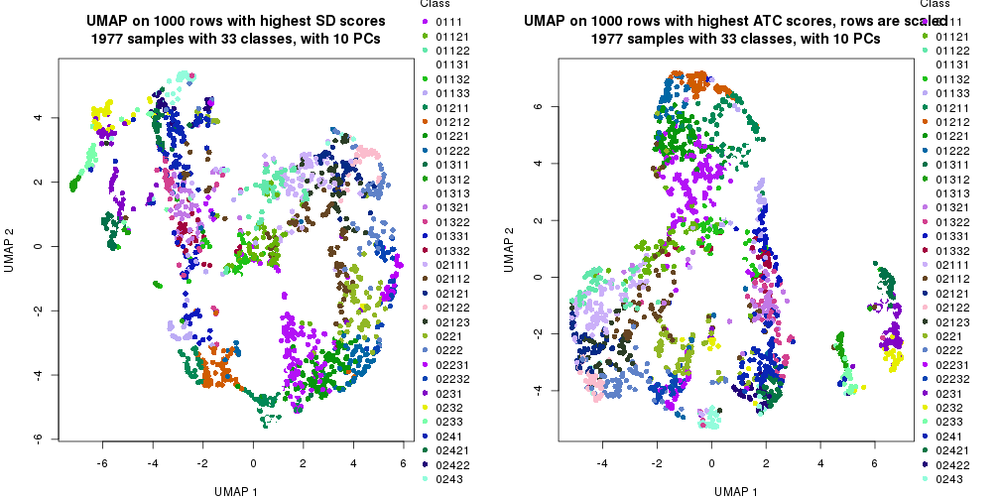</p>

</div>
<div id='tab-dimension-reduction-by-depth-9'>
<pre><code class="r">par(mfrow = c(1, 2))
dimension_reduction(res_rh, merge_node = merge_node_param(min_n_signatures = 197),
    method = &quot;UMAP&quot;, top_value_method = &quot;SD&quot;, top_n = 1000, scale_rows = FALSE)
dimension_reduction(res_rh, merge_node = merge_node_param(min_n_signatures = 197),
    method = &quot;UMAP&quot;, top_value_method = &quot;ATC&quot;, top_n = 1000, scale_rows = TRUE)
</code></pre>

<p></p>

</div>
<div id='tab-dimension-reduction-by-depth-10'>
<pre><code class="r">par(mfrow = c(1, 2))
dimension_reduction(res_rh, merge_node = merge_node_param(min_n_signatures = 199),
    method = &quot;UMAP&quot;, top_value_method = &quot;SD&quot;, top_n = 1000, scale_rows = FALSE)
dimension_reduction(res_rh, merge_node = merge_node_param(min_n_signatures = 199),
    method = &quot;UMAP&quot;, top_value_method = &quot;ATC&quot;, top_n = 1000, scale_rows = TRUE)
</code></pre>

<p></p>

</div>
<div id='tab-dimension-reduction-by-depth-11'>
<pre><code class="r">par(mfrow = c(1, 2))
dimension_reduction(res_rh, merge_node = merge_node_param(min_n_signatures = 212),
    method = &quot;UMAP&quot;, top_value_method = &quot;SD&quot;, top_n = 1000, scale_rows = FALSE)
dimension_reduction(res_rh, merge_node = merge_node_param(min_n_signatures = 212),
    method = &quot;UMAP&quot;, top_value_method = &quot;ATC&quot;, top_n = 1000, scale_rows = TRUE)
</code></pre>

<p></p>

</div>
<div id='tab-dimension-reduction-by-depth-12'>
<pre><code class="r">par(mfrow = c(1, 2))
dimension_reduction(res_rh, merge_node = merge_node_param(min_n_signatures = 226),
    method = &quot;UMAP&quot;, top_value_method = &quot;SD&quot;, top_n = 1000, scale_rows = FALSE)
dimension_reduction(res_rh, merge_node = merge_node_param(min_n_signatures = 226),
    method = &quot;UMAP&quot;, top_value_method = &quot;ATC&quot;, top_n = 1000, scale_rows = TRUE)
</code></pre>

<p></p>

</div>
<div id='tab-dimension-reduction-by-depth-13'>
<pre><code class="r">par(mfrow = c(1, 2))
dimension_reduction(res_rh, merge_node = merge_node_param(min_n_signatures = 299),
    method = &quot;UMAP&quot;, top_value_method = &quot;SD&quot;, top_n = 1000, scale_rows = FALSE)
dimension_reduction(res_rh, merge_node = merge_node_param(min_n_signatures = 299),
    method = &quot;UMAP&quot;, top_value_method = &quot;ATC&quot;, top_n = 1000, scale_rows = TRUE)
</code></pre>

<p></p>

</div>
<div id='tab-dimension-reduction-by-depth-14'>
<pre><code class="r">par(mfrow = c(1, 2))
dimension_reduction(res_rh, merge_node = merge_node_param(min_n_signatures = 343),
    method = &quot;UMAP&quot;, top_value_method = &quot;SD&quot;, top_n = 1000, scale_rows = FALSE)
dimension_reduction(res_rh, merge_node = merge_node_param(min_n_signatures = 343),
    method = &quot;UMAP&quot;, top_value_method = &quot;ATC&quot;, top_n = 1000, scale_rows = TRUE)
</code></pre>

<p></p>

</div>
<div id='tab-dimension-reduction-by-depth-15'>
<pre><code class="r">par(mfrow = c(1, 2))
dimension_reduction(res_rh, merge_node = merge_node_param(min_n_signatures = 395),
    method = &quot;UMAP&quot;, top_value_method = &quot;SD&quot;, top_n = 1000, scale_rows = FALSE)
dimension_reduction(res_rh, merge_node = merge_node_param(min_n_signatures = 395),
    method = &quot;UMAP&quot;, top_value_method = &quot;ATC&quot;, top_n = 1000, scale_rows = TRUE)
</code></pre>

<p></p>

</div>
<div id='tab-dimension-reduction-by-depth-16'>
<pre><code class="r">par(mfrow = c(1, 2))
dimension_reduction(res_rh, merge_node = merge_node_param(min_n_signatures = 632),
    method = &quot;UMAP&quot;, top_value_method = &quot;SD&quot;, top_n = 1000, scale_rows = FALSE)
dimension_reduction(res_rh, merge_node = merge_node_param(min_n_signatures = 632),
    method = &quot;UMAP&quot;, top_value_method = &quot;ATC&quot;, top_n = 1000, scale_rows = TRUE)
</code></pre>

<p></p>

</div>
<div id='tab-dimension-reduction-by-depth-17'>
<pre><code class="r">par(mfrow = c(1, 2))
dimension_reduction(res_rh, merge_node = merge_node_param(min_n_signatures = 637),
    method = &quot;UMAP&quot;, top_value_method = &quot;SD&quot;, top_n = 1000, scale_rows = FALSE)
dimension_reduction(res_rh, merge_node = merge_node_param(min_n_signatures = 637),
    method = &quot;UMAP&quot;, top_value_method = &quot;ATC&quot;, top_n = 1000, scale_rows = TRUE)
</code></pre>

<p></p>

</div>
<div id='tab-dimension-reduction-by-depth-18'>
<pre><code class="r">par(mfrow = c(1, 2))
dimension_reduction(res_rh, merge_node = merge_node_param(min_n_signatures = 655),
    method = &quot;UMAP&quot;, top_value_method = &quot;SD&quot;, top_n = 1000, scale_rows = FALSE)
dimension_reduction(res_rh, merge_node = merge_node_param(min_n_signatures = 655),
    method = &quot;UMAP&quot;, top_value_method = &quot;ATC&quot;, top_n = 1000, scale_rows = TRUE)
</code></pre>

<p></p>

</div>
<div id='tab-dimension-reduction-by-depth-19'>
<pre><code class="r">par(mfrow = c(1, 2))
dimension_reduction(res_rh, merge_node = merge_node_param(min_n_signatures = 727),
    method = &quot;UMAP&quot;, top_value_method = &quot;SD&quot;, top_n = 1000, scale_rows = FALSE)
dimension_reduction(res_rh, merge_node = merge_node_param(min_n_signatures = 727),
    method = &quot;UMAP&quot;, top_value_method = &quot;ATC&quot;, top_n = 1000, scale_rows = TRUE)
</code></pre>

<p></p>

</div>
<div id='tab-dimension-reduction-by-depth-20'>
<pre><code class="r">par(mfrow = c(1, 2))
dimension_reduction(res_rh, merge_node = merge_node_param(min_n_signatures = 947),
    method = &quot;UMAP&quot;, top_value_method = &quot;SD&quot;, top_n = 1000, scale_rows = FALSE)
dimension_reduction(res_rh, merge_node = merge_node_param(min_n_signatures = 947),
    method = &quot;UMAP&quot;, top_value_method = &quot;ATC&quot;, top_n = 1000, scale_rows = TRUE)
</code></pre>

<p></p>

</div>
<div id='tab-dimension-reduction-by-depth-21'>
<pre><code class="r">par(mfrow = c(1, 2))
dimension_reduction(res_rh, merge_node = merge_node_param(min_n_signatures = 963),
    method = &quot;UMAP&quot;, top_value_method = &quot;SD&quot;, top_n = 1000, scale_rows = FALSE)
dimension_reduction(res_rh, merge_node = merge_node_param(min_n_signatures = 963),
    method = &quot;UMAP&quot;, top_value_method = &quot;ATC&quot;, top_n = 1000, scale_rows = TRUE)
</code></pre>

<p></p>

</div>
<div id='tab-dimension-reduction-by-depth-22'>
<pre><code class="r">par(mfrow = c(1, 2))
dimension_reduction(res_rh, merge_node = merge_node_param(min_n_signatures = 1009),
    method = &quot;UMAP&quot;, top_value_method = &quot;SD&quot;, top_n = 1000, scale_rows = FALSE)
dimension_reduction(res_rh, merge_node = merge_node_param(min_n_signatures = 1009),
    method = &quot;UMAP&quot;, top_value_method = &quot;ATC&quot;, top_n = 1000, scale_rows = TRUE)
</code></pre>

<p></p>

</div>
<div id='tab-dimension-reduction-by-depth-23'>
<pre><code class="r">par(mfrow = c(1, 2))
dimension_reduction(res_rh, merge_node = merge_node_param(min_n_signatures = 1420),
    method = &quot;UMAP&quot;, top_value_method = &quot;SD&quot;, top_n = 1000, scale_rows = FALSE)
dimension_reduction(res_rh, merge_node = merge_node_param(min_n_signatures = 1420),
    method = &quot;UMAP&quot;, top_value_method = &quot;ATC&quot;, top_n = 1000, scale_rows = TRUE)
</code></pre>

<p></p>

</div>
<div id='tab-dimension-reduction-by-depth-24'>
<pre><code class="r">par(mfrow = c(1, 2))
dimension_reduction(res_rh, merge_node = merge_node_param(min_n_signatures = 1504),
    method = &quot;UMAP&quot;, top_value_method = &quot;SD&quot;, top_n = 1000, scale_rows = FALSE)
dimension_reduction(res_rh, merge_node = merge_node_param(min_n_signatures = 1504),
    method = &quot;UMAP&quot;, top_value_method = &quot;ATC&quot;, top_n = 1000, scale_rows = TRUE)
</code></pre>

<p></p>

</div>
<div id='tab-dimension-reduction-by-depth-25'>
<pre><code class="r">par(mfrow = c(1, 2))
dimension_reduction(res_rh, merge_node = merge_node_param(min_n_signatures = 1927),
    method = &quot;UMAP&quot;, top_value_method = &quot;SD&quot;, top_n = 1000, scale_rows = FALSE)
dimension_reduction(res_rh, merge_node = merge_node_param(min_n_signatures = 1927),
    method = &quot;UMAP&quot;, top_value_method = &quot;ATC&quot;, top_n = 1000, scale_rows = TRUE)
</code></pre>

<p>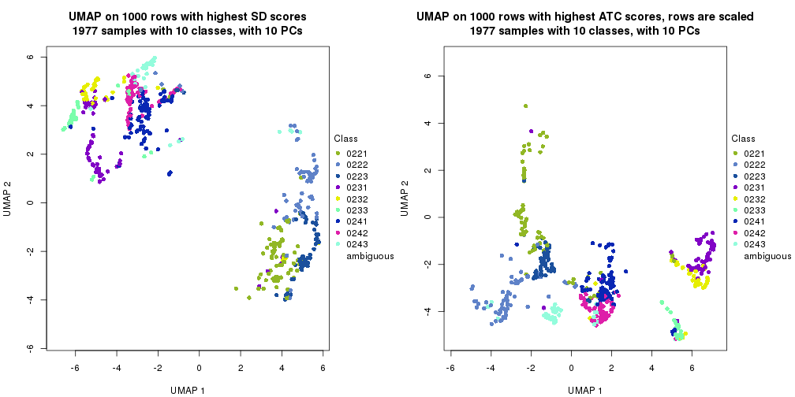</p>

</div>
<div id='tab-dimension-reduction-by-depth-26'>
<pre><code class="r">par(mfrow = c(1, 2))
dimension_reduction(res_rh, merge_node = merge_node_param(min_n_signatures = 2288),
    method = &quot;UMAP&quot;, top_value_method = &quot;SD&quot;, top_n = 1000, scale_rows = FALSE)
dimension_reduction(res_rh, merge_node = merge_node_param(min_n_signatures = 2288),
    method = &quot;UMAP&quot;, top_value_method = &quot;ATC&quot;, top_n = 1000, scale_rows = TRUE)
</code></pre>

<p></p>

</div>
<div id='tab-dimension-reduction-by-depth-27'>
<pre><code class="r">par(mfrow = c(1, 2))
dimension_reduction(res_rh, merge_node = merge_node_param(min_n_signatures = 3381),
    method = &quot;UMAP&quot;, top_value_method = &quot;SD&quot;, top_n = 1000, scale_rows = FALSE)
dimension_reduction(res_rh, merge_node = merge_node_param(min_n_signatures = 3381),
    method = &quot;UMAP&quot;, top_value_method = &quot;ATC&quot;, top_n = 1000, scale_rows = TRUE)
</code></pre>

<p></p>

</div>
<div id='tab-dimension-reduction-by-depth-28'>
<pre><code class="r">par(mfrow = c(1, 2))
dimension_reduction(res_rh, merge_node = merge_node_param(min_n_signatures = 4080),
    method = &quot;UMAP&quot;, top_value_method = &quot;SD&quot;, top_n = 1000, scale_rows = FALSE)
dimension_reduction(res_rh, merge_node = merge_node_param(min_n_signatures = 4080),
    method = &quot;UMAP&quot;, top_value_method = &quot;ATC&quot;, top_n = 1000, scale_rows = TRUE)
</code></pre>

<p></p>

</div>
</div>


### Signature heatmap

Signatures on the heatmap are the union of all signatures found on every node
on the hierarchy. The number of k-means on rows are automatically selected by the function.


<script>
$( function() {
	$( '#tabs-get-signatures-from-hierarchical-partition' ).tabs();
} );
</script>
<div id='tabs-get-signatures-from-hierarchical-partition'>
<ul>
<li><a href='#tab-get-signatures-from-hierarchical-partition-1'>n_signatures ≥ 93</a></li>
<li><a href='#tab-get-signatures-from-hierarchical-partition-2'>n_signatures ≥ 112</a></li>
<li><a href='#tab-get-signatures-from-hierarchical-partition-3'>n_signatures ≥ 118</a></li>
<li><a href='#tab-get-signatures-from-hierarchical-partition-4'>n_signatures ≥ 128</a></li>
<li><a href='#tab-get-signatures-from-hierarchical-partition-5'>n_signatures ≥ 143</a></li>
<li><a href='#tab-get-signatures-from-hierarchical-partition-6'>n_signatures ≥ 150</a></li>
<li><a href='#tab-get-signatures-from-hierarchical-partition-7'>n_signatures ≥ 153</a></li>
<li><a href='#tab-get-signatures-from-hierarchical-partition-8'>n_signatures ≥ 189</a></li>
<li><a href='#tab-get-signatures-from-hierarchical-partition-9'>n_signatures ≥ 197</a></li>
<li><a href='#tab-get-signatures-from-hierarchical-partition-10'>n_signatures ≥ 199</a></li>
<li><a href='#tab-get-signatures-from-hierarchical-partition-11'>n_signatures ≥ 212</a></li>
<li><a href='#tab-get-signatures-from-hierarchical-partition-12'>n_signatures ≥ 226</a></li>
<li><a href='#tab-get-signatures-from-hierarchical-partition-13'>n_signatures ≥ 299</a></li>
<li><a href='#tab-get-signatures-from-hierarchical-partition-14'>n_signatures ≥ 343</a></li>
<li><a href='#tab-get-signatures-from-hierarchical-partition-15'>n_signatures ≥ 395</a></li>
<li><a href='#tab-get-signatures-from-hierarchical-partition-16'>n_signatures ≥ 632</a></li>
<li><a href='#tab-get-signatures-from-hierarchical-partition-17'>n_signatures ≥ 637</a></li>
<li><a href='#tab-get-signatures-from-hierarchical-partition-18'>n_signatures ≥ 655</a></li>
<li><a href='#tab-get-signatures-from-hierarchical-partition-19'>n_signatures ≥ 727</a></li>
<li><a href='#tab-get-signatures-from-hierarchical-partition-20'>n_signatures ≥ 947</a></li>
<li><a href='#tab-get-signatures-from-hierarchical-partition-21'>n_signatures ≥ 963</a></li>
<li><a href='#tab-get-signatures-from-hierarchical-partition-22'>n_signatures ≥ 1009</a></li>
<li><a href='#tab-get-signatures-from-hierarchical-partition-23'>n_signatures ≥ 1420</a></li>
<li><a href='#tab-get-signatures-from-hierarchical-partition-24'>n_signatures ≥ 1504</a></li>
<li><a href='#tab-get-signatures-from-hierarchical-partition-25'>n_signatures ≥ 1927</a></li>
<li><a href='#tab-get-signatures-from-hierarchical-partition-26'>n_signatures ≥ 2288</a></li>
<li><a href='#tab-get-signatures-from-hierarchical-partition-27'>n_signatures ≥ 3381</a></li>
<li><a href='#tab-get-signatures-from-hierarchical-partition-28'>n_signatures ≥ 4080</a></li>
</ul>
<div id='tab-get-signatures-from-hierarchical-partition-1'>
<pre><code class="r">get_signatures(res_rh, merge_node = merge_node_param(min_n_signatures = 93))
</code></pre>

<p>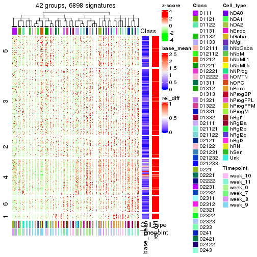</p>

</div>
<div id='tab-get-signatures-from-hierarchical-partition-2'>
<pre><code class="r">get_signatures(res_rh, merge_node = merge_node_param(min_n_signatures = 112))
</code></pre>

<p></p>

</div>
<div id='tab-get-signatures-from-hierarchical-partition-3'>
<pre><code class="r">get_signatures(res_rh, merge_node = merge_node_param(min_n_signatures = 118))
</code></pre>

<p></p>

</div>
<div id='tab-get-signatures-from-hierarchical-partition-4'>
<pre><code class="r">get_signatures(res_rh, merge_node = merge_node_param(min_n_signatures = 128))
</code></pre>

<p>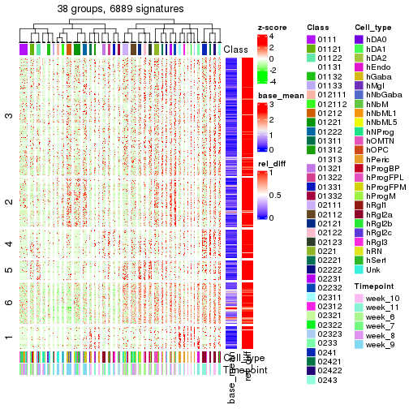</p>

</div>
<div id='tab-get-signatures-from-hierarchical-partition-5'>
<pre><code class="r">get_signatures(res_rh, merge_node = merge_node_param(min_n_signatures = 143))
</code></pre>

<p></p>

</div>
<div id='tab-get-signatures-from-hierarchical-partition-6'>
<pre><code class="r">get_signatures(res_rh, merge_node = merge_node_param(min_n_signatures = 150))
</code></pre>

<p>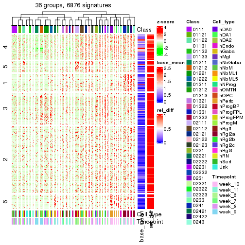</p>

</div>
<div id='tab-get-signatures-from-hierarchical-partition-7'>
<pre><code class="r">get_signatures(res_rh, merge_node = merge_node_param(min_n_signatures = 153))
</code></pre>

<p></p>

</div>
<div id='tab-get-signatures-from-hierarchical-partition-8'>
<pre><code class="r">get_signatures(res_rh, merge_node = merge_node_param(min_n_signatures = 189))
</code></pre>

<p></p>

</div>
<div id='tab-get-signatures-from-hierarchical-partition-9'>
<pre><code class="r">get_signatures(res_rh, merge_node = merge_node_param(min_n_signatures = 197))
</code></pre>

<p></p>

</div>
<div id='tab-get-signatures-from-hierarchical-partition-10'>
<pre><code class="r">get_signatures(res_rh, merge_node = merge_node_param(min_n_signatures = 199))
</code></pre>

<p></p>

</div>
<div id='tab-get-signatures-from-hierarchical-partition-11'>
<pre><code class="r">get_signatures(res_rh, merge_node = merge_node_param(min_n_signatures = 212))
</code></pre>

<p></p>

</div>
<div id='tab-get-signatures-from-hierarchical-partition-12'>
<pre><code class="r">get_signatures(res_rh, merge_node = merge_node_param(min_n_signatures = 226))
</code></pre>

<p></p>

</div>
<div id='tab-get-signatures-from-hierarchical-partition-13'>
<pre><code class="r">get_signatures(res_rh, merge_node = merge_node_param(min_n_signatures = 299))
</code></pre>

<p></p>

</div>
<div id='tab-get-signatures-from-hierarchical-partition-14'>
<pre><code class="r">get_signatures(res_rh, merge_node = merge_node_param(min_n_signatures = 343))
</code></pre>

<p></p>

</div>
<div id='tab-get-signatures-from-hierarchical-partition-15'>
<pre><code class="r">get_signatures(res_rh, merge_node = merge_node_param(min_n_signatures = 395))
</code></pre>

<p></p>

</div>
<div id='tab-get-signatures-from-hierarchical-partition-16'>
<pre><code class="r">get_signatures(res_rh, merge_node = merge_node_param(min_n_signatures = 632))
</code></pre>

<p></p>

</div>
<div id='tab-get-signatures-from-hierarchical-partition-17'>
<pre><code class="r">get_signatures(res_rh, merge_node = merge_node_param(min_n_signatures = 637))
</code></pre>

<p></p>

</div>
<div id='tab-get-signatures-from-hierarchical-partition-18'>
<pre><code class="r">get_signatures(res_rh, merge_node = merge_node_param(min_n_signatures = 655))
</code></pre>

<p></p>

</div>
<div id='tab-get-signatures-from-hierarchical-partition-19'>
<pre><code class="r">get_signatures(res_rh, merge_node = merge_node_param(min_n_signatures = 727))
</code></pre>

<p></p>

</div>
<div id='tab-get-signatures-from-hierarchical-partition-20'>
<pre><code class="r">get_signatures(res_rh, merge_node = merge_node_param(min_n_signatures = 947))
</code></pre>

<p></p>

</div>
<div id='tab-get-signatures-from-hierarchical-partition-21'>
<pre><code class="r">get_signatures(res_rh, merge_node = merge_node_param(min_n_signatures = 963))
</code></pre>

<p></p>

</div>
<div id='tab-get-signatures-from-hierarchical-partition-22'>
<pre><code class="r">get_signatures(res_rh, merge_node = merge_node_param(min_n_signatures = 1009))
</code></pre>

<p></p>

</div>
<div id='tab-get-signatures-from-hierarchical-partition-23'>
<pre><code class="r">get_signatures(res_rh, merge_node = merge_node_param(min_n_signatures = 1420))
</code></pre>

<p></p>

</div>
<div id='tab-get-signatures-from-hierarchical-partition-24'>
<pre><code class="r">get_signatures(res_rh, merge_node = merge_node_param(min_n_signatures = 1504))
</code></pre>

<pre><code>#&gt; Error in lt[[hierarchy[i, 1]]]$AddChildNode({: attempt to apply non-function
</code></pre>

</div>
<div id='tab-get-signatures-from-hierarchical-partition-25'>
<pre><code class="r">get_signatures(res_rh, merge_node = merge_node_param(min_n_signatures = 1927))
</code></pre>

<pre><code>#&gt; Error in lt[[hierarchy[i, 1]]]$AddChildNode({: attempt to apply non-function
</code></pre>

</div>
<div id='tab-get-signatures-from-hierarchical-partition-26'>
<pre><code class="r">get_signatures(res_rh, merge_node = merge_node_param(min_n_signatures = 2288))
</code></pre>

<pre><code>#&gt; Error in lt[[hierarchy[i, 1]]]$AddChildNode({: attempt to apply non-function
</code></pre>

</div>
<div id='tab-get-signatures-from-hierarchical-partition-27'>
<pre><code class="r">get_signatures(res_rh, merge_node = merge_node_param(min_n_signatures = 3381))
</code></pre>

<pre><code>#&gt; Error in lt[[hierarchy[i, 1]]]$AddChildNode({: attempt to apply non-function
</code></pre>

</div>
<div id='tab-get-signatures-from-hierarchical-partition-28'>
<pre><code class="r">get_signatures(res_rh, merge_node = merge_node_param(min_n_signatures = 4080))
</code></pre>

<pre><code>#&gt; Error in names(x) &lt;- value: &#39;names&#39; attribute [1] must be the same length as the vector [0]
</code></pre>

</div>
</div>


Compare signatures from different nodes:


```r
compare_signatures(res_rh, verbose = FALSE)
```


If there are too many signatures, `top_signatures = ...` can be set to only show the 
signatures with the highest FDRs. Note it only works on every node and the final signatures
are the union of all signatures of all nodes.


```r
# code only for demonstration
# e.g. to show the top 500 most significant rows on each node.
tb = get_signature(res_rh, top_signatures = 500)
```


### Test to known annotations

Test correlation between subgroups and known annotations. If the known
annotation is numeric, one-way ANOVA test is applied, and if the known
annotation is discrete, chi-squared contingency table test is applied.


<script>
$( function() {
	$( '#tabs-test-to-known-factors-from-hierarchical-partition' ).tabs();
} );
</script>
<div id='tabs-test-to-known-factors-from-hierarchical-partition'>
<ul>
<li><a href='#tab-test-to-known-factors-from-hierarchical-partition-1'>n_signatures ≥ 93</a></li>
<li><a href='#tab-test-to-known-factors-from-hierarchical-partition-2'>n_signatures ≥ 112</a></li>
<li><a href='#tab-test-to-known-factors-from-hierarchical-partition-3'>n_signatures ≥ 118</a></li>
<li><a href='#tab-test-to-known-factors-from-hierarchical-partition-4'>n_signatures ≥ 128</a></li>
<li><a href='#tab-test-to-known-factors-from-hierarchical-partition-5'>n_signatures ≥ 143</a></li>
<li><a href='#tab-test-to-known-factors-from-hierarchical-partition-6'>n_signatures ≥ 150</a></li>
<li><a href='#tab-test-to-known-factors-from-hierarchical-partition-7'>n_signatures ≥ 153</a></li>
<li><a href='#tab-test-to-known-factors-from-hierarchical-partition-8'>n_signatures ≥ 189</a></li>
<li><a href='#tab-test-to-known-factors-from-hierarchical-partition-9'>n_signatures ≥ 197</a></li>
<li><a href='#tab-test-to-known-factors-from-hierarchical-partition-10'>n_signatures ≥ 199</a></li>
<li><a href='#tab-test-to-known-factors-from-hierarchical-partition-11'>n_signatures ≥ 212</a></li>
<li><a href='#tab-test-to-known-factors-from-hierarchical-partition-12'>n_signatures ≥ 226</a></li>
<li><a href='#tab-test-to-known-factors-from-hierarchical-partition-13'>n_signatures ≥ 299</a></li>
<li><a href='#tab-test-to-known-factors-from-hierarchical-partition-14'>n_signatures ≥ 343</a></li>
<li><a href='#tab-test-to-known-factors-from-hierarchical-partition-15'>n_signatures ≥ 395</a></li>
<li><a href='#tab-test-to-known-factors-from-hierarchical-partition-16'>n_signatures ≥ 632</a></li>
<li><a href='#tab-test-to-known-factors-from-hierarchical-partition-17'>n_signatures ≥ 637</a></li>
<li><a href='#tab-test-to-known-factors-from-hierarchical-partition-18'>n_signatures ≥ 655</a></li>
<li><a href='#tab-test-to-known-factors-from-hierarchical-partition-19'>n_signatures ≥ 727</a></li>
<li><a href='#tab-test-to-known-factors-from-hierarchical-partition-20'>n_signatures ≥ 947</a></li>
<li><a href='#tab-test-to-known-factors-from-hierarchical-partition-21'>n_signatures ≥ 963</a></li>
<li><a href='#tab-test-to-known-factors-from-hierarchical-partition-22'>n_signatures ≥ 1009</a></li>
<li><a href='#tab-test-to-known-factors-from-hierarchical-partition-23'>n_signatures ≥ 1420</a></li>
<li><a href='#tab-test-to-known-factors-from-hierarchical-partition-24'>n_signatures ≥ 1504</a></li>
<li><a href='#tab-test-to-known-factors-from-hierarchical-partition-25'>n_signatures ≥ 1927</a></li>
<li><a href='#tab-test-to-known-factors-from-hierarchical-partition-26'>n_signatures ≥ 2288</a></li>
<li><a href='#tab-test-to-known-factors-from-hierarchical-partition-27'>n_signatures ≥ 3381</a></li>
<li><a href='#tab-test-to-known-factors-from-hierarchical-partition-28'>n_signatures ≥ 4080</a></li>
</ul>
<div id='tab-test-to-known-factors-from-hierarchical-partition-1'>
<pre><code class="r">test_to_known_factors(res_rh, merge_node = merge_node_param(min_n_signatures = 93))
</code></pre>

<pre><code>#&gt;       Cell_type Timepoint
#&gt; class         0         0
</code></pre>

</div>
<div id='tab-test-to-known-factors-from-hierarchical-partition-2'>
<pre><code class="r">test_to_known_factors(res_rh, merge_node = merge_node_param(min_n_signatures = 112))
</code></pre>

<pre><code>#&gt;       Cell_type Timepoint
#&gt; class         0         0
</code></pre>

</div>
<div id='tab-test-to-known-factors-from-hierarchical-partition-3'>
<pre><code class="r">test_to_known_factors(res_rh, merge_node = merge_node_param(min_n_signatures = 118))
</code></pre>

<pre><code>#&gt;       Cell_type Timepoint
#&gt; class         0         0
</code></pre>

</div>
<div id='tab-test-to-known-factors-from-hierarchical-partition-4'>
<pre><code class="r">test_to_known_factors(res_rh, merge_node = merge_node_param(min_n_signatures = 128))
</code></pre>

<pre><code>#&gt;       Cell_type Timepoint
#&gt; class         0         0
</code></pre>

</div>
<div id='tab-test-to-known-factors-from-hierarchical-partition-5'>
<pre><code class="r">test_to_known_factors(res_rh, merge_node = merge_node_param(min_n_signatures = 143))
</code></pre>

<pre><code>#&gt;       Cell_type Timepoint
#&gt; class         0         0
</code></pre>

</div>
<div id='tab-test-to-known-factors-from-hierarchical-partition-6'>
<pre><code class="r">test_to_known_factors(res_rh, merge_node = merge_node_param(min_n_signatures = 150))
</code></pre>

<pre><code>#&gt;       Cell_type Timepoint
#&gt; class         0         0
</code></pre>

</div>
<div id='tab-test-to-known-factors-from-hierarchical-partition-7'>
<pre><code class="r">test_to_known_factors(res_rh, merge_node = merge_node_param(min_n_signatures = 153))
</code></pre>

<pre><code>#&gt;       Cell_type Timepoint
#&gt; class         0         0
</code></pre>

</div>
<div id='tab-test-to-known-factors-from-hierarchical-partition-8'>
<pre><code class="r">test_to_known_factors(res_rh, merge_node = merge_node_param(min_n_signatures = 189))
</code></pre>

<pre><code>#&gt;       Cell_type Timepoint
#&gt; class         0         0
</code></pre>

</div>
<div id='tab-test-to-known-factors-from-hierarchical-partition-9'>
<pre><code class="r">test_to_known_factors(res_rh, merge_node = merge_node_param(min_n_signatures = 197))
</code></pre>

<pre><code>#&gt;       Cell_type Timepoint
#&gt; class         0         0
</code></pre>

</div>
<div id='tab-test-to-known-factors-from-hierarchical-partition-10'>
<pre><code class="r">test_to_known_factors(res_rh, merge_node = merge_node_param(min_n_signatures = 199))
</code></pre>

<pre><code>#&gt;       Cell_type Timepoint
#&gt; class         0         0
</code></pre>

</div>
<div id='tab-test-to-known-factors-from-hierarchical-partition-11'>
<pre><code class="r">test_to_known_factors(res_rh, merge_node = merge_node_param(min_n_signatures = 212))
</code></pre>

<pre><code>#&gt;       Cell_type Timepoint
#&gt; class         0         0
</code></pre>

</div>
<div id='tab-test-to-known-factors-from-hierarchical-partition-12'>
<pre><code class="r">test_to_known_factors(res_rh, merge_node = merge_node_param(min_n_signatures = 226))
</code></pre>

<pre><code>#&gt;       Cell_type Timepoint
#&gt; class         0         0
</code></pre>

</div>
<div id='tab-test-to-known-factors-from-hierarchical-partition-13'>
<pre><code class="r">test_to_known_factors(res_rh, merge_node = merge_node_param(min_n_signatures = 299))
</code></pre>

<pre><code>#&gt;       Cell_type Timepoint
#&gt; class         0         0
</code></pre>

</div>
<div id='tab-test-to-known-factors-from-hierarchical-partition-14'>
<pre><code class="r">test_to_known_factors(res_rh, merge_node = merge_node_param(min_n_signatures = 343))
</code></pre>

<pre><code>#&gt;       Cell_type Timepoint
#&gt; class         0         0
</code></pre>

</div>
<div id='tab-test-to-known-factors-from-hierarchical-partition-15'>
<pre><code class="r">test_to_known_factors(res_rh, merge_node = merge_node_param(min_n_signatures = 395))
</code></pre>

<pre><code>#&gt;       Cell_type Timepoint
#&gt; class         0         0
</code></pre>

</div>
<div id='tab-test-to-known-factors-from-hierarchical-partition-16'>
<pre><code class="r">test_to_known_factors(res_rh, merge_node = merge_node_param(min_n_signatures = 632))
</code></pre>

<pre><code>#&gt;       Cell_type Timepoint
#&gt; class         0         0
</code></pre>

</div>
<div id='tab-test-to-known-factors-from-hierarchical-partition-17'>
<pre><code class="r">test_to_known_factors(res_rh, merge_node = merge_node_param(min_n_signatures = 637))
</code></pre>

<pre><code>#&gt;       Cell_type Timepoint
#&gt; class         0         0
</code></pre>

</div>
<div id='tab-test-to-known-factors-from-hierarchical-partition-18'>
<pre><code class="r">test_to_known_factors(res_rh, merge_node = merge_node_param(min_n_signatures = 655))
</code></pre>

<pre><code>#&gt;       Cell_type Timepoint
#&gt; class         0         0
</code></pre>

</div>
<div id='tab-test-to-known-factors-from-hierarchical-partition-19'>
<pre><code class="r">test_to_known_factors(res_rh, merge_node = merge_node_param(min_n_signatures = 727))
</code></pre>

<pre><code>#&gt;       Cell_type Timepoint
#&gt; class         0         0
</code></pre>

</div>
<div id='tab-test-to-known-factors-from-hierarchical-partition-20'>
<pre><code class="r">test_to_known_factors(res_rh, merge_node = merge_node_param(min_n_signatures = 947))
</code></pre>

<pre><code>#&gt;       Cell_type Timepoint
#&gt; class         0         0
</code></pre>

</div>
<div id='tab-test-to-known-factors-from-hierarchical-partition-21'>
<pre><code class="r">test_to_known_factors(res_rh, merge_node = merge_node_param(min_n_signatures = 963))
</code></pre>

<pre><code>#&gt;       Cell_type Timepoint
#&gt; class         0 1.54e-234
</code></pre>

</div>
<div id='tab-test-to-known-factors-from-hierarchical-partition-22'>
<pre><code class="r">test_to_known_factors(res_rh, merge_node = merge_node_param(min_n_signatures = 1009))
</code></pre>

<pre><code>#&gt;       Cell_type Timepoint
#&gt; class         0 7.87e-233
</code></pre>

</div>
<div id='tab-test-to-known-factors-from-hierarchical-partition-23'>
<pre><code class="r">test_to_known_factors(res_rh, merge_node = merge_node_param(min_n_signatures = 1420))
</code></pre>

<pre><code>#&gt;       Cell_type Timepoint
#&gt; class         0 2.62e-229
</code></pre>

</div>
<div id='tab-test-to-known-factors-from-hierarchical-partition-24'>
<pre><code class="r">test_to_known_factors(res_rh, merge_node = merge_node_param(min_n_signatures = 1504))
</code></pre>

<pre><code>#&gt;       Cell_type Timepoint
#&gt; class 1.25e-272  9.09e-59
</code></pre>

</div>
<div id='tab-test-to-known-factors-from-hierarchical-partition-25'>
<pre><code class="r">test_to_known_factors(res_rh, merge_node = merge_node_param(min_n_signatures = 1927))
</code></pre>

<pre><code>#&gt;       Cell_type Timepoint
#&gt; class 1.25e-272  9.09e-59
</code></pre>

</div>
<div id='tab-test-to-known-factors-from-hierarchical-partition-26'>
<pre><code class="r">test_to_known_factors(res_rh, merge_node = merge_node_param(min_n_signatures = 2288))
</code></pre>

<pre><code>#&gt;       Cell_type Timepoint
#&gt; class 4.12e-114  4.34e-35
</code></pre>

</div>
<div id='tab-test-to-known-factors-from-hierarchical-partition-27'>
<pre><code class="r">test_to_known_factors(res_rh, merge_node = merge_node_param(min_n_signatures = 3381))
</code></pre>

<pre><code>#&gt;       Cell_type Timepoint
#&gt; class  3.03e-06  7.54e-09
</code></pre>

</div>
<div id='tab-test-to-known-factors-from-hierarchical-partition-28'>
<pre><code class="r">test_to_known_factors(res_rh, merge_node = merge_node_param(min_n_signatures = 4080))
</code></pre>

<pre><code>#&gt;       Cell_type Timepoint
#&gt; class        NA        NA
</code></pre>

</div>
</div>


## Results for each node


---------------------------------------------------


### Node0


Child nodes: 
                [Node01](#Node01)
        ,
                [Node02](#Node02)
        .


The object with results only for a single top-value method and a single partitioning method 
can be extracted as:

```r
res = res_rh["0"]
```

A summary of `res` and all the functions that can be applied to it:

```r
res
```

```
#> A 'DownSamplingConsensusPartition' object with k = 2, 3, 4.
#>   On a matrix with 9908 rows and 500 columns, randomly sampled from 1977 columns.
#>   Top rows (934) are extracted by 'ATC' method.
#>   Subgroups are detected by 'skmeans' method.
#>   Performed in total 150 partitions by row resampling.
#>   Best k for subgroups seems to be 2.
#> 
#> Following methods can be applied to this 'DownSamplingConsensusPartition' object:
#>  [1] "cola_report"             "collect_classes"         "collect_plots"          
#>  [4] "collect_stats"           "colnames"                "compare_partitions"     
#>  [7] "compare_signatures"      "consensus_heatmap"       "dimension_reduction"    
#> [10] "functional_enrichment"   "get_anno_col"            "get_anno"               
#> [13] "get_classes"             "get_consensus"           "get_matrix"             
#> [16] "get_membership"          "get_param"               "get_signatures"         
#> [19] "get_stats"               "is_best_k"               "is_stable_k"            
#> [22] "membership_heatmap"      "ncol"                    "nrow"                   
#> [25] "plot_ecdf"               "predict_classes"         "rownames"               
#> [28] "select_partition_number" "show"                    "suggest_best_k"         
#> [31] "test_to_known_factors"   "top_rows_heatmap"
```

`collect_plots()` function collects all the plots made from `res` for all `k` (number of subgroups)
into one single page to provide an easy and fast comparison between different `k`.

```r
collect_plots(res)
```


The plots are:

- The first row: a plot of the eCDF (empirical cumulative distribution
  function) curves of the consensus matrix for each `k` and the heatmap of
  predicted classes for each `k`.
- The second row: heatmaps of the consensus matrix for each `k`.
- The third row: heatmaps of the membership matrix for each `k`.
- The fouth row: heatmaps of the signatures for each `k`.

All the plots in panels can be made by individual functions and they are
plotted later in this section.

`select_partition_number()` produces several plots showing different
statistics for choosing "optimized" `k`. There are following statistics:

- eCDF curves of the consensus matrix for each `k`;
- 1-PAC. [The PAC score](https://en.wikipedia.org/wiki/Consensus_clustering#Over-interpretation_potential_of_consensus_clustering)
  measures the proportion of the ambiguous subgrouping.
- Mean silhouette score.
- Concordance. The mean probability of fiting the consensus subgroup labels in all
  partitions.
- Area increased. Denote $A_k$ as the area under the eCDF curve for current
  `k`, the area increased is defined as $A_k - A_{k-1}$.
- Rand index. The percent of pairs of samples that are both in a same cluster
  or both are not in a same cluster in the partition of k and k-1.
- Jaccard index. The ratio of pairs of samples are both in a same cluster in
  the partition of k and k-1 and the pairs of samples are both in a same
  cluster in the partition k or k-1.

The detailed explanations of these statistics can be found in [the _cola_
vignette](https://jokergoo.github.io/cola_vignettes/cola.html#toc_13).

Generally speaking, higher 1-PAC score, higher mean silhouette score or higher
concordance corresponds to better partition. Rand index and Jaccard index
measure how similar the current partition is compared to partition with `k-1`.
If they are too similar, we won't accept `k` is better than `k-1`.

```r
select_partition_number(res)
```


The numeric values for all these statistics can be obtained by `get_stats()`.

```r
get_stats(res)
```

```
#>   k 1-PAC mean_silhouette concordance area_increased  Rand Jaccard
#> 2 2 1.000           0.981       0.992          0.501 0.500   0.500
#> 3 3 0.876           0.883       0.945          0.259 0.842   0.693
#> 4 4 0.782           0.857       0.924          0.150 0.859   0.645
```

`suggest_best_k()` suggests the best $k$ based on these statistics. The rules are as follows:

- All $k$ with Jaccard index larger than 0.95 are removed because increasing
  $k$ does not provide enough extra information. If all $k$ are removed, it is
  marked as no subgroup is detected.
- For all $k$ with 1-PAC score larger than 0.9, the maximal $k$ is taken as
  the best $k$, and other $k$ are marked as optional $k$.
- If it does not fit the second rule. The $k$ with the maximal vote of the
  highest 1-PAC score, highest mean silhouette, and highest concordance is
  taken as the best $k$.

```r
suggest_best_k(res)
```

```
#> [1] 2
```


Following is the table of the partitions (You need to click the **show/hide
code output** link to see it). The membership matrix (columns with name `p*`)
is inferred by
[`clue::cl_consensus()`](https://www.rdocumentation.org/link/cl_consensus?package=clue)
function with the `SE` method. Basically the value in the membership matrix
represents the probability to belong to a certain group. The finall subgroup
label for an item is determined with the group with highest probability it
belongs to.

In `get_classes()` function, the entropy is calculated from the membership
matrix and the silhouette score is calculated from the consensus matrix.


<script>
$( function() {
	$( '#tabs-node-0-get-classes' ).tabs();
} );
</script>
<div id='tabs-node-0-get-classes'>
<ul>
<li><a href='#tab-node-0-get-classes-1'>k = 2</a></li>
<li><a href='#tab-node-0-get-classes-2'>k = 3</a></li>
<li><a href='#tab-node-0-get-classes-3'>k = 4</a></li>
</ul>

<div id='tab-node-0-get-classes-1'>
<p><a id='tab-node-0-get-classes-1-a' style='color:#0366d6' href='#'>show/hide code output</a></p>
<pre><code class="r">get_classes(res, k = 2)
</code></pre>

<pre><code>#&gt;                 class     p
#&gt; 1772067_089_A01     1 0.751
#&gt; 1772067_089_A02     1 1.000
#&gt; 1772067_089_A03     1 0.502
#&gt; 1772067_089_A04     2 0.000
#&gt; 1772067_089_A05     2 0.249
#&gt; 1772067_089_A06     1 0.000
#&gt; 1772067_089_A08     1 0.502
#&gt; 1772067_089_A09     2 0.000
#&gt; 1772067_089_A11     2 0.249
#&gt; 1772067_089_B01     1 0.000
#&gt; 1772067_089_B03     1 1.000
#&gt; 1772067_089_B05     2 0.502
#&gt; 1772067_089_B06     1 0.751
#&gt; 1772067_089_B07     1 0.751
#&gt; 1772067_089_B09     1 1.000
#&gt; 1772067_089_C02     2 0.000
#&gt; 1772067_089_C04     1 1.000
#&gt; 1772067_089_C05     1 1.000
#&gt; 1772067_089_C06     2 0.249
#&gt; 1772067_089_C08     1 0.000
#&gt; 1772067_089_C10     1 0.253
#&gt; 1772067_089_C11     1 0.000
#&gt; 1772067_089_C12     2 0.000
#&gt; 1772067_089_D01     1 1.000
#&gt; 1772067_089_D05     1 0.751
#&gt; 1772067_089_D06     2 0.498
#&gt; 1772067_089_D07     2 0.000
#&gt; 1772067_089_D08     1 0.502
#&gt; 1772067_089_D09     1 1.000
#&gt; 1772067_089_D10     2 0.000
#&gt; 1772067_089_D12     1 0.498
#&gt; 1772067_089_E01     2 0.000
#&gt; 1772067_089_E02     1 0.000
#&gt; 1772067_089_E03     1 1.000
#&gt; 1772067_089_E06     2 0.000
#&gt; 1772067_089_E07     1 0.747
#&gt; 1772067_089_E08     1 0.000
#&gt; 1772067_089_F02     1 1.000
#&gt; 1772067_089_F04     1 1.000
#&gt; 1772067_089_F05     1 0.000
#&gt; 1772067_089_F06     1 1.000
#&gt; 1772067_089_F11     1 0.000
#&gt; 1772067_089_F12     1 1.000
#&gt; 1772067_089_G02     1 0.502
#&gt; 1772067_089_G03     1 0.000
#&gt; 1772067_089_G07     2 0.000
#&gt; 1772067_089_G08     2 0.000
#&gt; 1772067_089_G09     1 0.000
#&gt; 1772067_089_G10     1 0.000
#&gt; 1772067_089_G11     1 0.000
#&gt; 1772067_089_G12     1 0.000
#&gt; 1772067_089_H06     1 0.000
#&gt; 1772067_089_H07     2 0.000
#&gt; 1772067_089_H12     1 0.000
#&gt; 1772071_027_A03     1 0.000
#&gt; 1772071_027_A04     1 0.000
#&gt; 1772071_027_A05     1 0.000
#&gt; 1772071_027_A10     1 0.000
#&gt; 1772071_027_A11     1 0.498
#&gt; 1772071_027_A12     1 0.000
#&gt; 1772071_027_B04     2 0.249
#&gt; 1772071_027_B05     1 0.000
#&gt; 1772071_027_C01     1 0.000
#&gt; 1772071_027_C03     1 1.000
#&gt; 1772071_027_C04     1 0.000
#&gt; 1772071_027_C05     2 1.000
#&gt; 1772071_027_C07     1 0.000
#&gt; 1772071_027_C08     1 0.498
#&gt; 1772071_027_C09     2 0.000
#&gt; 1772071_027_C10     1 0.000
#&gt; 1772071_027_C11     2 1.000
#&gt; 1772071_027_D02     2 1.000
#&gt; 1772071_027_D06     2 1.000
#&gt; 1772071_027_D07     1 0.000
#&gt; 1772071_027_D08     1 0.000
#&gt; 1772071_027_D09     1 0.249
#&gt; 1772071_027_D10     1 0.751
#&gt; 1772071_027_D12     1 0.000
#&gt; 1772071_027_E01     1 0.253
#&gt; 1772071_027_E03     1 0.000
#&gt; 1772071_027_E04     1 1.000
#&gt; 1772071_027_E10     1 0.498
#&gt; 1772071_027_F01     2 0.249
#&gt; 1772071_027_F06     1 0.000
#&gt; 1772071_027_F08     1 0.000
#&gt; 1772071_027_F09     2 1.000
#&gt; 1772071_027_F12     1 0.000
#&gt; 1772071_027_G06     1 0.000
#&gt; 1772071_027_G07     1 0.000
#&gt; 1772071_027_G08     1 0.000
#&gt; 1772071_027_H01     1 1.000
#&gt; 1772071_027_H02     2 1.000
#&gt; 1772071_027_H03     2 1.000
#&gt; 1772071_027_H06     1 1.000
#&gt; 1772071_027_H07     1 0.000
#&gt; 1772071_027_H09     1 0.000
#&gt; 1772071_029_A02     2 0.249
#&gt; 1772071_029_A03     1 0.249
#&gt; 1772071_029_A04     2 1.000
#&gt; 1772071_029_A05     1 0.751
#&gt; 1772071_029_A06     1 0.000
#&gt; 1772071_029_A12     1 0.000
#&gt; 1772071_029_B06     1 0.751
#&gt; 1772071_029_B07     1 0.249
#&gt; 1772071_029_B10     1 0.249
#&gt; 1772071_029_B11     1 0.000
#&gt; 1772071_029_B12     1 0.000
#&gt; 1772071_029_C01     1 0.000
#&gt; 1772071_029_C03     1 0.747
#&gt; 1772071_029_C07     2 0.502
#&gt; 1772071_029_C08     1 0.253
#&gt; 1772071_029_C11     1 0.000
#&gt; 1772071_029_C12     1 0.000
#&gt; 1772071_029_D03     2 0.498
#&gt; 1772071_029_E01     1 0.000
#&gt; 1772071_029_E06     1 0.000
#&gt; 1772071_029_E07     1 0.000
#&gt; 1772071_029_E10     1 1.000
#&gt; 1772071_029_F03     2 0.751
#&gt; 1772071_029_F06     1 0.502
#&gt; 1772071_029_F08     1 0.000
#&gt; 1772071_029_G01     1 0.000
#&gt; 1772071_029_G04     1 0.000
#&gt; 1772071_029_G07     2 0.000
#&gt; 1772071_029_G08     1 0.000
#&gt; 1772071_029_G09     1 0.000
#&gt; 1772071_029_G10     1 0.000
#&gt; 1772071_029_G11     1 0.000
#&gt; 1772071_029_H04     1 0.000
#&gt; 1772071_029_H11     1 0.000
#&gt; 1772071_029_H12     1 0.502
#&gt; 1772078_078_A02     1 0.000
#&gt; 1772078_078_A03     1 0.000
#&gt; 1772078_078_A10     1 0.751
#&gt; 1772078_078_A11     1 0.000
#&gt; 1772078_078_B01     1 0.000
#&gt; 1772078_078_B02     1 0.000
#&gt; 1772078_078_B05     1 0.000
#&gt; 1772078_078_B08     1 0.000
#&gt; 1772078_078_B09     1 0.000
#&gt; 1772078_078_B10     1 0.000
#&gt; 1772078_078_B12     1 0.000
#&gt; 1772078_078_C01     2 1.000
#&gt; 1772078_078_C02     1 0.000
#&gt; 1772078_078_C03     1 0.000
#&gt; 1772078_078_C04     1 0.000
#&gt; 1772078_078_C08     1 0.000
#&gt; 1772078_078_C10     1 0.000
#&gt; 1772078_078_C11     1 0.751
#&gt; 1772078_078_C12     2 0.000
#&gt; 1772078_078_D02     1 0.000
#&gt; 1772078_078_D05     1 0.000
#&gt; 1772078_078_D08     1 0.000
#&gt; 1772078_078_E04     1 0.000
#&gt; 1772078_078_E05     1 0.000
#&gt; 1772078_078_E06     1 0.000
#&gt; 1772078_078_E09     1 0.000
#&gt; 1772078_078_E10     1 0.000
#&gt; 1772078_078_F01     1 0.000
#&gt; 1772078_078_F02     2 0.498
#&gt; 1772078_078_F07     2 0.751
#&gt; 1772078_078_F08     1 0.000
#&gt; 1772078_078_F11     1 0.000
#&gt; 1772078_078_G02     1 0.000
#&gt; 1772078_078_G03     1 0.000
#&gt; 1772078_078_G04     1 0.000
#&gt; 1772078_078_G06     1 0.000
#&gt; 1772078_078_G09     1 0.000
#&gt; 1772078_078_G11     1 0.000
#&gt; 1772078_078_H02     1 0.000
#&gt; 1772078_078_H03     1 0.000
#&gt; 1772078_078_H04     1 0.000
#&gt; 1772078_078_H05     1 0.000
#&gt; 1772078_078_H09     1 0.000
#&gt; 1772078_079_A03     1 0.000
#&gt; 1772078_079_A04     1 0.000
#&gt; 1772078_079_A05     1 0.000
#&gt; 1772078_079_A07     1 0.253
#&gt; 1772078_079_A09     1 0.000
#&gt; 1772078_079_A11     1 0.000
#&gt; 1772078_079_A12     1 0.000
#&gt; 1772078_079_B04     1 0.000
#&gt; 1772078_079_B06     1 0.000
#&gt; 1772078_079_B08     1 0.000
#&gt; 1772078_079_B11     1 0.000
#&gt; 1772078_079_C01     1 0.000
#&gt; 1772078_079_C07     1 0.000
#&gt; 1772078_079_C10     1 0.000
#&gt; 1772078_079_C11     1 0.000
#&gt; 1772078_079_D07     1 0.000
#&gt; 1772078_079_D09     1 0.000
#&gt; 1772078_079_D10     1 0.000
#&gt; 1772078_079_E02     1 0.000
#&gt; 1772078_079_E03     1 0.000
#&gt; 1772078_079_F03     1 0.000
#&gt; 1772078_079_F06     1 0.000
#&gt; 1772078_079_F07     1 0.000
#&gt; 1772078_079_G09     1 0.000
#&gt; 1772078_079_H02     1 0.000
#&gt; 1772078_079_H05     1 0.000
#&gt; 1772078_107_A01     1 0.000
#&gt; 1772078_107_A05     1 0.000
#&gt; 1772078_107_A08     1 0.000
#&gt; 1772078_107_A09     1 0.000
#&gt; 1772078_107_A12     1 0.000
#&gt; 1772078_107_B02     1 0.000
#&gt; 1772078_107_B03     1 0.000
#&gt; 1772078_107_B08     1 0.000
#&gt; 1772078_107_B09     1 0.000
#&gt; 1772078_107_C01     1 0.000
#&gt; 1772078_107_C04     1 0.000
#&gt; 1772078_107_C06     1 0.000
#&gt; 1772078_107_C08     1 0.000
#&gt; 1772078_107_C12     1 0.000
#&gt; 1772078_107_D02     1 0.000
#&gt; 1772078_107_D06     1 0.000
#&gt; 1772078_107_D07     1 0.000
#&gt; 1772078_107_E01     1 0.751
#&gt; 1772078_107_E02     1 0.000
#&gt; 1772078_107_E03     1 0.000
#&gt; 1772078_107_E06     1 0.000
#&gt; 1772078_107_E08     1 0.000
#&gt; 1772078_107_E09     1 0.000
#&gt; 1772078_107_E10     1 0.000
#&gt; 1772078_107_E11     1 0.000
#&gt; 1772078_107_E12     1 0.000
#&gt; 1772078_107_F01     1 0.000
#&gt; 1772078_107_F02     1 0.000
#&gt; 1772078_107_F05     1 0.000
#&gt; 1772078_107_F06     1 0.000
#&gt; 1772078_107_F10     1 0.000
#&gt; 1772078_107_F11     1 0.000
#&gt; 1772078_107_G01     1 0.000
#&gt; 1772078_107_G02     1 0.000
#&gt; 1772078_107_G07     1 0.000
#&gt; 1772078_107_G08     1 0.000
#&gt; 1772078_107_G09     1 0.000
#&gt; 1772078_107_G10     1 0.000
#&gt; 1772078_107_G11     1 0.000
#&gt; 1772078_107_H10     1 0.000
#&gt; 1772078_109_A01     1 0.000
#&gt; 1772078_109_A03     1 0.000
#&gt; 1772078_109_A06     1 0.000
#&gt; 1772078_109_A07     1 0.000
#&gt; 1772078_109_A08     1 0.000
#&gt; 1772078_109_A09     1 0.000
#&gt; 1772078_109_A10     1 0.000
#&gt; 1772078_109_A11     1 0.000
#&gt; 1772078_109_A12     1 0.000
#&gt; 1772078_109_B01     1 0.000
#&gt; 1772078_109_B02     1 0.000
#&gt; 1772078_109_B03     1 0.000
#&gt; 1772078_109_B04     1 0.000
#&gt; 1772078_109_B05     1 0.000
#&gt; 1772078_109_B06     1 0.000
#&gt; 1772078_109_B07     1 0.000
#&gt; 1772078_109_B10     1 0.000
#&gt; 1772078_109_B11     1 0.000
#&gt; 1772078_109_C02     1 0.000
#&gt; 1772078_109_C03     1 0.000
#&gt; 1772078_109_C04     1 0.000
#&gt; 1772078_109_C05     1 0.000
#&gt; 1772078_109_C06     1 0.000
#&gt; 1772078_109_C08     1 0.000
#&gt; 1772078_109_C09     1 0.000
#&gt; 1772078_109_C10     2 0.751
#&gt; 1772078_109_C11     1 0.000
#&gt; 1772078_109_D01     1 0.000
#&gt; 1772078_109_D08     1 0.000
#&gt; 1772078_109_D09     1 0.000
#&gt; 1772078_109_D10     1 0.000
#&gt; 1772078_109_D11     1 0.000
#&gt; 1772078_109_D12     1 0.000
#&gt; 1772078_109_E01     1 0.000
#&gt; 1772078_109_E03     1 0.000
#&gt; 1772078_109_E04     1 1.000
#&gt; 1772078_109_E05     1 0.000
#&gt; 1772078_109_E07     1 0.000
#&gt; 1772078_109_E08     1 0.000
#&gt; 1772078_109_E09     1 0.000
#&gt; 1772078_109_E10     1 1.000
#&gt; 1772078_109_F01     1 0.000
#&gt; 1772078_109_F02     1 0.000
#&gt; 1772078_109_F03     1 0.000
#&gt; 1772078_109_F04     1 0.000
#&gt; 1772078_109_F05     1 0.000
#&gt; 1772078_109_F09     1 0.000
#&gt; 1772078_109_F10     1 0.000
#&gt; 1772078_109_F11     1 0.000
#&gt; 1772078_109_F12     1 0.000
#&gt; 1772078_109_G01     1 0.000
#&gt; 1772078_109_G02     1 0.000
#&gt; 1772078_109_G03     1 0.000
#&gt; 1772078_109_G04     1 0.000
#&gt; 1772078_109_G06     1 0.000
#&gt; 1772078_109_G10     1 0.000
#&gt; 1772078_109_G11     1 0.000
#&gt; 1772078_109_G12     1 0.000
#&gt; 1772078_109_H02     1 0.000
#&gt; 1772078_109_H03     1 0.000
#&gt; 1772078_109_H04     1 0.000
#&gt; 1772078_109_H05     1 0.000
#&gt; 1772078_109_H12     1 0.000
#&gt; 1772075_299_A03     1 0.000
#&gt; 1772075_299_A04     1 0.000
#&gt; 1772075_299_A05     2 1.000
#&gt; 1772075_299_A07     1 0.000
#&gt; 1772075_299_A09     1 0.000
#&gt; 1772075_299_A12     1 0.000
#&gt; 1772075_299_B04     1 0.000
#&gt; 1772075_299_B05     1 0.000
#&gt; 1772075_299_B09     2 1.000
#&gt; 1772075_299_B10     1 0.000
#&gt; 1772075_299_C01     1 0.000
#&gt; 1772075_299_C03     2 0.000
#&gt; 1772075_299_C04     1 0.498
#&gt; 1772075_299_C08     1 0.000
#&gt; 1772075_299_C10     2 1.000
#&gt; 1772075_299_D01     2 1.000
#&gt; 1772075_299_D04     2 1.000
#&gt; 1772075_299_E03     1 0.000
#&gt; 1772075_299_E05     1 0.000
#&gt; 1772075_299_E06     2 1.000
#&gt; 1772075_299_E12     1 0.000
#&gt; 1772075_299_F03     1 0.000
#&gt; 1772075_299_F04     1 0.000
#&gt; 1772075_299_F06     1 0.249
#&gt; 1772075_299_F09     1 0.000
#&gt; 1772075_299_F11     2 0.751
#&gt; 1772075_299_G02     1 0.000
#&gt; 1772075_299_G05     2 1.000
#&gt; 1772075_299_G06     1 0.249
#&gt; 1772075_299_G11     2 0.000
#&gt; 1772075_299_H05     1 0.000
#&gt; 1772075_299_H07     1 0.000
#&gt; 1772075_299_H08     1 0.000
#&gt; 1772075_299_H12     1 0.000
#&gt; 1772075_298_A03     1 0.000
#&gt; 1772075_298_A04     1 0.000
#&gt; 1772075_298_A05     1 0.000
#&gt; 1772075_298_A10     1 0.000
#&gt; 1772075_298_B04     1 0.000
#&gt; 1772075_298_B09     1 0.000
#&gt; 1772075_298_B11     1 0.000
#&gt; 1772075_298_C04     1 0.000
#&gt; 1772075_298_C12     1 0.000
#&gt; 1772075_298_D02     1 0.000
#&gt; 1772075_298_D03     1 0.000
#&gt; 1772075_298_D09     1 0.249
#&gt; 1772075_298_D10     1 0.000
#&gt; 1772075_298_D11     1 0.000
#&gt; 1772075_298_E03     2 0.000
#&gt; 1772075_298_E04     2 0.000
#&gt; 1772075_298_E05     1 0.000
#&gt; 1772075_298_E06     1 0.498
#&gt; 1772075_298_E07     1 0.000
#&gt; 1772075_298_E10     1 0.000
#&gt; 1772075_298_F04     2 0.000
#&gt; 1772075_298_F05     1 0.000
#&gt; 1772075_298_F09     1 0.249
#&gt; 1772075_298_G07     1 0.751
#&gt; 1772075_298_H01     1 0.000
#&gt; 1772075_298_H02     1 0.000
#&gt; 1772075_298_H04     1 1.000
#&gt; 1772075_298_H06     1 1.000
#&gt; 1772078_001_A02     1 0.000
#&gt; 1772078_001_A03     1 0.000
#&gt; 1772078_001_A04     2 1.000
#&gt; 1772078_001_A05     2 0.000
#&gt; 1772078_001_A06     1 0.000
#&gt; 1772078_001_A07     2 0.751
#&gt; 1772078_001_A09     2 1.000
#&gt; 1772078_001_B03     2 0.249
#&gt; 1772078_001_B05     1 0.502
#&gt; 1772078_001_B09     2 0.000
#&gt; 1772078_001_B12     1 0.000
#&gt; 1772078_001_C01     1 0.000
#&gt; 1772078_001_C04     2 0.249
#&gt; 1772078_001_C05     1 0.000
#&gt; 1772078_001_C11     1 0.000
#&gt; 1772078_001_C12     1 0.249
#&gt; 1772078_001_D05     2 0.000
#&gt; 1772078_001_D06     2 0.000
#&gt; 1772078_001_D07     1 0.000
#&gt; 1772078_001_D12     1 0.000
#&gt; 1772078_001_E02     1 1.000
#&gt; 1772078_001_E03     1 0.751
#&gt; 1772078_001_E04     1 0.253
#&gt; 1772078_001_E08     1 1.000
#&gt; 1772078_001_E10     1 1.000
#&gt; 1772078_001_F01     1 0.751
#&gt; 1772078_001_F02     1 0.751
#&gt; 1772078_001_F12     1 0.751
#&gt; 1772078_001_G01     1 0.502
#&gt; 1772078_001_G10     1 0.000
#&gt; 1772078_001_G11     1 0.000
#&gt; 1772078_001_H04     1 0.249
#&gt; 1772078_001_H05     1 0.000
#&gt; 1772078_001_H07     1 0.000
#&gt; 1772078_001_H08     1 0.249
#&gt; 1772078_001_H09     1 0.502
#&gt; 1772078_002_A02     1 0.751
#&gt; 1772078_002_A03     1 0.000
#&gt; 1772078_002_A04     1 0.751
#&gt; 1772078_002_A05     2 0.747
#&gt; 1772078_002_A06     2 0.253
#&gt; 1772078_002_A07     1 0.000
#&gt; 1772078_002_A09     2 1.000
#&gt; 1772078_002_A10     2 0.000
#&gt; 1772078_002_A11     1 0.502
#&gt; 1772078_002_B02     2 0.000
#&gt; 1772078_002_B03     2 0.498
#&gt; 1772078_002_B05     2 0.000
#&gt; 1772078_002_B06     1 0.000
#&gt; 1772078_002_B12     1 0.751
#&gt; 1772078_002_C01     1 0.000
#&gt; 1772078_002_C04     1 0.000
#&gt; 1772078_002_C06     1 0.000
#&gt; 1772078_002_C08     1 0.000
#&gt; 1772078_002_C09     2 0.747
#&gt; 1772078_002_C10     1 0.000
#&gt; 1772078_002_C11     1 0.000
#&gt; 1772078_002_C12     1 0.249
#&gt; 1772078_002_D04     1 0.000
#&gt; 1772078_002_D05     1 0.502
#&gt; 1772078_002_D06     1 0.000
#&gt; 1772078_002_D08     2 0.000
#&gt; 1772078_002_D09     1 0.000
#&gt; 1772078_002_D12     1 0.502
#&gt; 1772078_002_E03     1 0.000
#&gt; 1772078_002_E04     2 1.000
#&gt; 1772078_002_E05     2 0.000
#&gt; 1772078_002_E07     2 0.000
#&gt; 1772078_002_E10     1 0.000
#&gt; 1772078_002_E12     2 0.498
#&gt; 1772078_002_F01     1 0.000
#&gt; 1772078_002_F04     1 0.000
#&gt; 1772078_002_F09     2 1.000
#&gt; 1772078_002_F12     1 0.000
#&gt; 1772078_002_G02     2 1.000
#&gt; 1772078_002_G03     2 0.751
#&gt; 1772078_002_G04     1 0.502
#&gt; 1772078_002_G06     1 0.000
#&gt; 1772078_002_G07     2 1.000
#&gt; 1772078_002_G09     2 1.000
#&gt; 1772078_002_G10     1 0.000
#&gt; 1772078_002_H01     1 0.000
#&gt; 1772078_002_H03     2 1.000
#&gt; 1772078_002_H05     1 0.000
#&gt; 1772078_002_H07     1 0.000
#&gt; 1772078_002_H09     1 0.000
#&gt; 1772078_002_H10     2 0.498
#&gt; 1772078_002_H12     1 0.000
#&gt; 1772096_160_A03     2 0.000
#&gt; 1772096_160_A04     1 0.751
#&gt; 1772096_160_A06     1 1.000
#&gt; 1772096_160_A08     1 0.253
#&gt; 1772096_160_A09     2 0.000
#&gt; 1772096_160_B04     2 0.000
#&gt; 1772096_160_B08     1 1.000
#&gt; 1772096_160_B09     1 1.000
#&gt; 1772096_160_B11     2 0.000
#&gt; 1772096_160_B12     1 0.751
#&gt; 1772096_160_C01     1 0.249
#&gt; 1772096_160_C04     2 0.000
#&gt; 1772096_160_C06     2 0.000
#&gt; 1772096_160_C08     1 0.000
#&gt; 1772096_160_C09     1 1.000
#&gt; 1772096_160_C10     1 0.253
#&gt; 1772096_160_D01     1 0.000
#&gt; 1772096_160_D02     2 0.000
#&gt; 1772096_160_D04     1 1.000
#&gt; 1772096_160_D06     1 0.000
#&gt; 1772096_160_D09     1 1.000
#&gt; 1772096_160_D10     1 0.000
#&gt; 1772096_160_D11     1 0.249
#&gt; 1772096_160_D12     2 1.000
#&gt; 1772096_160_E01     2 0.000
#&gt; 1772096_160_E02     2 0.000
#&gt; 1772096_160_E03     1 1.000
#&gt; 1772096_160_E04     2 0.000
#&gt; 1772096_160_E05     1 1.000
#&gt; 1772096_160_E06     1 0.000
#&gt; 1772096_160_E10     1 0.000
#&gt; 1772096_160_E11     1 0.498
#&gt; 1772096_160_E12     1 0.502
#&gt; 1772096_160_F01     2 0.751
#&gt; 1772096_160_F08     2 0.000
#&gt; 1772096_160_F11     1 0.000
#&gt; 1772096_160_G01     1 0.000
#&gt; 1772096_160_G02     2 0.000
#&gt; 1772096_160_G04     1 0.000
#&gt; 1772096_160_G05     1 1.000
#&gt; 1772096_160_G06     1 0.000
#&gt; 1772096_160_G11     1 0.000
#&gt; 1772096_160_G12     1 0.000
#&gt; 1772096_160_H01     1 0.253
#&gt; 1772096_160_H04     1 1.000
#&gt; 1772096_160_H05     1 0.751
#&gt; 1772096_160_H07     2 0.249
#&gt; 1772096_160_H08     1 0.751
#&gt; 1772096_160_H10     1 0.502
#&gt; 1772096_160_H11     1 0.249
#&gt; 1772096_160_H12     1 0.000
#&gt; 1772096_095_A02     1 1.000
#&gt; 1772096_095_A04     1 1.000
#&gt; 1772096_095_A05     1 0.751
#&gt; 1772096_095_A06     1 0.751
#&gt; 1772096_095_A07     1 0.000
#&gt; 1772096_095_A09     1 0.502
#&gt; 1772096_095_A10     2 0.000
#&gt; 1772096_095_A11     1 0.000
#&gt; 1772096_095_A12     1 1.000
#&gt; 1772096_095_B01     2 0.000
#&gt; 1772096_095_B03     1 0.000
#&gt; 1772096_095_B06     1 0.751
#&gt; 1772096_095_B07     1 0.000
#&gt; 1772096_095_B08     1 0.000
#&gt; 1772096_095_B09     1 0.000
#&gt; 1772096_095_B11     1 0.000
#&gt; 1772096_095_C02     1 1.000
#&gt; 1772096_095_C04     2 0.000
#&gt; 1772096_095_C05     1 0.000
#&gt; 1772096_095_C07     1 1.000
#&gt; 1772096_095_C09     1 1.000
#&gt; 1772096_095_C10     1 0.000
#&gt; 1772096_095_C11     1 0.751
#&gt; 1772096_095_C12     1 0.000
#&gt; 1772096_095_D01     1 1.000
#&gt; 1772096_095_D03     1 1.000
#&gt; 1772096_095_D04     1 1.000
#&gt; 1772096_095_D05     1 1.000
#&gt; 1772096_095_D06     2 0.751
#&gt; 1772096_095_D07     2 0.000
#&gt; 1772096_095_D10     1 0.000
#&gt; 1772096_095_D11     2 0.747
#&gt; 1772096_095_E01     2 0.000
#&gt; 1772096_095_E02     2 0.249
#&gt; 1772096_095_E05     1 0.751
#&gt; 1772096_095_E06     2 0.498
#&gt; 1772096_095_E07     1 0.751
#&gt; 1772096_095_E10     1 0.000
#&gt; 1772096_095_E11     1 0.253
#&gt; 1772096_095_F01     1 0.000
#&gt; 1772096_095_F06     1 0.000
#&gt; 1772096_095_F07     1 0.249
#&gt; 1772096_095_F08     1 0.502
#&gt; 1772096_095_F10     1 0.000
#&gt; 1772096_095_F11     1 1.000
#&gt; 1772096_095_G03     1 0.000
#&gt; 1772096_095_G04     1 0.000
#&gt; 1772096_095_G07     1 1.000
#&gt; 1772096_095_G10     1 0.000
#&gt; 1772096_095_G11     1 1.000
#&gt; 1772096_095_H01     1 0.502
#&gt; 1772096_095_H03     1 0.249
#&gt; 1772096_095_H04     1 0.502
#&gt; 1772096_095_H07     2 0.000
#&gt; 1772096_095_H08     1 0.000
#&gt; 1772096_095_H11     1 1.000
#&gt; 1772122_236_A03     2 0.000
#&gt; 1772122_236_A04     2 0.000
#&gt; 1772122_236_A05     1 1.000
#&gt; 1772122_236_A06     2 0.000
#&gt; 1772122_236_A07     2 0.000
#&gt; 1772122_236_A08     2 0.249
#&gt; 1772122_236_A09     2 0.000
#&gt; 1772122_236_A10     2 0.249
#&gt; 1772122_236_A11     1 0.498
#&gt; 1772122_236_A12     2 0.000
#&gt; 1772122_236_B02     1 0.253
#&gt; 1772122_236_B03     2 0.000
#&gt; 1772122_236_B04     2 0.000
#&gt; 1772122_236_B05     2 0.000
#&gt; 1772122_236_B06     2 0.000
#&gt; 1772122_236_B07     2 0.000
#&gt; 1772122_236_B08     2 0.000
#&gt; 1772122_236_B09     2 0.000
#&gt; 1772122_236_B11     2 0.249
#&gt; 1772122_236_B12     2 0.000
#&gt; 1772122_236_C01     1 0.000
#&gt; 1772122_236_C03     1 0.000
#&gt; 1772122_236_C04     2 0.249
#&gt; 1772122_236_C05     2 0.000
#&gt; 1772122_236_C06     2 0.000
#&gt; 1772122_236_C07     1 0.000
#&gt; 1772122_236_C08     1 1.000
#&gt; 1772122_236_C09     2 0.502
#&gt; 1772122_236_C10     2 0.000
#&gt; 1772122_236_C11     2 0.000
#&gt; 1772122_236_C12     2 0.000
#&gt; 1772122_236_D01     1 0.253
#&gt; 1772122_236_D02     2 0.000
#&gt; 1772122_236_D04     1 0.751
#&gt; 1772122_236_D05     2 0.000
#&gt; 1772122_236_D06     2 0.000
#&gt; 1772122_236_D07     2 0.000
#&gt; 1772122_236_D08     2 0.000
#&gt; 1772122_236_D09     2 1.000
#&gt; 1772122_236_D10     1 1.000
#&gt; 1772122_236_D11     1 0.000
#&gt; 1772122_236_D12     1 0.000
#&gt; 1772122_236_E01     1 1.000
#&gt; 1772122_236_E02     2 0.000
#&gt; 1772122_236_E03     2 0.000
#&gt; 1772122_236_E04     2 0.249
#&gt; 1772122_236_E05     2 0.000
#&gt; 1772122_236_E06     1 0.000
#&gt; 1772122_236_E10     2 0.000
#&gt; 1772122_236_E11     1 0.000
#&gt; 1772122_236_E12     2 0.000
#&gt; 1772122_236_F02     2 0.000
#&gt; 1772122_236_F04     2 0.000
#&gt; 1772122_236_F05     2 0.000
#&gt; 1772122_236_F06     2 0.000
#&gt; 1772122_236_F07     2 0.253
#&gt; 1772122_236_F08     1 0.000
#&gt; 1772122_236_F09     1 0.249
#&gt; 1772122_236_F10     2 0.000
#&gt; 1772122_236_F12     1 1.000
#&gt; 1772122_236_G02     2 0.000
#&gt; 1772122_236_G03     2 0.000
#&gt; 1772122_236_G04     2 0.000
#&gt; 1772122_236_G05     1 1.000
#&gt; 1772122_236_G06     2 0.000
#&gt; 1772122_236_G09     1 0.751
#&gt; 1772122_236_G10     1 0.000
#&gt; 1772122_236_G11     2 0.000
#&gt; 1772122_236_G12     2 0.000
#&gt; 1772122_236_H01     1 1.000
#&gt; 1772122_236_H02     1 1.000
#&gt; 1772122_236_H03     1 0.000
#&gt; 1772122_236_H04     2 0.000
#&gt; 1772122_236_H08     2 0.000
#&gt; 1772122_236_H10     1 1.000
#&gt; 1772122_236_H11     2 0.000
#&gt; 1772122_236_H12     1 1.000
#&gt; 1772121_288_A01     2 0.249
#&gt; 1772121_288_A03     2 0.000
#&gt; 1772121_288_A05     2 0.502
#&gt; 1772121_288_A06     2 0.249
#&gt; 1772121_288_A07     2 0.000
#&gt; 1772121_288_A08     2 0.000
#&gt; 1772121_288_A09     1 0.000
#&gt; 1772121_288_A10     1 0.751
#&gt; 1772121_288_A11     2 0.000
#&gt; 1772121_288_A12     2 0.000
#&gt; 1772121_288_B01     2 0.000
#&gt; 1772121_288_B02     1 0.000
#&gt; 1772121_288_B04     2 0.000
#&gt; 1772121_288_B05     1 0.000
#&gt; 1772121_288_B06     1 0.253
#&gt; 1772121_288_B07     2 0.502
#&gt; 1772121_288_B08     2 0.000
#&gt; 1772121_288_B09     2 0.000
#&gt; 1772121_288_B11     2 0.751
#&gt; 1772121_288_B12     2 0.000
#&gt; 1772121_288_C01     2 0.000
#&gt; 1772121_288_C02     2 0.000
#&gt; 1772121_288_C03     2 0.000
#&gt; 1772121_288_C07     2 0.000
#&gt; 1772121_288_C08     2 0.000
#&gt; 1772121_288_C09     2 0.000
#&gt; 1772121_288_C10     2 0.249
#&gt; 1772121_288_C12     1 1.000
#&gt; 1772121_288_D01     2 0.751
#&gt; 1772121_288_D02     2 0.000
#&gt; 1772121_288_D04     2 0.000
#&gt; 1772121_288_D06     1 0.502
#&gt; 1772121_288_D07     2 0.000
#&gt; 1772121_288_D09     2 1.000
#&gt; 1772121_288_D10     1 0.000
#&gt; 1772121_288_D11     2 0.000
#&gt; 1772121_288_D12     2 0.000
#&gt; 1772121_288_E01     1 0.000
#&gt; 1772121_288_E02     2 0.000
#&gt; 1772121_288_E06     2 0.000
#&gt; 1772121_288_E07     2 0.000
#&gt; 1772121_288_E09     2 0.249
#&gt; 1772121_288_E10     2 0.000
#&gt; 1772121_288_F01     2 0.502
#&gt; 1772121_288_F02     1 0.000
#&gt; 1772121_288_F03     1 0.000
#&gt; 1772121_288_F04     2 0.000
#&gt; 1772121_288_F05     1 0.747
#&gt; 1772121_288_F06     1 0.000
#&gt; 1772121_288_F07     2 0.751
#&gt; 1772121_288_F08     1 0.000
#&gt; 1772121_288_F09     1 0.000
#&gt; 1772121_288_F10     1 0.000
#&gt; 1772121_288_F12     2 0.000
#&gt; 1772121_288_G01     2 0.253
#&gt; 1772121_288_G03     1 0.000
#&gt; 1772121_288_G04     1 0.000
#&gt; 1772121_288_G05     2 0.000
#&gt; 1772121_288_G06     1 0.498
#&gt; 1772121_288_G12     2 0.502
#&gt; 1772121_288_H01     1 0.000
#&gt; 1772121_288_H02     2 0.000
#&gt; 1772121_288_H03     2 0.000
#&gt; 1772121_288_H08     2 0.000
#&gt; 1772121_288_H11     1 0.000
#&gt; 1772121_291_A02     1 0.000
#&gt; 1772121_291_A03     2 0.000
#&gt; 1772121_291_A04     2 0.000
#&gt; 1772121_291_A05     2 0.000
#&gt; 1772121_291_A07     2 0.498
#&gt; 1772121_291_A08     1 0.502
#&gt; 1772121_291_A09     2 0.000
#&gt; 1772121_291_A10     1 0.000
#&gt; 1772121_291_A11     2 0.000
#&gt; 1772121_291_B02     2 0.000
#&gt; 1772121_291_B03     1 0.000
#&gt; 1772121_291_B04     1 0.502
#&gt; 1772121_291_B05     1 0.000
#&gt; 1772121_291_B07     2 0.000
#&gt; 1772121_291_B09     2 0.000
#&gt; 1772121_291_B10     1 0.000
#&gt; 1772121_291_B12     2 0.253
#&gt; 1772121_291_C01     2 0.000
#&gt; 1772121_291_C03     1 0.000
#&gt; 1772121_291_C04     1 1.000
#&gt; 1772121_291_C05     2 0.000
#&gt; 1772121_291_C06     1 0.000
#&gt; 1772121_291_C07     2 0.000
#&gt; 1772121_291_C08     1 0.000
#&gt; 1772121_291_C09     1 1.000
#&gt; 1772121_291_C11     2 0.000
#&gt; 1772121_291_C12     2 0.000
#&gt; 1772121_291_D02     2 0.000
#&gt; 1772121_291_D03     2 0.000
#&gt; 1772121_291_D04     2 0.000
#&gt; 1772121_291_D05     2 0.000
#&gt; 1772121_291_D07     2 0.000
#&gt; 1772121_291_D09     1 0.000
#&gt; 1772121_291_D10     2 0.000
#&gt; 1772121_291_D11     2 0.249
#&gt; 1772121_291_D12     2 0.000
#&gt; 1772121_291_E01     1 0.000
#&gt; 1772121_291_E02     1 0.000
#&gt; 1772121_291_E03     2 0.000
#&gt; 1772121_291_E04     2 0.502
#&gt; 1772121_291_E05     2 0.000
#&gt; 1772121_291_E06     2 0.000
#&gt; 1772121_291_E07     2 0.249
#&gt; 1772121_291_E08     2 0.000
#&gt; 1772121_291_E09     1 0.751
#&gt; 1772121_291_E10     2 0.000
#&gt; 1772121_291_E12     2 0.000
#&gt; 1772121_291_F03     1 1.000
#&gt; 1772121_291_F04     2 0.000
#&gt; 1772121_291_F05     1 0.249
#&gt; 1772121_291_F06     2 0.000
#&gt; 1772121_291_F08     1 1.000
#&gt; 1772121_291_F10     2 0.000
#&gt; 1772121_291_F11     2 1.000
#&gt; 1772121_291_F12     2 0.502
#&gt; 1772121_291_G01     1 0.000
#&gt; 1772121_291_G02     2 0.000
#&gt; 1772121_291_G05     2 0.000
#&gt; 1772121_291_G06     2 0.000
#&gt; 1772121_291_G07     2 0.000
#&gt; 1772121_291_G08     1 0.000
#&gt; 1772121_291_G09     1 0.000
#&gt; 1772121_291_G10     2 0.502
#&gt; 1772121_291_G11     2 0.000
#&gt; 1772121_291_G12     2 0.000
#&gt; 1772121_291_H01     2 0.000
#&gt; 1772121_291_H04     2 0.000
#&gt; 1772121_291_H05     2 0.000
#&gt; 1772121_291_H06     2 0.502
#&gt; 1772121_291_H07     1 0.000
#&gt; 1772121_291_H08     1 0.000
#&gt; 1772121_291_H09     1 0.000
#&gt; 1772121_291_H10     1 0.000
#&gt; 1772121_291_H11     2 0.000
#&gt; 1772121_293_A03     1 0.502
#&gt; 1772121_293_A04     1 0.747
#&gt; 1772121_293_A05     2 0.498
#&gt; 1772121_293_A06     1 0.000
#&gt; 1772121_293_A07     2 0.249
#&gt; 1772121_293_A08     1 0.249
#&gt; 1772121_293_A09     2 0.000
#&gt; 1772121_293_A10     1 0.000
#&gt; 1772121_293_A11     2 0.502
#&gt; 1772121_293_A12     1 0.498
#&gt; 1772121_293_B01     2 0.249
#&gt; 1772121_293_B02     1 0.000
#&gt; 1772121_293_B03     1 0.498
#&gt; 1772121_293_B04     2 0.000
#&gt; 1772121_293_B05     1 0.000
#&gt; 1772121_293_B06     1 0.502
#&gt; 1772121_293_B07     2 0.000
#&gt; 1772121_293_B08     1 0.498
#&gt; 1772121_293_B09     2 0.000
#&gt; 1772121_293_B10     1 0.751
#&gt; 1772121_293_B11     1 0.000
#&gt; 1772121_293_C01     2 0.000
#&gt; 1772121_293_C02     2 0.000
#&gt; 1772121_293_C03     1 0.751
#&gt; 1772121_293_C05     1 0.751
#&gt; 1772121_293_C07     2 0.751
#&gt; 1772121_293_C08     1 0.000
#&gt; 1772121_293_C09     1 0.000
#&gt; 1772121_293_C10     1 1.000
#&gt; 1772121_293_C11     1 0.000
#&gt; 1772121_293_D01     2 0.000
#&gt; 1772121_293_D02     1 0.000
#&gt; 1772121_293_D03     2 0.000
#&gt; 1772121_293_D04     2 0.000
#&gt; 1772121_293_D05     1 0.000
#&gt; 1772121_293_D06     2 0.000
#&gt; 1772121_293_D07     1 1.000
#&gt; 1772121_293_D08     2 0.000
#&gt; 1772121_293_D12     1 0.000
#&gt; 1772121_293_E01     1 1.000
#&gt; 1772121_293_E02     1 0.000
#&gt; 1772121_293_E04     1 0.000
#&gt; 1772121_293_E07     1 0.249
#&gt; 1772121_293_E08     1 0.000
#&gt; 1772121_293_E09     2 0.249
#&gt; 1772121_293_E11     2 0.502
#&gt; 1772121_293_F01     1 0.253
#&gt; 1772121_293_F02     1 0.000
#&gt; 1772121_293_F03     2 0.000
#&gt; 1772121_293_F04     1 0.751
#&gt; 1772121_293_F05     1 0.000
#&gt; 1772121_293_F06     1 0.000
#&gt; 1772121_293_F07     1 0.751
#&gt; 1772121_293_G01     1 0.000
#&gt; 1772121_293_G04     1 1.000
#&gt; 1772121_293_G05     1 1.000
#&gt; 1772121_293_G06     1 0.000
#&gt; 1772121_293_G08     2 0.000
#&gt; 1772121_293_G09     1 0.751
#&gt; 1772121_293_G11     1 0.000
#&gt; 1772121_293_H06     1 0.498
#&gt; 1772121_293_H10     1 0.502
#&gt; 1772121_293_H11     1 0.751
#&gt; 1772121_283_A01     2 0.000
#&gt; 1772121_283_A02     2 0.000
#&gt; 1772121_283_A03     2 0.000
#&gt; 1772121_283_A04     1 0.751
#&gt; 1772121_283_A06     2 0.000
#&gt; 1772121_283_A08     2 1.000
#&gt; 1772121_283_A09     2 0.000
#&gt; 1772121_283_A10     2 0.000
#&gt; 1772121_283_A11     1 0.000
#&gt; 1772121_283_A12     1 0.751
#&gt; 1772121_283_B02     2 0.249
#&gt; 1772121_283_B04     1 0.502
#&gt; 1772121_283_B06     2 0.498
#&gt; 1772121_283_B10     1 0.000
#&gt; 1772121_283_B11     2 0.249
#&gt; 1772121_283_B12     2 0.000
#&gt; 1772121_283_C01     2 0.000
#&gt; 1772121_283_C03     2 0.000
#&gt; 1772121_283_C04     2 0.253
#&gt; 1772121_283_C05     1 0.000
#&gt; 1772121_283_C07     2 0.249
#&gt; 1772121_283_C09     2 0.000
#&gt; 1772121_283_C10     1 0.000
#&gt; 1772121_283_D01     2 0.000
#&gt; 1772121_283_D02     2 0.000
#&gt; 1772121_283_D05     2 0.498
#&gt; 1772121_283_D06     1 0.000
#&gt; 1772121_283_D09     2 0.000
#&gt; 1772121_283_D10     1 0.751
#&gt; 1772121_283_D11     2 0.000
#&gt; 1772121_283_D12     2 0.000
#&gt; 1772121_283_E01     2 0.000
#&gt; 1772121_283_E02     2 0.000
#&gt; 1772121_283_E05     2 0.000
#&gt; 1772121_283_E09     2 0.000
#&gt; 1772121_283_E10     2 0.000
#&gt; 1772121_283_E11     1 0.000
#&gt; 1772121_283_E12     2 0.747
#&gt; 1772121_283_F02     2 0.000
#&gt; 1772121_283_F03     2 0.000
#&gt; 1772121_283_F04     1 0.000
#&gt; 1772121_283_F05     2 0.000
#&gt; 1772121_283_F06     2 1.000
#&gt; 1772121_283_F07     2 0.000
#&gt; 1772121_283_F08     2 0.000
#&gt; 1772121_283_F09     2 0.000
#&gt; 1772121_283_F11     2 0.000
#&gt; 1772121_283_G02     2 0.249
#&gt; 1772121_283_G03     2 0.000
#&gt; 1772121_283_G04     2 0.498
#&gt; 1772121_283_G05     2 0.000
#&gt; 1772121_283_G06     2 0.502
#&gt; 1772121_283_G07     1 0.502
#&gt; 1772121_283_G10     1 0.000
#&gt; 1772121_283_G11     2 0.253
#&gt; 1772121_283_H02     2 0.000
#&gt; 1772121_283_H04     2 0.000
#&gt; 1772121_283_H06     1 1.000
#&gt; 1772121_283_H07     2 0.502
#&gt; 1772121_283_H10     2 0.498
#&gt; 1772121_283_H12     2 0.000
#&gt; 1772121_282_A01     2 0.000
#&gt; 1772121_282_A02     2 1.000
#&gt; 1772121_282_A03     2 0.249
#&gt; 1772121_282_A05     2 0.000
#&gt; 1772121_282_A06     1 0.000
#&gt; 1772121_282_A07     2 1.000
#&gt; 1772121_282_A09     2 0.000
#&gt; 1772121_282_A10     1 0.000
#&gt; 1772121_282_A11     2 0.249
#&gt; 1772121_282_B02     1 0.000
#&gt; 1772121_282_B05     1 0.000
#&gt; 1772121_282_B06     2 0.253
#&gt; 1772121_282_B07     2 0.249
#&gt; 1772121_282_B09     2 0.751
#&gt; 1772121_282_B10     1 0.000
#&gt; 1772121_282_B11     2 0.751
#&gt; 1772121_282_B12     1 0.000
#&gt; 1772121_282_C03     2 0.000
#&gt; 1772121_282_C04     2 0.000
#&gt; 1772121_282_C05     1 0.000
#&gt; 1772121_282_C06     1 0.000
#&gt; 1772121_282_C07     2 0.000
#&gt; 1772121_282_C10     1 0.000
#&gt; 1772121_282_C11     1 0.000
#&gt; 1772121_282_C12     2 0.000
#&gt; 1772121_282_D01     1 0.000
#&gt; 1772121_282_D02     1 0.000
#&gt; 1772121_282_D04     2 1.000
#&gt; 1772121_282_D05     1 0.249
#&gt; 1772121_282_D06     1 0.000
#&gt; 1772121_282_D08     2 0.000
#&gt; 1772121_282_D11     1 0.000
#&gt; 1772121_282_E02     2 0.000
#&gt; 1772121_282_E03     1 0.000
#&gt; 1772121_282_E04     1 0.000
#&gt; 1772121_282_E05     2 0.751
#&gt; 1772121_282_E07     2 0.000
#&gt; 1772121_282_E09     2 0.502
#&gt; 1772121_282_E10     1 0.000
#&gt; 1772121_282_E11     2 0.253
#&gt; 1772121_282_E12     1 0.000
#&gt; 1772121_282_F01     2 0.249
#&gt; 1772121_282_F02     2 0.502
#&gt; 1772121_282_F03     2 0.502
#&gt; 1772121_282_F06     1 0.000
#&gt; 1772121_282_F08     2 0.502
#&gt; 1772121_282_F09     2 0.502
#&gt; 1772121_282_F12     1 0.000
#&gt; 1772121_282_G01     2 1.000
#&gt; 1772121_282_G03     2 0.000
#&gt; 1772121_282_G04     1 0.249
#&gt; 1772121_282_G05     1 0.000
#&gt; 1772121_282_G06     1 0.249
#&gt; 1772121_282_G07     2 0.751
#&gt; 1772121_282_G08     2 0.000
#&gt; 1772121_282_G09     1 1.000
#&gt; 1772121_282_G11     2 0.249
#&gt; 1772121_282_G12     1 0.000
#&gt; 1772121_282_H05     1 0.000
#&gt; 1772121_282_H06     1 0.249
#&gt; 1772121_282_H09     2 1.000
#&gt; 1772121_282_H10     1 0.751
#&gt; 1772122_264_A01     2 0.000
#&gt; 1772122_264_A02     2 0.000
#&gt; 1772122_264_A03     2 0.751
#&gt; 1772122_264_A04     2 0.249
#&gt; 1772122_264_A05     1 0.000
#&gt; 1772122_264_A07     2 0.000
#&gt; 1772122_264_A08     2 0.000
#&gt; 1772122_264_A09     1 0.502
#&gt; 1772122_264_A10     1 0.000
#&gt; 1772122_264_B01     2 0.751
#&gt; 1772122_264_B02     2 1.000
#&gt; 1772122_264_B04     2 0.502
#&gt; 1772122_264_B05     1 0.000
#&gt; 1772122_264_B06     1 0.249
#&gt; 1772122_264_B08     2 0.000
#&gt; 1772122_264_B09     2 0.502
#&gt; 1772122_264_B12     1 0.000
#&gt; 1772122_264_C01     2 0.249
#&gt; 1772122_264_C02     2 0.249
#&gt; 1772122_264_C04     2 0.000
#&gt; 1772122_264_C05     1 0.000
#&gt; 1772122_264_C06     1 0.498
#&gt; 1772122_264_C08     2 0.000
#&gt; 1772122_264_C09     2 0.000
#&gt; 1772122_264_C10     2 0.249
#&gt; 1772122_264_C11     2 0.000
#&gt; 1772122_264_D01     2 0.000
#&gt; 1772122_264_D02     2 0.000
#&gt; 1772122_264_D03     1 0.000
#&gt; 1772122_264_D04     2 0.000
#&gt; 1772122_264_D05     2 0.000
#&gt; 1772122_264_D06     1 0.000
#&gt; 1772122_264_D07     1 0.249
#&gt; 1772122_264_D09     2 1.000
#&gt; 1772122_264_D11     1 0.000
#&gt; 1772122_264_D12     1 0.249
#&gt; 1772122_264_E01     2 0.000
#&gt; 1772122_264_E02     1 0.000
#&gt; 1772122_264_E03     2 0.751
#&gt; 1772122_264_E07     1 0.253
#&gt; 1772122_264_E08     2 0.000
#&gt; 1772122_264_E10     2 0.249
#&gt; 1772122_264_F01     2 1.000
#&gt; 1772122_264_F04     1 0.000
#&gt; 1772122_264_F05     2 0.000
#&gt; 1772122_264_F06     2 0.000
#&gt; 1772122_264_F07     2 0.751
#&gt; 1772122_264_F08     1 0.000
#&gt; 1772122_264_F09     1 0.249
#&gt; 1772122_264_F11     1 0.000
#&gt; 1772122_264_F12     1 0.000
#&gt; 1772122_264_G02     2 0.000
#&gt; 1772122_264_G03     2 0.249
#&gt; 1772122_264_G04     2 0.000
#&gt; 1772122_264_G08     2 0.000
#&gt; 1772122_264_G09     2 0.000
#&gt; 1772122_264_G10     1 0.249
#&gt; 1772122_264_G11     2 0.000
#&gt; 1772122_264_H02     2 0.751
#&gt; 1772122_264_H03     1 0.000
#&gt; 1772122_264_H04     2 0.249
#&gt; 1772122_264_H05     1 0.502
#&gt; 1772122_264_H06     1 0.000
#&gt; 1772122_264_H07     2 0.502
#&gt; 1772122_264_H08     1 1.000
#&gt; 1772122_264_H10     2 0.498
#&gt; 1772122_264_H11     1 0.751
#&gt; 1772122_208_A01     2 0.000
#&gt; 1772122_208_A02     2 0.000
#&gt; 1772122_208_A03     1 0.253
#&gt; 1772122_208_A05     2 0.000
#&gt; 1772122_208_A06     2 1.000
#&gt; 1772122_208_A07     1 0.498
#&gt; 1772122_208_A08     1 1.000
#&gt; 1772122_208_A09     2 0.000
#&gt; 1772122_208_A11     2 0.000
#&gt; 1772122_208_B01     1 1.000
#&gt; 1772122_208_B03     1 1.000
#&gt; 1772122_208_B04     2 0.751
#&gt; 1772122_208_B05     2 0.000
#&gt; 1772122_208_B06     1 1.000
#&gt; 1772122_208_B08     2 1.000
#&gt; 1772122_208_B09     2 0.000
#&gt; 1772122_208_B10     2 0.502
#&gt; 1772122_208_B11     1 0.498
#&gt; 1772122_208_B12     2 1.000
#&gt; 1772122_208_C01     1 1.000
#&gt; 1772122_208_C03     2 0.000
#&gt; 1772122_208_C04     2 0.000
#&gt; 1772122_208_C05     1 0.000
#&gt; 1772122_208_C06     2 0.000
#&gt; 1772122_208_C09     2 1.000
#&gt; 1772122_208_C11     2 0.751
#&gt; 1772122_208_C12     2 0.000
#&gt; 1772122_208_D01     1 0.000
#&gt; 1772122_208_D03     2 0.000
#&gt; 1772122_208_D04     2 0.253
#&gt; 1772122_208_D05     2 0.000
#&gt; 1772122_208_D06     1 0.000
#&gt; 1772122_208_D08     2 0.000
#&gt; 1772122_208_D10     1 0.751
#&gt; 1772122_208_D11     1 0.751
#&gt; 1772122_208_D12     1 0.000
#&gt; 1772122_208_E03     1 0.253
#&gt; 1772122_208_E04     2 0.000
#&gt; 1772122_208_E05     1 1.000
#&gt; 1772122_208_E06     1 1.000
#&gt; 1772122_208_E07     1 0.000
#&gt; 1772122_208_E09     2 0.000
#&gt; 1772122_208_E10     1 1.000
#&gt; 1772122_208_E12     1 1.000
#&gt; 1772122_208_F02     2 0.249
#&gt; 1772122_208_F04     2 1.000
#&gt; 1772122_208_F06     2 0.000
#&gt; 1772122_208_F07     2 0.751
#&gt; 1772122_208_F08     1 0.000
#&gt; 1772122_208_F10     2 0.249
#&gt; 1772122_208_F11     1 0.000
#&gt; 1772122_208_F12     1 0.000
#&gt; 1772122_208_G03     2 0.751
#&gt; 1772122_208_G04     1 0.000
#&gt; 1772122_208_G05     2 0.000
#&gt; 1772122_208_G06     1 0.000
#&gt; 1772122_208_G08     1 0.249
#&gt; 1772122_208_G09     2 0.751
#&gt; 1772122_208_G10     2 0.000
#&gt; 1772122_208_G11     2 0.000
#&gt; 1772122_208_H01     1 0.000
#&gt; 1772122_208_H02     2 0.000
#&gt; 1772122_208_H05     2 0.000
#&gt; 1772122_208_H07     1 0.000
#&gt; 1772122_208_H09     2 1.000
#&gt; 1772122_208_H10     2 0.502
#&gt; 1772122_208_H11     1 1.000
#&gt; 1772122_208_H12     2 0.000
#&gt; 1772122_201_A01     2 0.253
#&gt; 1772122_201_A02     1 0.751
#&gt; 1772122_201_A03     2 0.000
#&gt; 1772122_201_A04     1 0.751
#&gt; 1772122_201_A05     2 0.000
#&gt; 1772122_201_A07     2 1.000
#&gt; 1772122_201_A08     1 0.000
#&gt; 1772122_201_A09     1 0.000
#&gt; 1772122_201_A11     2 0.000
#&gt; 1772122_201_B03     2 1.000
#&gt; 1772122_201_B04     2 0.249
#&gt; 1772122_201_B05     1 0.000
#&gt; 1772122_201_B06     2 0.000
#&gt; 1772122_201_B07     2 0.249
#&gt; 1772122_201_B10     2 0.000
#&gt; 1772122_201_B12     2 0.000
#&gt; 1772122_201_C01     2 1.000
#&gt; 1772122_201_C02     2 0.000
#&gt; 1772122_201_C03     2 0.000
#&gt; 1772122_201_C04     2 0.000
#&gt; 1772122_201_C05     2 0.502
#&gt; 1772122_201_C06     2 0.000
#&gt; 1772122_201_C08     2 0.000
#&gt; 1772122_201_C09     2 0.249
#&gt; 1772122_201_D04     2 0.000
#&gt; 1772122_201_D05     1 1.000
#&gt; 1772122_201_D06     1 0.000
#&gt; 1772122_201_D07     2 1.000
#&gt; 1772122_201_D09     2 0.000
#&gt; 1772122_201_D10     1 0.253
#&gt; 1772122_201_D12     1 0.000
#&gt; 1772122_201_E01     1 0.751
#&gt; 1772122_201_E02     2 1.000
#&gt; 1772122_201_E03     2 0.498
#&gt; 1772122_201_E04     2 0.249
#&gt; 1772122_201_E10     1 0.000
#&gt; 1772122_201_E11     2 0.502
#&gt; 1772122_201_E12     2 0.000
#&gt; 1772122_201_F01     2 0.249
#&gt; 1772122_201_F05     1 0.000
#&gt; 1772122_201_F06     2 0.253
#&gt; 1772122_201_F07     2 0.000
#&gt; 1772122_201_F08     2 0.751
#&gt; 1772122_201_F09     2 1.000
#&gt; 1772122_201_F10     2 0.751
#&gt; 1772122_201_F11     2 0.000
#&gt; 1772122_201_F12     2 0.000
#&gt; 1772122_201_G03     1 0.000
#&gt; 1772122_201_G04     2 0.000
#&gt; 1772122_201_G06     2 0.000
#&gt; 1772122_201_G07     1 0.498
#&gt; 1772122_201_G08     1 1.000
#&gt; 1772122_201_G09     2 0.000
#&gt; 1772122_201_G10     1 0.000
#&gt; 1772122_201_G11     2 0.000
#&gt; 1772122_201_G12     1 0.253
#&gt; 1772122_201_H01     1 0.000
#&gt; 1772122_201_H02     2 0.751
#&gt; 1772122_201_H04     2 0.751
#&gt; 1772122_201_H05     2 0.249
#&gt; 1772122_201_H06     2 0.751
#&gt; 1772122_201_H07     2 0.000
#&gt; 1772122_201_H10     2 0.000
#&gt; 1772122_201_H11     1 0.502
#&gt; 1772122_207_A01     1 0.000
#&gt; 1772122_207_A02     2 0.253
#&gt; 1772122_207_A03     1 0.000
#&gt; 1772122_207_A05     2 0.000
#&gt; 1772122_207_A06     2 0.249
#&gt; 1772122_207_A08     1 1.000
#&gt; 1772122_207_A09     2 0.000
#&gt; 1772122_207_A10     2 0.000
#&gt; 1772122_207_A12     2 1.000
#&gt; 1772122_207_B01     1 0.000
#&gt; 1772122_207_B03     1 1.000
#&gt; 1772122_207_B04     2 1.000
#&gt; 1772122_207_B05     1 0.498
#&gt; 1772122_207_B07     1 0.000
#&gt; 1772122_207_B08     1 0.000
#&gt; 1772122_207_B10     2 0.502
#&gt; 1772122_207_B11     2 0.000
#&gt; 1772122_207_C02     1 0.000
#&gt; 1772122_207_C03     2 0.000
#&gt; 1772122_207_C04     2 0.000
#&gt; 1772122_207_C05     2 0.000
#&gt; 1772122_207_C06     2 0.502
#&gt; 1772122_207_C09     1 0.000
#&gt; 1772122_207_C10     1 0.000
#&gt; 1772122_207_C11     2 0.249
#&gt; 1772122_207_C12     1 0.000
#&gt; 1772122_207_D01     1 0.751
#&gt; 1772122_207_D02     2 0.000
#&gt; 1772122_207_D03     1 0.000
#&gt; 1772122_207_D04     1 0.000
#&gt; 1772122_207_D06     1 0.000
#&gt; 1772122_207_D07     2 0.000
#&gt; 1772122_207_D09     2 0.000
#&gt; 1772122_207_D11     1 0.000
#&gt; 1772122_207_E01     1 0.000
#&gt; 1772122_207_E03     2 0.000
#&gt; 1772122_207_E04     2 0.751
#&gt; 1772122_207_E05     2 0.000
#&gt; 1772122_207_E09     2 0.000
#&gt; 1772122_207_E11     1 0.751
#&gt; 1772122_207_E12     2 0.000
#&gt; 1772122_207_F01     1 0.000
#&gt; 1772122_207_F02     1 0.249
#&gt; 1772122_207_F03     1 0.000
#&gt; 1772122_207_F04     2 0.498
#&gt; 1772122_207_F06     1 0.000
#&gt; 1772122_207_F07     2 0.249
#&gt; 1772122_207_F08     1 0.000
#&gt; 1772122_207_F11     2 0.000
#&gt; 1772122_207_F12     2 0.000
#&gt; 1772122_207_G01     2 0.249
#&gt; 1772122_207_G03     1 0.000
#&gt; 1772122_207_G04     2 1.000
#&gt; 1772122_207_G05     2 0.000
#&gt; 1772122_207_G08     1 0.751
#&gt; 1772122_207_G09     2 0.000
#&gt; 1772122_207_G11     2 1.000
#&gt; 1772122_207_G12     1 0.751
#&gt; 1772122_207_H03     1 0.000
#&gt; 1772122_207_H05     1 0.000
#&gt; 1772122_207_H07     1 0.498
#&gt; 1772122_207_H09     2 0.747
#&gt; 1772122_207_H11     1 0.000
#&gt; 1772122_199_A01     1 1.000
#&gt; 1772122_199_A04     2 0.000
#&gt; 1772122_199_A05     1 0.751
#&gt; 1772122_199_A06     1 0.502
#&gt; 1772122_199_A07     1 0.498
#&gt; 1772122_199_A08     1 0.249
#&gt; 1772122_199_A09     2 0.000
#&gt; 1772122_199_A12     2 0.000
#&gt; 1772122_199_B03     1 0.000
#&gt; 1772122_199_B07     1 0.502
#&gt; 1772122_199_B12     1 1.000
#&gt; 1772122_199_C01     2 1.000
#&gt; 1772122_199_C02     1 0.000
#&gt; 1772122_199_C03     1 0.249
#&gt; 1772122_199_C05     1 0.000
#&gt; 1772122_199_C08     1 0.253
#&gt; 1772122_199_C09     1 0.751
#&gt; 1772122_199_C10     1 0.000
#&gt; 1772122_199_C11     2 0.000
#&gt; 1772122_199_D01     2 0.502
#&gt; 1772122_199_D02     1 0.000
#&gt; 1772122_199_D03     1 0.502
#&gt; 1772122_199_D04     1 0.000
#&gt; 1772122_199_D05     1 0.249
#&gt; 1772122_199_D06     1 0.000
#&gt; 1772122_199_D07     1 0.000
#&gt; 1772122_199_D08     2 0.502
#&gt; 1772122_199_D10     1 0.502
#&gt; 1772122_199_E01     1 0.000
#&gt; 1772122_199_E03     2 0.498
#&gt; 1772122_199_E05     1 0.498
#&gt; 1772122_199_E08     1 1.000
#&gt; 1772122_199_E09     1 0.000
#&gt; 1772122_199_F01     2 0.000
#&gt; 1772122_199_F03     1 0.000
#&gt; 1772122_199_F04     2 0.751
#&gt; 1772122_199_F06     2 0.747
#&gt; 1772122_199_G03     1 0.000
#&gt; 1772122_199_G07     1 0.000
#&gt; 1772122_199_G09     1 0.747
#&gt; 1772122_199_H01     1 0.249
#&gt; 1772122_199_H03     2 0.751
#&gt; 1772122_199_H07     2 1.000
#&gt; 1772122_199_H08     2 0.000
#&gt; 1772122_199_H10     1 0.000
#&gt; 1772122_203_A01     1 0.000
#&gt; 1772122_203_A02     1 0.000
#&gt; 1772122_203_A04     1 0.249
#&gt; 1772122_203_A06     1 0.000
#&gt; 1772122_203_A08     2 1.000
#&gt; 1772122_203_A10     1 1.000
#&gt; 1772122_203_B02     1 0.000
#&gt; 1772122_203_B03     2 0.253
#&gt; 1772122_203_B05     1 0.000
#&gt; 1772122_203_B07     2 0.249
#&gt; 1772122_203_B09     2 1.000
#&gt; 1772122_203_C01     1 0.000
#&gt; 1772122_203_C03     1 0.000
#&gt; 1772122_203_C09     1 0.000
#&gt; 1772122_203_C11     2 0.000
#&gt; 1772122_203_D01     1 0.249
#&gt; 1772122_203_D02     2 0.253
#&gt; 1772122_203_D03     2 1.000
#&gt; 1772122_203_D07     1 0.000
#&gt; 1772122_203_D09     2 1.000
#&gt; 1772122_203_E01     1 0.000
#&gt; 1772122_203_E03     2 1.000
#&gt; 1772122_203_E04     2 1.000
#&gt; 1772122_203_E05     1 0.000
#&gt; 1772122_203_E06     2 0.253
#&gt; 1772122_203_E07     1 0.000
#&gt; 1772122_203_E08     2 0.000
#&gt; 1772122_203_E09     2 0.751
#&gt; 1772122_203_F01     1 0.000
#&gt; 1772122_203_F02     1 0.000
#&gt; 1772122_203_F03     1 0.000
#&gt; 1772122_203_F07     2 0.000
#&gt; 1772122_203_F08     1 0.000
#&gt; 1772122_203_F09     2 0.502
#&gt; 1772122_203_F12     1 0.000
#&gt; 1772122_203_G01     2 0.000
#&gt; 1772122_203_G02     1 0.000
#&gt; 1772122_203_G03     1 0.000
#&gt; 1772122_203_G05     1 0.000
#&gt; 1772122_203_G06     1 0.000
#&gt; 1772122_203_G09     1 0.000
#&gt; 1772122_203_G10     2 0.000
#&gt; 1772122_203_H01     1 0.000
#&gt; 1772122_203_H03     1 0.249
#&gt; 1772122_203_H06     1 0.000
#&gt; 1772122_203_H08     2 1.000
#&gt; 1772122_203_H11     1 0.000
#&gt; 1772122_200_A01     1 0.249
#&gt; 1772122_200_A06     1 0.000
#&gt; 1772122_200_A09     1 0.000
#&gt; 1772122_200_A10     1 0.000
#&gt; 1772122_200_B01     1 0.000
#&gt; 1772122_200_B02     2 1.000
#&gt; 1772122_200_B03     1 0.000
#&gt; 1772122_200_B05     1 0.000
#&gt; 1772122_200_B06     1 0.747
#&gt; 1772122_200_B07     2 0.000
#&gt; 1772122_200_B08     1 0.000
#&gt; 1772122_200_B12     1 0.000
#&gt; 1772122_200_C04     1 0.000
#&gt; 1772122_200_C05     2 0.249
#&gt; 1772122_200_C07     1 0.249
#&gt; 1772122_200_C08     1 0.000
#&gt; 1772122_200_C11     1 0.000
#&gt; 1772122_200_D01     2 0.000
#&gt; 1772122_200_D06     2 0.249
#&gt; 1772122_200_D09     2 0.000
#&gt; 1772122_200_D10     1 0.000
#&gt; 1772122_200_D11     1 0.000
#&gt; 1772122_200_E01     1 0.249
#&gt; 1772122_200_E03     2 0.751
#&gt; 1772122_200_E06     2 0.502
#&gt; 1772122_200_E07     2 1.000
#&gt; 1772122_200_E09     2 0.502
#&gt; 1772122_200_E12     1 0.249
#&gt; 1772122_200_F02     1 0.249
#&gt; 1772122_200_F03     1 0.000
#&gt; 1772122_200_F06     2 0.000
#&gt; 1772122_200_F07     1 0.000
#&gt; 1772122_200_G03     1 0.000
#&gt; 1772122_200_G05     1 0.000
#&gt; 1772122_200_G08     1 0.000
#&gt; 1772122_200_G09     2 1.000
#&gt; 1772122_200_G11     1 0.000
#&gt; 1772122_200_G12     1 0.000
#&gt; 1772122_200_H01     1 0.000
#&gt; 1772122_200_H02     2 0.000
#&gt; 1772122_200_H03     1 0.751
#&gt; 1772122_200_H08     1 0.000
#&gt; 1772122_200_H09     1 0.000
#&gt; 1772122_316_A01     2 0.000
#&gt; 1772122_316_A02     1 0.000
#&gt; 1772122_316_A03     1 1.000
#&gt; 1772122_316_A04     1 1.000
#&gt; 1772122_316_A06     2 0.000
#&gt; 1772122_316_A07     1 1.000
#&gt; 1772122_316_A08     2 0.249
#&gt; 1772122_316_A09     1 1.000
#&gt; 1772122_316_A10     2 0.000
#&gt; 1772122_316_A12     2 0.249
#&gt; 1772122_316_B01     1 0.751
#&gt; 1772122_316_B02     2 0.000
#&gt; 1772122_316_B03     1 1.000
#&gt; 1772122_316_B04     2 0.000
#&gt; 1772122_316_B05     1 1.000
#&gt; 1772122_316_B06     2 0.000
#&gt; 1772122_316_B10     2 0.000
#&gt; 1772122_316_B11     2 0.000
#&gt; 1772122_316_C01     2 0.000
#&gt; 1772122_316_C02     2 0.000
#&gt; 1772122_316_C03     2 0.000
#&gt; 1772122_316_C04     2 0.000
#&gt; 1772122_316_C05     1 1.000
#&gt; 1772122_316_C06     2 0.000
#&gt; 1772122_316_C07     1 1.000
#&gt; 1772122_316_C08     2 0.000
#&gt; 1772122_316_C11     2 0.000
#&gt; 1772122_316_D03     1 1.000
#&gt; 1772122_316_D04     2 0.000
#&gt; 1772122_316_D05     2 0.000
#&gt; 1772122_316_D06     2 0.000
#&gt; 1772122_316_D07     2 0.000
#&gt; 1772122_316_D08     1 1.000
#&gt; 1772122_316_D09     2 0.000
#&gt; 1772122_316_D11     2 0.000
#&gt; 1772122_316_D12     2 0.000
#&gt; 1772122_316_E01     1 0.000
#&gt; 1772122_316_E02     1 1.000
#&gt; 1772122_316_E03     2 0.000
#&gt; 1772122_316_E05     2 0.000
#&gt; 1772122_316_E06     2 0.000
#&gt; 1772122_316_E07     2 0.249
#&gt; 1772122_316_E08     1 0.000
#&gt; 1772122_316_E10     2 0.000
#&gt; 1772122_316_E11     2 0.000
#&gt; 1772122_316_E12     2 0.000
#&gt; 1772122_316_F01     2 0.000
#&gt; 1772122_316_F02     2 0.000
#&gt; 1772122_316_F04     2 0.000
#&gt; 1772122_316_F06     1 1.000
#&gt; 1772122_316_F07     2 0.000
#&gt; 1772122_316_F09     2 0.000
#&gt; 1772122_316_F10     2 0.000
#&gt; 1772122_316_F11     2 0.000
#&gt; 1772122_316_F12     2 0.000
#&gt; 1772122_316_G04     2 0.000
#&gt; 1772122_316_G05     2 0.000
#&gt; 1772122_316_G06     2 0.000
#&gt; 1772122_316_G07     2 0.498
#&gt; 1772122_316_G08     2 0.000
#&gt; 1772122_316_G09     2 0.000
#&gt; 1772122_316_G10     2 0.000
#&gt; 1772122_316_G11     2 0.000
#&gt; 1772122_316_G12     2 0.000
#&gt; 1772122_316_H01     2 0.000
#&gt; 1772122_316_H02     1 1.000
#&gt; 1772122_316_H04     2 0.000
#&gt; 1772122_316_H05     2 0.000
#&gt; 1772122_316_H06     2 0.000
#&gt; 1772122_316_H09     2 0.249
#&gt; 1772122_316_H10     2 0.000
#&gt; 1772122_316_H11     2 0.000
#&gt; 1772122_316_H12     2 0.000
#&gt; 1772122_317_A01     1 0.751
#&gt; 1772122_317_A02     2 0.000
#&gt; 1772122_317_A03     1 0.751
#&gt; 1772122_317_A04     2 0.000
#&gt; 1772122_317_A05     2 0.000
#&gt; 1772122_317_A06     2 0.000
#&gt; 1772122_317_A07     1 1.000
#&gt; 1772122_317_A08     1 0.249
#&gt; 1772122_317_A09     2 0.000
#&gt; 1772122_317_A10     1 1.000
#&gt; 1772122_317_A11     2 0.000
#&gt; 1772122_317_A12     2 0.000
#&gt; 1772122_317_B01     2 0.000
#&gt; 1772122_317_B02     2 0.249
#&gt; 1772122_317_B05     2 0.000
#&gt; 1772122_317_B06     2 0.000
#&gt; 1772122_317_B07     2 0.000
#&gt; 1772122_317_B10     2 0.000
#&gt; 1772122_317_B11     2 0.000
#&gt; 1772122_317_B12     2 0.000
#&gt; 1772122_317_C02     2 1.000
#&gt; 1772122_317_C04     2 0.000
#&gt; 1772122_317_C05     1 0.502
#&gt; 1772122_317_C07     2 0.000
#&gt; 1772122_317_C08     2 0.000
#&gt; 1772122_317_C09     2 0.000
#&gt; 1772122_317_D01     2 0.747
#&gt; 1772122_317_D04     2 0.000
#&gt; 1772122_317_D05     2 0.249
#&gt; 1772122_317_D06     1 0.000
#&gt; 1772122_317_D07     2 0.249
#&gt; 1772122_317_D08     2 0.000
#&gt; 1772122_317_D11     2 0.000
#&gt; 1772122_317_D12     2 0.000
#&gt; 1772122_317_E01     2 0.751
#&gt; 1772122_317_E02     2 0.249
#&gt; 1772122_317_E04     2 0.000
#&gt; 1772122_317_E05     2 0.502
#&gt; 1772122_317_E06     1 1.000
#&gt; 1772122_317_E07     1 0.751
#&gt; 1772122_317_E08     1 1.000
#&gt; 1772122_317_E09     1 1.000
#&gt; 1772122_317_E10     2 0.000
#&gt; 1772122_317_E11     2 0.000
#&gt; 1772122_317_E12     1 0.502
#&gt; 1772122_317_F02     2 0.000
#&gt; 1772122_317_F03     1 0.000
#&gt; 1772122_317_F04     2 0.249
#&gt; 1772122_317_F05     1 0.498
#&gt; 1772122_317_F06     2 0.000
#&gt; 1772122_317_F07     2 0.000
#&gt; 1772122_317_F08     1 1.000
#&gt; 1772122_317_F09     2 0.000
#&gt; 1772122_317_F11     1 0.000
#&gt; 1772122_317_F12     1 1.000
#&gt; 1772122_317_G02     2 0.000
#&gt; 1772122_317_G04     2 0.000
#&gt; 1772122_317_G05     1 1.000
#&gt; 1772122_317_G06     1 1.000
#&gt; 1772122_317_G09     2 0.000
#&gt; 1772122_317_G11     1 0.249
#&gt; 1772122_317_G12     2 0.000
#&gt; 1772122_317_H02     2 0.000
#&gt; 1772122_317_H03     2 0.000
#&gt; 1772122_317_H06     2 0.000
#&gt; 1772122_317_H07     2 0.000
#&gt; 1772122_317_H08     2 0.000
#&gt; 1772122_317_H09     2 0.000
#&gt; 1772122_317_H10     2 0.000
#&gt; 1772122_317_H11     2 0.000
#&gt; 1772122_317_H12     2 0.000
#&gt; 1772122_318_A05     2 0.000
#&gt; 1772122_318_A06     2 0.253
#&gt; 1772122_318_A07     2 0.000
#&gt; 1772122_318_A08     2 0.000
#&gt; 1772122_318_A09     1 1.000
#&gt; 1772122_318_A11     2 0.000
#&gt; 1772122_318_B01     2 0.000
#&gt; 1772122_318_B03     2 0.000
#&gt; 1772122_318_B04     2 0.000
#&gt; 1772122_318_B05     1 0.000
#&gt; 1772122_318_B07     2 0.000
#&gt; 1772122_318_B08     2 0.747
#&gt; 1772122_318_B09     2 0.000
#&gt; 1772122_318_B10     1 1.000
#&gt; 1772122_318_B11     2 0.000
#&gt; 1772122_318_C02     2 0.000
#&gt; 1772122_318_C03     2 0.249
#&gt; 1772122_318_C04     2 0.000
#&gt; 1772122_318_C05     1 1.000
#&gt; 1772122_318_C06     2 0.000
#&gt; 1772122_318_C07     1 1.000
#&gt; 1772122_318_C11     1 0.747
#&gt; 1772122_318_D01     2 0.000
#&gt; 1772122_318_D03     2 0.000
#&gt; 1772122_318_D05     2 0.000
#&gt; 1772122_318_D06     1 1.000
#&gt; 1772122_318_D07     1 0.747
#&gt; 1772122_318_D09     2 0.502
#&gt; 1772122_318_D10     2 0.000
#&gt; 1772122_318_D11     2 0.000
#&gt; 1772122_318_D12     2 0.000
#&gt; 1772122_318_E01     1 0.747
#&gt; 1772122_318_E04     1 1.000
#&gt; 1772122_318_E06     2 0.253
#&gt; 1772122_318_E07     2 0.249
#&gt; 1772122_318_E08     2 0.000
#&gt; 1772122_318_E09     2 0.000
#&gt; 1772122_318_E11     1 0.751
#&gt; 1772122_318_F02     2 0.000
#&gt; 1772122_318_F03     2 0.000
#&gt; 1772122_318_F04     2 0.000
#&gt; 1772122_318_F05     2 0.000
#&gt; 1772122_318_F06     2 0.000
#&gt; 1772122_318_F08     2 0.000
#&gt; 1772122_318_F09     2 0.000
#&gt; 1772122_318_F10     1 1.000
#&gt; 1772122_318_F11     2 0.000
#&gt; 1772122_318_F12     2 0.000
#&gt; 1772122_318_G03     2 0.000
#&gt; 1772122_318_G04     2 0.000
#&gt; 1772122_318_G05     2 0.000
#&gt; 1772122_318_G06     2 0.000
#&gt; 1772122_318_G07     2 0.249
#&gt; 1772122_318_G08     2 0.000
#&gt; 1772122_318_G10     2 0.000
#&gt; 1772122_318_G12     2 0.000
#&gt; 1772122_318_H01     1 1.000
#&gt; 1772122_318_H02     2 0.000
#&gt; 1772122_318_H04     2 0.000
#&gt; 1772122_318_H05     1 1.000
#&gt; 1772122_318_H06     2 0.000
#&gt; 1772122_318_H09     2 0.000
#&gt; 1772122_318_H11     2 0.000
#&gt; 1772122_318_H12     2 0.000
#&gt; 1772122_319_A01     1 1.000
#&gt; 1772122_319_A03     2 0.000
#&gt; 1772122_319_A05     2 0.000
#&gt; 1772122_319_A06     2 0.000
#&gt; 1772122_319_A07     2 0.000
#&gt; 1772122_319_A08     1 0.249
#&gt; 1772122_319_A09     2 0.000
#&gt; 1772122_319_A10     2 0.000
#&gt; 1772122_319_A11     2 0.000
#&gt; 1772122_319_A12     2 0.000
#&gt; 1772122_319_B01     1 1.000
#&gt; 1772122_319_B02     2 0.249
#&gt; 1772122_319_B04     2 0.498
#&gt; 1772122_319_B05     2 0.000
#&gt; 1772122_319_B06     2 0.000
#&gt; 1772122_319_B08     1 0.000
#&gt; 1772122_319_B09     2 0.000
#&gt; 1772122_319_B10     2 0.000
#&gt; 1772122_319_B11     1 1.000
#&gt; 1772122_319_C01     2 0.000
#&gt; 1772122_319_C02     2 0.253
#&gt; 1772122_319_C03     2 0.000
#&gt; 1772122_319_C04     2 0.000
#&gt; 1772122_319_C05     2 0.000
#&gt; 1772122_319_C06     2 0.000
#&gt; 1772122_319_C07     1 1.000
#&gt; 1772122_319_C10     2 0.000
#&gt; 1772122_319_C11     2 0.000
#&gt; 1772122_319_C12     2 0.000
#&gt; 1772122_319_D01     2 0.000
#&gt; 1772122_319_D02     2 0.249
#&gt; 1772122_319_D03     1 1.000
#&gt; 1772122_319_D04     2 0.000
#&gt; 1772122_319_D05     1 0.249
#&gt; 1772122_319_D06     2 0.000
#&gt; 1772122_319_D07     2 0.000
#&gt; 1772122_319_D08     1 0.751
#&gt; 1772122_319_D09     2 0.249
#&gt; 1772122_319_D11     2 0.000
#&gt; 1772122_319_D12     2 0.000
#&gt; 1772122_319_E01     2 0.000
#&gt; 1772122_319_E03     2 0.000
#&gt; 1772122_319_E04     2 0.000
#&gt; 1772122_319_E05     1 1.000
#&gt; 1772122_319_E06     2 0.000
#&gt; 1772122_319_E07     1 1.000
#&gt; 1772122_319_E08     2 0.000
#&gt; 1772122_319_E09     1 0.502
#&gt; 1772122_319_E10     2 0.000
#&gt; 1772122_319_E11     2 0.000
#&gt; 1772122_319_E12     2 0.000
#&gt; 1772122_319_F01     2 0.000
#&gt; 1772122_319_F02     2 0.000
#&gt; 1772122_319_F04     2 0.249
#&gt; 1772122_319_F05     2 0.000
#&gt; 1772122_319_F06     1 0.747
#&gt; 1772122_319_F08     2 0.000
#&gt; 1772122_319_F09     2 0.000
#&gt; 1772122_319_F10     2 0.000
#&gt; 1772122_319_F11     2 0.502
#&gt; 1772122_319_F12     2 0.000
#&gt; 1772122_319_G01     2 0.000
#&gt; 1772122_319_G02     2 0.000
#&gt; 1772122_319_G03     1 1.000
#&gt; 1772122_319_G04     2 0.000
#&gt; 1772122_319_G05     2 0.000
#&gt; 1772122_319_G06     2 0.249
#&gt; 1772122_319_G10     2 0.000
#&gt; 1772122_319_G11     2 0.000
#&gt; 1772122_319_G12     2 0.000
#&gt; 1772122_319_H04     2 0.000
#&gt; 1772122_319_H05     2 0.000
#&gt; 1772122_319_H06     1 1.000
#&gt; 1772122_319_H07     1 0.751
#&gt; 1772122_319_H08     2 0.000
#&gt; 1772122_319_H09     2 1.000
#&gt; 1772122_319_H10     1 1.000
#&gt; 1772122_319_H11     2 0.000
#&gt; 1772122_319_H12     2 0.000
#&gt; 1772122_221_A02     1 0.000
#&gt; 1772122_221_A03     2 0.000
#&gt; 1772122_221_A04     1 0.747
#&gt; 1772122_221_A05     1 0.502
#&gt; 1772122_221_A07     1 0.249
#&gt; 1772122_221_A09     1 0.000
#&gt; 1772122_221_A11     2 0.000
#&gt; 1772122_221_A12     2 0.751
#&gt; 1772122_221_B01     2 0.000
#&gt; 1772122_221_B03     2 0.000
#&gt; 1772122_221_B04     2 0.000
#&gt; 1772122_221_B08     1 1.000
#&gt; 1772122_221_B09     2 0.000
#&gt; 1772122_221_B10     2 0.000
#&gt; 1772122_221_B12     1 0.000
#&gt; 1772122_221_C02     2 0.000
#&gt; 1772122_221_C04     1 1.000
#&gt; 1772122_221_C05     2 0.000
#&gt; 1772122_221_C06     2 0.000
#&gt; 1772122_221_C08     1 1.000
#&gt; 1772122_221_C09     1 0.249
#&gt; 1772122_221_C10     1 1.000
#&gt; 1772122_221_C12     2 0.000
#&gt; 1772122_221_D01     1 1.000
#&gt; 1772122_221_D02     2 0.000
#&gt; 1772122_221_D03     2 0.000
#&gt; 1772122_221_D04     2 0.000
#&gt; 1772122_221_D05     1 1.000
#&gt; 1772122_221_D06     1 1.000
#&gt; 1772122_221_D07     1 1.000
#&gt; 1772122_221_D08     1 0.751
#&gt; 1772122_221_D09     1 0.751
#&gt; 1772122_221_D11     1 1.000
#&gt; 1772122_221_D12     1 0.751
#&gt; 1772122_221_E02     1 1.000
#&gt; 1772122_221_E03     1 0.000
#&gt; 1772122_221_E05     2 0.000
#&gt; 1772122_221_E07     2 0.000
#&gt; 1772122_221_E08     2 0.000
#&gt; 1772122_221_E09     1 0.000
#&gt; 1772122_221_E11     2 0.000
#&gt; 1772122_221_E12     1 1.000
#&gt; 1772122_221_F03     1 1.000
#&gt; 1772122_221_F04     2 0.000
#&gt; 1772122_221_F05     1 1.000
#&gt; 1772122_221_F09     2 0.498
#&gt; 1772122_221_F10     1 0.249
#&gt; 1772122_221_F11     2 0.000
#&gt; 1772122_221_F12     2 0.000
#&gt; 1772122_221_G02     2 0.000
#&gt; 1772122_221_G03     1 0.000
#&gt; 1772122_221_G04     2 0.000
#&gt; 1772122_221_G05     2 0.000
#&gt; 1772122_221_G06     2 0.000
#&gt; 1772122_221_G08     2 0.498
#&gt; 1772122_221_G10     1 1.000
#&gt; 1772122_221_G11     1 0.000
#&gt; 1772122_221_G12     2 0.000
#&gt; 1772122_221_H01     2 0.000
#&gt; 1772122_221_H03     1 0.502
#&gt; 1772122_221_H05     1 1.000
#&gt; 1772122_221_H06     2 0.000
#&gt; 1772122_221_H07     1 1.000
#&gt; 1772122_221_H08     2 0.000
#&gt; 1772122_221_H09     2 0.000
#&gt; 1772122_221_H10     2 0.000
#&gt; 1772122_221_H11     2 0.000
#&gt; 1772122_221_H12     1 1.000
#&gt; 1772122_220_A01     2 0.000
#&gt; 1772122_220_A02     2 0.000
#&gt; 1772122_220_A03     2 0.000
#&gt; 1772122_220_A05     2 0.000
#&gt; 1772122_220_A06     2 0.751
#&gt; 1772122_220_A07     2 0.000
#&gt; 1772122_220_A08     1 1.000
#&gt; 1772122_220_A09     2 0.000
#&gt; 1772122_220_A10     2 0.000
#&gt; 1772122_220_A11     2 1.000
#&gt; 1772122_220_A12     2 0.000
#&gt; 1772122_220_B01     1 1.000
#&gt; 1772122_220_B02     1 0.249
#&gt; 1772122_220_B03     2 0.000
#&gt; 1772122_220_B04     2 0.249
#&gt; 1772122_220_B06     2 0.000
#&gt; 1772122_220_B07     2 0.000
#&gt; 1772122_220_B11     2 0.000
#&gt; 1772122_220_B12     2 0.000
#&gt; 1772122_220_C04     2 0.000
#&gt; 1772122_220_C06     1 0.747
#&gt; 1772122_220_C09     2 0.249
#&gt; 1772122_220_C10     2 0.000
#&gt; 1772122_220_C11     1 1.000
#&gt; 1772122_220_C12     2 0.000
#&gt; 1772122_220_D02     2 0.000
#&gt; 1772122_220_D03     1 1.000
#&gt; 1772122_220_D04     2 0.000
#&gt; 1772122_220_D05     2 0.000
#&gt; 1772122_220_D08     1 1.000
#&gt; 1772122_220_D10     2 0.000
#&gt; 1772122_220_D11     2 0.253
#&gt; 1772122_220_D12     1 1.000
#&gt; 1772122_220_E01     1 0.747
#&gt; 1772122_220_E03     2 0.000
#&gt; 1772122_220_E04     2 0.000
#&gt; 1772122_220_E05     1 1.000
#&gt; 1772122_220_E06     1 1.000
#&gt; 1772122_220_E07     1 0.751
#&gt; 1772122_220_E08     2 0.000
#&gt; 1772122_220_E09     1 0.253
#&gt; 1772122_220_E10     2 0.000
#&gt; 1772122_220_E11     2 0.000
#&gt; 1772122_220_E12     2 0.000
#&gt; 1772122_220_F01     2 0.249
#&gt; 1772122_220_F03     2 0.000
#&gt; 1772122_220_F04     2 0.000
#&gt; 1772122_220_F05     2 0.000
#&gt; 1772122_220_F06     2 0.000
#&gt; 1772122_220_F09     1 0.249
#&gt; 1772122_220_F10     2 0.000
#&gt; 1772122_220_F11     2 0.000
#&gt; 1772122_220_G04     2 0.000
#&gt; 1772122_220_G05     2 0.000
#&gt; 1772122_220_G06     2 0.000
#&gt; 1772122_220_G08     1 0.751
#&gt; 1772122_220_G09     2 0.000
#&gt; 1772122_220_G10     2 0.000
#&gt; 1772122_220_G11     2 0.000
#&gt; 1772122_220_G12     2 0.000
#&gt; 1772122_220_H01     1 1.000
#&gt; 1772122_220_H02     1 0.000
#&gt; 1772122_220_H03     2 0.000
#&gt; 1772122_220_H04     2 0.000
#&gt; 1772122_220_H05     1 1.000
#&gt; 1772122_220_H06     2 0.000
#&gt; 1772122_220_H07     1 0.000
#&gt; 1772122_220_H09     1 1.000
#&gt; 1772122_220_H10     2 0.000
#&gt; 1772122_220_H11     2 0.000
#&gt; 1772122_220_H12     2 0.000
#&gt; 1772122_226_A02     2 0.000
#&gt; 1772122_226_A03     1 0.502
#&gt; 1772122_226_A04     2 0.000
#&gt; 1772122_226_A05     1 0.249
#&gt; 1772122_226_A07     1 0.249
#&gt; 1772122_226_A08     1 0.249
#&gt; 1772122_226_A10     1 0.249
#&gt; 1772122_226_A12     2 0.000
#&gt; 1772122_226_B02     1 0.000
#&gt; 1772122_226_B04     1 0.751
#&gt; 1772122_226_B06     1 1.000
#&gt; 1772122_226_B08     1 1.000
#&gt; 1772122_226_B10     1 0.502
#&gt; 1772122_226_B11     1 0.253
#&gt; 1772122_226_B12     2 0.000
#&gt; 1772122_226_C03     2 0.249
#&gt; 1772122_226_C04     1 0.747
#&gt; 1772122_226_C08     1 0.000
#&gt; 1772122_226_C10     1 1.000
#&gt; 1772122_226_C11     1 1.000
#&gt; 1772122_226_D03     1 1.000
#&gt; 1772122_226_D05     1 1.000
#&gt; 1772122_226_D06     2 1.000
#&gt; 1772122_226_D09     2 0.000
#&gt; 1772122_226_D12     1 0.747
#&gt; 1772122_226_E01     1 0.000
#&gt; 1772122_226_E03     1 0.747
#&gt; 1772122_226_E04     1 0.253
#&gt; 1772122_226_E05     2 0.000
#&gt; 1772122_226_E06     1 0.249
#&gt; 1772122_226_E07     1 1.000
#&gt; 1772122_226_E08     1 0.502
#&gt; 1772122_226_E09     1 0.000
#&gt; 1772122_226_E10     1 1.000
#&gt; 1772122_226_E12     1 0.249
#&gt; 1772122_226_F04     1 1.000
#&gt; 1772122_226_F05     1 1.000
#&gt; 1772122_226_F06     1 1.000
#&gt; 1772122_226_F07     1 0.249
#&gt; 1772122_226_F08     1 0.000
#&gt; 1772122_226_F11     1 0.000
#&gt; 1772122_226_F12     1 0.000
#&gt; 1772122_226_G05     1 1.000
#&gt; 1772122_226_G07     1 0.000
#&gt; 1772122_226_G09     1 0.249
#&gt; 1772122_226_G11     1 0.498
#&gt; 1772122_226_H01     1 1.000
#&gt; 1772122_226_H02     1 0.747
#&gt; 1772122_226_H03     1 0.000
#&gt; 1772122_226_H04     2 0.249
#&gt; 1772122_226_H06     1 1.000
#&gt; 1772122_226_H07     1 0.000
#&gt; 1772122_226_H08     1 0.751
#&gt; 1772122_226_H10     1 1.000
#&gt; 1772122_226_H11     1 0.502
#&gt; 1772122_226_H12     1 0.000
#&gt; 1772122_223_A01     2 0.000
#&gt; 1772122_223_A02     2 0.751
#&gt; 1772122_223_A04     2 0.502
#&gt; 1772122_223_A05     2 0.000
#&gt; 1772122_223_A06     1 0.498
#&gt; 1772122_223_A10     2 0.000
#&gt; 1772122_223_A11     1 1.000
#&gt; 1772122_223_A12     1 0.000
#&gt; 1772122_223_B02     1 0.000
#&gt; 1772122_223_B03     2 0.000
#&gt; 1772122_223_B05     2 0.000
#&gt; 1772122_223_B06     1 0.253
#&gt; 1772122_223_B07     2 0.253
#&gt; 1772122_223_B08     2 0.000
#&gt; 1772122_223_B09     2 1.000
#&gt; 1772122_223_B10     2 0.000
#&gt; 1772122_223_B12     2 0.000
#&gt; 1772122_223_C02     1 0.000
#&gt; 1772122_223_C04     2 0.000
#&gt; 1772122_223_C08     1 0.000
#&gt; 1772122_223_C09     1 1.000
#&gt; 1772122_223_C10     2 0.000
#&gt; 1772122_223_C11     2 0.000
#&gt; 1772122_223_D01     2 0.000
#&gt; 1772122_223_D02     2 0.000
#&gt; 1772122_223_D03     1 1.000
#&gt; 1772122_223_D04     2 0.249
#&gt; 1772122_223_D05     2 0.000
#&gt; 1772122_223_D06     2 0.000
#&gt; 1772122_223_D07     1 0.498
#&gt; 1772122_223_D09     2 0.747
#&gt; 1772122_223_D10     2 0.000
#&gt; 1772122_223_D11     1 1.000
#&gt; 1772122_223_D12     1 0.000
#&gt; 1772122_223_E01     1 0.000
#&gt; 1772122_223_E02     1 0.751
#&gt; 1772122_223_E03     1 1.000
#&gt; 1772122_223_E04     1 1.000
#&gt; 1772122_223_E05     2 0.000
#&gt; 1772122_223_E06     2 0.000
#&gt; 1772122_223_E08     1 0.000
#&gt; 1772122_223_E09     1 1.000
#&gt; 1772122_223_E11     1 1.000
#&gt; 1772122_223_E12     2 0.000
#&gt; 1772122_223_F01     2 0.000
#&gt; 1772122_223_F03     2 0.000
#&gt; 1772122_223_F04     1 0.249
#&gt; 1772122_223_F05     2 0.000
#&gt; 1772122_223_F06     2 0.000
#&gt; 1772122_223_F10     2 0.000
#&gt; 1772122_223_F11     2 0.000
#&gt; 1772122_223_G02     2 0.000
#&gt; 1772122_223_G03     2 0.000
#&gt; 1772122_223_G04     1 1.000
#&gt; 1772122_223_G05     1 1.000
#&gt; 1772122_223_G06     1 0.000
#&gt; 1772122_223_G07     2 0.751
#&gt; 1772122_223_G09     2 0.502
#&gt; 1772122_223_G10     1 1.000
#&gt; 1772122_223_G11     2 0.000
#&gt; 1772122_223_G12     1 0.000
#&gt; 1772122_223_H01     1 1.000
#&gt; 1772122_223_H02     2 0.000
#&gt; 1772122_223_H03     2 0.000
#&gt; 1772122_223_H04     1 1.000
#&gt; 1772122_223_H05     2 0.000
#&gt; 1772122_223_H06     1 1.000
#&gt; 1772122_223_H07     1 1.000
#&gt; 1772122_223_H08     2 0.000
#&gt; 1772122_223_H11     2 0.000
#&gt; 1772122_224_A01     1 0.000
#&gt; 1772122_224_A02     1 0.000
#&gt; 1772122_224_A03     2 0.000
#&gt; 1772122_224_A05     1 1.000
#&gt; 1772122_224_A06     2 0.000
#&gt; 1772122_224_A07     1 0.253
#&gt; 1772122_224_A09     2 0.000
#&gt; 1772122_224_A11     2 0.000
#&gt; 1772122_224_A12     1 1.000
#&gt; 1772122_224_B01     1 0.000
#&gt; 1772122_224_B02     2 0.249
#&gt; 1772122_224_B03     1 0.747
#&gt; 1772122_224_B04     2 0.000
#&gt; 1772122_224_B06     1 0.751
#&gt; 1772122_224_B07     2 0.751
#&gt; 1772122_224_B09     1 0.498
#&gt; 1772122_224_B10     1 0.498
#&gt; 1772122_224_B11     1 0.000
#&gt; 1772122_224_B12     2 0.000
#&gt; 1772122_224_C01     2 0.000
#&gt; 1772122_224_C02     1 1.000
#&gt; 1772122_224_C05     2 0.000
#&gt; 1772122_224_C06     2 0.000
#&gt; 1772122_224_C08     2 0.000
#&gt; 1772122_224_C10     1 0.502
#&gt; 1772122_224_C11     2 0.253
#&gt; 1772122_224_C12     1 1.000
#&gt; 1772122_224_D01     1 0.249
#&gt; 1772122_224_D03     1 1.000
#&gt; 1772122_224_D04     1 1.000
#&gt; 1772122_224_D05     1 1.000
#&gt; 1772122_224_D06     2 0.000
#&gt; 1772122_224_D07     2 0.000
#&gt; 1772122_224_D09     2 0.000
#&gt; 1772122_224_D10     2 0.000
#&gt; 1772122_224_D11     1 0.747
#&gt; 1772122_224_D12     1 1.000
#&gt; 1772122_224_E01     2 0.000
#&gt; 1772122_224_E03     1 0.751
#&gt; 1772122_224_E04     1 1.000
#&gt; 1772122_224_E09     1 0.249
#&gt; 1772122_224_E10     1 1.000
#&gt; 1772122_224_E11     1 1.000
#&gt; 1772122_224_E12     1 0.000
#&gt; 1772122_224_F04     1 0.000
#&gt; 1772122_224_F05     2 0.000
#&gt; 1772122_224_F07     2 0.000
#&gt; 1772122_224_F09     2 0.000
#&gt; 1772122_224_F10     1 1.000
#&gt; 1772122_224_F11     1 1.000
#&gt; 1772122_224_F12     1 1.000
#&gt; 1772122_224_G01     1 1.000
#&gt; 1772122_224_G02     1 1.000
#&gt; 1772122_224_G06     1 1.000
#&gt; 1772122_224_G07     2 0.253
#&gt; 1772122_224_G12     1 0.502
#&gt; 1772122_224_H01     1 1.000
#&gt; 1772122_224_H02     1 0.000
#&gt; 1772122_224_H04     2 0.000
#&gt; 1772122_224_H05     1 0.498
#&gt; 1772122_224_H06     2 0.000
#&gt; 1772122_224_H07     2 0.000
#&gt; 1772122_224_H08     1 1.000
#&gt; 1772122_224_H09     2 0.000
#&gt; 1772122_224_H10     1 1.000
#&gt; 1772122_224_H12     1 1.000
</code></pre>

<script>
$('#tab-node-0-get-classes-1-a').parent().next().next().hide();
$('#tab-node-0-get-classes-1-a').click(function(){
  $('#tab-node-0-get-classes-1-a').parent().next().next().toggle();
  return(false);
});
</script>
</div>

<div id='tab-node-0-get-classes-2'>
<p><a id='tab-node-0-get-classes-2-a' style='color:#0366d6' href='#'>show/hide code output</a></p>
<pre><code class="r">get_classes(res, k = 3)
</code></pre>

<pre><code>#&gt;                 class     p
#&gt; 1772067_089_A01     1 1.000
#&gt; 1772067_089_A02     1 0.000
#&gt; 1772067_089_A03     1 1.000
#&gt; 1772067_089_A04     2 0.000
#&gt; 1772067_089_A05     2 0.000
#&gt; 1772067_089_A06     1 0.249
#&gt; 1772067_089_A08     1 1.000
#&gt; 1772067_089_A09     2 0.000
#&gt; 1772067_089_A11     2 0.249
#&gt; 1772067_089_B01     1 0.249
#&gt; 1772067_089_B03     1 1.000
#&gt; 1772067_089_B05     2 0.249
#&gt; 1772067_089_B06     1 1.000
#&gt; 1772067_089_B07     1 1.000
#&gt; 1772067_089_B09     1 1.000
#&gt; 1772067_089_C02     2 0.000
#&gt; 1772067_089_C04     1 1.000
#&gt; 1772067_089_C05     2 1.000
#&gt; 1772067_089_C06     2 0.000
#&gt; 1772067_089_C08     1 0.502
#&gt; 1772067_089_C10     1 1.000
#&gt; 1772067_089_C11     1 0.000
#&gt; 1772067_089_C12     2 0.000
#&gt; 1772067_089_D01     2 1.000
#&gt; 1772067_089_D05     1 0.000
#&gt; 1772067_089_D06     2 0.000
#&gt; 1772067_089_D07     2 0.000
#&gt; 1772067_089_D08     1 1.000
#&gt; 1772067_089_D09     1 1.000
#&gt; 1772067_089_D10     2 0.000
#&gt; 1772067_089_D12     1 0.751
#&gt; 1772067_089_E01     2 0.000
#&gt; 1772067_089_E02     1 0.000
#&gt; 1772067_089_E03     1 1.000
#&gt; 1772067_089_E06     2 0.000
#&gt; 1772067_089_E07     1 1.000
#&gt; 1772067_089_E08     1 0.000
#&gt; 1772067_089_F02     1 0.249
#&gt; 1772067_089_F04     1 0.747
#&gt; 1772067_089_F05     1 0.000
#&gt; 1772067_089_F06     1 1.000
#&gt; 1772067_089_F11     1 0.502
#&gt; 1772067_089_F12     1 0.000
#&gt; 1772067_089_G02     1 1.000
#&gt; 1772067_089_G03     1 0.000
#&gt; 1772067_089_G07     2 0.000
#&gt; 1772067_089_G08     2 0.000
#&gt; 1772067_089_G09     1 0.249
#&gt; 1772067_089_G10     1 1.000
#&gt; 1772067_089_G11     1 0.000
#&gt; 1772067_089_G12     1 0.000
#&gt; 1772067_089_H06     1 0.000
#&gt; 1772067_089_H07     2 0.000
#&gt; 1772067_089_H12     1 1.000
#&gt; 1772071_027_A03     1 0.000
#&gt; 1772071_027_A04     1 0.000
#&gt; 1772071_027_A05     1 0.000
#&gt; 1772071_027_A10     1 1.000
#&gt; 1772071_027_A11     1 1.000
#&gt; 1772071_027_A12     1 0.000
#&gt; 1772071_027_B04     2 0.000
#&gt; 1772071_027_B05     1 0.000
#&gt; 1772071_027_C01     1 0.000
#&gt; 1772071_027_C03     1 1.000
#&gt; 1772071_027_C04     1 0.000
#&gt; 1772071_027_C05     2 0.000
#&gt; 1772071_027_C07     1 0.000
#&gt; 1772071_027_C08     1 1.000
#&gt; 1772071_027_C09     3 0.000
#&gt; 1772071_027_C10     1 0.000
#&gt; 1772071_027_C11     3 0.000
#&gt; 1772071_027_D02     3 0.000
#&gt; 1772071_027_D06     3 0.000
#&gt; 1772071_027_D07     1 0.000
#&gt; 1772071_027_D08     1 0.000
#&gt; 1772071_027_D09     1 0.751
#&gt; 1772071_027_D10     1 1.000
#&gt; 1772071_027_D12     1 0.000
#&gt; 1772071_027_E01     1 1.000
#&gt; 1772071_027_E03     1 0.751
#&gt; 1772071_027_E04     1 0.751
#&gt; 1772071_027_E10     1 1.000
#&gt; 1772071_027_F01     2 1.000
#&gt; 1772071_027_F06     1 0.000
#&gt; 1772071_027_F08     1 0.000
#&gt; 1772071_027_F09     3 0.000
#&gt; 1772071_027_F12     1 0.751
#&gt; 1772071_027_G06     1 0.751
#&gt; 1772071_027_G07     1 0.000
#&gt; 1772071_027_G08     1 0.000
#&gt; 1772071_027_H01     1 1.000
#&gt; 1772071_027_H02     2 0.000
#&gt; 1772071_027_H03     3 1.000
#&gt; 1772071_027_H06     1 1.000
#&gt; 1772071_027_H07     1 0.000
#&gt; 1772071_027_H09     1 0.000
#&gt; 1772071_029_A02     3 0.000
#&gt; 1772071_029_A03     1 0.000
#&gt; 1772071_029_A04     2 1.000
#&gt; 1772071_029_A05     1 1.000
#&gt; 1772071_029_A06     1 0.751
#&gt; 1772071_029_A12     1 0.751
#&gt; 1772071_029_B06     1 0.000
#&gt; 1772071_029_B07     1 0.502
#&gt; 1772071_029_B10     1 0.502
#&gt; 1772071_029_B11     1 1.000
#&gt; 1772071_029_B12     1 0.000
#&gt; 1772071_029_C01     1 0.000
#&gt; 1772071_029_C03     1 1.000
#&gt; 1772071_029_C07     2 0.000
#&gt; 1772071_029_C08     1 0.000
#&gt; 1772071_029_C11     1 0.249
#&gt; 1772071_029_C12     3 0.000
#&gt; 1772071_029_D03     3 0.498
#&gt; 1772071_029_E01     1 0.000
#&gt; 1772071_029_E06     1 0.000
#&gt; 1772071_029_E07     1 0.000
#&gt; 1772071_029_E10     2 1.000
#&gt; 1772071_029_F03     2 0.249
#&gt; 1772071_029_F06     1 0.000
#&gt; 1772071_029_F08     1 0.000
#&gt; 1772071_029_G01     1 0.000
#&gt; 1772071_029_G04     1 0.000
#&gt; 1772071_029_G07     2 0.253
#&gt; 1772071_029_G08     1 0.000
#&gt; 1772071_029_G09     1 0.000
#&gt; 1772071_029_G10     1 0.000
#&gt; 1772071_029_G11     1 0.502
#&gt; 1772071_029_H04     1 0.000
#&gt; 1772071_029_H11     1 0.249
#&gt; 1772071_029_H12     1 0.751
#&gt; 1772078_078_A02     1 0.000
#&gt; 1772078_078_A03     1 0.000
#&gt; 1772078_078_A10     1 0.751
#&gt; 1772078_078_A11     3 0.000
#&gt; 1772078_078_B01     1 0.000
#&gt; 1772078_078_B02     1 0.751
#&gt; 1772078_078_B05     1 0.000
#&gt; 1772078_078_B08     1 0.000
#&gt; 1772078_078_B09     1 0.000
#&gt; 1772078_078_B10     1 0.000
#&gt; 1772078_078_B12     1 0.000
#&gt; 1772078_078_C01     2 0.000
#&gt; 1772078_078_C02     1 0.000
#&gt; 1772078_078_C03     1 0.000
#&gt; 1772078_078_C04     1 0.000
#&gt; 1772078_078_C08     1 0.000
#&gt; 1772078_078_C10     1 0.000
#&gt; 1772078_078_C11     1 0.751
#&gt; 1772078_078_C12     2 0.751
#&gt; 1772078_078_D02     1 0.000
#&gt; 1772078_078_D05     1 0.000
#&gt; 1772078_078_D08     1 0.000
#&gt; 1772078_078_E04     1 0.000
#&gt; 1772078_078_E05     1 0.000
#&gt; 1772078_078_E06     1 0.000
#&gt; 1772078_078_E09     1 0.000
#&gt; 1772078_078_E10     1 0.000
#&gt; 1772078_078_F01     1 0.000
#&gt; 1772078_078_F02     2 0.000
#&gt; 1772078_078_F07     3 0.000
#&gt; 1772078_078_F08     1 0.000
#&gt; 1772078_078_F11     1 0.000
#&gt; 1772078_078_G02     1 1.000
#&gt; 1772078_078_G03     1 0.000
#&gt; 1772078_078_G04     1 0.000
#&gt; 1772078_078_G06     1 0.000
#&gt; 1772078_078_G09     1 0.000
#&gt; 1772078_078_G11     1 0.000
#&gt; 1772078_078_H02     1 0.000
#&gt; 1772078_078_H03     1 0.000
#&gt; 1772078_078_H04     1 0.000
#&gt; 1772078_078_H05     1 0.000
#&gt; 1772078_078_H09     1 0.000
#&gt; 1772078_079_A03     1 0.000
#&gt; 1772078_079_A04     1 0.000
#&gt; 1772078_079_A05     1 0.000
#&gt; 1772078_079_A07     1 0.000
#&gt; 1772078_079_A09     1 0.000
#&gt; 1772078_079_A11     1 0.000
#&gt; 1772078_079_A12     1 0.000
#&gt; 1772078_079_B04     3 1.000
#&gt; 1772078_079_B06     1 0.000
#&gt; 1772078_079_B08     1 0.000
#&gt; 1772078_079_B11     1 0.000
#&gt; 1772078_079_C01     1 0.000
#&gt; 1772078_079_C07     1 0.000
#&gt; 1772078_079_C10     1 0.000
#&gt; 1772078_079_C11     1 0.000
#&gt; 1772078_079_D07     1 0.000
#&gt; 1772078_079_D09     1 0.000
#&gt; 1772078_079_D10     1 0.000
#&gt; 1772078_079_E02     1 0.000
#&gt; 1772078_079_E03     1 0.000
#&gt; 1772078_079_F03     1 0.000
#&gt; 1772078_079_F06     1 0.000
#&gt; 1772078_079_F07     1 0.000
#&gt; 1772078_079_G09     1 0.000
#&gt; 1772078_079_H02     1 0.000
#&gt; 1772078_079_H05     1 0.000
#&gt; 1772078_107_A01     1 0.000
#&gt; 1772078_107_A05     1 0.000
#&gt; 1772078_107_A08     1 0.000
#&gt; 1772078_107_A09     1 0.000
#&gt; 1772078_107_A12     1 0.000
#&gt; 1772078_107_B02     1 0.000
#&gt; 1772078_107_B03     1 0.000
#&gt; 1772078_107_B08     1 0.000
#&gt; 1772078_107_B09     1 0.000
#&gt; 1772078_107_C01     1 0.000
#&gt; 1772078_107_C04     1 0.000
#&gt; 1772078_107_C06     1 0.000
#&gt; 1772078_107_C08     1 0.000
#&gt; 1772078_107_C12     1 0.000
#&gt; 1772078_107_D02     1 0.000
#&gt; 1772078_107_D06     1 0.000
#&gt; 1772078_107_D07     1 0.000
#&gt; 1772078_107_E01     1 0.249
#&gt; 1772078_107_E02     1 0.000
#&gt; 1772078_107_E03     1 0.000
#&gt; 1772078_107_E06     1 0.000
#&gt; 1772078_107_E08     1 0.000
#&gt; 1772078_107_E09     1 0.000
#&gt; 1772078_107_E10     1 0.000
#&gt; 1772078_107_E11     1 0.000
#&gt; 1772078_107_E12     1 0.000
#&gt; 1772078_107_F01     1 0.000
#&gt; 1772078_107_F02     1 0.000
#&gt; 1772078_107_F05     1 0.000
#&gt; 1772078_107_F06     1 0.000
#&gt; 1772078_107_F10     1 0.000
#&gt; 1772078_107_F11     1 0.000
#&gt; 1772078_107_G01     1 0.000
#&gt; 1772078_107_G02     1 0.000
#&gt; 1772078_107_G07     1 0.000
#&gt; 1772078_107_G08     1 0.000
#&gt; 1772078_107_G09     1 0.000
#&gt; 1772078_107_G10     1 0.000
#&gt; 1772078_107_G11     1 0.000
#&gt; 1772078_107_H10     1 0.000
#&gt; 1772078_109_A01     1 0.000
#&gt; 1772078_109_A03     1 0.000
#&gt; 1772078_109_A06     1 0.000
#&gt; 1772078_109_A07     1 0.000
#&gt; 1772078_109_A08     1 0.000
#&gt; 1772078_109_A09     1 0.000
#&gt; 1772078_109_A10     1 0.000
#&gt; 1772078_109_A11     1 0.000
#&gt; 1772078_109_A12     1 0.000
#&gt; 1772078_109_B01     1 0.000
#&gt; 1772078_109_B02     1 0.000
#&gt; 1772078_109_B03     1 0.000
#&gt; 1772078_109_B04     1 0.000
#&gt; 1772078_109_B05     1 0.000
#&gt; 1772078_109_B06     1 0.000
#&gt; 1772078_109_B07     1 0.253
#&gt; 1772078_109_B10     1 0.000
#&gt; 1772078_109_B11     1 0.000
#&gt; 1772078_109_C02     1 0.000
#&gt; 1772078_109_C03     1 0.000
#&gt; 1772078_109_C04     1 0.000
#&gt; 1772078_109_C05     1 0.000
#&gt; 1772078_109_C06     1 0.000
#&gt; 1772078_109_C08     1 0.000
#&gt; 1772078_109_C09     1 0.000
#&gt; 1772078_109_C10     2 0.249
#&gt; 1772078_109_C11     1 0.000
#&gt; 1772078_109_D01     1 0.000
#&gt; 1772078_109_D08     1 0.000
#&gt; 1772078_109_D09     1 0.000
#&gt; 1772078_109_D10     1 0.000
#&gt; 1772078_109_D11     1 0.000
#&gt; 1772078_109_D12     1 0.000
#&gt; 1772078_109_E01     1 0.000
#&gt; 1772078_109_E03     1 0.000
#&gt; 1772078_109_E04     1 1.000
#&gt; 1772078_109_E05     1 0.000
#&gt; 1772078_109_E07     1 0.000
#&gt; 1772078_109_E08     1 0.000
#&gt; 1772078_109_E09     1 0.000
#&gt; 1772078_109_E10     1 0.000
#&gt; 1772078_109_F01     1 0.000
#&gt; 1772078_109_F02     1 0.000
#&gt; 1772078_109_F03     1 0.000
#&gt; 1772078_109_F04     1 0.000
#&gt; 1772078_109_F05     1 0.000
#&gt; 1772078_109_F09     1 0.000
#&gt; 1772078_109_F10     1 0.000
#&gt; 1772078_109_F11     1 0.000
#&gt; 1772078_109_F12     1 0.000
#&gt; 1772078_109_G01     1 0.000
#&gt; 1772078_109_G02     1 0.000
#&gt; 1772078_109_G03     1 0.000
#&gt; 1772078_109_G04     1 0.000
#&gt; 1772078_109_G06     1 0.000
#&gt; 1772078_109_G10     1 0.000
#&gt; 1772078_109_G11     1 0.000
#&gt; 1772078_109_G12     1 0.000
#&gt; 1772078_109_H02     1 0.000
#&gt; 1772078_109_H03     1 0.000
#&gt; 1772078_109_H04     1 0.000
#&gt; 1772078_109_H05     1 0.000
#&gt; 1772078_109_H12     1 0.000
#&gt; 1772075_299_A03     1 0.000
#&gt; 1772075_299_A04     1 0.000
#&gt; 1772075_299_A05     3 0.000
#&gt; 1772075_299_A07     1 0.000
#&gt; 1772075_299_A09     1 0.000
#&gt; 1772075_299_A12     1 0.000
#&gt; 1772075_299_B04     1 0.000
#&gt; 1772075_299_B05     1 0.000
#&gt; 1772075_299_B09     3 1.000
#&gt; 1772075_299_B10     1 0.000
#&gt; 1772075_299_C01     1 0.000
#&gt; 1772075_299_C03     2 0.000
#&gt; 1772075_299_C04     1 1.000
#&gt; 1772075_299_C08     1 0.000
#&gt; 1772075_299_C10     1 1.000
#&gt; 1772075_299_D01     3 0.751
#&gt; 1772075_299_D04     3 0.249
#&gt; 1772075_299_E03     1 0.000
#&gt; 1772075_299_E05     1 0.000
#&gt; 1772075_299_E06     2 0.000
#&gt; 1772075_299_E12     1 0.000
#&gt; 1772075_299_F03     1 0.000
#&gt; 1772075_299_F04     1 0.253
#&gt; 1772075_299_F06     1 0.751
#&gt; 1772075_299_F09     1 0.000
#&gt; 1772075_299_F11     1 0.751
#&gt; 1772075_299_G02     1 0.000
#&gt; 1772075_299_G05     3 0.000
#&gt; 1772075_299_G06     1 1.000
#&gt; 1772075_299_G11     2 0.000
#&gt; 1772075_299_H05     1 0.000
#&gt; 1772075_299_H07     1 0.000
#&gt; 1772075_299_H08     1 0.000
#&gt; 1772075_299_H12     1 0.000
#&gt; 1772075_298_A03     1 0.000
#&gt; 1772075_298_A04     1 0.000
#&gt; 1772075_298_A05     1 0.000
#&gt; 1772075_298_A10     1 0.000
#&gt; 1772075_298_B04     1 0.000
#&gt; 1772075_298_B09     1 0.000
#&gt; 1772075_298_B11     1 0.000
#&gt; 1772075_298_C04     1 0.000
#&gt; 1772075_298_C12     1 0.000
#&gt; 1772075_298_D02     1 0.000
#&gt; 1772075_298_D03     1 0.000
#&gt; 1772075_298_D09     1 1.000
#&gt; 1772075_298_D10     1 0.000
#&gt; 1772075_298_D11     1 1.000
#&gt; 1772075_298_E03     3 0.751
#&gt; 1772075_298_E04     2 0.502
#&gt; 1772075_298_E05     1 0.000
#&gt; 1772075_298_E06     1 1.000
#&gt; 1772075_298_E07     1 0.000
#&gt; 1772075_298_E10     1 0.000
#&gt; 1772075_298_F04     2 0.000
#&gt; 1772075_298_F05     1 0.751
#&gt; 1772075_298_F09     1 0.502
#&gt; 1772075_298_G07     1 1.000
#&gt; 1772075_298_H01     1 0.000
#&gt; 1772075_298_H02     1 0.000
#&gt; 1772075_298_H04     1 1.000
#&gt; 1772075_298_H06     1 1.000
#&gt; 1772078_001_A02     1 0.000
#&gt; 1772078_001_A03     1 0.000
#&gt; 1772078_001_A04     1 0.751
#&gt; 1772078_001_A05     2 0.000
#&gt; 1772078_001_A06     1 1.000
#&gt; 1772078_001_A07     3 0.502
#&gt; 1772078_001_A09     2 0.747
#&gt; 1772078_001_B03     2 0.253
#&gt; 1772078_001_B05     1 0.747
#&gt; 1772078_001_B09     2 0.000
#&gt; 1772078_001_B12     1 0.000
#&gt; 1772078_001_C01     1 0.000
#&gt; 1772078_001_C04     2 0.000
#&gt; 1772078_001_C05     1 1.000
#&gt; 1772078_001_C11     1 0.000
#&gt; 1772078_001_C12     1 0.000
#&gt; 1772078_001_D05     2 0.000
#&gt; 1772078_001_D06     2 0.000
#&gt; 1772078_001_D07     1 0.502
#&gt; 1772078_001_D12     1 1.000
#&gt; 1772078_001_E02     1 1.000
#&gt; 1772078_001_E03     1 1.000
#&gt; 1772078_001_E04     2 1.000
#&gt; 1772078_001_E08     1 1.000
#&gt; 1772078_001_E10     1 1.000
#&gt; 1772078_001_F01     1 1.000
#&gt; 1772078_001_F02     1 1.000
#&gt; 1772078_001_F12     1 1.000
#&gt; 1772078_001_G01     1 1.000
#&gt; 1772078_001_G10     1 0.000
#&gt; 1772078_001_G11     1 0.000
#&gt; 1772078_001_H04     1 0.000
#&gt; 1772078_001_H05     1 0.253
#&gt; 1772078_001_H07     1 0.000
#&gt; 1772078_001_H08     1 1.000
#&gt; 1772078_001_H09     1 1.000
#&gt; 1772078_002_A02     1 1.000
#&gt; 1772078_002_A03     1 0.249
#&gt; 1772078_002_A04     1 0.751
#&gt; 1772078_002_A05     2 1.000
#&gt; 1772078_002_A06     1 1.000
#&gt; 1772078_002_A07     1 0.000
#&gt; 1772078_002_A09     2 0.000
#&gt; 1772078_002_A10     2 0.000
#&gt; 1772078_002_A11     1 1.000
#&gt; 1772078_002_B02     2 0.000
#&gt; 1772078_002_B03     2 0.000
#&gt; 1772078_002_B05     2 0.000
#&gt; 1772078_002_B06     1 0.000
#&gt; 1772078_002_B12     1 1.000
#&gt; 1772078_002_C01     1 0.000
#&gt; 1772078_002_C04     1 1.000
#&gt; 1772078_002_C06     1 0.000
#&gt; 1772078_002_C08     1 1.000
#&gt; 1772078_002_C09     2 0.000
#&gt; 1772078_002_C10     1 0.751
#&gt; 1772078_002_C11     1 0.000
#&gt; 1772078_002_C12     1 0.751
#&gt; 1772078_002_D04     1 0.000
#&gt; 1772078_002_D05     1 1.000
#&gt; 1772078_002_D06     1 0.000
#&gt; 1772078_002_D08     2 0.000
#&gt; 1772078_002_D09     1 0.000
#&gt; 1772078_002_D12     1 0.000
#&gt; 1772078_002_E03     1 0.000
#&gt; 1772078_002_E04     1 0.498
#&gt; 1772078_002_E05     3 1.000
#&gt; 1772078_002_E07     2 0.000
#&gt; 1772078_002_E10     1 0.000
#&gt; 1772078_002_E12     2 0.502
#&gt; 1772078_002_F01     1 0.000
#&gt; 1772078_002_F04     1 0.000
#&gt; 1772078_002_F09     2 0.502
#&gt; 1772078_002_F12     1 0.000
#&gt; 1772078_002_G02     3 0.751
#&gt; 1772078_002_G03     2 0.249
#&gt; 1772078_002_G04     1 1.000
#&gt; 1772078_002_G06     1 0.000
#&gt; 1772078_002_G07     2 0.000
#&gt; 1772078_002_G09     2 0.249
#&gt; 1772078_002_G10     1 0.000
#&gt; 1772078_002_H01     1 0.249
#&gt; 1772078_002_H03     1 0.502
#&gt; 1772078_002_H05     1 0.000
#&gt; 1772078_002_H07     1 0.000
#&gt; 1772078_002_H09     1 0.000
#&gt; 1772078_002_H10     2 0.249
#&gt; 1772078_002_H12     1 0.000
#&gt; 1772096_160_A03     3 0.249
#&gt; 1772096_160_A04     3 0.000
#&gt; 1772096_160_A06     3 0.498
#&gt; 1772096_160_A08     1 0.000
#&gt; 1772096_160_A09     2 0.000
#&gt; 1772096_160_B04     2 0.000
#&gt; 1772096_160_B08     1 1.000
#&gt; 1772096_160_B09     1 1.000
#&gt; 1772096_160_B11     2 0.000
#&gt; 1772096_160_B12     1 0.000
#&gt; 1772096_160_C01     1 0.498
#&gt; 1772096_160_C04     2 0.000
#&gt; 1772096_160_C06     3 0.000
#&gt; 1772096_160_C08     1 0.000
#&gt; 1772096_160_C09     1 1.000
#&gt; 1772096_160_C10     1 1.000
#&gt; 1772096_160_D01     1 0.000
#&gt; 1772096_160_D02     3 0.000
#&gt; 1772096_160_D04     1 1.000
#&gt; 1772096_160_D06     1 0.000
#&gt; 1772096_160_D09     1 1.000
#&gt; 1772096_160_D10     1 0.000
#&gt; 1772096_160_D11     3 1.000
#&gt; 1772096_160_D12     2 1.000
#&gt; 1772096_160_E01     2 0.000
#&gt; 1772096_160_E02     2 0.498
#&gt; 1772096_160_E03     1 0.000
#&gt; 1772096_160_E04     2 0.000
#&gt; 1772096_160_E05     1 1.000
#&gt; 1772096_160_E06     1 0.000
#&gt; 1772096_160_E10     1 0.000
#&gt; 1772096_160_E11     1 0.751
#&gt; 1772096_160_E12     1 0.000
#&gt; 1772096_160_F01     2 1.000
#&gt; 1772096_160_F08     3 0.000
#&gt; 1772096_160_F11     1 0.000
#&gt; 1772096_160_G01     1 0.000
#&gt; 1772096_160_G02     2 0.751
#&gt; 1772096_160_G04     1 0.000
#&gt; 1772096_160_G05     1 1.000
#&gt; 1772096_160_G06     1 0.000
#&gt; 1772096_160_G11     1 1.000
#&gt; 1772096_160_G12     1 0.249
#&gt; 1772096_160_H01     1 0.000
#&gt; 1772096_160_H04     1 1.000
#&gt; 1772096_160_H05     1 0.249
#&gt; 1772096_160_H07     2 0.000
#&gt; 1772096_160_H08     1 0.000
#&gt; 1772096_160_H10     1 0.000
#&gt; 1772096_160_H11     1 0.000
#&gt; 1772096_160_H12     1 0.249
#&gt; 1772096_095_A02     1 0.751
#&gt; 1772096_095_A04     2 0.751
#&gt; 1772096_095_A05     1 0.751
#&gt; 1772096_095_A06     1 0.000
#&gt; 1772096_095_A07     1 0.000
#&gt; 1772096_095_A09     1 1.000
#&gt; 1772096_095_A10     2 0.000
#&gt; 1772096_095_A11     1 0.000
#&gt; 1772096_095_A12     1 0.000
#&gt; 1772096_095_B01     2 0.000
#&gt; 1772096_095_B03     1 0.000
#&gt; 1772096_095_B06     1 0.249
#&gt; 1772096_095_B07     1 0.000
#&gt; 1772096_095_B08     1 0.000
#&gt; 1772096_095_B09     1 0.000
#&gt; 1772096_095_B11     1 0.000
#&gt; 1772096_095_C02     1 1.000
#&gt; 1772096_095_C04     2 0.253
#&gt; 1772096_095_C05     1 0.000
#&gt; 1772096_095_C07     1 1.000
#&gt; 1772096_095_C09     1 0.249
#&gt; 1772096_095_C10     1 0.000
#&gt; 1772096_095_C11     1 1.000
#&gt; 1772096_095_C12     1 0.000
#&gt; 1772096_095_D01     1 0.747
#&gt; 1772096_095_D03     1 0.502
#&gt; 1772096_095_D04     1 0.000
#&gt; 1772096_095_D05     1 1.000
#&gt; 1772096_095_D06     2 0.253
#&gt; 1772096_095_D07     2 0.000
#&gt; 1772096_095_D10     1 0.000
#&gt; 1772096_095_D11     2 0.000
#&gt; 1772096_095_E01     2 0.000
#&gt; 1772096_095_E02     3 0.000
#&gt; 1772096_095_E05     1 0.502
#&gt; 1772096_095_E06     2 0.000
#&gt; 1772096_095_E07     1 0.249
#&gt; 1772096_095_E10     1 0.000
#&gt; 1772096_095_E11     1 0.000
#&gt; 1772096_095_F01     1 0.000
#&gt; 1772096_095_F06     1 0.000
#&gt; 1772096_095_F07     1 0.000
#&gt; 1772096_095_F08     1 0.498
#&gt; 1772096_095_F10     1 0.000
#&gt; 1772096_095_F11     1 1.000
#&gt; 1772096_095_G03     1 0.000
#&gt; 1772096_095_G04     1 0.000
#&gt; 1772096_095_G07     1 1.000
#&gt; 1772096_095_G10     1 0.502
#&gt; 1772096_095_G11     1 1.000
#&gt; 1772096_095_H01     1 0.000
#&gt; 1772096_095_H03     1 0.000
#&gt; 1772096_095_H04     1 1.000
#&gt; 1772096_095_H07     2 0.000
#&gt; 1772096_095_H08     1 0.000
#&gt; 1772096_095_H11     1 0.498
#&gt; 1772122_236_A03     3 0.000
#&gt; 1772122_236_A04     3 0.000
#&gt; 1772122_236_A05     3 0.000
#&gt; 1772122_236_A06     3 0.000
#&gt; 1772122_236_A07     3 0.498
#&gt; 1772122_236_A08     2 0.000
#&gt; 1772122_236_A09     2 0.498
#&gt; 1772122_236_A10     3 0.000
#&gt; 1772122_236_A11     1 0.000
#&gt; 1772122_236_A12     2 0.751
#&gt; 1772122_236_B02     1 0.000
#&gt; 1772122_236_B03     3 0.000
#&gt; 1772122_236_B04     3 0.000
#&gt; 1772122_236_B05     2 0.249
#&gt; 1772122_236_B06     3 0.498
#&gt; 1772122_236_B07     3 0.000
#&gt; 1772122_236_B08     3 0.000
#&gt; 1772122_236_B09     2 1.000
#&gt; 1772122_236_B11     3 0.000
#&gt; 1772122_236_B12     2 0.000
#&gt; 1772122_236_C01     1 0.000
#&gt; 1772122_236_C03     3 0.249
#&gt; 1772122_236_C04     3 0.000
#&gt; 1772122_236_C05     3 0.253
#&gt; 1772122_236_C06     2 0.000
#&gt; 1772122_236_C07     1 0.000
#&gt; 1772122_236_C08     1 1.000
#&gt; 1772122_236_C09     3 0.000
#&gt; 1772122_236_C10     2 0.000
#&gt; 1772122_236_C11     2 0.000
#&gt; 1772122_236_C12     2 0.000
#&gt; 1772122_236_D01     1 0.249
#&gt; 1772122_236_D02     3 0.000
#&gt; 1772122_236_D04     1 1.000
#&gt; 1772122_236_D05     3 0.000
#&gt; 1772122_236_D06     2 0.000
#&gt; 1772122_236_D07     3 0.000
#&gt; 1772122_236_D08     2 0.000
#&gt; 1772122_236_D09     2 1.000
#&gt; 1772122_236_D10     1 1.000
#&gt; 1772122_236_D11     3 0.751
#&gt; 1772122_236_D12     1 0.000
#&gt; 1772122_236_E01     3 0.502
#&gt; 1772122_236_E02     3 0.000
#&gt; 1772122_236_E03     3 1.000
#&gt; 1772122_236_E04     2 0.000
#&gt; 1772122_236_E05     3 0.000
#&gt; 1772122_236_E06     1 1.000
#&gt; 1772122_236_E10     2 0.751
#&gt; 1772122_236_E11     1 0.000
#&gt; 1772122_236_E12     2 0.000
#&gt; 1772122_236_F02     3 0.000
#&gt; 1772122_236_F04     3 0.000
#&gt; 1772122_236_F05     2 0.000
#&gt; 1772122_236_F06     3 0.000
#&gt; 1772122_236_F07     3 0.000
#&gt; 1772122_236_F08     3 0.502
#&gt; 1772122_236_F09     1 0.000
#&gt; 1772122_236_F10     3 0.000
#&gt; 1772122_236_F12     1 1.000
#&gt; 1772122_236_G02     2 0.000
#&gt; 1772122_236_G03     2 1.000
#&gt; 1772122_236_G04     2 0.000
#&gt; 1772122_236_G05     1 1.000
#&gt; 1772122_236_G06     2 0.000
#&gt; 1772122_236_G09     3 0.000
#&gt; 1772122_236_G10     1 0.249
#&gt; 1772122_236_G11     2 0.000
#&gt; 1772122_236_G12     3 0.502
#&gt; 1772122_236_H01     1 0.000
#&gt; 1772122_236_H02     1 0.000
#&gt; 1772122_236_H03     1 0.000
#&gt; 1772122_236_H04     2 0.000
#&gt; 1772122_236_H08     3 0.000
#&gt; 1772122_236_H10     1 1.000
#&gt; 1772122_236_H11     3 0.000
#&gt; 1772122_236_H12     1 1.000
#&gt; 1772121_288_A01     3 0.000
#&gt; 1772121_288_A03     3 0.000
#&gt; 1772121_288_A05     3 0.000
#&gt; 1772121_288_A06     3 0.000
#&gt; 1772121_288_A07     2 0.000
#&gt; 1772121_288_A08     3 0.000
#&gt; 1772121_288_A09     1 0.000
#&gt; 1772121_288_A10     1 1.000
#&gt; 1772121_288_A11     3 0.000
#&gt; 1772121_288_A12     3 0.502
#&gt; 1772121_288_B01     3 0.000
#&gt; 1772121_288_B02     3 0.000
#&gt; 1772121_288_B04     3 0.000
#&gt; 1772121_288_B05     1 0.000
#&gt; 1772121_288_B06     1 0.253
#&gt; 1772121_288_B07     3 0.000
#&gt; 1772121_288_B08     3 0.000
#&gt; 1772121_288_B09     2 1.000
#&gt; 1772121_288_B11     3 0.000
#&gt; 1772121_288_B12     3 0.000
#&gt; 1772121_288_C01     2 0.000
#&gt; 1772121_288_C02     3 0.000
#&gt; 1772121_288_C03     2 0.000
#&gt; 1772121_288_C07     3 0.000
#&gt; 1772121_288_C08     2 0.751
#&gt; 1772121_288_C09     3 0.000
#&gt; 1772121_288_C10     3 0.000
#&gt; 1772121_288_C12     1 1.000
#&gt; 1772121_288_D01     3 0.000
#&gt; 1772121_288_D02     3 0.000
#&gt; 1772121_288_D04     2 0.502
#&gt; 1772121_288_D06     1 1.000
#&gt; 1772121_288_D07     3 0.000
#&gt; 1772121_288_D09     3 0.000
#&gt; 1772121_288_D10     3 0.000
#&gt; 1772121_288_D11     2 0.000
#&gt; 1772121_288_D12     2 0.000
#&gt; 1772121_288_E01     1 0.000
#&gt; 1772121_288_E02     3 0.000
#&gt; 1772121_288_E06     2 0.000
#&gt; 1772121_288_E07     3 0.000
#&gt; 1772121_288_E09     3 0.000
#&gt; 1772121_288_E10     3 0.751
#&gt; 1772121_288_F01     3 0.000
#&gt; 1772121_288_F02     1 0.000
#&gt; 1772121_288_F03     1 0.000
#&gt; 1772121_288_F04     3 0.000
#&gt; 1772121_288_F05     1 1.000
#&gt; 1772121_288_F06     1 0.000
#&gt; 1772121_288_F07     3 0.000
#&gt; 1772121_288_F08     1 0.000
#&gt; 1772121_288_F09     1 0.000
#&gt; 1772121_288_F10     1 0.000
#&gt; 1772121_288_F12     2 0.000
#&gt; 1772121_288_G01     3 0.000
#&gt; 1772121_288_G03     1 0.000
#&gt; 1772121_288_G04     1 0.000
#&gt; 1772121_288_G05     2 0.000
#&gt; 1772121_288_G06     1 0.000
#&gt; 1772121_288_G12     3 0.000
#&gt; 1772121_288_H01     1 0.000
#&gt; 1772121_288_H02     3 0.249
#&gt; 1772121_288_H03     2 0.751
#&gt; 1772121_288_H08     3 0.000
#&gt; 1772121_288_H11     1 0.253
#&gt; 1772121_291_A02     1 0.000
#&gt; 1772121_291_A03     2 0.000
#&gt; 1772121_291_A04     3 0.000
#&gt; 1772121_291_A05     2 0.000
#&gt; 1772121_291_A07     3 0.000
#&gt; 1772121_291_A08     1 0.000
#&gt; 1772121_291_A09     3 0.000
#&gt; 1772121_291_A10     1 0.000
#&gt; 1772121_291_A11     3 0.000
#&gt; 1772121_291_B02     2 0.249
#&gt; 1772121_291_B03     1 0.000
#&gt; 1772121_291_B04     1 0.000
#&gt; 1772121_291_B05     1 0.000
#&gt; 1772121_291_B07     3 0.000
#&gt; 1772121_291_B09     3 0.000
#&gt; 1772121_291_B10     1 0.000
#&gt; 1772121_291_B12     3 0.000
#&gt; 1772121_291_C01     2 0.000
#&gt; 1772121_291_C03     1 0.000
#&gt; 1772121_291_C04     1 0.253
#&gt; 1772121_291_C05     3 0.000
#&gt; 1772121_291_C06     1 0.000
#&gt; 1772121_291_C07     2 0.000
#&gt; 1772121_291_C08     1 0.502
#&gt; 1772121_291_C09     3 0.000
#&gt; 1772121_291_C11     3 0.000
#&gt; 1772121_291_C12     3 0.000
#&gt; 1772121_291_D02     3 0.000
#&gt; 1772121_291_D03     2 0.249
#&gt; 1772121_291_D04     2 0.000
#&gt; 1772121_291_D05     3 1.000
#&gt; 1772121_291_D07     3 0.000
#&gt; 1772121_291_D09     1 0.249
#&gt; 1772121_291_D10     3 0.000
#&gt; 1772121_291_D11     3 0.000
#&gt; 1772121_291_D12     3 0.000
#&gt; 1772121_291_E01     1 0.000
#&gt; 1772121_291_E02     1 0.000
#&gt; 1772121_291_E03     3 0.751
#&gt; 1772121_291_E04     2 0.000
#&gt; 1772121_291_E05     3 0.000
#&gt; 1772121_291_E06     3 0.000
#&gt; 1772121_291_E07     2 0.000
#&gt; 1772121_291_E08     2 0.000
#&gt; 1772121_291_E09     1 1.000
#&gt; 1772121_291_E10     3 0.502
#&gt; 1772121_291_E12     2 0.502
#&gt; 1772121_291_F03     1 1.000
#&gt; 1772121_291_F04     2 0.000
#&gt; 1772121_291_F05     3 0.000
#&gt; 1772121_291_F06     3 0.000
#&gt; 1772121_291_F08     3 0.000
#&gt; 1772121_291_F10     2 0.000
#&gt; 1772121_291_F11     2 0.000
#&gt; 1772121_291_F12     3 0.000
#&gt; 1772121_291_G01     1 0.000
#&gt; 1772121_291_G02     2 0.000
#&gt; 1772121_291_G05     3 0.249
#&gt; 1772121_291_G06     2 0.000
#&gt; 1772121_291_G07     3 0.000
#&gt; 1772121_291_G08     1 0.249
#&gt; 1772121_291_G09     3 0.000
#&gt; 1772121_291_G10     3 0.000
#&gt; 1772121_291_G11     2 0.000
#&gt; 1772121_291_G12     2 0.000
#&gt; 1772121_291_H01     3 0.000
#&gt; 1772121_291_H04     3 0.249
#&gt; 1772121_291_H05     2 0.000
#&gt; 1772121_291_H06     2 0.000
#&gt; 1772121_291_H07     3 0.000
#&gt; 1772121_291_H08     1 0.000
#&gt; 1772121_291_H09     1 0.000
#&gt; 1772121_291_H10     1 0.000
#&gt; 1772121_291_H11     1 1.000
#&gt; 1772121_293_A03     1 0.751
#&gt; 1772121_293_A04     1 1.000
#&gt; 1772121_293_A05     3 0.747
#&gt; 1772121_293_A06     1 0.000
#&gt; 1772121_293_A07     2 0.000
#&gt; 1772121_293_A08     1 0.751
#&gt; 1772121_293_A09     2 0.000
#&gt; 1772121_293_A10     1 0.000
#&gt; 1772121_293_A11     2 0.000
#&gt; 1772121_293_A12     2 1.000
#&gt; 1772121_293_B01     3 0.000
#&gt; 1772121_293_B02     1 0.747
#&gt; 1772121_293_B03     3 0.000
#&gt; 1772121_293_B04     3 0.751
#&gt; 1772121_293_B05     1 1.000
#&gt; 1772121_293_B06     1 1.000
#&gt; 1772121_293_B07     2 0.000
#&gt; 1772121_293_B08     1 1.000
#&gt; 1772121_293_B09     3 0.000
#&gt; 1772121_293_B10     1 1.000
#&gt; 1772121_293_B11     1 0.502
#&gt; 1772121_293_C01     2 0.000
#&gt; 1772121_293_C02     3 0.498
#&gt; 1772121_293_C03     1 0.502
#&gt; 1772121_293_C05     1 0.000
#&gt; 1772121_293_C07     3 0.000
#&gt; 1772121_293_C08     3 0.249
#&gt; 1772121_293_C09     1 0.000
#&gt; 1772121_293_C10     1 1.000
#&gt; 1772121_293_C11     1 0.000
#&gt; 1772121_293_D01     2 0.000
#&gt; 1772121_293_D02     3 0.000
#&gt; 1772121_293_D03     2 0.000
#&gt; 1772121_293_D04     3 0.000
#&gt; 1772121_293_D05     1 0.498
#&gt; 1772121_293_D06     3 0.000
#&gt; 1772121_293_D07     2 1.000
#&gt; 1772121_293_D08     2 0.751
#&gt; 1772121_293_D12     1 0.000
#&gt; 1772121_293_E01     1 0.000
#&gt; 1772121_293_E02     1 0.000
#&gt; 1772121_293_E04     1 0.249
#&gt; 1772121_293_E07     3 0.000
#&gt; 1772121_293_E08     1 0.000
#&gt; 1772121_293_E09     2 0.000
#&gt; 1772121_293_E11     3 0.000
#&gt; 1772121_293_F01     1 0.000
#&gt; 1772121_293_F02     1 0.751
#&gt; 1772121_293_F03     3 0.000
#&gt; 1772121_293_F04     1 0.502
#&gt; 1772121_293_F05     1 0.000
#&gt; 1772121_293_F06     1 0.000
#&gt; 1772121_293_F07     1 0.751
#&gt; 1772121_293_G01     1 0.000
#&gt; 1772121_293_G04     3 0.000
#&gt; 1772121_293_G05     1 1.000
#&gt; 1772121_293_G06     1 0.498
#&gt; 1772121_293_G08     3 0.000
#&gt; 1772121_293_G09     1 0.502
#&gt; 1772121_293_G11     1 0.000
#&gt; 1772121_293_H06     1 0.000
#&gt; 1772121_293_H10     1 1.000
#&gt; 1772121_293_H11     1 0.751
#&gt; 1772121_283_A01     2 0.000
#&gt; 1772121_283_A02     2 0.000
#&gt; 1772121_283_A03     2 0.000
#&gt; 1772121_283_A04     1 1.000
#&gt; 1772121_283_A06     2 0.000
#&gt; 1772121_283_A08     3 0.000
#&gt; 1772121_283_A09     2 0.000
#&gt; 1772121_283_A10     2 0.000
#&gt; 1772121_283_A11     1 0.751
#&gt; 1772121_283_A12     1 1.000
#&gt; 1772121_283_B02     3 1.000
#&gt; 1772121_283_B04     1 1.000
#&gt; 1772121_283_B06     2 0.000
#&gt; 1772121_283_B10     1 0.000
#&gt; 1772121_283_B11     2 0.000
#&gt; 1772121_283_B12     2 0.000
#&gt; 1772121_283_C01     3 0.751
#&gt; 1772121_283_C03     2 0.751
#&gt; 1772121_283_C04     3 0.000
#&gt; 1772121_283_C05     1 0.502
#&gt; 1772121_283_C07     2 0.000
#&gt; 1772121_283_C09     2 0.000
#&gt; 1772121_283_C10     1 0.000
#&gt; 1772121_283_D01     2 0.000
#&gt; 1772121_283_D02     2 0.000
#&gt; 1772121_283_D05     2 0.000
#&gt; 1772121_283_D06     1 0.502
#&gt; 1772121_283_D09     2 0.000
#&gt; 1772121_283_D10     1 0.502
#&gt; 1772121_283_D11     2 0.000
#&gt; 1772121_283_D12     2 0.000
#&gt; 1772121_283_E01     2 0.000
#&gt; 1772121_283_E02     2 0.000
#&gt; 1772121_283_E05     2 0.000
#&gt; 1772121_283_E09     2 0.000
#&gt; 1772121_283_E10     2 0.000
#&gt; 1772121_283_E11     1 0.000
#&gt; 1772121_283_E12     3 0.000
#&gt; 1772121_283_F02     2 0.000
#&gt; 1772121_283_F03     2 0.000
#&gt; 1772121_283_F04     1 0.253
#&gt; 1772121_283_F05     2 0.000
#&gt; 1772121_283_F06     2 0.249
#&gt; 1772121_283_F07     2 0.000
#&gt; 1772121_283_F08     2 0.000
#&gt; 1772121_283_F09     2 0.000
#&gt; 1772121_283_F11     2 0.000
#&gt; 1772121_283_G02     2 0.000
#&gt; 1772121_283_G03     3 0.000
#&gt; 1772121_283_G04     2 0.000
#&gt; 1772121_283_G05     2 0.000
#&gt; 1772121_283_G06     2 0.000
#&gt; 1772121_283_G07     1 1.000
#&gt; 1772121_283_G10     1 0.253
#&gt; 1772121_283_G11     2 0.498
#&gt; 1772121_283_H02     2 0.000
#&gt; 1772121_283_H04     2 1.000
#&gt; 1772121_283_H06     1 1.000
#&gt; 1772121_283_H07     3 0.000
#&gt; 1772121_283_H10     3 0.747
#&gt; 1772121_283_H12     2 0.000
#&gt; 1772121_282_A01     3 0.000
#&gt; 1772121_282_A02     2 0.000
#&gt; 1772121_282_A03     2 0.000
#&gt; 1772121_282_A05     2 0.000
#&gt; 1772121_282_A06     1 0.000
#&gt; 1772121_282_A07     3 0.000
#&gt; 1772121_282_A09     2 0.000
#&gt; 1772121_282_A10     1 0.751
#&gt; 1772121_282_A11     2 0.000
#&gt; 1772121_282_B02     1 0.000
#&gt; 1772121_282_B05     1 0.000
#&gt; 1772121_282_B06     3 0.000
#&gt; 1772121_282_B07     2 0.000
#&gt; 1772121_282_B09     3 0.000
#&gt; 1772121_282_B10     1 0.000
#&gt; 1772121_282_B11     1 1.000
#&gt; 1772121_282_B12     1 0.000
#&gt; 1772121_282_C03     2 0.000
#&gt; 1772121_282_C04     2 0.000
#&gt; 1772121_282_C05     1 0.249
#&gt; 1772121_282_C06     1 1.000
#&gt; 1772121_282_C07     2 1.000
#&gt; 1772121_282_C10     1 0.000
#&gt; 1772121_282_C11     1 0.253
#&gt; 1772121_282_C12     2 0.000
#&gt; 1772121_282_D01     1 0.000
#&gt; 1772121_282_D02     1 0.000
#&gt; 1772121_282_D04     2 0.000
#&gt; 1772121_282_D05     1 0.000
#&gt; 1772121_282_D06     1 0.000
#&gt; 1772121_282_D08     3 0.498
#&gt; 1772121_282_D11     1 0.000
#&gt; 1772121_282_E02     3 0.000
#&gt; 1772121_282_E03     1 0.000
#&gt; 1772121_282_E04     1 0.000
#&gt; 1772121_282_E05     2 0.000
#&gt; 1772121_282_E07     3 0.000
#&gt; 1772121_282_E09     2 0.000
#&gt; 1772121_282_E10     1 0.000
#&gt; 1772121_282_E11     2 0.000
#&gt; 1772121_282_E12     1 0.000
#&gt; 1772121_282_F01     3 0.000
#&gt; 1772121_282_F02     2 0.000
#&gt; 1772121_282_F03     3 0.000
#&gt; 1772121_282_F06     1 0.000
#&gt; 1772121_282_F08     2 0.253
#&gt; 1772121_282_F09     2 0.000
#&gt; 1772121_282_F12     1 0.751
#&gt; 1772121_282_G01     3 0.000
#&gt; 1772121_282_G03     2 0.000
#&gt; 1772121_282_G04     1 1.000
#&gt; 1772121_282_G05     1 0.000
#&gt; 1772121_282_G06     1 0.249
#&gt; 1772121_282_G07     3 0.000
#&gt; 1772121_282_G08     3 0.000
#&gt; 1772121_282_G09     3 0.000
#&gt; 1772121_282_G11     2 0.000
#&gt; 1772121_282_G12     1 0.000
#&gt; 1772121_282_H05     1 0.000
#&gt; 1772121_282_H06     1 0.747
#&gt; 1772121_282_H09     3 0.000
#&gt; 1772121_282_H10     1 0.000
#&gt; 1772122_264_A01     3 0.000
#&gt; 1772122_264_A02     3 0.751
#&gt; 1772122_264_A03     2 0.249
#&gt; 1772122_264_A04     3 0.000
#&gt; 1772122_264_A05     1 0.000
#&gt; 1772122_264_A07     2 0.751
#&gt; 1772122_264_A08     3 0.000
#&gt; 1772122_264_A09     1 0.000
#&gt; 1772122_264_A10     1 0.000
#&gt; 1772122_264_B01     3 0.000
#&gt; 1772122_264_B02     3 0.000
#&gt; 1772122_264_B04     3 0.000
#&gt; 1772122_264_B05     1 0.000
#&gt; 1772122_264_B06     1 1.000
#&gt; 1772122_264_B08     3 0.000
#&gt; 1772122_264_B09     3 0.000
#&gt; 1772122_264_B12     3 0.000
#&gt; 1772122_264_C01     2 1.000
#&gt; 1772122_264_C02     3 0.000
#&gt; 1772122_264_C04     3 1.000
#&gt; 1772122_264_C05     1 0.000
#&gt; 1772122_264_C06     1 0.249
#&gt; 1772122_264_C08     2 0.000
#&gt; 1772122_264_C09     2 1.000
#&gt; 1772122_264_C10     3 1.000
#&gt; 1772122_264_C11     3 0.000
#&gt; 1772122_264_D01     3 0.000
#&gt; 1772122_264_D02     3 0.000
#&gt; 1772122_264_D03     1 0.000
#&gt; 1772122_264_D04     2 0.000
#&gt; 1772122_264_D05     3 0.000
#&gt; 1772122_264_D06     1 0.498
#&gt; 1772122_264_D07     1 0.498
#&gt; 1772122_264_D09     3 0.000
#&gt; 1772122_264_D11     1 0.747
#&gt; 1772122_264_D12     1 0.249
#&gt; 1772122_264_E01     3 0.000
#&gt; 1772122_264_E02     1 0.000
#&gt; 1772122_264_E03     3 0.000
#&gt; 1772122_264_E07     1 0.249
#&gt; 1772122_264_E08     3 0.000
#&gt; 1772122_264_E10     3 0.000
#&gt; 1772122_264_F01     3 0.000
#&gt; 1772122_264_F04     1 1.000
#&gt; 1772122_264_F05     2 0.000
#&gt; 1772122_264_F06     3 0.000
#&gt; 1772122_264_F07     3 0.000
#&gt; 1772122_264_F08     1 0.000
#&gt; 1772122_264_F09     3 0.000
#&gt; 1772122_264_F11     3 0.000
#&gt; 1772122_264_F12     1 0.000
#&gt; 1772122_264_G02     2 0.000
#&gt; 1772122_264_G03     3 0.000
#&gt; 1772122_264_G04     3 0.000
#&gt; 1772122_264_G08     3 0.502
#&gt; 1772122_264_G09     3 0.000
#&gt; 1772122_264_G10     1 0.000
#&gt; 1772122_264_G11     2 0.751
#&gt; 1772122_264_H02     3 0.000
#&gt; 1772122_264_H03     1 0.000
#&gt; 1772122_264_H04     2 0.000
#&gt; 1772122_264_H05     1 0.502
#&gt; 1772122_264_H06     1 0.000
#&gt; 1772122_264_H07     3 0.000
#&gt; 1772122_264_H08     1 1.000
#&gt; 1772122_264_H10     3 0.000
#&gt; 1772122_264_H11     1 0.498
#&gt; 1772122_208_A01     3 0.000
#&gt; 1772122_208_A02     3 0.751
#&gt; 1772122_208_A03     3 1.000
#&gt; 1772122_208_A05     3 0.000
#&gt; 1772122_208_A06     3 0.000
#&gt; 1772122_208_A07     3 0.000
#&gt; 1772122_208_A08     1 0.000
#&gt; 1772122_208_A09     3 0.000
#&gt; 1772122_208_A11     3 0.000
#&gt; 1772122_208_B01     1 0.000
#&gt; 1772122_208_B03     3 0.000
#&gt; 1772122_208_B04     2 0.000
#&gt; 1772122_208_B05     3 0.000
#&gt; 1772122_208_B06     1 1.000
#&gt; 1772122_208_B08     3 0.000
#&gt; 1772122_208_B09     3 0.000
#&gt; 1772122_208_B10     3 0.000
#&gt; 1772122_208_B11     1 0.249
#&gt; 1772122_208_B12     2 1.000
#&gt; 1772122_208_C01     3 0.000
#&gt; 1772122_208_C03     3 0.000
#&gt; 1772122_208_C04     3 0.000
#&gt; 1772122_208_C05     3 0.000
#&gt; 1772122_208_C06     3 0.000
#&gt; 1772122_208_C09     3 0.000
#&gt; 1772122_208_C11     3 0.000
#&gt; 1772122_208_C12     3 0.000
#&gt; 1772122_208_D01     1 0.000
#&gt; 1772122_208_D03     3 0.000
#&gt; 1772122_208_D04     3 0.000
#&gt; 1772122_208_D05     3 0.000
#&gt; 1772122_208_D06     1 0.000
#&gt; 1772122_208_D08     3 0.000
#&gt; 1772122_208_D10     1 0.502
#&gt; 1772122_208_D11     1 1.000
#&gt; 1772122_208_D12     3 0.000
#&gt; 1772122_208_E03     1 0.253
#&gt; 1772122_208_E04     3 0.502
#&gt; 1772122_208_E05     1 0.000
#&gt; 1772122_208_E06     1 0.000
#&gt; 1772122_208_E07     1 0.000
#&gt; 1772122_208_E09     3 0.000
#&gt; 1772122_208_E10     1 0.249
#&gt; 1772122_208_E12     1 0.249
#&gt; 1772122_208_F02     3 0.000
#&gt; 1772122_208_F04     2 0.000
#&gt; 1772122_208_F06     3 0.000
#&gt; 1772122_208_F07     3 0.000
#&gt; 1772122_208_F08     3 0.000
#&gt; 1772122_208_F10     3 0.000
#&gt; 1772122_208_F11     1 0.000
#&gt; 1772122_208_F12     1 0.000
#&gt; 1772122_208_G03     3 0.000
#&gt; 1772122_208_G04     3 0.000
#&gt; 1772122_208_G05     3 0.249
#&gt; 1772122_208_G06     1 0.000
#&gt; 1772122_208_G08     1 0.000
#&gt; 1772122_208_G09     3 0.000
#&gt; 1772122_208_G10     3 0.000
#&gt; 1772122_208_G11     3 0.000
#&gt; 1772122_208_H01     1 0.249
#&gt; 1772122_208_H02     2 0.000
#&gt; 1772122_208_H05     2 0.253
#&gt; 1772122_208_H07     1 0.249
#&gt; 1772122_208_H09     3 0.000
#&gt; 1772122_208_H10     3 0.000
#&gt; 1772122_208_H11     1 0.502
#&gt; 1772122_208_H12     3 1.000
#&gt; 1772122_201_A01     3 0.249
#&gt; 1772122_201_A02     1 1.000
#&gt; 1772122_201_A03     2 0.000
#&gt; 1772122_201_A04     1 0.000
#&gt; 1772122_201_A05     2 0.000
#&gt; 1772122_201_A07     2 1.000
#&gt; 1772122_201_A08     1 0.000
#&gt; 1772122_201_A09     3 0.000
#&gt; 1772122_201_A11     3 0.000
#&gt; 1772122_201_B03     3 0.000
#&gt; 1772122_201_B04     3 0.000
#&gt; 1772122_201_B05     1 0.498
#&gt; 1772122_201_B06     3 0.000
#&gt; 1772122_201_B07     3 0.000
#&gt; 1772122_201_B10     2 0.000
#&gt; 1772122_201_B12     2 0.000
#&gt; 1772122_201_C01     3 0.000
#&gt; 1772122_201_C02     3 0.249
#&gt; 1772122_201_C03     3 0.000
#&gt; 1772122_201_C04     3 0.000
#&gt; 1772122_201_C05     3 0.000
#&gt; 1772122_201_C06     2 0.253
#&gt; 1772122_201_C08     3 0.751
#&gt; 1772122_201_C09     3 0.000
#&gt; 1772122_201_D04     3 0.000
#&gt; 1772122_201_D05     1 0.751
#&gt; 1772122_201_D06     1 0.000
#&gt; 1772122_201_D07     3 0.000
#&gt; 1772122_201_D09     3 0.000
#&gt; 1772122_201_D10     1 0.000
#&gt; 1772122_201_D12     1 0.000
#&gt; 1772122_201_E01     1 1.000
#&gt; 1772122_201_E02     3 0.000
#&gt; 1772122_201_E03     3 1.000
#&gt; 1772122_201_E04     2 0.000
#&gt; 1772122_201_E10     1 0.000
#&gt; 1772122_201_E11     3 0.000
#&gt; 1772122_201_E12     2 0.000
#&gt; 1772122_201_F01     2 0.000
#&gt; 1772122_201_F05     3 0.000
#&gt; 1772122_201_F06     3 0.498
#&gt; 1772122_201_F07     2 0.000
#&gt; 1772122_201_F08     3 0.000
#&gt; 1772122_201_F09     2 1.000
#&gt; 1772122_201_F10     3 0.000
#&gt; 1772122_201_F11     3 0.747
#&gt; 1772122_201_F12     3 0.249
#&gt; 1772122_201_G03     1 1.000
#&gt; 1772122_201_G04     2 0.000
#&gt; 1772122_201_G06     2 0.000
#&gt; 1772122_201_G07     3 0.000
#&gt; 1772122_201_G08     2 1.000
#&gt; 1772122_201_G09     3 0.000
#&gt; 1772122_201_G10     1 0.000
#&gt; 1772122_201_G11     2 1.000
#&gt; 1772122_201_G12     1 0.000
#&gt; 1772122_201_H01     1 0.000
#&gt; 1772122_201_H02     3 0.000
#&gt; 1772122_201_H04     3 0.000
#&gt; 1772122_201_H05     3 0.000
#&gt; 1772122_201_H06     3 0.000
#&gt; 1772122_201_H07     2 0.000
#&gt; 1772122_201_H10     2 0.000
#&gt; 1772122_201_H11     3 0.000
#&gt; 1772122_207_A01     1 0.751
#&gt; 1772122_207_A02     3 0.000
#&gt; 1772122_207_A03     1 0.000
#&gt; 1772122_207_A05     2 0.000
#&gt; 1772122_207_A06     3 0.249
#&gt; 1772122_207_A08     3 0.000
#&gt; 1772122_207_A09     2 0.000
#&gt; 1772122_207_A10     3 0.249
#&gt; 1772122_207_A12     3 0.000
#&gt; 1772122_207_B01     3 0.000
#&gt; 1772122_207_B03     3 0.000
#&gt; 1772122_207_B04     3 0.000
#&gt; 1772122_207_B05     1 0.000
#&gt; 1772122_207_B07     1 0.751
#&gt; 1772122_207_B08     3 0.502
#&gt; 1772122_207_B10     2 0.249
#&gt; 1772122_207_B11     2 0.000
#&gt; 1772122_207_C02     1 0.000
#&gt; 1772122_207_C03     3 0.502
#&gt; 1772122_207_C04     3 0.000
#&gt; 1772122_207_C05     3 0.498
#&gt; 1772122_207_C06     3 0.000
#&gt; 1772122_207_C09     3 0.253
#&gt; 1772122_207_C10     1 0.502
#&gt; 1772122_207_C11     3 0.000
#&gt; 1772122_207_C12     1 0.000
#&gt; 1772122_207_D01     1 1.000
#&gt; 1772122_207_D02     3 0.000
#&gt; 1772122_207_D03     1 0.000
#&gt; 1772122_207_D04     1 0.000
#&gt; 1772122_207_D06     1 0.000
#&gt; 1772122_207_D07     2 0.249
#&gt; 1772122_207_D09     2 1.000
#&gt; 1772122_207_D11     3 0.000
#&gt; 1772122_207_E01     1 0.000
#&gt; 1772122_207_E03     3 0.000
#&gt; 1772122_207_E04     3 0.000
#&gt; 1772122_207_E05     2 0.751
#&gt; 1772122_207_E09     3 0.000
#&gt; 1772122_207_E11     1 0.000
#&gt; 1772122_207_E12     3 0.747
#&gt; 1772122_207_F01     1 0.000
#&gt; 1772122_207_F02     3 0.000
#&gt; 1772122_207_F03     1 0.000
#&gt; 1772122_207_F04     3 0.000
#&gt; 1772122_207_F06     1 0.000
#&gt; 1772122_207_F07     3 0.000
#&gt; 1772122_207_F08     1 0.000
#&gt; 1772122_207_F11     3 0.000
#&gt; 1772122_207_F12     2 0.000
#&gt; 1772122_207_G01     2 1.000
#&gt; 1772122_207_G03     1 0.249
#&gt; 1772122_207_G04     3 0.000
#&gt; 1772122_207_G05     2 0.000
#&gt; 1772122_207_G08     1 0.502
#&gt; 1772122_207_G09     3 0.000
#&gt; 1772122_207_G11     3 0.000
#&gt; 1772122_207_G12     1 0.747
#&gt; 1772122_207_H03     1 0.000
#&gt; 1772122_207_H05     1 0.000
#&gt; 1772122_207_H07     3 0.000
#&gt; 1772122_207_H09     3 0.000
#&gt; 1772122_207_H11     3 0.000
#&gt; 1772122_199_A01     1 1.000
#&gt; 1772122_199_A04     3 0.000
#&gt; 1772122_199_A05     1 0.000
#&gt; 1772122_199_A06     1 0.000
#&gt; 1772122_199_A07     1 0.000
#&gt; 1772122_199_A08     1 0.000
#&gt; 1772122_199_A09     2 0.502
#&gt; 1772122_199_A12     3 0.000
#&gt; 1772122_199_B03     3 0.000
#&gt; 1772122_199_B07     1 0.000
#&gt; 1772122_199_B12     1 0.249
#&gt; 1772122_199_C01     3 1.000
#&gt; 1772122_199_C02     1 0.000
#&gt; 1772122_199_C03     3 0.000
#&gt; 1772122_199_C05     1 0.502
#&gt; 1772122_199_C08     1 0.249
#&gt; 1772122_199_C09     1 0.000
#&gt; 1772122_199_C10     1 0.000
#&gt; 1772122_199_C11     2 0.000
#&gt; 1772122_199_D01     3 0.000
#&gt; 1772122_199_D02     1 0.000
#&gt; 1772122_199_D03     1 0.000
#&gt; 1772122_199_D04     1 0.000
#&gt; 1772122_199_D05     3 0.249
#&gt; 1772122_199_D06     1 0.000
#&gt; 1772122_199_D07     1 0.000
#&gt; 1772122_199_D08     1 1.000
#&gt; 1772122_199_D10     1 0.249
#&gt; 1772122_199_E01     1 0.000
#&gt; 1772122_199_E03     3 0.000
#&gt; 1772122_199_E05     1 0.498
#&gt; 1772122_199_E08     3 0.000
#&gt; 1772122_199_E09     1 0.000
#&gt; 1772122_199_F01     2 0.253
#&gt; 1772122_199_F03     1 0.000
#&gt; 1772122_199_F04     2 0.502
#&gt; 1772122_199_F06     2 0.000
#&gt; 1772122_199_G03     1 0.000
#&gt; 1772122_199_G07     1 0.000
#&gt; 1772122_199_G09     3 0.000
#&gt; 1772122_199_H01     1 0.000
#&gt; 1772122_199_H03     3 0.000
#&gt; 1772122_199_H07     2 0.000
#&gt; 1772122_199_H08     3 0.000
#&gt; 1772122_199_H10     1 0.253
#&gt; 1772122_203_A01     1 1.000
#&gt; 1772122_203_A02     1 0.000
#&gt; 1772122_203_A04     1 0.000
#&gt; 1772122_203_A06     1 0.249
#&gt; 1772122_203_A08     3 0.000
#&gt; 1772122_203_A10     3 0.000
#&gt; 1772122_203_B02     1 0.751
#&gt; 1772122_203_B03     3 1.000
#&gt; 1772122_203_B05     1 0.000
#&gt; 1772122_203_B07     3 0.000
#&gt; 1772122_203_B09     3 0.000
#&gt; 1772122_203_C01     1 0.000
#&gt; 1772122_203_C03     1 0.000
#&gt; 1772122_203_C09     1 0.000
#&gt; 1772122_203_C11     2 0.249
#&gt; 1772122_203_D01     1 0.000
#&gt; 1772122_203_D02     3 0.000
#&gt; 1772122_203_D03     3 0.000
#&gt; 1772122_203_D07     3 0.000
#&gt; 1772122_203_D09     3 0.000
#&gt; 1772122_203_E01     1 0.000
#&gt; 1772122_203_E03     3 0.000
#&gt; 1772122_203_E04     3 0.000
#&gt; 1772122_203_E05     1 0.000
#&gt; 1772122_203_E06     2 0.000
#&gt; 1772122_203_E07     1 0.000
#&gt; 1772122_203_E08     3 0.000
#&gt; 1772122_203_E09     3 0.000
#&gt; 1772122_203_F01     1 0.000
#&gt; 1772122_203_F02     1 0.000
#&gt; 1772122_203_F03     1 0.000
#&gt; 1772122_203_F07     3 0.253
#&gt; 1772122_203_F08     1 0.000
#&gt; 1772122_203_F09     3 0.253
#&gt; 1772122_203_F12     1 0.000
#&gt; 1772122_203_G01     3 0.000
#&gt; 1772122_203_G02     1 0.000
#&gt; 1772122_203_G03     1 0.249
#&gt; 1772122_203_G05     1 0.000
#&gt; 1772122_203_G06     1 0.000
#&gt; 1772122_203_G09     1 0.000
#&gt; 1772122_203_G10     2 1.000
#&gt; 1772122_203_H01     1 0.000
#&gt; 1772122_203_H03     1 0.000
#&gt; 1772122_203_H06     1 1.000
#&gt; 1772122_203_H08     3 0.000
#&gt; 1772122_203_H11     1 0.000
#&gt; 1772122_200_A01     1 0.000
#&gt; 1772122_200_A06     1 0.000
#&gt; 1772122_200_A09     1 0.000
#&gt; 1772122_200_A10     1 0.000
#&gt; 1772122_200_B01     1 0.000
#&gt; 1772122_200_B02     3 0.000
#&gt; 1772122_200_B03     3 0.000
#&gt; 1772122_200_B05     3 0.000
#&gt; 1772122_200_B06     1 0.249
#&gt; 1772122_200_B07     3 1.000
#&gt; 1772122_200_B08     1 0.000
#&gt; 1772122_200_B12     1 0.000
#&gt; 1772122_200_C04     1 0.000
#&gt; 1772122_200_C05     2 0.498
#&gt; 1772122_200_C07     3 0.000
#&gt; 1772122_200_C08     1 0.000
#&gt; 1772122_200_C11     1 0.000
#&gt; 1772122_200_D01     2 0.249
#&gt; 1772122_200_D06     2 0.249
#&gt; 1772122_200_D09     2 0.751
#&gt; 1772122_200_D10     1 0.000
#&gt; 1772122_200_D11     1 0.000
#&gt; 1772122_200_E01     1 0.000
#&gt; 1772122_200_E03     3 0.000
#&gt; 1772122_200_E06     3 0.000
#&gt; 1772122_200_E07     3 0.000
#&gt; 1772122_200_E09     3 0.000
#&gt; 1772122_200_E12     3 0.000
#&gt; 1772122_200_F02     3 0.000
#&gt; 1772122_200_F03     1 0.000
#&gt; 1772122_200_F06     2 0.502
#&gt; 1772122_200_F07     1 0.000
#&gt; 1772122_200_G03     3 0.000
#&gt; 1772122_200_G05     1 0.000
#&gt; 1772122_200_G08     1 0.000
#&gt; 1772122_200_G09     3 0.000
#&gt; 1772122_200_G11     1 0.498
#&gt; 1772122_200_G12     1 0.000
#&gt; 1772122_200_H01     3 0.000
#&gt; 1772122_200_H02     2 0.000
#&gt; 1772122_200_H03     1 0.502
#&gt; 1772122_200_H08     1 0.000
#&gt; 1772122_200_H09     1 0.000
#&gt; 1772122_316_A01     2 0.000
#&gt; 1772122_316_A02     1 1.000
#&gt; 1772122_316_A03     1 1.000
#&gt; 1772122_316_A04     1 1.000
#&gt; 1772122_316_A06     2 0.000
#&gt; 1772122_316_A07     1 1.000
#&gt; 1772122_316_A08     2 0.000
#&gt; 1772122_316_A09     1 1.000
#&gt; 1772122_316_A10     2 0.000
#&gt; 1772122_316_A12     2 0.000
#&gt; 1772122_316_B01     1 1.000
#&gt; 1772122_316_B02     2 0.000
#&gt; 1772122_316_B03     1 1.000
#&gt; 1772122_316_B04     2 0.000
#&gt; 1772122_316_B05     1 1.000
#&gt; 1772122_316_B06     2 0.000
#&gt; 1772122_316_B10     2 0.000
#&gt; 1772122_316_B11     2 0.000
#&gt; 1772122_316_C01     2 0.000
#&gt; 1772122_316_C02     2 0.000
#&gt; 1772122_316_C03     2 0.000
#&gt; 1772122_316_C04     2 0.000
#&gt; 1772122_316_C05     1 1.000
#&gt; 1772122_316_C06     2 0.000
#&gt; 1772122_316_C07     1 0.751
#&gt; 1772122_316_C08     2 0.000
#&gt; 1772122_316_C11     2 0.000
#&gt; 1772122_316_D03     1 1.000
#&gt; 1772122_316_D04     2 0.000
#&gt; 1772122_316_D05     2 0.000
#&gt; 1772122_316_D06     2 0.000
#&gt; 1772122_316_D07     2 0.751
#&gt; 1772122_316_D08     1 1.000
#&gt; 1772122_316_D09     2 0.000
#&gt; 1772122_316_D11     2 0.000
#&gt; 1772122_316_D12     2 1.000
#&gt; 1772122_316_E01     1 1.000
#&gt; 1772122_316_E02     1 1.000
#&gt; 1772122_316_E03     2 0.000
#&gt; 1772122_316_E05     2 0.000
#&gt; 1772122_316_E06     2 0.000
#&gt; 1772122_316_E07     2 0.000
#&gt; 1772122_316_E08     1 0.000
#&gt; 1772122_316_E10     2 0.000
#&gt; 1772122_316_E11     2 0.000
#&gt; 1772122_316_E12     2 0.000
#&gt; 1772122_316_F01     2 0.000
#&gt; 1772122_316_F02     2 0.000
#&gt; 1772122_316_F04     2 0.000
#&gt; 1772122_316_F06     1 1.000
#&gt; 1772122_316_F07     2 0.000
#&gt; 1772122_316_F09     2 0.000
#&gt; 1772122_316_F10     2 0.000
#&gt; 1772122_316_F11     2 0.000
#&gt; 1772122_316_F12     2 0.000
#&gt; 1772122_316_G04     2 0.000
#&gt; 1772122_316_G05     2 0.249
#&gt; 1772122_316_G06     2 0.000
#&gt; 1772122_316_G07     2 0.000
#&gt; 1772122_316_G08     2 0.000
#&gt; 1772122_316_G09     2 0.000
#&gt; 1772122_316_G10     2 0.000
#&gt; 1772122_316_G11     2 0.000
#&gt; 1772122_316_G12     2 0.000
#&gt; 1772122_316_H01     2 0.000
#&gt; 1772122_316_H02     1 1.000
#&gt; 1772122_316_H04     2 0.000
#&gt; 1772122_316_H05     2 0.000
#&gt; 1772122_316_H06     2 0.000
#&gt; 1772122_316_H09     2 0.000
#&gt; 1772122_316_H10     2 0.000
#&gt; 1772122_316_H11     2 0.000
#&gt; 1772122_316_H12     2 0.000
#&gt; 1772122_317_A01     1 1.000
#&gt; 1772122_317_A02     2 0.000
#&gt; 1772122_317_A03     1 1.000
#&gt; 1772122_317_A04     2 0.000
#&gt; 1772122_317_A05     2 0.000
#&gt; 1772122_317_A06     2 0.000
#&gt; 1772122_317_A07     1 1.000
#&gt; 1772122_317_A08     1 1.000
#&gt; 1772122_317_A09     2 0.751
#&gt; 1772122_317_A10     1 1.000
#&gt; 1772122_317_A11     2 0.000
#&gt; 1772122_317_A12     2 0.000
#&gt; 1772122_317_B01     2 0.000
#&gt; 1772122_317_B02     2 1.000
#&gt; 1772122_317_B05     2 0.000
#&gt; 1772122_317_B06     2 0.000
#&gt; 1772122_317_B07     2 0.000
#&gt; 1772122_317_B10     2 0.000
#&gt; 1772122_317_B11     2 0.000
#&gt; 1772122_317_B12     2 0.000
#&gt; 1772122_317_C02     2 0.000
#&gt; 1772122_317_C04     2 0.000
#&gt; 1772122_317_C05     1 1.000
#&gt; 1772122_317_C07     2 0.000
#&gt; 1772122_317_C08     2 0.000
#&gt; 1772122_317_C09     2 0.000
#&gt; 1772122_317_D01     2 0.000
#&gt; 1772122_317_D04     2 0.000
#&gt; 1772122_317_D05     2 0.000
#&gt; 1772122_317_D06     1 1.000
#&gt; 1772122_317_D07     2 0.000
#&gt; 1772122_317_D08     2 0.000
#&gt; 1772122_317_D11     2 0.000
#&gt; 1772122_317_D12     2 0.000
#&gt; 1772122_317_E01     2 0.000
#&gt; 1772122_317_E02     2 0.000
#&gt; 1772122_317_E04     2 0.000
#&gt; 1772122_317_E05     2 0.000
#&gt; 1772122_317_E06     1 1.000
#&gt; 1772122_317_E07     1 1.000
#&gt; 1772122_317_E08     1 1.000
#&gt; 1772122_317_E09     1 1.000
#&gt; 1772122_317_E10     2 0.000
#&gt; 1772122_317_E11     2 0.000
#&gt; 1772122_317_E12     1 0.747
#&gt; 1772122_317_F02     2 0.000
#&gt; 1772122_317_F03     1 0.249
#&gt; 1772122_317_F04     2 0.000
#&gt; 1772122_317_F05     1 0.747
#&gt; 1772122_317_F06     2 0.000
#&gt; 1772122_317_F07     2 0.000
#&gt; 1772122_317_F08     1 1.000
#&gt; 1772122_317_F09     2 0.000
#&gt; 1772122_317_F11     1 1.000
#&gt; 1772122_317_F12     1 1.000
#&gt; 1772122_317_G02     2 0.000
#&gt; 1772122_317_G04     2 0.000
#&gt; 1772122_317_G05     1 1.000
#&gt; 1772122_317_G06     1 1.000
#&gt; 1772122_317_G09     2 0.000
#&gt; 1772122_317_G11     1 1.000
#&gt; 1772122_317_G12     2 0.000
#&gt; 1772122_317_H02     2 0.000
#&gt; 1772122_317_H03     2 0.000
#&gt; 1772122_317_H06     2 0.000
#&gt; 1772122_317_H07     2 0.000
#&gt; 1772122_317_H08     2 0.000
#&gt; 1772122_317_H09     2 0.000
#&gt; 1772122_317_H10     2 0.000
#&gt; 1772122_317_H11     2 0.000
#&gt; 1772122_317_H12     2 0.000
#&gt; 1772122_318_A05     2 0.000
#&gt; 1772122_318_A06     2 0.000
#&gt; 1772122_318_A07     2 0.000
#&gt; 1772122_318_A08     2 0.000
#&gt; 1772122_318_A09     2 1.000
#&gt; 1772122_318_A11     2 0.000
#&gt; 1772122_318_B01     2 0.000
#&gt; 1772122_318_B03     2 0.000
#&gt; 1772122_318_B04     2 0.000
#&gt; 1772122_318_B05     1 0.249
#&gt; 1772122_318_B07     2 0.000
#&gt; 1772122_318_B08     2 0.000
#&gt; 1772122_318_B09     2 0.000
#&gt; 1772122_318_B10     1 0.000
#&gt; 1772122_318_B11     2 0.000
#&gt; 1772122_318_C02     2 0.000
#&gt; 1772122_318_C03     2 0.000
#&gt; 1772122_318_C04     2 0.000
#&gt; 1772122_318_C05     1 1.000
#&gt; 1772122_318_C06     2 0.000
#&gt; 1772122_318_C07     1 1.000
#&gt; 1772122_318_C11     1 1.000
#&gt; 1772122_318_D01     2 1.000
#&gt; 1772122_318_D03     2 0.000
#&gt; 1772122_318_D05     2 0.000
#&gt; 1772122_318_D06     1 1.000
#&gt; 1772122_318_D07     1 1.000
#&gt; 1772122_318_D09     2 0.000
#&gt; 1772122_318_D10     2 0.000
#&gt; 1772122_318_D11     2 0.000
#&gt; 1772122_318_D12     2 0.000
#&gt; 1772122_318_E01     1 0.000
#&gt; 1772122_318_E04     1 0.747
#&gt; 1772122_318_E06     2 0.249
#&gt; 1772122_318_E07     2 1.000
#&gt; 1772122_318_E08     2 0.000
#&gt; 1772122_318_E09     2 0.000
#&gt; 1772122_318_E11     1 1.000
#&gt; 1772122_318_F02     2 0.000
#&gt; 1772122_318_F03     2 0.000
#&gt; 1772122_318_F04     2 0.000
#&gt; 1772122_318_F05     2 0.000
#&gt; 1772122_318_F06     2 0.000
#&gt; 1772122_318_F08     2 0.000
#&gt; 1772122_318_F09     2 0.000
#&gt; 1772122_318_F10     1 1.000
#&gt; 1772122_318_F11     2 0.000
#&gt; 1772122_318_F12     2 0.000
#&gt; 1772122_318_G03     2 0.000
#&gt; 1772122_318_G04     2 0.000
#&gt; 1772122_318_G05     2 1.000
#&gt; 1772122_318_G06     2 0.000
#&gt; 1772122_318_G07     2 0.000
#&gt; 1772122_318_G08     2 0.000
#&gt; 1772122_318_G10     2 0.000
#&gt; 1772122_318_G12     2 0.000
#&gt; 1772122_318_H01     1 1.000
#&gt; 1772122_318_H02     2 0.000
#&gt; 1772122_318_H04     2 0.000
#&gt; 1772122_318_H05     1 1.000
#&gt; 1772122_318_H06     2 0.000
#&gt; 1772122_318_H09     2 0.000
#&gt; 1772122_318_H11     2 0.000
#&gt; 1772122_318_H12     2 0.000
#&gt; 1772122_319_A01     1 1.000
#&gt; 1772122_319_A03     2 0.000
#&gt; 1772122_319_A05     2 0.000
#&gt; 1772122_319_A06     2 0.000
#&gt; 1772122_319_A07     2 0.000
#&gt; 1772122_319_A08     1 1.000
#&gt; 1772122_319_A09     2 0.000
#&gt; 1772122_319_A10     2 0.000
#&gt; 1772122_319_A11     2 0.000
#&gt; 1772122_319_A12     2 0.000
#&gt; 1772122_319_B01     1 1.000
#&gt; 1772122_319_B02     2 0.000
#&gt; 1772122_319_B04     2 0.000
#&gt; 1772122_319_B05     2 0.000
#&gt; 1772122_319_B06     2 0.000
#&gt; 1772122_319_B08     1 0.000
#&gt; 1772122_319_B09     2 1.000
#&gt; 1772122_319_B10     2 0.000
#&gt; 1772122_319_B11     1 1.000
#&gt; 1772122_319_C01     2 0.000
#&gt; 1772122_319_C02     2 1.000
#&gt; 1772122_319_C03     2 0.000
#&gt; 1772122_319_C04     2 0.000
#&gt; 1772122_319_C05     2 0.000
#&gt; 1772122_319_C06     2 0.000
#&gt; 1772122_319_C07     1 1.000
#&gt; 1772122_319_C10     2 0.000
#&gt; 1772122_319_C11     2 0.000
#&gt; 1772122_319_C12     2 0.000
#&gt; 1772122_319_D01     2 0.000
#&gt; 1772122_319_D02     2 0.000
#&gt; 1772122_319_D03     1 1.000
#&gt; 1772122_319_D04     2 0.000
#&gt; 1772122_319_D05     1 0.498
#&gt; 1772122_319_D06     2 0.000
#&gt; 1772122_319_D07     2 0.000
#&gt; 1772122_319_D08     2 1.000
#&gt; 1772122_319_D09     2 0.000
#&gt; 1772122_319_D11     2 0.000
#&gt; 1772122_319_D12     2 0.000
#&gt; 1772122_319_E01     2 0.000
#&gt; 1772122_319_E03     2 0.000
#&gt; 1772122_319_E04     2 0.000
#&gt; 1772122_319_E05     1 1.000
#&gt; 1772122_319_E06     2 0.000
#&gt; 1772122_319_E07     1 1.000
#&gt; 1772122_319_E08     2 0.000
#&gt; 1772122_319_E09     1 1.000
#&gt; 1772122_319_E10     2 0.000
#&gt; 1772122_319_E11     2 0.000
#&gt; 1772122_319_E12     2 0.000
#&gt; 1772122_319_F01     2 0.000
#&gt; 1772122_319_F02     2 0.000
#&gt; 1772122_319_F04     2 0.000
#&gt; 1772122_319_F05     2 0.000
#&gt; 1772122_319_F06     1 0.747
#&gt; 1772122_319_F08     2 0.000
#&gt; 1772122_319_F09     2 0.000
#&gt; 1772122_319_F10     2 0.000
#&gt; 1772122_319_F11     2 0.000
#&gt; 1772122_319_F12     2 0.000
#&gt; 1772122_319_G01     2 0.000
#&gt; 1772122_319_G02     2 0.000
#&gt; 1772122_319_G03     1 1.000
#&gt; 1772122_319_G04     2 0.000
#&gt; 1772122_319_G05     2 0.000
#&gt; 1772122_319_G06     2 0.000
#&gt; 1772122_319_G10     2 0.000
#&gt; 1772122_319_G11     2 0.000
#&gt; 1772122_319_G12     2 0.000
#&gt; 1772122_319_H04     2 0.000
#&gt; 1772122_319_H05     2 0.000
#&gt; 1772122_319_H06     2 1.000
#&gt; 1772122_319_H07     1 1.000
#&gt; 1772122_319_H08     2 0.000
#&gt; 1772122_319_H09     2 0.000
#&gt; 1772122_319_H10     1 1.000
#&gt; 1772122_319_H11     2 0.000
#&gt; 1772122_319_H12     2 0.000
#&gt; 1772122_221_A02     1 0.000
#&gt; 1772122_221_A03     2 0.000
#&gt; 1772122_221_A04     1 0.000
#&gt; 1772122_221_A05     1 1.000
#&gt; 1772122_221_A07     1 0.253
#&gt; 1772122_221_A09     1 0.751
#&gt; 1772122_221_A11     2 0.000
#&gt; 1772122_221_A12     2 1.000
#&gt; 1772122_221_B01     2 0.000
#&gt; 1772122_221_B03     2 0.000
#&gt; 1772122_221_B04     2 0.000
#&gt; 1772122_221_B08     1 1.000
#&gt; 1772122_221_B09     2 0.000
#&gt; 1772122_221_B10     2 0.000
#&gt; 1772122_221_B12     1 0.000
#&gt; 1772122_221_C02     2 0.000
#&gt; 1772122_221_C04     1 1.000
#&gt; 1772122_221_C05     2 0.000
#&gt; 1772122_221_C06     2 0.000
#&gt; 1772122_221_C08     1 1.000
#&gt; 1772122_221_C09     1 1.000
#&gt; 1772122_221_C10     1 1.000
#&gt; 1772122_221_C12     2 0.000
#&gt; 1772122_221_D01     1 1.000
#&gt; 1772122_221_D02     2 0.000
#&gt; 1772122_221_D03     2 0.000
#&gt; 1772122_221_D04     2 0.000
#&gt; 1772122_221_D05     1 1.000
#&gt; 1772122_221_D06     1 1.000
#&gt; 1772122_221_D07     1 1.000
#&gt; 1772122_221_D08     1 1.000
#&gt; 1772122_221_D09     1 1.000
#&gt; 1772122_221_D11     1 1.000
#&gt; 1772122_221_D12     1 1.000
#&gt; 1772122_221_E02     1 1.000
#&gt; 1772122_221_E03     1 0.000
#&gt; 1772122_221_E05     2 0.000
#&gt; 1772122_221_E07     2 0.000
#&gt; 1772122_221_E08     2 0.000
#&gt; 1772122_221_E09     1 0.000
#&gt; 1772122_221_E11     2 0.000
#&gt; 1772122_221_E12     1 1.000
#&gt; 1772122_221_F03     1 1.000
#&gt; 1772122_221_F04     2 0.000
#&gt; 1772122_221_F05     1 1.000
#&gt; 1772122_221_F09     2 0.000
#&gt; 1772122_221_F10     1 1.000
#&gt; 1772122_221_F11     2 0.000
#&gt; 1772122_221_F12     2 0.000
#&gt; 1772122_221_G02     2 0.502
#&gt; 1772122_221_G03     1 1.000
#&gt; 1772122_221_G04     2 0.000
#&gt; 1772122_221_G05     2 0.000
#&gt; 1772122_221_G06     2 0.000
#&gt; 1772122_221_G08     2 0.000
#&gt; 1772122_221_G10     1 1.000
#&gt; 1772122_221_G11     1 0.000
#&gt; 1772122_221_G12     2 0.000
#&gt; 1772122_221_H01     2 0.000
#&gt; 1772122_221_H03     1 1.000
#&gt; 1772122_221_H05     2 1.000
#&gt; 1772122_221_H06     2 0.000
#&gt; 1772122_221_H07     1 1.000
#&gt; 1772122_221_H08     2 0.000
#&gt; 1772122_221_H09     2 0.000
#&gt; 1772122_221_H10     2 0.000
#&gt; 1772122_221_H11     2 0.000
#&gt; 1772122_221_H12     1 1.000
#&gt; 1772122_220_A01     2 0.253
#&gt; 1772122_220_A02     2 0.000
#&gt; 1772122_220_A03     2 0.000
#&gt; 1772122_220_A05     2 0.000
#&gt; 1772122_220_A06     2 0.000
#&gt; 1772122_220_A07     2 0.000
#&gt; 1772122_220_A08     1 1.000
#&gt; 1772122_220_A09     2 0.000
#&gt; 1772122_220_A10     2 0.000
#&gt; 1772122_220_A11     1 1.000
#&gt; 1772122_220_A12     2 0.000
#&gt; 1772122_220_B01     1 1.000
#&gt; 1772122_220_B02     1 0.253
#&gt; 1772122_220_B03     2 0.000
#&gt; 1772122_220_B04     2 0.000
#&gt; 1772122_220_B06     2 0.000
#&gt; 1772122_220_B07     2 0.000
#&gt; 1772122_220_B11     2 0.000
#&gt; 1772122_220_B12     2 0.000
#&gt; 1772122_220_C04     2 0.000
#&gt; 1772122_220_C06     1 0.751
#&gt; 1772122_220_C09     2 0.000
#&gt; 1772122_220_C10     2 0.000
#&gt; 1772122_220_C11     2 0.751
#&gt; 1772122_220_C12     2 0.000
#&gt; 1772122_220_D02     2 0.000
#&gt; 1772122_220_D03     2 1.000
#&gt; 1772122_220_D04     2 0.000
#&gt; 1772122_220_D05     2 0.000
#&gt; 1772122_220_D08     2 1.000
#&gt; 1772122_220_D10     2 0.000
#&gt; 1772122_220_D11     2 0.000
#&gt; 1772122_220_D12     1 1.000
#&gt; 1772122_220_E01     1 1.000
#&gt; 1772122_220_E03     2 1.000
#&gt; 1772122_220_E04     2 0.000
#&gt; 1772122_220_E05     1 1.000
#&gt; 1772122_220_E06     1 1.000
#&gt; 1772122_220_E07     1 0.751
#&gt; 1772122_220_E08     2 0.000
#&gt; 1772122_220_E09     1 0.498
#&gt; 1772122_220_E10     2 0.000
#&gt; 1772122_220_E11     2 0.000
#&gt; 1772122_220_E12     2 0.000
#&gt; 1772122_220_F01     2 0.502
#&gt; 1772122_220_F03     2 0.000
#&gt; 1772122_220_F04     2 0.000
#&gt; 1772122_220_F05     2 0.000
#&gt; 1772122_220_F06     2 0.000
#&gt; 1772122_220_F09     1 1.000
#&gt; 1772122_220_F10     2 0.000
#&gt; 1772122_220_F11     2 0.000
#&gt; 1772122_220_G04     2 0.000
#&gt; 1772122_220_G05     2 0.000
#&gt; 1772122_220_G06     2 0.000
#&gt; 1772122_220_G08     1 1.000
#&gt; 1772122_220_G09     2 0.000
#&gt; 1772122_220_G10     2 0.000
#&gt; 1772122_220_G11     2 0.000
#&gt; 1772122_220_G12     2 0.000
#&gt; 1772122_220_H01     2 1.000
#&gt; 1772122_220_H02     1 0.000
#&gt; 1772122_220_H03     2 0.000
#&gt; 1772122_220_H04     2 0.000
#&gt; 1772122_220_H05     1 1.000
#&gt; 1772122_220_H06     2 0.000
#&gt; 1772122_220_H07     1 0.249
#&gt; 1772122_220_H09     1 1.000
#&gt; 1772122_220_H10     2 0.000
#&gt; 1772122_220_H11     2 0.000
#&gt; 1772122_220_H12     2 0.000
#&gt; 1772122_226_A02     2 0.000
#&gt; 1772122_226_A03     1 0.751
#&gt; 1772122_226_A04     2 0.000
#&gt; 1772122_226_A05     1 1.000
#&gt; 1772122_226_A07     1 1.000
#&gt; 1772122_226_A08     1 0.751
#&gt; 1772122_226_A10     1 0.747
#&gt; 1772122_226_A12     2 0.000
#&gt; 1772122_226_B02     1 0.498
#&gt; 1772122_226_B04     1 1.000
#&gt; 1772122_226_B06     1 1.000
#&gt; 1772122_226_B08     2 1.000
#&gt; 1772122_226_B10     1 0.751
#&gt; 1772122_226_B11     1 0.249
#&gt; 1772122_226_B12     2 0.000
#&gt; 1772122_226_C03     2 0.000
#&gt; 1772122_226_C04     1 1.000
#&gt; 1772122_226_C08     1 0.000
#&gt; 1772122_226_C10     1 1.000
#&gt; 1772122_226_C11     1 1.000
#&gt; 1772122_226_D03     1 1.000
#&gt; 1772122_226_D05     2 1.000
#&gt; 1772122_226_D06     2 0.000
#&gt; 1772122_226_D09     2 0.000
#&gt; 1772122_226_D12     1 1.000
#&gt; 1772122_226_E01     1 0.751
#&gt; 1772122_226_E03     1 1.000
#&gt; 1772122_226_E04     1 1.000
#&gt; 1772122_226_E05     2 0.000
#&gt; 1772122_226_E06     1 0.253
#&gt; 1772122_226_E07     1 1.000
#&gt; 1772122_226_E08     1 0.751
#&gt; 1772122_226_E09     1 0.502
#&gt; 1772122_226_E10     1 1.000
#&gt; 1772122_226_E12     1 0.751
#&gt; 1772122_226_F04     1 1.000
#&gt; 1772122_226_F05     1 1.000
#&gt; 1772122_226_F06     1 1.000
#&gt; 1772122_226_F07     1 0.751
#&gt; 1772122_226_F08     1 0.498
#&gt; 1772122_226_F11     1 0.000
#&gt; 1772122_226_F12     1 0.751
#&gt; 1772122_226_G05     1 1.000
#&gt; 1772122_226_G07     1 1.000
#&gt; 1772122_226_G09     1 1.000
#&gt; 1772122_226_G11     1 1.000
#&gt; 1772122_226_H01     1 1.000
#&gt; 1772122_226_H02     1 1.000
#&gt; 1772122_226_H03     1 1.000
#&gt; 1772122_226_H04     2 0.000
#&gt; 1772122_226_H06     1 1.000
#&gt; 1772122_226_H07     1 0.000
#&gt; 1772122_226_H08     1 1.000
#&gt; 1772122_226_H10     1 1.000
#&gt; 1772122_226_H11     1 1.000
#&gt; 1772122_226_H12     1 1.000
#&gt; 1772122_223_A01     2 0.000
#&gt; 1772122_223_A02     2 0.000
#&gt; 1772122_223_A04     2 0.000
#&gt; 1772122_223_A05     2 0.000
#&gt; 1772122_223_A06     1 0.249
#&gt; 1772122_223_A10     2 0.000
#&gt; 1772122_223_A11     1 1.000
#&gt; 1772122_223_A12     1 0.498
#&gt; 1772122_223_B02     1 0.000
#&gt; 1772122_223_B03     2 0.000
#&gt; 1772122_223_B05     2 0.000
#&gt; 1772122_223_B06     1 1.000
#&gt; 1772122_223_B07     2 0.253
#&gt; 1772122_223_B08     2 0.000
#&gt; 1772122_223_B09     2 0.751
#&gt; 1772122_223_B10     2 0.000
#&gt; 1772122_223_B12     2 0.000
#&gt; 1772122_223_C02     1 0.249
#&gt; 1772122_223_C04     2 0.000
#&gt; 1772122_223_C08     1 1.000
#&gt; 1772122_223_C09     1 1.000
#&gt; 1772122_223_C10     2 0.000
#&gt; 1772122_223_C11     2 0.000
#&gt; 1772122_223_D01     2 0.000
#&gt; 1772122_223_D02     2 0.000
#&gt; 1772122_223_D03     1 1.000
#&gt; 1772122_223_D04     2 0.000
#&gt; 1772122_223_D05     2 0.000
#&gt; 1772122_223_D06     2 0.000
#&gt; 1772122_223_D07     1 1.000
#&gt; 1772122_223_D09     2 0.249
#&gt; 1772122_223_D10     2 0.000
#&gt; 1772122_223_D11     1 1.000
#&gt; 1772122_223_D12     1 0.747
#&gt; 1772122_223_E01     1 0.498
#&gt; 1772122_223_E02     1 1.000
#&gt; 1772122_223_E03     1 1.000
#&gt; 1772122_223_E04     1 1.000
#&gt; 1772122_223_E05     2 0.000
#&gt; 1772122_223_E06     2 0.000
#&gt; 1772122_223_E08     1 0.000
#&gt; 1772122_223_E09     1 1.000
#&gt; 1772122_223_E11     1 1.000
#&gt; 1772122_223_E12     2 0.000
#&gt; 1772122_223_F01     2 0.000
#&gt; 1772122_223_F03     2 0.000
#&gt; 1772122_223_F04     1 0.000
#&gt; 1772122_223_F05     2 0.000
#&gt; 1772122_223_F06     2 0.000
#&gt; 1772122_223_F10     2 0.000
#&gt; 1772122_223_F11     2 0.000
#&gt; 1772122_223_G02     2 0.000
#&gt; 1772122_223_G03     2 0.000
#&gt; 1772122_223_G04     1 1.000
#&gt; 1772122_223_G05     1 1.000
#&gt; 1772122_223_G06     1 0.000
#&gt; 1772122_223_G07     2 1.000
#&gt; 1772122_223_G09     2 0.502
#&gt; 1772122_223_G10     1 1.000
#&gt; 1772122_223_G11     2 0.000
#&gt; 1772122_223_G12     1 0.000
#&gt; 1772122_223_H01     1 1.000
#&gt; 1772122_223_H02     2 1.000
#&gt; 1772122_223_H03     2 0.000
#&gt; 1772122_223_H04     1 1.000
#&gt; 1772122_223_H05     2 0.000
#&gt; 1772122_223_H06     1 1.000
#&gt; 1772122_223_H07     1 1.000
#&gt; 1772122_223_H08     2 0.000
#&gt; 1772122_223_H11     2 0.000
#&gt; 1772122_224_A01     1 1.000
#&gt; 1772122_224_A02     1 0.000
#&gt; 1772122_224_A03     2 0.000
#&gt; 1772122_224_A05     2 0.249
#&gt; 1772122_224_A06     2 0.000
#&gt; 1772122_224_A07     1 0.000
#&gt; 1772122_224_A09     2 0.000
#&gt; 1772122_224_A11     2 0.000
#&gt; 1772122_224_A12     1 1.000
#&gt; 1772122_224_B01     1 0.249
#&gt; 1772122_224_B02     1 1.000
#&gt; 1772122_224_B03     1 1.000
#&gt; 1772122_224_B04     2 0.000
#&gt; 1772122_224_B06     1 1.000
#&gt; 1772122_224_B07     2 0.249
#&gt; 1772122_224_B09     1 1.000
#&gt; 1772122_224_B10     1 1.000
#&gt; 1772122_224_B11     1 0.000
#&gt; 1772122_224_B12     2 0.000
#&gt; 1772122_224_C01     2 0.000
#&gt; 1772122_224_C02     2 1.000
#&gt; 1772122_224_C05     2 0.000
#&gt; 1772122_224_C06     2 0.000
#&gt; 1772122_224_C08     2 0.000
#&gt; 1772122_224_C10     1 1.000
#&gt; 1772122_224_C11     2 0.000
#&gt; 1772122_224_C12     1 1.000
#&gt; 1772122_224_D01     1 1.000
#&gt; 1772122_224_D03     1 1.000
#&gt; 1772122_224_D04     1 1.000
#&gt; 1772122_224_D05     1 1.000
#&gt; 1772122_224_D06     2 0.000
#&gt; 1772122_224_D07     2 0.000
#&gt; 1772122_224_D09     2 0.000
#&gt; 1772122_224_D10     2 0.000
#&gt; 1772122_224_D11     1 1.000
#&gt; 1772122_224_D12     1 1.000
#&gt; 1772122_224_E01     2 0.000
#&gt; 1772122_224_E03     2 1.000
#&gt; 1772122_224_E04     1 1.000
#&gt; 1772122_224_E09     1 0.000
#&gt; 1772122_224_E10     1 1.000
#&gt; 1772122_224_E11     1 1.000
#&gt; 1772122_224_E12     1 0.249
#&gt; 1772122_224_F04     1 0.249
#&gt; 1772122_224_F05     2 0.000
#&gt; 1772122_224_F07     2 0.000
#&gt; 1772122_224_F09     2 0.000
#&gt; 1772122_224_F10     1 1.000
#&gt; 1772122_224_F11     1 1.000
#&gt; 1772122_224_F12     1 1.000
#&gt; 1772122_224_G01     1 1.000
#&gt; 1772122_224_G02     1 1.000
#&gt; 1772122_224_G06     1 1.000
#&gt; 1772122_224_G07     2 0.000
#&gt; 1772122_224_G12     1 1.000
#&gt; 1772122_224_H01     1 1.000
#&gt; 1772122_224_H02     1 0.000
#&gt; 1772122_224_H04     1 0.751
#&gt; 1772122_224_H05     1 1.000
#&gt; 1772122_224_H06     2 0.000
#&gt; 1772122_224_H07     2 0.000
#&gt; 1772122_224_H08     1 1.000
#&gt; 1772122_224_H09     2 0.000
#&gt; 1772122_224_H10     2 1.000
#&gt; 1772122_224_H12     1 1.000
</code></pre>

<script>
$('#tab-node-0-get-classes-2-a').parent().next().next().hide();
$('#tab-node-0-get-classes-2-a').click(function(){
  $('#tab-node-0-get-classes-2-a').parent().next().next().toggle();
  return(false);
});
</script>
</div>

<div id='tab-node-0-get-classes-3'>
<p><a id='tab-node-0-get-classes-3-a' style='color:#0366d6' href='#'>show/hide code output</a></p>
<pre><code class="r">get_classes(res, k = 4)
</code></pre>

<pre><code>#&gt;                 class     p
#&gt; 1772067_089_A01     1 0.747
#&gt; 1772067_089_A02     4 1.000
#&gt; 1772067_089_A03     4 0.000
#&gt; 1772067_089_A04     4 0.000
#&gt; 1772067_089_A05     4 0.000
#&gt; 1772067_089_A06     1 1.000
#&gt; 1772067_089_A08     4 0.000
#&gt; 1772067_089_A09     2 0.000
#&gt; 1772067_089_A11     2 0.000
#&gt; 1772067_089_B01     1 0.000
#&gt; 1772067_089_B03     1 1.000
#&gt; 1772067_089_B05     4 0.000
#&gt; 1772067_089_B06     4 0.498
#&gt; 1772067_089_B07     4 0.000
#&gt; 1772067_089_B09     4 0.000
#&gt; 1772067_089_C02     2 0.000
#&gt; 1772067_089_C04     4 0.000
#&gt; 1772067_089_C05     4 0.000
#&gt; 1772067_089_C06     4 0.000
#&gt; 1772067_089_C08     1 1.000
#&gt; 1772067_089_C10     4 1.000
#&gt; 1772067_089_C11     1 1.000
#&gt; 1772067_089_C12     2 0.000
#&gt; 1772067_089_D01     4 0.000
#&gt; 1772067_089_D05     1 1.000
#&gt; 1772067_089_D06     4 1.000
#&gt; 1772067_089_D07     4 0.000
#&gt; 1772067_089_D08     4 0.249
#&gt; 1772067_089_D09     4 0.000
#&gt; 1772067_089_D10     2 0.000
#&gt; 1772067_089_D12     4 0.000
#&gt; 1772067_089_E01     2 0.000
#&gt; 1772067_089_E02     1 0.000
#&gt; 1772067_089_E03     4 0.000
#&gt; 1772067_089_E06     2 0.000
#&gt; 1772067_089_E07     4 1.000
#&gt; 1772067_089_E08     1 0.249
#&gt; 1772067_089_F02     1 0.751
#&gt; 1772067_089_F04     4 0.000
#&gt; 1772067_089_F05     1 0.000
#&gt; 1772067_089_F06     4 0.249
#&gt; 1772067_089_F11     1 0.000
#&gt; 1772067_089_F12     1 0.000
#&gt; 1772067_089_G02     4 0.000
#&gt; 1772067_089_G03     1 0.000
#&gt; 1772067_089_G07     2 0.000
#&gt; 1772067_089_G08     2 0.253
#&gt; 1772067_089_G09     1 0.000
#&gt; 1772067_089_G10     4 0.000
#&gt; 1772067_089_G11     1 0.000
#&gt; 1772067_089_G12     1 0.000
#&gt; 1772067_089_H06     1 0.000
#&gt; 1772067_089_H07     2 0.000
#&gt; 1772067_089_H12     1 0.751
#&gt; 1772071_027_A03     1 0.000
#&gt; 1772071_027_A04     4 1.000
#&gt; 1772071_027_A05     1 0.000
#&gt; 1772071_027_A10     4 0.747
#&gt; 1772071_027_A11     4 0.000
#&gt; 1772071_027_A12     1 1.000
#&gt; 1772071_027_B04     2 0.000
#&gt; 1772071_027_B05     1 0.000
#&gt; 1772071_027_C01     1 0.000
#&gt; 1772071_027_C03     4 0.000
#&gt; 1772071_027_C04     1 0.000
#&gt; 1772071_027_C05     2 0.000
#&gt; 1772071_027_C07     1 0.747
#&gt; 1772071_027_C08     4 0.000
#&gt; 1772071_027_C09     3 0.000
#&gt; 1772071_027_C10     1 0.000
#&gt; 1772071_027_C11     3 0.249
#&gt; 1772071_027_D02     3 0.000
#&gt; 1772071_027_D06     3 0.751
#&gt; 1772071_027_D07     1 0.751
#&gt; 1772071_027_D08     1 0.000
#&gt; 1772071_027_D09     4 0.502
#&gt; 1772071_027_D10     4 0.000
#&gt; 1772071_027_D12     1 0.000
#&gt; 1772071_027_E01     1 1.000
#&gt; 1772071_027_E03     1 0.498
#&gt; 1772071_027_E04     4 0.000
#&gt; 1772071_027_E10     4 1.000
#&gt; 1772071_027_F01     4 0.000
#&gt; 1772071_027_F06     1 0.000
#&gt; 1772071_027_F08     1 0.000
#&gt; 1772071_027_F09     3 0.000
#&gt; 1772071_027_F12     1 1.000
#&gt; 1772071_027_G06     1 0.751
#&gt; 1772071_027_G07     1 0.000
#&gt; 1772071_027_G08     1 0.000
#&gt; 1772071_027_H01     4 0.498
#&gt; 1772071_027_H02     2 0.000
#&gt; 1772071_027_H03     4 0.000
#&gt; 1772071_027_H06     4 0.000
#&gt; 1772071_027_H07     1 0.000
#&gt; 1772071_027_H09     1 0.249
#&gt; 1772071_029_A02     3 0.000
#&gt; 1772071_029_A03     1 0.000
#&gt; 1772071_029_A04     4 1.000
#&gt; 1772071_029_A05     1 1.000
#&gt; 1772071_029_A06     1 1.000
#&gt; 1772071_029_A12     3 1.000
#&gt; 1772071_029_B06     4 1.000
#&gt; 1772071_029_B07     1 0.498
#&gt; 1772071_029_B10     1 1.000
#&gt; 1772071_029_B11     4 0.751
#&gt; 1772071_029_B12     1 0.000
#&gt; 1772071_029_C01     4 0.751
#&gt; 1772071_029_C03     1 1.000
#&gt; 1772071_029_C07     2 0.000
#&gt; 1772071_029_C08     4 1.000
#&gt; 1772071_029_C11     1 0.502
#&gt; 1772071_029_C12     3 0.000
#&gt; 1772071_029_D03     3 0.747
#&gt; 1772071_029_E01     1 0.000
#&gt; 1772071_029_E06     1 0.000
#&gt; 1772071_029_E07     1 0.000
#&gt; 1772071_029_E10     4 0.000
#&gt; 1772071_029_F03     2 0.751
#&gt; 1772071_029_F06     4 0.000
#&gt; 1772071_029_F08     1 0.000
#&gt; 1772071_029_G01     1 0.000
#&gt; 1772071_029_G04     1 0.000
#&gt; 1772071_029_G07     2 0.000
#&gt; 1772071_029_G08     1 0.747
#&gt; 1772071_029_G09     1 0.000
#&gt; 1772071_029_G10     1 0.000
#&gt; 1772071_029_G11     1 0.000
#&gt; 1772071_029_H04     1 0.249
#&gt; 1772071_029_H11     1 1.000
#&gt; 1772071_029_H12     1 0.502
#&gt; 1772078_078_A02     1 0.000
#&gt; 1772078_078_A03     1 0.000
#&gt; 1772078_078_A10     4 0.000
#&gt; 1772078_078_A11     3 0.000
#&gt; 1772078_078_B01     1 0.000
#&gt; 1772078_078_B02     1 0.000
#&gt; 1772078_078_B05     1 0.000
#&gt; 1772078_078_B08     1 0.000
#&gt; 1772078_078_B09     1 0.000
#&gt; 1772078_078_B10     1 0.000
#&gt; 1772078_078_B12     1 0.000
#&gt; 1772078_078_C01     2 1.000
#&gt; 1772078_078_C02     1 0.000
#&gt; 1772078_078_C03     1 0.000
#&gt; 1772078_078_C04     1 0.000
#&gt; 1772078_078_C08     1 0.000
#&gt; 1772078_078_C10     1 0.000
#&gt; 1772078_078_C11     4 0.249
#&gt; 1772078_078_C12     4 1.000
#&gt; 1772078_078_D02     1 0.000
#&gt; 1772078_078_D05     1 0.000
#&gt; 1772078_078_D08     1 0.000
#&gt; 1772078_078_E04     1 0.000
#&gt; 1772078_078_E05     1 0.000
#&gt; 1772078_078_E06     1 0.000
#&gt; 1772078_078_E09     1 0.000
#&gt; 1772078_078_E10     1 0.000
#&gt; 1772078_078_F01     1 0.000
#&gt; 1772078_078_F02     2 0.000
#&gt; 1772078_078_F07     3 0.000
#&gt; 1772078_078_F08     1 0.000
#&gt; 1772078_078_F11     1 0.000
#&gt; 1772078_078_G02     4 0.502
#&gt; 1772078_078_G03     1 0.000
#&gt; 1772078_078_G04     1 0.000
#&gt; 1772078_078_G06     1 0.000
#&gt; 1772078_078_G09     1 0.000
#&gt; 1772078_078_G11     1 0.000
#&gt; 1772078_078_H02     1 0.000
#&gt; 1772078_078_H03     1 0.000
#&gt; 1772078_078_H04     1 0.000
#&gt; 1772078_078_H05     1 0.000
#&gt; 1772078_078_H09     1 0.000
#&gt; 1772078_079_A03     1 0.000
#&gt; 1772078_079_A04     1 0.000
#&gt; 1772078_079_A05     1 0.000
#&gt; 1772078_079_A07     1 0.000
#&gt; 1772078_079_A09     1 0.000
#&gt; 1772078_079_A11     1 0.000
#&gt; 1772078_079_A12     1 0.000
#&gt; 1772078_079_B04     3 1.000
#&gt; 1772078_079_B06     1 0.000
#&gt; 1772078_079_B08     1 0.000
#&gt; 1772078_079_B11     1 0.000
#&gt; 1772078_079_C01     1 0.000
#&gt; 1772078_079_C07     1 0.000
#&gt; 1772078_079_C10     1 0.000
#&gt; 1772078_079_C11     1 0.000
#&gt; 1772078_079_D07     1 0.000
#&gt; 1772078_079_D09     1 0.000
#&gt; 1772078_079_D10     1 0.000
#&gt; 1772078_079_E02     1 0.000
#&gt; 1772078_079_E03     1 0.000
#&gt; 1772078_079_F03     4 1.000
#&gt; 1772078_079_F06     1 0.000
#&gt; 1772078_079_F07     1 0.000
#&gt; 1772078_079_G09     1 0.000
#&gt; 1772078_079_H02     1 0.000
#&gt; 1772078_079_H05     1 0.000
#&gt; 1772078_107_A01     1 0.000
#&gt; 1772078_107_A05     1 0.000
#&gt; 1772078_107_A08     1 0.000
#&gt; 1772078_107_A09     1 0.000
#&gt; 1772078_107_A12     1 0.000
#&gt; 1772078_107_B02     1 0.000
#&gt; 1772078_107_B03     1 0.000
#&gt; 1772078_107_B08     1 0.000
#&gt; 1772078_107_B09     1 0.000
#&gt; 1772078_107_C01     1 0.000
#&gt; 1772078_107_C04     1 0.000
#&gt; 1772078_107_C06     1 0.000
#&gt; 1772078_107_C08     1 0.000
#&gt; 1772078_107_C12     1 0.000
#&gt; 1772078_107_D02     1 0.000
#&gt; 1772078_107_D06     1 0.000
#&gt; 1772078_107_D07     1 0.000
#&gt; 1772078_107_E01     1 0.000
#&gt; 1772078_107_E02     1 0.000
#&gt; 1772078_107_E03     1 0.000
#&gt; 1772078_107_E06     1 0.000
#&gt; 1772078_107_E08     1 0.000
#&gt; 1772078_107_E09     1 0.000
#&gt; 1772078_107_E10     1 0.000
#&gt; 1772078_107_E11     1 0.000
#&gt; 1772078_107_E12     1 0.000
#&gt; 1772078_107_F01     1 0.000
#&gt; 1772078_107_F02     1 0.000
#&gt; 1772078_107_F05     1 0.000
#&gt; 1772078_107_F06     1 0.000
#&gt; 1772078_107_F10     1 0.000
#&gt; 1772078_107_F11     1 0.000
#&gt; 1772078_107_G01     1 0.000
#&gt; 1772078_107_G02     1 0.000
#&gt; 1772078_107_G07     1 0.000
#&gt; 1772078_107_G08     1 0.000
#&gt; 1772078_107_G09     1 0.000
#&gt; 1772078_107_G10     1 0.000
#&gt; 1772078_107_G11     1 0.000
#&gt; 1772078_107_H10     1 0.000
#&gt; 1772078_109_A01     1 0.000
#&gt; 1772078_109_A03     1 0.000
#&gt; 1772078_109_A06     1 0.000
#&gt; 1772078_109_A07     1 0.000
#&gt; 1772078_109_A08     1 0.000
#&gt; 1772078_109_A09     1 0.000
#&gt; 1772078_109_A10     1 0.000
#&gt; 1772078_109_A11     1 0.000
#&gt; 1772078_109_A12     1 0.000
#&gt; 1772078_109_B01     1 0.000
#&gt; 1772078_109_B02     1 0.000
#&gt; 1772078_109_B03     1 0.000
#&gt; 1772078_109_B04     1 0.000
#&gt; 1772078_109_B05     1 0.000
#&gt; 1772078_109_B06     1 0.000
#&gt; 1772078_109_B07     1 0.751
#&gt; 1772078_109_B10     1 0.000
#&gt; 1772078_109_B11     1 0.000
#&gt; 1772078_109_C02     1 0.000
#&gt; 1772078_109_C03     1 0.000
#&gt; 1772078_109_C04     1 0.000
#&gt; 1772078_109_C05     1 0.000
#&gt; 1772078_109_C06     1 0.000
#&gt; 1772078_109_C08     1 0.000
#&gt; 1772078_109_C09     4 1.000
#&gt; 1772078_109_C10     4 1.000
#&gt; 1772078_109_C11     1 0.000
#&gt; 1772078_109_D01     1 0.000
#&gt; 1772078_109_D08     4 1.000
#&gt; 1772078_109_D09     4 1.000
#&gt; 1772078_109_D10     1 0.000
#&gt; 1772078_109_D11     1 0.000
#&gt; 1772078_109_D12     1 0.000
#&gt; 1772078_109_E01     1 0.000
#&gt; 1772078_109_E03     1 0.000
#&gt; 1772078_109_E04     4 0.000
#&gt; 1772078_109_E05     1 0.000
#&gt; 1772078_109_E07     1 0.000
#&gt; 1772078_109_E08     1 0.000
#&gt; 1772078_109_E09     1 0.000
#&gt; 1772078_109_E10     4 1.000
#&gt; 1772078_109_F01     1 0.000
#&gt; 1772078_109_F02     1 0.000
#&gt; 1772078_109_F03     1 0.000
#&gt; 1772078_109_F04     1 0.000
#&gt; 1772078_109_F05     1 0.000
#&gt; 1772078_109_F09     1 0.000
#&gt; 1772078_109_F10     1 0.000
#&gt; 1772078_109_F11     1 0.000
#&gt; 1772078_109_F12     1 0.000
#&gt; 1772078_109_G01     1 0.000
#&gt; 1772078_109_G02     1 0.000
#&gt; 1772078_109_G03     1 0.000
#&gt; 1772078_109_G04     1 0.000
#&gt; 1772078_109_G06     1 0.000
#&gt; 1772078_109_G10     1 0.000
#&gt; 1772078_109_G11     1 0.000
#&gt; 1772078_109_G12     1 0.000
#&gt; 1772078_109_H02     1 0.000
#&gt; 1772078_109_H03     1 0.000
#&gt; 1772078_109_H04     1 0.000
#&gt; 1772078_109_H05     1 0.000
#&gt; 1772078_109_H12     1 0.000
#&gt; 1772075_299_A03     1 0.000
#&gt; 1772075_299_A04     4 1.000
#&gt; 1772075_299_A05     3 0.000
#&gt; 1772075_299_A07     1 0.000
#&gt; 1772075_299_A09     1 0.502
#&gt; 1772075_299_A12     1 0.000
#&gt; 1772075_299_B04     1 0.000
#&gt; 1772075_299_B05     1 0.000
#&gt; 1772075_299_B09     2 0.000
#&gt; 1772075_299_B10     1 0.000
#&gt; 1772075_299_C01     4 1.000
#&gt; 1772075_299_C03     2 0.000
#&gt; 1772075_299_C04     4 0.000
#&gt; 1772075_299_C08     1 0.000
#&gt; 1772075_299_C10     4 0.751
#&gt; 1772075_299_D01     2 0.249
#&gt; 1772075_299_D04     3 0.253
#&gt; 1772075_299_E03     1 0.000
#&gt; 1772075_299_E05     1 0.000
#&gt; 1772075_299_E06     2 0.502
#&gt; 1772075_299_E12     1 0.000
#&gt; 1772075_299_F03     1 0.000
#&gt; 1772075_299_F04     1 1.000
#&gt; 1772075_299_F06     4 0.751
#&gt; 1772075_299_F09     1 0.000
#&gt; 1772075_299_F11     4 0.502
#&gt; 1772075_299_G02     1 0.000
#&gt; 1772075_299_G05     3 0.000
#&gt; 1772075_299_G06     4 1.000
#&gt; 1772075_299_G11     4 0.502
#&gt; 1772075_299_H05     1 0.000
#&gt; 1772075_299_H07     1 0.000
#&gt; 1772075_299_H08     1 0.000
#&gt; 1772075_299_H12     1 0.000
#&gt; 1772075_298_A03     1 0.000
#&gt; 1772075_298_A04     1 0.000
#&gt; 1772075_298_A05     1 0.000
#&gt; 1772075_298_A10     1 0.000
#&gt; 1772075_298_B04     1 0.000
#&gt; 1772075_298_B09     1 0.000
#&gt; 1772075_298_B11     1 0.000
#&gt; 1772075_298_C04     1 0.000
#&gt; 1772075_298_C12     1 0.000
#&gt; 1772075_298_D02     1 0.000
#&gt; 1772075_298_D03     1 0.000
#&gt; 1772075_298_D09     1 1.000
#&gt; 1772075_298_D10     1 0.000
#&gt; 1772075_298_D11     1 1.000
#&gt; 1772075_298_E03     2 0.502
#&gt; 1772075_298_E04     4 0.253
#&gt; 1772075_298_E05     1 0.000
#&gt; 1772075_298_E06     1 1.000
#&gt; 1772075_298_E07     1 0.000
#&gt; 1772075_298_E10     1 0.000
#&gt; 1772075_298_F04     4 1.000
#&gt; 1772075_298_F05     4 0.000
#&gt; 1772075_298_F09     1 0.751
#&gt; 1772075_298_G07     4 0.000
#&gt; 1772075_298_H01     1 0.000
#&gt; 1772075_298_H02     1 0.000
#&gt; 1772075_298_H04     4 0.000
#&gt; 1772075_298_H06     4 0.000
#&gt; 1772078_001_A02     1 0.000
#&gt; 1772078_001_A03     1 0.000
#&gt; 1772078_001_A04     4 0.751
#&gt; 1772078_001_A05     2 0.000
#&gt; 1772078_001_A06     1 1.000
#&gt; 1772078_001_A07     2 0.502
#&gt; 1772078_001_A09     2 0.249
#&gt; 1772078_001_B03     4 0.751
#&gt; 1772078_001_B05     1 1.000
#&gt; 1772078_001_B09     2 0.000
#&gt; 1772078_001_B12     1 0.000
#&gt; 1772078_001_C01     1 0.000
#&gt; 1772078_001_C04     4 0.000
#&gt; 1772078_001_C05     1 1.000
#&gt; 1772078_001_C11     1 0.000
#&gt; 1772078_001_C12     1 0.000
#&gt; 1772078_001_D05     2 0.000
#&gt; 1772078_001_D06     2 0.000
#&gt; 1772078_001_D07     1 0.249
#&gt; 1772078_001_D12     4 0.000
#&gt; 1772078_001_E02     4 0.000
#&gt; 1772078_001_E03     4 0.000
#&gt; 1772078_001_E04     4 0.000
#&gt; 1772078_001_E08     4 0.000
#&gt; 1772078_001_E10     1 1.000
#&gt; 1772078_001_F01     4 0.000
#&gt; 1772078_001_F02     1 1.000
#&gt; 1772078_001_F12     4 0.000
#&gt; 1772078_001_G01     4 0.000
#&gt; 1772078_001_G10     1 0.000
#&gt; 1772078_001_G11     1 0.000
#&gt; 1772078_001_H04     1 0.000
#&gt; 1772078_001_H05     4 0.253
#&gt; 1772078_001_H07     1 0.000
#&gt; 1772078_001_H08     4 0.249
#&gt; 1772078_001_H09     4 0.751
#&gt; 1772078_002_A02     1 1.000
#&gt; 1772078_002_A03     1 0.747
#&gt; 1772078_002_A04     4 0.502
#&gt; 1772078_002_A05     4 0.000
#&gt; 1772078_002_A06     4 0.000
#&gt; 1772078_002_A07     1 0.000
#&gt; 1772078_002_A09     4 0.000
#&gt; 1772078_002_A10     2 0.000
#&gt; 1772078_002_A11     4 1.000
#&gt; 1772078_002_B02     2 0.000
#&gt; 1772078_002_B03     2 0.000
#&gt; 1772078_002_B05     4 1.000
#&gt; 1772078_002_B06     1 0.000
#&gt; 1772078_002_B12     1 1.000
#&gt; 1772078_002_C01     1 0.000
#&gt; 1772078_002_C04     1 1.000
#&gt; 1772078_002_C06     1 0.249
#&gt; 1772078_002_C08     4 0.000
#&gt; 1772078_002_C09     4 0.000
#&gt; 1772078_002_C10     1 0.498
#&gt; 1772078_002_C11     1 0.000
#&gt; 1772078_002_C12     4 0.000
#&gt; 1772078_002_D04     1 0.000
#&gt; 1772078_002_D05     4 0.000
#&gt; 1772078_002_D06     1 0.000
#&gt; 1772078_002_D08     4 1.000
#&gt; 1772078_002_D09     1 0.000
#&gt; 1772078_002_D12     4 1.000
#&gt; 1772078_002_E03     1 0.000
#&gt; 1772078_002_E04     4 1.000
#&gt; 1772078_002_E05     2 0.000
#&gt; 1772078_002_E07     2 0.000
#&gt; 1772078_002_E10     1 0.000
#&gt; 1772078_002_E12     2 0.000
#&gt; 1772078_002_F01     1 0.000
#&gt; 1772078_002_F04     1 0.000
#&gt; 1772078_002_F09     2 0.000
#&gt; 1772078_002_F12     1 0.000
#&gt; 1772078_002_G02     2 0.000
#&gt; 1772078_002_G03     2 0.000
#&gt; 1772078_002_G04     1 1.000
#&gt; 1772078_002_G06     1 0.000
#&gt; 1772078_002_G07     2 0.000
#&gt; 1772078_002_G09     4 1.000
#&gt; 1772078_002_G10     1 0.000
#&gt; 1772078_002_H01     1 0.000
#&gt; 1772078_002_H03     4 1.000
#&gt; 1772078_002_H05     1 0.000
#&gt; 1772078_002_H07     1 0.000
#&gt; 1772078_002_H09     1 0.000
#&gt; 1772078_002_H10     4 0.000
#&gt; 1772078_002_H12     1 0.249
#&gt; 1772096_160_A03     3 0.249
#&gt; 1772096_160_A04     3 0.000
#&gt; 1772096_160_A06     3 0.498
#&gt; 1772096_160_A08     1 1.000
#&gt; 1772096_160_A09     2 1.000
#&gt; 1772096_160_B04     2 0.000
#&gt; 1772096_160_B08     4 1.000
#&gt; 1772096_160_B09     4 0.000
#&gt; 1772096_160_B11     2 0.000
#&gt; 1772096_160_B12     1 0.000
#&gt; 1772096_160_C01     1 0.000
#&gt; 1772096_160_C04     2 0.000
#&gt; 1772096_160_C06     3 0.000
#&gt; 1772096_160_C08     1 0.000
#&gt; 1772096_160_C09     4 0.000
#&gt; 1772096_160_C10     1 0.751
#&gt; 1772096_160_D01     1 0.000
#&gt; 1772096_160_D02     3 0.000
#&gt; 1772096_160_D04     1 1.000
#&gt; 1772096_160_D06     1 0.000
#&gt; 1772096_160_D09     4 0.000
#&gt; 1772096_160_D10     1 0.000
#&gt; 1772096_160_D11     3 1.000
#&gt; 1772096_160_D12     4 0.751
#&gt; 1772096_160_E01     2 0.000
#&gt; 1772096_160_E02     4 0.000
#&gt; 1772096_160_E03     1 0.751
#&gt; 1772096_160_E04     2 0.000
#&gt; 1772096_160_E05     4 1.000
#&gt; 1772096_160_E06     1 0.000
#&gt; 1772096_160_E10     1 0.000
#&gt; 1772096_160_E11     1 1.000
#&gt; 1772096_160_E12     1 0.000
#&gt; 1772096_160_F01     4 0.000
#&gt; 1772096_160_F08     3 0.000
#&gt; 1772096_160_F11     1 0.000
#&gt; 1772096_160_G01     1 1.000
#&gt; 1772096_160_G02     2 0.498
#&gt; 1772096_160_G04     1 0.000
#&gt; 1772096_160_G05     4 0.000
#&gt; 1772096_160_G06     1 0.000
#&gt; 1772096_160_G11     1 0.249
#&gt; 1772096_160_G12     1 0.502
#&gt; 1772096_160_H01     1 0.000
#&gt; 1772096_160_H04     4 0.000
#&gt; 1772096_160_H05     1 0.502
#&gt; 1772096_160_H07     2 0.000
#&gt; 1772096_160_H08     1 0.000
#&gt; 1772096_160_H10     1 0.000
#&gt; 1772096_160_H11     1 0.000
#&gt; 1772096_160_H12     1 0.000
#&gt; 1772096_095_A02     1 0.498
#&gt; 1772096_095_A04     4 0.000
#&gt; 1772096_095_A05     1 0.000
#&gt; 1772096_095_A06     1 0.249
#&gt; 1772096_095_A07     1 0.000
#&gt; 1772096_095_A09     1 0.498
#&gt; 1772096_095_A10     2 0.000
#&gt; 1772096_095_A11     1 0.249
#&gt; 1772096_095_A12     4 1.000
#&gt; 1772096_095_B01     4 0.000
#&gt; 1772096_095_B03     1 0.000
#&gt; 1772096_095_B06     1 0.000
#&gt; 1772096_095_B07     1 0.000
#&gt; 1772096_095_B08     1 0.000
#&gt; 1772096_095_B09     1 0.000
#&gt; 1772096_095_B11     1 0.000
#&gt; 1772096_095_C02     1 0.751
#&gt; 1772096_095_C04     4 0.751
#&gt; 1772096_095_C05     1 0.000
#&gt; 1772096_095_C07     1 0.498
#&gt; 1772096_095_C09     4 0.000
#&gt; 1772096_095_C10     1 0.000
#&gt; 1772096_095_C11     1 0.249
#&gt; 1772096_095_C12     1 0.000
#&gt; 1772096_095_D01     1 0.502
#&gt; 1772096_095_D03     1 0.000
#&gt; 1772096_095_D04     1 0.000
#&gt; 1772096_095_D05     4 0.000
#&gt; 1772096_095_D06     4 0.249
#&gt; 1772096_095_D07     2 0.000
#&gt; 1772096_095_D10     1 0.000
#&gt; 1772096_095_D11     4 1.000
#&gt; 1772096_095_E01     2 0.000
#&gt; 1772096_095_E02     3 0.000
#&gt; 1772096_095_E05     4 1.000
#&gt; 1772096_095_E06     2 0.751
#&gt; 1772096_095_E07     1 0.747
#&gt; 1772096_095_E10     1 0.000
#&gt; 1772096_095_E11     1 0.000
#&gt; 1772096_095_F01     1 0.000
#&gt; 1772096_095_F06     1 0.000
#&gt; 1772096_095_F07     1 0.751
#&gt; 1772096_095_F08     1 0.000
#&gt; 1772096_095_F10     1 0.000
#&gt; 1772096_095_F11     4 0.000
#&gt; 1772096_095_G03     1 0.000
#&gt; 1772096_095_G04     1 0.000
#&gt; 1772096_095_G07     1 1.000
#&gt; 1772096_095_G10     1 0.502
#&gt; 1772096_095_G11     4 0.502
#&gt; 1772096_095_H01     1 0.000
#&gt; 1772096_095_H03     1 0.000
#&gt; 1772096_095_H04     1 1.000
#&gt; 1772096_095_H07     2 0.000
#&gt; 1772096_095_H08     1 0.000
#&gt; 1772096_095_H11     1 0.249
#&gt; 1772122_236_A03     3 0.000
#&gt; 1772122_236_A04     3 0.000
#&gt; 1772122_236_A05     3 0.000
#&gt; 1772122_236_A06     3 0.000
#&gt; 1772122_236_A07     3 0.751
#&gt; 1772122_236_A08     2 0.000
#&gt; 1772122_236_A09     2 0.498
#&gt; 1772122_236_A10     3 0.000
#&gt; 1772122_236_A11     1 1.000
#&gt; 1772122_236_A12     2 0.000
#&gt; 1772122_236_B02     1 0.000
#&gt; 1772122_236_B03     3 0.000
#&gt; 1772122_236_B04     3 0.000
#&gt; 1772122_236_B05     4 1.000
#&gt; 1772122_236_B06     3 0.000
#&gt; 1772122_236_B07     3 0.000
#&gt; 1772122_236_B08     3 0.000
#&gt; 1772122_236_B09     2 0.000
#&gt; 1772122_236_B11     3 0.000
#&gt; 1772122_236_B12     4 1.000
#&gt; 1772122_236_C01     1 0.000
#&gt; 1772122_236_C03     3 0.000
#&gt; 1772122_236_C04     3 0.000
#&gt; 1772122_236_C05     3 0.000
#&gt; 1772122_236_C06     2 0.000
#&gt; 1772122_236_C07     1 0.000
#&gt; 1772122_236_C08     1 1.000
#&gt; 1772122_236_C09     3 0.000
#&gt; 1772122_236_C10     2 0.000
#&gt; 1772122_236_C11     2 0.000
#&gt; 1772122_236_C12     2 1.000
#&gt; 1772122_236_D01     1 0.000
#&gt; 1772122_236_D02     3 0.000
#&gt; 1772122_236_D04     4 0.000
#&gt; 1772122_236_D05     3 0.000
#&gt; 1772122_236_D06     2 0.000
#&gt; 1772122_236_D07     3 0.000
#&gt; 1772122_236_D08     4 1.000
#&gt; 1772122_236_D09     4 0.498
#&gt; 1772122_236_D10     1 0.502
#&gt; 1772122_236_D11     3 1.000
#&gt; 1772122_236_D12     1 0.000
#&gt; 1772122_236_E01     3 0.253
#&gt; 1772122_236_E02     3 0.000
#&gt; 1772122_236_E03     3 0.751
#&gt; 1772122_236_E04     2 0.000
#&gt; 1772122_236_E05     3 0.000
#&gt; 1772122_236_E06     1 1.000
#&gt; 1772122_236_E10     2 0.000
#&gt; 1772122_236_E11     1 0.000
#&gt; 1772122_236_E12     4 1.000
#&gt; 1772122_236_F02     3 0.000
#&gt; 1772122_236_F04     3 0.000
#&gt; 1772122_236_F05     2 0.000
#&gt; 1772122_236_F06     3 0.000
#&gt; 1772122_236_F07     3 0.000
#&gt; 1772122_236_F08     3 1.000
#&gt; 1772122_236_F09     1 1.000
#&gt; 1772122_236_F10     3 0.000
#&gt; 1772122_236_F12     4 0.502
#&gt; 1772122_236_G02     4 0.751
#&gt; 1772122_236_G03     2 0.000
#&gt; 1772122_236_G04     2 0.000
#&gt; 1772122_236_G05     1 0.498
#&gt; 1772122_236_G06     2 0.000
#&gt; 1772122_236_G09     3 0.000
#&gt; 1772122_236_G10     1 0.000
#&gt; 1772122_236_G11     4 1.000
#&gt; 1772122_236_G12     3 0.751
#&gt; 1772122_236_H01     4 1.000
#&gt; 1772122_236_H02     1 1.000
#&gt; 1772122_236_H03     1 0.000
#&gt; 1772122_236_H04     2 0.000
#&gt; 1772122_236_H08     3 0.000
#&gt; 1772122_236_H10     4 0.000
#&gt; 1772122_236_H11     3 0.000
#&gt; 1772122_236_H12     4 0.000
#&gt; 1772121_288_A01     3 0.000
#&gt; 1772121_288_A03     3 0.000
#&gt; 1772121_288_A05     3 0.000
#&gt; 1772121_288_A06     3 0.000
#&gt; 1772121_288_A07     2 0.000
#&gt; 1772121_288_A08     3 0.000
#&gt; 1772121_288_A09     1 0.000
#&gt; 1772121_288_A10     4 0.751
#&gt; 1772121_288_A11     3 0.000
#&gt; 1772121_288_A12     2 0.000
#&gt; 1772121_288_B01     3 0.000
#&gt; 1772121_288_B02     3 0.000
#&gt; 1772121_288_B04     3 0.000
#&gt; 1772121_288_B05     1 0.000
#&gt; 1772121_288_B06     1 0.000
#&gt; 1772121_288_B07     3 0.000
#&gt; 1772121_288_B08     3 0.000
#&gt; 1772121_288_B09     2 0.000
#&gt; 1772121_288_B11     3 0.000
#&gt; 1772121_288_B12     3 0.000
#&gt; 1772121_288_C01     2 0.000
#&gt; 1772121_288_C02     3 0.000
#&gt; 1772121_288_C03     2 1.000
#&gt; 1772121_288_C07     3 0.000
#&gt; 1772121_288_C08     2 0.000
#&gt; 1772121_288_C09     3 0.000
#&gt; 1772121_288_C10     3 0.000
#&gt; 1772121_288_C12     4 0.000
#&gt; 1772121_288_D01     3 0.000
#&gt; 1772121_288_D02     3 0.000
#&gt; 1772121_288_D04     2 0.000
#&gt; 1772121_288_D06     4 0.000
#&gt; 1772121_288_D07     3 0.000
#&gt; 1772121_288_D09     3 0.000
#&gt; 1772121_288_D10     3 0.000
#&gt; 1772121_288_D11     2 0.000
#&gt; 1772121_288_D12     2 0.000
#&gt; 1772121_288_E01     1 0.000
#&gt; 1772121_288_E02     3 0.000
#&gt; 1772121_288_E06     2 0.000
#&gt; 1772121_288_E07     3 0.000
#&gt; 1772121_288_E09     3 0.000
#&gt; 1772121_288_E10     2 1.000
#&gt; 1772121_288_F01     3 0.000
#&gt; 1772121_288_F02     4 1.000
#&gt; 1772121_288_F03     1 0.000
#&gt; 1772121_288_F04     3 0.000
#&gt; 1772121_288_F05     4 0.000
#&gt; 1772121_288_F06     1 0.000
#&gt; 1772121_288_F07     3 0.000
#&gt; 1772121_288_F08     1 0.000
#&gt; 1772121_288_F09     1 0.000
#&gt; 1772121_288_F10     1 0.000
#&gt; 1772121_288_F12     4 0.751
#&gt; 1772121_288_G01     3 0.000
#&gt; 1772121_288_G03     1 0.000
#&gt; 1772121_288_G04     1 0.000
#&gt; 1772121_288_G05     2 0.000
#&gt; 1772121_288_G06     1 0.000
#&gt; 1772121_288_G12     3 0.000
#&gt; 1772121_288_H01     1 0.000
#&gt; 1772121_288_H02     2 0.249
#&gt; 1772121_288_H03     4 1.000
#&gt; 1772121_288_H08     3 0.000
#&gt; 1772121_288_H11     1 0.000
#&gt; 1772121_291_A02     1 1.000
#&gt; 1772121_291_A03     2 0.000
#&gt; 1772121_291_A04     3 0.000
#&gt; 1772121_291_A05     2 0.000
#&gt; 1772121_291_A07     3 0.000
#&gt; 1772121_291_A08     1 1.000
#&gt; 1772121_291_A09     3 0.000
#&gt; 1772121_291_A10     1 0.000
#&gt; 1772121_291_A11     3 0.000
#&gt; 1772121_291_B02     2 0.000
#&gt; 1772121_291_B03     1 0.000
#&gt; 1772121_291_B04     1 0.000
#&gt; 1772121_291_B05     1 0.000
#&gt; 1772121_291_B07     3 0.000
#&gt; 1772121_291_B09     3 0.000
#&gt; 1772121_291_B10     1 0.000
#&gt; 1772121_291_B12     3 0.000
#&gt; 1772121_291_C01     2 0.000
#&gt; 1772121_291_C03     1 0.000
#&gt; 1772121_291_C04     1 0.498
#&gt; 1772121_291_C05     3 0.000
#&gt; 1772121_291_C06     1 0.000
#&gt; 1772121_291_C07     2 0.000
#&gt; 1772121_291_C08     1 0.249
#&gt; 1772121_291_C09     3 0.000
#&gt; 1772121_291_C11     3 0.000
#&gt; 1772121_291_C12     3 0.000
#&gt; 1772121_291_D02     3 0.000
#&gt; 1772121_291_D03     2 0.000
#&gt; 1772121_291_D04     4 1.000
#&gt; 1772121_291_D05     3 0.498
#&gt; 1772121_291_D07     3 0.000
#&gt; 1772121_291_D09     1 1.000
#&gt; 1772121_291_D10     3 0.000
#&gt; 1772121_291_D11     3 0.000
#&gt; 1772121_291_D12     3 0.000
#&gt; 1772121_291_E01     1 0.000
#&gt; 1772121_291_E02     1 0.000
#&gt; 1772121_291_E03     2 0.751
#&gt; 1772121_291_E04     2 0.000
#&gt; 1772121_291_E05     3 0.000
#&gt; 1772121_291_E06     3 0.000
#&gt; 1772121_291_E07     4 1.000
#&gt; 1772121_291_E08     2 0.000
#&gt; 1772121_291_E09     1 1.000
#&gt; 1772121_291_E10     3 0.502
#&gt; 1772121_291_E12     4 1.000
#&gt; 1772121_291_F03     4 0.498
#&gt; 1772121_291_F04     2 0.000
#&gt; 1772121_291_F05     3 0.000
#&gt; 1772121_291_F06     3 0.000
#&gt; 1772121_291_F08     3 0.000
#&gt; 1772121_291_F10     2 0.000
#&gt; 1772121_291_F11     2 0.000
#&gt; 1772121_291_F12     3 0.000
#&gt; 1772121_291_G01     1 0.000
#&gt; 1772121_291_G02     2 0.249
#&gt; 1772121_291_G05     3 0.502
#&gt; 1772121_291_G06     2 0.000
#&gt; 1772121_291_G07     3 0.000
#&gt; 1772121_291_G08     1 0.253
#&gt; 1772121_291_G09     3 0.000
#&gt; 1772121_291_G10     3 0.000
#&gt; 1772121_291_G11     2 0.000
#&gt; 1772121_291_G12     2 0.000
#&gt; 1772121_291_H01     3 0.249
#&gt; 1772121_291_H04     3 0.751
#&gt; 1772121_291_H05     2 0.000
#&gt; 1772121_291_H06     2 0.000
#&gt; 1772121_291_H07     3 0.000
#&gt; 1772121_291_H08     1 0.000
#&gt; 1772121_291_H09     1 0.000
#&gt; 1772121_291_H10     1 0.000
#&gt; 1772121_291_H11     4 0.502
#&gt; 1772121_293_A03     1 0.000
#&gt; 1772121_293_A04     4 0.000
#&gt; 1772121_293_A05     3 1.000
#&gt; 1772121_293_A06     4 1.000
#&gt; 1772121_293_A07     2 0.000
#&gt; 1772121_293_A08     1 0.249
#&gt; 1772121_293_A09     4 1.000
#&gt; 1772121_293_A10     1 0.000
#&gt; 1772121_293_A11     2 0.000
#&gt; 1772121_293_A12     4 0.000
#&gt; 1772121_293_B01     3 0.000
#&gt; 1772121_293_B02     4 0.000
#&gt; 1772121_293_B03     3 0.000
#&gt; 1772121_293_B04     3 1.000
#&gt; 1772121_293_B05     1 1.000
#&gt; 1772121_293_B06     4 0.253
#&gt; 1772121_293_B07     2 0.000
#&gt; 1772121_293_B08     4 0.249
#&gt; 1772121_293_B09     3 0.000
#&gt; 1772121_293_B10     1 0.502
#&gt; 1772121_293_B11     1 0.253
#&gt; 1772121_293_C01     2 0.000
#&gt; 1772121_293_C02     3 0.000
#&gt; 1772121_293_C03     1 0.000
#&gt; 1772121_293_C05     1 0.249
#&gt; 1772121_293_C07     3 0.000
#&gt; 1772121_293_C08     3 0.498
#&gt; 1772121_293_C09     1 0.000
#&gt; 1772121_293_C10     1 1.000
#&gt; 1772121_293_C11     1 0.000
#&gt; 1772121_293_D01     2 1.000
#&gt; 1772121_293_D02     3 0.000
#&gt; 1772121_293_D03     2 0.000
#&gt; 1772121_293_D04     3 0.000
#&gt; 1772121_293_D05     1 0.000
#&gt; 1772121_293_D06     3 0.000
#&gt; 1772121_293_D07     4 1.000
#&gt; 1772121_293_D08     2 0.751
#&gt; 1772121_293_D12     1 0.000
#&gt; 1772121_293_E01     1 0.000
#&gt; 1772121_293_E02     1 0.000
#&gt; 1772121_293_E04     1 0.249
#&gt; 1772121_293_E07     3 0.000
#&gt; 1772121_293_E08     1 0.000
#&gt; 1772121_293_E09     2 0.000
#&gt; 1772121_293_E11     3 0.000
#&gt; 1772121_293_F01     1 0.502
#&gt; 1772121_293_F02     4 0.000
#&gt; 1772121_293_F03     3 0.000
#&gt; 1772121_293_F04     1 0.498
#&gt; 1772121_293_F05     1 0.249
#&gt; 1772121_293_F06     1 0.249
#&gt; 1772121_293_F07     1 1.000
#&gt; 1772121_293_G01     1 0.000
#&gt; 1772121_293_G04     3 0.000
#&gt; 1772121_293_G05     4 0.253
#&gt; 1772121_293_G06     1 0.502
#&gt; 1772121_293_G08     3 0.000
#&gt; 1772121_293_G09     4 1.000
#&gt; 1772121_293_G11     1 0.000
#&gt; 1772121_293_H06     1 0.000
#&gt; 1772121_293_H10     4 0.751
#&gt; 1772121_293_H11     4 0.751
#&gt; 1772121_283_A01     2 0.000
#&gt; 1772121_283_A02     2 0.000
#&gt; 1772121_283_A03     2 0.000
#&gt; 1772121_283_A04     1 1.000
#&gt; 1772121_283_A06     2 0.000
#&gt; 1772121_283_A08     3 0.000
#&gt; 1772121_283_A09     2 0.000
#&gt; 1772121_283_A10     2 0.000
#&gt; 1772121_283_A11     1 0.751
#&gt; 1772121_283_A12     4 0.000
#&gt; 1772121_283_B02     3 0.751
#&gt; 1772121_283_B04     4 0.000
#&gt; 1772121_283_B06     2 0.000
#&gt; 1772121_283_B10     1 0.000
#&gt; 1772121_283_B11     2 0.000
#&gt; 1772121_283_B12     2 0.000
#&gt; 1772121_283_C01     3 0.249
#&gt; 1772121_283_C03     2 0.000
#&gt; 1772121_283_C04     3 1.000
#&gt; 1772121_283_C05     1 0.000
#&gt; 1772121_283_C07     2 0.000
#&gt; 1772121_283_C09     2 0.000
#&gt; 1772121_283_C10     1 0.249
#&gt; 1772121_283_D01     2 0.000
#&gt; 1772121_283_D02     2 0.000
#&gt; 1772121_283_D05     2 1.000
#&gt; 1772121_283_D06     1 0.000
#&gt; 1772121_283_D09     2 0.000
#&gt; 1772121_283_D10     1 0.000
#&gt; 1772121_283_D11     2 0.000
#&gt; 1772121_283_D12     2 0.000
#&gt; 1772121_283_E01     2 0.000
#&gt; 1772121_283_E02     2 0.000
#&gt; 1772121_283_E05     4 1.000
#&gt; 1772121_283_E09     2 0.000
#&gt; 1772121_283_E10     2 0.502
#&gt; 1772121_283_E11     1 0.000
#&gt; 1772121_283_E12     3 0.000
#&gt; 1772121_283_F02     2 0.000
#&gt; 1772121_283_F03     2 0.000
#&gt; 1772121_283_F04     1 0.000
#&gt; 1772121_283_F05     4 1.000
#&gt; 1772121_283_F06     4 1.000
#&gt; 1772121_283_F07     2 0.000
#&gt; 1772121_283_F08     4 1.000
#&gt; 1772121_283_F09     2 0.000
#&gt; 1772121_283_F11     2 0.000
#&gt; 1772121_283_G02     2 0.000
#&gt; 1772121_283_G03     3 0.000
#&gt; 1772121_283_G04     4 1.000
#&gt; 1772121_283_G05     2 0.502
#&gt; 1772121_283_G06     2 0.000
#&gt; 1772121_283_G07     4 0.000
#&gt; 1772121_283_G10     1 0.502
#&gt; 1772121_283_G11     2 0.000
#&gt; 1772121_283_H02     2 0.000
#&gt; 1772121_283_H04     4 0.000
#&gt; 1772121_283_H06     4 0.000
#&gt; 1772121_283_H07     3 0.000
#&gt; 1772121_283_H10     3 1.000
#&gt; 1772121_283_H12     2 0.000
#&gt; 1772121_282_A01     3 0.000
#&gt; 1772121_282_A02     2 1.000
#&gt; 1772121_282_A03     4 1.000
#&gt; 1772121_282_A05     2 0.000
#&gt; 1772121_282_A06     1 0.000
#&gt; 1772121_282_A07     3 0.000
#&gt; 1772121_282_A09     2 0.000
#&gt; 1772121_282_A10     1 0.751
#&gt; 1772121_282_A11     2 0.000
#&gt; 1772121_282_B02     1 0.000
#&gt; 1772121_282_B05     1 0.000
#&gt; 1772121_282_B06     3 0.000
#&gt; 1772121_282_B07     2 0.000
#&gt; 1772121_282_B09     3 0.000
#&gt; 1772121_282_B10     1 0.000
#&gt; 1772121_282_B11     4 0.249
#&gt; 1772121_282_B12     1 0.000
#&gt; 1772121_282_C03     2 0.000
#&gt; 1772121_282_C04     2 0.000
#&gt; 1772121_282_C05     1 0.000
#&gt; 1772121_282_C06     1 1.000
#&gt; 1772121_282_C07     2 0.000
#&gt; 1772121_282_C10     1 1.000
#&gt; 1772121_282_C11     1 0.253
#&gt; 1772121_282_C12     2 0.000
#&gt; 1772121_282_D01     1 0.000
#&gt; 1772121_282_D02     1 0.000
#&gt; 1772121_282_D04     2 0.000
#&gt; 1772121_282_D05     1 0.000
#&gt; 1772121_282_D06     1 0.000
#&gt; 1772121_282_D08     2 1.000
#&gt; 1772121_282_D11     1 0.000
#&gt; 1772121_282_E02     3 0.000
#&gt; 1772121_282_E03     1 0.000
#&gt; 1772121_282_E04     1 0.000
#&gt; 1772121_282_E05     2 0.000
#&gt; 1772121_282_E07     3 0.000
#&gt; 1772121_282_E09     2 0.000
#&gt; 1772121_282_E10     1 0.000
#&gt; 1772121_282_E11     2 0.000
#&gt; 1772121_282_E12     1 0.000
#&gt; 1772121_282_F01     3 0.000
#&gt; 1772121_282_F02     2 1.000
#&gt; 1772121_282_F03     3 0.249
#&gt; 1772121_282_F06     1 0.000
#&gt; 1772121_282_F08     2 0.000
#&gt; 1772121_282_F09     2 0.000
#&gt; 1772121_282_F12     4 0.502
#&gt; 1772121_282_G01     3 0.000
#&gt; 1772121_282_G03     2 0.000
#&gt; 1772121_282_G04     1 0.498
#&gt; 1772121_282_G05     1 0.000
#&gt; 1772121_282_G06     1 0.000
#&gt; 1772121_282_G07     3 0.000
#&gt; 1772121_282_G08     3 0.000
#&gt; 1772121_282_G09     3 0.000
#&gt; 1772121_282_G11     4 1.000
#&gt; 1772121_282_G12     1 0.000
#&gt; 1772121_282_H05     1 0.253
#&gt; 1772121_282_H06     1 1.000
#&gt; 1772121_282_H09     3 0.000
#&gt; 1772121_282_H10     1 0.000
#&gt; 1772122_264_A01     3 0.000
#&gt; 1772122_264_A02     3 0.498
#&gt; 1772122_264_A03     2 0.000
#&gt; 1772122_264_A04     3 0.000
#&gt; 1772122_264_A05     1 0.000
#&gt; 1772122_264_A07     2 0.000
#&gt; 1772122_264_A08     3 0.000
#&gt; 1772122_264_A09     1 0.000
#&gt; 1772122_264_A10     1 0.253
#&gt; 1772122_264_B01     3 0.000
#&gt; 1772122_264_B02     3 0.000
#&gt; 1772122_264_B04     3 0.000
#&gt; 1772122_264_B05     1 0.000
#&gt; 1772122_264_B06     4 0.747
#&gt; 1772122_264_B08     3 0.000
#&gt; 1772122_264_B09     3 0.000
#&gt; 1772122_264_B12     3 0.000
#&gt; 1772122_264_C01     3 0.000
#&gt; 1772122_264_C02     3 0.000
#&gt; 1772122_264_C04     2 0.502
#&gt; 1772122_264_C05     1 0.000
#&gt; 1772122_264_C06     1 1.000
#&gt; 1772122_264_C08     2 0.000
#&gt; 1772122_264_C09     2 0.000
#&gt; 1772122_264_C10     3 0.498
#&gt; 1772122_264_C11     3 0.000
#&gt; 1772122_264_D01     3 0.000
#&gt; 1772122_264_D02     3 0.000
#&gt; 1772122_264_D03     1 0.000
#&gt; 1772122_264_D04     2 0.000
#&gt; 1772122_264_D05     3 0.000
#&gt; 1772122_264_D06     1 0.000
#&gt; 1772122_264_D07     3 1.000
#&gt; 1772122_264_D09     3 0.000
#&gt; 1772122_264_D11     1 0.000
#&gt; 1772122_264_D12     1 0.000
#&gt; 1772122_264_E01     3 0.000
#&gt; 1772122_264_E02     1 0.000
#&gt; 1772122_264_E03     3 0.000
#&gt; 1772122_264_E07     1 0.249
#&gt; 1772122_264_E08     3 0.000
#&gt; 1772122_264_E10     3 0.000
#&gt; 1772122_264_F01     3 0.000
#&gt; 1772122_264_F04     1 1.000
#&gt; 1772122_264_F05     2 0.000
#&gt; 1772122_264_F06     3 0.000
#&gt; 1772122_264_F07     3 0.000
#&gt; 1772122_264_F08     1 0.000
#&gt; 1772122_264_F09     3 0.000
#&gt; 1772122_264_F11     3 0.000
#&gt; 1772122_264_F12     1 0.000
#&gt; 1772122_264_G02     2 0.000
#&gt; 1772122_264_G03     3 0.000
#&gt; 1772122_264_G04     3 0.000
#&gt; 1772122_264_G08     3 0.253
#&gt; 1772122_264_G09     3 0.000
#&gt; 1772122_264_G10     1 0.000
#&gt; 1772122_264_G11     4 0.249
#&gt; 1772122_264_H02     3 0.000
#&gt; 1772122_264_H03     1 0.000
#&gt; 1772122_264_H04     4 1.000
#&gt; 1772122_264_H05     1 0.000
#&gt; 1772122_264_H06     1 0.000
#&gt; 1772122_264_H07     4 0.747
#&gt; 1772122_264_H08     4 0.502
#&gt; 1772122_264_H10     3 0.000
#&gt; 1772122_264_H11     1 0.000
#&gt; 1772122_208_A01     3 0.000
#&gt; 1772122_208_A02     2 0.000
#&gt; 1772122_208_A03     4 1.000
#&gt; 1772122_208_A05     3 0.000
#&gt; 1772122_208_A06     3 0.000
#&gt; 1772122_208_A07     3 0.000
#&gt; 1772122_208_A08     1 0.498
#&gt; 1772122_208_A09     3 0.000
#&gt; 1772122_208_A11     3 0.000
#&gt; 1772122_208_B01     4 1.000
#&gt; 1772122_208_B03     3 0.000
#&gt; 1772122_208_B04     2 0.000
#&gt; 1772122_208_B05     3 0.000
#&gt; 1772122_208_B06     4 0.249
#&gt; 1772122_208_B08     3 0.000
#&gt; 1772122_208_B09     3 0.000
#&gt; 1772122_208_B10     3 0.000
#&gt; 1772122_208_B11     1 1.000
#&gt; 1772122_208_B12     4 0.498
#&gt; 1772122_208_C01     3 0.000
#&gt; 1772122_208_C03     3 0.000
#&gt; 1772122_208_C04     3 0.000
#&gt; 1772122_208_C05     3 0.000
#&gt; 1772122_208_C06     3 0.000
#&gt; 1772122_208_C09     3 0.000
#&gt; 1772122_208_C11     3 0.000
#&gt; 1772122_208_C12     3 0.000
#&gt; 1772122_208_D01     1 0.498
#&gt; 1772122_208_D03     3 0.000
#&gt; 1772122_208_D04     3 0.000
#&gt; 1772122_208_D05     3 0.000
#&gt; 1772122_208_D06     1 0.000
#&gt; 1772122_208_D08     3 0.000
#&gt; 1772122_208_D10     1 0.751
#&gt; 1772122_208_D11     1 0.502
#&gt; 1772122_208_D12     3 0.000
#&gt; 1772122_208_E03     4 1.000
#&gt; 1772122_208_E04     3 0.000
#&gt; 1772122_208_E05     1 0.000
#&gt; 1772122_208_E06     1 0.000
#&gt; 1772122_208_E07     1 0.000
#&gt; 1772122_208_E09     3 0.000
#&gt; 1772122_208_E10     1 0.249
#&gt; 1772122_208_E12     1 1.000
#&gt; 1772122_208_F02     3 0.000
#&gt; 1772122_208_F04     2 0.000
#&gt; 1772122_208_F06     3 0.000
#&gt; 1772122_208_F07     3 0.000
#&gt; 1772122_208_F08     3 0.000
#&gt; 1772122_208_F10     3 0.000
#&gt; 1772122_208_F11     1 0.000
#&gt; 1772122_208_F12     1 0.000
#&gt; 1772122_208_G03     3 0.000
#&gt; 1772122_208_G04     3 1.000
#&gt; 1772122_208_G05     3 0.498
#&gt; 1772122_208_G06     1 0.000
#&gt; 1772122_208_G08     1 1.000
#&gt; 1772122_208_G09     3 0.000
#&gt; 1772122_208_G10     3 0.000
#&gt; 1772122_208_G11     3 0.000
#&gt; 1772122_208_H01     1 0.000
#&gt; 1772122_208_H02     2 0.000
#&gt; 1772122_208_H05     4 1.000
#&gt; 1772122_208_H07     1 0.000
#&gt; 1772122_208_H09     3 0.000
#&gt; 1772122_208_H10     3 0.000
#&gt; 1772122_208_H11     1 0.751
#&gt; 1772122_208_H12     2 0.498
#&gt; 1772122_201_A01     3 0.000
#&gt; 1772122_201_A02     1 0.000
#&gt; 1772122_201_A03     2 0.000
#&gt; 1772122_201_A04     1 0.000
#&gt; 1772122_201_A05     2 0.000
#&gt; 1772122_201_A07     2 0.000
#&gt; 1772122_201_A08     1 0.000
#&gt; 1772122_201_A09     3 0.498
#&gt; 1772122_201_A11     3 0.000
#&gt; 1772122_201_B03     3 0.000
#&gt; 1772122_201_B04     3 0.000
#&gt; 1772122_201_B05     1 0.000
#&gt; 1772122_201_B06     3 0.000
#&gt; 1772122_201_B07     3 0.000
#&gt; 1772122_201_B10     2 0.000
#&gt; 1772122_201_B12     2 0.000
#&gt; 1772122_201_C01     3 0.000
#&gt; 1772122_201_C02     3 1.000
#&gt; 1772122_201_C03     3 0.000
#&gt; 1772122_201_C04     3 0.000
#&gt; 1772122_201_C05     3 0.000
#&gt; 1772122_201_C06     2 0.000
#&gt; 1772122_201_C08     3 0.249
#&gt; 1772122_201_C09     3 0.000
#&gt; 1772122_201_D04     3 0.000
#&gt; 1772122_201_D05     4 0.751
#&gt; 1772122_201_D06     1 0.000
#&gt; 1772122_201_D07     3 0.000
#&gt; 1772122_201_D09     3 0.000
#&gt; 1772122_201_D10     1 0.000
#&gt; 1772122_201_D12     1 0.249
#&gt; 1772122_201_E01     4 1.000
#&gt; 1772122_201_E02     3 0.000
#&gt; 1772122_201_E03     4 1.000
#&gt; 1772122_201_E04     4 1.000
#&gt; 1772122_201_E10     1 0.000
#&gt; 1772122_201_E11     3 0.000
#&gt; 1772122_201_E12     2 0.000
#&gt; 1772122_201_F01     2 0.000
#&gt; 1772122_201_F05     3 0.000
#&gt; 1772122_201_F06     2 0.000
#&gt; 1772122_201_F07     2 0.000
#&gt; 1772122_201_F08     3 0.000
#&gt; 1772122_201_F09     2 0.000
#&gt; 1772122_201_F10     3 0.000
#&gt; 1772122_201_F11     3 0.000
#&gt; 1772122_201_F12     3 0.000
#&gt; 1772122_201_G03     1 0.498
#&gt; 1772122_201_G04     4 1.000
#&gt; 1772122_201_G06     2 0.000
#&gt; 1772122_201_G07     3 0.000
#&gt; 1772122_201_G08     4 0.000
#&gt; 1772122_201_G09     3 0.000
#&gt; 1772122_201_G10     1 0.000
#&gt; 1772122_201_G11     3 1.000
#&gt; 1772122_201_G12     1 0.000
#&gt; 1772122_201_H01     1 0.502
#&gt; 1772122_201_H02     3 0.000
#&gt; 1772122_201_H04     3 0.000
#&gt; 1772122_201_H05     3 0.000
#&gt; 1772122_201_H06     3 0.000
#&gt; 1772122_201_H07     2 0.000
#&gt; 1772122_201_H10     2 0.000
#&gt; 1772122_201_H11     3 0.000
#&gt; 1772122_207_A01     1 1.000
#&gt; 1772122_207_A02     3 0.000
#&gt; 1772122_207_A03     1 0.000
#&gt; 1772122_207_A05     2 0.000
#&gt; 1772122_207_A06     3 0.000
#&gt; 1772122_207_A08     3 0.000
#&gt; 1772122_207_A09     2 0.000
#&gt; 1772122_207_A10     3 0.747
#&gt; 1772122_207_A12     3 0.000
#&gt; 1772122_207_B01     3 0.000
#&gt; 1772122_207_B03     3 0.000
#&gt; 1772122_207_B04     3 0.000
#&gt; 1772122_207_B05     1 0.000
#&gt; 1772122_207_B07     4 0.751
#&gt; 1772122_207_B08     3 1.000
#&gt; 1772122_207_B10     4 1.000
#&gt; 1772122_207_B11     2 0.000
#&gt; 1772122_207_C02     4 0.751
#&gt; 1772122_207_C03     2 0.000
#&gt; 1772122_207_C04     3 0.000
#&gt; 1772122_207_C05     3 0.249
#&gt; 1772122_207_C06     3 0.000
#&gt; 1772122_207_C09     3 1.000
#&gt; 1772122_207_C10     1 0.249
#&gt; 1772122_207_C11     3 0.000
#&gt; 1772122_207_C12     1 0.000
#&gt; 1772122_207_D01     4 0.498
#&gt; 1772122_207_D02     3 0.000
#&gt; 1772122_207_D03     4 1.000
#&gt; 1772122_207_D04     1 0.000
#&gt; 1772122_207_D06     1 0.000
#&gt; 1772122_207_D07     2 0.000
#&gt; 1772122_207_D09     3 1.000
#&gt; 1772122_207_D11     3 0.000
#&gt; 1772122_207_E01     1 0.000
#&gt; 1772122_207_E03     3 0.000
#&gt; 1772122_207_E04     3 0.000
#&gt; 1772122_207_E05     4 0.000
#&gt; 1772122_207_E09     3 0.000
#&gt; 1772122_207_E11     1 0.249
#&gt; 1772122_207_E12     2 1.000
#&gt; 1772122_207_F01     1 0.000
#&gt; 1772122_207_F02     3 0.000
#&gt; 1772122_207_F03     1 0.000
#&gt; 1772122_207_F04     3 0.000
#&gt; 1772122_207_F06     1 0.000
#&gt; 1772122_207_F07     2 0.502
#&gt; 1772122_207_F08     1 0.000
#&gt; 1772122_207_F11     3 0.000
#&gt; 1772122_207_F12     4 1.000
#&gt; 1772122_207_G01     2 0.000
#&gt; 1772122_207_G03     1 1.000
#&gt; 1772122_207_G04     3 0.000
#&gt; 1772122_207_G05     2 0.000
#&gt; 1772122_207_G08     4 0.747
#&gt; 1772122_207_G09     3 0.000
#&gt; 1772122_207_G11     3 0.000
#&gt; 1772122_207_G12     1 0.000
#&gt; 1772122_207_H03     1 0.000
#&gt; 1772122_207_H05     1 0.000
#&gt; 1772122_207_H07     3 0.000
#&gt; 1772122_207_H09     3 0.000
#&gt; 1772122_207_H11     3 0.000
#&gt; 1772122_199_A01     1 0.249
#&gt; 1772122_199_A04     3 0.000
#&gt; 1772122_199_A05     4 1.000
#&gt; 1772122_199_A06     1 1.000
#&gt; 1772122_199_A07     1 0.000
#&gt; 1772122_199_A08     1 0.000
#&gt; 1772122_199_A09     2 1.000
#&gt; 1772122_199_A12     3 0.000
#&gt; 1772122_199_B03     3 0.000
#&gt; 1772122_199_B07     1 1.000
#&gt; 1772122_199_B12     1 0.000
#&gt; 1772122_199_C01     4 1.000
#&gt; 1772122_199_C02     1 0.000
#&gt; 1772122_199_C03     3 0.000
#&gt; 1772122_199_C05     1 0.000
#&gt; 1772122_199_C08     1 0.747
#&gt; 1772122_199_C09     4 1.000
#&gt; 1772122_199_C10     1 0.000
#&gt; 1772122_199_C11     2 0.000
#&gt; 1772122_199_D01     3 0.000
#&gt; 1772122_199_D02     1 0.747
#&gt; 1772122_199_D03     1 0.000
#&gt; 1772122_199_D04     1 0.000
#&gt; 1772122_199_D05     3 0.000
#&gt; 1772122_199_D06     1 0.000
#&gt; 1772122_199_D07     1 0.000
#&gt; 1772122_199_D08     4 0.498
#&gt; 1772122_199_D10     4 1.000
#&gt; 1772122_199_E01     1 0.000
#&gt; 1772122_199_E03     3 0.000
#&gt; 1772122_199_E05     1 0.000
#&gt; 1772122_199_E08     3 0.000
#&gt; 1772122_199_E09     1 0.000
#&gt; 1772122_199_F01     2 0.000
#&gt; 1772122_199_F03     1 0.000
#&gt; 1772122_199_F04     2 1.000
#&gt; 1772122_199_F06     2 0.000
#&gt; 1772122_199_G03     1 0.000
#&gt; 1772122_199_G07     1 0.000
#&gt; 1772122_199_G09     3 0.000
#&gt; 1772122_199_H01     1 0.000
#&gt; 1772122_199_H03     3 0.000
#&gt; 1772122_199_H07     2 0.000
#&gt; 1772122_199_H08     3 0.000
#&gt; 1772122_199_H10     1 0.000
#&gt; 1772122_203_A01     1 0.000
#&gt; 1772122_203_A02     1 0.000
#&gt; 1772122_203_A04     1 1.000
#&gt; 1772122_203_A06     1 0.000
#&gt; 1772122_203_A08     3 0.000
#&gt; 1772122_203_A10     3 1.000
#&gt; 1772122_203_B02     1 0.000
#&gt; 1772122_203_B03     2 0.000
#&gt; 1772122_203_B05     1 0.000
#&gt; 1772122_203_B07     3 0.000
#&gt; 1772122_203_B09     3 0.000
#&gt; 1772122_203_C01     1 0.000
#&gt; 1772122_203_C03     1 0.000
#&gt; 1772122_203_C09     1 0.000
#&gt; 1772122_203_C11     2 0.000
#&gt; 1772122_203_D01     1 0.000
#&gt; 1772122_203_D02     3 0.000
#&gt; 1772122_203_D03     3 0.000
#&gt; 1772122_203_D07     3 0.000
#&gt; 1772122_203_D09     3 0.000
#&gt; 1772122_203_E01     1 0.000
#&gt; 1772122_203_E03     3 0.000
#&gt; 1772122_203_E04     3 0.000
#&gt; 1772122_203_E05     1 0.000
#&gt; 1772122_203_E06     2 0.000
#&gt; 1772122_203_E07     1 0.000
#&gt; 1772122_203_E08     3 0.000
#&gt; 1772122_203_E09     3 0.000
#&gt; 1772122_203_F01     1 0.000
#&gt; 1772122_203_F02     1 0.000
#&gt; 1772122_203_F03     1 0.000
#&gt; 1772122_203_F07     3 0.000
#&gt; 1772122_203_F08     1 0.000
#&gt; 1772122_203_F09     2 0.000
#&gt; 1772122_203_F12     1 0.000
#&gt; 1772122_203_G01     3 0.000
#&gt; 1772122_203_G02     1 0.000
#&gt; 1772122_203_G03     1 0.498
#&gt; 1772122_203_G05     1 1.000
#&gt; 1772122_203_G06     1 0.000
#&gt; 1772122_203_G09     1 0.000
#&gt; 1772122_203_G10     2 0.000
#&gt; 1772122_203_H01     1 0.000
#&gt; 1772122_203_H03     1 0.000
#&gt; 1772122_203_H06     1 0.747
#&gt; 1772122_203_H08     3 0.000
#&gt; 1772122_203_H11     1 0.000
#&gt; 1772122_200_A01     1 0.000
#&gt; 1772122_200_A06     1 0.000
#&gt; 1772122_200_A09     1 0.000
#&gt; 1772122_200_A10     1 0.000
#&gt; 1772122_200_B01     1 0.000
#&gt; 1772122_200_B02     3 0.000
#&gt; 1772122_200_B03     3 0.000
#&gt; 1772122_200_B05     3 0.000
#&gt; 1772122_200_B06     1 1.000
#&gt; 1772122_200_B07     2 0.249
#&gt; 1772122_200_B08     1 0.000
#&gt; 1772122_200_B12     1 0.000
#&gt; 1772122_200_C04     1 0.000
#&gt; 1772122_200_C05     2 0.249
#&gt; 1772122_200_C07     3 0.000
#&gt; 1772122_200_C08     1 0.000
#&gt; 1772122_200_C11     1 0.000
#&gt; 1772122_200_D01     4 1.000
#&gt; 1772122_200_D06     4 1.000
#&gt; 1772122_200_D09     2 0.000
#&gt; 1772122_200_D10     1 0.000
#&gt; 1772122_200_D11     1 0.000
#&gt; 1772122_200_E01     1 0.000
#&gt; 1772122_200_E03     3 0.000
#&gt; 1772122_200_E06     3 0.000
#&gt; 1772122_200_E07     3 0.000
#&gt; 1772122_200_E09     3 0.000
#&gt; 1772122_200_E12     3 0.000
#&gt; 1772122_200_F02     3 0.000
#&gt; 1772122_200_F03     1 0.000
#&gt; 1772122_200_F06     4 1.000
#&gt; 1772122_200_F07     1 0.000
#&gt; 1772122_200_G03     3 0.747
#&gt; 1772122_200_G05     1 0.000
#&gt; 1772122_200_G08     1 0.000
#&gt; 1772122_200_G09     3 0.000
#&gt; 1772122_200_G11     1 0.000
#&gt; 1772122_200_G12     1 0.000
#&gt; 1772122_200_H01     3 0.502
#&gt; 1772122_200_H02     2 0.000
#&gt; 1772122_200_H03     3 1.000
#&gt; 1772122_200_H08     1 0.000
#&gt; 1772122_200_H09     1 0.000
#&gt; 1772122_316_A01     2 0.000
#&gt; 1772122_316_A02     4 0.253
#&gt; 1772122_316_A03     4 0.000
#&gt; 1772122_316_A04     4 0.000
#&gt; 1772122_316_A06     4 0.000
#&gt; 1772122_316_A07     4 0.000
#&gt; 1772122_316_A08     4 0.000
#&gt; 1772122_316_A09     4 0.000
#&gt; 1772122_316_A10     2 0.249
#&gt; 1772122_316_A12     2 0.000
#&gt; 1772122_316_B01     1 1.000
#&gt; 1772122_316_B02     2 0.000
#&gt; 1772122_316_B03     4 0.000
#&gt; 1772122_316_B04     2 0.000
#&gt; 1772122_316_B05     4 0.000
#&gt; 1772122_316_B06     2 0.000
#&gt; 1772122_316_B10     2 0.000
#&gt; 1772122_316_B11     2 0.000
#&gt; 1772122_316_C01     2 0.000
#&gt; 1772122_316_C02     2 0.000
#&gt; 1772122_316_C03     4 0.751
#&gt; 1772122_316_C04     2 0.000
#&gt; 1772122_316_C05     1 1.000
#&gt; 1772122_316_C06     2 0.000
#&gt; 1772122_316_C07     4 0.000
#&gt; 1772122_316_C08     2 0.000
#&gt; 1772122_316_C11     4 0.751
#&gt; 1772122_316_D03     4 0.000
#&gt; 1772122_316_D04     2 0.000
#&gt; 1772122_316_D05     2 0.000
#&gt; 1772122_316_D06     2 0.000
#&gt; 1772122_316_D07     4 0.000
#&gt; 1772122_316_D08     1 1.000
#&gt; 1772122_316_D09     2 0.000
#&gt; 1772122_316_D11     2 0.000
#&gt; 1772122_316_D12     4 0.000
#&gt; 1772122_316_E01     4 0.000
#&gt; 1772122_316_E02     1 1.000
#&gt; 1772122_316_E03     2 0.000
#&gt; 1772122_316_E05     4 1.000
#&gt; 1772122_316_E06     2 0.000
#&gt; 1772122_316_E07     2 0.000
#&gt; 1772122_316_E08     1 0.751
#&gt; 1772122_316_E10     2 0.000
#&gt; 1772122_316_E11     2 0.000
#&gt; 1772122_316_E12     2 0.000
#&gt; 1772122_316_F01     4 0.000
#&gt; 1772122_316_F02     2 0.502
#&gt; 1772122_316_F04     2 0.000
#&gt; 1772122_316_F06     4 0.000
#&gt; 1772122_316_F07     2 0.000
#&gt; 1772122_316_F09     2 0.000
#&gt; 1772122_316_F10     2 0.000
#&gt; 1772122_316_F11     2 0.000
#&gt; 1772122_316_F12     4 1.000
#&gt; 1772122_316_G04     2 0.000
#&gt; 1772122_316_G05     4 0.000
#&gt; 1772122_316_G06     2 0.000
#&gt; 1772122_316_G07     4 0.000
#&gt; 1772122_316_G08     2 0.751
#&gt; 1772122_316_G09     2 0.000
#&gt; 1772122_316_G10     2 0.000
#&gt; 1772122_316_G11     2 0.000
#&gt; 1772122_316_G12     2 0.000
#&gt; 1772122_316_H01     2 0.000
#&gt; 1772122_316_H02     4 0.000
#&gt; 1772122_316_H04     2 0.000
#&gt; 1772122_316_H05     2 0.000
#&gt; 1772122_316_H06     2 0.000
#&gt; 1772122_316_H09     2 0.000
#&gt; 1772122_316_H10     2 0.000
#&gt; 1772122_316_H11     2 0.000
#&gt; 1772122_316_H12     4 0.249
#&gt; 1772122_317_A01     4 1.000
#&gt; 1772122_317_A02     2 0.000
#&gt; 1772122_317_A03     4 0.000
#&gt; 1772122_317_A04     2 0.502
#&gt; 1772122_317_A05     4 0.000
#&gt; 1772122_317_A06     2 0.000
#&gt; 1772122_317_A07     4 0.000
#&gt; 1772122_317_A08     1 0.747
#&gt; 1772122_317_A09     4 0.000
#&gt; 1772122_317_A10     1 1.000
#&gt; 1772122_317_A11     2 0.000
#&gt; 1772122_317_A12     4 0.000
#&gt; 1772122_317_B01     2 0.000
#&gt; 1772122_317_B02     4 0.000
#&gt; 1772122_317_B05     4 0.249
#&gt; 1772122_317_B06     2 0.000
#&gt; 1772122_317_B07     2 0.000
#&gt; 1772122_317_B10     2 0.000
#&gt; 1772122_317_B11     4 0.253
#&gt; 1772122_317_B12     2 0.000
#&gt; 1772122_317_C02     2 0.000
#&gt; 1772122_317_C04     2 0.000
#&gt; 1772122_317_C05     4 0.000
#&gt; 1772122_317_C07     2 0.000
#&gt; 1772122_317_C08     2 0.000
#&gt; 1772122_317_C09     4 0.000
#&gt; 1772122_317_D01     4 0.751
#&gt; 1772122_317_D04     2 0.000
#&gt; 1772122_317_D05     4 0.000
#&gt; 1772122_317_D06     4 1.000
#&gt; 1772122_317_D07     4 0.000
#&gt; 1772122_317_D08     4 0.249
#&gt; 1772122_317_D11     2 0.000
#&gt; 1772122_317_D12     2 0.000
#&gt; 1772122_317_E01     2 0.000
#&gt; 1772122_317_E02     4 0.751
#&gt; 1772122_317_E04     2 0.000
#&gt; 1772122_317_E05     4 1.000
#&gt; 1772122_317_E06     4 0.000
#&gt; 1772122_317_E07     4 0.000
#&gt; 1772122_317_E08     4 0.000
#&gt; 1772122_317_E09     1 1.000
#&gt; 1772122_317_E10     4 0.249
#&gt; 1772122_317_E11     2 0.000
#&gt; 1772122_317_E12     1 0.249
#&gt; 1772122_317_F02     4 1.000
#&gt; 1772122_317_F03     1 1.000
#&gt; 1772122_317_F04     2 0.000
#&gt; 1772122_317_F05     1 0.249
#&gt; 1772122_317_F06     2 0.000
#&gt; 1772122_317_F07     2 0.000
#&gt; 1772122_317_F08     4 1.000
#&gt; 1772122_317_F09     2 0.000
#&gt; 1772122_317_F11     1 1.000
#&gt; 1772122_317_F12     1 1.000
#&gt; 1772122_317_G02     2 0.000
#&gt; 1772122_317_G04     2 0.000
#&gt; 1772122_317_G05     4 0.000
#&gt; 1772122_317_G06     4 0.000
#&gt; 1772122_317_G09     2 0.000
#&gt; 1772122_317_G11     4 0.751
#&gt; 1772122_317_G12     2 0.000
#&gt; 1772122_317_H02     2 0.000
#&gt; 1772122_317_H03     4 1.000
#&gt; 1772122_317_H06     2 0.000
#&gt; 1772122_317_H07     2 0.000
#&gt; 1772122_317_H08     2 0.000
#&gt; 1772122_317_H09     2 0.000
#&gt; 1772122_317_H10     2 0.000
#&gt; 1772122_317_H11     2 0.000
#&gt; 1772122_317_H12     2 0.000
#&gt; 1772122_318_A05     2 0.000
#&gt; 1772122_318_A06     2 0.000
#&gt; 1772122_318_A07     2 0.000
#&gt; 1772122_318_A08     2 0.000
#&gt; 1772122_318_A09     4 0.000
#&gt; 1772122_318_A11     2 0.000
#&gt; 1772122_318_B01     2 0.000
#&gt; 1772122_318_B03     2 0.000
#&gt; 1772122_318_B04     2 0.000
#&gt; 1772122_318_B05     1 1.000
#&gt; 1772122_318_B07     2 0.000
#&gt; 1772122_318_B08     4 0.000
#&gt; 1772122_318_B09     2 0.000
#&gt; 1772122_318_B10     1 0.000
#&gt; 1772122_318_B11     2 0.000
#&gt; 1772122_318_C02     2 0.000
#&gt; 1772122_318_C03     4 0.249
#&gt; 1772122_318_C04     2 0.000
#&gt; 1772122_318_C05     4 0.000
#&gt; 1772122_318_C06     2 0.000
#&gt; 1772122_318_C07     4 1.000
#&gt; 1772122_318_C11     1 1.000
#&gt; 1772122_318_D01     4 0.000
#&gt; 1772122_318_D03     4 0.751
#&gt; 1772122_318_D05     2 0.000
#&gt; 1772122_318_D06     4 0.000
#&gt; 1772122_318_D07     1 1.000
#&gt; 1772122_318_D09     2 0.000
#&gt; 1772122_318_D10     2 0.000
#&gt; 1772122_318_D11     2 0.000
#&gt; 1772122_318_D12     2 0.000
#&gt; 1772122_318_E01     1 0.000
#&gt; 1772122_318_E04     4 0.000
#&gt; 1772122_318_E06     4 1.000
#&gt; 1772122_318_E07     4 0.000
#&gt; 1772122_318_E08     2 0.000
#&gt; 1772122_318_E09     2 0.000
#&gt; 1772122_318_E11     4 0.000
#&gt; 1772122_318_F02     4 0.249
#&gt; 1772122_318_F03     4 0.502
#&gt; 1772122_318_F04     2 0.000
#&gt; 1772122_318_F05     2 1.000
#&gt; 1772122_318_F06     2 0.000
#&gt; 1772122_318_F08     2 1.000
#&gt; 1772122_318_F09     2 0.000
#&gt; 1772122_318_F10     4 1.000
#&gt; 1772122_318_F11     2 0.000
#&gt; 1772122_318_F12     4 0.498
#&gt; 1772122_318_G03     2 0.000
#&gt; 1772122_318_G04     2 0.000
#&gt; 1772122_318_G05     4 0.000
#&gt; 1772122_318_G06     4 0.000
#&gt; 1772122_318_G07     2 0.000
#&gt; 1772122_318_G08     2 0.000
#&gt; 1772122_318_G10     2 0.000
#&gt; 1772122_318_G12     2 0.000
#&gt; 1772122_318_H01     4 0.000
#&gt; 1772122_318_H02     2 0.000
#&gt; 1772122_318_H04     2 0.000
#&gt; 1772122_318_H05     4 1.000
#&gt; 1772122_318_H06     4 0.498
#&gt; 1772122_318_H09     2 0.000
#&gt; 1772122_318_H11     2 0.000
#&gt; 1772122_318_H12     2 0.000
#&gt; 1772122_319_A01     1 1.000
#&gt; 1772122_319_A03     2 0.000
#&gt; 1772122_319_A05     2 0.000
#&gt; 1772122_319_A06     2 0.000
#&gt; 1772122_319_A07     2 0.000
#&gt; 1772122_319_A08     1 1.000
#&gt; 1772122_319_A09     4 1.000
#&gt; 1772122_319_A10     2 0.000
#&gt; 1772122_319_A11     2 0.000
#&gt; 1772122_319_A12     4 0.498
#&gt; 1772122_319_B01     4 0.249
#&gt; 1772122_319_B02     2 0.000
#&gt; 1772122_319_B04     4 1.000
#&gt; 1772122_319_B05     2 0.000
#&gt; 1772122_319_B06     2 0.000
#&gt; 1772122_319_B08     1 0.747
#&gt; 1772122_319_B09     4 0.000
#&gt; 1772122_319_B10     4 0.000
#&gt; 1772122_319_B11     1 1.000
#&gt; 1772122_319_C01     2 0.000
#&gt; 1772122_319_C02     4 0.000
#&gt; 1772122_319_C03     2 0.000
#&gt; 1772122_319_C04     2 0.000
#&gt; 1772122_319_C05     2 0.000
#&gt; 1772122_319_C06     2 0.000
#&gt; 1772122_319_C07     1 1.000
#&gt; 1772122_319_C10     2 0.000
#&gt; 1772122_319_C11     2 0.000
#&gt; 1772122_319_C12     2 0.000
#&gt; 1772122_319_D01     2 0.000
#&gt; 1772122_319_D02     2 0.000
#&gt; 1772122_319_D03     4 0.000
#&gt; 1772122_319_D04     2 0.000
#&gt; 1772122_319_D05     1 0.751
#&gt; 1772122_319_D06     2 0.000
#&gt; 1772122_319_D07     4 0.000
#&gt; 1772122_319_D08     4 0.000
#&gt; 1772122_319_D09     2 0.000
#&gt; 1772122_319_D11     2 0.000
#&gt; 1772122_319_D12     4 0.502
#&gt; 1772122_319_E01     2 0.000
#&gt; 1772122_319_E03     2 0.000
#&gt; 1772122_319_E04     2 0.000
#&gt; 1772122_319_E05     4 0.000
#&gt; 1772122_319_E06     2 0.000
#&gt; 1772122_319_E07     4 0.000
#&gt; 1772122_319_E08     2 0.249
#&gt; 1772122_319_E09     1 1.000
#&gt; 1772122_319_E10     2 0.000
#&gt; 1772122_319_E11     2 0.000
#&gt; 1772122_319_E12     2 0.000
#&gt; 1772122_319_F01     4 0.751
#&gt; 1772122_319_F02     2 0.000
#&gt; 1772122_319_F04     2 0.000
#&gt; 1772122_319_F05     4 0.000
#&gt; 1772122_319_F06     4 0.000
#&gt; 1772122_319_F08     2 0.000
#&gt; 1772122_319_F09     2 0.000
#&gt; 1772122_319_F10     4 0.249
#&gt; 1772122_319_F11     4 0.751
#&gt; 1772122_319_F12     2 0.000
#&gt; 1772122_319_G01     2 0.000
#&gt; 1772122_319_G02     4 0.751
#&gt; 1772122_319_G03     4 0.000
#&gt; 1772122_319_G04     4 1.000
#&gt; 1772122_319_G05     2 0.000
#&gt; 1772122_319_G06     2 0.000
#&gt; 1772122_319_G10     4 1.000
#&gt; 1772122_319_G11     2 0.000
#&gt; 1772122_319_G12     2 0.000
#&gt; 1772122_319_H04     2 0.000
#&gt; 1772122_319_H05     2 0.249
#&gt; 1772122_319_H06     4 0.000
#&gt; 1772122_319_H07     4 0.751
#&gt; 1772122_319_H08     2 0.000
#&gt; 1772122_319_H09     4 1.000
#&gt; 1772122_319_H10     4 1.000
#&gt; 1772122_319_H11     2 0.000
#&gt; 1772122_319_H12     4 0.000
#&gt; 1772122_221_A02     1 0.000
#&gt; 1772122_221_A03     4 0.000
#&gt; 1772122_221_A04     4 0.502
#&gt; 1772122_221_A05     1 1.000
#&gt; 1772122_221_A07     4 1.000
#&gt; 1772122_221_A09     4 0.000
#&gt; 1772122_221_A11     2 0.000
#&gt; 1772122_221_A12     4 0.000
#&gt; 1772122_221_B01     4 0.000
#&gt; 1772122_221_B03     2 0.000
#&gt; 1772122_221_B04     2 0.000
#&gt; 1772122_221_B08     4 0.000
#&gt; 1772122_221_B09     2 0.000
#&gt; 1772122_221_B10     2 0.000
#&gt; 1772122_221_B12     1 0.000
#&gt; 1772122_221_C02     2 0.000
#&gt; 1772122_221_C04     4 1.000
#&gt; 1772122_221_C05     2 0.000
#&gt; 1772122_221_C06     2 0.000
#&gt; 1772122_221_C08     4 0.000
#&gt; 1772122_221_C09     4 0.249
#&gt; 1772122_221_C10     4 1.000
#&gt; 1772122_221_C12     2 0.249
#&gt; 1772122_221_D01     4 0.000
#&gt; 1772122_221_D02     2 0.000
#&gt; 1772122_221_D03     4 0.000
#&gt; 1772122_221_D04     2 0.000
#&gt; 1772122_221_D05     4 0.000
#&gt; 1772122_221_D06     4 0.000
#&gt; 1772122_221_D07     4 0.000
#&gt; 1772122_221_D08     4 0.000
#&gt; 1772122_221_D09     4 0.000
#&gt; 1772122_221_D11     4 0.000
#&gt; 1772122_221_D12     1 1.000
#&gt; 1772122_221_E02     4 1.000
#&gt; 1772122_221_E03     1 0.000
#&gt; 1772122_221_E05     2 0.000
#&gt; 1772122_221_E07     2 0.000
#&gt; 1772122_221_E08     2 0.000
#&gt; 1772122_221_E09     1 0.000
#&gt; 1772122_221_E11     2 0.000
#&gt; 1772122_221_E12     4 0.000
#&gt; 1772122_221_F03     4 0.000
#&gt; 1772122_221_F04     2 0.000
#&gt; 1772122_221_F05     4 0.000
#&gt; 1772122_221_F09     4 1.000
#&gt; 1772122_221_F10     1 1.000
#&gt; 1772122_221_F11     2 0.000
#&gt; 1772122_221_F12     4 0.502
#&gt; 1772122_221_G02     4 0.000
#&gt; 1772122_221_G03     4 0.000
#&gt; 1772122_221_G04     4 0.502
#&gt; 1772122_221_G05     2 0.000
#&gt; 1772122_221_G06     2 0.000
#&gt; 1772122_221_G08     4 0.253
#&gt; 1772122_221_G10     4 0.000
#&gt; 1772122_221_G11     1 0.000
#&gt; 1772122_221_G12     4 0.000
#&gt; 1772122_221_H01     4 0.502
#&gt; 1772122_221_H03     4 0.000
#&gt; 1772122_221_H05     4 0.000
#&gt; 1772122_221_H06     2 0.000
#&gt; 1772122_221_H07     1 1.000
#&gt; 1772122_221_H08     2 1.000
#&gt; 1772122_221_H09     2 0.000
#&gt; 1772122_221_H10     4 0.502
#&gt; 1772122_221_H11     2 0.000
#&gt; 1772122_221_H12     4 0.000
#&gt; 1772122_220_A01     4 0.000
#&gt; 1772122_220_A02     2 0.000
#&gt; 1772122_220_A03     4 0.000
#&gt; 1772122_220_A05     2 0.000
#&gt; 1772122_220_A06     2 0.000
#&gt; 1772122_220_A07     2 0.000
#&gt; 1772122_220_A08     4 0.000
#&gt; 1772122_220_A09     2 0.000
#&gt; 1772122_220_A10     2 0.000
#&gt; 1772122_220_A11     4 0.000
#&gt; 1772122_220_A12     2 0.000
#&gt; 1772122_220_B01     4 1.000
#&gt; 1772122_220_B02     1 1.000
#&gt; 1772122_220_B03     2 0.000
#&gt; 1772122_220_B04     2 0.000
#&gt; 1772122_220_B06     2 0.000
#&gt; 1772122_220_B07     2 0.000
#&gt; 1772122_220_B11     2 1.000
#&gt; 1772122_220_B12     2 0.000
#&gt; 1772122_220_C04     2 0.000
#&gt; 1772122_220_C06     1 0.747
#&gt; 1772122_220_C09     2 0.000
#&gt; 1772122_220_C10     4 0.249
#&gt; 1772122_220_C11     4 0.000
#&gt; 1772122_220_C12     4 0.000
#&gt; 1772122_220_D02     2 0.253
#&gt; 1772122_220_D03     4 0.000
#&gt; 1772122_220_D04     2 0.000
#&gt; 1772122_220_D05     2 0.000
#&gt; 1772122_220_D08     4 0.000
#&gt; 1772122_220_D10     2 0.000
#&gt; 1772122_220_D11     4 1.000
#&gt; 1772122_220_D12     4 0.000
#&gt; 1772122_220_E01     4 0.253
#&gt; 1772122_220_E03     4 0.000
#&gt; 1772122_220_E04     2 0.000
#&gt; 1772122_220_E05     4 0.000
#&gt; 1772122_220_E06     4 0.000
#&gt; 1772122_220_E07     4 0.000
#&gt; 1772122_220_E08     4 0.502
#&gt; 1772122_220_E09     4 1.000
#&gt; 1772122_220_E10     4 0.000
#&gt; 1772122_220_E11     2 0.000
#&gt; 1772122_220_E12     2 0.000
#&gt; 1772122_220_F01     4 0.000
#&gt; 1772122_220_F03     4 0.000
#&gt; 1772122_220_F04     2 0.000
#&gt; 1772122_220_F05     2 0.000
#&gt; 1772122_220_F06     4 1.000
#&gt; 1772122_220_F09     4 0.253
#&gt; 1772122_220_F10     4 0.000
#&gt; 1772122_220_F11     2 0.000
#&gt; 1772122_220_G04     2 0.000
#&gt; 1772122_220_G05     2 0.000
#&gt; 1772122_220_G06     2 0.000
#&gt; 1772122_220_G08     4 0.751
#&gt; 1772122_220_G09     2 0.000
#&gt; 1772122_220_G10     2 0.000
#&gt; 1772122_220_G11     2 0.000
#&gt; 1772122_220_G12     2 0.000
#&gt; 1772122_220_H01     4 0.000
#&gt; 1772122_220_H02     1 0.000
#&gt; 1772122_220_H03     2 0.000
#&gt; 1772122_220_H04     2 0.000
#&gt; 1772122_220_H05     4 0.751
#&gt; 1772122_220_H06     2 0.000
#&gt; 1772122_220_H07     1 0.751
#&gt; 1772122_220_H09     4 0.000
#&gt; 1772122_220_H10     2 0.000
#&gt; 1772122_220_H11     2 0.000
#&gt; 1772122_220_H12     2 0.000
#&gt; 1772122_226_A02     2 0.000
#&gt; 1772122_226_A03     1 1.000
#&gt; 1772122_226_A04     2 0.000
#&gt; 1772122_226_A05     4 1.000
#&gt; 1772122_226_A07     4 0.000
#&gt; 1772122_226_A08     4 1.000
#&gt; 1772122_226_A10     1 0.498
#&gt; 1772122_226_A12     4 0.000
#&gt; 1772122_226_B02     4 1.000
#&gt; 1772122_226_B04     1 1.000
#&gt; 1772122_226_B06     4 0.000
#&gt; 1772122_226_B08     4 0.000
#&gt; 1772122_226_B10     1 1.000
#&gt; 1772122_226_B11     1 0.747
#&gt; 1772122_226_B12     4 0.000
#&gt; 1772122_226_C03     4 0.000
#&gt; 1772122_226_C04     4 0.000
#&gt; 1772122_226_C08     1 0.000
#&gt; 1772122_226_C10     4 0.000
#&gt; 1772122_226_C11     1 1.000
#&gt; 1772122_226_D03     4 1.000
#&gt; 1772122_226_D05     4 0.000
#&gt; 1772122_226_D06     2 0.000
#&gt; 1772122_226_D09     2 0.000
#&gt; 1772122_226_D12     4 0.000
#&gt; 1772122_226_E01     1 1.000
#&gt; 1772122_226_E03     1 1.000
#&gt; 1772122_226_E04     1 0.498
#&gt; 1772122_226_E05     4 1.000
#&gt; 1772122_226_E06     1 0.249
#&gt; 1772122_226_E07     4 0.000
#&gt; 1772122_226_E08     1 0.751
#&gt; 1772122_226_E09     4 0.000
#&gt; 1772122_226_E10     4 0.000
#&gt; 1772122_226_E12     1 0.751
#&gt; 1772122_226_F04     4 1.000
#&gt; 1772122_226_F05     4 0.000
#&gt; 1772122_226_F06     4 1.000
#&gt; 1772122_226_F07     4 0.000
#&gt; 1772122_226_F08     1 1.000
#&gt; 1772122_226_F11     1 0.000
#&gt; 1772122_226_F12     1 1.000
#&gt; 1772122_226_G05     4 0.000
#&gt; 1772122_226_G07     4 0.000
#&gt; 1772122_226_G09     1 1.000
#&gt; 1772122_226_G11     1 1.000
#&gt; 1772122_226_H01     4 0.000
#&gt; 1772122_226_H02     4 0.000
#&gt; 1772122_226_H03     1 1.000
#&gt; 1772122_226_H04     2 0.000
#&gt; 1772122_226_H06     4 0.000
#&gt; 1772122_226_H07     1 0.502
#&gt; 1772122_226_H08     4 0.000
#&gt; 1772122_226_H10     4 0.000
#&gt; 1772122_226_H11     4 0.498
#&gt; 1772122_226_H12     1 0.249
#&gt; 1772122_223_A01     2 0.000
#&gt; 1772122_223_A02     2 0.000
#&gt; 1772122_223_A04     4 1.000
#&gt; 1772122_223_A05     4 0.751
#&gt; 1772122_223_A06     1 0.751
#&gt; 1772122_223_A10     4 0.000
#&gt; 1772122_223_A11     1 1.000
#&gt; 1772122_223_A12     1 1.000
#&gt; 1772122_223_B02     1 0.249
#&gt; 1772122_223_B03     4 0.253
#&gt; 1772122_223_B05     2 0.000
#&gt; 1772122_223_B06     4 1.000
#&gt; 1772122_223_B07     4 0.502
#&gt; 1772122_223_B08     2 0.000
#&gt; 1772122_223_B09     4 0.751
#&gt; 1772122_223_B10     2 0.000
#&gt; 1772122_223_B12     2 0.000
#&gt; 1772122_223_C02     1 1.000
#&gt; 1772122_223_C04     2 0.000
#&gt; 1772122_223_C08     1 1.000
#&gt; 1772122_223_C09     4 0.000
#&gt; 1772122_223_C10     2 0.000
#&gt; 1772122_223_C11     2 0.000
#&gt; 1772122_223_D01     2 0.000
#&gt; 1772122_223_D02     2 0.000
#&gt; 1772122_223_D03     4 0.000
#&gt; 1772122_223_D04     2 0.000
#&gt; 1772122_223_D05     4 0.000
#&gt; 1772122_223_D06     2 0.000
#&gt; 1772122_223_D07     4 1.000
#&gt; 1772122_223_D09     2 0.747
#&gt; 1772122_223_D10     4 0.751
#&gt; 1772122_223_D11     4 0.000
#&gt; 1772122_223_D12     1 0.747
#&gt; 1772122_223_E01     1 0.751
#&gt; 1772122_223_E02     1 1.000
#&gt; 1772122_223_E03     4 0.000
#&gt; 1772122_223_E04     4 1.000
#&gt; 1772122_223_E05     2 0.000
#&gt; 1772122_223_E06     4 1.000
#&gt; 1772122_223_E08     1 1.000
#&gt; 1772122_223_E09     4 0.000
#&gt; 1772122_223_E11     4 0.000
#&gt; 1772122_223_E12     4 0.000
#&gt; 1772122_223_F01     2 0.000
#&gt; 1772122_223_F03     4 1.000
#&gt; 1772122_223_F04     1 0.000
#&gt; 1772122_223_F05     2 0.000
#&gt; 1772122_223_F06     2 0.000
#&gt; 1772122_223_F10     2 0.000
#&gt; 1772122_223_F11     2 0.000
#&gt; 1772122_223_G02     2 0.000
#&gt; 1772122_223_G03     4 0.000
#&gt; 1772122_223_G04     1 1.000
#&gt; 1772122_223_G05     4 0.000
#&gt; 1772122_223_G06     1 0.000
#&gt; 1772122_223_G07     2 0.000
#&gt; 1772122_223_G09     2 0.000
#&gt; 1772122_223_G10     4 0.000
#&gt; 1772122_223_G11     2 0.000
#&gt; 1772122_223_G12     1 1.000
#&gt; 1772122_223_H01     4 1.000
#&gt; 1772122_223_H02     2 0.000
#&gt; 1772122_223_H03     2 0.000
#&gt; 1772122_223_H04     4 0.000
#&gt; 1772122_223_H05     2 1.000
#&gt; 1772122_223_H06     4 0.000
#&gt; 1772122_223_H07     4 1.000
#&gt; 1772122_223_H08     2 0.000
#&gt; 1772122_223_H11     4 1.000
#&gt; 1772122_224_A01     1 1.000
#&gt; 1772122_224_A02     1 0.000
#&gt; 1772122_224_A03     2 0.000
#&gt; 1772122_224_A05     4 0.000
#&gt; 1772122_224_A06     2 0.000
#&gt; 1772122_224_A07     1 0.498
#&gt; 1772122_224_A09     2 0.000
#&gt; 1772122_224_A11     2 0.000
#&gt; 1772122_224_A12     4 0.000
#&gt; 1772122_224_B01     1 0.502
#&gt; 1772122_224_B02     4 0.000
#&gt; 1772122_224_B03     4 0.000
#&gt; 1772122_224_B04     4 1.000
#&gt; 1772122_224_B06     4 0.000
#&gt; 1772122_224_B07     2 0.000
#&gt; 1772122_224_B09     4 0.498
#&gt; 1772122_224_B10     4 0.000
#&gt; 1772122_224_B11     1 0.000
#&gt; 1772122_224_B12     4 0.000
#&gt; 1772122_224_C01     2 0.000
#&gt; 1772122_224_C02     4 0.000
#&gt; 1772122_224_C05     4 0.249
#&gt; 1772122_224_C06     2 0.000
#&gt; 1772122_224_C08     2 0.000
#&gt; 1772122_224_C10     1 1.000
#&gt; 1772122_224_C11     4 1.000
#&gt; 1772122_224_C12     1 1.000
#&gt; 1772122_224_D01     1 1.000
#&gt; 1772122_224_D03     4 0.000
#&gt; 1772122_224_D04     4 0.000
#&gt; 1772122_224_D05     4 0.000
#&gt; 1772122_224_D06     2 0.000
#&gt; 1772122_224_D07     2 0.000
#&gt; 1772122_224_D09     2 0.000
#&gt; 1772122_224_D10     2 0.000
#&gt; 1772122_224_D11     4 0.000
#&gt; 1772122_224_D12     4 0.502
#&gt; 1772122_224_E01     2 0.000
#&gt; 1772122_224_E03     4 0.000
#&gt; 1772122_224_E04     4 0.249
#&gt; 1772122_224_E09     1 0.249
#&gt; 1772122_224_E10     4 0.000
#&gt; 1772122_224_E11     4 0.000
#&gt; 1772122_224_E12     1 1.000
#&gt; 1772122_224_F04     1 0.000
#&gt; 1772122_224_F05     4 0.751
#&gt; 1772122_224_F07     2 0.000
#&gt; 1772122_224_F09     4 0.000
#&gt; 1772122_224_F10     4 0.000
#&gt; 1772122_224_F11     4 0.000
#&gt; 1772122_224_F12     4 0.000
#&gt; 1772122_224_G01     4 0.000
#&gt; 1772122_224_G02     4 0.000
#&gt; 1772122_224_G06     4 0.000
#&gt; 1772122_224_G07     2 0.000
#&gt; 1772122_224_G12     1 1.000
#&gt; 1772122_224_H01     4 0.000
#&gt; 1772122_224_H02     1 0.000
#&gt; 1772122_224_H04     4 0.000
#&gt; 1772122_224_H05     1 1.000
#&gt; 1772122_224_H06     4 0.000
#&gt; 1772122_224_H07     2 0.000
#&gt; 1772122_224_H08     4 0.000
#&gt; 1772122_224_H09     2 0.000
#&gt; 1772122_224_H10     4 0.000
#&gt; 1772122_224_H12     4 0.000
</code></pre>

<script>
$('#tab-node-0-get-classes-3-a').parent().next().next().hide();
$('#tab-node-0-get-classes-3-a').click(function(){
  $('#tab-node-0-get-classes-3-a').parent().next().next().toggle();
  return(false);
});
</script>
</div>
</div>

Heatmaps for the consensus matrix. It visualizes the probability of two
samples to be in a same group.


<script>
$( function() {
	$( '#tabs-node-0-consensus-heatmap' ).tabs();
} );
</script>
<div id='tabs-node-0-consensus-heatmap'>
<ul>
<li><a href='#tab-node-0-consensus-heatmap-1'>k = 2</a></li>
<li><a href='#tab-node-0-consensus-heatmap-2'>k = 3</a></li>
<li><a href='#tab-node-0-consensus-heatmap-3'>k = 4</a></li>
</ul>
<div id='tab-node-0-consensus-heatmap-1'>
<pre><code class="r">consensus_heatmap(res, k = 2)
</code></pre>

<p></p>

</div>
<div id='tab-node-0-consensus-heatmap-2'>
<pre><code class="r">consensus_heatmap(res, k = 3)
</code></pre>

<p></p>

</div>
<div id='tab-node-0-consensus-heatmap-3'>
<pre><code class="r">consensus_heatmap(res, k = 4)
</code></pre>

<p></p>

</div>
</div>

Heatmaps for the membership of samples in all partitions to see how consistent they are:


<script>
$( function() {
	$( '#tabs-node-0-membership-heatmap' ).tabs();
} );
</script>
<div id='tabs-node-0-membership-heatmap'>
<ul>
<li><a href='#tab-node-0-membership-heatmap-1'>k = 2</a></li>
<li><a href='#tab-node-0-membership-heatmap-2'>k = 3</a></li>
<li><a href='#tab-node-0-membership-heatmap-3'>k = 4</a></li>
</ul>
<div id='tab-node-0-membership-heatmap-1'>
<pre><code class="r">membership_heatmap(res, k = 2)
</code></pre>

<p></p>

</div>
<div id='tab-node-0-membership-heatmap-2'>
<pre><code class="r">membership_heatmap(res, k = 3)
</code></pre>

<p></p>

</div>
<div id='tab-node-0-membership-heatmap-3'>
<pre><code class="r">membership_heatmap(res, k = 4)
</code></pre>

<p></p>

</div>
</div>

As soon as the classes for columns are determined, the signatures
that are significantly different between subgroups can be looked for. 
Following are the heatmaps for signatures.


Signature heatmaps where rows are scaled:


<script>
$( function() {
	$( '#tabs-node-0-get-signatures' ).tabs();
} );
</script>
<div id='tabs-node-0-get-signatures'>
<ul>
<li><a href='#tab-node-0-get-signatures-1'>k = 2</a></li>
<li><a href='#tab-node-0-get-signatures-2'>k = 3</a></li>
<li><a href='#tab-node-0-get-signatures-3'>k = 4</a></li>
</ul>
<div id='tab-node-0-get-signatures-1'>
<pre><code class="r">get_signatures(res, k = 2)
</code></pre>

<p></p>

</div>
<div id='tab-node-0-get-signatures-2'>
<pre><code class="r">get_signatures(res, k = 3)
</code></pre>

<p></p>

</div>
<div id='tab-node-0-get-signatures-3'>
<pre><code class="r">get_signatures(res, k = 4)
</code></pre>

<p></p>

</div>
</div>


Signature heatmaps where rows are not scaled:


<script>
$( function() {
	$( '#tabs-node-0-get-signatures-no-scale' ).tabs();
} );
</script>
<div id='tabs-node-0-get-signatures-no-scale'>
<ul>
<li><a href='#tab-node-0-get-signatures-no-scale-1'>k = 2</a></li>
<li><a href='#tab-node-0-get-signatures-no-scale-2'>k = 3</a></li>
<li><a href='#tab-node-0-get-signatures-no-scale-3'>k = 4</a></li>
</ul>
<div id='tab-node-0-get-signatures-no-scale-1'>
<pre><code class="r">get_signatures(res, k = 2, scale_rows = FALSE)
</code></pre>

<p></p>

</div>
<div id='tab-node-0-get-signatures-no-scale-2'>
<pre><code class="r">get_signatures(res, k = 3, scale_rows = FALSE)
</code></pre>

<p></p>

</div>
<div id='tab-node-0-get-signatures-no-scale-3'>
<pre><code class="r">get_signatures(res, k = 4, scale_rows = FALSE)
</code></pre>

<p></p>

</div>
</div>


Compare the overlap of signatures from different k:

```r
compare_signatures(res)
```


`get_signature()` returns a data frame invisibly. To get the list of signatures, the function
call should be assigned to a variable explicitly. In following code, if `plot` argument is set
to `FALSE`, no heatmap is plotted while only the differential analysis is performed.

```r
# code only for demonstration
tb = get_signature(res, k = ..., plot = FALSE)
```

An example of the output of `tb` is:

```
#>   which_row         fdr    mean_1    mean_2 scaled_mean_1 scaled_mean_2 km
#> 1        38 0.042760348  8.373488  9.131774    -0.5533452     0.5164555  1
#> 2        40 0.018707592  7.106213  8.469186    -0.6173731     0.5762149  1
#> 3        55 0.019134737 10.221463 11.207825    -0.6159697     0.5749050  1
#> 4        59 0.006059896  5.921854  7.869574    -0.6899429     0.6439467  1
#> 5        60 0.018055526  8.928898 10.211722    -0.6204761     0.5791110  1
#> 6        98 0.009384629 15.714769 14.887706     0.6635654    -0.6193277  2
...
```

The columns in `tb` are:

1. `which_row`: row indices corresponding to the input matrix.
2. `fdr`: FDR for the differential test. 
3. `mean_x`: The mean value in group x.
4. `scaled_mean_x`: The mean value in group x after rows are scaled.
5. `km`: Row groups if k-means clustering is applied to rows (which is done by automatically selecting number of clusters).

If there are too many signatures, `top_signatures = ...` can be set to only show the 
signatures with the highest FDRs:

```r
# code only for demonstration
# e.g. to show the top 500 most significant rows
tb = get_signature(res, k = ..., top_signatures = 500)
```

If the signatures are defined as these which are uniquely high in current group, `diff_method` argument
can be set to `"uniquely_high_in_one_group"`:

```r
# code only for demonstration
tb = get_signature(res, k = ..., diff_method = "uniquely_high_in_one_group")
```


UMAP plot which shows how samples are separated.


<script>
$( function() {
	$( '#tabs-node-0-dimension-reduction' ).tabs();
} );
</script>
<div id='tabs-node-0-dimension-reduction'>
<ul>
<li><a href='#tab-node-0-dimension-reduction-1'>k = 2</a></li>
<li><a href='#tab-node-0-dimension-reduction-2'>k = 3</a></li>
<li><a href='#tab-node-0-dimension-reduction-3'>k = 4</a></li>
</ul>
<div id='tab-node-0-dimension-reduction-1'>
<pre><code class="r">dimension_reduction(res, k = 2, method = &quot;UMAP&quot;)
</code></pre>

<p></p>

</div>
<div id='tab-node-0-dimension-reduction-2'>
<pre><code class="r">dimension_reduction(res, k = 3, method = &quot;UMAP&quot;)
</code></pre>

<p></p>

</div>
<div id='tab-node-0-dimension-reduction-3'>
<pre><code class="r">dimension_reduction(res, k = 4, method = &quot;UMAP&quot;)
</code></pre>

<p></p>

</div>
</div>


Following heatmap shows how subgroups are split when increasing `k`:

```r
collect_classes(res)
```


Test correlation between subgroups and known annotations. If the known
annotation is numeric, one-way ANOVA test is applied, and if the known
annotation is discrete, chi-squared contingency table test is applied.

```r
test_to_known_factors(res)
```

```
#>             n_sample Cell_type(p-value) Timepoint(p-value) k
#> ATC:skmeans     1231           9.17e-80           5.95e-97 2
#> ATC:skmeans     1342          4.86e-231          3.29e-207 3
#> ATC:skmeans     1454          1.25e-253          2.10e-221 4
```


If matrix rows can be associated to genes, consider to use `functional_enrichment(res,
...)` to perform function enrichment for the signature genes. See [this vignette](https://jokergoo.github.io/cola_vignettes/functional_enrichment.html) for more detailed explanations.


 

---------------------------------------------------


### Node01


Parent node: [Node0](#Node0).
Child nodes: 
                [Node011](#Node011)
        ,
                [Node012](#Node012)
        ,
                [Node013](#Node013)
        ,
                [Node021](#Node021)
        ,
                [Node022](#Node022)
        ,
                [Node023](#Node023)
        ,
                [Node024](#Node024)
        .


The object with results only for a single top-value method and a single partitioning method 
can be extracted as:

```r
res = res_rh["01"]
```

A summary of `res` and all the functions that can be applied to it:

```r
res
```

```
#> A 'DownSamplingConsensusPartition' object with k = 2, 3, 4.
#>   On a matrix with 9908 rows and 500 columns, randomly sampled from 1047 columns.
#>   Top rows (942) are extracted by 'ATC' method.
#>   Subgroups are detected by 'skmeans' method.
#>   Performed in total 150 partitions by row resampling.
#>   Best k for subgroups seems to be 3.
#> 
#> Following methods can be applied to this 'DownSamplingConsensusPartition' object:
#>  [1] "cola_report"             "collect_classes"         "collect_plots"          
#>  [4] "collect_stats"           "colnames"                "compare_partitions"     
#>  [7] "compare_signatures"      "consensus_heatmap"       "dimension_reduction"    
#> [10] "functional_enrichment"   "get_anno_col"            "get_anno"               
#> [13] "get_classes"             "get_consensus"           "get_matrix"             
#> [16] "get_membership"          "get_param"               "get_signatures"         
#> [19] "get_stats"               "is_best_k"               "is_stable_k"            
#> [22] "membership_heatmap"      "ncol"                    "nrow"                   
#> [25] "plot_ecdf"               "predict_classes"         "rownames"               
#> [28] "select_partition_number" "show"                    "suggest_best_k"         
#> [31] "test_to_known_factors"   "top_rows_heatmap"
```

`collect_plots()` function collects all the plots made from `res` for all `k` (number of subgroups)
into one single page to provide an easy and fast comparison between different `k`.

```r
collect_plots(res)
```


The plots are:

- The first row: a plot of the eCDF (empirical cumulative distribution
  function) curves of the consensus matrix for each `k` and the heatmap of
  predicted classes for each `k`.
- The second row: heatmaps of the consensus matrix for each `k`.
- The third row: heatmaps of the membership matrix for each `k`.
- The fouth row: heatmaps of the signatures for each `k`.

All the plots in panels can be made by individual functions and they are
plotted later in this section.

`select_partition_number()` produces several plots showing different
statistics for choosing "optimized" `k`. There are following statistics:

- eCDF curves of the consensus matrix for each `k`;
- 1-PAC. [The PAC score](https://en.wikipedia.org/wiki/Consensus_clustering#Over-interpretation_potential_of_consensus_clustering)
  measures the proportion of the ambiguous subgrouping.
- Mean silhouette score.
- Concordance. The mean probability of fiting the consensus subgroup labels in all
  partitions.
- Area increased. Denote $A_k$ as the area under the eCDF curve for current
  `k`, the area increased is defined as $A_k - A_{k-1}$.
- Rand index. The percent of pairs of samples that are both in a same cluster
  or both are not in a same cluster in the partition of k and k-1.
- Jaccard index. The ratio of pairs of samples are both in a same cluster in
  the partition of k and k-1 and the pairs of samples are both in a same
  cluster in the partition k or k-1.

The detailed explanations of these statistics can be found in [the _cola_
vignette](https://jokergoo.github.io/cola_vignettes/cola.html#toc_13).

Generally speaking, higher 1-PAC score, higher mean silhouette score or higher
concordance corresponds to better partition. Rand index and Jaccard index
measure how similar the current partition is compared to partition with `k-1`.
If they are too similar, we won't accept `k` is better than `k-1`.

```r
select_partition_number(res)
```


The numeric values for all these statistics can be obtained by `get_stats()`.

```r
get_stats(res)
```

```
#>   k 1-PAC mean_silhouette concordance area_increased  Rand Jaccard
#> 2 2 0.958           0.947       0.979         0.4920 0.509   0.509
#> 3 3 0.999           0.960       0.983         0.3539 0.723   0.505
#> 4 4 0.804           0.753       0.854         0.0976 0.872   0.643
```

`suggest_best_k()` suggests the best $k$ based on these statistics. The rules are as follows:

- All $k$ with Jaccard index larger than 0.95 are removed because increasing
  $k$ does not provide enough extra information. If all $k$ are removed, it is
  marked as no subgroup is detected.
- For all $k$ with 1-PAC score larger than 0.9, the maximal $k$ is taken as
  the best $k$, and other $k$ are marked as optional $k$.
- If it does not fit the second rule. The $k$ with the maximal vote of the
  highest 1-PAC score, highest mean silhouette, and highest concordance is
  taken as the best $k$.

```r
suggest_best_k(res)
```

```
#> [1] 3
#> attr(,"optional")
#> [1] 2
```

There is also optional best $k$ = 2 that is worth to check.

Following is the table of the partitions (You need to click the **show/hide
code output** link to see it). The membership matrix (columns with name `p*`)
is inferred by
[`clue::cl_consensus()`](https://www.rdocumentation.org/link/cl_consensus?package=clue)
function with the `SE` method. Basically the value in the membership matrix
represents the probability to belong to a certain group. The finall subgroup
label for an item is determined with the group with highest probability it
belongs to.

In `get_classes()` function, the entropy is calculated from the membership
matrix and the silhouette score is calculated from the consensus matrix.


<script>
$( function() {
	$( '#tabs-node-01-get-classes' ).tabs();
} );
</script>
<div id='tabs-node-01-get-classes'>
<ul>
<li><a href='#tab-node-01-get-classes-1'>k = 2</a></li>
<li><a href='#tab-node-01-get-classes-2'>k = 3</a></li>
<li><a href='#tab-node-01-get-classes-3'>k = 4</a></li>
</ul>

<div id='tab-node-01-get-classes-1'>
<p><a id='tab-node-01-get-classes-1-a' style='color:#0366d6' href='#'>show/hide code output</a></p>
<pre><code class="r">get_classes(res, k = 2)
</code></pre>

<pre><code>#&gt;                 class     p
#&gt; 1772067_089_A01     1 0.000
#&gt; 1772067_089_A02     1 0.000
#&gt; 1772067_089_A03     2 0.498
#&gt; 1772067_089_A06     1 0.000
#&gt; 1772067_089_A08     1 0.000
#&gt; 1772067_089_B01     1 1.000
#&gt; 1772067_089_B03     1 0.502
#&gt; 1772067_089_B06     2 0.000
#&gt; 1772067_089_B07     1 0.000
#&gt; 1772067_089_B09     1 0.000
#&gt; 1772067_089_C04     1 0.000
#&gt; 1772067_089_C05     2 0.000
#&gt; 1772067_089_C08     1 0.000
#&gt; 1772067_089_C10     1 0.000
#&gt; 1772067_089_C11     1 0.000
#&gt; 1772067_089_D01     1 0.000
#&gt; 1772067_089_D05     1 0.000
#&gt; 1772067_089_D08     1 0.000
#&gt; 1772067_089_D09     1 0.000
#&gt; 1772067_089_D12     1 0.000
#&gt; 1772067_089_E02     2 0.000
#&gt; 1772067_089_E03     2 1.000
#&gt; 1772067_089_E07     1 0.000
#&gt; 1772067_089_E08     1 0.000
#&gt; 1772067_089_F02     1 0.000
#&gt; 1772067_089_F04     1 0.000
#&gt; 1772067_089_F05     1 0.000
#&gt; 1772067_089_F06     1 0.000
#&gt; 1772067_089_F11     2 1.000
#&gt; 1772067_089_F12     1 0.000
#&gt; 1772067_089_G02     2 0.000
#&gt; 1772067_089_G03     2 0.000
#&gt; 1772067_089_G09     1 1.000
#&gt; 1772067_089_G10     1 0.000
#&gt; 1772067_089_G11     1 0.000
#&gt; 1772067_089_G12     1 1.000
#&gt; 1772067_089_H06     2 1.000
#&gt; 1772067_089_H12     2 0.000
#&gt; 1772071_027_A03     2 0.000
#&gt; 1772071_027_A04     1 0.000
#&gt; 1772071_027_A05     2 0.000
#&gt; 1772071_027_A10     1 0.000
#&gt; 1772071_027_A11     2 0.000
#&gt; 1772071_027_A12     1 0.000
#&gt; 1772071_027_B05     2 0.000
#&gt; 1772071_027_C01     1 1.000
#&gt; 1772071_027_C03     1 0.000
#&gt; 1772071_027_C04     2 0.000
#&gt; 1772071_027_C07     1 0.000
#&gt; 1772071_027_C08     2 0.000
#&gt; 1772071_027_C10     2 0.000
#&gt; 1772071_027_D07     1 0.000
#&gt; 1772071_027_D08     2 0.000
#&gt; 1772071_027_D09     2 0.000
#&gt; 1772071_027_D10     2 0.000
#&gt; 1772071_027_D12     1 1.000
#&gt; 1772071_027_E01     2 0.000
#&gt; 1772071_027_E03     2 0.000
#&gt; 1772071_027_E04     1 0.000
#&gt; 1772071_027_E10     1 0.751
#&gt; 1772071_027_F06     1 0.000
#&gt; 1772071_027_F08     2 0.000
#&gt; 1772071_027_F12     2 0.000
#&gt; 1772071_027_G06     2 0.000
#&gt; 1772071_027_G07     1 1.000
#&gt; 1772071_027_G08     2 0.000
#&gt; 1772071_027_H01     1 0.000
#&gt; 1772071_027_H06     2 0.000
#&gt; 1772071_027_H07     2 0.000
#&gt; 1772071_027_H09     1 0.000
#&gt; 1772071_029_A03     1 0.000
#&gt; 1772071_029_A05     1 1.000
#&gt; 1772071_029_A06     2 0.000
#&gt; 1772071_029_A12     1 1.000
#&gt; 1772071_029_B06     1 0.000
#&gt; 1772071_029_B07     2 1.000
#&gt; 1772071_029_B10     2 0.751
#&gt; 1772071_029_B11     2 0.000
#&gt; 1772071_029_B12     1 1.000
#&gt; 1772071_029_C01     1 0.000
#&gt; 1772071_029_C03     1 0.502
#&gt; 1772071_029_C08     1 0.000
#&gt; 1772071_029_C11     2 0.000
#&gt; 1772071_029_C12     1 0.000
#&gt; 1772071_029_E01     1 0.000
#&gt; 1772071_029_E06     2 0.000
#&gt; 1772071_029_E07     1 0.000
#&gt; 1772071_029_E10     2 0.000
#&gt; 1772071_029_F06     1 0.000
#&gt; 1772071_029_F08     1 1.000
#&gt; 1772071_029_G01     1 0.000
#&gt; 1772071_029_G04     2 0.000
#&gt; 1772071_029_G08     1 0.000
#&gt; 1772071_029_G09     2 0.000
#&gt; 1772071_029_G10     2 0.000
#&gt; 1772071_029_G11     2 0.000
#&gt; 1772071_029_H04     2 0.000
#&gt; 1772071_029_H11     1 0.000
#&gt; 1772071_029_H12     1 1.000
#&gt; 1772078_078_A02     2 0.000
#&gt; 1772078_078_A03     2 0.000
#&gt; 1772078_078_A10     2 0.000
#&gt; 1772078_078_A11     2 0.249
#&gt; 1772078_078_B01     2 0.000
#&gt; 1772078_078_B02     2 0.000
#&gt; 1772078_078_B05     2 1.000
#&gt; 1772078_078_B08     2 0.000
#&gt; 1772078_078_B09     2 0.000
#&gt; 1772078_078_B10     2 0.000
#&gt; 1772078_078_B12     2 0.000
#&gt; 1772078_078_C02     1 0.000
#&gt; 1772078_078_C03     2 0.000
#&gt; 1772078_078_C04     2 0.000
#&gt; 1772078_078_C08     1 1.000
#&gt; 1772078_078_C10     2 0.000
#&gt; 1772078_078_C11     2 0.000
#&gt; 1772078_078_D02     2 0.000
#&gt; 1772078_078_D05     1 1.000
#&gt; 1772078_078_D08     2 0.000
#&gt; 1772078_078_E04     2 0.000
#&gt; 1772078_078_E05     2 0.000
#&gt; 1772078_078_E06     1 0.000
#&gt; 1772078_078_E09     1 0.751
#&gt; 1772078_078_E10     2 1.000
#&gt; 1772078_078_F01     2 0.000
#&gt; 1772078_078_F08     2 0.000
#&gt; 1772078_078_F11     1 0.000
#&gt; 1772078_078_G02     2 0.000
#&gt; 1772078_078_G03     2 0.000
#&gt; 1772078_078_G04     2 0.000
#&gt; 1772078_078_G06     2 0.000
#&gt; 1772078_078_G09     2 0.000
#&gt; 1772078_078_G11     2 0.000
#&gt; 1772078_078_H02     2 0.000
#&gt; 1772078_078_H03     2 0.000
#&gt; 1772078_078_H04     1 1.000
#&gt; 1772078_078_H05     1 1.000
#&gt; 1772078_078_H09     2 0.000
#&gt; 1772078_079_A03     2 0.000
#&gt; 1772078_079_A04     2 0.000
#&gt; 1772078_079_A05     2 0.000
#&gt; 1772078_079_A07     2 0.000
#&gt; 1772078_079_A09     2 0.000
#&gt; 1772078_079_A11     2 0.000
#&gt; 1772078_079_A12     2 0.000
#&gt; 1772078_079_B04     1 0.000
#&gt; 1772078_079_B06     1 0.000
#&gt; 1772078_079_B08     1 0.000
#&gt; 1772078_079_B11     2 0.000
#&gt; 1772078_079_C01     2 0.000
#&gt; 1772078_079_C07     2 1.000
#&gt; 1772078_079_C10     1 1.000
#&gt; 1772078_079_C11     2 0.000
#&gt; 1772078_079_D07     2 0.000
#&gt; 1772078_079_D09     1 0.000
#&gt; 1772078_079_D10     2 0.000
#&gt; 1772078_079_E02     1 0.000
#&gt; 1772078_079_E03     2 0.000
#&gt; 1772078_079_F03     2 0.502
#&gt; 1772078_079_F06     2 0.000
#&gt; 1772078_079_F07     2 0.000
#&gt; 1772078_079_G09     1 0.000
#&gt; 1772078_079_H02     1 1.000
#&gt; 1772078_079_H05     2 0.498
#&gt; 1772078_107_A01     2 0.000
#&gt; 1772078_107_A05     2 0.000
#&gt; 1772078_107_A08     1 1.000
#&gt; 1772078_107_A09     2 0.000
#&gt; 1772078_107_A12     1 1.000
#&gt; 1772078_107_B02     2 0.000
#&gt; 1772078_107_B03     2 1.000
#&gt; 1772078_107_B08     2 0.000
#&gt; 1772078_107_B09     2 0.000
#&gt; 1772078_107_C01     2 0.000
#&gt; 1772078_107_C04     2 0.000
#&gt; 1772078_107_C06     2 0.502
#&gt; 1772078_107_C08     2 0.000
#&gt; 1772078_107_C12     2 0.000
#&gt; 1772078_107_D02     2 0.000
#&gt; 1772078_107_D06     2 0.000
#&gt; 1772078_107_D07     2 0.000
#&gt; 1772078_107_E01     1 0.000
#&gt; 1772078_107_E02     2 0.000
#&gt; 1772078_107_E03     2 0.000
#&gt; 1772078_107_E06     2 0.000
#&gt; 1772078_107_E08     2 0.000
#&gt; 1772078_107_E09     2 0.000
#&gt; 1772078_107_E10     2 0.000
#&gt; 1772078_107_E11     2 0.000
#&gt; 1772078_107_E12     2 0.000
#&gt; 1772078_107_F01     2 0.000
#&gt; 1772078_107_F02     2 0.000
#&gt; 1772078_107_F05     1 0.000
#&gt; 1772078_107_F06     2 0.000
#&gt; 1772078_107_F10     2 0.000
#&gt; 1772078_107_F11     2 0.000
#&gt; 1772078_107_G01     2 0.000
#&gt; 1772078_107_G02     2 0.000
#&gt; 1772078_107_G07     2 0.000
#&gt; 1772078_107_G08     2 0.000
#&gt; 1772078_107_G09     2 0.000
#&gt; 1772078_107_G10     2 0.000
#&gt; 1772078_107_G11     2 0.000
#&gt; 1772078_107_H10     2 0.747
#&gt; 1772078_109_A01     2 0.000
#&gt; 1772078_109_A03     1 1.000
#&gt; 1772078_109_A06     2 0.000
#&gt; 1772078_109_A07     2 1.000
#&gt; 1772078_109_A08     2 0.000
#&gt; 1772078_109_A09     2 0.000
#&gt; 1772078_109_A10     2 0.000
#&gt; 1772078_109_A11     2 0.000
#&gt; 1772078_109_A12     2 0.000
#&gt; 1772078_109_B01     2 0.000
#&gt; 1772078_109_B02     2 0.000
#&gt; 1772078_109_B03     2 0.000
#&gt; 1772078_109_B04     2 1.000
#&gt; 1772078_109_B05     2 0.000
#&gt; 1772078_109_B06     2 0.000
#&gt; 1772078_109_B07     2 0.000
#&gt; 1772078_109_B10     2 1.000
#&gt; 1772078_109_B11     2 0.000
#&gt; 1772078_109_C02     2 0.000
#&gt; 1772078_109_C03     2 0.000
#&gt; 1772078_109_C04     2 0.000
#&gt; 1772078_109_C05     2 0.249
#&gt; 1772078_109_C06     2 0.000
#&gt; 1772078_109_C08     2 0.000
#&gt; 1772078_109_C09     2 0.000
#&gt; 1772078_109_C11     2 0.000
#&gt; 1772078_109_D01     2 0.000
#&gt; 1772078_109_D08     2 0.000
#&gt; 1772078_109_D09     2 0.000
#&gt; 1772078_109_D10     2 0.000
#&gt; 1772078_109_D11     2 0.000
#&gt; 1772078_109_D12     2 0.000
#&gt; 1772078_109_E01     2 0.000
#&gt; 1772078_109_E03     2 0.000
#&gt; 1772078_109_E04     2 0.000
#&gt; 1772078_109_E05     2 0.249
#&gt; 1772078_109_E07     2 0.000
#&gt; 1772078_109_E08     2 0.000
#&gt; 1772078_109_E09     2 0.000
#&gt; 1772078_109_E10     1 0.498
#&gt; 1772078_109_F01     2 0.000
#&gt; 1772078_109_F02     2 0.000
#&gt; 1772078_109_F03     2 0.000
#&gt; 1772078_109_F04     2 0.498
#&gt; 1772078_109_F05     2 0.000
#&gt; 1772078_109_F09     2 0.000
#&gt; 1772078_109_F10     2 0.000
#&gt; 1772078_109_F11     2 0.000
#&gt; 1772078_109_F12     2 0.000
#&gt; 1772078_109_G01     2 0.000
#&gt; 1772078_109_G02     2 0.000
#&gt; 1772078_109_G03     2 0.000
#&gt; 1772078_109_G04     2 0.000
#&gt; 1772078_109_G06     2 0.249
#&gt; 1772078_109_G10     2 0.000
#&gt; 1772078_109_G11     2 0.249
#&gt; 1772078_109_G12     2 0.000
#&gt; 1772078_109_H02     2 0.000
#&gt; 1772078_109_H03     2 0.000
#&gt; 1772078_109_H04     2 0.249
#&gt; 1772078_109_H05     2 0.000
#&gt; 1772078_109_H12     1 1.000
#&gt; 1772075_299_A03     2 0.000
#&gt; 1772075_299_A04     1 0.000
#&gt; 1772075_299_A07     2 1.000
#&gt; 1772075_299_A09     2 0.000
#&gt; 1772075_299_A12     2 0.000
#&gt; 1772075_299_B04     2 0.000
#&gt; 1772075_299_B05     2 0.000
#&gt; 1772075_299_B10     2 0.000
#&gt; 1772075_299_C01     1 1.000
#&gt; 1772075_299_C04     1 0.000
#&gt; 1772075_299_C08     1 1.000
#&gt; 1772075_299_E03     1 1.000
#&gt; 1772075_299_E05     1 0.000
#&gt; 1772075_299_E12     1 1.000
#&gt; 1772075_299_F03     1 0.747
#&gt; 1772075_299_F04     2 0.000
#&gt; 1772075_299_F06     2 0.000
#&gt; 1772075_299_F09     2 0.000
#&gt; 1772075_299_G02     1 1.000
#&gt; 1772075_299_G06     2 0.000
#&gt; 1772075_299_H05     1 0.000
#&gt; 1772075_299_H07     2 0.000
#&gt; 1772075_299_H08     2 0.000
#&gt; 1772075_299_H12     2 0.000
#&gt; 1772075_298_A03     2 0.000
#&gt; 1772075_298_A04     2 0.000
#&gt; 1772075_298_A05     1 0.249
#&gt; 1772075_298_A10     1 0.000
#&gt; 1772075_298_B04     1 1.000
#&gt; 1772075_298_B09     2 1.000
#&gt; 1772075_298_B11     1 0.000
#&gt; 1772075_298_C04     2 0.000
#&gt; 1772075_298_C12     2 0.000
#&gt; 1772075_298_D02     2 0.000
#&gt; 1772075_298_D03     1 1.000
#&gt; 1772075_298_D09     2 0.000
#&gt; 1772075_298_D10     2 0.000
#&gt; 1772075_298_D11     2 0.000
#&gt; 1772075_298_E05     2 0.000
#&gt; 1772075_298_E06     2 0.000
#&gt; 1772075_298_E07     2 0.000
#&gt; 1772075_298_E10     2 0.000
#&gt; 1772075_298_F05     1 0.000
#&gt; 1772075_298_F09     2 1.000
#&gt; 1772075_298_G07     1 0.000
#&gt; 1772075_298_H01     2 0.000
#&gt; 1772075_298_H02     2 0.000
#&gt; 1772075_298_H04     1 0.000
#&gt; 1772075_298_H06     1 0.000
#&gt; 1772078_001_A02     2 0.000
#&gt; 1772078_001_A03     2 0.000
#&gt; 1772078_001_A06     2 0.000
#&gt; 1772078_001_B05     1 0.000
#&gt; 1772078_001_B12     1 0.000
#&gt; 1772078_001_C01     1 0.498
#&gt; 1772078_001_C05     2 0.000
#&gt; 1772078_001_C11     2 0.502
#&gt; 1772078_001_C12     2 0.249
#&gt; 1772078_001_D07     2 0.249
#&gt; 1772078_001_D12     1 0.000
#&gt; 1772078_001_E02     2 0.000
#&gt; 1772078_001_E03     1 0.000
#&gt; 1772078_001_E04     1 0.000
#&gt; 1772078_001_E08     1 0.000
#&gt; 1772078_001_E10     1 0.502
#&gt; 1772078_001_F01     1 0.000
#&gt; 1772078_001_F02     1 0.000
#&gt; 1772078_001_F12     1 0.000
#&gt; 1772078_001_G01     1 0.000
#&gt; 1772078_001_G10     1 1.000
#&gt; 1772078_001_G11     1 1.000
#&gt; 1772078_001_H04     1 0.000
#&gt; 1772078_001_H05     1 0.000
#&gt; 1772078_001_H07     2 0.000
#&gt; 1772078_001_H08     2 0.000
#&gt; 1772078_001_H09     1 0.000
#&gt; 1772078_002_A02     2 0.000
#&gt; 1772078_002_A03     1 0.000
#&gt; 1772078_002_A04     2 0.000
#&gt; 1772078_002_A07     2 0.000
#&gt; 1772078_002_A11     2 0.000
#&gt; 1772078_002_B06     2 0.000
#&gt; 1772078_002_B12     2 0.000
#&gt; 1772078_002_C01     2 0.000
#&gt; 1772078_002_C04     2 0.000
#&gt; 1772078_002_C06     1 0.000
#&gt; 1772078_002_C08     2 0.000
#&gt; 1772078_002_C10     2 0.000
#&gt; 1772078_002_C11     2 1.000
#&gt; 1772078_002_C12     1 0.000
#&gt; 1772078_002_D04     2 1.000
#&gt; 1772078_002_D05     2 0.000
#&gt; 1772078_002_D06     1 0.498
#&gt; 1772078_002_D09     2 0.000
#&gt; 1772078_002_D12     2 0.000
#&gt; 1772078_002_E03     2 0.000
#&gt; 1772078_002_E10     2 1.000
#&gt; 1772078_002_F01     2 0.000
#&gt; 1772078_002_F04     2 0.000
#&gt; 1772078_002_F12     2 0.000
#&gt; 1772078_002_G04     2 0.000
#&gt; 1772078_002_G06     2 0.000
#&gt; 1772078_002_G10     2 0.000
#&gt; 1772078_002_H01     2 0.000
#&gt; 1772078_002_H05     2 0.000
#&gt; 1772078_002_H07     2 0.000
#&gt; 1772078_002_H09     2 0.000
#&gt; 1772078_002_H12     2 0.000
#&gt; 1772096_160_A04     1 0.000
#&gt; 1772096_160_A06     1 0.000
#&gt; 1772096_160_A08     1 0.000
#&gt; 1772096_160_B08     1 0.502
#&gt; 1772096_160_B09     1 0.000
#&gt; 1772096_160_B12     1 0.000
#&gt; 1772096_160_C01     1 0.000
#&gt; 1772096_160_C08     1 0.000
#&gt; 1772096_160_C09     1 0.000
#&gt; 1772096_160_C10     1 0.000
#&gt; 1772096_160_D01     1 0.000
#&gt; 1772096_160_D04     1 0.000
#&gt; 1772096_160_D06     1 0.000
#&gt; 1772096_160_D09     1 0.000
#&gt; 1772096_160_D10     1 0.000
#&gt; 1772096_160_D11     1 0.253
#&gt; 1772096_160_E03     1 0.000
#&gt; 1772096_160_E05     1 0.000
#&gt; 1772096_160_E06     1 0.000
#&gt; 1772096_160_E10     1 0.000
#&gt; 1772096_160_E11     1 1.000
#&gt; 1772096_160_E12     1 0.000
#&gt; 1772096_160_F11     1 0.000
#&gt; 1772096_160_G01     1 0.000
#&gt; 1772096_160_G04     2 0.747
#&gt; 1772096_160_G05     1 0.000
#&gt; 1772096_160_G06     1 0.000
#&gt; 1772096_160_G11     2 0.000
#&gt; 1772096_160_G12     2 1.000
#&gt; 1772096_160_H01     1 0.000
#&gt; 1772096_160_H04     1 0.000
#&gt; 1772096_160_H05     1 0.000
#&gt; 1772096_160_H08     1 0.000
#&gt; 1772096_160_H10     1 0.000
#&gt; 1772096_160_H11     1 0.000
#&gt; 1772096_160_H12     1 0.000
#&gt; 1772096_095_A02     2 0.000
#&gt; 1772096_095_A04     1 0.000
#&gt; 1772096_095_A05     1 0.000
#&gt; 1772096_095_A06     1 0.000
#&gt; 1772096_095_A07     1 0.000
#&gt; 1772096_095_A09     2 0.000
#&gt; 1772096_095_A11     1 0.000
#&gt; 1772096_095_A12     1 0.000
#&gt; 1772096_095_B03     1 0.000
#&gt; 1772096_095_B06     1 0.000
#&gt; 1772096_095_B07     1 0.000
#&gt; 1772096_095_B08     1 0.000
#&gt; 1772096_095_B09     2 0.000
#&gt; 1772096_095_B11     2 0.751
#&gt; 1772096_095_C02     1 0.000
#&gt; 1772096_095_C05     1 0.000
#&gt; 1772096_095_C07     1 0.000
#&gt; 1772096_095_C09     1 0.000
#&gt; 1772096_095_C10     1 0.000
#&gt; 1772096_095_C11     1 0.000
#&gt; 1772096_095_C12     1 0.000
#&gt; 1772096_095_D01     1 0.000
#&gt; 1772096_095_D03     1 0.000
#&gt; 1772096_095_D04     1 0.000
#&gt; 1772096_095_D05     1 0.000
#&gt; 1772096_095_D10     1 1.000
#&gt; 1772096_095_E05     1 0.000
#&gt; 1772096_095_E07     1 0.000
#&gt; 1772096_095_E10     1 0.000
#&gt; 1772096_095_E11     1 0.000
#&gt; 1772096_095_F01     1 0.000
#&gt; 1772096_095_F06     2 0.000
#&gt; 1772096_095_F07     1 0.000
#&gt; 1772096_095_F08     1 0.000
#&gt; 1772096_095_F10     1 1.000
#&gt; 1772096_095_F11     1 0.000
#&gt; 1772096_095_G03     1 0.253
#&gt; 1772096_095_G04     1 0.000
#&gt; 1772096_095_G07     1 0.000
#&gt; 1772096_095_G10     2 0.000
#&gt; 1772096_095_G11     1 0.000
#&gt; 1772096_095_H01     1 0.000
#&gt; 1772096_095_H03     1 0.000
#&gt; 1772096_095_H04     2 0.000
#&gt; 1772096_095_H08     1 1.000
#&gt; 1772096_095_H11     1 0.000
#&gt; 1772122_236_A05     1 0.000
#&gt; 1772122_236_A11     1 0.000
#&gt; 1772122_236_B02     1 0.000
#&gt; 1772122_236_C01     1 1.000
#&gt; 1772122_236_C03     1 0.000
#&gt; 1772122_236_C07     1 0.000
#&gt; 1772122_236_C08     1 0.000
#&gt; 1772122_236_D01     1 0.000
#&gt; 1772122_236_D04     2 0.000
#&gt; 1772122_236_D10     1 0.000
#&gt; 1772122_236_D11     1 0.000
#&gt; 1772122_236_D12     1 0.000
#&gt; 1772122_236_E01     1 0.000
#&gt; 1772122_236_E06     2 0.249
#&gt; 1772122_236_E11     2 0.000
#&gt; 1772122_236_F08     1 0.000
#&gt; 1772122_236_F09     1 0.000
#&gt; 1772122_236_F12     1 0.000
#&gt; 1772122_236_G05     1 0.000
#&gt; 1772122_236_G09     1 0.000
#&gt; 1772122_236_G10     1 0.000
#&gt; 1772122_236_H01     1 0.000
#&gt; 1772122_236_H02     1 0.000
#&gt; 1772122_236_H03     1 1.000
#&gt; 1772122_236_H10     2 0.498
#&gt; 1772122_236_H12     2 0.249
#&gt; 1772121_288_A09     1 0.000
#&gt; 1772121_288_A10     2 0.000
#&gt; 1772121_288_B02     1 0.000
#&gt; 1772121_288_B05     1 0.000
#&gt; 1772121_288_B06     1 0.000
#&gt; 1772121_288_C12     2 0.000
#&gt; 1772121_288_D06     2 0.000
#&gt; 1772121_288_D10     1 0.000
#&gt; 1772121_288_E01     2 0.000
#&gt; 1772121_288_F02     1 0.000
#&gt; 1772121_288_F03     1 1.000
#&gt; 1772121_288_F05     2 0.000
#&gt; 1772121_288_F06     2 1.000
#&gt; 1772121_288_F08     2 0.000
#&gt; 1772121_288_F09     1 1.000
#&gt; 1772121_288_F10     2 0.000
#&gt; 1772121_288_G03     2 0.000
#&gt; 1772121_288_G04     1 0.000
#&gt; 1772121_288_G06     2 0.000
#&gt; 1772121_288_H01     2 0.000
#&gt; 1772121_288_H11     1 0.000
#&gt; 1772121_291_A02     1 0.000
#&gt; 1772121_291_A08     1 0.000
#&gt; 1772121_291_A10     2 0.000
#&gt; 1772121_291_B03     1 1.000
#&gt; 1772121_291_B04     1 0.000
#&gt; 1772121_291_B05     1 1.000
#&gt; 1772121_291_B10     2 0.000
#&gt; 1772121_291_C03     2 0.000
#&gt; 1772121_291_C04     1 0.000
#&gt; 1772121_291_C06     2 0.000
#&gt; 1772121_291_C08     2 0.000
#&gt; 1772121_291_C09     1 0.000
#&gt; 1772121_291_D09     1 0.000
#&gt; 1772121_291_E01     1 0.000
#&gt; 1772121_291_E02     1 0.000
#&gt; 1772121_291_E09     2 0.249
#&gt; 1772121_291_F03     1 0.000
#&gt; 1772121_291_F05     1 0.000
#&gt; 1772121_291_F08     1 0.000
#&gt; 1772121_291_G01     2 0.000
#&gt; 1772121_291_G08     2 0.000
#&gt; 1772121_291_G09     1 0.000
#&gt; 1772121_291_H07     1 0.000
#&gt; 1772121_291_H08     1 0.000
#&gt; 1772121_291_H09     2 1.000
#&gt; 1772121_291_H10     1 0.000
#&gt; 1772121_293_A03     2 0.000
#&gt; 1772121_293_A04     2 0.000
#&gt; 1772121_293_A06     2 0.000
#&gt; 1772121_293_A08     2 0.000
#&gt; 1772121_293_A10     2 0.000
#&gt; 1772121_293_A12     2 0.000
#&gt; 1772121_293_B02     1 0.000
#&gt; 1772121_293_B03     2 0.751
#&gt; 1772121_293_B05     2 0.000
#&gt; 1772121_293_B06     1 0.000
#&gt; 1772121_293_B08     1 0.000
#&gt; 1772121_293_B10     1 1.000
#&gt; 1772121_293_B11     2 0.000
#&gt; 1772121_293_C03     1 0.751
#&gt; 1772121_293_C05     2 0.000
#&gt; 1772121_293_C08     1 0.000
#&gt; 1772121_293_C09     1 0.000
#&gt; 1772121_293_C10     1 0.000
#&gt; 1772121_293_C11     2 0.000
#&gt; 1772121_293_D02     1 0.000
#&gt; 1772121_293_D05     1 0.000
#&gt; 1772121_293_D07     2 1.000
#&gt; 1772121_293_D12     2 0.249
#&gt; 1772121_293_E01     1 0.000
#&gt; 1772121_293_E02     2 0.000
#&gt; 1772121_293_E04     2 0.000
#&gt; 1772121_293_E07     1 0.000
#&gt; 1772121_293_E08     2 0.000
#&gt; 1772121_293_F01     2 0.000
#&gt; 1772121_293_F02     2 0.000
#&gt; 1772121_293_F04     2 0.000
#&gt; 1772121_293_F05     2 0.000
#&gt; 1772121_293_F06     2 0.000
#&gt; 1772121_293_F07     2 0.249
#&gt; 1772121_293_G01     1 0.747
#&gt; 1772121_293_G04     1 0.000
#&gt; 1772121_293_G05     2 0.000
#&gt; 1772121_293_G06     2 0.000
#&gt; 1772121_293_G09     1 0.000
#&gt; 1772121_293_G11     2 0.000
#&gt; 1772121_293_H06     2 0.000
#&gt; 1772121_293_H10     2 0.000
#&gt; 1772121_293_H11     2 0.000
#&gt; 1772121_283_A04     1 0.253
#&gt; 1772121_283_A11     2 0.000
#&gt; 1772121_283_A12     1 0.000
#&gt; 1772121_283_B04     2 0.000
#&gt; 1772121_283_B10     2 0.249
#&gt; 1772121_283_C05     2 0.000
#&gt; 1772121_283_C10     1 0.000
#&gt; 1772121_283_D06     2 0.000
#&gt; 1772121_283_D10     1 0.000
#&gt; 1772121_283_E11     2 0.000
#&gt; 1772121_283_F04     2 0.000
#&gt; 1772121_283_G07     2 0.000
#&gt; 1772121_283_G10     1 1.000
#&gt; 1772121_283_H06     2 0.000
#&gt; 1772121_282_A06     1 0.000
#&gt; 1772121_282_A10     2 0.000
#&gt; 1772121_282_B02     1 1.000
#&gt; 1772121_282_B05     2 0.000
#&gt; 1772121_282_B10     2 1.000
#&gt; 1772121_282_B12     1 1.000
#&gt; 1772121_282_C05     2 0.000
#&gt; 1772121_282_C06     2 0.000
#&gt; 1772121_282_C10     2 0.000
#&gt; 1772121_282_C11     2 0.000
#&gt; 1772121_282_D01     2 0.747
#&gt; 1772121_282_D02     2 0.000
#&gt; 1772121_282_D05     2 0.253
#&gt; 1772121_282_D06     2 0.000
#&gt; 1772121_282_D11     2 0.000
#&gt; 1772121_282_E03     2 0.000
#&gt; 1772121_282_E04     2 0.000
#&gt; 1772121_282_E10     2 0.000
#&gt; 1772121_282_E12     2 0.000
#&gt; 1772121_282_F06     2 0.000
#&gt; 1772121_282_F12     2 0.000
#&gt; 1772121_282_G04     2 0.000
#&gt; 1772121_282_G05     2 0.000
#&gt; 1772121_282_G06     1 0.000
#&gt; 1772121_282_G09     1 0.000
#&gt; 1772121_282_G12     2 0.000
#&gt; 1772121_282_H05     2 0.000
#&gt; 1772121_282_H06     2 0.000
#&gt; 1772121_282_H10     2 0.000
#&gt; 1772122_264_A05     1 0.000
#&gt; 1772122_264_A09     1 0.000
#&gt; 1772122_264_A10     1 0.000
#&gt; 1772122_264_B05     1 0.000
#&gt; 1772122_264_B06     1 0.000
#&gt; 1772122_264_B12     1 0.000
#&gt; 1772122_264_C05     2 1.000
#&gt; 1772122_264_C06     2 0.000
#&gt; 1772122_264_D03     1 0.000
#&gt; 1772122_264_D06     1 0.000
#&gt; 1772122_264_D07     1 0.000
#&gt; 1772122_264_D11     1 0.000
#&gt; 1772122_264_D12     2 0.000
#&gt; 1772122_264_E02     1 0.253
#&gt; 1772122_264_E07     1 0.000
#&gt; 1772122_264_F04     2 0.000
#&gt; 1772122_264_F08     1 0.498
#&gt; 1772122_264_F09     1 0.000
#&gt; 1772122_264_F11     1 0.000
#&gt; 1772122_264_F12     2 0.000
#&gt; 1772122_264_G10     1 0.000
#&gt; 1772122_264_H03     1 0.000
#&gt; 1772122_264_H05     1 0.000
#&gt; 1772122_264_H06     1 0.000
#&gt; 1772122_264_H08     2 0.498
#&gt; 1772122_264_H11     1 0.000
#&gt; 1772122_208_A03     1 1.000
#&gt; 1772122_208_A07     1 0.000
#&gt; 1772122_208_A08     1 0.000
#&gt; 1772122_208_B01     1 0.000
#&gt; 1772122_208_B03     1 0.000
#&gt; 1772122_208_B06     1 0.000
#&gt; 1772122_208_B11     1 0.000
#&gt; 1772122_208_C01     1 0.000
#&gt; 1772122_208_C05     1 0.000
#&gt; 1772122_208_D01     2 0.000
#&gt; 1772122_208_D06     2 0.000
#&gt; 1772122_208_D10     1 1.000
#&gt; 1772122_208_D11     1 0.000
#&gt; 1772122_208_D12     1 0.000
#&gt; 1772122_208_E03     1 0.000
#&gt; 1772122_208_E05     1 0.000
#&gt; 1772122_208_E06     1 0.000
#&gt; 1772122_208_E07     2 0.000
#&gt; 1772122_208_E10     1 0.502
#&gt; 1772122_208_E12     1 0.000
#&gt; 1772122_208_F08     1 0.249
#&gt; 1772122_208_F11     2 0.000
#&gt; 1772122_208_F12     2 0.000
#&gt; 1772122_208_G04     1 0.000
#&gt; 1772122_208_G06     1 0.000
#&gt; 1772122_208_G08     1 0.000
#&gt; 1772122_208_H01     2 0.249
#&gt; 1772122_208_H07     1 0.000
#&gt; 1772122_208_H11     1 0.000
#&gt; 1772122_201_A02     1 0.000
#&gt; 1772122_201_A04     1 0.000
#&gt; 1772122_201_A08     1 0.000
#&gt; 1772122_201_A09     1 0.000
#&gt; 1772122_201_B05     1 0.000
#&gt; 1772122_201_D05     1 0.000
#&gt; 1772122_201_D06     1 0.000
#&gt; 1772122_201_D10     1 0.000
#&gt; 1772122_201_D12     1 0.000
#&gt; 1772122_201_E01     1 0.000
#&gt; 1772122_201_E10     1 0.000
#&gt; 1772122_201_F05     1 0.000
#&gt; 1772122_201_G03     1 0.000
#&gt; 1772122_201_G07     1 0.000
#&gt; 1772122_201_G08     1 0.000
#&gt; 1772122_201_G10     1 1.000
#&gt; 1772122_201_G12     1 0.000
#&gt; 1772122_201_H01     1 0.000
#&gt; 1772122_201_H11     1 0.000
#&gt; 1772122_207_A01     1 0.000
#&gt; 1772122_207_A03     2 0.000
#&gt; 1772122_207_A08     1 0.000
#&gt; 1772122_207_B01     1 0.000
#&gt; 1772122_207_B03     1 0.000
#&gt; 1772122_207_B05     2 0.249
#&gt; 1772122_207_B07     2 0.000
#&gt; 1772122_207_B08     1 0.000
#&gt; 1772122_207_C02     2 0.000
#&gt; 1772122_207_C09     1 0.000
#&gt; 1772122_207_C10     1 0.000
#&gt; 1772122_207_C12     2 0.000
#&gt; 1772122_207_D01     2 0.000
#&gt; 1772122_207_D03     2 1.000
#&gt; 1772122_207_D04     2 0.000
#&gt; 1772122_207_D06     2 0.000
#&gt; 1772122_207_D11     1 0.000
#&gt; 1772122_207_E01     2 0.498
#&gt; 1772122_207_E11     1 0.498
#&gt; 1772122_207_F01     1 0.000
#&gt; 1772122_207_F02     1 0.000
#&gt; 1772122_207_F03     2 0.000
#&gt; 1772122_207_F06     1 0.000
#&gt; 1772122_207_F08     1 1.000
#&gt; 1772122_207_G03     2 0.000
#&gt; 1772122_207_G08     2 0.000
#&gt; 1772122_207_G12     1 0.000
#&gt; 1772122_207_H03     1 1.000
#&gt; 1772122_207_H05     2 0.000
#&gt; 1772122_207_H07     1 0.000
#&gt; 1772122_207_H11     1 0.000
#&gt; 1772122_199_A01     1 0.000
#&gt; 1772122_199_A05     1 0.000
#&gt; 1772122_199_A06     1 0.000
#&gt; 1772122_199_A07     1 0.000
#&gt; 1772122_199_A08     2 0.000
#&gt; 1772122_199_B03     1 0.000
#&gt; 1772122_199_B07     1 0.000
#&gt; 1772122_199_B12     1 0.000
#&gt; 1772122_199_C02     1 0.000
#&gt; 1772122_199_C03     1 0.000
#&gt; 1772122_199_C05     1 0.000
#&gt; 1772122_199_C08     1 0.000
#&gt; 1772122_199_C09     1 0.000
#&gt; 1772122_199_C10     1 0.000
#&gt; 1772122_199_D02     1 0.000
#&gt; 1772122_199_D03     1 0.000
#&gt; 1772122_199_D04     1 0.000
#&gt; 1772122_199_D05     1 0.000
#&gt; 1772122_199_D06     1 0.000
#&gt; 1772122_199_D07     1 0.000
#&gt; 1772122_199_D10     1 0.000
#&gt; 1772122_199_E01     1 0.000
#&gt; 1772122_199_E05     1 0.000
#&gt; 1772122_199_E08     1 0.000
#&gt; 1772122_199_E09     1 0.249
#&gt; 1772122_199_F03     2 0.000
#&gt; 1772122_199_G03     1 0.000
#&gt; 1772122_199_G07     1 1.000
#&gt; 1772122_199_G09     1 0.000
#&gt; 1772122_199_H01     1 0.000
#&gt; 1772122_199_H10     1 0.000
#&gt; 1772122_203_A01     1 0.000
#&gt; 1772122_203_A02     1 0.000
#&gt; 1772122_203_A04     1 0.000
#&gt; 1772122_203_A06     1 0.000
#&gt; 1772122_203_A10     1 0.000
#&gt; 1772122_203_B02     1 0.000
#&gt; 1772122_203_B05     1 0.000
#&gt; 1772122_203_C01     1 0.000
#&gt; 1772122_203_C03     2 0.000
#&gt; 1772122_203_C09     1 0.000
#&gt; 1772122_203_D01     1 0.000
#&gt; 1772122_203_D07     1 0.000
#&gt; 1772122_203_E01     1 0.249
#&gt; 1772122_203_E05     1 0.000
#&gt; 1772122_203_E07     2 0.000
#&gt; 1772122_203_F01     1 0.747
#&gt; 1772122_203_F02     2 1.000
#&gt; 1772122_203_F03     1 1.000
#&gt; 1772122_203_F08     1 0.751
#&gt; 1772122_203_F12     1 0.000
#&gt; 1772122_203_G02     1 0.751
#&gt; 1772122_203_G03     1 0.000
#&gt; 1772122_203_G05     1 0.000
#&gt; 1772122_203_G06     1 0.000
#&gt; 1772122_203_G09     1 0.000
#&gt; 1772122_203_H01     1 1.000
#&gt; 1772122_203_H03     1 0.000
#&gt; 1772122_203_H06     1 0.000
#&gt; 1772122_203_H11     1 0.000
#&gt; 1772122_200_A01     1 0.000
#&gt; 1772122_200_A06     1 0.000
#&gt; 1772122_200_A09     1 0.751
#&gt; 1772122_200_A10     1 0.000
#&gt; 1772122_200_B01     1 0.498
#&gt; 1772122_200_B03     1 0.000
#&gt; 1772122_200_B05     1 0.000
#&gt; 1772122_200_B06     1 0.000
#&gt; 1772122_200_B08     1 0.000
#&gt; 1772122_200_B12     1 1.000
#&gt; 1772122_200_C04     1 0.000
#&gt; 1772122_200_C07     1 0.000
#&gt; 1772122_200_C08     1 0.000
#&gt; 1772122_200_C11     2 0.000
#&gt; 1772122_200_D10     1 1.000
#&gt; 1772122_200_D11     2 1.000
#&gt; 1772122_200_E01     1 0.000
#&gt; 1772122_200_E12     1 0.000
#&gt; 1772122_200_F02     1 0.000
#&gt; 1772122_200_F03     2 0.000
#&gt; 1772122_200_F07     2 0.000
#&gt; 1772122_200_G03     1 0.000
#&gt; 1772122_200_G05     1 0.000
#&gt; 1772122_200_G08     1 0.000
#&gt; 1772122_200_G11     1 0.000
#&gt; 1772122_200_G12     2 0.000
#&gt; 1772122_200_H01     1 0.000
#&gt; 1772122_200_H03     1 0.000
#&gt; 1772122_200_H08     1 0.000
#&gt; 1772122_200_H09     2 0.000
#&gt; 1772122_316_A02     1 0.000
#&gt; 1772122_316_A03     1 0.000
#&gt; 1772122_316_A04     1 0.000
#&gt; 1772122_316_A07     1 0.000
#&gt; 1772122_316_A09     1 0.000
#&gt; 1772122_316_B01     1 0.000
#&gt; 1772122_316_B03     1 0.000
#&gt; 1772122_316_B05     1 0.000
#&gt; 1772122_316_C05     1 0.000
#&gt; 1772122_316_C07     1 0.000
#&gt; 1772122_316_D03     1 0.000
#&gt; 1772122_316_D08     1 0.502
#&gt; 1772122_316_E01     1 0.000
#&gt; 1772122_316_E02     1 0.000
#&gt; 1772122_316_E08     1 0.000
#&gt; 1772122_316_F06     1 0.000
#&gt; 1772122_316_H02     1 0.000
#&gt; 1772122_317_A01     1 0.000
#&gt; 1772122_317_A03     1 0.000
#&gt; 1772122_317_A07     2 0.249
#&gt; 1772122_317_A08     1 0.000
#&gt; 1772122_317_A10     1 0.000
#&gt; 1772122_317_C05     1 0.000
#&gt; 1772122_317_D06     1 0.000
#&gt; 1772122_317_E06     1 0.000
#&gt; 1772122_317_E07     2 0.000
#&gt; 1772122_317_E08     1 0.000
#&gt; 1772122_317_E09     1 0.000
#&gt; 1772122_317_E12     1 0.000
#&gt; 1772122_317_F03     1 0.000
#&gt; 1772122_317_F05     1 0.000
#&gt; 1772122_317_F08     1 0.000
#&gt; 1772122_317_F11     2 0.253
#&gt; 1772122_317_F12     1 0.000
#&gt; 1772122_317_G05     1 0.000
#&gt; 1772122_317_G06     1 0.000
#&gt; 1772122_317_G11     1 0.000
#&gt; 1772122_318_A09     1 0.000
#&gt; 1772122_318_B05     1 0.000
#&gt; 1772122_318_B10     1 0.000
#&gt; 1772122_318_C05     1 0.000
#&gt; 1772122_318_C07     1 0.000
#&gt; 1772122_318_C11     2 0.000
#&gt; 1772122_318_D06     1 0.000
#&gt; 1772122_318_D07     1 0.000
#&gt; 1772122_318_E01     1 0.000
#&gt; 1772122_318_E04     1 0.000
#&gt; 1772122_318_E11     1 0.000
#&gt; 1772122_318_F10     1 0.000
#&gt; 1772122_318_H01     1 0.000
#&gt; 1772122_318_H05     2 0.000
#&gt; 1772122_319_A01     1 0.000
#&gt; 1772122_319_A08     1 0.502
#&gt; 1772122_319_B01     1 0.000
#&gt; 1772122_319_B08     1 0.000
#&gt; 1772122_319_B11     1 0.000
#&gt; 1772122_319_C07     1 0.000
#&gt; 1772122_319_D03     1 0.000
#&gt; 1772122_319_D05     1 0.000
#&gt; 1772122_319_D08     1 0.000
#&gt; 1772122_319_E05     1 0.000
#&gt; 1772122_319_E07     1 0.000
#&gt; 1772122_319_E09     1 0.000
#&gt; 1772122_319_F06     1 0.000
#&gt; 1772122_319_G03     1 0.000
#&gt; 1772122_319_H06     1 0.000
#&gt; 1772122_319_H07     1 0.000
#&gt; 1772122_319_H10     1 0.000
#&gt; 1772122_221_A02     1 0.000
#&gt; 1772122_221_A04     1 0.000
#&gt; 1772122_221_A05     1 0.000
#&gt; 1772122_221_A07     1 0.000
#&gt; 1772122_221_A09     1 0.000
#&gt; 1772122_221_B08     1 0.000
#&gt; 1772122_221_B12     1 0.000
#&gt; 1772122_221_C04     1 0.000
#&gt; 1772122_221_C08     1 0.000
#&gt; 1772122_221_C09     1 0.000
#&gt; 1772122_221_C10     2 0.751
#&gt; 1772122_221_D01     1 0.000
#&gt; 1772122_221_D05     1 0.000
#&gt; 1772122_221_D06     1 0.000
#&gt; 1772122_221_D07     1 0.000
#&gt; 1772122_221_D08     1 0.000
#&gt; 1772122_221_D09     1 0.000
#&gt; 1772122_221_D11     1 0.000
#&gt; 1772122_221_D12     1 0.000
#&gt; 1772122_221_E02     1 0.000
#&gt; 1772122_221_E03     1 1.000
#&gt; 1772122_221_E09     2 0.000
#&gt; 1772122_221_E12     1 0.000
#&gt; 1772122_221_F03     1 0.000
#&gt; 1772122_221_F05     1 0.000
#&gt; 1772122_221_F10     1 0.502
#&gt; 1772122_221_G03     1 0.000
#&gt; 1772122_221_G10     2 0.249
#&gt; 1772122_221_G11     2 0.000
#&gt; 1772122_221_H03     1 0.000
#&gt; 1772122_221_H05     1 0.000
#&gt; 1772122_221_H07     2 0.502
#&gt; 1772122_221_H12     2 0.000
#&gt; 1772122_220_A08     1 0.000
#&gt; 1772122_220_B01     1 0.000
#&gt; 1772122_220_B02     2 0.000
#&gt; 1772122_220_C06     2 0.000
#&gt; 1772122_220_C11     1 0.000
#&gt; 1772122_220_D03     1 0.000
#&gt; 1772122_220_D08     1 0.000
#&gt; 1772122_220_D12     1 0.000
#&gt; 1772122_220_E01     2 0.000
#&gt; 1772122_220_E05     2 0.000
#&gt; 1772122_220_E06     1 0.000
#&gt; 1772122_220_E07     1 0.000
#&gt; 1772122_220_E09     1 0.000
#&gt; 1772122_220_F09     1 0.000
#&gt; 1772122_220_G08     1 0.000
#&gt; 1772122_220_H01     1 0.000
#&gt; 1772122_220_H02     2 0.000
#&gt; 1772122_220_H05     1 0.000
#&gt; 1772122_220_H07     1 0.000
#&gt; 1772122_220_H09     1 0.000
#&gt; 1772122_226_A03     1 0.751
#&gt; 1772122_226_A05     1 0.000
#&gt; 1772122_226_A07     1 0.000
#&gt; 1772122_226_A08     1 0.000
#&gt; 1772122_226_A10     2 0.000
#&gt; 1772122_226_B02     1 0.000
#&gt; 1772122_226_B04     1 0.000
#&gt; 1772122_226_B06     1 0.000
#&gt; 1772122_226_B08     1 0.000
#&gt; 1772122_226_B10     1 0.253
#&gt; 1772122_226_B11     1 0.000
#&gt; 1772122_226_C04     2 0.000
#&gt; 1772122_226_C08     1 1.000
#&gt; 1772122_226_C10     2 0.000
#&gt; 1772122_226_C11     1 0.253
#&gt; 1772122_226_D03     2 0.249
#&gt; 1772122_226_D05     1 0.000
#&gt; 1772122_226_D12     1 0.000
#&gt; 1772122_226_E01     1 0.751
#&gt; 1772122_226_E03     1 0.000
#&gt; 1772122_226_E04     2 1.000
#&gt; 1772122_226_E06     2 0.000
#&gt; 1772122_226_E07     1 0.000
#&gt; 1772122_226_E08     2 1.000
#&gt; 1772122_226_E09     1 0.000
#&gt; 1772122_226_E10     1 0.000
#&gt; 1772122_226_E12     2 0.000
#&gt; 1772122_226_F04     1 0.000
#&gt; 1772122_226_F05     1 0.000
#&gt; 1772122_226_F06     1 0.751
#&gt; 1772122_226_F07     1 0.000
#&gt; 1772122_226_F08     1 0.000
#&gt; 1772122_226_F11     2 0.000
#&gt; 1772122_226_F12     1 0.000
#&gt; 1772122_226_G05     1 0.000
#&gt; 1772122_226_G07     1 0.000
#&gt; 1772122_226_G09     2 0.751
#&gt; 1772122_226_G11     2 0.000
#&gt; 1772122_226_H01     1 0.000
#&gt; 1772122_226_H02     1 0.000
#&gt; 1772122_226_H03     1 0.000
#&gt; 1772122_226_H06     1 0.000
#&gt; 1772122_226_H07     2 1.000
#&gt; 1772122_226_H08     1 0.000
#&gt; 1772122_226_H10     1 0.000
#&gt; 1772122_226_H11     2 0.000
#&gt; 1772122_226_H12     2 0.249
#&gt; 1772122_223_A06     1 0.000
#&gt; 1772122_223_A11     1 0.502
#&gt; 1772122_223_A12     2 1.000
#&gt; 1772122_223_B02     1 0.000
#&gt; 1772122_223_B06     2 0.000
#&gt; 1772122_223_C02     1 0.000
#&gt; 1772122_223_C08     1 0.751
#&gt; 1772122_223_C09     1 0.000
#&gt; 1772122_223_D03     1 0.000
#&gt; 1772122_223_D07     2 0.000
#&gt; 1772122_223_D11     1 0.000
#&gt; 1772122_223_D12     2 0.000
#&gt; 1772122_223_E01     2 0.000
#&gt; 1772122_223_E02     2 0.000
#&gt; 1772122_223_E03     1 0.000
#&gt; 1772122_223_E04     1 0.000
#&gt; 1772122_223_E08     1 0.000
#&gt; 1772122_223_E09     1 0.000
#&gt; 1772122_223_E11     1 0.000
#&gt; 1772122_223_F04     2 0.000
#&gt; 1772122_223_G04     1 0.498
#&gt; 1772122_223_G05     1 0.000
#&gt; 1772122_223_G06     2 0.000
#&gt; 1772122_223_G10     1 0.000
#&gt; 1772122_223_G12     1 0.000
#&gt; 1772122_223_H01     1 0.000
#&gt; 1772122_223_H04     2 0.000
#&gt; 1772122_223_H06     1 0.000
#&gt; 1772122_223_H07     2 0.000
#&gt; 1772122_224_A01     2 0.498
#&gt; 1772122_224_A02     1 0.000
#&gt; 1772122_224_A05     1 0.000
#&gt; 1772122_224_A07     1 0.000
#&gt; 1772122_224_A12     2 0.000
#&gt; 1772122_224_B01     2 0.249
#&gt; 1772122_224_B03     1 0.000
#&gt; 1772122_224_B06     1 0.000
#&gt; 1772122_224_B09     2 0.000
#&gt; 1772122_224_B10     1 0.000
#&gt; 1772122_224_B11     1 0.000
#&gt; 1772122_224_C02     2 0.000
#&gt; 1772122_224_C10     1 1.000
#&gt; 1772122_224_C12     2 0.000
#&gt; 1772122_224_D01     2 0.502
#&gt; 1772122_224_D03     1 0.000
#&gt; 1772122_224_D04     2 0.000
#&gt; 1772122_224_D05     1 0.000
#&gt; 1772122_224_D11     2 0.249
#&gt; 1772122_224_D12     1 0.000
#&gt; 1772122_224_E03     1 0.000
#&gt; 1772122_224_E04     1 0.000
#&gt; 1772122_224_E09     1 0.000
#&gt; 1772122_224_E10     1 0.000
#&gt; 1772122_224_E11     1 0.000
#&gt; 1772122_224_E12     1 0.000
#&gt; 1772122_224_F04     2 0.000
#&gt; 1772122_224_F10     2 0.000
#&gt; 1772122_224_F11     1 0.000
#&gt; 1772122_224_F12     1 0.000
#&gt; 1772122_224_G01     1 1.000
#&gt; 1772122_224_G02     2 0.498
#&gt; 1772122_224_G06     1 1.000
#&gt; 1772122_224_G12     1 1.000
#&gt; 1772122_224_H01     1 0.000
#&gt; 1772122_224_H02     1 1.000
#&gt; 1772122_224_H05     1 0.249
#&gt; 1772122_224_H08     1 0.000
#&gt; 1772122_224_H10     1 0.000
#&gt; 1772122_224_H12     1 0.000
</code></pre>

<script>
$('#tab-node-01-get-classes-1-a').parent().next().next().hide();
$('#tab-node-01-get-classes-1-a').click(function(){
  $('#tab-node-01-get-classes-1-a').parent().next().next().toggle();
  return(false);
});
</script>
</div>

<div id='tab-node-01-get-classes-2'>
<p><a id='tab-node-01-get-classes-2-a' style='color:#0366d6' href='#'>show/hide code output</a></p>
<pre><code class="r">get_classes(res, k = 3)
</code></pre>

<pre><code>#&gt;                 class     p
#&gt; 1772067_089_A01     1 1.000
#&gt; 1772067_089_A02     3 1.000
#&gt; 1772067_089_A03     1 0.000
#&gt; 1772067_089_A06     1 1.000
#&gt; 1772067_089_A08     1 0.000
#&gt; 1772067_089_B01     1 1.000
#&gt; 1772067_089_B03     1 0.000
#&gt; 1772067_089_B06     2 0.747
#&gt; 1772067_089_B07     1 0.000
#&gt; 1772067_089_B09     1 0.253
#&gt; 1772067_089_C04     1 0.253
#&gt; 1772067_089_C05     1 0.498
#&gt; 1772067_089_C08     1 0.000
#&gt; 1772067_089_C10     1 0.000
#&gt; 1772067_089_C11     1 0.000
#&gt; 1772067_089_D01     1 0.253
#&gt; 1772067_089_D05     1 0.249
#&gt; 1772067_089_D08     1 0.747
#&gt; 1772067_089_D09     1 0.000
#&gt; 1772067_089_D12     1 1.000
#&gt; 1772067_089_E02     2 0.000
#&gt; 1772067_089_E03     1 0.000
#&gt; 1772067_089_E07     1 0.000
#&gt; 1772067_089_E08     1 0.751
#&gt; 1772067_089_F02     1 0.000
#&gt; 1772067_089_F04     1 0.253
#&gt; 1772067_089_F05     1 1.000
#&gt; 1772067_089_F06     1 0.000
#&gt; 1772067_089_F11     1 1.000
#&gt; 1772067_089_F12     3 0.000
#&gt; 1772067_089_G02     1 0.751
#&gt; 1772067_089_G03     2 0.000
#&gt; 1772067_089_G09     1 0.498
#&gt; 1772067_089_G10     1 0.000
#&gt; 1772067_089_G11     3 0.751
#&gt; 1772067_089_G12     3 0.000
#&gt; 1772067_089_H06     1 1.000
#&gt; 1772067_089_H12     2 0.502
#&gt; 1772071_027_A03     2 0.751
#&gt; 1772071_027_A04     1 0.751
#&gt; 1772071_027_A05     2 1.000
#&gt; 1772071_027_A10     1 0.249
#&gt; 1772071_027_A11     2 0.000
#&gt; 1772071_027_A12     3 1.000
#&gt; 1772071_027_B05     2 0.000
#&gt; 1772071_027_C01     1 1.000
#&gt; 1772071_027_C03     1 0.249
#&gt; 1772071_027_C04     2 0.000
#&gt; 1772071_027_C07     1 0.751
#&gt; 1772071_027_C08     2 0.498
#&gt; 1772071_027_C10     2 0.000
#&gt; 1772071_027_D07     1 0.751
#&gt; 1772071_027_D08     2 0.000
#&gt; 1772071_027_D09     2 0.000
#&gt; 1772071_027_D10     2 0.249
#&gt; 1772071_027_D12     1 0.000
#&gt; 1772071_027_E01     1 1.000
#&gt; 1772071_027_E03     2 0.000
#&gt; 1772071_027_E04     1 1.000
#&gt; 1772071_027_E10     1 0.000
#&gt; 1772071_027_F06     1 1.000
#&gt; 1772071_027_F08     2 0.000
#&gt; 1772071_027_F12     2 0.000
#&gt; 1772071_027_G06     2 0.000
#&gt; 1772071_027_G07     3 1.000
#&gt; 1772071_027_G08     2 0.000
#&gt; 1772071_027_H01     3 0.000
#&gt; 1772071_027_H06     1 1.000
#&gt; 1772071_027_H07     2 0.000
#&gt; 1772071_027_H09     1 0.000
#&gt; 1772071_029_A03     3 0.502
#&gt; 1772071_029_A05     1 0.000
#&gt; 1772071_029_A06     2 0.000
#&gt; 1772071_029_A12     3 0.000
#&gt; 1772071_029_B06     3 0.249
#&gt; 1772071_029_B07     1 1.000
#&gt; 1772071_029_B10     1 1.000
#&gt; 1772071_029_B11     2 0.000
#&gt; 1772071_029_B12     1 1.000
#&gt; 1772071_029_C01     1 1.000
#&gt; 1772071_029_C03     1 0.000
#&gt; 1772071_029_C08     3 0.502
#&gt; 1772071_029_C11     2 1.000
#&gt; 1772071_029_C12     3 0.000
#&gt; 1772071_029_E01     3 0.000
#&gt; 1772071_029_E06     2 0.000
#&gt; 1772071_029_E07     1 1.000
#&gt; 1772071_029_E10     1 0.249
#&gt; 1772071_029_F06     1 1.000
#&gt; 1772071_029_F08     1 1.000
#&gt; 1772071_029_G01     3 0.000
#&gt; 1772071_029_G04     2 0.000
#&gt; 1772071_029_G08     3 0.000
#&gt; 1772071_029_G09     2 0.000
#&gt; 1772071_029_G10     2 1.000
#&gt; 1772071_029_G11     2 0.000
#&gt; 1772071_029_H04     1 1.000
#&gt; 1772071_029_H11     3 0.000
#&gt; 1772071_029_H12     1 0.751
#&gt; 1772078_078_A02     2 0.000
#&gt; 1772078_078_A03     2 0.000
#&gt; 1772078_078_A10     2 0.000
#&gt; 1772078_078_A11     2 0.249
#&gt; 1772078_078_B01     2 0.000
#&gt; 1772078_078_B02     2 0.000
#&gt; 1772078_078_B05     1 1.000
#&gt; 1772078_078_B08     2 0.000
#&gt; 1772078_078_B09     2 0.000
#&gt; 1772078_078_B10     2 0.000
#&gt; 1772078_078_B12     2 0.000
#&gt; 1772078_078_C02     3 0.751
#&gt; 1772078_078_C03     2 0.000
#&gt; 1772078_078_C04     2 0.000
#&gt; 1772078_078_C08     1 1.000
#&gt; 1772078_078_C10     2 1.000
#&gt; 1772078_078_C11     2 0.000
#&gt; 1772078_078_D02     2 0.000
#&gt; 1772078_078_D05     1 1.000
#&gt; 1772078_078_D08     2 0.000
#&gt; 1772078_078_E04     2 0.000
#&gt; 1772078_078_E05     2 0.000
#&gt; 1772078_078_E06     3 0.498
#&gt; 1772078_078_E09     3 0.253
#&gt; 1772078_078_E10     1 1.000
#&gt; 1772078_078_F01     2 0.000
#&gt; 1772078_078_F08     2 0.000
#&gt; 1772078_078_F11     3 0.000
#&gt; 1772078_078_G02     2 0.000
#&gt; 1772078_078_G03     2 0.000
#&gt; 1772078_078_G04     2 0.000
#&gt; 1772078_078_G06     2 0.000
#&gt; 1772078_078_G09     2 0.000
#&gt; 1772078_078_G11     2 0.000
#&gt; 1772078_078_H02     2 0.000
#&gt; 1772078_078_H03     2 0.000
#&gt; 1772078_078_H04     1 1.000
#&gt; 1772078_078_H05     1 1.000
#&gt; 1772078_078_H09     2 0.751
#&gt; 1772078_079_A03     2 0.000
#&gt; 1772078_079_A04     2 0.000
#&gt; 1772078_079_A05     2 0.000
#&gt; 1772078_079_A07     2 0.000
#&gt; 1772078_079_A09     2 0.000
#&gt; 1772078_079_A11     2 0.000
#&gt; 1772078_079_A12     2 0.000
#&gt; 1772078_079_B04     3 0.000
#&gt; 1772078_079_B06     1 1.000
#&gt; 1772078_079_B08     3 0.000
#&gt; 1772078_079_B11     2 0.000
#&gt; 1772078_079_C01     2 0.000
#&gt; 1772078_079_C07     2 0.751
#&gt; 1772078_079_C10     1 1.000
#&gt; 1772078_079_C11     2 0.249
#&gt; 1772078_079_D07     2 0.000
#&gt; 1772078_079_D09     3 0.000
#&gt; 1772078_079_D10     2 0.751
#&gt; 1772078_079_E02     3 1.000
#&gt; 1772078_079_E03     2 0.000
#&gt; 1772078_079_F03     2 0.000
#&gt; 1772078_079_F06     2 0.000
#&gt; 1772078_079_F07     2 0.000
#&gt; 1772078_079_G09     3 0.000
#&gt; 1772078_079_H02     1 0.000
#&gt; 1772078_079_H05     2 1.000
#&gt; 1772078_107_A01     2 0.000
#&gt; 1772078_107_A05     2 0.000
#&gt; 1772078_107_A08     3 1.000
#&gt; 1772078_107_A09     2 0.000
#&gt; 1772078_107_A12     1 1.000
#&gt; 1772078_107_B02     2 0.249
#&gt; 1772078_107_B03     1 1.000
#&gt; 1772078_107_B08     2 0.000
#&gt; 1772078_107_B09     2 1.000
#&gt; 1772078_107_C01     2 0.000
#&gt; 1772078_107_C04     2 0.000
#&gt; 1772078_107_C06     2 1.000
#&gt; 1772078_107_C08     2 0.000
#&gt; 1772078_107_C12     2 0.000
#&gt; 1772078_107_D02     2 0.000
#&gt; 1772078_107_D06     2 0.000
#&gt; 1772078_107_D07     2 0.000
#&gt; 1772078_107_E01     1 1.000
#&gt; 1772078_107_E02     2 0.000
#&gt; 1772078_107_E03     2 0.000
#&gt; 1772078_107_E06     2 0.000
#&gt; 1772078_107_E08     2 0.000
#&gt; 1772078_107_E09     2 1.000
#&gt; 1772078_107_E10     2 0.000
#&gt; 1772078_107_E11     2 0.000
#&gt; 1772078_107_E12     2 0.000
#&gt; 1772078_107_F01     2 0.000
#&gt; 1772078_107_F02     2 0.000
#&gt; 1772078_107_F05     1 1.000
#&gt; 1772078_107_F06     2 1.000
#&gt; 1772078_107_F10     2 0.000
#&gt; 1772078_107_F11     2 1.000
#&gt; 1772078_107_G01     2 0.000
#&gt; 1772078_107_G02     2 0.000
#&gt; 1772078_107_G07     2 0.000
#&gt; 1772078_107_G08     2 0.000
#&gt; 1772078_107_G09     2 0.000
#&gt; 1772078_107_G10     2 0.000
#&gt; 1772078_107_G11     2 0.000
#&gt; 1772078_107_H10     2 1.000
#&gt; 1772078_109_A01     2 0.000
#&gt; 1772078_109_A03     2 1.000
#&gt; 1772078_109_A06     2 0.000
#&gt; 1772078_109_A07     2 1.000
#&gt; 1772078_109_A08     2 0.000
#&gt; 1772078_109_A09     2 0.000
#&gt; 1772078_109_A10     2 0.000
#&gt; 1772078_109_A11     2 0.000
#&gt; 1772078_109_A12     2 0.000
#&gt; 1772078_109_B01     2 0.000
#&gt; 1772078_109_B02     2 0.000
#&gt; 1772078_109_B03     2 0.747
#&gt; 1772078_109_B04     3 0.751
#&gt; 1772078_109_B05     2 0.000
#&gt; 1772078_109_B06     2 0.000
#&gt; 1772078_109_B07     2 0.000
#&gt; 1772078_109_B10     3 0.000
#&gt; 1772078_109_B11     2 0.000
#&gt; 1772078_109_C02     2 0.000
#&gt; 1772078_109_C03     2 0.000
#&gt; 1772078_109_C04     2 0.000
#&gt; 1772078_109_C05     2 0.751
#&gt; 1772078_109_C06     2 0.000
#&gt; 1772078_109_C08     2 0.000
#&gt; 1772078_109_C09     2 0.000
#&gt; 1772078_109_C11     2 0.000
#&gt; 1772078_109_D01     2 0.000
#&gt; 1772078_109_D08     2 0.000
#&gt; 1772078_109_D09     2 0.000
#&gt; 1772078_109_D10     2 0.000
#&gt; 1772078_109_D11     2 0.000
#&gt; 1772078_109_D12     2 0.000
#&gt; 1772078_109_E01     2 0.000
#&gt; 1772078_109_E03     2 0.000
#&gt; 1772078_109_E04     2 0.000
#&gt; 1772078_109_E05     2 0.249
#&gt; 1772078_109_E07     2 0.000
#&gt; 1772078_109_E08     2 0.000
#&gt; 1772078_109_E09     2 0.000
#&gt; 1772078_109_E10     3 0.000
#&gt; 1772078_109_F01     2 0.000
#&gt; 1772078_109_F02     2 0.000
#&gt; 1772078_109_F03     2 0.000
#&gt; 1772078_109_F04     2 1.000
#&gt; 1772078_109_F05     2 0.000
#&gt; 1772078_109_F09     2 0.000
#&gt; 1772078_109_F10     2 0.000
#&gt; 1772078_109_F11     2 0.000
#&gt; 1772078_109_F12     2 0.000
#&gt; 1772078_109_G01     2 0.000
#&gt; 1772078_109_G02     2 0.000
#&gt; 1772078_109_G03     2 0.000
#&gt; 1772078_109_G04     2 0.000
#&gt; 1772078_109_G06     2 1.000
#&gt; 1772078_109_G10     2 0.000
#&gt; 1772078_109_G11     2 0.747
#&gt; 1772078_109_G12     2 0.000
#&gt; 1772078_109_H02     2 0.000
#&gt; 1772078_109_H03     2 0.000
#&gt; 1772078_109_H04     1 1.000
#&gt; 1772078_109_H05     2 0.000
#&gt; 1772078_109_H12     3 1.000
#&gt; 1772075_299_A03     2 0.000
#&gt; 1772075_299_A04     3 0.000
#&gt; 1772075_299_A07     3 0.000
#&gt; 1772075_299_A09     2 0.000
#&gt; 1772075_299_A12     2 0.000
#&gt; 1772075_299_B04     2 0.000
#&gt; 1772075_299_B05     2 0.000
#&gt; 1772075_299_B10     2 0.000
#&gt; 1772075_299_C01     3 0.249
#&gt; 1772075_299_C04     3 0.000
#&gt; 1772075_299_C08     1 0.751
#&gt; 1772075_299_E03     3 1.000
#&gt; 1772075_299_E05     3 0.000
#&gt; 1772075_299_E12     1 1.000
#&gt; 1772075_299_F03     1 1.000
#&gt; 1772075_299_F04     2 0.000
#&gt; 1772075_299_F06     2 0.000
#&gt; 1772075_299_F09     2 1.000
#&gt; 1772075_299_G02     1 1.000
#&gt; 1772075_299_G06     2 0.000
#&gt; 1772075_299_H05     3 0.000
#&gt; 1772075_299_H07     2 0.000
#&gt; 1772075_299_H08     2 0.000
#&gt; 1772075_299_H12     2 0.000
#&gt; 1772075_298_A03     2 0.000
#&gt; 1772075_298_A04     2 0.000
#&gt; 1772075_298_A05     3 0.253
#&gt; 1772075_298_A10     1 1.000
#&gt; 1772075_298_B04     1 1.000
#&gt; 1772075_298_B09     2 1.000
#&gt; 1772075_298_B11     1 0.498
#&gt; 1772075_298_C04     2 0.000
#&gt; 1772075_298_C12     2 0.000
#&gt; 1772075_298_D02     2 0.000
#&gt; 1772075_298_D03     1 1.000
#&gt; 1772075_298_D09     1 1.000
#&gt; 1772075_298_D10     2 0.000
#&gt; 1772075_298_D11     1 1.000
#&gt; 1772075_298_E05     2 0.000
#&gt; 1772075_298_E06     1 1.000
#&gt; 1772075_298_E07     2 0.000
#&gt; 1772075_298_E10     2 0.000
#&gt; 1772075_298_F05     1 0.249
#&gt; 1772075_298_F09     1 0.751
#&gt; 1772075_298_G07     1 0.000
#&gt; 1772075_298_H01     2 0.000
#&gt; 1772075_298_H02     2 0.000
#&gt; 1772075_298_H04     1 0.000
#&gt; 1772075_298_H06     1 0.000
#&gt; 1772078_001_A02     2 0.747
#&gt; 1772078_001_A03     2 1.000
#&gt; 1772078_001_A06     1 0.249
#&gt; 1772078_001_B05     1 0.000
#&gt; 1772078_001_B12     1 0.000
#&gt; 1772078_001_C01     1 0.249
#&gt; 1772078_001_C05     2 0.249
#&gt; 1772078_001_C11     1 1.000
#&gt; 1772078_001_C12     2 1.000
#&gt; 1772078_001_D07     2 1.000
#&gt; 1772078_001_D12     1 0.000
#&gt; 1772078_001_E02     1 1.000
#&gt; 1772078_001_E03     1 0.751
#&gt; 1772078_001_E04     1 0.000
#&gt; 1772078_001_E08     1 0.000
#&gt; 1772078_001_E10     1 0.000
#&gt; 1772078_001_F01     3 0.000
#&gt; 1772078_001_F02     1 0.000
#&gt; 1772078_001_F12     1 0.000
#&gt; 1772078_001_G01     1 0.000
#&gt; 1772078_001_G10     1 1.000
#&gt; 1772078_001_G11     1 1.000
#&gt; 1772078_001_H04     3 0.000
#&gt; 1772078_001_H05     1 0.498
#&gt; 1772078_001_H07     2 1.000
#&gt; 1772078_001_H08     2 0.747
#&gt; 1772078_001_H09     3 0.000
#&gt; 1772078_002_A02     2 0.000
#&gt; 1772078_002_A03     1 0.000
#&gt; 1772078_002_A04     2 0.000
#&gt; 1772078_002_A07     2 0.249
#&gt; 1772078_002_A11     2 0.000
#&gt; 1772078_002_B06     2 0.000
#&gt; 1772078_002_B12     1 1.000
#&gt; 1772078_002_C01     2 1.000
#&gt; 1772078_002_C04     2 0.000
#&gt; 1772078_002_C06     1 0.000
#&gt; 1772078_002_C08     2 0.000
#&gt; 1772078_002_C10     2 0.000
#&gt; 1772078_002_C11     1 1.000
#&gt; 1772078_002_C12     1 0.000
#&gt; 1772078_002_D04     2 1.000
#&gt; 1772078_002_D05     2 0.000
#&gt; 1772078_002_D06     1 1.000
#&gt; 1772078_002_D09     2 0.000
#&gt; 1772078_002_D12     2 0.000
#&gt; 1772078_002_E03     2 0.000
#&gt; 1772078_002_E10     1 1.000
#&gt; 1772078_002_F01     2 0.000
#&gt; 1772078_002_F04     2 0.000
#&gt; 1772078_002_F12     2 0.000
#&gt; 1772078_002_G04     2 0.000
#&gt; 1772078_002_G06     2 0.000
#&gt; 1772078_002_G10     2 0.000
#&gt; 1772078_002_H01     2 0.000
#&gt; 1772078_002_H05     2 0.000
#&gt; 1772078_002_H07     2 0.000
#&gt; 1772078_002_H09     2 0.000
#&gt; 1772078_002_H12     2 0.000
#&gt; 1772096_160_A04     3 0.000
#&gt; 1772096_160_A06     3 0.000
#&gt; 1772096_160_A08     3 0.000
#&gt; 1772096_160_B08     1 0.000
#&gt; 1772096_160_B09     3 0.000
#&gt; 1772096_160_B12     3 1.000
#&gt; 1772096_160_C01     3 0.000
#&gt; 1772096_160_C08     1 1.000
#&gt; 1772096_160_C09     3 0.000
#&gt; 1772096_160_C10     3 0.000
#&gt; 1772096_160_D01     1 1.000
#&gt; 1772096_160_D04     1 0.000
#&gt; 1772096_160_D06     3 0.000
#&gt; 1772096_160_D09     1 0.000
#&gt; 1772096_160_D10     3 0.253
#&gt; 1772096_160_D11     3 0.000
#&gt; 1772096_160_E03     3 0.000
#&gt; 1772096_160_E05     3 0.000
#&gt; 1772096_160_E06     3 0.498
#&gt; 1772096_160_E10     3 0.000
#&gt; 1772096_160_E11     1 0.502
#&gt; 1772096_160_E12     1 0.751
#&gt; 1772096_160_F11     3 0.000
#&gt; 1772096_160_G01     3 0.000
#&gt; 1772096_160_G04     1 1.000
#&gt; 1772096_160_G05     1 0.751
#&gt; 1772096_160_G06     3 0.000
#&gt; 1772096_160_G11     2 0.498
#&gt; 1772096_160_G12     1 1.000
#&gt; 1772096_160_H01     3 0.000
#&gt; 1772096_160_H04     3 0.000
#&gt; 1772096_160_H05     3 0.000
#&gt; 1772096_160_H08     3 1.000
#&gt; 1772096_160_H10     3 0.000
#&gt; 1772096_160_H11     1 1.000
#&gt; 1772096_160_H12     3 0.000
#&gt; 1772096_095_A02     2 1.000
#&gt; 1772096_095_A04     1 0.747
#&gt; 1772096_095_A05     3 0.000
#&gt; 1772096_095_A06     1 1.000
#&gt; 1772096_095_A07     3 1.000
#&gt; 1772096_095_A09     1 1.000
#&gt; 1772096_095_A11     3 0.253
#&gt; 1772096_095_A12     3 0.000
#&gt; 1772096_095_B03     3 1.000
#&gt; 1772096_095_B06     3 0.000
#&gt; 1772096_095_B07     3 0.000
#&gt; 1772096_095_B08     1 1.000
#&gt; 1772096_095_B09     2 0.502
#&gt; 1772096_095_B11     1 1.000
#&gt; 1772096_095_C02     3 0.000
#&gt; 1772096_095_C05     3 0.000
#&gt; 1772096_095_C07     3 0.000
#&gt; 1772096_095_C09     1 0.000
#&gt; 1772096_095_C10     3 0.000
#&gt; 1772096_095_C11     3 0.000
#&gt; 1772096_095_C12     3 0.000
#&gt; 1772096_095_D01     3 0.000
#&gt; 1772096_095_D03     3 0.000
#&gt; 1772096_095_D04     3 0.000
#&gt; 1772096_095_D05     3 0.000
#&gt; 1772096_095_D10     1 1.000
#&gt; 1772096_095_E05     3 0.000
#&gt; 1772096_095_E07     3 0.000
#&gt; 1772096_095_E10     1 1.000
#&gt; 1772096_095_E11     3 0.249
#&gt; 1772096_095_F01     3 0.000
#&gt; 1772096_095_F06     2 0.000
#&gt; 1772096_095_F07     3 0.000
#&gt; 1772096_095_F08     3 0.000
#&gt; 1772096_095_F10     1 0.751
#&gt; 1772096_095_F11     3 0.000
#&gt; 1772096_095_G03     3 1.000
#&gt; 1772096_095_G04     1 1.000
#&gt; 1772096_095_G07     3 0.000
#&gt; 1772096_095_G10     2 0.000
#&gt; 1772096_095_G11     3 0.000
#&gt; 1772096_095_H01     3 0.000
#&gt; 1772096_095_H03     3 0.000
#&gt; 1772096_095_H04     2 0.751
#&gt; 1772096_095_H08     3 0.000
#&gt; 1772096_095_H11     3 0.000
#&gt; 1772122_236_A05     3 0.000
#&gt; 1772122_236_A11     3 0.000
#&gt; 1772122_236_B02     1 1.000
#&gt; 1772122_236_C01     1 1.000
#&gt; 1772122_236_C03     3 0.000
#&gt; 1772122_236_C07     3 0.000
#&gt; 1772122_236_C08     1 1.000
#&gt; 1772122_236_D01     3 0.000
#&gt; 1772122_236_D04     2 0.000
#&gt; 1772122_236_D10     3 0.000
#&gt; 1772122_236_D11     3 0.000
#&gt; 1772122_236_D12     3 0.000
#&gt; 1772122_236_E01     3 0.000
#&gt; 1772122_236_E06     2 1.000
#&gt; 1772122_236_E11     2 0.000
#&gt; 1772122_236_F08     3 0.000
#&gt; 1772122_236_F09     3 0.000
#&gt; 1772122_236_F12     3 0.000
#&gt; 1772122_236_G05     1 1.000
#&gt; 1772122_236_G09     3 0.000
#&gt; 1772122_236_G10     3 0.000
#&gt; 1772122_236_H01     3 0.249
#&gt; 1772122_236_H02     3 0.000
#&gt; 1772122_236_H03     1 1.000
#&gt; 1772122_236_H10     1 0.502
#&gt; 1772122_236_H12     1 1.000
#&gt; 1772121_288_A09     3 1.000
#&gt; 1772121_288_A10     2 0.000
#&gt; 1772121_288_B02     3 0.000
#&gt; 1772121_288_B05     3 0.000
#&gt; 1772121_288_B06     3 0.000
#&gt; 1772121_288_C12     2 0.000
#&gt; 1772121_288_D06     2 0.000
#&gt; 1772121_288_D10     3 0.000
#&gt; 1772121_288_E01     2 0.000
#&gt; 1772121_288_F02     3 1.000
#&gt; 1772121_288_F03     3 1.000
#&gt; 1772121_288_F05     2 0.249
#&gt; 1772121_288_F06     2 1.000
#&gt; 1772121_288_F08     2 0.000
#&gt; 1772121_288_F09     3 1.000
#&gt; 1772121_288_F10     2 0.000
#&gt; 1772121_288_G03     2 0.000
#&gt; 1772121_288_G04     3 1.000
#&gt; 1772121_288_G06     2 0.000
#&gt; 1772121_288_H01     2 0.000
#&gt; 1772121_288_H11     3 0.000
#&gt; 1772121_291_A02     3 0.000
#&gt; 1772121_291_A08     3 0.000
#&gt; 1772121_291_A10     2 0.000
#&gt; 1772121_291_B03     1 1.000
#&gt; 1772121_291_B04     3 0.000
#&gt; 1772121_291_B05     1 1.000
#&gt; 1772121_291_B10     2 0.000
#&gt; 1772121_291_C03     2 0.000
#&gt; 1772121_291_C04     3 0.000
#&gt; 1772121_291_C06     2 0.000
#&gt; 1772121_291_C08     2 0.000
#&gt; 1772121_291_C09     3 0.000
#&gt; 1772121_291_D09     3 0.000
#&gt; 1772121_291_E01     3 0.000
#&gt; 1772121_291_E02     3 0.000
#&gt; 1772121_291_E09     1 1.000
#&gt; 1772121_291_F03     3 0.000
#&gt; 1772121_291_F05     3 0.000
#&gt; 1772121_291_F08     3 0.000
#&gt; 1772121_291_G01     2 0.000
#&gt; 1772121_291_G08     2 0.000
#&gt; 1772121_291_G09     3 0.000
#&gt; 1772121_291_H07     3 0.000
#&gt; 1772121_291_H08     3 0.000
#&gt; 1772121_291_H09     1 1.000
#&gt; 1772121_291_H10     3 0.000
#&gt; 1772121_293_A03     2 0.000
#&gt; 1772121_293_A04     2 0.000
#&gt; 1772121_293_A06     2 0.000
#&gt; 1772121_293_A08     2 0.000
#&gt; 1772121_293_A10     2 0.000
#&gt; 1772121_293_A12     2 0.000
#&gt; 1772121_293_B02     1 0.498
#&gt; 1772121_293_B03     3 0.000
#&gt; 1772121_293_B05     2 0.000
#&gt; 1772121_293_B06     3 0.000
#&gt; 1772121_293_B08     1 0.000
#&gt; 1772121_293_B10     1 0.249
#&gt; 1772121_293_B11     2 0.000
#&gt; 1772121_293_C03     1 0.000
#&gt; 1772121_293_C05     2 0.000
#&gt; 1772121_293_C08     3 0.000
#&gt; 1772121_293_C09     1 0.249
#&gt; 1772121_293_C10     3 0.000
#&gt; 1772121_293_C11     2 0.000
#&gt; 1772121_293_D02     3 0.000
#&gt; 1772121_293_D05     3 0.000
#&gt; 1772121_293_D07     3 0.000
#&gt; 1772121_293_D12     2 0.747
#&gt; 1772121_293_E01     3 0.000
#&gt; 1772121_293_E02     2 0.000
#&gt; 1772121_293_E04     2 0.000
#&gt; 1772121_293_E07     3 0.000
#&gt; 1772121_293_E08     2 0.000
#&gt; 1772121_293_F01     2 0.000
#&gt; 1772121_293_F02     2 0.000
#&gt; 1772121_293_F04     2 0.000
#&gt; 1772121_293_F05     2 0.000
#&gt; 1772121_293_F06     2 0.000
#&gt; 1772121_293_F07     1 1.000
#&gt; 1772121_293_G01     3 1.000
#&gt; 1772121_293_G04     3 0.000
#&gt; 1772121_293_G05     2 0.000
#&gt; 1772121_293_G06     2 0.000
#&gt; 1772121_293_G09     3 0.000
#&gt; 1772121_293_G11     2 0.000
#&gt; 1772121_293_H06     2 0.000
#&gt; 1772121_293_H10     2 0.000
#&gt; 1772121_293_H11     2 0.751
#&gt; 1772121_283_A04     1 0.000
#&gt; 1772121_283_A11     1 1.000
#&gt; 1772121_283_A12     3 0.000
#&gt; 1772121_283_B04     2 0.000
#&gt; 1772121_283_B10     2 1.000
#&gt; 1772121_283_C05     2 0.000
#&gt; 1772121_283_C10     3 0.000
#&gt; 1772121_283_D06     2 0.000
#&gt; 1772121_283_D10     3 0.000
#&gt; 1772121_283_E11     2 0.000
#&gt; 1772121_283_F04     2 0.000
#&gt; 1772121_283_G07     1 0.747
#&gt; 1772121_283_G10     1 1.000
#&gt; 1772121_283_H06     2 1.000
#&gt; 1772121_282_A06     3 1.000
#&gt; 1772121_282_A10     2 0.000
#&gt; 1772121_282_B02     1 1.000
#&gt; 1772121_282_B05     2 0.000
#&gt; 1772121_282_B10     1 1.000
#&gt; 1772121_282_B12     1 1.000
#&gt; 1772121_282_C05     2 1.000
#&gt; 1772121_282_C06     2 0.000
#&gt; 1772121_282_C10     2 0.000
#&gt; 1772121_282_C11     2 0.000
#&gt; 1772121_282_D01     1 1.000
#&gt; 1772121_282_D02     2 0.000
#&gt; 1772121_282_D05     1 1.000
#&gt; 1772121_282_D06     2 0.000
#&gt; 1772121_282_D11     2 0.000
#&gt; 1772121_282_E03     2 0.249
#&gt; 1772121_282_E04     2 0.000
#&gt; 1772121_282_E10     2 0.000
#&gt; 1772121_282_E12     2 0.000
#&gt; 1772121_282_F06     2 0.000
#&gt; 1772121_282_F12     2 0.000
#&gt; 1772121_282_G04     2 0.000
#&gt; 1772121_282_G05     2 0.000
#&gt; 1772121_282_G06     1 1.000
#&gt; 1772121_282_G09     3 0.000
#&gt; 1772121_282_G12     2 1.000
#&gt; 1772121_282_H05     2 0.000
#&gt; 1772121_282_H06     2 0.000
#&gt; 1772121_282_H10     2 0.000
#&gt; 1772122_264_A05     1 1.000
#&gt; 1772122_264_A09     3 1.000
#&gt; 1772122_264_A10     1 1.000
#&gt; 1772122_264_B05     3 0.249
#&gt; 1772122_264_B06     3 0.000
#&gt; 1772122_264_B12     3 0.000
#&gt; 1772122_264_C05     1 1.000
#&gt; 1772122_264_C06     2 0.000
#&gt; 1772122_264_D03     1 1.000
#&gt; 1772122_264_D06     3 0.000
#&gt; 1772122_264_D07     3 0.000
#&gt; 1772122_264_D11     3 0.000
#&gt; 1772122_264_D12     2 1.000
#&gt; 1772122_264_E02     1 0.502
#&gt; 1772122_264_E07     1 0.249
#&gt; 1772122_264_F04     2 0.000
#&gt; 1772122_264_F08     1 1.000
#&gt; 1772122_264_F09     3 0.000
#&gt; 1772122_264_F11     3 0.000
#&gt; 1772122_264_F12     2 0.000
#&gt; 1772122_264_G10     3 1.000
#&gt; 1772122_264_H03     3 0.000
#&gt; 1772122_264_H05     3 0.000
#&gt; 1772122_264_H06     3 0.000
#&gt; 1772122_264_H08     1 0.747
#&gt; 1772122_264_H11     3 0.000
#&gt; 1772122_208_A03     3 0.249
#&gt; 1772122_208_A07     3 0.000
#&gt; 1772122_208_A08     1 1.000
#&gt; 1772122_208_B01     3 0.000
#&gt; 1772122_208_B03     3 0.000
#&gt; 1772122_208_B06     3 0.000
#&gt; 1772122_208_B11     3 0.000
#&gt; 1772122_208_C01     3 0.000
#&gt; 1772122_208_C05     3 0.000
#&gt; 1772122_208_D01     2 0.751
#&gt; 1772122_208_D06     2 0.000
#&gt; 1772122_208_D10     1 0.000
#&gt; 1772122_208_D11     3 0.000
#&gt; 1772122_208_D12     3 0.000
#&gt; 1772122_208_E03     3 1.000
#&gt; 1772122_208_E05     3 1.000
#&gt; 1772122_208_E06     1 0.249
#&gt; 1772122_208_E07     2 0.000
#&gt; 1772122_208_E10     1 0.000
#&gt; 1772122_208_E12     3 0.000
#&gt; 1772122_208_F08     3 0.000
#&gt; 1772122_208_F11     2 1.000
#&gt; 1772122_208_F12     2 1.000
#&gt; 1772122_208_G04     3 0.000
#&gt; 1772122_208_G06     1 0.000
#&gt; 1772122_208_G08     3 0.000
#&gt; 1772122_208_H01     3 0.498
#&gt; 1772122_208_H07     3 0.000
#&gt; 1772122_208_H11     3 0.000
#&gt; 1772122_201_A02     3 0.000
#&gt; 1772122_201_A04     3 0.000
#&gt; 1772122_201_A08     3 0.000
#&gt; 1772122_201_A09     3 0.000
#&gt; 1772122_201_B05     3 0.000
#&gt; 1772122_201_D05     3 0.000
#&gt; 1772122_201_D06     3 0.000
#&gt; 1772122_201_D10     3 0.000
#&gt; 1772122_201_D12     3 0.000
#&gt; 1772122_201_E01     3 0.000
#&gt; 1772122_201_E10     3 0.000
#&gt; 1772122_201_F05     3 0.000
#&gt; 1772122_201_G03     3 0.000
#&gt; 1772122_201_G07     3 0.000
#&gt; 1772122_201_G08     3 0.000
#&gt; 1772122_201_G10     1 1.000
#&gt; 1772122_201_G12     3 0.000
#&gt; 1772122_201_H01     1 1.000
#&gt; 1772122_201_H11     3 0.000
#&gt; 1772122_207_A01     3 0.000
#&gt; 1772122_207_A03     2 0.000
#&gt; 1772122_207_A08     3 0.000
#&gt; 1772122_207_B01     3 0.000
#&gt; 1772122_207_B03     3 0.000
#&gt; 1772122_207_B05     1 1.000
#&gt; 1772122_207_B07     2 0.000
#&gt; 1772122_207_B08     3 0.000
#&gt; 1772122_207_C02     2 0.000
#&gt; 1772122_207_C09     3 0.000
#&gt; 1772122_207_C10     3 0.000
#&gt; 1772122_207_C12     3 0.249
#&gt; 1772122_207_D01     2 0.000
#&gt; 1772122_207_D03     3 0.498
#&gt; 1772122_207_D04     2 0.000
#&gt; 1772122_207_D06     2 0.000
#&gt; 1772122_207_D11     3 0.000
#&gt; 1772122_207_E01     2 1.000
#&gt; 1772122_207_E11     1 0.751
#&gt; 1772122_207_F01     3 0.000
#&gt; 1772122_207_F02     3 0.000
#&gt; 1772122_207_F03     2 0.000
#&gt; 1772122_207_F06     3 0.000
#&gt; 1772122_207_F08     3 1.000
#&gt; 1772122_207_G03     2 0.000
#&gt; 1772122_207_G08     2 0.000
#&gt; 1772122_207_G12     3 0.000
#&gt; 1772122_207_H03     1 0.751
#&gt; 1772122_207_H05     1 1.000
#&gt; 1772122_207_H07     3 0.000
#&gt; 1772122_207_H11     3 0.000
#&gt; 1772122_199_A01     3 0.249
#&gt; 1772122_199_A05     1 1.000
#&gt; 1772122_199_A06     3 0.000
#&gt; 1772122_199_A07     3 1.000
#&gt; 1772122_199_A08     2 0.000
#&gt; 1772122_199_B03     3 0.000
#&gt; 1772122_199_B07     3 0.000
#&gt; 1772122_199_B12     3 0.000
#&gt; 1772122_199_C02     1 1.000
#&gt; 1772122_199_C03     3 0.000
#&gt; 1772122_199_C05     3 0.000
#&gt; 1772122_199_C08     3 0.000
#&gt; 1772122_199_C09     3 0.000
#&gt; 1772122_199_C10     3 0.000
#&gt; 1772122_199_D02     3 0.000
#&gt; 1772122_199_D03     3 0.249
#&gt; 1772122_199_D04     3 1.000
#&gt; 1772122_199_D05     3 0.000
#&gt; 1772122_199_D06     3 0.000
#&gt; 1772122_199_D07     3 0.000
#&gt; 1772122_199_D10     3 0.000
#&gt; 1772122_199_E01     3 0.000
#&gt; 1772122_199_E05     3 0.000
#&gt; 1772122_199_E08     3 0.000
#&gt; 1772122_199_E09     3 0.000
#&gt; 1772122_199_F03     2 0.000
#&gt; 1772122_199_G03     3 0.000
#&gt; 1772122_199_G07     3 1.000
#&gt; 1772122_199_G09     3 0.000
#&gt; 1772122_199_H01     1 1.000
#&gt; 1772122_199_H10     3 0.249
#&gt; 1772122_203_A01     3 0.000
#&gt; 1772122_203_A02     1 1.000
#&gt; 1772122_203_A04     3 0.000
#&gt; 1772122_203_A06     3 0.000
#&gt; 1772122_203_A10     3 0.000
#&gt; 1772122_203_B02     3 0.000
#&gt; 1772122_203_B05     3 0.000
#&gt; 1772122_203_C01     1 1.000
#&gt; 1772122_203_C03     3 0.000
#&gt; 1772122_203_C09     3 0.000
#&gt; 1772122_203_D01     3 0.000
#&gt; 1772122_203_D07     3 0.000
#&gt; 1772122_203_E01     3 0.000
#&gt; 1772122_203_E05     3 0.000
#&gt; 1772122_203_E07     3 0.502
#&gt; 1772122_203_F01     3 1.000
#&gt; 1772122_203_F02     3 0.000
#&gt; 1772122_203_F03     3 0.498
#&gt; 1772122_203_F08     3 0.000
#&gt; 1772122_203_F12     1 1.000
#&gt; 1772122_203_G02     3 0.000
#&gt; 1772122_203_G03     3 0.000
#&gt; 1772122_203_G05     3 0.000
#&gt; 1772122_203_G06     3 0.000
#&gt; 1772122_203_G09     3 0.000
#&gt; 1772122_203_H01     1 1.000
#&gt; 1772122_203_H03     3 0.000
#&gt; 1772122_203_H06     3 0.000
#&gt; 1772122_203_H11     3 0.000
#&gt; 1772122_200_A01     3 0.000
#&gt; 1772122_200_A06     1 1.000
#&gt; 1772122_200_A09     1 1.000
#&gt; 1772122_200_A10     3 0.000
#&gt; 1772122_200_B01     3 1.000
#&gt; 1772122_200_B03     3 0.000
#&gt; 1772122_200_B05     3 0.000
#&gt; 1772122_200_B06     3 0.000
#&gt; 1772122_200_B08     1 1.000
#&gt; 1772122_200_B12     1 1.000
#&gt; 1772122_200_C04     3 0.000
#&gt; 1772122_200_C07     3 0.000
#&gt; 1772122_200_C08     3 0.000
#&gt; 1772122_200_C11     2 0.000
#&gt; 1772122_200_D10     1 1.000
#&gt; 1772122_200_D11     3 0.000
#&gt; 1772122_200_E01     3 0.000
#&gt; 1772122_200_E12     3 0.000
#&gt; 1772122_200_F02     3 0.000
#&gt; 1772122_200_F03     2 0.000
#&gt; 1772122_200_F07     2 0.747
#&gt; 1772122_200_G03     3 0.000
#&gt; 1772122_200_G05     1 1.000
#&gt; 1772122_200_G08     3 1.000
#&gt; 1772122_200_G11     3 0.000
#&gt; 1772122_200_G12     2 0.000
#&gt; 1772122_200_H01     3 0.000
#&gt; 1772122_200_H03     3 0.000
#&gt; 1772122_200_H08     3 0.000
#&gt; 1772122_200_H09     2 0.000
#&gt; 1772122_316_A02     1 0.000
#&gt; 1772122_316_A03     1 0.000
#&gt; 1772122_316_A04     1 0.000
#&gt; 1772122_316_A07     1 0.000
#&gt; 1772122_316_A09     1 0.000
#&gt; 1772122_316_B01     1 0.000
#&gt; 1772122_316_B03     1 0.000
#&gt; 1772122_316_B05     1 0.000
#&gt; 1772122_316_C05     1 0.000
#&gt; 1772122_316_C07     1 0.000
#&gt; 1772122_316_D03     1 0.000
#&gt; 1772122_316_D08     1 0.000
#&gt; 1772122_316_E01     1 0.000
#&gt; 1772122_316_E02     1 0.000
#&gt; 1772122_316_E08     1 0.000
#&gt; 1772122_316_F06     1 0.000
#&gt; 1772122_316_H02     1 0.000
#&gt; 1772122_317_A01     1 0.000
#&gt; 1772122_317_A03     1 0.000
#&gt; 1772122_317_A07     1 0.498
#&gt; 1772122_317_A08     1 0.000
#&gt; 1772122_317_A10     1 0.000
#&gt; 1772122_317_C05     1 0.000
#&gt; 1772122_317_D06     1 0.000
#&gt; 1772122_317_E06     1 0.000
#&gt; 1772122_317_E07     2 0.000
#&gt; 1772122_317_E08     1 0.000
#&gt; 1772122_317_E09     1 0.000
#&gt; 1772122_317_E12     1 0.502
#&gt; 1772122_317_F03     1 0.000
#&gt; 1772122_317_F05     1 0.249
#&gt; 1772122_317_F08     1 0.000
#&gt; 1772122_317_F11     1 0.000
#&gt; 1772122_317_F12     1 0.000
#&gt; 1772122_317_G05     1 0.000
#&gt; 1772122_317_G06     1 0.000
#&gt; 1772122_317_G11     1 0.000
#&gt; 1772122_318_A09     1 0.000
#&gt; 1772122_318_B05     1 0.000
#&gt; 1772122_318_B10     1 0.249
#&gt; 1772122_318_C05     1 0.000
#&gt; 1772122_318_C07     1 0.000
#&gt; 1772122_318_C11     2 0.751
#&gt; 1772122_318_D06     1 0.000
#&gt; 1772122_318_D07     1 0.000
#&gt; 1772122_318_E01     1 0.000
#&gt; 1772122_318_E04     1 0.253
#&gt; 1772122_318_E11     1 0.000
#&gt; 1772122_318_F10     1 0.000
#&gt; 1772122_318_H01     1 0.000
#&gt; 1772122_318_H05     1 0.498
#&gt; 1772122_319_A01     1 0.000
#&gt; 1772122_319_A08     1 0.000
#&gt; 1772122_319_B01     1 0.000
#&gt; 1772122_319_B08     1 0.000
#&gt; 1772122_319_B11     1 0.000
#&gt; 1772122_319_C07     1 0.000
#&gt; 1772122_319_D03     1 0.000
#&gt; 1772122_319_D05     1 0.000
#&gt; 1772122_319_D08     1 0.000
#&gt; 1772122_319_E05     1 0.000
#&gt; 1772122_319_E07     1 0.000
#&gt; 1772122_319_E09     1 0.000
#&gt; 1772122_319_F06     1 0.000
#&gt; 1772122_319_G03     1 0.000
#&gt; 1772122_319_H06     1 0.000
#&gt; 1772122_319_H07     1 0.000
#&gt; 1772122_319_H10     1 0.000
#&gt; 1772122_221_A02     1 1.000
#&gt; 1772122_221_A04     3 1.000
#&gt; 1772122_221_A05     1 0.000
#&gt; 1772122_221_A07     3 0.751
#&gt; 1772122_221_A09     1 0.000
#&gt; 1772122_221_B08     1 0.000
#&gt; 1772122_221_B12     1 0.000
#&gt; 1772122_221_C04     1 0.000
#&gt; 1772122_221_C08     1 0.000
#&gt; 1772122_221_C09     1 0.502
#&gt; 1772122_221_C10     1 0.000
#&gt; 1772122_221_D01     1 0.000
#&gt; 1772122_221_D05     1 0.000
#&gt; 1772122_221_D06     1 0.000
#&gt; 1772122_221_D07     1 0.000
#&gt; 1772122_221_D08     1 0.000
#&gt; 1772122_221_D09     1 0.000
#&gt; 1772122_221_D11     1 0.000
#&gt; 1772122_221_D12     1 0.000
#&gt; 1772122_221_E02     1 0.000
#&gt; 1772122_221_E03     1 1.000
#&gt; 1772122_221_E09     2 0.000
#&gt; 1772122_221_E12     1 0.000
#&gt; 1772122_221_F03     1 0.000
#&gt; 1772122_221_F05     1 0.000
#&gt; 1772122_221_F10     1 0.000
#&gt; 1772122_221_G03     1 0.000
#&gt; 1772122_221_G10     1 0.000
#&gt; 1772122_221_G11     2 0.000
#&gt; 1772122_221_H03     1 0.000
#&gt; 1772122_221_H05     1 0.000
#&gt; 1772122_221_H07     1 0.000
#&gt; 1772122_221_H12     2 0.000
#&gt; 1772122_220_A08     1 0.000
#&gt; 1772122_220_B01     1 0.000
#&gt; 1772122_220_B02     1 0.751
#&gt; 1772122_220_C06     2 0.000
#&gt; 1772122_220_C11     1 0.000
#&gt; 1772122_220_D03     1 0.000
#&gt; 1772122_220_D08     1 0.000
#&gt; 1772122_220_D12     1 0.000
#&gt; 1772122_220_E01     2 0.000
#&gt; 1772122_220_E05     1 0.000
#&gt; 1772122_220_E06     1 0.000
#&gt; 1772122_220_E07     1 0.000
#&gt; 1772122_220_E09     1 0.000
#&gt; 1772122_220_F09     1 0.000
#&gt; 1772122_220_G08     1 0.000
#&gt; 1772122_220_H01     1 0.000
#&gt; 1772122_220_H02     2 1.000
#&gt; 1772122_220_H05     1 0.000
#&gt; 1772122_220_H07     1 0.000
#&gt; 1772122_220_H09     1 0.000
#&gt; 1772122_226_A03     1 0.000
#&gt; 1772122_226_A05     1 0.000
#&gt; 1772122_226_A07     1 0.000
#&gt; 1772122_226_A08     1 0.000
#&gt; 1772122_226_A10     2 0.000
#&gt; 1772122_226_B02     1 1.000
#&gt; 1772122_226_B04     1 0.000
#&gt; 1772122_226_B06     1 0.000
#&gt; 1772122_226_B08     1 0.000
#&gt; 1772122_226_B10     1 0.000
#&gt; 1772122_226_B11     1 0.000
#&gt; 1772122_226_C04     2 0.000
#&gt; 1772122_226_C08     1 0.498
#&gt; 1772122_226_C10     1 0.249
#&gt; 1772122_226_C11     1 0.000
#&gt; 1772122_226_D03     1 0.000
#&gt; 1772122_226_D05     1 0.000
#&gt; 1772122_226_D12     1 0.000
#&gt; 1772122_226_E01     1 0.000
#&gt; 1772122_226_E03     1 0.000
#&gt; 1772122_226_E04     1 0.249
#&gt; 1772122_226_E06     2 0.000
#&gt; 1772122_226_E07     1 0.000
#&gt; 1772122_226_E08     1 0.249
#&gt; 1772122_226_E09     1 0.253
#&gt; 1772122_226_E10     1 0.000
#&gt; 1772122_226_E12     1 1.000
#&gt; 1772122_226_F04     1 0.000
#&gt; 1772122_226_F05     1 0.000
#&gt; 1772122_226_F06     1 0.000
#&gt; 1772122_226_F07     1 0.249
#&gt; 1772122_226_F08     1 0.000
#&gt; 1772122_226_F11     2 0.000
#&gt; 1772122_226_F12     1 0.000
#&gt; 1772122_226_G05     1 0.000
#&gt; 1772122_226_G07     1 0.000
#&gt; 1772122_226_G09     1 0.249
#&gt; 1772122_226_G11     2 0.000
#&gt; 1772122_226_H01     1 0.000
#&gt; 1772122_226_H02     1 0.000
#&gt; 1772122_226_H03     1 0.000
#&gt; 1772122_226_H06     1 0.000
#&gt; 1772122_226_H07     1 1.000
#&gt; 1772122_226_H08     1 0.000
#&gt; 1772122_226_H10     1 0.000
#&gt; 1772122_226_H11     2 0.000
#&gt; 1772122_226_H12     1 1.000
#&gt; 1772122_223_A06     1 0.000
#&gt; 1772122_223_A11     1 0.000
#&gt; 1772122_223_A12     1 1.000
#&gt; 1772122_223_B02     1 0.000
#&gt; 1772122_223_B06     2 0.000
#&gt; 1772122_223_C02     1 0.000
#&gt; 1772122_223_C08     1 0.000
#&gt; 1772122_223_C09     1 0.000
#&gt; 1772122_223_D03     1 0.000
#&gt; 1772122_223_D07     2 0.000
#&gt; 1772122_223_D11     1 0.000
#&gt; 1772122_223_D12     1 1.000
#&gt; 1772122_223_E01     1 1.000
#&gt; 1772122_223_E02     2 0.000
#&gt; 1772122_223_E03     1 0.000
#&gt; 1772122_223_E04     1 0.000
#&gt; 1772122_223_E08     1 0.000
#&gt; 1772122_223_E09     1 0.000
#&gt; 1772122_223_E11     1 0.000
#&gt; 1772122_223_F04     2 0.000
#&gt; 1772122_223_G04     1 0.000
#&gt; 1772122_223_G05     1 0.000
#&gt; 1772122_223_G06     1 1.000
#&gt; 1772122_223_G10     1 0.000
#&gt; 1772122_223_G12     1 0.000
#&gt; 1772122_223_H01     1 0.000
#&gt; 1772122_223_H04     1 0.000
#&gt; 1772122_223_H06     1 0.000
#&gt; 1772122_223_H07     2 0.000
#&gt; 1772122_224_A01     1 0.498
#&gt; 1772122_224_A02     1 1.000
#&gt; 1772122_224_A05     1 0.000
#&gt; 1772122_224_A07     1 1.000
#&gt; 1772122_224_A12     1 0.000
#&gt; 1772122_224_B01     1 1.000
#&gt; 1772122_224_B03     1 0.249
#&gt; 1772122_224_B06     1 0.000
#&gt; 1772122_224_B09     2 0.000
#&gt; 1772122_224_B10     1 0.000
#&gt; 1772122_224_B11     1 1.000
#&gt; 1772122_224_C02     1 0.502
#&gt; 1772122_224_C10     1 0.498
#&gt; 1772122_224_C12     2 0.000
#&gt; 1772122_224_D01     1 0.747
#&gt; 1772122_224_D03     1 0.000
#&gt; 1772122_224_D04     1 0.502
#&gt; 1772122_224_D05     1 0.000
#&gt; 1772122_224_D11     1 0.000
#&gt; 1772122_224_D12     1 0.000
#&gt; 1772122_224_E03     1 0.000
#&gt; 1772122_224_E04     1 0.000
#&gt; 1772122_224_E09     1 0.751
#&gt; 1772122_224_E10     1 0.000
#&gt; 1772122_224_E11     1 0.000
#&gt; 1772122_224_E12     1 0.000
#&gt; 1772122_224_F04     2 0.000
#&gt; 1772122_224_F10     2 1.000
#&gt; 1772122_224_F11     1 0.000
#&gt; 1772122_224_F12     1 0.000
#&gt; 1772122_224_G01     1 0.000
#&gt; 1772122_224_G02     1 0.000
#&gt; 1772122_224_G06     1 0.000
#&gt; 1772122_224_G12     1 0.000
#&gt; 1772122_224_H01     1 0.000
#&gt; 1772122_224_H02     1 1.000
#&gt; 1772122_224_H05     1 0.000
#&gt; 1772122_224_H08     1 0.000
#&gt; 1772122_224_H10     1 0.000
#&gt; 1772122_224_H12     1 0.000
</code></pre>

<script>
$('#tab-node-01-get-classes-2-a').parent().next().next().hide();
$('#tab-node-01-get-classes-2-a').click(function(){
  $('#tab-node-01-get-classes-2-a').parent().next().next().toggle();
  return(false);
});
</script>
</div>

<div id='tab-node-01-get-classes-3'>
<p><a id='tab-node-01-get-classes-3-a' style='color:#0366d6' href='#'>show/hide code output</a></p>
<pre><code class="r">get_classes(res, k = 4)
</code></pre>

<pre><code>#&gt;                 class     p
#&gt; 1772067_089_A01     1 0.502
#&gt; 1772067_089_A02     1 0.751
#&gt; 1772067_089_A03     1 0.000
#&gt; 1772067_089_A06     1 0.502
#&gt; 1772067_089_A08     1 0.000
#&gt; 1772067_089_B01     1 0.000
#&gt; 1772067_089_B03     1 0.000
#&gt; 1772067_089_B06     2 0.747
#&gt; 1772067_089_B07     1 0.000
#&gt; 1772067_089_B09     1 0.000
#&gt; 1772067_089_C04     1 0.000
#&gt; 1772067_089_C05     1 0.000
#&gt; 1772067_089_C08     1 0.000
#&gt; 1772067_089_C10     1 0.000
#&gt; 1772067_089_C11     1 0.000
#&gt; 1772067_089_D01     1 0.000
#&gt; 1772067_089_D05     1 0.000
#&gt; 1772067_089_D08     1 0.000
#&gt; 1772067_089_D09     1 0.000
#&gt; 1772067_089_D12     1 0.000
#&gt; 1772067_089_E02     2 0.000
#&gt; 1772067_089_E03     1 0.000
#&gt; 1772067_089_E07     1 0.000
#&gt; 1772067_089_E08     1 0.000
#&gt; 1772067_089_F02     1 0.000
#&gt; 1772067_089_F04     1 0.000
#&gt; 1772067_089_F05     1 0.000
#&gt; 1772067_089_F06     1 0.000
#&gt; 1772067_089_F11     4 1.000
#&gt; 1772067_089_F12     3 0.249
#&gt; 1772067_089_G02     1 0.747
#&gt; 1772067_089_G03     4 0.000
#&gt; 1772067_089_G09     1 0.502
#&gt; 1772067_089_G10     1 0.000
#&gt; 1772067_089_G11     3 1.000
#&gt; 1772067_089_G12     3 0.502
#&gt; 1772067_089_H06     4 0.000
#&gt; 1772067_089_H12     2 0.000
#&gt; 1772071_027_A03     2 0.498
#&gt; 1772071_027_A04     1 0.000
#&gt; 1772071_027_A05     4 0.502
#&gt; 1772071_027_A10     1 0.000
#&gt; 1772071_027_A11     2 0.000
#&gt; 1772071_027_A12     3 0.253
#&gt; 1772071_027_B05     2 0.498
#&gt; 1772071_027_C01     4 0.000
#&gt; 1772071_027_C03     1 0.000
#&gt; 1772071_027_C04     2 0.000
#&gt; 1772071_027_C07     1 0.000
#&gt; 1772071_027_C08     2 0.000
#&gt; 1772071_027_C10     2 0.502
#&gt; 1772071_027_D07     1 0.000
#&gt; 1772071_027_D08     2 0.000
#&gt; 1772071_027_D09     2 0.000
#&gt; 1772071_027_D10     2 0.000
#&gt; 1772071_027_D12     1 0.502
#&gt; 1772071_027_E01     1 0.249
#&gt; 1772071_027_E03     2 0.000
#&gt; 1772071_027_E04     1 0.000
#&gt; 1772071_027_E10     1 0.000
#&gt; 1772071_027_F06     1 1.000
#&gt; 1772071_027_F08     4 0.000
#&gt; 1772071_027_F12     2 0.000
#&gt; 1772071_027_G06     2 0.000
#&gt; 1772071_027_G07     4 0.000
#&gt; 1772071_027_G08     2 0.000
#&gt; 1772071_027_H01     3 0.000
#&gt; 1772071_027_H06     1 0.747
#&gt; 1772071_027_H07     2 0.000
#&gt; 1772071_027_H09     1 0.249
#&gt; 1772071_029_A03     3 0.000
#&gt; 1772071_029_A05     1 0.000
#&gt; 1772071_029_A06     2 0.000
#&gt; 1772071_029_A12     3 0.000
#&gt; 1772071_029_B06     3 0.502
#&gt; 1772071_029_B07     1 0.000
#&gt; 1772071_029_B10     1 0.498
#&gt; 1772071_029_B11     2 0.000
#&gt; 1772071_029_B12     4 0.253
#&gt; 1772071_029_C01     1 0.253
#&gt; 1772071_029_C03     1 0.000
#&gt; 1772071_029_C08     3 0.502
#&gt; 1772071_029_C11     2 0.249
#&gt; 1772071_029_C12     3 0.000
#&gt; 1772071_029_E01     3 0.000
#&gt; 1772071_029_E06     2 0.000
#&gt; 1772071_029_E07     3 1.000
#&gt; 1772071_029_E10     1 0.000
#&gt; 1772071_029_F06     1 0.000
#&gt; 1772071_029_F08     4 0.000
#&gt; 1772071_029_G01     3 0.000
#&gt; 1772071_029_G04     2 0.000
#&gt; 1772071_029_G08     3 0.000
#&gt; 1772071_029_G09     2 0.000
#&gt; 1772071_029_G10     2 0.751
#&gt; 1772071_029_G11     2 0.000
#&gt; 1772071_029_H04     2 0.751
#&gt; 1772071_029_H11     3 0.000
#&gt; 1772071_029_H12     1 0.000
#&gt; 1772078_078_A02     2 0.000
#&gt; 1772078_078_A03     2 0.000
#&gt; 1772078_078_A10     2 0.000
#&gt; 1772078_078_A11     2 1.000
#&gt; 1772078_078_B01     2 0.000
#&gt; 1772078_078_B02     2 0.000
#&gt; 1772078_078_B05     4 0.000
#&gt; 1772078_078_B08     2 0.751
#&gt; 1772078_078_B09     2 0.000
#&gt; 1772078_078_B10     2 0.249
#&gt; 1772078_078_B12     2 0.000
#&gt; 1772078_078_C02     3 0.000
#&gt; 1772078_078_C03     2 0.000
#&gt; 1772078_078_C04     2 0.000
#&gt; 1772078_078_C08     4 0.000
#&gt; 1772078_078_C10     4 0.000
#&gt; 1772078_078_C11     2 0.000
#&gt; 1772078_078_D02     2 0.000
#&gt; 1772078_078_D05     4 0.000
#&gt; 1772078_078_D08     2 0.000
#&gt; 1772078_078_E04     2 0.000
#&gt; 1772078_078_E05     2 0.000
#&gt; 1772078_078_E06     3 0.000
#&gt; 1772078_078_E09     4 0.502
#&gt; 1772078_078_E10     4 0.000
#&gt; 1772078_078_F01     2 0.000
#&gt; 1772078_078_F08     2 0.000
#&gt; 1772078_078_F11     3 0.000
#&gt; 1772078_078_G02     2 0.000
#&gt; 1772078_078_G03     2 0.000
#&gt; 1772078_078_G04     2 0.000
#&gt; 1772078_078_G06     2 0.000
#&gt; 1772078_078_G09     2 0.000
#&gt; 1772078_078_G11     2 0.000
#&gt; 1772078_078_H02     2 0.000
#&gt; 1772078_078_H03     2 0.000
#&gt; 1772078_078_H04     4 0.000
#&gt; 1772078_078_H05     4 0.000
#&gt; 1772078_078_H09     4 1.000
#&gt; 1772078_079_A03     2 0.000
#&gt; 1772078_079_A04     2 0.000
#&gt; 1772078_079_A05     2 0.000
#&gt; 1772078_079_A07     2 0.000
#&gt; 1772078_079_A09     2 0.000
#&gt; 1772078_079_A11     2 0.000
#&gt; 1772078_079_A12     2 0.000
#&gt; 1772078_079_B04     3 0.000
#&gt; 1772078_079_B06     4 0.000
#&gt; 1772078_079_B08     3 0.000
#&gt; 1772078_079_B11     2 0.000
#&gt; 1772078_079_C01     2 0.000
#&gt; 1772078_079_C07     4 0.000
#&gt; 1772078_079_C10     4 0.000
#&gt; 1772078_079_C11     4 0.000
#&gt; 1772078_079_D07     2 0.253
#&gt; 1772078_079_D09     3 1.000
#&gt; 1772078_079_D10     2 0.747
#&gt; 1772078_079_E02     4 0.502
#&gt; 1772078_079_E03     4 0.000
#&gt; 1772078_079_F03     2 0.000
#&gt; 1772078_079_F06     2 0.000
#&gt; 1772078_079_F07     2 0.000
#&gt; 1772078_079_G09     3 0.000
#&gt; 1772078_079_H02     4 0.249
#&gt; 1772078_079_H05     4 0.000
#&gt; 1772078_107_A01     4 0.000
#&gt; 1772078_107_A05     2 0.000
#&gt; 1772078_107_A08     4 0.000
#&gt; 1772078_107_A09     2 0.000
#&gt; 1772078_107_A12     4 0.000
#&gt; 1772078_107_B02     4 0.000
#&gt; 1772078_107_B03     4 0.000
#&gt; 1772078_107_B08     2 0.000
#&gt; 1772078_107_B09     4 0.253
#&gt; 1772078_107_C01     2 0.498
#&gt; 1772078_107_C04     2 0.249
#&gt; 1772078_107_C06     4 0.751
#&gt; 1772078_107_C08     2 0.249
#&gt; 1772078_107_C12     2 0.249
#&gt; 1772078_107_D02     2 0.000
#&gt; 1772078_107_D06     2 0.000
#&gt; 1772078_107_D07     2 0.000
#&gt; 1772078_107_E01     3 0.502
#&gt; 1772078_107_E02     2 0.000
#&gt; 1772078_107_E03     2 0.000
#&gt; 1772078_107_E06     2 0.000
#&gt; 1772078_107_E08     4 0.000
#&gt; 1772078_107_E09     4 0.000
#&gt; 1772078_107_E10     2 0.000
#&gt; 1772078_107_E11     2 0.000
#&gt; 1772078_107_E12     2 0.000
#&gt; 1772078_107_F01     2 0.000
#&gt; 1772078_107_F02     2 0.000
#&gt; 1772078_107_F05     1 0.498
#&gt; 1772078_107_F06     4 0.249
#&gt; 1772078_107_F10     2 0.000
#&gt; 1772078_107_F11     4 0.000
#&gt; 1772078_107_G01     2 0.000
#&gt; 1772078_107_G02     2 0.000
#&gt; 1772078_107_G07     2 0.000
#&gt; 1772078_107_G08     2 0.000
#&gt; 1772078_107_G09     2 0.249
#&gt; 1772078_107_G10     4 0.000
#&gt; 1772078_107_G11     4 0.000
#&gt; 1772078_107_H10     4 0.000
#&gt; 1772078_109_A01     2 0.000
#&gt; 1772078_109_A03     4 0.000
#&gt; 1772078_109_A06     2 0.000
#&gt; 1772078_109_A07     4 0.000
#&gt; 1772078_109_A08     2 0.000
#&gt; 1772078_109_A09     2 0.000
#&gt; 1772078_109_A10     2 0.000
#&gt; 1772078_109_A11     2 0.000
#&gt; 1772078_109_A12     2 0.000
#&gt; 1772078_109_B01     2 0.000
#&gt; 1772078_109_B02     2 0.000
#&gt; 1772078_109_B03     4 0.498
#&gt; 1772078_109_B04     4 0.751
#&gt; 1772078_109_B05     2 0.000
#&gt; 1772078_109_B06     2 0.000
#&gt; 1772078_109_B07     2 0.000
#&gt; 1772078_109_B10     3 0.000
#&gt; 1772078_109_B11     2 0.000
#&gt; 1772078_109_C02     2 0.000
#&gt; 1772078_109_C03     2 0.000
#&gt; 1772078_109_C04     2 0.000
#&gt; 1772078_109_C05     4 0.249
#&gt; 1772078_109_C06     2 0.000
#&gt; 1772078_109_C08     2 0.000
#&gt; 1772078_109_C09     2 0.000
#&gt; 1772078_109_C11     2 0.000
#&gt; 1772078_109_D01     2 0.000
#&gt; 1772078_109_D08     2 0.000
#&gt; 1772078_109_D09     2 0.000
#&gt; 1772078_109_D10     2 0.000
#&gt; 1772078_109_D11     2 0.249
#&gt; 1772078_109_D12     2 0.498
#&gt; 1772078_109_E01     2 0.000
#&gt; 1772078_109_E03     2 0.000
#&gt; 1772078_109_E04     2 0.000
#&gt; 1772078_109_E05     4 0.000
#&gt; 1772078_109_E07     2 0.000
#&gt; 1772078_109_E08     2 1.000
#&gt; 1772078_109_E09     2 0.000
#&gt; 1772078_109_E10     3 0.000
#&gt; 1772078_109_F01     2 0.000
#&gt; 1772078_109_F02     2 0.000
#&gt; 1772078_109_F03     2 0.000
#&gt; 1772078_109_F04     4 0.000
#&gt; 1772078_109_F05     2 0.000
#&gt; 1772078_109_F09     2 0.000
#&gt; 1772078_109_F10     2 0.000
#&gt; 1772078_109_F11     2 0.000
#&gt; 1772078_109_F12     2 0.000
#&gt; 1772078_109_G01     4 0.000
#&gt; 1772078_109_G02     4 0.000
#&gt; 1772078_109_G03     2 0.000
#&gt; 1772078_109_G04     2 0.000
#&gt; 1772078_109_G06     4 0.000
#&gt; 1772078_109_G10     2 0.000
#&gt; 1772078_109_G11     4 0.000
#&gt; 1772078_109_G12     2 0.000
#&gt; 1772078_109_H02     2 0.000
#&gt; 1772078_109_H03     2 0.000
#&gt; 1772078_109_H04     4 0.000
#&gt; 1772078_109_H05     2 0.000
#&gt; 1772078_109_H12     4 0.000
#&gt; 1772075_299_A03     2 0.000
#&gt; 1772075_299_A04     3 0.000
#&gt; 1772075_299_A07     3 0.000
#&gt; 1772075_299_A09     2 0.000
#&gt; 1772075_299_A12     2 0.000
#&gt; 1772075_299_B04     2 0.000
#&gt; 1772075_299_B05     2 0.000
#&gt; 1772075_299_B10     2 0.000
#&gt; 1772075_299_C01     3 0.751
#&gt; 1772075_299_C04     3 0.000
#&gt; 1772075_299_C08     4 0.000
#&gt; 1772075_299_E03     4 0.000
#&gt; 1772075_299_E05     3 0.000
#&gt; 1772075_299_E12     4 0.000
#&gt; 1772075_299_F03     4 0.000
#&gt; 1772075_299_F04     2 0.000
#&gt; 1772075_299_F06     2 0.000
#&gt; 1772075_299_F09     4 0.000
#&gt; 1772075_299_G02     4 0.000
#&gt; 1772075_299_G06     2 0.000
#&gt; 1772075_299_H05     3 0.000
#&gt; 1772075_299_H07     2 0.000
#&gt; 1772075_299_H08     2 0.000
#&gt; 1772075_299_H12     2 0.000
#&gt; 1772075_298_A03     2 0.502
#&gt; 1772075_298_A04     2 0.000
#&gt; 1772075_298_A05     3 0.747
#&gt; 1772075_298_A10     4 0.000
#&gt; 1772075_298_B04     4 0.000
#&gt; 1772075_298_B09     4 0.000
#&gt; 1772075_298_B11     4 0.000
#&gt; 1772075_298_C04     4 0.502
#&gt; 1772075_298_C12     2 0.747
#&gt; 1772075_298_D02     2 0.000
#&gt; 1772075_298_D03     4 0.000
#&gt; 1772075_298_D09     2 1.000
#&gt; 1772075_298_D10     2 0.000
#&gt; 1772075_298_D11     1 1.000
#&gt; 1772075_298_E05     2 0.000
#&gt; 1772075_298_E06     1 0.498
#&gt; 1772075_298_E07     2 0.498
#&gt; 1772075_298_E10     2 0.000
#&gt; 1772075_298_F05     1 0.000
#&gt; 1772075_298_F09     1 0.000
#&gt; 1772075_298_G07     1 0.000
#&gt; 1772075_298_H01     2 0.000
#&gt; 1772075_298_H02     4 0.751
#&gt; 1772075_298_H04     1 0.000
#&gt; 1772075_298_H06     1 0.000
#&gt; 1772078_001_A02     2 0.000
#&gt; 1772078_001_A03     2 0.747
#&gt; 1772078_001_A06     1 0.249
#&gt; 1772078_001_B05     1 0.000
#&gt; 1772078_001_B12     1 1.000
#&gt; 1772078_001_C01     4 0.498
#&gt; 1772078_001_C05     2 0.000
#&gt; 1772078_001_C11     1 0.747
#&gt; 1772078_001_C12     4 0.249
#&gt; 1772078_001_D07     2 1.000
#&gt; 1772078_001_D12     1 0.000
#&gt; 1772078_001_E02     1 0.498
#&gt; 1772078_001_E03     1 0.000
#&gt; 1772078_001_E04     1 0.000
#&gt; 1772078_001_E08     1 0.000
#&gt; 1772078_001_E10     1 0.000
#&gt; 1772078_001_F01     3 0.000
#&gt; 1772078_001_F02     1 0.000
#&gt; 1772078_001_F12     1 0.000
#&gt; 1772078_001_G01     1 0.000
#&gt; 1772078_001_G10     4 0.000
#&gt; 1772078_001_G11     4 0.000
#&gt; 1772078_001_H04     3 0.000
#&gt; 1772078_001_H05     1 0.000
#&gt; 1772078_001_H07     2 0.249
#&gt; 1772078_001_H08     2 0.000
#&gt; 1772078_001_H09     3 0.000
#&gt; 1772078_002_A02     2 0.000
#&gt; 1772078_002_A03     1 0.000
#&gt; 1772078_002_A04     2 0.000
#&gt; 1772078_002_A07     2 0.253
#&gt; 1772078_002_A11     2 0.000
#&gt; 1772078_002_B06     2 0.000
#&gt; 1772078_002_B12     1 0.498
#&gt; 1772078_002_C01     2 0.751
#&gt; 1772078_002_C04     2 0.000
#&gt; 1772078_002_C06     1 0.000
#&gt; 1772078_002_C08     2 0.000
#&gt; 1772078_002_C10     2 0.000
#&gt; 1772078_002_C11     4 0.000
#&gt; 1772078_002_C12     1 0.000
#&gt; 1772078_002_D04     4 0.000
#&gt; 1772078_002_D05     2 0.751
#&gt; 1772078_002_D06     4 0.000
#&gt; 1772078_002_D09     2 0.000
#&gt; 1772078_002_D12     2 0.000
#&gt; 1772078_002_E03     2 0.000
#&gt; 1772078_002_E10     4 0.000
#&gt; 1772078_002_F01     2 0.000
#&gt; 1772078_002_F04     2 0.000
#&gt; 1772078_002_F12     2 0.000
#&gt; 1772078_002_G04     2 0.000
#&gt; 1772078_002_G06     2 0.000
#&gt; 1772078_002_G10     2 0.000
#&gt; 1772078_002_H01     2 0.000
#&gt; 1772078_002_H05     2 0.000
#&gt; 1772078_002_H07     2 0.000
#&gt; 1772078_002_H09     2 0.000
#&gt; 1772078_002_H12     2 0.000
#&gt; 1772096_160_A04     3 0.000
#&gt; 1772096_160_A06     3 0.000
#&gt; 1772096_160_A08     3 0.000
#&gt; 1772096_160_B08     1 0.000
#&gt; 1772096_160_B09     3 0.000
#&gt; 1772096_160_B12     3 0.000
#&gt; 1772096_160_C01     3 0.000
#&gt; 1772096_160_C08     4 0.000
#&gt; 1772096_160_C09     3 0.000
#&gt; 1772096_160_C10     3 0.000
#&gt; 1772096_160_D01     3 0.000
#&gt; 1772096_160_D04     1 0.000
#&gt; 1772096_160_D06     3 0.000
#&gt; 1772096_160_D09     1 0.000
#&gt; 1772096_160_D10     3 0.000
#&gt; 1772096_160_D11     3 0.000
#&gt; 1772096_160_E03     3 0.000
#&gt; 1772096_160_E05     3 0.000
#&gt; 1772096_160_E06     3 0.253
#&gt; 1772096_160_E10     3 0.000
#&gt; 1772096_160_E11     1 0.000
#&gt; 1772096_160_E12     1 0.000
#&gt; 1772096_160_F11     3 0.000
#&gt; 1772096_160_G01     3 0.000
#&gt; 1772096_160_G04     4 0.000
#&gt; 1772096_160_G05     1 0.000
#&gt; 1772096_160_G06     3 0.000
#&gt; 1772096_160_G11     2 0.000
#&gt; 1772096_160_G12     4 1.000
#&gt; 1772096_160_H01     3 0.000
#&gt; 1772096_160_H04     3 0.000
#&gt; 1772096_160_H05     3 0.000
#&gt; 1772096_160_H08     3 0.502
#&gt; 1772096_160_H10     3 0.000
#&gt; 1772096_160_H11     1 0.000
#&gt; 1772096_160_H12     3 0.000
#&gt; 1772096_095_A02     2 0.249
#&gt; 1772096_095_A04     1 0.751
#&gt; 1772096_095_A05     3 0.000
#&gt; 1772096_095_A06     1 0.747
#&gt; 1772096_095_A07     3 0.000
#&gt; 1772096_095_A09     2 1.000
#&gt; 1772096_095_A11     3 0.000
#&gt; 1772096_095_A12     3 0.000
#&gt; 1772096_095_B03     3 0.000
#&gt; 1772096_095_B06     3 0.000
#&gt; 1772096_095_B07     3 0.000
#&gt; 1772096_095_B08     3 1.000
#&gt; 1772096_095_B09     2 0.249
#&gt; 1772096_095_B11     4 0.000
#&gt; 1772096_095_C02     3 0.000
#&gt; 1772096_095_C05     3 0.000
#&gt; 1772096_095_C07     3 0.000
#&gt; 1772096_095_C09     1 0.000
#&gt; 1772096_095_C10     3 0.000
#&gt; 1772096_095_C11     3 0.000
#&gt; 1772096_095_C12     3 0.000
#&gt; 1772096_095_D01     3 0.000
#&gt; 1772096_095_D03     3 0.000
#&gt; 1772096_095_D04     3 0.000
#&gt; 1772096_095_D05     3 0.000
#&gt; 1772096_095_D10     4 0.253
#&gt; 1772096_095_E05     3 0.000
#&gt; 1772096_095_E07     3 0.000
#&gt; 1772096_095_E10     4 0.000
#&gt; 1772096_095_E11     3 0.000
#&gt; 1772096_095_F01     3 0.000
#&gt; 1772096_095_F06     4 0.253
#&gt; 1772096_095_F07     3 0.000
#&gt; 1772096_095_F08     3 0.000
#&gt; 1772096_095_F10     4 0.000
#&gt; 1772096_095_F11     3 0.000
#&gt; 1772096_095_G03     4 0.000
#&gt; 1772096_095_G04     4 0.000
#&gt; 1772096_095_G07     3 0.000
#&gt; 1772096_095_G10     2 0.000
#&gt; 1772096_095_G11     3 0.000
#&gt; 1772096_095_H01     3 0.000
#&gt; 1772096_095_H03     3 0.000
#&gt; 1772096_095_H04     2 0.000
#&gt; 1772096_095_H08     4 0.751
#&gt; 1772096_095_H11     3 0.000
#&gt; 1772122_236_A05     3 0.000
#&gt; 1772122_236_A11     3 0.502
#&gt; 1772122_236_B02     3 0.751
#&gt; 1772122_236_C01     4 0.000
#&gt; 1772122_236_C03     3 0.000
#&gt; 1772122_236_C07     3 0.000
#&gt; 1772122_236_C08     1 0.000
#&gt; 1772122_236_D01     3 0.000
#&gt; 1772122_236_D04     2 0.000
#&gt; 1772122_236_D10     3 0.000
#&gt; 1772122_236_D11     3 0.000
#&gt; 1772122_236_D12     3 0.000
#&gt; 1772122_236_E01     3 0.000
#&gt; 1772122_236_E06     2 0.502
#&gt; 1772122_236_E11     2 0.000
#&gt; 1772122_236_F08     3 0.000
#&gt; 1772122_236_F09     3 0.000
#&gt; 1772122_236_F12     3 0.000
#&gt; 1772122_236_G05     1 0.249
#&gt; 1772122_236_G09     3 0.000
#&gt; 1772122_236_G10     3 0.000
#&gt; 1772122_236_H01     3 0.000
#&gt; 1772122_236_H02     3 0.000
#&gt; 1772122_236_H03     4 0.000
#&gt; 1772122_236_H10     1 0.000
#&gt; 1772122_236_H12     1 1.000
#&gt; 1772121_288_A09     3 0.249
#&gt; 1772121_288_A10     2 0.000
#&gt; 1772121_288_B02     3 0.000
#&gt; 1772121_288_B05     3 0.000
#&gt; 1772121_288_B06     3 0.000
#&gt; 1772121_288_C12     2 0.000
#&gt; 1772121_288_D06     2 0.000
#&gt; 1772121_288_D10     3 0.000
#&gt; 1772121_288_E01     2 0.000
#&gt; 1772121_288_F02     3 1.000
#&gt; 1772121_288_F03     4 0.000
#&gt; 1772121_288_F05     2 0.253
#&gt; 1772121_288_F06     4 0.000
#&gt; 1772121_288_F08     2 0.000
#&gt; 1772121_288_F09     4 0.000
#&gt; 1772121_288_F10     2 0.000
#&gt; 1772121_288_G03     2 0.249
#&gt; 1772121_288_G04     3 0.751
#&gt; 1772121_288_G06     2 0.000
#&gt; 1772121_288_H01     2 0.000
#&gt; 1772121_288_H11     3 0.000
#&gt; 1772121_291_A02     3 0.000
#&gt; 1772121_291_A08     3 0.000
#&gt; 1772121_291_A10     2 0.000
#&gt; 1772121_291_B03     4 0.000
#&gt; 1772121_291_B04     3 0.000
#&gt; 1772121_291_B05     4 0.249
#&gt; 1772121_291_B10     2 0.000
#&gt; 1772121_291_C03     2 0.000
#&gt; 1772121_291_C04     3 0.000
#&gt; 1772121_291_C06     2 0.000
#&gt; 1772121_291_C08     2 0.000
#&gt; 1772121_291_C09     3 0.000
#&gt; 1772121_291_D09     3 0.000
#&gt; 1772121_291_E01     3 0.000
#&gt; 1772121_291_E02     3 0.000
#&gt; 1772121_291_E09     1 0.751
#&gt; 1772121_291_F03     3 0.000
#&gt; 1772121_291_F05     3 0.000
#&gt; 1772121_291_F08     3 0.000
#&gt; 1772121_291_G01     2 0.000
#&gt; 1772121_291_G08     2 0.000
#&gt; 1772121_291_G09     3 0.000
#&gt; 1772121_291_H07     3 0.000
#&gt; 1772121_291_H08     3 0.000
#&gt; 1772121_291_H09     4 0.000
#&gt; 1772121_291_H10     3 0.000
#&gt; 1772121_293_A03     2 0.000
#&gt; 1772121_293_A04     2 0.000
#&gt; 1772121_293_A06     2 0.000
#&gt; 1772121_293_A08     2 0.000
#&gt; 1772121_293_A10     2 0.000
#&gt; 1772121_293_A12     2 0.000
#&gt; 1772121_293_B02     1 0.000
#&gt; 1772121_293_B03     3 0.000
#&gt; 1772121_293_B05     2 0.000
#&gt; 1772121_293_B06     3 0.000
#&gt; 1772121_293_B08     1 0.000
#&gt; 1772121_293_B10     1 0.249
#&gt; 1772121_293_B11     2 0.000
#&gt; 1772121_293_C03     1 0.000
#&gt; 1772121_293_C05     2 0.000
#&gt; 1772121_293_C08     3 0.000
#&gt; 1772121_293_C09     1 1.000
#&gt; 1772121_293_C10     3 0.000
#&gt; 1772121_293_C11     2 0.000
#&gt; 1772121_293_D02     3 0.000
#&gt; 1772121_293_D05     3 0.000
#&gt; 1772121_293_D07     3 0.000
#&gt; 1772121_293_D12     2 0.000
#&gt; 1772121_293_E01     3 0.253
#&gt; 1772121_293_E02     2 0.000
#&gt; 1772121_293_E04     2 0.000
#&gt; 1772121_293_E07     3 0.000
#&gt; 1772121_293_E08     2 0.000
#&gt; 1772121_293_F01     2 0.000
#&gt; 1772121_293_F02     2 0.000
#&gt; 1772121_293_F04     2 0.000
#&gt; 1772121_293_F05     2 0.000
#&gt; 1772121_293_F06     2 0.000
#&gt; 1772121_293_F07     1 0.000
#&gt; 1772121_293_G01     4 0.000
#&gt; 1772121_293_G04     3 0.000
#&gt; 1772121_293_G05     2 0.000
#&gt; 1772121_293_G06     2 0.000
#&gt; 1772121_293_G09     3 0.000
#&gt; 1772121_293_G11     4 0.000
#&gt; 1772121_293_H06     2 0.000
#&gt; 1772121_293_H10     2 0.000
#&gt; 1772121_293_H11     2 0.747
#&gt; 1772121_283_A04     1 0.253
#&gt; 1772121_283_A11     4 0.751
#&gt; 1772121_283_A12     3 0.000
#&gt; 1772121_283_B04     2 0.000
#&gt; 1772121_283_B10     2 1.000
#&gt; 1772121_283_C05     2 0.000
#&gt; 1772121_283_C10     3 0.000
#&gt; 1772121_283_D06     2 0.000
#&gt; 1772121_283_D10     3 0.000
#&gt; 1772121_283_E11     4 1.000
#&gt; 1772121_283_F04     2 0.000
#&gt; 1772121_283_G07     1 0.249
#&gt; 1772121_283_G10     1 0.000
#&gt; 1772121_283_H06     2 0.751
#&gt; 1772121_282_A06     4 0.000
#&gt; 1772121_282_A10     2 0.000
#&gt; 1772121_282_B02     4 0.000
#&gt; 1772121_282_B05     2 0.000
#&gt; 1772121_282_B10     4 0.000
#&gt; 1772121_282_B12     4 0.000
#&gt; 1772121_282_C05     2 0.000
#&gt; 1772121_282_C06     2 0.000
#&gt; 1772121_282_C10     2 0.000
#&gt; 1772121_282_C11     2 0.000
#&gt; 1772121_282_D01     4 0.000
#&gt; 1772121_282_D02     2 0.000
#&gt; 1772121_282_D05     4 0.000
#&gt; 1772121_282_D06     2 0.000
#&gt; 1772121_282_D11     2 0.000
#&gt; 1772121_282_E03     2 1.000
#&gt; 1772121_282_E04     2 0.000
#&gt; 1772121_282_E10     2 0.000
#&gt; 1772121_282_E12     2 0.000
#&gt; 1772121_282_F06     2 0.000
#&gt; 1772121_282_F12     2 0.000
#&gt; 1772121_282_G04     2 0.000
#&gt; 1772121_282_G05     2 0.000
#&gt; 1772121_282_G06     4 0.751
#&gt; 1772121_282_G09     3 0.000
#&gt; 1772121_282_G12     4 1.000
#&gt; 1772121_282_H05     2 0.000
#&gt; 1772121_282_H06     2 0.000
#&gt; 1772121_282_H10     2 0.000
#&gt; 1772122_264_A05     4 0.000
#&gt; 1772122_264_A09     3 0.751
#&gt; 1772122_264_A10     1 0.000
#&gt; 1772122_264_B05     3 0.000
#&gt; 1772122_264_B06     3 0.000
#&gt; 1772122_264_B12     3 0.000
#&gt; 1772122_264_C05     4 0.000
#&gt; 1772122_264_C06     2 0.000
#&gt; 1772122_264_D03     4 0.502
#&gt; 1772122_264_D06     3 0.000
#&gt; 1772122_264_D07     3 0.000
#&gt; 1772122_264_D11     3 0.000
#&gt; 1772122_264_D12     2 0.498
#&gt; 1772122_264_E02     1 0.253
#&gt; 1772122_264_E07     1 0.751
#&gt; 1772122_264_F04     2 0.000
#&gt; 1772122_264_F08     4 0.000
#&gt; 1772122_264_F09     3 0.000
#&gt; 1772122_264_F11     3 0.000
#&gt; 1772122_264_F12     2 0.000
#&gt; 1772122_264_G10     3 0.751
#&gt; 1772122_264_H03     3 0.000
#&gt; 1772122_264_H05     3 0.000
#&gt; 1772122_264_H06     3 0.000
#&gt; 1772122_264_H08     1 0.498
#&gt; 1772122_264_H11     3 0.000
#&gt; 1772122_208_A03     3 0.000
#&gt; 1772122_208_A07     3 0.000
#&gt; 1772122_208_A08     1 0.502
#&gt; 1772122_208_B01     3 0.000
#&gt; 1772122_208_B03     3 0.000
#&gt; 1772122_208_B06     3 0.000
#&gt; 1772122_208_B11     3 0.000
#&gt; 1772122_208_C01     3 0.000
#&gt; 1772122_208_C05     3 0.000
#&gt; 1772122_208_D01     2 0.000
#&gt; 1772122_208_D06     2 0.000
#&gt; 1772122_208_D10     1 0.000
#&gt; 1772122_208_D11     3 0.000
#&gt; 1772122_208_D12     3 0.000
#&gt; 1772122_208_E03     3 0.253
#&gt; 1772122_208_E05     3 0.751
#&gt; 1772122_208_E06     1 0.253
#&gt; 1772122_208_E07     2 0.000
#&gt; 1772122_208_E10     1 0.000
#&gt; 1772122_208_E12     3 0.000
#&gt; 1772122_208_F08     3 0.000
#&gt; 1772122_208_F11     2 1.000
#&gt; 1772122_208_F12     4 0.751
#&gt; 1772122_208_G04     3 0.000
#&gt; 1772122_208_G06     4 0.498
#&gt; 1772122_208_G08     3 0.000
#&gt; 1772122_208_H01     3 0.000
#&gt; 1772122_208_H07     3 0.000
#&gt; 1772122_208_H11     3 0.000
#&gt; 1772122_201_A02     3 0.000
#&gt; 1772122_201_A04     3 0.000
#&gt; 1772122_201_A08     3 0.000
#&gt; 1772122_201_A09     3 0.000
#&gt; 1772122_201_B05     3 0.000
#&gt; 1772122_201_D05     3 0.000
#&gt; 1772122_201_D06     3 0.000
#&gt; 1772122_201_D10     3 0.000
#&gt; 1772122_201_D12     3 0.000
#&gt; 1772122_201_E01     3 0.000
#&gt; 1772122_201_E10     3 0.000
#&gt; 1772122_201_F05     3 0.000
#&gt; 1772122_201_G03     3 0.000
#&gt; 1772122_201_G07     3 0.000
#&gt; 1772122_201_G08     3 0.000
#&gt; 1772122_201_G10     4 0.000
#&gt; 1772122_201_G12     3 0.000
#&gt; 1772122_201_H01     1 0.751
#&gt; 1772122_201_H11     3 0.000
#&gt; 1772122_207_A01     3 0.000
#&gt; 1772122_207_A03     4 0.747
#&gt; 1772122_207_A08     3 0.000
#&gt; 1772122_207_B01     3 0.000
#&gt; 1772122_207_B03     3 0.000
#&gt; 1772122_207_B05     1 0.249
#&gt; 1772122_207_B07     2 0.000
#&gt; 1772122_207_B08     3 0.000
#&gt; 1772122_207_C02     2 0.000
#&gt; 1772122_207_C09     3 0.000
#&gt; 1772122_207_C10     3 0.000
#&gt; 1772122_207_C12     3 0.000
#&gt; 1772122_207_D01     2 0.000
#&gt; 1772122_207_D03     3 0.249
#&gt; 1772122_207_D04     2 1.000
#&gt; 1772122_207_D06     2 0.000
#&gt; 1772122_207_D11     3 0.000
#&gt; 1772122_207_E01     4 0.000
#&gt; 1772122_207_E11     1 0.249
#&gt; 1772122_207_F01     3 0.000
#&gt; 1772122_207_F02     3 0.000
#&gt; 1772122_207_F03     4 0.498
#&gt; 1772122_207_F06     3 0.000
#&gt; 1772122_207_F08     4 0.000
#&gt; 1772122_207_G03     2 0.498
#&gt; 1772122_207_G08     2 0.000
#&gt; 1772122_207_G12     3 0.000
#&gt; 1772122_207_H03     4 0.249
#&gt; 1772122_207_H05     1 0.751
#&gt; 1772122_207_H07     3 0.000
#&gt; 1772122_207_H11     3 0.000
#&gt; 1772122_199_A01     3 0.000
#&gt; 1772122_199_A05     1 0.751
#&gt; 1772122_199_A06     3 0.000
#&gt; 1772122_199_A07     3 0.000
#&gt; 1772122_199_A08     2 0.000
#&gt; 1772122_199_B03     3 0.000
#&gt; 1772122_199_B07     3 0.000
#&gt; 1772122_199_B12     3 0.000
#&gt; 1772122_199_C02     4 0.000
#&gt; 1772122_199_C03     3 0.000
#&gt; 1772122_199_C05     3 0.000
#&gt; 1772122_199_C08     3 0.000
#&gt; 1772122_199_C09     3 0.000
#&gt; 1772122_199_C10     3 0.000
#&gt; 1772122_199_D02     3 0.000
#&gt; 1772122_199_D03     3 0.000
#&gt; 1772122_199_D04     3 0.000
#&gt; 1772122_199_D05     3 0.000
#&gt; 1772122_199_D06     3 0.000
#&gt; 1772122_199_D07     3 0.000
#&gt; 1772122_199_D10     3 0.000
#&gt; 1772122_199_E01     3 0.000
#&gt; 1772122_199_E05     3 0.000
#&gt; 1772122_199_E08     3 0.000
#&gt; 1772122_199_E09     3 0.000
#&gt; 1772122_199_F03     2 0.000
#&gt; 1772122_199_G03     3 0.000
#&gt; 1772122_199_G07     4 0.000
#&gt; 1772122_199_G09     3 0.000
#&gt; 1772122_199_H01     4 0.751
#&gt; 1772122_199_H10     3 0.000
#&gt; 1772122_203_A01     3 0.000
#&gt; 1772122_203_A02     4 0.253
#&gt; 1772122_203_A04     3 0.000
#&gt; 1772122_203_A06     3 0.000
#&gt; 1772122_203_A10     3 0.000
#&gt; 1772122_203_B02     3 0.000
#&gt; 1772122_203_B05     3 0.000
#&gt; 1772122_203_C01     4 0.498
#&gt; 1772122_203_C03     3 0.000
#&gt; 1772122_203_C09     3 0.000
#&gt; 1772122_203_D01     3 0.000
#&gt; 1772122_203_D07     3 0.000
#&gt; 1772122_203_E01     3 0.502
#&gt; 1772122_203_E05     3 0.000
#&gt; 1772122_203_E07     3 0.000
#&gt; 1772122_203_F01     4 0.000
#&gt; 1772122_203_F02     3 0.000
#&gt; 1772122_203_F03     4 0.000
#&gt; 1772122_203_F08     3 0.000
#&gt; 1772122_203_F12     4 0.000
#&gt; 1772122_203_G02     3 1.000
#&gt; 1772122_203_G03     3 0.000
#&gt; 1772122_203_G05     3 0.000
#&gt; 1772122_203_G06     3 0.000
#&gt; 1772122_203_G09     3 0.000
#&gt; 1772122_203_H01     4 0.000
#&gt; 1772122_203_H03     3 0.000
#&gt; 1772122_203_H06     3 0.000
#&gt; 1772122_203_H11     3 0.000
#&gt; 1772122_200_A01     3 0.000
#&gt; 1772122_200_A06     4 0.000
#&gt; 1772122_200_A09     4 0.000
#&gt; 1772122_200_A10     3 0.000
#&gt; 1772122_200_B01     4 0.000
#&gt; 1772122_200_B03     3 0.000
#&gt; 1772122_200_B05     3 0.000
#&gt; 1772122_200_B06     3 0.000
#&gt; 1772122_200_B08     4 0.000
#&gt; 1772122_200_B12     4 0.000
#&gt; 1772122_200_C04     3 0.000
#&gt; 1772122_200_C07     3 0.000
#&gt; 1772122_200_C08     3 0.000
#&gt; 1772122_200_C11     2 0.000
#&gt; 1772122_200_D10     4 0.000
#&gt; 1772122_200_D11     3 1.000
#&gt; 1772122_200_E01     3 0.000
#&gt; 1772122_200_E12     3 0.000
#&gt; 1772122_200_F02     3 0.000
#&gt; 1772122_200_F03     2 0.000
#&gt; 1772122_200_F07     4 0.000
#&gt; 1772122_200_G03     3 0.000
#&gt; 1772122_200_G05     4 0.000
#&gt; 1772122_200_G08     4 0.000
#&gt; 1772122_200_G11     3 0.000
#&gt; 1772122_200_G12     2 0.000
#&gt; 1772122_200_H01     3 0.000
#&gt; 1772122_200_H03     3 0.000
#&gt; 1772122_200_H08     3 0.000
#&gt; 1772122_200_H09     2 0.000
#&gt; 1772122_316_A02     1 0.000
#&gt; 1772122_316_A03     1 0.000
#&gt; 1772122_316_A04     1 0.000
#&gt; 1772122_316_A07     1 0.000
#&gt; 1772122_316_A09     1 0.000
#&gt; 1772122_316_B01     1 0.000
#&gt; 1772122_316_B03     1 0.000
#&gt; 1772122_316_B05     1 0.000
#&gt; 1772122_316_C05     1 0.000
#&gt; 1772122_316_C07     1 0.000
#&gt; 1772122_316_D03     1 0.000
#&gt; 1772122_316_D08     1 0.000
#&gt; 1772122_316_E01     1 0.000
#&gt; 1772122_316_E02     1 0.000
#&gt; 1772122_316_E08     1 0.000
#&gt; 1772122_316_F06     1 0.000
#&gt; 1772122_316_H02     1 0.000
#&gt; 1772122_317_A01     1 0.000
#&gt; 1772122_317_A03     1 0.000
#&gt; 1772122_317_A07     1 0.249
#&gt; 1772122_317_A08     1 0.000
#&gt; 1772122_317_A10     1 0.000
#&gt; 1772122_317_C05     1 0.000
#&gt; 1772122_317_D06     1 0.000
#&gt; 1772122_317_E06     1 0.000
#&gt; 1772122_317_E07     2 0.000
#&gt; 1772122_317_E08     1 0.000
#&gt; 1772122_317_E09     1 0.000
#&gt; 1772122_317_E12     1 0.000
#&gt; 1772122_317_F03     1 0.000
#&gt; 1772122_317_F05     1 0.000
#&gt; 1772122_317_F08     1 0.000
#&gt; 1772122_317_F11     1 0.000
#&gt; 1772122_317_F12     1 0.000
#&gt; 1772122_317_G05     1 0.000
#&gt; 1772122_317_G06     1 0.000
#&gt; 1772122_317_G11     1 0.000
#&gt; 1772122_318_A09     1 0.000
#&gt; 1772122_318_B05     1 0.000
#&gt; 1772122_318_B10     1 0.000
#&gt; 1772122_318_C05     1 0.000
#&gt; 1772122_318_C07     1 0.000
#&gt; 1772122_318_C11     1 0.747
#&gt; 1772122_318_D06     1 0.000
#&gt; 1772122_318_D07     1 0.000
#&gt; 1772122_318_E01     1 0.000
#&gt; 1772122_318_E04     1 0.000
#&gt; 1772122_318_E11     1 0.000
#&gt; 1772122_318_F10     1 0.000
#&gt; 1772122_318_H01     1 0.000
#&gt; 1772122_318_H05     1 0.000
#&gt; 1772122_319_A01     1 0.000
#&gt; 1772122_319_A08     1 0.000
#&gt; 1772122_319_B01     1 0.000
#&gt; 1772122_319_B08     1 0.000
#&gt; 1772122_319_B11     1 0.000
#&gt; 1772122_319_C07     1 0.000
#&gt; 1772122_319_D03     1 0.000
#&gt; 1772122_319_D05     1 0.000
#&gt; 1772122_319_D08     1 0.000
#&gt; 1772122_319_E05     1 0.000
#&gt; 1772122_319_E07     1 0.000
#&gt; 1772122_319_E09     1 0.000
#&gt; 1772122_319_F06     1 0.000
#&gt; 1772122_319_G03     1 0.000
#&gt; 1772122_319_H06     1 0.000
#&gt; 1772122_319_H07     1 0.000
#&gt; 1772122_319_H10     1 0.000
#&gt; 1772122_221_A02     4 0.000
#&gt; 1772122_221_A04     1 0.253
#&gt; 1772122_221_A05     1 0.000
#&gt; 1772122_221_A07     1 0.751
#&gt; 1772122_221_A09     1 0.000
#&gt; 1772122_221_B08     1 0.000
#&gt; 1772122_221_B12     1 0.000
#&gt; 1772122_221_C04     1 0.000
#&gt; 1772122_221_C08     1 0.000
#&gt; 1772122_221_C09     1 0.000
#&gt; 1772122_221_C10     1 0.000
#&gt; 1772122_221_D01     1 0.000
#&gt; 1772122_221_D05     1 0.000
#&gt; 1772122_221_D06     1 0.000
#&gt; 1772122_221_D07     1 0.000
#&gt; 1772122_221_D08     1 0.000
#&gt; 1772122_221_D09     1 0.000
#&gt; 1772122_221_D11     1 0.000
#&gt; 1772122_221_D12     1 0.000
#&gt; 1772122_221_E02     1 0.000
#&gt; 1772122_221_E03     4 0.000
#&gt; 1772122_221_E09     2 0.000
#&gt; 1772122_221_E12     1 0.000
#&gt; 1772122_221_F03     1 0.000
#&gt; 1772122_221_F05     1 0.000
#&gt; 1772122_221_F10     1 0.000
#&gt; 1772122_221_G03     1 0.000
#&gt; 1772122_221_G10     1 0.000
#&gt; 1772122_221_G11     2 0.000
#&gt; 1772122_221_H03     1 0.000
#&gt; 1772122_221_H05     1 0.000
#&gt; 1772122_221_H07     1 0.000
#&gt; 1772122_221_H12     2 0.000
#&gt; 1772122_220_A08     1 0.000
#&gt; 1772122_220_B01     1 0.000
#&gt; 1772122_220_B02     1 0.249
#&gt; 1772122_220_C06     2 0.000
#&gt; 1772122_220_C11     1 0.000
#&gt; 1772122_220_D03     1 0.000
#&gt; 1772122_220_D08     1 0.000
#&gt; 1772122_220_D12     1 0.000
#&gt; 1772122_220_E01     2 0.000
#&gt; 1772122_220_E05     1 0.000
#&gt; 1772122_220_E06     1 0.000
#&gt; 1772122_220_E07     1 0.000
#&gt; 1772122_220_E09     1 0.000
#&gt; 1772122_220_F09     1 0.000
#&gt; 1772122_220_G08     1 0.000
#&gt; 1772122_220_H01     1 0.000
#&gt; 1772122_220_H02     2 0.000
#&gt; 1772122_220_H05     1 0.000
#&gt; 1772122_220_H07     1 0.000
#&gt; 1772122_220_H09     1 0.000
#&gt; 1772122_226_A03     1 0.000
#&gt; 1772122_226_A05     1 0.000
#&gt; 1772122_226_A07     1 0.000
#&gt; 1772122_226_A08     1 0.000
#&gt; 1772122_226_A10     2 0.000
#&gt; 1772122_226_B02     1 0.000
#&gt; 1772122_226_B04     1 0.000
#&gt; 1772122_226_B06     1 0.000
#&gt; 1772122_226_B08     1 0.000
#&gt; 1772122_226_B10     1 0.000
#&gt; 1772122_226_B11     1 0.000
#&gt; 1772122_226_C04     2 0.000
#&gt; 1772122_226_C08     4 0.000
#&gt; 1772122_226_C10     1 0.000
#&gt; 1772122_226_C11     1 0.000
#&gt; 1772122_226_D03     1 0.000
#&gt; 1772122_226_D05     1 0.000
#&gt; 1772122_226_D12     1 0.000
#&gt; 1772122_226_E01     1 0.000
#&gt; 1772122_226_E03     1 0.000
#&gt; 1772122_226_E04     1 0.000
#&gt; 1772122_226_E06     2 0.000
#&gt; 1772122_226_E07     1 0.000
#&gt; 1772122_226_E08     1 0.249
#&gt; 1772122_226_E09     1 0.000
#&gt; 1772122_226_E10     1 0.000
#&gt; 1772122_226_E12     2 0.747
#&gt; 1772122_226_F04     1 0.000
#&gt; 1772122_226_F05     1 0.000
#&gt; 1772122_226_F06     1 0.000
#&gt; 1772122_226_F07     1 0.000
#&gt; 1772122_226_F08     1 0.000
#&gt; 1772122_226_F11     2 0.000
#&gt; 1772122_226_F12     1 0.000
#&gt; 1772122_226_G05     1 0.000
#&gt; 1772122_226_G07     1 0.000
#&gt; 1772122_226_G09     1 0.000
#&gt; 1772122_226_G11     2 0.000
#&gt; 1772122_226_H01     1 0.000
#&gt; 1772122_226_H02     1 0.000
#&gt; 1772122_226_H03     1 0.000
#&gt; 1772122_226_H06     1 0.000
#&gt; 1772122_226_H07     1 0.000
#&gt; 1772122_226_H08     1 0.000
#&gt; 1772122_226_H10     1 0.000
#&gt; 1772122_226_H11     2 0.000
#&gt; 1772122_226_H12     1 0.249
#&gt; 1772122_223_A06     1 0.000
#&gt; 1772122_223_A11     1 0.000
#&gt; 1772122_223_A12     1 0.498
#&gt; 1772122_223_B02     1 0.000
#&gt; 1772122_223_B06     2 0.000
#&gt; 1772122_223_C02     1 0.000
#&gt; 1772122_223_C08     1 0.000
#&gt; 1772122_223_C09     1 0.000
#&gt; 1772122_223_D03     1 0.000
#&gt; 1772122_223_D07     2 0.000
#&gt; 1772122_223_D11     1 0.000
#&gt; 1772122_223_D12     1 1.000
#&gt; 1772122_223_E01     1 0.747
#&gt; 1772122_223_E02     2 0.000
#&gt; 1772122_223_E03     1 0.000
#&gt; 1772122_223_E04     1 0.000
#&gt; 1772122_223_E08     1 0.000
#&gt; 1772122_223_E09     1 0.000
#&gt; 1772122_223_E11     1 0.000
#&gt; 1772122_223_F04     2 0.000
#&gt; 1772122_223_G04     1 0.000
#&gt; 1772122_223_G05     1 0.000
#&gt; 1772122_223_G06     1 0.747
#&gt; 1772122_223_G10     1 0.000
#&gt; 1772122_223_G12     1 0.000
#&gt; 1772122_223_H01     1 0.000
#&gt; 1772122_223_H04     1 0.000
#&gt; 1772122_223_H06     1 0.000
#&gt; 1772122_223_H07     2 0.000
#&gt; 1772122_224_A01     1 0.000
#&gt; 1772122_224_A02     1 0.502
#&gt; 1772122_224_A05     1 0.000
#&gt; 1772122_224_A07     1 0.000
#&gt; 1772122_224_A12     1 0.502
#&gt; 1772122_224_B01     1 1.000
#&gt; 1772122_224_B03     1 0.000
#&gt; 1772122_224_B06     1 0.000
#&gt; 1772122_224_B09     2 0.000
#&gt; 1772122_224_B10     1 0.000
#&gt; 1772122_224_B11     1 0.249
#&gt; 1772122_224_C02     1 0.751
#&gt; 1772122_224_C10     1 0.000
#&gt; 1772122_224_C12     2 0.249
#&gt; 1772122_224_D01     1 0.000
#&gt; 1772122_224_D03     1 0.000
#&gt; 1772122_224_D04     1 0.000
#&gt; 1772122_224_D05     1 0.000
#&gt; 1772122_224_D11     1 0.000
#&gt; 1772122_224_D12     1 0.000
#&gt; 1772122_224_E03     1 0.000
#&gt; 1772122_224_E04     1 0.000
#&gt; 1772122_224_E09     1 0.249
#&gt; 1772122_224_E10     1 0.000
#&gt; 1772122_224_E11     1 0.000
#&gt; 1772122_224_E12     1 0.000
#&gt; 1772122_224_F04     2 0.000
#&gt; 1772122_224_F10     2 0.253
#&gt; 1772122_224_F11     1 0.000
#&gt; 1772122_224_F12     1 0.000
#&gt; 1772122_224_G01     1 0.000
#&gt; 1772122_224_G02     1 0.000
#&gt; 1772122_224_G06     1 0.000
#&gt; 1772122_224_G12     1 0.000
#&gt; 1772122_224_H01     1 0.000
#&gt; 1772122_224_H02     4 0.000
#&gt; 1772122_224_H05     1 0.000
#&gt; 1772122_224_H08     1 0.000
#&gt; 1772122_224_H10     1 0.000
#&gt; 1772122_224_H12     1 0.000
</code></pre>

<script>
$('#tab-node-01-get-classes-3-a').parent().next().next().hide();
$('#tab-node-01-get-classes-3-a').click(function(){
  $('#tab-node-01-get-classes-3-a').parent().next().next().toggle();
  return(false);
});
</script>
</div>
</div>

Heatmaps for the consensus matrix. It visualizes the probability of two
samples to be in a same group.


<script>
$( function() {
	$( '#tabs-node-01-consensus-heatmap' ).tabs();
} );
</script>
<div id='tabs-node-01-consensus-heatmap'>
<ul>
<li><a href='#tab-node-01-consensus-heatmap-1'>k = 2</a></li>
<li><a href='#tab-node-01-consensus-heatmap-2'>k = 3</a></li>
<li><a href='#tab-node-01-consensus-heatmap-3'>k = 4</a></li>
</ul>
<div id='tab-node-01-consensus-heatmap-1'>
<pre><code class="r">consensus_heatmap(res, k = 2)
</code></pre>

<p></p>

</div>
<div id='tab-node-01-consensus-heatmap-2'>
<pre><code class="r">consensus_heatmap(res, k = 3)
</code></pre>

<p>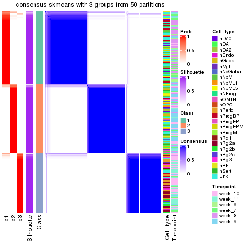</p>

</div>
<div id='tab-node-01-consensus-heatmap-3'>
<pre><code class="r">consensus_heatmap(res, k = 4)
</code></pre>

<p></p>

</div>
</div>

Heatmaps for the membership of samples in all partitions to see how consistent they are:


<script>
$( function() {
	$( '#tabs-node-01-membership-heatmap' ).tabs();
} );
</script>
<div id='tabs-node-01-membership-heatmap'>
<ul>
<li><a href='#tab-node-01-membership-heatmap-1'>k = 2</a></li>
<li><a href='#tab-node-01-membership-heatmap-2'>k = 3</a></li>
<li><a href='#tab-node-01-membership-heatmap-3'>k = 4</a></li>
</ul>
<div id='tab-node-01-membership-heatmap-1'>
<pre><code class="r">membership_heatmap(res, k = 2)
</code></pre>

<p></p>

</div>
<div id='tab-node-01-membership-heatmap-2'>
<pre><code class="r">membership_heatmap(res, k = 3)
</code></pre>

<p></p>

</div>
<div id='tab-node-01-membership-heatmap-3'>
<pre><code class="r">membership_heatmap(res, k = 4)
</code></pre>

<p></p>

</div>
</div>

As soon as the classes for columns are determined, the signatures
that are significantly different between subgroups can be looked for. 
Following are the heatmaps for signatures.


Signature heatmaps where rows are scaled:


<script>
$( function() {
	$( '#tabs-node-01-get-signatures' ).tabs();
} );
</script>
<div id='tabs-node-01-get-signatures'>
<ul>
<li><a href='#tab-node-01-get-signatures-1'>k = 2</a></li>
<li><a href='#tab-node-01-get-signatures-2'>k = 3</a></li>
<li><a href='#tab-node-01-get-signatures-3'>k = 4</a></li>
</ul>
<div id='tab-node-01-get-signatures-1'>
<pre><code class="r">get_signatures(res, k = 2)
</code></pre>

<p></p>

</div>
<div id='tab-node-01-get-signatures-2'>
<pre><code class="r">get_signatures(res, k = 3)
</code></pre>

<p></p>

</div>
<div id='tab-node-01-get-signatures-3'>
<pre><code class="r">get_signatures(res, k = 4)
</code></pre>

<p></p>

</div>
</div>


Signature heatmaps where rows are not scaled:


<script>
$( function() {
	$( '#tabs-node-01-get-signatures-no-scale' ).tabs();
} );
</script>
<div id='tabs-node-01-get-signatures-no-scale'>
<ul>
<li><a href='#tab-node-01-get-signatures-no-scale-1'>k = 2</a></li>
<li><a href='#tab-node-01-get-signatures-no-scale-2'>k = 3</a></li>
<li><a href='#tab-node-01-get-signatures-no-scale-3'>k = 4</a></li>
</ul>
<div id='tab-node-01-get-signatures-no-scale-1'>
<pre><code class="r">get_signatures(res, k = 2, scale_rows = FALSE)
</code></pre>

<p></p>

</div>
<div id='tab-node-01-get-signatures-no-scale-2'>
<pre><code class="r">get_signatures(res, k = 3, scale_rows = FALSE)
</code></pre>

<p></p>

</div>
<div id='tab-node-01-get-signatures-no-scale-3'>
<pre><code class="r">get_signatures(res, k = 4, scale_rows = FALSE)
</code></pre>

<p></p>

</div>
</div>


Compare the overlap of signatures from different k:

```r
compare_signatures(res)
```


`get_signature()` returns a data frame invisibly. To get the list of signatures, the function
call should be assigned to a variable explicitly. In following code, if `plot` argument is set
to `FALSE`, no heatmap is plotted while only the differential analysis is performed.

```r
# code only for demonstration
tb = get_signature(res, k = ..., plot = FALSE)
```

An example of the output of `tb` is:

```
#>   which_row         fdr    mean_1    mean_2 scaled_mean_1 scaled_mean_2 km
#> 1        38 0.042760348  8.373488  9.131774    -0.5533452     0.5164555  1
#> 2        40 0.018707592  7.106213  8.469186    -0.6173731     0.5762149  1
#> 3        55 0.019134737 10.221463 11.207825    -0.6159697     0.5749050  1
#> 4        59 0.006059896  5.921854  7.869574    -0.6899429     0.6439467  1
#> 5        60 0.018055526  8.928898 10.211722    -0.6204761     0.5791110  1
#> 6        98 0.009384629 15.714769 14.887706     0.6635654    -0.6193277  2
...
```

The columns in `tb` are:

1. `which_row`: row indices corresponding to the input matrix.
2. `fdr`: FDR for the differential test. 
3. `mean_x`: The mean value in group x.
4. `scaled_mean_x`: The mean value in group x after rows are scaled.
5. `km`: Row groups if k-means clustering is applied to rows (which is done by automatically selecting number of clusters).

If there are too many signatures, `top_signatures = ...` can be set to only show the 
signatures with the highest FDRs:

```r
# code only for demonstration
# e.g. to show the top 500 most significant rows
tb = get_signature(res, k = ..., top_signatures = 500)
```

If the signatures are defined as these which are uniquely high in current group, `diff_method` argument
can be set to `"uniquely_high_in_one_group"`:

```r
# code only for demonstration
tb = get_signature(res, k = ..., diff_method = "uniquely_high_in_one_group")
```


UMAP plot which shows how samples are separated.


<script>
$( function() {
	$( '#tabs-node-01-dimension-reduction' ).tabs();
} );
</script>
<div id='tabs-node-01-dimension-reduction'>
<ul>
<li><a href='#tab-node-01-dimension-reduction-1'>k = 2</a></li>
<li><a href='#tab-node-01-dimension-reduction-2'>k = 3</a></li>
<li><a href='#tab-node-01-dimension-reduction-3'>k = 4</a></li>
</ul>
<div id='tab-node-01-dimension-reduction-1'>
<pre><code class="r">dimension_reduction(res, k = 2, method = &quot;UMAP&quot;)
</code></pre>

<p></p>

</div>
<div id='tab-node-01-dimension-reduction-2'>
<pre><code class="r">dimension_reduction(res, k = 3, method = &quot;UMAP&quot;)
</code></pre>

<p></p>

</div>
<div id='tab-node-01-dimension-reduction-3'>
<pre><code class="r">dimension_reduction(res, k = 4, method = &quot;UMAP&quot;)
</code></pre>

<p></p>

</div>
</div>


Following heatmap shows how subgroups are split when increasing `k`:

```r
collect_classes(res)
```


Test correlation between subgroups and known annotations. If the known
annotation is numeric, one-way ANOVA test is applied, and if the known
annotation is discrete, chi-squared contingency table test is applied.

```r
test_to_known_factors(res)
```

```
#>             n_sample Cell_type(p-value) Timepoint(p-value) k
#> ATC:skmeans      871          3.42e-110           8.24e-53 2
#> ATC:skmeans      743          3.06e-188          6.74e-157 3
#> ATC:skmeans      881          5.34e-223          6.00e-165 4
```


If matrix rows can be associated to genes, consider to use `functional_enrichment(res,
...)` to perform function enrichment for the signature genes. See [this vignette](https://jokergoo.github.io/cola_vignettes/functional_enrichment.html) for more detailed explanations.


 

---------------------------------------------------


### Node011


Parent node: [Node01](#Node01).
Child nodes: 
                Node0111-leaf
        ,
                [Node0112](#Node0112)
        ,
                [Node0113](#Node0113)
        ,
                [Node0121](#Node0121)
        ,
                [Node0122](#Node0122)
        ,
                [Node0131](#Node0131)
        ,
                [Node0132](#Node0132)
        ,
                [Node0133](#Node0133)
        ,
                [Node0211](#Node0211)
        ,
                [Node0212](#Node0212)
        ,
                Node0221-leaf
        ,
                [Node0222](#Node0222)
        ,
                [Node0223](#Node0223)
        ,
                [Node0231](#Node0231)
        ,
                [Node0232](#Node0232)
        ,
                Node0233-leaf
        ,
                Node0241-leaf
        ,
                [Node0242](#Node0242)
        ,
                Node0243-leaf
        .


The object with results only for a single top-value method and a single partitioning method 
can be extracted as:

```r
res = res_rh["011"]
```

A summary of `res` and all the functions that can be applied to it:

```r
res
```

```
#> A 'ConsensusPartition' object with k = 2, 3, 4.
#>   On a matrix with 8505 rows and 401 columns.
#>   Top rows (850) are extracted by 'ATC' method.
#>   Subgroups are detected by 'skmeans' method.
#>   Performed in total 150 partitions by row resampling.
#>   Best k for subgroups seems to be 4.
#> 
#> Following methods can be applied to this 'ConsensusPartition' object:
#>  [1] "cola_report"             "collect_classes"         "collect_plots"          
#>  [4] "collect_stats"           "colnames"                "compare_partitions"     
#>  [7] "compare_signatures"      "consensus_heatmap"       "dimension_reduction"    
#> [10] "functional_enrichment"   "get_anno_col"            "get_anno"               
#> [13] "get_classes"             "get_consensus"           "get_matrix"             
#> [16] "get_membership"          "get_param"               "get_signatures"         
#> [19] "get_stats"               "is_best_k"               "is_stable_k"            
#> [22] "membership_heatmap"      "ncol"                    "nrow"                   
#> [25] "plot_ecdf"               "predict_classes"         "rownames"               
#> [28] "select_partition_number" "show"                    "suggest_best_k"         
#> [31] "test_to_known_factors"   "top_rows_heatmap"
```

`collect_plots()` function collects all the plots made from `res` for all `k` (number of subgroups)
into one single page to provide an easy and fast comparison between different `k`.

```r
collect_plots(res)
```


The plots are:

- The first row: a plot of the eCDF (empirical cumulative distribution
  function) curves of the consensus matrix for each `k` and the heatmap of
  predicted classes for each `k`.
- The second row: heatmaps of the consensus matrix for each `k`.
- The third row: heatmaps of the membership matrix for each `k`.
- The fouth row: heatmaps of the signatures for each `k`.

All the plots in panels can be made by individual functions and they are
plotted later in this section.

`select_partition_number()` produces several plots showing different
statistics for choosing "optimized" `k`. There are following statistics:

- eCDF curves of the consensus matrix for each `k`;
- 1-PAC. [The PAC score](https://en.wikipedia.org/wiki/Consensus_clustering#Over-interpretation_potential_of_consensus_clustering)
  measures the proportion of the ambiguous subgrouping.
- Mean silhouette score.
- Concordance. The mean probability of fiting the consensus subgroup labels in all
  partitions.
- Area increased. Denote $A_k$ as the area under the eCDF curve for current
  `k`, the area increased is defined as $A_k - A_{k-1}$.
- Rand index. The percent of pairs of samples that are both in a same cluster
  or both are not in a same cluster in the partition of k and k-1.
- Jaccard index. The ratio of pairs of samples are both in a same cluster in
  the partition of k and k-1 and the pairs of samples are both in a same
  cluster in the partition k or k-1.

The detailed explanations of these statistics can be found in [the _cola_
vignette](https://jokergoo.github.io/cola_vignettes/cola.html#toc_13).

Generally speaking, higher 1-PAC score, higher mean silhouette score or higher
concordance corresponds to better partition. Rand index and Jaccard index
measure how similar the current partition is compared to partition with `k-1`.
If they are too similar, we won't accept `k` is better than `k-1`.

```r
select_partition_number(res)
```


The numeric values for all these statistics can be obtained by `get_stats()`.

```r
get_stats(res)
```

```
#>   k 1-PAC mean_silhouette concordance area_increased  Rand Jaccard
#> 2 2 0.979           0.949       0.980          0.488 0.512   0.512
#> 3 3 0.982           0.951       0.980          0.369 0.733   0.520
#> 4 4 0.953           0.934       0.972          0.122 0.843   0.576
```

`suggest_best_k()` suggests the best $k$ based on these statistics. The rules are as follows:

- All $k$ with Jaccard index larger than 0.95 are removed because increasing
  $k$ does not provide enough extra information. If all $k$ are removed, it is
  marked as no subgroup is detected.
- For all $k$ with 1-PAC score larger than 0.9, the maximal $k$ is taken as
  the best $k$, and other $k$ are marked as optional $k$.
- If it does not fit the second rule. The $k$ with the maximal vote of the
  highest 1-PAC score, highest mean silhouette, and highest concordance is
  taken as the best $k$.

```r
suggest_best_k(res)
```

```
#> [1] 4
#> attr(,"optional")
#> [1] 2 3
```

There is also optional best $k$ = 2 3 that is worth to check.

Following is the table of the partitions (You need to click the **show/hide
code output** link to see it). The membership matrix (columns with name `p*`)
is inferred by
[`clue::cl_consensus()`](https://www.rdocumentation.org/link/cl_consensus?package=clue)
function with the `SE` method. Basically the value in the membership matrix
represents the probability to belong to a certain group. The finall subgroup
label for an item is determined with the group with highest probability it
belongs to.

In `get_classes()` function, the entropy is calculated from the membership
matrix and the silhouette score is calculated from the consensus matrix.


<script>
$( function() {
	$( '#tabs-node-011-get-classes' ).tabs();
} );
</script>
<div id='tabs-node-011-get-classes'>
<ul>
<li><a href='#tab-node-011-get-classes-1'>k = 2</a></li>
<li><a href='#tab-node-011-get-classes-2'>k = 3</a></li>
<li><a href='#tab-node-011-get-classes-3'>k = 4</a></li>
</ul>

<div id='tab-node-011-get-classes-1'>
<p><a id='tab-node-011-get-classes-1-a' style='color:#0366d6' href='#'>show/hide code output</a></p>
<pre><code class="r">cbind(get_classes(res, k = 2), get_membership(res, k = 2))
</code></pre>

<pre><code>#&gt;                 class entropy silhouette   p1   p2
#&gt; 1772067_089_A01     1   0.000      0.984 1.00 0.00
#&gt; 1772067_089_A03     1   0.000      0.984 1.00 0.00
#&gt; 1772067_089_A06     2   0.000      0.973 0.00 1.00
#&gt; 1772067_089_A08     2   0.000      0.973 0.00 1.00
#&gt; 1772067_089_B01     1   0.000      0.984 1.00 0.00
#&gt; 1772067_089_B03     1   0.000      0.984 1.00 0.00
#&gt; 1772067_089_B07     2   0.904      0.538 0.32 0.68
#&gt; 1772067_089_B09     2   0.000      0.973 0.00 1.00
#&gt; 1772067_089_C04     2   0.000      0.973 0.00 1.00
#&gt; 1772067_089_C05     1   0.000      0.984 1.00 0.00
#&gt; 1772067_089_C08     2   0.000      0.973 0.00 1.00
#&gt; 1772067_089_C10     2   0.000      0.973 0.00 1.00
#&gt; 1772067_089_C11     1   0.000      0.984 1.00 0.00
#&gt; 1772067_089_D01     2   0.000      0.973 0.00 1.00
#&gt; 1772067_089_D05     1   0.000      0.984 1.00 0.00
#&gt; 1772067_089_D08     2   0.000      0.973 0.00 1.00
#&gt; 1772067_089_D09     1   0.990      0.200 0.56 0.44
#&gt; 1772067_089_D12     2   0.000      0.973 0.00 1.00
#&gt; 1772067_089_E03     1   0.000      0.984 1.00 0.00
#&gt; 1772067_089_E07     2   0.000      0.973 0.00 1.00
#&gt; 1772067_089_E08     1   0.000      0.984 1.00 0.00
#&gt; 1772067_089_F02     1   0.000      0.984 1.00 0.00
#&gt; 1772067_089_F04     2   0.000      0.973 0.00 1.00
#&gt; 1772067_089_F05     1   0.000      0.984 1.00 0.00
#&gt; 1772067_089_F06     1   0.000      0.984 1.00 0.00
#&gt; 1772067_089_F11     1   0.000      0.984 1.00 0.00
#&gt; 1772067_089_G02     1   0.000      0.984 1.00 0.00
#&gt; 1772067_089_G09     1   0.000      0.984 1.00 0.00
#&gt; 1772067_089_G10     2   0.000      0.973 0.00 1.00
#&gt; 1772067_089_H06     1   0.000      0.984 1.00 0.00
#&gt; 1772071_027_A04     2   0.000      0.973 0.00 1.00
#&gt; 1772071_027_A10     2   0.000      0.973 0.00 1.00
#&gt; 1772071_027_C01     1   0.000      0.984 1.00 0.00
#&gt; 1772071_027_C03     2   0.000      0.973 0.00 1.00
#&gt; 1772071_027_C07     2   0.000      0.973 0.00 1.00
#&gt; 1772071_027_D07     2   0.000      0.973 0.00 1.00
#&gt; 1772071_027_D12     1   0.000      0.984 1.00 0.00
#&gt; 1772071_027_E01     1   0.000      0.984 1.00 0.00
#&gt; 1772071_027_E04     2   0.000      0.973 0.00 1.00
#&gt; 1772071_027_E10     1   0.000      0.984 1.00 0.00
#&gt; 1772071_027_F06     2   0.584      0.829 0.14 0.86
#&gt; 1772071_027_H06     1   0.000      0.984 1.00 0.00
#&gt; 1772071_027_H09     1   0.529      0.855 0.88 0.12
#&gt; 1772071_029_A05     1   0.000      0.984 1.00 0.00
#&gt; 1772071_029_B07     1   0.000      0.984 1.00 0.00
#&gt; 1772071_029_B10     1   0.000      0.984 1.00 0.00
#&gt; 1772071_029_B12     1   0.000      0.984 1.00 0.00
#&gt; 1772071_029_C01     2   0.000      0.973 0.00 1.00
#&gt; 1772071_029_C03     1   0.000      0.984 1.00 0.00
#&gt; 1772071_029_E07     1   0.722      0.743 0.80 0.20
#&gt; 1772071_029_E10     1   0.000      0.984 1.00 0.00
#&gt; 1772071_029_F06     2   0.000      0.973 0.00 1.00
#&gt; 1772071_029_F08     1   0.000      0.984 1.00 0.00
#&gt; 1772071_029_H04     1   0.000      0.984 1.00 0.00
#&gt; 1772071_029_H12     1   0.000      0.984 1.00 0.00
#&gt; 1772078_078_B05     1   0.000      0.984 1.00 0.00
#&gt; 1772078_078_C08     1   0.000      0.984 1.00 0.00
#&gt; 1772078_078_D05     1   0.000      0.984 1.00 0.00
#&gt; 1772078_078_E10     1   0.000      0.984 1.00 0.00
#&gt; 1772078_078_H04     1   0.000      0.984 1.00 0.00
#&gt; 1772078_078_H05     1   0.000      0.984 1.00 0.00
#&gt; 1772078_079_B06     2   0.327      0.917 0.06 0.94
#&gt; 1772078_079_C10     1   0.000      0.984 1.00 0.00
#&gt; 1772078_079_H02     1   0.000      0.984 1.00 0.00
#&gt; 1772078_107_A12     1   0.000      0.984 1.00 0.00
#&gt; 1772078_107_B03     1   0.000      0.984 1.00 0.00
#&gt; 1772078_107_E01     1   0.000      0.984 1.00 0.00
#&gt; 1772078_107_F05     1   0.000      0.984 1.00 0.00
#&gt; 1772078_109_H04     1   0.000      0.984 1.00 0.00
#&gt; 1772075_299_C08     1   0.000      0.984 1.00 0.00
#&gt; 1772075_299_E12     2   0.981      0.291 0.42 0.58
#&gt; 1772075_299_F03     2   0.000      0.973 0.00 1.00
#&gt; 1772075_299_G02     1   0.000      0.984 1.00 0.00
#&gt; 1772075_298_A10     1   0.000      0.984 1.00 0.00
#&gt; 1772075_298_B04     1   0.990      0.199 0.56 0.44
#&gt; 1772075_298_B11     1   0.000      0.984 1.00 0.00
#&gt; 1772075_298_D03     1   0.000      0.984 1.00 0.00
#&gt; 1772075_298_D09     1   0.000      0.984 1.00 0.00
#&gt; 1772075_298_D11     1   0.000      0.984 1.00 0.00
#&gt; 1772075_298_E06     1   0.000      0.984 1.00 0.00
#&gt; 1772075_298_F05     2   0.000      0.973 0.00 1.00
#&gt; 1772075_298_F09     1   0.000      0.984 1.00 0.00
#&gt; 1772075_298_G07     2   0.000      0.973 0.00 1.00
#&gt; 1772075_298_H04     2   0.000      0.973 0.00 1.00
#&gt; 1772075_298_H06     2   0.000      0.973 0.00 1.00
#&gt; 1772078_001_A06     1   0.000      0.984 1.00 0.00
#&gt; 1772078_001_B05     2   0.000      0.973 0.00 1.00
#&gt; 1772078_001_B12     1   0.000      0.984 1.00 0.00
#&gt; 1772078_001_C01     1   0.000      0.984 1.00 0.00
#&gt; 1772078_001_C11     1   0.000      0.984 1.00 0.00
#&gt; 1772078_001_D12     2   0.000      0.973 0.00 1.00
#&gt; 1772078_001_E02     1   0.000      0.984 1.00 0.00
#&gt; 1772078_001_E03     2   0.000      0.973 0.00 1.00
#&gt; 1772078_001_E04     2   0.000      0.973 0.00 1.00
#&gt; 1772078_001_E08     2   0.000      0.973 0.00 1.00
#&gt; 1772078_001_E10     1   0.000      0.984 1.00 0.00
#&gt; 1772078_001_F02     1   0.000      0.984 1.00 0.00
#&gt; 1772078_001_F12     2   0.000      0.973 0.00 1.00
#&gt; 1772078_001_G01     2   0.000      0.973 0.00 1.00
#&gt; 1772078_001_G10     1   0.000      0.984 1.00 0.00
#&gt; 1772078_001_G11     1   0.000      0.984 1.00 0.00
#&gt; 1772078_001_H05     2   0.000      0.973 0.00 1.00
#&gt; 1772078_002_A03     2   0.000      0.973 0.00 1.00
#&gt; 1772078_002_B12     1   0.000      0.984 1.00 0.00
#&gt; 1772078_002_C06     2   0.000      0.973 0.00 1.00
#&gt; 1772078_002_C11     1   0.000      0.984 1.00 0.00
#&gt; 1772078_002_C12     2   0.000      0.973 0.00 1.00
#&gt; 1772078_002_D06     1   0.000      0.984 1.00 0.00
#&gt; 1772078_002_E10     1   0.000      0.984 1.00 0.00
#&gt; 1772096_160_B08     1   0.000      0.984 1.00 0.00
#&gt; 1772096_160_C08     1   0.000      0.984 1.00 0.00
#&gt; 1772096_160_D01     1   0.000      0.984 1.00 0.00
#&gt; 1772096_160_D04     1   0.000      0.984 1.00 0.00
#&gt; 1772096_160_D09     2   0.000      0.973 0.00 1.00
#&gt; 1772096_160_E11     1   0.000      0.984 1.00 0.00
#&gt; 1772096_160_E12     2   0.904      0.541 0.32 0.68
#&gt; 1772096_160_G04     1   0.000      0.984 1.00 0.00
#&gt; 1772096_160_G05     2   0.000      0.973 0.00 1.00
#&gt; 1772096_160_G12     1   0.000      0.984 1.00 0.00
#&gt; 1772096_160_H11     2   0.000      0.973 0.00 1.00
#&gt; 1772096_095_A04     2   0.000      0.973 0.00 1.00
#&gt; 1772096_095_A06     1   0.000      0.984 1.00 0.00
#&gt; 1772096_095_A09     1   0.000      0.984 1.00 0.00
#&gt; 1772096_095_B08     1   0.000      0.984 1.00 0.00
#&gt; 1772096_095_B11     1   0.000      0.984 1.00 0.00
#&gt; 1772096_095_C09     1   0.141      0.965 0.98 0.02
#&gt; 1772096_095_D10     1   0.000      0.984 1.00 0.00
#&gt; 1772096_095_E10     1   0.000      0.984 1.00 0.00
#&gt; 1772096_095_F10     1   0.000      0.984 1.00 0.00
#&gt; 1772096_095_G04     1   0.000      0.984 1.00 0.00
#&gt; 1772122_236_B02     1   0.141      0.965 0.98 0.02
#&gt; 1772122_236_C01     1   0.000      0.984 1.00 0.00
#&gt; 1772122_236_C08     2   0.000      0.973 0.00 1.00
#&gt; 1772122_236_G05     1   0.000      0.984 1.00 0.00
#&gt; 1772122_236_H03     1   0.000      0.984 1.00 0.00
#&gt; 1772122_236_H10     1   0.000      0.984 1.00 0.00
#&gt; 1772122_236_H12     1   0.000      0.984 1.00 0.00
#&gt; 1772121_291_B03     1   0.000      0.984 1.00 0.00
#&gt; 1772121_291_B05     1   0.000      0.984 1.00 0.00
#&gt; 1772121_291_E09     1   0.000      0.984 1.00 0.00
#&gt; 1772121_291_H09     1   0.000      0.984 1.00 0.00
#&gt; 1772121_293_B02     2   0.000      0.973 0.00 1.00
#&gt; 1772121_293_B08     2   0.000      0.973 0.00 1.00
#&gt; 1772121_293_B10     1   0.000      0.984 1.00 0.00
#&gt; 1772121_293_C03     1   0.000      0.984 1.00 0.00
#&gt; 1772121_293_C09     1   0.000      0.984 1.00 0.00
#&gt; 1772121_293_F07     1   0.000      0.984 1.00 0.00
#&gt; 1772121_283_A04     1   0.000      0.984 1.00 0.00
#&gt; 1772121_283_A11     1   0.000      0.984 1.00 0.00
#&gt; 1772121_283_G07     1   0.000      0.984 1.00 0.00
#&gt; 1772121_283_G10     1   0.000      0.984 1.00 0.00
#&gt; 1772121_282_B02     1   0.000      0.984 1.00 0.00
#&gt; 1772121_282_B10     1   0.000      0.984 1.00 0.00
#&gt; 1772121_282_B12     1   0.000      0.984 1.00 0.00
#&gt; 1772121_282_D01     1   0.000      0.984 1.00 0.00
#&gt; 1772121_282_D05     1   0.000      0.984 1.00 0.00
#&gt; 1772121_282_G06     1   0.000      0.984 1.00 0.00
#&gt; 1772122_264_A05     1   0.000      0.984 1.00 0.00
#&gt; 1772122_264_A10     2   0.000      0.973 0.00 1.00
#&gt; 1772122_264_C05     1   0.000      0.984 1.00 0.00
#&gt; 1772122_264_D03     1   0.000      0.984 1.00 0.00
#&gt; 1772122_264_E02     2   0.000      0.973 0.00 1.00
#&gt; 1772122_264_E07     1   0.000      0.984 1.00 0.00
#&gt; 1772122_264_F08     1   0.000      0.984 1.00 0.00
#&gt; 1772122_264_H08     1   0.000      0.984 1.00 0.00
#&gt; 1772122_208_A08     1   0.000      0.984 1.00 0.00
#&gt; 1772122_208_D10     1   0.000      0.984 1.00 0.00
#&gt; 1772122_208_E06     1   0.000      0.984 1.00 0.00
#&gt; 1772122_208_E10     1   0.000      0.984 1.00 0.00
#&gt; 1772122_208_G06     1   0.000      0.984 1.00 0.00
#&gt; 1772122_201_G10     1   0.000      0.984 1.00 0.00
#&gt; 1772122_201_H01     2   0.000      0.973 0.00 1.00
#&gt; 1772122_207_B05     1   0.000      0.984 1.00 0.00
#&gt; 1772122_207_E11     1   0.000      0.984 1.00 0.00
#&gt; 1772122_207_H03     1   0.000      0.984 1.00 0.00
#&gt; 1772122_207_H05     1   0.000      0.984 1.00 0.00
#&gt; 1772122_199_A05     2   0.000      0.973 0.00 1.00
#&gt; 1772122_199_C02     2   0.680      0.776 0.18 0.82
#&gt; 1772122_199_H01     1   0.000      0.984 1.00 0.00
#&gt; 1772122_203_A02     2   0.000      0.973 0.00 1.00
#&gt; 1772122_203_C01     1   0.000      0.984 1.00 0.00
#&gt; 1772122_203_F12     1   0.000      0.984 1.00 0.00
#&gt; 1772122_203_H01     1   0.000      0.984 1.00 0.00
#&gt; 1772122_200_A06     1   0.000      0.984 1.00 0.00
#&gt; 1772122_200_A09     2   0.141      0.955 0.02 0.98
#&gt; 1772122_200_B08     1   0.000      0.984 1.00 0.00
#&gt; 1772122_200_B12     1   0.000      0.984 1.00 0.00
#&gt; 1772122_200_D10     1   0.000      0.984 1.00 0.00
#&gt; 1772122_200_G05     1   0.000      0.984 1.00 0.00
#&gt; 1772122_316_A02     2   0.000      0.973 0.00 1.00
#&gt; 1772122_316_A03     2   0.000      0.973 0.00 1.00
#&gt; 1772122_316_A04     2   0.000      0.973 0.00 1.00
#&gt; 1772122_316_A07     2   0.000      0.973 0.00 1.00
#&gt; 1772122_316_A09     2   0.000      0.973 0.00 1.00
#&gt; 1772122_316_B01     1   0.000      0.984 1.00 0.00
#&gt; 1772122_316_B03     2   0.000      0.973 0.00 1.00
#&gt; 1772122_316_B05     2   0.000      0.973 0.00 1.00
#&gt; 1772122_316_C05     1   0.000      0.984 1.00 0.00
#&gt; 1772122_316_C07     2   0.000      0.973 0.00 1.00
#&gt; 1772122_316_D03     2   0.000      0.973 0.00 1.00
#&gt; 1772122_316_D08     1   0.000      0.984 1.00 0.00
#&gt; 1772122_316_E01     2   0.000      0.973 0.00 1.00
#&gt; 1772122_316_E02     1   0.000      0.984 1.00 0.00
#&gt; 1772122_316_E08     2   0.000      0.973 0.00 1.00
#&gt; 1772122_316_F06     2   0.000      0.973 0.00 1.00
#&gt; 1772122_316_H02     2   0.000      0.973 0.00 1.00
#&gt; 1772122_317_A01     2   0.000      0.973 0.00 1.00
#&gt; 1772122_317_A03     2   0.000      0.973 0.00 1.00
#&gt; 1772122_317_A07     1   0.000      0.984 1.00 0.00
#&gt; 1772122_317_A08     2   0.000      0.973 0.00 1.00
#&gt; 1772122_317_A10     1   0.000      0.984 1.00 0.00
#&gt; 1772122_317_C05     2   0.000      0.973 0.00 1.00
#&gt; 1772122_317_D06     2   0.000      0.973 0.00 1.00
#&gt; 1772122_317_E06     2   0.000      0.973 0.00 1.00
#&gt; 1772122_317_E08     1   0.000      0.984 1.00 0.00
#&gt; 1772122_317_E09     1   0.000      0.984 1.00 0.00
#&gt; 1772122_317_E12     2   0.000      0.973 0.00 1.00
#&gt; 1772122_317_F03     1   0.000      0.984 1.00 0.00
#&gt; 1772122_317_F05     1   0.000      0.984 1.00 0.00
#&gt; 1772122_317_F08     1   0.000      0.984 1.00 0.00
#&gt; 1772122_317_F11     1   0.000      0.984 1.00 0.00
#&gt; 1772122_317_F12     1   0.000      0.984 1.00 0.00
#&gt; 1772122_317_G05     2   0.000      0.973 0.00 1.00
#&gt; 1772122_317_G06     1   0.000      0.984 1.00 0.00
#&gt; 1772122_317_G11     1   0.000      0.984 1.00 0.00
#&gt; 1772122_318_A09     2   0.000      0.973 0.00 1.00
#&gt; 1772122_318_B05     1   0.000      0.984 1.00 0.00
#&gt; 1772122_318_B10     1   0.402      0.902 0.92 0.08
#&gt; 1772122_318_C05     2   0.000      0.973 0.00 1.00
#&gt; 1772122_318_C07     1   0.000      0.984 1.00 0.00
#&gt; 1772122_318_D06     1   0.000      0.984 1.00 0.00
#&gt; 1772122_318_D07     2   0.000      0.973 0.00 1.00
#&gt; 1772122_318_E01     1   0.000      0.984 1.00 0.00
#&gt; 1772122_318_E04     2   0.000      0.973 0.00 1.00
#&gt; 1772122_318_E11     2   0.000      0.973 0.00 1.00
#&gt; 1772122_318_F10     1   0.000      0.984 1.00 0.00
#&gt; 1772122_318_H01     2   0.000      0.973 0.00 1.00
#&gt; 1772122_318_H05     1   0.000      0.984 1.00 0.00
#&gt; 1772122_319_A01     1   0.000      0.984 1.00 0.00
#&gt; 1772122_319_A08     1   0.000      0.984 1.00 0.00
#&gt; 1772122_319_B01     2   0.000      0.973 0.00 1.00
#&gt; 1772122_319_B08     2   0.000      0.973 0.00 1.00
#&gt; 1772122_319_B11     1   0.000      0.984 1.00 0.00
#&gt; 1772122_319_C07     1   0.000      0.984 1.00 0.00
#&gt; 1772122_319_D03     2   0.000      0.973 0.00 1.00
#&gt; 1772122_319_D05     1   0.000      0.984 1.00 0.00
#&gt; 1772122_319_D08     2   0.000      0.973 0.00 1.00
#&gt; 1772122_319_E05     2   0.000      0.973 0.00 1.00
#&gt; 1772122_319_E07     2   0.680      0.777 0.18 0.82
#&gt; 1772122_319_E09     1   0.000      0.984 1.00 0.00
#&gt; 1772122_319_F06     2   0.000      0.973 0.00 1.00
#&gt; 1772122_319_G03     2   0.000      0.973 0.00 1.00
#&gt; 1772122_319_H06     2   0.000      0.973 0.00 1.00
#&gt; 1772122_319_H07     2   0.141      0.955 0.02 0.98
#&gt; 1772122_319_H10     1   0.000      0.984 1.00 0.00
#&gt; 1772122_221_A02     1   0.000      0.984 1.00 0.00
#&gt; 1772122_221_A05     2   0.000      0.973 0.00 1.00
#&gt; 1772122_221_A09     2   0.000      0.973 0.00 1.00
#&gt; 1772122_221_B08     2   0.000      0.973 0.00 1.00
#&gt; 1772122_221_B12     1   0.881      0.565 0.70 0.30
#&gt; 1772122_221_C04     2   0.000      0.973 0.00 1.00
#&gt; 1772122_221_C08     1   0.000      0.984 1.00 0.00
#&gt; 1772122_221_C09     2   0.000      0.973 0.00 1.00
#&gt; 1772122_221_C10     1   0.000      0.984 1.00 0.00
#&gt; 1772122_221_D01     2   0.000      0.973 0.00 1.00
#&gt; 1772122_221_D05     2   0.000      0.973 0.00 1.00
#&gt; 1772122_221_D06     2   0.760      0.718 0.22 0.78
#&gt; 1772122_221_D07     2   0.000      0.973 0.00 1.00
#&gt; 1772122_221_D08     2   0.000      0.973 0.00 1.00
#&gt; 1772122_221_D09     2   0.000      0.973 0.00 1.00
#&gt; 1772122_221_D11     2   0.327      0.917 0.06 0.94
#&gt; 1772122_221_D12     2   0.958      0.403 0.38 0.62
#&gt; 1772122_221_E02     1   0.925      0.481 0.66 0.34
#&gt; 1772122_221_E03     1   0.000      0.984 1.00 0.00
#&gt; 1772122_221_E12     2   0.000      0.973 0.00 1.00
#&gt; 1772122_221_F03     2   0.000      0.973 0.00 1.00
#&gt; 1772122_221_F05     1   0.981      0.265 0.58 0.42
#&gt; 1772122_221_F10     1   0.000      0.984 1.00 0.00
#&gt; 1772122_221_G03     2   0.000      0.973 0.00 1.00
#&gt; 1772122_221_G10     1   0.000      0.984 1.00 0.00
#&gt; 1772122_221_H03     2   0.000      0.973 0.00 1.00
#&gt; 1772122_221_H05     2   0.999      0.090 0.48 0.52
#&gt; 1772122_221_H07     1   0.000      0.984 1.00 0.00
#&gt; 1772122_220_A08     1   0.000      0.984 1.00 0.00
#&gt; 1772122_220_B01     1   0.000      0.984 1.00 0.00
#&gt; 1772122_220_B02     1   0.000      0.984 1.00 0.00
#&gt; 1772122_220_C11     2   0.000      0.973 0.00 1.00
#&gt; 1772122_220_D03     2   0.000      0.973 0.00 1.00
#&gt; 1772122_220_D08     2   0.000      0.973 0.00 1.00
#&gt; 1772122_220_D12     2   0.000      0.973 0.00 1.00
#&gt; 1772122_220_E05     1   0.000      0.984 1.00 0.00
#&gt; 1772122_220_E06     2   0.000      0.973 0.00 1.00
#&gt; 1772122_220_E07     2   0.000      0.973 0.00 1.00
#&gt; 1772122_220_E09     2   0.000      0.973 0.00 1.00
#&gt; 1772122_220_F09     2   0.000      0.973 0.00 1.00
#&gt; 1772122_220_G08     1   0.904      0.526 0.68 0.32
#&gt; 1772122_220_H01     2   0.000      0.973 0.00 1.00
#&gt; 1772122_220_H05     1   0.000      0.984 1.00 0.00
#&gt; 1772122_220_H07     1   0.242      0.944 0.96 0.04
#&gt; 1772122_220_H09     2   0.000      0.973 0.00 1.00
#&gt; 1772122_226_A03     1   0.000      0.984 1.00 0.00
#&gt; 1772122_226_A05     2   0.000      0.973 0.00 1.00
#&gt; 1772122_226_A07     2   0.000      0.973 0.00 1.00
#&gt; 1772122_226_A08     2   0.000      0.973 0.00 1.00
#&gt; 1772122_226_B02     2   0.000      0.973 0.00 1.00
#&gt; 1772122_226_B04     1   0.000      0.984 1.00 0.00
#&gt; 1772122_226_B06     2   0.000      0.973 0.00 1.00
#&gt; 1772122_226_B08     2   0.000      0.973 0.00 1.00
#&gt; 1772122_226_B10     1   0.000      0.984 1.00 0.00
#&gt; 1772122_226_B11     2   0.402      0.897 0.08 0.92
#&gt; 1772122_226_C08     1   0.000      0.984 1.00 0.00
#&gt; 1772122_226_C10     1   0.000      0.984 1.00 0.00
#&gt; 1772122_226_C11     1   0.000      0.984 1.00 0.00
#&gt; 1772122_226_D03     1   0.000      0.984 1.00 0.00
#&gt; 1772122_226_D05     2   0.971      0.345 0.40 0.60
#&gt; 1772122_226_D12     1   0.000      0.984 1.00 0.00
#&gt; 1772122_226_E01     1   0.000      0.984 1.00 0.00
#&gt; 1772122_226_E03     1   0.000      0.984 1.00 0.00
#&gt; 1772122_226_E04     1   0.000      0.984 1.00 0.00
#&gt; 1772122_226_E07     2   0.000      0.973 0.00 1.00
#&gt; 1772122_226_E08     1   0.000      0.984 1.00 0.00
#&gt; 1772122_226_E09     2   0.000      0.973 0.00 1.00
#&gt; 1772122_226_E10     2   0.000      0.973 0.00 1.00
#&gt; 1772122_226_E12     1   0.000      0.984 1.00 0.00
#&gt; 1772122_226_F04     1   0.000      0.984 1.00 0.00
#&gt; 1772122_226_F05     2   0.000      0.973 0.00 1.00
#&gt; 1772122_226_F06     1   0.000      0.984 1.00 0.00
#&gt; 1772122_226_F07     2   0.000      0.973 0.00 1.00
#&gt; 1772122_226_F08     2   0.000      0.973 0.00 1.00
#&gt; 1772122_226_F12     1   0.000      0.984 1.00 0.00
#&gt; 1772122_226_G05     2   0.000      0.973 0.00 1.00
#&gt; 1772122_226_G07     2   0.000      0.973 0.00 1.00
#&gt; 1772122_226_G09     1   0.000      0.984 1.00 0.00
#&gt; 1772122_226_H01     2   0.000      0.973 0.00 1.00
#&gt; 1772122_226_H02     2   0.000      0.973 0.00 1.00
#&gt; 1772122_226_H03     2   0.000      0.973 0.00 1.00
#&gt; 1772122_226_H06     1   0.000      0.984 1.00 0.00
#&gt; 1772122_226_H07     1   0.000      0.984 1.00 0.00
#&gt; 1772122_226_H08     2   0.000      0.973 0.00 1.00
#&gt; 1772122_226_H10     2   0.000      0.973 0.00 1.00
#&gt; 1772122_226_H12     1   0.000      0.984 1.00 0.00
#&gt; 1772122_223_A06     2   0.995      0.165 0.46 0.54
#&gt; 1772122_223_A11     1   0.000      0.984 1.00 0.00
#&gt; 1772122_223_A12     1   0.000      0.984 1.00 0.00
#&gt; 1772122_223_B02     2   0.000      0.973 0.00 1.00
#&gt; 1772122_223_C02     2   0.881      0.581 0.30 0.70
#&gt; 1772122_223_C08     1   0.000      0.984 1.00 0.00
#&gt; 1772122_223_C09     2   0.000      0.973 0.00 1.00
#&gt; 1772122_223_D03     2   0.000      0.973 0.00 1.00
#&gt; 1772122_223_D11     2   0.000      0.973 0.00 1.00
#&gt; 1772122_223_D12     1   0.000      0.984 1.00 0.00
#&gt; 1772122_223_E01     1   0.000      0.984 1.00 0.00
#&gt; 1772122_223_E03     2   0.000      0.973 0.00 1.00
#&gt; 1772122_223_E04     1   0.000      0.984 1.00 0.00
#&gt; 1772122_223_E08     1   0.000      0.984 1.00 0.00
#&gt; 1772122_223_E09     2   0.000      0.973 0.00 1.00
#&gt; 1772122_223_E11     2   0.000      0.973 0.00 1.00
#&gt; 1772122_223_G04     1   0.000      0.984 1.00 0.00
#&gt; 1772122_223_G05     2   0.981      0.290 0.42 0.58
#&gt; 1772122_223_G06     1   0.000      0.984 1.00 0.00
#&gt; 1772122_223_G10     1   0.855      0.605 0.72 0.28
#&gt; 1772122_223_G12     2   0.000      0.973 0.00 1.00
#&gt; 1772122_223_H01     1   0.000      0.984 1.00 0.00
#&gt; 1772122_223_H04     1   0.000      0.984 1.00 0.00
#&gt; 1772122_223_H06     1   0.827      0.642 0.74 0.26
#&gt; 1772122_224_A01     1   0.000      0.984 1.00 0.00
#&gt; 1772122_224_A02     2   0.000      0.973 0.00 1.00
#&gt; 1772122_224_A05     2   0.000      0.973 0.00 1.00
#&gt; 1772122_224_A07     2   0.000      0.973 0.00 1.00
#&gt; 1772122_224_A12     1   0.000      0.984 1.00 0.00
#&gt; 1772122_224_B01     1   0.000      0.984 1.00 0.00
#&gt; 1772122_224_B03     2   0.000      0.973 0.00 1.00
#&gt; 1772122_224_B06     2   0.000      0.973 0.00 1.00
#&gt; 1772122_224_B10     2   0.000      0.973 0.00 1.00
#&gt; 1772122_224_B11     2   0.000      0.973 0.00 1.00
#&gt; 1772122_224_C02     1   0.000      0.984 1.00 0.00
#&gt; 1772122_224_C10     1   0.000      0.984 1.00 0.00
#&gt; 1772122_224_D01     1   0.000      0.984 1.00 0.00
#&gt; 1772122_224_D03     2   0.000      0.973 0.00 1.00
#&gt; 1772122_224_D04     1   0.000      0.984 1.00 0.00
#&gt; 1772122_224_D05     1   0.000      0.984 1.00 0.00
#&gt; 1772122_224_D11     1   0.000      0.984 1.00 0.00
#&gt; 1772122_224_D12     1   0.000      0.984 1.00 0.00
#&gt; 1772122_224_E03     2   0.000      0.973 0.00 1.00
#&gt; 1772122_224_E04     2   0.000      0.973 0.00 1.00
#&gt; 1772122_224_E09     2   0.000      0.973 0.00 1.00
#&gt; 1772122_224_E10     2   0.000      0.973 0.00 1.00
#&gt; 1772122_224_E11     1   0.000      0.984 1.00 0.00
#&gt; 1772122_224_E12     1   0.000      0.984 1.00 0.00
#&gt; 1772122_224_F11     1   0.000      0.984 1.00 0.00
#&gt; 1772122_224_F12     2   0.000      0.973 0.00 1.00
#&gt; 1772122_224_G01     1   0.000      0.984 1.00 0.00
#&gt; 1772122_224_G02     1   0.000      0.984 1.00 0.00
#&gt; 1772122_224_G06     1   0.000      0.984 1.00 0.00
#&gt; 1772122_224_G12     1   0.000      0.984 1.00 0.00
#&gt; 1772122_224_H01     2   0.000      0.973 0.00 1.00
#&gt; 1772122_224_H02     1   0.000      0.984 1.00 0.00
#&gt; 1772122_224_H05     1   0.000      0.984 1.00 0.00
#&gt; 1772122_224_H08     2   0.000      0.973 0.00 1.00
#&gt; 1772122_224_H10     2   0.000      0.973 0.00 1.00
#&gt; 1772122_224_H12     1   0.943      0.430 0.64 0.36
</code></pre>

<script>
$('#tab-node-011-get-classes-1-a').parent().next().next().hide();
$('#tab-node-011-get-classes-1-a').click(function(){
  $('#tab-node-011-get-classes-1-a').parent().next().next().toggle();
  return(false);
});
</script>
</div>

<div id='tab-node-011-get-classes-2'>
<p><a id='tab-node-011-get-classes-2-a' style='color:#0366d6' href='#'>show/hide code output</a></p>
<pre><code class="r">cbind(get_classes(res, k = 3), get_membership(res, k = 3))
</code></pre>

<pre><code>#&gt;                 class entropy silhouette   p1   p2   p3
#&gt; 1772067_089_A01     3  0.0000     0.9820 0.00 0.00 1.00
#&gt; 1772067_089_A03     1  0.0000     0.9796 1.00 0.00 0.00
#&gt; 1772067_089_A06     2  0.0000     0.9768 0.00 1.00 0.00
#&gt; 1772067_089_A08     2  0.0000     0.9768 0.00 1.00 0.00
#&gt; 1772067_089_B01     3  0.0892     0.9661 0.02 0.00 0.98
#&gt; 1772067_089_B03     1  0.0000     0.9796 1.00 0.00 0.00
#&gt; 1772067_089_B07     1  0.0000     0.9796 1.00 0.00 0.00
#&gt; 1772067_089_B09     2  0.0000     0.9768 0.00 1.00 0.00
#&gt; 1772067_089_C04     2  0.0000     0.9768 0.00 1.00 0.00
#&gt; 1772067_089_C05     1  0.0000     0.9796 1.00 0.00 0.00
#&gt; 1772067_089_C08     2  0.0000     0.9768 0.00 1.00 0.00
#&gt; 1772067_089_C10     2  0.0000     0.9768 0.00 1.00 0.00
#&gt; 1772067_089_C11     3  0.0000     0.9820 0.00 0.00 1.00
#&gt; 1772067_089_D01     2  0.0000     0.9768 0.00 1.00 0.00
#&gt; 1772067_089_D05     3  0.0000     0.9820 0.00 0.00 1.00
#&gt; 1772067_089_D08     2  0.0000     0.9768 0.00 1.00 0.00
#&gt; 1772067_089_D09     1  0.0000     0.9796 1.00 0.00 0.00
#&gt; 1772067_089_D12     2  0.0000     0.9768 0.00 1.00 0.00
#&gt; 1772067_089_E03     1  0.0000     0.9796 1.00 0.00 0.00
#&gt; 1772067_089_E07     2  0.0000     0.9768 0.00 1.00 0.00
#&gt; 1772067_089_E08     3  0.0000     0.9820 0.00 0.00 1.00
#&gt; 1772067_089_F02     3  0.0000     0.9820 0.00 0.00 1.00
#&gt; 1772067_089_F04     2  0.0000     0.9768 0.00 1.00 0.00
#&gt; 1772067_089_F05     3  0.0000     0.9820 0.00 0.00 1.00
#&gt; 1772067_089_F06     1  0.0000     0.9796 1.00 0.00 0.00
#&gt; 1772067_089_F11     3  0.2959     0.8879 0.10 0.00 0.90
#&gt; 1772067_089_G02     1  0.0000     0.9796 1.00 0.00 0.00
#&gt; 1772067_089_G09     3  0.6192     0.2901 0.42 0.00 0.58
#&gt; 1772067_089_G10     2  0.0000     0.9768 0.00 1.00 0.00
#&gt; 1772067_089_H06     3  0.2066     0.9305 0.06 0.00 0.94
#&gt; 1772071_027_A04     2  0.0000     0.9768 0.00 1.00 0.00
#&gt; 1772071_027_A10     2  0.0000     0.9768 0.00 1.00 0.00
#&gt; 1772071_027_C01     3  0.0000     0.9820 0.00 0.00 1.00
#&gt; 1772071_027_C03     2  0.0000     0.9768 0.00 1.00 0.00
#&gt; 1772071_027_C07     2  0.0000     0.9768 0.00 1.00 0.00
#&gt; 1772071_027_D07     2  0.0000     0.9768 0.00 1.00 0.00
#&gt; 1772071_027_D12     3  0.0000     0.9820 0.00 0.00 1.00
#&gt; 1772071_027_E01     1  0.0000     0.9796 1.00 0.00 0.00
#&gt; 1772071_027_E04     2  0.0000     0.9768 0.00 1.00 0.00
#&gt; 1772071_027_E10     1  0.0000     0.9796 1.00 0.00 0.00
#&gt; 1772071_027_F06     3  0.0000     0.9820 0.00 0.00 1.00
#&gt; 1772071_027_H06     1  0.0000     0.9796 1.00 0.00 0.00
#&gt; 1772071_027_H09     3  0.0000     0.9820 0.00 0.00 1.00
#&gt; 1772071_029_A05     1  0.0000     0.9796 1.00 0.00 0.00
#&gt; 1772071_029_B07     1  0.0000     0.9796 1.00 0.00 0.00
#&gt; 1772071_029_B10     1  0.0000     0.9796 1.00 0.00 0.00
#&gt; 1772071_029_B12     3  0.0000     0.9820 0.00 0.00 1.00
#&gt; 1772071_029_C01     2  0.0000     0.9768 0.00 1.00 0.00
#&gt; 1772071_029_C03     1  0.0000     0.9796 1.00 0.00 0.00
#&gt; 1772071_029_E07     3  0.0000     0.9820 0.00 0.00 1.00
#&gt; 1772071_029_E10     1  0.0000     0.9796 1.00 0.00 0.00
#&gt; 1772071_029_F06     2  0.0000     0.9768 0.00 1.00 0.00
#&gt; 1772071_029_F08     3  0.0000     0.9820 0.00 0.00 1.00
#&gt; 1772071_029_H04     1  0.2066     0.9225 0.94 0.00 0.06
#&gt; 1772071_029_H12     1  0.0000     0.9796 1.00 0.00 0.00
#&gt; 1772078_078_B05     3  0.0000     0.9820 0.00 0.00 1.00
#&gt; 1772078_078_C08     3  0.0000     0.9820 0.00 0.00 1.00
#&gt; 1772078_078_D05     3  0.0000     0.9820 0.00 0.00 1.00
#&gt; 1772078_078_E10     3  0.0000     0.9820 0.00 0.00 1.00
#&gt; 1772078_078_H04     3  0.0000     0.9820 0.00 0.00 1.00
#&gt; 1772078_078_H05     3  0.0000     0.9820 0.00 0.00 1.00
#&gt; 1772078_079_B06     3  0.0000     0.9820 0.00 0.00 1.00
#&gt; 1772078_079_C10     3  0.0000     0.9820 0.00 0.00 1.00
#&gt; 1772078_079_H02     3  0.0000     0.9820 0.00 0.00 1.00
#&gt; 1772078_107_A12     3  0.0000     0.9820 0.00 0.00 1.00
#&gt; 1772078_107_B03     3  0.0000     0.9820 0.00 0.00 1.00
#&gt; 1772078_107_E01     3  0.0892     0.9661 0.02 0.00 0.98
#&gt; 1772078_107_F05     3  0.0000     0.9820 0.00 0.00 1.00
#&gt; 1772078_109_H04     3  0.0000     0.9820 0.00 0.00 1.00
#&gt; 1772075_299_C08     3  0.0000     0.9820 0.00 0.00 1.00
#&gt; 1772075_299_E12     3  0.0000     0.9820 0.00 0.00 1.00
#&gt; 1772075_299_F03     3  0.0000     0.9820 0.00 0.00 1.00
#&gt; 1772075_299_G02     3  0.0000     0.9820 0.00 0.00 1.00
#&gt; 1772075_298_A10     3  0.0000     0.9820 0.00 0.00 1.00
#&gt; 1772075_298_B04     3  0.0000     0.9820 0.00 0.00 1.00
#&gt; 1772075_298_B11     3  0.0000     0.9820 0.00 0.00 1.00
#&gt; 1772075_298_D03     3  0.0000     0.9820 0.00 0.00 1.00
#&gt; 1772075_298_D09     1  0.0000     0.9796 1.00 0.00 0.00
#&gt; 1772075_298_D11     1  0.0000     0.9796 1.00 0.00 0.00
#&gt; 1772075_298_E06     1  0.0000     0.9796 1.00 0.00 0.00
#&gt; 1772075_298_F05     2  0.0000     0.9768 0.00 1.00 0.00
#&gt; 1772075_298_F09     1  0.0000     0.9796 1.00 0.00 0.00
#&gt; 1772075_298_G07     2  0.0000     0.9768 0.00 1.00 0.00
#&gt; 1772075_298_H04     2  0.0000     0.9768 0.00 1.00 0.00
#&gt; 1772075_298_H06     2  0.0000     0.9768 0.00 1.00 0.00
#&gt; 1772078_001_A06     1  0.0000     0.9796 1.00 0.00 0.00
#&gt; 1772078_001_B05     2  0.0000     0.9768 0.00 1.00 0.00
#&gt; 1772078_001_B12     3  0.0000     0.9820 0.00 0.00 1.00
#&gt; 1772078_001_C01     3  0.0000     0.9820 0.00 0.00 1.00
#&gt; 1772078_001_C11     3  0.2959     0.8870 0.10 0.00 0.90
#&gt; 1772078_001_D12     2  0.0000     0.9768 0.00 1.00 0.00
#&gt; 1772078_001_E02     1  0.0000     0.9796 1.00 0.00 0.00
#&gt; 1772078_001_E03     1  0.5397     0.6106 0.72 0.28 0.00
#&gt; 1772078_001_E04     2  0.0000     0.9768 0.00 1.00 0.00
#&gt; 1772078_001_E08     2  0.0000     0.9768 0.00 1.00 0.00
#&gt; 1772078_001_E10     1  0.0000     0.9796 1.00 0.00 0.00
#&gt; 1772078_001_F02     1  0.0000     0.9796 1.00 0.00 0.00
#&gt; 1772078_001_F12     2  0.0000     0.9768 0.00 1.00 0.00
#&gt; 1772078_001_G01     2  0.0000     0.9768 0.00 1.00 0.00
#&gt; 1772078_001_G10     3  0.0000     0.9820 0.00 0.00 1.00
#&gt; 1772078_001_G11     3  0.0000     0.9820 0.00 0.00 1.00
#&gt; 1772078_001_H05     2  0.0000     0.9768 0.00 1.00 0.00
#&gt; 1772078_002_A03     2  0.0000     0.9768 0.00 1.00 0.00
#&gt; 1772078_002_B12     1  0.0000     0.9796 1.00 0.00 0.00
#&gt; 1772078_002_C06     2  0.0000     0.9768 0.00 1.00 0.00
#&gt; 1772078_002_C11     3  0.0000     0.9820 0.00 0.00 1.00
#&gt; 1772078_002_C12     2  0.0000     0.9768 0.00 1.00 0.00
#&gt; 1772078_002_D06     3  0.0000     0.9820 0.00 0.00 1.00
#&gt; 1772078_002_E10     3  0.0000     0.9820 0.00 0.00 1.00
#&gt; 1772096_160_B08     1  0.0000     0.9796 1.00 0.00 0.00
#&gt; 1772096_160_C08     3  0.0000     0.9820 0.00 0.00 1.00
#&gt; 1772096_160_D01     3  0.0000     0.9820 0.00 0.00 1.00
#&gt; 1772096_160_D04     1  0.0000     0.9796 1.00 0.00 0.00
#&gt; 1772096_160_D09     1  0.2066     0.9248 0.94 0.06 0.00
#&gt; 1772096_160_E11     1  0.5948     0.4251 0.64 0.00 0.36
#&gt; 1772096_160_E12     3  0.0000     0.9820 0.00 0.00 1.00
#&gt; 1772096_160_G04     3  0.0000     0.9820 0.00 0.00 1.00
#&gt; 1772096_160_G05     2  0.0000     0.9768 0.00 1.00 0.00
#&gt; 1772096_160_G12     3  0.0000     0.9820 0.00 0.00 1.00
#&gt; 1772096_160_H11     3  0.0000     0.9820 0.00 0.00 1.00
#&gt; 1772096_095_A04     2  0.4555     0.7439 0.20 0.80 0.00
#&gt; 1772096_095_A06     3  0.0000     0.9820 0.00 0.00 1.00
#&gt; 1772096_095_A09     1  0.0000     0.9796 1.00 0.00 0.00
#&gt; 1772096_095_B08     3  0.0000     0.9820 0.00 0.00 1.00
#&gt; 1772096_095_B11     3  0.0000     0.9820 0.00 0.00 1.00
#&gt; 1772096_095_C09     1  0.0000     0.9796 1.00 0.00 0.00
#&gt; 1772096_095_D10     3  0.0000     0.9820 0.00 0.00 1.00
#&gt; 1772096_095_E10     3  0.0000     0.9820 0.00 0.00 1.00
#&gt; 1772096_095_F10     3  0.0000     0.9820 0.00 0.00 1.00
#&gt; 1772096_095_G04     3  0.0000     0.9820 0.00 0.00 1.00
#&gt; 1772122_236_B02     3  0.0000     0.9820 0.00 0.00 1.00
#&gt; 1772122_236_C01     3  0.0000     0.9820 0.00 0.00 1.00
#&gt; 1772122_236_C08     2  0.6045     0.3944 0.00 0.62 0.38
#&gt; 1772122_236_G05     3  0.0000     0.9820 0.00 0.00 1.00
#&gt; 1772122_236_H03     3  0.0000     0.9820 0.00 0.00 1.00
#&gt; 1772122_236_H10     1  0.0000     0.9796 1.00 0.00 0.00
#&gt; 1772122_236_H12     1  0.0000     0.9796 1.00 0.00 0.00
#&gt; 1772121_291_B03     3  0.0000     0.9820 0.00 0.00 1.00
#&gt; 1772121_291_B05     3  0.0000     0.9820 0.00 0.00 1.00
#&gt; 1772121_291_E09     1  0.0000     0.9796 1.00 0.00 0.00
#&gt; 1772121_291_H09     3  0.0000     0.9820 0.00 0.00 1.00
#&gt; 1772121_293_B02     2  0.0000     0.9768 0.00 1.00 0.00
#&gt; 1772121_293_B08     1  0.1529     0.9444 0.96 0.04 0.00
#&gt; 1772121_293_B10     1  0.0000     0.9796 1.00 0.00 0.00
#&gt; 1772121_293_C03     1  0.0000     0.9796 1.00 0.00 0.00
#&gt; 1772121_293_C09     3  0.0000     0.9820 0.00 0.00 1.00
#&gt; 1772121_293_F07     1  0.0000     0.9796 1.00 0.00 0.00
#&gt; 1772121_283_A04     1  0.0000     0.9796 1.00 0.00 0.00
#&gt; 1772121_283_A11     1  0.0000     0.9796 1.00 0.00 0.00
#&gt; 1772121_283_G07     1  0.0000     0.9796 1.00 0.00 0.00
#&gt; 1772121_283_G10     3  0.2066     0.9306 0.06 0.00 0.94
#&gt; 1772121_282_B02     3  0.0000     0.9820 0.00 0.00 1.00
#&gt; 1772121_282_B10     3  0.0000     0.9820 0.00 0.00 1.00
#&gt; 1772121_282_B12     3  0.0000     0.9820 0.00 0.00 1.00
#&gt; 1772121_282_D01     3  0.0000     0.9820 0.00 0.00 1.00
#&gt; 1772121_282_D05     3  0.4555     0.7556 0.20 0.00 0.80
#&gt; 1772121_282_G06     3  0.0000     0.9820 0.00 0.00 1.00
#&gt; 1772122_264_A05     3  0.0000     0.9820 0.00 0.00 1.00
#&gt; 1772122_264_A10     2  0.0000     0.9768 0.00 1.00 0.00
#&gt; 1772122_264_C05     3  0.0000     0.9820 0.00 0.00 1.00
#&gt; 1772122_264_D03     3  0.0000     0.9820 0.00 0.00 1.00
#&gt; 1772122_264_E02     2  0.0000     0.9768 0.00 1.00 0.00
#&gt; 1772122_264_E07     3  0.6192     0.2809 0.42 0.00 0.58
#&gt; 1772122_264_F08     3  0.0000     0.9820 0.00 0.00 1.00
#&gt; 1772122_264_H08     1  0.0000     0.9796 1.00 0.00 0.00
#&gt; 1772122_208_A08     3  0.0892     0.9660 0.02 0.00 0.98
#&gt; 1772122_208_D10     1  0.0000     0.9796 1.00 0.00 0.00
#&gt; 1772122_208_E06     3  0.0000     0.9820 0.00 0.00 1.00
#&gt; 1772122_208_E10     1  0.0000     0.9796 1.00 0.00 0.00
#&gt; 1772122_208_G06     3  0.0000     0.9820 0.00 0.00 1.00
#&gt; 1772122_201_G10     3  0.0000     0.9820 0.00 0.00 1.00
#&gt; 1772122_201_H01     2  0.0000     0.9768 0.00 1.00 0.00
#&gt; 1772122_207_B05     1  0.3686     0.8290 0.86 0.00 0.14
#&gt; 1772122_207_E11     1  0.0000     0.9796 1.00 0.00 0.00
#&gt; 1772122_207_H03     3  0.0000     0.9820 0.00 0.00 1.00
#&gt; 1772122_207_H05     3  0.2537     0.9098 0.08 0.00 0.92
#&gt; 1772122_199_A05     1  0.5016     0.6839 0.76 0.24 0.00
#&gt; 1772122_199_C02     3  0.0000     0.9820 0.00 0.00 1.00
#&gt; 1772122_199_H01     3  0.0000     0.9820 0.00 0.00 1.00
#&gt; 1772122_203_A02     3  0.1529     0.9464 0.00 0.04 0.96
#&gt; 1772122_203_C01     3  0.0000     0.9820 0.00 0.00 1.00
#&gt; 1772122_203_F12     3  0.0000     0.9820 0.00 0.00 1.00
#&gt; 1772122_203_H01     3  0.0000     0.9820 0.00 0.00 1.00
#&gt; 1772122_200_A06     3  0.0000     0.9820 0.00 0.00 1.00
#&gt; 1772122_200_A09     3  0.0000     0.9820 0.00 0.00 1.00
#&gt; 1772122_200_B08     3  0.0000     0.9820 0.00 0.00 1.00
#&gt; 1772122_200_B12     3  0.0000     0.9820 0.00 0.00 1.00
#&gt; 1772122_200_D10     3  0.0000     0.9820 0.00 0.00 1.00
#&gt; 1772122_200_G05     3  0.0000     0.9820 0.00 0.00 1.00
#&gt; 1772122_316_A02     2  0.0000     0.9768 0.00 1.00 0.00
#&gt; 1772122_316_A03     2  0.0000     0.9768 0.00 1.00 0.00
#&gt; 1772122_316_A04     2  0.0000     0.9768 0.00 1.00 0.00
#&gt; 1772122_316_A07     2  0.0000     0.9768 0.00 1.00 0.00
#&gt; 1772122_316_A09     2  0.3686     0.8282 0.14 0.86 0.00
#&gt; 1772122_316_B01     3  0.2066     0.9304 0.06 0.00 0.94
#&gt; 1772122_316_B03     2  0.0000     0.9768 0.00 1.00 0.00
#&gt; 1772122_316_B05     2  0.0000     0.9768 0.00 1.00 0.00
#&gt; 1772122_316_C05     1  0.0000     0.9796 1.00 0.00 0.00
#&gt; 1772122_316_C07     2  0.0000     0.9768 0.00 1.00 0.00
#&gt; 1772122_316_D03     2  0.0000     0.9768 0.00 1.00 0.00
#&gt; 1772122_316_D08     1  0.0000     0.9796 1.00 0.00 0.00
#&gt; 1772122_316_E01     2  0.0000     0.9768 0.00 1.00 0.00
#&gt; 1772122_316_E02     1  0.0000     0.9796 1.00 0.00 0.00
#&gt; 1772122_316_E08     2  0.3686     0.8266 0.00 0.86 0.14
#&gt; 1772122_316_F06     2  0.2537     0.8986 0.08 0.92 0.00
#&gt; 1772122_316_H02     2  0.0000     0.9768 0.00 1.00 0.00
#&gt; 1772122_317_A01     2  0.0000     0.9768 0.00 1.00 0.00
#&gt; 1772122_317_A03     2  0.0000     0.9768 0.00 1.00 0.00
#&gt; 1772122_317_A07     1  0.0000     0.9796 1.00 0.00 0.00
#&gt; 1772122_317_A08     2  0.6280     0.1579 0.00 0.54 0.46
#&gt; 1772122_317_A10     1  0.0000     0.9796 1.00 0.00 0.00
#&gt; 1772122_317_C05     2  0.0000     0.9768 0.00 1.00 0.00
#&gt; 1772122_317_D06     2  0.0000     0.9768 0.00 1.00 0.00
#&gt; 1772122_317_E06     2  0.0000     0.9768 0.00 1.00 0.00
#&gt; 1772122_317_E08     1  0.0000     0.9796 1.00 0.00 0.00
#&gt; 1772122_317_E09     1  0.0000     0.9796 1.00 0.00 0.00
#&gt; 1772122_317_E12     2  0.0000     0.9768 0.00 1.00 0.00
#&gt; 1772122_317_F03     3  0.0000     0.9820 0.00 0.00 1.00
#&gt; 1772122_317_F05     3  0.0000     0.9820 0.00 0.00 1.00
#&gt; 1772122_317_F08     1  0.5016     0.6832 0.76 0.00 0.24
#&gt; 1772122_317_F11     1  0.0000     0.9796 1.00 0.00 0.00
#&gt; 1772122_317_F12     1  0.0000     0.9796 1.00 0.00 0.00
#&gt; 1772122_317_G05     2  0.0000     0.9768 0.00 1.00 0.00
#&gt; 1772122_317_G06     1  0.0000     0.9796 1.00 0.00 0.00
#&gt; 1772122_317_G11     1  0.0000     0.9796 1.00 0.00 0.00
#&gt; 1772122_318_A09     2  0.0000     0.9768 0.00 1.00 0.00
#&gt; 1772122_318_B05     3  0.0000     0.9820 0.00 0.00 1.00
#&gt; 1772122_318_B10     3  0.0000     0.9820 0.00 0.00 1.00
#&gt; 1772122_318_C05     2  0.0000     0.9768 0.00 1.00 0.00
#&gt; 1772122_318_C07     1  0.0000     0.9796 1.00 0.00 0.00
#&gt; 1772122_318_D06     1  0.0000     0.9796 1.00 0.00 0.00
#&gt; 1772122_318_D07     2  0.1529     0.9399 0.04 0.96 0.00
#&gt; 1772122_318_E01     3  0.0000     0.9820 0.00 0.00 1.00
#&gt; 1772122_318_E04     2  0.0000     0.9768 0.00 1.00 0.00
#&gt; 1772122_318_E11     2  0.5216     0.6445 0.26 0.74 0.00
#&gt; 1772122_318_F10     1  0.0000     0.9796 1.00 0.00 0.00
#&gt; 1772122_318_H01     2  0.0000     0.9768 0.00 1.00 0.00
#&gt; 1772122_318_H05     1  0.0000     0.9796 1.00 0.00 0.00
#&gt; 1772122_319_A01     3  0.0000     0.9820 0.00 0.00 1.00
#&gt; 1772122_319_A08     1  0.0000     0.9796 1.00 0.00 0.00
#&gt; 1772122_319_B01     2  0.0000     0.9768 0.00 1.00 0.00
#&gt; 1772122_319_B08     2  0.1529     0.9393 0.00 0.96 0.04
#&gt; 1772122_319_B11     1  0.0000     0.9796 1.00 0.00 0.00
#&gt; 1772122_319_C07     1  0.0000     0.9796 1.00 0.00 0.00
#&gt; 1772122_319_D03     2  0.0892     0.9589 0.00 0.98 0.02
#&gt; 1772122_319_D05     3  0.0000     0.9820 0.00 0.00 1.00
#&gt; 1772122_319_D08     2  0.0000     0.9768 0.00 1.00 0.00
#&gt; 1772122_319_E05     2  0.0000     0.9768 0.00 1.00 0.00
#&gt; 1772122_319_E07     1  0.2066     0.9245 0.94 0.06 0.00
#&gt; 1772122_319_E09     3  0.0000     0.9820 0.00 0.00 1.00
#&gt; 1772122_319_F06     2  0.0000     0.9768 0.00 1.00 0.00
#&gt; 1772122_319_G03     1  0.2537     0.9033 0.92 0.08 0.00
#&gt; 1772122_319_H06     2  0.0000     0.9768 0.00 1.00 0.00
#&gt; 1772122_319_H07     2  0.6849     0.3664 0.02 0.60 0.38
#&gt; 1772122_319_H10     1  0.0000     0.9796 1.00 0.00 0.00
#&gt; 1772122_221_A02     3  0.0000     0.9820 0.00 0.00 1.00
#&gt; 1772122_221_A05     2  0.0000     0.9768 0.00 1.00 0.00
#&gt; 1772122_221_A09     2  0.0000     0.9768 0.00 1.00 0.00
#&gt; 1772122_221_B08     1  0.5560     0.5715 0.70 0.30 0.00
#&gt; 1772122_221_B12     3  0.0000     0.9820 0.00 0.00 1.00
#&gt; 1772122_221_C04     2  0.1529     0.9402 0.00 0.96 0.04
#&gt; 1772122_221_C08     1  0.0000     0.9796 1.00 0.00 0.00
#&gt; 1772122_221_C09     2  0.0000     0.9768 0.00 1.00 0.00
#&gt; 1772122_221_C10     1  0.0000     0.9796 1.00 0.00 0.00
#&gt; 1772122_221_D01     2  0.0000     0.9768 0.00 1.00 0.00
#&gt; 1772122_221_D05     2  0.0000     0.9768 0.00 1.00 0.00
#&gt; 1772122_221_D06     1  0.0000     0.9796 1.00 0.00 0.00
#&gt; 1772122_221_D07     2  0.0000     0.9768 0.00 1.00 0.00
#&gt; 1772122_221_D08     2  0.0000     0.9768 0.00 1.00 0.00
#&gt; 1772122_221_D09     2  0.0000     0.9768 0.00 1.00 0.00
#&gt; 1772122_221_D11     1  0.0000     0.9796 1.00 0.00 0.00
#&gt; 1772122_221_D12     3  0.0000     0.9820 0.00 0.00 1.00
#&gt; 1772122_221_E02     3  0.2066     0.9301 0.06 0.00 0.94
#&gt; 1772122_221_E03     3  0.0000     0.9820 0.00 0.00 1.00
#&gt; 1772122_221_E12     2  0.6280     0.1483 0.46 0.54 0.00
#&gt; 1772122_221_F03     2  0.0000     0.9768 0.00 1.00 0.00
#&gt; 1772122_221_F05     1  0.0000     0.9796 1.00 0.00 0.00
#&gt; 1772122_221_F10     1  0.0000     0.9796 1.00 0.00 0.00
#&gt; 1772122_221_G03     2  0.0000     0.9768 0.00 1.00 0.00
#&gt; 1772122_221_G10     1  0.0000     0.9796 1.00 0.00 0.00
#&gt; 1772122_221_H03     2  0.0000     0.9768 0.00 1.00 0.00
#&gt; 1772122_221_H05     1  0.0000     0.9796 1.00 0.00 0.00
#&gt; 1772122_221_H07     1  0.0000     0.9796 1.00 0.00 0.00
#&gt; 1772122_220_A08     1  0.0000     0.9796 1.00 0.00 0.00
#&gt; 1772122_220_B01     1  0.0000     0.9796 1.00 0.00 0.00
#&gt; 1772122_220_B02     1  0.0000     0.9796 1.00 0.00 0.00
#&gt; 1772122_220_C11     2  0.0000     0.9768 0.00 1.00 0.00
#&gt; 1772122_220_D03     2  0.0000     0.9768 0.00 1.00 0.00
#&gt; 1772122_220_D08     2  0.0000     0.9768 0.00 1.00 0.00
#&gt; 1772122_220_D12     2  0.0000     0.9768 0.00 1.00 0.00
#&gt; 1772122_220_E05     1  0.0000     0.9796 1.00 0.00 0.00
#&gt; 1772122_220_E06     2  0.0000     0.9768 0.00 1.00 0.00
#&gt; 1772122_220_E07     2  0.0000     0.9768 0.00 1.00 0.00
#&gt; 1772122_220_E09     2  0.0000     0.9768 0.00 1.00 0.00
#&gt; 1772122_220_F09     2  0.0000     0.9768 0.00 1.00 0.00
#&gt; 1772122_220_G08     3  0.0892     0.9650 0.00 0.02 0.98
#&gt; 1772122_220_H01     2  0.0000     0.9768 0.00 1.00 0.00
#&gt; 1772122_220_H05     1  0.0000     0.9796 1.00 0.00 0.00
#&gt; 1772122_220_H07     3  0.0000     0.9820 0.00 0.00 1.00
#&gt; 1772122_220_H09     2  0.0000     0.9768 0.00 1.00 0.00
#&gt; 1772122_226_A03     1  0.0000     0.9796 1.00 0.00 0.00
#&gt; 1772122_226_A05     2  0.0000     0.9768 0.00 1.00 0.00
#&gt; 1772122_226_A07     2  0.0000     0.9768 0.00 1.00 0.00
#&gt; 1772122_226_A08     2  0.0000     0.9768 0.00 1.00 0.00
#&gt; 1772122_226_B02     2  0.0000     0.9768 0.00 1.00 0.00
#&gt; 1772122_226_B04     1  0.0000     0.9796 1.00 0.00 0.00
#&gt; 1772122_226_B06     2  0.0000     0.9768 0.00 1.00 0.00
#&gt; 1772122_226_B08     2  0.0000     0.9768 0.00 1.00 0.00
#&gt; 1772122_226_B10     1  0.0000     0.9796 1.00 0.00 0.00
#&gt; 1772122_226_B11     3  0.0892     0.9651 0.00 0.02 0.98
#&gt; 1772122_226_C08     3  0.0000     0.9820 0.00 0.00 1.00
#&gt; 1772122_226_C10     1  0.0000     0.9796 1.00 0.00 0.00
#&gt; 1772122_226_C11     1  0.0000     0.9796 1.00 0.00 0.00
#&gt; 1772122_226_D03     1  0.0000     0.9796 1.00 0.00 0.00
#&gt; 1772122_226_D05     1  0.0000     0.9796 1.00 0.00 0.00
#&gt; 1772122_226_D12     1  0.0000     0.9796 1.00 0.00 0.00
#&gt; 1772122_226_E01     3  0.5560     0.5827 0.30 0.00 0.70
#&gt; 1772122_226_E03     1  0.0000     0.9796 1.00 0.00 0.00
#&gt; 1772122_226_E04     1  0.0000     0.9796 1.00 0.00 0.00
#&gt; 1772122_226_E07     2  0.0000     0.9768 0.00 1.00 0.00
#&gt; 1772122_226_E08     1  0.6302     0.0528 0.52 0.00 0.48
#&gt; 1772122_226_E09     2  0.0000     0.9768 0.00 1.00 0.00
#&gt; 1772122_226_E10     2  0.0000     0.9768 0.00 1.00 0.00
#&gt; 1772122_226_E12     1  0.0000     0.9796 1.00 0.00 0.00
#&gt; 1772122_226_F04     1  0.0000     0.9796 1.00 0.00 0.00
#&gt; 1772122_226_F05     2  0.0000     0.9768 0.00 1.00 0.00
#&gt; 1772122_226_F06     1  0.0000     0.9796 1.00 0.00 0.00
#&gt; 1772122_226_F07     2  0.0000     0.9768 0.00 1.00 0.00
#&gt; 1772122_226_F08     2  0.0000     0.9768 0.00 1.00 0.00
#&gt; 1772122_226_F12     3  0.0000     0.9820 0.00 0.00 1.00
#&gt; 1772122_226_G05     2  0.0000     0.9768 0.00 1.00 0.00
#&gt; 1772122_226_G07     2  0.0000     0.9768 0.00 1.00 0.00
#&gt; 1772122_226_G09     1  0.0000     0.9796 1.00 0.00 0.00
#&gt; 1772122_226_H01     1  0.4002     0.8049 0.84 0.16 0.00
#&gt; 1772122_226_H02     2  0.0000     0.9768 0.00 1.00 0.00
#&gt; 1772122_226_H03     2  0.0000     0.9768 0.00 1.00 0.00
#&gt; 1772122_226_H06     1  0.0000     0.9796 1.00 0.00 0.00
#&gt; 1772122_226_H07     1  0.0000     0.9796 1.00 0.00 0.00
#&gt; 1772122_226_H08     2  0.0000     0.9768 0.00 1.00 0.00
#&gt; 1772122_226_H10     1  0.2537     0.9032 0.92 0.08 0.00
#&gt; 1772122_226_H12     1  0.0000     0.9796 1.00 0.00 0.00
#&gt; 1772122_223_A06     3  0.0000     0.9820 0.00 0.00 1.00
#&gt; 1772122_223_A11     1  0.0000     0.9796 1.00 0.00 0.00
#&gt; 1772122_223_A12     1  0.3340     0.8549 0.88 0.00 0.12
#&gt; 1772122_223_B02     2  0.0000     0.9768 0.00 1.00 0.00
#&gt; 1772122_223_C02     3  0.0000     0.9820 0.00 0.00 1.00
#&gt; 1772122_223_C08     1  0.0000     0.9796 1.00 0.00 0.00
#&gt; 1772122_223_C09     2  0.0000     0.9768 0.00 1.00 0.00
#&gt; 1772122_223_D03     2  0.0000     0.9768 0.00 1.00 0.00
#&gt; 1772122_223_D11     2  0.0000     0.9768 0.00 1.00 0.00
#&gt; 1772122_223_D12     1  0.0000     0.9796 1.00 0.00 0.00
#&gt; 1772122_223_E01     1  0.0000     0.9796 1.00 0.00 0.00
#&gt; 1772122_223_E03     2  0.0000     0.9768 0.00 1.00 0.00
#&gt; 1772122_223_E04     1  0.0000     0.9796 1.00 0.00 0.00
#&gt; 1772122_223_E08     3  0.2066     0.9303 0.06 0.00 0.94
#&gt; 1772122_223_E09     2  0.0000     0.9768 0.00 1.00 0.00
#&gt; 1772122_223_E11     2  0.0000     0.9768 0.00 1.00 0.00
#&gt; 1772122_223_G04     1  0.0000     0.9796 1.00 0.00 0.00
#&gt; 1772122_223_G05     1  0.0000     0.9796 1.00 0.00 0.00
#&gt; 1772122_223_G06     1  0.0000     0.9796 1.00 0.00 0.00
#&gt; 1772122_223_G10     1  0.0000     0.9796 1.00 0.00 0.00
#&gt; 1772122_223_G12     3  0.1529     0.9467 0.00 0.04 0.96
#&gt; 1772122_223_H01     1  0.0000     0.9796 1.00 0.00 0.00
#&gt; 1772122_223_H04     1  0.0000     0.9796 1.00 0.00 0.00
#&gt; 1772122_223_H06     1  0.0000     0.9796 1.00 0.00 0.00
#&gt; 1772122_224_A01     1  0.0000     0.9796 1.00 0.00 0.00
#&gt; 1772122_224_A02     2  0.0000     0.9768 0.00 1.00 0.00
#&gt; 1772122_224_A05     2  0.0000     0.9768 0.00 1.00 0.00
#&gt; 1772122_224_A07     3  0.2959     0.8809 0.00 0.10 0.90
#&gt; 1772122_224_A12     1  0.0000     0.9796 1.00 0.00 0.00
#&gt; 1772122_224_B01     1  0.0000     0.9796 1.00 0.00 0.00
#&gt; 1772122_224_B03     2  0.0000     0.9768 0.00 1.00 0.00
#&gt; 1772122_224_B06     2  0.0000     0.9768 0.00 1.00 0.00
#&gt; 1772122_224_B10     2  0.0000     0.9768 0.00 1.00 0.00
#&gt; 1772122_224_B11     2  0.0000     0.9768 0.00 1.00 0.00
#&gt; 1772122_224_C02     1  0.0000     0.9796 1.00 0.00 0.00
#&gt; 1772122_224_C10     1  0.0000     0.9796 1.00 0.00 0.00
#&gt; 1772122_224_D01     1  0.0000     0.9796 1.00 0.00 0.00
#&gt; 1772122_224_D03     2  0.0000     0.9768 0.00 1.00 0.00
#&gt; 1772122_224_D04     1  0.0000     0.9796 1.00 0.00 0.00
#&gt; 1772122_224_D05     1  0.0000     0.9796 1.00 0.00 0.00
#&gt; 1772122_224_D11     1  0.0000     0.9796 1.00 0.00 0.00
#&gt; 1772122_224_D12     1  0.0000     0.9796 1.00 0.00 0.00
#&gt; 1772122_224_E03     2  0.0000     0.9768 0.00 1.00 0.00
#&gt; 1772122_224_E04     2  0.0000     0.9768 0.00 1.00 0.00
#&gt; 1772122_224_E09     2  0.0000     0.9768 0.00 1.00 0.00
#&gt; 1772122_224_E10     2  0.0000     0.9768 0.00 1.00 0.00
#&gt; 1772122_224_E11     1  0.0000     0.9796 1.00 0.00 0.00
#&gt; 1772122_224_E12     3  0.0000     0.9820 0.00 0.00 1.00
#&gt; 1772122_224_F11     1  0.0000     0.9796 1.00 0.00 0.00
#&gt; 1772122_224_F12     2  0.0000     0.9768 0.00 1.00 0.00
#&gt; 1772122_224_G01     1  0.0000     0.9796 1.00 0.00 0.00
#&gt; 1772122_224_G02     1  0.0000     0.9796 1.00 0.00 0.00
#&gt; 1772122_224_G06     1  0.0000     0.9796 1.00 0.00 0.00
#&gt; 1772122_224_G12     1  0.0000     0.9796 1.00 0.00 0.00
#&gt; 1772122_224_H01     2  0.0000     0.9768 0.00 1.00 0.00
#&gt; 1772122_224_H02     3  0.0000     0.9820 0.00 0.00 1.00
#&gt; 1772122_224_H05     1  0.0000     0.9796 1.00 0.00 0.00
#&gt; 1772122_224_H08     2  0.0000     0.9768 0.00 1.00 0.00
#&gt; 1772122_224_H10     2  0.6280     0.1499 0.46 0.54 0.00
#&gt; 1772122_224_H12     1  0.0000     0.9796 1.00 0.00 0.00
</code></pre>

<script>
$('#tab-node-011-get-classes-2-a').parent().next().next().hide();
$('#tab-node-011-get-classes-2-a').click(function(){
  $('#tab-node-011-get-classes-2-a').parent().next().next().toggle();
  return(false);
});
</script>
</div>

<div id='tab-node-011-get-classes-3'>
<p><a id='tab-node-011-get-classes-3-a' style='color:#0366d6' href='#'>show/hide code output</a></p>
<pre><code class="r">cbind(get_classes(res, k = 4), get_membership(res, k = 4))
</code></pre>

<pre><code>#&gt;                 class entropy silhouette   p1   p2   p3   p4
#&gt; 1772067_089_A01     4  0.0707     0.9566 0.00 0.00 0.02 0.98
#&gt; 1772067_089_A03     1  0.0000     0.9788 1.00 0.00 0.00 0.00
#&gt; 1772067_089_A06     4  0.0000     0.9727 0.00 0.00 0.00 1.00
#&gt; 1772067_089_A08     2  0.0000     0.9577 0.00 1.00 0.00 0.00
#&gt; 1772067_089_B01     3  0.1637     0.9206 0.06 0.00 0.94 0.00
#&gt; 1772067_089_B03     1  0.0000     0.9788 1.00 0.00 0.00 0.00
#&gt; 1772067_089_B07     1  0.1211     0.9413 0.96 0.00 0.00 0.04
#&gt; 1772067_089_B09     4  0.0000     0.9727 0.00 0.00 0.00 1.00
#&gt; 1772067_089_C04     2  0.1637     0.9062 0.00 0.94 0.00 0.06
#&gt; 1772067_089_C05     1  0.0000     0.9788 1.00 0.00 0.00 0.00
#&gt; 1772067_089_C08     2  0.0000     0.9577 0.00 1.00 0.00 0.00
#&gt; 1772067_089_C10     2  0.0000     0.9577 0.00 1.00 0.00 0.00
#&gt; 1772067_089_C11     3  0.0707     0.9560 0.00 0.00 0.98 0.02
#&gt; 1772067_089_D01     2  0.0000     0.9577 0.00 1.00 0.00 0.00
#&gt; 1772067_089_D05     3  0.0000     0.9722 0.00 0.00 1.00 0.00
#&gt; 1772067_089_D08     2  0.0000     0.9577 0.00 1.00 0.00 0.00
#&gt; 1772067_089_D09     1  0.0000     0.9788 1.00 0.00 0.00 0.00
#&gt; 1772067_089_D12     2  0.0000     0.9577 0.00 1.00 0.00 0.00
#&gt; 1772067_089_E03     1  0.0000     0.9788 1.00 0.00 0.00 0.00
#&gt; 1772067_089_E07     2  0.0000     0.9577 0.00 1.00 0.00 0.00
#&gt; 1772067_089_E08     3  0.0000     0.9722 0.00 0.00 1.00 0.00
#&gt; 1772067_089_F02     4  0.0000     0.9727 0.00 0.00 0.00 1.00
#&gt; 1772067_089_F04     4  0.0000     0.9727 0.00 0.00 0.00 1.00
#&gt; 1772067_089_F05     3  0.0000     0.9722 0.00 0.00 1.00 0.00
#&gt; 1772067_089_F06     4  0.2011     0.9015 0.08 0.00 0.00 0.92
#&gt; 1772067_089_F11     3  0.2921     0.8332 0.14 0.00 0.86 0.00
#&gt; 1772067_089_G02     1  0.0000     0.9788 1.00 0.00 0.00 0.00
#&gt; 1772067_089_G09     1  0.4948     0.2103 0.56 0.00 0.44 0.00
#&gt; 1772067_089_G10     2  0.0000     0.9577 0.00 1.00 0.00 0.00
#&gt; 1772067_089_H06     3  0.2011     0.9013 0.08 0.00 0.92 0.00
#&gt; 1772071_027_A04     2  0.0000     0.9577 0.00 1.00 0.00 0.00
#&gt; 1772071_027_A10     2  0.0000     0.9577 0.00 1.00 0.00 0.00
#&gt; 1772071_027_C01     3  0.0000     0.9722 0.00 0.00 1.00 0.00
#&gt; 1772071_027_C03     2  0.0000     0.9577 0.00 1.00 0.00 0.00
#&gt; 1772071_027_C07     2  0.0000     0.9577 0.00 1.00 0.00 0.00
#&gt; 1772071_027_D07     2  0.0000     0.9577 0.00 1.00 0.00 0.00
#&gt; 1772071_027_D12     3  0.0000     0.9722 0.00 0.00 1.00 0.00
#&gt; 1772071_027_E01     1  0.0000     0.9788 1.00 0.00 0.00 0.00
#&gt; 1772071_027_E04     4  0.0000     0.9727 0.00 0.00 0.00 1.00
#&gt; 1772071_027_E10     1  0.0000     0.9788 1.00 0.00 0.00 0.00
#&gt; 1772071_027_F06     4  0.2345     0.8816 0.00 0.00 0.10 0.90
#&gt; 1772071_027_H06     1  0.0000     0.9788 1.00 0.00 0.00 0.00
#&gt; 1772071_027_H09     4  0.3610     0.7504 0.00 0.00 0.20 0.80
#&gt; 1772071_029_A05     1  0.0000     0.9788 1.00 0.00 0.00 0.00
#&gt; 1772071_029_B07     1  0.0000     0.9788 1.00 0.00 0.00 0.00
#&gt; 1772071_029_B10     1  0.0000     0.9788 1.00 0.00 0.00 0.00
#&gt; 1772071_029_B12     3  0.0000     0.9722 0.00 0.00 1.00 0.00
#&gt; 1772071_029_C01     2  0.0000     0.9577 0.00 1.00 0.00 0.00
#&gt; 1772071_029_C03     1  0.0000     0.9788 1.00 0.00 0.00 0.00
#&gt; 1772071_029_E07     3  0.0000     0.9722 0.00 0.00 1.00 0.00
#&gt; 1772071_029_E10     1  0.0000     0.9788 1.00 0.00 0.00 0.00
#&gt; 1772071_029_F06     2  0.0000     0.9577 0.00 1.00 0.00 0.00
#&gt; 1772071_029_F08     3  0.0000     0.9722 0.00 0.00 1.00 0.00
#&gt; 1772071_029_H04     1  0.1211     0.9418 0.96 0.00 0.04 0.00
#&gt; 1772071_029_H12     1  0.0000     0.9788 1.00 0.00 0.00 0.00
#&gt; 1772078_078_B05     3  0.0000     0.9722 0.00 0.00 1.00 0.00
#&gt; 1772078_078_C08     3  0.0000     0.9722 0.00 0.00 1.00 0.00
#&gt; 1772078_078_D05     3  0.0000     0.9722 0.00 0.00 1.00 0.00
#&gt; 1772078_078_E10     3  0.0000     0.9722 0.00 0.00 1.00 0.00
#&gt; 1772078_078_H04     3  0.0000     0.9722 0.00 0.00 1.00 0.00
#&gt; 1772078_078_H05     3  0.0000     0.9722 0.00 0.00 1.00 0.00
#&gt; 1772078_079_B06     3  0.0000     0.9722 0.00 0.00 1.00 0.00
#&gt; 1772078_079_C10     3  0.0000     0.9722 0.00 0.00 1.00 0.00
#&gt; 1772078_079_H02     3  0.0000     0.9722 0.00 0.00 1.00 0.00
#&gt; 1772078_107_A12     3  0.0000     0.9722 0.00 0.00 1.00 0.00
#&gt; 1772078_107_B03     3  0.0000     0.9722 0.00 0.00 1.00 0.00
#&gt; 1772078_107_E01     4  0.3400     0.7815 0.00 0.00 0.18 0.82
#&gt; 1772078_107_F05     3  0.0000     0.9722 0.00 0.00 1.00 0.00
#&gt; 1772078_109_H04     3  0.0000     0.9722 0.00 0.00 1.00 0.00
#&gt; 1772075_299_C08     3  0.0000     0.9722 0.00 0.00 1.00 0.00
#&gt; 1772075_299_E12     3  0.0000     0.9722 0.00 0.00 1.00 0.00
#&gt; 1772075_299_F03     2  0.3610     0.7336 0.00 0.80 0.20 0.00
#&gt; 1772075_299_G02     3  0.0000     0.9722 0.00 0.00 1.00 0.00
#&gt; 1772075_298_A10     3  0.0000     0.9722 0.00 0.00 1.00 0.00
#&gt; 1772075_298_B04     3  0.0707     0.9558 0.00 0.02 0.98 0.00
#&gt; 1772075_298_B11     3  0.0000     0.9722 0.00 0.00 1.00 0.00
#&gt; 1772075_298_D03     3  0.0000     0.9722 0.00 0.00 1.00 0.00
#&gt; 1772075_298_D09     1  0.0000     0.9788 1.00 0.00 0.00 0.00
#&gt; 1772075_298_D11     1  0.0000     0.9788 1.00 0.00 0.00 0.00
#&gt; 1772075_298_E06     1  0.0000     0.9788 1.00 0.00 0.00 0.00
#&gt; 1772075_298_F05     2  0.0000     0.9577 0.00 1.00 0.00 0.00
#&gt; 1772075_298_F09     1  0.0000     0.9788 1.00 0.00 0.00 0.00
#&gt; 1772075_298_G07     2  0.0000     0.9577 0.00 1.00 0.00 0.00
#&gt; 1772075_298_H04     2  0.0000     0.9577 0.00 1.00 0.00 0.00
#&gt; 1772075_298_H06     2  0.0000     0.9577 0.00 1.00 0.00 0.00
#&gt; 1772078_001_A06     1  0.0000     0.9788 1.00 0.00 0.00 0.00
#&gt; 1772078_001_B05     2  0.0000     0.9577 0.00 1.00 0.00 0.00
#&gt; 1772078_001_B12     3  0.0000     0.9722 0.00 0.00 1.00 0.00
#&gt; 1772078_001_C01     3  0.0000     0.9722 0.00 0.00 1.00 0.00
#&gt; 1772078_001_C11     3  0.2921     0.8329 0.14 0.00 0.86 0.00
#&gt; 1772078_001_D12     2  0.0000     0.9577 0.00 1.00 0.00 0.00
#&gt; 1772078_001_E02     1  0.0000     0.9788 1.00 0.00 0.00 0.00
#&gt; 1772078_001_E03     4  0.0000     0.9727 0.00 0.00 0.00 1.00
#&gt; 1772078_001_E04     2  0.3975     0.6968 0.00 0.76 0.00 0.24
#&gt; 1772078_001_E08     2  0.0000     0.9577 0.00 1.00 0.00 0.00
#&gt; 1772078_001_E10     1  0.0000     0.9788 1.00 0.00 0.00 0.00
#&gt; 1772078_001_F02     1  0.0000     0.9788 1.00 0.00 0.00 0.00
#&gt; 1772078_001_F12     2  0.0000     0.9577 0.00 1.00 0.00 0.00
#&gt; 1772078_001_G01     2  0.0000     0.9577 0.00 1.00 0.00 0.00
#&gt; 1772078_001_G10     3  0.0000     0.9722 0.00 0.00 1.00 0.00
#&gt; 1772078_001_G11     3  0.0000     0.9722 0.00 0.00 1.00 0.00
#&gt; 1772078_001_H05     2  0.0000     0.9577 0.00 1.00 0.00 0.00
#&gt; 1772078_002_A03     2  0.0000     0.9577 0.00 1.00 0.00 0.00
#&gt; 1772078_002_B12     1  0.0000     0.9788 1.00 0.00 0.00 0.00
#&gt; 1772078_002_C06     2  0.0000     0.9577 0.00 1.00 0.00 0.00
#&gt; 1772078_002_C11     3  0.0000     0.9722 0.00 0.00 1.00 0.00
#&gt; 1772078_002_C12     2  0.0000     0.9577 0.00 1.00 0.00 0.00
#&gt; 1772078_002_D06     3  0.0000     0.9722 0.00 0.00 1.00 0.00
#&gt; 1772078_002_E10     3  0.0000     0.9722 0.00 0.00 1.00 0.00
#&gt; 1772096_160_B08     1  0.0000     0.9788 1.00 0.00 0.00 0.00
#&gt; 1772096_160_C08     3  0.0000     0.9722 0.00 0.00 1.00 0.00
#&gt; 1772096_160_D01     3  0.0000     0.9722 0.00 0.00 1.00 0.00
#&gt; 1772096_160_D04     1  0.0000     0.9788 1.00 0.00 0.00 0.00
#&gt; 1772096_160_D09     4  0.0000     0.9727 0.00 0.00 0.00 1.00
#&gt; 1772096_160_E11     1  0.4522     0.5247 0.68 0.00 0.32 0.00
#&gt; 1772096_160_E12     3  0.0000     0.9722 0.00 0.00 1.00 0.00
#&gt; 1772096_160_G04     3  0.0000     0.9722 0.00 0.00 1.00 0.00
#&gt; 1772096_160_G05     2  0.0000     0.9577 0.00 1.00 0.00 0.00
#&gt; 1772096_160_G12     3  0.0000     0.9722 0.00 0.00 1.00 0.00
#&gt; 1772096_160_H11     4  0.0000     0.9727 0.00 0.00 0.00 1.00
#&gt; 1772096_095_A04     4  0.0000     0.9727 0.00 0.00 0.00 1.00
#&gt; 1772096_095_A06     3  0.0000     0.9722 0.00 0.00 1.00 0.00
#&gt; 1772096_095_A09     1  0.0000     0.9788 1.00 0.00 0.00 0.00
#&gt; 1772096_095_B08     3  0.0000     0.9722 0.00 0.00 1.00 0.00
#&gt; 1772096_095_B11     3  0.0000     0.9722 0.00 0.00 1.00 0.00
#&gt; 1772096_095_C09     4  0.0707     0.9560 0.02 0.00 0.00 0.98
#&gt; 1772096_095_D10     3  0.0000     0.9722 0.00 0.00 1.00 0.00
#&gt; 1772096_095_E10     3  0.0000     0.9722 0.00 0.00 1.00 0.00
#&gt; 1772096_095_F10     3  0.0000     0.9722 0.00 0.00 1.00 0.00
#&gt; 1772096_095_G04     3  0.0000     0.9722 0.00 0.00 1.00 0.00
#&gt; 1772122_236_B02     4  0.4977     0.1405 0.00 0.00 0.46 0.54
#&gt; 1772122_236_C01     3  0.0000     0.9722 0.00 0.00 1.00 0.00
#&gt; 1772122_236_C08     4  0.0000     0.9727 0.00 0.00 0.00 1.00
#&gt; 1772122_236_G05     4  0.0000     0.9727 0.00 0.00 0.00 1.00
#&gt; 1772122_236_H03     3  0.0000     0.9722 0.00 0.00 1.00 0.00
#&gt; 1772122_236_H10     1  0.0000     0.9788 1.00 0.00 0.00 0.00
#&gt; 1772122_236_H12     1  0.0000     0.9788 1.00 0.00 0.00 0.00
#&gt; 1772121_291_B03     3  0.0000     0.9722 0.00 0.00 1.00 0.00
#&gt; 1772121_291_B05     3  0.0707     0.9560 0.02 0.00 0.98 0.00
#&gt; 1772121_291_E09     1  0.0000     0.9788 1.00 0.00 0.00 0.00
#&gt; 1772121_291_H09     3  0.0000     0.9722 0.00 0.00 1.00 0.00
#&gt; 1772121_293_B02     2  0.0000     0.9577 0.00 1.00 0.00 0.00
#&gt; 1772121_293_B08     4  0.0000     0.9727 0.00 0.00 0.00 1.00
#&gt; 1772121_293_B10     1  0.0000     0.9788 1.00 0.00 0.00 0.00
#&gt; 1772121_293_C03     1  0.0000     0.9788 1.00 0.00 0.00 0.00
#&gt; 1772121_293_C09     3  0.0000     0.9722 0.00 0.00 1.00 0.00
#&gt; 1772121_293_F07     1  0.0000     0.9788 1.00 0.00 0.00 0.00
#&gt; 1772121_283_A04     1  0.0000     0.9788 1.00 0.00 0.00 0.00
#&gt; 1772121_283_A11     1  0.0000     0.9788 1.00 0.00 0.00 0.00
#&gt; 1772121_283_G07     1  0.0000     0.9788 1.00 0.00 0.00 0.00
#&gt; 1772121_283_G10     3  0.2011     0.9013 0.08 0.00 0.92 0.00
#&gt; 1772121_282_B02     3  0.0000     0.9722 0.00 0.00 1.00 0.00
#&gt; 1772121_282_B10     3  0.0000     0.9722 0.00 0.00 1.00 0.00
#&gt; 1772121_282_B12     3  0.0000     0.9722 0.00 0.00 1.00 0.00
#&gt; 1772121_282_D01     3  0.0000     0.9722 0.00 0.00 1.00 0.00
#&gt; 1772121_282_D05     3  0.4522     0.5331 0.32 0.00 0.68 0.00
#&gt; 1772121_282_G06     3  0.0000     0.9722 0.00 0.00 1.00 0.00
#&gt; 1772122_264_A05     3  0.0000     0.9722 0.00 0.00 1.00 0.00
#&gt; 1772122_264_A10     2  0.0000     0.9577 0.00 1.00 0.00 0.00
#&gt; 1772122_264_C05     3  0.0000     0.9722 0.00 0.00 1.00 0.00
#&gt; 1772122_264_D03     3  0.0000     0.9722 0.00 0.00 1.00 0.00
#&gt; 1772122_264_E02     2  0.0000     0.9577 0.00 1.00 0.00 0.00
#&gt; 1772122_264_E07     3  0.4994     0.0774 0.48 0.00 0.52 0.00
#&gt; 1772122_264_F08     3  0.0000     0.9722 0.00 0.00 1.00 0.00
#&gt; 1772122_264_H08     1  0.0000     0.9788 1.00 0.00 0.00 0.00
#&gt; 1772122_208_A08     4  0.0000     0.9727 0.00 0.00 0.00 1.00
#&gt; 1772122_208_D10     1  0.0000     0.9788 1.00 0.00 0.00 0.00
#&gt; 1772122_208_E06     4  0.0000     0.9727 0.00 0.00 0.00 1.00
#&gt; 1772122_208_E10     1  0.0000     0.9788 1.00 0.00 0.00 0.00
#&gt; 1772122_208_G06     3  0.0000     0.9722 0.00 0.00 1.00 0.00
#&gt; 1772122_201_G10     3  0.0000     0.9722 0.00 0.00 1.00 0.00
#&gt; 1772122_201_H01     2  0.0000     0.9577 0.00 1.00 0.00 0.00
#&gt; 1772122_207_B05     1  0.2345     0.8778 0.90 0.00 0.10 0.00
#&gt; 1772122_207_E11     1  0.0000     0.9788 1.00 0.00 0.00 0.00
#&gt; 1772122_207_H03     3  0.0000     0.9722 0.00 0.00 1.00 0.00
#&gt; 1772122_207_H05     3  0.2011     0.9013 0.08 0.00 0.92 0.00
#&gt; 1772122_199_A05     4  0.0000     0.9727 0.00 0.00 0.00 1.00
#&gt; 1772122_199_C02     3  0.0000     0.9722 0.00 0.00 1.00 0.00
#&gt; 1772122_199_H01     3  0.0000     0.9722 0.00 0.00 1.00 0.00
#&gt; 1772122_203_A02     2  0.4994     0.0816 0.00 0.52 0.48 0.00
#&gt; 1772122_203_C01     3  0.0000     0.9722 0.00 0.00 1.00 0.00
#&gt; 1772122_203_F12     3  0.0000     0.9722 0.00 0.00 1.00 0.00
#&gt; 1772122_203_H01     3  0.0000     0.9722 0.00 0.00 1.00 0.00
#&gt; 1772122_200_A06     3  0.0000     0.9722 0.00 0.00 1.00 0.00
#&gt; 1772122_200_A09     2  0.4994     0.0824 0.00 0.52 0.48 0.00
#&gt; 1772122_200_B08     3  0.0000     0.9722 0.00 0.00 1.00 0.00
#&gt; 1772122_200_B12     3  0.0000     0.9722 0.00 0.00 1.00 0.00
#&gt; 1772122_200_D10     3  0.0000     0.9722 0.00 0.00 1.00 0.00
#&gt; 1772122_200_G05     3  0.0000     0.9722 0.00 0.00 1.00 0.00
#&gt; 1772122_316_A02     2  0.0000     0.9577 0.00 1.00 0.00 0.00
#&gt; 1772122_316_A03     2  0.0000     0.9577 0.00 1.00 0.00 0.00
#&gt; 1772122_316_A04     4  0.0000     0.9727 0.00 0.00 0.00 1.00
#&gt; 1772122_316_A07     4  0.0000     0.9727 0.00 0.00 0.00 1.00
#&gt; 1772122_316_A09     4  0.0000     0.9727 0.00 0.00 0.00 1.00
#&gt; 1772122_316_B01     4  0.0000     0.9727 0.00 0.00 0.00 1.00
#&gt; 1772122_316_B03     4  0.0000     0.9727 0.00 0.00 0.00 1.00
#&gt; 1772122_316_B05     4  0.0000     0.9727 0.00 0.00 0.00 1.00
#&gt; 1772122_316_C05     1  0.0000     0.9788 1.00 0.00 0.00 0.00
#&gt; 1772122_316_C07     4  0.0000     0.9727 0.00 0.00 0.00 1.00
#&gt; 1772122_316_D03     2  0.4406     0.5993 0.00 0.70 0.00 0.30
#&gt; 1772122_316_D08     1  0.0000     0.9788 1.00 0.00 0.00 0.00
#&gt; 1772122_316_E01     2  0.0000     0.9577 0.00 1.00 0.00 0.00
#&gt; 1772122_316_E02     1  0.0000     0.9788 1.00 0.00 0.00 0.00
#&gt; 1772122_316_E08     2  0.0000     0.9577 0.00 1.00 0.00 0.00
#&gt; 1772122_316_F06     4  0.0000     0.9727 0.00 0.00 0.00 1.00
#&gt; 1772122_316_H02     4  0.0000     0.9727 0.00 0.00 0.00 1.00
#&gt; 1772122_317_A01     2  0.0000     0.9577 0.00 1.00 0.00 0.00
#&gt; 1772122_317_A03     2  0.3610     0.7529 0.00 0.80 0.00 0.20
#&gt; 1772122_317_A07     1  0.0000     0.9788 1.00 0.00 0.00 0.00
#&gt; 1772122_317_A08     4  0.0000     0.9727 0.00 0.00 0.00 1.00
#&gt; 1772122_317_A10     1  0.0000     0.9788 1.00 0.00 0.00 0.00
#&gt; 1772122_317_C05     2  0.0000     0.9577 0.00 1.00 0.00 0.00
#&gt; 1772122_317_D06     2  0.0000     0.9577 0.00 1.00 0.00 0.00
#&gt; 1772122_317_E06     2  0.0000     0.9577 0.00 1.00 0.00 0.00
#&gt; 1772122_317_E08     1  0.4624     0.4765 0.66 0.00 0.00 0.34
#&gt; 1772122_317_E09     1  0.0707     0.9610 0.98 0.00 0.00 0.02
#&gt; 1772122_317_E12     4  0.0000     0.9727 0.00 0.00 0.00 1.00
#&gt; 1772122_317_F03     3  0.2647     0.8521 0.00 0.00 0.88 0.12
#&gt; 1772122_317_F05     4  0.0000     0.9727 0.00 0.00 0.00 1.00
#&gt; 1772122_317_F08     4  0.0000     0.9727 0.00 0.00 0.00 1.00
#&gt; 1772122_317_F11     1  0.0000     0.9788 1.00 0.00 0.00 0.00
#&gt; 1772122_317_F12     1  0.0000     0.9788 1.00 0.00 0.00 0.00
#&gt; 1772122_317_G05     2  0.4624     0.5200 0.00 0.66 0.00 0.34
#&gt; 1772122_317_G06     1  0.0000     0.9788 1.00 0.00 0.00 0.00
#&gt; 1772122_317_G11     1  0.0000     0.9788 1.00 0.00 0.00 0.00
#&gt; 1772122_318_A09     4  0.0000     0.9727 0.00 0.00 0.00 1.00
#&gt; 1772122_318_B05     3  0.0000     0.9722 0.00 0.00 1.00 0.00
#&gt; 1772122_318_B10     4  0.0000     0.9727 0.00 0.00 0.00 1.00
#&gt; 1772122_318_C05     4  0.0000     0.9727 0.00 0.00 0.00 1.00
#&gt; 1772122_318_C07     4  0.4277     0.6174 0.28 0.00 0.00 0.72
#&gt; 1772122_318_D06     1  0.0000     0.9788 1.00 0.00 0.00 0.00
#&gt; 1772122_318_D07     4  0.0000     0.9727 0.00 0.00 0.00 1.00
#&gt; 1772122_318_E01     3  0.4855     0.3270 0.00 0.00 0.60 0.40
#&gt; 1772122_318_E04     4  0.0000     0.9727 0.00 0.00 0.00 1.00
#&gt; 1772122_318_E11     4  0.0000     0.9727 0.00 0.00 0.00 1.00
#&gt; 1772122_318_F10     4  0.0000     0.9727 0.00 0.00 0.00 1.00
#&gt; 1772122_318_H01     4  0.0000     0.9727 0.00 0.00 0.00 1.00
#&gt; 1772122_318_H05     1  0.0000     0.9788 1.00 0.00 0.00 0.00
#&gt; 1772122_319_A01     4  0.0000     0.9727 0.00 0.00 0.00 1.00
#&gt; 1772122_319_A08     1  0.0000     0.9788 1.00 0.00 0.00 0.00
#&gt; 1772122_319_B01     2  0.5000     0.0507 0.00 0.50 0.00 0.50
#&gt; 1772122_319_B08     2  0.0000     0.9577 0.00 1.00 0.00 0.00
#&gt; 1772122_319_B11     1  0.0000     0.9788 1.00 0.00 0.00 0.00
#&gt; 1772122_319_C07     1  0.0000     0.9788 1.00 0.00 0.00 0.00
#&gt; 1772122_319_D03     4  0.0000     0.9727 0.00 0.00 0.00 1.00
#&gt; 1772122_319_D05     3  0.1211     0.9386 0.00 0.00 0.96 0.04
#&gt; 1772122_319_D08     2  0.0000     0.9577 0.00 1.00 0.00 0.00
#&gt; 1772122_319_E05     2  0.0000     0.9577 0.00 1.00 0.00 0.00
#&gt; 1772122_319_E07     4  0.0000     0.9727 0.00 0.00 0.00 1.00
#&gt; 1772122_319_E09     3  0.0000     0.9722 0.00 0.00 1.00 0.00
#&gt; 1772122_319_F06     4  0.0000     0.9727 0.00 0.00 0.00 1.00
#&gt; 1772122_319_G03     4  0.0000     0.9727 0.00 0.00 0.00 1.00
#&gt; 1772122_319_H06     4  0.0000     0.9727 0.00 0.00 0.00 1.00
#&gt; 1772122_319_H07     4  0.0000     0.9727 0.00 0.00 0.00 1.00
#&gt; 1772122_319_H10     4  0.2647     0.8600 0.12 0.00 0.00 0.88
#&gt; 1772122_221_A02     3  0.0000     0.9722 0.00 0.00 1.00 0.00
#&gt; 1772122_221_A05     2  0.0707     0.9412 0.00 0.98 0.00 0.02
#&gt; 1772122_221_A09     2  0.0000     0.9577 0.00 1.00 0.00 0.00
#&gt; 1772122_221_B08     4  0.0000     0.9727 0.00 0.00 0.00 1.00
#&gt; 1772122_221_B12     3  0.1211     0.9386 0.00 0.00 0.96 0.04
#&gt; 1772122_221_C04     4  0.0000     0.9727 0.00 0.00 0.00 1.00
#&gt; 1772122_221_C08     1  0.0000     0.9788 1.00 0.00 0.00 0.00
#&gt; 1772122_221_C09     2  0.0000     0.9577 0.00 1.00 0.00 0.00
#&gt; 1772122_221_C10     1  0.0000     0.9788 1.00 0.00 0.00 0.00
#&gt; 1772122_221_D01     2  0.0000     0.9577 0.00 1.00 0.00 0.00
#&gt; 1772122_221_D05     2  0.0000     0.9577 0.00 1.00 0.00 0.00
#&gt; 1772122_221_D06     4  0.0000     0.9727 0.00 0.00 0.00 1.00
#&gt; 1772122_221_D07     4  0.0000     0.9727 0.00 0.00 0.00 1.00
#&gt; 1772122_221_D08     2  0.0000     0.9577 0.00 1.00 0.00 0.00
#&gt; 1772122_221_D09     2  0.0000     0.9577 0.00 1.00 0.00 0.00
#&gt; 1772122_221_D11     4  0.0000     0.9727 0.00 0.00 0.00 1.00
#&gt; 1772122_221_D12     4  0.0000     0.9727 0.00 0.00 0.00 1.00
#&gt; 1772122_221_E02     4  0.0000     0.9727 0.00 0.00 0.00 1.00
#&gt; 1772122_221_E03     3  0.0000     0.9722 0.00 0.00 1.00 0.00
#&gt; 1772122_221_E12     4  0.0000     0.9727 0.00 0.00 0.00 1.00
#&gt; 1772122_221_F03     2  0.4277     0.6335 0.00 0.72 0.00 0.28
#&gt; 1772122_221_F05     1  0.0000     0.9788 1.00 0.00 0.00 0.00
#&gt; 1772122_221_F10     1  0.0000     0.9788 1.00 0.00 0.00 0.00
#&gt; 1772122_221_G03     2  0.0000     0.9577 0.00 1.00 0.00 0.00
#&gt; 1772122_221_G10     1  0.0000     0.9788 1.00 0.00 0.00 0.00
#&gt; 1772122_221_H03     2  0.0000     0.9577 0.00 1.00 0.00 0.00
#&gt; 1772122_221_H05     1  0.0000     0.9788 1.00 0.00 0.00 0.00
#&gt; 1772122_221_H07     1  0.0000     0.9788 1.00 0.00 0.00 0.00
#&gt; 1772122_220_A08     1  0.0000     0.9788 1.00 0.00 0.00 0.00
#&gt; 1772122_220_B01     4  0.0000     0.9727 0.00 0.00 0.00 1.00
#&gt; 1772122_220_B02     1  0.0000     0.9788 1.00 0.00 0.00 0.00
#&gt; 1772122_220_C11     2  0.4522     0.5604 0.00 0.68 0.00 0.32
#&gt; 1772122_220_D03     4  0.0000     0.9727 0.00 0.00 0.00 1.00
#&gt; 1772122_220_D08     4  0.0000     0.9727 0.00 0.00 0.00 1.00
#&gt; 1772122_220_D12     4  0.0000     0.9727 0.00 0.00 0.00 1.00
#&gt; 1772122_220_E05     1  0.0000     0.9788 1.00 0.00 0.00 0.00
#&gt; 1772122_220_E06     4  0.0000     0.9727 0.00 0.00 0.00 1.00
#&gt; 1772122_220_E07     2  0.0000     0.9577 0.00 1.00 0.00 0.00
#&gt; 1772122_220_E09     2  0.0000     0.9577 0.00 1.00 0.00 0.00
#&gt; 1772122_220_F09     2  0.0000     0.9577 0.00 1.00 0.00 0.00
#&gt; 1772122_220_G08     4  0.0000     0.9727 0.00 0.00 0.00 1.00
#&gt; 1772122_220_H01     2  0.0000     0.9577 0.00 1.00 0.00 0.00
#&gt; 1772122_220_H05     1  0.0000     0.9788 1.00 0.00 0.00 0.00
#&gt; 1772122_220_H07     3  0.0000     0.9722 0.00 0.00 1.00 0.00
#&gt; 1772122_220_H09     4  0.0000     0.9727 0.00 0.00 0.00 1.00
#&gt; 1772122_226_A03     1  0.0000     0.9788 1.00 0.00 0.00 0.00
#&gt; 1772122_226_A05     4  0.2345     0.8720 0.00 0.10 0.00 0.90
#&gt; 1772122_226_A07     2  0.0000     0.9577 0.00 1.00 0.00 0.00
#&gt; 1772122_226_A08     2  0.0000     0.9577 0.00 1.00 0.00 0.00
#&gt; 1772122_226_B02     2  0.4406     0.5992 0.00 0.70 0.00 0.30
#&gt; 1772122_226_B04     1  0.0000     0.9788 1.00 0.00 0.00 0.00
#&gt; 1772122_226_B06     4  0.0000     0.9727 0.00 0.00 0.00 1.00
#&gt; 1772122_226_B08     4  0.0000     0.9727 0.00 0.00 0.00 1.00
#&gt; 1772122_226_B10     1  0.0000     0.9788 1.00 0.00 0.00 0.00
#&gt; 1772122_226_B11     4  0.0000     0.9727 0.00 0.00 0.00 1.00
#&gt; 1772122_226_C08     3  0.0000     0.9722 0.00 0.00 1.00 0.00
#&gt; 1772122_226_C10     1  0.0000     0.9788 1.00 0.00 0.00 0.00
#&gt; 1772122_226_C11     1  0.0000     0.9788 1.00 0.00 0.00 0.00
#&gt; 1772122_226_D03     1  0.0000     0.9788 1.00 0.00 0.00 0.00
#&gt; 1772122_226_D05     1  0.0000     0.9788 1.00 0.00 0.00 0.00
#&gt; 1772122_226_D12     1  0.0000     0.9788 1.00 0.00 0.00 0.00
#&gt; 1772122_226_E01     1  0.4907     0.2725 0.58 0.00 0.42 0.00
#&gt; 1772122_226_E03     1  0.0000     0.9788 1.00 0.00 0.00 0.00
#&gt; 1772122_226_E04     1  0.0000     0.9788 1.00 0.00 0.00 0.00
#&gt; 1772122_226_E07     2  0.0000     0.9577 0.00 1.00 0.00 0.00
#&gt; 1772122_226_E08     1  0.3801     0.7135 0.78 0.00 0.22 0.00
#&gt; 1772122_226_E09     2  0.0000     0.9577 0.00 1.00 0.00 0.00
#&gt; 1772122_226_E10     4  0.0000     0.9727 0.00 0.00 0.00 1.00
#&gt; 1772122_226_E12     1  0.0000     0.9788 1.00 0.00 0.00 0.00
#&gt; 1772122_226_F04     1  0.0707     0.9610 0.98 0.00 0.00 0.02
#&gt; 1772122_226_F05     2  0.0000     0.9577 0.00 1.00 0.00 0.00
#&gt; 1772122_226_F06     1  0.0000     0.9788 1.00 0.00 0.00 0.00
#&gt; 1772122_226_F07     2  0.0000     0.9577 0.00 1.00 0.00 0.00
#&gt; 1772122_226_F08     2  0.0000     0.9577 0.00 1.00 0.00 0.00
#&gt; 1772122_226_F12     4  0.3172     0.8097 0.00 0.00 0.16 0.84
#&gt; 1772122_226_G05     4  0.0000     0.9727 0.00 0.00 0.00 1.00
#&gt; 1772122_226_G07     2  0.0000     0.9577 0.00 1.00 0.00 0.00
#&gt; 1772122_226_G09     1  0.0000     0.9788 1.00 0.00 0.00 0.00
#&gt; 1772122_226_H01     4  0.0000     0.9727 0.00 0.00 0.00 1.00
#&gt; 1772122_226_H02     2  0.0000     0.9577 0.00 1.00 0.00 0.00
#&gt; 1772122_226_H03     2  0.0000     0.9577 0.00 1.00 0.00 0.00
#&gt; 1772122_226_H06     1  0.0000     0.9788 1.00 0.00 0.00 0.00
#&gt; 1772122_226_H07     1  0.0000     0.9788 1.00 0.00 0.00 0.00
#&gt; 1772122_226_H08     2  0.0000     0.9577 0.00 1.00 0.00 0.00
#&gt; 1772122_226_H10     4  0.0000     0.9727 0.00 0.00 0.00 1.00
#&gt; 1772122_226_H12     1  0.0000     0.9788 1.00 0.00 0.00 0.00
#&gt; 1772122_223_A06     4  0.0000     0.9727 0.00 0.00 0.00 1.00
#&gt; 1772122_223_A11     1  0.0000     0.9788 1.00 0.00 0.00 0.00
#&gt; 1772122_223_A12     1  0.1637     0.9213 0.94 0.00 0.06 0.00
#&gt; 1772122_223_B02     2  0.0000     0.9577 0.00 1.00 0.00 0.00
#&gt; 1772122_223_C02     3  0.4134     0.6421 0.00 0.00 0.74 0.26
#&gt; 1772122_223_C08     1  0.0000     0.9788 1.00 0.00 0.00 0.00
#&gt; 1772122_223_C09     2  0.0000     0.9577 0.00 1.00 0.00 0.00
#&gt; 1772122_223_D03     4  0.0000     0.9727 0.00 0.00 0.00 1.00
#&gt; 1772122_223_D11     2  0.0000     0.9577 0.00 1.00 0.00 0.00
#&gt; 1772122_223_D12     1  0.0000     0.9788 1.00 0.00 0.00 0.00
#&gt; 1772122_223_E01     1  0.0000     0.9788 1.00 0.00 0.00 0.00
#&gt; 1772122_223_E03     2  0.3400     0.7788 0.00 0.82 0.00 0.18
#&gt; 1772122_223_E04     1  0.3610     0.7442 0.80 0.00 0.00 0.20
#&gt; 1772122_223_E08     3  0.1637     0.9202 0.06 0.00 0.94 0.00
#&gt; 1772122_223_E09     2  0.0000     0.9577 0.00 1.00 0.00 0.00
#&gt; 1772122_223_E11     4  0.0000     0.9727 0.00 0.00 0.00 1.00
#&gt; 1772122_223_G04     1  0.0000     0.9788 1.00 0.00 0.00 0.00
#&gt; 1772122_223_G05     4  0.2011     0.9015 0.08 0.00 0.00 0.92
#&gt; 1772122_223_G06     1  0.0000     0.9788 1.00 0.00 0.00 0.00
#&gt; 1772122_223_G10     4  0.1637     0.9202 0.06 0.00 0.00 0.94
#&gt; 1772122_223_G12     3  0.3610     0.7381 0.00 0.20 0.80 0.00
#&gt; 1772122_223_H01     4  0.2921     0.8369 0.14 0.00 0.00 0.86
#&gt; 1772122_223_H04     1  0.0000     0.9788 1.00 0.00 0.00 0.00
#&gt; 1772122_223_H06     4  0.0707     0.9564 0.02 0.00 0.00 0.98
#&gt; 1772122_224_A01     1  0.0000     0.9788 1.00 0.00 0.00 0.00
#&gt; 1772122_224_A02     2  0.0000     0.9577 0.00 1.00 0.00 0.00
#&gt; 1772122_224_A05     4  0.2011     0.8956 0.00 0.08 0.00 0.92
#&gt; 1772122_224_A07     4  0.0000     0.9727 0.00 0.00 0.00 1.00
#&gt; 1772122_224_A12     1  0.0000     0.9788 1.00 0.00 0.00 0.00
#&gt; 1772122_224_B01     1  0.0000     0.9788 1.00 0.00 0.00 0.00
#&gt; 1772122_224_B03     4  0.0000     0.9727 0.00 0.00 0.00 1.00
#&gt; 1772122_224_B06     2  0.0000     0.9577 0.00 1.00 0.00 0.00
#&gt; 1772122_224_B10     2  0.0000     0.9577 0.00 1.00 0.00 0.00
#&gt; 1772122_224_B11     2  0.0000     0.9577 0.00 1.00 0.00 0.00
#&gt; 1772122_224_C02     1  0.0000     0.9788 1.00 0.00 0.00 0.00
#&gt; 1772122_224_C10     1  0.0000     0.9788 1.00 0.00 0.00 0.00
#&gt; 1772122_224_D01     1  0.0000     0.9788 1.00 0.00 0.00 0.00
#&gt; 1772122_224_D03     2  0.0000     0.9577 0.00 1.00 0.00 0.00
#&gt; 1772122_224_D04     1  0.0000     0.9788 1.00 0.00 0.00 0.00
#&gt; 1772122_224_D05     1  0.3172     0.8014 0.84 0.00 0.00 0.16
#&gt; 1772122_224_D11     1  0.0000     0.9788 1.00 0.00 0.00 0.00
#&gt; 1772122_224_D12     1  0.0000     0.9788 1.00 0.00 0.00 0.00
#&gt; 1772122_224_E03     2  0.0000     0.9577 0.00 1.00 0.00 0.00
#&gt; 1772122_224_E04     2  0.0000     0.9577 0.00 1.00 0.00 0.00
#&gt; 1772122_224_E09     2  0.0000     0.9577 0.00 1.00 0.00 0.00
#&gt; 1772122_224_E10     4  0.0000     0.9727 0.00 0.00 0.00 1.00
#&gt; 1772122_224_E11     1  0.0000     0.9788 1.00 0.00 0.00 0.00
#&gt; 1772122_224_E12     3  0.0000     0.9722 0.00 0.00 1.00 0.00
#&gt; 1772122_224_F11     1  0.0000     0.9788 1.00 0.00 0.00 0.00
#&gt; 1772122_224_F12     4  0.0000     0.9727 0.00 0.00 0.00 1.00
#&gt; 1772122_224_G01     1  0.0000     0.9788 1.00 0.00 0.00 0.00
#&gt; 1772122_224_G02     1  0.0000     0.9788 1.00 0.00 0.00 0.00
#&gt; 1772122_224_G06     1  0.0000     0.9788 1.00 0.00 0.00 0.00
#&gt; 1772122_224_G12     1  0.0000     0.9788 1.00 0.00 0.00 0.00
#&gt; 1772122_224_H01     2  0.0000     0.9577 0.00 1.00 0.00 0.00
#&gt; 1772122_224_H02     3  0.0000     0.9722 0.00 0.00 1.00 0.00
#&gt; 1772122_224_H05     1  0.0000     0.9788 1.00 0.00 0.00 0.00
#&gt; 1772122_224_H08     2  0.0000     0.9577 0.00 1.00 0.00 0.00
#&gt; 1772122_224_H10     4  0.0000     0.9727 0.00 0.00 0.00 1.00
#&gt; 1772122_224_H12     4  0.2921     0.8376 0.14 0.00 0.00 0.86
</code></pre>

<script>
$('#tab-node-011-get-classes-3-a').parent().next().next().hide();
$('#tab-node-011-get-classes-3-a').click(function(){
  $('#tab-node-011-get-classes-3-a').parent().next().next().toggle();
  return(false);
});
</script>
</div>
</div>

Heatmaps for the consensus matrix. It visualizes the probability of two
samples to be in a same group.


<script>
$( function() {
	$( '#tabs-node-011-consensus-heatmap' ).tabs();
} );
</script>
<div id='tabs-node-011-consensus-heatmap'>
<ul>
<li><a href='#tab-node-011-consensus-heatmap-1'>k = 2</a></li>
<li><a href='#tab-node-011-consensus-heatmap-2'>k = 3</a></li>
<li><a href='#tab-node-011-consensus-heatmap-3'>k = 4</a></li>
</ul>
<div id='tab-node-011-consensus-heatmap-1'>
<pre><code class="r">consensus_heatmap(res, k = 2)
</code></pre>

<p></p>

</div>
<div id='tab-node-011-consensus-heatmap-2'>
<pre><code class="r">consensus_heatmap(res, k = 3)
</code></pre>

<p></p>

</div>
<div id='tab-node-011-consensus-heatmap-3'>
<pre><code class="r">consensus_heatmap(res, k = 4)
</code></pre>

<p></p>

</div>
</div>

Heatmaps for the membership of samples in all partitions to see how consistent they are:


<script>
$( function() {
	$( '#tabs-node-011-membership-heatmap' ).tabs();
} );
</script>
<div id='tabs-node-011-membership-heatmap'>
<ul>
<li><a href='#tab-node-011-membership-heatmap-1'>k = 2</a></li>
<li><a href='#tab-node-011-membership-heatmap-2'>k = 3</a></li>
<li><a href='#tab-node-011-membership-heatmap-3'>k = 4</a></li>
</ul>
<div id='tab-node-011-membership-heatmap-1'>
<pre><code class="r">membership_heatmap(res, k = 2)
</code></pre>

<p></p>

</div>
<div id='tab-node-011-membership-heatmap-2'>
<pre><code class="r">membership_heatmap(res, k = 3)
</code></pre>

<p></p>

</div>
<div id='tab-node-011-membership-heatmap-3'>
<pre><code class="r">membership_heatmap(res, k = 4)
</code></pre>

<p></p>

</div>
</div>

As soon as the classes for columns are determined, the signatures
that are significantly different between subgroups can be looked for. 
Following are the heatmaps for signatures.


Signature heatmaps where rows are scaled:


<script>
$( function() {
	$( '#tabs-node-011-get-signatures' ).tabs();
} );
</script>
<div id='tabs-node-011-get-signatures'>
<ul>
<li><a href='#tab-node-011-get-signatures-1'>k = 2</a></li>
<li><a href='#tab-node-011-get-signatures-2'>k = 3</a></li>
<li><a href='#tab-node-011-get-signatures-3'>k = 4</a></li>
</ul>
<div id='tab-node-011-get-signatures-1'>
<pre><code class="r">get_signatures(res, k = 2)
</code></pre>

<p></p>

</div>
<div id='tab-node-011-get-signatures-2'>
<pre><code class="r">get_signatures(res, k = 3)
</code></pre>

<p></p>

</div>
<div id='tab-node-011-get-signatures-3'>
<pre><code class="r">get_signatures(res, k = 4)
</code></pre>

<p></p>

</div>
</div>


Signature heatmaps where rows are not scaled:


<script>
$( function() {
	$( '#tabs-node-011-get-signatures-no-scale' ).tabs();
} );
</script>
<div id='tabs-node-011-get-signatures-no-scale'>
<ul>
<li><a href='#tab-node-011-get-signatures-no-scale-1'>k = 2</a></li>
<li><a href='#tab-node-011-get-signatures-no-scale-2'>k = 3</a></li>
<li><a href='#tab-node-011-get-signatures-no-scale-3'>k = 4</a></li>
</ul>
<div id='tab-node-011-get-signatures-no-scale-1'>
<pre><code class="r">get_signatures(res, k = 2, scale_rows = FALSE)
</code></pre>

<p>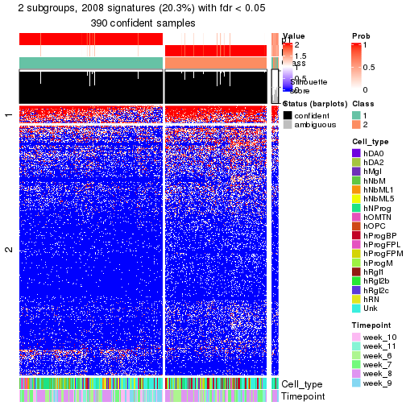</p>

</div>
<div id='tab-node-011-get-signatures-no-scale-2'>
<pre><code class="r">get_signatures(res, k = 3, scale_rows = FALSE)
</code></pre>

<p></p>

</div>
<div id='tab-node-011-get-signatures-no-scale-3'>
<pre><code class="r">get_signatures(res, k = 4, scale_rows = FALSE)
</code></pre>

<p></p>

</div>
</div>


Compare the overlap of signatures from different k:

```r
compare_signatures(res)
```


`get_signature()` returns a data frame invisibly. To get the list of signatures, the function
call should be assigned to a variable explicitly. In following code, if `plot` argument is set
to `FALSE`, no heatmap is plotted while only the differential analysis is performed.

```r
# code only for demonstration
tb = get_signature(res, k = ..., plot = FALSE)
```

An example of the output of `tb` is:

```
#>   which_row         fdr    mean_1    mean_2 scaled_mean_1 scaled_mean_2 km
#> 1        38 0.042760348  8.373488  9.131774    -0.5533452     0.5164555  1
#> 2        40 0.018707592  7.106213  8.469186    -0.6173731     0.5762149  1
#> 3        55 0.019134737 10.221463 11.207825    -0.6159697     0.5749050  1
#> 4        59 0.006059896  5.921854  7.869574    -0.6899429     0.6439467  1
#> 5        60 0.018055526  8.928898 10.211722    -0.6204761     0.5791110  1
#> 6        98 0.009384629 15.714769 14.887706     0.6635654    -0.6193277  2
...
```

The columns in `tb` are:

1. `which_row`: row indices corresponding to the input matrix.
2. `fdr`: FDR for the differential test. 
3. `mean_x`: The mean value in group x.
4. `scaled_mean_x`: The mean value in group x after rows are scaled.
5. `km`: Row groups if k-means clustering is applied to rows (which is done by automatically selecting number of clusters).

If there are too many signatures, `top_signatures = ...` can be set to only show the 
signatures with the highest FDRs:

```r
# code only for demonstration
# e.g. to show the top 500 most significant rows
tb = get_signature(res, k = ..., top_signatures = 500)
```

If the signatures are defined as these which are uniquely high in current group, `diff_method` argument
can be set to `"uniquely_high_in_one_group"`:

```r
# code only for demonstration
tb = get_signature(res, k = ..., diff_method = "uniquely_high_in_one_group")
```


UMAP plot which shows how samples are separated.


<script>
$( function() {
	$( '#tabs-node-011-dimension-reduction' ).tabs();
} );
</script>
<div id='tabs-node-011-dimension-reduction'>
<ul>
<li><a href='#tab-node-011-dimension-reduction-1'>k = 2</a></li>
<li><a href='#tab-node-011-dimension-reduction-2'>k = 3</a></li>
<li><a href='#tab-node-011-dimension-reduction-3'>k = 4</a></li>
</ul>
<div id='tab-node-011-dimension-reduction-1'>
<pre><code class="r">dimension_reduction(res, k = 2, method = &quot;UMAP&quot;)
</code></pre>

<p></p>

</div>
<div id='tab-node-011-dimension-reduction-2'>
<pre><code class="r">dimension_reduction(res, k = 3, method = &quot;UMAP&quot;)
</code></pre>

<p></p>

</div>
<div id='tab-node-011-dimension-reduction-3'>
<pre><code class="r">dimension_reduction(res, k = 4, method = &quot;UMAP&quot;)
</code></pre>

<p></p>

</div>
</div>


Following heatmap shows how subgroups are split when increasing `k`:

```r
collect_classes(res)
```


Test correlation between subgroups and known annotations. If the known
annotation is numeric, one-way ANOVA test is applied, and if the known
annotation is discrete, chi-squared contingency table test is applied.

```r
test_to_known_factors(res)
```

```
#>             n_sample Cell_type(p-value) Timepoint(p-value) k
#> ATC:skmeans      390           7.13e-20           1.27e-05 2
#> ATC:skmeans      392           2.20e-30           2.27e-16 3
#> ATC:skmeans      392           3.73e-37           6.66e-20 4
```


If matrix rows can be associated to genes, consider to use `functional_enrichment(res,
...)` to perform function enrichment for the signature genes. See [this vignette](https://jokergoo.github.io/cola_vignettes/functional_enrichment.html) for more detailed explanations.


 

---------------------------------------------------


### Node0112


Parent node: [Node011](#Node011).
Child nodes: 
                Node01121-leaf
        ,
                Node01122-leaf
        ,
                Node01131-leaf
        ,
                Node01132-leaf
        ,
                Node01133-leaf
        ,
                [Node01211](#Node01211)
        ,
                Node01212-leaf
        ,
                Node01221-leaf
        ,
                [Node01222](#Node01222)
        ,
                Node01311-leaf
        ,
                Node01312-leaf
        ,
                Node01313-leaf
        ,
                Node01321-leaf
        ,
                Node01322-leaf
        ,
                Node01331-leaf
        ,
                Node01332-leaf
        ,
                Node02111-leaf
        ,
                [Node02112](#Node02112)
        ,
                Node02121-leaf
        ,
                Node02122-leaf
        ,
                [Node02123](#Node02123)
        ,
                Node02221-leaf
        ,
                Node02222-leaf
        ,
                Node02231-leaf
        ,
                Node02232-leaf
        ,
                Node02311-leaf
        ,
                Node02312-leaf
        ,
                Node02321-leaf
        ,
                Node02322-leaf
        ,
                Node02323-leaf
        ,
                Node02421-leaf
        ,
                Node02422-leaf
        .


The object with results only for a single top-value method and a single partitioning method 
can be extracted as:

```r
res = res_rh["0112"]
```

A summary of `res` and all the functions that can be applied to it:

```r
res
```

```
#> A 'ConsensusPartition' object with k = 2, 3, 4.
#>   On a matrix with 7550 rows and 138 columns.
#>   Top rows (755) are extracted by 'ATC' method.
#>   Subgroups are detected by 'skmeans' method.
#>   Performed in total 150 partitions by row resampling.
#>   Best k for subgroups seems to be 2.
#> 
#> Following methods can be applied to this 'ConsensusPartition' object:
#>  [1] "cola_report"             "collect_classes"         "collect_plots"          
#>  [4] "collect_stats"           "colnames"                "compare_partitions"     
#>  [7] "compare_signatures"      "consensus_heatmap"       "dimension_reduction"    
#> [10] "functional_enrichment"   "get_anno_col"            "get_anno"               
#> [13] "get_classes"             "get_consensus"           "get_matrix"             
#> [16] "get_membership"          "get_param"               "get_signatures"         
#> [19] "get_stats"               "is_best_k"               "is_stable_k"            
#> [22] "membership_heatmap"      "ncol"                    "nrow"                   
#> [25] "plot_ecdf"               "predict_classes"         "rownames"               
#> [28] "select_partition_number" "show"                    "suggest_best_k"         
#> [31] "test_to_known_factors"   "top_rows_heatmap"
```

`collect_plots()` function collects all the plots made from `res` for all `k` (number of subgroups)
into one single page to provide an easy and fast comparison between different `k`.

```r
collect_plots(res)
```


The plots are:

- The first row: a plot of the eCDF (empirical cumulative distribution
  function) curves of the consensus matrix for each `k` and the heatmap of
  predicted classes for each `k`.
- The second row: heatmaps of the consensus matrix for each `k`.
- The third row: heatmaps of the membership matrix for each `k`.
- The fouth row: heatmaps of the signatures for each `k`.

All the plots in panels can be made by individual functions and they are
plotted later in this section.

`select_partition_number()` produces several plots showing different
statistics for choosing "optimized" `k`. There are following statistics:

- eCDF curves of the consensus matrix for each `k`;
- 1-PAC. [The PAC score](https://en.wikipedia.org/wiki/Consensus_clustering#Over-interpretation_potential_of_consensus_clustering)
  measures the proportion of the ambiguous subgrouping.
- Mean silhouette score.
- Concordance. The mean probability of fiting the consensus subgroup labels in all
  partitions.
- Area increased. Denote $A_k$ as the area under the eCDF curve for current
  `k`, the area increased is defined as $A_k - A_{k-1}$.
- Rand index. The percent of pairs of samples that are both in a same cluster
  or both are not in a same cluster in the partition of k and k-1.
- Jaccard index. The ratio of pairs of samples are both in a same cluster in
  the partition of k and k-1 and the pairs of samples are both in a same
  cluster in the partition k or k-1.

The detailed explanations of these statistics can be found in [the _cola_
vignette](https://jokergoo.github.io/cola_vignettes/cola.html#toc_13).

Generally speaking, higher 1-PAC score, higher mean silhouette score or higher
concordance corresponds to better partition. Rand index and Jaccard index
measure how similar the current partition is compared to partition with `k-1`.
If they are too similar, we won't accept `k` is better than `k-1`.

```r
select_partition_number(res)
```


The numeric values for all these statistics can be obtained by `get_stats()`.

```r
get_stats(res)
```

```
#>   k 1-PAC mean_silhouette concordance area_increased  Rand Jaccard
#> 2 2 1.000           0.969       0.988          0.504 0.497   0.497
#> 3 3 0.879           0.910       0.960          0.304 0.760   0.555
#> 4 4 0.728           0.778       0.887          0.113 0.852   0.608
```

`suggest_best_k()` suggests the best $k$ based on these statistics. The rules are as follows:

- All $k$ with Jaccard index larger than 0.95 are removed because increasing
  $k$ does not provide enough extra information. If all $k$ are removed, it is
  marked as no subgroup is detected.
- For all $k$ with 1-PAC score larger than 0.9, the maximal $k$ is taken as
  the best $k$, and other $k$ are marked as optional $k$.
- If it does not fit the second rule. The $k$ with the maximal vote of the
  highest 1-PAC score, highest mean silhouette, and highest concordance is
  taken as the best $k$.

```r
suggest_best_k(res)
```

```
#> [1] 2
```


Following is the table of the partitions (You need to click the **show/hide
code output** link to see it). The membership matrix (columns with name `p*`)
is inferred by
[`clue::cl_consensus()`](https://www.rdocumentation.org/link/cl_consensus?package=clue)
function with the `SE` method. Basically the value in the membership matrix
represents the probability to belong to a certain group. The finall subgroup
label for an item is determined with the group with highest probability it
belongs to.

In `get_classes()` function, the entropy is calculated from the membership
matrix and the silhouette score is calculated from the consensus matrix.


<script>
$( function() {
	$( '#tabs-node-0112-get-classes' ).tabs();
} );
</script>
<div id='tabs-node-0112-get-classes'>
<ul>
<li><a href='#tab-node-0112-get-classes-1'>k = 2</a></li>
<li><a href='#tab-node-0112-get-classes-2'>k = 3</a></li>
<li><a href='#tab-node-0112-get-classes-3'>k = 4</a></li>
</ul>

<div id='tab-node-0112-get-classes-1'>
<p><a id='tab-node-0112-get-classes-1-a' style='color:#0366d6' href='#'>show/hide code output</a></p>
<pre><code class="r">cbind(get_classes(res, k = 2), get_membership(res, k = 2))
</code></pre>

<pre><code>#&gt;                 class entropy silhouette   p1   p2
#&gt; 1772067_089_A06     1   0.000    0.98810 1.00 0.00
#&gt; 1772067_089_A08     2   0.000    0.98615 0.00 1.00
#&gt; 1772067_089_B09     1   0.000    0.98810 1.00 0.00
#&gt; 1772067_089_C04     1   0.000    0.98810 1.00 0.00
#&gt; 1772067_089_C08     2   0.000    0.98615 0.00 1.00
#&gt; 1772067_089_C10     1   0.000    0.98810 1.00 0.00
#&gt; 1772067_089_D01     2   0.000    0.98615 0.00 1.00
#&gt; 1772067_089_D08     1   0.881    0.57262 0.70 0.30
#&gt; 1772067_089_D12     2   0.000    0.98615 0.00 1.00
#&gt; 1772067_089_E07     2   0.000    0.98615 0.00 1.00
#&gt; 1772067_089_F04     1   0.000    0.98810 1.00 0.00
#&gt; 1772067_089_G10     2   0.000    0.98615 0.00 1.00
#&gt; 1772071_027_A04     2   0.000    0.98615 0.00 1.00
#&gt; 1772071_027_A10     2   0.000    0.98615 0.00 1.00
#&gt; 1772071_027_C03     2   0.000    0.98615 0.00 1.00
#&gt; 1772071_027_C07     2   0.000    0.98615 0.00 1.00
#&gt; 1772071_027_D07     2   0.000    0.98615 0.00 1.00
#&gt; 1772071_027_E04     1   0.000    0.98810 1.00 0.00
#&gt; 1772071_029_C01     2   0.000    0.98615 0.00 1.00
#&gt; 1772071_029_F06     2   0.000    0.98615 0.00 1.00
#&gt; 1772075_298_F05     2   0.795    0.68179 0.24 0.76
#&gt; 1772075_298_G07     2   1.000   -0.00564 0.50 0.50
#&gt; 1772075_298_H04     2   0.000    0.98615 0.00 1.00
#&gt; 1772075_298_H06     2   0.000    0.98615 0.00 1.00
#&gt; 1772078_001_B05     2   0.000    0.98615 0.00 1.00
#&gt; 1772078_001_D12     2   0.000    0.98615 0.00 1.00
#&gt; 1772078_001_E04     1   0.000    0.98810 1.00 0.00
#&gt; 1772078_001_E08     2   0.000    0.98615 0.00 1.00
#&gt; 1772078_001_F12     2   0.000    0.98615 0.00 1.00
#&gt; 1772078_001_G01     2   0.000    0.98615 0.00 1.00
#&gt; 1772078_001_H05     2   0.242    0.94850 0.04 0.96
#&gt; 1772078_002_A03     2   0.000    0.98615 0.00 1.00
#&gt; 1772078_002_C06     2   0.000    0.98615 0.00 1.00
#&gt; 1772078_002_C12     2   0.000    0.98615 0.00 1.00
#&gt; 1772096_160_G05     2   0.000    0.98615 0.00 1.00
#&gt; 1772096_095_A04     1   0.000    0.98810 1.00 0.00
#&gt; 1772122_236_C08     1   0.000    0.98810 1.00 0.00
#&gt; 1772121_293_B02     2   0.000    0.98615 0.00 1.00
#&gt; 1772122_264_A10     2   0.000    0.98615 0.00 1.00
#&gt; 1772122_264_E02     2   0.000    0.98615 0.00 1.00
#&gt; 1772122_201_H01     2   0.000    0.98615 0.00 1.00
#&gt; 1772122_316_A02     1   0.000    0.98810 1.00 0.00
#&gt; 1772122_316_A03     2   0.000    0.98615 0.00 1.00
#&gt; 1772122_316_A04     1   0.000    0.98810 1.00 0.00
#&gt; 1772122_316_A07     1   0.000    0.98810 1.00 0.00
#&gt; 1772122_316_A09     1   0.000    0.98810 1.00 0.00
#&gt; 1772122_316_B03     1   0.000    0.98810 1.00 0.00
#&gt; 1772122_316_B05     1   0.000    0.98810 1.00 0.00
#&gt; 1772122_316_C07     1   0.000    0.98810 1.00 0.00
#&gt; 1772122_316_D03     1   0.000    0.98810 1.00 0.00
#&gt; 1772122_316_E01     2   0.000    0.98615 0.00 1.00
#&gt; 1772122_316_E08     2   0.000    0.98615 0.00 1.00
#&gt; 1772122_316_F06     1   0.000    0.98810 1.00 0.00
#&gt; 1772122_316_H02     1   0.000    0.98810 1.00 0.00
#&gt; 1772122_317_A01     1   0.000    0.98810 1.00 0.00
#&gt; 1772122_317_A03     1   0.000    0.98810 1.00 0.00
#&gt; 1772122_317_A08     1   0.000    0.98810 1.00 0.00
#&gt; 1772122_317_C05     2   0.000    0.98615 0.00 1.00
#&gt; 1772122_317_D06     1   0.000    0.98810 1.00 0.00
#&gt; 1772122_317_E06     1   0.000    0.98810 1.00 0.00
#&gt; 1772122_317_E12     1   0.000    0.98810 1.00 0.00
#&gt; 1772122_317_G05     1   0.000    0.98810 1.00 0.00
#&gt; 1772122_318_A09     1   0.000    0.98810 1.00 0.00
#&gt; 1772122_318_C05     1   0.000    0.98810 1.00 0.00
#&gt; 1772122_318_D07     1   0.000    0.98810 1.00 0.00
#&gt; 1772122_318_E04     1   0.000    0.98810 1.00 0.00
#&gt; 1772122_318_E11     1   0.000    0.98810 1.00 0.00
#&gt; 1772122_318_H01     1   0.000    0.98810 1.00 0.00
#&gt; 1772122_319_B01     1   0.000    0.98810 1.00 0.00
#&gt; 1772122_319_B08     1   0.855    0.61516 0.72 0.28
#&gt; 1772122_319_D03     1   0.000    0.98810 1.00 0.00
#&gt; 1772122_319_D08     2   0.000    0.98615 0.00 1.00
#&gt; 1772122_319_E05     1   0.000    0.98810 1.00 0.00
#&gt; 1772122_319_F06     1   0.000    0.98810 1.00 0.00
#&gt; 1772122_319_H06     1   0.000    0.98810 1.00 0.00
#&gt; 1772122_319_H07     1   0.000    0.98810 1.00 0.00
#&gt; 1772122_221_A05     1   0.000    0.98810 1.00 0.00
#&gt; 1772122_221_A09     2   0.000    0.98615 0.00 1.00
#&gt; 1772122_221_C04     1   0.000    0.98810 1.00 0.00
#&gt; 1772122_221_C09     2   0.000    0.98615 0.00 1.00
#&gt; 1772122_221_D01     2   0.000    0.98615 0.00 1.00
#&gt; 1772122_221_D05     1   0.000    0.98810 1.00 0.00
#&gt; 1772122_221_D07     1   0.000    0.98810 1.00 0.00
#&gt; 1772122_221_D08     2   0.000    0.98615 0.00 1.00
#&gt; 1772122_221_D09     1   0.760    0.71936 0.78 0.22
#&gt; 1772122_221_E12     1   0.000    0.98810 1.00 0.00
#&gt; 1772122_221_F03     1   0.000    0.98810 1.00 0.00
#&gt; 1772122_221_G03     2   0.000    0.98615 0.00 1.00
#&gt; 1772122_221_H03     1   0.000    0.98810 1.00 0.00
#&gt; 1772122_220_C11     1   0.000    0.98810 1.00 0.00
#&gt; 1772122_220_D03     1   0.000    0.98810 1.00 0.00
#&gt; 1772122_220_D08     1   0.000    0.98810 1.00 0.00
#&gt; 1772122_220_D12     1   0.000    0.98810 1.00 0.00
#&gt; 1772122_220_E06     1   0.000    0.98810 1.00 0.00
#&gt; 1772122_220_E07     2   0.000    0.98615 0.00 1.00
#&gt; 1772122_220_E09     2   0.000    0.98615 0.00 1.00
#&gt; 1772122_220_F09     2   0.000    0.98615 0.00 1.00
#&gt; 1772122_220_H01     2   0.000    0.98615 0.00 1.00
#&gt; 1772122_220_H09     1   0.000    0.98810 1.00 0.00
#&gt; 1772122_226_A05     1   0.000    0.98810 1.00 0.00
#&gt; 1772122_226_A07     2   0.000    0.98615 0.00 1.00
#&gt; 1772122_226_A08     2   0.000    0.98615 0.00 1.00
#&gt; 1772122_226_B02     1   0.000    0.98810 1.00 0.00
#&gt; 1772122_226_B06     1   0.000    0.98810 1.00 0.00
#&gt; 1772122_226_B08     1   0.000    0.98810 1.00 0.00
#&gt; 1772122_226_E07     2   0.000    0.98615 0.00 1.00
#&gt; 1772122_226_E09     2   0.000    0.98615 0.00 1.00
#&gt; 1772122_226_E10     1   0.000    0.98810 1.00 0.00
#&gt; 1772122_226_F05     1   0.141    0.96888 0.98 0.02
#&gt; 1772122_226_F07     2   0.000    0.98615 0.00 1.00
#&gt; 1772122_226_F08     2   0.000    0.98615 0.00 1.00
#&gt; 1772122_226_G05     1   0.000    0.98810 1.00 0.00
#&gt; 1772122_226_G07     2   0.000    0.98615 0.00 1.00
#&gt; 1772122_226_H02     2   0.000    0.98615 0.00 1.00
#&gt; 1772122_226_H03     2   0.141    0.96815 0.02 0.98
#&gt; 1772122_226_H08     2   0.000    0.98615 0.00 1.00
#&gt; 1772122_223_B02     2   0.000    0.98615 0.00 1.00
#&gt; 1772122_223_C09     2   0.000    0.98615 0.00 1.00
#&gt; 1772122_223_D03     1   0.000    0.98810 1.00 0.00
#&gt; 1772122_223_D11     2   0.000    0.98615 0.00 1.00
#&gt; 1772122_223_E03     1   0.000    0.98810 1.00 0.00
#&gt; 1772122_223_E09     2   0.000    0.98615 0.00 1.00
#&gt; 1772122_223_E11     1   0.000    0.98810 1.00 0.00
#&gt; 1772122_224_A02     2   0.000    0.98615 0.00 1.00
#&gt; 1772122_224_A05     1   0.000    0.98810 1.00 0.00
#&gt; 1772122_224_B03     1   0.000    0.98810 1.00 0.00
#&gt; 1772122_224_B06     2   0.402    0.90588 0.08 0.92
#&gt; 1772122_224_B10     2   0.141    0.96814 0.02 0.98
#&gt; 1772122_224_B11     2   0.000    0.98615 0.00 1.00
#&gt; 1772122_224_D03     2   0.000    0.98615 0.00 1.00
#&gt; 1772122_224_E03     1   0.000    0.98810 1.00 0.00
#&gt; 1772122_224_E04     2   0.000    0.98615 0.00 1.00
#&gt; 1772122_224_E09     2   0.000    0.98615 0.00 1.00
#&gt; 1772122_224_E10     1   0.000    0.98810 1.00 0.00
#&gt; 1772122_224_F12     1   0.000    0.98810 1.00 0.00
#&gt; 1772122_224_H01     2   0.000    0.98615 0.00 1.00
#&gt; 1772122_224_H08     1   0.000    0.98810 1.00 0.00
#&gt; 1772122_224_H10     1   0.000    0.98810 1.00 0.00
</code></pre>

<script>
$('#tab-node-0112-get-classes-1-a').parent().next().next().hide();
$('#tab-node-0112-get-classes-1-a').click(function(){
  $('#tab-node-0112-get-classes-1-a').parent().next().next().toggle();
  return(false);
});
</script>
</div>

<div id='tab-node-0112-get-classes-2'>
<p><a id='tab-node-0112-get-classes-2-a' style='color:#0366d6' href='#'>show/hide code output</a></p>
<pre><code class="r">cbind(get_classes(res, k = 3), get_membership(res, k = 3))
</code></pre>

<pre><code>#&gt;                 class entropy silhouette   p1   p2   p3
#&gt; 1772067_089_A06     1  0.0000     0.9852 1.00 0.00 0.00
#&gt; 1772067_089_A08     2  0.0000     0.9447 0.00 1.00 0.00
#&gt; 1772067_089_B09     1  0.0000     0.9852 1.00 0.00 0.00
#&gt; 1772067_089_C04     1  0.0892     0.9693 0.98 0.00 0.02
#&gt; 1772067_089_C08     2  0.0000     0.9447 0.00 1.00 0.00
#&gt; 1772067_089_C10     2  0.2066     0.8897 0.06 0.94 0.00
#&gt; 1772067_089_D01     3  0.3686     0.8260 0.00 0.14 0.86
#&gt; 1772067_089_D08     2  0.0892     0.9287 0.02 0.98 0.00
#&gt; 1772067_089_D12     2  0.0000     0.9447 0.00 1.00 0.00
#&gt; 1772067_089_E07     2  0.0000     0.9447 0.00 1.00 0.00
#&gt; 1772067_089_F04     1  0.0000     0.9852 1.00 0.00 0.00
#&gt; 1772067_089_G10     2  0.3686     0.8204 0.00 0.86 0.14
#&gt; 1772071_027_A04     2  0.0000     0.9447 0.00 1.00 0.00
#&gt; 1772071_027_A10     2  0.0000     0.9447 0.00 1.00 0.00
#&gt; 1772071_027_C03     2  0.0000     0.9447 0.00 1.00 0.00
#&gt; 1772071_027_C07     2  0.0000     0.9447 0.00 1.00 0.00
#&gt; 1772071_027_D07     2  0.0000     0.9447 0.00 1.00 0.00
#&gt; 1772071_027_E04     1  0.0000     0.9852 1.00 0.00 0.00
#&gt; 1772071_029_C01     2  0.2959     0.8656 0.00 0.90 0.10
#&gt; 1772071_029_F06     3  0.0892     0.9128 0.00 0.02 0.98
#&gt; 1772075_298_F05     3  0.7839     0.3379 0.06 0.38 0.56
#&gt; 1772075_298_G07     3  0.0000     0.9195 0.00 0.00 1.00
#&gt; 1772075_298_H04     3  0.0892     0.9128 0.00 0.02 0.98
#&gt; 1772075_298_H06     3  0.0000     0.9195 0.00 0.00 1.00
#&gt; 1772078_001_B05     2  0.0000     0.9447 0.00 1.00 0.00
#&gt; 1772078_001_D12     2  0.0000     0.9447 0.00 1.00 0.00
#&gt; 1772078_001_E04     3  0.0000     0.9195 0.00 0.00 1.00
#&gt; 1772078_001_E08     2  0.6045     0.3707 0.00 0.62 0.38
#&gt; 1772078_001_F12     3  0.0000     0.9195 0.00 0.00 1.00
#&gt; 1772078_001_G01     3  0.3340     0.8444 0.00 0.12 0.88
#&gt; 1772078_001_H05     3  0.0892     0.9123 0.00 0.02 0.98
#&gt; 1772078_002_A03     3  0.0000     0.9195 0.00 0.00 1.00
#&gt; 1772078_002_C06     3  0.4555     0.7520 0.00 0.20 0.80
#&gt; 1772078_002_C12     3  0.1529     0.9037 0.00 0.04 0.96
#&gt; 1772096_160_G05     2  0.2537     0.8845 0.00 0.92 0.08
#&gt; 1772096_095_A04     1  0.4002     0.8182 0.84 0.00 0.16
#&gt; 1772122_236_C08     1  0.0000     0.9852 1.00 0.00 0.00
#&gt; 1772121_293_B02     3  0.1529     0.9037 0.00 0.04 0.96
#&gt; 1772122_264_A10     2  0.0000     0.9447 0.00 1.00 0.00
#&gt; 1772122_264_E02     3  0.0000     0.9195 0.00 0.00 1.00
#&gt; 1772122_201_H01     3  0.1529     0.9037 0.00 0.04 0.96
#&gt; 1772122_316_A02     1  0.0000     0.9852 1.00 0.00 0.00
#&gt; 1772122_316_A03     2  0.0000     0.9447 0.00 1.00 0.00
#&gt; 1772122_316_A04     1  0.0000     0.9852 1.00 0.00 0.00
#&gt; 1772122_316_A07     1  0.2066     0.9343 0.94 0.00 0.06
#&gt; 1772122_316_A09     1  0.0000     0.9852 1.00 0.00 0.00
#&gt; 1772122_316_B03     1  0.0000     0.9852 1.00 0.00 0.00
#&gt; 1772122_316_B05     1  0.0000     0.9852 1.00 0.00 0.00
#&gt; 1772122_316_C07     1  0.0000     0.9852 1.00 0.00 0.00
#&gt; 1772122_316_D03     1  0.0000     0.9852 1.00 0.00 0.00
#&gt; 1772122_316_E01     2  0.6302     0.0291 0.00 0.52 0.48
#&gt; 1772122_316_E08     2  0.0000     0.9447 0.00 1.00 0.00
#&gt; 1772122_316_F06     1  0.0000     0.9852 1.00 0.00 0.00
#&gt; 1772122_316_H02     1  0.0000     0.9852 1.00 0.00 0.00
#&gt; 1772122_317_A01     2  0.0892     0.9285 0.02 0.98 0.00
#&gt; 1772122_317_A03     1  0.0000     0.9852 1.00 0.00 0.00
#&gt; 1772122_317_A08     1  0.0000     0.9852 1.00 0.00 0.00
#&gt; 1772122_317_C05     2  0.0000     0.9447 0.00 1.00 0.00
#&gt; 1772122_317_D06     1  0.1781     0.9554 0.96 0.02 0.02
#&gt; 1772122_317_E06     1  0.0892     0.9679 0.98 0.02 0.00
#&gt; 1772122_317_E12     1  0.1529     0.9529 0.96 0.00 0.04
#&gt; 1772122_317_G05     1  0.0000     0.9852 1.00 0.00 0.00
#&gt; 1772122_318_A09     1  0.0000     0.9852 1.00 0.00 0.00
#&gt; 1772122_318_C05     1  0.0000     0.9852 1.00 0.00 0.00
#&gt; 1772122_318_D07     1  0.0000     0.9852 1.00 0.00 0.00
#&gt; 1772122_318_E04     1  0.0892     0.9693 0.98 0.00 0.02
#&gt; 1772122_318_E11     1  0.0000     0.9852 1.00 0.00 0.00
#&gt; 1772122_318_H01     1  0.0000     0.9852 1.00 0.00 0.00
#&gt; 1772122_319_B01     1  0.0000     0.9852 1.00 0.00 0.00
#&gt; 1772122_319_B08     2  0.0000     0.9447 0.00 1.00 0.00
#&gt; 1772122_319_D03     1  0.0000     0.9852 1.00 0.00 0.00
#&gt; 1772122_319_D08     2  0.0000     0.9447 0.00 1.00 0.00
#&gt; 1772122_319_E05     2  0.4555     0.7169 0.20 0.80 0.00
#&gt; 1772122_319_F06     3  0.5706     0.5129 0.32 0.00 0.68
#&gt; 1772122_319_H06     1  0.0000     0.9852 1.00 0.00 0.00
#&gt; 1772122_319_H07     1  0.0000     0.9852 1.00 0.00 0.00
#&gt; 1772122_221_A05     1  0.0000     0.9852 1.00 0.00 0.00
#&gt; 1772122_221_A09     3  0.0000     0.9195 0.00 0.00 1.00
#&gt; 1772122_221_C04     1  0.0000     0.9852 1.00 0.00 0.00
#&gt; 1772122_221_C09     3  0.0000     0.9195 0.00 0.00 1.00
#&gt; 1772122_221_D01     2  0.0000     0.9447 0.00 1.00 0.00
#&gt; 1772122_221_D05     1  0.2066     0.9283 0.94 0.06 0.00
#&gt; 1772122_221_D07     1  0.0000     0.9852 1.00 0.00 0.00
#&gt; 1772122_221_D08     2  0.0000     0.9447 0.00 1.00 0.00
#&gt; 1772122_221_D09     2  0.0000     0.9447 0.00 1.00 0.00
#&gt; 1772122_221_E12     1  0.0000     0.9852 1.00 0.00 0.00
#&gt; 1772122_221_F03     3  0.2066     0.8790 0.06 0.00 0.94
#&gt; 1772122_221_G03     3  0.0000     0.9195 0.00 0.00 1.00
#&gt; 1772122_221_H03     3  0.3340     0.8254 0.12 0.00 0.88
#&gt; 1772122_220_C11     1  0.0000     0.9852 1.00 0.00 0.00
#&gt; 1772122_220_D03     1  0.0000     0.9852 1.00 0.00 0.00
#&gt; 1772122_220_D08     1  0.0000     0.9852 1.00 0.00 0.00
#&gt; 1772122_220_D12     1  0.0000     0.9852 1.00 0.00 0.00
#&gt; 1772122_220_E06     1  0.0000     0.9852 1.00 0.00 0.00
#&gt; 1772122_220_E07     3  0.0000     0.9195 0.00 0.00 1.00
#&gt; 1772122_220_E09     2  0.5016     0.6785 0.00 0.76 0.24
#&gt; 1772122_220_F09     2  0.0000     0.9447 0.00 1.00 0.00
#&gt; 1772122_220_H01     2  0.2959     0.8658 0.00 0.90 0.10
#&gt; 1772122_220_H09     1  0.0000     0.9852 1.00 0.00 0.00
#&gt; 1772122_226_A05     1  0.0000     0.9852 1.00 0.00 0.00
#&gt; 1772122_226_A07     3  0.0000     0.9195 0.00 0.00 1.00
#&gt; 1772122_226_A08     3  0.6045     0.4021 0.00 0.38 0.62
#&gt; 1772122_226_B02     3  0.2066     0.8788 0.06 0.00 0.94
#&gt; 1772122_226_B06     1  0.0000     0.9852 1.00 0.00 0.00
#&gt; 1772122_226_B08     1  0.0000     0.9852 1.00 0.00 0.00
#&gt; 1772122_226_E07     2  0.0000     0.9447 0.00 1.00 0.00
#&gt; 1772122_226_E09     3  0.0000     0.9195 0.00 0.00 1.00
#&gt; 1772122_226_E10     1  0.0000     0.9852 1.00 0.00 0.00
#&gt; 1772122_226_F05     2  0.0892     0.9285 0.02 0.98 0.00
#&gt; 1772122_226_F07     3  0.0000     0.9195 0.00 0.00 1.00
#&gt; 1772122_226_F08     2  0.0000     0.9447 0.00 1.00 0.00
#&gt; 1772122_226_G05     1  0.0000     0.9852 1.00 0.00 0.00
#&gt; 1772122_226_G07     2  0.0000     0.9447 0.00 1.00 0.00
#&gt; 1772122_226_H02     3  0.5016     0.6967 0.00 0.24 0.76
#&gt; 1772122_226_H03     2  0.0000     0.9447 0.00 1.00 0.00
#&gt; 1772122_226_H08     2  0.0000     0.9447 0.00 1.00 0.00
#&gt; 1772122_223_B02     3  0.2959     0.8582 0.00 0.10 0.90
#&gt; 1772122_223_C09     2  0.0000     0.9447 0.00 1.00 0.00
#&gt; 1772122_223_D03     1  0.0000     0.9852 1.00 0.00 0.00
#&gt; 1772122_223_D11     2  0.4555     0.7412 0.00 0.80 0.20
#&gt; 1772122_223_E03     1  0.4002     0.8145 0.84 0.00 0.16
#&gt; 1772122_223_E09     3  0.0000     0.9195 0.00 0.00 1.00
#&gt; 1772122_223_E11     1  0.0000     0.9852 1.00 0.00 0.00
#&gt; 1772122_224_A02     3  0.0000     0.9195 0.00 0.00 1.00
#&gt; 1772122_224_A05     1  0.0000     0.9852 1.00 0.00 0.00
#&gt; 1772122_224_B03     1  0.0000     0.9852 1.00 0.00 0.00
#&gt; 1772122_224_B06     3  0.6387     0.5657 0.02 0.30 0.68
#&gt; 1772122_224_B10     3  0.0000     0.9195 0.00 0.00 1.00
#&gt; 1772122_224_B11     3  0.0000     0.9195 0.00 0.00 1.00
#&gt; 1772122_224_D03     2  0.0000     0.9447 0.00 1.00 0.00
#&gt; 1772122_224_E03     1  0.5216     0.6498 0.74 0.00 0.26
#&gt; 1772122_224_E04     3  0.0000     0.9195 0.00 0.00 1.00
#&gt; 1772122_224_E09     3  0.0000     0.9195 0.00 0.00 1.00
#&gt; 1772122_224_E10     1  0.0000     0.9852 1.00 0.00 0.00
#&gt; 1772122_224_F12     1  0.0000     0.9852 1.00 0.00 0.00
#&gt; 1772122_224_H01     2  0.0000     0.9447 0.00 1.00 0.00
#&gt; 1772122_224_H08     1  0.0000     0.9852 1.00 0.00 0.00
#&gt; 1772122_224_H10     1  0.0000     0.9852 1.00 0.00 0.00
</code></pre>

<script>
$('#tab-node-0112-get-classes-2-a').parent().next().next().hide();
$('#tab-node-0112-get-classes-2-a').click(function(){
  $('#tab-node-0112-get-classes-2-a').parent().next().next().toggle();
  return(false);
});
</script>
</div>

<div id='tab-node-0112-get-classes-3'>
<p><a id='tab-node-0112-get-classes-3-a' style='color:#0366d6' href='#'>show/hide code output</a></p>
<pre><code class="r">cbind(get_classes(res, k = 4), get_membership(res, k = 4))
</code></pre>

<pre><code>#&gt;                 class entropy silhouette   p1   p2   p3   p4
#&gt; 1772067_089_A06     4  0.5570     0.1739 0.44 0.00 0.02 0.54
#&gt; 1772067_089_A08     2  0.2921     0.8082 0.00 0.86 0.14 0.00
#&gt; 1772067_089_B09     1  0.0000     0.9607 1.00 0.00 0.00 0.00
#&gt; 1772067_089_C04     4  0.5486     0.6473 0.20 0.00 0.08 0.72
#&gt; 1772067_089_C08     2  0.0000     0.8927 0.00 1.00 0.00 0.00
#&gt; 1772067_089_C10     2  0.1211     0.8763 0.00 0.96 0.04 0.00
#&gt; 1772067_089_D01     3  0.2011     0.7489 0.00 0.08 0.92 0.00
#&gt; 1772067_089_D08     2  0.1637     0.8641 0.00 0.94 0.06 0.00
#&gt; 1772067_089_D12     2  0.3198     0.8189 0.00 0.88 0.08 0.04
#&gt; 1772067_089_E07     2  0.1637     0.8749 0.00 0.94 0.06 0.00
#&gt; 1772067_089_F04     1  0.1211     0.9299 0.96 0.00 0.00 0.04
#&gt; 1772067_089_G10     3  0.4277     0.5745 0.00 0.28 0.72 0.00
#&gt; 1772071_027_A04     2  0.2921     0.8038 0.00 0.86 0.14 0.00
#&gt; 1772071_027_A10     2  0.1637     0.8752 0.00 0.94 0.06 0.00
#&gt; 1772071_027_C03     3  0.4406     0.5676 0.00 0.30 0.70 0.00
#&gt; 1772071_027_C07     2  0.0000     0.8927 0.00 1.00 0.00 0.00
#&gt; 1772071_027_D07     2  0.0000     0.8927 0.00 1.00 0.00 0.00
#&gt; 1772071_027_E04     1  0.3610     0.7675 0.80 0.00 0.00 0.20
#&gt; 1772071_029_C01     3  0.4624     0.4666 0.00 0.34 0.66 0.00
#&gt; 1772071_029_F06     3  0.2011     0.7669 0.00 0.00 0.92 0.08
#&gt; 1772075_298_F05     3  0.8747     0.3381 0.10 0.24 0.50 0.16
#&gt; 1772075_298_G07     4  0.3801     0.6991 0.00 0.00 0.22 0.78
#&gt; 1772075_298_H04     3  0.2011     0.7669 0.00 0.00 0.92 0.08
#&gt; 1772075_298_H06     3  0.4977    -0.1463 0.00 0.00 0.54 0.46
#&gt; 1772078_001_B05     2  0.0000     0.8927 0.00 1.00 0.00 0.00
#&gt; 1772078_001_D12     2  0.2011     0.8621 0.00 0.92 0.08 0.00
#&gt; 1772078_001_E04     4  0.2345     0.7383 0.00 0.00 0.10 0.90
#&gt; 1772078_001_E08     3  0.4624     0.4553 0.00 0.34 0.66 0.00
#&gt; 1772078_001_F12     3  0.1637     0.7680 0.00 0.00 0.94 0.06
#&gt; 1772078_001_G01     3  0.0707     0.7678 0.00 0.02 0.98 0.00
#&gt; 1772078_001_H05     3  0.6323    -0.0119 0.00 0.06 0.50 0.44
#&gt; 1772078_002_A03     4  0.4907     0.3852 0.00 0.00 0.42 0.58
#&gt; 1772078_002_C06     3  0.2706     0.7695 0.00 0.02 0.90 0.08
#&gt; 1772078_002_C12     3  0.1211     0.7666 0.00 0.00 0.96 0.04
#&gt; 1772096_160_G05     3  0.2647     0.7500 0.00 0.12 0.88 0.00
#&gt; 1772096_095_A04     4  0.5767     0.5985 0.28 0.00 0.06 0.66
#&gt; 1772122_236_C08     1  0.0000     0.9607 1.00 0.00 0.00 0.00
#&gt; 1772121_293_B02     3  0.0000     0.7598 0.00 0.00 1.00 0.00
#&gt; 1772122_264_A10     2  0.2345     0.8485 0.00 0.90 0.10 0.00
#&gt; 1772122_264_E02     3  0.4134     0.4703 0.00 0.00 0.74 0.26
#&gt; 1772122_201_H01     3  0.0000     0.7598 0.00 0.00 1.00 0.00
#&gt; 1772122_316_A02     1  0.4797     0.6371 0.72 0.02 0.00 0.26
#&gt; 1772122_316_A03     2  0.4994     0.0360 0.00 0.52 0.48 0.00
#&gt; 1772122_316_A04     1  0.0000     0.9607 1.00 0.00 0.00 0.00
#&gt; 1772122_316_A07     4  0.2011     0.7272 0.08 0.00 0.00 0.92
#&gt; 1772122_316_A09     1  0.0000     0.9607 1.00 0.00 0.00 0.00
#&gt; 1772122_316_B03     1  0.0000     0.9607 1.00 0.00 0.00 0.00
#&gt; 1772122_316_B05     1  0.0000     0.9607 1.00 0.00 0.00 0.00
#&gt; 1772122_316_C07     1  0.2647     0.8600 0.88 0.00 0.00 0.12
#&gt; 1772122_316_D03     1  0.0000     0.9607 1.00 0.00 0.00 0.00
#&gt; 1772122_316_E01     3  0.3525     0.7649 0.00 0.10 0.86 0.04
#&gt; 1772122_316_E08     2  0.0000     0.8927 0.00 1.00 0.00 0.00
#&gt; 1772122_316_F06     1  0.0000     0.9607 1.00 0.00 0.00 0.00
#&gt; 1772122_316_H02     1  0.0000     0.9607 1.00 0.00 0.00 0.00
#&gt; 1772122_317_A01     2  0.0000     0.8927 0.00 1.00 0.00 0.00
#&gt; 1772122_317_A03     1  0.0000     0.9607 1.00 0.00 0.00 0.00
#&gt; 1772122_317_A08     1  0.2647     0.8592 0.88 0.00 0.00 0.12
#&gt; 1772122_317_C05     2  0.0000     0.8927 0.00 1.00 0.00 0.00
#&gt; 1772122_317_D06     1  0.4472     0.7146 0.76 0.02 0.00 0.22
#&gt; 1772122_317_E06     1  0.2647     0.8372 0.88 0.12 0.00 0.00
#&gt; 1772122_317_E12     4  0.3975     0.6238 0.24 0.00 0.00 0.76
#&gt; 1772122_317_G05     1  0.0000     0.9607 1.00 0.00 0.00 0.00
#&gt; 1772122_318_A09     1  0.0000     0.9607 1.00 0.00 0.00 0.00
#&gt; 1772122_318_C05     1  0.0000     0.9607 1.00 0.00 0.00 0.00
#&gt; 1772122_318_D07     1  0.3400     0.7933 0.82 0.00 0.00 0.18
#&gt; 1772122_318_E04     4  0.3801     0.6431 0.22 0.00 0.00 0.78
#&gt; 1772122_318_E11     1  0.0000     0.9607 1.00 0.00 0.00 0.00
#&gt; 1772122_318_H01     1  0.0000     0.9607 1.00 0.00 0.00 0.00
#&gt; 1772122_319_B01     1  0.0000     0.9607 1.00 0.00 0.00 0.00
#&gt; 1772122_319_B08     2  0.0707     0.8857 0.00 0.98 0.00 0.02
#&gt; 1772122_319_D03     1  0.0000     0.9607 1.00 0.00 0.00 0.00
#&gt; 1772122_319_D08     2  0.3400     0.7535 0.00 0.82 0.18 0.00
#&gt; 1772122_319_E05     2  0.4522     0.4906 0.32 0.68 0.00 0.00
#&gt; 1772122_319_F06     4  0.0707     0.7409 0.02 0.00 0.00 0.98
#&gt; 1772122_319_H06     1  0.0000     0.9607 1.00 0.00 0.00 0.00
#&gt; 1772122_319_H07     1  0.0000     0.9607 1.00 0.00 0.00 0.00
#&gt; 1772122_221_A05     1  0.0000     0.9607 1.00 0.00 0.00 0.00
#&gt; 1772122_221_A09     4  0.2647     0.7388 0.00 0.00 0.12 0.88
#&gt; 1772122_221_C04     1  0.0000     0.9607 1.00 0.00 0.00 0.00
#&gt; 1772122_221_C09     4  0.4855     0.3390 0.00 0.00 0.40 0.60
#&gt; 1772122_221_D01     2  0.4790     0.3747 0.00 0.62 0.38 0.00
#&gt; 1772122_221_D05     1  0.3172     0.7826 0.84 0.16 0.00 0.00
#&gt; 1772122_221_D07     1  0.0000     0.9607 1.00 0.00 0.00 0.00
#&gt; 1772122_221_D08     2  0.0000     0.8927 0.00 1.00 0.00 0.00
#&gt; 1772122_221_D09     2  0.0707     0.8822 0.02 0.98 0.00 0.00
#&gt; 1772122_221_E12     1  0.0000     0.9607 1.00 0.00 0.00 0.00
#&gt; 1772122_221_F03     4  0.0707     0.7439 0.00 0.00 0.02 0.98
#&gt; 1772122_221_G03     4  0.2921     0.7302 0.00 0.00 0.14 0.86
#&gt; 1772122_221_H03     4  0.4553     0.7201 0.04 0.00 0.18 0.78
#&gt; 1772122_220_C11     1  0.0000     0.9607 1.00 0.00 0.00 0.00
#&gt; 1772122_220_D03     1  0.0000     0.9607 1.00 0.00 0.00 0.00
#&gt; 1772122_220_D08     1  0.0000     0.9607 1.00 0.00 0.00 0.00
#&gt; 1772122_220_D12     1  0.0000     0.9607 1.00 0.00 0.00 0.00
#&gt; 1772122_220_E06     1  0.0000     0.9607 1.00 0.00 0.00 0.00
#&gt; 1772122_220_E07     4  0.3610     0.6917 0.00 0.00 0.20 0.80
#&gt; 1772122_220_E09     3  0.3037     0.7623 0.00 0.10 0.88 0.02
#&gt; 1772122_220_F09     2  0.0000     0.8927 0.00 1.00 0.00 0.00
#&gt; 1772122_220_H01     3  0.3610     0.7054 0.00 0.20 0.80 0.00
#&gt; 1772122_220_H09     1  0.0000     0.9607 1.00 0.00 0.00 0.00
#&gt; 1772122_226_A05     1  0.0000     0.9607 1.00 0.00 0.00 0.00
#&gt; 1772122_226_A07     3  0.2011     0.7669 0.00 0.00 0.92 0.08
#&gt; 1772122_226_A08     3  0.2335     0.7733 0.00 0.02 0.92 0.06
#&gt; 1772122_226_B02     4  0.0707     0.7420 0.00 0.00 0.02 0.98
#&gt; 1772122_226_B06     1  0.0000     0.9607 1.00 0.00 0.00 0.00
#&gt; 1772122_226_B08     1  0.0707     0.9458 0.98 0.00 0.00 0.02
#&gt; 1772122_226_E07     2  0.1637     0.8696 0.00 0.94 0.06 0.00
#&gt; 1772122_226_E09     4  0.2921     0.7302 0.00 0.00 0.14 0.86
#&gt; 1772122_226_E10     1  0.0000     0.9607 1.00 0.00 0.00 0.00
#&gt; 1772122_226_F05     2  0.1211     0.8673 0.04 0.96 0.00 0.00
#&gt; 1772122_226_F07     3  0.2011     0.7669 0.00 0.00 0.92 0.08
#&gt; 1772122_226_F08     2  0.0000     0.8927 0.00 1.00 0.00 0.00
#&gt; 1772122_226_G05     1  0.0000     0.9607 1.00 0.00 0.00 0.00
#&gt; 1772122_226_G07     2  0.1637     0.8763 0.00 0.94 0.06 0.00
#&gt; 1772122_226_H02     3  0.2706     0.7695 0.00 0.02 0.90 0.08
#&gt; 1772122_226_H03     2  0.0000     0.8927 0.00 1.00 0.00 0.00
#&gt; 1772122_226_H08     2  0.4406     0.5617 0.00 0.70 0.30 0.00
#&gt; 1772122_223_B02     3  0.6212     0.3989 0.00 0.06 0.56 0.38
#&gt; 1772122_223_C09     2  0.2011     0.8656 0.00 0.92 0.08 0.00
#&gt; 1772122_223_D03     1  0.0000     0.9607 1.00 0.00 0.00 0.00
#&gt; 1772122_223_D11     3  0.4939     0.6798 0.00 0.22 0.74 0.04
#&gt; 1772122_223_E03     4  0.3525     0.7272 0.10 0.00 0.04 0.86
#&gt; 1772122_223_E09     3  0.2011     0.7669 0.00 0.00 0.92 0.08
#&gt; 1772122_223_E11     1  0.0000     0.9607 1.00 0.00 0.00 0.00
#&gt; 1772122_224_A02     3  0.2011     0.7669 0.00 0.00 0.92 0.08
#&gt; 1772122_224_A05     1  0.0000     0.9607 1.00 0.00 0.00 0.00
#&gt; 1772122_224_B03     1  0.0000     0.9607 1.00 0.00 0.00 0.00
#&gt; 1772122_224_B06     3  0.7553     0.2486 0.02 0.12 0.50 0.36
#&gt; 1772122_224_B10     4  0.2647     0.7388 0.00 0.00 0.12 0.88
#&gt; 1772122_224_B11     4  0.2647     0.7387 0.00 0.00 0.12 0.88
#&gt; 1772122_224_D03     2  0.0000     0.8927 0.00 1.00 0.00 0.00
#&gt; 1772122_224_E03     4  0.6248     0.5990 0.26 0.00 0.10 0.64
#&gt; 1772122_224_E04     4  0.4277     0.5963 0.00 0.00 0.28 0.72
#&gt; 1772122_224_E09     4  0.4134     0.6218 0.00 0.00 0.26 0.74
#&gt; 1772122_224_E10     1  0.0000     0.9607 1.00 0.00 0.00 0.00
#&gt; 1772122_224_F12     1  0.0000     0.9607 1.00 0.00 0.00 0.00
#&gt; 1772122_224_H01     3  0.4522     0.5466 0.00 0.32 0.68 0.00
#&gt; 1772122_224_H08     1  0.6609     0.4446 0.64 0.08 0.02 0.26
#&gt; 1772122_224_H10     1  0.0000     0.9607 1.00 0.00 0.00 0.00
</code></pre>

<script>
$('#tab-node-0112-get-classes-3-a').parent().next().next().hide();
$('#tab-node-0112-get-classes-3-a').click(function(){
  $('#tab-node-0112-get-classes-3-a').parent().next().next().toggle();
  return(false);
});
</script>
</div>
</div>

Heatmaps for the consensus matrix. It visualizes the probability of two
samples to be in a same group.


<script>
$( function() {
	$( '#tabs-node-0112-consensus-heatmap' ).tabs();
} );
</script>
<div id='tabs-node-0112-consensus-heatmap'>
<ul>
<li><a href='#tab-node-0112-consensus-heatmap-1'>k = 2</a></li>
<li><a href='#tab-node-0112-consensus-heatmap-2'>k = 3</a></li>
<li><a href='#tab-node-0112-consensus-heatmap-3'>k = 4</a></li>
</ul>
<div id='tab-node-0112-consensus-heatmap-1'>
<pre><code class="r">consensus_heatmap(res, k = 2)
</code></pre>

<p>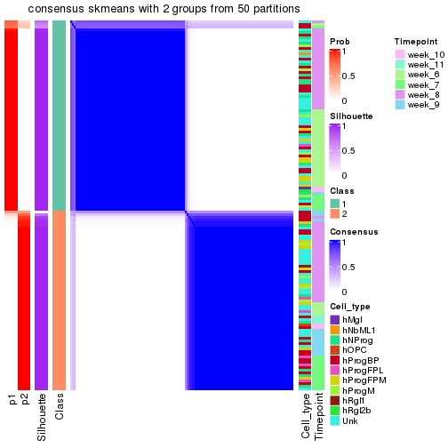</p>

</div>
<div id='tab-node-0112-consensus-heatmap-2'>
<pre><code class="r">consensus_heatmap(res, k = 3)
</code></pre>

<p></p>

</div>
<div id='tab-node-0112-consensus-heatmap-3'>
<pre><code class="r">consensus_heatmap(res, k = 4)
</code></pre>

<p></p>

</div>
</div>

Heatmaps for the membership of samples in all partitions to see how consistent they are:


<script>
$( function() {
	$( '#tabs-node-0112-membership-heatmap' ).tabs();
} );
</script>
<div id='tabs-node-0112-membership-heatmap'>
<ul>
<li><a href='#tab-node-0112-membership-heatmap-1'>k = 2</a></li>
<li><a href='#tab-node-0112-membership-heatmap-2'>k = 3</a></li>
<li><a href='#tab-node-0112-membership-heatmap-3'>k = 4</a></li>
</ul>
<div id='tab-node-0112-membership-heatmap-1'>
<pre><code class="r">membership_heatmap(res, k = 2)
</code></pre>

<p></p>

</div>
<div id='tab-node-0112-membership-heatmap-2'>
<pre><code class="r">membership_heatmap(res, k = 3)
</code></pre>

<p></p>

</div>
<div id='tab-node-0112-membership-heatmap-3'>
<pre><code class="r">membership_heatmap(res, k = 4)
</code></pre>

<p></p>

</div>
</div>

As soon as the classes for columns are determined, the signatures
that are significantly different between subgroups can be looked for. 
Following are the heatmaps for signatures.


Signature heatmaps where rows are scaled:


<script>
$( function() {
	$( '#tabs-node-0112-get-signatures' ).tabs();
} );
</script>
<div id='tabs-node-0112-get-signatures'>
<ul>
<li><a href='#tab-node-0112-get-signatures-1'>k = 2</a></li>
<li><a href='#tab-node-0112-get-signatures-2'>k = 3</a></li>
<li><a href='#tab-node-0112-get-signatures-3'>k = 4</a></li>
</ul>
<div id='tab-node-0112-get-signatures-1'>
<pre><code class="r">get_signatures(res, k = 2)
</code></pre>

<p></p>

</div>
<div id='tab-node-0112-get-signatures-2'>
<pre><code class="r">get_signatures(res, k = 3)
</code></pre>

<p></p>

</div>
<div id='tab-node-0112-get-signatures-3'>
<pre><code class="r">get_signatures(res, k = 4)
</code></pre>

<p></p>

</div>
</div>


Signature heatmaps where rows are not scaled:


<script>
$( function() {
	$( '#tabs-node-0112-get-signatures-no-scale' ).tabs();
} );
</script>
<div id='tabs-node-0112-get-signatures-no-scale'>
<ul>
<li><a href='#tab-node-0112-get-signatures-no-scale-1'>k = 2</a></li>
<li><a href='#tab-node-0112-get-signatures-no-scale-2'>k = 3</a></li>
<li><a href='#tab-node-0112-get-signatures-no-scale-3'>k = 4</a></li>
</ul>
<div id='tab-node-0112-get-signatures-no-scale-1'>
<pre><code class="r">get_signatures(res, k = 2, scale_rows = FALSE)
</code></pre>

<p></p>

</div>
<div id='tab-node-0112-get-signatures-no-scale-2'>
<pre><code class="r">get_signatures(res, k = 3, scale_rows = FALSE)
</code></pre>

<p></p>

</div>
<div id='tab-node-0112-get-signatures-no-scale-3'>
<pre><code class="r">get_signatures(res, k = 4, scale_rows = FALSE)
</code></pre>

<p></p>

</div>
</div>


Compare the overlap of signatures from different k:

```r
compare_signatures(res)
```


`get_signature()` returns a data frame invisibly. To get the list of signatures, the function
call should be assigned to a variable explicitly. In following code, if `plot` argument is set
to `FALSE`, no heatmap is plotted while only the differential analysis is performed.

```r
# code only for demonstration
tb = get_signature(res, k = ..., plot = FALSE)
```

An example of the output of `tb` is:

```
#>   which_row         fdr    mean_1    mean_2 scaled_mean_1 scaled_mean_2 km
#> 1        38 0.042760348  8.373488  9.131774    -0.5533452     0.5164555  1
#> 2        40 0.018707592  7.106213  8.469186    -0.6173731     0.5762149  1
#> 3        55 0.019134737 10.221463 11.207825    -0.6159697     0.5749050  1
#> 4        59 0.006059896  5.921854  7.869574    -0.6899429     0.6439467  1
#> 5        60 0.018055526  8.928898 10.211722    -0.6204761     0.5791110  1
#> 6        98 0.009384629 15.714769 14.887706     0.6635654    -0.6193277  2
...
```

The columns in `tb` are:

1. `which_row`: row indices corresponding to the input matrix.
2. `fdr`: FDR for the differential test. 
3. `mean_x`: The mean value in group x.
4. `scaled_mean_x`: The mean value in group x after rows are scaled.
5. `km`: Row groups if k-means clustering is applied to rows (which is done by automatically selecting number of clusters).

If there are too many signatures, `top_signatures = ...` can be set to only show the 
signatures with the highest FDRs:

```r
# code only for demonstration
# e.g. to show the top 500 most significant rows
tb = get_signature(res, k = ..., top_signatures = 500)
```

If the signatures are defined as these which are uniquely high in current group, `diff_method` argument
can be set to `"uniquely_high_in_one_group"`:

```r
# code only for demonstration
tb = get_signature(res, k = ..., diff_method = "uniquely_high_in_one_group")
```


UMAP plot which shows how samples are separated.


<script>
$( function() {
	$( '#tabs-node-0112-dimension-reduction' ).tabs();
} );
</script>
<div id='tabs-node-0112-dimension-reduction'>
<ul>
<li><a href='#tab-node-0112-dimension-reduction-1'>k = 2</a></li>
<li><a href='#tab-node-0112-dimension-reduction-2'>k = 3</a></li>
<li><a href='#tab-node-0112-dimension-reduction-3'>k = 4</a></li>
</ul>
<div id='tab-node-0112-dimension-reduction-1'>
<pre><code class="r">dimension_reduction(res, k = 2, method = &quot;UMAP&quot;)
</code></pre>

<p></p>

</div>
<div id='tab-node-0112-dimension-reduction-2'>
<pre><code class="r">dimension_reduction(res, k = 3, method = &quot;UMAP&quot;)
</code></pre>

<p>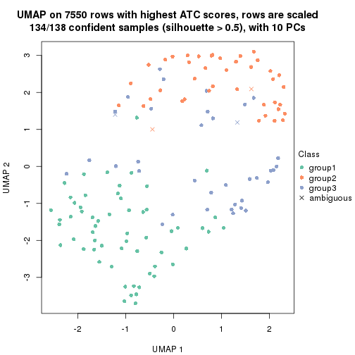</p>

</div>
<div id='tab-node-0112-dimension-reduction-3'>
<pre><code class="r">dimension_reduction(res, k = 4, method = &quot;UMAP&quot;)
</code></pre>

<p></p>

</div>
</div>


Following heatmap shows how subgroups are split when increasing `k`:

```r
collect_classes(res)
```


Test correlation between subgroups and known annotations. If the known
annotation is numeric, one-way ANOVA test is applied, and if the known
annotation is discrete, chi-squared contingency table test is applied.

```r
test_to_known_factors(res)
```

```
#>             n_sample Cell_type(p-value) Timepoint(p-value) k
#> ATC:skmeans      137              0.459           6.44e-06 2
#> ATC:skmeans      134              0.189           6.82e-08 3
#> ATC:skmeans      123              0.140           1.77e-04 4
```


If matrix rows can be associated to genes, consider to use `functional_enrichment(res,
...)` to perform function enrichment for the signature genes. See [this vignette](https://jokergoo.github.io/cola_vignettes/functional_enrichment.html) for more detailed explanations.


 

---------------------------------------------------


### Node0113


Parent node: [Node011](#Node011).
Child nodes: 
                Node01121-leaf
        ,
                Node01122-leaf
        ,
                Node01131-leaf
        ,
                Node01132-leaf
        ,
                Node01133-leaf
        ,
                [Node01211](#Node01211)
        ,
                Node01212-leaf
        ,
                Node01221-leaf
        ,
                [Node01222](#Node01222)
        ,
                Node01311-leaf
        ,
                Node01312-leaf
        ,
                Node01313-leaf
        ,
                Node01321-leaf
        ,
                Node01322-leaf
        ,
                Node01331-leaf
        ,
                Node01332-leaf
        ,
                Node02111-leaf
        ,
                [Node02112](#Node02112)
        ,
                Node02121-leaf
        ,
                Node02122-leaf
        ,
                [Node02123](#Node02123)
        ,
                Node02221-leaf
        ,
                Node02222-leaf
        ,
                Node02231-leaf
        ,
                Node02232-leaf
        ,
                Node02311-leaf
        ,
                Node02312-leaf
        ,
                Node02321-leaf
        ,
                Node02322-leaf
        ,
                Node02323-leaf
        ,
                Node02421-leaf
        ,
                Node02422-leaf
        .


The object with results only for a single top-value method and a single partitioning method 
can be extracted as:

```r
res = res_rh["0113"]
```

A summary of `res` and all the functions that can be applied to it:

```r
res
```

```
#> A 'ConsensusPartition' object with k = 2, 3, 4.
#>   On a matrix with 6635 rows and 125 columns.
#>   Top rows (590) are extracted by 'ATC' method.
#>   Subgroups are detected by 'skmeans' method.
#>   Performed in total 150 partitions by row resampling.
#>   Best k for subgroups seems to be 4.
#> 
#> Following methods can be applied to this 'ConsensusPartition' object:
#>  [1] "cola_report"             "collect_classes"         "collect_plots"          
#>  [4] "collect_stats"           "colnames"                "compare_partitions"     
#>  [7] "compare_signatures"      "consensus_heatmap"       "dimension_reduction"    
#> [10] "functional_enrichment"   "get_anno_col"            "get_anno"               
#> [13] "get_classes"             "get_consensus"           "get_matrix"             
#> [16] "get_membership"          "get_param"               "get_signatures"         
#> [19] "get_stats"               "is_best_k"               "is_stable_k"            
#> [22] "membership_heatmap"      "ncol"                    "nrow"                   
#> [25] "plot_ecdf"               "predict_classes"         "rownames"               
#> [28] "select_partition_number" "show"                    "suggest_best_k"         
#> [31] "test_to_known_factors"   "top_rows_heatmap"
```

`collect_plots()` function collects all the plots made from `res` for all `k` (number of subgroups)
into one single page to provide an easy and fast comparison between different `k`.

```r
collect_plots(res)
```


The plots are:

- The first row: a plot of the eCDF (empirical cumulative distribution
  function) curves of the consensus matrix for each `k` and the heatmap of
  predicted classes for each `k`.
- The second row: heatmaps of the consensus matrix for each `k`.
- The third row: heatmaps of the membership matrix for each `k`.
- The fouth row: heatmaps of the signatures for each `k`.

All the plots in panels can be made by individual functions and they are
plotted later in this section.

`select_partition_number()` produces several plots showing different
statistics for choosing "optimized" `k`. There are following statistics:

- eCDF curves of the consensus matrix for each `k`;
- 1-PAC. [The PAC score](https://en.wikipedia.org/wiki/Consensus_clustering#Over-interpretation_potential_of_consensus_clustering)
  measures the proportion of the ambiguous subgrouping.
- Mean silhouette score.
- Concordance. The mean probability of fiting the consensus subgroup labels in all
  partitions.
- Area increased. Denote $A_k$ as the area under the eCDF curve for current
  `k`, the area increased is defined as $A_k - A_{k-1}$.
- Rand index. The percent of pairs of samples that are both in a same cluster
  or both are not in a same cluster in the partition of k and k-1.
- Jaccard index. The ratio of pairs of samples are both in a same cluster in
  the partition of k and k-1 and the pairs of samples are both in a same
  cluster in the partition k or k-1.

The detailed explanations of these statistics can be found in [the _cola_
vignette](https://jokergoo.github.io/cola_vignettes/cola.html#toc_13).

Generally speaking, higher 1-PAC score, higher mean silhouette score or higher
concordance corresponds to better partition. Rand index and Jaccard index
measure how similar the current partition is compared to partition with `k-1`.
If they are too similar, we won't accept `k` is better than `k-1`.

```r
select_partition_number(res)
```


The numeric values for all these statistics can be obtained by `get_stats()`.

```r
get_stats(res)
```

```
#>   k 1-PAC mean_silhouette concordance area_increased  Rand Jaccard
#> 2 2 1.000           0.967       0.985          0.497 0.505   0.505
#> 3 3 0.978           0.953       0.979          0.342 0.765   0.562
#> 4 4 1.000           0.946       0.978          0.109 0.878   0.658
```

`suggest_best_k()` suggests the best $k$ based on these statistics. The rules are as follows:

- All $k$ with Jaccard index larger than 0.95 are removed because increasing
  $k$ does not provide enough extra information. If all $k$ are removed, it is
  marked as no subgroup is detected.
- For all $k$ with 1-PAC score larger than 0.9, the maximal $k$ is taken as
  the best $k$, and other $k$ are marked as optional $k$.
- If it does not fit the second rule. The $k$ with the maximal vote of the
  highest 1-PAC score, highest mean silhouette, and highest concordance is
  taken as the best $k$.

```r
suggest_best_k(res)
```

```
#> [1] 4
#> attr(,"optional")
#> [1] 2 3
```

There is also optional best $k$ = 2 3 that is worth to check.

Following is the table of the partitions (You need to click the **show/hide
code output** link to see it). The membership matrix (columns with name `p*`)
is inferred by
[`clue::cl_consensus()`](https://www.rdocumentation.org/link/cl_consensus?package=clue)
function with the `SE` method. Basically the value in the membership matrix
represents the probability to belong to a certain group. The finall subgroup
label for an item is determined with the group with highest probability it
belongs to.

In `get_classes()` function, the entropy is calculated from the membership
matrix and the silhouette score is calculated from the consensus matrix.


<script>
$( function() {
	$( '#tabs-node-0113-get-classes' ).tabs();
} );
</script>
<div id='tabs-node-0113-get-classes'>
<ul>
<li><a href='#tab-node-0113-get-classes-1'>k = 2</a></li>
<li><a href='#tab-node-0113-get-classes-2'>k = 3</a></li>
<li><a href='#tab-node-0113-get-classes-3'>k = 4</a></li>
</ul>

<div id='tab-node-0113-get-classes-1'>
<p><a id='tab-node-0113-get-classes-1-a' style='color:#0366d6' href='#'>show/hide code output</a></p>
<pre><code class="r">cbind(get_classes(res, k = 2), get_membership(res, k = 2))
</code></pre>

<pre><code>#&gt;                 class entropy silhouette   p1   p2
#&gt; 1772067_089_A01     2   0.000      0.991 0.00 1.00
#&gt; 1772067_089_B01     1   0.141      0.964 0.98 0.02
#&gt; 1772067_089_C11     2   0.000      0.991 0.00 1.00
#&gt; 1772067_089_D05     2   0.000      0.991 0.00 1.00
#&gt; 1772067_089_E08     2   0.000      0.991 0.00 1.00
#&gt; 1772067_089_F02     2   0.000      0.991 0.00 1.00
#&gt; 1772067_089_F05     2   0.000      0.991 0.00 1.00
#&gt; 1772067_089_F11     1   0.000      0.981 1.00 0.00
#&gt; 1772067_089_G09     1   0.000      0.981 1.00 0.00
#&gt; 1772067_089_H06     1   0.000      0.981 1.00 0.00
#&gt; 1772071_027_C01     1   0.000      0.981 1.00 0.00
#&gt; 1772071_027_D12     1   0.000      0.981 1.00 0.00
#&gt; 1772071_027_F06     2   0.000      0.991 0.00 1.00
#&gt; 1772071_027_H09     2   0.000      0.991 0.00 1.00
#&gt; 1772071_029_B12     1   0.000      0.981 1.00 0.00
#&gt; 1772071_029_E07     2   0.000      0.991 0.00 1.00
#&gt; 1772071_029_F08     1   0.000      0.981 1.00 0.00
#&gt; 1772078_078_B05     1   0.000      0.981 1.00 0.00
#&gt; 1772078_078_C08     1   0.000      0.981 1.00 0.00
#&gt; 1772078_078_D05     1   0.000      0.981 1.00 0.00
#&gt; 1772078_078_E10     1   0.000      0.981 1.00 0.00
#&gt; 1772078_078_H04     1   0.000      0.981 1.00 0.00
#&gt; 1772078_078_H05     1   0.000      0.981 1.00 0.00
#&gt; 1772078_079_B06     1   0.242      0.947 0.96 0.04
#&gt; 1772078_079_C10     1   0.000      0.981 1.00 0.00
#&gt; 1772078_079_H02     1   0.000      0.981 1.00 0.00
#&gt; 1772078_107_A12     1   0.000      0.981 1.00 0.00
#&gt; 1772078_107_B03     1   0.000      0.981 1.00 0.00
#&gt; 1772078_107_E01     2   0.000      0.991 0.00 1.00
#&gt; 1772078_107_F05     2   0.000      0.991 0.00 1.00
#&gt; 1772078_109_H04     1   0.000      0.981 1.00 0.00
#&gt; 1772075_299_C08     1   0.000      0.981 1.00 0.00
#&gt; 1772075_299_E12     1   0.242      0.947 0.96 0.04
#&gt; 1772075_299_F03     1   0.242      0.947 0.96 0.04
#&gt; 1772075_299_G02     1   0.000      0.981 1.00 0.00
#&gt; 1772075_298_A10     1   0.000      0.981 1.00 0.00
#&gt; 1772075_298_B04     1   0.000      0.981 1.00 0.00
#&gt; 1772075_298_B11     1   0.000      0.981 1.00 0.00
#&gt; 1772075_298_D03     1   0.000      0.981 1.00 0.00
#&gt; 1772078_001_B12     1   0.000      0.981 1.00 0.00
#&gt; 1772078_001_C01     1   0.000      0.981 1.00 0.00
#&gt; 1772078_001_C11     2   0.760      0.717 0.22 0.78
#&gt; 1772078_001_G10     1   0.000      0.981 1.00 0.00
#&gt; 1772078_001_G11     1   0.000      0.981 1.00 0.00
#&gt; 1772078_002_C11     1   0.000      0.981 1.00 0.00
#&gt; 1772078_002_D06     1   0.000      0.981 1.00 0.00
#&gt; 1772078_002_E10     1   0.000      0.981 1.00 0.00
#&gt; 1772096_160_C08     1   0.000      0.981 1.00 0.00
#&gt; 1772096_160_D01     2   0.000      0.991 0.00 1.00
#&gt; 1772096_160_E12     2   0.000      0.991 0.00 1.00
#&gt; 1772096_160_G04     1   0.000      0.981 1.00 0.00
#&gt; 1772096_160_G12     1   0.000      0.981 1.00 0.00
#&gt; 1772096_160_H11     2   0.000      0.991 0.00 1.00
#&gt; 1772096_095_A06     2   0.000      0.991 0.00 1.00
#&gt; 1772096_095_B08     2   0.000      0.991 0.00 1.00
#&gt; 1772096_095_B11     1   0.000      0.981 1.00 0.00
#&gt; 1772096_095_D10     1   0.000      0.981 1.00 0.00
#&gt; 1772096_095_E10     1   0.000      0.981 1.00 0.00
#&gt; 1772096_095_F10     1   0.000      0.981 1.00 0.00
#&gt; 1772096_095_G04     1   0.000      0.981 1.00 0.00
#&gt; 1772122_236_B02     2   0.000      0.991 0.00 1.00
#&gt; 1772122_236_C01     1   0.000      0.981 1.00 0.00
#&gt; 1772122_236_G05     2   0.000      0.991 0.00 1.00
#&gt; 1772122_236_H03     1   0.000      0.981 1.00 0.00
#&gt; 1772121_291_B03     1   0.000      0.981 1.00 0.00
#&gt; 1772121_291_B05     1   0.000      0.981 1.00 0.00
#&gt; 1772121_291_H09     1   0.000      0.981 1.00 0.00
#&gt; 1772121_293_C09     2   0.000      0.991 0.00 1.00
#&gt; 1772121_283_G10     1   0.000      0.981 1.00 0.00
#&gt; 1772121_282_B02     1   0.000      0.981 1.00 0.00
#&gt; 1772121_282_B10     1   0.000      0.981 1.00 0.00
#&gt; 1772121_282_B12     1   0.000      0.981 1.00 0.00
#&gt; 1772121_282_D01     1   0.000      0.981 1.00 0.00
#&gt; 1772121_282_D05     1   0.000      0.981 1.00 0.00
#&gt; 1772121_282_G06     2   0.000      0.991 0.00 1.00
#&gt; 1772122_264_A05     1   0.827      0.662 0.74 0.26
#&gt; 1772122_264_C05     1   0.000      0.981 1.00 0.00
#&gt; 1772122_264_D03     2   0.000      0.991 0.00 1.00
#&gt; 1772122_264_E07     2   0.000      0.991 0.00 1.00
#&gt; 1772122_264_F08     1   0.000      0.981 1.00 0.00
#&gt; 1772122_208_A08     2   0.000      0.991 0.00 1.00
#&gt; 1772122_208_E06     2   0.000      0.991 0.00 1.00
#&gt; 1772122_208_G06     2   0.000      0.991 0.00 1.00
#&gt; 1772122_201_G10     1   0.000      0.981 1.00 0.00
#&gt; 1772122_207_H03     1   0.000      0.981 1.00 0.00
#&gt; 1772122_207_H05     2   0.000      0.991 0.00 1.00
#&gt; 1772122_199_C02     2   0.000      0.991 0.00 1.00
#&gt; 1772122_199_H01     2   0.000      0.991 0.00 1.00
#&gt; 1772122_203_A02     2   0.000      0.991 0.00 1.00
#&gt; 1772122_203_C01     2   0.000      0.991 0.00 1.00
#&gt; 1772122_203_F12     1   0.000      0.981 1.00 0.00
#&gt; 1772122_203_H01     1   0.000      0.981 1.00 0.00
#&gt; 1772122_200_A06     1   0.000      0.981 1.00 0.00
#&gt; 1772122_200_A09     1   0.795      0.696 0.76 0.24
#&gt; 1772122_200_B08     1   0.141      0.965 0.98 0.02
#&gt; 1772122_200_B12     2   0.000      0.991 0.00 1.00
#&gt; 1772122_200_D10     1   0.000      0.981 1.00 0.00
#&gt; 1772122_200_G05     1   0.958      0.405 0.62 0.38
#&gt; 1772122_316_B01     2   0.000      0.991 0.00 1.00
#&gt; 1772122_317_F03     2   0.000      0.991 0.00 1.00
#&gt; 1772122_317_F05     2   0.000      0.991 0.00 1.00
#&gt; 1772122_318_B05     2   0.000      0.991 0.00 1.00
#&gt; 1772122_318_B10     2   0.000      0.991 0.00 1.00
#&gt; 1772122_318_E01     2   0.000      0.991 0.00 1.00
#&gt; 1772122_319_A01     2   0.000      0.991 0.00 1.00
#&gt; 1772122_319_D05     2   0.000      0.991 0.00 1.00
#&gt; 1772122_319_E09     2   0.000      0.991 0.00 1.00
#&gt; 1772122_221_A02     2   0.584      0.836 0.14 0.86
#&gt; 1772122_221_B12     2   0.000      0.991 0.00 1.00
#&gt; 1772122_221_D12     2   0.000      0.991 0.00 1.00
#&gt; 1772122_221_E02     2   0.000      0.991 0.00 1.00
#&gt; 1772122_221_E03     1   0.000      0.981 1.00 0.00
#&gt; 1772122_220_G08     2   0.000      0.991 0.00 1.00
#&gt; 1772122_220_H07     2   0.000      0.991 0.00 1.00
#&gt; 1772122_226_B11     2   0.000      0.991 0.00 1.00
#&gt; 1772122_226_C08     1   0.000      0.981 1.00 0.00
#&gt; 1772122_226_E01     1   0.242      0.947 0.96 0.04
#&gt; 1772122_226_F12     2   0.000      0.991 0.00 1.00
#&gt; 1772122_223_A06     2   0.000      0.991 0.00 1.00
#&gt; 1772122_223_C02     2   0.000      0.991 0.00 1.00
#&gt; 1772122_223_E08     1   0.827      0.655 0.74 0.26
#&gt; 1772122_223_G12     2   0.469      0.887 0.10 0.90
#&gt; 1772122_224_A07     2   0.000      0.991 0.00 1.00
#&gt; 1772122_224_E12     2   0.141      0.972 0.02 0.98
#&gt; 1772122_224_H02     1   0.000      0.981 1.00 0.00
</code></pre>

<script>
$('#tab-node-0113-get-classes-1-a').parent().next().next().hide();
$('#tab-node-0113-get-classes-1-a').click(function(){
  $('#tab-node-0113-get-classes-1-a').parent().next().next().toggle();
  return(false);
});
</script>
</div>

<div id='tab-node-0113-get-classes-2'>
<p><a id='tab-node-0113-get-classes-2-a' style='color:#0366d6' href='#'>show/hide code output</a></p>
<pre><code class="r">cbind(get_classes(res, k = 3), get_membership(res, k = 3))
</code></pre>

<pre><code>#&gt;                 class entropy silhouette   p1   p2   p3
#&gt; 1772067_089_A01     2  0.0000      0.980 0.00 1.00 0.00
#&gt; 1772067_089_B01     1  0.0000      0.995 1.00 0.00 0.00
#&gt; 1772067_089_C11     2  0.0000      0.980 0.00 1.00 0.00
#&gt; 1772067_089_D05     2  0.0000      0.980 0.00 1.00 0.00
#&gt; 1772067_089_E08     2  0.0000      0.980 0.00 1.00 0.00
#&gt; 1772067_089_F02     2  0.0000      0.980 0.00 1.00 0.00
#&gt; 1772067_089_F05     2  0.0000      0.980 0.00 1.00 0.00
#&gt; 1772067_089_F11     1  0.0000      0.995 1.00 0.00 0.00
#&gt; 1772067_089_G09     1  0.0000      0.995 1.00 0.00 0.00
#&gt; 1772067_089_H06     1  0.0000      0.995 1.00 0.00 0.00
#&gt; 1772071_027_C01     1  0.0000      0.995 1.00 0.00 0.00
#&gt; 1772071_027_D12     1  0.0000      0.995 1.00 0.00 0.00
#&gt; 1772071_027_F06     2  0.0000      0.980 0.00 1.00 0.00
#&gt; 1772071_027_H09     2  0.0000      0.980 0.00 1.00 0.00
#&gt; 1772071_029_B12     1  0.0000      0.995 1.00 0.00 0.00
#&gt; 1772071_029_E07     2  0.0892      0.968 0.00 0.98 0.02
#&gt; 1772071_029_F08     1  0.0000      0.995 1.00 0.00 0.00
#&gt; 1772078_078_B05     1  0.0000      0.995 1.00 0.00 0.00
#&gt; 1772078_078_C08     1  0.0000      0.995 1.00 0.00 0.00
#&gt; 1772078_078_D05     3  0.0000      0.953 0.00 0.00 1.00
#&gt; 1772078_078_E10     1  0.0000      0.995 1.00 0.00 0.00
#&gt; 1772078_078_H04     3  0.0000      0.953 0.00 0.00 1.00
#&gt; 1772078_078_H05     3  0.0000      0.953 0.00 0.00 1.00
#&gt; 1772078_079_B06     3  0.0000      0.953 0.00 0.00 1.00
#&gt; 1772078_079_C10     3  0.0000      0.953 0.00 0.00 1.00
#&gt; 1772078_079_H02     1  0.0000      0.995 1.00 0.00 0.00
#&gt; 1772078_107_A12     1  0.4002      0.799 0.84 0.00 0.16
#&gt; 1772078_107_B03     1  0.0000      0.995 1.00 0.00 0.00
#&gt; 1772078_107_E01     2  0.0000      0.980 0.00 1.00 0.00
#&gt; 1772078_107_F05     2  0.0000      0.980 0.00 1.00 0.00
#&gt; 1772078_109_H04     1  0.0000      0.995 1.00 0.00 0.00
#&gt; 1772075_299_C08     3  0.6045      0.420 0.38 0.00 0.62
#&gt; 1772075_299_E12     3  0.0000      0.953 0.00 0.00 1.00
#&gt; 1772075_299_F03     3  0.0000      0.953 0.00 0.00 1.00
#&gt; 1772075_299_G02     3  0.0000      0.953 0.00 0.00 1.00
#&gt; 1772075_298_A10     1  0.0000      0.995 1.00 0.00 0.00
#&gt; 1772075_298_B04     3  0.0000      0.953 0.00 0.00 1.00
#&gt; 1772075_298_B11     1  0.0000      0.995 1.00 0.00 0.00
#&gt; 1772075_298_D03     3  0.0000      0.953 0.00 0.00 1.00
#&gt; 1772078_001_B12     1  0.0000      0.995 1.00 0.00 0.00
#&gt; 1772078_001_C01     1  0.0000      0.995 1.00 0.00 0.00
#&gt; 1772078_001_C11     1  0.1529      0.951 0.96 0.04 0.00
#&gt; 1772078_001_G10     1  0.0000      0.995 1.00 0.00 0.00
#&gt; 1772078_001_G11     1  0.0000      0.995 1.00 0.00 0.00
#&gt; 1772078_002_C11     1  0.0000      0.995 1.00 0.00 0.00
#&gt; 1772078_002_D06     3  0.0000      0.953 0.00 0.00 1.00
#&gt; 1772078_002_E10     1  0.0000      0.995 1.00 0.00 0.00
#&gt; 1772096_160_C08     3  0.0000      0.953 0.00 0.00 1.00
#&gt; 1772096_160_D01     2  0.0000      0.980 0.00 1.00 0.00
#&gt; 1772096_160_E12     2  0.5706      0.546 0.00 0.68 0.32
#&gt; 1772096_160_G04     1  0.0000      0.995 1.00 0.00 0.00
#&gt; 1772096_160_G12     1  0.0000      0.995 1.00 0.00 0.00
#&gt; 1772096_160_H11     2  0.0000      0.980 0.00 1.00 0.00
#&gt; 1772096_095_A06     2  0.0892      0.968 0.00 0.98 0.02
#&gt; 1772096_095_B08     2  0.0000      0.980 0.00 1.00 0.00
#&gt; 1772096_095_B11     1  0.0000      0.995 1.00 0.00 0.00
#&gt; 1772096_095_D10     1  0.0000      0.995 1.00 0.00 0.00
#&gt; 1772096_095_E10     3  0.5406      0.740 0.20 0.02 0.78
#&gt; 1772096_095_F10     1  0.0000      0.995 1.00 0.00 0.00
#&gt; 1772096_095_G04     3  0.5835      0.509 0.34 0.00 0.66
#&gt; 1772122_236_B02     2  0.0892      0.968 0.00 0.98 0.02
#&gt; 1772122_236_C01     1  0.0000      0.995 1.00 0.00 0.00
#&gt; 1772122_236_G05     2  0.0000      0.980 0.00 1.00 0.00
#&gt; 1772122_236_H03     3  0.0000      0.953 0.00 0.00 1.00
#&gt; 1772121_291_B03     3  0.0000      0.953 0.00 0.00 1.00
#&gt; 1772121_291_B05     1  0.0000      0.995 1.00 0.00 0.00
#&gt; 1772121_291_H09     1  0.0000      0.995 1.00 0.00 0.00
#&gt; 1772121_293_C09     2  0.4002      0.818 0.00 0.84 0.16
#&gt; 1772121_283_G10     1  0.0000      0.995 1.00 0.00 0.00
#&gt; 1772121_282_B02     1  0.0000      0.995 1.00 0.00 0.00
#&gt; 1772121_282_B10     1  0.0000      0.995 1.00 0.00 0.00
#&gt; 1772121_282_B12     1  0.0000      0.995 1.00 0.00 0.00
#&gt; 1772121_282_D01     1  0.0000      0.995 1.00 0.00 0.00
#&gt; 1772121_282_D05     1  0.0000      0.995 1.00 0.00 0.00
#&gt; 1772121_282_G06     2  0.0000      0.980 0.00 1.00 0.00
#&gt; 1772122_264_A05     3  0.0000      0.953 0.00 0.00 1.00
#&gt; 1772122_264_C05     1  0.0000      0.995 1.00 0.00 0.00
#&gt; 1772122_264_D03     2  0.2414      0.932 0.02 0.94 0.04
#&gt; 1772122_264_E07     2  0.0892      0.968 0.00 0.98 0.02
#&gt; 1772122_264_F08     3  0.0000      0.953 0.00 0.00 1.00
#&gt; 1772122_208_A08     2  0.0892      0.968 0.00 0.98 0.02
#&gt; 1772122_208_E06     2  0.0892      0.968 0.00 0.98 0.02
#&gt; 1772122_208_G06     2  0.4555      0.763 0.00 0.80 0.20
#&gt; 1772122_201_G10     1  0.0000      0.995 1.00 0.00 0.00
#&gt; 1772122_207_H03     1  0.0000      0.995 1.00 0.00 0.00
#&gt; 1772122_207_H05     2  0.0000      0.980 0.00 1.00 0.00
#&gt; 1772122_199_C02     3  0.0000      0.953 0.00 0.00 1.00
#&gt; 1772122_199_H01     3  0.0000      0.953 0.00 0.00 1.00
#&gt; 1772122_203_A02     3  0.0000      0.953 0.00 0.00 1.00
#&gt; 1772122_203_C01     3  0.2537      0.880 0.00 0.08 0.92
#&gt; 1772122_203_F12     3  0.0000      0.953 0.00 0.00 1.00
#&gt; 1772122_203_H01     3  0.0000      0.953 0.00 0.00 1.00
#&gt; 1772122_200_A06     3  0.1529      0.922 0.04 0.00 0.96
#&gt; 1772122_200_A09     3  0.0000      0.953 0.00 0.00 1.00
#&gt; 1772122_200_B08     3  0.0000      0.953 0.00 0.00 1.00
#&gt; 1772122_200_B12     3  0.0000      0.953 0.00 0.00 1.00
#&gt; 1772122_200_D10     3  0.0000      0.953 0.00 0.00 1.00
#&gt; 1772122_200_G05     3  0.0000      0.953 0.00 0.00 1.00
#&gt; 1772122_316_B01     2  0.0000      0.980 0.00 1.00 0.00
#&gt; 1772122_317_F03     2  0.0000      0.980 0.00 1.00 0.00
#&gt; 1772122_317_F05     2  0.0000      0.980 0.00 1.00 0.00
#&gt; 1772122_318_B05     2  0.0000      0.980 0.00 1.00 0.00
#&gt; 1772122_318_B10     2  0.0000      0.980 0.00 1.00 0.00
#&gt; 1772122_318_E01     2  0.0000      0.980 0.00 1.00 0.00
#&gt; 1772122_319_A01     2  0.0000      0.980 0.00 1.00 0.00
#&gt; 1772122_319_D05     2  0.0000      0.980 0.00 1.00 0.00
#&gt; 1772122_319_E09     2  0.0000      0.980 0.00 1.00 0.00
#&gt; 1772122_221_A02     3  0.0000      0.953 0.00 0.00 1.00
#&gt; 1772122_221_B12     2  0.0000      0.980 0.00 1.00 0.00
#&gt; 1772122_221_D12     2  0.0000      0.980 0.00 1.00 0.00
#&gt; 1772122_221_E02     2  0.0000      0.980 0.00 1.00 0.00
#&gt; 1772122_221_E03     3  0.4291      0.777 0.18 0.00 0.82
#&gt; 1772122_220_G08     2  0.0000      0.980 0.00 1.00 0.00
#&gt; 1772122_220_H07     2  0.0892      0.963 0.02 0.98 0.00
#&gt; 1772122_226_B11     2  0.0000      0.980 0.00 1.00 0.00
#&gt; 1772122_226_C08     1  0.0000      0.995 1.00 0.00 0.00
#&gt; 1772122_226_E01     1  0.0000      0.995 1.00 0.00 0.00
#&gt; 1772122_226_F12     2  0.0000      0.980 0.00 1.00 0.00
#&gt; 1772122_223_A06     2  0.0000      0.980 0.00 1.00 0.00
#&gt; 1772122_223_C02     2  0.0000      0.980 0.00 1.00 0.00
#&gt; 1772122_223_E08     1  0.0000      0.995 1.00 0.00 0.00
#&gt; 1772122_223_G12     3  0.5835      0.472 0.00 0.34 0.66
#&gt; 1772122_224_A07     2  0.0000      0.980 0.00 1.00 0.00
#&gt; 1772122_224_E12     2  0.0000      0.980 0.00 1.00 0.00
#&gt; 1772122_224_H02     3  0.0000      0.953 0.00 0.00 1.00
</code></pre>

<script>
$('#tab-node-0113-get-classes-2-a').parent().next().next().hide();
$('#tab-node-0113-get-classes-2-a').click(function(){
  $('#tab-node-0113-get-classes-2-a').parent().next().next().toggle();
  return(false);
});
</script>
</div>

<div id='tab-node-0113-get-classes-3'>
<p><a id='tab-node-0113-get-classes-3-a' style='color:#0366d6' href='#'>show/hide code output</a></p>
<pre><code class="r">cbind(get_classes(res, k = 4), get_membership(res, k = 4))
</code></pre>

<pre><code>#&gt;                 class entropy silhouette   p1   p2   p3   p4
#&gt; 1772067_089_A01     2  0.0000      0.997 0.00 1.00 0.00 0.00
#&gt; 1772067_089_B01     1  0.0000      0.995 1.00 0.00 0.00 0.00
#&gt; 1772067_089_C11     2  0.0000      0.997 0.00 1.00 0.00 0.00
#&gt; 1772067_089_D05     2  0.0000      0.997 0.00 1.00 0.00 0.00
#&gt; 1772067_089_E08     2  0.0000      0.997 0.00 1.00 0.00 0.00
#&gt; 1772067_089_F02     2  0.0000      0.997 0.00 1.00 0.00 0.00
#&gt; 1772067_089_F05     2  0.0000      0.997 0.00 1.00 0.00 0.00
#&gt; 1772067_089_F11     1  0.0000      0.995 1.00 0.00 0.00 0.00
#&gt; 1772067_089_G09     1  0.0000      0.995 1.00 0.00 0.00 0.00
#&gt; 1772067_089_H06     1  0.0000      0.995 1.00 0.00 0.00 0.00
#&gt; 1772071_027_C01     1  0.0000      0.995 1.00 0.00 0.00 0.00
#&gt; 1772071_027_D12     1  0.0000      0.995 1.00 0.00 0.00 0.00
#&gt; 1772071_027_F06     2  0.0000      0.997 0.00 1.00 0.00 0.00
#&gt; 1772071_027_H09     4  0.1211      0.945 0.00 0.04 0.00 0.96
#&gt; 1772071_029_B12     1  0.0000      0.995 1.00 0.00 0.00 0.00
#&gt; 1772071_029_E07     4  0.3400      0.783 0.00 0.18 0.00 0.82
#&gt; 1772071_029_F08     1  0.0000      0.995 1.00 0.00 0.00 0.00
#&gt; 1772078_078_B05     1  0.0000      0.995 1.00 0.00 0.00 0.00
#&gt; 1772078_078_C08     1  0.0000      0.995 1.00 0.00 0.00 0.00
#&gt; 1772078_078_D05     3  0.0000      0.917 0.00 0.00 1.00 0.00
#&gt; 1772078_078_E10     1  0.0000      0.995 1.00 0.00 0.00 0.00
#&gt; 1772078_078_H04     3  0.0000      0.917 0.00 0.00 1.00 0.00
#&gt; 1772078_078_H05     3  0.0000      0.917 0.00 0.00 1.00 0.00
#&gt; 1772078_079_B06     3  0.0000      0.917 0.00 0.00 1.00 0.00
#&gt; 1772078_079_C10     3  0.0000      0.917 0.00 0.00 1.00 0.00
#&gt; 1772078_079_H02     1  0.0000      0.995 1.00 0.00 0.00 0.00
#&gt; 1772078_107_A12     3  0.1211      0.885 0.04 0.00 0.96 0.00
#&gt; 1772078_107_B03     1  0.0000      0.995 1.00 0.00 0.00 0.00
#&gt; 1772078_107_E01     2  0.0000      0.997 0.00 1.00 0.00 0.00
#&gt; 1772078_107_F05     2  0.0000      0.997 0.00 1.00 0.00 0.00
#&gt; 1772078_109_H04     1  0.0000      0.995 1.00 0.00 0.00 0.00
#&gt; 1772075_299_C08     3  0.0707      0.902 0.02 0.00 0.98 0.00
#&gt; 1772075_299_E12     3  0.0000      0.917 0.00 0.00 1.00 0.00
#&gt; 1772075_299_F03     3  0.0000      0.917 0.00 0.00 1.00 0.00
#&gt; 1772075_299_G02     3  0.0000      0.917 0.00 0.00 1.00 0.00
#&gt; 1772075_298_A10     3  0.3610      0.715 0.20 0.00 0.80 0.00
#&gt; 1772075_298_B04     3  0.0000      0.917 0.00 0.00 1.00 0.00
#&gt; 1772075_298_B11     3  0.4994      0.102 0.48 0.00 0.52 0.00
#&gt; 1772075_298_D03     3  0.0000      0.917 0.00 0.00 1.00 0.00
#&gt; 1772078_001_B12     1  0.0000      0.995 1.00 0.00 0.00 0.00
#&gt; 1772078_001_C01     1  0.0000      0.995 1.00 0.00 0.00 0.00
#&gt; 1772078_001_C11     1  0.1637      0.931 0.94 0.06 0.00 0.00
#&gt; 1772078_001_G10     1  0.0000      0.995 1.00 0.00 0.00 0.00
#&gt; 1772078_001_G11     1  0.0000      0.995 1.00 0.00 0.00 0.00
#&gt; 1772078_002_C11     1  0.0707      0.976 0.98 0.00 0.02 0.00
#&gt; 1772078_002_D06     3  0.0000      0.917 0.00 0.00 1.00 0.00
#&gt; 1772078_002_E10     1  0.0000      0.995 1.00 0.00 0.00 0.00
#&gt; 1772096_160_C08     3  0.0000      0.917 0.00 0.00 1.00 0.00
#&gt; 1772096_160_D01     2  0.1211      0.957 0.00 0.96 0.04 0.00
#&gt; 1772096_160_E12     4  0.1211      0.945 0.00 0.04 0.00 0.96
#&gt; 1772096_160_G04     1  0.0000      0.995 1.00 0.00 0.00 0.00
#&gt; 1772096_160_G12     1  0.0000      0.995 1.00 0.00 0.00 0.00
#&gt; 1772096_160_H11     2  0.0000      0.997 0.00 1.00 0.00 0.00
#&gt; 1772096_095_A06     4  0.0000      0.978 0.00 0.00 0.00 1.00
#&gt; 1772096_095_B08     2  0.0000      0.997 0.00 1.00 0.00 0.00
#&gt; 1772096_095_B11     1  0.0000      0.995 1.00 0.00 0.00 0.00
#&gt; 1772096_095_D10     1  0.0000      0.995 1.00 0.00 0.00 0.00
#&gt; 1772096_095_E10     3  0.0000      0.917 0.00 0.00 1.00 0.00
#&gt; 1772096_095_F10     1  0.0000      0.995 1.00 0.00 0.00 0.00
#&gt; 1772096_095_G04     4  0.3198      0.864 0.08 0.00 0.04 0.88
#&gt; 1772122_236_B02     4  0.0000      0.978 0.00 0.00 0.00 1.00
#&gt; 1772122_236_C01     1  0.1211      0.957 0.96 0.00 0.04 0.00
#&gt; 1772122_236_G05     2  0.0000      0.997 0.00 1.00 0.00 0.00
#&gt; 1772122_236_H03     3  0.0000      0.917 0.00 0.00 1.00 0.00
#&gt; 1772121_291_B03     3  0.0000      0.917 0.00 0.00 1.00 0.00
#&gt; 1772121_291_B05     1  0.0000      0.995 1.00 0.00 0.00 0.00
#&gt; 1772121_291_H09     1  0.0000      0.995 1.00 0.00 0.00 0.00
#&gt; 1772121_293_C09     4  0.0000      0.978 0.00 0.00 0.00 1.00
#&gt; 1772121_283_G10     1  0.0000      0.995 1.00 0.00 0.00 0.00
#&gt; 1772121_282_B02     1  0.0000      0.995 1.00 0.00 0.00 0.00
#&gt; 1772121_282_B10     1  0.0000      0.995 1.00 0.00 0.00 0.00
#&gt; 1772121_282_B12     1  0.0000      0.995 1.00 0.00 0.00 0.00
#&gt; 1772121_282_D01     1  0.0000      0.995 1.00 0.00 0.00 0.00
#&gt; 1772121_282_D05     1  0.0000      0.995 1.00 0.00 0.00 0.00
#&gt; 1772121_282_G06     2  0.0000      0.997 0.00 1.00 0.00 0.00
#&gt; 1772122_264_A05     4  0.0000      0.978 0.00 0.00 0.00 1.00
#&gt; 1772122_264_C05     1  0.0000      0.995 1.00 0.00 0.00 0.00
#&gt; 1772122_264_D03     2  0.1637      0.935 0.00 0.94 0.06 0.00
#&gt; 1772122_264_E07     4  0.0000      0.978 0.00 0.00 0.00 1.00
#&gt; 1772122_264_F08     3  0.5355      0.412 0.02 0.00 0.62 0.36
#&gt; 1772122_208_A08     4  0.0000      0.978 0.00 0.00 0.00 1.00
#&gt; 1772122_208_E06     4  0.0000      0.978 0.00 0.00 0.00 1.00
#&gt; 1772122_208_G06     4  0.0000      0.978 0.00 0.00 0.00 1.00
#&gt; 1772122_201_G10     1  0.0000      0.995 1.00 0.00 0.00 0.00
#&gt; 1772122_207_H03     1  0.0000      0.995 1.00 0.00 0.00 0.00
#&gt; 1772122_207_H05     4  0.0707      0.963 0.00 0.02 0.00 0.98
#&gt; 1772122_199_C02     4  0.0000      0.978 0.00 0.00 0.00 1.00
#&gt; 1772122_199_H01     4  0.0000      0.978 0.00 0.00 0.00 1.00
#&gt; 1772122_203_A02     4  0.0000      0.978 0.00 0.00 0.00 1.00
#&gt; 1772122_203_C01     3  0.6554      0.200 0.00 0.08 0.52 0.40
#&gt; 1772122_203_F12     4  0.0000      0.978 0.00 0.00 0.00 1.00
#&gt; 1772122_203_H01     3  0.0000      0.917 0.00 0.00 1.00 0.00
#&gt; 1772122_200_A06     3  0.0000      0.917 0.00 0.00 1.00 0.00
#&gt; 1772122_200_A09     4  0.0000      0.978 0.00 0.00 0.00 1.00
#&gt; 1772122_200_B08     4  0.0000      0.978 0.00 0.00 0.00 1.00
#&gt; 1772122_200_B12     4  0.0000      0.978 0.00 0.00 0.00 1.00
#&gt; 1772122_200_D10     4  0.0000      0.978 0.00 0.00 0.00 1.00
#&gt; 1772122_200_G05     3  0.0707      0.904 0.00 0.00 0.98 0.02
#&gt; 1772122_316_B01     2  0.0000      0.997 0.00 1.00 0.00 0.00
#&gt; 1772122_317_F03     2  0.0000      0.997 0.00 1.00 0.00 0.00
#&gt; 1772122_317_F05     2  0.0000      0.997 0.00 1.00 0.00 0.00
#&gt; 1772122_318_B05     2  0.0000      0.997 0.00 1.00 0.00 0.00
#&gt; 1772122_318_B10     2  0.0000      0.997 0.00 1.00 0.00 0.00
#&gt; 1772122_318_E01     2  0.0000      0.997 0.00 1.00 0.00 0.00
#&gt; 1772122_319_A01     2  0.0000      0.997 0.00 1.00 0.00 0.00
#&gt; 1772122_319_D05     2  0.0000      0.997 0.00 1.00 0.00 0.00
#&gt; 1772122_319_E09     2  0.0000      0.997 0.00 1.00 0.00 0.00
#&gt; 1772122_221_A02     3  0.0707      0.904 0.00 0.00 0.98 0.02
#&gt; 1772122_221_B12     2  0.0000      0.997 0.00 1.00 0.00 0.00
#&gt; 1772122_221_D12     2  0.0000      0.997 0.00 1.00 0.00 0.00
#&gt; 1772122_221_E02     2  0.0000      0.997 0.00 1.00 0.00 0.00
#&gt; 1772122_221_E03     3  0.0000      0.917 0.00 0.00 1.00 0.00
#&gt; 1772122_220_G08     2  0.0000      0.997 0.00 1.00 0.00 0.00
#&gt; 1772122_220_H07     2  0.0000      0.997 0.00 1.00 0.00 0.00
#&gt; 1772122_226_B11     2  0.0000      0.997 0.00 1.00 0.00 0.00
#&gt; 1772122_226_C08     1  0.0000      0.995 1.00 0.00 0.00 0.00
#&gt; 1772122_226_E01     1  0.0000      0.995 1.00 0.00 0.00 0.00
#&gt; 1772122_226_F12     2  0.0000      0.997 0.00 1.00 0.00 0.00
#&gt; 1772122_223_A06     2  0.0000      0.997 0.00 1.00 0.00 0.00
#&gt; 1772122_223_C02     2  0.0000      0.997 0.00 1.00 0.00 0.00
#&gt; 1772122_223_E08     1  0.2011      0.908 0.92 0.08 0.00 0.00
#&gt; 1772122_223_G12     3  0.4855      0.332 0.00 0.40 0.60 0.00
#&gt; 1772122_224_A07     2  0.0000      0.997 0.00 1.00 0.00 0.00
#&gt; 1772122_224_E12     2  0.0000      0.997 0.00 1.00 0.00 0.00
#&gt; 1772122_224_H02     3  0.0000      0.917 0.00 0.00 1.00 0.00
</code></pre>

<script>
$('#tab-node-0113-get-classes-3-a').parent().next().next().hide();
$('#tab-node-0113-get-classes-3-a').click(function(){
  $('#tab-node-0113-get-classes-3-a').parent().next().next().toggle();
  return(false);
});
</script>
</div>
</div>

Heatmaps for the consensus matrix. It visualizes the probability of two
samples to be in a same group.


<script>
$( function() {
	$( '#tabs-node-0113-consensus-heatmap' ).tabs();
} );
</script>
<div id='tabs-node-0113-consensus-heatmap'>
<ul>
<li><a href='#tab-node-0113-consensus-heatmap-1'>k = 2</a></li>
<li><a href='#tab-node-0113-consensus-heatmap-2'>k = 3</a></li>
<li><a href='#tab-node-0113-consensus-heatmap-3'>k = 4</a></li>
</ul>
<div id='tab-node-0113-consensus-heatmap-1'>
<pre><code class="r">consensus_heatmap(res, k = 2)
</code></pre>

<p></p>

</div>
<div id='tab-node-0113-consensus-heatmap-2'>
<pre><code class="r">consensus_heatmap(res, k = 3)
</code></pre>

<p></p>

</div>
<div id='tab-node-0113-consensus-heatmap-3'>
<pre><code class="r">consensus_heatmap(res, k = 4)
</code></pre>

<p></p>

</div>
</div>

Heatmaps for the membership of samples in all partitions to see how consistent they are:


<script>
$( function() {
	$( '#tabs-node-0113-membership-heatmap' ).tabs();
} );
</script>
<div id='tabs-node-0113-membership-heatmap'>
<ul>
<li><a href='#tab-node-0113-membership-heatmap-1'>k = 2</a></li>
<li><a href='#tab-node-0113-membership-heatmap-2'>k = 3</a></li>
<li><a href='#tab-node-0113-membership-heatmap-3'>k = 4</a></li>
</ul>
<div id='tab-node-0113-membership-heatmap-1'>
<pre><code class="r">membership_heatmap(res, k = 2)
</code></pre>

<p></p>

</div>
<div id='tab-node-0113-membership-heatmap-2'>
<pre><code class="r">membership_heatmap(res, k = 3)
</code></pre>

<p></p>

</div>
<div id='tab-node-0113-membership-heatmap-3'>
<pre><code class="r">membership_heatmap(res, k = 4)
</code></pre>

<p></p>

</div>
</div>

As soon as the classes for columns are determined, the signatures
that are significantly different between subgroups can be looked for. 
Following are the heatmaps for signatures.


Signature heatmaps where rows are scaled:


<script>
$( function() {
	$( '#tabs-node-0113-get-signatures' ).tabs();
} );
</script>
<div id='tabs-node-0113-get-signatures'>
<ul>
<li><a href='#tab-node-0113-get-signatures-1'>k = 2</a></li>
<li><a href='#tab-node-0113-get-signatures-2'>k = 3</a></li>
<li><a href='#tab-node-0113-get-signatures-3'>k = 4</a></li>
</ul>
<div id='tab-node-0113-get-signatures-1'>
<pre><code class="r">get_signatures(res, k = 2)
</code></pre>

<p></p>

</div>
<div id='tab-node-0113-get-signatures-2'>
<pre><code class="r">get_signatures(res, k = 3)
</code></pre>

<p></p>

</div>
<div id='tab-node-0113-get-signatures-3'>
<pre><code class="r">get_signatures(res, k = 4)
</code></pre>

<p></p>

</div>
</div>


Signature heatmaps where rows are not scaled:


<script>
$( function() {
	$( '#tabs-node-0113-get-signatures-no-scale' ).tabs();
} );
</script>
<div id='tabs-node-0113-get-signatures-no-scale'>
<ul>
<li><a href='#tab-node-0113-get-signatures-no-scale-1'>k = 2</a></li>
<li><a href='#tab-node-0113-get-signatures-no-scale-2'>k = 3</a></li>
<li><a href='#tab-node-0113-get-signatures-no-scale-3'>k = 4</a></li>
</ul>
<div id='tab-node-0113-get-signatures-no-scale-1'>
<pre><code class="r">get_signatures(res, k = 2, scale_rows = FALSE)
</code></pre>

<p></p>

</div>
<div id='tab-node-0113-get-signatures-no-scale-2'>
<pre><code class="r">get_signatures(res, k = 3, scale_rows = FALSE)
</code></pre>

<p></p>

</div>
<div id='tab-node-0113-get-signatures-no-scale-3'>
<pre><code class="r">get_signatures(res, k = 4, scale_rows = FALSE)
</code></pre>

<p></p>

</div>
</div>


Compare the overlap of signatures from different k:

```r
compare_signatures(res)
```


`get_signature()` returns a data frame invisibly. To get the list of signatures, the function
call should be assigned to a variable explicitly. In following code, if `plot` argument is set
to `FALSE`, no heatmap is plotted while only the differential analysis is performed.

```r
# code only for demonstration
tb = get_signature(res, k = ..., plot = FALSE)
```

An example of the output of `tb` is:

```
#>   which_row         fdr    mean_1    mean_2 scaled_mean_1 scaled_mean_2 km
#> 1        38 0.042760348  8.373488  9.131774    -0.5533452     0.5164555  1
#> 2        40 0.018707592  7.106213  8.469186    -0.6173731     0.5762149  1
#> 3        55 0.019134737 10.221463 11.207825    -0.6159697     0.5749050  1
#> 4        59 0.006059896  5.921854  7.869574    -0.6899429     0.6439467  1
#> 5        60 0.018055526  8.928898 10.211722    -0.6204761     0.5791110  1
#> 6        98 0.009384629 15.714769 14.887706     0.6635654    -0.6193277  2
...
```

The columns in `tb` are:

1. `which_row`: row indices corresponding to the input matrix.
2. `fdr`: FDR for the differential test. 
3. `mean_x`: The mean value in group x.
4. `scaled_mean_x`: The mean value in group x after rows are scaled.
5. `km`: Row groups if k-means clustering is applied to rows (which is done by automatically selecting number of clusters).

If there are too many signatures, `top_signatures = ...` can be set to only show the 
signatures with the highest FDRs:

```r
# code only for demonstration
# e.g. to show the top 500 most significant rows
tb = get_signature(res, k = ..., top_signatures = 500)
```

If the signatures are defined as these which are uniquely high in current group, `diff_method` argument
can be set to `"uniquely_high_in_one_group"`:

```r
# code only for demonstration
tb = get_signature(res, k = ..., diff_method = "uniquely_high_in_one_group")
```


UMAP plot which shows how samples are separated.


<script>
$( function() {
	$( '#tabs-node-0113-dimension-reduction' ).tabs();
} );
</script>
<div id='tabs-node-0113-dimension-reduction'>
<ul>
<li><a href='#tab-node-0113-dimension-reduction-1'>k = 2</a></li>
<li><a href='#tab-node-0113-dimension-reduction-2'>k = 3</a></li>
<li><a href='#tab-node-0113-dimension-reduction-3'>k = 4</a></li>
</ul>
<div id='tab-node-0113-dimension-reduction-1'>
<pre><code class="r">dimension_reduction(res, k = 2, method = &quot;UMAP&quot;)
</code></pre>

<p></p>

</div>
<div id='tab-node-0113-dimension-reduction-2'>
<pre><code class="r">dimension_reduction(res, k = 3, method = &quot;UMAP&quot;)
</code></pre>

<p></p>

</div>
<div id='tab-node-0113-dimension-reduction-3'>
<pre><code class="r">dimension_reduction(res, k = 4, method = &quot;UMAP&quot;)
</code></pre>

<p></p>

</div>
</div>


Following heatmap shows how subgroups are split when increasing `k`:

```r
collect_classes(res)
```


Test correlation between subgroups and known annotations. If the known
annotation is numeric, one-way ANOVA test is applied, and if the known
annotation is discrete, chi-squared contingency table test is applied.

```r
test_to_known_factors(res)
```

```
#>             n_sample Cell_type(p-value) Timepoint(p-value) k
#> ATC:skmeans      124           2.65e-05           2.51e-06 2
#> ATC:skmeans      123           1.49e-05           3.04e-08 3
#> ATC:skmeans      121           1.27e-08           4.83e-15 4
```


If matrix rows can be associated to genes, consider to use `functional_enrichment(res,
...)` to perform function enrichment for the signature genes. See [this vignette](https://jokergoo.github.io/cola_vignettes/functional_enrichment.html) for more detailed explanations.


 

---------------------------------------------------


### Node012


Parent node: [Node01](#Node01).
Child nodes: 
                Node0111-leaf
        ,
                [Node0112](#Node0112)
        ,
                [Node0113](#Node0113)
        ,
                [Node0121](#Node0121)
        ,
                [Node0122](#Node0122)
        ,
                [Node0131](#Node0131)
        ,
                [Node0132](#Node0132)
        ,
                [Node0133](#Node0133)
        ,
                [Node0211](#Node0211)
        ,
                [Node0212](#Node0212)
        ,
                Node0221-leaf
        ,
                [Node0222](#Node0222)
        ,
                [Node0223](#Node0223)
        ,
                [Node0231](#Node0231)
        ,
                [Node0232](#Node0232)
        ,
                Node0233-leaf
        ,
                Node0241-leaf
        ,
                [Node0242](#Node0242)
        ,
                Node0243-leaf
        .


The object with results only for a single top-value method and a single partitioning method 
can be extracted as:

```r
res = res_rh["012"]
```

A summary of `res` and all the functions that can be applied to it:

```r
res
```

```
#> A 'ConsensusPartition' object with k = 2, 3, 4.
#>   On a matrix with 9033 rows and 353 columns.
#>   Top rows (903) are extracted by 'ATC' method.
#>   Subgroups are detected by 'skmeans' method.
#>   Performed in total 150 partitions by row resampling.
#>   Best k for subgroups seems to be 4.
#> 
#> Following methods can be applied to this 'ConsensusPartition' object:
#>  [1] "cola_report"             "collect_classes"         "collect_plots"          
#>  [4] "collect_stats"           "colnames"                "compare_partitions"     
#>  [7] "compare_signatures"      "consensus_heatmap"       "dimension_reduction"    
#> [10] "functional_enrichment"   "get_anno_col"            "get_anno"               
#> [13] "get_classes"             "get_consensus"           "get_matrix"             
#> [16] "get_membership"          "get_param"               "get_signatures"         
#> [19] "get_stats"               "is_best_k"               "is_stable_k"            
#> [22] "membership_heatmap"      "ncol"                    "nrow"                   
#> [25] "plot_ecdf"               "predict_classes"         "rownames"               
#> [28] "select_partition_number" "show"                    "suggest_best_k"         
#> [31] "test_to_known_factors"   "top_rows_heatmap"
```

`collect_plots()` function collects all the plots made from `res` for all `k` (number of subgroups)
into one single page to provide an easy and fast comparison between different `k`.

```r
collect_plots(res)
```


The plots are:

- The first row: a plot of the eCDF (empirical cumulative distribution
  function) curves of the consensus matrix for each `k` and the heatmap of
  predicted classes for each `k`.
- The second row: heatmaps of the consensus matrix for each `k`.
- The third row: heatmaps of the membership matrix for each `k`.
- The fouth row: heatmaps of the signatures for each `k`.

All the plots in panels can be made by individual functions and they are
plotted later in this section.

`select_partition_number()` produces several plots showing different
statistics for choosing "optimized" `k`. There are following statistics:

- eCDF curves of the consensus matrix for each `k`;
- 1-PAC. [The PAC score](https://en.wikipedia.org/wiki/Consensus_clustering#Over-interpretation_potential_of_consensus_clustering)
  measures the proportion of the ambiguous subgrouping.
- Mean silhouette score.
- Concordance. The mean probability of fiting the consensus subgroup labels in all
  partitions.
- Area increased. Denote $A_k$ as the area under the eCDF curve for current
  `k`, the area increased is defined as $A_k - A_{k-1}$.
- Rand index. The percent of pairs of samples that are both in a same cluster
  or both are not in a same cluster in the partition of k and k-1.
- Jaccard index. The ratio of pairs of samples are both in a same cluster in
  the partition of k and k-1 and the pairs of samples are both in a same
  cluster in the partition k or k-1.

The detailed explanations of these statistics can be found in [the _cola_
vignette](https://jokergoo.github.io/cola_vignettes/cola.html#toc_13).

Generally speaking, higher 1-PAC score, higher mean silhouette score or higher
concordance corresponds to better partition. Rand index and Jaccard index
measure how similar the current partition is compared to partition with `k-1`.
If they are too similar, we won't accept `k` is better than `k-1`.

```r
select_partition_number(res)
```


The numeric values for all these statistics can be obtained by `get_stats()`.

```r
get_stats(res)
```

```
#>   k 1-PAC mean_silhouette concordance area_increased  Rand Jaccard
#> 2 2 1.000           0.968       0.987          0.501 0.499   0.499
#> 3 3 0.708           0.845       0.914          0.306 0.768   0.569
#> 4 4 0.912           0.893       0.952          0.133 0.840   0.582
```

`suggest_best_k()` suggests the best $k$ based on these statistics. The rules are as follows:

- All $k$ with Jaccard index larger than 0.95 are removed because increasing
  $k$ does not provide enough extra information. If all $k$ are removed, it is
  marked as no subgroup is detected.
- For all $k$ with 1-PAC score larger than 0.9, the maximal $k$ is taken as
  the best $k$, and other $k$ are marked as optional $k$.
- If it does not fit the second rule. The $k$ with the maximal vote of the
  highest 1-PAC score, highest mean silhouette, and highest concordance is
  taken as the best $k$.

```r
suggest_best_k(res)
```

```
#> [1] 4
#> attr(,"optional")
#> [1] 2
```

There is also optional best $k$ = 2 that is worth to check.

Following is the table of the partitions (You need to click the **show/hide
code output** link to see it). The membership matrix (columns with name `p*`)
is inferred by
[`clue::cl_consensus()`](https://www.rdocumentation.org/link/cl_consensus?package=clue)
function with the `SE` method. Basically the value in the membership matrix
represents the probability to belong to a certain group. The finall subgroup
label for an item is determined with the group with highest probability it
belongs to.

In `get_classes()` function, the entropy is calculated from the membership
matrix and the silhouette score is calculated from the consensus matrix.


<script>
$( function() {
	$( '#tabs-node-012-get-classes' ).tabs();
} );
</script>
<div id='tabs-node-012-get-classes'>
<ul>
<li><a href='#tab-node-012-get-classes-1'>k = 2</a></li>
<li><a href='#tab-node-012-get-classes-2'>k = 3</a></li>
<li><a href='#tab-node-012-get-classes-3'>k = 4</a></li>
</ul>

<div id='tab-node-012-get-classes-1'>
<p><a id='tab-node-012-get-classes-1-a' style='color:#0366d6' href='#'>show/hide code output</a></p>
<pre><code class="r">cbind(get_classes(res, k = 2), get_membership(res, k = 2))
</code></pre>

<pre><code>#&gt;                 class entropy silhouette   p1   p2
#&gt; 1772067_089_B06     2   0.000      0.985 0.00 1.00
#&gt; 1772067_089_E02     1   0.000      0.988 1.00 0.00
#&gt; 1772067_089_G03     1   0.000      0.988 1.00 0.00
#&gt; 1772067_089_H12     2   0.000      0.985 0.00 1.00
#&gt; 1772071_027_A03     1   0.000      0.988 1.00 0.00
#&gt; 1772071_027_A05     1   0.760      0.720 0.78 0.22
#&gt; 1772071_027_A11     2   0.000      0.985 0.00 1.00
#&gt; 1772071_027_B05     1   0.000      0.988 1.00 0.00
#&gt; 1772071_027_C04     1   0.000      0.988 1.00 0.00
#&gt; 1772071_027_C08     2   0.000      0.985 0.00 1.00
#&gt; 1772071_027_C10     1   0.000      0.988 1.00 0.00
#&gt; 1772071_027_D08     2   0.000      0.985 0.00 1.00
#&gt; 1772071_027_D09     2   0.000      0.985 0.00 1.00
#&gt; 1772071_027_D10     2   0.000      0.985 0.00 1.00
#&gt; 1772071_027_E03     2   0.000      0.985 0.00 1.00
#&gt; 1772071_027_F08     1   0.000      0.988 1.00 0.00
#&gt; 1772071_027_F12     2   0.000      0.985 0.00 1.00
#&gt; 1772071_027_G06     2   0.000      0.985 0.00 1.00
#&gt; 1772071_027_G08     1   0.760      0.720 0.78 0.22
#&gt; 1772071_027_H07     2   0.000      0.985 0.00 1.00
#&gt; 1772071_029_A06     2   0.000      0.985 0.00 1.00
#&gt; 1772071_029_B11     2   0.000      0.985 0.00 1.00
#&gt; 1772071_029_C11     2   0.529      0.858 0.12 0.88
#&gt; 1772071_029_E06     2   0.000      0.985 0.00 1.00
#&gt; 1772071_029_G04     2   0.000      0.985 0.00 1.00
#&gt; 1772071_029_G09     2   0.000      0.985 0.00 1.00
#&gt; 1772071_029_G10     1   0.000      0.988 1.00 0.00
#&gt; 1772071_029_G11     2   0.000      0.985 0.00 1.00
#&gt; 1772078_078_A02     1   0.000      0.988 1.00 0.00
#&gt; 1772078_078_A03     2   0.000      0.985 0.00 1.00
#&gt; 1772078_078_A10     2   0.000      0.985 0.00 1.00
#&gt; 1772078_078_A11     2   0.000      0.985 0.00 1.00
#&gt; 1772078_078_B01     1   0.000      0.988 1.00 0.00
#&gt; 1772078_078_B02     2   0.000      0.985 0.00 1.00
#&gt; 1772078_078_B08     1   0.000      0.988 1.00 0.00
#&gt; 1772078_078_B09     1   0.000      0.988 1.00 0.00
#&gt; 1772078_078_B10     1   0.000      0.988 1.00 0.00
#&gt; 1772078_078_B12     1   0.000      0.988 1.00 0.00
#&gt; 1772078_078_C03     1   0.000      0.988 1.00 0.00
#&gt; 1772078_078_C04     2   0.795      0.686 0.24 0.76
#&gt; 1772078_078_C10     1   0.000      0.988 1.00 0.00
#&gt; 1772078_078_C11     2   0.000      0.985 0.00 1.00
#&gt; 1772078_078_D02     2   0.141      0.966 0.02 0.98
#&gt; 1772078_078_D08     1   0.000      0.988 1.00 0.00
#&gt; 1772078_078_E04     1   0.000      0.988 1.00 0.00
#&gt; 1772078_078_E05     1   0.000      0.988 1.00 0.00
#&gt; 1772078_078_F01     1   0.000      0.988 1.00 0.00
#&gt; 1772078_078_F08     1   0.000      0.988 1.00 0.00
#&gt; 1772078_078_G02     2   0.000      0.985 0.00 1.00
#&gt; 1772078_078_G03     1   0.000      0.988 1.00 0.00
#&gt; 1772078_078_G04     2   0.000      0.985 0.00 1.00
#&gt; 1772078_078_G06     2   0.981      0.283 0.42 0.58
#&gt; 1772078_078_G09     1   0.000      0.988 1.00 0.00
#&gt; 1772078_078_G11     2   0.981      0.282 0.42 0.58
#&gt; 1772078_078_H02     1   0.000      0.988 1.00 0.00
#&gt; 1772078_078_H03     1   0.000      0.988 1.00 0.00
#&gt; 1772078_078_H09     1   0.000      0.988 1.00 0.00
#&gt; 1772078_079_A03     2   0.000      0.985 0.00 1.00
#&gt; 1772078_079_A04     1   0.000      0.988 1.00 0.00
#&gt; 1772078_079_A05     2   0.000      0.985 0.00 1.00
#&gt; 1772078_079_A07     2   0.000      0.985 0.00 1.00
#&gt; 1772078_079_A09     1   0.000      0.988 1.00 0.00
#&gt; 1772078_079_A11     1   0.000      0.988 1.00 0.00
#&gt; 1772078_079_A12     2   0.000      0.985 0.00 1.00
#&gt; 1772078_079_B11     2   0.000      0.985 0.00 1.00
#&gt; 1772078_079_C01     1   0.000      0.988 1.00 0.00
#&gt; 1772078_079_C07     1   0.000      0.988 1.00 0.00
#&gt; 1772078_079_C11     1   0.000      0.988 1.00 0.00
#&gt; 1772078_079_D07     2   0.000      0.985 0.00 1.00
#&gt; 1772078_079_D10     1   0.000      0.988 1.00 0.00
#&gt; 1772078_079_E03     1   0.000      0.988 1.00 0.00
#&gt; 1772078_079_F03     2   0.000      0.985 0.00 1.00
#&gt; 1772078_079_F06     1   0.000      0.988 1.00 0.00
#&gt; 1772078_079_F07     1   0.000      0.988 1.00 0.00
#&gt; 1772078_079_H05     1   0.000      0.988 1.00 0.00
#&gt; 1772078_107_A01     1   0.000      0.988 1.00 0.00
#&gt; 1772078_107_A05     1   0.000      0.988 1.00 0.00
#&gt; 1772078_107_A09     1   0.000      0.988 1.00 0.00
#&gt; 1772078_107_B02     1   0.000      0.988 1.00 0.00
#&gt; 1772078_107_B08     1   0.000      0.988 1.00 0.00
#&gt; 1772078_107_B09     1   0.000      0.988 1.00 0.00
#&gt; 1772078_107_C01     1   0.000      0.988 1.00 0.00
#&gt; 1772078_107_C04     1   0.000      0.988 1.00 0.00
#&gt; 1772078_107_C06     1   0.000      0.988 1.00 0.00
#&gt; 1772078_107_C08     1   0.000      0.988 1.00 0.00
#&gt; 1772078_107_C12     1   0.000      0.988 1.00 0.00
#&gt; 1772078_107_D02     1   0.000      0.988 1.00 0.00
#&gt; 1772078_107_D06     1   0.000      0.988 1.00 0.00
#&gt; 1772078_107_D07     1   0.000      0.988 1.00 0.00
#&gt; 1772078_107_E02     1   0.000      0.988 1.00 0.00
#&gt; 1772078_107_E03     1   0.000      0.988 1.00 0.00
#&gt; 1772078_107_E06     1   0.000      0.988 1.00 0.00
#&gt; 1772078_107_E08     1   0.000      0.988 1.00 0.00
#&gt; 1772078_107_E09     1   0.000      0.988 1.00 0.00
#&gt; 1772078_107_E10     1   0.000      0.988 1.00 0.00
#&gt; 1772078_107_E11     1   0.000      0.988 1.00 0.00
#&gt; 1772078_107_E12     1   0.000      0.988 1.00 0.00
#&gt; 1772078_107_F01     1   0.000      0.988 1.00 0.00
#&gt; 1772078_107_F02     1   0.000      0.988 1.00 0.00
#&gt; 1772078_107_F06     1   0.000      0.988 1.00 0.00
#&gt; 1772078_107_F10     1   0.000      0.988 1.00 0.00
#&gt; 1772078_107_F11     1   0.000      0.988 1.00 0.00
#&gt; 1772078_107_G01     1   0.000      0.988 1.00 0.00
#&gt; 1772078_107_G02     1   0.000      0.988 1.00 0.00
#&gt; 1772078_107_G07     1   0.000      0.988 1.00 0.00
#&gt; 1772078_107_G08     1   0.000      0.988 1.00 0.00
#&gt; 1772078_107_G09     1   0.000      0.988 1.00 0.00
#&gt; 1772078_107_G10     1   0.000      0.988 1.00 0.00
#&gt; 1772078_107_G11     1   0.000      0.988 1.00 0.00
#&gt; 1772078_107_H10     1   0.000      0.988 1.00 0.00
#&gt; 1772078_109_A01     1   0.000      0.988 1.00 0.00
#&gt; 1772078_109_A03     1   0.000      0.988 1.00 0.00
#&gt; 1772078_109_A06     1   0.000      0.988 1.00 0.00
#&gt; 1772078_109_A07     1   0.000      0.988 1.00 0.00
#&gt; 1772078_109_A08     1   0.000      0.988 1.00 0.00
#&gt; 1772078_109_A09     1   0.000      0.988 1.00 0.00
#&gt; 1772078_109_A10     1   0.000      0.988 1.00 0.00
#&gt; 1772078_109_A11     1   0.000      0.988 1.00 0.00
#&gt; 1772078_109_A12     2   0.995      0.154 0.46 0.54
#&gt; 1772078_109_B01     1   0.000      0.988 1.00 0.00
#&gt; 1772078_109_B02     1   0.000      0.988 1.00 0.00
#&gt; 1772078_109_B03     1   0.000      0.988 1.00 0.00
#&gt; 1772078_109_B05     1   0.000      0.988 1.00 0.00
#&gt; 1772078_109_B06     1   0.000      0.988 1.00 0.00
#&gt; 1772078_109_B07     2   0.000      0.985 0.00 1.00
#&gt; 1772078_109_B11     1   0.000      0.988 1.00 0.00
#&gt; 1772078_109_C02     1   0.000      0.988 1.00 0.00
#&gt; 1772078_109_C03     2   0.529      0.858 0.12 0.88
#&gt; 1772078_109_C04     1   0.000      0.988 1.00 0.00
#&gt; 1772078_109_C05     1   0.000      0.988 1.00 0.00
#&gt; 1772078_109_C06     2   0.000      0.985 0.00 1.00
#&gt; 1772078_109_C08     1   0.000      0.988 1.00 0.00
#&gt; 1772078_109_C09     2   0.000      0.985 0.00 1.00
#&gt; 1772078_109_C11     2   0.327      0.926 0.06 0.94
#&gt; 1772078_109_D01     2   0.000      0.985 0.00 1.00
#&gt; 1772078_109_D08     2   0.000      0.985 0.00 1.00
#&gt; 1772078_109_D09     2   0.000      0.985 0.00 1.00
#&gt; 1772078_109_D10     1   0.000      0.988 1.00 0.00
#&gt; 1772078_109_D11     1   0.000      0.988 1.00 0.00
#&gt; 1772078_109_D12     1   0.000      0.988 1.00 0.00
#&gt; 1772078_109_E01     1   0.000      0.988 1.00 0.00
#&gt; 1772078_109_E03     2   0.000      0.985 0.00 1.00
#&gt; 1772078_109_E04     2   0.000      0.985 0.00 1.00
#&gt; 1772078_109_E05     1   0.000      0.988 1.00 0.00
#&gt; 1772078_109_E07     1   0.000      0.988 1.00 0.00
#&gt; 1772078_109_E08     1   0.000      0.988 1.00 0.00
#&gt; 1772078_109_E09     1   0.000      0.988 1.00 0.00
#&gt; 1772078_109_F01     1   0.000      0.988 1.00 0.00
#&gt; 1772078_109_F02     1   0.000      0.988 1.00 0.00
#&gt; 1772078_109_F03     1   0.000      0.988 1.00 0.00
#&gt; 1772078_109_F04     1   0.000      0.988 1.00 0.00
#&gt; 1772078_109_F05     1   0.000      0.988 1.00 0.00
#&gt; 1772078_109_F09     1   0.000      0.988 1.00 0.00
#&gt; 1772078_109_F10     1   0.000      0.988 1.00 0.00
#&gt; 1772078_109_F11     1   0.000      0.988 1.00 0.00
#&gt; 1772078_109_F12     2   0.881      0.574 0.30 0.70
#&gt; 1772078_109_G01     1   0.000      0.988 1.00 0.00
#&gt; 1772078_109_G02     1   0.000      0.988 1.00 0.00
#&gt; 1772078_109_G03     1   0.000      0.988 1.00 0.00
#&gt; 1772078_109_G04     1   0.000      0.988 1.00 0.00
#&gt; 1772078_109_G06     1   0.000      0.988 1.00 0.00
#&gt; 1772078_109_G10     2   0.000      0.985 0.00 1.00
#&gt; 1772078_109_G11     1   0.000      0.988 1.00 0.00
#&gt; 1772078_109_G12     1   0.000      0.988 1.00 0.00
#&gt; 1772078_109_H02     1   0.000      0.988 1.00 0.00
#&gt; 1772078_109_H03     1   0.000      0.988 1.00 0.00
#&gt; 1772078_109_H05     1   0.000      0.988 1.00 0.00
#&gt; 1772075_299_A03     2   0.000      0.985 0.00 1.00
#&gt; 1772075_299_A09     2   0.000      0.985 0.00 1.00
#&gt; 1772075_299_A12     1   0.000      0.988 1.00 0.00
#&gt; 1772075_299_B04     2   0.000      0.985 0.00 1.00
#&gt; 1772075_299_B05     1   0.000      0.988 1.00 0.00
#&gt; 1772075_299_B10     2   0.000      0.985 0.00 1.00
#&gt; 1772075_299_F04     2   0.000      0.985 0.00 1.00
#&gt; 1772075_299_F06     2   0.000      0.985 0.00 1.00
#&gt; 1772075_299_F09     1   0.000      0.988 1.00 0.00
#&gt; 1772075_299_G06     2   0.000      0.985 0.00 1.00
#&gt; 1772075_299_H07     1   0.000      0.988 1.00 0.00
#&gt; 1772075_299_H08     2   0.000      0.985 0.00 1.00
#&gt; 1772075_299_H12     2   0.000      0.985 0.00 1.00
#&gt; 1772075_298_A03     1   0.000      0.988 1.00 0.00
#&gt; 1772075_298_A04     1   0.000      0.988 1.00 0.00
#&gt; 1772075_298_B09     1   0.000      0.988 1.00 0.00
#&gt; 1772075_298_C04     1   0.000      0.988 1.00 0.00
#&gt; 1772075_298_C12     1   0.000      0.988 1.00 0.00
#&gt; 1772075_298_D02     1   0.000      0.988 1.00 0.00
#&gt; 1772075_298_D10     1   0.000      0.988 1.00 0.00
#&gt; 1772075_298_E05     1   0.000      0.988 1.00 0.00
#&gt; 1772075_298_E07     1   0.000      0.988 1.00 0.00
#&gt; 1772075_298_E10     1   0.000      0.988 1.00 0.00
#&gt; 1772075_298_H01     1   0.000      0.988 1.00 0.00
#&gt; 1772075_298_H02     1   0.000      0.988 1.00 0.00
#&gt; 1772078_001_A02     2   0.904      0.534 0.32 0.68
#&gt; 1772078_001_A03     1   0.242      0.950 0.96 0.04
#&gt; 1772078_001_C05     2   0.000      0.985 0.00 1.00
#&gt; 1772078_001_C12     1   0.000      0.988 1.00 0.00
#&gt; 1772078_001_D07     1   0.584      0.836 0.86 0.14
#&gt; 1772078_001_H07     1   0.000      0.988 1.00 0.00
#&gt; 1772078_001_H08     2   0.000      0.985 0.00 1.00
#&gt; 1772078_002_A02     2   0.000      0.985 0.00 1.00
#&gt; 1772078_002_A04     2   0.000      0.985 0.00 1.00
#&gt; 1772078_002_A07     1   0.000      0.988 1.00 0.00
#&gt; 1772078_002_A11     2   0.000      0.985 0.00 1.00
#&gt; 1772078_002_B06     1   0.827      0.650 0.74 0.26
#&gt; 1772078_002_C01     1   0.000      0.988 1.00 0.00
#&gt; 1772078_002_C04     2   0.000      0.985 0.00 1.00
#&gt; 1772078_002_C08     2   0.000      0.985 0.00 1.00
#&gt; 1772078_002_C10     2   0.000      0.985 0.00 1.00
#&gt; 1772078_002_D04     1   0.000      0.988 1.00 0.00
#&gt; 1772078_002_D05     2   0.000      0.985 0.00 1.00
#&gt; 1772078_002_D09     1   0.327      0.929 0.94 0.06
#&gt; 1772078_002_D12     2   0.000      0.985 0.00 1.00
#&gt; 1772078_002_E03     2   0.000      0.985 0.00 1.00
#&gt; 1772078_002_F01     1   0.000      0.988 1.00 0.00
#&gt; 1772078_002_F04     1   0.000      0.988 1.00 0.00
#&gt; 1772078_002_F12     2   0.000      0.985 0.00 1.00
#&gt; 1772078_002_G04     2   0.000      0.985 0.00 1.00
#&gt; 1772078_002_G06     1   0.000      0.988 1.00 0.00
#&gt; 1772078_002_G10     1   0.000      0.988 1.00 0.00
#&gt; 1772078_002_H01     2   0.000      0.985 0.00 1.00
#&gt; 1772078_002_H05     1   0.000      0.988 1.00 0.00
#&gt; 1772078_002_H07     2   0.000      0.985 0.00 1.00
#&gt; 1772078_002_H09     1   0.000      0.988 1.00 0.00
#&gt; 1772078_002_H12     2   0.000      0.985 0.00 1.00
#&gt; 1772096_160_G11     2   0.000      0.985 0.00 1.00
#&gt; 1772096_095_A02     2   0.000      0.985 0.00 1.00
#&gt; 1772096_095_B09     2   0.000      0.985 0.00 1.00
#&gt; 1772096_095_F06     1   0.000      0.988 1.00 0.00
#&gt; 1772096_095_G10     2   0.000      0.985 0.00 1.00
#&gt; 1772096_095_H04     2   0.000      0.985 0.00 1.00
#&gt; 1772122_236_D04     2   0.000      0.985 0.00 1.00
#&gt; 1772122_236_E06     2   0.000      0.985 0.00 1.00
#&gt; 1772122_236_E11     2   0.000      0.985 0.00 1.00
#&gt; 1772121_288_A10     2   0.000      0.985 0.00 1.00
#&gt; 1772121_288_C12     2   0.000      0.985 0.00 1.00
#&gt; 1772121_288_D06     2   0.000      0.985 0.00 1.00
#&gt; 1772121_288_E01     2   0.000      0.985 0.00 1.00
#&gt; 1772121_288_F05     2   0.000      0.985 0.00 1.00
#&gt; 1772121_288_F06     1   0.000      0.988 1.00 0.00
#&gt; 1772121_288_F08     2   0.000      0.985 0.00 1.00
#&gt; 1772121_288_F10     1   0.795      0.686 0.76 0.24
#&gt; 1772121_288_G03     2   0.000      0.985 0.00 1.00
#&gt; 1772121_288_G06     2   0.000      0.985 0.00 1.00
#&gt; 1772121_288_H01     2   0.000      0.985 0.00 1.00
#&gt; 1772121_291_A10     2   0.722      0.749 0.20 0.80
#&gt; 1772121_291_B10     2   0.000      0.985 0.00 1.00
#&gt; 1772121_291_C03     2   0.000      0.985 0.00 1.00
#&gt; 1772121_291_C06     2   0.000      0.985 0.00 1.00
#&gt; 1772121_291_C08     2   0.000      0.985 0.00 1.00
#&gt; 1772121_291_G01     2   0.000      0.985 0.00 1.00
#&gt; 1772121_291_G08     2   0.000      0.985 0.00 1.00
#&gt; 1772121_293_A03     2   0.000      0.985 0.00 1.00
#&gt; 1772121_293_A04     2   0.000      0.985 0.00 1.00
#&gt; 1772121_293_A06     2   0.000      0.985 0.00 1.00
#&gt; 1772121_293_A08     2   0.000      0.985 0.00 1.00
#&gt; 1772121_293_A10     2   0.000      0.985 0.00 1.00
#&gt; 1772121_293_A12     2   0.000      0.985 0.00 1.00
#&gt; 1772121_293_B05     2   0.000      0.985 0.00 1.00
#&gt; 1772121_293_B11     2   0.000      0.985 0.00 1.00
#&gt; 1772121_293_C05     2   0.000      0.985 0.00 1.00
#&gt; 1772121_293_C11     2   0.000      0.985 0.00 1.00
#&gt; 1772121_293_D12     2   0.000      0.985 0.00 1.00
#&gt; 1772121_293_E02     2   0.000      0.985 0.00 1.00
#&gt; 1772121_293_E04     2   0.000      0.985 0.00 1.00
#&gt; 1772121_293_E08     1   0.971      0.332 0.60 0.40
#&gt; 1772121_293_F01     2   0.000      0.985 0.00 1.00
#&gt; 1772121_293_F02     2   0.000      0.985 0.00 1.00
#&gt; 1772121_293_F04     2   0.000      0.985 0.00 1.00
#&gt; 1772121_293_F05     2   0.000      0.985 0.00 1.00
#&gt; 1772121_293_F06     2   0.000      0.985 0.00 1.00
#&gt; 1772121_293_G05     2   0.000      0.985 0.00 1.00
#&gt; 1772121_293_G06     2   0.000      0.985 0.00 1.00
#&gt; 1772121_293_G11     1   0.000      0.988 1.00 0.00
#&gt; 1772121_293_H06     2   0.000      0.985 0.00 1.00
#&gt; 1772121_293_H10     2   0.000      0.985 0.00 1.00
#&gt; 1772121_293_H11     2   0.000      0.985 0.00 1.00
#&gt; 1772121_283_B04     2   0.000      0.985 0.00 1.00
#&gt; 1772121_283_B10     2   0.141      0.966 0.02 0.98
#&gt; 1772121_283_C05     2   0.000      0.985 0.00 1.00
#&gt; 1772121_283_D06     2   0.000      0.985 0.00 1.00
#&gt; 1772121_283_E11     1   0.000      0.988 1.00 0.00
#&gt; 1772121_283_F04     2   0.000      0.985 0.00 1.00
#&gt; 1772121_283_H06     2   0.000      0.985 0.00 1.00
#&gt; 1772121_282_A10     2   0.000      0.985 0.00 1.00
#&gt; 1772121_282_B05     2   0.141      0.966 0.02 0.98
#&gt; 1772121_282_C05     1   0.402      0.908 0.92 0.08
#&gt; 1772121_282_C06     2   0.000      0.985 0.00 1.00
#&gt; 1772121_282_C10     2   0.000      0.985 0.00 1.00
#&gt; 1772121_282_C11     2   0.000      0.985 0.00 1.00
#&gt; 1772121_282_D02     2   0.000      0.985 0.00 1.00
#&gt; 1772121_282_D06     2   0.000      0.985 0.00 1.00
#&gt; 1772121_282_D11     2   0.000      0.985 0.00 1.00
#&gt; 1772121_282_E03     1   0.000      0.988 1.00 0.00
#&gt; 1772121_282_E04     2   0.000      0.985 0.00 1.00
#&gt; 1772121_282_E10     2   0.000      0.985 0.00 1.00
#&gt; 1772121_282_E12     1   0.855      0.613 0.72 0.28
#&gt; 1772121_282_F06     2   0.000      0.985 0.00 1.00
#&gt; 1772121_282_F12     2   0.000      0.985 0.00 1.00
#&gt; 1772121_282_G04     2   0.000      0.985 0.00 1.00
#&gt; 1772121_282_G05     2   0.000      0.985 0.00 1.00
#&gt; 1772121_282_G12     1   0.000      0.988 1.00 0.00
#&gt; 1772121_282_H05     2   0.000      0.985 0.00 1.00
#&gt; 1772121_282_H06     2   0.000      0.985 0.00 1.00
#&gt; 1772121_282_H10     2   0.000      0.985 0.00 1.00
#&gt; 1772122_264_C06     2   0.000      0.985 0.00 1.00
#&gt; 1772122_264_D12     2   0.000      0.985 0.00 1.00
#&gt; 1772122_264_F04     2   0.000      0.985 0.00 1.00
#&gt; 1772122_264_F12     2   0.000      0.985 0.00 1.00
#&gt; 1772122_208_D01     2   0.000      0.985 0.00 1.00
#&gt; 1772122_208_D06     2   0.000      0.985 0.00 1.00
#&gt; 1772122_208_E07     1   0.000      0.988 1.00 0.00
#&gt; 1772122_208_F11     1   0.000      0.988 1.00 0.00
#&gt; 1772122_208_F12     1   0.000      0.988 1.00 0.00
#&gt; 1772122_207_A03     1   0.000      0.988 1.00 0.00
#&gt; 1772122_207_B07     2   0.000      0.985 0.00 1.00
#&gt; 1772122_207_C02     2   0.000      0.985 0.00 1.00
#&gt; 1772122_207_D01     2   0.000      0.985 0.00 1.00
#&gt; 1772122_207_D04     1   0.000      0.988 1.00 0.00
#&gt; 1772122_207_D06     2   0.000      0.985 0.00 1.00
#&gt; 1772122_207_E01     1   0.000      0.988 1.00 0.00
#&gt; 1772122_207_F03     1   0.000      0.988 1.00 0.00
#&gt; 1772122_207_G03     2   0.000      0.985 0.00 1.00
#&gt; 1772122_207_G08     2   0.000      0.985 0.00 1.00
#&gt; 1772122_199_A08     2   0.000      0.985 0.00 1.00
#&gt; 1772122_199_F03     1   0.000      0.988 1.00 0.00
#&gt; 1772122_200_C11     2   0.000      0.985 0.00 1.00
#&gt; 1772122_200_F03     2   0.000      0.985 0.00 1.00
#&gt; 1772122_200_F07     1   0.000      0.988 1.00 0.00
#&gt; 1772122_200_G12     2   0.000      0.985 0.00 1.00
#&gt; 1772122_200_H09     1   0.000      0.988 1.00 0.00
#&gt; 1772122_317_E07     2   0.000      0.985 0.00 1.00
#&gt; 1772122_318_C11     2   0.000      0.985 0.00 1.00
#&gt; 1772122_221_E09     2   0.000      0.985 0.00 1.00
#&gt; 1772122_221_G11     2   0.141      0.966 0.02 0.98
#&gt; 1772122_221_H12     2   0.000      0.985 0.00 1.00
#&gt; 1772122_220_C06     2   0.000      0.985 0.00 1.00
#&gt; 1772122_220_E01     2   0.000      0.985 0.00 1.00
#&gt; 1772122_220_H02     2   0.000      0.985 0.00 1.00
#&gt; 1772122_226_A10     2   0.000      0.985 0.00 1.00
#&gt; 1772122_226_C04     2   0.000      0.985 0.00 1.00
#&gt; 1772122_226_E06     2   0.000      0.985 0.00 1.00
#&gt; 1772122_226_F11     1   0.000      0.988 1.00 0.00
#&gt; 1772122_226_G11     2   0.000      0.985 0.00 1.00
#&gt; 1772122_226_H11     2   0.000      0.985 0.00 1.00
#&gt; 1772122_223_B06     2   0.000      0.985 0.00 1.00
#&gt; 1772122_223_D07     2   0.000      0.985 0.00 1.00
#&gt; 1772122_223_E02     2   0.000      0.985 0.00 1.00
#&gt; 1772122_223_F04     2   0.000      0.985 0.00 1.00
#&gt; 1772122_223_H07     2   0.000      0.985 0.00 1.00
#&gt; 1772122_224_B09     2   0.000      0.985 0.00 1.00
#&gt; 1772122_224_C12     2   0.000      0.985 0.00 1.00
#&gt; 1772122_224_F04     2   0.000      0.985 0.00 1.00
#&gt; 1772122_224_F10     2   0.000      0.985 0.00 1.00
</code></pre>

<script>
$('#tab-node-012-get-classes-1-a').parent().next().next().hide();
$('#tab-node-012-get-classes-1-a').click(function(){
  $('#tab-node-012-get-classes-1-a').parent().next().next().toggle();
  return(false);
});
</script>
</div>

<div id='tab-node-012-get-classes-2'>
<p><a id='tab-node-012-get-classes-2-a' style='color:#0366d6' href='#'>show/hide code output</a></p>
<pre><code class="r">cbind(get_classes(res, k = 3), get_membership(res, k = 3))
</code></pre>

<pre><code>#&gt;                 class entropy silhouette   p1   p2   p3
#&gt; 1772067_089_B06     2  0.4291     0.8657 0.00 0.82 0.18
#&gt; 1772067_089_E02     1  0.0000     0.9383 1.00 0.00 0.00
#&gt; 1772067_089_G03     1  0.0000     0.9383 1.00 0.00 0.00
#&gt; 1772067_089_H12     2  0.6126     0.5343 0.00 0.60 0.40
#&gt; 1772071_027_A03     2  0.4291     0.6580 0.18 0.82 0.00
#&gt; 1772071_027_A05     2  0.0000     0.8415 0.00 1.00 0.00
#&gt; 1772071_027_A11     2  0.4796     0.8295 0.00 0.78 0.22
#&gt; 1772071_027_B05     1  0.0000     0.9383 1.00 0.00 0.00
#&gt; 1772071_027_C04     1  0.0000     0.9383 1.00 0.00 0.00
#&gt; 1772071_027_C08     2  0.4291     0.8657 0.00 0.82 0.18
#&gt; 1772071_027_C10     2  0.1529     0.8121 0.04 0.96 0.00
#&gt; 1772071_027_D08     3  0.6126     0.1413 0.00 0.40 0.60
#&gt; 1772071_027_D09     3  0.0000     0.9101 0.00 0.00 1.00
#&gt; 1772071_027_D10     2  0.4291     0.8657 0.00 0.82 0.18
#&gt; 1772071_027_E03     2  0.2537     0.8583 0.00 0.92 0.08
#&gt; 1772071_027_F08     1  0.0000     0.9383 1.00 0.00 0.00
#&gt; 1772071_027_F12     3  0.2959     0.8148 0.00 0.10 0.90
#&gt; 1772071_027_G06     3  0.6302    -0.1925 0.00 0.48 0.52
#&gt; 1772071_027_G08     2  0.0000     0.8415 0.00 1.00 0.00
#&gt; 1772071_027_H07     3  0.0000     0.9101 0.00 0.00 1.00
#&gt; 1772071_029_A06     2  0.0892     0.8480 0.00 0.98 0.02
#&gt; 1772071_029_B11     2  0.4291     0.8657 0.00 0.82 0.18
#&gt; 1772071_029_C11     2  0.0000     0.8415 0.00 1.00 0.00
#&gt; 1772071_029_E06     3  0.0000     0.9101 0.00 0.00 1.00
#&gt; 1772071_029_G04     3  0.0000     0.9101 0.00 0.00 1.00
#&gt; 1772071_029_G09     3  0.0000     0.9101 0.00 0.00 1.00
#&gt; 1772071_029_G10     1  0.4796     0.7965 0.78 0.22 0.00
#&gt; 1772071_029_G11     3  0.0000     0.9101 0.00 0.00 1.00
#&gt; 1772078_078_A02     1  0.0000     0.9383 1.00 0.00 0.00
#&gt; 1772078_078_A03     3  0.0000     0.9101 0.00 0.00 1.00
#&gt; 1772078_078_A10     3  0.0000     0.9101 0.00 0.00 1.00
#&gt; 1772078_078_A11     3  0.0000     0.9101 0.00 0.00 1.00
#&gt; 1772078_078_B01     1  0.4555     0.7358 0.80 0.00 0.20
#&gt; 1772078_078_B02     2  0.4291     0.8657 0.00 0.82 0.18
#&gt; 1772078_078_B08     1  0.6045     0.5443 0.62 0.38 0.00
#&gt; 1772078_078_B09     1  0.0000     0.9383 1.00 0.00 0.00
#&gt; 1772078_078_B10     2  0.4291     0.6574 0.18 0.82 0.00
#&gt; 1772078_078_B12     1  0.0000     0.9383 1.00 0.00 0.00
#&gt; 1772078_078_C03     1  0.0892     0.9272 0.98 0.00 0.02
#&gt; 1772078_078_C04     2  0.0000     0.8415 0.00 1.00 0.00
#&gt; 1772078_078_C10     1  0.4291     0.8349 0.82 0.18 0.00
#&gt; 1772078_078_C11     3  0.0000     0.9101 0.00 0.00 1.00
#&gt; 1772078_078_D02     2  0.0000     0.8415 0.00 1.00 0.00
#&gt; 1772078_078_D08     1  0.1529     0.9200 0.96 0.04 0.00
#&gt; 1772078_078_E04     1  0.0000     0.9383 1.00 0.00 0.00
#&gt; 1772078_078_E05     1  0.0892     0.9272 0.98 0.00 0.02
#&gt; 1772078_078_F01     1  0.5706     0.5228 0.68 0.00 0.32
#&gt; 1772078_078_F08     1  0.0892     0.9272 0.98 0.00 0.02
#&gt; 1772078_078_G02     3  0.0000     0.9101 0.00 0.00 1.00
#&gt; 1772078_078_G03     3  0.5948     0.4255 0.36 0.00 0.64
#&gt; 1772078_078_G04     3  0.0000     0.9101 0.00 0.00 1.00
#&gt; 1772078_078_G06     3  0.4291     0.7315 0.18 0.00 0.82
#&gt; 1772078_078_G09     1  0.0000     0.9383 1.00 0.00 0.00
#&gt; 1772078_078_G11     3  0.1529     0.8741 0.04 0.00 0.96
#&gt; 1772078_078_H02     1  0.0000     0.9383 1.00 0.00 0.00
#&gt; 1772078_078_H03     1  0.0892     0.9272 0.98 0.00 0.02
#&gt; 1772078_078_H09     1  0.0000     0.9383 1.00 0.00 0.00
#&gt; 1772078_079_A03     3  0.0000     0.9101 0.00 0.00 1.00
#&gt; 1772078_079_A04     1  0.0000     0.9383 1.00 0.00 0.00
#&gt; 1772078_079_A05     2  0.3340     0.8626 0.00 0.88 0.12
#&gt; 1772078_079_A07     3  0.0000     0.9101 0.00 0.00 1.00
#&gt; 1772078_079_A09     1  0.4291     0.8349 0.82 0.18 0.00
#&gt; 1772078_079_A11     1  0.0000     0.9383 1.00 0.00 0.00
#&gt; 1772078_079_A12     2  0.0000     0.8415 0.00 1.00 0.00
#&gt; 1772078_079_B11     3  0.0000     0.9101 0.00 0.00 1.00
#&gt; 1772078_079_C01     1  0.0000     0.9383 1.00 0.00 0.00
#&gt; 1772078_079_C07     1  0.0000     0.9383 1.00 0.00 0.00
#&gt; 1772078_079_C11     1  0.4291     0.8349 0.82 0.18 0.00
#&gt; 1772078_079_D07     3  0.0000     0.9101 0.00 0.00 1.00
#&gt; 1772078_079_D10     1  0.4291     0.8349 0.82 0.18 0.00
#&gt; 1772078_079_E03     1  0.0000     0.9383 1.00 0.00 0.00
#&gt; 1772078_079_F03     3  0.0000     0.9101 0.00 0.00 1.00
#&gt; 1772078_079_F06     2  0.3340     0.7307 0.12 0.88 0.00
#&gt; 1772078_079_F07     1  0.4291     0.7641 0.82 0.00 0.18
#&gt; 1772078_079_H05     1  0.4291     0.8349 0.82 0.18 0.00
#&gt; 1772078_107_A01     1  0.0000     0.9383 1.00 0.00 0.00
#&gt; 1772078_107_A05     1  0.0000     0.9383 1.00 0.00 0.00
#&gt; 1772078_107_A09     1  0.0000     0.9383 1.00 0.00 0.00
#&gt; 1772078_107_B02     1  0.0000     0.9383 1.00 0.00 0.00
#&gt; 1772078_107_B08     1  0.0000     0.9383 1.00 0.00 0.00
#&gt; 1772078_107_B09     1  0.4555     0.8170 0.80 0.20 0.00
#&gt; 1772078_107_C01     1  0.0000     0.9383 1.00 0.00 0.00
#&gt; 1772078_107_C04     1  0.0000     0.9383 1.00 0.00 0.00
#&gt; 1772078_107_C06     1  0.5948     0.5864 0.64 0.36 0.00
#&gt; 1772078_107_C08     1  0.0000     0.9383 1.00 0.00 0.00
#&gt; 1772078_107_C12     1  0.0000     0.9383 1.00 0.00 0.00
#&gt; 1772078_107_D02     1  0.0000     0.9383 1.00 0.00 0.00
#&gt; 1772078_107_D06     1  0.0000     0.9383 1.00 0.00 0.00
#&gt; 1772078_107_D07     1  0.0000     0.9383 1.00 0.00 0.00
#&gt; 1772078_107_E02     1  0.0000     0.9383 1.00 0.00 0.00
#&gt; 1772078_107_E03     1  0.0000     0.9383 1.00 0.00 0.00
#&gt; 1772078_107_E06     1  0.0000     0.9383 1.00 0.00 0.00
#&gt; 1772078_107_E08     1  0.0000     0.9383 1.00 0.00 0.00
#&gt; 1772078_107_E09     1  0.0000     0.9383 1.00 0.00 0.00
#&gt; 1772078_107_E10     1  0.0000     0.9383 1.00 0.00 0.00
#&gt; 1772078_107_E11     1  0.5835     0.6217 0.66 0.34 0.00
#&gt; 1772078_107_E12     1  0.0000     0.9383 1.00 0.00 0.00
#&gt; 1772078_107_F01     1  0.0000     0.9383 1.00 0.00 0.00
#&gt; 1772078_107_F02     1  0.0000     0.9383 1.00 0.00 0.00
#&gt; 1772078_107_F06     1  0.4555     0.8170 0.80 0.20 0.00
#&gt; 1772078_107_F10     1  0.0000     0.9383 1.00 0.00 0.00
#&gt; 1772078_107_F11     1  0.4291     0.8349 0.82 0.18 0.00
#&gt; 1772078_107_G01     1  0.0000     0.9383 1.00 0.00 0.00
#&gt; 1772078_107_G02     1  0.0000     0.9383 1.00 0.00 0.00
#&gt; 1772078_107_G07     1  0.0000     0.9383 1.00 0.00 0.00
#&gt; 1772078_107_G08     1  0.0000     0.9383 1.00 0.00 0.00
#&gt; 1772078_107_G09     1  0.0000     0.9383 1.00 0.00 0.00
#&gt; 1772078_107_G10     1  0.0000     0.9383 1.00 0.00 0.00
#&gt; 1772078_107_G11     1  0.0000     0.9383 1.00 0.00 0.00
#&gt; 1772078_107_H10     1  0.4291     0.8349 0.82 0.18 0.00
#&gt; 1772078_109_A01     1  0.0000     0.9383 1.00 0.00 0.00
#&gt; 1772078_109_A03     1  0.0000     0.9383 1.00 0.00 0.00
#&gt; 1772078_109_A06     1  0.0000     0.9383 1.00 0.00 0.00
#&gt; 1772078_109_A07     1  0.3686     0.8613 0.86 0.14 0.00
#&gt; 1772078_109_A08     1  0.0000     0.9383 1.00 0.00 0.00
#&gt; 1772078_109_A09     1  0.0892     0.9272 0.98 0.00 0.02
#&gt; 1772078_109_A10     1  0.0892     0.9272 0.98 0.00 0.02
#&gt; 1772078_109_A11     1  0.1529     0.9131 0.96 0.00 0.04
#&gt; 1772078_109_A12     3  0.4291     0.7315 0.18 0.00 0.82
#&gt; 1772078_109_B01     3  0.4291     0.7315 0.18 0.00 0.82
#&gt; 1772078_109_B02     1  0.4291     0.8349 0.82 0.18 0.00
#&gt; 1772078_109_B03     1  0.4291     0.8349 0.82 0.18 0.00
#&gt; 1772078_109_B05     1  0.2066     0.9093 0.94 0.06 0.00
#&gt; 1772078_109_B06     1  0.4291     0.8349 0.82 0.18 0.00
#&gt; 1772078_109_B07     3  0.0000     0.9101 0.00 0.00 1.00
#&gt; 1772078_109_B11     1  0.4291     0.8349 0.82 0.18 0.00
#&gt; 1772078_109_C02     1  0.0892     0.9272 0.98 0.00 0.02
#&gt; 1772078_109_C03     3  0.3572     0.8471 0.04 0.06 0.90
#&gt; 1772078_109_C04     1  0.4291     0.8349 0.82 0.18 0.00
#&gt; 1772078_109_C05     1  0.4291     0.8349 0.82 0.18 0.00
#&gt; 1772078_109_C06     3  0.0000     0.9101 0.00 0.00 1.00
#&gt; 1772078_109_C08     1  0.0892     0.9272 0.98 0.00 0.02
#&gt; 1772078_109_C09     3  0.0000     0.9101 0.00 0.00 1.00
#&gt; 1772078_109_C11     3  0.0000     0.9101 0.00 0.00 1.00
#&gt; 1772078_109_D01     3  0.0000     0.9101 0.00 0.00 1.00
#&gt; 1772078_109_D08     3  0.0000     0.9101 0.00 0.00 1.00
#&gt; 1772078_109_D09     3  0.0000     0.9101 0.00 0.00 1.00
#&gt; 1772078_109_D10     1  0.0000     0.9383 1.00 0.00 0.00
#&gt; 1772078_109_D11     1  0.4291     0.8349 0.82 0.18 0.00
#&gt; 1772078_109_D12     1  0.0000     0.9383 1.00 0.00 0.00
#&gt; 1772078_109_E01     1  0.0892     0.9272 0.98 0.00 0.02
#&gt; 1772078_109_E03     3  0.0000     0.9101 0.00 0.00 1.00
#&gt; 1772078_109_E04     2  0.6126     0.5372 0.00 0.60 0.40
#&gt; 1772078_109_E05     1  0.2066     0.9093 0.94 0.06 0.00
#&gt; 1772078_109_E07     1  0.0000     0.9383 1.00 0.00 0.00
#&gt; 1772078_109_E08     1  0.0000     0.9383 1.00 0.00 0.00
#&gt; 1772078_109_E09     1  0.0000     0.9383 1.00 0.00 0.00
#&gt; 1772078_109_F01     1  0.0000     0.9383 1.00 0.00 0.00
#&gt; 1772078_109_F02     1  0.0000     0.9383 1.00 0.00 0.00
#&gt; 1772078_109_F03     1  0.6126     0.3269 0.60 0.00 0.40
#&gt; 1772078_109_F04     1  0.4291     0.8349 0.82 0.18 0.00
#&gt; 1772078_109_F05     1  0.4291     0.8349 0.82 0.18 0.00
#&gt; 1772078_109_F09     1  0.1529     0.9131 0.96 0.00 0.04
#&gt; 1772078_109_F10     1  0.0892     0.9272 0.98 0.00 0.02
#&gt; 1772078_109_F11     3  0.6244     0.2098 0.44 0.00 0.56
#&gt; 1772078_109_F12     2  0.0000     0.8415 0.00 1.00 0.00
#&gt; 1772078_109_G01     1  0.0000     0.9383 1.00 0.00 0.00
#&gt; 1772078_109_G02     1  0.0000     0.9383 1.00 0.00 0.00
#&gt; 1772078_109_G03     3  0.5397     0.5875 0.28 0.00 0.72
#&gt; 1772078_109_G04     1  0.0000     0.9383 1.00 0.00 0.00
#&gt; 1772078_109_G06     1  0.4291     0.8349 0.82 0.18 0.00
#&gt; 1772078_109_G10     3  0.0000     0.9101 0.00 0.00 1.00
#&gt; 1772078_109_G11     1  0.4291     0.8349 0.82 0.18 0.00
#&gt; 1772078_109_G12     1  0.0892     0.9272 0.98 0.00 0.02
#&gt; 1772078_109_H02     3  0.5948     0.4256 0.36 0.00 0.64
#&gt; 1772078_109_H03     1  0.0000     0.9383 1.00 0.00 0.00
#&gt; 1772078_109_H05     1  0.5397     0.6043 0.72 0.00 0.28
#&gt; 1772075_299_A03     3  0.0000     0.9101 0.00 0.00 1.00
#&gt; 1772075_299_A09     3  0.0000     0.9101 0.00 0.00 1.00
#&gt; 1772075_299_A12     1  0.4796     0.7071 0.78 0.00 0.22
#&gt; 1772075_299_B04     3  0.0000     0.9101 0.00 0.00 1.00
#&gt; 1772075_299_B05     1  0.0000     0.9383 1.00 0.00 0.00
#&gt; 1772075_299_B10     3  0.0000     0.9101 0.00 0.00 1.00
#&gt; 1772075_299_F04     3  0.0000     0.9101 0.00 0.00 1.00
#&gt; 1772075_299_F06     3  0.0000     0.9101 0.00 0.00 1.00
#&gt; 1772075_299_F09     1  0.0000     0.9383 1.00 0.00 0.00
#&gt; 1772075_299_G06     3  0.0000     0.9101 0.00 0.00 1.00
#&gt; 1772075_299_H07     1  0.0000     0.9383 1.00 0.00 0.00
#&gt; 1772075_299_H08     3  0.0000     0.9101 0.00 0.00 1.00
#&gt; 1772075_299_H12     3  0.0000     0.9101 0.00 0.00 1.00
#&gt; 1772075_298_A03     1  0.0000     0.9383 1.00 0.00 0.00
#&gt; 1772075_298_A04     1  0.0000     0.9383 1.00 0.00 0.00
#&gt; 1772075_298_B09     1  0.0000     0.9383 1.00 0.00 0.00
#&gt; 1772075_298_C04     1  0.0000     0.9383 1.00 0.00 0.00
#&gt; 1772075_298_C12     1  0.0000     0.9383 1.00 0.00 0.00
#&gt; 1772075_298_D02     1  0.0000     0.9383 1.00 0.00 0.00
#&gt; 1772075_298_D10     1  0.0000     0.9383 1.00 0.00 0.00
#&gt; 1772075_298_E05     1  0.0000     0.9383 1.00 0.00 0.00
#&gt; 1772075_298_E07     1  0.0000     0.9383 1.00 0.00 0.00
#&gt; 1772075_298_E10     1  0.0892     0.9272 0.98 0.00 0.02
#&gt; 1772075_298_H01     1  0.0000     0.9383 1.00 0.00 0.00
#&gt; 1772075_298_H02     1  0.0000     0.9383 1.00 0.00 0.00
#&gt; 1772078_001_A02     2  0.0000     0.8415 0.00 1.00 0.00
#&gt; 1772078_001_A03     2  0.0000     0.8415 0.00 1.00 0.00
#&gt; 1772078_001_C05     2  0.0892     0.8480 0.00 0.98 0.02
#&gt; 1772078_001_C12     2  0.4796     0.6014 0.22 0.78 0.00
#&gt; 1772078_001_D07     2  0.0000     0.8415 0.00 1.00 0.00
#&gt; 1772078_001_H07     2  0.2066     0.7945 0.06 0.94 0.00
#&gt; 1772078_001_H08     2  0.4291     0.8657 0.00 0.82 0.18
#&gt; 1772078_002_A02     2  0.4291     0.8657 0.00 0.82 0.18
#&gt; 1772078_002_A04     3  0.0000     0.9101 0.00 0.00 1.00
#&gt; 1772078_002_A07     2  0.0892     0.8276 0.02 0.98 0.00
#&gt; 1772078_002_A11     2  0.4291     0.8657 0.00 0.82 0.18
#&gt; 1772078_002_B06     2  0.0892     0.8276 0.02 0.98 0.00
#&gt; 1772078_002_C01     1  0.4291     0.8349 0.82 0.18 0.00
#&gt; 1772078_002_C04     2  0.4291     0.8657 0.00 0.82 0.18
#&gt; 1772078_002_C08     2  0.5948     0.6216 0.00 0.64 0.36
#&gt; 1772078_002_C10     3  0.5948     0.2788 0.00 0.36 0.64
#&gt; 1772078_002_D04     1  0.0000     0.9383 1.00 0.00 0.00
#&gt; 1772078_002_D05     2  0.4291     0.8657 0.00 0.82 0.18
#&gt; 1772078_002_D09     3  0.4291     0.7315 0.18 0.00 0.82
#&gt; 1772078_002_D12     3  0.0000     0.9101 0.00 0.00 1.00
#&gt; 1772078_002_E03     3  0.0000     0.9101 0.00 0.00 1.00
#&gt; 1772078_002_F01     3  0.5216     0.6209 0.26 0.00 0.74
#&gt; 1772078_002_F04     1  0.0000     0.9383 1.00 0.00 0.00
#&gt; 1772078_002_F12     3  0.0000     0.9101 0.00 0.00 1.00
#&gt; 1772078_002_G04     3  0.0892     0.8982 0.00 0.02 0.98
#&gt; 1772078_002_G06     1  0.4291     0.8349 0.82 0.18 0.00
#&gt; 1772078_002_G10     1  0.0000     0.9383 1.00 0.00 0.00
#&gt; 1772078_002_H01     2  0.1529     0.8526 0.00 0.96 0.04
#&gt; 1772078_002_H05     1  0.0000     0.9383 1.00 0.00 0.00
#&gt; 1772078_002_H07     3  0.0000     0.9101 0.00 0.00 1.00
#&gt; 1772078_002_H09     1  0.5216     0.6415 0.74 0.00 0.26
#&gt; 1772078_002_H12     3  0.6309    -0.2629 0.00 0.50 0.50
#&gt; 1772096_160_G11     2  0.0000     0.8415 0.00 1.00 0.00
#&gt; 1772096_095_A02     2  0.0000     0.8415 0.00 1.00 0.00
#&gt; 1772096_095_B09     2  0.0000     0.8415 0.00 1.00 0.00
#&gt; 1772096_095_F06     1  0.0000     0.9383 1.00 0.00 0.00
#&gt; 1772096_095_G10     2  0.0892     0.8480 0.00 0.98 0.02
#&gt; 1772096_095_H04     2  0.0892     0.8480 0.00 0.98 0.02
#&gt; 1772122_236_D04     2  0.4291     0.8657 0.00 0.82 0.18
#&gt; 1772122_236_E06     2  0.0892     0.8480 0.00 0.98 0.02
#&gt; 1772122_236_E11     3  0.0000     0.9101 0.00 0.00 1.00
#&gt; 1772121_288_A10     2  0.4291     0.8657 0.00 0.82 0.18
#&gt; 1772121_288_C12     2  0.4291     0.8657 0.00 0.82 0.18
#&gt; 1772121_288_D06     2  0.4555     0.8488 0.00 0.80 0.20
#&gt; 1772121_288_E01     2  0.4291     0.8657 0.00 0.82 0.18
#&gt; 1772121_288_F05     2  0.4291     0.8657 0.00 0.82 0.18
#&gt; 1772121_288_F06     1  0.0000     0.9383 1.00 0.00 0.00
#&gt; 1772121_288_F08     2  0.5835     0.6600 0.00 0.66 0.34
#&gt; 1772121_288_F10     2  0.0000     0.8415 0.00 1.00 0.00
#&gt; 1772121_288_G03     2  0.3686     0.8643 0.00 0.86 0.14
#&gt; 1772121_288_G06     3  0.0892     0.8982 0.00 0.02 0.98
#&gt; 1772121_288_H01     2  0.4555     0.8488 0.00 0.80 0.20
#&gt; 1772121_291_A10     2  0.0000     0.8415 0.00 1.00 0.00
#&gt; 1772121_291_B10     3  0.2537     0.8396 0.00 0.08 0.92
#&gt; 1772121_291_C03     2  0.4291     0.8657 0.00 0.82 0.18
#&gt; 1772121_291_C06     3  0.0000     0.9101 0.00 0.00 1.00
#&gt; 1772121_291_C08     2  0.4291     0.8657 0.00 0.82 0.18
#&gt; 1772121_291_G01     2  0.5016     0.8077 0.00 0.76 0.24
#&gt; 1772121_291_G08     2  0.4291     0.8657 0.00 0.82 0.18
#&gt; 1772121_293_A03     2  0.4291     0.8657 0.00 0.82 0.18
#&gt; 1772121_293_A04     2  0.4291     0.8657 0.00 0.82 0.18
#&gt; 1772121_293_A06     3  0.0000     0.9101 0.00 0.00 1.00
#&gt; 1772121_293_A08     2  0.4291     0.8657 0.00 0.82 0.18
#&gt; 1772121_293_A10     2  0.0000     0.8415 0.00 1.00 0.00
#&gt; 1772121_293_A12     2  0.4291     0.8657 0.00 0.82 0.18
#&gt; 1772121_293_B05     2  0.4291     0.8657 0.00 0.82 0.18
#&gt; 1772121_293_B11     2  0.4291     0.8657 0.00 0.82 0.18
#&gt; 1772121_293_C05     2  0.4291     0.8657 0.00 0.82 0.18
#&gt; 1772121_293_C11     2  0.0000     0.8415 0.00 1.00 0.00
#&gt; 1772121_293_D12     2  0.0000     0.8415 0.00 1.00 0.00
#&gt; 1772121_293_E02     2  0.0892     0.8480 0.00 0.98 0.02
#&gt; 1772121_293_E04     2  0.2066     0.8557 0.00 0.94 0.06
#&gt; 1772121_293_E08     2  0.2959     0.7832 0.10 0.90 0.00
#&gt; 1772121_293_F01     2  0.0892     0.8480 0.00 0.98 0.02
#&gt; 1772121_293_F02     2  0.4291     0.8657 0.00 0.82 0.18
#&gt; 1772121_293_F04     2  0.4291     0.8657 0.00 0.82 0.18
#&gt; 1772121_293_F05     2  0.0000     0.8415 0.00 1.00 0.00
#&gt; 1772121_293_F06     2  0.4291     0.8657 0.00 0.82 0.18
#&gt; 1772121_293_G05     2  0.4291     0.8657 0.00 0.82 0.18
#&gt; 1772121_293_G06     2  0.4291     0.8657 0.00 0.82 0.18
#&gt; 1772121_293_G11     1  0.0000     0.9383 1.00 0.00 0.00
#&gt; 1772121_293_H06     3  0.5835     0.3429 0.00 0.34 0.66
#&gt; 1772121_293_H10     2  0.4291     0.8657 0.00 0.82 0.18
#&gt; 1772121_293_H11     2  0.4291     0.8657 0.00 0.82 0.18
#&gt; 1772121_283_B04     2  0.4291     0.8657 0.00 0.82 0.18
#&gt; 1772121_283_B10     2  0.0000     0.8415 0.00 1.00 0.00
#&gt; 1772121_283_C05     2  0.1529     0.8523 0.00 0.96 0.04
#&gt; 1772121_283_D06     2  0.6309     0.2528 0.00 0.50 0.50
#&gt; 1772121_283_E11     1  0.4002     0.8486 0.84 0.16 0.00
#&gt; 1772121_283_F04     2  0.4291     0.8657 0.00 0.82 0.18
#&gt; 1772121_283_H06     2  0.4291     0.8657 0.00 0.82 0.18
#&gt; 1772121_282_A10     2  0.4291     0.8657 0.00 0.82 0.18
#&gt; 1772121_282_B05     2  0.0000     0.8415 0.00 1.00 0.00
#&gt; 1772121_282_C05     2  0.0000     0.8415 0.00 1.00 0.00
#&gt; 1772121_282_C06     2  0.4291     0.8657 0.00 0.82 0.18
#&gt; 1772121_282_C10     3  0.2537     0.8400 0.00 0.08 0.92
#&gt; 1772121_282_C11     2  0.0000     0.8415 0.00 1.00 0.00
#&gt; 1772121_282_D02     2  0.5216     0.7839 0.00 0.74 0.26
#&gt; 1772121_282_D06     2  0.4291     0.8657 0.00 0.82 0.18
#&gt; 1772121_282_D11     3  0.0000     0.9101 0.00 0.00 1.00
#&gt; 1772121_282_E03     1  0.4291     0.8349 0.82 0.18 0.00
#&gt; 1772121_282_E04     3  0.0892     0.8982 0.00 0.02 0.98
#&gt; 1772121_282_E10     2  0.0000     0.8415 0.00 1.00 0.00
#&gt; 1772121_282_E12     2  0.0892     0.8291 0.02 0.98 0.00
#&gt; 1772121_282_F06     2  0.5216     0.7836 0.00 0.74 0.26
#&gt; 1772121_282_F12     2  0.4796     0.8295 0.00 0.78 0.22
#&gt; 1772121_282_G04     3  0.0000     0.9101 0.00 0.00 1.00
#&gt; 1772121_282_G05     2  0.4291     0.8657 0.00 0.82 0.18
#&gt; 1772121_282_G12     1  0.6192     0.4546 0.58 0.42 0.00
#&gt; 1772121_282_H05     2  0.0000     0.8415 0.00 1.00 0.00
#&gt; 1772121_282_H06     2  0.4291     0.8657 0.00 0.82 0.18
#&gt; 1772121_282_H10     2  0.0000     0.8415 0.00 1.00 0.00
#&gt; 1772122_264_C06     3  0.0892     0.8982 0.00 0.02 0.98
#&gt; 1772122_264_D12     2  0.0000     0.8415 0.00 1.00 0.00
#&gt; 1772122_264_F04     2  0.4291     0.8657 0.00 0.82 0.18
#&gt; 1772122_264_F12     2  0.4291     0.8657 0.00 0.82 0.18
#&gt; 1772122_208_D01     2  0.4291     0.8657 0.00 0.82 0.18
#&gt; 1772122_208_D06     3  0.0892     0.8982 0.00 0.02 0.98
#&gt; 1772122_208_E07     1  0.0000     0.9383 1.00 0.00 0.00
#&gt; 1772122_208_F11     2  0.5216     0.5213 0.26 0.74 0.00
#&gt; 1772122_208_F12     2  0.0000     0.8415 0.00 1.00 0.00
#&gt; 1772122_207_A03     1  0.0000     0.9383 1.00 0.00 0.00
#&gt; 1772122_207_B07     2  0.4291     0.8657 0.00 0.82 0.18
#&gt; 1772122_207_C02     2  0.4291     0.8657 0.00 0.82 0.18
#&gt; 1772122_207_D01     3  0.0000     0.9101 0.00 0.00 1.00
#&gt; 1772122_207_D04     1  0.3340     0.8740 0.88 0.12 0.00
#&gt; 1772122_207_D06     3  0.0892     0.8982 0.00 0.02 0.98
#&gt; 1772122_207_E01     1  0.0000     0.9383 1.00 0.00 0.00
#&gt; 1772122_207_F03     1  0.0000     0.9383 1.00 0.00 0.00
#&gt; 1772122_207_G03     3  0.0000     0.9101 0.00 0.00 1.00
#&gt; 1772122_207_G08     2  0.4796     0.8295 0.00 0.78 0.22
#&gt; 1772122_199_A08     3  0.0000     0.9101 0.00 0.00 1.00
#&gt; 1772122_199_F03     1  0.0000     0.9383 1.00 0.00 0.00
#&gt; 1772122_200_C11     3  0.0000     0.9101 0.00 0.00 1.00
#&gt; 1772122_200_F03     3  0.0000     0.9101 0.00 0.00 1.00
#&gt; 1772122_200_F07     1  0.0000     0.9383 1.00 0.00 0.00
#&gt; 1772122_200_G12     3  0.2537     0.8405 0.00 0.08 0.92
#&gt; 1772122_200_H09     1  0.0000     0.9383 1.00 0.00 0.00
#&gt; 1772122_317_E07     2  0.4291     0.8657 0.00 0.82 0.18
#&gt; 1772122_318_C11     2  0.4291     0.8657 0.00 0.82 0.18
#&gt; 1772122_221_E09     2  0.0000     0.8415 0.00 1.00 0.00
#&gt; 1772122_221_G11     2  0.7074     0.0926 0.02 0.50 0.48
#&gt; 1772122_221_H12     2  0.4291     0.8657 0.00 0.82 0.18
#&gt; 1772122_220_C06     3  0.0892     0.8982 0.00 0.02 0.98
#&gt; 1772122_220_E01     3  0.0892     0.8982 0.00 0.02 0.98
#&gt; 1772122_220_H02     2  0.0000     0.8415 0.00 1.00 0.00
#&gt; 1772122_226_A10     3  0.2537     0.8398 0.00 0.08 0.92
#&gt; 1772122_226_C04     3  0.0892     0.8982 0.00 0.02 0.98
#&gt; 1772122_226_E06     3  0.0892     0.8982 0.00 0.02 0.98
#&gt; 1772122_226_F11     1  0.2537     0.8981 0.92 0.08 0.00
#&gt; 1772122_226_G11     2  0.4796     0.8295 0.00 0.78 0.22
#&gt; 1772122_226_H11     3  0.0892     0.8982 0.00 0.02 0.98
#&gt; 1772122_223_B06     3  0.0000     0.9101 0.00 0.00 1.00
#&gt; 1772122_223_D07     3  0.6244    -0.0337 0.00 0.44 0.56
#&gt; 1772122_223_E02     2  0.4291     0.8657 0.00 0.82 0.18
#&gt; 1772122_223_F04     3  0.0000     0.9101 0.00 0.00 1.00
#&gt; 1772122_223_H07     2  0.4291     0.8657 0.00 0.82 0.18
#&gt; 1772122_224_B09     3  0.0892     0.8982 0.00 0.02 0.98
#&gt; 1772122_224_C12     2  0.3340     0.8629 0.00 0.88 0.12
#&gt; 1772122_224_F04     3  0.5948     0.2772 0.00 0.36 0.64
#&gt; 1772122_224_F10     2  0.4291     0.8657 0.00 0.82 0.18
</code></pre>

<script>
$('#tab-node-012-get-classes-2-a').parent().next().next().hide();
$('#tab-node-012-get-classes-2-a').click(function(){
  $('#tab-node-012-get-classes-2-a').parent().next().next().toggle();
  return(false);
});
</script>
</div>

<div id='tab-node-012-get-classes-3'>
<p><a id='tab-node-012-get-classes-3-a' style='color:#0366d6' href='#'>show/hide code output</a></p>
<pre><code class="r">cbind(get_classes(res, k = 4), get_membership(res, k = 4))
</code></pre>

<pre><code>#&gt;                 class entropy silhouette   p1   p2   p3   p4
#&gt; 1772067_089_B06     2  0.0000     0.9541 0.00 1.00 0.00 0.00
#&gt; 1772067_089_E02     1  0.0000     0.9515 1.00 0.00 0.00 0.00
#&gt; 1772067_089_G03     1  0.3610     0.7787 0.80 0.00 0.00 0.20
#&gt; 1772067_089_H12     2  0.2647     0.8477 0.00 0.88 0.12 0.00
#&gt; 1772071_027_A03     4  0.0000     0.9335 0.00 0.00 0.00 1.00
#&gt; 1772071_027_A05     4  0.0707     0.9237 0.00 0.02 0.00 0.98
#&gt; 1772071_027_A11     2  0.0707     0.9406 0.00 0.98 0.02 0.00
#&gt; 1772071_027_B05     1  0.0707     0.9520 0.98 0.00 0.00 0.02
#&gt; 1772071_027_C04     1  0.0707     0.9520 0.98 0.00 0.00 0.02
#&gt; 1772071_027_C08     2  0.0000     0.9541 0.00 1.00 0.00 0.00
#&gt; 1772071_027_C10     4  0.0707     0.9237 0.00 0.02 0.00 0.98
#&gt; 1772071_027_D08     2  0.4907     0.2577 0.00 0.58 0.42 0.00
#&gt; 1772071_027_D09     3  0.0000     0.9481 0.00 0.00 1.00 0.00
#&gt; 1772071_027_D10     2  0.0000     0.9541 0.00 1.00 0.00 0.00
#&gt; 1772071_027_E03     2  0.0000     0.9541 0.00 1.00 0.00 0.00
#&gt; 1772071_027_F08     1  0.1211     0.9419 0.96 0.00 0.00 0.04
#&gt; 1772071_027_F12     3  0.4907     0.2962 0.00 0.42 0.58 0.00
#&gt; 1772071_027_G06     2  0.2647     0.8468 0.00 0.88 0.12 0.00
#&gt; 1772071_027_G08     4  0.0707     0.9237 0.00 0.02 0.00 0.98
#&gt; 1772071_027_H07     3  0.0000     0.9481 0.00 0.00 1.00 0.00
#&gt; 1772071_029_A06     2  0.0000     0.9541 0.00 1.00 0.00 0.00
#&gt; 1772071_029_B11     2  0.0000     0.9541 0.00 1.00 0.00 0.00
#&gt; 1772071_029_C11     4  0.1211     0.9089 0.00 0.04 0.00 0.96
#&gt; 1772071_029_E06     3  0.0000     0.9481 0.00 0.00 1.00 0.00
#&gt; 1772071_029_G04     3  0.0000     0.9481 0.00 0.00 1.00 0.00
#&gt; 1772071_029_G09     3  0.0000     0.9481 0.00 0.00 1.00 0.00
#&gt; 1772071_029_G10     4  0.0000     0.9335 0.00 0.00 0.00 1.00
#&gt; 1772071_029_G11     3  0.0000     0.9481 0.00 0.00 1.00 0.00
#&gt; 1772078_078_A02     1  0.3172     0.8290 0.84 0.00 0.00 0.16
#&gt; 1772078_078_A03     3  0.0000     0.9481 0.00 0.00 1.00 0.00
#&gt; 1772078_078_A10     3  0.0000     0.9481 0.00 0.00 1.00 0.00
#&gt; 1772078_078_A11     3  0.0000     0.9481 0.00 0.00 1.00 0.00
#&gt; 1772078_078_B01     1  0.0000     0.9515 1.00 0.00 0.00 0.00
#&gt; 1772078_078_B02     2  0.0000     0.9541 0.00 1.00 0.00 0.00
#&gt; 1772078_078_B08     4  0.0000     0.9335 0.00 0.00 0.00 1.00
#&gt; 1772078_078_B09     1  0.0707     0.9520 0.98 0.00 0.00 0.02
#&gt; 1772078_078_B10     4  0.0000     0.9335 0.00 0.00 0.00 1.00
#&gt; 1772078_078_B12     1  0.0707     0.9520 0.98 0.00 0.00 0.02
#&gt; 1772078_078_C03     1  0.0000     0.9515 1.00 0.00 0.00 0.00
#&gt; 1772078_078_C04     4  0.0707     0.9237 0.00 0.02 0.00 0.98
#&gt; 1772078_078_C10     4  0.0000     0.9335 0.00 0.00 0.00 1.00
#&gt; 1772078_078_C11     3  0.0000     0.9481 0.00 0.00 1.00 0.00
#&gt; 1772078_078_D02     4  0.1211     0.9089 0.00 0.04 0.00 0.96
#&gt; 1772078_078_D08     4  0.3975     0.6454 0.24 0.00 0.00 0.76
#&gt; 1772078_078_E04     1  0.0000     0.9515 1.00 0.00 0.00 0.00
#&gt; 1772078_078_E05     1  0.0000     0.9515 1.00 0.00 0.00 0.00
#&gt; 1772078_078_F01     1  0.0707     0.9404 0.98 0.00 0.02 0.00
#&gt; 1772078_078_F08     1  0.0000     0.9515 1.00 0.00 0.00 0.00
#&gt; 1772078_078_G02     3  0.0000     0.9481 0.00 0.00 1.00 0.00
#&gt; 1772078_078_G03     1  0.1211     0.9254 0.96 0.00 0.04 0.00
#&gt; 1772078_078_G04     3  0.0000     0.9481 0.00 0.00 1.00 0.00
#&gt; 1772078_078_G06     3  0.0707     0.9362 0.02 0.00 0.98 0.00
#&gt; 1772078_078_G09     1  0.0000     0.9515 1.00 0.00 0.00 0.00
#&gt; 1772078_078_G11     3  0.0707     0.9362 0.02 0.00 0.98 0.00
#&gt; 1772078_078_H02     1  0.0000     0.9515 1.00 0.00 0.00 0.00
#&gt; 1772078_078_H03     1  0.0000     0.9515 1.00 0.00 0.00 0.00
#&gt; 1772078_078_H09     1  0.0000     0.9515 1.00 0.00 0.00 0.00
#&gt; 1772078_079_A03     3  0.0000     0.9481 0.00 0.00 1.00 0.00
#&gt; 1772078_079_A04     1  0.4277     0.6507 0.72 0.00 0.00 0.28
#&gt; 1772078_079_A05     2  0.0707     0.9398 0.00 0.98 0.00 0.02
#&gt; 1772078_079_A07     3  0.0000     0.9481 0.00 0.00 1.00 0.00
#&gt; 1772078_079_A09     4  0.0000     0.9335 0.00 0.00 0.00 1.00
#&gt; 1772078_079_A11     1  0.0000     0.9515 1.00 0.00 0.00 0.00
#&gt; 1772078_079_A12     4  0.4790     0.3912 0.00 0.38 0.00 0.62
#&gt; 1772078_079_B11     3  0.0707     0.9362 0.02 0.00 0.98 0.00
#&gt; 1772078_079_C01     1  0.0000     0.9515 1.00 0.00 0.00 0.00
#&gt; 1772078_079_C07     4  0.4522     0.4842 0.32 0.00 0.00 0.68
#&gt; 1772078_079_C11     4  0.0000     0.9335 0.00 0.00 0.00 1.00
#&gt; 1772078_079_D07     3  0.0000     0.9481 0.00 0.00 1.00 0.00
#&gt; 1772078_079_D10     4  0.0000     0.9335 0.00 0.00 0.00 1.00
#&gt; 1772078_079_E03     1  0.1211     0.9419 0.96 0.00 0.00 0.04
#&gt; 1772078_079_F03     3  0.0000     0.9481 0.00 0.00 1.00 0.00
#&gt; 1772078_079_F06     4  0.0000     0.9335 0.00 0.00 0.00 1.00
#&gt; 1772078_079_F07     1  0.0000     0.9515 1.00 0.00 0.00 0.00
#&gt; 1772078_079_H05     4  0.0000     0.9335 0.00 0.00 0.00 1.00
#&gt; 1772078_107_A01     1  0.4277     0.6583 0.72 0.00 0.00 0.28
#&gt; 1772078_107_A05     1  0.0707     0.9520 0.98 0.00 0.00 0.02
#&gt; 1772078_107_A09     1  0.0000     0.9515 1.00 0.00 0.00 0.00
#&gt; 1772078_107_B02     1  0.1637     0.9268 0.94 0.00 0.00 0.06
#&gt; 1772078_107_B08     1  0.0000     0.9515 1.00 0.00 0.00 0.00
#&gt; 1772078_107_B09     4  0.0000     0.9335 0.00 0.00 0.00 1.00
#&gt; 1772078_107_C01     1  0.1211     0.9419 0.96 0.00 0.00 0.04
#&gt; 1772078_107_C04     1  0.1211     0.9419 0.96 0.00 0.00 0.04
#&gt; 1772078_107_C06     4  0.0000     0.9335 0.00 0.00 0.00 1.00
#&gt; 1772078_107_C08     1  0.0707     0.9520 0.98 0.00 0.00 0.02
#&gt; 1772078_107_C12     1  0.0707     0.9520 0.98 0.00 0.00 0.02
#&gt; 1772078_107_D02     1  0.0000     0.9515 1.00 0.00 0.00 0.00
#&gt; 1772078_107_D06     1  0.4624     0.5443 0.66 0.00 0.00 0.34
#&gt; 1772078_107_D07     1  0.0707     0.9520 0.98 0.00 0.00 0.02
#&gt; 1772078_107_E02     1  0.0707     0.9520 0.98 0.00 0.00 0.02
#&gt; 1772078_107_E03     1  0.0000     0.9515 1.00 0.00 0.00 0.00
#&gt; 1772078_107_E06     1  0.0707     0.9520 0.98 0.00 0.00 0.02
#&gt; 1772078_107_E08     1  0.0707     0.9520 0.98 0.00 0.00 0.02
#&gt; 1772078_107_E09     1  0.4522     0.5871 0.68 0.00 0.00 0.32
#&gt; 1772078_107_E10     1  0.0707     0.9520 0.98 0.00 0.00 0.02
#&gt; 1772078_107_E11     4  0.0000     0.9335 0.00 0.00 0.00 1.00
#&gt; 1772078_107_E12     1  0.0707     0.9520 0.98 0.00 0.00 0.02
#&gt; 1772078_107_F01     1  0.0707     0.9520 0.98 0.00 0.00 0.02
#&gt; 1772078_107_F02     1  0.0000     0.9515 1.00 0.00 0.00 0.00
#&gt; 1772078_107_F06     4  0.0000     0.9335 0.00 0.00 0.00 1.00
#&gt; 1772078_107_F10     1  0.0707     0.9520 0.98 0.00 0.00 0.02
#&gt; 1772078_107_F11     4  0.0000     0.9335 0.00 0.00 0.00 1.00
#&gt; 1772078_107_G01     1  0.0707     0.9520 0.98 0.00 0.00 0.02
#&gt; 1772078_107_G02     1  0.0000     0.9515 1.00 0.00 0.00 0.00
#&gt; 1772078_107_G07     1  0.0000     0.9515 1.00 0.00 0.00 0.00
#&gt; 1772078_107_G08     1  0.0000     0.9515 1.00 0.00 0.00 0.00
#&gt; 1772078_107_G09     1  0.1211     0.9419 0.96 0.00 0.00 0.04
#&gt; 1772078_107_G10     1  0.1211     0.9419 0.96 0.00 0.00 0.04
#&gt; 1772078_107_G11     1  0.4713     0.5019 0.64 0.00 0.00 0.36
#&gt; 1772078_107_H10     4  0.0000     0.9335 0.00 0.00 0.00 1.00
#&gt; 1772078_109_A01     1  0.0000     0.9515 1.00 0.00 0.00 0.00
#&gt; 1772078_109_A03     1  0.0707     0.9520 0.98 0.00 0.00 0.02
#&gt; 1772078_109_A06     1  0.0707     0.9520 0.98 0.00 0.00 0.02
#&gt; 1772078_109_A07     4  0.0000     0.9335 0.00 0.00 0.00 1.00
#&gt; 1772078_109_A08     1  0.0707     0.9520 0.98 0.00 0.00 0.02
#&gt; 1772078_109_A09     1  0.0000     0.9515 1.00 0.00 0.00 0.00
#&gt; 1772078_109_A10     1  0.0000     0.9515 1.00 0.00 0.00 0.00
#&gt; 1772078_109_A11     1  0.0000     0.9515 1.00 0.00 0.00 0.00
#&gt; 1772078_109_A12     3  0.0707     0.9362 0.02 0.00 0.98 0.00
#&gt; 1772078_109_B01     3  0.1211     0.9189 0.04 0.00 0.96 0.00
#&gt; 1772078_109_B02     4  0.0000     0.9335 0.00 0.00 0.00 1.00
#&gt; 1772078_109_B03     4  0.0000     0.9335 0.00 0.00 0.00 1.00
#&gt; 1772078_109_B05     4  0.0000     0.9335 0.00 0.00 0.00 1.00
#&gt; 1772078_109_B06     4  0.0000     0.9335 0.00 0.00 0.00 1.00
#&gt; 1772078_109_B07     3  0.0000     0.9481 0.00 0.00 1.00 0.00
#&gt; 1772078_109_B11     4  0.0000     0.9335 0.00 0.00 0.00 1.00
#&gt; 1772078_109_C02     1  0.0000     0.9515 1.00 0.00 0.00 0.00
#&gt; 1772078_109_C03     3  0.1913     0.9089 0.02 0.04 0.94 0.00
#&gt; 1772078_109_C04     4  0.0000     0.9335 0.00 0.00 0.00 1.00
#&gt; 1772078_109_C05     4  0.0000     0.9335 0.00 0.00 0.00 1.00
#&gt; 1772078_109_C06     3  0.0000     0.9481 0.00 0.00 1.00 0.00
#&gt; 1772078_109_C08     1  0.0000     0.9515 1.00 0.00 0.00 0.00
#&gt; 1772078_109_C09     3  0.0000     0.9481 0.00 0.00 1.00 0.00
#&gt; 1772078_109_C11     3  0.0707     0.9362 0.02 0.00 0.98 0.00
#&gt; 1772078_109_D01     3  0.0000     0.9481 0.00 0.00 1.00 0.00
#&gt; 1772078_109_D08     3  0.0000     0.9481 0.00 0.00 1.00 0.00
#&gt; 1772078_109_D09     3  0.0000     0.9481 0.00 0.00 1.00 0.00
#&gt; 1772078_109_D10     1  0.0707     0.9520 0.98 0.00 0.00 0.02
#&gt; 1772078_109_D11     4  0.0000     0.9335 0.00 0.00 0.00 1.00
#&gt; 1772078_109_D12     1  0.0000     0.9515 1.00 0.00 0.00 0.00
#&gt; 1772078_109_E01     1  0.0000     0.9515 1.00 0.00 0.00 0.00
#&gt; 1772078_109_E03     3  0.0000     0.9481 0.00 0.00 1.00 0.00
#&gt; 1772078_109_E04     2  0.0707     0.9406 0.00 0.98 0.02 0.00
#&gt; 1772078_109_E05     4  0.0000     0.9335 0.00 0.00 0.00 1.00
#&gt; 1772078_109_E07     1  0.0000     0.9515 1.00 0.00 0.00 0.00
#&gt; 1772078_109_E08     1  0.0000     0.9515 1.00 0.00 0.00 0.00
#&gt; 1772078_109_E09     1  0.0707     0.9520 0.98 0.00 0.00 0.02
#&gt; 1772078_109_F01     1  0.0707     0.9520 0.98 0.00 0.00 0.02
#&gt; 1772078_109_F02     1  0.0000     0.9515 1.00 0.00 0.00 0.00
#&gt; 1772078_109_F03     1  0.0000     0.9515 1.00 0.00 0.00 0.00
#&gt; 1772078_109_F04     4  0.0000     0.9335 0.00 0.00 0.00 1.00
#&gt; 1772078_109_F05     4  0.0707     0.9187 0.02 0.00 0.00 0.98
#&gt; 1772078_109_F09     1  0.0707     0.9404 0.98 0.00 0.02 0.00
#&gt; 1772078_109_F10     1  0.0000     0.9515 1.00 0.00 0.00 0.00
#&gt; 1772078_109_F11     1  0.1211     0.9254 0.96 0.00 0.04 0.00
#&gt; 1772078_109_F12     4  0.0707     0.9237 0.00 0.02 0.00 0.98
#&gt; 1772078_109_G01     1  0.0707     0.9520 0.98 0.00 0.00 0.02
#&gt; 1772078_109_G02     1  0.0707     0.9520 0.98 0.00 0.00 0.02
#&gt; 1772078_109_G03     1  0.4907     0.2784 0.58 0.00 0.42 0.00
#&gt; 1772078_109_G04     1  0.0707     0.9520 0.98 0.00 0.00 0.02
#&gt; 1772078_109_G06     4  0.0000     0.9335 0.00 0.00 0.00 1.00
#&gt; 1772078_109_G10     3  0.0707     0.9362 0.02 0.00 0.98 0.00
#&gt; 1772078_109_G11     4  0.0000     0.9335 0.00 0.00 0.00 1.00
#&gt; 1772078_109_G12     1  0.0000     0.9515 1.00 0.00 0.00 0.00
#&gt; 1772078_109_H02     1  0.1637     0.9076 0.94 0.00 0.06 0.00
#&gt; 1772078_109_H03     1  0.0000     0.9515 1.00 0.00 0.00 0.00
#&gt; 1772078_109_H05     1  0.0707     0.9404 0.98 0.00 0.02 0.00
#&gt; 1772075_299_A03     3  0.0000     0.9481 0.00 0.00 1.00 0.00
#&gt; 1772075_299_A09     3  0.0000     0.9481 0.00 0.00 1.00 0.00
#&gt; 1772075_299_A12     1  0.0000     0.9515 1.00 0.00 0.00 0.00
#&gt; 1772075_299_B04     3  0.0000     0.9481 0.00 0.00 1.00 0.00
#&gt; 1772075_299_B05     1  0.0000     0.9515 1.00 0.00 0.00 0.00
#&gt; 1772075_299_B10     3  0.0000     0.9481 0.00 0.00 1.00 0.00
#&gt; 1772075_299_F04     3  0.0000     0.9481 0.00 0.00 1.00 0.00
#&gt; 1772075_299_F06     3  0.0000     0.9481 0.00 0.00 1.00 0.00
#&gt; 1772075_299_F09     1  0.0707     0.9520 0.98 0.00 0.00 0.02
#&gt; 1772075_299_G06     3  0.0000     0.9481 0.00 0.00 1.00 0.00
#&gt; 1772075_299_H07     1  0.0000     0.9515 1.00 0.00 0.00 0.00
#&gt; 1772075_299_H08     3  0.0000     0.9481 0.00 0.00 1.00 0.00
#&gt; 1772075_299_H12     3  0.1211     0.9235 0.00 0.04 0.96 0.00
#&gt; 1772075_298_A03     1  0.1211     0.9419 0.96 0.00 0.00 0.04
#&gt; 1772075_298_A04     1  0.0000     0.9515 1.00 0.00 0.00 0.00
#&gt; 1772075_298_B09     1  0.4522     0.5871 0.68 0.00 0.00 0.32
#&gt; 1772075_298_C04     1  0.0707     0.9520 0.98 0.00 0.00 0.02
#&gt; 1772075_298_C12     1  0.0707     0.9520 0.98 0.00 0.00 0.02
#&gt; 1772075_298_D02     1  0.0707     0.9520 0.98 0.00 0.00 0.02
#&gt; 1772075_298_D10     1  0.0000     0.9515 1.00 0.00 0.00 0.00
#&gt; 1772075_298_E05     1  0.0707     0.9520 0.98 0.00 0.00 0.02
#&gt; 1772075_298_E07     1  0.0707     0.9520 0.98 0.00 0.00 0.02
#&gt; 1772075_298_E10     1  0.0000     0.9515 1.00 0.00 0.00 0.00
#&gt; 1772075_298_H01     1  0.0707     0.9520 0.98 0.00 0.00 0.02
#&gt; 1772075_298_H02     1  0.0707     0.9520 0.98 0.00 0.00 0.02
#&gt; 1772078_001_A02     4  0.3801     0.7121 0.00 0.22 0.00 0.78
#&gt; 1772078_001_A03     4  0.0707     0.9237 0.00 0.02 0.00 0.98
#&gt; 1772078_001_C05     2  0.0000     0.9541 0.00 1.00 0.00 0.00
#&gt; 1772078_001_C12     4  0.0000     0.9335 0.00 0.00 0.00 1.00
#&gt; 1772078_001_D07     4  0.0707     0.9237 0.00 0.02 0.00 0.98
#&gt; 1772078_001_H07     4  0.0000     0.9335 0.00 0.00 0.00 1.00
#&gt; 1772078_001_H08     2  0.0000     0.9541 0.00 1.00 0.00 0.00
#&gt; 1772078_002_A02     2  0.0000     0.9541 0.00 1.00 0.00 0.00
#&gt; 1772078_002_A04     3  0.0000     0.9481 0.00 0.00 1.00 0.00
#&gt; 1772078_002_A07     4  0.0000     0.9335 0.00 0.00 0.00 1.00
#&gt; 1772078_002_A11     2  0.0000     0.9541 0.00 1.00 0.00 0.00
#&gt; 1772078_002_B06     4  0.0707     0.9237 0.00 0.02 0.00 0.98
#&gt; 1772078_002_C01     4  0.0000     0.9335 0.00 0.00 0.00 1.00
#&gt; 1772078_002_C04     2  0.0000     0.9541 0.00 1.00 0.00 0.00
#&gt; 1772078_002_C08     2  0.1637     0.9082 0.00 0.94 0.06 0.00
#&gt; 1772078_002_C10     2  0.4948     0.2030 0.00 0.56 0.44 0.00
#&gt; 1772078_002_D04     4  0.4994    -0.0227 0.48 0.00 0.00 0.52
#&gt; 1772078_002_D05     2  0.0000     0.9541 0.00 1.00 0.00 0.00
#&gt; 1772078_002_D09     3  0.0707     0.9362 0.02 0.00 0.98 0.00
#&gt; 1772078_002_D12     3  0.0000     0.9481 0.00 0.00 1.00 0.00
#&gt; 1772078_002_E03     3  0.0000     0.9481 0.00 0.00 1.00 0.00
#&gt; 1772078_002_F01     1  0.2011     0.8877 0.92 0.00 0.08 0.00
#&gt; 1772078_002_F04     4  0.4907     0.2103 0.42 0.00 0.00 0.58
#&gt; 1772078_002_F12     3  0.0000     0.9481 0.00 0.00 1.00 0.00
#&gt; 1772078_002_G04     3  0.0707     0.9381 0.00 0.02 0.98 0.00
#&gt; 1772078_002_G06     4  0.0000     0.9335 0.00 0.00 0.00 1.00
#&gt; 1772078_002_G10     1  0.3610     0.7795 0.80 0.00 0.00 0.20
#&gt; 1772078_002_H01     2  0.3172     0.7932 0.00 0.84 0.00 0.16
#&gt; 1772078_002_H05     1  0.0707     0.9520 0.98 0.00 0.00 0.02
#&gt; 1772078_002_H07     3  0.0000     0.9481 0.00 0.00 1.00 0.00
#&gt; 1772078_002_H09     1  0.1211     0.9257 0.96 0.00 0.04 0.00
#&gt; 1772078_002_H12     2  0.4277     0.6124 0.00 0.72 0.28 0.00
#&gt; 1772096_160_G11     2  0.0000     0.9541 0.00 1.00 0.00 0.00
#&gt; 1772096_095_A02     4  0.3610     0.7381 0.00 0.20 0.00 0.80
#&gt; 1772096_095_B09     2  0.1637     0.9058 0.00 0.94 0.00 0.06
#&gt; 1772096_095_F06     1  0.1211     0.9419 0.96 0.00 0.00 0.04
#&gt; 1772096_095_G10     2  0.0000     0.9541 0.00 1.00 0.00 0.00
#&gt; 1772096_095_H04     2  0.0000     0.9541 0.00 1.00 0.00 0.00
#&gt; 1772122_236_D04     2  0.0000     0.9541 0.00 1.00 0.00 0.00
#&gt; 1772122_236_E06     2  0.0000     0.9541 0.00 1.00 0.00 0.00
#&gt; 1772122_236_E11     3  0.0000     0.9481 0.00 0.00 1.00 0.00
#&gt; 1772121_288_A10     2  0.0000     0.9541 0.00 1.00 0.00 0.00
#&gt; 1772121_288_C12     2  0.0000     0.9541 0.00 1.00 0.00 0.00
#&gt; 1772121_288_D06     2  0.0000     0.9541 0.00 1.00 0.00 0.00
#&gt; 1772121_288_E01     2  0.0000     0.9541 0.00 1.00 0.00 0.00
#&gt; 1772121_288_F05     2  0.0000     0.9541 0.00 1.00 0.00 0.00
#&gt; 1772121_288_F06     1  0.3400     0.8043 0.82 0.00 0.00 0.18
#&gt; 1772121_288_F08     2  0.0707     0.9406 0.00 0.98 0.02 0.00
#&gt; 1772121_288_F10     4  0.0707     0.9237 0.00 0.02 0.00 0.98
#&gt; 1772121_288_G03     2  0.0000     0.9541 0.00 1.00 0.00 0.00
#&gt; 1772121_288_G06     3  0.0000     0.9481 0.00 0.00 1.00 0.00
#&gt; 1772121_288_H01     2  0.0000     0.9541 0.00 1.00 0.00 0.00
#&gt; 1772121_291_A10     2  0.4948     0.1953 0.00 0.56 0.00 0.44
#&gt; 1772121_291_B10     3  0.3801     0.7240 0.00 0.22 0.78 0.00
#&gt; 1772121_291_C03     2  0.0000     0.9541 0.00 1.00 0.00 0.00
#&gt; 1772121_291_C06     3  0.0000     0.9481 0.00 0.00 1.00 0.00
#&gt; 1772121_291_C08     2  0.0000     0.9541 0.00 1.00 0.00 0.00
#&gt; 1772121_291_G01     2  0.0000     0.9541 0.00 1.00 0.00 0.00
#&gt; 1772121_291_G08     2  0.0000     0.9541 0.00 1.00 0.00 0.00
#&gt; 1772121_293_A03     2  0.0000     0.9541 0.00 1.00 0.00 0.00
#&gt; 1772121_293_A04     2  0.0000     0.9541 0.00 1.00 0.00 0.00
#&gt; 1772121_293_A06     3  0.0000     0.9481 0.00 0.00 1.00 0.00
#&gt; 1772121_293_A08     2  0.0000     0.9541 0.00 1.00 0.00 0.00
#&gt; 1772121_293_A10     2  0.0000     0.9541 0.00 1.00 0.00 0.00
#&gt; 1772121_293_A12     2  0.0000     0.9541 0.00 1.00 0.00 0.00
#&gt; 1772121_293_B05     2  0.0000     0.9541 0.00 1.00 0.00 0.00
#&gt; 1772121_293_B11     2  0.0000     0.9541 0.00 1.00 0.00 0.00
#&gt; 1772121_293_C05     2  0.0000     0.9541 0.00 1.00 0.00 0.00
#&gt; 1772121_293_C11     4  0.4713     0.4468 0.00 0.36 0.00 0.64
#&gt; 1772121_293_D12     2  0.1211     0.9222 0.00 0.96 0.00 0.04
#&gt; 1772121_293_E02     2  0.0000     0.9541 0.00 1.00 0.00 0.00
#&gt; 1772121_293_E04     2  0.0000     0.9541 0.00 1.00 0.00 0.00
#&gt; 1772121_293_E08     2  0.5077     0.6999 0.08 0.76 0.00 0.16
#&gt; 1772121_293_F01     2  0.0000     0.9541 0.00 1.00 0.00 0.00
#&gt; 1772121_293_F02     2  0.0000     0.9541 0.00 1.00 0.00 0.00
#&gt; 1772121_293_F04     2  0.0000     0.9541 0.00 1.00 0.00 0.00
#&gt; 1772121_293_F05     2  0.0000     0.9541 0.00 1.00 0.00 0.00
#&gt; 1772121_293_F06     2  0.0000     0.9541 0.00 1.00 0.00 0.00
#&gt; 1772121_293_G05     2  0.0000     0.9541 0.00 1.00 0.00 0.00
#&gt; 1772121_293_G06     2  0.0000     0.9541 0.00 1.00 0.00 0.00
#&gt; 1772121_293_G11     1  0.1211     0.9419 0.96 0.00 0.00 0.04
#&gt; 1772121_293_H06     3  0.4994     0.0920 0.00 0.48 0.52 0.00
#&gt; 1772121_293_H10     2  0.0000     0.9541 0.00 1.00 0.00 0.00
#&gt; 1772121_293_H11     2  0.0000     0.9541 0.00 1.00 0.00 0.00
#&gt; 1772121_283_B04     2  0.0000     0.9541 0.00 1.00 0.00 0.00
#&gt; 1772121_283_B10     4  0.4134     0.6509 0.00 0.26 0.00 0.74
#&gt; 1772121_283_C05     2  0.0000     0.9541 0.00 1.00 0.00 0.00
#&gt; 1772121_283_D06     2  0.2011     0.8894 0.00 0.92 0.08 0.00
#&gt; 1772121_283_E11     4  0.0000     0.9335 0.00 0.00 0.00 1.00
#&gt; 1772121_283_F04     2  0.0000     0.9541 0.00 1.00 0.00 0.00
#&gt; 1772121_283_H06     2  0.0000     0.9541 0.00 1.00 0.00 0.00
#&gt; 1772121_282_A10     2  0.0000     0.9541 0.00 1.00 0.00 0.00
#&gt; 1772121_282_B05     4  0.4134     0.6482 0.00 0.26 0.00 0.74
#&gt; 1772121_282_C05     4  0.0707     0.9237 0.00 0.02 0.00 0.98
#&gt; 1772121_282_C06     2  0.0000     0.9541 0.00 1.00 0.00 0.00
#&gt; 1772121_282_C10     2  0.4948     0.1976 0.00 0.56 0.44 0.00
#&gt; 1772121_282_C11     2  0.0000     0.9541 0.00 1.00 0.00 0.00
#&gt; 1772121_282_D02     2  0.0707     0.9406 0.00 0.98 0.02 0.00
#&gt; 1772121_282_D06     2  0.0000     0.9541 0.00 1.00 0.00 0.00
#&gt; 1772121_282_D11     3  0.0000     0.9481 0.00 0.00 1.00 0.00
#&gt; 1772121_282_E03     4  0.0000     0.9335 0.00 0.00 0.00 1.00
#&gt; 1772121_282_E04     3  0.1211     0.9241 0.00 0.04 0.96 0.00
#&gt; 1772121_282_E10     2  0.1637     0.9067 0.00 0.94 0.00 0.06
#&gt; 1772121_282_E12     4  0.2647     0.8374 0.00 0.12 0.00 0.88
#&gt; 1772121_282_F06     2  0.0707     0.9406 0.00 0.98 0.02 0.00
#&gt; 1772121_282_F12     2  0.0707     0.9406 0.00 0.98 0.02 0.00
#&gt; 1772121_282_G04     3  0.0707     0.9381 0.00 0.02 0.98 0.00
#&gt; 1772121_282_G05     2  0.0000     0.9541 0.00 1.00 0.00 0.00
#&gt; 1772121_282_G12     4  0.0000     0.9335 0.00 0.00 0.00 1.00
#&gt; 1772121_282_H05     2  0.2011     0.8866 0.00 0.92 0.00 0.08
#&gt; 1772121_282_H06     2  0.0000     0.9541 0.00 1.00 0.00 0.00
#&gt; 1772121_282_H10     2  0.0000     0.9541 0.00 1.00 0.00 0.00
#&gt; 1772122_264_C06     3  0.4790     0.4083 0.00 0.38 0.62 0.00
#&gt; 1772122_264_D12     2  0.3172     0.7926 0.00 0.84 0.00 0.16
#&gt; 1772122_264_F04     2  0.0000     0.9541 0.00 1.00 0.00 0.00
#&gt; 1772122_264_F12     2  0.0000     0.9541 0.00 1.00 0.00 0.00
#&gt; 1772122_208_D01     2  0.0000     0.9541 0.00 1.00 0.00 0.00
#&gt; 1772122_208_D06     3  0.0707     0.9381 0.00 0.02 0.98 0.00
#&gt; 1772122_208_E07     1  0.0707     0.9520 0.98 0.00 0.00 0.02
#&gt; 1772122_208_F11     4  0.0000     0.9335 0.00 0.00 0.00 1.00
#&gt; 1772122_208_F12     4  0.0707     0.9237 0.00 0.02 0.00 0.98
#&gt; 1772122_207_A03     1  0.0707     0.9520 0.98 0.00 0.00 0.02
#&gt; 1772122_207_B07     2  0.0000     0.9541 0.00 1.00 0.00 0.00
#&gt; 1772122_207_C02     2  0.0000     0.9541 0.00 1.00 0.00 0.00
#&gt; 1772122_207_D01     3  0.0707     0.9381 0.00 0.02 0.98 0.00
#&gt; 1772122_207_D04     4  0.0000     0.9335 0.00 0.00 0.00 1.00
#&gt; 1772122_207_D06     3  0.0707     0.9381 0.00 0.02 0.98 0.00
#&gt; 1772122_207_E01     1  0.3172     0.8279 0.84 0.00 0.00 0.16
#&gt; 1772122_207_F03     1  0.1211     0.9419 0.96 0.00 0.00 0.04
#&gt; 1772122_207_G03     3  0.0000     0.9481 0.00 0.00 1.00 0.00
#&gt; 1772122_207_G08     2  0.0707     0.9406 0.00 0.98 0.02 0.00
#&gt; 1772122_199_A08     3  0.0707     0.9381 0.00 0.02 0.98 0.00
#&gt; 1772122_199_F03     1  0.4134     0.6915 0.74 0.00 0.00 0.26
#&gt; 1772122_200_C11     3  0.0000     0.9481 0.00 0.00 1.00 0.00
#&gt; 1772122_200_F03     3  0.0000     0.9481 0.00 0.00 1.00 0.00
#&gt; 1772122_200_F07     1  0.4406     0.6238 0.70 0.00 0.00 0.30
#&gt; 1772122_200_G12     3  0.4522     0.5493 0.00 0.32 0.68 0.00
#&gt; 1772122_200_H09     1  0.0707     0.9520 0.98 0.00 0.00 0.02
#&gt; 1772122_317_E07     2  0.0000     0.9541 0.00 1.00 0.00 0.00
#&gt; 1772122_318_C11     2  0.0000     0.9541 0.00 1.00 0.00 0.00
#&gt; 1772122_221_E09     2  0.4624     0.4736 0.00 0.66 0.00 0.34
#&gt; 1772122_221_G11     3  0.7602     0.0637 0.00 0.20 0.42 0.38
#&gt; 1772122_221_H12     2  0.0000     0.9541 0.00 1.00 0.00 0.00
#&gt; 1772122_220_C06     3  0.0707     0.9381 0.00 0.02 0.98 0.00
#&gt; 1772122_220_E01     3  0.2921     0.8276 0.00 0.14 0.86 0.00
#&gt; 1772122_220_H02     2  0.3172     0.7935 0.00 0.84 0.00 0.16
#&gt; 1772122_226_A10     3  0.4522     0.5482 0.00 0.32 0.68 0.00
#&gt; 1772122_226_C04     3  0.1637     0.9061 0.00 0.06 0.94 0.00
#&gt; 1772122_226_E06     3  0.1211     0.9234 0.00 0.04 0.96 0.00
#&gt; 1772122_226_F11     4  0.3172     0.7737 0.16 0.00 0.00 0.84
#&gt; 1772122_226_G11     2  0.0000     0.9541 0.00 1.00 0.00 0.00
#&gt; 1772122_226_H11     3  0.3172     0.8035 0.00 0.16 0.84 0.00
#&gt; 1772122_223_B06     3  0.0000     0.9481 0.00 0.00 1.00 0.00
#&gt; 1772122_223_D07     2  0.2345     0.8698 0.00 0.90 0.10 0.00
#&gt; 1772122_223_E02     2  0.0000     0.9541 0.00 1.00 0.00 0.00
#&gt; 1772122_223_F04     3  0.0000     0.9481 0.00 0.00 1.00 0.00
#&gt; 1772122_223_H07     2  0.0000     0.9541 0.00 1.00 0.00 0.00
#&gt; 1772122_224_B09     3  0.0707     0.9381 0.00 0.02 0.98 0.00
#&gt; 1772122_224_C12     2  0.0000     0.9541 0.00 1.00 0.00 0.00
#&gt; 1772122_224_F04     2  0.4406     0.5590 0.00 0.70 0.30 0.00
#&gt; 1772122_224_F10     2  0.0000     0.9541 0.00 1.00 0.00 0.00
</code></pre>

<script>
$('#tab-node-012-get-classes-3-a').parent().next().next().hide();
$('#tab-node-012-get-classes-3-a').click(function(){
  $('#tab-node-012-get-classes-3-a').parent().next().next().toggle();
  return(false);
});
</script>
</div>
</div>

Heatmaps for the consensus matrix. It visualizes the probability of two
samples to be in a same group.


<script>
$( function() {
	$( '#tabs-node-012-consensus-heatmap' ).tabs();
} );
</script>
<div id='tabs-node-012-consensus-heatmap'>
<ul>
<li><a href='#tab-node-012-consensus-heatmap-1'>k = 2</a></li>
<li><a href='#tab-node-012-consensus-heatmap-2'>k = 3</a></li>
<li><a href='#tab-node-012-consensus-heatmap-3'>k = 4</a></li>
</ul>
<div id='tab-node-012-consensus-heatmap-1'>
<pre><code class="r">consensus_heatmap(res, k = 2)
</code></pre>

<p></p>

</div>
<div id='tab-node-012-consensus-heatmap-2'>
<pre><code class="r">consensus_heatmap(res, k = 3)
</code></pre>

<p></p>

</div>
<div id='tab-node-012-consensus-heatmap-3'>
<pre><code class="r">consensus_heatmap(res, k = 4)
</code></pre>

<p></p>

</div>
</div>

Heatmaps for the membership of samples in all partitions to see how consistent they are:


<script>
$( function() {
	$( '#tabs-node-012-membership-heatmap' ).tabs();
} );
</script>
<div id='tabs-node-012-membership-heatmap'>
<ul>
<li><a href='#tab-node-012-membership-heatmap-1'>k = 2</a></li>
<li><a href='#tab-node-012-membership-heatmap-2'>k = 3</a></li>
<li><a href='#tab-node-012-membership-heatmap-3'>k = 4</a></li>
</ul>
<div id='tab-node-012-membership-heatmap-1'>
<pre><code class="r">membership_heatmap(res, k = 2)
</code></pre>

<p></p>

</div>
<div id='tab-node-012-membership-heatmap-2'>
<pre><code class="r">membership_heatmap(res, k = 3)
</code></pre>

<p></p>

</div>
<div id='tab-node-012-membership-heatmap-3'>
<pre><code class="r">membership_heatmap(res, k = 4)
</code></pre>

<p></p>

</div>
</div>

As soon as the classes for columns are determined, the signatures
that are significantly different between subgroups can be looked for. 
Following are the heatmaps for signatures.


Signature heatmaps where rows are scaled:


<script>
$( function() {
	$( '#tabs-node-012-get-signatures' ).tabs();
} );
</script>
<div id='tabs-node-012-get-signatures'>
<ul>
<li><a href='#tab-node-012-get-signatures-1'>k = 2</a></li>
<li><a href='#tab-node-012-get-signatures-2'>k = 3</a></li>
<li><a href='#tab-node-012-get-signatures-3'>k = 4</a></li>
</ul>
<div id='tab-node-012-get-signatures-1'>
<pre><code class="r">get_signatures(res, k = 2)
</code></pre>

<p></p>

</div>
<div id='tab-node-012-get-signatures-2'>
<pre><code class="r">get_signatures(res, k = 3)
</code></pre>

<p></p>

</div>
<div id='tab-node-012-get-signatures-3'>
<pre><code class="r">get_signatures(res, k = 4)
</code></pre>

<p></p>

</div>
</div>


Signature heatmaps where rows are not scaled:


<script>
$( function() {
	$( '#tabs-node-012-get-signatures-no-scale' ).tabs();
} );
</script>
<div id='tabs-node-012-get-signatures-no-scale'>
<ul>
<li><a href='#tab-node-012-get-signatures-no-scale-1'>k = 2</a></li>
<li><a href='#tab-node-012-get-signatures-no-scale-2'>k = 3</a></li>
<li><a href='#tab-node-012-get-signatures-no-scale-3'>k = 4</a></li>
</ul>
<div id='tab-node-012-get-signatures-no-scale-1'>
<pre><code class="r">get_signatures(res, k = 2, scale_rows = FALSE)
</code></pre>

<p></p>

</div>
<div id='tab-node-012-get-signatures-no-scale-2'>
<pre><code class="r">get_signatures(res, k = 3, scale_rows = FALSE)
</code></pre>

<p></p>

</div>
<div id='tab-node-012-get-signatures-no-scale-3'>
<pre><code class="r">get_signatures(res, k = 4, scale_rows = FALSE)
</code></pre>

<p></p>

</div>
</div>


Compare the overlap of signatures from different k:

```r
compare_signatures(res)
```


`get_signature()` returns a data frame invisibly. To get the list of signatures, the function
call should be assigned to a variable explicitly. In following code, if `plot` argument is set
to `FALSE`, no heatmap is plotted while only the differential analysis is performed.

```r
# code only for demonstration
tb = get_signature(res, k = ..., plot = FALSE)
```

An example of the output of `tb` is:

```
#>   which_row         fdr    mean_1    mean_2 scaled_mean_1 scaled_mean_2 km
#> 1        38 0.042760348  8.373488  9.131774    -0.5533452     0.5164555  1
#> 2        40 0.018707592  7.106213  8.469186    -0.6173731     0.5762149  1
#> 3        55 0.019134737 10.221463 11.207825    -0.6159697     0.5749050  1
#> 4        59 0.006059896  5.921854  7.869574    -0.6899429     0.6439467  1
#> 5        60 0.018055526  8.928898 10.211722    -0.6204761     0.5791110  1
#> 6        98 0.009384629 15.714769 14.887706     0.6635654    -0.6193277  2
...
```

The columns in `tb` are:

1. `which_row`: row indices corresponding to the input matrix.
2. `fdr`: FDR for the differential test. 
3. `mean_x`: The mean value in group x.
4. `scaled_mean_x`: The mean value in group x after rows are scaled.
5. `km`: Row groups if k-means clustering is applied to rows (which is done by automatically selecting number of clusters).

If there are too many signatures, `top_signatures = ...` can be set to only show the 
signatures with the highest FDRs:

```r
# code only for demonstration
# e.g. to show the top 500 most significant rows
tb = get_signature(res, k = ..., top_signatures = 500)
```

If the signatures are defined as these which are uniquely high in current group, `diff_method` argument
can be set to `"uniquely_high_in_one_group"`:

```r
# code only for demonstration
tb = get_signature(res, k = ..., diff_method = "uniquely_high_in_one_group")
```


UMAP plot which shows how samples are separated.


<script>
$( function() {
	$( '#tabs-node-012-dimension-reduction' ).tabs();
} );
</script>
<div id='tabs-node-012-dimension-reduction'>
<ul>
<li><a href='#tab-node-012-dimension-reduction-1'>k = 2</a></li>
<li><a href='#tab-node-012-dimension-reduction-2'>k = 3</a></li>
<li><a href='#tab-node-012-dimension-reduction-3'>k = 4</a></li>
</ul>
<div id='tab-node-012-dimension-reduction-1'>
<pre><code class="r">dimension_reduction(res, k = 2, method = &quot;UMAP&quot;)
</code></pre>

<p></p>

</div>
<div id='tab-node-012-dimension-reduction-2'>
<pre><code class="r">dimension_reduction(res, k = 3, method = &quot;UMAP&quot;)
</code></pre>

<p></p>

</div>
<div id='tab-node-012-dimension-reduction-3'>
<pre><code class="r">dimension_reduction(res, k = 4, method = &quot;UMAP&quot;)
</code></pre>

<p></p>

</div>
</div>


Following heatmap shows how subgroups are split when increasing `k`:

```r
collect_classes(res)
```


Test correlation between subgroups and known annotations. If the known
annotation is numeric, one-way ANOVA test is applied, and if the known
annotation is discrete, chi-squared contingency table test is applied.

```r
test_to_known_factors(res)
```

```
#>             n_sample Cell_type(p-value) Timepoint(p-value) k
#> ATC:skmeans      349           3.03e-03           1.63e-21 2
#> ATC:skmeans      339           1.26e-05           1.07e-26 3
#> ATC:skmeans      338           6.17e-05           4.29e-26 4
```


If matrix rows can be associated to genes, consider to use `functional_enrichment(res,
...)` to perform function enrichment for the signature genes. See [this vignette](https://jokergoo.github.io/cola_vignettes/functional_enrichment.html) for more detailed explanations.


 

---------------------------------------------------


### Node0121


Parent node: [Node012](#Node012).
Child nodes: 
                Node01121-leaf
        ,
                Node01122-leaf
        ,
                Node01131-leaf
        ,
                Node01132-leaf
        ,
                Node01133-leaf
        ,
                [Node01211](#Node01211)
        ,
                Node01212-leaf
        ,
                Node01221-leaf
        ,
                [Node01222](#Node01222)
        ,
                Node01311-leaf
        ,
                Node01312-leaf
        ,
                Node01313-leaf
        ,
                Node01321-leaf
        ,
                Node01322-leaf
        ,
                Node01331-leaf
        ,
                Node01332-leaf
        ,
                Node02111-leaf
        ,
                [Node02112](#Node02112)
        ,
                Node02121-leaf
        ,
                Node02122-leaf
        ,
                [Node02123](#Node02123)
        ,
                Node02221-leaf
        ,
                Node02222-leaf
        ,
                Node02231-leaf
        ,
                Node02232-leaf
        ,
                Node02311-leaf
        ,
                Node02312-leaf
        ,
                Node02321-leaf
        ,
                Node02322-leaf
        ,
                Node02323-leaf
        ,
                Node02421-leaf
        ,
                Node02422-leaf
        .


The object with results only for a single top-value method and a single partitioning method 
can be extracted as:

```r
res = res_rh["0121"]
```

A summary of `res` and all the functions that can be applied to it:

```r
res
```

```
#> A 'ConsensusPartition' object with k = 2, 3, 4.
#>   On a matrix with 8226 rows and 170 columns.
#>   Top rows (750) are extracted by 'ATC' method.
#>   Subgroups are detected by 'skmeans' method.
#>   Performed in total 150 partitions by row resampling.
#>   Best k for subgroups seems to be 3.
#> 
#> Following methods can be applied to this 'ConsensusPartition' object:
#>  [1] "cola_report"             "collect_classes"         "collect_plots"          
#>  [4] "collect_stats"           "colnames"                "compare_partitions"     
#>  [7] "compare_signatures"      "consensus_heatmap"       "dimension_reduction"    
#> [10] "functional_enrichment"   "get_anno_col"            "get_anno"               
#> [13] "get_classes"             "get_consensus"           "get_matrix"             
#> [16] "get_membership"          "get_param"               "get_signatures"         
#> [19] "get_stats"               "is_best_k"               "is_stable_k"            
#> [22] "membership_heatmap"      "ncol"                    "nrow"                   
#> [25] "plot_ecdf"               "predict_classes"         "rownames"               
#> [28] "select_partition_number" "show"                    "suggest_best_k"         
#> [31] "test_to_known_factors"   "top_rows_heatmap"
```

`collect_plots()` function collects all the plots made from `res` for all `k` (number of subgroups)
into one single page to provide an easy and fast comparison between different `k`.

```r
collect_plots(res)
```


The plots are:

- The first row: a plot of the eCDF (empirical cumulative distribution
  function) curves of the consensus matrix for each `k` and the heatmap of
  predicted classes for each `k`.
- The second row: heatmaps of the consensus matrix for each `k`.
- The third row: heatmaps of the membership matrix for each `k`.
- The fouth row: heatmaps of the signatures for each `k`.

All the plots in panels can be made by individual functions and they are
plotted later in this section.

`select_partition_number()` produces several plots showing different
statistics for choosing "optimized" `k`. There are following statistics:

- eCDF curves of the consensus matrix for each `k`;
- 1-PAC. [The PAC score](https://en.wikipedia.org/wiki/Consensus_clustering#Over-interpretation_potential_of_consensus_clustering)
  measures the proportion of the ambiguous subgrouping.
- Mean silhouette score.
- Concordance. The mean probability of fiting the consensus subgroup labels in all
  partitions.
- Area increased. Denote $A_k$ as the area under the eCDF curve for current
  `k`, the area increased is defined as $A_k - A_{k-1}$.
- Rand index. The percent of pairs of samples that are both in a same cluster
  or both are not in a same cluster in the partition of k and k-1.
- Jaccard index. The ratio of pairs of samples are both in a same cluster in
  the partition of k and k-1 and the pairs of samples are both in a same
  cluster in the partition k or k-1.

The detailed explanations of these statistics can be found in [the _cola_
vignette](https://jokergoo.github.io/cola_vignettes/cola.html#toc_13).

Generally speaking, higher 1-PAC score, higher mean silhouette score or higher
concordance corresponds to better partition. Rand index and Jaccard index
measure how similar the current partition is compared to partition with `k-1`.
If they are too similar, we won't accept `k` is better than `k-1`.

```r
select_partition_number(res)
```


The numeric values for all these statistics can be obtained by `get_stats()`.

```r
get_stats(res)
```

```
#>   k 1-PAC mean_silhouette concordance area_increased  Rand Jaccard
#> 2 2 1.000           0.981       0.992          0.503 0.497   0.497
#> 3 3 0.912           0.926       0.968          0.314 0.773   0.573
#> 4 4 0.769           0.814       0.899          0.100 0.914   0.754
```

`suggest_best_k()` suggests the best $k$ based on these statistics. The rules are as follows:

- All $k$ with Jaccard index larger than 0.95 are removed because increasing
  $k$ does not provide enough extra information. If all $k$ are removed, it is
  marked as no subgroup is detected.
- For all $k$ with 1-PAC score larger than 0.9, the maximal $k$ is taken as
  the best $k$, and other $k$ are marked as optional $k$.
- If it does not fit the second rule. The $k$ with the maximal vote of the
  highest 1-PAC score, highest mean silhouette, and highest concordance is
  taken as the best $k$.

```r
suggest_best_k(res)
```

```
#> [1] 3
#> attr(,"optional")
#> [1] 2
```

There is also optional best $k$ = 2 that is worth to check.

Following is the table of the partitions (You need to click the **show/hide
code output** link to see it). The membership matrix (columns with name `p*`)
is inferred by
[`clue::cl_consensus()`](https://www.rdocumentation.org/link/cl_consensus?package=clue)
function with the `SE` method. Basically the value in the membership matrix
represents the probability to belong to a certain group. The finall subgroup
label for an item is determined with the group with highest probability it
belongs to.

In `get_classes()` function, the entropy is calculated from the membership
matrix and the silhouette score is calculated from the consensus matrix.


<script>
$( function() {
	$( '#tabs-node-0121-get-classes' ).tabs();
} );
</script>
<div id='tabs-node-0121-get-classes'>
<ul>
<li><a href='#tab-node-0121-get-classes-1'>k = 2</a></li>
<li><a href='#tab-node-0121-get-classes-2'>k = 3</a></li>
<li><a href='#tab-node-0121-get-classes-3'>k = 4</a></li>
</ul>

<div id='tab-node-0121-get-classes-1'>
<p><a id='tab-node-0121-get-classes-1-a' style='color:#0366d6' href='#'>show/hide code output</a></p>
<pre><code class="r">cbind(get_classes(res, k = 2), get_membership(res, k = 2))
</code></pre>

<pre><code>#&gt;                 class entropy silhouette   p1   p2
#&gt; 1772067_089_E02     2   0.000      0.986 0.00 1.00
#&gt; 1772067_089_G03     1   0.000      0.996 1.00 0.00
#&gt; 1772071_027_A03     1   0.000      0.996 1.00 0.00
#&gt; 1772071_027_A05     1   0.000      0.996 1.00 0.00
#&gt; 1772071_027_B05     2   0.000      0.986 0.00 1.00
#&gt; 1772071_027_C04     2   0.000      0.986 0.00 1.00
#&gt; 1772071_027_C10     1   0.000      0.996 1.00 0.00
#&gt; 1772071_027_F08     1   0.000      0.996 1.00 0.00
#&gt; 1772071_027_G08     1   0.000      0.996 1.00 0.00
#&gt; 1772071_029_G10     1   0.000      0.996 1.00 0.00
#&gt; 1772078_078_A02     1   0.000      0.996 1.00 0.00
#&gt; 1772078_078_B01     2   0.000      0.986 0.00 1.00
#&gt; 1772078_078_B08     1   0.000      0.996 1.00 0.00
#&gt; 1772078_078_B09     2   0.000      0.986 0.00 1.00
#&gt; 1772078_078_B10     1   0.000      0.996 1.00 0.00
#&gt; 1772078_078_B12     2   0.584      0.841 0.14 0.86
#&gt; 1772078_078_C03     2   0.000      0.986 0.00 1.00
#&gt; 1772078_078_C10     1   0.000      0.996 1.00 0.00
#&gt; 1772078_078_D08     1   0.000      0.996 1.00 0.00
#&gt; 1772078_078_E04     2   0.000      0.986 0.00 1.00
#&gt; 1772078_078_E05     2   0.000      0.986 0.00 1.00
#&gt; 1772078_078_F01     2   0.000      0.986 0.00 1.00
#&gt; 1772078_078_F08     2   0.000      0.986 0.00 1.00
#&gt; 1772078_078_G03     2   0.000      0.986 0.00 1.00
#&gt; 1772078_078_G09     2   0.000      0.986 0.00 1.00
#&gt; 1772078_078_H02     2   0.000      0.986 0.00 1.00
#&gt; 1772078_078_H03     2   0.000      0.986 0.00 1.00
#&gt; 1772078_078_H09     2   0.000      0.986 0.00 1.00
#&gt; 1772078_079_A04     2   0.634      0.815 0.16 0.84
#&gt; 1772078_079_A09     1   0.000      0.996 1.00 0.00
#&gt; 1772078_079_A11     2   0.000      0.986 0.00 1.00
#&gt; 1772078_079_C01     2   0.000      0.986 0.00 1.00
#&gt; 1772078_079_C07     1   0.000      0.996 1.00 0.00
#&gt; 1772078_079_C11     1   0.000      0.996 1.00 0.00
#&gt; 1772078_079_D10     1   0.000      0.996 1.00 0.00
#&gt; 1772078_079_E03     1   0.000      0.996 1.00 0.00
#&gt; 1772078_079_F06     1   0.000      0.996 1.00 0.00
#&gt; 1772078_079_F07     2   0.000      0.986 0.00 1.00
#&gt; 1772078_079_H05     1   0.000      0.996 1.00 0.00
#&gt; 1772078_107_A01     1   0.000      0.996 1.00 0.00
#&gt; 1772078_107_A05     2   0.000      0.986 0.00 1.00
#&gt; 1772078_107_A09     2   0.000      0.986 0.00 1.00
#&gt; 1772078_107_B02     1   0.000      0.996 1.00 0.00
#&gt; 1772078_107_B08     2   0.000      0.986 0.00 1.00
#&gt; 1772078_107_B09     1   0.000      0.996 1.00 0.00
#&gt; 1772078_107_C01     1   0.000      0.996 1.00 0.00
#&gt; 1772078_107_C04     1   0.000      0.996 1.00 0.00
#&gt; 1772078_107_C06     1   0.000      0.996 1.00 0.00
#&gt; 1772078_107_C08     2   0.943      0.449 0.36 0.64
#&gt; 1772078_107_C12     2   0.141      0.970 0.02 0.98
#&gt; 1772078_107_D02     2   0.000      0.986 0.00 1.00
#&gt; 1772078_107_D06     1   0.000      0.996 1.00 0.00
#&gt; 1772078_107_D07     2   0.242      0.952 0.04 0.96
#&gt; 1772078_107_E02     2   0.000      0.986 0.00 1.00
#&gt; 1772078_107_E03     2   0.000      0.986 0.00 1.00
#&gt; 1772078_107_E06     2   0.000      0.986 0.00 1.00
#&gt; 1772078_107_E08     2   0.000      0.986 0.00 1.00
#&gt; 1772078_107_E09     1   0.000      0.996 1.00 0.00
#&gt; 1772078_107_E10     2   0.000      0.986 0.00 1.00
#&gt; 1772078_107_E11     1   0.000      0.996 1.00 0.00
#&gt; 1772078_107_E12     2   0.000      0.986 0.00 1.00
#&gt; 1772078_107_F01     2   0.000      0.986 0.00 1.00
#&gt; 1772078_107_F02     2   0.000      0.986 0.00 1.00
#&gt; 1772078_107_F06     1   0.000      0.996 1.00 0.00
#&gt; 1772078_107_F10     2   0.000      0.986 0.00 1.00
#&gt; 1772078_107_F11     1   0.000      0.996 1.00 0.00
#&gt; 1772078_107_G01     2   0.141      0.970 0.02 0.98
#&gt; 1772078_107_G02     2   0.000      0.986 0.00 1.00
#&gt; 1772078_107_G07     2   0.000      0.986 0.00 1.00
#&gt; 1772078_107_G08     2   0.000      0.986 0.00 1.00
#&gt; 1772078_107_G09     1   0.000      0.996 1.00 0.00
#&gt; 1772078_107_G10     1   0.000      0.996 1.00 0.00
#&gt; 1772078_107_G11     1   0.000      0.996 1.00 0.00
#&gt; 1772078_107_H10     1   0.000      0.996 1.00 0.00
#&gt; 1772078_109_A01     2   0.000      0.986 0.00 1.00
#&gt; 1772078_109_A03     1   0.000      0.996 1.00 0.00
#&gt; 1772078_109_A06     2   0.402      0.912 0.08 0.92
#&gt; 1772078_109_A07     1   0.000      0.996 1.00 0.00
#&gt; 1772078_109_A08     2   0.000      0.986 0.00 1.00
#&gt; 1772078_109_A09     2   0.000      0.986 0.00 1.00
#&gt; 1772078_109_A10     2   0.000      0.986 0.00 1.00
#&gt; 1772078_109_A11     2   0.000      0.986 0.00 1.00
#&gt; 1772078_109_B01     2   0.000      0.986 0.00 1.00
#&gt; 1772078_109_B02     1   0.000      0.996 1.00 0.00
#&gt; 1772078_109_B03     1   0.000      0.996 1.00 0.00
#&gt; 1772078_109_B05     1   0.000      0.996 1.00 0.00
#&gt; 1772078_109_B06     1   0.000      0.996 1.00 0.00
#&gt; 1772078_109_B11     1   0.000      0.996 1.00 0.00
#&gt; 1772078_109_C02     2   0.000      0.986 0.00 1.00
#&gt; 1772078_109_C04     1   0.000      0.996 1.00 0.00
#&gt; 1772078_109_C05     1   0.000      0.996 1.00 0.00
#&gt; 1772078_109_C08     2   0.000      0.986 0.00 1.00
#&gt; 1772078_109_D10     2   0.000      0.986 0.00 1.00
#&gt; 1772078_109_D11     1   0.000      0.996 1.00 0.00
#&gt; 1772078_109_D12     2   0.000      0.986 0.00 1.00
#&gt; 1772078_109_E01     2   0.000      0.986 0.00 1.00
#&gt; 1772078_109_E05     1   0.000      0.996 1.00 0.00
#&gt; 1772078_109_E07     2   0.000      0.986 0.00 1.00
#&gt; 1772078_109_E08     2   0.402      0.912 0.08 0.92
#&gt; 1772078_109_E09     2   0.000      0.986 0.00 1.00
#&gt; 1772078_109_F01     2   0.000      0.986 0.00 1.00
#&gt; 1772078_109_F02     2   0.000      0.986 0.00 1.00
#&gt; 1772078_109_F03     2   0.000      0.986 0.00 1.00
#&gt; 1772078_109_F04     1   0.000      0.996 1.00 0.00
#&gt; 1772078_109_F05     1   0.000      0.996 1.00 0.00
#&gt; 1772078_109_F09     2   0.000      0.986 0.00 1.00
#&gt; 1772078_109_F10     2   0.000      0.986 0.00 1.00
#&gt; 1772078_109_F11     2   0.000      0.986 0.00 1.00
#&gt; 1772078_109_G01     2   0.000      0.986 0.00 1.00
#&gt; 1772078_109_G02     1   0.000      0.996 1.00 0.00
#&gt; 1772078_109_G03     2   0.000      0.986 0.00 1.00
#&gt; 1772078_109_G04     2   0.000      0.986 0.00 1.00
#&gt; 1772078_109_G06     1   0.000      0.996 1.00 0.00
#&gt; 1772078_109_G11     1   0.000      0.996 1.00 0.00
#&gt; 1772078_109_G12     2   0.000      0.986 0.00 1.00
#&gt; 1772078_109_H02     2   0.000      0.986 0.00 1.00
#&gt; 1772078_109_H03     2   0.000      0.986 0.00 1.00
#&gt; 1772078_109_H05     2   0.000      0.986 0.00 1.00
#&gt; 1772075_299_A12     2   0.000      0.986 0.00 1.00
#&gt; 1772075_299_B05     2   0.000      0.986 0.00 1.00
#&gt; 1772075_299_F09     1   0.000      0.996 1.00 0.00
#&gt; 1772075_299_H07     2   0.000      0.986 0.00 1.00
#&gt; 1772075_298_A03     1   0.000      0.996 1.00 0.00
#&gt; 1772075_298_A04     2   0.000      0.986 0.00 1.00
#&gt; 1772075_298_B09     1   0.000      0.996 1.00 0.00
#&gt; 1772075_298_C04     1   0.000      0.996 1.00 0.00
#&gt; 1772075_298_C12     1   0.000      0.996 1.00 0.00
#&gt; 1772075_298_D02     1   0.000      0.996 1.00 0.00
#&gt; 1772075_298_D10     2   0.000      0.986 0.00 1.00
#&gt; 1772075_298_E05     2   0.000      0.986 0.00 1.00
#&gt; 1772075_298_E07     1   0.242      0.955 0.96 0.04
#&gt; 1772075_298_E10     2   0.327      0.933 0.06 0.94
#&gt; 1772075_298_H01     1   0.827      0.640 0.74 0.26
#&gt; 1772075_298_H02     2   0.000      0.986 0.00 1.00
#&gt; 1772078_001_A03     1   0.000      0.996 1.00 0.00
#&gt; 1772078_001_C12     1   0.000      0.996 1.00 0.00
#&gt; 1772078_001_D07     1   0.000      0.996 1.00 0.00
#&gt; 1772078_001_H07     1   0.000      0.996 1.00 0.00
#&gt; 1772078_002_A07     1   0.000      0.996 1.00 0.00
#&gt; 1772078_002_B06     1   0.000      0.996 1.00 0.00
#&gt; 1772078_002_C01     1   0.000      0.996 1.00 0.00
#&gt; 1772078_002_D04     1   0.000      0.996 1.00 0.00
#&gt; 1772078_002_D09     2   0.000      0.986 0.00 1.00
#&gt; 1772078_002_F01     2   0.000      0.986 0.00 1.00
#&gt; 1772078_002_F04     1   0.000      0.996 1.00 0.00
#&gt; 1772078_002_G06     1   0.000      0.996 1.00 0.00
#&gt; 1772078_002_G10     1   0.000      0.996 1.00 0.00
#&gt; 1772078_002_H05     2   0.000      0.986 0.00 1.00
#&gt; 1772078_002_H09     2   0.000      0.986 0.00 1.00
#&gt; 1772096_095_F06     1   0.000      0.996 1.00 0.00
#&gt; 1772121_288_F06     1   0.000      0.996 1.00 0.00
#&gt; 1772121_288_F10     1   0.000      0.996 1.00 0.00
#&gt; 1772121_293_E08     1   0.000      0.996 1.00 0.00
#&gt; 1772121_293_G11     1   0.000      0.996 1.00 0.00
#&gt; 1772121_283_E11     1   0.000      0.996 1.00 0.00
#&gt; 1772121_282_C05     1   0.000      0.996 1.00 0.00
#&gt; 1772121_282_E03     1   0.000      0.996 1.00 0.00
#&gt; 1772121_282_E12     1   0.000      0.996 1.00 0.00
#&gt; 1772121_282_G12     1   0.000      0.996 1.00 0.00
#&gt; 1772122_208_E07     2   0.000      0.986 0.00 1.00
#&gt; 1772122_208_F11     1   0.000      0.996 1.00 0.00
#&gt; 1772122_208_F12     1   0.000      0.996 1.00 0.00
#&gt; 1772122_207_A03     2   0.680      0.788 0.18 0.82
#&gt; 1772122_207_D04     1   0.000      0.996 1.00 0.00
#&gt; 1772122_207_E01     1   0.000      0.996 1.00 0.00
#&gt; 1772122_207_F03     1   0.000      0.996 1.00 0.00
#&gt; 1772122_199_F03     1   0.000      0.996 1.00 0.00
#&gt; 1772122_200_F07     1   0.000      0.996 1.00 0.00
#&gt; 1772122_200_H09     2   0.000      0.986 0.00 1.00
#&gt; 1772122_226_F11     1   0.000      0.996 1.00 0.00
</code></pre>

<script>
$('#tab-node-0121-get-classes-1-a').parent().next().next().hide();
$('#tab-node-0121-get-classes-1-a').click(function(){
  $('#tab-node-0121-get-classes-1-a').parent().next().next().toggle();
  return(false);
});
</script>
</div>

<div id='tab-node-0121-get-classes-2'>
<p><a id='tab-node-0121-get-classes-2-a' style='color:#0366d6' href='#'>show/hide code output</a></p>
<pre><code class="r">cbind(get_classes(res, k = 3), get_membership(res, k = 3))
</code></pre>

<pre><code>#&gt;                 class entropy silhouette   p1   p2   p3
#&gt; 1772067_089_E02     2  0.0000     0.9643 0.00 1.00 0.00
#&gt; 1772067_089_G03     3  0.0000     0.9371 0.00 0.00 1.00
#&gt; 1772071_027_A03     1  0.0000     0.9874 1.00 0.00 0.00
#&gt; 1772071_027_A05     1  0.0000     0.9874 1.00 0.00 0.00
#&gt; 1772071_027_B05     2  0.4796     0.7238 0.00 0.78 0.22
#&gt; 1772071_027_C04     2  0.2959     0.8812 0.00 0.90 0.10
#&gt; 1772071_027_C10     1  0.0000     0.9874 1.00 0.00 0.00
#&gt; 1772071_027_F08     3  0.0000     0.9371 0.00 0.00 1.00
#&gt; 1772071_027_G08     1  0.0000     0.9874 1.00 0.00 0.00
#&gt; 1772071_029_G10     1  0.0000     0.9874 1.00 0.00 0.00
#&gt; 1772078_078_A02     1  0.0892     0.9689 0.98 0.00 0.02
#&gt; 1772078_078_B01     2  0.0000     0.9643 0.00 1.00 0.00
#&gt; 1772078_078_B08     1  0.0000     0.9874 1.00 0.00 0.00
#&gt; 1772078_078_B09     3  0.2537     0.8738 0.00 0.08 0.92
#&gt; 1772078_078_B10     1  0.0000     0.9874 1.00 0.00 0.00
#&gt; 1772078_078_B12     3  0.0000     0.9371 0.00 0.00 1.00
#&gt; 1772078_078_C03     2  0.0000     0.9643 0.00 1.00 0.00
#&gt; 1772078_078_C10     1  0.0000     0.9874 1.00 0.00 0.00
#&gt; 1772078_078_D08     1  0.0000     0.9874 1.00 0.00 0.00
#&gt; 1772078_078_E04     2  0.0000     0.9643 0.00 1.00 0.00
#&gt; 1772078_078_E05     2  0.0000     0.9643 0.00 1.00 0.00
#&gt; 1772078_078_F01     2  0.0000     0.9643 0.00 1.00 0.00
#&gt; 1772078_078_F08     2  0.0000     0.9643 0.00 1.00 0.00
#&gt; 1772078_078_G03     2  0.0000     0.9643 0.00 1.00 0.00
#&gt; 1772078_078_G09     2  0.0000     0.9643 0.00 1.00 0.00
#&gt; 1772078_078_H02     2  0.0000     0.9643 0.00 1.00 0.00
#&gt; 1772078_078_H03     2  0.0000     0.9643 0.00 1.00 0.00
#&gt; 1772078_078_H09     2  0.0000     0.9643 0.00 1.00 0.00
#&gt; 1772078_079_A04     1  0.5016     0.6787 0.76 0.24 0.00
#&gt; 1772078_079_A09     1  0.0000     0.9874 1.00 0.00 0.00
#&gt; 1772078_079_A11     2  0.0000     0.9643 0.00 1.00 0.00
#&gt; 1772078_079_C01     2  0.0000     0.9643 0.00 1.00 0.00
#&gt; 1772078_079_C07     1  0.5706     0.5227 0.68 0.00 0.32
#&gt; 1772078_079_C11     1  0.0000     0.9874 1.00 0.00 0.00
#&gt; 1772078_079_D10     1  0.0000     0.9874 1.00 0.00 0.00
#&gt; 1772078_079_E03     3  0.0000     0.9371 0.00 0.00 1.00
#&gt; 1772078_079_F06     1  0.0000     0.9874 1.00 0.00 0.00
#&gt; 1772078_079_F07     2  0.0000     0.9643 0.00 1.00 0.00
#&gt; 1772078_079_H05     1  0.0000     0.9874 1.00 0.00 0.00
#&gt; 1772078_107_A01     3  0.0000     0.9371 0.00 0.00 1.00
#&gt; 1772078_107_A05     3  0.4291     0.7644 0.00 0.18 0.82
#&gt; 1772078_107_A09     2  0.0000     0.9643 0.00 1.00 0.00
#&gt; 1772078_107_B02     3  0.0000     0.9371 0.00 0.00 1.00
#&gt; 1772078_107_B08     2  0.2959     0.8829 0.00 0.90 0.10
#&gt; 1772078_107_B09     1  0.0000     0.9874 1.00 0.00 0.00
#&gt; 1772078_107_C01     3  0.0000     0.9371 0.00 0.00 1.00
#&gt; 1772078_107_C04     3  0.0000     0.9371 0.00 0.00 1.00
#&gt; 1772078_107_C06     1  0.0000     0.9874 1.00 0.00 0.00
#&gt; 1772078_107_C08     3  0.0000     0.9371 0.00 0.00 1.00
#&gt; 1772078_107_C12     3  0.0000     0.9371 0.00 0.00 1.00
#&gt; 1772078_107_D02     2  0.0000     0.9643 0.00 1.00 0.00
#&gt; 1772078_107_D06     3  0.2066     0.8927 0.06 0.00 0.94
#&gt; 1772078_107_D07     3  0.0892     0.9238 0.00 0.02 0.98
#&gt; 1772078_107_E02     2  0.3686     0.8356 0.00 0.86 0.14
#&gt; 1772078_107_E03     2  0.0000     0.9643 0.00 1.00 0.00
#&gt; 1772078_107_E06     3  0.5948     0.4381 0.00 0.36 0.64
#&gt; 1772078_107_E08     3  0.0000     0.9371 0.00 0.00 1.00
#&gt; 1772078_107_E09     3  0.0000     0.9371 0.00 0.00 1.00
#&gt; 1772078_107_E10     3  0.0000     0.9371 0.00 0.00 1.00
#&gt; 1772078_107_E11     1  0.0000     0.9874 1.00 0.00 0.00
#&gt; 1772078_107_E12     2  0.2537     0.9020 0.00 0.92 0.08
#&gt; 1772078_107_F01     2  0.1529     0.9353 0.00 0.96 0.04
#&gt; 1772078_107_F02     2  0.0000     0.9643 0.00 1.00 0.00
#&gt; 1772078_107_F06     1  0.0000     0.9874 1.00 0.00 0.00
#&gt; 1772078_107_F10     2  0.2066     0.9196 0.00 0.94 0.06
#&gt; 1772078_107_F11     1  0.0000     0.9874 1.00 0.00 0.00
#&gt; 1772078_107_G01     3  0.0000     0.9371 0.00 0.00 1.00
#&gt; 1772078_107_G02     2  0.0000     0.9643 0.00 1.00 0.00
#&gt; 1772078_107_G07     2  0.0000     0.9643 0.00 1.00 0.00
#&gt; 1772078_107_G08     2  0.0000     0.9643 0.00 1.00 0.00
#&gt; 1772078_107_G09     3  0.0000     0.9371 0.00 0.00 1.00
#&gt; 1772078_107_G10     3  0.0000     0.9371 0.00 0.00 1.00
#&gt; 1772078_107_G11     3  0.0000     0.9371 0.00 0.00 1.00
#&gt; 1772078_107_H10     1  0.0000     0.9874 1.00 0.00 0.00
#&gt; 1772078_109_A01     2  0.0000     0.9643 0.00 1.00 0.00
#&gt; 1772078_109_A03     3  0.0000     0.9371 0.00 0.00 1.00
#&gt; 1772078_109_A06     2  0.4555     0.7429 0.20 0.80 0.00
#&gt; 1772078_109_A07     1  0.0000     0.9874 1.00 0.00 0.00
#&gt; 1772078_109_A08     2  0.5016     0.6912 0.00 0.76 0.24
#&gt; 1772078_109_A09     2  0.0000     0.9643 0.00 1.00 0.00
#&gt; 1772078_109_A10     2  0.0000     0.9643 0.00 1.00 0.00
#&gt; 1772078_109_A11     2  0.0000     0.9643 0.00 1.00 0.00
#&gt; 1772078_109_B01     2  0.0000     0.9643 0.00 1.00 0.00
#&gt; 1772078_109_B02     1  0.0000     0.9874 1.00 0.00 0.00
#&gt; 1772078_109_B03     1  0.0000     0.9874 1.00 0.00 0.00
#&gt; 1772078_109_B05     1  0.0000     0.9874 1.00 0.00 0.00
#&gt; 1772078_109_B06     1  0.0000     0.9874 1.00 0.00 0.00
#&gt; 1772078_109_B11     1  0.0000     0.9874 1.00 0.00 0.00
#&gt; 1772078_109_C02     2  0.0000     0.9643 0.00 1.00 0.00
#&gt; 1772078_109_C04     1  0.0000     0.9874 1.00 0.00 0.00
#&gt; 1772078_109_C05     1  0.0000     0.9874 1.00 0.00 0.00
#&gt; 1772078_109_C08     2  0.0000     0.9643 0.00 1.00 0.00
#&gt; 1772078_109_D10     3  0.6244     0.2177 0.00 0.44 0.56
#&gt; 1772078_109_D11     1  0.0000     0.9874 1.00 0.00 0.00
#&gt; 1772078_109_D12     2  0.0000     0.9643 0.00 1.00 0.00
#&gt; 1772078_109_E01     2  0.0000     0.9643 0.00 1.00 0.00
#&gt; 1772078_109_E05     1  0.0000     0.9874 1.00 0.00 0.00
#&gt; 1772078_109_E07     2  0.0000     0.9643 0.00 1.00 0.00
#&gt; 1772078_109_E08     3  0.2066     0.8933 0.00 0.06 0.94
#&gt; 1772078_109_E09     2  0.5706     0.5361 0.00 0.68 0.32
#&gt; 1772078_109_F01     3  0.6302     0.0676 0.00 0.48 0.52
#&gt; 1772078_109_F02     2  0.0000     0.9643 0.00 1.00 0.00
#&gt; 1772078_109_F03     2  0.0000     0.9643 0.00 1.00 0.00
#&gt; 1772078_109_F04     1  0.0000     0.9874 1.00 0.00 0.00
#&gt; 1772078_109_F05     1  0.0000     0.9874 1.00 0.00 0.00
#&gt; 1772078_109_F09     2  0.0000     0.9643 0.00 1.00 0.00
#&gt; 1772078_109_F10     2  0.0000     0.9643 0.00 1.00 0.00
#&gt; 1772078_109_F11     2  0.0000     0.9643 0.00 1.00 0.00
#&gt; 1772078_109_G01     2  0.0000     0.9643 0.00 1.00 0.00
#&gt; 1772078_109_G02     3  0.5560     0.5575 0.30 0.00 0.70
#&gt; 1772078_109_G03     2  0.0000     0.9643 0.00 1.00 0.00
#&gt; 1772078_109_G04     3  0.5216     0.6462 0.00 0.26 0.74
#&gt; 1772078_109_G06     1  0.0000     0.9874 1.00 0.00 0.00
#&gt; 1772078_109_G11     1  0.0000     0.9874 1.00 0.00 0.00
#&gt; 1772078_109_G12     2  0.0000     0.9643 0.00 1.00 0.00
#&gt; 1772078_109_H02     2  0.0000     0.9643 0.00 1.00 0.00
#&gt; 1772078_109_H03     2  0.0000     0.9643 0.00 1.00 0.00
#&gt; 1772078_109_H05     2  0.0000     0.9643 0.00 1.00 0.00
#&gt; 1772075_299_A12     2  0.0000     0.9643 0.00 1.00 0.00
#&gt; 1772075_299_B05     2  0.0000     0.9643 0.00 1.00 0.00
#&gt; 1772075_299_F09     3  0.0000     0.9371 0.00 0.00 1.00
#&gt; 1772075_299_H07     2  0.0000     0.9643 0.00 1.00 0.00
#&gt; 1772075_298_A03     3  0.0000     0.9371 0.00 0.00 1.00
#&gt; 1772075_298_A04     2  0.0000     0.9643 0.00 1.00 0.00
#&gt; 1772075_298_B09     3  0.0000     0.9371 0.00 0.00 1.00
#&gt; 1772075_298_C04     3  0.0000     0.9371 0.00 0.00 1.00
#&gt; 1772075_298_C12     3  0.0000     0.9371 0.00 0.00 1.00
#&gt; 1772075_298_D02     3  0.2959     0.8555 0.10 0.00 0.90
#&gt; 1772075_298_D10     2  0.0000     0.9643 0.00 1.00 0.00
#&gt; 1772075_298_E05     2  0.4555     0.7545 0.00 0.80 0.20
#&gt; 1772075_298_E07     3  0.0000     0.9371 0.00 0.00 1.00
#&gt; 1772075_298_E10     2  0.2959     0.8661 0.10 0.90 0.00
#&gt; 1772075_298_H01     1  0.0000     0.9874 1.00 0.00 0.00
#&gt; 1772075_298_H02     2  0.0000     0.9643 0.00 1.00 0.00
#&gt; 1772078_001_A03     1  0.0000     0.9874 1.00 0.00 0.00
#&gt; 1772078_001_C12     1  0.0000     0.9874 1.00 0.00 0.00
#&gt; 1772078_001_D07     1  0.0000     0.9874 1.00 0.00 0.00
#&gt; 1772078_001_H07     1  0.0000     0.9874 1.00 0.00 0.00
#&gt; 1772078_002_A07     1  0.0000     0.9874 1.00 0.00 0.00
#&gt; 1772078_002_B06     1  0.0000     0.9874 1.00 0.00 0.00
#&gt; 1772078_002_C01     1  0.0000     0.9874 1.00 0.00 0.00
#&gt; 1772078_002_D04     3  0.4796     0.6965 0.22 0.00 0.78
#&gt; 1772078_002_D09     2  0.0000     0.9643 0.00 1.00 0.00
#&gt; 1772078_002_F01     2  0.0000     0.9643 0.00 1.00 0.00
#&gt; 1772078_002_F04     1  0.2066     0.9280 0.94 0.00 0.06
#&gt; 1772078_002_G06     1  0.0000     0.9874 1.00 0.00 0.00
#&gt; 1772078_002_G10     1  0.0000     0.9874 1.00 0.00 0.00
#&gt; 1772078_002_H05     2  0.5560     0.5858 0.00 0.70 0.30
#&gt; 1772078_002_H09     2  0.0000     0.9643 0.00 1.00 0.00
#&gt; 1772096_095_F06     3  0.0000     0.9371 0.00 0.00 1.00
#&gt; 1772121_288_F06     3  0.0000     0.9371 0.00 0.00 1.00
#&gt; 1772121_288_F10     1  0.0000     0.9874 1.00 0.00 0.00
#&gt; 1772121_293_E08     1  0.0000     0.9874 1.00 0.00 0.00
#&gt; 1772121_293_G11     3  0.0000     0.9371 0.00 0.00 1.00
#&gt; 1772121_283_E11     1  0.1529     0.9492 0.96 0.00 0.04
#&gt; 1772121_282_C05     1  0.0000     0.9874 1.00 0.00 0.00
#&gt; 1772121_282_E03     1  0.0000     0.9874 1.00 0.00 0.00
#&gt; 1772121_282_E12     1  0.0000     0.9874 1.00 0.00 0.00
#&gt; 1772121_282_G12     1  0.0000     0.9874 1.00 0.00 0.00
#&gt; 1772122_208_E07     2  0.2066     0.9196 0.00 0.94 0.06
#&gt; 1772122_208_F11     1  0.0000     0.9874 1.00 0.00 0.00
#&gt; 1772122_208_F12     1  0.0000     0.9874 1.00 0.00 0.00
#&gt; 1772122_207_A03     3  0.0000     0.9371 0.00 0.00 1.00
#&gt; 1772122_207_D04     1  0.0000     0.9874 1.00 0.00 0.00
#&gt; 1772122_207_E01     3  0.0000     0.9371 0.00 0.00 1.00
#&gt; 1772122_207_F03     3  0.0000     0.9371 0.00 0.00 1.00
#&gt; 1772122_199_F03     3  0.0892     0.9239 0.02 0.00 0.98
#&gt; 1772122_200_F07     3  0.0000     0.9371 0.00 0.00 1.00
#&gt; 1772122_200_H09     2  0.1529     0.9361 0.00 0.96 0.04
#&gt; 1772122_226_F11     1  0.0000     0.9874 1.00 0.00 0.00
</code></pre>

<script>
$('#tab-node-0121-get-classes-2-a').parent().next().next().hide();
$('#tab-node-0121-get-classes-2-a').click(function(){
  $('#tab-node-0121-get-classes-2-a').parent().next().next().toggle();
  return(false);
});
</script>
</div>

<div id='tab-node-0121-get-classes-3'>
<p><a id='tab-node-0121-get-classes-3-a' style='color:#0366d6' href='#'>show/hide code output</a></p>
<pre><code class="r">cbind(get_classes(res, k = 4), get_membership(res, k = 4))
</code></pre>

<pre><code>#&gt;                 class entropy silhouette   p1   p2   p3   p4
#&gt; 1772067_089_E02     2  0.0707     0.8765 0.00 0.98 0.00 0.02
#&gt; 1772067_089_G03     3  0.0000     0.8577 0.00 0.00 1.00 0.00
#&gt; 1772071_027_A03     1  0.0000     0.9805 1.00 0.00 0.00 0.00
#&gt; 1772071_027_A05     1  0.0000     0.9805 1.00 0.00 0.00 0.00
#&gt; 1772071_027_B05     4  0.5062     0.6721 0.00 0.30 0.02 0.68
#&gt; 1772071_027_C04     4  0.3610     0.7652 0.00 0.20 0.00 0.80
#&gt; 1772071_027_C10     1  0.0000     0.9805 1.00 0.00 0.00 0.00
#&gt; 1772071_027_F08     3  0.0707     0.8545 0.00 0.00 0.98 0.02
#&gt; 1772071_027_G08     1  0.0000     0.9805 1.00 0.00 0.00 0.00
#&gt; 1772071_029_G10     1  0.0000     0.9805 1.00 0.00 0.00 0.00
#&gt; 1772078_078_A02     1  0.2647     0.8563 0.88 0.00 0.12 0.00
#&gt; 1772078_078_B01     2  0.0000     0.8769 0.00 1.00 0.00 0.00
#&gt; 1772078_078_B08     1  0.0000     0.9805 1.00 0.00 0.00 0.00
#&gt; 1772078_078_B09     4  0.4491     0.6964 0.00 0.06 0.14 0.80
#&gt; 1772078_078_B10     1  0.0000     0.9805 1.00 0.00 0.00 0.00
#&gt; 1772078_078_B12     3  0.5487     0.2684 0.00 0.02 0.58 0.40
#&gt; 1772078_078_C03     2  0.0000     0.8769 0.00 1.00 0.00 0.00
#&gt; 1772078_078_C10     1  0.0000     0.9805 1.00 0.00 0.00 0.00
#&gt; 1772078_078_D08     1  0.0000     0.9805 1.00 0.00 0.00 0.00
#&gt; 1772078_078_E04     2  0.0000     0.8769 0.00 1.00 0.00 0.00
#&gt; 1772078_078_E05     2  0.0000     0.8769 0.00 1.00 0.00 0.00
#&gt; 1772078_078_F01     2  0.0000     0.8769 0.00 1.00 0.00 0.00
#&gt; 1772078_078_F08     2  0.0000     0.8769 0.00 1.00 0.00 0.00
#&gt; 1772078_078_G03     2  0.0000     0.8769 0.00 1.00 0.00 0.00
#&gt; 1772078_078_G09     2  0.1637     0.8679 0.00 0.94 0.00 0.06
#&gt; 1772078_078_H02     2  0.3610     0.6968 0.00 0.80 0.00 0.20
#&gt; 1772078_078_H03     2  0.0707     0.8697 0.00 0.98 0.00 0.02
#&gt; 1772078_078_H09     2  0.2647     0.8480 0.00 0.88 0.00 0.12
#&gt; 1772078_079_A04     4  0.7456     0.3317 0.36 0.18 0.00 0.46
#&gt; 1772078_079_A09     1  0.0000     0.9805 1.00 0.00 0.00 0.00
#&gt; 1772078_079_A11     2  0.3172     0.8234 0.00 0.84 0.00 0.16
#&gt; 1772078_079_C01     2  0.2921     0.7751 0.00 0.86 0.00 0.14
#&gt; 1772078_079_C07     3  0.3610     0.6428 0.20 0.00 0.80 0.00
#&gt; 1772078_079_C11     1  0.0000     0.9805 1.00 0.00 0.00 0.00
#&gt; 1772078_079_D10     1  0.0000     0.9805 1.00 0.00 0.00 0.00
#&gt; 1772078_079_E03     3  0.0000     0.8577 0.00 0.00 1.00 0.00
#&gt; 1772078_079_F06     1  0.0000     0.9805 1.00 0.00 0.00 0.00
#&gt; 1772078_079_F07     2  0.0000     0.8769 0.00 1.00 0.00 0.00
#&gt; 1772078_079_H05     1  0.0000     0.9805 1.00 0.00 0.00 0.00
#&gt; 1772078_107_A01     3  0.0000     0.8577 0.00 0.00 1.00 0.00
#&gt; 1772078_107_A05     4  0.4292     0.7402 0.00 0.10 0.08 0.82
#&gt; 1772078_107_A09     2  0.0000     0.8769 0.00 1.00 0.00 0.00
#&gt; 1772078_107_B02     3  0.0000     0.8577 0.00 0.00 1.00 0.00
#&gt; 1772078_107_B08     4  0.4284     0.7625 0.00 0.20 0.02 0.78
#&gt; 1772078_107_B09     1  0.0000     0.9805 1.00 0.00 0.00 0.00
#&gt; 1772078_107_C01     3  0.0000     0.8577 0.00 0.00 1.00 0.00
#&gt; 1772078_107_C04     3  0.2011     0.8253 0.00 0.00 0.92 0.08
#&gt; 1772078_107_C06     1  0.0000     0.9805 1.00 0.00 0.00 0.00
#&gt; 1772078_107_C08     4  0.4948     0.1460 0.00 0.00 0.44 0.56
#&gt; 1772078_107_C12     4  0.4624     0.3999 0.00 0.00 0.34 0.66
#&gt; 1772078_107_D02     2  0.2011     0.8333 0.00 0.92 0.00 0.08
#&gt; 1772078_107_D06     3  0.3247     0.7999 0.06 0.00 0.88 0.06
#&gt; 1772078_107_D07     4  0.5428     0.3420 0.00 0.02 0.38 0.60
#&gt; 1772078_107_E02     4  0.5713     0.6007 0.00 0.34 0.04 0.62
#&gt; 1772078_107_E03     2  0.2011     0.8349 0.00 0.92 0.00 0.08
#&gt; 1772078_107_E06     4  0.3606     0.7598 0.00 0.14 0.02 0.84
#&gt; 1772078_107_E08     3  0.3801     0.7000 0.00 0.00 0.78 0.22
#&gt; 1772078_107_E09     3  0.0000     0.8577 0.00 0.00 1.00 0.00
#&gt; 1772078_107_E10     3  0.6554     0.0869 0.00 0.08 0.52 0.40
#&gt; 1772078_107_E11     1  0.0000     0.9805 1.00 0.00 0.00 0.00
#&gt; 1772078_107_E12     4  0.3975     0.7479 0.00 0.24 0.00 0.76
#&gt; 1772078_107_F01     4  0.5428     0.5506 0.00 0.38 0.02 0.60
#&gt; 1772078_107_F02     2  0.0000     0.8769 0.00 1.00 0.00 0.00
#&gt; 1772078_107_F06     1  0.0000     0.9805 1.00 0.00 0.00 0.00
#&gt; 1772078_107_F10     4  0.3606     0.7598 0.00 0.14 0.02 0.84
#&gt; 1772078_107_F11     1  0.0000     0.9805 1.00 0.00 0.00 0.00
#&gt; 1772078_107_G01     4  0.4907     0.2223 0.00 0.00 0.42 0.58
#&gt; 1772078_107_G02     2  0.1637     0.8496 0.00 0.94 0.00 0.06
#&gt; 1772078_107_G07     2  0.0000     0.8769 0.00 1.00 0.00 0.00
#&gt; 1772078_107_G08     2  0.4277     0.6422 0.00 0.72 0.00 0.28
#&gt; 1772078_107_G09     3  0.4134     0.6155 0.00 0.00 0.74 0.26
#&gt; 1772078_107_G10     3  0.1211     0.8472 0.00 0.00 0.96 0.04
#&gt; 1772078_107_G11     3  0.0000     0.8577 0.00 0.00 1.00 0.00
#&gt; 1772078_107_H10     1  0.0000     0.9805 1.00 0.00 0.00 0.00
#&gt; 1772078_109_A01     2  0.4907     0.1274 0.00 0.58 0.00 0.42
#&gt; 1772078_109_A03     3  0.0000     0.8577 0.00 0.00 1.00 0.00
#&gt; 1772078_109_A06     2  0.6497     0.4354 0.20 0.64 0.00 0.16
#&gt; 1772078_109_A07     1  0.2345     0.8802 0.90 0.00 0.10 0.00
#&gt; 1772078_109_A08     4  0.4472     0.7612 0.00 0.22 0.02 0.76
#&gt; 1772078_109_A09     2  0.1211     0.8728 0.00 0.96 0.00 0.04
#&gt; 1772078_109_A10     2  0.0707     0.8697 0.00 0.98 0.00 0.02
#&gt; 1772078_109_A11     2  0.2921     0.8350 0.00 0.86 0.00 0.14
#&gt; 1772078_109_B01     2  0.2011     0.8627 0.00 0.92 0.00 0.08
#&gt; 1772078_109_B02     1  0.0000     0.9805 1.00 0.00 0.00 0.00
#&gt; 1772078_109_B03     1  0.0000     0.9805 1.00 0.00 0.00 0.00
#&gt; 1772078_109_B05     1  0.0000     0.9805 1.00 0.00 0.00 0.00
#&gt; 1772078_109_B06     1  0.0000     0.9805 1.00 0.00 0.00 0.00
#&gt; 1772078_109_B11     1  0.0000     0.9805 1.00 0.00 0.00 0.00
#&gt; 1772078_109_C02     2  0.2011     0.8629 0.00 0.92 0.00 0.08
#&gt; 1772078_109_C04     1  0.0000     0.9805 1.00 0.00 0.00 0.00
#&gt; 1772078_109_C05     1  0.0000     0.9805 1.00 0.00 0.00 0.00
#&gt; 1772078_109_C08     2  0.2647     0.8479 0.00 0.88 0.00 0.12
#&gt; 1772078_109_D10     4  0.4581     0.7167 0.00 0.08 0.12 0.80
#&gt; 1772078_109_D11     1  0.0000     0.9805 1.00 0.00 0.00 0.00
#&gt; 1772078_109_D12     2  0.2921     0.8358 0.00 0.86 0.00 0.14
#&gt; 1772078_109_E01     2  0.0000     0.8769 0.00 1.00 0.00 0.00
#&gt; 1772078_109_E05     1  0.0000     0.9805 1.00 0.00 0.00 0.00
#&gt; 1772078_109_E07     2  0.0707     0.8763 0.00 0.98 0.00 0.02
#&gt; 1772078_109_E08     3  0.6104     0.5182 0.00 0.14 0.68 0.18
#&gt; 1772078_109_E09     4  0.4134     0.6905 0.00 0.26 0.00 0.74
#&gt; 1772078_109_F01     4  0.3935     0.7446 0.00 0.10 0.06 0.84
#&gt; 1772078_109_F02     2  0.0000     0.8769 0.00 1.00 0.00 0.00
#&gt; 1772078_109_F03     2  0.0000     0.8769 0.00 1.00 0.00 0.00
#&gt; 1772078_109_F04     1  0.0000     0.9805 1.00 0.00 0.00 0.00
#&gt; 1772078_109_F05     1  0.0000     0.9805 1.00 0.00 0.00 0.00
#&gt; 1772078_109_F09     2  0.2647     0.8463 0.00 0.88 0.00 0.12
#&gt; 1772078_109_F10     2  0.1637     0.8701 0.00 0.94 0.00 0.06
#&gt; 1772078_109_F11     2  0.2011     0.8349 0.00 0.92 0.00 0.08
#&gt; 1772078_109_G01     2  0.2647     0.8468 0.00 0.88 0.00 0.12
#&gt; 1772078_109_G02     3  0.7274     0.3598 0.24 0.00 0.54 0.22
#&gt; 1772078_109_G03     2  0.3172     0.8234 0.00 0.84 0.00 0.16
#&gt; 1772078_109_G04     4  0.4491     0.7594 0.00 0.14 0.06 0.80
#&gt; 1772078_109_G06     1  0.0000     0.9805 1.00 0.00 0.00 0.00
#&gt; 1772078_109_G11     1  0.0000     0.9805 1.00 0.00 0.00 0.00
#&gt; 1772078_109_G12     2  0.0707     0.8763 0.00 0.98 0.00 0.02
#&gt; 1772078_109_H02     2  0.0000     0.8769 0.00 1.00 0.00 0.00
#&gt; 1772078_109_H03     2  0.4406     0.4943 0.00 0.70 0.00 0.30
#&gt; 1772078_109_H05     2  0.2921     0.8358 0.00 0.86 0.00 0.14
#&gt; 1772075_299_A12     2  0.2647     0.8461 0.00 0.88 0.00 0.12
#&gt; 1772075_299_B05     2  0.4522     0.4718 0.00 0.68 0.00 0.32
#&gt; 1772075_299_F09     3  0.0707     0.8552 0.00 0.00 0.98 0.02
#&gt; 1772075_299_H07     2  0.2647     0.8480 0.00 0.88 0.00 0.12
#&gt; 1772075_298_A03     3  0.1637     0.8368 0.00 0.00 0.94 0.06
#&gt; 1772075_298_A04     2  0.0707     0.8696 0.00 0.98 0.00 0.02
#&gt; 1772075_298_B09     3  0.0000     0.8577 0.00 0.00 1.00 0.00
#&gt; 1772075_298_C04     3  0.1211     0.8485 0.00 0.00 0.96 0.04
#&gt; 1772075_298_C12     3  0.1637     0.8372 0.00 0.00 0.94 0.06
#&gt; 1772075_298_D02     3  0.8203     0.0994 0.22 0.02 0.44 0.32
#&gt; 1772075_298_D10     2  0.3801     0.6471 0.00 0.78 0.00 0.22
#&gt; 1772075_298_E05     4  0.6382     0.5987 0.00 0.34 0.08 0.58
#&gt; 1772075_298_E07     3  0.3975     0.6545 0.00 0.00 0.76 0.24
#&gt; 1772075_298_E10     2  0.4332     0.7892 0.04 0.80 0.00 0.16
#&gt; 1772075_298_H01     1  0.5784     0.6075 0.70 0.10 0.00 0.20
#&gt; 1772075_298_H02     2  0.3400     0.8242 0.00 0.82 0.00 0.18
#&gt; 1772078_001_A03     1  0.0000     0.9805 1.00 0.00 0.00 0.00
#&gt; 1772078_001_C12     1  0.0000     0.9805 1.00 0.00 0.00 0.00
#&gt; 1772078_001_D07     1  0.0000     0.9805 1.00 0.00 0.00 0.00
#&gt; 1772078_001_H07     1  0.0000     0.9805 1.00 0.00 0.00 0.00
#&gt; 1772078_002_A07     1  0.0000     0.9805 1.00 0.00 0.00 0.00
#&gt; 1772078_002_B06     1  0.0000     0.9805 1.00 0.00 0.00 0.00
#&gt; 1772078_002_C01     1  0.0000     0.9805 1.00 0.00 0.00 0.00
#&gt; 1772078_002_D04     3  0.2345     0.7761 0.10 0.00 0.90 0.00
#&gt; 1772078_002_D09     2  0.2921     0.8358 0.00 0.86 0.00 0.14
#&gt; 1772078_002_F01     2  0.0000     0.8769 0.00 1.00 0.00 0.00
#&gt; 1772078_002_F04     1  0.3610     0.7469 0.80 0.00 0.20 0.00
#&gt; 1772078_002_G06     1  0.0000     0.9805 1.00 0.00 0.00 0.00
#&gt; 1772078_002_G10     1  0.0707     0.9610 0.98 0.00 0.02 0.00
#&gt; 1772078_002_H05     4  0.5256     0.7299 0.00 0.26 0.04 0.70
#&gt; 1772078_002_H09     2  0.3172     0.8234 0.00 0.84 0.00 0.16
#&gt; 1772096_095_F06     3  0.2921     0.7788 0.00 0.00 0.86 0.14
#&gt; 1772121_288_F06     3  0.0000     0.8577 0.00 0.00 1.00 0.00
#&gt; 1772121_288_F10     1  0.0000     0.9805 1.00 0.00 0.00 0.00
#&gt; 1772121_293_E08     1  0.1211     0.9440 0.96 0.00 0.00 0.04
#&gt; 1772121_293_G11     3  0.0707     0.8544 0.00 0.00 0.98 0.02
#&gt; 1772121_283_E11     1  0.3975     0.6779 0.76 0.00 0.24 0.00
#&gt; 1772121_282_C05     1  0.0000     0.9805 1.00 0.00 0.00 0.00
#&gt; 1772121_282_E03     1  0.0000     0.9805 1.00 0.00 0.00 0.00
#&gt; 1772121_282_E12     1  0.0000     0.9805 1.00 0.00 0.00 0.00
#&gt; 1772121_282_G12     1  0.0000     0.9805 1.00 0.00 0.00 0.00
#&gt; 1772122_208_E07     2  0.4731     0.7726 0.00 0.78 0.06 0.16
#&gt; 1772122_208_F11     1  0.0000     0.9805 1.00 0.00 0.00 0.00
#&gt; 1772122_208_F12     1  0.0000     0.9805 1.00 0.00 0.00 0.00
#&gt; 1772122_207_A03     3  0.2345     0.8202 0.00 0.00 0.90 0.10
#&gt; 1772122_207_D04     1  0.0000     0.9805 1.00 0.00 0.00 0.00
#&gt; 1772122_207_E01     3  0.0000     0.8577 0.00 0.00 1.00 0.00
#&gt; 1772122_207_F03     3  0.0000     0.8577 0.00 0.00 1.00 0.00
#&gt; 1772122_199_F03     3  0.1637     0.8205 0.06 0.00 0.94 0.00
#&gt; 1772122_200_F07     3  0.0707     0.8545 0.00 0.00 0.98 0.02
#&gt; 1772122_200_H09     2  0.6336    -0.1570 0.00 0.48 0.06 0.46
#&gt; 1772122_226_F11     1  0.0000     0.9805 1.00 0.00 0.00 0.00
</code></pre>

<script>
$('#tab-node-0121-get-classes-3-a').parent().next().next().hide();
$('#tab-node-0121-get-classes-3-a').click(function(){
  $('#tab-node-0121-get-classes-3-a').parent().next().next().toggle();
  return(false);
});
</script>
</div>
</div>

Heatmaps for the consensus matrix. It visualizes the probability of two
samples to be in a same group.


<script>
$( function() {
	$( '#tabs-node-0121-consensus-heatmap' ).tabs();
} );
</script>
<div id='tabs-node-0121-consensus-heatmap'>
<ul>
<li><a href='#tab-node-0121-consensus-heatmap-1'>k = 2</a></li>
<li><a href='#tab-node-0121-consensus-heatmap-2'>k = 3</a></li>
<li><a href='#tab-node-0121-consensus-heatmap-3'>k = 4</a></li>
</ul>
<div id='tab-node-0121-consensus-heatmap-1'>
<pre><code class="r">consensus_heatmap(res, k = 2)
</code></pre>

<p></p>

</div>
<div id='tab-node-0121-consensus-heatmap-2'>
<pre><code class="r">consensus_heatmap(res, k = 3)
</code></pre>

<p></p>

</div>
<div id='tab-node-0121-consensus-heatmap-3'>
<pre><code class="r">consensus_heatmap(res, k = 4)
</code></pre>

<p></p>

</div>
</div>

Heatmaps for the membership of samples in all partitions to see how consistent they are:


<script>
$( function() {
	$( '#tabs-node-0121-membership-heatmap' ).tabs();
} );
</script>
<div id='tabs-node-0121-membership-heatmap'>
<ul>
<li><a href='#tab-node-0121-membership-heatmap-1'>k = 2</a></li>
<li><a href='#tab-node-0121-membership-heatmap-2'>k = 3</a></li>
<li><a href='#tab-node-0121-membership-heatmap-3'>k = 4</a></li>
</ul>
<div id='tab-node-0121-membership-heatmap-1'>
<pre><code class="r">membership_heatmap(res, k = 2)
</code></pre>

<p></p>

</div>
<div id='tab-node-0121-membership-heatmap-2'>
<pre><code class="r">membership_heatmap(res, k = 3)
</code></pre>

<p></p>

</div>
<div id='tab-node-0121-membership-heatmap-3'>
<pre><code class="r">membership_heatmap(res, k = 4)
</code></pre>

<p></p>

</div>
</div>

As soon as the classes for columns are determined, the signatures
that are significantly different between subgroups can be looked for. 
Following are the heatmaps for signatures.


Signature heatmaps where rows are scaled:


<script>
$( function() {
	$( '#tabs-node-0121-get-signatures' ).tabs();
} );
</script>
<div id='tabs-node-0121-get-signatures'>
<ul>
<li><a href='#tab-node-0121-get-signatures-1'>k = 2</a></li>
<li><a href='#tab-node-0121-get-signatures-2'>k = 3</a></li>
<li><a href='#tab-node-0121-get-signatures-3'>k = 4</a></li>
</ul>
<div id='tab-node-0121-get-signatures-1'>
<pre><code class="r">get_signatures(res, k = 2)
</code></pre>

<p></p>

</div>
<div id='tab-node-0121-get-signatures-2'>
<pre><code class="r">get_signatures(res, k = 3)
</code></pre>

<p></p>

</div>
<div id='tab-node-0121-get-signatures-3'>
<pre><code class="r">get_signatures(res, k = 4)
</code></pre>

<p></p>

</div>
</div>


Signature heatmaps where rows are not scaled:


<script>
$( function() {
	$( '#tabs-node-0121-get-signatures-no-scale' ).tabs();
} );
</script>
<div id='tabs-node-0121-get-signatures-no-scale'>
<ul>
<li><a href='#tab-node-0121-get-signatures-no-scale-1'>k = 2</a></li>
<li><a href='#tab-node-0121-get-signatures-no-scale-2'>k = 3</a></li>
<li><a href='#tab-node-0121-get-signatures-no-scale-3'>k = 4</a></li>
</ul>
<div id='tab-node-0121-get-signatures-no-scale-1'>
<pre><code class="r">get_signatures(res, k = 2, scale_rows = FALSE)
</code></pre>

<p></p>

</div>
<div id='tab-node-0121-get-signatures-no-scale-2'>
<pre><code class="r">get_signatures(res, k = 3, scale_rows = FALSE)
</code></pre>

<p></p>

</div>
<div id='tab-node-0121-get-signatures-no-scale-3'>
<pre><code class="r">get_signatures(res, k = 4, scale_rows = FALSE)
</code></pre>

<p></p>

</div>
</div>


Compare the overlap of signatures from different k:

```r
compare_signatures(res)
```


`get_signature()` returns a data frame invisibly. To get the list of signatures, the function
call should be assigned to a variable explicitly. In following code, if `plot` argument is set
to `FALSE`, no heatmap is plotted while only the differential analysis is performed.

```r
# code only for demonstration
tb = get_signature(res, k = ..., plot = FALSE)
```

An example of the output of `tb` is:

```
#>   which_row         fdr    mean_1    mean_2 scaled_mean_1 scaled_mean_2 km
#> 1        38 0.042760348  8.373488  9.131774    -0.5533452     0.5164555  1
#> 2        40 0.018707592  7.106213  8.469186    -0.6173731     0.5762149  1
#> 3        55 0.019134737 10.221463 11.207825    -0.6159697     0.5749050  1
#> 4        59 0.006059896  5.921854  7.869574    -0.6899429     0.6439467  1
#> 5        60 0.018055526  8.928898 10.211722    -0.6204761     0.5791110  1
#> 6        98 0.009384629 15.714769 14.887706     0.6635654    -0.6193277  2
...
```

The columns in `tb` are:

1. `which_row`: row indices corresponding to the input matrix.
2. `fdr`: FDR for the differential test. 
3. `mean_x`: The mean value in group x.
4. `scaled_mean_x`: The mean value in group x after rows are scaled.
5. `km`: Row groups if k-means clustering is applied to rows (which is done by automatically selecting number of clusters).

If there are too many signatures, `top_signatures = ...` can be set to only show the 
signatures with the highest FDRs:

```r
# code only for demonstration
# e.g. to show the top 500 most significant rows
tb = get_signature(res, k = ..., top_signatures = 500)
```

If the signatures are defined as these which are uniquely high in current group, `diff_method` argument
can be set to `"uniquely_high_in_one_group"`:

```r
# code only for demonstration
tb = get_signature(res, k = ..., diff_method = "uniquely_high_in_one_group")
```


UMAP plot which shows how samples are separated.


<script>
$( function() {
	$( '#tabs-node-0121-dimension-reduction' ).tabs();
} );
</script>
<div id='tabs-node-0121-dimension-reduction'>
<ul>
<li><a href='#tab-node-0121-dimension-reduction-1'>k = 2</a></li>
<li><a href='#tab-node-0121-dimension-reduction-2'>k = 3</a></li>
<li><a href='#tab-node-0121-dimension-reduction-3'>k = 4</a></li>
</ul>
<div id='tab-node-0121-dimension-reduction-1'>
<pre><code class="r">dimension_reduction(res, k = 2, method = &quot;UMAP&quot;)
</code></pre>

<p></p>

</div>
<div id='tab-node-0121-dimension-reduction-2'>
<pre><code class="r">dimension_reduction(res, k = 3, method = &quot;UMAP&quot;)
</code></pre>

<p></p>

</div>
<div id='tab-node-0121-dimension-reduction-3'>
<pre><code class="r">dimension_reduction(res, k = 4, method = &quot;UMAP&quot;)
</code></pre>

<p></p>

</div>
</div>


Following heatmap shows how subgroups are split when increasing `k`:

```r
collect_classes(res)
```


Test correlation between subgroups and known annotations. If the known
annotation is numeric, one-way ANOVA test is applied, and if the known
annotation is discrete, chi-squared contingency table test is applied.

```r
test_to_known_factors(res)
```

```
#>             n_sample Cell_type(p-value) Timepoint(p-value) k
#> ATC:skmeans      169            0.00253            0.00379 2
#> ATC:skmeans      167            0.01657            0.04599 3
#> ATC:skmeans      156            0.05292            0.02480 4
```


If matrix rows can be associated to genes, consider to use `functional_enrichment(res,
...)` to perform function enrichment for the signature genes. See [this vignette](https://jokergoo.github.io/cola_vignettes/functional_enrichment.html) for more detailed explanations.


 

---------------------------------------------------


### Node01211


Parent node: [Node0121](#Node0121).
Child nodes: 
                Node012111-leaf
        ,
                Node012112-leaf
        ,
                Node012221-leaf
        ,
                Node012222-leaf
        ,
                Node021121-leaf
        ,
                Node021122-leaf
        ,
                Node021231-leaf
        ,
                Node021232-leaf
        ,
                Node021233-leaf
        .


The object with results only for a single top-value method and a single partitioning method 
can be extracted as:

```r
res = res_rh["01211"]
```

A summary of `res` and all the functions that can be applied to it:

```r
res
```

```
#> A 'ConsensusPartition' object with k = 2, 3, 4.
#>   On a matrix with 5613 rows and 87 columns.
#>   Top rows (417) are extracted by 'ATC' method.
#>   Subgroups are detected by 'skmeans' method.
#>   Performed in total 150 partitions by row resampling.
#>   Best k for subgroups seems to be 2.
#> 
#> Following methods can be applied to this 'ConsensusPartition' object:
#>  [1] "cola_report"             "collect_classes"         "collect_plots"          
#>  [4] "collect_stats"           "colnames"                "compare_partitions"     
#>  [7] "compare_signatures"      "consensus_heatmap"       "dimension_reduction"    
#> [10] "functional_enrichment"   "get_anno_col"            "get_anno"               
#> [13] "get_classes"             "get_consensus"           "get_matrix"             
#> [16] "get_membership"          "get_param"               "get_signatures"         
#> [19] "get_stats"               "is_best_k"               "is_stable_k"            
#> [22] "membership_heatmap"      "ncol"                    "nrow"                   
#> [25] "plot_ecdf"               "predict_classes"         "rownames"               
#> [28] "select_partition_number" "show"                    "suggest_best_k"         
#> [31] "test_to_known_factors"   "top_rows_heatmap"
```

`collect_plots()` function collects all the plots made from `res` for all `k` (number of subgroups)
into one single page to provide an easy and fast comparison between different `k`.

```r
collect_plots(res)
```


The plots are:

- The first row: a plot of the eCDF (empirical cumulative distribution
  function) curves of the consensus matrix for each `k` and the heatmap of
  predicted classes for each `k`.
- The second row: heatmaps of the consensus matrix for each `k`.
- The third row: heatmaps of the membership matrix for each `k`.
- The fouth row: heatmaps of the signatures for each `k`.

All the plots in panels can be made by individual functions and they are
plotted later in this section.

`select_partition_number()` produces several plots showing different
statistics for choosing "optimized" `k`. There are following statistics:

- eCDF curves of the consensus matrix for each `k`;
- 1-PAC. [The PAC score](https://en.wikipedia.org/wiki/Consensus_clustering#Over-interpretation_potential_of_consensus_clustering)
  measures the proportion of the ambiguous subgrouping.
- Mean silhouette score.
- Concordance. The mean probability of fiting the consensus subgroup labels in all
  partitions.
- Area increased. Denote $A_k$ as the area under the eCDF curve for current
  `k`, the area increased is defined as $A_k - A_{k-1}$.
- Rand index. The percent of pairs of samples that are both in a same cluster
  or both are not in a same cluster in the partition of k and k-1.
- Jaccard index. The ratio of pairs of samples are both in a same cluster in
  the partition of k and k-1 and the pairs of samples are both in a same
  cluster in the partition k or k-1.

The detailed explanations of these statistics can be found in [the _cola_
vignette](https://jokergoo.github.io/cola_vignettes/cola.html#toc_13).

Generally speaking, higher 1-PAC score, higher mean silhouette score or higher
concordance corresponds to better partition. Rand index and Jaccard index
measure how similar the current partition is compared to partition with `k-1`.
If they are too similar, we won't accept `k` is better than `k-1`.

```r
select_partition_number(res)
```


The numeric values for all these statistics can be obtained by `get_stats()`.

```r
get_stats(res)
```

```
#>   k 1-PAC mean_silhouette concordance area_increased  Rand Jaccard
#> 2 2 1.000           0.982       0.992         0.4995 0.502   0.502
#> 3 3 0.889           0.922       0.963         0.3307 0.798   0.611
#> 4 4 0.663           0.664       0.837         0.0822 0.940   0.831
```

`suggest_best_k()` suggests the best $k$ based on these statistics. The rules are as follows:

- All $k$ with Jaccard index larger than 0.95 are removed because increasing
  $k$ does not provide enough extra information. If all $k$ are removed, it is
  marked as no subgroup is detected.
- For all $k$ with 1-PAC score larger than 0.9, the maximal $k$ is taken as
  the best $k$, and other $k$ are marked as optional $k$.
- If it does not fit the second rule. The $k$ with the maximal vote of the
  highest 1-PAC score, highest mean silhouette, and highest concordance is
  taken as the best $k$.

```r
suggest_best_k(res)
```

```
#> [1] 2
```


Following is the table of the partitions (You need to click the **show/hide
code output** link to see it). The membership matrix (columns with name `p*`)
is inferred by
[`clue::cl_consensus()`](https://www.rdocumentation.org/link/cl_consensus?package=clue)
function with the `SE` method. Basically the value in the membership matrix
represents the probability to belong to a certain group. The finall subgroup
label for an item is determined with the group with highest probability it
belongs to.

In `get_classes()` function, the entropy is calculated from the membership
matrix and the silhouette score is calculated from the consensus matrix.


<script>
$( function() {
	$( '#tabs-node-01211-get-classes' ).tabs();
} );
</script>
<div id='tabs-node-01211-get-classes'>
<ul>
<li><a href='#tab-node-01211-get-classes-1'>k = 2</a></li>
<li><a href='#tab-node-01211-get-classes-2'>k = 3</a></li>
<li><a href='#tab-node-01211-get-classes-3'>k = 4</a></li>
</ul>

<div id='tab-node-01211-get-classes-1'>
<p><a id='tab-node-01211-get-classes-1-a' style='color:#0366d6' href='#'>show/hide code output</a></p>
<pre><code class="r">cbind(get_classes(res, k = 2), get_membership(res, k = 2))
</code></pre>

<pre><code>#&gt;                 class entropy silhouette   p1   p2
#&gt; 1772067_089_G03     1   0.000      0.998 1.00 0.00
#&gt; 1772071_027_A03     2   0.000      0.987 0.00 1.00
#&gt; 1772071_027_A05     2   0.000      0.987 0.00 1.00
#&gt; 1772071_027_C10     2   0.000      0.987 0.00 1.00
#&gt; 1772071_027_F08     1   0.000      0.998 1.00 0.00
#&gt; 1772071_027_G08     2   0.000      0.987 0.00 1.00
#&gt; 1772071_029_G10     2   0.000      0.987 0.00 1.00
#&gt; 1772078_078_A02     1   0.000      0.998 1.00 0.00
#&gt; 1772078_078_B08     2   0.000      0.987 0.00 1.00
#&gt; 1772078_078_B10     2   0.000      0.987 0.00 1.00
#&gt; 1772078_078_C10     2   0.000      0.987 0.00 1.00
#&gt; 1772078_078_D08     2   0.000      0.987 0.00 1.00
#&gt; 1772078_079_A09     2   0.000      0.987 0.00 1.00
#&gt; 1772078_079_C07     1   0.000      0.998 1.00 0.00
#&gt; 1772078_079_C11     2   0.680      0.781 0.18 0.82
#&gt; 1772078_079_D10     2   0.000      0.987 0.00 1.00
#&gt; 1772078_079_E03     1   0.000      0.998 1.00 0.00
#&gt; 1772078_079_F06     2   0.000      0.987 0.00 1.00
#&gt; 1772078_079_H05     2   0.327      0.929 0.06 0.94
#&gt; 1772078_107_A01     1   0.000      0.998 1.00 0.00
#&gt; 1772078_107_B02     1   0.000      0.998 1.00 0.00
#&gt; 1772078_107_B09     2   0.000      0.987 0.00 1.00
#&gt; 1772078_107_C01     1   0.000      0.998 1.00 0.00
#&gt; 1772078_107_C04     1   0.000      0.998 1.00 0.00
#&gt; 1772078_107_C06     2   0.000      0.987 0.00 1.00
#&gt; 1772078_107_D06     1   0.000      0.998 1.00 0.00
#&gt; 1772078_107_E09     1   0.000      0.998 1.00 0.00
#&gt; 1772078_107_E11     2   0.000      0.987 0.00 1.00
#&gt; 1772078_107_F06     2   0.000      0.987 0.00 1.00
#&gt; 1772078_107_F11     2   0.000      0.987 0.00 1.00
#&gt; 1772078_107_G09     1   0.000      0.998 1.00 0.00
#&gt; 1772078_107_G10     1   0.000      0.998 1.00 0.00
#&gt; 1772078_107_G11     1   0.000      0.998 1.00 0.00
#&gt; 1772078_107_H10     2   0.000      0.987 0.00 1.00
#&gt; 1772078_109_A03     1   0.000      0.998 1.00 0.00
#&gt; 1772078_109_A07     1   0.000      0.998 1.00 0.00
#&gt; 1772078_109_B02     2   0.000      0.987 0.00 1.00
#&gt; 1772078_109_B03     2   0.000      0.987 0.00 1.00
#&gt; 1772078_109_B05     1   0.000      0.998 1.00 0.00
#&gt; 1772078_109_B06     2   0.000      0.987 0.00 1.00
#&gt; 1772078_109_B11     2   0.000      0.987 0.00 1.00
#&gt; 1772078_109_C04     2   0.000      0.987 0.00 1.00
#&gt; 1772078_109_C05     2   0.000      0.987 0.00 1.00
#&gt; 1772078_109_D11     2   0.000      0.987 0.00 1.00
#&gt; 1772078_109_E05     1   0.000      0.998 1.00 0.00
#&gt; 1772078_109_F04     2   0.000      0.987 0.00 1.00
#&gt; 1772078_109_F05     2   0.000      0.987 0.00 1.00
#&gt; 1772078_109_G02     1   0.000      0.998 1.00 0.00
#&gt; 1772078_109_G06     1   0.402      0.912 0.92 0.08
#&gt; 1772078_109_G11     1   0.000      0.998 1.00 0.00
#&gt; 1772075_299_F09     1   0.000      0.998 1.00 0.00
#&gt; 1772075_298_A03     1   0.000      0.998 1.00 0.00
#&gt; 1772075_298_B09     1   0.000      0.998 1.00 0.00
#&gt; 1772075_298_C04     1   0.000      0.998 1.00 0.00
#&gt; 1772075_298_C12     1   0.000      0.998 1.00 0.00
#&gt; 1772075_298_D02     1   0.000      0.998 1.00 0.00
#&gt; 1772075_298_E07     1   0.000      0.998 1.00 0.00
#&gt; 1772075_298_H01     2   0.000      0.987 0.00 1.00
#&gt; 1772078_001_A03     2   0.000      0.987 0.00 1.00
#&gt; 1772078_001_C12     2   0.000      0.987 0.00 1.00
#&gt; 1772078_001_D07     2   0.000      0.987 0.00 1.00
#&gt; 1772078_001_H07     2   0.000      0.987 0.00 1.00
#&gt; 1772078_002_A07     2   0.000      0.987 0.00 1.00
#&gt; 1772078_002_B06     2   0.000      0.987 0.00 1.00
#&gt; 1772078_002_C01     2   0.000      0.987 0.00 1.00
#&gt; 1772078_002_D04     1   0.000      0.998 1.00 0.00
#&gt; 1772078_002_F04     1   0.000      0.998 1.00 0.00
#&gt; 1772078_002_G06     2   0.000      0.987 0.00 1.00
#&gt; 1772078_002_G10     2   0.000      0.987 0.00 1.00
#&gt; 1772096_095_F06     1   0.000      0.998 1.00 0.00
#&gt; 1772121_288_F06     1   0.000      0.998 1.00 0.00
#&gt; 1772121_288_F10     2   0.000      0.987 0.00 1.00
#&gt; 1772121_293_E08     2   0.000      0.987 0.00 1.00
#&gt; 1772121_293_G11     1   0.000      0.998 1.00 0.00
#&gt; 1772121_283_E11     1   0.000      0.998 1.00 0.00
#&gt; 1772121_282_C05     2   0.000      0.987 0.00 1.00
#&gt; 1772121_282_E03     2   0.000      0.987 0.00 1.00
#&gt; 1772121_282_E12     2   0.000      0.987 0.00 1.00
#&gt; 1772121_282_G12     2   0.000      0.987 0.00 1.00
#&gt; 1772122_208_F11     2   0.000      0.987 0.00 1.00
#&gt; 1772122_208_F12     2   0.000      0.987 0.00 1.00
#&gt; 1772122_207_D04     2   0.943      0.445 0.36 0.64
#&gt; 1772122_207_E01     1   0.000      0.998 1.00 0.00
#&gt; 1772122_207_F03     1   0.000      0.998 1.00 0.00
#&gt; 1772122_199_F03     1   0.000      0.998 1.00 0.00
#&gt; 1772122_200_F07     1   0.000      0.998 1.00 0.00
#&gt; 1772122_226_F11     2   0.000      0.987 0.00 1.00
</code></pre>

<script>
$('#tab-node-01211-get-classes-1-a').parent().next().next().hide();
$('#tab-node-01211-get-classes-1-a').click(function(){
  $('#tab-node-01211-get-classes-1-a').parent().next().next().toggle();
  return(false);
});
</script>
</div>

<div id='tab-node-01211-get-classes-2'>
<p><a id='tab-node-01211-get-classes-2-a' style='color:#0366d6' href='#'>show/hide code output</a></p>
<pre><code class="r">cbind(get_classes(res, k = 3), get_membership(res, k = 3))
</code></pre>

<pre><code>#&gt;                 class entropy silhouette   p1   p2   p3
#&gt; 1772067_089_G03     1  0.0000      0.993 1.00 0.00 0.00
#&gt; 1772071_027_A03     2  0.2959      0.877 0.00 0.90 0.10
#&gt; 1772071_027_A05     2  0.0000      0.933 0.00 1.00 0.00
#&gt; 1772071_027_C10     2  0.4555      0.770 0.00 0.80 0.20
#&gt; 1772071_027_F08     1  0.0000      0.993 1.00 0.00 0.00
#&gt; 1772071_027_G08     2  0.0000      0.933 0.00 1.00 0.00
#&gt; 1772071_029_G10     2  0.3686      0.838 0.00 0.86 0.14
#&gt; 1772078_078_A02     1  0.0892      0.974 0.98 0.00 0.02
#&gt; 1772078_078_B08     3  0.0000      0.940 0.00 0.00 1.00
#&gt; 1772078_078_B10     3  0.0892      0.930 0.00 0.02 0.98
#&gt; 1772078_078_C10     3  0.0000      0.940 0.00 0.00 1.00
#&gt; 1772078_078_D08     2  0.0892      0.925 0.00 0.98 0.02
#&gt; 1772078_079_A09     3  0.0000      0.940 0.00 0.00 1.00
#&gt; 1772078_079_C07     1  0.0000      0.993 1.00 0.00 0.00
#&gt; 1772078_079_C11     3  0.0000      0.940 0.00 0.00 1.00
#&gt; 1772078_079_D10     3  0.4555      0.735 0.00 0.20 0.80
#&gt; 1772078_079_E03     1  0.0000      0.993 1.00 0.00 0.00
#&gt; 1772078_079_F06     3  0.2959      0.863 0.00 0.10 0.90
#&gt; 1772078_079_H05     3  0.0000      0.940 0.00 0.00 1.00
#&gt; 1772078_107_A01     1  0.0000      0.993 1.00 0.00 0.00
#&gt; 1772078_107_B02     1  0.0000      0.993 1.00 0.00 0.00
#&gt; 1772078_107_B09     3  0.0000      0.940 0.00 0.00 1.00
#&gt; 1772078_107_C01     1  0.0000      0.993 1.00 0.00 0.00
#&gt; 1772078_107_C04     1  0.0000      0.993 1.00 0.00 0.00
#&gt; 1772078_107_C06     3  0.1529      0.917 0.00 0.04 0.96
#&gt; 1772078_107_D06     1  0.0000      0.993 1.00 0.00 0.00
#&gt; 1772078_107_E09     1  0.0000      0.993 1.00 0.00 0.00
#&gt; 1772078_107_E11     2  0.4002      0.822 0.00 0.84 0.16
#&gt; 1772078_107_F06     3  0.0000      0.940 0.00 0.00 1.00
#&gt; 1772078_107_F11     3  0.0000      0.940 0.00 0.00 1.00
#&gt; 1772078_107_G09     1  0.0000      0.993 1.00 0.00 0.00
#&gt; 1772078_107_G10     1  0.0000      0.993 1.00 0.00 0.00
#&gt; 1772078_107_G11     1  0.0000      0.993 1.00 0.00 0.00
#&gt; 1772078_107_H10     3  0.0000      0.940 0.00 0.00 1.00
#&gt; 1772078_109_A03     1  0.0000      0.993 1.00 0.00 0.00
#&gt; 1772078_109_A07     1  0.0000      0.993 1.00 0.00 0.00
#&gt; 1772078_109_B02     3  0.4291      0.767 0.00 0.18 0.82
#&gt; 1772078_109_B03     3  0.0000      0.940 0.00 0.00 1.00
#&gt; 1772078_109_B05     1  0.4291      0.773 0.82 0.00 0.18
#&gt; 1772078_109_B06     3  0.0892      0.930 0.00 0.02 0.98
#&gt; 1772078_109_B11     3  0.2066      0.900 0.00 0.06 0.94
#&gt; 1772078_109_C04     3  0.0000      0.940 0.00 0.00 1.00
#&gt; 1772078_109_C05     3  0.0000      0.940 0.00 0.00 1.00
#&gt; 1772078_109_D11     3  0.0000      0.940 0.00 0.00 1.00
#&gt; 1772078_109_E05     3  0.6192      0.285 0.42 0.00 0.58
#&gt; 1772078_109_F04     3  0.0000      0.940 0.00 0.00 1.00
#&gt; 1772078_109_F05     2  0.6126      0.392 0.00 0.60 0.40
#&gt; 1772078_109_G02     1  0.0000      0.993 1.00 0.00 0.00
#&gt; 1772078_109_G06     3  0.0000      0.940 0.00 0.00 1.00
#&gt; 1772078_109_G11     3  0.4002      0.784 0.16 0.00 0.84
#&gt; 1772075_299_F09     1  0.0000      0.993 1.00 0.00 0.00
#&gt; 1772075_298_A03     1  0.0000      0.993 1.00 0.00 0.00
#&gt; 1772075_298_B09     1  0.0000      0.993 1.00 0.00 0.00
#&gt; 1772075_298_C04     1  0.0000      0.993 1.00 0.00 0.00
#&gt; 1772075_298_C12     1  0.0000      0.993 1.00 0.00 0.00
#&gt; 1772075_298_D02     1  0.0000      0.993 1.00 0.00 0.00
#&gt; 1772075_298_E07     1  0.0000      0.993 1.00 0.00 0.00
#&gt; 1772075_298_H01     2  0.0000      0.933 0.00 1.00 0.00
#&gt; 1772078_001_A03     2  0.0000      0.933 0.00 1.00 0.00
#&gt; 1772078_001_C12     2  0.0892      0.925 0.00 0.98 0.02
#&gt; 1772078_001_D07     2  0.1529      0.916 0.00 0.96 0.04
#&gt; 1772078_001_H07     2  0.0000      0.933 0.00 1.00 0.00
#&gt; 1772078_002_A07     2  0.0000      0.933 0.00 1.00 0.00
#&gt; 1772078_002_B06     2  0.0000      0.933 0.00 1.00 0.00
#&gt; 1772078_002_C01     2  0.5560      0.610 0.00 0.70 0.30
#&gt; 1772078_002_D04     1  0.0000      0.993 1.00 0.00 0.00
#&gt; 1772078_002_F04     1  0.1781      0.958 0.96 0.02 0.02
#&gt; 1772078_002_G06     2  0.0000      0.933 0.00 1.00 0.00
#&gt; 1772078_002_G10     2  0.1529      0.916 0.00 0.96 0.04
#&gt; 1772096_095_F06     1  0.0000      0.993 1.00 0.00 0.00
#&gt; 1772121_288_F06     1  0.0000      0.993 1.00 0.00 0.00
#&gt; 1772121_288_F10     2  0.0000      0.933 0.00 1.00 0.00
#&gt; 1772121_293_E08     2  0.0000      0.933 0.00 1.00 0.00
#&gt; 1772121_293_G11     1  0.0000      0.993 1.00 0.00 0.00
#&gt; 1772121_283_E11     1  0.0000      0.993 1.00 0.00 0.00
#&gt; 1772121_282_C05     2  0.0000      0.933 0.00 1.00 0.00
#&gt; 1772121_282_E03     2  0.0000      0.933 0.00 1.00 0.00
#&gt; 1772121_282_E12     2  0.0000      0.933 0.00 1.00 0.00
#&gt; 1772121_282_G12     2  0.0000      0.933 0.00 1.00 0.00
#&gt; 1772122_208_F11     2  0.0000      0.933 0.00 1.00 0.00
#&gt; 1772122_208_F12     2  0.0000      0.933 0.00 1.00 0.00
#&gt; 1772122_207_D04     2  0.7164      0.669 0.14 0.72 0.14
#&gt; 1772122_207_E01     1  0.0000      0.993 1.00 0.00 0.00
#&gt; 1772122_207_F03     1  0.0000      0.993 1.00 0.00 0.00
#&gt; 1772122_199_F03     1  0.0000      0.993 1.00 0.00 0.00
#&gt; 1772122_200_F07     1  0.0000      0.993 1.00 0.00 0.00
#&gt; 1772122_226_F11     2  0.2066      0.903 0.00 0.94 0.06
</code></pre>

<script>
$('#tab-node-01211-get-classes-2-a').parent().next().next().hide();
$('#tab-node-01211-get-classes-2-a').click(function(){
  $('#tab-node-01211-get-classes-2-a').parent().next().next().toggle();
  return(false);
});
</script>
</div>

<div id='tab-node-01211-get-classes-3'>
<p><a id='tab-node-01211-get-classes-3-a' style='color:#0366d6' href='#'>show/hide code output</a></p>
<pre><code class="r">cbind(get_classes(res, k = 4), get_membership(res, k = 4))
</code></pre>

<pre><code>#&gt;                 class entropy silhouette   p1   p2   p3   p4
#&gt; 1772067_089_G03     1  0.0000    0.89103 1.00 0.00 0.00 0.00
#&gt; 1772071_027_A03     2  0.5863    0.39625 0.00 0.70 0.18 0.12
#&gt; 1772071_027_A05     2  0.2647    0.61907 0.00 0.88 0.00 0.12
#&gt; 1772071_027_C10     2  0.4949    0.49327 0.00 0.76 0.18 0.06
#&gt; 1772071_027_F08     1  0.0707    0.88727 0.98 0.00 0.00 0.02
#&gt; 1772071_027_G08     2  0.1211    0.62828 0.00 0.96 0.00 0.04
#&gt; 1772071_029_G10     2  0.4227    0.54332 0.00 0.82 0.12 0.06
#&gt; 1772078_078_A02     1  0.4134    0.69035 0.74 0.00 0.00 0.26
#&gt; 1772078_078_B08     3  0.3975    0.69244 0.00 0.24 0.76 0.00
#&gt; 1772078_078_B10     3  0.4284    0.70818 0.00 0.20 0.78 0.02
#&gt; 1772078_078_C10     3  0.1211    0.81570 0.00 0.00 0.96 0.04
#&gt; 1772078_078_D08     2  0.6201    0.37520 0.00 0.62 0.08 0.30
#&gt; 1772078_079_A09     3  0.2011    0.80757 0.00 0.00 0.92 0.08
#&gt; 1772078_079_C07     1  0.0000    0.89103 1.00 0.00 0.00 0.00
#&gt; 1772078_079_C11     3  0.2345    0.79880 0.00 0.00 0.90 0.10
#&gt; 1772078_079_D10     2  0.7206    0.01371 0.00 0.46 0.40 0.14
#&gt; 1772078_079_E03     1  0.0000    0.89103 1.00 0.00 0.00 0.00
#&gt; 1772078_079_F06     3  0.4936    0.61766 0.00 0.28 0.70 0.02
#&gt; 1772078_079_H05     3  0.2011    0.80757 0.00 0.00 0.92 0.08
#&gt; 1772078_107_A01     1  0.1211    0.87956 0.96 0.00 0.00 0.04
#&gt; 1772078_107_B02     1  0.0000    0.89103 1.00 0.00 0.00 0.00
#&gt; 1772078_107_B09     3  0.0707    0.81807 0.00 0.02 0.98 0.00
#&gt; 1772078_107_C01     1  0.0000    0.89103 1.00 0.00 0.00 0.00
#&gt; 1772078_107_C04     1  0.0000    0.89103 1.00 0.00 0.00 0.00
#&gt; 1772078_107_C06     3  0.3801    0.70296 0.00 0.22 0.78 0.00
#&gt; 1772078_107_D06     1  0.4907    0.50364 0.58 0.00 0.00 0.42
#&gt; 1772078_107_E09     1  0.0000    0.89103 1.00 0.00 0.00 0.00
#&gt; 1772078_107_E11     2  0.4079    0.49203 0.00 0.80 0.18 0.02
#&gt; 1772078_107_F06     3  0.3037    0.79981 0.00 0.10 0.88 0.02
#&gt; 1772078_107_F11     3  0.2011    0.80435 0.00 0.08 0.92 0.00
#&gt; 1772078_107_G09     1  0.0000    0.89103 1.00 0.00 0.00 0.00
#&gt; 1772078_107_G10     1  0.0000    0.89103 1.00 0.00 0.00 0.00
#&gt; 1772078_107_G11     1  0.0000    0.89103 1.00 0.00 0.00 0.00
#&gt; 1772078_107_H10     3  0.1211    0.81772 0.00 0.00 0.96 0.04
#&gt; 1772078_109_A03     1  0.0707    0.88727 0.98 0.00 0.00 0.02
#&gt; 1772078_109_A07     1  0.1211    0.86886 0.96 0.00 0.00 0.04
#&gt; 1772078_109_B02     3  0.6366    0.45240 0.00 0.24 0.64 0.12
#&gt; 1772078_109_B03     3  0.1211    0.81377 0.00 0.00 0.96 0.04
#&gt; 1772078_109_B05     1  0.6104    0.57760 0.68 0.00 0.14 0.18
#&gt; 1772078_109_B06     3  0.1637    0.81140 0.00 0.06 0.94 0.00
#&gt; 1772078_109_B11     3  0.4642    0.66769 0.00 0.24 0.74 0.02
#&gt; 1772078_109_C04     3  0.0707    0.81807 0.00 0.02 0.98 0.00
#&gt; 1772078_109_C05     3  0.1637    0.81290 0.00 0.00 0.94 0.06
#&gt; 1772078_109_D11     3  0.2706    0.81471 0.00 0.02 0.90 0.08
#&gt; 1772078_109_E05     1  0.6941    0.21413 0.52 0.00 0.36 0.12
#&gt; 1772078_109_F04     3  0.0707    0.81709 0.00 0.00 0.98 0.02
#&gt; 1772078_109_F05     3  0.7372    0.00668 0.00 0.42 0.42 0.16
#&gt; 1772078_109_G02     1  0.0000    0.89103 1.00 0.00 0.00 0.00
#&gt; 1772078_109_G06     3  0.3037    0.78600 0.02 0.00 0.88 0.10
#&gt; 1772078_109_G11     3  0.7016    0.30657 0.32 0.00 0.54 0.14
#&gt; 1772075_299_F09     1  0.0707    0.88727 0.98 0.00 0.00 0.02
#&gt; 1772075_298_A03     1  0.0707    0.88727 0.98 0.00 0.00 0.02
#&gt; 1772075_298_B09     1  0.0000    0.89103 1.00 0.00 0.00 0.00
#&gt; 1772075_298_C04     1  0.0707    0.88727 0.98 0.00 0.00 0.02
#&gt; 1772075_298_C12     1  0.1211    0.88004 0.96 0.00 0.00 0.04
#&gt; 1772075_298_D02     1  0.4713    0.60564 0.64 0.00 0.00 0.36
#&gt; 1772075_298_E07     1  0.3801    0.76134 0.78 0.00 0.00 0.22
#&gt; 1772075_298_H01     4  0.4994    0.04233 0.00 0.48 0.00 0.52
#&gt; 1772078_001_A03     2  0.2921    0.62383 0.00 0.86 0.00 0.14
#&gt; 1772078_001_C12     2  0.2335    0.61534 0.00 0.92 0.06 0.02
#&gt; 1772078_001_D07     2  0.4227    0.56721 0.00 0.82 0.12 0.06
#&gt; 1772078_001_H07     2  0.2335    0.61804 0.00 0.92 0.02 0.06
#&gt; 1772078_002_A07     2  0.3335    0.62442 0.00 0.86 0.02 0.12
#&gt; 1772078_002_B06     2  0.3400    0.57307 0.00 0.82 0.00 0.18
#&gt; 1772078_002_C01     2  0.4755    0.43144 0.00 0.76 0.20 0.04
#&gt; 1772078_002_D04     1  0.0000    0.89103 1.00 0.00 0.00 0.00
#&gt; 1772078_002_F04     1  0.5428    0.51279 0.60 0.00 0.02 0.38
#&gt; 1772078_002_G06     2  0.5271    0.26261 0.00 0.64 0.02 0.34
#&gt; 1772078_002_G10     4  0.7040    0.17031 0.00 0.42 0.12 0.46
#&gt; 1772096_095_F06     1  0.0000    0.89103 1.00 0.00 0.00 0.00
#&gt; 1772121_288_F06     1  0.0000    0.89103 1.00 0.00 0.00 0.00
#&gt; 1772121_288_F10     2  0.3400    0.56181 0.00 0.82 0.00 0.18
#&gt; 1772121_293_E08     2  0.3610    0.54358 0.00 0.80 0.00 0.20
#&gt; 1772121_293_G11     1  0.0000    0.89103 1.00 0.00 0.00 0.00
#&gt; 1772121_283_E11     1  0.5594    0.36068 0.52 0.02 0.00 0.46
#&gt; 1772121_282_C05     2  0.2921    0.61046 0.00 0.86 0.00 0.14
#&gt; 1772121_282_E03     2  0.4624    0.27231 0.00 0.66 0.00 0.34
#&gt; 1772121_282_E12     2  0.4406    0.43844 0.00 0.70 0.00 0.30
#&gt; 1772121_282_G12     2  0.3610    0.57377 0.00 0.80 0.00 0.20
#&gt; 1772122_208_F11     2  0.4134    0.47483 0.00 0.74 0.00 0.26
#&gt; 1772122_208_F12     2  0.1637    0.63184 0.00 0.94 0.00 0.06
#&gt; 1772122_207_D04     4  0.6091    0.36676 0.12 0.14 0.02 0.72
#&gt; 1772122_207_E01     1  0.0707    0.88727 0.98 0.00 0.00 0.02
#&gt; 1772122_207_F03     1  0.4277    0.69825 0.72 0.00 0.00 0.28
#&gt; 1772122_199_F03     1  0.3400    0.78735 0.82 0.00 0.00 0.18
#&gt; 1772122_200_F07     1  0.3400    0.78967 0.82 0.00 0.00 0.18
#&gt; 1772122_226_F11     2  0.5487    0.20301 0.00 0.58 0.02 0.40
</code></pre>

<script>
$('#tab-node-01211-get-classes-3-a').parent().next().next().hide();
$('#tab-node-01211-get-classes-3-a').click(function(){
  $('#tab-node-01211-get-classes-3-a').parent().next().next().toggle();
  return(false);
});
</script>
</div>
</div>

Heatmaps for the consensus matrix. It visualizes the probability of two
samples to be in a same group.


<script>
$( function() {
	$( '#tabs-node-01211-consensus-heatmap' ).tabs();
} );
</script>
<div id='tabs-node-01211-consensus-heatmap'>
<ul>
<li><a href='#tab-node-01211-consensus-heatmap-1'>k = 2</a></li>
<li><a href='#tab-node-01211-consensus-heatmap-2'>k = 3</a></li>
<li><a href='#tab-node-01211-consensus-heatmap-3'>k = 4</a></li>
</ul>
<div id='tab-node-01211-consensus-heatmap-1'>
<pre><code class="r">consensus_heatmap(res, k = 2)
</code></pre>

<p></p>

</div>
<div id='tab-node-01211-consensus-heatmap-2'>
<pre><code class="r">consensus_heatmap(res, k = 3)
</code></pre>

<p></p>

</div>
<div id='tab-node-01211-consensus-heatmap-3'>
<pre><code class="r">consensus_heatmap(res, k = 4)
</code></pre>

<p></p>

</div>
</div>

Heatmaps for the membership of samples in all partitions to see how consistent they are:


<script>
$( function() {
	$( '#tabs-node-01211-membership-heatmap' ).tabs();
} );
</script>
<div id='tabs-node-01211-membership-heatmap'>
<ul>
<li><a href='#tab-node-01211-membership-heatmap-1'>k = 2</a></li>
<li><a href='#tab-node-01211-membership-heatmap-2'>k = 3</a></li>
<li><a href='#tab-node-01211-membership-heatmap-3'>k = 4</a></li>
</ul>
<div id='tab-node-01211-membership-heatmap-1'>
<pre><code class="r">membership_heatmap(res, k = 2)
</code></pre>

<p></p>

</div>
<div id='tab-node-01211-membership-heatmap-2'>
<pre><code class="r">membership_heatmap(res, k = 3)
</code></pre>

<p></p>

</div>
<div id='tab-node-01211-membership-heatmap-3'>
<pre><code class="r">membership_heatmap(res, k = 4)
</code></pre>

<p></p>

</div>
</div>

As soon as the classes for columns are determined, the signatures
that are significantly different between subgroups can be looked for. 
Following are the heatmaps for signatures.


Signature heatmaps where rows are scaled:


<script>
$( function() {
	$( '#tabs-node-01211-get-signatures' ).tabs();
} );
</script>
<div id='tabs-node-01211-get-signatures'>
<ul>
<li><a href='#tab-node-01211-get-signatures-1'>k = 2</a></li>
<li><a href='#tab-node-01211-get-signatures-2'>k = 3</a></li>
<li><a href='#tab-node-01211-get-signatures-3'>k = 4</a></li>
</ul>
<div id='tab-node-01211-get-signatures-1'>
<pre><code class="r">get_signatures(res, k = 2)
</code></pre>

<p></p>

</div>
<div id='tab-node-01211-get-signatures-2'>
<pre><code class="r">get_signatures(res, k = 3)
</code></pre>

<p></p>

</div>
<div id='tab-node-01211-get-signatures-3'>
<pre><code class="r">get_signatures(res, k = 4)
</code></pre>

<p></p>

</div>
</div>


Signature heatmaps where rows are not scaled:


<script>
$( function() {
	$( '#tabs-node-01211-get-signatures-no-scale' ).tabs();
} );
</script>
<div id='tabs-node-01211-get-signatures-no-scale'>
<ul>
<li><a href='#tab-node-01211-get-signatures-no-scale-1'>k = 2</a></li>
<li><a href='#tab-node-01211-get-signatures-no-scale-2'>k = 3</a></li>
<li><a href='#tab-node-01211-get-signatures-no-scale-3'>k = 4</a></li>
</ul>
<div id='tab-node-01211-get-signatures-no-scale-1'>
<pre><code class="r">get_signatures(res, k = 2, scale_rows = FALSE)
</code></pre>

<p></p>

</div>
<div id='tab-node-01211-get-signatures-no-scale-2'>
<pre><code class="r">get_signatures(res, k = 3, scale_rows = FALSE)
</code></pre>

<p></p>

</div>
<div id='tab-node-01211-get-signatures-no-scale-3'>
<pre><code class="r">get_signatures(res, k = 4, scale_rows = FALSE)
</code></pre>

<p></p>

</div>
</div>


Compare the overlap of signatures from different k:

```r
compare_signatures(res)
```


`get_signature()` returns a data frame invisibly. To get the list of signatures, the function
call should be assigned to a variable explicitly. In following code, if `plot` argument is set
to `FALSE`, no heatmap is plotted while only the differential analysis is performed.

```r
# code only for demonstration
tb = get_signature(res, k = ..., plot = FALSE)
```

An example of the output of `tb` is:

```
#>   which_row         fdr    mean_1    mean_2 scaled_mean_1 scaled_mean_2 km
#> 1        38 0.042760348  8.373488  9.131774    -0.5533452     0.5164555  1
#> 2        40 0.018707592  7.106213  8.469186    -0.6173731     0.5762149  1
#> 3        55 0.019134737 10.221463 11.207825    -0.6159697     0.5749050  1
#> 4        59 0.006059896  5.921854  7.869574    -0.6899429     0.6439467  1
#> 5        60 0.018055526  8.928898 10.211722    -0.6204761     0.5791110  1
#> 6        98 0.009384629 15.714769 14.887706     0.6635654    -0.6193277  2
...
```

The columns in `tb` are:

1. `which_row`: row indices corresponding to the input matrix.
2. `fdr`: FDR for the differential test. 
3. `mean_x`: The mean value in group x.
4. `scaled_mean_x`: The mean value in group x after rows are scaled.
5. `km`: Row groups if k-means clustering is applied to rows (which is done by automatically selecting number of clusters).

If there are too many signatures, `top_signatures = ...` can be set to only show the 
signatures with the highest FDRs:

```r
# code only for demonstration
# e.g. to show the top 500 most significant rows
tb = get_signature(res, k = ..., top_signatures = 500)
```

If the signatures are defined as these which are uniquely high in current group, `diff_method` argument
can be set to `"uniquely_high_in_one_group"`:

```r
# code only for demonstration
tb = get_signature(res, k = ..., diff_method = "uniquely_high_in_one_group")
```


UMAP plot which shows how samples are separated.


<script>
$( function() {
	$( '#tabs-node-01211-dimension-reduction' ).tabs();
} );
</script>
<div id='tabs-node-01211-dimension-reduction'>
<ul>
<li><a href='#tab-node-01211-dimension-reduction-1'>k = 2</a></li>
<li><a href='#tab-node-01211-dimension-reduction-2'>k = 3</a></li>
<li><a href='#tab-node-01211-dimension-reduction-3'>k = 4</a></li>
</ul>
<div id='tab-node-01211-dimension-reduction-1'>
<pre><code class="r">dimension_reduction(res, k = 2, method = &quot;UMAP&quot;)
</code></pre>

<p></p>

</div>
<div id='tab-node-01211-dimension-reduction-2'>
<pre><code class="r">dimension_reduction(res, k = 3, method = &quot;UMAP&quot;)
</code></pre>

<p></p>

</div>
<div id='tab-node-01211-dimension-reduction-3'>
<pre><code class="r">dimension_reduction(res, k = 4, method = &quot;UMAP&quot;)
</code></pre>

<p></p>

</div>
</div>


Following heatmap shows how subgroups are split when increasing `k`:

```r
collect_classes(res)
```


Test correlation between subgroups and known annotations. If the known
annotation is numeric, one-way ANOVA test is applied, and if the known
annotation is discrete, chi-squared contingency table test is applied.

```r
test_to_known_factors(res)
```

```
#>             n_sample Cell_type(p-value) Timepoint(p-value) k
#> ATC:skmeans       86              0.509            0.59042 2
#> ATC:skmeans       85              0.328            0.00706 3
#> ATC:skmeans       68              0.616            0.00625 4
```


If matrix rows can be associated to genes, consider to use `functional_enrichment(res,
...)` to perform function enrichment for the signature genes. See [this vignette](https://jokergoo.github.io/cola_vignettes/functional_enrichment.html) for more detailed explanations.


 

---------------------------------------------------


### Node0122


Parent node: [Node012](#Node012).
Child nodes: 
                Node01121-leaf
        ,
                Node01122-leaf
        ,
                Node01131-leaf
        ,
                Node01132-leaf
        ,
                Node01133-leaf
        ,
                [Node01211](#Node01211)
        ,
                Node01212-leaf
        ,
                Node01221-leaf
        ,
                [Node01222](#Node01222)
        ,
                Node01311-leaf
        ,
                Node01312-leaf
        ,
                Node01313-leaf
        ,
                Node01321-leaf
        ,
                Node01322-leaf
        ,
                Node01331-leaf
        ,
                Node01332-leaf
        ,
                Node02111-leaf
        ,
                [Node02112](#Node02112)
        ,
                Node02121-leaf
        ,
                Node02122-leaf
        ,
                [Node02123](#Node02123)
        ,
                Node02221-leaf
        ,
                Node02222-leaf
        ,
                Node02231-leaf
        ,
                Node02232-leaf
        ,
                Node02311-leaf
        ,
                Node02312-leaf
        ,
                Node02321-leaf
        ,
                Node02322-leaf
        ,
                Node02323-leaf
        ,
                Node02421-leaf
        ,
                Node02422-leaf
        .


The object with results only for a single top-value method and a single partitioning method 
can be extracted as:

```r
res = res_rh["0122"]
```

A summary of `res` and all the functions that can be applied to it:

```r
res
```

```
#> A 'ConsensusPartition' object with k = 2, 3, 4.
#>   On a matrix with 8626 rows and 183 columns.
#>   Top rows (839) are extracted by 'ATC' method.
#>   Subgroups are detected by 'skmeans' method.
#>   Performed in total 150 partitions by row resampling.
#>   Best k for subgroups seems to be 2.
#> 
#> Following methods can be applied to this 'ConsensusPartition' object:
#>  [1] "cola_report"             "collect_classes"         "collect_plots"          
#>  [4] "collect_stats"           "colnames"                "compare_partitions"     
#>  [7] "compare_signatures"      "consensus_heatmap"       "dimension_reduction"    
#> [10] "functional_enrichment"   "get_anno_col"            "get_anno"               
#> [13] "get_classes"             "get_consensus"           "get_matrix"             
#> [16] "get_membership"          "get_param"               "get_signatures"         
#> [19] "get_stats"               "is_best_k"               "is_stable_k"            
#> [22] "membership_heatmap"      "ncol"                    "nrow"                   
#> [25] "plot_ecdf"               "predict_classes"         "rownames"               
#> [28] "select_partition_number" "show"                    "suggest_best_k"         
#> [31] "test_to_known_factors"   "top_rows_heatmap"
```

`collect_plots()` function collects all the plots made from `res` for all `k` (number of subgroups)
into one single page to provide an easy and fast comparison between different `k`.

```r
collect_plots(res)
```


The plots are:

- The first row: a plot of the eCDF (empirical cumulative distribution
  function) curves of the consensus matrix for each `k` and the heatmap of
  predicted classes for each `k`.
- The second row: heatmaps of the consensus matrix for each `k`.
- The third row: heatmaps of the membership matrix for each `k`.
- The fouth row: heatmaps of the signatures for each `k`.

All the plots in panels can be made by individual functions and they are
plotted later in this section.

`select_partition_number()` produces several plots showing different
statistics for choosing "optimized" `k`. There are following statistics:

- eCDF curves of the consensus matrix for each `k`;
- 1-PAC. [The PAC score](https://en.wikipedia.org/wiki/Consensus_clustering#Over-interpretation_potential_of_consensus_clustering)
  measures the proportion of the ambiguous subgrouping.
- Mean silhouette score.
- Concordance. The mean probability of fiting the consensus subgroup labels in all
  partitions.
- Area increased. Denote $A_k$ as the area under the eCDF curve for current
  `k`, the area increased is defined as $A_k - A_{k-1}$.
- Rand index. The percent of pairs of samples that are both in a same cluster
  or both are not in a same cluster in the partition of k and k-1.
- Jaccard index. The ratio of pairs of samples are both in a same cluster in
  the partition of k and k-1 and the pairs of samples are both in a same
  cluster in the partition k or k-1.

The detailed explanations of these statistics can be found in [the _cola_
vignette](https://jokergoo.github.io/cola_vignettes/cola.html#toc_13).

Generally speaking, higher 1-PAC score, higher mean silhouette score or higher
concordance corresponds to better partition. Rand index and Jaccard index
measure how similar the current partition is compared to partition with `k-1`.
If they are too similar, we won't accept `k` is better than `k-1`.

```r
select_partition_number(res)
```


The numeric values for all these statistics can be obtained by `get_stats()`.

```r
get_stats(res)
```

```
#>   k 1-PAC mean_silhouette concordance area_increased  Rand Jaccard
#> 2 2 1.000           0.947       0.980          0.486 0.518   0.518
#> 3 3 0.711           0.800       0.882          0.239 0.848   0.717
#> 4 4 0.627           0.740       0.853          0.156 0.848   0.650
```

`suggest_best_k()` suggests the best $k$ based on these statistics. The rules are as follows:

- All $k$ with Jaccard index larger than 0.95 are removed because increasing
  $k$ does not provide enough extra information. If all $k$ are removed, it is
  marked as no subgroup is detected.
- For all $k$ with 1-PAC score larger than 0.9, the maximal $k$ is taken as
  the best $k$, and other $k$ are marked as optional $k$.
- If it does not fit the second rule. The $k$ with the maximal vote of the
  highest 1-PAC score, highest mean silhouette, and highest concordance is
  taken as the best $k$.

```r
suggest_best_k(res)
```

```
#> [1] 2
```


Following is the table of the partitions (You need to click the **show/hide
code output** link to see it). The membership matrix (columns with name `p*`)
is inferred by
[`clue::cl_consensus()`](https://www.rdocumentation.org/link/cl_consensus?package=clue)
function with the `SE` method. Basically the value in the membership matrix
represents the probability to belong to a certain group. The finall subgroup
label for an item is determined with the group with highest probability it
belongs to.

In `get_classes()` function, the entropy is calculated from the membership
matrix and the silhouette score is calculated from the consensus matrix.


<script>
$( function() {
	$( '#tabs-node-0122-get-classes' ).tabs();
} );
</script>
<div id='tabs-node-0122-get-classes'>
<ul>
<li><a href='#tab-node-0122-get-classes-1'>k = 2</a></li>
<li><a href='#tab-node-0122-get-classes-2'>k = 3</a></li>
<li><a href='#tab-node-0122-get-classes-3'>k = 4</a></li>
</ul>

<div id='tab-node-0122-get-classes-1'>
<p><a id='tab-node-0122-get-classes-1-a' style='color:#0366d6' href='#'>show/hide code output</a></p>
<pre><code class="r">cbind(get_classes(res, k = 2), get_membership(res, k = 2))
</code></pre>

<pre><code>#&gt;                 class entropy silhouette   p1   p2
#&gt; 1772067_089_B06     1   0.000     0.9764 1.00 0.00
#&gt; 1772067_089_H12     1   0.000     0.9764 1.00 0.00
#&gt; 1772071_027_A11     1   0.000     0.9764 1.00 0.00
#&gt; 1772071_027_C08     1   0.000     0.9764 1.00 0.00
#&gt; 1772071_027_D08     1   0.000     0.9764 1.00 0.00
#&gt; 1772071_027_D09     2   0.000     0.9837 0.00 1.00
#&gt; 1772071_027_D10     1   0.000     0.9764 1.00 0.00
#&gt; 1772071_027_E03     1   0.000     0.9764 1.00 0.00
#&gt; 1772071_027_F12     2   1.000    -0.0227 0.50 0.50
#&gt; 1772071_027_G06     1   0.000     0.9764 1.00 0.00
#&gt; 1772071_027_H07     2   0.000     0.9837 0.00 1.00
#&gt; 1772071_029_A06     1   0.000     0.9764 1.00 0.00
#&gt; 1772071_029_B11     1   0.000     0.9764 1.00 0.00
#&gt; 1772071_029_C11     1   0.000     0.9764 1.00 0.00
#&gt; 1772071_029_E06     2   0.000     0.9837 0.00 1.00
#&gt; 1772071_029_G04     2   0.000     0.9837 0.00 1.00
#&gt; 1772071_029_G09     2   0.000     0.9837 0.00 1.00
#&gt; 1772071_029_G11     2   0.000     0.9837 0.00 1.00
#&gt; 1772078_078_A03     2   0.000     0.9837 0.00 1.00
#&gt; 1772078_078_A10     2   0.000     0.9837 0.00 1.00
#&gt; 1772078_078_A11     2   0.000     0.9837 0.00 1.00
#&gt; 1772078_078_B02     1   0.000     0.9764 1.00 0.00
#&gt; 1772078_078_C04     1   0.000     0.9764 1.00 0.00
#&gt; 1772078_078_C11     2   0.000     0.9837 0.00 1.00
#&gt; 1772078_078_D02     1   0.000     0.9764 1.00 0.00
#&gt; 1772078_078_G02     2   0.000     0.9837 0.00 1.00
#&gt; 1772078_078_G04     2   0.000     0.9837 0.00 1.00
#&gt; 1772078_078_G06     2   0.000     0.9837 0.00 1.00
#&gt; 1772078_078_G11     2   0.000     0.9837 0.00 1.00
#&gt; 1772078_079_A03     2   0.000     0.9837 0.00 1.00
#&gt; 1772078_079_A05     1   0.000     0.9764 1.00 0.00
#&gt; 1772078_079_A07     2   0.000     0.9837 0.00 1.00
#&gt; 1772078_079_A12     1   0.000     0.9764 1.00 0.00
#&gt; 1772078_079_B11     2   0.000     0.9837 0.00 1.00
#&gt; 1772078_079_D07     2   0.000     0.9837 0.00 1.00
#&gt; 1772078_079_F03     2   0.000     0.9837 0.00 1.00
#&gt; 1772078_109_A12     2   0.000     0.9837 0.00 1.00
#&gt; 1772078_109_B07     2   0.000     0.9837 0.00 1.00
#&gt; 1772078_109_C03     1   0.995     0.1575 0.54 0.46
#&gt; 1772078_109_C06     2   0.000     0.9837 0.00 1.00
#&gt; 1772078_109_C09     2   0.000     0.9837 0.00 1.00
#&gt; 1772078_109_C11     2   0.000     0.9837 0.00 1.00
#&gt; 1772078_109_D01     2   0.000     0.9837 0.00 1.00
#&gt; 1772078_109_D08     2   0.000     0.9837 0.00 1.00
#&gt; 1772078_109_D09     2   0.000     0.9837 0.00 1.00
#&gt; 1772078_109_E03     2   0.000     0.9837 0.00 1.00
#&gt; 1772078_109_E04     1   0.999     0.0833 0.52 0.48
#&gt; 1772078_109_F12     1   0.000     0.9764 1.00 0.00
#&gt; 1772078_109_G10     2   0.000     0.9837 0.00 1.00
#&gt; 1772075_299_A03     2   0.000     0.9837 0.00 1.00
#&gt; 1772075_299_A09     2   0.000     0.9837 0.00 1.00
#&gt; 1772075_299_B04     2   0.000     0.9837 0.00 1.00
#&gt; 1772075_299_B10     2   0.000     0.9837 0.00 1.00
#&gt; 1772075_299_F04     2   0.000     0.9837 0.00 1.00
#&gt; 1772075_299_F06     2   0.000     0.9837 0.00 1.00
#&gt; 1772075_299_G06     2   0.000     0.9837 0.00 1.00
#&gt; 1772075_299_H08     2   0.000     0.9837 0.00 1.00
#&gt; 1772075_299_H12     2   0.000     0.9837 0.00 1.00
#&gt; 1772078_001_A02     1   0.000     0.9764 1.00 0.00
#&gt; 1772078_001_C05     1   0.000     0.9764 1.00 0.00
#&gt; 1772078_001_H08     1   0.000     0.9764 1.00 0.00
#&gt; 1772078_002_A02     1   0.000     0.9764 1.00 0.00
#&gt; 1772078_002_A04     2   0.000     0.9837 0.00 1.00
#&gt; 1772078_002_A11     1   0.000     0.9764 1.00 0.00
#&gt; 1772078_002_C04     1   0.000     0.9764 1.00 0.00
#&gt; 1772078_002_C08     2   0.327     0.9261 0.06 0.94
#&gt; 1772078_002_C10     1   0.000     0.9764 1.00 0.00
#&gt; 1772078_002_D05     1   0.000     0.9764 1.00 0.00
#&gt; 1772078_002_D12     2   0.000     0.9837 0.00 1.00
#&gt; 1772078_002_E03     2   0.000     0.9837 0.00 1.00
#&gt; 1772078_002_F12     2   0.000     0.9837 0.00 1.00
#&gt; 1772078_002_G04     2   0.000     0.9837 0.00 1.00
#&gt; 1772078_002_H01     1   0.000     0.9764 1.00 0.00
#&gt; 1772078_002_H07     2   0.000     0.9837 0.00 1.00
#&gt; 1772078_002_H12     1   0.000     0.9764 1.00 0.00
#&gt; 1772096_160_G11     1   0.000     0.9764 1.00 0.00
#&gt; 1772096_095_A02     1   0.000     0.9764 1.00 0.00
#&gt; 1772096_095_B09     1   0.000     0.9764 1.00 0.00
#&gt; 1772096_095_G10     1   0.000     0.9764 1.00 0.00
#&gt; 1772096_095_H04     1   0.000     0.9764 1.00 0.00
#&gt; 1772122_236_D04     1   0.000     0.9764 1.00 0.00
#&gt; 1772122_236_E06     1   0.000     0.9764 1.00 0.00
#&gt; 1772122_236_E11     2   0.000     0.9837 0.00 1.00
#&gt; 1772121_288_A10     1   0.000     0.9764 1.00 0.00
#&gt; 1772121_288_C12     1   0.000     0.9764 1.00 0.00
#&gt; 1772121_288_D06     1   0.000     0.9764 1.00 0.00
#&gt; 1772121_288_E01     1   0.000     0.9764 1.00 0.00
#&gt; 1772121_288_F05     1   0.000     0.9764 1.00 0.00
#&gt; 1772121_288_F08     2   0.242     0.9466 0.04 0.96
#&gt; 1772121_288_G03     1   0.000     0.9764 1.00 0.00
#&gt; 1772121_288_G06     2   0.000     0.9837 0.00 1.00
#&gt; 1772121_288_H01     1   0.000     0.9764 1.00 0.00
#&gt; 1772121_291_A10     1   0.000     0.9764 1.00 0.00
#&gt; 1772121_291_B10     2   0.000     0.9837 0.00 1.00
#&gt; 1772121_291_C03     1   0.000     0.9764 1.00 0.00
#&gt; 1772121_291_C06     2   0.760     0.7142 0.22 0.78
#&gt; 1772121_291_C08     1   0.000     0.9764 1.00 0.00
#&gt; 1772121_291_G01     1   0.881     0.5723 0.70 0.30
#&gt; 1772121_291_G08     1   0.000     0.9764 1.00 0.00
#&gt; 1772121_293_A03     1   0.000     0.9764 1.00 0.00
#&gt; 1772121_293_A04     1   0.000     0.9764 1.00 0.00
#&gt; 1772121_293_A06     2   0.000     0.9837 0.00 1.00
#&gt; 1772121_293_A08     1   0.000     0.9764 1.00 0.00
#&gt; 1772121_293_A10     1   0.000     0.9764 1.00 0.00
#&gt; 1772121_293_A12     1   0.000     0.9764 1.00 0.00
#&gt; 1772121_293_B05     1   0.000     0.9764 1.00 0.00
#&gt; 1772121_293_B11     1   0.000     0.9764 1.00 0.00
#&gt; 1772121_293_C05     1   0.000     0.9764 1.00 0.00
#&gt; 1772121_293_C11     1   0.000     0.9764 1.00 0.00
#&gt; 1772121_293_D12     1   0.000     0.9764 1.00 0.00
#&gt; 1772121_293_E02     1   0.000     0.9764 1.00 0.00
#&gt; 1772121_293_E04     1   0.000     0.9764 1.00 0.00
#&gt; 1772121_293_F01     1   0.000     0.9764 1.00 0.00
#&gt; 1772121_293_F02     1   0.000     0.9764 1.00 0.00
#&gt; 1772121_293_F04     1   0.000     0.9764 1.00 0.00
#&gt; 1772121_293_F05     1   0.000     0.9764 1.00 0.00
#&gt; 1772121_293_F06     1   0.000     0.9764 1.00 0.00
#&gt; 1772121_293_G05     1   0.000     0.9764 1.00 0.00
#&gt; 1772121_293_G06     1   0.000     0.9764 1.00 0.00
#&gt; 1772121_293_H06     1   0.000     0.9764 1.00 0.00
#&gt; 1772121_293_H10     1   0.000     0.9764 1.00 0.00
#&gt; 1772121_293_H11     1   0.000     0.9764 1.00 0.00
#&gt; 1772121_283_B04     1   0.000     0.9764 1.00 0.00
#&gt; 1772121_283_B10     1   0.000     0.9764 1.00 0.00
#&gt; 1772121_283_C05     1   0.000     0.9764 1.00 0.00
#&gt; 1772121_283_D06     1   0.000     0.9764 1.00 0.00
#&gt; 1772121_283_F04     1   0.000     0.9764 1.00 0.00
#&gt; 1772121_283_H06     1   0.000     0.9764 1.00 0.00
#&gt; 1772121_282_A10     1   0.000     0.9764 1.00 0.00
#&gt; 1772121_282_B05     1   0.000     0.9764 1.00 0.00
#&gt; 1772121_282_C06     1   0.000     0.9764 1.00 0.00
#&gt; 1772121_282_C10     2   0.000     0.9837 0.00 1.00
#&gt; 1772121_282_C11     1   0.000     0.9764 1.00 0.00
#&gt; 1772121_282_D02     1   0.000     0.9764 1.00 0.00
#&gt; 1772121_282_D06     1   0.000     0.9764 1.00 0.00
#&gt; 1772121_282_D11     2   0.000     0.9837 0.00 1.00
#&gt; 1772121_282_E04     2   0.000     0.9837 0.00 1.00
#&gt; 1772121_282_E10     1   0.000     0.9764 1.00 0.00
#&gt; 1772121_282_F06     1   0.000     0.9764 1.00 0.00
#&gt; 1772121_282_F12     2   0.795     0.6813 0.24 0.76
#&gt; 1772121_282_G04     2   0.000     0.9837 0.00 1.00
#&gt; 1772121_282_G05     1   0.000     0.9764 1.00 0.00
#&gt; 1772121_282_H05     1   0.000     0.9764 1.00 0.00
#&gt; 1772121_282_H06     1   0.000     0.9764 1.00 0.00
#&gt; 1772121_282_H10     1   0.000     0.9764 1.00 0.00
#&gt; 1772122_264_C06     2   0.000     0.9837 0.00 1.00
#&gt; 1772122_264_D12     1   0.000     0.9764 1.00 0.00
#&gt; 1772122_264_F04     1   0.000     0.9764 1.00 0.00
#&gt; 1772122_264_F12     1   0.000     0.9764 1.00 0.00
#&gt; 1772122_208_D01     1   0.000     0.9764 1.00 0.00
#&gt; 1772122_208_D06     2   0.000     0.9837 0.00 1.00
#&gt; 1772122_207_B07     1   0.000     0.9764 1.00 0.00
#&gt; 1772122_207_C02     1   0.000     0.9764 1.00 0.00
#&gt; 1772122_207_D01     2   0.000     0.9837 0.00 1.00
#&gt; 1772122_207_D06     2   0.000     0.9837 0.00 1.00
#&gt; 1772122_207_G03     2   0.000     0.9837 0.00 1.00
#&gt; 1772122_207_G08     2   0.327     0.9261 0.06 0.94
#&gt; 1772122_199_A08     2   0.000     0.9837 0.00 1.00
#&gt; 1772122_200_C11     2   0.000     0.9837 0.00 1.00
#&gt; 1772122_200_F03     2   0.000     0.9837 0.00 1.00
#&gt; 1772122_200_G12     1   0.981     0.2855 0.58 0.42
#&gt; 1772122_317_E07     1   0.000     0.9764 1.00 0.00
#&gt; 1772122_318_C11     1   0.000     0.9764 1.00 0.00
#&gt; 1772122_221_E09     1   0.000     0.9764 1.00 0.00
#&gt; 1772122_221_G11     1   0.000     0.9764 1.00 0.00
#&gt; 1772122_221_H12     1   0.000     0.9764 1.00 0.00
#&gt; 1772122_220_C06     2   0.000     0.9837 0.00 1.00
#&gt; 1772122_220_E01     2   0.000     0.9837 0.00 1.00
#&gt; 1772122_220_H02     1   0.000     0.9764 1.00 0.00
#&gt; 1772122_226_A10     1   0.141     0.9572 0.98 0.02
#&gt; 1772122_226_C04     2   0.000     0.9837 0.00 1.00
#&gt; 1772122_226_E06     2   0.141     0.9657 0.02 0.98
#&gt; 1772122_226_G11     1   0.000     0.9764 1.00 0.00
#&gt; 1772122_226_H11     1   0.958     0.3929 0.62 0.38
#&gt; 1772122_223_B06     2   0.000     0.9837 0.00 1.00
#&gt; 1772122_223_D07     1   0.995     0.1545 0.54 0.46
#&gt; 1772122_223_E02     1   0.000     0.9764 1.00 0.00
#&gt; 1772122_223_F04     2   0.000     0.9837 0.00 1.00
#&gt; 1772122_223_H07     1   0.000     0.9764 1.00 0.00
#&gt; 1772122_224_B09     2   0.000     0.9837 0.00 1.00
#&gt; 1772122_224_C12     1   0.000     0.9764 1.00 0.00
#&gt; 1772122_224_F04     1   0.000     0.9764 1.00 0.00
#&gt; 1772122_224_F10     1   0.000     0.9764 1.00 0.00
</code></pre>

<script>
$('#tab-node-0122-get-classes-1-a').parent().next().next().hide();
$('#tab-node-0122-get-classes-1-a').click(function(){
  $('#tab-node-0122-get-classes-1-a').parent().next().next().toggle();
  return(false);
});
</script>
</div>

<div id='tab-node-0122-get-classes-2'>
<p><a id='tab-node-0122-get-classes-2-a' style='color:#0366d6' href='#'>show/hide code output</a></p>
<pre><code class="r">cbind(get_classes(res, k = 3), get_membership(res, k = 3))
</code></pre>

<pre><code>#&gt;                 class entropy silhouette   p1   p2   p3
#&gt; 1772067_089_B06     1  0.0000     0.9349 1.00 0.00 0.00
#&gt; 1772067_089_H12     1  0.5560     0.6893 0.70 0.30 0.00
#&gt; 1772071_027_A11     1  0.4002     0.8266 0.84 0.16 0.00
#&gt; 1772071_027_C08     1  0.0000     0.9349 1.00 0.00 0.00
#&gt; 1772071_027_D08     1  0.6045     0.5754 0.62 0.38 0.00
#&gt; 1772071_027_D09     2  0.5016     0.8255 0.00 0.76 0.24
#&gt; 1772071_027_D10     1  0.0000     0.9349 1.00 0.00 0.00
#&gt; 1772071_027_E03     1  0.0000     0.9349 1.00 0.00 0.00
#&gt; 1772071_027_F12     2  0.2066     0.5972 0.06 0.94 0.00
#&gt; 1772071_027_G06     1  0.6302     0.3747 0.52 0.48 0.00
#&gt; 1772071_027_H07     2  0.4555     0.8076 0.00 0.80 0.20
#&gt; 1772071_029_A06     1  0.0000     0.9349 1.00 0.00 0.00
#&gt; 1772071_029_B11     1  0.1529     0.9132 0.96 0.04 0.00
#&gt; 1772071_029_C11     1  0.0000     0.9349 1.00 0.00 0.00
#&gt; 1772071_029_E06     2  0.5560     0.8462 0.00 0.70 0.30
#&gt; 1772071_029_G04     2  0.5216     0.8342 0.00 0.74 0.26
#&gt; 1772071_029_G09     3  0.0000     0.7606 0.00 0.00 1.00
#&gt; 1772071_029_G11     2  0.5560     0.8462 0.00 0.70 0.30
#&gt; 1772078_078_A03     3  0.0000     0.7606 0.00 0.00 1.00
#&gt; 1772078_078_A10     2  0.5560     0.8462 0.00 0.70 0.30
#&gt; 1772078_078_A11     3  0.0000     0.7606 0.00 0.00 1.00
#&gt; 1772078_078_B02     1  0.0000     0.9349 1.00 0.00 0.00
#&gt; 1772078_078_C04     1  0.0000     0.9349 1.00 0.00 0.00
#&gt; 1772078_078_C11     2  0.5560     0.8462 0.00 0.70 0.30
#&gt; 1772078_078_D02     1  0.0000     0.9349 1.00 0.00 0.00
#&gt; 1772078_078_G02     2  0.5560     0.8462 0.00 0.70 0.30
#&gt; 1772078_078_G04     2  0.5560     0.8462 0.00 0.70 0.30
#&gt; 1772078_078_G06     3  0.0000     0.7606 0.00 0.00 1.00
#&gt; 1772078_078_G11     2  0.6045     0.7556 0.00 0.62 0.38
#&gt; 1772078_079_A03     2  0.5560     0.8462 0.00 0.70 0.30
#&gt; 1772078_079_A05     1  0.0000     0.9349 1.00 0.00 0.00
#&gt; 1772078_079_A07     3  0.0000     0.7606 0.00 0.00 1.00
#&gt; 1772078_079_A12     1  0.0000     0.9349 1.00 0.00 0.00
#&gt; 1772078_079_B11     2  0.5560     0.8462 0.00 0.70 0.30
#&gt; 1772078_079_D07     3  0.0000     0.7606 0.00 0.00 1.00
#&gt; 1772078_079_F03     3  0.0000     0.7606 0.00 0.00 1.00
#&gt; 1772078_109_A12     3  0.0000     0.7606 0.00 0.00 1.00
#&gt; 1772078_109_B07     2  0.5560     0.8462 0.00 0.70 0.30
#&gt; 1772078_109_C03     3  0.3686     0.6853 0.14 0.00 0.86
#&gt; 1772078_109_C06     2  0.5706     0.8278 0.00 0.68 0.32
#&gt; 1772078_109_C09     3  0.0000     0.7606 0.00 0.00 1.00
#&gt; 1772078_109_C11     2  0.5560     0.8462 0.00 0.70 0.30
#&gt; 1772078_109_D01     3  0.0000     0.7606 0.00 0.00 1.00
#&gt; 1772078_109_D08     3  0.0000     0.7606 0.00 0.00 1.00
#&gt; 1772078_109_D09     3  0.0000     0.7606 0.00 0.00 1.00
#&gt; 1772078_109_E03     2  0.5560     0.8462 0.00 0.70 0.30
#&gt; 1772078_109_E04     2  0.5667     0.5466 0.14 0.80 0.06
#&gt; 1772078_109_F12     1  0.0000     0.9349 1.00 0.00 0.00
#&gt; 1772078_109_G10     2  0.5560     0.8462 0.00 0.70 0.30
#&gt; 1772075_299_A03     2  0.5560     0.8462 0.00 0.70 0.30
#&gt; 1772075_299_A09     2  0.5560     0.8462 0.00 0.70 0.30
#&gt; 1772075_299_B04     2  0.5560     0.8462 0.00 0.70 0.30
#&gt; 1772075_299_B10     2  0.5560     0.8462 0.00 0.70 0.30
#&gt; 1772075_299_F04     2  0.5560     0.8328 0.00 0.70 0.30
#&gt; 1772075_299_F06     2  0.5560     0.8462 0.00 0.70 0.30
#&gt; 1772075_299_G06     2  0.5560     0.8462 0.00 0.70 0.30
#&gt; 1772075_299_H08     2  0.5560     0.8462 0.00 0.70 0.30
#&gt; 1772075_299_H12     2  0.0000     0.6644 0.00 1.00 0.00
#&gt; 1772078_001_A02     1  0.0000     0.9349 1.00 0.00 0.00
#&gt; 1772078_001_C05     1  0.0000     0.9349 1.00 0.00 0.00
#&gt; 1772078_001_H08     1  0.0000     0.9349 1.00 0.00 0.00
#&gt; 1772078_002_A02     1  0.0000     0.9349 1.00 0.00 0.00
#&gt; 1772078_002_A04     2  0.5560     0.8462 0.00 0.70 0.30
#&gt; 1772078_002_A11     1  0.0000     0.9349 1.00 0.00 0.00
#&gt; 1772078_002_C04     1  0.5397     0.7110 0.72 0.28 0.00
#&gt; 1772078_002_C08     2  0.3832     0.5940 0.02 0.88 0.10
#&gt; 1772078_002_C10     1  0.4555     0.7883 0.80 0.20 0.00
#&gt; 1772078_002_D05     1  0.2066     0.9008 0.94 0.06 0.00
#&gt; 1772078_002_D12     3  0.0000     0.7606 0.00 0.00 1.00
#&gt; 1772078_002_E03     2  0.5560     0.8462 0.00 0.70 0.30
#&gt; 1772078_002_F12     2  0.5397     0.8414 0.00 0.72 0.28
#&gt; 1772078_002_G04     2  0.2537     0.7265 0.00 0.92 0.08
#&gt; 1772078_002_H01     1  0.4555     0.7910 0.80 0.20 0.00
#&gt; 1772078_002_H07     3  0.6309    -0.5458 0.00 0.50 0.50
#&gt; 1772078_002_H12     1  0.6192     0.4977 0.58 0.42 0.00
#&gt; 1772096_160_G11     1  0.0000     0.9349 1.00 0.00 0.00
#&gt; 1772096_095_A02     1  0.0000     0.9349 1.00 0.00 0.00
#&gt; 1772096_095_B09     1  0.0000     0.9349 1.00 0.00 0.00
#&gt; 1772096_095_G10     1  0.0000     0.9349 1.00 0.00 0.00
#&gt; 1772096_095_H04     1  0.0000     0.9349 1.00 0.00 0.00
#&gt; 1772122_236_D04     1  0.0000     0.9349 1.00 0.00 0.00
#&gt; 1772122_236_E06     1  0.0000     0.9349 1.00 0.00 0.00
#&gt; 1772122_236_E11     2  0.5560     0.8462 0.00 0.70 0.30
#&gt; 1772121_288_A10     1  0.0892     0.9245 0.98 0.02 0.00
#&gt; 1772121_288_C12     1  0.3340     0.8592 0.88 0.12 0.00
#&gt; 1772121_288_D06     1  0.1529     0.9134 0.96 0.04 0.00
#&gt; 1772121_288_E01     3  0.6192     0.3364 0.42 0.00 0.58
#&gt; 1772121_288_F05     1  0.1529     0.9132 0.96 0.04 0.00
#&gt; 1772121_288_F08     3  0.2959     0.7095 0.10 0.00 0.90
#&gt; 1772121_288_G03     3  0.5948     0.4730 0.36 0.00 0.64
#&gt; 1772121_288_G06     2  0.5560     0.8462 0.00 0.70 0.30
#&gt; 1772121_288_H01     3  0.5948     0.4723 0.36 0.00 0.64
#&gt; 1772121_291_A10     1  0.0000     0.9349 1.00 0.00 0.00
#&gt; 1772121_291_B10     2  0.6126     0.6950 0.00 0.60 0.40
#&gt; 1772121_291_C03     1  0.0000     0.9349 1.00 0.00 0.00
#&gt; 1772121_291_C06     2  0.4966     0.6876 0.06 0.84 0.10
#&gt; 1772121_291_C08     1  0.0000     0.9349 1.00 0.00 0.00
#&gt; 1772121_291_G01     3  0.5016     0.6176 0.24 0.00 0.76
#&gt; 1772121_291_G08     3  0.5948     0.4725 0.36 0.00 0.64
#&gt; 1772121_293_A03     1  0.0000     0.9349 1.00 0.00 0.00
#&gt; 1772121_293_A04     1  0.0000     0.9349 1.00 0.00 0.00
#&gt; 1772121_293_A06     2  0.5560     0.8462 0.00 0.70 0.30
#&gt; 1772121_293_A08     1  0.0000     0.9349 1.00 0.00 0.00
#&gt; 1772121_293_A10     1  0.0000     0.9349 1.00 0.00 0.00
#&gt; 1772121_293_A12     1  0.0000     0.9349 1.00 0.00 0.00
#&gt; 1772121_293_B05     1  0.0000     0.9349 1.00 0.00 0.00
#&gt; 1772121_293_B11     1  0.0000     0.9349 1.00 0.00 0.00
#&gt; 1772121_293_C05     1  0.0000     0.9349 1.00 0.00 0.00
#&gt; 1772121_293_C11     1  0.0000     0.9349 1.00 0.00 0.00
#&gt; 1772121_293_D12     1  0.0000     0.9349 1.00 0.00 0.00
#&gt; 1772121_293_E02     1  0.0000     0.9349 1.00 0.00 0.00
#&gt; 1772121_293_E04     1  0.0000     0.9349 1.00 0.00 0.00
#&gt; 1772121_293_F01     1  0.0000     0.9349 1.00 0.00 0.00
#&gt; 1772121_293_F02     1  0.0000     0.9349 1.00 0.00 0.00
#&gt; 1772121_293_F04     1  0.2959     0.8718 0.90 0.10 0.00
#&gt; 1772121_293_F05     1  0.0000     0.9349 1.00 0.00 0.00
#&gt; 1772121_293_F06     1  0.2537     0.8877 0.92 0.08 0.00
#&gt; 1772121_293_G05     1  0.0000     0.9349 1.00 0.00 0.00
#&gt; 1772121_293_G06     1  0.0000     0.9349 1.00 0.00 0.00
#&gt; 1772121_293_H06     1  0.4796     0.7732 0.78 0.22 0.00
#&gt; 1772121_293_H10     1  0.0000     0.9349 1.00 0.00 0.00
#&gt; 1772121_293_H11     1  0.0000     0.9349 1.00 0.00 0.00
#&gt; 1772121_283_B04     1  0.0000     0.9349 1.00 0.00 0.00
#&gt; 1772121_283_B10     1  0.0000     0.9349 1.00 0.00 0.00
#&gt; 1772121_283_C05     1  0.0000     0.9349 1.00 0.00 0.00
#&gt; 1772121_283_D06     1  0.4555     0.7937 0.80 0.20 0.00
#&gt; 1772121_283_F04     1  0.0892     0.9243 0.98 0.02 0.00
#&gt; 1772121_283_H06     1  0.0000     0.9349 1.00 0.00 0.00
#&gt; 1772121_282_A10     1  0.0000     0.9349 1.00 0.00 0.00
#&gt; 1772121_282_B05     1  0.0000     0.9349 1.00 0.00 0.00
#&gt; 1772121_282_C06     1  0.0000     0.9349 1.00 0.00 0.00
#&gt; 1772121_282_C10     3  0.6192    -0.3224 0.00 0.42 0.58
#&gt; 1772121_282_C11     1  0.0000     0.9349 1.00 0.00 0.00
#&gt; 1772121_282_D02     1  0.0000     0.9349 1.00 0.00 0.00
#&gt; 1772121_282_D06     1  0.2537     0.8871 0.92 0.08 0.00
#&gt; 1772121_282_D11     3  0.0000     0.7606 0.00 0.00 1.00
#&gt; 1772121_282_E04     2  0.0000     0.6644 0.00 1.00 0.00
#&gt; 1772121_282_E10     1  0.0000     0.9349 1.00 0.00 0.00
#&gt; 1772121_282_F06     1  0.0892     0.9244 0.98 0.02 0.00
#&gt; 1772121_282_F12     2  0.6530     0.6783 0.12 0.76 0.12
#&gt; 1772121_282_G04     2  0.5560     0.8462 0.00 0.70 0.30
#&gt; 1772121_282_G05     1  0.0000     0.9349 1.00 0.00 0.00
#&gt; 1772121_282_H05     1  0.0000     0.9349 1.00 0.00 0.00
#&gt; 1772121_282_H06     1  0.0000     0.9349 1.00 0.00 0.00
#&gt; 1772121_282_H10     1  0.0000     0.9349 1.00 0.00 0.00
#&gt; 1772122_264_C06     2  0.5560     0.8462 0.00 0.70 0.30
#&gt; 1772122_264_D12     1  0.0000     0.9349 1.00 0.00 0.00
#&gt; 1772122_264_F04     1  0.0000     0.9349 1.00 0.00 0.00
#&gt; 1772122_264_F12     1  0.0892     0.9245 0.98 0.02 0.00
#&gt; 1772122_208_D01     1  0.0000     0.9349 1.00 0.00 0.00
#&gt; 1772122_208_D06     2  0.4555     0.8035 0.00 0.80 0.20
#&gt; 1772122_207_B07     1  0.0000     0.9349 1.00 0.00 0.00
#&gt; 1772122_207_C02     1  0.5397     0.5557 0.72 0.00 0.28
#&gt; 1772122_207_D01     3  0.6280    -0.4427 0.00 0.46 0.54
#&gt; 1772122_207_D06     2  0.5397     0.8414 0.00 0.72 0.28
#&gt; 1772122_207_G03     3  0.0000     0.7606 0.00 0.00 1.00
#&gt; 1772122_207_G08     3  0.0000     0.7606 0.00 0.00 1.00
#&gt; 1772122_199_A08     2  0.5560     0.8462 0.00 0.70 0.30
#&gt; 1772122_200_C11     2  0.5835     0.8071 0.00 0.66 0.34
#&gt; 1772122_200_F03     3  0.2066     0.6898 0.00 0.06 0.94
#&gt; 1772122_200_G12     3  0.4555     0.6449 0.20 0.00 0.80
#&gt; 1772122_317_E07     1  0.0000     0.9349 1.00 0.00 0.00
#&gt; 1772122_318_C11     1  0.5560     0.6893 0.70 0.30 0.00
#&gt; 1772122_221_E09     1  0.5560     0.6893 0.70 0.30 0.00
#&gt; 1772122_221_G11     1  0.5560     0.6893 0.70 0.30 0.00
#&gt; 1772122_221_H12     1  0.5016     0.7517 0.76 0.24 0.00
#&gt; 1772122_220_C06     2  0.0000     0.6644 0.00 1.00 0.00
#&gt; 1772122_220_E01     2  0.3340     0.7565 0.00 0.88 0.12
#&gt; 1772122_220_H02     1  0.5560     0.6893 0.70 0.30 0.00
#&gt; 1772122_226_A10     2  0.5948     0.0919 0.36 0.64 0.00
#&gt; 1772122_226_C04     2  0.0000     0.6644 0.00 1.00 0.00
#&gt; 1772122_226_E06     2  0.0000     0.6644 0.00 1.00 0.00
#&gt; 1772122_226_G11     1  0.5560     0.6893 0.70 0.30 0.00
#&gt; 1772122_226_H11     2  0.0892     0.6449 0.02 0.98 0.00
#&gt; 1772122_223_B06     2  0.4291     0.7958 0.00 0.82 0.18
#&gt; 1772122_223_D07     3  0.8683     0.4407 0.12 0.34 0.54
#&gt; 1772122_223_E02     1  0.5397     0.7120 0.72 0.28 0.00
#&gt; 1772122_223_F04     2  0.2959     0.7429 0.00 0.90 0.10
#&gt; 1772122_223_H07     1  0.0000     0.9349 1.00 0.00 0.00
#&gt; 1772122_224_B09     2  0.0000     0.6644 0.00 1.00 0.00
#&gt; 1772122_224_C12     1  0.0000     0.9349 1.00 0.00 0.00
#&gt; 1772122_224_F04     1  0.5706     0.6643 0.68 0.32 0.00
#&gt; 1772122_224_F10     1  0.0000     0.9349 1.00 0.00 0.00
</code></pre>

<script>
$('#tab-node-0122-get-classes-2-a').parent().next().next().hide();
$('#tab-node-0122-get-classes-2-a').click(function(){
  $('#tab-node-0122-get-classes-2-a').parent().next().next().toggle();
  return(false);
});
</script>
</div>

<div id='tab-node-0122-get-classes-3'>
<p><a id='tab-node-0122-get-classes-3-a' style='color:#0366d6' href='#'>show/hide code output</a></p>
<pre><code class="r">cbind(get_classes(res, k = 4), get_membership(res, k = 4))
</code></pre>

<pre><code>#&gt;                 class entropy silhouette   p1   p2   p3   p4
#&gt; 1772067_089_B06     1  0.0707     0.8815 0.98 0.00 0.00 0.02
#&gt; 1772067_089_H12     4  0.3525     0.6812 0.10 0.04 0.00 0.86
#&gt; 1772071_027_A11     4  0.6299     0.1375 0.42 0.00 0.06 0.52
#&gt; 1772071_027_C08     1  0.0000     0.8848 1.00 0.00 0.00 0.00
#&gt; 1772071_027_D08     4  0.3611     0.6683 0.06 0.08 0.00 0.86
#&gt; 1772071_027_D09     2  0.2345     0.8130 0.00 0.90 0.00 0.10
#&gt; 1772071_027_D10     1  0.1411     0.8784 0.96 0.00 0.02 0.02
#&gt; 1772071_027_E03     1  0.1211     0.8791 0.96 0.00 0.00 0.04
#&gt; 1772071_027_F12     4  0.3610     0.5801 0.00 0.20 0.00 0.80
#&gt; 1772071_027_G06     4  0.5531     0.6383 0.08 0.08 0.06 0.78
#&gt; 1772071_027_H07     2  0.2647     0.8036 0.00 0.88 0.00 0.12
#&gt; 1772071_029_A06     1  0.1211     0.8791 0.96 0.00 0.00 0.04
#&gt; 1772071_029_B11     1  0.4134     0.6503 0.74 0.00 0.00 0.26
#&gt; 1772071_029_C11     1  0.0707     0.8815 0.98 0.00 0.00 0.02
#&gt; 1772071_029_E06     2  0.1637     0.8358 0.00 0.94 0.00 0.06
#&gt; 1772071_029_G04     2  0.2647     0.8080 0.00 0.88 0.00 0.12
#&gt; 1772071_029_G09     3  0.3037     0.8448 0.00 0.10 0.88 0.02
#&gt; 1772071_029_G11     2  0.2345     0.8145 0.00 0.90 0.00 0.10
#&gt; 1772078_078_A03     3  0.2647     0.8562 0.00 0.12 0.88 0.00
#&gt; 1772078_078_A10     2  0.1637     0.8480 0.00 0.94 0.06 0.00
#&gt; 1772078_078_A11     3  0.2647     0.8562 0.00 0.12 0.88 0.00
#&gt; 1772078_078_B02     1  0.1913     0.8756 0.94 0.00 0.04 0.02
#&gt; 1772078_078_C04     1  0.1211     0.8771 0.96 0.00 0.00 0.04
#&gt; 1772078_078_C11     2  0.1211     0.8527 0.00 0.96 0.04 0.00
#&gt; 1772078_078_D02     1  0.0707     0.8815 0.98 0.00 0.00 0.02
#&gt; 1772078_078_G02     2  0.1637     0.8480 0.00 0.94 0.06 0.00
#&gt; 1772078_078_G04     2  0.1637     0.8480 0.00 0.94 0.06 0.00
#&gt; 1772078_078_G06     3  0.2647     0.8562 0.00 0.12 0.88 0.00
#&gt; 1772078_078_G11     2  0.3801     0.7195 0.00 0.78 0.22 0.00
#&gt; 1772078_079_A03     2  0.1637     0.8480 0.00 0.94 0.06 0.00
#&gt; 1772078_079_A05     1  0.2345     0.8511 0.90 0.00 0.00 0.10
#&gt; 1772078_079_A07     3  0.2647     0.8562 0.00 0.12 0.88 0.00
#&gt; 1772078_079_A12     1  0.0707     0.8815 0.98 0.00 0.00 0.02
#&gt; 1772078_079_B11     2  0.2921     0.8015 0.00 0.86 0.14 0.00
#&gt; 1772078_079_D07     3  0.2647     0.8562 0.00 0.12 0.88 0.00
#&gt; 1772078_079_F03     3  0.2647     0.8562 0.00 0.12 0.88 0.00
#&gt; 1772078_109_A12     3  0.2647     0.8562 0.00 0.12 0.88 0.00
#&gt; 1772078_109_B07     2  0.1637     0.8480 0.00 0.94 0.06 0.00
#&gt; 1772078_109_C03     3  0.1411     0.8010 0.00 0.02 0.96 0.02
#&gt; 1772078_109_C06     2  0.2921     0.8046 0.00 0.86 0.14 0.00
#&gt; 1772078_109_C09     3  0.2647     0.8562 0.00 0.12 0.88 0.00
#&gt; 1772078_109_C11     2  0.0707     0.8529 0.00 0.98 0.02 0.00
#&gt; 1772078_109_D01     3  0.2647     0.8562 0.00 0.12 0.88 0.00
#&gt; 1772078_109_D08     3  0.3801     0.7224 0.00 0.22 0.78 0.00
#&gt; 1772078_109_D09     3  0.2647     0.8562 0.00 0.12 0.88 0.00
#&gt; 1772078_109_E03     2  0.1637     0.8485 0.00 0.94 0.06 0.00
#&gt; 1772078_109_E04     2  0.8186    -0.1381 0.14 0.42 0.04 0.40
#&gt; 1772078_109_F12     1  0.0707     0.8815 0.98 0.00 0.00 0.02
#&gt; 1772078_109_G10     2  0.2921     0.8015 0.00 0.86 0.14 0.00
#&gt; 1772075_299_A03     2  0.0707     0.8478 0.00 0.98 0.00 0.02
#&gt; 1772075_299_A09     2  0.1211     0.8518 0.00 0.96 0.04 0.00
#&gt; 1772075_299_B04     2  0.1211     0.8518 0.00 0.96 0.04 0.00
#&gt; 1772075_299_B10     2  0.2011     0.8274 0.00 0.92 0.00 0.08
#&gt; 1772075_299_F04     2  0.5677     0.7133 0.00 0.72 0.14 0.14
#&gt; 1772075_299_F06     2  0.1211     0.8410 0.00 0.96 0.00 0.04
#&gt; 1772075_299_G06     2  0.1211     0.8518 0.00 0.96 0.04 0.00
#&gt; 1772075_299_H08     2  0.0707     0.8480 0.00 0.98 0.00 0.02
#&gt; 1772075_299_H12     4  0.3610     0.5719 0.00 0.20 0.00 0.80
#&gt; 1772078_001_A02     1  0.1211     0.8750 0.96 0.00 0.00 0.04
#&gt; 1772078_001_C05     1  0.1211     0.8771 0.96 0.00 0.00 0.04
#&gt; 1772078_001_H08     1  0.0000     0.8848 1.00 0.00 0.00 0.00
#&gt; 1772078_002_A02     1  0.1211     0.8771 0.96 0.00 0.00 0.04
#&gt; 1772078_002_A04     2  0.1637     0.8480 0.00 0.94 0.06 0.00
#&gt; 1772078_002_A11     1  0.2647     0.8159 0.88 0.00 0.00 0.12
#&gt; 1772078_002_C04     4  0.4406     0.6435 0.30 0.00 0.00 0.70
#&gt; 1772078_002_C08     4  0.7572    -0.0397 0.04 0.40 0.08 0.48
#&gt; 1772078_002_C10     4  0.5606     0.2220 0.48 0.00 0.02 0.50
#&gt; 1772078_002_D05     1  0.4406     0.5115 0.70 0.00 0.00 0.30
#&gt; 1772078_002_D12     3  0.2647     0.8562 0.00 0.12 0.88 0.00
#&gt; 1772078_002_E03     2  0.1637     0.8480 0.00 0.94 0.06 0.00
#&gt; 1772078_002_F12     2  0.3611     0.8340 0.00 0.86 0.06 0.08
#&gt; 1772078_002_G04     2  0.4134     0.6356 0.00 0.74 0.00 0.26
#&gt; 1772078_002_H01     4  0.4855     0.4752 0.40 0.00 0.00 0.60
#&gt; 1772078_002_H07     2  0.4406     0.5968 0.00 0.70 0.30 0.00
#&gt; 1772078_002_H12     4  0.5062     0.6368 0.30 0.02 0.00 0.68
#&gt; 1772096_160_G11     1  0.0000     0.8848 1.00 0.00 0.00 0.00
#&gt; 1772096_095_A02     1  0.1211     0.8771 0.96 0.00 0.00 0.04
#&gt; 1772096_095_B09     1  0.0000     0.8848 1.00 0.00 0.00 0.00
#&gt; 1772096_095_G10     1  0.0000     0.8848 1.00 0.00 0.00 0.00
#&gt; 1772096_095_H04     1  0.0000     0.8848 1.00 0.00 0.00 0.00
#&gt; 1772122_236_D04     1  0.2411     0.8614 0.92 0.00 0.04 0.04
#&gt; 1772122_236_E06     1  0.0000     0.8848 1.00 0.00 0.00 0.00
#&gt; 1772122_236_E11     2  0.2830     0.8454 0.00 0.90 0.04 0.06
#&gt; 1772121_288_A10     1  0.4472     0.7112 0.76 0.00 0.02 0.22
#&gt; 1772121_288_C12     1  0.4713     0.3267 0.64 0.00 0.00 0.36
#&gt; 1772121_288_D06     1  0.4939     0.6574 0.74 0.00 0.04 0.22
#&gt; 1772121_288_E01     1  0.6262     0.2794 0.54 0.00 0.40 0.06
#&gt; 1772121_288_F05     1  0.4713     0.3295 0.64 0.00 0.00 0.36
#&gt; 1772121_288_F08     3  0.1411     0.8012 0.00 0.02 0.96 0.02
#&gt; 1772121_288_G03     3  0.5793     0.2691 0.36 0.00 0.60 0.04
#&gt; 1772121_288_G06     2  0.2011     0.8252 0.00 0.92 0.00 0.08
#&gt; 1772121_288_H01     3  0.5767     0.3897 0.28 0.00 0.66 0.06
#&gt; 1772121_291_A10     1  0.3935     0.7999 0.84 0.00 0.10 0.06
#&gt; 1772121_291_B10     2  0.5956     0.6375 0.00 0.68 0.22 0.10
#&gt; 1772121_291_C03     1  0.2830     0.8448 0.90 0.00 0.06 0.04
#&gt; 1772121_291_C06     2  0.5062     0.6036 0.02 0.68 0.00 0.30
#&gt; 1772121_291_C08     1  0.2706     0.8489 0.90 0.00 0.02 0.08
#&gt; 1772121_291_G01     3  0.1913     0.7633 0.02 0.00 0.94 0.04
#&gt; 1772121_291_G08     3  0.6510     0.1879 0.38 0.00 0.54 0.08
#&gt; 1772121_293_A03     1  0.3972     0.8038 0.84 0.00 0.08 0.08
#&gt; 1772121_293_A04     1  0.3525     0.8294 0.86 0.00 0.04 0.10
#&gt; 1772121_293_A06     2  0.1637     0.8480 0.00 0.94 0.06 0.00
#&gt; 1772121_293_A08     1  0.0000     0.8848 1.00 0.00 0.00 0.00
#&gt; 1772121_293_A10     1  0.0000     0.8848 1.00 0.00 0.00 0.00
#&gt; 1772121_293_A12     1  0.3198     0.8421 0.88 0.00 0.04 0.08
#&gt; 1772121_293_B05     1  0.0000     0.8848 1.00 0.00 0.00 0.00
#&gt; 1772121_293_B11     1  0.3611     0.8159 0.86 0.00 0.08 0.06
#&gt; 1772121_293_C05     1  0.3525     0.8261 0.86 0.00 0.10 0.04
#&gt; 1772121_293_C11     1  0.0707     0.8815 0.98 0.00 0.00 0.02
#&gt; 1772121_293_D12     1  0.0707     0.8820 0.98 0.00 0.02 0.00
#&gt; 1772121_293_E02     1  0.0707     0.8831 0.98 0.00 0.02 0.00
#&gt; 1772121_293_E04     1  0.0707     0.8815 0.98 0.00 0.00 0.02
#&gt; 1772121_293_F01     1  0.1411     0.8767 0.96 0.00 0.02 0.02
#&gt; 1772121_293_F02     1  0.5428     0.7125 0.74 0.00 0.12 0.14
#&gt; 1772121_293_F04     1  0.5392     0.5333 0.68 0.00 0.04 0.28
#&gt; 1772121_293_F05     1  0.0000     0.8848 1.00 0.00 0.00 0.00
#&gt; 1772121_293_F06     1  0.4790     0.3164 0.62 0.00 0.00 0.38
#&gt; 1772121_293_G05     1  0.0000     0.8848 1.00 0.00 0.00 0.00
#&gt; 1772121_293_G06     1  0.0707     0.8815 0.98 0.00 0.00 0.02
#&gt; 1772121_293_H06     4  0.4907     0.3438 0.42 0.00 0.00 0.58
#&gt; 1772121_293_H10     1  0.0000     0.8848 1.00 0.00 0.00 0.00
#&gt; 1772121_293_H11     1  0.1211     0.8771 0.96 0.00 0.00 0.04
#&gt; 1772121_283_B04     1  0.0707     0.8815 0.98 0.00 0.00 0.02
#&gt; 1772121_283_B10     1  0.0000     0.8848 1.00 0.00 0.00 0.00
#&gt; 1772121_283_C05     1  0.0000     0.8848 1.00 0.00 0.00 0.00
#&gt; 1772121_283_D06     4  0.7432     0.4683 0.34 0.08 0.04 0.54
#&gt; 1772121_283_F04     1  0.4332     0.7675 0.80 0.00 0.04 0.16
#&gt; 1772121_283_H06     1  0.0000     0.8848 1.00 0.00 0.00 0.00
#&gt; 1772121_282_A10     1  0.1637     0.8701 0.94 0.00 0.00 0.06
#&gt; 1772121_282_B05     1  0.1637     0.8701 0.94 0.00 0.00 0.06
#&gt; 1772121_282_C06     1  0.1637     0.8790 0.94 0.00 0.00 0.06
#&gt; 1772121_282_C10     2  0.5355     0.4377 0.00 0.62 0.36 0.02
#&gt; 1772121_282_C11     1  0.0707     0.8815 0.98 0.00 0.00 0.02
#&gt; 1772121_282_D02     1  0.5077     0.7483 0.76 0.00 0.08 0.16
#&gt; 1772121_282_D06     1  0.5713     0.5118 0.62 0.00 0.04 0.34
#&gt; 1772121_282_D11     3  0.2647     0.8562 0.00 0.12 0.88 0.00
#&gt; 1772121_282_E04     4  0.5000    -0.1417 0.00 0.50 0.00 0.50
#&gt; 1772121_282_E10     1  0.0707     0.8815 0.98 0.00 0.00 0.02
#&gt; 1772121_282_F06     1  0.5291     0.7175 0.74 0.00 0.08 0.18
#&gt; 1772121_282_F12     2  0.5166     0.7319 0.02 0.78 0.06 0.14
#&gt; 1772121_282_G04     2  0.0707     0.8530 0.00 0.98 0.02 0.00
#&gt; 1772121_282_G05     1  0.2830     0.8491 0.90 0.00 0.04 0.06
#&gt; 1772121_282_H05     1  0.1211     0.8791 0.96 0.00 0.00 0.04
#&gt; 1772121_282_H06     1  0.2011     0.8714 0.92 0.00 0.00 0.08
#&gt; 1772121_282_H10     1  0.1211     0.8791 0.96 0.00 0.00 0.04
#&gt; 1772122_264_C06     2  0.2335     0.8435 0.00 0.92 0.06 0.02
#&gt; 1772122_264_D12     1  0.0000     0.8848 1.00 0.00 0.00 0.00
#&gt; 1772122_264_F04     1  0.1913     0.8686 0.94 0.00 0.04 0.02
#&gt; 1772122_264_F12     1  0.6145     0.6642 0.70 0.02 0.08 0.20
#&gt; 1772122_208_D01     1  0.3525     0.8189 0.86 0.00 0.10 0.04
#&gt; 1772122_208_D06     2  0.5291     0.7201 0.00 0.74 0.08 0.18
#&gt; 1772122_207_B07     1  0.4292     0.7821 0.82 0.00 0.10 0.08
#&gt; 1772122_207_C02     1  0.5327     0.6652 0.72 0.00 0.22 0.06
#&gt; 1772122_207_D01     2  0.3400     0.7624 0.00 0.82 0.18 0.00
#&gt; 1772122_207_D06     2  0.1637     0.8364 0.00 0.94 0.00 0.06
#&gt; 1772122_207_G03     3  0.2647     0.8562 0.00 0.12 0.88 0.00
#&gt; 1772122_207_G08     3  0.1211     0.7760 0.00 0.00 0.96 0.04
#&gt; 1772122_199_A08     2  0.0000     0.8513 0.00 1.00 0.00 0.00
#&gt; 1772122_200_C11     2  0.4332     0.7936 0.00 0.80 0.16 0.04
#&gt; 1772122_200_F03     2  0.4948     0.2193 0.00 0.56 0.44 0.00
#&gt; 1772122_200_G12     3  0.4971     0.6540 0.08 0.02 0.80 0.10
#&gt; 1772122_317_E07     1  0.1637     0.8663 0.94 0.00 0.00 0.06
#&gt; 1772122_318_C11     4  0.3975     0.6832 0.24 0.00 0.00 0.76
#&gt; 1772122_221_E09     4  0.4277     0.6556 0.28 0.00 0.00 0.72
#&gt; 1772122_221_G11     4  0.3801     0.6859 0.22 0.00 0.00 0.78
#&gt; 1772122_221_H12     4  0.4790     0.4855 0.38 0.00 0.00 0.62
#&gt; 1772122_220_C06     4  0.3975     0.5277 0.00 0.24 0.00 0.76
#&gt; 1772122_220_E01     2  0.3525     0.8173 0.00 0.86 0.04 0.10
#&gt; 1772122_220_H02     4  0.4277     0.6491 0.28 0.00 0.00 0.72
#&gt; 1772122_226_A10     4  0.3611     0.6751 0.08 0.06 0.00 0.86
#&gt; 1772122_226_C04     4  0.4624     0.3587 0.00 0.34 0.00 0.66
#&gt; 1772122_226_E06     4  0.3172     0.6038 0.00 0.16 0.00 0.84
#&gt; 1772122_226_G11     4  0.3172     0.6869 0.16 0.00 0.00 0.84
#&gt; 1772122_226_H11     4  0.2921     0.6222 0.00 0.14 0.00 0.86
#&gt; 1772122_223_B06     2  0.2647     0.8027 0.00 0.88 0.00 0.12
#&gt; 1772122_223_D07     4  0.4939     0.4712 0.00 0.04 0.22 0.74
#&gt; 1772122_223_E02     4  0.4134     0.6733 0.26 0.00 0.00 0.74
#&gt; 1772122_223_F04     2  0.4790     0.4272 0.00 0.62 0.00 0.38
#&gt; 1772122_223_H07     1  0.1211     0.8756 0.96 0.00 0.00 0.04
#&gt; 1772122_224_B09     4  0.4134     0.4912 0.00 0.26 0.00 0.74
#&gt; 1772122_224_C12     1  0.4134     0.6076 0.74 0.00 0.00 0.26
#&gt; 1772122_224_F04     4  0.3172     0.6902 0.16 0.00 0.00 0.84
#&gt; 1772122_224_F10     1  0.1637     0.8669 0.94 0.00 0.00 0.06
</code></pre>

<script>
$('#tab-node-0122-get-classes-3-a').parent().next().next().hide();
$('#tab-node-0122-get-classes-3-a').click(function(){
  $('#tab-node-0122-get-classes-3-a').parent().next().next().toggle();
  return(false);
});
</script>
</div>
</div>

Heatmaps for the consensus matrix. It visualizes the probability of two
samples to be in a same group.


<script>
$( function() {
	$( '#tabs-node-0122-consensus-heatmap' ).tabs();
} );
</script>
<div id='tabs-node-0122-consensus-heatmap'>
<ul>
<li><a href='#tab-node-0122-consensus-heatmap-1'>k = 2</a></li>
<li><a href='#tab-node-0122-consensus-heatmap-2'>k = 3</a></li>
<li><a href='#tab-node-0122-consensus-heatmap-3'>k = 4</a></li>
</ul>
<div id='tab-node-0122-consensus-heatmap-1'>
<pre><code class="r">consensus_heatmap(res, k = 2)
</code></pre>

<p>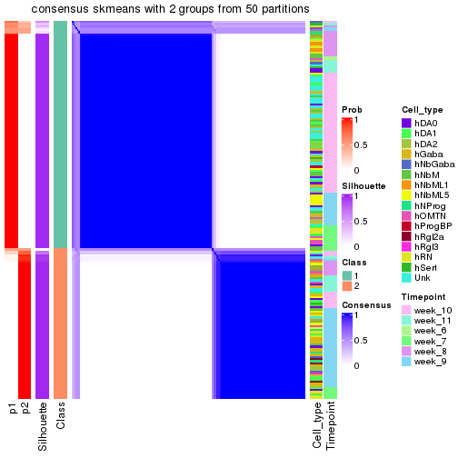</p>

</div>
<div id='tab-node-0122-consensus-heatmap-2'>
<pre><code class="r">consensus_heatmap(res, k = 3)
</code></pre>

<p></p>

</div>
<div id='tab-node-0122-consensus-heatmap-3'>
<pre><code class="r">consensus_heatmap(res, k = 4)
</code></pre>

<p></p>

</div>
</div>

Heatmaps for the membership of samples in all partitions to see how consistent they are:


<script>
$( function() {
	$( '#tabs-node-0122-membership-heatmap' ).tabs();
} );
</script>
<div id='tabs-node-0122-membership-heatmap'>
<ul>
<li><a href='#tab-node-0122-membership-heatmap-1'>k = 2</a></li>
<li><a href='#tab-node-0122-membership-heatmap-2'>k = 3</a></li>
<li><a href='#tab-node-0122-membership-heatmap-3'>k = 4</a></li>
</ul>
<div id='tab-node-0122-membership-heatmap-1'>
<pre><code class="r">membership_heatmap(res, k = 2)
</code></pre>

<p></p>

</div>
<div id='tab-node-0122-membership-heatmap-2'>
<pre><code class="r">membership_heatmap(res, k = 3)
</code></pre>

<p>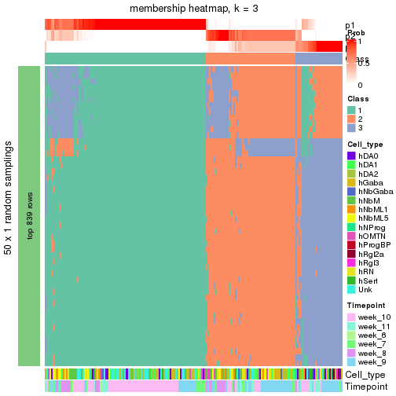</p>

</div>
<div id='tab-node-0122-membership-heatmap-3'>
<pre><code class="r">membership_heatmap(res, k = 4)
</code></pre>

<p></p>

</div>
</div>

As soon as the classes for columns are determined, the signatures
that are significantly different between subgroups can be looked for. 
Following are the heatmaps for signatures.


Signature heatmaps where rows are scaled:


<script>
$( function() {
	$( '#tabs-node-0122-get-signatures' ).tabs();
} );
</script>
<div id='tabs-node-0122-get-signatures'>
<ul>
<li><a href='#tab-node-0122-get-signatures-1'>k = 2</a></li>
<li><a href='#tab-node-0122-get-signatures-2'>k = 3</a></li>
<li><a href='#tab-node-0122-get-signatures-3'>k = 4</a></li>
</ul>
<div id='tab-node-0122-get-signatures-1'>
<pre><code class="r">get_signatures(res, k = 2)
</code></pre>

<p></p>

</div>
<div id='tab-node-0122-get-signatures-2'>
<pre><code class="r">get_signatures(res, k = 3)
</code></pre>

<p></p>

</div>
<div id='tab-node-0122-get-signatures-3'>
<pre><code class="r">get_signatures(res, k = 4)
</code></pre>

<p></p>

</div>
</div>


Signature heatmaps where rows are not scaled:


<script>
$( function() {
	$( '#tabs-node-0122-get-signatures-no-scale' ).tabs();
} );
</script>
<div id='tabs-node-0122-get-signatures-no-scale'>
<ul>
<li><a href='#tab-node-0122-get-signatures-no-scale-1'>k = 2</a></li>
<li><a href='#tab-node-0122-get-signatures-no-scale-2'>k = 3</a></li>
<li><a href='#tab-node-0122-get-signatures-no-scale-3'>k = 4</a></li>
</ul>
<div id='tab-node-0122-get-signatures-no-scale-1'>
<pre><code class="r">get_signatures(res, k = 2, scale_rows = FALSE)
</code></pre>

<p></p>

</div>
<div id='tab-node-0122-get-signatures-no-scale-2'>
<pre><code class="r">get_signatures(res, k = 3, scale_rows = FALSE)
</code></pre>

<p></p>

</div>
<div id='tab-node-0122-get-signatures-no-scale-3'>
<pre><code class="r">get_signatures(res, k = 4, scale_rows = FALSE)
</code></pre>

<p></p>

</div>
</div>


Compare the overlap of signatures from different k:

```r
compare_signatures(res)
```


`get_signature()` returns a data frame invisibly. To get the list of signatures, the function
call should be assigned to a variable explicitly. In following code, if `plot` argument is set
to `FALSE`, no heatmap is plotted while only the differential analysis is performed.

```r
# code only for demonstration
tb = get_signature(res, k = ..., plot = FALSE)
```

An example of the output of `tb` is:

```
#>   which_row         fdr    mean_1    mean_2 scaled_mean_1 scaled_mean_2 km
#> 1        38 0.042760348  8.373488  9.131774    -0.5533452     0.5164555  1
#> 2        40 0.018707592  7.106213  8.469186    -0.6173731     0.5762149  1
#> 3        55 0.019134737 10.221463 11.207825    -0.6159697     0.5749050  1
#> 4        59 0.006059896  5.921854  7.869574    -0.6899429     0.6439467  1
#> 5        60 0.018055526  8.928898 10.211722    -0.6204761     0.5791110  1
#> 6        98 0.009384629 15.714769 14.887706     0.6635654    -0.6193277  2
...
```

The columns in `tb` are:

1. `which_row`: row indices corresponding to the input matrix.
2. `fdr`: FDR for the differential test. 
3. `mean_x`: The mean value in group x.
4. `scaled_mean_x`: The mean value in group x after rows are scaled.
5. `km`: Row groups if k-means clustering is applied to rows (which is done by automatically selecting number of clusters).

If there are too many signatures, `top_signatures = ...` can be set to only show the 
signatures with the highest FDRs:

```r
# code only for demonstration
# e.g. to show the top 500 most significant rows
tb = get_signature(res, k = ..., top_signatures = 500)
```

If the signatures are defined as these which are uniquely high in current group, `diff_method` argument
can be set to `"uniquely_high_in_one_group"`:

```r
# code only for demonstration
tb = get_signature(res, k = ..., diff_method = "uniquely_high_in_one_group")
```


UMAP plot which shows how samples are separated.


<script>
$( function() {
	$( '#tabs-node-0122-dimension-reduction' ).tabs();
} );
</script>
<div id='tabs-node-0122-dimension-reduction'>
<ul>
<li><a href='#tab-node-0122-dimension-reduction-1'>k = 2</a></li>
<li><a href='#tab-node-0122-dimension-reduction-2'>k = 3</a></li>
<li><a href='#tab-node-0122-dimension-reduction-3'>k = 4</a></li>
</ul>
<div id='tab-node-0122-dimension-reduction-1'>
<pre><code class="r">dimension_reduction(res, k = 2, method = &quot;UMAP&quot;)
</code></pre>

<p></p>

</div>
<div id='tab-node-0122-dimension-reduction-2'>
<pre><code class="r">dimension_reduction(res, k = 3, method = &quot;UMAP&quot;)
</code></pre>

<p></p>

</div>
<div id='tab-node-0122-dimension-reduction-3'>
<pre><code class="r">dimension_reduction(res, k = 4, method = &quot;UMAP&quot;)
</code></pre>

<p></p>

</div>
</div>


Following heatmap shows how subgroups are split when increasing `k`:

```r
collect_classes(res)
```


Test correlation between subgroups and known annotations. If the known
annotation is numeric, one-way ANOVA test is applied, and if the known
annotation is discrete, chi-squared contingency table test is applied.

```r
test_to_known_factors(res)
```

```
#>             n_sample Cell_type(p-value) Timepoint(p-value) k
#> ATC:skmeans      177           1.21e-02           4.00e-08 2
#> ATC:skmeans      172           3.47e-06           8.91e-07 3
#> ATC:skmeans      161           1.10e-08           3.93e-16 4
```


If matrix rows can be associated to genes, consider to use `functional_enrichment(res,
...)` to perform function enrichment for the signature genes. See [this vignette](https://jokergoo.github.io/cola_vignettes/functional_enrichment.html) for more detailed explanations.


 

---------------------------------------------------


### Node01222


Parent node: [Node0122](#Node0122).
Child nodes: 
                Node012111-leaf
        ,
                Node012112-leaf
        ,
                Node012221-leaf
        ,
                Node012222-leaf
        ,
                Node021121-leaf
        ,
                Node021122-leaf
        ,
                Node021231-leaf
        ,
                Node021232-leaf
        ,
                Node021233-leaf
        .


The object with results only for a single top-value method and a single partitioning method 
can be extracted as:

```r
res = res_rh["01222"]
```

A summary of `res` and all the functions that can be applied to it:

```r
res
```

```
#> A 'ConsensusPartition' object with k = 2, 3, 4.
#>   On a matrix with 6529 rows and 73 columns.
#>   Top rows (625) are extracted by 'ATC' method.
#>   Subgroups are detected by 'skmeans' method.
#>   Performed in total 150 partitions by row resampling.
#>   Best k for subgroups seems to be 2.
#> 
#> Following methods can be applied to this 'ConsensusPartition' object:
#>  [1] "cola_report"             "collect_classes"         "collect_plots"          
#>  [4] "collect_stats"           "colnames"                "compare_partitions"     
#>  [7] "compare_signatures"      "consensus_heatmap"       "dimension_reduction"    
#> [10] "functional_enrichment"   "get_anno_col"            "get_anno"               
#> [13] "get_classes"             "get_consensus"           "get_matrix"             
#> [16] "get_membership"          "get_param"               "get_signatures"         
#> [19] "get_stats"               "is_best_k"               "is_stable_k"            
#> [22] "membership_heatmap"      "ncol"                    "nrow"                   
#> [25] "plot_ecdf"               "predict_classes"         "rownames"               
#> [28] "select_partition_number" "show"                    "suggest_best_k"         
#> [31] "test_to_known_factors"   "top_rows_heatmap"
```

`collect_plots()` function collects all the plots made from `res` for all `k` (number of subgroups)
into one single page to provide an easy and fast comparison between different `k`.

```r
collect_plots(res)
```


The plots are:

- The first row: a plot of the eCDF (empirical cumulative distribution
  function) curves of the consensus matrix for each `k` and the heatmap of
  predicted classes for each `k`.
- The second row: heatmaps of the consensus matrix for each `k`.
- The third row: heatmaps of the membership matrix for each `k`.
- The fouth row: heatmaps of the signatures for each `k`.

All the plots in panels can be made by individual functions and they are
plotted later in this section.

`select_partition_number()` produces several plots showing different
statistics for choosing "optimized" `k`. There are following statistics:

- eCDF curves of the consensus matrix for each `k`;
- 1-PAC. [The PAC score](https://en.wikipedia.org/wiki/Consensus_clustering#Over-interpretation_potential_of_consensus_clustering)
  measures the proportion of the ambiguous subgrouping.
- Mean silhouette score.
- Concordance. The mean probability of fiting the consensus subgroup labels in all
  partitions.
- Area increased. Denote $A_k$ as the area under the eCDF curve for current
  `k`, the area increased is defined as $A_k - A_{k-1}$.
- Rand index. The percent of pairs of samples that are both in a same cluster
  or both are not in a same cluster in the partition of k and k-1.
- Jaccard index. The ratio of pairs of samples are both in a same cluster in
  the partition of k and k-1 and the pairs of samples are both in a same
  cluster in the partition k or k-1.

The detailed explanations of these statistics can be found in [the _cola_
vignette](https://jokergoo.github.io/cola_vignettes/cola.html#toc_13).

Generally speaking, higher 1-PAC score, higher mean silhouette score or higher
concordance corresponds to better partition. Rand index and Jaccard index
measure how similar the current partition is compared to partition with `k-1`.
If they are too similar, we won't accept `k` is better than `k-1`.

```r
select_partition_number(res)
```


The numeric values for all these statistics can be obtained by `get_stats()`.

```r
get_stats(res)
```

```
#>   k 1-PAC mean_silhouette concordance area_increased  Rand Jaccard
#> 2 2 1.000           0.962       0.984          0.490 0.509   0.509
#> 3 3 0.733           0.831       0.928          0.350 0.737   0.525
#> 4 4 0.682           0.706       0.859          0.118 0.874   0.657
```

`suggest_best_k()` suggests the best $k$ based on these statistics. The rules are as follows:

- All $k$ with Jaccard index larger than 0.95 are removed because increasing
  $k$ does not provide enough extra information. If all $k$ are removed, it is
  marked as no subgroup is detected.
- For all $k$ with 1-PAC score larger than 0.9, the maximal $k$ is taken as
  the best $k$, and other $k$ are marked as optional $k$.
- If it does not fit the second rule. The $k$ with the maximal vote of the
  highest 1-PAC score, highest mean silhouette, and highest concordance is
  taken as the best $k$.

```r
suggest_best_k(res)
```

```
#> [1] 2
```


Following is the table of the partitions (You need to click the **show/hide
code output** link to see it). The membership matrix (columns with name `p*`)
is inferred by
[`clue::cl_consensus()`](https://www.rdocumentation.org/link/cl_consensus?package=clue)
function with the `SE` method. Basically the value in the membership matrix
represents the probability to belong to a certain group. The finall subgroup
label for an item is determined with the group with highest probability it
belongs to.

In `get_classes()` function, the entropy is calculated from the membership
matrix and the silhouette score is calculated from the consensus matrix.


<script>
$( function() {
	$( '#tabs-node-01222-get-classes' ).tabs();
} );
</script>
<div id='tabs-node-01222-get-classes'>
<ul>
<li><a href='#tab-node-01222-get-classes-1'>k = 2</a></li>
<li><a href='#tab-node-01222-get-classes-2'>k = 3</a></li>
<li><a href='#tab-node-01222-get-classes-3'>k = 4</a></li>
</ul>

<div id='tab-node-01222-get-classes-1'>
<p><a id='tab-node-01222-get-classes-1-a' style='color:#0366d6' href='#'>show/hide code output</a></p>
<pre><code class="r">cbind(get_classes(res, k = 2), get_membership(res, k = 2))
</code></pre>

<pre><code>#&gt;                 class entropy silhouette   p1   p2
#&gt; 1772071_027_D09     1   0.000      0.989 1.00 0.00
#&gt; 1772071_027_F12     1   0.000      0.989 1.00 0.00
#&gt; 1772071_027_H07     1   0.000      0.989 1.00 0.00
#&gt; 1772071_029_E06     1   0.000      0.989 1.00 0.00
#&gt; 1772071_029_G04     1   0.000      0.989 1.00 0.00
#&gt; 1772071_029_G09     2   0.000      0.976 0.00 1.00
#&gt; 1772071_029_G11     1   0.000      0.989 1.00 0.00
#&gt; 1772078_078_A03     2   0.000      0.976 0.00 1.00
#&gt; 1772078_078_A10     2   0.000      0.976 0.00 1.00
#&gt; 1772078_078_A11     2   0.000      0.976 0.00 1.00
#&gt; 1772078_078_C11     1   0.000      0.989 1.00 0.00
#&gt; 1772078_078_G02     2   0.584      0.842 0.14 0.86
#&gt; 1772078_078_G04     2   0.141      0.960 0.02 0.98
#&gt; 1772078_078_G06     2   0.000      0.976 0.00 1.00
#&gt; 1772078_078_G11     2   0.000      0.976 0.00 1.00
#&gt; 1772078_079_A03     1   0.000      0.989 1.00 0.00
#&gt; 1772078_079_A07     2   0.000      0.976 0.00 1.00
#&gt; 1772078_079_B11     2   0.000      0.976 0.00 1.00
#&gt; 1772078_079_D07     2   0.000      0.976 0.00 1.00
#&gt; 1772078_079_F03     2   0.000      0.976 0.00 1.00
#&gt; 1772078_109_A12     2   0.000      0.976 0.00 1.00
#&gt; 1772078_109_B07     2   0.469      0.887 0.10 0.90
#&gt; 1772078_109_C06     2   0.000      0.976 0.00 1.00
#&gt; 1772078_109_C09     2   0.000      0.976 0.00 1.00
#&gt; 1772078_109_C11     1   0.971      0.303 0.60 0.40
#&gt; 1772078_109_D01     2   0.000      0.976 0.00 1.00
#&gt; 1772078_109_D08     2   0.000      0.976 0.00 1.00
#&gt; 1772078_109_D09     2   0.000      0.976 0.00 1.00
#&gt; 1772078_109_E03     2   0.943      0.454 0.36 0.64
#&gt; 1772078_109_G10     2   0.000      0.976 0.00 1.00
#&gt; 1772075_299_A03     1   0.000      0.989 1.00 0.00
#&gt; 1772075_299_A09     1   0.000      0.989 1.00 0.00
#&gt; 1772075_299_B04     1   0.000      0.989 1.00 0.00
#&gt; 1772075_299_B10     1   0.000      0.989 1.00 0.00
#&gt; 1772075_299_F04     1   0.000      0.989 1.00 0.00
#&gt; 1772075_299_F06     1   0.000      0.989 1.00 0.00
#&gt; 1772075_299_G06     1   0.000      0.989 1.00 0.00
#&gt; 1772075_299_H08     1   0.000      0.989 1.00 0.00
#&gt; 1772075_299_H12     1   0.000      0.989 1.00 0.00
#&gt; 1772078_002_A04     1   0.327      0.927 0.94 0.06
#&gt; 1772078_002_C08     1   0.000      0.989 1.00 0.00
#&gt; 1772078_002_D12     2   0.000      0.976 0.00 1.00
#&gt; 1772078_002_E03     2   0.402      0.908 0.08 0.92
#&gt; 1772078_002_F12     1   0.000      0.989 1.00 0.00
#&gt; 1772078_002_G04     1   0.000      0.989 1.00 0.00
#&gt; 1772078_002_H07     2   0.000      0.976 0.00 1.00
#&gt; 1772122_236_E11     1   0.000      0.989 1.00 0.00
#&gt; 1772121_288_F08     2   0.000      0.976 0.00 1.00
#&gt; 1772121_288_G06     1   0.000      0.989 1.00 0.00
#&gt; 1772121_291_B10     1   0.000      0.989 1.00 0.00
#&gt; 1772121_291_C06     1   0.000      0.989 1.00 0.00
#&gt; 1772121_293_A06     1   0.000      0.989 1.00 0.00
#&gt; 1772121_282_C10     1   0.000      0.989 1.00 0.00
#&gt; 1772121_282_D11     2   0.000      0.976 0.00 1.00
#&gt; 1772121_282_E04     1   0.000      0.989 1.00 0.00
#&gt; 1772121_282_F12     1   0.000      0.989 1.00 0.00
#&gt; 1772121_282_G04     1   0.000      0.989 1.00 0.00
#&gt; 1772122_264_C06     1   0.000      0.989 1.00 0.00
#&gt; 1772122_208_D06     1   0.000      0.989 1.00 0.00
#&gt; 1772122_207_D01     2   0.000      0.976 0.00 1.00
#&gt; 1772122_207_D06     1   0.000      0.989 1.00 0.00
#&gt; 1772122_207_G03     2   0.000      0.976 0.00 1.00
#&gt; 1772122_207_G08     2   0.000      0.976 0.00 1.00
#&gt; 1772122_199_A08     1   0.000      0.989 1.00 0.00
#&gt; 1772122_200_C11     1   0.000      0.989 1.00 0.00
#&gt; 1772122_200_F03     2   0.000      0.976 0.00 1.00
#&gt; 1772122_220_C06     1   0.000      0.989 1.00 0.00
#&gt; 1772122_220_E01     1   0.000      0.989 1.00 0.00
#&gt; 1772122_226_C04     1   0.000      0.989 1.00 0.00
#&gt; 1772122_226_E06     1   0.000      0.989 1.00 0.00
#&gt; 1772122_223_B06     1   0.000      0.989 1.00 0.00
#&gt; 1772122_223_F04     1   0.000      0.989 1.00 0.00
#&gt; 1772122_224_B09     1   0.000      0.989 1.00 0.00
</code></pre>

<script>
$('#tab-node-01222-get-classes-1-a').parent().next().next().hide();
$('#tab-node-01222-get-classes-1-a').click(function(){
  $('#tab-node-01222-get-classes-1-a').parent().next().next().toggle();
  return(false);
});
</script>
</div>

<div id='tab-node-01222-get-classes-2'>
<p><a id='tab-node-01222-get-classes-2-a' style='color:#0366d6' href='#'>show/hide code output</a></p>
<pre><code class="r">cbind(get_classes(res, k = 3), get_membership(res, k = 3))
</code></pre>

<pre><code>#&gt;                 class entropy silhouette   p1   p2   p3
#&gt; 1772071_027_D09     1  0.0000     0.9386 1.00 0.00 0.00
#&gt; 1772071_027_F12     1  0.0000     0.9386 1.00 0.00 0.00
#&gt; 1772071_027_H07     1  0.0000     0.9386 1.00 0.00 0.00
#&gt; 1772071_029_E06     3  0.5216     0.6640 0.26 0.00 0.74
#&gt; 1772071_029_G04     1  0.0000     0.9386 1.00 0.00 0.00
#&gt; 1772071_029_G09     2  0.0000     0.9403 0.00 1.00 0.00
#&gt; 1772071_029_G11     1  0.0000     0.9386 1.00 0.00 0.00
#&gt; 1772078_078_A03     2  0.0000     0.9403 0.00 1.00 0.00
#&gt; 1772078_078_A10     2  0.6302     0.0658 0.00 0.52 0.48
#&gt; 1772078_078_A11     2  0.0000     0.9403 0.00 1.00 0.00
#&gt; 1772078_078_C11     1  0.6280     0.0414 0.54 0.00 0.46
#&gt; 1772078_078_G02     3  0.0000     0.8600 0.00 0.00 1.00
#&gt; 1772078_078_G04     3  0.1529     0.8419 0.00 0.04 0.96
#&gt; 1772078_078_G06     2  0.0000     0.9403 0.00 1.00 0.00
#&gt; 1772078_078_G11     2  0.6192     0.2510 0.00 0.58 0.42
#&gt; 1772078_079_A03     3  0.0000     0.8600 0.00 0.00 1.00
#&gt; 1772078_079_A07     2  0.0000     0.9403 0.00 1.00 0.00
#&gt; 1772078_079_B11     3  0.0000     0.8600 0.00 0.00 1.00
#&gt; 1772078_079_D07     2  0.0000     0.9403 0.00 1.00 0.00
#&gt; 1772078_079_F03     2  0.0000     0.9403 0.00 1.00 0.00
#&gt; 1772078_109_A12     2  0.0000     0.9403 0.00 1.00 0.00
#&gt; 1772078_109_B07     3  0.0000     0.8600 0.00 0.00 1.00
#&gt; 1772078_109_C06     3  0.5835     0.4367 0.00 0.34 0.66
#&gt; 1772078_109_C09     2  0.0000     0.9403 0.00 1.00 0.00
#&gt; 1772078_109_C11     3  0.0892     0.8548 0.02 0.00 0.98
#&gt; 1772078_109_D01     2  0.0000     0.9403 0.00 1.00 0.00
#&gt; 1772078_109_D08     2  0.0000     0.9403 0.00 1.00 0.00
#&gt; 1772078_109_D09     2  0.0000     0.9403 0.00 1.00 0.00
#&gt; 1772078_109_E03     3  0.0000     0.8600 0.00 0.00 1.00
#&gt; 1772078_109_G10     3  0.0000     0.8600 0.00 0.00 1.00
#&gt; 1772075_299_A03     1  0.4291     0.7733 0.82 0.00 0.18
#&gt; 1772075_299_A09     3  0.6126     0.3559 0.40 0.00 0.60
#&gt; 1772075_299_B04     3  0.6244     0.2491 0.44 0.00 0.56
#&gt; 1772075_299_B10     1  0.2537     0.8811 0.92 0.00 0.08
#&gt; 1772075_299_F04     1  0.0000     0.9386 1.00 0.00 0.00
#&gt; 1772075_299_F06     1  0.3340     0.8435 0.88 0.00 0.12
#&gt; 1772075_299_G06     3  0.0000     0.8600 0.00 0.00 1.00
#&gt; 1772075_299_H08     1  0.5216     0.6553 0.74 0.00 0.26
#&gt; 1772075_299_H12     1  0.0000     0.9386 1.00 0.00 0.00
#&gt; 1772078_002_A04     1  0.5012     0.8133 0.84 0.08 0.08
#&gt; 1772078_002_C08     1  0.0892     0.9256 0.98 0.00 0.02
#&gt; 1772078_002_D12     2  0.0000     0.9403 0.00 1.00 0.00
#&gt; 1772078_002_E03     3  0.7058     0.6892 0.18 0.10 0.72
#&gt; 1772078_002_F12     1  0.0000     0.9386 1.00 0.00 0.00
#&gt; 1772078_002_G04     1  0.0000     0.9386 1.00 0.00 0.00
#&gt; 1772078_002_H07     2  0.3832     0.8184 0.10 0.88 0.02
#&gt; 1772122_236_E11     1  0.0000     0.9386 1.00 0.00 0.00
#&gt; 1772121_288_F08     2  0.0892     0.9221 0.02 0.98 0.00
#&gt; 1772121_288_G06     1  0.0000     0.9386 1.00 0.00 0.00
#&gt; 1772121_291_B10     1  0.4796     0.6930 0.78 0.00 0.22
#&gt; 1772121_291_C06     1  0.0000     0.9386 1.00 0.00 0.00
#&gt; 1772121_293_A06     3  0.0000     0.8600 0.00 0.00 1.00
#&gt; 1772121_282_C10     1  0.3415     0.8642 0.90 0.02 0.08
#&gt; 1772121_282_D11     2  0.0000     0.9403 0.00 1.00 0.00
#&gt; 1772121_282_E04     1  0.0000     0.9386 1.00 0.00 0.00
#&gt; 1772121_282_F12     3  0.5397     0.6277 0.28 0.00 0.72
#&gt; 1772121_282_G04     3  0.2959     0.8246 0.10 0.00 0.90
#&gt; 1772122_264_C06     3  0.1529     0.8485 0.04 0.00 0.96
#&gt; 1772122_208_D06     1  0.2066     0.8964 0.94 0.00 0.06
#&gt; 1772122_207_D01     3  0.2066     0.8307 0.00 0.06 0.94
#&gt; 1772122_207_D06     1  0.0000     0.9386 1.00 0.00 0.00
#&gt; 1772122_207_G03     2  0.0000     0.9403 0.00 1.00 0.00
#&gt; 1772122_207_G08     2  0.0000     0.9403 0.00 1.00 0.00
#&gt; 1772122_199_A08     3  0.0000     0.8600 0.00 0.00 1.00
#&gt; 1772122_200_C11     1  0.0000     0.9386 1.00 0.00 0.00
#&gt; 1772122_200_F03     3  0.4291     0.7216 0.00 0.18 0.82
#&gt; 1772122_220_C06     1  0.0000     0.9386 1.00 0.00 0.00
#&gt; 1772122_220_E01     3  0.3686     0.8002 0.14 0.00 0.86
#&gt; 1772122_226_C04     1  0.0000     0.9386 1.00 0.00 0.00
#&gt; 1772122_226_E06     1  0.0000     0.9386 1.00 0.00 0.00
#&gt; 1772122_223_B06     1  0.0000     0.9386 1.00 0.00 0.00
#&gt; 1772122_223_F04     1  0.0000     0.9386 1.00 0.00 0.00
#&gt; 1772122_224_B09     1  0.0000     0.9386 1.00 0.00 0.00
</code></pre>

<script>
$('#tab-node-01222-get-classes-2-a').parent().next().next().hide();
$('#tab-node-01222-get-classes-2-a').click(function(){
  $('#tab-node-01222-get-classes-2-a').parent().next().next().toggle();
  return(false);
});
</script>
</div>

<div id='tab-node-01222-get-classes-3'>
<p><a id='tab-node-01222-get-classes-3-a' style='color:#0366d6' href='#'>show/hide code output</a></p>
<pre><code class="r">cbind(get_classes(res, k = 4), get_membership(res, k = 4))
</code></pre>

<pre><code>#&gt;                 class entropy silhouette   p1   p2   p3   p4
#&gt; 1772071_027_D09     1  0.0707    0.84096 0.98 0.00 0.00 0.02
#&gt; 1772071_027_F12     1  0.0707    0.84096 0.98 0.00 0.00 0.02
#&gt; 1772071_027_H07     1  0.0000    0.84575 1.00 0.00 0.00 0.00
#&gt; 1772071_029_E06     3  0.7583    0.23601 0.28 0.00 0.48 0.24
#&gt; 1772071_029_G04     1  0.0000    0.84575 1.00 0.00 0.00 0.00
#&gt; 1772071_029_G09     2  0.0000    0.95885 0.00 1.00 0.00 0.00
#&gt; 1772071_029_G11     1  0.1913    0.82926 0.94 0.00 0.04 0.02
#&gt; 1772078_078_A03     2  0.0000    0.95885 0.00 1.00 0.00 0.00
#&gt; 1772078_078_A10     4  0.7738    0.27191 0.00 0.26 0.30 0.44
#&gt; 1772078_078_A11     2  0.0000    0.95885 0.00 1.00 0.00 0.00
#&gt; 1772078_078_C11     1  0.7550    0.20113 0.48 0.00 0.22 0.30
#&gt; 1772078_078_G02     3  0.4907    0.17083 0.00 0.00 0.58 0.42
#&gt; 1772078_078_G04     4  0.2335    0.73443 0.00 0.02 0.06 0.92
#&gt; 1772078_078_G06     2  0.0000    0.95885 0.00 1.00 0.00 0.00
#&gt; 1772078_078_G11     4  0.5619    0.49877 0.00 0.32 0.04 0.64
#&gt; 1772078_079_A03     4  0.4642    0.58629 0.02 0.00 0.24 0.74
#&gt; 1772078_079_A07     2  0.0000    0.95885 0.00 1.00 0.00 0.00
#&gt; 1772078_079_B11     4  0.1637    0.74324 0.00 0.00 0.06 0.94
#&gt; 1772078_079_D07     2  0.0000    0.95885 0.00 1.00 0.00 0.00
#&gt; 1772078_079_F03     2  0.0000    0.95885 0.00 1.00 0.00 0.00
#&gt; 1772078_109_A12     2  0.0000    0.95885 0.00 1.00 0.00 0.00
#&gt; 1772078_109_B07     4  0.3400    0.69539 0.00 0.00 0.18 0.82
#&gt; 1772078_109_C06     4  0.4491    0.69985 0.00 0.06 0.14 0.80
#&gt; 1772078_109_C09     2  0.0000    0.95885 0.00 1.00 0.00 0.00
#&gt; 1772078_109_C11     4  0.1637    0.74324 0.00 0.00 0.06 0.94
#&gt; 1772078_109_D01     2  0.0000    0.95885 0.00 1.00 0.00 0.00
#&gt; 1772078_109_D08     2  0.0000    0.95885 0.00 1.00 0.00 0.00
#&gt; 1772078_109_D09     2  0.0000    0.95885 0.00 1.00 0.00 0.00
#&gt; 1772078_109_E03     4  0.3801    0.66481 0.00 0.00 0.22 0.78
#&gt; 1772078_109_G10     4  0.1637    0.74324 0.00 0.00 0.06 0.94
#&gt; 1772075_299_A03     1  0.5486    0.67462 0.72 0.00 0.08 0.20
#&gt; 1772075_299_A09     1  0.6554    0.21124 0.52 0.00 0.08 0.40
#&gt; 1772075_299_B04     4  0.6766    0.17000 0.38 0.00 0.10 0.52
#&gt; 1772075_299_B10     1  0.5767    0.59419 0.66 0.00 0.06 0.28
#&gt; 1772075_299_F04     1  0.0707    0.83955 0.98 0.00 0.00 0.02
#&gt; 1772075_299_F06     1  0.3821    0.76594 0.84 0.00 0.04 0.12
#&gt; 1772075_299_G06     3  0.4994    0.00182 0.00 0.00 0.52 0.48
#&gt; 1772075_299_H08     1  0.7654    0.17524 0.44 0.00 0.22 0.34
#&gt; 1772075_299_H12     1  0.0000    0.84575 1.00 0.00 0.00 0.00
#&gt; 1772078_002_A04     1  0.5911    0.59780 0.68 0.04 0.02 0.26
#&gt; 1772078_002_C08     3  0.4855    0.29329 0.40 0.00 0.60 0.00
#&gt; 1772078_002_D12     2  0.0000    0.95885 0.00 1.00 0.00 0.00
#&gt; 1772078_002_E03     4  0.2830    0.68234 0.04 0.06 0.00 0.90
#&gt; 1772078_002_F12     1  0.3037    0.79810 0.88 0.00 0.02 0.10
#&gt; 1772078_002_G04     1  0.0000    0.84575 1.00 0.00 0.00 0.00
#&gt; 1772078_002_H07     2  0.4936    0.56102 0.02 0.70 0.00 0.28
#&gt; 1772122_236_E11     1  0.2647    0.78284 0.88 0.00 0.12 0.00
#&gt; 1772121_288_F08     2  0.1211    0.92260 0.00 0.96 0.04 0.00
#&gt; 1772121_288_G06     1  0.0707    0.84096 0.98 0.00 0.00 0.02
#&gt; 1772121_291_B10     3  0.3037    0.68151 0.10 0.00 0.88 0.02
#&gt; 1772121_291_C06     1  0.5392    0.54261 0.68 0.00 0.28 0.04
#&gt; 1772121_293_A06     3  0.3610    0.60332 0.00 0.00 0.80 0.20
#&gt; 1772121_282_C10     3  0.4472    0.59167 0.22 0.00 0.76 0.02
#&gt; 1772121_282_D11     2  0.0000    0.95885 0.00 1.00 0.00 0.00
#&gt; 1772121_282_E04     1  0.0000    0.84575 1.00 0.00 0.00 0.00
#&gt; 1772121_282_F12     3  0.0707    0.70829 0.02 0.00 0.98 0.00
#&gt; 1772121_282_G04     3  0.1913    0.71236 0.04 0.00 0.94 0.02
#&gt; 1772122_264_C06     3  0.0000    0.70327 0.00 0.00 1.00 0.00
#&gt; 1772122_208_D06     1  0.4907    0.26396 0.58 0.00 0.42 0.00
#&gt; 1772122_207_D01     3  0.2647    0.64705 0.00 0.00 0.88 0.12
#&gt; 1772122_207_D06     1  0.1211    0.83063 0.96 0.00 0.04 0.00
#&gt; 1772122_207_G03     2  0.0000    0.95885 0.00 1.00 0.00 0.00
#&gt; 1772122_207_G08     2  0.4406    0.56110 0.00 0.70 0.30 0.00
#&gt; 1772122_199_A08     3  0.1913    0.70121 0.02 0.00 0.94 0.04
#&gt; 1772122_200_C11     1  0.4642    0.64738 0.74 0.00 0.24 0.02
#&gt; 1772122_200_F03     3  0.5784    0.50166 0.00 0.20 0.70 0.10
#&gt; 1772122_220_C06     1  0.0000    0.84575 1.00 0.00 0.00 0.00
#&gt; 1772122_220_E01     3  0.1211    0.71267 0.04 0.00 0.96 0.00
#&gt; 1772122_226_C04     1  0.0000    0.84575 1.00 0.00 0.00 0.00
#&gt; 1772122_226_E06     1  0.0000    0.84575 1.00 0.00 0.00 0.00
#&gt; 1772122_223_B06     1  0.0000    0.84575 1.00 0.00 0.00 0.00
#&gt; 1772122_223_F04     1  0.0000    0.84575 1.00 0.00 0.00 0.00
#&gt; 1772122_224_B09     1  0.0000    0.84575 1.00 0.00 0.00 0.00
</code></pre>

<script>
$('#tab-node-01222-get-classes-3-a').parent().next().next().hide();
$('#tab-node-01222-get-classes-3-a').click(function(){
  $('#tab-node-01222-get-classes-3-a').parent().next().next().toggle();
  return(false);
});
</script>
</div>
</div>

Heatmaps for the consensus matrix. It visualizes the probability of two
samples to be in a same group.


<script>
$( function() {
	$( '#tabs-node-01222-consensus-heatmap' ).tabs();
} );
</script>
<div id='tabs-node-01222-consensus-heatmap'>
<ul>
<li><a href='#tab-node-01222-consensus-heatmap-1'>k = 2</a></li>
<li><a href='#tab-node-01222-consensus-heatmap-2'>k = 3</a></li>
<li><a href='#tab-node-01222-consensus-heatmap-3'>k = 4</a></li>
</ul>
<div id='tab-node-01222-consensus-heatmap-1'>
<pre><code class="r">consensus_heatmap(res, k = 2)
</code></pre>

<p></p>

</div>
<div id='tab-node-01222-consensus-heatmap-2'>
<pre><code class="r">consensus_heatmap(res, k = 3)
</code></pre>

<p></p>

</div>
<div id='tab-node-01222-consensus-heatmap-3'>
<pre><code class="r">consensus_heatmap(res, k = 4)
</code></pre>

<p>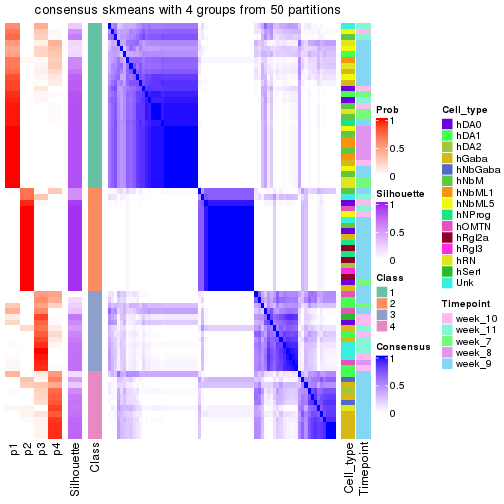</p>

</div>
</div>

Heatmaps for the membership of samples in all partitions to see how consistent they are:


<script>
$( function() {
	$( '#tabs-node-01222-membership-heatmap' ).tabs();
} );
</script>
<div id='tabs-node-01222-membership-heatmap'>
<ul>
<li><a href='#tab-node-01222-membership-heatmap-1'>k = 2</a></li>
<li><a href='#tab-node-01222-membership-heatmap-2'>k = 3</a></li>
<li><a href='#tab-node-01222-membership-heatmap-3'>k = 4</a></li>
</ul>
<div id='tab-node-01222-membership-heatmap-1'>
<pre><code class="r">membership_heatmap(res, k = 2)
</code></pre>

<p></p>

</div>
<div id='tab-node-01222-membership-heatmap-2'>
<pre><code class="r">membership_heatmap(res, k = 3)
</code></pre>

<p></p>

</div>
<div id='tab-node-01222-membership-heatmap-3'>
<pre><code class="r">membership_heatmap(res, k = 4)
</code></pre>

<p></p>

</div>
</div>

As soon as the classes for columns are determined, the signatures
that are significantly different between subgroups can be looked for. 
Following are the heatmaps for signatures.


Signature heatmaps where rows are scaled:


<script>
$( function() {
	$( '#tabs-node-01222-get-signatures' ).tabs();
} );
</script>
<div id='tabs-node-01222-get-signatures'>
<ul>
<li><a href='#tab-node-01222-get-signatures-1'>k = 2</a></li>
<li><a href='#tab-node-01222-get-signatures-2'>k = 3</a></li>
<li><a href='#tab-node-01222-get-signatures-3'>k = 4</a></li>
</ul>
<div id='tab-node-01222-get-signatures-1'>
<pre><code class="r">get_signatures(res, k = 2)
</code></pre>

<p></p>

</div>
<div id='tab-node-01222-get-signatures-2'>
<pre><code class="r">get_signatures(res, k = 3)
</code></pre>

<p></p>

</div>
<div id='tab-node-01222-get-signatures-3'>
<pre><code class="r">get_signatures(res, k = 4)
</code></pre>

<p></p>

</div>
</div>


Signature heatmaps where rows are not scaled:


<script>
$( function() {
	$( '#tabs-node-01222-get-signatures-no-scale' ).tabs();
} );
</script>
<div id='tabs-node-01222-get-signatures-no-scale'>
<ul>
<li><a href='#tab-node-01222-get-signatures-no-scale-1'>k = 2</a></li>
<li><a href='#tab-node-01222-get-signatures-no-scale-2'>k = 3</a></li>
<li><a href='#tab-node-01222-get-signatures-no-scale-3'>k = 4</a></li>
</ul>
<div id='tab-node-01222-get-signatures-no-scale-1'>
<pre><code class="r">get_signatures(res, k = 2, scale_rows = FALSE)
</code></pre>

<p></p>

</div>
<div id='tab-node-01222-get-signatures-no-scale-2'>
<pre><code class="r">get_signatures(res, k = 3, scale_rows = FALSE)
</code></pre>

<p></p>

</div>
<div id='tab-node-01222-get-signatures-no-scale-3'>
<pre><code class="r">get_signatures(res, k = 4, scale_rows = FALSE)
</code></pre>

<p></p>

</div>
</div>


Compare the overlap of signatures from different k:

```r
compare_signatures(res)
```


`get_signature()` returns a data frame invisibly. To get the list of signatures, the function
call should be assigned to a variable explicitly. In following code, if `plot` argument is set
to `FALSE`, no heatmap is plotted while only the differential analysis is performed.

```r
# code only for demonstration
tb = get_signature(res, k = ..., plot = FALSE)
```

An example of the output of `tb` is:

```
#>   which_row         fdr    mean_1    mean_2 scaled_mean_1 scaled_mean_2 km
#> 1        38 0.042760348  8.373488  9.131774    -0.5533452     0.5164555  1
#> 2        40 0.018707592  7.106213  8.469186    -0.6173731     0.5762149  1
#> 3        55 0.019134737 10.221463 11.207825    -0.6159697     0.5749050  1
#> 4        59 0.006059896  5.921854  7.869574    -0.6899429     0.6439467  1
#> 5        60 0.018055526  8.928898 10.211722    -0.6204761     0.5791110  1
#> 6        98 0.009384629 15.714769 14.887706     0.6635654    -0.6193277  2
...
```

The columns in `tb` are:

1. `which_row`: row indices corresponding to the input matrix.
2. `fdr`: FDR for the differential test. 
3. `mean_x`: The mean value in group x.
4. `scaled_mean_x`: The mean value in group x after rows are scaled.
5. `km`: Row groups if k-means clustering is applied to rows (which is done by automatically selecting number of clusters).

If there are too many signatures, `top_signatures = ...` can be set to only show the 
signatures with the highest FDRs:

```r
# code only for demonstration
# e.g. to show the top 500 most significant rows
tb = get_signature(res, k = ..., top_signatures = 500)
```

If the signatures are defined as these which are uniquely high in current group, `diff_method` argument
can be set to `"uniquely_high_in_one_group"`:

```r
# code only for demonstration
tb = get_signature(res, k = ..., diff_method = "uniquely_high_in_one_group")
```


UMAP plot which shows how samples are separated.


<script>
$( function() {
	$( '#tabs-node-01222-dimension-reduction' ).tabs();
} );
</script>
<div id='tabs-node-01222-dimension-reduction'>
<ul>
<li><a href='#tab-node-01222-dimension-reduction-1'>k = 2</a></li>
<li><a href='#tab-node-01222-dimension-reduction-2'>k = 3</a></li>
<li><a href='#tab-node-01222-dimension-reduction-3'>k = 4</a></li>
</ul>
<div id='tab-node-01222-dimension-reduction-1'>
<pre><code class="r">dimension_reduction(res, k = 2, method = &quot;UMAP&quot;)
</code></pre>

<p></p>

</div>
<div id='tab-node-01222-dimension-reduction-2'>
<pre><code class="r">dimension_reduction(res, k = 3, method = &quot;UMAP&quot;)
</code></pre>

<p></p>

</div>
<div id='tab-node-01222-dimension-reduction-3'>
<pre><code class="r">dimension_reduction(res, k = 4, method = &quot;UMAP&quot;)
</code></pre>

<p></p>

</div>
</div>


Following heatmap shows how subgroups are split when increasing `k`:

```r
collect_classes(res)
```


Test correlation between subgroups and known annotations. If the known
annotation is numeric, one-way ANOVA test is applied, and if the known
annotation is discrete, chi-squared contingency table test is applied.

```r
test_to_known_factors(res)
```

```
#>             n_sample Cell_type(p-value) Timepoint(p-value) k
#> ATC:skmeans       71            0.03104           5.68e-03 2
#> ATC:skmeans       67            0.00315           1.42e-01 3
#> ATC:skmeans       62            0.00112           6.78e-05 4
```


If matrix rows can be associated to genes, consider to use `functional_enrichment(res,
...)` to perform function enrichment for the signature genes. See [this vignette](https://jokergoo.github.io/cola_vignettes/functional_enrichment.html) for more detailed explanations.


 

---------------------------------------------------


### Node013


Parent node: [Node01](#Node01).
Child nodes: 
                Node0111-leaf
        ,
                [Node0112](#Node0112)
        ,
                [Node0113](#Node0113)
        ,
                [Node0121](#Node0121)
        ,
                [Node0122](#Node0122)
        ,
                [Node0131](#Node0131)
        ,
                [Node0132](#Node0132)
        ,
                [Node0133](#Node0133)
        ,
                [Node0211](#Node0211)
        ,
                [Node0212](#Node0212)
        ,
                Node0221-leaf
        ,
                [Node0222](#Node0222)
        ,
                [Node0223](#Node0223)
        ,
                [Node0231](#Node0231)
        ,
                [Node0232](#Node0232)
        ,
                Node0233-leaf
        ,
                Node0241-leaf
        ,
                [Node0242](#Node0242)
        ,
                Node0243-leaf
        .


The object with results only for a single top-value method and a single partitioning method 
can be extracted as:

```r
res = res_rh["013"]
```

A summary of `res` and all the functions that can be applied to it:

```r
res
```

```
#> A 'ConsensusPartition' object with k = 2, 3, 4.
#>   On a matrix with 8897 rows and 293 columns.
#>   Top rows (890) are extracted by 'ATC' method.
#>   Subgroups are detected by 'skmeans' method.
#>   Performed in total 150 partitions by row resampling.
#>   Best k for subgroups seems to be 4.
#> 
#> Following methods can be applied to this 'ConsensusPartition' object:
#>  [1] "cola_report"             "collect_classes"         "collect_plots"          
#>  [4] "collect_stats"           "colnames"                "compare_partitions"     
#>  [7] "compare_signatures"      "consensus_heatmap"       "dimension_reduction"    
#> [10] "functional_enrichment"   "get_anno_col"            "get_anno"               
#> [13] "get_classes"             "get_consensus"           "get_matrix"             
#> [16] "get_membership"          "get_param"               "get_signatures"         
#> [19] "get_stats"               "is_best_k"               "is_stable_k"            
#> [22] "membership_heatmap"      "ncol"                    "nrow"                   
#> [25] "plot_ecdf"               "predict_classes"         "rownames"               
#> [28] "select_partition_number" "show"                    "suggest_best_k"         
#> [31] "test_to_known_factors"   "top_rows_heatmap"
```

`collect_plots()` function collects all the plots made from `res` for all `k` (number of subgroups)
into one single page to provide an easy and fast comparison between different `k`.

```r
collect_plots(res)
```


The plots are:

- The first row: a plot of the eCDF (empirical cumulative distribution
  function) curves of the consensus matrix for each `k` and the heatmap of
  predicted classes for each `k`.
- The second row: heatmaps of the consensus matrix for each `k`.
- The third row: heatmaps of the membership matrix for each `k`.
- The fouth row: heatmaps of the signatures for each `k`.

All the plots in panels can be made by individual functions and they are
plotted later in this section.

`select_partition_number()` produces several plots showing different
statistics for choosing "optimized" `k`. There are following statistics:

- eCDF curves of the consensus matrix for each `k`;
- 1-PAC. [The PAC score](https://en.wikipedia.org/wiki/Consensus_clustering#Over-interpretation_potential_of_consensus_clustering)
  measures the proportion of the ambiguous subgrouping.
- Mean silhouette score.
- Concordance. The mean probability of fiting the consensus subgroup labels in all
  partitions.
- Area increased. Denote $A_k$ as the area under the eCDF curve for current
  `k`, the area increased is defined as $A_k - A_{k-1}$.
- Rand index. The percent of pairs of samples that are both in a same cluster
  or both are not in a same cluster in the partition of k and k-1.
- Jaccard index. The ratio of pairs of samples are both in a same cluster in
  the partition of k and k-1 and the pairs of samples are both in a same
  cluster in the partition k or k-1.

The detailed explanations of these statistics can be found in [the _cola_
vignette](https://jokergoo.github.io/cola_vignettes/cola.html#toc_13).

Generally speaking, higher 1-PAC score, higher mean silhouette score or higher
concordance corresponds to better partition. Rand index and Jaccard index
measure how similar the current partition is compared to partition with `k-1`.
If they are too similar, we won't accept `k` is better than `k-1`.

```r
select_partition_number(res)
```


The numeric values for all these statistics can be obtained by `get_stats()`.

```r
get_stats(res)
```

```
#>   k 1-PAC mean_silhouette concordance area_increased  Rand Jaccard
#> 2 2 1.000           0.992       0.997         0.4584 0.543   0.543
#> 3 3 0.977           0.953       0.981         0.4499 0.781   0.601
#> 4 4 0.962           0.924       0.954         0.0811 0.939   0.822
```

`suggest_best_k()` suggests the best $k$ based on these statistics. The rules are as follows:

- All $k$ with Jaccard index larger than 0.95 are removed because increasing
  $k$ does not provide enough extra information. If all $k$ are removed, it is
  marked as no subgroup is detected.
- For all $k$ with 1-PAC score larger than 0.9, the maximal $k$ is taken as
  the best $k$, and other $k$ are marked as optional $k$.
- If it does not fit the second rule. The $k$ with the maximal vote of the
  highest 1-PAC score, highest mean silhouette, and highest concordance is
  taken as the best $k$.

```r
suggest_best_k(res)
```

```
#> [1] 4
#> attr(,"optional")
#> [1] 2 3
```

There is also optional best $k$ = 2 3 that is worth to check.

Following is the table of the partitions (You need to click the **show/hide
code output** link to see it). The membership matrix (columns with name `p*`)
is inferred by
[`clue::cl_consensus()`](https://www.rdocumentation.org/link/cl_consensus?package=clue)
function with the `SE` method. Basically the value in the membership matrix
represents the probability to belong to a certain group. The finall subgroup
label for an item is determined with the group with highest probability it
belongs to.

In `get_classes()` function, the entropy is calculated from the membership
matrix and the silhouette score is calculated from the consensus matrix.


<script>
$( function() {
	$( '#tabs-node-013-get-classes' ).tabs();
} );
</script>
<div id='tabs-node-013-get-classes'>
<ul>
<li><a href='#tab-node-013-get-classes-1'>k = 2</a></li>
<li><a href='#tab-node-013-get-classes-2'>k = 3</a></li>
<li><a href='#tab-node-013-get-classes-3'>k = 4</a></li>
</ul>

<div id='tab-node-013-get-classes-1'>
<p><a id='tab-node-013-get-classes-1-a' style='color:#0366d6' href='#'>show/hide code output</a></p>
<pre><code class="r">cbind(get_classes(res, k = 2), get_membership(res, k = 2))
</code></pre>

<pre><code>#&gt;                 class entropy silhouette   p1   p2
#&gt; 1772067_089_A02     2   0.000      0.997 0.00 1.00
#&gt; 1772067_089_F12     2   0.000      0.997 0.00 1.00
#&gt; 1772067_089_G11     2   0.000      0.997 0.00 1.00
#&gt; 1772067_089_G12     2   0.000      0.997 0.00 1.00
#&gt; 1772071_027_A12     2   0.000      0.997 0.00 1.00
#&gt; 1772071_027_G07     2   0.000      0.997 0.00 1.00
#&gt; 1772071_027_H01     1   0.000      0.996 1.00 0.00
#&gt; 1772071_029_A03     2   0.000      0.997 0.00 1.00
#&gt; 1772071_029_A12     2   0.000      0.997 0.00 1.00
#&gt; 1772071_029_B06     2   0.000      0.997 0.00 1.00
#&gt; 1772071_029_C08     2   0.000      0.997 0.00 1.00
#&gt; 1772071_029_C12     2   0.000      0.997 0.00 1.00
#&gt; 1772071_029_E01     2   0.000      0.997 0.00 1.00
#&gt; 1772071_029_G01     2   0.000      0.997 0.00 1.00
#&gt; 1772071_029_G08     2   0.000      0.997 0.00 1.00
#&gt; 1772071_029_H11     2   0.000      0.997 0.00 1.00
#&gt; 1772078_078_C02     2   0.000      0.997 0.00 1.00
#&gt; 1772078_078_E06     2   0.000      0.997 0.00 1.00
#&gt; 1772078_078_E09     2   0.000      0.997 0.00 1.00
#&gt; 1772078_078_F11     1   0.000      0.996 1.00 0.00
#&gt; 1772078_079_B04     2   0.000      0.997 0.00 1.00
#&gt; 1772078_079_B08     2   0.000      0.997 0.00 1.00
#&gt; 1772078_079_D09     2   0.000      0.997 0.00 1.00
#&gt; 1772078_079_E02     2   0.000      0.997 0.00 1.00
#&gt; 1772078_079_G09     2   0.000      0.997 0.00 1.00
#&gt; 1772078_107_A08     2   0.000      0.997 0.00 1.00
#&gt; 1772078_109_B04     2   0.000      0.997 0.00 1.00
#&gt; 1772078_109_B10     1   0.000      0.996 1.00 0.00
#&gt; 1772078_109_E10     1   0.000      0.996 1.00 0.00
#&gt; 1772078_109_H12     2   0.000      0.997 0.00 1.00
#&gt; 1772075_299_A04     2   0.000      0.997 0.00 1.00
#&gt; 1772075_299_A07     2   0.000      0.997 0.00 1.00
#&gt; 1772075_299_C01     2   0.000      0.997 0.00 1.00
#&gt; 1772075_299_C04     1   0.000      0.996 1.00 0.00
#&gt; 1772075_299_E03     2   0.000      0.997 0.00 1.00
#&gt; 1772075_299_E05     2   0.000      0.997 0.00 1.00
#&gt; 1772075_299_H05     2   0.000      0.997 0.00 1.00
#&gt; 1772075_298_A05     1   0.000      0.996 1.00 0.00
#&gt; 1772078_001_F01     1   0.000      0.996 1.00 0.00
#&gt; 1772078_001_H04     2   0.000      0.997 0.00 1.00
#&gt; 1772078_001_H09     1   0.000      0.996 1.00 0.00
#&gt; 1772096_160_A04     2   0.000      0.997 0.00 1.00
#&gt; 1772096_160_A06     1   0.000      0.996 1.00 0.00
#&gt; 1772096_160_A08     2   0.000      0.997 0.00 1.00
#&gt; 1772096_160_B09     1   0.000      0.996 1.00 0.00
#&gt; 1772096_160_B12     2   0.000      0.997 0.00 1.00
#&gt; 1772096_160_C01     1   0.000      0.996 1.00 0.00
#&gt; 1772096_160_C09     1   0.000      0.996 1.00 0.00
#&gt; 1772096_160_C10     1   0.000      0.996 1.00 0.00
#&gt; 1772096_160_D06     1   0.000      0.996 1.00 0.00
#&gt; 1772096_160_D10     2   0.000      0.997 0.00 1.00
#&gt; 1772096_160_D11     2   0.000      0.997 0.00 1.00
#&gt; 1772096_160_E03     1   0.000      0.996 1.00 0.00
#&gt; 1772096_160_E05     1   0.000      0.996 1.00 0.00
#&gt; 1772096_160_E06     2   0.000      0.997 0.00 1.00
#&gt; 1772096_160_E10     2   0.000      0.997 0.00 1.00
#&gt; 1772096_160_F11     2   0.000      0.997 0.00 1.00
#&gt; 1772096_160_G01     2   0.000      0.997 0.00 1.00
#&gt; 1772096_160_G06     2   0.000      0.997 0.00 1.00
#&gt; 1772096_160_H01     1   0.000      0.996 1.00 0.00
#&gt; 1772096_160_H04     1   0.000      0.996 1.00 0.00
#&gt; 1772096_160_H05     2   0.000      0.997 0.00 1.00
#&gt; 1772096_160_H08     2   0.000      0.997 0.00 1.00
#&gt; 1772096_160_H10     2   0.000      0.997 0.00 1.00
#&gt; 1772096_160_H12     1   0.000      0.996 1.00 0.00
#&gt; 1772096_095_A05     1   0.000      0.996 1.00 0.00
#&gt; 1772096_095_A07     2   0.000      0.997 0.00 1.00
#&gt; 1772096_095_A11     2   0.000      0.997 0.00 1.00
#&gt; 1772096_095_A12     1   0.000      0.996 1.00 0.00
#&gt; 1772096_095_B03     2   0.000      0.997 0.00 1.00
#&gt; 1772096_095_B06     1   0.000      0.996 1.00 0.00
#&gt; 1772096_095_B07     1   0.000      0.996 1.00 0.00
#&gt; 1772096_095_C02     1   0.000      0.996 1.00 0.00
#&gt; 1772096_095_C05     2   0.000      0.997 0.00 1.00
#&gt; 1772096_095_C07     1   0.000      0.996 1.00 0.00
#&gt; 1772096_095_C10     1   0.000      0.996 1.00 0.00
#&gt; 1772096_095_C11     1   0.000      0.996 1.00 0.00
#&gt; 1772096_095_C12     1   0.000      0.996 1.00 0.00
#&gt; 1772096_095_D01     1   0.000      0.996 1.00 0.00
#&gt; 1772096_095_D03     1   0.000      0.996 1.00 0.00
#&gt; 1772096_095_D04     2   0.000      0.997 0.00 1.00
#&gt; 1772096_095_D05     1   0.000      0.996 1.00 0.00
#&gt; 1772096_095_E05     1   0.000      0.996 1.00 0.00
#&gt; 1772096_095_E07     2   0.000      0.997 0.00 1.00
#&gt; 1772096_095_E11     1   0.000      0.996 1.00 0.00
#&gt; 1772096_095_F01     2   0.000      0.997 0.00 1.00
#&gt; 1772096_095_F07     2   0.000      0.997 0.00 1.00
#&gt; 1772096_095_F08     1   0.000      0.996 1.00 0.00
#&gt; 1772096_095_F11     1   0.000      0.996 1.00 0.00
#&gt; 1772096_095_G03     2   0.000      0.997 0.00 1.00
#&gt; 1772096_095_G07     1   0.000      0.996 1.00 0.00
#&gt; 1772096_095_G11     1   0.000      0.996 1.00 0.00
#&gt; 1772096_095_H01     1   0.000      0.996 1.00 0.00
#&gt; 1772096_095_H03     1   0.000      0.996 1.00 0.00
#&gt; 1772096_095_H08     2   0.000      0.997 0.00 1.00
#&gt; 1772096_095_H11     1   0.000      0.996 1.00 0.00
#&gt; 1772122_236_A05     2   0.000      0.997 0.00 1.00
#&gt; 1772122_236_A11     2   0.000      0.997 0.00 1.00
#&gt; 1772122_236_C03     2   0.000      0.997 0.00 1.00
#&gt; 1772122_236_C07     1   0.000      0.996 1.00 0.00
#&gt; 1772122_236_D01     1   0.000      0.996 1.00 0.00
#&gt; 1772122_236_D10     1   0.000      0.996 1.00 0.00
#&gt; 1772122_236_D11     2   0.000      0.997 0.00 1.00
#&gt; 1772122_236_D12     2   0.000      0.997 0.00 1.00
#&gt; 1772122_236_E01     2   0.000      0.997 0.00 1.00
#&gt; 1772122_236_F08     2   0.000      0.997 0.00 1.00
#&gt; 1772122_236_F09     2   0.000      0.997 0.00 1.00
#&gt; 1772122_236_F12     1   0.000      0.996 1.00 0.00
#&gt; 1772122_236_G09     2   0.000      0.997 0.00 1.00
#&gt; 1772122_236_G10     2   0.000      0.997 0.00 1.00
#&gt; 1772122_236_H01     2   0.000      0.997 0.00 1.00
#&gt; 1772122_236_H02     2   0.000      0.997 0.00 1.00
#&gt; 1772121_288_A09     2   0.000      0.997 0.00 1.00
#&gt; 1772121_288_B02     2   0.000      0.997 0.00 1.00
#&gt; 1772121_288_B05     1   0.000      0.996 1.00 0.00
#&gt; 1772121_288_B06     1   0.000      0.996 1.00 0.00
#&gt; 1772121_288_D10     2   0.000      0.997 0.00 1.00
#&gt; 1772121_288_F02     2   0.000      0.997 0.00 1.00
#&gt; 1772121_288_F03     2   0.000      0.997 0.00 1.00
#&gt; 1772121_288_F09     2   0.000      0.997 0.00 1.00
#&gt; 1772121_288_G04     2   0.000      0.997 0.00 1.00
#&gt; 1772121_288_H11     1   0.000      0.996 1.00 0.00
#&gt; 1772121_291_A02     2   0.000      0.997 0.00 1.00
#&gt; 1772121_291_A08     1   0.000      0.996 1.00 0.00
#&gt; 1772121_291_B04     1   0.000      0.996 1.00 0.00
#&gt; 1772121_291_C04     1   0.000      0.996 1.00 0.00
#&gt; 1772121_291_C09     2   0.000      0.997 0.00 1.00
#&gt; 1772121_291_D09     2   0.000      0.997 0.00 1.00
#&gt; 1772121_291_E01     2   0.000      0.997 0.00 1.00
#&gt; 1772121_291_E02     1   0.000      0.996 1.00 0.00
#&gt; 1772121_291_F03     1   0.000      0.996 1.00 0.00
#&gt; 1772121_291_F05     2   0.000      0.997 0.00 1.00
#&gt; 1772121_291_F08     2   0.000      0.997 0.00 1.00
#&gt; 1772121_291_G09     2   0.000      0.997 0.00 1.00
#&gt; 1772121_291_H07     2   0.000      0.997 0.00 1.00
#&gt; 1772121_291_H08     2   0.000      0.997 0.00 1.00
#&gt; 1772121_291_H10     2   0.141      0.977 0.02 0.98
#&gt; 1772121_293_B03     2   0.000      0.997 0.00 1.00
#&gt; 1772121_293_B06     1   0.000      0.996 1.00 0.00
#&gt; 1772121_293_C08     2   0.000      0.997 0.00 1.00
#&gt; 1772121_293_C10     1   0.000      0.996 1.00 0.00
#&gt; 1772121_293_D02     2   0.000      0.997 0.00 1.00
#&gt; 1772121_293_D05     2   0.000      0.997 0.00 1.00
#&gt; 1772121_293_D07     1   0.000      0.996 1.00 0.00
#&gt; 1772121_293_E01     1   0.000      0.996 1.00 0.00
#&gt; 1772121_293_E07     2   0.000      0.997 0.00 1.00
#&gt; 1772121_293_G01     2   0.000      0.997 0.00 1.00
#&gt; 1772121_293_G04     2   0.000      0.997 0.00 1.00
#&gt; 1772121_293_G09     1   0.000      0.996 1.00 0.00
#&gt; 1772121_283_A12     1   0.000      0.996 1.00 0.00
#&gt; 1772121_283_C10     2   0.000      0.997 0.00 1.00
#&gt; 1772121_283_D10     1   0.000      0.996 1.00 0.00
#&gt; 1772121_282_A06     2   0.000      0.997 0.00 1.00
#&gt; 1772121_282_G09     2   0.000      0.997 0.00 1.00
#&gt; 1772122_264_A09     2   0.000      0.997 0.00 1.00
#&gt; 1772122_264_B05     1   0.000      0.996 1.00 0.00
#&gt; 1772122_264_B06     1   0.000      0.996 1.00 0.00
#&gt; 1772122_264_B12     2   0.000      0.997 0.00 1.00
#&gt; 1772122_264_D06     2   0.000      0.997 0.00 1.00
#&gt; 1772122_264_D07     2   0.000      0.997 0.00 1.00
#&gt; 1772122_264_D11     2   0.000      0.997 0.00 1.00
#&gt; 1772122_264_F09     2   0.000      0.997 0.00 1.00
#&gt; 1772122_264_F11     2   0.000      0.997 0.00 1.00
#&gt; 1772122_264_G10     2   0.000      0.997 0.00 1.00
#&gt; 1772122_264_H03     2   0.000      0.997 0.00 1.00
#&gt; 1772122_264_H05     1   0.000      0.996 1.00 0.00
#&gt; 1772122_264_H06     1   0.000      0.996 1.00 0.00
#&gt; 1772122_264_H11     1   0.000      0.996 1.00 0.00
#&gt; 1772122_208_A03     2   0.000      0.997 0.00 1.00
#&gt; 1772122_208_A07     2   0.000      0.997 0.00 1.00
#&gt; 1772122_208_B01     1   0.000      0.996 1.00 0.00
#&gt; 1772122_208_B03     2   0.000      0.997 0.00 1.00
#&gt; 1772122_208_B06     1   0.000      0.996 1.00 0.00
#&gt; 1772122_208_B11     2   0.000      0.997 0.00 1.00
#&gt; 1772122_208_C01     2   0.000      0.997 0.00 1.00
#&gt; 1772122_208_C05     2   0.000      0.997 0.00 1.00
#&gt; 1772122_208_D11     1   0.000      0.996 1.00 0.00
#&gt; 1772122_208_D12     2   0.000      0.997 0.00 1.00
#&gt; 1772122_208_E03     2   0.000      0.997 0.00 1.00
#&gt; 1772122_208_E05     2   0.000      0.997 0.00 1.00
#&gt; 1772122_208_E12     2   0.000      0.997 0.00 1.00
#&gt; 1772122_208_F08     2   0.000      0.997 0.00 1.00
#&gt; 1772122_208_G04     2   0.000      0.997 0.00 1.00
#&gt; 1772122_208_G08     2   0.000      0.997 0.00 1.00
#&gt; 1772122_208_H01     2   0.000      0.997 0.00 1.00
#&gt; 1772122_208_H07     2   0.000      0.997 0.00 1.00
#&gt; 1772122_208_H11     1   0.000      0.996 1.00 0.00
#&gt; 1772122_201_A02     1   0.000      0.996 1.00 0.00
#&gt; 1772122_201_A04     1   0.000      0.996 1.00 0.00
#&gt; 1772122_201_A08     2   0.000      0.997 0.00 1.00
#&gt; 1772122_201_A09     2   0.000      0.997 0.00 1.00
#&gt; 1772122_201_B05     2   0.000      0.997 0.00 1.00
#&gt; 1772122_201_D05     1   0.000      0.996 1.00 0.00
#&gt; 1772122_201_D06     2   0.000      0.997 0.00 1.00
#&gt; 1772122_201_D10     2   0.000      0.997 0.00 1.00
#&gt; 1772122_201_D12     2   0.000      0.997 0.00 1.00
#&gt; 1772122_201_E01     1   0.000      0.996 1.00 0.00
#&gt; 1772122_201_E10     2   0.000      0.997 0.00 1.00
#&gt; 1772122_201_F05     2   0.000      0.997 0.00 1.00
#&gt; 1772122_201_G03     2   0.000      0.997 0.00 1.00
#&gt; 1772122_201_G07     1   0.000      0.996 1.00 0.00
#&gt; 1772122_201_G08     2   0.000      0.997 0.00 1.00
#&gt; 1772122_201_G12     1   0.000      0.996 1.00 0.00
#&gt; 1772122_201_H11     2   0.000      0.997 0.00 1.00
#&gt; 1772122_207_A01     2   0.000      0.997 0.00 1.00
#&gt; 1772122_207_A08     2   0.000      0.997 0.00 1.00
#&gt; 1772122_207_B01     2   0.000      0.997 0.00 1.00
#&gt; 1772122_207_B03     2   0.000      0.997 0.00 1.00
#&gt; 1772122_207_B08     2   0.000      0.997 0.00 1.00
#&gt; 1772122_207_C09     2   0.000      0.997 0.00 1.00
#&gt; 1772122_207_C10     2   0.000      0.997 0.00 1.00
#&gt; 1772122_207_C12     1   0.000      0.996 1.00 0.00
#&gt; 1772122_207_D03     2   0.000      0.997 0.00 1.00
#&gt; 1772122_207_D11     2   0.000      0.997 0.00 1.00
#&gt; 1772122_207_F01     2   0.000      0.997 0.00 1.00
#&gt; 1772122_207_F02     2   0.000      0.997 0.00 1.00
#&gt; 1772122_207_F06     2   0.000      0.997 0.00 1.00
#&gt; 1772122_207_F08     2   0.000      0.997 0.00 1.00
#&gt; 1772122_207_G12     2   0.000      0.997 0.00 1.00
#&gt; 1772122_207_H07     2   0.000      0.997 0.00 1.00
#&gt; 1772122_207_H11     2   0.000      0.997 0.00 1.00
#&gt; 1772122_199_A01     1   0.000      0.996 1.00 0.00
#&gt; 1772122_199_A06     1   0.000      0.996 1.00 0.00
#&gt; 1772122_199_A07     1   0.000      0.996 1.00 0.00
#&gt; 1772122_199_B03     2   0.000      0.997 0.00 1.00
#&gt; 1772122_199_B07     1   0.000      0.996 1.00 0.00
#&gt; 1772122_199_B12     1   0.000      0.996 1.00 0.00
#&gt; 1772122_199_C03     2   0.000      0.997 0.00 1.00
#&gt; 1772122_199_C05     1   0.000      0.996 1.00 0.00
#&gt; 1772122_199_C08     1   0.000      0.996 1.00 0.00
#&gt; 1772122_199_C09     2   0.000      0.997 0.00 1.00
#&gt; 1772122_199_C10     2   0.000      0.997 0.00 1.00
#&gt; 1772122_199_D02     2   0.000      0.997 0.00 1.00
#&gt; 1772122_199_D03     2   0.000      0.997 0.00 1.00
#&gt; 1772122_199_D04     2   0.680      0.780 0.18 0.82
#&gt; 1772122_199_D05     1   0.000      0.996 1.00 0.00
#&gt; 1772122_199_D06     1   0.000      0.996 1.00 0.00
#&gt; 1772122_199_D07     1   0.000      0.996 1.00 0.00
#&gt; 1772122_199_D10     1   0.000      0.996 1.00 0.00
#&gt; 1772122_199_E01     2   0.000      0.997 0.00 1.00
#&gt; 1772122_199_E05     1   0.000      0.996 1.00 0.00
#&gt; 1772122_199_E08     2   0.925      0.485 0.34 0.66
#&gt; 1772122_199_E09     2   0.000      0.997 0.00 1.00
#&gt; 1772122_199_G03     2   0.000      0.997 0.00 1.00
#&gt; 1772122_199_G07     2   0.242      0.956 0.04 0.96
#&gt; 1772122_199_G09     2   0.000      0.997 0.00 1.00
#&gt; 1772122_199_H10     1   0.000      0.996 1.00 0.00
#&gt; 1772122_203_A01     2   0.000      0.997 0.00 1.00
#&gt; 1772122_203_A04     1   0.000      0.996 1.00 0.00
#&gt; 1772122_203_A06     2   0.000      0.997 0.00 1.00
#&gt; 1772122_203_A10     2   0.000      0.997 0.00 1.00
#&gt; 1772122_203_B02     2   0.000      0.997 0.00 1.00
#&gt; 1772122_203_B05     2   0.000      0.997 0.00 1.00
#&gt; 1772122_203_C03     1   0.000      0.996 1.00 0.00
#&gt; 1772122_203_C09     2   0.000      0.997 0.00 1.00
#&gt; 1772122_203_D01     1   0.000      0.996 1.00 0.00
#&gt; 1772122_203_D07     2   0.000      0.997 0.00 1.00
#&gt; 1772122_203_E01     2   0.000      0.997 0.00 1.00
#&gt; 1772122_203_E05     2   0.000      0.997 0.00 1.00
#&gt; 1772122_203_E07     2   0.000      0.997 0.00 1.00
#&gt; 1772122_203_F01     2   0.000      0.997 0.00 1.00
#&gt; 1772122_203_F02     2   0.000      0.997 0.00 1.00
#&gt; 1772122_203_F03     2   0.000      0.997 0.00 1.00
#&gt; 1772122_203_F08     2   0.000      0.997 0.00 1.00
#&gt; 1772122_203_G02     1   0.000      0.996 1.00 0.00
#&gt; 1772122_203_G03     2   0.000      0.997 0.00 1.00
#&gt; 1772122_203_G05     2   0.000      0.997 0.00 1.00
#&gt; 1772122_203_G06     1   0.000      0.996 1.00 0.00
#&gt; 1772122_203_G09     2   0.000      0.997 0.00 1.00
#&gt; 1772122_203_H03     1   0.000      0.996 1.00 0.00
#&gt; 1772122_203_H06     2   0.000      0.997 0.00 1.00
#&gt; 1772122_203_H11     1   0.000      0.996 1.00 0.00
#&gt; 1772122_200_A01     1   0.000      0.996 1.00 0.00
#&gt; 1772122_200_A10     1   0.000      0.996 1.00 0.00
#&gt; 1772122_200_B01     1   0.000      0.996 1.00 0.00
#&gt; 1772122_200_B03     1   0.958      0.385 0.62 0.38
#&gt; 1772122_200_B05     2   0.000      0.997 0.00 1.00
#&gt; 1772122_200_B06     1   0.000      0.996 1.00 0.00
#&gt; 1772122_200_C04     1   0.000      0.996 1.00 0.00
#&gt; 1772122_200_C07     2   0.000      0.997 0.00 1.00
#&gt; 1772122_200_C08     2   0.000      0.997 0.00 1.00
#&gt; 1772122_200_D11     2   0.000      0.997 0.00 1.00
#&gt; 1772122_200_E01     1   0.000      0.996 1.00 0.00
#&gt; 1772122_200_E12     2   0.000      0.997 0.00 1.00
#&gt; 1772122_200_F02     2   0.000      0.997 0.00 1.00
#&gt; 1772122_200_G03     2   0.000      0.997 0.00 1.00
#&gt; 1772122_200_G08     2   0.000      0.997 0.00 1.00
#&gt; 1772122_200_G11     2   0.000      0.997 0.00 1.00
#&gt; 1772122_200_H01     2   0.000      0.997 0.00 1.00
#&gt; 1772122_200_H03     1   0.000      0.996 1.00 0.00
#&gt; 1772122_200_H08     2   0.000      0.997 0.00 1.00
#&gt; 1772122_221_A04     2   0.000      0.997 0.00 1.00
#&gt; 1772122_221_A07     2   0.000      0.997 0.00 1.00
</code></pre>

<script>
$('#tab-node-013-get-classes-1-a').parent().next().next().hide();
$('#tab-node-013-get-classes-1-a').click(function(){
  $('#tab-node-013-get-classes-1-a').parent().next().next().toggle();
  return(false);
});
</script>
</div>

<div id='tab-node-013-get-classes-2'>
<p><a id='tab-node-013-get-classes-2-a' style='color:#0366d6' href='#'>show/hide code output</a></p>
<pre><code class="r">cbind(get_classes(res, k = 3), get_membership(res, k = 3))
</code></pre>

<pre><code>#&gt;                 class entropy silhouette   p1   p2   p3
#&gt; 1772067_089_A02     2  0.0000     0.9709 0.00 1.00 0.00
#&gt; 1772067_089_F12     3  0.3686     0.8343 0.00 0.14 0.86
#&gt; 1772067_089_G11     3  0.0000     0.9721 0.00 0.00 1.00
#&gt; 1772067_089_G12     3  0.6280     0.1449 0.00 0.46 0.54
#&gt; 1772071_027_A12     3  0.0000     0.9721 0.00 0.00 1.00
#&gt; 1772071_027_G07     3  0.4002     0.8105 0.00 0.16 0.84
#&gt; 1772071_027_H01     1  0.0000     0.9969 1.00 0.00 0.00
#&gt; 1772071_029_A03     3  0.0000     0.9721 0.00 0.00 1.00
#&gt; 1772071_029_A12     2  0.0000     0.9709 0.00 1.00 0.00
#&gt; 1772071_029_B06     3  0.2959     0.8806 0.00 0.10 0.90
#&gt; 1772071_029_C08     2  0.0000     0.9709 0.00 1.00 0.00
#&gt; 1772071_029_C12     2  0.0000     0.9709 0.00 1.00 0.00
#&gt; 1772071_029_E01     2  0.6302     0.0768 0.00 0.52 0.48
#&gt; 1772071_029_G01     2  0.6045     0.3949 0.00 0.62 0.38
#&gt; 1772071_029_G08     2  0.0000     0.9709 0.00 1.00 0.00
#&gt; 1772071_029_H11     2  0.5216     0.6493 0.00 0.74 0.26
#&gt; 1772078_078_C02     3  0.0000     0.9721 0.00 0.00 1.00
#&gt; 1772078_078_E06     3  0.0000     0.9721 0.00 0.00 1.00
#&gt; 1772078_078_E09     3  0.0892     0.9564 0.00 0.02 0.98
#&gt; 1772078_078_F11     1  0.0000     0.9969 1.00 0.00 0.00
#&gt; 1772078_079_B04     2  0.0000     0.9709 0.00 1.00 0.00
#&gt; 1772078_079_B08     2  0.0000     0.9709 0.00 1.00 0.00
#&gt; 1772078_079_D09     3  0.0000     0.9721 0.00 0.00 1.00
#&gt; 1772078_079_E02     3  0.0000     0.9721 0.00 0.00 1.00
#&gt; 1772078_079_G09     3  0.0000     0.9721 0.00 0.00 1.00
#&gt; 1772078_107_A08     3  0.0000     0.9721 0.00 0.00 1.00
#&gt; 1772078_109_B04     3  0.0000     0.9721 0.00 0.00 1.00
#&gt; 1772078_109_B10     1  0.0000     0.9969 1.00 0.00 0.00
#&gt; 1772078_109_E10     1  0.5397     0.6072 0.72 0.28 0.00
#&gt; 1772078_109_H12     3  0.0000     0.9721 0.00 0.00 1.00
#&gt; 1772075_299_A04     2  0.0000     0.9709 0.00 1.00 0.00
#&gt; 1772075_299_A07     2  0.0000     0.9709 0.00 1.00 0.00
#&gt; 1772075_299_C01     2  0.0000     0.9709 0.00 1.00 0.00
#&gt; 1772075_299_C04     1  0.0000     0.9969 1.00 0.00 0.00
#&gt; 1772075_299_E03     3  0.0000     0.9721 0.00 0.00 1.00
#&gt; 1772075_299_E05     2  0.0000     0.9709 0.00 1.00 0.00
#&gt; 1772075_299_H05     2  0.0000     0.9709 0.00 1.00 0.00
#&gt; 1772075_298_A05     1  0.0000     0.9969 1.00 0.00 0.00
#&gt; 1772078_001_F01     1  0.0000     0.9969 1.00 0.00 0.00
#&gt; 1772078_001_H04     2  0.0000     0.9709 0.00 1.00 0.00
#&gt; 1772078_001_H09     1  0.0000     0.9969 1.00 0.00 0.00
#&gt; 1772096_160_A04     2  0.0000     0.9709 0.00 1.00 0.00
#&gt; 1772096_160_A06     1  0.0000     0.9969 1.00 0.00 0.00
#&gt; 1772096_160_A08     2  0.6126     0.3382 0.00 0.60 0.40
#&gt; 1772096_160_B09     1  0.0000     0.9969 1.00 0.00 0.00
#&gt; 1772096_160_B12     3  0.0000     0.9721 0.00 0.00 1.00
#&gt; 1772096_160_C01     1  0.0000     0.9969 1.00 0.00 0.00
#&gt; 1772096_160_C09     1  0.0000     0.9969 1.00 0.00 0.00
#&gt; 1772096_160_C10     1  0.0000     0.9969 1.00 0.00 0.00
#&gt; 1772096_160_D06     1  0.0000     0.9969 1.00 0.00 0.00
#&gt; 1772096_160_D10     3  0.0000     0.9721 0.00 0.00 1.00
#&gt; 1772096_160_D11     2  0.0000     0.9709 0.00 1.00 0.00
#&gt; 1772096_160_E03     1  0.0000     0.9969 1.00 0.00 0.00
#&gt; 1772096_160_E05     1  0.0000     0.9969 1.00 0.00 0.00
#&gt; 1772096_160_E06     3  0.0000     0.9721 0.00 0.00 1.00
#&gt; 1772096_160_E10     3  0.2959     0.8816 0.00 0.10 0.90
#&gt; 1772096_160_F11     3  0.0000     0.9721 0.00 0.00 1.00
#&gt; 1772096_160_G01     3  0.0892     0.9565 0.00 0.02 0.98
#&gt; 1772096_160_G06     3  0.0000     0.9721 0.00 0.00 1.00
#&gt; 1772096_160_H01     1  0.0000     0.9969 1.00 0.00 0.00
#&gt; 1772096_160_H04     1  0.0000     0.9969 1.00 0.00 0.00
#&gt; 1772096_160_H05     3  0.0000     0.9721 0.00 0.00 1.00
#&gt; 1772096_160_H08     3  0.0000     0.9721 0.00 0.00 1.00
#&gt; 1772096_160_H10     3  0.0000     0.9721 0.00 0.00 1.00
#&gt; 1772096_160_H12     1  0.0000     0.9969 1.00 0.00 0.00
#&gt; 1772096_095_A05     1  0.0000     0.9969 1.00 0.00 0.00
#&gt; 1772096_095_A07     3  0.0000     0.9721 0.00 0.00 1.00
#&gt; 1772096_095_A11     3  0.0000     0.9721 0.00 0.00 1.00
#&gt; 1772096_095_A12     1  0.0000     0.9969 1.00 0.00 0.00
#&gt; 1772096_095_B03     3  0.0000     0.9721 0.00 0.00 1.00
#&gt; 1772096_095_B06     1  0.0000     0.9969 1.00 0.00 0.00
#&gt; 1772096_095_B07     1  0.0000     0.9969 1.00 0.00 0.00
#&gt; 1772096_095_C02     1  0.0000     0.9969 1.00 0.00 0.00
#&gt; 1772096_095_C05     3  0.0892     0.9564 0.00 0.02 0.98
#&gt; 1772096_095_C07     1  0.0000     0.9969 1.00 0.00 0.00
#&gt; 1772096_095_C10     1  0.0000     0.9969 1.00 0.00 0.00
#&gt; 1772096_095_C11     1  0.0000     0.9969 1.00 0.00 0.00
#&gt; 1772096_095_C12     1  0.0000     0.9969 1.00 0.00 0.00
#&gt; 1772096_095_D01     1  0.0000     0.9969 1.00 0.00 0.00
#&gt; 1772096_095_D03     1  0.0000     0.9969 1.00 0.00 0.00
#&gt; 1772096_095_D04     3  0.0000     0.9721 0.00 0.00 1.00
#&gt; 1772096_095_D05     1  0.0000     0.9969 1.00 0.00 0.00
#&gt; 1772096_095_E05     1  0.0000     0.9969 1.00 0.00 0.00
#&gt; 1772096_095_E07     2  0.0000     0.9709 0.00 1.00 0.00
#&gt; 1772096_095_E11     1  0.0000     0.9969 1.00 0.00 0.00
#&gt; 1772096_095_F01     3  0.0000     0.9721 0.00 0.00 1.00
#&gt; 1772096_095_F07     2  0.0000     0.9709 0.00 1.00 0.00
#&gt; 1772096_095_F08     1  0.0000     0.9969 1.00 0.00 0.00
#&gt; 1772096_095_F11     1  0.0000     0.9969 1.00 0.00 0.00
#&gt; 1772096_095_G03     3  0.0000     0.9721 0.00 0.00 1.00
#&gt; 1772096_095_G07     1  0.0000     0.9969 1.00 0.00 0.00
#&gt; 1772096_095_G11     1  0.0000     0.9969 1.00 0.00 0.00
#&gt; 1772096_095_H01     1  0.0000     0.9969 1.00 0.00 0.00
#&gt; 1772096_095_H03     1  0.0000     0.9969 1.00 0.00 0.00
#&gt; 1772096_095_H08     3  0.0000     0.9721 0.00 0.00 1.00
#&gt; 1772096_095_H11     1  0.0000     0.9969 1.00 0.00 0.00
#&gt; 1772122_236_A05     2  0.0000     0.9709 0.00 1.00 0.00
#&gt; 1772122_236_A11     3  0.0000     0.9721 0.00 0.00 1.00
#&gt; 1772122_236_C03     2  0.0892     0.9536 0.00 0.98 0.02
#&gt; 1772122_236_C07     3  0.0000     0.9721 0.00 0.00 1.00
#&gt; 1772122_236_D01     1  0.0000     0.9969 1.00 0.00 0.00
#&gt; 1772122_236_D10     1  0.0000     0.9969 1.00 0.00 0.00
#&gt; 1772122_236_D11     2  0.0892     0.9536 0.00 0.98 0.02
#&gt; 1772122_236_D12     3  0.0000     0.9721 0.00 0.00 1.00
#&gt; 1772122_236_E01     2  0.5397     0.6153 0.00 0.72 0.28
#&gt; 1772122_236_F08     2  0.0000     0.9709 0.00 1.00 0.00
#&gt; 1772122_236_F09     2  0.0000     0.9709 0.00 1.00 0.00
#&gt; 1772122_236_F12     1  0.0000     0.9969 1.00 0.00 0.00
#&gt; 1772122_236_G09     2  0.0000     0.9709 0.00 1.00 0.00
#&gt; 1772122_236_G10     3  0.2959     0.8811 0.00 0.10 0.90
#&gt; 1772122_236_H01     3  0.3686     0.8349 0.00 0.14 0.86
#&gt; 1772122_236_H02     2  0.0000     0.9709 0.00 1.00 0.00
#&gt; 1772121_288_A09     3  0.0000     0.9721 0.00 0.00 1.00
#&gt; 1772121_288_B02     2  0.0000     0.9709 0.00 1.00 0.00
#&gt; 1772121_288_B05     1  0.0000     0.9969 1.00 0.00 0.00
#&gt; 1772121_288_B06     1  0.0000     0.9969 1.00 0.00 0.00
#&gt; 1772121_288_D10     2  0.0000     0.9709 0.00 1.00 0.00
#&gt; 1772121_288_F02     2  0.0000     0.9709 0.00 1.00 0.00
#&gt; 1772121_288_F03     3  0.0000     0.9721 0.00 0.00 1.00
#&gt; 1772121_288_F09     3  0.0000     0.9721 0.00 0.00 1.00
#&gt; 1772121_288_G04     2  0.5835     0.4899 0.00 0.66 0.34
#&gt; 1772121_288_H11     1  0.0000     0.9969 1.00 0.00 0.00
#&gt; 1772121_291_A02     2  0.0000     0.9709 0.00 1.00 0.00
#&gt; 1772121_291_A08     1  0.0000     0.9969 1.00 0.00 0.00
#&gt; 1772121_291_B04     1  0.0000     0.9969 1.00 0.00 0.00
#&gt; 1772121_291_C04     1  0.0000     0.9969 1.00 0.00 0.00
#&gt; 1772121_291_C09     2  0.0000     0.9709 0.00 1.00 0.00
#&gt; 1772121_291_D09     2  0.0000     0.9709 0.00 1.00 0.00
#&gt; 1772121_291_E01     3  0.0000     0.9721 0.00 0.00 1.00
#&gt; 1772121_291_E02     1  0.0000     0.9969 1.00 0.00 0.00
#&gt; 1772121_291_F03     1  0.0000     0.9969 1.00 0.00 0.00
#&gt; 1772121_291_F05     2  0.2066     0.9164 0.00 0.94 0.06
#&gt; 1772121_291_F08     2  0.0000     0.9709 0.00 1.00 0.00
#&gt; 1772121_291_G09     2  0.0000     0.9709 0.00 1.00 0.00
#&gt; 1772121_291_H07     2  0.0000     0.9709 0.00 1.00 0.00
#&gt; 1772121_291_H08     3  0.0000     0.9721 0.00 0.00 1.00
#&gt; 1772121_291_H10     3  0.0000     0.9721 0.00 0.00 1.00
#&gt; 1772121_293_B03     2  0.0000     0.9709 0.00 1.00 0.00
#&gt; 1772121_293_B06     1  0.0000     0.9969 1.00 0.00 0.00
#&gt; 1772121_293_C08     2  0.0000     0.9709 0.00 1.00 0.00
#&gt; 1772121_293_C10     1  0.0000     0.9969 1.00 0.00 0.00
#&gt; 1772121_293_D02     2  0.0000     0.9709 0.00 1.00 0.00
#&gt; 1772121_293_D05     3  0.0000     0.9721 0.00 0.00 1.00
#&gt; 1772121_293_D07     1  0.0000     0.9969 1.00 0.00 0.00
#&gt; 1772121_293_E01     1  0.0000     0.9969 1.00 0.00 0.00
#&gt; 1772121_293_E07     2  0.0000     0.9709 0.00 1.00 0.00
#&gt; 1772121_293_G01     3  0.0000     0.9721 0.00 0.00 1.00
#&gt; 1772121_293_G04     2  0.0000     0.9709 0.00 1.00 0.00
#&gt; 1772121_293_G09     1  0.0000     0.9969 1.00 0.00 0.00
#&gt; 1772121_283_A12     1  0.0000     0.9969 1.00 0.00 0.00
#&gt; 1772121_283_C10     3  0.0000     0.9721 0.00 0.00 1.00
#&gt; 1772121_283_D10     1  0.0000     0.9969 1.00 0.00 0.00
#&gt; 1772121_282_A06     3  0.0000     0.9721 0.00 0.00 1.00
#&gt; 1772121_282_G09     2  0.0000     0.9709 0.00 1.00 0.00
#&gt; 1772122_264_A09     3  0.6280     0.1448 0.00 0.46 0.54
#&gt; 1772122_264_B05     1  0.0000     0.9969 1.00 0.00 0.00
#&gt; 1772122_264_B06     1  0.0000     0.9969 1.00 0.00 0.00
#&gt; 1772122_264_B12     2  0.0000     0.9709 0.00 1.00 0.00
#&gt; 1772122_264_D06     3  0.0000     0.9721 0.00 0.00 1.00
#&gt; 1772122_264_D07     2  0.2066     0.9159 0.00 0.94 0.06
#&gt; 1772122_264_D11     2  0.0000     0.9709 0.00 1.00 0.00
#&gt; 1772122_264_F09     2  0.0000     0.9709 0.00 1.00 0.00
#&gt; 1772122_264_F11     2  0.0000     0.9709 0.00 1.00 0.00
#&gt; 1772122_264_G10     3  0.0000     0.9721 0.00 0.00 1.00
#&gt; 1772122_264_H03     3  0.0000     0.9721 0.00 0.00 1.00
#&gt; 1772122_264_H05     1  0.0000     0.9969 1.00 0.00 0.00
#&gt; 1772122_264_H06     1  0.0000     0.9969 1.00 0.00 0.00
#&gt; 1772122_264_H11     1  0.0000     0.9969 1.00 0.00 0.00
#&gt; 1772122_208_A03     2  0.0000     0.9709 0.00 1.00 0.00
#&gt; 1772122_208_A07     2  0.0000     0.9709 0.00 1.00 0.00
#&gt; 1772122_208_B01     1  0.0000     0.9969 1.00 0.00 0.00
#&gt; 1772122_208_B03     2  0.0000     0.9709 0.00 1.00 0.00
#&gt; 1772122_208_B06     1  0.0000     0.9969 1.00 0.00 0.00
#&gt; 1772122_208_B11     2  0.0000     0.9709 0.00 1.00 0.00
#&gt; 1772122_208_C01     2  0.6280     0.1536 0.00 0.54 0.46
#&gt; 1772122_208_C05     2  0.0000     0.9709 0.00 1.00 0.00
#&gt; 1772122_208_D11     1  0.0000     0.9969 1.00 0.00 0.00
#&gt; 1772122_208_D12     2  0.0000     0.9709 0.00 1.00 0.00
#&gt; 1772122_208_E03     2  0.4002     0.8028 0.00 0.84 0.16
#&gt; 1772122_208_E05     3  0.0000     0.9721 0.00 0.00 1.00
#&gt; 1772122_208_E12     3  0.0000     0.9721 0.00 0.00 1.00
#&gt; 1772122_208_F08     2  0.0000     0.9709 0.00 1.00 0.00
#&gt; 1772122_208_G04     2  0.0000     0.9709 0.00 1.00 0.00
#&gt; 1772122_208_G08     2  0.0000     0.9709 0.00 1.00 0.00
#&gt; 1772122_208_H01     2  0.0000     0.9709 0.00 1.00 0.00
#&gt; 1772122_208_H07     3  0.0000     0.9721 0.00 0.00 1.00
#&gt; 1772122_208_H11     1  0.0000     0.9969 1.00 0.00 0.00
#&gt; 1772122_201_A02     1  0.0000     0.9969 1.00 0.00 0.00
#&gt; 1772122_201_A04     1  0.0000     0.9969 1.00 0.00 0.00
#&gt; 1772122_201_A08     3  0.0000     0.9721 0.00 0.00 1.00
#&gt; 1772122_201_A09     2  0.0000     0.9709 0.00 1.00 0.00
#&gt; 1772122_201_B05     3  0.0000     0.9721 0.00 0.00 1.00
#&gt; 1772122_201_D05     1  0.0000     0.9969 1.00 0.00 0.00
#&gt; 1772122_201_D06     3  0.0000     0.9721 0.00 0.00 1.00
#&gt; 1772122_201_D10     2  0.0000     0.9709 0.00 1.00 0.00
#&gt; 1772122_201_D12     3  0.0000     0.9721 0.00 0.00 1.00
#&gt; 1772122_201_E01     1  0.0000     0.9969 1.00 0.00 0.00
#&gt; 1772122_201_E10     3  0.0000     0.9721 0.00 0.00 1.00
#&gt; 1772122_201_F05     2  0.0000     0.9709 0.00 1.00 0.00
#&gt; 1772122_201_G03     2  0.0000     0.9709 0.00 1.00 0.00
#&gt; 1772122_201_G07     1  0.0000     0.9969 1.00 0.00 0.00
#&gt; 1772122_201_G08     2  0.0000     0.9709 0.00 1.00 0.00
#&gt; 1772122_201_G12     1  0.0000     0.9969 1.00 0.00 0.00
#&gt; 1772122_201_H11     2  0.0000     0.9709 0.00 1.00 0.00
#&gt; 1772122_207_A01     2  0.0000     0.9709 0.00 1.00 0.00
#&gt; 1772122_207_A08     2  0.0000     0.9709 0.00 1.00 0.00
#&gt; 1772122_207_B01     2  0.0000     0.9709 0.00 1.00 0.00
#&gt; 1772122_207_B03     2  0.0000     0.9709 0.00 1.00 0.00
#&gt; 1772122_207_B08     2  0.0000     0.9709 0.00 1.00 0.00
#&gt; 1772122_207_C09     2  0.0000     0.9709 0.00 1.00 0.00
#&gt; 1772122_207_C10     2  0.0000     0.9709 0.00 1.00 0.00
#&gt; 1772122_207_C12     1  0.0000     0.9969 1.00 0.00 0.00
#&gt; 1772122_207_D03     2  0.0000     0.9709 0.00 1.00 0.00
#&gt; 1772122_207_D11     2  0.0000     0.9709 0.00 1.00 0.00
#&gt; 1772122_207_F01     2  0.3686     0.8277 0.00 0.86 0.14
#&gt; 1772122_207_F02     2  0.0000     0.9709 0.00 1.00 0.00
#&gt; 1772122_207_F06     2  0.0000     0.9709 0.00 1.00 0.00
#&gt; 1772122_207_F08     3  0.0000     0.9721 0.00 0.00 1.00
#&gt; 1772122_207_G12     3  0.0000     0.9721 0.00 0.00 1.00
#&gt; 1772122_207_H07     2  0.0000     0.9709 0.00 1.00 0.00
#&gt; 1772122_207_H11     2  0.0000     0.9709 0.00 1.00 0.00
#&gt; 1772122_199_A01     1  0.0000     0.9969 1.00 0.00 0.00
#&gt; 1772122_199_A06     1  0.0000     0.9969 1.00 0.00 0.00
#&gt; 1772122_199_A07     1  0.0000     0.9969 1.00 0.00 0.00
#&gt; 1772122_199_B03     2  0.0000     0.9709 0.00 1.00 0.00
#&gt; 1772122_199_B07     1  0.0000     0.9969 1.00 0.00 0.00
#&gt; 1772122_199_B12     1  0.0000     0.9969 1.00 0.00 0.00
#&gt; 1772122_199_C03     2  0.0000     0.9709 0.00 1.00 0.00
#&gt; 1772122_199_C05     1  0.0000     0.9969 1.00 0.00 0.00
#&gt; 1772122_199_C08     1  0.0000     0.9969 1.00 0.00 0.00
#&gt; 1772122_199_C09     2  0.0000     0.9709 0.00 1.00 0.00
#&gt; 1772122_199_C10     3  0.0000     0.9721 0.00 0.00 1.00
#&gt; 1772122_199_D02     2  0.0000     0.9709 0.00 1.00 0.00
#&gt; 1772122_199_D03     3  0.0000     0.9721 0.00 0.00 1.00
#&gt; 1772122_199_D04     3  0.0000     0.9721 0.00 0.00 1.00
#&gt; 1772122_199_D05     1  0.0000     0.9969 1.00 0.00 0.00
#&gt; 1772122_199_D06     1  0.0000     0.9969 1.00 0.00 0.00
#&gt; 1772122_199_D07     1  0.0000     0.9969 1.00 0.00 0.00
#&gt; 1772122_199_D10     1  0.0000     0.9969 1.00 0.00 0.00
#&gt; 1772122_199_E01     3  0.0892     0.9564 0.00 0.02 0.98
#&gt; 1772122_199_E05     1  0.0000     0.9969 1.00 0.00 0.00
#&gt; 1772122_199_E08     2  0.0000     0.9709 0.00 1.00 0.00
#&gt; 1772122_199_E09     2  0.1529     0.9348 0.00 0.96 0.04
#&gt; 1772122_199_G03     3  0.0000     0.9721 0.00 0.00 1.00
#&gt; 1772122_199_G07     3  0.0000     0.9721 0.00 0.00 1.00
#&gt; 1772122_199_G09     2  0.0000     0.9709 0.00 1.00 0.00
#&gt; 1772122_199_H10     1  0.0000     0.9969 1.00 0.00 0.00
#&gt; 1772122_203_A01     2  0.0000     0.9709 0.00 1.00 0.00
#&gt; 1772122_203_A04     1  0.0000     0.9969 1.00 0.00 0.00
#&gt; 1772122_203_A06     3  0.0000     0.9721 0.00 0.00 1.00
#&gt; 1772122_203_A10     2  0.0000     0.9709 0.00 1.00 0.00
#&gt; 1772122_203_B02     2  0.0000     0.9709 0.00 1.00 0.00
#&gt; 1772122_203_B05     3  0.0000     0.9721 0.00 0.00 1.00
#&gt; 1772122_203_C03     1  0.0000     0.9969 1.00 0.00 0.00
#&gt; 1772122_203_C09     2  0.0000     0.9709 0.00 1.00 0.00
#&gt; 1772122_203_D01     1  0.0000     0.9969 1.00 0.00 0.00
#&gt; 1772122_203_D07     2  0.0000     0.9709 0.00 1.00 0.00
#&gt; 1772122_203_E01     3  0.0000     0.9721 0.00 0.00 1.00
#&gt; 1772122_203_E05     3  0.0000     0.9721 0.00 0.00 1.00
#&gt; 1772122_203_E07     2  0.0000     0.9709 0.00 1.00 0.00
#&gt; 1772122_203_F01     3  0.0000     0.9721 0.00 0.00 1.00
#&gt; 1772122_203_F02     3  0.0000     0.9721 0.00 0.00 1.00
#&gt; 1772122_203_F03     3  0.0000     0.9721 0.00 0.00 1.00
#&gt; 1772122_203_F08     2  0.0000     0.9709 0.00 1.00 0.00
#&gt; 1772122_203_G02     3  0.0000     0.9721 0.00 0.00 1.00
#&gt; 1772122_203_G03     2  0.0000     0.9709 0.00 1.00 0.00
#&gt; 1772122_203_G05     2  0.0000     0.9709 0.00 1.00 0.00
#&gt; 1772122_203_G06     1  0.0000     0.9969 1.00 0.00 0.00
#&gt; 1772122_203_G09     3  0.5706     0.5313 0.00 0.32 0.68
#&gt; 1772122_203_H03     1  0.0000     0.9969 1.00 0.00 0.00
#&gt; 1772122_203_H06     2  0.0000     0.9709 0.00 1.00 0.00
#&gt; 1772122_203_H11     1  0.0000     0.9969 1.00 0.00 0.00
#&gt; 1772122_200_A01     1  0.0000     0.9969 1.00 0.00 0.00
#&gt; 1772122_200_A10     1  0.0000     0.9969 1.00 0.00 0.00
#&gt; 1772122_200_B01     1  0.0000     0.9969 1.00 0.00 0.00
#&gt; 1772122_200_B03     2  0.0000     0.9709 0.00 1.00 0.00
#&gt; 1772122_200_B05     2  0.0000     0.9709 0.00 1.00 0.00
#&gt; 1772122_200_B06     1  0.0000     0.9969 1.00 0.00 0.00
#&gt; 1772122_200_C04     1  0.0000     0.9969 1.00 0.00 0.00
#&gt; 1772122_200_C07     2  0.0000     0.9709 0.00 1.00 0.00
#&gt; 1772122_200_C08     3  0.3340     0.8581 0.00 0.12 0.88
#&gt; 1772122_200_D11     2  0.0000     0.9709 0.00 1.00 0.00
#&gt; 1772122_200_E01     1  0.0000     0.9969 1.00 0.00 0.00
#&gt; 1772122_200_E12     2  0.0000     0.9709 0.00 1.00 0.00
#&gt; 1772122_200_F02     2  0.0000     0.9709 0.00 1.00 0.00
#&gt; 1772122_200_G03     2  0.0000     0.9709 0.00 1.00 0.00
#&gt; 1772122_200_G08     3  0.0000     0.9721 0.00 0.00 1.00
#&gt; 1772122_200_G11     2  0.0000     0.9709 0.00 1.00 0.00
#&gt; 1772122_200_H01     2  0.0000     0.9709 0.00 1.00 0.00
#&gt; 1772122_200_H03     1  0.0000     0.9969 1.00 0.00 0.00
#&gt; 1772122_200_H08     3  0.0000     0.9721 0.00 0.00 1.00
#&gt; 1772122_221_A04     2  0.0000     0.9709 0.00 1.00 0.00
#&gt; 1772122_221_A07     2  0.0000     0.9709 0.00 1.00 0.00
</code></pre>

<script>
$('#tab-node-013-get-classes-2-a').parent().next().next().hide();
$('#tab-node-013-get-classes-2-a').click(function(){
  $('#tab-node-013-get-classes-2-a').parent().next().next().toggle();
  return(false);
});
</script>
</div>

<div id='tab-node-013-get-classes-3'>
<p><a id='tab-node-013-get-classes-3-a' style='color:#0366d6' href='#'>show/hide code output</a></p>
<pre><code class="r">cbind(get_classes(res, k = 4), get_membership(res, k = 4))
</code></pre>

<pre><code>#&gt;                 class entropy silhouette   p1   p2   p3   p4
#&gt; 1772067_089_A02     2  0.0707      0.937 0.00 0.98 0.00 0.02
#&gt; 1772067_089_F12     3  0.4227      0.815 0.00 0.12 0.82 0.06
#&gt; 1772067_089_G11     3  0.0000      0.938 0.00 0.00 1.00 0.00
#&gt; 1772067_089_G12     3  0.4948      0.172 0.00 0.44 0.56 0.00
#&gt; 1772071_027_A12     3  0.1637      0.929 0.00 0.00 0.94 0.06
#&gt; 1772071_027_G07     3  0.5062      0.541 0.00 0.30 0.68 0.02
#&gt; 1772071_027_H01     1  0.0000      0.998 1.00 0.00 0.00 0.00
#&gt; 1772071_029_A03     3  0.1637      0.929 0.00 0.00 0.94 0.06
#&gt; 1772071_029_A12     2  0.0707      0.937 0.00 0.98 0.00 0.02
#&gt; 1772071_029_B06     3  0.4949      0.732 0.00 0.18 0.76 0.06
#&gt; 1772071_029_C08     2  0.0707      0.937 0.00 0.98 0.00 0.02
#&gt; 1772071_029_C12     2  0.0000      0.940 0.00 1.00 0.00 0.00
#&gt; 1772071_029_E01     2  0.5915      0.286 0.00 0.56 0.40 0.04
#&gt; 1772071_029_G01     2  0.6212      0.300 0.00 0.56 0.38 0.06
#&gt; 1772071_029_G08     2  0.0707      0.937 0.00 0.98 0.00 0.02
#&gt; 1772071_029_H11     2  0.6212      0.300 0.00 0.56 0.38 0.06
#&gt; 1772078_078_C02     3  0.1637      0.929 0.00 0.00 0.94 0.06
#&gt; 1772078_078_E06     3  0.0000      0.938 0.00 0.00 1.00 0.00
#&gt; 1772078_078_E09     3  0.3037      0.840 0.00 0.10 0.88 0.02
#&gt; 1772078_078_F11     1  0.0000      0.998 1.00 0.00 0.00 0.00
#&gt; 1772078_079_B04     2  0.0000      0.940 0.00 1.00 0.00 0.00
#&gt; 1772078_079_B08     2  0.0707      0.937 0.00 0.98 0.00 0.02
#&gt; 1772078_079_D09     3  0.0000      0.938 0.00 0.00 1.00 0.00
#&gt; 1772078_079_E02     3  0.0000      0.938 0.00 0.00 1.00 0.00
#&gt; 1772078_079_G09     3  0.1637      0.929 0.00 0.00 0.94 0.06
#&gt; 1772078_107_A08     3  0.0000      0.938 0.00 0.00 1.00 0.00
#&gt; 1772078_109_B04     3  0.0000      0.938 0.00 0.00 1.00 0.00
#&gt; 1772078_109_B10     1  0.0000      0.998 1.00 0.00 0.00 0.00
#&gt; 1772078_109_E10     1  0.1211      0.944 0.96 0.04 0.00 0.00
#&gt; 1772078_109_H12     3  0.0000      0.938 0.00 0.00 1.00 0.00
#&gt; 1772075_299_A04     2  0.0707      0.937 0.00 0.98 0.00 0.02
#&gt; 1772075_299_A07     2  0.0707      0.937 0.00 0.98 0.00 0.02
#&gt; 1772075_299_C01     2  0.0707      0.937 0.00 0.98 0.00 0.02
#&gt; 1772075_299_C04     1  0.0000      0.998 1.00 0.00 0.00 0.00
#&gt; 1772075_299_E03     3  0.0000      0.938 0.00 0.00 1.00 0.00
#&gt; 1772075_299_E05     2  0.0707      0.937 0.00 0.98 0.00 0.02
#&gt; 1772075_299_H05     2  0.0707      0.937 0.00 0.98 0.00 0.02
#&gt; 1772075_298_A05     1  0.0000      0.998 1.00 0.00 0.00 0.00
#&gt; 1772078_001_F01     4  0.2011      0.987 0.08 0.00 0.00 0.92
#&gt; 1772078_001_H04     2  0.0707      0.934 0.00 0.98 0.00 0.02
#&gt; 1772078_001_H09     4  0.2011      0.987 0.08 0.00 0.00 0.92
#&gt; 1772096_160_A04     2  0.1637      0.914 0.00 0.94 0.00 0.06
#&gt; 1772096_160_A06     1  0.0000      0.998 1.00 0.00 0.00 0.00
#&gt; 1772096_160_A08     2  0.6074      0.409 0.00 0.60 0.34 0.06
#&gt; 1772096_160_B09     1  0.0000      0.998 1.00 0.00 0.00 0.00
#&gt; 1772096_160_B12     3  0.1637      0.929 0.00 0.00 0.94 0.06
#&gt; 1772096_160_C01     1  0.0000      0.998 1.00 0.00 0.00 0.00
#&gt; 1772096_160_C09     1  0.0000      0.998 1.00 0.00 0.00 0.00
#&gt; 1772096_160_C10     1  0.0000      0.998 1.00 0.00 0.00 0.00
#&gt; 1772096_160_D06     1  0.0000      0.998 1.00 0.00 0.00 0.00
#&gt; 1772096_160_D10     3  0.0000      0.938 0.00 0.00 1.00 0.00
#&gt; 1772096_160_D11     2  0.0707      0.934 0.00 0.98 0.00 0.02
#&gt; 1772096_160_E03     1  0.0000      0.998 1.00 0.00 0.00 0.00
#&gt; 1772096_160_E05     1  0.0000      0.998 1.00 0.00 0.00 0.00
#&gt; 1772096_160_E06     3  0.0707      0.936 0.00 0.00 0.98 0.02
#&gt; 1772096_160_E10     3  0.4227      0.819 0.00 0.12 0.82 0.06
#&gt; 1772096_160_F11     3  0.0000      0.938 0.00 0.00 1.00 0.00
#&gt; 1772096_160_G01     3  0.2011      0.921 0.00 0.00 0.92 0.08
#&gt; 1772096_160_G06     3  0.1211      0.933 0.00 0.00 0.96 0.04
#&gt; 1772096_160_H01     1  0.0000      0.998 1.00 0.00 0.00 0.00
#&gt; 1772096_160_H04     1  0.0000      0.998 1.00 0.00 0.00 0.00
#&gt; 1772096_160_H05     3  0.1637      0.929 0.00 0.00 0.94 0.06
#&gt; 1772096_160_H08     3  0.0000      0.938 0.00 0.00 1.00 0.00
#&gt; 1772096_160_H10     3  0.1637      0.929 0.00 0.00 0.94 0.06
#&gt; 1772096_160_H12     1  0.0000      0.998 1.00 0.00 0.00 0.00
#&gt; 1772096_095_A05     1  0.0000      0.998 1.00 0.00 0.00 0.00
#&gt; 1772096_095_A07     3  0.0000      0.938 0.00 0.00 1.00 0.00
#&gt; 1772096_095_A11     3  0.1637      0.929 0.00 0.00 0.94 0.06
#&gt; 1772096_095_A12     1  0.0000      0.998 1.00 0.00 0.00 0.00
#&gt; 1772096_095_B03     3  0.0000      0.938 0.00 0.00 1.00 0.00
#&gt; 1772096_095_B06     1  0.0000      0.998 1.00 0.00 0.00 0.00
#&gt; 1772096_095_B07     1  0.0000      0.998 1.00 0.00 0.00 0.00
#&gt; 1772096_095_C02     1  0.0000      0.998 1.00 0.00 0.00 0.00
#&gt; 1772096_095_C05     3  0.3611      0.871 0.00 0.06 0.86 0.08
#&gt; 1772096_095_C07     1  0.0000      0.998 1.00 0.00 0.00 0.00
#&gt; 1772096_095_C10     1  0.0000      0.998 1.00 0.00 0.00 0.00
#&gt; 1772096_095_C11     4  0.2011      0.987 0.08 0.00 0.00 0.92
#&gt; 1772096_095_C12     1  0.0000      0.998 1.00 0.00 0.00 0.00
#&gt; 1772096_095_D01     1  0.0000      0.998 1.00 0.00 0.00 0.00
#&gt; 1772096_095_D03     1  0.0000      0.998 1.00 0.00 0.00 0.00
#&gt; 1772096_095_D04     3  0.1637      0.929 0.00 0.00 0.94 0.06
#&gt; 1772096_095_D05     1  0.0000      0.998 1.00 0.00 0.00 0.00
#&gt; 1772096_095_E05     1  0.0000      0.998 1.00 0.00 0.00 0.00
#&gt; 1772096_095_E07     2  0.1637      0.914 0.00 0.94 0.00 0.06
#&gt; 1772096_095_E11     1  0.0000      0.998 1.00 0.00 0.00 0.00
#&gt; 1772096_095_F01     3  0.0000      0.938 0.00 0.00 1.00 0.00
#&gt; 1772096_095_F07     2  0.1637      0.914 0.00 0.94 0.00 0.06
#&gt; 1772096_095_F08     1  0.0000      0.998 1.00 0.00 0.00 0.00
#&gt; 1772096_095_F11     1  0.0000      0.998 1.00 0.00 0.00 0.00
#&gt; 1772096_095_G03     3  0.0000      0.938 0.00 0.00 1.00 0.00
#&gt; 1772096_095_G07     1  0.0000      0.998 1.00 0.00 0.00 0.00
#&gt; 1772096_095_G11     1  0.0000      0.998 1.00 0.00 0.00 0.00
#&gt; 1772096_095_H01     1  0.0000      0.998 1.00 0.00 0.00 0.00
#&gt; 1772096_095_H03     1  0.0000      0.998 1.00 0.00 0.00 0.00
#&gt; 1772096_095_H08     3  0.0000      0.938 0.00 0.00 1.00 0.00
#&gt; 1772096_095_H11     1  0.0000      0.998 1.00 0.00 0.00 0.00
#&gt; 1772122_236_A05     2  0.1637      0.914 0.00 0.94 0.00 0.06
#&gt; 1772122_236_A11     3  0.1637      0.929 0.00 0.00 0.94 0.06
#&gt; 1772122_236_C03     2  0.2335      0.900 0.00 0.92 0.02 0.06
#&gt; 1772122_236_C07     3  0.0707      0.927 0.02 0.00 0.98 0.00
#&gt; 1772122_236_D01     1  0.0000      0.998 1.00 0.00 0.00 0.00
#&gt; 1772122_236_D10     1  0.0000      0.998 1.00 0.00 0.00 0.00
#&gt; 1772122_236_D11     2  0.3611      0.843 0.00 0.86 0.08 0.06
#&gt; 1772122_236_D12     3  0.2335      0.918 0.00 0.02 0.92 0.06
#&gt; 1772122_236_E01     2  0.5986      0.464 0.00 0.62 0.32 0.06
#&gt; 1772122_236_F08     2  0.1637      0.914 0.00 0.94 0.00 0.06
#&gt; 1772122_236_F09     2  0.2335      0.900 0.00 0.92 0.02 0.06
#&gt; 1772122_236_F12     1  0.0000      0.998 1.00 0.00 0.00 0.00
#&gt; 1772122_236_G09     2  0.0000      0.940 0.00 1.00 0.00 0.00
#&gt; 1772122_236_G10     3  0.3611      0.866 0.00 0.08 0.86 0.06
#&gt; 1772122_236_H01     3  0.5291      0.715 0.00 0.18 0.74 0.08
#&gt; 1772122_236_H02     2  0.1637      0.914 0.00 0.94 0.00 0.06
#&gt; 1772121_288_A09     3  0.0000      0.938 0.00 0.00 1.00 0.00
#&gt; 1772121_288_B02     2  0.0000      0.940 0.00 1.00 0.00 0.00
#&gt; 1772121_288_B05     1  0.0000      0.998 1.00 0.00 0.00 0.00
#&gt; 1772121_288_B06     4  0.2011      0.987 0.08 0.00 0.00 0.92
#&gt; 1772121_288_D10     2  0.0000      0.940 0.00 1.00 0.00 0.00
#&gt; 1772121_288_F02     2  0.0707      0.937 0.00 0.98 0.00 0.02
#&gt; 1772121_288_F03     3  0.0000      0.938 0.00 0.00 1.00 0.00
#&gt; 1772121_288_F09     3  0.0000      0.938 0.00 0.00 1.00 0.00
#&gt; 1772121_288_G04     2  0.5256      0.625 0.00 0.70 0.26 0.04
#&gt; 1772121_288_H11     4  0.2011      0.987 0.08 0.00 0.00 0.92
#&gt; 1772121_291_A02     2  0.0707      0.937 0.00 0.98 0.00 0.02
#&gt; 1772121_291_A08     1  0.0000      0.998 1.00 0.00 0.00 0.00
#&gt; 1772121_291_B04     4  0.2011      0.987 0.08 0.00 0.00 0.92
#&gt; 1772121_291_C04     1  0.0000      0.998 1.00 0.00 0.00 0.00
#&gt; 1772121_291_C09     2  0.1637      0.914 0.00 0.94 0.00 0.06
#&gt; 1772121_291_D09     2  0.1637      0.914 0.00 0.94 0.00 0.06
#&gt; 1772121_291_E01     3  0.1637      0.929 0.00 0.00 0.94 0.06
#&gt; 1772121_291_E02     4  0.2011      0.987 0.08 0.00 0.00 0.92
#&gt; 1772121_291_F03     1  0.0000      0.998 1.00 0.00 0.00 0.00
#&gt; 1772121_291_F05     2  0.4731      0.751 0.00 0.78 0.16 0.06
#&gt; 1772121_291_F08     2  0.1637      0.914 0.00 0.94 0.00 0.06
#&gt; 1772121_291_G09     2  0.0000      0.940 0.00 1.00 0.00 0.00
#&gt; 1772121_291_H07     2  0.0000      0.940 0.00 1.00 0.00 0.00
#&gt; 1772121_291_H08     3  0.0000      0.938 0.00 0.00 1.00 0.00
#&gt; 1772121_291_H10     3  0.0000      0.938 0.00 0.00 1.00 0.00
#&gt; 1772121_293_B03     2  0.1637      0.914 0.00 0.94 0.00 0.06
#&gt; 1772121_293_B06     4  0.2011      0.987 0.08 0.00 0.00 0.92
#&gt; 1772121_293_C08     2  0.0707      0.937 0.00 0.98 0.00 0.02
#&gt; 1772121_293_C10     1  0.0000      0.998 1.00 0.00 0.00 0.00
#&gt; 1772121_293_D02     2  0.0707      0.934 0.00 0.98 0.00 0.02
#&gt; 1772121_293_D05     3  0.1637      0.929 0.00 0.00 0.94 0.06
#&gt; 1772121_293_D07     1  0.0000      0.998 1.00 0.00 0.00 0.00
#&gt; 1772121_293_E01     4  0.2011      0.987 0.08 0.00 0.00 0.92
#&gt; 1772121_293_E07     2  0.0000      0.940 0.00 1.00 0.00 0.00
#&gt; 1772121_293_G01     3  0.0000      0.938 0.00 0.00 1.00 0.00
#&gt; 1772121_293_G04     2  0.1211      0.925 0.00 0.96 0.00 0.04
#&gt; 1772121_293_G09     1  0.0000      0.998 1.00 0.00 0.00 0.00
#&gt; 1772121_283_A12     1  0.0000      0.998 1.00 0.00 0.00 0.00
#&gt; 1772121_283_C10     3  0.2335      0.918 0.00 0.02 0.92 0.06
#&gt; 1772121_283_D10     1  0.0000      0.998 1.00 0.00 0.00 0.00
#&gt; 1772121_282_A06     3  0.0000      0.938 0.00 0.00 1.00 0.00
#&gt; 1772121_282_G09     2  0.0000      0.940 0.00 1.00 0.00 0.00
#&gt; 1772122_264_A09     2  0.6323      0.121 0.00 0.50 0.44 0.06
#&gt; 1772122_264_B05     4  0.2011      0.987 0.08 0.00 0.00 0.92
#&gt; 1772122_264_B06     1  0.0000      0.998 1.00 0.00 0.00 0.00
#&gt; 1772122_264_B12     2  0.0000      0.940 0.00 1.00 0.00 0.00
#&gt; 1772122_264_D06     3  0.1411      0.932 0.00 0.02 0.96 0.02
#&gt; 1772122_264_D07     2  0.3935      0.823 0.00 0.84 0.10 0.06
#&gt; 1772122_264_D11     2  0.0000      0.940 0.00 1.00 0.00 0.00
#&gt; 1772122_264_F09     2  0.1211      0.933 0.00 0.96 0.00 0.04
#&gt; 1772122_264_F11     2  0.0000      0.940 0.00 1.00 0.00 0.00
#&gt; 1772122_264_G10     3  0.1211      0.933 0.00 0.00 0.96 0.04
#&gt; 1772122_264_H03     3  0.1637      0.929 0.00 0.00 0.94 0.06
#&gt; 1772122_264_H05     1  0.0000      0.998 1.00 0.00 0.00 0.00
#&gt; 1772122_264_H06     1  0.0000      0.998 1.00 0.00 0.00 0.00
#&gt; 1772122_264_H11     1  0.0000      0.998 1.00 0.00 0.00 0.00
#&gt; 1772122_208_A03     2  0.0707      0.937 0.00 0.98 0.00 0.02
#&gt; 1772122_208_A07     2  0.0000      0.940 0.00 1.00 0.00 0.00
#&gt; 1772122_208_B01     4  0.1637      0.965 0.06 0.00 0.00 0.94
#&gt; 1772122_208_B03     2  0.1637      0.914 0.00 0.94 0.00 0.06
#&gt; 1772122_208_B06     1  0.0000      0.998 1.00 0.00 0.00 0.00
#&gt; 1772122_208_B11     2  0.1637      0.914 0.00 0.94 0.00 0.06
#&gt; 1772122_208_C01     2  0.6299      0.178 0.00 0.52 0.42 0.06
#&gt; 1772122_208_C05     2  0.0707      0.934 0.00 0.98 0.00 0.02
#&gt; 1772122_208_D11     1  0.0000      0.998 1.00 0.00 0.00 0.00
#&gt; 1772122_208_D12     2  0.0000      0.940 0.00 1.00 0.00 0.00
#&gt; 1772122_208_E03     2  0.5767      0.548 0.00 0.66 0.28 0.06
#&gt; 1772122_208_E05     3  0.1637      0.929 0.00 0.00 0.94 0.06
#&gt; 1772122_208_E12     3  0.1637      0.929 0.00 0.00 0.94 0.06
#&gt; 1772122_208_F08     2  0.0000      0.940 0.00 1.00 0.00 0.00
#&gt; 1772122_208_G04     2  0.0000      0.940 0.00 1.00 0.00 0.00
#&gt; 1772122_208_G08     2  0.0707      0.937 0.00 0.98 0.00 0.02
#&gt; 1772122_208_H01     2  0.0000      0.940 0.00 1.00 0.00 0.00
#&gt; 1772122_208_H07     3  0.1637      0.929 0.00 0.00 0.94 0.06
#&gt; 1772122_208_H11     4  0.2011      0.987 0.08 0.00 0.00 0.92
#&gt; 1772122_201_A02     1  0.0000      0.998 1.00 0.00 0.00 0.00
#&gt; 1772122_201_A04     1  0.0000      0.998 1.00 0.00 0.00 0.00
#&gt; 1772122_201_A08     3  0.1637      0.929 0.00 0.00 0.94 0.06
#&gt; 1772122_201_A09     2  0.0000      0.940 0.00 1.00 0.00 0.00
#&gt; 1772122_201_B05     3  0.1637      0.929 0.00 0.00 0.94 0.06
#&gt; 1772122_201_D05     1  0.0000      0.998 1.00 0.00 0.00 0.00
#&gt; 1772122_201_D06     3  0.0000      0.938 0.00 0.00 1.00 0.00
#&gt; 1772122_201_D10     2  0.1211      0.933 0.00 0.96 0.00 0.04
#&gt; 1772122_201_D12     3  0.2335      0.918 0.00 0.02 0.92 0.06
#&gt; 1772122_201_E01     1  0.0000      0.998 1.00 0.00 0.00 0.00
#&gt; 1772122_201_E10     3  0.0000      0.938 0.00 0.00 1.00 0.00
#&gt; 1772122_201_F05     2  0.0000      0.940 0.00 1.00 0.00 0.00
#&gt; 1772122_201_G03     2  0.0000      0.940 0.00 1.00 0.00 0.00
#&gt; 1772122_201_G07     1  0.2011      0.905 0.92 0.00 0.00 0.08
#&gt; 1772122_201_G08     2  0.0707      0.937 0.00 0.98 0.00 0.02
#&gt; 1772122_201_G12     4  0.2011      0.987 0.08 0.00 0.00 0.92
#&gt; 1772122_201_H11     2  0.0000      0.940 0.00 1.00 0.00 0.00
#&gt; 1772122_207_A01     2  0.0000      0.940 0.00 1.00 0.00 0.00
#&gt; 1772122_207_A08     2  0.1637      0.914 0.00 0.94 0.00 0.06
#&gt; 1772122_207_B01     2  0.0000      0.940 0.00 1.00 0.00 0.00
#&gt; 1772122_207_B03     2  0.1637      0.914 0.00 0.94 0.00 0.06
#&gt; 1772122_207_B08     2  0.0000      0.940 0.00 1.00 0.00 0.00
#&gt; 1772122_207_C09     2  0.0000      0.940 0.00 1.00 0.00 0.00
#&gt; 1772122_207_C10     2  0.0707      0.934 0.00 0.98 0.00 0.02
#&gt; 1772122_207_C12     4  0.2011      0.987 0.08 0.00 0.00 0.92
#&gt; 1772122_207_D03     2  0.0707      0.937 0.00 0.98 0.00 0.02
#&gt; 1772122_207_D11     2  0.1637      0.914 0.00 0.94 0.00 0.06
#&gt; 1772122_207_F01     4  0.2706      0.889 0.00 0.08 0.02 0.90
#&gt; 1772122_207_F02     2  0.0000      0.940 0.00 1.00 0.00 0.00
#&gt; 1772122_207_F06     2  0.0000      0.940 0.00 1.00 0.00 0.00
#&gt; 1772122_207_F08     3  0.0000      0.938 0.00 0.00 1.00 0.00
#&gt; 1772122_207_G12     3  0.2335      0.918 0.00 0.02 0.92 0.06
#&gt; 1772122_207_H07     2  0.0000      0.940 0.00 1.00 0.00 0.00
#&gt; 1772122_207_H11     2  0.0000      0.940 0.00 1.00 0.00 0.00
#&gt; 1772122_199_A01     4  0.2011      0.987 0.08 0.00 0.00 0.92
#&gt; 1772122_199_A06     1  0.0000      0.998 1.00 0.00 0.00 0.00
#&gt; 1772122_199_A07     4  0.2011      0.987 0.08 0.00 0.00 0.92
#&gt; 1772122_199_B03     2  0.0707      0.937 0.00 0.98 0.00 0.02
#&gt; 1772122_199_B07     4  0.2011      0.987 0.08 0.00 0.00 0.92
#&gt; 1772122_199_B12     1  0.0000      0.998 1.00 0.00 0.00 0.00
#&gt; 1772122_199_C03     2  0.0000      0.940 0.00 1.00 0.00 0.00
#&gt; 1772122_199_C05     4  0.2011      0.987 0.08 0.00 0.00 0.92
#&gt; 1772122_199_C08     1  0.0000      0.998 1.00 0.00 0.00 0.00
#&gt; 1772122_199_C09     2  0.0707      0.937 0.00 0.98 0.00 0.02
#&gt; 1772122_199_C10     3  0.0707      0.936 0.00 0.00 0.98 0.02
#&gt; 1772122_199_D02     2  0.0707      0.937 0.00 0.98 0.00 0.02
#&gt; 1772122_199_D03     3  0.0000      0.938 0.00 0.00 1.00 0.00
#&gt; 1772122_199_D04     3  0.0000      0.938 0.00 0.00 1.00 0.00
#&gt; 1772122_199_D05     1  0.0000      0.998 1.00 0.00 0.00 0.00
#&gt; 1772122_199_D06     4  0.2011      0.987 0.08 0.00 0.00 0.92
#&gt; 1772122_199_D07     1  0.0000      0.998 1.00 0.00 0.00 0.00
#&gt; 1772122_199_D10     1  0.0000      0.998 1.00 0.00 0.00 0.00
#&gt; 1772122_199_E01     3  0.2335      0.918 0.00 0.02 0.92 0.06
#&gt; 1772122_199_E05     1  0.0000      0.998 1.00 0.00 0.00 0.00
#&gt; 1772122_199_E08     4  0.2011      0.897 0.00 0.08 0.00 0.92
#&gt; 1772122_199_E09     2  0.1913      0.911 0.00 0.94 0.04 0.02
#&gt; 1772122_199_G03     3  0.0000      0.938 0.00 0.00 1.00 0.00
#&gt; 1772122_199_G07     3  0.0000      0.938 0.00 0.00 1.00 0.00
#&gt; 1772122_199_G09     2  0.0000      0.940 0.00 1.00 0.00 0.00
#&gt; 1772122_199_H10     4  0.2011      0.987 0.08 0.00 0.00 0.92
#&gt; 1772122_203_A01     2  0.0000      0.940 0.00 1.00 0.00 0.00
#&gt; 1772122_203_A04     4  0.2011      0.987 0.08 0.00 0.00 0.92
#&gt; 1772122_203_A06     3  0.0000      0.938 0.00 0.00 1.00 0.00
#&gt; 1772122_203_A10     2  0.0000      0.940 0.00 1.00 0.00 0.00
#&gt; 1772122_203_B02     2  0.0707      0.937 0.00 0.98 0.00 0.02
#&gt; 1772122_203_B05     3  0.0000      0.938 0.00 0.00 1.00 0.00
#&gt; 1772122_203_C03     1  0.0000      0.998 1.00 0.00 0.00 0.00
#&gt; 1772122_203_C09     2  0.0707      0.937 0.00 0.98 0.00 0.02
#&gt; 1772122_203_D01     4  0.2011      0.987 0.08 0.00 0.00 0.92
#&gt; 1772122_203_D07     2  0.0000      0.940 0.00 1.00 0.00 0.00
#&gt; 1772122_203_E01     3  0.0000      0.938 0.00 0.00 1.00 0.00
#&gt; 1772122_203_E05     3  0.0000      0.938 0.00 0.00 1.00 0.00
#&gt; 1772122_203_E07     2  0.0707      0.937 0.00 0.98 0.00 0.02
#&gt; 1772122_203_F01     3  0.0000      0.938 0.00 0.00 1.00 0.00
#&gt; 1772122_203_F02     4  0.2647      0.860 0.00 0.00 0.12 0.88
#&gt; 1772122_203_F03     3  0.0000      0.938 0.00 0.00 1.00 0.00
#&gt; 1772122_203_F08     2  0.0707      0.937 0.00 0.98 0.00 0.02
#&gt; 1772122_203_G02     3  0.4790      0.360 0.00 0.00 0.62 0.38
#&gt; 1772122_203_G03     2  0.0707      0.937 0.00 0.98 0.00 0.02
#&gt; 1772122_203_G05     2  0.0707      0.937 0.00 0.98 0.00 0.02
#&gt; 1772122_203_G06     4  0.2011      0.987 0.08 0.00 0.00 0.92
#&gt; 1772122_203_G09     3  0.3975      0.667 0.00 0.24 0.76 0.00
#&gt; 1772122_203_H03     4  0.2011      0.987 0.08 0.00 0.00 0.92
#&gt; 1772122_203_H06     2  0.0000      0.940 0.00 1.00 0.00 0.00
#&gt; 1772122_203_H11     1  0.0000      0.998 1.00 0.00 0.00 0.00
#&gt; 1772122_200_A01     4  0.2011      0.987 0.08 0.00 0.00 0.92
#&gt; 1772122_200_A10     4  0.2011      0.987 0.08 0.00 0.00 0.92
#&gt; 1772122_200_B01     4  0.2011      0.987 0.08 0.00 0.00 0.92
#&gt; 1772122_200_B03     2  0.0000      0.940 0.00 1.00 0.00 0.00
#&gt; 1772122_200_B05     2  0.0000      0.940 0.00 1.00 0.00 0.00
#&gt; 1772122_200_B06     1  0.0000      0.998 1.00 0.00 0.00 0.00
#&gt; 1772122_200_C04     4  0.2011      0.987 0.08 0.00 0.00 0.92
#&gt; 1772122_200_C07     2  0.0707      0.937 0.00 0.98 0.00 0.02
#&gt; 1772122_200_C08     3  0.2345      0.860 0.00 0.10 0.90 0.00
#&gt; 1772122_200_D11     2  0.0707      0.937 0.00 0.98 0.00 0.02
#&gt; 1772122_200_E01     1  0.0000      0.998 1.00 0.00 0.00 0.00
#&gt; 1772122_200_E12     2  0.0000      0.940 0.00 1.00 0.00 0.00
#&gt; 1772122_200_F02     2  0.0707      0.937 0.00 0.98 0.00 0.02
#&gt; 1772122_200_G03     2  0.0000      0.940 0.00 1.00 0.00 0.00
#&gt; 1772122_200_G08     3  0.0000      0.938 0.00 0.00 1.00 0.00
#&gt; 1772122_200_G11     2  0.0000      0.940 0.00 1.00 0.00 0.00
#&gt; 1772122_200_H01     2  0.0707      0.937 0.00 0.98 0.00 0.02
#&gt; 1772122_200_H03     1  0.0000      0.998 1.00 0.00 0.00 0.00
#&gt; 1772122_200_H08     3  0.0000      0.938 0.00 0.00 1.00 0.00
#&gt; 1772122_221_A04     2  0.0707      0.937 0.00 0.98 0.00 0.02
#&gt; 1772122_221_A07     2  0.0707      0.937 0.00 0.98 0.00 0.02
</code></pre>

<script>
$('#tab-node-013-get-classes-3-a').parent().next().next().hide();
$('#tab-node-013-get-classes-3-a').click(function(){
  $('#tab-node-013-get-classes-3-a').parent().next().next().toggle();
  return(false);
});
</script>
</div>
</div>

Heatmaps for the consensus matrix. It visualizes the probability of two
samples to be in a same group.


<script>
$( function() {
	$( '#tabs-node-013-consensus-heatmap' ).tabs();
} );
</script>
<div id='tabs-node-013-consensus-heatmap'>
<ul>
<li><a href='#tab-node-013-consensus-heatmap-1'>k = 2</a></li>
<li><a href='#tab-node-013-consensus-heatmap-2'>k = 3</a></li>
<li><a href='#tab-node-013-consensus-heatmap-3'>k = 4</a></li>
</ul>
<div id='tab-node-013-consensus-heatmap-1'>
<pre><code class="r">consensus_heatmap(res, k = 2)
</code></pre>

<p></p>

</div>
<div id='tab-node-013-consensus-heatmap-2'>
<pre><code class="r">consensus_heatmap(res, k = 3)
</code></pre>

<p></p>

</div>
<div id='tab-node-013-consensus-heatmap-3'>
<pre><code class="r">consensus_heatmap(res, k = 4)
</code></pre>

<p></p>

</div>
</div>

Heatmaps for the membership of samples in all partitions to see how consistent they are:


<script>
$( function() {
	$( '#tabs-node-013-membership-heatmap' ).tabs();
} );
</script>
<div id='tabs-node-013-membership-heatmap'>
<ul>
<li><a href='#tab-node-013-membership-heatmap-1'>k = 2</a></li>
<li><a href='#tab-node-013-membership-heatmap-2'>k = 3</a></li>
<li><a href='#tab-node-013-membership-heatmap-3'>k = 4</a></li>
</ul>
<div id='tab-node-013-membership-heatmap-1'>
<pre><code class="r">membership_heatmap(res, k = 2)
</code></pre>

<p></p>

</div>
<div id='tab-node-013-membership-heatmap-2'>
<pre><code class="r">membership_heatmap(res, k = 3)
</code></pre>

<p></p>

</div>
<div id='tab-node-013-membership-heatmap-3'>
<pre><code class="r">membership_heatmap(res, k = 4)
</code></pre>

<p></p>

</div>
</div>

As soon as the classes for columns are determined, the signatures
that are significantly different between subgroups can be looked for. 
Following are the heatmaps for signatures.


Signature heatmaps where rows are scaled:


<script>
$( function() {
	$( '#tabs-node-013-get-signatures' ).tabs();
} );
</script>
<div id='tabs-node-013-get-signatures'>
<ul>
<li><a href='#tab-node-013-get-signatures-1'>k = 2</a></li>
<li><a href='#tab-node-013-get-signatures-2'>k = 3</a></li>
<li><a href='#tab-node-013-get-signatures-3'>k = 4</a></li>
</ul>
<div id='tab-node-013-get-signatures-1'>
<pre><code class="r">get_signatures(res, k = 2)
</code></pre>

<p></p>

</div>
<div id='tab-node-013-get-signatures-2'>
<pre><code class="r">get_signatures(res, k = 3)
</code></pre>

<p></p>

</div>
<div id='tab-node-013-get-signatures-3'>
<pre><code class="r">get_signatures(res, k = 4)
</code></pre>

<p></p>

</div>
</div>


Signature heatmaps where rows are not scaled:


<script>
$( function() {
	$( '#tabs-node-013-get-signatures-no-scale' ).tabs();
} );
</script>
<div id='tabs-node-013-get-signatures-no-scale'>
<ul>
<li><a href='#tab-node-013-get-signatures-no-scale-1'>k = 2</a></li>
<li><a href='#tab-node-013-get-signatures-no-scale-2'>k = 3</a></li>
<li><a href='#tab-node-013-get-signatures-no-scale-3'>k = 4</a></li>
</ul>
<div id='tab-node-013-get-signatures-no-scale-1'>
<pre><code class="r">get_signatures(res, k = 2, scale_rows = FALSE)
</code></pre>

<p></p>

</div>
<div id='tab-node-013-get-signatures-no-scale-2'>
<pre><code class="r">get_signatures(res, k = 3, scale_rows = FALSE)
</code></pre>

<p></p>

</div>
<div id='tab-node-013-get-signatures-no-scale-3'>
<pre><code class="r">get_signatures(res, k = 4, scale_rows = FALSE)
</code></pre>

<p></p>

</div>
</div>


Compare the overlap of signatures from different k:

```r
compare_signatures(res)
```


`get_signature()` returns a data frame invisibly. To get the list of signatures, the function
call should be assigned to a variable explicitly. In following code, if `plot` argument is set
to `FALSE`, no heatmap is plotted while only the differential analysis is performed.

```r
# code only for demonstration
tb = get_signature(res, k = ..., plot = FALSE)
```

An example of the output of `tb` is:

```
#>   which_row         fdr    mean_1    mean_2 scaled_mean_1 scaled_mean_2 km
#> 1        38 0.042760348  8.373488  9.131774    -0.5533452     0.5164555  1
#> 2        40 0.018707592  7.106213  8.469186    -0.6173731     0.5762149  1
#> 3        55 0.019134737 10.221463 11.207825    -0.6159697     0.5749050  1
#> 4        59 0.006059896  5.921854  7.869574    -0.6899429     0.6439467  1
#> 5        60 0.018055526  8.928898 10.211722    -0.6204761     0.5791110  1
#> 6        98 0.009384629 15.714769 14.887706     0.6635654    -0.6193277  2
...
```

The columns in `tb` are:

1. `which_row`: row indices corresponding to the input matrix.
2. `fdr`: FDR for the differential test. 
3. `mean_x`: The mean value in group x.
4. `scaled_mean_x`: The mean value in group x after rows are scaled.
5. `km`: Row groups if k-means clustering is applied to rows (which is done by automatically selecting number of clusters).

If there are too many signatures, `top_signatures = ...` can be set to only show the 
signatures with the highest FDRs:

```r
# code only for demonstration
# e.g. to show the top 500 most significant rows
tb = get_signature(res, k = ..., top_signatures = 500)
```

If the signatures are defined as these which are uniquely high in current group, `diff_method` argument
can be set to `"uniquely_high_in_one_group"`:

```r
# code only for demonstration
tb = get_signature(res, k = ..., diff_method = "uniquely_high_in_one_group")
```


UMAP plot which shows how samples are separated.


<script>
$( function() {
	$( '#tabs-node-013-dimension-reduction' ).tabs();
} );
</script>
<div id='tabs-node-013-dimension-reduction'>
<ul>
<li><a href='#tab-node-013-dimension-reduction-1'>k = 2</a></li>
<li><a href='#tab-node-013-dimension-reduction-2'>k = 3</a></li>
<li><a href='#tab-node-013-dimension-reduction-3'>k = 4</a></li>
</ul>
<div id='tab-node-013-dimension-reduction-1'>
<pre><code class="r">dimension_reduction(res, k = 2, method = &quot;UMAP&quot;)
</code></pre>

<p>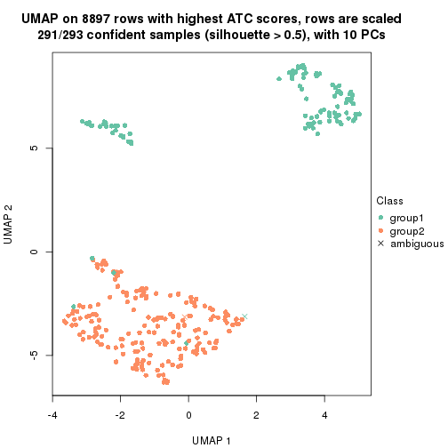</p>

</div>
<div id='tab-node-013-dimension-reduction-2'>
<pre><code class="r">dimension_reduction(res, k = 3, method = &quot;UMAP&quot;)
</code></pre>

<p></p>

</div>
<div id='tab-node-013-dimension-reduction-3'>
<pre><code class="r">dimension_reduction(res, k = 4, method = &quot;UMAP&quot;)
</code></pre>

<p></p>

</div>
</div>


Following heatmap shows how subgroups are split when increasing `k`:

```r
collect_classes(res)
```


Test correlation between subgroups and known annotations. If the known
annotation is numeric, one-way ANOVA test is applied, and if the known
annotation is discrete, chi-squared contingency table test is applied.

```r
test_to_known_factors(res)
```

```
#>             n_sample Cell_type(p-value) Timepoint(p-value) k
#> ATC:skmeans      291           1.40e-49           0.010764 2
#> ATC:skmeans      286           1.63e-44           0.004932 3
#> ATC:skmeans      284           1.23e-86           0.000315 4
```


If matrix rows can be associated to genes, consider to use `functional_enrichment(res,
...)` to perform function enrichment for the signature genes. See [this vignette](https://jokergoo.github.io/cola_vignettes/functional_enrichment.html) for more detailed explanations.


 

---------------------------------------------------


### Node0131


Parent node: [Node013](#Node013).
Child nodes: 
                Node01121-leaf
        ,
                Node01122-leaf
        ,
                Node01131-leaf
        ,
                Node01132-leaf
        ,
                Node01133-leaf
        ,
                [Node01211](#Node01211)
        ,
                Node01212-leaf
        ,
                Node01221-leaf
        ,
                [Node01222](#Node01222)
        ,
                Node01311-leaf
        ,
                Node01312-leaf
        ,
                Node01313-leaf
        ,
                Node01321-leaf
        ,
                Node01322-leaf
        ,
                Node01331-leaf
        ,
                Node01332-leaf
        ,
                Node02111-leaf
        ,
                [Node02112](#Node02112)
        ,
                Node02121-leaf
        ,
                Node02122-leaf
        ,
                [Node02123](#Node02123)
        ,
                Node02221-leaf
        ,
                Node02222-leaf
        ,
                Node02231-leaf
        ,
                Node02232-leaf
        ,
                Node02311-leaf
        ,
                Node02312-leaf
        ,
                Node02321-leaf
        ,
                Node02322-leaf
        ,
                Node02323-leaf
        ,
                Node02421-leaf
        ,
                Node02422-leaf
        .


The object with results only for a single top-value method and a single partitioning method 
can be extracted as:

```r
res = res_rh["0131"]
```

A summary of `res` and all the functions that can be applied to it:

```r
res
```

```
#> A 'ConsensusPartition' object with k = 2, 3, 4.
#>   On a matrix with 7056 rows and 100 columns.
#>   Top rows (646) are extracted by 'ATC' method.
#>   Subgroups are detected by 'skmeans' method.
#>   Performed in total 150 partitions by row resampling.
#>   Best k for subgroups seems to be 3.
#> 
#> Following methods can be applied to this 'ConsensusPartition' object:
#>  [1] "cola_report"             "collect_classes"         "collect_plots"          
#>  [4] "collect_stats"           "colnames"                "compare_partitions"     
#>  [7] "compare_signatures"      "consensus_heatmap"       "dimension_reduction"    
#> [10] "functional_enrichment"   "get_anno_col"            "get_anno"               
#> [13] "get_classes"             "get_consensus"           "get_matrix"             
#> [16] "get_membership"          "get_param"               "get_signatures"         
#> [19] "get_stats"               "is_best_k"               "is_stable_k"            
#> [22] "membership_heatmap"      "ncol"                    "nrow"                   
#> [25] "plot_ecdf"               "predict_classes"         "rownames"               
#> [28] "select_partition_number" "show"                    "suggest_best_k"         
#> [31] "test_to_known_factors"   "top_rows_heatmap"
```

`collect_plots()` function collects all the plots made from `res` for all `k` (number of subgroups)
into one single page to provide an easy and fast comparison between different `k`.

```r
collect_plots(res)
```


The plots are:

- The first row: a plot of the eCDF (empirical cumulative distribution
  function) curves of the consensus matrix for each `k` and the heatmap of
  predicted classes for each `k`.
- The second row: heatmaps of the consensus matrix for each `k`.
- The third row: heatmaps of the membership matrix for each `k`.
- The fouth row: heatmaps of the signatures for each `k`.

All the plots in panels can be made by individual functions and they are
plotted later in this section.

`select_partition_number()` produces several plots showing different
statistics for choosing "optimized" `k`. There are following statistics:

- eCDF curves of the consensus matrix for each `k`;
- 1-PAC. [The PAC score](https://en.wikipedia.org/wiki/Consensus_clustering#Over-interpretation_potential_of_consensus_clustering)
  measures the proportion of the ambiguous subgrouping.
- Mean silhouette score.
- Concordance. The mean probability of fiting the consensus subgroup labels in all
  partitions.
- Area increased. Denote $A_k$ as the area under the eCDF curve for current
  `k`, the area increased is defined as $A_k - A_{k-1}$.
- Rand index. The percent of pairs of samples that are both in a same cluster
  or both are not in a same cluster in the partition of k and k-1.
- Jaccard index. The ratio of pairs of samples are both in a same cluster in
  the partition of k and k-1 and the pairs of samples are both in a same
  cluster in the partition k or k-1.

The detailed explanations of these statistics can be found in [the _cola_
vignette](https://jokergoo.github.io/cola_vignettes/cola.html#toc_13).

Generally speaking, higher 1-PAC score, higher mean silhouette score or higher
concordance corresponds to better partition. Rand index and Jaccard index
measure how similar the current partition is compared to partition with `k-1`.
If they are too similar, we won't accept `k` is better than `k-1`.

```r
select_partition_number(res)
```


The numeric values for all these statistics can be obtained by `get_stats()`.

```r
get_stats(res)
```

```
#>   k 1-PAC mean_silhouette concordance area_increased  Rand Jaccard
#> 2 2 0.979           0.946       0.980          0.459 0.547   0.547
#> 3 3 1.000           0.970       0.988          0.411 0.765   0.585
#> 4 4 0.768           0.764       0.897          0.101 0.946   0.848
```

`suggest_best_k()` suggests the best $k$ based on these statistics. The rules are as follows:

- All $k$ with Jaccard index larger than 0.95 are removed because increasing
  $k$ does not provide enough extra information. If all $k$ are removed, it is
  marked as no subgroup is detected.
- For all $k$ with 1-PAC score larger than 0.9, the maximal $k$ is taken as
  the best $k$, and other $k$ are marked as optional $k$.
- If it does not fit the second rule. The $k$ with the maximal vote of the
  highest 1-PAC score, highest mean silhouette, and highest concordance is
  taken as the best $k$.

```r
suggest_best_k(res)
```

```
#> [1] 3
#> attr(,"optional")
#> [1] 2
```

There is also optional best $k$ = 2 that is worth to check.

Following is the table of the partitions (You need to click the **show/hide
code output** link to see it). The membership matrix (columns with name `p*`)
is inferred by
[`clue::cl_consensus()`](https://www.rdocumentation.org/link/cl_consensus?package=clue)
function with the `SE` method. Basically the value in the membership matrix
represents the probability to belong to a certain group. The finall subgroup
label for an item is determined with the group with highest probability it
belongs to.

In `get_classes()` function, the entropy is calculated from the membership
matrix and the silhouette score is calculated from the consensus matrix.


<script>
$( function() {
	$( '#tabs-node-0131-get-classes' ).tabs();
} );
</script>
<div id='tabs-node-0131-get-classes'>
<ul>
<li><a href='#tab-node-0131-get-classes-1'>k = 2</a></li>
<li><a href='#tab-node-0131-get-classes-2'>k = 3</a></li>
<li><a href='#tab-node-0131-get-classes-3'>k = 4</a></li>
</ul>

<div id='tab-node-0131-get-classes-1'>
<p><a id='tab-node-0131-get-classes-1-a' style='color:#0366d6' href='#'>show/hide code output</a></p>
<pre><code class="r">cbind(get_classes(res, k = 2), get_membership(res, k = 2))
</code></pre>

<pre><code>#&gt;                 class entropy silhouette   p1   p2
#&gt; 1772071_027_H01     1   0.000     0.9770 1.00 0.00
#&gt; 1772078_078_F11     1   0.000     0.9770 1.00 0.00
#&gt; 1772078_109_B10     1   0.000     0.9770 1.00 0.00
#&gt; 1772078_109_E10     1   0.795     0.6810 0.76 0.24
#&gt; 1772075_299_C04     1   0.000     0.9770 1.00 0.00
#&gt; 1772075_298_A05     1   0.000     0.9770 1.00 0.00
#&gt; 1772078_001_F01     2   0.000     0.9817 0.00 1.00
#&gt; 1772078_001_H09     2   0.000     0.9817 0.00 1.00
#&gt; 1772096_160_A06     1   0.000     0.9770 1.00 0.00
#&gt; 1772096_160_B09     1   0.000     0.9770 1.00 0.00
#&gt; 1772096_160_C01     1   0.000     0.9770 1.00 0.00
#&gt; 1772096_160_C09     1   0.000     0.9770 1.00 0.00
#&gt; 1772096_160_C10     1   0.000     0.9770 1.00 0.00
#&gt; 1772096_160_D06     1   0.000     0.9770 1.00 0.00
#&gt; 1772096_160_E03     1   0.000     0.9770 1.00 0.00
#&gt; 1772096_160_E05     1   0.000     0.9770 1.00 0.00
#&gt; 1772096_160_H01     1   0.000     0.9770 1.00 0.00
#&gt; 1772096_160_H04     1   0.000     0.9770 1.00 0.00
#&gt; 1772096_160_H12     1   0.000     0.9770 1.00 0.00
#&gt; 1772096_095_A05     2   0.327     0.9244 0.06 0.94
#&gt; 1772096_095_A12     1   0.000     0.9770 1.00 0.00
#&gt; 1772096_095_B06     1   0.000     0.9770 1.00 0.00
#&gt; 1772096_095_B07     1   0.000     0.9770 1.00 0.00
#&gt; 1772096_095_C02     1   0.000     0.9770 1.00 0.00
#&gt; 1772096_095_C07     1   0.000     0.9770 1.00 0.00
#&gt; 1772096_095_C10     1   0.000     0.9770 1.00 0.00
#&gt; 1772096_095_C11     2   0.000     0.9817 0.00 1.00
#&gt; 1772096_095_C12     1   0.000     0.9770 1.00 0.00
#&gt; 1772096_095_D01     1   0.000     0.9770 1.00 0.00
#&gt; 1772096_095_D03     1   0.000     0.9770 1.00 0.00
#&gt; 1772096_095_D05     1   0.000     0.9770 1.00 0.00
#&gt; 1772096_095_E05     1   0.141     0.9581 0.98 0.02
#&gt; 1772096_095_E11     1   0.000     0.9770 1.00 0.00
#&gt; 1772096_095_F08     1   0.000     0.9770 1.00 0.00
#&gt; 1772096_095_F11     1   0.000     0.9770 1.00 0.00
#&gt; 1772096_095_G07     1   0.000     0.9770 1.00 0.00
#&gt; 1772096_095_G11     1   0.000     0.9770 1.00 0.00
#&gt; 1772096_095_H01     1   0.000     0.9770 1.00 0.00
#&gt; 1772096_095_H03     1   0.000     0.9770 1.00 0.00
#&gt; 1772096_095_H11     1   0.000     0.9770 1.00 0.00
#&gt; 1772122_236_D01     1   0.000     0.9770 1.00 0.00
#&gt; 1772122_236_D10     1   0.000     0.9770 1.00 0.00
#&gt; 1772122_236_F12     1   0.000     0.9770 1.00 0.00
#&gt; 1772121_288_B05     1   0.000     0.9770 1.00 0.00
#&gt; 1772121_288_B06     2   0.000     0.9817 0.00 1.00
#&gt; 1772121_288_H11     2   0.000     0.9817 0.00 1.00
#&gt; 1772121_291_A08     2   0.000     0.9817 0.00 1.00
#&gt; 1772121_291_B04     2   0.000     0.9817 0.00 1.00
#&gt; 1772121_291_C04     1   0.000     0.9770 1.00 0.00
#&gt; 1772121_291_E02     2   0.000     0.9817 0.00 1.00
#&gt; 1772121_291_F03     1   0.000     0.9770 1.00 0.00
#&gt; 1772121_293_B06     2   0.000     0.9817 0.00 1.00
#&gt; 1772121_293_C10     1   0.000     0.9770 1.00 0.00
#&gt; 1772121_293_D07     1   0.795     0.6810 0.76 0.24
#&gt; 1772121_293_E01     2   0.000     0.9817 0.00 1.00
#&gt; 1772121_293_G09     1   0.000     0.9770 1.00 0.00
#&gt; 1772121_283_A12     1   0.000     0.9770 1.00 0.00
#&gt; 1772121_283_D10     1   0.000     0.9770 1.00 0.00
#&gt; 1772122_264_B05     2   0.000     0.9817 0.00 1.00
#&gt; 1772122_264_B06     1   0.000     0.9770 1.00 0.00
#&gt; 1772122_264_H05     1   0.000     0.9770 1.00 0.00
#&gt; 1772122_264_H06     1   0.000     0.9770 1.00 0.00
#&gt; 1772122_264_H11     1   0.000     0.9770 1.00 0.00
#&gt; 1772122_208_B01     2   0.000     0.9817 0.00 1.00
#&gt; 1772122_208_B06     1   0.000     0.9770 1.00 0.00
#&gt; 1772122_208_D11     1   0.000     0.9770 1.00 0.00
#&gt; 1772122_208_H11     2   0.000     0.9817 0.00 1.00
#&gt; 1772122_201_A02     1   0.000     0.9770 1.00 0.00
#&gt; 1772122_201_A04     1   0.000     0.9770 1.00 0.00
#&gt; 1772122_201_D05     1   0.000     0.9770 1.00 0.00
#&gt; 1772122_201_E01     1   0.000     0.9770 1.00 0.00
#&gt; 1772122_201_G07     2   0.000     0.9817 0.00 1.00
#&gt; 1772122_201_G12     2   0.000     0.9817 0.00 1.00
#&gt; 1772122_207_C12     2   0.000     0.9817 0.00 1.00
#&gt; 1772122_199_A01     2   0.000     0.9817 0.00 1.00
#&gt; 1772122_199_A06     1   0.000     0.9770 1.00 0.00
#&gt; 1772122_199_A07     2   0.529     0.8552 0.12 0.88
#&gt; 1772122_199_B07     2   0.000     0.9817 0.00 1.00
#&gt; 1772122_199_B12     1   0.000     0.9770 1.00 0.00
#&gt; 1772122_199_C05     2   0.000     0.9817 0.00 1.00
#&gt; 1772122_199_C08     1   0.000     0.9770 1.00 0.00
#&gt; 1772122_199_D05     2   0.000     0.9817 0.00 1.00
#&gt; 1772122_199_D06     2   0.000     0.9817 0.00 1.00
#&gt; 1772122_199_D07     1   0.000     0.9770 1.00 0.00
#&gt; 1772122_199_D10     1   0.000     0.9770 1.00 0.00
#&gt; 1772122_199_E05     1   0.000     0.9770 1.00 0.00
#&gt; 1772122_199_H10     2   0.000     0.9817 0.00 1.00
#&gt; 1772122_203_A04     2   0.000     0.9817 0.00 1.00
#&gt; 1772122_203_C03     2   0.000     0.9817 0.00 1.00
#&gt; 1772122_203_D01     2   0.000     0.9817 0.00 1.00
#&gt; 1772122_203_G06     2   0.000     0.9817 0.00 1.00
#&gt; 1772122_203_H03     2   0.000     0.9817 0.00 1.00
#&gt; 1772122_203_H11     1   0.000     0.9770 1.00 0.00
#&gt; 1772122_200_A01     2   0.000     0.9817 0.00 1.00
#&gt; 1772122_200_A10     2   0.000     0.9817 0.00 1.00
#&gt; 1772122_200_B01     2   0.000     0.9817 0.00 1.00
#&gt; 1772122_200_B06     2   0.971     0.3051 0.40 0.60
#&gt; 1772122_200_C04     2   0.000     0.9817 0.00 1.00
#&gt; 1772122_200_E01     1   0.999     0.0806 0.52 0.48
#&gt; 1772122_200_H03     1   0.999     0.0874 0.52 0.48
</code></pre>

<script>
$('#tab-node-0131-get-classes-1-a').parent().next().next().hide();
$('#tab-node-0131-get-classes-1-a').click(function(){
  $('#tab-node-0131-get-classes-1-a').parent().next().next().toggle();
  return(false);
});
</script>
</div>

<div id='tab-node-0131-get-classes-2'>
<p><a id='tab-node-0131-get-classes-2-a' style='color:#0366d6' href='#'>show/hide code output</a></p>
<pre><code class="r">cbind(get_classes(res, k = 3), get_membership(res, k = 3))
</code></pre>

<pre><code>#&gt;                 class entropy silhouette   p1   p2   p3
#&gt; 1772071_027_H01     1   0.000      0.989 1.00 0.00 0.00
#&gt; 1772078_078_F11     1   0.000      0.989 1.00 0.00 0.00
#&gt; 1772078_109_B10     1   0.000      0.989 1.00 0.00 0.00
#&gt; 1772078_109_E10     3   0.000      0.973 0.00 0.00 1.00
#&gt; 1772075_299_C04     1   0.000      0.989 1.00 0.00 0.00
#&gt; 1772075_298_A05     1   0.000      0.989 1.00 0.00 0.00
#&gt; 1772078_001_F01     2   0.000      0.991 0.00 1.00 0.00
#&gt; 1772078_001_H09     2   0.000      0.991 0.00 1.00 0.00
#&gt; 1772096_160_A06     3   0.000      0.973 0.00 0.00 1.00
#&gt; 1772096_160_B09     1   0.000      0.989 1.00 0.00 0.00
#&gt; 1772096_160_C01     1   0.000      0.989 1.00 0.00 0.00
#&gt; 1772096_160_C09     1   0.000      0.989 1.00 0.00 0.00
#&gt; 1772096_160_C10     1   0.000      0.989 1.00 0.00 0.00
#&gt; 1772096_160_D06     1   0.000      0.989 1.00 0.00 0.00
#&gt; 1772096_160_E03     3   0.429      0.791 0.18 0.00 0.82
#&gt; 1772096_160_E05     1   0.000      0.989 1.00 0.00 0.00
#&gt; 1772096_160_H01     1   0.000      0.989 1.00 0.00 0.00
#&gt; 1772096_160_H04     1   0.000      0.989 1.00 0.00 0.00
#&gt; 1772096_160_H12     1   0.000      0.989 1.00 0.00 0.00
#&gt; 1772096_095_A05     2   0.207      0.925 0.06 0.94 0.00
#&gt; 1772096_095_A12     3   0.000      0.973 0.00 0.00 1.00
#&gt; 1772096_095_B06     1   0.000      0.989 1.00 0.00 0.00
#&gt; 1772096_095_B07     1   0.000      0.989 1.00 0.00 0.00
#&gt; 1772096_095_C02     1   0.000      0.989 1.00 0.00 0.00
#&gt; 1772096_095_C07     1   0.000      0.989 1.00 0.00 0.00
#&gt; 1772096_095_C10     1   0.000      0.989 1.00 0.00 0.00
#&gt; 1772096_095_C11     2   0.000      0.991 0.00 1.00 0.00
#&gt; 1772096_095_C12     1   0.000      0.989 1.00 0.00 0.00
#&gt; 1772096_095_D01     1   0.153      0.948 0.96 0.00 0.04
#&gt; 1772096_095_D03     1   0.000      0.989 1.00 0.00 0.00
#&gt; 1772096_095_D05     1   0.000      0.989 1.00 0.00 0.00
#&gt; 1772096_095_E05     3   0.000      0.973 0.00 0.00 1.00
#&gt; 1772096_095_E11     1   0.000      0.989 1.00 0.00 0.00
#&gt; 1772096_095_F08     1   0.000      0.989 1.00 0.00 0.00
#&gt; 1772096_095_F11     1   0.000      0.989 1.00 0.00 0.00
#&gt; 1772096_095_G07     1   0.000      0.989 1.00 0.00 0.00
#&gt; 1772096_095_G11     1   0.000      0.989 1.00 0.00 0.00
#&gt; 1772096_095_H01     3   0.429      0.791 0.18 0.00 0.82
#&gt; 1772096_095_H03     1   0.000      0.989 1.00 0.00 0.00
#&gt; 1772096_095_H11     3   0.000      0.973 0.00 0.00 1.00
#&gt; 1772122_236_D01     1   0.000      0.989 1.00 0.00 0.00
#&gt; 1772122_236_D10     1   0.000      0.989 1.00 0.00 0.00
#&gt; 1772122_236_F12     1   0.000      0.989 1.00 0.00 0.00
#&gt; 1772121_288_B05     1   0.000      0.989 1.00 0.00 0.00
#&gt; 1772121_288_B06     2   0.000      0.991 0.00 1.00 0.00
#&gt; 1772121_288_H11     2   0.000      0.991 0.00 1.00 0.00
#&gt; 1772121_291_A08     3   0.000      0.973 0.00 0.00 1.00
#&gt; 1772121_291_B04     2   0.000      0.991 0.00 1.00 0.00
#&gt; 1772121_291_C04     3   0.000      0.973 0.00 0.00 1.00
#&gt; 1772121_291_E02     2   0.000      0.991 0.00 1.00 0.00
#&gt; 1772121_291_F03     3   0.000      0.973 0.00 0.00 1.00
#&gt; 1772121_293_B06     2   0.000      0.991 0.00 1.00 0.00
#&gt; 1772121_293_C10     1   0.000      0.989 1.00 0.00 0.00
#&gt; 1772121_293_D07     3   0.000      0.973 0.00 0.00 1.00
#&gt; 1772121_293_E01     2   0.000      0.991 0.00 1.00 0.00
#&gt; 1772121_293_G09     3   0.000      0.973 0.00 0.00 1.00
#&gt; 1772121_283_A12     3   0.000      0.973 0.00 0.00 1.00
#&gt; 1772121_283_D10     1   0.000      0.989 1.00 0.00 0.00
#&gt; 1772122_264_B05     2   0.000      0.991 0.00 1.00 0.00
#&gt; 1772122_264_B06     1   0.619      0.249 0.58 0.00 0.42
#&gt; 1772122_264_H05     1   0.000      0.989 1.00 0.00 0.00
#&gt; 1772122_264_H06     1   0.000      0.989 1.00 0.00 0.00
#&gt; 1772122_264_H11     1   0.000      0.989 1.00 0.00 0.00
#&gt; 1772122_208_B01     2   0.000      0.991 0.00 1.00 0.00
#&gt; 1772122_208_B06     1   0.000      0.989 1.00 0.00 0.00
#&gt; 1772122_208_D11     1   0.000      0.989 1.00 0.00 0.00
#&gt; 1772122_208_H11     2   0.000      0.991 0.00 1.00 0.00
#&gt; 1772122_201_A02     1   0.000      0.989 1.00 0.00 0.00
#&gt; 1772122_201_A04     1   0.000      0.989 1.00 0.00 0.00
#&gt; 1772122_201_D05     3   0.455      0.757 0.20 0.00 0.80
#&gt; 1772122_201_E01     3   0.000      0.973 0.00 0.00 1.00
#&gt; 1772122_201_G07     3   0.000      0.973 0.00 0.00 1.00
#&gt; 1772122_201_G12     2   0.000      0.991 0.00 1.00 0.00
#&gt; 1772122_207_C12     2   0.000      0.991 0.00 1.00 0.00
#&gt; 1772122_199_A01     2   0.000      0.991 0.00 1.00 0.00
#&gt; 1772122_199_A06     3   0.000      0.973 0.00 0.00 1.00
#&gt; 1772122_199_A07     2   0.369      0.823 0.14 0.86 0.00
#&gt; 1772122_199_B07     2   0.000      0.991 0.00 1.00 0.00
#&gt; 1772122_199_B12     1   0.000      0.989 1.00 0.00 0.00
#&gt; 1772122_199_C05     2   0.000      0.991 0.00 1.00 0.00
#&gt; 1772122_199_C08     3   0.000      0.973 0.00 0.00 1.00
#&gt; 1772122_199_D05     3   0.000      0.973 0.00 0.00 1.00
#&gt; 1772122_199_D06     2   0.000      0.991 0.00 1.00 0.00
#&gt; 1772122_199_D07     1   0.000      0.989 1.00 0.00 0.00
#&gt; 1772122_199_D10     3   0.000      0.973 0.00 0.00 1.00
#&gt; 1772122_199_E05     1   0.000      0.989 1.00 0.00 0.00
#&gt; 1772122_199_H10     2   0.000      0.991 0.00 1.00 0.00
#&gt; 1772122_203_A04     2   0.000      0.991 0.00 1.00 0.00
#&gt; 1772122_203_C03     3   0.000      0.973 0.00 0.00 1.00
#&gt; 1772122_203_D01     2   0.000      0.991 0.00 1.00 0.00
#&gt; 1772122_203_G06     2   0.000      0.991 0.00 1.00 0.00
#&gt; 1772122_203_H03     2   0.000      0.991 0.00 1.00 0.00
#&gt; 1772122_203_H11     3   0.000      0.973 0.00 0.00 1.00
#&gt; 1772122_200_A01     2   0.000      0.991 0.00 1.00 0.00
#&gt; 1772122_200_A10     2   0.000      0.991 0.00 1.00 0.00
#&gt; 1772122_200_B01     2   0.000      0.991 0.00 1.00 0.00
#&gt; 1772122_200_B06     3   0.000      0.973 0.00 0.00 1.00
#&gt; 1772122_200_C04     2   0.000      0.991 0.00 1.00 0.00
#&gt; 1772122_200_E01     3   0.000      0.973 0.00 0.00 1.00
#&gt; 1772122_200_H03     3   0.000      0.973 0.00 0.00 1.00
</code></pre>

<script>
$('#tab-node-0131-get-classes-2-a').parent().next().next().hide();
$('#tab-node-0131-get-classes-2-a').click(function(){
  $('#tab-node-0131-get-classes-2-a').parent().next().next().toggle();
  return(false);
});
</script>
</div>

<div id='tab-node-0131-get-classes-3'>
<p><a id='tab-node-0131-get-classes-3-a' style='color:#0366d6' href='#'>show/hide code output</a></p>
<pre><code class="r">cbind(get_classes(res, k = 4), get_membership(res, k = 4))
</code></pre>

<pre><code>#&gt;                 class entropy silhouette   p1   p2   p3   p4
#&gt; 1772071_027_H01     1  0.2011     0.8308 0.92 0.00 0.00 0.08
#&gt; 1772078_078_F11     1  0.0000     0.8646 1.00 0.00 0.00 0.00
#&gt; 1772078_109_B10     1  0.4522     0.4533 0.68 0.00 0.32 0.00
#&gt; 1772078_109_E10     3  0.0707     0.7297 0.00 0.00 0.98 0.02
#&gt; 1772075_299_C04     1  0.0000     0.8646 1.00 0.00 0.00 0.00
#&gt; 1772075_298_A05     1  0.0000     0.8646 1.00 0.00 0.00 0.00
#&gt; 1772078_001_F01     2  0.0000     0.9699 0.00 1.00 0.00 0.00
#&gt; 1772078_001_H09     2  0.0000     0.9699 0.00 1.00 0.00 0.00
#&gt; 1772096_160_A06     3  0.0000     0.7320 0.00 0.00 1.00 0.00
#&gt; 1772096_160_B09     1  0.0000     0.8646 1.00 0.00 0.00 0.00
#&gt; 1772096_160_C01     1  0.0000     0.8646 1.00 0.00 0.00 0.00
#&gt; 1772096_160_C09     1  0.0000     0.8646 1.00 0.00 0.00 0.00
#&gt; 1772096_160_C10     1  0.0000     0.8646 1.00 0.00 0.00 0.00
#&gt; 1772096_160_D06     1  0.0000     0.8646 1.00 0.00 0.00 0.00
#&gt; 1772096_160_E03     3  0.4332     0.5988 0.16 0.00 0.80 0.04
#&gt; 1772096_160_E05     1  0.0000     0.8646 1.00 0.00 0.00 0.00
#&gt; 1772096_160_H01     1  0.0000     0.8646 1.00 0.00 0.00 0.00
#&gt; 1772096_160_H04     1  0.0000     0.8646 1.00 0.00 0.00 0.00
#&gt; 1772096_160_H12     1  0.0000     0.8646 1.00 0.00 0.00 0.00
#&gt; 1772096_095_A05     2  0.2345     0.8586 0.10 0.90 0.00 0.00
#&gt; 1772096_095_A12     3  0.0000     0.7320 0.00 0.00 1.00 0.00
#&gt; 1772096_095_B06     1  0.0000     0.8646 1.00 0.00 0.00 0.00
#&gt; 1772096_095_B07     1  0.0000     0.8646 1.00 0.00 0.00 0.00
#&gt; 1772096_095_C02     1  0.0000     0.8646 1.00 0.00 0.00 0.00
#&gt; 1772096_095_C07     1  0.0000     0.8646 1.00 0.00 0.00 0.00
#&gt; 1772096_095_C10     1  0.4522     0.4490 0.68 0.00 0.32 0.00
#&gt; 1772096_095_C11     2  0.0000     0.9699 0.00 1.00 0.00 0.00
#&gt; 1772096_095_C12     1  0.0000     0.8646 1.00 0.00 0.00 0.00
#&gt; 1772096_095_D01     1  0.4855     0.2596 0.60 0.00 0.40 0.00
#&gt; 1772096_095_D03     1  0.0000     0.8646 1.00 0.00 0.00 0.00
#&gt; 1772096_095_D05     1  0.0000     0.8646 1.00 0.00 0.00 0.00
#&gt; 1772096_095_E05     3  0.0000     0.7320 0.00 0.00 1.00 0.00
#&gt; 1772096_095_E11     1  0.0000     0.8646 1.00 0.00 0.00 0.00
#&gt; 1772096_095_F08     1  0.0000     0.8646 1.00 0.00 0.00 0.00
#&gt; 1772096_095_F11     3  0.5000     0.0259 0.50 0.00 0.50 0.00
#&gt; 1772096_095_G07     1  0.2345     0.7842 0.90 0.00 0.10 0.00
#&gt; 1772096_095_G11     1  0.0000     0.8646 1.00 0.00 0.00 0.00
#&gt; 1772096_095_H01     3  0.5883     0.4289 0.30 0.00 0.64 0.06
#&gt; 1772096_095_H03     1  0.0000     0.8646 1.00 0.00 0.00 0.00
#&gt; 1772096_095_H11     3  0.2335     0.7047 0.06 0.00 0.92 0.02
#&gt; 1772122_236_D01     1  0.4907     0.4717 0.58 0.00 0.00 0.42
#&gt; 1772122_236_D10     1  0.3610     0.7475 0.80 0.00 0.00 0.20
#&gt; 1772122_236_F12     1  0.4907     0.4731 0.58 0.00 0.00 0.42
#&gt; 1772121_288_B05     1  0.0000     0.8646 1.00 0.00 0.00 0.00
#&gt; 1772121_288_B06     2  0.0000     0.9699 0.00 1.00 0.00 0.00
#&gt; 1772121_288_H11     2  0.0000     0.9699 0.00 1.00 0.00 0.00
#&gt; 1772121_291_A08     4  0.4713     0.3484 0.00 0.00 0.36 0.64
#&gt; 1772121_291_B04     2  0.0000     0.9699 0.00 1.00 0.00 0.00
#&gt; 1772121_291_C04     4  0.1211     0.7773 0.00 0.00 0.04 0.96
#&gt; 1772121_291_E02     2  0.0000     0.9699 0.00 1.00 0.00 0.00
#&gt; 1772121_291_F03     3  0.2011     0.7073 0.00 0.00 0.92 0.08
#&gt; 1772121_293_B06     2  0.0000     0.9699 0.00 1.00 0.00 0.00
#&gt; 1772121_293_C10     1  0.4790     0.5444 0.62 0.00 0.00 0.38
#&gt; 1772121_293_D07     3  0.1637     0.7160 0.00 0.00 0.94 0.06
#&gt; 1772121_293_E01     2  0.1411     0.9418 0.00 0.96 0.02 0.02
#&gt; 1772121_293_G09     3  0.5428     0.1566 0.02 0.00 0.60 0.38
#&gt; 1772121_283_A12     3  0.0000     0.7320 0.00 0.00 1.00 0.00
#&gt; 1772121_283_D10     1  0.4406     0.6484 0.70 0.00 0.00 0.30
#&gt; 1772122_264_B05     2  0.0000     0.9699 0.00 1.00 0.00 0.00
#&gt; 1772122_264_B06     4  0.3198     0.6853 0.08 0.00 0.04 0.88
#&gt; 1772122_264_H05     1  0.2011     0.8317 0.92 0.00 0.00 0.08
#&gt; 1772122_264_H06     1  0.3172     0.7791 0.84 0.00 0.00 0.16
#&gt; 1772122_264_H11     1  0.4855     0.5103 0.60 0.00 0.00 0.40
#&gt; 1772122_208_B01     2  0.2011     0.9009 0.00 0.92 0.08 0.00
#&gt; 1772122_208_B06     1  0.3801     0.7355 0.78 0.00 0.00 0.22
#&gt; 1772122_208_D11     1  0.0000     0.8646 1.00 0.00 0.00 0.00
#&gt; 1772122_208_H11     2  0.0000     0.9699 0.00 1.00 0.00 0.00
#&gt; 1772122_201_A02     1  0.4624     0.6017 0.66 0.00 0.00 0.34
#&gt; 1772122_201_A04     1  0.0000     0.8646 1.00 0.00 0.00 0.00
#&gt; 1772122_201_D05     4  0.5173     0.4573 0.02 0.00 0.32 0.66
#&gt; 1772122_201_E01     4  0.2647     0.7368 0.00 0.00 0.12 0.88
#&gt; 1772122_201_G07     3  0.5392     0.4348 0.00 0.04 0.68 0.28
#&gt; 1772122_201_G12     2  0.0000     0.9699 0.00 1.00 0.00 0.00
#&gt; 1772122_207_C12     2  0.4277     0.6185 0.00 0.72 0.28 0.00
#&gt; 1772122_199_A01     2  0.0000     0.9699 0.00 1.00 0.00 0.00
#&gt; 1772122_199_A06     4  0.0000     0.7863 0.00 0.00 0.00 1.00
#&gt; 1772122_199_A07     2  0.3801     0.6711 0.22 0.78 0.00 0.00
#&gt; 1772122_199_B07     2  0.0000     0.9699 0.00 1.00 0.00 0.00
#&gt; 1772122_199_B12     1  0.4713     0.5740 0.64 0.00 0.00 0.36
#&gt; 1772122_199_C05     2  0.0000     0.9699 0.00 1.00 0.00 0.00
#&gt; 1772122_199_C08     4  0.0000     0.7863 0.00 0.00 0.00 1.00
#&gt; 1772122_199_D05     3  0.4790     0.2741 0.00 0.00 0.62 0.38
#&gt; 1772122_199_D06     2  0.0000     0.9699 0.00 1.00 0.00 0.00
#&gt; 1772122_199_D07     1  0.4624     0.6023 0.66 0.00 0.00 0.34
#&gt; 1772122_199_D10     4  0.0000     0.7863 0.00 0.00 0.00 1.00
#&gt; 1772122_199_E05     1  0.4713     0.5746 0.64 0.00 0.00 0.36
#&gt; 1772122_199_H10     2  0.0000     0.9699 0.00 1.00 0.00 0.00
#&gt; 1772122_203_A04     2  0.0000     0.9699 0.00 1.00 0.00 0.00
#&gt; 1772122_203_C03     3  0.3610     0.5960 0.00 0.00 0.80 0.20
#&gt; 1772122_203_D01     2  0.0000     0.9699 0.00 1.00 0.00 0.00
#&gt; 1772122_203_G06     2  0.0000     0.9699 0.00 1.00 0.00 0.00
#&gt; 1772122_203_H03     2  0.0707     0.9554 0.00 0.98 0.00 0.02
#&gt; 1772122_203_H11     4  0.0000     0.7863 0.00 0.00 0.00 1.00
#&gt; 1772122_200_A01     2  0.0000     0.9699 0.00 1.00 0.00 0.00
#&gt; 1772122_200_A10     2  0.0000     0.9699 0.00 1.00 0.00 0.00
#&gt; 1772122_200_B01     2  0.0000     0.9699 0.00 1.00 0.00 0.00
#&gt; 1772122_200_B06     4  0.4948     0.2144 0.00 0.00 0.44 0.56
#&gt; 1772122_200_C04     2  0.0000     0.9699 0.00 1.00 0.00 0.00
#&gt; 1772122_200_E01     4  0.0707     0.7842 0.00 0.00 0.02 0.98
#&gt; 1772122_200_H03     4  0.4624     0.3942 0.00 0.00 0.34 0.66
</code></pre>

<script>
$('#tab-node-0131-get-classes-3-a').parent().next().next().hide();
$('#tab-node-0131-get-classes-3-a').click(function(){
  $('#tab-node-0131-get-classes-3-a').parent().next().next().toggle();
  return(false);
});
</script>
</div>
</div>

Heatmaps for the consensus matrix. It visualizes the probability of two
samples to be in a same group.


<script>
$( function() {
	$( '#tabs-node-0131-consensus-heatmap' ).tabs();
} );
</script>
<div id='tabs-node-0131-consensus-heatmap'>
<ul>
<li><a href='#tab-node-0131-consensus-heatmap-1'>k = 2</a></li>
<li><a href='#tab-node-0131-consensus-heatmap-2'>k = 3</a></li>
<li><a href='#tab-node-0131-consensus-heatmap-3'>k = 4</a></li>
</ul>
<div id='tab-node-0131-consensus-heatmap-1'>
<pre><code class="r">consensus_heatmap(res, k = 2)
</code></pre>

<p></p>

</div>
<div id='tab-node-0131-consensus-heatmap-2'>
<pre><code class="r">consensus_heatmap(res, k = 3)
</code></pre>

<p></p>

</div>
<div id='tab-node-0131-consensus-heatmap-3'>
<pre><code class="r">consensus_heatmap(res, k = 4)
</code></pre>

<p></p>

</div>
</div>

Heatmaps for the membership of samples in all partitions to see how consistent they are:


<script>
$( function() {
	$( '#tabs-node-0131-membership-heatmap' ).tabs();
} );
</script>
<div id='tabs-node-0131-membership-heatmap'>
<ul>
<li><a href='#tab-node-0131-membership-heatmap-1'>k = 2</a></li>
<li><a href='#tab-node-0131-membership-heatmap-2'>k = 3</a></li>
<li><a href='#tab-node-0131-membership-heatmap-3'>k = 4</a></li>
</ul>
<div id='tab-node-0131-membership-heatmap-1'>
<pre><code class="r">membership_heatmap(res, k = 2)
</code></pre>

<p></p>

</div>
<div id='tab-node-0131-membership-heatmap-2'>
<pre><code class="r">membership_heatmap(res, k = 3)
</code></pre>

<p></p>

</div>
<div id='tab-node-0131-membership-heatmap-3'>
<pre><code class="r">membership_heatmap(res, k = 4)
</code></pre>

<p></p>

</div>
</div>

As soon as the classes for columns are determined, the signatures
that are significantly different between subgroups can be looked for. 
Following are the heatmaps for signatures.


Signature heatmaps where rows are scaled:


<script>
$( function() {
	$( '#tabs-node-0131-get-signatures' ).tabs();
} );
</script>
<div id='tabs-node-0131-get-signatures'>
<ul>
<li><a href='#tab-node-0131-get-signatures-1'>k = 2</a></li>
<li><a href='#tab-node-0131-get-signatures-2'>k = 3</a></li>
<li><a href='#tab-node-0131-get-signatures-3'>k = 4</a></li>
</ul>
<div id='tab-node-0131-get-signatures-1'>
<pre><code class="r">get_signatures(res, k = 2)
</code></pre>

<p></p>

</div>
<div id='tab-node-0131-get-signatures-2'>
<pre><code class="r">get_signatures(res, k = 3)
</code></pre>

<p></p>

</div>
<div id='tab-node-0131-get-signatures-3'>
<pre><code class="r">get_signatures(res, k = 4)
</code></pre>

<p></p>

</div>
</div>


Signature heatmaps where rows are not scaled:


<script>
$( function() {
	$( '#tabs-node-0131-get-signatures-no-scale' ).tabs();
} );
</script>
<div id='tabs-node-0131-get-signatures-no-scale'>
<ul>
<li><a href='#tab-node-0131-get-signatures-no-scale-1'>k = 2</a></li>
<li><a href='#tab-node-0131-get-signatures-no-scale-2'>k = 3</a></li>
<li><a href='#tab-node-0131-get-signatures-no-scale-3'>k = 4</a></li>
</ul>
<div id='tab-node-0131-get-signatures-no-scale-1'>
<pre><code class="r">get_signatures(res, k = 2, scale_rows = FALSE)
</code></pre>

<p></p>

</div>
<div id='tab-node-0131-get-signatures-no-scale-2'>
<pre><code class="r">get_signatures(res, k = 3, scale_rows = FALSE)
</code></pre>

<p></p>

</div>
<div id='tab-node-0131-get-signatures-no-scale-3'>
<pre><code class="r">get_signatures(res, k = 4, scale_rows = FALSE)
</code></pre>

<p></p>

</div>
</div>


Compare the overlap of signatures from different k:

```r
compare_signatures(res)
```

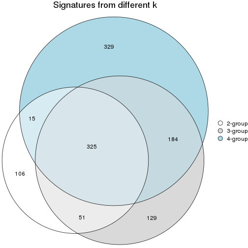

`get_signature()` returns a data frame invisibly. To get the list of signatures, the function
call should be assigned to a variable explicitly. In following code, if `plot` argument is set
to `FALSE`, no heatmap is plotted while only the differential analysis is performed.

```r
# code only for demonstration
tb = get_signature(res, k = ..., plot = FALSE)
```

An example of the output of `tb` is:

```
#>   which_row         fdr    mean_1    mean_2 scaled_mean_1 scaled_mean_2 km
#> 1        38 0.042760348  8.373488  9.131774    -0.5533452     0.5164555  1
#> 2        40 0.018707592  7.106213  8.469186    -0.6173731     0.5762149  1
#> 3        55 0.019134737 10.221463 11.207825    -0.6159697     0.5749050  1
#> 4        59 0.006059896  5.921854  7.869574    -0.6899429     0.6439467  1
#> 5        60 0.018055526  8.928898 10.211722    -0.6204761     0.5791110  1
#> 6        98 0.009384629 15.714769 14.887706     0.6635654    -0.6193277  2
...
```

The columns in `tb` are:

1. `which_row`: row indices corresponding to the input matrix.
2. `fdr`: FDR for the differential test. 
3. `mean_x`: The mean value in group x.
4. `scaled_mean_x`: The mean value in group x after rows are scaled.
5. `km`: Row groups if k-means clustering is applied to rows (which is done by automatically selecting number of clusters).

If there are too many signatures, `top_signatures = ...` can be set to only show the 
signatures with the highest FDRs:

```r
# code only for demonstration
# e.g. to show the top 500 most significant rows
tb = get_signature(res, k = ..., top_signatures = 500)
```

If the signatures are defined as these which are uniquely high in current group, `diff_method` argument
can be set to `"uniquely_high_in_one_group"`:

```r
# code only for demonstration
tb = get_signature(res, k = ..., diff_method = "uniquely_high_in_one_group")
```


UMAP plot which shows how samples are separated.


<script>
$( function() {
	$( '#tabs-node-0131-dimension-reduction' ).tabs();
} );
</script>
<div id='tabs-node-0131-dimension-reduction'>
<ul>
<li><a href='#tab-node-0131-dimension-reduction-1'>k = 2</a></li>
<li><a href='#tab-node-0131-dimension-reduction-2'>k = 3</a></li>
<li><a href='#tab-node-0131-dimension-reduction-3'>k = 4</a></li>
</ul>
<div id='tab-node-0131-dimension-reduction-1'>
<pre><code class="r">dimension_reduction(res, k = 2, method = &quot;UMAP&quot;)
</code></pre>

<p></p>

</div>
<div id='tab-node-0131-dimension-reduction-2'>
<pre><code class="r">dimension_reduction(res, k = 3, method = &quot;UMAP&quot;)
</code></pre>

<p></p>

</div>
<div id='tab-node-0131-dimension-reduction-3'>
<pre><code class="r">dimension_reduction(res, k = 4, method = &quot;UMAP&quot;)
</code></pre>

<p></p>

</div>
</div>


Following heatmap shows how subgroups are split when increasing `k`:

```r
collect_classes(res)
```


Test correlation between subgroups and known annotations. If the known
annotation is numeric, one-way ANOVA test is applied, and if the known
annotation is discrete, chi-squared contingency table test is applied.

```r
test_to_known_factors(res)
```

```
#>             n_sample Cell_type(p-value) Timepoint(p-value) k
#> ATC:skmeans       97           7.22e-16            0.00179 2
#> ATC:skmeans       99           1.85e-17            0.01702 3
#> ATC:skmeans       86           5.95e-15            0.00624 4
```


If matrix rows can be associated to genes, consider to use `functional_enrichment(res,
...)` to perform function enrichment for the signature genes. See [this vignette](https://jokergoo.github.io/cola_vignettes/functional_enrichment.html) for more detailed explanations.


 

---------------------------------------------------


### Node0132


Parent node: [Node013](#Node013).
Child nodes: 
                Node01121-leaf
        ,
                Node01122-leaf
        ,
                Node01131-leaf
        ,
                Node01132-leaf
        ,
                Node01133-leaf
        ,
                [Node01211](#Node01211)
        ,
                Node01212-leaf
        ,
                Node01221-leaf
        ,
                [Node01222](#Node01222)
        ,
                Node01311-leaf
        ,
                Node01312-leaf
        ,
                Node01313-leaf
        ,
                Node01321-leaf
        ,
                Node01322-leaf
        ,
                Node01331-leaf
        ,
                Node01332-leaf
        ,
                Node02111-leaf
        ,
                [Node02112](#Node02112)
        ,
                Node02121-leaf
        ,
                Node02122-leaf
        ,
                [Node02123](#Node02123)
        ,
                Node02221-leaf
        ,
                Node02222-leaf
        ,
                Node02231-leaf
        ,
                Node02232-leaf
        ,
                Node02311-leaf
        ,
                Node02312-leaf
        ,
                Node02321-leaf
        ,
                Node02322-leaf
        ,
                Node02323-leaf
        ,
                Node02421-leaf
        ,
                Node02422-leaf
        .


The object with results only for a single top-value method and a single partitioning method 
can be extracted as:

```r
res = res_rh["0132"]
```

A summary of `res` and all the functions that can be applied to it:

```r
res
```

```
#> A 'ConsensusPartition' object with k = 2, 3, 4.
#>   On a matrix with 7335 rows and 111 columns.
#>   Top rows (734) are extracted by 'ATC' method.
#>   Subgroups are detected by 'skmeans' method.
#>   Performed in total 150 partitions by row resampling.
#>   Best k for subgroups seems to be 2.
#> 
#> Following methods can be applied to this 'ConsensusPartition' object:
#>  [1] "cola_report"             "collect_classes"         "collect_plots"          
#>  [4] "collect_stats"           "colnames"                "compare_partitions"     
#>  [7] "compare_signatures"      "consensus_heatmap"       "dimension_reduction"    
#> [10] "functional_enrichment"   "get_anno_col"            "get_anno"               
#> [13] "get_classes"             "get_consensus"           "get_matrix"             
#> [16] "get_membership"          "get_param"               "get_signatures"         
#> [19] "get_stats"               "is_best_k"               "is_stable_k"            
#> [22] "membership_heatmap"      "ncol"                    "nrow"                   
#> [25] "plot_ecdf"               "predict_classes"         "rownames"               
#> [28] "select_partition_number" "show"                    "suggest_best_k"         
#> [31] "test_to_known_factors"   "top_rows_heatmap"
```

`collect_plots()` function collects all the plots made from `res` for all `k` (number of subgroups)
into one single page to provide an easy and fast comparison between different `k`.

```r
collect_plots(res)
```


The plots are:

- The first row: a plot of the eCDF (empirical cumulative distribution
  function) curves of the consensus matrix for each `k` and the heatmap of
  predicted classes for each `k`.
- The second row: heatmaps of the consensus matrix for each `k`.
- The third row: heatmaps of the membership matrix for each `k`.
- The fouth row: heatmaps of the signatures for each `k`.

All the plots in panels can be made by individual functions and they are
plotted later in this section.

`select_partition_number()` produces several plots showing different
statistics for choosing "optimized" `k`. There are following statistics:

- eCDF curves of the consensus matrix for each `k`;
- 1-PAC. [The PAC score](https://en.wikipedia.org/wiki/Consensus_clustering#Over-interpretation_potential_of_consensus_clustering)
  measures the proportion of the ambiguous subgrouping.
- Mean silhouette score.
- Concordance. The mean probability of fiting the consensus subgroup labels in all
  partitions.
- Area increased. Denote $A_k$ as the area under the eCDF curve for current
  `k`, the area increased is defined as $A_k - A_{k-1}$.
- Rand index. The percent of pairs of samples that are both in a same cluster
  or both are not in a same cluster in the partition of k and k-1.
- Jaccard index. The ratio of pairs of samples are both in a same cluster in
  the partition of k and k-1 and the pairs of samples are both in a same
  cluster in the partition k or k-1.

The detailed explanations of these statistics can be found in [the _cola_
vignette](https://jokergoo.github.io/cola_vignettes/cola.html#toc_13).

Generally speaking, higher 1-PAC score, higher mean silhouette score or higher
concordance corresponds to better partition. Rand index and Jaccard index
measure how similar the current partition is compared to partition with `k-1`.
If they are too similar, we won't accept `k` is better than `k-1`.

```r
select_partition_number(res)
```


The numeric values for all these statistics can be obtained by `get_stats()`.

```r
get_stats(res)
```

```
#>   k 1-PAC mean_silhouette concordance area_increased  Rand Jaccard
#> 2 2 1.000           0.969       0.987          0.499 0.500   0.500
#> 3 3 0.868           0.910       0.961          0.306 0.766   0.568
#> 4 4 0.714           0.777       0.883          0.138 0.865   0.638
```

`suggest_best_k()` suggests the best $k$ based on these statistics. The rules are as follows:

- All $k$ with Jaccard index larger than 0.95 are removed because increasing
  $k$ does not provide enough extra information. If all $k$ are removed, it is
  marked as no subgroup is detected.
- For all $k$ with 1-PAC score larger than 0.9, the maximal $k$ is taken as
  the best $k$, and other $k$ are marked as optional $k$.
- If it does not fit the second rule. The $k$ with the maximal vote of the
  highest 1-PAC score, highest mean silhouette, and highest concordance is
  taken as the best $k$.

```r
suggest_best_k(res)
```

```
#> [1] 2
```


Following is the table of the partitions (You need to click the **show/hide
code output** link to see it). The membership matrix (columns with name `p*`)
is inferred by
[`clue::cl_consensus()`](https://www.rdocumentation.org/link/cl_consensus?package=clue)
function with the `SE` method. Basically the value in the membership matrix
represents the probability to belong to a certain group. The finall subgroup
label for an item is determined with the group with highest probability it
belongs to.

In `get_classes()` function, the entropy is calculated from the membership
matrix and the silhouette score is calculated from the consensus matrix.


<script>
$( function() {
	$( '#tabs-node-0132-get-classes' ).tabs();
} );
</script>
<div id='tabs-node-0132-get-classes'>
<ul>
<li><a href='#tab-node-0132-get-classes-1'>k = 2</a></li>
<li><a href='#tab-node-0132-get-classes-2'>k = 3</a></li>
<li><a href='#tab-node-0132-get-classes-3'>k = 4</a></li>
</ul>

<div id='tab-node-0132-get-classes-1'>
<p><a id='tab-node-0132-get-classes-1-a' style='color:#0366d6' href='#'>show/hide code output</a></p>
<pre><code class="r">cbind(get_classes(res, k = 2), get_membership(res, k = 2))
</code></pre>

<pre><code>#&gt;                 class entropy silhouette   p1   p2
#&gt; 1772067_089_A02     1   0.000      0.994 1.00 0.00
#&gt; 1772071_029_A12     2   0.000      0.979 0.00 1.00
#&gt; 1772071_029_C08     1   0.000      0.994 1.00 0.00
#&gt; 1772071_029_C12     1   0.795      0.679 0.76 0.24
#&gt; 1772071_029_E01     1   0.000      0.994 1.00 0.00
#&gt; 1772071_029_G01     1   0.000      0.994 1.00 0.00
#&gt; 1772071_029_G08     1   0.000      0.994 1.00 0.00
#&gt; 1772071_029_H11     1   0.000      0.994 1.00 0.00
#&gt; 1772078_079_B04     2   0.000      0.979 0.00 1.00
#&gt; 1772078_079_B08     2   0.000      0.979 0.00 1.00
#&gt; 1772075_299_A04     2   0.000      0.979 0.00 1.00
#&gt; 1772075_299_A07     2   0.000      0.979 0.00 1.00
#&gt; 1772075_299_C01     2   0.000      0.979 0.00 1.00
#&gt; 1772075_299_E05     2   0.000      0.979 0.00 1.00
#&gt; 1772075_299_H05     2   0.000      0.979 0.00 1.00
#&gt; 1772078_001_H04     1   0.000      0.994 1.00 0.00
#&gt; 1772096_160_A04     1   0.000      0.994 1.00 0.00
#&gt; 1772096_160_A08     1   0.000      0.994 1.00 0.00
#&gt; 1772096_160_D11     1   0.000      0.994 1.00 0.00
#&gt; 1772096_095_E07     1   0.000      0.994 1.00 0.00
#&gt; 1772096_095_F07     1   0.000      0.994 1.00 0.00
#&gt; 1772122_236_A05     1   0.000      0.994 1.00 0.00
#&gt; 1772122_236_C03     1   0.000      0.994 1.00 0.00
#&gt; 1772122_236_D11     1   0.000      0.994 1.00 0.00
#&gt; 1772122_236_E01     1   0.000      0.994 1.00 0.00
#&gt; 1772122_236_F08     1   0.000      0.994 1.00 0.00
#&gt; 1772122_236_F09     1   0.000      0.994 1.00 0.00
#&gt; 1772122_236_G09     1   0.000      0.994 1.00 0.00
#&gt; 1772122_236_H02     1   0.000      0.994 1.00 0.00
#&gt; 1772121_288_B02     2   0.000      0.979 0.00 1.00
#&gt; 1772121_288_D10     2   0.242      0.945 0.04 0.96
#&gt; 1772121_288_F02     1   0.000      0.994 1.00 0.00
#&gt; 1772121_288_G04     1   0.000      0.994 1.00 0.00
#&gt; 1772121_291_A02     1   0.000      0.994 1.00 0.00
#&gt; 1772121_291_C09     1   0.000      0.994 1.00 0.00
#&gt; 1772121_291_D09     1   0.000      0.994 1.00 0.00
#&gt; 1772121_291_F05     1   0.000      0.994 1.00 0.00
#&gt; 1772121_291_F08     1   0.000      0.994 1.00 0.00
#&gt; 1772121_291_G09     2   0.000      0.979 0.00 1.00
#&gt; 1772121_291_H07     1   0.000      0.994 1.00 0.00
#&gt; 1772121_293_B03     1   0.000      0.994 1.00 0.00
#&gt; 1772121_293_C08     2   0.000      0.979 0.00 1.00
#&gt; 1772121_293_D02     1   0.000      0.994 1.00 0.00
#&gt; 1772121_293_E07     2   0.000      0.979 0.00 1.00
#&gt; 1772121_293_G04     1   0.000      0.994 1.00 0.00
#&gt; 1772121_282_G09     2   0.000      0.979 0.00 1.00
#&gt; 1772122_264_B12     1   0.000      0.994 1.00 0.00
#&gt; 1772122_264_D07     1   0.000      0.994 1.00 0.00
#&gt; 1772122_264_D11     2   0.000      0.979 0.00 1.00
#&gt; 1772122_264_F09     1   0.000      0.994 1.00 0.00
#&gt; 1772122_264_F11     1   0.000      0.994 1.00 0.00
#&gt; 1772122_208_A03     1   0.000      0.994 1.00 0.00
#&gt; 1772122_208_A07     2   0.000      0.979 0.00 1.00
#&gt; 1772122_208_B03     1   0.000      0.994 1.00 0.00
#&gt; 1772122_208_B11     1   0.000      0.994 1.00 0.00
#&gt; 1772122_208_C01     1   0.000      0.994 1.00 0.00
#&gt; 1772122_208_C05     1   0.000      0.994 1.00 0.00
#&gt; 1772122_208_D12     2   0.000      0.979 0.00 1.00
#&gt; 1772122_208_E03     1   0.000      0.994 1.00 0.00
#&gt; 1772122_208_F08     2   0.000      0.979 0.00 1.00
#&gt; 1772122_208_G04     1   0.000      0.994 1.00 0.00
#&gt; 1772122_208_G08     1   0.000      0.994 1.00 0.00
#&gt; 1772122_208_H01     1   0.000      0.994 1.00 0.00
#&gt; 1772122_201_A09     2   0.000      0.979 0.00 1.00
#&gt; 1772122_201_D10     1   0.000      0.994 1.00 0.00
#&gt; 1772122_201_F05     2   0.000      0.979 0.00 1.00
#&gt; 1772122_201_G03     1   0.141      0.974 0.98 0.02
#&gt; 1772122_201_G08     1   0.000      0.994 1.00 0.00
#&gt; 1772122_201_H11     2   0.881      0.577 0.30 0.70
#&gt; 1772122_207_A01     1   0.000      0.994 1.00 0.00
#&gt; 1772122_207_A08     1   0.000      0.994 1.00 0.00
#&gt; 1772122_207_B01     2   0.000      0.979 0.00 1.00
#&gt; 1772122_207_B03     1   0.000      0.994 1.00 0.00
#&gt; 1772122_207_B08     1   0.000      0.994 1.00 0.00
#&gt; 1772122_207_C09     2   0.000      0.979 0.00 1.00
#&gt; 1772122_207_C10     1   0.000      0.994 1.00 0.00
#&gt; 1772122_207_D03     2   0.999      0.085 0.48 0.52
#&gt; 1772122_207_D11     1   0.000      0.994 1.00 0.00
#&gt; 1772122_207_F01     1   0.000      0.994 1.00 0.00
#&gt; 1772122_207_F02     2   0.000      0.979 0.00 1.00
#&gt; 1772122_207_F06     1   0.000      0.994 1.00 0.00
#&gt; 1772122_207_H07     2   0.000      0.979 0.00 1.00
#&gt; 1772122_207_H11     2   0.327      0.925 0.06 0.94
#&gt; 1772122_199_B03     2   0.000      0.979 0.00 1.00
#&gt; 1772122_199_C03     2   0.242      0.944 0.04 0.96
#&gt; 1772122_199_C09     1   0.000      0.994 1.00 0.00
#&gt; 1772122_199_D02     2   0.000      0.979 0.00 1.00
#&gt; 1772122_199_E08     1   0.000      0.994 1.00 0.00
#&gt; 1772122_199_E09     2   0.000      0.979 0.00 1.00
#&gt; 1772122_199_G09     2   0.000      0.979 0.00 1.00
#&gt; 1772122_203_A01     2   0.000      0.979 0.00 1.00
#&gt; 1772122_203_A10     1   0.469      0.884 0.90 0.10
#&gt; 1772122_203_B02     2   0.000      0.979 0.00 1.00
#&gt; 1772122_203_C09     2   0.000      0.979 0.00 1.00
#&gt; 1772122_203_D07     2   0.000      0.979 0.00 1.00
#&gt; 1772122_203_E07     2   0.000      0.979 0.00 1.00
#&gt; 1772122_203_F08     2   0.000      0.979 0.00 1.00
#&gt; 1772122_203_G03     2   0.000      0.979 0.00 1.00
#&gt; 1772122_203_G05     1   0.000      0.994 1.00 0.00
#&gt; 1772122_203_H06     2   0.000      0.979 0.00 1.00
#&gt; 1772122_200_B03     2   0.000      0.979 0.00 1.00
#&gt; 1772122_200_B05     2   0.000      0.979 0.00 1.00
#&gt; 1772122_200_C07     2   0.000      0.979 0.00 1.00
#&gt; 1772122_200_D11     2   0.529      0.859 0.12 0.88
#&gt; 1772122_200_E12     2   0.000      0.979 0.00 1.00
#&gt; 1772122_200_F02     2   0.000      0.979 0.00 1.00
#&gt; 1772122_200_G03     2   0.000      0.979 0.00 1.00
#&gt; 1772122_200_G11     2   0.000      0.979 0.00 1.00
#&gt; 1772122_200_H01     2   0.000      0.979 0.00 1.00
#&gt; 1772122_221_A04     1   0.000      0.994 1.00 0.00
#&gt; 1772122_221_A07     2   0.000      0.979 0.00 1.00
</code></pre>

<script>
$('#tab-node-0132-get-classes-1-a').parent().next().next().hide();
$('#tab-node-0132-get-classes-1-a').click(function(){
  $('#tab-node-0132-get-classes-1-a').parent().next().next().toggle();
  return(false);
});
</script>
</div>

<div id='tab-node-0132-get-classes-2'>
<p><a id='tab-node-0132-get-classes-2-a' style='color:#0366d6' href='#'>show/hide code output</a></p>
<pre><code class="r">cbind(get_classes(res, k = 3), get_membership(res, k = 3))
</code></pre>

<pre><code>#&gt;                 class entropy silhouette   p1   p2   p3
#&gt; 1772067_089_A02     3  0.0000      0.954 0.00 0.00 1.00
#&gt; 1772071_029_A12     3  0.0000      0.954 0.00 0.00 1.00
#&gt; 1772071_029_C08     3  0.0000      0.954 0.00 0.00 1.00
#&gt; 1772071_029_C12     1  0.5746      0.743 0.78 0.18 0.04
#&gt; 1772071_029_E01     1  0.0000      0.971 1.00 0.00 0.00
#&gt; 1772071_029_G01     1  0.0000      0.971 1.00 0.00 0.00
#&gt; 1772071_029_G08     3  0.2066      0.909 0.06 0.00 0.94
#&gt; 1772071_029_H11     1  0.0000      0.971 1.00 0.00 0.00
#&gt; 1772078_079_B04     2  0.0892      0.923 0.00 0.98 0.02
#&gt; 1772078_079_B08     3  0.0000      0.954 0.00 0.00 1.00
#&gt; 1772075_299_A04     3  0.0000      0.954 0.00 0.00 1.00
#&gt; 1772075_299_A07     3  0.0000      0.954 0.00 0.00 1.00
#&gt; 1772075_299_C01     3  0.0000      0.954 0.00 0.00 1.00
#&gt; 1772075_299_E05     2  0.5948      0.476 0.00 0.64 0.36
#&gt; 1772075_299_H05     2  0.6280      0.216 0.00 0.54 0.46
#&gt; 1772078_001_H04     1  0.0000      0.971 1.00 0.00 0.00
#&gt; 1772096_160_A04     1  0.0000      0.971 1.00 0.00 0.00
#&gt; 1772096_160_A08     1  0.0000      0.971 1.00 0.00 0.00
#&gt; 1772096_160_D11     1  0.0000      0.971 1.00 0.00 0.00
#&gt; 1772096_095_E07     1  0.0000      0.971 1.00 0.00 0.00
#&gt; 1772096_095_F07     1  0.0000      0.971 1.00 0.00 0.00
#&gt; 1772122_236_A05     1  0.0000      0.971 1.00 0.00 0.00
#&gt; 1772122_236_C03     1  0.0000      0.971 1.00 0.00 0.00
#&gt; 1772122_236_D11     1  0.0000      0.971 1.00 0.00 0.00
#&gt; 1772122_236_E01     1  0.0000      0.971 1.00 0.00 0.00
#&gt; 1772122_236_F08     1  0.0000      0.971 1.00 0.00 0.00
#&gt; 1772122_236_F09     1  0.0000      0.971 1.00 0.00 0.00
#&gt; 1772122_236_G09     1  0.0000      0.971 1.00 0.00 0.00
#&gt; 1772122_236_H02     1  0.0000      0.971 1.00 0.00 0.00
#&gt; 1772121_288_B02     2  0.0000      0.935 0.00 1.00 0.00
#&gt; 1772121_288_D10     2  0.0000      0.935 0.00 1.00 0.00
#&gt; 1772121_288_F02     1  0.0892      0.954 0.98 0.00 0.02
#&gt; 1772121_288_G04     1  0.0000      0.971 1.00 0.00 0.00
#&gt; 1772121_291_A02     1  0.0000      0.971 1.00 0.00 0.00
#&gt; 1772121_291_C09     1  0.0000      0.971 1.00 0.00 0.00
#&gt; 1772121_291_D09     1  0.0000      0.971 1.00 0.00 0.00
#&gt; 1772121_291_F05     1  0.0000      0.971 1.00 0.00 0.00
#&gt; 1772121_291_F08     1  0.0000      0.971 1.00 0.00 0.00
#&gt; 1772121_291_G09     2  0.0000      0.935 0.00 1.00 0.00
#&gt; 1772121_291_H07     1  0.3340      0.857 0.88 0.12 0.00
#&gt; 1772121_293_B03     1  0.0000      0.971 1.00 0.00 0.00
#&gt; 1772121_293_C08     3  0.0000      0.954 0.00 0.00 1.00
#&gt; 1772121_293_D02     1  0.0000      0.971 1.00 0.00 0.00
#&gt; 1772121_293_E07     3  0.1529      0.925 0.00 0.04 0.96
#&gt; 1772121_293_G04     1  0.0000      0.971 1.00 0.00 0.00
#&gt; 1772121_282_G09     2  0.0000      0.935 0.00 1.00 0.00
#&gt; 1772122_264_B12     1  0.4002      0.811 0.84 0.16 0.00
#&gt; 1772122_264_D07     1  0.0000      0.971 1.00 0.00 0.00
#&gt; 1772122_264_D11     2  0.0000      0.935 0.00 1.00 0.00
#&gt; 1772122_264_F09     3  0.5016      0.711 0.24 0.00 0.76
#&gt; 1772122_264_F11     1  0.0000      0.971 1.00 0.00 0.00
#&gt; 1772122_208_A03     3  0.5016      0.710 0.24 0.00 0.76
#&gt; 1772122_208_A07     2  0.0000      0.935 0.00 1.00 0.00
#&gt; 1772122_208_B03     1  0.0000      0.971 1.00 0.00 0.00
#&gt; 1772122_208_B11     1  0.0000      0.971 1.00 0.00 0.00
#&gt; 1772122_208_C01     1  0.0000      0.971 1.00 0.00 0.00
#&gt; 1772122_208_C05     1  0.0000      0.971 1.00 0.00 0.00
#&gt; 1772122_208_D12     2  0.0000      0.935 0.00 1.00 0.00
#&gt; 1772122_208_E03     1  0.0000      0.971 1.00 0.00 0.00
#&gt; 1772122_208_F08     2  0.0000      0.935 0.00 1.00 0.00
#&gt; 1772122_208_G04     2  0.5835      0.466 0.34 0.66 0.00
#&gt; 1772122_208_G08     3  0.0000      0.954 0.00 0.00 1.00
#&gt; 1772122_208_H01     1  0.2537      0.901 0.92 0.08 0.00
#&gt; 1772122_201_A09     2  0.0000      0.935 0.00 1.00 0.00
#&gt; 1772122_201_D10     1  0.0000      0.971 1.00 0.00 0.00
#&gt; 1772122_201_F05     2  0.0000      0.935 0.00 1.00 0.00
#&gt; 1772122_201_G03     2  0.3340      0.828 0.12 0.88 0.00
#&gt; 1772122_201_G08     3  0.4555      0.768 0.20 0.00 0.80
#&gt; 1772122_201_H11     2  0.0000      0.935 0.00 1.00 0.00
#&gt; 1772122_207_A01     1  0.5397      0.623 0.72 0.28 0.00
#&gt; 1772122_207_A08     1  0.0000      0.971 1.00 0.00 0.00
#&gt; 1772122_207_B01     2  0.0000      0.935 0.00 1.00 0.00
#&gt; 1772122_207_B03     1  0.0000      0.971 1.00 0.00 0.00
#&gt; 1772122_207_B08     1  0.2959      0.876 0.90 0.00 0.10
#&gt; 1772122_207_C09     2  0.1529      0.910 0.00 0.96 0.04
#&gt; 1772122_207_C10     1  0.0000      0.971 1.00 0.00 0.00
#&gt; 1772122_207_D03     3  0.0000      0.954 0.00 0.00 1.00
#&gt; 1772122_207_D11     1  0.0000      0.971 1.00 0.00 0.00
#&gt; 1772122_207_F01     1  0.0000      0.971 1.00 0.00 0.00
#&gt; 1772122_207_F02     2  0.0000      0.935 0.00 1.00 0.00
#&gt; 1772122_207_F06     1  0.0000      0.971 1.00 0.00 0.00
#&gt; 1772122_207_H07     2  0.0000      0.935 0.00 1.00 0.00
#&gt; 1772122_207_H11     2  0.0000      0.935 0.00 1.00 0.00
#&gt; 1772122_199_B03     3  0.0000      0.954 0.00 0.00 1.00
#&gt; 1772122_199_C03     2  0.0000      0.935 0.00 1.00 0.00
#&gt; 1772122_199_C09     1  0.0000      0.971 1.00 0.00 0.00
#&gt; 1772122_199_D02     3  0.0000      0.954 0.00 0.00 1.00
#&gt; 1772122_199_E08     1  0.5560      0.571 0.70 0.30 0.00
#&gt; 1772122_199_E09     2  0.2066      0.895 0.00 0.94 0.06
#&gt; 1772122_199_G09     2  0.0000      0.935 0.00 1.00 0.00
#&gt; 1772122_203_A01     2  0.0000      0.935 0.00 1.00 0.00
#&gt; 1772122_203_A10     2  0.4002      0.779 0.16 0.84 0.00
#&gt; 1772122_203_B02     3  0.0000      0.954 0.00 0.00 1.00
#&gt; 1772122_203_C09     3  0.0000      0.954 0.00 0.00 1.00
#&gt; 1772122_203_D07     2  0.0000      0.935 0.00 1.00 0.00
#&gt; 1772122_203_E07     3  0.4002      0.790 0.00 0.16 0.84
#&gt; 1772122_203_F08     3  0.0000      0.954 0.00 0.00 1.00
#&gt; 1772122_203_G03     3  0.0000      0.954 0.00 0.00 1.00
#&gt; 1772122_203_G05     3  0.1529      0.926 0.04 0.00 0.96
#&gt; 1772122_203_H06     2  0.0000      0.935 0.00 1.00 0.00
#&gt; 1772122_200_B03     2  0.0000      0.935 0.00 1.00 0.00
#&gt; 1772122_200_B05     2  0.0000      0.935 0.00 1.00 0.00
#&gt; 1772122_200_C07     3  0.0892      0.940 0.00 0.02 0.98
#&gt; 1772122_200_D11     2  0.2947      0.878 0.06 0.92 0.02
#&gt; 1772122_200_E12     2  0.0000      0.935 0.00 1.00 0.00
#&gt; 1772122_200_F02     2  0.1529      0.909 0.00 0.96 0.04
#&gt; 1772122_200_G03     2  0.0000      0.935 0.00 1.00 0.00
#&gt; 1772122_200_G11     2  0.0000      0.935 0.00 1.00 0.00
#&gt; 1772122_200_H01     3  0.0000      0.954 0.00 0.00 1.00
#&gt; 1772122_221_A04     3  0.0000      0.954 0.00 0.00 1.00
#&gt; 1772122_221_A07     2  0.6192      0.333 0.00 0.58 0.42
</code></pre>

<script>
$('#tab-node-0132-get-classes-2-a').parent().next().next().hide();
$('#tab-node-0132-get-classes-2-a').click(function(){
  $('#tab-node-0132-get-classes-2-a').parent().next().next().toggle();
  return(false);
});
</script>
</div>

<div id='tab-node-0132-get-classes-3'>
<p><a id='tab-node-0132-get-classes-3-a' style='color:#0366d6' href='#'>show/hide code output</a></p>
<pre><code class="r">cbind(get_classes(res, k = 4), get_membership(res, k = 4))
</code></pre>

<pre><code>#&gt;                 class entropy silhouette   p1   p2   p3   p4
#&gt; 1772067_089_A02     3  0.2011     0.8617 0.00 0.00 0.92 0.08
#&gt; 1772071_029_A12     3  0.0000     0.8871 0.00 0.00 1.00 0.00
#&gt; 1772071_029_C08     3  0.2011     0.8617 0.00 0.00 0.92 0.08
#&gt; 1772071_029_C12     1  0.7429     0.4352 0.58 0.24 0.02 0.16
#&gt; 1772071_029_E01     1  0.2345     0.8465 0.90 0.00 0.00 0.10
#&gt; 1772071_029_G01     1  0.3172     0.8063 0.84 0.00 0.00 0.16
#&gt; 1772071_029_G08     3  0.3335     0.8242 0.02 0.00 0.86 0.12
#&gt; 1772071_029_H11     1  0.1637     0.8661 0.94 0.00 0.00 0.06
#&gt; 1772078_079_B04     2  0.3821     0.7950 0.00 0.84 0.12 0.04
#&gt; 1772078_079_B08     3  0.0000     0.8871 0.00 0.00 1.00 0.00
#&gt; 1772075_299_A04     3  0.0000     0.8871 0.00 0.00 1.00 0.00
#&gt; 1772075_299_A07     3  0.0000     0.8871 0.00 0.00 1.00 0.00
#&gt; 1772075_299_C01     3  0.0000     0.8871 0.00 0.00 1.00 0.00
#&gt; 1772075_299_E05     4  0.5489     0.6346 0.00 0.06 0.24 0.70
#&gt; 1772075_299_H05     3  0.7040    -0.0908 0.00 0.12 0.46 0.42
#&gt; 1772078_001_H04     4  0.4797     0.6003 0.26 0.00 0.02 0.72
#&gt; 1772096_160_A04     1  0.0707     0.8717 0.98 0.00 0.00 0.02
#&gt; 1772096_160_A08     1  0.2345     0.8481 0.90 0.00 0.00 0.10
#&gt; 1772096_160_D11     1  0.0707     0.8626 0.98 0.00 0.00 0.02
#&gt; 1772096_095_E07     1  0.0707     0.8626 0.98 0.00 0.00 0.02
#&gt; 1772096_095_F07     1  0.0707     0.8626 0.98 0.00 0.00 0.02
#&gt; 1772122_236_A05     1  0.2345     0.8462 0.90 0.00 0.00 0.10
#&gt; 1772122_236_C03     1  0.0000     0.8686 1.00 0.00 0.00 0.00
#&gt; 1772122_236_D11     1  0.1211     0.8696 0.96 0.00 0.00 0.04
#&gt; 1772122_236_E01     1  0.1637     0.8659 0.94 0.00 0.00 0.06
#&gt; 1772122_236_F08     1  0.1637     0.8661 0.94 0.00 0.00 0.06
#&gt; 1772122_236_F09     1  0.0707     0.8717 0.98 0.00 0.00 0.02
#&gt; 1772122_236_G09     1  0.5428     0.4556 0.60 0.02 0.00 0.38
#&gt; 1772122_236_H02     1  0.0707     0.8717 0.98 0.00 0.00 0.02
#&gt; 1772121_288_B02     2  0.0000     0.9236 0.00 1.00 0.00 0.00
#&gt; 1772121_288_D10     2  0.1411     0.9037 0.02 0.96 0.00 0.02
#&gt; 1772121_288_F02     4  0.1637     0.7801 0.06 0.00 0.00 0.94
#&gt; 1772121_288_G04     4  0.0707     0.7851 0.02 0.00 0.00 0.98
#&gt; 1772121_291_A02     4  0.1637     0.7855 0.06 0.00 0.00 0.94
#&gt; 1772121_291_C09     1  0.4624     0.5653 0.66 0.00 0.00 0.34
#&gt; 1772121_291_D09     1  0.0000     0.8686 1.00 0.00 0.00 0.00
#&gt; 1772121_291_F05     1  0.0707     0.8717 0.98 0.00 0.00 0.02
#&gt; 1772121_291_F08     1  0.2011     0.8583 0.92 0.00 0.00 0.08
#&gt; 1772121_291_G09     2  0.0000     0.9236 0.00 1.00 0.00 0.00
#&gt; 1772121_291_H07     1  0.6586     0.2061 0.50 0.08 0.00 0.42
#&gt; 1772121_293_B03     1  0.1211     0.8696 0.96 0.00 0.00 0.04
#&gt; 1772121_293_C08     3  0.0000     0.8871 0.00 0.00 1.00 0.00
#&gt; 1772121_293_D02     1  0.0707     0.8717 0.98 0.00 0.00 0.02
#&gt; 1772121_293_E07     3  0.4522     0.5030 0.00 0.32 0.68 0.00
#&gt; 1772121_293_G04     1  0.3400     0.7820 0.82 0.00 0.00 0.18
#&gt; 1772121_282_G09     2  0.0707     0.9145 0.00 0.98 0.02 0.00
#&gt; 1772122_264_B12     1  0.5657     0.6689 0.72 0.12 0.00 0.16
#&gt; 1772122_264_D07     1  0.0707     0.8626 0.98 0.00 0.00 0.02
#&gt; 1772122_264_D11     2  0.0707     0.9182 0.00 0.98 0.00 0.02
#&gt; 1772122_264_F09     3  0.6686     0.5182 0.20 0.00 0.62 0.18
#&gt; 1772122_264_F11     1  0.2335     0.8289 0.92 0.06 0.00 0.02
#&gt; 1772122_208_A03     3  0.5489     0.6438 0.06 0.00 0.70 0.24
#&gt; 1772122_208_A07     4  0.4790     0.4860 0.00 0.38 0.00 0.62
#&gt; 1772122_208_B03     1  0.0707     0.8717 0.98 0.00 0.00 0.02
#&gt; 1772122_208_B11     1  0.4277     0.6672 0.72 0.00 0.00 0.28
#&gt; 1772122_208_C01     1  0.1211     0.8708 0.96 0.00 0.00 0.04
#&gt; 1772122_208_C05     1  0.3037     0.7963 0.88 0.10 0.00 0.02
#&gt; 1772122_208_D12     2  0.0000     0.9236 0.00 1.00 0.00 0.00
#&gt; 1772122_208_E03     1  0.1637     0.8633 0.94 0.00 0.00 0.06
#&gt; 1772122_208_F08     2  0.0000     0.9236 0.00 1.00 0.00 0.00
#&gt; 1772122_208_G04     2  0.5594     0.0976 0.46 0.52 0.00 0.02
#&gt; 1772122_208_G08     3  0.2345     0.8489 0.00 0.00 0.90 0.10
#&gt; 1772122_208_H01     1  0.4642     0.6415 0.74 0.24 0.00 0.02
#&gt; 1772122_201_A09     2  0.5256     0.5436 0.00 0.70 0.04 0.26
#&gt; 1772122_201_D10     4  0.4948    -0.0167 0.44 0.00 0.00 0.56
#&gt; 1772122_201_F05     2  0.0707     0.9135 0.00 0.98 0.00 0.02
#&gt; 1772122_201_G03     4  0.5077     0.7396 0.08 0.16 0.00 0.76
#&gt; 1772122_201_G08     3  0.5291     0.6962 0.08 0.00 0.74 0.18
#&gt; 1772122_201_H11     2  0.3335     0.7934 0.02 0.86 0.00 0.12
#&gt; 1772122_207_A01     1  0.5062     0.5425 0.68 0.30 0.00 0.02
#&gt; 1772122_207_A08     1  0.0707     0.8717 0.98 0.00 0.00 0.02
#&gt; 1772122_207_B01     2  0.0707     0.9182 0.00 0.98 0.00 0.02
#&gt; 1772122_207_B03     1  0.1637     0.8652 0.94 0.00 0.00 0.06
#&gt; 1772122_207_B08     1  0.3525     0.7874 0.86 0.10 0.00 0.04
#&gt; 1772122_207_C09     4  0.4277     0.6611 0.00 0.28 0.00 0.72
#&gt; 1772122_207_C10     1  0.4948     0.3589 0.56 0.00 0.00 0.44
#&gt; 1772122_207_D03     3  0.1637     0.8705 0.00 0.00 0.94 0.06
#&gt; 1772122_207_D11     1  0.0707     0.8626 0.98 0.00 0.00 0.02
#&gt; 1772122_207_F01     1  0.0707     0.8626 0.98 0.00 0.00 0.02
#&gt; 1772122_207_F02     2  0.0707     0.9140 0.00 0.98 0.00 0.02
#&gt; 1772122_207_F06     4  0.2345     0.7701 0.10 0.00 0.00 0.90
#&gt; 1772122_207_H07     2  0.0000     0.9236 0.00 1.00 0.00 0.00
#&gt; 1772122_207_H11     2  0.1411     0.9070 0.02 0.96 0.00 0.02
#&gt; 1772122_199_B03     3  0.0000     0.8871 0.00 0.00 1.00 0.00
#&gt; 1772122_199_C03     4  0.3172     0.7664 0.00 0.16 0.00 0.84
#&gt; 1772122_199_C09     4  0.2345     0.7622 0.10 0.00 0.00 0.90
#&gt; 1772122_199_D02     3  0.0707     0.8836 0.00 0.00 0.98 0.02
#&gt; 1772122_199_E08     4  0.2706     0.8002 0.02 0.08 0.00 0.90
#&gt; 1772122_199_E09     4  0.2345     0.7936 0.00 0.10 0.00 0.90
#&gt; 1772122_199_G09     2  0.0000     0.9236 0.00 1.00 0.00 0.00
#&gt; 1772122_203_A01     2  0.1411     0.9076 0.02 0.96 0.00 0.02
#&gt; 1772122_203_A10     4  0.3606     0.7818 0.02 0.14 0.00 0.84
#&gt; 1772122_203_B02     3  0.0707     0.8798 0.00 0.02 0.98 0.00
#&gt; 1772122_203_C09     3  0.0000     0.8871 0.00 0.00 1.00 0.00
#&gt; 1772122_203_D07     2  0.2011     0.8629 0.00 0.92 0.08 0.00
#&gt; 1772122_203_E07     4  0.2706     0.7754 0.00 0.02 0.08 0.90
#&gt; 1772122_203_F08     3  0.0000     0.8871 0.00 0.00 1.00 0.00
#&gt; 1772122_203_G03     3  0.1211     0.8646 0.00 0.00 0.96 0.04
#&gt; 1772122_203_G05     4  0.4797     0.5048 0.02 0.00 0.26 0.72
#&gt; 1772122_203_H06     2  0.1411     0.9076 0.02 0.96 0.00 0.02
#&gt; 1772122_200_B03     2  0.0000     0.9236 0.00 1.00 0.00 0.00
#&gt; 1772122_200_B05     2  0.0000     0.9236 0.00 1.00 0.00 0.00
#&gt; 1772122_200_C07     3  0.2921     0.7750 0.00 0.14 0.86 0.00
#&gt; 1772122_200_D11     4  0.2706     0.7995 0.02 0.08 0.00 0.90
#&gt; 1772122_200_E12     2  0.0000     0.9236 0.00 1.00 0.00 0.00
#&gt; 1772122_200_F02     4  0.5392     0.6282 0.00 0.28 0.04 0.68
#&gt; 1772122_200_G03     2  0.1211     0.9116 0.00 0.96 0.00 0.04
#&gt; 1772122_200_G11     4  0.3801     0.7212 0.00 0.22 0.00 0.78
#&gt; 1772122_200_H01     3  0.0000     0.8871 0.00 0.00 1.00 0.00
#&gt; 1772122_221_A04     3  0.0707     0.8836 0.00 0.00 0.98 0.02
#&gt; 1772122_221_A07     4  0.4642     0.6282 0.00 0.02 0.24 0.74
</code></pre>

<script>
$('#tab-node-0132-get-classes-3-a').parent().next().next().hide();
$('#tab-node-0132-get-classes-3-a').click(function(){
  $('#tab-node-0132-get-classes-3-a').parent().next().next().toggle();
  return(false);
});
</script>
</div>
</div>

Heatmaps for the consensus matrix. It visualizes the probability of two
samples to be in a same group.


<script>
$( function() {
	$( '#tabs-node-0132-consensus-heatmap' ).tabs();
} );
</script>
<div id='tabs-node-0132-consensus-heatmap'>
<ul>
<li><a href='#tab-node-0132-consensus-heatmap-1'>k = 2</a></li>
<li><a href='#tab-node-0132-consensus-heatmap-2'>k = 3</a></li>
<li><a href='#tab-node-0132-consensus-heatmap-3'>k = 4</a></li>
</ul>
<div id='tab-node-0132-consensus-heatmap-1'>
<pre><code class="r">consensus_heatmap(res, k = 2)
</code></pre>

<p></p>

</div>
<div id='tab-node-0132-consensus-heatmap-2'>
<pre><code class="r">consensus_heatmap(res, k = 3)
</code></pre>

<p></p>

</div>
<div id='tab-node-0132-consensus-heatmap-3'>
<pre><code class="r">consensus_heatmap(res, k = 4)
</code></pre>

<p></p>

</div>
</div>

Heatmaps for the membership of samples in all partitions to see how consistent they are:


<script>
$( function() {
	$( '#tabs-node-0132-membership-heatmap' ).tabs();
} );
</script>
<div id='tabs-node-0132-membership-heatmap'>
<ul>
<li><a href='#tab-node-0132-membership-heatmap-1'>k = 2</a></li>
<li><a href='#tab-node-0132-membership-heatmap-2'>k = 3</a></li>
<li><a href='#tab-node-0132-membership-heatmap-3'>k = 4</a></li>
</ul>
<div id='tab-node-0132-membership-heatmap-1'>
<pre><code class="r">membership_heatmap(res, k = 2)
</code></pre>

<p></p>

</div>
<div id='tab-node-0132-membership-heatmap-2'>
<pre><code class="r">membership_heatmap(res, k = 3)
</code></pre>

<p></p>

</div>
<div id='tab-node-0132-membership-heatmap-3'>
<pre><code class="r">membership_heatmap(res, k = 4)
</code></pre>

<p></p>

</div>
</div>

As soon as the classes for columns are determined, the signatures
that are significantly different between subgroups can be looked for. 
Following are the heatmaps for signatures.


Signature heatmaps where rows are scaled:


<script>
$( function() {
	$( '#tabs-node-0132-get-signatures' ).tabs();
} );
</script>
<div id='tabs-node-0132-get-signatures'>
<ul>
<li><a href='#tab-node-0132-get-signatures-1'>k = 2</a></li>
<li><a href='#tab-node-0132-get-signatures-2'>k = 3</a></li>
<li><a href='#tab-node-0132-get-signatures-3'>k = 4</a></li>
</ul>
<div id='tab-node-0132-get-signatures-1'>
<pre><code class="r">get_signatures(res, k = 2)
</code></pre>

<p></p>

</div>
<div id='tab-node-0132-get-signatures-2'>
<pre><code class="r">get_signatures(res, k = 3)
</code></pre>

<p></p>

</div>
<div id='tab-node-0132-get-signatures-3'>
<pre><code class="r">get_signatures(res, k = 4)
</code></pre>

<p></p>

</div>
</div>


Signature heatmaps where rows are not scaled:


<script>
$( function() {
	$( '#tabs-node-0132-get-signatures-no-scale' ).tabs();
} );
</script>
<div id='tabs-node-0132-get-signatures-no-scale'>
<ul>
<li><a href='#tab-node-0132-get-signatures-no-scale-1'>k = 2</a></li>
<li><a href='#tab-node-0132-get-signatures-no-scale-2'>k = 3</a></li>
<li><a href='#tab-node-0132-get-signatures-no-scale-3'>k = 4</a></li>
</ul>
<div id='tab-node-0132-get-signatures-no-scale-1'>
<pre><code class="r">get_signatures(res, k = 2, scale_rows = FALSE)
</code></pre>

<p></p>

</div>
<div id='tab-node-0132-get-signatures-no-scale-2'>
<pre><code class="r">get_signatures(res, k = 3, scale_rows = FALSE)
</code></pre>

<p></p>

</div>
<div id='tab-node-0132-get-signatures-no-scale-3'>
<pre><code class="r">get_signatures(res, k = 4, scale_rows = FALSE)
</code></pre>

<p></p>

</div>
</div>


Compare the overlap of signatures from different k:

```r
compare_signatures(res)
```


`get_signature()` returns a data frame invisibly. To get the list of signatures, the function
call should be assigned to a variable explicitly. In following code, if `plot` argument is set
to `FALSE`, no heatmap is plotted while only the differential analysis is performed.

```r
# code only for demonstration
tb = get_signature(res, k = ..., plot = FALSE)
```

An example of the output of `tb` is:

```
#>   which_row         fdr    mean_1    mean_2 scaled_mean_1 scaled_mean_2 km
#> 1        38 0.042760348  8.373488  9.131774    -0.5533452     0.5164555  1
#> 2        40 0.018707592  7.106213  8.469186    -0.6173731     0.5762149  1
#> 3        55 0.019134737 10.221463 11.207825    -0.6159697     0.5749050  1
#> 4        59 0.006059896  5.921854  7.869574    -0.6899429     0.6439467  1
#> 5        60 0.018055526  8.928898 10.211722    -0.6204761     0.5791110  1
#> 6        98 0.009384629 15.714769 14.887706     0.6635654    -0.6193277  2
...
```

The columns in `tb` are:

1. `which_row`: row indices corresponding to the input matrix.
2. `fdr`: FDR for the differential test. 
3. `mean_x`: The mean value in group x.
4. `scaled_mean_x`: The mean value in group x after rows are scaled.
5. `km`: Row groups if k-means clustering is applied to rows (which is done by automatically selecting number of clusters).

If there are too many signatures, `top_signatures = ...` can be set to only show the 
signatures with the highest FDRs:

```r
# code only for demonstration
# e.g. to show the top 500 most significant rows
tb = get_signature(res, k = ..., top_signatures = 500)
```

If the signatures are defined as these which are uniquely high in current group, `diff_method` argument
can be set to `"uniquely_high_in_one_group"`:

```r
# code only for demonstration
tb = get_signature(res, k = ..., diff_method = "uniquely_high_in_one_group")
```


UMAP plot which shows how samples are separated.


<script>
$( function() {
	$( '#tabs-node-0132-dimension-reduction' ).tabs();
} );
</script>
<div id='tabs-node-0132-dimension-reduction'>
<ul>
<li><a href='#tab-node-0132-dimension-reduction-1'>k = 2</a></li>
<li><a href='#tab-node-0132-dimension-reduction-2'>k = 3</a></li>
<li><a href='#tab-node-0132-dimension-reduction-3'>k = 4</a></li>
</ul>
<div id='tab-node-0132-dimension-reduction-1'>
<pre><code class="r">dimension_reduction(res, k = 2, method = &quot;UMAP&quot;)
</code></pre>

<p></p>

</div>
<div id='tab-node-0132-dimension-reduction-2'>
<pre><code class="r">dimension_reduction(res, k = 3, method = &quot;UMAP&quot;)
</code></pre>

<p></p>

</div>
<div id='tab-node-0132-dimension-reduction-3'>
<pre><code class="r">dimension_reduction(res, k = 4, method = &quot;UMAP&quot;)
</code></pre>

<p></p>

</div>
</div>


Following heatmap shows how subgroups are split when increasing `k`:

```r
collect_classes(res)
```


Test correlation between subgroups and known annotations. If the known
annotation is numeric, one-way ANOVA test is applied, and if the known
annotation is discrete, chi-squared contingency table test is applied.

```r
test_to_known_factors(res)
```

```
#>             n_sample Cell_type(p-value) Timepoint(p-value) k
#> ATC:skmeans      110           4.14e-01           6.86e-04 2
#> ATC:skmeans      107           1.87e-02           3.73e-05 3
#> ATC:skmeans      103           4.03e-05           1.11e-03 4
```


If matrix rows can be associated to genes, consider to use `functional_enrichment(res,
...)` to perform function enrichment for the signature genes. See [this vignette](https://jokergoo.github.io/cola_vignettes/functional_enrichment.html) for more detailed explanations.


 

---------------------------------------------------


### Node0133


Parent node: [Node013](#Node013).
Child nodes: 
                Node01121-leaf
        ,
                Node01122-leaf
        ,
                Node01131-leaf
        ,
                Node01132-leaf
        ,
                Node01133-leaf
        ,
                [Node01211](#Node01211)
        ,
                Node01212-leaf
        ,
                Node01221-leaf
        ,
                [Node01222](#Node01222)
        ,
                Node01311-leaf
        ,
                Node01312-leaf
        ,
                Node01313-leaf
        ,
                Node01321-leaf
        ,
                Node01322-leaf
        ,
                Node01331-leaf
        ,
                Node01332-leaf
        ,
                Node02111-leaf
        ,
                [Node02112](#Node02112)
        ,
                Node02121-leaf
        ,
                Node02122-leaf
        ,
                [Node02123](#Node02123)
        ,
                Node02221-leaf
        ,
                Node02222-leaf
        ,
                Node02231-leaf
        ,
                Node02232-leaf
        ,
                Node02311-leaf
        ,
                Node02312-leaf
        ,
                Node02321-leaf
        ,
                Node02322-leaf
        ,
                Node02323-leaf
        ,
                Node02421-leaf
        ,
                Node02422-leaf
        .


The object with results only for a single top-value method and a single partitioning method 
can be extracted as:

```r
res = res_rh["0133"]
```

A summary of `res` and all the functions that can be applied to it:

```r
res
```

```
#> A 'ConsensusPartition' object with k = 2, 3, 4.
#>   On a matrix with 5620 rows and 82 columns.
#>   Top rows (499) are extracted by 'ATC' method.
#>   Subgroups are detected by 'skmeans' method.
#>   Performed in total 150 partitions by row resampling.
#>   Best k for subgroups seems to be 2.
#> 
#> Following methods can be applied to this 'ConsensusPartition' object:
#>  [1] "cola_report"             "collect_classes"         "collect_plots"          
#>  [4] "collect_stats"           "colnames"                "compare_partitions"     
#>  [7] "compare_signatures"      "consensus_heatmap"       "dimension_reduction"    
#> [10] "functional_enrichment"   "get_anno_col"            "get_anno"               
#> [13] "get_classes"             "get_consensus"           "get_matrix"             
#> [16] "get_membership"          "get_param"               "get_signatures"         
#> [19] "get_stats"               "is_best_k"               "is_stable_k"            
#> [22] "membership_heatmap"      "ncol"                    "nrow"                   
#> [25] "plot_ecdf"               "predict_classes"         "rownames"               
#> [28] "select_partition_number" "show"                    "suggest_best_k"         
#> [31] "test_to_known_factors"   "top_rows_heatmap"
```

`collect_plots()` function collects all the plots made from `res` for all `k` (number of subgroups)
into one single page to provide an easy and fast comparison between different `k`.

```r
collect_plots(res)
```


The plots are:

- The first row: a plot of the eCDF (empirical cumulative distribution
  function) curves of the consensus matrix for each `k` and the heatmap of
  predicted classes for each `k`.
- The second row: heatmaps of the consensus matrix for each `k`.
- The third row: heatmaps of the membership matrix for each `k`.
- The fouth row: heatmaps of the signatures for each `k`.

All the plots in panels can be made by individual functions and they are
plotted later in this section.

`select_partition_number()` produces several plots showing different
statistics for choosing "optimized" `k`. There are following statistics:

- eCDF curves of the consensus matrix for each `k`;
- 1-PAC. [The PAC score](https://en.wikipedia.org/wiki/Consensus_clustering#Over-interpretation_potential_of_consensus_clustering)
  measures the proportion of the ambiguous subgrouping.
- Mean silhouette score.
- Concordance. The mean probability of fiting the consensus subgroup labels in all
  partitions.
- Area increased. Denote $A_k$ as the area under the eCDF curve for current
  `k`, the area increased is defined as $A_k - A_{k-1}$.
- Rand index. The percent of pairs of samples that are both in a same cluster
  or both are not in a same cluster in the partition of k and k-1.
- Jaccard index. The ratio of pairs of samples are both in a same cluster in
  the partition of k and k-1 and the pairs of samples are both in a same
  cluster in the partition k or k-1.

The detailed explanations of these statistics can be found in [the _cola_
vignette](https://jokergoo.github.io/cola_vignettes/cola.html#toc_13).

Generally speaking, higher 1-PAC score, higher mean silhouette score or higher
concordance corresponds to better partition. Rand index and Jaccard index
measure how similar the current partition is compared to partition with `k-1`.
If they are too similar, we won't accept `k` is better than `k-1`.

```r
select_partition_number(res)
```


The numeric values for all these statistics can be obtained by `get_stats()`.

```r
get_stats(res)
```

```
#>   k 1-PAC mean_silhouette concordance area_increased  Rand Jaccard
#> 2 2 1.000           0.997       0.999         0.5064 0.494   0.494
#> 3 3 0.895           0.894       0.947         0.2788 0.808   0.629
#> 4 4 0.647           0.674       0.798         0.0899 0.931   0.811
```

`suggest_best_k()` suggests the best $k$ based on these statistics. The rules are as follows:

- All $k$ with Jaccard index larger than 0.95 are removed because increasing
  $k$ does not provide enough extra information. If all $k$ are removed, it is
  marked as no subgroup is detected.
- For all $k$ with 1-PAC score larger than 0.9, the maximal $k$ is taken as
  the best $k$, and other $k$ are marked as optional $k$.
- If it does not fit the second rule. The $k$ with the maximal vote of the
  highest 1-PAC score, highest mean silhouette, and highest concordance is
  taken as the best $k$.

```r
suggest_best_k(res)
```

```
#> [1] 2
```


Following is the table of the partitions (You need to click the **show/hide
code output** link to see it). The membership matrix (columns with name `p*`)
is inferred by
[`clue::cl_consensus()`](https://www.rdocumentation.org/link/cl_consensus?package=clue)
function with the `SE` method. Basically the value in the membership matrix
represents the probability to belong to a certain group. The finall subgroup
label for an item is determined with the group with highest probability it
belongs to.

In `get_classes()` function, the entropy is calculated from the membership
matrix and the silhouette score is calculated from the consensus matrix.


<script>
$( function() {
	$( '#tabs-node-0133-get-classes' ).tabs();
} );
</script>
<div id='tabs-node-0133-get-classes'>
<ul>
<li><a href='#tab-node-0133-get-classes-1'>k = 2</a></li>
<li><a href='#tab-node-0133-get-classes-2'>k = 3</a></li>
<li><a href='#tab-node-0133-get-classes-3'>k = 4</a></li>
</ul>

<div id='tab-node-0133-get-classes-1'>
<p><a id='tab-node-0133-get-classes-1-a' style='color:#0366d6' href='#'>show/hide code output</a></p>
<pre><code class="r">cbind(get_classes(res, k = 2), get_membership(res, k = 2))
</code></pre>

<pre><code>#&gt;                 class entropy silhouette   p1   p2
#&gt; 1772067_089_F12     2   0.000      0.999 0.00 1.00
#&gt; 1772067_089_G11     1   0.000      0.998 1.00 0.00
#&gt; 1772067_089_G12     1   0.000      0.998 1.00 0.00
#&gt; 1772071_027_A12     2   0.000      0.999 0.00 1.00
#&gt; 1772071_027_G07     1   0.000      0.998 1.00 0.00
#&gt; 1772071_029_A03     2   0.000      0.999 0.00 1.00
#&gt; 1772071_029_B06     2   0.000      0.999 0.00 1.00
#&gt; 1772078_078_C02     2   0.141      0.979 0.02 0.98
#&gt; 1772078_078_E06     1   0.000      0.998 1.00 0.00
#&gt; 1772078_078_E09     1   0.000      0.998 1.00 0.00
#&gt; 1772078_079_D09     1   0.000      0.998 1.00 0.00
#&gt; 1772078_079_E02     1   0.000      0.998 1.00 0.00
#&gt; 1772078_079_G09     2   0.000      0.999 0.00 1.00
#&gt; 1772078_107_A08     1   0.000      0.998 1.00 0.00
#&gt; 1772078_109_B04     1   0.000      0.998 1.00 0.00
#&gt; 1772078_109_H12     1   0.000      0.998 1.00 0.00
#&gt; 1772075_299_E03     1   0.000      0.998 1.00 0.00
#&gt; 1772096_160_B12     2   0.000      0.999 0.00 1.00
#&gt; 1772096_160_D10     1   0.000      0.998 1.00 0.00
#&gt; 1772096_160_E06     2   0.000      0.999 0.00 1.00
#&gt; 1772096_160_E10     2   0.000      0.999 0.00 1.00
#&gt; 1772096_160_F11     1   0.327      0.937 0.94 0.06
#&gt; 1772096_160_G01     2   0.000      0.999 0.00 1.00
#&gt; 1772096_160_G06     2   0.000      0.999 0.00 1.00
#&gt; 1772096_160_H05     2   0.000      0.999 0.00 1.00
#&gt; 1772096_160_H08     2   0.000      0.999 0.00 1.00
#&gt; 1772096_160_H10     2   0.000      0.999 0.00 1.00
#&gt; 1772096_095_A07     2   0.000      0.999 0.00 1.00
#&gt; 1772096_095_A11     2   0.000      0.999 0.00 1.00
#&gt; 1772096_095_B03     1   0.000      0.998 1.00 0.00
#&gt; 1772096_095_C05     2   0.000      0.999 0.00 1.00
#&gt; 1772096_095_D04     2   0.000      0.999 0.00 1.00
#&gt; 1772096_095_F01     1   0.000      0.998 1.00 0.00
#&gt; 1772096_095_G03     1   0.000      0.998 1.00 0.00
#&gt; 1772096_095_H08     1   0.000      0.998 1.00 0.00
#&gt; 1772122_236_A11     2   0.000      0.999 0.00 1.00
#&gt; 1772122_236_C07     1   0.242      0.959 0.96 0.04
#&gt; 1772122_236_D12     2   0.000      0.999 0.00 1.00
#&gt; 1772122_236_G10     2   0.000      0.999 0.00 1.00
#&gt; 1772122_236_H01     2   0.000      0.999 0.00 1.00
#&gt; 1772121_288_A09     2   0.000      0.999 0.00 1.00
#&gt; 1772121_288_F03     1   0.000      0.998 1.00 0.00
#&gt; 1772121_288_F09     1   0.000      0.998 1.00 0.00
#&gt; 1772121_291_E01     2   0.000      0.999 0.00 1.00
#&gt; 1772121_291_H08     1   0.000      0.998 1.00 0.00
#&gt; 1772121_291_H10     1   0.000      0.998 1.00 0.00
#&gt; 1772121_293_D05     2   0.000      0.999 0.00 1.00
#&gt; 1772121_293_G01     1   0.000      0.998 1.00 0.00
#&gt; 1772121_283_C10     2   0.000      0.999 0.00 1.00
#&gt; 1772121_282_A06     1   0.000      0.998 1.00 0.00
#&gt; 1772122_264_A09     2   0.000      0.999 0.00 1.00
#&gt; 1772122_264_D06     2   0.000      0.999 0.00 1.00
#&gt; 1772122_264_G10     2   0.000      0.999 0.00 1.00
#&gt; 1772122_264_H03     2   0.000      0.999 0.00 1.00
#&gt; 1772122_208_E05     2   0.000      0.999 0.00 1.00
#&gt; 1772122_208_E12     2   0.000      0.999 0.00 1.00
#&gt; 1772122_208_H07     2   0.000      0.999 0.00 1.00
#&gt; 1772122_201_A08     2   0.000      0.999 0.00 1.00
#&gt; 1772122_201_B05     2   0.000      0.999 0.00 1.00
#&gt; 1772122_201_D06     1   0.000      0.998 1.00 0.00
#&gt; 1772122_201_D12     2   0.000      0.999 0.00 1.00
#&gt; 1772122_201_E10     1   0.000      0.998 1.00 0.00
#&gt; 1772122_207_F08     1   0.000      0.998 1.00 0.00
#&gt; 1772122_207_G12     2   0.000      0.999 0.00 1.00
#&gt; 1772122_199_C10     2   0.000      0.999 0.00 1.00
#&gt; 1772122_199_D03     2   0.000      0.999 0.00 1.00
#&gt; 1772122_199_D04     1   0.000      0.998 1.00 0.00
#&gt; 1772122_199_E01     2   0.000      0.999 0.00 1.00
#&gt; 1772122_199_G03     1   0.000      0.998 1.00 0.00
#&gt; 1772122_199_G07     1   0.000      0.998 1.00 0.00
#&gt; 1772122_203_A06     1   0.000      0.998 1.00 0.00
#&gt; 1772122_203_B05     1   0.000      0.998 1.00 0.00
#&gt; 1772122_203_E01     1   0.000      0.998 1.00 0.00
#&gt; 1772122_203_E05     1   0.000      0.998 1.00 0.00
#&gt; 1772122_203_F01     1   0.000      0.998 1.00 0.00
#&gt; 1772122_203_F02     1   0.000      0.998 1.00 0.00
#&gt; 1772122_203_F03     1   0.000      0.998 1.00 0.00
#&gt; 1772122_203_G02     1   0.000      0.998 1.00 0.00
#&gt; 1772122_203_G09     1   0.000      0.998 1.00 0.00
#&gt; 1772122_200_C08     1   0.000      0.998 1.00 0.00
#&gt; 1772122_200_G08     1   0.000      0.998 1.00 0.00
#&gt; 1772122_200_H08     1   0.000      0.998 1.00 0.00
</code></pre>

<script>
$('#tab-node-0133-get-classes-1-a').parent().next().next().hide();
$('#tab-node-0133-get-classes-1-a').click(function(){
  $('#tab-node-0133-get-classes-1-a').parent().next().next().toggle();
  return(false);
});
</script>
</div>

<div id='tab-node-0133-get-classes-2'>
<p><a id='tab-node-0133-get-classes-2-a' style='color:#0366d6' href='#'>show/hide code output</a></p>
<pre><code class="r">cbind(get_classes(res, k = 3), get_membership(res, k = 3))
</code></pre>

<pre><code>#&gt;                 class entropy silhouette   p1   p2   p3
#&gt; 1772067_089_F12     2  0.0000      0.964 0.00 1.00 0.00
#&gt; 1772067_089_G11     1  0.0892      0.965 0.98 0.00 0.02
#&gt; 1772067_089_G12     1  0.0000      0.978 1.00 0.00 0.00
#&gt; 1772071_027_A12     2  0.0000      0.964 0.00 1.00 0.00
#&gt; 1772071_027_G07     1  0.0000      0.978 1.00 0.00 0.00
#&gt; 1772071_029_A03     2  0.0000      0.964 0.00 1.00 0.00
#&gt; 1772071_029_B06     2  0.0000      0.964 0.00 1.00 0.00
#&gt; 1772078_078_C02     3  0.1529      0.832 0.00 0.04 0.96
#&gt; 1772078_078_E06     3  0.4796      0.709 0.22 0.00 0.78
#&gt; 1772078_078_E09     1  0.0000      0.978 1.00 0.00 0.00
#&gt; 1772078_079_D09     1  0.4291      0.746 0.82 0.00 0.18
#&gt; 1772078_079_E02     3  0.3340      0.798 0.12 0.00 0.88
#&gt; 1772078_079_G09     2  0.0892      0.949 0.00 0.98 0.02
#&gt; 1772078_107_A08     1  0.0000      0.978 1.00 0.00 0.00
#&gt; 1772078_109_B04     3  0.6280      0.224 0.46 0.00 0.54
#&gt; 1772078_109_H12     1  0.0000      0.978 1.00 0.00 0.00
#&gt; 1772075_299_E03     1  0.0000      0.978 1.00 0.00 0.00
#&gt; 1772096_160_B12     2  0.0892      0.951 0.00 0.98 0.02
#&gt; 1772096_160_D10     3  0.0892      0.838 0.02 0.00 0.98
#&gt; 1772096_160_E06     2  0.0000      0.964 0.00 1.00 0.00
#&gt; 1772096_160_E10     2  0.0000      0.964 0.00 1.00 0.00
#&gt; 1772096_160_F11     3  0.2414      0.841 0.04 0.02 0.94
#&gt; 1772096_160_G01     2  0.0000      0.964 0.00 1.00 0.00
#&gt; 1772096_160_G06     2  0.0000      0.964 0.00 1.00 0.00
#&gt; 1772096_160_H05     2  0.0000      0.964 0.00 1.00 0.00
#&gt; 1772096_160_H08     3  0.5216      0.625 0.00 0.26 0.74
#&gt; 1772096_160_H10     2  0.0000      0.964 0.00 1.00 0.00
#&gt; 1772096_095_A07     2  0.1529      0.937 0.00 0.96 0.04
#&gt; 1772096_095_A11     2  0.0000      0.964 0.00 1.00 0.00
#&gt; 1772096_095_B03     3  0.0000      0.834 0.00 0.00 1.00
#&gt; 1772096_095_C05     2  0.0000      0.964 0.00 1.00 0.00
#&gt; 1772096_095_D04     2  0.2959      0.877 0.00 0.90 0.10
#&gt; 1772096_095_F01     3  0.1529      0.837 0.04 0.00 0.96
#&gt; 1772096_095_G03     1  0.0892      0.984 0.98 0.00 0.02
#&gt; 1772096_095_H08     1  0.0892      0.984 0.98 0.00 0.02
#&gt; 1772122_236_A11     2  0.0000      0.964 0.00 1.00 0.00
#&gt; 1772122_236_C07     3  0.6633      0.641 0.26 0.04 0.70
#&gt; 1772122_236_D12     2  0.0000      0.964 0.00 1.00 0.00
#&gt; 1772122_236_G10     2  0.0000      0.964 0.00 1.00 0.00
#&gt; 1772122_236_H01     2  0.0000      0.964 0.00 1.00 0.00
#&gt; 1772121_288_A09     3  0.2066      0.823 0.00 0.06 0.94
#&gt; 1772121_288_F03     1  0.0892      0.984 0.98 0.00 0.02
#&gt; 1772121_288_F09     1  0.0892      0.984 0.98 0.00 0.02
#&gt; 1772121_291_E01     2  0.1529      0.933 0.00 0.96 0.04
#&gt; 1772121_291_H08     3  0.1529      0.840 0.04 0.00 0.96
#&gt; 1772121_291_H10     3  0.1529      0.840 0.04 0.00 0.96
#&gt; 1772121_293_D05     2  0.0000      0.964 0.00 1.00 0.00
#&gt; 1772121_293_G01     1  0.0892      0.984 0.98 0.00 0.02
#&gt; 1772121_283_C10     2  0.0000      0.964 0.00 1.00 0.00
#&gt; 1772121_282_A06     1  0.0892      0.984 0.98 0.00 0.02
#&gt; 1772122_264_A09     2  0.0000      0.964 0.00 1.00 0.00
#&gt; 1772122_264_D06     2  0.6045      0.367 0.00 0.62 0.38
#&gt; 1772122_264_G10     2  0.0000      0.964 0.00 1.00 0.00
#&gt; 1772122_264_H03     2  0.1529      0.936 0.00 0.96 0.04
#&gt; 1772122_208_E05     3  0.1529      0.828 0.00 0.04 0.96
#&gt; 1772122_208_E12     2  0.0000      0.964 0.00 1.00 0.00
#&gt; 1772122_208_H07     2  0.6280      0.117 0.00 0.54 0.46
#&gt; 1772122_201_A08     2  0.0000      0.964 0.00 1.00 0.00
#&gt; 1772122_201_B05     2  0.0892      0.951 0.00 0.98 0.02
#&gt; 1772122_201_D06     1  0.0892      0.984 0.98 0.00 0.02
#&gt; 1772122_201_D12     2  0.0000      0.964 0.00 1.00 0.00
#&gt; 1772122_201_E10     1  0.0892      0.984 0.98 0.00 0.02
#&gt; 1772122_207_F08     1  0.0892      0.984 0.98 0.00 0.02
#&gt; 1772122_207_G12     2  0.0000      0.964 0.00 1.00 0.00
#&gt; 1772122_199_C10     3  0.5397      0.592 0.00 0.28 0.72
#&gt; 1772122_199_D03     3  0.5216      0.637 0.00 0.26 0.74
#&gt; 1772122_199_D04     3  0.2066      0.834 0.06 0.00 0.94
#&gt; 1772122_199_E01     2  0.0000      0.964 0.00 1.00 0.00
#&gt; 1772122_199_G03     1  0.0892      0.984 0.98 0.00 0.02
#&gt; 1772122_199_G07     1  0.0892      0.984 0.98 0.00 0.02
#&gt; 1772122_203_A06     1  0.0892      0.984 0.98 0.00 0.02
#&gt; 1772122_203_B05     3  0.6126      0.395 0.40 0.00 0.60
#&gt; 1772122_203_E01     1  0.0000      0.978 1.00 0.00 0.00
#&gt; 1772122_203_E05     1  0.0892      0.984 0.98 0.00 0.02
#&gt; 1772122_203_F01     1  0.0000      0.978 1.00 0.00 0.00
#&gt; 1772122_203_F02     1  0.0000      0.978 1.00 0.00 0.00
#&gt; 1772122_203_F03     1  0.0892      0.984 0.98 0.00 0.02
#&gt; 1772122_203_G02     1  0.0892      0.984 0.98 0.00 0.02
#&gt; 1772122_203_G09     1  0.0892      0.984 0.98 0.00 0.02
#&gt; 1772122_200_C08     1  0.0892      0.984 0.98 0.00 0.02
#&gt; 1772122_200_G08     1  0.0892      0.984 0.98 0.00 0.02
#&gt; 1772122_200_H08     1  0.0000      0.978 1.00 0.00 0.00
</code></pre>

<script>
$('#tab-node-0133-get-classes-2-a').parent().next().next().hide();
$('#tab-node-0133-get-classes-2-a').click(function(){
  $('#tab-node-0133-get-classes-2-a').parent().next().next().toggle();
  return(false);
});
</script>
</div>

<div id='tab-node-0133-get-classes-3'>
<p><a id='tab-node-0133-get-classes-3-a' style='color:#0366d6' href='#'>show/hide code output</a></p>
<pre><code class="r">cbind(get_classes(res, k = 4), get_membership(res, k = 4))
</code></pre>

<pre><code>#&gt;                 class entropy silhouette   p1   p2   p3   p4
#&gt; 1772067_089_F12     2  0.2830     0.9002 0.00 0.90 0.06 0.04
#&gt; 1772067_089_G11     1  0.5987     0.3367 0.52 0.00 0.04 0.44
#&gt; 1772067_089_G12     1  0.4134     0.7505 0.74 0.00 0.00 0.26
#&gt; 1772071_027_A12     2  0.0707     0.9141 0.00 0.98 0.00 0.02
#&gt; 1772071_027_G07     1  0.4134     0.7505 0.74 0.00 0.00 0.26
#&gt; 1772071_029_A03     2  0.1211     0.9146 0.00 0.96 0.00 0.04
#&gt; 1772071_029_B06     2  0.1913     0.9069 0.00 0.94 0.04 0.02
#&gt; 1772078_078_C02     3  0.5487     0.1646 0.00 0.02 0.58 0.40
#&gt; 1772078_078_E06     4  0.7135     0.4595 0.20 0.00 0.24 0.56
#&gt; 1772078_078_E09     1  0.4134     0.7505 0.74 0.00 0.00 0.26
#&gt; 1772078_079_D09     4  0.6299     0.3465 0.42 0.00 0.06 0.52
#&gt; 1772078_079_E02     4  0.6855     0.4597 0.20 0.00 0.20 0.60
#&gt; 1772078_079_G09     2  0.4292     0.8235 0.00 0.82 0.08 0.10
#&gt; 1772078_107_A08     1  0.3610     0.7937 0.80 0.00 0.00 0.20
#&gt; 1772078_109_B04     4  0.6976     0.4079 0.24 0.00 0.18 0.58
#&gt; 1772078_109_H12     1  0.2921     0.8241 0.86 0.00 0.00 0.14
#&gt; 1772075_299_E03     1  0.3610     0.7937 0.80 0.00 0.00 0.20
#&gt; 1772096_160_B12     2  0.2706     0.8836 0.00 0.90 0.08 0.02
#&gt; 1772096_160_D10     3  0.6714    -0.0266 0.10 0.00 0.54 0.36
#&gt; 1772096_160_E06     2  0.2335     0.9115 0.00 0.92 0.02 0.06
#&gt; 1772096_160_E10     2  0.0707     0.9160 0.00 0.98 0.00 0.02
#&gt; 1772096_160_F11     4  0.6510     0.0959 0.08 0.00 0.38 0.54
#&gt; 1772096_160_G01     2  0.0707     0.9160 0.00 0.98 0.00 0.02
#&gt; 1772096_160_G06     2  0.0707     0.9167 0.00 0.98 0.00 0.02
#&gt; 1772096_160_H05     2  0.0707     0.9141 0.00 0.98 0.00 0.02
#&gt; 1772096_160_H08     3  0.6840     0.3414 0.00 0.22 0.60 0.18
#&gt; 1772096_160_H10     2  0.0707     0.9160 0.00 0.98 0.00 0.02
#&gt; 1772096_095_A07     2  0.7095     0.3899 0.00 0.56 0.18 0.26
#&gt; 1772096_095_A11     2  0.2830     0.8959 0.00 0.90 0.06 0.04
#&gt; 1772096_095_B03     3  0.6941    -0.0372 0.12 0.00 0.52 0.36
#&gt; 1772096_095_C05     2  0.0707     0.9160 0.00 0.98 0.00 0.02
#&gt; 1772096_095_D04     2  0.5512     0.5610 0.00 0.66 0.30 0.04
#&gt; 1772096_095_F01     4  0.6714     0.2590 0.10 0.00 0.36 0.54
#&gt; 1772096_095_G03     1  0.1637     0.8129 0.94 0.00 0.00 0.06
#&gt; 1772096_095_H08     1  0.0000     0.8523 1.00 0.00 0.00 0.00
#&gt; 1772122_236_A11     2  0.0000     0.9153 0.00 1.00 0.00 0.00
#&gt; 1772122_236_C07     3  0.7962    -0.1427 0.18 0.02 0.48 0.32
#&gt; 1772122_236_D12     2  0.0707     0.9141 0.00 0.98 0.00 0.02
#&gt; 1772122_236_G10     2  0.3611     0.8476 0.00 0.86 0.08 0.06
#&gt; 1772122_236_H01     2  0.1411     0.9135 0.00 0.96 0.02 0.02
#&gt; 1772121_288_A09     3  0.3610     0.2999 0.00 0.00 0.80 0.20
#&gt; 1772121_288_F03     1  0.0000     0.8523 1.00 0.00 0.00 0.00
#&gt; 1772121_288_F09     1  0.0000     0.8523 1.00 0.00 0.00 0.00
#&gt; 1772121_291_E01     2  0.3821     0.8238 0.00 0.84 0.12 0.04
#&gt; 1772121_291_H08     3  0.7095     0.0848 0.18 0.00 0.56 0.26
#&gt; 1772121_291_H10     3  0.7877    -0.3395 0.28 0.00 0.36 0.36
#&gt; 1772121_293_D05     2  0.2011     0.9112 0.00 0.92 0.00 0.08
#&gt; 1772121_293_G01     1  0.0000     0.8523 1.00 0.00 0.00 0.00
#&gt; 1772121_283_C10     2  0.0000     0.9153 0.00 1.00 0.00 0.00
#&gt; 1772121_282_A06     1  0.0000     0.8523 1.00 0.00 0.00 0.00
#&gt; 1772122_264_A09     2  0.2335     0.9024 0.00 0.92 0.06 0.02
#&gt; 1772122_264_D06     3  0.7633     0.3129 0.02 0.32 0.52 0.14
#&gt; 1772122_264_G10     2  0.0000     0.9153 0.00 1.00 0.00 0.00
#&gt; 1772122_264_H03     2  0.4755     0.7173 0.00 0.76 0.20 0.04
#&gt; 1772122_208_E05     3  0.2647     0.3824 0.00 0.00 0.88 0.12
#&gt; 1772122_208_E12     2  0.0707     0.9170 0.00 0.98 0.02 0.00
#&gt; 1772122_208_H07     3  0.6449     0.3799 0.00 0.22 0.64 0.14
#&gt; 1772122_201_A08     2  0.0707     0.9159 0.00 0.98 0.00 0.02
#&gt; 1772122_201_B05     2  0.3525     0.8527 0.00 0.86 0.10 0.04
#&gt; 1772122_201_D06     1  0.1211     0.8476 0.96 0.00 0.00 0.04
#&gt; 1772122_201_D12     2  0.0707     0.9141 0.00 0.98 0.00 0.02
#&gt; 1772122_201_E10     1  0.3525     0.7585 0.86 0.00 0.04 0.10
#&gt; 1772122_207_F08     1  0.0000     0.8523 1.00 0.00 0.00 0.00
#&gt; 1772122_207_G12     2  0.2335     0.8968 0.00 0.92 0.02 0.06
#&gt; 1772122_199_C10     3  0.5863     0.4170 0.00 0.18 0.70 0.12
#&gt; 1772122_199_D03     3  0.3853     0.4410 0.00 0.16 0.82 0.02
#&gt; 1772122_199_D04     3  0.5784     0.2940 0.10 0.00 0.70 0.20
#&gt; 1772122_199_E01     2  0.2335     0.8972 0.00 0.92 0.02 0.06
#&gt; 1772122_199_G03     1  0.1211     0.8289 0.96 0.00 0.00 0.04
#&gt; 1772122_199_G07     1  0.0000     0.8523 1.00 0.00 0.00 0.00
#&gt; 1772122_203_A06     1  0.1211     0.8528 0.96 0.00 0.00 0.04
#&gt; 1772122_203_B05     1  0.7198    -0.2313 0.54 0.00 0.18 0.28
#&gt; 1772122_203_E01     1  0.2921     0.8311 0.86 0.00 0.00 0.14
#&gt; 1772122_203_E05     1  0.0707     0.8532 0.98 0.00 0.00 0.02
#&gt; 1772122_203_F01     1  0.2647     0.8325 0.88 0.00 0.00 0.12
#&gt; 1772122_203_F02     1  0.3172     0.8154 0.84 0.00 0.00 0.16
#&gt; 1772122_203_F03     1  0.0000     0.8523 1.00 0.00 0.00 0.00
#&gt; 1772122_203_G02     1  0.1211     0.8526 0.96 0.00 0.00 0.04
#&gt; 1772122_203_G09     1  0.1211     0.8537 0.96 0.00 0.00 0.04
#&gt; 1772122_200_C08     1  0.6797     0.5166 0.60 0.00 0.16 0.24
#&gt; 1772122_200_G08     1  0.0000     0.8523 1.00 0.00 0.00 0.00
#&gt; 1772122_200_H08     1  0.3610     0.8006 0.80 0.00 0.00 0.20
</code></pre>

<script>
$('#tab-node-0133-get-classes-3-a').parent().next().next().hide();
$('#tab-node-0133-get-classes-3-a').click(function(){
  $('#tab-node-0133-get-classes-3-a').parent().next().next().toggle();
  return(false);
});
</script>
</div>
</div>

Heatmaps for the consensus matrix. It visualizes the probability of two
samples to be in a same group.


<script>
$( function() {
	$( '#tabs-node-0133-consensus-heatmap' ).tabs();
} );
</script>
<div id='tabs-node-0133-consensus-heatmap'>
<ul>
<li><a href='#tab-node-0133-consensus-heatmap-1'>k = 2</a></li>
<li><a href='#tab-node-0133-consensus-heatmap-2'>k = 3</a></li>
<li><a href='#tab-node-0133-consensus-heatmap-3'>k = 4</a></li>
</ul>
<div id='tab-node-0133-consensus-heatmap-1'>
<pre><code class="r">consensus_heatmap(res, k = 2)
</code></pre>

<p></p>

</div>
<div id='tab-node-0133-consensus-heatmap-2'>
<pre><code class="r">consensus_heatmap(res, k = 3)
</code></pre>

<p></p>

</div>
<div id='tab-node-0133-consensus-heatmap-3'>
<pre><code class="r">consensus_heatmap(res, k = 4)
</code></pre>

<p></p>

</div>
</div>

Heatmaps for the membership of samples in all partitions to see how consistent they are:


<script>
$( function() {
	$( '#tabs-node-0133-membership-heatmap' ).tabs();
} );
</script>
<div id='tabs-node-0133-membership-heatmap'>
<ul>
<li><a href='#tab-node-0133-membership-heatmap-1'>k = 2</a></li>
<li><a href='#tab-node-0133-membership-heatmap-2'>k = 3</a></li>
<li><a href='#tab-node-0133-membership-heatmap-3'>k = 4</a></li>
</ul>
<div id='tab-node-0133-membership-heatmap-1'>
<pre><code class="r">membership_heatmap(res, k = 2)
</code></pre>

<p></p>

</div>
<div id='tab-node-0133-membership-heatmap-2'>
<pre><code class="r">membership_heatmap(res, k = 3)
</code></pre>

<p></p>

</div>
<div id='tab-node-0133-membership-heatmap-3'>
<pre><code class="r">membership_heatmap(res, k = 4)
</code></pre>

<p></p>

</div>
</div>

As soon as the classes for columns are determined, the signatures
that are significantly different between subgroups can be looked for. 
Following are the heatmaps for signatures.


Signature heatmaps where rows are scaled:


<script>
$( function() {
	$( '#tabs-node-0133-get-signatures' ).tabs();
} );
</script>
<div id='tabs-node-0133-get-signatures'>
<ul>
<li><a href='#tab-node-0133-get-signatures-1'>k = 2</a></li>
<li><a href='#tab-node-0133-get-signatures-2'>k = 3</a></li>
<li><a href='#tab-node-0133-get-signatures-3'>k = 4</a></li>
</ul>
<div id='tab-node-0133-get-signatures-1'>
<pre><code class="r">get_signatures(res, k = 2)
</code></pre>

<p></p>

</div>
<div id='tab-node-0133-get-signatures-2'>
<pre><code class="r">get_signatures(res, k = 3)
</code></pre>

<p></p>

</div>
<div id='tab-node-0133-get-signatures-3'>
<pre><code class="r">get_signatures(res, k = 4)
</code></pre>

<p></p>

</div>
</div>


Signature heatmaps where rows are not scaled:


<script>
$( function() {
	$( '#tabs-node-0133-get-signatures-no-scale' ).tabs();
} );
</script>
<div id='tabs-node-0133-get-signatures-no-scale'>
<ul>
<li><a href='#tab-node-0133-get-signatures-no-scale-1'>k = 2</a></li>
<li><a href='#tab-node-0133-get-signatures-no-scale-2'>k = 3</a></li>
<li><a href='#tab-node-0133-get-signatures-no-scale-3'>k = 4</a></li>
</ul>
<div id='tab-node-0133-get-signatures-no-scale-1'>
<pre><code class="r">get_signatures(res, k = 2, scale_rows = FALSE)
</code></pre>

<p>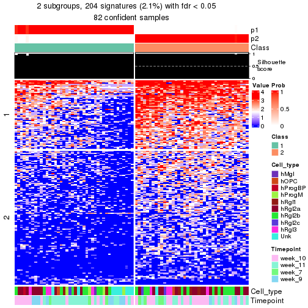</p>

</div>
<div id='tab-node-0133-get-signatures-no-scale-2'>
<pre><code class="r">get_signatures(res, k = 3, scale_rows = FALSE)
</code></pre>

<p></p>

</div>
<div id='tab-node-0133-get-signatures-no-scale-3'>
<pre><code class="r">get_signatures(res, k = 4, scale_rows = FALSE)
</code></pre>

<p></p>

</div>
</div>


Compare the overlap of signatures from different k:

```r
compare_signatures(res)
```


`get_signature()` returns a data frame invisibly. To get the list of signatures, the function
call should be assigned to a variable explicitly. In following code, if `plot` argument is set
to `FALSE`, no heatmap is plotted while only the differential analysis is performed.

```r
# code only for demonstration
tb = get_signature(res, k = ..., plot = FALSE)
```

An example of the output of `tb` is:

```
#>   which_row         fdr    mean_1    mean_2 scaled_mean_1 scaled_mean_2 km
#> 1        38 0.042760348  8.373488  9.131774    -0.5533452     0.5164555  1
#> 2        40 0.018707592  7.106213  8.469186    -0.6173731     0.5762149  1
#> 3        55 0.019134737 10.221463 11.207825    -0.6159697     0.5749050  1
#> 4        59 0.006059896  5.921854  7.869574    -0.6899429     0.6439467  1
#> 5        60 0.018055526  8.928898 10.211722    -0.6204761     0.5791110  1
#> 6        98 0.009384629 15.714769 14.887706     0.6635654    -0.6193277  2
...
```

The columns in `tb` are:

1. `which_row`: row indices corresponding to the input matrix.
2. `fdr`: FDR for the differential test. 
3. `mean_x`: The mean value in group x.
4. `scaled_mean_x`: The mean value in group x after rows are scaled.
5. `km`: Row groups if k-means clustering is applied to rows (which is done by automatically selecting number of clusters).

If there are too many signatures, `top_signatures = ...` can be set to only show the 
signatures with the highest FDRs:

```r
# code only for demonstration
# e.g. to show the top 500 most significant rows
tb = get_signature(res, k = ..., top_signatures = 500)
```

If the signatures are defined as these which are uniquely high in current group, `diff_method` argument
can be set to `"uniquely_high_in_one_group"`:

```r
# code only for demonstration
tb = get_signature(res, k = ..., diff_method = "uniquely_high_in_one_group")
```


UMAP plot which shows how samples are separated.


<script>
$( function() {
	$( '#tabs-node-0133-dimension-reduction' ).tabs();
} );
</script>
<div id='tabs-node-0133-dimension-reduction'>
<ul>
<li><a href='#tab-node-0133-dimension-reduction-1'>k = 2</a></li>
<li><a href='#tab-node-0133-dimension-reduction-2'>k = 3</a></li>
<li><a href='#tab-node-0133-dimension-reduction-3'>k = 4</a></li>
</ul>
<div id='tab-node-0133-dimension-reduction-1'>
<pre><code class="r">dimension_reduction(res, k = 2, method = &quot;UMAP&quot;)
</code></pre>

<p></p>

</div>
<div id='tab-node-0133-dimension-reduction-2'>
<pre><code class="r">dimension_reduction(res, k = 3, method = &quot;UMAP&quot;)
</code></pre>

<p></p>

</div>
<div id='tab-node-0133-dimension-reduction-3'>
<pre><code class="r">dimension_reduction(res, k = 4, method = &quot;UMAP&quot;)
</code></pre>

<p></p>

</div>
</div>


Following heatmap shows how subgroups are split when increasing `k`:

```r
collect_classes(res)
```


Test correlation between subgroups and known annotations. If the known
annotation is numeric, one-way ANOVA test is applied, and if the known
annotation is discrete, chi-squared contingency table test is applied.

```r
test_to_known_factors(res)
```

```
#>             n_sample Cell_type(p-value) Timepoint(p-value) k
#> ATC:skmeans       82            0.08494             0.1281 2
#> ATC:skmeans       78            0.02173             0.0248 3
#> ATC:skmeans       59            0.00348             0.0227 4
```


If matrix rows can be associated to genes, consider to use `functional_enrichment(res,
...)` to perform function enrichment for the signature genes. See [this vignette](https://jokergoo.github.io/cola_vignettes/functional_enrichment.html) for more detailed explanations.


 

---------------------------------------------------


### Node02


Parent node: [Node0](#Node0).
Child nodes: 
                [Node011](#Node011)
        ,
                [Node012](#Node012)
        ,
                [Node013](#Node013)
        ,
                [Node021](#Node021)
        ,
                [Node022](#Node022)
        ,
                [Node023](#Node023)
        ,
                [Node024](#Node024)
        .


The object with results only for a single top-value method and a single partitioning method 
can be extracted as:

```r
res = res_rh["02"]
```

A summary of `res` and all the functions that can be applied to it:

```r
res
```

```
#> A 'DownSamplingConsensusPartition' object with k = 2, 3, 4.
#>   On a matrix with 9908 rows and 500 columns, randomly sampled from 930 columns.
#>   Top rows (925) are extracted by 'ATC' method.
#>   Subgroups are detected by 'skmeans' method.
#>   Performed in total 150 partitions by row resampling.
#>   Best k for subgroups seems to be 4.
#> 
#> Following methods can be applied to this 'DownSamplingConsensusPartition' object:
#>  [1] "cola_report"             "collect_classes"         "collect_plots"          
#>  [4] "collect_stats"           "colnames"                "compare_partitions"     
#>  [7] "compare_signatures"      "consensus_heatmap"       "dimension_reduction"    
#> [10] "functional_enrichment"   "get_anno_col"            "get_anno"               
#> [13] "get_classes"             "get_consensus"           "get_matrix"             
#> [16] "get_membership"          "get_param"               "get_signatures"         
#> [19] "get_stats"               "is_best_k"               "is_stable_k"            
#> [22] "membership_heatmap"      "ncol"                    "nrow"                   
#> [25] "plot_ecdf"               "predict_classes"         "rownames"               
#> [28] "select_partition_number" "show"                    "suggest_best_k"         
#> [31] "test_to_known_factors"   "top_rows_heatmap"
```

`collect_plots()` function collects all the plots made from `res` for all `k` (number of subgroups)
into one single page to provide an easy and fast comparison between different `k`.

```r
collect_plots(res)
```

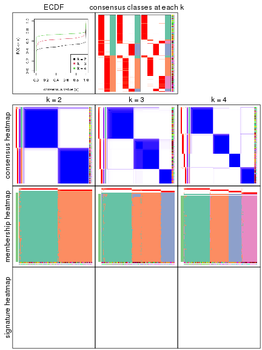

The plots are:

- The first row: a plot of the eCDF (empirical cumulative distribution
  function) curves of the consensus matrix for each `k` and the heatmap of
  predicted classes for each `k`.
- The second row: heatmaps of the consensus matrix for each `k`.
- The third row: heatmaps of the membership matrix for each `k`.
- The fouth row: heatmaps of the signatures for each `k`.

All the plots in panels can be made by individual functions and they are
plotted later in this section.

`select_partition_number()` produces several plots showing different
statistics for choosing "optimized" `k`. There are following statistics:

- eCDF curves of the consensus matrix for each `k`;
- 1-PAC. [The PAC score](https://en.wikipedia.org/wiki/Consensus_clustering#Over-interpretation_potential_of_consensus_clustering)
  measures the proportion of the ambiguous subgrouping.
- Mean silhouette score.
- Concordance. The mean probability of fiting the consensus subgroup labels in all
  partitions.
- Area increased. Denote $A_k$ as the area under the eCDF curve for current
  `k`, the area increased is defined as $A_k - A_{k-1}$.
- Rand index. The percent of pairs of samples that are both in a same cluster
  or both are not in a same cluster in the partition of k and k-1.
- Jaccard index. The ratio of pairs of samples are both in a same cluster in
  the partition of k and k-1 and the pairs of samples are both in a same
  cluster in the partition k or k-1.

The detailed explanations of these statistics can be found in [the _cola_
vignette](https://jokergoo.github.io/cola_vignettes/cola.html#toc_13).

Generally speaking, higher 1-PAC score, higher mean silhouette score or higher
concordance corresponds to better partition. Rand index and Jaccard index
measure how similar the current partition is compared to partition with `k-1`.
If they are too similar, we won't accept `k` is better than `k-1`.

```r
select_partition_number(res)
```


The numeric values for all these statistics can be obtained by `get_stats()`.

```r
get_stats(res)
```

```
#>   k 1-PAC mean_silhouette concordance area_increased  Rand Jaccard
#> 2 2 0.987           0.957       0.983          0.500 0.501   0.501
#> 3 3 0.975           0.948       0.976          0.278 0.775   0.586
#> 4 4 0.992           0.960       0.984          0.151 0.841   0.595
```

`suggest_best_k()` suggests the best $k$ based on these statistics. The rules are as follows:

- All $k$ with Jaccard index larger than 0.95 are removed because increasing
  $k$ does not provide enough extra information. If all $k$ are removed, it is
  marked as no subgroup is detected.
- For all $k$ with 1-PAC score larger than 0.9, the maximal $k$ is taken as
  the best $k$, and other $k$ are marked as optional $k$.
- If it does not fit the second rule. The $k$ with the maximal vote of the
  highest 1-PAC score, highest mean silhouette, and highest concordance is
  taken as the best $k$.

```r
suggest_best_k(res)
```

```
#> [1] 4
#> attr(,"optional")
#> [1] 2 3
```

There is also optional best $k$ = 2 3 that is worth to check.

Following is the table of the partitions (You need to click the **show/hide
code output** link to see it). The membership matrix (columns with name `p*`)
is inferred by
[`clue::cl_consensus()`](https://www.rdocumentation.org/link/cl_consensus?package=clue)
function with the `SE` method. Basically the value in the membership matrix
represents the probability to belong to a certain group. The finall subgroup
label for an item is determined with the group with highest probability it
belongs to.

In `get_classes()` function, the entropy is calculated from the membership
matrix and the silhouette score is calculated from the consensus matrix.


<script>
$( function() {
	$( '#tabs-node-02-get-classes' ).tabs();
} );
</script>
<div id='tabs-node-02-get-classes'>
<ul>
<li><a href='#tab-node-02-get-classes-1'>k = 2</a></li>
<li><a href='#tab-node-02-get-classes-2'>k = 3</a></li>
<li><a href='#tab-node-02-get-classes-3'>k = 4</a></li>
</ul>

<div id='tab-node-02-get-classes-1'>
<p><a id='tab-node-02-get-classes-1-a' style='color:#0366d6' href='#'>show/hide code output</a></p>
<pre><code class="r">get_classes(res, k = 2)
</code></pre>

<pre><code>#&gt;                 class     p
#&gt; 1772067_089_A04     1 0.000
#&gt; 1772067_089_A05     1 0.000
#&gt; 1772067_089_A09     2 0.000
#&gt; 1772067_089_A11     1 1.000
#&gt; 1772067_089_B05     1 0.000
#&gt; 1772067_089_C02     2 0.000
#&gt; 1772067_089_C06     1 0.000
#&gt; 1772067_089_C12     2 0.000
#&gt; 1772067_089_D06     1 0.000
#&gt; 1772067_089_D07     1 0.000
#&gt; 1772067_089_D10     2 0.000
#&gt; 1772067_089_E01     1 0.000
#&gt; 1772067_089_E06     2 0.000
#&gt; 1772067_089_G07     2 0.000
#&gt; 1772067_089_G08     1 0.000
#&gt; 1772067_089_H07     2 0.502
#&gt; 1772071_027_B04     1 0.000
#&gt; 1772071_027_C05     2 0.000
#&gt; 1772071_027_C09     1 0.000
#&gt; 1772071_027_C11     2 1.000
#&gt; 1772071_027_D02     1 1.000
#&gt; 1772071_027_D06     2 0.000
#&gt; 1772071_027_F01     1 1.000
#&gt; 1772071_027_F09     2 0.000
#&gt; 1772071_027_H02     2 0.000
#&gt; 1772071_027_H03     1 0.747
#&gt; 1772071_029_A02     1 0.751
#&gt; 1772071_029_A04     1 0.751
#&gt; 1772071_029_C07     2 0.000
#&gt; 1772071_029_D03     1 0.502
#&gt; 1772071_029_F03     1 0.249
#&gt; 1772071_029_G07     1 0.502
#&gt; 1772078_078_C01     2 0.000
#&gt; 1772078_078_C12     1 0.000
#&gt; 1772078_078_F02     2 0.000
#&gt; 1772078_078_F07     2 0.249
#&gt; 1772078_109_C10     1 0.000
#&gt; 1772075_299_A05     2 0.502
#&gt; 1772075_299_B09     2 0.000
#&gt; 1772075_299_C03     1 0.000
#&gt; 1772075_299_C10     2 0.000
#&gt; 1772075_299_D01     2 0.000
#&gt; 1772075_299_D04     2 0.751
#&gt; 1772075_299_E06     1 0.000
#&gt; 1772075_299_F11     2 0.000
#&gt; 1772075_299_G05     2 0.000
#&gt; 1772075_299_G11     1 0.000
#&gt; 1772075_298_E03     2 0.249
#&gt; 1772075_298_E04     2 0.000
#&gt; 1772075_298_F04     2 0.000
#&gt; 1772078_001_A04     2 0.000
#&gt; 1772078_001_A05     2 0.000
#&gt; 1772078_001_A07     2 0.751
#&gt; 1772078_001_A09     2 1.000
#&gt; 1772078_001_B03     2 0.000
#&gt; 1772078_001_B09     1 0.000
#&gt; 1772078_001_C04     1 0.000
#&gt; 1772078_001_D05     1 0.000
#&gt; 1772078_001_D06     2 0.253
#&gt; 1772078_002_A05     2 0.000
#&gt; 1772078_002_A06     2 0.000
#&gt; 1772078_002_A09     1 0.000
#&gt; 1772078_002_A10     2 0.000
#&gt; 1772078_002_B02     2 0.000
#&gt; 1772078_002_B03     1 0.000
#&gt; 1772078_002_B05     2 0.000
#&gt; 1772078_002_C09     1 0.498
#&gt; 1772078_002_D08     2 0.000
#&gt; 1772078_002_E04     2 0.000
#&gt; 1772078_002_E05     2 0.000
#&gt; 1772078_002_E07     2 0.000
#&gt; 1772078_002_E12     2 0.249
#&gt; 1772078_002_F09     2 0.000
#&gt; 1772078_002_G02     2 0.000
#&gt; 1772078_002_G03     2 0.000
#&gt; 1772078_002_G07     2 0.000
#&gt; 1772078_002_G09     2 0.000
#&gt; 1772078_002_H03     2 0.000
#&gt; 1772078_002_H10     1 0.000
#&gt; 1772096_160_A03     1 0.498
#&gt; 1772096_160_A09     1 0.000
#&gt; 1772096_160_B04     1 0.000
#&gt; 1772096_160_B11     1 0.747
#&gt; 1772096_160_C04     1 0.000
#&gt; 1772096_160_C06     1 0.000
#&gt; 1772096_160_D02     1 0.000
#&gt; 1772096_160_D12     1 0.000
#&gt; 1772096_160_E01     1 0.000
#&gt; 1772096_160_E02     1 0.747
#&gt; 1772096_160_E04     2 0.000
#&gt; 1772096_160_F01     2 0.000
#&gt; 1772096_160_F08     2 0.000
#&gt; 1772096_160_G02     1 0.000
#&gt; 1772096_160_H07     2 0.000
#&gt; 1772096_095_A10     1 0.000
#&gt; 1772096_095_B01     1 0.000
#&gt; 1772096_095_C04     1 0.747
#&gt; 1772096_095_D06     1 0.000
#&gt; 1772096_095_D07     1 0.000
#&gt; 1772096_095_D11     2 0.000
#&gt; 1772096_095_E01     1 0.000
#&gt; 1772096_095_E02     1 0.000
#&gt; 1772096_095_E06     2 0.000
#&gt; 1772096_095_H07     1 0.000
#&gt; 1772122_236_A03     2 0.000
#&gt; 1772122_236_A04     2 1.000
#&gt; 1772122_236_A06     1 0.000
#&gt; 1772122_236_A07     2 1.000
#&gt; 1772122_236_A08     1 0.253
#&gt; 1772122_236_A09     1 0.498
#&gt; 1772122_236_A10     1 0.253
#&gt; 1772122_236_A12     2 0.249
#&gt; 1772122_236_B03     2 0.502
#&gt; 1772122_236_B04     2 0.747
#&gt; 1772122_236_B05     1 0.000
#&gt; 1772122_236_B06     1 0.000
#&gt; 1772122_236_B07     2 0.253
#&gt; 1772122_236_B08     2 0.253
#&gt; 1772122_236_B09     2 1.000
#&gt; 1772122_236_B11     2 0.000
#&gt; 1772122_236_B12     1 0.000
#&gt; 1772122_236_C04     2 0.000
#&gt; 1772122_236_C05     2 0.249
#&gt; 1772122_236_C06     1 0.000
#&gt; 1772122_236_C09     2 0.249
#&gt; 1772122_236_C10     1 0.000
#&gt; 1772122_236_C11     2 0.249
#&gt; 1772122_236_C12     1 0.000
#&gt; 1772122_236_D02     2 1.000
#&gt; 1772122_236_D05     1 0.249
#&gt; 1772122_236_D06     1 0.000
#&gt; 1772122_236_D07     2 0.502
#&gt; 1772122_236_D08     1 0.000
#&gt; 1772122_236_D09     1 0.000
#&gt; 1772122_236_E02     2 0.751
#&gt; 1772122_236_E03     1 0.000
#&gt; 1772122_236_E04     2 0.000
#&gt; 1772122_236_E05     2 0.249
#&gt; 1772122_236_E10     1 0.000
#&gt; 1772122_236_E12     1 0.000
#&gt; 1772122_236_F02     2 0.000
#&gt; 1772122_236_F04     2 0.000
#&gt; 1772122_236_F05     1 0.000
#&gt; 1772122_236_F06     2 0.000
#&gt; 1772122_236_F07     2 0.751
#&gt; 1772122_236_F10     2 0.249
#&gt; 1772122_236_G02     2 0.000
#&gt; 1772122_236_G03     1 0.000
#&gt; 1772122_236_G04     1 0.000
#&gt; 1772122_236_G06     1 0.000
#&gt; 1772122_236_G11     1 0.000
#&gt; 1772122_236_G12     2 0.000
#&gt; 1772122_236_H04     1 0.000
#&gt; 1772122_236_H08     1 0.000
#&gt; 1772122_236_H11     2 0.249
#&gt; 1772121_288_A01     2 0.000
#&gt; 1772121_288_A03     2 0.253
#&gt; 1772121_288_A05     2 0.249
#&gt; 1772121_288_A06     2 0.000
#&gt; 1772121_288_A07     1 0.000
#&gt; 1772121_288_A08     2 0.502
#&gt; 1772121_288_A11     2 0.253
#&gt; 1772121_288_A12     2 0.000
#&gt; 1772121_288_B01     1 0.249
#&gt; 1772121_288_B04     2 0.000
#&gt; 1772121_288_B07     2 0.253
#&gt; 1772121_288_B08     2 0.000
#&gt; 1772121_288_B09     2 0.249
#&gt; 1772121_288_B11     2 0.000
#&gt; 1772121_288_B12     2 0.000
#&gt; 1772121_288_C01     2 0.000
#&gt; 1772121_288_C02     2 0.751
#&gt; 1772121_288_C03     1 0.000
#&gt; 1772121_288_C07     2 0.751
#&gt; 1772121_288_C08     2 0.000
#&gt; 1772121_288_C09     2 0.253
#&gt; 1772121_288_C10     2 0.000
#&gt; 1772121_288_D01     2 0.000
#&gt; 1772121_288_D02     2 0.253
#&gt; 1772121_288_D04     1 0.000
#&gt; 1772121_288_D07     1 0.000
#&gt; 1772121_288_D09     2 1.000
#&gt; 1772121_288_D11     1 0.000
#&gt; 1772121_288_D12     1 0.000
#&gt; 1772121_288_E02     2 0.000
#&gt; 1772121_288_E06     1 0.000
#&gt; 1772121_288_E07     2 1.000
#&gt; 1772121_288_E09     2 0.000
#&gt; 1772121_288_E10     2 0.000
#&gt; 1772121_288_F01     2 0.751
#&gt; 1772121_288_F04     2 0.000
#&gt; 1772121_288_F07     2 0.249
#&gt; 1772121_288_F12     1 0.000
#&gt; 1772121_288_G01     2 0.000
#&gt; 1772121_288_G05     1 0.000
#&gt; 1772121_288_G12     2 0.000
#&gt; 1772121_288_H02     2 0.000
#&gt; 1772121_288_H03     1 0.498
#&gt; 1772121_288_H08     1 0.249
#&gt; 1772121_291_A03     1 0.000
#&gt; 1772121_291_A04     2 0.000
#&gt; 1772121_291_A05     1 0.000
#&gt; 1772121_291_A07     2 0.249
#&gt; 1772121_291_A09     1 0.000
#&gt; 1772121_291_A11     2 0.000
#&gt; 1772121_291_B02     1 0.000
#&gt; 1772121_291_B07     2 0.000
#&gt; 1772121_291_B09     2 0.000
#&gt; 1772121_291_B12     2 0.000
#&gt; 1772121_291_C01     1 0.000
#&gt; 1772121_291_C05     2 1.000
#&gt; 1772121_291_C07     1 0.000
#&gt; 1772121_291_C11     1 0.000
#&gt; 1772121_291_C12     2 0.000
#&gt; 1772121_291_D02     2 0.000
#&gt; 1772121_291_D03     2 0.000
#&gt; 1772121_291_D04     2 0.249
#&gt; 1772121_291_D05     2 0.000
#&gt; 1772121_291_D07     2 1.000
#&gt; 1772121_291_D10     2 0.000
#&gt; 1772121_291_D11     2 0.249
#&gt; 1772121_291_D12     1 0.498
#&gt; 1772121_291_E03     2 0.000
#&gt; 1772121_291_E04     2 0.000
#&gt; 1772121_291_E05     2 0.000
#&gt; 1772121_291_E06     2 0.000
#&gt; 1772121_291_E07     2 0.000
#&gt; 1772121_291_E08     2 0.000
#&gt; 1772121_291_E10     1 0.000
#&gt; 1772121_291_E12     1 0.000
#&gt; 1772121_291_F04     1 0.502
#&gt; 1772121_291_F06     2 0.000
#&gt; 1772121_291_F10     1 1.000
#&gt; 1772121_291_F11     2 0.000
#&gt; 1772121_291_F12     2 0.000
#&gt; 1772121_291_G02     1 0.000
#&gt; 1772121_291_G05     1 1.000
#&gt; 1772121_291_G06     1 0.000
#&gt; 1772121_291_G07     1 0.000
#&gt; 1772121_291_G10     1 0.249
#&gt; 1772121_291_G11     1 0.751
#&gt; 1772121_291_G12     2 0.000
#&gt; 1772121_291_H01     1 0.751
#&gt; 1772121_291_H04     2 0.249
#&gt; 1772121_291_H05     2 0.000
#&gt; 1772121_291_H06     2 0.000
#&gt; 1772121_291_H11     1 1.000
#&gt; 1772121_293_A05     2 0.249
#&gt; 1772121_293_A07     2 0.000
#&gt; 1772121_293_A09     1 0.000
#&gt; 1772121_293_A11     2 0.000
#&gt; 1772121_293_B01     2 0.000
#&gt; 1772121_293_B04     2 0.253
#&gt; 1772121_293_B07     1 0.000
#&gt; 1772121_293_B09     2 0.000
#&gt; 1772121_293_C01     2 0.000
#&gt; 1772121_293_C02     1 0.000
#&gt; 1772121_293_C07     2 0.000
#&gt; 1772121_293_D01     2 0.000
#&gt; 1772121_293_D03     1 1.000
#&gt; 1772121_293_D04     1 0.747
#&gt; 1772121_293_D06     1 0.502
#&gt; 1772121_293_D08     1 0.249
#&gt; 1772121_293_E09     1 1.000
#&gt; 1772121_293_E11     2 0.751
#&gt; 1772121_293_F03     2 0.502
#&gt; 1772121_293_G08     2 0.253
#&gt; 1772121_283_A01     1 0.000
#&gt; 1772121_283_A02     2 0.000
#&gt; 1772121_283_A03     1 0.000
#&gt; 1772121_283_A06     2 0.000
#&gt; 1772121_283_A08     2 0.502
#&gt; 1772121_283_A09     2 0.000
#&gt; 1772121_283_A10     2 0.249
#&gt; 1772121_283_B02     2 0.000
#&gt; 1772121_283_B06     2 0.000
#&gt; 1772121_283_B11     2 0.000
#&gt; 1772121_283_B12     1 0.000
#&gt; 1772121_283_C01     1 0.000
#&gt; 1772121_283_C03     2 0.253
#&gt; 1772121_283_C04     2 0.000
#&gt; 1772121_283_C07     2 0.000
#&gt; 1772121_283_C09     2 0.000
#&gt; 1772121_283_D01     2 0.000
#&gt; 1772121_283_D02     2 0.000
#&gt; 1772121_283_D05     2 0.000
#&gt; 1772121_283_D09     2 0.000
#&gt; 1772121_283_D11     1 0.498
#&gt; 1772121_283_D12     2 0.000
#&gt; 1772121_283_E01     2 0.000
#&gt; 1772121_283_E02     1 0.000
#&gt; 1772121_283_E05     1 1.000
#&gt; 1772121_283_E09     2 0.000
#&gt; 1772121_283_E10     1 0.751
#&gt; 1772121_283_E12     2 0.000
#&gt; 1772121_283_F02     1 0.747
#&gt; 1772121_283_F03     1 0.498
#&gt; 1772121_283_F05     1 0.000
#&gt; 1772121_283_F06     2 0.000
#&gt; 1772121_283_F07     1 0.000
#&gt; 1772121_283_F08     1 0.000
#&gt; 1772121_283_F09     1 0.498
#&gt; 1772121_283_F11     2 0.000
#&gt; 1772121_283_G02     2 0.000
#&gt; 1772121_283_G03     2 0.000
#&gt; 1772121_283_G04     2 0.000
#&gt; 1772121_283_G05     1 0.502
#&gt; 1772121_283_G06     2 0.000
#&gt; 1772121_283_G11     2 0.000
#&gt; 1772121_283_H02     2 0.253
#&gt; 1772121_283_H04     1 1.000
#&gt; 1772121_283_H07     2 0.502
#&gt; 1772121_283_H10     2 0.000
#&gt; 1772121_283_H12     1 0.000
#&gt; 1772121_282_A01     2 0.000
#&gt; 1772121_282_A02     2 0.000
#&gt; 1772121_282_A03     2 0.000
#&gt; 1772121_282_A05     2 0.000
#&gt; 1772121_282_A07     2 0.000
#&gt; 1772121_282_A09     2 0.000
#&gt; 1772121_282_A11     2 0.000
#&gt; 1772121_282_B06     2 0.000
#&gt; 1772121_282_B07     2 0.000
#&gt; 1772121_282_B09     2 0.253
#&gt; 1772121_282_B11     2 0.000
#&gt; 1772121_282_C03     2 0.000
#&gt; 1772121_282_C04     2 0.502
#&gt; 1772121_282_C07     2 0.000
#&gt; 1772121_282_C12     2 0.000
#&gt; 1772121_282_D04     2 0.000
#&gt; 1772121_282_D08     2 0.000
#&gt; 1772121_282_E02     2 0.253
#&gt; 1772121_282_E05     2 0.000
#&gt; 1772121_282_E07     2 0.000
#&gt; 1772121_282_E09     2 0.000
#&gt; 1772121_282_E11     2 0.000
#&gt; 1772121_282_F01     2 0.253
#&gt; 1772121_282_F02     2 0.000
#&gt; 1772121_282_F03     2 0.000
#&gt; 1772121_282_F08     2 0.000
#&gt; 1772121_282_F09     2 0.000
#&gt; 1772121_282_G01     2 0.000
#&gt; 1772121_282_G03     2 0.000
#&gt; 1772121_282_G07     2 0.000
#&gt; 1772121_282_G08     2 0.249
#&gt; 1772121_282_G11     2 0.000
#&gt; 1772121_282_H09     2 0.498
#&gt; 1772122_264_A01     1 0.751
#&gt; 1772122_264_A02     1 0.000
#&gt; 1772122_264_A03     1 0.253
#&gt; 1772122_264_A04     2 0.000
#&gt; 1772122_264_A07     1 0.000
#&gt; 1772122_264_A08     1 0.249
#&gt; 1772122_264_B01     1 0.751
#&gt; 1772122_264_B02     2 0.000
#&gt; 1772122_264_B04     2 0.000
#&gt; 1772122_264_B08     1 1.000
#&gt; 1772122_264_B09     2 0.751
#&gt; 1772122_264_C01     1 0.000
#&gt; 1772122_264_C02     2 0.000
#&gt; 1772122_264_C04     2 1.000
#&gt; 1772122_264_C08     1 0.000
#&gt; 1772122_264_C09     2 0.000
#&gt; 1772122_264_C10     1 1.000
#&gt; 1772122_264_C11     1 0.000
#&gt; 1772122_264_D01     1 0.249
#&gt; 1772122_264_D02     1 0.000
#&gt; 1772122_264_D04     1 0.000
#&gt; 1772122_264_D05     1 0.000
#&gt; 1772122_264_D09     1 0.000
#&gt; 1772122_264_E01     2 0.249
#&gt; 1772122_264_E03     1 0.000
#&gt; 1772122_264_E08     1 1.000
#&gt; 1772122_264_E10     2 0.000
#&gt; 1772122_264_F01     2 0.253
#&gt; 1772122_264_F05     1 0.000
#&gt; 1772122_264_F06     2 0.000
#&gt; 1772122_264_F07     2 0.498
#&gt; 1772122_264_G02     1 0.000
#&gt; 1772122_264_G03     2 1.000
#&gt; 1772122_264_G04     2 0.751
#&gt; 1772122_264_G08     1 0.253
#&gt; 1772122_264_G09     2 0.249
#&gt; 1772122_264_G11     1 0.000
#&gt; 1772122_264_H02     1 0.502
#&gt; 1772122_264_H04     1 0.000
#&gt; 1772122_264_H07     1 0.000
#&gt; 1772122_264_H10     2 0.000
#&gt; 1772122_208_A01     1 0.751
#&gt; 1772122_208_A02     2 0.000
#&gt; 1772122_208_A05     1 0.000
#&gt; 1772122_208_A06     2 0.751
#&gt; 1772122_208_A09     2 0.249
#&gt; 1772122_208_A11     2 0.249
#&gt; 1772122_208_B04     2 0.000
#&gt; 1772122_208_B05     1 0.249
#&gt; 1772122_208_B08     2 0.000
#&gt; 1772122_208_B09     2 0.000
#&gt; 1772122_208_B10     1 0.751
#&gt; 1772122_208_B12     1 0.751
#&gt; 1772122_208_C03     1 0.000
#&gt; 1772122_208_C04     2 0.000
#&gt; 1772122_208_C06     2 0.751
#&gt; 1772122_208_C09     2 0.249
#&gt; 1772122_208_C11     2 0.751
#&gt; 1772122_208_C12     1 0.502
#&gt; 1772122_208_D03     1 0.000
#&gt; 1772122_208_D04     2 0.249
#&gt; 1772122_208_D05     2 0.000
#&gt; 1772122_208_D08     1 0.000
#&gt; 1772122_208_E04     2 0.000
#&gt; 1772122_208_E09     2 0.502
#&gt; 1772122_208_F02     1 0.000
#&gt; 1772122_208_F04     2 0.000
#&gt; 1772122_208_F06     2 0.000
#&gt; 1772122_208_F07     2 0.000
#&gt; 1772122_208_F10     1 0.747
#&gt; 1772122_208_G03     1 0.253
#&gt; 1772122_208_G05     1 1.000
#&gt; 1772122_208_G09     2 0.000
#&gt; 1772122_208_G10     1 0.502
#&gt; 1772122_208_G11     2 0.000
#&gt; 1772122_208_H02     2 0.000
#&gt; 1772122_208_H05     1 0.000
#&gt; 1772122_208_H09     2 0.000
#&gt; 1772122_208_H10     1 0.000
#&gt; 1772122_208_H12     2 0.498
#&gt; 1772122_201_A01     1 0.000
#&gt; 1772122_201_A03     1 0.000
#&gt; 1772122_201_A05     1 0.000
#&gt; 1772122_201_A07     2 0.000
#&gt; 1772122_201_A11     2 0.249
#&gt; 1772122_201_B03     2 0.249
#&gt; 1772122_201_B04     2 0.502
#&gt; 1772122_201_B06     1 0.000
#&gt; 1772122_201_B07     2 0.253
#&gt; 1772122_201_B10     1 0.000
#&gt; 1772122_201_B12     1 0.000
#&gt; 1772122_201_C01     2 0.502
#&gt; 1772122_201_C02     1 0.000
#&gt; 1772122_201_C03     1 0.502
#&gt; 1772122_201_C04     2 0.751
#&gt; 1772122_201_C05     2 0.498
#&gt; 1772122_201_C06     1 0.000
#&gt; 1772122_201_C08     1 0.000
#&gt; 1772122_201_C09     2 0.498
#&gt; 1772122_201_D04     2 0.000
#&gt; 1772122_201_D07     2 0.751
#&gt; 1772122_201_D09     2 1.000
#&gt; 1772122_201_E02     1 0.000
#&gt; 1772122_201_E03     1 0.000
#&gt; 1772122_201_E04     1 0.000
#&gt; 1772122_201_E11     2 0.249
#&gt; 1772122_201_E12     1 0.000
#&gt; 1772122_201_F01     1 0.000
#&gt; 1772122_201_F06     2 0.000
#&gt; 1772122_201_F07     1 0.000
#&gt; 1772122_201_F08     2 0.253
#&gt; 1772122_201_F09     1 0.000
#&gt; 1772122_201_F10     2 0.253
#&gt; 1772122_201_F11     2 1.000
#&gt; 1772122_201_F12     1 0.000
#&gt; 1772122_201_G04     1 0.000
#&gt; 1772122_201_G06     1 0.249
#&gt; 1772122_201_G09     2 0.502
#&gt; 1772122_201_G11     1 0.000
#&gt; 1772122_201_H02     2 0.000
#&gt; 1772122_201_H04     2 0.249
#&gt; 1772122_201_H05     1 0.751
#&gt; 1772122_201_H06     2 0.000
#&gt; 1772122_201_H07     1 0.000
#&gt; 1772122_201_H10     1 0.000
#&gt; 1772122_207_A02     2 0.498
#&gt; 1772122_207_A05     1 0.000
#&gt; 1772122_207_A06     1 0.000
#&gt; 1772122_207_A09     1 0.000
#&gt; 1772122_207_A10     1 0.249
#&gt; 1772122_207_A12     2 0.000
#&gt; 1772122_207_B04     2 0.000
#&gt; 1772122_207_B10     2 0.498
#&gt; 1772122_207_B11     2 0.000
#&gt; 1772122_207_C03     2 0.747
#&gt; 1772122_207_C04     2 0.000
#&gt; 1772122_207_C05     1 0.000
#&gt; 1772122_207_C06     2 0.502
#&gt; 1772122_207_C11     2 0.249
#&gt; 1772122_207_D02     1 0.498
#&gt; 1772122_207_D07     1 0.000
#&gt; 1772122_207_D09     1 0.000
#&gt; 1772122_207_E03     1 0.502
#&gt; 1772122_207_E04     2 0.751
#&gt; 1772122_207_E05     1 0.249
#&gt; 1772122_207_E09     1 0.000
#&gt; 1772122_207_E12     1 0.000
#&gt; 1772122_207_F04     2 0.253
#&gt; 1772122_207_F07     2 0.000
#&gt; 1772122_207_F11     1 1.000
#&gt; 1772122_207_F12     1 0.000
#&gt; 1772122_207_G01     2 0.000
#&gt; 1772122_207_G04     2 0.000
#&gt; 1772122_207_G05     1 0.000
#&gt; 1772122_207_G09     2 0.498
#&gt; 1772122_207_G11     2 0.000
#&gt; 1772122_207_H09     1 0.498
#&gt; 1772122_199_A04     2 0.253
#&gt; 1772122_199_A09     1 0.000
#&gt; 1772122_199_A12     1 0.498
#&gt; 1772122_199_C01     1 0.000
#&gt; 1772122_199_C11     1 0.000
#&gt; 1772122_199_D01     1 0.000
#&gt; 1772122_199_D08     1 0.000
#&gt; 1772122_199_E03     1 0.000
#&gt; 1772122_199_F01     1 0.000
#&gt; 1772122_199_F04     1 0.000
#&gt; 1772122_199_F06     1 0.000
#&gt; 1772122_199_H03     1 0.253
#&gt; 1772122_199_H07     2 0.000
#&gt; 1772122_199_H08     1 0.249
#&gt; 1772122_203_A08     2 0.498
#&gt; 1772122_203_B03     2 1.000
#&gt; 1772122_203_B07     1 0.000
#&gt; 1772122_203_B09     1 0.502
#&gt; 1772122_203_C11     1 0.000
#&gt; 1772122_203_D02     2 0.751
#&gt; 1772122_203_D03     2 0.000
#&gt; 1772122_203_D09     2 0.000
#&gt; 1772122_203_E03     2 0.249
#&gt; 1772122_203_E04     2 0.751
#&gt; 1772122_203_E06     1 0.000
#&gt; 1772122_203_E08     2 0.249
#&gt; 1772122_203_E09     2 0.249
#&gt; 1772122_203_F07     1 0.000
#&gt; 1772122_203_F09     1 0.000
#&gt; 1772122_203_G01     2 0.502
#&gt; 1772122_203_G10     1 0.000
#&gt; 1772122_203_H08     2 0.498
#&gt; 1772122_200_B02     2 0.000
#&gt; 1772122_200_B07     2 1.000
#&gt; 1772122_200_C05     1 0.000
#&gt; 1772122_200_D01     1 0.000
#&gt; 1772122_200_D06     1 0.000
#&gt; 1772122_200_D09     1 0.000
#&gt; 1772122_200_E03     2 0.502
#&gt; 1772122_200_E06     2 0.249
#&gt; 1772122_200_E07     2 0.751
#&gt; 1772122_200_E09     2 0.000
#&gt; 1772122_200_F06     1 0.000
#&gt; 1772122_200_G09     2 0.249
#&gt; 1772122_200_H02     1 0.000
#&gt; 1772122_316_A01     2 0.000
#&gt; 1772122_316_A06     1 0.000
#&gt; 1772122_316_A08     1 0.000
#&gt; 1772122_316_A10     1 0.000
#&gt; 1772122_316_A12     1 0.000
#&gt; 1772122_316_B02     1 0.000
#&gt; 1772122_316_B04     1 0.000
#&gt; 1772122_316_B06     2 0.751
#&gt; 1772122_316_B10     1 0.000
#&gt; 1772122_316_B11     1 0.000
#&gt; 1772122_316_C01     1 0.000
#&gt; 1772122_316_C02     1 0.000
#&gt; 1772122_316_C03     1 0.000
#&gt; 1772122_316_C04     2 0.000
#&gt; 1772122_316_C06     1 0.751
#&gt; 1772122_316_C08     1 0.000
#&gt; 1772122_316_C11     1 0.000
#&gt; 1772122_316_D04     1 0.000
#&gt; 1772122_316_D05     2 0.000
#&gt; 1772122_316_D06     1 0.000
#&gt; 1772122_316_D07     1 0.000
#&gt; 1772122_316_D09     2 0.000
#&gt; 1772122_316_D11     1 0.000
#&gt; 1772122_316_D12     1 0.000
#&gt; 1772122_316_E03     1 0.000
#&gt; 1772122_316_E05     1 0.000
#&gt; 1772122_316_E06     1 0.000
#&gt; 1772122_316_E07     1 0.000
#&gt; 1772122_316_E10     1 0.000
#&gt; 1772122_316_E11     2 0.751
#&gt; 1772122_316_E12     1 0.502
#&gt; 1772122_316_F01     1 1.000
#&gt; 1772122_316_F02     1 0.000
#&gt; 1772122_316_F04     1 0.000
#&gt; 1772122_316_F07     1 0.253
#&gt; 1772122_316_F09     1 0.249
#&gt; 1772122_316_F10     1 0.000
#&gt; 1772122_316_F11     1 1.000
#&gt; 1772122_316_F12     1 1.000
#&gt; 1772122_316_G04     2 0.498
#&gt; 1772122_316_G05     1 0.000
#&gt; 1772122_316_G06     2 0.000
#&gt; 1772122_316_G07     1 0.000
#&gt; 1772122_316_G08     1 0.000
#&gt; 1772122_316_G09     2 0.000
#&gt; 1772122_316_G10     1 1.000
#&gt; 1772122_316_G11     1 1.000
#&gt; 1772122_316_G12     2 0.502
#&gt; 1772122_316_H01     1 0.253
#&gt; 1772122_316_H04     2 0.000
#&gt; 1772122_316_H05     1 0.751
#&gt; 1772122_316_H06     1 0.502
#&gt; 1772122_316_H09     1 0.000
#&gt; 1772122_316_H10     2 0.000
#&gt; 1772122_316_H11     2 0.000
#&gt; 1772122_316_H12     1 0.000
#&gt; 1772122_317_A02     1 0.000
#&gt; 1772122_317_A04     1 0.000
#&gt; 1772122_317_A05     1 0.000
#&gt; 1772122_317_A06     2 0.000
#&gt; 1772122_317_A09     1 0.000
#&gt; 1772122_317_A11     2 0.751
#&gt; 1772122_317_A12     1 0.000
#&gt; 1772122_317_B01     1 0.000
#&gt; 1772122_317_B02     1 0.000
#&gt; 1772122_317_B05     1 0.000
#&gt; 1772122_317_B06     2 0.000
#&gt; 1772122_317_B07     2 0.000
#&gt; 1772122_317_B10     1 0.000
#&gt; 1772122_317_B11     1 0.000
#&gt; 1772122_317_B12     1 0.000
#&gt; 1772122_317_C02     2 0.502
#&gt; 1772122_317_C04     1 0.000
#&gt; 1772122_317_C07     2 1.000
#&gt; 1772122_317_C08     1 0.000
#&gt; 1772122_317_C09     1 0.000
#&gt; 1772122_317_D01     1 0.000
#&gt; 1772122_317_D04     1 0.000
#&gt; 1772122_317_D05     1 0.000
#&gt; 1772122_317_D07     1 0.000
#&gt; 1772122_317_D08     1 0.000
#&gt; 1772122_317_D11     2 0.000
#&gt; 1772122_317_D12     2 0.000
#&gt; 1772122_317_E01     1 0.498
#&gt; 1772122_317_E02     1 0.000
#&gt; 1772122_317_E04     2 0.000
#&gt; 1772122_317_E05     1 0.000
#&gt; 1772122_317_E10     1 0.000
#&gt; 1772122_317_E11     1 0.502
#&gt; 1772122_317_F02     1 0.000
#&gt; 1772122_317_F04     1 0.000
#&gt; 1772122_317_F06     1 0.249
#&gt; 1772122_317_F07     2 0.253
#&gt; 1772122_317_F09     1 0.000
#&gt; 1772122_317_G02     1 0.000
#&gt; 1772122_317_G04     1 0.253
#&gt; 1772122_317_G09     1 0.000
#&gt; 1772122_317_G12     1 0.000
#&gt; 1772122_317_H02     1 0.253
#&gt; 1772122_317_H03     1 0.000
#&gt; 1772122_317_H06     1 1.000
#&gt; 1772122_317_H07     1 0.000
#&gt; 1772122_317_H08     2 0.000
#&gt; 1772122_317_H09     1 1.000
#&gt; 1772122_317_H10     1 0.000
#&gt; 1772122_317_H11     1 0.498
#&gt; 1772122_317_H12     1 0.000
#&gt; 1772122_318_A05     1 0.000
#&gt; 1772122_318_A06     1 0.249
#&gt; 1772122_318_A07     1 0.000
#&gt; 1772122_318_A08     1 0.253
#&gt; 1772122_318_A11     1 0.000
#&gt; 1772122_318_B01     1 0.249
#&gt; 1772122_318_B03     1 0.000
#&gt; 1772122_318_B04     1 0.000
#&gt; 1772122_318_B07     1 0.502
#&gt; 1772122_318_B08     1 0.000
#&gt; 1772122_318_B09     2 1.000
#&gt; 1772122_318_B11     2 0.751
#&gt; 1772122_318_C02     1 0.000
#&gt; 1772122_318_C03     1 0.000
#&gt; 1772122_318_C04     1 0.000
#&gt; 1772122_318_C06     1 0.000
#&gt; 1772122_318_D01     1 0.000
#&gt; 1772122_318_D03     1 0.000
#&gt; 1772122_318_D05     1 1.000
#&gt; 1772122_318_D09     1 0.000
#&gt; 1772122_318_D10     1 0.502
#&gt; 1772122_318_D11     2 0.000
#&gt; 1772122_318_D12     1 1.000
#&gt; 1772122_318_E06     1 0.000
#&gt; 1772122_318_E07     1 0.000
#&gt; 1772122_318_E08     2 0.000
#&gt; 1772122_318_E09     2 0.000
#&gt; 1772122_318_F02     1 0.000
#&gt; 1772122_318_F03     1 0.000
#&gt; 1772122_318_F04     2 0.000
#&gt; 1772122_318_F05     1 0.000
#&gt; 1772122_318_F06     1 0.000
#&gt; 1772122_318_F08     1 0.000
#&gt; 1772122_318_F09     2 0.000
#&gt; 1772122_318_F11     1 0.000
#&gt; 1772122_318_F12     1 0.000
#&gt; 1772122_318_G03     1 0.000
#&gt; 1772122_318_G04     1 0.000
#&gt; 1772122_318_G05     1 0.000
#&gt; 1772122_318_G06     1 0.000
#&gt; 1772122_318_G07     2 1.000
#&gt; 1772122_318_G08     1 0.000
#&gt; 1772122_318_G10     1 0.249
#&gt; 1772122_318_G12     1 1.000
#&gt; 1772122_318_H02     1 0.000
#&gt; 1772122_318_H04     1 0.249
#&gt; 1772122_318_H06     1 0.000
#&gt; 1772122_318_H09     2 0.249
#&gt; 1772122_318_H11     1 0.000
#&gt; 1772122_318_H12     1 0.253
#&gt; 1772122_319_A03     2 0.249
#&gt; 1772122_319_A05     1 0.000
#&gt; 1772122_319_A06     2 0.751
#&gt; 1772122_319_A07     1 0.000
#&gt; 1772122_319_A09     1 1.000
#&gt; 1772122_319_A10     1 0.000
#&gt; 1772122_319_A11     1 0.249
#&gt; 1772122_319_A12     1 1.000
#&gt; 1772122_319_B02     1 0.000
#&gt; 1772122_319_B04     1 0.000
#&gt; 1772122_319_B05     1 0.000
#&gt; 1772122_319_B06     1 0.000
#&gt; 1772122_319_B09     1 0.000
#&gt; 1772122_319_B10     1 1.000
#&gt; 1772122_319_C01     1 0.249
#&gt; 1772122_319_C02     1 0.000
#&gt; 1772122_319_C03     1 0.000
#&gt; 1772122_319_C04     2 0.000
#&gt; 1772122_319_C05     1 0.000
#&gt; 1772122_319_C06     1 0.747
#&gt; 1772122_319_C10     1 1.000
#&gt; 1772122_319_C11     1 0.000
#&gt; 1772122_319_C12     1 0.000
#&gt; 1772122_319_D01     1 0.000
#&gt; 1772122_319_D02     1 1.000
#&gt; 1772122_319_D04     1 1.000
#&gt; 1772122_319_D06     2 0.000
#&gt; 1772122_319_D07     1 0.000
#&gt; 1772122_319_D09     1 0.000
#&gt; 1772122_319_D11     2 0.000
#&gt; 1772122_319_D12     1 0.000
#&gt; 1772122_319_E01     1 0.000
#&gt; 1772122_319_E03     1 0.249
#&gt; 1772122_319_E04     2 0.249
#&gt; 1772122_319_E06     1 0.253
#&gt; 1772122_319_E08     1 0.000
#&gt; 1772122_319_E10     1 0.253
#&gt; 1772122_319_E11     2 0.000
#&gt; 1772122_319_E12     1 0.000
#&gt; 1772122_319_F01     1 0.000
#&gt; 1772122_319_F02     1 0.000
#&gt; 1772122_319_F04     1 0.000
#&gt; 1772122_319_F05     1 0.000
#&gt; 1772122_319_F08     1 0.000
#&gt; 1772122_319_F09     1 0.000
#&gt; 1772122_319_F10     1 0.000
#&gt; 1772122_319_F11     1 0.249
#&gt; 1772122_319_F12     1 0.253
#&gt; 1772122_319_G01     1 0.249
#&gt; 1772122_319_G02     1 0.000
#&gt; 1772122_319_G04     1 0.253
#&gt; 1772122_319_G05     1 0.000
#&gt; 1772122_319_G06     2 1.000
#&gt; 1772122_319_G10     1 1.000
#&gt; 1772122_319_G11     1 0.000
#&gt; 1772122_319_G12     1 1.000
#&gt; 1772122_319_H04     1 0.000
#&gt; 1772122_319_H05     1 0.249
#&gt; 1772122_319_H08     1 0.000
#&gt; 1772122_319_H09     2 0.000
#&gt; 1772122_319_H11     2 0.498
#&gt; 1772122_319_H12     1 0.000
#&gt; 1772122_221_A03     1 0.000
#&gt; 1772122_221_A11     2 0.000
#&gt; 1772122_221_A12     1 0.751
#&gt; 1772122_221_B01     1 0.000
#&gt; 1772122_221_B03     1 0.000
#&gt; 1772122_221_B04     2 0.000
#&gt; 1772122_221_B09     2 0.000
#&gt; 1772122_221_B10     2 0.000
#&gt; 1772122_221_C02     1 0.000
#&gt; 1772122_221_C05     2 0.000
#&gt; 1772122_221_C06     2 0.000
#&gt; 1772122_221_C12     1 0.000
#&gt; 1772122_221_D02     1 0.249
#&gt; 1772122_221_D03     1 0.000
#&gt; 1772122_221_D04     1 1.000
#&gt; 1772122_221_E05     1 0.751
#&gt; 1772122_221_E07     1 0.751
#&gt; 1772122_221_E08     1 0.000
#&gt; 1772122_221_E11     2 0.000
#&gt; 1772122_221_F04     2 0.000
#&gt; 1772122_221_F09     1 0.000
#&gt; 1772122_221_F11     1 1.000
#&gt; 1772122_221_F12     1 0.249
#&gt; 1772122_221_G02     1 0.000
#&gt; 1772122_221_G04     1 0.000
#&gt; 1772122_221_G05     1 0.498
#&gt; 1772122_221_G06     2 0.000
#&gt; 1772122_221_G08     1 0.000
#&gt; 1772122_221_G12     1 0.498
#&gt; 1772122_221_H01     1 1.000
#&gt; 1772122_221_H06     1 0.000
#&gt; 1772122_221_H08     1 0.747
#&gt; 1772122_221_H09     1 1.000
#&gt; 1772122_221_H10     1 0.000
#&gt; 1772122_221_H11     1 0.502
#&gt; 1772122_220_A01     1 0.502
#&gt; 1772122_220_A02     2 0.000
#&gt; 1772122_220_A03     1 1.000
#&gt; 1772122_220_A05     1 0.000
#&gt; 1772122_220_A06     1 0.747
#&gt; 1772122_220_A07     1 0.000
#&gt; 1772122_220_A09     2 0.000
#&gt; 1772122_220_A10     2 0.000
#&gt; 1772122_220_A11     1 0.502
#&gt; 1772122_220_A12     1 0.502
#&gt; 1772122_220_B03     1 1.000
#&gt; 1772122_220_B04     2 0.000
#&gt; 1772122_220_B06     1 0.000
#&gt; 1772122_220_B07     1 0.000
#&gt; 1772122_220_B11     2 0.000
#&gt; 1772122_220_B12     1 0.000
#&gt; 1772122_220_C04     1 0.751
#&gt; 1772122_220_C09     2 0.000
#&gt; 1772122_220_C10     1 0.000
#&gt; 1772122_220_C12     1 0.249
#&gt; 1772122_220_D02     1 0.498
#&gt; 1772122_220_D04     2 0.000
#&gt; 1772122_220_D05     1 0.249
#&gt; 1772122_220_D10     2 0.000
#&gt; 1772122_220_D11     2 0.000
#&gt; 1772122_220_E03     1 0.000
#&gt; 1772122_220_E04     1 0.000
#&gt; 1772122_220_E08     1 0.000
#&gt; 1772122_220_E10     1 1.000
#&gt; 1772122_220_E11     2 0.000
#&gt; 1772122_220_E12     1 1.000
#&gt; 1772122_220_F01     1 1.000
#&gt; 1772122_220_F03     1 1.000
#&gt; 1772122_220_F04     1 0.751
#&gt; 1772122_220_F05     1 1.000
#&gt; 1772122_220_F06     1 1.000
#&gt; 1772122_220_F10     1 0.751
#&gt; 1772122_220_F11     1 0.000
#&gt; 1772122_220_G04     2 0.000
#&gt; 1772122_220_G05     1 0.502
#&gt; 1772122_220_G06     2 0.253
#&gt; 1772122_220_G09     1 1.000
#&gt; 1772122_220_G10     1 1.000
#&gt; 1772122_220_G11     2 0.498
#&gt; 1772122_220_G12     1 0.751
#&gt; 1772122_220_H03     1 0.253
#&gt; 1772122_220_H04     2 0.000
#&gt; 1772122_220_H06     1 0.000
#&gt; 1772122_220_H10     2 0.000
#&gt; 1772122_220_H11     2 1.000
#&gt; 1772122_220_H12     2 0.000
#&gt; 1772122_226_A02     2 0.000
#&gt; 1772122_226_A04     2 0.000
#&gt; 1772122_226_A12     1 1.000
#&gt; 1772122_226_B12     1 1.000
#&gt; 1772122_226_C03     1 0.000
#&gt; 1772122_226_D06     2 0.000
#&gt; 1772122_226_D09     2 1.000
#&gt; 1772122_226_E05     1 1.000
#&gt; 1772122_226_H04     2 0.000
#&gt; 1772122_223_A01     1 0.000
#&gt; 1772122_223_A02     2 0.000
#&gt; 1772122_223_A04     1 0.000
#&gt; 1772122_223_A05     1 1.000
#&gt; 1772122_223_A10     2 0.000
#&gt; 1772122_223_B03     1 0.000
#&gt; 1772122_223_B05     2 0.000
#&gt; 1772122_223_B07     1 1.000
#&gt; 1772122_223_B08     1 1.000
#&gt; 1772122_223_B09     2 0.000
#&gt; 1772122_223_B10     1 1.000
#&gt; 1772122_223_B12     2 0.000
#&gt; 1772122_223_C04     2 0.000
#&gt; 1772122_223_C10     2 0.000
#&gt; 1772122_223_C11     2 0.000
#&gt; 1772122_223_D01     1 0.747
#&gt; 1772122_223_D02     2 0.000
#&gt; 1772122_223_D04     2 0.000
#&gt; 1772122_223_D05     1 1.000
#&gt; 1772122_223_D06     2 0.000
#&gt; 1772122_223_D09     1 0.000
#&gt; 1772122_223_D10     1 0.498
#&gt; 1772122_223_E05     1 0.253
#&gt; 1772122_223_E06     2 0.000
#&gt; 1772122_223_E12     1 0.000
#&gt; 1772122_223_F01     1 0.000
#&gt; 1772122_223_F03     1 0.000
#&gt; 1772122_223_F05     1 1.000
#&gt; 1772122_223_F06     2 0.000
#&gt; 1772122_223_F10     2 0.000
#&gt; 1772122_223_F11     2 0.249
#&gt; 1772122_223_G02     1 0.000
#&gt; 1772122_223_G03     1 0.000
#&gt; 1772122_223_G07     2 0.000
#&gt; 1772122_223_G09     2 1.000
#&gt; 1772122_223_G11     2 0.502
#&gt; 1772122_223_H02     2 0.000
#&gt; 1772122_223_H03     2 0.249
#&gt; 1772122_223_H05     2 0.000
#&gt; 1772122_223_H08     2 0.000
#&gt; 1772122_223_H11     1 0.000
#&gt; 1772122_224_A03     2 0.000
#&gt; 1772122_224_A06     1 0.000
#&gt; 1772122_224_A09     2 0.000
#&gt; 1772122_224_A11     1 0.000
#&gt; 1772122_224_B02     1 0.000
#&gt; 1772122_224_B04     1 1.000
#&gt; 1772122_224_B07     2 0.000
#&gt; 1772122_224_B12     1 0.000
#&gt; 1772122_224_C01     1 1.000
#&gt; 1772122_224_C05     1 0.751
#&gt; 1772122_224_C06     1 0.000
#&gt; 1772122_224_C08     1 0.000
#&gt; 1772122_224_C11     2 0.000
#&gt; 1772122_224_D06     2 0.000
#&gt; 1772122_224_D07     1 0.502
#&gt; 1772122_224_D09     2 0.000
#&gt; 1772122_224_D10     2 0.249
#&gt; 1772122_224_E01     2 0.000
#&gt; 1772122_224_F05     1 0.751
#&gt; 1772122_224_F07     1 0.000
#&gt; 1772122_224_F09     1 0.000
#&gt; 1772122_224_G07     2 0.000
#&gt; 1772122_224_H04     1 0.747
#&gt; 1772122_224_H06     1 0.000
#&gt; 1772122_224_H07     2 0.000
#&gt; 1772122_224_H09     1 0.000
</code></pre>

<script>
$('#tab-node-02-get-classes-1-a').parent().next().next().hide();
$('#tab-node-02-get-classes-1-a').click(function(){
  $('#tab-node-02-get-classes-1-a').parent().next().next().toggle();
  return(false);
});
</script>
</div>

<div id='tab-node-02-get-classes-2'>
<p><a id='tab-node-02-get-classes-2-a' style='color:#0366d6' href='#'>show/hide code output</a></p>
<pre><code class="r">get_classes(res, k = 3)
</code></pre>

<pre><code>#&gt;                 class     p
#&gt; 1772067_089_A04     1 0.000
#&gt; 1772067_089_A05     1 0.000
#&gt; 1772067_089_A09     2 0.000
#&gt; 1772067_089_A11     1 1.000
#&gt; 1772067_089_B05     1 0.751
#&gt; 1772067_089_C02     2 0.000
#&gt; 1772067_089_C06     1 0.000
#&gt; 1772067_089_C12     2 0.000
#&gt; 1772067_089_D06     1 0.249
#&gt; 1772067_089_D07     1 0.249
#&gt; 1772067_089_D10     2 0.249
#&gt; 1772067_089_E01     3 0.000
#&gt; 1772067_089_E06     2 0.000
#&gt; 1772067_089_G07     2 0.000
#&gt; 1772067_089_G08     3 0.000
#&gt; 1772067_089_H07     2 0.000
#&gt; 1772071_027_B04     3 0.000
#&gt; 1772071_027_C05     2 0.000
#&gt; 1772071_027_C09     1 0.751
#&gt; 1772071_027_C11     2 0.751
#&gt; 1772071_027_D02     1 1.000
#&gt; 1772071_027_D06     2 1.000
#&gt; 1772071_027_F01     1 1.000
#&gt; 1772071_027_F09     2 0.000
#&gt; 1772071_027_H02     1 1.000
#&gt; 1772071_027_H03     1 0.498
#&gt; 1772071_029_A02     1 0.747
#&gt; 1772071_029_A04     1 0.498
#&gt; 1772071_029_C07     2 0.000
#&gt; 1772071_029_D03     1 1.000
#&gt; 1772071_029_F03     1 0.747
#&gt; 1772071_029_G07     1 0.498
#&gt; 1772078_078_C01     2 0.000
#&gt; 1772078_078_C12     1 0.000
#&gt; 1772078_078_F02     2 0.000
#&gt; 1772078_078_F07     2 0.000
#&gt; 1772078_109_C10     3 0.000
#&gt; 1772075_299_A05     2 0.000
#&gt; 1772075_299_B09     2 0.000
#&gt; 1772075_299_C03     3 0.000
#&gt; 1772075_299_C10     2 0.000
#&gt; 1772075_299_D01     2 0.000
#&gt; 1772075_299_D04     1 1.000
#&gt; 1772075_299_E06     1 0.751
#&gt; 1772075_299_F11     2 0.000
#&gt; 1772075_299_G05     2 0.000
#&gt; 1772075_299_G11     1 0.000
#&gt; 1772075_298_E03     2 0.000
#&gt; 1772075_298_E04     2 0.751
#&gt; 1772075_298_F04     2 1.000
#&gt; 1772078_001_A04     2 0.000
#&gt; 1772078_001_A05     2 0.000
#&gt; 1772078_001_A07     1 1.000
#&gt; 1772078_001_A09     1 1.000
#&gt; 1772078_001_B03     2 1.000
#&gt; 1772078_001_B09     1 0.000
#&gt; 1772078_001_C04     1 0.249
#&gt; 1772078_001_D05     1 0.000
#&gt; 1772078_001_D06     2 0.000
#&gt; 1772078_002_A05     2 0.000
#&gt; 1772078_002_A06     2 0.000
#&gt; 1772078_002_A09     1 1.000
#&gt; 1772078_002_A10     2 0.000
#&gt; 1772078_002_B02     2 0.751
#&gt; 1772078_002_B03     3 0.000
#&gt; 1772078_002_B05     2 0.000
#&gt; 1772078_002_C09     1 1.000
#&gt; 1772078_002_D08     2 0.000
#&gt; 1772078_002_E04     2 0.000
#&gt; 1772078_002_E05     2 0.000
#&gt; 1772078_002_E07     2 1.000
#&gt; 1772078_002_E12     2 1.000
#&gt; 1772078_002_F09     2 0.000
#&gt; 1772078_002_G02     2 0.000
#&gt; 1772078_002_G03     2 0.000
#&gt; 1772078_002_G07     2 0.000
#&gt; 1772078_002_G09     2 0.000
#&gt; 1772078_002_H03     2 0.000
#&gt; 1772078_002_H10     1 0.249
#&gt; 1772096_160_A03     3 0.000
#&gt; 1772096_160_A09     3 0.000
#&gt; 1772096_160_B04     3 0.000
#&gt; 1772096_160_B11     3 0.000
#&gt; 1772096_160_C04     3 0.000
#&gt; 1772096_160_C06     3 0.000
#&gt; 1772096_160_D02     3 0.249
#&gt; 1772096_160_D12     3 0.000
#&gt; 1772096_160_E01     3 0.000
#&gt; 1772096_160_E02     1 1.000
#&gt; 1772096_160_E04     2 0.751
#&gt; 1772096_160_F01     2 0.747
#&gt; 1772096_160_F08     2 0.000
#&gt; 1772096_160_G02     3 0.000
#&gt; 1772096_160_H07     2 0.000
#&gt; 1772096_095_A10     3 0.000
#&gt; 1772096_095_B01     3 0.000
#&gt; 1772096_095_C04     3 0.000
#&gt; 1772096_095_D06     3 0.000
#&gt; 1772096_095_D07     3 0.000
#&gt; 1772096_095_D11     2 0.000
#&gt; 1772096_095_E01     3 0.000
#&gt; 1772096_095_E02     3 0.000
#&gt; 1772096_095_E06     2 0.000
#&gt; 1772096_095_H07     1 0.000
#&gt; 1772122_236_A03     2 0.000
#&gt; 1772122_236_A04     3 0.000
#&gt; 1772122_236_A06     1 1.000
#&gt; 1772122_236_A07     3 0.000
#&gt; 1772122_236_A08     1 1.000
#&gt; 1772122_236_A09     3 0.000
#&gt; 1772122_236_A10     1 0.751
#&gt; 1772122_236_A12     2 0.000
#&gt; 1772122_236_B03     2 0.000
#&gt; 1772122_236_B04     2 0.000
#&gt; 1772122_236_B05     3 0.000
#&gt; 1772122_236_B06     3 0.000
#&gt; 1772122_236_B07     3 0.000
#&gt; 1772122_236_B08     2 0.000
#&gt; 1772122_236_B09     3 0.000
#&gt; 1772122_236_B11     2 0.000
#&gt; 1772122_236_B12     3 0.000
#&gt; 1772122_236_C04     2 0.000
#&gt; 1772122_236_C05     2 0.502
#&gt; 1772122_236_C06     3 0.000
#&gt; 1772122_236_C09     2 0.000
#&gt; 1772122_236_C10     3 0.000
#&gt; 1772122_236_C11     2 1.000
#&gt; 1772122_236_C12     3 0.000
#&gt; 1772122_236_D02     2 1.000
#&gt; 1772122_236_D05     1 0.000
#&gt; 1772122_236_D06     3 0.000
#&gt; 1772122_236_D07     2 0.000
#&gt; 1772122_236_D08     3 0.000
#&gt; 1772122_236_D09     3 0.000
#&gt; 1772122_236_E02     2 0.000
#&gt; 1772122_236_E03     3 0.000
#&gt; 1772122_236_E04     3 0.000
#&gt; 1772122_236_E05     2 0.000
#&gt; 1772122_236_E10     3 0.000
#&gt; 1772122_236_E12     3 0.000
#&gt; 1772122_236_F02     2 0.000
#&gt; 1772122_236_F04     2 0.000
#&gt; 1772122_236_F05     3 0.000
#&gt; 1772122_236_F06     2 0.000
#&gt; 1772122_236_F07     2 0.000
#&gt; 1772122_236_F10     2 0.000
#&gt; 1772122_236_G02     2 0.000
#&gt; 1772122_236_G03     3 0.000
#&gt; 1772122_236_G04     3 0.000
#&gt; 1772122_236_G06     3 0.000
#&gt; 1772122_236_G11     3 0.000
#&gt; 1772122_236_G12     2 0.000
#&gt; 1772122_236_H04     3 0.000
#&gt; 1772122_236_H08     1 1.000
#&gt; 1772122_236_H11     2 0.000
#&gt; 1772121_288_A01     2 0.000
#&gt; 1772121_288_A03     2 0.000
#&gt; 1772121_288_A05     2 0.000
#&gt; 1772121_288_A06     2 0.000
#&gt; 1772121_288_A07     3 0.000
#&gt; 1772121_288_A08     2 0.000
#&gt; 1772121_288_A11     2 0.000
#&gt; 1772121_288_A12     2 0.000
#&gt; 1772121_288_B01     1 0.751
#&gt; 1772121_288_B04     2 0.000
#&gt; 1772121_288_B07     2 0.000
#&gt; 1772121_288_B08     2 0.000
#&gt; 1772121_288_B09     2 0.000
#&gt; 1772121_288_B11     2 0.000
#&gt; 1772121_288_B12     3 0.000
#&gt; 1772121_288_C01     2 0.751
#&gt; 1772121_288_C02     2 0.000
#&gt; 1772121_288_C03     3 0.000
#&gt; 1772121_288_C07     2 0.000
#&gt; 1772121_288_C08     2 0.000
#&gt; 1772121_288_C09     2 0.000
#&gt; 1772121_288_C10     2 0.000
#&gt; 1772121_288_D01     2 0.000
#&gt; 1772121_288_D02     2 0.000
#&gt; 1772121_288_D04     3 0.000
#&gt; 1772121_288_D07     2 1.000
#&gt; 1772121_288_D09     2 1.000
#&gt; 1772121_288_D11     3 0.000
#&gt; 1772121_288_D12     3 0.000
#&gt; 1772121_288_E02     2 0.000
#&gt; 1772121_288_E06     3 0.000
#&gt; 1772121_288_E07     2 0.000
#&gt; 1772121_288_E09     2 0.000
#&gt; 1772121_288_E10     2 0.000
#&gt; 1772121_288_F01     2 0.000
#&gt; 1772121_288_F04     2 0.000
#&gt; 1772121_288_F07     2 0.000
#&gt; 1772121_288_F12     1 0.249
#&gt; 1772121_288_G01     2 0.000
#&gt; 1772121_288_G05     3 0.000
#&gt; 1772121_288_G12     2 0.000
#&gt; 1772121_288_H02     2 0.000
#&gt; 1772121_288_H03     1 1.000
#&gt; 1772121_288_H08     1 1.000
#&gt; 1772121_291_A03     3 0.000
#&gt; 1772121_291_A04     2 0.000
#&gt; 1772121_291_A05     3 0.000
#&gt; 1772121_291_A07     2 0.000
#&gt; 1772121_291_A09     1 1.000
#&gt; 1772121_291_A11     2 0.000
#&gt; 1772121_291_B02     3 0.000
#&gt; 1772121_291_B07     2 0.000
#&gt; 1772121_291_B09     2 0.000
#&gt; 1772121_291_B12     3 0.000
#&gt; 1772121_291_C01     3 0.000
#&gt; 1772121_291_C05     2 1.000
#&gt; 1772121_291_C07     3 0.000
#&gt; 1772121_291_C11     2 1.000
#&gt; 1772121_291_C12     2 0.000
#&gt; 1772121_291_D02     2 0.249
#&gt; 1772121_291_D03     3 0.000
#&gt; 1772121_291_D04     2 0.000
#&gt; 1772121_291_D05     2 0.000
#&gt; 1772121_291_D07     3 0.751
#&gt; 1772121_291_D10     2 0.000
#&gt; 1772121_291_D11     2 0.000
#&gt; 1772121_291_D12     2 1.000
#&gt; 1772121_291_E03     2 0.000
#&gt; 1772121_291_E04     2 0.000
#&gt; 1772121_291_E05     2 0.000
#&gt; 1772121_291_E06     2 0.000
#&gt; 1772121_291_E07     2 0.000
#&gt; 1772121_291_E08     3 0.000
#&gt; 1772121_291_E10     1 0.000
#&gt; 1772121_291_E12     3 0.000
#&gt; 1772121_291_F04     3 0.000
#&gt; 1772121_291_F06     2 0.000
#&gt; 1772121_291_F10     1 1.000
#&gt; 1772121_291_F11     2 0.000
#&gt; 1772121_291_F12     2 0.000
#&gt; 1772121_291_G02     3 0.000
#&gt; 1772121_291_G05     2 1.000
#&gt; 1772121_291_G06     3 0.000
#&gt; 1772121_291_G07     3 0.000
#&gt; 1772121_291_G10     1 1.000
#&gt; 1772121_291_G11     3 0.000
#&gt; 1772121_291_G12     2 0.000
#&gt; 1772121_291_H01     1 1.000
#&gt; 1772121_291_H04     2 0.000
#&gt; 1772121_291_H05     2 0.000
#&gt; 1772121_291_H06     2 0.000
#&gt; 1772121_291_H11     1 0.751
#&gt; 1772121_293_A05     2 0.000
#&gt; 1772121_293_A07     2 0.000
#&gt; 1772121_293_A09     3 0.000
#&gt; 1772121_293_A11     2 0.000
#&gt; 1772121_293_B01     2 0.000
#&gt; 1772121_293_B04     2 1.000
#&gt; 1772121_293_B07     3 0.000
#&gt; 1772121_293_B09     2 0.000
#&gt; 1772121_293_C01     3 1.000
#&gt; 1772121_293_C02     3 0.000
#&gt; 1772121_293_C07     2 0.000
#&gt; 1772121_293_D01     2 0.000
#&gt; 1772121_293_D03     3 0.000
#&gt; 1772121_293_D04     1 1.000
#&gt; 1772121_293_D06     1 1.000
#&gt; 1772121_293_D08     1 0.249
#&gt; 1772121_293_E09     3 0.000
#&gt; 1772121_293_E11     2 0.000
#&gt; 1772121_293_F03     2 0.000
#&gt; 1772121_293_G08     2 0.000
#&gt; 1772121_283_A01     3 0.000
#&gt; 1772121_283_A02     2 0.000
#&gt; 1772121_283_A03     3 0.000
#&gt; 1772121_283_A06     2 0.000
#&gt; 1772121_283_A08     2 0.000
#&gt; 1772121_283_A09     2 0.000
#&gt; 1772121_283_A10     3 0.000
#&gt; 1772121_283_B02     2 0.000
#&gt; 1772121_283_B06     2 0.000
#&gt; 1772121_283_B11     2 0.000
#&gt; 1772121_283_B12     3 0.000
#&gt; 1772121_283_C01     3 0.000
#&gt; 1772121_283_C03     3 0.000
#&gt; 1772121_283_C04     2 0.000
#&gt; 1772121_283_C07     2 0.000
#&gt; 1772121_283_C09     2 0.000
#&gt; 1772121_283_D01     2 0.000
#&gt; 1772121_283_D02     2 0.000
#&gt; 1772121_283_D05     2 0.000
#&gt; 1772121_283_D09     2 0.000
#&gt; 1772121_283_D11     3 0.000
#&gt; 1772121_283_D12     3 0.000
#&gt; 1772121_283_E01     2 0.000
#&gt; 1772121_283_E02     3 0.000
#&gt; 1772121_283_E05     2 1.000
#&gt; 1772121_283_E09     2 0.000
#&gt; 1772121_283_E10     2 1.000
#&gt; 1772121_283_E12     2 0.000
#&gt; 1772121_283_F02     3 0.000
#&gt; 1772121_283_F03     3 0.000
#&gt; 1772121_283_F05     3 0.000
#&gt; 1772121_283_F06     2 0.000
#&gt; 1772121_283_F07     3 0.000
#&gt; 1772121_283_F08     3 0.000
#&gt; 1772121_283_F09     1 0.000
#&gt; 1772121_283_F11     2 0.000
#&gt; 1772121_283_G02     2 0.000
#&gt; 1772121_283_G03     2 0.000
#&gt; 1772121_283_G04     2 0.000
#&gt; 1772121_283_G05     3 1.000
#&gt; 1772121_283_G06     2 0.000
#&gt; 1772121_283_G11     2 0.000
#&gt; 1772121_283_H02     2 0.000
#&gt; 1772121_283_H04     1 1.000
#&gt; 1772121_283_H07     2 0.000
#&gt; 1772121_283_H10     2 0.000
#&gt; 1772121_283_H12     3 0.000
#&gt; 1772121_282_A01     2 0.000
#&gt; 1772121_282_A02     2 0.000
#&gt; 1772121_282_A03     2 0.000
#&gt; 1772121_282_A05     2 0.502
#&gt; 1772121_282_A07     2 0.000
#&gt; 1772121_282_A09     2 1.000
#&gt; 1772121_282_A11     2 0.000
#&gt; 1772121_282_B06     2 0.000
#&gt; 1772121_282_B07     2 0.000
#&gt; 1772121_282_B09     2 0.000
#&gt; 1772121_282_B11     2 0.000
#&gt; 1772121_282_C03     2 0.000
#&gt; 1772121_282_C04     2 0.000
#&gt; 1772121_282_C07     2 0.000
#&gt; 1772121_282_C12     2 0.000
#&gt; 1772121_282_D04     2 0.000
#&gt; 1772121_282_D08     2 0.000
#&gt; 1772121_282_E02     3 0.000
#&gt; 1772121_282_E05     2 0.000
#&gt; 1772121_282_E07     2 0.000
#&gt; 1772121_282_E09     2 0.000
#&gt; 1772121_282_E11     2 0.000
#&gt; 1772121_282_F01     2 0.000
#&gt; 1772121_282_F02     2 0.000
#&gt; 1772121_282_F03     2 0.000
#&gt; 1772121_282_F08     2 0.000
#&gt; 1772121_282_F09     2 0.000
#&gt; 1772121_282_G01     2 0.000
#&gt; 1772121_282_G03     3 0.000
#&gt; 1772121_282_G07     2 0.000
#&gt; 1772121_282_G08     2 0.000
#&gt; 1772121_282_G11     2 0.000
#&gt; 1772121_282_H09     2 0.000
#&gt; 1772122_264_A01     2 1.000
#&gt; 1772122_264_A02     1 1.000
#&gt; 1772122_264_A03     3 0.000
#&gt; 1772122_264_A04     2 0.000
#&gt; 1772122_264_A07     3 0.000
#&gt; 1772122_264_A08     1 1.000
#&gt; 1772122_264_B01     1 1.000
#&gt; 1772122_264_B02     2 0.000
#&gt; 1772122_264_B04     2 0.000
#&gt; 1772122_264_B08     3 0.000
#&gt; 1772122_264_B09     2 0.000
#&gt; 1772122_264_C01     3 0.000
#&gt; 1772122_264_C02     3 1.000
#&gt; 1772122_264_C04     3 0.000
#&gt; 1772122_264_C08     3 0.000
#&gt; 1772122_264_C09     2 0.000
#&gt; 1772122_264_C10     1 1.000
#&gt; 1772122_264_C11     3 0.000
#&gt; 1772122_264_D01     1 1.000
#&gt; 1772122_264_D02     1 1.000
#&gt; 1772122_264_D04     3 0.000
#&gt; 1772122_264_D05     1 1.000
#&gt; 1772122_264_D09     1 0.751
#&gt; 1772122_264_E01     2 0.000
#&gt; 1772122_264_E03     3 0.000
#&gt; 1772122_264_E08     1 1.000
#&gt; 1772122_264_E10     2 0.000
#&gt; 1772122_264_F01     2 0.000
#&gt; 1772122_264_F05     3 0.000
#&gt; 1772122_264_F06     2 0.000
#&gt; 1772122_264_F07     2 0.000
#&gt; 1772122_264_G02     3 0.000
#&gt; 1772122_264_G03     2 0.000
#&gt; 1772122_264_G04     2 1.000
#&gt; 1772122_264_G08     1 1.000
#&gt; 1772122_264_G09     2 0.000
#&gt; 1772122_264_G11     3 0.000
#&gt; 1772122_264_H02     3 0.000
#&gt; 1772122_264_H04     3 0.000
#&gt; 1772122_264_H07     1 0.751
#&gt; 1772122_264_H10     2 0.000
#&gt; 1772122_208_A01     3 0.000
#&gt; 1772122_208_A02     2 0.000
#&gt; 1772122_208_A05     3 0.000
#&gt; 1772122_208_A06     2 0.000
#&gt; 1772122_208_A09     2 0.000
#&gt; 1772122_208_A11     2 0.000
#&gt; 1772122_208_B04     2 0.000
#&gt; 1772122_208_B05     1 0.751
#&gt; 1772122_208_B08     2 0.000
#&gt; 1772122_208_B09     2 0.000
#&gt; 1772122_208_B10     1 1.000
#&gt; 1772122_208_B12     1 1.000
#&gt; 1772122_208_C03     3 0.000
#&gt; 1772122_208_C04     2 0.000
#&gt; 1772122_208_C06     2 0.000
#&gt; 1772122_208_C09     2 0.000
#&gt; 1772122_208_C11     2 0.000
#&gt; 1772122_208_C12     1 1.000
#&gt; 1772122_208_D03     1 1.000
#&gt; 1772122_208_D04     2 0.000
#&gt; 1772122_208_D05     2 0.000
#&gt; 1772122_208_D08     1 1.000
#&gt; 1772122_208_E04     3 1.000
#&gt; 1772122_208_E09     2 0.000
#&gt; 1772122_208_F02     1 1.000
#&gt; 1772122_208_F04     2 0.000
#&gt; 1772122_208_F06     2 0.000
#&gt; 1772122_208_F07     2 0.000
#&gt; 1772122_208_F10     3 0.000
#&gt; 1772122_208_G03     1 0.751
#&gt; 1772122_208_G05     1 1.000
#&gt; 1772122_208_G09     3 0.498
#&gt; 1772122_208_G10     1 1.000
#&gt; 1772122_208_G11     2 0.000
#&gt; 1772122_208_H02     2 0.000
#&gt; 1772122_208_H05     3 0.000
#&gt; 1772122_208_H09     2 0.000
#&gt; 1772122_208_H10     1 0.498
#&gt; 1772122_208_H12     3 0.000
#&gt; 1772122_201_A01     3 0.000
#&gt; 1772122_201_A03     3 0.000
#&gt; 1772122_201_A05     3 0.000
#&gt; 1772122_201_A07     2 0.000
#&gt; 1772122_201_A11     2 0.000
#&gt; 1772122_201_B03     2 0.000
#&gt; 1772122_201_B04     2 0.000
#&gt; 1772122_201_B06     3 0.000
#&gt; 1772122_201_B07     2 0.000
#&gt; 1772122_201_B10     3 0.000
#&gt; 1772122_201_B12     3 0.000
#&gt; 1772122_201_C01     2 0.000
#&gt; 1772122_201_C02     3 0.000
#&gt; 1772122_201_C03     3 0.000
#&gt; 1772122_201_C04     2 0.000
#&gt; 1772122_201_C05     2 0.000
#&gt; 1772122_201_C06     3 0.000
#&gt; 1772122_201_C08     3 0.498
#&gt; 1772122_201_C09     2 0.000
#&gt; 1772122_201_D04     2 0.000
#&gt; 1772122_201_D07     2 1.000
#&gt; 1772122_201_D09     2 0.751
#&gt; 1772122_201_E02     3 0.000
#&gt; 1772122_201_E03     3 0.000
#&gt; 1772122_201_E04     1 0.249
#&gt; 1772122_201_E11     2 0.000
#&gt; 1772122_201_E12     3 0.000
#&gt; 1772122_201_F01     3 0.000
#&gt; 1772122_201_F06     2 0.000
#&gt; 1772122_201_F07     3 0.000
#&gt; 1772122_201_F08     2 1.000
#&gt; 1772122_201_F09     3 0.000
#&gt; 1772122_201_F10     2 0.000
#&gt; 1772122_201_F11     3 0.000
#&gt; 1772122_201_F12     1 1.000
#&gt; 1772122_201_G04     3 0.000
#&gt; 1772122_201_G06     1 0.751
#&gt; 1772122_201_G09     2 0.000
#&gt; 1772122_201_G11     3 0.000
#&gt; 1772122_201_H02     2 0.000
#&gt; 1772122_201_H04     2 0.000
#&gt; 1772122_201_H05     1 1.000
#&gt; 1772122_201_H06     2 0.000
#&gt; 1772122_201_H07     3 0.000
#&gt; 1772122_201_H10     3 0.000
#&gt; 1772122_207_A02     2 0.000
#&gt; 1772122_207_A05     3 0.000
#&gt; 1772122_207_A06     3 0.000
#&gt; 1772122_207_A09     3 0.000
#&gt; 1772122_207_A10     2 0.502
#&gt; 1772122_207_A12     2 0.000
#&gt; 1772122_207_B04     2 0.000
#&gt; 1772122_207_B10     2 1.000
#&gt; 1772122_207_B11     2 0.000
#&gt; 1772122_207_C03     2 0.000
#&gt; 1772122_207_C04     2 0.000
#&gt; 1772122_207_C05     1 0.502
#&gt; 1772122_207_C06     2 0.000
#&gt; 1772122_207_C11     2 0.000
#&gt; 1772122_207_D02     1 0.751
#&gt; 1772122_207_D07     3 0.000
#&gt; 1772122_207_D09     3 0.000
#&gt; 1772122_207_E03     1 1.000
#&gt; 1772122_207_E04     2 0.000
#&gt; 1772122_207_E05     1 0.498
#&gt; 1772122_207_E09     1 1.000
#&gt; 1772122_207_E12     3 0.000
#&gt; 1772122_207_F04     2 0.000
#&gt; 1772122_207_F07     2 0.000
#&gt; 1772122_207_F11     1 1.000
#&gt; 1772122_207_F12     3 0.000
#&gt; 1772122_207_G01     2 0.000
#&gt; 1772122_207_G04     2 0.000
#&gt; 1772122_207_G05     3 0.000
#&gt; 1772122_207_G09     2 0.000
#&gt; 1772122_207_G11     3 1.000
#&gt; 1772122_207_H09     1 1.000
#&gt; 1772122_199_A04     2 0.000
#&gt; 1772122_199_A09     3 0.000
#&gt; 1772122_199_A12     1 1.000
#&gt; 1772122_199_C01     1 0.000
#&gt; 1772122_199_C11     3 0.000
#&gt; 1772122_199_D01     3 0.000
#&gt; 1772122_199_D08     3 0.000
#&gt; 1772122_199_E03     3 0.000
#&gt; 1772122_199_F01     3 0.000
#&gt; 1772122_199_F04     3 0.000
#&gt; 1772122_199_F06     3 0.000
#&gt; 1772122_199_H03     3 0.000
#&gt; 1772122_199_H07     2 0.000
#&gt; 1772122_199_H08     1 0.751
#&gt; 1772122_203_A08     2 0.000
#&gt; 1772122_203_B03     3 0.000
#&gt; 1772122_203_B07     3 0.000
#&gt; 1772122_203_B09     1 1.000
#&gt; 1772122_203_C11     3 0.000
#&gt; 1772122_203_D02     3 0.000
#&gt; 1772122_203_D03     2 0.000
#&gt; 1772122_203_D09     2 0.000
#&gt; 1772122_203_E03     2 0.000
#&gt; 1772122_203_E04     2 0.000
#&gt; 1772122_203_E06     3 0.000
#&gt; 1772122_203_E08     2 0.000
#&gt; 1772122_203_E09     2 0.000
#&gt; 1772122_203_F07     3 0.000
#&gt; 1772122_203_F09     1 0.253
#&gt; 1772122_203_G01     2 0.000
#&gt; 1772122_203_G10     3 0.000
#&gt; 1772122_203_H08     2 0.000
#&gt; 1772122_200_B02     2 0.000
#&gt; 1772122_200_B07     3 0.000
#&gt; 1772122_200_C05     3 0.000
#&gt; 1772122_200_D01     3 0.000
#&gt; 1772122_200_D06     3 0.000
#&gt; 1772122_200_D09     3 0.000
#&gt; 1772122_200_E03     2 0.000
#&gt; 1772122_200_E06     2 0.000
#&gt; 1772122_200_E07     2 0.000
#&gt; 1772122_200_E09     2 0.000
#&gt; 1772122_200_F06     3 0.000
#&gt; 1772122_200_G09     2 0.000
#&gt; 1772122_200_H02     3 0.000
#&gt; 1772122_316_A01     2 0.000
#&gt; 1772122_316_A06     1 0.000
#&gt; 1772122_316_A08     1 0.000
#&gt; 1772122_316_A10     1 0.000
#&gt; 1772122_316_A12     1 0.000
#&gt; 1772122_316_B02     1 0.000
#&gt; 1772122_316_B04     1 0.000
#&gt; 1772122_316_B06     1 0.502
#&gt; 1772122_316_B10     1 0.000
#&gt; 1772122_316_B11     1 0.000
#&gt; 1772122_316_C01     1 0.000
#&gt; 1772122_316_C02     1 0.000
#&gt; 1772122_316_C03     1 0.000
#&gt; 1772122_316_C04     1 1.000
#&gt; 1772122_316_C06     1 0.000
#&gt; 1772122_316_C08     1 0.000
#&gt; 1772122_316_C11     1 0.000
#&gt; 1772122_316_D04     1 0.000
#&gt; 1772122_316_D05     1 0.502
#&gt; 1772122_316_D06     1 0.000
#&gt; 1772122_316_D07     1 0.000
#&gt; 1772122_316_D09     2 0.502
#&gt; 1772122_316_D11     1 0.000
#&gt; 1772122_316_D12     1 0.000
#&gt; 1772122_316_E03     1 0.000
#&gt; 1772122_316_E05     3 0.000
#&gt; 1772122_316_E06     1 0.000
#&gt; 1772122_316_E07     1 0.000
#&gt; 1772122_316_E10     1 0.000
#&gt; 1772122_316_E11     1 1.000
#&gt; 1772122_316_E12     1 0.000
#&gt; 1772122_316_F01     1 0.000
#&gt; 1772122_316_F02     1 0.000
#&gt; 1772122_316_F04     1 0.000
#&gt; 1772122_316_F07     1 0.000
#&gt; 1772122_316_F09     1 0.000
#&gt; 1772122_316_F10     1 0.000
#&gt; 1772122_316_F11     1 0.000
#&gt; 1772122_316_F12     1 1.000
#&gt; 1772122_316_G04     1 0.000
#&gt; 1772122_316_G05     1 0.000
#&gt; 1772122_316_G06     2 0.000
#&gt; 1772122_316_G07     1 0.000
#&gt; 1772122_316_G08     1 0.000
#&gt; 1772122_316_G09     2 0.000
#&gt; 1772122_316_G10     1 0.000
#&gt; 1772122_316_G11     1 0.000
#&gt; 1772122_316_G12     1 0.502
#&gt; 1772122_316_H01     1 0.000
#&gt; 1772122_316_H04     2 0.000
#&gt; 1772122_316_H05     1 0.000
#&gt; 1772122_316_H06     1 0.000
#&gt; 1772122_316_H09     1 0.000
#&gt; 1772122_316_H10     2 0.000
#&gt; 1772122_316_H11     2 0.249
#&gt; 1772122_316_H12     1 0.000
#&gt; 1772122_317_A02     1 0.000
#&gt; 1772122_317_A04     1 0.000
#&gt; 1772122_317_A05     1 0.000
#&gt; 1772122_317_A06     2 0.000
#&gt; 1772122_317_A09     1 0.000
#&gt; 1772122_317_A11     2 0.249
#&gt; 1772122_317_A12     1 0.000
#&gt; 1772122_317_B01     1 0.000
#&gt; 1772122_317_B02     1 0.000
#&gt; 1772122_317_B05     1 0.000
#&gt; 1772122_317_B06     2 0.000
#&gt; 1772122_317_B07     2 0.000
#&gt; 1772122_317_B10     1 0.000
#&gt; 1772122_317_B11     1 0.000
#&gt; 1772122_317_B12     1 0.000
#&gt; 1772122_317_C02     1 0.751
#&gt; 1772122_317_C04     1 0.253
#&gt; 1772122_317_C07     1 0.000
#&gt; 1772122_317_C08     1 0.000
#&gt; 1772122_317_C09     1 0.000
#&gt; 1772122_317_D01     1 0.000
#&gt; 1772122_317_D04     1 0.000
#&gt; 1772122_317_D05     1 0.000
#&gt; 1772122_317_D07     1 0.000
#&gt; 1772122_317_D08     1 0.000
#&gt; 1772122_317_D11     2 0.000
#&gt; 1772122_317_D12     2 0.000
#&gt; 1772122_317_E01     1 0.000
#&gt; 1772122_317_E02     1 0.000
#&gt; 1772122_317_E04     1 1.000
#&gt; 1772122_317_E05     1 0.000
#&gt; 1772122_317_E10     1 0.000
#&gt; 1772122_317_E11     1 0.000
#&gt; 1772122_317_F02     1 0.000
#&gt; 1772122_317_F04     1 0.000
#&gt; 1772122_317_F06     1 0.000
#&gt; 1772122_317_F07     2 0.000
#&gt; 1772122_317_F09     1 0.000
#&gt; 1772122_317_G02     1 0.000
#&gt; 1772122_317_G04     1 0.000
#&gt; 1772122_317_G09     1 0.000
#&gt; 1772122_317_G12     1 0.000
#&gt; 1772122_317_H02     1 0.000
#&gt; 1772122_317_H03     1 0.000
#&gt; 1772122_317_H06     1 0.249
#&gt; 1772122_317_H07     1 0.000
#&gt; 1772122_317_H08     1 1.000
#&gt; 1772122_317_H09     1 0.249
#&gt; 1772122_317_H10     1 0.000
#&gt; 1772122_317_H11     1 0.000
#&gt; 1772122_317_H12     1 0.000
#&gt; 1772122_318_A05     1 0.000
#&gt; 1772122_318_A06     1 0.000
#&gt; 1772122_318_A07     1 0.000
#&gt; 1772122_318_A08     1 0.000
#&gt; 1772122_318_A11     1 0.000
#&gt; 1772122_318_B01     1 0.000
#&gt; 1772122_318_B03     1 0.000
#&gt; 1772122_318_B04     1 0.000
#&gt; 1772122_318_B07     1 0.000
#&gt; 1772122_318_B08     1 0.000
#&gt; 1772122_318_B09     1 0.000
#&gt; 1772122_318_B11     1 0.000
#&gt; 1772122_318_C02     1 0.000
#&gt; 1772122_318_C03     1 0.000
#&gt; 1772122_318_C04     1 0.000
#&gt; 1772122_318_C06     1 0.000
#&gt; 1772122_318_D01     1 0.000
#&gt; 1772122_318_D03     1 0.000
#&gt; 1772122_318_D05     1 1.000
#&gt; 1772122_318_D09     1 0.000
#&gt; 1772122_318_D10     1 0.000
#&gt; 1772122_318_D11     2 0.000
#&gt; 1772122_318_D12     1 0.751
#&gt; 1772122_318_E06     1 0.000
#&gt; 1772122_318_E07     1 0.000
#&gt; 1772122_318_E08     2 0.000
#&gt; 1772122_318_E09     1 1.000
#&gt; 1772122_318_F02     1 0.000
#&gt; 1772122_318_F03     1 0.000
#&gt; 1772122_318_F04     2 0.000
#&gt; 1772122_318_F05     1 0.000
#&gt; 1772122_318_F06     1 0.000
#&gt; 1772122_318_F08     1 0.000
#&gt; 1772122_318_F09     2 0.249
#&gt; 1772122_318_F11     1 0.000
#&gt; 1772122_318_F12     1 0.000
#&gt; 1772122_318_G03     1 0.000
#&gt; 1772122_318_G04     1 0.249
#&gt; 1772122_318_G05     1 0.000
#&gt; 1772122_318_G06     1 0.000
#&gt; 1772122_318_G07     1 0.000
#&gt; 1772122_318_G08     1 0.000
#&gt; 1772122_318_G10     1 0.000
#&gt; 1772122_318_G12     1 0.751
#&gt; 1772122_318_H02     1 0.000
#&gt; 1772122_318_H04     1 0.000
#&gt; 1772122_318_H06     1 0.000
#&gt; 1772122_318_H09     1 0.253
#&gt; 1772122_318_H11     1 0.000
#&gt; 1772122_318_H12     1 0.000
#&gt; 1772122_319_A03     2 0.502
#&gt; 1772122_319_A05     1 0.000
#&gt; 1772122_319_A06     1 0.502
#&gt; 1772122_319_A07     1 0.000
#&gt; 1772122_319_A09     1 1.000
#&gt; 1772122_319_A10     1 0.000
#&gt; 1772122_319_A11     1 0.000
#&gt; 1772122_319_A12     1 0.000
#&gt; 1772122_319_B02     1 0.000
#&gt; 1772122_319_B04     1 0.000
#&gt; 1772122_319_B05     1 0.000
#&gt; 1772122_319_B06     1 0.000
#&gt; 1772122_319_B09     1 0.000
#&gt; 1772122_319_B10     1 1.000
#&gt; 1772122_319_C01     1 0.000
#&gt; 1772122_319_C02     1 0.000
#&gt; 1772122_319_C03     1 0.000
#&gt; 1772122_319_C04     2 0.000
#&gt; 1772122_319_C05     1 0.000
#&gt; 1772122_319_C06     1 0.249
#&gt; 1772122_319_C10     1 0.498
#&gt; 1772122_319_C11     1 0.000
#&gt; 1772122_319_C12     1 0.000
#&gt; 1772122_319_D01     1 0.000
#&gt; 1772122_319_D02     1 0.751
#&gt; 1772122_319_D04     1 1.000
#&gt; 1772122_319_D06     2 0.249
#&gt; 1772122_319_D07     1 0.000
#&gt; 1772122_319_D09     1 0.000
#&gt; 1772122_319_D11     1 0.249
#&gt; 1772122_319_D12     1 0.000
#&gt; 1772122_319_E01     1 0.000
#&gt; 1772122_319_E03     1 0.000
#&gt; 1772122_319_E04     2 0.751
#&gt; 1772122_319_E06     1 0.000
#&gt; 1772122_319_E08     1 0.000
#&gt; 1772122_319_E10     1 0.000
#&gt; 1772122_319_E11     1 1.000
#&gt; 1772122_319_E12     1 0.000
#&gt; 1772122_319_F01     1 0.000
#&gt; 1772122_319_F02     1 0.000
#&gt; 1772122_319_F04     1 0.000
#&gt; 1772122_319_F05     1 0.000
#&gt; 1772122_319_F08     1 0.000
#&gt; 1772122_319_F09     1 0.000
#&gt; 1772122_319_F10     1 0.000
#&gt; 1772122_319_F11     1 0.000
#&gt; 1772122_319_F12     1 0.000
#&gt; 1772122_319_G01     1 0.000
#&gt; 1772122_319_G02     1 0.000
#&gt; 1772122_319_G04     1 0.000
#&gt; 1772122_319_G05     1 0.000
#&gt; 1772122_319_G06     1 0.000
#&gt; 1772122_319_G10     1 1.000
#&gt; 1772122_319_G11     1 0.000
#&gt; 1772122_319_G12     1 0.000
#&gt; 1772122_319_H04     1 0.000
#&gt; 1772122_319_H05     1 0.000
#&gt; 1772122_319_H08     1 0.000
#&gt; 1772122_319_H09     2 0.000
#&gt; 1772122_319_H11     1 0.751
#&gt; 1772122_319_H12     1 0.000
#&gt; 1772122_221_A03     1 0.000
#&gt; 1772122_221_A11     2 0.000
#&gt; 1772122_221_A12     1 0.000
#&gt; 1772122_221_B01     1 0.000
#&gt; 1772122_221_B03     1 0.000
#&gt; 1772122_221_B04     2 0.000
#&gt; 1772122_221_B09     2 0.000
#&gt; 1772122_221_B10     2 0.751
#&gt; 1772122_221_C02     1 0.000
#&gt; 1772122_221_C05     2 0.000
#&gt; 1772122_221_C06     2 0.000
#&gt; 1772122_221_C12     1 0.000
#&gt; 1772122_221_D02     1 0.000
#&gt; 1772122_221_D03     1 0.000
#&gt; 1772122_221_D04     1 0.249
#&gt; 1772122_221_E05     1 0.249
#&gt; 1772122_221_E07     1 0.751
#&gt; 1772122_221_E08     1 0.000
#&gt; 1772122_221_E11     2 0.000
#&gt; 1772122_221_F04     2 0.000
#&gt; 1772122_221_F09     1 0.000
#&gt; 1772122_221_F11     1 1.000
#&gt; 1772122_221_F12     1 0.000
#&gt; 1772122_221_G02     1 0.000
#&gt; 1772122_221_G04     1 0.000
#&gt; 1772122_221_G05     1 0.000
#&gt; 1772122_221_G06     2 0.751
#&gt; 1772122_221_G08     1 0.000
#&gt; 1772122_221_G12     1 0.000
#&gt; 1772122_221_H01     1 0.000
#&gt; 1772122_221_H06     1 0.000
#&gt; 1772122_221_H08     1 1.000
#&gt; 1772122_221_H09     1 0.751
#&gt; 1772122_221_H10     1 0.000
#&gt; 1772122_221_H11     1 0.253
#&gt; 1772122_220_A01     1 0.000
#&gt; 1772122_220_A02     2 0.000
#&gt; 1772122_220_A03     1 1.000
#&gt; 1772122_220_A05     1 0.000
#&gt; 1772122_220_A06     1 0.249
#&gt; 1772122_220_A07     1 0.000
#&gt; 1772122_220_A09     2 0.000
#&gt; 1772122_220_A10     1 1.000
#&gt; 1772122_220_A11     1 0.000
#&gt; 1772122_220_A12     1 0.000
#&gt; 1772122_220_B03     1 0.000
#&gt; 1772122_220_B04     2 0.000
#&gt; 1772122_220_B06     1 0.000
#&gt; 1772122_220_B07     1 0.000
#&gt; 1772122_220_B11     2 1.000
#&gt; 1772122_220_B12     1 0.000
#&gt; 1772122_220_C04     1 0.000
#&gt; 1772122_220_C09     2 0.000
#&gt; 1772122_220_C10     1 0.000
#&gt; 1772122_220_C12     1 0.000
#&gt; 1772122_220_D02     1 0.000
#&gt; 1772122_220_D04     2 0.502
#&gt; 1772122_220_D05     1 0.000
#&gt; 1772122_220_D10     1 1.000
#&gt; 1772122_220_D11     2 0.000
#&gt; 1772122_220_E03     1 0.000
#&gt; 1772122_220_E04     1 0.000
#&gt; 1772122_220_E08     1 0.000
#&gt; 1772122_220_E10     1 0.502
#&gt; 1772122_220_E11     2 0.000
#&gt; 1772122_220_E12     1 0.000
#&gt; 1772122_220_F01     1 0.502
#&gt; 1772122_220_F03     1 1.000
#&gt; 1772122_220_F04     1 0.751
#&gt; 1772122_220_F05     1 0.751
#&gt; 1772122_220_F06     1 1.000
#&gt; 1772122_220_F10     1 0.000
#&gt; 1772122_220_F11     1 0.000
#&gt; 1772122_220_G04     2 0.000
#&gt; 1772122_220_G05     1 0.000
#&gt; 1772122_220_G06     1 1.000
#&gt; 1772122_220_G09     1 0.751
#&gt; 1772122_220_G10     1 1.000
#&gt; 1772122_220_G11     2 0.000
#&gt; 1772122_220_G12     1 0.249
#&gt; 1772122_220_H03     1 0.000
#&gt; 1772122_220_H04     2 0.000
#&gt; 1772122_220_H06     1 0.000
#&gt; 1772122_220_H10     2 0.000
#&gt; 1772122_220_H11     1 0.000
#&gt; 1772122_220_H12     2 0.000
#&gt; 1772122_226_A02     2 0.000
#&gt; 1772122_226_A04     1 1.000
#&gt; 1772122_226_A12     1 1.000
#&gt; 1772122_226_B12     1 1.000
#&gt; 1772122_226_C03     1 0.000
#&gt; 1772122_226_D06     2 0.000
#&gt; 1772122_226_D09     1 0.000
#&gt; 1772122_226_E05     1 1.000
#&gt; 1772122_226_H04     2 0.000
#&gt; 1772122_223_A01     1 0.000
#&gt; 1772122_223_A02     2 0.000
#&gt; 1772122_223_A04     1 0.000
#&gt; 1772122_223_A05     1 1.000
#&gt; 1772122_223_A10     1 1.000
#&gt; 1772122_223_B03     1 0.000
#&gt; 1772122_223_B05     2 1.000
#&gt; 1772122_223_B07     1 1.000
#&gt; 1772122_223_B08     1 0.000
#&gt; 1772122_223_B09     1 1.000
#&gt; 1772122_223_B10     1 0.000
#&gt; 1772122_223_B12     2 0.000
#&gt; 1772122_223_C04     2 0.000
#&gt; 1772122_223_C10     1 1.000
#&gt; 1772122_223_C11     2 0.000
#&gt; 1772122_223_D01     1 0.000
#&gt; 1772122_223_D02     2 0.000
#&gt; 1772122_223_D04     2 0.000
#&gt; 1772122_223_D05     1 1.000
#&gt; 1772122_223_D06     2 1.000
#&gt; 1772122_223_D09     1 0.249
#&gt; 1772122_223_D10     1 0.249
#&gt; 1772122_223_E05     1 0.000
#&gt; 1772122_223_E06     2 1.000
#&gt; 1772122_223_E12     1 0.000
#&gt; 1772122_223_F01     1 0.000
#&gt; 1772122_223_F03     1 0.000
#&gt; 1772122_223_F05     1 0.249
#&gt; 1772122_223_F06     2 0.000
#&gt; 1772122_223_F10     2 0.502
#&gt; 1772122_223_F11     2 0.751
#&gt; 1772122_223_G02     1 0.000
#&gt; 1772122_223_G03     1 0.000
#&gt; 1772122_223_G07     2 0.000
#&gt; 1772122_223_G09     1 0.000
#&gt; 1772122_223_G11     2 0.000
#&gt; 1772122_223_H02     2 0.000
#&gt; 1772122_223_H03     1 0.000
#&gt; 1772122_223_H05     1 1.000
#&gt; 1772122_223_H08     2 0.000
#&gt; 1772122_223_H11     1 0.000
#&gt; 1772122_224_A03     1 1.000
#&gt; 1772122_224_A06     1 0.000
#&gt; 1772122_224_A09     2 0.000
#&gt; 1772122_224_A11     1 0.000
#&gt; 1772122_224_B02     1 0.000
#&gt; 1772122_224_B04     1 0.249
#&gt; 1772122_224_B07     2 0.000
#&gt; 1772122_224_B12     1 0.000
#&gt; 1772122_224_C01     1 0.751
#&gt; 1772122_224_C05     1 0.249
#&gt; 1772122_224_C06     1 0.000
#&gt; 1772122_224_C08     1 0.000
#&gt; 1772122_224_C11     2 1.000
#&gt; 1772122_224_D06     2 0.000
#&gt; 1772122_224_D07     1 0.000
#&gt; 1772122_224_D09     2 1.000
#&gt; 1772122_224_D10     1 1.000
#&gt; 1772122_224_E01     1 1.000
#&gt; 1772122_224_F05     1 1.000
#&gt; 1772122_224_F07     1 0.249
#&gt; 1772122_224_F09     1 0.000
#&gt; 1772122_224_G07     2 0.000
#&gt; 1772122_224_H04     1 0.502
#&gt; 1772122_224_H06     1 0.000
#&gt; 1772122_224_H07     2 0.000
#&gt; 1772122_224_H09     1 0.000
</code></pre>

<script>
$('#tab-node-02-get-classes-2-a').parent().next().next().hide();
$('#tab-node-02-get-classes-2-a').click(function(){
  $('#tab-node-02-get-classes-2-a').parent().next().next().toggle();
  return(false);
});
</script>
</div>

<div id='tab-node-02-get-classes-3'>
<p><a id='tab-node-02-get-classes-3-a' style='color:#0366d6' href='#'>show/hide code output</a></p>
<pre><code class="r">get_classes(res, k = 4)
</code></pre>

<pre><code>#&gt;                 class     p
#&gt; 1772067_089_A04     1 0.000
#&gt; 1772067_089_A05     1 0.000
#&gt; 1772067_089_A09     2 0.000
#&gt; 1772067_089_A11     1 1.000
#&gt; 1772067_089_B05     1 1.000
#&gt; 1772067_089_C02     2 0.000
#&gt; 1772067_089_C06     1 0.747
#&gt; 1772067_089_C12     2 0.000
#&gt; 1772067_089_D06     1 0.253
#&gt; 1772067_089_D07     1 0.253
#&gt; 1772067_089_D10     2 0.000
#&gt; 1772067_089_E01     3 0.000
#&gt; 1772067_089_E06     2 0.751
#&gt; 1772067_089_G07     2 0.000
#&gt; 1772067_089_G08     3 0.000
#&gt; 1772067_089_H07     2 0.000
#&gt; 1772071_027_B04     3 0.000
#&gt; 1772071_027_C05     2 0.000
#&gt; 1772071_027_C09     4 1.000
#&gt; 1772071_027_C11     1 0.502
#&gt; 1772071_027_D02     4 0.000
#&gt; 1772071_027_D06     4 1.000
#&gt; 1772071_027_F01     2 1.000
#&gt; 1772071_027_F09     4 0.000
#&gt; 1772071_027_H02     1 1.000
#&gt; 1772071_027_H03     1 1.000
#&gt; 1772071_029_A02     4 0.751
#&gt; 1772071_029_A04     1 1.000
#&gt; 1772071_029_C07     2 0.000
#&gt; 1772071_029_D03     1 1.000
#&gt; 1772071_029_F03     1 1.000
#&gt; 1772071_029_G07     1 0.498
#&gt; 1772078_078_C01     2 0.000
#&gt; 1772078_078_C12     1 0.000
#&gt; 1772078_078_F02     2 0.000
#&gt; 1772078_078_F07     4 0.000
#&gt; 1772078_109_C10     3 0.000
#&gt; 1772075_299_A05     4 0.000
#&gt; 1772075_299_B09     2 0.000
#&gt; 1772075_299_C03     3 0.000
#&gt; 1772075_299_C10     2 0.000
#&gt; 1772075_299_D01     2 0.000
#&gt; 1772075_299_D04     1 1.000
#&gt; 1772075_299_E06     1 0.751
#&gt; 1772075_299_F11     2 0.000
#&gt; 1772075_299_G05     2 1.000
#&gt; 1772075_299_G11     1 0.000
#&gt; 1772075_298_E03     2 0.000
#&gt; 1772075_298_E04     2 0.000
#&gt; 1772075_298_F04     2 0.249
#&gt; 1772078_001_A04     2 0.000
#&gt; 1772078_001_A05     2 0.000
#&gt; 1772078_001_A07     1 1.000
#&gt; 1772078_001_A09     1 1.000
#&gt; 1772078_001_B03     2 0.000
#&gt; 1772078_001_B09     1 0.000
#&gt; 1772078_001_C04     1 0.000
#&gt; 1772078_001_D05     1 0.249
#&gt; 1772078_001_D06     2 0.000
#&gt; 1772078_002_A05     2 1.000
#&gt; 1772078_002_A06     2 0.000
#&gt; 1772078_002_A09     1 0.249
#&gt; 1772078_002_A10     2 0.000
#&gt; 1772078_002_B02     2 0.747
#&gt; 1772078_002_B03     3 0.000
#&gt; 1772078_002_B05     2 0.000
#&gt; 1772078_002_C09     1 1.000
#&gt; 1772078_002_D08     2 0.000
#&gt; 1772078_002_E04     2 0.000
#&gt; 1772078_002_E05     2 0.000
#&gt; 1772078_002_E07     2 1.000
#&gt; 1772078_002_E12     1 1.000
#&gt; 1772078_002_F09     2 0.000
#&gt; 1772078_002_G02     2 0.000
#&gt; 1772078_002_G03     2 0.000
#&gt; 1772078_002_G07     2 0.000
#&gt; 1772078_002_G09     2 0.000
#&gt; 1772078_002_H03     2 0.000
#&gt; 1772078_002_H10     1 0.747
#&gt; 1772096_160_A03     3 0.253
#&gt; 1772096_160_A09     3 0.000
#&gt; 1772096_160_B04     3 0.000
#&gt; 1772096_160_B11     3 0.000
#&gt; 1772096_160_C04     3 0.000
#&gt; 1772096_160_C06     3 0.000
#&gt; 1772096_160_D02     4 0.000
#&gt; 1772096_160_D12     3 0.000
#&gt; 1772096_160_E01     3 0.000
#&gt; 1772096_160_E02     1 1.000
#&gt; 1772096_160_E04     2 0.000
#&gt; 1772096_160_F01     2 0.498
#&gt; 1772096_160_F08     4 0.000
#&gt; 1772096_160_G02     3 0.000
#&gt; 1772096_160_H07     2 0.000
#&gt; 1772096_095_A10     3 0.000
#&gt; 1772096_095_B01     3 0.000
#&gt; 1772096_095_C04     3 0.000
#&gt; 1772096_095_D06     3 0.000
#&gt; 1772096_095_D07     3 0.000
#&gt; 1772096_095_D11     2 0.000
#&gt; 1772096_095_E01     3 0.000
#&gt; 1772096_095_E02     3 0.000
#&gt; 1772096_095_E06     2 0.000
#&gt; 1772096_095_H07     1 0.000
#&gt; 1772122_236_A03     4 0.000
#&gt; 1772122_236_A04     3 0.000
#&gt; 1772122_236_A06     4 1.000
#&gt; 1772122_236_A07     3 0.000
#&gt; 1772122_236_A08     1 1.000
#&gt; 1772122_236_A09     3 0.000
#&gt; 1772122_236_A10     4 0.000
#&gt; 1772122_236_A12     2 0.000
#&gt; 1772122_236_B03     4 0.000
#&gt; 1772122_236_B04     4 0.000
#&gt; 1772122_236_B05     3 0.000
#&gt; 1772122_236_B06     3 0.000
#&gt; 1772122_236_B07     4 0.000
#&gt; 1772122_236_B08     4 0.000
#&gt; 1772122_236_B09     3 0.000
#&gt; 1772122_236_B11     4 0.000
#&gt; 1772122_236_B12     3 0.000
#&gt; 1772122_236_C04     4 0.000
#&gt; 1772122_236_C05     4 0.249
#&gt; 1772122_236_C06     3 0.000
#&gt; 1772122_236_C09     4 0.000
#&gt; 1772122_236_C10     3 0.000
#&gt; 1772122_236_C11     1 1.000
#&gt; 1772122_236_C12     3 0.000
#&gt; 1772122_236_D02     4 0.000
#&gt; 1772122_236_D05     4 0.751
#&gt; 1772122_236_D06     3 0.000
#&gt; 1772122_236_D07     4 0.000
#&gt; 1772122_236_D08     3 0.000
#&gt; 1772122_236_D09     3 0.000
#&gt; 1772122_236_E02     4 0.000
#&gt; 1772122_236_E03     3 0.747
#&gt; 1772122_236_E04     3 0.000
#&gt; 1772122_236_E05     4 0.000
#&gt; 1772122_236_E10     3 0.000
#&gt; 1772122_236_E12     3 0.000
#&gt; 1772122_236_F02     4 0.000
#&gt; 1772122_236_F04     4 0.000
#&gt; 1772122_236_F05     3 0.000
#&gt; 1772122_236_F06     4 0.000
#&gt; 1772122_236_F07     4 0.000
#&gt; 1772122_236_F10     4 0.000
#&gt; 1772122_236_G02     2 0.000
#&gt; 1772122_236_G03     3 0.000
#&gt; 1772122_236_G04     3 0.000
#&gt; 1772122_236_G06     3 0.000
#&gt; 1772122_236_G11     3 0.000
#&gt; 1772122_236_G12     4 0.502
#&gt; 1772122_236_H04     3 0.000
#&gt; 1772122_236_H08     4 0.249
#&gt; 1772122_236_H11     4 0.000
#&gt; 1772121_288_A01     4 0.000
#&gt; 1772121_288_A03     4 0.000
#&gt; 1772121_288_A05     4 0.000
#&gt; 1772121_288_A06     4 0.498
#&gt; 1772121_288_A07     3 0.000
#&gt; 1772121_288_A08     4 0.000
#&gt; 1772121_288_A11     4 0.000
#&gt; 1772121_288_A12     2 0.000
#&gt; 1772121_288_B01     1 1.000
#&gt; 1772121_288_B04     4 0.000
#&gt; 1772121_288_B07     4 0.000
#&gt; 1772121_288_B08     4 0.000
#&gt; 1772121_288_B09     2 0.000
#&gt; 1772121_288_B11     4 0.000
#&gt; 1772121_288_B12     3 0.000
#&gt; 1772121_288_C01     2 1.000
#&gt; 1772121_288_C02     4 0.000
#&gt; 1772121_288_C03     3 0.000
#&gt; 1772121_288_C07     4 0.000
#&gt; 1772121_288_C08     2 0.000
#&gt; 1772121_288_C09     4 0.000
#&gt; 1772121_288_C10     2 0.000
#&gt; 1772121_288_D01     4 0.000
#&gt; 1772121_288_D02     4 0.000
#&gt; 1772121_288_D04     3 0.000
#&gt; 1772121_288_D07     4 0.000
#&gt; 1772121_288_D09     4 0.249
#&gt; 1772121_288_D11     3 0.000
#&gt; 1772121_288_D12     3 0.000
#&gt; 1772121_288_E02     4 0.000
#&gt; 1772121_288_E06     3 0.000
#&gt; 1772121_288_E07     4 0.000
#&gt; 1772121_288_E09     4 0.000
#&gt; 1772121_288_E10     2 0.000
#&gt; 1772121_288_F01     4 0.000
#&gt; 1772121_288_F04     4 0.000
#&gt; 1772121_288_F07     4 0.000
#&gt; 1772121_288_F12     1 0.253
#&gt; 1772121_288_G01     4 0.000
#&gt; 1772121_288_G05     3 0.000
#&gt; 1772121_288_G12     4 0.000
#&gt; 1772121_288_H02     2 0.000
#&gt; 1772121_288_H03     1 1.000
#&gt; 1772121_288_H08     4 0.000
#&gt; 1772121_291_A03     3 0.000
#&gt; 1772121_291_A04     4 0.000
#&gt; 1772121_291_A05     3 0.000
#&gt; 1772121_291_A07     2 1.000
#&gt; 1772121_291_A09     4 0.000
#&gt; 1772121_291_A11     4 0.000
#&gt; 1772121_291_B02     3 0.000
#&gt; 1772121_291_B07     4 0.000
#&gt; 1772121_291_B09     4 0.000
#&gt; 1772121_291_B12     3 0.000
#&gt; 1772121_291_C01     3 0.000
#&gt; 1772121_291_C05     4 0.000
#&gt; 1772121_291_C07     3 0.000
#&gt; 1772121_291_C11     4 0.000
#&gt; 1772121_291_C12     4 0.000
#&gt; 1772121_291_D02     4 0.000
#&gt; 1772121_291_D03     3 0.000
#&gt; 1772121_291_D04     2 0.000
#&gt; 1772121_291_D05     2 1.000
#&gt; 1772121_291_D07     4 0.000
#&gt; 1772121_291_D10     4 0.502
#&gt; 1772121_291_D11     4 0.498
#&gt; 1772121_291_D12     4 1.000
#&gt; 1772121_291_E03     2 0.000
#&gt; 1772121_291_E04     2 0.000
#&gt; 1772121_291_E05     4 0.000
#&gt; 1772121_291_E06     4 0.000
#&gt; 1772121_291_E07     2 0.000
#&gt; 1772121_291_E08     3 0.000
#&gt; 1772121_291_E10     1 0.747
#&gt; 1772121_291_E12     3 0.000
#&gt; 1772121_291_F04     3 0.000
#&gt; 1772121_291_F06     4 0.000
#&gt; 1772121_291_F10     1 1.000
#&gt; 1772121_291_F11     2 0.000
#&gt; 1772121_291_F12     4 0.000
#&gt; 1772121_291_G02     3 0.000
#&gt; 1772121_291_G05     1 1.000
#&gt; 1772121_291_G06     3 0.000
#&gt; 1772121_291_G07     3 0.000
#&gt; 1772121_291_G10     4 0.000
#&gt; 1772121_291_G11     3 0.000
#&gt; 1772121_291_G12     2 0.000
#&gt; 1772121_291_H01     4 1.000
#&gt; 1772121_291_H04     4 0.000
#&gt; 1772121_291_H05     2 0.000
#&gt; 1772121_291_H06     2 0.000
#&gt; 1772121_291_H11     1 1.000
#&gt; 1772121_293_A05     2 0.249
#&gt; 1772121_293_A07     2 0.000
#&gt; 1772121_293_A09     3 0.000
#&gt; 1772121_293_A11     2 0.000
#&gt; 1772121_293_B01     4 0.000
#&gt; 1772121_293_B04     2 1.000
#&gt; 1772121_293_B07     3 0.000
#&gt; 1772121_293_B09     2 0.000
#&gt; 1772121_293_C01     3 0.000
#&gt; 1772121_293_C02     3 1.000
#&gt; 1772121_293_C07     4 0.000
#&gt; 1772121_293_D01     2 0.000
#&gt; 1772121_293_D03     3 0.000
#&gt; 1772121_293_D04     4 0.000
#&gt; 1772121_293_D06     4 1.000
#&gt; 1772121_293_D08     1 1.000
#&gt; 1772121_293_E09     3 0.000
#&gt; 1772121_293_E11     4 0.000
#&gt; 1772121_293_F03     4 0.000
#&gt; 1772121_293_G08     4 0.000
#&gt; 1772121_283_A01     3 0.000
#&gt; 1772121_283_A02     2 0.000
#&gt; 1772121_283_A03     3 0.000
#&gt; 1772121_283_A06     2 0.000
#&gt; 1772121_283_A08     4 0.000
#&gt; 1772121_283_A09     2 0.000
#&gt; 1772121_283_A10     3 0.000
#&gt; 1772121_283_B02     2 0.000
#&gt; 1772121_283_B06     2 0.000
#&gt; 1772121_283_B11     2 0.000
#&gt; 1772121_283_B12     3 0.000
#&gt; 1772121_283_C01     3 0.000
#&gt; 1772121_283_C03     3 0.000
#&gt; 1772121_283_C04     2 0.000
#&gt; 1772121_283_C07     2 0.000
#&gt; 1772121_283_C09     2 0.000
#&gt; 1772121_283_D01     2 0.000
#&gt; 1772121_283_D02     2 0.000
#&gt; 1772121_283_D05     2 0.000
#&gt; 1772121_283_D09     2 0.000
#&gt; 1772121_283_D11     3 0.000
#&gt; 1772121_283_D12     3 0.000
#&gt; 1772121_283_E01     2 0.000
#&gt; 1772121_283_E02     3 0.000
#&gt; 1772121_283_E05     2 1.000
#&gt; 1772121_283_E09     2 0.000
#&gt; 1772121_283_E10     2 0.000
#&gt; 1772121_283_E12     4 0.000
#&gt; 1772121_283_F02     3 0.000
#&gt; 1772121_283_F03     3 0.000
#&gt; 1772121_283_F05     3 0.000
#&gt; 1772121_283_F06     2 0.000
#&gt; 1772121_283_F07     3 0.000
#&gt; 1772121_283_F08     3 0.000
#&gt; 1772121_283_F09     1 1.000
#&gt; 1772121_283_F11     2 0.000
#&gt; 1772121_283_G02     2 0.000
#&gt; 1772121_283_G03     4 0.000
#&gt; 1772121_283_G04     2 0.000
#&gt; 1772121_283_G05     3 0.253
#&gt; 1772121_283_G06     2 0.000
#&gt; 1772121_283_G11     2 0.000
#&gt; 1772121_283_H02     2 0.000
#&gt; 1772121_283_H04     2 1.000
#&gt; 1772121_283_H07     4 0.000
#&gt; 1772121_283_H10     4 0.000
#&gt; 1772121_283_H12     3 0.000
#&gt; 1772121_282_A01     4 0.000
#&gt; 1772121_282_A02     2 0.000
#&gt; 1772121_282_A03     2 0.000
#&gt; 1772121_282_A05     2 0.000
#&gt; 1772121_282_A07     4 0.000
#&gt; 1772121_282_A09     2 0.249
#&gt; 1772121_282_A11     2 0.000
#&gt; 1772121_282_B06     4 0.000
#&gt; 1772121_282_B07     2 0.000
#&gt; 1772121_282_B09     2 0.000
#&gt; 1772121_282_B11     2 0.000
#&gt; 1772121_282_C03     2 0.000
#&gt; 1772121_282_C04     2 0.000
#&gt; 1772121_282_C07     2 0.000
#&gt; 1772121_282_C12     2 0.000
#&gt; 1772121_282_D04     2 0.000
#&gt; 1772121_282_D08     2 0.000
#&gt; 1772121_282_E02     3 0.000
#&gt; 1772121_282_E05     2 0.000
#&gt; 1772121_282_E07     4 0.000
#&gt; 1772121_282_E09     2 0.000
#&gt; 1772121_282_E11     2 0.000
#&gt; 1772121_282_F01     4 0.000
#&gt; 1772121_282_F02     2 0.000
#&gt; 1772121_282_F03     2 0.000
#&gt; 1772121_282_F08     2 0.000
#&gt; 1772121_282_F09     2 0.000
#&gt; 1772121_282_G01     4 0.000
#&gt; 1772121_282_G03     3 0.000
#&gt; 1772121_282_G07     4 0.000
#&gt; 1772121_282_G08     4 0.000
#&gt; 1772121_282_G11     2 0.000
#&gt; 1772121_282_H09     4 0.000
#&gt; 1772122_264_A01     4 0.000
#&gt; 1772122_264_A02     4 1.000
#&gt; 1772122_264_A03     3 0.000
#&gt; 1772122_264_A04     4 0.000
#&gt; 1772122_264_A07     3 0.000
#&gt; 1772122_264_A08     4 0.000
#&gt; 1772122_264_B01     4 0.000
#&gt; 1772122_264_B02     4 0.000
#&gt; 1772122_264_B04     4 0.000
#&gt; 1772122_264_B08     3 0.000
#&gt; 1772122_264_B09     4 0.000
#&gt; 1772122_264_C01     3 0.000
#&gt; 1772122_264_C02     4 0.000
#&gt; 1772122_264_C04     3 0.000
#&gt; 1772122_264_C08     3 0.000
#&gt; 1772122_264_C09     2 0.000
#&gt; 1772122_264_C10     1 1.000
#&gt; 1772122_264_C11     3 0.000
#&gt; 1772122_264_D01     1 1.000
#&gt; 1772122_264_D02     4 0.000
#&gt; 1772122_264_D04     3 0.000
#&gt; 1772122_264_D05     4 0.000
#&gt; 1772122_264_D09     4 0.000
#&gt; 1772122_264_E01     4 0.000
#&gt; 1772122_264_E03     3 0.000
#&gt; 1772122_264_E08     4 0.000
#&gt; 1772122_264_E10     4 0.000
#&gt; 1772122_264_F01     4 0.000
#&gt; 1772122_264_F05     3 0.000
#&gt; 1772122_264_F06     4 0.000
#&gt; 1772122_264_F07     4 0.000
#&gt; 1772122_264_G02     3 0.000
#&gt; 1772122_264_G03     4 0.000
#&gt; 1772122_264_G04     4 0.000
#&gt; 1772122_264_G08     4 0.000
#&gt; 1772122_264_G09     4 0.000
#&gt; 1772122_264_G11     3 0.000
#&gt; 1772122_264_H02     4 1.000
#&gt; 1772122_264_H04     3 0.000
#&gt; 1772122_264_H07     1 1.000
#&gt; 1772122_264_H10     4 0.000
#&gt; 1772122_208_A01     3 0.000
#&gt; 1772122_208_A02     2 0.000
#&gt; 1772122_208_A05     3 0.000
#&gt; 1772122_208_A06     4 0.000
#&gt; 1772122_208_A09     4 0.000
#&gt; 1772122_208_A11     4 0.000
#&gt; 1772122_208_B04     2 0.000
#&gt; 1772122_208_B05     1 1.000
#&gt; 1772122_208_B08     4 0.000
#&gt; 1772122_208_B09     4 0.000
#&gt; 1772122_208_B10     4 1.000
#&gt; 1772122_208_B12     1 1.000
#&gt; 1772122_208_C03     3 0.000
#&gt; 1772122_208_C04     4 0.000
#&gt; 1772122_208_C06     4 0.000
#&gt; 1772122_208_C09     4 0.000
#&gt; 1772122_208_C11     4 0.000
#&gt; 1772122_208_C12     4 0.000
#&gt; 1772122_208_D03     4 0.000
#&gt; 1772122_208_D04     4 0.000
#&gt; 1772122_208_D05     4 0.000
#&gt; 1772122_208_D08     4 1.000
#&gt; 1772122_208_E04     3 0.000
#&gt; 1772122_208_E09     4 0.000
#&gt; 1772122_208_F02     4 0.000
#&gt; 1772122_208_F04     2 0.000
#&gt; 1772122_208_F06     4 0.000
#&gt; 1772122_208_F07     4 0.000
#&gt; 1772122_208_F10     3 0.249
#&gt; 1772122_208_G03     4 0.000
#&gt; 1772122_208_G05     4 0.000
#&gt; 1772122_208_G09     4 0.000
#&gt; 1772122_208_G10     4 0.000
#&gt; 1772122_208_G11     4 0.000
#&gt; 1772122_208_H02     2 0.000
#&gt; 1772122_208_H05     3 0.000
#&gt; 1772122_208_H09     4 0.000
#&gt; 1772122_208_H10     4 1.000
#&gt; 1772122_208_H12     3 0.249
#&gt; 1772122_201_A01     3 0.000
#&gt; 1772122_201_A03     3 0.000
#&gt; 1772122_201_A05     3 0.000
#&gt; 1772122_201_A07     2 0.000
#&gt; 1772122_201_A11     4 0.000
#&gt; 1772122_201_B03     4 0.000
#&gt; 1772122_201_B04     4 0.000
#&gt; 1772122_201_B06     3 0.000
#&gt; 1772122_201_B07     4 0.000
#&gt; 1772122_201_B10     3 0.000
#&gt; 1772122_201_B12     3 0.000
#&gt; 1772122_201_C01     4 0.000
#&gt; 1772122_201_C02     3 0.000
#&gt; 1772122_201_C03     3 0.000
#&gt; 1772122_201_C04     4 0.000
#&gt; 1772122_201_C05     4 0.000
#&gt; 1772122_201_C06     3 0.000
#&gt; 1772122_201_C08     4 0.000
#&gt; 1772122_201_C09     4 0.000
#&gt; 1772122_201_D04     2 0.000
#&gt; 1772122_201_D07     4 0.000
#&gt; 1772122_201_D09     4 0.000
#&gt; 1772122_201_E02     3 0.000
#&gt; 1772122_201_E03     3 0.000
#&gt; 1772122_201_E04     1 1.000
#&gt; 1772122_201_E11     4 0.000
#&gt; 1772122_201_E12     3 0.000
#&gt; 1772122_201_F01     3 0.000
#&gt; 1772122_201_F06     2 0.000
#&gt; 1772122_201_F07     3 0.000
#&gt; 1772122_201_F08     4 0.000
#&gt; 1772122_201_F09     3 0.000
#&gt; 1772122_201_F10     4 0.000
#&gt; 1772122_201_F11     4 0.502
#&gt; 1772122_201_F12     4 0.000
#&gt; 1772122_201_G04     3 0.000
#&gt; 1772122_201_G06     1 0.498
#&gt; 1772122_201_G09     4 0.000
#&gt; 1772122_201_G11     3 0.000
#&gt; 1772122_201_H02     4 0.000
#&gt; 1772122_201_H04     4 0.000
#&gt; 1772122_201_H05     4 0.000
#&gt; 1772122_201_H06     4 0.000
#&gt; 1772122_201_H07     3 0.000
#&gt; 1772122_201_H10     3 0.000
#&gt; 1772122_207_A02     4 0.000
#&gt; 1772122_207_A05     3 0.000
#&gt; 1772122_207_A06     3 0.000
#&gt; 1772122_207_A09     3 0.000
#&gt; 1772122_207_A10     4 0.000
#&gt; 1772122_207_A12     4 0.000
#&gt; 1772122_207_B04     4 0.000
#&gt; 1772122_207_B10     2 1.000
#&gt; 1772122_207_B11     2 0.000
#&gt; 1772122_207_C03     2 0.249
#&gt; 1772122_207_C04     4 0.000
#&gt; 1772122_207_C05     1 1.000
#&gt; 1772122_207_C06     4 0.000
#&gt; 1772122_207_C11     4 0.000
#&gt; 1772122_207_D02     4 1.000
#&gt; 1772122_207_D07     3 0.000
#&gt; 1772122_207_D09     3 0.000
#&gt; 1772122_207_E03     4 0.502
#&gt; 1772122_207_E04     4 0.000
#&gt; 1772122_207_E05     1 1.000
#&gt; 1772122_207_E09     4 0.000
#&gt; 1772122_207_E12     3 0.000
#&gt; 1772122_207_F04     4 0.000
#&gt; 1772122_207_F07     4 0.000
#&gt; 1772122_207_F11     4 0.000
#&gt; 1772122_207_F12     3 0.000
#&gt; 1772122_207_G01     2 0.000
#&gt; 1772122_207_G04     2 0.000
#&gt; 1772122_207_G05     3 0.000
#&gt; 1772122_207_G09     4 0.000
#&gt; 1772122_207_G11     4 0.000
#&gt; 1772122_207_H09     4 0.000
#&gt; 1772122_199_A04     4 0.000
#&gt; 1772122_199_A09     3 0.000
#&gt; 1772122_199_A12     4 0.000
#&gt; 1772122_199_C01     1 1.000
#&gt; 1772122_199_C11     3 0.000
#&gt; 1772122_199_D01     4 0.000
#&gt; 1772122_199_D08     3 0.000
#&gt; 1772122_199_E03     3 0.000
#&gt; 1772122_199_F01     3 0.000
#&gt; 1772122_199_F04     3 0.000
#&gt; 1772122_199_F06     3 0.000
#&gt; 1772122_199_H03     3 0.000
#&gt; 1772122_199_H07     2 0.000
#&gt; 1772122_199_H08     4 0.000
#&gt; 1772122_203_A08     4 0.000
#&gt; 1772122_203_B03     3 0.000
#&gt; 1772122_203_B07     3 0.000
#&gt; 1772122_203_B09     4 0.751
#&gt; 1772122_203_C11     3 0.000
#&gt; 1772122_203_D02     3 0.000
#&gt; 1772122_203_D03     4 0.000
#&gt; 1772122_203_D09     4 0.000
#&gt; 1772122_203_E03     4 0.000
#&gt; 1772122_203_E04     4 0.000
#&gt; 1772122_203_E06     3 0.000
#&gt; 1772122_203_E08     4 0.000
#&gt; 1772122_203_E09     4 0.000
#&gt; 1772122_203_F07     3 0.000
#&gt; 1772122_203_F09     1 1.000
#&gt; 1772122_203_G01     4 0.000
#&gt; 1772122_203_G10     3 0.000
#&gt; 1772122_203_H08     4 0.000
#&gt; 1772122_200_B02     4 0.000
#&gt; 1772122_200_B07     3 0.000
#&gt; 1772122_200_C05     3 0.000
#&gt; 1772122_200_D01     3 0.000
#&gt; 1772122_200_D06     3 0.000
#&gt; 1772122_200_D09     3 0.000
#&gt; 1772122_200_E03     4 0.000
#&gt; 1772122_200_E06     4 0.000
#&gt; 1772122_200_E07     4 0.000
#&gt; 1772122_200_E09     4 0.000
#&gt; 1772122_200_F06     3 0.000
#&gt; 1772122_200_G09     4 0.000
#&gt; 1772122_200_H02     3 0.000
#&gt; 1772122_316_A01     2 0.000
#&gt; 1772122_316_A06     1 0.000
#&gt; 1772122_316_A08     1 0.000
#&gt; 1772122_316_A10     1 0.000
#&gt; 1772122_316_A12     1 0.000
#&gt; 1772122_316_B02     1 0.000
#&gt; 1772122_316_B04     1 0.000
#&gt; 1772122_316_B06     1 0.000
#&gt; 1772122_316_B10     1 0.000
#&gt; 1772122_316_B11     1 0.000
#&gt; 1772122_316_C01     1 0.000
#&gt; 1772122_316_C02     1 0.000
#&gt; 1772122_316_C03     1 0.000
#&gt; 1772122_316_C04     2 1.000
#&gt; 1772122_316_C06     1 0.000
#&gt; 1772122_316_C08     1 0.000
#&gt; 1772122_316_C11     1 0.000
#&gt; 1772122_316_D04     1 0.000
#&gt; 1772122_316_D05     1 1.000
#&gt; 1772122_316_D06     1 0.000
#&gt; 1772122_316_D07     1 0.000
#&gt; 1772122_316_D09     2 0.000
#&gt; 1772122_316_D11     1 0.000
#&gt; 1772122_316_D12     1 0.000
#&gt; 1772122_316_E03     1 0.000
#&gt; 1772122_316_E05     3 0.000
#&gt; 1772122_316_E06     1 0.000
#&gt; 1772122_316_E07     1 0.000
#&gt; 1772122_316_E10     1 0.000
#&gt; 1772122_316_E11     1 0.000
#&gt; 1772122_316_E12     1 1.000
#&gt; 1772122_316_F01     1 1.000
#&gt; 1772122_316_F02     1 0.000
#&gt; 1772122_316_F04     1 0.000
#&gt; 1772122_316_F07     1 0.000
#&gt; 1772122_316_F09     1 0.751
#&gt; 1772122_316_F10     1 0.000
#&gt; 1772122_316_F11     1 0.498
#&gt; 1772122_316_F12     1 1.000
#&gt; 1772122_316_G04     1 0.000
#&gt; 1772122_316_G05     1 0.000
#&gt; 1772122_316_G06     2 0.000
#&gt; 1772122_316_G07     1 0.000
#&gt; 1772122_316_G08     1 0.000
#&gt; 1772122_316_G09     2 0.000
#&gt; 1772122_316_G10     1 0.000
#&gt; 1772122_316_G11     1 0.751
#&gt; 1772122_316_G12     1 1.000
#&gt; 1772122_316_H01     1 0.000
#&gt; 1772122_316_H04     2 0.000
#&gt; 1772122_316_H05     1 0.249
#&gt; 1772122_316_H06     1 0.000
#&gt; 1772122_316_H09     1 0.000
#&gt; 1772122_316_H10     2 0.000
#&gt; 1772122_316_H11     2 0.751
#&gt; 1772122_316_H12     1 0.000
#&gt; 1772122_317_A02     1 0.000
#&gt; 1772122_317_A04     1 0.000
#&gt; 1772122_317_A05     1 0.000
#&gt; 1772122_317_A06     2 0.000
#&gt; 1772122_317_A09     1 0.000
#&gt; 1772122_317_A11     1 0.751
#&gt; 1772122_317_A12     1 0.000
#&gt; 1772122_317_B01     1 0.000
#&gt; 1772122_317_B02     1 0.000
#&gt; 1772122_317_B05     1 0.000
#&gt; 1772122_317_B06     2 0.249
#&gt; 1772122_317_B07     2 0.000
#&gt; 1772122_317_B10     1 0.000
#&gt; 1772122_317_B11     1 0.000
#&gt; 1772122_317_B12     1 0.000
#&gt; 1772122_317_C02     1 1.000
#&gt; 1772122_317_C04     1 1.000
#&gt; 1772122_317_C07     1 0.000
#&gt; 1772122_317_C08     1 0.000
#&gt; 1772122_317_C09     1 0.000
#&gt; 1772122_317_D01     1 0.000
#&gt; 1772122_317_D04     1 0.000
#&gt; 1772122_317_D05     1 0.000
#&gt; 1772122_317_D07     1 0.000
#&gt; 1772122_317_D08     1 0.000
#&gt; 1772122_317_D11     2 0.000
#&gt; 1772122_317_D12     2 0.000
#&gt; 1772122_317_E01     1 0.000
#&gt; 1772122_317_E02     1 0.000
#&gt; 1772122_317_E04     2 1.000
#&gt; 1772122_317_E05     1 0.000
#&gt; 1772122_317_E10     1 0.000
#&gt; 1772122_317_E11     1 0.498
#&gt; 1772122_317_F02     1 0.000
#&gt; 1772122_317_F04     1 0.000
#&gt; 1772122_317_F06     1 0.000
#&gt; 1772122_317_F07     2 0.000
#&gt; 1772122_317_F09     1 0.000
#&gt; 1772122_317_G02     1 0.000
#&gt; 1772122_317_G04     1 0.000
#&gt; 1772122_317_G09     1 0.000
#&gt; 1772122_317_G12     1 0.000
#&gt; 1772122_317_H02     1 0.000
#&gt; 1772122_317_H03     1 0.000
#&gt; 1772122_317_H06     1 1.000
#&gt; 1772122_317_H07     1 0.000
#&gt; 1772122_317_H08     2 1.000
#&gt; 1772122_317_H09     1 1.000
#&gt; 1772122_317_H10     1 0.000
#&gt; 1772122_317_H11     1 0.000
#&gt; 1772122_317_H12     1 0.000
#&gt; 1772122_318_A05     1 0.000
#&gt; 1772122_318_A06     1 0.000
#&gt; 1772122_318_A07     1 0.000
#&gt; 1772122_318_A08     1 0.000
#&gt; 1772122_318_A11     1 0.000
#&gt; 1772122_318_B01     1 0.000
#&gt; 1772122_318_B03     1 0.000
#&gt; 1772122_318_B04     1 0.000
#&gt; 1772122_318_B07     1 0.000
#&gt; 1772122_318_B08     1 0.000
#&gt; 1772122_318_B09     1 0.000
#&gt; 1772122_318_B11     1 0.502
#&gt; 1772122_318_C02     1 0.000
#&gt; 1772122_318_C03     1 0.000
#&gt; 1772122_318_C04     1 0.000
#&gt; 1772122_318_C06     1 0.000
#&gt; 1772122_318_D01     1 0.000
#&gt; 1772122_318_D03     1 0.000
#&gt; 1772122_318_D05     2 1.000
#&gt; 1772122_318_D09     1 0.000
#&gt; 1772122_318_D10     1 1.000
#&gt; 1772122_318_D11     2 0.000
#&gt; 1772122_318_D12     2 1.000
#&gt; 1772122_318_E06     1 0.000
#&gt; 1772122_318_E07     1 0.000
#&gt; 1772122_318_E08     2 0.000
#&gt; 1772122_318_E09     2 0.502
#&gt; 1772122_318_F02     1 0.000
#&gt; 1772122_318_F03     1 0.000
#&gt; 1772122_318_F04     2 0.000
#&gt; 1772122_318_F05     1 0.000
#&gt; 1772122_318_F06     1 0.000
#&gt; 1772122_318_F08     1 0.000
#&gt; 1772122_318_F09     2 0.000
#&gt; 1772122_318_F11     1 0.000
#&gt; 1772122_318_F12     1 0.000
#&gt; 1772122_318_G03     1 0.000
#&gt; 1772122_318_G04     1 1.000
#&gt; 1772122_318_G05     1 0.000
#&gt; 1772122_318_G06     1 0.000
#&gt; 1772122_318_G07     1 0.000
#&gt; 1772122_318_G08     1 0.000
#&gt; 1772122_318_G10     1 0.000
#&gt; 1772122_318_G12     1 1.000
#&gt; 1772122_318_H02     1 0.000
#&gt; 1772122_318_H04     1 0.000
#&gt; 1772122_318_H06     1 0.000
#&gt; 1772122_318_H09     1 0.000
#&gt; 1772122_318_H11     1 0.000
#&gt; 1772122_318_H12     1 0.249
#&gt; 1772122_319_A03     2 1.000
#&gt; 1772122_319_A05     1 0.000
#&gt; 1772122_319_A06     1 1.000
#&gt; 1772122_319_A07     1 0.000
#&gt; 1772122_319_A09     2 1.000
#&gt; 1772122_319_A10     1 0.000
#&gt; 1772122_319_A11     1 0.000
#&gt; 1772122_319_A12     1 1.000
#&gt; 1772122_319_B02     1 0.000
#&gt; 1772122_319_B04     1 0.000
#&gt; 1772122_319_B05     1 0.000
#&gt; 1772122_319_B06     1 0.000
#&gt; 1772122_319_B09     1 0.000
#&gt; 1772122_319_B10     1 1.000
#&gt; 1772122_319_C01     1 0.249
#&gt; 1772122_319_C02     1 0.000
#&gt; 1772122_319_C03     1 0.000
#&gt; 1772122_319_C04     2 0.000
#&gt; 1772122_319_C05     1 0.000
#&gt; 1772122_319_C06     1 1.000
#&gt; 1772122_319_C10     1 1.000
#&gt; 1772122_319_C11     1 0.000
#&gt; 1772122_319_C12     1 0.000
#&gt; 1772122_319_D01     1 0.000
#&gt; 1772122_319_D02     2 1.000
#&gt; 1772122_319_D04     1 1.000
#&gt; 1772122_319_D06     2 0.000
#&gt; 1772122_319_D07     1 0.000
#&gt; 1772122_319_D09     1 0.000
#&gt; 1772122_319_D11     1 1.000
#&gt; 1772122_319_D12     1 0.000
#&gt; 1772122_319_E01     1 0.000
#&gt; 1772122_319_E03     1 0.000
#&gt; 1772122_319_E04     1 0.751
#&gt; 1772122_319_E06     1 1.000
#&gt; 1772122_319_E08     1 0.000
#&gt; 1772122_319_E10     1 0.747
#&gt; 1772122_319_E11     2 1.000
#&gt; 1772122_319_E12     1 0.000
#&gt; 1772122_319_F01     1 0.000
#&gt; 1772122_319_F02     1 0.000
#&gt; 1772122_319_F04     1 0.000
#&gt; 1772122_319_F05     1 0.000
#&gt; 1772122_319_F08     1 0.000
#&gt; 1772122_319_F09     1 0.000
#&gt; 1772122_319_F10     1 0.000
#&gt; 1772122_319_F11     1 0.000
#&gt; 1772122_319_F12     1 0.000
#&gt; 1772122_319_G01     1 0.000
#&gt; 1772122_319_G02     1 0.000
#&gt; 1772122_319_G04     1 0.000
#&gt; 1772122_319_G05     1 0.000
#&gt; 1772122_319_G06     1 0.000
#&gt; 1772122_319_G10     1 1.000
#&gt; 1772122_319_G11     1 0.000
#&gt; 1772122_319_G12     1 1.000
#&gt; 1772122_319_H04     1 0.000
#&gt; 1772122_319_H05     1 0.000
#&gt; 1772122_319_H08     1 0.000
#&gt; 1772122_319_H09     2 0.000
#&gt; 1772122_319_H11     1 0.502
#&gt; 1772122_319_H12     1 0.000
#&gt; 1772122_221_A03     1 0.000
#&gt; 1772122_221_A11     2 0.000
#&gt; 1772122_221_A12     1 1.000
#&gt; 1772122_221_B01     1 0.000
#&gt; 1772122_221_B03     1 0.000
#&gt; 1772122_221_B04     2 1.000
#&gt; 1772122_221_B09     2 0.000
#&gt; 1772122_221_B10     2 0.000
#&gt; 1772122_221_C02     1 0.000
#&gt; 1772122_221_C05     2 0.000
#&gt; 1772122_221_C06     2 0.000
#&gt; 1772122_221_C12     1 0.000
#&gt; 1772122_221_D02     1 0.000
#&gt; 1772122_221_D03     1 0.000
#&gt; 1772122_221_D04     1 1.000
#&gt; 1772122_221_E05     1 0.747
#&gt; 1772122_221_E07     1 1.000
#&gt; 1772122_221_E08     1 0.000
#&gt; 1772122_221_E11     2 0.000
#&gt; 1772122_221_F04     2 0.000
#&gt; 1772122_221_F09     1 0.000
#&gt; 1772122_221_F11     1 1.000
#&gt; 1772122_221_F12     1 0.000
#&gt; 1772122_221_G02     1 0.000
#&gt; 1772122_221_G04     1 0.000
#&gt; 1772122_221_G05     1 0.751
#&gt; 1772122_221_G06     2 0.000
#&gt; 1772122_221_G08     1 0.000
#&gt; 1772122_221_G12     1 0.000
#&gt; 1772122_221_H01     1 0.249
#&gt; 1772122_221_H06     1 0.000
#&gt; 1772122_221_H08     1 1.000
#&gt; 1772122_221_H09     1 1.000
#&gt; 1772122_221_H10     1 0.000
#&gt; 1772122_221_H11     1 1.000
#&gt; 1772122_220_A01     1 0.000
#&gt; 1772122_220_A02     2 0.000
#&gt; 1772122_220_A03     2 1.000
#&gt; 1772122_220_A05     1 0.000
#&gt; 1772122_220_A06     1 0.249
#&gt; 1772122_220_A07     1 0.000
#&gt; 1772122_220_A09     2 0.000
#&gt; 1772122_220_A10     2 0.000
#&gt; 1772122_220_A11     1 0.751
#&gt; 1772122_220_A12     1 0.000
#&gt; 1772122_220_B03     1 1.000
#&gt; 1772122_220_B04     2 0.000
#&gt; 1772122_220_B06     1 0.000
#&gt; 1772122_220_B07     1 0.000
#&gt; 1772122_220_B11     2 0.000
#&gt; 1772122_220_B12     1 0.000
#&gt; 1772122_220_C04     1 0.000
#&gt; 1772122_220_C09     2 0.000
#&gt; 1772122_220_C10     1 0.253
#&gt; 1772122_220_C12     1 0.000
#&gt; 1772122_220_D02     1 0.000
#&gt; 1772122_220_D04     2 1.000
#&gt; 1772122_220_D05     1 0.249
#&gt; 1772122_220_D10     2 0.000
#&gt; 1772122_220_D11     2 0.000
#&gt; 1772122_220_E03     1 0.000
#&gt; 1772122_220_E04     1 0.000
#&gt; 1772122_220_E08     1 0.000
#&gt; 1772122_220_E10     1 1.000
#&gt; 1772122_220_E11     2 0.000
#&gt; 1772122_220_E12     1 0.000
#&gt; 1772122_220_F01     1 1.000
#&gt; 1772122_220_F03     1 1.000
#&gt; 1772122_220_F04     1 0.751
#&gt; 1772122_220_F05     1 1.000
#&gt; 1772122_220_F06     1 1.000
#&gt; 1772122_220_F10     1 1.000
#&gt; 1772122_220_F11     1 0.000
#&gt; 1772122_220_G04     2 0.000
#&gt; 1772122_220_G05     1 1.000
#&gt; 1772122_220_G06     1 0.751
#&gt; 1772122_220_G09     1 0.498
#&gt; 1772122_220_G10     2 1.000
#&gt; 1772122_220_G11     2 0.000
#&gt; 1772122_220_G12     1 0.498
#&gt; 1772122_220_H03     1 0.000
#&gt; 1772122_220_H04     2 0.000
#&gt; 1772122_220_H06     1 0.000
#&gt; 1772122_220_H10     2 0.000
#&gt; 1772122_220_H11     1 0.751
#&gt; 1772122_220_H12     2 0.751
#&gt; 1772122_226_A02     2 0.000
#&gt; 1772122_226_A04     2 1.000
#&gt; 1772122_226_A12     1 1.000
#&gt; 1772122_226_B12     1 1.000
#&gt; 1772122_226_C03     1 1.000
#&gt; 1772122_226_D06     2 1.000
#&gt; 1772122_226_D09     1 0.253
#&gt; 1772122_226_E05     1 1.000
#&gt; 1772122_226_H04     2 0.000
#&gt; 1772122_223_A01     1 0.000
#&gt; 1772122_223_A02     2 0.000
#&gt; 1772122_223_A04     1 0.000
#&gt; 1772122_223_A05     2 1.000
#&gt; 1772122_223_A10     2 1.000
#&gt; 1772122_223_B03     1 1.000
#&gt; 1772122_223_B05     2 0.000
#&gt; 1772122_223_B07     1 1.000
#&gt; 1772122_223_B08     1 1.000
#&gt; 1772122_223_B09     2 1.000
#&gt; 1772122_223_B10     1 0.502
#&gt; 1772122_223_B12     2 0.000
#&gt; 1772122_223_C04     2 0.000
#&gt; 1772122_223_C10     2 1.000
#&gt; 1772122_223_C11     2 0.000
#&gt; 1772122_223_D01     1 1.000
#&gt; 1772122_223_D02     2 0.000
#&gt; 1772122_223_D04     2 0.000
#&gt; 1772122_223_D05     2 1.000
#&gt; 1772122_223_D06     2 1.000
#&gt; 1772122_223_D09     1 0.253
#&gt; 1772122_223_D10     1 1.000
#&gt; 1772122_223_E05     1 0.000
#&gt; 1772122_223_E06     2 0.000
#&gt; 1772122_223_E12     1 0.000
#&gt; 1772122_223_F01     1 0.000
#&gt; 1772122_223_F03     1 0.000
#&gt; 1772122_223_F05     1 1.000
#&gt; 1772122_223_F06     2 0.000
#&gt; 1772122_223_F10     2 0.249
#&gt; 1772122_223_F11     1 1.000
#&gt; 1772122_223_G02     1 0.000
#&gt; 1772122_223_G03     1 0.000
#&gt; 1772122_223_G07     2 0.000
#&gt; 1772122_223_G09     1 0.000
#&gt; 1772122_223_G11     2 0.000
#&gt; 1772122_223_H02     2 0.000
#&gt; 1772122_223_H03     1 0.000
#&gt; 1772122_223_H05     2 1.000
#&gt; 1772122_223_H08     2 0.000
#&gt; 1772122_223_H11     1 0.000
#&gt; 1772122_224_A03     1 1.000
#&gt; 1772122_224_A06     1 0.751
#&gt; 1772122_224_A09     2 0.000
#&gt; 1772122_224_A11     1 0.000
#&gt; 1772122_224_B02     1 0.000
#&gt; 1772122_224_B04     1 1.000
#&gt; 1772122_224_B07     1 0.751
#&gt; 1772122_224_B12     1 0.000
#&gt; 1772122_224_C01     1 1.000
#&gt; 1772122_224_C05     1 1.000
#&gt; 1772122_224_C06     1 0.498
#&gt; 1772122_224_C08     1 0.000
#&gt; 1772122_224_C11     2 0.000
#&gt; 1772122_224_D06     2 0.000
#&gt; 1772122_224_D07     1 0.000
#&gt; 1772122_224_D09     2 0.747
#&gt; 1772122_224_D10     2 1.000
#&gt; 1772122_224_E01     2 1.000
#&gt; 1772122_224_F05     1 1.000
#&gt; 1772122_224_F07     1 0.000
#&gt; 1772122_224_F09     1 0.000
#&gt; 1772122_224_G07     2 0.000
#&gt; 1772122_224_H04     1 0.249
#&gt; 1772122_224_H06     1 0.000
#&gt; 1772122_224_H07     2 0.000
#&gt; 1772122_224_H09     1 0.000
</code></pre>

<script>
$('#tab-node-02-get-classes-3-a').parent().next().next().hide();
$('#tab-node-02-get-classes-3-a').click(function(){
  $('#tab-node-02-get-classes-3-a').parent().next().next().toggle();
  return(false);
});
</script>
</div>
</div>

Heatmaps for the consensus matrix. It visualizes the probability of two
samples to be in a same group.


<script>
$( function() {
	$( '#tabs-node-02-consensus-heatmap' ).tabs();
} );
</script>
<div id='tabs-node-02-consensus-heatmap'>
<ul>
<li><a href='#tab-node-02-consensus-heatmap-1'>k = 2</a></li>
<li><a href='#tab-node-02-consensus-heatmap-2'>k = 3</a></li>
<li><a href='#tab-node-02-consensus-heatmap-3'>k = 4</a></li>
</ul>
<div id='tab-node-02-consensus-heatmap-1'>
<pre><code class="r">consensus_heatmap(res, k = 2)
</code></pre>

<p></p>

</div>
<div id='tab-node-02-consensus-heatmap-2'>
<pre><code class="r">consensus_heatmap(res, k = 3)
</code></pre>

<p>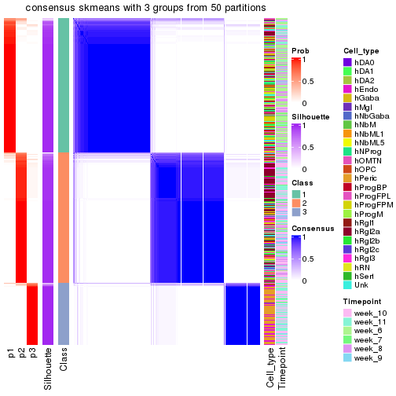</p>

</div>
<div id='tab-node-02-consensus-heatmap-3'>
<pre><code class="r">consensus_heatmap(res, k = 4)
</code></pre>

<p></p>

</div>
</div>

Heatmaps for the membership of samples in all partitions to see how consistent they are:


<script>
$( function() {
	$( '#tabs-node-02-membership-heatmap' ).tabs();
} );
</script>
<div id='tabs-node-02-membership-heatmap'>
<ul>
<li><a href='#tab-node-02-membership-heatmap-1'>k = 2</a></li>
<li><a href='#tab-node-02-membership-heatmap-2'>k = 3</a></li>
<li><a href='#tab-node-02-membership-heatmap-3'>k = 4</a></li>
</ul>
<div id='tab-node-02-membership-heatmap-1'>
<pre><code class="r">membership_heatmap(res, k = 2)
</code></pre>

<p></p>

</div>
<div id='tab-node-02-membership-heatmap-2'>
<pre><code class="r">membership_heatmap(res, k = 3)
</code></pre>

<p></p>

</div>
<div id='tab-node-02-membership-heatmap-3'>
<pre><code class="r">membership_heatmap(res, k = 4)
</code></pre>

<p></p>

</div>
</div>

As soon as the classes for columns are determined, the signatures
that are significantly different between subgroups can be looked for. 
Following are the heatmaps for signatures.


Signature heatmaps where rows are scaled:


<script>
$( function() {
	$( '#tabs-node-02-get-signatures' ).tabs();
} );
</script>
<div id='tabs-node-02-get-signatures'>
<ul>
<li><a href='#tab-node-02-get-signatures-1'>k = 2</a></li>
<li><a href='#tab-node-02-get-signatures-2'>k = 3</a></li>
<li><a href='#tab-node-02-get-signatures-3'>k = 4</a></li>
</ul>
<div id='tab-node-02-get-signatures-1'>
<pre><code class="r">get_signatures(res, k = 2)
</code></pre>

<p></p>

</div>
<div id='tab-node-02-get-signatures-2'>
<pre><code class="r">get_signatures(res, k = 3)
</code></pre>

<p></p>

</div>
<div id='tab-node-02-get-signatures-3'>
<pre><code class="r">get_signatures(res, k = 4)
</code></pre>

<p></p>

</div>
</div>


Signature heatmaps where rows are not scaled:


<script>
$( function() {
	$( '#tabs-node-02-get-signatures-no-scale' ).tabs();
} );
</script>
<div id='tabs-node-02-get-signatures-no-scale'>
<ul>
<li><a href='#tab-node-02-get-signatures-no-scale-1'>k = 2</a></li>
<li><a href='#tab-node-02-get-signatures-no-scale-2'>k = 3</a></li>
<li><a href='#tab-node-02-get-signatures-no-scale-3'>k = 4</a></li>
</ul>
<div id='tab-node-02-get-signatures-no-scale-1'>
<pre><code class="r">get_signatures(res, k = 2, scale_rows = FALSE)
</code></pre>

<p></p>

</div>
<div id='tab-node-02-get-signatures-no-scale-2'>
<pre><code class="r">get_signatures(res, k = 3, scale_rows = FALSE)
</code></pre>

<p></p>

</div>
<div id='tab-node-02-get-signatures-no-scale-3'>
<pre><code class="r">get_signatures(res, k = 4, scale_rows = FALSE)
</code></pre>

<p></p>

</div>
</div>


Compare the overlap of signatures from different k:

```r
compare_signatures(res)
```


`get_signature()` returns a data frame invisibly. To get the list of signatures, the function
call should be assigned to a variable explicitly. In following code, if `plot` argument is set
to `FALSE`, no heatmap is plotted while only the differential analysis is performed.

```r
# code only for demonstration
tb = get_signature(res, k = ..., plot = FALSE)
```

An example of the output of `tb` is:

```
#>   which_row         fdr    mean_1    mean_2 scaled_mean_1 scaled_mean_2 km
#> 1        38 0.042760348  8.373488  9.131774    -0.5533452     0.5164555  1
#> 2        40 0.018707592  7.106213  8.469186    -0.6173731     0.5762149  1
#> 3        55 0.019134737 10.221463 11.207825    -0.6159697     0.5749050  1
#> 4        59 0.006059896  5.921854  7.869574    -0.6899429     0.6439467  1
#> 5        60 0.018055526  8.928898 10.211722    -0.6204761     0.5791110  1
#> 6        98 0.009384629 15.714769 14.887706     0.6635654    -0.6193277  2
...
```

The columns in `tb` are:

1. `which_row`: row indices corresponding to the input matrix.
2. `fdr`: FDR for the differential test. 
3. `mean_x`: The mean value in group x.
4. `scaled_mean_x`: The mean value in group x after rows are scaled.
5. `km`: Row groups if k-means clustering is applied to rows (which is done by automatically selecting number of clusters).

If there are too many signatures, `top_signatures = ...` can be set to only show the 
signatures with the highest FDRs:

```r
# code only for demonstration
# e.g. to show the top 500 most significant rows
tb = get_signature(res, k = ..., top_signatures = 500)
```

If the signatures are defined as these which are uniquely high in current group, `diff_method` argument
can be set to `"uniquely_high_in_one_group"`:

```r
# code only for demonstration
tb = get_signature(res, k = ..., diff_method = "uniquely_high_in_one_group")
```


UMAP plot which shows how samples are separated.


<script>
$( function() {
	$( '#tabs-node-02-dimension-reduction' ).tabs();
} );
</script>
<div id='tabs-node-02-dimension-reduction'>
<ul>
<li><a href='#tab-node-02-dimension-reduction-1'>k = 2</a></li>
<li><a href='#tab-node-02-dimension-reduction-2'>k = 3</a></li>
<li><a href='#tab-node-02-dimension-reduction-3'>k = 4</a></li>
</ul>
<div id='tab-node-02-dimension-reduction-1'>
<pre><code class="r">dimension_reduction(res, k = 2, method = &quot;UMAP&quot;)
</code></pre>

<p></p>

</div>
<div id='tab-node-02-dimension-reduction-2'>
<pre><code class="r">dimension_reduction(res, k = 3, method = &quot;UMAP&quot;)
</code></pre>

<p></p>

</div>
<div id='tab-node-02-dimension-reduction-3'>
<pre><code class="r">dimension_reduction(res, k = 4, method = &quot;UMAP&quot;)
</code></pre>

<p></p>

</div>
</div>


Following heatmap shows how subgroups are split when increasing `k`:

```r
collect_classes(res)
```


Test correlation between subgroups and known annotations. If the known
annotation is numeric, one-way ANOVA test is applied, and if the known
annotation is discrete, chi-squared contingency table test is applied.

```r
test_to_known_factors(res)
```

```
#>             n_sample Cell_type(p-value) Timepoint(p-value) k
#> ATC:skmeans      606           2.42e-64           7.56e-18 2
#> ATC:skmeans      719          6.39e-222          2.11e-108 3
#> ATC:skmeans      724           0.00e+00          1.07e-137 4
```


If matrix rows can be associated to genes, consider to use `functional_enrichment(res,
...)` to perform function enrichment for the signature genes. See [this vignette](https://jokergoo.github.io/cola_vignettes/functional_enrichment.html) for more detailed explanations.


 

---------------------------------------------------


### Node021


Parent node: [Node02](#Node02).
Child nodes: 
                Node0111-leaf
        ,
                [Node0112](#Node0112)
        ,
                [Node0113](#Node0113)
        ,
                [Node0121](#Node0121)
        ,
                [Node0122](#Node0122)
        ,
                [Node0131](#Node0131)
        ,
                [Node0132](#Node0132)
        ,
                [Node0133](#Node0133)
        ,
                [Node0211](#Node0211)
        ,
                [Node0212](#Node0212)
        ,
                Node0221-leaf
        ,
                [Node0222](#Node0222)
        ,
                [Node0223](#Node0223)
        ,
                [Node0231](#Node0231)
        ,
                [Node0232](#Node0232)
        ,
                Node0233-leaf
        ,
                Node0241-leaf
        ,
                [Node0242](#Node0242)
        ,
                Node0243-leaf
        .


The object with results only for a single top-value method and a single partitioning method 
can be extracted as:

```r
res = res_rh["021"]
```

A summary of `res` and all the functions that can be applied to it:

```r
res
```

```
#> A 'ConsensusPartition' object with k = 2, 3, 4.
#>   On a matrix with 9339 rows and 342 columns.
#>   Top rows (934) are extracted by 'ATC' method.
#>   Subgroups are detected by 'skmeans' method.
#>   Performed in total 150 partitions by row resampling.
#>   Best k for subgroups seems to be 3.
#> 
#> Following methods can be applied to this 'ConsensusPartition' object:
#>  [1] "cola_report"             "collect_classes"         "collect_plots"          
#>  [4] "collect_stats"           "colnames"                "compare_partitions"     
#>  [7] "compare_signatures"      "consensus_heatmap"       "dimension_reduction"    
#> [10] "functional_enrichment"   "get_anno_col"            "get_anno"               
#> [13] "get_classes"             "get_consensus"           "get_matrix"             
#> [16] "get_membership"          "get_param"               "get_signatures"         
#> [19] "get_stats"               "is_best_k"               "is_stable_k"            
#> [22] "membership_heatmap"      "ncol"                    "nrow"                   
#> [25] "plot_ecdf"               "predict_classes"         "rownames"               
#> [28] "select_partition_number" "show"                    "suggest_best_k"         
#> [31] "test_to_known_factors"   "top_rows_heatmap"
```

`collect_plots()` function collects all the plots made from `res` for all `k` (number of subgroups)
into one single page to provide an easy and fast comparison between different `k`.

```r
collect_plots(res)
```


The plots are:

- The first row: a plot of the eCDF (empirical cumulative distribution
  function) curves of the consensus matrix for each `k` and the heatmap of
  predicted classes for each `k`.
- The second row: heatmaps of the consensus matrix for each `k`.
- The third row: heatmaps of the membership matrix for each `k`.
- The fouth row: heatmaps of the signatures for each `k`.

All the plots in panels can be made by individual functions and they are
plotted later in this section.

`select_partition_number()` produces several plots showing different
statistics for choosing "optimized" `k`. There are following statistics:

- eCDF curves of the consensus matrix for each `k`;
- 1-PAC. [The PAC score](https://en.wikipedia.org/wiki/Consensus_clustering#Over-interpretation_potential_of_consensus_clustering)
  measures the proportion of the ambiguous subgrouping.
- Mean silhouette score.
- Concordance. The mean probability of fiting the consensus subgroup labels in all
  partitions.
- Area increased. Denote $A_k$ as the area under the eCDF curve for current
  `k`, the area increased is defined as $A_k - A_{k-1}$.
- Rand index. The percent of pairs of samples that are both in a same cluster
  or both are not in a same cluster in the partition of k and k-1.
- Jaccard index. The ratio of pairs of samples are both in a same cluster in
  the partition of k and k-1 and the pairs of samples are both in a same
  cluster in the partition k or k-1.

The detailed explanations of these statistics can be found in [the _cola_
vignette](https://jokergoo.github.io/cola_vignettes/cola.html#toc_13).

Generally speaking, higher 1-PAC score, higher mean silhouette score or higher
concordance corresponds to better partition. Rand index and Jaccard index
measure how similar the current partition is compared to partition with `k-1`.
If they are too similar, we won't accept `k` is better than `k-1`.

```r
select_partition_number(res)
```


The numeric values for all these statistics can be obtained by `get_stats()`.

```r
get_stats(res)
```

```
#>   k 1-PAC mean_silhouette concordance area_increased  Rand Jaccard
#> 2 2 1.000           0.962       0.985          0.494 0.506   0.506
#> 3 3 0.953           0.930       0.972          0.324 0.774   0.580
#> 4 4 0.834           0.856       0.922          0.118 0.860   0.627
```

`suggest_best_k()` suggests the best $k$ based on these statistics. The rules are as follows:

- All $k$ with Jaccard index larger than 0.95 are removed because increasing
  $k$ does not provide enough extra information. If all $k$ are removed, it is
  marked as no subgroup is detected.
- For all $k$ with 1-PAC score larger than 0.9, the maximal $k$ is taken as
  the best $k$, and other $k$ are marked as optional $k$.
- If it does not fit the second rule. The $k$ with the maximal vote of the
  highest 1-PAC score, highest mean silhouette, and highest concordance is
  taken as the best $k$.

```r
suggest_best_k(res)
```

```
#> [1] 3
#> attr(,"optional")
#> [1] 2
```

There is also optional best $k$ = 2 that is worth to check.

Following is the table of the partitions (You need to click the **show/hide
code output** link to see it). The membership matrix (columns with name `p*`)
is inferred by
[`clue::cl_consensus()`](https://www.rdocumentation.org/link/cl_consensus?package=clue)
function with the `SE` method. Basically the value in the membership matrix
represents the probability to belong to a certain group. The finall subgroup
label for an item is determined with the group with highest probability it
belongs to.

In `get_classes()` function, the entropy is calculated from the membership
matrix and the silhouette score is calculated from the consensus matrix.


<script>
$( function() {
	$( '#tabs-node-021-get-classes' ).tabs();
} );
</script>
<div id='tabs-node-021-get-classes'>
<ul>
<li><a href='#tab-node-021-get-classes-1'>k = 2</a></li>
<li><a href='#tab-node-021-get-classes-2'>k = 3</a></li>
<li><a href='#tab-node-021-get-classes-3'>k = 4</a></li>
</ul>

<div id='tab-node-021-get-classes-1'>
<p><a id='tab-node-021-get-classes-1-a' style='color:#0366d6' href='#'>show/hide code output</a></p>
<pre><code class="r">cbind(get_classes(res, k = 2), get_membership(res, k = 2))
</code></pre>

<pre><code>#&gt;                 class entropy silhouette   p1   p2
#&gt; 1772067_089_A04     1   0.000     0.9856 1.00 0.00
#&gt; 1772067_089_A05     1   0.000     0.9856 1.00 0.00
#&gt; 1772067_089_A11     2   0.000     0.9825 0.00 1.00
#&gt; 1772067_089_B05     1   0.000     0.9856 1.00 0.00
#&gt; 1772067_089_C06     1   0.000     0.9856 1.00 0.00
#&gt; 1772067_089_D06     1   0.000     0.9856 1.00 0.00
#&gt; 1772067_089_D07     1   0.000     0.9856 1.00 0.00
#&gt; 1772071_027_C11     2   0.000     0.9825 0.00 1.00
#&gt; 1772071_027_H02     2   0.000     0.9825 0.00 1.00
#&gt; 1772071_027_H03     1   0.000     0.9856 1.00 0.00
#&gt; 1772071_029_A04     1   0.000     0.9856 1.00 0.00
#&gt; 1772071_029_D03     1   0.000     0.9856 1.00 0.00
#&gt; 1772071_029_F03     2   0.000     0.9825 0.00 1.00
#&gt; 1772071_029_G07     1   0.000     0.9856 1.00 0.00
#&gt; 1772078_078_C12     1   0.000     0.9856 1.00 0.00
#&gt; 1772075_299_D04     2   0.000     0.9825 0.00 1.00
#&gt; 1772075_299_E06     2   0.000     0.9825 0.00 1.00
#&gt; 1772075_299_G11     1   0.000     0.9856 1.00 0.00
#&gt; 1772078_001_A07     2   0.000     0.9825 0.00 1.00
#&gt; 1772078_001_A09     2   0.000     0.9825 0.00 1.00
#&gt; 1772078_001_B09     2   0.000     0.9825 0.00 1.00
#&gt; 1772078_001_C04     1   0.000     0.9856 1.00 0.00
#&gt; 1772078_001_D05     2   0.000     0.9825 0.00 1.00
#&gt; 1772078_002_A09     1   0.000     0.9856 1.00 0.00
#&gt; 1772078_002_C09     1   0.000     0.9856 1.00 0.00
#&gt; 1772078_002_E12     2   0.000     0.9825 0.00 1.00
#&gt; 1772078_002_H10     1   0.000     0.9856 1.00 0.00
#&gt; 1772096_160_E02     1   0.000     0.9856 1.00 0.00
#&gt; 1772096_095_H07     2   0.722     0.7476 0.20 0.80
#&gt; 1772122_236_A08     1   0.000     0.9856 1.00 0.00
#&gt; 1772122_236_C11     2   0.000     0.9825 0.00 1.00
#&gt; 1772121_288_B01     1   0.000     0.9856 1.00 0.00
#&gt; 1772121_288_F12     1   0.000     0.9856 1.00 0.00
#&gt; 1772121_288_H03     1   0.000     0.9856 1.00 0.00
#&gt; 1772121_291_E10     1   0.000     0.9856 1.00 0.00
#&gt; 1772121_291_F10     1   0.000     0.9856 1.00 0.00
#&gt; 1772121_291_G05     1   0.000     0.9856 1.00 0.00
#&gt; 1772121_291_H11     1   0.000     0.9856 1.00 0.00
#&gt; 1772121_293_D08     1   0.000     0.9856 1.00 0.00
#&gt; 1772121_283_F09     1   0.000     0.9856 1.00 0.00
#&gt; 1772122_264_C10     1   0.000     0.9856 1.00 0.00
#&gt; 1772122_264_D01     1   0.000     0.9856 1.00 0.00
#&gt; 1772122_264_H07     1   0.000     0.9856 1.00 0.00
#&gt; 1772122_208_B05     1   0.000     0.9856 1.00 0.00
#&gt; 1772122_208_B12     1   0.000     0.9856 1.00 0.00
#&gt; 1772122_201_E04     1   0.000     0.9856 1.00 0.00
#&gt; 1772122_201_G06     1   0.000     0.9856 1.00 0.00
#&gt; 1772122_207_C05     1   0.000     0.9856 1.00 0.00
#&gt; 1772122_207_E05     1   0.000     0.9856 1.00 0.00
#&gt; 1772122_199_C01     1   0.000     0.9856 1.00 0.00
#&gt; 1772122_203_F09     2   0.000     0.9825 0.00 1.00
#&gt; 1772122_316_A06     1   0.000     0.9856 1.00 0.00
#&gt; 1772122_316_A08     1   0.000     0.9856 1.00 0.00
#&gt; 1772122_316_A10     1   0.000     0.9856 1.00 0.00
#&gt; 1772122_316_A12     1   0.000     0.9856 1.00 0.00
#&gt; 1772122_316_B02     1   0.000     0.9856 1.00 0.00
#&gt; 1772122_316_B04     2   0.000     0.9825 0.00 1.00
#&gt; 1772122_316_B06     2   0.000     0.9825 0.00 1.00
#&gt; 1772122_316_B10     1   0.000     0.9856 1.00 0.00
#&gt; 1772122_316_B11     2   0.000     0.9825 0.00 1.00
#&gt; 1772122_316_C01     1   0.402     0.9071 0.92 0.08
#&gt; 1772122_316_C02     2   0.000     0.9825 0.00 1.00
#&gt; 1772122_316_C03     1   0.000     0.9856 1.00 0.00
#&gt; 1772122_316_C06     2   0.000     0.9825 0.00 1.00
#&gt; 1772122_316_C08     2   0.000     0.9825 0.00 1.00
#&gt; 1772122_316_C11     1   0.000     0.9856 1.00 0.00
#&gt; 1772122_316_D04     1   0.000     0.9856 1.00 0.00
#&gt; 1772122_316_D05     2   0.000     0.9825 0.00 1.00
#&gt; 1772122_316_D06     2   0.000     0.9825 0.00 1.00
#&gt; 1772122_316_D07     1   0.000     0.9856 1.00 0.00
#&gt; 1772122_316_D11     2   0.000     0.9825 0.00 1.00
#&gt; 1772122_316_D12     1   0.000     0.9856 1.00 0.00
#&gt; 1772122_316_E03     2   0.904     0.5315 0.32 0.68
#&gt; 1772122_316_E06     1   0.000     0.9856 1.00 0.00
#&gt; 1772122_316_E07     2   0.000     0.9825 0.00 1.00
#&gt; 1772122_316_E10     1   0.000     0.9856 1.00 0.00
#&gt; 1772122_316_E11     2   0.000     0.9825 0.00 1.00
#&gt; 1772122_316_E12     1   0.469     0.8839 0.90 0.10
#&gt; 1772122_316_F01     1   0.000     0.9856 1.00 0.00
#&gt; 1772122_316_F02     2   0.000     0.9825 0.00 1.00
#&gt; 1772122_316_F04     2   0.000     0.9825 0.00 1.00
#&gt; 1772122_316_F07     2   0.000     0.9825 0.00 1.00
#&gt; 1772122_316_F09     2   0.000     0.9825 0.00 1.00
#&gt; 1772122_316_F10     1   0.000     0.9856 1.00 0.00
#&gt; 1772122_316_F11     2   0.000     0.9825 0.00 1.00
#&gt; 1772122_316_F12     1   0.000     0.9856 1.00 0.00
#&gt; 1772122_316_G04     2   0.000     0.9825 0.00 1.00
#&gt; 1772122_316_G05     1   0.000     0.9856 1.00 0.00
#&gt; 1772122_316_G07     1   0.402     0.9065 0.92 0.08
#&gt; 1772122_316_G08     2   0.000     0.9825 0.00 1.00
#&gt; 1772122_316_G10     2   0.000     0.9825 0.00 1.00
#&gt; 1772122_316_G11     1   0.000     0.9856 1.00 0.00
#&gt; 1772122_316_G12     2   0.000     0.9825 0.00 1.00
#&gt; 1772122_316_H01     2   0.000     0.9825 0.00 1.00
#&gt; 1772122_316_H05     1   0.000     0.9856 1.00 0.00
#&gt; 1772122_316_H06     2   0.000     0.9825 0.00 1.00
#&gt; 1772122_316_H09     2   0.000     0.9825 0.00 1.00
#&gt; 1772122_316_H12     1   0.000     0.9856 1.00 0.00
#&gt; 1772122_317_A02     2   0.000     0.9825 0.00 1.00
#&gt; 1772122_317_A04     1   0.000     0.9856 1.00 0.00
#&gt; 1772122_317_A05     1   0.000     0.9856 1.00 0.00
#&gt; 1772122_317_A09     1   0.000     0.9856 1.00 0.00
#&gt; 1772122_317_A11     2   0.000     0.9825 0.00 1.00
#&gt; 1772122_317_A12     1   0.000     0.9856 1.00 0.00
#&gt; 1772122_317_B01     1   0.000     0.9856 1.00 0.00
#&gt; 1772122_317_B02     1   0.000     0.9856 1.00 0.00
#&gt; 1772122_317_B05     1   0.000     0.9856 1.00 0.00
#&gt; 1772122_317_B10     2   0.000     0.9825 0.00 1.00
#&gt; 1772122_317_B11     1   0.000     0.9856 1.00 0.00
#&gt; 1772122_317_B12     1   0.327     0.9281 0.94 0.06
#&gt; 1772122_317_C02     2   0.000     0.9825 0.00 1.00
#&gt; 1772122_317_C04     1   0.000     0.9856 1.00 0.00
#&gt; 1772122_317_C07     2   0.000     0.9825 0.00 1.00
#&gt; 1772122_317_C08     2   0.000     0.9825 0.00 1.00
#&gt; 1772122_317_C09     1   0.999     0.0620 0.52 0.48
#&gt; 1772122_317_D01     2   0.469     0.8801 0.10 0.90
#&gt; 1772122_317_D04     2   0.000     0.9825 0.00 1.00
#&gt; 1772122_317_D05     1   0.000     0.9856 1.00 0.00
#&gt; 1772122_317_D07     1   0.000     0.9856 1.00 0.00
#&gt; 1772122_317_D08     1   0.000     0.9856 1.00 0.00
#&gt; 1772122_317_E01     2   0.000     0.9825 0.00 1.00
#&gt; 1772122_317_E02     2   0.000     0.9825 0.00 1.00
#&gt; 1772122_317_E05     1   0.000     0.9856 1.00 0.00
#&gt; 1772122_317_E10     1   0.000     0.9856 1.00 0.00
#&gt; 1772122_317_E11     2   0.000     0.9825 0.00 1.00
#&gt; 1772122_317_F02     1   0.000     0.9856 1.00 0.00
#&gt; 1772122_317_F04     2   0.000     0.9825 0.00 1.00
#&gt; 1772122_317_F06     2   0.000     0.9825 0.00 1.00
#&gt; 1772122_317_F09     2   0.000     0.9825 0.00 1.00
#&gt; 1772122_317_G02     2   0.000     0.9825 0.00 1.00
#&gt; 1772122_317_G04     1   0.000     0.9856 1.00 0.00
#&gt; 1772122_317_G09     2   0.000     0.9825 0.00 1.00
#&gt; 1772122_317_G12     2   0.000     0.9825 0.00 1.00
#&gt; 1772122_317_H02     2   0.000     0.9825 0.00 1.00
#&gt; 1772122_317_H03     1   0.000     0.9856 1.00 0.00
#&gt; 1772122_317_H06     1   0.795     0.6870 0.76 0.24
#&gt; 1772122_317_H07     2   0.000     0.9825 0.00 1.00
#&gt; 1772122_317_H09     2   0.000     0.9825 0.00 1.00
#&gt; 1772122_317_H10     2   0.000     0.9825 0.00 1.00
#&gt; 1772122_317_H11     2   0.000     0.9825 0.00 1.00
#&gt; 1772122_317_H12     2   0.000     0.9825 0.00 1.00
#&gt; 1772122_318_A05     1   0.000     0.9856 1.00 0.00
#&gt; 1772122_318_A06     2   0.000     0.9825 0.00 1.00
#&gt; 1772122_318_A07     2   0.000     0.9825 0.00 1.00
#&gt; 1772122_318_A08     2   0.000     0.9825 0.00 1.00
#&gt; 1772122_318_A11     2   0.000     0.9825 0.00 1.00
#&gt; 1772122_318_B01     2   0.000     0.9825 0.00 1.00
#&gt; 1772122_318_B03     2   0.000     0.9825 0.00 1.00
#&gt; 1772122_318_B04     2   0.000     0.9825 0.00 1.00
#&gt; 1772122_318_B07     2   0.000     0.9825 0.00 1.00
#&gt; 1772122_318_B08     1   0.000     0.9856 1.00 0.00
#&gt; 1772122_318_B09     2   0.000     0.9825 0.00 1.00
#&gt; 1772122_318_B11     2   0.000     0.9825 0.00 1.00
#&gt; 1772122_318_C02     2   0.000     0.9825 0.00 1.00
#&gt; 1772122_318_C03     1   0.000     0.9856 1.00 0.00
#&gt; 1772122_318_C04     2   0.000     0.9825 0.00 1.00
#&gt; 1772122_318_C06     1   0.000     0.9856 1.00 0.00
#&gt; 1772122_318_D01     1   0.000     0.9856 1.00 0.00
#&gt; 1772122_318_D03     1   0.000     0.9856 1.00 0.00
#&gt; 1772122_318_D09     2   0.000     0.9825 0.00 1.00
#&gt; 1772122_318_D10     1   0.000     0.9856 1.00 0.00
#&gt; 1772122_318_E06     1   0.000     0.9856 1.00 0.00
#&gt; 1772122_318_E07     1   0.000     0.9856 1.00 0.00
#&gt; 1772122_318_F02     1   0.000     0.9856 1.00 0.00
#&gt; 1772122_318_F03     1   0.000     0.9856 1.00 0.00
#&gt; 1772122_318_F05     1   0.000     0.9856 1.00 0.00
#&gt; 1772122_318_F06     1   0.000     0.9856 1.00 0.00
#&gt; 1772122_318_F08     1   0.000     0.9856 1.00 0.00
#&gt; 1772122_318_F11     2   0.000     0.9825 0.00 1.00
#&gt; 1772122_318_F12     1   0.000     0.9856 1.00 0.00
#&gt; 1772122_318_G03     1   0.000     0.9856 1.00 0.00
#&gt; 1772122_318_G04     2   0.000     0.9825 0.00 1.00
#&gt; 1772122_318_G05     1   0.000     0.9856 1.00 0.00
#&gt; 1772122_318_G06     1   0.000     0.9856 1.00 0.00
#&gt; 1772122_318_G07     2   0.000     0.9825 0.00 1.00
#&gt; 1772122_318_G08     2   0.000     0.9825 0.00 1.00
#&gt; 1772122_318_G10     2   0.000     0.9825 0.00 1.00
#&gt; 1772122_318_G12     1   0.000     0.9856 1.00 0.00
#&gt; 1772122_318_H02     2   0.000     0.9825 0.00 1.00
#&gt; 1772122_318_H04     2   0.000     0.9825 0.00 1.00
#&gt; 1772122_318_H06     1   0.000     0.9856 1.00 0.00
#&gt; 1772122_318_H09     2   0.000     0.9825 0.00 1.00
#&gt; 1772122_318_H11     1   0.000     0.9856 1.00 0.00
#&gt; 1772122_318_H12     1   0.584     0.8348 0.86 0.14
#&gt; 1772122_319_A05     2   0.000     0.9825 0.00 1.00
#&gt; 1772122_319_A06     2   0.000     0.9825 0.00 1.00
#&gt; 1772122_319_A07     2   0.000     0.9825 0.00 1.00
#&gt; 1772122_319_A10     2   0.000     0.9825 0.00 1.00
#&gt; 1772122_319_A11     2   0.000     0.9825 0.00 1.00
#&gt; 1772122_319_A12     1   0.000     0.9856 1.00 0.00
#&gt; 1772122_319_B02     2   0.000     0.9825 0.00 1.00
#&gt; 1772122_319_B04     2   0.999     0.0815 0.48 0.52
#&gt; 1772122_319_B05     2   0.000     0.9825 0.00 1.00
#&gt; 1772122_319_B06     2   0.000     0.9825 0.00 1.00
#&gt; 1772122_319_B09     1   0.000     0.9856 1.00 0.00
#&gt; 1772122_319_B10     1   0.000     0.9856 1.00 0.00
#&gt; 1772122_319_C01     1   0.000     0.9856 1.00 0.00
#&gt; 1772122_319_C02     1   0.000     0.9856 1.00 0.00
#&gt; 1772122_319_C03     2   0.000     0.9825 0.00 1.00
#&gt; 1772122_319_C05     1   0.000     0.9856 1.00 0.00
#&gt; 1772122_319_C06     1   0.000     0.9856 1.00 0.00
#&gt; 1772122_319_C10     2   0.000     0.9825 0.00 1.00
#&gt; 1772122_319_C11     2   0.000     0.9825 0.00 1.00
#&gt; 1772122_319_C12     2   0.000     0.9825 0.00 1.00
#&gt; 1772122_319_D01     2   0.000     0.9825 0.00 1.00
#&gt; 1772122_319_D04     1   0.000     0.9856 1.00 0.00
#&gt; 1772122_319_D07     1   0.000     0.9856 1.00 0.00
#&gt; 1772122_319_D09     2   0.000     0.9825 0.00 1.00
#&gt; 1772122_319_D11     2   0.000     0.9825 0.00 1.00
#&gt; 1772122_319_D12     1   0.000     0.9856 1.00 0.00
#&gt; 1772122_319_E01     1   0.680     0.7812 0.82 0.18
#&gt; 1772122_319_E03     2   0.000     0.9825 0.00 1.00
#&gt; 1772122_319_E04     2   0.000     0.9825 0.00 1.00
#&gt; 1772122_319_E06     2   0.000     0.9825 0.00 1.00
#&gt; 1772122_319_E08     1   0.000     0.9856 1.00 0.00
#&gt; 1772122_319_E10     1   0.000     0.9856 1.00 0.00
#&gt; 1772122_319_E12     1   0.242     0.9479 0.96 0.04
#&gt; 1772122_319_F01     1   0.000     0.9856 1.00 0.00
#&gt; 1772122_319_F02     2   0.000     0.9825 0.00 1.00
#&gt; 1772122_319_F04     2   0.000     0.9825 0.00 1.00
#&gt; 1772122_319_F05     1   0.000     0.9856 1.00 0.00
#&gt; 1772122_319_F08     2   0.000     0.9825 0.00 1.00
#&gt; 1772122_319_F09     2   0.000     0.9825 0.00 1.00
#&gt; 1772122_319_F10     1   0.000     0.9856 1.00 0.00
#&gt; 1772122_319_F11     2   0.000     0.9825 0.00 1.00
#&gt; 1772122_319_F12     1   0.000     0.9856 1.00 0.00
#&gt; 1772122_319_G01     2   0.000     0.9825 0.00 1.00
#&gt; 1772122_319_G02     1   0.000     0.9856 1.00 0.00
#&gt; 1772122_319_G04     2   0.981     0.2817 0.42 0.58
#&gt; 1772122_319_G05     2   0.000     0.9825 0.00 1.00
#&gt; 1772122_319_G06     2   0.000     0.9825 0.00 1.00
#&gt; 1772122_319_G10     1   0.000     0.9856 1.00 0.00
#&gt; 1772122_319_G11     2   0.000     0.9825 0.00 1.00
#&gt; 1772122_319_G12     1   0.971     0.3329 0.60 0.40
#&gt; 1772122_319_H04     2   0.000     0.9825 0.00 1.00
#&gt; 1772122_319_H05     1   0.000     0.9856 1.00 0.00
#&gt; 1772122_319_H08     2   0.242     0.9446 0.04 0.96
#&gt; 1772122_319_H11     2   0.000     0.9825 0.00 1.00
#&gt; 1772122_319_H12     1   0.000     0.9856 1.00 0.00
#&gt; 1772122_221_A03     1   0.000     0.9856 1.00 0.00
#&gt; 1772122_221_A12     1   0.000     0.9856 1.00 0.00
#&gt; 1772122_221_B01     1   0.000     0.9856 1.00 0.00
#&gt; 1772122_221_B03     1   0.000     0.9856 1.00 0.00
#&gt; 1772122_221_C02     2   0.000     0.9825 0.00 1.00
#&gt; 1772122_221_C12     1   0.000     0.9856 1.00 0.00
#&gt; 1772122_221_D02     2   0.000     0.9825 0.00 1.00
#&gt; 1772122_221_D03     1   0.000     0.9856 1.00 0.00
#&gt; 1772122_221_D04     1   0.000     0.9856 1.00 0.00
#&gt; 1772122_221_E05     2   0.584     0.8313 0.14 0.86
#&gt; 1772122_221_E07     2   0.469     0.8809 0.10 0.90
#&gt; 1772122_221_E08     1   0.000     0.9856 1.00 0.00
#&gt; 1772122_221_F09     2   0.000     0.9825 0.00 1.00
#&gt; 1772122_221_F11     1   0.000     0.9856 1.00 0.00
#&gt; 1772122_221_F12     1   0.000     0.9856 1.00 0.00
#&gt; 1772122_221_G02     1   0.000     0.9856 1.00 0.00
#&gt; 1772122_221_G04     1   0.000     0.9856 1.00 0.00
#&gt; 1772122_221_G05     2   0.000     0.9825 0.00 1.00
#&gt; 1772122_221_G08     1   0.000     0.9856 1.00 0.00
#&gt; 1772122_221_G12     1   0.000     0.9856 1.00 0.00
#&gt; 1772122_221_H01     1   0.000     0.9856 1.00 0.00
#&gt; 1772122_221_H06     1   0.000     0.9856 1.00 0.00
#&gt; 1772122_221_H08     1   0.000     0.9856 1.00 0.00
#&gt; 1772122_221_H09     2   0.904     0.5328 0.32 0.68
#&gt; 1772122_221_H10     1   0.000     0.9856 1.00 0.00
#&gt; 1772122_221_H11     2   0.990     0.2192 0.44 0.56
#&gt; 1772122_220_A01     1   0.000     0.9856 1.00 0.00
#&gt; 1772122_220_A05     1   0.402     0.9065 0.92 0.08
#&gt; 1772122_220_A06     2   0.000     0.9825 0.00 1.00
#&gt; 1772122_220_A07     2   0.000     0.9825 0.00 1.00
#&gt; 1772122_220_A11     1   0.000     0.9856 1.00 0.00
#&gt; 1772122_220_A12     1   0.000     0.9856 1.00 0.00
#&gt; 1772122_220_B03     2   0.000     0.9825 0.00 1.00
#&gt; 1772122_220_B06     2   0.000     0.9825 0.00 1.00
#&gt; 1772122_220_B07     2   0.000     0.9825 0.00 1.00
#&gt; 1772122_220_B12     1   0.000     0.9856 1.00 0.00
#&gt; 1772122_220_C04     2   0.000     0.9825 0.00 1.00
#&gt; 1772122_220_C10     1   0.795     0.6847 0.76 0.24
#&gt; 1772122_220_C12     1   0.000     0.9856 1.00 0.00
#&gt; 1772122_220_D02     2   0.000     0.9825 0.00 1.00
#&gt; 1772122_220_D05     1   0.000     0.9856 1.00 0.00
#&gt; 1772122_220_E03     1   0.000     0.9856 1.00 0.00
#&gt; 1772122_220_E04     2   0.000     0.9825 0.00 1.00
#&gt; 1772122_220_E08     1   0.000     0.9856 1.00 0.00
#&gt; 1772122_220_E10     1   0.000     0.9856 1.00 0.00
#&gt; 1772122_220_E12     1   0.000     0.9856 1.00 0.00
#&gt; 1772122_220_F01     1   0.000     0.9856 1.00 0.00
#&gt; 1772122_220_F03     1   0.000     0.9856 1.00 0.00
#&gt; 1772122_220_F04     2   0.000     0.9825 0.00 1.00
#&gt; 1772122_220_F05     1   0.000     0.9856 1.00 0.00
#&gt; 1772122_220_F06     1   0.000     0.9856 1.00 0.00
#&gt; 1772122_220_F10     1   0.000     0.9856 1.00 0.00
#&gt; 1772122_220_F11     2   0.000     0.9825 0.00 1.00
#&gt; 1772122_220_G05     1   0.000     0.9856 1.00 0.00
#&gt; 1772122_220_G06     2   0.000     0.9825 0.00 1.00
#&gt; 1772122_220_G09     2   0.000     0.9825 0.00 1.00
#&gt; 1772122_220_G12     2   0.000     0.9825 0.00 1.00
#&gt; 1772122_220_H03     1   0.000     0.9856 1.00 0.00
#&gt; 1772122_220_H06     1   0.000     0.9856 1.00 0.00
#&gt; 1772122_220_H11     2   0.000     0.9825 0.00 1.00
#&gt; 1772122_226_A12     1   0.000     0.9856 1.00 0.00
#&gt; 1772122_226_B12     1   0.000     0.9856 1.00 0.00
#&gt; 1772122_226_C03     1   0.000     0.9856 1.00 0.00
#&gt; 1772122_226_D09     2   0.000     0.9825 0.00 1.00
#&gt; 1772122_226_E05     1   0.000     0.9856 1.00 0.00
#&gt; 1772122_223_A01     2   0.000     0.9825 0.00 1.00
#&gt; 1772122_223_A04     1   0.000     0.9856 1.00 0.00
#&gt; 1772122_223_B03     1   0.000     0.9856 1.00 0.00
#&gt; 1772122_223_B07     1   0.000     0.9856 1.00 0.00
#&gt; 1772122_223_B08     1   0.000     0.9856 1.00 0.00
#&gt; 1772122_223_B10     1   0.000     0.9856 1.00 0.00
#&gt; 1772122_223_D01     1   0.000     0.9856 1.00 0.00
#&gt; 1772122_223_D09     2   0.000     0.9825 0.00 1.00
#&gt; 1772122_223_D10     1   0.000     0.9856 1.00 0.00
#&gt; 1772122_223_E05     1   0.855     0.6135 0.72 0.28
#&gt; 1772122_223_E12     1   0.000     0.9856 1.00 0.00
#&gt; 1772122_223_F01     1   0.000     0.9856 1.00 0.00
#&gt; 1772122_223_F03     1   0.000     0.9856 1.00 0.00
#&gt; 1772122_223_F05     1   0.000     0.9856 1.00 0.00
#&gt; 1772122_223_F11     2   0.000     0.9825 0.00 1.00
#&gt; 1772122_223_G02     2   0.000     0.9825 0.00 1.00
#&gt; 1772122_223_G03     1   0.000     0.9856 1.00 0.00
#&gt; 1772122_223_G09     2   0.000     0.9825 0.00 1.00
#&gt; 1772122_223_H03     2   0.000     0.9825 0.00 1.00
#&gt; 1772122_223_H11     1   0.000     0.9856 1.00 0.00
#&gt; 1772122_224_A03     2   0.000     0.9825 0.00 1.00
#&gt; 1772122_224_A06     2   0.000     0.9825 0.00 1.00
#&gt; 1772122_224_A11     2   0.000     0.9825 0.00 1.00
#&gt; 1772122_224_B02     1   0.000     0.9856 1.00 0.00
#&gt; 1772122_224_B04     1   0.000     0.9856 1.00 0.00
#&gt; 1772122_224_B07     2   0.000     0.9825 0.00 1.00
#&gt; 1772122_224_B12     1   0.000     0.9856 1.00 0.00
#&gt; 1772122_224_C01     1   0.000     0.9856 1.00 0.00
#&gt; 1772122_224_C05     1   0.000     0.9856 1.00 0.00
#&gt; 1772122_224_C06     1   0.000     0.9856 1.00 0.00
#&gt; 1772122_224_C08     1   0.881     0.5747 0.70 0.30
#&gt; 1772122_224_D07     2   0.000     0.9825 0.00 1.00
#&gt; 1772122_224_F05     1   0.000     0.9856 1.00 0.00
#&gt; 1772122_224_F07     2   0.000     0.9825 0.00 1.00
#&gt; 1772122_224_F09     1   0.000     0.9856 1.00 0.00
#&gt; 1772122_224_H04     1   0.000     0.9856 1.00 0.00
#&gt; 1772122_224_H06     1   0.000     0.9856 1.00 0.00
#&gt; 1772122_224_H09     2   0.000     0.9825 0.00 1.00
</code></pre>

<script>
$('#tab-node-021-get-classes-1-a').parent().next().next().hide();
$('#tab-node-021-get-classes-1-a').click(function(){
  $('#tab-node-021-get-classes-1-a').parent().next().next().toggle();
  return(false);
});
</script>
</div>

<div id='tab-node-021-get-classes-2'>
<p><a id='tab-node-021-get-classes-2-a' style='color:#0366d6' href='#'>show/hide code output</a></p>
<pre><code class="r">cbind(get_classes(res, k = 3), get_membership(res, k = 3))
</code></pre>

<pre><code>#&gt;                 class entropy silhouette   p1   p2   p3
#&gt; 1772067_089_A04     1  0.2066     0.9151 0.94 0.00 0.06
#&gt; 1772067_089_A05     1  0.0000     0.9691 1.00 0.00 0.00
#&gt; 1772067_089_A11     3  0.6309     0.0224 0.00 0.50 0.50
#&gt; 1772067_089_B05     1  0.0000     0.9691 1.00 0.00 0.00
#&gt; 1772067_089_C06     1  0.3686     0.8247 0.86 0.00 0.14
#&gt; 1772067_089_D06     3  0.3686     0.8119 0.14 0.00 0.86
#&gt; 1772067_089_D07     1  0.4555     0.7399 0.80 0.00 0.20
#&gt; 1772071_027_C11     2  0.0000     0.9910 0.00 1.00 0.00
#&gt; 1772071_027_H02     2  0.0000     0.9910 0.00 1.00 0.00
#&gt; 1772071_027_H03     3  0.0000     0.9386 0.00 0.00 1.00
#&gt; 1772071_029_A04     1  0.0000     0.9691 1.00 0.00 0.00
#&gt; 1772071_029_D03     1  0.0000     0.9691 1.00 0.00 0.00
#&gt; 1772071_029_F03     3  0.0000     0.9386 0.00 0.00 1.00
#&gt; 1772071_029_G07     3  0.5397     0.6129 0.28 0.00 0.72
#&gt; 1772078_078_C12     1  0.0000     0.9691 1.00 0.00 0.00
#&gt; 1772075_299_D04     2  0.0000     0.9910 0.00 1.00 0.00
#&gt; 1772075_299_E06     2  0.0000     0.9910 0.00 1.00 0.00
#&gt; 1772075_299_G11     1  0.0000     0.9691 1.00 0.00 0.00
#&gt; 1772078_001_A07     2  0.0000     0.9910 0.00 1.00 0.00
#&gt; 1772078_001_A09     2  0.0000     0.9910 0.00 1.00 0.00
#&gt; 1772078_001_B09     2  0.0000     0.9910 0.00 1.00 0.00
#&gt; 1772078_001_C04     1  0.2066     0.9151 0.94 0.00 0.06
#&gt; 1772078_001_D05     2  0.0000     0.9910 0.00 1.00 0.00
#&gt; 1772078_002_A09     3  0.0000     0.9386 0.00 0.00 1.00
#&gt; 1772078_002_C09     3  0.0000     0.9386 0.00 0.00 1.00
#&gt; 1772078_002_E12     2  0.0000     0.9910 0.00 1.00 0.00
#&gt; 1772078_002_H10     3  0.0000     0.9386 0.00 0.00 1.00
#&gt; 1772096_160_E02     1  0.0000     0.9691 1.00 0.00 0.00
#&gt; 1772096_095_H07     1  0.6244     0.2334 0.56 0.44 0.00
#&gt; 1772122_236_A08     3  0.0000     0.9386 0.00 0.00 1.00
#&gt; 1772122_236_C11     2  0.0000     0.9910 0.00 1.00 0.00
#&gt; 1772121_288_B01     1  0.0000     0.9691 1.00 0.00 0.00
#&gt; 1772121_288_F12     1  0.0000     0.9691 1.00 0.00 0.00
#&gt; 1772121_288_H03     1  0.0000     0.9691 1.00 0.00 0.00
#&gt; 1772121_291_E10     1  0.0000     0.9691 1.00 0.00 0.00
#&gt; 1772121_291_F10     1  0.0000     0.9691 1.00 0.00 0.00
#&gt; 1772121_291_G05     1  0.0000     0.9691 1.00 0.00 0.00
#&gt; 1772121_291_H11     1  0.0000     0.9691 1.00 0.00 0.00
#&gt; 1772121_293_D08     1  0.0000     0.9691 1.00 0.00 0.00
#&gt; 1772121_283_F09     1  0.0000     0.9691 1.00 0.00 0.00
#&gt; 1772122_264_C10     1  0.0000     0.9691 1.00 0.00 0.00
#&gt; 1772122_264_D01     1  0.0000     0.9691 1.00 0.00 0.00
#&gt; 1772122_264_H07     3  0.0000     0.9386 0.00 0.00 1.00
#&gt; 1772122_208_B05     1  0.0000     0.9691 1.00 0.00 0.00
#&gt; 1772122_208_B12     3  0.0000     0.9386 0.00 0.00 1.00
#&gt; 1772122_201_E04     1  0.0000     0.9691 1.00 0.00 0.00
#&gt; 1772122_201_G06     1  0.0000     0.9691 1.00 0.00 0.00
#&gt; 1772122_207_C05     3  0.2959     0.8534 0.10 0.00 0.90
#&gt; 1772122_207_E05     3  0.0000     0.9386 0.00 0.00 1.00
#&gt; 1772122_199_C01     1  0.0000     0.9691 1.00 0.00 0.00
#&gt; 1772122_203_F09     2  0.0000     0.9910 0.00 1.00 0.00
#&gt; 1772122_316_A06     3  0.0000     0.9386 0.00 0.00 1.00
#&gt; 1772122_316_A08     1  0.0000     0.9691 1.00 0.00 0.00
#&gt; 1772122_316_A10     1  0.0000     0.9691 1.00 0.00 0.00
#&gt; 1772122_316_A12     3  0.0000     0.9386 0.00 0.00 1.00
#&gt; 1772122_316_B02     1  0.0000     0.9691 1.00 0.00 0.00
#&gt; 1772122_316_B04     2  0.0000     0.9910 0.00 1.00 0.00
#&gt; 1772122_316_B06     2  0.0000     0.9910 0.00 1.00 0.00
#&gt; 1772122_316_B10     1  0.0000     0.9691 1.00 0.00 0.00
#&gt; 1772122_316_B11     2  0.0000     0.9910 0.00 1.00 0.00
#&gt; 1772122_316_C01     3  0.0000     0.9386 0.00 0.00 1.00
#&gt; 1772122_316_C02     2  0.0000     0.9910 0.00 1.00 0.00
#&gt; 1772122_316_C03     1  0.0000     0.9691 1.00 0.00 0.00
#&gt; 1772122_316_C06     2  0.0892     0.9687 0.02 0.98 0.00
#&gt; 1772122_316_C08     2  0.0000     0.9910 0.00 1.00 0.00
#&gt; 1772122_316_C11     3  0.5397     0.6159 0.28 0.00 0.72
#&gt; 1772122_316_D04     1  0.0000     0.9691 1.00 0.00 0.00
#&gt; 1772122_316_D05     2  0.0000     0.9910 0.00 1.00 0.00
#&gt; 1772122_316_D06     2  0.0000     0.9910 0.00 1.00 0.00
#&gt; 1772122_316_D07     3  0.0000     0.9386 0.00 0.00 1.00
#&gt; 1772122_316_D11     2  0.0000     0.9910 0.00 1.00 0.00
#&gt; 1772122_316_D12     1  0.5397     0.5987 0.72 0.00 0.28
#&gt; 1772122_316_E03     3  0.0000     0.9386 0.00 0.00 1.00
#&gt; 1772122_316_E06     3  0.0000     0.9386 0.00 0.00 1.00
#&gt; 1772122_316_E07     2  0.0000     0.9910 0.00 1.00 0.00
#&gt; 1772122_316_E10     3  0.0000     0.9386 0.00 0.00 1.00
#&gt; 1772122_316_E11     2  0.0000     0.9910 0.00 1.00 0.00
#&gt; 1772122_316_E12     1  0.1529     0.9297 0.96 0.04 0.00
#&gt; 1772122_316_F01     3  0.0000     0.9386 0.00 0.00 1.00
#&gt; 1772122_316_F02     3  0.0000     0.9386 0.00 0.00 1.00
#&gt; 1772122_316_F04     2  0.0000     0.9910 0.00 1.00 0.00
#&gt; 1772122_316_F07     2  0.0000     0.9910 0.00 1.00 0.00
#&gt; 1772122_316_F09     2  0.0000     0.9910 0.00 1.00 0.00
#&gt; 1772122_316_F10     1  0.0000     0.9691 1.00 0.00 0.00
#&gt; 1772122_316_F11     2  0.0000     0.9910 0.00 1.00 0.00
#&gt; 1772122_316_F12     1  0.0000     0.9691 1.00 0.00 0.00
#&gt; 1772122_316_G04     2  0.0000     0.9910 0.00 1.00 0.00
#&gt; 1772122_316_G05     1  0.0000     0.9691 1.00 0.00 0.00
#&gt; 1772122_316_G07     3  0.0000     0.9386 0.00 0.00 1.00
#&gt; 1772122_316_G08     3  0.0000     0.9386 0.00 0.00 1.00
#&gt; 1772122_316_G10     2  0.0000     0.9910 0.00 1.00 0.00
#&gt; 1772122_316_G11     3  0.0892     0.9239 0.02 0.00 0.98
#&gt; 1772122_316_G12     2  0.0000     0.9910 0.00 1.00 0.00
#&gt; 1772122_316_H01     2  0.0000     0.9910 0.00 1.00 0.00
#&gt; 1772122_316_H05     1  0.0000     0.9691 1.00 0.00 0.00
#&gt; 1772122_316_H06     3  0.5216     0.6404 0.00 0.26 0.74
#&gt; 1772122_316_H09     2  0.0000     0.9910 0.00 1.00 0.00
#&gt; 1772122_316_H12     1  0.0000     0.9691 1.00 0.00 0.00
#&gt; 1772122_317_A02     2  0.0000     0.9910 0.00 1.00 0.00
#&gt; 1772122_317_A04     1  0.0000     0.9691 1.00 0.00 0.00
#&gt; 1772122_317_A05     1  0.0000     0.9691 1.00 0.00 0.00
#&gt; 1772122_317_A09     1  0.0000     0.9691 1.00 0.00 0.00
#&gt; 1772122_317_A11     2  0.0000     0.9910 0.00 1.00 0.00
#&gt; 1772122_317_A12     3  0.0000     0.9386 0.00 0.00 1.00
#&gt; 1772122_317_B01     1  0.0000     0.9691 1.00 0.00 0.00
#&gt; 1772122_317_B02     1  0.0000     0.9691 1.00 0.00 0.00
#&gt; 1772122_317_B05     3  0.0000     0.9386 0.00 0.00 1.00
#&gt; 1772122_317_B10     2  0.0000     0.9910 0.00 1.00 0.00
#&gt; 1772122_317_B11     3  0.5948     0.4526 0.36 0.00 0.64
#&gt; 1772122_317_B12     1  0.0000     0.9691 1.00 0.00 0.00
#&gt; 1772122_317_C02     2  0.0000     0.9910 0.00 1.00 0.00
#&gt; 1772122_317_C04     1  0.0000     0.9691 1.00 0.00 0.00
#&gt; 1772122_317_C07     2  0.0000     0.9910 0.00 1.00 0.00
#&gt; 1772122_317_C08     2  0.0000     0.9910 0.00 1.00 0.00
#&gt; 1772122_317_C09     3  0.0000     0.9386 0.00 0.00 1.00
#&gt; 1772122_317_D01     3  0.0000     0.9386 0.00 0.00 1.00
#&gt; 1772122_317_D04     2  0.0000     0.9910 0.00 1.00 0.00
#&gt; 1772122_317_D05     3  0.0000     0.9386 0.00 0.00 1.00
#&gt; 1772122_317_D07     1  0.2959     0.8719 0.90 0.00 0.10
#&gt; 1772122_317_D08     1  0.0000     0.9691 1.00 0.00 0.00
#&gt; 1772122_317_E01     2  0.0000     0.9910 0.00 1.00 0.00
#&gt; 1772122_317_E02     2  0.0000     0.9910 0.00 1.00 0.00
#&gt; 1772122_317_E05     1  0.0000     0.9691 1.00 0.00 0.00
#&gt; 1772122_317_E10     1  0.0000     0.9691 1.00 0.00 0.00
#&gt; 1772122_317_E11     2  0.0000     0.9910 0.00 1.00 0.00
#&gt; 1772122_317_F02     1  0.0892     0.9519 0.98 0.00 0.02
#&gt; 1772122_317_F04     2  0.0000     0.9910 0.00 1.00 0.00
#&gt; 1772122_317_F06     2  0.0000     0.9910 0.00 1.00 0.00
#&gt; 1772122_317_F09     3  0.4291     0.7590 0.00 0.18 0.82
#&gt; 1772122_317_G02     2  0.0000     0.9910 0.00 1.00 0.00
#&gt; 1772122_317_G04     1  0.0000     0.9691 1.00 0.00 0.00
#&gt; 1772122_317_G09     2  0.0892     0.9712 0.00 0.98 0.02
#&gt; 1772122_317_G12     3  0.0000     0.9386 0.00 0.00 1.00
#&gt; 1772122_317_H02     2  0.0000     0.9910 0.00 1.00 0.00
#&gt; 1772122_317_H03     3  0.4796     0.7078 0.22 0.00 0.78
#&gt; 1772122_317_H06     1  0.0000     0.9691 1.00 0.00 0.00
#&gt; 1772122_317_H07     2  0.0000     0.9910 0.00 1.00 0.00
#&gt; 1772122_317_H09     2  0.0000     0.9910 0.00 1.00 0.00
#&gt; 1772122_317_H10     2  0.0000     0.9910 0.00 1.00 0.00
#&gt; 1772122_317_H11     2  0.0000     0.9910 0.00 1.00 0.00
#&gt; 1772122_317_H12     2  0.0000     0.9910 0.00 1.00 0.00
#&gt; 1772122_318_A05     3  0.0000     0.9386 0.00 0.00 1.00
#&gt; 1772122_318_A06     2  0.0000     0.9910 0.00 1.00 0.00
#&gt; 1772122_318_A07     2  0.0000     0.9910 0.00 1.00 0.00
#&gt; 1772122_318_A08     2  0.0000     0.9910 0.00 1.00 0.00
#&gt; 1772122_318_A11     2  0.0000     0.9910 0.00 1.00 0.00
#&gt; 1772122_318_B01     2  0.0000     0.9910 0.00 1.00 0.00
#&gt; 1772122_318_B03     2  0.0000     0.9910 0.00 1.00 0.00
#&gt; 1772122_318_B04     2  0.0000     0.9910 0.00 1.00 0.00
#&gt; 1772122_318_B07     2  0.0000     0.9910 0.00 1.00 0.00
#&gt; 1772122_318_B08     1  0.2537     0.8938 0.92 0.00 0.08
#&gt; 1772122_318_B09     2  0.0000     0.9910 0.00 1.00 0.00
#&gt; 1772122_318_B11     2  0.0000     0.9910 0.00 1.00 0.00
#&gt; 1772122_318_C02     2  0.0000     0.9910 0.00 1.00 0.00
#&gt; 1772122_318_C03     3  0.0000     0.9386 0.00 0.00 1.00
#&gt; 1772122_318_C04     2  0.0000     0.9910 0.00 1.00 0.00
#&gt; 1772122_318_C06     1  0.0000     0.9691 1.00 0.00 0.00
#&gt; 1772122_318_D01     1  0.0000     0.9691 1.00 0.00 0.00
#&gt; 1772122_318_D03     3  0.0000     0.9386 0.00 0.00 1.00
#&gt; 1772122_318_D09     2  0.0000     0.9910 0.00 1.00 0.00
#&gt; 1772122_318_D10     3  0.0000     0.9386 0.00 0.00 1.00
#&gt; 1772122_318_E06     1  0.0000     0.9691 1.00 0.00 0.00
#&gt; 1772122_318_E07     3  0.0000     0.9386 0.00 0.00 1.00
#&gt; 1772122_318_F02     3  0.0000     0.9386 0.00 0.00 1.00
#&gt; 1772122_318_F03     3  0.0000     0.9386 0.00 0.00 1.00
#&gt; 1772122_318_F05     1  0.0000     0.9691 1.00 0.00 0.00
#&gt; 1772122_318_F06     3  0.0000     0.9386 0.00 0.00 1.00
#&gt; 1772122_318_F08     3  0.0000     0.9386 0.00 0.00 1.00
#&gt; 1772122_318_F11     3  0.0000     0.9386 0.00 0.00 1.00
#&gt; 1772122_318_F12     1  0.0000     0.9691 1.00 0.00 0.00
#&gt; 1772122_318_G03     1  0.0000     0.9691 1.00 0.00 0.00
#&gt; 1772122_318_G04     2  0.0000     0.9910 0.00 1.00 0.00
#&gt; 1772122_318_G05     3  0.0000     0.9386 0.00 0.00 1.00
#&gt; 1772122_318_G06     3  0.0000     0.9386 0.00 0.00 1.00
#&gt; 1772122_318_G07     2  0.0000     0.9910 0.00 1.00 0.00
#&gt; 1772122_318_G08     2  0.0000     0.9910 0.00 1.00 0.00
#&gt; 1772122_318_G10     2  0.0000     0.9910 0.00 1.00 0.00
#&gt; 1772122_318_G12     3  0.0000     0.9386 0.00 0.00 1.00
#&gt; 1772122_318_H02     2  0.0000     0.9910 0.00 1.00 0.00
#&gt; 1772122_318_H04     2  0.0000     0.9910 0.00 1.00 0.00
#&gt; 1772122_318_H06     1  0.0000     0.9691 1.00 0.00 0.00
#&gt; 1772122_318_H09     2  0.0000     0.9910 0.00 1.00 0.00
#&gt; 1772122_318_H11     3  0.0000     0.9386 0.00 0.00 1.00
#&gt; 1772122_318_H12     1  0.4035     0.8549 0.88 0.08 0.04
#&gt; 1772122_319_A05     3  0.4555     0.7316 0.00 0.20 0.80
#&gt; 1772122_319_A06     2  0.0000     0.9910 0.00 1.00 0.00
#&gt; 1772122_319_A07     3  0.0000     0.9386 0.00 0.00 1.00
#&gt; 1772122_319_A10     2  0.0892     0.9709 0.00 0.98 0.02
#&gt; 1772122_319_A11     2  0.0000     0.9910 0.00 1.00 0.00
#&gt; 1772122_319_A12     1  0.0000     0.9691 1.00 0.00 0.00
#&gt; 1772122_319_B02     2  0.0000     0.9910 0.00 1.00 0.00
#&gt; 1772122_319_B04     1  0.6280     0.1656 0.54 0.46 0.00
#&gt; 1772122_319_B05     2  0.0892     0.9710 0.00 0.98 0.02
#&gt; 1772122_319_B06     2  0.0000     0.9910 0.00 1.00 0.00
#&gt; 1772122_319_B09     1  0.0000     0.9691 1.00 0.00 0.00
#&gt; 1772122_319_B10     1  0.0000     0.9691 1.00 0.00 0.00
#&gt; 1772122_319_C01     1  0.0000     0.9691 1.00 0.00 0.00
#&gt; 1772122_319_C02     1  0.0000     0.9691 1.00 0.00 0.00
#&gt; 1772122_319_C03     2  0.0000     0.9910 0.00 1.00 0.00
#&gt; 1772122_319_C05     3  0.0000     0.9386 0.00 0.00 1.00
#&gt; 1772122_319_C06     1  0.0000     0.9691 1.00 0.00 0.00
#&gt; 1772122_319_C10     3  0.1529     0.9079 0.00 0.04 0.96
#&gt; 1772122_319_C11     2  0.0000     0.9910 0.00 1.00 0.00
#&gt; 1772122_319_C12     3  0.3340     0.8317 0.00 0.12 0.88
#&gt; 1772122_319_D01     2  0.5397     0.5956 0.00 0.72 0.28
#&gt; 1772122_319_D04     1  0.0000     0.9691 1.00 0.00 0.00
#&gt; 1772122_319_D07     1  0.0000     0.9691 1.00 0.00 0.00
#&gt; 1772122_319_D09     2  0.0000     0.9910 0.00 1.00 0.00
#&gt; 1772122_319_D11     2  0.0000     0.9910 0.00 1.00 0.00
#&gt; 1772122_319_D12     1  0.0000     0.9691 1.00 0.00 0.00
#&gt; 1772122_319_E01     3  0.0000     0.9386 0.00 0.00 1.00
#&gt; 1772122_319_E03     3  0.0892     0.9243 0.00 0.02 0.98
#&gt; 1772122_319_E04     2  0.0000     0.9910 0.00 1.00 0.00
#&gt; 1772122_319_E06     2  0.0000     0.9910 0.00 1.00 0.00
#&gt; 1772122_319_E08     3  0.0000     0.9386 0.00 0.00 1.00
#&gt; 1772122_319_E10     3  0.0000     0.9386 0.00 0.00 1.00
#&gt; 1772122_319_E12     3  0.0000     0.9386 0.00 0.00 1.00
#&gt; 1772122_319_F01     3  0.0000     0.9386 0.00 0.00 1.00
#&gt; 1772122_319_F02     3  0.2537     0.8739 0.00 0.08 0.92
#&gt; 1772122_319_F04     2  0.0000     0.9910 0.00 1.00 0.00
#&gt; 1772122_319_F05     3  0.0000     0.9386 0.00 0.00 1.00
#&gt; 1772122_319_F08     2  0.0000     0.9910 0.00 1.00 0.00
#&gt; 1772122_319_F09     2  0.0000     0.9910 0.00 1.00 0.00
#&gt; 1772122_319_F10     1  0.0000     0.9691 1.00 0.00 0.00
#&gt; 1772122_319_F11     3  0.0000     0.9386 0.00 0.00 1.00
#&gt; 1772122_319_F12     1  0.0000     0.9691 1.00 0.00 0.00
#&gt; 1772122_319_G01     2  0.0000     0.9910 0.00 1.00 0.00
#&gt; 1772122_319_G02     1  0.0000     0.9691 1.00 0.00 0.00
#&gt; 1772122_319_G04     3  0.0000     0.9386 0.00 0.00 1.00
#&gt; 1772122_319_G05     3  0.6302     0.0957 0.00 0.48 0.52
#&gt; 1772122_319_G06     2  0.0000     0.9910 0.00 1.00 0.00
#&gt; 1772122_319_G10     1  0.0000     0.9691 1.00 0.00 0.00
#&gt; 1772122_319_G11     2  0.0000     0.9910 0.00 1.00 0.00
#&gt; 1772122_319_G12     1  0.2066     0.9084 0.94 0.06 0.00
#&gt; 1772122_319_H04     2  0.0000     0.9910 0.00 1.00 0.00
#&gt; 1772122_319_H05     1  0.0000     0.9691 1.00 0.00 0.00
#&gt; 1772122_319_H08     3  0.0000     0.9386 0.00 0.00 1.00
#&gt; 1772122_319_H11     2  0.0000     0.9910 0.00 1.00 0.00
#&gt; 1772122_319_H12     1  0.0000     0.9691 1.00 0.00 0.00
#&gt; 1772122_221_A03     1  0.3340     0.8483 0.88 0.00 0.12
#&gt; 1772122_221_A12     1  0.0000     0.9691 1.00 0.00 0.00
#&gt; 1772122_221_B01     1  0.0000     0.9691 1.00 0.00 0.00
#&gt; 1772122_221_B03     1  0.0000     0.9691 1.00 0.00 0.00
#&gt; 1772122_221_C02     2  0.0000     0.9910 0.00 1.00 0.00
#&gt; 1772122_221_C12     1  0.0000     0.9691 1.00 0.00 0.00
#&gt; 1772122_221_D02     2  0.0000     0.9910 0.00 1.00 0.00
#&gt; 1772122_221_D03     1  0.0000     0.9691 1.00 0.00 0.00
#&gt; 1772122_221_D04     1  0.0000     0.9691 1.00 0.00 0.00
#&gt; 1772122_221_E05     1  0.6280     0.1642 0.54 0.46 0.00
#&gt; 1772122_221_E07     2  0.6045     0.3703 0.38 0.62 0.00
#&gt; 1772122_221_E08     1  0.0000     0.9691 1.00 0.00 0.00
#&gt; 1772122_221_F09     2  0.0000     0.9910 0.00 1.00 0.00
#&gt; 1772122_221_F11     1  0.0000     0.9691 1.00 0.00 0.00
#&gt; 1772122_221_F12     3  0.6309     0.0250 0.50 0.00 0.50
#&gt; 1772122_221_G02     1  0.0000     0.9691 1.00 0.00 0.00
#&gt; 1772122_221_G04     1  0.0000     0.9691 1.00 0.00 0.00
#&gt; 1772122_221_G05     2  0.5216     0.6402 0.26 0.74 0.00
#&gt; 1772122_221_G08     3  0.0000     0.9386 0.00 0.00 1.00
#&gt; 1772122_221_G12     1  0.0000     0.9691 1.00 0.00 0.00
#&gt; 1772122_221_H01     1  0.0000     0.9691 1.00 0.00 0.00
#&gt; 1772122_221_H06     1  0.2066     0.9135 0.94 0.00 0.06
#&gt; 1772122_221_H08     1  0.0000     0.9691 1.00 0.00 0.00
#&gt; 1772122_221_H09     3  0.0000     0.9386 0.00 0.00 1.00
#&gt; 1772122_221_H10     1  0.0000     0.9691 1.00 0.00 0.00
#&gt; 1772122_221_H11     1  0.6126     0.3465 0.60 0.40 0.00
#&gt; 1772122_220_A01     1  0.0000     0.9691 1.00 0.00 0.00
#&gt; 1772122_220_A05     3  0.0000     0.9386 0.00 0.00 1.00
#&gt; 1772122_220_A06     2  0.0000     0.9910 0.00 1.00 0.00
#&gt; 1772122_220_A07     2  0.0000     0.9910 0.00 1.00 0.00
#&gt; 1772122_220_A11     1  0.0000     0.9691 1.00 0.00 0.00
#&gt; 1772122_220_A12     1  0.0000     0.9691 1.00 0.00 0.00
#&gt; 1772122_220_B03     2  0.0000     0.9910 0.00 1.00 0.00
#&gt; 1772122_220_B06     2  0.0000     0.9910 0.00 1.00 0.00
#&gt; 1772122_220_B07     2  0.0000     0.9910 0.00 1.00 0.00
#&gt; 1772122_220_B12     1  0.0000     0.9691 1.00 0.00 0.00
#&gt; 1772122_220_C04     2  0.0000     0.9910 0.00 1.00 0.00
#&gt; 1772122_220_C10     3  0.0000     0.9386 0.00 0.00 1.00
#&gt; 1772122_220_C12     1  0.0000     0.9691 1.00 0.00 0.00
#&gt; 1772122_220_D02     2  0.0000     0.9910 0.00 1.00 0.00
#&gt; 1772122_220_D05     1  0.0000     0.9691 1.00 0.00 0.00
#&gt; 1772122_220_E03     3  0.5560     0.5787 0.30 0.00 0.70
#&gt; 1772122_220_E04     2  0.0000     0.9910 0.00 1.00 0.00
#&gt; 1772122_220_E08     3  0.0000     0.9386 0.00 0.00 1.00
#&gt; 1772122_220_E10     1  0.0000     0.9691 1.00 0.00 0.00
#&gt; 1772122_220_E12     3  0.0000     0.9386 0.00 0.00 1.00
#&gt; 1772122_220_F01     1  0.0000     0.9691 1.00 0.00 0.00
#&gt; 1772122_220_F03     3  0.0000     0.9386 0.00 0.00 1.00
#&gt; 1772122_220_F04     2  0.0000     0.9910 0.00 1.00 0.00
#&gt; 1772122_220_F05     1  0.0000     0.9691 1.00 0.00 0.00
#&gt; 1772122_220_F06     1  0.0000     0.9691 1.00 0.00 0.00
#&gt; 1772122_220_F10     3  0.6126     0.3532 0.40 0.00 0.60
#&gt; 1772122_220_F11     2  0.0000     0.9910 0.00 1.00 0.00
#&gt; 1772122_220_G05     1  0.0000     0.9691 1.00 0.00 0.00
#&gt; 1772122_220_G06     2  0.0000     0.9910 0.00 1.00 0.00
#&gt; 1772122_220_G09     2  0.0000     0.9910 0.00 1.00 0.00
#&gt; 1772122_220_G12     2  0.0000     0.9910 0.00 1.00 0.00
#&gt; 1772122_220_H03     3  0.0000     0.9386 0.00 0.00 1.00
#&gt; 1772122_220_H06     1  0.0000     0.9691 1.00 0.00 0.00
#&gt; 1772122_220_H11     2  0.0000     0.9910 0.00 1.00 0.00
#&gt; 1772122_226_A12     1  0.0000     0.9691 1.00 0.00 0.00
#&gt; 1772122_226_B12     1  0.0000     0.9691 1.00 0.00 0.00
#&gt; 1772122_226_C03     1  0.0000     0.9691 1.00 0.00 0.00
#&gt; 1772122_226_D09     2  0.0000     0.9910 0.00 1.00 0.00
#&gt; 1772122_226_E05     1  0.0000     0.9691 1.00 0.00 0.00
#&gt; 1772122_223_A01     2  0.0000     0.9910 0.00 1.00 0.00
#&gt; 1772122_223_A04     1  0.0000     0.9691 1.00 0.00 0.00
#&gt; 1772122_223_B03     3  0.0000     0.9386 0.00 0.00 1.00
#&gt; 1772122_223_B07     1  0.0000     0.9691 1.00 0.00 0.00
#&gt; 1772122_223_B08     3  0.0000     0.9386 0.00 0.00 1.00
#&gt; 1772122_223_B10     1  0.0000     0.9691 1.00 0.00 0.00
#&gt; 1772122_223_D01     1  0.0000     0.9691 1.00 0.00 0.00
#&gt; 1772122_223_D09     2  0.0000     0.9910 0.00 1.00 0.00
#&gt; 1772122_223_D10     1  0.0000     0.9691 1.00 0.00 0.00
#&gt; 1772122_223_E05     1  0.0000     0.9691 1.00 0.00 0.00
#&gt; 1772122_223_E12     1  0.0000     0.9691 1.00 0.00 0.00
#&gt; 1772122_223_F01     3  0.0000     0.9386 0.00 0.00 1.00
#&gt; 1772122_223_F03     1  0.0000     0.9691 1.00 0.00 0.00
#&gt; 1772122_223_F05     1  0.0000     0.9691 1.00 0.00 0.00
#&gt; 1772122_223_F11     2  0.0000     0.9910 0.00 1.00 0.00
#&gt; 1772122_223_G02     2  0.0000     0.9910 0.00 1.00 0.00
#&gt; 1772122_223_G03     3  0.0000     0.9386 0.00 0.00 1.00
#&gt; 1772122_223_G09     2  0.0000     0.9910 0.00 1.00 0.00
#&gt; 1772122_223_H03     2  0.0000     0.9910 0.00 1.00 0.00
#&gt; 1772122_223_H11     3  0.0000     0.9386 0.00 0.00 1.00
#&gt; 1772122_224_A03     2  0.0000     0.9910 0.00 1.00 0.00
#&gt; 1772122_224_A06     2  0.0000     0.9910 0.00 1.00 0.00
#&gt; 1772122_224_A11     2  0.0000     0.9910 0.00 1.00 0.00
#&gt; 1772122_224_B02     1  0.4291     0.7708 0.82 0.00 0.18
#&gt; 1772122_224_B04     1  0.0000     0.9691 1.00 0.00 0.00
#&gt; 1772122_224_B07     2  0.0000     0.9910 0.00 1.00 0.00
#&gt; 1772122_224_B12     1  0.0000     0.9691 1.00 0.00 0.00
#&gt; 1772122_224_C01     1  0.0000     0.9691 1.00 0.00 0.00
#&gt; 1772122_224_C05     1  0.0000     0.9691 1.00 0.00 0.00
#&gt; 1772122_224_C06     1  0.0000     0.9691 1.00 0.00 0.00
#&gt; 1772122_224_C08     1  0.8803     0.3970 0.58 0.18 0.24
#&gt; 1772122_224_D07     2  0.0000     0.9910 0.00 1.00 0.00
#&gt; 1772122_224_F05     1  0.0000     0.9691 1.00 0.00 0.00
#&gt; 1772122_224_F07     2  0.0000     0.9910 0.00 1.00 0.00
#&gt; 1772122_224_F09     3  0.6280     0.1691 0.46 0.00 0.54
#&gt; 1772122_224_H04     1  0.0000     0.9691 1.00 0.00 0.00
#&gt; 1772122_224_H06     1  0.0000     0.9691 1.00 0.00 0.00
#&gt; 1772122_224_H09     2  0.0000     0.9910 0.00 1.00 0.00
</code></pre>

<script>
$('#tab-node-021-get-classes-2-a').parent().next().next().hide();
$('#tab-node-021-get-classes-2-a').click(function(){
  $('#tab-node-021-get-classes-2-a').parent().next().next().toggle();
  return(false);
});
</script>
</div>

<div id='tab-node-021-get-classes-3'>
<p><a id='tab-node-021-get-classes-3-a' style='color:#0366d6' href='#'>show/hide code output</a></p>
<pre><code class="r">cbind(get_classes(res, k = 4), get_membership(res, k = 4))
</code></pre>

<pre><code>#&gt;                 class entropy silhouette   p1   p2   p3   p4
#&gt; 1772067_089_A04     3  0.4948     0.2776 0.44 0.00 0.56 0.00
#&gt; 1772067_089_A05     1  0.0000     0.9508 1.00 0.00 0.00 0.00
#&gt; 1772067_089_A11     4  0.6586     0.3228 0.00 0.42 0.08 0.50
#&gt; 1772067_089_B05     1  0.4713     0.4062 0.64 0.00 0.36 0.00
#&gt; 1772067_089_C06     3  0.3801     0.7243 0.22 0.00 0.78 0.00
#&gt; 1772067_089_D06     3  0.3037     0.8312 0.10 0.00 0.88 0.02
#&gt; 1772067_089_D07     3  0.3172     0.7866 0.16 0.00 0.84 0.00
#&gt; 1772071_027_C11     2  0.0707     0.9513 0.00 0.98 0.00 0.02
#&gt; 1772071_027_H02     2  0.0707     0.9513 0.00 0.98 0.00 0.02
#&gt; 1772071_027_H03     3  0.0707     0.8734 0.00 0.00 0.98 0.02
#&gt; 1772071_029_A04     1  0.0000     0.9508 1.00 0.00 0.00 0.00
#&gt; 1772071_029_D03     1  0.1913     0.9112 0.94 0.00 0.04 0.02
#&gt; 1772071_029_F03     3  0.0707     0.8734 0.00 0.00 0.98 0.02
#&gt; 1772071_029_G07     3  0.1913     0.8656 0.04 0.00 0.94 0.02
#&gt; 1772078_078_C12     1  0.5428     0.3139 0.60 0.00 0.38 0.02
#&gt; 1772075_299_D04     2  0.0707     0.9513 0.00 0.98 0.00 0.02
#&gt; 1772075_299_E06     2  0.0707     0.9513 0.00 0.98 0.00 0.02
#&gt; 1772075_299_G11     1  0.2830     0.8914 0.90 0.00 0.04 0.06
#&gt; 1772078_001_A07     2  0.0707     0.9513 0.00 0.98 0.00 0.02
#&gt; 1772078_001_A09     2  0.0707     0.9513 0.00 0.98 0.00 0.02
#&gt; 1772078_001_B09     2  0.2345     0.8997 0.00 0.90 0.00 0.10
#&gt; 1772078_001_C04     3  0.4790     0.4688 0.38 0.00 0.62 0.00
#&gt; 1772078_001_D05     4  0.2921     0.8349 0.00 0.14 0.00 0.86
#&gt; 1772078_002_A09     3  0.1411     0.8718 0.02 0.00 0.96 0.02
#&gt; 1772078_002_C09     3  0.1913     0.8656 0.04 0.00 0.94 0.02
#&gt; 1772078_002_E12     2  0.0707     0.9513 0.00 0.98 0.00 0.02
#&gt; 1772078_002_H10     3  0.0000     0.8764 0.00 0.00 1.00 0.00
#&gt; 1772096_160_E02     1  0.0000     0.9508 1.00 0.00 0.00 0.00
#&gt; 1772096_095_H07     4  0.2411     0.8046 0.04 0.04 0.00 0.92
#&gt; 1772122_236_A08     3  0.1211     0.8720 0.00 0.00 0.96 0.04
#&gt; 1772122_236_C11     2  0.0000     0.9597 0.00 1.00 0.00 0.00
#&gt; 1772121_288_B01     1  0.1913     0.9112 0.94 0.00 0.04 0.02
#&gt; 1772121_288_F12     1  0.0000     0.9508 1.00 0.00 0.00 0.00
#&gt; 1772121_288_H03     1  0.0000     0.9508 1.00 0.00 0.00 0.00
#&gt; 1772121_291_E10     1  0.0000     0.9508 1.00 0.00 0.00 0.00
#&gt; 1772121_291_F10     1  0.0000     0.9508 1.00 0.00 0.00 0.00
#&gt; 1772121_291_G05     1  0.0000     0.9508 1.00 0.00 0.00 0.00
#&gt; 1772121_291_H11     1  0.0000     0.9508 1.00 0.00 0.00 0.00
#&gt; 1772121_293_D08     1  0.0000     0.9508 1.00 0.00 0.00 0.00
#&gt; 1772121_283_F09     1  0.0000     0.9508 1.00 0.00 0.00 0.00
#&gt; 1772122_264_C10     1  0.0000     0.9508 1.00 0.00 0.00 0.00
#&gt; 1772122_264_D01     1  0.0000     0.9508 1.00 0.00 0.00 0.00
#&gt; 1772122_264_H07     3  0.2011     0.8518 0.08 0.00 0.92 0.00
#&gt; 1772122_208_B05     1  0.0000     0.9508 1.00 0.00 0.00 0.00
#&gt; 1772122_208_B12     3  0.0707     0.8734 0.00 0.00 0.98 0.02
#&gt; 1772122_201_E04     1  0.5606    -0.0483 0.50 0.00 0.48 0.02
#&gt; 1772122_201_G06     1  0.1637     0.9162 0.94 0.00 0.00 0.06
#&gt; 1772122_207_C05     3  0.2335     0.8561 0.06 0.00 0.92 0.02
#&gt; 1772122_207_E05     3  0.0000     0.8764 0.00 0.00 1.00 0.00
#&gt; 1772122_199_C01     1  0.4977     0.0883 0.54 0.00 0.46 0.00
#&gt; 1772122_203_F09     2  0.2411     0.9110 0.00 0.92 0.04 0.04
#&gt; 1772122_316_A06     3  0.1211     0.8720 0.00 0.00 0.96 0.04
#&gt; 1772122_316_A08     1  0.0000     0.9508 1.00 0.00 0.00 0.00
#&gt; 1772122_316_A10     1  0.1211     0.9294 0.96 0.00 0.00 0.04
#&gt; 1772122_316_A12     3  0.1211     0.8720 0.00 0.00 0.96 0.04
#&gt; 1772122_316_B02     1  0.0000     0.9508 1.00 0.00 0.00 0.00
#&gt; 1772122_316_B04     2  0.0000     0.9597 0.00 1.00 0.00 0.00
#&gt; 1772122_316_B06     2  0.0000     0.9597 0.00 1.00 0.00 0.00
#&gt; 1772122_316_B10     1  0.1637     0.9162 0.94 0.00 0.00 0.06
#&gt; 1772122_316_B11     2  0.0707     0.9526 0.00 0.98 0.00 0.02
#&gt; 1772122_316_C01     4  0.4713     0.5109 0.00 0.00 0.36 0.64
#&gt; 1772122_316_C02     2  0.0000     0.9597 0.00 1.00 0.00 0.00
#&gt; 1772122_316_C03     1  0.0000     0.9508 1.00 0.00 0.00 0.00
#&gt; 1772122_316_C06     2  0.2011     0.9108 0.00 0.92 0.00 0.08
#&gt; 1772122_316_C08     4  0.3172     0.8333 0.00 0.16 0.00 0.84
#&gt; 1772122_316_C11     1  0.6336    -0.1371 0.48 0.00 0.46 0.06
#&gt; 1772122_316_D04     1  0.2011     0.9020 0.92 0.00 0.00 0.08
#&gt; 1772122_316_D05     2  0.0000     0.9597 0.00 1.00 0.00 0.00
#&gt; 1772122_316_D06     4  0.3172     0.8333 0.00 0.16 0.00 0.84
#&gt; 1772122_316_D07     3  0.1211     0.8720 0.00 0.00 0.96 0.04
#&gt; 1772122_316_D11     2  0.0707     0.9526 0.00 0.98 0.00 0.02
#&gt; 1772122_316_D12     3  0.4134     0.6961 0.26 0.00 0.74 0.00
#&gt; 1772122_316_E03     4  0.4406     0.6204 0.00 0.00 0.30 0.70
#&gt; 1772122_316_E06     3  0.4994    -0.0543 0.00 0.00 0.52 0.48
#&gt; 1772122_316_E07     2  0.0000     0.9597 0.00 1.00 0.00 0.00
#&gt; 1772122_316_E10     3  0.1637     0.8605 0.00 0.00 0.94 0.06
#&gt; 1772122_316_E11     2  0.0000     0.9597 0.00 1.00 0.00 0.00
#&gt; 1772122_316_E12     4  0.1411     0.8102 0.02 0.00 0.02 0.96
#&gt; 1772122_316_F01     3  0.1211     0.8720 0.00 0.00 0.96 0.04
#&gt; 1772122_316_F02     3  0.1637     0.8728 0.00 0.00 0.94 0.06
#&gt; 1772122_316_F04     2  0.2011     0.9108 0.00 0.92 0.00 0.08
#&gt; 1772122_316_F07     4  0.2921     0.8378 0.00 0.14 0.00 0.86
#&gt; 1772122_316_F09     2  0.0707     0.9526 0.00 0.98 0.00 0.02
#&gt; 1772122_316_F10     1  0.1211     0.9294 0.96 0.00 0.00 0.04
#&gt; 1772122_316_F11     4  0.2345     0.8132 0.00 0.10 0.00 0.90
#&gt; 1772122_316_F12     1  0.0000     0.9508 1.00 0.00 0.00 0.00
#&gt; 1772122_316_G04     2  0.0000     0.9597 0.00 1.00 0.00 0.00
#&gt; 1772122_316_G05     1  0.0000     0.9508 1.00 0.00 0.00 0.00
#&gt; 1772122_316_G07     3  0.0707     0.8734 0.00 0.00 0.98 0.02
#&gt; 1772122_316_G08     3  0.0707     0.8757 0.00 0.00 0.98 0.02
#&gt; 1772122_316_G10     4  0.2921     0.8378 0.00 0.14 0.00 0.86
#&gt; 1772122_316_G11     4  0.4277     0.6296 0.00 0.00 0.28 0.72
#&gt; 1772122_316_G12     4  0.4134     0.7274 0.00 0.26 0.00 0.74
#&gt; 1772122_316_H01     4  0.3172     0.8333 0.00 0.16 0.00 0.84
#&gt; 1772122_316_H05     1  0.1637     0.9162 0.94 0.00 0.00 0.06
#&gt; 1772122_316_H06     4  0.2706     0.8202 0.00 0.02 0.08 0.90
#&gt; 1772122_316_H09     2  0.0000     0.9597 0.00 1.00 0.00 0.00
#&gt; 1772122_316_H12     1  0.0000     0.9508 1.00 0.00 0.00 0.00
#&gt; 1772122_317_A02     2  0.0000     0.9597 0.00 1.00 0.00 0.00
#&gt; 1772122_317_A04     1  0.0000     0.9508 1.00 0.00 0.00 0.00
#&gt; 1772122_317_A05     1  0.2011     0.8795 0.92 0.00 0.08 0.00
#&gt; 1772122_317_A09     1  0.0000     0.9508 1.00 0.00 0.00 0.00
#&gt; 1772122_317_A11     2  0.0000     0.9597 0.00 1.00 0.00 0.00
#&gt; 1772122_317_A12     3  0.1211     0.8720 0.00 0.00 0.96 0.04
#&gt; 1772122_317_B01     1  0.1211     0.9289 0.96 0.00 0.00 0.04
#&gt; 1772122_317_B02     1  0.1211     0.9247 0.96 0.00 0.04 0.00
#&gt; 1772122_317_B05     3  0.1211     0.8720 0.00 0.00 0.96 0.04
#&gt; 1772122_317_B10     4  0.3172     0.8333 0.00 0.16 0.00 0.84
#&gt; 1772122_317_B11     3  0.2011     0.8524 0.08 0.00 0.92 0.00
#&gt; 1772122_317_B12     1  0.3172     0.8281 0.84 0.00 0.00 0.16
#&gt; 1772122_317_C02     2  0.0707     0.9513 0.00 0.98 0.00 0.02
#&gt; 1772122_317_C04     1  0.0707     0.9405 0.98 0.00 0.00 0.02
#&gt; 1772122_317_C07     2  0.0000     0.9597 0.00 1.00 0.00 0.00
#&gt; 1772122_317_C08     4  0.3172     0.8333 0.00 0.16 0.00 0.84
#&gt; 1772122_317_C09     3  0.0707     0.8734 0.00 0.00 0.98 0.02
#&gt; 1772122_317_D01     3  0.0707     0.8734 0.00 0.00 0.98 0.02
#&gt; 1772122_317_D04     2  0.2011     0.9108 0.00 0.92 0.00 0.08
#&gt; 1772122_317_D05     3  0.1637     0.8621 0.06 0.00 0.94 0.00
#&gt; 1772122_317_D07     3  0.4472     0.7152 0.22 0.00 0.76 0.02
#&gt; 1772122_317_D08     1  0.0707     0.9371 0.98 0.00 0.02 0.00
#&gt; 1772122_317_E01     2  0.0000     0.9597 0.00 1.00 0.00 0.00
#&gt; 1772122_317_E02     2  0.2411     0.9110 0.00 0.92 0.04 0.04
#&gt; 1772122_317_E05     1  0.0000     0.9508 1.00 0.00 0.00 0.00
#&gt; 1772122_317_E10     1  0.0000     0.9508 1.00 0.00 0.00 0.00
#&gt; 1772122_317_E11     4  0.3172     0.8333 0.00 0.16 0.00 0.84
#&gt; 1772122_317_F02     1  0.5535     0.1839 0.56 0.00 0.42 0.02
#&gt; 1772122_317_F04     2  0.2011     0.9108 0.00 0.92 0.00 0.08
#&gt; 1772122_317_F06     2  0.2011     0.9108 0.00 0.92 0.00 0.08
#&gt; 1772122_317_F09     4  0.2706     0.8202 0.00 0.02 0.08 0.90
#&gt; 1772122_317_G02     2  0.0000     0.9597 0.00 1.00 0.00 0.00
#&gt; 1772122_317_G04     1  0.1637     0.9162 0.94 0.00 0.00 0.06
#&gt; 1772122_317_G09     2  0.3801     0.6655 0.00 0.78 0.00 0.22
#&gt; 1772122_317_G12     4  0.3400     0.7632 0.00 0.00 0.18 0.82
#&gt; 1772122_317_H02     2  0.0000     0.9597 0.00 1.00 0.00 0.00
#&gt; 1772122_317_H03     3  0.2706     0.8566 0.08 0.00 0.90 0.02
#&gt; 1772122_317_H06     1  0.2011     0.9020 0.92 0.00 0.00 0.08
#&gt; 1772122_317_H07     4  0.4977     0.3076 0.00 0.46 0.00 0.54
#&gt; 1772122_317_H09     4  0.3172     0.8333 0.00 0.16 0.00 0.84
#&gt; 1772122_317_H10     4  0.3172     0.8333 0.00 0.16 0.00 0.84
#&gt; 1772122_317_H11     2  0.0707     0.9513 0.00 0.98 0.00 0.02
#&gt; 1772122_317_H12     4  0.2921     0.8378 0.00 0.14 0.00 0.86
#&gt; 1772122_318_A05     4  0.4624     0.5547 0.00 0.00 0.34 0.66
#&gt; 1772122_318_A06     2  0.0000     0.9597 0.00 1.00 0.00 0.00
#&gt; 1772122_318_A07     2  0.0000     0.9597 0.00 1.00 0.00 0.00
#&gt; 1772122_318_A08     2  0.0000     0.9597 0.00 1.00 0.00 0.00
#&gt; 1772122_318_A11     2  0.0000     0.9597 0.00 1.00 0.00 0.00
#&gt; 1772122_318_B01     4  0.2921     0.8349 0.00 0.14 0.00 0.86
#&gt; 1772122_318_B03     4  0.3172     0.8333 0.00 0.16 0.00 0.84
#&gt; 1772122_318_B04     2  0.0000     0.9597 0.00 1.00 0.00 0.00
#&gt; 1772122_318_B07     2  0.2011     0.9108 0.00 0.92 0.00 0.08
#&gt; 1772122_318_B08     3  0.4522     0.6055 0.32 0.00 0.68 0.00
#&gt; 1772122_318_B09     2  0.0000     0.9597 0.00 1.00 0.00 0.00
#&gt; 1772122_318_B11     2  0.0000     0.9597 0.00 1.00 0.00 0.00
#&gt; 1772122_318_C02     2  0.0000     0.9597 0.00 1.00 0.00 0.00
#&gt; 1772122_318_C03     3  0.1211     0.8720 0.00 0.00 0.96 0.04
#&gt; 1772122_318_C04     2  0.0000     0.9597 0.00 1.00 0.00 0.00
#&gt; 1772122_318_C06     1  0.0000     0.9508 1.00 0.00 0.00 0.00
#&gt; 1772122_318_D01     1  0.0000     0.9508 1.00 0.00 0.00 0.00
#&gt; 1772122_318_D03     3  0.1211     0.8720 0.00 0.00 0.96 0.04
#&gt; 1772122_318_D09     2  0.0707     0.9513 0.00 0.98 0.00 0.02
#&gt; 1772122_318_D10     4  0.4977     0.2604 0.00 0.00 0.46 0.54
#&gt; 1772122_318_E06     1  0.1637     0.9095 0.94 0.00 0.06 0.00
#&gt; 1772122_318_E07     3  0.0000     0.8764 0.00 0.00 1.00 0.00
#&gt; 1772122_318_F02     3  0.0000     0.8764 0.00 0.00 1.00 0.00
#&gt; 1772122_318_F03     3  0.1211     0.8720 0.00 0.00 0.96 0.04
#&gt; 1772122_318_F05     1  0.0000     0.9508 1.00 0.00 0.00 0.00
#&gt; 1772122_318_F06     3  0.1211     0.8720 0.00 0.00 0.96 0.04
#&gt; 1772122_318_F08     3  0.1211     0.8720 0.00 0.00 0.96 0.04
#&gt; 1772122_318_F11     4  0.3610     0.7460 0.00 0.00 0.20 0.80
#&gt; 1772122_318_F12     1  0.0000     0.9508 1.00 0.00 0.00 0.00
#&gt; 1772122_318_G03     1  0.0000     0.9508 1.00 0.00 0.00 0.00
#&gt; 1772122_318_G04     2  0.0707     0.9526 0.00 0.98 0.00 0.02
#&gt; 1772122_318_G05     3  0.1913     0.8739 0.04 0.00 0.94 0.02
#&gt; 1772122_318_G06     3  0.1211     0.8720 0.00 0.00 0.96 0.04
#&gt; 1772122_318_G07     2  0.0000     0.9597 0.00 1.00 0.00 0.00
#&gt; 1772122_318_G08     4  0.3172     0.8333 0.00 0.16 0.00 0.84
#&gt; 1772122_318_G10     4  0.2921     0.8378 0.00 0.14 0.00 0.86
#&gt; 1772122_318_G12     3  0.1211     0.8720 0.00 0.00 0.96 0.04
#&gt; 1772122_318_H02     2  0.0000     0.9597 0.00 1.00 0.00 0.00
#&gt; 1772122_318_H04     2  0.4977     0.1845 0.00 0.54 0.00 0.46
#&gt; 1772122_318_H06     1  0.0000     0.9508 1.00 0.00 0.00 0.00
#&gt; 1772122_318_H09     2  0.0000     0.9597 0.00 1.00 0.00 0.00
#&gt; 1772122_318_H11     3  0.0707     0.8757 0.00 0.00 0.98 0.02
#&gt; 1772122_318_H12     4  0.1411     0.8102 0.02 0.00 0.02 0.96
#&gt; 1772122_319_A05     4  0.2706     0.8202 0.00 0.02 0.08 0.90
#&gt; 1772122_319_A06     2  0.0000     0.9597 0.00 1.00 0.00 0.00
#&gt; 1772122_319_A07     4  0.3610     0.7460 0.00 0.00 0.20 0.80
#&gt; 1772122_319_A10     4  0.2345     0.8367 0.00 0.10 0.00 0.90
#&gt; 1772122_319_A11     2  0.0000     0.9597 0.00 1.00 0.00 0.00
#&gt; 1772122_319_A12     1  0.0000     0.9508 1.00 0.00 0.00 0.00
#&gt; 1772122_319_B02     2  0.1211     0.9407 0.00 0.96 0.00 0.04
#&gt; 1772122_319_B04     2  0.4292     0.8168 0.00 0.82 0.10 0.08
#&gt; 1772122_319_B05     4  0.1637     0.8322 0.00 0.06 0.00 0.94
#&gt; 1772122_319_B06     2  0.0000     0.9597 0.00 1.00 0.00 0.00
#&gt; 1772122_319_B09     1  0.0000     0.9508 1.00 0.00 0.00 0.00
#&gt; 1772122_319_B10     1  0.0000     0.9508 1.00 0.00 0.00 0.00
#&gt; 1772122_319_C01     1  0.3801     0.7400 0.78 0.00 0.00 0.22
#&gt; 1772122_319_C02     1  0.0000     0.9508 1.00 0.00 0.00 0.00
#&gt; 1772122_319_C03     4  0.3172     0.8333 0.00 0.16 0.00 0.84
#&gt; 1772122_319_C05     4  0.4977     0.2606 0.00 0.00 0.46 0.54
#&gt; 1772122_319_C06     1  0.1211     0.9294 0.96 0.00 0.00 0.04
#&gt; 1772122_319_C10     4  0.2345     0.8090 0.00 0.00 0.10 0.90
#&gt; 1772122_319_C11     2  0.3801     0.7618 0.00 0.78 0.00 0.22
#&gt; 1772122_319_C12     4  0.2706     0.8202 0.00 0.02 0.08 0.90
#&gt; 1772122_319_D01     4  0.2830     0.8325 0.00 0.06 0.04 0.90
#&gt; 1772122_319_D04     1  0.0000     0.9508 1.00 0.00 0.00 0.00
#&gt; 1772122_319_D07     1  0.0000     0.9508 1.00 0.00 0.00 0.00
#&gt; 1772122_319_D09     2  0.0000     0.9597 0.00 1.00 0.00 0.00
#&gt; 1772122_319_D11     2  0.2647     0.8362 0.00 0.88 0.00 0.12
#&gt; 1772122_319_D12     1  0.0000     0.9508 1.00 0.00 0.00 0.00
#&gt; 1772122_319_E01     4  0.3172     0.7781 0.00 0.00 0.16 0.84
#&gt; 1772122_319_E03     4  0.3037     0.8147 0.00 0.02 0.10 0.88
#&gt; 1772122_319_E04     2  0.0000     0.9597 0.00 1.00 0.00 0.00
#&gt; 1772122_319_E06     4  0.3172     0.8333 0.00 0.16 0.00 0.84
#&gt; 1772122_319_E08     3  0.1637     0.8605 0.00 0.00 0.94 0.06
#&gt; 1772122_319_E10     4  0.2647     0.8011 0.00 0.00 0.12 0.88
#&gt; 1772122_319_E12     4  0.2647     0.8011 0.00 0.00 0.12 0.88
#&gt; 1772122_319_F01     3  0.0707     0.8768 0.02 0.00 0.98 0.00
#&gt; 1772122_319_F02     4  0.4553     0.7664 0.00 0.04 0.18 0.78
#&gt; 1772122_319_F04     2  0.0707     0.9526 0.00 0.98 0.00 0.02
#&gt; 1772122_319_F05     3  0.2411     0.8719 0.04 0.00 0.92 0.04
#&gt; 1772122_319_F08     2  0.0000     0.9597 0.00 1.00 0.00 0.00
#&gt; 1772122_319_F09     2  0.0707     0.9526 0.00 0.98 0.00 0.02
#&gt; 1772122_319_F10     1  0.0000     0.9508 1.00 0.00 0.00 0.00
#&gt; 1772122_319_F11     3  0.3525     0.7896 0.00 0.10 0.86 0.04
#&gt; 1772122_319_F12     1  0.0000     0.9508 1.00 0.00 0.00 0.00
#&gt; 1772122_319_G01     4  0.3172     0.8333 0.00 0.16 0.00 0.84
#&gt; 1772122_319_G02     1  0.0000     0.9508 1.00 0.00 0.00 0.00
#&gt; 1772122_319_G04     3  0.0707     0.8757 0.00 0.00 0.98 0.02
#&gt; 1772122_319_G05     4  0.2706     0.8202 0.00 0.02 0.08 0.90
#&gt; 1772122_319_G06     2  0.0000     0.9597 0.00 1.00 0.00 0.00
#&gt; 1772122_319_G10     1  0.0000     0.9508 1.00 0.00 0.00 0.00
#&gt; 1772122_319_G11     4  0.3610     0.7996 0.00 0.20 0.00 0.80
#&gt; 1772122_319_G12     1  0.4292     0.8024 0.82 0.08 0.00 0.10
#&gt; 1772122_319_H04     4  0.2921     0.8378 0.00 0.14 0.00 0.86
#&gt; 1772122_319_H05     1  0.0000     0.9508 1.00 0.00 0.00 0.00
#&gt; 1772122_319_H08     4  0.3172     0.7785 0.00 0.00 0.16 0.84
#&gt; 1772122_319_H11     2  0.0707     0.9526 0.00 0.98 0.00 0.02
#&gt; 1772122_319_H12     1  0.0000     0.9508 1.00 0.00 0.00 0.00
#&gt; 1772122_221_A03     3  0.4790     0.4840 0.38 0.00 0.62 0.00
#&gt; 1772122_221_A12     1  0.0000     0.9508 1.00 0.00 0.00 0.00
#&gt; 1772122_221_B01     1  0.0000     0.9508 1.00 0.00 0.00 0.00
#&gt; 1772122_221_B03     1  0.2011     0.9020 0.92 0.00 0.00 0.08
#&gt; 1772122_221_C02     2  0.0000     0.9597 0.00 1.00 0.00 0.00
#&gt; 1772122_221_C12     1  0.0000     0.9508 1.00 0.00 0.00 0.00
#&gt; 1772122_221_D02     2  0.0000     0.9597 0.00 1.00 0.00 0.00
#&gt; 1772122_221_D03     1  0.0000     0.9508 1.00 0.00 0.00 0.00
#&gt; 1772122_221_D04     1  0.0000     0.9508 1.00 0.00 0.00 0.00
#&gt; 1772122_221_E05     1  0.7040     0.0558 0.46 0.12 0.00 0.42
#&gt; 1772122_221_E07     4  0.6201     0.4526 0.30 0.08 0.00 0.62
#&gt; 1772122_221_E08     1  0.0000     0.9508 1.00 0.00 0.00 0.00
#&gt; 1772122_221_F09     2  0.2411     0.9110 0.00 0.92 0.04 0.04
#&gt; 1772122_221_F11     1  0.1637     0.9162 0.94 0.00 0.00 0.06
#&gt; 1772122_221_F12     3  0.4522     0.6093 0.32 0.00 0.68 0.00
#&gt; 1772122_221_G02     1  0.0000     0.9508 1.00 0.00 0.00 0.00
#&gt; 1772122_221_G04     1  0.1211     0.9247 0.96 0.00 0.04 0.00
#&gt; 1772122_221_G05     2  0.5077     0.6995 0.16 0.76 0.00 0.08
#&gt; 1772122_221_G08     3  0.0000     0.8764 0.00 0.00 1.00 0.00
#&gt; 1772122_221_G12     1  0.0000     0.9508 1.00 0.00 0.00 0.00
#&gt; 1772122_221_H01     1  0.0000     0.9508 1.00 0.00 0.00 0.00
#&gt; 1772122_221_H06     4  0.1913     0.8068 0.04 0.00 0.02 0.94
#&gt; 1772122_221_H08     1  0.0000     0.9508 1.00 0.00 0.00 0.00
#&gt; 1772122_221_H09     4  0.2345     0.8090 0.00 0.00 0.10 0.90
#&gt; 1772122_221_H10     1  0.0000     0.9508 1.00 0.00 0.00 0.00
#&gt; 1772122_221_H11     4  0.6366     0.5577 0.24 0.12 0.00 0.64
#&gt; 1772122_220_A01     1  0.0000     0.9508 1.00 0.00 0.00 0.00
#&gt; 1772122_220_A05     4  0.3610     0.7460 0.00 0.00 0.20 0.80
#&gt; 1772122_220_A06     2  0.0707     0.9513 0.00 0.98 0.00 0.02
#&gt; 1772122_220_A07     2  0.0000     0.9597 0.00 1.00 0.00 0.00
#&gt; 1772122_220_A11     1  0.0000     0.9508 1.00 0.00 0.00 0.00
#&gt; 1772122_220_A12     1  0.0707     0.9405 0.98 0.00 0.00 0.02
#&gt; 1772122_220_B03     2  0.0707     0.9465 0.00 0.98 0.00 0.02
#&gt; 1772122_220_B06     2  0.0707     0.9526 0.00 0.98 0.00 0.02
#&gt; 1772122_220_B07     4  0.4907     0.4199 0.00 0.42 0.00 0.58
#&gt; 1772122_220_B12     1  0.1211     0.9315 0.96 0.00 0.00 0.04
#&gt; 1772122_220_C04     2  0.0000     0.9597 0.00 1.00 0.00 0.00
#&gt; 1772122_220_C10     3  0.0707     0.8734 0.00 0.00 0.98 0.02
#&gt; 1772122_220_C12     1  0.0000     0.9508 1.00 0.00 0.00 0.00
#&gt; 1772122_220_D02     2  0.2345     0.8997 0.00 0.90 0.00 0.10
#&gt; 1772122_220_D05     1  0.1637     0.9162 0.94 0.00 0.00 0.06
#&gt; 1772122_220_E03     3  0.3172     0.7968 0.16 0.00 0.84 0.00
#&gt; 1772122_220_E04     2  0.0707     0.9526 0.00 0.98 0.00 0.02
#&gt; 1772122_220_E08     3  0.1211     0.8720 0.00 0.00 0.96 0.04
#&gt; 1772122_220_E10     1  0.0000     0.9508 1.00 0.00 0.00 0.00
#&gt; 1772122_220_E12     3  0.4948     0.0835 0.00 0.00 0.56 0.44
#&gt; 1772122_220_F01     1  0.0000     0.9508 1.00 0.00 0.00 0.00
#&gt; 1772122_220_F03     3  0.1211     0.8720 0.00 0.00 0.96 0.04
#&gt; 1772122_220_F04     2  0.2011     0.9108 0.00 0.92 0.00 0.08
#&gt; 1772122_220_F05     1  0.0000     0.9508 1.00 0.00 0.00 0.00
#&gt; 1772122_220_F06     1  0.0000     0.9508 1.00 0.00 0.00 0.00
#&gt; 1772122_220_F10     3  0.3172     0.8007 0.16 0.00 0.84 0.00
#&gt; 1772122_220_F11     2  0.1637     0.9270 0.00 0.94 0.00 0.06
#&gt; 1772122_220_G05     1  0.0000     0.9508 1.00 0.00 0.00 0.00
#&gt; 1772122_220_G06     2  0.2011     0.9108 0.00 0.92 0.00 0.08
#&gt; 1772122_220_G09     2  0.0000     0.9597 0.00 1.00 0.00 0.00
#&gt; 1772122_220_G12     2  0.0000     0.9597 0.00 1.00 0.00 0.00
#&gt; 1772122_220_H03     4  0.3801     0.7215 0.00 0.00 0.22 0.78
#&gt; 1772122_220_H06     1  0.1637     0.9175 0.94 0.00 0.00 0.06
#&gt; 1772122_220_H11     2  0.0000     0.9597 0.00 1.00 0.00 0.00
#&gt; 1772122_226_A12     1  0.0000     0.9508 1.00 0.00 0.00 0.00
#&gt; 1772122_226_B12     1  0.0000     0.9508 1.00 0.00 0.00 0.00
#&gt; 1772122_226_C03     1  0.0000     0.9508 1.00 0.00 0.00 0.00
#&gt; 1772122_226_D09     2  0.0000     0.9597 0.00 1.00 0.00 0.00
#&gt; 1772122_226_E05     1  0.0000     0.9508 1.00 0.00 0.00 0.00
#&gt; 1772122_223_A01     4  0.2921     0.8378 0.00 0.14 0.00 0.86
#&gt; 1772122_223_A04     1  0.2830     0.8914 0.90 0.00 0.04 0.06
#&gt; 1772122_223_B03     3  0.2345     0.8475 0.10 0.00 0.90 0.00
#&gt; 1772122_223_B07     1  0.2830     0.8914 0.90 0.00 0.04 0.06
#&gt; 1772122_223_B08     3  0.4731     0.7418 0.16 0.00 0.78 0.06
#&gt; 1772122_223_B10     1  0.1637     0.9162 0.94 0.00 0.00 0.06
#&gt; 1772122_223_D01     1  0.0000     0.9508 1.00 0.00 0.00 0.00
#&gt; 1772122_223_D09     2  0.1913     0.9187 0.00 0.94 0.04 0.02
#&gt; 1772122_223_D10     1  0.0000     0.9508 1.00 0.00 0.00 0.00
#&gt; 1772122_223_E05     1  0.2011     0.9020 0.92 0.00 0.00 0.08
#&gt; 1772122_223_E12     1  0.0000     0.9508 1.00 0.00 0.00 0.00
#&gt; 1772122_223_F01     3  0.0000     0.8764 0.00 0.00 1.00 0.00
#&gt; 1772122_223_F03     1  0.0000     0.9508 1.00 0.00 0.00 0.00
#&gt; 1772122_223_F05     1  0.0000     0.9508 1.00 0.00 0.00 0.00
#&gt; 1772122_223_F11     2  0.0707     0.9526 0.00 0.98 0.00 0.02
#&gt; 1772122_223_G02     2  0.0000     0.9597 0.00 1.00 0.00 0.00
#&gt; 1772122_223_G03     3  0.1211     0.8720 0.00 0.00 0.96 0.04
#&gt; 1772122_223_G09     2  0.0000     0.9597 0.00 1.00 0.00 0.00
#&gt; 1772122_223_H03     2  0.0000     0.9597 0.00 1.00 0.00 0.00
#&gt; 1772122_223_H11     3  0.1211     0.8714 0.04 0.00 0.96 0.00
#&gt; 1772122_224_A03     2  0.4790     0.2549 0.00 0.62 0.00 0.38
#&gt; 1772122_224_A06     2  0.0000     0.9597 0.00 1.00 0.00 0.00
#&gt; 1772122_224_A11     2  0.0707     0.9526 0.00 0.98 0.00 0.02
#&gt; 1772122_224_B02     3  0.3606     0.7971 0.14 0.00 0.84 0.02
#&gt; 1772122_224_B04     1  0.0000     0.9508 1.00 0.00 0.00 0.00
#&gt; 1772122_224_B07     2  0.0000     0.9597 0.00 1.00 0.00 0.00
#&gt; 1772122_224_B12     1  0.0000     0.9508 1.00 0.00 0.00 0.00
#&gt; 1772122_224_C01     1  0.0000     0.9508 1.00 0.00 0.00 0.00
#&gt; 1772122_224_C05     1  0.0000     0.9508 1.00 0.00 0.00 0.00
#&gt; 1772122_224_C06     1  0.1211     0.9294 0.96 0.00 0.00 0.04
#&gt; 1772122_224_C08     4  0.1411     0.8204 0.00 0.02 0.02 0.96
#&gt; 1772122_224_D07     2  0.0000     0.9597 0.00 1.00 0.00 0.00
#&gt; 1772122_224_F05     1  0.0000     0.9508 1.00 0.00 0.00 0.00
#&gt; 1772122_224_F07     2  0.0000     0.9597 0.00 1.00 0.00 0.00
#&gt; 1772122_224_F09     3  0.2647     0.8232 0.12 0.00 0.88 0.00
#&gt; 1772122_224_H04     1  0.1211     0.9247 0.96 0.00 0.04 0.00
#&gt; 1772122_224_H06     1  0.0000     0.9508 1.00 0.00 0.00 0.00
#&gt; 1772122_224_H09     2  0.0000     0.9597 0.00 1.00 0.00 0.00
</code></pre>

<script>
$('#tab-node-021-get-classes-3-a').parent().next().next().hide();
$('#tab-node-021-get-classes-3-a').click(function(){
  $('#tab-node-021-get-classes-3-a').parent().next().next().toggle();
  return(false);
});
</script>
</div>
</div>

Heatmaps for the consensus matrix. It visualizes the probability of two
samples to be in a same group.


<script>
$( function() {
	$( '#tabs-node-021-consensus-heatmap' ).tabs();
} );
</script>
<div id='tabs-node-021-consensus-heatmap'>
<ul>
<li><a href='#tab-node-021-consensus-heatmap-1'>k = 2</a></li>
<li><a href='#tab-node-021-consensus-heatmap-2'>k = 3</a></li>
<li><a href='#tab-node-021-consensus-heatmap-3'>k = 4</a></li>
</ul>
<div id='tab-node-021-consensus-heatmap-1'>
<pre><code class="r">consensus_heatmap(res, k = 2)
</code></pre>

<p></p>

</div>
<div id='tab-node-021-consensus-heatmap-2'>
<pre><code class="r">consensus_heatmap(res, k = 3)
</code></pre>

<p></p>

</div>
<div id='tab-node-021-consensus-heatmap-3'>
<pre><code class="r">consensus_heatmap(res, k = 4)
</code></pre>

<p></p>

</div>
</div>

Heatmaps for the membership of samples in all partitions to see how consistent they are:


<script>
$( function() {
	$( '#tabs-node-021-membership-heatmap' ).tabs();
} );
</script>
<div id='tabs-node-021-membership-heatmap'>
<ul>
<li><a href='#tab-node-021-membership-heatmap-1'>k = 2</a></li>
<li><a href='#tab-node-021-membership-heatmap-2'>k = 3</a></li>
<li><a href='#tab-node-021-membership-heatmap-3'>k = 4</a></li>
</ul>
<div id='tab-node-021-membership-heatmap-1'>
<pre><code class="r">membership_heatmap(res, k = 2)
</code></pre>

<p></p>

</div>
<div id='tab-node-021-membership-heatmap-2'>
<pre><code class="r">membership_heatmap(res, k = 3)
</code></pre>

<p></p>

</div>
<div id='tab-node-021-membership-heatmap-3'>
<pre><code class="r">membership_heatmap(res, k = 4)
</code></pre>

<p></p>

</div>
</div>

As soon as the classes for columns are determined, the signatures
that are significantly different between subgroups can be looked for. 
Following are the heatmaps for signatures.


Signature heatmaps where rows are scaled:


<script>
$( function() {
	$( '#tabs-node-021-get-signatures' ).tabs();
} );
</script>
<div id='tabs-node-021-get-signatures'>
<ul>
<li><a href='#tab-node-021-get-signatures-1'>k = 2</a></li>
<li><a href='#tab-node-021-get-signatures-2'>k = 3</a></li>
<li><a href='#tab-node-021-get-signatures-3'>k = 4</a></li>
</ul>
<div id='tab-node-021-get-signatures-1'>
<pre><code class="r">get_signatures(res, k = 2)
</code></pre>

<p></p>

</div>
<div id='tab-node-021-get-signatures-2'>
<pre><code class="r">get_signatures(res, k = 3)
</code></pre>

<p></p>

</div>
<div id='tab-node-021-get-signatures-3'>
<pre><code class="r">get_signatures(res, k = 4)
</code></pre>

<p></p>

</div>
</div>


Signature heatmaps where rows are not scaled:


<script>
$( function() {
	$( '#tabs-node-021-get-signatures-no-scale' ).tabs();
} );
</script>
<div id='tabs-node-021-get-signatures-no-scale'>
<ul>
<li><a href='#tab-node-021-get-signatures-no-scale-1'>k = 2</a></li>
<li><a href='#tab-node-021-get-signatures-no-scale-2'>k = 3</a></li>
<li><a href='#tab-node-021-get-signatures-no-scale-3'>k = 4</a></li>
</ul>
<div id='tab-node-021-get-signatures-no-scale-1'>
<pre><code class="r">get_signatures(res, k = 2, scale_rows = FALSE)
</code></pre>

<p></p>

</div>
<div id='tab-node-021-get-signatures-no-scale-2'>
<pre><code class="r">get_signatures(res, k = 3, scale_rows = FALSE)
</code></pre>

<p></p>

</div>
<div id='tab-node-021-get-signatures-no-scale-3'>
<pre><code class="r">get_signatures(res, k = 4, scale_rows = FALSE)
</code></pre>

<p></p>

</div>
</div>


Compare the overlap of signatures from different k:

```r
compare_signatures(res)
```


`get_signature()` returns a data frame invisibly. To get the list of signatures, the function
call should be assigned to a variable explicitly. In following code, if `plot` argument is set
to `FALSE`, no heatmap is plotted while only the differential analysis is performed.

```r
# code only for demonstration
tb = get_signature(res, k = ..., plot = FALSE)
```

An example of the output of `tb` is:

```
#>   which_row         fdr    mean_1    mean_2 scaled_mean_1 scaled_mean_2 km
#> 1        38 0.042760348  8.373488  9.131774    -0.5533452     0.5164555  1
#> 2        40 0.018707592  7.106213  8.469186    -0.6173731     0.5762149  1
#> 3        55 0.019134737 10.221463 11.207825    -0.6159697     0.5749050  1
#> 4        59 0.006059896  5.921854  7.869574    -0.6899429     0.6439467  1
#> 5        60 0.018055526  8.928898 10.211722    -0.6204761     0.5791110  1
#> 6        98 0.009384629 15.714769 14.887706     0.6635654    -0.6193277  2
...
```

The columns in `tb` are:

1. `which_row`: row indices corresponding to the input matrix.
2. `fdr`: FDR for the differential test. 
3. `mean_x`: The mean value in group x.
4. `scaled_mean_x`: The mean value in group x after rows are scaled.
5. `km`: Row groups if k-means clustering is applied to rows (which is done by automatically selecting number of clusters).

If there are too many signatures, `top_signatures = ...` can be set to only show the 
signatures with the highest FDRs:

```r
# code only for demonstration
# e.g. to show the top 500 most significant rows
tb = get_signature(res, k = ..., top_signatures = 500)
```

If the signatures are defined as these which are uniquely high in current group, `diff_method` argument
can be set to `"uniquely_high_in_one_group"`:

```r
# code only for demonstration
tb = get_signature(res, k = ..., diff_method = "uniquely_high_in_one_group")
```


UMAP plot which shows how samples are separated.


<script>
$( function() {
	$( '#tabs-node-021-dimension-reduction' ).tabs();
} );
</script>
<div id='tabs-node-021-dimension-reduction'>
<ul>
<li><a href='#tab-node-021-dimension-reduction-1'>k = 2</a></li>
<li><a href='#tab-node-021-dimension-reduction-2'>k = 3</a></li>
<li><a href='#tab-node-021-dimension-reduction-3'>k = 4</a></li>
</ul>
<div id='tab-node-021-dimension-reduction-1'>
<pre><code class="r">dimension_reduction(res, k = 2, method = &quot;UMAP&quot;)
</code></pre>

<p></p>

</div>
<div id='tab-node-021-dimension-reduction-2'>
<pre><code class="r">dimension_reduction(res, k = 3, method = &quot;UMAP&quot;)
</code></pre>

<p></p>

</div>
<div id='tab-node-021-dimension-reduction-3'>
<pre><code class="r">dimension_reduction(res, k = 4, method = &quot;UMAP&quot;)
</code></pre>

<p></p>

</div>
</div>


Following heatmap shows how subgroups are split when increasing `k`:

```r
collect_classes(res)
```


Test correlation between subgroups and known annotations. If the known
annotation is numeric, one-way ANOVA test is applied, and if the known
annotation is discrete, chi-squared contingency table test is applied.

```r
test_to_known_factors(res)
```

```
#>             n_sample Cell_type(p-value) Timepoint(p-value) k
#> ATC:skmeans      337           6.88e-07           5.39e-04 2
#> ATC:skmeans      330           8.25e-08           1.05e-04 3
#> ATC:skmeans      322           3.72e-07           1.74e-06 4
```


If matrix rows can be associated to genes, consider to use `functional_enrichment(res,
...)` to perform function enrichment for the signature genes. See [this vignette](https://jokergoo.github.io/cola_vignettes/functional_enrichment.html) for more detailed explanations.


 

---------------------------------------------------


### Node0211


Parent node: [Node021](#Node021).
Child nodes: 
                Node01121-leaf
        ,
                Node01122-leaf
        ,
                Node01131-leaf
        ,
                Node01132-leaf
        ,
                Node01133-leaf
        ,
                [Node01211](#Node01211)
        ,
                Node01212-leaf
        ,
                Node01221-leaf
        ,
                [Node01222](#Node01222)
        ,
                Node01311-leaf
        ,
                Node01312-leaf
        ,
                Node01313-leaf
        ,
                Node01321-leaf
        ,
                Node01322-leaf
        ,
                Node01331-leaf
        ,
                Node01332-leaf
        ,
                Node02111-leaf
        ,
                [Node02112](#Node02112)
        ,
                Node02121-leaf
        ,
                Node02122-leaf
        ,
                [Node02123](#Node02123)
        ,
                Node02221-leaf
        ,
                Node02222-leaf
        ,
                Node02231-leaf
        ,
                Node02232-leaf
        ,
                Node02311-leaf
        ,
                Node02312-leaf
        ,
                Node02321-leaf
        ,
                Node02322-leaf
        ,
                Node02323-leaf
        ,
                Node02421-leaf
        ,
                Node02422-leaf
        .


The object with results only for a single top-value method and a single partitioning method 
can be extracted as:

```r
res = res_rh["0211"]
```

A summary of `res` and all the functions that can be applied to it:

```r
res
```

```
#> A 'ConsensusPartition' object with k = 2, 3, 4.
#>   On a matrix with 7615 rows and 192 columns.
#>   Top rows (694) are extracted by 'ATC' method.
#>   Subgroups are detected by 'skmeans' method.
#>   Performed in total 150 partitions by row resampling.
#>   Best k for subgroups seems to be 2.
#> 
#> Following methods can be applied to this 'ConsensusPartition' object:
#>  [1] "cola_report"             "collect_classes"         "collect_plots"          
#>  [4] "collect_stats"           "colnames"                "compare_partitions"     
#>  [7] "compare_signatures"      "consensus_heatmap"       "dimension_reduction"    
#> [10] "functional_enrichment"   "get_anno_col"            "get_anno"               
#> [13] "get_classes"             "get_consensus"           "get_matrix"             
#> [16] "get_membership"          "get_param"               "get_signatures"         
#> [19] "get_stats"               "is_best_k"               "is_stable_k"            
#> [22] "membership_heatmap"      "ncol"                    "nrow"                   
#> [25] "plot_ecdf"               "predict_classes"         "rownames"               
#> [28] "select_partition_number" "show"                    "suggest_best_k"         
#> [31] "test_to_known_factors"   "top_rows_heatmap"
```

`collect_plots()` function collects all the plots made from `res` for all `k` (number of subgroups)
into one single page to provide an easy and fast comparison between different `k`.

```r
collect_plots(res)
```


The plots are:

- The first row: a plot of the eCDF (empirical cumulative distribution
  function) curves of the consensus matrix for each `k` and the heatmap of
  predicted classes for each `k`.
- The second row: heatmaps of the consensus matrix for each `k`.
- The third row: heatmaps of the membership matrix for each `k`.
- The fouth row: heatmaps of the signatures for each `k`.

All the plots in panels can be made by individual functions and they are
plotted later in this section.

`select_partition_number()` produces several plots showing different
statistics for choosing "optimized" `k`. There are following statistics:

- eCDF curves of the consensus matrix for each `k`;
- 1-PAC. [The PAC score](https://en.wikipedia.org/wiki/Consensus_clustering#Over-interpretation_potential_of_consensus_clustering)
  measures the proportion of the ambiguous subgrouping.
- Mean silhouette score.
- Concordance. The mean probability of fiting the consensus subgroup labels in all
  partitions.
- Area increased. Denote $A_k$ as the area under the eCDF curve for current
  `k`, the area increased is defined as $A_k - A_{k-1}$.
- Rand index. The percent of pairs of samples that are both in a same cluster
  or both are not in a same cluster in the partition of k and k-1.
- Jaccard index. The ratio of pairs of samples are both in a same cluster in
  the partition of k and k-1 and the pairs of samples are both in a same
  cluster in the partition k or k-1.

The detailed explanations of these statistics can be found in [the _cola_
vignette](https://jokergoo.github.io/cola_vignettes/cola.html#toc_13).

Generally speaking, higher 1-PAC score, higher mean silhouette score or higher
concordance corresponds to better partition. Rand index and Jaccard index
measure how similar the current partition is compared to partition with `k-1`.
If they are too similar, we won't accept `k` is better than `k-1`.

```r
select_partition_number(res)
```


The numeric values for all these statistics can be obtained by `get_stats()`.

```r
get_stats(res)
```

```
#>   k 1-PAC mean_silhouette concordance area_increased  Rand Jaccard
#> 2 2 0.878           0.958       0.979          0.500 0.499   0.499
#> 3 3 0.824           0.855       0.940          0.332 0.745   0.531
#> 4 4 0.861           0.878       0.941          0.118 0.855   0.604
```

`suggest_best_k()` suggests the best $k$ based on these statistics. The rules are as follows:

- All $k$ with Jaccard index larger than 0.95 are removed because increasing
  $k$ does not provide enough extra information. If all $k$ are removed, it is
  marked as no subgroup is detected.
- For all $k$ with 1-PAC score larger than 0.9, the maximal $k$ is taken as
  the best $k$, and other $k$ are marked as optional $k$.
- If it does not fit the second rule. The $k$ with the maximal vote of the
  highest 1-PAC score, highest mean silhouette, and highest concordance is
  taken as the best $k$.

```r
suggest_best_k(res)
```

```
#> [1] 2
```


Following is the table of the partitions (You need to click the **show/hide
code output** link to see it). The membership matrix (columns with name `p*`)
is inferred by
[`clue::cl_consensus()`](https://www.rdocumentation.org/link/cl_consensus?package=clue)
function with the `SE` method. Basically the value in the membership matrix
represents the probability to belong to a certain group. The finall subgroup
label for an item is determined with the group with highest probability it
belongs to.

In `get_classes()` function, the entropy is calculated from the membership
matrix and the silhouette score is calculated from the consensus matrix.


<script>
$( function() {
	$( '#tabs-node-0211-get-classes' ).tabs();
} );
</script>
<div id='tabs-node-0211-get-classes'>
<ul>
<li><a href='#tab-node-0211-get-classes-1'>k = 2</a></li>
<li><a href='#tab-node-0211-get-classes-2'>k = 3</a></li>
<li><a href='#tab-node-0211-get-classes-3'>k = 4</a></li>
</ul>

<div id='tab-node-0211-get-classes-1'>
<p><a id='tab-node-0211-get-classes-1-a' style='color:#0366d6' href='#'>show/hide code output</a></p>
<pre><code class="r">cbind(get_classes(res, k = 2), get_membership(res, k = 2))
</code></pre>

<pre><code>#&gt;                 class entropy silhouette   p1   p2
#&gt; 1772067_089_A04     1   0.000      0.983 1.00 0.00
#&gt; 1772067_089_A05     1   0.242      0.950 0.96 0.04
#&gt; 1772067_089_B05     1   0.000      0.983 1.00 0.00
#&gt; 1772067_089_C06     1   0.000      0.983 1.00 0.00
#&gt; 1772067_089_D06     1   0.000      0.983 1.00 0.00
#&gt; 1772067_089_D07     1   0.000      0.983 1.00 0.00
#&gt; 1772071_027_H03     1   0.000      0.983 1.00 0.00
#&gt; 1772071_029_A04     2   0.000      0.974 0.00 1.00
#&gt; 1772071_029_D03     2   0.000      0.974 0.00 1.00
#&gt; 1772071_029_G07     1   0.000      0.983 1.00 0.00
#&gt; 1772078_078_C12     1   0.000      0.983 1.00 0.00
#&gt; 1772075_299_G11     1   0.000      0.983 1.00 0.00
#&gt; 1772078_001_C04     1   0.000      0.983 1.00 0.00
#&gt; 1772078_002_A09     1   0.000      0.983 1.00 0.00
#&gt; 1772078_002_C09     1   0.000      0.983 1.00 0.00
#&gt; 1772078_002_H10     1   0.000      0.983 1.00 0.00
#&gt; 1772096_160_E02     2   0.000      0.974 0.00 1.00
#&gt; 1772122_236_A08     1   0.000      0.983 1.00 0.00
#&gt; 1772121_288_B01     2   0.000      0.974 0.00 1.00
#&gt; 1772121_288_F12     2   0.000      0.974 0.00 1.00
#&gt; 1772121_288_H03     2   0.000      0.974 0.00 1.00
#&gt; 1772121_291_E10     2   0.000      0.974 0.00 1.00
#&gt; 1772121_291_F10     2   0.000      0.974 0.00 1.00
#&gt; 1772121_291_G05     2   0.000      0.974 0.00 1.00
#&gt; 1772121_291_H11     2   0.000      0.974 0.00 1.00
#&gt; 1772121_293_D08     2   0.000      0.974 0.00 1.00
#&gt; 1772121_283_F09     2   0.000      0.974 0.00 1.00
#&gt; 1772122_264_C10     2   0.000      0.974 0.00 1.00
#&gt; 1772122_264_D01     2   0.000      0.974 0.00 1.00
#&gt; 1772122_264_H07     1   0.000      0.983 1.00 0.00
#&gt; 1772122_208_B05     2   0.000      0.974 0.00 1.00
#&gt; 1772122_208_B12     1   0.000      0.983 1.00 0.00
#&gt; 1772122_201_E04     1   0.000      0.983 1.00 0.00
#&gt; 1772122_201_G06     2   0.000      0.974 0.00 1.00
#&gt; 1772122_207_C05     1   0.000      0.983 1.00 0.00
#&gt; 1772122_207_E05     1   0.000      0.983 1.00 0.00
#&gt; 1772122_199_C01     1   0.000      0.983 1.00 0.00
#&gt; 1772122_316_A06     1   0.000      0.983 1.00 0.00
#&gt; 1772122_316_A08     1   0.000      0.983 1.00 0.00
#&gt; 1772122_316_A10     2   0.000      0.974 0.00 1.00
#&gt; 1772122_316_A12     1   0.000      0.983 1.00 0.00
#&gt; 1772122_316_B02     2   0.402      0.912 0.08 0.92
#&gt; 1772122_316_B10     2   0.000      0.974 0.00 1.00
#&gt; 1772122_316_C01     1   0.000      0.983 1.00 0.00
#&gt; 1772122_316_C03     2   0.529      0.875 0.12 0.88
#&gt; 1772122_316_C11     1   0.000      0.983 1.00 0.00
#&gt; 1772122_316_D04     2   0.000      0.974 0.00 1.00
#&gt; 1772122_316_D07     1   0.000      0.983 1.00 0.00
#&gt; 1772122_316_D12     1   0.000      0.983 1.00 0.00
#&gt; 1772122_316_E06     1   0.000      0.983 1.00 0.00
#&gt; 1772122_316_E10     1   0.000      0.983 1.00 0.00
#&gt; 1772122_316_E12     2   0.000      0.974 0.00 1.00
#&gt; 1772122_316_F01     1   0.000      0.983 1.00 0.00
#&gt; 1772122_316_F10     2   0.000      0.974 0.00 1.00
#&gt; 1772122_316_F12     2   0.000      0.974 0.00 1.00
#&gt; 1772122_316_G05     2   0.327      0.929 0.06 0.94
#&gt; 1772122_316_G07     1   0.000      0.983 1.00 0.00
#&gt; 1772122_316_G11     1   0.402      0.914 0.92 0.08
#&gt; 1772122_316_H05     2   0.000      0.974 0.00 1.00
#&gt; 1772122_316_H12     2   0.634      0.830 0.16 0.84
#&gt; 1772122_317_A04     1   0.000      0.983 1.00 0.00
#&gt; 1772122_317_A05     1   0.000      0.983 1.00 0.00
#&gt; 1772122_317_A09     1   0.000      0.983 1.00 0.00
#&gt; 1772122_317_A12     1   0.000      0.983 1.00 0.00
#&gt; 1772122_317_B01     2   0.000      0.974 0.00 1.00
#&gt; 1772122_317_B02     1   0.141      0.968 0.98 0.02
#&gt; 1772122_317_B05     1   0.000      0.983 1.00 0.00
#&gt; 1772122_317_B11     1   0.000      0.983 1.00 0.00
#&gt; 1772122_317_B12     2   0.469      0.896 0.10 0.90
#&gt; 1772122_317_C04     2   0.000      0.974 0.00 1.00
#&gt; 1772122_317_C09     1   0.000      0.983 1.00 0.00
#&gt; 1772122_317_D05     1   0.000      0.983 1.00 0.00
#&gt; 1772122_317_D07     1   0.000      0.983 1.00 0.00
#&gt; 1772122_317_D08     1   0.000      0.983 1.00 0.00
#&gt; 1772122_317_E05     2   0.000      0.974 0.00 1.00
#&gt; 1772122_317_E10     1   0.402      0.910 0.92 0.08
#&gt; 1772122_317_F02     1   0.000      0.983 1.00 0.00
#&gt; 1772122_317_G04     2   0.000      0.974 0.00 1.00
#&gt; 1772122_317_H03     1   0.000      0.983 1.00 0.00
#&gt; 1772122_317_H06     2   0.000      0.974 0.00 1.00
#&gt; 1772122_318_A05     1   0.000      0.983 1.00 0.00
#&gt; 1772122_318_B08     1   0.000      0.983 1.00 0.00
#&gt; 1772122_318_C03     1   0.000      0.983 1.00 0.00
#&gt; 1772122_318_C06     2   0.584      0.853 0.14 0.86
#&gt; 1772122_318_D01     1   0.402      0.910 0.92 0.08
#&gt; 1772122_318_D03     1   0.000      0.983 1.00 0.00
#&gt; 1772122_318_D10     1   0.529      0.872 0.88 0.12
#&gt; 1772122_318_E06     2   0.904      0.571 0.32 0.68
#&gt; 1772122_318_E07     1   0.000      0.983 1.00 0.00
#&gt; 1772122_318_F02     1   0.000      0.983 1.00 0.00
#&gt; 1772122_318_F03     1   0.000      0.983 1.00 0.00
#&gt; 1772122_318_F05     1   0.327      0.931 0.94 0.06
#&gt; 1772122_318_F06     1   0.000      0.983 1.00 0.00
#&gt; 1772122_318_F08     1   0.000      0.983 1.00 0.00
#&gt; 1772122_318_F12     1   0.000      0.983 1.00 0.00
#&gt; 1772122_318_G03     2   0.971      0.381 0.40 0.60
#&gt; 1772122_318_G05     1   0.000      0.983 1.00 0.00
#&gt; 1772122_318_G06     1   0.000      0.983 1.00 0.00
#&gt; 1772122_318_G12     1   0.529      0.872 0.88 0.12
#&gt; 1772122_318_H06     2   0.469      0.895 0.10 0.90
#&gt; 1772122_318_H11     1   0.000      0.983 1.00 0.00
#&gt; 1772122_318_H12     2   0.000      0.974 0.00 1.00
#&gt; 1772122_319_A12     2   0.000      0.974 0.00 1.00
#&gt; 1772122_319_B09     2   0.402      0.912 0.08 0.92
#&gt; 1772122_319_B10     2   0.000      0.974 0.00 1.00
#&gt; 1772122_319_C01     2   0.000      0.974 0.00 1.00
#&gt; 1772122_319_C02     2   0.529      0.875 0.12 0.88
#&gt; 1772122_319_C05     1   0.000      0.983 1.00 0.00
#&gt; 1772122_319_C06     2   0.000      0.974 0.00 1.00
#&gt; 1772122_319_D04     2   0.000      0.974 0.00 1.00
#&gt; 1772122_319_D07     1   0.000      0.983 1.00 0.00
#&gt; 1772122_319_D12     1   0.795      0.679 0.76 0.24
#&gt; 1772122_319_E01     1   0.000      0.983 1.00 0.00
#&gt; 1772122_319_E08     1   0.000      0.983 1.00 0.00
#&gt; 1772122_319_E10     1   0.529      0.872 0.88 0.12
#&gt; 1772122_319_E12     1   0.000      0.983 1.00 0.00
#&gt; 1772122_319_F01     1   0.000      0.983 1.00 0.00
#&gt; 1772122_319_F05     1   0.000      0.983 1.00 0.00
#&gt; 1772122_319_F10     1   0.000      0.983 1.00 0.00
#&gt; 1772122_319_F12     2   0.680      0.805 0.18 0.82
#&gt; 1772122_319_G02     2   0.000      0.974 0.00 1.00
#&gt; 1772122_319_G10     2   0.000      0.974 0.00 1.00
#&gt; 1772122_319_G12     2   0.000      0.974 0.00 1.00
#&gt; 1772122_319_H05     2   0.000      0.974 0.00 1.00
#&gt; 1772122_319_H12     2   0.529      0.875 0.12 0.88
#&gt; 1772122_221_A03     1   0.000      0.983 1.00 0.00
#&gt; 1772122_221_A12     2   0.000      0.974 0.00 1.00
#&gt; 1772122_221_B01     1   0.000      0.983 1.00 0.00
#&gt; 1772122_221_B03     2   0.000      0.974 0.00 1.00
#&gt; 1772122_221_C12     1   0.402      0.914 0.92 0.08
#&gt; 1772122_221_D03     1   0.000      0.983 1.00 0.00
#&gt; 1772122_221_D04     2   0.000      0.974 0.00 1.00
#&gt; 1772122_221_E08     1   0.000      0.983 1.00 0.00
#&gt; 1772122_221_F11     2   0.000      0.974 0.00 1.00
#&gt; 1772122_221_F12     1   0.000      0.983 1.00 0.00
#&gt; 1772122_221_G02     2   0.529      0.875 0.12 0.88
#&gt; 1772122_221_G04     1   0.000      0.983 1.00 0.00
#&gt; 1772122_221_G08     1   0.000      0.983 1.00 0.00
#&gt; 1772122_221_G12     2   0.000      0.974 0.00 1.00
#&gt; 1772122_221_H01     2   0.000      0.974 0.00 1.00
#&gt; 1772122_221_H06     1   0.000      0.983 1.00 0.00
#&gt; 1772122_221_H08     2   0.000      0.974 0.00 1.00
#&gt; 1772122_221_H10     2   0.000      0.974 0.00 1.00
#&gt; 1772122_220_A01     2   0.000      0.974 0.00 1.00
#&gt; 1772122_220_A05     1   0.000      0.983 1.00 0.00
#&gt; 1772122_220_A11     2   0.000      0.974 0.00 1.00
#&gt; 1772122_220_A12     2   0.000      0.974 0.00 1.00
#&gt; 1772122_220_B12     1   0.141      0.968 0.98 0.02
#&gt; 1772122_220_C10     1   0.000      0.983 1.00 0.00
#&gt; 1772122_220_C12     1   0.141      0.968 0.98 0.02
#&gt; 1772122_220_D05     2   0.000      0.974 0.00 1.00
#&gt; 1772122_220_E03     1   0.000      0.983 1.00 0.00
#&gt; 1772122_220_E08     1   0.000      0.983 1.00 0.00
#&gt; 1772122_220_E10     2   0.000      0.974 0.00 1.00
#&gt; 1772122_220_E12     1   0.000      0.983 1.00 0.00
#&gt; 1772122_220_F01     2   0.000      0.974 0.00 1.00
#&gt; 1772122_220_F03     1   0.469      0.893 0.90 0.10
#&gt; 1772122_220_F05     2   0.000      0.974 0.00 1.00
#&gt; 1772122_220_F06     2   0.000      0.974 0.00 1.00
#&gt; 1772122_220_F10     1   0.634      0.825 0.84 0.16
#&gt; 1772122_220_G05     2   0.000      0.974 0.00 1.00
#&gt; 1772122_220_H03     1   0.000      0.983 1.00 0.00
#&gt; 1772122_220_H06     2   0.000      0.974 0.00 1.00
#&gt; 1772122_226_A12     2   0.000      0.974 0.00 1.00
#&gt; 1772122_226_B12     2   0.000      0.974 0.00 1.00
#&gt; 1772122_226_C03     2   0.000      0.974 0.00 1.00
#&gt; 1772122_226_E05     2   0.000      0.974 0.00 1.00
#&gt; 1772122_223_A04     2   0.000      0.974 0.00 1.00
#&gt; 1772122_223_B03     1   0.584      0.849 0.86 0.14
#&gt; 1772122_223_B07     2   0.000      0.974 0.00 1.00
#&gt; 1772122_223_B08     1   0.584      0.849 0.86 0.14
#&gt; 1772122_223_B10     2   0.000      0.974 0.00 1.00
#&gt; 1772122_223_D01     2   0.000      0.974 0.00 1.00
#&gt; 1772122_223_D10     2   0.000      0.974 0.00 1.00
#&gt; 1772122_223_E05     2   0.000      0.974 0.00 1.00
#&gt; 1772122_223_E12     1   0.000      0.983 1.00 0.00
#&gt; 1772122_223_F01     1   0.000      0.983 1.00 0.00
#&gt; 1772122_223_F03     2   0.000      0.974 0.00 1.00
#&gt; 1772122_223_F05     2   0.000      0.974 0.00 1.00
#&gt; 1772122_223_G03     1   0.000      0.983 1.00 0.00
#&gt; 1772122_223_H11     1   0.000      0.983 1.00 0.00
#&gt; 1772122_224_B02     1   0.000      0.983 1.00 0.00
#&gt; 1772122_224_B04     2   0.000      0.974 0.00 1.00
#&gt; 1772122_224_B12     2   0.529      0.875 0.12 0.88
#&gt; 1772122_224_C01     2   0.000      0.974 0.00 1.00
#&gt; 1772122_224_C05     2   0.000      0.974 0.00 1.00
#&gt; 1772122_224_C06     2   0.000      0.974 0.00 1.00
#&gt; 1772122_224_C08     1   0.000      0.983 1.00 0.00
#&gt; 1772122_224_F05     2   0.000      0.974 0.00 1.00
#&gt; 1772122_224_F09     1   0.000      0.983 1.00 0.00
#&gt; 1772122_224_H04     2   0.000      0.974 0.00 1.00
#&gt; 1772122_224_H06     2   0.469      0.895 0.10 0.90
</code></pre>

<script>
$('#tab-node-0211-get-classes-1-a').parent().next().next().hide();
$('#tab-node-0211-get-classes-1-a').click(function(){
  $('#tab-node-0211-get-classes-1-a').parent().next().next().toggle();
  return(false);
});
</script>
</div>

<div id='tab-node-0211-get-classes-2'>
<p><a id='tab-node-0211-get-classes-2-a' style='color:#0366d6' href='#'>show/hide code output</a></p>
<pre><code class="r">cbind(get_classes(res, k = 3), get_membership(res, k = 3))
</code></pre>

<pre><code>#&gt;                 class entropy silhouette   p1   p2   p3
#&gt; 1772067_089_A04     1  0.0000      0.957 1.00 0.00 0.00
#&gt; 1772067_089_A05     3  0.0000      0.895 0.00 0.00 1.00
#&gt; 1772067_089_B05     3  0.4796      0.707 0.22 0.00 0.78
#&gt; 1772067_089_C06     1  0.1529      0.922 0.96 0.00 0.04
#&gt; 1772067_089_D06     1  0.0000      0.957 1.00 0.00 0.00
#&gt; 1772067_089_D07     1  0.0000      0.957 1.00 0.00 0.00
#&gt; 1772071_027_H03     1  0.0000      0.957 1.00 0.00 0.00
#&gt; 1772071_029_A04     3  0.6192      0.169 0.00 0.42 0.58
#&gt; 1772071_029_D03     3  0.5835      0.399 0.00 0.34 0.66
#&gt; 1772071_029_G07     1  0.0000      0.957 1.00 0.00 0.00
#&gt; 1772078_078_C12     1  0.6045      0.336 0.62 0.00 0.38
#&gt; 1772075_299_G11     3  0.4291      0.764 0.18 0.00 0.82
#&gt; 1772078_001_C04     1  0.0000      0.957 1.00 0.00 0.00
#&gt; 1772078_002_A09     1  0.0000      0.957 1.00 0.00 0.00
#&gt; 1772078_002_C09     1  0.0000      0.957 1.00 0.00 0.00
#&gt; 1772078_002_H10     1  0.0000      0.957 1.00 0.00 0.00
#&gt; 1772096_160_E02     2  0.0000      0.936 0.00 1.00 0.00
#&gt; 1772122_236_A08     1  0.0000      0.957 1.00 0.00 0.00
#&gt; 1772121_288_B01     2  0.5706      0.563 0.00 0.68 0.32
#&gt; 1772121_288_F12     2  0.6126      0.400 0.00 0.60 0.40
#&gt; 1772121_288_H03     2  0.0000      0.936 0.00 1.00 0.00
#&gt; 1772121_291_E10     2  0.5216      0.658 0.00 0.74 0.26
#&gt; 1772121_291_F10     2  0.0000      0.936 0.00 1.00 0.00
#&gt; 1772121_291_G05     2  0.0000      0.936 0.00 1.00 0.00
#&gt; 1772121_291_H11     2  0.0000      0.936 0.00 1.00 0.00
#&gt; 1772121_293_D08     2  0.1529      0.905 0.00 0.96 0.04
#&gt; 1772121_283_F09     2  0.0000      0.936 0.00 1.00 0.00
#&gt; 1772122_264_C10     2  0.0000      0.936 0.00 1.00 0.00
#&gt; 1772122_264_D01     2  0.5706      0.563 0.00 0.68 0.32
#&gt; 1772122_264_H07     1  0.0000      0.957 1.00 0.00 0.00
#&gt; 1772122_208_B05     2  0.1529      0.905 0.00 0.96 0.04
#&gt; 1772122_208_B12     1  0.0000      0.957 1.00 0.00 0.00
#&gt; 1772122_201_E04     1  0.4555      0.715 0.80 0.00 0.20
#&gt; 1772122_201_G06     2  0.0000      0.936 0.00 1.00 0.00
#&gt; 1772122_207_C05     1  0.0000      0.957 1.00 0.00 0.00
#&gt; 1772122_207_E05     1  0.0000      0.957 1.00 0.00 0.00
#&gt; 1772122_199_C01     3  0.4002      0.777 0.16 0.00 0.84
#&gt; 1772122_316_A06     1  0.0000      0.957 1.00 0.00 0.00
#&gt; 1772122_316_A08     3  0.0000      0.895 0.00 0.00 1.00
#&gt; 1772122_316_A10     2  0.6302      0.174 0.00 0.52 0.48
#&gt; 1772122_316_A12     1  0.0000      0.957 1.00 0.00 0.00
#&gt; 1772122_316_B02     3  0.0000      0.895 0.00 0.00 1.00
#&gt; 1772122_316_B10     2  0.0000      0.936 0.00 1.00 0.00
#&gt; 1772122_316_C01     1  0.0000      0.957 1.00 0.00 0.00
#&gt; 1772122_316_C03     3  0.0000      0.895 0.00 0.00 1.00
#&gt; 1772122_316_C11     3  0.6302      0.152 0.48 0.00 0.52
#&gt; 1772122_316_D04     2  0.0000      0.936 0.00 1.00 0.00
#&gt; 1772122_316_D07     1  0.0000      0.957 1.00 0.00 0.00
#&gt; 1772122_316_D12     3  0.5948      0.477 0.36 0.00 0.64
#&gt; 1772122_316_E06     1  0.1529      0.922 0.96 0.00 0.04
#&gt; 1772122_316_E10     1  0.0000      0.957 1.00 0.00 0.00
#&gt; 1772122_316_E12     2  0.0000      0.936 0.00 1.00 0.00
#&gt; 1772122_316_F01     1  0.0000      0.957 1.00 0.00 0.00
#&gt; 1772122_316_F10     2  0.6244      0.298 0.00 0.56 0.44
#&gt; 1772122_316_F12     2  0.0000      0.936 0.00 1.00 0.00
#&gt; 1772122_316_G05     3  0.0000      0.895 0.00 0.00 1.00
#&gt; 1772122_316_G07     1  0.0000      0.957 1.00 0.00 0.00
#&gt; 1772122_316_G11     1  0.2537      0.886 0.92 0.08 0.00
#&gt; 1772122_316_H05     2  0.0000      0.936 0.00 1.00 0.00
#&gt; 1772122_316_H12     3  0.0000      0.895 0.00 0.00 1.00
#&gt; 1772122_317_A04     3  0.0000      0.895 0.00 0.00 1.00
#&gt; 1772122_317_A05     3  0.0892      0.885 0.02 0.00 0.98
#&gt; 1772122_317_A09     3  0.0892      0.885 0.02 0.00 0.98
#&gt; 1772122_317_A12     1  0.0000      0.957 1.00 0.00 0.00
#&gt; 1772122_317_B01     3  0.0000      0.895 0.00 0.00 1.00
#&gt; 1772122_317_B02     3  0.0000      0.895 0.00 0.00 1.00
#&gt; 1772122_317_B05     1  0.0000      0.957 1.00 0.00 0.00
#&gt; 1772122_317_B11     1  0.2537      0.880 0.92 0.00 0.08
#&gt; 1772122_317_B12     3  0.0000      0.895 0.00 0.00 1.00
#&gt; 1772122_317_C04     2  0.0000      0.936 0.00 1.00 0.00
#&gt; 1772122_317_C09     1  0.0000      0.957 1.00 0.00 0.00
#&gt; 1772122_317_D05     1  0.0000      0.957 1.00 0.00 0.00
#&gt; 1772122_317_D07     3  0.5016      0.686 0.24 0.00 0.76
#&gt; 1772122_317_D08     3  0.5948      0.479 0.36 0.00 0.64
#&gt; 1772122_317_E05     3  0.4002      0.734 0.00 0.16 0.84
#&gt; 1772122_317_E10     3  0.0000      0.895 0.00 0.00 1.00
#&gt; 1772122_317_F02     3  0.1529      0.875 0.04 0.00 0.96
#&gt; 1772122_317_G04     2  0.0000      0.936 0.00 1.00 0.00
#&gt; 1772122_317_H03     1  0.6192      0.194 0.58 0.00 0.42
#&gt; 1772122_317_H06     2  0.0000      0.936 0.00 1.00 0.00
#&gt; 1772122_318_A05     1  0.0000      0.957 1.00 0.00 0.00
#&gt; 1772122_318_B08     3  0.4796      0.710 0.22 0.00 0.78
#&gt; 1772122_318_C03     1  0.0000      0.957 1.00 0.00 0.00
#&gt; 1772122_318_C06     3  0.0000      0.895 0.00 0.00 1.00
#&gt; 1772122_318_D01     3  0.0000      0.895 0.00 0.00 1.00
#&gt; 1772122_318_D03     1  0.0000      0.957 1.00 0.00 0.00
#&gt; 1772122_318_D10     1  0.4796      0.730 0.78 0.22 0.00
#&gt; 1772122_318_E06     3  0.0000      0.895 0.00 0.00 1.00
#&gt; 1772122_318_E07     1  0.0000      0.957 1.00 0.00 0.00
#&gt; 1772122_318_F02     1  0.0000      0.957 1.00 0.00 0.00
#&gt; 1772122_318_F03     1  0.0000      0.957 1.00 0.00 0.00
#&gt; 1772122_318_F05     3  0.0000      0.895 0.00 0.00 1.00
#&gt; 1772122_318_F06     1  0.0000      0.957 1.00 0.00 0.00
#&gt; 1772122_318_F08     1  0.0000      0.957 1.00 0.00 0.00
#&gt; 1772122_318_F12     3  0.2959      0.835 0.10 0.00 0.90
#&gt; 1772122_318_G03     3  0.0000      0.895 0.00 0.00 1.00
#&gt; 1772122_318_G05     1  0.0000      0.957 1.00 0.00 0.00
#&gt; 1772122_318_G06     1  0.0000      0.957 1.00 0.00 0.00
#&gt; 1772122_318_G12     1  0.4002      0.804 0.84 0.16 0.00
#&gt; 1772122_318_H06     3  0.0000      0.895 0.00 0.00 1.00
#&gt; 1772122_318_H11     1  0.0000      0.957 1.00 0.00 0.00
#&gt; 1772122_318_H12     2  0.0000      0.936 0.00 1.00 0.00
#&gt; 1772122_319_A12     2  0.0000      0.936 0.00 1.00 0.00
#&gt; 1772122_319_B09     3  0.0000      0.895 0.00 0.00 1.00
#&gt; 1772122_319_B10     2  0.0000      0.936 0.00 1.00 0.00
#&gt; 1772122_319_C01     2  0.0000      0.936 0.00 1.00 0.00
#&gt; 1772122_319_C02     3  0.0000      0.895 0.00 0.00 1.00
#&gt; 1772122_319_C05     1  0.0000      0.957 1.00 0.00 0.00
#&gt; 1772122_319_C06     2  0.0000      0.936 0.00 1.00 0.00
#&gt; 1772122_319_D04     2  0.0000      0.936 0.00 1.00 0.00
#&gt; 1772122_319_D07     3  0.0000      0.895 0.00 0.00 1.00
#&gt; 1772122_319_D12     3  0.0000      0.895 0.00 0.00 1.00
#&gt; 1772122_319_E01     1  0.0000      0.957 1.00 0.00 0.00
#&gt; 1772122_319_E08     1  0.0000      0.957 1.00 0.00 0.00
#&gt; 1772122_319_E10     1  0.3340      0.846 0.88 0.12 0.00
#&gt; 1772122_319_E12     1  0.0000      0.957 1.00 0.00 0.00
#&gt; 1772122_319_F01     1  0.0000      0.957 1.00 0.00 0.00
#&gt; 1772122_319_F05     1  0.0000      0.957 1.00 0.00 0.00
#&gt; 1772122_319_F10     3  0.5835      0.517 0.34 0.00 0.66
#&gt; 1772122_319_F12     3  0.0000      0.895 0.00 0.00 1.00
#&gt; 1772122_319_G02     3  0.0000      0.895 0.00 0.00 1.00
#&gt; 1772122_319_G10     2  0.0000      0.936 0.00 1.00 0.00
#&gt; 1772122_319_G12     2  0.0000      0.936 0.00 1.00 0.00
#&gt; 1772122_319_H05     2  0.0000      0.936 0.00 1.00 0.00
#&gt; 1772122_319_H12     3  0.0000      0.895 0.00 0.00 1.00
#&gt; 1772122_221_A03     3  0.5706      0.557 0.32 0.00 0.68
#&gt; 1772122_221_A12     2  0.0000      0.936 0.00 1.00 0.00
#&gt; 1772122_221_B01     3  0.0000      0.895 0.00 0.00 1.00
#&gt; 1772122_221_B03     3  0.2537      0.832 0.00 0.08 0.92
#&gt; 1772122_221_C12     1  0.0892      0.941 0.98 0.02 0.00
#&gt; 1772122_221_D03     3  0.0000      0.895 0.00 0.00 1.00
#&gt; 1772122_221_D04     2  0.0000      0.936 0.00 1.00 0.00
#&gt; 1772122_221_E08     3  0.0000      0.895 0.00 0.00 1.00
#&gt; 1772122_221_F11     2  0.0000      0.936 0.00 1.00 0.00
#&gt; 1772122_221_F12     1  0.0000      0.957 1.00 0.00 0.00
#&gt; 1772122_221_G02     3  0.0000      0.895 0.00 0.00 1.00
#&gt; 1772122_221_G04     3  0.0000      0.895 0.00 0.00 1.00
#&gt; 1772122_221_G08     1  0.0000      0.957 1.00 0.00 0.00
#&gt; 1772122_221_G12     2  0.6280      0.238 0.00 0.54 0.46
#&gt; 1772122_221_H01     2  0.0000      0.936 0.00 1.00 0.00
#&gt; 1772122_221_H06     3  0.6244      0.280 0.44 0.00 0.56
#&gt; 1772122_221_H08     2  0.0000      0.936 0.00 1.00 0.00
#&gt; 1772122_221_H10     3  0.0000      0.895 0.00 0.00 1.00
#&gt; 1772122_220_A01     3  0.0000      0.895 0.00 0.00 1.00
#&gt; 1772122_220_A05     1  0.0000      0.957 1.00 0.00 0.00
#&gt; 1772122_220_A11     2  0.0892      0.921 0.00 0.98 0.02
#&gt; 1772122_220_A12     2  0.4555      0.738 0.00 0.80 0.20
#&gt; 1772122_220_B12     1  0.0000      0.957 1.00 0.00 0.00
#&gt; 1772122_220_C10     1  0.0000      0.957 1.00 0.00 0.00
#&gt; 1772122_220_C12     3  0.0000      0.895 0.00 0.00 1.00
#&gt; 1772122_220_D05     2  0.0000      0.936 0.00 1.00 0.00
#&gt; 1772122_220_E03     1  0.0000      0.957 1.00 0.00 0.00
#&gt; 1772122_220_E08     1  0.0000      0.957 1.00 0.00 0.00
#&gt; 1772122_220_E10     2  0.0000      0.936 0.00 1.00 0.00
#&gt; 1772122_220_E12     1  0.0000      0.957 1.00 0.00 0.00
#&gt; 1772122_220_F01     2  0.0000      0.936 0.00 1.00 0.00
#&gt; 1772122_220_F03     1  0.0000      0.957 1.00 0.00 0.00
#&gt; 1772122_220_F05     2  0.0000      0.936 0.00 1.00 0.00
#&gt; 1772122_220_F06     2  0.0000      0.936 0.00 1.00 0.00
#&gt; 1772122_220_F10     1  0.6302      0.143 0.52 0.48 0.00
#&gt; 1772122_220_G05     2  0.0000      0.936 0.00 1.00 0.00
#&gt; 1772122_220_H03     1  0.0000      0.957 1.00 0.00 0.00
#&gt; 1772122_220_H06     2  0.6192      0.351 0.00 0.58 0.42
#&gt; 1772122_226_A12     2  0.0000      0.936 0.00 1.00 0.00
#&gt; 1772122_226_B12     2  0.0000      0.936 0.00 1.00 0.00
#&gt; 1772122_226_C03     2  0.0000      0.936 0.00 1.00 0.00
#&gt; 1772122_226_E05     2  0.0000      0.936 0.00 1.00 0.00
#&gt; 1772122_223_A04     2  0.5835      0.526 0.00 0.66 0.34
#&gt; 1772122_223_B03     1  0.4555      0.758 0.80 0.20 0.00
#&gt; 1772122_223_B07     2  0.0000      0.936 0.00 1.00 0.00
#&gt; 1772122_223_B08     1  0.4555      0.758 0.80 0.20 0.00
#&gt; 1772122_223_B10     2  0.0000      0.936 0.00 1.00 0.00
#&gt; 1772122_223_D01     2  0.0000      0.936 0.00 1.00 0.00
#&gt; 1772122_223_D10     2  0.0000      0.936 0.00 1.00 0.00
#&gt; 1772122_223_E05     2  0.0000      0.936 0.00 1.00 0.00
#&gt; 1772122_223_E12     3  0.4555      0.734 0.20 0.00 0.80
#&gt; 1772122_223_F01     1  0.0000      0.957 1.00 0.00 0.00
#&gt; 1772122_223_F03     3  0.0000      0.895 0.00 0.00 1.00
#&gt; 1772122_223_F05     2  0.0000      0.936 0.00 1.00 0.00
#&gt; 1772122_223_G03     1  0.0000      0.957 1.00 0.00 0.00
#&gt; 1772122_223_H11     1  0.0000      0.957 1.00 0.00 0.00
#&gt; 1772122_224_B02     3  0.1529      0.876 0.04 0.00 0.96
#&gt; 1772122_224_B04     2  0.0000      0.936 0.00 1.00 0.00
#&gt; 1772122_224_B12     3  0.0000      0.895 0.00 0.00 1.00
#&gt; 1772122_224_C01     2  0.0000      0.936 0.00 1.00 0.00
#&gt; 1772122_224_C05     2  0.0000      0.936 0.00 1.00 0.00
#&gt; 1772122_224_C06     2  0.0000      0.936 0.00 1.00 0.00
#&gt; 1772122_224_C08     1  0.0000      0.957 1.00 0.00 0.00
#&gt; 1772122_224_F05     2  0.0000      0.936 0.00 1.00 0.00
#&gt; 1772122_224_F09     1  0.1529      0.922 0.96 0.00 0.04
#&gt; 1772122_224_H04     3  0.6192      0.169 0.00 0.42 0.58
#&gt; 1772122_224_H06     3  0.0000      0.895 0.00 0.00 1.00
</code></pre>

<script>
$('#tab-node-0211-get-classes-2-a').parent().next().next().hide();
$('#tab-node-0211-get-classes-2-a').click(function(){
  $('#tab-node-0211-get-classes-2-a').parent().next().next().toggle();
  return(false);
});
</script>
</div>

<div id='tab-node-0211-get-classes-3'>
<p><a id='tab-node-0211-get-classes-3-a' style='color:#0366d6' href='#'>show/hide code output</a></p>
<pre><code class="r">cbind(get_classes(res, k = 4), get_membership(res, k = 4))
</code></pre>

<pre><code>#&gt;                 class entropy silhouette   p1   p2   p3   p4
#&gt; 1772067_089_A04     1  0.3335      0.834 0.86 0.00 0.02 0.12
#&gt; 1772067_089_A05     4  0.2921      0.813 0.00 0.00 0.14 0.86
#&gt; 1772067_089_B05     4  0.0000      0.923 0.00 0.00 0.00 1.00
#&gt; 1772067_089_C06     4  0.1637      0.898 0.06 0.00 0.00 0.94
#&gt; 1772067_089_D06     4  0.1637      0.898 0.06 0.00 0.00 0.94
#&gt; 1772067_089_D07     4  0.1211      0.909 0.04 0.00 0.00 0.96
#&gt; 1772071_027_H03     1  0.1637      0.906 0.94 0.00 0.00 0.06
#&gt; 1772071_029_A04     4  0.0707      0.926 0.00 0.02 0.00 0.98
#&gt; 1772071_029_D03     4  0.0707      0.926 0.00 0.02 0.00 0.98
#&gt; 1772071_029_G07     4  0.0707      0.918 0.02 0.00 0.00 0.98
#&gt; 1772078_078_C12     4  0.0000      0.923 0.00 0.00 0.00 1.00
#&gt; 1772075_299_G11     3  0.5636      0.615 0.26 0.00 0.68 0.06
#&gt; 1772078_001_C04     4  0.2345      0.870 0.10 0.00 0.00 0.90
#&gt; 1772078_002_A09     4  0.2647      0.849 0.12 0.00 0.00 0.88
#&gt; 1772078_002_C09     4  0.2011      0.885 0.08 0.00 0.00 0.92
#&gt; 1772078_002_H10     1  0.1637      0.906 0.94 0.00 0.00 0.06
#&gt; 1772096_160_E02     4  0.0707      0.926 0.00 0.02 0.00 0.98
#&gt; 1772122_236_A08     1  0.0000      0.929 1.00 0.00 0.00 0.00
#&gt; 1772121_288_B01     4  0.0707      0.926 0.00 0.02 0.00 0.98
#&gt; 1772121_288_F12     4  0.0707      0.926 0.00 0.02 0.00 0.98
#&gt; 1772121_288_H03     4  0.0707      0.926 0.00 0.02 0.00 0.98
#&gt; 1772121_291_E10     4  0.0707      0.926 0.00 0.02 0.00 0.98
#&gt; 1772121_291_F10     2  0.0000      0.978 0.00 1.00 0.00 0.00
#&gt; 1772121_291_G05     4  0.4277      0.642 0.00 0.28 0.00 0.72
#&gt; 1772121_291_H11     4  0.4277      0.636 0.00 0.28 0.00 0.72
#&gt; 1772121_293_D08     4  0.0707      0.926 0.00 0.02 0.00 0.98
#&gt; 1772121_283_F09     2  0.0000      0.978 0.00 1.00 0.00 0.00
#&gt; 1772122_264_C10     4  0.0707      0.926 0.00 0.02 0.00 0.98
#&gt; 1772122_264_D01     4  0.0707      0.926 0.00 0.02 0.00 0.98
#&gt; 1772122_264_H07     4  0.0000      0.923 0.00 0.00 0.00 1.00
#&gt; 1772122_208_B05     4  0.0707      0.926 0.00 0.02 0.00 0.98
#&gt; 1772122_208_B12     4  0.2647      0.849 0.12 0.00 0.00 0.88
#&gt; 1772122_201_E04     4  0.0000      0.923 0.00 0.00 0.00 1.00
#&gt; 1772122_201_G06     4  0.1211      0.916 0.00 0.04 0.00 0.96
#&gt; 1772122_207_C05     4  0.0000      0.923 0.00 0.00 0.00 1.00
#&gt; 1772122_207_E05     4  0.2647      0.849 0.12 0.00 0.00 0.88
#&gt; 1772122_199_C01     4  0.0000      0.923 0.00 0.00 0.00 1.00
#&gt; 1772122_316_A06     1  0.0707      0.933 0.98 0.00 0.00 0.02
#&gt; 1772122_316_A08     3  0.0000      0.909 0.00 0.00 1.00 0.00
#&gt; 1772122_316_A10     3  0.6366      0.536 0.00 0.12 0.64 0.24
#&gt; 1772122_316_A12     1  0.0707      0.933 0.98 0.00 0.00 0.02
#&gt; 1772122_316_B02     3  0.0000      0.909 0.00 0.00 1.00 0.00
#&gt; 1772122_316_B10     2  0.0000      0.978 0.00 1.00 0.00 0.00
#&gt; 1772122_316_C01     1  0.0000      0.929 1.00 0.00 0.00 0.00
#&gt; 1772122_316_C03     3  0.0000      0.909 0.00 0.00 1.00 0.00
#&gt; 1772122_316_C11     1  0.4855      0.295 0.60 0.00 0.40 0.00
#&gt; 1772122_316_D04     2  0.1211      0.937 0.00 0.96 0.04 0.00
#&gt; 1772122_316_D07     1  0.0707      0.933 0.98 0.00 0.00 0.02
#&gt; 1772122_316_D12     3  0.4624      0.521 0.34 0.00 0.66 0.00
#&gt; 1772122_316_E06     1  0.0707      0.933 0.98 0.00 0.00 0.02
#&gt; 1772122_316_E10     1  0.0000      0.929 1.00 0.00 0.00 0.00
#&gt; 1772122_316_E12     2  0.0707      0.960 0.02 0.98 0.00 0.00
#&gt; 1772122_316_F01     1  0.0000      0.929 1.00 0.00 0.00 0.00
#&gt; 1772122_316_F10     3  0.5062      0.559 0.00 0.30 0.68 0.02
#&gt; 1772122_316_F12     2  0.0000      0.978 0.00 1.00 0.00 0.00
#&gt; 1772122_316_G05     3  0.0000      0.909 0.00 0.00 1.00 0.00
#&gt; 1772122_316_G07     1  0.0707      0.933 0.98 0.00 0.00 0.02
#&gt; 1772122_316_G11     1  0.3610      0.741 0.80 0.20 0.00 0.00
#&gt; 1772122_316_H05     2  0.0000      0.978 0.00 1.00 0.00 0.00
#&gt; 1772122_316_H12     3  0.0000      0.909 0.00 0.00 1.00 0.00
#&gt; 1772122_317_A04     3  0.0000      0.909 0.00 0.00 1.00 0.00
#&gt; 1772122_317_A05     3  0.1211      0.889 0.04 0.00 0.96 0.00
#&gt; 1772122_317_A09     3  0.0000      0.909 0.00 0.00 1.00 0.00
#&gt; 1772122_317_A12     1  0.0707      0.933 0.98 0.00 0.00 0.02
#&gt; 1772122_317_B01     3  0.0000      0.909 0.00 0.00 1.00 0.00
#&gt; 1772122_317_B02     3  0.0000      0.909 0.00 0.00 1.00 0.00
#&gt; 1772122_317_B05     1  0.0707      0.933 0.98 0.00 0.00 0.02
#&gt; 1772122_317_B11     1  0.1411      0.921 0.96 0.00 0.02 0.02
#&gt; 1772122_317_B12     3  0.0000      0.909 0.00 0.00 1.00 0.00
#&gt; 1772122_317_C04     2  0.0000      0.978 0.00 1.00 0.00 0.00
#&gt; 1772122_317_C09     1  0.0707      0.933 0.98 0.00 0.00 0.02
#&gt; 1772122_317_D05     1  0.0707      0.933 0.98 0.00 0.00 0.02
#&gt; 1772122_317_D07     3  0.3853      0.781 0.16 0.00 0.82 0.02
#&gt; 1772122_317_D08     3  0.4790      0.436 0.38 0.00 0.62 0.00
#&gt; 1772122_317_E05     3  0.5062      0.552 0.00 0.02 0.68 0.30
#&gt; 1772122_317_E10     3  0.0000      0.909 0.00 0.00 1.00 0.00
#&gt; 1772122_317_F02     3  0.2335      0.872 0.02 0.00 0.92 0.06
#&gt; 1772122_317_G04     2  0.0000      0.978 0.00 1.00 0.00 0.00
#&gt; 1772122_317_H03     1  0.5173      0.480 0.66 0.00 0.32 0.02
#&gt; 1772122_317_H06     2  0.0000      0.978 0.00 1.00 0.00 0.00
#&gt; 1772122_318_A05     1  0.0000      0.929 1.00 0.00 0.00 0.00
#&gt; 1772122_318_B08     3  0.2345      0.845 0.10 0.00 0.90 0.00
#&gt; 1772122_318_C03     1  0.0707      0.933 0.98 0.00 0.00 0.02
#&gt; 1772122_318_C06     3  0.0000      0.909 0.00 0.00 1.00 0.00
#&gt; 1772122_318_D01     3  0.0000      0.909 0.00 0.00 1.00 0.00
#&gt; 1772122_318_D03     1  0.0707      0.933 0.98 0.00 0.00 0.02
#&gt; 1772122_318_D10     1  0.4977      0.188 0.54 0.46 0.00 0.00
#&gt; 1772122_318_E06     3  0.2011      0.861 0.00 0.00 0.92 0.08
#&gt; 1772122_318_E07     1  0.0707      0.933 0.98 0.00 0.00 0.02
#&gt; 1772122_318_F02     1  0.0707      0.933 0.98 0.00 0.00 0.02
#&gt; 1772122_318_F03     1  0.0707      0.933 0.98 0.00 0.00 0.02
#&gt; 1772122_318_F05     3  0.0000      0.909 0.00 0.00 1.00 0.00
#&gt; 1772122_318_F06     1  0.0707      0.933 0.98 0.00 0.00 0.02
#&gt; 1772122_318_F08     1  0.0707      0.933 0.98 0.00 0.00 0.02
#&gt; 1772122_318_F12     3  0.0707      0.899 0.02 0.00 0.98 0.00
#&gt; 1772122_318_G03     3  0.0000      0.909 0.00 0.00 1.00 0.00
#&gt; 1772122_318_G05     1  0.0707      0.933 0.98 0.00 0.00 0.02
#&gt; 1772122_318_G06     1  0.0707      0.933 0.98 0.00 0.00 0.02
#&gt; 1772122_318_G12     1  0.4134      0.649 0.74 0.26 0.00 0.00
#&gt; 1772122_318_H06     3  0.0000      0.909 0.00 0.00 1.00 0.00
#&gt; 1772122_318_H11     1  0.0707      0.933 0.98 0.00 0.00 0.02
#&gt; 1772122_318_H12     2  0.0707      0.960 0.02 0.98 0.00 0.00
#&gt; 1772122_319_A12     2  0.0000      0.978 0.00 1.00 0.00 0.00
#&gt; 1772122_319_B09     3  0.2921      0.809 0.00 0.00 0.86 0.14
#&gt; 1772122_319_B10     2  0.0000      0.978 0.00 1.00 0.00 0.00
#&gt; 1772122_319_C01     2  0.0000      0.978 0.00 1.00 0.00 0.00
#&gt; 1772122_319_C02     3  0.0000      0.909 0.00 0.00 1.00 0.00
#&gt; 1772122_319_C05     1  0.0707      0.933 0.98 0.00 0.00 0.02
#&gt; 1772122_319_C06     2  0.0000      0.978 0.00 1.00 0.00 0.00
#&gt; 1772122_319_D04     2  0.0000      0.978 0.00 1.00 0.00 0.00
#&gt; 1772122_319_D07     3  0.0000      0.909 0.00 0.00 1.00 0.00
#&gt; 1772122_319_D12     3  0.0000      0.909 0.00 0.00 1.00 0.00
#&gt; 1772122_319_E01     1  0.0000      0.929 1.00 0.00 0.00 0.00
#&gt; 1772122_319_E08     1  0.0000      0.929 1.00 0.00 0.00 0.00
#&gt; 1772122_319_E10     1  0.3400      0.765 0.82 0.18 0.00 0.00
#&gt; 1772122_319_E12     1  0.0000      0.929 1.00 0.00 0.00 0.00
#&gt; 1772122_319_F01     1  0.0707      0.933 0.98 0.00 0.00 0.02
#&gt; 1772122_319_F05     1  0.0707      0.933 0.98 0.00 0.00 0.02
#&gt; 1772122_319_F10     3  0.3975      0.697 0.24 0.00 0.76 0.00
#&gt; 1772122_319_F12     3  0.0000      0.909 0.00 0.00 1.00 0.00
#&gt; 1772122_319_G02     3  0.0000      0.909 0.00 0.00 1.00 0.00
#&gt; 1772122_319_G10     2  0.0000      0.978 0.00 1.00 0.00 0.00
#&gt; 1772122_319_G12     2  0.0000      0.978 0.00 1.00 0.00 0.00
#&gt; 1772122_319_H05     2  0.0000      0.978 0.00 1.00 0.00 0.00
#&gt; 1772122_319_H12     3  0.0000      0.909 0.00 0.00 1.00 0.00
#&gt; 1772122_221_A03     3  0.4406      0.605 0.30 0.00 0.70 0.00
#&gt; 1772122_221_A12     2  0.0000      0.978 0.00 1.00 0.00 0.00
#&gt; 1772122_221_B01     3  0.0000      0.909 0.00 0.00 1.00 0.00
#&gt; 1772122_221_B03     3  0.2647      0.817 0.00 0.12 0.88 0.00
#&gt; 1772122_221_C12     1  0.0707      0.919 0.98 0.02 0.00 0.00
#&gt; 1772122_221_D03     3  0.0000      0.909 0.00 0.00 1.00 0.00
#&gt; 1772122_221_D04     2  0.0000      0.978 0.00 1.00 0.00 0.00
#&gt; 1772122_221_E08     3  0.0000      0.909 0.00 0.00 1.00 0.00
#&gt; 1772122_221_F11     2  0.0000      0.978 0.00 1.00 0.00 0.00
#&gt; 1772122_221_F12     1  0.0000      0.929 1.00 0.00 0.00 0.00
#&gt; 1772122_221_G02     3  0.0000      0.909 0.00 0.00 1.00 0.00
#&gt; 1772122_221_G04     3  0.2011      0.860 0.00 0.00 0.92 0.08
#&gt; 1772122_221_G08     1  0.0707      0.933 0.98 0.00 0.00 0.02
#&gt; 1772122_221_G12     3  0.5486      0.661 0.00 0.20 0.72 0.08
#&gt; 1772122_221_H01     2  0.0000      0.978 0.00 1.00 0.00 0.00
#&gt; 1772122_221_H06     3  0.4277      0.646 0.28 0.00 0.72 0.00
#&gt; 1772122_221_H08     2  0.0000      0.978 0.00 1.00 0.00 0.00
#&gt; 1772122_221_H10     3  0.0000      0.909 0.00 0.00 1.00 0.00
#&gt; 1772122_220_A01     3  0.1211      0.887 0.00 0.00 0.96 0.04
#&gt; 1772122_220_A05     1  0.0000      0.929 1.00 0.00 0.00 0.00
#&gt; 1772122_220_A11     2  0.4624      0.453 0.00 0.66 0.00 0.34
#&gt; 1772122_220_A12     2  0.3801      0.701 0.00 0.78 0.22 0.00
#&gt; 1772122_220_B12     1  0.1211      0.904 0.96 0.04 0.00 0.00
#&gt; 1772122_220_C10     1  0.0707      0.933 0.98 0.00 0.00 0.02
#&gt; 1772122_220_C12     3  0.0000      0.909 0.00 0.00 1.00 0.00
#&gt; 1772122_220_D05     2  0.0000      0.978 0.00 1.00 0.00 0.00
#&gt; 1772122_220_E03     1  0.0707      0.933 0.98 0.00 0.00 0.02
#&gt; 1772122_220_E08     1  0.0707      0.933 0.98 0.00 0.00 0.02
#&gt; 1772122_220_E10     2  0.0000      0.978 0.00 1.00 0.00 0.00
#&gt; 1772122_220_E12     1  0.0000      0.929 1.00 0.00 0.00 0.00
#&gt; 1772122_220_F01     2  0.0000      0.978 0.00 1.00 0.00 0.00
#&gt; 1772122_220_F03     1  0.1211      0.903 0.96 0.04 0.00 0.00
#&gt; 1772122_220_F05     2  0.0000      0.978 0.00 1.00 0.00 0.00
#&gt; 1772122_220_F06     2  0.0000      0.978 0.00 1.00 0.00 0.00
#&gt; 1772122_220_F10     2  0.3801      0.706 0.22 0.78 0.00 0.00
#&gt; 1772122_220_G05     2  0.0000      0.978 0.00 1.00 0.00 0.00
#&gt; 1772122_220_H03     1  0.0000      0.929 1.00 0.00 0.00 0.00
#&gt; 1772122_220_H06     4  0.6720      0.428 0.00 0.12 0.30 0.58
#&gt; 1772122_226_A12     2  0.0000      0.978 0.00 1.00 0.00 0.00
#&gt; 1772122_226_B12     2  0.0707      0.960 0.00 0.98 0.00 0.02
#&gt; 1772122_226_C03     2  0.0000      0.978 0.00 1.00 0.00 0.00
#&gt; 1772122_226_E05     2  0.0707      0.960 0.02 0.98 0.00 0.00
#&gt; 1772122_223_A04     4  0.0707      0.926 0.00 0.02 0.00 0.98
#&gt; 1772122_223_B03     1  0.4977      0.179 0.54 0.46 0.00 0.00
#&gt; 1772122_223_B07     4  0.3610      0.760 0.00 0.20 0.00 0.80
#&gt; 1772122_223_B08     1  0.4790      0.409 0.62 0.38 0.00 0.00
#&gt; 1772122_223_B10     2  0.0000      0.978 0.00 1.00 0.00 0.00
#&gt; 1772122_223_D01     2  0.0000      0.978 0.00 1.00 0.00 0.00
#&gt; 1772122_223_D10     2  0.0000      0.978 0.00 1.00 0.00 0.00
#&gt; 1772122_223_E05     2  0.0000      0.978 0.00 1.00 0.00 0.00
#&gt; 1772122_223_E12     3  0.1211      0.888 0.04 0.00 0.96 0.00
#&gt; 1772122_223_F01     1  0.0707      0.933 0.98 0.00 0.00 0.02
#&gt; 1772122_223_F03     3  0.0000      0.909 0.00 0.00 1.00 0.00
#&gt; 1772122_223_F05     2  0.0000      0.978 0.00 1.00 0.00 0.00
#&gt; 1772122_223_G03     1  0.0000      0.929 1.00 0.00 0.00 0.00
#&gt; 1772122_223_H11     1  0.0707      0.933 0.98 0.00 0.00 0.02
#&gt; 1772122_224_B02     3  0.4936      0.610 0.02 0.00 0.70 0.28
#&gt; 1772122_224_B04     2  0.0000      0.978 0.00 1.00 0.00 0.00
#&gt; 1772122_224_B12     3  0.0000      0.909 0.00 0.00 1.00 0.00
#&gt; 1772122_224_C01     2  0.0000      0.978 0.00 1.00 0.00 0.00
#&gt; 1772122_224_C05     2  0.0000      0.978 0.00 1.00 0.00 0.00
#&gt; 1772122_224_C06     2  0.0000      0.978 0.00 1.00 0.00 0.00
#&gt; 1772122_224_C08     1  0.1637      0.888 0.94 0.00 0.00 0.06
#&gt; 1772122_224_F05     2  0.0000      0.978 0.00 1.00 0.00 0.00
#&gt; 1772122_224_F09     1  0.1411      0.921 0.96 0.00 0.02 0.02
#&gt; 1772122_224_H04     4  0.0707      0.926 0.00 0.02 0.00 0.98
#&gt; 1772122_224_H06     3  0.0000      0.909 0.00 0.00 1.00 0.00
</code></pre>

<script>
$('#tab-node-0211-get-classes-3-a').parent().next().next().hide();
$('#tab-node-0211-get-classes-3-a').click(function(){
  $('#tab-node-0211-get-classes-3-a').parent().next().next().toggle();
  return(false);
});
</script>
</div>
</div>

Heatmaps for the consensus matrix. It visualizes the probability of two
samples to be in a same group.


<script>
$( function() {
	$( '#tabs-node-0211-consensus-heatmap' ).tabs();
} );
</script>
<div id='tabs-node-0211-consensus-heatmap'>
<ul>
<li><a href='#tab-node-0211-consensus-heatmap-1'>k = 2</a></li>
<li><a href='#tab-node-0211-consensus-heatmap-2'>k = 3</a></li>
<li><a href='#tab-node-0211-consensus-heatmap-3'>k = 4</a></li>
</ul>
<div id='tab-node-0211-consensus-heatmap-1'>
<pre><code class="r">consensus_heatmap(res, k = 2)
</code></pre>

<p></p>

</div>
<div id='tab-node-0211-consensus-heatmap-2'>
<pre><code class="r">consensus_heatmap(res, k = 3)
</code></pre>

<p></p>

</div>
<div id='tab-node-0211-consensus-heatmap-3'>
<pre><code class="r">consensus_heatmap(res, k = 4)
</code></pre>

<p></p>

</div>
</div>

Heatmaps for the membership of samples in all partitions to see how consistent they are:


<script>
$( function() {
	$( '#tabs-node-0211-membership-heatmap' ).tabs();
} );
</script>
<div id='tabs-node-0211-membership-heatmap'>
<ul>
<li><a href='#tab-node-0211-membership-heatmap-1'>k = 2</a></li>
<li><a href='#tab-node-0211-membership-heatmap-2'>k = 3</a></li>
<li><a href='#tab-node-0211-membership-heatmap-3'>k = 4</a></li>
</ul>
<div id='tab-node-0211-membership-heatmap-1'>
<pre><code class="r">membership_heatmap(res, k = 2)
</code></pre>

<p></p>

</div>
<div id='tab-node-0211-membership-heatmap-2'>
<pre><code class="r">membership_heatmap(res, k = 3)
</code></pre>

<p></p>

</div>
<div id='tab-node-0211-membership-heatmap-3'>
<pre><code class="r">membership_heatmap(res, k = 4)
</code></pre>

<p></p>

</div>
</div>

As soon as the classes for columns are determined, the signatures
that are significantly different between subgroups can be looked for. 
Following are the heatmaps for signatures.


Signature heatmaps where rows are scaled:


<script>
$( function() {
	$( '#tabs-node-0211-get-signatures' ).tabs();
} );
</script>
<div id='tabs-node-0211-get-signatures'>
<ul>
<li><a href='#tab-node-0211-get-signatures-1'>k = 2</a></li>
<li><a href='#tab-node-0211-get-signatures-2'>k = 3</a></li>
<li><a href='#tab-node-0211-get-signatures-3'>k = 4</a></li>
</ul>
<div id='tab-node-0211-get-signatures-1'>
<pre><code class="r">get_signatures(res, k = 2)
</code></pre>

<p></p>

</div>
<div id='tab-node-0211-get-signatures-2'>
<pre><code class="r">get_signatures(res, k = 3)
</code></pre>

<p></p>

</div>
<div id='tab-node-0211-get-signatures-3'>
<pre><code class="r">get_signatures(res, k = 4)
</code></pre>

<p></p>

</div>
</div>


Signature heatmaps where rows are not scaled:


<script>
$( function() {
	$( '#tabs-node-0211-get-signatures-no-scale' ).tabs();
} );
</script>
<div id='tabs-node-0211-get-signatures-no-scale'>
<ul>
<li><a href='#tab-node-0211-get-signatures-no-scale-1'>k = 2</a></li>
<li><a href='#tab-node-0211-get-signatures-no-scale-2'>k = 3</a></li>
<li><a href='#tab-node-0211-get-signatures-no-scale-3'>k = 4</a></li>
</ul>
<div id='tab-node-0211-get-signatures-no-scale-1'>
<pre><code class="r">get_signatures(res, k = 2, scale_rows = FALSE)
</code></pre>

<p></p>

</div>
<div id='tab-node-0211-get-signatures-no-scale-2'>
<pre><code class="r">get_signatures(res, k = 3, scale_rows = FALSE)
</code></pre>

<p></p>

</div>
<div id='tab-node-0211-get-signatures-no-scale-3'>
<pre><code class="r">get_signatures(res, k = 4, scale_rows = FALSE)
</code></pre>

<p></p>

</div>
</div>


Compare the overlap of signatures from different k:

```r
compare_signatures(res)
```


`get_signature()` returns a data frame invisibly. To get the list of signatures, the function
call should be assigned to a variable explicitly. In following code, if `plot` argument is set
to `FALSE`, no heatmap is plotted while only the differential analysis is performed.

```r
# code only for demonstration
tb = get_signature(res, k = ..., plot = FALSE)
```

An example of the output of `tb` is:

```
#>   which_row         fdr    mean_1    mean_2 scaled_mean_1 scaled_mean_2 km
#> 1        38 0.042760348  8.373488  9.131774    -0.5533452     0.5164555  1
#> 2        40 0.018707592  7.106213  8.469186    -0.6173731     0.5762149  1
#> 3        55 0.019134737 10.221463 11.207825    -0.6159697     0.5749050  1
#> 4        59 0.006059896  5.921854  7.869574    -0.6899429     0.6439467  1
#> 5        60 0.018055526  8.928898 10.211722    -0.6204761     0.5791110  1
#> 6        98 0.009384629 15.714769 14.887706     0.6635654    -0.6193277  2
...
```

The columns in `tb` are:

1. `which_row`: row indices corresponding to the input matrix.
2. `fdr`: FDR for the differential test. 
3. `mean_x`: The mean value in group x.
4. `scaled_mean_x`: The mean value in group x after rows are scaled.
5. `km`: Row groups if k-means clustering is applied to rows (which is done by automatically selecting number of clusters).

If there are too many signatures, `top_signatures = ...` can be set to only show the 
signatures with the highest FDRs:

```r
# code only for demonstration
# e.g. to show the top 500 most significant rows
tb = get_signature(res, k = ..., top_signatures = 500)
```

If the signatures are defined as these which are uniquely high in current group, `diff_method` argument
can be set to `"uniquely_high_in_one_group"`:

```r
# code only for demonstration
tb = get_signature(res, k = ..., diff_method = "uniquely_high_in_one_group")
```


UMAP plot which shows how samples are separated.


<script>
$( function() {
	$( '#tabs-node-0211-dimension-reduction' ).tabs();
} );
</script>
<div id='tabs-node-0211-dimension-reduction'>
<ul>
<li><a href='#tab-node-0211-dimension-reduction-1'>k = 2</a></li>
<li><a href='#tab-node-0211-dimension-reduction-2'>k = 3</a></li>
<li><a href='#tab-node-0211-dimension-reduction-3'>k = 4</a></li>
</ul>
<div id='tab-node-0211-dimension-reduction-1'>
<pre><code class="r">dimension_reduction(res, k = 2, method = &quot;UMAP&quot;)
</code></pre>

<p></p>

</div>
<div id='tab-node-0211-dimension-reduction-2'>
<pre><code class="r">dimension_reduction(res, k = 3, method = &quot;UMAP&quot;)
</code></pre>

<p></p>

</div>
<div id='tab-node-0211-dimension-reduction-3'>
<pre><code class="r">dimension_reduction(res, k = 4, method = &quot;UMAP&quot;)
</code></pre>

<p></p>

</div>
</div>


Following heatmap shows how subgroups are split when increasing `k`:

```r
collect_classes(res)
```


Test correlation between subgroups and known annotations. If the known
annotation is numeric, one-way ANOVA test is applied, and if the known
annotation is discrete, chi-squared contingency table test is applied.

```r
test_to_known_factors(res)
```

```
#>             n_sample Cell_type(p-value) Timepoint(p-value) k
#> ATC:skmeans      191           6.06e-04           4.13e-04 2
#> ATC:skmeans      177           6.65e-07           4.38e-05 3
#> ATC:skmeans      184           6.52e-20           3.79e-23 4
```


If matrix rows can be associated to genes, consider to use `functional_enrichment(res,
...)` to perform function enrichment for the signature genes. See [this vignette](https://jokergoo.github.io/cola_vignettes/functional_enrichment.html) for more detailed explanations.


 

---------------------------------------------------


### Node02112


Parent node: [Node0211](#Node0211).
Child nodes: 
                Node012111-leaf
        ,
                Node012112-leaf
        ,
                Node012221-leaf
        ,
                Node012222-leaf
        ,
                Node021121-leaf
        ,
                Node021122-leaf
        ,
                Node021231-leaf
        ,
                Node021232-leaf
        ,
                Node021233-leaf
        .


The object with results only for a single top-value method and a single partitioning method 
can be extracted as:

```r
res = res_rh["02112"]
```

A summary of `res` and all the functions that can be applied to it:

```r
res
```

```
#> A 'ConsensusPartition' object with k = 2, 3, 4.
#>   On a matrix with 6451 rows and 90 columns.
#>   Top rows (444) are extracted by 'ATC' method.
#>   Subgroups are detected by 'skmeans' method.
#>   Performed in total 150 partitions by row resampling.
#>   Best k for subgroups seems to be 2.
#> 
#> Following methods can be applied to this 'ConsensusPartition' object:
#>  [1] "cola_report"             "collect_classes"         "collect_plots"          
#>  [4] "collect_stats"           "colnames"                "compare_partitions"     
#>  [7] "compare_signatures"      "consensus_heatmap"       "dimension_reduction"    
#> [10] "functional_enrichment"   "get_anno_col"            "get_anno"               
#> [13] "get_classes"             "get_consensus"           "get_matrix"             
#> [16] "get_membership"          "get_param"               "get_signatures"         
#> [19] "get_stats"               "is_best_k"               "is_stable_k"            
#> [22] "membership_heatmap"      "ncol"                    "nrow"                   
#> [25] "plot_ecdf"               "predict_classes"         "rownames"               
#> [28] "select_partition_number" "show"                    "suggest_best_k"         
#> [31] "test_to_known_factors"   "top_rows_heatmap"
```

`collect_plots()` function collects all the plots made from `res` for all `k` (number of subgroups)
into one single page to provide an easy and fast comparison between different `k`.

```r
collect_plots(res)
```


The plots are:

- The first row: a plot of the eCDF (empirical cumulative distribution
  function) curves of the consensus matrix for each `k` and the heatmap of
  predicted classes for each `k`.
- The second row: heatmaps of the consensus matrix for each `k`.
- The third row: heatmaps of the membership matrix for each `k`.
- The fouth row: heatmaps of the signatures for each `k`.

All the plots in panels can be made by individual functions and they are
plotted later in this section.

`select_partition_number()` produces several plots showing different
statistics for choosing "optimized" `k`. There are following statistics:

- eCDF curves of the consensus matrix for each `k`;
- 1-PAC. [The PAC score](https://en.wikipedia.org/wiki/Consensus_clustering#Over-interpretation_potential_of_consensus_clustering)
  measures the proportion of the ambiguous subgrouping.
- Mean silhouette score.
- Concordance. The mean probability of fiting the consensus subgroup labels in all
  partitions.
- Area increased. Denote $A_k$ as the area under the eCDF curve for current
  `k`, the area increased is defined as $A_k - A_{k-1}$.
- Rand index. The percent of pairs of samples that are both in a same cluster
  or both are not in a same cluster in the partition of k and k-1.
- Jaccard index. The ratio of pairs of samples are both in a same cluster in
  the partition of k and k-1 and the pairs of samples are both in a same
  cluster in the partition k or k-1.

The detailed explanations of these statistics can be found in [the _cola_
vignette](https://jokergoo.github.io/cola_vignettes/cola.html#toc_13).

Generally speaking, higher 1-PAC score, higher mean silhouette score or higher
concordance corresponds to better partition. Rand index and Jaccard index
measure how similar the current partition is compared to partition with `k-1`.
If they are too similar, we won't accept `k` is better than `k-1`.

```r
select_partition_number(res)
```


The numeric values for all these statistics can be obtained by `get_stats()`.

```r
get_stats(res)
```

```
#>   k 1-PAC mean_silhouette concordance area_increased  Rand Jaccard
#> 2 2 1.000           0.975       0.990          0.506 0.495   0.495
#> 3 3 0.826           0.857       0.942          0.296 0.809   0.632
#> 4 4 0.873           0.897       0.948          0.150 0.866   0.632
```

`suggest_best_k()` suggests the best $k$ based on these statistics. The rules are as follows:

- All $k$ with Jaccard index larger than 0.95 are removed because increasing
  $k$ does not provide enough extra information. If all $k$ are removed, it is
  marked as no subgroup is detected.
- For all $k$ with 1-PAC score larger than 0.9, the maximal $k$ is taken as
  the best $k$, and other $k$ are marked as optional $k$.
- If it does not fit the second rule. The $k$ with the maximal vote of the
  highest 1-PAC score, highest mean silhouette, and highest concordance is
  taken as the best $k$.

```r
suggest_best_k(res)
```

```
#> [1] 2
```


Following is the table of the partitions (You need to click the **show/hide
code output** link to see it). The membership matrix (columns with name `p*`)
is inferred by
[`clue::cl_consensus()`](https://www.rdocumentation.org/link/cl_consensus?package=clue)
function with the `SE` method. Basically the value in the membership matrix
represents the probability to belong to a certain group. The finall subgroup
label for an item is determined with the group with highest probability it
belongs to.

In `get_classes()` function, the entropy is calculated from the membership
matrix and the silhouette score is calculated from the consensus matrix.


<script>
$( function() {
	$( '#tabs-node-02112-get-classes' ).tabs();
} );
</script>
<div id='tabs-node-02112-get-classes'>
<ul>
<li><a href='#tab-node-02112-get-classes-1'>k = 2</a></li>
<li><a href='#tab-node-02112-get-classes-2'>k = 3</a></li>
<li><a href='#tab-node-02112-get-classes-3'>k = 4</a></li>
</ul>

<div id='tab-node-02112-get-classes-1'>
<p><a id='tab-node-02112-get-classes-1-a' style='color:#0366d6' href='#'>show/hide code output</a></p>
<pre><code class="r">cbind(get_classes(res, k = 2), get_membership(res, k = 2))
</code></pre>

<pre><code>#&gt;                 class entropy silhouette   p1   p2
#&gt; 1772071_029_A04     2   0.000      0.992 0.00 1.00
#&gt; 1772071_029_D03     2   0.000      0.992 0.00 1.00
#&gt; 1772096_160_E02     2   0.827      0.649 0.26 0.74
#&gt; 1772121_288_B01     2   0.000      0.992 0.00 1.00
#&gt; 1772121_288_F12     2   0.000      0.992 0.00 1.00
#&gt; 1772121_288_H03     1   0.981      0.264 0.58 0.42
#&gt; 1772121_291_E10     2   0.000      0.992 0.00 1.00
#&gt; 1772121_291_F10     1   0.000      0.986 1.00 0.00
#&gt; 1772121_291_G05     1   0.000      0.986 1.00 0.00
#&gt; 1772121_291_H11     1   0.000      0.986 1.00 0.00
#&gt; 1772121_293_D08     2   0.000      0.992 0.00 1.00
#&gt; 1772121_283_F09     1   0.000      0.986 1.00 0.00
#&gt; 1772122_264_C10     2   0.327      0.932 0.06 0.94
#&gt; 1772122_264_D01     2   0.000      0.992 0.00 1.00
#&gt; 1772122_208_B05     2   0.000      0.992 0.00 1.00
#&gt; 1772122_201_G06     2   0.000      0.992 0.00 1.00
#&gt; 1772122_316_A10     2   0.000      0.992 0.00 1.00
#&gt; 1772122_316_B02     2   0.000      0.992 0.00 1.00
#&gt; 1772122_316_B10     1   0.402      0.909 0.92 0.08
#&gt; 1772122_316_C03     2   0.000      0.992 0.00 1.00
#&gt; 1772122_316_D04     2   0.000      0.992 0.00 1.00
#&gt; 1772122_316_E12     1   0.000      0.986 1.00 0.00
#&gt; 1772122_316_F10     2   0.000      0.992 0.00 1.00
#&gt; 1772122_316_F12     1   0.000      0.986 1.00 0.00
#&gt; 1772122_316_G05     2   0.000      0.992 0.00 1.00
#&gt; 1772122_316_H05     1   0.000      0.986 1.00 0.00
#&gt; 1772122_316_H12     2   0.000      0.992 0.00 1.00
#&gt; 1772122_317_B01     2   0.000      0.992 0.00 1.00
#&gt; 1772122_317_B12     2   0.000      0.992 0.00 1.00
#&gt; 1772122_317_C04     1   0.000      0.986 1.00 0.00
#&gt; 1772122_317_E05     2   0.000      0.992 0.00 1.00
#&gt; 1772122_317_G04     1   0.242      0.950 0.96 0.04
#&gt; 1772122_317_H06     1   0.000      0.986 1.00 0.00
#&gt; 1772122_318_C06     2   0.000      0.992 0.00 1.00
#&gt; 1772122_318_E06     2   0.000      0.992 0.00 1.00
#&gt; 1772122_318_G03     2   0.000      0.992 0.00 1.00
#&gt; 1772122_318_H06     2   0.000      0.992 0.00 1.00
#&gt; 1772122_318_H12     1   0.000      0.986 1.00 0.00
#&gt; 1772122_319_A12     1   0.000      0.986 1.00 0.00
#&gt; 1772122_319_B09     2   0.000      0.992 0.00 1.00
#&gt; 1772122_319_B10     1   0.000      0.986 1.00 0.00
#&gt; 1772122_319_C01     1   0.000      0.986 1.00 0.00
#&gt; 1772122_319_C02     2   0.000      0.992 0.00 1.00
#&gt; 1772122_319_C06     1   0.000      0.986 1.00 0.00
#&gt; 1772122_319_D04     1   0.000      0.986 1.00 0.00
#&gt; 1772122_319_F12     2   0.000      0.992 0.00 1.00
#&gt; 1772122_319_G02     2   0.000      0.992 0.00 1.00
#&gt; 1772122_319_G10     1   0.000      0.986 1.00 0.00
#&gt; 1772122_319_G12     1   0.000      0.986 1.00 0.00
#&gt; 1772122_319_H05     1   0.000      0.986 1.00 0.00
#&gt; 1772122_319_H12     2   0.000      0.992 0.00 1.00
#&gt; 1772122_221_A12     1   0.000      0.986 1.00 0.00
#&gt; 1772122_221_B03     2   0.000      0.992 0.00 1.00
#&gt; 1772122_221_D04     1   0.000      0.986 1.00 0.00
#&gt; 1772122_221_F11     1   0.000      0.986 1.00 0.00
#&gt; 1772122_221_G02     2   0.000      0.992 0.00 1.00
#&gt; 1772122_221_G12     2   0.000      0.992 0.00 1.00
#&gt; 1772122_221_H01     1   0.000      0.986 1.00 0.00
#&gt; 1772122_221_H08     1   0.000      0.986 1.00 0.00
#&gt; 1772122_221_H10     2   0.000      0.992 0.00 1.00
#&gt; 1772122_220_A01     2   0.000      0.992 0.00 1.00
#&gt; 1772122_220_A11     2   0.000      0.992 0.00 1.00
#&gt; 1772122_220_A12     2   0.000      0.992 0.00 1.00
#&gt; 1772122_220_D05     1   0.000      0.986 1.00 0.00
#&gt; 1772122_220_E10     1   0.000      0.986 1.00 0.00
#&gt; 1772122_220_F01     1   0.000      0.986 1.00 0.00
#&gt; 1772122_220_F05     1   0.000      0.986 1.00 0.00
#&gt; 1772122_220_F06     1   0.000      0.986 1.00 0.00
#&gt; 1772122_220_G05     1   0.000      0.986 1.00 0.00
#&gt; 1772122_220_H06     2   0.000      0.992 0.00 1.00
#&gt; 1772122_226_A12     1   0.000      0.986 1.00 0.00
#&gt; 1772122_226_B12     1   0.000      0.986 1.00 0.00
#&gt; 1772122_226_C03     1   0.000      0.986 1.00 0.00
#&gt; 1772122_226_E05     1   0.000      0.986 1.00 0.00
#&gt; 1772122_223_A04     2   0.000      0.992 0.00 1.00
#&gt; 1772122_223_B07     2   0.000      0.992 0.00 1.00
#&gt; 1772122_223_B10     1   0.000      0.986 1.00 0.00
#&gt; 1772122_223_D01     1   0.000      0.986 1.00 0.00
#&gt; 1772122_223_D10     1   0.000      0.986 1.00 0.00
#&gt; 1772122_223_E05     1   0.327      0.930 0.94 0.06
#&gt; 1772122_223_F03     2   0.000      0.992 0.00 1.00
#&gt; 1772122_223_F05     1   0.000      0.986 1.00 0.00
#&gt; 1772122_224_B04     1   0.000      0.986 1.00 0.00
#&gt; 1772122_224_B12     2   0.000      0.992 0.00 1.00
#&gt; 1772122_224_C01     1   0.000      0.986 1.00 0.00
#&gt; 1772122_224_C05     1   0.000      0.986 1.00 0.00
#&gt; 1772122_224_C06     1   0.000      0.986 1.00 0.00
#&gt; 1772122_224_F05     1   0.000      0.986 1.00 0.00
#&gt; 1772122_224_H04     2   0.000      0.992 0.00 1.00
#&gt; 1772122_224_H06     2   0.000      0.992 0.00 1.00
</code></pre>

<script>
$('#tab-node-02112-get-classes-1-a').parent().next().next().hide();
$('#tab-node-02112-get-classes-1-a').click(function(){
  $('#tab-node-02112-get-classes-1-a').parent().next().next().toggle();
  return(false);
});
</script>
</div>

<div id='tab-node-02112-get-classes-2'>
<p><a id='tab-node-02112-get-classes-2-a' style='color:#0366d6' href='#'>show/hide code output</a></p>
<pre><code class="r">cbind(get_classes(res, k = 3), get_membership(res, k = 3))
</code></pre>

<pre><code>#&gt;                 class entropy silhouette   p1   p2   p3
#&gt; 1772071_029_A04     3  0.0000     0.8990 0.00 0.00 1.00
#&gt; 1772071_029_D03     3  0.0000     0.8990 0.00 0.00 1.00
#&gt; 1772096_160_E02     3  0.0000     0.8990 0.00 0.00 1.00
#&gt; 1772121_288_B01     3  0.0000     0.8990 0.00 0.00 1.00
#&gt; 1772121_288_F12     3  0.0000     0.8990 0.00 0.00 1.00
#&gt; 1772121_288_H03     3  0.0000     0.8990 0.00 0.00 1.00
#&gt; 1772121_291_E10     3  0.0000     0.8990 0.00 0.00 1.00
#&gt; 1772121_291_F10     3  0.3686     0.7650 0.14 0.00 0.86
#&gt; 1772121_291_G05     3  0.0000     0.8990 0.00 0.00 1.00
#&gt; 1772121_291_H11     3  0.0000     0.8990 0.00 0.00 1.00
#&gt; 1772121_293_D08     3  0.0000     0.8990 0.00 0.00 1.00
#&gt; 1772121_283_F09     3  0.6244     0.1506 0.44 0.00 0.56
#&gt; 1772122_264_C10     3  0.0000     0.8990 0.00 0.00 1.00
#&gt; 1772122_264_D01     3  0.0000     0.8990 0.00 0.00 1.00
#&gt; 1772122_208_B05     3  0.0000     0.8990 0.00 0.00 1.00
#&gt; 1772122_201_G06     3  0.0000     0.8990 0.00 0.00 1.00
#&gt; 1772122_316_A10     3  0.6302     0.0327 0.00 0.48 0.52
#&gt; 1772122_316_B02     2  0.4291     0.7830 0.00 0.82 0.18
#&gt; 1772122_316_B10     1  0.6302     0.1587 0.52 0.48 0.00
#&gt; 1772122_316_C03     2  0.0000     0.9561 0.00 1.00 0.00
#&gt; 1772122_316_D04     2  0.1529     0.9298 0.00 0.96 0.04
#&gt; 1772122_316_E12     1  0.0892     0.9316 0.98 0.02 0.00
#&gt; 1772122_316_F10     2  0.0000     0.9561 0.00 1.00 0.00
#&gt; 1772122_316_F12     1  0.0000     0.9392 1.00 0.00 0.00
#&gt; 1772122_316_G05     2  0.0892     0.9459 0.00 0.98 0.02
#&gt; 1772122_316_H05     1  0.0892     0.9316 0.98 0.02 0.00
#&gt; 1772122_316_H12     2  0.0000     0.9561 0.00 1.00 0.00
#&gt; 1772122_317_B01     2  0.0000     0.9561 0.00 1.00 0.00
#&gt; 1772122_317_B12     2  0.0000     0.9561 0.00 1.00 0.00
#&gt; 1772122_317_C04     1  0.0000     0.9392 1.00 0.00 0.00
#&gt; 1772122_317_E05     3  0.6244     0.1734 0.00 0.44 0.56
#&gt; 1772122_317_G04     1  0.5560     0.6087 0.70 0.30 0.00
#&gt; 1772122_317_H06     1  0.0000     0.9392 1.00 0.00 0.00
#&gt; 1772122_318_C06     2  0.0000     0.9561 0.00 1.00 0.00
#&gt; 1772122_318_E06     2  0.5216     0.6607 0.00 0.74 0.26
#&gt; 1772122_318_G03     2  0.0000     0.9561 0.00 1.00 0.00
#&gt; 1772122_318_H06     2  0.0000     0.9561 0.00 1.00 0.00
#&gt; 1772122_318_H12     1  0.0892     0.9316 0.98 0.02 0.00
#&gt; 1772122_319_A12     1  0.0000     0.9392 1.00 0.00 0.00
#&gt; 1772122_319_B09     2  0.5216     0.6607 0.00 0.74 0.26
#&gt; 1772122_319_B10     1  0.0000     0.9392 1.00 0.00 0.00
#&gt; 1772122_319_C01     1  0.0892     0.9316 0.98 0.02 0.00
#&gt; 1772122_319_C02     2  0.0000     0.9561 0.00 1.00 0.00
#&gt; 1772122_319_C06     1  0.0000     0.9392 1.00 0.00 0.00
#&gt; 1772122_319_D04     1  0.0000     0.9392 1.00 0.00 0.00
#&gt; 1772122_319_F12     2  0.0000     0.9561 0.00 1.00 0.00
#&gt; 1772122_319_G02     2  0.0000     0.9561 0.00 1.00 0.00
#&gt; 1772122_319_G10     1  0.0000     0.9392 1.00 0.00 0.00
#&gt; 1772122_319_G12     1  0.0892     0.9316 0.98 0.02 0.00
#&gt; 1772122_319_H05     1  0.1529     0.9182 0.96 0.04 0.00
#&gt; 1772122_319_H12     2  0.0000     0.9561 0.00 1.00 0.00
#&gt; 1772122_221_A12     1  0.4449     0.8278 0.86 0.04 0.10
#&gt; 1772122_221_B03     2  0.0000     0.9561 0.00 1.00 0.00
#&gt; 1772122_221_D04     1  0.0000     0.9392 1.00 0.00 0.00
#&gt; 1772122_221_F11     1  0.0000     0.9392 1.00 0.00 0.00
#&gt; 1772122_221_G02     2  0.0892     0.9459 0.00 0.98 0.02
#&gt; 1772122_221_G12     2  0.4002     0.8101 0.00 0.84 0.16
#&gt; 1772122_221_H01     1  0.5216     0.6792 0.74 0.26 0.00
#&gt; 1772122_221_H08     1  0.0000     0.9392 1.00 0.00 0.00
#&gt; 1772122_221_H10     2  0.0000     0.9561 0.00 1.00 0.00
#&gt; 1772122_220_A01     2  0.0892     0.9459 0.00 0.98 0.02
#&gt; 1772122_220_A11     3  0.0000     0.8990 0.00 0.00 1.00
#&gt; 1772122_220_A12     2  0.0000     0.9561 0.00 1.00 0.00
#&gt; 1772122_220_D05     1  0.0892     0.9316 0.98 0.02 0.00
#&gt; 1772122_220_E10     1  0.0000     0.9392 1.00 0.00 0.00
#&gt; 1772122_220_F01     1  0.0000     0.9392 1.00 0.00 0.00
#&gt; 1772122_220_F05     1  0.0000     0.9392 1.00 0.00 0.00
#&gt; 1772122_220_F06     1  0.6244     0.2113 0.56 0.00 0.44
#&gt; 1772122_220_G05     1  0.0000     0.9392 1.00 0.00 0.00
#&gt; 1772122_220_H06     3  0.6244     0.1712 0.00 0.44 0.56
#&gt; 1772122_226_A12     1  0.0000     0.9392 1.00 0.00 0.00
#&gt; 1772122_226_B12     1  0.5016     0.6661 0.76 0.00 0.24
#&gt; 1772122_226_C03     1  0.2959     0.8625 0.90 0.10 0.00
#&gt; 1772122_226_E05     1  0.0000     0.9392 1.00 0.00 0.00
#&gt; 1772122_223_A04     3  0.0000     0.8990 0.00 0.00 1.00
#&gt; 1772122_223_B07     3  0.0000     0.8990 0.00 0.00 1.00
#&gt; 1772122_223_B10     1  0.0892     0.9316 0.98 0.02 0.00
#&gt; 1772122_223_D01     1  0.0000     0.9392 1.00 0.00 0.00
#&gt; 1772122_223_D10     1  0.0000     0.9392 1.00 0.00 0.00
#&gt; 1772122_223_E05     1  0.4002     0.8101 0.84 0.16 0.00
#&gt; 1772122_223_F03     2  0.0000     0.9561 0.00 1.00 0.00
#&gt; 1772122_223_F05     1  0.0000     0.9392 1.00 0.00 0.00
#&gt; 1772122_224_B04     1  0.0000     0.9392 1.00 0.00 0.00
#&gt; 1772122_224_B12     2  0.0892     0.9459 0.00 0.98 0.02
#&gt; 1772122_224_C01     1  0.0000     0.9392 1.00 0.00 0.00
#&gt; 1772122_224_C05     1  0.0000     0.9392 1.00 0.00 0.00
#&gt; 1772122_224_C06     1  0.0000     0.9392 1.00 0.00 0.00
#&gt; 1772122_224_F05     1  0.0000     0.9392 1.00 0.00 0.00
#&gt; 1772122_224_H04     3  0.0000     0.8990 0.00 0.00 1.00
#&gt; 1772122_224_H06     2  0.0000     0.9561 0.00 1.00 0.00
</code></pre>

<script>
$('#tab-node-02112-get-classes-2-a').parent().next().next().hide();
$('#tab-node-02112-get-classes-2-a').click(function(){
  $('#tab-node-02112-get-classes-2-a').parent().next().next().toggle();
  return(false);
});
</script>
</div>

<div id='tab-node-02112-get-classes-3'>
<p><a id='tab-node-02112-get-classes-3-a' style='color:#0366d6' href='#'>show/hide code output</a></p>
<pre><code class="r">cbind(get_classes(res, k = 4), get_membership(res, k = 4))
</code></pre>

<pre><code>#&gt;                 class entropy silhouette   p1   p2   p3   p4
#&gt; 1772071_029_A04     3  0.0707      0.938 0.00 0.00 0.98 0.02
#&gt; 1772071_029_D03     3  0.0707      0.938 0.00 0.00 0.98 0.02
#&gt; 1772096_160_E02     3  0.0000      0.938 0.00 0.00 1.00 0.00
#&gt; 1772121_288_B01     3  0.0707      0.938 0.00 0.00 0.98 0.02
#&gt; 1772121_288_F12     3  0.0707      0.938 0.00 0.00 0.98 0.02
#&gt; 1772121_288_H03     3  0.0000      0.938 0.00 0.00 1.00 0.00
#&gt; 1772121_291_E10     3  0.0000      0.938 0.00 0.00 1.00 0.00
#&gt; 1772121_291_F10     3  0.4134      0.637 0.26 0.00 0.74 0.00
#&gt; 1772121_291_G05     3  0.0707      0.926 0.02 0.00 0.98 0.00
#&gt; 1772121_291_H11     3  0.2345      0.857 0.10 0.00 0.90 0.00
#&gt; 1772121_293_D08     3  0.0000      0.938 0.00 0.00 1.00 0.00
#&gt; 1772121_283_F09     1  0.1211      0.947 0.96 0.00 0.04 0.00
#&gt; 1772122_264_C10     3  0.0000      0.938 0.00 0.00 1.00 0.00
#&gt; 1772122_264_D01     3  0.0000      0.938 0.00 0.00 1.00 0.00
#&gt; 1772122_208_B05     3  0.0000      0.938 0.00 0.00 1.00 0.00
#&gt; 1772122_201_G06     3  0.0000      0.938 0.00 0.00 1.00 0.00
#&gt; 1772122_316_A10     3  0.4642      0.673 0.00 0.24 0.74 0.02
#&gt; 1772122_316_B02     2  0.3037      0.849 0.00 0.88 0.10 0.02
#&gt; 1772122_316_B10     4  0.0707      0.926 0.00 0.02 0.00 0.98
#&gt; 1772122_316_C03     2  0.0000      0.920 0.00 1.00 0.00 0.00
#&gt; 1772122_316_D04     4  0.1211      0.897 0.00 0.04 0.00 0.96
#&gt; 1772122_316_E12     4  0.0707      0.942 0.02 0.00 0.00 0.98
#&gt; 1772122_316_F10     2  0.3975      0.719 0.00 0.76 0.00 0.24
#&gt; 1772122_316_F12     1  0.0000      0.981 1.00 0.00 0.00 0.00
#&gt; 1772122_316_G05     2  0.0707      0.912 0.00 0.98 0.00 0.02
#&gt; 1772122_316_H05     4  0.0707      0.942 0.02 0.00 0.00 0.98
#&gt; 1772122_316_H12     2  0.0000      0.920 0.00 1.00 0.00 0.00
#&gt; 1772122_317_B01     2  0.4277      0.621 0.00 0.72 0.00 0.28
#&gt; 1772122_317_B12     2  0.3801      0.724 0.00 0.78 0.00 0.22
#&gt; 1772122_317_C04     4  0.0707      0.942 0.02 0.00 0.00 0.98
#&gt; 1772122_317_E05     3  0.4284      0.739 0.00 0.20 0.78 0.02
#&gt; 1772122_317_G04     4  0.0707      0.942 0.02 0.00 0.00 0.98
#&gt; 1772122_317_H06     4  0.0707      0.942 0.02 0.00 0.00 0.98
#&gt; 1772122_318_C06     2  0.0000      0.920 0.00 1.00 0.00 0.00
#&gt; 1772122_318_E06     2  0.3335      0.827 0.00 0.86 0.12 0.02
#&gt; 1772122_318_G03     2  0.0000      0.920 0.00 1.00 0.00 0.00
#&gt; 1772122_318_H06     2  0.0000      0.920 0.00 1.00 0.00 0.00
#&gt; 1772122_318_H12     4  0.0707      0.942 0.02 0.00 0.00 0.98
#&gt; 1772122_319_A12     1  0.0000      0.981 1.00 0.00 0.00 0.00
#&gt; 1772122_319_B09     2  0.4079      0.757 0.00 0.80 0.18 0.02
#&gt; 1772122_319_B10     1  0.0000      0.981 1.00 0.00 0.00 0.00
#&gt; 1772122_319_C01     4  0.0707      0.942 0.02 0.00 0.00 0.98
#&gt; 1772122_319_C02     2  0.0000      0.920 0.00 1.00 0.00 0.00
#&gt; 1772122_319_C06     4  0.1211      0.928 0.04 0.00 0.00 0.96
#&gt; 1772122_319_D04     1  0.0000      0.981 1.00 0.00 0.00 0.00
#&gt; 1772122_319_F12     2  0.0000      0.920 0.00 1.00 0.00 0.00
#&gt; 1772122_319_G02     2  0.0000      0.920 0.00 1.00 0.00 0.00
#&gt; 1772122_319_G10     1  0.0000      0.981 1.00 0.00 0.00 0.00
#&gt; 1772122_319_G12     4  0.0707      0.942 0.02 0.00 0.00 0.98
#&gt; 1772122_319_H05     4  0.3400      0.789 0.18 0.00 0.00 0.82
#&gt; 1772122_319_H12     2  0.0000      0.920 0.00 1.00 0.00 0.00
#&gt; 1772122_221_A12     1  0.0000      0.981 1.00 0.00 0.00 0.00
#&gt; 1772122_221_B03     4  0.4855      0.274 0.00 0.40 0.00 0.60
#&gt; 1772122_221_D04     1  0.0000      0.981 1.00 0.00 0.00 0.00
#&gt; 1772122_221_F11     1  0.0000      0.981 1.00 0.00 0.00 0.00
#&gt; 1772122_221_G02     2  0.0000      0.920 0.00 1.00 0.00 0.00
#&gt; 1772122_221_G12     2  0.3606      0.804 0.00 0.84 0.14 0.02
#&gt; 1772122_221_H01     4  0.1211      0.914 0.00 0.04 0.00 0.96
#&gt; 1772122_221_H08     1  0.0000      0.981 1.00 0.00 0.00 0.00
#&gt; 1772122_221_H10     2  0.0000      0.920 0.00 1.00 0.00 0.00
#&gt; 1772122_220_A01     2  0.0707      0.912 0.00 0.98 0.00 0.02
#&gt; 1772122_220_A11     3  0.0707      0.938 0.00 0.00 0.98 0.02
#&gt; 1772122_220_A12     2  0.4713      0.474 0.00 0.64 0.00 0.36
#&gt; 1772122_220_D05     4  0.0707      0.942 0.02 0.00 0.00 0.98
#&gt; 1772122_220_E10     1  0.0000      0.981 1.00 0.00 0.00 0.00
#&gt; 1772122_220_F01     1  0.0000      0.981 1.00 0.00 0.00 0.00
#&gt; 1772122_220_F05     1  0.0000      0.981 1.00 0.00 0.00 0.00
#&gt; 1772122_220_F06     1  0.0000      0.981 1.00 0.00 0.00 0.00
#&gt; 1772122_220_G05     1  0.4522      0.501 0.68 0.00 0.00 0.32
#&gt; 1772122_220_H06     3  0.4079      0.765 0.00 0.18 0.80 0.02
#&gt; 1772122_226_A12     1  0.0000      0.981 1.00 0.00 0.00 0.00
#&gt; 1772122_226_B12     1  0.1211      0.947 0.96 0.00 0.04 0.00
#&gt; 1772122_226_C03     1  0.0000      0.981 1.00 0.00 0.00 0.00
#&gt; 1772122_226_E05     1  0.0000      0.981 1.00 0.00 0.00 0.00
#&gt; 1772122_223_A04     3  0.1411      0.927 0.00 0.02 0.96 0.02
#&gt; 1772122_223_B07     3  0.0707      0.938 0.00 0.00 0.98 0.02
#&gt; 1772122_223_B10     4  0.0707      0.942 0.02 0.00 0.00 0.98
#&gt; 1772122_223_D01     1  0.0000      0.981 1.00 0.00 0.00 0.00
#&gt; 1772122_223_D10     1  0.0000      0.981 1.00 0.00 0.00 0.00
#&gt; 1772122_223_E05     4  0.0707      0.942 0.02 0.00 0.00 0.98
#&gt; 1772122_223_F03     2  0.0000      0.920 0.00 1.00 0.00 0.00
#&gt; 1772122_223_F05     1  0.0000      0.981 1.00 0.00 0.00 0.00
#&gt; 1772122_224_B04     4  0.4642      0.684 0.24 0.00 0.02 0.74
#&gt; 1772122_224_B12     2  0.0000      0.920 0.00 1.00 0.00 0.00
#&gt; 1772122_224_C01     1  0.0000      0.981 1.00 0.00 0.00 0.00
#&gt; 1772122_224_C05     1  0.1211      0.944 0.96 0.00 0.00 0.04
#&gt; 1772122_224_C06     4  0.0707      0.942 0.02 0.00 0.00 0.98
#&gt; 1772122_224_F05     1  0.0000      0.981 1.00 0.00 0.00 0.00
#&gt; 1772122_224_H04     3  0.0707      0.938 0.00 0.00 0.98 0.02
#&gt; 1772122_224_H06     2  0.0000      0.920 0.00 1.00 0.00 0.00
</code></pre>

<script>
$('#tab-node-02112-get-classes-3-a').parent().next().next().hide();
$('#tab-node-02112-get-classes-3-a').click(function(){
  $('#tab-node-02112-get-classes-3-a').parent().next().next().toggle();
  return(false);
});
</script>
</div>
</div>

Heatmaps for the consensus matrix. It visualizes the probability of two
samples to be in a same group.


<script>
$( function() {
	$( '#tabs-node-02112-consensus-heatmap' ).tabs();
} );
</script>
<div id='tabs-node-02112-consensus-heatmap'>
<ul>
<li><a href='#tab-node-02112-consensus-heatmap-1'>k = 2</a></li>
<li><a href='#tab-node-02112-consensus-heatmap-2'>k = 3</a></li>
<li><a href='#tab-node-02112-consensus-heatmap-3'>k = 4</a></li>
</ul>
<div id='tab-node-02112-consensus-heatmap-1'>
<pre><code class="r">consensus_heatmap(res, k = 2)
</code></pre>

<p></p>

</div>
<div id='tab-node-02112-consensus-heatmap-2'>
<pre><code class="r">consensus_heatmap(res, k = 3)
</code></pre>

<p>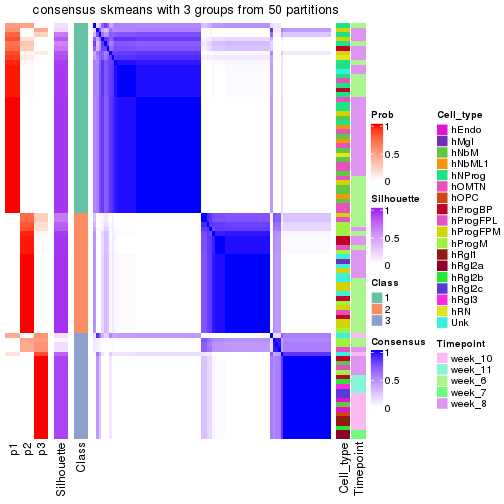</p>

</div>
<div id='tab-node-02112-consensus-heatmap-3'>
<pre><code class="r">consensus_heatmap(res, k = 4)
</code></pre>

<p></p>

</div>
</div>

Heatmaps for the membership of samples in all partitions to see how consistent they are:


<script>
$( function() {
	$( '#tabs-node-02112-membership-heatmap' ).tabs();
} );
</script>
<div id='tabs-node-02112-membership-heatmap'>
<ul>
<li><a href='#tab-node-02112-membership-heatmap-1'>k = 2</a></li>
<li><a href='#tab-node-02112-membership-heatmap-2'>k = 3</a></li>
<li><a href='#tab-node-02112-membership-heatmap-3'>k = 4</a></li>
</ul>
<div id='tab-node-02112-membership-heatmap-1'>
<pre><code class="r">membership_heatmap(res, k = 2)
</code></pre>

<p></p>

</div>
<div id='tab-node-02112-membership-heatmap-2'>
<pre><code class="r">membership_heatmap(res, k = 3)
</code></pre>

<p></p>

</div>
<div id='tab-node-02112-membership-heatmap-3'>
<pre><code class="r">membership_heatmap(res, k = 4)
</code></pre>

<p></p>

</div>
</div>

As soon as the classes for columns are determined, the signatures
that are significantly different between subgroups can be looked for. 
Following are the heatmaps for signatures.


Signature heatmaps where rows are scaled:


<script>
$( function() {
	$( '#tabs-node-02112-get-signatures' ).tabs();
} );
</script>
<div id='tabs-node-02112-get-signatures'>
<ul>
<li><a href='#tab-node-02112-get-signatures-1'>k = 2</a></li>
<li><a href='#tab-node-02112-get-signatures-2'>k = 3</a></li>
<li><a href='#tab-node-02112-get-signatures-3'>k = 4</a></li>
</ul>
<div id='tab-node-02112-get-signatures-1'>
<pre><code class="r">get_signatures(res, k = 2)
</code></pre>

<p></p>

</div>
<div id='tab-node-02112-get-signatures-2'>
<pre><code class="r">get_signatures(res, k = 3)
</code></pre>

<p></p>

</div>
<div id='tab-node-02112-get-signatures-3'>
<pre><code class="r">get_signatures(res, k = 4)
</code></pre>

<p></p>

</div>
</div>


Signature heatmaps where rows are not scaled:


<script>
$( function() {
	$( '#tabs-node-02112-get-signatures-no-scale' ).tabs();
} );
</script>
<div id='tabs-node-02112-get-signatures-no-scale'>
<ul>
<li><a href='#tab-node-02112-get-signatures-no-scale-1'>k = 2</a></li>
<li><a href='#tab-node-02112-get-signatures-no-scale-2'>k = 3</a></li>
<li><a href='#tab-node-02112-get-signatures-no-scale-3'>k = 4</a></li>
</ul>
<div id='tab-node-02112-get-signatures-no-scale-1'>
<pre><code class="r">get_signatures(res, k = 2, scale_rows = FALSE)
</code></pre>

<p></p>

</div>
<div id='tab-node-02112-get-signatures-no-scale-2'>
<pre><code class="r">get_signatures(res, k = 3, scale_rows = FALSE)
</code></pre>

<p></p>

</div>
<div id='tab-node-02112-get-signatures-no-scale-3'>
<pre><code class="r">get_signatures(res, k = 4, scale_rows = FALSE)
</code></pre>

<p></p>

</div>
</div>


Compare the overlap of signatures from different k:

```r
compare_signatures(res)
```


`get_signature()` returns a data frame invisibly. To get the list of signatures, the function
call should be assigned to a variable explicitly. In following code, if `plot` argument is set
to `FALSE`, no heatmap is plotted while only the differential analysis is performed.

```r
# code only for demonstration
tb = get_signature(res, k = ..., plot = FALSE)
```

An example of the output of `tb` is:

```
#>   which_row         fdr    mean_1    mean_2 scaled_mean_1 scaled_mean_2 km
#> 1        38 0.042760348  8.373488  9.131774    -0.5533452     0.5164555  1
#> 2        40 0.018707592  7.106213  8.469186    -0.6173731     0.5762149  1
#> 3        55 0.019134737 10.221463 11.207825    -0.6159697     0.5749050  1
#> 4        59 0.006059896  5.921854  7.869574    -0.6899429     0.6439467  1
#> 5        60 0.018055526  8.928898 10.211722    -0.6204761     0.5791110  1
#> 6        98 0.009384629 15.714769 14.887706     0.6635654    -0.6193277  2
...
```

The columns in `tb` are:

1. `which_row`: row indices corresponding to the input matrix.
2. `fdr`: FDR for the differential test. 
3. `mean_x`: The mean value in group x.
4. `scaled_mean_x`: The mean value in group x after rows are scaled.
5. `km`: Row groups if k-means clustering is applied to rows (which is done by automatically selecting number of clusters).

If there are too many signatures, `top_signatures = ...` can be set to only show the 
signatures with the highest FDRs:

```r
# code only for demonstration
# e.g. to show the top 500 most significant rows
tb = get_signature(res, k = ..., top_signatures = 500)
```

If the signatures are defined as these which are uniquely high in current group, `diff_method` argument
can be set to `"uniquely_high_in_one_group"`:

```r
# code only for demonstration
tb = get_signature(res, k = ..., diff_method = "uniquely_high_in_one_group")
```


UMAP plot which shows how samples are separated.


<script>
$( function() {
	$( '#tabs-node-02112-dimension-reduction' ).tabs();
} );
</script>
<div id='tabs-node-02112-dimension-reduction'>
<ul>
<li><a href='#tab-node-02112-dimension-reduction-1'>k = 2</a></li>
<li><a href='#tab-node-02112-dimension-reduction-2'>k = 3</a></li>
<li><a href='#tab-node-02112-dimension-reduction-3'>k = 4</a></li>
</ul>
<div id='tab-node-02112-dimension-reduction-1'>
<pre><code class="r">dimension_reduction(res, k = 2, method = &quot;UMAP&quot;)
</code></pre>

<p></p>

</div>
<div id='tab-node-02112-dimension-reduction-2'>
<pre><code class="r">dimension_reduction(res, k = 3, method = &quot;UMAP&quot;)
</code></pre>

<p></p>

</div>
<div id='tab-node-02112-dimension-reduction-3'>
<pre><code class="r">dimension_reduction(res, k = 4, method = &quot;UMAP&quot;)
</code></pre>

<p></p>

</div>
</div>


Following heatmap shows how subgroups are split when increasing `k`:

```r
collect_classes(res)
```


Test correlation between subgroups and known annotations. If the known
annotation is numeric, one-way ANOVA test is applied, and if the known
annotation is discrete, chi-squared contingency table test is applied.

```r
test_to_known_factors(res)
```

```
#>             n_sample Cell_type(p-value) Timepoint(p-value) k
#> ATC:skmeans       89           1.04e-06           5.06e-02 2
#> ATC:skmeans       84           3.71e-09           7.25e-12 3
#> ATC:skmeans       88           8.16e-07           1.32e-09 4
```


If matrix rows can be associated to genes, consider to use `functional_enrichment(res,
...)` to perform function enrichment for the signature genes. See [this vignette](https://jokergoo.github.io/cola_vignettes/functional_enrichment.html) for more detailed explanations.


 

---------------------------------------------------


### Node0212


Parent node: [Node021](#Node021).
Child nodes: 
                Node01121-leaf
        ,
                Node01122-leaf
        ,
                Node01131-leaf
        ,
                Node01132-leaf
        ,
                Node01133-leaf
        ,
                [Node01211](#Node01211)
        ,
                Node01212-leaf
        ,
                Node01221-leaf
        ,
                [Node01222](#Node01222)
        ,
                Node01311-leaf
        ,
                Node01312-leaf
        ,
                Node01313-leaf
        ,
                Node01321-leaf
        ,
                Node01322-leaf
        ,
                Node01331-leaf
        ,
                Node01332-leaf
        ,
                Node02111-leaf
        ,
                [Node02112](#Node02112)
        ,
                Node02121-leaf
        ,
                Node02122-leaf
        ,
                [Node02123](#Node02123)
        ,
                Node02221-leaf
        ,
                Node02222-leaf
        ,
                Node02231-leaf
        ,
                Node02232-leaf
        ,
                Node02311-leaf
        ,
                Node02312-leaf
        ,
                Node02321-leaf
        ,
                Node02322-leaf
        ,
                Node02323-leaf
        ,
                Node02421-leaf
        ,
                Node02422-leaf
        .


The object with results only for a single top-value method and a single partitioning method 
can be extracted as:

```r
res = res_rh["0212"]
```

A summary of `res` and all the functions that can be applied to it:

```r
res
```

```
#> A 'ConsensusPartition' object with k = 2, 3, 4.
#>   On a matrix with 8664 rows and 150 columns.
#>   Top rows (866) are extracted by 'ATC' method.
#>   Subgroups are detected by 'skmeans' method.
#>   Performed in total 150 partitions by row resampling.
#>   Best k for subgroups seems to be 4.
#> 
#> Following methods can be applied to this 'ConsensusPartition' object:
#>  [1] "cola_report"             "collect_classes"         "collect_plots"          
#>  [4] "collect_stats"           "colnames"                "compare_partitions"     
#>  [7] "compare_signatures"      "consensus_heatmap"       "dimension_reduction"    
#> [10] "functional_enrichment"   "get_anno_col"            "get_anno"               
#> [13] "get_classes"             "get_consensus"           "get_matrix"             
#> [16] "get_membership"          "get_param"               "get_signatures"         
#> [19] "get_stats"               "is_best_k"               "is_stable_k"            
#> [22] "membership_heatmap"      "ncol"                    "nrow"                   
#> [25] "plot_ecdf"               "predict_classes"         "rownames"               
#> [28] "select_partition_number" "show"                    "suggest_best_k"         
#> [31] "test_to_known_factors"   "top_rows_heatmap"
```

`collect_plots()` function collects all the plots made from `res` for all `k` (number of subgroups)
into one single page to provide an easy and fast comparison between different `k`.

```r
collect_plots(res)
```


The plots are:

- The first row: a plot of the eCDF (empirical cumulative distribution
  function) curves of the consensus matrix for each `k` and the heatmap of
  predicted classes for each `k`.
- The second row: heatmaps of the consensus matrix for each `k`.
- The third row: heatmaps of the membership matrix for each `k`.
- The fouth row: heatmaps of the signatures for each `k`.

All the plots in panels can be made by individual functions and they are
plotted later in this section.

`select_partition_number()` produces several plots showing different
statistics for choosing "optimized" `k`. There are following statistics:

- eCDF curves of the consensus matrix for each `k`;
- 1-PAC. [The PAC score](https://en.wikipedia.org/wiki/Consensus_clustering#Over-interpretation_potential_of_consensus_clustering)
  measures the proportion of the ambiguous subgrouping.
- Mean silhouette score.
- Concordance. The mean probability of fiting the consensus subgroup labels in all
  partitions.
- Area increased. Denote $A_k$ as the area under the eCDF curve for current
  `k`, the area increased is defined as $A_k - A_{k-1}$.
- Rand index. The percent of pairs of samples that are both in a same cluster
  or both are not in a same cluster in the partition of k and k-1.
- Jaccard index. The ratio of pairs of samples are both in a same cluster in
  the partition of k and k-1 and the pairs of samples are both in a same
  cluster in the partition k or k-1.

The detailed explanations of these statistics can be found in [the _cola_
vignette](https://jokergoo.github.io/cola_vignettes/cola.html#toc_13).

Generally speaking, higher 1-PAC score, higher mean silhouette score or higher
concordance corresponds to better partition. Rand index and Jaccard index
measure how similar the current partition is compared to partition with `k-1`.
If they are too similar, we won't accept `k` is better than `k-1`.

```r
select_partition_number(res)
```


The numeric values for all these statistics can be obtained by `get_stats()`.

```r
get_stats(res)
```

```
#>   k 1-PAC mean_silhouette concordance area_increased  Rand Jaccard
#> 2 2 0.984           0.953       0.980          0.484 0.514   0.514
#> 3 3 1.000           0.957       0.982          0.378 0.693   0.468
#> 4 4 0.919           0.895       0.956          0.125 0.823   0.533
```

`suggest_best_k()` suggests the best $k$ based on these statistics. The rules are as follows:

- All $k$ with Jaccard index larger than 0.95 are removed because increasing
  $k$ does not provide enough extra information. If all $k$ are removed, it is
  marked as no subgroup is detected.
- For all $k$ with 1-PAC score larger than 0.9, the maximal $k$ is taken as
  the best $k$, and other $k$ are marked as optional $k$.
- If it does not fit the second rule. The $k$ with the maximal vote of the
  highest 1-PAC score, highest mean silhouette, and highest concordance is
  taken as the best $k$.

```r
suggest_best_k(res)
```

```
#> [1] 4
#> attr(,"optional")
#> [1] 2 3
```

There is also optional best $k$ = 2 3 that is worth to check.

Following is the table of the partitions (You need to click the **show/hide
code output** link to see it). The membership matrix (columns with name `p*`)
is inferred by
[`clue::cl_consensus()`](https://www.rdocumentation.org/link/cl_consensus?package=clue)
function with the `SE` method. Basically the value in the membership matrix
represents the probability to belong to a certain group. The finall subgroup
label for an item is determined with the group with highest probability it
belongs to.

In `get_classes()` function, the entropy is calculated from the membership
matrix and the silhouette score is calculated from the consensus matrix.


<script>
$( function() {
	$( '#tabs-node-0212-get-classes' ).tabs();
} );
</script>
<div id='tabs-node-0212-get-classes'>
<ul>
<li><a href='#tab-node-0212-get-classes-1'>k = 2</a></li>
<li><a href='#tab-node-0212-get-classes-2'>k = 3</a></li>
<li><a href='#tab-node-0212-get-classes-3'>k = 4</a></li>
</ul>

<div id='tab-node-0212-get-classes-1'>
<p><a id='tab-node-0212-get-classes-1-a' style='color:#0366d6' href='#'>show/hide code output</a></p>
<pre><code class="r">cbind(get_classes(res, k = 2), get_membership(res, k = 2))
</code></pre>

<pre><code>#&gt;                 class entropy silhouette   p1   p2
#&gt; 1772067_089_A11     1   0.000      0.987 1.00 0.00
#&gt; 1772071_027_C11     2   0.000      0.969 0.00 1.00
#&gt; 1772071_027_H02     2   0.000      0.969 0.00 1.00
#&gt; 1772071_029_F03     1   0.000      0.987 1.00 0.00
#&gt; 1772075_299_D04     2   0.000      0.969 0.00 1.00
#&gt; 1772075_299_E06     2   0.000      0.969 0.00 1.00
#&gt; 1772078_001_A07     2   0.000      0.969 0.00 1.00
#&gt; 1772078_001_A09     2   0.000      0.969 0.00 1.00
#&gt; 1772078_001_B09     1   0.000      0.987 1.00 0.00
#&gt; 1772078_001_D05     1   0.000      0.987 1.00 0.00
#&gt; 1772078_002_E12     2   0.981      0.298 0.42 0.58
#&gt; 1772096_095_H07     1   0.000      0.987 1.00 0.00
#&gt; 1772122_236_C11     1   0.958      0.365 0.62 0.38
#&gt; 1772122_203_F09     1   0.000      0.987 1.00 0.00
#&gt; 1772122_316_B04     2   0.402      0.898 0.08 0.92
#&gt; 1772122_316_B06     2   0.000      0.969 0.00 1.00
#&gt; 1772122_316_B11     2   0.141      0.953 0.02 0.98
#&gt; 1772122_316_C02     2   0.000      0.969 0.00 1.00
#&gt; 1772122_316_C06     1   0.000      0.987 1.00 0.00
#&gt; 1772122_316_C08     1   0.000      0.987 1.00 0.00
#&gt; 1772122_316_D05     2   0.000      0.969 0.00 1.00
#&gt; 1772122_316_D06     1   0.000      0.987 1.00 0.00
#&gt; 1772122_316_D11     2   0.000      0.969 0.00 1.00
#&gt; 1772122_316_E03     1   0.000      0.987 1.00 0.00
#&gt; 1772122_316_E07     2   0.000      0.969 0.00 1.00
#&gt; 1772122_316_E11     2   0.000      0.969 0.00 1.00
#&gt; 1772122_316_F02     1   0.000      0.987 1.00 0.00
#&gt; 1772122_316_F04     1   0.000      0.987 1.00 0.00
#&gt; 1772122_316_F07     1   0.000      0.987 1.00 0.00
#&gt; 1772122_316_F09     1   0.000      0.987 1.00 0.00
#&gt; 1772122_316_F11     1   0.000      0.987 1.00 0.00
#&gt; 1772122_316_G04     2   0.000      0.969 0.00 1.00
#&gt; 1772122_316_G08     1   0.000      0.987 1.00 0.00
#&gt; 1772122_316_G10     1   0.000      0.987 1.00 0.00
#&gt; 1772122_316_G12     2   0.722      0.749 0.20 0.80
#&gt; 1772122_316_H01     1   0.000      0.987 1.00 0.00
#&gt; 1772122_316_H06     1   0.000      0.987 1.00 0.00
#&gt; 1772122_316_H09     2   0.000      0.969 0.00 1.00
#&gt; 1772122_317_A02     1   0.000      0.987 1.00 0.00
#&gt; 1772122_317_A11     2   0.000      0.969 0.00 1.00
#&gt; 1772122_317_B10     1   0.000      0.987 1.00 0.00
#&gt; 1772122_317_C02     2   0.000      0.969 0.00 1.00
#&gt; 1772122_317_C07     2   0.000      0.969 0.00 1.00
#&gt; 1772122_317_C08     1   0.000      0.987 1.00 0.00
#&gt; 1772122_317_D01     1   0.000      0.987 1.00 0.00
#&gt; 1772122_317_D04     1   0.000      0.987 1.00 0.00
#&gt; 1772122_317_E01     2   0.000      0.969 0.00 1.00
#&gt; 1772122_317_E02     1   0.000      0.987 1.00 0.00
#&gt; 1772122_317_E11     1   0.000      0.987 1.00 0.00
#&gt; 1772122_317_F04     1   0.000      0.987 1.00 0.00
#&gt; 1772122_317_F06     1   0.141      0.969 0.98 0.02
#&gt; 1772122_317_F09     1   0.000      0.987 1.00 0.00
#&gt; 1772122_317_G02     2   0.000      0.969 0.00 1.00
#&gt; 1772122_317_G09     1   0.000      0.987 1.00 0.00
#&gt; 1772122_317_G12     1   0.000      0.987 1.00 0.00
#&gt; 1772122_317_H02     1   0.242      0.950 0.96 0.04
#&gt; 1772122_317_H07     1   0.000      0.987 1.00 0.00
#&gt; 1772122_317_H09     1   0.000      0.987 1.00 0.00
#&gt; 1772122_317_H10     1   0.000      0.987 1.00 0.00
#&gt; 1772122_317_H11     1   0.000      0.987 1.00 0.00
#&gt; 1772122_317_H12     1   0.000      0.987 1.00 0.00
#&gt; 1772122_318_A06     2   0.000      0.969 0.00 1.00
#&gt; 1772122_318_A07     2   0.242      0.936 0.04 0.96
#&gt; 1772122_318_A08     1   0.242      0.950 0.96 0.04
#&gt; 1772122_318_A11     1   0.000      0.987 1.00 0.00
#&gt; 1772122_318_B01     1   0.000      0.987 1.00 0.00
#&gt; 1772122_318_B03     1   0.680      0.778 0.82 0.18
#&gt; 1772122_318_B04     2   0.000      0.969 0.00 1.00
#&gt; 1772122_318_B07     1   0.000      0.987 1.00 0.00
#&gt; 1772122_318_B09     2   0.000      0.969 0.00 1.00
#&gt; 1772122_318_B11     2   0.000      0.969 0.00 1.00
#&gt; 1772122_318_C02     1   0.000      0.987 1.00 0.00
#&gt; 1772122_318_C04     2   0.000      0.969 0.00 1.00
#&gt; 1772122_318_D09     1   0.000      0.987 1.00 0.00
#&gt; 1772122_318_F11     1   0.000      0.987 1.00 0.00
#&gt; 1772122_318_G04     2   0.000      0.969 0.00 1.00
#&gt; 1772122_318_G07     2   0.000      0.969 0.00 1.00
#&gt; 1772122_318_G08     1   0.760      0.716 0.78 0.22
#&gt; 1772122_318_G10     1   0.000      0.987 1.00 0.00
#&gt; 1772122_318_H02     2   0.000      0.969 0.00 1.00
#&gt; 1772122_318_H04     1   0.000      0.987 1.00 0.00
#&gt; 1772122_318_H09     2   0.000      0.969 0.00 1.00
#&gt; 1772122_319_A05     1   0.000      0.987 1.00 0.00
#&gt; 1772122_319_A06     2   0.000      0.969 0.00 1.00
#&gt; 1772122_319_A07     1   0.000      0.987 1.00 0.00
#&gt; 1772122_319_A10     1   0.000      0.987 1.00 0.00
#&gt; 1772122_319_A11     2   0.000      0.969 0.00 1.00
#&gt; 1772122_319_B02     1   0.000      0.987 1.00 0.00
#&gt; 1772122_319_B04     1   0.000      0.987 1.00 0.00
#&gt; 1772122_319_B05     1   0.000      0.987 1.00 0.00
#&gt; 1772122_319_B06     2   0.000      0.969 0.00 1.00
#&gt; 1772122_319_C03     1   0.000      0.987 1.00 0.00
#&gt; 1772122_319_C10     1   0.000      0.987 1.00 0.00
#&gt; 1772122_319_C11     1   0.000      0.987 1.00 0.00
#&gt; 1772122_319_C12     1   0.000      0.987 1.00 0.00
#&gt; 1772122_319_D01     1   0.000      0.987 1.00 0.00
#&gt; 1772122_319_D09     2   0.000      0.969 0.00 1.00
#&gt; 1772122_319_D11     2   0.000      0.969 0.00 1.00
#&gt; 1772122_319_E03     1   0.000      0.987 1.00 0.00
#&gt; 1772122_319_E04     2   0.000      0.969 0.00 1.00
#&gt; 1772122_319_E06     1   0.000      0.987 1.00 0.00
#&gt; 1772122_319_F02     1   0.000      0.987 1.00 0.00
#&gt; 1772122_319_F04     1   0.000      0.987 1.00 0.00
#&gt; 1772122_319_F08     2   0.000      0.969 0.00 1.00
#&gt; 1772122_319_F09     1   0.000      0.987 1.00 0.00
#&gt; 1772122_319_F11     1   0.000      0.987 1.00 0.00
#&gt; 1772122_319_G01     1   0.000      0.987 1.00 0.00
#&gt; 1772122_319_G04     1   0.000      0.987 1.00 0.00
#&gt; 1772122_319_G05     1   0.000      0.987 1.00 0.00
#&gt; 1772122_319_G06     2   0.000      0.969 0.00 1.00
#&gt; 1772122_319_G11     1   0.000      0.987 1.00 0.00
#&gt; 1772122_319_H04     1   0.000      0.987 1.00 0.00
#&gt; 1772122_319_H08     1   0.000      0.987 1.00 0.00
#&gt; 1772122_319_H11     2   0.000      0.969 0.00 1.00
#&gt; 1772122_221_C02     1   0.000      0.987 1.00 0.00
#&gt; 1772122_221_D02     2   0.000      0.969 0.00 1.00
#&gt; 1772122_221_E05     1   0.000      0.987 1.00 0.00
#&gt; 1772122_221_E07     1   0.000      0.987 1.00 0.00
#&gt; 1772122_221_F09     1   0.000      0.987 1.00 0.00
#&gt; 1772122_221_G05     1   0.000      0.987 1.00 0.00
#&gt; 1772122_221_H09     1   0.000      0.987 1.00 0.00
#&gt; 1772122_221_H11     1   0.000      0.987 1.00 0.00
#&gt; 1772122_220_A06     2   0.402      0.898 0.08 0.92
#&gt; 1772122_220_A07     1   0.327      0.929 0.94 0.06
#&gt; 1772122_220_B03     1   0.000      0.987 1.00 0.00
#&gt; 1772122_220_B06     2   0.000      0.969 0.00 1.00
#&gt; 1772122_220_B07     1   0.584      0.835 0.86 0.14
#&gt; 1772122_220_C04     2   0.000      0.969 0.00 1.00
#&gt; 1772122_220_D02     1   0.000      0.987 1.00 0.00
#&gt; 1772122_220_E04     2   0.981      0.300 0.42 0.58
#&gt; 1772122_220_F04     1   0.000      0.987 1.00 0.00
#&gt; 1772122_220_F11     2   0.981      0.301 0.42 0.58
#&gt; 1772122_220_G06     2   0.000      0.969 0.00 1.00
#&gt; 1772122_220_G09     1   0.141      0.969 0.98 0.02
#&gt; 1772122_220_G12     2   0.000      0.969 0.00 1.00
#&gt; 1772122_220_H11     2   0.000      0.969 0.00 1.00
#&gt; 1772122_226_D09     2   0.000      0.969 0.00 1.00
#&gt; 1772122_223_A01     1   0.000      0.987 1.00 0.00
#&gt; 1772122_223_D09     1   0.000      0.987 1.00 0.00
#&gt; 1772122_223_F11     2   0.000      0.969 0.00 1.00
#&gt; 1772122_223_G02     2   0.000      0.969 0.00 1.00
#&gt; 1772122_223_G09     2   0.000      0.969 0.00 1.00
#&gt; 1772122_223_H03     2   0.000      0.969 0.00 1.00
#&gt; 1772122_224_A03     2   0.634      0.805 0.16 0.84
#&gt; 1772122_224_A06     1   0.000      0.987 1.00 0.00
#&gt; 1772122_224_A11     1   0.000      0.987 1.00 0.00
#&gt; 1772122_224_B07     2   0.000      0.969 0.00 1.00
#&gt; 1772122_224_D07     2   0.000      0.969 0.00 1.00
#&gt; 1772122_224_F07     2   0.000      0.969 0.00 1.00
#&gt; 1772122_224_H09     2   0.000      0.969 0.00 1.00
</code></pre>

<script>
$('#tab-node-0212-get-classes-1-a').parent().next().next().hide();
$('#tab-node-0212-get-classes-1-a').click(function(){
  $('#tab-node-0212-get-classes-1-a').parent().next().next().toggle();
  return(false);
});
</script>
</div>

<div id='tab-node-0212-get-classes-2'>
<p><a id='tab-node-0212-get-classes-2-a' style='color:#0366d6' href='#'>show/hide code output</a></p>
<pre><code class="r">cbind(get_classes(res, k = 3), get_membership(res, k = 3))
</code></pre>

<pre><code>#&gt;                 class entropy silhouette   p1   p2   p3
#&gt; 1772067_089_A11     1  0.3340      0.856 0.88 0.00 0.12
#&gt; 1772071_027_C11     2  0.1529      0.947 0.00 0.96 0.04
#&gt; 1772071_027_H02     3  0.0000      0.995 0.00 0.00 1.00
#&gt; 1772071_029_F03     3  0.0000      0.995 0.00 0.00 1.00
#&gt; 1772075_299_D04     3  0.0000      0.995 0.00 0.00 1.00
#&gt; 1772075_299_E06     3  0.0000      0.995 0.00 0.00 1.00
#&gt; 1772078_001_A07     3  0.0000      0.995 0.00 0.00 1.00
#&gt; 1772078_001_A09     3  0.0000      0.995 0.00 0.00 1.00
#&gt; 1772078_001_B09     3  0.0000      0.995 0.00 0.00 1.00
#&gt; 1772078_001_D05     1  0.0000      0.965 1.00 0.00 0.00
#&gt; 1772078_002_E12     3  0.0000      0.995 0.00 0.00 1.00
#&gt; 1772096_095_H07     1  0.0000      0.965 1.00 0.00 0.00
#&gt; 1772122_236_C11     1  0.3686      0.832 0.86 0.00 0.14
#&gt; 1772122_203_F09     3  0.0000      0.995 0.00 0.00 1.00
#&gt; 1772122_316_B04     2  0.0000      0.984 0.00 1.00 0.00
#&gt; 1772122_316_B06     2  0.0000      0.984 0.00 1.00 0.00
#&gt; 1772122_316_B11     2  0.1529      0.946 0.04 0.96 0.00
#&gt; 1772122_316_C02     2  0.0000      0.984 0.00 1.00 0.00
#&gt; 1772122_316_C06     3  0.0000      0.995 0.00 0.00 1.00
#&gt; 1772122_316_C08     1  0.0000      0.965 1.00 0.00 0.00
#&gt; 1772122_316_D05     2  0.0000      0.984 0.00 1.00 0.00
#&gt; 1772122_316_D06     1  0.0000      0.965 1.00 0.00 0.00
#&gt; 1772122_316_D11     2  0.0000      0.984 0.00 1.00 0.00
#&gt; 1772122_316_E03     1  0.0000      0.965 1.00 0.00 0.00
#&gt; 1772122_316_E07     2  0.0000      0.984 0.00 1.00 0.00
#&gt; 1772122_316_E11     2  0.0000      0.984 0.00 1.00 0.00
#&gt; 1772122_316_F02     3  0.0000      0.995 0.00 0.00 1.00
#&gt; 1772122_316_F04     3  0.0000      0.995 0.00 0.00 1.00
#&gt; 1772122_316_F07     1  0.0000      0.965 1.00 0.00 0.00
#&gt; 1772122_316_F09     3  0.0000      0.995 0.00 0.00 1.00
#&gt; 1772122_316_F11     1  0.0000      0.965 1.00 0.00 0.00
#&gt; 1772122_316_G04     2  0.0000      0.984 0.00 1.00 0.00
#&gt; 1772122_316_G08     3  0.0000      0.995 0.00 0.00 1.00
#&gt; 1772122_316_G10     1  0.0000      0.965 1.00 0.00 0.00
#&gt; 1772122_316_G12     1  0.0000      0.965 1.00 0.00 0.00
#&gt; 1772122_316_H01     1  0.0000      0.965 1.00 0.00 0.00
#&gt; 1772122_316_H06     1  0.0000      0.965 1.00 0.00 0.00
#&gt; 1772122_316_H09     2  0.0000      0.984 0.00 1.00 0.00
#&gt; 1772122_317_A02     3  0.0000      0.995 0.00 0.00 1.00
#&gt; 1772122_317_A11     2  0.0000      0.984 0.00 1.00 0.00
#&gt; 1772122_317_B10     1  0.0000      0.965 1.00 0.00 0.00
#&gt; 1772122_317_C02     3  0.0000      0.995 0.00 0.00 1.00
#&gt; 1772122_317_C07     2  0.0000      0.984 0.00 1.00 0.00
#&gt; 1772122_317_C08     1  0.0000      0.965 1.00 0.00 0.00
#&gt; 1772122_317_D01     3  0.0000      0.995 0.00 0.00 1.00
#&gt; 1772122_317_D04     3  0.0000      0.995 0.00 0.00 1.00
#&gt; 1772122_317_E01     2  0.0000      0.984 0.00 1.00 0.00
#&gt; 1772122_317_E02     3  0.0000      0.995 0.00 0.00 1.00
#&gt; 1772122_317_E11     1  0.0000      0.965 1.00 0.00 0.00
#&gt; 1772122_317_F04     3  0.0000      0.995 0.00 0.00 1.00
#&gt; 1772122_317_F06     3  0.0892      0.977 0.02 0.00 0.98
#&gt; 1772122_317_F09     1  0.0000      0.965 1.00 0.00 0.00
#&gt; 1772122_317_G02     2  0.0000      0.984 0.00 1.00 0.00
#&gt; 1772122_317_G09     1  0.6126      0.359 0.60 0.00 0.40
#&gt; 1772122_317_G12     1  0.0000      0.965 1.00 0.00 0.00
#&gt; 1772122_317_H02     1  0.8334      0.104 0.48 0.08 0.44
#&gt; 1772122_317_H07     1  0.0000      0.965 1.00 0.00 0.00
#&gt; 1772122_317_H09     1  0.0000      0.965 1.00 0.00 0.00
#&gt; 1772122_317_H10     1  0.0000      0.965 1.00 0.00 0.00
#&gt; 1772122_317_H11     3  0.0000      0.995 0.00 0.00 1.00
#&gt; 1772122_317_H12     1  0.0000      0.965 1.00 0.00 0.00
#&gt; 1772122_318_A06     2  0.0000      0.984 0.00 1.00 0.00
#&gt; 1772122_318_A07     2  0.6053      0.636 0.02 0.72 0.26
#&gt; 1772122_318_A08     1  0.0000      0.965 1.00 0.00 0.00
#&gt; 1772122_318_A11     3  0.0000      0.995 0.00 0.00 1.00
#&gt; 1772122_318_B01     1  0.0000      0.965 1.00 0.00 0.00
#&gt; 1772122_318_B03     1  0.0000      0.965 1.00 0.00 0.00
#&gt; 1772122_318_B04     2  0.0000      0.984 0.00 1.00 0.00
#&gt; 1772122_318_B07     3  0.0000      0.995 0.00 0.00 1.00
#&gt; 1772122_318_B09     2  0.0000      0.984 0.00 1.00 0.00
#&gt; 1772122_318_B11     2  0.0000      0.984 0.00 1.00 0.00
#&gt; 1772122_318_C02     3  0.0000      0.995 0.00 0.00 1.00
#&gt; 1772122_318_C04     2  0.0000      0.984 0.00 1.00 0.00
#&gt; 1772122_318_D09     3  0.0000      0.995 0.00 0.00 1.00
#&gt; 1772122_318_F11     1  0.0000      0.965 1.00 0.00 0.00
#&gt; 1772122_318_G04     2  0.5706      0.538 0.00 0.68 0.32
#&gt; 1772122_318_G07     2  0.0000      0.984 0.00 1.00 0.00
#&gt; 1772122_318_G08     1  0.0000      0.965 1.00 0.00 0.00
#&gt; 1772122_318_G10     1  0.0000      0.965 1.00 0.00 0.00
#&gt; 1772122_318_H02     2  0.0000      0.984 0.00 1.00 0.00
#&gt; 1772122_318_H04     1  0.0892      0.948 0.98 0.00 0.02
#&gt; 1772122_318_H09     2  0.0000      0.984 0.00 1.00 0.00
#&gt; 1772122_319_A05     1  0.0000      0.965 1.00 0.00 0.00
#&gt; 1772122_319_A06     2  0.0000      0.984 0.00 1.00 0.00
#&gt; 1772122_319_A07     1  0.0000      0.965 1.00 0.00 0.00
#&gt; 1772122_319_A10     1  0.0000      0.965 1.00 0.00 0.00
#&gt; 1772122_319_A11     2  0.0000      0.984 0.00 1.00 0.00
#&gt; 1772122_319_B02     3  0.0000      0.995 0.00 0.00 1.00
#&gt; 1772122_319_B04     3  0.0000      0.995 0.00 0.00 1.00
#&gt; 1772122_319_B05     1  0.0000      0.965 1.00 0.00 0.00
#&gt; 1772122_319_B06     2  0.0000      0.984 0.00 1.00 0.00
#&gt; 1772122_319_C03     1  0.0000      0.965 1.00 0.00 0.00
#&gt; 1772122_319_C10     1  0.0000      0.965 1.00 0.00 0.00
#&gt; 1772122_319_C11     1  0.0000      0.965 1.00 0.00 0.00
#&gt; 1772122_319_C12     1  0.0000      0.965 1.00 0.00 0.00
#&gt; 1772122_319_D01     1  0.0000      0.965 1.00 0.00 0.00
#&gt; 1772122_319_D09     2  0.0000      0.984 0.00 1.00 0.00
#&gt; 1772122_319_D11     2  0.0000      0.984 0.00 1.00 0.00
#&gt; 1772122_319_E03     1  0.0000      0.965 1.00 0.00 0.00
#&gt; 1772122_319_E04     2  0.0000      0.984 0.00 1.00 0.00
#&gt; 1772122_319_E06     1  0.0000      0.965 1.00 0.00 0.00
#&gt; 1772122_319_F02     1  0.5835      0.510 0.66 0.00 0.34
#&gt; 1772122_319_F04     3  0.0000      0.995 0.00 0.00 1.00
#&gt; 1772122_319_F08     2  0.0000      0.984 0.00 1.00 0.00
#&gt; 1772122_319_F09     3  0.0000      0.995 0.00 0.00 1.00
#&gt; 1772122_319_F11     3  0.0000      0.995 0.00 0.00 1.00
#&gt; 1772122_319_G01     1  0.0000      0.965 1.00 0.00 0.00
#&gt; 1772122_319_G04     3  0.0000      0.995 0.00 0.00 1.00
#&gt; 1772122_319_G05     1  0.0000      0.965 1.00 0.00 0.00
#&gt; 1772122_319_G06     2  0.0000      0.984 0.00 1.00 0.00
#&gt; 1772122_319_G11     1  0.0000      0.965 1.00 0.00 0.00
#&gt; 1772122_319_H04     1  0.0000      0.965 1.00 0.00 0.00
#&gt; 1772122_319_H08     1  0.0000      0.965 1.00 0.00 0.00
#&gt; 1772122_319_H11     3  0.0000      0.995 0.00 0.00 1.00
#&gt; 1772122_221_C02     3  0.0000      0.995 0.00 0.00 1.00
#&gt; 1772122_221_D02     2  0.0000      0.984 0.00 1.00 0.00
#&gt; 1772122_221_E05     3  0.1529      0.958 0.04 0.00 0.96
#&gt; 1772122_221_E07     1  0.4555      0.751 0.80 0.00 0.20
#&gt; 1772122_221_F09     3  0.0000      0.995 0.00 0.00 1.00
#&gt; 1772122_221_G05     3  0.0000      0.995 0.00 0.00 1.00
#&gt; 1772122_221_H09     1  0.0000      0.965 1.00 0.00 0.00
#&gt; 1772122_221_H11     3  0.2537      0.913 0.08 0.00 0.92
#&gt; 1772122_220_A06     3  0.0000      0.995 0.00 0.00 1.00
#&gt; 1772122_220_A07     3  0.0000      0.995 0.00 0.00 1.00
#&gt; 1772122_220_B03     1  0.0000      0.965 1.00 0.00 0.00
#&gt; 1772122_220_B06     3  0.0000      0.995 0.00 0.00 1.00
#&gt; 1772122_220_B07     1  0.0000      0.965 1.00 0.00 0.00
#&gt; 1772122_220_C04     2  0.0000      0.984 0.00 1.00 0.00
#&gt; 1772122_220_D02     3  0.0000      0.995 0.00 0.00 1.00
#&gt; 1772122_220_E04     3  0.0000      0.995 0.00 0.00 1.00
#&gt; 1772122_220_F04     3  0.0000      0.995 0.00 0.00 1.00
#&gt; 1772122_220_F11     3  0.0000      0.995 0.00 0.00 1.00
#&gt; 1772122_220_G06     3  0.0000      0.995 0.00 0.00 1.00
#&gt; 1772122_220_G09     3  0.2066      0.936 0.06 0.00 0.94
#&gt; 1772122_220_G12     2  0.0000      0.984 0.00 1.00 0.00
#&gt; 1772122_220_H11     2  0.0000      0.984 0.00 1.00 0.00
#&gt; 1772122_226_D09     2  0.0000      0.984 0.00 1.00 0.00
#&gt; 1772122_223_A01     1  0.0000      0.965 1.00 0.00 0.00
#&gt; 1772122_223_D09     3  0.0000      0.995 0.00 0.00 1.00
#&gt; 1772122_223_F11     3  0.0000      0.995 0.00 0.00 1.00
#&gt; 1772122_223_G02     3  0.0000      0.995 0.00 0.00 1.00
#&gt; 1772122_223_G09     2  0.0000      0.984 0.00 1.00 0.00
#&gt; 1772122_223_H03     2  0.0000      0.984 0.00 1.00 0.00
#&gt; 1772122_224_A03     1  0.2066      0.910 0.94 0.06 0.00
#&gt; 1772122_224_A06     3  0.0000      0.995 0.00 0.00 1.00
#&gt; 1772122_224_A11     3  0.0892      0.977 0.02 0.00 0.98
#&gt; 1772122_224_B07     2  0.0000      0.984 0.00 1.00 0.00
#&gt; 1772122_224_D07     2  0.0000      0.984 0.00 1.00 0.00
#&gt; 1772122_224_F07     3  0.0000      0.995 0.00 0.00 1.00
#&gt; 1772122_224_H09     2  0.0000      0.984 0.00 1.00 0.00
</code></pre>

<script>
$('#tab-node-0212-get-classes-2-a').parent().next().next().hide();
$('#tab-node-0212-get-classes-2-a').click(function(){
  $('#tab-node-0212-get-classes-2-a').parent().next().next().toggle();
  return(false);
});
</script>
</div>

<div id='tab-node-0212-get-classes-3'>
<p><a id='tab-node-0212-get-classes-3-a' style='color:#0366d6' href='#'>show/hide code output</a></p>
<pre><code class="r">cbind(get_classes(res, k = 4), get_membership(res, k = 4))
</code></pre>

<pre><code>#&gt;                 class entropy silhouette   p1   p2   p3   p4
#&gt; 1772067_089_A11     3  0.0000      0.874 0.00 0.00 1.00 0.00
#&gt; 1772071_027_C11     3  0.0000      0.874 0.00 0.00 1.00 0.00
#&gt; 1772071_027_H02     3  0.0000      0.874 0.00 0.00 1.00 0.00
#&gt; 1772071_029_F03     3  0.0000      0.874 0.00 0.00 1.00 0.00
#&gt; 1772075_299_D04     3  0.0000      0.874 0.00 0.00 1.00 0.00
#&gt; 1772075_299_E06     3  0.0000      0.874 0.00 0.00 1.00 0.00
#&gt; 1772078_001_A07     3  0.0000      0.874 0.00 0.00 1.00 0.00
#&gt; 1772078_001_A09     3  0.0000      0.874 0.00 0.00 1.00 0.00
#&gt; 1772078_001_B09     4  0.0000      0.929 0.00 0.00 0.00 1.00
#&gt; 1772078_001_D05     1  0.0000      0.988 1.00 0.00 0.00 0.00
#&gt; 1772078_002_E12     3  0.0000      0.874 0.00 0.00 1.00 0.00
#&gt; 1772096_095_H07     4  0.2647      0.815 0.12 0.00 0.00 0.88
#&gt; 1772122_236_C11     3  0.0000      0.874 0.00 0.00 1.00 0.00
#&gt; 1772122_203_F09     3  0.4907      0.289 0.00 0.00 0.58 0.42
#&gt; 1772122_316_B04     2  0.1913      0.938 0.04 0.94 0.00 0.02
#&gt; 1772122_316_B06     2  0.0000      0.998 0.00 1.00 0.00 0.00
#&gt; 1772122_316_B11     4  0.0000      0.929 0.00 0.00 0.00 1.00
#&gt; 1772122_316_C02     2  0.0000      0.998 0.00 1.00 0.00 0.00
#&gt; 1772122_316_C06     4  0.0000      0.929 0.00 0.00 0.00 1.00
#&gt; 1772122_316_C08     1  0.1211      0.950 0.96 0.00 0.00 0.04
#&gt; 1772122_316_D05     2  0.0000      0.998 0.00 1.00 0.00 0.00
#&gt; 1772122_316_D06     1  0.0000      0.988 1.00 0.00 0.00 0.00
#&gt; 1772122_316_D11     4  0.4907      0.259 0.00 0.42 0.00 0.58
#&gt; 1772122_316_E03     1  0.0000      0.988 1.00 0.00 0.00 0.00
#&gt; 1772122_316_E07     3  0.3801      0.675 0.00 0.22 0.78 0.00
#&gt; 1772122_316_E11     2  0.0000      0.998 0.00 1.00 0.00 0.00
#&gt; 1772122_316_F02     3  0.0000      0.874 0.00 0.00 1.00 0.00
#&gt; 1772122_316_F04     4  0.0000      0.929 0.00 0.00 0.00 1.00
#&gt; 1772122_316_F07     1  0.0000      0.988 1.00 0.00 0.00 0.00
#&gt; 1772122_316_F09     4  0.2011      0.868 0.00 0.00 0.08 0.92
#&gt; 1772122_316_F11     4  0.0000      0.929 0.00 0.00 0.00 1.00
#&gt; 1772122_316_G04     2  0.0000      0.998 0.00 1.00 0.00 0.00
#&gt; 1772122_316_G08     3  0.0000      0.874 0.00 0.00 1.00 0.00
#&gt; 1772122_316_G10     1  0.0000      0.988 1.00 0.00 0.00 0.00
#&gt; 1772122_316_G12     1  0.0707      0.970 0.98 0.02 0.00 0.00
#&gt; 1772122_316_H01     1  0.0000      0.988 1.00 0.00 0.00 0.00
#&gt; 1772122_316_H06     1  0.0000      0.988 1.00 0.00 0.00 0.00
#&gt; 1772122_316_H09     2  0.0000      0.998 0.00 1.00 0.00 0.00
#&gt; 1772122_317_A02     3  0.3801      0.692 0.00 0.00 0.78 0.22
#&gt; 1772122_317_A11     2  0.0000      0.998 0.00 1.00 0.00 0.00
#&gt; 1772122_317_B10     1  0.0000      0.988 1.00 0.00 0.00 0.00
#&gt; 1772122_317_C02     3  0.0000      0.874 0.00 0.00 1.00 0.00
#&gt; 1772122_317_C07     2  0.0000      0.998 0.00 1.00 0.00 0.00
#&gt; 1772122_317_C08     1  0.0000      0.988 1.00 0.00 0.00 0.00
#&gt; 1772122_317_D01     3  0.0000      0.874 0.00 0.00 1.00 0.00
#&gt; 1772122_317_D04     4  0.0000      0.929 0.00 0.00 0.00 1.00
#&gt; 1772122_317_E01     3  0.4855      0.339 0.00 0.40 0.60 0.00
#&gt; 1772122_317_E02     3  0.2647      0.795 0.00 0.00 0.88 0.12
#&gt; 1772122_317_E11     1  0.0000      0.988 1.00 0.00 0.00 0.00
#&gt; 1772122_317_F04     4  0.0000      0.929 0.00 0.00 0.00 1.00
#&gt; 1772122_317_F06     4  0.0000      0.929 0.00 0.00 0.00 1.00
#&gt; 1772122_317_F09     1  0.0000      0.988 1.00 0.00 0.00 0.00
#&gt; 1772122_317_G02     2  0.0000      0.998 0.00 1.00 0.00 0.00
#&gt; 1772122_317_G09     3  0.4277      0.597 0.28 0.00 0.72 0.00
#&gt; 1772122_317_G12     1  0.0000      0.988 1.00 0.00 0.00 0.00
#&gt; 1772122_317_H02     4  0.0000      0.929 0.00 0.00 0.00 1.00
#&gt; 1772122_317_H07     1  0.2011      0.912 0.92 0.00 0.00 0.08
#&gt; 1772122_317_H09     1  0.0000      0.988 1.00 0.00 0.00 0.00
#&gt; 1772122_317_H10     1  0.0000      0.988 1.00 0.00 0.00 0.00
#&gt; 1772122_317_H11     3  0.0000      0.874 0.00 0.00 1.00 0.00
#&gt; 1772122_317_H12     1  0.0000      0.988 1.00 0.00 0.00 0.00
#&gt; 1772122_318_A06     2  0.0000      0.998 0.00 1.00 0.00 0.00
#&gt; 1772122_318_A07     3  0.1211      0.849 0.00 0.04 0.96 0.00
#&gt; 1772122_318_A08     1  0.0000      0.988 1.00 0.00 0.00 0.00
#&gt; 1772122_318_A11     4  0.1211      0.902 0.00 0.00 0.04 0.96
#&gt; 1772122_318_B01     1  0.0000      0.988 1.00 0.00 0.00 0.00
#&gt; 1772122_318_B03     1  0.0000      0.988 1.00 0.00 0.00 0.00
#&gt; 1772122_318_B04     2  0.0000      0.998 0.00 1.00 0.00 0.00
#&gt; 1772122_318_B07     4  0.0000      0.929 0.00 0.00 0.00 1.00
#&gt; 1772122_318_B09     2  0.0000      0.998 0.00 1.00 0.00 0.00
#&gt; 1772122_318_B11     2  0.0000      0.998 0.00 1.00 0.00 0.00
#&gt; 1772122_318_C02     4  0.1637      0.886 0.00 0.00 0.06 0.94
#&gt; 1772122_318_C04     2  0.0000      0.998 0.00 1.00 0.00 0.00
#&gt; 1772122_318_D09     3  0.2921      0.778 0.00 0.00 0.86 0.14
#&gt; 1772122_318_F11     1  0.0000      0.988 1.00 0.00 0.00 0.00
#&gt; 1772122_318_G04     4  0.0000      0.929 0.00 0.00 0.00 1.00
#&gt; 1772122_318_G07     2  0.0000      0.998 0.00 1.00 0.00 0.00
#&gt; 1772122_318_G08     1  0.0000      0.988 1.00 0.00 0.00 0.00
#&gt; 1772122_318_G10     1  0.0000      0.988 1.00 0.00 0.00 0.00
#&gt; 1772122_318_H02     2  0.0000      0.998 0.00 1.00 0.00 0.00
#&gt; 1772122_318_H04     4  0.0000      0.929 0.00 0.00 0.00 1.00
#&gt; 1772122_318_H09     2  0.0000      0.998 0.00 1.00 0.00 0.00
#&gt; 1772122_319_A05     1  0.0000      0.988 1.00 0.00 0.00 0.00
#&gt; 1772122_319_A06     2  0.0000      0.998 0.00 1.00 0.00 0.00
#&gt; 1772122_319_A07     1  0.0000      0.988 1.00 0.00 0.00 0.00
#&gt; 1772122_319_A10     1  0.0000      0.988 1.00 0.00 0.00 0.00
#&gt; 1772122_319_A11     2  0.0000      0.998 0.00 1.00 0.00 0.00
#&gt; 1772122_319_B02     4  0.4522      0.500 0.00 0.00 0.32 0.68
#&gt; 1772122_319_B04     3  0.4977      0.161 0.00 0.00 0.54 0.46
#&gt; 1772122_319_B05     1  0.0000      0.988 1.00 0.00 0.00 0.00
#&gt; 1772122_319_B06     2  0.0000      0.998 0.00 1.00 0.00 0.00
#&gt; 1772122_319_C03     1  0.0000      0.988 1.00 0.00 0.00 0.00
#&gt; 1772122_319_C10     1  0.0000      0.988 1.00 0.00 0.00 0.00
#&gt; 1772122_319_C11     4  0.0000      0.929 0.00 0.00 0.00 1.00
#&gt; 1772122_319_C12     1  0.0000      0.988 1.00 0.00 0.00 0.00
#&gt; 1772122_319_D01     1  0.0000      0.988 1.00 0.00 0.00 0.00
#&gt; 1772122_319_D09     2  0.0000      0.998 0.00 1.00 0.00 0.00
#&gt; 1772122_319_D11     2  0.0000      0.998 0.00 1.00 0.00 0.00
#&gt; 1772122_319_E03     1  0.0000      0.988 1.00 0.00 0.00 0.00
#&gt; 1772122_319_E04     2  0.0000      0.998 0.00 1.00 0.00 0.00
#&gt; 1772122_319_E06     1  0.0000      0.988 1.00 0.00 0.00 0.00
#&gt; 1772122_319_F02     3  0.4994      0.104 0.48 0.00 0.52 0.00
#&gt; 1772122_319_F04     4  0.2647      0.824 0.00 0.00 0.12 0.88
#&gt; 1772122_319_F08     2  0.0000      0.998 0.00 1.00 0.00 0.00
#&gt; 1772122_319_F09     4  0.0000      0.929 0.00 0.00 0.00 1.00
#&gt; 1772122_319_F11     3  0.0000      0.874 0.00 0.00 1.00 0.00
#&gt; 1772122_319_G01     1  0.0000      0.988 1.00 0.00 0.00 0.00
#&gt; 1772122_319_G04     3  0.0000      0.874 0.00 0.00 1.00 0.00
#&gt; 1772122_319_G05     1  0.0000      0.988 1.00 0.00 0.00 0.00
#&gt; 1772122_319_G06     2  0.0000      0.998 0.00 1.00 0.00 0.00
#&gt; 1772122_319_G11     1  0.0000      0.988 1.00 0.00 0.00 0.00
#&gt; 1772122_319_H04     1  0.0000      0.988 1.00 0.00 0.00 0.00
#&gt; 1772122_319_H08     1  0.0000      0.988 1.00 0.00 0.00 0.00
#&gt; 1772122_319_H11     4  0.0000      0.929 0.00 0.00 0.00 1.00
#&gt; 1772122_221_C02     4  0.4855      0.300 0.00 0.00 0.40 0.60
#&gt; 1772122_221_D02     2  0.0000      0.998 0.00 1.00 0.00 0.00
#&gt; 1772122_221_E05     4  0.0000      0.929 0.00 0.00 0.00 1.00
#&gt; 1772122_221_E07     4  0.2345      0.835 0.10 0.00 0.00 0.90
#&gt; 1772122_221_F09     3  0.4277      0.601 0.00 0.00 0.72 0.28
#&gt; 1772122_221_G05     4  0.0000      0.929 0.00 0.00 0.00 1.00
#&gt; 1772122_221_H09     1  0.0000      0.988 1.00 0.00 0.00 0.00
#&gt; 1772122_221_H11     4  0.0707      0.915 0.02 0.00 0.00 0.98
#&gt; 1772122_220_A06     3  0.0000      0.874 0.00 0.00 1.00 0.00
#&gt; 1772122_220_A07     3  0.0000      0.874 0.00 0.00 1.00 0.00
#&gt; 1772122_220_B03     1  0.3975      0.688 0.76 0.00 0.00 0.24
#&gt; 1772122_220_B06     4  0.0000      0.929 0.00 0.00 0.00 1.00
#&gt; 1772122_220_B07     1  0.1211      0.953 0.96 0.00 0.00 0.04
#&gt; 1772122_220_C04     2  0.0000      0.998 0.00 1.00 0.00 0.00
#&gt; 1772122_220_D02     4  0.4907      0.236 0.00 0.00 0.42 0.58
#&gt; 1772122_220_E04     4  0.0000      0.929 0.00 0.00 0.00 1.00
#&gt; 1772122_220_F04     4  0.0000      0.929 0.00 0.00 0.00 1.00
#&gt; 1772122_220_F11     4  0.0000      0.929 0.00 0.00 0.00 1.00
#&gt; 1772122_220_G06     4  0.0000      0.929 0.00 0.00 0.00 1.00
#&gt; 1772122_220_G09     3  0.0707      0.863 0.00 0.00 0.98 0.02
#&gt; 1772122_220_G12     2  0.0000      0.998 0.00 1.00 0.00 0.00
#&gt; 1772122_220_H11     2  0.0000      0.998 0.00 1.00 0.00 0.00
#&gt; 1772122_226_D09     3  0.4855      0.334 0.00 0.40 0.60 0.00
#&gt; 1772122_223_A01     1  0.0000      0.988 1.00 0.00 0.00 0.00
#&gt; 1772122_223_D09     3  0.0000      0.874 0.00 0.00 1.00 0.00
#&gt; 1772122_223_F11     4  0.0000      0.929 0.00 0.00 0.00 1.00
#&gt; 1772122_223_G02     3  0.4277      0.607 0.00 0.00 0.72 0.28
#&gt; 1772122_223_G09     2  0.0000      0.998 0.00 1.00 0.00 0.00
#&gt; 1772122_223_H03     2  0.0000      0.998 0.00 1.00 0.00 0.00
#&gt; 1772122_224_A03     1  0.1913      0.935 0.94 0.04 0.02 0.00
#&gt; 1772122_224_A06     3  0.0000      0.874 0.00 0.00 1.00 0.00
#&gt; 1772122_224_A11     4  0.0000      0.929 0.00 0.00 0.00 1.00
#&gt; 1772122_224_B07     2  0.0000      0.998 0.00 1.00 0.00 0.00
#&gt; 1772122_224_D07     2  0.0000      0.998 0.00 1.00 0.00 0.00
#&gt; 1772122_224_F07     3  0.3610      0.720 0.00 0.00 0.80 0.20
#&gt; 1772122_224_H09     2  0.0000      0.998 0.00 1.00 0.00 0.00
</code></pre>

<script>
$('#tab-node-0212-get-classes-3-a').parent().next().next().hide();
$('#tab-node-0212-get-classes-3-a').click(function(){
  $('#tab-node-0212-get-classes-3-a').parent().next().next().toggle();
  return(false);
});
</script>
</div>
</div>

Heatmaps for the consensus matrix. It visualizes the probability of two
samples to be in a same group.


<script>
$( function() {
	$( '#tabs-node-0212-consensus-heatmap' ).tabs();
} );
</script>
<div id='tabs-node-0212-consensus-heatmap'>
<ul>
<li><a href='#tab-node-0212-consensus-heatmap-1'>k = 2</a></li>
<li><a href='#tab-node-0212-consensus-heatmap-2'>k = 3</a></li>
<li><a href='#tab-node-0212-consensus-heatmap-3'>k = 4</a></li>
</ul>
<div id='tab-node-0212-consensus-heatmap-1'>
<pre><code class="r">consensus_heatmap(res, k = 2)
</code></pre>

<p></p>

</div>
<div id='tab-node-0212-consensus-heatmap-2'>
<pre><code class="r">consensus_heatmap(res, k = 3)
</code></pre>

<p></p>

</div>
<div id='tab-node-0212-consensus-heatmap-3'>
<pre><code class="r">consensus_heatmap(res, k = 4)
</code></pre>

<p></p>

</div>
</div>

Heatmaps for the membership of samples in all partitions to see how consistent they are:


<script>
$( function() {
	$( '#tabs-node-0212-membership-heatmap' ).tabs();
} );
</script>
<div id='tabs-node-0212-membership-heatmap'>
<ul>
<li><a href='#tab-node-0212-membership-heatmap-1'>k = 2</a></li>
<li><a href='#tab-node-0212-membership-heatmap-2'>k = 3</a></li>
<li><a href='#tab-node-0212-membership-heatmap-3'>k = 4</a></li>
</ul>
<div id='tab-node-0212-membership-heatmap-1'>
<pre><code class="r">membership_heatmap(res, k = 2)
</code></pre>

<p></p>

</div>
<div id='tab-node-0212-membership-heatmap-2'>
<pre><code class="r">membership_heatmap(res, k = 3)
</code></pre>

<p></p>

</div>
<div id='tab-node-0212-membership-heatmap-3'>
<pre><code class="r">membership_heatmap(res, k = 4)
</code></pre>

<p></p>

</div>
</div>

As soon as the classes for columns are determined, the signatures
that are significantly different between subgroups can be looked for. 
Following are the heatmaps for signatures.


Signature heatmaps where rows are scaled:


<script>
$( function() {
	$( '#tabs-node-0212-get-signatures' ).tabs();
} );
</script>
<div id='tabs-node-0212-get-signatures'>
<ul>
<li><a href='#tab-node-0212-get-signatures-1'>k = 2</a></li>
<li><a href='#tab-node-0212-get-signatures-2'>k = 3</a></li>
<li><a href='#tab-node-0212-get-signatures-3'>k = 4</a></li>
</ul>
<div id='tab-node-0212-get-signatures-1'>
<pre><code class="r">get_signatures(res, k = 2)
</code></pre>

<p></p>

</div>
<div id='tab-node-0212-get-signatures-2'>
<pre><code class="r">get_signatures(res, k = 3)
</code></pre>

<p></p>

</div>
<div id='tab-node-0212-get-signatures-3'>
<pre><code class="r">get_signatures(res, k = 4)
</code></pre>

<p></p>

</div>
</div>


Signature heatmaps where rows are not scaled:


<script>
$( function() {
	$( '#tabs-node-0212-get-signatures-no-scale' ).tabs();
} );
</script>
<div id='tabs-node-0212-get-signatures-no-scale'>
<ul>
<li><a href='#tab-node-0212-get-signatures-no-scale-1'>k = 2</a></li>
<li><a href='#tab-node-0212-get-signatures-no-scale-2'>k = 3</a></li>
<li><a href='#tab-node-0212-get-signatures-no-scale-3'>k = 4</a></li>
</ul>
<div id='tab-node-0212-get-signatures-no-scale-1'>
<pre><code class="r">get_signatures(res, k = 2, scale_rows = FALSE)
</code></pre>

<p></p>

</div>
<div id='tab-node-0212-get-signatures-no-scale-2'>
<pre><code class="r">get_signatures(res, k = 3, scale_rows = FALSE)
</code></pre>

<p></p>

</div>
<div id='tab-node-0212-get-signatures-no-scale-3'>
<pre><code class="r">get_signatures(res, k = 4, scale_rows = FALSE)
</code></pre>

<p></p>

</div>
</div>


Compare the overlap of signatures from different k:

```r
compare_signatures(res)
```


`get_signature()` returns a data frame invisibly. To get the list of signatures, the function
call should be assigned to a variable explicitly. In following code, if `plot` argument is set
to `FALSE`, no heatmap is plotted while only the differential analysis is performed.

```r
# code only for demonstration
tb = get_signature(res, k = ..., plot = FALSE)
```

An example of the output of `tb` is:

```
#>   which_row         fdr    mean_1    mean_2 scaled_mean_1 scaled_mean_2 km
#> 1        38 0.042760348  8.373488  9.131774    -0.5533452     0.5164555  1
#> 2        40 0.018707592  7.106213  8.469186    -0.6173731     0.5762149  1
#> 3        55 0.019134737 10.221463 11.207825    -0.6159697     0.5749050  1
#> 4        59 0.006059896  5.921854  7.869574    -0.6899429     0.6439467  1
#> 5        60 0.018055526  8.928898 10.211722    -0.6204761     0.5791110  1
#> 6        98 0.009384629 15.714769 14.887706     0.6635654    -0.6193277  2
...
```

The columns in `tb` are:

1. `which_row`: row indices corresponding to the input matrix.
2. `fdr`: FDR for the differential test. 
3. `mean_x`: The mean value in group x.
4. `scaled_mean_x`: The mean value in group x after rows are scaled.
5. `km`: Row groups if k-means clustering is applied to rows (which is done by automatically selecting number of clusters).

If there are too many signatures, `top_signatures = ...` can be set to only show the 
signatures with the highest FDRs:

```r
# code only for demonstration
# e.g. to show the top 500 most significant rows
tb = get_signature(res, k = ..., top_signatures = 500)
```

If the signatures are defined as these which are uniquely high in current group, `diff_method` argument
can be set to `"uniquely_high_in_one_group"`:

```r
# code only for demonstration
tb = get_signature(res, k = ..., diff_method = "uniquely_high_in_one_group")
```


UMAP plot which shows how samples are separated.


<script>
$( function() {
	$( '#tabs-node-0212-dimension-reduction' ).tabs();
} );
</script>
<div id='tabs-node-0212-dimension-reduction'>
<ul>
<li><a href='#tab-node-0212-dimension-reduction-1'>k = 2</a></li>
<li><a href='#tab-node-0212-dimension-reduction-2'>k = 3</a></li>
<li><a href='#tab-node-0212-dimension-reduction-3'>k = 4</a></li>
</ul>
<div id='tab-node-0212-dimension-reduction-1'>
<pre><code class="r">dimension_reduction(res, k = 2, method = &quot;UMAP&quot;)
</code></pre>

<p></p>

</div>
<div id='tab-node-0212-dimension-reduction-2'>
<pre><code class="r">dimension_reduction(res, k = 3, method = &quot;UMAP&quot;)
</code></pre>

<p></p>

</div>
<div id='tab-node-0212-dimension-reduction-3'>
<pre><code class="r">dimension_reduction(res, k = 4, method = &quot;UMAP&quot;)
</code></pre>

<p></p>

</div>
</div>


Following heatmap shows how subgroups are split when increasing `k`:

```r
collect_classes(res)
```


Test correlation between subgroups and known annotations. If the known
annotation is numeric, one-way ANOVA test is applied, and if the known
annotation is discrete, chi-squared contingency table test is applied.

```r
test_to_known_factors(res)
```

```
#>             n_sample Cell_type(p-value) Timepoint(p-value) k
#> ATC:skmeans      146           1.15e-01           0.331844 2
#> ATC:skmeans      148           2.28e-04           0.002948 3
#> ATC:skmeans      142           4.58e-06           0.000171 4
```


If matrix rows can be associated to genes, consider to use `functional_enrichment(res,
...)` to perform function enrichment for the signature genes. See [this vignette](https://jokergoo.github.io/cola_vignettes/functional_enrichment.html) for more detailed explanations.


 

---------------------------------------------------


### Node02123


Parent node: [Node0212](#Node0212).
Child nodes: 
                Node012111-leaf
        ,
                Node012112-leaf
        ,
                Node012221-leaf
        ,
                Node012222-leaf
        ,
                Node021121-leaf
        ,
                Node021122-leaf
        ,
                Node021231-leaf
        ,
                Node021232-leaf
        ,
                Node021233-leaf
        .


The object with results only for a single top-value method and a single partitioning method 
can be extracted as:

```r
res = res_rh["02123"]
```

A summary of `res` and all the functions that can be applied to it:

```r
res
```

```
#> A 'ConsensusPartition' object with k = 2, 3, 4.
#>   On a matrix with 5570 rows and 53 columns.
#>   Top rows (512) are extracted by 'ATC' method.
#>   Subgroups are detected by 'skmeans' method.
#>   Performed in total 150 partitions by row resampling.
#>   Best k for subgroups seems to be 3.
#> 
#> Following methods can be applied to this 'ConsensusPartition' object:
#>  [1] "cola_report"             "collect_classes"         "collect_plots"          
#>  [4] "collect_stats"           "colnames"                "compare_partitions"     
#>  [7] "compare_signatures"      "consensus_heatmap"       "dimension_reduction"    
#> [10] "functional_enrichment"   "get_anno_col"            "get_anno"               
#> [13] "get_classes"             "get_consensus"           "get_matrix"             
#> [16] "get_membership"          "get_param"               "get_signatures"         
#> [19] "get_stats"               "is_best_k"               "is_stable_k"            
#> [22] "membership_heatmap"      "ncol"                    "nrow"                   
#> [25] "plot_ecdf"               "predict_classes"         "rownames"               
#> [28] "select_partition_number" "show"                    "suggest_best_k"         
#> [31] "test_to_known_factors"   "top_rows_heatmap"
```

`collect_plots()` function collects all the plots made from `res` for all `k` (number of subgroups)
into one single page to provide an easy and fast comparison between different `k`.

```r
collect_plots(res)
```


The plots are:

- The first row: a plot of the eCDF (empirical cumulative distribution
  function) curves of the consensus matrix for each `k` and the heatmap of
  predicted classes for each `k`.
- The second row: heatmaps of the consensus matrix for each `k`.
- The third row: heatmaps of the membership matrix for each `k`.
- The fouth row: heatmaps of the signatures for each `k`.

All the plots in panels can be made by individual functions and they are
plotted later in this section.

`select_partition_number()` produces several plots showing different
statistics for choosing "optimized" `k`. There are following statistics:

- eCDF curves of the consensus matrix for each `k`;
- 1-PAC. [The PAC score](https://en.wikipedia.org/wiki/Consensus_clustering#Over-interpretation_potential_of_consensus_clustering)
  measures the proportion of the ambiguous subgrouping.
- Mean silhouette score.
- Concordance. The mean probability of fiting the consensus subgroup labels in all
  partitions.
- Area increased. Denote $A_k$ as the area under the eCDF curve for current
  `k`, the area increased is defined as $A_k - A_{k-1}$.
- Rand index. The percent of pairs of samples that are both in a same cluster
  or both are not in a same cluster in the partition of k and k-1.
- Jaccard index. The ratio of pairs of samples are both in a same cluster in
  the partition of k and k-1 and the pairs of samples are both in a same
  cluster in the partition k or k-1.

The detailed explanations of these statistics can be found in [the _cola_
vignette](https://jokergoo.github.io/cola_vignettes/cola.html#toc_13).

Generally speaking, higher 1-PAC score, higher mean silhouette score or higher
concordance corresponds to better partition. Rand index and Jaccard index
measure how similar the current partition is compared to partition with `k-1`.
If they are too similar, we won't accept `k` is better than `k-1`.

```r
select_partition_number(res)
```


The numeric values for all these statistics can be obtained by `get_stats()`.

```r
get_stats(res)
```

```
#>   k 1-PAC mean_silhouette concordance area_increased  Rand Jaccard
#> 2 2 0.921           0.912       0.966          0.498 0.505   0.505
#> 3 3 0.912           0.934       0.971          0.329 0.704   0.481
#> 4 4 0.636           0.720       0.851          0.129 0.900   0.714
```

`suggest_best_k()` suggests the best $k$ based on these statistics. The rules are as follows:

- All $k$ with Jaccard index larger than 0.95 are removed because increasing
  $k$ does not provide enough extra information. If all $k$ are removed, it is
  marked as no subgroup is detected.
- For all $k$ with 1-PAC score larger than 0.9, the maximal $k$ is taken as
  the best $k$, and other $k$ are marked as optional $k$.
- If it does not fit the second rule. The $k$ with the maximal vote of the
  highest 1-PAC score, highest mean silhouette, and highest concordance is
  taken as the best $k$.

```r
suggest_best_k(res)
```

```
#> [1] 3
#> attr(,"optional")
#> [1] 2
```

There is also optional best $k$ = 2 that is worth to check.

Following is the table of the partitions (You need to click the **show/hide
code output** link to see it). The membership matrix (columns with name `p*`)
is inferred by
[`clue::cl_consensus()`](https://www.rdocumentation.org/link/cl_consensus?package=clue)
function with the `SE` method. Basically the value in the membership matrix
represents the probability to belong to a certain group. The finall subgroup
label for an item is determined with the group with highest probability it
belongs to.

In `get_classes()` function, the entropy is calculated from the membership
matrix and the silhouette score is calculated from the consensus matrix.


<script>
$( function() {
	$( '#tabs-node-02123-get-classes' ).tabs();
} );
</script>
<div id='tabs-node-02123-get-classes'>
<ul>
<li><a href='#tab-node-02123-get-classes-1'>k = 2</a></li>
<li><a href='#tab-node-02123-get-classes-2'>k = 3</a></li>
<li><a href='#tab-node-02123-get-classes-3'>k = 4</a></li>
</ul>

<div id='tab-node-02123-get-classes-1'>
<p><a id='tab-node-02123-get-classes-1-a' style='color:#0366d6' href='#'>show/hide code output</a></p>
<pre><code class="r">cbind(get_classes(res, k = 2), get_membership(res, k = 2))
</code></pre>

<pre><code>#&gt;                 class entropy silhouette   p1   p2
#&gt; 1772071_027_H02     2   0.000      0.967 0.00 1.00
#&gt; 1772071_029_F03     2   0.000      0.967 0.00 1.00
#&gt; 1772075_299_D04     2   0.000      0.967 0.00 1.00
#&gt; 1772075_299_E06     2   0.000      0.967 0.00 1.00
#&gt; 1772078_001_A07     2   0.000      0.967 0.00 1.00
#&gt; 1772078_001_A09     2   0.000      0.967 0.00 1.00
#&gt; 1772078_001_B09     1   0.000      0.960 1.00 0.00
#&gt; 1772078_002_E12     2   0.000      0.967 0.00 1.00
#&gt; 1772122_203_F09     2   0.855      0.603 0.28 0.72
#&gt; 1772122_316_C06     1   0.000      0.960 1.00 0.00
#&gt; 1772122_316_F02     2   0.000      0.967 0.00 1.00
#&gt; 1772122_316_F04     1   0.000      0.960 1.00 0.00
#&gt; 1772122_316_F09     1   0.000      0.960 1.00 0.00
#&gt; 1772122_316_G08     2   0.000      0.967 0.00 1.00
#&gt; 1772122_317_A02     1   0.981      0.284 0.58 0.42
#&gt; 1772122_317_C02     2   0.000      0.967 0.00 1.00
#&gt; 1772122_317_D01     2   0.000      0.967 0.00 1.00
#&gt; 1772122_317_D04     1   0.000      0.960 1.00 0.00
#&gt; 1772122_317_E02     1   0.995      0.151 0.54 0.46
#&gt; 1772122_317_F04     1   0.000      0.960 1.00 0.00
#&gt; 1772122_317_F06     1   0.000      0.960 1.00 0.00
#&gt; 1772122_317_H11     2   0.000      0.967 0.00 1.00
#&gt; 1772122_318_A11     1   0.000      0.960 1.00 0.00
#&gt; 1772122_318_B07     1   0.000      0.960 1.00 0.00
#&gt; 1772122_318_C02     1   0.000      0.960 1.00 0.00
#&gt; 1772122_318_D09     2   0.000      0.967 0.00 1.00
#&gt; 1772122_319_B02     1   0.000      0.960 1.00 0.00
#&gt; 1772122_319_B04     1   0.000      0.960 1.00 0.00
#&gt; 1772122_319_F04     1   0.000      0.960 1.00 0.00
#&gt; 1772122_319_F09     1   0.000      0.960 1.00 0.00
#&gt; 1772122_319_F11     2   0.000      0.967 0.00 1.00
#&gt; 1772122_319_G04     2   0.000      0.967 0.00 1.00
#&gt; 1772122_319_H11     1   0.000      0.960 1.00 0.00
#&gt; 1772122_221_C02     1   0.000      0.960 1.00 0.00
#&gt; 1772122_221_E05     1   0.000      0.960 1.00 0.00
#&gt; 1772122_221_F09     1   0.680      0.762 0.82 0.18
#&gt; 1772122_221_G05     1   0.000      0.960 1.00 0.00
#&gt; 1772122_221_H11     1   0.000      0.960 1.00 0.00
#&gt; 1772122_220_A06     2   0.000      0.967 0.00 1.00
#&gt; 1772122_220_A07     2   0.000      0.967 0.00 1.00
#&gt; 1772122_220_B06     1   0.000      0.960 1.00 0.00
#&gt; 1772122_220_D02     1   0.402      0.884 0.92 0.08
#&gt; 1772122_220_E04     1   0.000      0.960 1.00 0.00
#&gt; 1772122_220_F04     1   0.000      0.960 1.00 0.00
#&gt; 1772122_220_F11     1   0.000      0.960 1.00 0.00
#&gt; 1772122_220_G06     1   0.000      0.960 1.00 0.00
#&gt; 1772122_220_G09     2   0.000      0.967 0.00 1.00
#&gt; 1772122_223_D09     2   0.000      0.967 0.00 1.00
#&gt; 1772122_223_F11     1   0.000      0.960 1.00 0.00
#&gt; 1772122_223_G02     1   0.000      0.960 1.00 0.00
#&gt; 1772122_224_A06     2   0.000      0.967 0.00 1.00
#&gt; 1772122_224_A11     1   0.000      0.960 1.00 0.00
#&gt; 1772122_224_F07     2   0.958      0.383 0.38 0.62
</code></pre>

<script>
$('#tab-node-02123-get-classes-1-a').parent().next().next().hide();
$('#tab-node-02123-get-classes-1-a').click(function(){
  $('#tab-node-02123-get-classes-1-a').parent().next().next().toggle();
  return(false);
});
</script>
</div>

<div id='tab-node-02123-get-classes-2'>
<p><a id='tab-node-02123-get-classes-2-a' style='color:#0366d6' href='#'>show/hide code output</a></p>
<pre><code class="r">cbind(get_classes(res, k = 3), get_membership(res, k = 3))
</code></pre>

<pre><code>#&gt;                 class entropy silhouette   p1   p2   p3
#&gt; 1772071_027_H02     2  0.0000      0.993 0.00 1.00 0.00
#&gt; 1772071_029_F03     2  0.0000      0.993 0.00 1.00 0.00
#&gt; 1772075_299_D04     2  0.0000      0.993 0.00 1.00 0.00
#&gt; 1772075_299_E06     2  0.0000      0.993 0.00 1.00 0.00
#&gt; 1772078_001_A07     2  0.0000      0.993 0.00 1.00 0.00
#&gt; 1772078_001_A09     2  0.0000      0.993 0.00 1.00 0.00
#&gt; 1772078_001_B09     1  0.0892      0.958 0.98 0.02 0.00
#&gt; 1772078_002_E12     2  0.0000      0.993 0.00 1.00 0.00
#&gt; 1772122_203_F09     2  0.0000      0.993 0.00 1.00 0.00
#&gt; 1772122_316_C06     1  0.0000      0.975 1.00 0.00 0.00
#&gt; 1772122_316_F02     3  0.0000      0.942 0.00 0.00 1.00
#&gt; 1772122_316_F04     1  0.0000      0.975 1.00 0.00 0.00
#&gt; 1772122_316_F09     1  0.0000      0.975 1.00 0.00 0.00
#&gt; 1772122_316_G08     3  0.0000      0.942 0.00 0.00 1.00
#&gt; 1772122_317_A02     3  0.0000      0.942 0.00 0.00 1.00
#&gt; 1772122_317_C02     2  0.0000      0.993 0.00 1.00 0.00
#&gt; 1772122_317_D01     3  0.0000      0.942 0.00 0.00 1.00
#&gt; 1772122_317_D04     1  0.0000      0.975 1.00 0.00 0.00
#&gt; 1772122_317_E02     3  0.0000      0.942 0.00 0.00 1.00
#&gt; 1772122_317_F04     1  0.0000      0.975 1.00 0.00 0.00
#&gt; 1772122_317_F06     1  0.0000      0.975 1.00 0.00 0.00
#&gt; 1772122_317_H11     3  0.0000      0.942 0.00 0.00 1.00
#&gt; 1772122_318_A11     1  0.6192      0.227 0.58 0.00 0.42
#&gt; 1772122_318_B07     1  0.0000      0.975 1.00 0.00 0.00
#&gt; 1772122_318_C02     3  0.3686      0.839 0.14 0.00 0.86
#&gt; 1772122_318_D09     3  0.0000      0.942 0.00 0.00 1.00
#&gt; 1772122_319_B02     3  0.1529      0.921 0.04 0.00 0.96
#&gt; 1772122_319_B04     3  0.0892      0.933 0.02 0.00 0.98
#&gt; 1772122_319_F04     3  0.3686      0.838 0.14 0.00 0.86
#&gt; 1772122_319_F09     1  0.0000      0.975 1.00 0.00 0.00
#&gt; 1772122_319_F11     3  0.0000      0.942 0.00 0.00 1.00
#&gt; 1772122_319_G04     3  0.0000      0.942 0.00 0.00 1.00
#&gt; 1772122_319_H11     1  0.0000      0.975 1.00 0.00 0.00
#&gt; 1772122_221_C02     3  0.0000      0.942 0.00 0.00 1.00
#&gt; 1772122_221_E05     1  0.0000      0.975 1.00 0.00 0.00
#&gt; 1772122_221_F09     3  0.5667      0.788 0.14 0.06 0.80
#&gt; 1772122_221_G05     1  0.0000      0.975 1.00 0.00 0.00
#&gt; 1772122_221_H11     1  0.0000      0.975 1.00 0.00 0.00
#&gt; 1772122_220_A06     2  0.0000      0.993 0.00 1.00 0.00
#&gt; 1772122_220_A07     3  0.0000      0.942 0.00 0.00 1.00
#&gt; 1772122_220_B06     1  0.0000      0.975 1.00 0.00 0.00
#&gt; 1772122_220_D02     3  0.2959      0.875 0.10 0.00 0.90
#&gt; 1772122_220_E04     1  0.0000      0.975 1.00 0.00 0.00
#&gt; 1772122_220_F04     1  0.0000      0.975 1.00 0.00 0.00
#&gt; 1772122_220_F11     1  0.0000      0.975 1.00 0.00 0.00
#&gt; 1772122_220_G06     1  0.0000      0.975 1.00 0.00 0.00
#&gt; 1772122_220_G09     3  0.5706      0.531 0.00 0.32 0.68
#&gt; 1772122_223_D09     2  0.2537      0.912 0.00 0.92 0.08
#&gt; 1772122_223_F11     1  0.0000      0.975 1.00 0.00 0.00
#&gt; 1772122_223_G02     1  0.1529      0.939 0.96 0.04 0.00
#&gt; 1772122_224_A06     3  0.0000      0.942 0.00 0.00 1.00
#&gt; 1772122_224_A11     1  0.0000      0.975 1.00 0.00 0.00
#&gt; 1772122_224_F07     2  0.0000      0.993 0.00 1.00 0.00
</code></pre>

<script>
$('#tab-node-02123-get-classes-2-a').parent().next().next().hide();
$('#tab-node-02123-get-classes-2-a').click(function(){
  $('#tab-node-02123-get-classes-2-a').parent().next().next().toggle();
  return(false);
});
</script>
</div>

<div id='tab-node-02123-get-classes-3'>
<p><a id='tab-node-02123-get-classes-3-a' style='color:#0366d6' href='#'>show/hide code output</a></p>
<pre><code class="r">cbind(get_classes(res, k = 4), get_membership(res, k = 4))
</code></pre>

<pre><code>#&gt;                 class entropy silhouette   p1   p2   p3   p4
#&gt; 1772071_027_H02     2  0.0000     0.9276 0.00 1.00 0.00 0.00
#&gt; 1772071_029_F03     2  0.2647     0.8704 0.00 0.88 0.12 0.00
#&gt; 1772075_299_D04     2  0.0000     0.9276 0.00 1.00 0.00 0.00
#&gt; 1772075_299_E06     2  0.0000     0.9276 0.00 1.00 0.00 0.00
#&gt; 1772078_001_A07     2  0.0000     0.9276 0.00 1.00 0.00 0.00
#&gt; 1772078_001_A09     2  0.0000     0.9276 0.00 1.00 0.00 0.00
#&gt; 1772078_001_B09     1  0.1913     0.7996 0.94 0.02 0.00 0.04
#&gt; 1772078_002_E12     2  0.0000     0.9276 0.00 1.00 0.00 0.00
#&gt; 1772122_203_F09     2  0.3611     0.8333 0.08 0.86 0.00 0.06
#&gt; 1772122_316_C06     1  0.3172     0.7983 0.84 0.00 0.00 0.16
#&gt; 1772122_316_F02     3  0.0000     0.8489 0.00 0.00 1.00 0.00
#&gt; 1772122_316_F04     1  0.4855     0.5554 0.60 0.00 0.00 0.40
#&gt; 1772122_316_F09     4  0.2921     0.6403 0.14 0.00 0.00 0.86
#&gt; 1772122_316_G08     3  0.0000     0.8489 0.00 0.00 1.00 0.00
#&gt; 1772122_317_A02     3  0.5000    -0.0874 0.00 0.00 0.50 0.50
#&gt; 1772122_317_C02     2  0.1637     0.9077 0.00 0.94 0.06 0.00
#&gt; 1772122_317_D01     3  0.0000     0.8489 0.00 0.00 1.00 0.00
#&gt; 1772122_317_D04     1  0.3172     0.8013 0.84 0.00 0.00 0.16
#&gt; 1772122_317_E02     4  0.4284     0.6306 0.00 0.02 0.20 0.78
#&gt; 1772122_317_F04     1  0.2921     0.8167 0.86 0.00 0.00 0.14
#&gt; 1772122_317_F06     1  0.2011     0.8231 0.92 0.00 0.00 0.08
#&gt; 1772122_317_H11     3  0.0707     0.8367 0.00 0.00 0.98 0.02
#&gt; 1772122_318_A11     4  0.6605    -0.0468 0.44 0.00 0.08 0.48
#&gt; 1772122_318_B07     1  0.2345     0.8188 0.90 0.00 0.00 0.10
#&gt; 1772122_318_C02     4  0.5767     0.5135 0.06 0.00 0.28 0.66
#&gt; 1772122_318_D09     3  0.3801     0.6083 0.00 0.00 0.78 0.22
#&gt; 1772122_319_B02     4  0.3853     0.7005 0.02 0.00 0.16 0.82
#&gt; 1772122_319_B04     4  0.2647     0.7038 0.00 0.00 0.12 0.88
#&gt; 1772122_319_F04     4  0.3198     0.7089 0.04 0.00 0.08 0.88
#&gt; 1772122_319_F09     1  0.4713     0.5958 0.64 0.00 0.00 0.36
#&gt; 1772122_319_F11     3  0.0000     0.8489 0.00 0.00 1.00 0.00
#&gt; 1772122_319_G04     3  0.0000     0.8489 0.00 0.00 1.00 0.00
#&gt; 1772122_319_H11     1  0.0000     0.8148 1.00 0.00 0.00 0.00
#&gt; 1772122_221_C02     4  0.4948     0.2511 0.00 0.00 0.44 0.56
#&gt; 1772122_221_E05     1  0.2921     0.8190 0.86 0.00 0.00 0.14
#&gt; 1772122_221_F09     4  0.6091     0.6384 0.14 0.02 0.12 0.72
#&gt; 1772122_221_G05     1  0.3975     0.7449 0.76 0.00 0.00 0.24
#&gt; 1772122_221_H11     1  0.4994     0.3495 0.52 0.00 0.00 0.48
#&gt; 1772122_220_A06     2  0.3172     0.8374 0.00 0.84 0.16 0.00
#&gt; 1772122_220_A07     3  0.0707     0.8413 0.00 0.00 0.98 0.02
#&gt; 1772122_220_B06     1  0.1211     0.8085 0.96 0.00 0.00 0.04
#&gt; 1772122_220_D02     3  0.7198     0.0625 0.16 0.00 0.52 0.32
#&gt; 1772122_220_E04     1  0.4406     0.6898 0.70 0.00 0.00 0.30
#&gt; 1772122_220_F04     1  0.0000     0.8148 1.00 0.00 0.00 0.00
#&gt; 1772122_220_F11     1  0.1211     0.8193 0.96 0.00 0.00 0.04
#&gt; 1772122_220_G06     1  0.1211     0.8085 0.96 0.00 0.00 0.04
#&gt; 1772122_220_G09     3  0.2411     0.7937 0.00 0.04 0.92 0.04
#&gt; 1772122_223_D09     2  0.3610     0.7901 0.00 0.80 0.20 0.00
#&gt; 1772122_223_F11     1  0.1411     0.8017 0.96 0.02 0.00 0.02
#&gt; 1772122_223_G02     1  0.7028     0.3119 0.56 0.16 0.00 0.28
#&gt; 1772122_224_A06     3  0.0707     0.8413 0.00 0.00 0.98 0.02
#&gt; 1772122_224_A11     1  0.3610     0.7865 0.80 0.00 0.00 0.20
#&gt; 1772122_224_F07     2  0.1637     0.8959 0.06 0.94 0.00 0.00
</code></pre>

<script>
$('#tab-node-02123-get-classes-3-a').parent().next().next().hide();
$('#tab-node-02123-get-classes-3-a').click(function(){
  $('#tab-node-02123-get-classes-3-a').parent().next().next().toggle();
  return(false);
});
</script>
</div>
</div>

Heatmaps for the consensus matrix. It visualizes the probability of two
samples to be in a same group.


<script>
$( function() {
	$( '#tabs-node-02123-consensus-heatmap' ).tabs();
} );
</script>
<div id='tabs-node-02123-consensus-heatmap'>
<ul>
<li><a href='#tab-node-02123-consensus-heatmap-1'>k = 2</a></li>
<li><a href='#tab-node-02123-consensus-heatmap-2'>k = 3</a></li>
<li><a href='#tab-node-02123-consensus-heatmap-3'>k = 4</a></li>
</ul>
<div id='tab-node-02123-consensus-heatmap-1'>
<pre><code class="r">consensus_heatmap(res, k = 2)
</code></pre>

<p></p>

</div>
<div id='tab-node-02123-consensus-heatmap-2'>
<pre><code class="r">consensus_heatmap(res, k = 3)
</code></pre>

<p></p>

</div>
<div id='tab-node-02123-consensus-heatmap-3'>
<pre><code class="r">consensus_heatmap(res, k = 4)
</code></pre>

<p>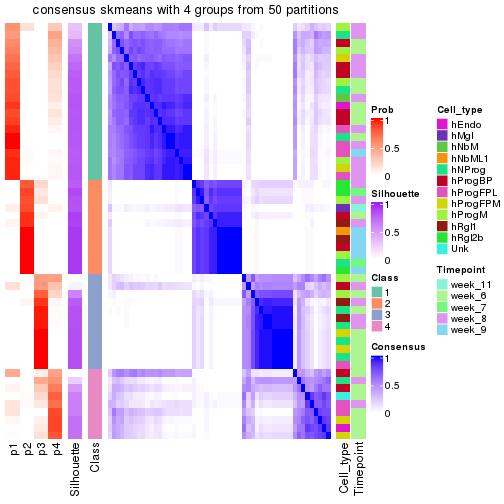</p>

</div>
</div>

Heatmaps for the membership of samples in all partitions to see how consistent they are:


<script>
$( function() {
	$( '#tabs-node-02123-membership-heatmap' ).tabs();
} );
</script>
<div id='tabs-node-02123-membership-heatmap'>
<ul>
<li><a href='#tab-node-02123-membership-heatmap-1'>k = 2</a></li>
<li><a href='#tab-node-02123-membership-heatmap-2'>k = 3</a></li>
<li><a href='#tab-node-02123-membership-heatmap-3'>k = 4</a></li>
</ul>
<div id='tab-node-02123-membership-heatmap-1'>
<pre><code class="r">membership_heatmap(res, k = 2)
</code></pre>

<p></p>

</div>
<div id='tab-node-02123-membership-heatmap-2'>
<pre><code class="r">membership_heatmap(res, k = 3)
</code></pre>

<p></p>

</div>
<div id='tab-node-02123-membership-heatmap-3'>
<pre><code class="r">membership_heatmap(res, k = 4)
</code></pre>

<p></p>

</div>
</div>

As soon as the classes for columns are determined, the signatures
that are significantly different between subgroups can be looked for. 
Following are the heatmaps for signatures.


Signature heatmaps where rows are scaled:


<script>
$( function() {
	$( '#tabs-node-02123-get-signatures' ).tabs();
} );
</script>
<div id='tabs-node-02123-get-signatures'>
<ul>
<li><a href='#tab-node-02123-get-signatures-1'>k = 2</a></li>
<li><a href='#tab-node-02123-get-signatures-2'>k = 3</a></li>
<li><a href='#tab-node-02123-get-signatures-3'>k = 4</a></li>
</ul>
<div id='tab-node-02123-get-signatures-1'>
<pre><code class="r">get_signatures(res, k = 2)
</code></pre>

<p></p>

</div>
<div id='tab-node-02123-get-signatures-2'>
<pre><code class="r">get_signatures(res, k = 3)
</code></pre>

<p></p>

</div>
<div id='tab-node-02123-get-signatures-3'>
<pre><code class="r">get_signatures(res, k = 4)
</code></pre>

<p></p>

</div>
</div>


Signature heatmaps where rows are not scaled:


<script>
$( function() {
	$( '#tabs-node-02123-get-signatures-no-scale' ).tabs();
} );
</script>
<div id='tabs-node-02123-get-signatures-no-scale'>
<ul>
<li><a href='#tab-node-02123-get-signatures-no-scale-1'>k = 2</a></li>
<li><a href='#tab-node-02123-get-signatures-no-scale-2'>k = 3</a></li>
<li><a href='#tab-node-02123-get-signatures-no-scale-3'>k = 4</a></li>
</ul>
<div id='tab-node-02123-get-signatures-no-scale-1'>
<pre><code class="r">get_signatures(res, k = 2, scale_rows = FALSE)
</code></pre>

<p></p>

</div>
<div id='tab-node-02123-get-signatures-no-scale-2'>
<pre><code class="r">get_signatures(res, k = 3, scale_rows = FALSE)
</code></pre>

<p></p>

</div>
<div id='tab-node-02123-get-signatures-no-scale-3'>
<pre><code class="r">get_signatures(res, k = 4, scale_rows = FALSE)
</code></pre>

<p></p>

</div>
</div>


Compare the overlap of signatures from different k:

```r
compare_signatures(res)
```


`get_signature()` returns a data frame invisibly. To get the list of signatures, the function
call should be assigned to a variable explicitly. In following code, if `plot` argument is set
to `FALSE`, no heatmap is plotted while only the differential analysis is performed.

```r
# code only for demonstration
tb = get_signature(res, k = ..., plot = FALSE)
```

An example of the output of `tb` is:

```
#>   which_row         fdr    mean_1    mean_2 scaled_mean_1 scaled_mean_2 km
#> 1        38 0.042760348  8.373488  9.131774    -0.5533452     0.5164555  1
#> 2        40 0.018707592  7.106213  8.469186    -0.6173731     0.5762149  1
#> 3        55 0.019134737 10.221463 11.207825    -0.6159697     0.5749050  1
#> 4        59 0.006059896  5.921854  7.869574    -0.6899429     0.6439467  1
#> 5        60 0.018055526  8.928898 10.211722    -0.6204761     0.5791110  1
#> 6        98 0.009384629 15.714769 14.887706     0.6635654    -0.6193277  2
...
```

The columns in `tb` are:

1. `which_row`: row indices corresponding to the input matrix.
2. `fdr`: FDR for the differential test. 
3. `mean_x`: The mean value in group x.
4. `scaled_mean_x`: The mean value in group x after rows are scaled.
5. `km`: Row groups if k-means clustering is applied to rows (which is done by automatically selecting number of clusters).

If there are too many signatures, `top_signatures = ...` can be set to only show the 
signatures with the highest FDRs:

```r
# code only for demonstration
# e.g. to show the top 500 most significant rows
tb = get_signature(res, k = ..., top_signatures = 500)
```

If the signatures are defined as these which are uniquely high in current group, `diff_method` argument
can be set to `"uniquely_high_in_one_group"`:

```r
# code only for demonstration
tb = get_signature(res, k = ..., diff_method = "uniquely_high_in_one_group")
```


UMAP plot which shows how samples are separated.


<script>
$( function() {
	$( '#tabs-node-02123-dimension-reduction' ).tabs();
} );
</script>
<div id='tabs-node-02123-dimension-reduction'>
<ul>
<li><a href='#tab-node-02123-dimension-reduction-1'>k = 2</a></li>
<li><a href='#tab-node-02123-dimension-reduction-2'>k = 3</a></li>
<li><a href='#tab-node-02123-dimension-reduction-3'>k = 4</a></li>
</ul>
<div id='tab-node-02123-dimension-reduction-1'>
<pre><code class="r">dimension_reduction(res, k = 2, method = &quot;UMAP&quot;)
</code></pre>

<p></p>

</div>
<div id='tab-node-02123-dimension-reduction-2'>
<pre><code class="r">dimension_reduction(res, k = 3, method = &quot;UMAP&quot;)
</code></pre>

<p></p>

</div>
<div id='tab-node-02123-dimension-reduction-3'>
<pre><code class="r">dimension_reduction(res, k = 4, method = &quot;UMAP&quot;)
</code></pre>

<p></p>

</div>
</div>


Following heatmap shows how subgroups are split when increasing `k`:

```r
collect_classes(res)
```


Test correlation between subgroups and known annotations. If the known
annotation is numeric, one-way ANOVA test is applied, and if the known
annotation is discrete, chi-squared contingency table test is applied.

```r
test_to_known_factors(res)
```

```
#>             n_sample Cell_type(p-value) Timepoint(p-value) k
#> ATC:skmeans       50             0.0504           0.032028 2
#> ATC:skmeans       52             0.0621           0.000184 3
#> ATC:skmeans       47             0.0648           0.003655 4
```


If matrix rows can be associated to genes, consider to use `functional_enrichment(res,
...)` to perform function enrichment for the signature genes. See [this vignette](https://jokergoo.github.io/cola_vignettes/functional_enrichment.html) for more detailed explanations.


 

---------------------------------------------------


### Node022


Parent node: [Node02](#Node02).
Child nodes: 
                Node0111-leaf
        ,
                [Node0112](#Node0112)
        ,
                [Node0113](#Node0113)
        ,
                [Node0121](#Node0121)
        ,
                [Node0122](#Node0122)
        ,
                [Node0131](#Node0131)
        ,
                [Node0132](#Node0132)
        ,
                [Node0133](#Node0133)
        ,
                [Node0211](#Node0211)
        ,
                [Node0212](#Node0212)
        ,
                Node0221-leaf
        ,
                [Node0222](#Node0222)
        ,
                [Node0223](#Node0223)
        ,
                [Node0231](#Node0231)
        ,
                [Node0232](#Node0232)
        ,
                Node0233-leaf
        ,
                Node0241-leaf
        ,
                [Node0242](#Node0242)
        ,
                Node0243-leaf
        .


The object with results only for a single top-value method and a single partitioning method 
can be extracted as:

```r
res = res_rh["022"]
```

A summary of `res` and all the functions that can be applied to it:

```r
res
```

```
#> A 'ConsensusPartition' object with k = 2, 3, 4.
#>   On a matrix with 9140 rows and 219 columns.
#>   Top rows (914) are extracted by 'ATC' method.
#>   Subgroups are detected by 'skmeans' method.
#>   Performed in total 150 partitions by row resampling.
#>   Best k for subgroups seems to be 3.
#> 
#> Following methods can be applied to this 'ConsensusPartition' object:
#>  [1] "cola_report"             "collect_classes"         "collect_plots"          
#>  [4] "collect_stats"           "colnames"                "compare_partitions"     
#>  [7] "compare_signatures"      "consensus_heatmap"       "dimension_reduction"    
#> [10] "functional_enrichment"   "get_anno_col"            "get_anno"               
#> [13] "get_classes"             "get_consensus"           "get_matrix"             
#> [16] "get_membership"          "get_param"               "get_signatures"         
#> [19] "get_stats"               "is_best_k"               "is_stable_k"            
#> [22] "membership_heatmap"      "ncol"                    "nrow"                   
#> [25] "plot_ecdf"               "predict_classes"         "rownames"               
#> [28] "select_partition_number" "show"                    "suggest_best_k"         
#> [31] "test_to_known_factors"   "top_rows_heatmap"
```

`collect_plots()` function collects all the plots made from `res` for all `k` (number of subgroups)
into one single page to provide an easy and fast comparison between different `k`.

```r
collect_plots(res)
```


The plots are:

- The first row: a plot of the eCDF (empirical cumulative distribution
  function) curves of the consensus matrix for each `k` and the heatmap of
  predicted classes for each `k`.
- The second row: heatmaps of the consensus matrix for each `k`.
- The third row: heatmaps of the membership matrix for each `k`.
- The fouth row: heatmaps of the signatures for each `k`.

All the plots in panels can be made by individual functions and they are
plotted later in this section.

`select_partition_number()` produces several plots showing different
statistics for choosing "optimized" `k`. There are following statistics:

- eCDF curves of the consensus matrix for each `k`;
- 1-PAC. [The PAC score](https://en.wikipedia.org/wiki/Consensus_clustering#Over-interpretation_potential_of_consensus_clustering)
  measures the proportion of the ambiguous subgrouping.
- Mean silhouette score.
- Concordance. The mean probability of fiting the consensus subgroup labels in all
  partitions.
- Area increased. Denote $A_k$ as the area under the eCDF curve for current
  `k`, the area increased is defined as $A_k - A_{k-1}$.
- Rand index. The percent of pairs of samples that are both in a same cluster
  or both are not in a same cluster in the partition of k and k-1.
- Jaccard index. The ratio of pairs of samples are both in a same cluster in
  the partition of k and k-1 and the pairs of samples are both in a same
  cluster in the partition k or k-1.

The detailed explanations of these statistics can be found in [the _cola_
vignette](https://jokergoo.github.io/cola_vignettes/cola.html#toc_13).

Generally speaking, higher 1-PAC score, higher mean silhouette score or higher
concordance corresponds to better partition. Rand index and Jaccard index
measure how similar the current partition is compared to partition with `k-1`.
If they are too similar, we won't accept `k` is better than `k-1`.

```r
select_partition_number(res)
```


The numeric values for all these statistics can be obtained by `get_stats()`.

```r
get_stats(res)
```

```
#>   k 1-PAC mean_silhouette concordance area_increased  Rand Jaccard
#> 2 2 0.642           0.801       0.918          0.501 0.499   0.499
#> 3 3 0.973           0.947       0.978          0.333 0.684   0.449
#> 4 4 0.743           0.732       0.861          0.112 0.881   0.664
```

`suggest_best_k()` suggests the best $k$ based on these statistics. The rules are as follows:

- All $k$ with Jaccard index larger than 0.95 are removed because increasing
  $k$ does not provide enough extra information. If all $k$ are removed, it is
  marked as no subgroup is detected.
- For all $k$ with 1-PAC score larger than 0.9, the maximal $k$ is taken as
  the best $k$, and other $k$ are marked as optional $k$.
- If it does not fit the second rule. The $k$ with the maximal vote of the
  highest 1-PAC score, highest mean silhouette, and highest concordance is
  taken as the best $k$.

```r
suggest_best_k(res)
```

```
#> [1] 3
```


Following is the table of the partitions (You need to click the **show/hide
code output** link to see it). The membership matrix (columns with name `p*`)
is inferred by
[`clue::cl_consensus()`](https://www.rdocumentation.org/link/cl_consensus?package=clue)
function with the `SE` method. Basically the value in the membership matrix
represents the probability to belong to a certain group. The finall subgroup
label for an item is determined with the group with highest probability it
belongs to.

In `get_classes()` function, the entropy is calculated from the membership
matrix and the silhouette score is calculated from the consensus matrix.


<script>
$( function() {
	$( '#tabs-node-022-get-classes' ).tabs();
} );
</script>
<div id='tabs-node-022-get-classes'>
<ul>
<li><a href='#tab-node-022-get-classes-1'>k = 2</a></li>
<li><a href='#tab-node-022-get-classes-2'>k = 3</a></li>
<li><a href='#tab-node-022-get-classes-3'>k = 4</a></li>
</ul>

<div id='tab-node-022-get-classes-1'>
<p><a id='tab-node-022-get-classes-1-a' style='color:#0366d6' href='#'>show/hide code output</a></p>
<pre><code class="r">cbind(get_classes(res, k = 2), get_membership(res, k = 2))
</code></pre>

<pre><code>#&gt;                 class entropy silhouette   p1   p2
#&gt; 1772067_089_A09     1   0.904   0.531153 0.68 0.32
#&gt; 1772067_089_C02     1   0.000   0.918891 1.00 0.00
#&gt; 1772067_089_C12     2   0.881   0.524711 0.30 0.70
#&gt; 1772067_089_D10     1   0.000   0.918891 1.00 0.00
#&gt; 1772067_089_E06     2   0.981   0.222840 0.42 0.58
#&gt; 1772067_089_G07     2   0.855   0.634345 0.28 0.72
#&gt; 1772067_089_H07     1   0.000   0.918891 1.00 0.00
#&gt; 1772071_027_C05     2   0.469   0.825124 0.10 0.90
#&gt; 1772071_027_F01     1   0.000   0.918891 1.00 0.00
#&gt; 1772071_029_C07     2   0.925   0.541974 0.34 0.66
#&gt; 1772078_078_C01     2   0.904   0.575437 0.32 0.68
#&gt; 1772078_078_F02     2   0.904   0.575437 0.32 0.68
#&gt; 1772075_299_B09     2   0.000   0.887637 0.00 1.00
#&gt; 1772075_299_C10     2   0.881   0.605930 0.30 0.70
#&gt; 1772075_299_D01     2   0.000   0.887637 0.00 1.00
#&gt; 1772075_299_F11     2   0.881   0.605930 0.30 0.70
#&gt; 1772075_299_G05     2   0.000   0.887637 0.00 1.00
#&gt; 1772075_298_E03     2   0.000   0.887637 0.00 1.00
#&gt; 1772075_298_E04     1   0.000   0.918891 1.00 0.00
#&gt; 1772075_298_F04     1   0.000   0.918891 1.00 0.00
#&gt; 1772078_001_A04     1   0.000   0.918891 1.00 0.00
#&gt; 1772078_001_A05     1   0.000   0.918891 1.00 0.00
#&gt; 1772078_001_B03     1   0.000   0.918891 1.00 0.00
#&gt; 1772078_001_D06     1   0.000   0.918891 1.00 0.00
#&gt; 1772078_002_A05     1   0.995   0.193976 0.54 0.46
#&gt; 1772078_002_A06     1   0.000   0.918891 1.00 0.00
#&gt; 1772078_002_A10     2   0.958   0.465237 0.38 0.62
#&gt; 1772078_002_B02     1   0.141   0.906062 0.98 0.02
#&gt; 1772078_002_B05     1   0.000   0.918891 1.00 0.00
#&gt; 1772078_002_D08     1   0.000   0.918891 1.00 0.00
#&gt; 1772078_002_E04     2   0.000   0.887637 0.00 1.00
#&gt; 1772078_002_E05     1   0.760   0.692338 0.78 0.22
#&gt; 1772078_002_E07     1   0.999   0.127431 0.52 0.48
#&gt; 1772078_002_F09     2   0.000   0.887637 0.00 1.00
#&gt; 1772078_002_G02     2   0.000   0.887637 0.00 1.00
#&gt; 1772078_002_G03     2   0.000   0.887637 0.00 1.00
#&gt; 1772078_002_G07     2   0.000   0.887637 0.00 1.00
#&gt; 1772078_002_G09     2   0.000   0.887637 0.00 1.00
#&gt; 1772078_002_H03     2   0.000   0.887637 0.00 1.00
#&gt; 1772096_160_E04     1   0.000   0.918891 1.00 0.00
#&gt; 1772096_160_F01     1   0.000   0.918891 1.00 0.00
#&gt; 1772096_160_H07     1   0.000   0.918891 1.00 0.00
#&gt; 1772096_095_D11     1   0.000   0.918891 1.00 0.00
#&gt; 1772096_095_E06     1   0.000   0.918891 1.00 0.00
#&gt; 1772122_236_A12     2   0.795   0.632755 0.24 0.76
#&gt; 1772122_236_G02     1   0.000   0.918891 1.00 0.00
#&gt; 1772121_288_A12     2   0.000   0.887637 0.00 1.00
#&gt; 1772121_288_B09     1   0.943   0.454385 0.64 0.36
#&gt; 1772121_288_C01     2   0.971   0.282417 0.40 0.60
#&gt; 1772121_288_C08     2   0.000   0.887637 0.00 1.00
#&gt; 1772121_288_C10     1   0.327   0.878044 0.94 0.06
#&gt; 1772121_288_E10     1   0.000   0.918891 1.00 0.00
#&gt; 1772121_288_H02     2   0.000   0.887637 0.00 1.00
#&gt; 1772121_291_A07     1   0.000   0.918891 1.00 0.00
#&gt; 1772121_291_D04     1   0.000   0.918891 1.00 0.00
#&gt; 1772121_291_D05     1   0.000   0.918891 1.00 0.00
#&gt; 1772121_291_E03     1   0.000   0.918891 1.00 0.00
#&gt; 1772121_291_E04     2   0.722   0.732557 0.20 0.80
#&gt; 1772121_291_E07     1   0.000   0.918891 1.00 0.00
#&gt; 1772121_291_F11     2   0.634   0.773400 0.16 0.84
#&gt; 1772121_291_G12     1   0.141   0.906062 0.98 0.02
#&gt; 1772121_291_H05     1   0.000   0.918891 1.00 0.00
#&gt; 1772121_291_H06     2   0.925   0.541974 0.34 0.66
#&gt; 1772121_293_A05     1   0.000   0.918891 1.00 0.00
#&gt; 1772121_293_A07     1   0.000   0.918891 1.00 0.00
#&gt; 1772121_293_A11     1   0.000   0.918891 1.00 0.00
#&gt; 1772121_293_B04     1   0.000   0.918891 1.00 0.00
#&gt; 1772121_293_B09     1   0.000   0.918891 1.00 0.00
#&gt; 1772121_293_D01     1   0.000   0.918891 1.00 0.00
#&gt; 1772121_283_A02     2   0.141   0.879695 0.02 0.98
#&gt; 1772121_283_A06     1   0.680   0.714274 0.82 0.18
#&gt; 1772121_283_A09     2   0.141   0.879695 0.02 0.98
#&gt; 1772121_283_B02     1   0.000   0.918891 1.00 0.00
#&gt; 1772121_283_B06     2   0.141   0.879695 0.02 0.98
#&gt; 1772121_283_B11     2   0.943   0.505488 0.36 0.64
#&gt; 1772121_283_C04     2   0.141   0.879695 0.02 0.98
#&gt; 1772121_283_C07     2   0.141   0.879695 0.02 0.98
#&gt; 1772121_283_C09     1   0.000   0.918891 1.00 0.00
#&gt; 1772121_283_D01     2   0.995   0.261262 0.46 0.54
#&gt; 1772121_283_D02     1   0.000   0.918891 1.00 0.00
#&gt; 1772121_283_D05     1   0.000   0.918891 1.00 0.00
#&gt; 1772121_283_D09     1   0.000   0.918891 1.00 0.00
#&gt; 1772121_283_E01     1   0.000   0.918891 1.00 0.00
#&gt; 1772121_283_E05     1   0.000   0.918891 1.00 0.00
#&gt; 1772121_283_E09     1   0.327   0.866506 0.94 0.06
#&gt; 1772121_283_E10     1   0.000   0.918891 1.00 0.00
#&gt; 1772121_283_F06     1   0.000   0.918891 1.00 0.00
#&gt; 1772121_283_F11     1   0.971   0.214208 0.60 0.40
#&gt; 1772121_283_G02     1   0.000   0.918891 1.00 0.00
#&gt; 1772121_283_G04     1   0.000   0.918891 1.00 0.00
#&gt; 1772121_283_G06     1   0.529   0.798205 0.88 0.12
#&gt; 1772121_283_G11     2   0.904   0.575437 0.32 0.68
#&gt; 1772121_283_H02     1   0.000   0.918891 1.00 0.00
#&gt; 1772121_283_H04     1   0.000   0.918891 1.00 0.00
#&gt; 1772121_282_A02     1   0.000   0.918891 1.00 0.00
#&gt; 1772121_282_A03     1   0.000   0.918891 1.00 0.00
#&gt; 1772121_282_A05     1   0.000   0.918891 1.00 0.00
#&gt; 1772121_282_A09     1   0.000   0.918891 1.00 0.00
#&gt; 1772121_282_A11     1   0.000   0.918891 1.00 0.00
#&gt; 1772121_282_B07     1   0.000   0.918891 1.00 0.00
#&gt; 1772121_282_B09     1   0.141   0.906062 0.98 0.02
#&gt; 1772121_282_B11     1   0.000   0.918891 1.00 0.00
#&gt; 1772121_282_C03     2   0.943   0.505488 0.36 0.64
#&gt; 1772121_282_C04     2   0.141   0.879695 0.02 0.98
#&gt; 1772121_282_C07     2   0.141   0.879695 0.02 0.98
#&gt; 1772121_282_C12     2   0.327   0.855138 0.06 0.94
#&gt; 1772121_282_D04     2   0.943   0.505488 0.36 0.64
#&gt; 1772121_282_D08     2   0.855   0.609137 0.28 0.72
#&gt; 1772121_282_E05     1   0.990   0.077580 0.56 0.44
#&gt; 1772121_282_E09     2   0.141   0.879695 0.02 0.98
#&gt; 1772121_282_E11     2   0.634   0.773400 0.16 0.84
#&gt; 1772121_282_F02     2   0.925   0.541974 0.34 0.66
#&gt; 1772121_282_F03     1   0.000   0.918891 1.00 0.00
#&gt; 1772121_282_F08     2   0.971   0.427583 0.40 0.60
#&gt; 1772121_282_F09     2   0.000   0.887637 0.00 1.00
#&gt; 1772121_282_G11     1   0.000   0.918891 1.00 0.00
#&gt; 1772122_264_C09     2   0.000   0.887637 0.00 1.00
#&gt; 1772122_208_A02     2   0.958   0.464698 0.38 0.62
#&gt; 1772122_208_B04     1   0.995   0.000497 0.54 0.46
#&gt; 1772122_208_F04     2   0.634   0.773400 0.16 0.84
#&gt; 1772122_208_H02     1   0.141   0.903296 0.98 0.02
#&gt; 1772122_201_A07     2   0.141   0.879695 0.02 0.98
#&gt; 1772122_201_D04     2   0.141   0.879695 0.02 0.98
#&gt; 1772122_201_F06     2   0.000   0.887637 0.00 1.00
#&gt; 1772122_207_B10     1   0.000   0.918891 1.00 0.00
#&gt; 1772122_207_B11     1   0.634   0.770381 0.84 0.16
#&gt; 1772122_207_C03     2   0.000   0.887637 0.00 1.00
#&gt; 1772122_207_G01     2   0.141   0.879695 0.02 0.98
#&gt; 1772122_207_G04     2   0.000   0.887637 0.00 1.00
#&gt; 1772122_199_H07     1   0.584   0.772914 0.86 0.14
#&gt; 1772122_316_A01     2   0.000   0.887637 0.00 1.00
#&gt; 1772122_316_C04     1   0.999   0.128298 0.52 0.48
#&gt; 1772122_316_D09     1   0.925   0.495078 0.66 0.34
#&gt; 1772122_316_G06     2   0.000   0.887637 0.00 1.00
#&gt; 1772122_316_G09     1   0.000   0.918891 1.00 0.00
#&gt; 1772122_316_H04     2   0.000   0.887637 0.00 1.00
#&gt; 1772122_316_H10     1   0.000   0.918891 1.00 0.00
#&gt; 1772122_316_H11     1   0.971   0.365263 0.60 0.40
#&gt; 1772122_317_A06     1   0.584   0.794108 0.86 0.14
#&gt; 1772122_317_B06     2   0.000   0.887637 0.00 1.00
#&gt; 1772122_317_B07     2   0.000   0.887637 0.00 1.00
#&gt; 1772122_317_D11     2   0.000   0.887637 0.00 1.00
#&gt; 1772122_317_D12     1   0.925   0.495078 0.66 0.34
#&gt; 1772122_317_E04     2   0.634   0.744738 0.16 0.84
#&gt; 1772122_317_F07     2   0.000   0.887637 0.00 1.00
#&gt; 1772122_317_H08     1   0.000   0.918891 1.00 0.00
#&gt; 1772122_318_D05     1   0.000   0.918891 1.00 0.00
#&gt; 1772122_318_D11     2   0.000   0.887637 0.00 1.00
#&gt; 1772122_318_D12     1   0.141   0.906062 0.98 0.02
#&gt; 1772122_318_E08     1   0.000   0.918891 1.00 0.00
#&gt; 1772122_318_E09     1   0.000   0.918891 1.00 0.00
#&gt; 1772122_318_F04     1   0.000   0.918891 1.00 0.00
#&gt; 1772122_318_F09     2   0.000   0.887637 0.00 1.00
#&gt; 1772122_319_A03     2   0.000   0.887637 0.00 1.00
#&gt; 1772122_319_A09     1   0.000   0.918891 1.00 0.00
#&gt; 1772122_319_C04     1   0.000   0.918891 1.00 0.00
#&gt; 1772122_319_D02     1   0.000   0.918891 1.00 0.00
#&gt; 1772122_319_D06     1   0.000   0.918891 1.00 0.00
#&gt; 1772122_319_E11     1   0.904   0.531785 0.68 0.32
#&gt; 1772122_319_H09     1   0.000   0.918891 1.00 0.00
#&gt; 1772122_221_A11     2   0.000   0.887637 0.00 1.00
#&gt; 1772122_221_B04     2   0.000   0.887637 0.00 1.00
#&gt; 1772122_221_B09     2   0.000   0.887637 0.00 1.00
#&gt; 1772122_221_B10     1   0.000   0.918891 1.00 0.00
#&gt; 1772122_221_C05     1   0.402   0.855673 0.92 0.08
#&gt; 1772122_221_C06     2   0.000   0.887637 0.00 1.00
#&gt; 1772122_221_E11     2   0.000   0.887637 0.00 1.00
#&gt; 1772122_221_F04     2   0.141   0.879695 0.02 0.98
#&gt; 1772122_221_G06     1   0.141   0.906062 0.98 0.02
#&gt; 1772122_220_A02     2   0.000   0.887637 0.00 1.00
#&gt; 1772122_220_A03     1   0.000   0.918891 1.00 0.00
#&gt; 1772122_220_A09     2   1.000  -0.019455 0.50 0.50
#&gt; 1772122_220_A10     1   0.000   0.918891 1.00 0.00
#&gt; 1772122_220_B04     2   0.000   0.887637 0.00 1.00
#&gt; 1772122_220_B11     1   0.925   0.495078 0.66 0.34
#&gt; 1772122_220_C09     2   0.000   0.887637 0.00 1.00
#&gt; 1772122_220_D04     2   0.242   0.861392 0.04 0.96
#&gt; 1772122_220_D10     1   0.971   0.363488 0.60 0.40
#&gt; 1772122_220_D11     1   0.634   0.771034 0.84 0.16
#&gt; 1772122_220_E11     2   0.000   0.887637 0.00 1.00
#&gt; 1772122_220_G04     2   0.000   0.887637 0.00 1.00
#&gt; 1772122_220_G10     1   0.000   0.918891 1.00 0.00
#&gt; 1772122_220_G11     2   0.000   0.887637 0.00 1.00
#&gt; 1772122_220_H04     2   0.000   0.887637 0.00 1.00
#&gt; 1772122_220_H10     2   0.000   0.887637 0.00 1.00
#&gt; 1772122_220_H12     2   0.958   0.338400 0.38 0.62
#&gt; 1772122_226_A02     2   0.000   0.887637 0.00 1.00
#&gt; 1772122_226_A04     2   0.981   0.222121 0.42 0.58
#&gt; 1772122_226_D06     2   0.000   0.887637 0.00 1.00
#&gt; 1772122_226_H04     2   0.000   0.887637 0.00 1.00
#&gt; 1772122_223_A02     2   0.000   0.887637 0.00 1.00
#&gt; 1772122_223_A05     1   0.141   0.906062 0.98 0.02
#&gt; 1772122_223_A10     1   0.000   0.918891 1.00 0.00
#&gt; 1772122_223_B05     1   0.000   0.918891 1.00 0.00
#&gt; 1772122_223_B09     1   0.141   0.906062 0.98 0.02
#&gt; 1772122_223_B12     2   0.000   0.887637 0.00 1.00
#&gt; 1772122_223_C04     2   0.000   0.887637 0.00 1.00
#&gt; 1772122_223_C10     1   0.000   0.918891 1.00 0.00
#&gt; 1772122_223_C11     2   0.000   0.887637 0.00 1.00
#&gt; 1772122_223_D02     2   0.000   0.887637 0.00 1.00
#&gt; 1772122_223_D04     2   0.000   0.887637 0.00 1.00
#&gt; 1772122_223_D05     1   0.000   0.918891 1.00 0.00
#&gt; 1772122_223_D06     2   0.971   0.282690 0.40 0.60
#&gt; 1772122_223_E06     1   0.141   0.906062 0.98 0.02
#&gt; 1772122_223_F06     2   0.000   0.887637 0.00 1.00
#&gt; 1772122_223_F10     1   0.000   0.918891 1.00 0.00
#&gt; 1772122_223_G07     2   0.000   0.887637 0.00 1.00
#&gt; 1772122_223_G11     2   0.000   0.887637 0.00 1.00
#&gt; 1772122_223_H02     2   0.000   0.887637 0.00 1.00
#&gt; 1772122_223_H05     1   0.000   0.918891 1.00 0.00
#&gt; 1772122_223_H08     2   0.000   0.887637 0.00 1.00
#&gt; 1772122_224_A09     2   0.000   0.887637 0.00 1.00
#&gt; 1772122_224_C11     1   0.141   0.906062 0.98 0.02
#&gt; 1772122_224_D06     2   0.000   0.887637 0.00 1.00
#&gt; 1772122_224_D09     1   0.925   0.495078 0.66 0.34
#&gt; 1772122_224_D10     1   0.000   0.918891 1.00 0.00
#&gt; 1772122_224_E01     1   0.981   0.311719 0.58 0.42
#&gt; 1772122_224_G07     2   0.000   0.887637 0.00 1.00
#&gt; 1772122_224_H07     2   0.000   0.887637 0.00 1.00
</code></pre>

<script>
$('#tab-node-022-get-classes-1-a').parent().next().next().hide();
$('#tab-node-022-get-classes-1-a').click(function(){
  $('#tab-node-022-get-classes-1-a').parent().next().next().toggle();
  return(false);
});
</script>
</div>

<div id='tab-node-022-get-classes-2'>
<p><a id='tab-node-022-get-classes-2-a' style='color:#0366d6' href='#'>show/hide code output</a></p>
<pre><code class="r">cbind(get_classes(res, k = 3), get_membership(res, k = 3))
</code></pre>

<pre><code>#&gt;                 class entropy silhouette   p1   p2   p3
#&gt; 1772067_089_A09     2  0.2959      0.885 0.10 0.90 0.00
#&gt; 1772067_089_C02     1  0.0000      0.977 1.00 0.00 0.00
#&gt; 1772067_089_C12     2  0.0000      0.986 0.00 1.00 0.00
#&gt; 1772067_089_D10     1  0.0000      0.977 1.00 0.00 0.00
#&gt; 1772067_089_E06     2  0.0000      0.986 0.00 1.00 0.00
#&gt; 1772067_089_G07     3  0.0000      0.968 0.00 0.00 1.00
#&gt; 1772067_089_H07     1  0.0000      0.977 1.00 0.00 0.00
#&gt; 1772071_027_C05     3  0.0000      0.968 0.00 0.00 1.00
#&gt; 1772071_027_F01     1  0.0000      0.977 1.00 0.00 0.00
#&gt; 1772071_029_C07     3  0.0000      0.968 0.00 0.00 1.00
#&gt; 1772078_078_C01     3  0.0000      0.968 0.00 0.00 1.00
#&gt; 1772078_078_F02     3  0.0000      0.968 0.00 0.00 1.00
#&gt; 1772075_299_B09     2  0.0000      0.986 0.00 1.00 0.00
#&gt; 1772075_299_C10     3  0.0000      0.968 0.00 0.00 1.00
#&gt; 1772075_299_D01     3  0.0000      0.968 0.00 0.00 1.00
#&gt; 1772075_299_F11     3  0.0000      0.968 0.00 0.00 1.00
#&gt; 1772075_299_G05     2  0.0000      0.986 0.00 1.00 0.00
#&gt; 1772075_298_E03     2  0.0000      0.986 0.00 1.00 0.00
#&gt; 1772075_298_E04     1  0.0000      0.977 1.00 0.00 0.00
#&gt; 1772075_298_F04     1  0.0000      0.977 1.00 0.00 0.00
#&gt; 1772078_001_A04     1  0.0000      0.977 1.00 0.00 0.00
#&gt; 1772078_001_A05     1  0.0000      0.977 1.00 0.00 0.00
#&gt; 1772078_001_B03     1  0.0000      0.977 1.00 0.00 0.00
#&gt; 1772078_001_D06     1  0.0000      0.977 1.00 0.00 0.00
#&gt; 1772078_002_A05     2  0.0000      0.986 0.00 1.00 0.00
#&gt; 1772078_002_A06     1  0.0000      0.977 1.00 0.00 0.00
#&gt; 1772078_002_A10     3  0.0000      0.968 0.00 0.00 1.00
#&gt; 1772078_002_B02     1  0.0000      0.977 1.00 0.00 0.00
#&gt; 1772078_002_B05     1  0.0000      0.977 1.00 0.00 0.00
#&gt; 1772078_002_D08     1  0.0000      0.977 1.00 0.00 0.00
#&gt; 1772078_002_E04     2  0.0000      0.986 0.00 1.00 0.00
#&gt; 1772078_002_E05     2  0.2537      0.908 0.08 0.92 0.00
#&gt; 1772078_002_E07     2  0.0000      0.986 0.00 1.00 0.00
#&gt; 1772078_002_F09     3  0.0000      0.968 0.00 0.00 1.00
#&gt; 1772078_002_G02     2  0.0000      0.986 0.00 1.00 0.00
#&gt; 1772078_002_G03     3  0.0000      0.968 0.00 0.00 1.00
#&gt; 1772078_002_G07     3  0.0000      0.968 0.00 0.00 1.00
#&gt; 1772078_002_G09     3  0.0000      0.968 0.00 0.00 1.00
#&gt; 1772078_002_H03     2  0.0000      0.986 0.00 1.00 0.00
#&gt; 1772096_160_E04     1  0.0000      0.977 1.00 0.00 0.00
#&gt; 1772096_160_F01     1  0.0000      0.977 1.00 0.00 0.00
#&gt; 1772096_160_H07     3  0.6280      0.168 0.46 0.00 0.54
#&gt; 1772096_095_D11     1  0.0000      0.977 1.00 0.00 0.00
#&gt; 1772096_095_E06     1  0.0000      0.977 1.00 0.00 0.00
#&gt; 1772122_236_A12     2  0.0000      0.986 0.00 1.00 0.00
#&gt; 1772122_236_G02     1  0.0000      0.977 1.00 0.00 0.00
#&gt; 1772121_288_A12     3  0.5948      0.431 0.00 0.36 0.64
#&gt; 1772121_288_B09     2  0.0000      0.986 0.00 1.00 0.00
#&gt; 1772121_288_C01     2  0.0000      0.986 0.00 1.00 0.00
#&gt; 1772121_288_C08     2  0.0000      0.986 0.00 1.00 0.00
#&gt; 1772121_288_C10     1  0.2537      0.901 0.92 0.08 0.00
#&gt; 1772121_288_E10     1  0.0000      0.977 1.00 0.00 0.00
#&gt; 1772121_288_H02     2  0.0000      0.986 0.00 1.00 0.00
#&gt; 1772121_291_A07     1  0.0000      0.977 1.00 0.00 0.00
#&gt; 1772121_291_D04     1  0.0000      0.977 1.00 0.00 0.00
#&gt; 1772121_291_D05     1  0.0000      0.977 1.00 0.00 0.00
#&gt; 1772121_291_E03     1  0.0000      0.977 1.00 0.00 0.00
#&gt; 1772121_291_E04     3  0.0000      0.968 0.00 0.00 1.00
#&gt; 1772121_291_E07     1  0.0000      0.977 1.00 0.00 0.00
#&gt; 1772121_291_F11     3  0.0000      0.968 0.00 0.00 1.00
#&gt; 1772121_291_G12     1  0.0000      0.977 1.00 0.00 0.00
#&gt; 1772121_291_H05     3  0.5560      0.583 0.30 0.00 0.70
#&gt; 1772121_291_H06     3  0.0000      0.968 0.00 0.00 1.00
#&gt; 1772121_293_A05     1  0.0000      0.977 1.00 0.00 0.00
#&gt; 1772121_293_A07     1  0.2959      0.875 0.90 0.00 0.10
#&gt; 1772121_293_A11     3  0.1529      0.934 0.04 0.00 0.96
#&gt; 1772121_293_B04     1  0.0000      0.977 1.00 0.00 0.00
#&gt; 1772121_293_B09     1  0.5835      0.467 0.66 0.00 0.34
#&gt; 1772121_293_D01     1  0.0000      0.977 1.00 0.00 0.00
#&gt; 1772121_283_A02     3  0.0000      0.968 0.00 0.00 1.00
#&gt; 1772121_283_A06     3  0.0000      0.968 0.00 0.00 1.00
#&gt; 1772121_283_A09     3  0.0000      0.968 0.00 0.00 1.00
#&gt; 1772121_283_B02     1  0.0000      0.977 1.00 0.00 0.00
#&gt; 1772121_283_B06     3  0.0000      0.968 0.00 0.00 1.00
#&gt; 1772121_283_B11     3  0.0000      0.968 0.00 0.00 1.00
#&gt; 1772121_283_C04     3  0.0000      0.968 0.00 0.00 1.00
#&gt; 1772121_283_C07     3  0.0000      0.968 0.00 0.00 1.00
#&gt; 1772121_283_C09     1  0.0000      0.977 1.00 0.00 0.00
#&gt; 1772121_283_D01     3  0.0000      0.968 0.00 0.00 1.00
#&gt; 1772121_283_D02     3  0.6192      0.296 0.42 0.00 0.58
#&gt; 1772121_283_D05     1  0.0000      0.977 1.00 0.00 0.00
#&gt; 1772121_283_D09     3  0.0892      0.951 0.02 0.00 0.98
#&gt; 1772121_283_E01     1  0.0000      0.977 1.00 0.00 0.00
#&gt; 1772121_283_E05     1  0.0000      0.977 1.00 0.00 0.00
#&gt; 1772121_283_E09     3  0.0000      0.968 0.00 0.00 1.00
#&gt; 1772121_283_E10     1  0.0000      0.977 1.00 0.00 0.00
#&gt; 1772121_283_F06     3  0.0000      0.968 0.00 0.00 1.00
#&gt; 1772121_283_F11     3  0.0000      0.968 0.00 0.00 1.00
#&gt; 1772121_283_G02     3  0.5216      0.653 0.26 0.00 0.74
#&gt; 1772121_283_G04     1  0.0000      0.977 1.00 0.00 0.00
#&gt; 1772121_283_G06     3  0.0000      0.968 0.00 0.00 1.00
#&gt; 1772121_283_G11     3  0.0000      0.968 0.00 0.00 1.00
#&gt; 1772121_283_H02     1  0.0000      0.977 1.00 0.00 0.00
#&gt; 1772121_283_H04     1  0.0000      0.977 1.00 0.00 0.00
#&gt; 1772121_282_A02     3  0.4291      0.777 0.18 0.00 0.82
#&gt; 1772121_282_A03     1  0.0892      0.959 0.98 0.00 0.02
#&gt; 1772121_282_A05     1  0.2066      0.919 0.94 0.00 0.06
#&gt; 1772121_282_A09     1  0.0000      0.977 1.00 0.00 0.00
#&gt; 1772121_282_A11     3  0.0000      0.968 0.00 0.00 1.00
#&gt; 1772121_282_B07     1  0.0892      0.959 0.98 0.00 0.02
#&gt; 1772121_282_B09     1  0.0000      0.977 1.00 0.00 0.00
#&gt; 1772121_282_B11     1  0.0000      0.977 1.00 0.00 0.00
#&gt; 1772121_282_C03     3  0.0000      0.968 0.00 0.00 1.00
#&gt; 1772121_282_C04     3  0.0000      0.968 0.00 0.00 1.00
#&gt; 1772121_282_C07     3  0.0000      0.968 0.00 0.00 1.00
#&gt; 1772121_282_C12     3  0.0000      0.968 0.00 0.00 1.00
#&gt; 1772121_282_D04     3  0.0000      0.968 0.00 0.00 1.00
#&gt; 1772121_282_D08     2  0.7665      0.405 0.34 0.60 0.06
#&gt; 1772121_282_E05     3  0.0000      0.968 0.00 0.00 1.00
#&gt; 1772121_282_E09     3  0.0000      0.968 0.00 0.00 1.00
#&gt; 1772121_282_E11     3  0.0000      0.968 0.00 0.00 1.00
#&gt; 1772121_282_F02     3  0.0000      0.968 0.00 0.00 1.00
#&gt; 1772121_282_F03     1  0.0000      0.977 1.00 0.00 0.00
#&gt; 1772121_282_F08     3  0.0000      0.968 0.00 0.00 1.00
#&gt; 1772121_282_F09     3  0.0000      0.968 0.00 0.00 1.00
#&gt; 1772121_282_G11     1  0.0000      0.977 1.00 0.00 0.00
#&gt; 1772122_264_C09     2  0.4555      0.748 0.00 0.80 0.20
#&gt; 1772122_208_A02     3  0.0000      0.968 0.00 0.00 1.00
#&gt; 1772122_208_B04     3  0.0000      0.968 0.00 0.00 1.00
#&gt; 1772122_208_F04     3  0.0000      0.968 0.00 0.00 1.00
#&gt; 1772122_208_H02     3  0.0000      0.968 0.00 0.00 1.00
#&gt; 1772122_201_A07     3  0.0000      0.968 0.00 0.00 1.00
#&gt; 1772122_201_D04     3  0.0000      0.968 0.00 0.00 1.00
#&gt; 1772122_201_F06     3  0.0000      0.968 0.00 0.00 1.00
#&gt; 1772122_207_B10     1  0.0000      0.977 1.00 0.00 0.00
#&gt; 1772122_207_B11     2  0.1529      0.949 0.04 0.96 0.00
#&gt; 1772122_207_C03     2  0.0000      0.986 0.00 1.00 0.00
#&gt; 1772122_207_G01     3  0.0000      0.968 0.00 0.00 1.00
#&gt; 1772122_207_G04     3  0.0000      0.968 0.00 0.00 1.00
#&gt; 1772122_199_H07     3  0.0000      0.968 0.00 0.00 1.00
#&gt; 1772122_316_A01     2  0.1529      0.949 0.00 0.96 0.04
#&gt; 1772122_316_C04     2  0.0000      0.986 0.00 1.00 0.00
#&gt; 1772122_316_D09     2  0.0000      0.986 0.00 1.00 0.00
#&gt; 1772122_316_G06     2  0.0000      0.986 0.00 1.00 0.00
#&gt; 1772122_316_G09     1  0.0000      0.977 1.00 0.00 0.00
#&gt; 1772122_316_H04     2  0.0000      0.986 0.00 1.00 0.00
#&gt; 1772122_316_H10     1  0.0000      0.977 1.00 0.00 0.00
#&gt; 1772122_316_H11     2  0.0000      0.986 0.00 1.00 0.00
#&gt; 1772122_317_A06     1  0.6045      0.392 0.62 0.38 0.00
#&gt; 1772122_317_B06     2  0.0000      0.986 0.00 1.00 0.00
#&gt; 1772122_317_B07     2  0.0000      0.986 0.00 1.00 0.00
#&gt; 1772122_317_D11     2  0.0000      0.986 0.00 1.00 0.00
#&gt; 1772122_317_D12     2  0.2066      0.929 0.06 0.94 0.00
#&gt; 1772122_317_E04     2  0.0000      0.986 0.00 1.00 0.00
#&gt; 1772122_317_F07     2  0.0000      0.986 0.00 1.00 0.00
#&gt; 1772122_317_H08     1  0.0000      0.977 1.00 0.00 0.00
#&gt; 1772122_318_D05     1  0.0000      0.977 1.00 0.00 0.00
#&gt; 1772122_318_D11     2  0.0000      0.986 0.00 1.00 0.00
#&gt; 1772122_318_D12     1  0.0000      0.977 1.00 0.00 0.00
#&gt; 1772122_318_E08     1  0.0000      0.977 1.00 0.00 0.00
#&gt; 1772122_318_E09     1  0.0000      0.977 1.00 0.00 0.00
#&gt; 1772122_318_F04     1  0.0000      0.977 1.00 0.00 0.00
#&gt; 1772122_318_F09     2  0.0000      0.986 0.00 1.00 0.00
#&gt; 1772122_319_A03     2  0.0000      0.986 0.00 1.00 0.00
#&gt; 1772122_319_A09     1  0.0000      0.977 1.00 0.00 0.00
#&gt; 1772122_319_C04     1  0.0000      0.977 1.00 0.00 0.00
#&gt; 1772122_319_D02     1  0.0000      0.977 1.00 0.00 0.00
#&gt; 1772122_319_D06     1  0.0000      0.977 1.00 0.00 0.00
#&gt; 1772122_319_E11     2  0.0000      0.986 0.00 1.00 0.00
#&gt; 1772122_319_H09     3  0.0892      0.951 0.02 0.00 0.98
#&gt; 1772122_221_A11     3  0.0000      0.968 0.00 0.00 1.00
#&gt; 1772122_221_B04     2  0.0000      0.986 0.00 1.00 0.00
#&gt; 1772122_221_B09     2  0.0000      0.986 0.00 1.00 0.00
#&gt; 1772122_221_B10     1  0.0000      0.977 1.00 0.00 0.00
#&gt; 1772122_221_C05     1  0.3340      0.855 0.88 0.12 0.00
#&gt; 1772122_221_C06     2  0.0000      0.986 0.00 1.00 0.00
#&gt; 1772122_221_E11     3  0.0000      0.968 0.00 0.00 1.00
#&gt; 1772122_221_F04     3  0.0000      0.968 0.00 0.00 1.00
#&gt; 1772122_221_G06     1  0.0000      0.977 1.00 0.00 0.00
#&gt; 1772122_220_A02     2  0.0000      0.986 0.00 1.00 0.00
#&gt; 1772122_220_A03     1  0.0000      0.977 1.00 0.00 0.00
#&gt; 1772122_220_A09     1  0.9725      0.163 0.44 0.32 0.24
#&gt; 1772122_220_A10     1  0.0000      0.977 1.00 0.00 0.00
#&gt; 1772122_220_B04     3  0.1529      0.931 0.00 0.04 0.96
#&gt; 1772122_220_B11     2  0.0000      0.986 0.00 1.00 0.00
#&gt; 1772122_220_C09     2  0.0000      0.986 0.00 1.00 0.00
#&gt; 1772122_220_D04     2  0.0000      0.986 0.00 1.00 0.00
#&gt; 1772122_220_D10     2  0.0000      0.986 0.00 1.00 0.00
#&gt; 1772122_220_D11     1  0.4291      0.777 0.82 0.18 0.00
#&gt; 1772122_220_E11     3  0.0000      0.968 0.00 0.00 1.00
#&gt; 1772122_220_G04     2  0.0000      0.986 0.00 1.00 0.00
#&gt; 1772122_220_G10     1  0.0000      0.977 1.00 0.00 0.00
#&gt; 1772122_220_G11     2  0.0000      0.986 0.00 1.00 0.00
#&gt; 1772122_220_H04     2  0.0000      0.986 0.00 1.00 0.00
#&gt; 1772122_220_H10     2  0.0000      0.986 0.00 1.00 0.00
#&gt; 1772122_220_H12     2  0.0000      0.986 0.00 1.00 0.00
#&gt; 1772122_226_A02     3  0.0000      0.968 0.00 0.00 1.00
#&gt; 1772122_226_A04     2  0.0000      0.986 0.00 1.00 0.00
#&gt; 1772122_226_D06     2  0.0000      0.986 0.00 1.00 0.00
#&gt; 1772122_226_H04     3  0.0000      0.968 0.00 0.00 1.00
#&gt; 1772122_223_A02     2  0.0000      0.986 0.00 1.00 0.00
#&gt; 1772122_223_A05     1  0.0000      0.977 1.00 0.00 0.00
#&gt; 1772122_223_A10     1  0.0000      0.977 1.00 0.00 0.00
#&gt; 1772122_223_B05     1  0.0000      0.977 1.00 0.00 0.00
#&gt; 1772122_223_B09     1  0.0000      0.977 1.00 0.00 0.00
#&gt; 1772122_223_B12     2  0.0000      0.986 0.00 1.00 0.00
#&gt; 1772122_223_C04     2  0.0000      0.986 0.00 1.00 0.00
#&gt; 1772122_223_C10     1  0.0000      0.977 1.00 0.00 0.00
#&gt; 1772122_223_C11     2  0.0000      0.986 0.00 1.00 0.00
#&gt; 1772122_223_D02     2  0.0000      0.986 0.00 1.00 0.00
#&gt; 1772122_223_D04     3  0.0000      0.968 0.00 0.00 1.00
#&gt; 1772122_223_D05     1  0.0000      0.977 1.00 0.00 0.00
#&gt; 1772122_223_D06     2  0.0000      0.986 0.00 1.00 0.00
#&gt; 1772122_223_E06     1  0.0000      0.977 1.00 0.00 0.00
#&gt; 1772122_223_F06     3  0.0000      0.968 0.00 0.00 1.00
#&gt; 1772122_223_F10     1  0.0000      0.977 1.00 0.00 0.00
#&gt; 1772122_223_G07     2  0.0000      0.986 0.00 1.00 0.00
#&gt; 1772122_223_G11     2  0.0000      0.986 0.00 1.00 0.00
#&gt; 1772122_223_H02     2  0.0000      0.986 0.00 1.00 0.00
#&gt; 1772122_223_H05     1  0.0000      0.977 1.00 0.00 0.00
#&gt; 1772122_223_H08     2  0.0000      0.986 0.00 1.00 0.00
#&gt; 1772122_224_A09     2  0.0000      0.986 0.00 1.00 0.00
#&gt; 1772122_224_C11     1  0.0000      0.977 1.00 0.00 0.00
#&gt; 1772122_224_D06     2  0.0000      0.986 0.00 1.00 0.00
#&gt; 1772122_224_D09     2  0.0000      0.986 0.00 1.00 0.00
#&gt; 1772122_224_D10     1  0.0000      0.977 1.00 0.00 0.00
#&gt; 1772122_224_E01     2  0.0000      0.986 0.00 1.00 0.00
#&gt; 1772122_224_G07     2  0.0000      0.986 0.00 1.00 0.00
#&gt; 1772122_224_H07     2  0.0000      0.986 0.00 1.00 0.00
</code></pre>

<script>
$('#tab-node-022-get-classes-2-a').parent().next().next().hide();
$('#tab-node-022-get-classes-2-a').click(function(){
  $('#tab-node-022-get-classes-2-a').parent().next().next().toggle();
  return(false);
});
</script>
</div>

<div id='tab-node-022-get-classes-3'>
<p><a id='tab-node-022-get-classes-3-a' style='color:#0366d6' href='#'>show/hide code output</a></p>
<pre><code class="r">cbind(get_classes(res, k = 4), get_membership(res, k = 4))
</code></pre>

<pre><code>#&gt;                 class entropy silhouette   p1   p2   p3   p4
#&gt; 1772067_089_A09     4  0.4713     0.3584 0.00 0.36 0.00 0.64
#&gt; 1772067_089_C02     1  0.0000     0.9174 1.00 0.00 0.00 0.00
#&gt; 1772067_089_C12     2  0.0000     0.8873 0.00 1.00 0.00 0.00
#&gt; 1772067_089_D10     1  0.0000     0.9174 1.00 0.00 0.00 0.00
#&gt; 1772067_089_E06     2  0.0000     0.8873 0.00 1.00 0.00 0.00
#&gt; 1772067_089_G07     3  0.4134     0.7020 0.00 0.00 0.74 0.26
#&gt; 1772067_089_H07     4  0.2921     0.7063 0.14 0.00 0.00 0.86
#&gt; 1772071_027_C05     3  0.2647     0.7103 0.00 0.00 0.88 0.12
#&gt; 1772071_027_F01     1  0.0000     0.9174 1.00 0.00 0.00 0.00
#&gt; 1772071_029_C07     3  0.4624     0.6761 0.00 0.00 0.66 0.34
#&gt; 1772078_078_C01     3  0.4624     0.6761 0.00 0.00 0.66 0.34
#&gt; 1772078_078_F02     3  0.4624     0.6761 0.00 0.00 0.66 0.34
#&gt; 1772075_299_B09     2  0.0000     0.8873 0.00 1.00 0.00 0.00
#&gt; 1772075_299_C10     3  0.0000     0.7055 0.00 0.00 1.00 0.00
#&gt; 1772075_299_D01     3  0.0000     0.7055 0.00 0.00 1.00 0.00
#&gt; 1772075_299_F11     3  0.0000     0.7055 0.00 0.00 1.00 0.00
#&gt; 1772075_299_G05     2  0.0000     0.8873 0.00 1.00 0.00 0.00
#&gt; 1772075_298_E03     2  0.6382     0.5690 0.00 0.58 0.34 0.08
#&gt; 1772075_298_E04     1  0.0000     0.9174 1.00 0.00 0.00 0.00
#&gt; 1772075_298_F04     1  0.0000     0.9174 1.00 0.00 0.00 0.00
#&gt; 1772078_001_A04     1  0.1913     0.8903 0.94 0.00 0.02 0.04
#&gt; 1772078_001_A05     1  0.0000     0.9174 1.00 0.00 0.00 0.00
#&gt; 1772078_001_B03     1  0.0000     0.9174 1.00 0.00 0.00 0.00
#&gt; 1772078_001_D06     1  0.4522     0.4942 0.68 0.00 0.00 0.32
#&gt; 1772078_002_A05     2  0.1211     0.8746 0.00 0.96 0.00 0.04
#&gt; 1772078_002_A06     1  0.0000     0.9174 1.00 0.00 0.00 0.00
#&gt; 1772078_002_A10     4  0.4406     0.3407 0.00 0.00 0.30 0.70
#&gt; 1772078_002_B02     1  0.1211     0.8995 0.96 0.00 0.00 0.04
#&gt; 1772078_002_B05     1  0.0000     0.9174 1.00 0.00 0.00 0.00
#&gt; 1772078_002_D08     1  0.0707     0.9065 0.98 0.00 0.00 0.02
#&gt; 1772078_002_E04     2  0.0000     0.8873 0.00 1.00 0.00 0.00
#&gt; 1772078_002_E05     2  0.6605     0.1395 0.44 0.48 0.00 0.08
#&gt; 1772078_002_E07     2  0.0000     0.8873 0.00 1.00 0.00 0.00
#&gt; 1772078_002_F09     3  0.0000     0.7055 0.00 0.00 1.00 0.00
#&gt; 1772078_002_G02     2  0.4948     0.4434 0.00 0.56 0.44 0.00
#&gt; 1772078_002_G03     3  0.0000     0.7055 0.00 0.00 1.00 0.00
#&gt; 1772078_002_G07     3  0.0000     0.7055 0.00 0.00 1.00 0.00
#&gt; 1772078_002_G09     3  0.0707     0.6905 0.00 0.00 0.98 0.02
#&gt; 1772078_002_H03     2  0.6005     0.3705 0.00 0.50 0.46 0.04
#&gt; 1772096_160_E04     4  0.4522     0.5099 0.32 0.00 0.00 0.68
#&gt; 1772096_160_F01     1  0.0000     0.9174 1.00 0.00 0.00 0.00
#&gt; 1772096_160_H07     4  0.2335     0.7219 0.06 0.00 0.02 0.92
#&gt; 1772096_095_D11     1  0.4624     0.4442 0.66 0.00 0.00 0.34
#&gt; 1772096_095_E06     1  0.4406     0.5338 0.70 0.00 0.00 0.30
#&gt; 1772122_236_A12     2  0.0000     0.8873 0.00 1.00 0.00 0.00
#&gt; 1772122_236_G02     1  0.0000     0.9174 1.00 0.00 0.00 0.00
#&gt; 1772121_288_A12     3  0.2011     0.6373 0.00 0.00 0.92 0.08
#&gt; 1772121_288_B09     2  0.2706     0.8481 0.02 0.90 0.00 0.08
#&gt; 1772121_288_C01     2  0.2011     0.8586 0.00 0.92 0.00 0.08
#&gt; 1772121_288_C08     2  0.5619     0.6207 0.00 0.64 0.32 0.04
#&gt; 1772121_288_C10     1  0.6145     0.6322 0.70 0.02 0.20 0.08
#&gt; 1772121_288_E10     1  0.0707     0.9093 0.98 0.00 0.00 0.02
#&gt; 1772121_288_H02     3  0.7075    -0.1033 0.02 0.36 0.54 0.08
#&gt; 1772121_291_A07     1  0.2921     0.7957 0.86 0.00 0.00 0.14
#&gt; 1772121_291_D04     1  0.0000     0.9174 1.00 0.00 0.00 0.00
#&gt; 1772121_291_D05     1  0.2345     0.8399 0.90 0.00 0.00 0.10
#&gt; 1772121_291_E03     1  0.0000     0.9174 1.00 0.00 0.00 0.00
#&gt; 1772121_291_E04     3  0.4624     0.6761 0.00 0.00 0.66 0.34
#&gt; 1772121_291_E07     1  0.2647     0.8149 0.88 0.00 0.00 0.12
#&gt; 1772121_291_F11     3  0.4624     0.6761 0.00 0.00 0.66 0.34
#&gt; 1772121_291_G12     1  0.2011     0.8727 0.92 0.00 0.00 0.08
#&gt; 1772121_291_H05     4  0.2706     0.7240 0.08 0.00 0.02 0.90
#&gt; 1772121_291_H06     3  0.4624     0.6761 0.00 0.00 0.66 0.34
#&gt; 1772121_293_A05     1  0.0000     0.9174 1.00 0.00 0.00 0.00
#&gt; 1772121_293_A07     4  0.2011     0.7230 0.08 0.00 0.00 0.92
#&gt; 1772121_293_A11     4  0.4472     0.5604 0.02 0.00 0.22 0.76
#&gt; 1772121_293_B04     1  0.0000     0.9174 1.00 0.00 0.00 0.00
#&gt; 1772121_293_B09     4  0.2011     0.7230 0.08 0.00 0.00 0.92
#&gt; 1772121_293_D01     1  0.4406     0.5343 0.70 0.00 0.00 0.30
#&gt; 1772121_283_A02     3  0.4624     0.6761 0.00 0.00 0.66 0.34
#&gt; 1772121_283_A06     4  0.2011     0.7018 0.00 0.00 0.08 0.92
#&gt; 1772121_283_A09     3  0.4624     0.6761 0.00 0.00 0.66 0.34
#&gt; 1772121_283_B02     4  0.2921     0.7059 0.14 0.00 0.00 0.86
#&gt; 1772121_283_B06     3  0.4406     0.6915 0.00 0.00 0.70 0.30
#&gt; 1772121_283_B11     3  0.4977     0.4254 0.00 0.00 0.54 0.46
#&gt; 1772121_283_C04     3  0.4134     0.7016 0.00 0.00 0.74 0.26
#&gt; 1772121_283_C07     3  0.4624     0.6761 0.00 0.00 0.66 0.34
#&gt; 1772121_283_C09     4  0.4907     0.2719 0.42 0.00 0.00 0.58
#&gt; 1772121_283_D01     4  0.2011     0.7018 0.00 0.00 0.08 0.92
#&gt; 1772121_283_D02     4  0.2011     0.7230 0.08 0.00 0.00 0.92
#&gt; 1772121_283_D05     4  0.4994     0.1008 0.48 0.00 0.00 0.52
#&gt; 1772121_283_D09     4  0.2011     0.7018 0.00 0.00 0.08 0.92
#&gt; 1772121_283_E01     4  0.3172     0.6953 0.16 0.00 0.00 0.84
#&gt; 1772121_283_E05     1  0.0000     0.9174 1.00 0.00 0.00 0.00
#&gt; 1772121_283_E09     4  0.2011     0.7018 0.00 0.00 0.08 0.92
#&gt; 1772121_283_E10     1  0.0000     0.9174 1.00 0.00 0.00 0.00
#&gt; 1772121_283_F06     4  0.4277     0.4851 0.00 0.00 0.28 0.72
#&gt; 1772121_283_F11     4  0.2011     0.7018 0.00 0.00 0.08 0.92
#&gt; 1772121_283_G02     4  0.2335     0.7218 0.06 0.00 0.02 0.92
#&gt; 1772121_283_G04     1  0.4790     0.3384 0.62 0.00 0.00 0.38
#&gt; 1772121_283_G06     4  0.4277     0.4499 0.00 0.00 0.28 0.72
#&gt; 1772121_283_G11     3  0.4406     0.6890 0.00 0.00 0.70 0.30
#&gt; 1772121_283_H02     4  0.4907     0.2719 0.42 0.00 0.00 0.58
#&gt; 1772121_283_H04     1  0.0000     0.9174 1.00 0.00 0.00 0.00
#&gt; 1772121_282_A02     4  0.5956     0.5624 0.10 0.00 0.22 0.68
#&gt; 1772121_282_A03     1  0.5355     0.3496 0.62 0.00 0.02 0.36
#&gt; 1772121_282_A05     4  0.2345     0.7198 0.10 0.00 0.00 0.90
#&gt; 1772121_282_A09     1  0.0000     0.9174 1.00 0.00 0.00 0.00
#&gt; 1772121_282_A11     4  0.2011     0.7018 0.00 0.00 0.08 0.92
#&gt; 1772121_282_B07     4  0.4713     0.4425 0.36 0.00 0.00 0.64
#&gt; 1772121_282_B09     1  0.3611     0.8252 0.86 0.00 0.06 0.08
#&gt; 1772121_282_B11     1  0.4277     0.5731 0.72 0.00 0.00 0.28
#&gt; 1772121_282_C03     4  0.4406     0.3848 0.00 0.00 0.30 0.70
#&gt; 1772121_282_C04     3  0.4624     0.6761 0.00 0.00 0.66 0.34
#&gt; 1772121_282_C07     3  0.4624     0.6761 0.00 0.00 0.66 0.34
#&gt; 1772121_282_C12     3  0.4624     0.6761 0.00 0.00 0.66 0.34
#&gt; 1772121_282_D04     4  0.4977    -0.1940 0.00 0.00 0.46 0.54
#&gt; 1772121_282_D08     3  0.7828     0.0310 0.36 0.06 0.50 0.08
#&gt; 1772121_282_E05     4  0.3975     0.5283 0.00 0.00 0.24 0.76
#&gt; 1772121_282_E09     3  0.4624     0.6761 0.00 0.00 0.66 0.34
#&gt; 1772121_282_E11     3  0.4624     0.6761 0.00 0.00 0.66 0.34
#&gt; 1772121_282_F02     3  0.4624     0.6761 0.00 0.00 0.66 0.34
#&gt; 1772121_282_F03     1  0.1637     0.8754 0.94 0.00 0.00 0.06
#&gt; 1772121_282_F08     3  0.1211     0.7098 0.00 0.00 0.96 0.04
#&gt; 1772121_282_F09     3  0.3975     0.7044 0.00 0.00 0.76 0.24
#&gt; 1772121_282_G11     1  0.2345     0.8370 0.90 0.00 0.00 0.10
#&gt; 1772122_264_C09     2  0.4472     0.6644 0.00 0.76 0.02 0.22
#&gt; 1772122_208_A02     4  0.2647     0.6684 0.00 0.00 0.12 0.88
#&gt; 1772122_208_B04     4  0.4134     0.4920 0.00 0.00 0.26 0.74
#&gt; 1772122_208_F04     3  0.4624     0.6761 0.00 0.00 0.66 0.34
#&gt; 1772122_208_H02     4  0.2011     0.7018 0.00 0.00 0.08 0.92
#&gt; 1772122_201_A07     3  0.4624     0.6761 0.00 0.00 0.66 0.34
#&gt; 1772122_201_D04     3  0.4624     0.6761 0.00 0.00 0.66 0.34
#&gt; 1772122_201_F06     3  0.3975     0.7044 0.00 0.00 0.76 0.24
#&gt; 1772122_207_B10     1  0.0000     0.9174 1.00 0.00 0.00 0.00
#&gt; 1772122_207_B11     2  0.0707     0.8782 0.02 0.98 0.00 0.00
#&gt; 1772122_207_C03     2  0.5486     0.7240 0.00 0.72 0.20 0.08
#&gt; 1772122_207_G01     3  0.4624     0.6761 0.00 0.00 0.66 0.34
#&gt; 1772122_207_G04     3  0.0000     0.7055 0.00 0.00 1.00 0.00
#&gt; 1772122_199_H07     4  0.2011     0.7018 0.00 0.00 0.08 0.92
#&gt; 1772122_316_A01     2  0.3610     0.7443 0.00 0.80 0.20 0.00
#&gt; 1772122_316_C04     2  0.0000     0.8873 0.00 1.00 0.00 0.00
#&gt; 1772122_316_D09     2  0.6089     0.5439 0.28 0.64 0.00 0.08
#&gt; 1772122_316_G06     2  0.0000     0.8873 0.00 1.00 0.00 0.00
#&gt; 1772122_316_G09     4  0.4406     0.5454 0.30 0.00 0.00 0.70
#&gt; 1772122_316_H04     2  0.0000     0.8873 0.00 1.00 0.00 0.00
#&gt; 1772122_316_H10     4  0.2921     0.7064 0.14 0.00 0.00 0.86
#&gt; 1772122_316_H11     2  0.2011     0.8586 0.00 0.92 0.00 0.08
#&gt; 1772122_317_A06     1  0.4296     0.8038 0.84 0.06 0.02 0.08
#&gt; 1772122_317_B06     2  0.0000     0.8873 0.00 1.00 0.00 0.00
#&gt; 1772122_317_B07     2  0.0000     0.8873 0.00 1.00 0.00 0.00
#&gt; 1772122_317_D11     2  0.0000     0.8873 0.00 1.00 0.00 0.00
#&gt; 1772122_317_D12     2  0.8464     0.3594 0.32 0.48 0.12 0.08
#&gt; 1772122_317_E04     2  0.0000     0.8873 0.00 1.00 0.00 0.00
#&gt; 1772122_317_F07     2  0.0000     0.8873 0.00 1.00 0.00 0.00
#&gt; 1772122_317_H08     1  0.0000     0.9174 1.00 0.00 0.00 0.00
#&gt; 1772122_318_D05     1  0.0000     0.9174 1.00 0.00 0.00 0.00
#&gt; 1772122_318_D11     2  0.0000     0.8873 0.00 1.00 0.00 0.00
#&gt; 1772122_318_D12     1  0.0707     0.9063 0.98 0.02 0.00 0.00
#&gt; 1772122_318_E08     4  0.4907     0.2719 0.42 0.00 0.00 0.58
#&gt; 1772122_318_E09     1  0.1211     0.8995 0.96 0.00 0.00 0.04
#&gt; 1772122_318_F04     1  0.0000     0.9174 1.00 0.00 0.00 0.00
#&gt; 1772122_318_F09     2  0.0000     0.8873 0.00 1.00 0.00 0.00
#&gt; 1772122_319_A03     2  0.0000     0.8873 0.00 1.00 0.00 0.00
#&gt; 1772122_319_A09     1  0.0000     0.9174 1.00 0.00 0.00 0.00
#&gt; 1772122_319_C04     1  0.0000     0.9174 1.00 0.00 0.00 0.00
#&gt; 1772122_319_D02     1  0.0000     0.9174 1.00 0.00 0.00 0.00
#&gt; 1772122_319_D06     1  0.1637     0.8793 0.94 0.00 0.00 0.06
#&gt; 1772122_319_E11     2  0.4581     0.7634 0.12 0.80 0.00 0.08
#&gt; 1772122_319_H09     4  0.4284     0.6044 0.02 0.00 0.20 0.78
#&gt; 1772122_221_A11     3  0.0707     0.7084 0.00 0.00 0.98 0.02
#&gt; 1772122_221_B04     2  0.1211     0.8757 0.00 0.96 0.00 0.04
#&gt; 1772122_221_B09     2  0.0000     0.8873 0.00 1.00 0.00 0.00
#&gt; 1772122_221_B10     1  0.0000     0.9174 1.00 0.00 0.00 0.00
#&gt; 1772122_221_C05     1  0.2706     0.8581 0.90 0.02 0.00 0.08
#&gt; 1772122_221_C06     3  0.5767     0.2313 0.00 0.28 0.66 0.06
#&gt; 1772122_221_E11     3  0.0707     0.7084 0.00 0.00 0.98 0.02
#&gt; 1772122_221_F04     3  0.0000     0.7055 0.00 0.00 1.00 0.00
#&gt; 1772122_221_G06     1  0.2011     0.8727 0.92 0.00 0.00 0.08
#&gt; 1772122_220_A02     2  0.2011     0.8530 0.00 0.92 0.08 0.00
#&gt; 1772122_220_A03     1  0.0000     0.9174 1.00 0.00 0.00 0.00
#&gt; 1772122_220_A09     4  0.8026     0.3205 0.18 0.04 0.24 0.54
#&gt; 1772122_220_A10     1  0.0000     0.9174 1.00 0.00 0.00 0.00
#&gt; 1772122_220_B04     3  0.2011     0.6373 0.00 0.00 0.92 0.08
#&gt; 1772122_220_B11     2  0.6611     0.0661 0.46 0.46 0.00 0.08
#&gt; 1772122_220_C09     2  0.0000     0.8873 0.00 1.00 0.00 0.00
#&gt; 1772122_220_D04     2  0.1211     0.8757 0.00 0.96 0.00 0.04
#&gt; 1772122_220_D10     2  0.0000     0.8873 0.00 1.00 0.00 0.00
#&gt; 1772122_220_D11     1  0.4841     0.7346 0.78 0.00 0.14 0.08
#&gt; 1772122_220_E11     3  0.0000     0.7055 0.00 0.00 1.00 0.00
#&gt; 1772122_220_G04     2  0.6382     0.5690 0.00 0.58 0.34 0.08
#&gt; 1772122_220_G10     1  0.1211     0.8995 0.96 0.00 0.00 0.04
#&gt; 1772122_220_G11     2  0.0000     0.8873 0.00 1.00 0.00 0.00
#&gt; 1772122_220_H04     2  0.1637     0.8644 0.00 0.94 0.06 0.00
#&gt; 1772122_220_H10     2  0.5713     0.5967 0.00 0.62 0.34 0.04
#&gt; 1772122_220_H12     2  0.1637     0.8680 0.00 0.94 0.00 0.06
#&gt; 1772122_226_A02     3  0.0000     0.7055 0.00 0.00 1.00 0.00
#&gt; 1772122_226_A04     2  0.0000     0.8873 0.00 1.00 0.00 0.00
#&gt; 1772122_226_D06     2  0.0000     0.8873 0.00 1.00 0.00 0.00
#&gt; 1772122_226_H04     3  0.0000     0.7055 0.00 0.00 1.00 0.00
#&gt; 1772122_223_A02     2  0.1637     0.8644 0.00 0.94 0.06 0.00
#&gt; 1772122_223_A05     1  0.2011     0.8727 0.92 0.00 0.00 0.08
#&gt; 1772122_223_A10     1  0.0000     0.9174 1.00 0.00 0.00 0.00
#&gt; 1772122_223_B05     1  0.0000     0.9174 1.00 0.00 0.00 0.00
#&gt; 1772122_223_B09     1  0.2011     0.8727 0.92 0.00 0.00 0.08
#&gt; 1772122_223_B12     2  0.5486     0.7240 0.00 0.72 0.20 0.08
#&gt; 1772122_223_C04     2  0.0000     0.8873 0.00 1.00 0.00 0.00
#&gt; 1772122_223_C10     1  0.0000     0.9174 1.00 0.00 0.00 0.00
#&gt; 1772122_223_C11     2  0.0000     0.8873 0.00 1.00 0.00 0.00
#&gt; 1772122_223_D02     2  0.0000     0.8873 0.00 1.00 0.00 0.00
#&gt; 1772122_223_D04     3  0.0707     0.7084 0.00 0.00 0.98 0.02
#&gt; 1772122_223_D05     1  0.0000     0.9174 1.00 0.00 0.00 0.00
#&gt; 1772122_223_D06     2  0.2011     0.8586 0.00 0.92 0.00 0.08
#&gt; 1772122_223_E06     1  0.2011     0.8727 0.92 0.00 0.00 0.08
#&gt; 1772122_223_F06     3  0.0000     0.7055 0.00 0.00 1.00 0.00
#&gt; 1772122_223_F10     1  0.0000     0.9174 1.00 0.00 0.00 0.00
#&gt; 1772122_223_G07     2  0.1637     0.8644 0.00 0.94 0.06 0.00
#&gt; 1772122_223_G11     2  0.1211     0.8757 0.00 0.96 0.00 0.04
#&gt; 1772122_223_H02     2  0.0000     0.8873 0.00 1.00 0.00 0.00
#&gt; 1772122_223_H05     1  0.1211     0.8995 0.96 0.00 0.00 0.04
#&gt; 1772122_223_H08     2  0.0000     0.8873 0.00 1.00 0.00 0.00
#&gt; 1772122_224_A09     2  0.0000     0.8873 0.00 1.00 0.00 0.00
#&gt; 1772122_224_C11     1  0.3198     0.8430 0.88 0.00 0.04 0.08
#&gt; 1772122_224_D06     2  0.0000     0.8873 0.00 1.00 0.00 0.00
#&gt; 1772122_224_D09     2  0.4292     0.7853 0.10 0.82 0.00 0.08
#&gt; 1772122_224_D10     1  0.0707     0.9093 0.98 0.00 0.00 0.02
#&gt; 1772122_224_E01     2  0.0000     0.8873 0.00 1.00 0.00 0.00
#&gt; 1772122_224_G07     2  0.4907     0.4840 0.00 0.58 0.42 0.00
#&gt; 1772122_224_H07     2  0.3606     0.8096 0.00 0.84 0.14 0.02
</code></pre>

<script>
$('#tab-node-022-get-classes-3-a').parent().next().next().hide();
$('#tab-node-022-get-classes-3-a').click(function(){
  $('#tab-node-022-get-classes-3-a').parent().next().next().toggle();
  return(false);
});
</script>
</div>
</div>

Heatmaps for the consensus matrix. It visualizes the probability of two
samples to be in a same group.


<script>
$( function() {
	$( '#tabs-node-022-consensus-heatmap' ).tabs();
} );
</script>
<div id='tabs-node-022-consensus-heatmap'>
<ul>
<li><a href='#tab-node-022-consensus-heatmap-1'>k = 2</a></li>
<li><a href='#tab-node-022-consensus-heatmap-2'>k = 3</a></li>
<li><a href='#tab-node-022-consensus-heatmap-3'>k = 4</a></li>
</ul>
<div id='tab-node-022-consensus-heatmap-1'>
<pre><code class="r">consensus_heatmap(res, k = 2)
</code></pre>

<p></p>

</div>
<div id='tab-node-022-consensus-heatmap-2'>
<pre><code class="r">consensus_heatmap(res, k = 3)
</code></pre>

<p></p>

</div>
<div id='tab-node-022-consensus-heatmap-3'>
<pre><code class="r">consensus_heatmap(res, k = 4)
</code></pre>

<p>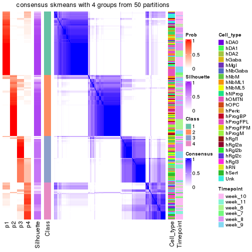</p>

</div>
</div>

Heatmaps for the membership of samples in all partitions to see how consistent they are:


<script>
$( function() {
	$( '#tabs-node-022-membership-heatmap' ).tabs();
} );
</script>
<div id='tabs-node-022-membership-heatmap'>
<ul>
<li><a href='#tab-node-022-membership-heatmap-1'>k = 2</a></li>
<li><a href='#tab-node-022-membership-heatmap-2'>k = 3</a></li>
<li><a href='#tab-node-022-membership-heatmap-3'>k = 4</a></li>
</ul>
<div id='tab-node-022-membership-heatmap-1'>
<pre><code class="r">membership_heatmap(res, k = 2)
</code></pre>

<p></p>

</div>
<div id='tab-node-022-membership-heatmap-2'>
<pre><code class="r">membership_heatmap(res, k = 3)
</code></pre>

<p></p>

</div>
<div id='tab-node-022-membership-heatmap-3'>
<pre><code class="r">membership_heatmap(res, k = 4)
</code></pre>

<p></p>

</div>
</div>

As soon as the classes for columns are determined, the signatures
that are significantly different between subgroups can be looked for. 
Following are the heatmaps for signatures.


Signature heatmaps where rows are scaled:


<script>
$( function() {
	$( '#tabs-node-022-get-signatures' ).tabs();
} );
</script>
<div id='tabs-node-022-get-signatures'>
<ul>
<li><a href='#tab-node-022-get-signatures-1'>k = 2</a></li>
<li><a href='#tab-node-022-get-signatures-2'>k = 3</a></li>
<li><a href='#tab-node-022-get-signatures-3'>k = 4</a></li>
</ul>
<div id='tab-node-022-get-signatures-1'>
<pre><code class="r">get_signatures(res, k = 2)
</code></pre>

<p></p>

</div>
<div id='tab-node-022-get-signatures-2'>
<pre><code class="r">get_signatures(res, k = 3)
</code></pre>

<p></p>

</div>
<div id='tab-node-022-get-signatures-3'>
<pre><code class="r">get_signatures(res, k = 4)
</code></pre>

<p></p>

</div>
</div>


Signature heatmaps where rows are not scaled:


<script>
$( function() {
	$( '#tabs-node-022-get-signatures-no-scale' ).tabs();
} );
</script>
<div id='tabs-node-022-get-signatures-no-scale'>
<ul>
<li><a href='#tab-node-022-get-signatures-no-scale-1'>k = 2</a></li>
<li><a href='#tab-node-022-get-signatures-no-scale-2'>k = 3</a></li>
<li><a href='#tab-node-022-get-signatures-no-scale-3'>k = 4</a></li>
</ul>
<div id='tab-node-022-get-signatures-no-scale-1'>
<pre><code class="r">get_signatures(res, k = 2, scale_rows = FALSE)
</code></pre>

<p></p>

</div>
<div id='tab-node-022-get-signatures-no-scale-2'>
<pre><code class="r">get_signatures(res, k = 3, scale_rows = FALSE)
</code></pre>

<p></p>

</div>
<div id='tab-node-022-get-signatures-no-scale-3'>
<pre><code class="r">get_signatures(res, k = 4, scale_rows = FALSE)
</code></pre>

<p></p>

</div>
</div>


Compare the overlap of signatures from different k:

```r
compare_signatures(res)
```


`get_signature()` returns a data frame invisibly. To get the list of signatures, the function
call should be assigned to a variable explicitly. In following code, if `plot` argument is set
to `FALSE`, no heatmap is plotted while only the differential analysis is performed.

```r
# code only for demonstration
tb = get_signature(res, k = ..., plot = FALSE)
```

An example of the output of `tb` is:

```
#>   which_row         fdr    mean_1    mean_2 scaled_mean_1 scaled_mean_2 km
#> 1        38 0.042760348  8.373488  9.131774    -0.5533452     0.5164555  1
#> 2        40 0.018707592  7.106213  8.469186    -0.6173731     0.5762149  1
#> 3        55 0.019134737 10.221463 11.207825    -0.6159697     0.5749050  1
#> 4        59 0.006059896  5.921854  7.869574    -0.6899429     0.6439467  1
#> 5        60 0.018055526  8.928898 10.211722    -0.6204761     0.5791110  1
#> 6        98 0.009384629 15.714769 14.887706     0.6635654    -0.6193277  2
...
```

The columns in `tb` are:

1. `which_row`: row indices corresponding to the input matrix.
2. `fdr`: FDR for the differential test. 
3. `mean_x`: The mean value in group x.
4. `scaled_mean_x`: The mean value in group x after rows are scaled.
5. `km`: Row groups if k-means clustering is applied to rows (which is done by automatically selecting number of clusters).

If there are too many signatures, `top_signatures = ...` can be set to only show the 
signatures with the highest FDRs:

```r
# code only for demonstration
# e.g. to show the top 500 most significant rows
tb = get_signature(res, k = ..., top_signatures = 500)
```

If the signatures are defined as these which are uniquely high in current group, `diff_method` argument
can be set to `"uniquely_high_in_one_group"`:

```r
# code only for demonstration
tb = get_signature(res, k = ..., diff_method = "uniquely_high_in_one_group")
```


UMAP plot which shows how samples are separated.


<script>
$( function() {
	$( '#tabs-node-022-dimension-reduction' ).tabs();
} );
</script>
<div id='tabs-node-022-dimension-reduction'>
<ul>
<li><a href='#tab-node-022-dimension-reduction-1'>k = 2</a></li>
<li><a href='#tab-node-022-dimension-reduction-2'>k = 3</a></li>
<li><a href='#tab-node-022-dimension-reduction-3'>k = 4</a></li>
</ul>
<div id='tab-node-022-dimension-reduction-1'>
<pre><code class="r">dimension_reduction(res, k = 2, method = &quot;UMAP&quot;)
</code></pre>

<p></p>

</div>
<div id='tab-node-022-dimension-reduction-2'>
<pre><code class="r">dimension_reduction(res, k = 3, method = &quot;UMAP&quot;)
</code></pre>

<p></p>

</div>
<div id='tab-node-022-dimension-reduction-3'>
<pre><code class="r">dimension_reduction(res, k = 4, method = &quot;UMAP&quot;)
</code></pre>

<p></p>

</div>
</div>


Following heatmap shows how subgroups are split when increasing `k`:

```r
collect_classes(res)
```


Test correlation between subgroups and known annotations. If the known
annotation is numeric, one-way ANOVA test is applied, and if the known
annotation is discrete, chi-squared contingency table test is applied.

```r
test_to_known_factors(res)
```

```
#>             n_sample Cell_type(p-value) Timepoint(p-value) k
#> ATC:skmeans      195           2.52e-02           1.32e-02 2
#> ATC:skmeans      212           5.70e-06           7.24e-09 3
#> ATC:skmeans      192           1.53e-05           1.86e-08 4
```


If matrix rows can be associated to genes, consider to use `functional_enrichment(res,
...)` to perform function enrichment for the signature genes. See [this vignette](https://jokergoo.github.io/cola_vignettes/functional_enrichment.html) for more detailed explanations.


 

---------------------------------------------------


### Node0222


Parent node: [Node022](#Node022).
Child nodes: 
                Node01121-leaf
        ,
                Node01122-leaf
        ,
                Node01131-leaf
        ,
                Node01132-leaf
        ,
                Node01133-leaf
        ,
                [Node01211](#Node01211)
        ,
                Node01212-leaf
        ,
                Node01221-leaf
        ,
                [Node01222](#Node01222)
        ,
                Node01311-leaf
        ,
                Node01312-leaf
        ,
                Node01313-leaf
        ,
                Node01321-leaf
        ,
                Node01322-leaf
        ,
                Node01331-leaf
        ,
                Node01332-leaf
        ,
                Node02111-leaf
        ,
                [Node02112](#Node02112)
        ,
                Node02121-leaf
        ,
                Node02122-leaf
        ,
                [Node02123](#Node02123)
        ,
                Node02221-leaf
        ,
                Node02222-leaf
        ,
                Node02231-leaf
        ,
                Node02232-leaf
        ,
                Node02311-leaf
        ,
                Node02312-leaf
        ,
                Node02321-leaf
        ,
                Node02322-leaf
        ,
                Node02323-leaf
        ,
                Node02421-leaf
        ,
                Node02422-leaf
        .


The object with results only for a single top-value method and a single partitioning method 
can be extracted as:

```r
res = res_rh["0222"]
```

A summary of `res` and all the functions that can be applied to it:

```r
res
```

```
#> A 'ConsensusPartition' object with k = 2, 3, 4.
#>   On a matrix with 7163 rows and 68 columns.
#>   Top rows (716) are extracted by 'ATC' method.
#>   Subgroups are detected by 'skmeans' method.
#>   Performed in total 150 partitions by row resampling.
#>   Best k for subgroups seems to be 2.
#> 
#> Following methods can be applied to this 'ConsensusPartition' object:
#>  [1] "cola_report"             "collect_classes"         "collect_plots"          
#>  [4] "collect_stats"           "colnames"                "compare_partitions"     
#>  [7] "compare_signatures"      "consensus_heatmap"       "dimension_reduction"    
#> [10] "functional_enrichment"   "get_anno_col"            "get_anno"               
#> [13] "get_classes"             "get_consensus"           "get_matrix"             
#> [16] "get_membership"          "get_param"               "get_signatures"         
#> [19] "get_stats"               "is_best_k"               "is_stable_k"            
#> [22] "membership_heatmap"      "ncol"                    "nrow"                   
#> [25] "plot_ecdf"               "predict_classes"         "rownames"               
#> [28] "select_partition_number" "show"                    "suggest_best_k"         
#> [31] "test_to_known_factors"   "top_rows_heatmap"
```

`collect_plots()` function collects all the plots made from `res` for all `k` (number of subgroups)
into one single page to provide an easy and fast comparison between different `k`.

```r
collect_plots(res)
```


The plots are:

- The first row: a plot of the eCDF (empirical cumulative distribution
  function) curves of the consensus matrix for each `k` and the heatmap of
  predicted classes for each `k`.
- The second row: heatmaps of the consensus matrix for each `k`.
- The third row: heatmaps of the membership matrix for each `k`.
- The fouth row: heatmaps of the signatures for each `k`.

All the plots in panels can be made by individual functions and they are
plotted later in this section.

`select_partition_number()` produces several plots showing different
statistics for choosing "optimized" `k`. There are following statistics:

- eCDF curves of the consensus matrix for each `k`;
- 1-PAC. [The PAC score](https://en.wikipedia.org/wiki/Consensus_clustering#Over-interpretation_potential_of_consensus_clustering)
  measures the proportion of the ambiguous subgrouping.
- Mean silhouette score.
- Concordance. The mean probability of fiting the consensus subgroup labels in all
  partitions.
- Area increased. Denote $A_k$ as the area under the eCDF curve for current
  `k`, the area increased is defined as $A_k - A_{k-1}$.
- Rand index. The percent of pairs of samples that are both in a same cluster
  or both are not in a same cluster in the partition of k and k-1.
- Jaccard index. The ratio of pairs of samples are both in a same cluster in
  the partition of k and k-1 and the pairs of samples are both in a same
  cluster in the partition k or k-1.

The detailed explanations of these statistics can be found in [the _cola_
vignette](https://jokergoo.github.io/cola_vignettes/cola.html#toc_13).

Generally speaking, higher 1-PAC score, higher mean silhouette score or higher
concordance corresponds to better partition. Rand index and Jaccard index
measure how similar the current partition is compared to partition with `k-1`.
If they are too similar, we won't accept `k` is better than `k-1`.

```r
select_partition_number(res)
```


The numeric values for all these statistics can be obtained by `get_stats()`.

```r
get_stats(res)
```

```
#>   k 1-PAC mean_silhouette concordance area_increased  Rand Jaccard
#> 2 2 1.000           0.966       0.984          0.507 0.493   0.493
#> 3 3 0.865           0.899       0.954          0.312 0.783   0.586
#> 4 4 0.635           0.701       0.858          0.125 0.888   0.682
```

`suggest_best_k()` suggests the best $k$ based on these statistics. The rules are as follows:

- All $k$ with Jaccard index larger than 0.95 are removed because increasing
  $k$ does not provide enough extra information. If all $k$ are removed, it is
  marked as no subgroup is detected.
- For all $k$ with 1-PAC score larger than 0.9, the maximal $k$ is taken as
  the best $k$, and other $k$ are marked as optional $k$.
- If it does not fit the second rule. The $k$ with the maximal vote of the
  highest 1-PAC score, highest mean silhouette, and highest concordance is
  taken as the best $k$.

```r
suggest_best_k(res)
```

```
#> [1] 2
```


Following is the table of the partitions (You need to click the **show/hide
code output** link to see it). The membership matrix (columns with name `p*`)
is inferred by
[`clue::cl_consensus()`](https://www.rdocumentation.org/link/cl_consensus?package=clue)
function with the `SE` method. Basically the value in the membership matrix
represents the probability to belong to a certain group. The finall subgroup
label for an item is determined with the group with highest probability it
belongs to.

In `get_classes()` function, the entropy is calculated from the membership
matrix and the silhouette score is calculated from the consensus matrix.


<script>
$( function() {
	$( '#tabs-node-0222-get-classes' ).tabs();
} );
</script>
<div id='tabs-node-0222-get-classes'>
<ul>
<li><a href='#tab-node-0222-get-classes-1'>k = 2</a></li>
<li><a href='#tab-node-0222-get-classes-2'>k = 3</a></li>
<li><a href='#tab-node-0222-get-classes-3'>k = 4</a></li>
</ul>

<div id='tab-node-0222-get-classes-1'>
<p><a id='tab-node-0222-get-classes-1-a' style='color:#0366d6' href='#'>show/hide code output</a></p>
<pre><code class="r">cbind(get_classes(res, k = 2), get_membership(res, k = 2))
</code></pre>

<pre><code>#&gt;                 class entropy silhouette   p1   p2
#&gt; 1772067_089_A09     1   0.000      0.997 1.00 0.00
#&gt; 1772067_089_C12     2   0.000      0.971 0.00 1.00
#&gt; 1772067_089_E06     2   0.000      0.971 0.00 1.00
#&gt; 1772075_299_B09     2   0.000      0.971 0.00 1.00
#&gt; 1772075_299_G05     2   0.000      0.971 0.00 1.00
#&gt; 1772075_298_E03     2   0.000      0.971 0.00 1.00
#&gt; 1772078_002_A05     2   0.000      0.971 0.00 1.00
#&gt; 1772078_002_E04     2   0.000      0.971 0.00 1.00
#&gt; 1772078_002_E05     2   0.000      0.971 0.00 1.00
#&gt; 1772078_002_E07     2   0.000      0.971 0.00 1.00
#&gt; 1772078_002_G02     1   0.000      0.997 1.00 0.00
#&gt; 1772078_002_H03     2   0.000      0.971 0.00 1.00
#&gt; 1772122_236_A12     2   0.722      0.767 0.20 0.80
#&gt; 1772121_288_B09     2   0.000      0.971 0.00 1.00
#&gt; 1772121_288_C01     2   0.000      0.971 0.00 1.00
#&gt; 1772121_288_C08     1   0.000      0.997 1.00 0.00
#&gt; 1772121_288_H02     2   0.000      0.971 0.00 1.00
#&gt; 1772121_282_D08     2   0.000      0.971 0.00 1.00
#&gt; 1772122_264_C09     1   0.000      0.997 1.00 0.00
#&gt; 1772122_207_B11     2   0.000      0.971 0.00 1.00
#&gt; 1772122_207_C03     2   0.000      0.971 0.00 1.00
#&gt; 1772122_316_A01     1   0.000      0.997 1.00 0.00
#&gt; 1772122_316_C04     2   0.000      0.971 0.00 1.00
#&gt; 1772122_316_D09     2   0.000      0.971 0.00 1.00
#&gt; 1772122_316_G06     1   0.000      0.997 1.00 0.00
#&gt; 1772122_316_H04     1   0.000      0.997 1.00 0.00
#&gt; 1772122_316_H11     2   0.680      0.791 0.18 0.82
#&gt; 1772122_317_B06     1   0.000      0.997 1.00 0.00
#&gt; 1772122_317_B07     1   0.000      0.997 1.00 0.00
#&gt; 1772122_317_D11     1   0.000      0.997 1.00 0.00
#&gt; 1772122_317_D12     2   0.000      0.971 0.00 1.00
#&gt; 1772122_317_E04     2   0.827      0.677 0.26 0.74
#&gt; 1772122_317_F07     1   0.000      0.997 1.00 0.00
#&gt; 1772122_318_D11     1   0.000      0.997 1.00 0.00
#&gt; 1772122_318_F09     1   0.000      0.997 1.00 0.00
#&gt; 1772122_319_A03     1   0.000      0.997 1.00 0.00
#&gt; 1772122_319_E11     2   0.000      0.971 0.00 1.00
#&gt; 1772122_221_B04     1   0.000      0.997 1.00 0.00
#&gt; 1772122_221_B09     2   0.000      0.971 0.00 1.00
#&gt; 1772122_221_C06     1   0.000      0.997 1.00 0.00
#&gt; 1772122_220_A02     1   0.000      0.997 1.00 0.00
#&gt; 1772122_220_B11     2   0.000      0.971 0.00 1.00
#&gt; 1772122_220_C09     1   0.000      0.997 1.00 0.00
#&gt; 1772122_220_D04     2   0.000      0.971 0.00 1.00
#&gt; 1772122_220_D10     2   0.327      0.921 0.06 0.94
#&gt; 1772122_220_G04     1   0.000      0.997 1.00 0.00
#&gt; 1772122_220_G11     1   0.000      0.997 1.00 0.00
#&gt; 1772122_220_H04     1   0.000      0.997 1.00 0.00
#&gt; 1772122_220_H10     1   0.000      0.997 1.00 0.00
#&gt; 1772122_220_H12     1   0.141      0.979 0.98 0.02
#&gt; 1772122_226_A04     2   0.000      0.971 0.00 1.00
#&gt; 1772122_226_D06     2   0.000      0.971 0.00 1.00
#&gt; 1772122_223_A02     1   0.000      0.997 1.00 0.00
#&gt; 1772122_223_B12     1   0.000      0.997 1.00 0.00
#&gt; 1772122_223_C04     2   0.881      0.603 0.30 0.70
#&gt; 1772122_223_C11     1   0.000      0.997 1.00 0.00
#&gt; 1772122_223_D02     1   0.242      0.957 0.96 0.04
#&gt; 1772122_223_D06     2   0.000      0.971 0.00 1.00
#&gt; 1772122_223_G07     1   0.000      0.997 1.00 0.00
#&gt; 1772122_223_G11     2   0.000      0.971 0.00 1.00
#&gt; 1772122_223_H02     1   0.000      0.997 1.00 0.00
#&gt; 1772122_223_H08     1   0.000      0.997 1.00 0.00
#&gt; 1772122_224_A09     1   0.141      0.979 0.98 0.02
#&gt; 1772122_224_D06     1   0.000      0.997 1.00 0.00
#&gt; 1772122_224_D09     2   0.000      0.971 0.00 1.00
#&gt; 1772122_224_E01     2   0.000      0.971 0.00 1.00
#&gt; 1772122_224_G07     1   0.000      0.997 1.00 0.00
#&gt; 1772122_224_H07     2   0.000      0.971 0.00 1.00
</code></pre>

<script>
$('#tab-node-0222-get-classes-1-a').parent().next().next().hide();
$('#tab-node-0222-get-classes-1-a').click(function(){
  $('#tab-node-0222-get-classes-1-a').parent().next().next().toggle();
  return(false);
});
</script>
</div>

<div id='tab-node-0222-get-classes-2'>
<p><a id='tab-node-0222-get-classes-2-a' style='color:#0366d6' href='#'>show/hide code output</a></p>
<pre><code class="r">cbind(get_classes(res, k = 3), get_membership(res, k = 3))
</code></pre>

<pre><code>#&gt;                 class entropy silhouette   p1   p2   p3
#&gt; 1772067_089_A09     3  0.2066     0.8939 0.06 0.00 0.94
#&gt; 1772067_089_C12     3  0.0892     0.9283 0.00 0.02 0.98
#&gt; 1772067_089_E06     3  0.0000     0.9350 0.00 0.00 1.00
#&gt; 1772075_299_B09     2  0.0000     0.9516 0.00 1.00 0.00
#&gt; 1772075_299_G05     2  0.0000     0.9516 0.00 1.00 0.00
#&gt; 1772075_298_E03     2  0.0000     0.9516 0.00 1.00 0.00
#&gt; 1772078_002_A05     2  0.0000     0.9516 0.00 1.00 0.00
#&gt; 1772078_002_E04     2  0.0000     0.9516 0.00 1.00 0.00
#&gt; 1772078_002_E05     3  0.1529     0.9181 0.00 0.04 0.96
#&gt; 1772078_002_E07     3  0.4555     0.7591 0.00 0.20 0.80
#&gt; 1772078_002_G02     1  0.2066     0.9122 0.94 0.06 0.00
#&gt; 1772078_002_H03     2  0.0000     0.9516 0.00 1.00 0.00
#&gt; 1772122_236_A12     3  0.0000     0.9350 0.00 0.00 1.00
#&gt; 1772121_288_B09     3  0.5560     0.6012 0.00 0.30 0.70
#&gt; 1772121_288_C01     2  0.5016     0.6679 0.00 0.76 0.24
#&gt; 1772121_288_C08     1  0.0000     0.9580 1.00 0.00 0.00
#&gt; 1772121_288_H02     2  0.0000     0.9516 0.00 1.00 0.00
#&gt; 1772121_282_D08     2  0.0000     0.9516 0.00 1.00 0.00
#&gt; 1772122_264_C09     1  0.0000     0.9580 1.00 0.00 0.00
#&gt; 1772122_207_B11     3  0.0892     0.9292 0.00 0.02 0.98
#&gt; 1772122_207_C03     2  0.0000     0.9516 0.00 1.00 0.00
#&gt; 1772122_316_A01     1  0.0000     0.9580 1.00 0.00 0.00
#&gt; 1772122_316_C04     3  0.0000     0.9350 0.00 0.00 1.00
#&gt; 1772122_316_D09     2  0.0000     0.9516 0.00 1.00 0.00
#&gt; 1772122_316_G06     1  0.0892     0.9464 0.98 0.00 0.02
#&gt; 1772122_316_H04     1  0.0000     0.9580 1.00 0.00 0.00
#&gt; 1772122_316_H11     3  0.0000     0.9350 0.00 0.00 1.00
#&gt; 1772122_317_B06     1  0.0892     0.9463 0.98 0.00 0.02
#&gt; 1772122_317_B07     1  0.0000     0.9580 1.00 0.00 0.00
#&gt; 1772122_317_D11     3  0.0000     0.9350 0.00 0.00 1.00
#&gt; 1772122_317_D12     3  0.2537     0.8884 0.00 0.08 0.92
#&gt; 1772122_317_E04     3  0.0000     0.9350 0.00 0.00 1.00
#&gt; 1772122_317_F07     1  0.0000     0.9580 1.00 0.00 0.00
#&gt; 1772122_318_D11     1  0.0000     0.9580 1.00 0.00 0.00
#&gt; 1772122_318_F09     1  0.5835     0.4860 0.66 0.00 0.34
#&gt; 1772122_319_A03     1  0.0000     0.9580 1.00 0.00 0.00
#&gt; 1772122_319_E11     3  0.0000     0.9350 0.00 0.00 1.00
#&gt; 1772122_221_B04     1  0.2959     0.8687 0.90 0.10 0.00
#&gt; 1772122_221_B09     2  0.3686     0.8213 0.00 0.86 0.14
#&gt; 1772122_221_C06     1  0.0000     0.9580 1.00 0.00 0.00
#&gt; 1772122_220_A02     1  0.0000     0.9580 1.00 0.00 0.00
#&gt; 1772122_220_B11     2  0.0000     0.9516 0.00 1.00 0.00
#&gt; 1772122_220_C09     1  0.0000     0.9580 1.00 0.00 0.00
#&gt; 1772122_220_D04     3  0.0000     0.9350 0.00 0.00 1.00
#&gt; 1772122_220_D10     3  0.0000     0.9350 0.00 0.00 1.00
#&gt; 1772122_220_G04     1  0.0000     0.9580 1.00 0.00 0.00
#&gt; 1772122_220_G11     1  0.0000     0.9580 1.00 0.00 0.00
#&gt; 1772122_220_H04     1  0.0000     0.9580 1.00 0.00 0.00
#&gt; 1772122_220_H10     1  0.0000     0.9580 1.00 0.00 0.00
#&gt; 1772122_220_H12     3  0.4555     0.7459 0.20 0.00 0.80
#&gt; 1772122_226_A04     2  0.4796     0.7136 0.00 0.78 0.22
#&gt; 1772122_226_D06     2  0.0000     0.9516 0.00 1.00 0.00
#&gt; 1772122_223_A02     1  0.0892     0.9466 0.98 0.02 0.00
#&gt; 1772122_223_B12     1  0.0000     0.9580 1.00 0.00 0.00
#&gt; 1772122_223_C04     3  0.5970     0.7591 0.06 0.16 0.78
#&gt; 1772122_223_C11     1  0.0000     0.9580 1.00 0.00 0.00
#&gt; 1772122_223_D02     2  0.4291     0.7570 0.18 0.82 0.00
#&gt; 1772122_223_D06     2  0.0000     0.9516 0.00 1.00 0.00
#&gt; 1772122_223_G07     1  0.0000     0.9580 1.00 0.00 0.00
#&gt; 1772122_223_G11     2  0.0000     0.9516 0.00 1.00 0.00
#&gt; 1772122_223_H02     1  0.0000     0.9580 1.00 0.00 0.00
#&gt; 1772122_223_H08     1  0.1529     0.9312 0.96 0.00 0.04
#&gt; 1772122_224_A09     1  0.9267     0.0762 0.46 0.38 0.16
#&gt; 1772122_224_D06     1  0.0892     0.9456 0.98 0.00 0.02
#&gt; 1772122_224_D09     3  0.0892     0.9292 0.00 0.02 0.98
#&gt; 1772122_224_E01     3  0.0000     0.9350 0.00 0.00 1.00
#&gt; 1772122_224_G07     1  0.0892     0.9466 0.98 0.02 0.00
#&gt; 1772122_224_H07     2  0.0000     0.9516 0.00 1.00 0.00
</code></pre>

<script>
$('#tab-node-0222-get-classes-2-a').parent().next().next().hide();
$('#tab-node-0222-get-classes-2-a').click(function(){
  $('#tab-node-0222-get-classes-2-a').parent().next().next().toggle();
  return(false);
});
</script>
</div>

<div id='tab-node-0222-get-classes-3'>
<p><a id='tab-node-0222-get-classes-3-a' style='color:#0366d6' href='#'>show/hide code output</a></p>
<pre><code class="r">cbind(get_classes(res, k = 4), get_membership(res, k = 4))
</code></pre>

<pre><code>#&gt;                 class entropy silhouette   p1   p2   p3   p4
#&gt; 1772067_089_A09     3  0.4797     0.5580 0.26 0.00 0.72 0.02
#&gt; 1772067_089_C12     3  0.0707     0.8091 0.00 0.02 0.98 0.00
#&gt; 1772067_089_E06     3  0.0000     0.8073 0.00 0.00 1.00 0.00
#&gt; 1772075_299_B09     2  0.0000     0.8648 0.00 1.00 0.00 0.00
#&gt; 1772075_299_G05     2  0.0000     0.8648 0.00 1.00 0.00 0.00
#&gt; 1772075_298_E03     2  0.0000     0.8648 0.00 1.00 0.00 0.00
#&gt; 1772078_002_A05     2  0.0000     0.8648 0.00 1.00 0.00 0.00
#&gt; 1772078_002_E04     2  0.0000     0.8648 0.00 1.00 0.00 0.00
#&gt; 1772078_002_E05     3  0.2345     0.7864 0.00 0.10 0.90 0.00
#&gt; 1772078_002_E07     3  0.3172     0.7374 0.00 0.16 0.84 0.00
#&gt; 1772078_002_G02     1  0.4581     0.7774 0.80 0.08 0.00 0.12
#&gt; 1772078_002_H03     2  0.0000     0.8648 0.00 1.00 0.00 0.00
#&gt; 1772122_236_A12     3  0.0707     0.8039 0.02 0.00 0.98 0.00
#&gt; 1772121_288_B09     3  0.4790     0.3976 0.00 0.38 0.62 0.00
#&gt; 1772121_288_C01     4  0.5820     0.4975 0.00 0.24 0.08 0.68
#&gt; 1772121_288_C08     4  0.4624     0.4113 0.34 0.00 0.00 0.66
#&gt; 1772121_288_H02     2  0.0000     0.8648 0.00 1.00 0.00 0.00
#&gt; 1772121_282_D08     2  0.0000     0.8648 0.00 1.00 0.00 0.00
#&gt; 1772122_264_C09     1  0.0707     0.8622 0.98 0.00 0.02 0.00
#&gt; 1772122_207_B11     3  0.1637     0.8006 0.00 0.06 0.94 0.00
#&gt; 1772122_207_C03     2  0.3610     0.7085 0.00 0.80 0.00 0.20
#&gt; 1772122_316_A01     1  0.0000     0.8660 1.00 0.00 0.00 0.00
#&gt; 1772122_316_C04     3  0.1637     0.8020 0.00 0.06 0.94 0.00
#&gt; 1772122_316_D09     2  0.1211     0.8506 0.00 0.96 0.04 0.00
#&gt; 1772122_316_G06     1  0.1637     0.8428 0.94 0.00 0.06 0.00
#&gt; 1772122_316_H04     1  0.0000     0.8660 1.00 0.00 0.00 0.00
#&gt; 1772122_316_H11     3  0.5594     0.0606 0.02 0.00 0.52 0.46
#&gt; 1772122_317_B06     1  0.2411     0.8380 0.92 0.00 0.04 0.04
#&gt; 1772122_317_B07     1  0.0000     0.8660 1.00 0.00 0.00 0.00
#&gt; 1772122_317_D11     3  0.4079     0.6705 0.18 0.00 0.80 0.02
#&gt; 1772122_317_D12     4  0.6805     0.1239 0.00 0.10 0.40 0.50
#&gt; 1772122_317_E04     3  0.1211     0.7969 0.04 0.00 0.96 0.00
#&gt; 1772122_317_F07     1  0.0000     0.8660 1.00 0.00 0.00 0.00
#&gt; 1772122_318_D11     1  0.0707     0.8657 0.98 0.00 0.00 0.02
#&gt; 1772122_318_F09     1  0.4797     0.5657 0.72 0.00 0.26 0.02
#&gt; 1772122_319_A03     1  0.0707     0.8622 0.98 0.00 0.02 0.00
#&gt; 1772122_319_E11     3  0.2921     0.7273 0.00 0.00 0.86 0.14
#&gt; 1772122_221_B04     4  0.3172     0.6612 0.16 0.00 0.00 0.84
#&gt; 1772122_221_B09     2  0.6110     0.5787 0.00 0.66 0.24 0.10
#&gt; 1772122_221_C06     4  0.0707     0.7305 0.02 0.00 0.00 0.98
#&gt; 1772122_220_A02     1  0.2647     0.8304 0.88 0.00 0.00 0.12
#&gt; 1772122_220_B11     2  0.1211     0.8506 0.00 0.96 0.04 0.00
#&gt; 1772122_220_C09     1  0.1637     0.8558 0.94 0.00 0.00 0.06
#&gt; 1772122_220_D04     4  0.4994     0.0160 0.00 0.00 0.48 0.52
#&gt; 1772122_220_D10     3  0.0000     0.8073 0.00 0.00 1.00 0.00
#&gt; 1772122_220_G04     4  0.0707     0.7305 0.02 0.00 0.00 0.98
#&gt; 1772122_220_G11     1  0.2921     0.8109 0.86 0.00 0.00 0.14
#&gt; 1772122_220_H04     1  0.3172     0.8052 0.84 0.00 0.00 0.16
#&gt; 1772122_220_H10     4  0.1211     0.7296 0.04 0.00 0.00 0.96
#&gt; 1772122_220_H12     4  0.4491     0.6375 0.06 0.00 0.14 0.80
#&gt; 1772122_226_A04     2  0.4797     0.6083 0.00 0.72 0.26 0.02
#&gt; 1772122_226_D06     2  0.0000     0.8648 0.00 1.00 0.00 0.00
#&gt; 1772122_223_A02     1  0.3606     0.8151 0.84 0.02 0.00 0.14
#&gt; 1772122_223_B12     4  0.0707     0.7305 0.02 0.00 0.00 0.98
#&gt; 1772122_223_C04     3  0.7327     0.4047 0.10 0.04 0.60 0.26
#&gt; 1772122_223_C11     1  0.0707     0.8622 0.98 0.00 0.02 0.00
#&gt; 1772122_223_D02     2  0.6656     0.4383 0.22 0.62 0.00 0.16
#&gt; 1772122_223_D06     2  0.1211     0.8506 0.00 0.96 0.04 0.00
#&gt; 1772122_223_G07     1  0.2647     0.8304 0.88 0.00 0.00 0.12
#&gt; 1772122_223_G11     2  0.4994     0.1833 0.00 0.52 0.00 0.48
#&gt; 1772122_223_H02     1  0.1637     0.8558 0.94 0.00 0.00 0.06
#&gt; 1772122_223_H08     1  0.2335     0.8349 0.92 0.00 0.06 0.02
#&gt; 1772122_224_A09     1  0.8908     0.2212 0.46 0.24 0.22 0.08
#&gt; 1772122_224_D06     4  0.4855     0.2757 0.40 0.00 0.00 0.60
#&gt; 1772122_224_D09     3  0.3821     0.7508 0.00 0.12 0.84 0.04
#&gt; 1772122_224_E01     3  0.0000     0.8073 0.00 0.00 1.00 0.00
#&gt; 1772122_224_G07     1  0.5428     0.4193 0.60 0.02 0.00 0.38
#&gt; 1772122_224_H07     2  0.4522     0.5584 0.00 0.68 0.00 0.32
</code></pre>

<script>
$('#tab-node-0222-get-classes-3-a').parent().next().next().hide();
$('#tab-node-0222-get-classes-3-a').click(function(){
  $('#tab-node-0222-get-classes-3-a').parent().next().next().toggle();
  return(false);
});
</script>
</div>
</div>

Heatmaps for the consensus matrix. It visualizes the probability of two
samples to be in a same group.


<script>
$( function() {
	$( '#tabs-node-0222-consensus-heatmap' ).tabs();
} );
</script>
<div id='tabs-node-0222-consensus-heatmap'>
<ul>
<li><a href='#tab-node-0222-consensus-heatmap-1'>k = 2</a></li>
<li><a href='#tab-node-0222-consensus-heatmap-2'>k = 3</a></li>
<li><a href='#tab-node-0222-consensus-heatmap-3'>k = 4</a></li>
</ul>
<div id='tab-node-0222-consensus-heatmap-1'>
<pre><code class="r">consensus_heatmap(res, k = 2)
</code></pre>

<p></p>

</div>
<div id='tab-node-0222-consensus-heatmap-2'>
<pre><code class="r">consensus_heatmap(res, k = 3)
</code></pre>

<p></p>

</div>
<div id='tab-node-0222-consensus-heatmap-3'>
<pre><code class="r">consensus_heatmap(res, k = 4)
</code></pre>

<p></p>

</div>
</div>

Heatmaps for the membership of samples in all partitions to see how consistent they are:


<script>
$( function() {
	$( '#tabs-node-0222-membership-heatmap' ).tabs();
} );
</script>
<div id='tabs-node-0222-membership-heatmap'>
<ul>
<li><a href='#tab-node-0222-membership-heatmap-1'>k = 2</a></li>
<li><a href='#tab-node-0222-membership-heatmap-2'>k = 3</a></li>
<li><a href='#tab-node-0222-membership-heatmap-3'>k = 4</a></li>
</ul>
<div id='tab-node-0222-membership-heatmap-1'>
<pre><code class="r">membership_heatmap(res, k = 2)
</code></pre>

<p></p>

</div>
<div id='tab-node-0222-membership-heatmap-2'>
<pre><code class="r">membership_heatmap(res, k = 3)
</code></pre>

<p></p>

</div>
<div id='tab-node-0222-membership-heatmap-3'>
<pre><code class="r">membership_heatmap(res, k = 4)
</code></pre>

<p></p>

</div>
</div>

As soon as the classes for columns are determined, the signatures
that are significantly different between subgroups can be looked for. 
Following are the heatmaps for signatures.


Signature heatmaps where rows are scaled:


<script>
$( function() {
	$( '#tabs-node-0222-get-signatures' ).tabs();
} );
</script>
<div id='tabs-node-0222-get-signatures'>
<ul>
<li><a href='#tab-node-0222-get-signatures-1'>k = 2</a></li>
<li><a href='#tab-node-0222-get-signatures-2'>k = 3</a></li>
<li><a href='#tab-node-0222-get-signatures-3'>k = 4</a></li>
</ul>
<div id='tab-node-0222-get-signatures-1'>
<pre><code class="r">get_signatures(res, k = 2)
</code></pre>

<p></p>

</div>
<div id='tab-node-0222-get-signatures-2'>
<pre><code class="r">get_signatures(res, k = 3)
</code></pre>

<p></p>

</div>
<div id='tab-node-0222-get-signatures-3'>
<pre><code class="r">get_signatures(res, k = 4)
</code></pre>

<p></p>

</div>
</div>


Signature heatmaps where rows are not scaled:


<script>
$( function() {
	$( '#tabs-node-0222-get-signatures-no-scale' ).tabs();
} );
</script>
<div id='tabs-node-0222-get-signatures-no-scale'>
<ul>
<li><a href='#tab-node-0222-get-signatures-no-scale-1'>k = 2</a></li>
<li><a href='#tab-node-0222-get-signatures-no-scale-2'>k = 3</a></li>
<li><a href='#tab-node-0222-get-signatures-no-scale-3'>k = 4</a></li>
</ul>
<div id='tab-node-0222-get-signatures-no-scale-1'>
<pre><code class="r">get_signatures(res, k = 2, scale_rows = FALSE)
</code></pre>

<p></p>

</div>
<div id='tab-node-0222-get-signatures-no-scale-2'>
<pre><code class="r">get_signatures(res, k = 3, scale_rows = FALSE)
</code></pre>

<p>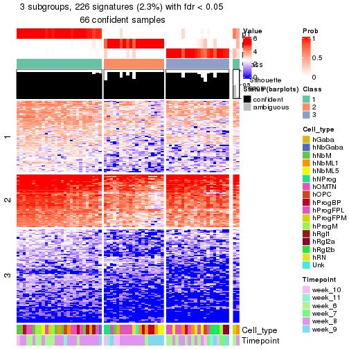</p>

</div>
<div id='tab-node-0222-get-signatures-no-scale-3'>
<pre><code class="r">get_signatures(res, k = 4, scale_rows = FALSE)
</code></pre>

<p></p>

</div>
</div>


Compare the overlap of signatures from different k:

```r
compare_signatures(res)
```


`get_signature()` returns a data frame invisibly. To get the list of signatures, the function
call should be assigned to a variable explicitly. In following code, if `plot` argument is set
to `FALSE`, no heatmap is plotted while only the differential analysis is performed.

```r
# code only for demonstration
tb = get_signature(res, k = ..., plot = FALSE)
```

An example of the output of `tb` is:

```
#>   which_row         fdr    mean_1    mean_2 scaled_mean_1 scaled_mean_2 km
#> 1        38 0.042760348  8.373488  9.131774    -0.5533452     0.5164555  1
#> 2        40 0.018707592  7.106213  8.469186    -0.6173731     0.5762149  1
#> 3        55 0.019134737 10.221463 11.207825    -0.6159697     0.5749050  1
#> 4        59 0.006059896  5.921854  7.869574    -0.6899429     0.6439467  1
#> 5        60 0.018055526  8.928898 10.211722    -0.6204761     0.5791110  1
#> 6        98 0.009384629 15.714769 14.887706     0.6635654    -0.6193277  2
...
```

The columns in `tb` are:

1. `which_row`: row indices corresponding to the input matrix.
2. `fdr`: FDR for the differential test. 
3. `mean_x`: The mean value in group x.
4. `scaled_mean_x`: The mean value in group x after rows are scaled.
5. `km`: Row groups if k-means clustering is applied to rows (which is done by automatically selecting number of clusters).

If there are too many signatures, `top_signatures = ...` can be set to only show the 
signatures with the highest FDRs:

```r
# code only for demonstration
# e.g. to show the top 500 most significant rows
tb = get_signature(res, k = ..., top_signatures = 500)
```

If the signatures are defined as these which are uniquely high in current group, `diff_method` argument
can be set to `"uniquely_high_in_one_group"`:

```r
# code only for demonstration
tb = get_signature(res, k = ..., diff_method = "uniquely_high_in_one_group")
```


UMAP plot which shows how samples are separated.


<script>
$( function() {
	$( '#tabs-node-0222-dimension-reduction' ).tabs();
} );
</script>
<div id='tabs-node-0222-dimension-reduction'>
<ul>
<li><a href='#tab-node-0222-dimension-reduction-1'>k = 2</a></li>
<li><a href='#tab-node-0222-dimension-reduction-2'>k = 3</a></li>
<li><a href='#tab-node-0222-dimension-reduction-3'>k = 4</a></li>
</ul>
<div id='tab-node-0222-dimension-reduction-1'>
<pre><code class="r">dimension_reduction(res, k = 2, method = &quot;UMAP&quot;)
</code></pre>

<p></p>

</div>
<div id='tab-node-0222-dimension-reduction-2'>
<pre><code class="r">dimension_reduction(res, k = 3, method = &quot;UMAP&quot;)
</code></pre>

<p></p>

</div>
<div id='tab-node-0222-dimension-reduction-3'>
<pre><code class="r">dimension_reduction(res, k = 4, method = &quot;UMAP&quot;)
</code></pre>

<p></p>

</div>
</div>


Following heatmap shows how subgroups are split when increasing `k`:

```r
collect_classes(res)
```


Test correlation between subgroups and known annotations. If the known
annotation is numeric, one-way ANOVA test is applied, and if the known
annotation is discrete, chi-squared contingency table test is applied.

```r
test_to_known_factors(res)
```

```
#>             n_sample Cell_type(p-value) Timepoint(p-value) k
#> ATC:skmeans       68              0.138            0.04558 2
#> ATC:skmeans       66              0.223            0.01952 3
#> ATC:skmeans       56              0.108            0.00509 4
```


If matrix rows can be associated to genes, consider to use `functional_enrichment(res,
...)` to perform function enrichment for the signature genes. See [this vignette](https://jokergoo.github.io/cola_vignettes/functional_enrichment.html) for more detailed explanations.


 

---------------------------------------------------


### Node0223


Parent node: [Node022](#Node022).
Child nodes: 
                Node01121-leaf
        ,
                Node01122-leaf
        ,
                Node01131-leaf
        ,
                Node01132-leaf
        ,
                Node01133-leaf
        ,
                [Node01211](#Node01211)
        ,
                Node01212-leaf
        ,
                Node01221-leaf
        ,
                [Node01222](#Node01222)
        ,
                Node01311-leaf
        ,
                Node01312-leaf
        ,
                Node01313-leaf
        ,
                Node01321-leaf
        ,
                Node01322-leaf
        ,
                Node01331-leaf
        ,
                Node01332-leaf
        ,
                Node02111-leaf
        ,
                [Node02112](#Node02112)
        ,
                Node02121-leaf
        ,
                Node02122-leaf
        ,
                [Node02123](#Node02123)
        ,
                Node02221-leaf
        ,
                Node02222-leaf
        ,
                Node02231-leaf
        ,
                Node02232-leaf
        ,
                Node02311-leaf
        ,
                Node02312-leaf
        ,
                Node02321-leaf
        ,
                Node02322-leaf
        ,
                Node02323-leaf
        ,
                Node02421-leaf
        ,
                Node02422-leaf
        .


The object with results only for a single top-value method and a single partitioning method 
can be extracted as:

```r
res = res_rh["0223"]
```

A summary of `res` and all the functions that can be applied to it:

```r
res
```

```
#> A 'ConsensusPartition' object with k = 2, 3, 4.
#>   On a matrix with 7867 rows and 69 columns.
#>   Top rows (753) are extracted by 'ATC' method.
#>   Subgroups are detected by 'skmeans' method.
#>   Performed in total 150 partitions by row resampling.
#>   Best k for subgroups seems to be 2.
#> 
#> Following methods can be applied to this 'ConsensusPartition' object:
#>  [1] "cola_report"             "collect_classes"         "collect_plots"          
#>  [4] "collect_stats"           "colnames"                "compare_partitions"     
#>  [7] "compare_signatures"      "consensus_heatmap"       "dimension_reduction"    
#> [10] "functional_enrichment"   "get_anno_col"            "get_anno"               
#> [13] "get_classes"             "get_consensus"           "get_matrix"             
#> [16] "get_membership"          "get_param"               "get_signatures"         
#> [19] "get_stats"               "is_best_k"               "is_stable_k"            
#> [22] "membership_heatmap"      "ncol"                    "nrow"                   
#> [25] "plot_ecdf"               "predict_classes"         "rownames"               
#> [28] "select_partition_number" "show"                    "suggest_best_k"         
#> [31] "test_to_known_factors"   "top_rows_heatmap"
```

`collect_plots()` function collects all the plots made from `res` for all `k` (number of subgroups)
into one single page to provide an easy and fast comparison between different `k`.

```r
collect_plots(res)
```


The plots are:

- The first row: a plot of the eCDF (empirical cumulative distribution
  function) curves of the consensus matrix for each `k` and the heatmap of
  predicted classes for each `k`.
- The second row: heatmaps of the consensus matrix for each `k`.
- The third row: heatmaps of the membership matrix for each `k`.
- The fouth row: heatmaps of the signatures for each `k`.

All the plots in panels can be made by individual functions and they are
plotted later in this section.

`select_partition_number()` produces several plots showing different
statistics for choosing "optimized" `k`. There are following statistics:

- eCDF curves of the consensus matrix for each `k`;
- 1-PAC. [The PAC score](https://en.wikipedia.org/wiki/Consensus_clustering#Over-interpretation_potential_of_consensus_clustering)
  measures the proportion of the ambiguous subgrouping.
- Mean silhouette score.
- Concordance. The mean probability of fiting the consensus subgroup labels in all
  partitions.
- Area increased. Denote $A_k$ as the area under the eCDF curve for current
  `k`, the area increased is defined as $A_k - A_{k-1}$.
- Rand index. The percent of pairs of samples that are both in a same cluster
  or both are not in a same cluster in the partition of k and k-1.
- Jaccard index. The ratio of pairs of samples are both in a same cluster in
  the partition of k and k-1 and the pairs of samples are both in a same
  cluster in the partition k or k-1.

The detailed explanations of these statistics can be found in [the _cola_
vignette](https://jokergoo.github.io/cola_vignettes/cola.html#toc_13).

Generally speaking, higher 1-PAC score, higher mean silhouette score or higher
concordance corresponds to better partition. Rand index and Jaccard index
measure how similar the current partition is compared to partition with `k-1`.
If they are too similar, we won't accept `k` is better than `k-1`.

```r
select_partition_number(res)
```


The numeric values for all these statistics can be obtained by `get_stats()`.

```r
get_stats(res)
```

```
#>   k 1-PAC mean_silhouette concordance area_increased  Rand Jaccard
#> 2 2 0.970           0.972       0.987          0.507 0.494   0.494
#> 3 3 0.689           0.862       0.909          0.288 0.801   0.617
#> 4 4 0.817           0.798       0.906          0.155 0.824   0.541
```

`suggest_best_k()` suggests the best $k$ based on these statistics. The rules are as follows:

- All $k$ with Jaccard index larger than 0.95 are removed because increasing
  $k$ does not provide enough extra information. If all $k$ are removed, it is
  marked as no subgroup is detected.
- For all $k$ with 1-PAC score larger than 0.9, the maximal $k$ is taken as
  the best $k$, and other $k$ are marked as optional $k$.
- If it does not fit the second rule. The $k$ with the maximal vote of the
  highest 1-PAC score, highest mean silhouette, and highest concordance is
  taken as the best $k$.

```r
suggest_best_k(res)
```

```
#> [1] 2
```


Following is the table of the partitions (You need to click the **show/hide
code output** link to see it). The membership matrix (columns with name `p*`)
is inferred by
[`clue::cl_consensus()`](https://www.rdocumentation.org/link/cl_consensus?package=clue)
function with the `SE` method. Basically the value in the membership matrix
represents the probability to belong to a certain group. The finall subgroup
label for an item is determined with the group with highest probability it
belongs to.

In `get_classes()` function, the entropy is calculated from the membership
matrix and the silhouette score is calculated from the consensus matrix.


<script>
$( function() {
	$( '#tabs-node-0223-get-classes' ).tabs();
} );
</script>
<div id='tabs-node-0223-get-classes'>
<ul>
<li><a href='#tab-node-0223-get-classes-1'>k = 2</a></li>
<li><a href='#tab-node-0223-get-classes-2'>k = 3</a></li>
<li><a href='#tab-node-0223-get-classes-3'>k = 4</a></li>
</ul>

<div id='tab-node-0223-get-classes-1'>
<p><a id='tab-node-0223-get-classes-1-a' style='color:#0366d6' href='#'>show/hide code output</a></p>
<pre><code class="r">cbind(get_classes(res, k = 2), get_membership(res, k = 2))
</code></pre>

<pre><code>#&gt;                 class entropy silhouette   p1   p2
#&gt; 1772067_089_G07     2   0.000      0.982 0.00 1.00
#&gt; 1772071_027_C05     2   0.000      0.982 0.00 1.00
#&gt; 1772071_029_C07     2   0.000      0.982 0.00 1.00
#&gt; 1772078_078_C01     2   0.000      0.982 0.00 1.00
#&gt; 1772078_078_F02     1   0.000      0.991 1.00 0.00
#&gt; 1772075_299_C10     2   0.000      0.982 0.00 1.00
#&gt; 1772075_299_D01     2   0.000      0.982 0.00 1.00
#&gt; 1772075_299_F11     2   0.000      0.982 0.00 1.00
#&gt; 1772078_002_A10     1   0.000      0.991 1.00 0.00
#&gt; 1772078_002_F09     2   0.000      0.982 0.00 1.00
#&gt; 1772078_002_G03     2   0.000      0.982 0.00 1.00
#&gt; 1772078_002_G07     2   0.000      0.982 0.00 1.00
#&gt; 1772078_002_G09     2   0.000      0.982 0.00 1.00
#&gt; 1772096_160_H07     1   0.000      0.991 1.00 0.00
#&gt; 1772121_288_A12     2   0.000      0.982 0.00 1.00
#&gt; 1772121_291_E04     2   0.000      0.982 0.00 1.00
#&gt; 1772121_291_F11     2   0.000      0.982 0.00 1.00
#&gt; 1772121_291_H05     1   0.000      0.991 1.00 0.00
#&gt; 1772121_291_H06     2   0.000      0.982 0.00 1.00
#&gt; 1772121_293_A11     2   0.000      0.982 0.00 1.00
#&gt; 1772121_283_A02     1   0.000      0.991 1.00 0.00
#&gt; 1772121_283_A06     1   0.634      0.809 0.84 0.16
#&gt; 1772121_283_A09     1   0.000      0.991 1.00 0.00
#&gt; 1772121_283_B06     1   0.000      0.991 1.00 0.00
#&gt; 1772121_283_B11     1   0.000      0.991 1.00 0.00
#&gt; 1772121_283_C04     1   0.469      0.890 0.90 0.10
#&gt; 1772121_283_C07     1   0.000      0.991 1.00 0.00
#&gt; 1772121_283_D01     1   0.000      0.991 1.00 0.00
#&gt; 1772121_283_D02     1   0.000      0.991 1.00 0.00
#&gt; 1772121_283_D09     1   0.000      0.991 1.00 0.00
#&gt; 1772121_283_E09     1   0.000      0.991 1.00 0.00
#&gt; 1772121_283_F06     2   0.000      0.982 0.00 1.00
#&gt; 1772121_283_F11     1   0.000      0.991 1.00 0.00
#&gt; 1772121_283_G02     1   0.000      0.991 1.00 0.00
#&gt; 1772121_283_G06     2   0.000      0.982 0.00 1.00
#&gt; 1772121_283_G11     2   0.000      0.982 0.00 1.00
#&gt; 1772121_282_A02     2   0.000      0.982 0.00 1.00
#&gt; 1772121_282_A11     1   0.000      0.991 1.00 0.00
#&gt; 1772121_282_C03     1   0.000      0.991 1.00 0.00
#&gt; 1772121_282_C04     1   0.000      0.991 1.00 0.00
#&gt; 1772121_282_C07     1   0.000      0.991 1.00 0.00
#&gt; 1772121_282_C12     1   0.000      0.991 1.00 0.00
#&gt; 1772121_282_D04     2   0.584      0.841 0.14 0.86
#&gt; 1772121_282_E05     2   0.327      0.929 0.06 0.94
#&gt; 1772121_282_E09     1   0.000      0.991 1.00 0.00
#&gt; 1772121_282_E11     2   0.529      0.863 0.12 0.88
#&gt; 1772121_282_F02     2   0.000      0.982 0.00 1.00
#&gt; 1772121_282_F08     2   0.000      0.982 0.00 1.00
#&gt; 1772121_282_F09     1   0.000      0.991 1.00 0.00
#&gt; 1772122_208_A02     1   0.000      0.991 1.00 0.00
#&gt; 1772122_208_B04     2   0.881      0.584 0.30 0.70
#&gt; 1772122_208_F04     1   0.000      0.991 1.00 0.00
#&gt; 1772122_208_H02     1   0.000      0.991 1.00 0.00
#&gt; 1772122_201_A07     1   0.000      0.991 1.00 0.00
#&gt; 1772122_201_D04     1   0.000      0.991 1.00 0.00
#&gt; 1772122_201_F06     1   0.000      0.991 1.00 0.00
#&gt; 1772122_207_G01     1   0.000      0.991 1.00 0.00
#&gt; 1772122_207_G04     2   0.000      0.982 0.00 1.00
#&gt; 1772122_199_H07     1   0.000      0.991 1.00 0.00
#&gt; 1772122_319_H09     2   0.000      0.982 0.00 1.00
#&gt; 1772122_221_A11     2   0.000      0.982 0.00 1.00
#&gt; 1772122_221_E11     1   0.141      0.973 0.98 0.02
#&gt; 1772122_221_F04     2   0.000      0.982 0.00 1.00
#&gt; 1772122_220_B04     2   0.000      0.982 0.00 1.00
#&gt; 1772122_220_E11     2   0.000      0.982 0.00 1.00
#&gt; 1772122_226_A02     2   0.000      0.982 0.00 1.00
#&gt; 1772122_226_H04     2   0.000      0.982 0.00 1.00
#&gt; 1772122_223_D04     2   0.000      0.982 0.00 1.00
#&gt; 1772122_223_F06     2   0.000      0.982 0.00 1.00
</code></pre>

<script>
$('#tab-node-0223-get-classes-1-a').parent().next().next().hide();
$('#tab-node-0223-get-classes-1-a').click(function(){
  $('#tab-node-0223-get-classes-1-a').parent().next().next().toggle();
  return(false);
});
</script>
</div>

<div id='tab-node-0223-get-classes-2'>
<p><a id='tab-node-0223-get-classes-2-a' style='color:#0366d6' href='#'>show/hide code output</a></p>
<pre><code class="r">cbind(get_classes(res, k = 3), get_membership(res, k = 3))
</code></pre>

<pre><code>#&gt;                 class entropy silhouette   p1   p2   p3
#&gt; 1772067_089_G07     2   0.334      0.913 0.12 0.88 0.00
#&gt; 1772071_027_C05     2   0.000      0.928 0.00 1.00 0.00
#&gt; 1772071_029_C07     2   0.000      0.928 0.00 1.00 0.00
#&gt; 1772078_078_C01     2   0.000      0.928 0.00 1.00 0.00
#&gt; 1772078_078_F02     3   0.613      0.170 0.40 0.00 0.60
#&gt; 1772075_299_C10     2   0.000      0.928 0.00 1.00 0.00
#&gt; 1772075_299_D01     2   0.502      0.807 0.24 0.76 0.00
#&gt; 1772075_299_F11     2   0.000      0.928 0.00 1.00 0.00
#&gt; 1772078_002_A10     3   0.502      0.602 0.24 0.00 0.76
#&gt; 1772078_002_F09     2   0.334      0.913 0.12 0.88 0.00
#&gt; 1772078_002_G03     2   0.334      0.913 0.12 0.88 0.00
#&gt; 1772078_002_G07     2   0.334      0.913 0.12 0.88 0.00
#&gt; 1772078_002_G09     2   0.153      0.926 0.04 0.96 0.00
#&gt; 1772096_160_H07     3   0.000      0.916 0.00 0.00 1.00
#&gt; 1772121_288_A12     2   0.334      0.913 0.12 0.88 0.00
#&gt; 1772121_291_E04     2   0.000      0.928 0.00 1.00 0.00
#&gt; 1772121_291_F11     2   0.000      0.928 0.00 1.00 0.00
#&gt; 1772121_291_H05     3   0.000      0.916 0.00 0.00 1.00
#&gt; 1772121_291_H06     2   0.000      0.928 0.00 1.00 0.00
#&gt; 1772121_293_A11     2   0.000      0.928 0.00 1.00 0.00
#&gt; 1772121_283_A02     1   0.334      0.910 0.88 0.00 0.12
#&gt; 1772121_283_A06     3   0.153      0.887 0.00 0.04 0.96
#&gt; 1772121_283_A09     1   0.334      0.910 0.88 0.00 0.12
#&gt; 1772121_283_B06     1   0.334      0.910 0.88 0.00 0.12
#&gt; 1772121_283_B11     3   0.000      0.916 0.00 0.00 1.00
#&gt; 1772121_283_C04     1   0.547      0.690 0.80 0.16 0.04
#&gt; 1772121_283_C07     1   0.334      0.910 0.88 0.00 0.12
#&gt; 1772121_283_D01     1   0.619      0.410 0.58 0.00 0.42
#&gt; 1772121_283_D02     3   0.000      0.916 0.00 0.00 1.00
#&gt; 1772121_283_D09     3   0.000      0.916 0.00 0.00 1.00
#&gt; 1772121_283_E09     3   0.000      0.916 0.00 0.00 1.00
#&gt; 1772121_283_F06     2   0.000      0.928 0.00 1.00 0.00
#&gt; 1772121_283_F11     3   0.000      0.916 0.00 0.00 1.00
#&gt; 1772121_283_G02     3   0.000      0.916 0.00 0.00 1.00
#&gt; 1772121_283_G06     2   0.480      0.679 0.00 0.78 0.22
#&gt; 1772121_283_G11     2   0.000      0.928 0.00 1.00 0.00
#&gt; 1772121_282_A02     2   0.000      0.928 0.00 1.00 0.00
#&gt; 1772121_282_A11     3   0.000      0.916 0.00 0.00 1.00
#&gt; 1772121_282_C03     3   0.369      0.774 0.14 0.00 0.86
#&gt; 1772121_282_C04     1   0.334      0.910 0.88 0.00 0.12
#&gt; 1772121_282_C07     1   0.334      0.910 0.88 0.00 0.12
#&gt; 1772121_282_C12     1   0.334      0.910 0.88 0.00 0.12
#&gt; 1772121_282_D04     3   0.334      0.817 0.00 0.12 0.88
#&gt; 1772121_282_E05     3   0.334      0.817 0.00 0.12 0.88
#&gt; 1772121_282_E09     1   0.334      0.910 0.88 0.00 0.12
#&gt; 1772121_282_E11     1   0.768      0.514 0.64 0.28 0.08
#&gt; 1772121_282_F02     2   0.000      0.928 0.00 1.00 0.00
#&gt; 1772121_282_F08     2   0.000      0.928 0.00 1.00 0.00
#&gt; 1772121_282_F09     1   0.207      0.865 0.94 0.00 0.06
#&gt; 1772122_208_A02     3   0.000      0.916 0.00 0.00 1.00
#&gt; 1772122_208_B04     3   0.334      0.817 0.00 0.12 0.88
#&gt; 1772122_208_F04     1   0.334      0.910 0.88 0.00 0.12
#&gt; 1772122_208_H02     3   0.000      0.916 0.00 0.00 1.00
#&gt; 1772122_201_A07     1   0.334      0.910 0.88 0.00 0.12
#&gt; 1772122_201_D04     1   0.502      0.790 0.76 0.00 0.24
#&gt; 1772122_201_F06     1   0.334      0.910 0.88 0.00 0.12
#&gt; 1772122_207_G01     1   0.334      0.910 0.88 0.00 0.12
#&gt; 1772122_207_G04     2   0.153      0.926 0.04 0.96 0.00
#&gt; 1772122_199_H07     3   0.000      0.916 0.00 0.00 1.00
#&gt; 1772122_319_H09     2   0.000      0.928 0.00 1.00 0.00
#&gt; 1772122_221_A11     2   0.455      0.892 0.14 0.84 0.02
#&gt; 1772122_221_E11     1   0.000      0.810 1.00 0.00 0.00
#&gt; 1772122_221_F04     2   0.334      0.913 0.12 0.88 0.00
#&gt; 1772122_220_B04     2   0.254      0.921 0.08 0.92 0.00
#&gt; 1772122_220_E11     2   0.334      0.913 0.12 0.88 0.00
#&gt; 1772122_226_A02     2   0.334      0.913 0.12 0.88 0.00
#&gt; 1772122_226_H04     2   0.334      0.913 0.12 0.88 0.00
#&gt; 1772122_223_D04     2   0.628      0.405 0.46 0.54 0.00
#&gt; 1772122_223_F06     2   0.334      0.913 0.12 0.88 0.00
</code></pre>

<script>
$('#tab-node-0223-get-classes-2-a').parent().next().next().hide();
$('#tab-node-0223-get-classes-2-a').click(function(){
  $('#tab-node-0223-get-classes-2-a').parent().next().next().toggle();
  return(false);
});
</script>
</div>

<div id='tab-node-0223-get-classes-3'>
<p><a id='tab-node-0223-get-classes-3-a' style='color:#0366d6' href='#'>show/hide code output</a></p>
<pre><code class="r">cbind(get_classes(res, k = 4), get_membership(res, k = 4))
</code></pre>

<pre><code>#&gt;                 class entropy silhouette   p1   p2   p3   p4
#&gt; 1772067_089_G07     4  0.1637     0.8855 0.00 0.06 0.00 0.94
#&gt; 1772071_027_C05     2  0.0000     0.9083 0.00 1.00 0.00 0.00
#&gt; 1772071_029_C07     2  0.0707     0.8970 0.00 0.98 0.00 0.02
#&gt; 1772078_078_C01     2  0.0000     0.9083 0.00 1.00 0.00 0.00
#&gt; 1772078_078_F02     3  0.4977     0.1715 0.46 0.00 0.54 0.00
#&gt; 1772075_299_C10     2  0.0000     0.9083 0.00 1.00 0.00 0.00
#&gt; 1772075_299_D01     4  0.2706     0.8703 0.02 0.08 0.00 0.90
#&gt; 1772075_299_F11     2  0.0000     0.9083 0.00 1.00 0.00 0.00
#&gt; 1772078_002_A10     3  0.3975     0.6697 0.24 0.00 0.76 0.00
#&gt; 1772078_002_F09     4  0.2706     0.8703 0.02 0.08 0.00 0.90
#&gt; 1772078_002_G03     4  0.4079     0.8038 0.02 0.18 0.00 0.80
#&gt; 1772078_002_G07     4  0.2706     0.8703 0.02 0.08 0.00 0.90
#&gt; 1772078_002_G09     2  0.3172     0.7384 0.00 0.84 0.00 0.16
#&gt; 1772096_160_H07     3  0.1637     0.8781 0.06 0.00 0.94 0.00
#&gt; 1772121_288_A12     4  0.2345     0.8702 0.00 0.10 0.00 0.90
#&gt; 1772121_291_E04     2  0.0000     0.9083 0.00 1.00 0.00 0.00
#&gt; 1772121_291_F11     2  0.0000     0.9083 0.00 1.00 0.00 0.00
#&gt; 1772121_291_H05     3  0.0707     0.8881 0.00 0.00 0.98 0.02
#&gt; 1772121_291_H06     2  0.0707     0.8970 0.00 0.98 0.00 0.02
#&gt; 1772121_293_A11     2  0.0000     0.9083 0.00 1.00 0.00 0.00
#&gt; 1772121_283_A02     1  0.0707     0.8930 0.98 0.00 0.02 0.00
#&gt; 1772121_283_A06     3  0.0707     0.8802 0.00 0.02 0.98 0.00
#&gt; 1772121_283_A09     1  0.0707     0.8930 0.98 0.00 0.02 0.00
#&gt; 1772121_283_B06     1  0.0707     0.8764 0.98 0.00 0.00 0.02
#&gt; 1772121_283_B11     3  0.0000     0.8967 0.00 0.00 1.00 0.00
#&gt; 1772121_283_C04     4  0.7329     0.0741 0.44 0.04 0.06 0.46
#&gt; 1772121_283_C07     1  0.0707     0.8930 0.98 0.00 0.02 0.00
#&gt; 1772121_283_D01     1  0.4522     0.4828 0.68 0.00 0.32 0.00
#&gt; 1772121_283_D02     3  0.0000     0.8967 0.00 0.00 1.00 0.00
#&gt; 1772121_283_D09     3  0.0000     0.8967 0.00 0.00 1.00 0.00
#&gt; 1772121_283_E09     3  0.1637     0.8781 0.06 0.00 0.94 0.00
#&gt; 1772121_283_F06     2  0.0000     0.9083 0.00 1.00 0.00 0.00
#&gt; 1772121_283_F11     3  0.0707     0.8937 0.02 0.00 0.98 0.00
#&gt; 1772121_283_G02     3  0.0707     0.8937 0.02 0.00 0.98 0.00
#&gt; 1772121_283_G06     2  0.1637     0.8712 0.00 0.94 0.06 0.00
#&gt; 1772121_283_G11     2  0.0000     0.9083 0.00 1.00 0.00 0.00
#&gt; 1772121_282_A02     2  0.0000     0.9083 0.00 1.00 0.00 0.00
#&gt; 1772121_282_A11     3  0.0000     0.8967 0.00 0.00 1.00 0.00
#&gt; 1772121_282_C03     3  0.4948     0.2122 0.44 0.00 0.56 0.00
#&gt; 1772121_282_C04     1  0.0707     0.8930 0.98 0.00 0.02 0.00
#&gt; 1772121_282_C07     1  0.0707     0.8930 0.98 0.00 0.02 0.00
#&gt; 1772121_282_C12     1  0.3037     0.8079 0.88 0.00 0.10 0.02
#&gt; 1772121_282_D04     2  0.4907     0.3631 0.00 0.58 0.42 0.00
#&gt; 1772121_282_E05     2  0.4713     0.4944 0.00 0.64 0.36 0.00
#&gt; 1772121_282_E09     1  0.0707     0.8930 0.98 0.00 0.02 0.00
#&gt; 1772121_282_E11     1  0.9002     0.0934 0.38 0.30 0.06 0.26
#&gt; 1772121_282_F02     2  0.0000     0.9083 0.00 1.00 0.00 0.00
#&gt; 1772121_282_F08     2  0.0000     0.9083 0.00 1.00 0.00 0.00
#&gt; 1772121_282_F09     1  0.0707     0.8764 0.98 0.00 0.00 0.02
#&gt; 1772122_208_A02     3  0.1637     0.8781 0.06 0.00 0.94 0.00
#&gt; 1772122_208_B04     2  0.4406     0.5940 0.00 0.70 0.30 0.00
#&gt; 1772122_208_F04     1  0.0707     0.8930 0.98 0.00 0.02 0.00
#&gt; 1772122_208_H02     3  0.0000     0.8967 0.00 0.00 1.00 0.00
#&gt; 1772122_201_A07     1  0.0707     0.8930 0.98 0.00 0.02 0.00
#&gt; 1772122_201_D04     1  0.5512     0.4920 0.66 0.00 0.30 0.04
#&gt; 1772122_201_F06     1  0.0707     0.8764 0.98 0.00 0.00 0.02
#&gt; 1772122_207_G01     1  0.0707     0.8930 0.98 0.00 0.02 0.00
#&gt; 1772122_207_G04     2  0.4134     0.5681 0.00 0.74 0.00 0.26
#&gt; 1772122_199_H07     3  0.0000     0.8967 0.00 0.00 1.00 0.00
#&gt; 1772122_319_H09     2  0.0000     0.9083 0.00 1.00 0.00 0.00
#&gt; 1772122_221_A11     4  0.0707     0.8886 0.00 0.02 0.00 0.98
#&gt; 1772122_221_E11     4  0.0000     0.8782 0.00 0.00 0.00 1.00
#&gt; 1772122_221_F04     4  0.2011     0.8768 0.00 0.08 0.00 0.92
#&gt; 1772122_220_B04     4  0.4907     0.3687 0.00 0.42 0.00 0.58
#&gt; 1772122_220_E11     4  0.0707     0.8886 0.00 0.02 0.00 0.98
#&gt; 1772122_226_A02     4  0.0707     0.8886 0.00 0.02 0.00 0.98
#&gt; 1772122_226_H04     4  0.1211     0.8883 0.00 0.04 0.00 0.96
#&gt; 1772122_223_D04     4  0.0000     0.8782 0.00 0.00 0.00 1.00
#&gt; 1772122_223_F06     4  0.0707     0.8886 0.00 0.02 0.00 0.98
</code></pre>

<script>
$('#tab-node-0223-get-classes-3-a').parent().next().next().hide();
$('#tab-node-0223-get-classes-3-a').click(function(){
  $('#tab-node-0223-get-classes-3-a').parent().next().next().toggle();
  return(false);
});
</script>
</div>
</div>

Heatmaps for the consensus matrix. It visualizes the probability of two
samples to be in a same group.


<script>
$( function() {
	$( '#tabs-node-0223-consensus-heatmap' ).tabs();
} );
</script>
<div id='tabs-node-0223-consensus-heatmap'>
<ul>
<li><a href='#tab-node-0223-consensus-heatmap-1'>k = 2</a></li>
<li><a href='#tab-node-0223-consensus-heatmap-2'>k = 3</a></li>
<li><a href='#tab-node-0223-consensus-heatmap-3'>k = 4</a></li>
</ul>
<div id='tab-node-0223-consensus-heatmap-1'>
<pre><code class="r">consensus_heatmap(res, k = 2)
</code></pre>

<p></p>

</div>
<div id='tab-node-0223-consensus-heatmap-2'>
<pre><code class="r">consensus_heatmap(res, k = 3)
</code></pre>

<p></p>

</div>
<div id='tab-node-0223-consensus-heatmap-3'>
<pre><code class="r">consensus_heatmap(res, k = 4)
</code></pre>

<p></p>

</div>
</div>

Heatmaps for the membership of samples in all partitions to see how consistent they are:


<script>
$( function() {
	$( '#tabs-node-0223-membership-heatmap' ).tabs();
} );
</script>
<div id='tabs-node-0223-membership-heatmap'>
<ul>
<li><a href='#tab-node-0223-membership-heatmap-1'>k = 2</a></li>
<li><a href='#tab-node-0223-membership-heatmap-2'>k = 3</a></li>
<li><a href='#tab-node-0223-membership-heatmap-3'>k = 4</a></li>
</ul>
<div id='tab-node-0223-membership-heatmap-1'>
<pre><code class="r">membership_heatmap(res, k = 2)
</code></pre>

<p></p>

</div>
<div id='tab-node-0223-membership-heatmap-2'>
<pre><code class="r">membership_heatmap(res, k = 3)
</code></pre>

<p></p>

</div>
<div id='tab-node-0223-membership-heatmap-3'>
<pre><code class="r">membership_heatmap(res, k = 4)
</code></pre>

<p></p>

</div>
</div>

As soon as the classes for columns are determined, the signatures
that are significantly different between subgroups can be looked for. 
Following are the heatmaps for signatures.


Signature heatmaps where rows are scaled:


<script>
$( function() {
	$( '#tabs-node-0223-get-signatures' ).tabs();
} );
</script>
<div id='tabs-node-0223-get-signatures'>
<ul>
<li><a href='#tab-node-0223-get-signatures-1'>k = 2</a></li>
<li><a href='#tab-node-0223-get-signatures-2'>k = 3</a></li>
<li><a href='#tab-node-0223-get-signatures-3'>k = 4</a></li>
</ul>
<div id='tab-node-0223-get-signatures-1'>
<pre><code class="r">get_signatures(res, k = 2)
</code></pre>

<p></p>

</div>
<div id='tab-node-0223-get-signatures-2'>
<pre><code class="r">get_signatures(res, k = 3)
</code></pre>

<p></p>

</div>
<div id='tab-node-0223-get-signatures-3'>
<pre><code class="r">get_signatures(res, k = 4)
</code></pre>

<p></p>

</div>
</div>


Signature heatmaps where rows are not scaled:


<script>
$( function() {
	$( '#tabs-node-0223-get-signatures-no-scale' ).tabs();
} );
</script>
<div id='tabs-node-0223-get-signatures-no-scale'>
<ul>
<li><a href='#tab-node-0223-get-signatures-no-scale-1'>k = 2</a></li>
<li><a href='#tab-node-0223-get-signatures-no-scale-2'>k = 3</a></li>
<li><a href='#tab-node-0223-get-signatures-no-scale-3'>k = 4</a></li>
</ul>
<div id='tab-node-0223-get-signatures-no-scale-1'>
<pre><code class="r">get_signatures(res, k = 2, scale_rows = FALSE)
</code></pre>

<p></p>

</div>
<div id='tab-node-0223-get-signatures-no-scale-2'>
<pre><code class="r">get_signatures(res, k = 3, scale_rows = FALSE)
</code></pre>

<p></p>

</div>
<div id='tab-node-0223-get-signatures-no-scale-3'>
<pre><code class="r">get_signatures(res, k = 4, scale_rows = FALSE)
</code></pre>

<p></p>

</div>
</div>


Compare the overlap of signatures from different k:

```r
compare_signatures(res)
```


`get_signature()` returns a data frame invisibly. To get the list of signatures, the function
call should be assigned to a variable explicitly. In following code, if `plot` argument is set
to `FALSE`, no heatmap is plotted while only the differential analysis is performed.

```r
# code only for demonstration
tb = get_signature(res, k = ..., plot = FALSE)
```

An example of the output of `tb` is:

```
#>   which_row         fdr    mean_1    mean_2 scaled_mean_1 scaled_mean_2 km
#> 1        38 0.042760348  8.373488  9.131774    -0.5533452     0.5164555  1
#> 2        40 0.018707592  7.106213  8.469186    -0.6173731     0.5762149  1
#> 3        55 0.019134737 10.221463 11.207825    -0.6159697     0.5749050  1
#> 4        59 0.006059896  5.921854  7.869574    -0.6899429     0.6439467  1
#> 5        60 0.018055526  8.928898 10.211722    -0.6204761     0.5791110  1
#> 6        98 0.009384629 15.714769 14.887706     0.6635654    -0.6193277  2
...
```

The columns in `tb` are:

1. `which_row`: row indices corresponding to the input matrix.
2. `fdr`: FDR for the differential test. 
3. `mean_x`: The mean value in group x.
4. `scaled_mean_x`: The mean value in group x after rows are scaled.
5. `km`: Row groups if k-means clustering is applied to rows (which is done by automatically selecting number of clusters).

If there are too many signatures, `top_signatures = ...` can be set to only show the 
signatures with the highest FDRs:

```r
# code only for demonstration
# e.g. to show the top 500 most significant rows
tb = get_signature(res, k = ..., top_signatures = 500)
```

If the signatures are defined as these which are uniquely high in current group, `diff_method` argument
can be set to `"uniquely_high_in_one_group"`:

```r
# code only for demonstration
tb = get_signature(res, k = ..., diff_method = "uniquely_high_in_one_group")
```


UMAP plot which shows how samples are separated.


<script>
$( function() {
	$( '#tabs-node-0223-dimension-reduction' ).tabs();
} );
</script>
<div id='tabs-node-0223-dimension-reduction'>
<ul>
<li><a href='#tab-node-0223-dimension-reduction-1'>k = 2</a></li>
<li><a href='#tab-node-0223-dimension-reduction-2'>k = 3</a></li>
<li><a href='#tab-node-0223-dimension-reduction-3'>k = 4</a></li>
</ul>
<div id='tab-node-0223-dimension-reduction-1'>
<pre><code class="r">dimension_reduction(res, k = 2, method = &quot;UMAP&quot;)
</code></pre>

<p></p>

</div>
<div id='tab-node-0223-dimension-reduction-2'>
<pre><code class="r">dimension_reduction(res, k = 3, method = &quot;UMAP&quot;)
</code></pre>

<p></p>

</div>
<div id='tab-node-0223-dimension-reduction-3'>
<pre><code class="r">dimension_reduction(res, k = 4, method = &quot;UMAP&quot;)
</code></pre>

<p></p>

</div>
</div>


Following heatmap shows how subgroups are split when increasing `k`:

```r
collect_classes(res)
```


Test correlation between subgroups and known annotations. If the known
annotation is numeric, one-way ANOVA test is applied, and if the known
annotation is discrete, chi-squared contingency table test is applied.

```r
test_to_known_factors(res)
```

```
#>             n_sample Cell_type(p-value) Timepoint(p-value) k
#> ATC:skmeans       69             0.1304           2.56e-03 2
#> ATC:skmeans       66             0.0868           3.93e-03 3
#> ATC:skmeans       60             0.4805           2.45e-05 4
```


If matrix rows can be associated to genes, consider to use `functional_enrichment(res,
...)` to perform function enrichment for the signature genes. See [this vignette](https://jokergoo.github.io/cola_vignettes/functional_enrichment.html) for more detailed explanations.


 

---------------------------------------------------


### Node023


Parent node: [Node02](#Node02).
Child nodes: 
                Node0111-leaf
        ,
                [Node0112](#Node0112)
        ,
                [Node0113](#Node0113)
        ,
                [Node0121](#Node0121)
        ,
                [Node0122](#Node0122)
        ,
                [Node0131](#Node0131)
        ,
                [Node0132](#Node0132)
        ,
                [Node0133](#Node0133)
        ,
                [Node0211](#Node0211)
        ,
                [Node0212](#Node0212)
        ,
                Node0221-leaf
        ,
                [Node0222](#Node0222)
        ,
                [Node0223](#Node0223)
        ,
                [Node0231](#Node0231)
        ,
                [Node0232](#Node0232)
        ,
                Node0233-leaf
        ,
                Node0241-leaf
        ,
                [Node0242](#Node0242)
        ,
                Node0243-leaf
        .


The object with results only for a single top-value method and a single partitioning method 
can be extracted as:

```r
res = res_rh["023"]
```

A summary of `res` and all the functions that can be applied to it:

```r
res
```

```
#> A 'ConsensusPartition' object with k = 2, 3, 4.
#>   On a matrix with 7581 rows and 161 columns.
#>   Top rows (742) are extracted by 'ATC' method.
#>   Subgroups are detected by 'skmeans' method.
#>   Performed in total 150 partitions by row resampling.
#>   Best k for subgroups seems to be 3.
#> 
#> Following methods can be applied to this 'ConsensusPartition' object:
#>  [1] "cola_report"             "collect_classes"         "collect_plots"          
#>  [4] "collect_stats"           "colnames"                "compare_partitions"     
#>  [7] "compare_signatures"      "consensus_heatmap"       "dimension_reduction"    
#> [10] "functional_enrichment"   "get_anno_col"            "get_anno"               
#> [13] "get_classes"             "get_consensus"           "get_matrix"             
#> [16] "get_membership"          "get_param"               "get_signatures"         
#> [19] "get_stats"               "is_best_k"               "is_stable_k"            
#> [22] "membership_heatmap"      "ncol"                    "nrow"                   
#> [25] "plot_ecdf"               "predict_classes"         "rownames"               
#> [28] "select_partition_number" "show"                    "suggest_best_k"         
#> [31] "test_to_known_factors"   "top_rows_heatmap"
```

`collect_plots()` function collects all the plots made from `res` for all `k` (number of subgroups)
into one single page to provide an easy and fast comparison between different `k`.

```r
collect_plots(res)
```


The plots are:

- The first row: a plot of the eCDF (empirical cumulative distribution
  function) curves of the consensus matrix for each `k` and the heatmap of
  predicted classes for each `k`.
- The second row: heatmaps of the consensus matrix for each `k`.
- The third row: heatmaps of the membership matrix for each `k`.
- The fouth row: heatmaps of the signatures for each `k`.

All the plots in panels can be made by individual functions and they are
plotted later in this section.

`select_partition_number()` produces several plots showing different
statistics for choosing "optimized" `k`. There are following statistics:

- eCDF curves of the consensus matrix for each `k`;
- 1-PAC. [The PAC score](https://en.wikipedia.org/wiki/Consensus_clustering#Over-interpretation_potential_of_consensus_clustering)
  measures the proportion of the ambiguous subgrouping.
- Mean silhouette score.
- Concordance. The mean probability of fiting the consensus subgroup labels in all
  partitions.
- Area increased. Denote $A_k$ as the area under the eCDF curve for current
  `k`, the area increased is defined as $A_k - A_{k-1}$.
- Rand index. The percent of pairs of samples that are both in a same cluster
  or both are not in a same cluster in the partition of k and k-1.
- Jaccard index. The ratio of pairs of samples are both in a same cluster in
  the partition of k and k-1 and the pairs of samples are both in a same
  cluster in the partition k or k-1.

The detailed explanations of these statistics can be found in [the _cola_
vignette](https://jokergoo.github.io/cola_vignettes/cola.html#toc_13).

Generally speaking, higher 1-PAC score, higher mean silhouette score or higher
concordance corresponds to better partition. Rand index and Jaccard index
measure how similar the current partition is compared to partition with `k-1`.
If they are too similar, we won't accept `k` is better than `k-1`.

```r
select_partition_number(res)
```


The numeric values for all these statistics can be obtained by `get_stats()`.

```r
get_stats(res)
```

```
#>   k 1-PAC mean_silhouette concordance area_increased  Rand Jaccard
#> 2 2 0.851           0.932       0.968          0.498 0.502   0.502
#> 3 3 0.969           0.933       0.974          0.300 0.744   0.539
#> 4 4 0.846           0.838       0.929          0.125 0.901   0.729
```

`suggest_best_k()` suggests the best $k$ based on these statistics. The rules are as follows:

- All $k$ with Jaccard index larger than 0.95 are removed because increasing
  $k$ does not provide enough extra information. If all $k$ are removed, it is
  marked as no subgroup is detected.
- For all $k$ with 1-PAC score larger than 0.9, the maximal $k$ is taken as
  the best $k$, and other $k$ are marked as optional $k$.
- If it does not fit the second rule. The $k$ with the maximal vote of the
  highest 1-PAC score, highest mean silhouette, and highest concordance is
  taken as the best $k$.

```r
suggest_best_k(res)
```

```
#> [1] 3
```


Following is the table of the partitions (You need to click the **show/hide
code output** link to see it). The membership matrix (columns with name `p*`)
is inferred by
[`clue::cl_consensus()`](https://www.rdocumentation.org/link/cl_consensus?package=clue)
function with the `SE` method. Basically the value in the membership matrix
represents the probability to belong to a certain group. The finall subgroup
label for an item is determined with the group with highest probability it
belongs to.

In `get_classes()` function, the entropy is calculated from the membership
matrix and the silhouette score is calculated from the consensus matrix.


<script>
$( function() {
	$( '#tabs-node-023-get-classes' ).tabs();
} );
</script>
<div id='tabs-node-023-get-classes'>
<ul>
<li><a href='#tab-node-023-get-classes-1'>k = 2</a></li>
<li><a href='#tab-node-023-get-classes-2'>k = 3</a></li>
<li><a href='#tab-node-023-get-classes-3'>k = 4</a></li>
</ul>

<div id='tab-node-023-get-classes-1'>
<p><a id='tab-node-023-get-classes-1-a' style='color:#0366d6' href='#'>show/hide code output</a></p>
<pre><code class="r">cbind(get_classes(res, k = 2), get_membership(res, k = 2))
</code></pre>

<pre><code>#&gt;                 class entropy silhouette   p1   p2
#&gt; 1772067_089_E01     2   0.000      0.966 0.00 1.00
#&gt; 1772067_089_G08     2   0.634      0.828 0.16 0.84
#&gt; 1772071_027_B04     2   0.000      0.966 0.00 1.00
#&gt; 1772078_109_C10     2   0.242      0.940 0.04 0.96
#&gt; 1772075_299_C03     2   0.000      0.966 0.00 1.00
#&gt; 1772078_002_B03     2   0.000      0.966 0.00 1.00
#&gt; 1772096_160_A03     1   0.000      0.968 1.00 0.00
#&gt; 1772096_160_A09     1   0.000      0.968 1.00 0.00
#&gt; 1772096_160_B04     1   0.000      0.968 1.00 0.00
#&gt; 1772096_160_B11     1   0.000      0.968 1.00 0.00
#&gt; 1772096_160_C04     1   0.000      0.968 1.00 0.00
#&gt; 1772096_160_C06     1   0.000      0.968 1.00 0.00
#&gt; 1772096_160_D12     1   0.000      0.968 1.00 0.00
#&gt; 1772096_160_E01     1   0.000      0.968 1.00 0.00
#&gt; 1772096_160_G02     1   0.000      0.968 1.00 0.00
#&gt; 1772096_095_A10     1   0.000      0.968 1.00 0.00
#&gt; 1772096_095_B01     1   0.000      0.968 1.00 0.00
#&gt; 1772096_095_C04     1   0.000      0.968 1.00 0.00
#&gt; 1772096_095_D06     1   0.000      0.968 1.00 0.00
#&gt; 1772096_095_D07     2   0.141      0.953 0.02 0.98
#&gt; 1772096_095_E01     1   0.000      0.968 1.00 0.00
#&gt; 1772096_095_E02     1   0.000      0.968 1.00 0.00
#&gt; 1772122_236_A04     2   0.000      0.966 0.00 1.00
#&gt; 1772122_236_A07     2   0.000      0.966 0.00 1.00
#&gt; 1772122_236_A09     2   0.634      0.828 0.16 0.84
#&gt; 1772122_236_B05     1   0.000      0.968 1.00 0.00
#&gt; 1772122_236_B06     2   0.000      0.966 0.00 1.00
#&gt; 1772122_236_B09     2   0.000      0.966 0.00 1.00
#&gt; 1772122_236_B12     1   0.958      0.357 0.62 0.38
#&gt; 1772122_236_C06     1   0.402      0.906 0.92 0.08
#&gt; 1772122_236_C10     1   0.141      0.954 0.98 0.02
#&gt; 1772122_236_C12     1   0.000      0.968 1.00 0.00
#&gt; 1772122_236_D06     2   0.000      0.966 0.00 1.00
#&gt; 1772122_236_D08     1   0.000      0.968 1.00 0.00
#&gt; 1772122_236_D09     1   0.000      0.968 1.00 0.00
#&gt; 1772122_236_E03     1   0.000      0.968 1.00 0.00
#&gt; 1772122_236_E04     2   0.000      0.966 0.00 1.00
#&gt; 1772122_236_E10     1   0.242      0.939 0.96 0.04
#&gt; 1772122_236_E12     1   0.000      0.968 1.00 0.00
#&gt; 1772122_236_F05     1   0.925      0.524 0.66 0.34
#&gt; 1772122_236_G03     2   0.000      0.966 0.00 1.00
#&gt; 1772122_236_G04     2   0.000      0.966 0.00 1.00
#&gt; 1772122_236_G06     1   0.000      0.968 1.00 0.00
#&gt; 1772122_236_G11     1   0.000      0.968 1.00 0.00
#&gt; 1772122_236_H04     1   0.000      0.968 1.00 0.00
#&gt; 1772121_288_A07     1   0.000      0.968 1.00 0.00
#&gt; 1772121_288_B12     2   0.000      0.966 0.00 1.00
#&gt; 1772121_288_C03     1   0.000      0.968 1.00 0.00
#&gt; 1772121_288_D04     2   0.000      0.966 0.00 1.00
#&gt; 1772121_288_D11     1   0.000      0.968 1.00 0.00
#&gt; 1772121_288_D12     1   0.000      0.968 1.00 0.00
#&gt; 1772121_288_E06     1   0.000      0.968 1.00 0.00
#&gt; 1772121_288_G05     2   0.000      0.966 0.00 1.00
#&gt; 1772121_291_A03     2   0.000      0.966 0.00 1.00
#&gt; 1772121_291_A05     1   0.990      0.261 0.56 0.44
#&gt; 1772121_291_B02     2   0.000      0.966 0.00 1.00
#&gt; 1772121_291_B12     1   0.634      0.820 0.84 0.16
#&gt; 1772121_291_C01     1   0.000      0.968 1.00 0.00
#&gt; 1772121_291_C07     2   0.000      0.966 0.00 1.00
#&gt; 1772121_291_D03     2   0.000      0.966 0.00 1.00
#&gt; 1772121_291_E08     2   0.000      0.966 0.00 1.00
#&gt; 1772121_291_E12     1   0.000      0.968 1.00 0.00
#&gt; 1772121_291_F04     2   0.000      0.966 0.00 1.00
#&gt; 1772121_291_G02     1   0.000      0.968 1.00 0.00
#&gt; 1772121_291_G06     2   0.000      0.966 0.00 1.00
#&gt; 1772121_291_G07     1   0.529      0.868 0.88 0.12
#&gt; 1772121_291_G11     2   0.000      0.966 0.00 1.00
#&gt; 1772121_293_A09     1   0.000      0.968 1.00 0.00
#&gt; 1772121_293_B07     1   0.000      0.968 1.00 0.00
#&gt; 1772121_293_C01     1   0.529      0.866 0.88 0.12
#&gt; 1772121_293_C02     1   0.925      0.461 0.66 0.34
#&gt; 1772121_293_D03     1   0.327      0.924 0.94 0.06
#&gt; 1772121_293_E09     1   0.000      0.968 1.00 0.00
#&gt; 1772121_283_A01     1   0.327      0.924 0.94 0.06
#&gt; 1772121_283_A03     2   0.000      0.966 0.00 1.00
#&gt; 1772121_283_A10     2   0.000      0.966 0.00 1.00
#&gt; 1772121_283_B12     2   0.000      0.966 0.00 1.00
#&gt; 1772121_283_C01     2   0.000      0.966 0.00 1.00
#&gt; 1772121_283_C03     2   0.000      0.966 0.00 1.00
#&gt; 1772121_283_D11     2   0.141      0.953 0.02 0.98
#&gt; 1772121_283_D12     1   0.584      0.844 0.86 0.14
#&gt; 1772121_283_E02     2   0.000      0.966 0.00 1.00
#&gt; 1772121_283_F02     1   0.327      0.924 0.94 0.06
#&gt; 1772121_283_F03     2   0.000      0.966 0.00 1.00
#&gt; 1772121_283_F05     2   0.680      0.804 0.18 0.82
#&gt; 1772121_283_F07     2   0.402      0.907 0.08 0.92
#&gt; 1772121_283_F08     1   0.000      0.968 1.00 0.00
#&gt; 1772121_283_G05     1   0.000      0.968 1.00 0.00
#&gt; 1772121_283_H12     1   0.000      0.968 1.00 0.00
#&gt; 1772121_282_E02     2   0.000      0.966 0.00 1.00
#&gt; 1772121_282_G03     2   0.000      0.966 0.00 1.00
#&gt; 1772122_264_A03     1   0.000      0.968 1.00 0.00
#&gt; 1772122_264_A07     2   0.000      0.966 0.00 1.00
#&gt; 1772122_264_B08     2   0.000      0.966 0.00 1.00
#&gt; 1772122_264_C01     1   0.000      0.968 1.00 0.00
#&gt; 1772122_264_C04     2   0.000      0.966 0.00 1.00
#&gt; 1772122_264_C08     2   0.000      0.966 0.00 1.00
#&gt; 1772122_264_C11     1   0.000      0.968 1.00 0.00
#&gt; 1772122_264_D04     1   0.000      0.968 1.00 0.00
#&gt; 1772122_264_E03     2   0.000      0.966 0.00 1.00
#&gt; 1772122_264_F05     2   0.000      0.966 0.00 1.00
#&gt; 1772122_264_G02     2   0.000      0.966 0.00 1.00
#&gt; 1772122_264_G11     1   0.000      0.968 1.00 0.00
#&gt; 1772122_264_H04     1   0.000      0.968 1.00 0.00
#&gt; 1772122_208_A01     1   0.000      0.968 1.00 0.00
#&gt; 1772122_208_A05     2   0.529      0.871 0.12 0.88
#&gt; 1772122_208_C03     1   0.000      0.968 1.00 0.00
#&gt; 1772122_208_E04     2   0.000      0.966 0.00 1.00
#&gt; 1772122_208_F10     1   0.000      0.968 1.00 0.00
#&gt; 1772122_208_H05     1   0.000      0.968 1.00 0.00
#&gt; 1772122_208_H12     2   0.000      0.966 0.00 1.00
#&gt; 1772122_201_A01     1   0.000      0.968 1.00 0.00
#&gt; 1772122_201_A03     2   0.000      0.966 0.00 1.00
#&gt; 1772122_201_A05     2   0.242      0.940 0.04 0.96
#&gt; 1772122_201_B06     1   0.529      0.866 0.88 0.12
#&gt; 1772122_201_B10     1   0.242      0.939 0.96 0.04
#&gt; 1772122_201_B12     1   0.000      0.968 1.00 0.00
#&gt; 1772122_201_C02     1   0.327      0.924 0.94 0.06
#&gt; 1772122_201_C03     1   0.000      0.968 1.00 0.00
#&gt; 1772122_201_C06     1   0.000      0.968 1.00 0.00
#&gt; 1772122_201_E02     1   0.000      0.968 1.00 0.00
#&gt; 1772122_201_E03     1   0.000      0.968 1.00 0.00
#&gt; 1772122_201_E12     2   0.141      0.953 0.02 0.98
#&gt; 1772122_201_F01     2   0.722      0.778 0.20 0.80
#&gt; 1772122_201_F07     1   0.000      0.968 1.00 0.00
#&gt; 1772122_201_F09     2   0.000      0.966 0.00 1.00
#&gt; 1772122_201_G04     1   0.000      0.968 1.00 0.00
#&gt; 1772122_201_G11     1   0.000      0.968 1.00 0.00
#&gt; 1772122_201_H07     1   0.242      0.938 0.96 0.04
#&gt; 1772122_201_H10     1   0.469      0.887 0.90 0.10
#&gt; 1772122_207_A05     2   0.000      0.966 0.00 1.00
#&gt; 1772122_207_A06     2   0.995      0.198 0.46 0.54
#&gt; 1772122_207_A09     2   0.529      0.871 0.12 0.88
#&gt; 1772122_207_D07     1   0.000      0.968 1.00 0.00
#&gt; 1772122_207_D09     2   0.795      0.719 0.24 0.76
#&gt; 1772122_207_E12     2   0.000      0.966 0.00 1.00
#&gt; 1772122_207_F12     1   0.000      0.968 1.00 0.00
#&gt; 1772122_207_G05     1   0.000      0.968 1.00 0.00
#&gt; 1772122_199_A09     1   0.000      0.968 1.00 0.00
#&gt; 1772122_199_C11     2   0.722      0.778 0.20 0.80
#&gt; 1772122_199_D08     1   0.000      0.968 1.00 0.00
#&gt; 1772122_199_E03     2   0.000      0.966 0.00 1.00
#&gt; 1772122_199_F01     1   0.000      0.968 1.00 0.00
#&gt; 1772122_199_F04     2   0.242      0.940 0.04 0.96
#&gt; 1772122_199_F06     2   0.000      0.966 0.00 1.00
#&gt; 1772122_199_H03     1   0.000      0.968 1.00 0.00
#&gt; 1772122_203_B03     2   0.000      0.966 0.00 1.00
#&gt; 1772122_203_B07     1   0.000      0.968 1.00 0.00
#&gt; 1772122_203_C11     2   0.000      0.966 0.00 1.00
#&gt; 1772122_203_D02     2   0.000      0.966 0.00 1.00
#&gt; 1772122_203_E06     2   0.680      0.773 0.18 0.82
#&gt; 1772122_203_F07     1   0.000      0.968 1.00 0.00
#&gt; 1772122_203_G10     2   0.000      0.966 0.00 1.00
#&gt; 1772122_200_B07     2   0.000      0.966 0.00 1.00
#&gt; 1772122_200_C05     2   0.242      0.940 0.04 0.96
#&gt; 1772122_200_D01     1   0.000      0.968 1.00 0.00
#&gt; 1772122_200_D06     1   0.000      0.968 1.00 0.00
#&gt; 1772122_200_D09     2   0.000      0.966 0.00 1.00
#&gt; 1772122_200_F06     1   0.000      0.968 1.00 0.00
#&gt; 1772122_200_H02     2   0.242      0.940 0.04 0.96
#&gt; 1772122_316_E05     1   0.000      0.968 1.00 0.00
</code></pre>

<script>
$('#tab-node-023-get-classes-1-a').parent().next().next().hide();
$('#tab-node-023-get-classes-1-a').click(function(){
  $('#tab-node-023-get-classes-1-a').parent().next().next().toggle();
  return(false);
});
</script>
</div>

<div id='tab-node-023-get-classes-2'>
<p><a id='tab-node-023-get-classes-2-a' style='color:#0366d6' href='#'>show/hide code output</a></p>
<pre><code class="r">cbind(get_classes(res, k = 3), get_membership(res, k = 3))
</code></pre>

<pre><code>#&gt;                 class entropy silhouette   p1   p2   p3
#&gt; 1772067_089_E01     3  0.0000    0.99544 0.00 0.00 1.00
#&gt; 1772067_089_G08     3  0.0000    0.99544 0.00 0.00 1.00
#&gt; 1772071_027_B04     2  0.0000    0.94682 0.00 1.00 0.00
#&gt; 1772078_109_C10     3  0.0000    0.99544 0.00 0.00 1.00
#&gt; 1772075_299_C03     3  0.0000    0.99544 0.00 0.00 1.00
#&gt; 1772078_002_B03     2  0.0000    0.94682 0.00 1.00 0.00
#&gt; 1772096_160_A03     1  0.0000    0.97699 1.00 0.00 0.00
#&gt; 1772096_160_A09     1  0.0000    0.97699 1.00 0.00 0.00
#&gt; 1772096_160_B04     1  0.2537    0.90047 0.92 0.08 0.00
#&gt; 1772096_160_B11     1  0.0000    0.97699 1.00 0.00 0.00
#&gt; 1772096_160_C04     1  0.1529    0.94132 0.96 0.04 0.00
#&gt; 1772096_160_C06     1  0.0000    0.97699 1.00 0.00 0.00
#&gt; 1772096_160_D12     1  0.0000    0.97699 1.00 0.00 0.00
#&gt; 1772096_160_E01     1  0.0000    0.97699 1.00 0.00 0.00
#&gt; 1772096_160_G02     1  0.0000    0.97699 1.00 0.00 0.00
#&gt; 1772096_095_A10     1  0.0000    0.97699 1.00 0.00 0.00
#&gt; 1772096_095_B01     1  0.0000    0.97699 1.00 0.00 0.00
#&gt; 1772096_095_C04     1  0.0000    0.97699 1.00 0.00 0.00
#&gt; 1772096_095_D06     1  0.0000    0.97699 1.00 0.00 0.00
#&gt; 1772096_095_D07     2  0.0000    0.94682 0.00 1.00 0.00
#&gt; 1772096_095_E01     1  0.0000    0.97699 1.00 0.00 0.00
#&gt; 1772096_095_E02     1  0.0000    0.97699 1.00 0.00 0.00
#&gt; 1772122_236_A04     2  0.0000    0.94682 0.00 1.00 0.00
#&gt; 1772122_236_A07     2  0.0000    0.94682 0.00 1.00 0.00
#&gt; 1772122_236_A09     3  0.0000    0.99544 0.00 0.00 1.00
#&gt; 1772122_236_B05     1  0.0000    0.97699 1.00 0.00 0.00
#&gt; 1772122_236_B06     2  0.0000    0.94682 0.00 1.00 0.00
#&gt; 1772122_236_B09     2  0.0000    0.94682 0.00 1.00 0.00
#&gt; 1772122_236_B12     3  0.0000    0.99544 0.00 0.00 1.00
#&gt; 1772122_236_C06     2  0.2537    0.87836 0.08 0.92 0.00
#&gt; 1772122_236_C10     1  0.6126    0.31849 0.60 0.40 0.00
#&gt; 1772122_236_C12     1  0.0000    0.97699 1.00 0.00 0.00
#&gt; 1772122_236_D06     3  0.0000    0.99544 0.00 0.00 1.00
#&gt; 1772122_236_D08     1  0.0000    0.97699 1.00 0.00 0.00
#&gt; 1772122_236_D09     1  0.0000    0.97699 1.00 0.00 0.00
#&gt; 1772122_236_E03     3  0.3686    0.83166 0.14 0.00 0.86
#&gt; 1772122_236_E04     2  0.0000    0.94682 0.00 1.00 0.00
#&gt; 1772122_236_E10     2  0.6309   -0.00172 0.50 0.50 0.00
#&gt; 1772122_236_E12     1  0.0000    0.97699 1.00 0.00 0.00
#&gt; 1772122_236_F05     2  0.0000    0.94682 0.00 1.00 0.00
#&gt; 1772122_236_G03     3  0.0000    0.99544 0.00 0.00 1.00
#&gt; 1772122_236_G04     2  0.0000    0.94682 0.00 1.00 0.00
#&gt; 1772122_236_G06     1  0.0000    0.97699 1.00 0.00 0.00
#&gt; 1772122_236_G11     1  0.0000    0.97699 1.00 0.00 0.00
#&gt; 1772122_236_H04     1  0.0000    0.97699 1.00 0.00 0.00
#&gt; 1772121_288_A07     1  0.0000    0.97699 1.00 0.00 0.00
#&gt; 1772121_288_B12     2  0.0000    0.94682 0.00 1.00 0.00
#&gt; 1772121_288_C03     1  0.0000    0.97699 1.00 0.00 0.00
#&gt; 1772121_288_D04     2  0.6302    0.08906 0.00 0.52 0.48
#&gt; 1772121_288_D11     1  0.0000    0.97699 1.00 0.00 0.00
#&gt; 1772121_288_D12     1  0.0000    0.97699 1.00 0.00 0.00
#&gt; 1772121_288_E06     1  0.0000    0.97699 1.00 0.00 0.00
#&gt; 1772121_288_G05     3  0.0000    0.99544 0.00 0.00 1.00
#&gt; 1772121_291_A03     2  0.0000    0.94682 0.00 1.00 0.00
#&gt; 1772121_291_A05     2  0.0000    0.94682 0.00 1.00 0.00
#&gt; 1772121_291_B02     2  0.0000    0.94682 0.00 1.00 0.00
#&gt; 1772121_291_B12     2  0.0892    0.93264 0.02 0.98 0.00
#&gt; 1772121_291_C01     1  0.0000    0.97699 1.00 0.00 0.00
#&gt; 1772121_291_C07     2  0.0000    0.94682 0.00 1.00 0.00
#&gt; 1772121_291_D03     2  0.0000    0.94682 0.00 1.00 0.00
#&gt; 1772121_291_E08     2  0.0000    0.94682 0.00 1.00 0.00
#&gt; 1772121_291_E12     1  0.0000    0.97699 1.00 0.00 0.00
#&gt; 1772121_291_F04     2  0.0000    0.94682 0.00 1.00 0.00
#&gt; 1772121_291_G02     1  0.0000    0.97699 1.00 0.00 0.00
#&gt; 1772121_291_G06     2  0.0000    0.94682 0.00 1.00 0.00
#&gt; 1772121_291_G07     2  0.0000    0.94682 0.00 1.00 0.00
#&gt; 1772121_291_G11     2  0.0000    0.94682 0.00 1.00 0.00
#&gt; 1772121_293_A09     1  0.0000    0.97699 1.00 0.00 0.00
#&gt; 1772121_293_B07     1  0.0000    0.97699 1.00 0.00 0.00
#&gt; 1772121_293_C01     2  0.0892    0.93264 0.02 0.98 0.00
#&gt; 1772121_293_C02     3  0.0000    0.99544 0.00 0.00 1.00
#&gt; 1772121_293_D03     2  0.3686    0.81362 0.14 0.86 0.00
#&gt; 1772121_293_E09     1  0.1529    0.94058 0.96 0.04 0.00
#&gt; 1772121_283_A01     2  0.5560    0.57525 0.30 0.70 0.00
#&gt; 1772121_283_A03     2  0.0000    0.94682 0.00 1.00 0.00
#&gt; 1772121_283_A10     2  0.0000    0.94682 0.00 1.00 0.00
#&gt; 1772121_283_B12     2  0.0000    0.94682 0.00 1.00 0.00
#&gt; 1772121_283_C01     2  0.0000    0.94682 0.00 1.00 0.00
#&gt; 1772121_283_C03     2  0.2066    0.89663 0.00 0.94 0.06
#&gt; 1772121_283_D11     2  0.0000    0.94682 0.00 1.00 0.00
#&gt; 1772121_283_D12     2  0.0000    0.94682 0.00 1.00 0.00
#&gt; 1772121_283_E02     3  0.0000    0.99544 0.00 0.00 1.00
#&gt; 1772121_283_F02     2  0.0892    0.93264 0.02 0.98 0.00
#&gt; 1772121_283_F03     2  0.0000    0.94682 0.00 1.00 0.00
#&gt; 1772121_283_F05     3  0.0000    0.99544 0.00 0.00 1.00
#&gt; 1772121_283_F07     3  0.0000    0.99544 0.00 0.00 1.00
#&gt; 1772121_283_F08     1  0.0000    0.97699 1.00 0.00 0.00
#&gt; 1772121_283_G05     1  0.0000    0.97699 1.00 0.00 0.00
#&gt; 1772121_283_H12     1  0.0000    0.97699 1.00 0.00 0.00
#&gt; 1772121_282_E02     2  0.0000    0.94682 0.00 1.00 0.00
#&gt; 1772121_282_G03     2  0.0000    0.94682 0.00 1.00 0.00
#&gt; 1772122_264_A03     1  0.0892    0.95919 0.98 0.02 0.00
#&gt; 1772122_264_A07     2  0.0000    0.94682 0.00 1.00 0.00
#&gt; 1772122_264_B08     3  0.0000    0.99544 0.00 0.00 1.00
#&gt; 1772122_264_C01     1  0.0000    0.97699 1.00 0.00 0.00
#&gt; 1772122_264_C04     2  0.0000    0.94682 0.00 1.00 0.00
#&gt; 1772122_264_C08     3  0.0000    0.99544 0.00 0.00 1.00
#&gt; 1772122_264_C11     1  0.0000    0.97699 1.00 0.00 0.00
#&gt; 1772122_264_D04     1  0.0000    0.97699 1.00 0.00 0.00
#&gt; 1772122_264_E03     3  0.0000    0.99544 0.00 0.00 1.00
#&gt; 1772122_264_F05     3  0.0000    0.99544 0.00 0.00 1.00
#&gt; 1772122_264_G02     3  0.0000    0.99544 0.00 0.00 1.00
#&gt; 1772122_264_G11     1  0.0000    0.97699 1.00 0.00 0.00
#&gt; 1772122_264_H04     1  0.0000    0.97699 1.00 0.00 0.00
#&gt; 1772122_208_A01     1  0.0000    0.97699 1.00 0.00 0.00
#&gt; 1772122_208_A05     3  0.0000    0.99544 0.00 0.00 1.00
#&gt; 1772122_208_C03     1  0.0000    0.97699 1.00 0.00 0.00
#&gt; 1772122_208_E04     2  0.0000    0.94682 0.00 1.00 0.00
#&gt; 1772122_208_F10     1  0.0000    0.97699 1.00 0.00 0.00
#&gt; 1772122_208_H05     1  0.0000    0.97699 1.00 0.00 0.00
#&gt; 1772122_208_H12     3  0.0000    0.99544 0.00 0.00 1.00
#&gt; 1772122_201_A01     1  0.0000    0.97699 1.00 0.00 0.00
#&gt; 1772122_201_A03     2  0.0000    0.94682 0.00 1.00 0.00
#&gt; 1772122_201_A05     3  0.0000    0.99544 0.00 0.00 1.00
#&gt; 1772122_201_B06     2  0.2066    0.89666 0.06 0.94 0.00
#&gt; 1772122_201_B10     1  0.6244    0.18969 0.56 0.44 0.00
#&gt; 1772122_201_B12     1  0.0000    0.97699 1.00 0.00 0.00
#&gt; 1772122_201_C02     2  0.5948    0.44040 0.36 0.64 0.00
#&gt; 1772122_201_C03     1  0.4555    0.73969 0.80 0.20 0.00
#&gt; 1772122_201_C06     1  0.0000    0.97699 1.00 0.00 0.00
#&gt; 1772122_201_E02     1  0.0000    0.97699 1.00 0.00 0.00
#&gt; 1772122_201_E03     1  0.0000    0.97699 1.00 0.00 0.00
#&gt; 1772122_201_E12     2  0.0000    0.94682 0.00 1.00 0.00
#&gt; 1772122_201_F01     3  0.0000    0.99544 0.00 0.00 1.00
#&gt; 1772122_201_F07     1  0.0000    0.97699 1.00 0.00 0.00
#&gt; 1772122_201_F09     2  0.0000    0.94682 0.00 1.00 0.00
#&gt; 1772122_201_G04     1  0.0000    0.97699 1.00 0.00 0.00
#&gt; 1772122_201_G11     1  0.0000    0.97699 1.00 0.00 0.00
#&gt; 1772122_201_H07     1  0.5560    0.56794 0.70 0.30 0.00
#&gt; 1772122_201_H10     2  0.2537    0.87852 0.08 0.92 0.00
#&gt; 1772122_207_A05     3  0.0000    0.99544 0.00 0.00 1.00
#&gt; 1772122_207_A06     3  0.0000    0.99544 0.00 0.00 1.00
#&gt; 1772122_207_A09     3  0.0000    0.99544 0.00 0.00 1.00
#&gt; 1772122_207_D07     1  0.0000    0.97699 1.00 0.00 0.00
#&gt; 1772122_207_D09     3  0.0000    0.99544 0.00 0.00 1.00
#&gt; 1772122_207_E12     3  0.0000    0.99544 0.00 0.00 1.00
#&gt; 1772122_207_F12     1  0.0000    0.97699 1.00 0.00 0.00
#&gt; 1772122_207_G05     1  0.0000    0.97699 1.00 0.00 0.00
#&gt; 1772122_199_A09     1  0.0000    0.97699 1.00 0.00 0.00
#&gt; 1772122_199_C11     3  0.0000    0.99544 0.00 0.00 1.00
#&gt; 1772122_199_D08     1  0.0000    0.97699 1.00 0.00 0.00
#&gt; 1772122_199_E03     3  0.0000    0.99544 0.00 0.00 1.00
#&gt; 1772122_199_F01     1  0.0000    0.97699 1.00 0.00 0.00
#&gt; 1772122_199_F04     3  0.0000    0.99544 0.00 0.00 1.00
#&gt; 1772122_199_F06     2  0.0000    0.94682 0.00 1.00 0.00
#&gt; 1772122_199_H03     1  0.0000    0.97699 1.00 0.00 0.00
#&gt; 1772122_203_B03     2  0.0000    0.94682 0.00 1.00 0.00
#&gt; 1772122_203_B07     1  0.0000    0.97699 1.00 0.00 0.00
#&gt; 1772122_203_C11     3  0.0000    0.99544 0.00 0.00 1.00
#&gt; 1772122_203_D02     2  0.0000    0.94682 0.00 1.00 0.00
#&gt; 1772122_203_E06     2  0.0892    0.93227 0.02 0.98 0.00
#&gt; 1772122_203_F07     1  0.0000    0.97699 1.00 0.00 0.00
#&gt; 1772122_203_G10     2  0.0000    0.94682 0.00 1.00 0.00
#&gt; 1772122_200_B07     3  0.0000    0.99544 0.00 0.00 1.00
#&gt; 1772122_200_C05     3  0.0000    0.99544 0.00 0.00 1.00
#&gt; 1772122_200_D01     1  0.0000    0.97699 1.00 0.00 0.00
#&gt; 1772122_200_D06     1  0.0000    0.97699 1.00 0.00 0.00
#&gt; 1772122_200_D09     2  0.6045    0.38628 0.00 0.62 0.38
#&gt; 1772122_200_F06     1  0.0000    0.97699 1.00 0.00 0.00
#&gt; 1772122_200_H02     3  0.0000    0.99544 0.00 0.00 1.00
#&gt; 1772122_316_E05     3  0.0000    0.99544 0.00 0.00 1.00
</code></pre>

<script>
$('#tab-node-023-get-classes-2-a').parent().next().next().hide();
$('#tab-node-023-get-classes-2-a').click(function(){
  $('#tab-node-023-get-classes-2-a').parent().next().next().toggle();
  return(false);
});
</script>
</div>

<div id='tab-node-023-get-classes-3'>
<p><a id='tab-node-023-get-classes-3-a' style='color:#0366d6' href='#'>show/hide code output</a></p>
<pre><code class="r">cbind(get_classes(res, k = 4), get_membership(res, k = 4))
</code></pre>

<pre><code>#&gt;                 class entropy silhouette   p1   p2   p3   p4
#&gt; 1772067_089_E01     3  0.0000     0.9902 0.00 0.00 1.00 0.00
#&gt; 1772067_089_G08     3  0.0000     0.9902 0.00 0.00 1.00 0.00
#&gt; 1772071_027_B04     2  0.0000     0.8614 0.00 1.00 0.00 0.00
#&gt; 1772078_109_C10     3  0.0000     0.9902 0.00 0.00 1.00 0.00
#&gt; 1772075_299_C03     3  0.0000     0.9902 0.00 0.00 1.00 0.00
#&gt; 1772078_002_B03     2  0.0000     0.8614 0.00 1.00 0.00 0.00
#&gt; 1772096_160_A03     1  0.0000     0.9404 1.00 0.00 0.00 0.00
#&gt; 1772096_160_A09     1  0.0000     0.9404 1.00 0.00 0.00 0.00
#&gt; 1772096_160_B04     1  0.7249     0.2495 0.54 0.20 0.00 0.26
#&gt; 1772096_160_B11     4  0.0707     0.8267 0.02 0.00 0.00 0.98
#&gt; 1772096_160_C04     1  0.7206    -0.0277 0.46 0.14 0.00 0.40
#&gt; 1772096_160_C06     1  0.0000     0.9404 1.00 0.00 0.00 0.00
#&gt; 1772096_160_D12     1  0.0000     0.9404 1.00 0.00 0.00 0.00
#&gt; 1772096_160_E01     1  0.0000     0.9404 1.00 0.00 0.00 0.00
#&gt; 1772096_160_G02     1  0.4994     0.0685 0.52 0.00 0.00 0.48
#&gt; 1772096_095_A10     1  0.0000     0.9404 1.00 0.00 0.00 0.00
#&gt; 1772096_095_B01     1  0.3172     0.7717 0.84 0.00 0.00 0.16
#&gt; 1772096_095_C04     1  0.4994     0.0433 0.52 0.00 0.00 0.48
#&gt; 1772096_095_D06     1  0.0000     0.9404 1.00 0.00 0.00 0.00
#&gt; 1772096_095_D07     2  0.1211     0.8464 0.00 0.96 0.00 0.04
#&gt; 1772096_095_E01     1  0.0000     0.9404 1.00 0.00 0.00 0.00
#&gt; 1772096_095_E02     1  0.0000     0.9404 1.00 0.00 0.00 0.00
#&gt; 1772122_236_A04     2  0.4134     0.7089 0.00 0.74 0.00 0.26
#&gt; 1772122_236_A07     2  0.2647     0.8254 0.00 0.88 0.00 0.12
#&gt; 1772122_236_A09     3  0.0000     0.9902 0.00 0.00 1.00 0.00
#&gt; 1772122_236_B05     1  0.0000     0.9404 1.00 0.00 0.00 0.00
#&gt; 1772122_236_B06     2  0.3801     0.7578 0.00 0.78 0.00 0.22
#&gt; 1772122_236_B09     2  0.0000     0.8614 0.00 1.00 0.00 0.00
#&gt; 1772122_236_B12     3  0.0000     0.9902 0.00 0.00 1.00 0.00
#&gt; 1772122_236_C06     2  0.4134     0.6638 0.00 0.74 0.00 0.26
#&gt; 1772122_236_C10     4  0.0000     0.8262 0.00 0.00 0.00 1.00
#&gt; 1772122_236_C12     1  0.0000     0.9404 1.00 0.00 0.00 0.00
#&gt; 1772122_236_D06     3  0.0000     0.9902 0.00 0.00 1.00 0.00
#&gt; 1772122_236_D08     1  0.0000     0.9404 1.00 0.00 0.00 0.00
#&gt; 1772122_236_D09     1  0.0000     0.9404 1.00 0.00 0.00 0.00
#&gt; 1772122_236_E03     3  0.2011     0.8826 0.08 0.00 0.92 0.00
#&gt; 1772122_236_E04     4  0.4855     0.2426 0.00 0.40 0.00 0.60
#&gt; 1772122_236_E10     4  0.1211     0.8208 0.04 0.00 0.00 0.96
#&gt; 1772122_236_E12     1  0.0000     0.9404 1.00 0.00 0.00 0.00
#&gt; 1772122_236_F05     2  0.3610     0.7028 0.00 0.80 0.00 0.20
#&gt; 1772122_236_G03     3  0.3400     0.7614 0.00 0.18 0.82 0.00
#&gt; 1772122_236_G04     2  0.1211     0.8602 0.00 0.96 0.00 0.04
#&gt; 1772122_236_G06     1  0.0000     0.9404 1.00 0.00 0.00 0.00
#&gt; 1772122_236_G11     1  0.0000     0.9404 1.00 0.00 0.00 0.00
#&gt; 1772122_236_H04     1  0.0000     0.9404 1.00 0.00 0.00 0.00
#&gt; 1772121_288_A07     1  0.0000     0.9404 1.00 0.00 0.00 0.00
#&gt; 1772121_288_B12     2  0.2647     0.8254 0.00 0.88 0.00 0.12
#&gt; 1772121_288_C03     1  0.0000     0.9404 1.00 0.00 0.00 0.00
#&gt; 1772121_288_D04     2  0.2921     0.7686 0.00 0.86 0.14 0.00
#&gt; 1772121_288_D11     1  0.0000     0.9404 1.00 0.00 0.00 0.00
#&gt; 1772121_288_D12     1  0.0000     0.9404 1.00 0.00 0.00 0.00
#&gt; 1772121_288_E06     1  0.0000     0.9404 1.00 0.00 0.00 0.00
#&gt; 1772121_288_G05     3  0.0000     0.9902 0.00 0.00 1.00 0.00
#&gt; 1772121_291_A03     2  0.0000     0.8614 0.00 1.00 0.00 0.00
#&gt; 1772121_291_A05     2  0.2345     0.8081 0.00 0.90 0.00 0.10
#&gt; 1772121_291_B02     2  0.0707     0.8634 0.00 0.98 0.00 0.02
#&gt; 1772121_291_B12     4  0.0000     0.8262 0.00 0.00 0.00 1.00
#&gt; 1772121_291_C01     1  0.3606     0.7772 0.84 0.02 0.00 0.14
#&gt; 1772121_291_C07     2  0.0707     0.8634 0.00 0.98 0.00 0.02
#&gt; 1772121_291_D03     2  0.4406     0.6442 0.00 0.70 0.00 0.30
#&gt; 1772121_291_E08     2  0.3610     0.7611 0.00 0.80 0.00 0.20
#&gt; 1772121_291_E12     1  0.0000     0.9404 1.00 0.00 0.00 0.00
#&gt; 1772121_291_F04     2  0.0707     0.8634 0.00 0.98 0.00 0.02
#&gt; 1772121_291_G02     1  0.0000     0.9404 1.00 0.00 0.00 0.00
#&gt; 1772121_291_G06     2  0.0707     0.8634 0.00 0.98 0.00 0.02
#&gt; 1772121_291_G07     4  0.0707     0.8174 0.00 0.02 0.00 0.98
#&gt; 1772121_291_G11     2  0.2647     0.8254 0.00 0.88 0.00 0.12
#&gt; 1772121_293_A09     1  0.0000     0.9404 1.00 0.00 0.00 0.00
#&gt; 1772121_293_B07     1  0.0000     0.9404 1.00 0.00 0.00 0.00
#&gt; 1772121_293_C01     4  0.0000     0.8262 0.00 0.00 0.00 1.00
#&gt; 1772121_293_C02     3  0.0000     0.9902 0.00 0.00 1.00 0.00
#&gt; 1772121_293_D03     4  0.0000     0.8262 0.00 0.00 0.00 1.00
#&gt; 1772121_293_E09     4  0.0707     0.8267 0.02 0.00 0.00 0.98
#&gt; 1772121_283_A01     2  0.7016     0.2865 0.32 0.54 0.00 0.14
#&gt; 1772121_283_A03     2  0.0707     0.8634 0.00 0.98 0.00 0.02
#&gt; 1772121_283_A10     2  0.3198     0.8292 0.00 0.88 0.04 0.08
#&gt; 1772121_283_B12     2  0.0707     0.8634 0.00 0.98 0.00 0.02
#&gt; 1772121_283_C01     2  0.2345     0.8369 0.00 0.90 0.00 0.10
#&gt; 1772121_283_C03     2  0.3247     0.8247 0.00 0.88 0.06 0.06
#&gt; 1772121_283_D11     4  0.4277     0.4966 0.00 0.28 0.00 0.72
#&gt; 1772121_283_D12     4  0.0000     0.8262 0.00 0.00 0.00 1.00
#&gt; 1772121_283_E02     3  0.0000     0.9902 0.00 0.00 1.00 0.00
#&gt; 1772121_283_F02     4  0.0000     0.8262 0.00 0.00 0.00 1.00
#&gt; 1772121_283_F03     2  0.4277     0.5990 0.00 0.72 0.00 0.28
#&gt; 1772121_283_F05     3  0.0000     0.9902 0.00 0.00 1.00 0.00
#&gt; 1772121_283_F07     3  0.0000     0.9902 0.00 0.00 1.00 0.00
#&gt; 1772121_283_F08     1  0.0000     0.9404 1.00 0.00 0.00 0.00
#&gt; 1772121_283_G05     4  0.4855     0.3134 0.40 0.00 0.00 0.60
#&gt; 1772121_283_H12     1  0.0000     0.9404 1.00 0.00 0.00 0.00
#&gt; 1772121_282_E02     2  0.4948     0.2814 0.00 0.56 0.00 0.44
#&gt; 1772121_282_G03     2  0.0000     0.8614 0.00 1.00 0.00 0.00
#&gt; 1772122_264_A03     4  0.6049     0.6235 0.20 0.12 0.00 0.68
#&gt; 1772122_264_A07     2  0.2011     0.8237 0.00 0.92 0.00 0.08
#&gt; 1772122_264_B08     3  0.0000     0.9902 0.00 0.00 1.00 0.00
#&gt; 1772122_264_C01     1  0.0707     0.9234 0.98 0.00 0.00 0.02
#&gt; 1772122_264_C04     2  0.0000     0.8614 0.00 1.00 0.00 0.00
#&gt; 1772122_264_C08     3  0.0000     0.9902 0.00 0.00 1.00 0.00
#&gt; 1772122_264_C11     4  0.4277     0.6032 0.28 0.00 0.00 0.72
#&gt; 1772122_264_D04     1  0.0000     0.9404 1.00 0.00 0.00 0.00
#&gt; 1772122_264_E03     3  0.0000     0.9902 0.00 0.00 1.00 0.00
#&gt; 1772122_264_F05     3  0.0000     0.9902 0.00 0.00 1.00 0.00
#&gt; 1772122_264_G02     3  0.0000     0.9902 0.00 0.00 1.00 0.00
#&gt; 1772122_264_G11     1  0.0000     0.9404 1.00 0.00 0.00 0.00
#&gt; 1772122_264_H04     1  0.0000     0.9404 1.00 0.00 0.00 0.00
#&gt; 1772122_208_A01     4  0.2921     0.7620 0.14 0.00 0.00 0.86
#&gt; 1772122_208_A05     3  0.0000     0.9902 0.00 0.00 1.00 0.00
#&gt; 1772122_208_C03     1  0.0000     0.9404 1.00 0.00 0.00 0.00
#&gt; 1772122_208_E04     4  0.4907     0.1700 0.00 0.42 0.00 0.58
#&gt; 1772122_208_F10     4  0.2345     0.7872 0.10 0.00 0.00 0.90
#&gt; 1772122_208_H05     1  0.0000     0.9404 1.00 0.00 0.00 0.00
#&gt; 1772122_208_H12     3  0.0707     0.9689 0.00 0.02 0.98 0.00
#&gt; 1772122_201_A01     1  0.0000     0.9404 1.00 0.00 0.00 0.00
#&gt; 1772122_201_A03     2  0.0000     0.8614 0.00 1.00 0.00 0.00
#&gt; 1772122_201_A05     3  0.0000     0.9902 0.00 0.00 1.00 0.00
#&gt; 1772122_201_B06     4  0.2706     0.7768 0.02 0.08 0.00 0.90
#&gt; 1772122_201_B10     1  0.6988     0.1252 0.50 0.38 0.00 0.12
#&gt; 1772122_201_B12     1  0.1211     0.9051 0.96 0.00 0.00 0.04
#&gt; 1772122_201_C02     4  0.4284     0.6737 0.02 0.20 0.00 0.78
#&gt; 1772122_201_C03     4  0.0707     0.8267 0.02 0.00 0.00 0.98
#&gt; 1772122_201_C06     1  0.0000     0.9404 1.00 0.00 0.00 0.00
#&gt; 1772122_201_E02     1  0.0000     0.9404 1.00 0.00 0.00 0.00
#&gt; 1772122_201_E03     1  0.0000     0.9404 1.00 0.00 0.00 0.00
#&gt; 1772122_201_E12     2  0.2647     0.8314 0.00 0.88 0.00 0.12
#&gt; 1772122_201_F01     3  0.0000     0.9902 0.00 0.00 1.00 0.00
#&gt; 1772122_201_F07     1  0.0000     0.9404 1.00 0.00 0.00 0.00
#&gt; 1772122_201_F09     2  0.0000     0.8614 0.00 1.00 0.00 0.00
#&gt; 1772122_201_G04     1  0.0000     0.9404 1.00 0.00 0.00 0.00
#&gt; 1772122_201_G11     1  0.0000     0.9404 1.00 0.00 0.00 0.00
#&gt; 1772122_201_H07     2  0.7021     0.1412 0.40 0.48 0.00 0.12
#&gt; 1772122_201_H10     2  0.5619     0.5156 0.04 0.64 0.00 0.32
#&gt; 1772122_207_A05     3  0.0000     0.9902 0.00 0.00 1.00 0.00
#&gt; 1772122_207_A06     3  0.0000     0.9902 0.00 0.00 1.00 0.00
#&gt; 1772122_207_A09     3  0.0000     0.9902 0.00 0.00 1.00 0.00
#&gt; 1772122_207_D07     1  0.4948     0.1621 0.56 0.00 0.00 0.44
#&gt; 1772122_207_D09     3  0.0000     0.9902 0.00 0.00 1.00 0.00
#&gt; 1772122_207_E12     3  0.0000     0.9902 0.00 0.00 1.00 0.00
#&gt; 1772122_207_F12     1  0.0000     0.9404 1.00 0.00 0.00 0.00
#&gt; 1772122_207_G05     1  0.0000     0.9404 1.00 0.00 0.00 0.00
#&gt; 1772122_199_A09     1  0.0000     0.9404 1.00 0.00 0.00 0.00
#&gt; 1772122_199_C11     3  0.0000     0.9902 0.00 0.00 1.00 0.00
#&gt; 1772122_199_D08     1  0.0000     0.9404 1.00 0.00 0.00 0.00
#&gt; 1772122_199_E03     3  0.0000     0.9902 0.00 0.00 1.00 0.00
#&gt; 1772122_199_F01     1  0.0000     0.9404 1.00 0.00 0.00 0.00
#&gt; 1772122_199_F04     3  0.0000     0.9902 0.00 0.00 1.00 0.00
#&gt; 1772122_199_F06     2  0.0707     0.8556 0.00 0.98 0.00 0.02
#&gt; 1772122_199_H03     1  0.0707     0.9234 0.98 0.00 0.00 0.02
#&gt; 1772122_203_B03     2  0.0000     0.8614 0.00 1.00 0.00 0.00
#&gt; 1772122_203_B07     1  0.0000     0.9404 1.00 0.00 0.00 0.00
#&gt; 1772122_203_C11     3  0.0000     0.9902 0.00 0.00 1.00 0.00
#&gt; 1772122_203_D02     2  0.2921     0.8120 0.00 0.86 0.00 0.14
#&gt; 1772122_203_E06     2  0.0707     0.8634 0.00 0.98 0.00 0.02
#&gt; 1772122_203_F07     1  0.0000     0.9404 1.00 0.00 0.00 0.00
#&gt; 1772122_203_G10     2  0.0707     0.8634 0.00 0.98 0.00 0.02
#&gt; 1772122_200_B07     3  0.0000     0.9902 0.00 0.00 1.00 0.00
#&gt; 1772122_200_C05     3  0.0000     0.9902 0.00 0.00 1.00 0.00
#&gt; 1772122_200_D01     1  0.0000     0.9404 1.00 0.00 0.00 0.00
#&gt; 1772122_200_D06     1  0.0000     0.9404 1.00 0.00 0.00 0.00
#&gt; 1772122_200_D09     2  0.2345     0.8083 0.00 0.90 0.10 0.00
#&gt; 1772122_200_F06     1  0.0000     0.9404 1.00 0.00 0.00 0.00
#&gt; 1772122_200_H02     3  0.0000     0.9902 0.00 0.00 1.00 0.00
#&gt; 1772122_316_E05     3  0.0000     0.9902 0.00 0.00 1.00 0.00
</code></pre>

<script>
$('#tab-node-023-get-classes-3-a').parent().next().next().hide();
$('#tab-node-023-get-classes-3-a').click(function(){
  $('#tab-node-023-get-classes-3-a').parent().next().next().toggle();
  return(false);
});
</script>
</div>
</div>

Heatmaps for the consensus matrix. It visualizes the probability of two
samples to be in a same group.


<script>
$( function() {
	$( '#tabs-node-023-consensus-heatmap' ).tabs();
} );
</script>
<div id='tabs-node-023-consensus-heatmap'>
<ul>
<li><a href='#tab-node-023-consensus-heatmap-1'>k = 2</a></li>
<li><a href='#tab-node-023-consensus-heatmap-2'>k = 3</a></li>
<li><a href='#tab-node-023-consensus-heatmap-3'>k = 4</a></li>
</ul>
<div id='tab-node-023-consensus-heatmap-1'>
<pre><code class="r">consensus_heatmap(res, k = 2)
</code></pre>

<p></p>

</div>
<div id='tab-node-023-consensus-heatmap-2'>
<pre><code class="r">consensus_heatmap(res, k = 3)
</code></pre>

<p></p>

</div>
<div id='tab-node-023-consensus-heatmap-3'>
<pre><code class="r">consensus_heatmap(res, k = 4)
</code></pre>

<p></p>

</div>
</div>

Heatmaps for the membership of samples in all partitions to see how consistent they are:


<script>
$( function() {
	$( '#tabs-node-023-membership-heatmap' ).tabs();
} );
</script>
<div id='tabs-node-023-membership-heatmap'>
<ul>
<li><a href='#tab-node-023-membership-heatmap-1'>k = 2</a></li>
<li><a href='#tab-node-023-membership-heatmap-2'>k = 3</a></li>
<li><a href='#tab-node-023-membership-heatmap-3'>k = 4</a></li>
</ul>
<div id='tab-node-023-membership-heatmap-1'>
<pre><code class="r">membership_heatmap(res, k = 2)
</code></pre>

<p></p>

</div>
<div id='tab-node-023-membership-heatmap-2'>
<pre><code class="r">membership_heatmap(res, k = 3)
</code></pre>

<p></p>

</div>
<div id='tab-node-023-membership-heatmap-3'>
<pre><code class="r">membership_heatmap(res, k = 4)
</code></pre>

<p></p>

</div>
</div>

As soon as the classes for columns are determined, the signatures
that are significantly different between subgroups can be looked for. 
Following are the heatmaps for signatures.


Signature heatmaps where rows are scaled:


<script>
$( function() {
	$( '#tabs-node-023-get-signatures' ).tabs();
} );
</script>
<div id='tabs-node-023-get-signatures'>
<ul>
<li><a href='#tab-node-023-get-signatures-1'>k = 2</a></li>
<li><a href='#tab-node-023-get-signatures-2'>k = 3</a></li>
<li><a href='#tab-node-023-get-signatures-3'>k = 4</a></li>
</ul>
<div id='tab-node-023-get-signatures-1'>
<pre><code class="r">get_signatures(res, k = 2)
</code></pre>

<p></p>

</div>
<div id='tab-node-023-get-signatures-2'>
<pre><code class="r">get_signatures(res, k = 3)
</code></pre>

<p></p>

</div>
<div id='tab-node-023-get-signatures-3'>
<pre><code class="r">get_signatures(res, k = 4)
</code></pre>

<p></p>

</div>
</div>


Signature heatmaps where rows are not scaled:


<script>
$( function() {
	$( '#tabs-node-023-get-signatures-no-scale' ).tabs();
} );
</script>
<div id='tabs-node-023-get-signatures-no-scale'>
<ul>
<li><a href='#tab-node-023-get-signatures-no-scale-1'>k = 2</a></li>
<li><a href='#tab-node-023-get-signatures-no-scale-2'>k = 3</a></li>
<li><a href='#tab-node-023-get-signatures-no-scale-3'>k = 4</a></li>
</ul>
<div id='tab-node-023-get-signatures-no-scale-1'>
<pre><code class="r">get_signatures(res, k = 2, scale_rows = FALSE)
</code></pre>

<p></p>

</div>
<div id='tab-node-023-get-signatures-no-scale-2'>
<pre><code class="r">get_signatures(res, k = 3, scale_rows = FALSE)
</code></pre>

<p></p>

</div>
<div id='tab-node-023-get-signatures-no-scale-3'>
<pre><code class="r">get_signatures(res, k = 4, scale_rows = FALSE)
</code></pre>

<p></p>

</div>
</div>


Compare the overlap of signatures from different k:

```r
compare_signatures(res)
```


`get_signature()` returns a data frame invisibly. To get the list of signatures, the function
call should be assigned to a variable explicitly. In following code, if `plot` argument is set
to `FALSE`, no heatmap is plotted while only the differential analysis is performed.

```r
# code only for demonstration
tb = get_signature(res, k = ..., plot = FALSE)
```

An example of the output of `tb` is:

```
#>   which_row         fdr    mean_1    mean_2 scaled_mean_1 scaled_mean_2 km
#> 1        38 0.042760348  8.373488  9.131774    -0.5533452     0.5164555  1
#> 2        40 0.018707592  7.106213  8.469186    -0.6173731     0.5762149  1
#> 3        55 0.019134737 10.221463 11.207825    -0.6159697     0.5749050  1
#> 4        59 0.006059896  5.921854  7.869574    -0.6899429     0.6439467  1
#> 5        60 0.018055526  8.928898 10.211722    -0.6204761     0.5791110  1
#> 6        98 0.009384629 15.714769 14.887706     0.6635654    -0.6193277  2
...
```

The columns in `tb` are:

1. `which_row`: row indices corresponding to the input matrix.
2. `fdr`: FDR for the differential test. 
3. `mean_x`: The mean value in group x.
4. `scaled_mean_x`: The mean value in group x after rows are scaled.
5. `km`: Row groups if k-means clustering is applied to rows (which is done by automatically selecting number of clusters).

If there are too many signatures, `top_signatures = ...` can be set to only show the 
signatures with the highest FDRs:

```r
# code only for demonstration
# e.g. to show the top 500 most significant rows
tb = get_signature(res, k = ..., top_signatures = 500)
```

If the signatures are defined as these which are uniquely high in current group, `diff_method` argument
can be set to `"uniquely_high_in_one_group"`:

```r
# code only for demonstration
tb = get_signature(res, k = ..., diff_method = "uniquely_high_in_one_group")
```


UMAP plot which shows how samples are separated.


<script>
$( function() {
	$( '#tabs-node-023-dimension-reduction' ).tabs();
} );
</script>
<div id='tabs-node-023-dimension-reduction'>
<ul>
<li><a href='#tab-node-023-dimension-reduction-1'>k = 2</a></li>
<li><a href='#tab-node-023-dimension-reduction-2'>k = 3</a></li>
<li><a href='#tab-node-023-dimension-reduction-3'>k = 4</a></li>
</ul>
<div id='tab-node-023-dimension-reduction-1'>
<pre><code class="r">dimension_reduction(res, k = 2, method = &quot;UMAP&quot;)
</code></pre>

<p></p>

</div>
<div id='tab-node-023-dimension-reduction-2'>
<pre><code class="r">dimension_reduction(res, k = 3, method = &quot;UMAP&quot;)
</code></pre>

<p></p>

</div>
<div id='tab-node-023-dimension-reduction-3'>
<pre><code class="r">dimension_reduction(res, k = 4, method = &quot;UMAP&quot;)
</code></pre>

<p></p>

</div>
</div>


Following heatmap shows how subgroups are split when increasing `k`:

```r
collect_classes(res)
```


Test correlation between subgroups and known annotations. If the known
annotation is numeric, one-way ANOVA test is applied, and if the known
annotation is discrete, chi-squared contingency table test is applied.

```r
test_to_known_factors(res)
```

```
#>             n_sample Cell_type(p-value) Timepoint(p-value) k
#> ATC:skmeans      157           1.91e-11             0.0609 2
#> ATC:skmeans      155           3.93e-31             0.0028 3
#> ATC:skmeans      148           6.13e-28             0.0728 4
```


If matrix rows can be associated to genes, consider to use `functional_enrichment(res,
...)` to perform function enrichment for the signature genes. See [this vignette](https://jokergoo.github.io/cola_vignettes/functional_enrichment.html) for more detailed explanations.


 

---------------------------------------------------


### Node0231


Parent node: [Node023](#Node023).
Child nodes: 
                Node01121-leaf
        ,
                Node01122-leaf
        ,
                Node01131-leaf
        ,
                Node01132-leaf
        ,
                Node01133-leaf
        ,
                [Node01211](#Node01211)
        ,
                Node01212-leaf
        ,
                Node01221-leaf
        ,
                [Node01222](#Node01222)
        ,
                Node01311-leaf
        ,
                Node01312-leaf
        ,
                Node01313-leaf
        ,
                Node01321-leaf
        ,
                Node01322-leaf
        ,
                Node01331-leaf
        ,
                Node01332-leaf
        ,
                Node02111-leaf
        ,
                [Node02112](#Node02112)
        ,
                Node02121-leaf
        ,
                Node02122-leaf
        ,
                [Node02123](#Node02123)
        ,
                Node02221-leaf
        ,
                Node02222-leaf
        ,
                Node02231-leaf
        ,
                Node02232-leaf
        ,
                Node02311-leaf
        ,
                Node02312-leaf
        ,
                Node02321-leaf
        ,
                Node02322-leaf
        ,
                Node02323-leaf
        ,
                Node02421-leaf
        ,
                Node02422-leaf
        .


The object with results only for a single top-value method and a single partitioning method 
can be extracted as:

```r
res = res_rh["0231"]
```

A summary of `res` and all the functions that can be applied to it:

```r
res
```

```
#> A 'ConsensusPartition' object with k = 2, 3, 4.
#>   On a matrix with 6298 rows and 71 columns.
#>   Top rows (523) are extracted by 'ATC' method.
#>   Subgroups are detected by 'skmeans' method.
#>   Performed in total 150 partitions by row resampling.
#>   Best k for subgroups seems to be 3.
#> 
#> Following methods can be applied to this 'ConsensusPartition' object:
#>  [1] "cola_report"             "collect_classes"         "collect_plots"          
#>  [4] "collect_stats"           "colnames"                "compare_partitions"     
#>  [7] "compare_signatures"      "consensus_heatmap"       "dimension_reduction"    
#> [10] "functional_enrichment"   "get_anno_col"            "get_anno"               
#> [13] "get_classes"             "get_consensus"           "get_matrix"             
#> [16] "get_membership"          "get_param"               "get_signatures"         
#> [19] "get_stats"               "is_best_k"               "is_stable_k"            
#> [22] "membership_heatmap"      "ncol"                    "nrow"                   
#> [25] "plot_ecdf"               "predict_classes"         "rownames"               
#> [28] "select_partition_number" "show"                    "suggest_best_k"         
#> [31] "test_to_known_factors"   "top_rows_heatmap"
```

`collect_plots()` function collects all the plots made from `res` for all `k` (number of subgroups)
into one single page to provide an easy and fast comparison between different `k`.

```r
collect_plots(res)
```


The plots are:

- The first row: a plot of the eCDF (empirical cumulative distribution
  function) curves of the consensus matrix for each `k` and the heatmap of
  predicted classes for each `k`.
- The second row: heatmaps of the consensus matrix for each `k`.
- The third row: heatmaps of the membership matrix for each `k`.
- The fouth row: heatmaps of the signatures for each `k`.

All the plots in panels can be made by individual functions and they are
plotted later in this section.

`select_partition_number()` produces several plots showing different
statistics for choosing "optimized" `k`. There are following statistics:

- eCDF curves of the consensus matrix for each `k`;
- 1-PAC. [The PAC score](https://en.wikipedia.org/wiki/Consensus_clustering#Over-interpretation_potential_of_consensus_clustering)
  measures the proportion of the ambiguous subgrouping.
- Mean silhouette score.
- Concordance. The mean probability of fiting the consensus subgroup labels in all
  partitions.
- Area increased. Denote $A_k$ as the area under the eCDF curve for current
  `k`, the area increased is defined as $A_k - A_{k-1}$.
- Rand index. The percent of pairs of samples that are both in a same cluster
  or both are not in a same cluster in the partition of k and k-1.
- Jaccard index. The ratio of pairs of samples are both in a same cluster in
  the partition of k and k-1 and the pairs of samples are both in a same
  cluster in the partition k or k-1.

The detailed explanations of these statistics can be found in [the _cola_
vignette](https://jokergoo.github.io/cola_vignettes/cola.html#toc_13).

Generally speaking, higher 1-PAC score, higher mean silhouette score or higher
concordance corresponds to better partition. Rand index and Jaccard index
measure how similar the current partition is compared to partition with `k-1`.
If they are too similar, we won't accept `k` is better than `k-1`.

```r
select_partition_number(res)
```


The numeric values for all these statistics can be obtained by `get_stats()`.

```r
get_stats(res)
```

```
#>   k 1-PAC mean_silhouette concordance area_increased  Rand Jaccard
#> 2 2 1.000           0.977       0.990          0.490 0.510   0.510
#> 3 3 0.973           0.947       0.972          0.364 0.782   0.588
#> 4 4 0.712           0.658       0.834          0.108 0.925   0.782
```

`suggest_best_k()` suggests the best $k$ based on these statistics. The rules are as follows:

- All $k$ with Jaccard index larger than 0.95 are removed because increasing
  $k$ does not provide enough extra information. If all $k$ are removed, it is
  marked as no subgroup is detected.
- For all $k$ with 1-PAC score larger than 0.9, the maximal $k$ is taken as
  the best $k$, and other $k$ are marked as optional $k$.
- If it does not fit the second rule. The $k$ with the maximal vote of the
  highest 1-PAC score, highest mean silhouette, and highest concordance is
  taken as the best $k$.

```r
suggest_best_k(res)
```

```
#> [1] 3
#> attr(,"optional")
#> [1] 2
```

There is also optional best $k$ = 2 that is worth to check.

Following is the table of the partitions (You need to click the **show/hide
code output** link to see it). The membership matrix (columns with name `p*`)
is inferred by
[`clue::cl_consensus()`](https://www.rdocumentation.org/link/cl_consensus?package=clue)
function with the `SE` method. Basically the value in the membership matrix
represents the probability to belong to a certain group. The finall subgroup
label for an item is determined with the group with highest probability it
belongs to.

In `get_classes()` function, the entropy is calculated from the membership
matrix and the silhouette score is calculated from the consensus matrix.


<script>
$( function() {
	$( '#tabs-node-0231-get-classes' ).tabs();
} );
</script>
<div id='tabs-node-0231-get-classes'>
<ul>
<li><a href='#tab-node-0231-get-classes-1'>k = 2</a></li>
<li><a href='#tab-node-0231-get-classes-2'>k = 3</a></li>
<li><a href='#tab-node-0231-get-classes-3'>k = 4</a></li>
</ul>

<div id='tab-node-0231-get-classes-1'>
<p><a id='tab-node-0231-get-classes-1-a' style='color:#0366d6' href='#'>show/hide code output</a></p>
<pre><code class="r">cbind(get_classes(res, k = 2), get_membership(res, k = 2))
</code></pre>

<pre><code>#&gt;                 class entropy silhouette   p1   p2
#&gt; 1772096_160_A03     2   0.000      0.984 0.00 1.00
#&gt; 1772096_160_A09     1   0.000      0.993 1.00 0.00
#&gt; 1772096_160_B04     1   0.000      0.993 1.00 0.00
#&gt; 1772096_160_B11     2   0.000      0.984 0.00 1.00
#&gt; 1772096_160_C04     2   0.000      0.984 0.00 1.00
#&gt; 1772096_160_C06     2   0.000      0.984 0.00 1.00
#&gt; 1772096_160_D12     1   0.000      0.993 1.00 0.00
#&gt; 1772096_160_E01     1   0.000      0.993 1.00 0.00
#&gt; 1772096_160_G02     2   0.000      0.984 0.00 1.00
#&gt; 1772096_095_A10     1   0.000      0.993 1.00 0.00
#&gt; 1772096_095_B01     2   0.000      0.984 0.00 1.00
#&gt; 1772096_095_C04     2   0.000      0.984 0.00 1.00
#&gt; 1772096_095_D06     1   0.000      0.993 1.00 0.00
#&gt; 1772096_095_E01     1   0.000      0.993 1.00 0.00
#&gt; 1772096_095_E02     2   0.000      0.984 0.00 1.00
#&gt; 1772122_236_B05     1   0.000      0.993 1.00 0.00
#&gt; 1772122_236_C10     2   0.000      0.984 0.00 1.00
#&gt; 1772122_236_C12     1   0.000      0.993 1.00 0.00
#&gt; 1772122_236_D08     1   0.000      0.993 1.00 0.00
#&gt; 1772122_236_D09     1   0.000      0.993 1.00 0.00
#&gt; 1772122_236_E12     1   0.000      0.993 1.00 0.00
#&gt; 1772122_236_G06     1   0.000      0.993 1.00 0.00
#&gt; 1772122_236_G11     1   0.000      0.993 1.00 0.00
#&gt; 1772122_236_H04     1   0.000      0.993 1.00 0.00
#&gt; 1772121_288_A07     1   0.000      0.993 1.00 0.00
#&gt; 1772121_288_C03     1   0.000      0.993 1.00 0.00
#&gt; 1772121_288_D11     1   0.000      0.993 1.00 0.00
#&gt; 1772121_288_D12     1   0.000      0.993 1.00 0.00
#&gt; 1772121_288_E06     1   0.000      0.993 1.00 0.00
#&gt; 1772121_291_C01     1   0.000      0.993 1.00 0.00
#&gt; 1772121_291_E12     1   0.000      0.993 1.00 0.00
#&gt; 1772121_291_G02     1   0.000      0.993 1.00 0.00
#&gt; 1772121_293_A09     1   0.000      0.993 1.00 0.00
#&gt; 1772121_293_B07     1   0.000      0.993 1.00 0.00
#&gt; 1772121_293_E09     2   0.000      0.984 0.00 1.00
#&gt; 1772121_283_F08     1   0.000      0.993 1.00 0.00
#&gt; 1772121_283_G05     2   0.000      0.984 0.00 1.00
#&gt; 1772121_283_H12     1   0.000      0.993 1.00 0.00
#&gt; 1772122_264_A03     2   0.000      0.984 0.00 1.00
#&gt; 1772122_264_C01     2   0.000      0.984 0.00 1.00
#&gt; 1772122_264_C11     2   0.000      0.984 0.00 1.00
#&gt; 1772122_264_D04     1   0.000      0.993 1.00 0.00
#&gt; 1772122_264_G11     1   0.000      0.993 1.00 0.00
#&gt; 1772122_264_H04     1   0.000      0.993 1.00 0.00
#&gt; 1772122_208_A01     2   0.000      0.984 0.00 1.00
#&gt; 1772122_208_C03     2   0.000      0.984 0.00 1.00
#&gt; 1772122_208_F10     2   0.000      0.984 0.00 1.00
#&gt; 1772122_208_H05     2   0.242      0.948 0.04 0.96
#&gt; 1772122_201_A01     2   0.000      0.984 0.00 1.00
#&gt; 1772122_201_B10     1   0.000      0.993 1.00 0.00
#&gt; 1772122_201_B12     2   0.000      0.984 0.00 1.00
#&gt; 1772122_201_C03     2   0.000      0.984 0.00 1.00
#&gt; 1772122_201_C06     1   0.000      0.993 1.00 0.00
#&gt; 1772122_201_E02     2   0.000      0.984 0.00 1.00
#&gt; 1772122_201_E03     2   0.000      0.984 0.00 1.00
#&gt; 1772122_201_F07     1   0.000      0.993 1.00 0.00
#&gt; 1772122_201_G04     1   0.000      0.993 1.00 0.00
#&gt; 1772122_201_G11     2   0.000      0.984 0.00 1.00
#&gt; 1772122_201_H07     1   0.760      0.714 0.78 0.22
#&gt; 1772122_207_D07     2   0.000      0.984 0.00 1.00
#&gt; 1772122_207_F12     1   0.000      0.993 1.00 0.00
#&gt; 1772122_207_G05     1   0.000      0.993 1.00 0.00
#&gt; 1772122_199_A09     1   0.327      0.931 0.94 0.06
#&gt; 1772122_199_D08     1   0.000      0.993 1.00 0.00
#&gt; 1772122_199_F01     2   0.000      0.984 0.00 1.00
#&gt; 1772122_199_H03     2   0.000      0.984 0.00 1.00
#&gt; 1772122_203_B07     2   0.584      0.837 0.14 0.86
#&gt; 1772122_203_F07     2   0.827      0.656 0.26 0.74
#&gt; 1772122_200_D01     1   0.000      0.993 1.00 0.00
#&gt; 1772122_200_D06     1   0.000      0.993 1.00 0.00
#&gt; 1772122_200_F06     1   0.000      0.993 1.00 0.00
</code></pre>

<script>
$('#tab-node-0231-get-classes-1-a').parent().next().next().hide();
$('#tab-node-0231-get-classes-1-a').click(function(){
  $('#tab-node-0231-get-classes-1-a').parent().next().next().toggle();
  return(false);
});
</script>
</div>

<div id='tab-node-0231-get-classes-2'>
<p><a id='tab-node-0231-get-classes-2-a' style='color:#0366d6' href='#'>show/hide code output</a></p>
<pre><code class="r">cbind(get_classes(res, k = 3), get_membership(res, k = 3))
</code></pre>

<pre><code>#&gt;                 class entropy silhouette   p1   p2   p3
#&gt; 1772096_160_A03     2  0.0000      0.965 0.00 1.00 0.00
#&gt; 1772096_160_A09     3  0.0892      0.962 0.02 0.00 0.98
#&gt; 1772096_160_B04     1  0.0892      0.978 0.98 0.00 0.02
#&gt; 1772096_160_B11     2  0.0892      0.959 0.00 0.98 0.02
#&gt; 1772096_160_C04     2  0.0892      0.959 0.00 0.98 0.02
#&gt; 1772096_160_C06     2  0.0000      0.965 0.00 1.00 0.00
#&gt; 1772096_160_D12     1  0.0000      0.990 1.00 0.00 0.00
#&gt; 1772096_160_E01     1  0.0892      0.978 0.98 0.00 0.02
#&gt; 1772096_160_G02     2  0.0892      0.959 0.00 0.98 0.02
#&gt; 1772096_095_A10     3  0.0892      0.962 0.02 0.00 0.98
#&gt; 1772096_095_B01     2  0.1781      0.944 0.02 0.96 0.02
#&gt; 1772096_095_C04     2  0.0892      0.959 0.00 0.98 0.02
#&gt; 1772096_095_D06     1  0.0892      0.978 0.98 0.00 0.02
#&gt; 1772096_095_E01     1  0.0892      0.978 0.98 0.00 0.02
#&gt; 1772096_095_E02     3  0.4002      0.808 0.00 0.16 0.84
#&gt; 1772122_236_B05     1  0.0000      0.990 1.00 0.00 0.00
#&gt; 1772122_236_C10     2  0.0000      0.965 0.00 1.00 0.00
#&gt; 1772122_236_C12     1  0.0000      0.990 1.00 0.00 0.00
#&gt; 1772122_236_D08     1  0.0000      0.990 1.00 0.00 0.00
#&gt; 1772122_236_D09     1  0.0000      0.990 1.00 0.00 0.00
#&gt; 1772122_236_E12     1  0.0000      0.990 1.00 0.00 0.00
#&gt; 1772122_236_G06     3  0.0892      0.962 0.02 0.00 0.98
#&gt; 1772122_236_G11     1  0.0000      0.990 1.00 0.00 0.00
#&gt; 1772122_236_H04     1  0.0000      0.990 1.00 0.00 0.00
#&gt; 1772121_288_A07     1  0.0000      0.990 1.00 0.00 0.00
#&gt; 1772121_288_C03     3  0.0892      0.962 0.02 0.00 0.98
#&gt; 1772121_288_D11     3  0.0892      0.962 0.02 0.00 0.98
#&gt; 1772121_288_D12     3  0.0892      0.962 0.02 0.00 0.98
#&gt; 1772121_288_E06     3  0.0892      0.962 0.02 0.00 0.98
#&gt; 1772121_291_C01     1  0.0892      0.978 0.98 0.00 0.02
#&gt; 1772121_291_E12     1  0.0000      0.990 1.00 0.00 0.00
#&gt; 1772121_291_G02     1  0.0892      0.975 0.98 0.00 0.02
#&gt; 1772121_293_A09     1  0.0000      0.990 1.00 0.00 0.00
#&gt; 1772121_293_B07     3  0.4291      0.800 0.18 0.00 0.82
#&gt; 1772121_293_E09     2  0.0892      0.959 0.00 0.98 0.02
#&gt; 1772121_283_F08     1  0.0000      0.990 1.00 0.00 0.00
#&gt; 1772121_283_G05     2  0.0892      0.959 0.00 0.98 0.02
#&gt; 1772121_283_H12     1  0.0000      0.990 1.00 0.00 0.00
#&gt; 1772122_264_A03     2  0.0892      0.959 0.00 0.98 0.02
#&gt; 1772122_264_C01     2  0.0000      0.965 0.00 1.00 0.00
#&gt; 1772122_264_C11     2  0.0000      0.965 0.00 1.00 0.00
#&gt; 1772122_264_D04     1  0.2537      0.911 0.92 0.00 0.08
#&gt; 1772122_264_G11     1  0.0000      0.990 1.00 0.00 0.00
#&gt; 1772122_264_H04     1  0.0000      0.990 1.00 0.00 0.00
#&gt; 1772122_208_A01     2  0.0000      0.965 0.00 1.00 0.00
#&gt; 1772122_208_C03     2  0.4291      0.758 0.00 0.82 0.18
#&gt; 1772122_208_F10     2  0.0000      0.965 0.00 1.00 0.00
#&gt; 1772122_208_H05     2  0.7029      0.189 0.44 0.54 0.02
#&gt; 1772122_201_A01     2  0.0000      0.965 0.00 1.00 0.00
#&gt; 1772122_201_B10     3  0.0892      0.962 0.02 0.00 0.98
#&gt; 1772122_201_B12     2  0.0000      0.965 0.00 1.00 0.00
#&gt; 1772122_201_C03     2  0.0000      0.965 0.00 1.00 0.00
#&gt; 1772122_201_C06     3  0.0892      0.962 0.02 0.00 0.98
#&gt; 1772122_201_E02     2  0.0000      0.965 0.00 1.00 0.00
#&gt; 1772122_201_E03     2  0.0000      0.965 0.00 1.00 0.00
#&gt; 1772122_201_F07     3  0.0892      0.941 0.02 0.00 0.98
#&gt; 1772122_201_G04     1  0.0000      0.990 1.00 0.00 0.00
#&gt; 1772122_201_G11     2  0.0000      0.965 0.00 1.00 0.00
#&gt; 1772122_201_H07     3  0.7633      0.645 0.20 0.12 0.68
#&gt; 1772122_207_D07     2  0.0000      0.965 0.00 1.00 0.00
#&gt; 1772122_207_F12     1  0.0000      0.990 1.00 0.00 0.00
#&gt; 1772122_207_G05     1  0.0000      0.990 1.00 0.00 0.00
#&gt; 1772122_199_A09     3  0.0892      0.962 0.02 0.00 0.98
#&gt; 1772122_199_D08     1  0.0892      0.975 0.98 0.00 0.02
#&gt; 1772122_199_F01     2  0.0000      0.965 0.00 1.00 0.00
#&gt; 1772122_199_H03     2  0.0000      0.965 0.00 1.00 0.00
#&gt; 1772122_203_B07     3  0.0892      0.947 0.00 0.02 0.98
#&gt; 1772122_203_F07     3  0.0892      0.947 0.00 0.02 0.98
#&gt; 1772122_200_D01     3  0.0892      0.962 0.02 0.00 0.98
#&gt; 1772122_200_D06     3  0.0892      0.962 0.02 0.00 0.98
#&gt; 1772122_200_F06     3  0.0892      0.962 0.02 0.00 0.98
</code></pre>

<script>
$('#tab-node-0231-get-classes-2-a').parent().next().next().hide();
$('#tab-node-0231-get-classes-2-a').click(function(){
  $('#tab-node-0231-get-classes-2-a').parent().next().next().toggle();
  return(false);
});
</script>
</div>

<div id='tab-node-0231-get-classes-3'>
<p><a id='tab-node-0231-get-classes-3-a' style='color:#0366d6' href='#'>show/hide code output</a></p>
<pre><code class="r">cbind(get_classes(res, k = 4), get_membership(res, k = 4))
</code></pre>

<pre><code>#&gt;                 class entropy silhouette   p1   p2   p3   p4
#&gt; 1772096_160_A03     2  0.2647     0.7497 0.00 0.88 0.00 0.12
#&gt; 1772096_160_A09     3  0.2345     0.8342 0.00 0.00 0.90 0.10
#&gt; 1772096_160_B04     4  0.4977    -0.1441 0.46 0.00 0.00 0.54
#&gt; 1772096_160_B11     2  0.4134     0.4510 0.00 0.74 0.00 0.26
#&gt; 1772096_160_C04     4  0.4406     0.5468 0.00 0.30 0.00 0.70
#&gt; 1772096_160_C06     2  0.2011     0.7110 0.00 0.92 0.00 0.08
#&gt; 1772096_160_D12     1  0.0000     0.8461 1.00 0.00 0.00 0.00
#&gt; 1772096_160_E01     1  0.5000     0.0751 0.50 0.00 0.00 0.50
#&gt; 1772096_160_G02     4  0.4994     0.2541 0.00 0.48 0.00 0.52
#&gt; 1772096_095_A10     3  0.0707     0.8496 0.00 0.00 0.98 0.02
#&gt; 1772096_095_B01     4  0.4522     0.5441 0.00 0.32 0.00 0.68
#&gt; 1772096_095_C04     2  0.4624     0.3420 0.00 0.66 0.00 0.34
#&gt; 1772096_095_D06     1  0.4948     0.2437 0.56 0.00 0.00 0.44
#&gt; 1772096_095_E01     1  0.4948     0.2437 0.56 0.00 0.00 0.44
#&gt; 1772096_095_E02     3  0.7805     0.1640 0.00 0.30 0.42 0.28
#&gt; 1772122_236_B05     1  0.0707     0.8462 0.98 0.00 0.02 0.00
#&gt; 1772122_236_C10     2  0.2647     0.6692 0.00 0.88 0.00 0.12
#&gt; 1772122_236_C12     1  0.0000     0.8461 1.00 0.00 0.00 0.00
#&gt; 1772122_236_D08     1  0.0000     0.8461 1.00 0.00 0.00 0.00
#&gt; 1772122_236_D09     1  0.0000     0.8461 1.00 0.00 0.00 0.00
#&gt; 1772122_236_E12     1  0.0000     0.8461 1.00 0.00 0.00 0.00
#&gt; 1772122_236_G06     3  0.3198     0.7926 0.04 0.00 0.88 0.08
#&gt; 1772122_236_G11     1  0.0707     0.8462 0.98 0.00 0.02 0.00
#&gt; 1772122_236_H04     1  0.1637     0.8245 0.94 0.00 0.06 0.00
#&gt; 1772121_288_A07     1  0.0000     0.8461 1.00 0.00 0.00 0.00
#&gt; 1772121_288_C03     3  0.2335     0.8274 0.06 0.00 0.92 0.02
#&gt; 1772121_288_D11     3  0.0000     0.8499 0.00 0.00 1.00 0.00
#&gt; 1772121_288_D12     3  0.0707     0.8463 0.02 0.00 0.98 0.00
#&gt; 1772121_288_E06     3  0.0707     0.8523 0.00 0.00 0.98 0.02
#&gt; 1772121_291_C01     1  0.5000     0.0808 0.50 0.00 0.00 0.50
#&gt; 1772121_291_E12     1  0.0707     0.8462 0.98 0.00 0.02 0.00
#&gt; 1772121_291_G02     1  0.3172     0.7328 0.84 0.00 0.16 0.00
#&gt; 1772121_293_A09     1  0.1211     0.8371 0.96 0.00 0.04 0.00
#&gt; 1772121_293_B07     3  0.5106     0.6027 0.24 0.00 0.72 0.04
#&gt; 1772121_293_E09     2  0.3975     0.4956 0.00 0.76 0.00 0.24
#&gt; 1772121_283_F08     1  0.0000     0.8461 1.00 0.00 0.00 0.00
#&gt; 1772121_283_G05     2  0.4522     0.3906 0.00 0.68 0.00 0.32
#&gt; 1772121_283_H12     1  0.1637     0.8268 0.94 0.00 0.06 0.00
#&gt; 1772122_264_A03     4  0.4948     0.2945 0.00 0.44 0.00 0.56
#&gt; 1772122_264_C01     2  0.2345     0.7264 0.00 0.90 0.00 0.10
#&gt; 1772122_264_C11     2  0.3172     0.7306 0.00 0.84 0.00 0.16
#&gt; 1772122_264_D04     1  0.4277     0.5763 0.72 0.00 0.28 0.00
#&gt; 1772122_264_G11     1  0.0000     0.8461 1.00 0.00 0.00 0.00
#&gt; 1772122_264_H04     1  0.0707     0.8462 0.98 0.00 0.02 0.00
#&gt; 1772122_208_A01     2  0.2345     0.7471 0.00 0.90 0.00 0.10
#&gt; 1772122_208_C03     2  0.4797     0.6644 0.00 0.72 0.02 0.26
#&gt; 1772122_208_F10     2  0.2011     0.7110 0.00 0.92 0.00 0.08
#&gt; 1772122_208_H05     1  0.7581    -0.1960 0.44 0.36 0.00 0.20
#&gt; 1772122_201_A01     2  0.2647     0.7166 0.00 0.88 0.00 0.12
#&gt; 1772122_201_B10     3  0.0000     0.8499 0.00 0.00 1.00 0.00
#&gt; 1772122_201_B12     2  0.2345     0.7493 0.00 0.90 0.00 0.10
#&gt; 1772122_201_C03     2  0.2647     0.7462 0.00 0.88 0.00 0.12
#&gt; 1772122_201_C06     3  0.0000     0.8499 0.00 0.00 1.00 0.00
#&gt; 1772122_201_E02     2  0.4406     0.6450 0.00 0.70 0.00 0.30
#&gt; 1772122_201_E03     2  0.3172     0.7433 0.00 0.84 0.00 0.16
#&gt; 1772122_201_F07     3  0.5271     0.4319 0.02 0.00 0.64 0.34
#&gt; 1772122_201_G04     1  0.0000     0.8461 1.00 0.00 0.00 0.00
#&gt; 1772122_201_G11     2  0.4522     0.6401 0.00 0.68 0.00 0.32
#&gt; 1772122_201_H07     4  0.6963     0.2255 0.04 0.06 0.30 0.60
#&gt; 1772122_207_D07     2  0.2647     0.7403 0.00 0.88 0.00 0.12
#&gt; 1772122_207_F12     1  0.0707     0.8462 0.98 0.00 0.02 0.00
#&gt; 1772122_207_G05     1  0.0707     0.8462 0.98 0.00 0.02 0.00
#&gt; 1772122_199_A09     3  0.5755     0.7318 0.10 0.04 0.76 0.10
#&gt; 1772122_199_D08     1  0.2011     0.8080 0.92 0.00 0.08 0.00
#&gt; 1772122_199_F01     2  0.4277     0.6633 0.00 0.72 0.00 0.28
#&gt; 1772122_199_H03     2  0.4134     0.6774 0.00 0.74 0.00 0.26
#&gt; 1772122_203_B07     3  0.4797     0.7007 0.00 0.02 0.72 0.26
#&gt; 1772122_203_F07     3  0.3400     0.7898 0.00 0.00 0.82 0.18
#&gt; 1772122_200_D01     3  0.1211     0.8515 0.00 0.00 0.96 0.04
#&gt; 1772122_200_D06     3  0.1637     0.8496 0.00 0.00 0.94 0.06
#&gt; 1772122_200_F06     3  0.1637     0.8496 0.00 0.00 0.94 0.06
</code></pre>

<script>
$('#tab-node-0231-get-classes-3-a').parent().next().next().hide();
$('#tab-node-0231-get-classes-3-a').click(function(){
  $('#tab-node-0231-get-classes-3-a').parent().next().next().toggle();
  return(false);
});
</script>
</div>
</div>

Heatmaps for the consensus matrix. It visualizes the probability of two
samples to be in a same group.


<script>
$( function() {
	$( '#tabs-node-0231-consensus-heatmap' ).tabs();
} );
</script>
<div id='tabs-node-0231-consensus-heatmap'>
<ul>
<li><a href='#tab-node-0231-consensus-heatmap-1'>k = 2</a></li>
<li><a href='#tab-node-0231-consensus-heatmap-2'>k = 3</a></li>
<li><a href='#tab-node-0231-consensus-heatmap-3'>k = 4</a></li>
</ul>
<div id='tab-node-0231-consensus-heatmap-1'>
<pre><code class="r">consensus_heatmap(res, k = 2)
</code></pre>

<p></p>

</div>
<div id='tab-node-0231-consensus-heatmap-2'>
<pre><code class="r">consensus_heatmap(res, k = 3)
</code></pre>

<p></p>

</div>
<div id='tab-node-0231-consensus-heatmap-3'>
<pre><code class="r">consensus_heatmap(res, k = 4)
</code></pre>

<p></p>

</div>
</div>

Heatmaps for the membership of samples in all partitions to see how consistent they are:


<script>
$( function() {
	$( '#tabs-node-0231-membership-heatmap' ).tabs();
} );
</script>
<div id='tabs-node-0231-membership-heatmap'>
<ul>
<li><a href='#tab-node-0231-membership-heatmap-1'>k = 2</a></li>
<li><a href='#tab-node-0231-membership-heatmap-2'>k = 3</a></li>
<li><a href='#tab-node-0231-membership-heatmap-3'>k = 4</a></li>
</ul>
<div id='tab-node-0231-membership-heatmap-1'>
<pre><code class="r">membership_heatmap(res, k = 2)
</code></pre>

<p></p>

</div>
<div id='tab-node-0231-membership-heatmap-2'>
<pre><code class="r">membership_heatmap(res, k = 3)
</code></pre>

<p></p>

</div>
<div id='tab-node-0231-membership-heatmap-3'>
<pre><code class="r">membership_heatmap(res, k = 4)
</code></pre>

<p></p>

</div>
</div>

As soon as the classes for columns are determined, the signatures
that are significantly different between subgroups can be looked for. 
Following are the heatmaps for signatures.


Signature heatmaps where rows are scaled:


<script>
$( function() {
	$( '#tabs-node-0231-get-signatures' ).tabs();
} );
</script>
<div id='tabs-node-0231-get-signatures'>
<ul>
<li><a href='#tab-node-0231-get-signatures-1'>k = 2</a></li>
<li><a href='#tab-node-0231-get-signatures-2'>k = 3</a></li>
<li><a href='#tab-node-0231-get-signatures-3'>k = 4</a></li>
</ul>
<div id='tab-node-0231-get-signatures-1'>
<pre><code class="r">get_signatures(res, k = 2)
</code></pre>

<p></p>

</div>
<div id='tab-node-0231-get-signatures-2'>
<pre><code class="r">get_signatures(res, k = 3)
</code></pre>

<p></p>

</div>
<div id='tab-node-0231-get-signatures-3'>
<pre><code class="r">get_signatures(res, k = 4)
</code></pre>

<p></p>

</div>
</div>


Signature heatmaps where rows are not scaled:


<script>
$( function() {
	$( '#tabs-node-0231-get-signatures-no-scale' ).tabs();
} );
</script>
<div id='tabs-node-0231-get-signatures-no-scale'>
<ul>
<li><a href='#tab-node-0231-get-signatures-no-scale-1'>k = 2</a></li>
<li><a href='#tab-node-0231-get-signatures-no-scale-2'>k = 3</a></li>
<li><a href='#tab-node-0231-get-signatures-no-scale-3'>k = 4</a></li>
</ul>
<div id='tab-node-0231-get-signatures-no-scale-1'>
<pre><code class="r">get_signatures(res, k = 2, scale_rows = FALSE)
</code></pre>

<p></p>

</div>
<div id='tab-node-0231-get-signatures-no-scale-2'>
<pre><code class="r">get_signatures(res, k = 3, scale_rows = FALSE)
</code></pre>

<p></p>

</div>
<div id='tab-node-0231-get-signatures-no-scale-3'>
<pre><code class="r">get_signatures(res, k = 4, scale_rows = FALSE)
</code></pre>

<p></p>

</div>
</div>


Compare the overlap of signatures from different k:

```r
compare_signatures(res)
```


`get_signature()` returns a data frame invisibly. To get the list of signatures, the function
call should be assigned to a variable explicitly. In following code, if `plot` argument is set
to `FALSE`, no heatmap is plotted while only the differential analysis is performed.

```r
# code only for demonstration
tb = get_signature(res, k = ..., plot = FALSE)
```

An example of the output of `tb` is:

```
#>   which_row         fdr    mean_1    mean_2 scaled_mean_1 scaled_mean_2 km
#> 1        38 0.042760348  8.373488  9.131774    -0.5533452     0.5164555  1
#> 2        40 0.018707592  7.106213  8.469186    -0.6173731     0.5762149  1
#> 3        55 0.019134737 10.221463 11.207825    -0.6159697     0.5749050  1
#> 4        59 0.006059896  5.921854  7.869574    -0.6899429     0.6439467  1
#> 5        60 0.018055526  8.928898 10.211722    -0.6204761     0.5791110  1
#> 6        98 0.009384629 15.714769 14.887706     0.6635654    -0.6193277  2
...
```

The columns in `tb` are:

1. `which_row`: row indices corresponding to the input matrix.
2. `fdr`: FDR for the differential test. 
3. `mean_x`: The mean value in group x.
4. `scaled_mean_x`: The mean value in group x after rows are scaled.
5. `km`: Row groups if k-means clustering is applied to rows (which is done by automatically selecting number of clusters).

If there are too many signatures, `top_signatures = ...` can be set to only show the 
signatures with the highest FDRs:

```r
# code only for demonstration
# e.g. to show the top 500 most significant rows
tb = get_signature(res, k = ..., top_signatures = 500)
```

If the signatures are defined as these which are uniquely high in current group, `diff_method` argument
can be set to `"uniquely_high_in_one_group"`:

```r
# code only for demonstration
tb = get_signature(res, k = ..., diff_method = "uniquely_high_in_one_group")
```


UMAP plot which shows how samples are separated.


<script>
$( function() {
	$( '#tabs-node-0231-dimension-reduction' ).tabs();
} );
</script>
<div id='tabs-node-0231-dimension-reduction'>
<ul>
<li><a href='#tab-node-0231-dimension-reduction-1'>k = 2</a></li>
<li><a href='#tab-node-0231-dimension-reduction-2'>k = 3</a></li>
<li><a href='#tab-node-0231-dimension-reduction-3'>k = 4</a></li>
</ul>
<div id='tab-node-0231-dimension-reduction-1'>
<pre><code class="r">dimension_reduction(res, k = 2, method = &quot;UMAP&quot;)
</code></pre>

<p>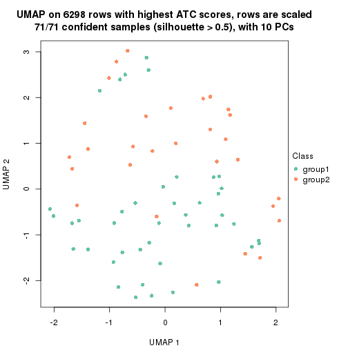</p>

</div>
<div id='tab-node-0231-dimension-reduction-2'>
<pre><code class="r">dimension_reduction(res, k = 3, method = &quot;UMAP&quot;)
</code></pre>

<p></p>

</div>
<div id='tab-node-0231-dimension-reduction-3'>
<pre><code class="r">dimension_reduction(res, k = 4, method = &quot;UMAP&quot;)
</code></pre>

<p></p>

</div>
</div>


Following heatmap shows how subgroups are split when increasing `k`:

```r
collect_classes(res)
```


Test correlation between subgroups and known annotations. If the known
annotation is numeric, one-way ANOVA test is applied, and if the known
annotation is discrete, chi-squared contingency table test is applied.

```r
test_to_known_factors(res)
```

```
#>             n_sample Cell_type(p-value) Timepoint(p-value) k
#> ATC:skmeans       71                 NA            0.05159 2
#> ATC:skmeans       70                 NA            0.04685 3
#> ATC:skmeans       56                 NA            0.00978 4
```


If matrix rows can be associated to genes, consider to use `functional_enrichment(res,
...)` to perform function enrichment for the signature genes. See [this vignette](https://jokergoo.github.io/cola_vignettes/functional_enrichment.html) for more detailed explanations.


 

---------------------------------------------------


### Node0232


Parent node: [Node023](#Node023).
Child nodes: 
                Node01121-leaf
        ,
                Node01122-leaf
        ,
                Node01131-leaf
        ,
                Node01132-leaf
        ,
                Node01133-leaf
        ,
                [Node01211](#Node01211)
        ,
                Node01212-leaf
        ,
                Node01221-leaf
        ,
                [Node01222](#Node01222)
        ,
                Node01311-leaf
        ,
                Node01312-leaf
        ,
                Node01313-leaf
        ,
                Node01321-leaf
        ,
                Node01322-leaf
        ,
                Node01331-leaf
        ,
                Node01332-leaf
        ,
                Node02111-leaf
        ,
                [Node02112](#Node02112)
        ,
                Node02121-leaf
        ,
                Node02122-leaf
        ,
                [Node02123](#Node02123)
        ,
                Node02221-leaf
        ,
                Node02222-leaf
        ,
                Node02231-leaf
        ,
                Node02232-leaf
        ,
                Node02311-leaf
        ,
                Node02312-leaf
        ,
                Node02321-leaf
        ,
                Node02322-leaf
        ,
                Node02323-leaf
        ,
                Node02421-leaf
        ,
                Node02422-leaf
        .


The object with results only for a single top-value method and a single partitioning method 
can be extracted as:

```r
res = res_rh["0232"]
```

A summary of `res` and all the functions that can be applied to it:

```r
res
```

```
#> A 'ConsensusPartition' object with k = 2, 3, 4.
#>   On a matrix with 6339 rows and 54 columns.
#>   Top rows (634) are extracted by 'ATC' method.
#>   Subgroups are detected by 'skmeans' method.
#>   Performed in total 150 partitions by row resampling.
#>   Best k for subgroups seems to be 3.
#> 
#> Following methods can be applied to this 'ConsensusPartition' object:
#>  [1] "cola_report"             "collect_classes"         "collect_plots"          
#>  [4] "collect_stats"           "colnames"                "compare_partitions"     
#>  [7] "compare_signatures"      "consensus_heatmap"       "dimension_reduction"    
#> [10] "functional_enrichment"   "get_anno_col"            "get_anno"               
#> [13] "get_classes"             "get_consensus"           "get_matrix"             
#> [16] "get_membership"          "get_param"               "get_signatures"         
#> [19] "get_stats"               "is_best_k"               "is_stable_k"            
#> [22] "membership_heatmap"      "ncol"                    "nrow"                   
#> [25] "plot_ecdf"               "predict_classes"         "rownames"               
#> [28] "select_partition_number" "show"                    "suggest_best_k"         
#> [31] "test_to_known_factors"   "top_rows_heatmap"
```

`collect_plots()` function collects all the plots made from `res` for all `k` (number of subgroups)
into one single page to provide an easy and fast comparison between different `k`.

```r
collect_plots(res)
```


The plots are:

- The first row: a plot of the eCDF (empirical cumulative distribution
  function) curves of the consensus matrix for each `k` and the heatmap of
  predicted classes for each `k`.
- The second row: heatmaps of the consensus matrix for each `k`.
- The third row: heatmaps of the membership matrix for each `k`.
- The fouth row: heatmaps of the signatures for each `k`.

All the plots in panels can be made by individual functions and they are
plotted later in this section.

`select_partition_number()` produces several plots showing different
statistics for choosing "optimized" `k`. There are following statistics:

- eCDF curves of the consensus matrix for each `k`;
- 1-PAC. [The PAC score](https://en.wikipedia.org/wiki/Consensus_clustering#Over-interpretation_potential_of_consensus_clustering)
  measures the proportion of the ambiguous subgrouping.
- Mean silhouette score.
- Concordance. The mean probability of fiting the consensus subgroup labels in all
  partitions.
- Area increased. Denote $A_k$ as the area under the eCDF curve for current
  `k`, the area increased is defined as $A_k - A_{k-1}$.
- Rand index. The percent of pairs of samples that are both in a same cluster
  or both are not in a same cluster in the partition of k and k-1.
- Jaccard index. The ratio of pairs of samples are both in a same cluster in
  the partition of k and k-1 and the pairs of samples are both in a same
  cluster in the partition k or k-1.

The detailed explanations of these statistics can be found in [the _cola_
vignette](https://jokergoo.github.io/cola_vignettes/cola.html#toc_13).

Generally speaking, higher 1-PAC score, higher mean silhouette score or higher
concordance corresponds to better partition. Rand index and Jaccard index
measure how similar the current partition is compared to partition with `k-1`.
If they are too similar, we won't accept `k` is better than `k-1`.

```r
select_partition_number(res)
```


The numeric values for all these statistics can be obtained by `get_stats()`.

```r
get_stats(res)
```

```
#>   k 1-PAC mean_silhouette concordance area_increased  Rand Jaccard
#> 2 2 0.856           0.865       0.946          0.509 0.493   0.493
#> 3 3 0.897           0.916       0.965          0.329 0.687   0.447
#> 4 4 0.642           0.388       0.631          0.108 0.810   0.529
```

`suggest_best_k()` suggests the best $k$ based on these statistics. The rules are as follows:

- All $k$ with Jaccard index larger than 0.95 are removed because increasing
  $k$ does not provide enough extra information. If all $k$ are removed, it is
  marked as no subgroup is detected.
- For all $k$ with 1-PAC score larger than 0.9, the maximal $k$ is taken as
  the best $k$, and other $k$ are marked as optional $k$.
- If it does not fit the second rule. The $k$ with the maximal vote of the
  highest 1-PAC score, highest mean silhouette, and highest concordance is
  taken as the best $k$.

```r
suggest_best_k(res)
```

```
#> [1] 3
```


Following is the table of the partitions (You need to click the **show/hide
code output** link to see it). The membership matrix (columns with name `p*`)
is inferred by
[`clue::cl_consensus()`](https://www.rdocumentation.org/link/cl_consensus?package=clue)
function with the `SE` method. Basically the value in the membership matrix
represents the probability to belong to a certain group. The finall subgroup
label for an item is determined with the group with highest probability it
belongs to.

In `get_classes()` function, the entropy is calculated from the membership
matrix and the silhouette score is calculated from the consensus matrix.


<script>
$( function() {
	$( '#tabs-node-0232-get-classes' ).tabs();
} );
</script>
<div id='tabs-node-0232-get-classes'>
<ul>
<li><a href='#tab-node-0232-get-classes-1'>k = 2</a></li>
<li><a href='#tab-node-0232-get-classes-2'>k = 3</a></li>
<li><a href='#tab-node-0232-get-classes-3'>k = 4</a></li>
</ul>

<div id='tab-node-0232-get-classes-1'>
<p><a id='tab-node-0232-get-classes-1-a' style='color:#0366d6' href='#'>show/hide code output</a></p>
<pre><code class="r">cbind(get_classes(res, k = 2), get_membership(res, k = 2))
</code></pre>

<pre><code>#&gt;                 class entropy silhouette   p1   p2
#&gt; 1772071_027_B04     2   0.000    0.91888 0.00 1.00
#&gt; 1772078_002_B03     2   0.000    0.91888 0.00 1.00
#&gt; 1772096_095_D07     2   0.242    0.90390 0.04 0.96
#&gt; 1772122_236_A04     1   0.000    0.95994 1.00 0.00
#&gt; 1772122_236_A07     2   0.943    0.44816 0.36 0.64
#&gt; 1772122_236_B06     1   0.000    0.95994 1.00 0.00
#&gt; 1772122_236_B09     2   0.000    0.91888 0.00 1.00
#&gt; 1772122_236_C06     1   0.000    0.95994 1.00 0.00
#&gt; 1772122_236_E04     1   0.242    0.93054 0.96 0.04
#&gt; 1772122_236_E10     1   0.000    0.95994 1.00 0.00
#&gt; 1772122_236_F05     1   0.971    0.27671 0.60 0.40
#&gt; 1772122_236_G04     2   0.529    0.83535 0.12 0.88
#&gt; 1772121_288_B12     2   0.943    0.44816 0.36 0.64
#&gt; 1772121_288_D04     2   0.000    0.91888 0.00 1.00
#&gt; 1772121_291_A03     2   0.242    0.90390 0.04 0.96
#&gt; 1772121_291_A05     2   1.000    0.00554 0.50 0.50
#&gt; 1772121_291_B02     2   0.000    0.91888 0.00 1.00
#&gt; 1772121_291_B12     1   0.000    0.95994 1.00 0.00
#&gt; 1772121_291_C07     2   0.242    0.90390 0.04 0.96
#&gt; 1772121_291_D03     1   0.000    0.95994 1.00 0.00
#&gt; 1772121_291_E08     1   0.242    0.93054 0.96 0.04
#&gt; 1772121_291_F04     1   0.000    0.95994 1.00 0.00
#&gt; 1772121_291_G06     2   0.242    0.90390 0.04 0.96
#&gt; 1772121_291_G07     1   0.000    0.95994 1.00 0.00
#&gt; 1772121_291_G11     2   0.402    0.87890 0.08 0.92
#&gt; 1772121_293_C01     1   0.000    0.95994 1.00 0.00
#&gt; 1772121_293_D03     1   0.000    0.95994 1.00 0.00
#&gt; 1772121_283_A01     1   0.000    0.95994 1.00 0.00
#&gt; 1772121_283_A03     2   0.000    0.91888 0.00 1.00
#&gt; 1772121_283_A10     2   0.000    0.91888 0.00 1.00
#&gt; 1772121_283_B12     2   0.242    0.90390 0.04 0.96
#&gt; 1772121_283_C01     2   0.000    0.91888 0.00 1.00
#&gt; 1772121_283_C03     2   0.000    0.91888 0.00 1.00
#&gt; 1772121_283_D11     1   0.000    0.95994 1.00 0.00
#&gt; 1772121_283_D12     1   0.000    0.95994 1.00 0.00
#&gt; 1772121_283_F02     1   0.000    0.95994 1.00 0.00
#&gt; 1772121_283_F03     1   0.000    0.95994 1.00 0.00
#&gt; 1772121_282_E02     1   0.242    0.93054 0.96 0.04
#&gt; 1772121_282_G03     2   0.000    0.91888 0.00 1.00
#&gt; 1772122_264_A07     1   0.855    0.56809 0.72 0.28
#&gt; 1772122_264_C04     2   0.000    0.91888 0.00 1.00
#&gt; 1772122_208_E04     1   0.242    0.93054 0.96 0.04
#&gt; 1772122_201_A03     2   0.000    0.91888 0.00 1.00
#&gt; 1772122_201_B06     1   0.000    0.95994 1.00 0.00
#&gt; 1772122_201_C02     1   0.000    0.95994 1.00 0.00
#&gt; 1772122_201_E12     1   0.000    0.95994 1.00 0.00
#&gt; 1772122_201_F09     2   0.000    0.91888 0.00 1.00
#&gt; 1772122_201_H10     1   0.000    0.95994 1.00 0.00
#&gt; 1772122_199_F06     2   0.000    0.91888 0.00 1.00
#&gt; 1772122_203_B03     2   0.000    0.91888 0.00 1.00
#&gt; 1772122_203_D02     2   0.990    0.24517 0.44 0.56
#&gt; 1772122_203_E06     2   0.242    0.90390 0.04 0.96
#&gt; 1772122_203_G10     2   0.000    0.91888 0.00 1.00
#&gt; 1772122_200_D09     2   0.000    0.91888 0.00 1.00
</code></pre>

<script>
$('#tab-node-0232-get-classes-1-a').parent().next().next().hide();
$('#tab-node-0232-get-classes-1-a').click(function(){
  $('#tab-node-0232-get-classes-1-a').parent().next().next().toggle();
  return(false);
});
</script>
</div>

<div id='tab-node-0232-get-classes-2'>
<p><a id='tab-node-0232-get-classes-2-a' style='color:#0366d6' href='#'>show/hide code output</a></p>
<pre><code class="r">cbind(get_classes(res, k = 3), get_membership(res, k = 3))
</code></pre>

<pre><code>#&gt;                 class entropy silhouette   p1   p2   p3
#&gt; 1772071_027_B04     2  0.0000     0.9817 0.00 1.00 0.00
#&gt; 1772078_002_B03     2  0.0000     0.9817 0.00 1.00 0.00
#&gt; 1772096_095_D07     3  0.0000     0.9306 0.00 0.00 1.00
#&gt; 1772122_236_A04     1  0.0000     0.9800 1.00 0.00 0.00
#&gt; 1772122_236_A07     2  0.1529     0.9557 0.04 0.96 0.00
#&gt; 1772122_236_B06     1  0.4555     0.7397 0.80 0.00 0.20
#&gt; 1772122_236_B09     2  0.0000     0.9817 0.00 1.00 0.00
#&gt; 1772122_236_C06     3  0.0000     0.9306 0.00 0.00 1.00
#&gt; 1772122_236_E04     1  0.0000     0.9800 1.00 0.00 0.00
#&gt; 1772122_236_E10     3  0.6302     0.0568 0.48 0.00 0.52
#&gt; 1772122_236_F05     3  0.0000     0.9306 0.00 0.00 1.00
#&gt; 1772122_236_G04     3  0.0000     0.9306 0.00 0.00 1.00
#&gt; 1772121_288_B12     2  0.1529     0.9557 0.04 0.96 0.00
#&gt; 1772121_288_D04     2  0.0000     0.9817 0.00 1.00 0.00
#&gt; 1772121_291_A03     3  0.0000     0.9306 0.00 0.00 1.00
#&gt; 1772121_291_A05     3  0.0000     0.9306 0.00 0.00 1.00
#&gt; 1772121_291_B02     3  0.0892     0.9191 0.00 0.02 0.98
#&gt; 1772121_291_B12     1  0.0000     0.9800 1.00 0.00 0.00
#&gt; 1772121_291_C07     3  0.0000     0.9306 0.00 0.00 1.00
#&gt; 1772121_291_D03     1  0.0000     0.9800 1.00 0.00 0.00
#&gt; 1772121_291_E08     1  0.0000     0.9800 1.00 0.00 0.00
#&gt; 1772121_291_F04     3  0.0000     0.9306 0.00 0.00 1.00
#&gt; 1772121_291_G06     3  0.0000     0.9306 0.00 0.00 1.00
#&gt; 1772121_291_G07     1  0.0000     0.9800 1.00 0.00 0.00
#&gt; 1772121_291_G11     3  0.0892     0.9193 0.00 0.02 0.98
#&gt; 1772121_293_C01     1  0.0000     0.9800 1.00 0.00 0.00
#&gt; 1772121_293_D03     1  0.0000     0.9800 1.00 0.00 0.00
#&gt; 1772121_283_A01     3  0.0000     0.9306 0.00 0.00 1.00
#&gt; 1772121_283_A03     3  0.2537     0.8733 0.00 0.08 0.92
#&gt; 1772121_283_A10     2  0.0000     0.9817 0.00 1.00 0.00
#&gt; 1772121_283_B12     3  0.0000     0.9306 0.00 0.00 1.00
#&gt; 1772121_283_C01     2  0.0000     0.9817 0.00 1.00 0.00
#&gt; 1772121_283_C03     2  0.0000     0.9817 0.00 1.00 0.00
#&gt; 1772121_283_D11     1  0.0000     0.9800 1.00 0.00 0.00
#&gt; 1772121_283_D12     1  0.0000     0.9800 1.00 0.00 0.00
#&gt; 1772121_283_F02     1  0.0000     0.9800 1.00 0.00 0.00
#&gt; 1772121_283_F03     1  0.2959     0.8801 0.90 0.00 0.10
#&gt; 1772121_282_E02     1  0.0000     0.9800 1.00 0.00 0.00
#&gt; 1772121_282_G03     2  0.0000     0.9817 0.00 1.00 0.00
#&gt; 1772122_264_A07     3  0.4555     0.7257 0.20 0.00 0.80
#&gt; 1772122_264_C04     2  0.0000     0.9817 0.00 1.00 0.00
#&gt; 1772122_208_E04     1  0.0000     0.9800 1.00 0.00 0.00
#&gt; 1772122_201_A03     3  0.3686     0.8150 0.00 0.14 0.86
#&gt; 1772122_201_B06     1  0.0000     0.9800 1.00 0.00 0.00
#&gt; 1772122_201_C02     1  0.0000     0.9800 1.00 0.00 0.00
#&gt; 1772122_201_E12     3  0.0000     0.9306 0.00 0.00 1.00
#&gt; 1772122_201_F09     2  0.0000     0.9817 0.00 1.00 0.00
#&gt; 1772122_201_H10     3  0.0000     0.9306 0.00 0.00 1.00
#&gt; 1772122_199_F06     3  0.6126     0.3422 0.00 0.40 0.60
#&gt; 1772122_203_B03     2  0.0000     0.9817 0.00 1.00 0.00
#&gt; 1772122_203_D02     2  0.1529     0.9557 0.04 0.96 0.00
#&gt; 1772122_203_E06     3  0.0000     0.9306 0.00 0.00 1.00
#&gt; 1772122_203_G10     2  0.3686     0.8281 0.00 0.86 0.14
#&gt; 1772122_200_D09     2  0.0000     0.9817 0.00 1.00 0.00
</code></pre>

<script>
$('#tab-node-0232-get-classes-2-a').parent().next().next().hide();
$('#tab-node-0232-get-classes-2-a').click(function(){
  $('#tab-node-0232-get-classes-2-a').parent().next().next().toggle();
  return(false);
});
</script>
</div>

<div id='tab-node-0232-get-classes-3'>
<p><a id='tab-node-0232-get-classes-3-a' style='color:#0366d6' href='#'>show/hide code output</a></p>
<pre><code class="r">cbind(get_classes(res, k = 4), get_membership(res, k = 4))
</code></pre>

<pre><code>#&gt;                 class entropy silhouette   p1   p2   p3   p4
#&gt; 1772071_027_B04     4  0.6766    0.03285 0.00 0.10 0.38 0.52
#&gt; 1772078_002_B03     3  0.7832   -0.48818 0.00 0.36 0.38 0.26
#&gt; 1772096_095_D07     4  0.3400    0.29414 0.00 0.00 0.18 0.82
#&gt; 1772122_236_A04     1  0.6699    0.64809 0.60 0.32 0.04 0.04
#&gt; 1772122_236_A07     2  0.1411    0.58395 0.02 0.96 0.02 0.00
#&gt; 1772122_236_B06     1  0.8783    0.28914 0.36 0.32 0.28 0.04
#&gt; 1772122_236_B09     3  0.7832   -0.48818 0.00 0.36 0.38 0.26
#&gt; 1772122_236_C06     3  0.5570    0.36182 0.00 0.02 0.54 0.44
#&gt; 1772122_236_E04     1  0.1637    0.79279 0.94 0.06 0.00 0.00
#&gt; 1772122_236_E10     3  0.9232    0.00838 0.20 0.10 0.40 0.30
#&gt; 1772122_236_F05     4  0.2335    0.46008 0.02 0.00 0.06 0.92
#&gt; 1772122_236_G04     3  0.4907    0.37442 0.00 0.00 0.58 0.42
#&gt; 1772121_288_B12     2  0.1411    0.61938 0.02 0.96 0.02 0.00
#&gt; 1772121_288_D04     2  0.4713    0.74087 0.00 0.64 0.36 0.00
#&gt; 1772121_291_A03     3  0.5570    0.36320 0.00 0.02 0.54 0.44
#&gt; 1772121_291_A05     4  0.0707    0.49916 0.02 0.00 0.00 0.98
#&gt; 1772121_291_B02     3  0.5860    0.35227 0.00 0.04 0.58 0.38
#&gt; 1772121_291_B12     1  0.0000    0.80440 1.00 0.00 0.00 0.00
#&gt; 1772121_291_C07     3  0.5535    0.37757 0.00 0.02 0.56 0.42
#&gt; 1772121_291_D03     1  0.0707    0.80311 0.98 0.02 0.00 0.00
#&gt; 1772121_291_E08     1  0.2011    0.78570 0.92 0.08 0.00 0.00
#&gt; 1772121_291_F04     3  0.5535    0.36989 0.00 0.02 0.56 0.42
#&gt; 1772121_291_G06     3  0.5535    0.37757 0.00 0.02 0.56 0.42
#&gt; 1772121_291_G07     1  0.6601    0.65435 0.62 0.30 0.04 0.04
#&gt; 1772121_291_G11     3  0.6510    0.30710 0.00 0.08 0.54 0.38
#&gt; 1772121_293_C01     1  0.0707    0.80315 0.98 0.00 0.00 0.02
#&gt; 1772121_293_D03     1  0.0707    0.80315 0.98 0.00 0.00 0.02
#&gt; 1772121_283_A01     3  0.5570    0.36182 0.00 0.02 0.54 0.44
#&gt; 1772121_283_A03     4  0.5957    0.18579 0.00 0.04 0.42 0.54
#&gt; 1772121_283_A10     2  0.4713    0.74087 0.00 0.64 0.36 0.00
#&gt; 1772121_283_B12     3  0.5535    0.37757 0.00 0.02 0.56 0.42
#&gt; 1772121_283_C01     2  0.4522    0.73082 0.00 0.68 0.32 0.00
#&gt; 1772121_283_C03     2  0.4713    0.74087 0.00 0.64 0.36 0.00
#&gt; 1772121_283_D11     1  0.0707    0.80315 0.98 0.00 0.00 0.02
#&gt; 1772121_283_D12     1  0.0707    0.80315 0.98 0.00 0.00 0.02
#&gt; 1772121_283_F02     1  0.0707    0.80315 0.98 0.00 0.00 0.02
#&gt; 1772121_283_F03     1  0.4624    0.46077 0.66 0.00 0.00 0.34
#&gt; 1772121_282_E02     1  0.5957    0.58283 0.54 0.42 0.04 0.00
#&gt; 1772121_282_G03     3  0.7832   -0.48818 0.00 0.36 0.38 0.26
#&gt; 1772122_264_A07     4  0.6306    0.42679 0.12 0.12 0.04 0.72
#&gt; 1772122_264_C04     3  0.7832   -0.48818 0.00 0.36 0.38 0.26
#&gt; 1772122_208_E04     1  0.2345    0.78804 0.90 0.10 0.00 0.00
#&gt; 1772122_201_A03     3  0.6656    0.00875 0.00 0.16 0.62 0.22
#&gt; 1772122_201_B06     1  0.6601    0.65435 0.62 0.30 0.04 0.04
#&gt; 1772122_201_C02     1  0.5744    0.72830 0.74 0.16 0.02 0.08
#&gt; 1772122_201_E12     3  0.5487    0.34938 0.00 0.02 0.58 0.40
#&gt; 1772122_201_F09     3  0.7832   -0.48818 0.00 0.36 0.38 0.26
#&gt; 1772122_201_H10     3  0.5957    0.35096 0.00 0.04 0.54 0.42
#&gt; 1772122_199_F06     4  0.6150    0.20768 0.00 0.06 0.36 0.58
#&gt; 1772122_203_B03     3  0.7832   -0.48818 0.00 0.36 0.38 0.26
#&gt; 1772122_203_D02     2  0.2830    0.58004 0.06 0.90 0.04 0.00
#&gt; 1772122_203_E06     3  0.5487    0.37496 0.00 0.02 0.58 0.40
#&gt; 1772122_203_G10     3  0.6150   -0.41615 0.00 0.36 0.58 0.06
#&gt; 1772122_200_D09     2  0.4907    0.70819 0.00 0.58 0.42 0.00
</code></pre>

<script>
$('#tab-node-0232-get-classes-3-a').parent().next().next().hide();
$('#tab-node-0232-get-classes-3-a').click(function(){
  $('#tab-node-0232-get-classes-3-a').parent().next().next().toggle();
  return(false);
});
</script>
</div>
</div>

Heatmaps for the consensus matrix. It visualizes the probability of two
samples to be in a same group.


<script>
$( function() {
	$( '#tabs-node-0232-consensus-heatmap' ).tabs();
} );
</script>
<div id='tabs-node-0232-consensus-heatmap'>
<ul>
<li><a href='#tab-node-0232-consensus-heatmap-1'>k = 2</a></li>
<li><a href='#tab-node-0232-consensus-heatmap-2'>k = 3</a></li>
<li><a href='#tab-node-0232-consensus-heatmap-3'>k = 4</a></li>
</ul>
<div id='tab-node-0232-consensus-heatmap-1'>
<pre><code class="r">consensus_heatmap(res, k = 2)
</code></pre>

<p></p>

</div>
<div id='tab-node-0232-consensus-heatmap-2'>
<pre><code class="r">consensus_heatmap(res, k = 3)
</code></pre>

<p></p>

</div>
<div id='tab-node-0232-consensus-heatmap-3'>
<pre><code class="r">consensus_heatmap(res, k = 4)
</code></pre>

<p></p>

</div>
</div>

Heatmaps for the membership of samples in all partitions to see how consistent they are:


<script>
$( function() {
	$( '#tabs-node-0232-membership-heatmap' ).tabs();
} );
</script>
<div id='tabs-node-0232-membership-heatmap'>
<ul>
<li><a href='#tab-node-0232-membership-heatmap-1'>k = 2</a></li>
<li><a href='#tab-node-0232-membership-heatmap-2'>k = 3</a></li>
<li><a href='#tab-node-0232-membership-heatmap-3'>k = 4</a></li>
</ul>
<div id='tab-node-0232-membership-heatmap-1'>
<pre><code class="r">membership_heatmap(res, k = 2)
</code></pre>

<p></p>

</div>
<div id='tab-node-0232-membership-heatmap-2'>
<pre><code class="r">membership_heatmap(res, k = 3)
</code></pre>

<p></p>

</div>
<div id='tab-node-0232-membership-heatmap-3'>
<pre><code class="r">membership_heatmap(res, k = 4)
</code></pre>

<p></p>

</div>
</div>

As soon as the classes for columns are determined, the signatures
that are significantly different between subgroups can be looked for. 
Following are the heatmaps for signatures.


Signature heatmaps where rows are scaled:


<script>
$( function() {
	$( '#tabs-node-0232-get-signatures' ).tabs();
} );
</script>
<div id='tabs-node-0232-get-signatures'>
<ul>
<li><a href='#tab-node-0232-get-signatures-1'>k = 2</a></li>
<li><a href='#tab-node-0232-get-signatures-2'>k = 3</a></li>
<li><a href='#tab-node-0232-get-signatures-3'>k = 4</a></li>
</ul>
<div id='tab-node-0232-get-signatures-1'>
<pre><code class="r">get_signatures(res, k = 2)
</code></pre>

<p></p>

</div>
<div id='tab-node-0232-get-signatures-2'>
<pre><code class="r">get_signatures(res, k = 3)
</code></pre>

<p></p>

</div>
<div id='tab-node-0232-get-signatures-3'>
<pre><code class="r">get_signatures(res, k = 4)
</code></pre>

<p></p>

</div>
</div>


Signature heatmaps where rows are not scaled:


<script>
$( function() {
	$( '#tabs-node-0232-get-signatures-no-scale' ).tabs();
} );
</script>
<div id='tabs-node-0232-get-signatures-no-scale'>
<ul>
<li><a href='#tab-node-0232-get-signatures-no-scale-1'>k = 2</a></li>
<li><a href='#tab-node-0232-get-signatures-no-scale-2'>k = 3</a></li>
<li><a href='#tab-node-0232-get-signatures-no-scale-3'>k = 4</a></li>
</ul>
<div id='tab-node-0232-get-signatures-no-scale-1'>
<pre><code class="r">get_signatures(res, k = 2, scale_rows = FALSE)
</code></pre>

<p></p>

</div>
<div id='tab-node-0232-get-signatures-no-scale-2'>
<pre><code class="r">get_signatures(res, k = 3, scale_rows = FALSE)
</code></pre>

<p></p>

</div>
<div id='tab-node-0232-get-signatures-no-scale-3'>
<pre><code class="r">get_signatures(res, k = 4, scale_rows = FALSE)
</code></pre>

<p></p>

</div>
</div>


Compare the overlap of signatures from different k:

```r
compare_signatures(res)
```


`get_signature()` returns a data frame invisibly. To get the list of signatures, the function
call should be assigned to a variable explicitly. In following code, if `plot` argument is set
to `FALSE`, no heatmap is plotted while only the differential analysis is performed.

```r
# code only for demonstration
tb = get_signature(res, k = ..., plot = FALSE)
```

An example of the output of `tb` is:

```
#>   which_row         fdr    mean_1    mean_2 scaled_mean_1 scaled_mean_2 km
#> 1        38 0.042760348  8.373488  9.131774    -0.5533452     0.5164555  1
#> 2        40 0.018707592  7.106213  8.469186    -0.6173731     0.5762149  1
#> 3        55 0.019134737 10.221463 11.207825    -0.6159697     0.5749050  1
#> 4        59 0.006059896  5.921854  7.869574    -0.6899429     0.6439467  1
#> 5        60 0.018055526  8.928898 10.211722    -0.6204761     0.5791110  1
#> 6        98 0.009384629 15.714769 14.887706     0.6635654    -0.6193277  2
...
```

The columns in `tb` are:

1. `which_row`: row indices corresponding to the input matrix.
2. `fdr`: FDR for the differential test. 
3. `mean_x`: The mean value in group x.
4. `scaled_mean_x`: The mean value in group x after rows are scaled.
5. `km`: Row groups if k-means clustering is applied to rows (which is done by automatically selecting number of clusters).

If there are too many signatures, `top_signatures = ...` can be set to only show the 
signatures with the highest FDRs:

```r
# code only for demonstration
# e.g. to show the top 500 most significant rows
tb = get_signature(res, k = ..., top_signatures = 500)
```

If the signatures are defined as these which are uniquely high in current group, `diff_method` argument
can be set to `"uniquely_high_in_one_group"`:

```r
# code only for demonstration
tb = get_signature(res, k = ..., diff_method = "uniquely_high_in_one_group")
```


UMAP plot which shows how samples are separated.


<script>
$( function() {
	$( '#tabs-node-0232-dimension-reduction' ).tabs();
} );
</script>
<div id='tabs-node-0232-dimension-reduction'>
<ul>
<li><a href='#tab-node-0232-dimension-reduction-1'>k = 2</a></li>
<li><a href='#tab-node-0232-dimension-reduction-2'>k = 3</a></li>
<li><a href='#tab-node-0232-dimension-reduction-3'>k = 4</a></li>
</ul>
<div id='tab-node-0232-dimension-reduction-1'>
<pre><code class="r">dimension_reduction(res, k = 2, method = &quot;UMAP&quot;)
</code></pre>

<p></p>

</div>
<div id='tab-node-0232-dimension-reduction-2'>
<pre><code class="r">dimension_reduction(res, k = 3, method = &quot;UMAP&quot;)
</code></pre>

<p></p>

</div>
<div id='tab-node-0232-dimension-reduction-3'>
<pre><code class="r">dimension_reduction(res, k = 4, method = &quot;UMAP&quot;)
</code></pre>

<p></p>

</div>
</div>


Following heatmap shows how subgroups are split when increasing `k`:

```r
collect_classes(res)
```


Test correlation between subgroups and known annotations. If the known
annotation is numeric, one-way ANOVA test is applied, and if the known
annotation is discrete, chi-squared contingency table test is applied.

```r
test_to_known_factors(res)
```

```
#>             n_sample Cell_type(p-value) Timepoint(p-value) k
#> ATC:skmeans       49            0.12777              0.468 2
#> ATC:skmeans       52            0.00764              0.317 3
#> ATC:skmeans       23            0.05830              1.000 4
```


If matrix rows can be associated to genes, consider to use `functional_enrichment(res,
...)` to perform function enrichment for the signature genes. See [this vignette](https://jokergoo.github.io/cola_vignettes/functional_enrichment.html) for more detailed explanations.


 

---------------------------------------------------


### Node024


Parent node: [Node02](#Node02).
Child nodes: 
                Node0111-leaf
        ,
                [Node0112](#Node0112)
        ,
                [Node0113](#Node0113)
        ,
                [Node0121](#Node0121)
        ,
                [Node0122](#Node0122)
        ,
                [Node0131](#Node0131)
        ,
                [Node0132](#Node0132)
        ,
                [Node0133](#Node0133)
        ,
                [Node0211](#Node0211)
        ,
                [Node0212](#Node0212)
        ,
                Node0221-leaf
        ,
                [Node0222](#Node0222)
        ,
                [Node0223](#Node0223)
        ,
                [Node0231](#Node0231)
        ,
                [Node0232](#Node0232)
        ,
                Node0233-leaf
        ,
                Node0241-leaf
        ,
                [Node0242](#Node0242)
        ,
                Node0243-leaf
        .


The object with results only for a single top-value method and a single partitioning method 
can be extracted as:

```r
res = res_rh["024"]
```

A summary of `res` and all the functions that can be applied to it:

```r
res
```

```
#> A 'ConsensusPartition' object with k = 2, 3, 4.
#>   On a matrix with 8455 rows and 208 columns.
#>   Top rows (846) are extracted by 'ATC' method.
#>   Subgroups are detected by 'skmeans' method.
#>   Performed in total 150 partitions by row resampling.
#>   Best k for subgroups seems to be 3.
#> 
#> Following methods can be applied to this 'ConsensusPartition' object:
#>  [1] "cola_report"             "collect_classes"         "collect_plots"          
#>  [4] "collect_stats"           "colnames"                "compare_partitions"     
#>  [7] "compare_signatures"      "consensus_heatmap"       "dimension_reduction"    
#> [10] "functional_enrichment"   "get_anno_col"            "get_anno"               
#> [13] "get_classes"             "get_consensus"           "get_matrix"             
#> [16] "get_membership"          "get_param"               "get_signatures"         
#> [19] "get_stats"               "is_best_k"               "is_stable_k"            
#> [22] "membership_heatmap"      "ncol"                    "nrow"                   
#> [25] "plot_ecdf"               "predict_classes"         "rownames"               
#> [28] "select_partition_number" "show"                    "suggest_best_k"         
#> [31] "test_to_known_factors"   "top_rows_heatmap"
```

`collect_plots()` function collects all the plots made from `res` for all `k` (number of subgroups)
into one single page to provide an easy and fast comparison between different `k`.

```r
collect_plots(res)
```


The plots are:

- The first row: a plot of the eCDF (empirical cumulative distribution
  function) curves of the consensus matrix for each `k` and the heatmap of
  predicted classes for each `k`.
- The second row: heatmaps of the consensus matrix for each `k`.
- The third row: heatmaps of the membership matrix for each `k`.
- The fouth row: heatmaps of the signatures for each `k`.

All the plots in panels can be made by individual functions and they are
plotted later in this section.

`select_partition_number()` produces several plots showing different
statistics for choosing "optimized" `k`. There are following statistics:

- eCDF curves of the consensus matrix for each `k`;
- 1-PAC. [The PAC score](https://en.wikipedia.org/wiki/Consensus_clustering#Over-interpretation_potential_of_consensus_clustering)
  measures the proportion of the ambiguous subgrouping.
- Mean silhouette score.
- Concordance. The mean probability of fiting the consensus subgroup labels in all
  partitions.
- Area increased. Denote $A_k$ as the area under the eCDF curve for current
  `k`, the area increased is defined as $A_k - A_{k-1}$.
- Rand index. The percent of pairs of samples that are both in a same cluster
  or both are not in a same cluster in the partition of k and k-1.
- Jaccard index. The ratio of pairs of samples are both in a same cluster in
  the partition of k and k-1 and the pairs of samples are both in a same
  cluster in the partition k or k-1.

The detailed explanations of these statistics can be found in [the _cola_
vignette](https://jokergoo.github.io/cola_vignettes/cola.html#toc_13).

Generally speaking, higher 1-PAC score, higher mean silhouette score or higher
concordance corresponds to better partition. Rand index and Jaccard index
measure how similar the current partition is compared to partition with `k-1`.
If they are too similar, we won't accept `k` is better than `k-1`.

```r
select_partition_number(res)
```

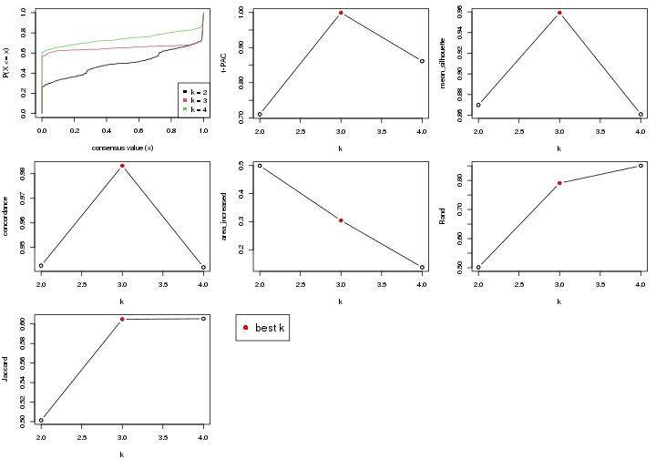

The numeric values for all these statistics can be obtained by `get_stats()`.

```r
get_stats(res)
```

```
#>   k 1-PAC mean_silhouette concordance area_increased  Rand Jaccard
#> 2 2 0.710           0.870       0.943          0.499 0.501   0.501
#> 3 3 0.999           0.959       0.983          0.304 0.791   0.605
#> 4 4 0.861           0.861       0.942          0.138 0.851   0.605
```

`suggest_best_k()` suggests the best $k$ based on these statistics. The rules are as follows:

- All $k$ with Jaccard index larger than 0.95 are removed because increasing
  $k$ does not provide enough extra information. If all $k$ are removed, it is
  marked as no subgroup is detected.
- For all $k$ with 1-PAC score larger than 0.9, the maximal $k$ is taken as
  the best $k$, and other $k$ are marked as optional $k$.
- If it does not fit the second rule. The $k$ with the maximal vote of the
  highest 1-PAC score, highest mean silhouette, and highest concordance is
  taken as the best $k$.

```r
suggest_best_k(res)
```

```
#> [1] 3
```


Following is the table of the partitions (You need to click the **show/hide
code output** link to see it). The membership matrix (columns with name `p*`)
is inferred by
[`clue::cl_consensus()`](https://www.rdocumentation.org/link/cl_consensus?package=clue)
function with the `SE` method. Basically the value in the membership matrix
represents the probability to belong to a certain group. The finall subgroup
label for an item is determined with the group with highest probability it
belongs to.

In `get_classes()` function, the entropy is calculated from the membership
matrix and the silhouette score is calculated from the consensus matrix.


<script>
$( function() {
	$( '#tabs-node-024-get-classes' ).tabs();
} );
</script>
<div id='tabs-node-024-get-classes'>
<ul>
<li><a href='#tab-node-024-get-classes-1'>k = 2</a></li>
<li><a href='#tab-node-024-get-classes-2'>k = 3</a></li>
<li><a href='#tab-node-024-get-classes-3'>k = 4</a></li>
</ul>

<div id='tab-node-024-get-classes-1'>
<p><a id='tab-node-024-get-classes-1-a' style='color:#0366d6' href='#'>show/hide code output</a></p>
<pre><code class="r">cbind(get_classes(res, k = 2), get_membership(res, k = 2))
</code></pre>

<pre><code>#&gt;                 class entropy silhouette   p1   p2
#&gt; 1772071_027_C09     1   0.000     0.9345 1.00 0.00
#&gt; 1772071_027_D02     1   0.855     0.6445 0.72 0.28
#&gt; 1772071_027_D06     1   0.943     0.4948 0.64 0.36
#&gt; 1772071_027_F09     2   0.000     0.9365 0.00 1.00
#&gt; 1772071_029_A02     1   0.855     0.6445 0.72 0.28
#&gt; 1772078_078_F07     2   0.141     0.9226 0.02 0.98
#&gt; 1772075_299_A05     2   0.000     0.9365 0.00 1.00
#&gt; 1772096_160_D02     1   0.000     0.9345 1.00 0.00
#&gt; 1772096_160_F08     1   0.000     0.9345 1.00 0.00
#&gt; 1772122_236_A03     1   0.141     0.9210 0.98 0.02
#&gt; 1772122_236_A06     1   0.000     0.9345 1.00 0.00
#&gt; 1772122_236_A10     1   0.000     0.9345 1.00 0.00
#&gt; 1772122_236_B03     2   0.995     0.0762 0.46 0.54
#&gt; 1772122_236_B04     2   0.000     0.9365 0.00 1.00
#&gt; 1772122_236_B07     2   0.000     0.9365 0.00 1.00
#&gt; 1772122_236_B08     1   0.000     0.9345 1.00 0.00
#&gt; 1772122_236_B11     2   0.000     0.9365 0.00 1.00
#&gt; 1772122_236_C04     1   0.680     0.7538 0.82 0.18
#&gt; 1772122_236_C05     1   0.000     0.9345 1.00 0.00
#&gt; 1772122_236_C09     1   0.000     0.9345 1.00 0.00
#&gt; 1772122_236_D02     1   0.000     0.9345 1.00 0.00
#&gt; 1772122_236_D05     1   0.000     0.9345 1.00 0.00
#&gt; 1772122_236_D07     2   0.000     0.9365 0.00 1.00
#&gt; 1772122_236_E02     1   0.904     0.5764 0.68 0.32
#&gt; 1772122_236_E05     1   0.000     0.9345 1.00 0.00
#&gt; 1772122_236_F02     2   0.000     0.9365 0.00 1.00
#&gt; 1772122_236_F04     2   0.469     0.8513 0.10 0.90
#&gt; 1772122_236_F06     2   0.981     0.2436 0.42 0.58
#&gt; 1772122_236_F07     2   0.327     0.8926 0.06 0.94
#&gt; 1772122_236_F10     1   0.000     0.9345 1.00 0.00
#&gt; 1772122_236_G12     2   0.000     0.9365 0.00 1.00
#&gt; 1772122_236_H08     1   0.000     0.9345 1.00 0.00
#&gt; 1772122_236_H11     1   0.000     0.9345 1.00 0.00
#&gt; 1772121_288_A01     1   0.760     0.7257 0.78 0.22
#&gt; 1772121_288_A03     2   0.000     0.9365 0.00 1.00
#&gt; 1772121_288_A05     2   0.000     0.9365 0.00 1.00
#&gt; 1772121_288_A06     2   0.000     0.9365 0.00 1.00
#&gt; 1772121_288_A08     2   0.000     0.9365 0.00 1.00
#&gt; 1772121_288_A11     2   0.000     0.9365 0.00 1.00
#&gt; 1772121_288_B04     2   0.000     0.9365 0.00 1.00
#&gt; 1772121_288_B07     2   0.000     0.9365 0.00 1.00
#&gt; 1772121_288_B08     2   0.000     0.9365 0.00 1.00
#&gt; 1772121_288_B11     2   0.000     0.9365 0.00 1.00
#&gt; 1772121_288_C02     2   0.000     0.9365 0.00 1.00
#&gt; 1772121_288_C07     1   0.000     0.9345 1.00 0.00
#&gt; 1772121_288_C09     2   0.000     0.9365 0.00 1.00
#&gt; 1772121_288_D01     2   0.000     0.9365 0.00 1.00
#&gt; 1772121_288_D02     2   0.000     0.9365 0.00 1.00
#&gt; 1772121_288_D07     1   0.000     0.9345 1.00 0.00
#&gt; 1772121_288_D09     1   0.000     0.9345 1.00 0.00
#&gt; 1772121_288_E02     1   0.000     0.9345 1.00 0.00
#&gt; 1772121_288_E07     1   0.925     0.5374 0.66 0.34
#&gt; 1772121_288_E09     2   0.000     0.9365 0.00 1.00
#&gt; 1772121_288_F01     2   0.958     0.4347 0.38 0.62
#&gt; 1772121_288_F04     2   0.000     0.9365 0.00 1.00
#&gt; 1772121_288_F07     2   0.327     0.8926 0.06 0.94
#&gt; 1772121_288_G01     1   0.000     0.9345 1.00 0.00
#&gt; 1772121_288_G12     2   0.827     0.6574 0.26 0.74
#&gt; 1772121_288_H08     1   0.000     0.9345 1.00 0.00
#&gt; 1772121_291_A04     1   0.000     0.9345 1.00 0.00
#&gt; 1772121_291_A09     1   0.000     0.9345 1.00 0.00
#&gt; 1772121_291_A11     2   0.000     0.9365 0.00 1.00
#&gt; 1772121_291_B07     2   0.000     0.9365 0.00 1.00
#&gt; 1772121_291_B09     2   0.795     0.6868 0.24 0.76
#&gt; 1772121_291_C05     1   0.000     0.9345 1.00 0.00
#&gt; 1772121_291_C11     1   0.000     0.9345 1.00 0.00
#&gt; 1772121_291_C12     1   0.000     0.9345 1.00 0.00
#&gt; 1772121_291_D02     2   0.000     0.9365 0.00 1.00
#&gt; 1772121_291_D07     1   0.000     0.9345 1.00 0.00
#&gt; 1772121_291_D10     1   0.402     0.8712 0.92 0.08
#&gt; 1772121_291_D11     2   0.000     0.9365 0.00 1.00
#&gt; 1772121_291_D12     1   0.000     0.9345 1.00 0.00
#&gt; 1772121_291_E05     1   0.242     0.9054 0.96 0.04
#&gt; 1772121_291_E06     2   0.000     0.9365 0.00 1.00
#&gt; 1772121_291_F06     1   0.000     0.9345 1.00 0.00
#&gt; 1772121_291_F12     1   0.722     0.7253 0.80 0.20
#&gt; 1772121_291_G10     1   0.000     0.9345 1.00 0.00
#&gt; 1772121_291_H01     1   0.000     0.9345 1.00 0.00
#&gt; 1772121_291_H04     1   0.000     0.9345 1.00 0.00
#&gt; 1772121_293_B01     1   0.000     0.9345 1.00 0.00
#&gt; 1772121_293_C07     2   0.000     0.9365 0.00 1.00
#&gt; 1772121_293_D04     1   0.000     0.9345 1.00 0.00
#&gt; 1772121_293_D06     1   0.000     0.9345 1.00 0.00
#&gt; 1772121_293_E11     1   0.000     0.9345 1.00 0.00
#&gt; 1772121_293_F03     2   0.000     0.9365 0.00 1.00
#&gt; 1772121_293_G08     1   0.000     0.9345 1.00 0.00
#&gt; 1772121_283_A08     1   0.000     0.9345 1.00 0.00
#&gt; 1772121_283_E12     2   0.827     0.6573 0.26 0.74
#&gt; 1772121_283_G03     1   0.000     0.9345 1.00 0.00
#&gt; 1772121_283_H07     2   0.469     0.8571 0.10 0.90
#&gt; 1772121_283_H10     2   0.000     0.9365 0.00 1.00
#&gt; 1772121_282_A01     1   0.634     0.7842 0.84 0.16
#&gt; 1772121_282_A07     1   0.000     0.9345 1.00 0.00
#&gt; 1772121_282_B06     2   0.000     0.9365 0.00 1.00
#&gt; 1772121_282_E07     2   0.000     0.9365 0.00 1.00
#&gt; 1772121_282_F01     2   0.000     0.9365 0.00 1.00
#&gt; 1772121_282_G01     2   0.000     0.9365 0.00 1.00
#&gt; 1772121_282_G07     2   0.000     0.9365 0.00 1.00
#&gt; 1772121_282_G08     2   0.000     0.9365 0.00 1.00
#&gt; 1772121_282_H09     2   0.000     0.9365 0.00 1.00
#&gt; 1772122_264_A01     1   0.000     0.9345 1.00 0.00
#&gt; 1772122_264_A02     1   0.242     0.9062 0.96 0.04
#&gt; 1772122_264_A04     1   0.000     0.9345 1.00 0.00
#&gt; 1772122_264_A08     1   0.000     0.9345 1.00 0.00
#&gt; 1772122_264_B01     1   0.000     0.9345 1.00 0.00
#&gt; 1772122_264_B02     2   0.402     0.8756 0.08 0.92
#&gt; 1772122_264_B04     2   0.000     0.9365 0.00 1.00
#&gt; 1772122_264_B09     1   0.000     0.9345 1.00 0.00
#&gt; 1772122_264_C02     2   0.000     0.9365 0.00 1.00
#&gt; 1772122_264_D02     1   0.855     0.6445 0.72 0.28
#&gt; 1772122_264_D05     1   0.000     0.9345 1.00 0.00
#&gt; 1772122_264_D09     1   0.000     0.9345 1.00 0.00
#&gt; 1772122_264_E01     2   0.000     0.9365 0.00 1.00
#&gt; 1772122_264_E08     1   0.000     0.9345 1.00 0.00
#&gt; 1772122_264_E10     2   0.000     0.9365 0.00 1.00
#&gt; 1772122_264_F01     2   0.855     0.6253 0.28 0.72
#&gt; 1772122_264_F06     2   0.000     0.9365 0.00 1.00
#&gt; 1772122_264_F07     2   0.000     0.9365 0.00 1.00
#&gt; 1772122_264_G03     1   0.000     0.9345 1.00 0.00
#&gt; 1772122_264_G04     1   0.000     0.9345 1.00 0.00
#&gt; 1772122_264_G08     1   0.855     0.6445 0.72 0.28
#&gt; 1772122_264_G09     2   0.904     0.5569 0.32 0.68
#&gt; 1772122_264_H02     1   0.000     0.9345 1.00 0.00
#&gt; 1772122_264_H10     2   0.680     0.7691 0.18 0.82
#&gt; 1772122_208_A06     1   0.904     0.5764 0.68 0.32
#&gt; 1772122_208_A09     2   0.141     0.9226 0.02 0.98
#&gt; 1772122_208_A11     1   0.000     0.9345 1.00 0.00
#&gt; 1772122_208_B08     1   0.000     0.9345 1.00 0.00
#&gt; 1772122_208_B09     1   0.000     0.9345 1.00 0.00
#&gt; 1772122_208_B10     1   0.000     0.9345 1.00 0.00
#&gt; 1772122_208_C04     2   0.000     0.9365 0.00 1.00
#&gt; 1772122_208_C06     2   0.000     0.9365 0.00 1.00
#&gt; 1772122_208_C09     1   0.000     0.9345 1.00 0.00
#&gt; 1772122_208_C11     2   0.141     0.9225 0.02 0.98
#&gt; 1772122_208_C12     1   0.000     0.9345 1.00 0.00
#&gt; 1772122_208_D03     1   0.855     0.6445 0.72 0.28
#&gt; 1772122_208_D04     1   0.402     0.8702 0.92 0.08
#&gt; 1772122_208_D05     1   0.000     0.9345 1.00 0.00
#&gt; 1772122_208_D08     1   0.855     0.6445 0.72 0.28
#&gt; 1772122_208_E09     2   0.000     0.9365 0.00 1.00
#&gt; 1772122_208_F02     1   0.000     0.9345 1.00 0.00
#&gt; 1772122_208_F06     1   0.000     0.9345 1.00 0.00
#&gt; 1772122_208_F07     1   0.000     0.9345 1.00 0.00
#&gt; 1772122_208_G03     1   0.000     0.9345 1.00 0.00
#&gt; 1772122_208_G05     1   0.000     0.9345 1.00 0.00
#&gt; 1772122_208_G09     2   0.000     0.9365 0.00 1.00
#&gt; 1772122_208_G10     1   0.000     0.9345 1.00 0.00
#&gt; 1772122_208_G11     1   0.971     0.3975 0.60 0.40
#&gt; 1772122_208_H09     2   0.000     0.9365 0.00 1.00
#&gt; 1772122_208_H10     1   0.000     0.9345 1.00 0.00
#&gt; 1772122_201_A11     2   0.000     0.9365 0.00 1.00
#&gt; 1772122_201_B03     1   0.000     0.9345 1.00 0.00
#&gt; 1772122_201_B04     1   0.855     0.6445 0.72 0.28
#&gt; 1772122_201_B07     2   0.000     0.9365 0.00 1.00
#&gt; 1772122_201_C01     1   0.141     0.9202 0.98 0.02
#&gt; 1772122_201_C04     2   0.000     0.9365 0.00 1.00
#&gt; 1772122_201_C05     2   0.827     0.6263 0.26 0.74
#&gt; 1772122_201_C08     1   0.855     0.6445 0.72 0.28
#&gt; 1772122_201_C09     1   0.000     0.9345 1.00 0.00
#&gt; 1772122_201_D07     1   0.881     0.6122 0.70 0.30
#&gt; 1772122_201_D09     1   0.000     0.9345 1.00 0.00
#&gt; 1772122_201_E11     2   0.000     0.9365 0.00 1.00
#&gt; 1772122_201_F08     2   0.000     0.9365 0.00 1.00
#&gt; 1772122_201_F10     2   0.000     0.9365 0.00 1.00
#&gt; 1772122_201_F11     2   0.000     0.9365 0.00 1.00
#&gt; 1772122_201_F12     1   0.000     0.9345 1.00 0.00
#&gt; 1772122_201_G09     2   0.000     0.9365 0.00 1.00
#&gt; 1772122_201_H02     2   0.000     0.9365 0.00 1.00
#&gt; 1772122_201_H04     2   0.827     0.6263 0.26 0.74
#&gt; 1772122_201_H05     1   0.000     0.9345 1.00 0.00
#&gt; 1772122_201_H06     2   0.971     0.3849 0.40 0.60
#&gt; 1772122_207_A02     1   0.000     0.9345 1.00 0.00
#&gt; 1772122_207_A10     1   0.000     0.9345 1.00 0.00
#&gt; 1772122_207_A12     1   0.000     0.9345 1.00 0.00
#&gt; 1772122_207_B04     2   0.000     0.9365 0.00 1.00
#&gt; 1772122_207_C04     1   0.000     0.9345 1.00 0.00
#&gt; 1772122_207_C06     1   0.529     0.8290 0.88 0.12
#&gt; 1772122_207_C11     2   0.000     0.9365 0.00 1.00
#&gt; 1772122_207_D02     1   0.000     0.9345 1.00 0.00
#&gt; 1772122_207_E03     1   0.855     0.6445 0.72 0.28
#&gt; 1772122_207_E04     1   0.634     0.7805 0.84 0.16
#&gt; 1772122_207_E09     1   0.000     0.9345 1.00 0.00
#&gt; 1772122_207_F04     2   0.242     0.9068 0.04 0.96
#&gt; 1772122_207_F07     1   0.925     0.5374 0.66 0.34
#&gt; 1772122_207_F11     1   0.000     0.9345 1.00 0.00
#&gt; 1772122_207_G09     2   0.943     0.4000 0.36 0.64
#&gt; 1772122_207_G11     1   0.000     0.9345 1.00 0.00
#&gt; 1772122_207_H09     1   0.000     0.9345 1.00 0.00
#&gt; 1772122_199_A04     2   0.000     0.9365 0.00 1.00
#&gt; 1772122_199_A12     1   0.000     0.9345 1.00 0.00
#&gt; 1772122_199_D01     1   0.000     0.9345 1.00 0.00
#&gt; 1772122_199_H08     1   0.000     0.9345 1.00 0.00
#&gt; 1772122_203_A08     1   0.881     0.6122 0.70 0.30
#&gt; 1772122_203_B09     1   0.000     0.9345 1.00 0.00
#&gt; 1772122_203_D03     2   0.000     0.9365 0.00 1.00
#&gt; 1772122_203_D09     2   0.000     0.9365 0.00 1.00
#&gt; 1772122_203_E03     2   0.881     0.5949 0.30 0.70
#&gt; 1772122_203_E04     1   0.000     0.9345 1.00 0.00
#&gt; 1772122_203_E08     2   0.000     0.9365 0.00 1.00
#&gt; 1772122_203_E09     1   0.327     0.8883 0.94 0.06
#&gt; 1772122_203_G01     2   0.000     0.9365 0.00 1.00
#&gt; 1772122_203_H08     2   0.529     0.8365 0.12 0.88
#&gt; 1772122_200_B02     2   0.760     0.7165 0.22 0.78
#&gt; 1772122_200_E03     2   0.000     0.9365 0.00 1.00
#&gt; 1772122_200_E06     2   0.000     0.9365 0.00 1.00
#&gt; 1772122_200_E07     2   0.000     0.9365 0.00 1.00
#&gt; 1772122_200_E09     2   0.000     0.9365 0.00 1.00
#&gt; 1772122_200_G09     2   0.584     0.8062 0.14 0.86
</code></pre>

<script>
$('#tab-node-024-get-classes-1-a').parent().next().next().hide();
$('#tab-node-024-get-classes-1-a').click(function(){
  $('#tab-node-024-get-classes-1-a').parent().next().next().toggle();
  return(false);
});
</script>
</div>

<div id='tab-node-024-get-classes-2'>
<p><a id='tab-node-024-get-classes-2-a' style='color:#0366d6' href='#'>show/hide code output</a></p>
<pre><code class="r">cbind(get_classes(res, k = 3), get_membership(res, k = 3))
</code></pre>

<pre><code>#&gt;                 class entropy silhouette   p1   p2   p3
#&gt; 1772071_027_C09     1  0.0000      0.988 1.00 0.00 0.00
#&gt; 1772071_027_D02     3  0.0000      0.977 0.00 0.00 1.00
#&gt; 1772071_027_D06     3  0.0000      0.977 0.00 0.00 1.00
#&gt; 1772071_027_F09     2  0.0000      0.978 0.00 1.00 0.00
#&gt; 1772071_029_A02     3  0.0000      0.977 0.00 0.00 1.00
#&gt; 1772078_078_F07     2  0.4291      0.780 0.00 0.82 0.18
#&gt; 1772075_299_A05     3  0.0000      0.977 0.00 0.00 1.00
#&gt; 1772096_160_D02     1  0.0000      0.988 1.00 0.00 0.00
#&gt; 1772096_160_F08     1  0.0000      0.988 1.00 0.00 0.00
#&gt; 1772122_236_A03     3  0.0000      0.977 0.00 0.00 1.00
#&gt; 1772122_236_A06     1  0.0000      0.988 1.00 0.00 0.00
#&gt; 1772122_236_A10     1  0.0000      0.988 1.00 0.00 0.00
#&gt; 1772122_236_B03     3  0.0000      0.977 0.00 0.00 1.00
#&gt; 1772122_236_B04     2  0.0000      0.978 0.00 1.00 0.00
#&gt; 1772122_236_B07     2  0.1529      0.945 0.00 0.96 0.04
#&gt; 1772122_236_B08     1  0.0000      0.988 1.00 0.00 0.00
#&gt; 1772122_236_B11     2  0.0000      0.978 0.00 1.00 0.00
#&gt; 1772122_236_C04     1  0.0000      0.988 1.00 0.00 0.00
#&gt; 1772122_236_C05     1  0.0000      0.988 1.00 0.00 0.00
#&gt; 1772122_236_C09     1  0.0000      0.988 1.00 0.00 0.00
#&gt; 1772122_236_D02     1  0.0000      0.988 1.00 0.00 0.00
#&gt; 1772122_236_D05     1  0.0000      0.988 1.00 0.00 0.00
#&gt; 1772122_236_D07     2  0.0000      0.978 0.00 1.00 0.00
#&gt; 1772122_236_E02     3  0.0000      0.977 0.00 0.00 1.00
#&gt; 1772122_236_E05     1  0.0000      0.988 1.00 0.00 0.00
#&gt; 1772122_236_F02     2  0.0000      0.978 0.00 1.00 0.00
#&gt; 1772122_236_F04     3  0.0000      0.977 0.00 0.00 1.00
#&gt; 1772122_236_F06     1  0.7839      0.287 0.56 0.38 0.06
#&gt; 1772122_236_F07     2  0.0000      0.978 0.00 1.00 0.00
#&gt; 1772122_236_F10     1  0.0000      0.988 1.00 0.00 0.00
#&gt; 1772122_236_G12     2  0.0000      0.978 0.00 1.00 0.00
#&gt; 1772122_236_H08     1  0.0000      0.988 1.00 0.00 0.00
#&gt; 1772122_236_H11     1  0.0000      0.988 1.00 0.00 0.00
#&gt; 1772121_288_A01     3  0.0000      0.977 0.00 0.00 1.00
#&gt; 1772121_288_A03     2  0.0000      0.978 0.00 1.00 0.00
#&gt; 1772121_288_A05     2  0.4002      0.811 0.00 0.84 0.16
#&gt; 1772121_288_A06     2  0.0000      0.978 0.00 1.00 0.00
#&gt; 1772121_288_A08     3  0.0000      0.977 0.00 0.00 1.00
#&gt; 1772121_288_A11     2  0.0000      0.978 0.00 1.00 0.00
#&gt; 1772121_288_B04     2  0.0000      0.978 0.00 1.00 0.00
#&gt; 1772121_288_B07     2  0.0000      0.978 0.00 1.00 0.00
#&gt; 1772121_288_B08     2  0.0000      0.978 0.00 1.00 0.00
#&gt; 1772121_288_B11     2  0.0000      0.978 0.00 1.00 0.00
#&gt; 1772121_288_C02     2  0.0000      0.978 0.00 1.00 0.00
#&gt; 1772121_288_C07     1  0.0000      0.988 1.00 0.00 0.00
#&gt; 1772121_288_C09     2  0.0000      0.978 0.00 1.00 0.00
#&gt; 1772121_288_D01     2  0.2537      0.907 0.00 0.92 0.08
#&gt; 1772121_288_D02     2  0.0000      0.978 0.00 1.00 0.00
#&gt; 1772121_288_D07     1  0.0000      0.988 1.00 0.00 0.00
#&gt; 1772121_288_D09     3  0.0000      0.977 0.00 0.00 1.00
#&gt; 1772121_288_E02     1  0.0000      0.988 1.00 0.00 0.00
#&gt; 1772121_288_E07     3  0.0000      0.977 0.00 0.00 1.00
#&gt; 1772121_288_E09     2  0.0000      0.978 0.00 1.00 0.00
#&gt; 1772121_288_F01     2  0.6192      0.280 0.42 0.58 0.00
#&gt; 1772121_288_F04     2  0.0000      0.978 0.00 1.00 0.00
#&gt; 1772121_288_F07     2  0.0000      0.978 0.00 1.00 0.00
#&gt; 1772121_288_G01     1  0.0000      0.988 1.00 0.00 0.00
#&gt; 1772121_288_G12     2  0.0000      0.978 0.00 1.00 0.00
#&gt; 1772121_288_H08     1  0.0000      0.988 1.00 0.00 0.00
#&gt; 1772121_291_A04     1  0.0000      0.988 1.00 0.00 0.00
#&gt; 1772121_291_A09     1  0.0000      0.988 1.00 0.00 0.00
#&gt; 1772121_291_A11     2  0.0000      0.978 0.00 1.00 0.00
#&gt; 1772121_291_B07     2  0.0000      0.978 0.00 1.00 0.00
#&gt; 1772121_291_B09     2  0.2066      0.919 0.06 0.94 0.00
#&gt; 1772121_291_C05     1  0.0000      0.988 1.00 0.00 0.00
#&gt; 1772121_291_C11     1  0.0000      0.988 1.00 0.00 0.00
#&gt; 1772121_291_C12     1  0.0000      0.988 1.00 0.00 0.00
#&gt; 1772121_291_D02     3  0.0892      0.959 0.00 0.02 0.98
#&gt; 1772121_291_D07     1  0.0000      0.988 1.00 0.00 0.00
#&gt; 1772121_291_D10     1  0.0000      0.988 1.00 0.00 0.00
#&gt; 1772121_291_D11     2  0.0000      0.978 0.00 1.00 0.00
#&gt; 1772121_291_D12     1  0.0000      0.988 1.00 0.00 0.00
#&gt; 1772121_291_E05     1  0.0000      0.988 1.00 0.00 0.00
#&gt; 1772121_291_E06     2  0.0000      0.978 0.00 1.00 0.00
#&gt; 1772121_291_F06     1  0.0000      0.988 1.00 0.00 0.00
#&gt; 1772121_291_F12     1  0.1529      0.947 0.96 0.04 0.00
#&gt; 1772121_291_G10     1  0.0000      0.988 1.00 0.00 0.00
#&gt; 1772121_291_H01     3  0.0000      0.977 0.00 0.00 1.00
#&gt; 1772121_291_H04     1  0.0000      0.988 1.00 0.00 0.00
#&gt; 1772121_293_B01     1  0.0000      0.988 1.00 0.00 0.00
#&gt; 1772121_293_C07     2  0.0000      0.978 0.00 1.00 0.00
#&gt; 1772121_293_D04     1  0.0000      0.988 1.00 0.00 0.00
#&gt; 1772121_293_D06     1  0.0000      0.988 1.00 0.00 0.00
#&gt; 1772121_293_E11     1  0.0000      0.988 1.00 0.00 0.00
#&gt; 1772121_293_F03     2  0.0000      0.978 0.00 1.00 0.00
#&gt; 1772121_293_G08     1  0.0000      0.988 1.00 0.00 0.00
#&gt; 1772121_283_A08     1  0.0000      0.988 1.00 0.00 0.00
#&gt; 1772121_283_E12     2  0.0892      0.960 0.02 0.98 0.00
#&gt; 1772121_283_G03     1  0.0000      0.988 1.00 0.00 0.00
#&gt; 1772121_283_H07     2  0.0000      0.978 0.00 1.00 0.00
#&gt; 1772121_283_H10     3  0.0000      0.977 0.00 0.00 1.00
#&gt; 1772121_282_A01     1  0.1529      0.947 0.96 0.04 0.00
#&gt; 1772121_282_A07     1  0.0000      0.988 1.00 0.00 0.00
#&gt; 1772121_282_B06     2  0.0000      0.978 0.00 1.00 0.00
#&gt; 1772121_282_E07     2  0.0000      0.978 0.00 1.00 0.00
#&gt; 1772121_282_F01     2  0.0000      0.978 0.00 1.00 0.00
#&gt; 1772121_282_G01     2  0.0000      0.978 0.00 1.00 0.00
#&gt; 1772121_282_G07     2  0.0000      0.978 0.00 1.00 0.00
#&gt; 1772121_282_G08     2  0.1529      0.945 0.00 0.96 0.04
#&gt; 1772121_282_H09     2  0.0000      0.978 0.00 1.00 0.00
#&gt; 1772122_264_A01     3  0.0000      0.977 0.00 0.00 1.00
#&gt; 1772122_264_A02     3  0.0000      0.977 0.00 0.00 1.00
#&gt; 1772122_264_A04     1  0.0000      0.988 1.00 0.00 0.00
#&gt; 1772122_264_A08     3  0.0000      0.977 0.00 0.00 1.00
#&gt; 1772122_264_B01     1  0.0000      0.988 1.00 0.00 0.00
#&gt; 1772122_264_B02     2  0.0000      0.978 0.00 1.00 0.00
#&gt; 1772122_264_B04     3  0.0000      0.977 0.00 0.00 1.00
#&gt; 1772122_264_B09     1  0.0000      0.988 1.00 0.00 0.00
#&gt; 1772122_264_C02     2  0.0000      0.978 0.00 1.00 0.00
#&gt; 1772122_264_D02     3  0.0000      0.977 0.00 0.00 1.00
#&gt; 1772122_264_D05     1  0.0000      0.988 1.00 0.00 0.00
#&gt; 1772122_264_D09     1  0.0000      0.988 1.00 0.00 0.00
#&gt; 1772122_264_E01     3  0.0000      0.977 0.00 0.00 1.00
#&gt; 1772122_264_E08     1  0.0000      0.988 1.00 0.00 0.00
#&gt; 1772122_264_E10     2  0.0000      0.978 0.00 1.00 0.00
#&gt; 1772122_264_F01     2  0.0000      0.978 0.00 1.00 0.00
#&gt; 1772122_264_F06     2  0.2537      0.907 0.00 0.92 0.08
#&gt; 1772122_264_F07     2  0.0000      0.978 0.00 1.00 0.00
#&gt; 1772122_264_G03     1  0.0000      0.988 1.00 0.00 0.00
#&gt; 1772122_264_G04     1  0.0000      0.988 1.00 0.00 0.00
#&gt; 1772122_264_G08     3  0.0000      0.977 0.00 0.00 1.00
#&gt; 1772122_264_G09     2  0.2537      0.896 0.08 0.92 0.00
#&gt; 1772122_264_H02     1  0.0000      0.988 1.00 0.00 0.00
#&gt; 1772122_264_H10     2  0.0000      0.978 0.00 1.00 0.00
#&gt; 1772122_208_A06     3  0.0000      0.977 0.00 0.00 1.00
#&gt; 1772122_208_A09     3  0.1529      0.940 0.00 0.04 0.96
#&gt; 1772122_208_A11     1  0.0000      0.988 1.00 0.00 0.00
#&gt; 1772122_208_B08     1  0.0000      0.988 1.00 0.00 0.00
#&gt; 1772122_208_B09     1  0.0000      0.988 1.00 0.00 0.00
#&gt; 1772122_208_B10     1  0.0000      0.988 1.00 0.00 0.00
#&gt; 1772122_208_C04     2  0.0000      0.978 0.00 1.00 0.00
#&gt; 1772122_208_C06     2  0.0000      0.978 0.00 1.00 0.00
#&gt; 1772122_208_C09     1  0.0000      0.988 1.00 0.00 0.00
#&gt; 1772122_208_C11     3  0.0000      0.977 0.00 0.00 1.00
#&gt; 1772122_208_C12     1  0.0000      0.988 1.00 0.00 0.00
#&gt; 1772122_208_D03     3  0.0000      0.977 0.00 0.00 1.00
#&gt; 1772122_208_D04     1  0.0000      0.988 1.00 0.00 0.00
#&gt; 1772122_208_D05     1  0.1529      0.949 0.96 0.00 0.04
#&gt; 1772122_208_D08     3  0.0000      0.977 0.00 0.00 1.00
#&gt; 1772122_208_E09     2  0.0000      0.978 0.00 1.00 0.00
#&gt; 1772122_208_F02     1  0.0000      0.988 1.00 0.00 0.00
#&gt; 1772122_208_F06     1  0.0000      0.988 1.00 0.00 0.00
#&gt; 1772122_208_F07     1  0.0000      0.988 1.00 0.00 0.00
#&gt; 1772122_208_G03     3  0.1529      0.940 0.04 0.00 0.96
#&gt; 1772122_208_G05     1  0.0000      0.988 1.00 0.00 0.00
#&gt; 1772122_208_G09     2  0.0000      0.978 0.00 1.00 0.00
#&gt; 1772122_208_G10     1  0.0000      0.988 1.00 0.00 0.00
#&gt; 1772122_208_G11     1  0.7710      0.537 0.66 0.10 0.24
#&gt; 1772122_208_H09     2  0.0000      0.978 0.00 1.00 0.00
#&gt; 1772122_208_H10     3  0.6280      0.160 0.46 0.00 0.54
#&gt; 1772122_201_A11     2  0.0000      0.978 0.00 1.00 0.00
#&gt; 1772122_201_B03     1  0.0000      0.988 1.00 0.00 0.00
#&gt; 1772122_201_B04     3  0.0000      0.977 0.00 0.00 1.00
#&gt; 1772122_201_B07     3  0.2959      0.873 0.00 0.10 0.90
#&gt; 1772122_201_C01     1  0.0000      0.988 1.00 0.00 0.00
#&gt; 1772122_201_C04     2  0.2066      0.927 0.00 0.94 0.06
#&gt; 1772122_201_C05     3  0.0000      0.977 0.00 0.00 1.00
#&gt; 1772122_201_C08     3  0.0000      0.977 0.00 0.00 1.00
#&gt; 1772122_201_C09     1  0.0000      0.988 1.00 0.00 0.00
#&gt; 1772122_201_D07     3  0.0000      0.977 0.00 0.00 1.00
#&gt; 1772122_201_D09     1  0.0000      0.988 1.00 0.00 0.00
#&gt; 1772122_201_E11     2  0.0000      0.978 0.00 1.00 0.00
#&gt; 1772122_201_F08     2  0.0000      0.978 0.00 1.00 0.00
#&gt; 1772122_201_F10     2  0.0000      0.978 0.00 1.00 0.00
#&gt; 1772122_201_F11     2  0.0000      0.978 0.00 1.00 0.00
#&gt; 1772122_201_F12     3  0.0000      0.977 0.00 0.00 1.00
#&gt; 1772122_201_G09     2  0.0000      0.978 0.00 1.00 0.00
#&gt; 1772122_201_H02     2  0.0000      0.978 0.00 1.00 0.00
#&gt; 1772122_201_H04     3  0.0000      0.977 0.00 0.00 1.00
#&gt; 1772122_201_H05     3  0.5948      0.444 0.36 0.00 0.64
#&gt; 1772122_201_H06     2  0.5397      0.615 0.28 0.72 0.00
#&gt; 1772122_207_A02     1  0.0000      0.988 1.00 0.00 0.00
#&gt; 1772122_207_A10     1  0.0000      0.988 1.00 0.00 0.00
#&gt; 1772122_207_A12     1  0.0000      0.988 1.00 0.00 0.00
#&gt; 1772122_207_B04     2  0.0000      0.978 0.00 1.00 0.00
#&gt; 1772122_207_C04     1  0.0000      0.988 1.00 0.00 0.00
#&gt; 1772122_207_C06     1  0.0892      0.969 0.98 0.02 0.00
#&gt; 1772122_207_C11     3  0.0000      0.977 0.00 0.00 1.00
#&gt; 1772122_207_D02     1  0.0000      0.988 1.00 0.00 0.00
#&gt; 1772122_207_E03     3  0.0000      0.977 0.00 0.00 1.00
#&gt; 1772122_207_E04     1  0.0000      0.988 1.00 0.00 0.00
#&gt; 1772122_207_E09     1  0.0000      0.988 1.00 0.00 0.00
#&gt; 1772122_207_F04     3  0.0000      0.977 0.00 0.00 1.00
#&gt; 1772122_207_F07     3  0.0000      0.977 0.00 0.00 1.00
#&gt; 1772122_207_F11     1  0.0000      0.988 1.00 0.00 0.00
#&gt; 1772122_207_G09     3  0.0000      0.977 0.00 0.00 1.00
#&gt; 1772122_207_G11     1  0.0000      0.988 1.00 0.00 0.00
#&gt; 1772122_207_H09     1  0.0000      0.988 1.00 0.00 0.00
#&gt; 1772122_199_A04     2  0.0000      0.978 0.00 1.00 0.00
#&gt; 1772122_199_A12     1  0.0000      0.988 1.00 0.00 0.00
#&gt; 1772122_199_D01     1  0.0000      0.988 1.00 0.00 0.00
#&gt; 1772122_199_H08     3  0.0000      0.977 0.00 0.00 1.00
#&gt; 1772122_203_A08     3  0.0000      0.977 0.00 0.00 1.00
#&gt; 1772122_203_B09     3  0.0000      0.977 0.00 0.00 1.00
#&gt; 1772122_203_D03     2  0.0000      0.978 0.00 1.00 0.00
#&gt; 1772122_203_D09     2  0.0000      0.978 0.00 1.00 0.00
#&gt; 1772122_203_E03     2  0.0000      0.978 0.00 1.00 0.00
#&gt; 1772122_203_E04     1  0.0892      0.969 0.98 0.02 0.00
#&gt; 1772122_203_E08     2  0.0000      0.978 0.00 1.00 0.00
#&gt; 1772122_203_E09     1  0.0892      0.969 0.98 0.02 0.00
#&gt; 1772122_203_G01     2  0.0000      0.978 0.00 1.00 0.00
#&gt; 1772122_203_H08     2  0.0000      0.978 0.00 1.00 0.00
#&gt; 1772122_200_B02     2  0.0000      0.978 0.00 1.00 0.00
#&gt; 1772122_200_E03     2  0.0000      0.978 0.00 1.00 0.00
#&gt; 1772122_200_E06     2  0.0000      0.978 0.00 1.00 0.00
#&gt; 1772122_200_E07     3  0.0000      0.977 0.00 0.00 1.00
#&gt; 1772122_200_E09     2  0.0000      0.978 0.00 1.00 0.00
#&gt; 1772122_200_G09     3  0.0000      0.977 0.00 0.00 1.00
</code></pre>

<script>
$('#tab-node-024-get-classes-2-a').parent().next().next().hide();
$('#tab-node-024-get-classes-2-a').click(function(){
  $('#tab-node-024-get-classes-2-a').parent().next().next().toggle();
  return(false);
});
</script>
</div>

<div id='tab-node-024-get-classes-3'>
<p><a id='tab-node-024-get-classes-3-a' style='color:#0366d6' href='#'>show/hide code output</a></p>
<pre><code class="r">cbind(get_classes(res, k = 4), get_membership(res, k = 4))
</code></pre>

<pre><code>#&gt;                 class entropy silhouette   p1   p2   p3   p4
#&gt; 1772071_027_C09     1  0.0000     0.9532 1.00 0.00 0.00 0.00
#&gt; 1772071_027_D02     3  0.0000     0.9750 0.00 0.00 1.00 0.00
#&gt; 1772071_027_D06     3  0.0000     0.9750 0.00 0.00 1.00 0.00
#&gt; 1772071_027_F09     4  0.0000     0.8834 0.00 0.00 0.00 1.00
#&gt; 1772071_029_A02     3  0.0000     0.9750 0.00 0.00 1.00 0.00
#&gt; 1772078_078_F07     2  0.5486     0.6299 0.00 0.72 0.08 0.20
#&gt; 1772075_299_A05     3  0.0000     0.9750 0.00 0.00 1.00 0.00
#&gt; 1772096_160_D02     1  0.0000     0.9532 1.00 0.00 0.00 0.00
#&gt; 1772096_160_F08     4  0.4624     0.4667 0.34 0.00 0.00 0.66
#&gt; 1772122_236_A03     3  0.0000     0.9750 0.00 0.00 1.00 0.00
#&gt; 1772122_236_A06     1  0.0000     0.9532 1.00 0.00 0.00 0.00
#&gt; 1772122_236_A10     1  0.0000     0.9532 1.00 0.00 0.00 0.00
#&gt; 1772122_236_B03     3  0.0000     0.9750 0.00 0.00 1.00 0.00
#&gt; 1772122_236_B04     2  0.0000     0.9094 0.00 1.00 0.00 0.00
#&gt; 1772122_236_B07     2  0.0000     0.9094 0.00 1.00 0.00 0.00
#&gt; 1772122_236_B08     1  0.0000     0.9532 1.00 0.00 0.00 0.00
#&gt; 1772122_236_B11     2  0.3975     0.6939 0.00 0.76 0.00 0.24
#&gt; 1772122_236_C04     1  0.4522     0.5180 0.68 0.00 0.00 0.32
#&gt; 1772122_236_C05     1  0.0000     0.9532 1.00 0.00 0.00 0.00
#&gt; 1772122_236_C09     1  0.0000     0.9532 1.00 0.00 0.00 0.00
#&gt; 1772122_236_D02     1  0.0707     0.9370 0.98 0.02 0.00 0.00
#&gt; 1772122_236_D05     1  0.0000     0.9532 1.00 0.00 0.00 0.00
#&gt; 1772122_236_D07     2  0.0000     0.9094 0.00 1.00 0.00 0.00
#&gt; 1772122_236_E02     3  0.0000     0.9750 0.00 0.00 1.00 0.00
#&gt; 1772122_236_E05     1  0.0000     0.9532 1.00 0.00 0.00 0.00
#&gt; 1772122_236_F02     2  0.0707     0.9023 0.00 0.98 0.00 0.02
#&gt; 1772122_236_F04     3  0.0000     0.9750 0.00 0.00 1.00 0.00
#&gt; 1772122_236_F06     2  0.4406     0.5345 0.30 0.70 0.00 0.00
#&gt; 1772122_236_F07     4  0.0000     0.8834 0.00 0.00 0.00 1.00
#&gt; 1772122_236_F10     1  0.0000     0.9532 1.00 0.00 0.00 0.00
#&gt; 1772122_236_G12     2  0.0000     0.9094 0.00 1.00 0.00 0.00
#&gt; 1772122_236_H08     1  0.0000     0.9532 1.00 0.00 0.00 0.00
#&gt; 1772122_236_H11     1  0.0000     0.9532 1.00 0.00 0.00 0.00
#&gt; 1772121_288_A01     3  0.0000     0.9750 0.00 0.00 1.00 0.00
#&gt; 1772121_288_A03     2  0.0000     0.9094 0.00 1.00 0.00 0.00
#&gt; 1772121_288_A05     2  0.0000     0.9094 0.00 1.00 0.00 0.00
#&gt; 1772121_288_A06     2  0.0000     0.9094 0.00 1.00 0.00 0.00
#&gt; 1772121_288_A08     3  0.0000     0.9750 0.00 0.00 1.00 0.00
#&gt; 1772121_288_A11     2  0.0000     0.9094 0.00 1.00 0.00 0.00
#&gt; 1772121_288_B04     2  0.0000     0.9094 0.00 1.00 0.00 0.00
#&gt; 1772121_288_B07     2  0.2011     0.8651 0.00 0.92 0.00 0.08
#&gt; 1772121_288_B08     2  0.0000     0.9094 0.00 1.00 0.00 0.00
#&gt; 1772121_288_B11     4  0.4994     0.0147 0.00 0.48 0.00 0.52
#&gt; 1772121_288_C02     2  0.0000     0.9094 0.00 1.00 0.00 0.00
#&gt; 1772121_288_C07     1  0.0000     0.9532 1.00 0.00 0.00 0.00
#&gt; 1772121_288_C09     2  0.0000     0.9094 0.00 1.00 0.00 0.00
#&gt; 1772121_288_D01     2  0.0000     0.9094 0.00 1.00 0.00 0.00
#&gt; 1772121_288_D02     2  0.0000     0.9094 0.00 1.00 0.00 0.00
#&gt; 1772121_288_D07     1  0.0000     0.9532 1.00 0.00 0.00 0.00
#&gt; 1772121_288_D09     3  0.0000     0.9750 0.00 0.00 1.00 0.00
#&gt; 1772121_288_E02     1  0.1211     0.9224 0.96 0.00 0.00 0.04
#&gt; 1772121_288_E07     3  0.0000     0.9750 0.00 0.00 1.00 0.00
#&gt; 1772121_288_E09     2  0.0000     0.9094 0.00 1.00 0.00 0.00
#&gt; 1772121_288_F01     4  0.0000     0.8834 0.00 0.00 0.00 1.00
#&gt; 1772121_288_F04     2  0.0000     0.9094 0.00 1.00 0.00 0.00
#&gt; 1772121_288_F07     4  0.0000     0.8834 0.00 0.00 0.00 1.00
#&gt; 1772121_288_G01     1  0.2011     0.8849 0.92 0.00 0.00 0.08
#&gt; 1772121_288_G12     4  0.0707     0.8726 0.00 0.02 0.00 0.98
#&gt; 1772121_288_H08     1  0.0000     0.9532 1.00 0.00 0.00 0.00
#&gt; 1772121_291_A04     1  0.0000     0.9532 1.00 0.00 0.00 0.00
#&gt; 1772121_291_A09     1  0.0000     0.9532 1.00 0.00 0.00 0.00
#&gt; 1772121_291_A11     2  0.0000     0.9094 0.00 1.00 0.00 0.00
#&gt; 1772121_291_B07     2  0.0000     0.9094 0.00 1.00 0.00 0.00
#&gt; 1772121_291_B09     2  0.1211     0.8785 0.04 0.96 0.00 0.00
#&gt; 1772121_291_C05     1  0.0000     0.9532 1.00 0.00 0.00 0.00
#&gt; 1772121_291_C11     1  0.0000     0.9532 1.00 0.00 0.00 0.00
#&gt; 1772121_291_C12     1  0.0000     0.9532 1.00 0.00 0.00 0.00
#&gt; 1772121_291_D02     2  0.2921     0.7873 0.00 0.86 0.14 0.00
#&gt; 1772121_291_D07     1  0.0000     0.9532 1.00 0.00 0.00 0.00
#&gt; 1772121_291_D10     1  0.4522     0.5504 0.68 0.32 0.00 0.00
#&gt; 1772121_291_D11     2  0.0000     0.9094 0.00 1.00 0.00 0.00
#&gt; 1772121_291_D12     1  0.0000     0.9532 1.00 0.00 0.00 0.00
#&gt; 1772121_291_E05     1  0.4522     0.5500 0.68 0.32 0.00 0.00
#&gt; 1772121_291_E06     2  0.0000     0.9094 0.00 1.00 0.00 0.00
#&gt; 1772121_291_F06     1  0.0000     0.9532 1.00 0.00 0.00 0.00
#&gt; 1772121_291_F12     1  0.3400     0.7653 0.82 0.00 0.00 0.18
#&gt; 1772121_291_G10     1  0.0000     0.9532 1.00 0.00 0.00 0.00
#&gt; 1772121_291_H01     3  0.0000     0.9750 0.00 0.00 1.00 0.00
#&gt; 1772121_291_H04     1  0.0000     0.9532 1.00 0.00 0.00 0.00
#&gt; 1772121_293_B01     1  0.0000     0.9532 1.00 0.00 0.00 0.00
#&gt; 1772121_293_C07     2  0.4790     0.4213 0.00 0.62 0.00 0.38
#&gt; 1772121_293_D04     1  0.0000     0.9532 1.00 0.00 0.00 0.00
#&gt; 1772121_293_D06     1  0.0000     0.9532 1.00 0.00 0.00 0.00
#&gt; 1772121_293_E11     4  0.3172     0.7654 0.16 0.00 0.00 0.84
#&gt; 1772121_293_F03     2  0.0000     0.9094 0.00 1.00 0.00 0.00
#&gt; 1772121_293_G08     1  0.0000     0.9532 1.00 0.00 0.00 0.00
#&gt; 1772121_283_A08     4  0.1637     0.8510 0.06 0.00 0.00 0.94
#&gt; 1772121_283_E12     2  0.0000     0.9094 0.00 1.00 0.00 0.00
#&gt; 1772121_283_G03     1  0.0000     0.9532 1.00 0.00 0.00 0.00
#&gt; 1772121_283_H07     4  0.2345     0.8080 0.00 0.10 0.00 0.90
#&gt; 1772121_283_H10     3  0.0000     0.9750 0.00 0.00 1.00 0.00
#&gt; 1772121_282_A01     1  0.4277     0.6242 0.72 0.28 0.00 0.00
#&gt; 1772121_282_A07     4  0.0000     0.8834 0.00 0.00 0.00 1.00
#&gt; 1772121_282_B06     2  0.0000     0.9094 0.00 1.00 0.00 0.00
#&gt; 1772121_282_E07     2  0.0000     0.9094 0.00 1.00 0.00 0.00
#&gt; 1772121_282_F01     2  0.4624     0.5188 0.00 0.66 0.00 0.34
#&gt; 1772121_282_G01     2  0.0000     0.9094 0.00 1.00 0.00 0.00
#&gt; 1772121_282_G07     2  0.0000     0.9094 0.00 1.00 0.00 0.00
#&gt; 1772121_282_G08     2  0.0000     0.9094 0.00 1.00 0.00 0.00
#&gt; 1772121_282_H09     2  0.1211     0.8914 0.00 0.96 0.00 0.04
#&gt; 1772122_264_A01     3  0.0000     0.9750 0.00 0.00 1.00 0.00
#&gt; 1772122_264_A02     3  0.0000     0.9750 0.00 0.00 1.00 0.00
#&gt; 1772122_264_A04     1  0.0000     0.9532 1.00 0.00 0.00 0.00
#&gt; 1772122_264_A08     3  0.0000     0.9750 0.00 0.00 1.00 0.00
#&gt; 1772122_264_B01     1  0.0000     0.9532 1.00 0.00 0.00 0.00
#&gt; 1772122_264_B02     4  0.0000     0.8834 0.00 0.00 0.00 1.00
#&gt; 1772122_264_B04     3  0.0000     0.9750 0.00 0.00 1.00 0.00
#&gt; 1772122_264_B09     1  0.1211     0.9225 0.96 0.00 0.00 0.04
#&gt; 1772122_264_C02     2  0.3400     0.7702 0.00 0.82 0.00 0.18
#&gt; 1772122_264_D02     3  0.0000     0.9750 0.00 0.00 1.00 0.00
#&gt; 1772122_264_D05     1  0.0000     0.9532 1.00 0.00 0.00 0.00
#&gt; 1772122_264_D09     1  0.0000     0.9532 1.00 0.00 0.00 0.00
#&gt; 1772122_264_E01     3  0.0707     0.9538 0.00 0.02 0.98 0.00
#&gt; 1772122_264_E08     1  0.0000     0.9532 1.00 0.00 0.00 0.00
#&gt; 1772122_264_E10     2  0.4855     0.3652 0.00 0.60 0.00 0.40
#&gt; 1772122_264_F01     4  0.0000     0.8834 0.00 0.00 0.00 1.00
#&gt; 1772122_264_F06     2  0.0000     0.9094 0.00 1.00 0.00 0.00
#&gt; 1772122_264_F07     2  0.2345     0.8495 0.00 0.90 0.00 0.10
#&gt; 1772122_264_G03     1  0.0000     0.9532 1.00 0.00 0.00 0.00
#&gt; 1772122_264_G04     1  0.0000     0.9532 1.00 0.00 0.00 0.00
#&gt; 1772122_264_G08     3  0.0000     0.9750 0.00 0.00 1.00 0.00
#&gt; 1772122_264_G09     4  0.0000     0.8834 0.00 0.00 0.00 1.00
#&gt; 1772122_264_H02     1  0.0000     0.9532 1.00 0.00 0.00 0.00
#&gt; 1772122_264_H10     4  0.0000     0.8834 0.00 0.00 0.00 1.00
#&gt; 1772122_208_A06     3  0.0000     0.9750 0.00 0.00 1.00 0.00
#&gt; 1772122_208_A09     2  0.3400     0.7458 0.00 0.82 0.18 0.00
#&gt; 1772122_208_A11     1  0.0000     0.9532 1.00 0.00 0.00 0.00
#&gt; 1772122_208_B08     1  0.3610     0.7377 0.80 0.00 0.00 0.20
#&gt; 1772122_208_B09     1  0.0000     0.9532 1.00 0.00 0.00 0.00
#&gt; 1772122_208_B10     1  0.0000     0.9532 1.00 0.00 0.00 0.00
#&gt; 1772122_208_C04     4  0.3975     0.6276 0.00 0.24 0.00 0.76
#&gt; 1772122_208_C06     2  0.0707     0.9017 0.00 0.98 0.00 0.02
#&gt; 1772122_208_C09     4  0.1637     0.8510 0.06 0.00 0.00 0.94
#&gt; 1772122_208_C11     3  0.3801     0.7065 0.00 0.22 0.78 0.00
#&gt; 1772122_208_C12     1  0.0000     0.9532 1.00 0.00 0.00 0.00
#&gt; 1772122_208_D03     3  0.0000     0.9750 0.00 0.00 1.00 0.00
#&gt; 1772122_208_D04     4  0.2345     0.8258 0.10 0.00 0.00 0.90
#&gt; 1772122_208_D05     1  0.0707     0.9371 0.98 0.00 0.02 0.00
#&gt; 1772122_208_D08     3  0.0000     0.9750 0.00 0.00 1.00 0.00
#&gt; 1772122_208_E09     2  0.4406     0.5967 0.00 0.70 0.00 0.30
#&gt; 1772122_208_F02     1  0.0000     0.9532 1.00 0.00 0.00 0.00
#&gt; 1772122_208_F06     1  0.1637     0.9046 0.94 0.00 0.00 0.06
#&gt; 1772122_208_F07     4  0.0000     0.8834 0.00 0.00 0.00 1.00
#&gt; 1772122_208_G03     3  0.0000     0.9750 0.00 0.00 1.00 0.00
#&gt; 1772122_208_G05     1  0.0000     0.9532 1.00 0.00 0.00 0.00
#&gt; 1772122_208_G09     2  0.2345     0.8495 0.00 0.90 0.00 0.10
#&gt; 1772122_208_G10     1  0.0000     0.9532 1.00 0.00 0.00 0.00
#&gt; 1772122_208_G11     1  0.4977     0.1861 0.54 0.46 0.00 0.00
#&gt; 1772122_208_H09     2  0.3400     0.7685 0.00 0.82 0.00 0.18
#&gt; 1772122_208_H10     3  0.3801     0.6981 0.22 0.00 0.78 0.00
#&gt; 1772122_201_A11     4  0.2647     0.7877 0.00 0.12 0.00 0.88
#&gt; 1772122_201_B03     4  0.1637     0.8510 0.06 0.00 0.00 0.94
#&gt; 1772122_201_B04     3  0.0000     0.9750 0.00 0.00 1.00 0.00
#&gt; 1772122_201_B07     3  0.4977     0.1161 0.00 0.46 0.54 0.00
#&gt; 1772122_201_C01     4  0.0000     0.8834 0.00 0.00 0.00 1.00
#&gt; 1772122_201_C04     2  0.0000     0.9094 0.00 1.00 0.00 0.00
#&gt; 1772122_201_C05     3  0.0000     0.9750 0.00 0.00 1.00 0.00
#&gt; 1772122_201_C08     3  0.0000     0.9750 0.00 0.00 1.00 0.00
#&gt; 1772122_201_C09     4  0.4948     0.1958 0.44 0.00 0.00 0.56
#&gt; 1772122_201_D07     3  0.0000     0.9750 0.00 0.00 1.00 0.00
#&gt; 1772122_201_D09     1  0.0000     0.9532 1.00 0.00 0.00 0.00
#&gt; 1772122_201_E11     4  0.4994     0.0152 0.00 0.48 0.00 0.52
#&gt; 1772122_201_F08     2  0.4277     0.6329 0.00 0.72 0.00 0.28
#&gt; 1772122_201_F10     4  0.0000     0.8834 0.00 0.00 0.00 1.00
#&gt; 1772122_201_F11     2  0.0000     0.9094 0.00 1.00 0.00 0.00
#&gt; 1772122_201_F12     3  0.0000     0.9750 0.00 0.00 1.00 0.00
#&gt; 1772122_201_G09     2  0.0000     0.9094 0.00 1.00 0.00 0.00
#&gt; 1772122_201_H02     4  0.0000     0.8834 0.00 0.00 0.00 1.00
#&gt; 1772122_201_H04     3  0.0000     0.9750 0.00 0.00 1.00 0.00
#&gt; 1772122_201_H05     1  0.4277     0.6107 0.72 0.00 0.28 0.00
#&gt; 1772122_201_H06     4  0.0000     0.8834 0.00 0.00 0.00 1.00
#&gt; 1772122_207_A02     1  0.3975     0.6712 0.76 0.00 0.00 0.24
#&gt; 1772122_207_A10     1  0.0000     0.9532 1.00 0.00 0.00 0.00
#&gt; 1772122_207_A12     4  0.0000     0.8834 0.00 0.00 0.00 1.00
#&gt; 1772122_207_B04     4  0.4522     0.4770 0.00 0.32 0.00 0.68
#&gt; 1772122_207_C04     1  0.0000     0.9532 1.00 0.00 0.00 0.00
#&gt; 1772122_207_C06     4  0.0000     0.8834 0.00 0.00 0.00 1.00
#&gt; 1772122_207_C11     3  0.0000     0.9750 0.00 0.00 1.00 0.00
#&gt; 1772122_207_D02     1  0.0000     0.9532 1.00 0.00 0.00 0.00
#&gt; 1772122_207_E03     3  0.0000     0.9750 0.00 0.00 1.00 0.00
#&gt; 1772122_207_E04     4  0.3172     0.7688 0.16 0.00 0.00 0.84
#&gt; 1772122_207_E09     1  0.0000     0.9532 1.00 0.00 0.00 0.00
#&gt; 1772122_207_F04     3  0.0000     0.9750 0.00 0.00 1.00 0.00
#&gt; 1772122_207_F07     3  0.0000     0.9750 0.00 0.00 1.00 0.00
#&gt; 1772122_207_F11     1  0.0000     0.9532 1.00 0.00 0.00 0.00
#&gt; 1772122_207_G09     2  0.4994     0.0458 0.00 0.52 0.48 0.00
#&gt; 1772122_207_G11     4  0.2921     0.7894 0.14 0.00 0.00 0.86
#&gt; 1772122_207_H09     1  0.0000     0.9532 1.00 0.00 0.00 0.00
#&gt; 1772122_199_A04     2  0.0707     0.9023 0.00 0.98 0.00 0.02
#&gt; 1772122_199_A12     1  0.0000     0.9532 1.00 0.00 0.00 0.00
#&gt; 1772122_199_D01     1  0.0707     0.9383 0.98 0.00 0.00 0.02
#&gt; 1772122_199_H08     3  0.0000     0.9750 0.00 0.00 1.00 0.00
#&gt; 1772122_203_A08     3  0.0000     0.9750 0.00 0.00 1.00 0.00
#&gt; 1772122_203_B09     3  0.0000     0.9750 0.00 0.00 1.00 0.00
#&gt; 1772122_203_D03     2  0.0707     0.9023 0.00 0.98 0.00 0.02
#&gt; 1772122_203_D09     4  0.0707     0.8723 0.00 0.02 0.00 0.98
#&gt; 1772122_203_E03     4  0.0000     0.8834 0.00 0.00 0.00 1.00
#&gt; 1772122_203_E04     4  0.0000     0.8834 0.00 0.00 0.00 1.00
#&gt; 1772122_203_E08     2  0.0707     0.9023 0.00 0.98 0.00 0.02
#&gt; 1772122_203_E09     4  0.0000     0.8834 0.00 0.00 0.00 1.00
#&gt; 1772122_203_G01     2  0.2011     0.8651 0.00 0.92 0.00 0.08
#&gt; 1772122_203_H08     4  0.0000     0.8834 0.00 0.00 0.00 1.00
#&gt; 1772122_200_B02     4  0.0000     0.8834 0.00 0.00 0.00 1.00
#&gt; 1772122_200_E03     2  0.0707     0.9023 0.00 0.98 0.00 0.02
#&gt; 1772122_200_E06     2  0.4134     0.6647 0.00 0.74 0.00 0.26
#&gt; 1772122_200_E07     3  0.0000     0.9750 0.00 0.00 1.00 0.00
#&gt; 1772122_200_E09     4  0.4994     0.0178 0.00 0.48 0.00 0.52
#&gt; 1772122_200_G09     3  0.0000     0.9750 0.00 0.00 1.00 0.00
</code></pre>

<script>
$('#tab-node-024-get-classes-3-a').parent().next().next().hide();
$('#tab-node-024-get-classes-3-a').click(function(){
  $('#tab-node-024-get-classes-3-a').parent().next().next().toggle();
  return(false);
});
</script>
</div>
</div>

Heatmaps for the consensus matrix. It visualizes the probability of two
samples to be in a same group.


<script>
$( function() {
	$( '#tabs-node-024-consensus-heatmap' ).tabs();
} );
</script>
<div id='tabs-node-024-consensus-heatmap'>
<ul>
<li><a href='#tab-node-024-consensus-heatmap-1'>k = 2</a></li>
<li><a href='#tab-node-024-consensus-heatmap-2'>k = 3</a></li>
<li><a href='#tab-node-024-consensus-heatmap-3'>k = 4</a></li>
</ul>
<div id='tab-node-024-consensus-heatmap-1'>
<pre><code class="r">consensus_heatmap(res, k = 2)
</code></pre>

<p></p>

</div>
<div id='tab-node-024-consensus-heatmap-2'>
<pre><code class="r">consensus_heatmap(res, k = 3)
</code></pre>

<p></p>

</div>
<div id='tab-node-024-consensus-heatmap-3'>
<pre><code class="r">consensus_heatmap(res, k = 4)
</code></pre>

<p></p>

</div>
</div>

Heatmaps for the membership of samples in all partitions to see how consistent they are:


<script>
$( function() {
	$( '#tabs-node-024-membership-heatmap' ).tabs();
} );
</script>
<div id='tabs-node-024-membership-heatmap'>
<ul>
<li><a href='#tab-node-024-membership-heatmap-1'>k = 2</a></li>
<li><a href='#tab-node-024-membership-heatmap-2'>k = 3</a></li>
<li><a href='#tab-node-024-membership-heatmap-3'>k = 4</a></li>
</ul>
<div id='tab-node-024-membership-heatmap-1'>
<pre><code class="r">membership_heatmap(res, k = 2)
</code></pre>

<p></p>

</div>
<div id='tab-node-024-membership-heatmap-2'>
<pre><code class="r">membership_heatmap(res, k = 3)
</code></pre>

<p></p>

</div>
<div id='tab-node-024-membership-heatmap-3'>
<pre><code class="r">membership_heatmap(res, k = 4)
</code></pre>

<p></p>

</div>
</div>

As soon as the classes for columns are determined, the signatures
that are significantly different between subgroups can be looked for. 
Following are the heatmaps for signatures.


Signature heatmaps where rows are scaled:


<script>
$( function() {
	$( '#tabs-node-024-get-signatures' ).tabs();
} );
</script>
<div id='tabs-node-024-get-signatures'>
<ul>
<li><a href='#tab-node-024-get-signatures-1'>k = 2</a></li>
<li><a href='#tab-node-024-get-signatures-2'>k = 3</a></li>
<li><a href='#tab-node-024-get-signatures-3'>k = 4</a></li>
</ul>
<div id='tab-node-024-get-signatures-1'>
<pre><code class="r">get_signatures(res, k = 2)
</code></pre>

<p></p>

</div>
<div id='tab-node-024-get-signatures-2'>
<pre><code class="r">get_signatures(res, k = 3)
</code></pre>

<p></p>

</div>
<div id='tab-node-024-get-signatures-3'>
<pre><code class="r">get_signatures(res, k = 4)
</code></pre>

<p></p>

</div>
</div>


Signature heatmaps where rows are not scaled:


<script>
$( function() {
	$( '#tabs-node-024-get-signatures-no-scale' ).tabs();
} );
</script>
<div id='tabs-node-024-get-signatures-no-scale'>
<ul>
<li><a href='#tab-node-024-get-signatures-no-scale-1'>k = 2</a></li>
<li><a href='#tab-node-024-get-signatures-no-scale-2'>k = 3</a></li>
<li><a href='#tab-node-024-get-signatures-no-scale-3'>k = 4</a></li>
</ul>
<div id='tab-node-024-get-signatures-no-scale-1'>
<pre><code class="r">get_signatures(res, k = 2, scale_rows = FALSE)
</code></pre>

<p></p>

</div>
<div id='tab-node-024-get-signatures-no-scale-2'>
<pre><code class="r">get_signatures(res, k = 3, scale_rows = FALSE)
</code></pre>

<p></p>

</div>
<div id='tab-node-024-get-signatures-no-scale-3'>
<pre><code class="r">get_signatures(res, k = 4, scale_rows = FALSE)
</code></pre>

<p></p>

</div>
</div>


Compare the overlap of signatures from different k:

```r
compare_signatures(res)
```


`get_signature()` returns a data frame invisibly. To get the list of signatures, the function
call should be assigned to a variable explicitly. In following code, if `plot` argument is set
to `FALSE`, no heatmap is plotted while only the differential analysis is performed.

```r
# code only for demonstration
tb = get_signature(res, k = ..., plot = FALSE)
```

An example of the output of `tb` is:

```
#>   which_row         fdr    mean_1    mean_2 scaled_mean_1 scaled_mean_2 km
#> 1        38 0.042760348  8.373488  9.131774    -0.5533452     0.5164555  1
#> 2        40 0.018707592  7.106213  8.469186    -0.6173731     0.5762149  1
#> 3        55 0.019134737 10.221463 11.207825    -0.6159697     0.5749050  1
#> 4        59 0.006059896  5.921854  7.869574    -0.6899429     0.6439467  1
#> 5        60 0.018055526  8.928898 10.211722    -0.6204761     0.5791110  1
#> 6        98 0.009384629 15.714769 14.887706     0.6635654    -0.6193277  2
...
```

The columns in `tb` are:

1. `which_row`: row indices corresponding to the input matrix.
2. `fdr`: FDR for the differential test. 
3. `mean_x`: The mean value in group x.
4. `scaled_mean_x`: The mean value in group x after rows are scaled.
5. `km`: Row groups if k-means clustering is applied to rows (which is done by automatically selecting number of clusters).

If there are too many signatures, `top_signatures = ...` can be set to only show the 
signatures with the highest FDRs:

```r
# code only for demonstration
# e.g. to show the top 500 most significant rows
tb = get_signature(res, k = ..., top_signatures = 500)
```

If the signatures are defined as these which are uniquely high in current group, `diff_method` argument
can be set to `"uniquely_high_in_one_group"`:

```r
# code only for demonstration
tb = get_signature(res, k = ..., diff_method = "uniquely_high_in_one_group")
```


UMAP plot which shows how samples are separated.


<script>
$( function() {
	$( '#tabs-node-024-dimension-reduction' ).tabs();
} );
</script>
<div id='tabs-node-024-dimension-reduction'>
<ul>
<li><a href='#tab-node-024-dimension-reduction-1'>k = 2</a></li>
<li><a href='#tab-node-024-dimension-reduction-2'>k = 3</a></li>
<li><a href='#tab-node-024-dimension-reduction-3'>k = 4</a></li>
</ul>
<div id='tab-node-024-dimension-reduction-1'>
<pre><code class="r">dimension_reduction(res, k = 2, method = &quot;UMAP&quot;)
</code></pre>

<p></p>

</div>
<div id='tab-node-024-dimension-reduction-2'>
<pre><code class="r">dimension_reduction(res, k = 3, method = &quot;UMAP&quot;)
</code></pre>

<p></p>

</div>
<div id='tab-node-024-dimension-reduction-3'>
<pre><code class="r">dimension_reduction(res, k = 4, method = &quot;UMAP&quot;)
</code></pre>

<p></p>

</div>
</div>


Following heatmap shows how subgroups are split when increasing `k`:

```r
collect_classes(res)
```


Test correlation between subgroups and known annotations. If the known
annotation is numeric, one-way ANOVA test is applied, and if the known
annotation is discrete, chi-squared contingency table test is applied.

```r
test_to_known_factors(res)
```

```
#>             n_sample Cell_type(p-value) Timepoint(p-value) k
#> ATC:skmeans      201           2.19e-02            0.28653 2
#> ATC:skmeans      204           4.38e-08            0.03270 3
#> ATC:skmeans      197           8.02e-06            0.00051 4
```


If matrix rows can be associated to genes, consider to use `functional_enrichment(res,
...)` to perform function enrichment for the signature genes. See [this vignette](https://jokergoo.github.io/cola_vignettes/functional_enrichment.html) for more detailed explanations.


 

---------------------------------------------------


### Node0242


Parent node: [Node024](#Node024).
Child nodes: 
                Node01121-leaf
        ,
                Node01122-leaf
        ,
                Node01131-leaf
        ,
                Node01132-leaf
        ,
                Node01133-leaf
        ,
                [Node01211](#Node01211)
        ,
                Node01212-leaf
        ,
                Node01221-leaf
        ,
                [Node01222](#Node01222)
        ,
                Node01311-leaf
        ,
                Node01312-leaf
        ,
                Node01313-leaf
        ,
                Node01321-leaf
        ,
                Node01322-leaf
        ,
                Node01331-leaf
        ,
                Node01332-leaf
        ,
                Node02111-leaf
        ,
                [Node02112](#Node02112)
        ,
                Node02121-leaf
        ,
                Node02122-leaf
        ,
                [Node02123](#Node02123)
        ,
                Node02221-leaf
        ,
                Node02222-leaf
        ,
                Node02231-leaf
        ,
                Node02232-leaf
        ,
                Node02311-leaf
        ,
                Node02312-leaf
        ,
                Node02321-leaf
        ,
                Node02322-leaf
        ,
                Node02323-leaf
        ,
                Node02421-leaf
        ,
                Node02422-leaf
        .


The object with results only for a single top-value method and a single partitioning method 
can be extracted as:

```r
res = res_rh["0242"]
```

A summary of `res` and all the functions that can be applied to it:

```r
res
```

```
#> A 'ConsensusPartition' object with k = 2, 3, 4.
#>   On a matrix with 7505 rows and 76 columns.
#>   Top rows (732) are extracted by 'ATC' method.
#>   Subgroups are detected by 'skmeans' method.
#>   Performed in total 150 partitions by row resampling.
#>   Best k for subgroups seems to be 2.
#> 
#> Following methods can be applied to this 'ConsensusPartition' object:
#>  [1] "cola_report"             "collect_classes"         "collect_plots"          
#>  [4] "collect_stats"           "colnames"                "compare_partitions"     
#>  [7] "compare_signatures"      "consensus_heatmap"       "dimension_reduction"    
#> [10] "functional_enrichment"   "get_anno_col"            "get_anno"               
#> [13] "get_classes"             "get_consensus"           "get_matrix"             
#> [16] "get_membership"          "get_param"               "get_signatures"         
#> [19] "get_stats"               "is_best_k"               "is_stable_k"            
#> [22] "membership_heatmap"      "ncol"                    "nrow"                   
#> [25] "plot_ecdf"               "predict_classes"         "rownames"               
#> [28] "select_partition_number" "show"                    "suggest_best_k"         
#> [31] "test_to_known_factors"   "top_rows_heatmap"
```

`collect_plots()` function collects all the plots made from `res` for all `k` (number of subgroups)
into one single page to provide an easy and fast comparison between different `k`.

```r
collect_plots(res)
```


The plots are:

- The first row: a plot of the eCDF (empirical cumulative distribution
  function) curves of the consensus matrix for each `k` and the heatmap of
  predicted classes for each `k`.
- The second row: heatmaps of the consensus matrix for each `k`.
- The third row: heatmaps of the membership matrix for each `k`.
- The fouth row: heatmaps of the signatures for each `k`.

All the plots in panels can be made by individual functions and they are
plotted later in this section.

`select_partition_number()` produces several plots showing different
statistics for choosing "optimized" `k`. There are following statistics:

- eCDF curves of the consensus matrix for each `k`;
- 1-PAC. [The PAC score](https://en.wikipedia.org/wiki/Consensus_clustering#Over-interpretation_potential_of_consensus_clustering)
  measures the proportion of the ambiguous subgrouping.
- Mean silhouette score.
- Concordance. The mean probability of fiting the consensus subgroup labels in all
  partitions.
- Area increased. Denote $A_k$ as the area under the eCDF curve for current
  `k`, the area increased is defined as $A_k - A_{k-1}$.
- Rand index. The percent of pairs of samples that are both in a same cluster
  or both are not in a same cluster in the partition of k and k-1.
- Jaccard index. The ratio of pairs of samples are both in a same cluster in
  the partition of k and k-1 and the pairs of samples are both in a same
  cluster in the partition k or k-1.

The detailed explanations of these statistics can be found in [the _cola_
vignette](https://jokergoo.github.io/cola_vignettes/cola.html#toc_13).

Generally speaking, higher 1-PAC score, higher mean silhouette score or higher
concordance corresponds to better partition. Rand index and Jaccard index
measure how similar the current partition is compared to partition with `k-1`.
If they are too similar, we won't accept `k` is better than `k-1`.

```r
select_partition_number(res)
```


The numeric values for all these statistics can be obtained by `get_stats()`.

```r
get_stats(res)
```

```
#>   k 1-PAC mean_silhouette concordance area_increased  Rand Jaccard
#> 2 2 0.973           0.968       0.986          0.507 0.494   0.494
#> 3 3 0.685           0.808       0.905          0.318 0.756   0.543
#> 4 4 0.804           0.806       0.910          0.120 0.822   0.531
```

`suggest_best_k()` suggests the best $k$ based on these statistics. The rules are as follows:

- All $k$ with Jaccard index larger than 0.95 are removed because increasing
  $k$ does not provide enough extra information. If all $k$ are removed, it is
  marked as no subgroup is detected.
- For all $k$ with 1-PAC score larger than 0.9, the maximal $k$ is taken as
  the best $k$, and other $k$ are marked as optional $k$.
- If it does not fit the second rule. The $k$ with the maximal vote of the
  highest 1-PAC score, highest mean silhouette, and highest concordance is
  taken as the best $k$.

```r
suggest_best_k(res)
```

```
#> [1] 2
```


Following is the table of the partitions (You need to click the **show/hide
code output** link to see it). The membership matrix (columns with name `p*`)
is inferred by
[`clue::cl_consensus()`](https://www.rdocumentation.org/link/cl_consensus?package=clue)
function with the `SE` method. Basically the value in the membership matrix
represents the probability to belong to a certain group. The finall subgroup
label for an item is determined with the group with highest probability it
belongs to.

In `get_classes()` function, the entropy is calculated from the membership
matrix and the silhouette score is calculated from the consensus matrix.


<script>
$( function() {
	$( '#tabs-node-0242-get-classes' ).tabs();
} );
</script>
<div id='tabs-node-0242-get-classes'>
<ul>
<li><a href='#tab-node-0242-get-classes-1'>k = 2</a></li>
<li><a href='#tab-node-0242-get-classes-2'>k = 3</a></li>
<li><a href='#tab-node-0242-get-classes-3'>k = 4</a></li>
</ul>

<div id='tab-node-0242-get-classes-1'>
<p><a id='tab-node-0242-get-classes-1-a' style='color:#0366d6' href='#'>show/hide code output</a></p>
<pre><code class="r">cbind(get_classes(res, k = 2), get_membership(res, k = 2))
</code></pre>

<pre><code>#&gt;                 class entropy silhouette   p1   p2
#&gt; 1772071_027_F09     1   0.000      0.989 1.00 0.00
#&gt; 1772078_078_F07     2   0.141      0.964 0.02 0.98
#&gt; 1772122_236_B04     2   0.000      0.983 0.00 1.00
#&gt; 1772122_236_B07     2   0.000      0.983 0.00 1.00
#&gt; 1772122_236_B11     2   0.943      0.439 0.36 0.64
#&gt; 1772122_236_D07     2   0.000      0.983 0.00 1.00
#&gt; 1772122_236_F02     1   0.000      0.989 1.00 0.00
#&gt; 1772122_236_F07     1   0.000      0.989 1.00 0.00
#&gt; 1772122_236_G12     2   0.000      0.983 0.00 1.00
#&gt; 1772121_288_A03     2   0.000      0.983 0.00 1.00
#&gt; 1772121_288_A05     2   0.000      0.983 0.00 1.00
#&gt; 1772121_288_A06     2   0.000      0.983 0.00 1.00
#&gt; 1772121_288_A11     2   0.000      0.983 0.00 1.00
#&gt; 1772121_288_B04     2   0.000      0.983 0.00 1.00
#&gt; 1772121_288_B07     1   0.469      0.889 0.90 0.10
#&gt; 1772121_288_B08     2   0.000      0.983 0.00 1.00
#&gt; 1772121_288_B11     1   0.000      0.989 1.00 0.00
#&gt; 1772121_288_C02     2   0.000      0.983 0.00 1.00
#&gt; 1772121_288_C09     2   0.000      0.983 0.00 1.00
#&gt; 1772121_288_D01     2   0.000      0.983 0.00 1.00
#&gt; 1772121_288_D02     2   0.000      0.983 0.00 1.00
#&gt; 1772121_288_E09     2   0.000      0.983 0.00 1.00
#&gt; 1772121_288_F01     1   0.000      0.989 1.00 0.00
#&gt; 1772121_288_F04     2   0.000      0.983 0.00 1.00
#&gt; 1772121_288_F07     1   0.000      0.989 1.00 0.00
#&gt; 1772121_288_G12     1   0.000      0.989 1.00 0.00
#&gt; 1772121_291_A11     2   0.000      0.983 0.00 1.00
#&gt; 1772121_291_B07     2   0.000      0.983 0.00 1.00
#&gt; 1772121_291_B09     2   0.000      0.983 0.00 1.00
#&gt; 1772121_291_D11     2   0.000      0.983 0.00 1.00
#&gt; 1772121_291_E06     2   0.000      0.983 0.00 1.00
#&gt; 1772121_293_C07     2   0.000      0.983 0.00 1.00
#&gt; 1772121_293_F03     2   0.000      0.983 0.00 1.00
#&gt; 1772121_283_E12     2   0.000      0.983 0.00 1.00
#&gt; 1772121_283_H07     1   0.722      0.750 0.80 0.20
#&gt; 1772121_282_B06     2   0.000      0.983 0.00 1.00
#&gt; 1772121_282_E07     2   0.000      0.983 0.00 1.00
#&gt; 1772121_282_F01     1   0.000      0.989 1.00 0.00
#&gt; 1772121_282_G01     2   0.000      0.983 0.00 1.00
#&gt; 1772121_282_G07     2   0.000      0.983 0.00 1.00
#&gt; 1772121_282_G08     2   0.000      0.983 0.00 1.00
#&gt; 1772121_282_H09     2   0.000      0.983 0.00 1.00
#&gt; 1772122_264_B02     1   0.000      0.989 1.00 0.00
#&gt; 1772122_264_C02     1   0.000      0.989 1.00 0.00
#&gt; 1772122_264_E10     1   0.000      0.989 1.00 0.00
#&gt; 1772122_264_F01     1   0.000      0.989 1.00 0.00
#&gt; 1772122_264_F06     2   0.000      0.983 0.00 1.00
#&gt; 1772122_264_F07     2   0.000      0.983 0.00 1.00
#&gt; 1772122_264_G09     1   0.000      0.989 1.00 0.00
#&gt; 1772122_264_H10     1   0.000      0.989 1.00 0.00
#&gt; 1772122_208_C04     1   0.000      0.989 1.00 0.00
#&gt; 1772122_208_C06     1   0.000      0.989 1.00 0.00
#&gt; 1772122_208_E09     1   0.000      0.989 1.00 0.00
#&gt; 1772122_208_G09     2   0.000      0.983 0.00 1.00
#&gt; 1772122_208_H09     1   0.000      0.989 1.00 0.00
#&gt; 1772122_201_A11     1   0.000      0.989 1.00 0.00
#&gt; 1772122_201_C04     2   0.000      0.983 0.00 1.00
#&gt; 1772122_201_E11     1   0.000      0.989 1.00 0.00
#&gt; 1772122_201_F08     1   0.000      0.989 1.00 0.00
#&gt; 1772122_201_F10     1   0.000      0.989 1.00 0.00
#&gt; 1772122_201_F11     2   0.000      0.983 0.00 1.00
#&gt; 1772122_201_G09     2   0.000      0.983 0.00 1.00
#&gt; 1772122_201_H02     1   0.000      0.989 1.00 0.00
#&gt; 1772122_201_H06     1   0.000      0.989 1.00 0.00
#&gt; 1772122_207_B04     1   0.000      0.989 1.00 0.00
#&gt; 1772122_199_A04     2   0.827      0.645 0.26 0.74
#&gt; 1772122_203_D03     1   0.469      0.888 0.90 0.10
#&gt; 1772122_203_D09     1   0.000      0.989 1.00 0.00
#&gt; 1772122_203_E03     1   0.000      0.989 1.00 0.00
#&gt; 1772122_203_E08     1   0.000      0.989 1.00 0.00
#&gt; 1772122_203_G01     1   0.000      0.989 1.00 0.00
#&gt; 1772122_203_H08     1   0.000      0.989 1.00 0.00
#&gt; 1772122_200_B02     1   0.000      0.989 1.00 0.00
#&gt; 1772122_200_E03     1   0.000      0.989 1.00 0.00
#&gt; 1772122_200_E06     1   0.000      0.989 1.00 0.00
#&gt; 1772122_200_E09     1   0.000      0.989 1.00 0.00
</code></pre>

<script>
$('#tab-node-0242-get-classes-1-a').parent().next().next().hide();
$('#tab-node-0242-get-classes-1-a').click(function(){
  $('#tab-node-0242-get-classes-1-a').parent().next().next().toggle();
  return(false);
});
</script>
</div>

<div id='tab-node-0242-get-classes-2'>
<p><a id='tab-node-0242-get-classes-2-a' style='color:#0366d6' href='#'>show/hide code output</a></p>
<pre><code class="r">cbind(get_classes(res, k = 3), get_membership(res, k = 3))
</code></pre>

<pre><code>#&gt;                 class entropy silhouette   p1   p2   p3
#&gt; 1772071_027_F09     1  0.0000     0.9653 1.00 0.00 0.00
#&gt; 1772078_078_F07     2  0.0000     0.8368 0.00 1.00 0.00
#&gt; 1772122_236_B04     3  0.0892     0.8292 0.00 0.02 0.98
#&gt; 1772122_236_B07     3  0.2066     0.8179 0.00 0.06 0.94
#&gt; 1772122_236_B11     2  0.9696     0.2512 0.36 0.42 0.22
#&gt; 1772122_236_D07     3  0.5560     0.4162 0.00 0.30 0.70
#&gt; 1772122_236_F02     1  0.3686     0.8325 0.86 0.00 0.14
#&gt; 1772122_236_F07     1  0.0000     0.9653 1.00 0.00 0.00
#&gt; 1772122_236_G12     2  0.0892     0.8353 0.00 0.98 0.02
#&gt; 1772121_288_A03     2  0.5397     0.6870 0.00 0.72 0.28
#&gt; 1772121_288_A05     2  0.2066     0.8230 0.00 0.94 0.06
#&gt; 1772121_288_A06     2  0.0892     0.8353 0.00 0.98 0.02
#&gt; 1772121_288_A11     2  0.5397     0.6870 0.00 0.72 0.28
#&gt; 1772121_288_B04     2  0.0892     0.8353 0.00 0.98 0.02
#&gt; 1772121_288_B07     3  0.2066     0.8258 0.06 0.00 0.94
#&gt; 1772121_288_B08     2  0.5706     0.6421 0.00 0.68 0.32
#&gt; 1772121_288_B11     1  0.0000     0.9653 1.00 0.00 0.00
#&gt; 1772121_288_C02     2  0.5216     0.7037 0.00 0.74 0.26
#&gt; 1772121_288_C09     3  0.1529     0.8246 0.00 0.04 0.96
#&gt; 1772121_288_D01     2  0.3340     0.7401 0.00 0.88 0.12
#&gt; 1772121_288_D02     2  0.5706     0.6421 0.00 0.68 0.32
#&gt; 1772121_288_E09     2  0.0000     0.8368 0.00 1.00 0.00
#&gt; 1772121_288_F01     1  0.0000     0.9653 1.00 0.00 0.00
#&gt; 1772121_288_F04     2  0.5948     0.5859 0.00 0.64 0.36
#&gt; 1772121_288_F07     1  0.0000     0.9653 1.00 0.00 0.00
#&gt; 1772121_288_G12     1  0.0000     0.9653 1.00 0.00 0.00
#&gt; 1772121_291_A11     2  0.0000     0.8368 0.00 1.00 0.00
#&gt; 1772121_291_B07     3  0.2959     0.8083 0.00 0.10 0.90
#&gt; 1772121_291_B09     2  0.0000     0.8368 0.00 1.00 0.00
#&gt; 1772121_291_D11     2  0.0000     0.8368 0.00 1.00 0.00
#&gt; 1772121_291_E06     2  0.1529     0.8121 0.00 0.96 0.04
#&gt; 1772121_293_C07     3  0.4291     0.7421 0.00 0.18 0.82
#&gt; 1772121_293_F03     3  0.6244     0.1831 0.00 0.44 0.56
#&gt; 1772121_283_E12     2  0.0000     0.8368 0.00 1.00 0.00
#&gt; 1772121_283_H07     3  0.3572     0.8191 0.06 0.04 0.90
#&gt; 1772121_282_B06     2  0.0000     0.8368 0.00 1.00 0.00
#&gt; 1772121_282_E07     2  0.0892     0.8353 0.00 0.98 0.02
#&gt; 1772121_282_F01     1  0.2959     0.8737 0.90 0.10 0.00
#&gt; 1772121_282_G01     2  0.0000     0.8368 0.00 1.00 0.00
#&gt; 1772121_282_G07     2  0.0000     0.8368 0.00 1.00 0.00
#&gt; 1772121_282_G08     3  0.1529     0.8246 0.00 0.04 0.96
#&gt; 1772121_282_H09     2  0.6280    -0.0434 0.00 0.54 0.46
#&gt; 1772122_264_B02     1  0.0000     0.9653 1.00 0.00 0.00
#&gt; 1772122_264_C02     3  0.3686     0.7873 0.14 0.00 0.86
#&gt; 1772122_264_E10     1  0.0000     0.9653 1.00 0.00 0.00
#&gt; 1772122_264_F01     1  0.0000     0.9653 1.00 0.00 0.00
#&gt; 1772122_264_F06     3  0.2066     0.8179 0.00 0.06 0.94
#&gt; 1772122_264_F07     3  0.2959     0.8083 0.00 0.10 0.90
#&gt; 1772122_264_G09     1  0.0892     0.9496 0.98 0.00 0.02
#&gt; 1772122_264_H10     1  0.0000     0.9653 1.00 0.00 0.00
#&gt; 1772122_208_C04     1  0.2537     0.8966 0.92 0.00 0.08
#&gt; 1772122_208_C06     1  0.2959     0.8755 0.90 0.00 0.10
#&gt; 1772122_208_E09     1  0.0000     0.9653 1.00 0.00 0.00
#&gt; 1772122_208_G09     3  0.2537     0.8183 0.00 0.08 0.92
#&gt; 1772122_208_H09     3  0.6633     0.6564 0.26 0.04 0.70
#&gt; 1772122_201_A11     1  0.0000     0.9653 1.00 0.00 0.00
#&gt; 1772122_201_C04     3  0.2066     0.8179 0.00 0.06 0.94
#&gt; 1772122_201_E11     1  0.0000     0.9653 1.00 0.00 0.00
#&gt; 1772122_201_F08     1  0.5706     0.4714 0.68 0.00 0.32
#&gt; 1772122_201_F10     1  0.0000     0.9653 1.00 0.00 0.00
#&gt; 1772122_201_F11     3  0.0000     0.8294 0.00 0.00 1.00
#&gt; 1772122_201_G09     2  0.5706     0.6421 0.00 0.68 0.32
#&gt; 1772122_201_H02     1  0.0000     0.9653 1.00 0.00 0.00
#&gt; 1772122_201_H06     1  0.0000     0.9653 1.00 0.00 0.00
#&gt; 1772122_207_B04     3  0.5706     0.5728 0.32 0.00 0.68
#&gt; 1772122_199_A04     3  0.0000     0.8294 0.00 0.00 1.00
#&gt; 1772122_203_D03     3  0.2414     0.8316 0.04 0.02 0.94
#&gt; 1772122_203_D09     1  0.0000     0.9653 1.00 0.00 0.00
#&gt; 1772122_203_E03     1  0.0000     0.9653 1.00 0.00 0.00
#&gt; 1772122_203_E08     1  0.2959     0.8755 0.90 0.00 0.10
#&gt; 1772122_203_G01     3  0.4796     0.7238 0.22 0.00 0.78
#&gt; 1772122_203_H08     1  0.0000     0.9653 1.00 0.00 0.00
#&gt; 1772122_200_B02     1  0.0000     0.9653 1.00 0.00 0.00
#&gt; 1772122_200_E03     3  0.4555     0.7404 0.20 0.00 0.80
#&gt; 1772122_200_E06     1  0.0000     0.9653 1.00 0.00 0.00
#&gt; 1772122_200_E09     1  0.0000     0.9653 1.00 0.00 0.00
</code></pre>

<script>
$('#tab-node-0242-get-classes-2-a').parent().next().next().hide();
$('#tab-node-0242-get-classes-2-a').click(function(){
  $('#tab-node-0242-get-classes-2-a').parent().next().next().toggle();
  return(false);
});
</script>
</div>

<div id='tab-node-0242-get-classes-3'>
<p><a id='tab-node-0242-get-classes-3-a' style='color:#0366d6' href='#'>show/hide code output</a></p>
<pre><code class="r">cbind(get_classes(res, k = 4), get_membership(res, k = 4))
</code></pre>

<pre><code>#&gt;                 class entropy silhouette   p1   p2   p3   p4
#&gt; 1772071_027_F09     1  0.0000    0.95038 1.00 0.00 0.00 0.00
#&gt; 1772078_078_F07     2  0.0000    0.92215 0.00 1.00 0.00 0.00
#&gt; 1772122_236_B04     4  0.2921    0.74317 0.00 0.00 0.14 0.86
#&gt; 1772122_236_B07     4  0.3610    0.68462 0.00 0.00 0.20 0.80
#&gt; 1772122_236_B11     4  0.6591    0.60806 0.16 0.08 0.06 0.70
#&gt; 1772122_236_D07     4  0.0000    0.79707 0.00 0.00 0.00 1.00
#&gt; 1772122_236_F02     4  0.3606    0.70493 0.14 0.00 0.02 0.84
#&gt; 1772122_236_F07     1  0.0000    0.95038 1.00 0.00 0.00 0.00
#&gt; 1772122_236_G12     2  0.0000    0.92215 0.00 1.00 0.00 0.00
#&gt; 1772121_288_A03     4  0.0707    0.79418 0.00 0.02 0.00 0.98
#&gt; 1772121_288_A05     2  0.5489    0.58924 0.00 0.70 0.06 0.24
#&gt; 1772121_288_A06     2  0.0000    0.92215 0.00 1.00 0.00 0.00
#&gt; 1772121_288_A11     4  0.0707    0.79162 0.00 0.00 0.02 0.98
#&gt; 1772121_288_B04     2  0.0000    0.92215 0.00 1.00 0.00 0.00
#&gt; 1772121_288_B07     4  0.4994    0.09440 0.00 0.00 0.48 0.52
#&gt; 1772121_288_B08     4  0.0000    0.79707 0.00 0.00 0.00 1.00
#&gt; 1772121_288_B11     1  0.2647    0.83537 0.88 0.00 0.12 0.00
#&gt; 1772121_288_C02     4  0.1211    0.78856 0.00 0.04 0.00 0.96
#&gt; 1772121_288_C09     4  0.1211    0.78844 0.00 0.00 0.04 0.96
#&gt; 1772121_288_D01     2  0.1637    0.87618 0.00 0.94 0.06 0.00
#&gt; 1772121_288_D02     4  0.1211    0.78884 0.00 0.04 0.00 0.96
#&gt; 1772121_288_E09     2  0.0000    0.92215 0.00 1.00 0.00 0.00
#&gt; 1772121_288_F01     1  0.0000    0.95038 1.00 0.00 0.00 0.00
#&gt; 1772121_288_F04     4  0.0000    0.79707 0.00 0.00 0.00 1.00
#&gt; 1772121_288_F07     1  0.0000    0.95038 1.00 0.00 0.00 0.00
#&gt; 1772121_288_G12     1  0.1411    0.93205 0.96 0.00 0.02 0.02
#&gt; 1772121_291_A11     2  0.0000    0.92215 0.00 1.00 0.00 0.00
#&gt; 1772121_291_B07     3  0.1913    0.86628 0.00 0.02 0.94 0.04
#&gt; 1772121_291_B09     2  0.0000    0.92215 0.00 1.00 0.00 0.00
#&gt; 1772121_291_D11     2  0.0000    0.92215 0.00 1.00 0.00 0.00
#&gt; 1772121_291_E06     2  0.0000    0.92215 0.00 1.00 0.00 0.00
#&gt; 1772121_293_C07     3  0.0707    0.87879 0.00 0.02 0.98 0.00
#&gt; 1772121_293_F03     2  0.7888   -0.00188 0.00 0.38 0.32 0.30
#&gt; 1772121_283_E12     2  0.0000    0.92215 0.00 1.00 0.00 0.00
#&gt; 1772121_283_H07     3  0.0707    0.88080 0.02 0.00 0.98 0.00
#&gt; 1772121_282_B06     2  0.0000    0.92215 0.00 1.00 0.00 0.00
#&gt; 1772121_282_E07     2  0.0707    0.90670 0.00 0.98 0.00 0.02
#&gt; 1772121_282_F01     1  0.6159    0.50268 0.64 0.30 0.02 0.04
#&gt; 1772121_282_G01     2  0.0000    0.92215 0.00 1.00 0.00 0.00
#&gt; 1772121_282_G07     2  0.0000    0.92215 0.00 1.00 0.00 0.00
#&gt; 1772121_282_G08     4  0.4277    0.59285 0.00 0.00 0.28 0.72
#&gt; 1772121_282_H09     2  0.4522    0.51707 0.00 0.68 0.32 0.00
#&gt; 1772122_264_B02     1  0.0000    0.95038 1.00 0.00 0.00 0.00
#&gt; 1772122_264_C02     3  0.1411    0.87677 0.02 0.00 0.96 0.02
#&gt; 1772122_264_E10     1  0.2335    0.90020 0.92 0.00 0.02 0.06
#&gt; 1772122_264_F01     1  0.0000    0.95038 1.00 0.00 0.00 0.00
#&gt; 1772122_264_F06     4  0.4134    0.62091 0.00 0.00 0.26 0.74
#&gt; 1772122_264_F07     3  0.0707    0.87879 0.00 0.02 0.98 0.00
#&gt; 1772122_264_G09     1  0.1211    0.92492 0.96 0.00 0.04 0.00
#&gt; 1772122_264_H10     1  0.0707    0.94134 0.98 0.00 0.02 0.00
#&gt; 1772122_208_C04     1  0.6089    0.48580 0.64 0.00 0.08 0.28
#&gt; 1772122_208_C06     4  0.5428    0.33979 0.38 0.00 0.02 0.60
#&gt; 1772122_208_E09     1  0.2335    0.90274 0.92 0.00 0.02 0.06
#&gt; 1772122_208_G09     3  0.0707    0.87879 0.00 0.02 0.98 0.00
#&gt; 1772122_208_H09     3  0.0707    0.88080 0.02 0.00 0.98 0.00
#&gt; 1772122_201_A11     1  0.0000    0.95038 1.00 0.00 0.00 0.00
#&gt; 1772122_201_C04     4  0.3975    0.64173 0.00 0.00 0.24 0.76
#&gt; 1772122_201_E11     1  0.0707    0.94134 0.98 0.00 0.02 0.00
#&gt; 1772122_201_F08     3  0.4624    0.47910 0.34 0.00 0.66 0.00
#&gt; 1772122_201_F10     1  0.0000    0.95038 1.00 0.00 0.00 0.00
#&gt; 1772122_201_F11     3  0.4406    0.56286 0.00 0.00 0.70 0.30
#&gt; 1772122_201_G09     4  0.0000    0.79707 0.00 0.00 0.00 1.00
#&gt; 1772122_201_H02     1  0.0000    0.95038 1.00 0.00 0.00 0.00
#&gt; 1772122_201_H06     1  0.0000    0.95038 1.00 0.00 0.00 0.00
#&gt; 1772122_207_B04     3  0.0707    0.88080 0.02 0.00 0.98 0.00
#&gt; 1772122_199_A04     3  0.3610    0.73578 0.00 0.00 0.80 0.20
#&gt; 1772122_203_D03     3  0.2345    0.83884 0.00 0.00 0.90 0.10
#&gt; 1772122_203_D09     1  0.0000    0.95038 1.00 0.00 0.00 0.00
#&gt; 1772122_203_E03     1  0.0000    0.95038 1.00 0.00 0.00 0.00
#&gt; 1772122_203_E08     4  0.5355    0.39192 0.36 0.00 0.02 0.62
#&gt; 1772122_203_G01     3  0.1913    0.85755 0.04 0.00 0.94 0.02
#&gt; 1772122_203_H08     1  0.0000    0.95038 1.00 0.00 0.00 0.00
#&gt; 1772122_200_B02     1  0.0000    0.95038 1.00 0.00 0.00 0.00
#&gt; 1772122_200_E03     3  0.3606    0.79820 0.02 0.00 0.84 0.14
#&gt; 1772122_200_E06     1  0.1411    0.93205 0.96 0.00 0.02 0.02
#&gt; 1772122_200_E09     1  0.0000    0.95038 1.00 0.00 0.00 0.00
</code></pre>

<script>
$('#tab-node-0242-get-classes-3-a').parent().next().next().hide();
$('#tab-node-0242-get-classes-3-a').click(function(){
  $('#tab-node-0242-get-classes-3-a').parent().next().next().toggle();
  return(false);
});
</script>
</div>
</div>

Heatmaps for the consensus matrix. It visualizes the probability of two
samples to be in a same group.


<script>
$( function() {
	$( '#tabs-node-0242-consensus-heatmap' ).tabs();
} );
</script>
<div id='tabs-node-0242-consensus-heatmap'>
<ul>
<li><a href='#tab-node-0242-consensus-heatmap-1'>k = 2</a></li>
<li><a href='#tab-node-0242-consensus-heatmap-2'>k = 3</a></li>
<li><a href='#tab-node-0242-consensus-heatmap-3'>k = 4</a></li>
</ul>
<div id='tab-node-0242-consensus-heatmap-1'>
<pre><code class="r">consensus_heatmap(res, k = 2)
</code></pre>

<p>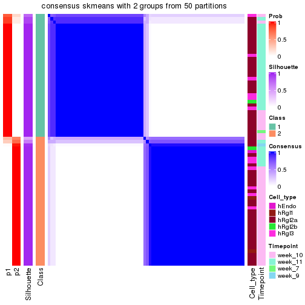</p>

</div>
<div id='tab-node-0242-consensus-heatmap-2'>
<pre><code class="r">consensus_heatmap(res, k = 3)
</code></pre>

<p></p>

</div>
<div id='tab-node-0242-consensus-heatmap-3'>
<pre><code class="r">consensus_heatmap(res, k = 4)
</code></pre>

<p></p>

</div>
</div>

Heatmaps for the membership of samples in all partitions to see how consistent they are:


<script>
$( function() {
	$( '#tabs-node-0242-membership-heatmap' ).tabs();
} );
</script>
<div id='tabs-node-0242-membership-heatmap'>
<ul>
<li><a href='#tab-node-0242-membership-heatmap-1'>k = 2</a></li>
<li><a href='#tab-node-0242-membership-heatmap-2'>k = 3</a></li>
<li><a href='#tab-node-0242-membership-heatmap-3'>k = 4</a></li>
</ul>
<div id='tab-node-0242-membership-heatmap-1'>
<pre><code class="r">membership_heatmap(res, k = 2)
</code></pre>

<p></p>

</div>
<div id='tab-node-0242-membership-heatmap-2'>
<pre><code class="r">membership_heatmap(res, k = 3)
</code></pre>

<p></p>

</div>
<div id='tab-node-0242-membership-heatmap-3'>
<pre><code class="r">membership_heatmap(res, k = 4)
</code></pre>

<p></p>

</div>
</div>

As soon as the classes for columns are determined, the signatures
that are significantly different between subgroups can be looked for. 
Following are the heatmaps for signatures.


Signature heatmaps where rows are scaled:


<script>
$( function() {
	$( '#tabs-node-0242-get-signatures' ).tabs();
} );
</script>
<div id='tabs-node-0242-get-signatures'>
<ul>
<li><a href='#tab-node-0242-get-signatures-1'>k = 2</a></li>
<li><a href='#tab-node-0242-get-signatures-2'>k = 3</a></li>
<li><a href='#tab-node-0242-get-signatures-3'>k = 4</a></li>
</ul>
<div id='tab-node-0242-get-signatures-1'>
<pre><code class="r">get_signatures(res, k = 2)
</code></pre>

<p></p>

</div>
<div id='tab-node-0242-get-signatures-2'>
<pre><code class="r">get_signatures(res, k = 3)
</code></pre>

<p></p>

</div>
<div id='tab-node-0242-get-signatures-3'>
<pre><code class="r">get_signatures(res, k = 4)
</code></pre>

<p></p>

</div>
</div>


Signature heatmaps where rows are not scaled:


<script>
$( function() {
	$( '#tabs-node-0242-get-signatures-no-scale' ).tabs();
} );
</script>
<div id='tabs-node-0242-get-signatures-no-scale'>
<ul>
<li><a href='#tab-node-0242-get-signatures-no-scale-1'>k = 2</a></li>
<li><a href='#tab-node-0242-get-signatures-no-scale-2'>k = 3</a></li>
<li><a href='#tab-node-0242-get-signatures-no-scale-3'>k = 4</a></li>
</ul>
<div id='tab-node-0242-get-signatures-no-scale-1'>
<pre><code class="r">get_signatures(res, k = 2, scale_rows = FALSE)
</code></pre>

<p></p>

</div>
<div id='tab-node-0242-get-signatures-no-scale-2'>
<pre><code class="r">get_signatures(res, k = 3, scale_rows = FALSE)
</code></pre>

<p></p>

</div>
<div id='tab-node-0242-get-signatures-no-scale-3'>
<pre><code class="r">get_signatures(res, k = 4, scale_rows = FALSE)
</code></pre>

<p></p>

</div>
</div>


Compare the overlap of signatures from different k:

```r
compare_signatures(res)
```


`get_signature()` returns a data frame invisibly. To get the list of signatures, the function
call should be assigned to a variable explicitly. In following code, if `plot` argument is set
to `FALSE`, no heatmap is plotted while only the differential analysis is performed.

```r
# code only for demonstration
tb = get_signature(res, k = ..., plot = FALSE)
```

An example of the output of `tb` is:

```
#>   which_row         fdr    mean_1    mean_2 scaled_mean_1 scaled_mean_2 km
#> 1        38 0.042760348  8.373488  9.131774    -0.5533452     0.5164555  1
#> 2        40 0.018707592  7.106213  8.469186    -0.6173731     0.5762149  1
#> 3        55 0.019134737 10.221463 11.207825    -0.6159697     0.5749050  1
#> 4        59 0.006059896  5.921854  7.869574    -0.6899429     0.6439467  1
#> 5        60 0.018055526  8.928898 10.211722    -0.6204761     0.5791110  1
#> 6        98 0.009384629 15.714769 14.887706     0.6635654    -0.6193277  2
...
```

The columns in `tb` are:

1. `which_row`: row indices corresponding to the input matrix.
2. `fdr`: FDR for the differential test. 
3. `mean_x`: The mean value in group x.
4. `scaled_mean_x`: The mean value in group x after rows are scaled.
5. `km`: Row groups if k-means clustering is applied to rows (which is done by automatically selecting number of clusters).

If there are too many signatures, `top_signatures = ...` can be set to only show the 
signatures with the highest FDRs:

```r
# code only for demonstration
# e.g. to show the top 500 most significant rows
tb = get_signature(res, k = ..., top_signatures = 500)
```

If the signatures are defined as these which are uniquely high in current group, `diff_method` argument
can be set to `"uniquely_high_in_one_group"`:

```r
# code only for demonstration
tb = get_signature(res, k = ..., diff_method = "uniquely_high_in_one_group")
```


UMAP plot which shows how samples are separated.


<script>
$( function() {
	$( '#tabs-node-0242-dimension-reduction' ).tabs();
} );
</script>
<div id='tabs-node-0242-dimension-reduction'>
<ul>
<li><a href='#tab-node-0242-dimension-reduction-1'>k = 2</a></li>
<li><a href='#tab-node-0242-dimension-reduction-2'>k = 3</a></li>
<li><a href='#tab-node-0242-dimension-reduction-3'>k = 4</a></li>
</ul>
<div id='tab-node-0242-dimension-reduction-1'>
<pre><code class="r">dimension_reduction(res, k = 2, method = &quot;UMAP&quot;)
</code></pre>

<p></p>

</div>
<div id='tab-node-0242-dimension-reduction-2'>
<pre><code class="r">dimension_reduction(res, k = 3, method = &quot;UMAP&quot;)
</code></pre>

<p></p>

</div>
<div id='tab-node-0242-dimension-reduction-3'>
<pre><code class="r">dimension_reduction(res, k = 4, method = &quot;UMAP&quot;)
</code></pre>

<p></p>

</div>
</div>


Following heatmap shows how subgroups are split when increasing `k`:

```r
collect_classes(res)
```


Test correlation between subgroups and known annotations. If the known
annotation is numeric, one-way ANOVA test is applied, and if the known
annotation is discrete, chi-squared contingency table test is applied.

```r
test_to_known_factors(res)
```

```
#>             n_sample Cell_type(p-value) Timepoint(p-value) k
#> ATC:skmeans       75             0.5485           1.50e-05 2
#> ATC:skmeans       71             0.0451           7.49e-05 3
#> ATC:skmeans       70             0.0159           4.61e-05 4
```


If matrix rows can be associated to genes, consider to use `functional_enrichment(res,
...)` to perform function enrichment for the signature genes. See [this vignette](https://jokergoo.github.io/cola_vignettes/functional_enrichment.html) for more detailed explanations.


 

## Session info


```r
sessionInfo()
```

```
#> R version 4.1.0 (2021-05-18)
#> Platform: x86_64-pc-linux-gnu (64-bit)
#> Running under: CentOS Linux 7 (Core)
#> 
#> Matrix products: default
#> BLAS/LAPACK: /usr/lib64/libopenblas-r0.3.3.so
#> 
#> locale:
#>  [1] LC_CTYPE=en_US.UTF-8       LC_NUMERIC=C               LC_TIME=en_US.UTF-8       
#>  [4] LC_COLLATE=en_US.UTF-8     LC_MONETARY=en_US.UTF-8    LC_MESSAGES=en_US.UTF-8   
#>  [7] LC_PAPER=en_US.UTF-8       LC_NAME=C                  LC_ADDRESS=C              
#> [10] LC_TELEPHONE=C             LC_MEASUREMENT=en_US.UTF-8 LC_IDENTIFICATION=C       
#> 
#> attached base packages:
#>  [1] grid      parallel  stats4    stats     graphics  grDevices utils     datasets  methods  
#> [10] base     
#> 
#> other attached packages:
#>  [1] genefilter_1.74.0           ComplexHeatmap_2.8.0        markdown_1.1               
#>  [4] knitr_1.33                  scRNAseq_2.6.1              SingleCellExperiment_1.14.1
#>  [7] SummarizedExperiment_1.22.0 Biobase_2.52.0              GenomicRanges_1.44.0       
#> [10] GenomeInfoDb_1.28.1         IRanges_2.26.0              S4Vectors_0.30.0           
#> [13] BiocGenerics_0.38.0         MatrixGenerics_1.4.0        matrixStats_0.59.0         
#> [16] cola_1.9.4                 
#> 
#> loaded via a namespace (and not attached):
#>   [1] circlize_0.4.13               AnnotationHub_3.0.1           BiocFileCache_2.0.0          
#>   [4] lazyeval_0.2.2                polylabelr_0.2.0              splines_4.1.0                
#>   [7] Polychrome_1.3.1              BiocParallel_1.26.1           ggplot2_3.3.5                
#>  [10] digest_0.6.27                 foreach_1.5.1                 ensembldb_2.16.3             
#>  [13] htmltools_0.5.1.1             viridis_0.6.1                 fansi_0.5.0                  
#>  [16] magrittr_2.0.1                memoise_2.0.0                 cluster_2.1.2                
#>  [19] doParallel_1.0.16             Biostrings_2.60.1             annotate_1.70.0              
#>  [22] askpass_1.1                   prettyunits_1.1.1             colorspace_2.0-2             
#>  [25] blob_1.2.1                    rappdirs_0.3.3                xfun_0.24                    
#>  [28] dplyr_1.0.7                   crayon_1.4.1                  RCurl_1.98-1.3               
#>  [31] microbenchmark_1.4-7          jsonlite_1.7.2                impute_1.66.0                
#>  [34] brew_1.0-6                    survival_3.2-11               iterators_1.0.13             
#>  [37] glue_1.4.2                    polyclip_1.10-0               gtable_0.3.0                 
#>  [40] zlibbioc_1.38.0               XVector_0.32.0                GetoptLong_1.0.5             
#>  [43] DelayedArray_0.18.0           shape_1.4.6                   scales_1.1.1                 
#>  [46] data.tree_1.0.0               DBI_1.1.1                     Rcpp_1.0.7                   
#>  [49] viridisLite_0.4.0             xtable_1.8-4                  progress_1.2.2               
#>  [52] clue_0.3-59                   reticulate_1.20               bit_4.0.4                    
#>  [55] mclust_5.4.7                  umap_0.2.7.0                  httr_1.4.2                   
#>  [58] RColorBrewer_1.1-2            ellipsis_0.3.2                pkgconfig_2.0.3              
#>  [61] XML_3.99-0.6                  dbplyr_2.1.1                  utf8_1.2.1                   
#>  [64] tidyselect_1.1.1              rlang_0.4.11                  later_1.2.0                  
#>  [67] AnnotationDbi_1.54.1          munsell_0.5.0                 BiocVersion_3.13.1           
#>  [70] tools_4.1.0                   cachem_1.0.5                  generics_0.1.0               
#>  [73] RSQLite_2.2.7                 ExperimentHub_2.0.0           evaluate_0.14                
#>  [76] stringr_1.4.0                 fastmap_1.1.0                 yaml_2.2.1                   
#>  [79] bit64_4.0.5                   purrr_0.3.4                   dendextend_1.15.1            
#>  [82] KEGGREST_1.32.0               AnnotationFilter_1.16.0       mime_0.11                    
#>  [85] slam_0.1-48                   xml2_1.3.2                    biomaRt_2.48.2               
#>  [88] compiler_4.1.0                rstudioapi_0.13               filelock_1.0.2               
#>  [91] curl_4.3.2                    png_0.1-7                     interactiveDisplayBase_1.30.0
#>  [94] tibble_3.1.2                  stringi_1.7.3                 highr_0.9                    
#>  [97] GenomicFeatures_1.44.0        RSpectra_0.16-0               lattice_0.20-44              
#> [100] ProtGenerics_1.24.0           Matrix_1.3-4                  vctrs_0.3.8                  
#> [103] pillar_1.6.1                  lifecycle_1.0.0               BiocManager_1.30.16          
#> [106] eulerr_6.1.0                  GlobalOptions_0.1.2           bitops_1.0-7                 
#> [109] irlba_2.3.3                   httpuv_1.6.1                  rtracklayer_1.52.0           
#> [112] R6_2.5.0                      BiocIO_1.2.0                  promises_1.2.0.1             
#> [115] gridExtra_2.3                 codetools_0.2-18              assertthat_0.2.1             
#> [118] openssl_1.4.4                 rjson_0.2.20                  GenomicAlignments_1.28.0     
#> [121] Rsamtools_2.8.0               GenomeInfoDbData_1.2.6        hms_1.1.0                    
#> [124] skmeans_0.2-13                Cairo_1.5-12.2                scatterplot3d_0.3-41         
#> [127] shiny_1.6.0                   restfulr_0.0.13
```


